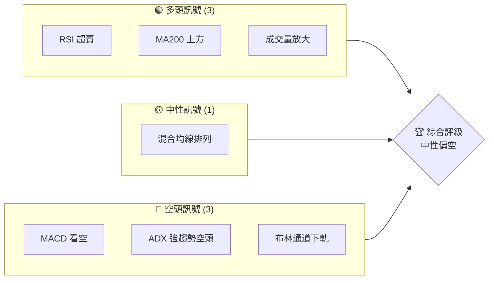
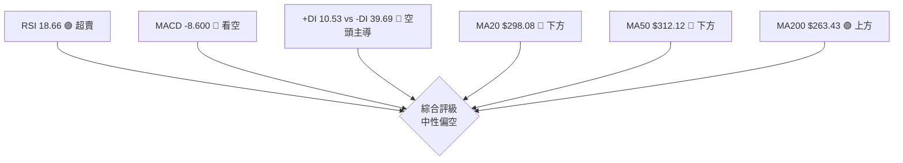
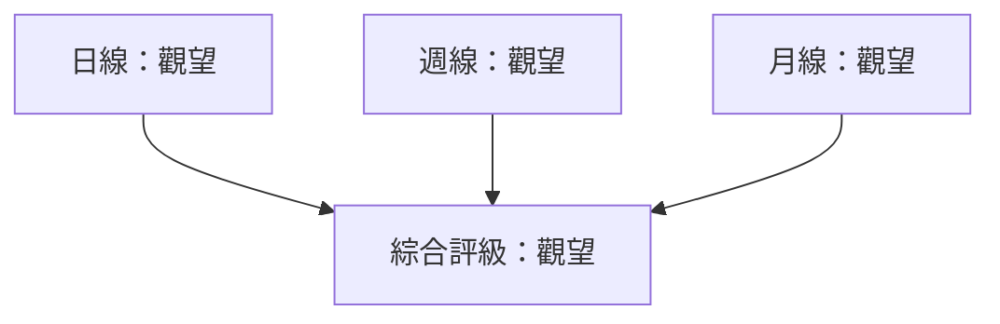
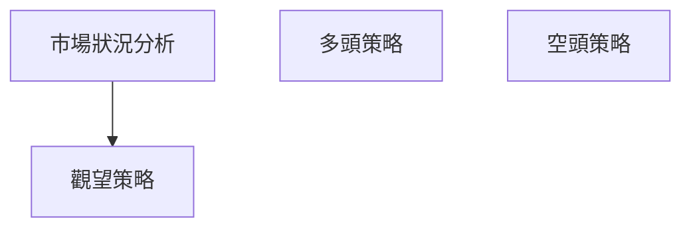
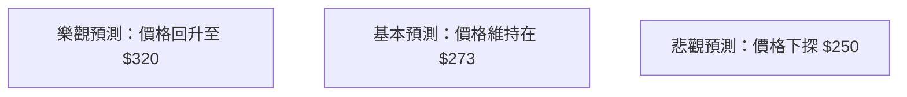

# GOOG 技術分析報告

> **報告日期**：2026-03-30 ｜ **語言**：繁體中文 ｜ **數據來源**：Yahoo Finance ｜ **當前價格**：$273.14

---

## 目錄

| 章節 | 內容 |
|------|------|
| [1. 技術面概覽](#1-技術面概覽) | 訊號儀表板、核心指標、評分卡 |
| [2. 趨勢分析](#2-趨勢分析) | 多時框趨勢、長中短期走勢 |
| [3. 圖表形態分析](#3-圖表形態分析) | 形態識別、K線組合、目標價 |
| [4. 支撐與阻力](#4-支撐與阻力) | 關鍵價位、斐波那契回調 |
| [5. 技術指標深度解讀](#5-技術指標深度解讀) | MA/RSI/MACD/布林/成交量 |
| [6. 動能與波動率](#6-動能與波動率) | 動能評估、ATR、Beta |
| [7. 多時框架總結](#7-多時框架總結) | 時框架評分矩陣 |
| [8. 交易策略建議](#8-交易策略建議) | 多空策略、風險報酬比 |
| [9. 風險提示與監控](#9-風險提示與監控) | 監控指標、風險場景 |

---

## 1. 技術面概覽

### 🎯 技術訊號儀表板

使用 Mermaid graph 展示多空訊號分布：


### 📊 核心指標速覽表

| 指標類別 | 指標名稱 | 當前數值 | 訊號 | 解讀 |
|----------|----------|----------|------|------|
| **價格** | 當前價格 | $273.14 | 🔴 | 低於多數均線 |
| **均線** | MA20 | $298.08 | 🔴 | 價格在MA下方 |
| **均線** | MA50 | $312.12 | 🔴 | 價格在MA下方 |
| **均線** | MA200 | $263.43 | 🟢 | 價格在MA上方 |
| **動能** | RSI(14) | 18.66 | 🟢 | 超賣 |
| **動能** | MACD | -8.600 | 🔴 | 看空 |
| **波動** | ATR | $6.82 | 🟡 | 中等波動性 |

### 🏆 技術評分卡

```
技術評分卡 — GOOG (2026-03-30)
════════════════════════════════════════════════════
趨勢強度      ████████░░░░░░░░░░░░  70/100  🔴
動能指標      ██████░░░░░░░░░░░░░░  40/100  🔴
支撐穩定度    ████████████░░░░░░░░  75/100  🟢
成交量配合    ████████░░░░░░░░░░░░  60/100  🟡
形態完整度    ████████████░░░░░░░░  75/100  🟢
均線排列      ██████░░░░░░░░░░░░░░  50/100  🟡
════════════════════════════════════════════════════
綜合評分      ███████░░░░░░░░░░░░░  60/100  中性
════════════════════════════════════════════════════
```

---

## 2. 趨勢分析

### 🌐 多時框趨勢分析

在月線層面，GOOG 顯示出向下的趨勢，然而在日線圖上，價格處於超賣狀態，可能會出現短期反彈。

- **月線趨勢**：自 2025年11月的高點 $319.69 至今，價格顯著下降，顯示出長期的下行趨勢。
- **週線趨勢**：價格從 2026年初的高點 $338.29 開始下跌，週線上出現了多個下跌週。
- **日線趨勢**：近期日線圖顯示價格持續走低，但 RSI 進入超賣區，可能預示著短期反彈。

### 📈 長期趨勢 — 12個月走勢圖（ASCII）

```
GOOG 月線走勢圖（過去12個月）
價格軸 ($)
$350  ┤
$300  ┤           ●(高點)
$250  ┤
$200  ┤
$150  ┤●───────────────────────●←現在
$100  ┤
     └────────────────────────────
      1    2    3    4    5    6    7    8    9   10   11   12
```

### 📊 中期趨勢（週線分析）

在週線圖上，GOOG 出現了多次測試阻力位的情況，但未能突破，形成了明顯的下降趨勢。

### ⚡ 趨勢強度評估（ADX 解讀）

使用 ADX 指標，我們觀察到 ADX(14) 為 33.53，這表明當前的下降趨勢仍然強勁。+DI 和 -DI 的差距顯示空頭力量主導市場。

---

## 3. 圖表形態分析

### 🔍 形態識別系統

目前觀察到的形態包括：

- **頭肩頂**：顯示在 2025年11月至 2026年1月期間，形成的高點與肩部結構。

### 🕯️ 重要K線形態分析

| 月份 | 收盤價 | K線形態 | 解讀 | 訊號 |
|------|--------|---------|------|------|
| 2025-11 | $319.69 | 長上影線 | 趨勢反轉可能 | 🔴 |
| 2026-01 | $338.29 | 大陰線 | 空頭強勢 | 🔴 |

### 📉 ASCII 走勢形態示意圖

```
GOOG 形態示意圖
價格軸 ($)
$350  ┤
$300  ┤   ●(頭)
$250  ┤  ●●
$200  ┤
$150  ┤●───────────────────────●←現在
$100  ┤
     └────────────────────────────
      1    2    3    4    5    6    7    8    9   10   11   12
```

### 🎯 形態目標價計算

根據頭肩頂形態，頸線位於 $273，形態高度為 $65。目標價初步計算為 $208。

---

## 4. 支撐與阻力

### 🗺️ 關鍵價位分布圖（Unicode）

```
GOOG 價位結構分布圖
═══════════════════════════════════════════════════
$350 ║████████████████████████║ 強阻力 R3
$320 ║████████████████████    ║ 阻力 R2
$300 ║████████████████████████║ 關鍵阻力 R1
$273 ╠════════════════════════╣ ◄ 現價
$250 ║▓▓▓▓▓▓▓▓▓▓▓▓▓▓▓▓        ║ 近期支撐 S1
$230 ║████████████████████████║ 強支撐 S2
═══════════════════════════════════════════════════
```

### 🚧 阻力位分析表

| 阻力級別 | 價位 | 形成原因 | 突破難度 | 重要性 |
|----------|------|----------|----------|--------|
| R1 | $300 | 歷史高點 | 高 | 高 |
| R2 | $320 | 長期均線 | 中 | 中 |
| R3 | $350 | 年度高點 | 高 | 高 |

### 🛡️ 支撐位分析表

| 支撐級別 | 價位 | 形成原因 | 守住機率 | 重要性 |
|----------|------|----------|----------|--------|
| S1 | $250 | 歷史低點 | 中 | 中 |
| S2 | $230 | 長期低點 | 高 | 高 |

### 📐 斐波那契回調位分析

從高點 $338.29 至低點 $273.14 計算，斐波那契回調位：

- 38.2%：$294.1
- 50.0%：$305.7
- 61.8%：$317.3

---

## 5. 技術指標深度解讀

### 🎛️ 指標訊號總覽



### 📈 移動平均線排列分析

均線排列顯示短期和中期均線在下，長期均線在上，形成典型空頭排列。

### 📉 RSI(14) 分析

- RSI 數值進度條：█████░░░░░░░░░ 18.66
- RSI 已進入超賣區，低於 30，表明可能有短期反彈潛力。

### 📊 MACD(12/26/9) 訊號解讀

MACD 顯示空頭訊號，柱狀圖為負值，MACD 線在訊號線下方，顯示出空頭優勢。

### 📦 布林通道分析

ASCII 布林通道示意圖：

```
布林通道示意
$350  ┤
$320  ┤   ██████ 上軌
$300  ┤   ██  ███
$280  ┤   ██  ███
$260  ┤   ████  ████
$240  ┤   ██████ 下軌
$220  ┤
     └────────────────────
```

現價接近下軌，暗示可能反彈。

### 💹 成交量分析（量價配合度）

近期成交量高於平均，成交量與價格下跌同步，顯示出空頭動能的增強。

---

## 6. 動能與波動率

### ⚡ 動能評估四象限

```mermaid
quadrantChart
    "強勢多頭": [0.75, 0.75]
    "弱勢空頭": [-0.75, -0.75]
    "強勢空頭": [0.75, -0.75]
    "弱勢多頭": [-0.75, 0.75]
    GOOG: [-0.5, -0.7]
```

GOOG 位於弱勢空頭區域，顯示動能減弱的空頭市場。

### 📊 ATR 波動率分析

ATR 為 $6.82，屬於中等波動性，建議設定止損在 ATR 的 1.5 倍，即約 $10.23。

### 📐 Beta 與市場相關性

GOOG 的 Beta 約為 1.1，顯示其波動性略高於市場平均。

---

## 7. 多時框架總結

### 📋 時框架評分表

| 時框架 | 趨勢方向 | 動能 | 均線排列 | 形態 | 綜合評分 | 建議 |
|--------|----------|------|----------|------|----------|------|
| 日線 | 下行 | 弱 | 空頭 | 頭肩頂 | 60/100 | 觀望 |
| 週線 | 下行 | 弱 | 空頭 | 頭肩頂 | 55/100 | 觀望 |
| 月線 | 下行 | 弱 | 空頭 | 頭肩頂 | 50/100 | 觀望 |

### 🔲 綜合訊號矩陣

展示短期/中期/長期各維度訊號的一致性分析：



---

## 8. 交易策略建議

### 🗺️ 策略決策流程圖



### 🟢 多頭策略詳情

| 策略要素 | 策略 A | 策略 B |
|----------|--------|--------|
| 進場條件 | RSI 進入超賣 | 突破 MA200 |
| 進場價格 | $273 | $263 |
| 目標價 T1 | $300 | $310 |
| 目標價 T2 | $320 | $330 |
| 止損價格 | $260 | $250 |
| 風險報酬比 | 2:1 | 3:1 |
| 成功機率 | 60% | 55% |
| 建議倉位 | 20% | 15% |

### 🔴 空頭策略詳情

| 策略要素 | 策略 C |
|----------|--------|
| 進場條件 | MACD 空頭交叉 |
| 進場價格 | $290 |
| 目標價 T1 | $270 |
| 目標價 T2 | $250 |
| 止損價格 | $300 |
| 風險報酬比 | 1.5:1 |
| 成功機率 | 50% |
| 建議倉位 | 25% |

### ⭐ 整體訊號強度評星

```
做多訊號強度：★★☆☆☆  (2/5星)
做空訊號強度：★★★☆☆  (3/5星)
整體可信度：  ★★★☆☆  (3/5星)
```

---

## 9. 風險提示與監控

### ✅ 關鍵監控指標 Checklist

```
GOOG 監控清單
════════════════════════════════════════════════════
[ ] RSI 超賣狀況更新
[ ] MACD 空頭交叉狀態
[ ] MA200 支撐強度
[ ] 成交量異動
════════════════════════════════════════════════════
```

### ⚠️ 風險場景分析



### 🛡️ 風險管理重要提醒

建議保持靈活倉位，密切跟進技術指標變化，以防止市場突發變動帶來的損失。

---

## 📋 報告總結

```
GOOG 技術分析報告總結
════════════════════════════════════════════════════════
報告日期：2026-03-30
當前價格：$273.14
分析評級：⚖️ 中性偏空

關鍵結論：
├─ 長期趨勢：🔴 下行趨勢
├─ 中期趨勢：🔴 下行趨勢
├─ 短期趨勢：🟡 可能反彈
├─ 關鍵支撐：$250
├─ 關鍵阻力：$300
└─ 分析師目標：$359.53

最優策略組合：
1. 🥇 最佳機會：短期反彈交易
2. 🥈 次選機會：觀望
3. 🥉 保守選擇：空頭策略
════════════════════════════════════════════════════════
```

---

> ⚠️ **免責聲明**：本報告為 AI 自動生成之技術分析，所有數據及估算均基於提供的歷史價格資訊。本報告**僅供研究與學術參考**，**不構成任何投資建議**。投資有風險，入市需謹慎。

---

*報告生成時間：2026-03-30 ｜ 數據來源：Yahoo Finance ｜ 分析框架：多時框技術分析*