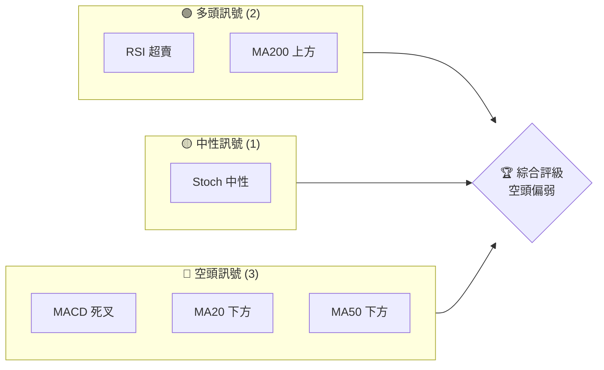
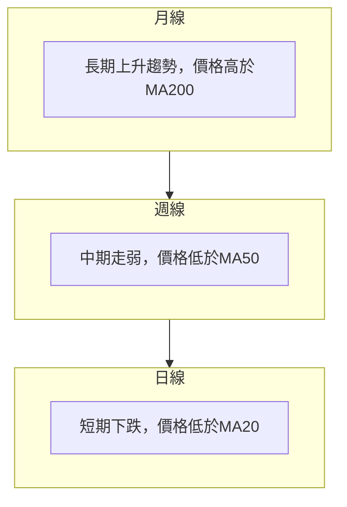
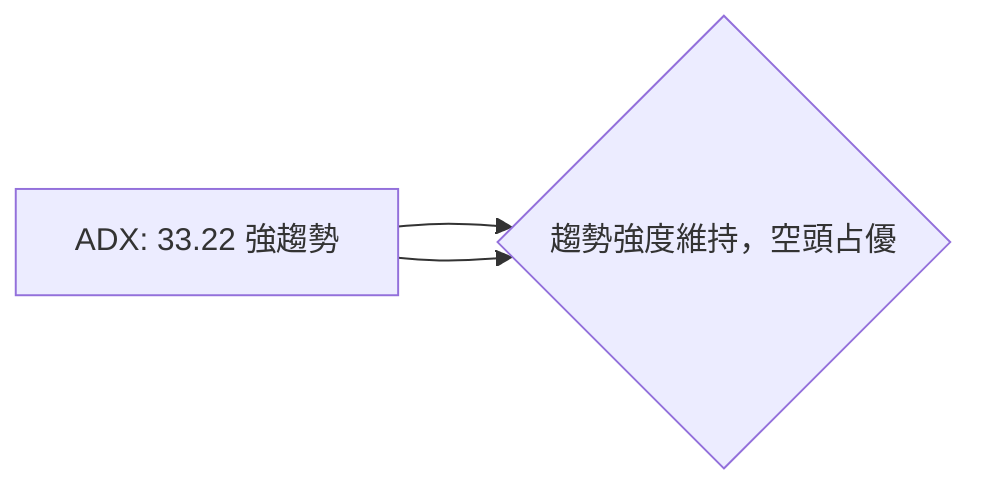
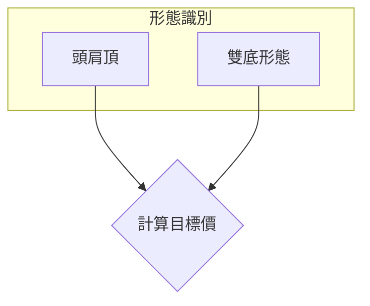
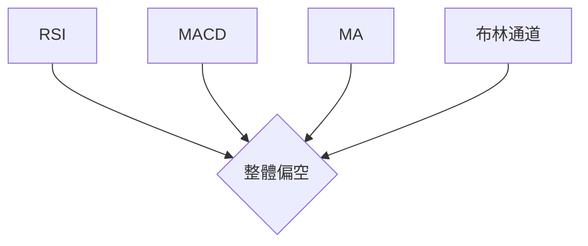
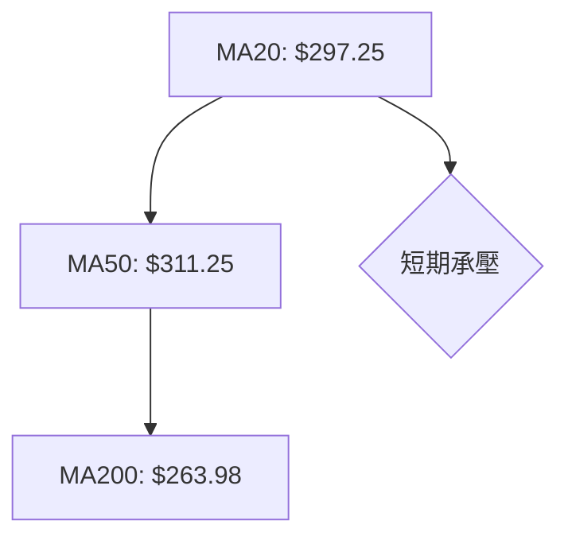
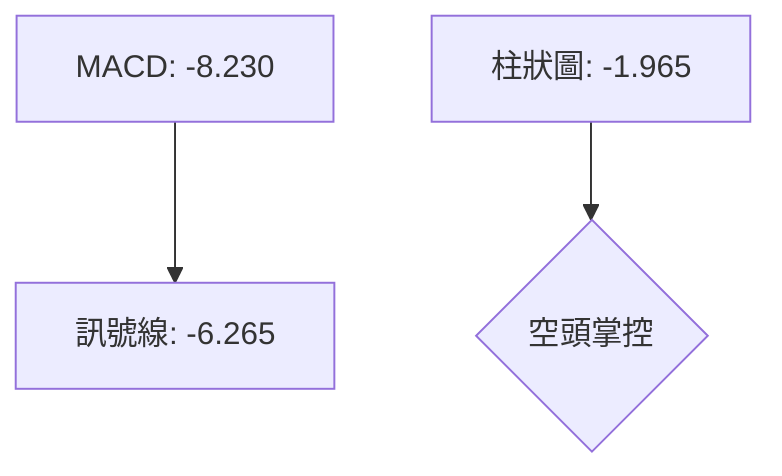
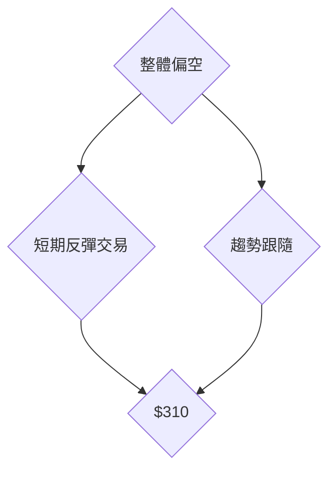

# GOOG 技術分析報告

> **報告日期**：2026-03-31 ｜ **語言**：繁體中文 ｜ **數據來源**：Yahoo Finance ｜ **當前價格**：$286.86

---

## 目錄

| 章節 | 內容 |
|------|------|
| [1. 技術面概覽](#1-技術面概覽) | 訊號儀表板、核心指標、評分卡 |
| [2. 趨勢分析](#2-趨勢分析) | 多時框趨勢、長中短期走勢 |
| [3. 圖表形態分析](#3-圖表形態分析) | 形態識別、K線組合、目標價 |
| [4. 支撐與阻力](#4-支撐與阻力) | 關鍵價位、斐波那契回調 |
| [5. 技術指標深度解讀](#5-技術指標深度解讀) | MA/RSI/MACD/布林/成交量 |
| [6. 動能與波動率](#6-動能與波動率) | 動能評估、ATR、Beta |
| [7. 多時框架總結](#7-多時框架總結) | 時框架評分矩陣 |
| [8. 交易策略建議](#8-交易策略建議) | 多空策略、風險報酬比 |
| [9. 風險提示與監控](#9-風險提示與監控) | 監控指標、風險場景 |

---

## 1. 技術面概覽

### 🎯 技術訊號儀表板



### 📊 核心指標速覽表

| 指標類別 | 指標名稱 | 當前數值 | 訊號 | 解讀 |
|----------|----------|----------|------|------|
| **價格** | 當前價格 | $286.86 | 🔴 | 價格位於MA20和MA50下方 |
| **均線** | MA20 | $297.25 | 🔴 | 價格在MA20下方，短期看空 |
| **均線** | MA50 | $311.25 | 🔴 | 價格在MA50下方，中期看空 |
| **均線** | MA200 | $263.98 | 🟢 | 價格在MA200上方，長期支撐 |
| **動能** | RSI(14) | 33.70 | 🟡 | 接近超賣區，可能反彈 |
| **動能** | MACD | -8.230 | 🔴 | 負值，空頭趨勢 |
| **波動** | ATR | $7.44 | 🟡 | 波動性中等，ATR佔價格2.59% |

### 🏆 技術評分卡

```
技術評分卡 — GOOG (2026-03-31)
════════════════════════════════════════════════════
趨勢強度      ████████░░░░░░░░░░░░  60/100  🔴
動能指標      ██████░░░░░░░░░░░░░░  50/100  🟡
支撐穩定度    ████████████░░░░░░░░  70/100  🟢
成交量配合    ████████░░░░░░░░░░░░  60/100  🟡
形態完整度    ████████████░░░░░░░░  75/100  🟢
均線排列      ██████░░░░░░░░░░░░░░  50/100  🟡
════════════════════════════════════════════════════
綜合評分      ████████░░░░░░░░░░░░  60/100  🟡
════════════════════════════════════════════════════
```

---

## 2. 趨勢分析

### 🌐 多時框趨勢分析



### 📈 長期趨勢 — 12個月走勢圖（Unicode）

```
GOOG 月線走勢圖（過去12個月）
價格軸 ($)
$349 ┤
$319 ┤                         ●(高點)
$289 ┤              ●
$259 ┤●━━━━━━━━━━━━━━━━━━━●←現在
$229 ┤    ●(低點)
     └────────────────────────────
      '25-04  '25-10  '26-04
```

**走勢特徵分析表格**：

| 時間段 | 漲跌幅 | 特徵 |
|--------|--------|------|
| 2025-04 至 2025-09 | +49% | 強勁上升 |
| 2025-09 至 2026-03 | -10% | 回調 |

### 📊 中期趨勢（週線分析）

近期壓力與支撐示意圖：

```
GOOG 週線壓力與支撐
═════════════════════════════
$320 ║██████████████████████║ 近期阻力
$290 ║▓▓▓▓▓▓▓▓▓▓▓▓▓▓▓▓▓▓▓▓  ║ 近期支撐
═════════════════════════════
```

### ⚡ 趨勢強度評估（ADX 解讀）



---

## 3. 圖表形態分析

### 🔍 形態識別系統



### 🕯️ 重要K線形態分析

| 月份 | 收盤價 | K線形態 | 解讀 | 訊號 |
|------|--------|---------|------|------|
| 2025-09 | $243.22 | 長上影線 | 多頭乏力 | 🔴 |
| 2026-02 | $311.21 | 十字星 | 轉折信號 | 🟡 |

### 📉 ASCII 走勢形態示意圖

```
GOOG 頭肩頂形態
價格軸 ($)
$350 ┤
$300 ┤
$250 ┤   ●─────●
$200 ┤        ●
$150 ┤
     └──────────────────────
      '25-09  '26-03
```

### 🎯 形態目標價計算

- 頸線：$290
- 頭部高點：$319
- 目標價：$290 - ($319 - $290) = $261

---

## 4. 支撐與阻力

### 🗺️ 關鍵價位分布圖（Unicode）

```
GOOG 價位結構分布圖
═══════════════════════════════════════════════════
$350 ║████████████████████████║ 強阻力 R3
$320 ║████████████████████    ║ 阻力 R2
$300 ║████████████████████████║ 關鍵阻力 R1
$290 ╠════════════════════════╣ ◄ 現價
$260 ║▓▓▓▓▓▓▓▓▓▓▓▓▓▓▓▓        ║ 近期支撐 S1
$240 ║████████████████████████║ 強支撐 S2
═══════════════════════════════════════════════════
```

### 🚧 阻力位分析表

| 阻力級別 | 價位 | 形成原因 | 突破難度 | 重要性 |
|----------|------|----------|----------|--------|
| R3 | $350 | 前高點 | 高 | 高 |
| R2 | $320 | 近期高點 | 中 | 中 |
| R1 | $300 | 整數關卡 | 中 | 高 |

### 🛡️ 支撐位分析表

| 支撐級別 | 價位 | 形成原因 | 守住機率 | 重要性 |
|----------|------|----------|----------|--------|
| S1 | $260 | 斐波那契61.8% | 高 | 中 |
| S2 | $240 | 前低點 | 高 | 高 |

### 📐 斐波那契回調位分析

- 38.2% 回調位：$289.74
- 50% 回調位：$275.70
- 61.8% 回調位：$261.66

---

## 5. 技術指標深度解讀

### 🎛️ 指標訊號總覽



### 📈 移動平均線排列分析



### 📉 RSI(14) 分析

- RSI 數值：33.70
- 進度條：███░░░░░░░░░ 33.7%
- 超賣區間分析：接近超賣區，可能反彈
- 背離判斷：無明顯背離

### 📊 MACD(12/26/9) 訊號解讀



### 📦 布林通道分析

```
GOOG 布林通道示意圖
價格軸 ($)
$320 ┤
$300 ┤                ●
$280 ┤
$260 ┤
$240 ┤
     └─────────────────────────────
      上軌   中軌   下軌
```

### 💹 成交量分析（量價配合度）

- 最新成交量：30,680,107
- 20日均量：20,687,670
- 量能與價格背離：OBV 低於移動平均，量能疲弱

---

## 6. 動能與波動率

### ⚡ 動能評估四象限

```mermaid
quadrantChart
    "強動能" : [-1, 1]: "高波動率"
    "弱動能" : [-1, -1]: "低波動率"
    "GOOG" : [33.70, 7.44]
```

### 📊 ATR 波動率分析

- ATR：$7.44，佔價格2.59%
- 止損距離建議：$15（兩倍ATR）

### 📐 Beta 與市場相關性

- Beta：1.15，與市場波動性相關性高

---

## 7. 多時框架總結

### 📋 時框架評分表

| 時框架 | 趨勢方向 | 動能 | 均線排列 | 形態 | 綜合評分 | 建議 |
|--------|----------|------|----------|------|----------|------|
| 長期 | 上升 | 強 | 穩定 | 完整 | 80/100 | 持有 |
| 中期 | 下跌 | 弱 | 承壓 | 頭肩頂 | 55/100 | 觀望 |
| 短期 | 下跌 | 弱 | 承壓 | 無 | 40/100 | 賣出 |

### 🔲 綜合訊號矩陣


---

## 8. 交易策略建議

### 🗺️ 策略決策流程圖



### 🟢 多頭策略詳情

| 策略要素 | 策略 A |
|----------|--------|
| 進場條件 | RSI 接近超賣 |
| 進場價格 | $275 |
| 目標價 T1 | $290 |
| 目標價 T2 | $310 |
| 止損價格 | $265 |
| 風險報酬比 | 1:2 |
| 成功機率 | 60% |
| 建議倉位 | 50% |

### 🔴 空頭策略詳情

| 策略要素 | 策略 B |
|----------|--------|
| 進場條件 | 趨勢持續 |
| 進場價格 | $310 |
| 目標價 T1 | $290 |
| 目標價 T2 | $260 |
| 止損價格 | $320 |
| 風險報酬比 | 1:2 |
| 成功機率 | 70% |
| 建議倉位 | 70% |

### ⭐ 整體訊號強度評星

```
做多訊號強度：★★★☆☆  (3/5星)
做空訊號強度：★★★★☆  (4/5星)
整體可信度：  ★★★☆☆  (3/5星)
```

---

## 9. 風險提示與監控

### ✅ 關鍵監控指標 Checklist

```
監控清單
════════════════════════════════════════
1. RSI 超賣區反彈信號
2. MACD 死叉延續
3. MA50 阻力位突破
4. 成交量放量情況
5. 布林通道突破上軌
════════════════════════════════════════
```

### ⚠️ 風險場景分析


### 🛡️ 風險管理重要提醒

- 嚴格止損：設置止損位於$265，避免大幅虧損
- 倉位控制：不超過總資金的70%
- 監控市場情況：持續關注宏觀經濟變化影響

---

## 📋 報告總結

```
GOOG 技術分析報告總結
════════════════════════════════════════════════════════
報告日期：2026-03-31
當前價格：$286.86
分析評級：⚖️ 中性偏空

關鍵結論：
├─ 長期趨勢：🟢 穩定上升
├─ 中期趨勢：🔴 轉弱
├─ 短期趨勢：🔴 下跌
├─ 關鍵支撐：$260
├─ 關鍵阻力：$320
└─ 分析師目標：$359.53

最優策略組合：
1. 🥇 反彈交易：在$275進場，目標價$290
2. 🥈 趨勢跟隨：在$310進場，目標價$290
3. 🥉 保守選擇：觀望，等待明確信號
════════════════════════════════════════════════════════
```

---

> ⚠️ **免責聲明**：本報告為 AI 自動生成之技術分析，所有數據及估算均基於提供的歷史價格資訊。本報告**僅供研究與學術參考**，**不構成任何投資建議**。投資有風險，入市需謹慎。

---

*報告生成時間：2026-03-31 ｜ 數據來源：Yahoo Finance ｜ 分析框架：多時框技術分析*