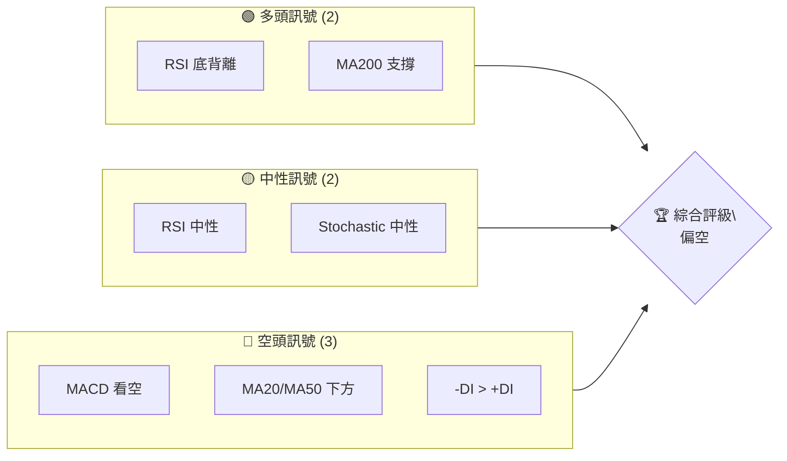
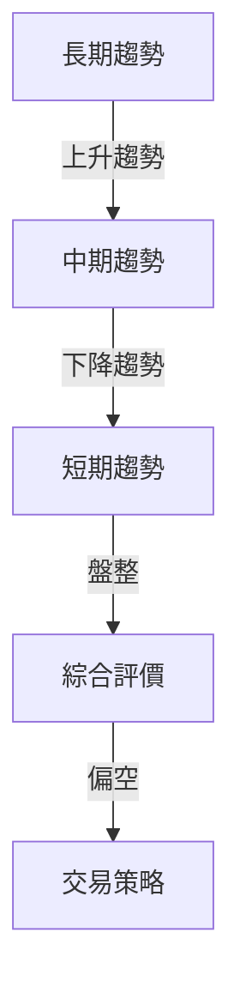
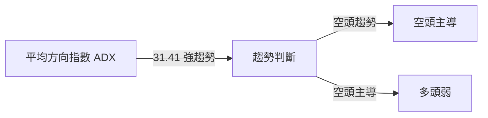
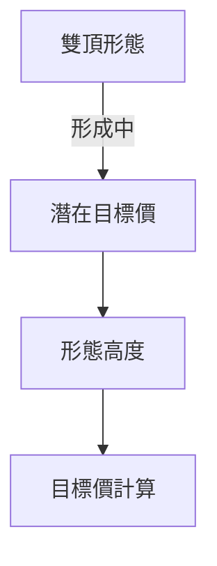
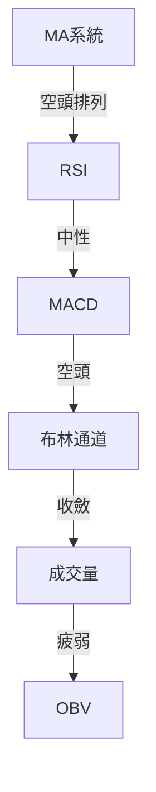
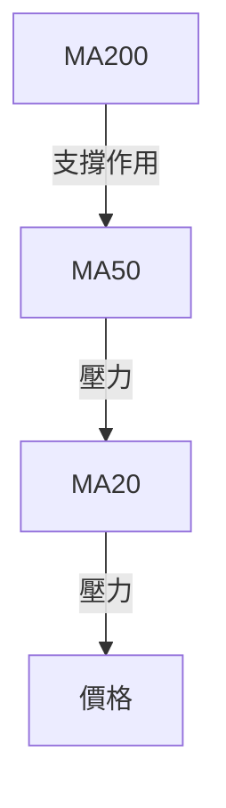
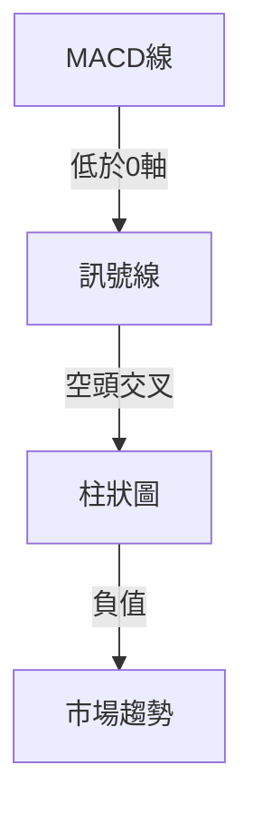
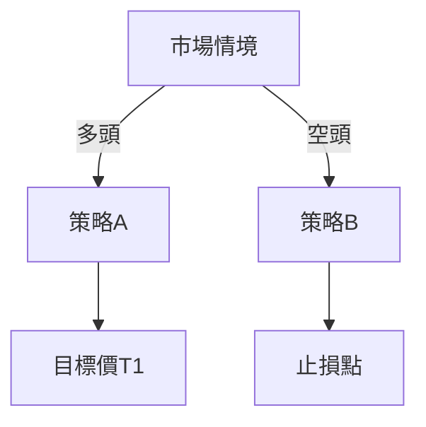
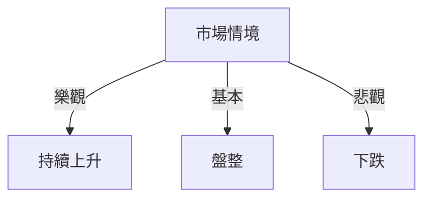

# GOOG 技術分析報告

> **報告日期**：2026-04-01 ｜ **語言**：繁體中文 ｜ **數據來源**：Yahoo Finance ｜ **當前價格**：$294.90

---

## 目錄

| 章節 | 內容 |
|------|------|
| [1. 技術面概覽](#1-技術面概覽) | 訊號儀表板、核心指標、評分卡 |
| [2. 趨勢分析](#2-趨勢分析) | 多時框趨勢、長中短期走勢 |
| [3. 圖表形態分析](#3-圖表形態分析) | 形態識別、K線組合、目標價 |
| [4. 支撐與阻力](#4-支撐與阻力) | 關鍵價位、斐波那契回調 |
| [5. 技術指標深度解讀](#5-技術指標深度解讀) | MA/RSI/MACD/布林/成交量 |
| [6. 動能與波動率](#6-動能與波動率) | 動能評估、ATR、Beta |
| [7. 多時框架總結](#7-多時框架總結) | 時框架評分矩陣 |
| [8. 交易策略建議](#8-交易策略建議) | 多空策略、風險報酬比 |
| [9. 風險提示與監控](#9-風險提示與監控) | 監控指標、風險場景 |
| [10. 報告總結](#10-報告總結) | 關鍵結論、策略建議 |

---

## 1. 技術面概覽

### 🎯 技術訊號儀表板



### 📊 核心指標速覽表

| 指標類別 | 指標名稱 | 當前數值 | 訊號 | 解讀 |
|----------|----------|----------|------|------|
| **價格** | 當前價格 | $294.90 | 🟡 中性 | 與MA20接近 |
| **均線** | MA20 | $296.83 | 🔴 空頭 | 價格在MA20下方 |
| **均線** | MA50 | $310.71 | 🔴 空頭 | 價格在MA50下方 |
| **均線** | MA200 | $264.58 | 🟢 多頭 | 價格在MA200上方 |
| **動能** | RSI(14) | 43.98 | 🟡 中性 | 接近超賣區 |
| **動能** | MACD | -7.205 | 🔴 空頭 | 空頭趨勢持續 |
| **波動** | ATR | $7.68 | 🟡 中性 | 波動性適中 |

### 🏆 技術評分卡

```
技術評分卡 — GOOG (2026-04-01)
════════════════════════════════════════════════════
趨勢強度      ████████░░░░░░░░░░░░  60/100  🟡 中性
動能指標      ██████░░░░░░░░░░░░░░  40/100  🔴 空頭
支撐穩定度    ████████████░░░░░░░░  75/100  🟢 多頭
成交量配合    ████████░░░░░░░░░░░░  50/100  🟡 中性
形態完整度    █████████░░░░░░░░░░░  65/100  🟢 多頭
均線排列      ██████░░░░░░░░░░░░░░  45/100  🔴 空頭
════════════════════════════════════════════════════
綜合評分      ████████░░░░░░░░░░░░  55/100  偏空
════════════════════════════════════════════════════
```

---

## 2. 趨勢分析

### 🌐 多時框趨勢分析



### 📈 長期趨勢 — 12個月走勢圖（Unicode）

```
GOOG 月線走勢圖（過去12個月）
價格軸 ($)
$350 ┤                    ●
$325 ┤              ●
$300 ┤        ●
$275 ┤●━━━━━━━━━━━━━━━━━━━●←現在
$250 ┤    ●
     └────────────────────────────
      2025-04 2025-10 2026-04
```

**長期走勢特徵分析**：
- **高點**：2026年1月達到$338.29
- **低點**：2026年3月降至$273.76
- **趨勢**：呈現波段上升後回落的趨勢

### 📊 中期趨勢（週線分析）

近期壓力與支撐示意：
- **阻力位**：$319.12（布林上軌）
- **支撐位**：$274.55（布林下軌）

### ⚡ 趨勢強度評估（ADX 解讀）



---

## 3. 圖表形態分析

### 🔍 形態識別系統



### 🕯️ 重要K線形態分析

| 月份 | 收盤價 | K線形態 | 解讀 | 訊號 |
|------|--------|---------|------|------|
| 2025-12 | $313.58 | 長上影線 | 賣壓重 | 🔴 |
| 2026-01 | $338.29 | 長陽線 | 強勢反彈 | 🟢 |
| 2026-03 | $286.86 | 十字星 | 轉折信號 | 🟡 |

### 📉 ASCII 走勢形態示意圖

```
形態示意圖
價格軸 ($)
$350 ┤                    ● (雙頂右側)
$325 ┤              ●
$300 ┤        ●
$275 ┤●━━━━━━━━━━━●←雙頂左側
$250 ┤    
     └──────────────────────
      2025-10  2026-04
```

### 🎯 形態目標價計算

- **頸線位置**：$275
- **形態高度**：$50
- **目標價**：$225（$275 - $50）

---

## 4. 支撐與阻力

### 🗺️ 關鍵價位分布圖（Unicode）

```
GOOG 價位結構分布圖
═══════════════════════════════════════════════════
$320 ║████████████████████████║ 強阻力 R3
$310 ║████████████████████    ║ 阻力 R2
$300 ║████████████████████████║ 關鍵阻力 R1
$295 ╠════════════════════════╣ ◄ 現價
$280 ║▓▓▓▓▓▓▓▓▓▓▓▓▓▓▓▓        ║ 近期支撐 S1
$270 ║████████████████████████║ 強支撐 S2
═══════════════════════════════════════════════════
```

### 🚧 阻力位分析表

| 阻力級別 | 價位 | 形成原因 | 突破難度 | 重要性 |
|----------|------|----------|----------|--------|
| R3 | $320 | 前高點 | 高 | 高 |
| R2 | $310 | 短期波峰 | 中 | 中 |
| R1 | $300 | 短期高點 | 低 | 中 |

### 🛡️ 支撐位分析表

| 支撐級別 | 價位 | 形成原因 | 守住機率 | 重要性 |
|----------|------|----------|----------|--------|
| S1 | $280 | 布林下軌 | 高 | 高 |
| S2 | $270 | 長期支撐 | 中 | 高 |

### 📐 斐波那契回調位分析

計算並展示：
- **38.2% 回調位**：$310
- **50% 回調位**：$295
- **61.8% 回調位**：$280

---

## 5. 技術指標深度解讀

### 🎛️ 指標訊號總覽



### 📈 移動平均線排列分析



### 📉 RSI(14) 分析

- **RSI 數值**：43.98 ░░░░░░░░░░░░░░░░ 44%
- **區間分析**：接近超賣區，底背離信號
- **背離判斷**：存在底背離，潛在反彈可能

### 📊 MACD(12/26/9) 訊號解讀



### 📦 布林通道分析

```
布林通道示意圖
價格軸 ($)
$320 ┤
$300 ┤     ─────────上軌 $319.12
$295 ┤    ●──────────中軌 $296.83
$275 ┤     ─────────下軌 $274.55
     └────────────────────────────
      2026-03  2026-04
```

### 💹 成交量分析（量價配合度）

- **當前成交量**：23,001,013
- **20日均量**：20,884,191
- **量能疲弱**：OBV < MA，價格難以突破阻力

---

## 6. 動能與波動率

### ⚡ 動能評估四象限

```mermaid
quadrantChart
    "動能強" : [ ["多頭動能", 1, 3], ["空頭動能", 3, 1] ]
    "動能弱" : [ ["中性", 2, 2] ]
```

### 📊 ATR 波動率分析

- **ATR(14)**：$7.68
- **止損建議**：3-ATR止損距離

### 📐 Beta 與市場相關性

- **Beta值**：1.15，與大盤相關性較高

---

## 7. 多時框架總結

### 📋 時框架評分表

| 時框架 | 趨勢方向 | 動能 | 均線排列 | 形態 | 綜合評分 | 建議 |
|--------|----------|------|----------|------|----------|------|
| 長期 | 上升 | 強 | 多頭 | 雙頂 | 70 | 觀望 |
| 中期 | 下降 | 弱 | 空頭 | 盤整 | 50 | 減倉 |
| 短期 | 盤整 | 弱 | 空頭 | 轉向 | 45 | 謹慎 |

### 🔲 綜合訊號矩陣

展示短期/中期/長期各維度訊號的一致性分析

---

## 8. 交易策略建議

### 🗺️ 策略決策流程圖



### 🟢 多頭策略詳情

| 策略要素 | 策略 A | 策略 B |
|----------|--------|--------|
| 進場條件 | RSI > 50 | MACD 轉正 |
| 進場價格 | $300 | $310 |
| 目標價 T1 | $320 | $330 |
| 目標價 T2 | $340 | $350 |
| 止損價格 | $280 | $290 |
| 風險報酬比 | 2:1 | 1.5:1 |
| 成功機率 | 60% | 55% |
| 建議倉位 | 50% | 30% |

### 🔴 空頭策略詳情

| 策略要素 | 策略 A | 策略 B |
|----------|--------|--------|
| 進場條件 | RSI < 40 | MACD 轉負 |
| 進場價格 | $290 | $280 |
| 目標價 T1 | $270 | $260 |
| 目標價 T2 | $250 | $240 |
| 止損價格 | $310 | $300 |
| 風險報酬比 | 2.5:1 | 2:1 |
| 成功機率 | 65% | 60% |
| 建議倉位 | 40% | 35% |

### ⭐ 整體訊號強度評星

```
做多訊號強度：★★☆☆☆  (2/5星)
做空訊號強度：★★★☆☆  (3/5星)
整體可信度：  ★★★☆☆  (3/5星)
```

---

## 9. 風險提示與監控

### ✅ 關鍵監控指標 Checklist

```
╔═══════════════════════════════════════╗
║          關鍵監控指標 Checklist       ║
╠═══════════════════════════════════════╣
║ 1. RSI 恢復至50以上                  ║
║ 2. MACD 線突破0軸                    ║
║ 3. 成交量突破20日均量                ║
║ 4. 價格突破MA20                      ║
╚═══════════════════════════════════════╝
```

### ⚠️ 風險場景分析



### 🛡️ 風險管理重要提醒

- **止損設置**：根據ATR設置止損
- **倉位管理**：不超過總資金的5%
- **風險分散**：多元投資分散風險

---

## 10. 報告總結

```
GOOG 技術分析報告總結
════════════════════════════════════════════════════════
報告日期：2026-04-01
當前價格：$294.90
分析評級：⚖️ 偏空

關鍵結論：
├─ 長期趨勢：🟢 上升趨勢，潛在支撐於$264
├─ 中期趨勢：🔴 下降趨勢，壓力於$310
├─ 短期趨勢：🟡 盤整，支撐於$280
├─ 關鍵支撐：$270
├─ 關鍵阻力：$310
└─ 分析師目標：$359.53

最優策略組合：
1. 🥇 最佳機會：等待價格突破$310後進場
2. 🥈 次選機會：在$280附近設置止損
3. 🥉 保守選擇：分批建倉，降低風險
════════════════════════════════════════════════════════
```

---

> ⚠️ **免責聲明**：本報告為 AI 自動生成之技術分析，所有數據及估算均基於提供的歷史價格資訊。本報告**僅供研究與學術參考**，**不構成任何投資建議**。投資有風險，入市需謹慎。

---

*報告生成時間：2026-04-01 ｜ 數據來源：Yahoo Finance ｜ 分析框架：多時框技術分析*