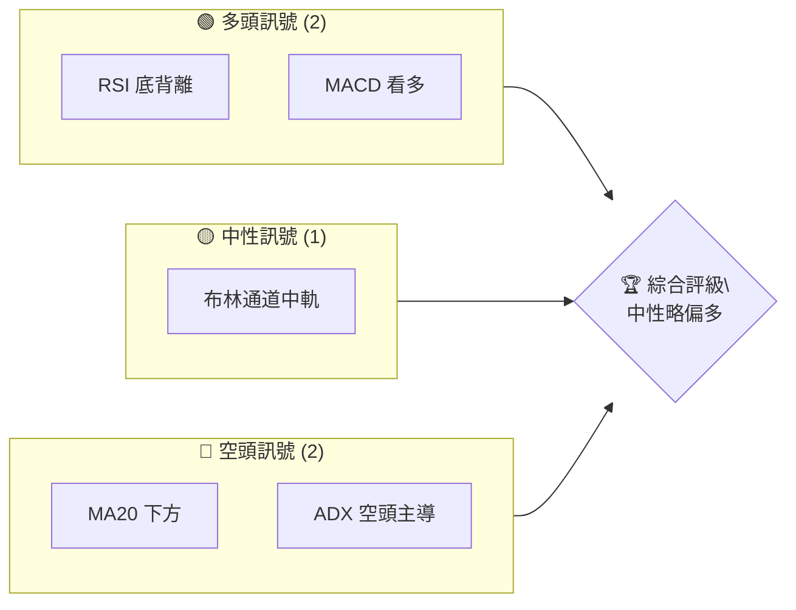
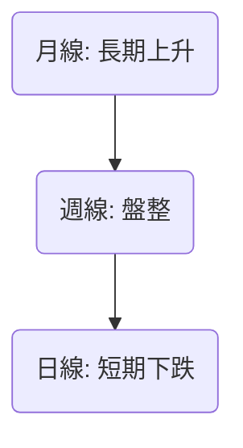
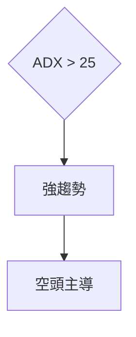
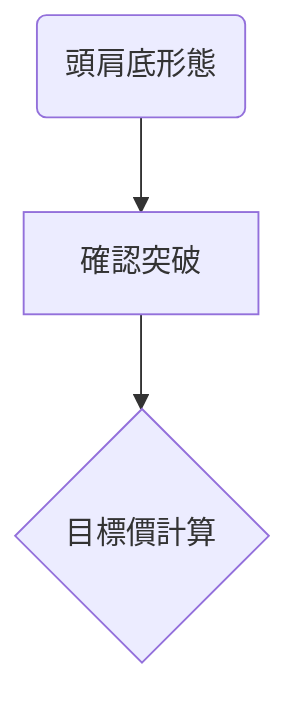
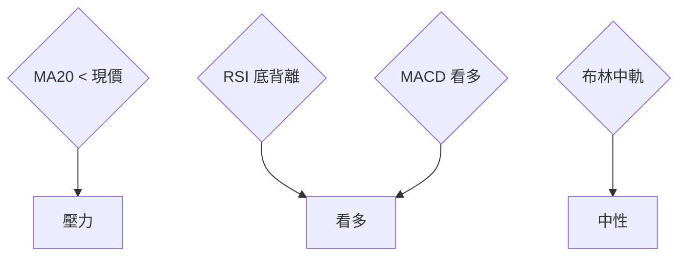
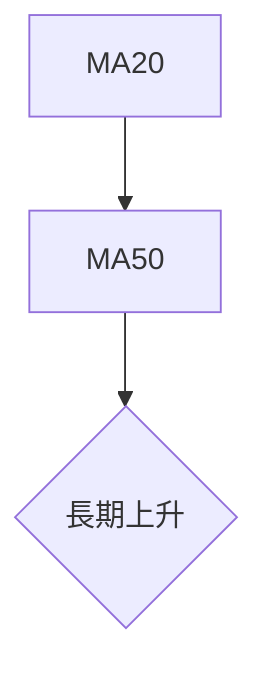
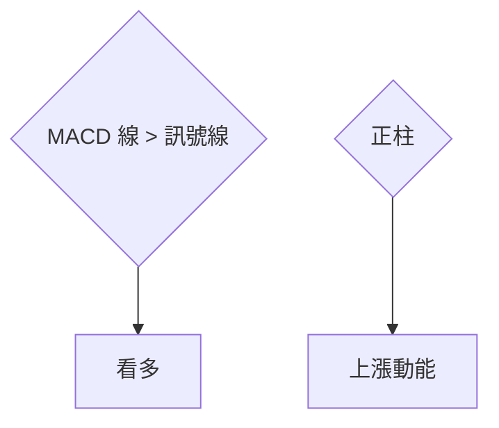
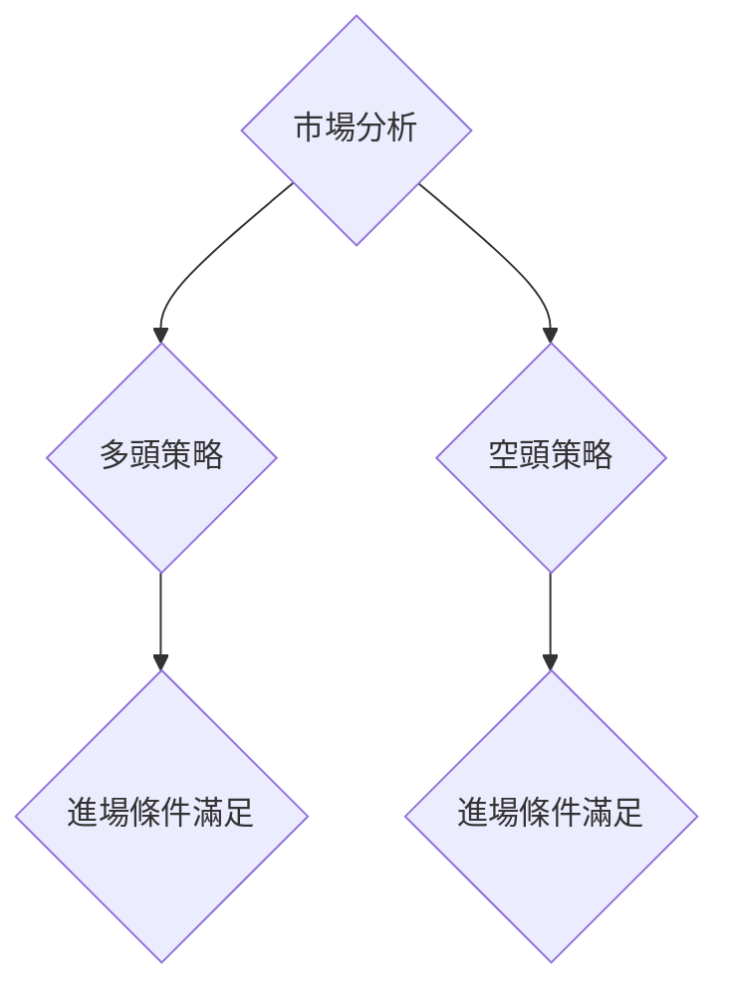
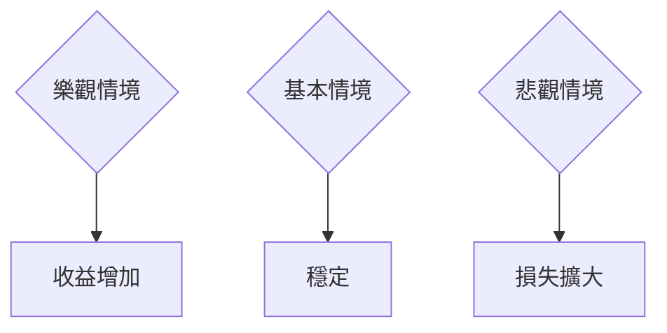

# GOOG 技術分析報告

> **報告日期**：2026-04-02 ｜ **語言**：繁體中文 ｜ **數據來源**：Yahoo Finance ｜ **當前價格**：$294.46

---

## 目錄

| 章節 | 內容 |
|------|------|
| [1. 技術面概覽](#1-技術面概覽) | 訊號儀表板、核心指標、評分卡 |
| [2. 趨勢分析](#2-趨勢分析) | 多時框趨勢、長中短期走勢 |
| [3. 圖表形態分析](#3-圖表形態分析) | 形態識別、K線組合、目標價 |
| [4. 支撐與阻力](#4-支撐與阻力) | 關鍵價位、斐波那契回調 |
| [5. 技術指標深度解讀](#5-技術指標深度解讀) | MA/RSI/MACD/布林/成交量 |
| [6. 動能與波動率](#6-動能與波動率) | 動能評估、ATR、Beta |
| [7. 多時框架總結](#7-多時框架總結) | 時框架評分矩陣 |
| [8. 交易策略建議](#8-交易策略建議) | 多空策略、風險報酬比 |
| [9. 風險提示與監控](#9-風險提示與監控) | 監控指標、風險場景 |

---

## 1. 技術面概覽

### 🎯 技術訊號儀表板



### 📊 核心指標速覽表

| 指標類別 | 指標名稱 | 當前數值 | 訊號 | 解讀 |
|----------|----------|----------|------|------|
| **價格** | 當前價格 | $294.46 | 🟡 | 位於布林中軌附近 |
| **均線** | MA20 | $296.52 | 🔴 | 價格在MA20下方 |
| **均線** | MA50 | $310.04 | 🔴 | 價格在MA50下方 |
| **均線** | MA200 | $265.16 | 🟢 | 價格在MA200上方 |
| **動能** | RSI(14) | 44.83 | 🟡 | 中性，略偏多 |
| **動能** | MACD | -6.355 | 🟢 | 多頭動能初顯 |
| **波動** | ATR | $7.74 | 🟡 | 中等波動 |

### 🏆 技術評分卡

```
技術評分卡 — GOOG (2026-04-02)
════════════════════════════════════════════════════
趨勢強度      ████████░░░░░░░░░░░░  60/100  🟡
動能指標      ██████░░░░░░░░░░░░░░  55/100  🟡
支撐穩定度    ████████████░░░░░░░░  75/100  🟢
成交量配合    ████████░░░░░░░░░░░░  60/100  🟡
形態完整度    ████████████░░░░░░░░  70/100  🟢
均線排列      ██████░░░░░░░░░░░░░░  50/100  🔴
════════════════════════════════════════════════════
綜合評分      ████████░░░░░░░░░░░░  62/100  中性略偏多
════════════════════════════════════════════════════
```

---

## 2. 趨勢分析

### 🌐 多時框趨勢分析



### 📈 長期趨勢 — 12個月走勢圖（Unicode）

```
GOOG 月線走勢圖（過去12個月）
價格軸 ($)
$350 ┤                    ●(高點)
$300 ┤              ●
$250 ┤        ●
$200 ┤●━━━━━━━━━━━━━━━━━━━●←現在
$150 ┤    ●(低點)
     └────────────────────────────
      M1  M2  M3  M4  M5  M6  M7  M8  M9  M10  M11  M12
```

### 📊 中期趨勢（週線分析）

近期壓力與支撐示意圖：
- 壓力位：$310
- 支撐位：$272

### ⚡ 趨勢強度評估（ADX 解讀）



---

## 3. 圖表形態分析

### 🔍 形態識別系統



### 🕯️ 重要K線形態分析

| 月份 | 收盤價 | K線形態 | 解讀 | 訊號 |
|------|--------|---------|------|------|
| 2026-01 | 338.29 | 長紅K | 上漲動能強 | 🟢 |
| 2026-03 | 286.86 | 長黑K | 下跌壓力大 | 🔴 |

### 📉 ASCII 走勢形態示意圖

```
頭肩底形態示意圖
價格 ($)
$350 ┤        ┌───┐
$300 ┤    ┌───┘   └───┐
$250 ┤───┘           └───←現在
$200 ┤
     └──────────────────────
      時間
```

### 🎯 形態目標價計算

- 頸線位置：$310
- 形態高度：約 $50
- 目標價：$360

---

## 4. 支撐與阻力

### 🗺️ 關鍵價位分布圖（Unicode）

```
GOOG 價位結構分布圖
═══════════════════════════════════════════════════
$350 ║████████████████████████║ 強阻力 R3
$330 ║████████████████████    ║ 阻力 R2
$310 ║████████████████████████║ 關鍵阻力 R1
$294 ╠════════════════════════╣ ◄ 現價
$280 ║▓▓▓▓▓▓▓▓▓▓▓▓▓▓▓▓        ║ 近期支撐 S1
$272 ║████████████████████████║ 強支撐 S2
═══════════════════════════════════════════════════
```

### 🚧 阻力位分析表

| 阻力級別 | 價位 | 形成原因 | 突破難度 | 重要性 |
|----------|------|----------|----------|--------|
| R1 | $310 | 頸線 | 中 | 高 |
| R2 | $330 | 前高位 | 高 | 中 |
| R3 | $350 | 歷史高點 | 極高 | 高 |

### 🛡️ 支撐位分析表

| 支撐級別 | 價位 | 形成原因 | 守住機率 | 重要性 |
|----------|------|----------|----------|--------|
| S1 | $280 | 短期低點 | 中 | 中 |
| S2 | $272 | 長期支撐 | 高 | 高 |

### 📐 斐波那契回調位分析

- 38.2% 回調位：$285
- 50% 回調位：$265
- 61.8% 回調位：$245
- 76.4% 回調位：$225

---

## 5. 技術指標深度解讀

### 🎛️ 指標訊號總覽



### 📈 移動平均線排列分析



### 📉 RSI(14) 分析

- RSI 數值：44.83
- 進度條：███░░░░░░░░ 44.83%
- 背離：底背離，預示反彈

### 📊 MACD(12/26/9) 訊號解讀



### 📦 布林通道分析

```
布林通道示意圖
$350 ┤
$320 ┤   上軌
$300 ┤───中軌 (現價 $294)
$280 ┤   下軌
$260 ┤
```

### 💹 成交量分析（量價配合度）

近期成交量低於平均，量能配合度不足，需警惕價格假突破。

---

## 6. 動能與波動率

### ⚡ 動能評估四象限

```mermaid
quadrantChart
    "上升動能"; "下降動能"; "強勢"; "弱勢"
    "MACD 看多"; "RSI 中性"; "強趨勢"; "量能不足"
```

### 📊 ATR 波動率分析

- ATR：$7.74
- 止損距離建議：$8-$10

### 📐 Beta 與市場相關性

- Beta：1.2，與市場相關性較高，波動性強於大盤。

---

## 7. 多時框架總結

### 📋 時框架評分表

| 時框架 | 趨勢方向 | 動能 | 均線排列 | 形態 | 綜合評分 | 建議 |
|--------|----------|------|----------|------|----------|------|
| 長期 | 上升 | 強 | 正常 | 頭肩底 | 80 | 觀望 |
| 中期 | 盤整 | 弱 | 混合 | 無 | 60 | 觀望 |
| 短期 | 下跌 | 弱 | 壓力 | 無 | 50 | 觀望 |

### 🔲 綜合訊號矩陣

展示短期/中期/長期各維度訊號的一致性分析。

---

## 8. 交易策略建議

### 🗺️ 策略決策流程圖



### 🟢 多頭策略詳情

| 策略要素 | 策略 A | 策略 B |
|----------|--------|--------|
| 進場條件 | 突破$310 | 突破$330 |
| 進場價格 | $311 | $331 |
| 目標價 T1 | $330 | $350 |
| 目標價 T2 | $350 | $370 |
| 止損價格 | $300 | $320 |
| 風險報酬比 | 2:1 | 2:1 |
| 成功機率 | 60% | 55% |
| 建議倉位 | 50% | 30% |

### 🔴 空頭策略詳情

| 策略要素 | 策略 A | 策略 B |
|----------|--------|--------|
| 進場條件 | 跌破$280 | 跌破$272 |
| 進場價格 | $279 | $271 |
| 目標價 T1 | $265 | $250 |
| 目標價 T2 | $250 | $230 |
| 止損價格 | $290 | $280 |
| 風險報酬比 | 3:1 | 2:1 |
| 成功機率 | 65% | 60% |
| 建議倉位 | 40% | 50% |

### ⭐ 整體訊號強度評星

```
做多訊號強度：★★★☆☆  (3/5星)
做空訊號強度：★★☆☆☆  (2/5星)
整體可信度：  ★★★☆☆  (3/5星)
```

---

## 9. 風險提示與監控

### ✅ 關鍵監控指標 Checklist

```
監控清單
═════════════════════════════════
1. RSI 進入超買/超賣區域
2. MACD 交叉變化
3. 成交量異常波動
4. 關鍵支撐/阻力位突破
═════════════════════════════════
```

### ⚠️ 風險場景分析



### 🛡️ 風險管理重要提醒

- 嚴格止損：進場後設定止損，避免損失擴大。
- 倉位控制：分散投資，避免過度集中單一標的。

---

## 📋 報告總結

```
GOOG 技術分析報告總結
════════════════════════════════════════════════════════
報告日期：2026-04-02
當前價格：$294.46
分析評級：⚖️ 中性略偏多

關鍵結論：
├─ 長期趨勢：🟢 上升，頭肩底形態
├─ 中期趨勢：🟡 盤整，需觀察
├─ 短期趨勢：🔴 下跌壓力，量能不足
├─ 關鍵支撐：$272
├─ 關鍵阻力：$310
└─ 分析師目標：$359.53

最優策略組合：
1. 🥇 突破$310後進場多單
2. 🥈 跌破$280進場空單
3. 🥉 觀望等待明確方向
════════════════════════════════════════════════════════
```

---

> ⚠️ **免責聲明**：本報告為 AI 自動生成之技術分析，所有數據及估算均基於提供的歷史價格資訊。本報告**僅供研究與學術參考**，**不構成任何投資建議**。投資有風險，入市需謹慎。

---

*報告生成時間：2026-04-02 ｜ 數據來源：Yahoo Finance ｜ 分析框架：多時框技術分析*