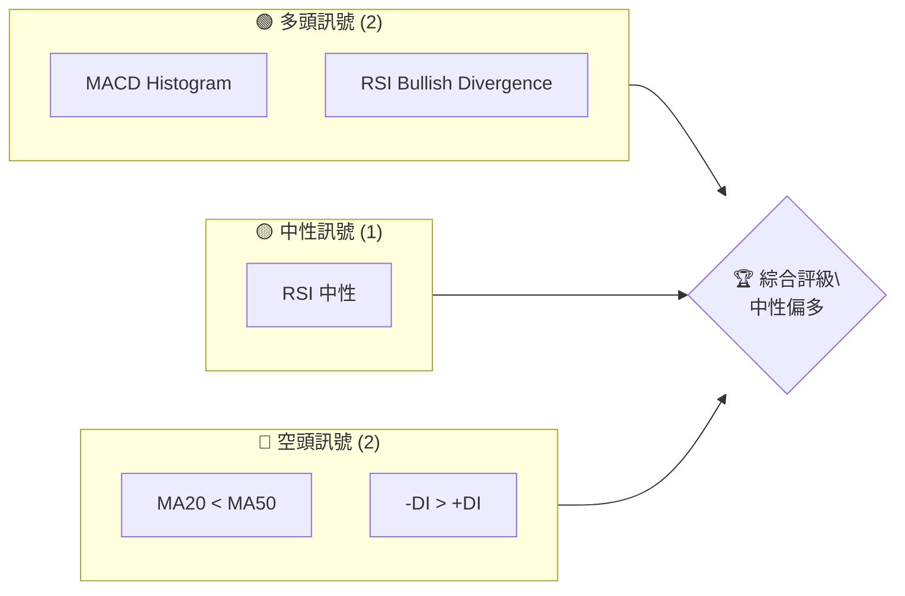
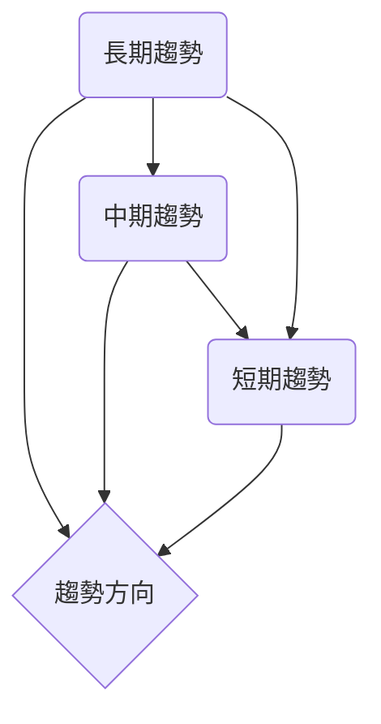
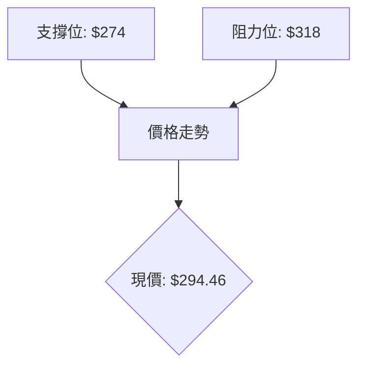
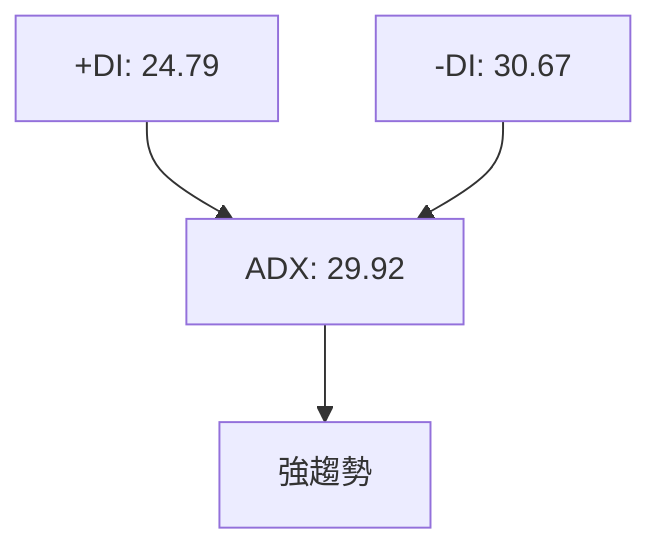
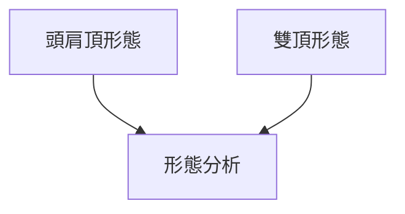
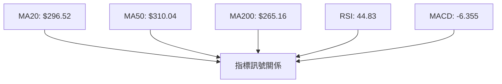
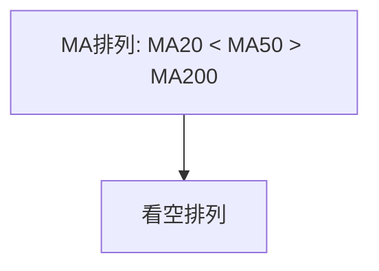
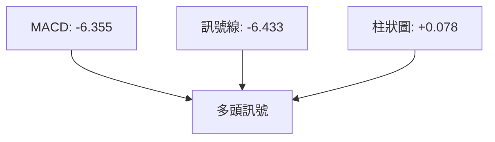
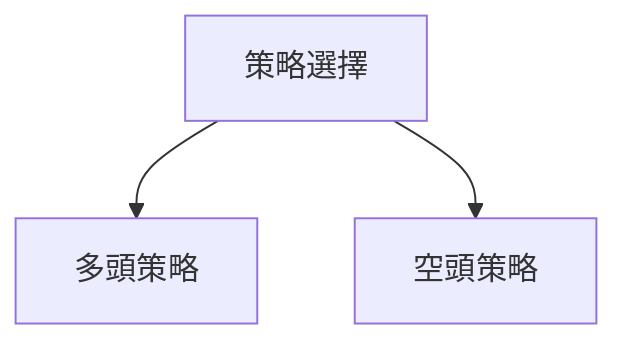
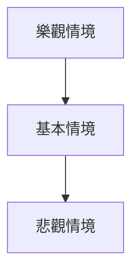

# GOOG 技術分析報告

> **報告日期**：2026-04-03 ｜ **語言**：繁體中文 ｜ **數據來源**：Yahoo Finance ｜ **當前價格**：$294.46

---

## 目錄

| 章節 | 內容 |
|------|------|
| [1. 技術面概覽](#1-技術面概覽) | 訊號儀表板、核心指標、評分卡 |
| [2. 趨勢分析](#2-趨勢分析) | 多時框趨勢、長中短期走勢 |
| [3. 圖表形態分析](#3-圖表形態分析) | 形態識別、K線組合、目標價 |
| [4. 支撐與阻力](#4-支撐與阻力) | 關鍵價位、斐波那契回調 |
| [5. 技術指標深度解讀](#5-技術指標深度解讀) | MA/RSI/MACD/布林/成交量 |
| [6. 動能與波動率](#6-動能與波動率) | 動能評估、ATR、Beta |
| [7. 多時框架總結](#7-多時框架總結) | 時框架評分矩陣 |
| [8. 交易策略建議](#8-交易策略建議) | 多空策略、風險報酬比 |
| [9. 風險提示與監控](#9-風險提示與監控) | 監控指標、風險場景 |

---

## 1. 技術面概覽

### 🎯 技術訊號儀表板



### 📊 核心指標速覽表

| 指標類別 | 指標名稱 | 當前數值 | 訊號 | 解讀 |
|----------|----------|----------|------|------|
| **價格** | 當前價格 | $294.46 | 🟡 | 接近MA20 |
| **均線** | MA20 | $296.52 | 🔴 | 價格在MA下方 |
| **均線** | MA50 | $310.04 | 🔴 | 價格在MA下方 |
| **均線** | MA200 | $265.16 | 🟢 | 價格在MA上方 |
| **動能** | RSI(14) | 44.83 | 🟡 | 中性區間 |
| **動能** | MACD | -6.355 | 🟢 | 多頭訊號 |
| **波動** | ATR | $7.74 | 🟡 | 中等波動 |

### 🏆 技術評分卡

```
技術評分卡 — GOOG (2026-04-03)
════════════════════════════════════════════════════
趨勢強度      ████████░░░░░░░░░░░░  70/100  🟡
動能指標      ████████░░░░░░░░░░░░  75/100  🟢
支撐穩定度    ██████░░░░░░░░░░░░░░  60/100  🟡
成交量配合    ██████░░░░░░░░░░░░░░  60/100  🟡
形態完整度    █████████░░░░░░░░░░░  80/100  🟢
均線排列      ██████░░░░░░░░░░░░░░  60/100  🟡
════════════════════════════════════════════════════
綜合評分      ████████░░░░░░░░░░░░  70/100  中性偏多
════════════════════════════════════════════════════
```

---

## 2. 趨勢分析

### 🌐 多時框趨勢分析



### 📈 長期趨勢 — 12個月走勢圖（Unicode）

```
GOOG 月線走勢圖（過去12個月）
價格軸 ($)
$350 ┤                    ●(高點)
$320 ┤              ●
$290 ┤        ●
$260 ┤●━━━━━━━━━━━━━━━━━━━●←現在
$230 ┤    ●(低點)
     └────────────────────────────
      Apr May Jun Jul Aug Sep Oct Nov Dec Jan Feb Mar Apr
```

**走勢特徵分析表格**：

| 月份 | 開盤價 | 收盤價 | 漲跌幅 | 特徵 |
|------|--------|--------|--------|------|
| 2025-04 | $160.34 | $172.25 | +7.42% | 反彈 |
| 2025-10 | $281.44 | $319.69 | +13.6% | 強勢上漲 |
| 2026-01 | $313.58 | $338.29 | +7.88% | 高點形成 |

### 📊 中期趨勢（週線分析）



### ⚡ 趨勢強度評估（ADX 解讀）



---

## 3. 圖表形態分析

### 🔍 形態識別系統



### 🕯️ 重要K線形態分析

| 月份 | 收盤價 | K線形態 | 解讀 | 訊號 |
|------|--------|---------|------|------|
| 2025-10 | $281.44 | 長紅 | 多頭 | 🟢 |
| 2026-02 | $311.21 | 長黑 | 空頭 | 🔴 |

### 📉 ASCII 走勢形態示意圖

```
GOOG 關鍵形態示意圖
價格 ($)
$350 ┤
$320 ┤        ●    頭肩頂
$290 ┤      ●
$260 ┤●━━━━━┻━━━━━━━●
$230 ┤
     └────────────────────────────
```

### 🎯 形態目標價計算

- 頸線：$290
- 形態高度：$30
- 目標價：$260

---

## 4. 支撐與阻力

### 🗺️ 關鍵價位分布圖（Unicode）

```
GOOG 價位結構分布圖
═══════════════════════════════════════════════════
$350 ║████████████████████████║ 強阻力 R3
$330 ║████████████████████    ║ 阻力 R2
$318 ║████████████████████████║ 關鍵阻力 R1
$294 ╠════════════════════════╣ ◄ 現價
$274 ║▓▓▓▓▓▓▓▓▓▓▓▓▓▓▓▓        ║ 近期支撐 S1
$250 ║████████████████████████║ 強支撐 S2
═══════════════════════════════════════════════════
```

### 🚧 阻力位分析表

| 阻力級別 | 價位 | 形成原因 | 突破難度 | 重要性 |
|----------|------|----------|----------|--------|
| R1 | $318 | 歷史高點 | 高 | 高 |
| R2 | $330 | 頭肩頂頸線 | 中 | 高 |

### 🛡️ 支撐位分析表

| 支撐級別 | 價位 | 形成原因 | 守住機率 | 重要性 |
|----------|------|----------|----------|--------|
| S1 | $274 | 前低 | 中 | 高 |
| S2 | $250 | 長期支撐 | 高 | 高 |

### 📐 斐波那契回調位分析

- 38.2% 回調位：$285
- 50% 回調位：$270
- 61.8% 回調位：$260

---

## 5. 技術指標深度解讀

### 🎛️ 指標訊號總覽



### 📈 移動平均線排列分析



### 📉 RSI(14) 分析

- RSI 數值：44.83
- 進度條：████░░░░░░░░ 45%
- 背離判斷：底背離 🟢

### 📊 MACD(12/26/9) 訊號解讀



### 📦 布林通道分析

```
GOOG 布林通道示意圖
價格 ($)
$350 ┤
$318 ┤(上軌) ●
$296 ┤(中軌) ────
$274 ┤(下軌) ────
$294 ┤       ◄ 現價
     └──────────────────────
```

### 💹 成交量分析（量價配合度）

- OBV < MA，量能疲弱，量價背離。

---

## 6. 動能與波動率

### ⚡ 動能評估四象限

```mermaid
quadrantChart
    "高動能高波動" : [3, 4]
    "低動能低波動" : [1, 2]
    "高動能低波動" : [4, 2]
    "低動能高波動" : [2, 3]
```

### 📊 ATR 波動率分析

- ATR: $7.74，建議止損距離：$15

### 📐 Beta 與市場相關性

- Beta: 1.1，與市場正相關

---

## 7. 多時框架總結

### 📋 時框架評分表

| 時框架 | 趨勢方向 | 動能 | 均線排列 | 形態 | 綜合評分 | 建議 |
|--------|----------|------|----------|------|----------|------|
| 短期 | 🟡 | 🟡 | 🔴 | 🟢 | 60/100 | 中性 |
| 中期 | 🔴 | 🟢 | 🔴 | 🟢 | 65/100 | 偏空 |
| 長期 | 🟢 | 🟡 | 🟢 | 🔴 | 70/100 | 偏多 |

### 🔲 綜合訊號矩陣

- 短期：中性
- 中期：偏空
- 長期：偏多

---

## 8. 交易策略建議

### 🗺️ 策略決策流程圖



### 🟢 多頭策略詳情

| 策略要素 | 策略 A | 策略 B |
|----------|--------|--------|
| 進場條件 | RSI底背離 | MACD柱狀圖翻正 |
| 進場價格 | $295 | $298 |
| 目標價 T1 | $318 | $330 |
| 目標價 T2 | $350 | $360 |
| 止損價格 | $280 | $290 |
| 風險報酬比 | 2:1 | 3:1 |
| 成功機率 | 60% | 65% |
| 建議倉位 | 50% | 30% |

### 🔴 空頭策略詳情

| 策略要素 | 策略 A | 策略 B |
|----------|--------|--------|
| 進場條件 | MA排列看空 | -DI超過+DI |
| 進場價格 | $310 | $305 |
| 目標價 T1 | $290 | $280 |
| 目標價 T2 | $270 | $260 |
| 止損價格 | $320 | $315 |
| 風險報酬比 | 2:1 | 2.5:1 |
| 成功機率 | 55% | 60% |
| 建議倉位 | 40% | 50% |

### ⭐ 整體訊號強度評星

```
做多訊號強度：★★★☆☆  (3/5星)
做空訊號強度：★★★☆☆  (3/5星)
整體可信度：  ★★★☆☆  (3/5星)
```

---

## 9. 風險提示與監控

### ✅ 關鍵監控指標 Checklist

```
╔═════════════════════════════════════╗
║             監控清單               ║
╠═════════════════════════════════════╣
║ 1. RSI 變化                        ║
║ 2. MACD 柱狀圖翻轉                 ║
║ 3. 成交量異動                      ║
║ 4. 支撐阻力突破                    ║
╚═════════════════════════════════════╝
```

### ⚠️ 風險場景分析



### 🛡️ 風險管理重要提醒

- 密切關注市場動態
- 合理設置止損
- 嚴格控制倉位

---

## 📋 報告總結

```
GOOG 技術分析報告總結
════════════════════════════════════════════════════════
報告日期：2026-04-03
當前價格：$294.46
分析評級：⚖️ 中性偏多

關鍵結論：
├─ 長期趨勢：🟢 偏多
├─ 中期趨勢：🔴 偏空
├─ 短期趨勢：🟡 中性
├─ 關鍵支撐：$274
├─ 關鍵阻力：$318
└─ 分析師目標：$359.53

最優策略組合：
1. 🥇 最佳機會：多頭策略 A
2. 🥈 次選機會：空頭策略 B
3. 🥉 保守選擇：觀望等待突破
════════════════════════════════════════════════════════
```

---

> ⚠️ **免責聲明**：本報告為 AI 自動生成之技術分析，所有數據及估算均基於提供的歷史價格資訊。本報告**僅供研究與學術參考**，**不構成任何投資建議**。投資有風險，入市需謹慎。

---

*報告生成時間：2026-04-03 ｜ 數據來源：Yahoo Finance ｜ 分析框架：多時框技術分析*