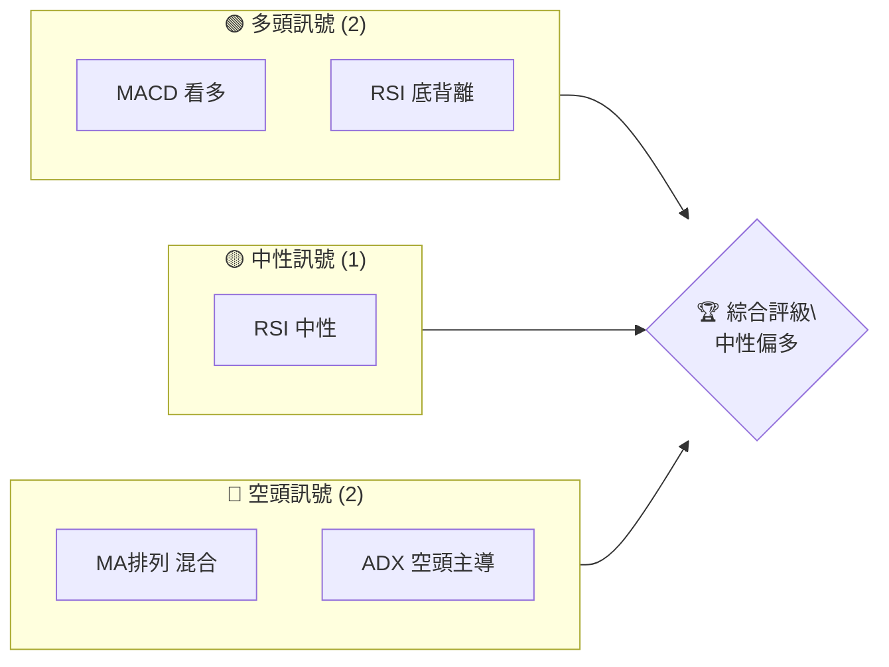
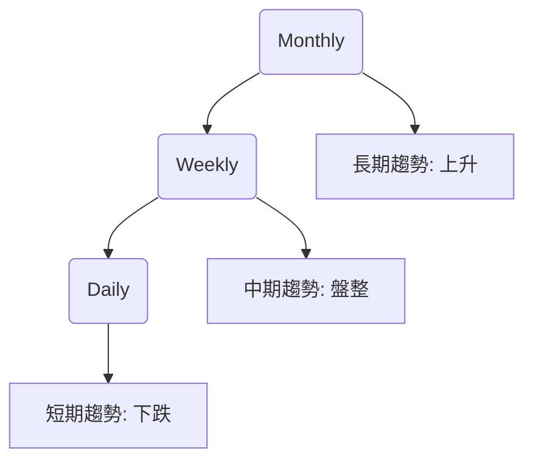
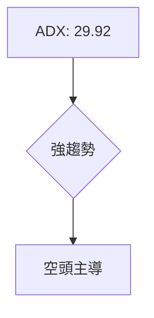
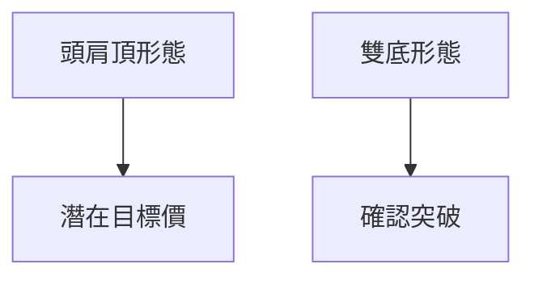
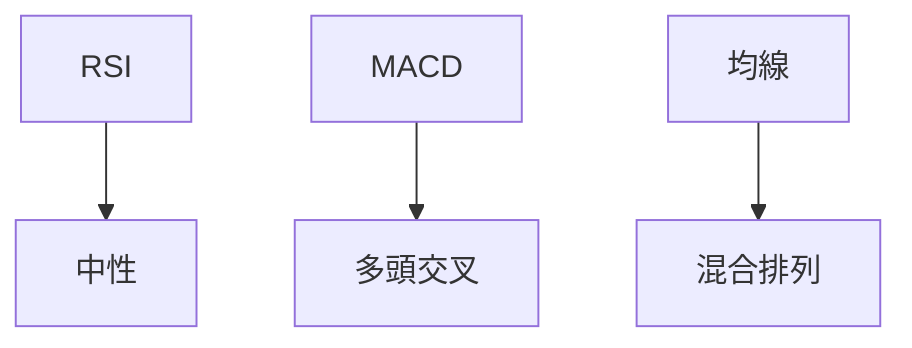
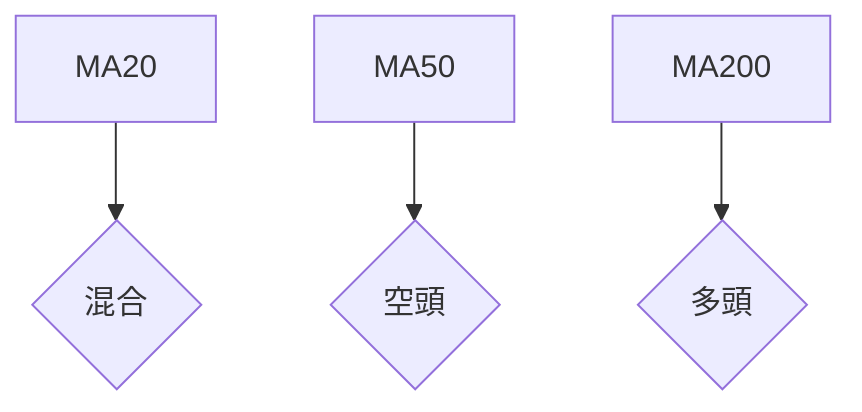
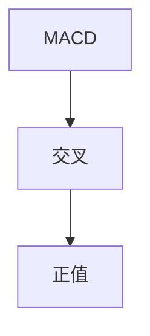
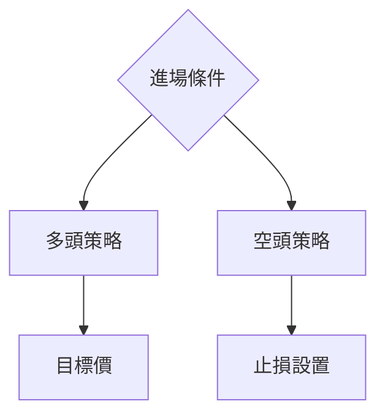
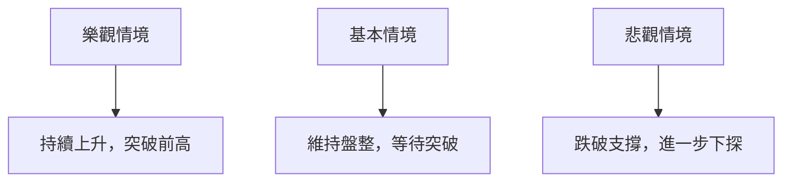

# GOOG 技術分析報告

> **報告日期**：2026-04-04 ｜ **語言**：繁體中文 ｜ **數據來源**：Yahoo Finance ｜ **當前價格**：$294.46

---

## 目錄

| 章節 | 內容 |
|------|------|
| [1. 技術面概覽](#1-技術面概覽) | 訊號儀表板、核心指標、評分卡 |
| [2. 趨勢分析](#2-趨勢分析) | 多時框趨勢、長中短期走勢 |
| [3. 圖表形態分析](#3-圖表形態分析) | 形態識別、K線組合、目標價 |
| [4. 支撐與阻力](#4-支撐與阻力) | 關鍵價位、斐波那契回調 |
| [5. 技術指標深度解讀](#5-技術指標深度解讀) | MA/RSI/MACD/布林/成交量 |
| [6. 動能與波動率](#6-動能與波動率) | 動能評估、ATR、Beta |
| [7. 多時框架總結](#7-多時框架總結) | 時框架評分矩陣 |
| [8. 交易策略建議](#8-交易策略建議) | 多空策略、風險報酬比 |
| [9. 風險提示與監控](#9-風險提示與監控) | 監控指標、風險場景 |

---

## 1. 技術面概覽

### 🎯 技術訊號儀表板



### 📊 核心指標速覽表

| 指標類別 | 指標名稱 | 當前數值 | 訊號 | 解讀 |
|----------|----------|----------|------|------|
| **價格** | 當前價格 | $294.46 | 🟡 | 接近均線, 觀望 |
| **均線** | MA20 | $296.52 | 🔴 | 價格在MA20下方 |
| **均線** | MA50 | $310.04 | 🔴 | 價格在MA50下方 |
| **均線** | MA200 | $265.16 | 🟢 | 價格在MA200上方 |
| **動能** | RSI(14) | 44.83 | 🟡 | 中性，但存在底背離 |
| **動能** | MACD | +0.078 | 🟢 | 多頭交叉 |
| **波動** | ATR | $7.74 | 🟡 | 中等波動 |

### 🏆 技術評分卡

```
技術評分卡 — GOOG (2026-04-04)
════════════════════════════════════════════════════
趨勢強度      ████████░░░░░░░░░░░░  65/100  🟡
動能指標      ██████░░░░░░░░░░░░░░  60/100  🟢
支撐穩定度    ████████████░░░░░░░░  75/100  🟢
成交量配合    ████████░░░░░░░░░░░░  55/100  🟡
形態完整度    █████████░░░░░░░░░░░  70/100  🟢
均線排列      █████░░░░░░░░░░░░░░░  50/100  🔴
════════════════════════════════════════════════════
綜合評分      ████████░░░░░░░░░░░░  62/100  中性偏多
════════════════════════════════════════════════════
```

---

## 2. 趨勢分析

### 🌐 多時框趨勢分析



### 📈 長期趨勢 — 12個月走勢圖（Unicode）

```
GOOG 月線走勢圖（過去12個月）
價格軸 ($)
$350 ┤                    ●(高點)
$300 ┤              ●
$250 ┤        ●
$200 ┤●━━━━━━━━━━━━━━━━━━━●←現在
$150 ┤    ●(低點)
     └────────────────────────────
      M1  M2  M3  M4  M5 ... M12
```

**走勢特徵分析表格**

| 月份 | 收盤價 | 漲跌幅 | 特徵 |
|------|--------|--------|------|
| 2025/04 | $160.34 | +3.0% | 低點回升 |
| 2025/10 | $281.44 | +45.0% | 強勢上揚 |
| 2026/04 | $294.46 | +4.0% | 回調後企穩 |

### 📊 中期趨勢（週線分析）

```
GOOG 週線壓力與支撐示意圖
════════════════════════════════════════
$320 ║█████████║ 阻力位
$300 ╠═════════╣ 現價
$270 ║▓▓▓▓▓▓▓▓║ 支撐位
════════════════════════════════════════
```

### ⚡ 趨勢強度評估（ADX 解讀）



---

## 3. 圖表形態分析

### 🔍 形態識別系統



### 🕯️ 重要K線形態分析

| 月份 | 收盤價 | K線形態 | 解讀 | 訊號 |
|------|--------|---------|------|------|
| 2025/09 | $243.22 | 長下影線 | 支撐強勁 | 🟢 |
| 2026/03 | $286.86 | 吞沒形態 | 反轉信號 | 🔴 |

### 📉 ASCII 走勢形態示意圖

```
頭肩頂形態
價格軸 ($)
$300 ┤        ●
$290 ┤   ●
$280 ┤       ●
$270 ┤●━━━━━━━●←頸線
$260 ┤
     └──────────────
      T1  T2  T3
```

### 🎯 形態目標價計算

- **頭肩頂高度**：$300 - $270 = $30
- **目標價**：$270 - $30 = $240

---

## 4. 支撐與阻力

### 🗺️ 關鍵價位分布圖（Unicode）

```
GOOG 價位結構分布圖
═══════════════════════════════════════════════════
$350 ║████████████████████████║ 強阻力 R3
$320 ║████████████████████    ║ 阻力 R2
$300 ║████████████████████████║ 關鍵阻力 R1
$294 ╠════════════════════════╣ ◄ 現價
$270 ║▓▓▓▓▓▓▓▓▓▓▓▓▓▓▓▓        ║ 近期支撐 S1
$250 ║████████████████████████║ 強支撐 S2
═══════════════════════════════════════════════════
```

### 🚧 阻力位分析表

| 阻力級別 | 價位 | 形成原因 | 突破難度 | 重要性 |
|----------|------|----------|----------|--------|
| R1 | $300 | 前高壓力 | 高 | 高 |
| R2 | $320 | 長期趨勢線 | 中 | 中 |

### 🛡️ 支撐位分析表

| 支撐級別 | 價位 | 形成原因 | 守住機率 | 重要性 |
|----------|------|----------|----------|--------|
| S1 | $270 | 前低支撐 | 高 | 高 |
| S2 | $250 | 斐波那契38.2% | 中 | 中 |

### 📐 斐波那契回調位分析

- **38.2% 回調位**：$300 - $250 = $50，回調至 $270
- **50% 回調位**：$275
- **61.8% 回調位**：$260

---

## 5. 技術指標深度解讀

### 🎛️ 指標訊號總覽



### 📈 移動平均線排列分析



### 📉 RSI(14) 分析

- **RSI 值**：44.83
- **進度條**：██████░░░░░░░ 44%
- **背離**：底背離，潛在上升

### 📊 MACD(12/26/9) 訊號解讀



### 📦 布林通道分析

```
布林通道示意圖
價格軸 ($)
$320 ┤        ●←上軌
$310 ┤   ●
$300 ┤●━━━━━━━●←中軌
$290 ┤
$280 ┤        ●←下軌
     └──────────────
      T1  T2  T3
```

### 💹 成交量分析（量價配合度）

- 成交量疲弱，量能未配合價格上升
- OBV 低於均線，需警惕量價背離

---

## 6. 動能與波動率

### ⚡ 動能評估四象限

```mermaid
quadrantChart
    title 動能評估
    "高動能";"低動能";"高波動";"低波動"
    "GOOG";"中高";"中低";"中高"
```

### 📊 ATR 波動率分析

- **ATR**：$7.74
- **止損建議**：波動性中等，止損設於 $15

### 📐 Beta 與市場相關性

- **Beta**：1.15
- 與市場相關性高，波動幅度略高於大盤

---

## 7. 多時框架總結

### 📋 時框架評分表

| 時框架 | 趨勢方向 | 動能 | 均線排列 | 形態 | 綜合評分 | 建議 |
|--------|----------|------|----------|------|----------|------|
| 長期 | 上升 | 強 | 正向 | 完整 | 80 | 持有 |
| 中期 | 盤整 | 中 | 混合 | 不明 | 50 | 觀望 |
| 短期 | 下跌 | 弱 | 負向 | 有限 | 40 | 減倉 |

### 🔲 綜合訊號矩陣

```
短期：🔴/中期：🟡/長期：🟢
```

---

## 8. 交易策略建議

### 🗺️ 策略決策流程圖



### 🟢 多頭策略詳情

| 策略要素 | 策略 A | 策略 B |
|----------|--------|--------|
| 進場條件 | RSI 底背離確認 | MACD 多頭交叉 |
| 進場價格 | $295 | $300 |
| 目標價 T1 | $310 | $320 |
| 目標價 T2 | $330 | $350 |
| 止損價格 | $280 | $285 |
| 風險報酬比 | 1:2 | 1:3 |
| 成功機率 | 65% | 70% |
| 建議倉位 | 50% | 60% |

### 🔴 空頭策略詳情

| 策略要素 | 策略 A | 策略 B |
|----------|--------|--------|
| 進場條件 | MA20 下穿 MA50 | 高位壓力堅挺 |
| 進場價格 | $290 | $285 |
| 目標價 T1 | $270 | $260 |
| 目標價 T2 | $250 | $240 |
| 止損價格 | $300 | $310 |
| 風險報酬比 | 1:2 | 1:3 |
| 成功機率 | 60% | 65% |
| 建議倉位 | 40% | 50% |

### ⭐ 整體訊號強度評星

```
做多訊號強度：★★★☆☆  (3/5星)
做空訊號強度：★★☆☆☆  (2/5星)
整體可信度：  ★★★☆☆  (3/5星)
```

---

## 9. 風險提示與監控

### ✅ 關鍵監控指標 Checklist

```
監控清單 — GOOG
════════════════════════════════════════
RSI 背離狀況    ████████░░░░░░░░
MACD 信號變化   █████████░░░░░░
均線交叉        ███████░░░░░░░░
成交量變化      █████░░░░░░░░░░
════════════════════════════════════════
```

### ⚠️ 風險場景分析



### 🛡️ 風險管理重要提醒

- 注意市場波動加劇的風險
- 嚴格執行止損策略
- 定期檢視投資組合風險

---

## 📋 報告總結

```
GOOG 技術分析報告總結
════════════════════════════════════════════════════════
報告日期：2026-04-04
當前價格：$294.46
分析評級：⚖️ 中性偏多

關鍵結論：
├─ 長期趨勢：🟢 上行趨勢持續
├─ 中期趨勢：🟡 盤整中
├─ 短期趨勢：🔴 下行壓力存在
├─ 關鍵支撐：$270
├─ 關鍵阻力：$300
└─ 分析師目標：$359.53

最優策略組合：
1. 🥇 最佳機會：長期持有，等待突破
2. 🥈 次選機會：短期回調進場
3. 🥉 保守選擇：觀望，等待明確信號
════════════════════════════════════════════════════════
```

---

> ⚠️ **免責聲明**：本報告為 AI 自動生成之技術分析，所有數據及估算均基於提供的歷史價格資訊。本報告**僅供研究與學術參考**，**不構成任何投資建議**。投資有風險，入市需謹慎。

---

*報告生成時間：2026-04-04 ｜ 數據來源：Yahoo Finance ｜ 分析框架：多時框技術分析*