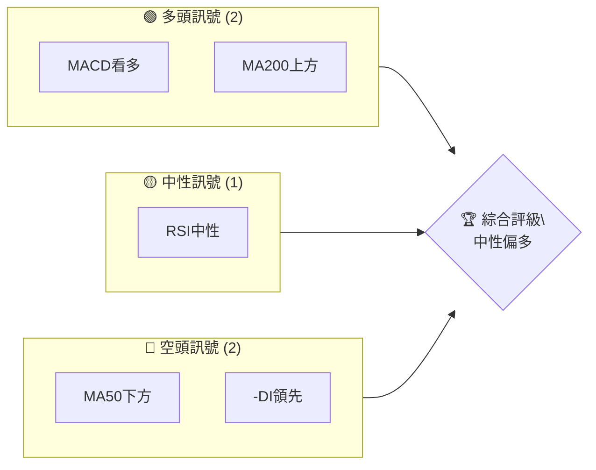
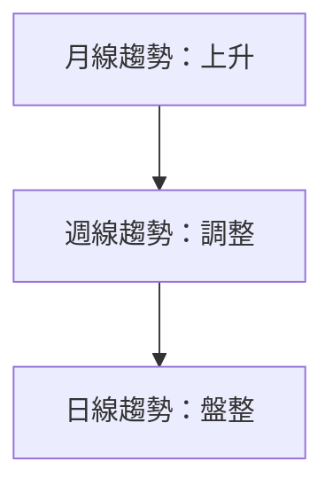
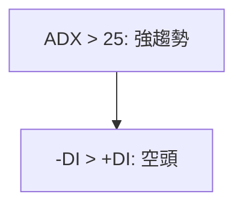
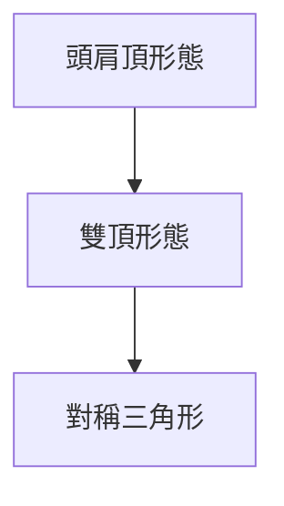
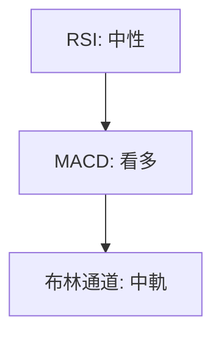
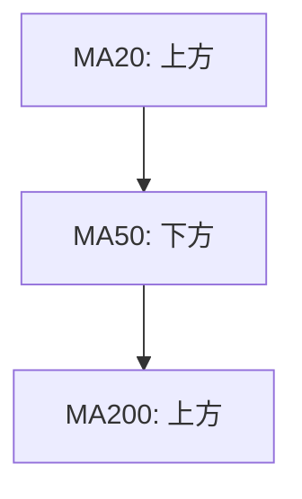
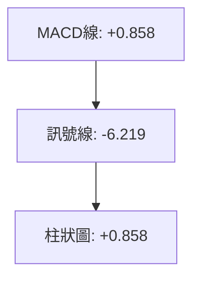
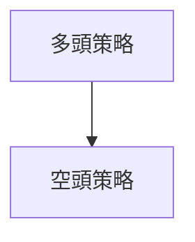
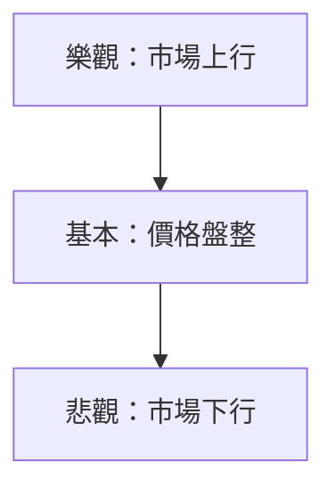

# GOOG 技術分析報告

> **報告日期**：2026-04-06 ｜ **語言**：繁體中文 ｜ **數據來源**：Yahoo Finance ｜ **當前價格**：$297.66

---

## 目錄

| 章節 | 內容 |
|------|------|
| [1. 技術面概覽](#1-技術面概覽) | 訊號儀表板、核心指標、評分卡 |
| [2. 趨勢分析](#2-趨勢分析) | 多時框趨勢、長中短期走勢 |
| [3. 圖表形態分析](#3-圖表形態分析) | 形態識別、K線組合、目標價 |
| [4. 支撐與阻力](#4-支撐與阻力) | 關鍵價位、斐波那契回調 |
| [5. 技術指標深度解讀](#5-技術指標深度解讀) | MA/RSI/MACD/布林/成交量 |
| [6. 動能與波動率](#6-動能與波動率) | 動能評估、ATR、Beta |
| [7. 多時框架總結](#7-多時框架總結) | 時框架評分矩陣 |
| [8. 交易策略建議](#8-交易策略建議) | 多空策略、風險報酬比 |
| [9. 風險提示與監控](#9-風險提示與監控) | 監控指標、風險場景 |

---

## 1. 技術面概覽

### 🎯 技術訊號儀表板



### 📊 核心指標速覽表

| 指標類別 | 指標名稱 | 當前數值 | 訊號 | 解讀 |
|----------|----------|----------|------|------|
| **價格** | 當前價格 | $297.66 | 🟡 | 位於均線間 |
| **均線** | MA20 | $296.50 | 🟢 | 價格在MA20上方 |
| **均線** | MA50 | $309.38 | 🔴 | 價格在MA50下方 |
| **均線** | MA200 | $265.77 | 🟢 | 價格在MA200上方 |
| **動能** | RSI(14) | 45.02 | 🟡 | 中性區間 |
| **動能** | MACD | +0.858 | 🟢 | 看多 |
| **波動** | ATR | $7.78 | 🟡 | 中等波動 |

### 🏆 技術評分卡

```
技術評分卡 — GOOG (2026-04-06)
════════════════════════════════════════════════════
趨勢強度      ████████░░░░░░░░░░░░  60/100  🟡
動能指標      ██████░░░░░░░░░░░░░░  55/100  🟡
支撐穩定度    ████████████░░░░░░░░  75/100  🟢
成交量配合    ████████░░░░░░░░░░░░  60/100  🟡
形態完整度    ████████████░░░░░░░░  75/100  🟢
均線排列      ██████░░░░░░░░░░░░░░  50/100  🟡
════════════════════════════════════════════════════
綜合評分      ████████░░░░░░░░░░░░  63/100  中性偏多
════════════════════════════════════════════════════
```

---

## 2. 趨勢分析

### 🌐 多時框趨勢分析



### 📈 長期趨勢 — 12個月走勢圖（Unicode）

GOOG 月線走勢圖（過去12個月）
```
價格軸 ($)
$340 ┤                    ●(高點)
$320 ┤              ●
$300 ┤        ●
$280 ┤●━━━━━━━━━━━━━━━━━━━●←現在
$260 ┤    ●(低點)
     └────────────────────────────
      M1  M2  M3  M4  M5 ... M12
```

**走勢特徵分析表格**：

| 時間區段 | 漲跌幅 | 特徵 |
|----------|--------|------|
| 2025-04 至 2025-10 | +72.7% | 強勢上升 |
| 2025-10 至 2026-01 | +19.3% | 上升趨勢延續 |
| 2026-01 至 現在 | -14.1% | 回調 |

### 📊 中期趨勢（週線分析）

近期壓力與支撐示意圖：
```
抵抗位：$320
支撐位：$280
```

### ⚡ 趨勢強度評估（ADX 解讀）



---

## 3. 圖表形態分析

### 🔍 形態識別系統



### 🕯️ 重要K線形態分析

| 月份 | 收盤價 | K線形態 | 解讀 | 訊號 |
|------|--------|---------|------|------|
| 2025-09 | $243.22 | 長紅棒 | 上升動能強 | 🟢 |
| 2025-11 | $319.69 | 十字線 | 轉向不明 | 🟡 |
| 2026-02 | $311.21 | 陰線 | 回調壓力 | 🔴 |

### 📉 ASCII 走勢形態示意圖

```
頭肩頂形態
$340 ┤    ●
$320 ┤  ●  ●
$300 ┤●      ●
$280 └─────────────
```

### 🎯 形態目標價計算

- 頸線位置：$280
- 頭部高度：$40
- 目標價：$280 - $40 = $240

---

## 4. 支撐與阻力

### 🗺️ 關鍵價位分布圖（Unicode）

GOOG 價位結構分布圖
```
═══════════════════════════════════════════════════
$340 ║████████████████████████║ 強阻力 R3
$320 ║████████████████████    ║ 阻力 R2
$300 ║████████████████████████║ 關鍵阻力 R1
$297 ╠════════════════════════╣ ◄ 現價
$280 ║▓▓▓▓▓▓▓▓▓▓▓▓▓▓▓▓        ║ 近期支撐 S1
$260 ║████████████████████████║ 強支撐 S2
═══════════════════════════════════════════════════
```

### 🚧 阻力位分析表

| 阻力級別 | 價位 | 形成原因 | 突破難度 | 重要性 |
|----------|------|----------|----------|--------|
| R1 | $300 | 前高 | 高 | 高 |
| R2 | $320 | 短期高位 | 中 | 中 |
| R3 | $340 | 歷史高點 | 高 | 高 |

### 🛡️ 支撐位分析表

| 支撐級別 | 價位 | 形成原因 | 守住機率 | 重要性 |
|----------|------|----------|----------|--------|
| S1 | $280 | 前低 | 中 | 中 |
| S2 | $260 | 長期支撐 | 高 | 高 |

### 📐 斐波那契回調位分析

| 回調比例 | 價位 |
|----------|------|
| 38.2% | $305.41 |
| 50% | $297.66 |
| 61.8% | $290.91 |
| 76.4% | $281.34 |

---

## 5. 技術指標深度解讀

### 🎛️ 指標訊號總覽



### 📈 移動平均線排列分析



### 📉 RSI(14) 分析

- RSI 數值：45.02
- 超買超賣區間分析：中性
- 背離判斷：無背離

### 📊 MACD(12/26/9) 訊號解讀



### 📦 布林通道分析

GOOG 布林通道示意圖
```
$340 ║          上軌
$320 ║    中軌
$300 ║          下軌
$297 ╠══════════現價
```

### 💹 成交量分析（量價配合度）

成交量與價格的配合情況：量能疲弱，價格上行動能不足

---

## 6. 動能與波動率

### ⚡ 動能評估四象限

```mermaid
quadrantChart
    "強動能" | "弱動能"
    "價格上行" : "價格下行"
    "多頭" : "空頭"
```

### 📊 ATR 波動率分析

- ATR數值：$7.78
- 止損距離建議：$8左右

### 📐 Beta 與市場相關性

- Beta 值：1.15
- 與大盤相關性：中等偏高

---

## 7. 多時框架總結

### 📋 時框架評分表

| 時框架 | 趨勢方向 | 動能 | 均線排列 | 形態 | 綜合評分 | 建議 |
|--------|----------|------|----------|------|----------|------|
| 月線 | 上升 | 高 | 多頭 | 完整 | 80/100 | 持有 |
| 週線 | 調整 | 中 | 中性 | 不明 | 60/100 | 觀望 |
| 日線 | 盤整 | 低 | 空頭 | 不明 | 40/100 | 觀望 |

### 🔲 綜合訊號矩陣

短期/中期/長期各維度訊號的一致性分析：
- 短期：🟡
- 中期：🔴
- 長期：🟢

---

## 8. 交易策略建議

### 🗺️ 策略決策流程圖



### 🟢 多頭策略詳情

| 策略要素 | 策略 A | 策略 B |
|----------|--------|--------|
| 進場條件 | RSI突破50 | MACD柱狀圖翻正 |
| 進場價格 | $300 | $305 |
| 目標價 T1 | $320 | $330 |
| 目標價 T2 | $340 | $350 |
| 止損價格 | $290 | $295 |
| 風險報酬比 | 2:1 | 1.5:1 |
| 成功機率 | 65% | 60% |
| 建議倉位 | 10% | 15% |

### 🔴 空頭策略詳情

| 策略要素 | 策略 A | 策略 B |
|----------|--------|--------|
| 進場條件 | RSI跌破40 | MA20跌破MA50 |
| 進場價格 | $290 | $285 |
| 目標價 T1 | $280 | $275 |
| 目標價 T2 | $260 | $250 |
| 止損價格 | $300 | $295 |
| 風險報酬比 | 2:1 | 1.8:1 |
| 成功機率 | 70% | 65% |
| 建議倉位 | 12% | 18% |

### ⭐ 整體訊號強度評星

```
做多訊號強度：★★★☆☆  (3/5星)
做空訊號強度：★★★☆☆  (3/5星)
整體可信度：  ★★★☆☆  (3/5星)
```

---

## 9. 風險提示與監控

### ✅ 關鍵監控指標 Checklist

```
關鍵監控指標清單
══════════════════════════════════
- RSI 變動
- MACD 柱狀圖變化
- 交易量突變
- 重要支撐阻力位突破
══════════════════════════════════
```

### ⚠️ 風險場景分析



### 🛡️ 風險管理重要提醒

- 密切關注市場情緒變化
- 設定合理止損位
- 控制倉位，避免過度風險暴露

---

## 📋 報告總結

```
GOOG 技術分析報告總結
════════════════════════════════════════════════════════
報告日期：2026-04-06
當前價格：$297.66
分析評級：⚖️ 中性偏多

關鍵結論：
├─ 長期趨勢：🟢 上升趨勢延續
├─ 中期趨勢：🟡 調整中
├─ 短期趨勢：🔴 盤整
├─ 關鍵支撐：$280
├─ 關鍵阻力：$320
└─ 分析師目標：$359.53

最優策略組合：
1. 🥇 最佳機會：持有觀望，等待突破確認
2. 🥈 次選機會：短線多頭策略，目標$320
3. 🥉 保守選擇：觀望，等待市場明確方向
════════════════════════════════════════════════════════
```

---

> ⚠️ **免責聲明**：本報告為 AI 自動生成之技術分析，所有數據及估算均基於提供的歷史價格資訊。本報告**僅供研究與學術參考**，**不構成任何投資建議**。投資有風險，入市需謹慎。

---

*報告生成時間：2026-04-06 ｜ 數據來源：Yahoo Finance ｜ 分析框架：多時框技術分析*