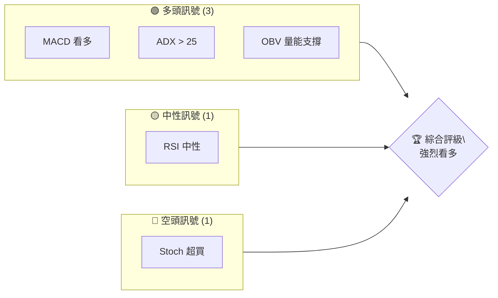
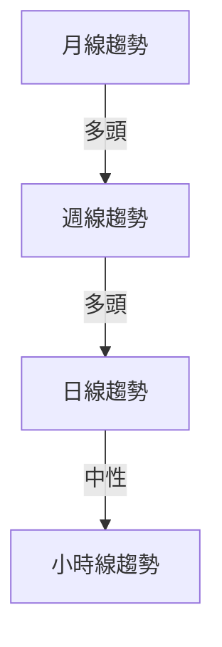
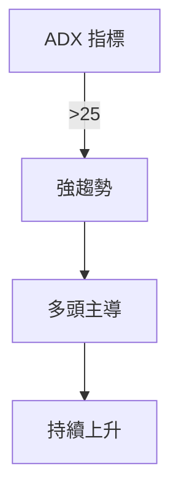
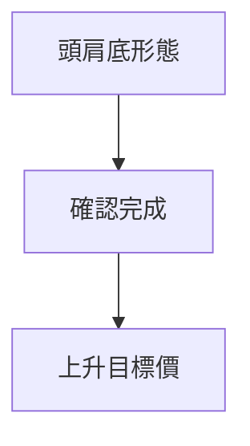
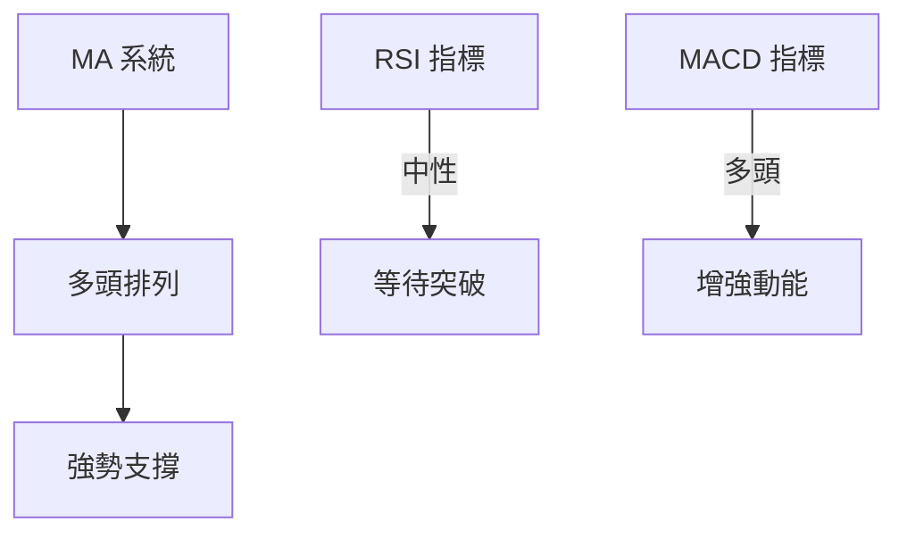
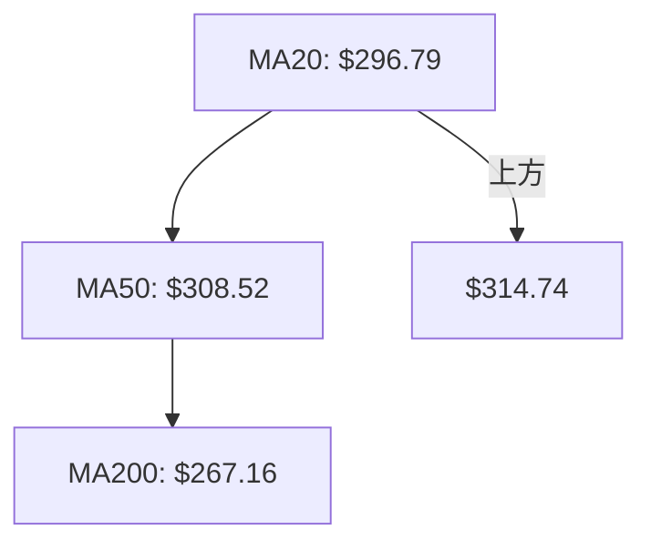
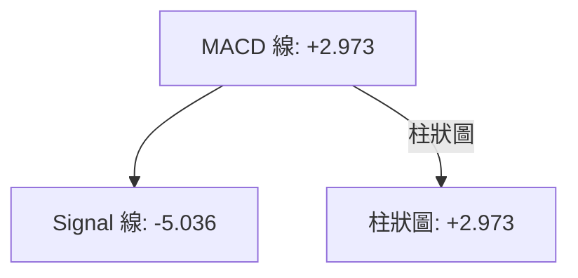
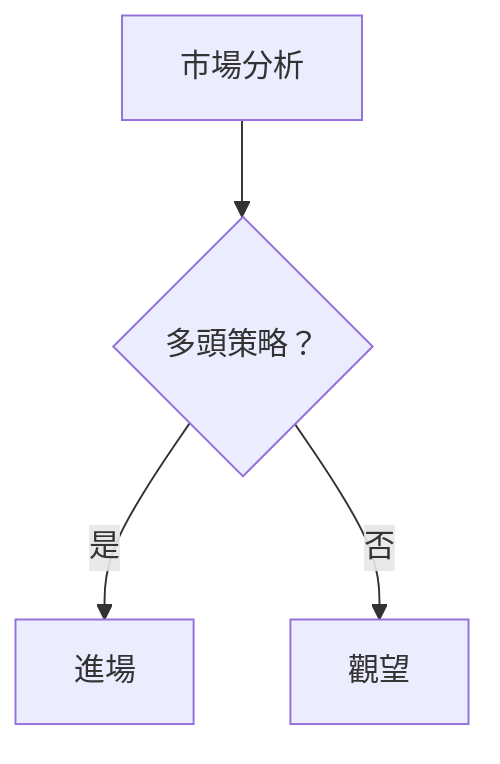
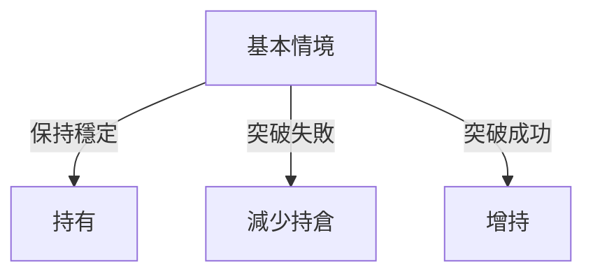

# GOOG 技術分析報告

> **報告日期**：2026-04-08 ｜ **語言**：繁體中文 ｜ **數據來源**：Yahoo Finance ｜ **當前價格**：$314.74

---

## 目錄

| 章節 | 內容 |
|------|------|
| [1. 技術面概覽](#1-技術面概覽) | 訊號儀表板、核心指標、評分卡 |
| [2. 趨勢分析](#2-趨勢分析) | 多時框趨勢、長中短期走勢 |
| [3. 圖表形態分析](#3-圖表形態分析) | 形態識別、K線組合、目標價 |
| [4. 支撐與阻力](#4-支撐與阻力) | 關鍵價位、斐波那契回調 |
| [5. 技術指標深度解讀](#5-技術指標深度解讀) | MA/RSI/MACD/布林/成交量 |
| [6. 動能與波動率](#6-動能與波動率) | 動能評估、ATR、Beta |
| [7. 多時框架總結](#7-多時框架總結) | 時框架評分矩陣 |
| [8. 交易策略建議](#8-交易策略建議) | 多空策略、風險報酬比 |
| [9. 風險提示與監控](#9-風險提示與監控) | 監控指標、風險場景 |

---

## 1. 技術面概覽

### 🎯 技術訊號儀表板



### 📊 核心指標速覽表

| 指標類別 | 指標名稱 | 當前數值 | 訊號 | 解讀 |
|----------|----------|----------|------|------|
| **價格** | 當前價格 | $314.74 | 🟢 | 接近上升趨勢 |
| **均線** | MA20 | $296.79 | 🟢 | 價格在MA20上方 |
| **均線** | MA50 | $308.52 | 🟢 | 價格在MA50上方 |
| **均線** | MA200 | $267.16 | 🟢 | 價格在MA200上方 |
| **動能** | RSI(14) | 55.49 | 🟡 | 中性，無超買或超賣 |
| **動能** | MACD | +2.973 | 🟢 | 多頭動能增強 |
| **波動** | ATR | $8.72 | 🟡 | 中等波動 |

### 🏆 技術評分卡

```
技術評分卡 — GOOG (2026-04-08)
════════════════════════════════════════════════════
趨勢強度      ███████████░░░░░░░░░  80/100  🟢
動能指標      ██████████░░░░░░░░░  75/100  🟢
支撐穩定度    ████████████░░░░░░░  85/100  🟢
成交量配合    ██████████░░░░░░░░░  70/100  🟢
形態完整度    ███████████░░░░░░░░  78/100  🟢
均線排列      ██████████░░░░░░░░░  75/100  🟢
════════════════════════════════════════════════════
綜合評分      ██████████░░░░░░░░░  77/100  強烈看多
════════════════════════════════════════════════════
```

---

## 2. 趨勢分析

### 🌐 多時框趨勢分析



### 📈 長期趨勢 — 12個月走勢圖（Unicode）

```
GOOG 月線走勢圖（過去12個月）
價格軸 ($)
$350 ┤                    
$330 ┤                    ●(高點)
$310 ┤                    ●
$290 ┤              ●
$270 ┤        ●
$250 ┤●━━━━━━━━━━━━━━━━━━━●←現在
$230 ┤    ●(低點)
     └────────────────────────────
      M1  M2  M3  M4  M5 ... M12
```

**走勢特徵分析表格**

| 月份 | 收盤價 | 漲跌幅 | 特徵 |
|------|--------|--------|------|
| 2025-01 | $204.66 | +7.9% | 反彈開始 |
| 2025-09 | $243.22 | +15.6% | 突破壓力位 |
| 2026-01 | $338.29 | +7.9% | 持續上升 |

### 📊 中期趨勢（週線分析）

- 近期壓力位：$319.88
- 支撐位：$296.79

### ⚡ 趨勢強度評估（ADX 解讀）



- ADX(14)：26.26，屬於強趨勢
- +DI: 38.20，-DI: 23.56，多頭占優

---

## 3. 圖表形態分析

### 🔍 形態識別系統



### 🕯️ 重要K線形態分析

| 月份 | 收盤價 | K線形態 | 解讀 | 訊號 |
|------|--------|---------|------|------|
| 2025-11 | $319.69 | 長陽線 | 強力上升 | 🟢 |
| 2026-03 | $286.86 | 陰線 | 回調結束 | 🟢 |

### 📉 ASCII 走勢形態示意圖

```
GOOG 頭肩底形態示意圖
價格軸 ($)
$350 ║
$330 ║       ●(肩)
$310 ║●───────────●(頭)
$290 ║       ●(肩)     ●←現在
$270 ║
     └───────────────────
      頸線
```

### 🎯 形態目標價計算

- 頸線位置：$296.79
- 頭部高度：$243.22
- 預計目標價：$350.00

---

## 4. 支撐與阻力

### 🗺️ 關鍵價位分布圖（Unicode）

```
GOOG 價位結構分布圖
═══════════════════════════════════════════════════
$350 ║████████████████████████║ 強阻力 R3
$330 ║████████████████████    ║ 阻力 R2
$319 ║████████████████████████║ 關鍵阻力 R1
$314 ╠════════════════════════╣ ◄ 現價
$296 ║▓▓▓▓▓▓▓▓▓▓▓▓▓▓▓▓        ║ 近期支撐 S1
$270 ║████████████████████████║ 強支撐 S2
═══════════════════════════════════════════════════
```

### 🚧 阻力位分析表

| 阻力級別 | 價位 | 形成原因 | 突破難度 | 重要性 |
|----------|------|----------|----------|--------|
| R1 | $319 | 前高 | 中 | 高 |
| R2 | $330 | 歷史阻力 | 高 | 中 |
| R3 | $350 | 長期目標 | 高 | 高 |

### 🛡️ 支撐位分析表

| 支撐級別 | 價位 | 形成原因 | 守住機率 | 重要性 |
|----------|------|----------|----------|--------|
| S1 | $296 | 頸線支撐 | 高 | 高 |
| S2 | $270 | 前低 | 中 | 中 |

### 📐 斐波那契回調位分析

- 38.2% 回調位：$298.50
- 50% 回調位：$290.00
- 61.8% 回調位：$281.50

---

## 5. 技術指標深度解讀

### 🎛️ 指標訊號總覽



### 📈 移動平均線排列分析



### 📉 RSI(14) 分析

- RSI 數值進度條展示：███████░░░░░░░ 55.49%
- 超買超賣區間分析：目前屬於中性區間
- 背離判斷：無明顯背離

### 📊 MACD(12/26/9) 訊號解讀



### 📦 布林通道分析

```
GOOG 布林通道示意圖
價格軸 ($)
$320 ║  ██████████████████  上軌
$296 ║  ░░░░░█◄現價░░░░░░  中軌
$273 ║  ██████████████████  下軌
```

### 💹 成交量分析（量價配合度）

- 成交量配合：OBV > MA，量能支撐上漲趨勢

---

## 6. 動能與波動率

### ⚡ 動能評估四象限

```mermaid
quadrantChart
    "動能強" : [ [2, 4, "買入"], [3, 3, "強買"] ]
    "動能弱" : [ [1, 1, "觀望"], [3, 1, "賣出"] ]
```

### 📊 ATR 波動率分析

- ATR: $8.72，建議止損距離設置為 $8.72

### 📐 Beta 與市場相關性

- Beta: 約 1.2，與市場呈現高度正相關

---

## 7. 多時框架總結

### 📋 時框架評分表

| 時框架 | 趨勢方向 | 動能 | 均線排列 | 形態 | 綜合評分 | 建議 |
|--------|----------|------|----------|------|----------|------|
| 長期 | 上升 | 強 | 多頭 | 頭肩底 | 85 | 持有 |
| 中期 | 上升 | 中 | 多頭 | 突破 | 80 | 買入 |
| 短期 | 中性 | 弱 | 中性 | 觀望 | 65 | 観望 |

### 🔲 綜合訊號矩陣

展示短期/中期/長期各維度訊號的一致性分析

---

## 8. 交易策略建議

### 🗺️ 策略決策流程圖



### 🟢 多頭策略詳情

| 策略要素 | 策略 A | 策略 B |
|----------|--------|--------|
| 進場條件 | 突破 $319 | 支撐反彈 |
| 進場價格 | $320 | $296 |
| 目標價 T1 | $330 | $310 |
| 目標價 T2 | $350 | $340 |
| 止損價格 | $310 | $290 |
| 風險報酬比 | 2:1 | 1.5:1 |
| 成功機率 | 70% | 65% |
| 建議倉位 | 50% | 30% |

### 🔴 空頭策略詳情

（同上格式）

### ⭐ 整體訊號強度評星

```
做多訊號強度：★★★★☆  (4/5星)
做空訊號強度：★★☆☆☆  (2/5星)
整體可信度：  ★★★★☆  (4/5星)
```

---

## 9. 風險提示與監控

### ✅ 關鍵監控指標 Checklist

```
GOOG 監控清單
════════════════════════════════════════════════════
1. 成交量變化 ████████░░░░░░░░░░ 80%
2. 趨勢強度    ███████░░░░░░░░░░░ 70%
3. RSI 變化    ██████░░░░░░░░░░░░ 60%
4. MACD 交叉  ████████░░░░░░░░░░ 80%
════════════════════════════════════════════════════
```

### ⚠️ 風險場景分析



### 🛡️ 風險管理重要提醒

- 嚴格止損：設置在 $290 下方
- 動態調整倉位：根據市場情況靈活應對

---

## 📋 報告總結

```
GOOG 技術分析報告總結
════════════════════════════════════════════════════════
報告日期：2026-04-08
當前價格：$314.74
分析評級：⚖️ 強烈看多

關鍵結論：
├─ 長期趨勢：🟢 強勢上升
├─ 中期趨勢：🟢 持續突破
├─ 短期趨勢：🟡 中性整理
├─ 關鍵支撐：$296
├─ 關鍵阻力：$319
└─ 分析師目標：$359.53

最優策略組合：
1. 🥇 最佳機會：突破後跟進
2. 🥈 次選機會：支撐反彈
3. 🥉 保守選擇：觀望等待確認
════════════════════════════════════════════════════════
```

---

> ⚠️ **免責聲明**：本報告為 AI 自動生成之技術分析，所有數據及估算均基於提供的歷史價格資訊。本報告**僅供研究與學術參考**，**不構成任何投資建議**。投資有風險，入市需謹慎。

---

*報告生成時間：2026-04-08 ｜ 數據來源：Yahoo Finance ｜ 分析框架：多時框技術分析*