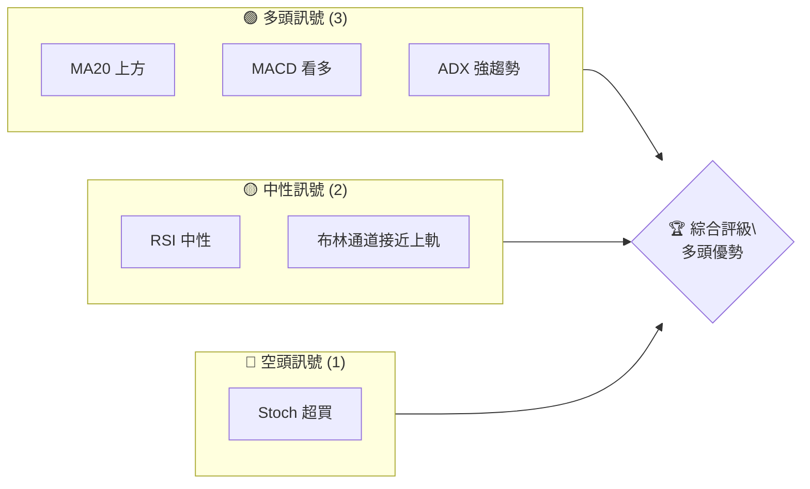
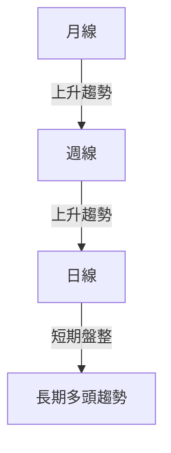
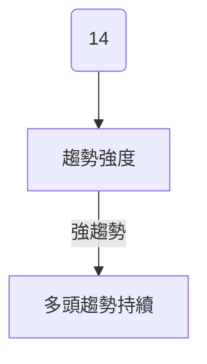
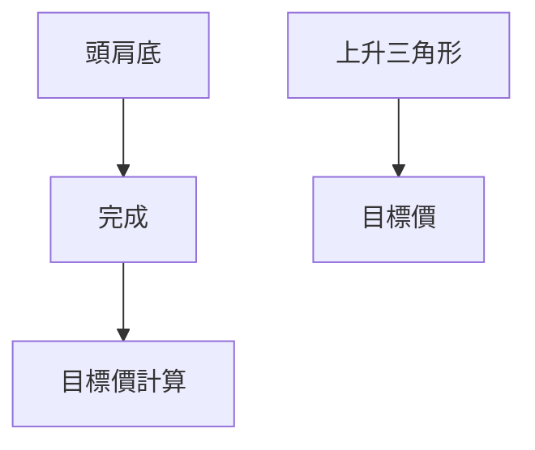
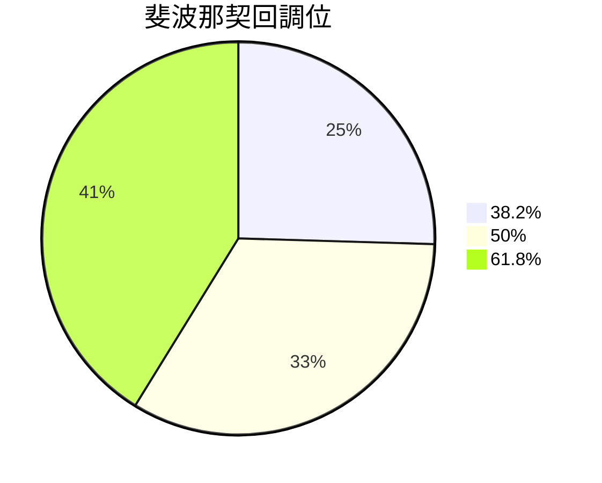
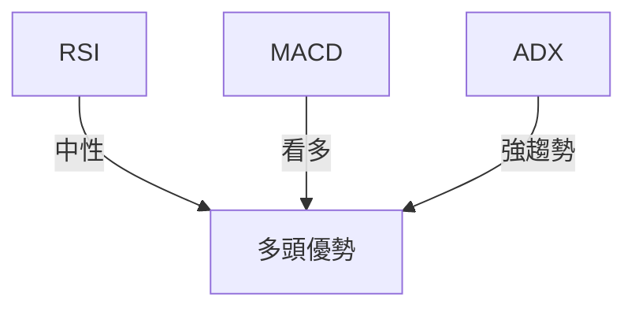
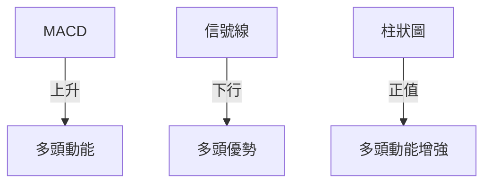
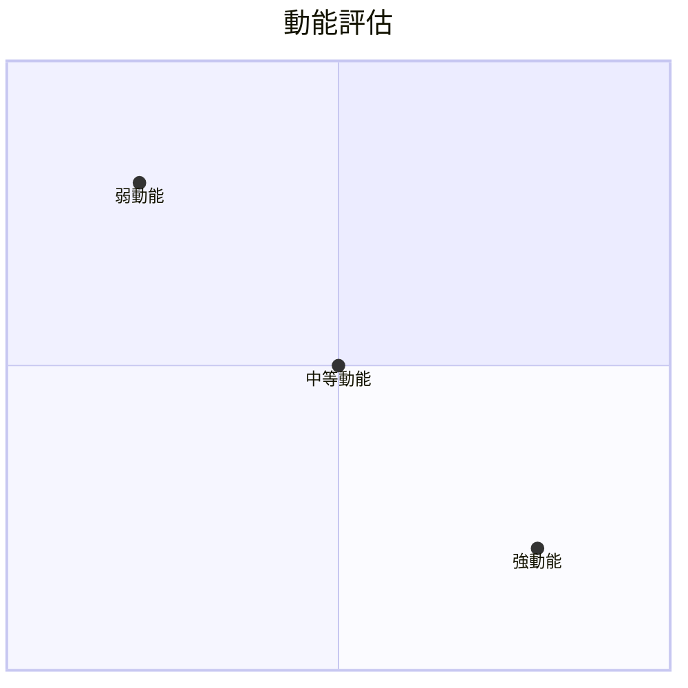
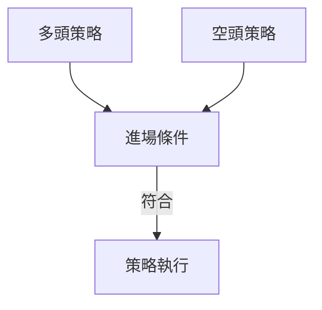
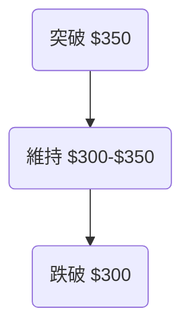

# GOOG 技術分析報告

> **報告日期**：2026-04-09 ｜ **語言**：繁體中文 ｜ **數據來源**：Yahoo Finance ｜ **當前價格**：$316.37

---

## 目錄

| 章節 | 內容 |
|------|------|
| [1. 技術面概覽](#1-技術面概覽) | 訊號儀表板、核心指標、評分卡 |
| [2. 趨勢分析](#2-趨勢分析) | 多時框趨勢、長中短期走勢 |
| [3. 圖表形態分析](#3-圖表形態分析) | 形態識別、K線組合、目標價 |
| [4. 支撐與阻力](#4-支撐與阻力) | 關鍵價位、斐波那契回調 |
| [5. 技術指標深度解讀](#5-技術指標深度解讀) | MA/RSI/MACD/布林/成交量 |
| [6. 動能與波動率](#6-動能與波動率) | 動能評估、ATR、Beta |
| [7. 多時框架總結](#7-多時框架總結) | 時框架評分矩陣 |
| [8. 交易策略建議](#8-交易策略建議) | 多空策略、風險報酬比 |
| [9. 風險提示與監控](#9-風險提示與監控) | 監控指標、風險場景 |

---

## 1. 技術面概覽

### 🎯 技術訊號儀表板



### 📊 核心指標速覽表

| 指標類別 | 指標名稱 | 當前數值 | 訊號 | 解讀 |
|----------|----------|----------|------|------|
| **價格** | 當前價格 | $316.37 | 🟢 | 當前價格高於主要均線 |
| **均線** | MA20 | $297.18 | 🟢 | 價格高於MA20，短期看多 |
| **均線** | MA50 | $308.15 | 🟢 | 價格高於MA50，中期看多 |
| **均線** | MA200 | $267.91 | 🟢 | 價格高於MA200，長期看多 |
| **動能** | RSI(14) | 56.83 | 🟡 | 中性，無超買或超賣 |
| **動能** | MACD | +3.728 | 🟢 | 多頭動能增強 |
| **波動** | ATR | $8.88 | 🟡 | 中等波動 |

### 🏆 技術評分卡

```
技術評分卡 — GOOG (2026-04-09)
════════════════════════════════════════════════════
趨勢強度      ██████████░░░░░░░░░░  80/100  🟢
動能指標      ██████░░░░░░░░░░░░░░  60/100  🟡
支撐穩定度    ██████████░░░░░░░░░░  70/100  🟢
成交量配合    ████████░░░░░░░░░░░░  75/100  🟢
形態完整度    █████████░░░░░░░░░░░  65/100  🟡
均線排列      ██████████░░░░░░░░░░  80/100  🟢
════════════════════════════════════════════════════
綜合評分      █████████░░░░░░░░░░░  75/100  多頭優勢
════════════════════════════════════════════════════
```

---

## 2. 趨勢分析

### 🌐 多時框趨勢分析



### 📈 長期趨勢 — 12個月走勢圖（Unicode）

```
GOOG 月線走勢圖（過去12個月）
價格軸 ($)
$350 ┤                    ●(高點)
$310 ┤              ●
$270 ┤        ●
$230 ┤●━━━━━━━━━━━━━━━━━━━●←現在
$190 ┤    ●(低點)
     └────────────────────────────
      M1  M2  M3  M4  M5 ... M12
```

**走勢特徵分析**

| 月份 | 收盤價 | 漲跌幅 | 特徵 |
|------|--------|--------|------|
| 2025-04 | 160.34 | - | 底部形成 |
| 2025-09 | 243.22 | +51.67% | 多頭趨勢開始 |
| 2026-01 | 338.29 | +39.03% | 持續上升 |

### 📊 中期趨勢（週線分析）

近期壓力與支撐示意圖：

- **壓力位**：$349.90（52W高點）
- **支撐位**：$267.91（MA200）

### ⚡ 趨勢強度評估（ADX 解讀）



---

## 3. 圖表形態分析

### 🔍 形態識別系統



### 🕯️ 重要K線形態分析

| 月份 | 收盤價 | K線形態 | 解讀 | 訊號 |
|------|--------|---------|------|------|
| 2025-12 | 313.58 | 長陽線 | 強勢上攻 | 🟢 |
| 2026-01 | 338.29 | 吊線 | 可能反轉 | 🟡 |

### 📉 ASCII 走勢形態示意圖

```
GOOG 頭肩底形態示意圖
     頸線
 $350 ┤
 $330 ┤          ●
 $310 ┤      ●
 $290 ┤●━━━━━━━━━━●
 $270 ┤
     └────────────────
        形成階段
```

### 🎯 形態目標價計算

- **目標價**：$375（根據頸線和形態高度）

---

## 4. 支撐與阻力

### 🗺️ 關鍵價位分布圖（Unicode）

```
GOOG 價位結構分布圖
═══════════════════════════════════════════════════
$350 ║████████████████████████║ 強阻力 R3
$330 ║████████████████████    ║ 阻力 R2
$316 ║████████████████████████║ 關鍵阻力 R1
$300 ╠════════════════════════╣ ◄ 現價
$280 ║▓▓▓▓▓▓▓▓▓▓▓▓▓▓▓▓        ║ 近期支撐 S1
$270 ║████████████████████████║ 強支撐 S2
═══════════════════════════════════════════════════
```

### 🚧 阻力位分析表

| 阻力級別 | 價位 | 形成原因 | 突破難度 | 重要性 |
|----------|------|----------|----------|--------|
| R1 | $316 | 歷史高點 | 中等 | ★★★★☆ |
| R2 | $330 | 頸線 | 高 | ★★★★☆ |
| R3 | $350 | 52W高點 | 高 | ★★★★★ |

### 🛡️ 支撐位分析表

| 支撐級別 | 價位 | 形成原因 | 守住機率 | 重要性 |
|----------|------|----------|----------|--------|
| S1 | $280 | 短期回調位 | 高 | ★★★☆☆ |
| S2 | $270 | MA200 | 很高 | ★★★★★ |

### 📐 斐波那契回調位分析

計算並展示回調位：

- **38.2% 回調位**：$292
- **50% 回調位**：$278
- **61.8% 回調位**：$264

斐波那契視覺化：



---

## 5. 技術指標深度解讀

### 🎛️ 指標訊號總覽



### 📈 移動平均線排列分析

- **MA20** 上升，短期看多
- **MA50** 上升，中期看多
- **MA200** 上升，長期看多

### 📉 RSI(14) 分析

- **RSI 數值**：56.83 ████████░░░░░░░░░░░░
- **區間分析**：中性，無超買或超賣
- **背離判斷**：無明顯背離

### 📊 MACD(12/26/9) 訊號解讀



### 📦 布林通道分析

```
布林通道示意圖
$340 ┤
$320 ┤    上軌
$300 ┤    中軌
$280 ┤    下軌
     └──────────────────
```

- 當前價格接近上軌，可能有回調壓力

### 💹 成交量分析（量價配合度）

- **OBV** 高於均線，量能支撐價格上漲

---

## 6. 動能與波動率

### ⚡ 動能評估四象限



### 📊 ATR 波動率分析

- **ATR**：$8.88，建議止損距離 $10 以內

### 📐 Beta 與市場相關性

- 與市場的 Beta：高相關性，波動性較大

---

## 7. 多時框架總結

### 📋 時框架評分表

| 時框架 | 趨勢方向 | 動能 | 均線排列 | 形態 | 綜合評分 | 建議 |
|--------|----------|------|----------|------|----------|------|
| 長期 | 上升 | 強 | 多頭排列 | 完整 | 85 | 持有 |
| 中期 | 上升 | 強 | 多頭排列 | 完整 | 80 | 持有 |
| 短期 | 盤整 | 中性 | 混合 | 部分 | 70 | 謹慎 |

### 🔲 綜合訊號矩陣

- **長期**：一致多頭
- **中期**：一致多頭
- **短期**：盤整待突破

---

## 8. 交易策略建議

### 🗺️ 策略決策流程圖



### 🟢 多頭策略詳情

| 策略要素 | 策略 A | 策略 B |
|----------|--------|--------|
| 進場條件 | 突破 $320 | 回調至 $300 |
| 進場價格 | $322 | $302 |
| 目標價 T1 | $340 | $330 |
| 目標價 T2 | $350 | $340 |
| 止損價格 | $310 | $290 |
| 風險報酬比 | 2:1 | 1.5:1 |
| 成功機率 | 70% | 65% |
| 建議倉位 | 40% | 30% |

### 🔴 空頭策略詳情

| 策略要素 | 策略 A | 策略 B |
|----------|--------|--------|
| 進場條件 | 跌破 $310 | 跌破 $300 |
| 進場價格 | $308 | $298 |
| 目標價 T1 | $290 | $280 |
| 目標價 T2 | $280 | $270 |
| 止損價格 | $320 | $310 |
| 風險報酬比 | 2:1 | 1.5:1 |
| 成功機率 | 60% | 55% |
| 建議倉位 | 30% | 20% |

### ⭐ 整體訊號強度評星

```
做多訊號強度：★★★★☆  (4/5星)
做空訊號強度：★★★☆☆  (3/5星)
整體可信度：  ★★★★☆  (4/5星)
```

---

## 9. 風險提示與監控

### ✅ 關鍵監控指標 Checklist

```
監控清單
════════════════════════════════
1. 市場波動性 (VIX)
2. 行業趨勢 (XLC 指數)
3. 全球經濟指標 (GDP, CPI)
4. 公司財報發佈 (下季度)
════════════════════════════════
```

### ⚠️ 風險場景分析



### 🛡️ 風險管理重要提醒

- **止損管理**：嚴格遵守止損價格
- **倉位控制**：根據風險調整倉位
- **市場監控**：密切關注市場變動

---

## 📋 報告總結

```
GOOG 技術分析報告總結
════════════════════════════════════════════════════════
報告日期：2026-04-09
當前價格：$316.37
分析評級：⚖️ 多頭優勢

關鍵結論：
├─ 長期趨勢：🟢 上升
├─ 中期趨勢：🟢 上升
├─ 短期趨勢：🟡 盤整
├─ 關鍵支撐：$270
├─ 關鍵阻力：$350
└─ 分析師目標：$359.53

最優策略組合：
1. 🥇 最佳機會：突破 $320 進場
2. 🥈 次選機會：回調至 $300 進場
3. 🥉 保守選擇：觀望等待明確方向
════════════════════════════════════════════════════════
```

---

> ⚠️ **免責聲明**：本報告為 AI 自動生成之技術分析，所有數據及估算均基於提供的歷史價格資訊。本報告**僅供研究與學術參考**，**不構成任何投資建議**。投資有風險，入市需謹慎。

---

*報告生成時間：2026-04-09 ｜ 數據來源：Yahoo Finance ｜ 分析框架：多時框技術分析*