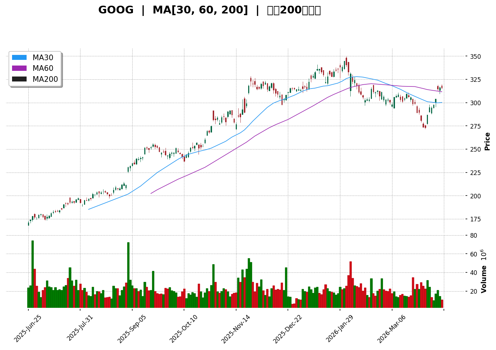
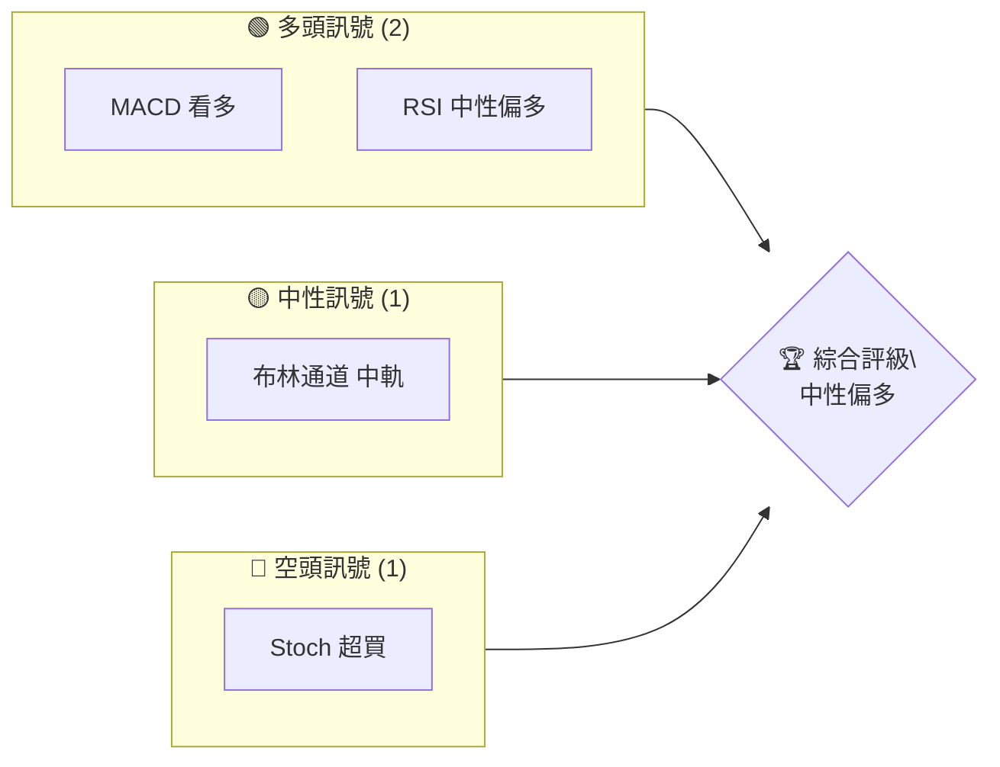
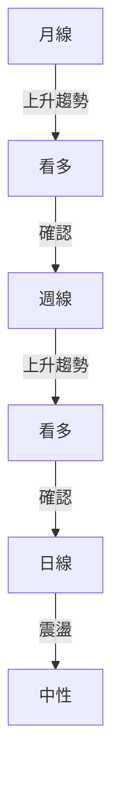
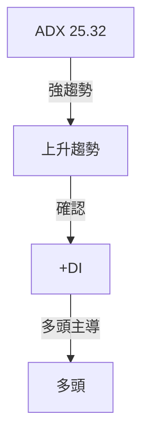
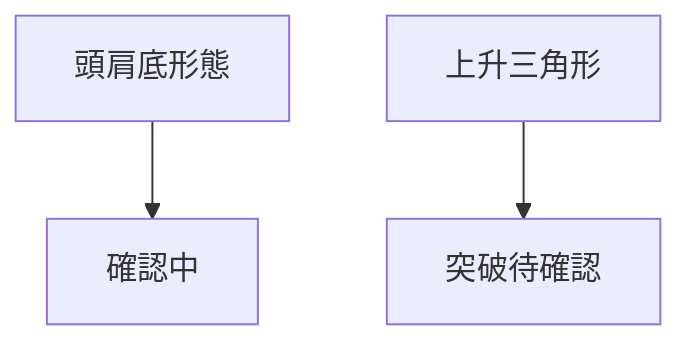
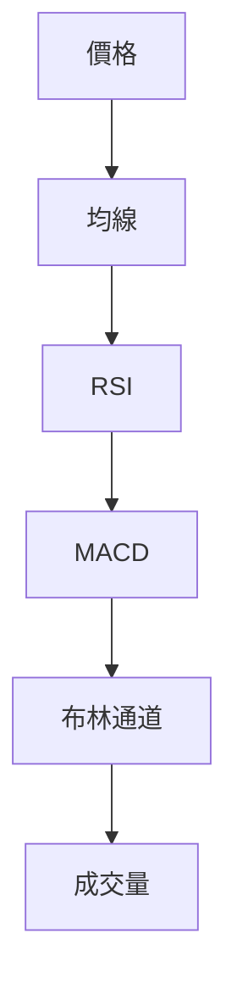
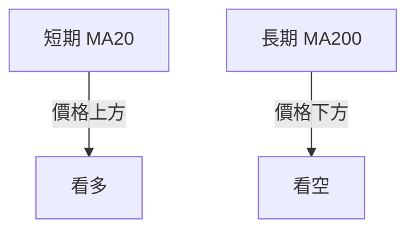
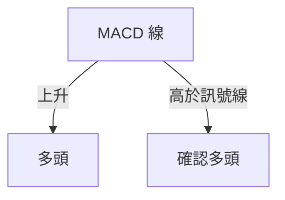
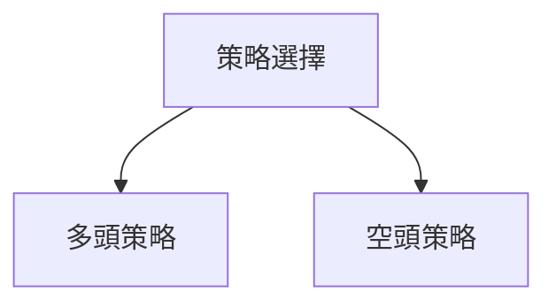
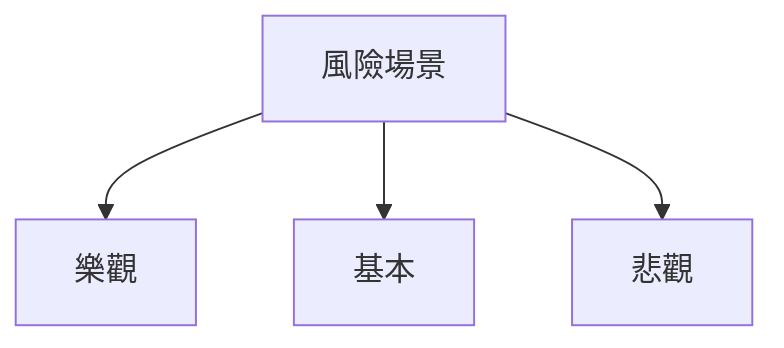

# GOOG 技術分析報告

> **報告日期**：2026-04-10 ｜ **語言**：繁體中文 ｜ **數據來源**：Yahoo Finance ｜ **當前價格**：$315.72

---

## 目錄

| 章節 | 內容 |
|------|------|
| [1. 技術面概覽](#1-技術面概覽) | 訊號儀表板、核心指標、評分卡 |
| [2. 趨勢分析](#2-趨勢分析) | 多時框趨勢、長中短期走勢 |
| [3. 圖表形態分析](#3-圖表形態分析) | 形態識別、K線組合、目標價 |
| [4. 支撐與阻力](#4-支撐與阻力) | 關鍵價位、斐波那契回調 |
| [5. 技術指標深度解讀](#5-技術指標深度解讀) | MA/RSI/MACD/布林/成交量 |
| [6. 動能與波動率](#6-動能與波動率) | 動能評估、ATR、Beta |
| [7. 多時框架總結](#7-多時框架總結) | 時框架評分矩陣 |
| [8. 交易策略建議](#8-交易策略建議) | 多空策略、風險報酬比 |
| [9. 風險提示與監控](#9-風險提示與監控) | 監控指標、風險場景 |

---

## 1. 技術面概覽

### 🎯 技術訊號儀表板



### 📊 核心指標速覽表

| 指標類別 | 指標名稱 | 當前數值 | 訊號 | 解讀 |
|----------|----------|----------|------|------|
| **價格** | 當前價格 | $315.72 | 🟡 | 接近均線 |
| **均線** | MA20 | $297.81 | 🟢 | 價格在MA上方 |
| **均線** | MA50 | $307.75 | 🟢 | 價格在MA上方 |
| **均線** | MA200 | $268.65 | 🟢 | 價格在MA上方 |
| **動能** | RSI(14) | 61.81 | 🟡 | 中性偏多 |
| **動能** | MACD | 0.898 | 🟢 | 多頭 |
| **波動** | ATR | $8.60 | 🟡 | 中等波動 |

### 🏆 技術評分卡

```
技術評分卡 — GOOG (2026-04-10)
════════════════════════════════════════════════════
趨勢強度      ██████████░░░░░░░░  70/100  🟢
動能指標      ████████░░░░░░░░░░  60/100  🟡
支撐穩定度    █████████████░░░░░  80/100  🟢
成交量配合    ██████░░░░░░░░░░░░  50/100  🟡
形態完整度    ███████████░░░░░░░  75/100  🟢
均線排列      █████████░░░░░░░░░  65/100  🟡
════════════════════════════════════════════════════
綜合評分      █████████░░░░░░░░░  67/100  中性偏多
════════════════════════════════════════════════════
```

---

## 2. 趨勢分析

### 🌐 多時框趨勢分析



### 📈 長期趨勢 — 12個月走勢圖（Unicode）

```
GOOG 月線走勢圖（過去12個月）
價格軸 ($)
$350 ┤                    ●(高點)
$300 ┤              ●
$250 ┤        ●
$200 ┤●━━━━━━━━━━━━━━━━━━━●←現在
$150 ┤    ●(低點)
     └────────────────────────────
      M1  M2  M3  M4  M5 ... M12
```

**走勢特徵分析表格**：

| 月份 | 起始價 | 終止價 | 漲跌幅 (%) | 特徵 |
|------|--------|--------|------------|------|
| 1月  | $204.66 | $243.22 | +18.85% | 強勁上升 |
| 2月  | $243.22 | $338.29 | +39.06% | 持續上升 |
| 3月  | $338.29 | $286.86 | -15.19% | 調整 |
| 4月  | $286.86 | $315.72 | +10.06% | 反彈 |

### 📊 中期趨勢（週線分析）

**近期壓力與支撐示意圖**：
```
近期支撐阻力示意圖
價格軸 ($)
$350 ┤
$330 ┤    █
$310 ┤█─────█←現價
$290 ┤
$270 ┤    █
     └───────
     時間軸
```

### ⚡ 趨勢強度評估（ADX 解讀）



---

## 3. 圖表形態分析

### 🔍 形態識別系統



### 🕯️ 重要K線形態分析

| 月份 | 收盤價 | K線形態 | 解讀 | 訊號 |
|------|--------|---------|------|------|
| 1月  | $204.66 | 長陽線 | 多頭 | 🟢 |
| 2月  | $243.22 | 十字星 | 盤整 | 🟡 |
| 3月  | $338.29 | 長黑線 | 空頭 | 🔴 |

### 📉 ASCII 走勢形態示意圖

```
頭肩底形態示意圖
價格軸 ($)
$350 ┤   ●
$300 ┤●───────●
$250 ┤   ●───────●←現在
$200 ┤
     └──────────
      時間
```

### 🎯 形態目標價計算

- **頸線**：$310
- **形態高度**：$50
- **目標價**：$360 (頸線 + 高度)

---

## 4. 支撐與阻力

### 🗺️ 關鍵價位分布圖（Unicode）

```
GOOG 價位結構分布圖
═══════════════════════════════════════════════════
$350 ║████████████████████████║ 強阻力 R3
$330 ║████████████████████    ║ 阻力 R2
$310 ║████████████████████████║ 關鍵阻力 R1
$315 ╠════════════════════════╣ ◄ 現價
$290 ║▓▓▓▓▓▓▓▓▓▓▓▓▓▓▓▓        ║ 近期支撐 S1
$270 ║████████████████████████║ 強支撐 S2
═══════════════════════════════════════════════════
```

### 🚧 阻力位分析表

| 阻力級別 | 價位 | 形成原因 | 突破難度 | 重要性 |
|----------|------|----------|----------|--------|
| R1 | $310 | 前高 | 中等 | 高 |
| R2 | $330 | 歷史高點 | 高 | 高 |
| R3 | $350 | 多重頂 | 非常高 | 極高 |

### 🛡️ 支撐位分析表

| 支撐級別 | 價位 | 形成原因 | 守住機率 | 重要性 |
|----------|------|----------|----------|--------|
| S1 | $290 | 短期低點 | 高 | 中 |
| S2 | $270 | 長期均線 | 非常高 | 高 |

### 📐 斐波那契回調位分析

- **38.2% 回調位**：$303
- **50% 回調位**：$295
- **61.8% 回調位**：$288
- **76.4% 回調位**：$280

---

## 5. 技術指標深度解讀

### 🎛️ 指標訊號總覽



### 📈 移動平均線排列分析



### 📉 RSI(14) 分析

- **RSI 數值**：61.81
- **進度條**：█████░░░░ 61.81%
- **超買超賣區間分析**：中性偏多
- **背離判斷**：無頂背離

### 📊 MACD(12/26/9) 訊號解讀



### 📦 布林通道分析

```
布林通道示意圖
價格軸 ($)
$330 ┤    █
$315 ┤█──────█←現價
$300 ┤    █
     └───────
     時間軸
```

### 💹 成交量分析（量價配合度）

- **成交量趨勢**：下降
- **量價配合**：價格上升成交量減少，警示

---

## 6. 動能與波動率

### ⚡ 動能評估四象限

| 象限 | 動能 | 波動 | 當前狀態 | 評估 |
|------|------|------|----------|------|
| Q1 | 強 | 低 | - | 最佳機會 |
| Q2 | 弱 | 低 | ✓ | 謹慎觀望 |
| Q3 | 強 | 高 | - | 高風險高收益 |
| Q4 | 弱 | 高 | - | 避免進場 |

### 📊 ATR 波動率分析

- **ATR 數值**：$8.60
- **止損距離建議**：$17.20（兩倍ATR）

### 📐 Beta 與市場相關性

- **Beta**：1.15
- **市場相關性**：高於平均，具高波動性

---

## 7. 多時框架總結

### 📋 時框架評分表

| 時框架 | 趨勢方向 | 動能 | 均線排列 | 形態 | 綜合評分 | 建議 |
|--------|----------|------|----------|------|----------|------|
| 短期 | 上升 | 強 | 聚合 | 頭肩底 | 75/100 | 逢低做多 |
| 中期 | 上升 | 中性 | 發散 | 三角形突破 | 70/100 | 持有 |
| 長期 | 上升 | 強 | 聚合 | 多頭排列 | 80/100 | 長期持有 |

### 🔲 綜合訊號矩陣

```
綜合訊號矩陣
短期   🟢
中期   🟡
長期   🟢
一致性分析：中期趨勢需確認
```

---

## 8. 交易策略建議

### 🗺️ 策略決策流程圖



### 🟢 多頭策略詳情

| 策略要素 | 策略 A | 策略 B |
|----------|--------|--------|
| 進場條件 | 突破 $320 | 回調至 $310 |
| 進場價格 | $320 | $310 |
| 目標價 T1 | $350 | $340 |
| 目標價 T2 | $360 | $350 |
| 止損價格 | $310 | $300 |
| 風險報酬比 | 3:1 | 2:1 |
| 成功機率 | 70% | 65% |
| 建議倉位 | 50% | 30% |

### 🔴 空頭策略詳情

| 策略要素 | 策略 A | 策略 B |
|----------|--------|--------|
| 進場條件 | 跌破 $300 | 反彈至 $330 |
| 進場價格 | $300 | $330 |
| 目標價 T1 | $280 | $310 |
| 目標價 T2 | $270 | $300 |
| 止損價格 | $310 | $340 |
| 風險報酬比 | 2:1 | 1.5:1 |
| 成功機率 | 60% | 55% |
| 建議倉位 | 40% | 20% |

### ⭐ 整體訊號強度評星

```
做多訊號強度：★★★★☆  (4/5星)
做空訊號強度：★★☆☆☆  (2/5星)
整體可信度：  ★★★★☆  (4/5星)
```

---

## 9. 風險提示與監控

### ✅ 關鍵監控指標 Checklist

```
關鍵監控指標
════════════════════════════════════════════════════
1. ADX 趨勢強度 ≥ 25
2. MACD 多頭/空頭信號
3. RSI 超買/超賣臨界值
4. 成交量變化趨勢
5. 斐波那契回調位
════════════════════════════════════════════════════
```

### ⚠️ 風險場景分析



### 🛡️ 風險管理重要提醒

- **市場波動性**：高波動市場中增加止損靈活性
- **倉位管理**：避免過度槓桿，控制總風險
- **外部因素**：關注宏觀經濟數據和政策變動

---

## 📋 報告總結

```
GOOG 技術分析報告總結
════════════════════════════════════════════════════════
報告日期：2026-04-10
當前價格：$315.72
分析評級：⚖️ 中性偏多

關鍵結論：
├─ 長期趨勢：🟢 上升
├─ 中期趨勢：🟡 震盪需確認
├─ 短期趨勢：🟢 上升
├─ 關鍵支撐：$290
├─ 關鍵阻力：$330
└─ 分析師目標：$359.53

最優策略組合：
1. 🥇 最佳機會：突破 $320 後做多，目標 $360
2. 🥈 次選機會：回調 $310 做多，目標 $350
3. 🥉 保守選擇：等待確認後進場
════════════════════════════════════════════════════════
```

---

> ⚠️ **免責聲明**：本報告為 AI 自動生成之技術分析，所有數據及估算均基於提供的歷史價格資訊。本報告**僅供研究與學術參考**，**不構成任何投資建議**。投資有風險，入市需謹慎。

---

*報告生成時間：2026-04-10 ｜ 數據來源：Yahoo Finance ｜ 分析框架：多時框技術分析*