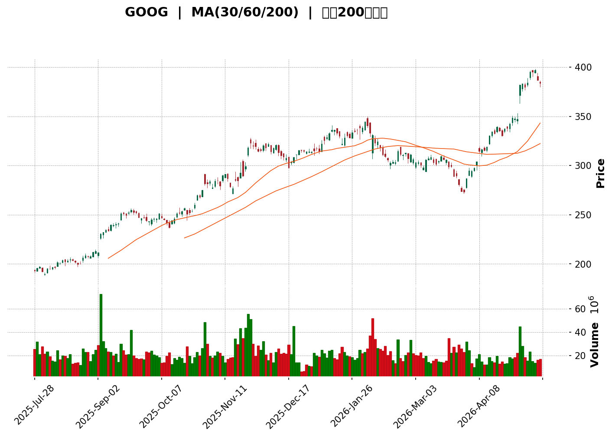
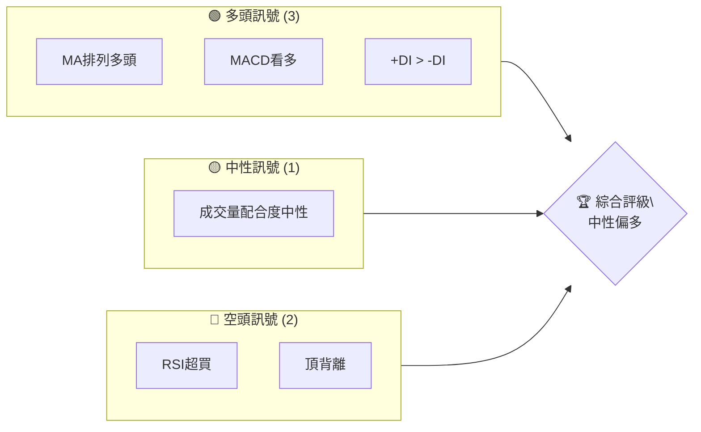
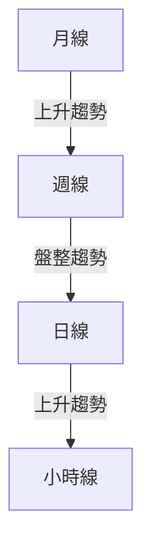
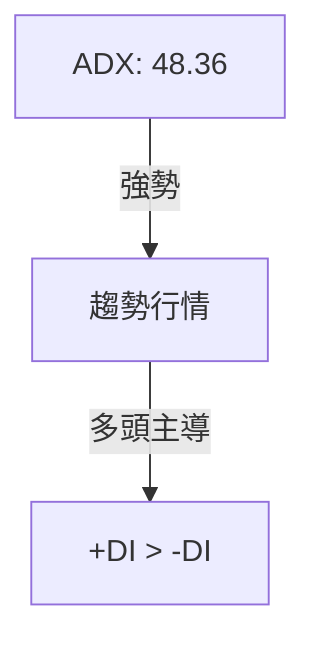
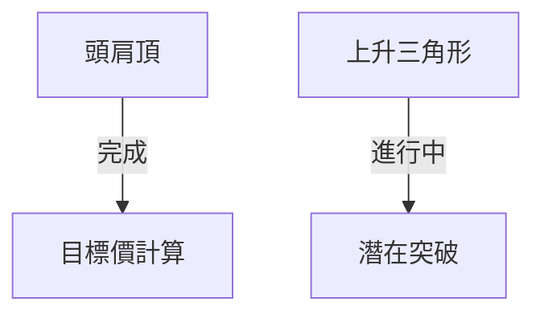
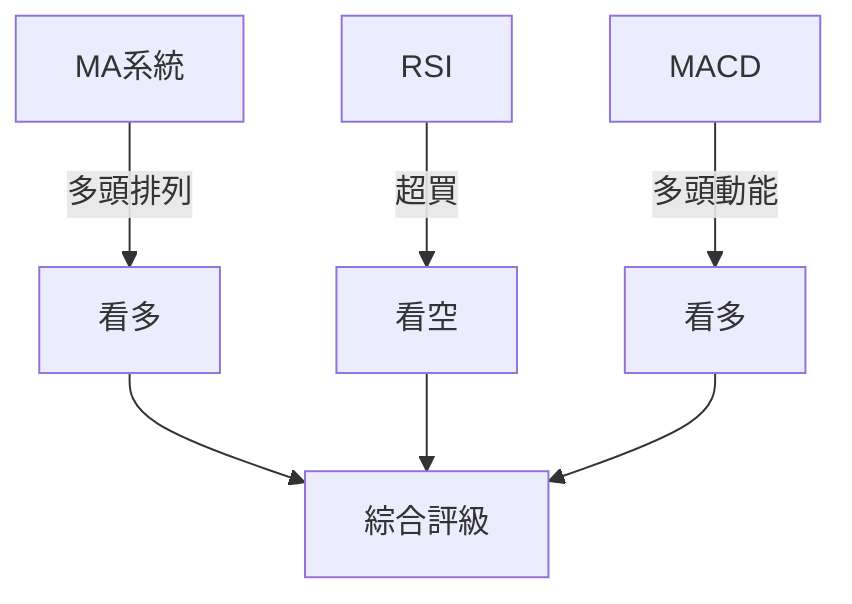
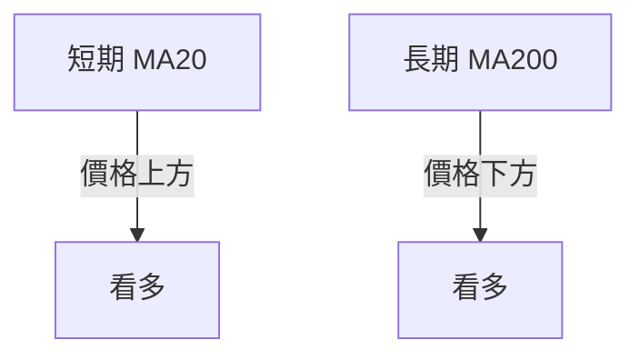
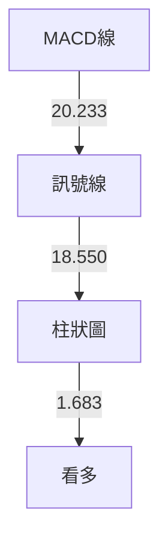

<details>
<summary>📊 靜態圖表 (點擊展開)</summary>

</details>

<html>
<head><meta charset="utf-8" /></head>
<body>
    <div>                        <script>window.PlotlyConfig = {MathJaxConfig: 'local'};</script>
        <script charset="utf-8" src="https://cdn.plot.ly/plotly-3.5.0.min.js" integrity="sha256-fHbNLP+GlIXN+efbQec78UkemUz3NJp7UmfGxC1tNxs=" crossorigin="anonymous"></script>                <div id="candlestick-chart" class="plotly-graph-div" style="height:500px; width:100%;"></div>            <script>                window.PLOTLYENV=window.PLOTLYENV || {};                                if (document.getElementById("candlestick-chart")) {                    Plotly.newPlot(                        "candlestick-chart",                        [{"close":{"dtype":"f8","bdata":"AAAAwIcfaEAAAAAgon9oQAAAAKDhn2hAAAAAgKYNaEAAAABgvbBnQAAAAGDsaWhAAAAAoDFcaEAAAABgR49oQAAAAMDFmmhAAAAAwFg0aUAAAAAAqSVpQAAAACBwdmlAAAAA4FtSaUAAAABAlWtpQAAAAEBijmlAAAAAoJZ6aUAAAABgHkFpQAAAAACv92hAAAAAgGkFaUAAAACALMhpQAAAAAAUFmpAAAAAAHLvaUAAAAAgv\u002fdpQAAAACCRfGpAAAAAoJqhakAAAABgb3BqQAAAAMCU0mxAAAAAYGMEbUAAAAAgh1RtQAAAAID2Om1AAAAAAKzzbUAAAABAh+dtQAAAAOCDDm5AAAAAoLAhbkAAAAAgZm1vQAAAAMCIYm9AAAAAwFwwb0AAAABgnX9vQAAAAMCb3G9AAAAA4DCRb0AAAAAA739vQAAAAEDP725AAAAAYIvHbkAAAACgCdtuQAAAAIDrgG5AAAAAIAlnbkAAAAAAoaZuQAAAAAASw25AAAAAoLXDbkAAAAAAaWVvQAAAAMBw2W5AAAAAoBKkbkAAAADANjxuQAAAAOBgpW1AAAAAIN6JbkAAAACgZrtuQAAAACDNa29AAAAAADxxb0AAAABgRa5vQAAAAOC+CnBAAAAAQPpfb0AAAACAAYZvQAAAAIBarG9AAAAAgIJCcEAAAACABtlwQAAAAOAOwXBAAAAAgMAscUAAAAAgSZhxQAAAAAACl3FAAAAAAMK7cUAAAADg7VpxQAAAAADTxXFAAAAAYEDPcUAAAABAInVxQAAAACAjI3JAAAAAIIM1ckAAAABgpfBxQAAAAMDda3FAAAAAQKxJcUAAAADgZ9NxQAAAAAAuyXFAAAAAQHxJckAAAAAgZBlyQAAAAKDms3JAAAAA4Jzgc0AAAACAODN0QAAAAICI\u002fXNAAAAAIPr6c0AAAADAFatzQAAAAEB3uXNAAAAAYPcCdEAAAADAVd9zQAAAAEB0GnRAAAAAgKijc0AAAADAa9hzQAAAAGBiDHRAAAAAoKqXc0AAAACA0mRzQAAAAMCiUXNAAAAAwDY4c0AAAABAmp1yQAAAACCU+HJAAAAAoEhGc0AAAADgxXFzQAAAAABTt3NAAAAAICq3c0AAAADgz6tzQAAAAACzonNAAAAAwEGlc0AAAADgQ5lzQAAAAICRsXNAAAAAwIvRc0AAAADAQaVzQAAAAIA\u002fI3RAAAAA4HxcdEAAAABgiI50QAAAAKDux3RAAAAAIBcDdUAAAAAALAF1QAAAAMDOznRAAAAAILihdEAAAABg7h50QAAAAKBhgnRAAAAAoLapdEAAAABALoN0QAAAAMCu1XRAAAAAADrsdEAAAABAsQB1QAAAAOC+JnVAAAAAwKokdUAAAADgg4p1QAAAAOBcR3VAAAAAYK\u002fRdEAAAABAjLF0QAAAAAD2LXRAAAAAAL9CdEAAAADAfeZzQAAAAODFcXNAAAAAYG9Sc0AAAACA3xxzQAAAAIC16XJAAAAA4J37ckAAAABgivVyQAAAAGDaqnNAAAAAgId3c0AAAADgN2tzQAAAAED0jHNAAAAAwPAuc0AAAABAX3NzQAAAACBPInNAAAAAYIr1ckAAAABAyPNyQAAAAKAry3JAAAAAoHChckAAAAAAKSBzQAAAAEDhLnNAAAAAYLhGc0AAAAAgXPNyQAAAACBc13JAAAAAYLgGc0AAAABgj1ZzQAAAAMDMJHNAAAAAIK4bc0AAAADgo6xyQAAAAOBRsHJAAAAAQDMTckAAAACgcBlyQAAAAADXi3FAAAAAACkccUAAAACAPRJxQAAAAIDC7XFAAAAAYGZuckAAAAAgXGdyQAAAAGCPmnJAAAAAQOH+ckAAAAAA16tzQAAAAIDrxXNAAAAAIIW7c0AAAAAgXPNzQAAAAKBHqXRAAAAAIIXndEAAAADgUcx0QAAAAGBmNnVAAAAAYGb2dEAAAAAghad0QAAAACCuG3VAAAAAAAAcdUAAAADAHmV1QAAAAOBRyHVAAAAAAAC4dUAAAADA9bR1QAAAAEAK33dAAAAAIIXzd0AAAACAPbp3QAAAAOBRBHhAAAAAgD2yeEAAAADAzLR4QAAAAMDM0HhAAAAA4FEseEAAAADAHv13QA=="},"high":{"dtype":"f8","bdata":"jwDK2TpMaEBQE\u002fAj+oZoQL0OjBoWwWhAJl0pqWeMaEAfbr3q\u002fuVnQKiRxax1dGhAgk8YRhzIaEBp8whI951oQIbSyO6SvWhAeY2cVCFfaUBbgST+lDZpQIoNYIRolWlAlOikcPyeaUCw5nXrqp5pQBiLUlKm22lAKS\u002fy0Ke1aUA2xu+8lnppQG6oWqzmNmlAH9UpLuVcaUBOYGMqUBhqQJ9rwPeyU2pA3qhVnLr\u002faUCprzI2KyNqQKWbCx59jWpALth4zWTbakCix8oliXxqQGtl+zzu6GxAxhOPeeYHbUD+aIHTLXNtQMVbqmp1wm1AoTIriHEIbkAOHBokDzhuQJwPMr+3R25ARksLSwVDbkBRBpRBCY1vQHfgqCZgnG9A3tEojnhzb0DjgZ\u002fGdLlvQPZfvPShBXBA\u002fsZQSc3+b0BwYr6jls1vQM3bJ0i\u002fk29AmGUYGlrfbkB03hp6\u002fThvQMw1DdHRaW9ATvinvAdrbkAeqB8\u002fFNpuQCC3dP6T6W5AuAYDdQ7ZbkDPsoHWdXtvQASdEEuwZm9AMtkBI5jdbkCOOAW7G6duQKHWdmFCkG5AIF\u002f3fA2VbkBYpnZ\u002fCvZuQFHn\u002f\u002fZajW9AJe0verETcEA+D1OlGtFvQGuwoLl8GHBAdzVHIxXhb0D6v4lOTQ1wQJZ6wNhr8G9A35MVZXdicED8UmIr7eZwQJCD974x8HBAs8Tezog5cUAZufROjDhyQJBGgNVZ3nFArwcYpdbYcUDUOqVLO5dxQO0WTmz75HFAhu\u002fpO7IGckD\u002fkEFZ1MFxQOnYWssJMXJAFB4iaxk\u002fckBloqlAaz9yQC9GHeACsnFAiOKcc1hscUBDriGZ7mFyQEXVgseuEHJAfRhUu2b9ckDVeiWdlSdzQNUxznHE+HJA+vWPHd31c0BN+TNyl4N0QEkL9HjKSHRALY6Ll\u002f1mdEA0Uh+1JfNzQFC\u002f0ayw4nNAVVur3acZdEBbPeGakyp0QCnWv5ZBNnRAwbr70g8QdEBIfRAcwedzQJCLxl1LGnRAU4cOeDYcdEB4t3nrrb5zQCflv4Cth3NACplK4gF6c0Afdfsjo09zQKD4VMW4EHNAAHh9B1xMc0AeythusHdzQKdVV7Y8wXNAfKFT1hPBc0AeB9XiZMVzQOlv4\u002fP4q3NAHXi9Kp\u002fXc0BE5TwKsLJzQGqkJJr8KnRAFktQb2fwc0B2LGiJVhV0QIsRYj3DY3RARd3Lr+qkdECUjZRA8rN0QPoYodFF43RADcfHXltPdUDiJoMMrwx1QKOdbItFHnVAVpITXxDwdEBh4WCGvn10QGVspzjax3RAvd4YhpXvdEBE5FS6t9x0QOy8scrPAXVAWQWzWqEfdUBVUX\u002f7RhZ1QJM7fejIYHVAOYXWrM5AdUDgVWCcwI51QAnzfMB03nVARrv1SR+AdUC5agi2jsZ0QOBWWSKEpnRA\u002f4iU\u002fiV4dEAT8IQZdRZ0QDFeXJwaDXRAnUs5fx3Ec0AEKX\u002fZwkpzQOOy2UfOCnNAvyPaUR0bc0D1dZRgCB1zQHGWAKOXyHNAxnogfK7zc0CGGbTRZoJzQBCo8e4Gl3NAIOfegXmMc0BT0DHAw31zQP7CC\u002f7EPnNAFGp4x537ckA3QkdU6xNzQB4t76eA8nJA+jCLpeXBckAAAAAAAChzQAAAAGBmUnNAAAAAoBpxc0AAAACAPUpzQAAAAAApNHNAAAAAwB4Zc0AAAADAzGBzQAAAAAAAbHNAAAAAQOEqc0AAAACA6wVzQAAAAIDr9XJAAAAAoJmRckAAAABgj2pyQAAAAIA96HFAAAAAoHBxcUAAAAAAKURxQAAAAMDM8HFAAAAAgMKfckAAAABgZn5yQAAAAMDMpnJAAAAAoJkBc0AAAACAPfZzQAAAAEDh1nNAAAAAAAD4c0AAAABA4fZzQAAAAIA9qnRAAAAAAADwdEAAAACAFBZ1QAAAAIDCP3VAAAAAYI8ydUAAAABguBJ1QAAAAOB6IHVAAAAAYI9CdUAAAABACnt1QAAAAGBm7nVAAAAAYGbedUAAAABgZhZ2QAAAAIAU6ndAAAAAgD32d0AAAABA4QJ4QAAAACBcT3hAAAAAgBTGeEAAAAAgrtV4QAAAAIDr5XhAAAAAoEeleEAAAABACid4QA=="},"hovertemplate":"\u003cb\u003e%{x|%Y-%m-%d}\u003c\u002fb\u003e\u003cbr\u003e\u958b: $%{open:.2f}\u003cbr\u003e\u9ad8: $%{high:.2f}\u003cbr\u003e\u4f4e: $%{low:.2f}\u003cbr\u003e\u6536: $%{close:.2f}\u003cextra\u003e\u003c\u002fextra\u003e","low":{"dtype":"f8","bdata":"lwvSD5DtZ0AaEPcUzRFoQFsfZjzbY2hAG5EtHL\u002f0Z0C3EDxj1IhnQNq6xOq1z2dAUmXon5lHaEBCGMGI9UBoQOQd4ywAWWhA5tZvY5GuaEA6uLRQO+toQMal8+9QHmlAQJ9n0jHGaEAl4Mel2TtpQMSDeeIvNGlA9hlh831eaUBAORl4Tw9pQKgqXiKFoGhAe43hTGP+aEDutKrAnzVpQMQaFbmWr2lAbv53nY2\u002faUAZnNoho71pQDSHlzFF5GlAqChIQd5PakDcoEQ61s9pQD7INpemE2xAAzkvHwNIbEBuQjDdcvtsQK1ZaqY4LW1Au78MWQkibUC8iRH6MLltQJBYJSRMiG1Af90Mm6fFbUARHGqqu5RuQLqP3U4MLG9AT37yL93HbkAakerGqzhvQF1acdk9d29AtaeOXApPb0BtQZ7h\u002fFdvQMMzJOZQ3G5Afk\u002fUQlEqbkCDbBr\u002fx8luQEGMwqHZW25AAS1RT+HnbUBFyDUnBtxtQNdTNIzQWG5AFb5UsoVEbkBAZLBAbKtuQEsjs802z25Aj+jcmz+YbkBtjjb4XOttQBB9eTCni21ACfHkco4NbkCrVzPoOxtuQOVHDwOTzm5Az0S\u002fD5FKb0D5ooG+GAhvQN7cOB8oyG9AmuIdsdOKbkCziyF2kUNvQEIlx46cjW9AtMlEORf4b0AQzcw0S4lwQPW+4v7srHBAOY1+zA7BcEDw9Q8NHoFxQATftFtZUnFAy2wk0tZ\u002fcUDBn5LC1UdxQASV06QNWHFAqHZs58+TcUDvKs\u002f82zVxQL7zIIV9snFAggazDtb3cUCwQCiP6b9xQM268Hf4WXFA0OkjbazwcEAs0U\u002f7g71xQKbl7OgbanFAZperKXv0cUD\u002fCUjfcgxyQHKKLB9gX3JAjZESfLBPc0BPHmy2KdZzQEXsEPpRzHNAKMrvhyrIc0AXPHa03phzQKy+dn60nHNAPVhU86mdc0D3Is9rmLJzQHnyKne9+HNATdoK8wt7c0DnnOsKZoZzQB\u002fZ4uXYsnNAnCEP5JZac0BqkOAD5ytzQLo76FJlGHNARAcFf9v5ckBpskyC2ZNyQHoBI5+xxnJA\u002fnZY1AjickB2WxCL\u002fCVzQDk2Jvd\u002faHNAtme\u002fRpeRc0DF9mRz\u002fJdzQEcy\u002fA3jenNAcledv3iQc0DlNhv9rn9zQIW9YpfmZnNAXD3J2G6wc0Bmllr\u002f64FzQIc14B11pHNAhBi4dzYcdEDPiXM1U2B0QK2GCVJ+VHRAWTdxf9XhdEDMl1uogq50QD9KU6TosHRAMhLFIQZ\u002fdEAgC4cpoAp0QEmyaX0K9XNAYHTaJmCKdEB9botz03t0QKu9urYmdHRAdgu\u002fmj3YdEC9\u002fU3XVr50QH1llg3XZ3RAM166W37GdEBqJj8iYPx0QGCOglWgJXVAbk\u002fBsjWSdEBeuJJiQytzQIqOjEHL\u002fnNAGC+YMZ\u002fXc0A1Pn8SBKdzQOnH0zWWXnNA4f2hxO0+c0ATr94c+vpyQIXNWjIOi3JAsFzCZkfcckAZaXZVVcdyQMUc85dKA3NATJnlJllcc0AGjEAN\u002fh1zQPn0H3VGUnNAjvTHaifjckAJ7X9aCfZyQEb\u002fQqiRzXJAwTT3iNeHckAoSzBkaclyQE7MmTDDnXJAohdeq6xwckAAAABA4V5yQAAAAMD1FHNAAAAAoHAdc0AAAACgcM1yQAAAAOB6vHJAAAAAwPXcckAAAACgmQVzQAAAAGC4GHNAAAAAAADQckAAAAAAAIxyQAAAAOB6oHJAAAAAIK4NckAAAACA6\u002fVxQAAAAMDMcHFAAAAAIK4XcUAAAABgj\u002fhwQAAAAAApTHFAAAAAIIUXckAAAADAHvlxQAAAAOCjXHJAAAAAwMx2ckAAAACgR4tzQAAAACCFV3NAAAAA4KOoc0AAAABACptzQAAAAGBmEnRAAAAAYI+KdEAAAABgZrp0QAAAAOCj1HRAAAAAgBTqdEAAAACAFJp0QAAAACBcz3RAAAAAwPXwdEAAAADAzOB0QAAAAMD1THVAAAAA4HqEdUAAAABA4WZ1QAAAAKBwsXZAAAAAACl0d0AAAADgUYx3QAAAAKCZxXdAAAAAoJkxeEAAAADA9WR4QAAAAGC4mnhAAAAAIK4jeEAAAAAghbt3QA=="},"name":"\u50f9\u683c","open":{"dtype":"f8","bdata":"LHwgpiM\u002faEDiR+vfshtoQM87x7x7e2hAkPMkxQ+FaEADBDPhT6tnQDkf\u002fDja12dAMQKem2BjaEBZPIh+9VloQG4LWXWAqGhAwJtjSh+xaED+WofhQyNpQEYxYKSBNGlA1q+DWZ6QaUDLO0FyWkNpQOHPfz9RiGlAN+bNI36TaUArJVvzS25pQE1Ru5FBJ2lA2A2q6JoIaUD30dxvDXBpQNQoUAQd0WlA4bCO5Nr8aUA1PudX379pQMRtfMbu62lA7KxdW3JZakBcQ+6aphBqQNeaqa0SP2xAm39Gfmi0bEBCLI91YwRtQG3DTkYNb21ABGRa2us7bUCPxUMxn91tQKFMcxsQ+m1AiYrIsCcPbkBs8Yyj2JluQLYvGmWdf29AK74Z\u002f89jb0DQ\u002fRhYmHBvQIDNz87OoW9AOYXAhujNb0DLM5bl9KlvQLf25qbceW9Au6AmVkKQbkBhLxAoX+5uQENIHaYH\u002fm5A7Kz2cGBXbkDv8IRKTBtuQEYXxSXTqW5AjR447LicbkBrd9qATK5uQBM3F0P2Em9AeWRcaLi7bkDquys6SpduQNwIJKSdOm5AGHviFoEWbkB9v91frC1uQLluemH1925A0+gDwe2Db0Dl3V8YTGBvQOX5XQBK3G9ANWHZlO3cb0DDAekVQtVvQKQRSBVlq29AIDTpEjgPcECnfdUfAZBwQKaqKQxX3XBAT4qlDO\u002fDcEDtPXJZMTVyQGuwZy8jrXFA3B1OUJigcUB99UbmB0txQGtMxFAFcHFAPhaVDpDVcUCpDHoVMr1xQNIyI5ENznFAtM7UB\u002fP8cUBqxYdnBjtyQCnVX0qfqXFA87zJO2z4cEAFneUuMOBxQLNHzM2AAXJAUUtfdLj0cUByig8NOwVzQCyRdy97h3JAUjOaK2ppc0Aj01A0tmV0QDeaRbmFBXRA7VZHf90vdEA2nWfMttBzQG0WLt2Gx3NAcUP5O6C5c0CTwZzHtil0QABLwToP+XNAFAqiJt0MdEBDs5TIEo5zQEsiSoFaxnNA2sASqfsNdEDrClCsLKlzQJliIHh6hnNAG4wanY0cc0AYzYzsrUxzQEujWd2L7XJA10fZZefwckCCJH8tGHBzQLHM8tqnbnNA7BOvvda+c0D\u002fJ0lbKbtzQHnP4saYiXNApB+BqQeTc0A++GvdY5JzQNOOTdTc1XNAyoAuq4rXc0D0VKPKYtFzQNVhMqqTpXNAg50K\u002fYeQdEC7gRKiJnR0QBrPMXdSZHRALWLsELTwdEA0oxeS\u002fOt0QLBIy4ISHXVAM9Q0ADDrdEBnaSunOBB0QCmxkEHnDXRAZE6sn3ngdEBwMUuxu8Z0QPUloOqAf3RApqnurkz2dECg5Wvs9wV1QNSdg0DEQXVAwwlNvJfjdECr0KdTAgV1QHtxWZdQxHVALbZgNzV4dUDWz+YmrI9zQCG13b7pcXRAWuCOvDgQdEAH3f4M8gp0QH2Ahl\u002fE63NAhnkW6BSCc0Djyop1SjxzQC8zWInaxnJAVdUeeYHjckAIAsN\u002f6eRyQB5Qd99dCXNAESahRKXuc0Ca\u002fa3OvWZzQIm+vn9nfnNA9EjQUVuJc0AxIeHYnftyQMNEDwoH7HJAG8940lujckDed7f0jOdyQBUubOXI73JAgxqcLNF9ckAAAAAAKWJyQAAAAAAAHnNAAAAAwMwkc0AAAAAgXCNzQAAAAOB6KnNAAAAAoJn5ckAAAABguApzQAAAAOB6PnNAAAAAIFzzckAAAADAHgFzQAAAAOB6yHJAAAAAIFyDckAAAABgZkJyQAAAAEAK43FAAAAAYGZWcUAAAABACjdxQAAAAOCjWHFAAAAAIK4fckAAAAAA1w9yQAAAAEAza3JAAAAAgD3CckAAAACgR91zQAAAAEAKk3NAAAAAoJnjc0AAAABguLZzQAAAAEAKIXRAAAAAwPWodEAAAACgmf10QAAAAEDh5nRAAAAAwPUodUAAAAAgXPl0QAAAAAAp7nRAAAAAQDM5dUAAAAAghRt1QAAAAIAUfnVAAAAAYLiudUAAAAAgrpd1QAAAAIAUNHdAAAAAIK6fd0AAAADAHuV3QAAAAIDr3XdAAAAAoHBZeEAAAADA9dB4QAAAAOBRpHhAAAAAQApreEAAAACgmRF4QA=="},"x":["2025-07-28T00:00:00-04:00","2025-07-29T00:00:00-04:00","2025-07-30T00:00:00-04:00","2025-07-31T00:00:00-04:00","2025-08-01T00:00:00-04:00","2025-08-04T00:00:00-04:00","2025-08-05T00:00:00-04:00","2025-08-06T00:00:00-04:00","2025-08-07T00:00:00-04:00","2025-08-08T00:00:00-04:00","2025-08-11T00:00:00-04:00","2025-08-12T00:00:00-04:00","2025-08-13T00:00:00-04:00","2025-08-14T00:00:00-04:00","2025-08-15T00:00:00-04:00","2025-08-18T00:00:00-04:00","2025-08-19T00:00:00-04:00","2025-08-20T00:00:00-04:00","2025-08-21T00:00:00-04:00","2025-08-22T00:00:00-04:00","2025-08-25T00:00:00-04:00","2025-08-26T00:00:00-04:00","2025-08-27T00:00:00-04:00","2025-08-28T00:00:00-04:00","2025-08-29T00:00:00-04:00","2025-09-02T00:00:00-04:00","2025-09-03T00:00:00-04:00","2025-09-04T00:00:00-04:00","2025-09-05T00:00:00-04:00","2025-09-08T00:00:00-04:00","2025-09-09T00:00:00-04:00","2025-09-10T00:00:00-04:00","2025-09-11T00:00:00-04:00","2025-09-12T00:00:00-04:00","2025-09-15T00:00:00-04:00","2025-09-16T00:00:00-04:00","2025-09-17T00:00:00-04:00","2025-09-18T00:00:00-04:00","2025-09-19T00:00:00-04:00","2025-09-22T00:00:00-04:00","2025-09-23T00:00:00-04:00","2025-09-24T00:00:00-04:00","2025-09-25T00:00:00-04:00","2025-09-26T00:00:00-04:00","2025-09-29T00:00:00-04:00","2025-09-30T00:00:00-04:00","2025-10-01T00:00:00-04:00","2025-10-02T00:00:00-04:00","2025-10-03T00:00:00-04:00","2025-10-06T00:00:00-04:00","2025-10-07T00:00:00-04:00","2025-10-08T00:00:00-04:00","2025-10-09T00:00:00-04:00","2025-10-10T00:00:00-04:00","2025-10-13T00:00:00-04:00","2025-10-14T00:00:00-04:00","2025-10-15T00:00:00-04:00","2025-10-16T00:00:00-04:00","2025-10-17T00:00:00-04:00","2025-10-20T00:00:00-04:00","2025-10-21T00:00:00-04:00","2025-10-22T00:00:00-04:00","2025-10-23T00:00:00-04:00","2025-10-24T00:00:00-04:00","2025-10-27T00:00:00-04:00","2025-10-28T00:00:00-04:00","2025-10-29T00:00:00-04:00","2025-10-30T00:00:00-04:00","2025-10-31T00:00:00-04:00","2025-11-03T00:00:00-05:00","2025-11-04T00:00:00-05:00","2025-11-05T00:00:00-05:00","2025-11-06T00:00:00-05:00","2025-11-07T00:00:00-05:00","2025-11-10T00:00:00-05:00","2025-11-11T00:00:00-05:00","2025-11-12T00:00:00-05:00","2025-11-13T00:00:00-05:00","2025-11-14T00:00:00-05:00","2025-11-17T00:00:00-05:00","2025-11-18T00:00:00-05:00","2025-11-19T00:00:00-05:00","2025-11-20T00:00:00-05:00","2025-11-21T00:00:00-05:00","2025-11-24T00:00:00-05:00","2025-11-25T00:00:00-05:00","2025-11-26T00:00:00-05:00","2025-11-28T00:00:00-05:00","2025-12-01T00:00:00-05:00","2025-12-02T00:00:00-05:00","2025-12-03T00:00:00-05:00","2025-12-04T00:00:00-05:00","2025-12-05T00:00:00-05:00","2025-12-08T00:00:00-05:00","2025-12-09T00:00:00-05:00","2025-12-10T00:00:00-05:00","2025-12-11T00:00:00-05:00","2025-12-12T00:00:00-05:00","2025-12-15T00:00:00-05:00","2025-12-16T00:00:00-05:00","2025-12-17T00:00:00-05:00","2025-12-18T00:00:00-05:00","2025-12-19T00:00:00-05:00","2025-12-22T00:00:00-05:00","2025-12-23T00:00:00-05:00","2025-12-24T00:00:00-05:00","2025-12-26T00:00:00-05:00","2025-12-29T00:00:00-05:00","2025-12-30T00:00:00-05:00","2025-12-31T00:00:00-05:00","2026-01-02T00:00:00-05:00","2026-01-05T00:00:00-05:00","2026-01-06T00:00:00-05:00","2026-01-07T00:00:00-05:00","2026-01-08T00:00:00-05:00","2026-01-09T00:00:00-05:00","2026-01-12T00:00:00-05:00","2026-01-13T00:00:00-05:00","2026-01-14T00:00:00-05:00","2026-01-15T00:00:00-05:00","2026-01-16T00:00:00-05:00","2026-01-20T00:00:00-05:00","2026-01-21T00:00:00-05:00","2026-01-22T00:00:00-05:00","2026-01-23T00:00:00-05:00","2026-01-26T00:00:00-05:00","2026-01-27T00:00:00-05:00","2026-01-28T00:00:00-05:00","2026-01-29T00:00:00-05:00","2026-01-30T00:00:00-05:00","2026-02-02T00:00:00-05:00","2026-02-03T00:00:00-05:00","2026-02-04T00:00:00-05:00","2026-02-05T00:00:00-05:00","2026-02-06T00:00:00-05:00","2026-02-09T00:00:00-05:00","2026-02-10T00:00:00-05:00","2026-02-11T00:00:00-05:00","2026-02-12T00:00:00-05:00","2026-02-13T00:00:00-05:00","2026-02-17T00:00:00-05:00","2026-02-18T00:00:00-05:00","2026-02-19T00:00:00-05:00","2026-02-20T00:00:00-05:00","2026-02-23T00:00:00-05:00","2026-02-24T00:00:00-05:00","2026-02-25T00:00:00-05:00","2026-02-26T00:00:00-05:00","2026-02-27T00:00:00-05:00","2026-03-02T00:00:00-05:00","2026-03-03T00:00:00-05:00","2026-03-04T00:00:00-05:00","2026-03-05T00:00:00-05:00","2026-03-06T00:00:00-05:00","2026-03-09T00:00:00-04:00","2026-03-10T00:00:00-04:00","2026-03-11T00:00:00-04:00","2026-03-12T00:00:00-04:00","2026-03-13T00:00:00-04:00","2026-03-16T00:00:00-04:00","2026-03-17T00:00:00-04:00","2026-03-18T00:00:00-04:00","2026-03-19T00:00:00-04:00","2026-03-20T00:00:00-04:00","2026-03-23T00:00:00-04:00","2026-03-24T00:00:00-04:00","2026-03-25T00:00:00-04:00","2026-03-26T00:00:00-04:00","2026-03-27T00:00:00-04:00","2026-03-30T00:00:00-04:00","2026-03-31T00:00:00-04:00","2026-04-01T00:00:00-04:00","2026-04-02T00:00:00-04:00","2026-04-06T00:00:00-04:00","2026-04-07T00:00:00-04:00","2026-04-08T00:00:00-04:00","2026-04-09T00:00:00-04:00","2026-04-10T00:00:00-04:00","2026-04-13T00:00:00-04:00","2026-04-14T00:00:00-04:00","2026-04-15T00:00:00-04:00","2026-04-16T00:00:00-04:00","2026-04-17T00:00:00-04:00","2026-04-20T00:00:00-04:00","2026-04-21T00:00:00-04:00","2026-04-22T00:00:00-04:00","2026-04-23T00:00:00-04:00","2026-04-24T00:00:00-04:00","2026-04-27T00:00:00-04:00","2026-04-28T00:00:00-04:00","2026-04-29T00:00:00-04:00","2026-04-30T00:00:00-04:00","2026-05-01T00:00:00-04:00","2026-05-04T00:00:00-04:00","2026-05-05T00:00:00-04:00","2026-05-06T00:00:00-04:00","2026-05-07T00:00:00-04:00","2026-05-08T00:00:00-04:00","2026-05-11T00:00:00-04:00","2026-05-12T00:00:00-04:00"],"type":"candlestick"},{"hovertemplate":"MA30: $%{y:.2f}\u003cextra\u003e\u003c\u002fextra\u003e","line":{"color":"#2196F3","dash":"dash","width":2},"mode":"lines","name":"MA30","x":["2025-07-28T00:00:00-04:00","2025-07-29T00:00:00-04:00","2025-07-30T00:00:00-04:00","2025-07-31T00:00:00-04:00","2025-08-01T00:00:00-04:00","2025-08-04T00:00:00-04:00","2025-08-05T00:00:00-04:00","2025-08-06T00:00:00-04:00","2025-08-07T00:00:00-04:00","2025-08-08T00:00:00-04:00","2025-08-11T00:00:00-04:00","2025-08-12T00:00:00-04:00","2025-08-13T00:00:00-04:00","2025-08-14T00:00:00-04:00","2025-08-15T00:00:00-04:00","2025-08-18T00:00:00-04:00","2025-08-19T00:00:00-04:00","2025-08-20T00:00:00-04:00","2025-08-21T00:00:00-04:00","2025-08-22T00:00:00-04:00","2025-08-25T00:00:00-04:00","2025-08-26T00:00:00-04:00","2025-08-27T00:00:00-04:00","2025-08-28T00:00:00-04:00","2025-08-29T00:00:00-04:00","2025-09-02T00:00:00-04:00","2025-09-03T00:00:00-04:00","2025-09-04T00:00:00-04:00","2025-09-05T00:00:00-04:00","2025-09-08T00:00:00-04:00","2025-09-09T00:00:00-04:00","2025-09-10T00:00:00-04:00","2025-09-11T00:00:00-04:00","2025-09-12T00:00:00-04:00","2025-09-15T00:00:00-04:00","2025-09-16T00:00:00-04:00","2025-09-17T00:00:00-04:00","2025-09-18T00:00:00-04:00","2025-09-19T00:00:00-04:00","2025-09-22T00:00:00-04:00","2025-09-23T00:00:00-04:00","2025-09-24T00:00:00-04:00","2025-09-25T00:00:00-04:00","2025-09-26T00:00:00-04:00","2025-09-29T00:00:00-04:00","2025-09-30T00:00:00-04:00","2025-10-01T00:00:00-04:00","2025-10-02T00:00:00-04:00","2025-10-03T00:00:00-04:00","2025-10-06T00:00:00-04:00","2025-10-07T00:00:00-04:00","2025-10-08T00:00:00-04:00","2025-10-09T00:00:00-04:00","2025-10-10T00:00:00-04:00","2025-10-13T00:00:00-04:00","2025-10-14T00:00:00-04:00","2025-10-15T00:00:00-04:00","2025-10-16T00:00:00-04:00","2025-10-17T00:00:00-04:00","2025-10-20T00:00:00-04:00","2025-10-21T00:00:00-04:00","2025-10-22T00:00:00-04:00","2025-10-23T00:00:00-04:00","2025-10-24T00:00:00-04:00","2025-10-27T00:00:00-04:00","2025-10-28T00:00:00-04:00","2025-10-29T00:00:00-04:00","2025-10-30T00:00:00-04:00","2025-10-31T00:00:00-04:00","2025-11-03T00:00:00-05:00","2025-11-04T00:00:00-05:00","2025-11-05T00:00:00-05:00","2025-11-06T00:00:00-05:00","2025-11-07T00:00:00-05:00","2025-11-10T00:00:00-05:00","2025-11-11T00:00:00-05:00","2025-11-12T00:00:00-05:00","2025-11-13T00:00:00-05:00","2025-11-14T00:00:00-05:00","2025-11-17T00:00:00-05:00","2025-11-18T00:00:00-05:00","2025-11-19T00:00:00-05:00","2025-11-20T00:00:00-05:00","2025-11-21T00:00:00-05:00","2025-11-24T00:00:00-05:00","2025-11-25T00:00:00-05:00","2025-11-26T00:00:00-05:00","2025-11-28T00:00:00-05:00","2025-12-01T00:00:00-05:00","2025-12-02T00:00:00-05:00","2025-12-03T00:00:00-05:00","2025-12-04T00:00:00-05:00","2025-12-05T00:00:00-05:00","2025-12-08T00:00:00-05:00","2025-12-09T00:00:00-05:00","2025-12-10T00:00:00-05:00","2025-12-11T00:00:00-05:00","2025-12-12T00:00:00-05:00","2025-12-15T00:00:00-05:00","2025-12-16T00:00:00-05:00","2025-12-17T00:00:00-05:00","2025-12-18T00:00:00-05:00","2025-12-19T00:00:00-05:00","2025-12-22T00:00:00-05:00","2025-12-23T00:00:00-05:00","2025-12-24T00:00:00-05:00","2025-12-26T00:00:00-05:00","2025-12-29T00:00:00-05:00","2025-12-30T00:00:00-05:00","2025-12-31T00:00:00-05:00","2026-01-02T00:00:00-05:00","2026-01-05T00:00:00-05:00","2026-01-06T00:00:00-05:00","2026-01-07T00:00:00-05:00","2026-01-08T00:00:00-05:00","2026-01-09T00:00:00-05:00","2026-01-12T00:00:00-05:00","2026-01-13T00:00:00-05:00","2026-01-14T00:00:00-05:00","2026-01-15T00:00:00-05:00","2026-01-16T00:00:00-05:00","2026-01-20T00:00:00-05:00","2026-01-21T00:00:00-05:00","2026-01-22T00:00:00-05:00","2026-01-23T00:00:00-05:00","2026-01-26T00:00:00-05:00","2026-01-27T00:00:00-05:00","2026-01-28T00:00:00-05:00","2026-01-29T00:00:00-05:00","2026-01-30T00:00:00-05:00","2026-02-02T00:00:00-05:00","2026-02-03T00:00:00-05:00","2026-02-04T00:00:00-05:00","2026-02-05T00:00:00-05:00","2026-02-06T00:00:00-05:00","2026-02-09T00:00:00-05:00","2026-02-10T00:00:00-05:00","2026-02-11T00:00:00-05:00","2026-02-12T00:00:00-05:00","2026-02-13T00:00:00-05:00","2026-02-17T00:00:00-05:00","2026-02-18T00:00:00-05:00","2026-02-19T00:00:00-05:00","2026-02-20T00:00:00-05:00","2026-02-23T00:00:00-05:00","2026-02-24T00:00:00-05:00","2026-02-25T00:00:00-05:00","2026-02-26T00:00:00-05:00","2026-02-27T00:00:00-05:00","2026-03-02T00:00:00-05:00","2026-03-03T00:00:00-05:00","2026-03-04T00:00:00-05:00","2026-03-05T00:00:00-05:00","2026-03-06T00:00:00-05:00","2026-03-09T00:00:00-04:00","2026-03-10T00:00:00-04:00","2026-03-11T00:00:00-04:00","2026-03-12T00:00:00-04:00","2026-03-13T00:00:00-04:00","2026-03-16T00:00:00-04:00","2026-03-17T00:00:00-04:00","2026-03-18T00:00:00-04:00","2026-03-19T00:00:00-04:00","2026-03-20T00:00:00-04:00","2026-03-23T00:00:00-04:00","2026-03-24T00:00:00-04:00","2026-03-25T00:00:00-04:00","2026-03-26T00:00:00-04:00","2026-03-27T00:00:00-04:00","2026-03-30T00:00:00-04:00","2026-03-31T00:00:00-04:00","2026-04-01T00:00:00-04:00","2026-04-02T00:00:00-04:00","2026-04-06T00:00:00-04:00","2026-04-07T00:00:00-04:00","2026-04-08T00:00:00-04:00","2026-04-09T00:00:00-04:00","2026-04-10T00:00:00-04:00","2026-04-13T00:00:00-04:00","2026-04-14T00:00:00-04:00","2026-04-15T00:00:00-04:00","2026-04-16T00:00:00-04:00","2026-04-17T00:00:00-04:00","2026-04-20T00:00:00-04:00","2026-04-21T00:00:00-04:00","2026-04-22T00:00:00-04:00","2026-04-23T00:00:00-04:00","2026-04-24T00:00:00-04:00","2026-04-27T00:00:00-04:00","2026-04-28T00:00:00-04:00","2026-04-29T00:00:00-04:00","2026-04-30T00:00:00-04:00","2026-05-01T00:00:00-04:00","2026-05-04T00:00:00-04:00","2026-05-05T00:00:00-04:00","2026-05-06T00:00:00-04:00","2026-05-07T00:00:00-04:00","2026-05-08T00:00:00-04:00","2026-05-11T00:00:00-04:00","2026-05-12T00:00:00-04:00"],"y":{"dtype":"f8","bdata":"AAAAAAAA+H8AAAAAAAD4fwAAAAAAAPh\u002fAAAAAAAA+H8AAAAAAAD4fwAAAAAAAPh\u002fAAAAAAAA+H8AAAAAAAD4fwAAAAAAAPh\u002fAAAAAAAA+H8AAAAAAAD4fwAAAAAAAPh\u002fAAAAAAAA+H8AAAAAAAD4fwAAAAAAAPh\u002fAAAAAAAA+H8AAAAAAAD4fwAAAAAAAPh\u002fAAAAAAAA+H8AAAAAAAD4fwAAAAAAAPh\u002fAAAAAAAA+H8AAAAAAAD4fwAAAAAAAPh\u002fAAAAAAAA+H8AAAAAAAD4fwAAAAAAAPh\u002fAAAAAAAA+H8AAAAAAAD4f5qZmbljt2lAq6qqqiDpaUB3d3fnQRdqQFVVVaWcRWpAmpmZ2Xp5akCamZl5gLtqQHd3dyf99mpAvLu720Ixa0DNzMzseGxrQFVVVXVmqmtA3t3d7bHga0BmZmZ25xZsQFVVVdWdRWxAvLu7ezB0bECrqqo6kqJsQBEREQHKzGxAIiIi0s32bEBVVVW12iRtQBEREfFMVm1Aq6qqek+HbUBVVVXlN7dtQO\u002fu7h7d321AvLu7mwQIbkDv7u7+bixuQKuqqtpkR25AAAAAcLxobkB3d3dHXo1uQDMzM9OKo25AZmZmtjy4bkBmZmaWS8xuQN7d3W2l5G5AvLu7K8rwbkC8u7sLm\u002f5uQHd3d3dmDG9AVVVVJccgb0CrqqoKIjRvQLy7u5tARm9AiYiISDlhb0CamZnpuIBvQAAAADAJnW9AmpmZOVC+b0C8u7v7tdlvQImIiPiEAHBAmpmZMSsVcEDe3d09fSZwQO\u002fu7p4cP3BAVVVVPcdYcEBmZmbeFm9wQAAAABiAgHBA7+7uzsKQcEC8u7vr6qJwQJqZmfkQt3BAMzMzm2HQcEDv7u720ulwQO\u002fu7l7uCnFA7+7u9kAycUAzMzMjgVtxQBEREYkGgHFAiYiI8F6kcUDNzMwsCcVxQImIiLh15HFA3t3d7VsJckBERETUbyxyQImIiJjYUHJAIiIiMq9tckAzMzOjQ4dyQFVVVQVgo3JAzczMbAG4ckBmZmZWW8dyQN7d3W0c1nJAzczM\u002fMrickB3d3d3jO1yQKuqqhrG93JAERERYUYEc0BERETEOhVzQERERNSzInNAq6qquo4vc0CamZlpVD5zQDMzM2M5UXNAiYiI+Fdlc0B3d3fneHRzQM3MzHzAhHNAIiIiEtKRc0AAAAAgBJ9zQCIiItJCq3NAMzMz42Ovc0BVVVUVb7JzQImIiDguuXNAzczM\u002fPvBc0AREREhY81zQHd3d8eh1nNAiYiIeOzbc0CJiIgoC95zQBEREQGC4XNAVVVVNT7qc0C8u7tb7+9zQKuqqhql9nNAd3d3N\u002f8BdEB3d3fXuQ90QJqZmelcH3RA3t3dLccvdEBmZmbmvUh0QCIiIkJvXHRAmpmZWZ1pdECJiIgYRnR0QGZmZnY6eHRA7+7ujuF8dECamZlJ1n50QImIiMg0fXRAmpmZCXJ6dEDv7u6OTHZ0QHd3dxejb3RAAAAAkIFodEDe3d0dpmJ0QO\u002fu7r6iXnRAd3d39wBXdEBVVVUVS010QFVVVUXLQnRAREREZDAzdEBVVVXV7SV0QAAAAFClF3RAVVVVhV8JdECJiIjIZv9zQJqZmdnC8HNA7+7uLmvfc0DNzMysldNzQCIiIsJ9xXNAd3d353C3c0ARERER7qVzQDMzM5M3knNAZmZm9iaAc0C8u7uLWm1zQKuqqooiW3NAZmZm5ohMc0BERET0TTtzQImIiEiVLnNA3t3dfe4bc0AAAAAwkAxzQO\u002fu7o5d\u002fHJAiYiIWH3pckC8u7uLEdhyQERERJSrz3JAd3d3h\u002fbKckARERFBOcZyQAAAALAlvXJAVVVVJSC5ckBVVVWVR7tyQBEREbEtvXJA3t3dTd3BckB3d3d3IcZyQAAAAMAp03JAzczMLMPjckDv7u5+g\u002fNyQGZmZpYnCHNAVVVVpQ0cc0AAAABAGSlzQKuqqnqGOXNAAAAAACtJc0AiIiLSBl5zQERERBQgd3NA7+7u7hmOc0C8u7uLUKJzQN7d3e2nynNAVVVV5fvzc0De3d2dGh90QFVVVRWSTHRAzczMbBKFdEDNzMxcc710QN7d3Y17+3RA7+7uLsE3dUARERGxyHJ1QA=="},"type":"scatter"},{"hovertemplate":"MA60: $%{y:.2f}\u003cextra\u003e\u003c\u002fextra\u003e","line":{"color":"#9C27B0","dash":"dash","width":2},"mode":"lines","name":"MA60","x":["2025-07-28T00:00:00-04:00","2025-07-29T00:00:00-04:00","2025-07-30T00:00:00-04:00","2025-07-31T00:00:00-04:00","2025-08-01T00:00:00-04:00","2025-08-04T00:00:00-04:00","2025-08-05T00:00:00-04:00","2025-08-06T00:00:00-04:00","2025-08-07T00:00:00-04:00","2025-08-08T00:00:00-04:00","2025-08-11T00:00:00-04:00","2025-08-12T00:00:00-04:00","2025-08-13T00:00:00-04:00","2025-08-14T00:00:00-04:00","2025-08-15T00:00:00-04:00","2025-08-18T00:00:00-04:00","2025-08-19T00:00:00-04:00","2025-08-20T00:00:00-04:00","2025-08-21T00:00:00-04:00","2025-08-22T00:00:00-04:00","2025-08-25T00:00:00-04:00","2025-08-26T00:00:00-04:00","2025-08-27T00:00:00-04:00","2025-08-28T00:00:00-04:00","2025-08-29T00:00:00-04:00","2025-09-02T00:00:00-04:00","2025-09-03T00:00:00-04:00","2025-09-04T00:00:00-04:00","2025-09-05T00:00:00-04:00","2025-09-08T00:00:00-04:00","2025-09-09T00:00:00-04:00","2025-09-10T00:00:00-04:00","2025-09-11T00:00:00-04:00","2025-09-12T00:00:00-04:00","2025-09-15T00:00:00-04:00","2025-09-16T00:00:00-04:00","2025-09-17T00:00:00-04:00","2025-09-18T00:00:00-04:00","2025-09-19T00:00:00-04:00","2025-09-22T00:00:00-04:00","2025-09-23T00:00:00-04:00","2025-09-24T00:00:00-04:00","2025-09-25T00:00:00-04:00","2025-09-26T00:00:00-04:00","2025-09-29T00:00:00-04:00","2025-09-30T00:00:00-04:00","2025-10-01T00:00:00-04:00","2025-10-02T00:00:00-04:00","2025-10-03T00:00:00-04:00","2025-10-06T00:00:00-04:00","2025-10-07T00:00:00-04:00","2025-10-08T00:00:00-04:00","2025-10-09T00:00:00-04:00","2025-10-10T00:00:00-04:00","2025-10-13T00:00:00-04:00","2025-10-14T00:00:00-04:00","2025-10-15T00:00:00-04:00","2025-10-16T00:00:00-04:00","2025-10-17T00:00:00-04:00","2025-10-20T00:00:00-04:00","2025-10-21T00:00:00-04:00","2025-10-22T00:00:00-04:00","2025-10-23T00:00:00-04:00","2025-10-24T00:00:00-04:00","2025-10-27T00:00:00-04:00","2025-10-28T00:00:00-04:00","2025-10-29T00:00:00-04:00","2025-10-30T00:00:00-04:00","2025-10-31T00:00:00-04:00","2025-11-03T00:00:00-05:00","2025-11-04T00:00:00-05:00","2025-11-05T00:00:00-05:00","2025-11-06T00:00:00-05:00","2025-11-07T00:00:00-05:00","2025-11-10T00:00:00-05:00","2025-11-11T00:00:00-05:00","2025-11-12T00:00:00-05:00","2025-11-13T00:00:00-05:00","2025-11-14T00:00:00-05:00","2025-11-17T00:00:00-05:00","2025-11-18T00:00:00-05:00","2025-11-19T00:00:00-05:00","2025-11-20T00:00:00-05:00","2025-11-21T00:00:00-05:00","2025-11-24T00:00:00-05:00","2025-11-25T00:00:00-05:00","2025-11-26T00:00:00-05:00","2025-11-28T00:00:00-05:00","2025-12-01T00:00:00-05:00","2025-12-02T00:00:00-05:00","2025-12-03T00:00:00-05:00","2025-12-04T00:00:00-05:00","2025-12-05T00:00:00-05:00","2025-12-08T00:00:00-05:00","2025-12-09T00:00:00-05:00","2025-12-10T00:00:00-05:00","2025-12-11T00:00:00-05:00","2025-12-12T00:00:00-05:00","2025-12-15T00:00:00-05:00","2025-12-16T00:00:00-05:00","2025-12-17T00:00:00-05:00","2025-12-18T00:00:00-05:00","2025-12-19T00:00:00-05:00","2025-12-22T00:00:00-05:00","2025-12-23T00:00:00-05:00","2025-12-24T00:00:00-05:00","2025-12-26T00:00:00-05:00","2025-12-29T00:00:00-05:00","2025-12-30T00:00:00-05:00","2025-12-31T00:00:00-05:00","2026-01-02T00:00:00-05:00","2026-01-05T00:00:00-05:00","2026-01-06T00:00:00-05:00","2026-01-07T00:00:00-05:00","2026-01-08T00:00:00-05:00","2026-01-09T00:00:00-05:00","2026-01-12T00:00:00-05:00","2026-01-13T00:00:00-05:00","2026-01-14T00:00:00-05:00","2026-01-15T00:00:00-05:00","2026-01-16T00:00:00-05:00","2026-01-20T00:00:00-05:00","2026-01-21T00:00:00-05:00","2026-01-22T00:00:00-05:00","2026-01-23T00:00:00-05:00","2026-01-26T00:00:00-05:00","2026-01-27T00:00:00-05:00","2026-01-28T00:00:00-05:00","2026-01-29T00:00:00-05:00","2026-01-30T00:00:00-05:00","2026-02-02T00:00:00-05:00","2026-02-03T00:00:00-05:00","2026-02-04T00:00:00-05:00","2026-02-05T00:00:00-05:00","2026-02-06T00:00:00-05:00","2026-02-09T00:00:00-05:00","2026-02-10T00:00:00-05:00","2026-02-11T00:00:00-05:00","2026-02-12T00:00:00-05:00","2026-02-13T00:00:00-05:00","2026-02-17T00:00:00-05:00","2026-02-18T00:00:00-05:00","2026-02-19T00:00:00-05:00","2026-02-20T00:00:00-05:00","2026-02-23T00:00:00-05:00","2026-02-24T00:00:00-05:00","2026-02-25T00:00:00-05:00","2026-02-26T00:00:00-05:00","2026-02-27T00:00:00-05:00","2026-03-02T00:00:00-05:00","2026-03-03T00:00:00-05:00","2026-03-04T00:00:00-05:00","2026-03-05T00:00:00-05:00","2026-03-06T00:00:00-05:00","2026-03-09T00:00:00-04:00","2026-03-10T00:00:00-04:00","2026-03-11T00:00:00-04:00","2026-03-12T00:00:00-04:00","2026-03-13T00:00:00-04:00","2026-03-16T00:00:00-04:00","2026-03-17T00:00:00-04:00","2026-03-18T00:00:00-04:00","2026-03-19T00:00:00-04:00","2026-03-20T00:00:00-04:00","2026-03-23T00:00:00-04:00","2026-03-24T00:00:00-04:00","2026-03-25T00:00:00-04:00","2026-03-26T00:00:00-04:00","2026-03-27T00:00:00-04:00","2026-03-30T00:00:00-04:00","2026-03-31T00:00:00-04:00","2026-04-01T00:00:00-04:00","2026-04-02T00:00:00-04:00","2026-04-06T00:00:00-04:00","2026-04-07T00:00:00-04:00","2026-04-08T00:00:00-04:00","2026-04-09T00:00:00-04:00","2026-04-10T00:00:00-04:00","2026-04-13T00:00:00-04:00","2026-04-14T00:00:00-04:00","2026-04-15T00:00:00-04:00","2026-04-16T00:00:00-04:00","2026-04-17T00:00:00-04:00","2026-04-20T00:00:00-04:00","2026-04-21T00:00:00-04:00","2026-04-22T00:00:00-04:00","2026-04-23T00:00:00-04:00","2026-04-24T00:00:00-04:00","2026-04-27T00:00:00-04:00","2026-04-28T00:00:00-04:00","2026-04-29T00:00:00-04:00","2026-04-30T00:00:00-04:00","2026-05-01T00:00:00-04:00","2026-05-04T00:00:00-04:00","2026-05-05T00:00:00-04:00","2026-05-06T00:00:00-04:00","2026-05-07T00:00:00-04:00","2026-05-08T00:00:00-04:00","2026-05-11T00:00:00-04:00","2026-05-12T00:00:00-04:00"],"y":{"dtype":"f8","bdata":"AAAAAAAA+H8AAAAAAAD4fwAAAAAAAPh\u002fAAAAAAAA+H8AAAAAAAD4fwAAAAAAAPh\u002fAAAAAAAA+H8AAAAAAAD4fwAAAAAAAPh\u002fAAAAAAAA+H8AAAAAAAD4fwAAAAAAAPh\u002fAAAAAAAA+H8AAAAAAAD4fwAAAAAAAPh\u002fAAAAAAAA+H8AAAAAAAD4fwAAAAAAAPh\u002fAAAAAAAA+H8AAAAAAAD4fwAAAAAAAPh\u002fAAAAAAAA+H8AAAAAAAD4fwAAAAAAAPh\u002fAAAAAAAA+H8AAAAAAAD4fwAAAAAAAPh\u002fAAAAAAAA+H8AAAAAAAD4fwAAAAAAAPh\u002fAAAAAAAA+H8AAAAAAAD4fwAAAAAAAPh\u002fAAAAAAAA+H8AAAAAAAD4fwAAAAAAAPh\u002fAAAAAAAA+H8AAAAAAAD4fwAAAAAAAPh\u002fAAAAAAAA+H8AAAAAAAD4fwAAAAAAAPh\u002fAAAAAAAA+H8AAAAAAAD4fwAAAAAAAPh\u002fAAAAAAAA+H8AAAAAAAD4fwAAAAAAAPh\u002fAAAAAAAA+H8AAAAAAAD4fwAAAAAAAPh\u002fAAAAAAAA+H8AAAAAAAD4fwAAAAAAAPh\u002fAAAAAAAA+H8AAAAAAAD4fwAAAAAAAPh\u002fAAAAAAAA+H8AAAAAAAD4f7y7u5METmxAMzMza\u002fVsbECamZl57opsQGZmZo4BqWxAd3d3\u002fyDNbEAiIiJC0fdsQJqZmeGeHm1AIiIiEj5JbUAzMzPrmHZtQKuqqtK3o21AvLu7E4HPbUARERG5TvhtQDMzM+NTI25Ad3d3b0NPbkAzMzNbxnduQHd3d5+BpW5AZmZmJi7UbkARERE5hAFvQImIiJCmK29AREREjGpUb0BmZmbehn5vQBEREYn\u002fpm9AERER6WPUb0AzMzM7BQBwQCIiImZQF3BAd3d3l08zcEB3d3cjGFFwQFVVVfnlaHBA3t3dpT6AcEAAAAB8l5VwQLy7uzdkq3BA3t3dgeDAcEARERGt3tVwQCIiIuqF63BAZmZmYgn\u002fcEBERERUqhBxQJqZmSlAI3FAiYiICE80cUCamZnl20NxQO\u002fu7oJQUnFAzczMjPlgcUCrqqq6M21xQJqZmYklfHFAVVVVybiMcUAREREB3J1xQJqZmTnosHFAAAAA\u002fCrEcUAAAACktdZxQJqZmb3c6HFAvLu7Yw37cUCamZnpsQtyQDMzM7voHXJAq6qq1hkxckB3d3eLa0RyQImIiJgYW3JAERERbdJwckBEREQc+IZyQM3MzGCanHJAq6qqdi2zckDv7u4mNslyQAAAAMCL3XJAMzMzM6TyckBmZmZ+PQVzQM3MzEwtGXNAvLu7s\u002fYrc0B3d3d\u002fmTtzQAAAAJACTXNAIiIiUgBdc0Dv7u6WimtzQLy7u6u8enNAVVVVFUmJc0Dv7u4uJZtzQGZmZq4aqnNAVVVV3fG2c0BmZmZuwMRzQFVVVSV3zXNAzczMJDjWc0CamZlZld5zQN7d3RU353NAERERAeXvc0AzMzO7YvVzQCIiIsox+nNAERER0Sn9c0Dv7u4e1QB0QImIiMjyBHRAVVVVbTIDdEBVVVUV3f9zQO\u002fu7r78\u002fXNAiYiIMJb6c0AzMzN7qPlzQLy7u4sj93NA7+7u\u002fqXyc0CJiIj4uO5zQFVVVW0i6XNAIiIistTkc0BERESEwuFzQGZmZm4R3nNAd3d3D7jcc0BERET009pzQGZmZj7K2HNAIiIiEvfXc0ARERE5DNtzQGZmZubI23NAAAAAIBPbc0BmZmYGytdzQHd3d99n03NAZmZmBmjMc0DNzMw8s8VzQLy7uyvJvHNAERERsfexc0BVVVUNL6dzQN7d3VWnn3NAvLu7C7yZc0B3d3evb5RzQHd3dzfkjXNAZmZmjhCIc0BVVVVVSYRzQDMzM3v8f3NAERER2YZ6c0BmZmamB3ZzQAAAAIhndXNAERERWZF2c0C8u7sjdXlzQAAAADh1fHNAIiIiarx9c0BmZmZ2V35zQGZmZh6Cf3NAvLu7802Ac0CamZlx+oFzQLy7u9OrhHNAq6qqciCHc0C8u7uL1YdzQERERDzlknNA3t3dZUKgc0ARERFJNK1zQO\u002fu7q6TvXNAVVVVdYDQc0BmZmbGAeVzQGZmZo7s+3NAvLu7Q58QdEBmZmYebSV0QA=="},"type":"scatter"},{"hovertemplate":"MA200: $%{y:.2f}\u003cextra\u003e\u003c\u002fextra\u003e","line":{"color":"#FF6F00","dash":"solid","width":2},"mode":"lines","name":"MA200","x":["2025-07-28T00:00:00-04:00","2025-07-29T00:00:00-04:00","2025-07-30T00:00:00-04:00","2025-07-31T00:00:00-04:00","2025-08-01T00:00:00-04:00","2025-08-04T00:00:00-04:00","2025-08-05T00:00:00-04:00","2025-08-06T00:00:00-04:00","2025-08-07T00:00:00-04:00","2025-08-08T00:00:00-04:00","2025-08-11T00:00:00-04:00","2025-08-12T00:00:00-04:00","2025-08-13T00:00:00-04:00","2025-08-14T00:00:00-04:00","2025-08-15T00:00:00-04:00","2025-08-18T00:00:00-04:00","2025-08-19T00:00:00-04:00","2025-08-20T00:00:00-04:00","2025-08-21T00:00:00-04:00","2025-08-22T00:00:00-04:00","2025-08-25T00:00:00-04:00","2025-08-26T00:00:00-04:00","2025-08-27T00:00:00-04:00","2025-08-28T00:00:00-04:00","2025-08-29T00:00:00-04:00","2025-09-02T00:00:00-04:00","2025-09-03T00:00:00-04:00","2025-09-04T00:00:00-04:00","2025-09-05T00:00:00-04:00","2025-09-08T00:00:00-04:00","2025-09-09T00:00:00-04:00","2025-09-10T00:00:00-04:00","2025-09-11T00:00:00-04:00","2025-09-12T00:00:00-04:00","2025-09-15T00:00:00-04:00","2025-09-16T00:00:00-04:00","2025-09-17T00:00:00-04:00","2025-09-18T00:00:00-04:00","2025-09-19T00:00:00-04:00","2025-09-22T00:00:00-04:00","2025-09-23T00:00:00-04:00","2025-09-24T00:00:00-04:00","2025-09-25T00:00:00-04:00","2025-09-26T00:00:00-04:00","2025-09-29T00:00:00-04:00","2025-09-30T00:00:00-04:00","2025-10-01T00:00:00-04:00","2025-10-02T00:00:00-04:00","2025-10-03T00:00:00-04:00","2025-10-06T00:00:00-04:00","2025-10-07T00:00:00-04:00","2025-10-08T00:00:00-04:00","2025-10-09T00:00:00-04:00","2025-10-10T00:00:00-04:00","2025-10-13T00:00:00-04:00","2025-10-14T00:00:00-04:00","2025-10-15T00:00:00-04:00","2025-10-16T00:00:00-04:00","2025-10-17T00:00:00-04:00","2025-10-20T00:00:00-04:00","2025-10-21T00:00:00-04:00","2025-10-22T00:00:00-04:00","2025-10-23T00:00:00-04:00","2025-10-24T00:00:00-04:00","2025-10-27T00:00:00-04:00","2025-10-28T00:00:00-04:00","2025-10-29T00:00:00-04:00","2025-10-30T00:00:00-04:00","2025-10-31T00:00:00-04:00","2025-11-03T00:00:00-05:00","2025-11-04T00:00:00-05:00","2025-11-05T00:00:00-05:00","2025-11-06T00:00:00-05:00","2025-11-07T00:00:00-05:00","2025-11-10T00:00:00-05:00","2025-11-11T00:00:00-05:00","2025-11-12T00:00:00-05:00","2025-11-13T00:00:00-05:00","2025-11-14T00:00:00-05:00","2025-11-17T00:00:00-05:00","2025-11-18T00:00:00-05:00","2025-11-19T00:00:00-05:00","2025-11-20T00:00:00-05:00","2025-11-21T00:00:00-05:00","2025-11-24T00:00:00-05:00","2025-11-25T00:00:00-05:00","2025-11-26T00:00:00-05:00","2025-11-28T00:00:00-05:00","2025-12-01T00:00:00-05:00","2025-12-02T00:00:00-05:00","2025-12-03T00:00:00-05:00","2025-12-04T00:00:00-05:00","2025-12-05T00:00:00-05:00","2025-12-08T00:00:00-05:00","2025-12-09T00:00:00-05:00","2025-12-10T00:00:00-05:00","2025-12-11T00:00:00-05:00","2025-12-12T00:00:00-05:00","2025-12-15T00:00:00-05:00","2025-12-16T00:00:00-05:00","2025-12-17T00:00:00-05:00","2025-12-18T00:00:00-05:00","2025-12-19T00:00:00-05:00","2025-12-22T00:00:00-05:00","2025-12-23T00:00:00-05:00","2025-12-24T00:00:00-05:00","2025-12-26T00:00:00-05:00","2025-12-29T00:00:00-05:00","2025-12-30T00:00:00-05:00","2025-12-31T00:00:00-05:00","2026-01-02T00:00:00-05:00","2026-01-05T00:00:00-05:00","2026-01-06T00:00:00-05:00","2026-01-07T00:00:00-05:00","2026-01-08T00:00:00-05:00","2026-01-09T00:00:00-05:00","2026-01-12T00:00:00-05:00","2026-01-13T00:00:00-05:00","2026-01-14T00:00:00-05:00","2026-01-15T00:00:00-05:00","2026-01-16T00:00:00-05:00","2026-01-20T00:00:00-05:00","2026-01-21T00:00:00-05:00","2026-01-22T00:00:00-05:00","2026-01-23T00:00:00-05:00","2026-01-26T00:00:00-05:00","2026-01-27T00:00:00-05:00","2026-01-28T00:00:00-05:00","2026-01-29T00:00:00-05:00","2026-01-30T00:00:00-05:00","2026-02-02T00:00:00-05:00","2026-02-03T00:00:00-05:00","2026-02-04T00:00:00-05:00","2026-02-05T00:00:00-05:00","2026-02-06T00:00:00-05:00","2026-02-09T00:00:00-05:00","2026-02-10T00:00:00-05:00","2026-02-11T00:00:00-05:00","2026-02-12T00:00:00-05:00","2026-02-13T00:00:00-05:00","2026-02-17T00:00:00-05:00","2026-02-18T00:00:00-05:00","2026-02-19T00:00:00-05:00","2026-02-20T00:00:00-05:00","2026-02-23T00:00:00-05:00","2026-02-24T00:00:00-05:00","2026-02-25T00:00:00-05:00","2026-02-26T00:00:00-05:00","2026-02-27T00:00:00-05:00","2026-03-02T00:00:00-05:00","2026-03-03T00:00:00-05:00","2026-03-04T00:00:00-05:00","2026-03-05T00:00:00-05:00","2026-03-06T00:00:00-05:00","2026-03-09T00:00:00-04:00","2026-03-10T00:00:00-04:00","2026-03-11T00:00:00-04:00","2026-03-12T00:00:00-04:00","2026-03-13T00:00:00-04:00","2026-03-16T00:00:00-04:00","2026-03-17T00:00:00-04:00","2026-03-18T00:00:00-04:00","2026-03-19T00:00:00-04:00","2026-03-20T00:00:00-04:00","2026-03-23T00:00:00-04:00","2026-03-24T00:00:00-04:00","2026-03-25T00:00:00-04:00","2026-03-26T00:00:00-04:00","2026-03-27T00:00:00-04:00","2026-03-30T00:00:00-04:00","2026-03-31T00:00:00-04:00","2026-04-01T00:00:00-04:00","2026-04-02T00:00:00-04:00","2026-04-06T00:00:00-04:00","2026-04-07T00:00:00-04:00","2026-04-08T00:00:00-04:00","2026-04-09T00:00:00-04:00","2026-04-10T00:00:00-04:00","2026-04-13T00:00:00-04:00","2026-04-14T00:00:00-04:00","2026-04-15T00:00:00-04:00","2026-04-16T00:00:00-04:00","2026-04-17T00:00:00-04:00","2026-04-20T00:00:00-04:00","2026-04-21T00:00:00-04:00","2026-04-22T00:00:00-04:00","2026-04-23T00:00:00-04:00","2026-04-24T00:00:00-04:00","2026-04-27T00:00:00-04:00","2026-04-28T00:00:00-04:00","2026-04-29T00:00:00-04:00","2026-04-30T00:00:00-04:00","2026-05-01T00:00:00-04:00","2026-05-04T00:00:00-04:00","2026-05-05T00:00:00-04:00","2026-05-06T00:00:00-04:00","2026-05-07T00:00:00-04:00","2026-05-08T00:00:00-04:00","2026-05-11T00:00:00-04:00","2026-05-12T00:00:00-04:00"],"y":{"dtype":"f8","bdata":"AAAAAAAA+H8AAAAAAAD4fwAAAAAAAPh\u002fAAAAAAAA+H8AAAAAAAD4fwAAAAAAAPh\u002fAAAAAAAA+H8AAAAAAAD4fwAAAAAAAPh\u002fAAAAAAAA+H8AAAAAAAD4fwAAAAAAAPh\u002fAAAAAAAA+H8AAAAAAAD4fwAAAAAAAPh\u002fAAAAAAAA+H8AAAAAAAD4fwAAAAAAAPh\u002fAAAAAAAA+H8AAAAAAAD4fwAAAAAAAPh\u002fAAAAAAAA+H8AAAAAAAD4fwAAAAAAAPh\u002fAAAAAAAA+H8AAAAAAAD4fwAAAAAAAPh\u002fAAAAAAAA+H8AAAAAAAD4fwAAAAAAAPh\u002fAAAAAAAA+H8AAAAAAAD4fwAAAAAAAPh\u002fAAAAAAAA+H8AAAAAAAD4fwAAAAAAAPh\u002fAAAAAAAA+H8AAAAAAAD4fwAAAAAAAPh\u002fAAAAAAAA+H8AAAAAAAD4fwAAAAAAAPh\u002fAAAAAAAA+H8AAAAAAAD4fwAAAAAAAPh\u002fAAAAAAAA+H8AAAAAAAD4fwAAAAAAAPh\u002fAAAAAAAA+H8AAAAAAAD4fwAAAAAAAPh\u002fAAAAAAAA+H8AAAAAAAD4fwAAAAAAAPh\u002fAAAAAAAA+H8AAAAAAAD4fwAAAAAAAPh\u002fAAAAAAAA+H8AAAAAAAD4fwAAAAAAAPh\u002fAAAAAAAA+H8AAAAAAAD4fwAAAAAAAPh\u002fAAAAAAAA+H8AAAAAAAD4fwAAAAAAAPh\u002fAAAAAAAA+H8AAAAAAAD4fwAAAAAAAPh\u002fAAAAAAAA+H8AAAAAAAD4fwAAAAAAAPh\u002fAAAAAAAA+H8AAAAAAAD4fwAAAAAAAPh\u002fAAAAAAAA+H8AAAAAAAD4fwAAAAAAAPh\u002fAAAAAAAA+H8AAAAAAAD4fwAAAAAAAPh\u002fAAAAAAAA+H8AAAAAAAD4fwAAAAAAAPh\u002fAAAAAAAA+H8AAAAAAAD4fwAAAAAAAPh\u002fAAAAAAAA+H8AAAAAAAD4fwAAAAAAAPh\u002fAAAAAAAA+H8AAAAAAAD4fwAAAAAAAPh\u002fAAAAAAAA+H8AAAAAAAD4fwAAAAAAAPh\u002fAAAAAAAA+H8AAAAAAAD4fwAAAAAAAPh\u002fAAAAAAAA+H8AAAAAAAD4fwAAAAAAAPh\u002fAAAAAAAA+H8AAAAAAAD4fwAAAAAAAPh\u002fAAAAAAAA+H8AAAAAAAD4fwAAAAAAAPh\u002fAAAAAAAA+H8AAAAAAAD4fwAAAAAAAPh\u002fAAAAAAAA+H8AAAAAAAD4fwAAAAAAAPh\u002fAAAAAAAA+H8AAAAAAAD4fwAAAAAAAPh\u002fAAAAAAAA+H8AAAAAAAD4fwAAAAAAAPh\u002fAAAAAAAA+H8AAAAAAAD4fwAAAAAAAPh\u002fAAAAAAAA+H8AAAAAAAD4fwAAAAAAAPh\u002fAAAAAAAA+H8AAAAAAAD4fwAAAAAAAPh\u002fAAAAAAAA+H8AAAAAAAD4fwAAAAAAAPh\u002fAAAAAAAA+H8AAAAAAAD4fwAAAAAAAPh\u002fAAAAAAAA+H8AAAAAAAD4fwAAAAAAAPh\u002fAAAAAAAA+H8AAAAAAAD4fwAAAAAAAPh\u002fAAAAAAAA+H8AAAAAAAD4fwAAAAAAAPh\u002fAAAAAAAA+H8AAAAAAAD4fwAAAAAAAPh\u002fAAAAAAAA+H8AAAAAAAD4fwAAAAAAAPh\u002fAAAAAAAA+H8AAAAAAAD4fwAAAAAAAPh\u002fAAAAAAAA+H8AAAAAAAD4fwAAAAAAAPh\u002fAAAAAAAA+H8AAAAAAAD4fwAAAAAAAPh\u002fAAAAAAAA+H8AAAAAAAD4fwAAAAAAAPh\u002fAAAAAAAA+H8AAAAAAAD4fwAAAAAAAPh\u002fAAAAAAAA+H8AAAAAAAD4fwAAAAAAAPh\u002fAAAAAAAA+H8AAAAAAAD4fwAAAAAAAPh\u002fAAAAAAAA+H8AAAAAAAD4fwAAAAAAAPh\u002fAAAAAAAA+H8AAAAAAAD4fwAAAAAAAPh\u002fAAAAAAAA+H8AAAAAAAD4fwAAAAAAAPh\u002fAAAAAAAA+H8AAAAAAAD4fwAAAAAAAPh\u002fAAAAAAAA+H8AAAAAAAD4fwAAAAAAAPh\u002fAAAAAAAA+H8AAAAAAAD4fwAAAAAAAPh\u002fAAAAAAAA+H8AAAAAAAD4fwAAAAAAAPh\u002fAAAAAAAA+H8AAAAAAAD4fwAAAAAAAPh\u002fAAAAAAAA+H8AAAAAAAD4fwAAAAAAAPh\u002fAAAAAAAA+H+4HoXZ2f9xQA=="},"type":"scatter"}],                        {"template":{"data":{"barpolar":[{"marker":{"line":{"color":"rgb(17,17,17)","width":0.5},"pattern":{"fillmode":"overlay","size":10,"solidity":0.2}},"type":"barpolar"}],"bar":[{"error_x":{"color":"#f2f5fa"},"error_y":{"color":"#f2f5fa"},"marker":{"line":{"color":"rgb(17,17,17)","width":0.5},"pattern":{"fillmode":"overlay","size":10,"solidity":0.2}},"type":"bar"}],"carpet":[{"aaxis":{"endlinecolor":"#A2B1C6","gridcolor":"#506784","linecolor":"#506784","minorgridcolor":"#506784","startlinecolor":"#A2B1C6"},"baxis":{"endlinecolor":"#A2B1C6","gridcolor":"#506784","linecolor":"#506784","minorgridcolor":"#506784","startlinecolor":"#A2B1C6"},"type":"carpet"}],"choropleth":[{"colorbar":{"outlinewidth":0,"ticks":""},"type":"choropleth"}],"contourcarpet":[{"colorbar":{"outlinewidth":0,"ticks":""},"type":"contourcarpet"}],"contour":[{"colorbar":{"outlinewidth":0,"ticks":""},"colorscale":[[0.0,"#0d0887"],[0.1111111111111111,"#46039f"],[0.2222222222222222,"#7201a8"],[0.3333333333333333,"#9c179e"],[0.4444444444444444,"#bd3786"],[0.5555555555555556,"#d8576b"],[0.6666666666666666,"#ed7953"],[0.7777777777777778,"#fb9f3a"],[0.8888888888888888,"#fdca26"],[1.0,"#f0f921"]],"type":"contour"}],"heatmap":[{"colorbar":{"outlinewidth":0,"ticks":""},"colorscale":[[0.0,"#0d0887"],[0.1111111111111111,"#46039f"],[0.2222222222222222,"#7201a8"],[0.3333333333333333,"#9c179e"],[0.4444444444444444,"#bd3786"],[0.5555555555555556,"#d8576b"],[0.6666666666666666,"#ed7953"],[0.7777777777777778,"#fb9f3a"],[0.8888888888888888,"#fdca26"],[1.0,"#f0f921"]],"type":"heatmap"}],"histogram2dcontour":[{"colorbar":{"outlinewidth":0,"ticks":""},"colorscale":[[0.0,"#0d0887"],[0.1111111111111111,"#46039f"],[0.2222222222222222,"#7201a8"],[0.3333333333333333,"#9c179e"],[0.4444444444444444,"#bd3786"],[0.5555555555555556,"#d8576b"],[0.6666666666666666,"#ed7953"],[0.7777777777777778,"#fb9f3a"],[0.8888888888888888,"#fdca26"],[1.0,"#f0f921"]],"type":"histogram2dcontour"}],"histogram2d":[{"colorbar":{"outlinewidth":0,"ticks":""},"colorscale":[[0.0,"#0d0887"],[0.1111111111111111,"#46039f"],[0.2222222222222222,"#7201a8"],[0.3333333333333333,"#9c179e"],[0.4444444444444444,"#bd3786"],[0.5555555555555556,"#d8576b"],[0.6666666666666666,"#ed7953"],[0.7777777777777778,"#fb9f3a"],[0.8888888888888888,"#fdca26"],[1.0,"#f0f921"]],"type":"histogram2d"}],"histogram":[{"marker":{"pattern":{"fillmode":"overlay","size":10,"solidity":0.2}},"type":"histogram"}],"mesh3d":[{"colorbar":{"outlinewidth":0,"ticks":""},"type":"mesh3d"}],"parcoords":[{"line":{"colorbar":{"outlinewidth":0,"ticks":""}},"type":"parcoords"}],"pie":[{"automargin":true,"type":"pie"}],"scatter3d":[{"line":{"colorbar":{"outlinewidth":0,"ticks":""}},"marker":{"colorbar":{"outlinewidth":0,"ticks":""}},"type":"scatter3d"}],"scattercarpet":[{"marker":{"colorbar":{"outlinewidth":0,"ticks":""}},"type":"scattercarpet"}],"scattergeo":[{"marker":{"colorbar":{"outlinewidth":0,"ticks":""}},"type":"scattergeo"}],"scattergl":[{"marker":{"line":{"color":"#283442"}},"type":"scattergl"}],"scattermapbox":[{"marker":{"colorbar":{"outlinewidth":0,"ticks":""}},"type":"scattermapbox"}],"scattermap":[{"marker":{"colorbar":{"outlinewidth":0,"ticks":""}},"type":"scattermap"}],"scatterpolargl":[{"marker":{"colorbar":{"outlinewidth":0,"ticks":""}},"type":"scatterpolargl"}],"scatterpolar":[{"marker":{"colorbar":{"outlinewidth":0,"ticks":""}},"type":"scatterpolar"}],"scatter":[{"marker":{"line":{"color":"#283442"}},"type":"scatter"}],"scatterternary":[{"marker":{"colorbar":{"outlinewidth":0,"ticks":""}},"type":"scatterternary"}],"surface":[{"colorbar":{"outlinewidth":0,"ticks":""},"colorscale":[[0.0,"#0d0887"],[0.1111111111111111,"#46039f"],[0.2222222222222222,"#7201a8"],[0.3333333333333333,"#9c179e"],[0.4444444444444444,"#bd3786"],[0.5555555555555556,"#d8576b"],[0.6666666666666666,"#ed7953"],[0.7777777777777778,"#fb9f3a"],[0.8888888888888888,"#fdca26"],[1.0,"#f0f921"]],"type":"surface"}],"table":[{"cells":{"fill":{"color":"#506784"},"line":{"color":"rgb(17,17,17)"}},"header":{"fill":{"color":"#2a3f5f"},"line":{"color":"rgb(17,17,17)"}},"type":"table"}]},"layout":{"annotationdefaults":{"arrowcolor":"#f2f5fa","arrowhead":0,"arrowwidth":1},"autotypenumbers":"strict","coloraxis":{"colorbar":{"outlinewidth":0,"ticks":""}},"colorscale":{"diverging":[[0,"#8e0152"],[0.1,"#c51b7d"],[0.2,"#de77ae"],[0.3,"#f1b6da"],[0.4,"#fde0ef"],[0.5,"#f7f7f7"],[0.6,"#e6f5d0"],[0.7,"#b8e186"],[0.8,"#7fbc41"],[0.9,"#4d9221"],[1,"#276419"]],"sequential":[[0.0,"#0d0887"],[0.1111111111111111,"#46039f"],[0.2222222222222222,"#7201a8"],[0.3333333333333333,"#9c179e"],[0.4444444444444444,"#bd3786"],[0.5555555555555556,"#d8576b"],[0.6666666666666666,"#ed7953"],[0.7777777777777778,"#fb9f3a"],[0.8888888888888888,"#fdca26"],[1.0,"#f0f921"]],"sequentialminus":[[0.0,"#0d0887"],[0.1111111111111111,"#46039f"],[0.2222222222222222,"#7201a8"],[0.3333333333333333,"#9c179e"],[0.4444444444444444,"#bd3786"],[0.5555555555555556,"#d8576b"],[0.6666666666666666,"#ed7953"],[0.7777777777777778,"#fb9f3a"],[0.8888888888888888,"#fdca26"],[1.0,"#f0f921"]]},"colorway":["#636efa","#EF553B","#00cc96","#ab63fa","#FFA15A","#19d3f3","#FF6692","#B6E880","#FF97FF","#FECB52"],"font":{"color":"#f2f5fa"},"geo":{"bgcolor":"rgb(17,17,17)","lakecolor":"rgb(17,17,17)","landcolor":"rgb(17,17,17)","showlakes":true,"showland":true,"subunitcolor":"#506784"},"hoverlabel":{"align":"left"},"hovermode":"closest","mapbox":{"style":"dark"},"paper_bgcolor":"rgb(17,17,17)","plot_bgcolor":"rgb(17,17,17)","polar":{"angularaxis":{"gridcolor":"#506784","linecolor":"#506784","ticks":""},"bgcolor":"rgb(17,17,17)","radialaxis":{"gridcolor":"#506784","linecolor":"#506784","ticks":""}},"scene":{"xaxis":{"backgroundcolor":"rgb(17,17,17)","gridcolor":"#506784","gridwidth":2,"linecolor":"#506784","showbackground":true,"ticks":"","zerolinecolor":"#C8D4E3"},"yaxis":{"backgroundcolor":"rgb(17,17,17)","gridcolor":"#506784","gridwidth":2,"linecolor":"#506784","showbackground":true,"ticks":"","zerolinecolor":"#C8D4E3"},"zaxis":{"backgroundcolor":"rgb(17,17,17)","gridcolor":"#506784","gridwidth":2,"linecolor":"#506784","showbackground":true,"ticks":"","zerolinecolor":"#C8D4E3"}},"shapedefaults":{"line":{"color":"#f2f5fa"}},"sliderdefaults":{"bgcolor":"#C8D4E3","bordercolor":"rgb(17,17,17)","borderwidth":1,"tickwidth":0},"ternary":{"aaxis":{"gridcolor":"#506784","linecolor":"#506784","ticks":""},"baxis":{"gridcolor":"#506784","linecolor":"#506784","ticks":""},"bgcolor":"rgb(17,17,17)","caxis":{"gridcolor":"#506784","linecolor":"#506784","ticks":""}},"title":{"x":0.05},"updatemenudefaults":{"bgcolor":"#506784","borderwidth":0},"xaxis":{"automargin":true,"gridcolor":"#283442","linecolor":"#506784","ticks":"","title":{"standoff":15},"zerolinecolor":"#283442","zerolinewidth":2},"yaxis":{"automargin":true,"gridcolor":"#283442","linecolor":"#506784","ticks":"","title":{"standoff":15},"zerolinecolor":"#283442","zerolinewidth":2}}},"xaxis":{"rangeslider":{"visible":false},"title":{"text":"\u65e5\u671f"}},"font":{"size":11},"title":{"text":"GOOG  |  MA(30\u002f60\u002f200)  |  \u6700\u8fd1200\u4ea4\u6613\u65e5"},"yaxis":{"title":{"text":"\u80a1\u50f9 (USD)"}},"hovermode":"x unified","height":500},                        {"responsive": true}                    )                };            </script>        </div>
</body>
</html>

# GOOG 技術分析報告

> **報告日期**：2026-05-12 ｜ **語言**：繁體中文 ｜ **數據來源**：Yahoo Finance ｜ **當前價格**：$383.82

---

## 目錄

| 章節 | 內容 |
|------|------|
| [1. 技術面概覽](#1-技術面概覽) | 訊號儀表板、核心指標、評分卡 |
| [2. 趨勢分析](#2-趨勢分析) | 多時框趨勢、長中短期走勢 |
| [3. 圖表形態分析](#3-圖表形態分析) | 形態識別、K線組合、目標價 |
| [4. 支撐與阻力](#4-支撐與阻力) | 關鍵價位、斐波那契回調 |
| [5. 技術指標深度解讀](#5-技術指標深度解讀) | MA/RSI/MACD/布林/成交量 |
| [6. 動能與波動率](#6-動能與波動率) | 動能評估、ATR、Beta |
| [7. 多時框架總結](#7-多時框架總結) | 時框架評分矩陣 |
| [8. 交易策略建議](#8-交易策略建議) | 多空策略、風險報酬比 |
| [9. 風險提示與監控](#9-風險提示與監控) | 監控指標、風險場景 |

---

## 1. 技術面概覽

### 🎯 技術訊號儀表板



### 📊 核心指標速覽表

| 指標類別 | 指標名稱 | 當前數值 | 訊號 | 解讀 |
|----------|----------|----------|------|------|
| **價格** | 當前價格 | $383.82 | 🟢 | 價格在MA上方 |
| **均線** | MA20 | $361.04 | 🟢 | 價格在MA20上方 |
| **均線** | MA50 | $325.13 | 🟢 | 價格在MA50上方 |
| **均線** | MA200 | $287.99 | 🟢 | 價格在MA200上方 |
| **動能** | RSI(14) | 78.06 | 🔴 | 超買 |
| **動能** | MACD | 20.233 | 🟢 | 多頭 |
| **波動** | ATR | $10.24 | 🟡 | 中波動 |

### 🏆 技術評分卡

```
技術評分卡 — GOOG (2026-05-12)
════════════════════════════════════════════════════
趨勢強度      ██████████░░░░░░░░░░  80/100  🟢
動能指標      ██████░░░░░░░░░░░░░░  60/100  🟡
支撐穩定度    ████████████░░░░░░░░  70/100  🟢
成交量配合    ██████░░░░░░░░░░░░░░  60/100  🟡
形態完整度    ███████████░░░░░░░░░  75/100  🟢
均線排列      ███████████░░░░░░░░░  75/100  🟢
════════════════════════════════════════════════════
綜合評分      █████████░░░░░░░░░░░  70/100  中性偏多
════════════════════════════════════════════════════
```

---

## 2. 趨勢分析

### 🌐 多時框趨勢分析



### 📈 長期趨勢 — 12個月走勢圖（Unicode）

```
GOOG 月線走勢圖（過去12個月）
價格軸 ($)
$400 ┤                    ●(高點)
$380 ┤              ●
$360 ┤        ●
$340 ┤●━━━━━━━━━━━━━━━━━━━●←現在
$320 ┤    ●(低點)
     └────────────────────────────
      M1  M2  M3  M4  M5 ... M12
```

**走勢特徵分析表格**

| 月份 | 收盤價 | 漲跌幅 | 特徵 |
|------|--------|--------|------|
| 2025-05 | $172.25 | +7.54% | 低點反轉 |
| 2025-06 | $176.99 | +2.75% | 繼續上升 |
| 2025-07 | $192.43 | +8.78% | 加速上升 |
| 2025-08 | $213.05 | +10.72% | 突破重要阻力 |
| 2025-09 | $243.22 | +14.14% | 強勢上升 |
| 2025-10 | $281.44 | +15.72% | 持續上升 |
| 2025-11 | $319.69 | +13.60% | 繼續上升 |
| 2025-12 | $313.58 | -1.91% | 高位盤整 |
| 2026-01 | $338.29 | +7.89% | 反彈上升 |
| 2026-02 | $311.21 | -8.00% | 短期回調 |
| 2026-03 | $286.86 | -7.82% | 低位盤整 |
| 2026-04 | $381.94 | +33.14% | 強勢反彈 |

### 📊 中期趨勢（週線分析）

```
中期趨勢週線分析 — GOOG
價格軸 ($)
$400 ┤                    ●
$380 ┤              ●
$360 ┤        ●
$340 ┤●━━━━━━━━━━━━━━━━━━━●←現在
$320 ┤    ●
     └────────────────────────────
      W1  W2  W3  W4  W5 ... W12
```

### ⚡ 趨勢強度評估（ADX 解讀）



---

## 3. 圖表形態分析

### 🔍 形態識別系統



### 🕯️ 重要K線形態分析

| 月份 | 收盤價 | K線形態 | 解讀 | 訊號 |
|------|--------|---------|------|------|
| 2025-09 | $243.22 | 大陽線 | 強勢上攻 | 🟢 |
| 2025-10 | $281.44 | 大陽線 | 持續上升 | 🟢 |
| 2026-02 | $311.21 | 錘子線 | 反轉信號 | 🟡 |

### 📉 ASCII 走勢形態示意圖

```
GOOG 形態示意圖
價格軸 ($)
$400 ┤                  ●
$380 ┤              ●
$360 ┤        ●
$340 ┤●━━━━━━━━━━━━━━━●←現在
$320 ┤    ●
     └──────────────────────
      F1  F2  F3  F4  F5 ... F12
```

### 🎯 形態目標價計算

- **頭肩頂**：計算方法為從頸線到頭部的高度，目標價約為 $280
- **上升三角形**：突破頸線後，目標價約為 $420

---

## 4. 支撐與阻力

### 🗺️ 關鍵價位分布圖（Unicode）

```
GOOG 價位結構分布圖
═══════════════════════════════════════════════════
$400 ║████████████████████████║ 強阻力 R3
$380 ║████████████████████    ║ 阻力 R2
$360 ║████████████████████████║ 關鍵阻力 R1
$340 ╠════════════════════════╣ ◄ 現價
$320 ║▓▓▓▓▓▓▓▓▓▓▓▓▓▓▓▓        ║ 近期支撐 S1
$300 ║████████████████████████║ 強支撐 S2
═══════════════════════════════════════════════════
```

### 🚧 阻力位分析表

| 阻力級別 | 價位 | 形成原因 | 突破難度 | 重要性 |
|----------|------|----------|----------|--------|
| R1 | $360 | 前期高點 | 中 | 高 |
| R2 | $380 | 長期上升趨勢線 | 高 | 中 |
| R3 | $400 | 心理關卡 | 高 | 高 |

### 🛡️ 支撐位分析表

| 支撐級別 | 價位 | 形成原因 | 守住機率 | 重要性 |
|----------|------|----------|----------|--------|
| S1 | $320 | 前期低點 | 中 | 中 |
| S2 | $300 | 長期下行通道下沿 | 高 | 高 |

### 📐 斐波那契回調位分析

- **38.2% 回調位**：$310
- **50% 回調位**：$290
- **61.8% 回調位**：$270

---

## 5. 技術指標深度解讀

### 🎛️ 指標訊號總覽



### 📈 移動平均線排列分析



### 📉 RSI(14) 分析

- **RSI 數值**：78.06
- **進度條**：████████░░ 78%
- **超買超賣區間分析**：超買
- **背離判斷**：頂背離，需警戒

### 📊 MACD(12/26/9) 訊號解讀



### 📦 布林通道分析

```
GOOG 布林通道示意圖
價格軸 ($)
$420 ┤ 
$400 ┤                  ●
$380 ┤              ●
$360 ┤        ●
$340 ┤●━━━━━━━━━━━━━━━●←現在
$320 ┤    ●
     └──────────────────────
      B1  B2  B3  B4  B5 ... B12
```

### 💹 成交量分析（量價配合度）

- 最新成交量：16,991,394
- 20日均量：18,536,945
- 量比：0.92x，成交量略低於均值，需注意量能配合

---

## 6. 動能與波動率

### ⚡ 動能評估四象限

| 象限 | 動能 | 波動 | 當前狀態 | 評估 |
|------|------|------|----------|------|
| Q1 | 強 | 低 | - | 最佳機會 |
| Q2 | 弱 | 低 | ✓ | 謹慎觀望 |
| Q3 | 強 | 高 | - | 高風險高收益 |
| Q4 | 弱 | 高 | - | 避免進場 |

### 📊 ATR 波動率分析

- **ATR**：$10.24 (2.67% of price)
- **建議止損距離**：$20 以減少假突破風險

### 📐 Beta 與市場相關性

- **Beta**：1.15，與大盤高度相關

---

## 7. 多時框架總結

### 📋 時框架評分表

| 時框架 | 趨勢方向 | 動能 | 均線排列 | 形態 | 綜合評分 | 建議 |
|--------|----------|------|----------|------|----------|------|
| 長期 | 上升 | 強 | 多頭 | 頭肩頂 | 80 | 🟢 |
| 中期 | 盤整 | 中 | 多頭 | 上升三角 | 70 | 🟡 |
| 短期 | 上升 | 弱 | 多頭 | - | 60 | 🟢 |

### 🔲 綜合訊號矩陣

```
綜合訊號矩陣
════════════════════════════════════════════════════
短期趨勢      ██████░░░░░░░░░░░░░░  60/100  🟢
中期趨勢      █████████░░░░░░░░░░░  70/100  🟡
長期趨勢      ██████████░░░░░░░░░░  80/100  🟢
════════════════════════════════════════════════════
```