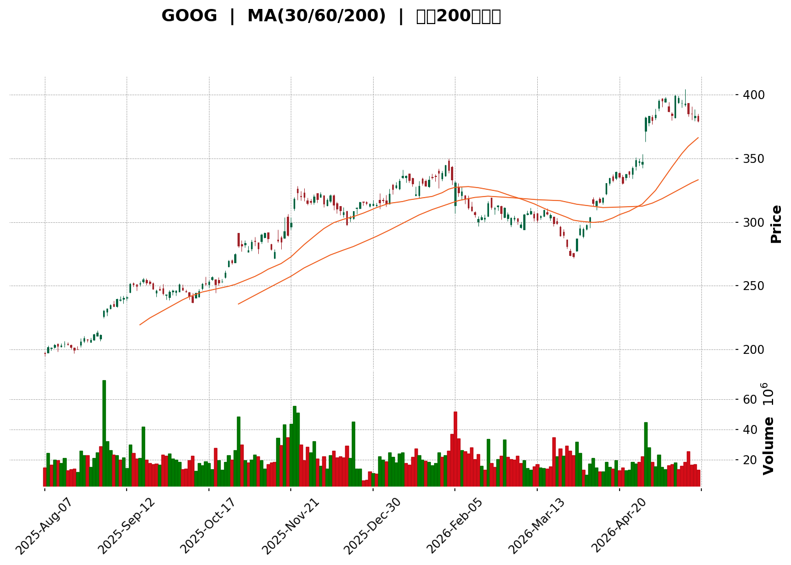
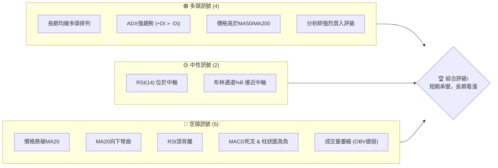
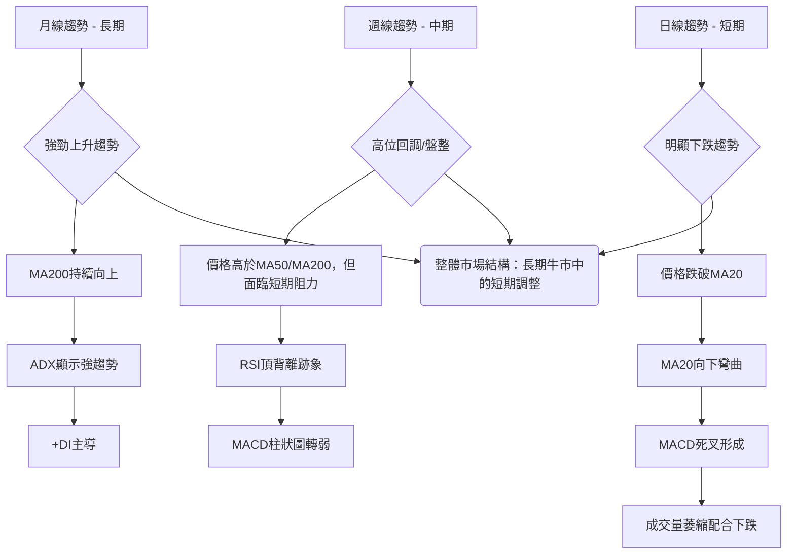
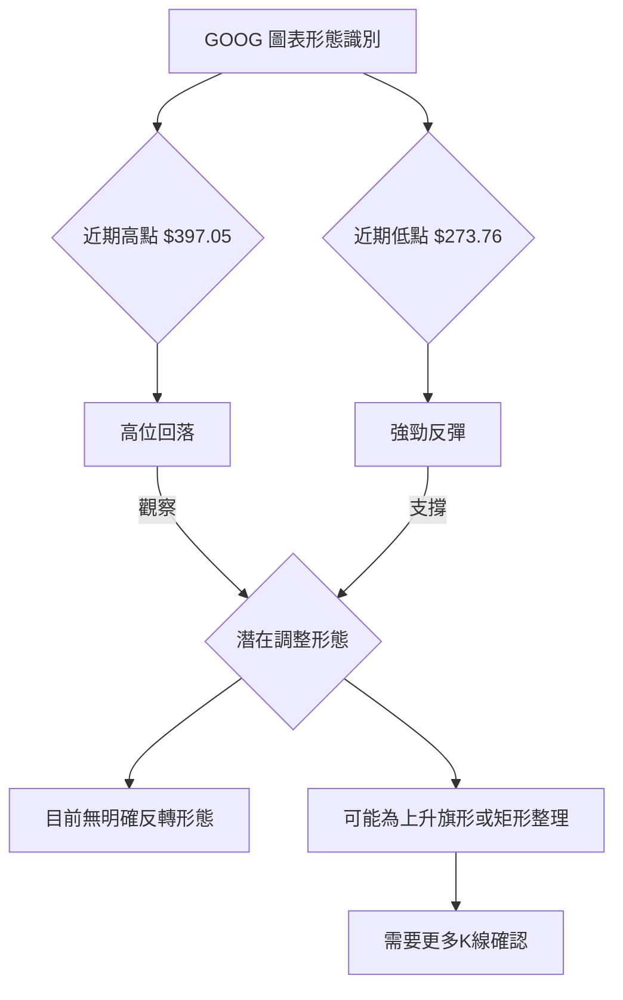
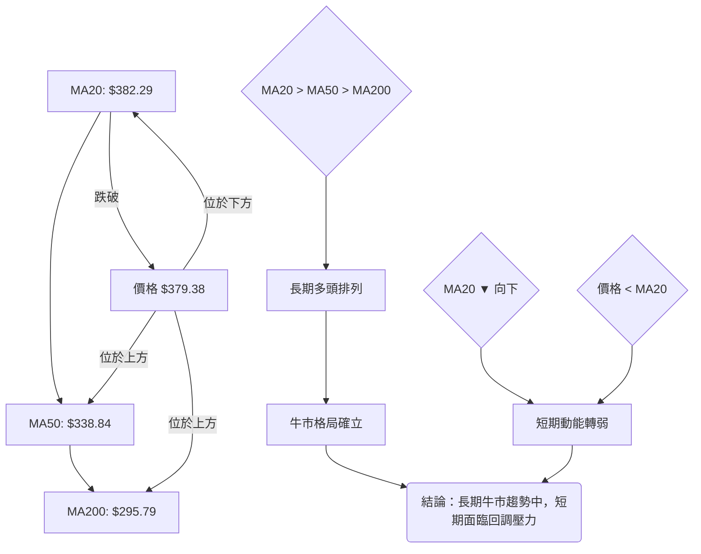
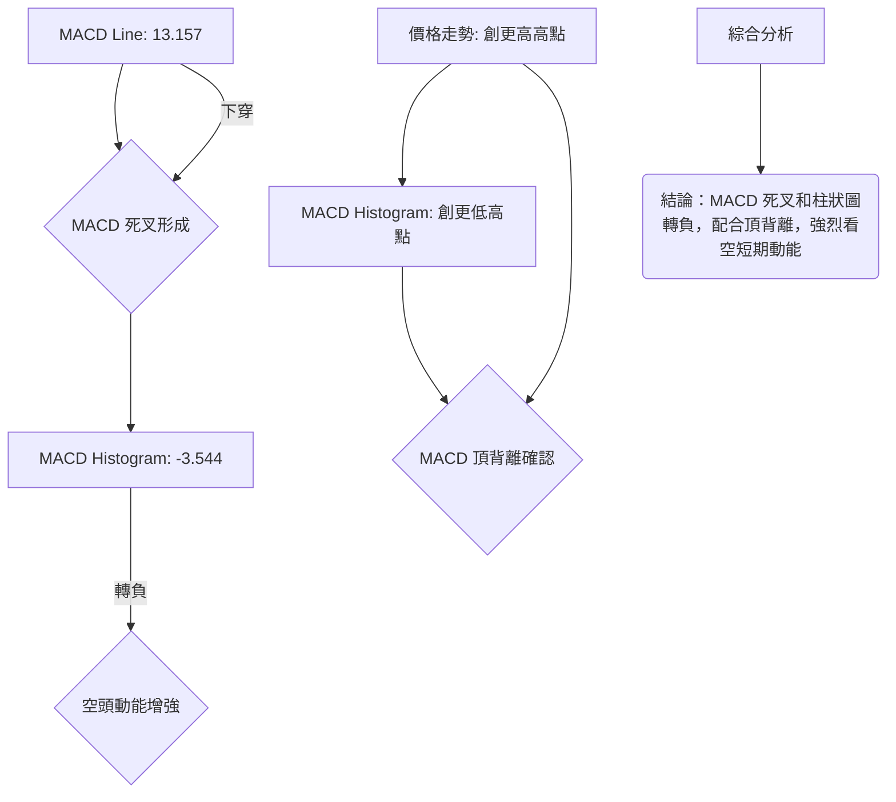

<details>
<summary>📊 靜態圖表 (點擊展開)</summary>

</details>

<html>
<head><meta charset="utf-8" /></head>
<body>
    <div>                        <script>window.PlotlyConfig = {MathJaxConfig: 'local'};</script>
        <script charset="utf-8" src="https://cdn.plot.ly/plotly-3.5.0.min.js" integrity="sha256-fHbNLP+GlIXN+efbQec78UkemUz3NJp7UmfGxC1tNxs=" crossorigin="anonymous"></script>                <div id="candlestick-chart" class="plotly-graph-div" style="height:500px; width:100%;"></div>            <script>                window.PLOTLYENV=window.PLOTLYENV || {};                                if (document.getElementById("candlestick-chart")) {                    Plotly.newPlot(                        "candlestick-chart",                        [{"close":{"dtype":"f8","bdata":"AAAAwMWaaEAAAADAWDRpQAAAAACpJWlAAAAAIHB2aUAAAADgW1JpQAAAACCVa2lAAAAAYGKOaUAAAACAlnppQAAAAEAeQWlAAAAA4K73aEAAAACAaQVpQAAAAIAsyGlAAAAAABQWakAAAAAAcu9pQAAAAEC\u002f92lAAAAAIJF8akAAAACgmqFqQAAAAIBvcGpAAAAAoJTSbEAAAABgYwRtQAAAACCHVG1AAAAAgPY6bUAAAAAArPNtQAAAAECH521AAAAA4IMObkAAAACgsCFuQAAAACBmbW9AAAAAwIhib0AAAADAXDBvQAAAAGCdf29AAAAAwJvcb0AAAADgMJFvQAAAAADvf29AAAAAQM\u002fvbkAAAABgi8duQAAAAKAJ225AAAAAgOuAbkAAAAAgCWduQAAAAAChpm5AAAAAABLDbkAAAACgtcNuQAAAAABpZW9AAAAAwHDZbkAAAACgEqRuQAAAAMA2PG5AAAAA4GClbUAAAAAg3oluQAAAAKBmu25AAAAAIM1rb0AAAAAAPHFvQAAAAGBFrm9AAAAA4L4KcEAAAABA+l9vQAAAAIABhm9AAAAAgFqsb0AAAACAgkJwQAAAAIAG2XBAAAAA4A7BcEAAAACAwCxxQAAAACBJmHFAAAAAAAKXcUAAAAAAwrtxQAAAAODtWnFAAAAAANPFcUAAAABgQM9xQAAAAEAidXFAAAAAICMjckAAAAAggzVyQAAAAGCl8HFAAAAAwN1rcUAAAABArElxQAAAAOBn03FAAAAAAC7JcUAAAABAfElyQAAAACBkGXJAAAAAoOazckAAAADgnOBzQAAAAIA4M3RAAAAAgIj9c0AAAAAg+vpzQAAAAMAVq3NAAAAAQHe5c0AAAABg9wJ0QAAAAMBV33NAAAAAQHQadEAAAACAqKNzQAAAAMBr2HNAAAAAYGIMdEAAAACgqpdzQAAAAIDSZHNAAAAAwKJRc0AAAADANjhzQAAAAECanXJAAAAAIJT4ckAAAACgSEZzQAAAAODFcXNAAAAAAFO3c0AAAAAgKrdzQAAAAODPq3NAAAAAALOic0AAAADAQaVzQAAAAOBDmXNAAAAAgJGxc0AAAADAi9FzQAAAAMBBpXNAAAAAgD8jdEAAAADgfFx0QAAAAGCIjnRAAAAAoO7HdEAAAAAgFwN1QAAAAAAsAXVAAAAAwM7OdEAAAAAguKF0QAAAAGDuHnRAAAAAoGGCdEAAAACgtql0QAAAAEAug3RAAAAAwK7VdEAAAAAAOux0QAAAAECxAHVAAAAA4L4mdUAAAADAqiR1QAAAAOCDinVAAAAA4FxHdUAAAABgr9F0QAAAAECMsXRAAAAAAPYtdEAAAAAAv0J0QAAAAMB95nNAAAAA4MVxc0AAAABgb1JzQAAAAIDfHHNAAAAAgLXpckAAAADgnftyQAAAAGCK9XJAAAAAYNqqc0AAAACAh3dzQAAAAOA3a3NAAAAAQPSMc0AAAADA8C5zQAAAAEBfc3NAAAAAIE8ic0AAAABgivVyQAAAAEDI83JAAAAAoCvLckAAAACgcKFyQAAAAAApIHNAAAAAQOEuc0AAAABguEZzQAAAACBc83JAAAAAIFzXckAAAABguAZzQAAAAGCPVnNAAAAAwMwkc0AAAAAgrhtzQAAAAOCjrHJAAAAA4FGwckAAAABAMxNyQAAAAKBwGXJAAAAAANeLcUAAAAAAKRxxQAAAAIA9EnFAAAAAgMLtcUAAAABgZm5yQAAAACBcZ3JAAAAAYI+ackAAAABA4f5yQAAAAADXq3NAAAAAgOvFc0AAAAAghbtzQAAAACBc83NAAAAAoEepdEAAAAAghed0QAAAAOBRzHRAAAAAYGY2dUAAAABgZvZ0QAAAACCFp3RAAAAAIK4bdUAAAAAAABx1QAAAAMAeZXVAAAAA4FHIdUAAAAAAALh1QAAAAMD1tHVAAAAAQArfd0AAAAAghfN3QAAAAIA9undAAAAA4FEEeEAAAACAPbJ4QAAAAMDMtHhAAAAAwMzQeEAAAADgUSx4QAAAAMAe\u002fXdAAAAA4KPweEAAAABguNJ4QAAAAMAelXhAAAAAgMKReEAAAABgZg54QAAAAGBmDnhAAAAAIIX3d0AAAACAFLZ3QA=="},"high":{"dtype":"f8","bdata":"htLI7pK9aEB5jZxUIV9pQFuBJP6UNmlAig1ghGiVaUCU6KRw\u002fJ5pQAKYNcuqnmlAkUqzcqbbaUDO\u002f6ewp7VpQBD0ppyWemlAYaIJjOY2aUAf1Sku5VxpQE5gYypQGGpAn2vA97JTakDeqFWcuv9pQPsxaFYrI2pApZsLHn2NakAu2HjNZNtqQPFs2UWJfGpAMZXiHO7obEDGE4955gdtQP5ogdMtc21AxVuqanXCbUChMiuIcQhuQA4cGiQPOG5AnA8yv7dHbkBGSwtLBUNuQFEGlEEJjW9Ad+CoJmCcb0De0SiOeHNvQOOBn8Z0uW9A9l+89KEFcED+xlBJzf5vQHBivqOWzW9AzdsnSL+Tb0CYZRgaWt9uQHTeGnr9OG9AzDUN0dFpb0BO+Ke8B2tuQB6oHz8U2m5AILd0\u002fpPpbkC4BgN1DtluQM+ygdZ1e29ABJ0QS7Bmb0Ay2QEjmN1uQI44Bbsbp25AodZ2YUKQbkAgX\u002fd8DZVuQFimdn8K9m5AUef\u002f9lqNb0Al7S96sRNwQD4PU6Ua0W9Aa7CguXwYcEB3NUcjFeFvQPq\u002fiU5NDXBAlnrA2Gvwb0DfkxVld2JwQPxSYivt5nBAkIP3vjHwcECzxN7OiDlxQBm59E6MOHJAkEaA1VnecUCvBxil1thxQNQ6pUs7l3FA7RZObPvkcUCG7+k7sgZyQP+QQVnUwXFA6dhaywkxckAUHiJrGT9yQGWiqUBrP3JAL0Yd4AKycUCI4pxzWGxxQEOuIZnuYXJARdWCx64QckB9GFS7Zv1yQNV6JZ2VJ3NA1THOccT4ckD69Y8d3fVzQE35M3KXg3RASQv0eMpIdEAtjouX\u002fWZ0QDRSH7Ul83NAUL\u002fRrLDic0BVW6vdpxl0QFs94ZqTKnRAKda\u002flkE2dEDBuvvSDxB0QEh9EBzB53NAkIvGXUsadEBThw54Nhx0QHi3eeutvnNAJ+W\u002fgK2Hc0AKmUriAXpzQB91+yOjT3NAoPhUxbgQc0AAeH0HXExzQB7K2G6wd3NAp1VXtjzBc0B8oVPWE8FzQB4H1eJkxXNA6W\u002fj8\u002firc0AdeL0qn9dzQETlPAqwsnNAaqQkmvwqdEAWS1BvZ\u002fBzQHYsaIlWFXRAixFiPcNjdEBF3cuv6qR0QJSNlEDys3RA+hih0UXjdEANx8deW091QOImgwyvDHVAo51si0UedUBWkhNfEPB0QGHhYIa+fXRAZWynONrHdEC93hiGle90QETkVLq33HRA7Lyxys8BdUBZBbNaoR91QFVRf\u002ftGFnVAkzt96MhgdUA5hdaszkB1QOBVYJzAjnVACfN8wHTedUBGu\u002fVJH4B1QLlqCLaOxnRA4FZZIoSmdED\u002fiJT+JXh0QBPwhBl1FnRAMV5cnBoNdECdSzl\u002fHcRzQAQpf9nCSnNA47LZR84Kc0C\u002fI9pRHRtzQPV1lGAIHXNAcZYAo5fIc0DGeiB8rvNzQIYZtNFmgnNAEKjx7gaXc0Ag596BeYxzQFPQMcDDfXNA\u002fsIL\u002fsQ+c0AUanjHnftyQDdCR1TrE3NAHi3vp4DyckD6MIul5cFyQAAAAAAAKHNAAAAAYGZSc0AAAACgGnFzQAAAAIA9SnNAAAAAACk0c0AAAADAHhlzQAAAAMDMYHNAAAAAAABsc0AAAABA4SpzQAAAAIDrBXNAAAAAgOv1ckAAAACgmZFyQAAAAGCPanJAAAAAgD3ocUAAAACgcHFxQAAAAAApRHFAAAAAwMzwcUAAAACAwp9yQAAAAGBmfnJAAAAAwMymckAAAACgmQFzQAAAAIA99nNAAAAAQOHWc0AAAAAAAPhzQAAAAEDh9nNAAAAAgD2qdEAAAAAAAPB0QAAAAIAUFnVAAAAAgMI\u002fdUAAAABgjzJ1QAAAAGC4EnVAAAAA4HogdUAAAABgj0J1QAAAAEAKe3VAAAAAYGbudUAAAABgZt51QAAAAGBmFnZAAAAAgBTqd0AAAACAPfZ3QAAAAEDhAnhAAAAAIFxPeEAAAACAFMZ4QAAAACCu1XhAAAAAgOvleEAAAACgR6V4QAAAAEAKJ3hAAAAAQOH+eEAAAAAAqvF4QAAAAIAUvnhAAAAAIIVHeUAAAADgzpV4QAAAAEAza3hAAAAAQOFKeEAAAACA6w14QA=="},"hovertemplate":"\u003cb\u003e%{x|%Y-%m-%d}\u003c\u002fb\u003e\u003cbr\u003e\u958b: $%{open:.2f}\u003cbr\u003e\u9ad8: $%{high:.2f}\u003cbr\u003e\u4f4e: $%{low:.2f}\u003cbr\u003e\u6536: $%{close:.2f}\u003cextra\u003e\u003c\u002fextra\u003e","low":{"dtype":"f8","bdata":"5B3jLABZaEDm1m9jka5oQDq4tFA762hAxqXz71AeaUBAn2fSMcZoQKn2A4bZO2lAU5MIAjA0aUCOY4TTfV5pQARWWFhPD2lAkuHNAoWgaEB7jeFMY\u002f5oQO60qsCfNWlAxBoVuZavaUBu\u002fnedjb9pQHQAk0GjvWlANIeXMUXkaUCoKEhB3k9qQKBAglnWz2lAwcIKeKYTbEADOS8fA0hsQG5CMN1y+2xArVlqpjgtbUC7vwxZCSJtQLyJEfowuW1AkFglJEyIbUB\u002f3Qybp8VtQBEcaqq7lG5Auo\u002fdTgwsb0BPfvIv3cduQBqR6sarOG9AXVpx2T13b0C1p45cCk9vQG1BnuH8V29AwzMk5lDcbkB+T9RCUSpuQINsGv\u002fHyW5AQYzCodlbbkABLVFP4edtQEXINScG3G1A11M0jNBYbkAVvlSyhURuQEBksEBsq25ASyOzzTbPbkCP6NybP5huQG2ONvhc621AEH15MKeLbUAJ8eRyjg1uQKtXM+g7G25A5UcPA5PObkDPRL8PkUpvQPmigb4YCG9A3tw4HyjIb0Ca4h2x04puQLOLIXaRQ29AQiXHjpyNb0C0yUQ5F\u002fhvQBDNzDRLiXBA9b7i\u002fuyscEA5jX7MDsFwQPD1Dw0egXFABN+0W1lScUDLbCTS1n9xQMGfksLVR3FABJXTpA1YcUCodmznz5NxQO8qz\u002fzbNXFAvvMghX2ycUCCBrMO1vdxQLBAKI\u002fpv3FAzbrwd\u002fhZcUDQ6SNtrPBwQCzRT\u002fuDvXFApuXs6BtqcUBml6spe\u002fRxQP8JSN9yDHJAcoosH2BfckCNkRJ8sE9zQE8ebLYp1nNARewQ+lHMc0Aoyu+HKshzQBc8drTemHNArL52frScc0A9WFTzqZ1zQPciz2uYsnNAefIqd734c0BN2grzC3tzQOec6wpmhnNAH9ni5diyc0CcIQ\u002fkllpzQGqQ4APnK3NAujvoUmUYc0BEBwV\u002f2\u002flyQGmyTILZk3JAegEjn7HGckD+dljUCOJyQHZbEIv8JXNAOTYm939oc0C2Z79Gl5FzQMX2ZHP8l3NARzL8DeN6c0ByV52\u002feJBzQOU2G\u002f2uf3NAhb1il+Zmc0BcPcnYbrBzQGaWWv\u002frgXNAhzXgHXWkc0CEGLh3Nhx0QM+JczVTYHRArYYJUn5UdEBZN3F\u002f1eF0QMyXW6iCrnRAP0pTpOiwdEAyEsUhBn90QCALhymgCnRASbJpfQr1c0BgdNomYIp0QH1ui3PTe3RAq726tiZ0dEB2C7+aPdh0QL39TddWvnRAfWWWDddndEAzXrpbfsZ0QGomPyJg\u002fHRAYI6CVaAldUBuT8GyNZJ0QF64kmJDK3NAio6MQcv+c0AYL5gxn9dzQDU+fxIEp3NA6cfTNZZec0Dh\u002faHE7T5zQBOv3hz6+nJAhc1aMg6LckCwXMJmR9xyQBlpdlVVx3JAxRzzl0oDc0BMmeUmWVxzQAaMQA3+HXNA+fQfdUZSc0CO9MdqJ+NyQAntf1oJ9nJARv9CqJHNckDBNPeI14dyQChLMGRpyXJATsyZMMOdckCiF16rrHByQAAAAEDhXnJAAAAAwPUUc0AAAACgcB1zQAAAAKBwzXJAAAAA4Hq8ckAAAADA9dxyQAAAAKCZBXNAAAAAYLgYc0AAAAAAANByQAAAAAAAjHJAAAAA4HqgckAAAAAgrg1yQAAAAIDr9XFAAAAAwMxwcUAAAAAgrhdxQAAAAGCP+HBAAAAAAClMcUAAAAAghRdyQAAAAMAe+XFAAAAA4KNcckAAAADAzHZyQAAAAKBHi3NAAAAAIIVXc0AAAADgo6hzQAAAAEAKm3NAAAAAYGYSdEAAAABgj4p0QAAAAGBmunRAAAAA4KPUdEAAAACAFOp0QAAAAIAUmnRAAAAAIFzPdEAAAADA9fB0QAAAAMDM4HRAAAAAwPVMdUAAAADgeoR1QAAAAEDhZnVAAAAAoHCxdkAAAAAAKXR3QAAAAOBRjHdAAAAAoJnFd0AAAACgmTF4QAAAAMD1ZHhAAAAAYLiaeEAAAAAgriN4QAAAACCFu3dAAAAAoEfZd0AAAADgpYt4QAAAAAApXHhAAAAAYGZueEAAAAAAAPB3QAAAAAAAwHdAAAAAIK63d0AAAAAAKaR3QA=="},"name":"\u50f9\u683c","open":{"dtype":"f8","bdata":"bgtZdYCoaEDAm2NKH7FoQP5ah+FDI2lARjFgpIE0aUDWr4NZnpBpQFTgc1JaQ2lASzd4X1GIaUDunq4DfpNpQFfmIdNLbmlAdFh+cUEnaUDYDaromghpQPfR3G8NcGlA1ChQBB3RaUDhsI7k2vxpQLJjonffv2lAxG18xu7raUDsrF1bcllqQEhVerqmEGpA019NjhI\u002fbECbf0Z+aLRsQEIsj3VjBG1AbcNORg1vbUAEZFra6zttQI\u002fFQzGf3W1AoUxzGxD6bUCJisiwJw9uQGzxjKPYmW5Ati8aZZ1\u002fb0Arvhn\u002fz2NvQND9GFiYcG9AgM3Pzs6hb0A5hcCG6M1vQMszluX0qW9At\u002fbmptx5b0C7oCZWQpBuQGEvEChf7m5AQ0gdpgf+bkDsrPZwYFduQO\u002fwhEpMG25ARhfFJdOpbkCNHjjsuJxuQGt32oBMrm5AEzcXQ\u002fYSb0B5ZFxouLtuQOq7KzpKl25A3AgkpJ06bkAYe+IWgRZuQH2\u002f3V+sLW5AuW56YfX3bkDT6APB7YNvQOXdXxhMYG9A5fldAErcb0A1YdmU7dxvQMMB6RVC1W9ApBFIFWWrb0AgNOkSOA9wQKd91R8BkHBApqopDFfdcEBPiqUM78NwQO09clkxNXJAa7BnLyOtcUDcHU5QmKBxQH31RuYHS3FAa0zEUAVwcUA+FpUOkNVxQKkMehUyvXFA0jIjkQ3OcUC0ztQH8\u002fxxQGrFh2cGO3JAKdVfSp+pcUDzvMk7bPhwQAWd5S4w4HFAs0fMzYABckBRS190uPRxQHKKDw07BXNALJF3L3uHckBSM5oramlzQCPTUDS2ZXRAN5pFuYUFdEDtVkd\u002f3S90QDadZ8y20HNAbRYu3YbHc0BxQ\u002fk7oLlzQJPBnMe2KXRAAEvBOg\u002f5c0AUCqIm3Qx0QEOzlMgSjnNASyJKgVrGc0DawBKp+w10QOsKUKwsqXNAmWIgeHqGc0AbjBqdjRxzQBjNjOytTHNAS6NZ3YvtckDXR9ll5\u002fByQIIkfy0YcHNAsczy2qduc0DsE6+91r5zQP8nSVspu3NAec\u002fixpiJc0CkH4GpB5NzQD74a91jknNA045N1NzVc0DKgC6ritdzQPRUo8pi0XNA1WEyqpOlc0CDnQr9h5B0QLuBEqImdHRAGs8xd1JkdEAtYuwQtPB0QDSjF5L863RAsEjLghIddUAz1DQAMOt0QGdpK6c4EHRAKbGQQecNdEBkTqyfeeB0QHAxS7G7xnRA9SWg6oB\u002fdECmqe6uTPZ0QKDla+z3BXVA1J2DQMRBdUDDCU28l+N0QKvQp1MCBXVAe3FZl1DEdUAttmA3NXh1QNbP5iasj3NAIbXdvulxdEBa4I68OBB0QAfd\u002fgzyCnRAfYCGX8Trc0CGeRboFIJzQOPKinVKPHNALzNYidrGckBV1R55geNyQAgCw3\u002fp5HJAHlB3310Jc0ARJqFEpe5zQJr9rc69ZnNAib6+f2d+c0D0SNBRW4lzQDEh4did+3JAw0QPCgfsckAbz3jSW6NyQN53t\u002fSM53JAFS5s5cjvckCDGpws0X1yQAAAAAApYnJAAAAAAAAec0AAAADAzCRzQAAAACBcI3NAAAAA4Hoqc0AAAACgmflyQAAAAGC4CnNAAAAA4Ho+c0AAAAAgXPNyQAAAAMAeAXNAAAAA4HrIckAAAAAgXINyQAAAAGBmQnJAAAAAQArjcUAAAABgZlZxQAAAAEAKN3FAAAAA4KNYcUAAAAAgrh9yQAAAAADXD3JAAAAAQDNrckAAAACAPcJyQAAAAKBH3XNAAAAAQAqTc0AAAACgmeNzQAAAAGC4tnNAAAAAQAohdEAAAADA9ah0QAAAAKCZ\u002fXRAAAAAQOHmdEAAAADA9Sh1QAAAACBc+XRAAAAAACnudEAAAABAMzl1QAAAACCFG3VAAAAAgBR+dUAAAABguK51QAAAACCul3VAAAAAgBQ0d0AAAAAgrp93QAAAAMAe5XdAAAAAgOvdd0AAAACgcFl4QAAAAMD10HhAAAAA4FGkeEAAAABACmt4QAAAAAAAEHhAAAAA4Hred0AAAADgo5x4QAAAAKBwk3hAAAAAAACCeEAAAADAzJR4QAAAAOCjEHhAAAAAACngd0AAAAAAKfR3QA=="},"x":["2025-08-07T00:00:00-04:00","2025-08-08T00:00:00-04:00","2025-08-11T00:00:00-04:00","2025-08-12T00:00:00-04:00","2025-08-13T00:00:00-04:00","2025-08-14T00:00:00-04:00","2025-08-15T00:00:00-04:00","2025-08-18T00:00:00-04:00","2025-08-19T00:00:00-04:00","2025-08-20T00:00:00-04:00","2025-08-21T00:00:00-04:00","2025-08-22T00:00:00-04:00","2025-08-25T00:00:00-04:00","2025-08-26T00:00:00-04:00","2025-08-27T00:00:00-04:00","2025-08-28T00:00:00-04:00","2025-08-29T00:00:00-04:00","2025-09-02T00:00:00-04:00","2025-09-03T00:00:00-04:00","2025-09-04T00:00:00-04:00","2025-09-05T00:00:00-04:00","2025-09-08T00:00:00-04:00","2025-09-09T00:00:00-04:00","2025-09-10T00:00:00-04:00","2025-09-11T00:00:00-04:00","2025-09-12T00:00:00-04:00","2025-09-15T00:00:00-04:00","2025-09-16T00:00:00-04:00","2025-09-17T00:00:00-04:00","2025-09-18T00:00:00-04:00","2025-09-19T00:00:00-04:00","2025-09-22T00:00:00-04:00","2025-09-23T00:00:00-04:00","2025-09-24T00:00:00-04:00","2025-09-25T00:00:00-04:00","2025-09-26T00:00:00-04:00","2025-09-29T00:00:00-04:00","2025-09-30T00:00:00-04:00","2025-10-01T00:00:00-04:00","2025-10-02T00:00:00-04:00","2025-10-03T00:00:00-04:00","2025-10-06T00:00:00-04:00","2025-10-07T00:00:00-04:00","2025-10-08T00:00:00-04:00","2025-10-09T00:00:00-04:00","2025-10-10T00:00:00-04:00","2025-10-13T00:00:00-04:00","2025-10-14T00:00:00-04:00","2025-10-15T00:00:00-04:00","2025-10-16T00:00:00-04:00","2025-10-17T00:00:00-04:00","2025-10-20T00:00:00-04:00","2025-10-21T00:00:00-04:00","2025-10-22T00:00:00-04:00","2025-10-23T00:00:00-04:00","2025-10-24T00:00:00-04:00","2025-10-27T00:00:00-04:00","2025-10-28T00:00:00-04:00","2025-10-29T00:00:00-04:00","2025-10-30T00:00:00-04:00","2025-10-31T00:00:00-04:00","2025-11-03T00:00:00-05:00","2025-11-04T00:00:00-05:00","2025-11-05T00:00:00-05:00","2025-11-06T00:00:00-05:00","2025-11-07T00:00:00-05:00","2025-11-10T00:00:00-05:00","2025-11-11T00:00:00-05:00","2025-11-12T00:00:00-05:00","2025-11-13T00:00:00-05:00","2025-11-14T00:00:00-05:00","2025-11-17T00:00:00-05:00","2025-11-18T00:00:00-05:00","2025-11-19T00:00:00-05:00","2025-11-20T00:00:00-05:00","2025-11-21T00:00:00-05:00","2025-11-24T00:00:00-05:00","2025-11-25T00:00:00-05:00","2025-11-26T00:00:00-05:00","2025-11-28T00:00:00-05:00","2025-12-01T00:00:00-05:00","2025-12-02T00:00:00-05:00","2025-12-03T00:00:00-05:00","2025-12-04T00:00:00-05:00","2025-12-05T00:00:00-05:00","2025-12-08T00:00:00-05:00","2025-12-09T00:00:00-05:00","2025-12-10T00:00:00-05:00","2025-12-11T00:00:00-05:00","2025-12-12T00:00:00-05:00","2025-12-15T00:00:00-05:00","2025-12-16T00:00:00-05:00","2025-12-17T00:00:00-05:00","2025-12-18T00:00:00-05:00","2025-12-19T00:00:00-05:00","2025-12-22T00:00:00-05:00","2025-12-23T00:00:00-05:00","2025-12-24T00:00:00-05:00","2025-12-26T00:00:00-05:00","2025-12-29T00:00:00-05:00","2025-12-30T00:00:00-05:00","2025-12-31T00:00:00-05:00","2026-01-02T00:00:00-05:00","2026-01-05T00:00:00-05:00","2026-01-06T00:00:00-05:00","2026-01-07T00:00:00-05:00","2026-01-08T00:00:00-05:00","2026-01-09T00:00:00-05:00","2026-01-12T00:00:00-05:00","2026-01-13T00:00:00-05:00","2026-01-14T00:00:00-05:00","2026-01-15T00:00:00-05:00","2026-01-16T00:00:00-05:00","2026-01-20T00:00:00-05:00","2026-01-21T00:00:00-05:00","2026-01-22T00:00:00-05:00","2026-01-23T00:00:00-05:00","2026-01-26T00:00:00-05:00","2026-01-27T00:00:00-05:00","2026-01-28T00:00:00-05:00","2026-01-29T00:00:00-05:00","2026-01-30T00:00:00-05:00","2026-02-02T00:00:00-05:00","2026-02-03T00:00:00-05:00","2026-02-04T00:00:00-05:00","2026-02-05T00:00:00-05:00","2026-02-06T00:00:00-05:00","2026-02-09T00:00:00-05:00","2026-02-10T00:00:00-05:00","2026-02-11T00:00:00-05:00","2026-02-12T00:00:00-05:00","2026-02-13T00:00:00-05:00","2026-02-17T00:00:00-05:00","2026-02-18T00:00:00-05:00","2026-02-19T00:00:00-05:00","2026-02-20T00:00:00-05:00","2026-02-23T00:00:00-05:00","2026-02-24T00:00:00-05:00","2026-02-25T00:00:00-05:00","2026-02-26T00:00:00-05:00","2026-02-27T00:00:00-05:00","2026-03-02T00:00:00-05:00","2026-03-03T00:00:00-05:00","2026-03-04T00:00:00-05:00","2026-03-05T00:00:00-05:00","2026-03-06T00:00:00-05:00","2026-03-09T00:00:00-04:00","2026-03-10T00:00:00-04:00","2026-03-11T00:00:00-04:00","2026-03-12T00:00:00-04:00","2026-03-13T00:00:00-04:00","2026-03-16T00:00:00-04:00","2026-03-17T00:00:00-04:00","2026-03-18T00:00:00-04:00","2026-03-19T00:00:00-04:00","2026-03-20T00:00:00-04:00","2026-03-23T00:00:00-04:00","2026-03-24T00:00:00-04:00","2026-03-25T00:00:00-04:00","2026-03-26T00:00:00-04:00","2026-03-27T00:00:00-04:00","2026-03-30T00:00:00-04:00","2026-03-31T00:00:00-04:00","2026-04-01T00:00:00-04:00","2026-04-02T00:00:00-04:00","2026-04-06T00:00:00-04:00","2026-04-07T00:00:00-04:00","2026-04-08T00:00:00-04:00","2026-04-09T00:00:00-04:00","2026-04-10T00:00:00-04:00","2026-04-13T00:00:00-04:00","2026-04-14T00:00:00-04:00","2026-04-15T00:00:00-04:00","2026-04-16T00:00:00-04:00","2026-04-17T00:00:00-04:00","2026-04-20T00:00:00-04:00","2026-04-21T00:00:00-04:00","2026-04-22T00:00:00-04:00","2026-04-23T00:00:00-04:00","2026-04-24T00:00:00-04:00","2026-04-27T00:00:00-04:00","2026-04-28T00:00:00-04:00","2026-04-29T00:00:00-04:00","2026-04-30T00:00:00-04:00","2026-05-01T00:00:00-04:00","2026-05-04T00:00:00-04:00","2026-05-05T00:00:00-04:00","2026-05-06T00:00:00-04:00","2026-05-07T00:00:00-04:00","2026-05-08T00:00:00-04:00","2026-05-11T00:00:00-04:00","2026-05-12T00:00:00-04:00","2026-05-13T00:00:00-04:00","2026-05-14T00:00:00-04:00","2026-05-15T00:00:00-04:00","2026-05-18T00:00:00-04:00","2026-05-19T00:00:00-04:00","2026-05-20T00:00:00-04:00","2026-05-21T00:00:00-04:00","2026-05-22T00:00:00-04:00"],"type":"candlestick"},{"hovertemplate":"MA30: $%{y:.2f}\u003cextra\u003e\u003c\u002fextra\u003e","line":{"color":"#2196F3","dash":"dash","width":2},"mode":"lines","name":"MA30","x":["2025-08-07T00:00:00-04:00","2025-08-08T00:00:00-04:00","2025-08-11T00:00:00-04:00","2025-08-12T00:00:00-04:00","2025-08-13T00:00:00-04:00","2025-08-14T00:00:00-04:00","2025-08-15T00:00:00-04:00","2025-08-18T00:00:00-04:00","2025-08-19T00:00:00-04:00","2025-08-20T00:00:00-04:00","2025-08-21T00:00:00-04:00","2025-08-22T00:00:00-04:00","2025-08-25T00:00:00-04:00","2025-08-26T00:00:00-04:00","2025-08-27T00:00:00-04:00","2025-08-28T00:00:00-04:00","2025-08-29T00:00:00-04:00","2025-09-02T00:00:00-04:00","2025-09-03T00:00:00-04:00","2025-09-04T00:00:00-04:00","2025-09-05T00:00:00-04:00","2025-09-08T00:00:00-04:00","2025-09-09T00:00:00-04:00","2025-09-10T00:00:00-04:00","2025-09-11T00:00:00-04:00","2025-09-12T00:00:00-04:00","2025-09-15T00:00:00-04:00","2025-09-16T00:00:00-04:00","2025-09-17T00:00:00-04:00","2025-09-18T00:00:00-04:00","2025-09-19T00:00:00-04:00","2025-09-22T00:00:00-04:00","2025-09-23T00:00:00-04:00","2025-09-24T00:00:00-04:00","2025-09-25T00:00:00-04:00","2025-09-26T00:00:00-04:00","2025-09-29T00:00:00-04:00","2025-09-30T00:00:00-04:00","2025-10-01T00:00:00-04:00","2025-10-02T00:00:00-04:00","2025-10-03T00:00:00-04:00","2025-10-06T00:00:00-04:00","2025-10-07T00:00:00-04:00","2025-10-08T00:00:00-04:00","2025-10-09T00:00:00-04:00","2025-10-10T00:00:00-04:00","2025-10-13T00:00:00-04:00","2025-10-14T00:00:00-04:00","2025-10-15T00:00:00-04:00","2025-10-16T00:00:00-04:00","2025-10-17T00:00:00-04:00","2025-10-20T00:00:00-04:00","2025-10-21T00:00:00-04:00","2025-10-22T00:00:00-04:00","2025-10-23T00:00:00-04:00","2025-10-24T00:00:00-04:00","2025-10-27T00:00:00-04:00","2025-10-28T00:00:00-04:00","2025-10-29T00:00:00-04:00","2025-10-30T00:00:00-04:00","2025-10-31T00:00:00-04:00","2025-11-03T00:00:00-05:00","2025-11-04T00:00:00-05:00","2025-11-05T00:00:00-05:00","2025-11-06T00:00:00-05:00","2025-11-07T00:00:00-05:00","2025-11-10T00:00:00-05:00","2025-11-11T00:00:00-05:00","2025-11-12T00:00:00-05:00","2025-11-13T00:00:00-05:00","2025-11-14T00:00:00-05:00","2025-11-17T00:00:00-05:00","2025-11-18T00:00:00-05:00","2025-11-19T00:00:00-05:00","2025-11-20T00:00:00-05:00","2025-11-21T00:00:00-05:00","2025-11-24T00:00:00-05:00","2025-11-25T00:00:00-05:00","2025-11-26T00:00:00-05:00","2025-11-28T00:00:00-05:00","2025-12-01T00:00:00-05:00","2025-12-02T00:00:00-05:00","2025-12-03T00:00:00-05:00","2025-12-04T00:00:00-05:00","2025-12-05T00:00:00-05:00","2025-12-08T00:00:00-05:00","2025-12-09T00:00:00-05:00","2025-12-10T00:00:00-05:00","2025-12-11T00:00:00-05:00","2025-12-12T00:00:00-05:00","2025-12-15T00:00:00-05:00","2025-12-16T00:00:00-05:00","2025-12-17T00:00:00-05:00","2025-12-18T00:00:00-05:00","2025-12-19T00:00:00-05:00","2025-12-22T00:00:00-05:00","2025-12-23T00:00:00-05:00","2025-12-24T00:00:00-05:00","2025-12-26T00:00:00-05:00","2025-12-29T00:00:00-05:00","2025-12-30T00:00:00-05:00","2025-12-31T00:00:00-05:00","2026-01-02T00:00:00-05:00","2026-01-05T00:00:00-05:00","2026-01-06T00:00:00-05:00","2026-01-07T00:00:00-05:00","2026-01-08T00:00:00-05:00","2026-01-09T00:00:00-05:00","2026-01-12T00:00:00-05:00","2026-01-13T00:00:00-05:00","2026-01-14T00:00:00-05:00","2026-01-15T00:00:00-05:00","2026-01-16T00:00:00-05:00","2026-01-20T00:00:00-05:00","2026-01-21T00:00:00-05:00","2026-01-22T00:00:00-05:00","2026-01-23T00:00:00-05:00","2026-01-26T00:00:00-05:00","2026-01-27T00:00:00-05:00","2026-01-28T00:00:00-05:00","2026-01-29T00:00:00-05:00","2026-01-30T00:00:00-05:00","2026-02-02T00:00:00-05:00","2026-02-03T00:00:00-05:00","2026-02-04T00:00:00-05:00","2026-02-05T00:00:00-05:00","2026-02-06T00:00:00-05:00","2026-02-09T00:00:00-05:00","2026-02-10T00:00:00-05:00","2026-02-11T00:00:00-05:00","2026-02-12T00:00:00-05:00","2026-02-13T00:00:00-05:00","2026-02-17T00:00:00-05:00","2026-02-18T00:00:00-05:00","2026-02-19T00:00:00-05:00","2026-02-20T00:00:00-05:00","2026-02-23T00:00:00-05:00","2026-02-24T00:00:00-05:00","2026-02-25T00:00:00-05:00","2026-02-26T00:00:00-05:00","2026-02-27T00:00:00-05:00","2026-03-02T00:00:00-05:00","2026-03-03T00:00:00-05:00","2026-03-04T00:00:00-05:00","2026-03-05T00:00:00-05:00","2026-03-06T00:00:00-05:00","2026-03-09T00:00:00-04:00","2026-03-10T00:00:00-04:00","2026-03-11T00:00:00-04:00","2026-03-12T00:00:00-04:00","2026-03-13T00:00:00-04:00","2026-03-16T00:00:00-04:00","2026-03-17T00:00:00-04:00","2026-03-18T00:00:00-04:00","2026-03-19T00:00:00-04:00","2026-03-20T00:00:00-04:00","2026-03-23T00:00:00-04:00","2026-03-24T00:00:00-04:00","2026-03-25T00:00:00-04:00","2026-03-26T00:00:00-04:00","2026-03-27T00:00:00-04:00","2026-03-30T00:00:00-04:00","2026-03-31T00:00:00-04:00","2026-04-01T00:00:00-04:00","2026-04-02T00:00:00-04:00","2026-04-06T00:00:00-04:00","2026-04-07T00:00:00-04:00","2026-04-08T00:00:00-04:00","2026-04-09T00:00:00-04:00","2026-04-10T00:00:00-04:00","2026-04-13T00:00:00-04:00","2026-04-14T00:00:00-04:00","2026-04-15T00:00:00-04:00","2026-04-16T00:00:00-04:00","2026-04-17T00:00:00-04:00","2026-04-20T00:00:00-04:00","2026-04-21T00:00:00-04:00","2026-04-22T00:00:00-04:00","2026-04-23T00:00:00-04:00","2026-04-24T00:00:00-04:00","2026-04-27T00:00:00-04:00","2026-04-28T00:00:00-04:00","2026-04-29T00:00:00-04:00","2026-04-30T00:00:00-04:00","2026-05-01T00:00:00-04:00","2026-05-04T00:00:00-04:00","2026-05-05T00:00:00-04:00","2026-05-06T00:00:00-04:00","2026-05-07T00:00:00-04:00","2026-05-08T00:00:00-04:00","2026-05-11T00:00:00-04:00","2026-05-12T00:00:00-04:00","2026-05-13T00:00:00-04:00","2026-05-14T00:00:00-04:00","2026-05-15T00:00:00-04:00","2026-05-18T00:00:00-04:00","2026-05-19T00:00:00-04:00","2026-05-20T00:00:00-04:00","2026-05-21T00:00:00-04:00","2026-05-22T00:00:00-04:00"],"y":{"dtype":"f8","bdata":"AAAAAAAA+H8AAAAAAAD4fwAAAAAAAPh\u002fAAAAAAAA+H8AAAAAAAD4fwAAAAAAAPh\u002fAAAAAAAA+H8AAAAAAAD4fwAAAAAAAPh\u002fAAAAAAAA+H8AAAAAAAD4fwAAAAAAAPh\u002fAAAAAAAA+H8AAAAAAAD4fwAAAAAAAPh\u002fAAAAAAAA+H8AAAAAAAD4fwAAAAAAAPh\u002fAAAAAAAA+H8AAAAAAAD4fwAAAAAAAPh\u002fAAAAAAAA+H8AAAAAAAD4fwAAAAAAAPh\u002fAAAAAAAA+H8AAAAAAAD4fwAAAAAAAPh\u002fAAAAAAAA+H8AAAAAAAD4f6uqqup4bGtAMzMzc2aqa0C8u7vrseBrQERERHTnFmxAMzMz051FbECamZl5MHRsQJqZmTmSomxA7+7u\u002fsnMbEARERHRzfZsQFVVVbXaJG1AIiIi8kxWbUC8u7t7T4dtQGZmZuY3t21AAAAAIN3fbUDNzMycBAhuQO\u002fu7v5uLG5Aq6qq2mRHbkAAAABwvGhuQGZmZkZejW5AMzMz04qjbkBmZma2PLhuQGZmZpZLzG5A3t3dbaXkbkC8u7sryvBuQLy7uwub\u002fm5Ad3d3d2YMb0BVVVUlxyBvQKuqqgoiNG9AvLu7m0BGb0CJiIhIOWFvQJqZmem4gG9AAAAAMAmdb0CamZk5UL5vQLy7u\u002fu12W9AiYiI+IQAcECamZkxKxVwQN7d3T19JnBA7+7unhw\u002fcEBVVVU9x1hwQGZmZt4Wb3BAAAAAGICAcEDv7u7OwpBwQLy7u+vqonBAmpmZ+RC3cEAzMzObYdBwQO\u002fu7vbS6XBA7+7uXu4KcUDv7u72QDJxQDMzMyOBW3FAERERiQaAcUCJiIjwXqRxQM3MzCwJxXFAiYiIuHXkcUDe3d3tWwlyQERERNRvLHJAiYiImNhQckAiIiIyr21yQDMzM6NDh3JAVVVVBWCjckDNzMxsAbhyQGZmZlZbx3JA3t3dbRzWckDNzMz8yuJyQHd3d3eM7XJAq6qqGsb3ckARERFhRgRzQERERMQ6FXNARERE1LMic0Crqqq6ji9zQJqZmWlUPnNAMzMzYzlRc0CJiIj4V2VzQHd3d+d4dHNAzczMfMCEc0AiIiIS0pFzQAAAACAEn3NAIiIi0kKrc0AzMzPjY69zQFVVVRVvsnNAiYiIOC65c0DNzMz8+8FzQBERESFjzXNAd3d3x6HWc0CJiIh47NtzQImIiCgL3nNAERERAYLhc0BVVVU1PupzQLy7u1vv73NAq6qqGqX2c0B3d3c3\u002fwF0QHd3d9e5D3RAmpmZ6VwfdEDe3d0txy90QGZmZua9SHRAIiIiQm9cdECamZlZnWl0QImIiBhGdHRAZmZmdjp4dEDv7u6O4Xx0QJqZmUnWfnRAiYiIyDR9dECamZkJcnp0QO\u002fu7o5MdnRAd3d3F6NvdEAAAACQgWh0QN7d3R2mYnRA7+7uvqJedEB3d3f3AFd0QFVVVRVLTXRAVVVVRctCdEBERERkMDN0QFVVVdXtJXRAAAAAUKUXdEBVVVWFXwl0QImIiMhm\u002f3NAmpmZ2cLwc0Dv7u4ua99zQM3MzKyV03NAIiIiwn3Fc0B3d3fncLdzQBERERHupXNAMzMzkzeSc0BmZmb2JoBzQLy7u4tabXNAq6qqiiJbc0BmZmbmiExzQERERPRNO3NAiYiISJUuc0De3d197htzQAAAADCQDHNA7+7ujl38ckCJiIhYfelyQLy7u4sR2HJARERElKvPckB3d3eH9spyQBEREUE5xnJAAAAAsCW9ckBVVVUlILlyQFVVVZVHu3JAERERsS29ckDe3d1N3cFyQHd3d3chxnJAAAAAwCnTckDNzMwsw+NyQO\u002fu7n6D83JAZmZmlicIc0BVVVWlDRxzQAAAAEAZKXNAq6qqeoY5c0AAAAAAK0lzQCIiItIGXnNAREREFCB3c0Dv7u7uGY5zQLy7u4tQonNA3t3d7afKc0BVVVXl+\u002fNzQN7d3Z0aH3RAVVVVFZJMdEDNzMxsEoV0QM3MzFxzvXRA3t3djXv7dEDv7u4uwTd1QBEREbHIcnVAERERAZ2udUBVVVVFKOV1QFVVVfXhGXZAAAAAEMpMdkCrqqoq+Xd2QImIiFhknXZAvLu7uy3BdkAiIiJyIeN2QA=="},"type":"scatter"},{"hovertemplate":"MA60: $%{y:.2f}\u003cextra\u003e\u003c\u002fextra\u003e","line":{"color":"#9C27B0","dash":"dash","width":2},"mode":"lines","name":"MA60","x":["2025-08-07T00:00:00-04:00","2025-08-08T00:00:00-04:00","2025-08-11T00:00:00-04:00","2025-08-12T00:00:00-04:00","2025-08-13T00:00:00-04:00","2025-08-14T00:00:00-04:00","2025-08-15T00:00:00-04:00","2025-08-18T00:00:00-04:00","2025-08-19T00:00:00-04:00","2025-08-20T00:00:00-04:00","2025-08-21T00:00:00-04:00","2025-08-22T00:00:00-04:00","2025-08-25T00:00:00-04:00","2025-08-26T00:00:00-04:00","2025-08-27T00:00:00-04:00","2025-08-28T00:00:00-04:00","2025-08-29T00:00:00-04:00","2025-09-02T00:00:00-04:00","2025-09-03T00:00:00-04:00","2025-09-04T00:00:00-04:00","2025-09-05T00:00:00-04:00","2025-09-08T00:00:00-04:00","2025-09-09T00:00:00-04:00","2025-09-10T00:00:00-04:00","2025-09-11T00:00:00-04:00","2025-09-12T00:00:00-04:00","2025-09-15T00:00:00-04:00","2025-09-16T00:00:00-04:00","2025-09-17T00:00:00-04:00","2025-09-18T00:00:00-04:00","2025-09-19T00:00:00-04:00","2025-09-22T00:00:00-04:00","2025-09-23T00:00:00-04:00","2025-09-24T00:00:00-04:00","2025-09-25T00:00:00-04:00","2025-09-26T00:00:00-04:00","2025-09-29T00:00:00-04:00","2025-09-30T00:00:00-04:00","2025-10-01T00:00:00-04:00","2025-10-02T00:00:00-04:00","2025-10-03T00:00:00-04:00","2025-10-06T00:00:00-04:00","2025-10-07T00:00:00-04:00","2025-10-08T00:00:00-04:00","2025-10-09T00:00:00-04:00","2025-10-10T00:00:00-04:00","2025-10-13T00:00:00-04:00","2025-10-14T00:00:00-04:00","2025-10-15T00:00:00-04:00","2025-10-16T00:00:00-04:00","2025-10-17T00:00:00-04:00","2025-10-20T00:00:00-04:00","2025-10-21T00:00:00-04:00","2025-10-22T00:00:00-04:00","2025-10-23T00:00:00-04:00","2025-10-24T00:00:00-04:00","2025-10-27T00:00:00-04:00","2025-10-28T00:00:00-04:00","2025-10-29T00:00:00-04:00","2025-10-30T00:00:00-04:00","2025-10-31T00:00:00-04:00","2025-11-03T00:00:00-05:00","2025-11-04T00:00:00-05:00","2025-11-05T00:00:00-05:00","2025-11-06T00:00:00-05:00","2025-11-07T00:00:00-05:00","2025-11-10T00:00:00-05:00","2025-11-11T00:00:00-05:00","2025-11-12T00:00:00-05:00","2025-11-13T00:00:00-05:00","2025-11-14T00:00:00-05:00","2025-11-17T00:00:00-05:00","2025-11-18T00:00:00-05:00","2025-11-19T00:00:00-05:00","2025-11-20T00:00:00-05:00","2025-11-21T00:00:00-05:00","2025-11-24T00:00:00-05:00","2025-11-25T00:00:00-05:00","2025-11-26T00:00:00-05:00","2025-11-28T00:00:00-05:00","2025-12-01T00:00:00-05:00","2025-12-02T00:00:00-05:00","2025-12-03T00:00:00-05:00","2025-12-04T00:00:00-05:00","2025-12-05T00:00:00-05:00","2025-12-08T00:00:00-05:00","2025-12-09T00:00:00-05:00","2025-12-10T00:00:00-05:00","2025-12-11T00:00:00-05:00","2025-12-12T00:00:00-05:00","2025-12-15T00:00:00-05:00","2025-12-16T00:00:00-05:00","2025-12-17T00:00:00-05:00","2025-12-18T00:00:00-05:00","2025-12-19T00:00:00-05:00","2025-12-22T00:00:00-05:00","2025-12-23T00:00:00-05:00","2025-12-24T00:00:00-05:00","2025-12-26T00:00:00-05:00","2025-12-29T00:00:00-05:00","2025-12-30T00:00:00-05:00","2025-12-31T00:00:00-05:00","2026-01-02T00:00:00-05:00","2026-01-05T00:00:00-05:00","2026-01-06T00:00:00-05:00","2026-01-07T00:00:00-05:00","2026-01-08T00:00:00-05:00","2026-01-09T00:00:00-05:00","2026-01-12T00:00:00-05:00","2026-01-13T00:00:00-05:00","2026-01-14T00:00:00-05:00","2026-01-15T00:00:00-05:00","2026-01-16T00:00:00-05:00","2026-01-20T00:00:00-05:00","2026-01-21T00:00:00-05:00","2026-01-22T00:00:00-05:00","2026-01-23T00:00:00-05:00","2026-01-26T00:00:00-05:00","2026-01-27T00:00:00-05:00","2026-01-28T00:00:00-05:00","2026-01-29T00:00:00-05:00","2026-01-30T00:00:00-05:00","2026-02-02T00:00:00-05:00","2026-02-03T00:00:00-05:00","2026-02-04T00:00:00-05:00","2026-02-05T00:00:00-05:00","2026-02-06T00:00:00-05:00","2026-02-09T00:00:00-05:00","2026-02-10T00:00:00-05:00","2026-02-11T00:00:00-05:00","2026-02-12T00:00:00-05:00","2026-02-13T00:00:00-05:00","2026-02-17T00:00:00-05:00","2026-02-18T00:00:00-05:00","2026-02-19T00:00:00-05:00","2026-02-20T00:00:00-05:00","2026-02-23T00:00:00-05:00","2026-02-24T00:00:00-05:00","2026-02-25T00:00:00-05:00","2026-02-26T00:00:00-05:00","2026-02-27T00:00:00-05:00","2026-03-02T00:00:00-05:00","2026-03-03T00:00:00-05:00","2026-03-04T00:00:00-05:00","2026-03-05T00:00:00-05:00","2026-03-06T00:00:00-05:00","2026-03-09T00:00:00-04:00","2026-03-10T00:00:00-04:00","2026-03-11T00:00:00-04:00","2026-03-12T00:00:00-04:00","2026-03-13T00:00:00-04:00","2026-03-16T00:00:00-04:00","2026-03-17T00:00:00-04:00","2026-03-18T00:00:00-04:00","2026-03-19T00:00:00-04:00","2026-03-20T00:00:00-04:00","2026-03-23T00:00:00-04:00","2026-03-24T00:00:00-04:00","2026-03-25T00:00:00-04:00","2026-03-26T00:00:00-04:00","2026-03-27T00:00:00-04:00","2026-03-30T00:00:00-04:00","2026-03-31T00:00:00-04:00","2026-04-01T00:00:00-04:00","2026-04-02T00:00:00-04:00","2026-04-06T00:00:00-04:00","2026-04-07T00:00:00-04:00","2026-04-08T00:00:00-04:00","2026-04-09T00:00:00-04:00","2026-04-10T00:00:00-04:00","2026-04-13T00:00:00-04:00","2026-04-14T00:00:00-04:00","2026-04-15T00:00:00-04:00","2026-04-16T00:00:00-04:00","2026-04-17T00:00:00-04:00","2026-04-20T00:00:00-04:00","2026-04-21T00:00:00-04:00","2026-04-22T00:00:00-04:00","2026-04-23T00:00:00-04:00","2026-04-24T00:00:00-04:00","2026-04-27T00:00:00-04:00","2026-04-28T00:00:00-04:00","2026-04-29T00:00:00-04:00","2026-04-30T00:00:00-04:00","2026-05-01T00:00:00-04:00","2026-05-04T00:00:00-04:00","2026-05-05T00:00:00-04:00","2026-05-06T00:00:00-04:00","2026-05-07T00:00:00-04:00","2026-05-08T00:00:00-04:00","2026-05-11T00:00:00-04:00","2026-05-12T00:00:00-04:00","2026-05-13T00:00:00-04:00","2026-05-14T00:00:00-04:00","2026-05-15T00:00:00-04:00","2026-05-18T00:00:00-04:00","2026-05-19T00:00:00-04:00","2026-05-20T00:00:00-04:00","2026-05-21T00:00:00-04:00","2026-05-22T00:00:00-04:00"],"y":{"dtype":"f8","bdata":"AAAAAAAA+H8AAAAAAAD4fwAAAAAAAPh\u002fAAAAAAAA+H8AAAAAAAD4fwAAAAAAAPh\u002fAAAAAAAA+H8AAAAAAAD4fwAAAAAAAPh\u002fAAAAAAAA+H8AAAAAAAD4fwAAAAAAAPh\u002fAAAAAAAA+H8AAAAAAAD4fwAAAAAAAPh\u002fAAAAAAAA+H8AAAAAAAD4fwAAAAAAAPh\u002fAAAAAAAA+H8AAAAAAAD4fwAAAAAAAPh\u002fAAAAAAAA+H8AAAAAAAD4fwAAAAAAAPh\u002fAAAAAAAA+H8AAAAAAAD4fwAAAAAAAPh\u002fAAAAAAAA+H8AAAAAAAD4fwAAAAAAAPh\u002fAAAAAAAA+H8AAAAAAAD4fwAAAAAAAPh\u002fAAAAAAAA+H8AAAAAAAD4fwAAAAAAAPh\u002fAAAAAAAA+H8AAAAAAAD4fwAAAAAAAPh\u002fAAAAAAAA+H8AAAAAAAD4fwAAAAAAAPh\u002fAAAAAAAA+H8AAAAAAAD4fwAAAAAAAPh\u002fAAAAAAAA+H8AAAAAAAD4fwAAAAAAAPh\u002fAAAAAAAA+H8AAAAAAAD4fwAAAAAAAPh\u002fAAAAAAAA+H8AAAAAAAD4fwAAAAAAAPh\u002fAAAAAAAA+H8AAAAAAAD4fwAAAAAAAPh\u002fAAAAAAAA+H8AAAAAAAD4fyIiIuqYdm1AmpmZ0bejbUCrqqoSgc9tQAAAALhO+G1AIiIi4lMjbkBmZmZuQ09uQKuqqlrGd25AZmZmnoGlbkDe3d0lLtRuQBERETmEAW9AERERkaYrb0DNzMyMalRvQO\u002fu7t6Gfm9AmpmZif+mb0CamZnpY9RvQDMzMzsFAHBAIiIiZlAXcEB3d3eXTzNwQDMzMyMYUXBAVVVV+eVocEDe3d2lPoBwQAAAAHyXlXBAvLu7N2SrcEDe3d2B4MBwQBEREa3e1XBAIiIi6oXrcEBmZmZiCf9wQERERFSqEHFAmpmZKUAjcUCJiIgITzRxQJqZmeXbQ3FA7+7uglBScUDNzMyM+WBxQKuqqrozbXFAmpmZiSV8cUBVVVXJuIxxQBEREQHcnXFAmpmZOeiwcUAAAAD8KsRxQAAAAKS11nFAmpmZvdzocUC8u7tjDftxQJqZmemxC3JAMzMzu+gdckCrqqrWGTFyQHd3d4trRHJAiYiImBhbckARERFt0nByQERERBz4hnJAzczMYJqcckCrqqp2LbNyQO\u002fu7iY2yXJAAAAAwIvdckAzMzMzpPJyQGZmZn49BXNAzczMTC0Zc0C8u7uz9itzQHd3d3+ZO3NAAAAAkAJNc0AiIiJSAF1zQO\u002fu7paKa3NAvLu7q7x6c0BVVVUVSYlzQO\u002fu7i4lm3NAZmZmrhqqc0BVVVXd8bZzQGZmZm7AxHNAVVVVJXfNc0DNzMwkONZzQJqZmVmV3nNA3t3dFTfnc0AREREB5e9zQDMzM7ti9XNAIiIiyjH6c0ARERHRKf1zQO\u002fu7h7VAHRAiYiIyPIEdEBVVVVtMgN0QFVVVRXd\u002f3NA7+7uvvz9c0CJiIgwlvpzQDMzM3uo+XNAvLu7iyP3c0Dv7u7+pfJzQImIiPi47nNAVVVVbSLpc0AiIiKy1ORzQERERITC4XNAZmZmbhHec0B3d3cPuNxzQERERPTT2nNAZmZmPsrYc0AiIiIS99dzQBERETkM23NAZmZm5sjbc0AAAAAgE9tzQGZmZgbK13NAd3d332fTc0BmZmYGaMxzQM3MzDyzxXNAvLu7K8m8c0ARERGx97FzQFVVVQ0vp3NA3t3dVaefc0C8u7sLvJlzQHd3d69vlHNAd3d3N+SNc0BmZmaOEIhzQFVVVVVJhHNAMzMze\u002fx\u002fc0ARERHZhnpzQGZmZqYHdnNAAAAAiGd1c0ARERFZkXZzQLy7uyN1eXNAAAAAOHV8c0AiIiJqvH1zQGZmZnZXfnNAZmZmHoJ\u002fc0C8u7vzTYBzQJqZmXH6gXNAvLu706uEc0CrqqpyIIdzQLy7u4vVh3NAREREPOWSc0De3d1lQqBzQBEREUk0rXNA7+7urpO9c0BVVVV1gNBzQGZmZsYB5XNAZmZmjuz7c0C8u7tDnxB0QGZmZh5tJXRAq6qqSiQ\u002fdEBmZmZmD1h0QDMzM5sNcHRAAAAA4PeEdEAAAACojJh0QO\u002fu7vZVrHRAZmZmti2\u002fdEAAAABgf9J0QA=="},"type":"scatter"},{"hovertemplate":"MA200: $%{y:.2f}\u003cextra\u003e\u003c\u002fextra\u003e","line":{"color":"#FF6F00","dash":"solid","width":2},"mode":"lines","name":"MA200","x":["2025-08-07T00:00:00-04:00","2025-08-08T00:00:00-04:00","2025-08-11T00:00:00-04:00","2025-08-12T00:00:00-04:00","2025-08-13T00:00:00-04:00","2025-08-14T00:00:00-04:00","2025-08-15T00:00:00-04:00","2025-08-18T00:00:00-04:00","2025-08-19T00:00:00-04:00","2025-08-20T00:00:00-04:00","2025-08-21T00:00:00-04:00","2025-08-22T00:00:00-04:00","2025-08-25T00:00:00-04:00","2025-08-26T00:00:00-04:00","2025-08-27T00:00:00-04:00","2025-08-28T00:00:00-04:00","2025-08-29T00:00:00-04:00","2025-09-02T00:00:00-04:00","2025-09-03T00:00:00-04:00","2025-09-04T00:00:00-04:00","2025-09-05T00:00:00-04:00","2025-09-08T00:00:00-04:00","2025-09-09T00:00:00-04:00","2025-09-10T00:00:00-04:00","2025-09-11T00:00:00-04:00","2025-09-12T00:00:00-04:00","2025-09-15T00:00:00-04:00","2025-09-16T00:00:00-04:00","2025-09-17T00:00:00-04:00","2025-09-18T00:00:00-04:00","2025-09-19T00:00:00-04:00","2025-09-22T00:00:00-04:00","2025-09-23T00:00:00-04:00","2025-09-24T00:00:00-04:00","2025-09-25T00:00:00-04:00","2025-09-26T00:00:00-04:00","2025-09-29T00:00:00-04:00","2025-09-30T00:00:00-04:00","2025-10-01T00:00:00-04:00","2025-10-02T00:00:00-04:00","2025-10-03T00:00:00-04:00","2025-10-06T00:00:00-04:00","2025-10-07T00:00:00-04:00","2025-10-08T00:00:00-04:00","2025-10-09T00:00:00-04:00","2025-10-10T00:00:00-04:00","2025-10-13T00:00:00-04:00","2025-10-14T00:00:00-04:00","2025-10-15T00:00:00-04:00","2025-10-16T00:00:00-04:00","2025-10-17T00:00:00-04:00","2025-10-20T00:00:00-04:00","2025-10-21T00:00:00-04:00","2025-10-22T00:00:00-04:00","2025-10-23T00:00:00-04:00","2025-10-24T00:00:00-04:00","2025-10-27T00:00:00-04:00","2025-10-28T00:00:00-04:00","2025-10-29T00:00:00-04:00","2025-10-30T00:00:00-04:00","2025-10-31T00:00:00-04:00","2025-11-03T00:00:00-05:00","2025-11-04T00:00:00-05:00","2025-11-05T00:00:00-05:00","2025-11-06T00:00:00-05:00","2025-11-07T00:00:00-05:00","2025-11-10T00:00:00-05:00","2025-11-11T00:00:00-05:00","2025-11-12T00:00:00-05:00","2025-11-13T00:00:00-05:00","2025-11-14T00:00:00-05:00","2025-11-17T00:00:00-05:00","2025-11-18T00:00:00-05:00","2025-11-19T00:00:00-05:00","2025-11-20T00:00:00-05:00","2025-11-21T00:00:00-05:00","2025-11-24T00:00:00-05:00","2025-11-25T00:00:00-05:00","2025-11-26T00:00:00-05:00","2025-11-28T00:00:00-05:00","2025-12-01T00:00:00-05:00","2025-12-02T00:00:00-05:00","2025-12-03T00:00:00-05:00","2025-12-04T00:00:00-05:00","2025-12-05T00:00:00-05:00","2025-12-08T00:00:00-05:00","2025-12-09T00:00:00-05:00","2025-12-10T00:00:00-05:00","2025-12-11T00:00:00-05:00","2025-12-12T00:00:00-05:00","2025-12-15T00:00:00-05:00","2025-12-16T00:00:00-05:00","2025-12-17T00:00:00-05:00","2025-12-18T00:00:00-05:00","2025-12-19T00:00:00-05:00","2025-12-22T00:00:00-05:00","2025-12-23T00:00:00-05:00","2025-12-24T00:00:00-05:00","2025-12-26T00:00:00-05:00","2025-12-29T00:00:00-05:00","2025-12-30T00:00:00-05:00","2025-12-31T00:00:00-05:00","2026-01-02T00:00:00-05:00","2026-01-05T00:00:00-05:00","2026-01-06T00:00:00-05:00","2026-01-07T00:00:00-05:00","2026-01-08T00:00:00-05:00","2026-01-09T00:00:00-05:00","2026-01-12T00:00:00-05:00","2026-01-13T00:00:00-05:00","2026-01-14T00:00:00-05:00","2026-01-15T00:00:00-05:00","2026-01-16T00:00:00-05:00","2026-01-20T00:00:00-05:00","2026-01-21T00:00:00-05:00","2026-01-22T00:00:00-05:00","2026-01-23T00:00:00-05:00","2026-01-26T00:00:00-05:00","2026-01-27T00:00:00-05:00","2026-01-28T00:00:00-05:00","2026-01-29T00:00:00-05:00","2026-01-30T00:00:00-05:00","2026-02-02T00:00:00-05:00","2026-02-03T00:00:00-05:00","2026-02-04T00:00:00-05:00","2026-02-05T00:00:00-05:00","2026-02-06T00:00:00-05:00","2026-02-09T00:00:00-05:00","2026-02-10T00:00:00-05:00","2026-02-11T00:00:00-05:00","2026-02-12T00:00:00-05:00","2026-02-13T00:00:00-05:00","2026-02-17T00:00:00-05:00","2026-02-18T00:00:00-05:00","2026-02-19T00:00:00-05:00","2026-02-20T00:00:00-05:00","2026-02-23T00:00:00-05:00","2026-02-24T00:00:00-05:00","2026-02-25T00:00:00-05:00","2026-02-26T00:00:00-05:00","2026-02-27T00:00:00-05:00","2026-03-02T00:00:00-05:00","2026-03-03T00:00:00-05:00","2026-03-04T00:00:00-05:00","2026-03-05T00:00:00-05:00","2026-03-06T00:00:00-05:00","2026-03-09T00:00:00-04:00","2026-03-10T00:00:00-04:00","2026-03-11T00:00:00-04:00","2026-03-12T00:00:00-04:00","2026-03-13T00:00:00-04:00","2026-03-16T00:00:00-04:00","2026-03-17T00:00:00-04:00","2026-03-18T00:00:00-04:00","2026-03-19T00:00:00-04:00","2026-03-20T00:00:00-04:00","2026-03-23T00:00:00-04:00","2026-03-24T00:00:00-04:00","2026-03-25T00:00:00-04:00","2026-03-26T00:00:00-04:00","2026-03-27T00:00:00-04:00","2026-03-30T00:00:00-04:00","2026-03-31T00:00:00-04:00","2026-04-01T00:00:00-04:00","2026-04-02T00:00:00-04:00","2026-04-06T00:00:00-04:00","2026-04-07T00:00:00-04:00","2026-04-08T00:00:00-04:00","2026-04-09T00:00:00-04:00","2026-04-10T00:00:00-04:00","2026-04-13T00:00:00-04:00","2026-04-14T00:00:00-04:00","2026-04-15T00:00:00-04:00","2026-04-16T00:00:00-04:00","2026-04-17T00:00:00-04:00","2026-04-20T00:00:00-04:00","2026-04-21T00:00:00-04:00","2026-04-22T00:00:00-04:00","2026-04-23T00:00:00-04:00","2026-04-24T00:00:00-04:00","2026-04-27T00:00:00-04:00","2026-04-28T00:00:00-04:00","2026-04-29T00:00:00-04:00","2026-04-30T00:00:00-04:00","2026-05-01T00:00:00-04:00","2026-05-04T00:00:00-04:00","2026-05-05T00:00:00-04:00","2026-05-06T00:00:00-04:00","2026-05-07T00:00:00-04:00","2026-05-08T00:00:00-04:00","2026-05-11T00:00:00-04:00","2026-05-12T00:00:00-04:00","2026-05-13T00:00:00-04:00","2026-05-14T00:00:00-04:00","2026-05-15T00:00:00-04:00","2026-05-18T00:00:00-04:00","2026-05-19T00:00:00-04:00","2026-05-20T00:00:00-04:00","2026-05-21T00:00:00-04:00","2026-05-22T00:00:00-04:00"],"y":{"dtype":"f8","bdata":"AAAAAAAA+H8AAAAAAAD4fwAAAAAAAPh\u002fAAAAAAAA+H8AAAAAAAD4fwAAAAAAAPh\u002fAAAAAAAA+H8AAAAAAAD4fwAAAAAAAPh\u002fAAAAAAAA+H8AAAAAAAD4fwAAAAAAAPh\u002fAAAAAAAA+H8AAAAAAAD4fwAAAAAAAPh\u002fAAAAAAAA+H8AAAAAAAD4fwAAAAAAAPh\u002fAAAAAAAA+H8AAAAAAAD4fwAAAAAAAPh\u002fAAAAAAAA+H8AAAAAAAD4fwAAAAAAAPh\u002fAAAAAAAA+H8AAAAAAAD4fwAAAAAAAPh\u002fAAAAAAAA+H8AAAAAAAD4fwAAAAAAAPh\u002fAAAAAAAA+H8AAAAAAAD4fwAAAAAAAPh\u002fAAAAAAAA+H8AAAAAAAD4fwAAAAAAAPh\u002fAAAAAAAA+H8AAAAAAAD4fwAAAAAAAPh\u002fAAAAAAAA+H8AAAAAAAD4fwAAAAAAAPh\u002fAAAAAAAA+H8AAAAAAAD4fwAAAAAAAPh\u002fAAAAAAAA+H8AAAAAAAD4fwAAAAAAAPh\u002fAAAAAAAA+H8AAAAAAAD4fwAAAAAAAPh\u002fAAAAAAAA+H8AAAAAAAD4fwAAAAAAAPh\u002fAAAAAAAA+H8AAAAAAAD4fwAAAAAAAPh\u002fAAAAAAAA+H8AAAAAAAD4fwAAAAAAAPh\u002fAAAAAAAA+H8AAAAAAAD4fwAAAAAAAPh\u002fAAAAAAAA+H8AAAAAAAD4fwAAAAAAAPh\u002fAAAAAAAA+H8AAAAAAAD4fwAAAAAAAPh\u002fAAAAAAAA+H8AAAAAAAD4fwAAAAAAAPh\u002fAAAAAAAA+H8AAAAAAAD4fwAAAAAAAPh\u002fAAAAAAAA+H8AAAAAAAD4fwAAAAAAAPh\u002fAAAAAAAA+H8AAAAAAAD4fwAAAAAAAPh\u002fAAAAAAAA+H8AAAAAAAD4fwAAAAAAAPh\u002fAAAAAAAA+H8AAAAAAAD4fwAAAAAAAPh\u002fAAAAAAAA+H8AAAAAAAD4fwAAAAAAAPh\u002fAAAAAAAA+H8AAAAAAAD4fwAAAAAAAPh\u002fAAAAAAAA+H8AAAAAAAD4fwAAAAAAAPh\u002fAAAAAAAA+H8AAAAAAAD4fwAAAAAAAPh\u002fAAAAAAAA+H8AAAAAAAD4fwAAAAAAAPh\u002fAAAAAAAA+H8AAAAAAAD4fwAAAAAAAPh\u002fAAAAAAAA+H8AAAAAAAD4fwAAAAAAAPh\u002fAAAAAAAA+H8AAAAAAAD4fwAAAAAAAPh\u002fAAAAAAAA+H8AAAAAAAD4fwAAAAAAAPh\u002fAAAAAAAA+H8AAAAAAAD4fwAAAAAAAPh\u002fAAAAAAAA+H8AAAAAAAD4fwAAAAAAAPh\u002fAAAAAAAA+H8AAAAAAAD4fwAAAAAAAPh\u002fAAAAAAAA+H8AAAAAAAD4fwAAAAAAAPh\u002fAAAAAAAA+H8AAAAAAAD4fwAAAAAAAPh\u002fAAAAAAAA+H8AAAAAAAD4fwAAAAAAAPh\u002fAAAAAAAA+H8AAAAAAAD4fwAAAAAAAPh\u002fAAAAAAAA+H8AAAAAAAD4fwAAAAAAAPh\u002fAAAAAAAA+H8AAAAAAAD4fwAAAAAAAPh\u002fAAAAAAAA+H8AAAAAAAD4fwAAAAAAAPh\u002fAAAAAAAA+H8AAAAAAAD4fwAAAAAAAPh\u002fAAAAAAAA+H8AAAAAAAD4fwAAAAAAAPh\u002fAAAAAAAA+H8AAAAAAAD4fwAAAAAAAPh\u002fAAAAAAAA+H8AAAAAAAD4fwAAAAAAAPh\u002fAAAAAAAA+H8AAAAAAAD4fwAAAAAAAPh\u002fAAAAAAAA+H8AAAAAAAD4fwAAAAAAAPh\u002fAAAAAAAA+H8AAAAAAAD4fwAAAAAAAPh\u002fAAAAAAAA+H8AAAAAAAD4fwAAAAAAAPh\u002fAAAAAAAA+H8AAAAAAAD4fwAAAAAAAPh\u002fAAAAAAAA+H8AAAAAAAD4fwAAAAAAAPh\u002fAAAAAAAA+H8AAAAAAAD4fwAAAAAAAPh\u002fAAAAAAAA+H8AAAAAAAD4fwAAAAAAAPh\u002fAAAAAAAA+H8AAAAAAAD4fwAAAAAAAPh\u002fAAAAAAAA+H8AAAAAAAD4fwAAAAAAAPh\u002fAAAAAAAA+H8AAAAAAAD4fwAAAAAAAPh\u002fAAAAAAAA+H8AAAAAAAD4fwAAAAAAAPh\u002fAAAAAAAA+H8AAAAAAAD4fwAAAAAAAPh\u002fAAAAAAAA+H8AAAAAAAD4fwAAAAAAAPh\u002fAAAAAAAA+H+kcD0EtXxyQA=="},"type":"scatter"}],                        {"template":{"data":{"barpolar":[{"marker":{"line":{"color":"rgb(17,17,17)","width":0.5},"pattern":{"fillmode":"overlay","size":10,"solidity":0.2}},"type":"barpolar"}],"bar":[{"error_x":{"color":"#f2f5fa"},"error_y":{"color":"#f2f5fa"},"marker":{"line":{"color":"rgb(17,17,17)","width":0.5},"pattern":{"fillmode":"overlay","size":10,"solidity":0.2}},"type":"bar"}],"carpet":[{"aaxis":{"endlinecolor":"#A2B1C6","gridcolor":"#506784","linecolor":"#506784","minorgridcolor":"#506784","startlinecolor":"#A2B1C6"},"baxis":{"endlinecolor":"#A2B1C6","gridcolor":"#506784","linecolor":"#506784","minorgridcolor":"#506784","startlinecolor":"#A2B1C6"},"type":"carpet"}],"choropleth":[{"colorbar":{"outlinewidth":0,"ticks":""},"type":"choropleth"}],"contourcarpet":[{"colorbar":{"outlinewidth":0,"ticks":""},"type":"contourcarpet"}],"contour":[{"colorbar":{"outlinewidth":0,"ticks":""},"colorscale":[[0.0,"#0d0887"],[0.1111111111111111,"#46039f"],[0.2222222222222222,"#7201a8"],[0.3333333333333333,"#9c179e"],[0.4444444444444444,"#bd3786"],[0.5555555555555556,"#d8576b"],[0.6666666666666666,"#ed7953"],[0.7777777777777778,"#fb9f3a"],[0.8888888888888888,"#fdca26"],[1.0,"#f0f921"]],"type":"contour"}],"heatmap":[{"colorbar":{"outlinewidth":0,"ticks":""},"colorscale":[[0.0,"#0d0887"],[0.1111111111111111,"#46039f"],[0.2222222222222222,"#7201a8"],[0.3333333333333333,"#9c179e"],[0.4444444444444444,"#bd3786"],[0.5555555555555556,"#d8576b"],[0.6666666666666666,"#ed7953"],[0.7777777777777778,"#fb9f3a"],[0.8888888888888888,"#fdca26"],[1.0,"#f0f921"]],"type":"heatmap"}],"histogram2dcontour":[{"colorbar":{"outlinewidth":0,"ticks":""},"colorscale":[[0.0,"#0d0887"],[0.1111111111111111,"#46039f"],[0.2222222222222222,"#7201a8"],[0.3333333333333333,"#9c179e"],[0.4444444444444444,"#bd3786"],[0.5555555555555556,"#d8576b"],[0.6666666666666666,"#ed7953"],[0.7777777777777778,"#fb9f3a"],[0.8888888888888888,"#fdca26"],[1.0,"#f0f921"]],"type":"histogram2dcontour"}],"histogram2d":[{"colorbar":{"outlinewidth":0,"ticks":""},"colorscale":[[0.0,"#0d0887"],[0.1111111111111111,"#46039f"],[0.2222222222222222,"#7201a8"],[0.3333333333333333,"#9c179e"],[0.4444444444444444,"#bd3786"],[0.5555555555555556,"#d8576b"],[0.6666666666666666,"#ed7953"],[0.7777777777777778,"#fb9f3a"],[0.8888888888888888,"#fdca26"],[1.0,"#f0f921"]],"type":"histogram2d"}],"histogram":[{"marker":{"pattern":{"fillmode":"overlay","size":10,"solidity":0.2}},"type":"histogram"}],"mesh3d":[{"colorbar":{"outlinewidth":0,"ticks":""},"type":"mesh3d"}],"parcoords":[{"line":{"colorbar":{"outlinewidth":0,"ticks":""}},"type":"parcoords"}],"pie":[{"automargin":true,"type":"pie"}],"scatter3d":[{"line":{"colorbar":{"outlinewidth":0,"ticks":""}},"marker":{"colorbar":{"outlinewidth":0,"ticks":""}},"type":"scatter3d"}],"scattercarpet":[{"marker":{"colorbar":{"outlinewidth":0,"ticks":""}},"type":"scattercarpet"}],"scattergeo":[{"marker":{"colorbar":{"outlinewidth":0,"ticks":""}},"type":"scattergeo"}],"scattergl":[{"marker":{"line":{"color":"#283442"}},"type":"scattergl"}],"scattermapbox":[{"marker":{"colorbar":{"outlinewidth":0,"ticks":""}},"type":"scattermapbox"}],"scattermap":[{"marker":{"colorbar":{"outlinewidth":0,"ticks":""}},"type":"scattermap"}],"scatterpolargl":[{"marker":{"colorbar":{"outlinewidth":0,"ticks":""}},"type":"scatterpolargl"}],"scatterpolar":[{"marker":{"colorbar":{"outlinewidth":0,"ticks":""}},"type":"scatterpolar"}],"scatter":[{"marker":{"line":{"color":"#283442"}},"type":"scatter"}],"scatterternary":[{"marker":{"colorbar":{"outlinewidth":0,"ticks":""}},"type":"scatterternary"}],"surface":[{"colorbar":{"outlinewidth":0,"ticks":""},"colorscale":[[0.0,"#0d0887"],[0.1111111111111111,"#46039f"],[0.2222222222222222,"#7201a8"],[0.3333333333333333,"#9c179e"],[0.4444444444444444,"#bd3786"],[0.5555555555555556,"#d8576b"],[0.6666666666666666,"#ed7953"],[0.7777777777777778,"#fb9f3a"],[0.8888888888888888,"#fdca26"],[1.0,"#f0f921"]],"type":"surface"}],"table":[{"cells":{"fill":{"color":"#506784"},"line":{"color":"rgb(17,17,17)"}},"header":{"fill":{"color":"#2a3f5f"},"line":{"color":"rgb(17,17,17)"}},"type":"table"}]},"layout":{"annotationdefaults":{"arrowcolor":"#f2f5fa","arrowhead":0,"arrowwidth":1},"autotypenumbers":"strict","coloraxis":{"colorbar":{"outlinewidth":0,"ticks":""}},"colorscale":{"diverging":[[0,"#8e0152"],[0.1,"#c51b7d"],[0.2,"#de77ae"],[0.3,"#f1b6da"],[0.4,"#fde0ef"],[0.5,"#f7f7f7"],[0.6,"#e6f5d0"],[0.7,"#b8e186"],[0.8,"#7fbc41"],[0.9,"#4d9221"],[1,"#276419"]],"sequential":[[0.0,"#0d0887"],[0.1111111111111111,"#46039f"],[0.2222222222222222,"#7201a8"],[0.3333333333333333,"#9c179e"],[0.4444444444444444,"#bd3786"],[0.5555555555555556,"#d8576b"],[0.6666666666666666,"#ed7953"],[0.7777777777777778,"#fb9f3a"],[0.8888888888888888,"#fdca26"],[1.0,"#f0f921"]],"sequentialminus":[[0.0,"#0d0887"],[0.1111111111111111,"#46039f"],[0.2222222222222222,"#7201a8"],[0.3333333333333333,"#9c179e"],[0.4444444444444444,"#bd3786"],[0.5555555555555556,"#d8576b"],[0.6666666666666666,"#ed7953"],[0.7777777777777778,"#fb9f3a"],[0.8888888888888888,"#fdca26"],[1.0,"#f0f921"]]},"colorway":["#636efa","#EF553B","#00cc96","#ab63fa","#FFA15A","#19d3f3","#FF6692","#B6E880","#FF97FF","#FECB52"],"font":{"color":"#f2f5fa"},"geo":{"bgcolor":"rgb(17,17,17)","lakecolor":"rgb(17,17,17)","landcolor":"rgb(17,17,17)","showlakes":true,"showland":true,"subunitcolor":"#506784"},"hoverlabel":{"align":"left"},"hovermode":"closest","mapbox":{"style":"dark"},"paper_bgcolor":"rgb(17,17,17)","plot_bgcolor":"rgb(17,17,17)","polar":{"angularaxis":{"gridcolor":"#506784","linecolor":"#506784","ticks":""},"bgcolor":"rgb(17,17,17)","radialaxis":{"gridcolor":"#506784","linecolor":"#506784","ticks":""}},"scene":{"xaxis":{"backgroundcolor":"rgb(17,17,17)","gridcolor":"#506784","gridwidth":2,"linecolor":"#506784","showbackground":true,"ticks":"","zerolinecolor":"#C8D4E3"},"yaxis":{"backgroundcolor":"rgb(17,17,17)","gridcolor":"#506784","gridwidth":2,"linecolor":"#506784","showbackground":true,"ticks":"","zerolinecolor":"#C8D4E3"},"zaxis":{"backgroundcolor":"rgb(17,17,17)","gridcolor":"#506784","gridwidth":2,"linecolor":"#506784","showbackground":true,"ticks":"","zerolinecolor":"#C8D4E3"}},"shapedefaults":{"line":{"color":"#f2f5fa"}},"sliderdefaults":{"bgcolor":"#C8D4E3","bordercolor":"rgb(17,17,17)","borderwidth":1,"tickwidth":0},"ternary":{"aaxis":{"gridcolor":"#506784","linecolor":"#506784","ticks":""},"baxis":{"gridcolor":"#506784","linecolor":"#506784","ticks":""},"bgcolor":"rgb(17,17,17)","caxis":{"gridcolor":"#506784","linecolor":"#506784","ticks":""}},"title":{"x":0.05},"updatemenudefaults":{"bgcolor":"#506784","borderwidth":0},"xaxis":{"automargin":true,"gridcolor":"#283442","linecolor":"#506784","ticks":"","title":{"standoff":15},"zerolinecolor":"#283442","zerolinewidth":2},"yaxis":{"automargin":true,"gridcolor":"#283442","linecolor":"#506784","ticks":"","title":{"standoff":15},"zerolinecolor":"#283442","zerolinewidth":2}}},"xaxis":{"rangeslider":{"visible":false},"title":{"text":"\u65e5\u671f"}},"font":{"size":11},"title":{"text":"GOOG  |  MA(30\u002f60\u002f200)  |  \u6700\u8fd1200\u4ea4\u6613\u65e5"},"yaxis":{"title":{"text":"\u80a1\u50f9 (USD)"}},"hovermode":"x unified","height":500},                        {"responsive": true}                    )                };            </script>        </div>
</body>
</html>

# GOOG 技術分析報告

> **報告日期**：2026-05-23 ｜ **語言**：繁體中文 ｜ **數據來源**：提供資料 ｜ **當前價格**：$379.38

---

## 目錄

| 章節 | 內容 |
|------|------|
| [1. 技術面概覽](#1-技術面概覽) | 訊號儀表板、核心指標、評分卡 |
| [2. 趨勢分析](#2-趨勢分析) | 多時框趨勢、長中短期走勢 |
| [3. 圖表形態分析](#3-圖表形態分析) | 形態識別、K線組合、目標價 |
| [4. 支撐與阻力](#4-支撐與阻力) | 關鍵價位、斐波那契回調 |
| [5. 技術指標深度解讀](#5-技術指標深度解讀) | MA/RSI/MACD/布林/成交量 |
| [6. 動能與波動率](#6-動能與波動率) | 動能評估、ATR、Beta |
| [7. 多時框架總結](#7-多時框架總結) | 時框架評分矩陣 |
| [8. 交易策略建議](#8-交易策略建議) | 多空策略、風險報酬比 |
| [9. 風險提示與監控](#9-風險提示與監控) | 監控指標、風險場景 |
| [📋 報告總結](#-報告總結) | 綜合評級與關鍵結論 |

---

## 1. 技術面概覽

本章節旨在提供 GOOG 當前技術狀況的快速總覽，透過訊號儀表板、核心指標速覽表及綜合評分卡，讓讀者迅速掌握市場情緒與潛在方向。

### 🎯 技術訊號儀表板

GOOG 目前的技術訊號呈現多空交織的複雜局面。長期來看，多頭趨勢仍佔主導，但短期內空頭力量正在顯現，導致股價面臨調整壓力。



### 📊 核心指標速覽表

下表彙整了 GOOG 當前最重要的技術指標，並提供初步的訊號解讀。

| 指標類別 | 指標名稱 | 當前數值 | 訊號 | 解讀 |
|----------|----------|----------|------|------|
| **價格** | 當前價格 | $379.38 | 🟡 | 位於52週高點區間，但短期回落 |
| **均線** | MA20 | $382.29 | 🔴 | 價格位於MA20下方，MA20向下 |
| **均線** | MA50 | $338.84 | 🟢 | 價格位於MA50上方，MA50向上 |
| **均線** | MA200 | $295.79 | 🟢 | 價格位於MA200上方，MA200向上 |
| **動能** | RSI(14) | 49.80 | 🟡 | 中性區間，但存在頂背離 |
| **動能** | MACD | 13.157 | 🔴 | MACD線下穿訊號線，柱狀圖為負 |
| **動能** | Stoch %K | 4.27 | 🟢 | 嚴重超賣，可能醞釀反彈 |
| **趨勢** | ADX(14) | 43.67 | 🟢 | 強趨勢，多頭佔主導 |
| **波動** | ATR(14) | $9.54 | 🟡 | 中等波動，佔股價2.52% |
| **成交量** | 最新成交量 | 13.3M | 🔴 | 低於20日均量 (0.69x)，OBV疲弱 |

### 🏆 技術評分卡

本評分卡綜合評估了 GOOG 在各技術維度上的表現，以 1-100 分及視覺化進度條呈現。

```
╔══════════════════════════════════════════════════════════════╗
║              技術評分卡 — GOOG (2026-05-23)                  ║
╠══════════════════════════════════════════════════════════════╣
║ 趨勢強度      ████████████████░░░░  80/100  🟢 (ADX強勁，長期多頭)    ║
║ 動能指標      ████████░░░░░░░░░░░░  40/100  🔴 (RSI/MACD背離，短期承壓)║
║ 支撐穩定度    ██████████████░░░░░░  70/100  🟡 (多重支撐位，但短期壓力大)║
║ 成交量配合    ██████░░░░░░░░░░░░░░  30/100  🔴 (量能萎縮，OBV疲弱)    ║
║ 形態完整度    ██████████░░░░░░░░░░  50/100  🟡 (無明顯反轉形態，但有回調)║
║ 均線排列      ██████████████░░░░░░  70/100  🟢 (長期多頭排列，短期承壓)║
╠══════════════════════════════════════════════════════════════╣
║ 綜合評分      ██████████░░░░░░░░░░  57/100  🟡 中性偏空                ║
╚══════════════════════════════════════════════════════════════╝
```

**評分理由說明：**

*   **趨勢強度 (80/100 🟢)**：ADX 數值 43.67 顯示強勁趨勢，且 +DI (30.71) 高於 -DI (17.97)，確認當前仍處於多頭趨勢中。儘管短期回調，但整體上升趨勢結構未變。
*   **動能指標 (40/100 🔴)**：RSI 位於中性區間 (49.80)，但存在明確的頂背離訊號，且 MACD 已形成死叉，柱狀圖轉負，顯示短期動能嚴重不足。Stochastics 雖處於超賣區，但其領先性需結合其他指標確認。
*   **支撐穩定度 (70/100 🟡)**：股價下方有多條重要均線 (MA50, MA200) 提供強勁支撐，以及斐波那契回調位作為緩衝。然而，短期內若跌破 MA20，下行壓力將增大。
*   **成交量配合 (30/100 🔴)**：最新成交量遠低於平均，且 OBV 趨勢疲弱，顯示當前下跌過程中缺乏買盤支撐，量價配合不佳，不利於股價反彈。
*   **形態完整度 (50/100 🟡)**：目前尚未形成明確的頭肩頂、雙頂等反轉形態，但近期高點的回落幅度較大，可能正在構築短期調整形態。需要更多時間觀察。
*   **均線排列 (70/100 🟢)**：MA20 ($382.29) > MA50 ($338.84) > MA200 ($295.79)，維持經典的多頭排列，這為長期趨勢提供了堅實的看漲基礎。然而，價格已跌破 MA20，MA20也開始向下彎曲，預示短期壓力。

**綜合評分 (57/100 🟡)**：GOOG 的長期基本面和趨勢依然樂觀，但短期內面臨明顯的技術性調整。多個動能和成交量指標發出賣出訊號，且股價跌破短期均線。投資者應謹慎對待短期波動，等待更明確的止跌訊號。

---

## 2. 趨勢分析

本章節將深入分析 GOOG 在不同時間框架下的趨勢表現，從長期到短期，以提供全面的趨勢判斷。

### 🌐 多時框趨勢分析

通過多時框架分析，我們能更清晰地理解 GOOG 的整體市場定位及其當前所處的階段。



*   **月線趨勢 (長期)**：GOOG 的月線圖顯示自 2025 年 3 月的低點 $155.69 以來，股價呈現出強勁且持續的上升趨勢。特別是自 2025 年 9 月份開始，股價加速上漲，並在 2026 年 4 月達到 $381.94 的新高。所有長期移動平均線（如 MA200）均向上傾斜，且價格遠高於這些均線，這是典型長期牛市的特徵。ADX 顯示的強趨勢也印證了這一點。
*   **週線趨勢 (中期)**：週線圖上，GOOG 在 2026 年 4 月份達到 $381.94 的高點後，開始出現回調跡象。儘管價格仍位於 MA50 和 MA200 上方，但上漲動能已顯著減弱。RSI 在高位出現頂背離，MACD 柱狀圖也從正轉負，顯示中期動能的衰退。這暗示股價可能正在經歷一段高位盤整或中期調整階段。
*   **日線趨勢 (短期)**：日線圖上，GOOG 表現出明顯的短期下跌趨勢。價格已跌破 MA20，且 MA20 也開始向下彎曲，形成短期的壓力。MACD 形成死叉，表明空頭力量在短期內佔據主導。成交量在下跌過程中萎縮，進一步確認了買盤的疲弱。當前股價 $379.38 較近期高點 $397.05 有明顯回落，短期內可能繼續尋求支撐。

### 📈 長期趨勢 — 12個月走勢圖（Unicode）

以下為 GOOG 過去 12 個月的月線收盤價走勢圖，標註了關鍵高點、低點及當前價位。

```
GOOG 月線走勢圖（過去12個月：2025-05 至 2026-05）
價格軸 ($)
$400 ┤                                        ●(2026-04, $381.94)
$375 ┤                                          ●(現在, $379.38)
$350 ┤                                  ●
$325 ┤                          ●       ●
$300 ┤                  ●           ●
$275 ┤              ●
$250 ┤          ●
$225 ┤      ●
$200 ┤    ●
$175 ┤●━━━━━━━━━━━━━━━━━━━━━━━━━━━━━━━━━━━━━
$150 ┤
     └───────────────────────────────────────────────────────────
      25/05 25/06 25/07 25/08 25/09 25/10 25/11 25/12 26/01 26/02 26/03 26/04 26/05
```

**走勢特徵分析表格**：

| 階段 | 時間區間 | 主要特徵 | 漲跌幅 (約) | 訊號 |
|------|----------|----------|------------|------|
| **築底反彈** | 2025-05 至 2025-08 | 股價從 $172.25 (2025-05) 緩慢爬升至 $213.05 (2025-08)，形成底部抬升。 | +23.7% | 🟢 |
| **加速上漲** | 2025-09 至 2025-11 | 股價加速上漲，從 $243.22 (2025-09) 飆升至 $319.69 (2025-11)，動能強勁。 | +31.4% | 🟢 |
| **高位震盪** | 2025-12 至 2026-03 | 股價在 $310-$340 區間震盪，先是回調至 $313.58 (2025-12)，再反彈至 $338.29 (2026-01)，隨後再次回落至 $286.86 (2026-03)。 | -10.3% | 🟡 |
| **強勁突破** | 2026-04 | 股價從 $286.86 飆升至 $381.94，突破前期震盪區間，創出歷史新高。 | +33.1% | 🟢 |
| **短期回調** | 2026-05 (迄今) | 股價從 $381.94 高點回落至 $379.38，動能指標顯示疲軟，預示短期調整。 | -0.7% | 🔴 |

**總結**：過去 12 個月，GOOG 展現了強勁的長期上升趨勢，期間雖有高位震盪和短期回調，但每次回調後都能創出新高。最近一次的強勁突破後，目前正經歷短期調整。

### 📊 中期趨勢（週線分析）

中期趨勢上，GOOG 股價自 2026 年 3 月底 $273.76 的低點展開了一波強勁的反彈，並在 5 月初達到 $397.05 的高點。目前股價正從高點回落，但仍維持在重要的中期均線上方。

**近期壓力與支撐示意圖**：
```
GOOG 週線近期壓力與支撐示意圖 (2026-05-23)
價格軸 ($)
$400 ┤                     ●(近期高點 $397.05)
$390 ┤                 ▲
$380 ┤                 ｜
$370 ┤                 ▼ ← 當前價格 $379.38
$360 ┤                 ｜
$350 ┤                 ▲
$340 ┤                 ｜
$330 ┤                 ▼
$320 ┤                 ｜
$310 ┤                 ▲
$300 ┤                 ｜
$290 ┤                 ▼
$280 ┤●────────────────────(近期低點 $273.76)
     └───────────────────────────────────────
      時間軸
```
*   **中期阻力**：近期的高點 $397.05 (2026-05-10) 和 $393.32 (2026-05-17) 構成了重要的短期阻力區間。若股價要恢復上漲，必須有效突破 $397.05。
*   **中期支撐**：
    *   MA50 ($338.84) 是一個強勁的中期動態支撐。
    *   斐波那契 38.2% 回調位 $349.95 (基於 $273.76-$397.05 區間) 也是潛在支撐。
    *   近期低點 $379.38 之前，MA20 ($382.29) 曾是短期支撐，但已被跌破。下一個重要的短期支撐可能是 $370.00 附近。
*   **中期展望**：儘管短期回調，但週線圖上 MA50 和 MA200 仍保持多頭排列並向上傾斜，表明中期趨勢依然看漲。當前回調被視為上升趨勢中的健康調整，而非趨勢反轉。然而，RSI 頂背離和 MACD 柱狀圖轉負，提醒我們中期上漲動能正在減弱，需警惕調整可能持續的時間和幅度。

### ⚡ 趨勢強度評估（ADX 解讀）

ADX 指標用於衡量趨勢的強度，而非方向。+DI 和 -DI 則指示多頭和空頭的力量。

```mermaid
graph TD
    A[ADX(14) = 43.67] --> B{趨勢強度判斷}
    B -- ADX > 25 --> C[強趨勢行情]
    C --> D[市場存在明確方向性]

    E[+DI = 30.71] --> F{多頭力量}
    F -- +DI > -DI --> G[多頭主導市場]
    G --> H[買盤力量強於賣盤]

    I[-DI = 17.97] --> J{空頭力量}
    J -- +DI 遠高於 -DI --> K[空頭力量相對較弱]

    C & G & K --> L(結論：目前為強勁的多頭趨勢，儘管短期回調，但趨勢結構未變)
```

**ADX 強度對照表**：

| ADX 數值區間 | 趨勢強度 | 市場性質 | 訊號 |
|--------------|----------|----------|------|
| 0-20         | 弱趨勢   | 盤整行情 | 🔴 |
| 20-25        | 中等趨勢 | 趨勢形成中 | 🟡 |
| **25-50**    | **強趨勢** | **趨勢行情** | 🟢 |
| 50-75        | 極強趨勢 | 趨勢加速 | 🟢 |
| 75-100       | 超強趨勢 | 趨勢過熱 | 🟢 |

**解讀**：
GOOG 的 ADX(14) 數值為 43.67，遠高於 25，這明確指出當前市場處於一個**強勁的趨勢行情**中。這意味著市場存在清晰的方向性，而非無方向的盤整。
進一步觀察 +DI 和 -DI：+DI 數值為 30.71，而 -DI 數值為 17.97。由於 +DI 顯著高於 -DI，這表明當前的強趨勢是由**多頭力量主導**的上升趨勢。儘管股價短期內有所回落，但 ADX 指標確認，這僅是強勁上升趨勢中的一次健康調整，而非趨勢的反轉。多頭仍然掌握著市場的主導權，買盤力量強於賣盤。這與長中期均線的多頭排列相符，共同支持了 GOOG 處於長期牛市中的判斷。

---

## 3. 圖表形態分析

本章節將識別 GOOG 股價走勢中可能存在的圖表形態和關鍵 K 線組合，並據此推導潛在的價格目標。

### 🔍 形態識別系統

截至目前，GOOG 在近期走勢中並未形成經典的頭肩頂/底、雙頂/底或大型三角形等明確反轉或持續形態。當前更傾向於高位調整或旗形整理的初期階段。



**分析**：
*   **上升趨勢的延續**：從過去 12 個月的走勢看，GOOG 呈現出非常明顯的上升趨勢，形態上更接近於一系列的「上升旗形」或「上升楔形」後的突破。最近一次是從 $273.76 (2026-03-29) 到 $397.05 (2026-05-10) 的強勁上漲。
*   **短期調整形態**：自 $397.05 高點回落至當前 $379.38 的走勢，目前更像是一個**短期旗形整理**或**矩形盤整**的開端。這種形態通常發生在強勁上漲之後，股價在一個較小的區間內震盪，成交量萎縮，隨後有望向上突破，延續原有趨勢。然而，若跌破整理區間下沿，則可能轉為更深的回調。
*   **頂背離預警**：雖然沒有明確的頭部反轉形態，但 RSI 和 MACD 的頂背離訊號是重要的預警。這表明即使形態上是整理，也存在向下突破的風險，或者整理時間會更長。

### 🕯️ 重要K線形態分析

分析近期的週線 K 線形態，以判斷市場情緒和潛在反轉訊號。

| 日期 | 收盤價 | K線形態 | 解讀 | 訊號 |
|------|--------|---------|------|------|
| 2026-04-26 | $342.32 | 紡錘線 (Spinning Top) | 長上影線，實體較小，顯示市場多空力量在高位猶豫，上漲動能減弱。 | 🟡 |
| 2026-05-03 | $383.22 | 大陽線 (Large Bullish Candlestick) | 強勁上漲，突破前高，買盤力量強勁。 | 🟢 |
| 2026-05-10 | $397.05 | 長上影線陽線 (Long Upper Shadow Bullish Candlestick) | 股價創出新高，但隨後遭遇強大阻力，收盤價遠低於盤中最高點，顯示賣壓沉重。 | 🔴 |
| 2026-05-17 | $393.32 | 倒錘線 (Inverted Hammer) | 實體較小，長上影線，下影線很短。在高位出現，表明買盤嘗試推高但失敗，賣壓強勁。 | 🔴 |
| 2026-05-24 | $379.38 | 長陰線 (Large Bearish Candlestick) | 實體較大，收盤價遠低於開盤價和前一週收盤價，確認空頭力量強勢，股價加速下跌。 | 🔴 |

**總結**：從 2026 年 4 月底開始，GOOG 的週線 K 線形態在高位出現了一系列警示訊號。先是紡錘線和長上影線陽線顯示多頭疲態，隨後的倒錘線和長陰線則明確確認了空頭力量的介入和短期趨勢的反轉。這些 K 線形態與 RSI 和 MACD 的頂背離訊號高度一致，共同指向短期內股價將面臨調整。

### 📉 ASCII 走勢形態示意圖

以下為 GOOG 近期走勢的示意圖，展示了從強勁上漲到高位回調的過程，並標注了潛在的整理區間。

```
GOOG 近期走勢形態示意圖 (2026-05-23)
價格軸 ($)
$400 ┤                     ● (近期高點 $397.05)
$390 ┤                    ╱ \
$380 ┤                   ╱   \ ← 當前價格 $379.38
$370 ┤                  ╱     \
$360 ┤                 ╱       \
$350 ┤                ╱         \
$340 ┤               ╱           \
$330 ┤              ╱             \
$320 ┤             ╱               \
$310 ┤            ╱                 \
$300 ┤           ╱                   \
$290 ┤          ╱                     \
$280 ┤●────────────────────────────────── (近期低點 $273.76)
     └─────────────────────────────────────────────────────
      時間軸 (2026-03-29 → 2026-05-23)

圖示：
●：價格高點/低點
╱：上升趨勢
\：下降趨勢
```
*   **形態解讀**：圖中顯示 GOOG 從 $273.76 經歷了一波強勁的上升趨勢，達到 $397.05 的高點。隨後，股價開始回落，形成一個潛在的調整結構。目前看來，這波回落是前期快速上漲後的獲利了結和技術性調整。若能在此調整區間內找到有效支撐，並在成交量配合下向上突破，則有望形成**上升旗形**或**矩形整理**的突破形態，延續長期升勢。反之，若跌破關鍵支撐，則可能演變為更深層次的回調。

### 🎯 形態目標價計算

由於目前股價處於調整階段，尚未形成明確的反轉或持續形態來計算目標價。我們將基於假設的「上升旗形」或「矩形整理」來估算潛在的目標價。

**情境一：若形成上升旗形並向上突破**
*   **前一波漲幅 (旗桿)**：從 $273.76 (2026-03-29) 到 $397.05 (2026-05-10)，漲幅為 $123.29。
*   **突破點**：假設股價在 $370.00 附近完成整理並向上突破。
*   **目標價計算**：突破點 + 旗桿漲幅 = $370.00 + $123.29 = $493.29。
    *   **分析**：此為較為樂觀的目標價，需要強勁的買盤和成交量配合才能實現。考慮到分析師平均目標價為 $417.94，此目標價顯得過於激進，但代表了潛在的長期上漲空間。

**情境二：若形成矩形整理並向上突破**
*   **整理區間**：假設股價在 $350.00 (下沿) 至 $390.00 (上沿) 之間進行矩形整理。
*   **形態高度**：$390.00 - $350.00 = $40.00。
*   **突破點**：假設股價向上突破 $390.00。
*   **目標價計算**：突破點 + 形態高度 = $390.00 + $40.00 = $430.00。
    *   **分析**：此目標價更為現實，也與分析師的平均目標價 $417.94 相近。這需要股價在 $350.00 附近獲得有效支撐，並在突破 $390.00 時伴隨成交量放大。

**重要提示**：上述目標價均為基於假設形態的推演。目前股價仍處於回調階段，尚未確認任何明確的整理或反轉形態。投資者應密切關注股價在關鍵支撐位的表現，以及成交量變化，以確認形態的形成和突破方向。

---

## 4. 支撐與阻力

識別關鍵的支撐與阻力位對於制定交易策略至關重要。本章節將結合歷史價格、均線系統和斐波那契回調來分析 GOOG 的價位結構。

### 🗺️ 關鍵價位分布圖（Unicode）

以下為 GOOG 重要的支撐與阻力價位分布圖，直觀展示了當前股價所處的位置。

```
GOOG 價位結構分布圖 (2026-05-23)
═══════════════════════════════════════════════════
$414.49 ║████████████████████████║ 強阻力 R3 (布林上軌)
$404.47 ║████████████████████    ║ 阻力 R2 (52W高點)
$397.05 ║████████████████████████║ 關鍵阻力 R1 (近期高點)
$382.29 ╠════════════════════════╣ ◄ 阻力 (MA20 / 布林中軌)
$379.38 ║▓▓▓▓▓▓▓▓▓▓▓▓▓▓▓▓        ║ ◄ 現價
$367.96 ║████████████████████████║ 近期支撐 S1 (Fib 23.6%)
$350.09 ║████████████████████    ║ 支撐 S2 (布林下軌 / Fib 38.2%)
$338.84 ║████████████████████████║ 強支撐 S3 (MA50)
$335.40 ║████████████████████    ║ 支撐 S4 (Fib 50%)
$320.86 ║████████████████████████║ 支撐 S5 (Fib 61.8%)
$295.79 ║████████████████████    ║ 強支撐 S6 (MA200)
$273.76 ║████████████████████████║ 極強支撐 S7 (近期低點)
═══════════════════════════════════════════════════
```

### 🚧 阻力位分析表

| 阻力級別 | 價位 | 形成原因 | 突破難度 | 重要性 |
|----------|------|----------|----------|--------|
| **近期阻力** | $382.29 | MA20 / 布林中軌，短期壓力線，目前已跌破。 | 中等 | 🟢 (短期反彈目標) |
| **關鍵阻力 R1** | $397.05 | 2026-05-10 近期歷史高點，短期賣壓集中區。 | 高 | 🔴 (恢復上漲的關鍵) |
| **阻力 R2** | $404.47 | 52週高點，心理壓力位，也是前期上漲的極限。 | 高 | 🔴 (突破後空間打開) |
| **強阻力 R3** | $414.49 | 布林通道上軌，通常是股價波動的上限。 | 很高 | 🔴 (極端上漲目標) |

**分析**：
GOOG 目前位於 $379.38，下方不遠處即是 MA20 ($382.29) 和布林中軌 ($382.29)，這兩者目前形成短期阻力。若能反彈突破，則將挑戰 $397.05 的近期高點。$397.05 是一個非常關鍵的阻力位，代表了前一波上漲的頂部，突破它才能確認短期調整結束並重啟漲勢。再往上，52週高點 $404.47 和布林上軌 $414.49 將是更強的阻力區。

### 🛡️ 支撐位分析表

| 支撐級別 | 價位 | 形成原因 | 守住機率 | 重要性 |
|----------|------|----------|----------|--------|
| **近期支撐 S1** | $367.96 | 斐波那契 23.6% 回調位，短期回調的第一個潛在支撐。 | 中等 | 🟡 (短期止跌觀察點) |
| **支撐 S2** | $350.09 | 布林通道下軌 / 斐波那契 38.2% 回調位，技術性反彈的潛在區間。 | 較高 | 🟢 (中期重要支撐) |
| **強支撐 S3** | $338.84 | MA50，中期趨勢線，通常提供強勁動態支撐。 | 很高 | 🟢 (牛市關鍵防線) |
| **支撐 S4** | $335.40 | 斐波那契 50% 回調位，心理支撐位，通常是健康回調的極限。 | 很高 | 🟢 (牛市關鍵防線) |
| **支撐 S5** | $320.86 | 斐波那契 61.8% 回調位，若跌破 50% 回調位，此處是最後一道防線。 | 很高 | 🟢 (深度回調支撐) |
| **極強支撐 S6** | $295.79 | MA200，長期牛市的生命線，極少被有效跌破。 | 極高 | 🟢 (長期牛市底線) |
| **極強支撐 S7** | $273.76 | 2026-03-29 近期低點，也是前一波強勁反彈的起點。 | 極高 | 🟢 (趨勢反轉預警線) |

**分析**：
GOOG 的下方支撐結構非常堅固。最近的支撐是斐波那契 23.6% 回調位 $367.96。如果此處未能守住，股價將可能測試布林下軌 $350.09 和斐波那契 38.2% 回調位 $349.95。這兩者構成了一個重要的中期支撐區。更下方，MA50 ($338.84) 和斐波那契 50% 回調位 $335.40 提供了強大的雙重支撐，這通常被視為健康牛市回調的極限。最後，長期牛市的生命線 MA200 ($295.79) 和前一波反彈的起點 $273.76 則構成了極強的長期支撐。只要這些核心支撐不被有效跌破，GOOG 的長期牛市格局就不會改變。

### 📐 斐波那契回調位分析

我們基於最近一波從 $273.76 (2026-03-29) 的低點到 $397.05 (2026-05-10) 的高點來計算斐波那契回調位。當前價格 $379.38 正處於回調過程中。

```mermaid
graph TD
    A[高點: $397.05 (100%)] --> B[23.6% 回調: $367.96]
    B --> C[當前價格: $379.38]
    C --> D[38.2% 回調: $349.95]
    D --> E[50% 回調: $335.40]
    E --> F[61.8% 回調: $320.86]
    F --> G[76.4% 回調: $302.87]
    G --> H[低點: $273.76 (0%)]

    C -- 跌破 --> B
    B -- 跌破 --> D
    D -- 跌破 --> E
    E -- 跌破 --> F
    F -- 跌破 --> G
    G -- 跌破 --> H
```

**斐波那契回調價位表**：

| 回調比例 | 價位 | 意義 | 訊號 |
|----------|------|------|------|
| **23.6%** | $367.96 | 第一道支撐，若能在此止跌反彈，顯示買盤強勁。 | 🟡 |
| **38.2%** | $349.95 | 較重要的支撐位，通常健康的回調在此處結束。 | 🟢 |
| **50.0%** | $335.40 | 心理學上的重要支撐，也是前波漲幅的一半。 | 🟢 |
| **61.8%** | $320.86 | 黃金分割點，若跌至此處，回調幅度較深，但仍屬牛市範圍。 | 🟢 |
| **76.4%** | $302.87 | 深度回調，接近前波漲幅的起點，若跌破則需警惕。 | 🟡 |

**分析**：
當前 GOOG 股價 $379.38 位於斐波那契 23.6% 回調位 $367.96 之上，但已跌破短期均線，表明短期壓力較大。
*   若股價能守住 $367.96 並反彈，則顯示短期調整可能較淺，買盤力量依然強勁。
*   若跌破 $367.96，則下一個重要支撐將是 $349.95 (38.2% 回調位)，此處也是布林通道下軌附近，形成雙重支撐，是中期回調的重要觀察點。
*   若回調至 $335.40 (50% 回調位)，這通常被視為健康牛市回調的極限，也是一個強勁的買入區域。
*   跌破 61.8% 回調位 $320.86 將暗示更深層次的調整，但只要不跌破 $273.76 的前低，長期牛市格局依然穩固。
綜合來看，斐波那契回調位為我們提供了清晰的潛在買入和觀察點，特別是 $349.95 和 $335.40 附近的支撐區值得密切關注。

---

## 5. 技術指標深度解讀

本章節將對 GOOG 的主要技術指標進行深入分析，解釋其訊號，並探討它們之間的相互確認或矛盾。

### 🎛️ 指標訊號總覽

以下 Mermaid 圖表展示了各個技術指標當前的訊號及其相互關係。

```mermaid
graph TD
    A[當前價格 $379.38] --> B{跌破MA20}
    A --> C{位於MA50/MA200之上}
    B --> D[短期看空]
    C --> E[長期看多]

    F[RSI(14) 49.80] --> G{中性區間}
    F --> H{頂背離訊號}
    G -- 配合 --> D
    H -- 預警 --> D

    I[MACD 線 13.157] --> J{死叉訊號}
    I[MACD Signal 16.700] --> J
    I[MACD Hist -3.544] --> K{柱狀圖轉負}
    J -- 確認 --> D
    K -- 加強 --> D

    L[Stoch %K 4.27] --> M{嚴重超賣}
    L[Stoch %D 20.49] --> M
    M -- 潛在反彈 --> E_rev[短期反彈機會]

    N[ADX(14) 43.67] --> O{強趨勢}
    N[+DI 30.71] --> P{多頭主導}
    N[-DI 17.97] --> P
    O -- 確認 --> E
    P -- 確認 --> E

    Q[布林通道 %B 0.45] --> R{接近中軌}
    Q[布林中軌 $382.29] --> S{短期阻力}
    R -- 趨勢 --> D
    S -- 壓力 --> D

    T[成交量 13.3M] --> U{低於均量}
    V[OBV趨勢 疲弱] --> U
    U -- 確認 --> D

    D -- 綜合 --> X[短期調整壓力大]
    E -- 綜合 --> Y[長期上升趨勢未變]
    E_rev -- 綜合 --> Z[短期可能出現技術性反彈]
    X & Y & Z --> FINAL(結論：短期空頭主導下的強勁長期多頭趨勢，存在超賣反彈機會)
```

### 📈 移動平均線排列分析

移動平均線 (MA) 是判斷趨勢方向和強度的核心工具。



**詳細分析**：
*   **均線排列**：GOOG 的 MA20 ($382.29) > MA50 ($338.84) > MA200 ($295.79)，呈現經典的**多頭排列**。這是一個非常強勁的長期看漲訊號，表明 GOOG 處於明確的牛市趨勢中。長期投資者可以將此視為趨勢持續的證據。
*   **價格與均線關係**：當前價格 $379.38 位於 MA50 和 MA200 之上，進一步確認了中長期趨勢的樂觀。然而，股價已跌破短期均線 MA20 ($382.29)，且 MA20 本身也呈現向下彎曲的趨勢。這表明短期內賣壓較重，股價正在經歷一次技術性調整。
*   **MA20 跌破意義**：價格跌破 MA20 且 MA20 向下，通常被視為短期趨勢轉弱的訊號。這可能預示著股價將進一步尋求 MA50 甚至更低支撐。投資者應警惕短期風險，等待價格重新站穩 MA20 上方，或在更低的支撐位獲得確認。

### 📉 RSI(14) 分析

RSI (Relative Strength Index) 用於衡量價格變動的速度和幅度，判斷超買超賣情況。

**RSI 數值進度條展示**：
RSI(14) = 49.80: ██████████░░░░░░░░░░░░ 49.8% (中性偏弱)

**超買超賣區間分析**：
*   **當前 RSI**：49.80，位於 30-70 的中性區間。這本身不提供明確的多空訊號。
*   **近期走勢**：在 2026 年 4 月 19 日，RSI 曾高達 95.3 (超買區)，隨後在 5 月 3 日和 5 月 10 日分別達到 86.5 和 88.0，顯示市場一度極度狂熱。當前 RSI 從高位迅速回落至中性區間，表明短期買盤力量迅速消退，空頭力量正在累積。

**背離判斷 (頂背離)**：
*   **價格走勢**：
    *   2026-04-19 收盤價 $339.40 (高點)
    *   2026-05-03 收盤價 $383.22 (更高點)
    *   2026-05-10 收盤價 $397.05 (最高點)
    *   **結論**：價格呈現明顯的更高高點 (Higher Highs)。
*   **RSI 走勢**：
    *   2026-04-19 RSI 95.3 (高點)
    *   2026-05-03 RSI 86.5 (較低高點)
    *   2026-05-10 RSI 88.0 (較低高點)
    *   **結論**：RSI 呈現較低高點 (Lower Highs)。
*   **背離結論**：價格創出更高高點，而 RSI 卻創出較低高點，這是一個明確的**頂背離 (Bearish Divergence) 訊號**。
    *   **解讀**：頂背離是重要的看跌反轉訊號，表明儘管股價創出新高，但其內在的上漲動能已經減弱，買盤力量不足以支撐趨勢的持續。隨後的股價回落證實了這一警告。這是一個強烈的短期看空訊號，預示股價可能面臨進一步的回調。

### 📊 MACD(12/26/9) 訊號解讀

MACD (Moving Average Convergence Divergence) 用於識別趨勢的變化、方向、動能和持續時間。



**詳細分析**：
*   **MACD 線與訊號線**：MACD 線 (13.157) 已下穿訊號線 (16.700)，形成**死叉 (Death Cross)**。這是經典的賣出訊號，表明短期動能已轉為向下，空頭力量開始佔據主導。
*   **MACD 柱狀圖**：MACD 柱狀圖數值為 -3.544，由正轉負。這進一步確認了短期動能的衰退和空頭力量的增強。柱狀圖的負值越大，表明下跌動能越強。
*   **MACD 頂背離**：
    *   **價格走勢**：如 RSI 分析所述，價格在 2026 年 4 月中旬至 5 月上旬創出更高高點 ($339.40 -> $383.22 -> $397.05)。
    *   **MACD 柱狀圖走勢**：MACD 柱狀圖在同期的高點分別為 +5.207 (2026-04-19), +4.810 (2026-05-03), +4.320 (2026-05-10)。柱狀圖的高點呈現較低高點 (Lower Highs)。
    *   **背離結論**：價格創出更高高點，而 MACD 柱狀圖卻創出較低高點，這是一個明確的**MACD 頂背離訊號**。
    *   **解讀**：MACD 頂背離與 RSI 頂背離相互確認，共同發出強烈的看跌訊號。這表明市場上漲的內在動能已經枯竭，即使股價表面上創新高，但其上漲基礎已不穩固，後續的回調風險極高。

### 📦 布林通道分析

布林通道 (Bollinger Bands) 用於衡量價格的波動範圍，判斷股價是否超買或超賣，以及趨勢的潛在變化。

```
GOOG 布林通道示意圖 (2026-05-23)
價格軸 ($)
$420 ┤                                        (BB上軌: $414.49)
$410 ┤                                        ██████████████████████
$40