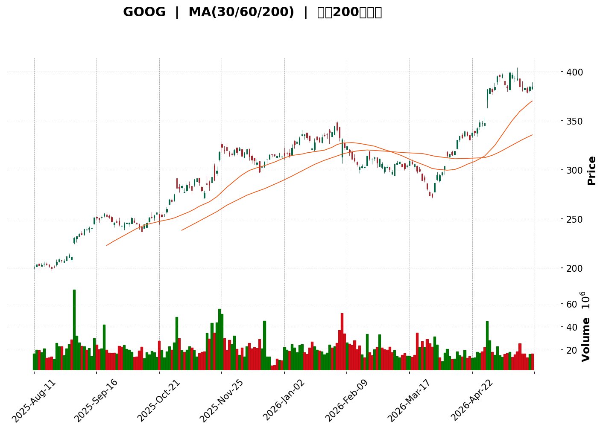
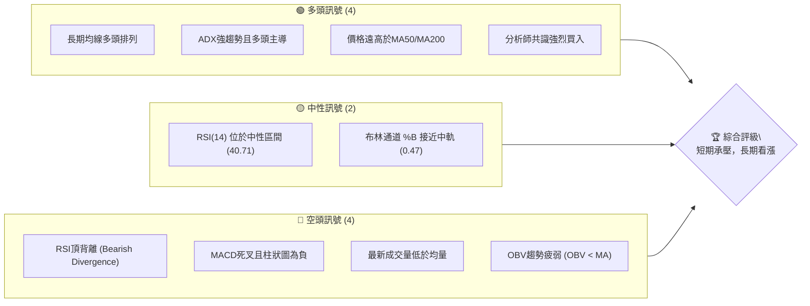
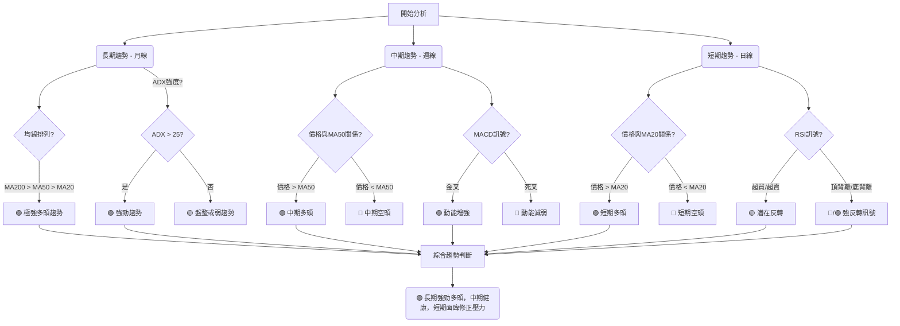

<details>
<summary>📊 靜態圖表 (點擊展開)</summary>

</details>

<html>
<head><meta charset="utf-8" /></head>
<body>
    <div>                        <script>window.PlotlyConfig = {MathJaxConfig: 'local'};</script>
        <script charset="utf-8" src="https://cdn.plot.ly/plotly-3.5.0.min.js" integrity="sha256-fHbNLP+GlIXN+efbQec78UkemUz3NJp7UmfGxC1tNxs=" crossorigin="anonymous"></script>                <div id="candlestick-chart" class="plotly-graph-div" style="height:500px; width:100%;"></div>            <script>                window.PLOTLYENV=window.PLOTLYENV || {};                                if (document.getElementById("candlestick-chart")) {                    Plotly.newPlot(                        "candlestick-chart",                        [{"close":{"dtype":"f8","bdata":"AAAAAKklaUAAAAAgcHZpQAAAAOBbUmlAAAAAQJVraUAAAABgYo5pQAAAAKCWemlAAAAAQB5BaUAAAADgrvdoQAAAAIBpBWlAAAAAgCzIaUAAAAAgFBZqQAAAAOBx72lAAAAAIL\u002f3aUAAAABAkXxqQAAAAICaoWpAAAAAYG9wakAAAACglNJsQAAAAGBjBG1AAAAAIIdUbUAAAACA9jptQAAAAACs821AAAAAQIfnbUAAAAAAhA5uQAAAAKCwIW5AAAAAQGZtb0AAAACgiGJvQAAAAMBcMG9AAAAAQJ1\u002fb0AAAADAm9xvQAAAAOAwkW9AAAAAIO9\u002fb0AAAABgz+9uQAAAAGCLx25AAAAAoAnbbkAAAACg64BuQAAAAAAJZ25AAAAAAKGmbkAAAAAAEsNuQAAAAKC1w25AAAAA4Ghlb0AAAACgcNluQAAAAKASpG5AAAAAwDY8bkAAAADgYKVtQAAAAEDeiW5AAAAAwGa7bkAAAABAzWtvQAAAAAA8cW9AAAAAYEWub0AAAADgvgpwQAAAAED6X29AAAAAgAGGb0AAAACgWqxvQAAAAICCQnBAAAAAgAbZcEAAAADgDsFwQAAAAIDALHFAAAAAIEmYcUAAAAAAApdxQAAAAADCu3FAAAAA4O1acUAAAAAA08VxQAAAAGBAz3FAAAAAQCJ1cUAAAABAIyNyQAAAACCDNXJAAAAAQKXwcUAAAADA3WtxQAAAAECsSXFAAAAA4GfTcUAAAADgLclxQAAAAEB8SXJAAAAAIGQZckAAAACg5rNyQAAAAOCc4HNAAAAAgDgzdEAAAACgiP1zQAAAAAD6+nNAAAAA4BWrc0AAAABAd7lzQAAAAGD3AnRAAAAAoFXfc0AAAABAdBp0QAAAAICoo3NAAAAAwGvYc0AAAABgYgx0QAAAAKCql3NAAAAAgNJkc0AAAADAolFzQAAAAMA2OHNAAAAAQJqdckAAAAAglPhyQAAAAKBIRnNAAAAA4MVxc0AAAAAAU7dzQAAAACAqt3NAAAAA4M+rc0AAAAAAs6JzQAAAAMBBpXNAAAAA4EOZc0AAAACAkbFzQAAAAMCL0XNAAAAAwEGlc0AAAACAPyN0QAAAAOB8XHRAAAAAYIiOdEAAAACg7sd0QAAAACAXA3VAAAAAACwBdUAAAADAzs50QAAAACC4oXRAAAAAYO4edEAAAACgYYJ0QAAAAKC2qXRAAAAAQC6DdEAAAADArtV0QAAAAAA67HRAAAAAQLEAdUAAAADgviZ1QAAAAMCqJHVAAAAA4IOKdUAAAADgXEd1QAAAAGCv0XRAAAAAQIyxdEAAAAAA9i10QAAAAAC\u002fQnRAAAAAwH3mc0AAAADgxXFzQAAAAGBvUnNAAAAAgN8cc0AAAACAtelyQAAAAOCd+3JAAAAAYIr1ckAAAABg2qpzQAAAAICHd3NAAAAA4Ddrc0AAAABA9IxzQAAAAMDwLnNAAAAAQF9zc0AAAAAgTyJzQAAAAGCK9XJAAAAAQMjzckAAAACgK8tyQAAAAKBwoXJAAAAAACkgc0AAAABA4S5zQAAAAGC4RnNAAAAAIFzzckAAAAAgXNdyQAAAAGC4BnNAAAAAYI9Wc0AAAADAzCRzQAAAACCuG3NAAAAA4KOsckAAAADgUbByQAAAAEAzE3JAAAAAoHAZckAAAAAA14txQAAAAAApHHFAAAAAgD0ScUAAAACAwu1xQAAAAGBmbnJAAAAAIFxnckAAAABgj5pyQAAAAEDh\u002fnJAAAAAANerc0AAAACA68VzQAAAACCFu3NAAAAAIFzzc0AAAACgR6l0QAAAACCF53RAAAAA4FHMdEAAAABgZjZ1QAAAAGBm9nRAAAAAIIWndEAAAAAgrht1QAAAAAAAHHVAAAAAwB5ldUAAAADgUch1QAAAAAAAuHVAAAAAwPW0dUAAAABACt93QAAAACCF83dAAAAAgD26d0AAAADgUQR4QAAAAIA9snhAAAAAwMy0eEAAAADAzNB4QAAAAOBRLHhAAAAAwB79d0AAAADgo\u002fB4QAAAAGC40nhAAAAAwB6VeEAAAACAwpF4QAAAAGBmDnhAAAAAYGYOeEAAAAAghfd3QAAAAIAUtndAAAAAoHANeEAAAACgRw14QA=="},"high":{"dtype":"f8","bdata":"W4Ek\u002fpQ2aUCKDWCEaJVpQJTopHD8nmlAsOZ166qeaUCRSrNypttpQCkv8tCntWlAEPSmnJZ6aUBhogmM5jZpQB\u002fVKS7lXGlATmBjKlAYakDHAgwYs1NqQHqRQXy6\u002f2lAqa8yNisjakBhDSA+fY1qQJFnM61k22pAosfKJYl8akAxleIc7uhsQMYTj3nmB21A\u002fmiB0y1zbUDFW6pqdcJtQKEyK4hxCG5ADhwaJA84bkBG9m7ft0duQEZLC0sFQ25ACD20YQmNb0Dc5m0GYJxvQN7RKI54c29Aur5kpnS5b0D2X7z0oQVwQP7GUEnN\u002fm9AzEUNxJbNb0A0btFov5NvQJhlGBpa325AdN4aev04b0D8iAHy0WlvQPXDo5wHa25AHqgfPxTabkAgt3T+k+luQLgGA3UO2W5AZTlrtnV7b0DLGH4qsGZvQDLZASOY3W5AjjgFuxunbkCh1nZhQpBuQIUXA50NlW5AlrWznwr2bkBrEyIXW41vQCXtL3qxE3BAPg9TpRrRb0BrsKC5fBhwQHc1RyMV4W9A+r+JTk0NcECxPwX5a\u002fBvQN+TFWV3YnBA\u002fFJiK+3mcECQg\u002fe+MfBwQLPE3s6IOXFAGbn0Tow4ckCQRoDVWd5xQK8HGKXW2HFA1DqlSzuXcUDtFk5s++RxQIbv6TuyBnJA\u002f5BBWdTBcUCPX3PrCTFyQBQeImsZP3JAFyAdIGs\u002fckAvRh3gArJxQIjinHNYbHFAQ64hme5hckCjLwKnrhByQH0YVLtm\u002fXJA1XolnZUnc0DVMc5xxPhyQPr1jx3d9XNATfkzcpeDdECzg2yZykh0QGOQ3nb9ZnRAuZCU1SXzc0BQv9GssOJzQFVbq92nGXRAgRRoepMqdEAp1r+WQTZ0QMG6+9IPEHRASH0QHMHnc0CQi8ZdSxp0QFOHDng2HHRAeLd5662+c0An5b+ArYdzQAqZSuIBenNAH3X7I6NPc0Cg+FTFuBBzQAB4fQdcTHNAHsrYbrB3c0CnVVe2PMFzQHyhU9YTwXNAHgfV4mTFc0Dpb+Pz+KtzQB14vSqf13NAROU8CrCyc0BqpCSa\u002fCp0QBZLUG9n8HNAdixoiVYVdECLEWI9w2N0QEXdy6\u002fqpHRAlI2UQPKzdED6GKHRReN0QA3Hx15bT3VA4iaDDK8MdUCjnWyLRR51QFaSE18Q8HRAYeFghr59dEBlbKc42sd0QL3eGIaV73RARORUurfcdEDsvLHKzwF1QFkFs1qhH3VAVVF\u002f+0YWdUCTO33oyGB1QDmF1qzOQHVA4FVgnMCOdUAJ83zAdN51QEa79UkfgHVAuWoIto7GdEDgVlkihKZ0QP+IlP4leHRAE\u002fCEGXUWdEAxXlycGg10QJ1LOX8dxHNABCl\u002f2cJKc0DjstlHzgpzQL8j2lEdG3NA9XWUYAgdc0BxlgCjl8hzQMZ6IHyu83NAhhm00WaCc0AQqPHuBpdzQCDn3oF5jHNAU9AxwMN9c0D+wgv+xD5zQBRqeMed+3JAN0JHVOsTc0AeLe+ngPJyQPowi6XlwXJAAAAAAAAoc0AAAABgZlJzQAAAAKAacXNAAAAAgD1Kc0AAAAAAKTRzQAAAAMAeGXNAAAAAwMxgc0AAAAAAAGxzQAAAAEDhKnNAAAAAgOsFc0AAAACA6\u002fVyQAAAAKCZkXJAAAAAYI9qckAAAACAPehxQAAAAKBwcXFAAAAAAClEcUAAAADAzPBxQAAAAIDCn3JAAAAAYGZ+ckAAAADAzKZyQAAAAKCZAXNAAAAAgD32c0AAAABA4dZzQAAAAAAA+HNAAAAAQOH2c0AAAACAPap0QAAAAAAA8HRAAAAAgBQWdUAAAACAwj91QAAAAGCPMnVAAAAAYLgSdUAAAADgeiB1QAAAAGCPQnVAAAAAQAp7dUAAAABgZu51QAAAAGBm3nVAAAAAYGYWdkAAAACAFOp3QAAAAIA99ndAAAAAQOECeEAAAAAgXE94QAAAAIAUxnhAAAAAIK7VeEAAAACA6+V4QAAAAKBHpXhAAAAAQAoneEAAAABA4f54QAAAAACq8XhAAAAAgBS+eEAAAAAghUd5QAAAAODOlXhAAAAAQDNreEAAAABA4Up4QAAAAIDrDXhAAAAAgD0WeEAAAACgmVt4QA=="},"hovertemplate":"\u003cb\u003e%{x|%Y-%m-%d}\u003c\u002fb\u003e\u003cbr\u003e\u958b: $%{open:.2f}\u003cbr\u003e\u9ad8: $%{high:.2f}\u003cbr\u003e\u4f4e: $%{low:.2f}\u003cbr\u003e\u6536: $%{close:.2f}\u003cextra\u003e\u003c\u002fextra\u003e","low":{"dtype":"f8","bdata":"Ori0UDvraEDGpfPvUB5pQECfZ9IxxmhAJeDHpdk7aUBTkwgCMDRpQPYZYfN9XmlABFZYWE8PaUCS4c0ChaBoQHuN4Uxj\u002fmhA7rSqwJ81aUB+YZfYlq9pQMIVs32Nv2lAGZzaIaO9aUCah99QReRpQEdfqiHeT2pA3KBEOtbPaUDBwgp4phNsQAM5Lx8DSGxAbkIw3XL7bECtWWqmOC1tQLu\u002fDFkJIm1AvIkR+jC5bUBRc5ZDTIhtQH\u002fdDJunxW1A636NybuUbkCLHRUvDCxvQE9+8i\u002fdx25A3aMyp6s4b0BdWnHZPXdvQLWnjlwKT29A56x1Af1Xb0DnCRAGUdxuQH5P1EJRKm5Ag2wa\u002f8fJbkDXqJvB2VtuQEUD1y\u002fh521ARcg1JwbcbUDXUzSM0FhuQBW+VLKFRG5AxfRtIWyrbkDjvr2tNs9uQI\u002fo3Js\u002fmG5AbY42+FzrbUAQfXkwp4ttQGeuYpKODW5AO5GMBzwbbkA3KG8ik85uQM9Evw+RSm9A+aKBvhgIb0De3DgfKMhvQJriHbHTim5As4shdpFDb0AgFqiunI1vQLTJRDkX+G9AEM3MNEuJcED1vuL+7KxwQDmNfswOwXBA8PUPDR6BcUAE37RbWVJxQMtsJNLWf3FAwZ+SwtVHcUAEldOkDVhxQKh2bOfPk3FA7yrP\u002fNs1cUDbNFqkfbJxQIIGsw7W93FAEC5\u002fb+m\u002fcUDNuvB3+FlxQNDpI22s8HBALNFP+4O9cUBP8pfJG2pxQGaXqyl79HFA\u002fwlI33IMckByiiwfYF9yQI2REnywT3NATx5stinWc0DrJMIZUsxzQL8qQWgqyHNAZJlY1N6Yc0CsvnZ+tJxzQD1YVPOpnXNA9S0XTJiyc0B58ip3vfhzQE3aCvMLe3NA55zrCmaGc0Af2eLl2LJzQJwhD+SWWnNAapDgA+crc0C6O+hSZRhzQEQHBX\u002fb+XJAabJMgtmTckB6ASOfscZyQP52WNQI4nJAdlsQi\u002fwlc0A5Nib3f2hzQLZnv0aXkXNAxfZkc\u002fyXc0BHMvwN43pzQHJXnb94kHNA5TYb\u002fa5\u002fc0CFvWKX5mZzQFw9ydhusHNAZpZa\u002f+uBc0CHNeAddaRzQIQYuHc2HHRAz4lzNVNgdECthglSflR0QFk3cX\u002fV4XRAzJdbqIKudEA\u002fSlOk6LB0QDISxSEGf3RAIAuHKaAKdEBJsml9CvVzQGB02iZginRAfW6Lc9N7dECrvbq2JnR0QHYLv5o92HRAvf1N11a+dEB9ZZYN12d0QDNeult+xnRAaiY\u002fImD8dEBgjoJVoCV1QG5PwbI1knRAXriSYkMrc0CKjoxBy\u002f5zQBgvmDGf13NANT5\u002fEgSnc0Dpx9M1ll5zQOH9ocTtPnNAE6\u002feHPr6ckCFzVoyDotyQLBcwmZH3HJAGWl2VVXHckDFHPOXSgNzQEyZ5SZZXHNABoxADf4dc0D59B91RlJzQI70x2on43JACe1\u002fWgn2ckBG\u002f0Kokc1yQME094jXh3JAKEswZGnJckBOzJkww51yQKIXXquscHJAAAAAQOFeckAAAADA9RRzQAAAAKBwHXNAAAAAoHDNckAAAADgerxyQAAAAMD13HJAAAAAoJkFc0AAAABguBhzQAAAAAAA0HJAAAAAAACMckAAAADgeqByQAAAACCuDXJAAAAAgOv1cUAAAADAzHBxQAAAACCuF3FAAAAAYI\u002f4cEAAAAAAKUxxQAAAACCFF3JAAAAAwB75cUAAAADgo1xyQAAAAMDMdnJAAAAAoEeLc0AAAAAghVdzQAAAAOCjqHNAAAAAQAqbc0AAAABgZhJ0QAAAAGCPinRAAAAAYGa6dEAAAADgo9R0QAAAAIAU6nRAAAAAgBSadEAAAAAgXM90QAAAAMD18HRAAAAAwMzgdEAAAADA9Ux1QAAAAOB6hHVAAAAAQOFmdUAAAACgcLF2QAAAAAApdHdAAAAA4FGMd0AAAACgmcV3QAAAAKCZMXhAAAAAwPVkeEAAAABguJp4QAAAACCuI3hAAAAAIIW7d0AAAACgR9l3QAAAAOCli3hAAAAAAClceEAAAABgZm54QAAAAAAA8HdAAAAAAADAd0AAAAAgrrd3QAAAAAAppHdAAAAAgD2yd0AAAAAAAOB3QA=="},"name":"\u50f9\u683c","open":{"dtype":"f8","bdata":"\u002flqH4UMjaUBGMWCkgTRpQNavg1mekGlAyztBclpDaUBLN3hfUYhpQDfmzSN+k2lAV+Yh00tuaUB0WH5xQSdpQNgNquiaCGlA99Hcbw1waUB0j\u002fsjHdFpQD4lfsTa\u002fGlANT7nV9+\u002faUAQsM3l7utpQBxhtDtyWWpAXEPumqYQakDTX02OEj9sQJt\u002fRn5otGxAQiyPdWMEbUBtw05GDW9tQARkWtrrO21Aj8VDMZ\u002fdbUBZhl07EPptQImKyLAnD25AGIm1wtiZbkApifxEnX9vQCu+Gf\u002fPY29AEEAoOJhwb0CAzc\u002fOzqFvQDmFwIbozW9Ai+TABfWpb0C+wnXH3HlvQLugJlZCkG5AYS8QKF\u002fubkCah6DGB\u002f5uQD4oB1FgV25A7\u002fCESkwbbkBGF8Ul06luQI0eOOy4nG5AhhmVYUyubkBUjNsi9hJvQHlkXGi4u25A6rsrOkqXbkDcCCSknTpuQLqYaTaBFm5ARyxKf6wtbkCadASB9fduQNPoA8Htg29A5d1fGExgb0Dl+V0AStxvQDVh2ZTt3G9AwwHpFULVb0CxGUc1ZatvQCA06RI4D3BAp33VHwGQcECmqikMV91wQE+KpQzvw3BA7T1yWTE1ckBrsGcvI61xQNwdTlCYoHFAffVG5gdLcUBrTMRQBXBxQD4WlQ6Q1XFAqQx6FTK9cUAWFY2wDc5xQLTO1Afz\u002fHFAhxkDRwY7ckAp1V9Kn6lxQPO8yTts+HBABZ3lLjDgcUCl8WatgAFyQFFLX3S49HFAcooPDTsFc0AskXcve4dyQFIzmitqaXNAI9NQNLZldEAnZFLZhQV0QKii8l7dL3RABdak7LbQc0BtFi7dhsdzQHFD+TuguXNAUPwkp7YpdEAAS8E6D\u002flzQBQKoibdDHRAQ7OUyBKOc0BLIkqBWsZzQNrAEqn7DXRA6wpQrCypc0CZYiB4eoZzQBuMGp2NHHNAGM2M7K1Mc0BLo1ndi+1yQNdH2WXn8HJAgiR\u002fLRhwc0CxzPLap25zQOwTr73WvnNA\u002fydJWym7c0B5z+LGmIlzQKQfgakHk3NAPvhr3WOSc0DTjk3U3NVzQMqALquK13NA9FSjymLRc0DVYTKqk6VzQIOdCv2HkHRAu4ESoiZ0dEAazzF3UmR0QC1i7BC08HRANKMXkvzrdECwSMuCEh11QDPUNAAw63RAZ2krpzgQdEApsZBB5w10QGROrJ954HRAcDFLsbvGdED1JaDqgH90QKap7q5M9nRAoOVr7PcFdUDUnYNAxEF1QMMJTbyX43RAq9CnUwIFdUB7cVmXUMR1QC22YDc1eHVA1s\u002fmJqyPc0Ahtd2+6XF0QFrgjrw4EHRAB93+DPIKdEB9gIZfxOtzQIZ5FugUgnNA48qKdUo8c0AvM1iJ2sZyQFXVHnmB43JACALDf+nkckAeUHffXQlzQBEmoUSl7nNAmv2tzr1mc0CJvr5\u002fZ35zQPRI0FFbiXNAMSHh2J37ckDDRA8KB+xyQBvPeNJbo3JA3ne39IznckAVLmzlyO9yQIManCzRfXJAAAAAAClickAAAAAAAB5zQAAAAMDMJHNAAAAAIFwjc0AAAADgeipzQAAAAKCZ+XJAAAAAYLgKc0AAAADgej5zQAAAACBc83JAAAAAwB4Bc0AAAADgeshyQAAAACBcg3JAAAAAYGZCckAAAABACuNxQAAAAGBmVnFAAAAAQAo3cUAAAADgo1hxQAAAACCuH3JAAAAAANcPckAAAABAM2tyQAAAAIA9wnJAAAAAoEfdc0AAAABACpNzQAAAAKCZ43NAAAAAYLi2c0AAAABACiF0QAAAAMD1qHRAAAAAoJn9dEAAAABA4eZ0QAAAAMD1KHVAAAAAIFz5dEAAAAAAKe50QAAAAEAzOXVAAAAAIIUbdUAAAACAFH51QAAAAGC4rnVAAAAAIK6XdUAAAACAFDR3QAAAACCun3dAAAAAwB7ld0AAAACA6913QAAAAKBwWXhAAAAAwPXQeEAAAADgUaR4QAAAAEAKa3hAAAAAAAAQeEAAAADget53QAAAAOCjnHhAAAAAoHCTeEAAAAAAAIJ4QAAAAMDMlHhAAAAA4KMQeEAAAAAAKeB3QAAAAAAp9HdAAAAAgOvPd0AAAAAAAO13QA=="},"x":["2025-08-11T00:00:00-04:00","2025-08-12T00:00:00-04:00","2025-08-13T00:00:00-04:00","2025-08-14T00:00:00-04:00","2025-08-15T00:00:00-04:00","2025-08-18T00:00:00-04:00","2025-08-19T00:00:00-04:00","2025-08-20T00:00:00-04:00","2025-08-21T00:00:00-04:00","2025-08-22T00:00:00-04:00","2025-08-25T00:00:00-04:00","2025-08-26T00:00:00-04:00","2025-08-27T00:00:00-04:00","2025-08-28T00:00:00-04:00","2025-08-29T00:00:00-04:00","2025-09-02T00:00:00-04:00","2025-09-03T00:00:00-04:00","2025-09-04T00:00:00-04:00","2025-09-05T00:00:00-04:00","2025-09-08T00:00:00-04:00","2025-09-09T00:00:00-04:00","2025-09-10T00:00:00-04:00","2025-09-11T00:00:00-04:00","2025-09-12T00:00:00-04:00","2025-09-15T00:00:00-04:00","2025-09-16T00:00:00-04:00","2025-09-17T00:00:00-04:00","2025-09-18T00:00:00-04:00","2025-09-19T00:00:00-04:00","2025-09-22T00:00:00-04:00","2025-09-23T00:00:00-04:00","2025-09-24T00:00:00-04:00","2025-09-25T00:00:00-04:00","2025-09-26T00:00:00-04:00","2025-09-29T00:00:00-04:00","2025-09-30T00:00:00-04:00","2025-10-01T00:00:00-04:00","2025-10-02T00:00:00-04:00","2025-10-03T00:00:00-04:00","2025-10-06T00:00:00-04:00","2025-10-07T00:00:00-04:00","2025-10-08T00:00:00-04:00","2025-10-09T00:00:00-04:00","2025-10-10T00:00:00-04:00","2025-10-13T00:00:00-04:00","2025-10-14T00:00:00-04:00","2025-10-15T00:00:00-04:00","2025-10-16T00:00:00-04:00","2025-10-17T00:00:00-04:00","2025-10-20T00:00:00-04:00","2025-10-21T00:00:00-04:00","2025-10-22T00:00:00-04:00","2025-10-23T00:00:00-04:00","2025-10-24T00:00:00-04:00","2025-10-27T00:00:00-04:00","2025-10-28T00:00:00-04:00","2025-10-29T00:00:00-04:00","2025-10-30T00:00:00-04:00","2025-10-31T00:00:00-04:00","2025-11-03T00:00:00-05:00","2025-11-04T00:00:00-05:00","2025-11-05T00:00:00-05:00","2025-11-06T00:00:00-05:00","2025-11-07T00:00:00-05:00","2025-11-10T00:00:00-05:00","2025-11-11T00:00:00-05:00","2025-11-12T00:00:00-05:00","2025-11-13T00:00:00-05:00","2025-11-14T00:00:00-05:00","2025-11-17T00:00:00-05:00","2025-11-18T00:00:00-05:00","2025-11-19T00:00:00-05:00","2025-11-20T00:00:00-05:00","2025-11-21T00:00:00-05:00","2025-11-24T00:00:00-05:00","2025-11-25T00:00:00-05:00","2025-11-26T00:00:00-05:00","2025-11-28T00:00:00-05:00","2025-12-01T00:00:00-05:00","2025-12-02T00:00:00-05:00","2025-12-03T00:00:00-05:00","2025-12-04T00:00:00-05:00","2025-12-05T00:00:00-05:00","2025-12-08T00:00:00-05:00","2025-12-09T00:00:00-05:00","2025-12-10T00:00:00-05:00","2025-12-11T00:00:00-05:00","2025-12-12T00:00:00-05:00","2025-12-15T00:00:00-05:00","2025-12-16T00:00:00-05:00","2025-12-17T00:00:00-05:00","2025-12-18T00:00:00-05:00","2025-12-19T00:00:00-05:00","2025-12-22T00:00:00-05:00","2025-12-23T00:00:00-05:00","2025-12-24T00:00:00-05:00","2025-12-26T00:00:00-05:00","2025-12-29T00:00:00-05:00","2025-12-30T00:00:00-05:00","2025-12-31T00:00:00-05:00","2026-01-02T00:00:00-05:00","2026-01-05T00:00:00-05:00","2026-01-06T00:00:00-05:00","2026-01-07T00:00:00-05:00","2026-01-08T00:00:00-05:00","2026-01-09T00:00:00-05:00","2026-01-12T00:00:00-05:00","2026-01-13T00:00:00-05:00","2026-01-14T00:00:00-05:00","2026-01-15T00:00:00-05:00","2026-01-16T00:00:00-05:00","2026-01-20T00:00:00-05:00","2026-01-21T00:00:00-05:00","2026-01-22T00:00:00-05:00","2026-01-23T00:00:00-05:00","2026-01-26T00:00:00-05:00","2026-01-27T00:00:00-05:00","2026-01-28T00:00:00-05:00","2026-01-29T00:00:00-05:00","2026-01-30T00:00:00-05:00","2026-02-02T00:00:00-05:00","2026-02-03T00:00:00-05:00","2026-02-04T00:00:00-05:00","2026-02-05T00:00:00-05:00","2026-02-06T00:00:00-05:00","2026-02-09T00:00:00-05:00","2026-02-10T00:00:00-05:00","2026-02-11T00:00:00-05:00","2026-02-12T00:00:00-05:00","2026-02-13T00:00:00-05:00","2026-02-17T00:00:00-05:00","2026-02-18T00:00:00-05:00","2026-02-19T00:00:00-05:00","2026-02-20T00:00:00-05:00","2026-02-23T00:00:00-05:00","2026-02-24T00:00:00-05:00","2026-02-25T00:00:00-05:00","2026-02-26T00:00:00-05:00","2026-02-27T00:00:00-05:00","2026-03-02T00:00:00-05:00","2026-03-03T00:00:00-05:00","2026-03-04T00:00:00-05:00","2026-03-05T00:00:00-05:00","2026-03-06T00:00:00-05:00","2026-03-09T00:00:00-04:00","2026-03-10T00:00:00-04:00","2026-03-11T00:00:00-04:00","2026-03-12T00:00:00-04:00","2026-03-13T00:00:00-04:00","2026-03-16T00:00:00-04:00","2026-03-17T00:00:00-04:00","2026-03-18T00:00:00-04:00","2026-03-19T00:00:00-04:00","2026-03-20T00:00:00-04:00","2026-03-23T00:00:00-04:00","2026-03-24T00:00:00-04:00","2026-03-25T00:00:00-04:00","2026-03-26T00:00:00-04:00","2026-03-27T00:00:00-04:00","2026-03-30T00:00:00-04:00","2026-03-31T00:00:00-04:00","2026-04-01T00:00:00-04:00","2026-04-02T00:00:00-04:00","2026-04-06T00:00:00-04:00","2026-04-07T00:00:00-04:00","2026-04-08T00:00:00-04:00","2026-04-09T00:00:00-04:00","2026-04-10T00:00:00-04:00","2026-04-13T00:00:00-04:00","2026-04-14T00:00:00-04:00","2026-04-15T00:00:00-04:00","2026-04-16T00:00:00-04:00","2026-04-17T00:00:00-04:00","2026-04-20T00:00:00-04:00","2026-04-21T00:00:00-04:00","2026-04-22T00:00:00-04:00","2026-04-23T00:00:00-04:00","2026-04-24T00:00:00-04:00","2026-04-27T00:00:00-04:00","2026-04-28T00:00:00-04:00","2026-04-29T00:00:00-04:00","2026-04-30T00:00:00-04:00","2026-05-01T00:00:00-04:00","2026-05-04T00:00:00-04:00","2026-05-05T00:00:00-04:00","2026-05-06T00:00:00-04:00","2026-05-07T00:00:00-04:00","2026-05-08T00:00:00-04:00","2026-05-11T00:00:00-04:00","2026-05-12T00:00:00-04:00","2026-05-13T00:00:00-04:00","2026-05-14T00:00:00-04:00","2026-05-15T00:00:00-04:00","2026-05-18T00:00:00-04:00","2026-05-19T00:00:00-04:00","2026-05-20T00:00:00-04:00","2026-05-21T00:00:00-04:00","2026-05-22T00:00:00-04:00","2026-05-26T00:00:00-04:00","2026-05-27T00:00:00-04:00"],"type":"candlestick"},{"hovertemplate":"MA30: $%{y:.2f}\u003cextra\u003e\u003c\u002fextra\u003e","line":{"color":"#2196F3","dash":"dash","width":2},"mode":"lines","name":"MA30","x":["2025-08-11T00:00:00-04:00","2025-08-12T00:00:00-04:00","2025-08-13T00:00:00-04:00","2025-08-14T00:00:00-04:00","2025-08-15T00:00:00-04:00","2025-08-18T00:00:00-04:00","2025-08-19T00:00:00-04:00","2025-08-20T00:00:00-04:00","2025-08-21T00:00:00-04:00","2025-08-22T00:00:00-04:00","2025-08-25T00:00:00-04:00","2025-08-26T00:00:00-04:00","2025-08-27T00:00:00-04:00","2025-08-28T00:00:00-04:00","2025-08-29T00:00:00-04:00","2025-09-02T00:00:00-04:00","2025-09-03T00:00:00-04:00","2025-09-04T00:00:00-04:00","2025-09-05T00:00:00-04:00","2025-09-08T00:00:00-04:00","2025-09-09T00:00:00-04:00","2025-09-10T00:00:00-04:00","2025-09-11T00:00:00-04:00","2025-09-12T00:00:00-04:00","2025-09-15T00:00:00-04:00","2025-09-16T00:00:00-04:00","2025-09-17T00:00:00-04:00","2025-09-18T00:00:00-04:00","2025-09-19T00:00:00-04:00","2025-09-22T00:00:00-04:00","2025-09-23T00:00:00-04:00","2025-09-24T00:00:00-04:00","2025-09-25T00:00:00-04:00","2025-09-26T00:00:00-04:00","2025-09-29T00:00:00-04:00","2025-09-30T00:00:00-04:00","2025-10-01T00:00:00-04:00","2025-10-02T00:00:00-04:00","2025-10-03T00:00:00-04:00","2025-10-06T00:00:00-04:00","2025-10-07T00:00:00-04:00","2025-10-08T00:00:00-04:00","2025-10-09T00:00:00-04:00","2025-10-10T00:00:00-04:00","2025-10-13T00:00:00-04:00","2025-10-14T00:00:00-04:00","2025-10-15T00:00:00-04:00","2025-10-16T00:00:00-04:00","2025-10-17T00:00:00-04:00","2025-10-20T00:00:00-04:00","2025-10-21T00:00:00-04:00","2025-10-22T00:00:00-04:00","2025-10-23T00:00:00-04:00","2025-10-24T00:00:00-04:00","2025-10-27T00:00:00-04:00","2025-10-28T00:00:00-04:00","2025-10-29T00:00:00-04:00","2025-10-30T00:00:00-04:00","2025-10-31T00:00:00-04:00","2025-11-03T00:00:00-05:00","2025-11-04T00:00:00-05:00","2025-11-05T00:00:00-05:00","2025-11-06T00:00:00-05:00","2025-11-07T00:00:00-05:00","2025-11-10T00:00:00-05:00","2025-11-11T00:00:00-05:00","2025-11-12T00:00:00-05:00","2025-11-13T00:00:00-05:00","2025-11-14T00:00:00-05:00","2025-11-17T00:00:00-05:00","2025-11-18T00:00:00-05:00","2025-11-19T00:00:00-05:00","2025-11-20T00:00:00-05:00","2025-11-21T00:00:00-05:00","2025-11-24T00:00:00-05:00","2025-11-25T00:00:00-05:00","2025-11-26T00:00:00-05:00","2025-11-28T00:00:00-05:00","2025-12-01T00:00:00-05:00","2025-12-02T00:00:00-05:00","2025-12-03T00:00:00-05:00","2025-12-04T00:00:00-05:00","2025-12-05T00:00:00-05:00","2025-12-08T00:00:00-05:00","2025-12-09T00:00:00-05:00","2025-12-10T00:00:00-05:00","2025-12-11T00:00:00-05:00","2025-12-12T00:00:00-05:00","2025-12-15T00:00:00-05:00","2025-12-16T00:00:00-05:00","2025-12-17T00:00:00-05:00","2025-12-18T00:00:00-05:00","2025-12-19T00:00:00-05:00","2025-12-22T00:00:00-05:00","2025-12-23T00:00:00-05:00","2025-12-24T00:00:00-05:00","2025-12-26T00:00:00-05:00","2025-12-29T00:00:00-05:00","2025-12-30T00:00:00-05:00","2025-12-31T00:00:00-05:00","2026-01-02T00:00:00-05:00","2026-01-05T00:00:00-05:00","2026-01-06T00:00:00-05:00","2026-01-07T00:00:00-05:00","2026-01-08T00:00:00-05:00","2026-01-09T00:00:00-05:00","2026-01-12T00:00:00-05:00","2026-01-13T00:00:00-05:00","2026-01-14T00:00:00-05:00","2026-01-15T00:00:00-05:00","2026-01-16T00:00:00-05:00","2026-01-20T00:00:00-05:00","2026-01-21T00:00:00-05:00","2026-01-22T00:00:00-05:00","2026-01-23T00:00:00-05:00","2026-01-26T00:00:00-05:00","2026-01-27T00:00:00-05:00","2026-01-28T00:00:00-05:00","2026-01-29T00:00:00-05:00","2026-01-30T00:00:00-05:00","2026-02-02T00:00:00-05:00","2026-02-03T00:00:00-05:00","2026-02-04T00:00:00-05:00","2026-02-05T00:00:00-05:00","2026-02-06T00:00:00-05:00","2026-02-09T00:00:00-05:00","2026-02-10T00:00:00-05:00","2026-02-11T00:00:00-05:00","2026-02-12T00:00:00-05:00","2026-02-13T00:00:00-05:00","2026-02-17T00:00:00-05:00","2026-02-18T00:00:00-05:00","2026-02-19T00:00:00-05:00","2026-02-20T00:00:00-05:00","2026-02-23T00:00:00-05:00","2026-02-24T00:00:00-05:00","2026-02-25T00:00:00-05:00","2026-02-26T00:00:00-05:00","2026-02-27T00:00:00-05:00","2026-03-02T00:00:00-05:00","2026-03-03T00:00:00-05:00","2026-03-04T00:00:00-05:00","2026-03-05T00:00:00-05:00","2026-03-06T00:00:00-05:00","2026-03-09T00:00:00-04:00","2026-03-10T00:00:00-04:00","2026-03-11T00:00:00-04:00","2026-03-12T00:00:00-04:00","2026-03-13T00:00:00-04:00","2026-03-16T00:00:00-04:00","2026-03-17T00:00:00-04:00","2026-03-18T00:00:00-04:00","2026-03-19T00:00:00-04:00","2026-03-20T00:00:00-04:00","2026-03-23T00:00:00-04:00","2026-03-24T00:00:00-04:00","2026-03-25T00:00:00-04:00","2026-03-26T00:00:00-04:00","2026-03-27T00:00:00-04:00","2026-03-30T00:00:00-04:00","2026-03-31T00:00:00-04:00","2026-04-01T00:00:00-04:00","2026-04-02T00:00:00-04:00","2026-04-06T00:00:00-04:00","2026-04-07T00:00:00-04:00","2026-04-08T00:00:00-04:00","2026-04-09T00:00:00-04:00","2026-04-10T00:00:00-04:00","2026-04-13T00:00:00-04:00","2026-04-14T00:00:00-04:00","2026-04-15T00:00:00-04:00","2026-04-16T00:00:00-04:00","2026-04-17T00:00:00-04:00","2026-04-20T00:00:00-04:00","2026-04-21T00:00:00-04:00","2026-04-22T00:00:00-04:00","2026-04-23T00:00:00-04:00","2026-04-24T00:00:00-04:00","2026-04-27T00:00:00-04:00","2026-04-28T00:00:00-04:00","2026-04-29T00:00:00-04:00","2026-04-30T00:00:00-04:00","2026-05-01T00:00:00-04:00","2026-05-04T00:00:00-04:00","2026-05-05T00:00:00-04:00","2026-05-06T00:00:00-04:00","2026-05-07T00:00:00-04:00","2026-05-08T00:00:00-04:00","2026-05-11T00:00:00-04:00","2026-05-12T00:00:00-04:00","2026-05-13T00:00:00-04:00","2026-05-14T00:00:00-04:00","2026-05-15T00:00:00-04:00","2026-05-18T00:00:00-04:00","2026-05-19T00:00:00-04:00","2026-05-20T00:00:00-04:00","2026-05-21T00:00:00-04:00","2026-05-22T00:00:00-04:00","2026-05-26T00:00:00-04:00","2026-05-27T00:00:00-04:00"],"y":{"dtype":"f8","bdata":"AAAAAAAA+H8AAAAAAAD4fwAAAAAAAPh\u002fAAAAAAAA+H8AAAAAAAD4fwAAAAAAAPh\u002fAAAAAAAA+H8AAAAAAAD4fwAAAAAAAPh\u002fAAAAAAAA+H8AAAAAAAD4fwAAAAAAAPh\u002fAAAAAAAA+H8AAAAAAAD4fwAAAAAAAPh\u002fAAAAAAAA+H8AAAAAAAD4fwAAAAAAAPh\u002fAAAAAAAA+H8AAAAAAAD4fwAAAAAAAPh\u002fAAAAAAAA+H8AAAAAAAD4fwAAAAAAAPh\u002fAAAAAAAA+H8AAAAAAAD4fwAAAAAAAPh\u002fAAAAAAAA+H8AAAAAAAD4f7y7u+ux4GtAVVVVdecWbEBVVVXVnUVsQLy7u3swdGxAq6qqOpKibEAREREBysxsQBEREdHN9mxAVVVVtdokbUAiIiLyTFZtQLy7u3tPh21AVVVV5Te3bUDNzMwc3d9tQKuqqpoECG5A3t3d\u002fW4sbkCJiIjYZEduQAAAAHC8aG5AiYiISF6NbkBmZmbWiqNuQJqZmbk8uG5AmpmZmUvMbkARERFxpeRuQO\u002fu7i7K8G5A7+7uDpv+bkCrqqp6ZgxvQImIiCjHIG9AzczMDCI0b0Dv7u6eQEZvQLy7u0s5YW9A3t3d7biAb0BEREQ0CZ1vQN7d3T1Qvm9A7+7u\u002frXZb0CamZn5hABwQKuqqjIrFXBA7+7uPn0mcECJiIigHD9wQHd3dz\u002fHWHBAd3d33xZvcEAREREZgIBwQAAAANDCkHBAVVVV7eqicECrqqr6ELdwQERERJxh0HBAAAAA+NLpcEAAAABg7gpxQHd3d\u002fdAMnFAMzMzI4FbcUCamZmJBoBxQAAAAPBepHFAVVVVLQnFcUARERG5deRxQGZmZu5bCXJAvLu7028sckB3d3eX2FByQBERETGvbXJAIiIiokOHckBEREQEYKNyQLy7u2sBuHJAVVVVVVvHckDNzMxsHNZyQLy7u\u002fvK4nJAZmZmdoztckCamZkZxvdyQAAAAGBGBHNAMzMzwzoVc0AiIiLSsyJzQImIiLiOL3NAiYiIaFQ+c0AiIiJiOVFzQHd3d\u002fdXZXNAZmZm5nh0c0DNzMx8wIRzQCIiIhLSkXNAAAAAIASfc0AiIiLSQqtzQDMzM+Njr3NAVVVVFW+yc0B3d3c3LrlzQM3MzPz7wXNAAAAAIGPNc0BmZmbGodZzQHd3d3fs23NAiYiIKAvec0AREREBguFzQFVVVTU+6nNAvLu7W+\u002fvc0CrqqoapfZzQHd3dzf\u002fAXRAd3d317kPdECamZnpXB90QN7d3S3HL3RAZmZm5r1IdEAiIiJCb1x0QJqZmVmdaXRAiYiIGEZ0dEBmZmZ2Onh0QO\u002fu7o7hfHRAmpmZSdZ+dECJiIjINH10QJqZmQlyenRA7+7ujkx2dEB3d3cXo290QAAAAJCBaHRA3t3dHaZidEDv7u6+ol50QHd3d\u002fcAV3RAVVVVFUtNdEBVVVVFy0J0QERERGQwM3RAVVVV1e0ldEAAAABQpRd0QFVVVYVfCXRAiYiIyGb\u002fc0CamZnZwvBzQO\u002fu7i5r33NAzczMrJXTc0AiIiLCfcVzQHd3d+dwt3NAEREREe6lc0AzMzOTN5JzQGZmZvYmgHNAvLu7i1ptc0CrqqqKIltzQGZmZuaITHNARERE9E07c0CJiIhIlS5zQN7d3X3uG3NAAAAAMJAMc0Dv7u6OXfxyQImIiFh96XJAvLu7ixHYckBERESUq89yQHd3d4f2ynJAERERQTnGckAAAACwJb1yQFVVVSUguXJAVVVVlUe7ckARERGxLb1yQN7d3U3dwXJAd3d3dyHGckAAAADAKdNyQM3MzCzD43JA7+7ufoPzckBmZmaWJwhzQFVVVaUNHHNAAAAAQBkpc0Crqqp6hjlzQAAAAAArSXNAIiIi0gZec0BEREQUIHdzQO\u002fu7u4ZjnNAvLu7i1Cic0De3d3tp8pzQFVVVeX783NA3t3dnRofdEBVVVUVkkx0QM3MzGwShXRAzczMXHO9dEDe3d2Ne\u002ft0QO\u002fu7i7BN3VAERERschydUAREREBna51QFVVVUUo5XVAVVVV9eEZdkAAAAAQykx2QKuqqir5d3ZAiYiIWGSddkC8u7u7LcF2QCIiInIh43ZAERERISIGd0AAAAAQESN3QA=="},"type":"scatter"},{"hovertemplate":"MA60: $%{y:.2f}\u003cextra\u003e\u003c\u002fextra\u003e","line":{"color":"#9C27B0","dash":"dash","width":2},"mode":"lines","name":"MA60","x":["2025-08-11T00:00:00-04:00","2025-08-12T00:00:00-04:00","2025-08-13T00:00:00-04:00","2025-08-14T00:00:00-04:00","2025-08-15T00:00:00-04:00","2025-08-18T00:00:00-04:00","2025-08-19T00:00:00-04:00","2025-08-20T00:00:00-04:00","2025-08-21T00:00:00-04:00","2025-08-22T00:00:00-04:00","2025-08-25T00:00:00-04:00","2025-08-26T00:00:00-04:00","2025-08-27T00:00:00-04:00","2025-08-28T00:00:00-04:00","2025-08-29T00:00:00-04:00","2025-09-02T00:00:00-04:00","2025-09-03T00:00:00-04:00","2025-09-04T00:00:00-04:00","2025-09-05T00:00:00-04:00","2025-09-08T00:00:00-04:00","2025-09-09T00:00:00-04:00","2025-09-10T00:00:00-04:00","2025-09-11T00:00:00-04:00","2025-09-12T00:00:00-04:00","2025-09-15T00:00:00-04:00","2025-09-16T00:00:00-04:00","2025-09-17T00:00:00-04:00","2025-09-18T00:00:00-04:00","2025-09-19T00:00:00-04:00","2025-09-22T00:00:00-04:00","2025-09-23T00:00:00-04:00","2025-09-24T00:00:00-04:00","2025-09-25T00:00:00-04:00","2025-09-26T00:00:00-04:00","2025-09-29T00:00:00-04:00","2025-09-30T00:00:00-04:00","2025-10-01T00:00:00-04:00","2025-10-02T00:00:00-04:00","2025-10-03T00:00:00-04:00","2025-10-06T00:00:00-04:00","2025-10-07T00:00:00-04:00","2025-10-08T00:00:00-04:00","2025-10-09T00:00:00-04:00","2025-10-10T00:00:00-04:00","2025-10-13T00:00:00-04:00","2025-10-14T00:00:00-04:00","2025-10-15T00:00:00-04:00","2025-10-16T00:00:00-04:00","2025-10-17T00:00:00-04:00","2025-10-20T00:00:00-04:00","2025-10-21T00:00:00-04:00","2025-10-22T00:00:00-04:00","2025-10-23T00:00:00-04:00","2025-10-24T00:00:00-04:00","2025-10-27T00:00:00-04:00","2025-10-28T00:00:00-04:00","2025-10-29T00:00:00-04:00","2025-10-30T00:00:00-04:00","2025-10-31T00:00:00-04:00","2025-11-03T00:00:00-05:00","2025-11-04T00:00:00-05:00","2025-11-05T00:00:00-05:00","2025-11-06T00:00:00-05:00","2025-11-07T00:00:00-05:00","2025-11-10T00:00:00-05:00","2025-11-11T00:00:00-05:00","2025-11-12T00:00:00-05:00","2025-11-13T00:00:00-05:00","2025-11-14T00:00:00-05:00","2025-11-17T00:00:00-05:00","2025-11-18T00:00:00-05:00","2025-11-19T00:00:00-05:00","2025-11-20T00:00:00-05:00","2025-11-21T00:00:00-05:00","2025-11-24T00:00:00-05:00","2025-11-25T00:00:00-05:00","2025-11-26T00:00:00-05:00","2025-11-28T00:00:00-05:00","2025-12-01T00:00:00-05:00","2025-12-02T00:00:00-05:00","2025-12-03T00:00:00-05:00","2025-12-04T00:00:00-05:00","2025-12-05T00:00:00-05:00","2025-12-08T00:00:00-05:00","2025-12-09T00:00:00-05:00","2025-12-10T00:00:00-05:00","2025-12-11T00:00:00-05:00","2025-12-12T00:00:00-05:00","2025-12-15T00:00:00-05:00","2025-12-16T00:00:00-05:00","2025-12-17T00:00:00-05:00","2025-12-18T00:00:00-05:00","2025-12-19T00:00:00-05:00","2025-12-22T00:00:00-05:00","2025-12-23T00:00:00-05:00","2025-12-24T00:00:00-05:00","2025-12-26T00:00:00-05:00","2025-12-29T00:00:00-05:00","2025-12-30T00:00:00-05:00","2025-12-31T00:00:00-05:00","2026-01-02T00:00:00-05:00","2026-01-05T00:00:00-05:00","2026-01-06T00:00:00-05:00","2026-01-07T00:00:00-05:00","2026-01-08T00:00:00-05:00","2026-01-09T00:00:00-05:00","2026-01-12T00:00:00-05:00","2026-01-13T00:00:00-05:00","2026-01-14T00:00:00-05:00","2026-01-15T00:00:00-05:00","2026-01-16T00:00:00-05:00","2026-01-20T00:00:00-05:00","2026-01-21T00:00:00-05:00","2026-01-22T00:00:00-05:00","2026-01-23T00:00:00-05:00","2026-01-26T00:00:00-05:00","2026-01-27T00:00:00-05:00","2026-01-28T00:00:00-05:00","2026-01-29T00:00:00-05:00","2026-01-30T00:00:00-05:00","2026-02-02T00:00:00-05:00","2026-02-03T00:00:00-05:00","2026-02-04T00:00:00-05:00","2026-02-05T00:00:00-05:00","2026-02-06T00:00:00-05:00","2026-02-09T00:00:00-05:00","2026-02-10T00:00:00-05:00","2026-02-11T00:00:00-05:00","2026-02-12T00:00:00-05:00","2026-02-13T00:00:00-05:00","2026-02-17T00:00:00-05:00","2026-02-18T00:00:00-05:00","2026-02-19T00:00:00-05:00","2026-02-20T00:00:00-05:00","2026-02-23T00:00:00-05:00","2026-02-24T00:00:00-05:00","2026-02-25T00:00:00-05:00","2026-02-26T00:00:00-05:00","2026-02-27T00:00:00-05:00","2026-03-02T00:00:00-05:00","2026-03-03T00:00:00-05:00","2026-03-04T00:00:00-05:00","2026-03-05T00:00:00-05:00","2026-03-06T00:00:00-05:00","2026-03-09T00:00:00-04:00","2026-03-10T00:00:00-04:00","2026-03-11T00:00:00-04:00","2026-03-12T00:00:00-04:00","2026-03-13T00:00:00-04:00","2026-03-16T00:00:00-04:00","2026-03-17T00:00:00-04:00","2026-03-18T00:00:00-04:00","2026-03-19T00:00:00-04:00","2026-03-20T00:00:00-04:00","2026-03-23T00:00:00-04:00","2026-03-24T00:00:00-04:00","2026-03-25T00:00:00-04:00","2026-03-26T00:00:00-04:00","2026-03-27T00:00:00-04:00","2026-03-30T00:00:00-04:00","2026-03-31T00:00:00-04:00","2026-04-01T00:00:00-04:00","2026-04-02T00:00:00-04:00","2026-04-06T00:00:00-04:00","2026-04-07T00:00:00-04:00","2026-04-08T00:00:00-04:00","2026-04-09T00:00:00-04:00","2026-04-10T00:00:00-04:00","2026-04-13T00:00:00-04:00","2026-04-14T00:00:00-04:00","2026-04-15T00:00:00-04:00","2026-04-16T00:00:00-04:00","2026-04-17T00:00:00-04:00","2026-04-20T00:00:00-04:00","2026-04-21T00:00:00-04:00","2026-04-22T00:00:00-04:00","2026-04-23T00:00:00-04:00","2026-04-24T00:00:00-04:00","2026-04-27T00:00:00-04:00","2026-04-28T00:00:00-04:00","2026-04-29T00:00:00-04:00","2026-04-30T00:00:00-04:00","2026-05-01T00:00:00-04:00","2026-05-04T00:00:00-04:00","2026-05-05T00:00:00-04:00","2026-05-06T00:00:00-04:00","2026-05-07T00:00:00-04:00","2026-05-08T00:00:00-04:00","2026-05-11T00:00:00-04:00","2026-05-12T00:00:00-04:00","2026-05-13T00:00:00-04:00","2026-05-14T00:00:00-04:00","2026-05-15T00:00:00-04:00","2026-05-18T00:00:00-04:00","2026-05-19T00:00:00-04:00","2026-05-20T00:00:00-04:00","2026-05-21T00:00:00-04:00","2026-05-22T00:00:00-04:00","2026-05-26T00:00:00-04:00","2026-05-27T00:00:00-04:00"],"y":{"dtype":"f8","bdata":"AAAAAAAA+H8AAAAAAAD4fwAAAAAAAPh\u002fAAAAAAAA+H8AAAAAAAD4fwAAAAAAAPh\u002fAAAAAAAA+H8AAAAAAAD4fwAAAAAAAPh\u002fAAAAAAAA+H8AAAAAAAD4fwAAAAAAAPh\u002fAAAAAAAA+H8AAAAAAAD4fwAAAAAAAPh\u002fAAAAAAAA+H8AAAAAAAD4fwAAAAAAAPh\u002fAAAAAAAA+H8AAAAAAAD4fwAAAAAAAPh\u002fAAAAAAAA+H8AAAAAAAD4fwAAAAAAAPh\u002fAAAAAAAA+H8AAAAAAAD4fwAAAAAAAPh\u002fAAAAAAAA+H8AAAAAAAD4fwAAAAAAAPh\u002fAAAAAAAA+H8AAAAAAAD4fwAAAAAAAPh\u002fAAAAAAAA+H8AAAAAAAD4fwAAAAAAAPh\u002fAAAAAAAA+H8AAAAAAAD4fwAAAAAAAPh\u002fAAAAAAAA+H8AAAAAAAD4fwAAAAAAAPh\u002fAAAAAAAA+H8AAAAAAAD4fwAAAAAAAPh\u002fAAAAAAAA+H8AAAAAAAD4fwAAAAAAAPh\u002fAAAAAAAA+H8AAAAAAAD4fwAAAAAAAPh\u002fAAAAAAAA+H8AAAAAAAD4fwAAAAAAAPh\u002fAAAAAAAA+H8AAAAAAAD4fwAAAAAAAPh\u002fAAAAAAAA+H8AAAAAAAD4f83MzBSBz21AIiIiuk74bUBERETkUyNuQImIiHBDT25AREREXMZ3bkARERGhgaVuQAAAACgu1G5AIiIiOoQBb0AiIiKSpitvQN7d3Y1qVG9AAAAA4IZ+b0ARERGJ\u002f6ZvQJqZmelj1G9Ad3d3OwUAcEAiIiJmUBdwQLy7u5dPM3BAvLu7IxhRcEBmZmb65WhwQGZmZqY+gHBAERERfZeVcEDNzMw4ZKtwQO\u002fu7oLgwHBAmpmZrd7VcEBmZmbqhetwQKuqqmIJ\u002f3BAREREVKoQcUDe3d0pQCNxQM3MzAhPNHFAIiIi5ttDcUB3d3eDUFJxQFVVVY35YHFA7+7uujNtcUCamZmJJXxxQFVVVcm4jHFAERERAdydcUBVVVU56LBxQAAAAPwqxHFAAAAApLXWcUCamZm93OhxQLy7u2MN+3FA3t3d6bELckC8u7u76B1yQDMzM9cZMXJAAAAAjGtEckARERGZGFtyQFVVVW3ScHJAREREHPiGckCJiIhgmpxyQGZmZnYts3JAq6qqJjbJckC8u7u\u002fi91yQO\u002fu7jKk8nJAIiIifj0Fc0BERERMLRlzQDMzM7P2K3NA7+7ufpk7c0B3d3ePAk1zQJqZmVEAXXNAZmZmloprc0AzMzOrvHpzQM3MzBRJiXNAZmZmLiWbc0De3d2tGqpzQM3MzNzxtnNA3t3dbcDEc0BEREQkd81zQLy7uyM41nNAERERWZXec0BVVVUVN+dzQImIiADl73NAq6qqumL1c0AiIiLKMfpzQBEREdEp\u002fXNA7+7uHtUAdECJiIjI8gR0QFVVVW0yA3RAVVVVFd3\u002fc0BmZma+\u002fP1zQImIiDCW+nNAq6qqeqj5c0AzMzOLI\u002fdzQGZmZv6l8nNAiYiI+Ljuc0BVVVVtIulzQCIiIrLU5HNAREREhMLhc0BmZmZuEd5zQHd3dw+43HNARERE9NPac0BmZmY+ythzQCIiIhL313NAEREROQzbc0BmZmbmyNtzQAAAACAT23NAZmZmBsrXc0B3d3ffZ9NzQGZmZgZozHNAzczMPLPFc0C8u7srybxzQBEREbH3sXNAVVVVDS+nc0De3d1Vp59zQLy7uwu8mXNAd3d3r2+Uc0B3d3c35I1zQGZmZo4QiHNAVVVVVUmEc0AzMzN7\u002fH9zQBEREdmGenNAZmZmpgd2c0AAAACIZ3VzQBEREVmRdnNAvLu7I3V5c0AAAAA4dXxzQCIiImq8fXNAZmZmdld+c0BmZmYegn9zQLy7u\u002fNNgHNAmpmZcfqBc0C8u7vTq4RzQKuqqnIgh3NAvLu7i9WHc0BEREQ85ZJzQN7d3WVCoHNAERERSTStc0Dv7u6uk71zQFVVVXWA0HNAZmZmxgHlc0BmZmaO7PtzQLy7u0OfEHRAZmZmHm0ldECrqqpKJD90QGZmZmYPWHRAMzMzmw1wdEAAAADg94R0QAAAAKiMmHRA7+7u9lWsdEBmZma2Lb90QAAAAGB\u002f0nRAREREzCHmdEAAAABoHft0QA=="},"type":"scatter"},{"hovertemplate":"MA200: $%{y:.2f}\u003cextra\u003e\u003c\u002fextra\u003e","line":{"color":"#FF6F00","dash":"solid","width":2},"mode":"lines","name":"MA200","x":["2025-08-11T00:00:00-04:00","2025-08-12T00:00:00-04:00","2025-08-13T00:00:00-04:00","2025-08-14T00:00:00-04:00","2025-08-15T00:00:00-04:00","2025-08-18T00:00:00-04:00","2025-08-19T00:00:00-04:00","2025-08-20T00:00:00-04:00","2025-08-21T00:00:00-04:00","2025-08-22T00:00:00-04:00","2025-08-25T00:00:00-04:00","2025-08-26T00:00:00-04:00","2025-08-27T00:00:00-04:00","2025-08-28T00:00:00-04:00","2025-08-29T00:00:00-04:00","2025-09-02T00:00:00-04:00","2025-09-03T00:00:00-04:00","2025-09-04T00:00:00-04:00","2025-09-05T00:00:00-04:00","2025-09-08T00:00:00-04:00","2025-09-09T00:00:00-04:00","2025-09-10T00:00:00-04:00","2025-09-11T00:00:00-04:00","2025-09-12T00:00:00-04:00","2025-09-15T00:00:00-04:00","2025-09-16T00:00:00-04:00","2025-09-17T00:00:00-04:00","2025-09-18T00:00:00-04:00","2025-09-19T00:00:00-04:00","2025-09-22T00:00:00-04:00","2025-09-23T00:00:00-04:00","2025-09-24T00:00:00-04:00","2025-09-25T00:00:00-04:00","2025-09-26T00:00:00-04:00","2025-09-29T00:00:00-04:00","2025-09-30T00:00:00-04:00","2025-10-01T00:00:00-04:00","2025-10-02T00:00:00-04:00","2025-10-03T00:00:00-04:00","2025-10-06T00:00:00-04:00","2025-10-07T00:00:00-04:00","2025-10-08T00:00:00-04:00","2025-10-09T00:00:00-04:00","2025-10-10T00:00:00-04:00","2025-10-13T00:00:00-04:00","2025-10-14T00:00:00-04:00","2025-10-15T00:00:00-04:00","2025-10-16T00:00:00-04:00","2025-10-17T00:00:00-04:00","2025-10-20T00:00:00-04:00","2025-10-21T00:00:00-04:00","2025-10-22T00:00:00-04:00","2025-10-23T00:00:00-04:00","2025-10-24T00:00:00-04:00","2025-10-27T00:00:00-04:00","2025-10-28T00:00:00-04:00","2025-10-29T00:00:00-04:00","2025-10-30T00:00:00-04:00","2025-10-31T00:00:00-04:00","2025-11-03T00:00:00-05:00","2025-11-04T00:00:00-05:00","2025-11-05T00:00:00-05:00","2025-11-06T00:00:00-05:00","2025-11-07T00:00:00-05:00","2025-11-10T00:00:00-05:00","2025-11-11T00:00:00-05:00","2025-11-12T00:00:00-05:00","2025-11-13T00:00:00-05:00","2025-11-14T00:00:00-05:00","2025-11-17T00:00:00-05:00","2025-11-18T00:00:00-05:00","2025-11-19T00:00:00-05:00","2025-11-20T00:00:00-05:00","2025-11-21T00:00:00-05:00","2025-11-24T00:00:00-05:00","2025-11-25T00:00:00-05:00","2025-11-26T00:00:00-05:00","2025-11-28T00:00:00-05:00","2025-12-01T00:00:00-05:00","2025-12-02T00:00:00-05:00","2025-12-03T00:00:00-05:00","2025-12-04T00:00:00-05:00","2025-12-05T00:00:00-05:00","2025-12-08T00:00:00-05:00","2025-12-09T00:00:00-05:00","2025-12-10T00:00:00-05:00","2025-12-11T00:00:00-05:00","2025-12-12T00:00:00-05:00","2025-12-15T00:00:00-05:00","2025-12-16T00:00:00-05:00","2025-12-17T00:00:00-05:00","2025-12-18T00:00:00-05:00","2025-12-19T00:00:00-05:00","2025-12-22T00:00:00-05:00","2025-12-23T00:00:00-05:00","2025-12-24T00:00:00-05:00","2025-12-26T00:00:00-05:00","2025-12-29T00:00:00-05:00","2025-12-30T00:00:00-05:00","2025-12-31T00:00:00-05:00","2026-01-02T00:00:00-05:00","2026-01-05T00:00:00-05:00","2026-01-06T00:00:00-05:00","2026-01-07T00:00:00-05:00","2026-01-08T00:00:00-05:00","2026-01-09T00:00:00-05:00","2026-01-12T00:00:00-05:00","2026-01-13T00:00:00-05:00","2026-01-14T00:00:00-05:00","2026-01-15T00:00:00-05:00","2026-01-16T00:00:00-05:00","2026-01-20T00:00:00-05:00","2026-01-21T00:00:00-05:00","2026-01-22T00:00:00-05:00","2026-01-23T00:00:00-05:00","2026-01-26T00:00:00-05:00","2026-01-27T00:00:00-05:00","2026-01-28T00:00:00-05:00","2026-01-29T00:00:00-05:00","2026-01-30T00:00:00-05:00","2026-02-02T00:00:00-05:00","2026-02-03T00:00:00-05:00","2026-02-04T00:00:00-05:00","2026-02-05T00:00:00-05:00","2026-02-06T00:00:00-05:00","2026-02-09T00:00:00-05:00","2026-02-10T00:00:00-05:00","2026-02-11T00:00:00-05:00","2026-02-12T00:00:00-05:00","2026-02-13T00:00:00-05:00","2026-02-17T00:00:00-05:00","2026-02-18T00:00:00-05:00","2026-02-19T00:00:00-05:00","2026-02-20T00:00:00-05:00","2026-02-23T00:00:00-05:00","2026-02-24T00:00:00-05:00","2026-02-25T00:00:00-05:00","2026-02-26T00:00:00-05:00","2026-02-27T00:00:00-05:00","2026-03-02T00:00:00-05:00","2026-03-03T00:00:00-05:00","2026-03-04T00:00:00-05:00","2026-03-05T00:00:00-05:00","2026-03-06T00:00:00-05:00","2026-03-09T00:00:00-04:00","2026-03-10T00:00:00-04:00","2026-03-11T00:00:00-04:00","2026-03-12T00:00:00-04:00","2026-03-13T00:00:00-04:00","2026-03-16T00:00:00-04:00","2026-03-17T00:00:00-04:00","2026-03-18T00:00:00-04:00","2026-03-19T00:00:00-04:00","2026-03-20T00:00:00-04:00","2026-03-23T00:00:00-04:00","2026-03-24T00:00:00-04:00","2026-03-25T00:00:00-04:00","2026-03-26T00:00:00-04:00","2026-03-27T00:00:00-04:00","2026-03-30T00:00:00-04:00","2026-03-31T00:00:00-04:00","2026-04-01T00:00:00-04:00","2026-04-02T00:00:00-04:00","2026-04-06T00:00:00-04:00","2026-04-07T00:00:00-04:00","2026-04-08T00:00:00-04:00","2026-04-09T00:00:00-04:00","2026-04-10T00:00:00-04:00","2026-04-13T00:00:00-04:00","2026-04-14T00:00:00-04:00","2026-04-15T00:00:00-04:00","2026-04-16T00:00:00-04:00","2026-04-17T00:00:00-04:00","2026-04-20T00:00:00-04:00","2026-04-21T00:00:00-04:00","2026-04-22T00:00:00-04:00","2026-04-23T00:00:00-04:00","2026-04-24T00:00:00-04:00","2026-04-27T00:00:00-04:00","2026-04-28T00:00:00-04:00","2026-04-29T00:00:00-04:00","2026-04-30T00:00:00-04:00","2026-05-01T00:00:00-04:00","2026-05-04T00:00:00-04:00","2026-05-05T00:00:00-04:00","2026-05-06T00:00:00-04:00","2026-05-07T00:00:00-04:00","2026-05-08T00:00:00-04:00","2026-05-11T00:00:00-04:00","2026-05-12T00:00:00-04:00","2026-05-13T00:00:00-04:00","2026-05-14T00:00:00-04:00","2026-05-15T00:00:00-04:00","2026-05-18T00:00:00-04:00","2026-05-19T00:00:00-04:00","2026-05-20T00:00:00-04:00","2026-05-21T00:00:00-04:00","2026-05-22T00:00:00-04:00","2026-05-26T00:00:00-04:00","2026-05-27T00:00:00-04:00"],"y":{"dtype":"f8","bdata":"AAAAAAAA+H8AAAAAAAD4fwAAAAAAAPh\u002fAAAAAAAA+H8AAAAAAAD4fwAAAAAAAPh\u002fAAAAAAAA+H8AAAAAAAD4fwAAAAAAAPh\u002fAAAAAAAA+H8AAAAAAAD4fwAAAAAAAPh\u002fAAAAAAAA+H8AAAAAAAD4fwAAAAAAAPh\u002fAAAAAAAA+H8AAAAAAAD4fwAAAAAAAPh\u002fAAAAAAAA+H8AAAAAAAD4fwAAAAAAAPh\u002fAAAAAAAA+H8AAAAAAAD4fwAAAAAAAPh\u002fAAAAAAAA+H8AAAAAAAD4fwAAAAAAAPh\u002fAAAAAAAA+H8AAAAAAAD4fwAAAAAAAPh\u002fAAAAAAAA+H8AAAAAAAD4fwAAAAAAAPh\u002fAAAAAAAA+H8AAAAAAAD4fwAAAAAAAPh\u002fAAAAAAAA+H8AAAAAAAD4fwAAAAAAAPh\u002fAAAAAAAA+H8AAAAAAAD4fwAAAAAAAPh\u002fAAAAAAAA+H8AAAAAAAD4fwAAAAAAAPh\u002fAAAAAAAA+H8AAAAAAAD4fwAAAAAAAPh\u002fAAAAAAAA+H8AAAAAAAD4fwAAAAAAAPh\u002fAAAAAAAA+H8AAAAAAAD4fwAAAAAAAPh\u002fAAAAAAAA+H8AAAAAAAD4fwAAAAAAAPh\u002fAAAAAAAA+H8AAAAAAAD4fwAAAAAAAPh\u002fAAAAAAAA+H8AAAAAAAD4fwAAAAAAAPh\u002fAAAAAAAA+H8AAAAAAAD4fwAAAAAAAPh\u002fAAAAAAAA+H8AAAAAAAD4fwAAAAAAAPh\u002fAAAAAAAA+H8AAAAAAAD4fwAAAAAAAPh\u002fAAAAAAAA+H8AAAAAAAD4fwAAAAAAAPh\u002fAAAAAAAA+H8AAAAAAAD4fwAAAAAAAPh\u002fAAAAAAAA+H8AAAAAAAD4fwAAAAAAAPh\u002fAAAAAAAA+H8AAAAAAAD4fwAAAAAAAPh\u002fAAAAAAAA+H8AAAAAAAD4fwAAAAAAAPh\u002fAAAAAAAA+H8AAAAAAAD4fwAAAAAAAPh\u002fAAAAAAAA+H8AAAAAAAD4fwAAAAAAAPh\u002fAAAAAAAA+H8AAAAAAAD4fwAAAAAAAPh\u002fAAAAAAAA+H8AAAAAAAD4fwAAAAAAAPh\u002fAAAAAAAA+H8AAAAAAAD4fwAAAAAAAPh\u002fAAAAAAAA+H8AAAAAAAD4fwAAAAAAAPh\u002fAAAAAAAA+H8AAAAAAAD4fwAAAAAAAPh\u002fAAAAAAAA+H8AAAAAAAD4fwAAAAAAAPh\u002fAAAAAAAA+H8AAAAAAAD4fwAAAAAAAPh\u002fAAAAAAAA+H8AAAAAAAD4fwAAAAAAAPh\u002fAAAAAAAA+H8AAAAAAAD4fwAAAAAAAPh\u002fAAAAAAAA+H8AAAAAAAD4fwAAAAAAAPh\u002fAAAAAAAA+H8AAAAAAAD4fwAAAAAAAPh\u002fAAAAAAAA+H8AAAAAAAD4fwAAAAAAAPh\u002fAAAAAAAA+H8AAAAAAAD4fwAAAAAAAPh\u002fAAAAAAAA+H8AAAAAAAD4fwAAAAAAAPh\u002fAAAAAAAA+H8AAAAAAAD4fwAAAAAAAPh\u002fAAAAAAAA+H8AAAAAAAD4fwAAAAAAAPh\u002fAAAAAAAA+H8AAAAAAAD4fwAAAAAAAPh\u002fAAAAAAAA+H8AAAAAAAD4fwAAAAAAAPh\u002fAAAAAAAA+H8AAAAAAAD4fwAAAAAAAPh\u002fAAAAAAAA+H8AAAAAAAD4fwAAAAAAAPh\u002fAAAAAAAA+H8AAAAAAAD4fwAAAAAAAPh\u002fAAAAAAAA+H8AAAAAAAD4fwAAAAAAAPh\u002fAAAAAAAA+H8AAAAAAAD4fwAAAAAAAPh\u002fAAAAAAAA+H8AAAAAAAD4fwAAAAAAAPh\u002fAAAAAAAA+H8AAAAAAAD4fwAAAAAAAPh\u002fAAAAAAAA+H8AAAAAAAD4fwAAAAAAAPh\u002fAAAAAAAA+H8AAAAAAAD4fwAAAAAAAPh\u002fAAAAAAAA+H8AAAAAAAD4fwAAAAAAAPh\u002fAAAAAAAA+H8AAAAAAAD4fwAAAAAAAPh\u002fAAAAAAAA+H8AAAAAAAD4fwAAAAAAAPh\u002fAAAAAAAA+H8AAAAAAAD4fwAAAAAAAPh\u002fAAAAAAAA+H8AAAAAAAD4fwAAAAAAAPh\u002fAAAAAAAA+H8AAAAAAAD4fwAAAAAAAPh\u002fAAAAAAAA+H8AAAAAAAD4fwAAAAAAAPh\u002fAAAAAAAA+H8AAAAAAAD4fwAAAAAAAPh\u002fAAAAAAAA+H9mZmYkZ5pyQA=="},"type":"scatter"}],                        {"template":{"data":{"barpolar":[{"marker":{"line":{"color":"rgb(17,17,17)","width":0.5},"pattern":{"fillmode":"overlay","size":10,"solidity":0.2}},"type":"barpolar"}],"bar":[{"error_x":{"color":"#f2f5fa"},"error_y":{"color":"#f2f5fa"},"marker":{"line":{"color":"rgb(17,17,17)","width":0.5},"pattern":{"fillmode":"overlay","size":10,"solidity":0.2}},"type":"bar"}],"carpet":[{"aaxis":{"endlinecolor":"#A2B1C6","gridcolor":"#506784","linecolor":"#506784","minorgridcolor":"#506784","startlinecolor":"#A2B1C6"},"baxis":{"endlinecolor":"#A2B1C6","gridcolor":"#506784","linecolor":"#506784","minorgridcolor":"#506784","startlinecolor":"#A2B1C6"},"type":"carpet"}],"choropleth":[{"colorbar":{"outlinewidth":0,"ticks":""},"type":"choropleth"}],"contourcarpet":[{"colorbar":{"outlinewidth":0,"ticks":""},"type":"contourcarpet"}],"contour":[{"colorbar":{"outlinewidth":0,"ticks":""},"colorscale":[[0.0,"#0d0887"],[0.1111111111111111,"#46039f"],[0.2222222222222222,"#7201a8"],[0.3333333333333333,"#9c179e"],[0.4444444444444444,"#bd3786"],[0.5555555555555556,"#d8576b"],[0.6666666666666666,"#ed7953"],[0.7777777777777778,"#fb9f3a"],[0.8888888888888888,"#fdca26"],[1.0,"#f0f921"]],"type":"contour"}],"heatmap":[{"colorbar":{"outlinewidth":0,"ticks":""},"colorscale":[[0.0,"#0d0887"],[0.1111111111111111,"#46039f"],[0.2222222222222222,"#7201a8"],[0.3333333333333333,"#9c179e"],[0.4444444444444444,"#bd3786"],[0.5555555555555556,"#d8576b"],[0.6666666666666666,"#ed7953"],[0.7777777777777778,"#fb9f3a"],[0.8888888888888888,"#fdca26"],[1.0,"#f0f921"]],"type":"heatmap"}],"histogram2dcontour":[{"colorbar":{"outlinewidth":0,"ticks":""},"colorscale":[[0.0,"#0d0887"],[0.1111111111111111,"#46039f"],[0.2222222222222222,"#7201a8"],[0.3333333333333333,"#9c179e"],[0.4444444444444444,"#bd3786"],[0.5555555555555556,"#d8576b"],[0.6666666666666666,"#ed7953"],[0.7777777777777778,"#fb9f3a"],[0.8888888888888888,"#fdca26"],[1.0,"#f0f921"]],"type":"histogram2dcontour"}],"histogram2d":[{"colorbar":{"outlinewidth":0,"ticks":""},"colorscale":[[0.0,"#0d0887"],[0.1111111111111111,"#46039f"],[0.2222222222222222,"#7201a8"],[0.3333333333333333,"#9c179e"],[0.4444444444444444,"#bd3786"],[0.5555555555555556,"#d8576b"],[0.6666666666666666,"#ed7953"],[0.7777777777777778,"#fb9f3a"],[0.8888888888888888,"#fdca26"],[1.0,"#f0f921"]],"type":"histogram2d"}],"histogram":[{"marker":{"pattern":{"fillmode":"overlay","size":10,"solidity":0.2}},"type":"histogram"}],"mesh3d":[{"colorbar":{"outlinewidth":0,"ticks":""},"type":"mesh3d"}],"parcoords":[{"line":{"colorbar":{"outlinewidth":0,"ticks":""}},"type":"parcoords"}],"pie":[{"automargin":true,"type":"pie"}],"scatter3d":[{"line":{"colorbar":{"outlinewidth":0,"ticks":""}},"marker":{"colorbar":{"outlinewidth":0,"ticks":""}},"type":"scatter3d"}],"scattercarpet":[{"marker":{"colorbar":{"outlinewidth":0,"ticks":""}},"type":"scattercarpet"}],"scattergeo":[{"marker":{"colorbar":{"outlinewidth":0,"ticks":""}},"type":"scattergeo"}],"scattergl":[{"marker":{"line":{"color":"#283442"}},"type":"scattergl"}],"scattermapbox":[{"marker":{"colorbar":{"outlinewidth":0,"ticks":""}},"type":"scattermapbox"}],"scattermap":[{"marker":{"colorbar":{"outlinewidth":0,"ticks":""}},"type":"scattermap"}],"scatterpolargl":[{"marker":{"colorbar":{"outlinewidth":0,"ticks":""}},"type":"scatterpolargl"}],"scatterpolar":[{"marker":{"colorbar":{"outlinewidth":0,"ticks":""}},"type":"scatterpolar"}],"scatter":[{"marker":{"line":{"color":"#283442"}},"type":"scatter"}],"scatterternary":[{"marker":{"colorbar":{"outlinewidth":0,"ticks":""}},"type":"scatterternary"}],"surface":[{"colorbar":{"outlinewidth":0,"ticks":""},"colorscale":[[0.0,"#0d0887"],[0.1111111111111111,"#46039f"],[0.2222222222222222,"#7201a8"],[0.3333333333333333,"#9c179e"],[0.4444444444444444,"#bd3786"],[0.5555555555555556,"#d8576b"],[0.6666666666666666,"#ed7953"],[0.7777777777777778,"#fb9f3a"],[0.8888888888888888,"#fdca26"],[1.0,"#f0f921"]],"type":"surface"}],"table":[{"cells":{"fill":{"color":"#506784"},"line":{"color":"rgb(17,17,17)"}},"header":{"fill":{"color":"#2a3f5f"},"line":{"color":"rgb(17,17,17)"}},"type":"table"}]},"layout":{"annotationdefaults":{"arrowcolor":"#f2f5fa","arrowhead":0,"arrowwidth":1},"autotypenumbers":"strict","coloraxis":{"colorbar":{"outlinewidth":0,"ticks":""}},"colorscale":{"diverging":[[0,"#8e0152"],[0.1,"#c51b7d"],[0.2,"#de77ae"],[0.3,"#f1b6da"],[0.4,"#fde0ef"],[0.5,"#f7f7f7"],[0.6,"#e6f5d0"],[0.7,"#b8e186"],[0.8,"#7fbc41"],[0.9,"#4d9221"],[1,"#276419"]],"sequential":[[0.0,"#0d0887"],[0.1111111111111111,"#46039f"],[0.2222222222222222,"#7201a8"],[0.3333333333333333,"#9c179e"],[0.4444444444444444,"#bd3786"],[0.5555555555555556,"#d8576b"],[0.6666666666666666,"#ed7953"],[0.7777777777777778,"#fb9f3a"],[0.8888888888888888,"#fdca26"],[1.0,"#f0f921"]],"sequentialminus":[[0.0,"#0d0887"],[0.1111111111111111,"#46039f"],[0.2222222222222222,"#7201a8"],[0.3333333333333333,"#9c179e"],[0.4444444444444444,"#bd3786"],[0.5555555555555556,"#d8576b"],[0.6666666666666666,"#ed7953"],[0.7777777777777778,"#fb9f3a"],[0.8888888888888888,"#fdca26"],[1.0,"#f0f921"]]},"colorway":["#636efa","#EF553B","#00cc96","#ab63fa","#FFA15A","#19d3f3","#FF6692","#B6E880","#FF97FF","#FECB52"],"font":{"color":"#f2f5fa"},"geo":{"bgcolor":"rgb(17,17,17)","lakecolor":"rgb(17,17,17)","landcolor":"rgb(17,17,17)","showlakes":true,"showland":true,"subunitcolor":"#506784"},"hoverlabel":{"align":"left"},"hovermode":"closest","mapbox":{"style":"dark"},"paper_bgcolor":"rgb(17,17,17)","plot_bgcolor":"rgb(17,17,17)","polar":{"angularaxis":{"gridcolor":"#506784","linecolor":"#506784","ticks":""},"bgcolor":"rgb(17,17,17)","radialaxis":{"gridcolor":"#506784","linecolor":"#506784","ticks":""}},"scene":{"xaxis":{"backgroundcolor":"rgb(17,17,17)","gridcolor":"#506784","gridwidth":2,"linecolor":"#506784","showbackground":true,"ticks":"","zerolinecolor":"#C8D4E3"},"yaxis":{"backgroundcolor":"rgb(17,17,17)","gridcolor":"#506784","gridwidth":2,"linecolor":"#506784","showbackground":true,"ticks":"","zerolinecolor":"#C8D4E3"},"zaxis":{"backgroundcolor":"rgb(17,17,17)","gridcolor":"#506784","gridwidth":2,"linecolor":"#506784","showbackground":true,"ticks":"","zerolinecolor":"#C8D4E3"}},"shapedefaults":{"line":{"color":"#f2f5fa"}},"sliderdefaults":{"bgcolor":"#C8D4E3","bordercolor":"rgb(17,17,17)","borderwidth":1,"tickwidth":0},"ternary":{"aaxis":{"gridcolor":"#506784","linecolor":"#506784","ticks":""},"baxis":{"gridcolor":"#506784","linecolor":"#506784","ticks":""},"bgcolor":"rgb(17,17,17)","caxis":{"gridcolor":"#506784","linecolor":"#506784","ticks":""}},"title":{"x":0.05},"updatemenudefaults":{"bgcolor":"#506784","borderwidth":0},"xaxis":{"automargin":true,"gridcolor":"#283442","linecolor":"#506784","ticks":"","title":{"standoff":15},"zerolinecolor":"#283442","zerolinewidth":2},"yaxis":{"automargin":true,"gridcolor":"#283442","linecolor":"#506784","ticks":"","title":{"standoff":15},"zerolinecolor":"#283442","zerolinewidth":2}}},"xaxis":{"rangeslider":{"visible":false},"title":{"text":"\u65e5\u671f"}},"font":{"size":11},"title":{"text":"GOOG  |  MA(30\u002f60\u002f200)  |  \u6700\u8fd1200\u4ea4\u6613\u65e5"},"yaxis":{"title":{"text":"\u80a1\u50f9 (USD)"}},"hovermode":"x unified","height":500},                        {"responsive": true}                    )                };            </script>        </div>
</body>
</html>

# GOOG 技術分析報告

> **報告日期**：2026-05-27 ｜ **語言**：繁體中文 ｜ **數據來源**：提供之技術數據 ｜ **當前價格**：$384.83

---

## 目錄

| 章節 | 內容 |
|------|------|
| [1. 技術面概覽](#1-技術面概覽) | 訊號儀表板、核心指標、評分卡 |
| [2. 趨勢分析](#2-趨勢分析) | 多時框趨勢、長中短期走勢 |
| [3. 圖表形態分析](#3-圖表形態分析) | 形態識別、K線組合、目標價 |
| [4. 支撐與阻力](#4-支撐與阻力) | 關鍵價位、斐波那契回調 |
| [5. 技術指標深度解讀](#5-技術指標深度解讀) | MA/RSI/MACD/布林/成交量 |
| [6. 動能與波動率](#6-動能與波動率) | 動能評估、ATR、Beta |
| [7. 多時框架總結](#7-多時框架總結) | 時框架評分矩陣 |
| [8. 交易策略建議](#8-交易策略建議) | 多空策略、風險報酬比 |
| [9. 風險提示與監控](#9-風險提示與監控) | 監控指標、風險場景 |

---

## 1. 技術面概覽

本章節將對 GOOG 的當前技術狀況進行初步概覽，透過訊號儀表板、核心指標速覽表及技術評分卡，快速掌握其多空力量對比與整體健康度。

### 🎯 技術訊號儀表板

當前 GOOG 的技術訊號呈現多空交織的複雜局面。長期趨勢依然強勁，但在短期內面臨動能減弱與潛在回調壓力。


**儀表板解讀**：
*   **多頭訊號 (🟢)**：GOOG 的長期均線呈現清晰的多頭排列，價格顯著高於中長期均線，ADX 指標確認當前處於強勁的多頭趨勢中。這顯示其基本面支撐的長期上漲動能依然存在。分析師共識的「強烈買入」也為多頭提供信心。
*   **中性訊號 (🟡)**：RSI 位於中性區間，表示目前既沒有超買也沒有超賣。布林通道的 %B 值接近中軌，暗示價格正在中軌附近盤整或尋找方向。這些訊號表明市場正處於平衡狀態，等待新的催化劑。
*   **空頭訊號 (🔴)**：最值得警惕的是 RSI 頂背離，這是一個強烈的潛在反轉訊號。MACD 已經形成死叉，柱狀圖轉負，進一步確認了短期動能的衰退。成交量不足且 OBV 趨勢疲弱，顯示近期價格反彈缺乏量能支持，增加了短期回調的風險。

綜合來看，GOOG 呈現長期強勢與短期弱勢之間的拉鋸。多頭應警惕短期回調風險，但可考慮在關鍵支撐位尋找買入機會。空頭則可關注短期回調的交易機會，但需嚴格止損以防長期趨勢的強勁反彈。

### 📊 核心指標速覽表

以下表格匯總了 GOOG 當前的關鍵技術指標數值及其初步解讀。

| 指標類別 | 指標名稱 | 當前數值 | 訊號 | 解讀 |
|----------|----------|----------|------|------|
| **價格** | 當前價格 | $384.83 | 🟡 | 位於52W高點區間 (91.9%)，近期輕微回調 |
| **均線** | MA20 | $385.97 | 🔴 | 當前價格 ($384.83) 位於MA20下方，短期承壓 |
| **均線** | MA50 | $342.12 | 🟢 | 當前價格遠高於MA50，中期趨勢強勁 |
| **均線** | MA200 | $297.65 | 🟢 | 當前價格遠高於MA200，長期趨勢非常強勁 |
| **動能** | RSI(14) | 40.71 | 🟡 | 處於中性區間，但存在頂背離風險 |
| **動能** | MACD | 11.351 | 🔴 | MACD線下穿訊號線，柱狀圖為負，空頭動能增強 |
| **趨勢** | ADX(14) | 41.71 | 🟢 | 趨勢強度極強，且 +DI > -DI，多頭趨勢主導 |
| **波動** | ATR(14) | $9.01 | 🟡 | 每日波動約 2.34%，處於正常偏高水平 |
| **布林** | BB %B | 0.47 | 🟡 | 價格位於布林通道中軌下方，接近中軌 |
| **成交量** | 量比(20日) | 0.86x | 🔴 | 最新成交量低於20日均量，量能萎縮 |
| **成交量** | OBV趨勢 | OBV < MA | 🔴 | 累積成交量未能確認價格上漲，量能疲弱 |

### 🏆 技術評分卡

根據上述核心指標和多時框架分析，對 GOOG 的技術面進行綜合評分。

```
╔══════════════════════════════════════════════════════════════════╗
║                    技術評分卡 — GOOG (2026-05-27)                  ║
╠══════════════════════════════════════════════════════════════════╣
║ 趨勢強度      ████████████████░░░░  85/100  🟢 (ADX強勁且多頭主導，長期均線排列健康) ║
║ 動能指標      ██████░░░░░░░░░░░░░░  30/100  🔴 (RSI頂背離，MACD死叉，短期動能顯著減弱) ║
║ 支撐穩定度    ██████████████░░░░░░  70/100  🟡 (短期支撐待確認，中長期支撐強勁)    ║
║ 成交量配合    ████░░░░░░░░░░░░░░░░  20/100  🔴 (成交量萎縮，OBV疲弱，量價背離)    ║
║ 形態完整度    ████████░░░░░░░░░░░░  40/100  🟡 (無明顯反轉或持續形態，短期震盪)   ║
║ 均線排列      ██████████████████░░  90/100  🟢 (標準多頭排列，價格遠高於MA50/MA200) ║
╠══════════════════════════════════════════════════════════════════╣
║ 綜合評分      ██████████░░░░░░░░░░  58/100  🟡 (短期修正風險高，長期趨勢未變)       ║
╚══════════════════════════════════════════════════════════════════╝
```
**評分卡解讀**：
*   **趨勢強度 (🟢 85/100)**：ADX 指標顯示 GOOG 處於非常強勁的多頭趨勢中，且多方佔據主導地位。長期均線的多頭排列也強烈支持這一判斷。
*   **動能指標 (🔴 30/100)**：RSI 頂背離和 MACD 死叉是顯著的空頭訊號，表明短期上漲動能已大幅衰退，存在較大的回調壓力。
*   **支撐穩定度 (🟡 70/100)**：雖然短期內可能面臨考驗，但MA50、MA200以及斐波那契回調位提供了堅實的中長期支撐。
*   **成交量配合 (🔴 20/100)**：近期成交量萎縮，且 OBV 趨勢疲弱，顯示當前價格活動缺乏買盤動能支持，量價配合不佳，增加了短期風險。
*   **形態完整度 (🟡 40/100)**：目前圖表上未形成清晰的經典反轉或持續形態。價格主要處於一個強勁上漲後的整理或回調階段。
*   **均線排列 (🟢 90/100)**：MA20 > MA50 > MA200 的標準多頭排列是極為強勁的看漲訊號，表明各時間框架的趨勢方向一致向上。

**綜合評分 (🟡 58/100)**：GOOG 的技術面顯示長期趨勢依然非常健康且強勁，但短期內動能指標和成交量配合不佳，存在明顯的頂背離和回調風險。這意味著在強勢格局下，短期內需要警惕修正的可能性。建議投資者在短期內保持謹慎，關注關鍵支撐位的表現。

---

## 2. 趨勢分析

本章節將從多個時間框架深入分析 GOOG 的價格趨勢，從宏觀到微觀，全面判斷其市場方向與潛在變化。

### 🌐 多時框趨勢分析

透過將趨勢分析拆分為長期（月線）、中期（週線）和短期（日線）三個視角，我們可以更全面地理解 GOOG 的市場結構。



**多時框架分析結果**：
*   **長期趨勢（月線）**：GOOG 處於非常強勁的長期上升趨勢中。從過去12個月的走勢圖來看，股價從 $172.25 穩步上漲至 $384.83，漲幅超過120%。MA200 ($297.65)、MA120 ($327.57) 和 MA60 ($335.69) 均呈現穩步上升態勢，並且價格遠高於這些長期均線。ADX (41.71) 處於強趨勢區間，且 +DI (31.23) 遠高於 -DI (16.09)，明確指示多頭力量主導了長期趨勢。
*   **中期趨勢（週線）**：中期趨勢同樣顯示強勁的多頭格局。MA50 ($342.12) 持續向上，價格 $384.83 位於其上方，表明中期上升趨勢保持完好。然而，從最近20週的週線數據來看，儘管整體仍是上漲，但從2026-05-10 的高點 $397.05 開始，出現了連續兩週的下跌 ($393.32, $379.38)，隨後略微反彈至 $384.83。這暗示中期上漲動能有所放緩，可能進入盤整或回調階段。
*   **短期趨勢（日線）**：短期趨勢面臨較大壓力。當前價格 $384.83 位於 MA20 ($385.97) 下方，顯示短期動能偏弱。RSI (40.71) 雖然在中性區間，但數據明確指出存在「頂背離」現象，這是短期趨勢可能反轉的強烈警告訊號。MACD 柱狀圖為負 (-3.563)，且 MACD 線 (11.351) 已下穿訊號線 (14.914) 形成死叉，進一步確認了短期空頭動能的增強。成交量在近期上漲中未能有效放大，反而在回調時顯得疲弱，這也為短期走勢蒙上陰影。

**綜合判斷**：GOOG 的長期和中期趨勢非常健康，是明確的多頭市場。然而，短期內存在顯著的修正或回調風險，主要來自於動能指標的背離和死叉，以及量能的不足。這是一個典型的「強勢股短期回調」情境。

### 📈 長期趨勢 — 12個月走勢圖（Unicode）

以下是 GOOG 過去12個月（2025年5月至2026年5月）的月線收盤價走勢圖。

```
GOOG 月線走勢圖（過去12個月）
價格軸 ($)
$400 ┤                                                ● $384.83 (2026-05)
$350 ┤                                        ● $381.94 (2026-04)
$300 ┤                 ● $319.69 (2025-11) ● $338.29 (2026-01)
$250 ┤             ● $281.44 (2025-10)
$200 ┤         ● $243.22 (2025-09)
$150 ┤● $172.25 (2025-05)
     └───────────────────────────────────────────────────────────
      2025-05  2025-06  2025-07  2025-08  2025-09  2025-10  2025-11  2025-12  2026-01  2026-02  2026-03  2026-04  2026-05 (月份)
      $172.25  $176.99  $192.43  $213.05  $243.22  $281.44  $319.69  $313.58  $338.29  $311.21  $286.86  $381.94  $384.83 (收盤價)
```
**走勢特徵分析表格**：

| 階段 | 時間區間 | 主要走勢 | 漲跌幅 (約) | 關鍵特徵 |
|------|------------|----------|--------------|----------|
| **強勁上升** | 2025-05 至 2025-11 | 穩步上漲 | +85% | 價格從 $172.25 穩步上升至 $319.69，期間僅有小幅回調，顯示強勁的買盤動能。 |
| **短期盤整** | 2025-12 至 2026-03 | 高位震盪 | -10% | 股價在 $310-$340 區間進行了約四個月的盤整，期間有明顯的回調至 $286.86，但未跌破重要長期支撐。 |
| **突破拉升** | 2026-04 | 爆發性上漲 | +33% | 股價在2026年4月從 $286.86 快速拉升至 $381.94，突破盤整區間並創下新高，顯示市場對其前景的強烈看好。 |
| **近期高位整理** | 2026-05 | 高位整理 | +0.7% | 股價在 $380-$385 區間進行高位整理，創下 $384.83 的新高，但短期動能指標顯示疲態，預示可能存在短期回調。 |

**結論**：GOOG 在過去12個月呈現出強勁的長期上升趨勢，期間雖有盤整，但最終都以向上突破告終。目前的價格處於歷史高位區間，顯示市場的樂觀情緒，但短期動能的減弱需要引起警惕。

### 📊 中期趨勢（週線分析）

中期趨勢主要關注過去20週的週線表現。
從2026年1月18日的 $330.11，股價經歷了一次顯著的下跌，最低觸及2026年3月29日的 $273.76。隨後，在2026年4月實現了強勁的反彈，並在2026年5月3日達到 $383.22，5月10日達到 $397.05 的近期高點。

**近期壓力與支撐示意圖（週線）**：

```
GOOG 週線壓力與支撐示意圖 (近20週)
價格軸 ($)
$400 ┤                                   ● $397.05 (近期高點)
     │                                ╱
$380 ┤                            ╱   ● $384.83 (當前價格)
     │                        ╱
$360 ┤                      ╱
     │                    ╱
$340 ┤● $339.40 (近期高點)
     │  ╲
$320 ┤    ╲                 ▲ MA50 ($342.12)
     │      ╲             ╱
$300 ┤        ● $298.09 (回調支撐)
     │          ╲
$280 ┤            ● $273.76 (近期低點/強支撐)
     └───────────────────────────────────────────
      2026-01-18           2026-03-29           2026-05-27
```
**中期趨勢判斷**：
*   **趨勢方向**：從2026年3月底的低點 $273.76 到目前的 $384.83，中期趨勢是明確的強勁上升趨勢。MA50 ($342.12) 持續向上，價格穩定運行在 MA50 上方，確認了中期多頭格局。
*   **近期回調**：在達到 $397.05 的高點後，股價出現了約 $17 的回調，最低見 $379.38，隨後反彈至 $384.83。這是一個健康的回調，但需要觀察其是否能守住關鍵支撐。
*   **關鍵中期支撐**：
    *   **MA50 ($342.12)**：這是中期趨勢的重要分水嶺，只要價格維持在 MA50 之上，中期多頭格局不變。
    *   **2026-03-29 低點 ($273.76)**：這是本輪中期上漲的起點，構成極為堅實的長期支撐。
*   **關鍵中期阻力**：
    *   **近期高點 ($397.05)**：這是短期內需要突破的直接阻力。
    *   **52週高點 ($404.47)**：這是更上方的阻力位，突破後將打開新的上漲空間。

### ⚡ 趨勢強度評估（ADX 解讀）

ADX (Average Directional Index) 指標用於衡量趨勢的強度，而非方向。當前 ADX 數值為 41.71，遠高於一般認為的強趨勢臨界值 25，顯示 GOOG 正處於一個極其強勁的趨勢中。

```mermaid
graph TD
    A[ADX(14) 值: 41.71] --> B{ADX > 25?}
    B -- 是 --> C[🟢 強趨勢行情]
    B -- 否 --> D[🟡 盤整或無趨勢行情]

    C --> E{+DI vs -DI?}
    E -- +DI (31.23) > -DI (16.09) --> F[🟢 多頭主導趨勢]
    E -- +DI < -DI --> G[🔴 空頭主導趨勢]
    E -- +DI ≈ -DI --> H[🟡 趨勢方向不明]

    F --> I[結論: GOOG 處於強勁的多頭趨勢]
```

**ADX 強度對照表**：

| ADX 數值範圍 | 趨勢強度 | 市場類型 | GOOG 當前狀態 |
|--------------|----------|----------|--------------|
| 0-20 | 無趨勢或弱趨勢 | 盤整 | |
| 20-25 | 趨勢初顯 | 盤整轉趨勢 | |
| 25-50 | 強趨勢 | 趨勢行情 | ✅ 強勁多頭趨勢 |
| 50-75 | 非常強趨勢 | 強趨勢行情 | |
| 75-100 | 極強趨勢 | 極強趨勢行情 | |

**ADX 解讀**：
*   **ADX (41.71)**：顯著高於 25，確認了 GOOG 股票目前正處於一個非常強勁的趨勢之中。這不是一個盤整市場，而是有明確方向的趨勢行情。
*   **+DI (31.23) vs -DI (16.09)**：+DI 顯著高於 -DI，這表明當前的強趨勢是由多頭力量主導的。買方力量遠強於賣方，推動股價持續上漲。

**結論**：ADX 指標強烈確認 GOOG 處於一個強勁且健康的多頭趨勢中。儘管短期動能指標顯示回調風險，但從趨勢強度本身來看，多頭格局仍然穩固。投資者在進行交易決策時，應以順應長期多頭趨勢為主。

---

## 3. 圖表形態分析

本章節將仔細檢視 GOOG 的圖表走勢，識別任何潛在的價格形態和 K 線組合，並據此推導可能的目標價。

### 🔍 形態識別系統

在 GOOG 的長期圖表上，過去12個月呈現一個清晰的上升通道。近期週線走勢則顯示在強勁上漲後出現高位整理或小幅回調。目前尚未形成典型的反轉或持續形態（如頭肩頂/底、雙頂/底、三角形等），但可以觀察到一個潛在的「旗形整理」或「高位盤整」形態，這通常是趨勢中繼的表現。

```mermaid
graph TD
    A[開始形態識別] --> B{長期趨勢: 上升通道?}
    B -- 是 --> C[🟢 上升通道確認]
    C --> D{近期高位整理?}
    D -- 是 --> E[🟡 潛在旗形/高位盤整]
    E --> F{有無經典反轉形態?}
    F -- 否 --> G[🟢 無明顯反轉訊號 (長期)]
    F -- 是 --> H[🔴 潛在反轉訊號 (需要確認)]

    G --> I[結論: 強勢上升趨勢中的短期整理]
```

**形態分析**：
*   **長期上升通道**：從2025年5月的低點 $172.25 至今，GOOG 股價呈現出一個長期、穩健的上升趨勢通道。每次回調都在通道下軌獲得支撐，並向上突破。這表明市場對 GOOG 的長期增長前景抱有堅定信心。
*   **近期高位整理/潛在旗形**：在2026年4月-5月的快速拉升至 $397.05 後，股價進入了一個相對窄幅的波動區間 ($379.38 - $397.05)。這可能構成一個高位整理平台或小型旗形整理形態。旗形通常是趨勢中繼形態，暗示在整理結束後，股價可能繼續沿原有趨勢方向（即上漲）運行。但由於短期動能指標偏弱，這個整理過程可能伴隨更深的回調。
*   **無明顯反轉形態**：目前圖表上沒有出現清晰的頭肩頂、雙頂等經典反轉形態。這意味著即使短期有回調，也更可能被視為牛市中的健康修正，而非趨勢反轉的開始。

### 🕯️ 重要K線形態分析

分析近20週的週線收盤價，觀察關鍵 K 線形態。

| 日期 | 收盤價 | K線形態 (週) | 解讀 | 訊號 |
|------|--------|---------------|------|------|
| 2026-03-29 | $273.76 | 長下影線或錘子線 | 在長期支撐位附近出現，強烈買盤介入，預示反彈。 | 🟢 |
| 2026-04-05 | $294.46 | 大陽線 | 突破性上漲，確認底部反轉，開啟新一輪漲勢。 | 🟢 |
| 2026-04-12 | $315.72 | 大陽線 | 強勢延續，多頭力量強勁。 | 🟢 |
| 2026-04-19 | $339.40 | 大陽線 (高RSI) | 強勢上漲，但RSI已達95.3超買區，需警惕。 | 🟡 |
| 2026-05-03 | $383.22 | 大陽線 | 繼續創高，但成交量未跟上，潛在動能不足。 | 🟡 |
| 2026-05-10 | $397.05 | 帶上影線陽線 | 衝高回落，顯示上方壓力，多頭追高意願減弱。 | 🟡 |
| 2026-05-17 | $393.32 | 陰線 | 在高位出現下跌，確認短期回調。 | 🔴 |
| 2026-05-24 | $379.38 | 長陰線 | 快速下跌，跌破短期支撐，空頭力量佔優。 | 🔴 |
| 2026-05-31 | $384.83 | 帶上影線陽線 | 反彈，但仍有上影線，且未能收復前一週跌幅，顯示反彈動能有限。 | 🟡 |

**K線形態總結**：
*   在2026年3月底，GOOG 在 $273.76 附近形成了強烈的底部反轉K線形態，隨後伴隨數根大陽線確認了新一輪的強勁上漲。
*   近期（2026年5月上旬），股價在 $390-$400 區間出現了帶有上影線的K線，隨後是長陰線，這通常是短期見頂或回調的訊號。雖然最新一週（截至2026-05-31）出現反彈陽線，但上影線的存在和成交量的不足，暗示反彈可能不夠強勁。

### 📉 ASCII 走勢形態示意圖

以下示意圖描繪了 GOOG 近期的價格走勢，特別是從2026年3月底低點以來的上漲，以及近期的高位整理。

```
GOOG 近期走勢形態示意圖
════════════════════════════════════════════════════════════════════════════════
$400 ┤                                        ● (高點 $397.05)
     │                                      ╱  ╲
$380 ┤                                    ╱      ● (當前 $384.83)
     │                                  ╱          ╲
$360 ┤                                ╱              ▼ (短期回調)
     │                              ╱
$340 ┤                            ╱
     │                          ╱
$320 ┤                        ╱
     │                      ╱
$300 ┤                    ╱
     │                  ╱
$280 ┤●───────────────── (低點 $273.76)
     └──────────────────────────────────────────────────────────────────────────
       2026-03-29                                                      2026-05-27
       [上升趨勢]            [高位整理/潛在旗形]
```
**形態解讀**：
圖中清晰顯示 GOOG 從 $273.76 築底後，經歷了一輪強勁的 V 型反轉，並持續創出新高。近期在高點 $397.05 附近出現了小幅回調，形成了類似高位整理的形態。這種形態在強勢上漲後出現，如果能有效守住關鍵支撐並再次向上突破，則可視為旗形整理的完成，預示新一輪上漲。反之，如果跌破關鍵支撐，則可能演變為更深的回調。

### 🎯 形態目標價計算

由於目前沒有完成的經典反轉或持續形態，我們基於近期觀察到的「潛在旗形整理」進行目標價推算。假設從 $273.76 到 $397.05 的上漲是旗杆，那麼旗形整理完成後的目標價可以根據旗杆的高度來推算。

*   **旗杆高度 (Pole Height)**：$397.05 (高點) - $273.76 (低點) = $123.29
*   **旗形整理區間**：假設整理區間底部在 $379.38（2026-05-24的低點）。
*   **突破點**：如果股價能有效突破近期高點 $397.05。

**形態目標價計算方法**：
若旗形整理確認向上突破，則目標價通常是旗杆高度加上突破點。
*   **預計突破點**：$397.05
*   **目標價 T1 (基於旗形)**：$397.05 + $123.29 = $520.34

**注意事項**：
*   此目標價基於「旗形整理」形態的假設，該形態目前尚未完全確認。
*   在達到此目標前，股價可能會在途經的阻力位 ($404.47, $460.00) 遇到壓力。
*   鑑於短期動能指標的疲弱，在形態確認突破之前，股價仍可能向下尋求更堅實的支撐。因此，在實際操作中應謹慎等待形態的明確訊號。

---

## 4. 支撐與阻力

精確識別支撐與阻力位是技術分析的核心，它們是潛在的買賣點和風險管理依據。本章節將結合多種方法來確定 GOOG 的關鍵價位。

### 🗺️ 關鍵價位分布圖（Unicode）

以下圖表綜合了 GOOG 的關鍵支撐與阻力位，包括斐波那契回調、均線及歷史高低點。

```
GOOG 價位結構分布圖 (2026-05-27)
═══════════════════════════════════════════════════
$460.00 ║████████████████████████║ 強阻力 R3 (分析師高目標)
$417.74 ║████████████████████    ║ 阻力 R2 (分析師平均目標)
$408.05 ║████████████████████████║ 布林上軌 / 阻力 (R1+)
$404.47 ║████████████████████    ║ 歷史阻力 (52W 高點)
$397.05 ║████████████████████████║ 近期高點 / 關鍵阻力 R1
$385.97 ╠════════════════════════╣ ◄ MA20 / 布林中軌
$384.83 ╠════════════════════════╣ ◄ 現價
$379.38 ║▓▓▓▓▓▓▓▓▓▓▓▓▓▓▓▓        ║ 近期支撐 S1 (2026-05-24 低點)
$363.89 ║████████████████████████║ 布林下軌 / 支撐 (S1-)
$350.14 ║▓▓▓▓▓▓▓▓▓▓▓▓▓▓▓▓        ║ 斐波那契 38.2% 回調位
$342.12 ║████████████████████████║ 強支撐 S2 (MA50)
$335.40 ║▓▓▓▓▓▓▓▓▓▓▓▓▓▓▓▓        ║ 斐波那契 50% 回調位
$321.35 ║████████████████████████║ 斐波那契 61.8% 回調位
$297.65 ║████████████████████████║ 強支撐 S3 (MA200)
$273.76 ║████████████████████████║ 極強支撐 S4 (近期上漲起點)
$162.96 ║████████████████████████║ 極強支撐 S5 (52W 低點)
═══════════════════════════════════════════════════
```

### 🚧 阻力位分析表

| 阻力級別 | 價位 | 形成原因 | 突破難度 | 重要性 |
|----------|------|----------|----------|--------|
| **R1 (關鍵)** | $397.05 | 近期高點 (2026-05-10) | 中等 | 突破此點將確認整理結束，可能開啟新一輪上漲。 |
| **R1+ (次要)** | $404.47 | 52週高點 | 中等 | 歷史高點，心理阻力，突破後上方空間廣闊。 |
| **R1++ (次要)** | $408.05 | 布林通道上軌 | 中等 | 價格若觸及此位，可能面臨回調壓力。 |
| **R2 (中期)** | $417.74 | 分析師平均目標價 | 中等 | 市場共識目標，達到後可能引發獲利了結。 |
| **R3 (長期)** | $460.00 | 分析師最高目標價 | 高 | 突破此位需要極強的利好消息或市場情緒。 |

### 🛡️ 支撐位分析表

| 支撐級別 | 價位 | 形成原因 | 守住機率 | 重要性 |
|----------|------|----------|----------|--------|
| **S1 (近期)** | $379.38 | 2026-05-24 低點 | 中等 | 近期回調的初步支撐，守住則短期震盪。 |
| **S1- (次要)** | $363.89 | 布林通道下軌 | 中等 | 若跌破 S1，此為下一個潛在反彈點。 |
| **S2 (中期)** | $350.14 | 斐波那契 38.2% 回調位 (基於 $273.76-$397.05) | 高 | 技術性回調的常見支撐位，具備較強支撐力。 |
| **S2+ (中期)** | $342.12 | MA50 | 高 | 中期趨勢的關鍵支撐，守住則中期多頭不變。 |
| **S3 (強勁)** | $335.40 | 斐波那契 50% 回調位 (基於 $273.76-$397.05) | 很高 | 深度回調的強支撐，通常是買入機會。 |
| **S3+ (強勁)** | $321.35 | 斐波那契 61.8% 回調位 (基於 $273.76-$397.05) | 很高 | 黃金分割點，極強支撐，跌破則需警惕。 |
| **S4 (極強)** | $297.65 | MA200 | 極高 | 長期趨勢的最後防線，跌破則長期趨勢可能反轉。 |
| **S5 (極強)** | $273.76 | 近期上漲起點 (2026-03-29 低點) | 極高 | 本輪反彈的關鍵低點，具有非常強的心理和技術支撐。 |

### 📐 斐波那契回調位分析

我們選擇從近期顯著上漲波段的起點 ($273.76，2026-03-29) 到高點 ($397.05，2026-05-10) 作為斐波那契回調的計算區間。

*   **波段低點 (0%)**：$273.76
*   **波段高點 (100%)**：$397.05
*   **波段漲幅**：$397.05 - $273.76 = $123.29

**計算結果**：
*   **23.6% 回調**：$397.05 - (0.236 * $123.29) = $367.75
*   **38.2% 回調**：$397.05 - (0.382 * $123.29) = $350.14
*   **50% 回調**：$397.05 - (0.500 * $123.29) = $335.40
*   **61.8% 回調**：$397.05 - (0.618 * $123.29) = $321.35
*   **76.4% 回調**：$397.05 - (0.764 * $123.29) = $302.99

**視覺化斐波那契回調位**：

```
GOOG 斐波那契回調分析 (波段 $273.76 - $397.05)
════════════════════════════════════════════════════════════════
$397.05 ║█████████████████████████████████████████████████████████████████████ (100% - 高點)
        ║
$384.83 ║█████████████████████████████████████████████████████████████████████ (現價)
        ║
$367.75 ║▓▓▓▓▓▓▓▓▓▓▓▓▓▓▓▓▓▓▓▓▓▓▓▓▓▓▓▓▓▓▓▓▓▓▓▓▓▓▓▓▓▓▓▓▓▓▓▓▓▓▓▓▓▓▓▓▓▓▓▓▓▓▓▓▓▓▓ (23.6% 回調)
        ║
$350.14 ║█████████████████████████████████████████████████████████████████████ (38.2% 回調 - 關鍵支撐)
        ║
$335.40 ║▓▓▓▓▓▓▓▓▓▓▓▓▓▓▓▓▓▓▓▓▓▓▓▓▓▓▓▓▓▓▓▓▓▓▓▓▓▓▓▓▓▓▓▓▓▓▓▓▓▓▓▓▓▓▓▓▓▓▓▓▓▓▓▓▓▓▓ (50% 回調 - 強支撐)
        ║
$321.35 ║█████████████████████████████████████████████████████████████████████ (61.8% 回調 - 黃金分割點)
        ║
$302.99 ║▓▓▓▓▓▓▓▓▓▓▓▓▓▓▓▓▓▓▓▓▓▓▓▓▓▓▓▓▓▓▓▓▓▓▓▓▓▓▓▓▓▓▓▓▓▓▓▓▓▓▓▓▓▓▓▓▓▓▓▓▓▓▓▓▓▓▓ (76.4% 回調)
        ║
$273.76 ║█████████████████████████████████████████████████████████████████████ (0% - 低點)
════════════════════════════════════════════════════════════════
```
**斐波那契回調分析**：
*   當前價格 $384.83 位於 23.6% 回調位 ($367.75) 之上，但已從高點回落。
*   $350.14 (38.2% 回調) 與 MA50 ($342.12) 構成一個強勁的支撐區間。若股價進一步回調，此區間有望提供有力支撐。
*   $335.40 (50% 回調) 和 $321.35 (61.8% 回調) 是更深層次的回調支撐，特別是 61.8% 回調位，常被視為趨勢反轉或深度修正的關鍵點。如果股價能在此區間獲得支撐，則多頭趨勢仍保持健康。

**結論**：GOOG 的支撐阻力結構清晰。上方主要阻力集中在 $397.05 - $408.05 區間，下方主要支撐在 $379.38 (近期低點)，其次是 $350.14 (斐波那契 38.2%) 和 MA50 ($342.12) 形成的區域。這些關鍵價位將是未來股價走勢的觀察重點。

---

## 5. 技術指標深度解讀

本章節將對 GOOG 的核心技術指標進行詳盡分析，探討它們如何共同描繪當前的市場圖景，並揭示潛在的買賣訊號。

### 🎛️ 指標訊號總覽

以下 Mermaid 圖表展示了各主要技術指標當前的訊號方向及其相互關係。

```mermaid
graph TD
    A[當前價格: $384.83] --> B{MA系統}
    B -- MA20>MA50>MA200 --> B1[🟢 多頭排列]
    B -- 價格<MA20 --> B2[🔴 短期承壓]
    B1 & B2 --> B_SUM[均線總結: 長期強勢，短期回調]

    A --> C{RSI(14): 40.71}
    C -- 40-70中性區 --> C1[🟡 中性]
    C -- ⚠️ 頂背離 --> C2[🔴 潛在反轉訊號]
    C1 & C2 --> C_SUM[RSI總結: 中性但有背離風險]

    A --> D{MACD}
    D -- MACD線(11.351) < 訊號線(14.914) --> D1[🔴 死叉]
    D -- 柱狀圖(-3.563) < 0 --> D2[🔴 空頭動能增強]
    D1 & D2 --> D_SUM[MACD總結: 短期空頭主導]

    A --> E{ADX(14): 41.71}
    E -- >25 --> E1[🟢 強趨勢]
    E -- +DI(31.23) > -DI(16.09) --> E2[🟢 多頭主導]
    E1 & E2 --> E_SUM[ADX總結: 強勁多頭趨勢]

    A --> F{布林通道}
    F -- 價格<中軌 --> F1[🟡 接近中軌，偏下]
    F -- %B(0.47) --> F2[🟡 價格在中軌附近]
    F1 & F2 --> F_SUM[布林總結: 價格在中軌下方運行]

    A --> G{成交量}
    G -- 最新量 < 均量 --> G1[🔴 量能萎縮]
    G -- OBV < MA --> G2[🔴 量價背離/疲弱]
    G1 & G2 --> G_SUM[成交量總結: 量能不足，疲弱]

    B_SUM & C_SUM & D_SUM & E_SUM & F_SUM & G_SUM --> H[綜合判斷: 長期多頭強勁，短期面臨修正壓力]
```

### 📈 移動平均線排列分析

GOOG 的移動平均線系統呈現經典的多頭排列，但短期內價格位於 MA20 之下，顯示短期修正。

```mermaid
graph TD
    A[當前價格: $384.83] --> B(MA20: $385.97)
    A --> C(MA50: $342.12)
    A --> D(MA200: $297.65)

    B --> B1{價格 < MA20?}
    B1 -- 是 --> B2[🔴 短期承壓]

    C --> C1{價格 > MA50?}
    C1 -- 是 --> C2[🟢 中期強勢]

    D --> D1{價格 > MA200?}
    D1 -- 是 --> D2[🟢 長期強勢]

    E[均線排列: MA20 ($385.97) > MA50 ($342.12) > MA200 ($297.65)] --> E1[🟢 經典多頭排列]

    B2 & C2 & D2 & E1 --> F[結論: 長期趨勢非常健康，短期處於回調階段]
```
**