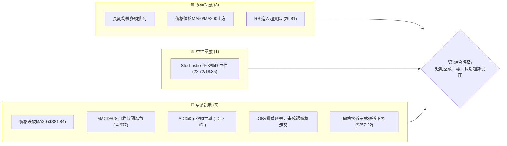
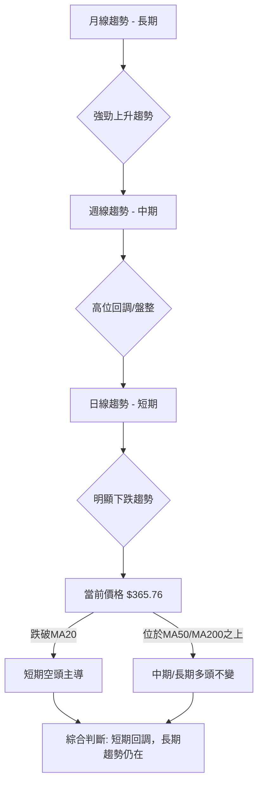

<details>
<summary>📊 靜態圖表 (點擊展開)</summary>

</details>

<html>
<head><meta charset="utf-8" /></head>
<body>
    <div style="height:500px; width:100%;">                        <script>window.PlotlyConfig = {MathJaxConfig: 'local'};</script>
        <script charset="utf-8" src="https://cdn.plot.ly/plotly-3.6.0.min.js" integrity="sha256-QaOVwtVY0T02VaHrr6pnoHLCwayMJp4O5n4YyaE3rJk=" crossorigin="anonymous"></script>                <div id="candlestick-chart" class="plotly-graph-div" style="height:100%; width:100%;"></div>            <script>                window.PLOTLYENV=window.PLOTLYENV || {};                                if (document.getElementById("candlestick-chart")) {                    Plotly.newPlot(                        "candlestick-chart",                        [{"close":{"dtype":"f8","bdata":"AAAAAK\u002f3aEAAAACAaQVpQAAAAIAsyGlAAAAAABQWakAAAAAAcu9pQAAAACC\u002f92lAAAAAIJF8akAAAACgmqFqQAAAAGBvcGpAAAAAwJTSbEAAAABgYwRtQAAAACCHVG1AAAAAgPY6bUAAAAAArPNtQAAAAECH521AAAAA4IMObkAAAACgsCFuQAAAACBmbW9AAAAAwIhib0AAAADAXDBvQAAAAGCdf29AAAAAwJvcb0AAAADgMJFvQAAAAADvf29AAAAAQM\u002fvbkAAAABgi8duQAAAAKAJ225AAAAAgOuAbkAAAAAgCWduQAAAAAChpm5AAAAAABLDbkAAAACgtcNuQAAAAABpZW9AAAAAwHDZbkAAAACgEqRuQAAAAMA2PG5AAAAA4GClbUAAAAAg3oluQAAAAKBmu25AAAAAIM1rb0AAAAAAPHFvQAAAAGBFrm9AAAAA4L4KcEAAAABA+l9vQAAAAIABhm9AAAAAgFqsb0AAAACAgkJwQAAAAIAG2XBAAAAA4A7BcEAAAACAwCxxQAAAACBJmHFAAAAAAAKXcUAAAAAAwrtxQAAAAODtWnFAAAAAANPFcUAAAABgQM9xQAAAAEAidXFAAAAAICMjckAAAAAggzVyQAAAAGCl8HFAAAAAwN1rcUAAAABArElxQAAAAOBn03FAAAAAAC7JcUAAAABAfElyQAAAACBkGXJAAAAAoOazckAAAADgnOBzQAAAAIA4M3RAAAAAgIj9c0AAAAAg+vpzQAAAAMAVq3NAAAAAQHe5c0AAAABg9wJ0QAAAAMBV33NAAAAAQHQadEAAAACAqKNzQAAAAMBr2HNAAAAAYGIMdEAAAACgqpdzQAAAAIDSZHNAAAAAwKJRc0AAAADANjhzQAAAAECanXJAAAAAIJT4ckAAAACgSEZzQAAAAODFcXNAAAAAAFO3c0AAAAAgKrdzQAAAAODPq3NAAAAAALOic0AAAADAQaVzQAAAAOBDmXNAAAAAgJGxc0AAAADAi9FzQAAAAMBBpXNAAAAAgD8jdEAAAADgfFx0QAAAAGCIjnRAAAAAoO7HdEAAAAAgFwN1QAAAAAAsAXVAAAAAwM7OdEAAAAAguKF0QAAAAGDuHnRAAAAAoGGCdEAAAACgtql0QAAAAEAug3RAAAAAwK7VdEAAAAAAOux0QAAAAECxAHVAAAAA4L4mdUAAAADAqiR1QAAAAOCDinVAAAAA4FxHdUAAAABgr9F0QAAAAECMsXRAAAAAAPYtdEAAAAAAv0J0QAAAAMB95nNAAAAA4MVxc0AAAABgb1JzQAAAAIDfHHNAAAAAgLXpckAAAADgnftyQAAAAGCK9XJAAAAAYNqqc0AAAACAh3dzQAAAAOA3a3NAAAAAQPSMc0AAAADA8C5zQAAAAEBfc3NAAAAAIE8ic0AAAABgivVyQAAAAEDI83JAAAAAoCvLckAAAACgcKFyQAAAAAApIHNAAAAAQOEuc0AAAABguEZzQAAAACBc83JAAAAAIFzXckAAAABguAZzQAAAAGCPVnNAAAAAwMwkc0AAAAAgrhtzQAAAAOCjrHJAAAAA4FGwckAAAABAMxNyQAAAAKBwGXJAAAAAANeLcUAAAAAAKRxxQAAAAIA9EnFAAAAAgMLtcUAAAABgZm5yQAAAACBcZ3JAAAAAYI+ackAAAABA4f5yQAAAAADXq3NAAAAAgOvFc0AAAAAghbtzQAAAACBc83NAAAAAoEepdEAAAAAghed0QAAAAOBRzHRAAAAAYGY2dUAAAABgZvZ0QAAAACCFp3RAAAAAIK4bdUAAAAAAABx1QAAAAMAeZXVAAAAA4FHIdUAAAAAAALh1QAAAAMD1tHVAAAAAQArfd0AAAAAghfN3QAAAAIA9undAAAAA4FEEeEAAAACAPbJ4QAAAAMDMtHhAAAAAwMzQeEAAAADgUSx4QAAAAMAe\u002fXdAAAAA4KPweEAAAABguNJ4QAAAAMAelXhAAAAAgMKReEAAAABgZg54QAAAAGBmDnhAAAAAIIX3d0AAAACAFLZ3QAAAAKBwDXhAAAAAoEcNeEAAAACA6yF4QAAAAEDhhndAAAAAoEdJd0AAAACAPWZ2QAAAAEDhOnZAAAAA4FEUd0AAAAAAKdx2QA=="},"high":{"dtype":"f8","bdata":"bqharOY2aUAf1Sku5VxpQE5gYypQGGpAn2vA97JTakDeqFWcuv9pQKmvMjYrI2pApZsLHn2NakAu2HjNZNtqQKLHyiWJfGpAa2X7PO7obEDGE4955gdtQP5ogdMtc21AxVuqanXCbUChMiuIcQhuQA4cGiQPOG5AnA8yv7dHbkBGSwtLBUNuQFEGlEEJjW9Ad+CoJmCcb0De0SiOeHNvQOOBn8Z0uW9A9l+89KEFcED+xlBJzf5vQHBivqOWzW9AzdsnSL+Tb0CYZRgaWt9uQHTeGnr9OG9AzDUN0dFpb0BO+Ke8B2tuQB6oHz8U2m5AILd0\u002fpPpbkC4BgN1DtluQM+ygdZ1e29ABJ0QS7Bmb0Ay2QEjmN1uQI44Bbsbp25AodZ2YUKQbkAgX\u002fd8DZVuQFimdn8K9m5AUef\u002f9lqNb0Al7S96sRNwQD4PU6Ua0W9Aa7CguXwYcEB3NUcjFeFvQPq\u002fiU5NDXBAlnrA2Gvwb0DfkxVld2JwQPxSYivt5nBAkIP3vjHwcECzxN7OiDlxQBm59E6MOHJAkEaA1VnecUCvBxil1thxQNQ6pUs7l3FA7RZObPvkcUCG7+k7sgZyQP+QQVnUwXFA6dhaywkxckAUHiJrGT9yQGWiqUBrP3JAL0Yd4AKycUCI4pxzWGxxQEOuIZnuYXJARdWCx64QckB9GFS7Zv1yQNV6JZ2VJ3NA1THOccT4ckD69Y8d3fVzQE35M3KXg3RASQv0eMpIdEAtjouX\u002fWZ0QDRSH7Ul83NAUL\u002fRrLDic0BVW6vdpxl0QFs94ZqTKnRAKda\u002flkE2dEDBuvvSDxB0QEh9EBzB53NAkIvGXUsadEBThw54Nhx0QHi3eeutvnNAJ+W\u002fgK2Hc0AKmUriAXpzQB91+yOjT3NAoPhUxbgQc0AAeH0HXExzQB7K2G6wd3NAp1VXtjzBc0B8oVPWE8FzQB4H1eJkxXNA6W\u002fj8\u002firc0AdeL0qn9dzQETlPAqwsnNAaqQkmvwqdEAWS1BvZ\u002fBzQHYsaIlWFXRAixFiPcNjdEBF3cuv6qR0QJSNlEDys3RA+hih0UXjdEANx8deW091QOImgwyvDHVAo51si0UedUBWkhNfEPB0QGHhYIa+fXRAZWynONrHdEC93hiGle90QETkVLq33HRA7Lyxys8BdUBZBbNaoR91QFVRf\u002ftGFnVAkzt96MhgdUA5hdaszkB1QOBVYJzAjnVACfN8wHTedUBGu\u002fVJH4B1QLlqCLaOxnRA4FZZIoSmdED\u002fiJT+JXh0QBPwhBl1FnRAMV5cnBoNdECdSzl\u002fHcRzQAQpf9nCSnNA47LZR84Kc0C\u002fI9pRHRtzQPV1lGAIHXNAcZYAo5fIc0DGeiB8rvNzQIYZtNFmgnNAEKjx7gaXc0Ag596BeYxzQFPQMcDDfXNA\u002fsIL\u002fsQ+c0AUanjHnftyQDdCR1TrE3NAHi3vp4DyckD6MIul5cFyQAAAAAAAKHNAAAAAYGZSc0AAAACgGnFzQAAAAIA9SnNAAAAAACk0c0AAAADAHhlzQAAAAMDMYHNAAAAAAABsc0AAAABA4SpzQAAAAIDrBXNAAAAAgOv1ckAAAACgmZFyQAAAAGCPanJAAAAAgD3ocUAAAACgcHFxQAAAAAApRHFAAAAAwMzwcUAAAACAwp9yQAAAAGBmfnJAAAAAwMymckAAAACgmQFzQAAAAIA99nNAAAAAQOHWc0AAAAAAAPhzQAAAAEDh9nNAAAAAgD2qdEAAAAAAAPB0QAAAAIAUFnVAAAAAgMI\u002fdUAAAABgjzJ1QAAAAGC4EnVAAAAA4HogdUAAAABgj0J1QAAAAEAKe3VAAAAAYGbudUAAAABgZt51QAAAAGBmFnZAAAAAgBTqd0AAAACAPfZ3QAAAAEDhAnhAAAAAIFxPeEAAAACAFMZ4QAAAACCu1XhAAAAAgOvleEAAAACgR6V4QAAAAEAKJ3hAAAAAQOH+eEAAAAAAqvF4QAAAAIAUvnhAAAAAIIVHeUAAAADgzpV4QAAAAEAza3hAAAAAQOFKeEAAAACA6w14QAAAAIA9FnhAAAAAoJlbeEAAAAAAAGB4QAAAAGBm2ndAAAAAoJlpd0AAAADgoxx3QAAAAAAAqHZAAAAAgMIdd0AAAABAMxN3QA=="},"hovertemplate":"\u003cb\u003e%{x|%Y-%m-%d}\u003c\u002fb\u003e\u003cbr\u003e\u958b: $%{open:.2f}\u003cbr\u003e\u9ad8: $%{high:.2f}\u003cbr\u003e\u4f4e: $%{low:.2f}\u003cbr\u003e\u6536: $%{close:.2f}\u003cextra\u003e\u003c\u002fextra\u003e","low":{"dtype":"f8","bdata":"qCpeIoWgaEB7jeFMY\u002f5oQO60qsCfNWlAxBoVuZavaUBu\u002fnedjb9pQBmc2iGjvWlANIeXMUXkaUCoKEhB3k9qQNygRDrWz2lAPsg2l6YTbEADOS8fA0hsQG5CMN1y+2xArVlqpjgtbUC7vwxZCSJtQLyJEfowuW1AkFglJEyIbUB\u002f3Qybp8VtQBEcaqq7lG5Auo\u002fdTgwsb0BPfvIv3cduQBqR6sarOG9AXVpx2T13b0C1p45cCk9vQG1BnuH8V29AwzMk5lDcbkB+T9RCUSpuQINsGv\u002fHyW5AQYzCodlbbkABLVFP4edtQEXINScG3G1A11M0jNBYbkAVvlSyhURuQEBksEBsq25ASyOzzTbPbkCP6NybP5huQG2ONvhc621AEH15MKeLbUAJ8eRyjg1uQKtXM+g7G25A5UcPA5PObkDPRL8PkUpvQPmigb4YCG9A3tw4HyjIb0Ca4h2x04puQLOLIXaRQ29AQiXHjpyNb0C0yUQ5F\u002fhvQBDNzDRLiXBA9b7i\u002fuyscEA5jX7MDsFwQPD1Dw0egXFABN+0W1lScUDLbCTS1n9xQMGfksLVR3FABJXTpA1YcUCodmznz5NxQO8qz\u002fzbNXFAvvMghX2ycUCCBrMO1vdxQLBAKI\u002fpv3FAzbrwd\u002fhZcUDQ6SNtrPBwQCzRT\u002fuDvXFApuXs6BtqcUBml6spe\u002fRxQP8JSN9yDHJAcoosH2BfckCNkRJ8sE9zQE8ebLYp1nNARewQ+lHMc0Aoyu+HKshzQBc8drTemHNArL52frScc0A9WFTzqZ1zQPciz2uYsnNAefIqd734c0BN2grzC3tzQOec6wpmhnNAH9ni5diyc0CcIQ\u002fkllpzQGqQ4APnK3NAujvoUmUYc0BEBwV\u002f2\u002flyQGmyTILZk3JAegEjn7HGckD+dljUCOJyQHZbEIv8JXNAOTYm939oc0C2Z79Gl5FzQMX2ZHP8l3NARzL8DeN6c0ByV52\u002feJBzQOU2G\u002f2uf3NAhb1il+Zmc0BcPcnYbrBzQGaWWv\u002frgXNAhzXgHXWkc0CEGLh3Nhx0QM+JczVTYHRArYYJUn5UdEBZN3F\u002f1eF0QMyXW6iCrnRAP0pTpOiwdEAyEsUhBn90QCALhymgCnRASbJpfQr1c0BgdNomYIp0QH1ui3PTe3RAq726tiZ0dEB2C7+aPdh0QL39TddWvnRAfWWWDddndEAzXrpbfsZ0QGomPyJg\u002fHRAYI6CVaAldUBuT8GyNZJ0QF64kmJDK3NAio6MQcv+c0AYL5gxn9dzQDU+fxIEp3NA6cfTNZZec0Dh\u002faHE7T5zQBOv3hz6+nJAhc1aMg6LckCwXMJmR9xyQBlpdlVVx3JAxRzzl0oDc0BMmeUmWVxzQAaMQA3+HXNA+fQfdUZSc0CO9MdqJ+NyQAntf1oJ9nJARv9CqJHNckDBNPeI14dyQChLMGRpyXJATsyZMMOdckCiF16rrHByQAAAAEDhXnJAAAAAwPUUc0AAAACgcB1zQAAAAKBwzXJAAAAA4Hq8ckAAAADA9dxyQAAAAKCZBXNAAAAAYLgYc0AAAAAAANByQAAAAAAAjHJAAAAA4HqgckAAAAAgrg1yQAAAAIDr9XFAAAAAwMxwcUAAAAAgrhdxQAAAAGCP+HBAAAAAAClMcUAAAAAghRdyQAAAAMAe+XFAAAAA4KNcckAAAADAzHZyQAAAAKBHi3NAAAAAIIVXc0AAAADgo6hzQAAAAEAKm3NAAAAAYGYSdEAAAABgj4p0QAAAAGBmunRAAAAA4KPUdEAAAACAFOp0QAAAAIAUmnRAAAAAIFzPdEAAAADA9fB0QAAAAMDM4HRAAAAAwPVMdUAAAADgeoR1QAAAAEDhZnVAAAAAoHCxdkAAAAAAKXR3QAAAAOBRjHdAAAAAoJnFd0AAAACgmTF4QAAAAMD1ZHhAAAAAYLiaeEAAAAAgriN4QAAAACCFu3dAAAAAoEfZd0AAAADgpYt4QAAAAAApXHhAAAAAYGZueEAAAAAAAPB3QAAAAAAAwHdAAAAAIK63d0AAAAAAKaR3QAAAAIA9sndAAAAAAADgd0AAAAAAANR3QAAAAMDMZHdAAAAAIFwbd0AAAAAAADB2QAAAAIAUJnZAAAAAwMwsdkAAAACAFJp2QA=="},"name":"\u50f9\u683c","open":{"dtype":"f8","bdata":"TVG7kUEnaUDYDaromghpQPfR3G8NcGlA1ChQBB3RaUDhsI7k2vxpQDU+51ffv2lAxG18xu7raUDsrF1bcllqQFxD7pqmEGpA15qprRI\u002fbECbf0Z+aLRsQEIsj3VjBG1AbcNORg1vbUAEZFra6zttQI\u002fFQzGf3W1AoUxzGxD6bUCJisiwJw9uQGzxjKPYmW5Ati8aZZ1\u002fb0Arvhn\u002fz2NvQND9GFiYcG9AgM3Pzs6hb0A5hcCG6M1vQMszluX0qW9At\u002fbmptx5b0C7oCZWQpBuQGEvEChf7m5AQ0gdpgf+bkDsrPZwYFduQO\u002fwhEpMG25ARhfFJdOpbkCNHjjsuJxuQGt32oBMrm5AEzcXQ\u002fYSb0B5ZFxouLtuQOq7KzpKl25A3AgkpJ06bkAYe+IWgRZuQH2\u002f3V+sLW5AuW56YfX3bkDT6APB7YNvQOXdXxhMYG9A5fldAErcb0A1YdmU7dxvQMMB6RVC1W9ApBFIFWWrb0AgNOkSOA9wQKd91R8BkHBApqopDFfdcEBPiqUM78NwQO09clkxNXJAa7BnLyOtcUDcHU5QmKBxQH31RuYHS3FAa0zEUAVwcUA+FpUOkNVxQKkMehUyvXFA0jIjkQ3OcUC0ztQH8\u002fxxQGrFh2cGO3JAKdVfSp+pcUDzvMk7bPhwQAWd5S4w4HFAs0fMzYABckBRS190uPRxQHKKDw07BXNALJF3L3uHckBSM5oramlzQCPTUDS2ZXRAN5pFuYUFdEDtVkd\u002f3S90QDadZ8y20HNAbRYu3YbHc0BxQ\u002fk7oLlzQJPBnMe2KXRAAEvBOg\u002f5c0AUCqIm3Qx0QEOzlMgSjnNASyJKgVrGc0DawBKp+w10QOsKUKwsqXNAmWIgeHqGc0AbjBqdjRxzQBjNjOytTHNAS6NZ3YvtckDXR9ll5\u002fByQIIkfy0YcHNAsczy2qduc0DsE6+91r5zQP8nSVspu3NAec\u002fixpiJc0CkH4GpB5NzQD74a91jknNA045N1NzVc0DKgC6ritdzQPRUo8pi0XNA1WEyqpOlc0CDnQr9h5B0QLuBEqImdHRAGs8xd1JkdEAtYuwQtPB0QDSjF5L863RAsEjLghIddUAz1DQAMOt0QGdpK6c4EHRAKbGQQecNdEBkTqyfeeB0QHAxS7G7xnRA9SWg6oB\u002fdECmqe6uTPZ0QKDla+z3BXVA1J2DQMRBdUDDCU28l+N0QKvQp1MCBXVAe3FZl1DEdUAttmA3NXh1QNbP5iasj3NAIbXdvulxdEBa4I68OBB0QAfd\u002fgzyCnRAfYCGX8Trc0CGeRboFIJzQOPKinVKPHNALzNYidrGckBV1R55geNyQAgCw3\u002fp5HJAHlB3310Jc0ARJqFEpe5zQJr9rc69ZnNAib6+f2d+c0D0SNBRW4lzQDEh4did+3JAw0QPCgfsckAbz3jSW6NyQN53t\u002fSM53JAFS5s5cjvckCDGpws0X1yQAAAAAApYnJAAAAAAAAec0AAAADAzCRzQAAAACBcI3NAAAAA4Hoqc0AAAACgmflyQAAAAGC4CnNAAAAA4Ho+c0AAAAAgXPNyQAAAAMAeAXNAAAAA4HrIckAAAAAgXINyQAAAAGBmQnJAAAAAQArjcUAAAABgZlZxQAAAAEAKN3FAAAAA4KNYcUAAAAAgrh9yQAAAAADXD3JAAAAAQDNrckAAAACAPcJyQAAAAKBH3XNAAAAAQAqTc0AAAACgmeNzQAAAAGC4tnNAAAAAQAohdEAAAADA9ah0QAAAAKCZ\u002fXRAAAAAQOHmdEAAAADA9Sh1QAAAACBc+XRAAAAAACnudEAAAABAMzl1QAAAACCFG3VAAAAAgBR+dUAAAABguK51QAAAACCul3VAAAAAgBQ0d0AAAAAgrp93QAAAAMAe5XdAAAAAgOvdd0AAAACgcFl4QAAAAMD10HhAAAAA4FGkeEAAAABACmt4QAAAAAAAEHhAAAAA4Hred0AAAADgo5x4QAAAAKBwk3hAAAAAAACCeEAAAADAzJR4QAAAAOCjEHhAAAAAACngd0AAAAAAKfR3QAAAAIDrz3dAAAAAgD3sd0AAAACAwv13QAAAAKCZ03dAAAAAQDNJd0AAAABgj7J2QAAAACBcZXZAAAAAQAo3dkAAAACAFLZ2QA=="},"x":["2025-08-20T00:00:00-04:00","2025-08-21T00:00:00-04:00","2025-08-22T00:00:00-04:00","2025-08-25T00:00:00-04:00","2025-08-26T00:00:00-04:00","2025-08-27T00:00:00-04:00","2025-08-28T00:00:00-04:00","2025-08-29T00:00:00-04:00","2025-09-02T00:00:00-04:00","2025-09-03T00:00:00-04:00","2025-09-04T00:00:00-04:00","2025-09-05T00:00:00-04:00","2025-09-08T00:00:00-04:00","2025-09-09T00:00:00-04:00","2025-09-10T00:00:00-04:00","2025-09-11T00:00:00-04:00","2025-09-12T00:00:00-04:00","2025-09-15T00:00:00-04:00","2025-09-16T00:00:00-04:00","2025-09-17T00:00:00-04:00","2025-09-18T00:00:00-04:00","2025-09-19T00:00:00-04:00","2025-09-22T00:00:00-04:00","2025-09-23T00:00:00-04:00","2025-09-24T00:00:00-04:00","2025-09-25T00:00:00-04:00","2025-09-26T00:00:00-04:00","2025-09-29T00:00:00-04:00","2025-09-30T00:00:00-04:00","2025-10-01T00:00:00-04:00","2025-10-02T00:00:00-04:00","2025-10-03T00:00:00-04:00","2025-10-06T00:00:00-04:00","2025-10-07T00:00:00-04:00","2025-10-08T00:00:00-04:00","2025-10-09T00:00:00-04:00","2025-10-10T00:00:00-04:00","2025-10-13T00:00:00-04:00","2025-10-14T00:00:00-04:00","2025-10-15T00:00:00-04:00","2025-10-16T00:00:00-04:00","2025-10-17T00:00:00-04:00","2025-10-20T00:00:00-04:00","2025-10-21T00:00:00-04:00","2025-10-22T00:00:00-04:00","2025-10-23T00:00:00-04:00","2025-10-24T00:00:00-04:00","2025-10-27T00:00:00-04:00","2025-10-28T00:00:00-04:00","2025-10-29T00:00:00-04:00","2025-10-30T00:00:00-04:00","2025-10-31T00:00:00-04:00","2025-11-03T00:00:00-05:00","2025-11-04T00:00:00-05:00","2025-11-05T00:00:00-05:00","2025-11-06T00:00:00-05:00","2025-11-07T00:00:00-05:00","2025-11-10T00:00:00-05:00","2025-11-11T00:00:00-05:00","2025-11-12T00:00:00-05:00","2025-11-13T00:00:00-05:00","2025-11-14T00:00:00-05:00","2025-11-17T00:00:00-05:00","2025-11-18T00:00:00-05:00","2025-11-19T00:00:00-05:00","2025-11-20T00:00:00-05:00","2025-11-21T00:00:00-05:00","2025-11-24T00:00:00-05:00","2025-11-25T00:00:00-05:00","2025-11-26T00:00:00-05:00","2025-11-28T00:00:00-05:00","2025-12-01T00:00:00-05:00","2025-12-02T00:00:00-05:00","2025-12-03T00:00:00-05:00","2025-12-04T00:00:00-05:00","2025-12-05T00:00:00-05:00","2025-12-08T00:00:00-05:00","2025-12-09T00:00:00-05:00","2025-12-10T00:00:00-05:00","2025-12-11T00:00:00-05:00","2025-12-12T00:00:00-05:00","2025-12-15T00:00:00-05:00","2025-12-16T00:00:00-05:00","2025-12-17T00:00:00-05:00","2025-12-18T00:00:00-05:00","2025-12-19T00:00:00-05:00","2025-12-22T00:00:00-05:00","2025-12-23T00:00:00-05:00","2025-12-24T00:00:00-05:00","2025-12-26T00:00:00-05:00","2025-12-29T00:00:00-05:00","2025-12-30T00:00:00-05:00","2025-12-31T00:00:00-05:00","2026-01-02T00:00:00-05:00","2026-01-05T00:00:00-05:00","2026-01-06T00:00:00-05:00","2026-01-07T00:00:00-05:00","2026-01-08T00:00:00-05:00","2026-01-09T00:00:00-05:00","2026-01-12T00:00:00-05:00","2026-01-13T00:00:00-05:00","2026-01-14T00:00:00-05:00","2026-01-15T00:00:00-05:00","2026-01-16T00:00:00-05:00","2026-01-20T00:00:00-05:00","2026-01-21T00:00:00-05:00","2026-01-22T00:00:00-05:00","2026-01-23T00:00:00-05:00","2026-01-26T00:00:00-05:00","2026-01-27T00:00:00-05:00","2026-01-28T00:00:00-05:00","2026-01-29T00:00:00-05:00","2026-01-30T00:00:00-05:00","2026-02-02T00:00:00-05:00","2026-02-03T00:00:00-05:00","2026-02-04T00:00:00-05:00","2026-02-05T00:00:00-05:00","2026-02-06T00:00:00-05:00","2026-02-09T00:00:00-05:00","2026-02-10T00:00:00-05:00","2026-02-11T00:00:00-05:00","2026-02-12T00:00:00-05:00","2026-02-13T00:00:00-05:00","2026-02-17T00:00:00-05:00","2026-02-18T00:00:00-05:00","2026-02-19T00:00:00-05:00","2026-02-20T00:00:00-05:00","2026-02-23T00:00:00-05:00","2026-02-24T00:00:00-05:00","2026-02-25T00:00:00-05:00","2026-02-26T00:00:00-05:00","2026-02-27T00:00:00-05:00","2026-03-02T00:00:00-05:00","2026-03-03T00:00:00-05:00","2026-03-04T00:00:00-05:00","2026-03-05T00:00:00-05:00","2026-03-06T00:00:00-05:00","2026-03-09T00:00:00-04:00","2026-03-10T00:00:00-04:00","2026-03-11T00:00:00-04:00","2026-03-12T00:00:00-04:00","2026-03-13T00:00:00-04:00","2026-03-16T00:00:00-04:00","2026-03-17T00:00:00-04:00","2026-03-18T00:00:00-04:00","2026-03-19T00:00:00-04:00","2026-03-20T00:00:00-04:00","2026-03-23T00:00:00-04:00","2026-03-24T00:00:00-04:00","2026-03-25T00:00:00-04:00","2026-03-26T00:00:00-04:00","2026-03-27T00:00:00-04:00","2026-03-30T00:00:00-04:00","2026-03-31T00:00:00-04:00","2026-04-01T00:00:00-04:00","2026-04-02T00:00:00-04:00","2026-04-06T00:00:00-04:00","2026-04-07T00:00:00-04:00","2026-04-08T00:00:00-04:00","2026-04-09T00:00:00-04:00","2026-04-10T00:00:00-04:00","2026-04-13T00:00:00-04:00","2026-04-14T00:00:00-04:00","2026-04-15T00:00:00-04:00","2026-04-16T00:00:00-04:00","2026-04-17T00:00:00-04:00","2026-04-20T00:00:00-04:00","2026-04-21T00:00:00-04:00","2026-04-22T00:00:00-04:00","2026-04-23T00:00:00-04:00","2026-04-24T00:00:00-04:00","2026-04-27T00:00:00-04:00","2026-04-28T00:00:00-04:00","2026-04-29T00:00:00-04:00","2026-04-30T00:00:00-04:00","2026-05-01T00:00:00-04:00","2026-05-04T00:00:00-04:00","2026-05-05T00:00:00-04:00","2026-05-06T00:00:00-04:00","2026-05-07T00:00:00-04:00","2026-05-08T00:00:00-04:00","2026-05-11T00:00:00-04:00","2026-05-12T00:00:00-04:00","2026-05-13T00:00:00-04:00","2026-05-14T00:00:00-04:00","2026-05-15T00:00:00-04:00","2026-05-18T00:00:00-04:00","2026-05-19T00:00:00-04:00","2026-05-20T00:00:00-04:00","2026-05-21T00:00:00-04:00","2026-05-22T00:00:00-04:00","2026-05-26T00:00:00-04:00","2026-05-27T00:00:00-04:00","2026-05-28T00:00:00-04:00","2026-05-29T00:00:00-04:00","2026-06-01T00:00:00-04:00","2026-06-02T00:00:00-04:00","2026-06-03T00:00:00-04:00","2026-06-04T00:00:00-04:00","2026-06-05T00:00:00-04:00"],"type":"candlestick"},{"hovertemplate":"MA30: $%{y:.2f}\u003cextra\u003e\u003c\u002fextra\u003e","line":{"color":"#2196F3","dash":"dash","width":2},"mode":"lines","name":"MA30","x":["2025-08-20T00:00:00-04:00","2025-08-21T00:00:00-04:00","2025-08-22T00:00:00-04:00","2025-08-25T00:00:00-04:00","2025-08-26T00:00:00-04:00","2025-08-27T00:00:00-04:00","2025-08-28T00:00:00-04:00","2025-08-29T00:00:00-04:00","2025-09-02T00:00:00-04:00","2025-09-03T00:00:00-04:00","2025-09-04T00:00:00-04:00","2025-09-05T00:00:00-04:00","2025-09-08T00:00:00-04:00","2025-09-09T00:00:00-04:00","2025-09-10T00:00:00-04:00","2025-09-11T00:00:00-04:00","2025-09-12T00:00:00-04:00","2025-09-15T00:00:00-04:00","2025-09-16T00:00:00-04:00","2025-09-17T00:00:00-04:00","2025-09-18T00:00:00-04:00","2025-09-19T00:00:00-04:00","2025-09-22T00:00:00-04:00","2025-09-23T00:00:00-04:00","2025-09-24T00:00:00-04:00","2025-09-25T00:00:00-04:00","2025-09-26T00:00:00-04:00","2025-09-29T00:00:00-04:00","2025-09-30T00:00:00-04:00","2025-10-01T00:00:00-04:00","2025-10-02T00:00:00-04:00","2025-10-03T00:00:00-04:00","2025-10-06T00:00:00-04:00","2025-10-07T00:00:00-04:00","2025-10-08T00:00:00-04:00","2025-10-09T00:00:00-04:00","2025-10-10T00:00:00-04:00","2025-10-13T00:00:00-04:00","2025-10-14T00:00:00-04:00","2025-10-15T00:00:00-04:00","2025-10-16T00:00:00-04:00","2025-10-17T00:00:00-04:00","2025-10-20T00:00:00-04:00","2025-10-21T00:00:00-04:00","2025-10-22T00:00:00-04:00","2025-10-23T00:00:00-04:00","2025-10-24T00:00:00-04:00","2025-10-27T00:00:00-04:00","2025-10-28T00:00:00-04:00","2025-10-29T00:00:00-04:00","2025-10-30T00:00:00-04:00","2025-10-31T00:00:00-04:00","2025-11-03T00:00:00-05:00","2025-11-04T00:00:00-05:00","2025-11-05T00:00:00-05:00","2025-11-06T00:00:00-05:00","2025-11-07T00:00:00-05:00","2025-11-10T00:00:00-05:00","2025-11-11T00:00:00-05:00","2025-11-12T00:00:00-05:00","2025-11-13T00:00:00-05:00","2025-11-14T00:00:00-05:00","2025-11-17T00:00:00-05:00","2025-11-18T00:00:00-05:00","2025-11-19T00:00:00-05:00","2025-11-20T00:00:00-05:00","2025-11-21T00:00:00-05:00","2025-11-24T00:00:00-05:00","2025-11-25T00:00:00-05:00","2025-11-26T00:00:00-05:00","2025-11-28T00:00:00-05:00","2025-12-01T00:00:00-05:00","2025-12-02T00:00:00-05:00","2025-12-03T00:00:00-05:00","2025-12-04T00:00:00-05:00","2025-12-05T00:00:00-05:00","2025-12-08T00:00:00-05:00","2025-12-09T00:00:00-05:00","2025-12-10T00:00:00-05:00","2025-12-11T00:00:00-05:00","2025-12-12T00:00:00-05:00","2025-12-15T00:00:00-05:00","2025-12-16T00:00:00-05:00","2025-12-17T00:00:00-05:00","2025-12-18T00:00:00-05:00","2025-12-19T00:00:00-05:00","2025-12-22T00:00:00-05:00","2025-12-23T00:00:00-05:00","2025-12-24T00:00:00-05:00","2025-12-26T00:00:00-05:00","2025-12-29T00:00:00-05:00","2025-12-30T00:00:00-05:00","2025-12-31T00:00:00-05:00","2026-01-02T00:00:00-05:00","2026-01-05T00:00:00-05:00","2026-01-06T00:00:00-05:00","2026-01-07T00:00:00-05:00","2026-01-08T00:00:00-05:00","2026-01-09T00:00:00-05:00","2026-01-12T00:00:00-05:00","2026-01-13T00:00:00-05:00","2026-01-14T00:00:00-05:00","2026-01-15T00:00:00-05:00","2026-01-16T00:00:00-05:00","2026-01-20T00:00:00-05:00","2026-01-21T00:00:00-05:00","2026-01-22T00:00:00-05:00","2026-01-23T00:00:00-05:00","2026-01-26T00:00:00-05:00","2026-01-27T00:00:00-05:00","2026-01-28T00:00:00-05:00","2026-01-29T00:00:00-05:00","2026-01-30T00:00:00-05:00","2026-02-02T00:00:00-05:00","2026-02-03T00:00:00-05:00","2026-02-04T00:00:00-05:00","2026-02-05T00:00:00-05:00","2026-02-06T00:00:00-05:00","2026-02-09T00:00:00-05:00","2026-02-10T00:00:00-05:00","2026-02-11T00:00:00-05:00","2026-02-12T00:00:00-05:00","2026-02-13T00:00:00-05:00","2026-02-17T00:00:00-05:00","2026-02-18T00:00:00-05:00","2026-02-19T00:00:00-05:00","2026-02-20T00:00:00-05:00","2026-02-23T00:00:00-05:00","2026-02-24T00:00:00-05:00","2026-02-25T00:00:00-05:00","2026-02-26T00:00:00-05:00","2026-02-27T00:00:00-05:00","2026-03-02T00:00:00-05:00","2026-03-03T00:00:00-05:00","2026-03-04T00:00:00-05:00","2026-03-05T00:00:00-05:00","2026-03-06T00:00:00-05:00","2026-03-09T00:00:00-04:00","2026-03-10T00:00:00-04:00","2026-03-11T00:00:00-04:00","2026-03-12T00:00:00-04:00","2026-03-13T00:00:00-04:00","2026-03-16T00:00:00-04:00","2026-03-17T00:00:00-04:00","2026-03-18T00:00:00-04:00","2026-03-19T00:00:00-04:00","2026-03-20T00:00:00-04:00","2026-03-23T00:00:00-04:00","2026-03-24T00:00:00-04:00","2026-03-25T00:00:00-04:00","2026-03-26T00:00:00-04:00","2026-03-27T00:00:00-04:00","2026-03-30T00:00:00-04:00","2026-03-31T00:00:00-04:00","2026-04-01T00:00:00-04:00","2026-04-02T00:00:00-04:00","2026-04-06T00:00:00-04:00","2026-04-07T00:00:00-04:00","2026-04-08T00:00:00-04:00","2026-04-09T00:00:00-04:00","2026-04-10T00:00:00-04:00","2026-04-13T00:00:00-04:00","2026-04-14T00:00:00-04:00","2026-04-15T00:00:00-04:00","2026-04-16T00:00:00-04:00","2026-04-17T00:00:00-04:00","2026-04-20T00:00:00-04:00","2026-04-21T00:00:00-04:00","2026-04-22T00:00:00-04:00","2026-04-23T00:00:00-04:00","2026-04-24T00:00:00-04:00","2026-04-27T00:00:00-04:00","2026-04-28T00:00:00-04:00","2026-04-29T00:00:00-04:00","2026-04-30T00:00:00-04:00","2026-05-01T00:00:00-04:00","2026-05-04T00:00:00-04:00","2026-05-05T00:00:00-04:00","2026-05-06T00:00:00-04:00","2026-05-07T00:00:00-04:00","2026-05-08T00:00:00-04:00","2026-05-11T00:00:00-04:00","2026-05-12T00:00:00-04:00","2026-05-13T00:00:00-04:00","2026-05-14T00:00:00-04:00","2026-05-15T00:00:00-04:00","2026-05-18T00:00:00-04:00","2026-05-19T00:00:00-04:00","2026-05-20T00:00:00-04:00","2026-05-21T00:00:00-04:00","2026-05-22T00:00:00-04:00","2026-05-26T00:00:00-04:00","2026-05-27T00:00:00-04:00","2026-05-28T00:00:00-04:00","2026-05-29T00:00:00-04:00","2026-06-01T00:00:00-04:00","2026-06-02T00:00:00-04:00","2026-06-03T00:00:00-04:00","2026-06-04T00:00:00-04:00","2026-06-05T00:00:00-04:00"],"y":{"dtype":"f8","bdata":"AAAAAAAA+H8AAAAAAAD4fwAAAAAAAPh\u002fAAAAAAAA+H8AAAAAAAD4fwAAAAAAAPh\u002fAAAAAAAA+H8AAAAAAAD4fwAAAAAAAPh\u002fAAAAAAAA+H8AAAAAAAD4fwAAAAAAAPh\u002fAAAAAAAA+H8AAAAAAAD4fwAAAAAAAPh\u002fAAAAAAAA+H8AAAAAAAD4fwAAAAAAAPh\u002fAAAAAAAA+H8AAAAAAAD4fwAAAAAAAPh\u002fAAAAAAAA+H8AAAAAAAD4fwAAAAAAAPh\u002fAAAAAAAA+H8AAAAAAAD4fwAAAAAAAPh\u002fAAAAAAAA+H8AAAAAAAD4f1VVVbXaJG1AERER8UxWbUCrqqp6T4dtQFVVVeU3t21A7+7uHt3fbUC8u7ubBAhuQO\u002fu7v5uLG5Aq6qq2mRHbkAAAABwvGhuQHd3d0dejW5AMzMz04qjbkBmZma2PLhuQGZmZpZLzG5A3t3dbaXkbkC8u7sryvBuQLy7uwub\u002fm5Ad3d3d2YMb0BVVVUlxyBvQKuqqgoiNG9AvLu7m0BGb0CJiIhIOWFvQJqZmem4gG9AAAAAMAmdb0CamZk5UL5vQLy7u\u002fu12W9AiYiI+IQAcECamZkxKxVwQN7d3T19JnBA7+7unhw\u002fcEBVVVU9x1hwQGZmZt4Wb3BAAAAAGICAcEDv7u7OwpBwQLy7u+vqonBAmpmZ+RC3cEAzMzObYdBwQO\u002fu7vbS6XBA7+7uXu4KcUDv7u72QDJxQDMzMyOBW3FAERERiQaAcUCJiIjwXqRxQM3MzCwJxXFAiYiIuHXkcUDe3d3tWwlyQERERNRvLHJAiYiImNhQckAiIiIyr21yQDMzM6NDh3JAVVVVBWCjckDNzMxsAbhyQGZmZlZbx3JA3t3dbRzWckDNzMz8yuJyQHd3d3eM7XJAq6qqGsb3ckARERFhRgRzQERERMQ6FXNARERE1LMic0Crqqq6ji9zQJqZmWlUPnNAMzMzYzlRc0CJiIj4V2VzQHd3d+d4dHNAzczMfMCEc0AiIiIS0pFzQAAAACAEn3NAIiIi0kKrc0AzMzPjY69zQFVVVRVvsnNAiYiIOC65c0DNzMz8+8FzQBERESFjzXNAd3d3x6HWc0CJiIh47NtzQImIiCgL3nNAERERAYLhc0BVVVU1PupzQLy7u1vv73NAq6qqGqX2c0B3d3c3\u002fwF0QHd3d9e5D3RAmpmZ6VwfdEDe3d0txy90QGZmZua9SHRAIiIiQm9cdECamZlZnWl0QImIiBhGdHRAZmZmdjp4dEDv7u6O4Xx0QJqZmUnWfnRAiYiIyDR9dECamZkJcnp0QO\u002fu7o5MdnRAd3d3F6NvdEAAAACQgWh0QN7d3R2mYnRA7+7uvqJedEB3d3f3AFd0QFVVVRVLTXRAVVVVRctCdEBERERkMDN0QFVVVdXtJXRAAAAAUKUXdEBVVVWFXwl0QImIiMhm\u002f3NAmpmZ2cLwc0Dv7u4ua99zQM3MzKyV03NAIiIiwn3Fc0B3d3fncLdzQBERERHupXNAMzMzkzeSc0BmZmb2JoBzQLy7u4tabXNAq6qqiiJbc0BmZmbmiExzQERERPRNO3NAiYiISJUuc0De3d197htzQAAAADCQDHNA7+7ujl38ckCJiIhYfelyQLy7u4sR2HJARERElKvPckB3d3eH9spyQBEREUE5xnJAAAAAsCW9ckBVVVUlILlyQFVVVZVHu3JAERERsS29ckDe3d1N3cFyQHd3d3chxnJAAAAAwCnTckDNzMwsw+NyQO\u002fu7n6D83JAZmZmlicIc0BVVVWlDRxzQAAAAEAZKXNAq6qqeoY5c0AAAAAAK0lzQCIiItIGXnNAREREFCB3c0Dv7u7uGY5zQLy7u4tQonNA3t3d7afKc0BVVVXl+\u002fNzQN7d3Z0aH3RAVVVVFZJMdEDNzMxsEoV0QM3MzFxzvXRA3t3djXv7dEDv7u4uwTd1QBEREbHIcnVAERERAZ2udUBVVVVFKOV1QFVVVfXhGXZAAAAAEMpMdkCrqqoq+Xd2QImIiFhknXZAvLu7uy3BdkAiIiJyIeN2QBERESEiBndAAAAAEBEjd0AiIiICnT53QN7d3Q3mVXdAq6qqOphnd0AiIiIi23N3QDMzMyNNgXdAVVVVZR+Sd0AiIiKyD6F3QA=="},"type":"scatter"},{"hovertemplate":"MA60: $%{y:.2f}\u003cextra\u003e\u003c\u002fextra\u003e","line":{"color":"#9C27B0","dash":"dash","width":2},"mode":"lines","name":"MA60","x":["2025-08-20T00:00:00-04:00","2025-08-21T00:00:00-04:00","2025-08-22T00:00:00-04:00","2025-08-25T00:00:00-04:00","2025-08-26T00:00:00-04:00","2025-08-27T00:00:00-04:00","2025-08-28T00:00:00-04:00","2025-08-29T00:00:00-04:00","2025-09-02T00:00:00-04:00","2025-09-03T00:00:00-04:00","2025-09-04T00:00:00-04:00","2025-09-05T00:00:00-04:00","2025-09-08T00:00:00-04:00","2025-09-09T00:00:00-04:00","2025-09-10T00:00:00-04:00","2025-09-11T00:00:00-04:00","2025-09-12T00:00:00-04:00","2025-09-15T00:00:00-04:00","2025-09-16T00:00:00-04:00","2025-09-17T00:00:00-04:00","2025-09-18T00:00:00-04:00","2025-09-19T00:00:00-04:00","2025-09-22T00:00:00-04:00","2025-09-23T00:00:00-04:00","2025-09-24T00:00:00-04:00","2025-09-25T00:00:00-04:00","2025-09-26T00:00:00-04:00","2025-09-29T00:00:00-04:00","2025-09-30T00:00:00-04:00","2025-10-01T00:00:00-04:00","2025-10-02T00:00:00-04:00","2025-10-03T00:00:00-04:00","2025-10-06T00:00:00-04:00","2025-10-07T00:00:00-04:00","2025-10-08T00:00:00-04:00","2025-10-09T00:00:00-04:00","2025-10-10T00:00:00-04:00","2025-10-13T00:00:00-04:00","2025-10-14T00:00:00-04:00","2025-10-15T00:00:00-04:00","2025-10-16T00:00:00-04:00","2025-10-17T00:00:00-04:00","2025-10-20T00:00:00-04:00","2025-10-21T00:00:00-04:00","2025-10-22T00:00:00-04:00","2025-10-23T00:00:00-04:00","2025-10-24T00:00:00-04:00","2025-10-27T00:00:00-04:00","2025-10-28T00:00:00-04:00","2025-10-29T00:00:00-04:00","2025-10-30T00:00:00-04:00","2025-10-31T00:00:00-04:00","2025-11-03T00:00:00-05:00","2025-11-04T00:00:00-05:00","2025-11-05T00:00:00-05:00","2025-11-06T00:00:00-05:00","2025-11-07T00:00:00-05:00","2025-11-10T00:00:00-05:00","2025-11-11T00:00:00-05:00","2025-11-12T00:00:00-05:00","2025-11-13T00:00:00-05:00","2025-11-14T00:00:00-05:00","2025-11-17T00:00:00-05:00","2025-11-18T00:00:00-05:00","2025-11-19T00:00:00-05:00","2025-11-20T00:00:00-05:00","2025-11-21T00:00:00-05:00","2025-11-24T00:00:00-05:00","2025-11-25T00:00:00-05:00","2025-11-26T00:00:00-05:00","2025-11-28T00:00:00-05:00","2025-12-01T00:00:00-05:00","2025-12-02T00:00:00-05:00","2025-12-03T00:00:00-05:00","2025-12-04T00:00:00-05:00","2025-12-05T00:00:00-05:00","2025-12-08T00:00:00-05:00","2025-12-09T00:00:00-05:00","2025-12-10T00:00:00-05:00","2025-12-11T00:00:00-05:00","2025-12-12T00:00:00-05:00","2025-12-15T00:00:00-05:00","2025-12-16T00:00:00-05:00","2025-12-17T00:00:00-05:00","2025-12-18T00:00:00-05:00","2025-12-19T00:00:00-05:00","2025-12-22T00:00:00-05:00","2025-12-23T00:00:00-05:00","2025-12-24T00:00:00-05:00","2025-12-26T00:00:00-05:00","2025-12-29T00:00:00-05:00","2025-12-30T00:00:00-05:00","2025-12-31T00:00:00-05:00","2026-01-02T00:00:00-05:00","2026-01-05T00:00:00-05:00","2026-01-06T00:00:00-05:00","2026-01-07T00:00:00-05:00","2026-01-08T00:00:00-05:00","2026-01-09T00:00:00-05:00","2026-01-12T00:00:00-05:00","2026-01-13T00:00:00-05:00","2026-01-14T00:00:00-05:00","2026-01-15T00:00:00-05:00","2026-01-16T00:00:00-05:00","2026-01-20T00:00:00-05:00","2026-01-21T00:00:00-05:00","2026-01-22T00:00:00-05:00","2026-01-23T00:00:00-05:00","2026-01-26T00:00:00-05:00","2026-01-27T00:00:00-05:00","2026-01-28T00:00:00-05:00","2026-01-29T00:00:00-05:00","2026-01-30T00:00:00-05:00","2026-02-02T00:00:00-05:00","2026-02-03T00:00:00-05:00","2026-02-04T00:00:00-05:00","2026-02-05T00:00:00-05:00","2026-02-06T00:00:00-05:00","2026-02-09T00:00:00-05:00","2026-02-10T00:00:00-05:00","2026-02-11T00:00:00-05:00","2026-02-12T00:00:00-05:00","2026-02-13T00:00:00-05:00","2026-02-17T00:00:00-05:00","2026-02-18T00:00:00-05:00","2026-02-19T00:00:00-05:00","2026-02-20T00:00:00-05:00","2026-02-23T00:00:00-05:00","2026-02-24T00:00:00-05:00","2026-02-25T00:00:00-05:00","2026-02-26T00:00:00-05:00","2026-02-27T00:00:00-05:00","2026-03-02T00:00:00-05:00","2026-03-03T00:00:00-05:00","2026-03-04T00:00:00-05:00","2026-03-05T00:00:00-05:00","2026-03-06T00:00:00-05:00","2026-03-09T00:00:00-04:00","2026-03-10T00:00:00-04:00","2026-03-11T00:00:00-04:00","2026-03-12T00:00:00-04:00","2026-03-13T00:00:00-04:00","2026-03-16T00:00:00-04:00","2026-03-17T00:00:00-04:00","2026-03-18T00:00:00-04:00","2026-03-19T00:00:00-04:00","2026-03-20T00:00:00-04:00","2026-03-23T00:00:00-04:00","2026-03-24T00:00:00-04:00","2026-03-25T00:00:00-04:00","2026-03-26T00:00:00-04:00","2026-03-27T00:00:00-04:00","2026-03-30T00:00:00-04:00","2026-03-31T00:00:00-04:00","2026-04-01T00:00:00-04:00","2026-04-02T00:00:00-04:00","2026-04-06T00:00:00-04:00","2026-04-07T00:00:00-04:00","2026-04-08T00:00:00-04:00","2026-04-09T00:00:00-04:00","2026-04-10T00:00:00-04:00","2026-04-13T00:00:00-04:00","2026-04-14T00:00:00-04:00","2026-04-15T00:00:00-04:00","2026-04-16T00:00:00-04:00","2026-04-17T00:00:00-04:00","2026-04-20T00:00:00-04:00","2026-04-21T00:00:00-04:00","2026-04-22T00:00:00-04:00","2026-04-23T00:00:00-04:00","2026-04-24T00:00:00-04:00","2026-04-27T00:00:00-04:00","2026-04-28T00:00:00-04:00","2026-04-29T00:00:00-04:00","2026-04-30T00:00:00-04:00","2026-05-01T00:00:00-04:00","2026-05-04T00:00:00-04:00","2026-05-05T00:00:00-04:00","2026-05-06T00:00:00-04:00","2026-05-07T00:00:00-04:00","2026-05-08T00:00:00-04:00","2026-05-11T00:00:00-04:00","2026-05-12T00:00:00-04:00","2026-05-13T00:00:00-04:00","2026-05-14T00:00:00-04:00","2026-05-15T00:00:00-04:00","2026-05-18T00:00:00-04:00","2026-05-19T00:00:00-04:00","2026-05-20T00:00:00-04:00","2026-05-21T00:00:00-04:00","2026-05-22T00:00:00-04:00","2026-05-26T00:00:00-04:00","2026-05-27T00:00:00-04:00","2026-05-28T00:00:00-04:00","2026-05-29T00:00:00-04:00","2026-06-01T00:00:00-04:00","2026-06-02T00:00:00-04:00","2026-06-03T00:00:00-04:00","2026-06-04T00:00:00-04:00","2026-06-05T00:00:00-04:00"],"y":{"dtype":"f8","bdata":"AAAAAAAA+H8AAAAAAAD4fwAAAAAAAPh\u002fAAAAAAAA+H8AAAAAAAD4fwAAAAAAAPh\u002fAAAAAAAA+H8AAAAAAAD4fwAAAAAAAPh\u002fAAAAAAAA+H8AAAAAAAD4fwAAAAAAAPh\u002fAAAAAAAA+H8AAAAAAAD4fwAAAAAAAPh\u002fAAAAAAAA+H8AAAAAAAD4fwAAAAAAAPh\u002fAAAAAAAA+H8AAAAAAAD4fwAAAAAAAPh\u002fAAAAAAAA+H8AAAAAAAD4fwAAAAAAAPh\u002fAAAAAAAA+H8AAAAAAAD4fwAAAAAAAPh\u002fAAAAAAAA+H8AAAAAAAD4fwAAAAAAAPh\u002fAAAAAAAA+H8AAAAAAAD4fwAAAAAAAPh\u002fAAAAAAAA+H8AAAAAAAD4fwAAAAAAAPh\u002fAAAAAAAA+H8AAAAAAAD4fwAAAAAAAPh\u002fAAAAAAAA+H8AAAAAAAD4fwAAAAAAAPh\u002fAAAAAAAA+H8AAAAAAAD4fwAAAAAAAPh\u002fAAAAAAAA+H8AAAAAAAD4fwAAAAAAAPh\u002fAAAAAAAA+H8AAAAAAAD4fwAAAAAAAPh\u002fAAAAAAAA+H8AAAAAAAD4fwAAAAAAAPh\u002fAAAAAAAA+H8AAAAAAAD4fwAAAAAAAPh\u002fAAAAAAAA+H8AAAAAAAD4fxERETmEAW9AiYiIkKYrb0BERESMalRvQGZmZt6Gfm9AERERif+mb0ARERHpY9RvQDMzMzsFAHBAIiIiZlAXcEB3d3eXTzNwQHd3dyMYUXBAVVVV+eVocEDe3d2lPoBwQAAAAHyXlXBAvLu7N2SrcEDe3d2B4MBwQBEREa3e1XBAIiIi6oXrcEBmZmZiCf9wQERERFSqEHFAmpmZKUAjcUCJiIgITzRxQJqZmeXbQ3FA7+7uglBScUDNzMyM+WBxQKuqqrozbXFAmpmZiSV8cUBVVVXJuIxxQBEREQHcnXFAmpmZOeiwcUAAAAD8KsRxQAAAAKS11nFAmpmZvdzocUC8u7tjDftxQJqZmemxC3JAMzMzu+gdckCrqqrWGTFyQHd3d4trRHJAiYiImBhbckARERFt0nByQERERBz4hnJAzczMYJqcckCrqqp2LbNyQO\u002fu7iY2yXJAAAAAwIvdckAzMzMzpPJyQGZmZn49BXNAzczMTC0Zc0C8u7uz9itzQHd3d3+ZO3NAAAAAkAJNc0AiIiJSAF1zQO\u002fu7paKa3NAvLu7q7x6c0BVVVUVSYlzQO\u002fu7i4lm3NAZmZmrhqqc0BVVVXd8bZzQGZmZm7AxHNAVVVVJXfNc0DNzMwkONZzQJqZmVmV3nNA3t3dFTfnc0AREREB5e9zQDMzM7ti9XNAIiIiyjH6c0ARERHRKf1zQO\u002fu7h7VAHRAiYiIyPIEdEBVVVVtMgN0QFVVVRXd\u002f3NA7+7uvvz9c0CJiIgwlvpzQDMzM3uo+XNAvLu7iyP3c0Dv7u7+pfJzQImIiPi47nNAVVVVbSLpc0AiIiKy1ORzQERERITC4XNAZmZmbhHec0B3d3cPuNxzQERERPTT2nNAZmZmPsrYc0AiIiIS99dzQBERETkM23NAZmZm5sjbc0AAAAAgE9tzQGZmZgbK13NAd3d332fTc0BmZmYGaMxzQM3MzDyzxXNAvLu7K8m8c0ARERGx97FzQFVVVQ0vp3NA3t3dVaefc0C8u7sLvJlzQHd3d69vlHNAd3d3N+SNc0BmZmaOEIhzQFVVVVVJhHNAMzMze\u002fx\u002fc0ARERHZhnpzQGZmZqYHdnNAAAAAiGd1c0ARERFZkXZzQLy7uyN1eXNAAAAAOHV8c0AiIiJqvH1zQGZmZnZXfnNAZmZmHoJ\u002fc0C8u7vzTYBzQJqZmXH6gXNAvLu706uEc0CrqqpyIIdzQLy7u4vVh3NAREREPOWSc0De3d1lQqBzQBEREUk0rXNA7+7urpO9c0BVVVV1gNBzQGZmZsYB5XNAZmZmjuz7c0C8u7tDnxB0QGZmZh5tJXRAq6qqSiQ\u002fdEBmZmZmD1h0QDMzM5sNcHRAAAAA4PeEdEAAAACojJh0QO\u002fu7vZVrHRAZmZmti2\u002fdEAAAABgf9J0QERERMwh5nRAAAAAaB37dEB3d3cXMBF1QGZmZsa0JHVAiYiI6N83dUC8u7tj9Ed1QJqZmTEzVXVAAAAA8NJldUARERFZHXV1QA=="},"type":"scatter"},{"hovertemplate":"MA200: $%{y:.2f}\u003cextra\u003e\u003c\u002fextra\u003e","line":{"color":"#FF6F00","dash":"solid","width":2},"mode":"lines","name":"MA200","x":["2025-08-20T00:00:00-04:00","2025-08-21T00:00:00-04:00","2025-08-22T00:00:00-04:00","2025-08-25T00:00:00-04:00","2025-08-26T00:00:00-04:00","2025-08-27T00:00:00-04:00","2025-08-28T00:00:00-04:00","2025-08-29T00:00:00-04:00","2025-09-02T00:00:00-04:00","2025-09-03T00:00:00-04:00","2025-09-04T00:00:00-04:00","2025-09-05T00:00:00-04:00","2025-09-08T00:00:00-04:00","2025-09-09T00:00:00-04:00","2025-09-10T00:00:00-04:00","2025-09-11T00:00:00-04:00","2025-09-12T00:00:00-04:00","2025-09-15T00:00:00-04:00","2025-09-16T00:00:00-04:00","2025-09-17T00:00:00-04:00","2025-09-18T00:00:00-04:00","2025-09-19T00:00:00-04:00","2025-09-22T00:00:00-04:00","2025-09-23T00:00:00-04:00","2025-09-24T00:00:00-04:00","2025-09-25T00:00:00-04:00","2025-09-26T00:00:00-04:00","2025-09-29T00:00:00-04:00","2025-09-30T00:00:00-04:00","2025-10-01T00:00:00-04:00","2025-10-02T00:00:00-04:00","2025-10-03T00:00:00-04:00","2025-10-06T00:00:00-04:00","2025-10-07T00:00:00-04:00","2025-10-08T00:00:00-04:00","2025-10-09T00:00:00-04:00","2025-10-10T00:00:00-04:00","2025-10-13T00:00:00-04:00","2025-10-14T00:00:00-04:00","2025-10-15T00:00:00-04:00","2025-10-16T00:00:00-04:00","2025-10-17T00:00:00-04:00","2025-10-20T00:00:00-04:00","2025-10-21T00:00:00-04:00","2025-10-22T00:00:00-04:00","2025-10-23T00:00:00-04:00","2025-10-24T00:00:00-04:00","2025-10-27T00:00:00-04:00","2025-10-28T00:00:00-04:00","2025-10-29T00:00:00-04:00","2025-10-30T00:00:00-04:00","2025-10-31T00:00:00-04:00","2025-11-03T00:00:00-05:00","2025-11-04T00:00:00-05:00","2025-11-05T00:00:00-05:00","2025-11-06T00:00:00-05:00","2025-11-07T00:00:00-05:00","2025-11-10T00:00:00-05:00","2025-11-11T00:00:00-05:00","2025-11-12T00:00:00-05:00","2025-11-13T00:00:00-05:00","2025-11-14T00:00:00-05:00","2025-11-17T00:00:00-05:00","2025-11-18T00:00:00-05:00","2025-11-19T00:00:00-05:00","2025-11-20T00:00:00-05:00","2025-11-21T00:00:00-05:00","2025-11-24T00:00:00-05:00","2025-11-25T00:00:00-05:00","2025-11-26T00:00:00-05:00","2025-11-28T00:00:00-05:00","2025-12-01T00:00:00-05:00","2025-12-02T00:00:00-05:00","2025-12-03T00:00:00-05:00","2025-12-04T00:00:00-05:00","2025-12-05T00:00:00-05:00","2025-12-08T00:00:00-05:00","2025-12-09T00:00:00-05:00","2025-12-10T00:00:00-05:00","2025-12-11T00:00:00-05:00","2025-12-12T00:00:00-05:00","2025-12-15T00:00:00-05:00","2025-12-16T00:00:00-05:00","2025-12-17T00:00:00-05:00","2025-12-18T00:00:00-05:00","2025-12-19T00:00:00-05:00","2025-12-22T00:00:00-05:00","2025-12-23T00:00:00-05:00","2025-12-24T00:00:00-05:00","2025-12-26T00:00:00-05:00","2025-12-29T00:00:00-05:00","2025-12-30T00:00:00-05:00","2025-12-31T00:00:00-05:00","2026-01-02T00:00:00-05:00","2026-01-05T00:00:00-05:00","2026-01-06T00:00:00-05:00","2026-01-07T00:00:00-05:00","2026-01-08T00:00:00-05:00","2026-01-09T00:00:00-05:00","2026-01-12T00:00:00-05:00","2026-01-13T00:00:00-05:00","2026-01-14T00:00:00-05:00","2026-01-15T00:00:00-05:00","2026-01-16T00:00:00-05:00","2026-01-20T00:00:00-05:00","2026-01-21T00:00:00-05:00","2026-01-22T00:00:00-05:00","2026-01-23T00:00:00-05:00","2026-01-26T00:00:00-05:00","2026-01-27T00:00:00-05:00","2026-01-28T00:00:00-05:00","2026-01-29T00:00:00-05:00","2026-01-30T00:00:00-05:00","2026-02-02T00:00:00-05:00","2026-02-03T00:00:00-05:00","2026-02-04T00:00:00-05:00","2026-02-05T00:00:00-05:00","2026-02-06T00:00:00-05:00","2026-02-09T00:00:00-05:00","2026-02-10T00:00:00-05:00","2026-02-11T00:00:00-05:00","2026-02-12T00:00:00-05:00","2026-02-13T00:00:00-05:00","2026-02-17T00:00:00-05:00","2026-02-18T00:00:00-05:00","2026-02-19T00:00:00-05:00","2026-02-20T00:00:00-05:00","2026-02-23T00:00:00-05:00","2026-02-24T00:00:00-05:00","2026-02-25T00:00:00-05:00","2026-02-26T00:00:00-05:00","2026-02-27T00:00:00-05:00","2026-03-02T00:00:00-05:00","2026-03-03T00:00:00-05:00","2026-03-04T00:00:00-05:00","2026-03-05T00:00:00-05:00","2026-03-06T00:00:00-05:00","2026-03-09T00:00:00-04:00","2026-03-10T00:00:00-04:00","2026-03-11T00:00:00-04:00","2026-03-12T00:00:00-04:00","2026-03-13T00:00:00-04:00","2026-03-16T00:00:00-04:00","2026-03-17T00:00:00-04:00","2026-03-18T00:00:00-04:00","2026-03-19T00:00:00-04:00","2026-03-20T00:00:00-04:00","2026-03-23T00:00:00-04:00","2026-03-24T00:00:00-04:00","2026-03-25T00:00:00-04:00","2026-03-26T00:00:00-04:00","2026-03-27T00:00:00-04:00","2026-03-30T00:00:00-04:00","2026-03-31T00:00:00-04:00","2026-04-01T00:00:00-04:00","2026-04-02T00:00:00-04:00","2026-04-06T00:00:00-04:00","2026-04-07T00:00:00-04:00","2026-04-08T00:00:00-04:00","2026-04-09T00:00:00-04:00","2026-04-10T00:00:00-04:00","2026-04-13T00:00:00-04:00","2026-04-14T00:00:00-04:00","2026-04-15T00:00:00-04:00","2026-04-16T00:00:00-04:00","2026-04-17T00:00:00-04:00","2026-04-20T00:00:00-04:00","2026-04-21T00:00:00-04:00","2026-04-22T00:00:00-04:00","2026-04-23T00:00:00-04:00","2026-04-24T00:00:00-04:00","2026-04-27T00:00:00-04:00","2026-04-28T00:00:00-04:00","2026-04-29T00:00:00-04:00","2026-04-30T00:00:00-04:00","2026-05-01T00:00:00-04:00","2026-05-04T00:00:00-04:00","2026-05-05T00:00:00-04:00","2026-05-06T00:00:00-04:00","2026-05-07T00:00:00-04:00","2026-05-08T00:00:00-04:00","2026-05-11T00:00:00-04:00","2026-05-12T00:00:00-04:00","2026-05-13T00:00:00-04:00","2026-05-14T00:00:00-04:00","2026-05-15T00:00:00-04:00","2026-05-18T00:00:00-04:00","2026-05-19T00:00:00-04:00","2026-05-20T00:00:00-04:00","2026-05-21T00:00:00-04:00","2026-05-22T00:00:00-04:00","2026-05-26T00:00:00-04:00","2026-05-27T00:00:00-04:00","2026-05-28T00:00:00-04:00","2026-05-29T00:00:00-04:00","2026-06-01T00:00:00-04:00","2026-06-02T00:00:00-04:00","2026-06-03T00:00:00-04:00","2026-06-04T00:00:00-04:00","2026-06-05T00:00:00-04:00"],"y":{"dtype":"f8","bdata":"AAAAAAAA+H8AAAAAAAD4fwAAAAAAAPh\u002fAAAAAAAA+H8AAAAAAAD4fwAAAAAAAPh\u002fAAAAAAAA+H8AAAAAAAD4fwAAAAAAAPh\u002fAAAAAAAA+H8AAAAAAAD4fwAAAAAAAPh\u002fAAAAAAAA+H8AAAAAAAD4fwAAAAAAAPh\u002fAAAAAAAA+H8AAAAAAAD4fwAAAAAAAPh\u002fAAAAAAAA+H8AAAAAAAD4fwAAAAAAAPh\u002fAAAAAAAA+H8AAAAAAAD4fwAAAAAAAPh\u002fAAAAAAAA+H8AAAAAAAD4fwAAAAAAAPh\u002fAAAAAAAA+H8AAAAAAAD4fwAAAAAAAPh\u002fAAAAAAAA+H8AAAAAAAD4fwAAAAAAAPh\u002fAAAAAAAA+H8AAAAAAAD4fwAAAAAAAPh\u002fAAAAAAAA+H8AAAAAAAD4fwAAAAAAAPh\u002fAAAAAAAA+H8AAAAAAAD4fwAAAAAAAPh\u002fAAAAAAAA+H8AAAAAAAD4fwAAAAAAAPh\u002fAAAAAAAA+H8AAAAAAAD4fwAAAAAAAPh\u002fAAAAAAAA+H8AAAAAAAD4fwAAAAAAAPh\u002fAAAAAAAA+H8AAAAAAAD4fwAAAAAAAPh\u002fAAAAAAAA+H8AAAAAAAD4fwAAAAAAAPh\u002fAAAAAAAA+H8AAAAAAAD4fwAAAAAAAPh\u002fAAAAAAAA+H8AAAAAAAD4fwAAAAAAAPh\u002fAAAAAAAA+H8AAAAAAAD4fwAAAAAAAPh\u002fAAAAAAAA+H8AAAAAAAD4fwAAAAAAAPh\u002fAAAAAAAA+H8AAAAAAAD4fwAAAAAAAPh\u002fAAAAAAAA+H8AAAAAAAD4fwAAAAAAAPh\u002fAAAAAAAA+H8AAAAAAAD4fwAAAAAAAPh\u002fAAAAAAAA+H8AAAAAAAD4fwAAAAAAAPh\u002fAAAAAAAA+H8AAAAAAAD4fwAAAAAAAPh\u002fAAAAAAAA+H8AAAAAAAD4fwAAAAAAAPh\u002fAAAAAAAA+H8AAAAAAAD4fwAAAAAAAPh\u002fAAAAAAAA+H8AAAAAAAD4fwAAAAAAAPh\u002fAAAAAAAA+H8AAAAAAAD4fwAAAAAAAPh\u002fAAAAAAAA+H8AAAAAAAD4fwAAAAAAAPh\u002fAAAAAAAA+H8AAAAAAAD4fwAAAAAAAPh\u002fAAAAAAAA+H8AAAAAAAD4fwAAAAAAAPh\u002fAAAAAAAA+H8AAAAAAAD4fwAAAAAAAPh\u002fAAAAAAAA+H8AAAAAAAD4fwAAAAAAAPh\u002fAAAAAAAA+H8AAAAAAAD4fwAAAAAAAPh\u002fAAAAAAAA+H8AAAAAAAD4fwAAAAAAAPh\u002fAAAAAAAA+H8AAAAAAAD4fwAAAAAAAPh\u002fAAAAAAAA+H8AAAAAAAD4fwAAAAAAAPh\u002fAAAAAAAA+H8AAAAAAAD4fwAAAAAAAPh\u002fAAAAAAAA+H8AAAAAAAD4fwAAAAAAAPh\u002fAAAAAAAA+H8AAAAAAAD4fwAAAAAAAPh\u002fAAAAAAAA+H8AAAAAAAD4fwAAAAAAAPh\u002fAAAAAAAA+H8AAAAAAAD4fwAAAAAAAPh\u002fAAAAAAAA+H8AAAAAAAD4fwAAAAAAAPh\u002fAAAAAAAA+H8AAAAAAAD4fwAAAAAAAPh\u002fAAAAAAAA+H8AAAAAAAD4fwAAAAAAAPh\u002fAAAAAAAA+H8AAAAAAAD4fwAAAAAAAPh\u002fAAAAAAAA+H8AAAAAAAD4fwAAAAAAAPh\u002fAAAAAAAA+H8AAAAAAAD4fwAAAAAAAPh\u002fAAAAAAAA+H8AAAAAAAD4fwAAAAAAAPh\u002fAAAAAAAA+H8AAAAAAAD4fwAAAAAAAPh\u002fAAAAAAAA+H8AAAAAAAD4fwAAAAAAAPh\u002fAAAAAAAA+H8AAAAAAAD4fwAAAAAAAPh\u002fAAAAAAAA+H8AAAAAAAD4fwAAAAAAAPh\u002fAAAAAAAA+H8AAAAAAAD4fwAAAAAAAPh\u002fAAAAAAAA+H8AAAAAAAD4fwAAAAAAAPh\u002fAAAAAAAA+H8AAAAAAAD4fwAAAAAAAPh\u002fAAAAAAAA+H8AAAAAAAD4fwAAAAAAAPh\u002fAAAAAAAA+H8AAAAAAAD4fwAAAAAAAPh\u002fAAAAAAAA+H8AAAAAAAD4fwAAAAAAAPh\u002fAAAAAAAA+H8AAAAAAAD4fwAAAAAAAPh\u002fAAAAAAAA+H8AAAAAAAD4fwAAAAAAAPh\u002fAAAAAAAA+H8AAAAAAAD4fwAAAAAAAPh\u002fAAAAAAAA+H\u002fNzMxyc\u002fdyQA=="},"type":"scatter"}],                        {"template":{"data":{"barpolar":[{"marker":{"line":{"color":"rgb(17,17,17)","width":0.5},"pattern":{"fillmode":"overlay","size":10,"solidity":0.2}},"type":"barpolar"}],"bar":[{"error_x":{"color":"#f2f5fa"},"error_y":{"color":"#f2f5fa"},"marker":{"line":{"color":"rgb(17,17,17)","width":0.5},"pattern":{"fillmode":"overlay","size":10,"solidity":0.2}},"type":"bar"}],"carpet":[{"aaxis":{"endlinecolor":"#A2B1C6","gridcolor":"#506784","linecolor":"#506784","minorgridcolor":"#506784","startlinecolor":"#A2B1C6"},"baxis":{"endlinecolor":"#A2B1C6","gridcolor":"#506784","linecolor":"#506784","minorgridcolor":"#506784","startlinecolor":"#A2B1C6"},"type":"carpet"}],"choropleth":[{"colorbar":{"outlinewidth":0,"ticks":""},"type":"choropleth"}],"contourcarpet":[{"colorbar":{"outlinewidth":0,"ticks":""},"type":"contourcarpet"}],"contour":[{"colorbar":{"outlinewidth":0,"ticks":""},"colorscale":[[0.0,"#0d0887"],[0.1111111111111111,"#46039f"],[0.2222222222222222,"#7201a8"],[0.3333333333333333,"#9c179e"],[0.4444444444444444,"#bd3786"],[0.5555555555555556,"#d8576b"],[0.6666666666666666,"#ed7953"],[0.7777777777777778,"#fb9f3a"],[0.8888888888888888,"#fdca26"],[1.0,"#f0f921"]],"type":"contour"}],"heatmap":[{"colorbar":{"outlinewidth":0,"ticks":""},"colorscale":[[0.0,"#0d0887"],[0.1111111111111111,"#46039f"],[0.2222222222222222,"#7201a8"],[0.3333333333333333,"#9c179e"],[0.4444444444444444,"#bd3786"],[0.5555555555555556,"#d8576b"],[0.6666666666666666,"#ed7953"],[0.7777777777777778,"#fb9f3a"],[0.8888888888888888,"#fdca26"],[1.0,"#f0f921"]],"type":"heatmap"}],"histogram2dcontour":[{"colorbar":{"outlinewidth":0,"ticks":""},"colorscale":[[0.0,"#0d0887"],[0.1111111111111111,"#46039f"],[0.2222222222222222,"#7201a8"],[0.3333333333333333,"#9c179e"],[0.4444444444444444,"#bd3786"],[0.5555555555555556,"#d8576b"],[0.6666666666666666,"#ed7953"],[0.7777777777777778,"#fb9f3a"],[0.8888888888888888,"#fdca26"],[1.0,"#f0f921"]],"type":"histogram2dcontour"}],"histogram2d":[{"colorbar":{"outlinewidth":0,"ticks":""},"colorscale":[[0.0,"#0d0887"],[0.1111111111111111,"#46039f"],[0.2222222222222222,"#7201a8"],[0.3333333333333333,"#9c179e"],[0.4444444444444444,"#bd3786"],[0.5555555555555556,"#d8576b"],[0.6666666666666666,"#ed7953"],[0.7777777777777778,"#fb9f3a"],[0.8888888888888888,"#fdca26"],[1.0,"#f0f921"]],"type":"histogram2d"}],"histogram":[{"marker":{"pattern":{"fillmode":"overlay","size":10,"solidity":0.2}},"type":"histogram"}],"mesh3d":[{"colorbar":{"outlinewidth":0,"ticks":""},"type":"mesh3d"}],"parcoords":[{"line":{"colorbar":{"outlinewidth":0,"ticks":""}},"type":"parcoords"}],"pie":[{"automargin":true,"type":"pie"}],"scatter3d":[{"line":{"colorbar":{"outlinewidth":0,"ticks":""}},"marker":{"colorbar":{"outlinewidth":0,"ticks":""}},"type":"scatter3d"}],"scattercarpet":[{"marker":{"colorbar":{"outlinewidth":0,"ticks":""}},"type":"scattercarpet"}],"scattergeo":[{"marker":{"colorbar":{"outlinewidth":0,"ticks":""}},"type":"scattergeo"}],"scattergl":[{"marker":{"line":{"color":"#283442"}},"type":"scattergl"}],"scattermapbox":[{"marker":{"colorbar":{"outlinewidth":0,"ticks":""}},"type":"scattermapbox"}],"scattermap":[{"marker":{"colorbar":{"outlinewidth":0,"ticks":""}},"type":"scattermap"}],"scatterpolargl":[{"marker":{"colorbar":{"outlinewidth":0,"ticks":""}},"type":"scatterpolargl"}],"scatterpolar":[{"marker":{"colorbar":{"outlinewidth":0,"ticks":""}},"type":"scatterpolar"}],"scatter":[{"marker":{"line":{"color":"#283442"}},"type":"scatter"}],"scatterternary":[{"marker":{"colorbar":{"outlinewidth":0,"ticks":""}},"type":"scatterternary"}],"surface":[{"colorbar":{"outlinewidth":0,"ticks":""},"colorscale":[[0.0,"#0d0887"],[0.1111111111111111,"#46039f"],[0.2222222222222222,"#7201a8"],[0.3333333333333333,"#9c179e"],[0.4444444444444444,"#bd3786"],[0.5555555555555556,"#d8576b"],[0.6666666666666666,"#ed7953"],[0.7777777777777778,"#fb9f3a"],[0.8888888888888888,"#fdca26"],[1.0,"#f0f921"]],"type":"surface"}],"table":[{"cells":{"fill":{"color":"#506784"},"line":{"color":"rgb(17,17,17)"}},"header":{"fill":{"color":"#2a3f5f"},"line":{"color":"rgb(17,17,17)"}},"type":"table"}]},"layout":{"annotationdefaults":{"arrowcolor":"#f2f5fa","arrowhead":0,"arrowwidth":1},"autotypenumbers":"strict","coloraxis":{"colorbar":{"outlinewidth":0,"ticks":""}},"colorscale":{"diverging":[[0,"#8e0152"],[0.1,"#c51b7d"],[0.2,"#de77ae"],[0.3,"#f1b6da"],[0.4,"#fde0ef"],[0.5,"#f7f7f7"],[0.6,"#e6f5d0"],[0.7,"#b8e186"],[0.8,"#7fbc41"],[0.9,"#4d9221"],[1,"#276419"]],"sequential":[[0.0,"#0d0887"],[0.1111111111111111,"#46039f"],[0.2222222222222222,"#7201a8"],[0.3333333333333333,"#9c179e"],[0.4444444444444444,"#bd3786"],[0.5555555555555556,"#d8576b"],[0.6666666666666666,"#ed7953"],[0.7777777777777778,"#fb9f3a"],[0.8888888888888888,"#fdca26"],[1.0,"#f0f921"]],"sequentialminus":[[0.0,"#0d0887"],[0.1111111111111111,"#46039f"],[0.2222222222222222,"#7201a8"],[0.3333333333333333,"#9c179e"],[0.4444444444444444,"#bd3786"],[0.5555555555555556,"#d8576b"],[0.6666666666666666,"#ed7953"],[0.7777777777777778,"#fb9f3a"],[0.8888888888888888,"#fdca26"],[1.0,"#f0f921"]]},"colorway":["#636efa","#EF553B","#00cc96","#ab63fa","#FFA15A","#19d3f3","#FF6692","#B6E880","#FF97FF","#FECB52"],"font":{"color":"#f2f5fa"},"geo":{"bgcolor":"rgb(17,17,17)","lakecolor":"rgb(17,17,17)","landcolor":"rgb(17,17,17)","showlakes":true,"showland":true,"subunitcolor":"#506784"},"hoverlabel":{"align":"left"},"hovermode":"closest","mapbox":{"style":"dark"},"paper_bgcolor":"rgb(17,17,17)","plot_bgcolor":"rgb(17,17,17)","polar":{"angularaxis":{"gridcolor":"#506784","linecolor":"#506784","ticks":""},"bgcolor":"rgb(17,17,17)","radialaxis":{"gridcolor":"#506784","linecolor":"#506784","ticks":""}},"scene":{"xaxis":{"backgroundcolor":"rgb(17,17,17)","gridcolor":"#506784","gridwidth":2,"linecolor":"#506784","showbackground":true,"ticks":"","zerolinecolor":"#C8D4E3"},"yaxis":{"backgroundcolor":"rgb(17,17,17)","gridcolor":"#506784","gridwidth":2,"linecolor":"#506784","showbackground":true,"ticks":"","zerolinecolor":"#C8D4E3"},"zaxis":{"backgroundcolor":"rgb(17,17,17)","gridcolor":"#506784","gridwidth":2,"linecolor":"#506784","showbackground":true,"ticks":"","zerolinecolor":"#C8D4E3"}},"shapedefaults":{"line":{"color":"#f2f5fa"}},"sliderdefaults":{"bgcolor":"#C8D4E3","bordercolor":"rgb(17,17,17)","borderwidth":1,"tickwidth":0},"ternary":{"aaxis":{"gridcolor":"#506784","linecolor":"#506784","ticks":""},"baxis":{"gridcolor":"#506784","linecolor":"#506784","ticks":""},"bgcolor":"rgb(17,17,17)","caxis":{"gridcolor":"#506784","linecolor":"#506784","ticks":""}},"title":{"x":0.05},"updatemenudefaults":{"bgcolor":"#506784","borderwidth":0},"xaxis":{"automargin":true,"gridcolor":"#283442","linecolor":"#506784","ticks":"","title":{"standoff":15},"zerolinecolor":"#283442","zerolinewidth":2},"yaxis":{"automargin":true,"gridcolor":"#283442","linecolor":"#506784","ticks":"","title":{"standoff":15},"zerolinecolor":"#283442","zerolinewidth":2}}},"xaxis":{"rangeslider":{"visible":false},"title":{"text":"\u65e5\u671f"}},"font":{"size":11},"title":{"text":"GOOG  |  MA(30\u002f60\u002f200)  |  \u6700\u8fd1200\u4ea4\u6613\u65e5"},"yaxis":{"title":{"text":"\u80a1\u50f9 (USD)"}},"hovermode":"x unified","height":500},                        {"responsive": true}                    )                };            </script>        </div>
</body>
</html>

# GOOG 技術分析報告

> **報告日期**：2026-06-06 ｜ **語言**：繁體中文 ｜ **數據來源**：Yahoo Finance ｜ **當前價格**：$365.76

---

## 目錄

| 章節 | 內容 |
|------|------|
| [1. 技術面概覽](#1-技術面概覽) | 訊號儀表板、核心指標、評分卡 |
| [2. 趨勢分析](#2-趨勢分析) | 多時框趨勢、長中短期走勢 |
| [3. 圖表形態分析](#3-圖表形態分析) | 形態識別、K線組合、目標價 |
| [4. 支撐與阻力](#4-支撐與阻力) | 關鍵價位、斐波那契回調 |
| [5. 技術指標深度解讀](#5-技術指標深度解讀) | MA/RSI/MACD/布林/成交量 |
| [6. 動能與波動率](#6-動能與波動率) | 動能評估、ATR、Beta |
| [7. 多時框架總結](#7-多時框架總結) | 時框架評分矩陣 |
| [8. 交易策略建議](#8-交易策略建議) | 多空策略、風險報酬比 |
| [9. 風險提示與監控](#9-風險提示與監控) | 監控指標、風險場景 |
| [10. 報告總結](#10-報告總結) | 總體評級與策略建議 |

---

## 1. 技術面概覽

本章節將為 GOOG 的技術面提供一個快速而全面的概覽，透過視覺化儀表板、核心指標速覽及專業評分卡，讓投資者在短時間內掌握其當前技術狀態。

### 🎯 技術訊號儀表板

當前 GOOG 的技術訊號呈現多空交織的局面，短期內空頭力量佔優，但長期趨勢仍維持健康的多頭結構。RSI 進入超賣區為潛在反彈提供了基礎，但 MACD 和 ADX 的空頭主導訊號不容忽視。



**儀表板解讀**：
從訊號儀表板來看，GOOG 短期內面臨較強的賣壓，主要體現在價格跌破短期均線、MACD 的空頭訊號、以及 ADX 顯示的空頭趨勢強度。然而，長期均線系統依然維持多頭排列，且價格仍位於中期和長期均線之上，顯示其長期上升趨勢並未改變。RSI 進入超賣區，通常被視為一個潛在的反彈訊號，但需要其他指標的配合來確認。

### 📊 核心指標速覽表

下表彙整了 GOOG 當前最重要的技術指標數據，並提供簡要的訊號解讀。

| 指標類別 | 指標名稱 | 當前數值 | 訊號 | 解讀 |
|----------|----------|----------|------|------|
| **價格** | 當前收盤價 | $365.76 | 🔴 | 較前一交易日下跌，處於短期回調階段 |
| **均線** | MA5 (5日均線) | $364.34 | 🟡 | 價格略高於MA5，但MA5趨勢向下 |
| **均線** | MA10 (10日均線) | $373.33 | 🔴 | 價格低於MA10，短期壓力 |
| **均線** | MA20 (20日均線) | $381.84 | 🔴 | 價格顯著低於MA20，短期趨勢轉弱 |
| **均線** | MA50 (50日均線) | $351.84 | 🟢 | 價格高於MA50，中期支撐 |
| **均線** | MA200 (200日均線) | $303.47 | 🟢 | 價格遠高於MA200，長期趨勢強勁 |
| **動能** | RSI(14) | 29.81 | 🟢 | 進入超賣區 (<30)，存在反彈潛力 |
| **動能** | MACD (柱狀圖) | -4.977 | 🔴 | MACD線下穿訊號線，空頭動能增強 |
| **趨勢** | ADX(14) | 29.77 | 🟡 | 趨勢強度較強 (>25)，但空頭力量佔優 |
| **趨勢** | +DI / -DI | 22.28 / 24.13 | 🔴 | -DI > +DI，顯示空頭主導趨勢 |
| **波動** | ATR(14) | $10.01 | 🟡 | 每日波動約2.74%，處於中等偏高水平 |
| **通道** | 布林通道 %B | 0.17 | 🔴 | 價格接近布林通道下軌，短期支撐位 |
| **成交量** | 量比 (vs 20日均量) | 1.05x | 🟡 | 成交量略高於均值，但OBV疲弱 |
| **成交量** | OBV趨勢 | OBV < MA | 🔴 | 量能未能確認價格走勢，偏空 |

### 🏆 技術評分卡

這張評分卡綜合了 GOOG 在不同技術維度上的表現，提供一個量化的評估結果。

```
╔══════════════════════════════════════════════════════════════╗
║              技術評分卡 — GOOG (2026-06-06)                   ║
╠══════════════════════════════════════════════════════════════╣
║ 趨勢強度      ███████░░░░░░░░░░░░░░░░░░░░░░░░░░░░░░░░░░░░░░░░░ 70/100  🟡 (短期空頭，長期多頭)    ║
║ 動能指標      █████░░░░░░░░░░░░░░░░░░░░░░░░░░░░░░░░░░░░░░░░░░░ 50/100  🔴 (MACD空頭，RSI超賣)    ║
║ 支撐穩定度    ████████░░░░░░░░░░░░░░░░░░░░░░░░░░░░░░░░░░░░░░░░ 80/100  🟢 (近期有MA50、布林下軌支撐)║
║ 成交量配合    ████░░░░░░░░░░░░░░░░░░░░░░░░░░░░░░░░░░░░░░░░░░░░ 40/100  🔴 (OBV疲弱，量價背離)    ║
║ 形態完整度    ██████░░░░░░░░░░░░░░░░░░░░░░░░░░░░░░░░░░░░░░░░░░ 60/100  🟡 (短期回調，未見明確反轉形態)║
║ 均線排列      █████████░░░░░░░░░░░░░░░░░░░░░░░░░░░░░░░░░░░░░░░ 90/100  🟢 (長期均線多頭排列)    ║
╠══════════════════════════════════════════════════════════════╣
║ 綜合評分      ████████░░░░░░░░░░░░░░░░░░░░░░░░░░░░░░░░░░░░░░░░ 65/100  🟡 (中性偏空)          ║
╚══════════════════════════════════════════════════════════════╝
```

**評分卡解讀**：
GOOG 的技術評分卡顯示，在長期趨勢和支撐穩定度方面表現良好，主要得益於其強勁的長期均線多頭排列和近期關鍵支撐位的存在。然而，短期動能和成交量配合度較差，MACD 和 OBV 均發出空頭訊號。趨勢強度雖然高，但空頭主導。綜合來看，GOOG 目前處於一個中期看漲但短期回調的階段，整體評級為中性偏空，需要密切關注其短期趨勢的演變。

---

## 2. 趨勢分析

對 GOOG 進行多時框趨勢分析是理解其股價行為的基礎。我們將從長期、中期到短期，層層遞進地剖析其目前的走勢狀態。

### 🌐 多時框趨勢分析

透過多時框架分析，我們可以避免單一時框的盲點，更全面地評估 GOOG 的股價趨勢。



**分析說明**：
*   **長期趨勢（月線）**：從過去兩年的數據來看，GOOG 股價從 2024 年 6 月的 $182.13 上漲至 2026 年 6 月的 $365.76，呈現出非常強勁的長期上升趨勢，漲幅高達約 100%。儘管中間有所波動，但整體向上趨勢清晰，200日均線（MA200）持續向上，且價格遠高於 MA200，確認了長期牛市格局。
*   **中期趨勢（週線）**：從近 20 週的數據來看，GOOG 股價在 2026 年 3 月底觸及 $273.76 的低點後，迅速反彈並在 5 月初達到 $397.05 的高點，形成了一波強勢的上升行情。隨後進入高位回調階段，從高點回落約 8%。儘管近期出現回調，但價格依然位於 MA50 ($351.84) 上方，顯示中期趨勢仍偏向多頭。這波回調可視為牛市中的健康調整。
*   **短期趨勢（日線）**：目前 GOOG 股價 $365.76 已跌破 MA20 ($381.84)，且 MACD 柱狀圖為負，RSI 進入超賣區。ADX 顯示的趨勢強度高，但 -DI 大於 +DI，表明短期內空頭力量佔據主導地位，股價正處於一個明顯的下跌回調趨勢中。這是一個需要警惕的訊號，短期內賣壓較重。

### 📈 長期趨勢 — 12個月走勢圖（Unicode）

下方的 ASCII 圖表展示了 GOOG 過去 12 個月的月線收盤價走勢，清晰地描繪了其長期上升軌跡，並標註了關鍵高點和低點。

```
GOOG 月線走勢圖（過去12個月）
價格軸 ($)
$400 ┤                                                              ●(26/04:381.94)
$380 ┤                                                        ●(26/05:376.43)
$360 ┤                                                               ●(26/06:365.76)←現在
$340 ┤                                          ●(26/01:338.29)
$320 ┤                                    ●(25/11:319.69)
$300 ┤                                  ●(25/12:313.58)
$280 ┤                            ●(25/10:281.44)
$260 ┤
$240 ┤                        ●(25/09:243.22)
$220 ┤                    ●(25/08:213.05)
$200 ┤                ●(25/07:192.43)
$180 ┤          ●(25/06:176.99)
     └──────────────────────────────────────────────────────────────────────────────────────────
      25/06 25/07 25/08 25/09 25/10 25/11 25/12 26/01 26/02 26/03 26/04 26/05 26/06
```

**走勢特徵分析表格**：

| 時間段 (月) | 收盤價範圍 | 漲跌幅 | 主要特徵 |
|--------------|------------|--------|----------|
| 2025-06 至 2025-09 | $176.99 - $243.22 | +37.42% | 穩定上升，中期趨勢確立 |
| 2025-10 至 2026-01 | $281.44 - $338.29 | +20.20% | 加速上漲，突破前期高點 |
| 2026-02 至 2026-03 | $286.86 - $311.21 | -8.08% | 短暫回調，但未跌破重要支撐 |
| 2026-04 至 2026-05 | $376.43 - $381.94 | +2.00% | 強勢反彈，創出新高 ($397.05) |
| 2026-06 (至今) | $365.76 | -2.83% | 短期回調，考驗中期支撐 |

**分析結論**：
GOOG 在過去一年中表現出極其強勁的上升趨勢，股價從 2025 年 6 月的 $176.99 上漲至 2026 年 5 月的 $376.43，漲幅超過 112%。儘管在 2026 年 2 月至 3 月經歷了一次約 8% 的回調，但隨後迅速反彈並創出歷史新高。當前 2026 年 6 月的走勢則顯示短期內正在進行回調，但這是在長期大趨勢下的健康調整。關鍵在於觀察這次回調能否在重要支撐位獲得支撐。

### 📊 中期趨勢（週線分析）

從近期的週線數據來看，GOOG 股價經歷了一波強勁的拉升，隨後進入了明顯的修正階段。這波修正將考驗其中期支撐的穩定性。

```
GOOG 近期週線壓力與支撐示意圖 (2026-03 至 2026-06)

$400.00  ───────────────────── R2 (前期高點 $397.05)
         \                   /
$390.00   \                 /
           \               /
$380.00    ───────── R1 (MA20 $381.84)
            \        /
$370.00      \      /
              \    /
$365.76 ◄─────●──── 現價
              / \
$360.00      /   \
            /     \
$350.00    ───────── S1 (MA50 $351.84 / BB下軌 $357.22 / Fib 38.2% $349.95)
          /
$340.00  /
        /
$330.00 ─────────── S2 (Fib 50% $335.40)
```

**分析說明**：
GOOG 從 2026 年 3 月底的低點 $273.76 啟動了一波強勁的反彈，最高觸及 5 月 10 日的 $397.05，漲幅超過 45%。然而，從 5 月中旬開始，股價進入了顯著的回調階段，連續數週下跌。當前價格 $365.76 已經跌破了 MA20 ($381.84)，並正在向 MA50 ($351.84) 和布林通道下軌 ($357.22) 靠攏。

*   **中期阻力**：第一個主要阻力位是 MA20 ($381.84)。如果股價能夠反彈並重新站穩 MA20 之上，則短期賣壓將有所緩解。更強的阻力位於前期高點 $397.05，這也是一個重要的心理關口。
*   **中期支撐**：MA50 ($351.84) 是目前最重要的中期支撐位。同時，布林通道下軌 $357.22 也提供了一個動態的支撐。斐波那契 38.2% 回調位 $349.95 與這些均線和通道下軌非常接近，形成了強大的支撐區間 [$349.95, $357.22]。如果該區域能夠守住，則股價有望止跌企穩。

### ⚡ 趨勢強度評估（ADX 解讀）

ADX (Average Directional Index) 指標用於衡量趨勢的強度，而非方向。結合 +DI 和 -DI 則能判斷趨勢的方向。

```mermaid
graph TD
    A[ADX(14) = 29.77] --> B{趨勢強度判斷}
    B --> C{強趨勢 (>25)}
    C --> D[+DI = 22.28]
    C --> E[-DI = 24.13]
    D & E --> F{趨勢方向判斷}
    F --> G{由於 -DI > +DI}
    G --> H[結論: 短期內空頭趨勢佔主導，且趨勢強度較強]
```

**ADX 強度對照表**：

| ADX 數值範圍 | 趨勢強度 |
|----------------|----------|
| 0-20           | 無趨勢或弱趨勢 |
| 20-25          | 趨勢正在形成 |
| 25-50          | 強趨勢 |
| 50-75          | 非常強的趨勢 |
| 75-100         | 極強的趨勢 |

**分析說明**：
GOOG 的 ADX(14) 值為 29.77，這明確表明當前股價處於一個「強趨勢」之中。這意味著市場並非處於盤整或震盪狀態，而是有明確的方向性運動。

進一步觀察 +DI (22.28) 和 -DI (24.13) 的數值，我們發現 -DI 略高於 +DI。這表示在當前這個強趨勢中，空頭的力量稍微佔據上風，也就是說，目前的強趨勢是一個強勁的下跌趨勢。

**結論**：GOOG 目前正處於一個強度較高的短期下跌趨勢中。這不是一個弱勢的下跌，而是有一定動能的空頭行情。投資者應對此保持高度警惕，不應輕易逆勢操作，除非有明確的止跌訊號出現。

---

## 3. 圖表形態分析

圖表形態是技術分析的核心，它能夠揭示市場參與者的心理活動，並預示未來價格的潛在走勢。本章將識別 GOOG 圖表上的關鍵形態和 K 線組合。

### 🔍 形態識別系統

根據 GOOG 近期價格走勢，目前並未形成典型的長期反轉形態（如頭肩頂/底、雙頂/底）。然而，在短期回調過程中，我們可以觀察到一些修正形態。

```mermaid
graph TD
    A[GOOG 近期走勢分析] --> B{股價從 $397.05 高點回落}
    B --> C{觀察修正形態}
    C --> D{可能性 1: 下降通道}
    D --> E[若形成，壓力在上軌，支撐在下軌]
    B --> F{可能性 2: 旗形或三角旗形 (Flag/Pennant)}
    F --> G[若形成，通常預示趨勢延續]
    B --> H{可能性 3: 單純的回調浪}
    H --> I[尋找斐波那契支撐位止跌]
    C --> J[當前缺乏明確反轉形態，處於修正階段]
```

**形態分析說明**：
從 GOOG 於 2026 年 5 月 10 日觸及 $397.05 高點後的回調走勢來看，目前尚未形成明確的經典反轉圖表形態。更多地，它表現為一個修正或調整的過程。

1.  **下降通道 (Descending Channel) 可能性**：股價從高點回落，低點和高點都在逐步降低，可能正在形成一個下降通道。如果確認為下降通道，則通道上軌將構成阻力，下軌則提供支撐。目前的價格 $365.76 位於通道內部，測試其下沿的可能性較大。
2.  **旗形/三角旗形 (Flag/Pennant) 可能性**：在強勁上漲之後出現的修正，有時會形成旗形或三角旗形，這通常是趨勢中繼形態，預示著在調整結束後將延續先前的趨勢。由於 GOOG 長期趨勢強勁，這種可能性需要密切關注。
3.  **單純的回調浪 (Corrective Wave)**：目前最直接的解讀是股價正在進行一波回調浪，以消化前期的漲幅。這種回調通常會尋求斐波那契回調位、均線或歷史支撐位來止跌。當前價格正接近多重支撐區域，符合這種修正的特徵。

**結論**：當前 GOOG 股價處於一個修正階段，尚未形成明確的反轉形態。投資者應密切關注股價在關鍵支撐位（如斐波那契回調位、MA50、布林通道下軌）的表現，以判斷修正是否結束或是否會演變為更複雜的形態。

### 🕯️ 重要K線形態分析

我們將分析近 20 週的週線數據，尋找重要的 K 線形態及其對後市的指引。

| 日期 (週結) | 收盤價 | K線形態 (週線) | 解讀 | 訊號 |
|-------------|--------|------------------|------|------|
| 2026-03-29  | $273.76 | 長下影線 / 錘子線 | 在低點附近形成，顯示下方買盤介入，止跌訊號。 | 🟢 |
| 2026-04-05  | $294.46 | 大陽線 | 強勢反彈，確認止跌，多頭動能啟動。 | 🟢 |
| 2026-04-19  | $339.40 | 大陽線，RSI 95.3 | 強勁上漲，RSI嚴重超買，短線有回調壓力。 | 🟡 |
| 2026-05-10  | $397.05 | 射擊之星 / 小實體長上影線 | 創出新高後出現，顯示上方賣壓沉重，潛在見頂訊號。 | 🔴 |
| 2026-05-17  | $393.32 | 小實體陰線 | 雖未大跌，但未能延續漲勢，確認賣壓存在。 | 🟡 |
| 2026-05-24  | $379.38 | 中實體陰線 | 跌破短期支撐，空頭力量開始顯現。 | 🔴 |
| 2026-05-31  | $376.43 | 小實體陰線 | 繼續下跌，但跌幅收窄，可能在尋求支撐。 | 🔴 |
| 2026-06-07  | $365.76 | 中實體陰線，放量 | 再次下跌，且成交量放大，確認空頭勢頭強勁。RSI進入超賣，可能觸發反彈。 | 🔴 (短期強空頭，但RSI超賣有反彈潛力) |

**詳細分析**：
*   **2026-03-29 (錘子線)**：在股價跌至 $273.76 的相對低點時，出現了一根帶有長下影線的 K 線，這通常被稱為錘子線。它表明儘管盤中跌幅較大，但收盤時買盤積極介入，將價格推高，顯示出下方存在較強的承接力，是潛在的止跌反轉訊號。隨後一周的大陽線確認了這一反轉。
*   **2026-04-19 (大陽線與超買RSI)**：股價在連續上漲後，RSI 飆升至 95.3 的極端超買區間。雖然當週收出大陽線，但過熱的指標預示著潛在的回調風險。
*   **2026-05-10 (射擊之星)**：在創出 $397.05 新高後，K 線形態類似射擊之星，即小實體和長上影線。這種形態通常出現在上升趨勢的頂部，預示著上漲動能衰竭，賣盤開始湧現，是潛在的見頂訊號。
*   **2026-05-24 及 2026-06-07 (連續陰線，放量下跌)**：在 5 月 10 日的見頂訊號後，股價開始連續收陰線。特別是 6 月 7 日當週，股價收出中實體陰線，且成交量顯著放大（157.8M 遠高於 20 日均量），這是一個強烈的空頭訊號，表明賣壓沉重，且空頭動能正在加速。儘管 RSI 進入超賣區，但放量下跌通常需要更強的買盤才能有效止跌。

### 📉 ASCII 走勢形態示意圖

以下 ASCII 圖表描繪了 GOOG 從近期高點回落的走勢，暗示了一個潛在的下降通道形態。

```
GOOG 近期下降通道示意圖 (2026-05 至 2026-06)

價格軸 ($)
$400.00 ┤              ● (26/05/10 高點)
$390.00 ┤             / \
$380.00 ┤            /   \
$370.00 ┤           /     ● (通道上軌阻力)
$365.76 ┤───────●────── 現價
$360.00 ┤        \     /
$350.00 ┤         \   /
$340.00 ┤          \ /
$330.00 ┤           ● (通道下軌支撐)
        └───────────────────────────────────
         26/05/03   26/05/17   26/05/31   26/06/07

圖示說明:
● : 週收盤價
通道上軌: 連接高點形成，構成阻力
通道下軌: 連接低點形成，構成支撐
現價 $365.76 位於通道內部，接近下軌。
```

**形態分析**：
該圖表顯示，GOOG 股價在 5 月 10 日達到高點 $397.05 後，開始沿著一個趨勢線向下修正。高點和低點逐漸降低，形成了一個潛在的下降通道。當前價格 $365.76 位於此通道的下半部分，並正接近通道下軌。

*   **通道上軌阻力**：約在 $375.00 - $385.00 區間，與 MA20 ($381.84) 重疊，構成短期強阻力。
*   **通道下軌支撐**：約在 $350.00 - $357.00 區間，與 MA50 ($351.84) 和布林通道下軌 ($357.22) 以及斐波那契 38.2% 回調位 ($349.95) 重疊，形成一個關鍵的支撐帶。

如果股價能夠在通道下軌獲得支撐並反彈，則可能在通道內繼續震盪。若跌破通道下軌，則預示著更深層次的回調。反之，若能向上突破通道上軌，則可能宣告短期回調結束，重拾升勢。

### 🎯 形態目標價計算

由於目前股價處於修正階段，且未形成明確的經典反轉或延續形態，我們將主要依賴斐波那契回調和潛在通道的測量來設定目標價。

**1. 基於斐波那契回調的潛在止跌目標**：
我們將使用最近一波主要上升浪（從 2026-03-29 的低點 $273.76 到 2026-05-10 的高點 $397.05）來計算回調目標。
*   上升浪總幅度 = $397.05 - $273.76 = $123.29

*   **38.2% 回調位**：$397.05 - ($123.29 * 0.382) = $397.05 - $47.10 = **$349.95**
    *   此價位與 MA50 ($351.84) 及布林通道下軌 ($357.22) 接近，構成一個強大的支撐區間。若能在此止跌，則回調屬於健康修正。
*   **50% 回調位**：$397.05 - ($123.29 * 0.50) = $397.05 - $61.65 = **$335.40**
    *   若跌破 38.2% 回調位，則 50% 回調位將是下一個重要支撐。
*   **61.8% 回調位**：$397.05 - ($123.29 * 0.618) = $397.05 - $76.19 = **$320.86**
    *   若跌至此位，則回調幅度較深，但仍屬於牛市中的正常回調範圍，只要不跌破起漲點 $273.76，長期趨勢仍維持。

**2. 基於下降通道的潛在突破目標**：
如果股價在當前位置附近（例如 $350-$360 區間）止跌並向上突破下降通道的上軌，我們可以設定以下目標：
*   **短期目標 T1 (通道上軌)**：初步目標是回補通道上軌，約在 $375.00 - $385.00 之間，此處同時是 MA20 的位置。
*   **中期目標 T2 (前期高點)**：若能有效突破通道上軌並站穩，下一個目標將是挑戰前高 $397.05。
*   **長期目標 T3 (斐波那契擴展)**：如果突破前高，可以使用斐波那契擴展來設定更高的目標。例如，若以 $273.76-$397.05 為第一段上漲，則 1.272 擴展位約為 $420.00，1.618 擴展位約為 $440.00。

**結論**：
短期內，GOOG 的下方關鍵支撐區間在 **$349.95 至 $357.22**。若能在此止跌，則上方反彈目標首先看向 **$381.84 (MA20)**，進一步是 **$397.05 (前期高點)**。如果跌破 $349.95，則需要關注 **$335.40** 甚至 **$320.86** 的支撐。

---

## 4. 支撐與阻力

支撐與阻力是技術分析的基石，它們代表了買賣雙方力量交鋒的關鍵價格水平，對於判斷未來股價走勢至關重要。

### 🗺️ 關鍵價位分布圖（Unicode）

下圖展示了 GOOG 股價的關鍵支撐與阻力位分布，以及當前價格相對於這些水平的位置。

```
GOOG 價位結構分布圖 (當前價格 $365.76)
═══════════════════════════════════════════════════
$406.46 ║████████████████████████║ 強阻力 R3 (布林上軌)
$404.47 ║████████████████████████║ 強阻力 R3 (52W高點)
$397.05 ║████████████████████    ║ 阻力 R2 (前期高點)
$381.84 ║████████████████████████║ 關鍵阻力 R1 (MA20 / 布林中軌)
$373.33 ║▓▓▓▓▓▓▓▓▓▓▓▓▓▓▓▓▓▓▓▓▓▓▓▓║ 近期阻力 (MA10)
$365.76 ╠════════════════════════╣ ◄ 現價
$364.34 ║▓▓▓▓▓▓▓▓▓▓▓▓▓▓▓▓▓▓▓▓▓▓▓▓║ 近期支撐 (MA5)
$357.22 ║████████████████████    ║ 近期支撐 S1 (布林下軌)
$351.84 ║████████████████████████║ 強支撐 S2 (MA50)
$349.95 ║████████████████████████║ 強支撐 S2 (斐波那契38.2%)
$335.40 ║████████████████████████║ 支撐 S3 (斐波那契50%)
$320.86 ║████████████████████████║ 支撐 S3 (斐波那契61.8%)
$303.47 ║████████████████████████║ 極強支撐 (MA200)
═══════════════════════════════════════════════════
```

**圖表解讀**：
當前 GOOG 股價 $365.76 位於 MA20 ($381.84) 之下，MA50 ($351.84) 之上，顯示其短期趨勢轉弱，但中期趨勢仍有支撐。股價正在測試布林通道下軌和 MA50 附近的強大支撐區。

### 🚧 阻力位分析表

阻力位是股價上漲時可能遇到賣壓的價位。

| 阻力級別 | 價位 | 形成原因 | 突破難度 | 重要性 |
|----------|------|----------|----------|--------|
| **近期阻力** | $373.33 | 10日移動平均線 (MA10) | 中等 | 價格若能站穩此位，短期下跌動能減弱 |
| **關鍵阻力 R1** | $381.84 | 20日移動平均線 (MA20) / 布林通道中軌 | 高 | 突破此位意味著短期趨勢可能反轉向上 |
| **主要阻力 R2** | $397.05 | 前期高點 (2026-05-10) | 很高 | 突破此位將確認上升趨勢延續並創出新高 |
| **強阻力 R3** | $404.47 | 52週高點 (歷史高點) | 極高 | 股價需極強動能才能突破，突破後上方空間廣闊 |
| **技術阻力 R4** | $406.46 | 布林通道上軌 | 極高 | 突破此位通常伴隨極端超買，可能過熱 |

**分析說明**：
GOOG 目前面臨的首要阻力是其短期移動平均線，特別是 MA20 ($381.84)。若能收復此位，將初步緩解短期壓力。真正的考驗在於能否突破前期高點 $397.05，這將是確認新一輪漲勢的關鍵。52週高點 $404.47 和布林通道上軌 $406.46 則構成更強的技術阻力。

### 🛡️ 支撐位分析表

支撐位是股價下跌時可能遇到買盤承接的價位。

| 支撐級別 | 價位 | 形成原因 | 守住機率 | 重要性 |
|----------|------|----------|----------|--------|
| **近期支撐 S1** | $364.34 | 5日移動平均線 (MA5) | 中等 | 近期價格在此附近波動，提供初步支撐 |
| **關鍵支撐 S2** | $357.22 | 布林通道下軌 | 高 | 價格接近此位，通常會遇到買盤反彈 |
| **強支撐 S3** | $351.84 | 50日移動平均線 (MA50) | 很高 | 重要的中期趨勢線，若能守住則中期趨勢不變 |
| **強支撐 S4** | $349.95 | 斐波那契38.2%回調位 | 很高 | 與 MA50 形成重疊支撐區，買盤可能在此積極介入 |
| **主要支撐 S5** | $335.40 | 斐波那契50%回調位 | 中等 | 若跌破 S3/S4，此為下一個重要支撐 |
| **主要支撐 S6** | $320.86 | 斐波那契61.8%回調位 | 中等 | 深度回調的關鍵支撐，若跌破可能改變中期趨勢 |
| **極強支撐 S7** | $303.47 | 200日移動平均線 (MA200) | 極高 | 長期牛市的生命線，通常提供極強支撐 |

**分析說明**：
當前 GOOG 股價正處於一個關鍵的支撐區間。布林通道下軌 $357.22 和 MA50 $351.84 形成了第一個強大支撐帶。更下方，斐波那契 38.2% 回調位 $349.95 與 MA50 幾乎重疊，增強了該區域的支撐強度。這 [$349.95, $357.22] 區間是判斷短期回調能否止跌的關鍵。若此區間失守，則回調將加深至斐波那契 50% ($335.40) 或 61.8% ($320.86) 回調位。MA200 ($303.47) 作為長期支撐，其重要性不言而喻，是判斷長期趨勢是否改變的最後防線。

### 📐 斐波那契回調位分析

斐波那契回調是判斷修正浪潛在止跌點的重要工具。我們將以上一波主要上升浪（從 2026-03-29 的低點 $273.76 到 2026-05-10 的高點 $397.05）為基準進行計算。

*   **斐波那契回調基準**：
    *   浪底 (0%)：$273.76 (2026-03-29)
    *   浪頂 (100%)：$397.05 (2026-05-10)
    *   上升幅度：$397.05 - $273.76 = $123.29

*   **關鍵回調位計算**：
    *   **38.2% 回調位**：$397.05 - ($123.29 * 0.382) = $397.05 - $47.10 = **$349.95**
        *   **意義**：這是淺度回調的常見目標。當前價格 $365.76 正向此區域靠近。此位與 MA50 ($351.84) 和布林通道下軌 ($357.22) 形成了一個緊密的支撐區，預計將在此遇到強勁買盤。
    *   **50% 回調位**：$397.05 - ($123.29 * 0.50) = $397.05 - $61.65 = **$335.40**
        *   **意義**：若 38.2% 回調位未能守住，股價通常會進一步回調至 50% 回調位。這被視為相對健康的修正，通常不會改變中期趨勢。
    *   **61.8% 回調位**：$397.05 - ($123.29 * 0.618) = $397.05 - $76.19 = **$320.86**
        *   **意義**：這是深度回調的關鍵點位，被稱為「黃金分割位」。若能在此止跌，則牛市結構仍保持完好。跌破此位則可能預示著中期趨勢的轉弱。
    *   **76.4% 回調位**：$397.05 - ($123.29 * 0.764) = $397.05 - $94.18 = **$302.87**
        *   **意義**：此位非常接近 MA200 ($303.47)，構成極強的長期支撐。若回調至此，則幾乎回吐了前期大部分漲幅，但