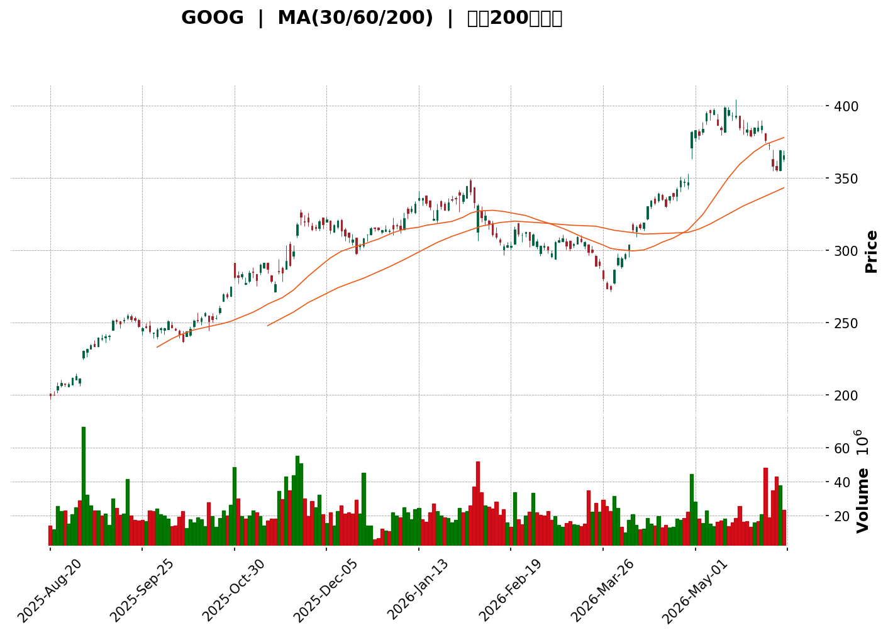
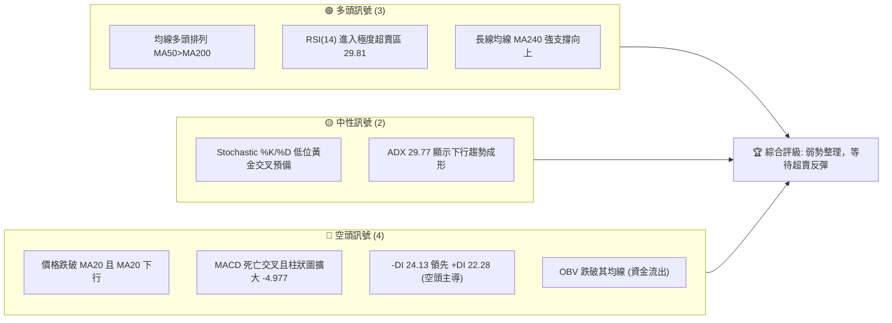
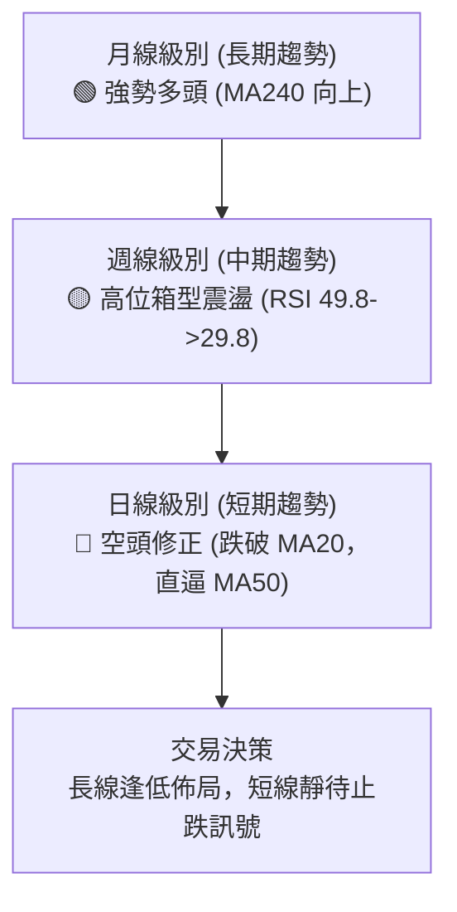
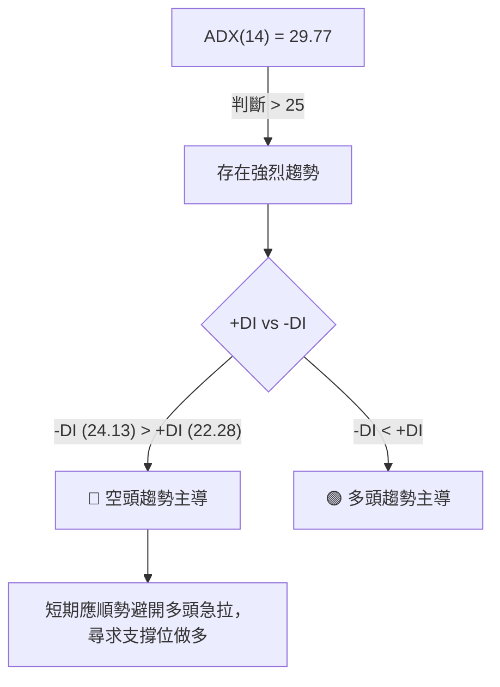
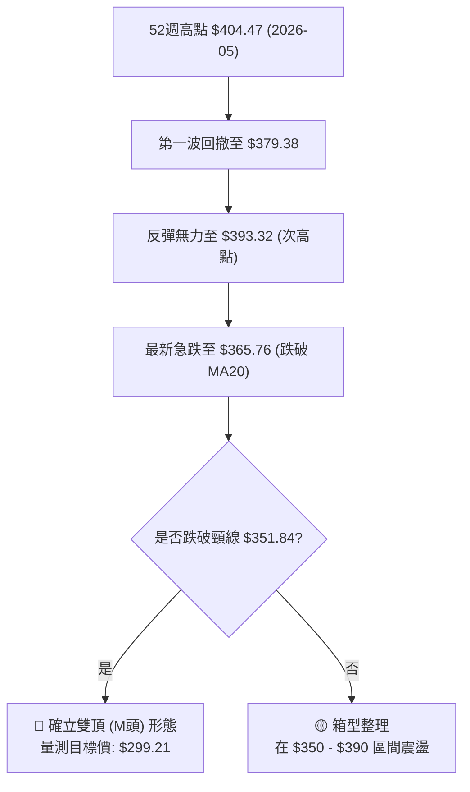

<details>
<summary>📊 靜態圖表 (點擊展開)</summary>

</details>

<html>
<head><meta charset="utf-8" /></head>
<body>
    <div style="height:500px; width:100%;">                        <script>window.PlotlyConfig = {MathJaxConfig: 'local'};</script>
        <script charset="utf-8" src="https://cdn.plot.ly/plotly-3.6.0.min.js" integrity="sha256-QaOVwtVY0T02VaHrr6pnoHLCwayMJp4O5n4YyaE3rJk=" crossorigin="anonymous"></script>                <div id="candlestick-chart" class="plotly-graph-div" style="height:100%; width:100%;"></div>            <script>                window.PLOTLYENV=window.PLOTLYENV || {};                                if (document.getElementById("candlestick-chart")) {                    Plotly.newPlot(                        "candlestick-chart",                        [{"close":{"dtype":"f8","bdata":"AAAAAK\u002f3aEAAAACAaQVpQAAAAIAsyGlAAAAAABQWakAAAAAAcu9pQAAAACC\u002f92lAAAAAIJF8akAAAACgmqFqQAAAAGBvcGpAAAAAwJTSbEAAAABgYwRtQAAAACCHVG1AAAAAgPY6bUAAAAAArPNtQAAAAECH521AAAAA4IMObkAAAACgsCFuQAAAACBmbW9AAAAAwIhib0AAAADAXDBvQAAAAGCdf29AAAAAwJvcb0AAAADgMJFvQAAAAADvf29AAAAAQM\u002fvbkAAAABgi8duQAAAAKAJ225AAAAAgOuAbkAAAAAgCWduQAAAAAChpm5AAAAAABLDbkAAAACgtcNuQAAAAABpZW9AAAAAwHDZbkAAAACgEqRuQAAAAMA2PG5AAAAA4GClbUAAAAAg3oluQAAAAKBmu25AAAAAIM1rb0AAAAAAPHFvQAAAAGBFrm9AAAAA4L4KcEAAAABA+l9vQAAAAIABhm9AAAAAgFqsb0AAAACAgkJwQAAAAIAG2XBAAAAA4A7BcEAAAACAwCxxQAAAACBJmHFAAAAAAAKXcUAAAAAAwrtxQAAAAODtWnFAAAAAANPFcUAAAABgQM9xQAAAAEAidXFAAAAAICMjckAAAAAggzVyQAAAAGCl8HFAAAAAwN1rcUAAAABArElxQAAAAOBn03FAAAAAAC7JcUAAAABAfElyQAAAACBkGXJAAAAAoOazckAAAADgnOBzQAAAAIA4M3RAAAAAgIj9c0AAAAAg+vpzQAAAAMAVq3NAAAAAQHe5c0AAAABg9wJ0QAAAAMBV33NAAAAAQHQadEAAAACAqKNzQAAAAMBr2HNAAAAAYGIMdEAAAACgqpdzQAAAAIDSZHNAAAAAwKJRc0AAAADANjhzQAAAAECanXJAAAAAIJT4ckAAAACgSEZzQAAAAODFcXNAAAAAAFO3c0AAAAAgKrdzQAAAAODPq3NAAAAAALOic0AAAADAQaVzQAAAAOBDmXNAAAAAgJGxc0AAAADAi9FzQAAAAMBBpXNAAAAAgD8jdEAAAADgfFx0QAAAAGCIjnRAAAAAoO7HdEAAAAAgFwN1QAAAAAAsAXVAAAAAwM7OdEAAAAAguKF0QAAAAGDuHnRAAAAAoGGCdEAAAACgtql0QAAAAEAug3RAAAAAwK7VdEAAAAAAOux0QAAAAECxAHVAAAAA4L4mdUAAAADAqiR1QAAAAOCDinVAAAAA4FxHdUAAAABgr9F0QAAAAECMsXRAAAAAAPYtdEAAAAAAv0J0QAAAAMB95nNAAAAA4MVxc0AAAABgb1JzQAAAAIDfHHNAAAAAgLXpckAAAADgnftyQAAAAGCK9XJAAAAAYNqqc0AAAACAh3dzQAAAAOA3a3NAAAAAQPSMc0AAAADA8C5zQAAAAEBfc3NAAAAAIE8ic0AAAABgivVyQAAAAEDI83JAAAAAoCvLckAAAACgcKFyQAAAAAApIHNAAAAAQOEuc0AAAABguEZzQAAAACBc83JAAAAAIFzXckAAAABguAZzQAAAAGCPVnNAAAAAwMwkc0AAAAAgrhtzQAAAAOCjrHJAAAAA4FGwckAAAABAMxNyQAAAAKBwGXJAAAAAANeLcUAAAAAAKRxxQAAAAIA9EnFAAAAAgMLtcUAAAABgZm5yQAAAACBcZ3JAAAAAYI+ackAAAABA4f5yQAAAAADXq3NAAAAAgOvFc0AAAAAghbtzQAAAACBc83NAAAAAoEepdEAAAAAghed0QAAAAOBRzHRAAAAAYGY2dUAAAABgZvZ0QAAAACCFp3RAAAAAIK4bdUAAAAAAABx1QAAAAMAeZXVAAAAA4FHIdUAAAAAAALh1QAAAAMD1tHVAAAAAQArfd0AAAAAghfN3QAAAAIA9undAAAAA4FEEeEAAAACAPbJ4QAAAAMDMtHhAAAAAwMzQeEAAAADgUSx4QAAAAMAe\u002fXdAAAAA4KPweEAAAABguNJ4QAAAAMAelXhAAAAAgMKReEAAAABgZg54QAAAAGBmDnhAAAAAIIX3d0AAAACAFLZ3QAAAAKBwDXhAAAAAoEcNeEAAAACA6yF4QAAAAEDhhndAAAAAoEdJd0AAAACAPWZ2QAAAAEDhOnZAAAAA4FEUd0AAAAAAKdx2QA=="},"high":{"dtype":"f8","bdata":"bqharOY2aUAf1Sku5VxpQE5gYypQGGpAn2vA97JTakDeqFWcuv9pQKmvMjYrI2pApZsLHn2NakAu2HjNZNtqQKLHyiWJfGpAa2X7PO7obEDGE4955gdtQP5ogdMtc21AxVuqanXCbUChMiuIcQhuQA4cGiQPOG5AnA8yv7dHbkBGSwtLBUNuQFEGlEEJjW9Ad+CoJmCcb0De0SiOeHNvQOOBn8Z0uW9A9l+89KEFcED+xlBJzf5vQHBivqOWzW9AzdsnSL+Tb0CYZRgaWt9uQHTeGnr9OG9AzDUN0dFpb0BO+Ke8B2tuQB6oHz8U2m5AILd0\u002fpPpbkC4BgN1DtluQM+ygdZ1e29ABJ0QS7Bmb0Ay2QEjmN1uQI44Bbsbp25AodZ2YUKQbkAgX\u002fd8DZVuQFimdn8K9m5AUef\u002f9lqNb0Al7S96sRNwQD4PU6Ua0W9Aa7CguXwYcEB3NUcjFeFvQPq\u002fiU5NDXBAlnrA2Gvwb0DfkxVld2JwQPxSYivt5nBAkIP3vjHwcECzxN7OiDlxQBm59E6MOHJAkEaA1VnecUCvBxil1thxQNQ6pUs7l3FA7RZObPvkcUCG7+k7sgZyQP+QQVnUwXFA6dhaywkxckAUHiJrGT9yQGWiqUBrP3JAL0Yd4AKycUCI4pxzWGxxQEOuIZnuYXJARdWCx64QckB9GFS7Zv1yQNV6JZ2VJ3NA1THOccT4ckD69Y8d3fVzQE35M3KXg3RASQv0eMpIdEAtjouX\u002fWZ0QDRSH7Ul83NAUL\u002fRrLDic0BVW6vdpxl0QFs94ZqTKnRAKda\u002flkE2dEDBuvvSDxB0QEh9EBzB53NAkIvGXUsadEBThw54Nhx0QHi3eeutvnNAJ+W\u002fgK2Hc0AKmUriAXpzQB91+yOjT3NAoPhUxbgQc0AAeH0HXExzQB7K2G6wd3NAp1VXtjzBc0B8oVPWE8FzQB4H1eJkxXNA6W\u002fj8\u002firc0AdeL0qn9dzQETlPAqwsnNAaqQkmvwqdEAWS1BvZ\u002fBzQHYsaIlWFXRAixFiPcNjdEBF3cuv6qR0QJSNlEDys3RA+hih0UXjdEANx8deW091QOImgwyvDHVAo51si0UedUBWkhNfEPB0QGHhYIa+fXRAZWynONrHdEC93hiGle90QETkVLq33HRA7Lyxys8BdUBZBbNaoR91QFVRf\u002ftGFnVAkzt96MhgdUA5hdaszkB1QOBVYJzAjnVACfN8wHTedUBGu\u002fVJH4B1QLlqCLaOxnRA4FZZIoSmdED\u002fiJT+JXh0QBPwhBl1FnRAMV5cnBoNdECdSzl\u002fHcRzQAQpf9nCSnNA47LZR84Kc0C\u002fI9pRHRtzQPV1lGAIHXNAcZYAo5fIc0DGeiB8rvNzQIYZtNFmgnNAEKjx7gaXc0Ag596BeYxzQFPQMcDDfXNA\u002fsIL\u002fsQ+c0AUanjHnftyQDdCR1TrE3NAHi3vp4DyckD6MIul5cFyQAAAAAAAKHNAAAAAYGZSc0AAAACgGnFzQAAAAIA9SnNAAAAAACk0c0AAAADAHhlzQAAAAMDMYHNAAAAAAABsc0AAAABA4SpzQAAAAIDrBXNAAAAAgOv1ckAAAACgmZFyQAAAAGCPanJAAAAAgD3ocUAAAACgcHFxQAAAAAApRHFAAAAAwMzwcUAAAACAwp9yQAAAAGBmfnJAAAAAwMymckAAAACgmQFzQAAAAIA99nNAAAAAQOHWc0AAAAAAAPhzQAAAAEDh9nNAAAAAgD2qdEAAAAAAAPB0QAAAAIAUFnVAAAAAgMI\u002fdUAAAABgjzJ1QAAAAGC4EnVAAAAA4HogdUAAAABgj0J1QAAAAEAKe3VAAAAAYGbudUAAAABgZt51QAAAAGBmFnZAAAAAgBTqd0AAAACAPfZ3QAAAAEDhAnhAAAAAIFxPeEAAAACAFMZ4QAAAACCu1XhAAAAAgOvleEAAAACgR6V4QAAAAEAKJ3hAAAAAQOH+eEAAAAAAqvF4QAAAAIAUvnhAAAAAIIVHeUAAAADgzpV4QAAAAEAza3hAAAAAQOFKeEAAAACA6w14QAAAAIA9FnhAAAAAoJlbeEAAAAAAAGB4QAAAAGBm2ndAAAAAoJlpd0AAAADgoxx3QAAAAAAAqHZAAAAAgMIdd0AAAABAMxN3QA=="},"hovertemplate":"\u003cb\u003e%{x|%Y-%m-%d}\u003c\u002fb\u003e\u003cbr\u003e\u958b: $%{open:.2f}\u003cbr\u003e\u9ad8: $%{high:.2f}\u003cbr\u003e\u4f4e: $%{low:.2f}\u003cbr\u003e\u6536: $%{close:.2f}\u003cextra\u003e\u003c\u002fextra\u003e","low":{"dtype":"f8","bdata":"qCpeIoWgaEB7jeFMY\u002f5oQO60qsCfNWlAxBoVuZavaUBu\u002fnedjb9pQBmc2iGjvWlANIeXMUXkaUCoKEhB3k9qQNygRDrWz2lAPsg2l6YTbEADOS8fA0hsQG5CMN1y+2xArVlqpjgtbUC7vwxZCSJtQLyJEfowuW1AkFglJEyIbUB\u002f3Qybp8VtQBEcaqq7lG5Auo\u002fdTgwsb0BPfvIv3cduQBqR6sarOG9AXVpx2T13b0C1p45cCk9vQG1BnuH8V29AwzMk5lDcbkB+T9RCUSpuQINsGv\u002fHyW5AQYzCodlbbkABLVFP4edtQEXINScG3G1A11M0jNBYbkAVvlSyhURuQEBksEBsq25ASyOzzTbPbkCP6NybP5huQG2ONvhc621AEH15MKeLbUAJ8eRyjg1uQKtXM+g7G25A5UcPA5PObkDPRL8PkUpvQPmigb4YCG9A3tw4HyjIb0Ca4h2x04puQLOLIXaRQ29AQiXHjpyNb0C0yUQ5F\u002fhvQBDNzDRLiXBA9b7i\u002fuyscEA5jX7MDsFwQPD1Dw0egXFABN+0W1lScUDLbCTS1n9xQMGfksLVR3FABJXTpA1YcUCodmznz5NxQO8qz\u002fzbNXFAvvMghX2ycUCCBrMO1vdxQLBAKI\u002fpv3FAzbrwd\u002fhZcUDQ6SNtrPBwQCzRT\u002fuDvXFApuXs6BtqcUBml6spe\u002fRxQP8JSN9yDHJAcoosH2BfckCNkRJ8sE9zQE8ebLYp1nNARewQ+lHMc0Aoyu+HKshzQBc8drTemHNArL52frScc0A9WFTzqZ1zQPciz2uYsnNAefIqd734c0BN2grzC3tzQOec6wpmhnNAH9ni5diyc0CcIQ\u002fkllpzQGqQ4APnK3NAujvoUmUYc0BEBwV\u002f2\u002flyQGmyTILZk3JAegEjn7HGckD+dljUCOJyQHZbEIv8JXNAOTYm939oc0C2Z79Gl5FzQMX2ZHP8l3NARzL8DeN6c0ByV52\u002feJBzQOU2G\u002f2uf3NAhb1il+Zmc0BcPcnYbrBzQGaWWv\u002frgXNAhzXgHXWkc0CEGLh3Nhx0QM+JczVTYHRArYYJUn5UdEBZN3F\u002f1eF0QMyXW6iCrnRAP0pTpOiwdEAyEsUhBn90QCALhymgCnRASbJpfQr1c0BgdNomYIp0QH1ui3PTe3RAq726tiZ0dEB2C7+aPdh0QL39TddWvnRAfWWWDddndEAzXrpbfsZ0QGomPyJg\u002fHRAYI6CVaAldUBuT8GyNZJ0QF64kmJDK3NAio6MQcv+c0AYL5gxn9dzQDU+fxIEp3NA6cfTNZZec0Dh\u002faHE7T5zQBOv3hz6+nJAhc1aMg6LckCwXMJmR9xyQBlpdlVVx3JAxRzzl0oDc0BMmeUmWVxzQAaMQA3+HXNA+fQfdUZSc0CO9MdqJ+NyQAntf1oJ9nJARv9CqJHNckDBNPeI14dyQChLMGRpyXJATsyZMMOdckCiF16rrHByQAAAAEDhXnJAAAAAwPUUc0AAAACgcB1zQAAAAKBwzXJAAAAA4Hq8ckAAAADA9dxyQAAAAKCZBXNAAAAAYLgYc0AAAAAAANByQAAAAAAAjHJAAAAA4HqgckAAAAAgrg1yQAAAAIDr9XFAAAAAwMxwcUAAAAAgrhdxQAAAAGCP+HBAAAAAAClMcUAAAAAghRdyQAAAAMAe+XFAAAAA4KNcckAAAADAzHZyQAAAAKBHi3NAAAAAIIVXc0AAAADgo6hzQAAAAEAKm3NAAAAAYGYSdEAAAABgj4p0QAAAAGBmunRAAAAA4KPUdEAAAACAFOp0QAAAAIAUmnRAAAAAIFzPdEAAAADA9fB0QAAAAMDM4HRAAAAAwPVMdUAAAADgeoR1QAAAAEDhZnVAAAAAoHCxdkAAAAAAKXR3QAAAAOBRjHdAAAAAoJnFd0AAAACgmTF4QAAAAMD1ZHhAAAAAYLiaeEAAAAAgriN4QAAAACCFu3dAAAAAoEfZd0AAAADgpYt4QAAAAAApXHhAAAAAYGZueEAAAAAAAPB3QAAAAAAAwHdAAAAAIK63d0AAAAAAKaR3QAAAAIA9sndAAAAAAADgd0AAAAAAANR3QAAAAMDMZHdAAAAAIFwbd0AAAAAAADB2QAAAAIAUJnZAAAAAwMwsdkAAAACAFJp2QA=="},"name":"\u50f9\u683c","open":{"dtype":"f8","bdata":"TVG7kUEnaUDYDaromghpQPfR3G8NcGlA1ChQBB3RaUDhsI7k2vxpQDU+51ffv2lAxG18xu7raUDsrF1bcllqQFxD7pqmEGpA15qprRI\u002fbECbf0Z+aLRsQEIsj3VjBG1AbcNORg1vbUAEZFra6zttQI\u002fFQzGf3W1AoUxzGxD6bUCJisiwJw9uQGzxjKPYmW5Ati8aZZ1\u002fb0Arvhn\u002fz2NvQND9GFiYcG9AgM3Pzs6hb0A5hcCG6M1vQMszluX0qW9At\u002fbmptx5b0C7oCZWQpBuQGEvEChf7m5AQ0gdpgf+bkDsrPZwYFduQO\u002fwhEpMG25ARhfFJdOpbkCNHjjsuJxuQGt32oBMrm5AEzcXQ\u002fYSb0B5ZFxouLtuQOq7KzpKl25A3AgkpJ06bkAYe+IWgRZuQH2\u002f3V+sLW5AuW56YfX3bkDT6APB7YNvQOXdXxhMYG9A5fldAErcb0A1YdmU7dxvQMMB6RVC1W9ApBFIFWWrb0AgNOkSOA9wQKd91R8BkHBApqopDFfdcEBPiqUM78NwQO09clkxNXJAa7BnLyOtcUDcHU5QmKBxQH31RuYHS3FAa0zEUAVwcUA+FpUOkNVxQKkMehUyvXFA0jIjkQ3OcUC0ztQH8\u002fxxQGrFh2cGO3JAKdVfSp+pcUDzvMk7bPhwQAWd5S4w4HFAs0fMzYABckBRS190uPRxQHKKDw07BXNALJF3L3uHckBSM5oramlzQCPTUDS2ZXRAN5pFuYUFdEDtVkd\u002f3S90QDadZ8y20HNAbRYu3YbHc0BxQ\u002fk7oLlzQJPBnMe2KXRAAEvBOg\u002f5c0AUCqIm3Qx0QEOzlMgSjnNASyJKgVrGc0DawBKp+w10QOsKUKwsqXNAmWIgeHqGc0AbjBqdjRxzQBjNjOytTHNAS6NZ3YvtckDXR9ll5\u002fByQIIkfy0YcHNAsczy2qduc0DsE6+91r5zQP8nSVspu3NAec\u002fixpiJc0CkH4GpB5NzQD74a91jknNA045N1NzVc0DKgC6ritdzQPRUo8pi0XNA1WEyqpOlc0CDnQr9h5B0QLuBEqImdHRAGs8xd1JkdEAtYuwQtPB0QDSjF5L863RAsEjLghIddUAz1DQAMOt0QGdpK6c4EHRAKbGQQecNdEBkTqyfeeB0QHAxS7G7xnRA9SWg6oB\u002fdECmqe6uTPZ0QKDla+z3BXVA1J2DQMRBdUDDCU28l+N0QKvQp1MCBXVAe3FZl1DEdUAttmA3NXh1QNbP5iasj3NAIbXdvulxdEBa4I68OBB0QAfd\u002fgzyCnRAfYCGX8Trc0CGeRboFIJzQOPKinVKPHNALzNYidrGckBV1R55geNyQAgCw3\u002fp5HJAHlB3310Jc0ARJqFEpe5zQJr9rc69ZnNAib6+f2d+c0D0SNBRW4lzQDEh4did+3JAw0QPCgfsckAbz3jSW6NyQN53t\u002fSM53JAFS5s5cjvckCDGpws0X1yQAAAAAApYnJAAAAAAAAec0AAAADAzCRzQAAAACBcI3NAAAAA4Hoqc0AAAACgmflyQAAAAGC4CnNAAAAA4Ho+c0AAAAAgXPNyQAAAAMAeAXNAAAAA4HrIckAAAAAgXINyQAAAAGBmQnJAAAAAQArjcUAAAABgZlZxQAAAAEAKN3FAAAAA4KNYcUAAAAAgrh9yQAAAAADXD3JAAAAAQDNrckAAAACAPcJyQAAAAKBH3XNAAAAAQAqTc0AAAACgmeNzQAAAAGC4tnNAAAAAQAohdEAAAADA9ah0QAAAAKCZ\u002fXRAAAAAQOHmdEAAAADA9Sh1QAAAACBc+XRAAAAAACnudEAAAABAMzl1QAAAACCFG3VAAAAAgBR+dUAAAABguK51QAAAACCul3VAAAAAgBQ0d0AAAAAgrp93QAAAAMAe5XdAAAAAgOvdd0AAAACgcFl4QAAAAMD10HhAAAAA4FGkeEAAAABACmt4QAAAAAAAEHhAAAAA4Hred0AAAADgo5x4QAAAAKBwk3hAAAAAAACCeEAAAADAzJR4QAAAAOCjEHhAAAAAACngd0AAAAAAKfR3QAAAAIDrz3dAAAAAgD3sd0AAAACAwv13QAAAAKCZ03dAAAAAQDNJd0AAAABgj7J2QAAAACBcZXZAAAAAQAo3dkAAAACAFLZ2QA=="},"x":["2025-08-20T00:00:00-04:00","2025-08-21T00:00:00-04:00","2025-08-22T00:00:00-04:00","2025-08-25T00:00:00-04:00","2025-08-26T00:00:00-04:00","2025-08-27T00:00:00-04:00","2025-08-28T00:00:00-04:00","2025-08-29T00:00:00-04:00","2025-09-02T00:00:00-04:00","2025-09-03T00:00:00-04:00","2025-09-04T00:00:00-04:00","2025-09-05T00:00:00-04:00","2025-09-08T00:00:00-04:00","2025-09-09T00:00:00-04:00","2025-09-10T00:00:00-04:00","2025-09-11T00:00:00-04:00","2025-09-12T00:00:00-04:00","2025-09-15T00:00:00-04:00","2025-09-16T00:00:00-04:00","2025-09-17T00:00:00-04:00","2025-09-18T00:00:00-04:00","2025-09-19T00:00:00-04:00","2025-09-22T00:00:00-04:00","2025-09-23T00:00:00-04:00","2025-09-24T00:00:00-04:00","2025-09-25T00:00:00-04:00","2025-09-26T00:00:00-04:00","2025-09-29T00:00:00-04:00","2025-09-30T00:00:00-04:00","2025-10-01T00:00:00-04:00","2025-10-02T00:00:00-04:00","2025-10-03T00:00:00-04:00","2025-10-06T00:00:00-04:00","2025-10-07T00:00:00-04:00","2025-10-08T00:00:00-04:00","2025-10-09T00:00:00-04:00","2025-10-10T00:00:00-04:00","2025-10-13T00:00:00-04:00","2025-10-14T00:00:00-04:00","2025-10-15T00:00:00-04:00","2025-10-16T00:00:00-04:00","2025-10-17T00:00:00-04:00","2025-10-20T00:00:00-04:00","2025-10-21T00:00:00-04:00","2025-10-22T00:00:00-04:00","2025-10-23T00:00:00-04:00","2025-10-24T00:00:00-04:00","2025-10-27T00:00:00-04:00","2025-10-28T00:00:00-04:00","2025-10-29T00:00:00-04:00","2025-10-30T00:00:00-04:00","2025-10-31T00:00:00-04:00","2025-11-03T00:00:00-05:00","2025-11-04T00:00:00-05:00","2025-11-05T00:00:00-05:00","2025-11-06T00:00:00-05:00","2025-11-07T00:00:00-05:00","2025-11-10T00:00:00-05:00","2025-11-11T00:00:00-05:00","2025-11-12T00:00:00-05:00","2025-11-13T00:00:00-05:00","2025-11-14T00:00:00-05:00","2025-11-17T00:00:00-05:00","2025-11-18T00:00:00-05:00","2025-11-19T00:00:00-05:00","2025-11-20T00:00:00-05:00","2025-11-21T00:00:00-05:00","2025-11-24T00:00:00-05:00","2025-11-25T00:00:00-05:00","2025-11-26T00:00:00-05:00","2025-11-28T00:00:00-05:00","2025-12-01T00:00:00-05:00","2025-12-02T00:00:00-05:00","2025-12-03T00:00:00-05:00","2025-12-04T00:00:00-05:00","2025-12-05T00:00:00-05:00","2025-12-08T00:00:00-05:00","2025-12-09T00:00:00-05:00","2025-12-10T00:00:00-05:00","2025-12-11T00:00:00-05:00","2025-12-12T00:00:00-05:00","2025-12-15T00:00:00-05:00","2025-12-16T00:00:00-05:00","2025-12-17T00:00:00-05:00","2025-12-18T00:00:00-05:00","2025-12-19T00:00:00-05:00","2025-12-22T00:00:00-05:00","2025-12-23T00:00:00-05:00","2025-12-24T00:00:00-05:00","2025-12-26T00:00:00-05:00","2025-12-29T00:00:00-05:00","2025-12-30T00:00:00-05:00","2025-12-31T00:00:00-05:00","2026-01-02T00:00:00-05:00","2026-01-05T00:00:00-05:00","2026-01-06T00:00:00-05:00","2026-01-07T00:00:00-05:00","2026-01-08T00:00:00-05:00","2026-01-09T00:00:00-05:00","2026-01-12T00:00:00-05:00","2026-01-13T00:00:00-05:00","2026-01-14T00:00:00-05:00","2026-01-15T00:00:00-05:00","2026-01-16T00:00:00-05:00","2026-01-20T00:00:00-05:00","2026-01-21T00:00:00-05:00","2026-01-22T00:00:00-05:00","2026-01-23T00:00:00-05:00","2026-01-26T00:00:00-05:00","2026-01-27T00:00:00-05:00","2026-01-28T00:00:00-05:00","2026-01-29T00:00:00-05:00","2026-01-30T00:00:00-05:00","2026-02-02T00:00:00-05:00","2026-02-03T00:00:00-05:00","2026-02-04T00:00:00-05:00","2026-02-05T00:00:00-05:00","2026-02-06T00:00:00-05:00","2026-02-09T00:00:00-05:00","2026-02-10T00:00:00-05:00","2026-02-11T00:00:00-05:00","2026-02-12T00:00:00-05:00","2026-02-13T00:00:00-05:00","2026-02-17T00:00:00-05:00","2026-02-18T00:00:00-05:00","2026-02-19T00:00:00-05:00","2026-02-20T00:00:00-05:00","2026-02-23T00:00:00-05:00","2026-02-24T00:00:00-05:00","2026-02-25T00:00:00-05:00","2026-02-26T00:00:00-05:00","2026-02-27T00:00:00-05:00","2026-03-02T00:00:00-05:00","2026-03-03T00:00:00-05:00","2026-03-04T00:00:00-05:00","2026-03-05T00:00:00-05:00","2026-03-06T00:00:00-05:00","2026-03-09T00:00:00-04:00","2026-03-10T00:00:00-04:00","2026-03-11T00:00:00-04:00","2026-03-12T00:00:00-04:00","2026-03-13T00:00:00-04:00","2026-03-16T00:00:00-04:00","2026-03-17T00:00:00-04:00","2026-03-18T00:00:00-04:00","2026-03-19T00:00:00-04:00","2026-03-20T00:00:00-04:00","2026-03-23T00:00:00-04:00","2026-03-24T00:00:00-04:00","2026-03-25T00:00:00-04:00","2026-03-26T00:00:00-04:00","2026-03-27T00:00:00-04:00","2026-03-30T00:00:00-04:00","2026-03-31T00:00:00-04:00","2026-04-01T00:00:00-04:00","2026-04-02T00:00:00-04:00","2026-04-06T00:00:00-04:00","2026-04-07T00:00:00-04:00","2026-04-08T00:00:00-04:00","2026-04-09T00:00:00-04:00","2026-04-10T00:00:00-04:00","2026-04-13T00:00:00-04:00","2026-04-14T00:00:00-04:00","2026-04-15T00:00:00-04:00","2026-04-16T00:00:00-04:00","2026-04-17T00:00:00-04:00","2026-04-20T00:00:00-04:00","2026-04-21T00:00:00-04:00","2026-04-22T00:00:00-04:00","2026-04-23T00:00:00-04:00","2026-04-24T00:00:00-04:00","2026-04-27T00:00:00-04:00","2026-04-28T00:00:00-04:00","2026-04-29T00:00:00-04:00","2026-04-30T00:00:00-04:00","2026-05-01T00:00:00-04:00","2026-05-04T00:00:00-04:00","2026-05-05T00:00:00-04:00","2026-05-06T00:00:00-04:00","2026-05-07T00:00:00-04:00","2026-05-08T00:00:00-04:00","2026-05-11T00:00:00-04:00","2026-05-12T00:00:00-04:00","2026-05-13T00:00:00-04:00","2026-05-14T00:00:00-04:00","2026-05-15T00:00:00-04:00","2026-05-18T00:00:00-04:00","2026-05-19T00:00:00-04:00","2026-05-20T00:00:00-04:00","2026-05-21T00:00:00-04:00","2026-05-22T00:00:00-04:00","2026-05-26T00:00:00-04:00","2026-05-27T00:00:00-04:00","2026-05-28T00:00:00-04:00","2026-05-29T00:00:00-04:00","2026-06-01T00:00:00-04:00","2026-06-02T00:00:00-04:00","2026-06-03T00:00:00-04:00","2026-06-04T00:00:00-04:00","2026-06-05T00:00:00-04:00"],"type":"candlestick"},{"hovertemplate":"MA30: $%{y:.2f}\u003cextra\u003e\u003c\u002fextra\u003e","line":{"color":"#2196F3","dash":"dash","width":2},"mode":"lines","name":"MA30","x":["2025-08-20T00:00:00-04:00","2025-08-21T00:00:00-04:00","2025-08-22T00:00:00-04:00","2025-08-25T00:00:00-04:00","2025-08-26T00:00:00-04:00","2025-08-27T00:00:00-04:00","2025-08-28T00:00:00-04:00","2025-08-29T00:00:00-04:00","2025-09-02T00:00:00-04:00","2025-09-03T00:00:00-04:00","2025-09-04T00:00:00-04:00","2025-09-05T00:00:00-04:00","2025-09-08T00:00:00-04:00","2025-09-09T00:00:00-04:00","2025-09-10T00:00:00-04:00","2025-09-11T00:00:00-04:00","2025-09-12T00:00:00-04:00","2025-09-15T00:00:00-04:00","2025-09-16T00:00:00-04:00","2025-09-17T00:00:00-04:00","2025-09-18T00:00:00-04:00","2025-09-19T00:00:00-04:00","2025-09-22T00:00:00-04:00","2025-09-23T00:00:00-04:00","2025-09-24T00:00:00-04:00","2025-09-25T00:00:00-04:00","2025-09-26T00:00:00-04:00","2025-09-29T00:00:00-04:00","2025-09-30T00:00:00-04:00","2025-10-01T00:00:00-04:00","2025-10-02T00:00:00-04:00","2025-10-03T00:00:00-04:00","2025-10-06T00:00:00-04:00","2025-10-07T00:00:00-04:00","2025-10-08T00:00:00-04:00","2025-10-09T00:00:00-04:00","2025-10-10T00:00:00-04:00","2025-10-13T00:00:00-04:00","2025-10-14T00:00:00-04:00","2025-10-15T00:00:00-04:00","2025-10-16T00:00:00-04:00","2025-10-17T00:00:00-04:00","2025-10-20T00:00:00-04:00","2025-10-21T00:00:00-04:00","2025-10-22T00:00:00-04:00","2025-10-23T00:00:00-04:00","2025-10-24T00:00:00-04:00","2025-10-27T00:00:00-04:00","2025-10-28T00:00:00-04:00","2025-10-29T00:00:00-04:00","2025-10-30T00:00:00-04:00","2025-10-31T00:00:00-04:00","2025-11-03T00:00:00-05:00","2025-11-04T00:00:00-05:00","2025-11-05T00:00:00-05:00","2025-11-06T00:00:00-05:00","2025-11-07T00:00:00-05:00","2025-11-10T00:00:00-05:00","2025-11-11T00:00:00-05:00","2025-11-12T00:00:00-05:00","2025-11-13T00:00:00-05:00","2025-11-14T00:00:00-05:00","2025-11-17T00:00:00-05:00","2025-11-18T00:00:00-05:00","2025-11-19T00:00:00-05:00","2025-11-20T00:00:00-05:00","2025-11-21T00:00:00-05:00","2025-11-24T00:00:00-05:00","2025-11-25T00:00:00-05:00","2025-11-26T00:00:00-05:00","2025-11-28T00:00:00-05:00","2025-12-01T00:00:00-05:00","2025-12-02T00:00:00-05:00","2025-12-03T00:00:00-05:00","2025-12-04T00:00:00-05:00","2025-12-05T00:00:00-05:00","2025-12-08T00:00:00-05:00","2025-12-09T00:00:00-05:00","2025-12-10T00:00:00-05:00","2025-12-11T00:00:00-05:00","2025-12-12T00:00:00-05:00","2025-12-15T00:00:00-05:00","2025-12-16T00:00:00-05:00","2025-12-17T00:00:00-05:00","2025-12-18T00:00:00-05:00","2025-12-19T00:00:00-05:00","2025-12-22T00:00:00-05:00","2025-12-23T00:00:00-05:00","2025-12-24T00:00:00-05:00","2025-12-26T00:00:00-05:00","2025-12-29T00:00:00-05:00","2025-12-30T00:00:00-05:00","2025-12-31T00:00:00-05:00","2026-01-02T00:00:00-05:00","2026-01-05T00:00:00-05:00","2026-01-06T00:00:00-05:00","2026-01-07T00:00:00-05:00","2026-01-08T00:00:00-05:00","2026-01-09T00:00:00-05:00","2026-01-12T00:00:00-05:00","2026-01-13T00:00:00-05:00","2026-01-14T00:00:00-05:00","2026-01-15T00:00:00-05:00","2026-01-16T00:00:00-05:00","2026-01-20T00:00:00-05:00","2026-01-21T00:00:00-05:00","2026-01-22T00:00:00-05:00","2026-01-23T00:00:00-05:00","2026-01-26T00:00:00-05:00","2026-01-27T00:00:00-05:00","2026-01-28T00:00:00-05:00","2026-01-29T00:00:00-05:00","2026-01-30T00:00:00-05:00","2026-02-02T00:00:00-05:00","2026-02-03T00:00:00-05:00","2026-02-04T00:00:00-05:00","2026-02-05T00:00:00-05:00","2026-02-06T00:00:00-05:00","2026-02-09T00:00:00-05:00","2026-02-10T00:00:00-05:00","2026-02-11T00:00:00-05:00","2026-02-12T00:00:00-05:00","2026-02-13T00:00:00-05:00","2026-02-17T00:00:00-05:00","2026-02-18T00:00:00-05:00","2026-02-19T00:00:00-05:00","2026-02-20T00:00:00-05:00","2026-02-23T00:00:00-05:00","2026-02-24T00:00:00-05:00","2026-02-25T00:00:00-05:00","2026-02-26T00:00:00-05:00","2026-02-27T00:00:00-05:00","2026-03-02T00:00:00-05:00","2026-03-03T00:00:00-05:00","2026-03-04T00:00:00-05:00","2026-03-05T00:00:00-05:00","2026-03-06T00:00:00-05:00","2026-03-09T00:00:00-04:00","2026-03-10T00:00:00-04:00","2026-03-11T00:00:00-04:00","2026-03-12T00:00:00-04:00","2026-03-13T00:00:00-04:00","2026-03-16T00:00:00-04:00","2026-03-17T00:00:00-04:00","2026-03-18T00:00:00-04:00","2026-03-19T00:00:00-04:00","2026-03-20T00:00:00-04:00","2026-03-23T00:00:00-04:00","2026-03-24T00:00:00-04:00","2026-03-25T00:00:00-04:00","2026-03-26T00:00:00-04:00","2026-03-27T00:00:00-04:00","2026-03-30T00:00:00-04:00","2026-03-31T00:00:00-04:00","2026-04-01T00:00:00-04:00","2026-04-02T00:00:00-04:00","2026-04-06T00:00:00-04:00","2026-04-07T00:00:00-04:00","2026-04-08T00:00:00-04:00","2026-04-09T00:00:00-04:00","2026-04-10T00:00:00-04:00","2026-04-13T00:00:00-04:00","2026-04-14T00:00:00-04:00","2026-04-15T00:00:00-04:00","2026-04-16T00:00:00-04:00","2026-04-17T00:00:00-04:00","2026-04-20T00:00:00-04:00","2026-04-21T00:00:00-04:00","2026-04-22T00:00:00-04:00","2026-04-23T00:00:00-04:00","2026-04-24T00:00:00-04:00","2026-04-27T00:00:00-04:00","2026-04-28T00:00:00-04:00","2026-04-29T00:00:00-04:00","2026-04-30T00:00:00-04:00","2026-05-01T00:00:00-04:00","2026-05-04T00:00:00-04:00","2026-05-05T00:00:00-04:00","2026-05-06T00:00:00-04:00","2026-05-07T00:00:00-04:00","2026-05-08T00:00:00-04:00","2026-05-11T00:00:00-04:00","2026-05-12T00:00:00-04:00","2026-05-13T00:00:00-04:00","2026-05-14T00:00:00-04:00","2026-05-15T00:00:00-04:00","2026-05-18T00:00:00-04:00","2026-05-19T00:00:00-04:00","2026-05-20T00:00:00-04:00","2026-05-21T00:00:00-04:00","2026-05-22T00:00:00-04:00","2026-05-26T00:00:00-04:00","2026-05-27T00:00:00-04:00","2026-05-28T00:00:00-04:00","2026-05-29T00:00:00-04:00","2026-06-01T00:00:00-04:00","2026-06-02T00:00:00-04:00","2026-06-03T00:00:00-04:00","2026-06-04T00:00:00-04:00","2026-06-05T00:00:00-04:00"],"y":{"dtype":"f8","bdata":"AAAAAAAA+H8AAAAAAAD4fwAAAAAAAPh\u002fAAAAAAAA+H8AAAAAAAD4fwAAAAAAAPh\u002fAAAAAAAA+H8AAAAAAAD4fwAAAAAAAPh\u002fAAAAAAAA+H8AAAAAAAD4fwAAAAAAAPh\u002fAAAAAAAA+H8AAAAAAAD4fwAAAAAAAPh\u002fAAAAAAAA+H8AAAAAAAD4fwAAAAAAAPh\u002fAAAAAAAA+H8AAAAAAAD4fwAAAAAAAPh\u002fAAAAAAAA+H8AAAAAAAD4fwAAAAAAAPh\u002fAAAAAAAA+H8AAAAAAAD4fwAAAAAAAPh\u002fAAAAAAAA+H8AAAAAAAD4f1VVVbXaJG1AERER8UxWbUCrqqp6T4dtQFVVVeU3t21A7+7uHt3fbUC8u7ubBAhuQO\u002fu7v5uLG5Aq6qq2mRHbkAAAABwvGhuQHd3d0dejW5AMzMz04qjbkBmZma2PLhuQGZmZpZLzG5A3t3dbaXkbkC8u7sryvBuQLy7uwub\u002fm5Ad3d3d2YMb0BVVVUlxyBvQKuqqgoiNG9AvLu7m0BGb0CJiIhIOWFvQJqZmem4gG9AAAAAMAmdb0CamZk5UL5vQLy7u\u002fu12W9AiYiI+IQAcECamZkxKxVwQN7d3T19JnBA7+7unhw\u002fcEBVVVU9x1hwQGZmZt4Wb3BAAAAAGICAcEDv7u7OwpBwQLy7u+vqonBAmpmZ+RC3cEAzMzObYdBwQO\u002fu7vbS6XBA7+7uXu4KcUDv7u72QDJxQDMzMyOBW3FAERERiQaAcUCJiIjwXqRxQM3MzCwJxXFAiYiIuHXkcUDe3d3tWwlyQERERNRvLHJAiYiImNhQckAiIiIyr21yQDMzM6NDh3JAVVVVBWCjckDNzMxsAbhyQGZmZlZbx3JA3t3dbRzWckDNzMz8yuJyQHd3d3eM7XJAq6qqGsb3ckARERFhRgRzQERERMQ6FXNARERE1LMic0Crqqq6ji9zQJqZmWlUPnNAMzMzYzlRc0CJiIj4V2VzQHd3d+d4dHNAzczMfMCEc0AiIiIS0pFzQAAAACAEn3NAIiIi0kKrc0AzMzPjY69zQFVVVRVvsnNAiYiIOC65c0DNzMz8+8FzQBERESFjzXNAd3d3x6HWc0CJiIh47NtzQImIiCgL3nNAERERAYLhc0BVVVU1PupzQLy7u1vv73NAq6qqGqX2c0B3d3c3\u002fwF0QHd3d9e5D3RAmpmZ6VwfdEDe3d0txy90QGZmZua9SHRAIiIiQm9cdECamZlZnWl0QImIiBhGdHRAZmZmdjp4dEDv7u6O4Xx0QJqZmUnWfnRAiYiIyDR9dECamZkJcnp0QO\u002fu7o5MdnRAd3d3F6NvdEAAAACQgWh0QN7d3R2mYnRA7+7uvqJedEB3d3f3AFd0QFVVVRVLTXRAVVVVRctCdEBERERkMDN0QFVVVdXtJXRAAAAAUKUXdEBVVVWFXwl0QImIiMhm\u002f3NAmpmZ2cLwc0Dv7u4ua99zQM3MzKyV03NAIiIiwn3Fc0B3d3fncLdzQBERERHupXNAMzMzkzeSc0BmZmb2JoBzQLy7u4tabXNAq6qqiiJbc0BmZmbmiExzQERERPRNO3NAiYiISJUuc0De3d197htzQAAAADCQDHNA7+7ujl38ckCJiIhYfelyQLy7u4sR2HJARERElKvPckB3d3eH9spyQBEREUE5xnJAAAAAsCW9ckBVVVUlILlyQFVVVZVHu3JAERERsS29ckDe3d1N3cFyQHd3d3chxnJAAAAAwCnTckDNzMwsw+NyQO\u002fu7n6D83JAZmZmlicIc0BVVVWlDRxzQAAAAEAZKXNAq6qqeoY5c0AAAAAAK0lzQCIiItIGXnNAREREFCB3c0Dv7u7uGY5zQLy7u4tQonNA3t3d7afKc0BVVVXl+\u002fNzQN7d3Z0aH3RAVVVVFZJMdEDNzMxsEoV0QM3MzFxzvXRA3t3djXv7dEDv7u4uwTd1QBEREbHIcnVAERERAZ2udUBVVVVFKOV1QFVVVfXhGXZAAAAAEMpMdkCrqqoq+Xd2QImIiFhknXZAvLu7uy3BdkAiIiJyIeN2QBERESEiBndAAAAAEBEjd0AiIiICnT53QN7d3Q3mVXdAq6qqOphnd0AiIiIi23N3QDMzMyNNgXdAVVVVZR+Sd0AiIiKyD6F3QA=="},"type":"scatter"},{"hovertemplate":"MA60: $%{y:.2f}\u003cextra\u003e\u003c\u002fextra\u003e","line":{"color":"#9C27B0","dash":"dash","width":2},"mode":"lines","name":"MA60","x":["2025-08-20T00:00:00-04:00","2025-08-21T00:00:00-04:00","2025-08-22T00:00:00-04:00","2025-08-25T00:00:00-04:00","2025-08-26T00:00:00-04:00","2025-08-27T00:00:00-04:00","2025-08-28T00:00:00-04:00","2025-08-29T00:00:00-04:00","2025-09-02T00:00:00-04:00","2025-09-03T00:00:00-04:00","2025-09-04T00:00:00-04:00","2025-09-05T00:00:00-04:00","2025-09-08T00:00:00-04:00","2025-09-09T00:00:00-04:00","2025-09-10T00:00:00-04:00","2025-09-11T00:00:00-04:00","2025-09-12T00:00:00-04:00","2025-09-15T00:00:00-04:00","2025-09-16T00:00:00-04:00","2025-09-17T00:00:00-04:00","2025-09-18T00:00:00-04:00","2025-09-19T00:00:00-04:00","2025-09-22T00:00:00-04:00","2025-09-23T00:00:00-04:00","2025-09-24T00:00:00-04:00","2025-09-25T00:00:00-04:00","2025-09-26T00:00:00-04:00","2025-09-29T00:00:00-04:00","2025-09-30T00:00:00-04:00","2025-10-01T00:00:00-04:00","2025-10-02T00:00:00-04:00","2025-10-03T00:00:00-04:00","2025-10-06T00:00:00-04:00","2025-10-07T00:00:00-04:00","2025-10-08T00:00:00-04:00","2025-10-09T00:00:00-04:00","2025-10-10T00:00:00-04:00","2025-10-13T00:00:00-04:00","2025-10-14T00:00:00-04:00","2025-10-15T00:00:00-04:00","2025-10-16T00:00:00-04:00","2025-10-17T00:00:00-04:00","2025-10-20T00:00:00-04:00","2025-10-21T00:00:00-04:00","2025-10-22T00:00:00-04:00","2025-10-23T00:00:00-04:00","2025-10-24T00:00:00-04:00","2025-10-27T00:00:00-04:00","2025-10-28T00:00:00-04:00","2025-10-29T00:00:00-04:00","2025-10-30T00:00:00-04:00","2025-10-31T00:00:00-04:00","2025-11-03T00:00:00-05:00","2025-11-04T00:00:00-05:00","2025-11-05T00:00:00-05:00","2025-11-06T00:00:00-05:00","2025-11-07T00:00:00-05:00","2025-11-10T00:00:00-05:00","2025-11-11T00:00:00-05:00","2025-11-12T00:00:00-05:00","2025-11-13T00:00:00-05:00","2025-11-14T00:00:00-05:00","2025-11-17T00:00:00-05:00","2025-11-18T00:00:00-05:00","2025-11-19T00:00:00-05:00","2025-11-20T00:00:00-05:00","2025-11-21T00:00:00-05:00","2025-11-24T00:00:00-05:00","2025-11-25T00:00:00-05:00","2025-11-26T00:00:00-05:00","2025-11-28T00:00:00-05:00","2025-12-01T00:00:00-05:00","2025-12-02T00:00:00-05:00","2025-12-03T00:00:00-05:00","2025-12-04T00:00:00-05:00","2025-12-05T00:00:00-05:00","2025-12-08T00:00:00-05:00","2025-12-09T00:00:00-05:00","2025-12-10T00:00:00-05:00","2025-12-11T00:00:00-05:00","2025-12-12T00:00:00-05:00","2025-12-15T00:00:00-05:00","2025-12-16T00:00:00-05:00","2025-12-17T00:00:00-05:00","2025-12-18T00:00:00-05:00","2025-12-19T00:00:00-05:00","2025-12-22T00:00:00-05:00","2025-12-23T00:00:00-05:00","2025-12-24T00:00:00-05:00","2025-12-26T00:00:00-05:00","2025-12-29T00:00:00-05:00","2025-12-30T00:00:00-05:00","2025-12-31T00:00:00-05:00","2026-01-02T00:00:00-05:00","2026-01-05T00:00:00-05:00","2026-01-06T00:00:00-05:00","2026-01-07T00:00:00-05:00","2026-01-08T00:00:00-05:00","2026-01-09T00:00:00-05:00","2026-01-12T00:00:00-05:00","2026-01-13T00:00:00-05:00","2026-01-14T00:00:00-05:00","2026-01-15T00:00:00-05:00","2026-01-16T00:00:00-05:00","2026-01-20T00:00:00-05:00","2026-01-21T00:00:00-05:00","2026-01-22T00:00:00-05:00","2026-01-23T00:00:00-05:00","2026-01-26T00:00:00-05:00","2026-01-27T00:00:00-05:00","2026-01-28T00:00:00-05:00","2026-01-29T00:00:00-05:00","2026-01-30T00:00:00-05:00","2026-02-02T00:00:00-05:00","2026-02-03T00:00:00-05:00","2026-02-04T00:00:00-05:00","2026-02-05T00:00:00-05:00","2026-02-06T00:00:00-05:00","2026-02-09T00:00:00-05:00","2026-02-10T00:00:00-05:00","2026-02-11T00:00:00-05:00","2026-02-12T00:00:00-05:00","2026-02-13T00:00:00-05:00","2026-02-17T00:00:00-05:00","2026-02-18T00:00:00-05:00","2026-02-19T00:00:00-05:00","2026-02-20T00:00:00-05:00","2026-02-23T00:00:00-05:00","2026-02-24T00:00:00-05:00","2026-02-25T00:00:00-05:00","2026-02-26T00:00:00-05:00","2026-02-27T00:00:00-05:00","2026-03-02T00:00:00-05:00","2026-03-03T00:00:00-05:00","2026-03-04T00:00:00-05:00","2026-03-05T00:00:00-05:00","2026-03-06T00:00:00-05:00","2026-03-09T00:00:00-04:00","2026-03-10T00:00:00-04:00","2026-03-11T00:00:00-04:00","2026-03-12T00:00:00-04:00","2026-03-13T00:00:00-04:00","2026-03-16T00:00:00-04:00","2026-03-17T00:00:00-04:00","2026-03-18T00:00:00-04:00","2026-03-19T00:00:00-04:00","2026-03-20T00:00:00-04:00","2026-03-23T00:00:00-04:00","2026-03-24T00:00:00-04:00","2026-03-25T00:00:00-04:00","2026-03-26T00:00:00-04:00","2026-03-27T00:00:00-04:00","2026-03-30T00:00:00-04:00","2026-03-31T00:00:00-04:00","2026-04-01T00:00:00-04:00","2026-04-02T00:00:00-04:00","2026-04-06T00:00:00-04:00","2026-04-07T00:00:00-04:00","2026-04-08T00:00:00-04:00","2026-04-09T00:00:00-04:00","2026-04-10T00:00:00-04:00","2026-04-13T00:00:00-04:00","2026-04-14T00:00:00-04:00","2026-04-15T00:00:00-04:00","2026-04-16T00:00:00-04:00","2026-04-17T00:00:00-04:00","2026-04-20T00:00:00-04:00","2026-04-21T00:00:00-04:00","2026-04-22T00:00:00-04:00","2026-04-23T00:00:00-04:00","2026-04-24T00:00:00-04:00","2026-04-27T00:00:00-04:00","2026-04-28T00:00:00-04:00","2026-04-29T00:00:00-04:00","2026-04-30T00:00:00-04:00","2026-05-01T00:00:00-04:00","2026-05-04T00:00:00-04:00","2026-05-05T00:00:00-04:00","2026-05-06T00:00:00-04:00","2026-05-07T00:00:00-04:00","2026-05-08T00:00:00-04:00","2026-05-11T00:00:00-04:00","2026-05-12T00:00:00-04:00","2026-05-13T00:00:00-04:00","2026-05-14T00:00:00-04:00","2026-05-15T00:00:00-04:00","2026-05-18T00:00:00-04:00","2026-05-19T00:00:00-04:00","2026-05-20T00:00:00-04:00","2026-05-21T00:00:00-04:00","2026-05-22T00:00:00-04:00","2026-05-26T00:00:00-04:00","2026-05-27T00:00:00-04:00","2026-05-28T00:00:00-04:00","2026-05-29T00:00:00-04:00","2026-06-01T00:00:00-04:00","2026-06-02T00:00:00-04:00","2026-06-03T00:00:00-04:00","2026-06-04T00:00:00-04:00","2026-06-05T00:00:00-04:00"],"y":{"dtype":"f8","bdata":"AAAAAAAA+H8AAAAAAAD4fwAAAAAAAPh\u002fAAAAAAAA+H8AAAAAAAD4fwAAAAAAAPh\u002fAAAAAAAA+H8AAAAAAAD4fwAAAAAAAPh\u002fAAAAAAAA+H8AAAAAAAD4fwAAAAAAAPh\u002fAAAAAAAA+H8AAAAAAAD4fwAAAAAAAPh\u002fAAAAAAAA+H8AAAAAAAD4fwAAAAAAAPh\u002fAAAAAAAA+H8AAAAAAAD4fwAAAAAAAPh\u002fAAAAAAAA+H8AAAAAAAD4fwAAAAAAAPh\u002fAAAAAAAA+H8AAAAAAAD4fwAAAAAAAPh\u002fAAAAAAAA+H8AAAAAAAD4fwAAAAAAAPh\u002fAAAAAAAA+H8AAAAAAAD4fwAAAAAAAPh\u002fAAAAAAAA+H8AAAAAAAD4fwAAAAAAAPh\u002fAAAAAAAA+H8AAAAAAAD4fwAAAAAAAPh\u002fAAAAAAAA+H8AAAAAAAD4fwAAAAAAAPh\u002fAAAAAAAA+H8AAAAAAAD4fwAAAAAAAPh\u002fAAAAAAAA+H8AAAAAAAD4fwAAAAAAAPh\u002fAAAAAAAA+H8AAAAAAAD4fwAAAAAAAPh\u002fAAAAAAAA+H8AAAAAAAD4fwAAAAAAAPh\u002fAAAAAAAA+H8AAAAAAAD4fwAAAAAAAPh\u002fAAAAAAAA+H8AAAAAAAD4fxERETmEAW9AiYiIkKYrb0BERESMalRvQGZmZt6Gfm9AERERif+mb0ARERHpY9RvQDMzMzsFAHBAIiIiZlAXcEB3d3eXTzNwQHd3dyMYUXBAVVVV+eVocEDe3d2lPoBwQAAAAHyXlXBAvLu7N2SrcEDe3d2B4MBwQBEREa3e1XBAIiIi6oXrcEBmZmZiCf9wQERERFSqEHFAmpmZKUAjcUCJiIgITzRxQJqZmeXbQ3FA7+7uglBScUDNzMyM+WBxQKuqqrozbXFAmpmZiSV8cUBVVVXJuIxxQBEREQHcnXFAmpmZOeiwcUAAAAD8KsRxQAAAAKS11nFAmpmZvdzocUC8u7tjDftxQJqZmemxC3JAMzMzu+gdckCrqqrWGTFyQHd3d4trRHJAiYiImBhbckARERFt0nByQERERBz4hnJAzczMYJqcckCrqqp2LbNyQO\u002fu7iY2yXJAAAAAwIvdckAzMzMzpPJyQGZmZn49BXNAzczMTC0Zc0C8u7uz9itzQHd3d3+ZO3NAAAAAkAJNc0AiIiJSAF1zQO\u002fu7paKa3NAvLu7q7x6c0BVVVUVSYlzQO\u002fu7i4lm3NAZmZmrhqqc0BVVVXd8bZzQGZmZm7AxHNAVVVVJXfNc0DNzMwkONZzQJqZmVmV3nNA3t3dFTfnc0AREREB5e9zQDMzM7ti9XNAIiIiyjH6c0ARERHRKf1zQO\u002fu7h7VAHRAiYiIyPIEdEBVVVVtMgN0QFVVVRXd\u002f3NA7+7uvvz9c0CJiIgwlvpzQDMzM3uo+XNAvLu7iyP3c0Dv7u7+pfJzQImIiPi47nNAVVVVbSLpc0AiIiKy1ORzQERERITC4XNAZmZmbhHec0B3d3cPuNxzQERERPTT2nNAZmZmPsrYc0AiIiIS99dzQBERETkM23NAZmZm5sjbc0AAAAAgE9tzQGZmZgbK13NAd3d332fTc0BmZmYGaMxzQM3MzDyzxXNAvLu7K8m8c0ARERGx97FzQFVVVQ0vp3NA3t3dVaefc0C8u7sLvJlzQHd3d69vlHNAd3d3N+SNc0BmZmaOEIhzQFVVVVVJhHNAMzMze\u002fx\u002fc0ARERHZhnpzQGZmZqYHdnNAAAAAiGd1c0ARERFZkXZzQLy7uyN1eXNAAAAAOHV8c0AiIiJqvH1zQGZmZnZXfnNAZmZmHoJ\u002fc0C8u7vzTYBzQJqZmXH6gXNAvLu706uEc0CrqqpyIIdzQLy7u4vVh3NAREREPOWSc0De3d1lQqBzQBEREUk0rXNA7+7urpO9c0BVVVV1gNBzQGZmZsYB5XNAZmZmjuz7c0C8u7tDnxB0QGZmZh5tJXRAq6qqSiQ\u002fdEBmZmZmD1h0QDMzM5sNcHRAAAAA4PeEdEAAAACojJh0QO\u002fu7vZVrHRAZmZmti2\u002fdEAAAABgf9J0QERERMwh5nRAAAAAaB37dEB3d3cXMBF1QGZmZsa0JHVAiYiI6N83dUC8u7tj9Ed1QJqZmTEzVXVAAAAA8NJldUARERFZHXV1QA=="},"type":"scatter"},{"hovertemplate":"MA200: $%{y:.2f}\u003cextra\u003e\u003c\u002fextra\u003e","line":{"color":"#FF6F00","dash":"solid","width":2},"mode":"lines","name":"MA200","x":["2025-08-20T00:00:00-04:00","2025-08-21T00:00:00-04:00","2025-08-22T00:00:00-04:00","2025-08-25T00:00:00-04:00","2025-08-26T00:00:00-04:00","2025-08-27T00:00:00-04:00","2025-08-28T00:00:00-04:00","2025-08-29T00:00:00-04:00","2025-09-02T00:00:00-04:00","2025-09-03T00:00:00-04:00","2025-09-04T00:00:00-04:00","2025-09-05T00:00:00-04:00","2025-09-08T00:00:00-04:00","2025-09-09T00:00:00-04:00","2025-09-10T00:00:00-04:00","2025-09-11T00:00:00-04:00","2025-09-12T00:00:00-04:00","2025-09-15T00:00:00-04:00","2025-09-16T00:00:00-04:00","2025-09-17T00:00:00-04:00","2025-09-18T00:00:00-04:00","2025-09-19T00:00:00-04:00","2025-09-22T00:00:00-04:00","2025-09-23T00:00:00-04:00","2025-09-24T00:00:00-04:00","2025-09-25T00:00:00-04:00","2025-09-26T00:00:00-04:00","2025-09-29T00:00:00-04:00","2025-09-30T00:00:00-04:00","2025-10-01T00:00:00-04:00","2025-10-02T00:00:00-04:00","2025-10-03T00:00:00-04:00","2025-10-06T00:00:00-04:00","2025-10-07T00:00:00-04:00","2025-10-08T00:00:00-04:00","2025-10-09T00:00:00-04:00","2025-10-10T00:00:00-04:00","2025-10-13T00:00:00-04:00","2025-10-14T00:00:00-04:00","2025-10-15T00:00:00-04:00","2025-10-16T00:00:00-04:00","2025-10-17T00:00:00-04:00","2025-10-20T00:00:00-04:00","2025-10-21T00:00:00-04:00","2025-10-22T00:00:00-04:00","2025-10-23T00:00:00-04:00","2025-10-24T00:00:00-04:00","2025-10-27T00:00:00-04:00","2025-10-28T00:00:00-04:00","2025-10-29T00:00:00-04:00","2025-10-30T00:00:00-04:00","2025-10-31T00:00:00-04:00","2025-11-03T00:00:00-05:00","2025-11-04T00:00:00-05:00","2025-11-05T00:00:00-05:00","2025-11-06T00:00:00-05:00","2025-11-07T00:00:00-05:00","2025-11-10T00:00:00-05:00","2025-11-11T00:00:00-05:00","2025-11-12T00:00:00-05:00","2025-11-13T00:00:00-05:00","2025-11-14T00:00:00-05:00","2025-11-17T00:00:00-05:00","2025-11-18T00:00:00-05:00","2025-11-19T00:00:00-05:00","2025-11-20T00:00:00-05:00","2025-11-21T00:00:00-05:00","2025-11-24T00:00:00-05:00","2025-11-25T00:00:00-05:00","2025-11-26T00:00:00-05:00","2025-11-28T00:00:00-05:00","2025-12-01T00:00:00-05:00","2025-12-02T00:00:00-05:00","2025-12-03T00:00:00-05:00","2025-12-04T00:00:00-05:00","2025-12-05T00:00:00-05:00","2025-12-08T00:00:00-05:00","2025-12-09T00:00:00-05:00","2025-12-10T00:00:00-05:00","2025-12-11T00:00:00-05:00","2025-12-12T00:00:00-05:00","2025-12-15T00:00:00-05:00","2025-12-16T00:00:00-05:00","2025-12-17T00:00:00-05:00","2025-12-18T00:00:00-05:00","2025-12-19T00:00:00-05:00","2025-12-22T00:00:00-05:00","2025-12-23T00:00:00-05:00","2025-12-24T00:00:00-05:00","2025-12-26T00:00:00-05:00","2025-12-29T00:00:00-05:00","2025-12-30T00:00:00-05:00","2025-12-31T00:00:00-05:00","2026-01-02T00:00:00-05:00","2026-01-05T00:00:00-05:00","2026-01-06T00:00:00-05:00","2026-01-07T00:00:00-05:00","2026-01-08T00:00:00-05:00","2026-01-09T00:00:00-05:00","2026-01-12T00:00:00-05:00","2026-01-13T00:00:00-05:00","2026-01-14T00:00:00-05:00","2026-01-15T00:00:00-05:00","2026-01-16T00:00:00-05:00","2026-01-20T00:00:00-05:00","2026-01-21T00:00:00-05:00","2026-01-22T00:00:00-05:00","2026-01-23T00:00:00-05:00","2026-01-26T00:00:00-05:00","2026-01-27T00:00:00-05:00","2026-01-28T00:00:00-05:00","2026-01-29T00:00:00-05:00","2026-01-30T00:00:00-05:00","2026-02-02T00:00:00-05:00","2026-02-03T00:00:00-05:00","2026-02-04T00:00:00-05:00","2026-02-05T00:00:00-05:00","2026-02-06T00:00:00-05:00","2026-02-09T00:00:00-05:00","2026-02-10T00:00:00-05:00","2026-02-11T00:00:00-05:00","2026-02-12T00:00:00-05:00","2026-02-13T00:00:00-05:00","2026-02-17T00:00:00-05:00","2026-02-18T00:00:00-05:00","2026-02-19T00:00:00-05:00","2026-02-20T00:00:00-05:00","2026-02-23T00:00:00-05:00","2026-02-24T00:00:00-05:00","2026-02-25T00:00:00-05:00","2026-02-26T00:00:00-05:00","2026-02-27T00:00:00-05:00","2026-03-02T00:00:00-05:00","2026-03-03T00:00:00-05:00","2026-03-04T00:00:00-05:00","2026-03-05T00:00:00-05:00","2026-03-06T00:00:00-05:00","2026-03-09T00:00:00-04:00","2026-03-10T00:00:00-04:00","2026-03-11T00:00:00-04:00","2026-03-12T00:00:00-04:00","2026-03-13T00:00:00-04:00","2026-03-16T00:00:00-04:00","2026-03-17T00:00:00-04:00","2026-03-18T00:00:00-04:00","2026-03-19T00:00:00-04:00","2026-03-20T00:00:00-04:00","2026-03-23T00:00:00-04:00","2026-03-24T00:00:00-04:00","2026-03-25T00:00:00-04:00","2026-03-26T00:00:00-04:00","2026-03-27T00:00:00-04:00","2026-03-30T00:00:00-04:00","2026-03-31T00:00:00-04:00","2026-04-01T00:00:00-04:00","2026-04-02T00:00:00-04:00","2026-04-06T00:00:00-04:00","2026-04-07T00:00:00-04:00","2026-04-08T00:00:00-04:00","2026-04-09T00:00:00-04:00","2026-04-10T00:00:00-04:00","2026-04-13T00:00:00-04:00","2026-04-14T00:00:00-04:00","2026-04-15T00:00:00-04:00","2026-04-16T00:00:00-04:00","2026-04-17T00:00:00-04:00","2026-04-20T00:00:00-04:00","2026-04-21T00:00:00-04:00","2026-04-22T00:00:00-04:00","2026-04-23T00:00:00-04:00","2026-04-24T00:00:00-04:00","2026-04-27T00:00:00-04:00","2026-04-28T00:00:00-04:00","2026-04-29T00:00:00-04:00","2026-04-30T00:00:00-04:00","2026-05-01T00:00:00-04:00","2026-05-04T00:00:00-04:00","2026-05-05T00:00:00-04:00","2026-05-06T00:00:00-04:00","2026-05-07T00:00:00-04:00","2026-05-08T00:00:00-04:00","2026-05-11T00:00:00-04:00","2026-05-12T00:00:00-04:00","2026-05-13T00:00:00-04:00","2026-05-14T00:00:00-04:00","2026-05-15T00:00:00-04:00","2026-05-18T00:00:00-04:00","2026-05-19T00:00:00-04:00","2026-05-20T00:00:00-04:00","2026-05-21T00:00:00-04:00","2026-05-22T00:00:00-04:00","2026-05-26T00:00:00-04:00","2026-05-27T00:00:00-04:00","2026-05-28T00:00:00-04:00","2026-05-29T00:00:00-04:00","2026-06-01T00:00:00-04:00","2026-06-02T00:00:00-04:00","2026-06-03T00:00:00-04:00","2026-06-04T00:00:00-04:00","2026-06-05T00:00:00-04:00"],"y":{"dtype":"f8","bdata":"AAAAAAAA+H8AAAAAAAD4fwAAAAAAAPh\u002fAAAAAAAA+H8AAAAAAAD4fwAAAAAAAPh\u002fAAAAAAAA+H8AAAAAAAD4fwAAAAAAAPh\u002fAAAAAAAA+H8AAAAAAAD4fwAAAAAAAPh\u002fAAAAAAAA+H8AAAAAAAD4fwAAAAAAAPh\u002fAAAAAAAA+H8AAAAAAAD4fwAAAAAAAPh\u002fAAAAAAAA+H8AAAAAAAD4fwAAAAAAAPh\u002fAAAAAAAA+H8AAAAAAAD4fwAAAAAAAPh\u002fAAAAAAAA+H8AAAAAAAD4fwAAAAAAAPh\u002fAAAAAAAA+H8AAAAAAAD4fwAAAAAAAPh\u002fAAAAAAAA+H8AAAAAAAD4fwAAAAAAAPh\u002fAAAAAAAA+H8AAAAAAAD4fwAAAAAAAPh\u002fAAAAAAAA+H8AAAAAAAD4fwAAAAAAAPh\u002fAAAAAAAA+H8AAAAAAAD4fwAAAAAAAPh\u002fAAAAAAAA+H8AAAAAAAD4fwAAAAAAAPh\u002fAAAAAAAA+H8AAAAAAAD4fwAAAAAAAPh\u002fAAAAAAAA+H8AAAAAAAD4fwAAAAAAAPh\u002fAAAAAAAA+H8AAAAAAAD4fwAAAAAAAPh\u002fAAAAAAAA+H8AAAAAAAD4fwAAAAAAAPh\u002fAAAAAAAA+H8AAAAAAAD4fwAAAAAAAPh\u002fAAAAAAAA+H8AAAAAAAD4fwAAAAAAAPh\u002fAAAAAAAA+H8AAAAAAAD4fwAAAAAAAPh\u002fAAAAAAAA+H8AAAAAAAD4fwAAAAAAAPh\u002fAAAAAAAA+H8AAAAAAAD4fwAAAAAAAPh\u002fAAAAAAAA+H8AAAAAAAD4fwAAAAAAAPh\u002fAAAAAAAA+H8AAAAAAAD4fwAAAAAAAPh\u002fAAAAAAAA+H8AAAAAAAD4fwAAAAAAAPh\u002fAAAAAAAA+H8AAAAAAAD4fwAAAAAAAPh\u002fAAAAAAAA+H8AAAAAAAD4fwAAAAAAAPh\u002fAAAAAAAA+H8AAAAAAAD4fwAAAAAAAPh\u002fAAAAAAAA+H8AAAAAAAD4fwAAAAAAAPh\u002fAAAAAAAA+H8AAAAAAAD4fwAAAAAAAPh\u002fAAAAAAAA+H8AAAAAAAD4fwAAAAAAAPh\u002fAAAAAAAA+H8AAAAAAAD4fwAAAAAAAPh\u002fAAAAAAAA+H8AAAAAAAD4fwAAAAAAAPh\u002fAAAAAAAA+H8AAAAAAAD4fwAAAAAAAPh\u002fAAAAAAAA+H8AAAAAAAD4fwAAAAAAAPh\u002fAAAAAAAA+H8AAAAAAAD4fwAAAAAAAPh\u002fAAAAAAAA+H8AAAAAAAD4fwAAAAAAAPh\u002fAAAAAAAA+H8AAAAAAAD4fwAAAAAAAPh\u002fAAAAAAAA+H8AAAAAAAD4fwAAAAAAAPh\u002fAAAAAAAA+H8AAAAAAAD4fwAAAAAAAPh\u002fAAAAAAAA+H8AAAAAAAD4fwAAAAAAAPh\u002fAAAAAAAA+H8AAAAAAAD4fwAAAAAAAPh\u002fAAAAAAAA+H8AAAAAAAD4fwAAAAAAAPh\u002fAAAAAAAA+H8AAAAAAAD4fwAAAAAAAPh\u002fAAAAAAAA+H8AAAAAAAD4fwAAAAAAAPh\u002fAAAAAAAA+H8AAAAAAAD4fwAAAAAAAPh\u002fAAAAAAAA+H8AAAAAAAD4fwAAAAAAAPh\u002fAAAAAAAA+H8AAAAAAAD4fwAAAAAAAPh\u002fAAAAAAAA+H8AAAAAAAD4fwAAAAAAAPh\u002fAAAAAAAA+H8AAAAAAAD4fwAAAAAAAPh\u002fAAAAAAAA+H8AAAAAAAD4fwAAAAAAAPh\u002fAAAAAAAA+H8AAAAAAAD4fwAAAAAAAPh\u002fAAAAAAAA+H8AAAAAAAD4fwAAAAAAAPh\u002fAAAAAAAA+H8AAAAAAAD4fwAAAAAAAPh\u002fAAAAAAAA+H8AAAAAAAD4fwAAAAAAAPh\u002fAAAAAAAA+H8AAAAAAAD4fwAAAAAAAPh\u002fAAAAAAAA+H8AAAAAAAD4fwAAAAAAAPh\u002fAAAAAAAA+H8AAAAAAAD4fwAAAAAAAPh\u002fAAAAAAAA+H8AAAAAAAD4fwAAAAAAAPh\u002fAAAAAAAA+H8AAAAAAAD4fwAAAAAAAPh\u002fAAAAAAAA+H8AAAAAAAD4fwAAAAAAAPh\u002fAAAAAAAA+H8AAAAAAAD4fwAAAAAAAPh\u002fAAAAAAAA+H8AAAAAAAD4fwAAAAAAAPh\u002fAAAAAAAA+H8AAAAAAAD4fwAAAAAAAPh\u002fAAAAAAAA+H\u002fNzMxyc\u002fdyQA=="},"type":"scatter"}],                        {"template":{"data":{"barpolar":[{"marker":{"line":{"color":"rgb(17,17,17)","width":0.5},"pattern":{"fillmode":"overlay","size":10,"solidity":0.2}},"type":"barpolar"}],"bar":[{"error_x":{"color":"#f2f5fa"},"error_y":{"color":"#f2f5fa"},"marker":{"line":{"color":"rgb(17,17,17)","width":0.5},"pattern":{"fillmode":"overlay","size":10,"solidity":0.2}},"type":"bar"}],"carpet":[{"aaxis":{"endlinecolor":"#A2B1C6","gridcolor":"#506784","linecolor":"#506784","minorgridcolor":"#506784","startlinecolor":"#A2B1C6"},"baxis":{"endlinecolor":"#A2B1C6","gridcolor":"#506784","linecolor":"#506784","minorgridcolor":"#506784","startlinecolor":"#A2B1C6"},"type":"carpet"}],"choropleth":[{"colorbar":{"outlinewidth":0,"ticks":""},"type":"choropleth"}],"contourcarpet":[{"colorbar":{"outlinewidth":0,"ticks":""},"type":"contourcarpet"}],"contour":[{"colorbar":{"outlinewidth":0,"ticks":""},"colorscale":[[0.0,"#0d0887"],[0.1111111111111111,"#46039f"],[0.2222222222222222,"#7201a8"],[0.3333333333333333,"#9c179e"],[0.4444444444444444,"#bd3786"],[0.5555555555555556,"#d8576b"],[0.6666666666666666,"#ed7953"],[0.7777777777777778,"#fb9f3a"],[0.8888888888888888,"#fdca26"],[1.0,"#f0f921"]],"type":"contour"}],"heatmap":[{"colorbar":{"outlinewidth":0,"ticks":""},"colorscale":[[0.0,"#0d0887"],[0.1111111111111111,"#46039f"],[0.2222222222222222,"#7201a8"],[0.3333333333333333,"#9c179e"],[0.4444444444444444,"#bd3786"],[0.5555555555555556,"#d8576b"],[0.6666666666666666,"#ed7953"],[0.7777777777777778,"#fb9f3a"],[0.8888888888888888,"#fdca26"],[1.0,"#f0f921"]],"type":"heatmap"}],"histogram2dcontour":[{"colorbar":{"outlinewidth":0,"ticks":""},"colorscale":[[0.0,"#0d0887"],[0.1111111111111111,"#46039f"],[0.2222222222222222,"#7201a8"],[0.3333333333333333,"#9c179e"],[0.4444444444444444,"#bd3786"],[0.5555555555555556,"#d8576b"],[0.6666666666666666,"#ed7953"],[0.7777777777777778,"#fb9f3a"],[0.8888888888888888,"#fdca26"],[1.0,"#f0f921"]],"type":"histogram2dcontour"}],"histogram2d":[{"colorbar":{"outlinewidth":0,"ticks":""},"colorscale":[[0.0,"#0d0887"],[0.1111111111111111,"#46039f"],[0.2222222222222222,"#7201a8"],[0.3333333333333333,"#9c179e"],[0.4444444444444444,"#bd3786"],[0.5555555555555556,"#d8576b"],[0.6666666666666666,"#ed7953"],[0.7777777777777778,"#fb9f3a"],[0.8888888888888888,"#fdca26"],[1.0,"#f0f921"]],"type":"histogram2d"}],"histogram":[{"marker":{"pattern":{"fillmode":"overlay","size":10,"solidity":0.2}},"type":"histogram"}],"mesh3d":[{"colorbar":{"outlinewidth":0,"ticks":""},"type":"mesh3d"}],"parcoords":[{"line":{"colorbar":{"outlinewidth":0,"ticks":""}},"type":"parcoords"}],"pie":[{"automargin":true,"type":"pie"}],"scatter3d":[{"line":{"colorbar":{"outlinewidth":0,"ticks":""}},"marker":{"colorbar":{"outlinewidth":0,"ticks":""}},"type":"scatter3d"}],"scattercarpet":[{"marker":{"colorbar":{"outlinewidth":0,"ticks":""}},"type":"scattercarpet"}],"scattergeo":[{"marker":{"colorbar":{"outlinewidth":0,"ticks":""}},"type":"scattergeo"}],"scattergl":[{"marker":{"line":{"color":"#283442"}},"type":"scattergl"}],"scattermapbox":[{"marker":{"colorbar":{"outlinewidth":0,"ticks":""}},"type":"scattermapbox"}],"scattermap":[{"marker":{"colorbar":{"outlinewidth":0,"ticks":""}},"type":"scattermap"}],"scatterpolargl":[{"marker":{"colorbar":{"outlinewidth":0,"ticks":""}},"type":"scatterpolargl"}],"scatterpolar":[{"marker":{"colorbar":{"outlinewidth":0,"ticks":""}},"type":"scatterpolar"}],"scatter":[{"marker":{"line":{"color":"#283442"}},"type":"scatter"}],"scatterternary":[{"marker":{"colorbar":{"outlinewidth":0,"ticks":""}},"type":"scatterternary"}],"surface":[{"colorbar":{"outlinewidth":0,"ticks":""},"colorscale":[[0.0,"#0d0887"],[0.1111111111111111,"#46039f"],[0.2222222222222222,"#7201a8"],[0.3333333333333333,"#9c179e"],[0.4444444444444444,"#bd3786"],[0.5555555555555556,"#d8576b"],[0.6666666666666666,"#ed7953"],[0.7777777777777778,"#fb9f3a"],[0.8888888888888888,"#fdca26"],[1.0,"#f0f921"]],"type":"surface"}],"table":[{"cells":{"fill":{"color":"#506784"},"line":{"color":"rgb(17,17,17)"}},"header":{"fill":{"color":"#2a3f5f"},"line":{"color":"rgb(17,17,17)"}},"type":"table"}]},"layout":{"annotationdefaults":{"arrowcolor":"#f2f5fa","arrowhead":0,"arrowwidth":1},"autotypenumbers":"strict","coloraxis":{"colorbar":{"outlinewidth":0,"ticks":""}},"colorscale":{"diverging":[[0,"#8e0152"],[0.1,"#c51b7d"],[0.2,"#de77ae"],[0.3,"#f1b6da"],[0.4,"#fde0ef"],[0.5,"#f7f7f7"],[0.6,"#e6f5d0"],[0.7,"#b8e186"],[0.8,"#7fbc41"],[0.9,"#4d9221"],[1,"#276419"]],"sequential":[[0.0,"#0d0887"],[0.1111111111111111,"#46039f"],[0.2222222222222222,"#7201a8"],[0.3333333333333333,"#9c179e"],[0.4444444444444444,"#bd3786"],[0.5555555555555556,"#d8576b"],[0.6666666666666666,"#ed7953"],[0.7777777777777778,"#fb9f3a"],[0.8888888888888888,"#fdca26"],[1.0,"#f0f921"]],"sequentialminus":[[0.0,"#0d0887"],[0.1111111111111111,"#46039f"],[0.2222222222222222,"#7201a8"],[0.3333333333333333,"#9c179e"],[0.4444444444444444,"#bd3786"],[0.5555555555555556,"#d8576b"],[0.6666666666666666,"#ed7953"],[0.7777777777777778,"#fb9f3a"],[0.8888888888888888,"#fdca26"],[1.0,"#f0f921"]]},"colorway":["#636efa","#EF553B","#00cc96","#ab63fa","#FFA15A","#19d3f3","#FF6692","#B6E880","#FF97FF","#FECB52"],"font":{"color":"#f2f5fa"},"geo":{"bgcolor":"rgb(17,17,17)","lakecolor":"rgb(17,17,17)","landcolor":"rgb(17,17,17)","showlakes":true,"showland":true,"subunitcolor":"#506784"},"hoverlabel":{"align":"left"},"hovermode":"closest","mapbox":{"style":"dark"},"paper_bgcolor":"rgb(17,17,17)","plot_bgcolor":"rgb(17,17,17)","polar":{"angularaxis":{"gridcolor":"#506784","linecolor":"#506784","ticks":""},"bgcolor":"rgb(17,17,17)","radialaxis":{"gridcolor":"#506784","linecolor":"#506784","ticks":""}},"scene":{"xaxis":{"backgroundcolor":"rgb(17,17,17)","gridcolor":"#506784","gridwidth":2,"linecolor":"#506784","showbackground":true,"ticks":"","zerolinecolor":"#C8D4E3"},"yaxis":{"backgroundcolor":"rgb(17,17,17)","gridcolor":"#506784","gridwidth":2,"linecolor":"#506784","showbackground":true,"ticks":"","zerolinecolor":"#C8D4E3"},"zaxis":{"backgroundcolor":"rgb(17,17,17)","gridcolor":"#506784","gridwidth":2,"linecolor":"#506784","showbackground":true,"ticks":"","zerolinecolor":"#C8D4E3"}},"shapedefaults":{"line":{"color":"#f2f5fa"}},"sliderdefaults":{"bgcolor":"#C8D4E3","bordercolor":"rgb(17,17,17)","borderwidth":1,"tickwidth":0},"ternary":{"aaxis":{"gridcolor":"#506784","linecolor":"#506784","ticks":""},"baxis":{"gridcolor":"#506784","linecolor":"#506784","ticks":""},"bgcolor":"rgb(17,17,17)","caxis":{"gridcolor":"#506784","linecolor":"#506784","ticks":""}},"title":{"x":0.05},"updatemenudefaults":{"bgcolor":"#506784","borderwidth":0},"xaxis":{"automargin":true,"gridcolor":"#283442","linecolor":"#506784","ticks":"","title":{"standoff":15},"zerolinecolor":"#283442","zerolinewidth":2},"yaxis":{"automargin":true,"gridcolor":"#283442","linecolor":"#506784","ticks":"","title":{"standoff":15},"zerolinecolor":"#283442","zerolinewidth":2}}},"xaxis":{"rangeslider":{"visible":false},"title":{"text":"\u65e5\u671f"}},"font":{"size":11},"title":{"text":"GOOG  |  MA(30\u002f60\u002f200)  |  \u6700\u8fd1200\u4ea4\u6613\u65e5"},"yaxis":{"title":{"text":"\u80a1\u50f9 (USD)"}},"hovermode":"x unified","height":500},                        {"responsive": true}                    )                };            </script>        </div>
</body>
</html>

# GOOG 技術分析報告

> **報告日期**：2026-06-07 ｜ **語言**：繁體中文 ｜ **數據來源**：Yahoo Finance ｜ **當前價格**：$365.76

---

## 目錄

| 章節 | 內容 |
|------|------|
| [1. 技術面概覽](#1-技術面概覽) | 訊號儀表板、核心指標、評分卡 |
| [2. 趨勢分析](#2-趨勢分析) | 多時框趨勢、長中短期走勢 |
| [3. 圖表形態分析](#3-圖表形態分析) | 形態識別、K線組合、目標價 |
| [4. 支撐與阻力](#4-支撐與阻力) | 關鍵價位、斐波那契回調 |
| [5. 技術指標深度解讀](#5-技術指標深度解讀) | MA/RSI/MACD/布林/成交量 |
| [6. 動能與波動率](#6-動能與波動率) | 動能評估、ATR、Beta |
| [7. 多時框架總結](#7-多時框架總結) | 時框架評分矩陣 |
| [8. 交易策略建議](#8-交易策略建議) | 多空策略、風險報酬比 |
| [9. 風險提示與監控](#9-風險提示與監控) | 監控指標、風險場景 |
| [📋 報告總結](#📋-報告總結) | 核心結論與最佳策略組合 |

---

## 1. 技術面概覽

### 🎯 技術訊號儀表板



### 📊 核心指標速覽表

| 指標類別 | 指標名稱 | 當前數值 | 訊號 | 解讀 |
|----------|----------|----------|------|------|
| **價格** | 當前收盤價 | $365.76 | 🟡 中性 | 52週高位回撤10%內，短期有築底需求 |
| **均線** | MA20 | $381.84 | 🔴 空頭 | 價格位於 MA20 下方，MA20 轉為下行阻力 |
| **均線** | MA50 | $351.84 | 🟢 多頭 | 價格位於 MA50 上方，中期多頭趨勢仍未破壞 |
| **均線** | MA200 | $303.47 | 🟢 多頭 | 長期牛市基調，提供強大戰略支撐 |
| **動能** | RSI(14) | 29.81 | 🟢 超賣 | 進入極度超賣區（<30），暗示短期下跌動能衰竭 |
| **動能** | MACD | 1.548 | 🔴 空頭 | 訊號線為 6.525，柱狀圖 -4.977 顯示空頭動能強勁 |
| **波動** | ATR(14) | $10.01 | 🔴 高波動 | 波動率佔股價 2.74%，日線級別洗盤劇烈 |
| **資金** | OBV | 弱於均線 | 🔴 空頭 | 量能未能在下跌中獲得支撐，呈現量價背離 |

### 🏆 技術評分卡

```
技術評分卡 — GOOG (2026-06-07)
════════════════════════════════════════════════════
趨勢強度      ████████████░░░░░░░░  60/100  🟡 中性
動能指標      ██████░░░░░░░░░░░░░░  30/100  🔴 空頭
支撐穩定度    ████████████████░░░░  80/100  🟢 強勁
成交量配合    ████████░░░░░░░░░░░░  40/100  🔴 疲弱
形態完整度    ████████████░░░░░░░░  60/100  🟡 中性
均線排列      ████████████████░░░░  80/100  🟢 多頭
════════════════════════════════════════════════════
綜合評分      ████████████░░░░░░░░  58/100  ⚖️ 觀望/逢低買入
════════════════════════════════════════════════════
```

---

## 2. 趨勢分析

### 🌐 多時框趨勢分析



### 📈 長期趨勢 — 12個月走勢圖（Unicode）

```
GOOG 月線走勢圖（過去12個月）
價格軸 ($)
$390 ┤                                                 ●(2026-04: $381.94)
$360 ┤                                             ●   │  ●(現在: $365.76)
$330 ┤                                         ●   │  │
$300 ┤                                 ●       │   │  │
$270 ┤                         ●       │       │   │  │
$240 ┤                 ●       │       │       │   │  │
$210 ┤         ●       │       │       │       │   │  │
$180 ┤ ●(2025-06)      │       │       │       │   │  │
$150 ┤     ●(2025-03低點)      │       │       │   │  │
     └─┬───┬───┬───┬───┬───┬───┬───┬───┬───┬───┬───┬───┐
      06  08  10  12  02  04  06  08  10  12  02  04  06 (月份)
```

**走勢特徵分析表格**：

| 階段 | 時間區間 | 收盤價變動 | 漲跌幅 | 主要技術特徵 |
|------|----------|------------|--------|--------------|
| 1 | 2024-06 至 2025-03 | $182.13 → $155.69 | -14.52% | 經歷長達9個月的寬幅震盪築底，於 2025-03 觸及波段最低點 $155.69。 |
| 2 | 2025-03 至 2025-11 | $155.69 → $319.69 | +105.34%| 爆發性主升段，均線呈現完美多頭排列，成交量溫和放大，日線級別沿 MA20 持續走高。 |
| 3 | 2025-11 至 2026-03 | $319.69 → $286.86 | -10.27% | 高位獲利了結，股價在 $280-$330 進行箱型整理，完成中段籌碼換手。 |
| 4 | 2026-03 至 2026-05 | $286.86 → $376.43 | +31.22% | 突破箱型整理，於 2026-04 創下歷史新高 $381.94（52週最高達 $404.47）。 |
| 5 | 2026-05 至 2026-06 | $376.43 → $365.76 | -2.83%  | 高位急跌回檔，日線級別跌破 MA20，目前正測試 MA50 的支撐力道。 |

### 📊 中期趨勢（週線分析）

中期走勢圖呈現出明顯的**上升通道跌破後的重回通道測試**。在過去 20 週中，GOOG 經歷了以下變化：

```
週線支撐阻力示意圖
$400 ═════════════════════════════════════════ (歷史高點阻力區 $404.47)
$380 ───────────────────────────────────────── (最新阻力區 / 原通道下軌 $381.84)
$365 ───────────────── ● (當前價格 $365.76)
$350 ═════════════════════════════════════════ (中期關鍵支撐 / MA50 附近 $351.84)
$300 ═════════════════════════════════════════ (長期戰略支撐 / MA200 附近 $303.47)
```

*   **高位震盪特徵**：2026-04 期間，週線 RSI 一度衝高至 **95.3** 的極端超買狀態，隨後引發技術性修正。
*   **量價背離**：5 月中旬以來，股價自高點回落，但週成交量從 81,186,200 放大至最新一週的 **157,842,700**（量比達 1.05x），顯示高位有恐慌性拋盤湧出，中期趨勢進入高難度的洗盤階段。

### ⚡ 趨勢強度評估（ADX 解讀）



**ADX 趨勢強度對照表**：

| ADX 數值區間 | 趨勢強度 | GOOG 當前狀態 (29.77) | 交易策略導向 |
|--------------|----------|-----------------------|--------------|
| < 20 | 無趨勢 / 盤整 | ❌ 否 | 區間震盪，低買高賣 |
| 20 - 25 | 趨勢初具雛形 | ❌ 否 | 觀察突破方向，輕倉試單 |
| **25 - 50** | **強趨勢** | 🟢 **是 (29.77)** | **順勢交易，回調支撐位買入** |
| > 50 | 極強趨勢 | ❌ 否 | 避免逆勢操作，注意趨勢反轉 |

---

## 3. 圖表形態分析

### 🔍 形態識別系統



### 🕯️ 重要K線形態分析

| 日期 | 收盤價 | K線形態 | 解讀 | 訊號 |
|------|--------|---------|------|------|
| 2026-05-10 | $397.05 | 射擊之星 (Shooting Star) | 高檔帶量留長上影線，主力資金在高位派發，見頂訊號明確。 | 🔴 看空 |
| 2026-05-24 | $379.38 | 大陰線跌破 (Bearish Breakout) | 一舉跌破 10 日均線，確認短期上升通道遭到破壞。 | 🔴 看空 |
| 2026-06-07 | $365.76 | 錘頭線 (Hammer) 雛形 | 盤中下探至布林通道下軌附近後獲得支撐，留有下影線，暗示下方買盤承接力道強。 | 🟡 中性偏多 |

### 📉 ASCII 走勢形態示意圖

```
GOOG 日線級別雙頂 (Double Top) 形態分析
$404.47 ┤          ★ 頂1 ($404.47)
        │         ╱  ╲           ★ 頂2 ($393.32)
$390.00 ┤        ╱    ╲         ╱  ╲
        │       ╱      ╲       ╱    ╲
$376.00 ┤      ╱        ╲     ╱      ╲
        │     ╱          ╲   ╱        ╲
$365.76 ┤────╱────────────★─────────────● 現價 ($365.76)
        │   ╱          (頸線支撐)        ╲
$351.84 ┤  ╱              ▼              ╲ 
        │ ╱            [ $351.84 ]        ▼ 預期跌破路徑
$330.00 ┤                                 █ 形態目標價 ($299.21)
```

### 🎯 形態目標價計算

1.  **形態高度計算**：
    $$\text{歷史高點 (頂1)} = \$404.47$$
    $$\text{中期頸線支撐} = \$351.84 \quad (\text{與 MA50 重疊})$$
    $$\text{形態高度} = \$404.47 - \$351.84 = \$52.63$$

2.  **形態跌破目標價 (M頭確立條件)**：
    若日K線收盤價跌破頸線 $\$351.84$，則雙頂形態確立。
    $$\text{量測目標價} = \text{頸線} - \text{形態高度} = \$351.84 - \$52.63 = \$299.21$$
    *此目標價與 MA200 (\$303.47) 高度重合，具備極強的技術面共振支撐效應。*

---

## 4. 支撐與阻力

### 🗺️ 關鍵價位分布圖（Unicode）

```
GOOG 價位結構分布圖
═══════════════════════════════════════════════════
$404.47 ║████████████████████████║ 歷史極限阻力 R3 (52W 高點)
$393.32 ║████████████████████    ║ 次高阻力 R2 (M頭右肩)
$381.84 ║████████████████████████║ 短期關鍵阻力 R1 (MA20 壓制)
$365.76 ╠════════════════════════╣ ◄ 當前收盤價 $365.76
$357.22 ║▓▓▓▓▓▓▓▓▓▓▓▓▓▓▓▓        ║ 短期波動支撐 S1 (布林下軌)
$351.84 ║████████████████████████║ 中期生死防線 S2 (MA50 & M頭頸線)
$303.47 ║████████████████████████║ 長期戰略支撐 S3 (MA200 牛市底線)
═══════════════════════════════════════════════════
```

### 🚧 阻力位分析表

| 阻力級別 | 價位 | 形成原因 | 突破難度 | 重要性 |
|----------|------|----------|----------|--------|
| **R1** | $381.84 | MA20 均線位置與密集成交區重合 | 🟡 中等 | 短期多空分水嶺，站穩此處方能解除警報 |
| **R2** | $393.32 | 5月中旬反彈的高點（雙頂右肩） | 🔴 困難 | 中期強阻力，需伴隨 1.5x 以上的日均量方可突破 |
| **R3** | $404.47 | 52週歷史新高，套牢盤密集區 | 💀 極難 | 長期天花板，非極大利好難以一蹴而就 |

### 🛡️ 支撐位分析表

| 支撐級別 | 價位 | 形成原因 | 守住機率 | 重要性 |
|----------|------|----------|----------|--------|
| **S1** | $357.22 | 布林通道下軌，短期買盤承接點 | 🟢 極高 | 短期超跌反彈點，提供日內交易機會 |
| **S2** | $351.84 | MA50 均線與雙頂頸線雙重共振 | 🟡 中等 | **中期多頭命脈**，一旦失守中期趨勢將轉空 |
| **S3** | $303.47 | MA200 均線，長期牛市支撐線 | 🟢 極高 | 長線投資者的「黃金坑」買入點 |

### 📐 斐波那契回調位分析

以 2025-03 的波段低點 **$155.69** 至 2026-05 的歷史高點 **$404.47** 進行斐波那契回調建模：

```
斐波那契黃金分割回調線 (GOOG)
$404.47 ├──────────────────────────────────────── 0.0% (歷史高點)
$345.84 ├▓▓▓▓▓▓▓▓▓▓▓▓▓▓▓▓▓▓▓▓▓▓▓▓▓▓▓▓▓▓▓▓        23.6% (已跌破)
$309.45 ├██████████████████████████████████████  38.2% (中期強支撐)
$280.08 ├████████████████████████████████        50.0% (多空平衡點)
$250.71 ├──────────────────────────────────────── 61.8% (黃金分割生命線)
```

*   **23.6% 回調位 ($345.84)**：目前股價 $365.76 高於此處，此位置與 MA50 ($351.84) 共同構筑了強大的下方緩衝帶。
*   **38.2% 回調位 ($309.45)**：與 MA200 ($303.47) 形成完美的長線共振支撐區，是本輪修正最理想的極限築底位置。

---

## 5. 技術指標深度解讀

### 🎛️ 指標訊號總覽

```mermaid
graph TD
    Price["現價 $365.76"] --> MA_System["均線系統: 多頭排列但短期跌破 MA20 🔴"]
    Price --> RSI_System["RSI(14) = 29.81: 超賣區 🟢"]
    Price --> MACD_System["MACD Hist = -4.977: 空頭動能擴大 🔴"]
    Price --> BB_