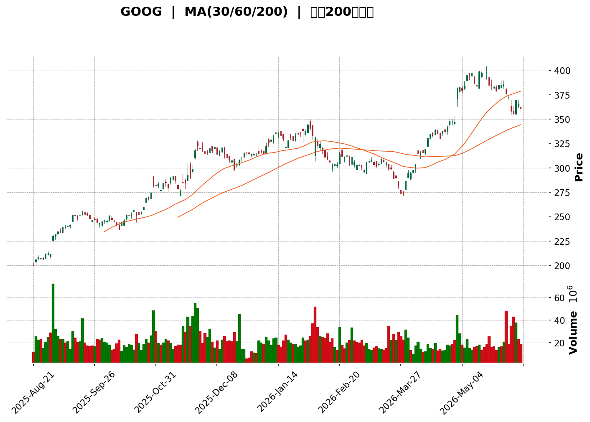
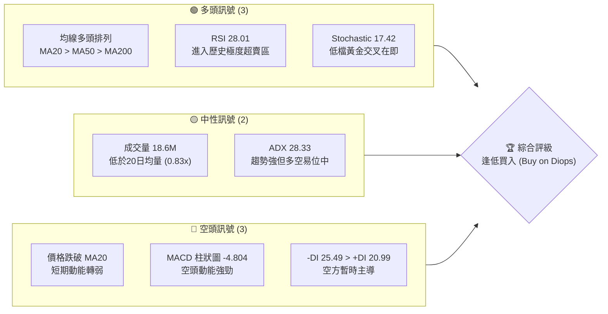
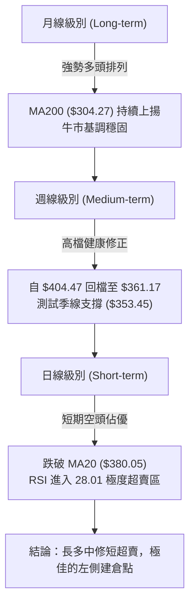
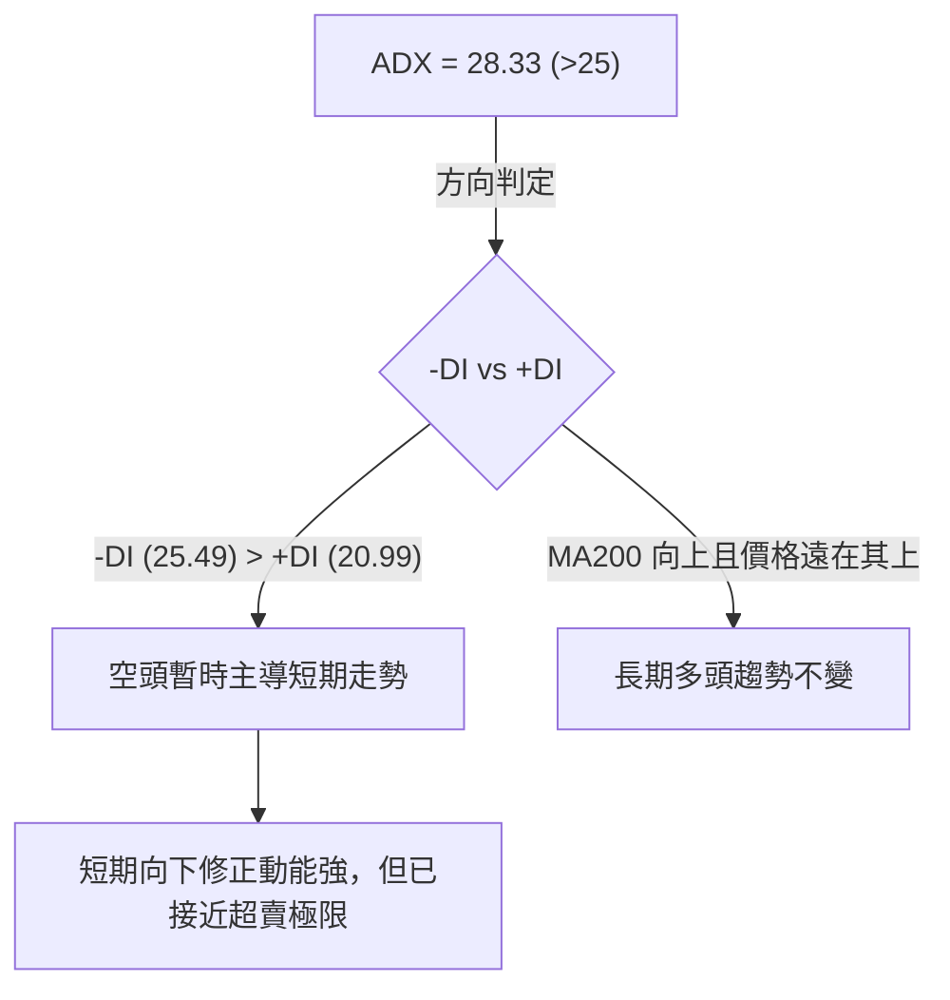

<details>
<summary>📊 靜態圖表 (點擊展開)</summary>

</details>

<html>
<head><meta charset="utf-8" /></head>
<body>
    <div style="height:500px; width:100%;">                        <script>window.PlotlyConfig = {MathJaxConfig: 'local'};</script>
        <script charset="utf-8" src="https://cdn.plot.ly/plotly-3.6.0.min.js" integrity="sha256-QaOVwtVY0T02VaHrr6pnoHLCwayMJp4O5n4YyaE3rJk=" crossorigin="anonymous"></script>                <div id="candlestick-chart" class="plotly-graph-div" style="height:100%; width:100%;"></div>            <script>                window.PLOTLYENV=window.PLOTLYENV || {};                                if (document.getElementById("candlestick-chart")) {                    Plotly.newPlot(                        "candlestick-chart",                        [{"close":{"dtype":"f8","bdata":"AAAAgGkFaUAAAACALMhpQAAAACAUFmpAAAAAAHLvaUAAAAAgv\u002fdpQAAAAECRfGpAAAAAgJqhakAAAABAb3BqQAAAAMCU0mxAAAAAYGMEbUAAAAAgh1RtQAAAAID2Om1AAAAAAKzzbUAAAABAh+dtQAAAAACEDm5AAAAAoLAhbkAAAABAZm1vQAAAAKCIYm9AAAAAwFwwb0AAAABAnX9vQAAAAMCb3G9AAAAA4DCRb0AAAAAg739vQAAAAGDP725AAAAAYIvHbkAAAACgCdtuQAAAAKDrgG5AAAAAAAlnbkAAAAAAoaZuQAAAAAASw25AAAAAoLXDbkAAAADgaGVvQAAAAKBw2W5AAAAAoBKkbkAAAADANjxuQAAAAOBgpW1AAAAAQN6JbkAAAADAZrtuQAAAAEDNa29AAAAAADxxb0AAAABgRa5vQAAAAOC+CnBAAAAAQPpfb0AAAACAAYZvQAAAAKBarG9AAAAAgIJCcEAAAACABtlwQAAAAOAOwXBAAAAAgMAscUAAAAAgSZhxQAAAAAACl3FAAAAAAMK7cUAAAADg7VpxQAAAAADTxXFAAAAAYEDPcUAAAABAInVxQAAAAEAjI3JAAAAAIIM1ckAAAABApfBxQAAAAMDda3FAAAAAQKxJcUAAAADgZ9NxQAAAAOAtyXFAAAAAQHxJckAAAAAgZBlyQAAAAKDms3JAAAAA4Jzgc0AAAACAODN0QAAAAKCI\u002fXNAAAAAAPr6c0AAAADgFatzQAAAAEB3uXNAAAAAYPcCdEAAAACgVd9zQAAAAEB0GnRAAAAAgKijc0AAAADAa9hzQAAAAGBiDHRAAAAAoKqXc0AAAACA0mRzQAAAAMCiUXNAAAAAwDY4c0AAAABAmp1yQAAAACCU+HJAAAAAoEhGc0AAAADgxXFzQAAAAABTt3NAAAAAICq3c0AAAADgz6tzQAAAAACzonNAAAAAwEGlc0AAAADgQ5lzQAAAAICRsXNAAAAAwIvRc0AAAADAQaVzQAAAAIA\u002fI3RAAAAA4HxcdEAAAABgiI50QAAAAKDux3RAAAAAIBcDdUAAAAAALAF1QAAAAMDOznRAAAAAILihdEAAAABg7h50QAAAAKBhgnRAAAAAoLapdEAAAABALoN0QAAAAMCu1XRAAAAAADrsdEAAAABAsQB1QAAAAOC+JnVAAAAAwKokdUAAAADgg4p1QAAAAOBcR3VAAAAAYK\u002fRdEAAAABAjLF0QAAAAAD2LXRAAAAAAL9CdEAAAADAfeZzQAAAAODFcXNAAAAAYG9Sc0AAAACA3xxzQAAAAIC16XJAAAAA4J37ckAAAABgivVyQAAAAGDaqnNAAAAAgId3c0AAAADgN2tzQAAAAED0jHNAAAAAwPAuc0AAAABAX3NzQAAAACBPInNAAAAAYIr1ckAAAABAyPNyQAAAAKAry3JAAAAAoHChckAAAAAAKSBzQAAAAEDhLnNAAAAAYLhGc0AAAAAgXPNyQAAAACBc13JAAAAAYLgGc0AAAABgj1ZzQAAAAMDMJHNAAAAAIK4bc0AAAADgo6xyQAAAAOBRsHJAAAAAQDMTckAAAACgcBlyQAAAAADXi3FAAAAAACkccUAAAACAPRJxQAAAAIDC7XFAAAAAYGZuckAAAAAgXGdyQAAAAGCPmnJAAAAAQOH+ckAAAAAA16tzQAAAAIDrxXNAAAAAIIW7c0AAAAAgXPNzQAAAAKBHqXRAAAAAIIXndEAAAADgUcx0QAAAAGBmNnVAAAAAYGb2dEAAAAAghad0QAAAACCuG3VAAAAAAAAcdUAAAADAHmV1QAAAAOBRyHVAAAAAAAC4dUAAAADA9bR1QAAAAEAK33dAAAAAIIXzd0AAAACAPbp3QAAAAOBRBHhAAAAAgD2yeEAAAADAzLR4QAAAAMDM0HhAAAAA4FEseEAAAADAHv13QAAAAOCj8HhAAAAAYLjSeEAAAADAHpV4QAAAAIDCkXhAAAAAYGYOeEAAAABgZg54QAAAACCF93dAAAAAgBS2d0AAAACgcA14QAAAAKBHDXhAAAAAgOsheEAAAABA4YZ3QAAAAKBHSXdAAAAAgD1mdkAAAABA4Tp2QAAAAOBRFHdAAAAAACncdkAAAABguJJ2QA=="},"high":{"dtype":"f8","bdata":"H9UpLuVcaUBOYGMqUBhqQMcCDBizU2pA3qhVnLr\u002faUCprzI2KyNqQGENID59jWpAkWczrWTbakBTIrwFiXxqQGtl+zzu6GxAxhOPeeYHbUD+aIHTLXNtQMVbqmp1wm1AoTIriHEIbkAOHBokDzhuQEb2bt+3R25ARksLSwVDbkAIPbRhCY1vQNzmbQZgnG9A3tEojnhzb0C6vmSmdLlvQPZfvPShBXBA\u002fsZQSc3+b0DMRQ3Els1vQDRu0Wi\u002fk29AmGUYGlrfbkB03hp6\u002fThvQPyIAfLRaW9A9cOjnAdrbkAeqB8\u002fFNpuQCC3dP6T6W5AuAYDdQ7ZbkBlOWu2dXtvQMsYfiqwZm9AMtkBI5jdbkCOOAW7G6duQKHWdmFCkG5AhRcDnQ2VbkCWtbOfCvZuQGsTIhdbjW9AJe0verETcEA+D1OlGtFvQGuwoLl8GHBAdzVHIxXhb0D6v4lOTQ1wQLE\u002fBflr8G9A35MVZXdicED8UmIr7eZwQJCD974x8HBAs8Tezog5cUAZufROjDhyQJBGgNVZ3nFArwcYpdbYcUDUOqVLO5dxQO0WTmz75HFAhu\u002fpO7IGckD\u002fkEFZ1MFxQI9fc+sJMXJAFB4iaxk\u002fckAXIB0gaz9yQC9GHeACsnFAiOKcc1hscUBDriGZ7mFyQKMvAqeuEHJAfRhUu2b9ckDVeiWdlSdzQNUxznHE+HJA+vWPHd31c0BN+TNyl4N0QLODbJnKSHRAY5Dedv1mdEC5kJTVJfNzQFC\u002f0ayw4nNAVVur3acZdECBFGh6kyp0QCnWv5ZBNnRAwbr70g8QdEBIfRAcwedzQJCLxl1LGnRAU4cOeDYcdEB4t3nrrb5zQCflv4Cth3NACplK4gF6c0Afdfsjo09zQKD4VMW4EHNAAHh9B1xMc0AeythusHdzQKdVV7Y8wXNAfKFT1hPBc0AeB9XiZMVzQOlv4\u002fP4q3NAHXi9Kp\u002fXc0BE5TwKsLJzQGqkJJr8KnRAFktQb2fwc0B2LGiJVhV0QIsRYj3DY3RARd3Lr+qkdECUjZRA8rN0QPoYodFF43RADcfHXltPdUDiJoMMrwx1QKOdbItFHnVAVpITXxDwdEBh4WCGvn10QGVspzjax3RAvd4YhpXvdEBE5FS6t9x0QOy8scrPAXVAWQWzWqEfdUBVUX\u002f7RhZ1QJM7fejIYHVAOYXWrM5AdUDgVWCcwI51QAnzfMB03nVARrv1SR+AdUC5agi2jsZ0QOBWWSKEpnRA\u002f4iU\u002fiV4dEAT8IQZdRZ0QDFeXJwaDXRAnUs5fx3Ec0AEKX\u002fZwkpzQOOy2UfOCnNAvyPaUR0bc0D1dZRgCB1zQHGWAKOXyHNAxnogfK7zc0CGGbTRZoJzQBCo8e4Gl3NAIOfegXmMc0BT0DHAw31zQP7CC\u002f7EPnNAFGp4x537ckA3QkdU6xNzQB4t76eA8nJA+jCLpeXBckAAAAAAAChzQAAAAGBmUnNAAAAAoBpxc0AAAACAPUpzQAAAAAApNHNAAAAAwB4Zc0AAAADAzGBzQAAAAAAAbHNAAAAAQOEqc0AAAACA6wVzQAAAAIDr9XJAAAAAoJmRckAAAABgj2pyQAAAAIA96HFAAAAAoHBxcUAAAAAAKURxQAAAAMDM8HFAAAAAgMKfckAAAABgZn5yQAAAAMDMpnJAAAAAoJkBc0AAAACAPfZzQAAAAEDh1nNAAAAAAAD4c0AAAABA4fZzQAAAAIA9qnRAAAAAAADwdEAAAACAFBZ1QAAAAIDCP3VAAAAAYI8ydUAAAABguBJ1QAAAAOB6IHVAAAAAYI9CdUAAAABACnt1QAAAAGBm7nVAAAAAYGbedUAAAABgZhZ2QAAAAIAU6ndAAAAAgD32d0AAAABA4QJ4QAAAACBcT3hAAAAAgBTGeEAAAAAgrtV4QAAAAIDr5XhAAAAAoEeleEAAAABACid4QAAAAEDh\u002fnhAAAAAAKrxeEAAAACAFL54QAAAACCFR3lAAAAA4M6VeEAAAABAM2t4QAAAAEDhSnhAAAAAgOsNeEAAAACAPRZ4QAAAAKCZW3hAAAAAAABgeEAAAABgZtp3QAAAAKCZaXdAAAAA4KMcd0AAAAAAAKh2QAAAAIDCHXdAAAAAQDMTd0AAAACAFLZ2QA=="},"hovertemplate":"\u003cb\u003e%{x|%Y-%m-%d}\u003c\u002fb\u003e\u003cbr\u003e\u958b: $%{open:.2f}\u003cbr\u003e\u9ad8: $%{high:.2f}\u003cbr\u003e\u4f4e: $%{low:.2f}\u003cbr\u003e\u6536: $%{close:.2f}\u003cextra\u003e\u003c\u002fextra\u003e","low":{"dtype":"f8","bdata":"e43hTGP+aEDutKrAnzVpQH5hl9iWr2lAbv53nY2\u002faUAZnNoho71pQJqH31BF5GlAR1+qId5PakAXAQcb1s9pQD7INpemE2xAAzkvHwNIbEBuQjDdcvtsQK1ZaqY4LW1Au78MWQkibUC8iRH6MLltQFFzlkNMiG1Af90Mm6fFbUDrfo3Ju5RuQIsdFS8MLG9AT37yL93HbkDdozKnqzhvQF1acdk9d29AtaeOXApPb0DnrHUB\u002fVdvQOcJEAZR3G5Afk\u002fUQlEqbkCDbBr\u002fx8luQNeom8HZW25ARQPXL+HnbUBFyDUnBtxtQNdTNIzQWG5AFb5UsoVEbkDF9G0hbKtuQOO+va02z25Aj+jcmz+YbkBtjjb4XOttQBB9eTCni21AZ65iko4NbkA7kYwHPBtuQDcobyKTzm5Az0S\u002fD5FKb0D5ooG+GAhvQN7cOB8oyG9AmuIdsdOKbkCziyF2kUNvQCAWqK6cjW9AtMlEORf4b0AQzcw0S4lwQPW+4v7srHBAOY1+zA7BcEDw9Q8NHoFxQATftFtZUnFAy2wk0tZ\u002fcUDBn5LC1UdxQASV06QNWHFAqHZs58+TcUDvKs\u002f82zVxQNs0WqR9snFAggazDtb3cUAQLn9v6b9xQM268Hf4WXFA0OkjbazwcEAs0U\u002f7g71xQE\u002fyl8kbanFAZperKXv0cUD\u002fCUjfcgxyQHKKLB9gX3JAjZESfLBPc0BPHmy2KdZzQOskwhlSzHNAvypBaCrIc0BkmVjU3phzQKy+dn60nHNAPVhU86mdc0D1LRdMmLJzQHnyKne9+HNATdoK8wt7c0DnnOsKZoZzQB\u002fZ4uXYsnNAnCEP5JZac0BqkOAD5ytzQLo76FJlGHNARAcFf9v5ckBpskyC2ZNyQHoBI5+xxnJA\u002fnZY1AjickB2WxCL\u002fCVzQDk2Jvd\u002faHNAtme\u002fRpeRc0DF9mRz\u002fJdzQEcy\u002fA3jenNAcledv3iQc0DlNhv9rn9zQIW9YpfmZnNAXD3J2G6wc0Bmllr\u002f64FzQIc14B11pHNAhBi4dzYcdEDPiXM1U2B0QK2GCVJ+VHRAWTdxf9XhdEDMl1uogq50QD9KU6TosHRAMhLFIQZ\u002fdEAgC4cpoAp0QEmyaX0K9XNAYHTaJmCKdEB9botz03t0QKu9urYmdHRAdgu\u002fmj3YdEC9\u002fU3XVr50QH1llg3XZ3RAM166W37GdEBqJj8iYPx0QGCOglWgJXVAbk\u002fBsjWSdEBeuJJiQytzQIqOjEHL\u002fnNAGC+YMZ\u002fXc0A1Pn8SBKdzQOnH0zWWXnNA4f2hxO0+c0ATr94c+vpyQIXNWjIOi3JAsFzCZkfcckAZaXZVVcdyQMUc85dKA3NATJnlJllcc0AGjEAN\u002fh1zQPn0H3VGUnNAjvTHaifjckAJ7X9aCfZyQEb\u002fQqiRzXJAwTT3iNeHckAoSzBkaclyQE7MmTDDnXJAohdeq6xwckAAAABA4V5yQAAAAMD1FHNAAAAAoHAdc0AAAACgcM1yQAAAAOB6vHJAAAAAwPXcckAAAACgmQVzQAAAAGC4GHNAAAAAAADQckAAAAAAAIxyQAAAAOB6oHJAAAAAIK4NckAAAACA6\u002fVxQAAAAMDMcHFAAAAAIK4XcUAAAABgj\u002fhwQAAAAAApTHFAAAAAIIUXckAAAADAHvlxQAAAAOCjXHJAAAAAwMx2ckAAAACgR4tzQAAAACCFV3NAAAAA4KOoc0AAAABACptzQAAAAGBmEnRAAAAAYI+KdEAAAABgZrp0QAAAAOCj1HRAAAAAgBTqdEAAAACAFJp0QAAAACBcz3RAAAAAwPXwdEAAAADAzOB0QAAAAMD1THVAAAAA4HqEdUAAAABA4WZ1QAAAAKBwsXZAAAAAACl0d0AAAADgUYx3QAAAAKCZxXdAAAAAoJkxeEAAAADA9WR4QAAAAGC4mnhAAAAAIK4jeEAAAAAghbt3QAAAAKBH2XdAAAAA4KWLeEAAAAAAKVx4QAAAAGBmbnhAAAAAAADwd0AAAAAAAMB3QAAAACCut3dAAAAAACmkd0AAAACAPbJ3QAAAAAAA4HdAAAAAAADUd0AAAADAzGR3QAAAACBcG3dAAAAAAAAwdkAAAACAFCZ2QAAAAMDMLHZAAAAAgBSadkAAAACAPV52QA=="},"name":"\u50f9\u683c","open":{"dtype":"f8","bdata":"2A2q6JoIaUD30dxvDXBpQHSP+yMd0WlA4bCO5Nr8aUA1PudX379pQBCwzeXu62lAHGG0O3JZakBwMWJ7phBqQNeaqa0SP2xAm39Gfmi0bEBCLI91YwRtQG3DTkYNb21ABGRa2us7bUCPxUMxn91tQFmGXTsQ+m1AiYrIsCcPbkAYibXC2JluQCmJ\u002fESdf29AK74Z\u002f89jb0AQQCg4mHBvQIDNz87OoW9AOYXAhujNb0CL5MAF9alvQL7CdcfceW9Au6AmVkKQbkBhLxAoX+5uQJqHoMYH\u002fm5APigHUWBXbkDv8IRKTBtuQEYXxSXTqW5AjR447LicbkCGGZVhTK5uQFSM2yL2Em9AeWRcaLi7bkDquys6SpduQNwIJKSdOm5AuphpNoEWbkBHLEp\u002frC1uQJp0BIH1925A0+gDwe2Db0Dl3V8YTGBvQOX5XQBK3G9ANWHZlO3cb0DDAekVQtVvQLEZRzVlq29AIDTpEjgPcECnfdUfAZBwQKaqKQxX3XBAT4qlDO\u002fDcEDtPXJZMTVyQGuwZy8jrXFA3B1OUJigcUB99UbmB0txQGtMxFAFcHFAPhaVDpDVcUCpDHoVMr1xQBYVjbANznFAtM7UB\u002fP8cUCHGQNHBjtyQCnVX0qfqXFA87zJO2z4cEAFneUuMOBxQKXxZq2AAXJAUUtfdLj0cUByig8NOwVzQCyRdy97h3JAUjOaK2ppc0Aj01A0tmV0QCdkUtmFBXRAqKLyXt0vdEAF1qTsttBzQG0WLt2Gx3NAcUP5O6C5c0BQ\u002fCSntil0QABLwToP+XNAFAqiJt0MdEBDs5TIEo5zQEsiSoFaxnNA2sASqfsNdEDrClCsLKlzQJliIHh6hnNAG4wanY0cc0AYzYzsrUxzQEujWd2L7XJA10fZZefwckCCJH8tGHBzQLHM8tqnbnNA7BOvvda+c0D\u002fJ0lbKbtzQHnP4saYiXNApB+BqQeTc0A++GvdY5JzQNOOTdTc1XNAyoAuq4rXc0D0VKPKYtFzQNVhMqqTpXNAg50K\u002fYeQdEC7gRKiJnR0QBrPMXdSZHRALWLsELTwdEA0oxeS\u002fOt0QLBIy4ISHXVAM9Q0ADDrdEBnaSunOBB0QCmxkEHnDXRAZE6sn3ngdEBwMUuxu8Z0QPUloOqAf3RApqnurkz2dECg5Wvs9wV1QNSdg0DEQXVAwwlNvJfjdECr0KdTAgV1QHtxWZdQxHVALbZgNzV4dUDWz+YmrI9zQCG13b7pcXRAWuCOvDgQdEAH3f4M8gp0QH2Ahl\u002fE63NAhnkW6BSCc0Djyop1SjxzQC8zWInaxnJAVdUeeYHjckAIAsN\u002f6eRyQB5Qd99dCXNAESahRKXuc0Ca\u002fa3OvWZzQIm+vn9nfnNA9EjQUVuJc0AxIeHYnftyQMNEDwoH7HJAG8940lujckDed7f0jOdyQBUubOXI73JAgxqcLNF9ckAAAAAAKWJyQAAAAAAAHnNAAAAAwMwkc0AAAAAgXCNzQAAAAOB6KnNAAAAAoJn5ckAAAABguApzQAAAAOB6PnNAAAAAIFzzckAAAADAHgFzQAAAAOB6yHJAAAAAIFyDckAAAABgZkJyQAAAAEAK43FAAAAAYGZWcUAAAABACjdxQAAAAOCjWHFAAAAAIK4fckAAAAAA1w9yQAAAAEAza3JAAAAAgD3CckAAAACgR91zQAAAAEAKk3NAAAAAoJnjc0AAAABguLZzQAAAAEAKIXRAAAAAwPWodEAAAACgmf10QAAAAEDh5nRAAAAAwPUodUAAAAAgXPl0QAAAAAAp7nRAAAAAQDM5dUAAAAAghRt1QAAAAIAUfnVAAAAAYLiudUAAAAAgrpd1QAAAAIAUNHdAAAAAIK6fd0AAAADAHuV3QAAAAIDr3XdAAAAAoHBZeEAAAADA9dB4QAAAAOBRpHhAAAAAQApreEAAAAAAABB4QAAAAOB63ndAAAAA4KOceEAAAACgcJN4QAAAAAAAgnhAAAAAwMyUeEAAAADgoxB4QAAAAAAp4HdAAAAAACn0d0AAAACA6893QAAAAIA97HdAAAAAgML9d0AAAACgmdN3QAAAAEAzSXdAAAAAYI+ydkAAAAAgXGV2QAAAAEAKN3ZAAAAAgBS2dkAAAACAwqd2QA=="},"x":["2025-08-21T00:00:00-04:00","2025-08-22T00:00:00-04:00","2025-08-25T00:00:00-04:00","2025-08-26T00:00:00-04:00","2025-08-27T00:00:00-04:00","2025-08-28T00:00:00-04:00","2025-08-29T00:00:00-04:00","2025-09-02T00:00:00-04:00","2025-09-03T00:00:00-04:00","2025-09-04T00:00:00-04:00","2025-09-05T00:00:00-04:00","2025-09-08T00:00:00-04:00","2025-09-09T00:00:00-04:00","2025-09-10T00:00:00-04:00","2025-09-11T00:00:00-04:00","2025-09-12T00:00:00-04:00","2025-09-15T00:00:00-04:00","2025-09-16T00:00:00-04:00","2025-09-17T00:00:00-04:00","2025-09-18T00:00:00-04:00","2025-09-19T00:00:00-04:00","2025-09-22T00:00:00-04:00","2025-09-23T00:00:00-04:00","2025-09-24T00:00:00-04:00","2025-09-25T00:00:00-04:00","2025-09-26T00:00:00-04:00","2025-09-29T00:00:00-04:00","2025-09-30T00:00:00-04:00","2025-10-01T00:00:00-04:00","2025-10-02T00:00:00-04:00","2025-10-03T00:00:00-04:00","2025-10-06T00:00:00-04:00","2025-10-07T00:00:00-04:00","2025-10-08T00:00:00-04:00","2025-10-09T00:00:00-04:00","2025-10-10T00:00:00-04:00","2025-10-13T00:00:00-04:00","2025-10-14T00:00:00-04:00","2025-10-15T00:00:00-04:00","2025-10-16T00:00:00-04:00","2025-10-17T00:00:00-04:00","2025-10-20T00:00:00-04:00","2025-10-21T00:00:00-04:00","2025-10-22T00:00:00-04:00","2025-10-23T00:00:00-04:00","2025-10-24T00:00:00-04:00","2025-10-27T00:00:00-04:00","2025-10-28T00:00:00-04:00","2025-10-29T00:00:00-04:00","2025-10-30T00:00:00-04:00","2025-10-31T00:00:00-04:00","2025-11-03T00:00:00-05:00","2025-11-04T00:00:00-05:00","2025-11-05T00:00:00-05:00","2025-11-06T00:00:00-05:00","2025-11-07T00:00:00-05:00","2025-11-10T00:00:00-05:00","2025-11-11T00:00:00-05:00","2025-11-12T00:00:00-05:00","2025-11-13T00:00:00-05:00","2025-11-14T00:00:00-05:00","2025-11-17T00:00:00-05:00","2025-11-18T00:00:00-05:00","2025-11-19T00:00:00-05:00","2025-11-20T00:00:00-05:00","2025-11-21T00:00:00-05:00","2025-11-24T00:00:00-05:00","2025-11-25T00:00:00-05:00","2025-11-26T00:00:00-05:00","2025-11-28T00:00:00-05:00","2025-12-01T00:00:00-05:00","2025-12-02T00:00:00-05:00","2025-12-03T00:00:00-05:00","2025-12-04T00:00:00-05:00","2025-12-05T00:00:00-05:00","2025-12-08T00:00:00-05:00","2025-12-09T00:00:00-05:00","2025-12-10T00:00:00-05:00","2025-12-11T00:00:00-05:00","2025-12-12T00:00:00-05:00","2025-12-15T00:00:00-05:00","2025-12-16T00:00:00-05:00","2025-12-17T00:00:00-05:00","2025-12-18T00:00:00-05:00","2025-12-19T00:00:00-05:00","2025-12-22T00:00:00-05:00","2025-12-23T00:00:00-05:00","2025-12-24T00:00:00-05:00","2025-12-26T00:00:00-05:00","2025-12-29T00:00:00-05:00","2025-12-30T00:00:00-05:00","2025-12-31T00:00:00-05:00","2026-01-02T00:00:00-05:00","2026-01-05T00:00:00-05:00","2026-01-06T00:00:00-05:00","2026-01-07T00:00:00-05:00","2026-01-08T00:00:00-05:00","2026-01-09T00:00:00-05:00","2026-01-12T00:00:00-05:00","2026-01-13T00:00:00-05:00","2026-01-14T00:00:00-05:00","2026-01-15T00:00:00-05:00","2026-01-16T00:00:00-05:00","2026-01-20T00:00:00-05:00","2026-01-21T00:00:00-05:00","2026-01-22T00:00:00-05:00","2026-01-23T00:00:00-05:00","2026-01-26T00:00:00-05:00","2026-01-27T00:00:00-05:00","2026-01-28T00:00:00-05:00","2026-01-29T00:00:00-05:00","2026-01-30T00:00:00-05:00","2026-02-02T00:00:00-05:00","2026-02-03T00:00:00-05:00","2026-02-04T00:00:00-05:00","2026-02-05T00:00:00-05:00","2026-02-06T00:00:00-05:00","2026-02-09T00:00:00-05:00","2026-02-10T00:00:00-05:00","2026-02-11T00:00:00-05:00","2026-02-12T00:00:00-05:00","2026-02-13T00:00:00-05:00","2026-02-17T00:00:00-05:00","2026-02-18T00:00:00-05:00","2026-02-19T00:00:00-05:00","2026-02-20T00:00:00-05:00","2026-02-23T00:00:00-05:00","2026-02-24T00:00:00-05:00","2026-02-25T00:00:00-05:00","2026-02-26T00:00:00-05:00","2026-02-27T00:00:00-05:00","2026-03-02T00:00:00-05:00","2026-03-03T00:00:00-05:00","2026-03-04T00:00:00-05:00","2026-03-05T00:00:00-05:00","2026-03-06T00:00:00-05:00","2026-03-09T00:00:00-04:00","2026-03-10T00:00:00-04:00","2026-03-11T00:00:00-04:00","2026-03-12T00:00:00-04:00","2026-03-13T00:00:00-04:00","2026-03-16T00:00:00-04:00","2026-03-17T00:00:00-04:00","2026-03-18T00:00:00-04:00","2026-03-19T00:00:00-04:00","2026-03-20T00:00:00-04:00","2026-03-23T00:00:00-04:00","2026-03-24T00:00:00-04:00","2026-03-25T00:00:00-04:00","2026-03-26T00:00:00-04:00","2026-03-27T00:00:00-04:00","2026-03-30T00:00:00-04:00","2026-03-31T00:00:00-04:00","2026-04-01T00:00:00-04:00","2026-04-02T00:00:00-04:00","2026-04-06T00:00:00-04:00","2026-04-07T00:00:00-04:00","2026-04-08T00:00:00-04:00","2026-04-09T00:00:00-04:00","2026-04-10T00:00:00-04:00","2026-04-13T00:00:00-04:00","2026-04-14T00:00:00-04:00","2026-04-15T00:00:00-04:00","2026-04-16T00:00:00-04:00","2026-04-17T00:00:00-04:00","2026-04-20T00:00:00-04:00","2026-04-21T00:00:00-04:00","2026-04-22T00:00:00-04:00","2026-04-23T00:00:00-04:00","2026-04-24T00:00:00-04:00","2026-04-27T00:00:00-04:00","2026-04-28T00:00:00-04:00","2026-04-29T00:00:00-04:00","2026-04-30T00:00:00-04:00","2026-05-01T00:00:00-04:00","2026-05-04T00:00:00-04:00","2026-05-05T00:00:00-04:00","2026-05-06T00:00:00-04:00","2026-05-07T00:00:00-04:00","2026-05-08T00:00:00-04:00","2026-05-11T00:00:00-04:00","2026-05-12T00:00:00-04:00","2026-05-13T00:00:00-04:00","2026-05-14T00:00:00-04:00","2026-05-15T00:00:00-04:00","2026-05-18T00:00:00-04:00","2026-05-19T00:00:00-04:00","2026-05-20T00:00:00-04:00","2026-05-21T00:00:00-04:00","2026-05-22T00:00:00-04:00","2026-05-26T00:00:00-04:00","2026-05-27T00:00:00-04:00","2026-05-28T00:00:00-04:00","2026-05-29T00:00:00-04:00","2026-06-01T00:00:00-04:00","2026-06-02T00:00:00-04:00","2026-06-03T00:00:00-04:00","2026-06-04T00:00:00-04:00","2026-06-05T00:00:00-04:00","2026-06-08T00:00:00-04:00"],"type":"candlestick"},{"hovertemplate":"MA30: $%{y:.2f}\u003cextra\u003e\u003c\u002fextra\u003e","line":{"color":"#2196F3","dash":"dash","width":2},"mode":"lines","name":"MA30","x":["2025-08-21T00:00:00-04:00","2025-08-22T00:00:00-04:00","2025-08-25T00:00:00-04:00","2025-08-26T00:00:00-04:00","2025-08-27T00:00:00-04:00","2025-08-28T00:00:00-04:00","2025-08-29T00:00:00-04:00","2025-09-02T00:00:00-04:00","2025-09-03T00:00:00-04:00","2025-09-04T00:00:00-04:00","2025-09-05T00:00:00-04:00","2025-09-08T00:00:00-04:00","2025-09-09T00:00:00-04:00","2025-09-10T00:00:00-04:00","2025-09-11T00:00:00-04:00","2025-09-12T00:00:00-04:00","2025-09-15T00:00:00-04:00","2025-09-16T00:00:00-04:00","2025-09-17T00:00:00-04:00","2025-09-18T00:00:00-04:00","2025-09-19T00:00:00-04:00","2025-09-22T00:00:00-04:00","2025-09-23T00:00:00-04:00","2025-09-24T00:00:00-04:00","2025-09-25T00:00:00-04:00","2025-09-26T00:00:00-04:00","2025-09-29T00:00:00-04:00","2025-09-30T00:00:00-04:00","2025-10-01T00:00:00-04:00","2025-10-02T00:00:00-04:00","2025-10-03T00:00:00-04:00","2025-10-06T00:00:00-04:00","2025-10-07T00:00:00-04:00","2025-10-08T00:00:00-04:00","2025-10-09T00:00:00-04:00","2025-10-10T00:00:00-04:00","2025-10-13T00:00:00-04:00","2025-10-14T00:00:00-04:00","2025-10-15T00:00:00-04:00","2025-10-16T00:00:00-04:00","2025-10-17T00:00:00-04:00","2025-10-20T00:00:00-04:00","2025-10-21T00:00:00-04:00","2025-10-22T00:00:00-04:00","2025-10-23T00:00:00-04:00","2025-10-24T00:00:00-04:00","2025-10-27T00:00:00-04:00","2025-10-28T00:00:00-04:00","2025-10-29T00:00:00-04:00","2025-10-30T00:00:00-04:00","2025-10-31T00:00:00-04:00","2025-11-03T00:00:00-05:00","2025-11-04T00:00:00-05:00","2025-11-05T00:00:00-05:00","2025-11-06T00:00:00-05:00","2025-11-07T00:00:00-05:00","2025-11-10T00:00:00-05:00","2025-11-11T00:00:00-05:00","2025-11-12T00:00:00-05:00","2025-11-13T00:00:00-05:00","2025-11-14T00:00:00-05:00","2025-11-17T00:00:00-05:00","2025-11-18T00:00:00-05:00","2025-11-19T00:00:00-05:00","2025-11-20T00:00:00-05:00","2025-11-21T00:00:00-05:00","2025-11-24T00:00:00-05:00","2025-11-25T00:00:00-05:00","2025-11-26T00:00:00-05:00","2025-11-28T00:00:00-05:00","2025-12-01T00:00:00-05:00","2025-12-02T00:00:00-05:00","2025-12-03T00:00:00-05:00","2025-12-04T00:00:00-05:00","2025-12-05T00:00:00-05:00","2025-12-08T00:00:00-05:00","2025-12-09T00:00:00-05:00","2025-12-10T00:00:00-05:00","2025-12-11T00:00:00-05:00","2025-12-12T00:00:00-05:00","2025-12-15T00:00:00-05:00","2025-12-16T00:00:00-05:00","2025-12-17T00:00:00-05:00","2025-12-18T00:00:00-05:00","2025-12-19T00:00:00-05:00","2025-12-22T00:00:00-05:00","2025-12-23T00:00:00-05:00","2025-12-24T00:00:00-05:00","2025-12-26T00:00:00-05:00","2025-12-29T00:00:00-05:00","2025-12-30T00:00:00-05:00","2025-12-31T00:00:00-05:00","2026-01-02T00:00:00-05:00","2026-01-05T00:00:00-05:00","2026-01-06T00:00:00-05:00","2026-01-07T00:00:00-05:00","2026-01-08T00:00:00-05:00","2026-01-09T00:00:00-05:00","2026-01-12T00:00:00-05:00","2026-01-13T00:00:00-05:00","2026-01-14T00:00:00-05:00","2026-01-15T00:00:00-05:00","2026-01-16T00:00:00-05:00","2026-01-20T00:00:00-05:00","2026-01-21T00:00:00-05:00","2026-01-22T00:00:00-05:00","2026-01-23T00:00:00-05:00","2026-01-26T00:00:00-05:00","2026-01-27T00:00:00-05:00","2026-01-28T00:00:00-05:00","2026-01-29T00:00:00-05:00","2026-01-30T00:00:00-05:00","2026-02-02T00:00:00-05:00","2026-02-03T00:00:00-05:00","2026-02-04T00:00:00-05:00","2026-02-05T00:00:00-05:00","2026-02-06T00:00:00-05:00","2026-02-09T00:00:00-05:00","2026-02-10T00:00:00-05:00","2026-02-11T00:00:00-05:00","2026-02-12T00:00:00-05:00","2026-02-13T00:00:00-05:00","2026-02-17T00:00:00-05:00","2026-02-18T00:00:00-05:00","2026-02-19T00:00:00-05:00","2026-02-20T00:00:00-05:00","2026-02-23T00:00:00-05:00","2026-02-24T00:00:00-05:00","2026-02-25T00:00:00-05:00","2026-02-26T00:00:00-05:00","2026-02-27T00:00:00-05:00","2026-03-02T00:00:00-05:00","2026-03-03T00:00:00-05:00","2026-03-04T00:00:00-05:00","2026-03-05T00:00:00-05:00","2026-03-06T00:00:00-05:00","2026-03-09T00:00:00-04:00","2026-03-10T00:00:00-04:00","2026-03-11T00:00:00-04:00","2026-03-12T00:00:00-04:00","2026-03-13T00:00:00-04:00","2026-03-16T00:00:00-04:00","2026-03-17T00:00:00-04:00","2026-03-18T00:00:00-04:00","2026-03-19T00:00:00-04:00","2026-03-20T00:00:00-04:00","2026-03-23T00:00:00-04:00","2026-03-24T00:00:00-04:00","2026-03-25T00:00:00-04:00","2026-03-26T00:00:00-04:00","2026-03-27T00:00:00-04:00","2026-03-30T00:00:00-04:00","2026-03-31T00:00:00-04:00","2026-04-01T00:00:00-04:00","2026-04-02T00:00:00-04:00","2026-04-06T00:00:00-04:00","2026-04-07T00:00:00-04:00","2026-04-08T00:00:00-04:00","2026-04-09T00:00:00-04:00","2026-04-10T00:00:00-04:00","2026-04-13T00:00:00-04:00","2026-04-14T00:00:00-04:00","2026-04-15T00:00:00-04:00","2026-04-16T00:00:00-04:00","2026-04-17T00:00:00-04:00","2026-04-20T00:00:00-04:00","2026-04-21T00:00:00-04:00","2026-04-22T00:00:00-04:00","2026-04-23T00:00:00-04:00","2026-04-24T00:00:00-04:00","2026-04-27T00:00:00-04:00","2026-04-28T00:00:00-04:00","2026-04-29T00:00:00-04:00","2026-04-30T00:00:00-04:00","2026-05-01T00:00:00-04:00","2026-05-04T00:00:00-04:00","2026-05-05T00:00:00-04:00","2026-05-06T00:00:00-04:00","2026-05-07T00:00:00-04:00","2026-05-08T00:00:00-04:00","2026-05-11T00:00:00-04:00","2026-05-12T00:00:00-04:00","2026-05-13T00:00:00-04:00","2026-05-14T00:00:00-04:00","2026-05-15T00:00:00-04:00","2026-05-18T00:00:00-04:00","2026-05-19T00:00:00-04:00","2026-05-20T00:00:00-04:00","2026-05-21T00:00:00-04:00","2026-05-22T00:00:00-04:00","2026-05-26T00:00:00-04:00","2026-05-27T00:00:00-04:00","2026-05-28T00:00:00-04:00","2026-05-29T00:00:00-04:00","2026-06-01T00:00:00-04:00","2026-06-02T00:00:00-04:00","2026-06-03T00:00:00-04:00","2026-06-04T00:00:00-04:00","2026-06-05T00:00:00-04:00","2026-06-08T00:00:00-04:00"],"y":{"dtype":"f8","bdata":"AAAAAAAA+H8AAAAAAAD4fwAAAAAAAPh\u002fAAAAAAAA+H8AAAAAAAD4fwAAAAAAAPh\u002fAAAAAAAA+H8AAAAAAAD4fwAAAAAAAPh\u002fAAAAAAAA+H8AAAAAAAD4fwAAAAAAAPh\u002fAAAAAAAA+H8AAAAAAAD4fwAAAAAAAPh\u002fAAAAAAAA+H8AAAAAAAD4fwAAAAAAAPh\u002fAAAAAAAA+H8AAAAAAAD4fwAAAAAAAPh\u002fAAAAAAAA+H8AAAAAAAD4fwAAAAAAAPh\u002fAAAAAAAA+H8AAAAAAAD4fwAAAAAAAPh\u002fAAAAAAAA+H8AAAAAAAD4fzMzM\u002fNMVm1AzczMfE+HbUBmZmbmN7dtQN7d3R3d321Aq6qqmgQIbkDe3d39bixuQImIiNhkR25AAAAAcLxobkCamZlJXo1uQGZmZtaKo25AmpmZuTy4bkCamZmZS8xuQBEREXGl5G5A7+7uLsrwbkDv7u4Om\u002f5uQKuqqnpmDG9AiYiIKMcgb0DNzMwMIjRvQO\u002fu7p5ARm9AvLu7Szlhb0De3d3tuIBvQERERDQJnW9A3t3dPVC+b0Dv7u7+tdlvQJqZmfmEAHBAq6qqMisVcEDv7u4+fSZwQImIiKAcP3BAd3d3P8dYcEB3d3ffFm9wQBERERmAgHBAAAAA0MKQcEBVVVXt6qJwQKuqqvoQt3BAREREnGHQcEAAAAD40ulwQAAAAGDuCnFAd3d390AycUAzMzMjgVtxQJqZmYkGgHFAAAAA8F6kcUBVVVUtCcVxQBEREbl15HFAZmZm7lsJckC8u7vTbyxyQHd3d5fYUHJAERERMa9tckAiIiKiQ4dyQERERARgo3JAvLu7awG4ckBVVVVVW8dyQM3MzGwc1nJAvLu7+8rickBmZmZ2jO1yQJqZmRnG93JAAAAAYEYEc0AzMzPDOhVzQCIiItKzInNAiYiIuI4vc0CJiIhoVD5zQCIiImI5UXNAd3d391dlc0BmZmbmeHRzQM3MzHzAhHNAIiIiEtKRc0AAAAAgBJ9zQCIiItJCq3NAMzMz42Ovc0BVVVUVb7JzQHd3dzcuuXNAzczM\u002fPvBc0AAAAAgY81zQGZmZsah1nNAd3d3d+zbc0CJiIgoC95zQBEREQGC4XNAVVVVNT7qc0C8u7tb7+9zQKuqqhql9nNAd3d3N\u002f8BdEB3d3fXuQ90QJqZmelcH3RA3t3dLccvdEBmZmbmvUh0QCIiIkJvXHRAmpmZWZ1pdECJiIgYRnR0QGZmZnY6eHRA7+7ujuF8dECamZlJ1n50QImIiMg0fXRAmpmZCXJ6dEDv7u6OTHZ0QHd3dxejb3RAAAAAkIFodEDe3d0dpmJ0QO\u002fu7r6iXnRAd3d39wBXdEBVVVUVS010QFVVVUXLQnRAREREZDAzdEBVVVXV7SV0QAAAAFClF3RAVVVVhV8JdECJiIjIZv9zQJqZmdnC8HNA7+7uLmvfc0DNzMysldNzQCIiIsJ9xXNAd3d353C3c0ARERER7qVzQDMzM5M3knNAZmZm9iaAc0C8u7uLWm1zQKuqqooiW3NAZmZm5ohMc0BERET0TTtzQImIiEiVLnNA3t3dfe4bc0AAAAAwkAxzQO\u002fu7o5d\u002fHJAiYiIWH3pckC8u7uLEdhyQERERJSrz3JAd3d3h\u002fbKckARERFBOcZyQAAAALAlvXJAVVVVJSC5ckBVVVWVR7tyQBEREbEtvXJA3t3dTd3BckB3d3d3IcZyQAAAAMAp03JAzczMLMPjckDv7u5+g\u002fNyQGZmZpYnCHNAVVVVpQ0cc0AAAABAGSlzQKuqqnqGOXNAAAAAACtJc0AiIiLSBl5zQERERBQgd3NA7+7u7hmOc0C8u7uLUKJzQN7d3e2nynNAVVVV5fvzc0De3d2dGh90QFVVVRWSTHRAzczMbBKFdEDNzMxcc710QN7d3Y17+3RA7+7uLsE3dUARERGxyHJ1QBEREQGdrnVAVVVVRSjldUBVVVX14Rl2QAAAABDKTHZAq6qqKvl3dkCJiIhYZJ12QLy7u7stwXZAIiIiciHjdkAREREhIgZ3QAAAABARI3dAIiIiAp0+d0De3d0N5lV3QKuqqjqYZ3dAIiIiIttzd0AzMzMjTYF3QFVVVWUfkndAIiIisg+hd0CamZlZHat3QA=="},"type":"scatter"},{"hovertemplate":"MA60: $%{y:.2f}\u003cextra\u003e\u003c\u002fextra\u003e","line":{"color":"#9C27B0","dash":"dash","width":2},"mode":"lines","name":"MA60","x":["2025-08-21T00:00:00-04:00","2025-08-22T00:00:00-04:00","2025-08-25T00:00:00-04:00","2025-08-26T00:00:00-04:00","2025-08-27T00:00:00-04:00","2025-08-28T00:00:00-04:00","2025-08-29T00:00:00-04:00","2025-09-02T00:00:00-04:00","2025-09-03T00:00:00-04:00","2025-09-04T00:00:00-04:00","2025-09-05T00:00:00-04:00","2025-09-08T00:00:00-04:00","2025-09-09T00:00:00-04:00","2025-09-10T00:00:00-04:00","2025-09-11T00:00:00-04:00","2025-09-12T00:00:00-04:00","2025-09-15T00:00:00-04:00","2025-09-16T00:00:00-04:00","2025-09-17T00:00:00-04:00","2025-09-18T00:00:00-04:00","2025-09-19T00:00:00-04:00","2025-09-22T00:00:00-04:00","2025-09-23T00:00:00-04:00","2025-09-24T00:00:00-04:00","2025-09-25T00:00:00-04:00","2025-09-26T00:00:00-04:00","2025-09-29T00:00:00-04:00","2025-09-30T00:00:00-04:00","2025-10-01T00:00:00-04:00","2025-10-02T00:00:00-04:00","2025-10-03T00:00:00-04:00","2025-10-06T00:00:00-04:00","2025-10-07T00:00:00-04:00","2025-10-08T00:00:00-04:00","2025-10-09T00:00:00-04:00","2025-10-10T00:00:00-04:00","2025-10-13T00:00:00-04:00","2025-10-14T00:00:00-04:00","2025-10-15T00:00:00-04:00","2025-10-16T00:00:00-04:00","2025-10-17T00:00:00-04:00","2025-10-20T00:00:00-04:00","2025-10-21T00:00:00-04:00","2025-10-22T00:00:00-04:00","2025-10-23T00:00:00-04:00","2025-10-24T00:00:00-04:00","2025-10-27T00:00:00-04:00","2025-10-28T00:00:00-04:00","2025-10-29T00:00:00-04:00","2025-10-30T00:00:00-04:00","2025-10-31T00:00:00-04:00","2025-11-03T00:00:00-05:00","2025-11-04T00:00:00-05:00","2025-11-05T00:00:00-05:00","2025-11-06T00:00:00-05:00","2025-11-07T00:00:00-05:00","2025-11-10T00:00:00-05:00","2025-11-11T00:00:00-05:00","2025-11-12T00:00:00-05:00","2025-11-13T00:00:00-05:00","2025-11-14T00:00:00-05:00","2025-11-17T00:00:00-05:00","2025-11-18T00:00:00-05:00","2025-11-19T00:00:00-05:00","2025-11-20T00:00:00-05:00","2025-11-21T00:00:00-05:00","2025-11-24T00:00:00-05:00","2025-11-25T00:00:00-05:00","2025-11-26T00:00:00-05:00","2025-11-28T00:00:00-05:00","2025-12-01T00:00:00-05:00","2025-12-02T00:00:00-05:00","2025-12-03T00:00:00-05:00","2025-12-04T00:00:00-05:00","2025-12-05T00:00:00-05:00","2025-12-08T00:00:00-05:00","2025-12-09T00:00:00-05:00","2025-12-10T00:00:00-05:00","2025-12-11T00:00:00-05:00","2025-12-12T00:00:00-05:00","2025-12-15T00:00:00-05:00","2025-12-16T00:00:00-05:00","2025-12-17T00:00:00-05:00","2025-12-18T00:00:00-05:00","2025-12-19T00:00:00-05:00","2025-12-22T00:00:00-05:00","2025-12-23T00:00:00-05:00","2025-12-24T00:00:00-05:00","2025-12-26T00:00:00-05:00","2025-12-29T00:00:00-05:00","2025-12-30T00:00:00-05:00","2025-12-31T00:00:00-05:00","2026-01-02T00:00:00-05:00","2026-01-05T00:00:00-05:00","2026-01-06T00:00:00-05:00","2026-01-07T00:00:00-05:00","2026-01-08T00:00:00-05:00","2026-01-09T00:00:00-05:00","2026-01-12T00:00:00-05:00","2026-01-13T00:00:00-05:00","2026-01-14T00:00:00-05:00","2026-01-15T00:00:00-05:00","2026-01-16T00:00:00-05:00","2026-01-20T00:00:00-05:00","2026-01-21T00:00:00-05:00","2026-01-22T00:00:00-05:00","2026-01-23T00:00:00-05:00","2026-01-26T00:00:00-05:00","2026-01-27T00:00:00-05:00","2026-01-28T00:00:00-05:00","2026-01-29T00:00:00-05:00","2026-01-30T00:00:00-05:00","2026-02-02T00:00:00-05:00","2026-02-03T00:00:00-05:00","2026-02-04T00:00:00-05:00","2026-02-05T00:00:00-05:00","2026-02-06T00:00:00-05:00","2026-02-09T00:00:00-05:00","2026-02-10T00:00:00-05:00","2026-02-11T00:00:00-05:00","2026-02-12T00:00:00-05:00","2026-02-13T00:00:00-05:00","2026-02-17T00:00:00-05:00","2026-02-18T00:00:00-05:00","2026-02-19T00:00:00-05:00","2026-02-20T00:00:00-05:00","2026-02-23T00:00:00-05:00","2026-02-24T00:00:00-05:00","2026-02-25T00:00:00-05:00","2026-02-26T00:00:00-05:00","2026-02-27T00:00:00-05:00","2026-03-02T00:00:00-05:00","2026-03-03T00:00:00-05:00","2026-03-04T00:00:00-05:00","2026-03-05T00:00:00-05:00","2026-03-06T00:00:00-05:00","2026-03-09T00:00:00-04:00","2026-03-10T00:00:00-04:00","2026-03-11T00:00:00-04:00","2026-03-12T00:00:00-04:00","2026-03-13T00:00:00-04:00","2026-03-16T00:00:00-04:00","2026-03-17T00:00:00-04:00","2026-03-18T00:00:00-04:00","2026-03-19T00:00:00-04:00","2026-03-20T00:00:00-04:00","2026-03-23T00:00:00-04:00","2026-03-24T00:00:00-04:00","2026-03-25T00:00:00-04:00","2026-03-26T00:00:00-04:00","2026-03-27T00:00:00-04:00","2026-03-30T00:00:00-04:00","2026-03-31T00:00:00-04:00","2026-04-01T00:00:00-04:00","2026-04-02T00:00:00-04:00","2026-04-06T00:00:00-04:00","2026-04-07T00:00:00-04:00","2026-04-08T00:00:00-04:00","2026-04-09T00:00:00-04:00","2026-04-10T00:00:00-04:00","2026-04-13T00:00:00-04:00","2026-04-14T00:00:00-04:00","2026-04-15T00:00:00-04:00","2026-04-16T00:00:00-04:00","2026-04-17T00:00:00-04:00","2026-04-20T00:00:00-04:00","2026-04-21T00:00:00-04:00","2026-04-22T00:00:00-04:00","2026-04-23T00:00:00-04:00","2026-04-24T00:00:00-04:00","2026-04-27T00:00:00-04:00","2026-04-28T00:00:00-04:00","2026-04-29T00:00:00-04:00","2026-04-30T00:00:00-04:00","2026-05-01T00:00:00-04:00","2026-05-04T00:00:00-04:00","2026-05-05T00:00:00-04:00","2026-05-06T00:00:00-04:00","2026-05-07T00:00:00-04:00","2026-05-08T00:00:00-04:00","2026-05-11T00:00:00-04:00","2026-05-12T00:00:00-04:00","2026-05-13T00:00:00-04:00","2026-05-14T00:00:00-04:00","2026-05-15T00:00:00-04:00","2026-05-18T00:00:00-04:00","2026-05-19T00:00:00-04:00","2026-05-20T00:00:00-04:00","2026-05-21T00:00:00-04:00","2026-05-22T00:00:00-04:00","2026-05-26T00:00:00-04:00","2026-05-27T00:00:00-04:00","2026-05-28T00:00:00-04:00","2026-05-29T00:00:00-04:00","2026-06-01T00:00:00-04:00","2026-06-02T00:00:00-04:00","2026-06-03T00:00:00-04:00","2026-06-04T00:00:00-04:00","2026-06-05T00:00:00-04:00","2026-06-08T00:00:00-04:00"],"y":{"dtype":"f8","bdata":"AAAAAAAA+H8AAAAAAAD4fwAAAAAAAPh\u002fAAAAAAAA+H8AAAAAAAD4fwAAAAAAAPh\u002fAAAAAAAA+H8AAAAAAAD4fwAAAAAAAPh\u002fAAAAAAAA+H8AAAAAAAD4fwAAAAAAAPh\u002fAAAAAAAA+H8AAAAAAAD4fwAAAAAAAPh\u002fAAAAAAAA+H8AAAAAAAD4fwAAAAAAAPh\u002fAAAAAAAA+H8AAAAAAAD4fwAAAAAAAPh\u002fAAAAAAAA+H8AAAAAAAD4fwAAAAAAAPh\u002fAAAAAAAA+H8AAAAAAAD4fwAAAAAAAPh\u002fAAAAAAAA+H8AAAAAAAD4fwAAAAAAAPh\u002fAAAAAAAA+H8AAAAAAAD4fwAAAAAAAPh\u002fAAAAAAAA+H8AAAAAAAD4fwAAAAAAAPh\u002fAAAAAAAA+H8AAAAAAAD4fwAAAAAAAPh\u002fAAAAAAAA+H8AAAAAAAD4fwAAAAAAAPh\u002fAAAAAAAA+H8AAAAAAAD4fwAAAAAAAPh\u002fAAAAAAAA+H8AAAAAAAD4fwAAAAAAAPh\u002fAAAAAAAA+H8AAAAAAAD4fwAAAAAAAPh\u002fAAAAAAAA+H8AAAAAAAD4fwAAAAAAAPh\u002fAAAAAAAA+H8AAAAAAAD4fwAAAAAAAPh\u002fAAAAAAAA+H8AAAAAAAD4f6uqqpKmK29AZmZmjmpUb0CJiIjghn5vQJqZmYn\u002fpm9AmpmZ6WPUb0B3d3c7BQBwQCIiImZQF3BAvLu7l08zcEAAAAAkGFFwQGZmZvrlaHBAZmZmpj6AcEARERF9l5VwQM3MzDhkq3BA7+7uguDAcECamZmt3tVwQGZmZuqF63BAq6qqYgn\u002fcEBERERUqhBxQN7d3SlAI3FAzczMCE80cUAiIiLm20NxQHd3d4NQUnFAVVVVjflgcUDv7u66M21xQJqZmYklfHFAVVVVybiMcUAREREB3J1xQFVVVTnosHFAAAAA\u002fCrEcUAAAACktdZxQJqZmb3c6HFAvLu7Yw37cUDe3d3psQtyQLy7u7voHXJAMzMz1xkxckAAAACMa0RyQBEREZkYW3JAVVVVbdJwckBEREQc+IZyQImIiGCanHJAZmZmdi2zckCrqqomNslyQLy7u7+L3XJA7+7uMqTyckAiIiJ+PQVzQEREREwtGXNAMzMzs\u002fYrc0Dv7u5+mTtzQHd3d48CTXNAmpmZUQBdc0BmZmaWimtzQDMzM6u8enNAzczMFEmJc0BmZmYuJZtzQN7d3a0aqnNAzczM3PG2c0De3d1twMRzQERERCR3zXNAvLu7IzjWc0ARERFZld5zQFVVVRU353NAiYiIAOXvc0Crqqq6YvVzQCIiIsox+nNAERER0Sn9c0Dv7u4e1QB0QImIiMjyBHRAVVVVbTIDdEBVVVUV3f9zQGZmZr78\u002fXNAiYiIMJb6c0Crqqp6qPlzQDMzM4sj93NAZmZm\u002fqXyc0CJiIj4uO5zQFVVVW0i6XNAIiIistTkc0BERESEwuFzQGZmZm4R3nNAd3d3D7jcc0BERET009pzQGZmZj7K2HNAIiIiEvfXc0ARERE5DNtzQGZmZubI23NAAAAAIBPbc0BmZmYGytdzQHd3d99n03NAZmZmBmjMc0DNzMw8s8VzQLy7uyvJvHNAERERsfexc0BVVVUNL6dzQN7d3VWnn3NAvLu7C7yZc0B3d3evb5RzQHd3dzfkjXNAZmZmjhCIc0BVVVVVSYRzQDMzM3v8f3NAERER2YZ6c0BmZmamB3ZzQAAAAIhndXNAERERWZF2c0C8u7sjdXlzQAAAADh1fHNAIiIiarx9c0BmZmZ2V35zQGZmZh6Cf3NAvLu7802Ac0CamZlx+oFzQLy7u9OrhHNAq6qqciCHc0C8u7uL1YdzQERERDzlknNA3t3dZUKgc0ARERFJNK1zQO\u002fu7q6TvXNAVVVVdYDQc0BmZmbGAeVzQGZmZo7s+3NAvLu7Q58QdEBmZmYebSV0QKuqqkokP3RAZmZmZg9YdEAzMzObDXB0QAAAAOD3hHRAAAAAqIyYdEDv7u72Vax0QGZmZrYtv3RAAAAAYH\u002fSdEBERETMIeZ0QAAAAGgd+3RAd3d3FzARdUBmZmbGtCR1QImIiOjfN3VAvLu7Y\u002fRHdUCamZkxM1V1QAAAAPDSZXVAERERWR11dUDe3d0VkoR1QA=="},"type":"scatter"},{"hovertemplate":"MA200: $%{y:.2f}\u003cextra\u003e\u003c\u002fextra\u003e","line":{"color":"#FF6F00","dash":"solid","width":2},"mode":"lines","name":"MA200","x":["2025-08-21T00:00:00-04:00","2025-08-22T00:00:00-04:00","2025-08-25T00:00:00-04:00","2025-08-26T00:00:00-04:00","2025-08-27T00:00:00-04:00","2025-08-28T00:00:00-04:00","2025-08-29T00:00:00-04:00","2025-09-02T00:00:00-04:00","2025-09-03T00:00:00-04:00","2025-09-04T00:00:00-04:00","2025-09-05T00:00:00-04:00","2025-09-08T00:00:00-04:00","2025-09-09T00:00:00-04:00","2025-09-10T00:00:00-04:00","2025-09-11T00:00:00-04:00","2025-09-12T00:00:00-04:00","2025-09-15T00:00:00-04:00","2025-09-16T00:00:00-04:00","2025-09-17T00:00:00-04:00","2025-09-18T00:00:00-04:00","2025-09-19T00:00:00-04:00","2025-09-22T00:00:00-04:00","2025-09-23T00:00:00-04:00","2025-09-24T00:00:00-04:00","2025-09-25T00:00:00-04:00","2025-09-26T00:00:00-04:00","2025-09-29T00:00:00-04:00","2025-09-30T00:00:00-04:00","2025-10-01T00:00:00-04:00","2025-10-02T00:00:00-04:00","2025-10-03T00:00:00-04:00","2025-10-06T00:00:00-04:00","2025-10-07T00:00:00-04:00","2025-10-08T00:00:00-04:00","2025-10-09T00:00:00-04:00","2025-10-10T00:00:00-04:00","2025-10-13T00:00:00-04:00","2025-10-14T00:00:00-04:00","2025-10-15T00:00:00-04:00","2025-10-16T00:00:00-04:00","2025-10-17T00:00:00-04:00","2025-10-20T00:00:00-04:00","2025-10-21T00:00:00-04:00","2025-10-22T00:00:00-04:00","2025-10-23T00:00:00-04:00","2025-10-24T00:00:00-04:00","2025-10-27T00:00:00-04:00","2025-10-28T00:00:00-04:00","2025-10-29T00:00:00-04:00","2025-10-30T00:00:00-04:00","2025-10-31T00:00:00-04:00","2025-11-03T00:00:00-05:00","2025-11-04T00:00:00-05:00","2025-11-05T00:00:00-05:00","2025-11-06T00:00:00-05:00","2025-11-07T00:00:00-05:00","2025-11-10T00:00:00-05:00","2025-11-11T00:00:00-05:00","2025-11-12T00:00:00-05:00","2025-11-13T00:00:00-05:00","2025-11-14T00:00:00-05:00","2025-11-17T00:00:00-05:00","2025-11-18T00:00:00-05:00","2025-11-19T00:00:00-05:00","2025-11-20T00:00:00-05:00","2025-11-21T00:00:00-05:00","2025-11-24T00:00:00-05:00","2025-11-25T00:00:00-05:00","2025-11-26T00:00:00-05:00","2025-11-28T00:00:00-05:00","2025-12-01T00:00:00-05:00","2025-12-02T00:00:00-05:00","2025-12-03T00:00:00-05:00","2025-12-04T00:00:00-05:00","2025-12-05T00:00:00-05:00","2025-12-08T00:00:00-05:00","2025-12-09T00:00:00-05:00","2025-12-10T00:00:00-05:00","2025-12-11T00:00:00-05:00","2025-12-12T00:00:00-05:00","2025-12-15T00:00:00-05:00","2025-12-16T00:00:00-05:00","2025-12-17T00:00:00-05:00","2025-12-18T00:00:00-05:00","2025-12-19T00:00:00-05:00","2025-12-22T00:00:00-05:00","2025-12-23T00:00:00-05:00","2025-12-24T00:00:00-05:00","2025-12-26T00:00:00-05:00","2025-12-29T00:00:00-05:00","2025-12-30T00:00:00-05:00","2025-12-31T00:00:00-05:00","2026-01-02T00:00:00-05:00","2026-01-05T00:00:00-05:00","2026-01-06T00:00:00-05:00","2026-01-07T00:00:00-05:00","2026-01-08T00:00:00-05:00","2026-01-09T00:00:00-05:00","2026-01-12T00:00:00-05:00","2026-01-13T00:00:00-05:00","2026-01-14T00:00:00-05:00","2026-01-15T00:00:00-05:00","2026-01-16T00:00:00-05:00","2026-01-20T00:00:00-05:00","2026-01-21T00:00:00-05:00","2026-01-22T00:00:00-05:00","2026-01-23T00:00:00-05:00","2026-01-26T00:00:00-05:00","2026-01-27T00:00:00-05:00","2026-01-28T00:00:00-05:00","2026-01-29T00:00:00-05:00","2026-01-30T00:00:00-05:00","2026-02-02T00:00:00-05:00","2026-02-03T00:00:00-05:00","2026-02-04T00:00:00-05:00","2026-02-05T00:00:00-05:00","2026-02-06T00:00:00-05:00","2026-02-09T00:00:00-05:00","2026-02-10T00:00:00-05:00","2026-02-11T00:00:00-05:00","2026-02-12T00:00:00-05:00","2026-02-13T00:00:00-05:00","2026-02-17T00:00:00-05:00","2026-02-18T00:00:00-05:00","2026-02-19T00:00:00-05:00","2026-02-20T00:00:00-05:00","2026-02-23T00:00:00-05:00","2026-02-24T00:00:00-05:00","2026-02-25T00:00:00-05:00","2026-02-26T00:00:00-05:00","2026-02-27T00:00:00-05:00","2026-03-02T00:00:00-05:00","2026-03-03T00:00:00-05:00","2026-03-04T00:00:00-05:00","2026-03-05T00:00:00-05:00","2026-03-06T00:00:00-05:00","2026-03-09T00:00:00-04:00","2026-03-10T00:00:00-04:00","2026-03-11T00:00:00-04:00","2026-03-12T00:00:00-04:00","2026-03-13T00:00:00-04:00","2026-03-16T00:00:00-04:00","2026-03-17T00:00:00-04:00","2026-03-18T00:00:00-04:00","2026-03-19T00:00:00-04:00","2026-03-20T00:00:00-04:00","2026-03-23T00:00:00-04:00","2026-03-24T00:00:00-04:00","2026-03-25T00:00:00-04:00","2026-03-26T00:00:00-04:00","2026-03-27T00:00:00-04:00","2026-03-30T00:00:00-04:00","2026-03-31T00:00:00-04:00","2026-04-01T00:00:00-04:00","2026-04-02T00:00:00-04:00","2026-04-06T00:00:00-04:00","2026-04-07T00:00:00-04:00","2026-04-08T00:00:00-04:00","2026-04-09T00:00:00-04:00","2026-04-10T00:00:00-04:00","2026-04-13T00:00:00-04:00","2026-04-14T00:00:00-04:00","2026-04-15T00:00:00-04:00","2026-04-16T00:00:00-04:00","2026-04-17T00:00:00-04:00","2026-04-20T00:00:00-04:00","2026-04-21T00:00:00-04:00","2026-04-22T00:00:00-04:00","2026-04-23T00:00:00-04:00","2026-04-24T00:00:00-04:00","2026-04-27T00:00:00-04:00","2026-04-28T00:00:00-04:00","2026-04-29T00:00:00-04:00","2026-04-30T00:00:00-04:00","2026-05-01T00:00:00-04:00","2026-05-04T00:00:00-04:00","2026-05-05T00:00:00-04:00","2026-05-06T00:00:00-04:00","2026-05-07T00:00:00-04:00","2026-05-08T00:00:00-04:00","2026-05-11T00:00:00-04:00","2026-05-12T00:00:00-04:00","2026-05-13T00:00:00-04:00","2026-05-14T00:00:00-04:00","2026-05-15T00:00:00-04:00","2026-05-18T00:00:00-04:00","2026-05-19T00:00:00-04:00","2026-05-20T00:00:00-04:00","2026-05-21T00:00:00-04:00","2026-05-22T00:00:00-04:00","2026-05-26T00:00:00-04:00","2026-05-27T00:00:00-04:00","2026-05-28T00:00:00-04:00","2026-05-29T00:00:00-04:00","2026-06-01T00:00:00-04:00","2026-06-02T00:00:00-04:00","2026-06-03T00:00:00-04:00","2026-06-04T00:00:00-04:00","2026-06-05T00:00:00-04:00","2026-06-08T00:00:00-04:00"],"y":{"dtype":"f8","bdata":"AAAAAAAA+H8AAAAAAAD4fwAAAAAAAPh\u002fAAAAAAAA+H8AAAAAAAD4fwAAAAAAAPh\u002fAAAAAAAA+H8AAAAAAAD4fwAAAAAAAPh\u002fAAAAAAAA+H8AAAAAAAD4fwAAAAAAAPh\u002fAAAAAAAA+H8AAAAAAAD4fwAAAAAAAPh\u002fAAAAAAAA+H8AAAAAAAD4fwAAAAAAAPh\u002fAAAAAAAA+H8AAAAAAAD4fwAAAAAAAPh\u002fAAAAAAAA+H8AAAAAAAD4fwAAAAAAAPh\u002fAAAAAAAA+H8AAAAAAAD4fwAAAAAAAPh\u002fAAAAAAAA+H8AAAAAAAD4fwAAAAAAAPh\u002fAAAAAAAA+H8AAAAAAAD4fwAAAAAAAPh\u002fAAAAAAAA+H8AAAAAAAD4fwAAAAAAAPh\u002fAAAAAAAA+H8AAAAAAAD4fwAAAAAAAPh\u002fAAAAAAAA+H8AAAAAAAD4fwAAAAAAAPh\u002fAAAAAAAA+H8AAAAAAAD4fwAAAAAAAPh\u002fAAAAAAAA+H8AAAAAAAD4fwAAAAAAAPh\u002fAAAAAAAA+H8AAAAAAAD4fwAAAAAAAPh\u002fAAAAAAAA+H8AAAAAAAD4fwAAAAAAAPh\u002fAAAAAAAA+H8AAAAAAAD4fwAAAAAAAPh\u002fAAAAAAAA+H8AAAAAAAD4fwAAAAAAAPh\u002fAAAAAAAA+H8AAAAAAAD4fwAAAAAAAPh\u002fAAAAAAAA+H8AAAAAAAD4fwAAAAAAAPh\u002fAAAAAAAA+H8AAAAAAAD4fwAAAAAAAPh\u002fAAAAAAAA+H8AAAAAAAD4fwAAAAAAAPh\u002fAAAAAAAA+H8AAAAAAAD4fwAAAAAAAPh\u002fAAAAAAAA+H8AAAAAAAD4fwAAAAAAAPh\u002fAAAAAAAA+H8AAAAAAAD4fwAAAAAAAPh\u002fAAAAAAAA+H8AAAAAAAD4fwAAAAAAAPh\u002fAAAAAAAA+H8AAAAAAAD4fwAAAAAAAPh\u002fAAAAAAAA+H8AAAAAAAD4fwAAAAAAAPh\u002fAAAAAAAA+H8AAAAAAAD4fwAAAAAAAPh\u002fAAAAAAAA+H8AAAAAAAD4fwAAAAAAAPh\u002fAAAAAAAA+H8AAAAAAAD4fwAAAAAAAPh\u002fAAAAAAAA+H8AAAAAAAD4fwAAAAAAAPh\u002fAAAAAAAA+H8AAAAAAAD4fwAAAAAAAPh\u002fAAAAAAAA+H8AAAAAAAD4fwAAAAAAAPh\u002fAAAAAAAA+H8AAAAAAAD4fwAAAAAAAPh\u002fAAAAAAAA+H8AAAAAAAD4fwAAAAAAAPh\u002fAAAAAAAA+H8AAAAAAAD4fwAAAAAAAPh\u002fAAAAAAAA+H8AAAAAAAD4fwAAAAAAAPh\u002fAAAAAAAA+H8AAAAAAAD4fwAAAAAAAPh\u002fAAAAAAAA+H8AAAAAAAD4fwAAAAAAAPh\u002fAAAAAAAA+H8AAAAAAAD4fwAAAAAAAPh\u002fAAAAAAAA+H8AAAAAAAD4fwAAAAAAAPh\u002fAAAAAAAA+H8AAAAAAAD4fwAAAAAAAPh\u002fAAAAAAAA+H8AAAAAAAD4fwAAAAAAAPh\u002fAAAAAAAA+H8AAAAAAAD4fwAAAAAAAPh\u002fAAAAAAAA+H8AAAAAAAD4fwAAAAAAAPh\u002fAAAAAAAA+H8AAAAAAAD4fwAAAAAAAPh\u002fAAAAAAAA+H8AAAAAAAD4fwAAAAAAAPh\u002fAAAAAAAA+H8AAAAAAAD4fwAAAAAAAPh\u002fAAAAAAAA+H8AAAAAAAD4fwAAAAAAAPh\u002fAAAAAAAA+H8AAAAAAAD4fwAAAAAAAPh\u002fAAAAAAAA+H8AAAAAAAD4fwAAAAAAAPh\u002fAAAAAAAA+H8AAAAAAAD4fwAAAAAAAPh\u002fAAAAAAAA+H8AAAAAAAD4fwAAAAAAAPh\u002fAAAAAAAA+H8AAAAAAAD4fwAAAAAAAPh\u002fAAAAAAAA+H8AAAAAAAD4fwAAAAAAAPh\u002fAAAAAAAA+H8AAAAAAAD4fwAAAAAAAPh\u002fAAAAAAAA+H8AAAAAAAD4fwAAAAAAAPh\u002fAAAAAAAA+H8AAAAAAAD4fwAAAAAAAPh\u002fAAAAAAAA+H8AAAAAAAD4fwAAAAAAAPh\u002fAAAAAAAA+H8AAAAAAAD4fwAAAAAAAPh\u002fAAAAAAAA+H8AAAAAAAD4fwAAAAAAAPh\u002fAAAAAAAA+H8AAAAAAAD4fwAAAAAAAPh\u002fAAAAAAAA+H8AAAAAAAD4fwAAAAAAAPh\u002fAAAAAAAA+H8pXI+IXQRzQA=="},"type":"scatter"}],                        {"template":{"data":{"barpolar":[{"marker":{"line":{"color":"rgb(17,17,17)","width":0.5},"pattern":{"fillmode":"overlay","size":10,"solidity":0.2}},"type":"barpolar"}],"bar":[{"error_x":{"color":"#f2f5fa"},"error_y":{"color":"#f2f5fa"},"marker":{"line":{"color":"rgb(17,17,17)","width":0.5},"pattern":{"fillmode":"overlay","size":10,"solidity":0.2}},"type":"bar"}],"carpet":[{"aaxis":{"endlinecolor":"#A2B1C6","gridcolor":"#506784","linecolor":"#506784","minorgridcolor":"#506784","startlinecolor":"#A2B1C6"},"baxis":{"endlinecolor":"#A2B1C6","gridcolor":"#506784","linecolor":"#506784","minorgridcolor":"#506784","startlinecolor":"#A2B1C6"},"type":"carpet"}],"choropleth":[{"colorbar":{"outlinewidth":0,"ticks":""},"type":"choropleth"}],"contourcarpet":[{"colorbar":{"outlinewidth":0,"ticks":""},"type":"contourcarpet"}],"contour":[{"colorbar":{"outlinewidth":0,"ticks":""},"colorscale":[[0.0,"#0d0887"],[0.1111111111111111,"#46039f"],[0.2222222222222222,"#7201a8"],[0.3333333333333333,"#9c179e"],[0.4444444444444444,"#bd3786"],[0.5555555555555556,"#d8576b"],[0.6666666666666666,"#ed7953"],[0.7777777777777778,"#fb9f3a"],[0.8888888888888888,"#fdca26"],[1.0,"#f0f921"]],"type":"contour"}],"heatmap":[{"colorbar":{"outlinewidth":0,"ticks":""},"colorscale":[[0.0,"#0d0887"],[0.1111111111111111,"#46039f"],[0.2222222222222222,"#7201a8"],[0.3333333333333333,"#9c179e"],[0.4444444444444444,"#bd3786"],[0.5555555555555556,"#d8576b"],[0.6666666666666666,"#ed7953"],[0.7777777777777778,"#fb9f3a"],[0.8888888888888888,"#fdca26"],[1.0,"#f0f921"]],"type":"heatmap"}],"histogram2dcontour":[{"colorbar":{"outlinewidth":0,"ticks":""},"colorscale":[[0.0,"#0d0887"],[0.1111111111111111,"#46039f"],[0.2222222222222222,"#7201a8"],[0.3333333333333333,"#9c179e"],[0.4444444444444444,"#bd3786"],[0.5555555555555556,"#d8576b"],[0.6666666666666666,"#ed7953"],[0.7777777777777778,"#fb9f3a"],[0.8888888888888888,"#fdca26"],[1.0,"#f0f921"]],"type":"histogram2dcontour"}],"histogram2d":[{"colorbar":{"outlinewidth":0,"ticks":""},"colorscale":[[0.0,"#0d0887"],[0.1111111111111111,"#46039f"],[0.2222222222222222,"#7201a8"],[0.3333333333333333,"#9c179e"],[0.4444444444444444,"#bd3786"],[0.5555555555555556,"#d8576b"],[0.6666666666666666,"#ed7953"],[0.7777777777777778,"#fb9f3a"],[0.8888888888888888,"#fdca26"],[1.0,"#f0f921"]],"type":"histogram2d"}],"histogram":[{"marker":{"pattern":{"fillmode":"overlay","size":10,"solidity":0.2}},"type":"histogram"}],"mesh3d":[{"colorbar":{"outlinewidth":0,"ticks":""},"type":"mesh3d"}],"parcoords":[{"line":{"colorbar":{"outlinewidth":0,"ticks":""}},"type":"parcoords"}],"pie":[{"automargin":true,"type":"pie"}],"scatter3d":[{"line":{"colorbar":{"outlinewidth":0,"ticks":""}},"marker":{"colorbar":{"outlinewidth":0,"ticks":""}},"type":"scatter3d"}],"scattercarpet":[{"marker":{"colorbar":{"outlinewidth":0,"ticks":""}},"type":"scattercarpet"}],"scattergeo":[{"marker":{"colorbar":{"outlinewidth":0,"ticks":""}},"type":"scattergeo"}],"scattergl":[{"marker":{"line":{"color":"#283442"}},"type":"scattergl"}],"scattermapbox":[{"marker":{"colorbar":{"outlinewidth":0,"ticks":""}},"type":"scattermapbox"}],"scattermap":[{"marker":{"colorbar":{"outlinewidth":0,"ticks":""}},"type":"scattermap"}],"scatterpolargl":[{"marker":{"colorbar":{"outlinewidth":0,"ticks":""}},"type":"scatterpolargl"}],"scatterpolar":[{"marker":{"colorbar":{"outlinewidth":0,"ticks":""}},"type":"scatterpolar"}],"scatter":[{"marker":{"line":{"color":"#283442"}},"type":"scatter"}],"scatterternary":[{"marker":{"colorbar":{"outlinewidth":0,"ticks":""}},"type":"scatterternary"}],"surface":[{"colorbar":{"outlinewidth":0,"ticks":""},"colorscale":[[0.0,"#0d0887"],[0.1111111111111111,"#46039f"],[0.2222222222222222,"#7201a8"],[0.3333333333333333,"#9c179e"],[0.4444444444444444,"#bd3786"],[0.5555555555555556,"#d8576b"],[0.6666666666666666,"#ed7953"],[0.7777777777777778,"#fb9f3a"],[0.8888888888888888,"#fdca26"],[1.0,"#f0f921"]],"type":"surface"}],"table":[{"cells":{"fill":{"color":"#506784"},"line":{"color":"rgb(17,17,17)"}},"header":{"fill":{"color":"#2a3f5f"},"line":{"color":"rgb(17,17,17)"}},"type":"table"}]},"layout":{"annotationdefaults":{"arrowcolor":"#f2f5fa","arrowhead":0,"arrowwidth":1},"autotypenumbers":"strict","coloraxis":{"colorbar":{"outlinewidth":0,"ticks":""}},"colorscale":{"diverging":[[0,"#8e0152"],[0.1,"#c51b7d"],[0.2,"#de77ae"],[0.3,"#f1b6da"],[0.4,"#fde0ef"],[0.5,"#f7f7f7"],[0.6,"#e6f5d0"],[0.7,"#b8e186"],[0.8,"#7fbc41"],[0.9,"#4d9221"],[1,"#276419"]],"sequential":[[0.0,"#0d0887"],[0.1111111111111111,"#46039f"],[0.2222222222222222,"#7201a8"],[0.3333333333333333,"#9c179e"],[0.4444444444444444,"#bd3786"],[0.5555555555555556,"#d8576b"],[0.6666666666666666,"#ed7953"],[0.7777777777777778,"#fb9f3a"],[0.8888888888888888,"#fdca26"],[1.0,"#f0f921"]],"sequentialminus":[[0.0,"#0d0887"],[0.1111111111111111,"#46039f"],[0.2222222222222222,"#7201a8"],[0.3333333333333333,"#9c179e"],[0.4444444444444444,"#bd3786"],[0.5555555555555556,"#d8576b"],[0.6666666666666666,"#ed7953"],[0.7777777777777778,"#fb9f3a"],[0.8888888888888888,"#fdca26"],[1.0,"#f0f921"]]},"colorway":["#636efa","#EF553B","#00cc96","#ab63fa","#FFA15A","#19d3f3","#FF6692","#B6E880","#FF97FF","#FECB52"],"font":{"color":"#f2f5fa"},"geo":{"bgcolor":"rgb(17,17,17)","lakecolor":"rgb(17,17,17)","landcolor":"rgb(17,17,17)","showlakes":true,"showland":true,"subunitcolor":"#506784"},"hoverlabel":{"align":"left"},"hovermode":"closest","mapbox":{"style":"dark"},"paper_bgcolor":"rgb(17,17,17)","plot_bgcolor":"rgb(17,17,17)","polar":{"angularaxis":{"gridcolor":"#506784","linecolor":"#506784","ticks":""},"bgcolor":"rgb(17,17,17)","radialaxis":{"gridcolor":"#506784","linecolor":"#506784","ticks":""}},"scene":{"xaxis":{"backgroundcolor":"rgb(17,17,17)","gridcolor":"#506784","gridwidth":2,"linecolor":"#506784","showbackground":true,"ticks":"","zerolinecolor":"#C8D4E3"},"yaxis":{"backgroundcolor":"rgb(17,17,17)","gridcolor":"#506784","gridwidth":2,"linecolor":"#506784","showbackground":true,"ticks":"","zerolinecolor":"#C8D4E3"},"zaxis":{"backgroundcolor":"rgb(17,17,17)","gridcolor":"#506784","gridwidth":2,"linecolor":"#506784","showbackground":true,"ticks":"","zerolinecolor":"#C8D4E3"}},"shapedefaults":{"line":{"color":"#f2f5fa"}},"sliderdefaults":{"bgcolor":"#C8D4E3","bordercolor":"rgb(17,17,17)","borderwidth":1,"tickwidth":0},"ternary":{"aaxis":{"gridcolor":"#506784","linecolor":"#506784","ticks":""},"baxis":{"gridcolor":"#506784","linecolor":"#506784","ticks":""},"bgcolor":"rgb(17,17,17)","caxis":{"gridcolor":"#506784","linecolor":"#506784","ticks":""}},"title":{"x":0.05},"updatemenudefaults":{"bgcolor":"#506784","borderwidth":0},"xaxis":{"automargin":true,"gridcolor":"#283442","linecolor":"#506784","ticks":"","title":{"standoff":15},"zerolinecolor":"#283442","zerolinewidth":2},"yaxis":{"automargin":true,"gridcolor":"#283442","linecolor":"#506784","ticks":"","title":{"standoff":15},"zerolinecolor":"#283442","zerolinewidth":2}}},"xaxis":{"rangeslider":{"visible":false},"title":{"text":"\u65e5\u671f"}},"font":{"size":11},"title":{"text":"GOOG  |  MA(30\u002f60\u002f200)  |  \u6700\u8fd1200\u4ea4\u6613\u65e5"},"yaxis":{"title":{"text":"\u80a1\u50f9 (USD)"}},"hovermode":"x unified","height":500},                        {"responsive": true}                    )                };            </script>        </div>
</body>
</html>

# GOOG 技術分析報告

> **報告日期**：2026-06-08 ｜ **語言**：繁體中文 ｜ **數據來源**：Yahoo Finance ｜ **當前價格**：$361.17

---

## 目錄

| 章節 | 內容 |
|------|------|
| [1. 技術面概覽](#1-技術面概覽) | 訊號儀表板、核心指標、評分卡 |
| [2. 趨勢分析](#2-趨勢分析) | 多時框趨勢、長中短期走勢、ADX 趨勢強度 |
| [3. 圖表形態分析](#3-圖表形態分析) | 形態識別、K線組合、多頭旗形與目標價計算 |
| [4. 支撐與阻力](#4-支撐與阻力) | 關鍵價位、斐波那契回調位與密集交易區 |
| [5. 技術指標深度解讀](#5-技術指標深度解讀) | MA排列、RSI/Stochastic超賣、MACD死叉、布林通道與量價關係 |
| [6. 動能與波動率](#6-動能與波動率) | 動能評估四象限、ATR 波動率與止損距離、Beta 分析 |
| [7. 多時框架總結](#7-多時框架總結) | 日線/週線/月線時框架評分與訊號矩陣 |
| [8. 交易策略建議](#8-交易策略建議) | 左側交易（分批低吸）與右側交易（突破確認）策略 |
| [9. 風險提示與監控](#9-風險提示與監控) | 關鍵監控指標 Checklist、多空情境模擬與倉位管理 |
| [📋 報告總結](#-報告總結) | 核心技術結論與最優交易策略組合 |

---

## 1. 技術面概覽

### 🎯 技術訊號儀表板

目前 GOOG 的技術面呈現「**長期多頭趨勢不變，短期急跌進入極度超賣，正處於關鍵支撐位**」的典型牛市修正特徵。



### 📊 核心指標速覽表

| 指標類別 | 指標名稱 | 當前數值 | 訊號 | 解讀 |
|----------|----------|----------|------|------|
| **價格** | 當前收盤價 | $361.17 | 🟡 中性 | 位於 52 週區間 ($162.96 - $404.47) 的 82.1% 高位，短期回檔中 |
| **均線** | MA20 (月線) | $380.05 | 🔴 空頭 | 價格在 MA20 下方，短期上升通道跌破，月線轉為短期阻力 |
| **均線** | MA50 (季線) | $353.45 | 🟢 多頭 | 價格在 MA50 上方，季線提供極強的中期動態支撐 |
| **均線** | MA200 (年線)| $304.27 | 🟢 多頭 | 價格遠高於 MA200，長期牛市格局穩固，年線持續上揚 |
| **動能** | RSI(14) | 28.01 | 🟢 超賣 | 跌破 30 臨界值，為 2026 年以來首次進入極度超賣區，醞釀反彈 |
| **動能** | MACD | 0.519 | 🔴 空頭 | MACD 線低於信號線 (5.324)，雙線高檔死叉向下，空頭動能釋放中 |
| **波動** | ATR(14) | $9.60 | 🟡 中性 | 佔股價 2.66%，每日波動適中，提供合理的止損設置空間 |
| **趨勢** | ADX(14) | 28.33 | 🟢 強趨勢| ADX > 25 顯示當前修正趨勢具有動能，但已接近超賣反轉臨界點 |

### 🏆 技術評分卡

╔══════════════════════════════════════════════════════════════╗
║             GOOG 技術評分卡 (2026-06-08)                     ║
╠══════════════════════════════════════════════════════════════╣
║  趨勢強度      ██████████████░░░░░░  70/100  🟡 中性偏多     ║
║  動能指標      ██████░░░░░░░░░░░░░░  30/100  🔴 短期偏空     ║
║  支撐穩定度    ██══════════════════  85/100  🟢 強力支撐     ║
║  成交量配合    ██████████░░░░░░░░░░  50/100  🟡 縮量回檔     ║
║  形態完整度    ████████████████░░░░  80/100  🟢 多頭旗形     ║
║  均線排列      ██████████████████░░  90/100  🟢 完美多頭     ║
╠══════════════════════════════════════════════════════════════╣
║  綜合評分      ██████████████░░░░░░  67.5/100  ★ ★ ★ ☆ ☆   ║
║  技術面評級    🟢 BUY ON WEAKNESS (逢低買入 / 偏多調整)       ║
╚══════════════════════════════════════════════════════════════╝

---

## 2. 趨勢分析

### 🌐 多時框趨勢分析

技術分析必須遵循「由大到小」的原則。以下為 GOOG 從月線（長期）、週線（中期）到日線（短期）的趨勢演變路徑：



### 📈 長期趨勢 — 12個月走勢圖

以下為過去 12 個月（2025-07 至 2026-06）的收盤價走勢圖，清晰展示了 GOOG 如何從 $190 附近一路上揚至 $400 以上，並在近期展開健康回檔。

```
GOOG 月線走勢圖（過去12個月）
價格軸 ($)
$400 ┤                                                      ● (2026-04: $381.94)
     │                                                     / \
$350 ┤                                                    /   ● 現在 ($361.17)
     │                                                   /
$300 ┤                                     ● (2025-11)  /
     │                                    / \          /
$250 ┤                        ● (2025-09)/   ●────────┘ (2026-03: $286.86 雙底)
     │                       /
$200 ┤          ● (2025-08) /
     │         /
$150 ┤●(07)───┘
     └────────────────────────────────────────────────────────────────────────
       07   08   09   10   11   12   01   02   03   04   05   06 (月份)
```

#### 走勢特徵分析表

| 階段 | 時間區間 | 價格區間 | 漲跌幅 | 走勢特徵與量能配合 |
|------|----------|----------|--------|--------------------|
| **第一波主升段** | 2025-07 至 2025-11 | $192.43 → $319.69 | +66.13% | 伴隨成交量溫和放大，均線呈現標準多頭排列，奠定牛市基礎。 |
| **中期箱體震盪** | 2025-12 至 2026-03 | $313.58 → $286.86 | -8.52% | 構築雙底（Double Bottom）結構，最低回踩至 $273.76（週線低點），清洗浮動籌碼。 |
| **第二波主升段** | 2026-04 至 2026-05 | $286.86 → $381.94 | +33.14% | 突破歷史高點，高點觸及 $404.47。4月底至5月初成交量爆發，機構資金強烈介入。 |
| **短期健康修正** | 2026-05 至 2026-06 | $376.43 → $361.17 | -4.05% | 量縮回檔，價格跌破 MA20，但守在 MA50 ($353.45) 之上，屬於牛市中的健康修正。 |

### 📊 中期趨勢（週線分析）

從週線數據來看，GOOG 經歷了暴漲後的「均值回歸」過程。
在 2026-04-19 當週，週線 RSI 飆升至 **95.3** 的極端超買狀態，隨後股價雖然創下 $397.05 的週收盤高點，但 RSI 出現高檔疲態。
近三週週線呈現連續陰線：$379.38 → $376.43 → $361.17，週線 RSI 迅速從 74.3 修正至目前的 **28.0**。

```
週線高檔修正示意圖：
  $404.47 (歷史高點)
     \
      \  [週線三連陰修正]
       \
        ▼ $361.17 (當前價格) ───► 逼近週線關鍵支撐帶 ($353.45 - $354.87)
```

### ⚡ 趨勢強度評估（ADX 解讀）

目前 **ADX(14) 數值為 28.33**，高於關鍵分水嶺 25，表明市場目前處於**強趨勢行情**中，而非無方向的盤整。



#### ADX 趨勢強度對照表

| ADX 數值區間 | 趨勢強度 | GOOG 當前狀態 (28.33) | 交易策略導向 |
|--------------|----------|-----------------------|--------------|
| < 20 | 無趨勢 / 橫盤整理 | ❌ 否 | 網格交易、高拋低吸 |
| 20 - 25 | 趨勢初具雛形 | ❌ 否 | 觀察突破，準備順勢突破 |
| **25 - 50** | **強烈趨勢** | 🟢 **是 (修正趨勢確立)** | **順勢交易（短期做空或等待修正結束買入）** |
| > 50 | 極強趨勢（易反轉） | ❌ 否 | 尋找反轉訊號，避免追漲殺跌 |

---

## 3. 圖表形態分析

### 🔍 形態識別系統

在日線與週線圖表上，GOOG 呈現出一個非常經典的**多頭旗形（Bull Flag）**，這是上升趨勢中最具爆發力的持續形態之一。


### 🕯️ 重要K線形態分析

分析近期關鍵轉折點的 K 線表現，可以看出市場情緒的劇烈波動：

| 日期/月份 | 收盤價 | K線形態 | 解讀 | 訊號 |
|------|--------|---------|------|------|
| **2026-04-19** | $339.40 | **大陽線突破** | 突破前期箱體上軌，伴隨成交量放大，確立新一輪主升浪。 | 🟢 強烈買入 |
| **2026-05-10** | $397.05 | **高檔流星線 (Shooting Star)** | 上影線極長，觸及 $404.47 後遭遇強烈獲利回吐，顯示買盤力竭。 | 🔴 獲利了結 |
| **2026-05-24** | $379.38 | **跌破陰線** | 實體穿透 MA20，宣告短期多頭主升段結束，進入修正期。 | 🔴 短期轉空 |
| **2026-06-07** | $365.76 | **放量長陰線** | 週成交量放大至 157.8M，恐慌盤湧出，價格加速趕底。 | 🟡 恐慌盤湧現 |
| **2026-06-14** | $361.17 | **縮量企穩十字星 (Doji)** | 成交量大幅萎縮至 18.6M（僅為前一週的 11.8%），賣壓迅速枯竭，出現止跌訊號。 | 🟢 企穩訊號 |

### 📉 ASCII 走勢形態示意圖

以下展示 GOOG 在日線圖上的「多頭旗形」修正通道。目前股價已運行至旗形通道的下軌附近，極度接近支撐位。

```
GOOG 多頭旗形 (Bull Flag) 形態示意圖
價格 ($)
$405 ┼───────────● (旗桿頂點 $404.47)
     │            \
$390 ┼             \───╲ (通道上軌阻力線)
     │              \   \
$375 ┼               \   \───╲  ◄ MA20 ($380.05)
     │                \       \
$360 ┼─────────────────\───────● ◄ 當前價格 $361.17 (接近通道下軌)
     │                  \     /
$345 ┼                   \───╱ ◄ MA50 / 通道下軌雙重支撐 ($353.45 - $354.87)
     