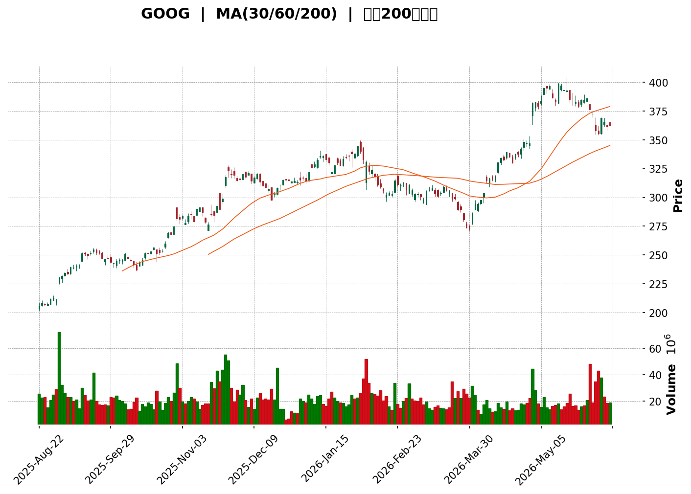
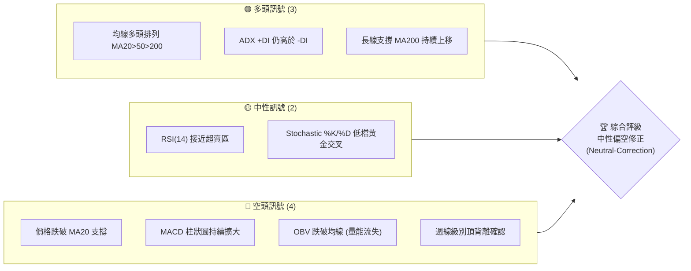
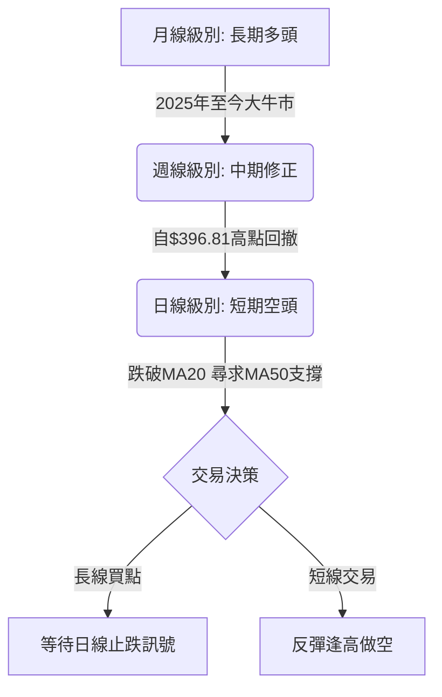

<details>
<summary>📊 靜態圖表 (點擊展開)</summary>

</details>

<html>
<head><meta charset="utf-8" /></head>
<body>
    <div style="height:500px; width:100%;">                        <script>window.PlotlyConfig = {MathJaxConfig: 'local'};</script>
        <script charset="utf-8" src="https://cdn.plot.ly/plotly-3.6.0.min.js" integrity="sha256-QaOVwtVY0T02VaHrr6pnoHLCwayMJp4O5n4YyaE3rJk=" crossorigin="anonymous"></script>                <div id="candlestick-chart" class="plotly-graph-div" style="height:100%; width:100%;"></div>            <script>                window.PLOTLYENV=window.PLOTLYENV || {};                                if (document.getElementById("candlestick-chart")) {                    Plotly.newPlot(                        "candlestick-chart",                        [{"close":{"dtype":"f8","bdata":"AAAAQDTEaUAAAADADxJqQAAAAMBz62lAAAAAwL\u002fzaUAAAABAfXhqQAAAAOCAnWpAAAAAIF1sakAAAACgJM5sQAAAAKDr\u002f2xAAAAAAANQbUAAAABAdjZtQAAAAIAP721AAAAAgOzibUAAAABA4wluQAAAAMAMHW5AAAAAYI9ob0AAAACgs11vQAAAAGCPK29AAAAAwMN6b0AAAADgs9dvQAAAAIBUjG9AAAAAYBV7b0AAAADgC+tuQAAAAEDOwm5AAAAAgEnWbkAAAABAOXxuQAAAAMBaYm5AAAAAwOihbkAAAABgVb5uQAAAAOD4vm5AAAAAYJNgb0AAAADAsNRuQAAAAMBan25AAAAAAI83bkAAAABg0KBtQAAAAIAqhW5AAAAAQKu2bkAAAACg9mZvQAAAAIBkbG9AAAAAoGSpb0AAAACARghwQAAAAIAlW29AAAAA4CaBb0AAAAAAeqdvQAAAAKABQHBAAAAAYG7WcEAAAABger5wQAAAAKAbKnFAAAAAoJOVcUAAAADATJRxQAAAAAAHuXFAAAAAwEFYcUAAAABgFsNxQAAAAGCCzHFAAAAAIHJycUAAAABgWCByQAAAAGC1MnJAAAAAIOLtcUAAAAAAL2lxQAAAAMACR3FAAAAAQKnQcUAAAADgcMZxQAAAAECrRnJAAAAAwJoWckAAAABgBbFyQAAAAGCN3XNAAAAAQBwwdEAAAACgdPpzQAAAAIDm93NAAAAAgA6oc0AAAADAbbZzQAAAAIDi\u002f3NAAAAAYEbcc0AAAADAWxd0QAAAAICioHNAAAAAYF3Vc0AAAAAgTAl0QAAAAGCmlHNAAAAAANZhc0AAAABgqU5zQAAAACBBNXNAAAAAgLyackAAAABAqPVyQAAAAOBQQ3NAAAAAYMduc0AAAADASbRzQAAAAOAgtHNAAAAAgMioc0AAAAAArZ9zQAAAAGA7onNAAAAAYD+Wc0AAAAAgia5zQAAAAIB+znNAAAAAYDuic0AAAADAJSB0QAAAAGBaWXRAAAAAIF6LdEAAAACAu8R0QAAAAODa\u002f3RAAAAAIPD9dEAAAACAmst0QAAAAMCKnnRAAAAAYNUbdEAAAAAgOX90QAAAACCIpnRAAAAAoAWAdEAAAABgedJ0QAAAAEAB6XRAAAAAQHX9dEAAAAAAfSN1QAAAAEBpIXVAAAAAwDKHdUAAAAAAFkR1QAAAAMB6znRAAAAAgFyudEAAAACA2ip0QAAAAECgP3RAAAAAQG3jc0AAAABgx25zQAAAAOB1T3NAAAAAIO4Zc0AAAAAgzOZyQAAAAKCx+HJAAAAAIJ\u002fyckAAAAAg06dzQAAAACCIdHNAAAAAYDpoc0AAAACA8YlzQAAAAID8K3NAAAAAgGBwc0AAAADgXB9zQAAAACCf8nJAAAAAIN3wckAAAADgRshyQAAAAECSnnJAAAAAIDcdc0AAAAAg7StzQAAAAIDAQ3NAAAAAIHHwckAAAACAddRyQAAAAGDKA3NAAAAAIJVTc0AAAAAg2iFzQAAAAOC8GHNAAAAAwMOpckAAAABAca1yQAAAAMBqEHJAAAAAIKcWckAAAABgI4lxQAAAAICGGXFAAAAAoJwPcUAAAADA\u002f+pxQAAAAOCPa3JAAAAAoIZkckAAAAAAspdyQAAAAID0+3JAAAAAoM+oc0AAAAAg4MJzQAAAAEB7uHNAAAAAwEnwc0AAAABAGaZ0QAAAACBN5HRAAAAAAB7JdEAAAABAIjN1QAAAACAs83RAAAAAAFekdEAAAAAgbhh1QAAAAOC\u002fGHVAAAAAYNNhdUAAAABA98R1QAAAAOCntHVAAAAAIJ6xdUAAAABAXdt3QAAAAADV73dAAAAAQJa2d0AAAAAgnwB4QAAAAABwrnhAAAAA4P6weEAAAACg+sx4QAAAAACZKHhAAAAAIG35d0AAAADAzOx4QAAAAODlznhAAAAAwFWReEAAAAAA+o14QAAAACCyCnhAAAAAILIKeEAAAABg1PN3QAAAAOBtsndAAAAAgLwJeEAAAACAkwl4QAAAAEA0HnhAAAAA4EGDd0AAAADAsUV3QAAAAIDKYnZAAAAAAHU3dkAAAAAgxBB3QAAAAOCj2HZAAAAAYLiSdkAAAADgo6R2QA=="},"high":{"dtype":"f8","bdata":"TXCGk0sUakDaVNE6pU9qQOJygtq5+2lAQ+LzJiUfakCHfSGjZolqQDGihCdC12pAlp7GCHV4akBcegKseuRsQEnWHy9uA21AOG9P+6RubUAtN3dN4L1tQGDkfdXRA25A+gnM\u002fWczbkAz\u002f6pQDkNuQB\u002fNDElcPm5AARmOoi2Ib0DAFK0egpdvQK6X79igbm9A1zyZPpK0b0AXizZtKgNwQJZBdQjg+W9An83SDrHIb0CSJIqq4o5vQIc0wk+Z2m5AeWMd4y40b0A6pK+1+2RvQAWqM79YZm5ANan4ElTVbkBJsH5w0eRuQADlgGtO1G5ABhdM0Zx2b0BsCXCL2mFvQF4yfWfX2G5A+BmshWOibkAtOZ23jYtuQIHEICRYkG5Ar5QGGEbxbkC2JG1Mf4hvQLVs17M3EXBAYM1RiDTMb0BZ9u47AhZwQGTfKIIs3G9AF2O9jdQKcEAAL6bdgOtvQKs0hpnxX3BA5W1q51LkcECQ9bX8le1wQCMgGvfhNnFAHRo6Ir41ckCrQbyZmdtxQIPc0SoX1nFAgfKU4oWUcUDzGAUAOuJxQP6jcrLrA3JAJaAjahi\u002fcUCKYYvnPC5yQP+cPDFKPHJAmrox35s8ckBbF\u002f9SSa9xQOcKyZypaXFAqZ1KBxpfckBpxdWk5g1yQINq0QV6+nJAfqiKo6Ikc0C\u002f8iGX2PVyQPL661fK8nNA93kh0m6AdEAWTdcCq0V0QFHdqFXZY3RARqGyXBPwc0DTgtbToN9zQFZaO3+PFnRAIynWpHgndECI9sDOJDN0QAoFtiL5DHRAsg2RX7Dkc0CwY3r5Mhd0QDAwp88dGXRAueZUlaO7c0D6tOfOq4RzQI7yvyACd3NAUjSa+qlMc0Ddmo8tyQ1zQEGt\u002f1djSXNA\u002fdqgBbF0c0C1co3vMb5zQOmUhg8JvnNAFHF3klnCc0B+OlqG8ahzQNEUfQmR1HNAAL4voKevc0AOS4KH4Sd0QJ5w4W5V7XNAq2x25z4SdEAHSneOn2B0QHapJgm9oXRAIDTqPcKwdEA\u002fkPF7DuB0QE6lhGATTHVAJhbIZnEJdUDh5u4OBRt1QK+ac+7W7HRA3UGd7ZZ6dECVbAYGp8R0QNUQ6ENc7HRAVQusUIHZdECHvPmek\u002f50QLcfbbBgHHVAmKOLqAcTdUAKM1cYfl11QG9BgNeIPXVA8ENZ1W6LdUCiyOubFtt1QAc3Lc7PfHVA\u002fMbSuVvDdEDcPe0RVqN0QAlBRQX\u002fdHRAT7mfNl0TdEB49jQxBAp0QN5I+X4SwXNA9vu1aMpHc0Ax+nnP3wdzQCGHTDgsGHNAINgLDBcac0A0yrzOi8VzQB6YHP6b8HNAjobNv2V\u002fc0BKWdWhApRzQMtCjNp2iXNA\u002fEGEZsN6c0AU2CdczjtzQG8tAJix+HJA\u002f1tkQfsQc0DD6KjZle9yQHNIKUYCv3JA9A766gwlc0AA++\u002fHbE9zQPo4ODkcbnNAj3NUH0VHc0DPXEoWNDFzQP6usOotFnNAl2Fh7NBdc0C3XV5pAmlzQJdJ0qjtJ3NAx1+uoP0Cc0A1vK4oAPNyQDpzbqm9jnJAIbskYrlnckD9hdSle+VxQGMBJ\u002f7AbnFAO0pfcIBBcUDicCmICe5xQMz9ZGbknHJA+Tq7U417ckCazX997aNyQJMBx3Ss\u002fnJAMIliqyrzc0CRIIJD09NzQKp+0c\u002fs9HNAFDRBVc7zc0AZsiT6Dqd0QCZZvbHG7HRAtyxTRNUSdUAF2xDvfDx1QB\u002f6v9xLL3VAN7aIvnkPdUB7d88iOh11QGF3+U9JP3VAUtjuf7t3dUC6iPTiBet1QPVYU1YI23VA5dYvv\u002f8SdkB6x83MZeZ3QHTdxfSM8ndA6ZHQ0C7\u002fd0AQGOjRnUt4QOY17\u002fFDwnhAxYbqL9vReEApNYkfFuJ4QHsA6B98oXhAEW+JK1IjeEDFwKzuB\u002ft4QFtbOrzS7XhA0LhtMUW6eEAtlzGjoEN5QJWnecYFknhAEcL+tXBneECB1QmqI0d4QFQ0n1k3CnhAVPcZBYgSeEBE5pxw2Vd4QOSk8DA\u002fXHhAZ3zVI7rWd0COagfG\u002fmV3QDYhqckUGXdA2kHD8oKkdkAquORLMxp3QFVYXKalD3dAAAAAgBS2dkAAAABAExt3QA=="},"hovertemplate":"\u003cb\u003e%{x|%Y-%m-%d}\u003c\u002fb\u003e\u003cbr\u003e\u958b: $%{open:.2f}\u003cbr\u003e\u9ad8: $%{high:.2f}\u003cbr\u003e\u4f4e: $%{low:.2f}\u003cbr\u003e\u6536: $%{close:.2f}\u003cextra\u003e\u003c\u002fextra\u003e","low":{"dtype":"f8","bdata":"i7o9Eb4xaUCZefBAoqtpQDo+J72Wu2lAhjjps6y5aUBBltLDSOBpQHICJBfRS2pA+fQmtdzLaUAiDUjdUw9sQDyZR2CoQ2xAPg15dPz2bEA03hqEuihtQNPYdh+NHW1AvOuLXJ20bUBz3hEuwINtQMZ9WOcRwW1A97CVRgaQbkAuC5eSPydvQJgm9uYfw25AMWxqE90zb0CMkvSUZXJvQPYHNCw4Sm9AEBYpaClTb0D9VHuGkNduQA0CsFesJW5AHzk8hwrFbkDhac4WLVduQPJsaING421AcO3WGW3XbUD8RsJIJFRuQGy5G4jcP25Astg+RLOmbkDfl8tgeMpuQK3o+o2Jk25AQIwFq8HmbUAe2nCmGodtQEwvafbtCG5AYVaNMZkWbkByY1m41MluQJ0sFYS\u002fRW9ACkyMlFEDb0APyb9HQ8NvQLdQLsMfhm5AtlcKEcE+b0CTbJHKwIhvQPfg7isr829APJ\u002fBW7+GcEDqr5CYW6pwQJ2X0YB6vnBArLA8Hmx+cUCGWq2trk9xQCUW9gslfXFAKWs\u002fkyxFcUCxqSPsYVVxQAoNWA4bkXFAqKLmmjUzcUC8n0wcxK9xQC6tzM0R9XFA\u002fadi0C29cUD262J5TFdxQFe2kqEQ7nBAQtsjusi6cUAPRKVsbWdxQO6vHUG38XFAqxpnfasJckC1ihzji1xyQMgpd0y3THNAeYqWyhvTc0BIOq+tRclzQMIj5roexXNAbdRtQtqVc0C4Fihsr5lzQLORw6ykmnNAIDB074+vc0Bi1zcoqvVzQOspkzMMeHNAtdaGTGSDc0DyUS5v0K9zQKqEdAucV3NAO7OkR\u002fMoc0C6E8nCdBVzQH9PE3nv9nJA67i3Qv2QckDUrbFtzcNyQNtC5YMg33JAFZmRtgkjc0CMppHagmVzQJ5iBtCTjnNAvFreIPiUc0CRe1Ev43dzQAol6ZJ1jXNAT29tba58c0CvJvu26WNzQFsiGrJmrXNA5DgqEOt+c0DqhXjjbqFzQLhX\u002ftwdGXRAYvy8EjBddEBrBUr4XFF0QCbRVV6e3nRAX1JhglOrdEDEBPL+uK10QE2QlBnee3RApYDOSYoHdECFATbB9\u002fFzQLd0I3o2h3RAi6t59at4dECMEsBbAHF0QKwxke4H1XRAXpUtDyW7dEAzweKTsmR0QMDFMVxLw3RAAxY75ST5dECB44GnXiJ1QIc4wtgKj3RAIBjKu08oc0D+kOwEt\u002ftzQCpH0PCQ1HNAzV3IWP2jc0DryiWqmltzQO0UZUX3O3NAfyL29A34ckAEu7tkM4hyQKgCAfpf2XJAwLaoMnHEckDUauYkXQBzQOjfW\u002fZdWXNARjmJcQwbc0DpKnG+TE9zQJHhctY+4HJAHGVB5x3zckBlr6h0rMpyQHDklyz9hHJAKYp+yoTGckCdOlpu5ZpyQEP8lc3VbXJA4NyHIg1cckCX5KmdBRJzQCWNRxt\u002fGnNADm68dovKckDAbXdjmLlyQPQdKC4O2nJAO\u002fEx16sCc0Am7ymcxxVzQMjMV2cazXJAnSSk5iSJckCOjFWwnJ1yQFwYmHnmCnJAeF0+eCfzcUBIGdhJHW5xQPxnm1AMFXFAFZ8zdPL1cEBGtz4if0lxQFXXhQC8FHJAxbTLOVr2cUBkDe8I0FlyQAJY3fP0c3JA+qloQ0WIc0BZOYK\u002filRzQIiTQ+icpXNAWS04eQWYc0CYaAQ7Tw90QMTaQbBlh3RApxpqQjW3dEBD\u002f1vNbtF0QGDzlyXc5nRABbPBceiWdEC2xD\u002fgJ8x0QFn9n0C87XRAo+D3v5XddEBi6Jwerkl1QGI62q4qgXVA7mmzpZVjdUDyRgQR8q12QKFOWXyMcHdAihgDsrGId0D\u002fl2yI8MF3QIWP2+7fLXhA9t0jKzRheEC3npWT7pZ4QPd6kJT2H3hA3Z3smd23d0CuaUaEm9V3QPDxllHeh3hAapJDxWhYeEBTqNlRo2p4QLXmTW5Q7HdAa6te0le8d0AmjIA0B7R3QMY5WSKFoHdAotj\u002fapeud0Bm6u3YUtx3QO+Gbr9U0HdAbJ5bnzJhd0CgAQdSzRd3QImzMFqVLHZAiBfgc6sidkBM6yCmYil2QJRs1IyZlnZAAAAAgD1edkAAAAAghSt2QA=="},"name":"\u50f9\u683c","open":{"dtype":"f8","bdata":"G6ZawSJsaUChbrhiI81pQBENApTa+GlAzVTfkei7aUA1tLoq8edpQOKvqLdjVWpA74zOGqMMakAgTB5EuTpsQLS+yw79r2xAahR1rOv\u002fbEAIOPoAhWptQPhFkKRrN21AeDrA9wXZbUBfqoihcvVtQLGZe6uGCm5AJp8tdiKVbkAAWc7Kw3pvQDUTFrP6Xm9AUogmCMFrb0CXVYT875xvQFjVRs0CyW9A+kYqzRSlb0C2dI4FBHVvQK2lIrmNi25AiUYKDpzpbkCpYhsjQvluQG0BMXq0Um5AHNnnfqkWbkDIDPBoGqVuQCnhGy0CmG5ATCsKE5OpbkAZ4L5nLQ5vQLg7KuT8tm5AO7JRdJSSbkDN5+8p9jVuQEUCvTnfEW5AY3tj0gYpbkB14o63MPNuQCXXDmATf29A+FnXWXdbb0D320YPYtdvQN3FfpcF2G9A3CXcQVvQb0Be8BG7hKZvQCvHhBi\u002fDHBA2VtDPnSNcEC3kDMxvtpwQDFGoE9awXBAL2n3sGMyckBjGDyHaqpxQIQh\u002fH7hnXFAT3v5OF5IcUALNUDnVW1xQJzBzxXR0nFAxCUD3Xa6cUCsUB\u002fqT8txQGBVYv0t+nFArMhIszc4ckCle\u002fMH56ZxQP0SvT7P9XBAur0Pl2\u002fdcUCzyIEBu\u002f5xQKPZYIL08XFAF06AXU0Cc0Aad3bGoIRyQNw3\u002fQVtZnNA3FoNLpJidEDmu2WecAJ0QKlVbrrBLHRA3Uk1wanNc0BjZOwye8RzQEprHqeWtnNA4KmS85smdEAr8Tbf+\u002fVzQE\u002fkZPTGCXRAUfSe2w+Lc0Baz7MJT8NzQLBBizHlCnRAaZ7ipSWmc0BtrIz1eINzQO\u002fdeD+cGXNAbdbBN7VJc0DdmkOwoepyQLSJScv87XJAZdOp7xltc0CSY7HLqWtzQE1jI0\u002fMu3NAGkBBnh+4c0AWrmGkloZzQL729RcEkHNA5VdobGCPc0DqtHzdztJzQLDC03581HNA0dYvn1XOc0DnEqxDjaJzQLUv2nldjXRAsuDqcQBxdEA8uIatLmF0QPtesqV67XRAetQW9cPodEAg6ZQ10hl1QGYI1E\u002f353RAta7p6iENdEDurkKx0Ap0QEToDbFC3XRAS2tKqojDdEDsCBnQWHx0QFcS3mES83RAo6BrHLsCdUBRlDs3fj51QDsQokFg4HRAJmxQwsUBdUAbFlp59sB1QN3SjfPmdHVAglnvCamMc0DM0R3Iw250QAaZacQhDXRAMXXq79sHdEAfEoMWs+hzQGBwSRIUf3NAvc0iP1Q5c0CaBQaH9sNyQL4Ege+Y4HJAUT8mzwDickDJkPB8bwZzQPB7IY2T63NAVJIo\u002f8Bjc0Aj3Vj9ZntzQGHyZyVZhnNAJAyribH4ckD7es0lHelyQLUPkDl9oHJAAW\u002fntqPkckDGPkWC3uxyQNwzx0j4enJAd207YVRfckC2Dld5DhtzQBzWJhnaIXNAcNbsu2kgc0DsSNVzhydzQJdPL6Wt9nJAWitgzckHc0CMaLdLhDtzQD9kcRVx8HJA5XTinTH+ckBpmLeHlsVyQOi5xFqCgHJAaZ1OkZY\u002fckDBvs4ySeBxQDO4G+i6U3FAXraCtWM0cUAd+UgW+FVxQOQ+4L7jHHJA+3sn+g4NckAn5PYqXWhyQPA3OxZav3JAMhU+ozjac0BOnnm1BpBzQBzFAJSJ4HNAiQ0tVq+zc0Bnw\u002ffZ8B10QGpr92HHpXRAPklXKV76dEByBmleqeN0QLPMJLezJXVAuA4nZiH2dECHvjgC8Op0QAv476DuNXVA1dZCFUUYdUCiAGROxXp1QKgPzK1hq3VADNEgAluUdUBlSDXTgTB3QKKj2egKnHdAmI7V5XDhd0BpWrupPtp3QCPOacywVXhAfXP6iSPNeECbjjWZhqB4QA5VpbdHZ3hAV5zDd0sMeEDiD0n3zdp3QAnJxrPZmHhAKco64qePeEAC7jvtOX54QBdvOM4DkXhAUsKxR+8MeEA\u002ffNLYe9x3QAs8\u002ftB48HdAQ3AO2UDMd0B1VGt2juh3QImOWtEQ+ndAidPdb+7Pd0BHHyNjnUV3QKZ8ap8Qr3ZAdxuMVelhdkDJz3mSnjN2QIzzFj2VsnZAAAAAgMKndkAAAAAAANB2QA=="},"x":["2025-08-22T00:00:00-04:00","2025-08-25T00:00:00-04:00","2025-08-26T00:00:00-04:00","2025-08-27T00:00:00-04:00","2025-08-28T00:00:00-04:00","2025-08-29T00:00:00-04:00","2025-09-02T00:00:00-04:00","2025-09-03T00:00:00-04:00","2025-09-04T00:00:00-04:00","2025-09-05T00:00:00-04:00","2025-09-08T00:00:00-04:00","2025-09-09T00:00:00-04:00","2025-09-10T00:00:00-04:00","2025-09-11T00:00:00-04:00","2025-09-12T00:00:00-04:00","2025-09-15T00:00:00-04:00","2025-09-16T00:00:00-04:00","2025-09-17T00:00:00-04:00","2025-09-18T00:00:00-04:00","2025-09-19T00:00:00-04:00","2025-09-22T00:00:00-04:00","2025-09-23T00:00:00-04:00","2025-09-24T00:00:00-04:00","2025-09-25T00:00:00-04:00","2025-09-26T00:00:00-04:00","2025-09-29T00:00:00-04:00","2025-09-30T00:00:00-04:00","2025-10-01T00:00:00-04:00","2025-10-02T00:00:00-04:00","2025-10-03T00:00:00-04:00","2025-10-06T00:00:00-04:00","2025-10-07T00:00:00-04:00","2025-10-08T00:00:00-04:00","2025-10-09T00:00:00-04:00","2025-10-10T00:00:00-04:00","2025-10-13T00:00:00-04:00","2025-10-14T00:00:00-04:00","2025-10-15T00:00:00-04:00","2025-10-16T00:00:00-04:00","2025-10-17T00:00:00-04:00","2025-10-20T00:00:00-04:00","2025-10-21T00:00:00-04:00","2025-10-22T00:00:00-04:00","2025-10-23T00:00:00-04:00","2025-10-24T00:00:00-04:00","2025-10-27T00:00:00-04:00","2025-10-28T00:00:00-04:00","2025-10-29T00:00:00-04:00","2025-10-30T00:00:00-04:00","2025-10-31T00:00:00-04:00","2025-11-03T00:00:00-05:00","2025-11-04T00:00:00-05:00","2025-11-05T00:00:00-05:00","2025-11-06T00:00:00-05:00","2025-11-07T00:00:00-05:00","2025-11-10T00:00:00-05:00","2025-11-11T00:00:00-05:00","2025-11-12T00:00:00-05:00","2025-11-13T00:00:00-05:00","2025-11-14T00:00:00-05:00","2025-11-17T00:00:00-05:00","2025-11-18T00:00:00-05:00","2025-11-19T00:00:00-05:00","2025-11-20T00:00:00-05:00","2025-11-21T00:00:00-05:00","2025-11-24T00:00:00-05:00","2025-11-25T00:00:00-05:00","2025-11-26T00:00:00-05:00","2025-11-28T00:00:00-05:00","2025-12-01T00:00:00-05:00","2025-12-02T00:00:00-05:00","2025-12-03T00:00:00-05:00","2025-12-04T00:00:00-05:00","2025-12-05T00:00:00-05:00","2025-12-08T00:00:00-05:00","2025-12-09T00:00:00-05:00","2025-12-10T00:00:00-05:00","2025-12-11T00:00:00-05:00","2025-12-12T00:00:00-05:00","2025-12-15T00:00:00-05:00","2025-12-16T00:00:00-05:00","2025-12-17T00:00:00-05:00","2025-12-18T00:00:00-05:00","2025-12-19T00:00:00-05:00","2025-12-22T00:00:00-05:00","2025-12-23T00:00:00-05:00","2025-12-24T00:00:00-05:00","2025-12-26T00:00:00-05:00","2025-12-29T00:00:00-05:00","2025-12-30T00:00:00-05:00","2025-12-31T00:00:00-05:00","2026-01-02T00:00:00-05:00","2026-01-05T00:00:00-05:00","2026-01-06T00:00:00-05:00","2026-01-07T00:00:00-05:00","2026-01-08T00:00:00-05:00","2026-01-09T00:00:00-05:00","2026-01-12T00:00:00-05:00","2026-01-13T00:00:00-05:00","2026-01-14T00:00:00-05:00","2026-01-15T00:00:00-05:00","2026-01-16T00:00:00-05:00","2026-01-20T00:00:00-05:00","2026-01-21T00:00:00-05:00","2026-01-22T00:00:00-05:00","2026-01-23T00:00:00-05:00","2026-01-26T00:00:00-05:00","2026-01-27T00:00:00-05:00","2026-01-28T00:00:00-05:00","2026-01-29T00:00:00-05:00","2026-01-30T00:00:00-05:00","2026-02-02T00:00:00-05:00","2026-02-03T00:00:00-05:00","2026-02-04T00:00:00-05:00","2026-02-05T00:00:00-05:00","2026-02-06T00:00:00-05:00","2026-02-09T00:00:00-05:00","2026-02-10T00:00:00-05:00","2026-02-11T00:00:00-05:00","2026-02-12T00:00:00-05:00","2026-02-13T00:00:00-05:00","2026-02-17T00:00:00-05:00","2026-02-18T00:00:00-05:00","2026-02-19T00:00:00-05:00","2026-02-20T00:00:00-05:00","2026-02-23T00:00:00-05:00","2026-02-24T00:00:00-05:00","2026-02-25T00:00:00-05:00","2026-02-26T00:00:00-05:00","2026-02-27T00:00:00-05:00","2026-03-02T00:00:00-05:00","2026-03-03T00:00:00-05:00","2026-03-04T00:00:00-05:00","2026-03-05T00:00:00-05:00","2026-03-06T00:00:00-05:00","2026-03-09T00:00:00-04:00","2026-03-10T00:00:00-04:00","2026-03-11T00:00:00-04:00","2026-03-12T00:00:00-04:00","2026-03-13T00:00:00-04:00","2026-03-16T00:00:00-04:00","2026-03-17T00:00:00-04:00","2026-03-18T00:00:00-04:00","2026-03-19T00:00:00-04:00","2026-03-20T00:00:00-04:00","2026-03-23T00:00:00-04:00","2026-03-24T00:00:00-04:00","2026-03-25T00:00:00-04:00","2026-03-26T00:00:00-04:00","2026-03-27T00:00:00-04:00","2026-03-30T00:00:00-04:00","2026-03-31T00:00:00-04:00","2026-04-01T00:00:00-04:00","2026-04-02T00:00:00-04:00","2026-04-06T00:00:00-04:00","2026-04-07T00:00:00-04:00","2026-04-08T00:00:00-04:00","2026-04-09T00:00:00-04:00","2026-04-10T00:00:00-04:00","2026-04-13T00:00:00-04:00","2026-04-14T00:00:00-04:00","2026-04-15T00:00:00-04:00","2026-04-16T00:00:00-04:00","2026-04-17T00:00:00-04:00","2026-04-20T00:00:00-04:00","2026-04-21T00:00:00-04:00","2026-04-22T00:00:00-04:00","2026-04-23T00:00:00-04:00","2026-04-24T00:00:00-04:00","2026-04-27T00:00:00-04:00","2026-04-28T00:00:00-04:00","2026-04-29T00:00:00-04:00","2026-04-30T00:00:00-04:00","2026-05-01T00:00:00-04:00","2026-05-04T00:00:00-04:00","2026-05-05T00:00:00-04:00","2026-05-06T00:00:00-04:00","2026-05-07T00:00:00-04:00","2026-05-08T00:00:00-04:00","2026-05-11T00:00:00-04:00","2026-05-12T00:00:00-04:00","2026-05-13T00:00:00-04:00","2026-05-14T00:00:00-04:00","2026-05-15T00:00:00-04:00","2026-05-18T00:00:00-04:00","2026-05-19T00:00:00-04:00","2026-05-20T00:00:00-04:00","2026-05-21T00:00:00-04:00","2026-05-22T00:00:00-04:00","2026-05-26T00:00:00-04:00","2026-05-27T00:00:00-04:00","2026-05-28T00:00:00-04:00","2026-05-29T00:00:00-04:00","2026-06-01T00:00:00-04:00","2026-06-02T00:00:00-04:00","2026-06-03T00:00:00-04:00","2026-06-04T00:00:00-04:00","2026-06-05T00:00:00-04:00","2026-06-08T00:00:00-04:00","2026-06-09T00:00:00-04:00"],"type":"candlestick"},{"hovertemplate":"MA30: $%{y:.2f}\u003cextra\u003e\u003c\u002fextra\u003e","line":{"color":"#2196F3","dash":"dash","width":2},"mode":"lines","name":"MA30","x":["2025-08-22T00:00:00-04:00","2025-08-25T00:00:00-04:00","2025-08-26T00:00:00-04:00","2025-08-27T00:00:00-04:00","2025-08-28T00:00:00-04:00","2025-08-29T00:00:00-04:00","2025-09-02T00:00:00-04:00","2025-09-03T00:00:00-04:00","2025-09-04T00:00:00-04:00","2025-09-05T00:00:00-04:00","2025-09-08T00:00:00-04:00","2025-09-09T00:00:00-04:00","2025-09-10T00:00:00-04:00","2025-09-11T00:00:00-04:00","2025-09-12T00:00:00-04:00","2025-09-15T00:00:00-04:00","2025-09-16T00:00:00-04:00","2025-09-17T00:00:00-04:00","2025-09-18T00:00:00-04:00","2025-09-19T00:00:00-04:00","2025-09-22T00:00:00-04:00","2025-09-23T00:00:00-04:00","2025-09-24T00:00:00-04:00","2025-09-25T00:00:00-04:00","2025-09-26T00:00:00-04:00","2025-09-29T00:00:00-04:00","2025-09-30T00:00:00-04:00","2025-10-01T00:00:00-04:00","2025-10-02T00:00:00-04:00","2025-10-03T00:00:00-04:00","2025-10-06T00:00:00-04:00","2025-10-07T00:00:00-04:00","2025-10-08T00:00:00-04:00","2025-10-09T00:00:00-04:00","2025-10-10T00:00:00-04:00","2025-10-13T00:00:00-04:00","2025-10-14T00:00:00-04:00","2025-10-15T00:00:00-04:00","2025-10-16T00:00:00-04:00","2025-10-17T00:00:00-04:00","2025-10-20T00:00:00-04:00","2025-10-21T00:00:00-04:00","2025-10-22T00:00:00-04:00","2025-10-23T00:00:00-04:00","2025-10-24T00:00:00-04:00","2025-10-27T00:00:00-04:00","2025-10-28T00:00:00-04:00","2025-10-29T00:00:00-04:00","2025-10-30T00:00:00-04:00","2025-10-31T00:00:00-04:00","2025-11-03T00:00:00-05:00","2025-11-04T00:00:00-05:00","2025-11-05T00:00:00-05:00","2025-11-06T00:00:00-05:00","2025-11-07T00:00:00-05:00","2025-11-10T00:00:00-05:00","2025-11-11T00:00:00-05:00","2025-11-12T00:00:00-05:00","2025-11-13T00:00:00-05:00","2025-11-14T00:00:00-05:00","2025-11-17T00:00:00-05:00","2025-11-18T00:00:00-05:00","2025-11-19T00:00:00-05:00","2025-11-20T00:00:00-05:00","2025-11-21T00:00:00-05:00","2025-11-24T00:00:00-05:00","2025-11-25T00:00:00-05:00","2025-11-26T00:00:00-05:00","2025-11-28T00:00:00-05:00","2025-12-01T00:00:00-05:00","2025-12-02T00:00:00-05:00","2025-12-03T00:00:00-05:00","2025-12-04T00:00:00-05:00","2025-12-05T00:00:00-05:00","2025-12-08T00:00:00-05:00","2025-12-09T00:00:00-05:00","2025-12-10T00:00:00-05:00","2025-12-11T00:00:00-05:00","2025-12-12T00:00:00-05:00","2025-12-15T00:00:00-05:00","2025-12-16T00:00:00-05:00","2025-12-17T00:00:00-05:00","2025-12-18T00:00:00-05:00","2025-12-19T00:00:00-05:00","2025-12-22T00:00:00-05:00","2025-12-23T00:00:00-05:00","2025-12-24T00:00:00-05:00","2025-12-26T00:00:00-05:00","2025-12-29T00:00:00-05:00","2025-12-30T00:00:00-05:00","2025-12-31T00:00:00-05:00","2026-01-02T00:00:00-05:00","2026-01-05T00:00:00-05:00","2026-01-06T00:00:00-05:00","2026-01-07T00:00:00-05:00","2026-01-08T00:00:00-05:00","2026-01-09T00:00:00-05:00","2026-01-12T00:00:00-05:00","2026-01-13T00:00:00-05:00","2026-01-14T00:00:00-05:00","2026-01-15T00:00:00-05:00","2026-01-16T00:00:00-05:00","2026-01-20T00:00:00-05:00","2026-01-21T00:00:00-05:00","2026-01-22T00:00:00-05:00","2026-01-23T00:00:00-05:00","2026-01-26T00:00:00-05:00","2026-01-27T00:00:00-05:00","2026-01-28T00:00:00-05:00","2026-01-29T00:00:00-05:00","2026-01-30T00:00:00-05:00","2026-02-02T00:00:00-05:00","2026-02-03T00:00:00-05:00","2026-02-04T00:00:00-05:00","2026-02-05T00:00:00-05:00","2026-02-06T00:00:00-05:00","2026-02-09T00:00:00-05:00","2026-02-10T00:00:00-05:00","2026-02-11T00:00:00-05:00","2026-02-12T00:00:00-05:00","2026-02-13T00:00:00-05:00","2026-02-17T00:00:00-05:00","2026-02-18T00:00:00-05:00","2026-02-19T00:00:00-05:00","2026-02-20T00:00:00-05:00","2026-02-23T00:00:00-05:00","2026-02-24T00:00:00-05:00","2026-02-25T00:00:00-05:00","2026-02-26T00:00:00-05:00","2026-02-27T00:00:00-05:00","2026-03-02T00:00:00-05:00","2026-03-03T00:00:00-05:00","2026-03-04T00:00:00-05:00","2026-03-05T00:00:00-05:00","2026-03-06T00:00:00-05:00","2026-03-09T00:00:00-04:00","2026-03-10T00:00:00-04:00","2026-03-11T00:00:00-04:00","2026-03-12T00:00:00-04:00","2026-03-13T00:00:00-04:00","2026-03-16T00:00:00-04:00","2026-03-17T00:00:00-04:00","2026-03-18T00:00:00-04:00","2026-03-19T00:00:00-04:00","2026-03-20T00:00:00-04:00","2026-03-23T00:00:00-04:00","2026-03-24T00:00:00-04:00","2026-03-25T00:00:00-04:00","2026-03-26T00:00:00-04:00","2026-03-27T00:00:00-04:00","2026-03-30T00:00:00-04:00","2026-03-31T00:00:00-04:00","2026-04-01T00:00:00-04:00","2026-04-02T00:00:00-04:00","2026-04-06T00:00:00-04:00","2026-04-07T00:00:00-04:00","2026-04-08T00:00:00-04:00","2026-04-09T00:00:00-04:00","2026-04-10T00:00:00-04:00","2026-04-13T00:00:00-04:00","2026-04-14T00:00:00-04:00","2026-04-15T00:00:00-04:00","2026-04-16T00:00:00-04:00","2026-04-17T00:00:00-04:00","2026-04-20T00:00:00-04:00","2026-04-21T00:00:00-04:00","2026-04-22T00:00:00-04:00","2026-04-23T00:00:00-04:00","2026-04-24T00:00:00-04:00","2026-04-27T00:00:00-04:00","2026-04-28T00:00:00-04:00","2026-04-29T00:00:00-04:00","2026-04-30T00:00:00-04:00","2026-05-01T00:00:00-04:00","2026-05-04T00:00:00-04:00","2026-05-05T00:00:00-04:00","2026-05-06T00:00:00-04:00","2026-05-07T00:00:00-04:00","2026-05-08T00:00:00-04:00","2026-05-11T00:00:00-04:00","2026-05-12T00:00:00-04:00","2026-05-13T00:00:00-04:00","2026-05-14T00:00:00-04:00","2026-05-15T00:00:00-04:00","2026-05-18T00:00:00-04:00","2026-05-19T00:00:00-04:00","2026-05-20T00:00:00-04:00","2026-05-21T00:00:00-04:00","2026-05-22T00:00:00-04:00","2026-05-26T00:00:00-04:00","2026-05-27T00:00:00-04:00","2026-05-28T00:00:00-04:00","2026-05-29T00:00:00-04:00","2026-06-01T00:00:00-04:00","2026-06-02T00:00:00-04:00","2026-06-03T00:00:00-04:00","2026-06-04T00:00:00-04:00","2026-06-05T00:00:00-04:00","2026-06-08T00:00:00-04:00","2026-06-09T00:00:00-04:00"],"y":{"dtype":"f8","bdata":"AAAAAAAA+H8AAAAAAAD4fwAAAAAAAPh\u002fAAAAAAAA+H8AAAAAAAD4fwAAAAAAAPh\u002fAAAAAAAA+H8AAAAAAAD4fwAAAAAAAPh\u002fAAAAAAAA+H8AAAAAAAD4fwAAAAAAAPh\u002fAAAAAAAA+H8AAAAAAAD4fwAAAAAAAPh\u002fAAAAAAAA+H8AAAAAAAD4fwAAAAAAAPh\u002fAAAAAAAA+H8AAAAAAAD4fwAAAAAAAPh\u002fAAAAAAAA+H8AAAAAAAD4fwAAAAAAAPh\u002fAAAAAAAA+H8AAAAAAAD4fwAAAAAAAPh\u002fAAAAAAAA+H8AAAAAAAD4f+\u002fu7o7Dgm1AiYiImKSybUAAAACQQ9ttQM3MzNxkA25AMzMzo8knbkB3d3dXu0JuQLy7u8sNZG5AAAAAAKqIbkAiIiIi055uQERERNSBs25A3t3dnY3HbkBVVVW1499uQDMzM5MG7G5AIiIiUtX5bkDNzMycngdvQJqZmSn8G29AMzMzE1Qvb0CJiIjYb0FvQAAAAGBkXG9AiYiIKN97b0BEREQUK5hvQO\u002fu7v5suW9AiYiIiM7Ub0De3d1tHPxvQJqZmUGxEnBAq6qqogAkcEAiIiI6nDxwQM3MzORCVnBA3t3dFY9scEARERGh9X1wQO\u002fu7tY1jnBAiYiIKFugcEC8u7sbfrRwQGZmZtbKzXBAd3d3RzjncEDe3d2VTghxQHd3dx+bL3FAmpmZ8dRYcUCJiIi4VH1xQHd3d4enoXFAREREvEzCcUCamZlxtOFxQAAAAPiUBnJAd3d3d6MpckAAAACgBk5yQJqZmcnYanJAmpmZSWmEckCJiIhYgaByQCIiIpIftXJA3t3dHXfEckAAAADwNdNyQKuqqori33JA3t3dXaLqckDe3d1t2vRyQHd3d8dYAXNA3t3djUoSc0CJiIiIwR9zQDMzM3OaLHNAzczM3F07c0De3d3tP05zQKuqqmpbYnNAVVVVBXpxc0CJiIgYv4FzQLy7u6vOjnNAERERsf6bc0ARERGBO6hzQAAAAPBbrHNAq6qqqmavc0AzMzPDJLZzQM3MzCzxvnNAAAAAkFbKc0CamZnJk9NzQJqZmand2HNAd3d3B\u002fzac0B3d3dXct5zQCIiIjIt53NAiYiIeN3sc0De3d0tkvNzQKuqqorq\u002fnNAzczMDKMMdEBERES0Qxx0QBEREXGrLHRAERERUZ5FdEBERESkTFl0QERERLR4ZnRA7+7uzh9xdEARERGRE3V0QCIiIvK5eXRA7+7uXq57dEDe3d0dDXp0QM3MzMxKd3RAVVVV9SVzdEBmZmaGfWx0QImIiBhdZXRA3t3djYJfdEDNzMzMf1t0QBERETHfU3RAzczMzCpKdECamZmZrD90QO\u002fu7h4UMHRAmpmZmdMidEB3d3dHjRR0QBEREbFJBnRAvLu7e1L8c0Dv7u7OsO1zQAAAANBb3HNAERERIYjQc0AzMzNjcsJzQCIiIrJntHNA7+7ujueic0C8u7sbNI9zQHd3d0cmfXNAIiIiwlxqc0AAAACQJ1hzQKuqqiqQSXNAAAAA4Fc4c0CrqqoqoStzQAAAAED9GHNAAAAAUKEJc0De3d0tcflyQN7d3d2T5nJAAAAAwCrVckAiIiISxsxyQO\u002fu7r4RyHJAIiIiMlXDckBmZmYGQ7pyQKuqqho+tnJAZmZmNmW4ckCJiIgIS7pyQM3MzOz5vnJA7+7ubj3DckBmZma2Q9ByQERERJTa4HJAmpmZeZjwckAzMzNjOQVzQCIiImIcGXNAq6qq+iUmc0De3d2tkDZzQKuqqsoyRnNAZmZmZgtbc0CrqqrKIHRzQLy7uxsXi3NAvLu7m0qfc0B3d3fHm8dzQCIiImLp8HNAd3d3dwEcdEDe3d3tcUl0QCIiIpLpgXRARERE1EG6dECJiIh4QPh0QCIiItJ8NHVAzczMPHtvdUBmZmZWRqt1QERERDTJ4XVAZmZmxnoWdkCrqqoKW0l2QO\u002fu7n6DdHZAmpmZ6eiZdkCamZnJrL12QGZmZkab33ZAERERkZYCd0CrqqoKgR93QO\u002fu7r4IO3dAVVVVNU5Sd0CJiIio\u002fWN3QLy7u6s+cHdAq6qqmq59d0BVVVVFfo53QFVVVUVsnXdAmpmZCZand0CamZm5Cq93QA=="},"type":"scatter"},{"hovertemplate":"MA60: $%{y:.2f}\u003cextra\u003e\u003c\u002fextra\u003e","line":{"color":"#9C27B0","dash":"dash","width":2},"mode":"lines","name":"MA60","x":["2025-08-22T00:00:00-04:00","2025-08-25T00:00:00-04:00","2025-08-26T00:00:00-04:00","2025-08-27T00:00:00-04:00","2025-08-28T00:00:00-04:00","2025-08-29T00:00:00-04:00","2025-09-02T00:00:00-04:00","2025-09-03T00:00:00-04:00","2025-09-04T00:00:00-04:00","2025-09-05T00:00:00-04:00","2025-09-08T00:00:00-04:00","2025-09-09T00:00:00-04:00","2025-09-10T00:00:00-04:00","2025-09-11T00:00:00-04:00","2025-09-12T00:00:00-04:00","2025-09-15T00:00:00-04:00","2025-09-16T00:00:00-04:00","2025-09-17T00:00:00-04:00","2025-09-18T00:00:00-04:00","2025-09-19T00:00:00-04:00","2025-09-22T00:00:00-04:00","2025-09-23T00:00:00-04:00","2025-09-24T00:00:00-04:00","2025-09-25T00:00:00-04:00","2025-09-26T00:00:00-04:00","2025-09-29T00:00:00-04:00","2025-09-30T00:00:00-04:00","2025-10-01T00:00:00-04:00","2025-10-02T00:00:00-04:00","2025-10-03T00:00:00-04:00","2025-10-06T00:00:00-04:00","2025-10-07T00:00:00-04:00","2025-10-08T00:00:00-04:00","2025-10-09T00:00:00-04:00","2025-10-10T00:00:00-04:00","2025-10-13T00:00:00-04:00","2025-10-14T00:00:00-04:00","2025-10-15T00:00:00-04:00","2025-10-16T00:00:00-04:00","2025-10-17T00:00:00-04:00","2025-10-20T00:00:00-04:00","2025-10-21T00:00:00-04:00","2025-10-22T00:00:00-04:00","2025-10-23T00:00:00-04:00","2025-10-24T00:00:00-04:00","2025-10-27T00:00:00-04:00","2025-10-28T00:00:00-04:00","2025-10-29T00:00:00-04:00","2025-10-30T00:00:00-04:00","2025-10-31T00:00:00-04:00","2025-11-03T00:00:00-05:00","2025-11-04T00:00:00-05:00","2025-11-05T00:00:00-05:00","2025-11-06T00:00:00-05:00","2025-11-07T00:00:00-05:00","2025-11-10T00:00:00-05:00","2025-11-11T00:00:00-05:00","2025-11-12T00:00:00-05:00","2025-11-13T00:00:00-05:00","2025-11-14T00:00:00-05:00","2025-11-17T00:00:00-05:00","2025-11-18T00:00:00-05:00","2025-11-19T00:00:00-05:00","2025-11-20T00:00:00-05:00","2025-11-21T00:00:00-05:00","2025-11-24T00:00:00-05:00","2025-11-25T00:00:00-05:00","2025-11-26T00:00:00-05:00","2025-11-28T00:00:00-05:00","2025-12-01T00:00:00-05:00","2025-12-02T00:00:00-05:00","2025-12-03T00:00:00-05:00","2025-12-04T00:00:00-05:00","2025-12-05T00:00:00-05:00","2025-12-08T00:00:00-05:00","2025-12-09T00:00:00-05:00","2025-12-10T00:00:00-05:00","2025-12-11T00:00:00-05:00","2025-12-12T00:00:00-05:00","2025-12-15T00:00:00-05:00","2025-12-16T00:00:00-05:00","2025-12-17T00:00:00-05:00","2025-12-18T00:00:00-05:00","2025-12-19T00:00:00-05:00","2025-12-22T00:00:00-05:00","2025-12-23T00:00:00-05:00","2025-12-24T00:00:00-05:00","2025-12-26T00:00:00-05:00","2025-12-29T00:00:00-05:00","2025-12-30T00:00:00-05:00","2025-12-31T00:00:00-05:00","2026-01-02T00:00:00-05:00","2026-01-05T00:00:00-05:00","2026-01-06T00:00:00-05:00","2026-01-07T00:00:00-05:00","2026-01-08T00:00:00-05:00","2026-01-09T00:00:00-05:00","2026-01-12T00:00:00-05:00","2026-01-13T00:00:00-05:00","2026-01-14T00:00:00-05:00","2026-01-15T00:00:00-05:00","2026-01-16T00:00:00-05:00","2026-01-20T00:00:00-05:00","2026-01-21T00:00:00-05:00","2026-01-22T00:00:00-05:00","2026-01-23T00:00:00-05:00","2026-01-26T00:00:00-05:00","2026-01-27T00:00:00-05:00","2026-01-28T00:00:00-05:00","2026-01-29T00:00:00-05:00","2026-01-30T00:00:00-05:00","2026-02-02T00:00:00-05:00","2026-02-03T00:00:00-05:00","2026-02-04T00:00:00-05:00","2026-02-05T00:00:00-05:00","2026-02-06T00:00:00-05:00","2026-02-09T00:00:00-05:00","2026-02-10T00:00:00-05:00","2026-02-11T00:00:00-05:00","2026-02-12T00:00:00-05:00","2026-02-13T00:00:00-05:00","2026-02-17T00:00:00-05:00","2026-02-18T00:00:00-05:00","2026-02-19T00:00:00-05:00","2026-02-20T00:00:00-05:00","2026-02-23T00:00:00-05:00","2026-02-24T00:00:00-05:00","2026-02-25T00:00:00-05:00","2026-02-26T00:00:00-05:00","2026-02-27T00:00:00-05:00","2026-03-02T00:00:00-05:00","2026-03-03T00:00:00-05:00","2026-03-04T00:00:00-05:00","2026-03-05T00:00:00-05:00","2026-03-06T00:00:00-05:00","2026-03-09T00:00:00-04:00","2026-03-10T00:00:00-04:00","2026-03-11T00:00:00-04:00","2026-03-12T00:00:00-04:00","2026-03-13T00:00:00-04:00","2026-03-16T00:00:00-04:00","2026-03-17T00:00:00-04:00","2026-03-18T00:00:00-04:00","2026-03-19T00:00:00-04:00","2026-03-20T00:00:00-04:00","2026-03-23T00:00:00-04:00","2026-03-24T00:00:00-04:00","2026-03-25T00:00:00-04:00","2026-03-26T00:00:00-04:00","2026-03-27T00:00:00-04:00","2026-03-30T00:00:00-04:00","2026-03-31T00:00:00-04:00","2026-04-01T00:00:00-04:00","2026-04-02T00:00:00-04:00","2026-04-06T00:00:00-04:00","2026-04-07T00:00:00-04:00","2026-04-08T00:00:00-04:00","2026-04-09T00:00:00-04:00","2026-04-10T00:00:00-04:00","2026-04-13T00:00:00-04:00","2026-04-14T00:00:00-04:00","2026-04-15T00:00:00-04:00","2026-04-16T00:00:00-04:00","2026-04-17T00:00:00-04:00","2026-04-20T00:00:00-04:00","2026-04-21T00:00:00-04:00","2026-04-22T00:00:00-04:00","2026-04-23T00:00:00-04:00","2026-04-24T00:00:00-04:00","2026-04-27T00:00:00-04:00","2026-04-28T00:00:00-04:00","2026-04-29T00:00:00-04:00","2026-04-30T00:00:00-04:00","2026-05-01T00:00:00-04:00","2026-05-04T00:00:00-04:00","2026-05-05T00:00:00-04:00","2026-05-06T00:00:00-04:00","2026-05-07T00:00:00-04:00","2026-05-08T00:00:00-04:00","2026-05-11T00:00:00-04:00","2026-05-12T00:00:00-04:00","2026-05-13T00:00:00-04:00","2026-05-14T00:00:00-04:00","2026-05-15T00:00:00-04:00","2026-05-18T00:00:00-04:00","2026-05-19T00:00:00-04:00","2026-05-20T00:00:00-04:00","2026-05-21T00:00:00-04:00","2026-05-22T00:00:00-04:00","2026-05-26T00:00:00-04:00","2026-05-27T00:00:00-04:00","2026-05-28T00:00:00-04:00","2026-05-29T00:00:00-04:00","2026-06-01T00:00:00-04:00","2026-06-02T00:00:00-04:00","2026-06-03T00:00:00-04:00","2026-06-04T00:00:00-04:00","2026-06-05T00:00:00-04:00","2026-06-08T00:00:00-04:00","2026-06-09T00:00:00-04:00"],"y":{"dtype":"f8","bdata":"AAAAAAAA+H8AAAAAAAD4fwAAAAAAAPh\u002fAAAAAAAA+H8AAAAAAAD4fwAAAAAAAPh\u002fAAAAAAAA+H8AAAAAAAD4fwAAAAAAAPh\u002fAAAAAAAA+H8AAAAAAAD4fwAAAAAAAPh\u002fAAAAAAAA+H8AAAAAAAD4fwAAAAAAAPh\u002fAAAAAAAA+H8AAAAAAAD4fwAAAAAAAPh\u002fAAAAAAAA+H8AAAAAAAD4fwAAAAAAAPh\u002fAAAAAAAA+H8AAAAAAAD4fwAAAAAAAPh\u002fAAAAAAAA+H8AAAAAAAD4fwAAAAAAAPh\u002fAAAAAAAA+H8AAAAAAAD4fwAAAAAAAPh\u002fAAAAAAAA+H8AAAAAAAD4fwAAAAAAAPh\u002fAAAAAAAA+H8AAAAAAAD4fwAAAAAAAPh\u002fAAAAAAAA+H8AAAAAAAD4fwAAAAAAAPh\u002fAAAAAAAA+H8AAAAAAAD4fwAAAAAAAPh\u002fAAAAAAAA+H8AAAAAAAD4fwAAAAAAAPh\u002fAAAAAAAA+H8AAAAAAAD4fwAAAAAAAPh\u002fAAAAAAAA+H8AAAAAAAD4fwAAAAAAAPh\u002fAAAAAAAA+H8AAAAAAAD4fwAAAAAAAPh\u002fAAAAAAAA+H8AAAAAAAD4fwAAAAAAAPh\u002fAAAAAAAA+H8AAAAAAAD4f2ZmZp6XT29AzczMdK15b0C8u7vjH6JvQM3MzER9z29AERERGR37b0DNzMwg1hRwQKuqqgLRMHBAzczM+JROcEDNzMwkX2ZwQM3MzDi0fXBAmpmZxQmTcEAiIiIm06hwQM3MzCBMvnBAREREEEfTcEAzMzP36uhwQDMzM29r\u002fHBAmpmZqQkOcUBmZmainCBxQBEREeGoMXFAERERWTNBcUARERG9pU9xQBEREYVMXnFAERER0YRqcUBmZmZSdHlxQImIiAQFinFAREREmCWbcUBVVVXhLq5xQAAAAKxuwXFAVVVVefbTcUB3d3fHGuZxQM3MzKBI+HFA7+7uluoIckAiIiKaHhtyQBEREcFMLnJAREREfJtBckB3d3cLRVhyQLy7u4f7bXJAIiIizh2EckDe3d29vJlyQCIiIlpMsHJAIiIiplHGckCamZkdpNpyQM3MzFC573JAd3d3v08Cc0C8u7t7PBZzQN7d3f0CKXNAERERYaM4c0AzMzPDCUpzQGZmZg4FWnNAVVVVFY1oc0AiIiLSvHdzQN7d3f1GhnNAd3d3VyCYc0ARERGJE6dzQN7d3b3os3NAZmZmLrXBc0DNzMyMaspzQKuqqjIq03NA3t3dHYbbc0De3d2FJuRzQLy7uxvT7HNAVVVV\u002fU\u002fyc0B3d3dPHvdzQCIiIuIV+nNAd3d3n8D9c0Dv7u6m3QF0QImIiJAdAHRAvLu7u8j8c0BmZmau6PpzQN7d3aWC93NAzczMFJX2c0CJiIiIEPRzQFVVVa2T73NAmpmZQafrc0AzMzOTEeZzQBEREYHE4XNAzczMzLLec0CJiIhIAttzQGZmZh6p2XNA3t3dTcXXc0AAAADou9VzQERERNzo1HNAmpmZif3Xc0AiIiIauthzQHd3d28E2HNAd3d317vUc0De3d1dWtBzQBEREZlbyXNAd3d316fCc0De3d0lv7lzQFVVVVXvrnNAq6qqWiikc0BERETMoZxzQLy7u2u3lnNAAAAA4GuRc0CamZlp4YpzQN7d3aUOhXNAmpmZAUiBc0ARERHR+3xzQN7d3QWHd3NAREREhAhzc0Dv7u5+aHJzQKuqqiKSc3NAq6qqenV2c0AREREZdXlzQBERERm8enNA3t3dDVd7c0CJiIiIgXxzQGZmZj5NfXNAq6qqevl+c0AzMzNzqoFzQJqZmbEehHNA7+7urtOEc0C8u7ur4Y9zQGZmZsY8nXNAvLu7qyyqc0BERESMibpzQBEREWlzzXNAIiIikvHhc0AzMzPT2PhzQAAAAFiIDXRAZmZm\u002flIidEBEREQ0Bjx0QJqZmXntVHRARERE\u002fOdsdECJiIgIz4F0QM3MzMxglXRAAAAAECepdEARERHp+7t0QJqZmZlKz3RAAAAAAOridECJiIhg4vd0QJqZmanxDXVAd3d3V3MhdUDe3d2FmzR1QO\u002fu7oatRHVAq6qqSupRdUCamZl5h2J1QAAAAIjPcXVAAAAAuFCBdUAiIiLClZF1QA=="},"type":"scatter"},{"hovertemplate":"MA200: $%{y:.2f}\u003cextra\u003e\u003c\u002fextra\u003e","line":{"color":"#FF6F00","dash":"solid","width":2},"mode":"lines","name":"MA200","x":["2025-08-22T00:00:00-04:00","2025-08-25T00:00:00-04:00","2025-08-26T00:00:00-04:00","2025-08-27T00:00:00-04:00","2025-08-28T00:00:00-04:00","2025-08-29T00:00:00-04:00","2025-09-02T00:00:00-04:00","2025-09-03T00:00:00-04:00","2025-09-04T00:00:00-04:00","2025-09-05T00:00:00-04:00","2025-09-08T00:00:00-04:00","2025-09-09T00:00:00-04:00","2025-09-10T00:00:00-04:00","2025-09-11T00:00:00-04:00","2025-09-12T00:00:00-04:00","2025-09-15T00:00:00-04:00","2025-09-16T00:00:00-04:00","2025-09-17T00:00:00-04:00","2025-09-18T00:00:00-04:00","2025-09-19T00:00:00-04:00","2025-09-22T00:00:00-04:00","2025-09-23T00:00:00-04:00","2025-09-24T00:00:00-04:00","2025-09-25T00:00:00-04:00","2025-09-26T00:00:00-04:00","2025-09-29T00:00:00-04:00","2025-09-30T00:00:00-04:00","2025-10-01T00:00:00-04:00","2025-10-02T00:00:00-04:00","2025-10-03T00:00:00-04:00","2025-10-06T00:00:00-04:00","2025-10-07T00:00:00-04:00","2025-10-08T00:00:00-04:00","2025-10-09T00:00:00-04:00","2025-10-10T00:00:00-04:00","2025-10-13T00:00:00-04:00","2025-10-14T00:00:00-04:00","2025-10-15T00:00:00-04:00","2025-10-16T00:00:00-04:00","2025-10-17T00:00:00-04:00","2025-10-20T00:00:00-04:00","2025-10-21T00:00:00-04:00","2025-10-22T00:00:00-04:00","2025-10-23T00:00:00-04:00","2025-10-24T00:00:00-04:00","2025-10-27T00:00:00-04:00","2025-10-28T00:00:00-04:00","2025-10-29T00:00:00-04:00","2025-10-30T00:00:00-04:00","2025-10-31T00:00:00-04:00","2025-11-03T00:00:00-05:00","2025-11-04T00:00:00-05:00","2025-11-05T00:00:00-05:00","2025-11-06T00:00:00-05:00","2025-11-07T00:00:00-05:00","2025-11-10T00:00:00-05:00","2025-11-11T00:00:00-05:00","2025-11-12T00:00:00-05:00","2025-11-13T00:00:00-05:00","2025-11-14T00:00:00-05:00","2025-11-17T00:00:00-05:00","2025-11-18T00:00:00-05:00","2025-11-19T00:00:00-05:00","2025-11-20T00:00:00-05:00","2025-11-21T00:00:00-05:00","2025-11-24T00:00:00-05:00","2025-11-25T00:00:00-05:00","2025-11-26T00:00:00-05:00","2025-11-28T00:00:00-05:00","2025-12-01T00:00:00-05:00","2025-12-02T00:00:00-05:00","2025-12-03T00:00:00-05:00","2025-12-04T00:00:00-05:00","2025-12-05T00:00:00-05:00","2025-12-08T00:00:00-05:00","2025-12-09T00:00:00-05:00","2025-12-10T00:00:00-05:00","2025-12-11T00:00:00-05:00","2025-12-12T00:00:00-05:00","2025-12-15T00:00:00-05:00","2025-12-16T00:00:00-05:00","2025-12-17T00:00:00-05:00","2025-12-18T00:00:00-05:00","2025-12-19T00:00:00-05:00","2025-12-22T00:00:00-05:00","2025-12-23T00:00:00-05:00","2025-12-24T00:00:00-05:00","2025-12-26T00:00:00-05:00","2025-12-29T00:00:00-05:00","2025-12-30T00:00:00-05:00","2025-12-31T00:00:00-05:00","2026-01-02T00:00:00-05:00","2026-01-05T00:00:00-05:00","2026-01-06T00:00:00-05:00","2026-01-07T00:00:00-05:00","2026-01-08T00:00:00-05:00","2026-01-09T00:00:00-05:00","2026-01-12T00:00:00-05:00","2026-01-13T00:00:00-05:00","2026-01-14T00:00:00-05:00","2026-01-15T00:00:00-05:00","2026-01-16T00:00:00-05:00","2026-01-20T00:00:00-05:00","2026-01-21T00:00:00-05:00","2026-01-22T00:00:00-05:00","2026-01-23T00:00:00-05:00","2026-01-26T00:00:00-05:00","2026-01-27T00:00:00-05:00","2026-01-28T00:00:00-05:00","2026-01-29T00:00:00-05:00","2026-01-30T00:00:00-05:00","2026-02-02T00:00:00-05:00","2026-02-03T00:00:00-05:00","2026-02-04T00:00:00-05:00","2026-02-05T00:00:00-05:00","2026-02-06T00:00:00-05:00","2026-02-09T00:00:00-05:00","2026-02-10T00:00:00-05:00","2026-02-11T00:00:00-05:00","2026-02-12T00:00:00-05:00","2026-02-13T00:00:00-05:00","2026-02-17T00:00:00-05:00","2026-02-18T00:00:00-05:00","2026-02-19T00:00:00-05:00","2026-02-20T00:00:00-05:00","2026-02-23T00:00:00-05:00","2026-02-24T00:00:00-05:00","2026-02-25T00:00:00-05:00","2026-02-26T00:00:00-05:00","2026-02-27T00:00:00-05:00","2026-03-02T00:00:00-05:00","2026-03-03T00:00:00-05:00","2026-03-04T00:00:00-05:00","2026-03-05T00:00:00-05:00","2026-03-06T00:00:00-05:00","2026-03-09T00:00:00-04:00","2026-03-10T00:00:00-04:00","2026-03-11T00:00:00-04:00","2026-03-12T00:00:00-04:00","2026-03-13T00:00:00-04:00","2026-03-16T00:00:00-04:00","2026-03-17T00:00:00-04:00","2026-03-18T00:00:00-04:00","2026-03-19T00:00:00-04:00","2026-03-20T00:00:00-04:00","2026-03-23T00:00:00-04:00","2026-03-24T00:00:00-04:00","2026-03-25T00:00:00-04:00","2026-03-26T00:00:00-04:00","2026-03-27T00:00:00-04:00","2026-03-30T00:00:00-04:00","2026-03-31T00:00:00-04:00","2026-04-01T00:00:00-04:00","2026-04-02T00:00:00-04:00","2026-04-06T00:00:00-04:00","2026-04-07T00:00:00-04:00","2026-04-08T00:00:00-04:00","2026-04-09T00:00:00-04:00","2026-04-10T00:00:00-04:00","2026-04-13T00:00:00-04:00","2026-04-14T00:00:00-04:00","2026-04-15T00:00:00-04:00","2026-04-16T00:00:00-04:00","2026-04-17T00:00:00-04:00","2026-04-20T00:00:00-04:00","2026-04-21T00:00:00-04:00","2026-04-22T00:00:00-04:00","2026-04-23T00:00:00-04:00","2026-04-24T00:00:00-04:00","2026-04-27T00:00:00-04:00","2026-04-28T00:00:00-04:00","2026-04-29T00:00:00-04:00","2026-04-30T00:00:00-04:00","2026-05-01T00:00:00-04:00","2026-05-04T00:00:00-04:00","2026-05-05T00:00:00-04:00","2026-05-06T00:00:00-04:00","2026-05-07T00:00:00-04:00","2026-05-08T00:00:00-04:00","2026-05-11T00:00:00-04:00","2026-05-12T00:00:00-04:00","2026-05-13T00:00:00-04:00","2026-05-14T00:00:00-04:00","2026-05-15T00:00:00-04:00","2026-05-18T00:00:00-04:00","2026-05-19T00:00:00-04:00","2026-05-20T00:00:00-04:00","2026-05-21T00:00:00-04:00","2026-05-22T00:00:00-04:00","2026-05-26T00:00:00-04:00","2026-05-27T00:00:00-04:00","2026-05-28T00:00:00-04:00","2026-05-29T00:00:00-04:00","2026-06-01T00:00:00-04:00","2026-06-02T00:00:00-04:00","2026-06-03T00:00:00-04:00","2026-06-04T00:00:00-04:00","2026-06-05T00:00:00-04:00","2026-06-08T00:00:00-04:00","2026-06-09T00:00:00-04:00"],"y":{"dtype":"f8","bdata":"AAAAAAAA+H8AAAAAAAD4fwAAAAAAAPh\u002fAAAAAAAA+H8AAAAAAAD4fwAAAAAAAPh\u002fAAAAAAAA+H8AAAAAAAD4fwAAAAAAAPh\u002fAAAAAAAA+H8AAAAAAAD4fwAAAAAAAPh\u002fAAAAAAAA+H8AAAAAAAD4fwAAAAAAAPh\u002fAAAAAAAA+H8AAAAAAAD4fwAAAAAAAPh\u002fAAAAAAAA+H8AAAAAAAD4fwAAAAAAAPh\u002fAAAAAAAA+H8AAAAAAAD4fwAAAAAAAPh\u002fAAAAAAAA+H8AAAAAAAD4fwAAAAAAAPh\u002fAAAAAAAA+H8AAAAAAAD4fwAAAAAAAPh\u002fAAAAAAAA+H8AAAAAAAD4fwAAAAAAAPh\u002fAAAAAAAA+H8AAAAAAAD4fwAAAAAAAPh\u002fAAAAAAAA+H8AAAAAAAD4fwAAAAAAAPh\u002fAAAAAAAA+H8AAAAAAAD4fwAAAAAAAPh\u002fAAAAAAAA+H8AAAAAAAD4fwAAAAAAAPh\u002fAAAAAAAA+H8AAAAAAAD4fwAAAAAAAPh\u002fAAAAAAAA+H8AAAAAAAD4fwAAAAAAAPh\u002fAAAAAAAA+H8AAAAAAAD4fwAAAAAAAPh\u002fAAAAAAAA+H8AAAAAAAD4fwAAAAAAAPh\u002fAAAAAAAA+H8AAAAAAAD4fwAAAAAAAPh\u002fAAAAAAAA+H8AAAAAAAD4fwAAAAAAAPh\u002fAAAAAAAA+H8AAAAAAAD4fwAAAAAAAPh\u002fAAAAAAAA+H8AAAAAAAD4fwAAAAAAAPh\u002fAAAAAAAA+H8AAAAAAAD4fwAAAAAAAPh\u002fAAAAAAAA+H8AAAAAAAD4fwAAAAAAAPh\u002fAAAAAAAA+H8AAAAAAAD4fwAAAAAAAPh\u002fAAAAAAAA+H8AAAAAAAD4fwAAAAAAAPh\u002fAAAAAAAA+H8AAAAAAAD4fwAAAAAAAPh\u002fAAAAAAAA+H8AAAAAAAD4fwAAAAAAAPh\u002fAAAAAAAA+H8AAAAAAAD4fwAAAAAAAPh\u002fAAAAAAAA+H8AAAAAAAD4fwAAAAAAAPh\u002fAAAAAAAA+H8AAAAAAAD4fwAAAAAAAPh\u002fAAAAAAAA+H8AAAAAAAD4fwAAAAAAAPh\u002fAAAAAAAA+H8AAAAAAAD4fwAAAAAAAPh\u002fAAAAAAAA+H8AAAAAAAD4fwAAAAAAAPh\u002fAAAAAAAA+H8AAAAAAAD4fwAAAAAAAPh\u002fAAAAAAAA+H8AAAAAAAD4fwAAAAAAAPh\u002fAAAAAAAA+H8AAAAAAAD4fwAAAAAAAPh\u002fAAAAAAAA+H8AAAAAAAD4fwAAAAAAAPh\u002fAAAAAAAA+H8AAAAAAAD4fwAAAAAAAPh\u002fAAAAAAAA+H8AAAAAAAD4fwAAAAAAAPh\u002fAAAAAAAA+H8AAAAAAAD4fwAAAAAAAPh\u002fAAAAAAAA+H8AAAAAAAD4fwAAAAAAAPh\u002fAAAAAAAA+H8AAAAAAAD4fwAAAAAAAPh\u002fAAAAAAAA+H8AAAAAAAD4fwAAAAAAAPh\u002fAAAAAAAA+H8AAAAAAAD4fwAAAAAAAPh\u002fAAAAAAAA+H8AAAAAAAD4fwAAAAAAAPh\u002fAAAAAAAA+H8AAAAAAAD4fwAAAAAAAPh\u002fAAAAAAAA+H8AAAAAAAD4fwAAAAAAAPh\u002fAAAAAAAA+H8AAAAAAAD4fwAAAAAAAPh\u002fAAAAAAAA+H8AAAAAAAD4fwAAAAAAAPh\u002fAAAAAAAA+H8AAAAAAAD4fwAAAAAAAPh\u002fAAAAAAAA+H8AAAAAAAD4fwAAAAAAAPh\u002fAAAAAAAA+H8AAAAAAAD4fwAAAAAAAPh\u002fAAAAAAAA+H8AAAAAAAD4fwAAAAAAAPh\u002fAAAAAAAA+H8AAAAAAAD4fwAAAAAAAPh\u002fAAAAAAAA+H8AAAAAAAD4fwAAAAAAAPh\u002fAAAAAAAA+H8AAAAAAAD4fwAAAAAAAPh\u002fAAAAAAAA+H8AAAAAAAD4fwAAAAAAAPh\u002fAAAAAAAA+H8AAAAAAAD4fwAAAAAAAPh\u002fAAAAAAAA+H8AAAAAAAD4fwAAAAAAAPh\u002fAAAAAAAA+H8AAAAAAAD4fwAAAAAAAPh\u002fAAAAAAAA+H8AAAAAAAD4fwAAAAAAAPh\u002fAAAAAAAA+H8AAAAAAAD4fwAAAAAAAPh\u002fAAAAAAAA+H8AAAAAAAD4fwAAAAAAAPh\u002fAAAAAAAA+H8AAAAAAAD4fwAAAAAAAPh\u002fAAAAAAAA+H9xPQoRbw5zQA=="},"type":"scatter"}],                        {"template":{"data":{"barpolar":[{"marker":{"line":{"color":"rgb(17,17,17)","width":0.5},"pattern":{"fillmode":"overlay","size":10,"solidity":0.2}},"type":"barpolar"}],"bar":[{"error_x":{"color":"#f2f5fa"},"error_y":{"color":"#f2f5fa"},"marker":{"line":{"color":"rgb(17,17,17)","width":0.5},"pattern":{"fillmode":"overlay","size":10,"solidity":0.2}},"type":"bar"}],"carpet":[{"aaxis":{"endlinecolor":"#A2B1C6","gridcolor":"#506784","linecolor":"#506784","minorgridcolor":"#506784","startlinecolor":"#A2B1C6"},"baxis":{"endlinecolor":"#A2B1C6","gridcolor":"#506784","linecolor":"#506784","minorgridcolor":"#506784","startlinecolor":"#A2B1C6"},"type":"carpet"}],"choropleth":[{"colorbar":{"outlinewidth":0,"ticks":""},"type":"choropleth"}],"contourcarpet":[{"colorbar":{"outlinewidth":0,"ticks":""},"type":"contourcarpet"}],"contour":[{"colorbar":{"outlinewidth":0,"ticks":""},"colorscale":[[0.0,"#0d0887"],[0.1111111111111111,"#46039f"],[0.2222222222222222,"#7201a8"],[0.3333333333333333,"#9c179e"],[0.4444444444444444,"#bd3786"],[0.5555555555555556,"#d8576b"],[0.6666666666666666,"#ed7953"],[0.7777777777777778,"#fb9f3a"],[0.8888888888888888,"#fdca26"],[1.0,"#f0f921"]],"type":"contour"}],"heatmap":[{"colorbar":{"outlinewidth":0,"ticks":""},"colorscale":[[0.0,"#0d0887"],[0.1111111111111111,"#46039f"],[0.2222222222222222,"#7201a8"],[0.3333333333333333,"#9c179e"],[0.4444444444444444,"#bd3786"],[0.5555555555555556,"#d8576b"],[0.6666666666666666,"#ed7953"],[0.7777777777777778,"#fb9f3a"],[0.8888888888888888,"#fdca26"],[1.0,"#f0f921"]],"type":"heatmap"}],"histogram2dcontour":[{"colorbar":{"outlinewidth":0,"ticks":""},"colorscale":[[0.0,"#0d0887"],[0.1111111111111111,"#46039f"],[0.2222222222222222,"#7201a8"],[0.3333333333333333,"#9c179e"],[0.4444444444444444,"#bd3786"],[0.5555555555555556,"#d8576b"],[0.6666666666666666,"#ed7953"],[0.7777777777777778,"#fb9f3a"],[0.8888888888888888,"#fdca26"],[1.0,"#f0f921"]],"type":"histogram2dcontour"}],"histogram2d":[{"colorbar":{"outlinewidth":0,"ticks":""},"colorscale":[[0.0,"#0d0887"],[0.1111111111111111,"#46039f"],[0.2222222222222222,"#7201a8"],[0.3333333333333333,"#9c179e"],[0.4444444444444444,"#bd3786"],[0.5555555555555556,"#d8576b"],[0.6666666666666666,"#ed7953"],[0.7777777777777778,"#fb9f3a"],[0.8888888888888888,"#fdca26"],[1.0,"#f0f921"]],"type":"histogram2d"}],"histogram":[{"marker":{"pattern":{"fillmode":"overlay","size":10,"solidity":0.2}},"type":"histogram"}],"mesh3d":[{"colorbar":{"outlinewidth":0,"ticks":""},"type":"mesh3d"}],"parcoords":[{"line":{"colorbar":{"outlinewidth":0,"ticks":""}},"type":"parcoords"}],"pie":[{"automargin":true,"type":"pie"}],"scatter3d":[{"line":{"colorbar":{"outlinewidth":0,"ticks":""}},"marker":{"colorbar":{"outlinewidth":0,"ticks":""}},"type":"scatter3d"}],"scattercarpet":[{"marker":{"colorbar":{"outlinewidth":0,"ticks":""}},"type":"scattercarpet"}],"scattergeo":[{"marker":{"colorbar":{"outlinewidth":0,"ticks":""}},"type":"scattergeo"}],"scattergl":[{"marker":{"line":{"color":"#283442"}},"type":"scattergl"}],"scattermapbox":[{"marker":{"colorbar":{"outlinewidth":0,"ticks":""}},"type":"scattermapbox"}],"scattermap":[{"marker":{"colorbar":{"outlinewidth":0,"ticks":""}},"type":"scattermap"}],"scatterpolargl":[{"marker":{"colorbar":{"outlinewidth":0,"ticks":""}},"type":"scatterpolargl"}],"scatterpolar":[{"marker":{"colorbar":{"outlinewidth":0,"ticks":""}},"type":"scatterpolar"}],"scatter":[{"marker":{"line":{"color":"#283442"}},"type":"scatter"}],"scatterternary":[{"marker":{"colorbar":{"outlinewidth":0,"ticks":""}},"type":"scatterternary"}],"surface":[{"colorbar":{"outlinewidth":0,"ticks":""},"colorscale":[[0.0,"#0d0887"],[0.1111111111111111,"#46039f"],[0.2222222222222222,"#7201a8"],[0.3333333333333333,"#9c179e"],[0.4444444444444444,"#bd3786"],[0.5555555555555556,"#d8576b"],[0.6666666666666666,"#ed7953"],[0.7777777777777778,"#fb9f3a"],[0.8888888888888888,"#fdca26"],[1.0,"#f0f921"]],"type":"surface"}],"table":[{"cells":{"fill":{"color":"#506784"},"line":{"color":"rgb(17,17,17)"}},"header":{"fill":{"color":"#2a3f5f"},"line":{"color":"rgb(17,17,17)"}},"type":"table"}]},"layout":{"annotationdefaults":{"arrowcolor":"#f2f5fa","arrowhead":0,"arrowwidth":1},"autotypenumbers":"strict","coloraxis":{"colorbar":{"outlinewidth":0,"ticks":""}},"colorscale":{"diverging":[[0,"#8e0152"],[0.1,"#c51b7d"],[0.2,"#de77ae"],[0.3,"#f1b6da"],[0.4,"#fde0ef"],[0.5,"#f7f7f7"],[0.6,"#e6f5d0"],[0.7,"#b8e186"],[0.8,"#7fbc41"],[0.9,"#4d9221"],[1,"#276419"]],"sequential":[[0.0,"#0d0887"],[0.1111111111111111,"#46039f"],[0.2222222222222222,"#7201a8"],[0.3333333333333333,"#9c179e"],[0.4444444444444444,"#bd3786"],[0.5555555555555556,"#d8576b"],[0.6666666666666666,"#ed7953"],[0.7777777777777778,"#fb9f3a"],[0.8888888888888888,"#fdca26"],[1.0,"#f0f921"]],"sequentialminus":[[0.0,"#0d0887"],[0.1111111111111111,"#46039f"],[0.2222222222222222,"#7201a8"],[0.3333333333333333,"#9c179e"],[0.4444444444444444,"#bd3786"],[0.5555555555555556,"#d8576b"],[0.6666666666666666,"#ed7953"],[0.7777777777777778,"#fb9f3a"],[0.8888888888888888,"#fdca26"],[1.0,"#f0f921"]]},"colorway":["#636efa","#EF553B","#00cc96","#ab63fa","#FFA15A","#19d3f3","#FF6692","#B6E880","#FF97FF","#FECB52"],"font":{"color":"#f2f5fa"},"geo":{"bgcolor":"rgb(17,17,17)","lakecolor":"rgb(17,17,17)","landcolor":"rgb(17,17,17)","showlakes":true,"showland":true,"subunitcolor":"#506784"},"hoverlabel":{"align":"left"},"hovermode":"closest","mapbox":{"style":"dark"},"paper_bgcolor":"rgb(17,17,17)","plot_bgcolor":"rgb(17,17,17)","polar":{"angularaxis":{"gridcolor":"#506784","linecolor":"#506784","ticks":""},"bgcolor":"rgb(17,17,17)","radialaxis":{"gridcolor":"#506784","linecolor":"#506784","ticks":""}},"scene":{"xaxis":{"backgroundcolor":"rgb(17,17,17)","gridcolor":"#506784","gridwidth":2,"linecolor":"#506784","showbackground":true,"ticks":"","zerolinecolor":"#C8D4E3"},"yaxis":{"backgroundcolor":"rgb(17,17,17)","gridcolor":"#506784","gridwidth":2,"linecolor":"#506784","showbackground":true,"ticks":"","zerolinecolor":"#C8D4E3"},"zaxis":{"backgroundcolor":"rgb(17,17,17)","gridcolor":"#506784","gridwidth":2,"linecolor":"#506784","showbackground":true,"ticks":"","zerolinecolor":"#C8D4E3"}},"shapedefaults":{"line":{"color":"#f2f5fa"}},"sliderdefaults":{"bgcolor":"#C8D4E3","bordercolor":"rgb(17,17,17)","borderwidth":1,"tickwidth":0},"ternary":{"aaxis":{"gridcolor":"#506784","linecolor":"#506784","ticks":""},"baxis":{"gridcolor":"#506784","linecolor":"#506784","ticks":""},"bgcolor":"rgb(17,17,17)","caxis":{"gridcolor":"#506784","linecolor":"#506784","ticks":""}},"title":{"x":0.05},"updatemenudefaults":{"bgcolor":"#506784","borderwidth":0},"xaxis":{"automargin":true,"gridcolor":"#283442","linecolor":"#506784","ticks":"","title":{"standoff":15},"zerolinecolor":"#283442","zerolinewidth":2},"yaxis":{"automargin":true,"gridcolor":"#283442","linecolor":"#506784","ticks":"","title":{"standoff":15},"zerolinecolor":"#283442","zerolinewidth":2}}},"xaxis":{"rangeslider":{"visible":false},"title":{"text":"\u65e5\u671f"}},"font":{"size":11},"title":{"text":"GOOG  |  MA(30\u002f60\u002f200)  |  \u6700\u8fd1200\u4ea4\u6613\u65e5"},"yaxis":{"title":{"text":"\u80a1\u50f9 (USD)"}},"hovermode":"x unified","height":500},                        {"responsive": true}                    )                };            </script>        </div>
</body>
</html>

# GOOG 技術分析報告

> **報告日期**：2026-06-09 ｜ **語言**：繁體中文 ｜ **數據來源**：Yahoo Finance ｜ **當前價格**：$362.29

---

## 目錄

| 章節 | 內容 |
|------|------|
| [1. 技術面概覽](#1-技術面概覽) | 訊號儀表板、核心指標、評分卡 |
| [2. 趨勢分析](#2-趨勢分析) | 多時框趨勢、長中短期走勢 |
| [3. 圖表形態分析](#3-圖表形態分析) | 形態識別、K線組合、目標價 |
| [4. 支撐與阻力](#4-支撐與阻力) | 關鍵價位、斐波那契回調 |
| [5. 技術指標深度解讀](#5-技術指標深度解讀) | MA/RSI/MACD/布林/成交量 |
| [6. 動能與波動率](#6-動能與波動率) | 動能評估、ATR、Beta |
| [7. 多時框架總結](#7-多時框架總結) | 時框架評分矩陣 |
| [8. 交易策略建議](#8-交易策略建議) | 多空策略、風險報酬比 |
| [9. 風險提示與監控](#9-風險提示與監控) | 監控指標、風險場景 |
| [10. 報告總結](#📋-報告總結) | 核心結論與最優策略組合 |

---

## 1. 技術面概覽

### 🎯 技術訊號儀表板

Alphabet Inc. (GOOG) 目前正經歷一波高位回撤的修正行情。雖然中長期均線系統仍維持多頭排列，但短期動能指標已顯著轉弱，呈現「長多短空」的震盪整理格局。



### 📊 核心指標速覽表

| 指標類別 | 指標名稱 | 當前數值 | 訊號 | 解讀 |
|----------|----------|----------|------|------|
| **價格** | 當前價格 | $362.29 | 🟡 中性 | 位處 52 週高/低區間的 82.6%，短期高檔回撤中 |
| **均線** | MA20 | $378.62 | 🔴 空頭 | 價格已跌破 MA20，短期趨勢轉為下行修正 |
| **均線** | MA50 | $355.02 | 🟢 多頭 | 價格維持在 MA50 上方，中期多頭防線尚未失守 |
| **均線** | MA200 | $304.90 | 🟢 多頭 | 遠高於年線，長期多頭趨勢不變，結構穩固 |
| **動能** | RSI(14) | 32.86 | 🟡 中性 | 接近 30 超賣臨界點，短期下行空間有限但未見反轉 |
| **動能** | MACD | -0.172 | 🔴 空頭 | 雙線死叉且柱狀圖 (-4.397) 持續下行，空頭占優 |
| **波動** | ATR(14) | $9.91 | 🟡 中性 | 佔股價 2.74%，日常波動正常，未出現恐慌性放大 |
| **量能** | OBV | 弱於MA | 🔴 空頭 | 量能無法配合價格上漲，籌碼出現短期派發跡象 |

### 🏆 技術評分卡

╔══════════════════════════════════════════════════════════════╗
║             技術評分卡 — GOOG (2026-06-09)                   ║
╠══════════════════════════════════════════════════════════════╣
║ 趨勢強度    ████████████░░░░░░░░  60/100  🟡 中性偏強        ║
║ 動能指標    ██████░░░░░░░░░░░░░░  30/100  🔴 空頭主導        ║
║ 支撐穩定度  ████████████████░░░░  80/100  🟢 強勁支撐        ║
║ 成交量配合  ████████░░░░░░░░░░░░  40/100  🔴 量能疲弱        ║
║ 形態完整度  ████████████░░░░░░░░  60/100  🟡 修正形態        ║
║ 均線排列    ██████████████████░░  90/100  🟢 完美多頭        ║
╠══════════════════════════════════════════════════════════════╣
║ 綜合評分    ████████████░░░░░░░░  60/100  ⚖️ 中性修正        ║
╚══════════════════════════════════════════════════════════════╝

---

## 2. 趨勢分析

### 🌐 多時框趨勢分析

技術分析必須遵循「從大到小」的原則。透過月線、週線與日線的多時框透視，我們能更清晰地定位 GOOG 當前的市場位置。



### 📈 長期趨勢 — 12個月走勢圖（Unicode）

以下為 GOOG 過去 12 個月（2025-06 至 2026-06）的月線收盤走勢圖。可以明顯看出，股價在 2026 年春季經歷了爆發性上漲，目前正處於創歷史新高後的首次健康回撤。

```
GOOG 月線走勢圖（2025-06 至 2026-06）
價格軸 ($)
$400 ┤                                           ●(4月)
$380 ┤                                               ●(5月)
$360 ┤                                                   ●(現價: $362.29)
$340 ┤                               ●(1月)
$320 ┤                       ●(11月) 
$300 ┤                   ●   ●(12月)     ●(2月)
$280 ┤               ●(10月)                 ●(3月)
$260 ┤
$240 ┤           ●(9月)
$220 ┤       ●(8月)
$200 ┤   ●(7月)
$180 ┤●(6月)
     └─┬───┬───┬───┬───┬───┬───┬───┬───┬───┬───┬───┬───┤
      06  07  08  09  10  11  12  01  02  03  04  05  06  (月份)
```

#### 走勢特徵分析表格

| 階段 | 時間區間 | 價格區間 | 漲跌幅 | 走勢特徵與量能配合 |
|------|----------|----------|--------|--------------------|
| **第一階段** | 2025-06 至 2025-11 | $176.88 → $319.49 | +80.62% | **主升段**：量增價漲，均線呈現標準多頭發散，籌碼高度集中。 |
| **第二階段** | 2025-12 至 2026-03 | $313.39 → $286.69 | -8.51% | **高檔箱型整理**：股價在 $280-$340 區間震盪，進行籌碼換手。 |
| **第三階段** | 2026-04 至 2026-05 | $381.71 → $376.20 | +31.22% | **二次突破**：受業績與 AI 題材催化，股價放量突破並創下 $404.23 歷史新高。 |
| **第四階段** | 2026-06 至今 | $376.20 → $362.29 | -3.70% | **高檔回撤**：短期獲利盤湧出，跌破短期均線，尋求中期均線支撐。 |

### 📊 中期趨勢（週線分析）

從週線級別來看，GOOG 在 5 月中旬創下歷史新高後，已連續四周收陰。近期壓力與支撐的空間結構如下：

```
週線級別壓力與支撐示意圖
===================================================
[R2] $404.23 (52週歷史高點 - 極強壓力)
     ▲
     │  (獲利回吐賣壓阻礙)
     ▼
[R1] $378.62 (週線 20MA / 日線 20MA 重合區)
---------------------------------------------------  <- 當前股價 $362.29
[S1] $355.02 (日線 50MA 密集買盤區 - 第一防線)
     ▲
     │  (中期資金護盤區間)
     ▼
[S2] $331.23 (日線 120MA / 斐波那契 50% 回撤)
===================================================
```

### ⚡