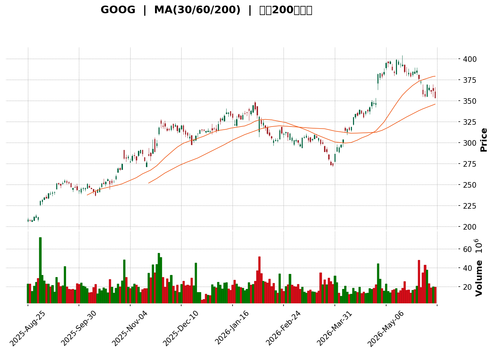
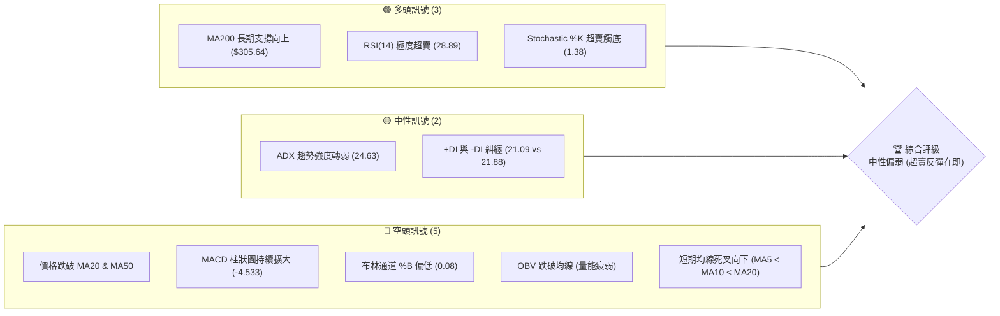
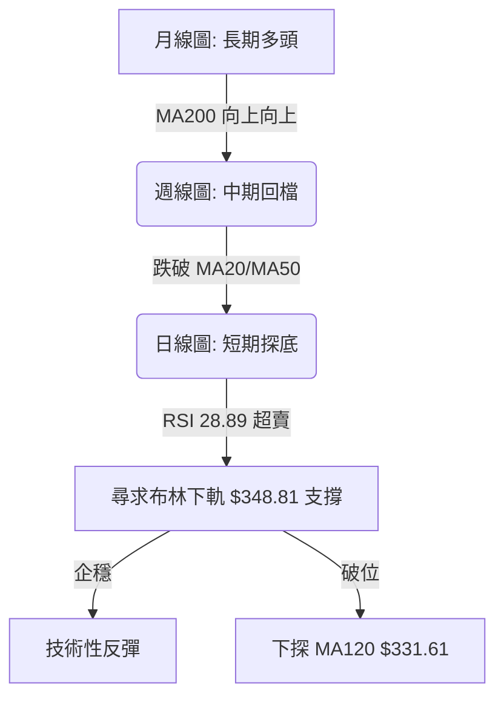
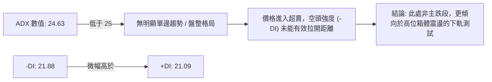
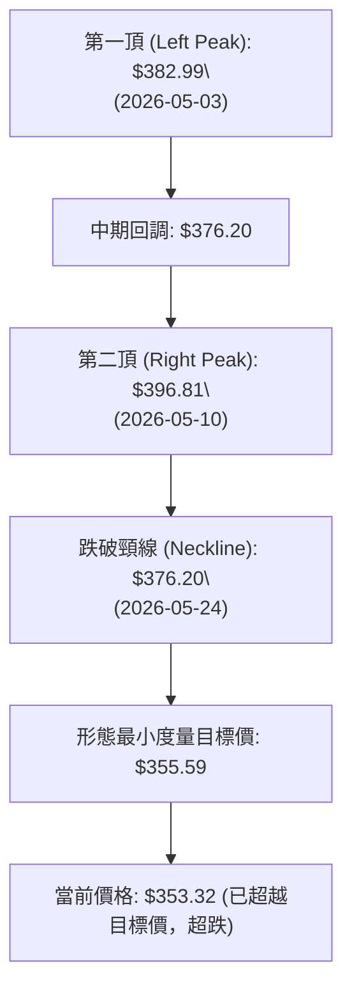

<details>
<summary>📊 靜態圖表 (點擊展開)</summary>

</details>

<html>
<head><meta charset="utf-8" /></head>
<body>
    <div style="height:500px; width:100%;">                        <script>window.PlotlyConfig = {MathJaxConfig: 'local'};</script>
        <script charset="utf-8" src="https://cdn.plot.ly/plotly-3.6.0.min.js" integrity="sha256-QaOVwtVY0T02VaHrr6pnoHLCwayMJp4O5n4YyaE3rJk=" crossorigin="anonymous"></script>                <div id="candlestick-chart" class="plotly-graph-div" style="height:100%; width:100%;"></div>            <script>                window.PLOTLYENV=window.PLOTLYENV || {};                                if (document.getElementById("candlestick-chart")) {                    Plotly.newPlot(                        "candlestick-chart",                        [{"close":{"dtype":"f8","bdata":"AAAAwA8SakAAAACgc+tpQAAAAIC\u002f82lAAAAAIH14akAAAADggJ1qQAAAAEBdbGpAAAAAoCTObEAAAACg6\u002f9sQAAAAOACUG1AAAAAQHY2bUAAAABgD+9tQAAAAGDs4m1AAAAAIOMJbkAAAADADB1uQAAAAGCPaG9AAAAAoLNdb0AAAABgjytvQAAAAMDDem9AAAAA4LPXb0AAAACAVIxvQAAAAGAVe29AAAAAwAvrbkAAAAAgzsJuQAAAAGBJ1m5AAAAAIDl8bkAAAACgWmJuQAAAAODooW5AAAAAgFW+bkAAAAAA+b5uQAAAAGCTYG9AAAAAwLDUbkAAAADAWp9uQAAAAOCON25AAAAAYNCgbUAAAABgKoVuQAAAAECrtm5AAAAAoPZmb0AAAACgZGxvQAAAAKBkqW9AAAAAgEYIcEAAAACAJVtvQAAAAOAmgW9AAAAAAHqnb0AAAACgAUBwQAAAAGBu1nBAAAAAgHq+cEAAAACAGypxQAAAAKCTlXFAAAAAoEyUcUAAAAAAB7lxQAAAAMBBWHFAAAAAgBbDcUAAAABggsxxQAAAACBycnFAAAAAQFggckAAAABgtTJyQAAAAEDi7XFAAAAAAC9pcUAAAADgAkdxQAAAAECp0HFAAAAA4HDGcUAAAABgq0ZyQAAAAMCaFnJAAAAAYAWxckAAAABgjd1zQAAAAGAcMHRAAAAAoHT6c0AAAACg5vdzQAAAAIAOqHNAAAAAwG22c0AAAACA4v9zQAAAAGBG3HNAAAAAwFsXdEAAAACAoqBzQAAAAGBd1XNAAAAAIEwJdEAAAABgppRzQAAAAADWYXNAAAAAYKlOc0AAAAAgQTVzQAAAAIC8mnJAAAAAQKj1ckAAAADgUENzQAAAAGDHbnNAAAAAwEm0c0AAAADgILRzQAAAAIDIqHNAAAAAAK2fc0AAAABgO6JzQAAAAGA\u002flnNAAAAAIImuc0AAAACAfs5zQAAAAGA7onNAAAAAwCUgdEAAAABgWll0QAAAACBei3RAAAAAgLvEdEAAAADg2v90QAAAACDw\u002fXRAAAAAgJrLdEAAAADAip50QAAAAGDVG3RAAAAAIDl\u002fdEAAAAAgiKZ0QAAAAKAFgHRAAAAAYHnSdEAAAABAAel0QAAAAEB1\u002fXRAAAAAAH0jdUAAAABAaSF1QAAAAMAyh3VAAAAAABZEdUAAAADAes50QAAAAIBcrnRAAAAAgNoqdEAAAABAoD90QAAAAEBt43NAAAAAYMduc0AAAADgdU9zQAAAACDuGXNAAAAAIMzmckAAAACgsfhyQAAAACCf8nJAAAAAINOnc0AAAAAgiHRzQAAAAGA6aHNAAAAAgPGJc0AAAACA\u002fCtzQAAAAIBgcHNAAAAA4Fwfc0AAAAAgn\u002fJyQAAAACDd8HJAAAAA4EbIckAAAABAkp5yQAAAACA3HXNAAAAAIO0rc0AAAACAwENzQAAAACBx8HJAAAAAgHXUckAAAABgygNzQAAAACCVU3NAAAAAINohc0AAAADgvBhzQAAAAMDDqXJAAAAAQHGtckAAAADAahByQAAAACCnFnJAAAAAYCOJcUAAAACAhhlxQAAAAKCcD3FAAAAAwP\u002fqcUAAAADgj2tyQAAAAKCGZHJAAAAAALKXckAAAACA9PtyQAAAAKDPqHNAAAAAIODCc0AAAABAe7hzQAAAAMBJ8HNAAAAAQBmmdEAAAAAgTeR0QAAAAAAeyXRAAAAAQCIzdUAAAAAgLPN0QAAAAABXpHRAAAAAIG4YdUAAAADgvxh1QAAAAGDTYXVAAAAAQPfEdUAAAADgp7R1QAAAACCesXVAAAAAQF3bd0AAAAAA1e93QAAAAECWtndAAAAAIJ8AeEAAAAAAcK54QAAAAOD+sHhAAAAAoPrMeEAAAAAAmSh4QAAAACBt+XdAAAAAwMzseEAAAADg5c54QAAAAMBVkXhAAAAAAPqNeEAAAAAgsgp4QAAAACCyCnhAAAAAYNTzd0AAAADgbbJ3QAAAAIC8CXhAAAAAgJMJeEAAAABANB54QAAAAOBBg3dAAAAAwLFFd0AAAACAymJ2QAAAAAB1N3ZAAAAAIMQQd0AAAADgo9h2QAAAAGC4knZAAAAA4KOkdkAAAADAHhV2QA=="},"high":{"dtype":"f8","bdata":"2lTROqVPakB+W266uftpQJ3diOYkH2pAywsNg2aJakAxooQnQtdqQOVD1Sh1eGpAXHoCrHrkbEBJ1h8vbgNtQEP+Ldukbm1ALTd3TeC9bUA4s2e10QNuQGfddd1nM25AiBhuMA5DbkAfzQxJXD5uQAEZjqItiG9AwBStHoKXb0Cul+\u002fYoG5vQNc8mT6StG9AF4s2bSoDcECWQXUI4PlvQJ\u002fN0g6xyG9AK5LgieKOb0AedKkvmdpuQJTzu8IuNG9ACVG7lPtkb0CsdS+fWGZuQDBgLjNU1W5AA7+mkNHkbkBNGZeLTtRuQAYXTNGcdm9AbAlwi9phb0BeMn1n19huQLv3OmVjom5ALTmdt42LbkAdDBUEWJBuQK+UBhhG8W5AtiRtTH+Ib0C4HTTENxFwQGDNUYg0zG9AWfbuOwIWcEBk3yiCLNxvQBdjvY3UCnBAAC+m3YDrb0CrNIaZ8V9wQOVtaudS5HBAAP0PHZbtcEAxTwLX4TZxQB0aOiK+NXJAlXc6eZnbcUCD3NEqF9ZxQIHylOKFlHFAkjI9IDricUD+o3Ky6wNyQCWgI2oYv3FA5NpyxzwuckD\u002fnDwxSjxyQOc8vv+bPHJAWxf\u002fUkmvcUDqOAm9qWlxQKmdSgcaX3JAacXVpOYNckD2PgwnevpyQH6oiqOiJHNAv\u002fIhl9j1ckDy+utXyvJzQM\u002fLoPJugHRAFk3XAqtFdEAc21V22WN0QEahslwT8HNA04LW06Dfc0BWWjt\u002fjxZ0QCMp1qR4J3RAiPbAziQzdEAKBbYi+Qx0QLINkV+w5HNAsGN6+TIXdEAwMKfPHRl0QLnmVJWju3NA+rTnzquEc0CO8r8gAndzQFI0mvqpTHNA3ZqPLckNc0BBrf9XY0lzQP3aoAWxdHNAtXKN7zG+c0DplIYPCb5zQBRxd5JZwnNAfjpahvGoc0DRFH0JkdRzQAC+L6Cnr3NADkuCh+EndECecOFuVe1zQKtsduc+EnRAB0p3jp9gdEB2qSYJvaF0QCA06j3CsHRAP5Dxew7gdEBOpYRgE0x1QCYWyGZxCXVA4ebuDgUbdUCvmnPu1ux0QN1Bne2WenRAlWwGBqfEdEDVEOhDXOx0QFULrFCB2XRAh7z5npP+dEC3H22wYBx1QJiji6gHE3VACjNXGH5ddUBvQYDXiD11QPBDWdVui3VAosjrmxbbdUAHNy3Oz3x1QPzG0rlbw3RA3D3tEVajdEAJQUUF\u002f3R0QE+5nzZdE3RAePY0MQQKdEDeSPl+EsFzQPb7tWjKR3NAMfp5z98Hc0Ahh0w4LBhzQCDYCwwXGnNANMq8zovFc0AemBz+m\u002fBzQI6Gzb9lf3NASlnVoQKUc0DLQozadolzQPxBhGbDenNAFNgnXM47c0BvLQCYsfhyQP9bZEH7EHNAw+io2ZXvckBzSClGAr9yQPQO+uoMJXNAAPvvx2xPc0D6ODg5HG5zQI9zVB9FR3NAz1xKFjQxc0D+rrDqLRZzQJdhYezQXXNAt11eaQJpc0CXSdKo7SdzQMdfrqD9AnNANbyuKADzckA6c26pvY5yQCG7JGK5Z3JA\u002fYXUpXvlcUBjASf+wG5xQDtKX3CAQXFA4nApiAnucUDM\u002fWRm5JxyQPk6u1ONe3JAms1\u002ffe2jckCTAcd0rP5yQDCJYqsq83NAkSCCQ9PTc0CqftHP7PRzQBQ0QVXO83NAGbIk+g6ndEAmWb2xxux0QLcsU0TVEnVABdsQ73w8dUAf+r\u002fcSy91QDe2iL55D3VAe3fPIjoddUBhd\u002flPST91QFLY7n+7d3VAuoj04gXrdUD1WFNWCNt1QOXWL7\u002f\u002fEnZAesfNzGXmd0B03cX0jPJ3QOmR0NAu\u002f3dAEBjo0Z1LeEDmNe\u002fxQ8J4QMWG6i\u002fb0XhAKTWJHxbieEB7AOgffKF4QBFviStSI3hAxcCs7gf7eEBbWzq80u14QNC4bTFFunhALZcxo6BDeUCVp3nGBZJ4QBHC\u002frVwZ3hAgdUJqiNHeEBUNJ9ZNwp4QFT3GQWIEnhAROaccNlXeEDkpPAwP1x4QGd81SO61ndAjmoHxv5ld0A2IanJFBl3QNpBw\u002fKCpHZAKrjkSzMad0BVWFympQ93QAAAAIAUtnZAAAAAYBIbd0AAAADA9eR2QA=="},"hovertemplate":"\u003cb\u003e%{x|%Y-%m-%d}\u003c\u002fb\u003e\u003cbr\u003e\u958b: $%{open:.2f}\u003cbr\u003e\u9ad8: $%{high:.2f}\u003cbr\u003e\u4f4e: $%{low:.2f}\u003cbr\u003e\u6536: $%{close:.2f}\u003cextra\u003e\u003c\u002fextra\u003e","low":{"dtype":"f8","bdata":"mXnwQKKraUCOVWKdlrtpQNBveHSsuWlA25WKpEjgaUByAiQX0UtqQL6UZNTcy2lAIg1I3VMPbEA8mUdgqENsQEk92lT89mxANN4ahLoobUBK0VYAjR1tQEaBvTydtG1AssOgDsCDbUDGfVjnEcFtQPewlUYGkG5ALguXkj8nb0CYJvbmH8NuQDFsahPdM29AjJL0lGVyb0D2BzQsOEpvQBAWKWgpU29A2X6PZpDXbkA\u002feFM4rCVuQJgeTmcKxW5ASk319ixXbkA3Q+5jRuNtQKhnAzlt121A0r5TaCRUbkDhbZen3D9uQLLYPkSzpm5A35fLYHjKbkCt6PqNiZNuQCIeW4vB5m1AHtpwphqHbUDucevW7QhuQGFWjTGZFm5AcmNZuNTJbkAa0u2jv0VvQApMjJRRA29AD8m\u002fR0PDb0C3UC7DH4ZuQLZXChHBPm9Ak2yRysCIb0D34O4rK\u002fNvQDyfwVu\u002fhnBAIDxquFuqcEBOP5pher5wQKywPB5sfnFAdEIqjq5PcUAlFvYLJX1xQClrP5MsRXFA8gReC2JVcUAKDVgOG5FxQKii5po1M3FAn14T\u002fcOvcUAurczNEfVxQJy6C\u002fAtvXFA9utieUxXcUAT+e3AEO5wQELbI7rIunFAD0SlbG1ncUDR8Ihgt\u002fFxQKsaZ32rCXJAtYoc44tcckDIKXdMt0xzQI4fA+ob03NASDqvrUXJc0Arw5TaHsVzQG3UbULalXNAuBYobK+Zc0CzkcOspJpzQCAwdO+Pr3NAYtc3KKr1c0DrKZMzDHhzQLXWhkxkg3NA8lEub9Cvc0CqhHQLnFdzQDuzpEfzKHNAuhPJwnQVc0B\u002fTxN57\u002fZyQOu4t0L9kHJA1K2xbc3DckDbQuWDIN9yQBWZkbYJI3NAjKaR2oJlc0CeYgbQk45zQLxa3iD4lHNAkXtRL+N3c0AKJemSdY1zQE9vbW2ufHNAryb7tuljc0BbIhqyZq1zQOQ4KhDrfnNA6oV4426hc0C4V\u002f7cHRl0QGL8vBIwXXRAawVK+FxRdEAm0VVent50QF9SYYJTq3RAxATy\u002fritdEBNkJQZ3nt0QKWAzkmKB3RAhQE2wffxc0C3dCN6Nod0QIurefWreHRAjBLAWwBxdECsMZHuB9V0QF6VLQ8lu3RAM8Hik7JkdEDAxTFcS8N0QAMWO+Uk+XRAgeOBp14idUCHOMLYCo90QCAYyrtPKHNA\u002fpDsBLf7c0AqR9DwkNRzQM1dyFj9o3NA68olqppbc0DtFGVF9ztzQH8i9vQN+HJABLu7ZDOIckCoAgH6X9lyQMC2qDJxxHJA1GrmJF0Ac0Do31v2XVlzQEY5iXEMG3NA6SpxvkxPc0CR4XLWPuByQBxlQecd83JAZa+odKzKckBw5Jcs\u002fYRyQCmKfsqExnJAnTpabuWackBD\u002fJXN1W1yQODchyINXHJAl+SpnQUSc0AljUcbfxpzQA5uvHaLynJAwG13Y5i5ckD0HSguDtpyQDvxMderAnNAJu8pnMcVc0DIzFdnGs1yQJ0kpOYkiXJAjoxVsJydckBcGJh55gpyQHhdPngn83FASBnYSR1ucUD8Z5tQDBVxQBWfM3Ty9XBARrc+In9JcUBV14UAvBRyQMW0yzla9nFAZA3vCNBZckACWN3z9HNyQPqpaENFiHNAWTmCv4pUc0CIk0PonKVzQFktOHkFmHNAmGgEO08PdEDE2kGwZYd0QKcaakI1t3RAQ\u002f9bzW7RdEBg85cl3OZ0QAWzwXHolnRAtsQ\u002f4CfMdEBZ\u002fZ9AvO10QKPg97+V3XRAYuicHq5JdUBiOtquKoF1QO5ps6WVY3VA8kYEEfKtdkChTll8jHB3QIoYA7KxiHdA\u002f5dsiPDBd0CFj9vu3y14QPbdIys0YXhAt56Vk+6WeED3epCU9h94QN2d7Jndt3dArmlGhJvVd0Dw8ZZR3od4QGqSQ8VoWHhAU6jZUaNqeEC15k1uUOx3QGurXtJXvHdAJoyANAe0d0DGOVkihaB3QKLY\u002f2qXrndAZurt2FLcd0Dvhm6\u002fVNB3QGyeW58yYXdAoAEHUs0Xd0CJszBalSx2QIgX4HOrInZATOsgpmIpdkCUbNSMmZZ2QAAAAIA9XnZAAAAAIIUrdkAAAADA9Qx2QA=="},"name":"\u50f9\u683c","open":{"dtype":"f8","bdata":"oW64YiPNaUBvgfFz2vhpQNIJaVLou2lA6XFpC\u002fHnaUDir6i3Y1VqQNueWjqjDGpAIEweRLk6bEC0vssO\u002fa9sQIqDzIzr\u002f2xACDj6AIVqbUDMllSFazdtQD\u002fUytcF2W1Ap3CegXL1bUCxmXurhgpuQCafLXYilW5AAFnOysN6b0A1Exaz+l5vQFKIJgjBa29Al1WE\u002fO+cb0BY1UbNAslvQPpGKs0UpW9Ar6j\u002f5AN1b0DxH1yZjYtuQG859u2b6W5AUCOYAkL5bkC\u002ffEFatFJuQG9iVp6pFm5A1cnViBqlbkChU\u002fNMAphuQEwrChOTqW5AGeC+Zy0Ob0C4Oyrk\u002fLZuQNxN8VOUkm5AzefvKfY1bkCk5DUa3xFuQGN7Y9IGKW5AdeKOtzDzbkDH3SGAE39vQPhZ11l3W29A99tGD2LXb0DdxX6XBdhvQNwl3EFb0G9AXvARu4Smb0Arx4QYvwxwQNlbQz50jXBARpVpUb7acEAakmMwWsFwQC9p97BjMnJAH9YTZ2qqcUCEIfx+4Z1xQE97+TheSHFAobelBlZtcUCcwc8V0dJxQMQlA912unFAZ261yk\u002fLcUBgVWL9LfpxQI90zdM3OHJApXvzB+emcUDJrSZez\u002fVwQLq9D5dv3XFAs8iBAbv+cUDGhcyh9PFxQBdOgF1NAnNAGnd2xqCEckDcN\u002f0FbWZzQCRXXU6SYnRA5rtlnnACdEDtCcPawSx0QN1JNcGpzXNAY2TsMnvEc0BKax6nlrZzQOCpkvObJnRAK\u002fE23\u002fv1c0BP5GT0xgl0QFH0ntsPi3NAWs+zCU\u002fDc0CwQYsx5Qp0QGme4qUlpnNAbayM9XiDc0Dv3Xg\u002fnBlzQG3WwTe1SXNA3ZpDsKHqckC0iUnL\u002fO1yQGXTqe8ZbXNAkmOxy6lrc0BNYyNPzLtzQBpAQZ4fuHNAFq5hpJaGc0C+9vUXBJBzQOVXaGxgj3NA6rR83c7Sc0CwwtN+fNRzQNHWL59VznNA5xKsQ42ic0C1L9p5XY10QLLg6nEAcXRAPLiGrS5hdED7XrKleu10QHrUFvXD6HRAIOmUNdIZdUBmCNRP9+d0QLWu6eohDXRA7q5CsdAKdEBE6A2xQt10QEtrSqqIw3RA7AgZ0Fh8dEBXEt5hEvN0QKOgaxy7AnVAUZQ7N34+dUA7EKJBYOB0QCZsUMLFAXVAGxZaefbAdUDd0o3z5nR1QIJZ7wmpjHNAzNEdyMNudEAGmWnEIQ10QDF16u\u002fbB3RAHxKDFrPoc0BgcEkSFH9zQL3NIj9UOXNAmgUGh\u002fbDckC+BIHvmOByQFE\u002fJs8A4nJAyZDwfG8Gc0DweyGNk+tzQFSSKP\u002fAY3NAI91Y\u002fWZ7c0Bh8mclWYZzQCQMq4mx+HJA+3rNJR3pckC1D5A5faByQAFv57aj5HJAxj5Fgt7sckDcM8dI+HpyQHdtO2FUX3JAtg5XeQ4bc0Ac1iYZ2iFzQHDW7LtpIHNA7EjVc4cnc0CXTy+lrfZyQForYM3JB3NAjGi3S4Q7c0A\u002fZHEVcfByQOV04p0x\u002fnJAaZi3h5bFckDoucRagoByQGmdTpGWP3JAwb7OMkngcUAzuBvoulNxQF62grVjNHFAHflIFvhVcUDkPuC+4xxyQPt7J\u002foODXJAJ+T2Kl1ockDwNzsWWr9yQDIVPqM42nNATp55tQaQc0AcxQCUieBzQIkNLVavs3NAZ8P32fAddEBqa\u002fdhx6V0QD5JVyle+nRAcgZpXqnjdECzzCS3syV1QLgOJ2Yh9nRAh744AvDqdEAL+O+g7jV1QNXWQhVFGHVAogBkTsV6dUCoD8ytYat1QAzRIAJblHVAZUg104Ewd0Cio9noCpx3QJiO1eVw4XdAaVq7qT7ad0AjzmnMsFV4QH1z+okjzXhAm441mYageEAOVaW3R2d4QFecw3dLDHhA4g9J983ad0AJycaz2Zh4QCnKOuKnj3hAAu477Tl+eEAXbzjOA5F4QFLCsUfvDHhAP3zS2Hvcd0ALPP7QePB3QENwDtlAzHdAdVRrdo7od0CJjlrREPp3QInT3W\u002fuz3dARx8jY51Fd0CmfGqfEK92QHcbjFXpYXZAyc95kp4zdkCM8xY9lbJ2QAAAAIDCp3ZAAAAAACnOdkAAAACgcI12QA=="},"x":["2025-08-25T00:00:00-04:00","2025-08-26T00:00:00-04:00","2025-08-27T00:00:00-04:00","2025-08-28T00:00:00-04:00","2025-08-29T00:00:00-04:00","2025-09-02T00:00:00-04:00","2025-09-03T00:00:00-04:00","2025-09-04T00:00:00-04:00","2025-09-05T00:00:00-04:00","2025-09-08T00:00:00-04:00","2025-09-09T00:00:00-04:00","2025-09-10T00:00:00-04:00","2025-09-11T00:00:00-04:00","2025-09-12T00:00:00-04:00","2025-09-15T00:00:00-04:00","2025-09-16T00:00:00-04:00","2025-09-17T00:00:00-04:00","2025-09-18T00:00:00-04:00","2025-09-19T00:00:00-04:00","2025-09-22T00:00:00-04:00","2025-09-23T00:00:00-04:00","2025-09-24T00:00:00-04:00","2025-09-25T00:00:00-04:00","2025-09-26T00:00:00-04:00","2025-09-29T00:00:00-04:00","2025-09-30T00:00:00-04:00","2025-10-01T00:00:00-04:00","2025-10-02T00:00:00-04:00","2025-10-03T00:00:00-04:00","2025-10-06T00:00:00-04:00","2025-10-07T00:00:00-04:00","2025-10-08T00:00:00-04:00","2025-10-09T00:00:00-04:00","2025-10-10T00:00:00-04:00","2025-10-13T00:00:00-04:00","2025-10-14T00:00:00-04:00","2025-10-15T00:00:00-04:00","2025-10-16T00:00:00-04:00","2025-10-17T00:00:00-04:00","2025-10-20T00:00:00-04:00","2025-10-21T00:00:00-04:00","2025-10-22T00:00:00-04:00","2025-10-23T00:00:00-04:00","2025-10-24T00:00:00-04:00","2025-10-27T00:00:00-04:00","2025-10-28T00:00:00-04:00","2025-10-29T00:00:00-04:00","2025-10-30T00:00:00-04:00","2025-10-31T00:00:00-04:00","2025-11-03T00:00:00-05:00","2025-11-04T00:00:00-05:00","2025-11-05T00:00:00-05:00","2025-11-06T00:00:00-05:00","2025-11-07T00:00:00-05:00","2025-11-10T00:00:00-05:00","2025-11-11T00:00:00-05:00","2025-11-12T00:00:00-05:00","2025-11-13T00:00:00-05:00","2025-11-14T00:00:00-05:00","2025-11-17T00:00:00-05:00","2025-11-18T00:00:00-05:00","2025-11-19T00:00:00-05:00","2025-11-20T00:00:00-05:00","2025-11-21T00:00:00-05:00","2025-11-24T00:00:00-05:00","2025-11-25T00:00:00-05:00","2025-11-26T00:00:00-05:00","2025-11-28T00:00:00-05:00","2025-12-01T00:00:00-05:00","2025-12-02T00:00:00-05:00","2025-12-03T00:00:00-05:00","2025-12-04T00:00:00-05:00","2025-12-05T00:00:00-05:00","2025-12-08T00:00:00-05:00","2025-12-09T00:00:00-05:00","2025-12-10T00:00:00-05:00","2025-12-11T00:00:00-05:00","2025-12-12T00:00:00-05:00","2025-12-15T00:00:00-05:00","2025-12-16T00:00:00-05:00","2025-12-17T00:00:00-05:00","2025-12-18T00:00:00-05:00","2025-12-19T00:00:00-05:00","2025-12-22T00:00:00-05:00","2025-12-23T00:00:00-05:00","2025-12-24T00:00:00-05:00","2025-12-26T00:00:00-05:00","2025-12-29T00:00:00-05:00","2025-12-30T00:00:00-05:00","2025-12-31T00:00:00-05:00","2026-01-02T00:00:00-05:00","2026-01-05T00:00:00-05:00","2026-01-06T00:00:00-05:00","2026-01-07T00:00:00-05:00","2026-01-08T00:00:00-05:00","2026-01-09T00:00:00-05:00","2026-01-12T00:00:00-05:00","2026-01-13T00:00:00-05:00","2026-01-14T00:00:00-05:00","2026-01-15T00:00:00-05:00","2026-01-16T00:00:00-05:00","2026-01-20T00:00:00-05:00","2026-01-21T00:00:00-05:00","2026-01-22T00:00:00-05:00","2026-01-23T00:00:00-05:00","2026-01-26T00:00:00-05:00","2026-01-27T00:00:00-05:00","2026-01-28T00:00:00-05:00","2026-01-29T00:00:00-05:00","2026-01-30T00:00:00-05:00","2026-02-02T00:00:00-05:00","2026-02-03T00:00:00-05:00","2026-02-04T00:00:00-05:00","2026-02-05T00:00:00-05:00","2026-02-06T00:00:00-05:00","2026-02-09T00:00:00-05:00","2026-02-10T00:00:00-05:00","2026-02-11T00:00:00-05:00","2026-02-12T00:00:00-05:00","2026-02-13T00:00:00-05:00","2026-02-17T00:00:00-05:00","2026-02-18T00:00:00-05:00","2026-02-19T00:00:00-05:00","2026-02-20T00:00:00-05:00","2026-02-23T00:00:00-05:00","2026-02-24T00:00:00-05:00","2026-02-25T00:00:00-05:00","2026-02-26T00:00:00-05:00","2026-02-27T00:00:00-05:00","2026-03-02T00:00:00-05:00","2026-03-03T00:00:00-05:00","2026-03-04T00:00:00-05:00","2026-03-05T00:00:00-05:00","2026-03-06T00:00:00-05:00","2026-03-09T00:00:00-04:00","2026-03-10T00:00:00-04:00","2026-03-11T00:00:00-04:00","2026-03-12T00:00:00-04:00","2026-03-13T00:00:00-04:00","2026-03-16T00:00:00-04:00","2026-03-17T00:00:00-04:00","2026-03-18T00:00:00-04:00","2026-03-19T00:00:00-04:00","2026-03-20T00:00:00-04:00","2026-03-23T00:00:00-04:00","2026-03-24T00:00:00-04:00","2026-03-25T00:00:00-04:00","2026-03-26T00:00:00-04:00","2026-03-27T00:00:00-04:00","2026-03-30T00:00:00-04:00","2026-03-31T00:00:00-04:00","2026-04-01T00:00:00-04:00","2026-04-02T00:00:00-04:00","2026-04-06T00:00:00-04:00","2026-04-07T00:00:00-04:00","2026-04-08T00:00:00-04:00","2026-04-09T00:00:00-04:00","2026-04-10T00:00:00-04:00","2026-04-13T00:00:00-04:00","2026-04-14T00:00:00-04:00","2026-04-15T00:00:00-04:00","2026-04-16T00:00:00-04:00","2026-04-17T00:00:00-04:00","2026-04-20T00:00:00-04:00","2026-04-21T00:00:00-04:00","2026-04-22T00:00:00-04:00","2026-04-23T00:00:00-04:00","2026-04-24T00:00:00-04:00","2026-04-27T00:00:00-04:00","2026-04-28T00:00:00-04:00","2026-04-29T00:00:00-04:00","2026-04-30T00:00:00-04:00","2026-05-01T00:00:00-04:00","2026-05-04T00:00:00-04:00","2026-05-05T00:00:00-04:00","2026-05-06T00:00:00-04:00","2026-05-07T00:00:00-04:00","2026-05-08T00:00:00-04:00","2026-05-11T00:00:00-04:00","2026-05-12T00:00:00-04:00","2026-05-13T00:00:00-04:00","2026-05-14T00:00:00-04:00","2026-05-15T00:00:00-04:00","2026-05-18T00:00:00-04:00","2026-05-19T00:00:00-04:00","2026-05-20T00:00:00-04:00","2026-05-21T00:00:00-04:00","2026-05-22T00:00:00-04:00","2026-05-26T00:00:00-04:00","2026-05-27T00:00:00-04:00","2026-05-28T00:00:00-04:00","2026-05-29T00:00:00-04:00","2026-06-01T00:00:00-04:00","2026-06-02T00:00:00-04:00","2026-06-03T00:00:00-04:00","2026-06-04T00:00:00-04:00","2026-06-05T00:00:00-04:00","2026-06-08T00:00:00-04:00","2026-06-09T00:00:00-04:00","2026-06-10T00:00:00-04:00"],"type":"candlestick"},{"hovertemplate":"MA30: $%{y:.2f}\u003cextra\u003e\u003c\u002fextra\u003e","line":{"color":"#2196F3","dash":"dash","width":2},"mode":"lines","name":"MA30","x":["2025-08-25T00:00:00-04:00","2025-08-26T00:00:00-04:00","2025-08-27T00:00:00-04:00","2025-08-28T00:00:00-04:00","2025-08-29T00:00:00-04:00","2025-09-02T00:00:00-04:00","2025-09-03T00:00:00-04:00","2025-09-04T00:00:00-04:00","2025-09-05T00:00:00-04:00","2025-09-08T00:00:00-04:00","2025-09-09T00:00:00-04:00","2025-09-10T00:00:00-04:00","2025-09-11T00:00:00-04:00","2025-09-12T00:00:00-04:00","2025-09-15T00:00:00-04:00","2025-09-16T00:00:00-04:00","2025-09-17T00:00:00-04:00","2025-09-18T00:00:00-04:00","2025-09-19T00:00:00-04:00","2025-09-22T00:00:00-04:00","2025-09-23T00:00:00-04:00","2025-09-24T00:00:00-04:00","2025-09-25T00:00:00-04:00","2025-09-26T00:00:00-04:00","2025-09-29T00:00:00-04:00","2025-09-30T00:00:00-04:00","2025-10-01T00:00:00-04:00","2025-10-02T00:00:00-04:00","2025-10-03T00:00:00-04:00","2025-10-06T00:00:00-04:00","2025-10-07T00:00:00-04:00","2025-10-08T00:00:00-04:00","2025-10-09T00:00:00-04:00","2025-10-10T00:00:00-04:00","2025-10-13T00:00:00-04:00","2025-10-14T00:00:00-04:00","2025-10-15T00:00:00-04:00","2025-10-16T00:00:00-04:00","2025-10-17T00:00:00-04:00","2025-10-20T00:00:00-04:00","2025-10-21T00:00:00-04:00","2025-10-22T00:00:00-04:00","2025-10-23T00:00:00-04:00","2025-10-24T00:00:00-04:00","2025-10-27T00:00:00-04:00","2025-10-28T00:00:00-04:00","2025-10-29T00:00:00-04:00","2025-10-30T00:00:00-04:00","2025-10-31T00:00:00-04:00","2025-11-03T00:00:00-05:00","2025-11-04T00:00:00-05:00","2025-11-05T00:00:00-05:00","2025-11-06T00:00:00-05:00","2025-11-07T00:00:00-05:00","2025-11-10T00:00:00-05:00","2025-11-11T00:00:00-05:00","2025-11-12T00:00:00-05:00","2025-11-13T00:00:00-05:00","2025-11-14T00:00:00-05:00","2025-11-17T00:00:00-05:00","2025-11-18T00:00:00-05:00","2025-11-19T00:00:00-05:00","2025-11-20T00:00:00-05:00","2025-11-21T00:00:00-05:00","2025-11-24T00:00:00-05:00","2025-11-25T00:00:00-05:00","2025-11-26T00:00:00-05:00","2025-11-28T00:00:00-05:00","2025-12-01T00:00:00-05:00","2025-12-02T00:00:00-05:00","2025-12-03T00:00:00-05:00","2025-12-04T00:00:00-05:00","2025-12-05T00:00:00-05:00","2025-12-08T00:00:00-05:00","2025-12-09T00:00:00-05:00","2025-12-10T00:00:00-05:00","2025-12-11T00:00:00-05:00","2025-12-12T00:00:00-05:00","2025-12-15T00:00:00-05:00","2025-12-16T00:00:00-05:00","2025-12-17T00:00:00-05:00","2025-12-18T00:00:00-05:00","2025-12-19T00:00:00-05:00","2025-12-22T00:00:00-05:00","2025-12-23T00:00:00-05:00","2025-12-24T00:00:00-05:00","2025-12-26T00:00:00-05:00","2025-12-29T00:00:00-05:00","2025-12-30T00:00:00-05:00","2025-12-31T00:00:00-05:00","2026-01-02T00:00:00-05:00","2026-01-05T00:00:00-05:00","2026-01-06T00:00:00-05:00","2026-01-07T00:00:00-05:00","2026-01-08T00:00:00-05:00","2026-01-09T00:00:00-05:00","2026-01-12T00:00:00-05:00","2026-01-13T00:00:00-05:00","2026-01-14T00:00:00-05:00","2026-01-15T00:00:00-05:00","2026-01-16T00:00:00-05:00","2026-01-20T00:00:00-05:00","2026-01-21T00:00:00-05:00","2026-01-22T00:00:00-05:00","2026-01-23T00:00:00-05:00","2026-01-26T00:00:00-05:00","2026-01-27T00:00:00-05:00","2026-01-28T00:00:00-05:00","2026-01-29T00:00:00-05:00","2026-01-30T00:00:00-05:00","2026-02-02T00:00:00-05:00","2026-02-03T00:00:00-05:00","2026-02-04T00:00:00-05:00","2026-02-05T00:00:00-05:00","2026-02-06T00:00:00-05:00","2026-02-09T00:00:00-05:00","2026-02-10T00:00:00-05:00","2026-02-11T00:00:00-05:00","2026-02-12T00:00:00-05:00","2026-02-13T00:00:00-05:00","2026-02-17T00:00:00-05:00","2026-02-18T00:00:00-05:00","2026-02-19T00:00:00-05:00","2026-02-20T00:00:00-05:00","2026-02-23T00:00:00-05:00","2026-02-24T00:00:00-05:00","2026-02-25T00:00:00-05:00","2026-02-26T00:00:00-05:00","2026-02-27T00:00:00-05:00","2026-03-02T00:00:00-05:00","2026-03-03T00:00:00-05:00","2026-03-04T00:00:00-05:00","2026-03-05T00:00:00-05:00","2026-03-06T00:00:00-05:00","2026-03-09T00:00:00-04:00","2026-03-10T00:00:00-04:00","2026-03-11T00:00:00-04:00","2026-03-12T00:00:00-04:00","2026-03-13T00:00:00-04:00","2026-03-16T00:00:00-04:00","2026-03-17T00:00:00-04:00","2026-03-18T00:00:00-04:00","2026-03-19T00:00:00-04:00","2026-03-20T00:00:00-04:00","2026-03-23T00:00:00-04:00","2026-03-24T00:00:00-04:00","2026-03-25T00:00:00-04:00","2026-03-26T00:00:00-04:00","2026-03-27T00:00:00-04:00","2026-03-30T00:00:00-04:00","2026-03-31T00:00:00-04:00","2026-04-01T00:00:00-04:00","2026-04-02T00:00:00-04:00","2026-04-06T00:00:00-04:00","2026-04-07T00:00:00-04:00","2026-04-08T00:00:00-04:00","2026-04-09T00:00:00-04:00","2026-04-10T00:00:00-04:00","2026-04-13T00:00:00-04:00","2026-04-14T00:00:00-04:00","2026-04-15T00:00:00-04:00","2026-04-16T00:00:00-04:00","2026-04-17T00:00:00-04:00","2026-04-20T00:00:00-04:00","2026-04-21T00:00:00-04:00","2026-04-22T00:00:00-04:00","2026-04-23T00:00:00-04:00","2026-04-24T00:00:00-04:00","2026-04-27T00:00:00-04:00","2026-04-28T00:00:00-04:00","2026-04-29T00:00:00-04:00","2026-04-30T00:00:00-04:00","2026-05-01T00:00:00-04:00","2026-05-04T00:00:00-04:00","2026-05-05T00:00:00-04:00","2026-05-06T00:00:00-04:00","2026-05-07T00:00:00-04:00","2026-05-08T00:00:00-04:00","2026-05-11T00:00:00-04:00","2026-05-12T00:00:00-04:00","2026-05-13T00:00:00-04:00","2026-05-14T00:00:00-04:00","2026-05-15T00:00:00-04:00","2026-05-18T00:00:00-04:00","2026-05-19T00:00:00-04:00","2026-05-20T00:00:00-04:00","2026-05-21T00:00:00-04:00","2026-05-22T00:00:00-04:00","2026-05-26T00:00:00-04:00","2026-05-27T00:00:00-04:00","2026-05-28T00:00:00-04:00","2026-05-29T00:00:00-04:00","2026-06-01T00:00:00-04:00","2026-06-02T00:00:00-04:00","2026-06-03T00:00:00-04:00","2026-06-04T00:00:00-04:00","2026-06-05T00:00:00-04:00","2026-06-08T00:00:00-04:00","2026-06-09T00:00:00-04:00","2026-06-10T00:00:00-04:00"],"y":{"dtype":"f8","bdata":"AAAAAAAA+H8AAAAAAAD4fwAAAAAAAPh\u002fAAAAAAAA+H8AAAAAAAD4fwAAAAAAAPh\u002fAAAAAAAA+H8AAAAAAAD4fwAAAAAAAPh\u002fAAAAAAAA+H8AAAAAAAD4fwAAAAAAAPh\u002fAAAAAAAA+H8AAAAAAAD4fwAAAAAAAPh\u002fAAAAAAAA+H8AAAAAAAD4fwAAAAAAAPh\u002fAAAAAAAA+H8AAAAAAAD4fwAAAAAAAPh\u002fAAAAAAAA+H8AAAAAAAD4fwAAAAAAAPh\u002fAAAAAAAA+H8AAAAAAAD4fwAAAAAAAPh\u002fAAAAAAAA+H8AAAAAAAD4f+\u002fu7o6ksm1AZmZmhkPbbUBERETUZANuQLy7u5vJJ25AERERUbtCbkBERETEDWRuQHd3d\u002fepiG5AmpmZGdOebkDNzMzMgbNuQHd3d5eNx25A7+7uruPfbkDe3d2NBuxuQN7d3U3V+W5AmpmZmZ4Hb0BmZmYm\u002fBtvQAAAABBUL29Ad3d3129Bb0DNzMxcZFxvQFVVVSXfe29A7+7uDiuYb0CamZn5bLlvQDMzM4PO1G9AvLu7axz8b0ARERFBsRJwQKuqqqIAJHBAmpmZOZw8cEDNzMzkQlZwQGZmZhaPbHBAERERofV9cEB3d3fXNY5wQBERESlboHBAREREHH60cEAAAADYys1wQJqZmUk453BAAAAAmE4IcUAiIiIimy9xQFVVVfXUWHFAREREvFR9cUC8u7uLp6FxQImIiMBMwnFA3t3ddbThcUBERET8lAZyQLy7u3ujKXJAREREpAZOckDe3d3N2GpyQN7d3U1phHJAvLu7W4GgckBmZmaWH7VyQCIiIiJ3xHJAVVVV9TXTckAAAACQ4t9yQDMzM2Oi6nJAIiIictr0ckC8u7vLWAFzQCIiIpJKEnNA3t3djcEfc0CJiIh4mixzQBEREeFdO3NAIiIi8j9Oc0De3d1tW2JzQImIiAh6cXNAvLu7G7+Bc0De3d2tzo5zQDMzM7P+m3NAMzMzgzuoc0AiIiLyW6xzQLy7u6tmr3NARERExCS2c0DNzMws8b5zQAAAAJBWynNAmpmZyZPTc0CamZmp3dhzQHd3dwf82nNAd3d3V3Lec0AiIiIyLedzQImIiHjd7HNA3t3dLZLzc0CrqqqK6v5zQM3MzAyjDHRAREREtEMcdEARERFxqyx0QBEREVGeRXRAREREpExZdEBERES0eGZ0QO\u002fu7s4fcXRAERERkRN1dEAiIiLyuXl0QO\u002fu7l6ue3RA3t3dHQ16dEDNzMzMSnd0QFVVVfUlc3RAZmZmhn1sdECJiIgYXWV0QN7d3Y2CX3RAzczMzH9bdEAREREx31N0QM3MzMwqSnRAmpmZmaw\u002fdEDv7u4eFDB0QJqZmZnTInRAd3d3R40UdEARERGxSQZ0QLy7u3tS\u002fHNA7+7uzrDtc0AAAADQW9xzQBERESGI0HNAMzMzY3LCc0AiIiKyZ7RzQO\u002fu7o7nonNAvLu7GzSPc0B3d3dHJn1zQCIiIsJcanNAAAAAkCdYc0CrqqoqkElzQAAAAOBXOHNAq6qqKqErc0AAAABA\u002fRhzQAAAAFChCXNA3t3dLXH5ckDe3d3dk+ZyQAAAAMAq1XJAIiIiEsbMckDv7u6+EchyQCIiIjJVw3JAZmZmBkO6ckCrqqoaPrZyQGZmZjZluHJAiYiICEu6ckDNzMzs+b5yQO\u002fu7m49w3JAZmZmtkPQckBERESU2uByQJqZmXmY8HJAMzMzYzkFc0AiIiJiHBlzQKuqqvolJnNA3t3drZA2c0CrqqrKMkZzQGZmZmYLW3NAq6qqyiB0c0C8u7sbF4tzQLy7u5tKn3NAd3d3x5vHc0AiIiJi6fBzQHd3d3cBHHRA3t3d7XFJdEAiIiKS6YF0QERERNRBunRAiYiIeED4dEAiIiLSfDR1QM3MzDx7b3VAZmZmVkardUBEREQ0yeF1QGZmZsZ6FnZAq6qqCltJdkDv7u5+g3R2QJqZmenomXZAmpmZyay9dkBmZmZGm992QBEREZGWAndAq6qqCoEfd0Dv7u6+CDt3QFVVVTVOUndAiYiIqP1jd0C8u7urPnB3QKuqqpqufXdAVVVVRX6Od0BVVVVFbJ13QJqZmQmWp3dAmpmZuQqvd0AzMzPjQbJ3QA=="},"type":"scatter"},{"hovertemplate":"MA60: $%{y:.2f}\u003cextra\u003e\u003c\u002fextra\u003e","line":{"color":"#9C27B0","dash":"dash","width":2},"mode":"lines","name":"MA60","x":["2025-08-25T00:00:00-04:00","2025-08-26T00:00:00-04:00","2025-08-27T00:00:00-04:00","2025-08-28T00:00:00-04:00","2025-08-29T00:00:00-04:00","2025-09-02T00:00:00-04:00","2025-09-03T00:00:00-04:00","2025-09-04T00:00:00-04:00","2025-09-05T00:00:00-04:00","2025-09-08T00:00:00-04:00","2025-09-09T00:00:00-04:00","2025-09-10T00:00:00-04:00","2025-09-11T00:00:00-04:00","2025-09-12T00:00:00-04:00","2025-09-15T00:00:00-04:00","2025-09-16T00:00:00-04:00","2025-09-17T00:00:00-04:00","2025-09-18T00:00:00-04:00","2025-09-19T00:00:00-04:00","2025-09-22T00:00:00-04:00","2025-09-23T00:00:00-04:00","2025-09-24T00:00:00-04:00","2025-09-25T00:00:00-04:00","2025-09-26T00:00:00-04:00","2025-09-29T00:00:00-04:00","2025-09-30T00:00:00-04:00","2025-10-01T00:00:00-04:00","2025-10-02T00:00:00-04:00","2025-10-03T00:00:00-04:00","2025-10-06T00:00:00-04:00","2025-10-07T00:00:00-04:00","2025-10-08T00:00:00-04:00","2025-10-09T00:00:00-04:00","2025-10-10T00:00:00-04:00","2025-10-13T00:00:00-04:00","2025-10-14T00:00:00-04:00","2025-10-15T00:00:00-04:00","2025-10-16T00:00:00-04:00","2025-10-17T00:00:00-04:00","2025-10-20T00:00:00-04:00","2025-10-21T00:00:00-04:00","2025-10-22T00:00:00-04:00","2025-10-23T00:00:00-04:00","2025-10-24T00:00:00-04:00","2025-10-27T00:00:00-04:00","2025-10-28T00:00:00-04:00","2025-10-29T00:00:00-04:00","2025-10-30T00:00:00-04:00","2025-10-31T00:00:00-04:00","2025-11-03T00:00:00-05:00","2025-11-04T00:00:00-05:00","2025-11-05T00:00:00-05:00","2025-11-06T00:00:00-05:00","2025-11-07T00:00:00-05:00","2025-11-10T00:00:00-05:00","2025-11-11T00:00:00-05:00","2025-11-12T00:00:00-05:00","2025-11-13T00:00:00-05:00","2025-11-14T00:00:00-05:00","2025-11-17T00:00:00-05:00","2025-11-18T00:00:00-05:00","2025-11-19T00:00:00-05:00","2025-11-20T00:00:00-05:00","2025-11-21T00:00:00-05:00","2025-11-24T00:00:00-05:00","2025-11-25T00:00:00-05:00","2025-11-26T00:00:00-05:00","2025-11-28T00:00:00-05:00","2025-12-01T00:00:00-05:00","2025-12-02T00:00:00-05:00","2025-12-03T00:00:00-05:00","2025-12-04T00:00:00-05:00","2025-12-05T00:00:00-05:00","2025-12-08T00:00:00-05:00","2025-12-09T00:00:00-05:00","2025-12-10T00:00:00-05:00","2025-12-11T00:00:00-05:00","2025-12-12T00:00:00-05:00","2025-12-15T00:00:00-05:00","2025-12-16T00:00:00-05:00","2025-12-17T00:00:00-05:00","2025-12-18T00:00:00-05:00","2025-12-19T00:00:00-05:00","2025-12-22T00:00:00-05:00","2025-12-23T00:00:00-05:00","2025-12-24T00:00:00-05:00","2025-12-26T00:00:00-05:00","2025-12-29T00:00:00-05:00","2025-12-30T00:00:00-05:00","2025-12-31T00:00:00-05:00","2026-01-02T00:00:00-05:00","2026-01-05T00:00:00-05:00","2026-01-06T00:00:00-05:00","2026-01-07T00:00:00-05:00","2026-01-08T00:00:00-05:00","2026-01-09T00:00:00-05:00","2026-01-12T00:00:00-05:00","2026-01-13T00:00:00-05:00","2026-01-14T00:00:00-05:00","2026-01-15T00:00:00-05:00","2026-01-16T00:00:00-05:00","2026-01-20T00:00:00-05:00","2026-01-21T00:00:00-05:00","2026-01-22T00:00:00-05:00","2026-01-23T00:00:00-05:00","2026-01-26T00:00:00-05:00","2026-01-27T00:00:00-05:00","2026-01-28T00:00:00-05:00","2026-01-29T00:00:00-05:00","2026-01-30T00:00:00-05:00","2026-02-02T00:00:00-05:00","2026-02-03T00:00:00-05:00","2026-02-04T00:00:00-05:00","2026-02-05T00:00:00-05:00","2026-02-06T00:00:00-05:00","2026-02-09T00:00:00-05:00","2026-02-10T00:00:00-05:00","2026-02-11T00:00:00-05:00","2026-02-12T00:00:00-05:00","2026-02-13T00:00:00-05:00","2026-02-17T00:00:00-05:00","2026-02-18T00:00:00-05:00","2026-02-19T00:00:00-05:00","2026-02-20T00:00:00-05:00","2026-02-23T00:00:00-05:00","2026-02-24T00:00:00-05:00","2026-02-25T00:00:00-05:00","2026-02-26T00:00:00-05:00","2026-02-27T00:00:00-05:00","2026-03-02T00:00:00-05:00","2026-03-03T00:00:00-05:00","2026-03-04T00:00:00-05:00","2026-03-05T00:00:00-05:00","2026-03-06T00:00:00-05:00","2026-03-09T00:00:00-04:00","2026-03-10T00:00:00-04:00","2026-03-11T00:00:00-04:00","2026-03-12T00:00:00-04:00","2026-03-13T00:00:00-04:00","2026-03-16T00:00:00-04:00","2026-03-17T00:00:00-04:00","2026-03-18T00:00:00-04:00","2026-03-19T00:00:00-04:00","2026-03-20T00:00:00-04:00","2026-03-23T00:00:00-04:00","2026-03-24T00:00:00-04:00","2026-03-25T00:00:00-04:00","2026-03-26T00:00:00-04:00","2026-03-27T00:00:00-04:00","2026-03-30T00:00:00-04:00","2026-03-31T00:00:00-04:00","2026-04-01T00:00:00-04:00","2026-04-02T00:00:00-04:00","2026-04-06T00:00:00-04:00","2026-04-07T00:00:00-04:00","2026-04-08T00:00:00-04:00","2026-04-09T00:00:00-04:00","2026-04-10T00:00:00-04:00","2026-04-13T00:00:00-04:00","2026-04-14T00:00:00-04:00","2026-04-15T00:00:00-04:00","2026-04-16T00:00:00-04:00","2026-04-17T00:00:00-04:00","2026-04-20T00:00:00-04:00","2026-04-21T00:00:00-04:00","2026-04-22T00:00:00-04:00","2026-04-23T00:00:00-04:00","2026-04-24T00:00:00-04:00","2026-04-27T00:00:00-04:00","2026-04-28T00:00:00-04:00","2026-04-29T00:00:00-04:00","2026-04-30T00:00:00-04:00","2026-05-01T00:00:00-04:00","2026-05-04T00:00:00-04:00","2026-05-05T00:00:00-04:00","2026-05-06T00:00:00-04:00","2026-05-07T00:00:00-04:00","2026-05-08T00:00:00-04:00","2026-05-11T00:00:00-04:00","2026-05-12T00:00:00-04:00","2026-05-13T00:00:00-04:00","2026-05-14T00:00:00-04:00","2026-05-15T00:00:00-04:00","2026-05-18T00:00:00-04:00","2026-05-19T00:00:00-04:00","2026-05-20T00:00:00-04:00","2026-05-21T00:00:00-04:00","2026-05-22T00:00:00-04:00","2026-05-26T00:00:00-04:00","2026-05-27T00:00:00-04:00","2026-05-28T00:00:00-04:00","2026-05-29T00:00:00-04:00","2026-06-01T00:00:00-04:00","2026-06-02T00:00:00-04:00","2026-06-03T00:00:00-04:00","2026-06-04T00:00:00-04:00","2026-06-05T00:00:00-04:00","2026-06-08T00:00:00-04:00","2026-06-09T00:00:00-04:00","2026-06-10T00:00:00-04:00"],"y":{"dtype":"f8","bdata":"AAAAAAAA+H8AAAAAAAD4fwAAAAAAAPh\u002fAAAAAAAA+H8AAAAAAAD4fwAAAAAAAPh\u002fAAAAAAAA+H8AAAAAAAD4fwAAAAAAAPh\u002fAAAAAAAA+H8AAAAAAAD4fwAAAAAAAPh\u002fAAAAAAAA+H8AAAAAAAD4fwAAAAAAAPh\u002fAAAAAAAA+H8AAAAAAAD4fwAAAAAAAPh\u002fAAAAAAAA+H8AAAAAAAD4fwAAAAAAAPh\u002fAAAAAAAA+H8AAAAAAAD4fwAAAAAAAPh\u002fAAAAAAAA+H8AAAAAAAD4fwAAAAAAAPh\u002fAAAAAAAA+H8AAAAAAAD4fwAAAAAAAPh\u002fAAAAAAAA+H8AAAAAAAD4fwAAAAAAAPh\u002fAAAAAAAA+H8AAAAAAAD4fwAAAAAAAPh\u002fAAAAAAAA+H8AAAAAAAD4fwAAAAAAAPh\u002fAAAAAAAA+H8AAAAAAAD4fwAAAAAAAPh\u002fAAAAAAAA+H8AAAAAAAD4fwAAAAAAAPh\u002fAAAAAAAA+H8AAAAAAAD4fwAAAAAAAPh\u002fAAAAAAAA+H8AAAAAAAD4fwAAAAAAAPh\u002fAAAAAAAA+H8AAAAAAAD4fwAAAAAAAPh\u002fAAAAAAAA+H8AAAAAAAD4fwAAAAAAAPh\u002fAAAAAAAA+H8AAAAAAAD4f4mIiHCteW9Ad3d33x+ib0AiIiJCfc9vQHd3dxcd+29AREREINYUcEAiIiIC0TBwQImIiPiUTnBAiYiIJF9mcEARERE5tH1wQCIiIsYJk3BAq6qqJtOocECamZkhTL5wQFVVVRFH03BAiYiI+OrocECJiIhwa\u002fxwQO\u002fu7qoJDnFAvLu7o5wgcUBmZmbiqDFxQGZmZlozQXFAZmZmvqVPcUBmZmaGTF5xQGZmZtKEanFAAAAAVHR5cUBmZmYGBYpxQGZmZpolm3FAvLu74y6ucUCrqqqubsFxQLy7u3v203FAmpmZyRrmcUCrqqqiSPhxQM3MzJjqCHJAAAAAnB4bckDv7u7CTC5yQGZmZn6bQXJAmpmZDUVYckAiIiKK+21yQImIiNAdhHJAREREwLyZckBERERcTLByQERERKhRxnJAvLu7H6TackDv7u5Sue9yQJqZmcFPAnNA3t3dfTwWc0AAAAAAAylzQDMzM2OjOHNAzczMxAlKc0CJiIgQBVpzQHd3dxeNaHNAzczM1Lx3c0CJiIgAR4ZzQCIiIlogmHNAMzMzixOnc0AAAADA6LNzQImIiDC1wXNAd3d3j2rKc0BVVVU1KtNzQAAAACCG23NAAAAAiCbkc0BVVVUd0+xzQO\u002fu7v5P8nNAERERUR73c0AzMzPjFfpzQImIiKDA\u002fXNAAAAAqN0BdECamZmRHQB0QERERLzI\u002fHNA7+7uruj6c0De3d2lgvdzQM3MzBSV9nNAiYiIiBD0c0BVVVWtk+9zQJqZmUGn63NAMzMzkxHmc0ARERGBxOFzQM3MzMyy3nNAiYiISALbc0BmZmYeqdlzQN7d3U3F13NAAAAA6LvVc0BERETc6NRzQJqZmYn913NAIiIiGrrYc0B3d3dvBNhzQHd3d9e71HNA3t3dXVrQc0ARERGZW8lzQHd3d9enwnNA3t3dJb+5c0BVVVVV765zQKuqqloopHNAREREzKGcc0C8u7trt5ZzQAAAAOBrkXNAmpmZaeGKc0De3d2lDoVzQJqZmQFIgXNAERER0ft8c0De3d0Fh3dzQERERIQIc3NA7+7ufmhyc0CrqqoiknNzQKuqqnp1dnNAERERGXV5c0AREREZvHpzQN7d3Q1Xe3NAiYiIiIF8c0BmZmY+TX1zQKuqqnr5fnNAMzMzc6qBc0CamZmxHoRzQO\u002fu7q7ThHNAvLu7q+GPc0BmZmbGPJ1zQLy7u6ssqnNAREREjIm6c0ARERFpc81zQCIiIpLx4XNAMzMz09j4c0AAAABYiA10QGZmZv5SInRARERENAY8dECamZl57VR0QERERPznbHRAiYiICM+BdEDNzMzMYJV0QAAAABAnqXRAERER6fu7dECamZmZSs90QAAAAADq4nRAiYiIYOL3dECamZmp8Q11QHd3d1dzIXVA3t3dhZs0dUDv7u6GrUR1QKuqqkrqUXVAmpmZeYdidUAAAACIz3F1QAAAALhQgXVAIiIiwpWRdUB3d3d\u002frJ51QA=="},"type":"scatter"},{"hovertemplate":"MA200: $%{y:.2f}\u003cextra\u003e\u003c\u002fextra\u003e","line":{"color":"#FF6F00","dash":"solid","width":2},"mode":"lines","name":"MA200","x":["2025-08-25T00:00:00-04:00","2025-08-26T00:00:00-04:00","2025-08-27T00:00:00-04:00","2025-08-28T00:00:00-04:00","2025-08-29T00:00:00-04:00","2025-09-02T00:00:00-04:00","2025-09-03T00:00:00-04:00","2025-09-04T00:00:00-04:00","2025-09-05T00:00:00-04:00","2025-09-08T00:00:00-04:00","2025-09-09T00:00:00-04:00","2025-09-10T00:00:00-04:00","2025-09-11T00:00:00-04:00","2025-09-12T00:00:00-04:00","2025-09-15T00:00:00-04:00","2025-09-16T00:00:00-04:00","2025-09-17T00:00:00-04:00","2025-09-18T00:00:00-04:00","2025-09-19T00:00:00-04:00","2025-09-22T00:00:00-04:00","2025-09-23T00:00:00-04:00","2025-09-24T00:00:00-04:00","2025-09-25T00:00:00-04:00","2025-09-26T00:00:00-04:00","2025-09-29T00:00:00-04:00","2025-09-30T00:00:00-04:00","2025-10-01T00:00:00-04:00","2025-10-02T00:00:00-04:00","2025-10-03T00:00:00-04:00","2025-10-06T00:00:00-04:00","2025-10-07T00:00:00-04:00","2025-10-08T00:00:00-04:00","2025-10-09T00:00:00-04:00","2025-10-10T00:00:00-04:00","2025-10-13T00:00:00-04:00","2025-10-14T00:00:00-04:00","2025-10-15T00:00:00-04:00","2025-10-16T00:00:00-04:00","2025-10-17T00:00:00-04:00","2025-10-20T00:00:00-04:00","2025-10-21T00:00:00-04:00","2025-10-22T00:00:00-04:00","2025-10-23T00:00:00-04:00","2025-10-24T00:00:00-04:00","2025-10-27T00:00:00-04:00","2025-10-28T00:00:00-04:00","2025-10-29T00:00:00-04:00","2025-10-30T00:00:00-04:00","2025-10-31T00:00:00-04:00","2025-11-03T00:00:00-05:00","2025-11-04T00:00:00-05:00","2025-11-05T00:00:00-05:00","2025-11-06T00:00:00-05:00","2025-11-07T00:00:00-05:00","2025-11-10T00:00:00-05:00","2025-11-11T00:00:00-05:00","2025-11-12T00:00:00-05:00","2025-11-13T00:00:00-05:00","2025-11-14T00:00:00-05:00","2025-11-17T00:00:00-05:00","2025-11-18T00:00:00-05:00","2025-11-19T00:00:00-05:00","2025-11-20T00:00:00-05:00","2025-11-21T00:00:00-05:00","2025-11-24T00:00:00-05:00","2025-11-25T00:00:00-05:00","2025-11-26T00:00:00-05:00","2025-11-28T00:00:00-05:00","2025-12-01T00:00:00-05:00","2025-12-02T00:00:00-05:00","2025-12-03T00:00:00-05:00","2025-12-04T00:00:00-05:00","2025-12-05T00:00:00-05:00","2025-12-08T00:00:00-05:00","2025-12-09T00:00:00-05:00","2025-12-10T00:00:00-05:00","2025-12-11T00:00:00-05:00","2025-12-12T00:00:00-05:00","2025-12-15T00:00:00-05:00","2025-12-16T00:00:00-05:00","2025-12-17T00:00:00-05:00","2025-12-18T00:00:00-05:00","2025-12-19T00:00:00-05:00","2025-12-22T00:00:00-05:00","2025-12-23T00:00:00-05:00","2025-12-24T00:00:00-05:00","2025-12-26T00:00:00-05:00","2025-12-29T00:00:00-05:00","2025-12-30T00:00:00-05:00","2025-12-31T00:00:00-05:00","2026-01-02T00:00:00-05:00","2026-01-05T00:00:00-05:00","2026-01-06T00:00:00-05:00","2026-01-07T00:00:00-05:00","2026-01-08T00:00:00-05:00","2026-01-09T00:00:00-05:00","2026-01-12T00:00:00-05:00","2026-01-13T00:00:00-05:00","2026-01-14T00:00:00-05:00","2026-01-15T00:00:00-05:00","2026-01-16T00:00:00-05:00","2026-01-20T00:00:00-05:00","2026-01-21T00:00:00-05:00","2026-01-22T00:00:00-05:00","2026-01-23T00:00:00-05:00","2026-01-26T00:00:00-05:00","2026-01-27T00:00:00-05:00","2026-01-28T00:00:00-05:00","2026-01-29T00:00:00-05:00","2026-01-30T00:00:00-05:00","2026-02-02T00:00:00-05:00","2026-02-03T00:00:00-05:00","2026-02-04T00:00:00-05:00","2026-02-05T00:00:00-05:00","2026-02-06T00:00:00-05:00","2026-02-09T00:00:00-05:00","2026-02-10T00:00:00-05:00","2026-02-11T00:00:00-05:00","2026-02-12T00:00:00-05:00","2026-02-13T00:00:00-05:00","2026-02-17T00:00:00-05:00","2026-02-18T00:00:00-05:00","2026-02-19T00:00:00-05:00","2026-02-20T00:00:00-05:00","2026-02-23T00:00:00-05:00","2026-02-24T00:00:00-05:00","2026-02-25T00:00:00-05:00","2026-02-26T00:00:00-05:00","2026-02-27T00:00:00-05:00","2026-03-02T00:00:00-05:00","2026-03-03T00:00:00-05:00","2026-03-04T00:00:00-05:00","2026-03-05T00:00:00-05:00","2026-03-06T00:00:00-05:00","2026-03-09T00:00:00-04:00","2026-03-10T00:00:00-04:00","2026-03-11T00:00:00-04:00","2026-03-12T00:00:00-04:00","2026-03-13T00:00:00-04:00","2026-03-16T00:00:00-04:00","2026-03-17T00:00:00-04:00","2026-03-18T00:00:00-04:00","2026-03-19T00:00:00-04:00","2026-03-20T00:00:00-04:00","2026-03-23T00:00:00-04:00","2026-03-24T00:00:00-04:00","2026-03-25T00:00:00-04:00","2026-03-26T00:00:00-04:00","2026-03-27T00:00:00-04:00","2026-03-30T00:00:00-04:00","2026-03-31T00:00:00-04:00","2026-04-01T00:00:00-04:00","2026-04-02T00:00:00-04:00","2026-04-06T00:00:00-04:00","2026-04-07T00:00:00-04:00","2026-04-08T00:00:00-04:00","2026-04-09T00:00:00-04:00","2026-04-10T00:00:00-04:00","2026-04-13T00:00:00-04:00","2026-04-14T00:00:00-04:00","2026-04-15T00:00:00-04:00","2026-04-16T00:00:00-04:00","2026-04-17T00:00:00-04:00","2026-04-20T00:00:00-04:00","2026-04-21T00:00:00-04:00","2026-04-22T00:00:00-04:00","2026-04-23T00:00:00-04:00","2026-04-24T00:00:00-04:00","2026-04-27T00:00:00-04:00","2026-04-28T00:00:00-04:00","2026-04-29T00:00:00-04:00","2026-04-30T00:00:00-04:00","2026-05-01T00:00:00-04:00","2026-05-04T00:00:00-04:00","2026-05-05T00:00:00-04:00","2026-05-06T00:00:00-04:00","2026-05-07T00:00:00-04:00","2026-05-08T00:00:00-04:00","2026-05-11T00:00:00-04:00","2026-05-12T00:00:00-04:00","2026-05-13T00:00:00-04:00","2026-05-14T00:00:00-04:00","2026-05-15T00:00:00-04:00","2026-05-18T00:00:00-04:00","2026-05-19T00:00:00-04:00","2026-05-20T00:00:00-04:00","2026-05-21T00:00:00-04:00","2026-05-22T00:00:00-04:00","2026-05-26T00:00:00-04:00","2026-05-27T00:00:00-04:00","2026-05-28T00:00:00-04:00","2026-05-29T00:00:00-04:00","2026-06-01T00:00:00-04:00","2026-06-02T00:00:00-04:00","2026-06-03T00:00:00-04:00","2026-06-04T00:00:00-04:00","2026-06-05T00:00:00-04:00","2026-06-08T00:00:00-04:00","2026-06-09T00:00:00-04:00","2026-06-10T00:00:00-04:00"],"y":{"dtype":"f8","bdata":"AAAAAAAA+H8AAAAAAAD4fwAAAAAAAPh\u002fAAAAAAAA+H8AAAAAAAD4fwAAAAAAAPh\u002fAAAAAAAA+H8AAAAAAAD4fwAAAAAAAPh\u002fAAAAAAAA+H8AAAAAAAD4fwAAAAAAAPh\u002fAAAAAAAA+H8AAAAAAAD4fwAAAAAAAPh\u002fAAAAAAAA+H8AAAAAAAD4fwAAAAAAAPh\u002fAAAAAAAA+H8AAAAAAAD4fwAAAAAAAPh\u002fAAAAAAAA+H8AAAAAAAD4fwAAAAAAAPh\u002fAAAAAAAA+H8AAAAAAAD4fwAAAAAAAPh\u002fAAAAAAAA+H8AAAAAAAD4fwAAAAAAAPh\u002fAAAAAAAA+H8AAAAAAAD4fwAAAAAAAPh\u002fAAAAAAAA+H8AAAAAAAD4fwAAAAAAAPh\u002fAAAAAAAA+H8AAAAAAAD4fwAAAAAAAPh\u002fAAAAAAAA+H8AAAAAAAD4fwAAAAAAAPh\u002fAAAAAAAA+H8AAAAAAAD4fwAAAAAAAPh\u002fAAAAAAAA+H8AAAAAAAD4fwAAAAAAAPh\u002fAAAAAAAA+H8AAAAAAAD4fwAAAAAAAPh\u002fAAAAAAAA+H8AAAAAAAD4fwAAAAAAAPh\u002fAAAAAAAA+H8AAAAAAAD4fwAAAAAAAPh\u002fAAAAAAAA+H8AAAAAAAD4fwAAAAAAAPh\u002fAAAAAAAA+H8AAAAAAAD4fwAAAAAAAPh\u002fAAAAAAAA+H8AAAAAAAD4fwAAAAAAAPh\u002fAAAAAAAA+H8AAAAAAAD4fwAAAAAAAPh\u002fAAAAAAAA+H8AAAAAAAD4fwAAAAAAAPh\u002fAAAAAAAA+H8AAAAAAAD4fwAAAAAAAPh\u002fAAAAAAAA+H8AAAAAAAD4fwAAAAAAAPh\u002fAAAAAAAA+H8AAAAAAAD4fwAAAAAAAPh\u002fAAAAAAAA+H8AAAAAAAD4fwAAAAAAAPh\u002fAAAAAAAA+H8AAAAAAAD4fwAAAAAAAPh\u002fAAAAAAAA+H8AAAAAAAD4fwAAAAAAAPh\u002fAAAAAAAA+H8AAAAAAAD4fwAAAAAAAPh\u002fAAAAAAAA+H8AAAAAAAD4fwAAAAAAAPh\u002fAAAAAAAA+H8AAAAAAAD4fwAAAAAAAPh\u002fAAAAAAAA+H8AAAAAAAD4fwAAAAAAAPh\u002fAAAAAAAA+H8AAAAAAAD4fwAAAAAAAPh\u002fAAAAAAAA+H8AAAAAAAD4fwAAAAAAAPh\u002fAAAAAAAA+H8AAAAAAAD4fwAAAAAAAPh\u002fAAAAAAAA+H8AAAAAAAD4fwAAAAAAAPh\u002fAAAAAAAA+H8AAAAAAAD4fwAAAAAAAPh\u002fAAAAAAAA+H8AAAAAAAD4fwAAAAAAAPh\u002fAAAAAAAA+H8AAAAAAAD4fwAAAAAAAPh\u002fAAAAAAAA+H8AAAAAAAD4fwAAAAAAAPh\u002fAAAAAAAA+H8AAAAAAAD4fwAAAAAAAPh\u002fAAAAAAAA+H8AAAAAAAD4fwAAAAAAAPh\u002fAAAAAAAA+H8AAAAAAAD4fwAAAAAAAPh\u002fAAAAAAAA+H8AAAAAAAD4fwAAAAAAAPh\u002fAAAAAAAA+H8AAAAAAAD4fwAAAAAAAPh\u002fAAAAAAAA+H8AAAAAAAD4fwAAAAAAAPh\u002fAAAAAAAA+H8AAAAAAAD4fwAAAAAAAPh\u002fAAAAAAAA+H8AAAAAAAD4fwAAAAAAAPh\u002fAAAAAAAA+H8AAAAAAAD4fwAAAAAAAPh\u002fAAAAAAAA+H8AAAAAAAD4fwAAAAAAAPh\u002fAAAAAAAA+H8AAAAAAAD4fwAAAAAAAPh\u002fAAAAAAAA+H8AAAAAAAD4fwAAAAAAAPh\u002fAAAAAAAA+H8AAAAAAAD4fwAAAAAAAPh\u002fAAAAAAAA+H8AAAAAAAD4fwAAAAAAAPh\u002fAAAAAAAA+H8AAAAAAAD4fwAAAAAAAPh\u002fAAAAAAAA+H8AAAAAAAD4fwAAAAAAAPh\u002fAAAAAAAA+H8AAAAAAAD4fwAAAAAAAPh\u002fAAAAAAAA+H8AAAAAAAD4fwAAAAAAAPh\u002fAAAAAAAA+H8AAAAAAAD4fwAAAAAAAPh\u002fAAAAAAAA+H8AAAAAAAD4fwAAAAAAAPh\u002fAAAAAAAA+H8AAAAAAAD4fwAAAAAAAPh\u002fAAAAAAAA+H8AAAAAAAD4fwAAAAAAAPh\u002fAAAAAAAA+H8AAAAAAAD4fwAAAAAAAPh\u002fAAAAAAAA+H8AAAAAAAD4fwAAAAAAAPh\u002fAAAAAAAA+H8zMzN9NRpzQA=="},"type":"scatter"}],                        {"template":{"data":{"barpolar":[{"marker":{"line":{"color":"rgb(17,17,17)","width":0.5},"pattern":{"fillmode":"overlay","size":10,"solidity":0.2}},"type":"barpolar"}],"bar":[{"error_x":{"color":"#f2f5fa"},"error_y":{"color":"#f2f5fa"},"marker":{"line":{"color":"rgb(17,17,17)","width":0.5},"pattern":{"fillmode":"overlay","size":10,"solidity":0.2}},"type":"bar"}],"carpet":[{"aaxis":{"endlinecolor":"#A2B1C6","gridcolor":"#506784","linecolor":"#506784","minorgridcolor":"#506784","startlinecolor":"#A2B1C6"},"baxis":{"endlinecolor":"#A2B1C6","gridcolor":"#506784","linecolor":"#506784","minorgridcolor":"#506784","startlinecolor":"#A2B1C6"},"type":"carpet"}],"choropleth":[{"colorbar":{"outlinewidth":0,"ticks":""},"type":"choropleth"}],"contourcarpet":[{"colorbar":{"outlinewidth":0,"ticks":""},"type":"contourcarpet"}],"contour":[{"colorbar":{"outlinewidth":0,"ticks":""},"colorscale":[[0.0,"#0d0887"],[0.1111111111111111,"#46039f"],[0.2222222222222222,"#7201a8"],[0.3333333333333333,"#9c179e"],[0.4444444444444444,"#bd3786"],[0.5555555555555556,"#d8576b"],[0.6666666666666666,"#ed7953"],[0.7777777777777778,"#fb9f3a"],[0.8888888888888888,"#fdca26"],[1.0,"#f0f921"]],"type":"contour"}],"heatmap":[{"colorbar":{"outlinewidth":0,"ticks":""},"colorscale":[[0.0,"#0d0887"],[0.1111111111111111,"#46039f"],[0.2222222222222222,"#7201a8"],[0.3333333333333333,"#9c179e"],[0.4444444444444444,"#bd3786"],[0.5555555555555556,"#d8576b"],[0.6666666666666666,"#ed7953"],[0.7777777777777778,"#fb9f3a"],[0.8888888888888888,"#fdca26"],[1.0,"#f0f921"]],"type":"heatmap"}],"histogram2dcontour":[{"colorbar":{"outlinewidth":0,"ticks":""},"colorscale":[[0.0,"#0d0887"],[0.1111111111111111,"#46039f"],[0.2222222222222222,"#7201a8"],[0.3333333333333333,"#9c179e"],[0.4444444444444444,"#bd3786"],[0.5555555555555556,"#d8576b"],[0.6666666666666666,"#ed7953"],[0.7777777777777778,"#fb9f3a"],[0.8888888888888888,"#fdca26"],[1.0,"#f0f921"]],"type":"histogram2dcontour"}],"histogram2d":[{"colorbar":{"outlinewidth":0,"ticks":""},"colorscale":[[0.0,"#0d0887"],[0.1111111111111111,"#46039f"],[0.2222222222222222,"#7201a8"],[0.3333333333333333,"#9c179e"],[0.4444444444444444,"#bd3786"],[0.5555555555555556,"#d8576b"],[0.6666666666666666,"#ed7953"],[0.7777777777777778,"#fb9f3a"],[0.8888888888888888,"#fdca26"],[1.0,"#f0f921"]],"type":"histogram2d"}],"histogram":[{"marker":{"pattern":{"fillmode":"overlay","size":10,"solidity":0.2}},"type":"histogram"}],"mesh3d":[{"colorbar":{"outlinewidth":0,"ticks":""},"type":"mesh3d"}],"parcoords":[{"line":{"colorbar":{"outlinewidth":0,"ticks":""}},"type":"parcoords"}],"pie":[{"automargin":true,"type":"pie"}],"scatter3d":[{"line":{"colorbar":{"outlinewidth":0,"ticks":""}},"marker":{"colorbar":{"outlinewidth":0,"ticks":""}},"type":"scatter3d"}],"scattercarpet":[{"marker":{"colorbar":{"outlinewidth":0,"ticks":""}},"type":"scattercarpet"}],"scattergeo":[{"marker":{"colorbar":{"outlinewidth":0,"ticks":""}},"type":"scattergeo"}],"scattergl":[{"marker":{"line":{"color":"#283442"}},"type":"scattergl"}],"scattermapbox":[{"marker":{"colorbar":{"outlinewidth":0,"ticks":""}},"type":"scattermapbox"}],"scattermap":[{"marker":{"colorbar":{"outlinewidth":0,"ticks":""}},"type":"scattermap"}],"scatterpolargl":[{"marker":{"colorbar":{"outlinewidth":0,"ticks":""}},"type":"scatterpolargl"}],"scatterpolar":[{"marker":{"colorbar":{"outlinewidth":0,"ticks":""}},"type":"scatterpolar"}],"scatter":[{"marker":{"line":{"color":"#283442"}},"type":"scatter"}],"scatterternary":[{"marker":{"colorbar":{"outlinewidth":0,"ticks":""}},"type":"scatterternary"}],"surface":[{"colorbar":{"outlinewidth":0,"ticks":""},"colorscale":[[0.0,"#0d0887"],[0.1111111111111111,"#46039f"],[0.2222222222222222,"#7201a8"],[0.3333333333333333,"#9c179e"],[0.4444444444444444,"#bd3786"],[0.5555555555555556,"#d8576b"],[0.6666666666666666,"#ed7953"],[0.7777777777777778,"#fb9f3a"],[0.8888888888888888,"#fdca26"],[1.0,"#f0f921"]],"type":"surface"}],"table":[{"cells":{"fill":{"color":"#506784"},"line":{"color":"rgb(17,17,17)"}},"header":{"fill":{"color":"#2a3f5f"},"line":{"color":"rgb(17,17,17)"}},"type":"table"}]},"layout":{"annotationdefaults":{"arrowcolor":"#f2f5fa","arrowhead":0,"arrowwidth":1},"autotypenumbers":"strict","coloraxis":{"colorbar":{"outlinewidth":0,"ticks":""}},"colorscale":{"diverging":[[0,"#8e0152"],[0.1,"#c51b7d"],[0.2,"#de77ae"],[0.3,"#f1b6da"],[0.4,"#fde0ef"],[0.5,"#f7f7f7"],[0.6,"#e6f5d0"],[0.7,"#b8e186"],[0.8,"#7fbc41"],[0.9,"#4d9221"],[1,"#276419"]],"sequential":[[0.0,"#0d0887"],[0.1111111111111111,"#46039f"],[0.2222222222222222,"#7201a8"],[0.3333333333333333,"#9c179e"],[0.4444444444444444,"#bd3786"],[0.5555555555555556,"#d8576b"],[0.6666666666666666,"#ed7953"],[0.7777777777777778,"#fb9f3a"],[0.8888888888888888,"#fdca26"],[1.0,"#f0f921"]],"sequentialminus":[[0.0,"#0d0887"],[0.1111111111111111,"#46039f"],[0.2222222222222222,"#7201a8"],[0.3333333333333333,"#9c179e"],[0.4444444444444444,"#bd3786"],[0.5555555555555556,"#d8576b"],[0.6666666666666666,"#ed7953"],[0.7777777777777778,"#fb9f3a"],[0.8888888888888888,"#fdca26"],[1.0,"#f0f921"]]},"colorway":["#636efa","#EF553B","#00cc96","#ab63fa","#FFA15A","#19d3f3","#FF6692","#B6E880","#FF97FF","#FECB52"],"font":{"color":"#f2f5fa"},"geo":{"bgcolor":"rgb(17,17,17)","lakecolor":"rgb(17,17,17)","landcolor":"rgb(17,17,17)","showlakes":true,"showland":true,"subunitcolor":"#506784"},"hoverlabel":{"align":"left"},"hovermode":"closest","mapbox":{"style":"dark"},"paper_bgcolor":"rgb(17,17,17)","plot_bgcolor":"rgb(17,17,17)","polar":{"angularaxis":{"gridcolor":"#506784","linecolor":"#506784","ticks":""},"bgcolor":"rgb(17,17,17)","radialaxis":{"gridcolor":"#506784","linecolor":"#506784","ticks":""}},"scene":{"xaxis":{"backgroundcolor":"rgb(17,17,17)","gridcolor":"#506784","gridwidth":2,"linecolor":"#506784","showbackground":true,"ticks":"","zerolinecolor":"#C8D4E3"},"yaxis":{"backgroundcolor":"rgb(17,17,17)","gridcolor":"#506784","gridwidth":2,"linecolor":"#506784","showbackground":true,"ticks":"","zerolinecolor":"#C8D4E3"},"zaxis":{"backgroundcolor":"rgb(17,17,17)","gridcolor":"#506784","gridwidth":2,"linecolor":"#506784","showbackground":true,"ticks":"","zerolinecolor":"#C8D4E3"}},"shapedefaults":{"line":{"color":"#f2f5fa"}},"sliderdefaults":{"bgcolor":"#C8D4E3","bordercolor":"rgb(17,17,17)","borderwidth":1,"tickwidth":0},"ternary":{"aaxis":{"gridcolor":"#506784","linecolor":"#506784","ticks":""},"baxis":{"gridcolor":"#506784","linecolor":"#506784","ticks":""},"bgcolor":"rgb(17,17,17)","caxis":{"gridcolor":"#506784","linecolor":"#506784","ticks":""}},"title":{"x":0.05},"updatemenudefaults":{"bgcolor":"#506784","borderwidth":0},"xaxis":{"automargin":true,"gridcolor":"#283442","linecolor":"#506784","ticks":"","title":{"standoff":15},"zerolinecolor":"#283442","zerolinewidth":2},"yaxis":{"automargin":true,"gridcolor":"#283442","linecolor":"#506784","ticks":"","title":{"standoff":15},"zerolinecolor":"#283442","zerolinewidth":2}}},"xaxis":{"rangeslider":{"visible":false},"title":{"text":"\u65e5\u671f"}},"font":{"size":11},"title":{"text":"GOOG  |  MA(30\u002f60\u002f200)  |  \u6700\u8fd1200\u4ea4\u6613\u65e5"},"yaxis":{"title":{"text":"\u80a1\u50f9 (USD)"}},"hovermode":"x unified","height":500},                        {"responsive": true}                    )                };            </script>        </div>
</body>
</html>

# GOOG 技術分析報告

> **報告日期**：2026-06-10 ｜ **語言**：繁體中文 ｜ **數據來源**：Yahoo Finance ｜ **當前價格**：$353.32

---

## 目錄

| 章節 | 內容 |
|------|------|
| [1. 技術面概覽](#1-技術面概覽) | 訊號儀表板、核心指標、評分卡 |
| [2. 趨勢分析](#2-趨勢分析) | 多時框趨勢、長中短期走勢 |
| [3. 圖表形態分析](#3-圖表形態分析) | 形態識別、K線組合、目標價 |
| [4. 支撐與阻力](#4-支撐與阻力) | 關鍵價位、斐波那契回調 |
| [5. 技術指標深度解讀](#5-技術指標深度解讀) | MA/RSI/MACD/布林/成交量 |
| [6. 動能與波動率](#6-動能與波動率) | 動能評估、ATR、Beta |
| [7. 多時框架總結](#7-多時框架總結) | 時框架評分矩陣 |
| [8. 交易策略建議](#8-交易策略建議) | 多空策略、風險報酬比 |
| [9. 風險提示與監控](#9-風險提示與監控) | 監控指標、風險場景 |

---

## 1. 技術面概覽

### 🎯 技術訊號儀表板



### 📊 核心指標速覽表

| 指標類別 | 指標名稱 | 當前數值 | 訊號 | 解讀 |
|----------|----------|----------|------|------|
| **價格** | 當前價格 | $353.32 | 🟡 | 位於52週高低區間的 78.9%，短期回檔修正中 |
| **均線** | MA20 | $377.10 | 🔴 | 價格在 MA20 下方，且 MA20 趨勢向下，短期阻力強勁 |
| **均線** | MA50 | $356.62 | 🔴 | 跌破中期生命線，空頭暫時主導中期走勢 |
| **均線** | MA200 | $305.64 | 🟢 | 價格遠高於 MA200，長期牛市格局未破 |
| **動能** | RSI(14) | 28.89 | 🟢 | 進入 <30 極度超賣區，隨時可能觸發技術性反彈 |
| **動能** | MACD | -1.441 | 🔴 | 雙線位於零軸下方死叉，且 MACD 柱狀圖 -4.533 顯示空頭動能強 |
| **波動** | ATR(14) | $10.11 | 🟡 | 佔股價 2.86%，波動率處於中等偏高水準，日震盪劇烈 |
| **趨勢** | ADX(14) | 24.63 | 🟡 | 數值低於 25，顯示當前下行趨勢強度有限，可能轉為區間震盪 |
| **量能** | OBV | 弱於均線 | 🔴 | 資金呈現淨流出，量能未給予價格上漲支持 |

### 🏆 技術評分卡

```
╔══════════════════════════════════════════════════════════════╗
║                 技術評分卡 — GOOG (2026-06-10)               ║
╠══════════════════════════════════════════════════════════════╣
║ 趨勢強度     ██████████░░░░░░░░░░  50/100  🟡 中性           ║
║ 動能指標     ██████░░░░░░░░░░░░░░  30/100  🔴 空頭           ║
║ 支撐穩定度   ██████████████░░░░░░  70/100  🟢 偏強           ║
║ 成交量配合   ████████░░░░░░░░░░░░  40/100  🔴 弱勢           ║
║ 形態完整度   ████████████░░░░░░░░  60/100  🟡 中性           ║
║ 均線排列     ██████████████░░░░░░  70/100  🟢 多頭           ║
╠══════════════════════════════════════════════════════════════╣
║ 綜合評分     ███████████░░░░░░░░░  53/100  🟡 中性偏弱       ║
╚══════════════════════════════════════════════════════════════╝
```

---

## 2. 趨勢分析

### 🌐 多時框趨勢分析



### 📈 長期趨勢 — 12個月走勢圖（Unicode）

```
GOOG 月線走勢圖（過去12個月）
價格軸 ($)
$390 ┤                                           ● 
$360 ┤                                       ●   │  ●(現在: $353.32)
$330 ┤                               ●   ●   │  │
$300 ┤                       ●   ●   │   │   │  │
$270 ┤               ●   ●   │   │   │   │   │  │
$240 ┤           ●   │   │   │   │   │   │   │  │
$210 ┤       ●   │   │   │   │   │   │   │   │  │
$180 ┤   ●   │   │   │   │   │   │   │   │   │  │
$150 ┤   ●   │   │   │   │   │   │   │   │   │  │
     └─┬───┬───┬───┬───┬───┬───┬───┬───┬───┬───┬───┬─
      07/ 08/ 09/ 10/ 11/ 12/ 01/ 02/ 03/ 04/ 05/ 06/ (月份)
      25  25  25  25  25  25  26  26  26  26  26  26
```

**走勢特徵分析表格**：

| 階段 | 時間區間 | 價格變動 | 漲跌幅 (%) | 趨勢特徵 |
|------|----------|----------|------------|----------|
| **第一階段** | 2025-06 至 2025-11 | $176.88 → $319.49 | +80.62% | 主升段，多頭排列極其強勁，大資金持續流入。 |
| **第二階段** | 2025-12 至 2026-03 | $313.39 → $286.69 | -8.52% | 高檔震盪洗盤，曾下探 $273.60 後迅速抽回。 |
| **第三階段** | 2026-04 至 2026-05 | $381.71 → $376.20 | -1.44% | 突破歷史新高（盤中觸及 $404.23），隨後高檔放量滯漲。 |
| **當前階段** | 2026-06 (至今) | $376.20 → $353.32 | -6.08% | 短期快速回檔，跌破 MA20 與 MA50，測試中期支撐。 |

### 📊 中期趨勢（週線分析）

從近20週的收盤數據來看，GOOG 經歷了一次完整的「上漲-見頂-回落」循環。
- **頂部特徵**：2026-05-10 當週收盤價達到 $396.81，RSI 飆升至 88.0 的極度超買區域，MACD 柱狀圖高達 +4.317。這是一個典型的中期動能衰竭信號。
- **修正特徵**：隨後連續四週下跌，從 $396.81 下滑至 $353.32，跌幅達 10.96%。此處的下跌伴隨著週成交量的放大（如 2026-06-07 當週成交量達 1.57 億股），顯示有機構資金進行獲利了結。

```
中期壓力與支撐示意圖 (週線)
──────────────────────────────────────────────────
[阻力2] $404.23 (52W 歷史高點)
       ▲
[阻力1] $377.10 (MA20 / 前期頸線)
       ▲
[現價]  $353.32 
       ▼
[支撐1] $348.81 (布林下軌 / MA60 支撐)
       ▼
[支撐2] $331.61 (MA120 中期均線支撐)
──────────────────────────────────────────────────
```

### ⚡ 趨勢強度評估（ADX 解讀）



**ADX 趨勢強度對照表**：
- **ADX < 20**：極弱趨勢（不宜採用順勢突破策略，應採用高拋低吸）。
- **20 < ADX < 25**：**當前狀態 (24.63)**，趨勢正在形成或處於過渡期，多空拉鋸。
- **ADX > 25**：強趨勢（適合均線系統順勢交易）。

---

## 3. 圖表形態分析

### 🔍 形態識別系統

在日線與週線圖上，GOOG 呈現出一個標準的**雙重頂 (Double Top)** 形態，該形態在 2026 年 5 月中旬成型，目前已確認跌破頸線。



### 🕯️ 重要K線形態分析

| 日期/週 | 收盤價 | K線形態 | 解讀 | 訊號 |
|------|--------|---------|------|------|
| **2026-05-10** | $396.81 | **流星線 (Shooting Star)** | 長上影線，實體極小，成交量放大，顯示多頭衝高受阻，主力資金派發。 | 🔴 強烈看空 |
| **2026-05-24** | $379.15 | **陰線跌破 (Bearish Breakout)** | 實體陰線直接貫穿 MA20 均線，確認雙頂頸線失守。 | 🔴 看空 |
| **2026-06-07** | $365.54 | **大陰線 (Marubozu)** | 週成交量放大至 1.57 億股，恐慌盤湧出。 | 🔴 強烈看空 |
| **2026-06-14** | $353.32 | **錘頭線 (Hammer) 雛形** | 價格盤中探底至布林下軌附近後收復部分失地，下影線增長，超賣買盤介入。 | 🟡 潛在反轉 |

### 📉 ASCII 走勢形態示意圖

```
GOOG 雙頂形態與破位示意圖
                  [左頂: $382.99]     [右頂: $396.81]
                        ●                 ●
                       ╱ ╲               ╱ ╲
                      ╱   ╲             ╱   ╲
                     ╱     ╲           ╱     ╲
                    ╱       ╲         ╱       ╲
                   ╱         └────●───┘        ╲
                  ╱          [頸線: $376.20]    ╲
                 ╱                               ╲
                ╱                                 ▼ 跌破頸線
               ╱                                   ╲
                                                    ● [現價: $353.32]
                                                    │ (已達度量目標 $355.59)
                                                    ▼
                                                   [超賣反彈區]
```

### 🎯 形態目標價計算

1. **雙頂最高點 (H)** = $396.81
2. **頸線位置 (N)** = $376.20
3. **形態高度 (A)** = $396.81 - $376.20 = $20.61
4. **最小度量下行目標價** = $376.20 -