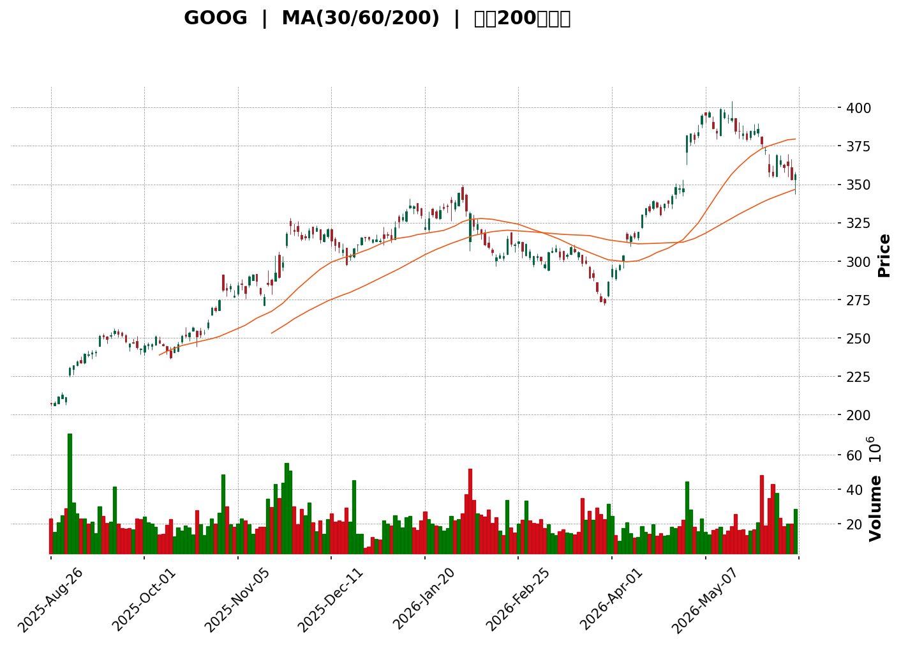
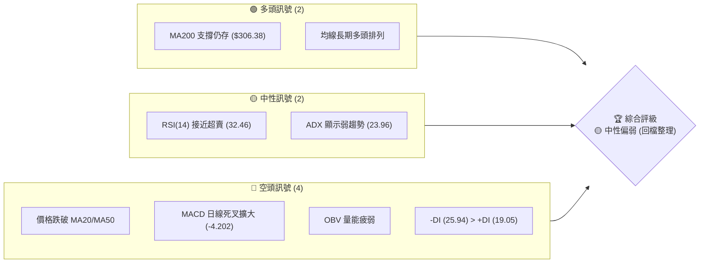
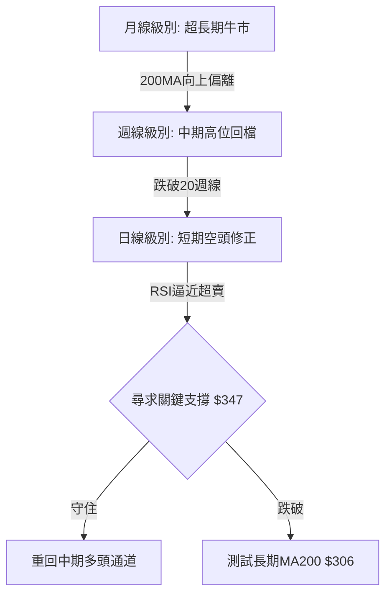
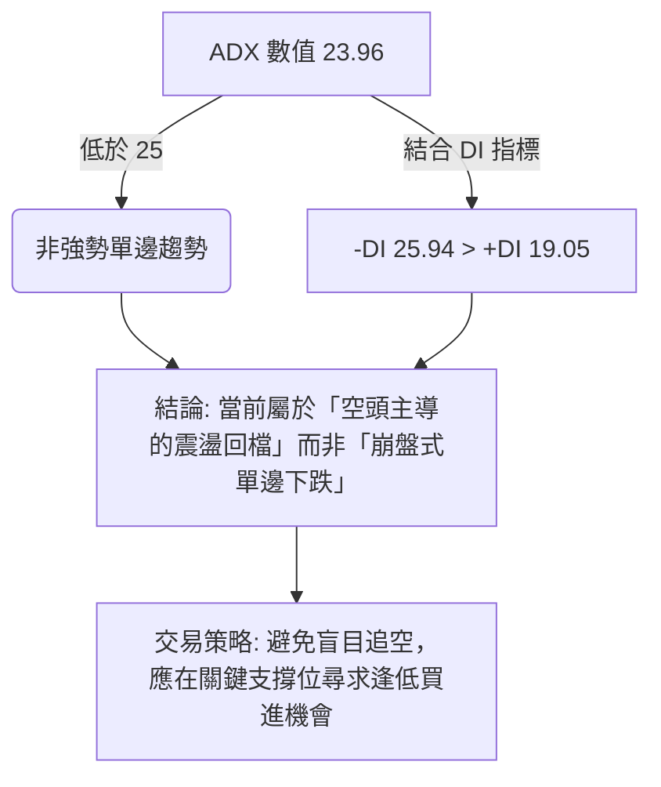
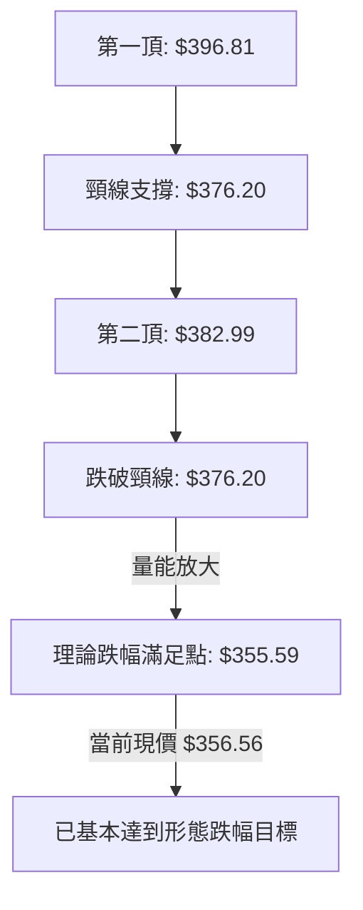

<details>
<summary>📊 靜態圖表 (點擊展開)</summary>

</details>

<html>
<head><meta charset="utf-8" /></head>
<body>
    <div style="height:500px; width:100%;">                        <script>window.PlotlyConfig = {MathJaxConfig: 'local'};</script>
        <script charset="utf-8" src="https://cdn.plot.ly/plotly-3.6.0.min.js" integrity="sha256-QaOVwtVY0T02VaHrr6pnoHLCwayMJp4O5n4YyaE3rJk=" crossorigin="anonymous"></script>                <div id="candlestick-chart" class="plotly-graph-div" style="height:100%; width:100%;"></div>            <script>                window.PLOTLYENV=window.PLOTLYENV || {};                                if (document.getElementById("candlestick-chart")) {                    Plotly.newPlot(                        "candlestick-chart",                        [{"close":{"dtype":"f8","bdata":"AAAAgHPraUAAAACAv\u002fNpQAAAAEB9eGpAAAAAwICdakAAAABAXWxqQAAAAIAkzmxAAAAAoOv\u002fbEAAAAAAA1BtQAAAAEB2Nm1AAAAAYA\u002fvbUAAAACA7OJtQAAAAEDjCW5AAAAA4AwdbkAAAACAj2hvQAAAAICzXW9AAAAAYI8rb0AAAACgw3pvQAAAAOCz129AAAAAgFSMb0AAAACAFXtvQAAAAOAL625AAAAAIM7CbkAAAABgSdZuQAAAAEA5fG5AAAAAoFpibkAAAADA6KFuQAAAAGBVvm5AAAAAAPm+bkAAAABAk2BvQAAAAKCw1G5AAAAA4FqfbkAAAAAAjzduQAAAAEDQoG1AAAAAgCqFbkAAAABgq7ZuQAAAAMD2Zm9AAAAAoGRsb0AAAACgZKlvQAAAAIBGCHBAAAAAgCVbb0AAAADgJoFvQAAAACB6p29AAAAAoAFAcEAAAABgbtZwQAAAAIB6vnBAAAAAgBsqcUAAAACgk5VxQAAAAKBMlHFAAAAAAAe5cUAAAADAQVhxQAAAAGAWw3FAAAAAYILMcUAAAAAgcnJxQAAAAGBYIHJAAAAAYLUyckAAAAAg4u1xQAAAAAAvaXFAAAAAwAJHcUAAAABAqdBxQAAAAMBwxnFAAAAAYKtGckAAAADAmhZyQAAAAGAFsXJAAAAAYI3dc0AAAABAHDB0QAAAAKB0+nNAAAAAYOb3c0AAAACgDqhzQAAAAMBttnNAAAAAgOL\u002fc0AAAABARtxzQAAAAOBbF3RAAAAAYKKgc0AAAACAXdVzQAAAACBMCXRAAAAAYKaUc0AAAAAA1mFzQAAAAECpTnNAAAAAIEE1c0AAAACAvJpyQAAAAGCo9XJAAAAA4FBDc0AAAABgx25zQAAAAOBJtHNAAAAAACG0c0AAAACAyKhzQAAAAACtn3NAAAAAYDuic0AAAABgP5ZzQAAAAECJrnNAAAAAgH7Oc0AAAABgO6JzQAAAAMAlIHRAAAAAQFpZdEAAAAAgXot0QAAAAIC7xHRAAAAA4Nr\u002fdEAAAAAA8P10QAAAAICay3RAAAAA4IqedEAAAABA1Rt0QAAAAEA5f3RAAAAAIIimdEAAAADABYB0QAAAAIB50nRAAAAAQAHpdEAAAABgdf10QAAAACB9I3VAAAAAYGkhdUAAAADAMod1QAAAACAWRHVAAAAAwHrOdEAAAACAXK50QAAAAKDaKnRAAAAAYKA\u002fdEAAAABgbeNzQAAAAGDHbnNAAAAAwHVPc0AAAAAg7hlzQAAAAADM5nJAAAAAoLH4ckAAAAAAn\u002fJyQAAAACDTp3NAAAAAIIh0c0AAAABgOmhzQAAAAKDxiXNAAAAAoPwrc0AAAACAYHBzQAAAAOBcH3NAAAAAAJ\u002fyckAAAABA3fByQAAAAOBGyHJAAAAAQJKeckAAAAAgNx1zQAAAACDtK3NAAAAAgMBDc0AAAAAgcfByQAAAAIB11HJAAAAAYMoDc0AAAAAglVNzQAAAACDaIXNAAAAA4LwYc0AAAADAw6lyQAAAAEBxrXJAAAAAwGoQckAAAAAgpxZyQAAAAGAjiXFAAAAAgIYZcUAAAACgnA9xQAAAAMD\u002f6nFAAAAA4I9rckAAAACghmRyQAAAAACyl3JAAAAAgPT7ckAAAACgz6hzQAAAACDgwnNAAAAAQHu4c0AAAADASfBzQAAAAEAZpnRAAAAAIE3kdEAAAAAAHsl0QAAAAEAiM3VAAAAAICzzdEAAAAAAV6R0QAAAACBuGHVAAAAA4L8YdUAAAABg02F1QAAAAED3xHVAAAAA4Ke0dUAAAAAgnrF1QAAAAEBd23dAAAAAANXvd0AAAABAlrZ3QAAAACCfAHhAAAAAAHCueEAAAADg\u002frB4QAAAAKD6zHhAAAAAAJkoeEAAAAAgbfl3QAAAAMDM7HhAAAAA4OXOeEAAAADAVZF4QAAAAAD6jXhAAAAAILIKeEAAAAAgsgp4QAAAAGDU83dAAAAA4G2yd0AAAACAvAl4QAAAAICTCXhAAAAAQDQeeEAAAADgQYN3QAAAAMCxRXdAAAAAgMpidkAAAAAAdTd2QAAAACDEEHdAAAAA4KPYdkAAAABguJJ2QAAAAOCjpHZAAAAAwB4VdkAAAADA9Uh2QA=="},"high":{"dtype":"f8","bdata":"GkRamrn7aUCd3YjmJB9qQId9IaNmiWpAlDE\u002fB0LXakDlQ9UodXhqQCGq6Yt65GxASdYfL24DbUA4b0\u002f7pG5tQC03d03gvW1AOLNntdEDbkD6Ccz9ZzNuQDP\u002fqlAOQ25A4jIwaVw+bkC3T67CLYhvQCUbcv6Bl29Arpfv2KBub0CveV4ekrRvQBeLNm0qA3BAlkF1COD5b0D5sCEvschvQJIkiqrijm9AHnSpL5nabkCU87vCLjRvQDqkr7X7ZG9ArHUvn1hmbkA1qfgSVNVuQEmwfnDR5G5ATRmXi07UbkCdnTWxnHZvQDKF3WraYW9ACUW5h9fYbkD4GayFY6JuQDCxn5aNi25AgcQgJFiQbkDto0M4RvFuQM9Qj2x\u002fiG9AuB00xDcRcEBgzVGINMxvQFn27jsCFnBAZN8ogizcb0AXY72N1ApwQBv06v2A629AqzSGmfFfcEDlbWrnUuRwQAD9Dx2W7XBAMU8C1+E2cUAdGjoivjVyQJV3OnmZ23FAg9zRKhfWcUCB8pTihZRxQPMYBQA64nFA\u002fqNysusDckAloCNqGL9xQIphi+c8LnJA\u002f5w8MUo8ckCaujHfmzxyQFsX\u002f1JJr3FA5wrJnKlpcUCpnUoHGl9yQMYfVYTmDXJA9j4MJ3r6ckB+qIqjoiRzQL\u002fyIZfY9XJA8vrrV8ryc0D3eSHSboB0QBZN1wKrRXRAhd\u002f7NNljdEDM3yd9E\u002fBzQNOC1tOg33NAVlo7f48WdEBJAF2EeCd0QLw37e4kM3RAZmMFAvkMdEAzx6l\u002fsORzQLBjevkyF3RAMDCnzx0ZdEC55lSVo7tzQPUwjq6rhHNAjvK\u002fIAJ3c0BSNJr6qUxzQEdUuE3JDXNAQa3\u002fV2NJc0D92qAFsXRzQIOJnQ8yvnNA2KuWLwm+c0AUcXeSWcJzQH46WobxqHNA0RR9CZHUc0AAvi+gp69zQLeVR6jhJ3RAnnDhblXtc0CrbHbnPhJ0QAdKd46fYHRA9tS06LyhdEAgNOo9wrB0QD+Q8XsO4HRATqWEYBNMdUBijLZGcQl1QOHm7g4FG3VAIB7tDtfsdEChdwbNlnp0QFDRcianxHRA1RDoQ1zsdECIuTdxgdl0QKaDPb+T\u002fnRAtx9tsGAcdUCshqzIBxN1QNgBrzh+XXVAe9iq94g9dUDwQ1nVbot1QD8Bz7wW23VABzctzs98dUD8xtK5W8N0QPRprDJWo3RAJJmZJf90dECk2uxWXRN0QHj2NDEECnRAnQM9XhLBc0D2+7VoykdzQI36Qa\u002ffB3NAIYdMOCwYc0APMMnrFhpzQDTKvM6LxXNAHpgc\u002fpvwc0COhs2\u002fZX9zQAXW5cEClHNAV0ko+3aJc0D8QYRmw3pzQBTYJ1zOO3NAKez1d7H4ckAFn5ph+xBzQMPoqNmV73JAc0gpRgK\u002fckD0DvrqDCVzQAD778dsT3NA+jg4ORxuc0CPc1QfRUdzQM9cShY0MXNA\u002fq6w6i0Wc0CXYWHs0F1zQLddXmkCaXNAl0nSqO0nc0DHX66g\u002fQJzQDW8rigA83JAOnNuqb2OckAhuyRiuWdyQP2F1KV75XFAYwEn\u002fsBucUA7Sl9wgEFxQOJwKYgJ7nFAzP1kZuScckD5OrtTjXtyQJrNf33to3JAkwHHdKz+ckAwiWKrKvNzQJEggkPT03NAqn7Rz+z0c0AUNEFVzvNzQBmyJPoOp3RAJlm9scbsdEC3LFNE1RJ1QAXbEO98PHVAH\u002fq\u002f3EsvdUA3toi+eQ91QHt3zyI6HXVAYXf5T0k\u002fdUBS2O5\u002fu3d1QLqI9OIF63VA9VhTVgjbdUDl1i+\u002f\u002fxJ2QHrHzcxl5ndAdN3F9Izyd0DpkdDQLv93QBAY6NGdS3hA5jXv8UPCeEDFhuov29F4QCk1iR8W4nhAewDoH3yheEARb4krUiN4QMXArO4H+3hAW1s6vNLteEDQuG0xRbp4QC2XMaOgQ3lAlad5xgWSeEARwv61cGd4QIHVCaojR3hAVDSfWTcKeEBU9xkFiBJ4QETmnHDZV3hA5KTwMD9ceEBnfNUjutZ3QI5qB8b+ZXdANiGpyRQZd0DaQcPygqR2QCq45EszGndAVVhcpqUPd0AAAACAFLZ2QAAAAGASG3dAAAAAwPXkdkAAAAAAKWB2QA=="},"hovertemplate":"\u003cb\u003e%{x|%Y-%m-%d}\u003c\u002fb\u003e\u003cbr\u003e\u958b: $%{open:.2f}\u003cbr\u003e\u9ad8: $%{high:.2f}\u003cbr\u003e\u4f4e: $%{low:.2f}\u003cbr\u003e\u6536: $%{close:.2f}\u003cextra\u003e\u003c\u002fextra\u003e","low":{"dtype":"f8","bdata":"4mydfZa7aUDQb3h0rLlpQEGW0sNI4GlAETmG99BLakC+lGTU3MtpQKYHHL5TD2xAPJlHYKhDbEA+DXl0\u002fPZsQDTeGoS6KG1AStFWAI0dbUC864tcnbRtQHPeES7Ag21Ayb\u002f2BhLBbUDQE7llBpBuQP6YznI\u002fJ29AmCb25h\u002fDbkDzfrLz3DNvQIyS9JRlcm9A9gc0LDhKb0CKgQCIKVNvQP1Ue4aQ125AP3hTOKwlbkCYHk5nCsVuQOFpzhYtV25AN0PuY0bjbUBw7dYZbddtQPxGwkgkVG5A4W2Xp9w\u002fbkA4afwks6ZuQHYz1kB4ym5AZY\u002furYmTbkBAjAWrweZtQLqejIYah21ATC9p9u0IbkDxj+ZQmRZuQMRDudfUyW5AGtLto79Fb0AKTIyUUQNvQA\u002fJv0dDw29At1Auwx+GbkC2VwoRwT5vQHJdcurAiG9A9+DuKyvzb0A8n8Fbv4ZwQCA8arhbqnBATj+aYXq+cECssDwebH5xQHRCKo6uT3FAJRb2CyV9cUApaz+TLEVxQLGpI+xhVXFACg1YDhuRcUCoouaaNTNxQLyfTBzEr3FALq3MzRH1cUD9p2LQLb1xQPbrYnlMV3FAV7aSoRDucEBC2yO6yLpxQLhQUE1tZ3FA0fCIYLfxcUCrGmd9qwlyQLWKHOOLXHJAyCl3TLdMc0B5ipbKG9NzQEg6r61FyXNAWIQ3mx7Fc0C7MVBi2pVzQLgWKGyvmXNAs5HDrKSac0AdO7zPj69zQBwtAkiq9XNA61XVEwx4c0CllAJsZINzQPJRLm\u002fQr3NAqoR0C5xXc0A7s6RH8yhzQM\u002fjJ6N0FXNAf08Tee\u002f2ckDruLdC\u002fZByQL6IXY3Nw3JA20LlgyDfckAVmZG2CSNzQDO3EfqCZXNAXmbJ75OOc0C8Wt4g+JRzQJF7US\u002fjd3NACiXpknWNc0BPb21trnxzQAnTgdbpY3NAWyIasmatc0DkOCoQ635zQOqFeONuoXNAo1tjvR0ZdEBi\u002fLwSMF10QGsFSvhcUXRAJtFVXp7edEAzQd9iU6t0QMQE8v64rXRAPcBeOd57dEDXy+4pigd0QCV6WeD38XNAt3QjejaHdEBSMm4VrHh0QCdGKnsAcXRArDGR7gfVdEClfMguJbt0QL3uwbKyZHRABD6je0vDdEADFjvlJPl0QHgnT8deInVAhzjC2AqPdEAgGMq7TyhzQEnFoSS3+3NAuBUnEJHUc0AiTGJ4\u002faNzQOvKJaqaW3NADGOFJfc7c0B\u002fIvb0DfhyQIbhW0UziHJAqAIB+l\u002fZckBItPYSccRyQNRq5iRdAHNA6N9b9l1Zc0BGOYlxDBtzQJEfEd5MT3NA93X09T7gckAcZUHnHfNyQGWvqHSsynJAyAtRDf2EckDD\u002fzbqhMZyQJ06Wm7lmnJAQ\u002fyVzdVtckDg3IciDVxyQJfkqZ0FEnNAJY1HG38ac0AObrx2i8pyQMBtd2OYuXJA9B0oLg7ackA78THXqwJzQCbvKZzHFXNAyMxXZxrNckCdJKTmJIlyQI6MVbCcnXJAXBiYeeYKckB4XT54J\u002fNxQEgZ2EkdbnFA\u002fGebUAwVcUAVnzN08vVwQEa3PiJ\u002fSXFAVdeFALwUckDFtMs5WvZxQGQN7wjQWXJAAljd8\u002fRzckD6qWhDRYhzQFk5gr+KVHNAiJND6Jylc0BZLTh5BZhzQJhoBDtPD3RAxNpBsGWHdECnGmpCNbd0QEP\u002fW81u0XRAYPOXJdzmdEAFs8Fx6JZ0QLbEP+AnzHRAWf2fQLztdECj4Pe\u002fld10QGLonB6uSXVAYjrariqBdUDuabOllWN1QPJGBBHyrXZAoU5ZfIxwd0CKGAOysYh3QP+XbIjwwXdAhY\u002fb7t8teED23SMrNGF4QLeelZPulnhA93qQlPYfeEDdneyZ3bd3QK5pRoSb1XdA8PGWUd6HeEBqkkPFaFh4QFOo2VGjanhAteZNblDsd0Brq17SV7x3QCaMgDQHtHdAxjlZIoWgd0Ci2P9ql653QGbq7dhS3HdA74Zuv1TQd0BsnlufMmF3QKABB1LNF3dAibMwWpUsdkCIF+BzqyJ2QEzrIKZiKXZAlGzUjJmWdkAAAACAPV52QAAAACCFK3ZAAAAAwPUMdkAAAACAPXp1QA=="},"name":"\u50f9\u683c","open":{"dtype":"f8","bdata":"zfXgU9r4aUDSCWlS6LtpQDW0uirx52lAEmT\u002fl2NVakDbnlo6owxqQBwRwiS5OmxAtL7LDv2vbEBqFHWs6\u002f9sQAg4+gCFam1AzJZUhWs3bUB4OsD3BdltQF+qiKFy9W1Aiepny4YKbkDRNlaVIpVuQHSysKrDem9ANRMWs\u002fpeb0CSyjXowGtvQJdVhPzvnG9AWNVGzQLJb0C591TtFKVvQLZ0jgUEdW9A8R9cmY2LbkBvOfbtm+luQKliGyNC+W5Av3xBWrRSbkAc2ed+qRZuQMgM8GgapW5AoVPzTAKYbkBozcTzkqluQFk1g0ctDm9ABe5CBP22bkA7slF0lJJuQHPRTgn2NW5ARQK9Od8RbkAt6M\u002fxBiluQFXoGNcw825Ax90hgBN\u002fb0D4WddZd1tvQPfbRg9i129A3cV+lwXYb0DcJdxBW9BvQGr4ENuEpm9AK8eEGL8McEDZW0M+dI1wQEaVaVG+2nBAGpJjMFrBcEAvafewYzJyQB\u002fWE2dqqnFAhCH8fuGdcUBPe\u002fk4XkhxQAs1QOdVbXFAnMHPFdHScUDEJQPddrpxQKxQH+pPy3FAYFVi\u002fS36cUCsyEizNzhyQKV78wfnpnFA\u002fRK9Ps\u002f1cEC6vQ+Xb91xQKVyHOG6\u002fnFAxoXMofTxcUAXToBdTQJzQBp3dsaghHJA3Df9BW1mc0DcWg0ukmJ0QOa7ZZ5wAnRAZKEZmsEsdECtgnLhqc1zQGNk7DJ7xHNASmsep5a2c0Cd5BrTmyZ0QAzJAf\u002f79XNAmni508YJdEBUEif7D4tzQFrPswlPw3NAsEGLMeUKdEBpnuKlJaZzQPskNdV4g3NA7914P5wZc0Bt1sE3tUlzQPL+MNCh6nJAtIlJy\u002fztckBl06nvGW1zQPVxO+upa3NADdgvb8y7c0AaQEGeH7hzQBauYaSWhnNAvvb1FwSQc0DlV2hsYI9zQFCut\u002f3O0nNAsMLTfnzUc0DR1i+fVc5zQOcSrEONonNA92SIWV2NdECy4OpxAHF0QDy4hq0uYXRA+16ypXrtdEDzGjfVw+h0QCDplDXSGXVAmvtFcPfndECvEwHLIQ10QEzyjNDQCnRAROgNsULddECVzbPKiMN0QCqslO9YfHRAVxLeYRLzdECKqnM8uwJ1QKh1ZFd+PnVACJM\u002fYWDgdEAmbFDCxQF1QLz+FZr2wHVA3dKN8+Z0dUCCWe8JqYxzQF2TiejDbnRAg8wZ5CENdECjEyUQ3Ad0QB8Sgxaz6HNAh4f68RN\u002fc0C9zSI\u002fVDlzQPH+QGf2w3JAvgSB75jgckA+UEKvAOJyQMmQ8HxvBnNA8HshjZPrc0BUkij\u002fwGNzQIsMQR1ne3NAdcX+RVmGc0AkDKuJsfhyQPt6zSUd6XJAbMUaGn2gckD3x9LWo+RyQMY+RYLe7HJA3DPHSPh6ckB3bTthVF9yQLYOV3kOG3NAHNYmGdohc0Bw1uy7aSBzQOxI1XOHJ3NAl08vpa32ckBaK2DNyQdzQIxot0uEO3NAP2RxFXHwckDldOKdMf5yQGmYt4eWxXJA6LnEWoKAckBpnU6Rlj9yQMG+zjJJ4HFAM7gb6LpTcUBetoK1YzRxQB35SBb4VXFA5D7gvuMcckD7eyf6Dg1yQCfk9ipdaHJA8Dc7Flq\u002fckAyFT6jONpzQE6eebUGkHNAHMUAlIngc0CJDS1Wr7NzQGfD99nwHXRAamv3YceldEA+SVcpXvp0QHIGaV6p43RAs8wkt7MldUC4DidmIfZ0QIe+OALw6nRAC\u002fjvoO41dUDV1kIVRRh1QKIAZE7FenVAqA\u002fMrWGrdUAM0SACW5R1QGVINdOBMHdAoqPZ6Aqcd0CYjtXlcOF3QGlau6k+2ndAI85pzLBVeEB9c\u002fqJI814QJuONZmGoHhADlWlt0dneEBXnMN3Swx4QOIPSffN2ndACcnGs9mYeEApyjrip494QALuO+05fnhAF284zgOReEBSwrFH7wx4QD980th73HdACzz+0Hjwd0BDcA7ZQMx3QHVUa3aO6HdAiY5a0RD6d0CJ091v7s93QEcfI2OdRXdApnxqnxCvdkB3G4xV6WF2QMnPeZKeM3ZAjPMWPZWydkAAAACAwqd2QAAAAAApznZAAAAAwMyQdkAAAACAPRB2QA=="},"x":["2025-08-26T00:00:00-04:00","2025-08-27T00:00:00-04:00","2025-08-28T00:00:00-04:00","2025-08-29T00:00:00-04:00","2025-09-02T00:00:00-04:00","2025-09-03T00:00:00-04:00","2025-09-04T00:00:00-04:00","2025-09-05T00:00:00-04:00","2025-09-08T00:00:00-04:00","2025-09-09T00:00:00-04:00","2025-09-10T00:00:00-04:00","2025-09-11T00:00:00-04:00","2025-09-12T00:00:00-04:00","2025-09-15T00:00:00-04:00","2025-09-16T00:00:00-04:00","2025-09-17T00:00:00-04:00","2025-09-18T00:00:00-04:00","2025-09-19T00:00:00-04:00","2025-09-22T00:00:00-04:00","2025-09-23T00:00:00-04:00","2025-09-24T00:00:00-04:00","2025-09-25T00:00:00-04:00","2025-09-26T00:00:00-04:00","2025-09-29T00:00:00-04:00","2025-09-30T00:00:00-04:00","2025-10-01T00:00:00-04:00","2025-10-02T00:00:00-04:00","2025-10-03T00:00:00-04:00","2025-10-06T00:00:00-04:00","2025-10-07T00:00:00-04:00","2025-10-08T00:00:00-04:00","2025-10-09T00:00:00-04:00","2025-10-10T00:00:00-04:00","2025-10-13T00:00:00-04:00","2025-10-14T00:00:00-04:00","2025-10-15T00:00:00-04:00","2025-10-16T00:00:00-04:00","2025-10-17T00:00:00-04:00","2025-10-20T00:00:00-04:00","2025-10-21T00:00:00-04:00","2025-10-22T00:00:00-04:00","2025-10-23T00:00:00-04:00","2025-10-24T00:00:00-04:00","2025-10-27T00:00:00-04:00","2025-10-28T00:00:00-04:00","2025-10-29T00:00:00-04:00","2025-10-30T00:00:00-04:00","2025-10-31T00:00:00-04:00","2025-11-03T00:00:00-05:00","2025-11-04T00:00:00-05:00","2025-11-05T00:00:00-05:00","2025-11-06T00:00:00-05:00","2025-11-07T00:00:00-05:00","2025-11-10T00:00:00-05:00","2025-11-11T00:00:00-05:00","2025-11-12T00:00:00-05:00","2025-11-13T00:00:00-05:00","2025-11-14T00:00:00-05:00","2025-11-17T00:00:00-05:00","2025-11-18T00:00:00-05:00","2025-11-19T00:00:00-05:00","2025-11-20T00:00:00-05:00","2025-11-21T00:00:00-05:00","2025-11-24T00:00:00-05:00","2025-11-25T00:00:00-05:00","2025-11-26T00:00:00-05:00","2025-11-28T00:00:00-05:00","2025-12-01T00:00:00-05:00","2025-12-02T00:00:00-05:00","2025-12-03T00:00:00-05:00","2025-12-04T00:00:00-05:00","2025-12-05T00:00:00-05:00","2025-12-08T00:00:00-05:00","2025-12-09T00:00:00-05:00","2025-12-10T00:00:00-05:00","2025-12-11T00:00:00-05:00","2025-12-12T00:00:00-05:00","2025-12-15T00:00:00-05:00","2025-12-16T00:00:00-05:00","2025-12-17T00:00:00-05:00","2025-12-18T00:00:00-05:00","2025-12-19T00:00:00-05:00","2025-12-22T00:00:00-05:00","2025-12-23T00:00:00-05:00","2025-12-24T00:00:00-05:00","2025-12-26T00:00:00-05:00","2025-12-29T00:00:00-05:00","2025-12-30T00:00:00-05:00","2025-12-31T00:00:00-05:00","2026-01-02T00:00:00-05:00","2026-01-05T00:00:00-05:00","2026-01-06T00:00:00-05:00","2026-01-07T00:00:00-05:00","2026-01-08T00:00:00-05:00","2026-01-09T00:00:00-05:00","2026-01-12T00:00:00-05:00","2026-01-13T00:00:00-05:00","2026-01-14T00:00:00-05:00","2026-01-15T00:00:00-05:00","2026-01-16T00:00:00-05:00","2026-01-20T00:00:00-05:00","2026-01-21T00:00:00-05:00","2026-01-22T00:00:00-05:00","2026-01-23T00:00:00-05:00","2026-01-26T00:00:00-05:00","2026-01-27T00:00:00-05:00","2026-01-28T00:00:00-05:00","2026-01-29T00:00:00-05:00","2026-01-30T00:00:00-05:00","2026-02-02T00:00:00-05:00","2026-02-03T00:00:00-05:00","2026-02-04T00:00:00-05:00","2026-02-05T00:00:00-05:00","2026-02-06T00:00:00-05:00","2026-02-09T00:00:00-05:00","2026-02-10T00:00:00-05:00","2026-02-11T00:00:00-05:00","2026-02-12T00:00:00-05:00","2026-02-13T00:00:00-05:00","2026-02-17T00:00:00-05:00","2026-02-18T00:00:00-05:00","2026-02-19T00:00:00-05:00","2026-02-20T00:00:00-05:00","2026-02-23T00:00:00-05:00","2026-02-24T00:00:00-05:00","2026-02-25T00:00:00-05:00","2026-02-26T00:00:00-05:00","2026-02-27T00:00:00-05:00","2026-03-02T00:00:00-05:00","2026-03-03T00:00:00-05:00","2026-03-04T00:00:00-05:00","2026-03-05T00:00:00-05:00","2026-03-06T00:00:00-05:00","2026-03-09T00:00:00-04:00","2026-03-10T00:00:00-04:00","2026-03-11T00:00:00-04:00","2026-03-12T00:00:00-04:00","2026-03-13T00:00:00-04:00","2026-03-16T00:00:00-04:00","2026-03-17T00:00:00-04:00","2026-03-18T00:00:00-04:00","2026-03-19T00:00:00-04:00","2026-03-20T00:00:00-04:00","2026-03-23T00:00:00-04:00","2026-03-24T00:00:00-04:00","2026-03-25T00:00:00-04:00","2026-03-26T00:00:00-04:00","2026-03-27T00:00:00-04:00","2026-03-30T00:00:00-04:00","2026-03-31T00:00:00-04:00","2026-04-01T00:00:00-04:00","2026-04-02T00:00:00-04:00","2026-04-06T00:00:00-04:00","2026-04-07T00:00:00-04:00","2026-04-08T00:00:00-04:00","2026-04-09T00:00:00-04:00","2026-04-10T00:00:00-04:00","2026-04-13T00:00:00-04:00","2026-04-14T00:00:00-04:00","2026-04-15T00:00:00-04:00","2026-04-16T00:00:00-04:00","2026-04-17T00:00:00-04:00","2026-04-20T00:00:00-04:00","2026-04-21T00:00:00-04:00","2026-04-22T00:00:00-04:00","2026-04-23T00:00:00-04:00","2026-04-24T00:00:00-04:00","2026-04-27T00:00:00-04:00","2026-04-28T00:00:00-04:00","2026-04-29T00:00:00-04:00","2026-04-30T00:00:00-04:00","2026-05-01T00:00:00-04:00","2026-05-04T00:00:00-04:00","2026-05-05T00:00:00-04:00","2026-05-06T00:00:00-04:00","2026-05-07T00:00:00-04:00","2026-05-08T00:00:00-04:00","2026-05-11T00:00:00-04:00","2026-05-12T00:00:00-04:00","2026-05-13T00:00:00-04:00","2026-05-14T00:00:00-04:00","2026-05-15T00:00:00-04:00","2026-05-18T00:00:00-04:00","2026-05-19T00:00:00-04:00","2026-05-20T00:00:00-04:00","2026-05-21T00:00:00-04:00","2026-05-22T00:00:00-04:00","2026-05-26T00:00:00-04:00","2026-05-27T00:00:00-04:00","2026-05-28T00:00:00-04:00","2026-05-29T00:00:00-04:00","2026-06-01T00:00:00-04:00","2026-06-02T00:00:00-04:00","2026-06-03T00:00:00-04:00","2026-06-04T00:00:00-04:00","2026-06-05T00:00:00-04:00","2026-06-08T00:00:00-04:00","2026-06-09T00:00:00-04:00","2026-06-10T00:00:00-04:00","2026-06-11T00:00:00-04:00"],"type":"candlestick"},{"hovertemplate":"MA30: $%{y:.2f}\u003cextra\u003e\u003c\u002fextra\u003e","line":{"color":"#2196F3","dash":"dash","width":2},"mode":"lines","name":"MA30","x":["2025-08-26T00:00:00-04:00","2025-08-27T00:00:00-04:00","2025-08-28T00:00:00-04:00","2025-08-29T00:00:00-04:00","2025-09-02T00:00:00-04:00","2025-09-03T00:00:00-04:00","2025-09-04T00:00:00-04:00","2025-09-05T00:00:00-04:00","2025-09-08T00:00:00-04:00","2025-09-09T00:00:00-04:00","2025-09-10T00:00:00-04:00","2025-09-11T00:00:00-04:00","2025-09-12T00:00:00-04:00","2025-09-15T00:00:00-04:00","2025-09-16T00:00:00-04:00","2025-09-17T00:00:00-04:00","2025-09-18T00:00:00-04:00","2025-09-19T00:00:00-04:00","2025-09-22T00:00:00-04:00","2025-09-23T00:00:00-04:00","2025-09-24T00:00:00-04:00","2025-09-25T00:00:00-04:00","2025-09-26T00:00:00-04:00","2025-09-29T00:00:00-04:00","2025-09-30T00:00:00-04:00","2025-10-01T00:00:00-04:00","2025-10-02T00:00:00-04:00","2025-10-03T00:00:00-04:00","2025-10-06T00:00:00-04:00","2025-10-07T00:00:00-04:00","2025-10-08T00:00:00-04:00","2025-10-09T00:00:00-04:00","2025-10-10T00:00:00-04:00","2025-10-13T00:00:00-04:00","2025-10-14T00:00:00-04:00","2025-10-15T00:00:00-04:00","2025-10-16T00:00:00-04:00","2025-10-17T00:00:00-04:00","2025-10-20T00:00:00-04:00","2025-10-21T00:00:00-04:00","2025-10-22T00:00:00-04:00","2025-10-23T00:00:00-04:00","2025-10-24T00:00:00-04:00","2025-10-27T00:00:00-04:00","2025-10-28T00:00:00-04:00","2025-10-29T00:00:00-04:00","2025-10-30T00:00:00-04:00","2025-10-31T00:00:00-04:00","2025-11-03T00:00:00-05:00","2025-11-04T00:00:00-05:00","2025-11-05T00:00:00-05:00","2025-11-06T00:00:00-05:00","2025-11-07T00:00:00-05:00","2025-11-10T00:00:00-05:00","2025-11-11T00:00:00-05:00","2025-11-12T00:00:00-05:00","2025-11-13T00:00:00-05:00","2025-11-14T00:00:00-05:00","2025-11-17T00:00:00-05:00","2025-11-18T00:00:00-05:00","2025-11-19T00:00:00-05:00","2025-11-20T00:00:00-05:00","2025-11-21T00:00:00-05:00","2025-11-24T00:00:00-05:00","2025-11-25T00:00:00-05:00","2025-11-26T00:00:00-05:00","2025-11-28T00:00:00-05:00","2025-12-01T00:00:00-05:00","2025-12-02T00:00:00-05:00","2025-12-03T00:00:00-05:00","2025-12-04T00:00:00-05:00","2025-12-05T00:00:00-05:00","2025-12-08T00:00:00-05:00","2025-12-09T00:00:00-05:00","2025-12-10T00:00:00-05:00","2025-12-11T00:00:00-05:00","2025-12-12T00:00:00-05:00","2025-12-15T00:00:00-05:00","2025-12-16T00:00:00-05:00","2025-12-17T00:00:00-05:00","2025-12-18T00:00:00-05:00","2025-12-19T00:00:00-05:00","2025-12-22T00:00:00-05:00","2025-12-23T00:00:00-05:00","2025-12-24T00:00:00-05:00","2025-12-26T00:00:00-05:00","2025-12-29T00:00:00-05:00","2025-12-30T00:00:00-05:00","2025-12-31T00:00:00-05:00","2026-01-02T00:00:00-05:00","2026-01-05T00:00:00-05:00","2026-01-06T00:00:00-05:00","2026-01-07T00:00:00-05:00","2026-01-08T00:00:00-05:00","2026-01-09T00:00:00-05:00","2026-01-12T00:00:00-05:00","2026-01-13T00:00:00-05:00","2026-01-14T00:00:00-05:00","2026-01-15T00:00:00-05:00","2026-01-16T00:00:00-05:00","2026-01-20T00:00:00-05:00","2026-01-21T00:00:00-05:00","2026-01-22T00:00:00-05:00","2026-01-23T00:00:00-05:00","2026-01-26T00:00:00-05:00","2026-01-27T00:00:00-05:00","2026-01-28T00:00:00-05:00","2026-01-29T00:00:00-05:00","2026-01-30T00:00:00-05:00","2026-02-02T00:00:00-05:00","2026-02-03T00:00:00-05:00","2026-02-04T00:00:00-05:00","2026-02-05T00:00:00-05:00","2026-02-06T00:00:00-05:00","2026-02-09T00:00:00-05:00","2026-02-10T00:00:00-05:00","2026-02-11T00:00:00-05:00","2026-02-12T00:00:00-05:00","2026-02-13T00:00:00-05:00","2026-02-17T00:00:00-05:00","2026-02-18T00:00:00-05:00","2026-02-19T00:00:00-05:00","2026-02-20T00:00:00-05:00","2026-02-23T00:00:00-05:00","2026-02-24T00:00:00-05:00","2026-02-25T00:00:00-05:00","2026-02-26T00:00:00-05:00","2026-02-27T00:00:00-05:00","2026-03-02T00:00:00-05:00","2026-03-03T00:00:00-05:00","2026-03-04T00:00:00-05:00","2026-03-05T00:00:00-05:00","2026-03-06T00:00:00-05:00","2026-03-09T00:00:00-04:00","2026-03-10T00:00:00-04:00","2026-03-11T00:00:00-04:00","2026-03-12T00:00:00-04:00","2026-03-13T00:00:00-04:00","2026-03-16T00:00:00-04:00","2026-03-17T00:00:00-04:00","2026-03-18T00:00:00-04:00","2026-03-19T00:00:00-04:00","2026-03-20T00:00:00-04:00","2026-03-23T00:00:00-04:00","2026-03-24T00:00:00-04:00","2026-03-25T00:00:00-04:00","2026-03-26T00:00:00-04:00","2026-03-27T00:00:00-04:00","2026-03-30T00:00:00-04:00","2026-03-31T00:00:00-04:00","2026-04-01T00:00:00-04:00","2026-04-02T00:00:00-04:00","2026-04-06T00:00:00-04:00","2026-04-07T00:00:00-04:00","2026-04-08T00:00:00-04:00","2026-04-09T00:00:00-04:00","2026-04-10T00:00:00-04:00","2026-04-13T00:00:00-04:00","2026-04-14T00:00:00-04:00","2026-04-15T00:00:00-04:00","2026-04-16T00:00:00-04:00","2026-04-17T00:00:00-04:00","2026-04-20T00:00:00-04:00","2026-04-21T00:00:00-04:00","2026-04-22T00:00:00-04:00","2026-04-23T00:00:00-04:00","2026-04-24T00:00:00-04:00","2026-04-27T00:00:00-04:00","2026-04-28T00:00:00-04:00","2026-04-29T00:00:00-04:00","2026-04-30T00:00:00-04:00","2026-05-01T00:00:00-04:00","2026-05-04T00:00:00-04:00","2026-05-05T00:00:00-04:00","2026-05-06T00:00:00-04:00","2026-05-07T00:00:00-04:00","2026-05-08T00:00:00-04:00","2026-05-11T00:00:00-04:00","2026-05-12T00:00:00-04:00","2026-05-13T00:00:00-04:00","2026-05-14T00:00:00-04:00","2026-05-15T00:00:00-04:00","2026-05-18T00:00:00-04:00","2026-05-19T00:00:00-04:00","2026-05-20T00:00:00-04:00","2026-05-21T00:00:00-04:00","2026-05-22T00:00:00-04:00","2026-05-26T00:00:00-04:00","2026-05-27T00:00:00-04:00","2026-05-28T00:00:00-04:00","2026-05-29T00:00:00-04:00","2026-06-01T00:00:00-04:00","2026-06-02T00:00:00-04:00","2026-06-03T00:00:00-04:00","2026-06-04T00:00:00-04:00","2026-06-05T00:00:00-04:00","2026-06-08T00:00:00-04:00","2026-06-09T00:00:00-04:00","2026-06-10T00:00:00-04:00","2026-06-11T00:00:00-04:00"],"y":{"dtype":"f8","bdata":"AAAAAAAA+H8AAAAAAAD4fwAAAAAAAPh\u002fAAAAAAAA+H8AAAAAAAD4fwAAAAAAAPh\u002fAAAAAAAA+H8AAAAAAAD4fwAAAAAAAPh\u002fAAAAAAAA+H8AAAAAAAD4fwAAAAAAAPh\u002fAAAAAAAA+H8AAAAAAAD4fwAAAAAAAPh\u002fAAAAAAAA+H8AAAAAAAD4fwAAAAAAAPh\u002fAAAAAAAA+H8AAAAAAAD4fwAAAAAAAPh\u002fAAAAAAAA+H8AAAAAAAD4fwAAAAAAAPh\u002fAAAAAAAA+H8AAAAAAAD4fwAAAAAAAPh\u002fAAAAAAAA+H8AAAAAAAD4f2ZmZoZD221AZmZm1mQDbkDv7u6eySduQCIiIlK7Qm5Ad3d3xw1kbkC8u7v7qYhuQAAAACDTnm5AMzMz04GzbkDNzMycjcduQERERLTj325AMzMzkwbsbkAiIiJS1fluQN7d3Z2eB29AmpmZKfwbb0AiIiISVC9vQKuqqtpvQW9AAAAAYGRcb0CamZkp33tvQDMzMxMrmG9A3t3d\u002fWy5b0BmZmaGztRvQLy7u2sc\u002fG9AERERQbEScECrqqqiACRwQCIiIjqcPHBAVVVV5UJWcEBmZmYWj2xwQJqZmaH1fXBA7+7u1jWOcEAREREpW6BwQLy7uxt+tHBA7+7u1srNcEAAAABIOOdwQO\u002fu7pZOCHFAiYiIIJsvcUAiIiLy1FhxQImIiLhUfXFA3t3dhaehcUC8u7u7TMJxQBEREXG04XFAd3d395QGckDe3d11oylyQO\u002fu7p4GTnJAd3d3x9hqckCJiIhIaYRyQGZmZlaBoHJAERERkR+1ckDNzMwcd8RyQO\u002fu7u4103JAmpmZieLfckDNzMxcoupyQN7d3W3a9HJAd3d3x1gBc0De3d2NShJzQJqZmYnBH3NAVVVVdZosc0Dv7u7eXTtzQAAAAPA\u002fTnNAzczMbFtic0B3d3cHenFzQM3MzBy\u002fgXNA7+7urs6Oc0BERES0\u002fptzQERERIQ7qHNAIiIi8lusc0DNzMysZq9zQFVVVcUktnNAAAAAMPG+c0ARERGRVspzQKuqqsqT03NAvLu7q93Yc0CamZkJ\u002fNpzQJqZmVly3nNAVVVVNS3nc0C8u7t73exzQCIiIjKS83NA7+7ujur+c0AiIiISowx0QLy7u7tDHHRAmpmZeassdECamZlZnkV0QM3MzKxMWXRAzczMvHhmdEB3d3fXH3F0QJqZmZkTdXRAq6qq+rl5dECJiIhornt0QHd3dycNenRAVVVV1Up3dEDe3d39JXN0QM3MzIx9bHRA7+7uHl1ldEAzMzOTgl90QCIiItJ\u002fW3RAd3d3N99TdEAzMzPTKkp0QBEREaGsP3RAd3d3JxQwdEAzMzOj0yJ0QBEREVGNFHRAiYiIuEkGdEBVVVWFUvxzQHd3d9ew7XNAiYiI2Fvcc0CJiIgoiNBzQJqZmWlywnNAiYiIuGe0c0BERESU56JzQAAAACA0j3NAq6qqSiZ9c0BVVVXFXGpzQCIiIpInWHNAzczMLJBJc0AiIiLiVzhzQLy7uyuhK3NAAAAAQP0Yc0Dv7u5OoQlzQM3MzCxx+XJA3t3d3ZPmckAAAADAKtVyQDMzMxPGzHJAAAAAwBHIckBEREQ0VcNyQImIiAhDunJAzczMHD62ckCJiIg4ZbhyQJqZmQlLunJAzczM7Pm+ckDv7u5uPcNyQGZmZrZD0HJAVVVVldrgckCamZl5mPByQDMzM2M5BXNAIiIiYhwZc0Crqqr6JSZzQN7d3a2QNnNAq6qqyjJGc0BmZmZmC1tzQKuqqsogdHNAvLu7GxeLc0C8u7ubSp9zQHd3d8ebx3NAIiIiYunwc0B3d3d3ARx0QN7d3e1xSXRAIiIikumBdEBERETUQbp0QImIiHhA+HRAIiIi0nw0dUDNzMw8e291QGZmZlZGq3VARERENMnhdUBmZmbGehZ2QKuqqgpbSXZA7+7ufoN0dkCamZnp6Jl2QJqZmcmsvXZAZmZmRpvfdkARERGRlgJ3QKuqqgqBH3dA7+7uvgg7d0BVVVU1TlJ3QImIiKj9Y3dAvLu7qz5wd0Crqqqarn13QFVVVUV+jndAVVVVRWydd0CamZkJlqd3QJqZmbkKr3dAMzMz40Gyd0B3d3dXTbd3QA=="},"type":"scatter"},{"hovertemplate":"MA60: $%{y:.2f}\u003cextra\u003e\u003c\u002fextra\u003e","line":{"color":"#9C27B0","dash":"dash","width":2},"mode":"lines","name":"MA60","x":["2025-08-26T00:00:00-04:00","2025-08-27T00:00:00-04:00","2025-08-28T00:00:00-04:00","2025-08-29T00:00:00-04:00","2025-09-02T00:00:00-04:00","2025-09-03T00:00:00-04:00","2025-09-04T00:00:00-04:00","2025-09-05T00:00:00-04:00","2025-09-08T00:00:00-04:00","2025-09-09T00:00:00-04:00","2025-09-10T00:00:00-04:00","2025-09-11T00:00:00-04:00","2025-09-12T00:00:00-04:00","2025-09-15T00:00:00-04:00","2025-09-16T00:00:00-04:00","2025-09-17T00:00:00-04:00","2025-09-18T00:00:00-04:00","2025-09-19T00:00:00-04:00","2025-09-22T00:00:00-04:00","2025-09-23T00:00:00-04:00","2025-09-24T00:00:00-04:00","2025-09-25T00:00:00-04:00","2025-09-26T00:00:00-04:00","2025-09-29T00:00:00-04:00","2025-09-30T00:00:00-04:00","2025-10-01T00:00:00-04:00","2025-10-02T00:00:00-04:00","2025-10-03T00:00:00-04:00","2025-10-06T00:00:00-04:00","2025-10-07T00:00:00-04:00","2025-10-08T00:00:00-04:00","2025-10-09T00:00:00-04:00","2025-10-10T00:00:00-04:00","2025-10-13T00:00:00-04:00","2025-10-14T00:00:00-04:00","2025-10-15T00:00:00-04:00","2025-10-16T00:00:00-04:00","2025-10-17T00:00:00-04:00","2025-10-20T00:00:00-04:00","2025-10-21T00:00:00-04:00","2025-10-22T00:00:00-04:00","2025-10-23T00:00:00-04:00","2025-10-24T00:00:00-04:00","2025-10-27T00:00:00-04:00","2025-10-28T00:00:00-04:00","2025-10-29T00:00:00-04:00","2025-10-30T00:00:00-04:00","2025-10-31T00:00:00-04:00","2025-11-03T00:00:00-05:00","2025-11-04T00:00:00-05:00","2025-11-05T00:00:00-05:00","2025-11-06T00:00:00-05:00","2025-11-07T00:00:00-05:00","2025-11-10T00:00:00-05:00","2025-11-11T00:00:00-05:00","2025-11-12T00:00:00-05:00","2025-11-13T00:00:00-05:00","2025-11-14T00:00:00-05:00","2025-11-17T00:00:00-05:00","2025-11-18T00:00:00-05:00","2025-11-19T00:00:00-05:00","2025-11-20T00:00:00-05:00","2025-11-21T00:00:00-05:00","2025-11-24T00:00:00-05:00","2025-11-25T00:00:00-05:00","2025-11-26T00:00:00-05:00","2025-11-28T00:00:00-05:00","2025-12-01T00:00:00-05:00","2025-12-02T00:00:00-05:00","2025-12-03T00:00:00-05:00","2025-12-04T00:00:00-05:00","2025-12-05T00:00:00-05:00","2025-12-08T00:00:00-05:00","2025-12-09T00:00:00-05:00","2025-12-10T00:00:00-05:00","2025-12-11T00:00:00-05:00","2025-12-12T00:00:00-05:00","2025-12-15T00:00:00-05:00","2025-12-16T00:00:00-05:00","2025-12-17T00:00:00-05:00","2025-12-18T00:00:00-05:00","2025-12-19T00:00:00-05:00","2025-12-22T00:00:00-05:00","2025-12-23T00:00:00-05:00","2025-12-24T00:00:00-05:00","2025-12-26T00:00:00-05:00","2025-12-29T00:00:00-05:00","2025-12-30T00:00:00-05:00","2025-12-31T00:00:00-05:00","2026-01-02T00:00:00-05:00","2026-01-05T00:00:00-05:00","2026-01-06T00:00:00-05:00","2026-01-07T00:00:00-05:00","2026-01-08T00:00:00-05:00","2026-01-09T00:00:00-05:00","2026-01-12T00:00:00-05:00","2026-01-13T00:00:00-05:00","2026-01-14T00:00:00-05:00","2026-01-15T00:00:00-05:00","2026-01-16T00:00:00-05:00","2026-01-20T00:00:00-05:00","2026-01-21T00:00:00-05:00","2026-01-22T00:00:00-05:00","2026-01-23T00:00:00-05:00","2026-01-26T00:00:00-05:00","2026-01-27T00:00:00-05:00","2026-01-28T00:00:00-05:00","2026-01-29T00:00:00-05:00","2026-01-30T00:00:00-05:00","2026-02-02T00:00:00-05:00","2026-02-03T00:00:00-05:00","2026-02-04T00:00:00-05:00","2026-02-05T00:00:00-05:00","2026-02-06T00:00:00-05:00","2026-02-09T00:00:00-05:00","2026-02-10T00:00:00-05:00","2026-02-11T00:00:00-05:00","2026-02-12T00:00:00-05:00","2026-02-13T00:00:00-05:00","2026-02-17T00:00:00-05:00","2026-02-18T00:00:00-05:00","2026-02-19T00:00:00-05:00","2026-02-20T00:00:00-05:00","2026-02-23T00:00:00-05:00","2026-02-24T00:00:00-05:00","2026-02-25T00:00:00-05:00","2026-02-26T00:00:00-05:00","2026-02-27T00:00:00-05:00","2026-03-02T00:00:00-05:00","2026-03-03T00:00:00-05:00","2026-03-04T00:00:00-05:00","2026-03-05T00:00:00-05:00","2026-03-06T00:00:00-05:00","2026-03-09T00:00:00-04:00","2026-03-10T00:00:00-04:00","2026-03-11T00:00:00-04:00","2026-03-12T00:00:00-04:00","2026-03-13T00:00:00-04:00","2026-03-16T00:00:00-04:00","2026-03-17T00:00:00-04:00","2026-03-18T00:00:00-04:00","2026-03-19T00:00:00-04:00","2026-03-20T00:00:00-04:00","2026-03-23T00:00:00-04:00","2026-03-24T00:00:00-04:00","2026-03-25T00:00:00-04:00","2026-03-26T00:00:00-04:00","2026-03-27T00:00:00-04:00","2026-03-30T00:00:00-04:00","2026-03-31T00:00:00-04:00","2026-04-01T00:00:00-04:00","2026-04-02T00:00:00-04:00","2026-04-06T00:00:00-04:00","2026-04-07T00:00:00-04:00","2026-04-08T00:00:00-04:00","2026-04-09T00:00:00-04:00","2026-04-10T00:00:00-04:00","2026-04-13T00:00:00-04:00","2026-04-14T00:00:00-04:00","2026-04-15T00:00:00-04:00","2026-04-16T00:00:00-04:00","2026-04-17T00:00:00-04:00","2026-04-20T00:00:00-04:00","2026-04-21T00:00:00-04:00","2026-04-22T00:00:00-04:00","2026-04-23T00:00:00-04:00","2026-04-24T00:00:00-04:00","2026-04-27T00:00:00-04:00","2026-04-28T00:00:00-04:00","2026-04-29T00:00:00-04:00","2026-04-30T00:00:00-04:00","2026-05-01T00:00:00-04:00","2026-05-04T00:00:00-04:00","2026-05-05T00:00:00-04:00","2026-05-06T00:00:00-04:00","2026-05-07T00:00:00-04:00","2026-05-08T00:00:00-04:00","2026-05-11T00:00:00-04:00","2026-05-12T00:00:00-04:00","2026-05-13T00:00:00-04:00","2026-05-14T00:00:00-04:00","2026-05-15T00:00:00-04:00","2026-05-18T00:00:00-04:00","2026-05-19T00:00:00-04:00","2026-05-20T00:00:00-04:00","2026-05-21T00:00:00-04:00","2026-05-22T00:00:00-04:00","2026-05-26T00:00:00-04:00","2026-05-27T00:00:00-04:00","2026-05-28T00:00:00-04:00","2026-05-29T00:00:00-04:00","2026-06-01T00:00:00-04:00","2026-06-02T00:00:00-04:00","2026-06-03T00:00:00-04:00","2026-06-04T00:00:00-04:00","2026-06-05T00:00:00-04:00","2026-06-08T00:00:00-04:00","2026-06-09T00:00:00-04:00","2026-06-10T00:00:00-04:00","2026-06-11T00:00:00-04:00"],"y":{"dtype":"f8","bdata":"AAAAAAAA+H8AAAAAAAD4fwAAAAAAAPh\u002fAAAAAAAA+H8AAAAAAAD4fwAAAAAAAPh\u002fAAAAAAAA+H8AAAAAAAD4fwAAAAAAAPh\u002fAAAAAAAA+H8AAAAAAAD4fwAAAAAAAPh\u002fAAAAAAAA+H8AAAAAAAD4fwAAAAAAAPh\u002fAAAAAAAA+H8AAAAAAAD4fwAAAAAAAPh\u002fAAAAAAAA+H8AAAAAAAD4fwAAAAAAAPh\u002fAAAAAAAA+H8AAAAAAAD4fwAAAAAAAPh\u002fAAAAAAAA+H8AAAAAAAD4fwAAAAAAAPh\u002fAAAAAAAA+H8AAAAAAAD4fwAAAAAAAPh\u002fAAAAAAAA+H8AAAAAAAD4fwAAAAAAAPh\u002fAAAAAAAA+H8AAAAAAAD4fwAAAAAAAPh\u002fAAAAAAAA+H8AAAAAAAD4fwAAAAAAAPh\u002fAAAAAAAA+H8AAAAAAAD4fwAAAAAAAPh\u002fAAAAAAAA+H8AAAAAAAD4fwAAAAAAAPh\u002fAAAAAAAA+H8AAAAAAAD4fwAAAAAAAPh\u002fAAAAAAAA+H8AAAAAAAD4fwAAAAAAAPh\u002fAAAAAAAA+H8AAAAAAAD4fwAAAAAAAPh\u002fAAAAAAAA+H8AAAAAAAD4fwAAAAAAAPh\u002fAAAAAAAA+H8AAAAAAAD4f+\u002fu7t4fom9AIiIiQn3Pb0B3d3cXHftvQAAAACDWFHBAIiIiAtEwcEAAAAD4lE5wQERERCRfZnBAvLu7N7R9cEARERHFCZNwQJqZmSXTqHBAiYiIIEy+cEB3d3cPR9NwQO\u002fu7vbq6HBAIiIibmv8cEDNzMyoCQ5xQN7d3aGcIHFAiYiI4KgxcUDNzMxYM0FxQERERLylT3FAREREhExecUAAAADQhGpxQN7d3VF0eXFAREREBAWKcUBERESYJZtxQN7d3eEurnFAVVVVrW7BcUCrqqp69tNxQM3MzMga5nFA3t3doUj4cUBERESY6ghyQERERJweG3JA7+7uwkwuckAiIiJ+m0FyQJqZmQ1FWHJAVVVVifttckB3d3fPHYRyQO\u002fu7r68mXJA7+7uWkywckBmZmamUcZyQN7d3R2k2nJAmpmZUbnvckC8u7u\u002fTwJzQERERHw8FnNAZmZm\u002fgIpc0AiIiJiozhzQERERMQJSnNAAAAAEAVac0B3d3cXjWhzQFVVVdW8d3NAmpmZAUeGc0AzMzNbIJhzQFVVVY0Tp3NAIiIiwuizc0CrqqoytcFzQJqZmZFqynNAAAAAOCrTc0C8u7sjhttzQLy7u4sm5HNAERERIdPsc0CrqqoCUPJzQM3MzFQe93NA7+7u5hX6c0C8u7ujwP1zQDMzM6vdAXRAzczMlB0AdEAAAADAyPxzQDMzM7Po+nNAvLu7q4L3c0AiIiIalfZzQN7d3Y0Q9HNAIiIispPvc0B3d3dHp+tzQImIiJgR5nNA7+7uhsThc0AiIiLSst5zQN7d3U0C23NAvLu7I6nZc0AzMzNTxddzQN7d3e271XNAIiIi4ujUc0B3d3eP\u002fddzQHd3dx+62HNAzczMdATYc0DNzMzcu9RzQKuqqmJa0HNAVVVVnVvJc0C8u7vbp8JzQCIiIiq\u002fuXNAmpmZWe+uc0Dv7u5eKKRzQAAAANChnHNAd3d3b7eWc0C8u7vja5FzQFVVVW3hinNAIiIiqg6Fc0De3d0FSIFzQFVVVdX7fHNAIiIiCod3c0ARERGJCHNzQLy7u4NocnNA7+7uJpJzc0B3d3d\u002fdXZzQFVVVR11eXNAVVVVHbx6c0CamZkRV3tzQLy7u4uBfHNAmpmZQU19c0BVVVV9+X5zQFVVVXWqgXNAMzMzsx6Ec0CJiIiw04RzQM3MzKzhj3NAd3d3xzydc0DNzMysLKpzQM3MzIyJunNAERERaXPNc0CamZmR8eFzQKuqqtLY+HNAAAAAWIgNdEBmZmb+UiJ0QM3MzDQGPHRAIiIieu1UdEBVVVX952x0QJqZmQnPgXRA3t3dzWCVdEARERERJ6l0QJqZmen7u3RAmpmZmUrPdEAAAAAA6uJ0QImIiGDi93RAIiIiqvENdUB3d3dXcyF1QN7d3YWbNHVA7+7uhq1EdUCrqqpK6lF1QJqZmXmHYnVAAAAAiM9xdUAAAAC4UIF1QCIiIsKVkXVAd3d3f6yedUCamZn5S6t1QA=="},"type":"scatter"},{"hovertemplate":"MA200: $%{y:.2f}\u003cextra\u003e\u003c\u002fextra\u003e","line":{"color":"#FF6F00","dash":"solid","width":2},"mode":"lines","name":"MA200","x":["2025-08-26T00:00:00-04:00","2025-08-27T00:00:00-04:00","2025-08-28T00:00:00-04:00","2025-08-29T00:00:00-04:00","2025-09-02T00:00:00-04:00","2025-09-03T00:00:00-04:00","2025-09-04T00:00:00-04:00","2025-09-05T00:00:00-04:00","2025-09-08T00:00:00-04:00","2025-09-09T00:00:00-04:00","2025-09-10T00:00:00-04:00","2025-09-11T00:00:00-04:00","2025-09-12T00:00:00-04:00","2025-09-15T00:00:00-04:00","2025-09-16T00:00:00-04:00","2025-09-17T00:00:00-04:00","2025-09-18T00:00:00-04:00","2025-09-19T00:00:00-04:00","2025-09-22T00:00:00-04:00","2025-09-23T00:00:00-04:00","2025-09-24T00:00:00-04:00","2025-09-25T00:00:00-04:00","2025-09-26T00:00:00-04:00","2025-09-29T00:00:00-04:00","2025-09-30T00:00:00-04:00","2025-10-01T00:00:00-04:00","2025-10-02T00:00:00-04:00","2025-10-03T00:00:00-04:00","2025-10-06T00:00:00-04:00","2025-10-07T00:00:00-04:00","2025-10-08T00:00:00-04:00","2025-10-09T00:00:00-04:00","2025-10-10T00:00:00-04:00","2025-10-13T00:00:00-04:00","2025-10-14T00:00:00-04:00","2025-10-15T00:00:00-04:00","2025-10-16T00:00:00-04:00","2025-10-17T00:00:00-04:00","2025-10-20T00:00:00-04:00","2025-10-21T00:00:00-04:00","2025-10-22T00:00:00-04:00","2025-10-23T00:00:00-04:00","2025-10-24T00:00:00-04:00","2025-10-27T00:00:00-04:00","2025-10-28T00:00:00-04:00","2025-10-29T00:00:00-04:00","2025-10-30T00:00:00-04:00","2025-10-31T00:00:00-04:00","2025-11-03T00:00:00-05:00","2025-11-04T00:00:00-05:00","2025-11-05T00:00:00-05:00","2025-11-06T00:00:00-05:00","2025-11-07T00:00:00-05:00","2025-11-10T00:00:00-05:00","2025-11-11T00:00:00-05:00","2025-11-12T00:00:00-05:00","2025-11-13T00:00:00-05:00","2025-11-14T00:00:00-05:00","2025-11-17T00:00:00-05:00","2025-11-18T00:00:00-05:00","2025-11-19T00:00:00-05:00","2025-11-20T00:00:00-05:00","2025-11-21T00:00:00-05:00","2025-11-24T00:00:00-05:00","2025-11-25T00:00:00-05:00","2025-11-26T00:00:00-05:00","2025-11-28T00:00:00-05:00","2025-12-01T00:00:00-05:00","2025-12-02T00:00:00-05:00","2025-12-03T00:00:00-05:00","2025-12-04T00:00:00-05:00","2025-12-05T00:00:00-05:00","2025-12-08T00:00:00-05:00","2025-12-09T00:00:00-05:00","2025-12-10T00:00:00-05:00","2025-12-11T00:00:00-05:00","2025-12-12T00:00:00-05:00","2025-12-15T00:00:00-05:00","2025-12-16T00:00:00-05:00","2025-12-17T00:00:00-05:00","2025-12-18T00:00:00-05:00","2025-12-19T00:00:00-05:00","2025-12-22T00:00:00-05:00","2025-12-23T00:00:00-05:00","2025-12-24T00:00:00-05:00","2025-12-26T00:00:00-05:00","2025-12-29T00:00:00-05:00","2025-12-30T00:00:00-05:00","2025-12-31T00:00:00-05:00","2026-01-02T00:00:00-05:00","2026-01-05T00:00:00-05:00","2026-01-06T00:00:00-05:00","2026-01-07T00:00:00-05:00","2026-01-08T00:00:00-05:00","2026-01-09T00:00:00-05:00","2026-01-12T00:00:00-05:00","2026-01-13T00:00:00-05:00","2026-01-14T00:00:00-05:00","2026-01-15T00:00:00-05:00","2026-01-16T00:00:00-05:00","2026-01-20T00:00:00-05:00","2026-01-21T00:00:00-05:00","2026-01-22T00:00:00-05:00","2026-01-23T00:00:00-05:00","2026-01-26T00:00:00-05:00","2026-01-27T00:00:00-05:00","2026-01-28T00:00:00-05:00","2026-01-29T00:00:00-05:00","2026-01-30T00:00:00-05:00","2026-02-02T00:00:00-05:00","2026-02-03T00:00:00-05:00","2026-02-04T00:00:00-05:00","2026-02-05T00:00:00-05:00","2026-02-06T00:00:00-05:00","2026-02-09T00:00:00-05:00","2026-02-10T00:00:00-05:00","2026-02-11T00:00:00-05:00","2026-02-12T00:00:00-05:00","2026-02-13T00:00:00-05:00","2026-02-17T00:00:00-05:00","2026-02-18T00:00:00-05:00","2026-02-19T00:00:00-05:00","2026-02-20T00:00:00-05:00","2026-02-23T00:00:00-05:00","2026-02-24T00:00:00-05:00","2026-02-25T00:00:00-05:00","2026-02-26T00:00:00-05:00","2026-02-27T00:00:00-05:00","2026-03-02T00:00:00-05:00","2026-03-03T00:00:00-05:00","2026-03-04T00:00:00-05:00","2026-03-05T00:00:00-05:00","2026-03-06T00:00:00-05:00","2026-03-09T00:00:00-04:00","2026-03-10T00:00:00-04:00","2026-03-11T00:00:00-04:00","2026-03-12T00:00:00-04:00","2026-03-13T00:00:00-04:00","2026-03-16T00:00:00-04:00","2026-03-17T00:00:00-04:00","2026-03-18T00:00:00-04:00","2026-03-19T00:00:00-04:00","2026-03-20T00:00:00-04:00","2026-03-23T00:00:00-04:00","2026-03-24T00:00:00-04:00","2026-03-25T00:00:00-04:00","2026-03-26T00:00:00-04:00","2026-03-27T00:00:00-04:00","2026-03-30T00:00:00-04:00","2026-03-31T00:00:00-04:00","2026-04-01T00:00:00-04:00","2026-04-02T00:00:00-04:00","2026-04-06T00:00:00-04:00","2026-04-07T00:00:00-04:00","2026-04-08T00:00:00-04:00","2026-04-09T00:00:00-04:00","2026-04-10T00:00:00-04:00","2026-04-13T00:00:00-04:00","2026-04-14T00:00:00-04:00","2026-04-15T00:00:00-04:00","2026-04-16T00:00:00-04:00","2026-04-17T00:00:00-04:00","2026-04-20T00:00:00-04:00","2026-04-21T00:00:00-04:00","2026-04-22T00:00:00-04:00","2026-04-23T00:00:00-04:00","2026-04-24T00:00:00-04:00","2026-04-27T00:00:00-04:00","2026-04-28T00:00:00-04:00","2026-04-29T00:00:00-04:00","2026-04-30T00:00:00-04:00","2026-05-01T00:00:00-04:00","2026-05-04T00:00:00-04:00","2026-05-05T00:00:00-04:00","2026-05-06T00:00:00-04:00","2026-05-07T00:00:00-04:00","2026-05-08T00:00:00-04:00","2026-05-11T00:00:00-04:00","2026-05-12T00:00:00-04:00","2026-05-13T00:00:00-04:00","2026-05-14T00:00:00-04:00","2026-05-15T00:00:00-04:00","2026-05-18T00:00:00-04:00","2026-05-19T00:00:00-04:00","2026-05-20T00:00:00-04:00","2026-05-21T00:00:00-04:00","2026-05-22T00:00:00-04:00","2026-05-26T00:00:00-04:00","2026-05-27T00:00:00-04:00","2026-05-28T00:00:00-04:00","2026-05-29T00:00:00-04:00","2026-06-01T00:00:00-04:00","2026-06-02T00:00:00-04:00","2026-06-03T00:00:00-04:00","2026-06-04T00:00:00-04:00","2026-06-05T00:00:00-04:00","2026-06-08T00:00:00-04:00","2026-06-09T00:00:00-04:00","2026-06-10T00:00:00-04:00","2026-06-11T00:00:00-04:00"],"y":{"dtype":"f8","bdata":"AAAAAAAA+H8AAAAAAAD4fwAAAAAAAPh\u002fAAAAAAAA+H8AAAAAAAD4fwAAAAAAAPh\u002fAAAAAAAA+H8AAAAAAAD4fwAAAAAAAPh\u002fAAAAAAAA+H8AAAAAAAD4fwAAAAAAAPh\u002fAAAAAAAA+H8AAAAAAAD4fwAAAAAAAPh\u002fAAAAAAAA+H8AAAAAAAD4fwAAAAAAAPh\u002fAAAAAAAA+H8AAAAAAAD4fwAAAAAAAPh\u002fAAAAAAAA+H8AAAAAAAD4fwAAAAAAAPh\u002fAAAAAAAA+H8AAAAAAAD4fwAAAAAAAPh\u002fAAAAAAAA+H8AAAAAAAD4fwAAAAAAAPh\u002fAAAAAAAA+H8AAAAAAAD4fwAAAAAAAPh\u002fAAAAAAAA+H8AAAAAAAD4fwAAAAAAAPh\u002fAAAAAAAA+H8AAAAAAAD4fwAAAAAAAPh\u002fAAAAAAAA+H8AAAAAAAD4fwAAAAAAAPh\u002fAAAAAAAA+H8AAAAAAAD4fwAAAAAAAPh\u002fAAAAAAAA+H8AAAAAAAD4fwAAAAAAAPh\u002fAAAAAAAA+H8AAAAAAAD4fwAAAAAAAPh\u002fAAAAAAAA+H8AAAAAAAD4fwAAAAAAAPh\u002fAAAAAAAA+H8AAAAAAAD4fwAAAAAAAPh\u002fAAAAAAAA+H8AAAAAAAD4fwAAAAAAAPh\u002fAAAAAAAA+H8AAAAAAAD4fwAAAAAAAPh\u002fAAAAAAAA+H8AAAAAAAD4fwAAAAAAAPh\u002fAAAAAAAA+H8AAAAAAAD4fwAAAAAAAPh\u002fAAAAAAAA+H8AAAAAAAD4fwAAAAAAAPh\u002fAAAAAAAA+H8AAAAAAAD4fwAAAAAAAPh\u002fAAAAAAAA+H8AAAAAAAD4fwAAAAAAAPh\u002fAAAAAAAA+H8AAAAAAAD4fwAAAAAAAPh\u002fAAAAAAAA+H8AAAAAAAD4fwAAAAAAAPh\u002fAAAAAAAA+H8AAAAAAAD4fwAAAAAAAPh\u002fAAAAAAAA+H8AAAAAAAD4fwAAAAAAAPh\u002fAAAAAAAA+H8AAAAAAAD4fwAAAAAAAPh\u002fAAAAAAAA+H8AAAAAAAD4fwAAAAAAAPh\u002fAAAAAAAA+H8AAAAAAAD4fwAAAAAAAPh\u002fAAAAAAAA+H8AAAAAAAD4fwAAAAAAAPh\u002fAAAAAAAA+H8AAAAAAAD4fwAAAAAAAPh\u002fAAAAAAAA+H8AAAAAAAD4fwAAAAAAAPh\u002fAAAAAAAA+H8AAAAAAAD4fwAAAAAAAPh\u002fAAAAAAAA+H8AAAAAAAD4fwAAAAAAAPh\u002fAAAAAAAA+H8AAAAAAAD4fwAAAAAAAPh\u002fAAAAAAAA+H8AAAAAAAD4fwAAAAAAAPh\u002fAAAAAAAA+H8AAAAAAAD4fwAAAAAAAPh\u002fAAAAAAAA+H8AAAAAAAD4fwAAAAAAAPh\u002fAAAAAAAA+H8AAAAAAAD4fwAAAAAAAPh\u002fAAAAAAAA+H8AAAAAAAD4fwAAAAAAAPh\u002fAAAAAAAA+H8AAAAAAAD4fwAAAAAAAPh\u002fAAAAAAAA+H8AAAAAAAD4fwAAAAAAAPh\u002fAAAAAAAA+H8AAAAAAAD4fwAAAAAAAPh\u002fAAAAAAAA+H8AAAAAAAD4fwAAAAAAAPh\u002fAAAAAAAA+H8AAAAAAAD4fwAAAAAAAPh\u002fAAAAAAAA+H8AAAAAAAD4fwAAAAAAAPh\u002fAAAAAAAA+H8AAAAAAAD4fwAAAAAAAPh\u002fAAAAAAAA+H8AAAAAAAD4fwAAAAAAAPh\u002fAAAAAAAA+H8AAAAAAAD4fwAAAAAAAPh\u002fAAAAAAAA+H8AAAAAAAD4fwAAAAAAAPh\u002fAAAAAAAA+H8AAAAAAAD4fwAAAAAAAPh\u002fAAAAAAAA+H8AAAAAAAD4fwAAAAAAAPh\u002fAAAAAAAA+H8AAAAAAAD4fwAAAAAAAPh\u002fAAAAAAAA+H8AAAAAAAD4fwAAAAAAAPh\u002fAAAAAAAA+H8AAAAAAAD4fwAAAAAAAPh\u002fAAAAAAAA+H8AAAAAAAD4fwAAAAAAAPh\u002fAAAAAAAA+H8AAAAAAAD4fwAAAAAAAPh\u002fAAAAAAAA+H8AAAAAAAD4fwAAAAAAAPh\u002fAAAAAAAA+H8AAAAAAAD4fwAAAAAAAPh\u002fAAAAAAAA+H8AAAAAAAD4fwAAAAAAAPh\u002fAAAAAAAA+H8AAAAAAAD4fwAAAAAAAPh\u002fAAAAAAAA+H8AAAAAAAD4fwAAAAAAAPh\u002fAAAAAAAA+H\u002fXo3BxDCZzQA=="},"type":"scatter"}],                        {"template":{"data":{"barpolar":[{"marker":{"line":{"color":"rgb(17,17,17)","width":0.5},"pattern":{"fillmode":"overlay","size":10,"solidity":0.2}},"type":"barpolar"}],"bar":[{"error_x":{"color":"#f2f5fa"},"error_y":{"color":"#f2f5fa"},"marker":{"line":{"color":"rgb(17,17,17)","width":0.5},"pattern":{"fillmode":"overlay","size":10,"solidity":0.2}},"type":"bar"}],"carpet":[{"aaxis":{"endlinecolor":"#A2B1C6","gridcolor":"#506784","linecolor":"#506784","minorgridcolor":"#506784","startlinecolor":"#A2B1C6"},"baxis":{"endlinecolor":"#A2B1C6","gridcolor":"#506784","linecolor":"#506784","minorgridcolor":"#506784","startlinecolor":"#A2B1C6"},"type":"carpet"}],"choropleth":[{"colorbar":{"outlinewidth":0,"ticks":""},"type":"choropleth"}],"contourcarpet":[{"colorbar":{"outlinewidth":0,"ticks":""},"type":"contourcarpet"}],"contour":[{"colorbar":{"outlinewidth":0,"ticks":""},"colorscale":[[0.0,"#0d0887"],[0.1111111111111111,"#46039f"],[0.2222222222222222,"#7201a8"],[0.3333333333333333,"#9c179e"],[0.4444444444444444,"#bd3786"],[0.5555555555555556,"#d8576b"],[0.6666666666666666,"#ed7953"],[0.7777777777777778,"#fb9f3a"],[0.8888888888888888,"#fdca26"],[1.0,"#f0f921"]],"type":"contour"}],"heatmap":[{"colorbar":{"outlinewidth":0,"ticks":""},"colorscale":[[0.0,"#0d0887"],[0.1111111111111111,"#46039f"],[0.2222222222222222,"#7201a8"],[0.3333333333333333,"#9c179e"],[0.4444444444444444,"#bd3786"],[0.5555555555555556,"#d8576b"],[0.6666666666666666,"#ed7953"],[0.7777777777777778,"#fb9f3a"],[0.8888888888888888,"#fdca26"],[1.0,"#f0f921"]],"type":"heatmap"}],"histogram2dcontour":[{"colorbar":{"outlinewidth":0,"ticks":""},"colorscale":[[0.0,"#0d0887"],[0.1111111111111111,"#46039f"],[0.2222222222222222,"#7201a8"],[0.3333333333333333,"#9c179e"],[0.4444444444444444,"#bd3786"],[0.5555555555555556,"#d8576b"],[0.6666666666666666,"#ed7953"],[0.7777777777777778,"#fb9f3a"],[0.8888888888888888,"#fdca26"],[1.0,"#f0f921"]],"type":"histogram2dcontour"}],"histogram2d":[{"colorbar":{"outlinewidth":0,"ticks":""},"colorscale":[[0.0,"#0d0887"],[0.1111111111111111,"#46039f"],[0.2222222222222222,"#7201a8"],[0.3333333333333333,"#9c179e"],[0.4444444444444444,"#bd3786"],[0.5555555555555556,"#d8576b"],[0.6666666666666666,"#ed7953"],[0.7777777777777778,"#fb9f3a"],[0.8888888888888888,"#fdca26"],[1.0,"#f0f921"]],"type":"histogram2d"}],"histogram":[{"marker":{"pattern":{"fillmode":"overlay","size":10,"solidity":0.2}},"type":"histogram"}],"mesh3d":[{"colorbar":{"outlinewidth":0,"ticks":""},"type":"mesh3d"}],"parcoords":[{"line":{"colorbar":{"outlinewidth":0,"ticks":""}},"type":"parcoords"}],"pie":[{"automargin":true,"type":"pie"}],"scatter3d":[{"line":{"colorbar":{"outlinewidth":0,"ticks":""}},"marker":{"colorbar":{"outlinewidth":0,"ticks":""}},"type":"scatter3d"}],"scattercarpet":[{"marker":{"colorbar":{"outlinewidth":0,"ticks":""}},"type":"scattercarpet"}],"scattergeo":[{"marker":{"colorbar":{"outlinewidth":0,"ticks":""}},"type":"scattergeo"}],"scattergl":[{"marker":{"line":{"color":"#283442"}},"type":"scattergl"}],"scattermapbox":[{"marker":{"colorbar":{"outlinewidth":0,"ticks":""}},"type":"scattermapbox"}],"scattermap":[{"marker":{"colorbar":{"outlinewidth":0,"ticks":""}},"type":"scattermap"}],"scatterpolargl":[{"marker":{"colorbar":{"outlinewidth":0,"ticks":""}},"type":"scatterpolargl"}],"scatterpolar":[{"marker":{"colorbar":{"outlinewidth":0,"ticks":""}},"type":"scatterpolar"}],"scatter":[{"marker":{"line":{"color":"#283442"}},"type":"scatter"}],"scatterternary":[{"marker":{"colorbar":{"outlinewidth":0,"ticks":""}},"type":"scatterternary"}],"surface":[{"colorbar":{"outlinewidth":0,"ticks":""},"colorscale":[[0.0,"#0d0887"],[0.1111111111111111,"#46039f"],[0.2222222222222222,"#7201a8"],[0.3333333333333333,"#9c179e"],[0.4444444444444444,"#bd3786"],[0.5555555555555556,"#d8576b"],[0.6666666666666666,"#ed7953"],[0.7777777777777778,"#fb9f3a"],[0.8888888888888888,"#fdca26"],[1.0,"#f0f921"]],"type":"surface"}],"table":[{"cells":{"fill":{"color":"#506784"},"line":{"color":"rgb(17,17,17)"}},"header":{"fill":{"color":"#2a3f5f"},"line":{"color":"rgb(17,17,17)"}},"type":"table"}]},"layout":{"annotationdefaults":{"arrowcolor":"#f2f5fa","arrowhead":0,"arrowwidth":1},"autotypenumbers":"strict","coloraxis":{"colorbar":{"outlinewidth":0,"ticks":""}},"colorscale":{"diverging":[[0,"#8e0152"],[0.1,"#c51b7d"],[0.2,"#de77ae"],[0.3,"#f1b6da"],[0.4,"#fde0ef"],[0.5,"#f7f7f7"],[0.6,"#e6f5d0"],[0.7,"#b8e186"],[0.8,"#7fbc41"],[0.9,"#4d9221"],[1,"#276419"]],"sequential":[[0.0,"#0d0887"],[0.1111111111111111,"#46039f"],[0.2222222222222222,"#7201a8"],[0.3333333333333333,"#9c179e"],[0.4444444444444444,"#bd3786"],[0.5555555555555556,"#d8576b"],[0.6666666666666666,"#ed7953"],[0.7777777777777778,"#fb9f3a"],[0.8888888888888888,"#fdca26"],[1.0,"#f0f921"]],"sequentialminus":[[0.0,"#0d0887"],[0.1111111111111111,"#46039f"],[0.2222222222222222,"#7201a8"],[0.3333333333333333,"#9c179e"],[0.4444444444444444,"#bd3786"],[0.5555555555555556,"#d8576b"],[0.6666666666666666,"#ed7953"],[0.7777777777777778,"#fb9f3a"],[0.8888888888888888,"#fdca26"],[1.0,"#f0f921"]]},"colorway":["#636efa","#EF553B","#00cc96","#ab63fa","#FFA15A","#19d3f3","#FF6692","#B6E880","#FF97FF","#FECB52"],"font":{"color":"#f2f5fa"},"geo":{"bgcolor":"rgb(17,17,17)","lakecolor":"rgb(17,17,17)","landcolor":"rgb(17,17,17)","showlakes":true,"showland":true,"subunitcolor":"#506784"},"hoverlabel":{"align":"left"},"hovermode":"closest","mapbox":{"style":"dark"},"paper_bgcolor":"rgb(17,17,17)","plot_bgcolor":"rgb(17,17,17)","polar":{"angularaxis":{"gridcolor":"#506784","linecolor":"#506784","ticks":""},"bgcolor":"rgb(17,17,17)","radialaxis":{"gridcolor":"#506784","linecolor":"#506784","ticks":""}},"scene":{"xaxis":{"backgroundcolor":"rgb(17,17,17)","gridcolor":"#506784","gridwidth":2,"linecolor":"#506784","showbackground":true,"ticks":"","zerolinecolor":"#C8D4E3"},"yaxis":{"backgroundcolor":"rgb(17,17,17)","gridcolor":"#506784","gridwidth":2,"linecolor":"#506784","showbackground":true,"ticks":"","zerolinecolor":"#C8D4E3"},"zaxis":{"backgroundcolor":"rgb(17,17,17)","gridcolor":"#506784","gridwidth":2,"linecolor":"#506784","showbackground":true,"ticks":"","zerolinecolor":"#C8D4E3"}},"shapedefaults":{"line":{"color":"#f2f5fa"}},"sliderdefaults":{"bgcolor":"#C8D4E3","bordercolor":"rgb(17,17,17)","borderwidth":1,"tickwidth":0},"ternary":{"aaxis":{"gridcolor":"#506784","linecolor":"#506784","ticks":""},"baxis":{"gridcolor":"#506784","linecolor":"#506784","ticks":""},"bgcolor":"rgb(17,17,17)","caxis":{"gridcolor":"#506784","linecolor":"#506784","ticks":""}},"title":{"x":0.05},"updatemenudefaults":{"bgcolor":"#506784","borderwidth":0},"xaxis":{"automargin":true,"gridcolor":"#283442","linecolor":"#506784","ticks":"","title":{"standoff":15},"zerolinecolor":"#283442","zerolinewidth":2},"yaxis":{"automargin":true,"gridcolor":"#283442","linecolor":"#506784","ticks":"","title":{"standoff":15},"zerolinecolor":"#283442","zerolinewidth":2}}},"xaxis":{"rangeslider":{"visible":false},"title":{"text":"\u65e5\u671f"}},"font":{"size":11},"title":{"text":"GOOG  |  MA(30\u002f60\u002f200)  |  \u6700\u8fd1200\u4ea4\u6613\u65e5"},"yaxis":{"title":{"text":"\u80a1\u50f9 (USD)"}},"hovermode":"x unified","height":500},                        {"responsive": true}                    )                };            </script>        </div>
</body>
</html>

# GOOG 技術分析報告

> **報告日期**：2026-06-11 ｜ **語言**：繁體中文 ｜ **數據來源**：Yahoo Finance ｜ **當前價格**：$356.56

---

## 目錄

| 章節 | 內容 |
|------|------|
| [1. 技術面概覽](#1-技術面概覽) | 訊號儀表板、核心指標、評分卡 |
| [2. 趨勢分析](#2-趨勢分析) | 多時框趨勢、長中短期走勢 |
| [3. 圖表形態分析](#3-圖表形態分析) | 形態識別、K線組合、目標價 |
| [4. 支撐與阻力](#4-支撐與阻力) | 關鍵價位、斐波那契回調 |
| [5. 技術指標深度解讀](#5-技術指標深度解讀) | MA/RSI/MACD/布林/成交量 |
| [6. 動能與波動率](#6-動能與波動率) | 動能評估、ATR、Beta |
| [7. 多時框架總結](#7-多時框架總結) | 時框架評分矩陣 |
| [8. 交易策略建議](#8-交易策略建議) | 多空策略、風險報酬比 |
| [9. 風險提示與監控](#9-風險提示與監控) | 監控指標、風險場景 |

---

## 1. 技術面概覽

### 🎯 技術訊號儀表板

目前 Alphabet Inc. (GOOG) 的整體技術面正處於**強烈中期多頭趨勢中的短期深幅回檔**階段。日線級別多個指標已進入超賣邊緣，而週線與月線級別的長期多頭架構仍未破壞。



### 📊 核心指標速覽表

| 指標類別 | 指標名稱 | 當前數值 | 訊號 | 解讀 |
|----------|----------|----------|------|------|
| **價格** | 當前價格 | $356.56 | 🟡 中性 | 位於 52 週高低區間的 80.3%，短期高檔回落 |
| **均線** | MA20 | $374.99 | 🔴 空頭 | 價格在 MA20 下方，且 MA20 扣高走平下行 |
| **均線** | MA50 | $358.02 | 🔴 空頭 | 價格微幅跌破 MA50，短期防線面臨考驗 |
| **均線** | MA200 | $306.38 | 🟢 多頭 | 價格遠高於 MA200，長期牛市基調未變 |
| **動能** | RSI(14) | 32.46 | 🟡 中性 | 接近 30 超賣區，具備技術性反彈動能 |
| **動能** | MACD | -2.161 | 🔴 空頭 | 雙線位於零軸下方，柱狀圖 -4.202 顯示空頭動能強 |
| **波動** | ATR(14) | $10.48 | 🟡 中性 | 佔股價 2.94%，每日波動適中，適合波段佈局 |
| **趨勢** | ADX(14) | 23.96 | 🟡 中性 | ADX < 25，顯示當前為回檔盤整行情非單邊跌勢 |
| **量能** | OBV | 疲弱 | 🔴 空頭 | OBV 低於其移動平均線，量能未隨反彈放大 |

### 🏆 技術評分卡

╔══════════════════════════════════════════════════════════╗
║              技術評分卡 — GOOG (2026-06-11)              ║
╠══════════════════════════════════════════════════════════╣
║  趨勢強度      ██████████░░░░░░░░░░  50/100  🟡 中性     ║
║  動能指標      ██████░░░░░░░░░░░░░░  30/100  🔴 空頭     ║
║  支撐穩定度    ██████████████░░░░░░  70/100  🟢 多頭     ║
║  成交量配合    ████████░░░░░░░░░░░░  40/100  🔴 空頭     ║
║  形態完整度    ████████████░░░░░░░░  60/100  🟡 中性     ║
║  均線排列      ████████████████░░░░  80/100  🟢 多頭     ║
╠══════════════════════════════════════════════════════════╣
║  綜合評分      ███████████░░░░░░░░░  55/100  ⚖️ 中性     ║
╚══════════════════════════════════════════════════════════╝

---

## 2. 趨勢分析

### 🌐 多時框趨勢分析

技術分析的核心在於「長線保護短線」。我們透過月線、週線與日線進行多時框架的層級剖析：



### 📈 長期趨勢 — 12個月走勢圖（Unicode）

以下為 GOOG 自 2025-07 至 2026-06 的 12 個月收盤價走勢圖。可以清晰看出，股價在 2026-04 經歷了爆發性上漲後，於 2026-05 觸頂，目前正處於健康的「A-B-C」三浪回檔修正中。

```
GOOG 月線走勢圖（過去12個月）
價格軸 ($)
$400 ┤                                      ● (52W高點 $404.23)
$380 ┤                                  ●   │
$360 ┤                                      ●← 當前現價 $356.56
$340 ┤                          ●           │
$320 ┤                  ●   ●       ●       │
$300 ┤                                      │
$280 ┤              ●                       │
$240 ┤          ●                           │
$220 ┤      ●                               │
$200 ┤  ●                                   │
     └──────────────────────────────────────────────────────────
       07  08  09  10  11  12  01  02  03  04  05  06 (月份)
      2025                                2026
```

#### 走勢特徵分析表

| 階段 | 時間區間 | 起迄價格 | 漲跌幅 | 主要特徵 |
|------|----------|----------|--------|----------|
| **奠定底部** | 2025-07 至 2025-09 | $192.31 → $243.07 | +26.39% | 伴隨成交量溫和放大，成功突破前高，開啟主升段。 |
| **主升一浪** | 2025-10 至 2026-01 | $281.27 → $338.09 | +20.20% | 沿著 MA20 穩健攀升，均線呈現完美多頭排列。 |
| **次級折返** | 2026-02 至 2026-03 | $311.02 → $286.69 | -7.82%  | 遭遇獲利了結賣壓，回踩 MA120 後獲得強力支撐。 |
| **噴射主升** | 2026-04 至 2026-05 | $381.71 → $376.20 | +24.49% | 爆發性缺口突破，最高創下 $404.23 的歷史新高。 |
| **高檔修正** | 2026-05 至 2026-06 | $376.20 → $356.56 | -5.22%  | 利多出盡，日線級別連續走弱，目前測試 MA50 支撐。 |

### 📊 中期趨勢（週線分析）

從週線結構來看，GOOG 自 2026-05-10 創下 $396.81 的週收盤高點後，已連續 5 週收陰。

```
週線級別價格通道與回檔結構：

  $404.23 (歷史高點) ──┐
                       ▼
                       ●  (5月10日: $396.81)
                        \
                         ●  (5月17日: $393.08)
                          \
                           ●  (5月24日: $379.15) ── 跌破5週均線
                            \
                             ●  (5月31日: $376.20)
                              \
                               ●  (6月07日: $365.54) ── 跌破10週均線
                                \
                                 ● (當前: $356.56) ── 逼近 20 週均線支撐 ($346.71)
```

### ⚡ 趨勢強度評估（ADX 解讀）

目前 ADX(14) 數值為 **23.96**，略低於臨界值 25。這是一個極為關鍵的訊號：



#### ADX 趨勢強度對照表

| ADX 區間 | 趨勢強度 | GOOG 當前狀態 | 交易策略指導 |
|----------|----------|---------------|--------------|
| **< 20** | 極弱/無趨勢 | | 適合網格交易、區間高拋低吸 |
| **20 - 25**| **弱趨勢/過渡期** | **★ 23.96 (當前)** | **等待回踩關鍵支撐，分批建倉** |
| **25 - 50**| 強趨勢 | | 順勢指標，採用突破交易策略 |
| **> 50** | 極強趨勢 | | 極端行情，注意反轉風險 |

---

## 3. 图表形态分析

### 🔍 形態識別系統

在日線圖上，GOOG 自 2026-04 至今的走勢呈現了一個標準的**「雙重頂 (Double Top)」**或**「高檔箱體跌破」**形態。



### 🕯️ 重要K線形態分析

觀察最近五週的 K 線組合，空方力量在逐步衰竭，但多方尚未組織起有效反攻：

| 日期 | 收盤價 | K線形態 | 解讀 | 訊號 |
|------|--------|---------|------|------|
| **2026-05-17** | $393.08 | 高檔十字星 (Doji) | 買方動能衰竭，高檔震盪，見頂預警。 | 🔴 看空確認 |
| **2026-05-24** | $379.15 | 大陰線跌破 5 日線 | 空頭強力介入，獲利回吐賣壓沉重。 | 🔴 強烈看空 |
| **2026-05-31** | $376.20 | 錘頭線 (Hammer) | 盤中下探後獲得支撐，但收盤仍未能收復失地。 | 🟡 中性 |
| **2026-06-07** | $365.54 | 跳空下行陰線 | 跌破中期關鍵支撐，空頭趨勢加速。 | 🔴 看空 |
| **2026-06-14** | $356.56 | 縮量十字星 (Doji) | 賣壓顯著減輕，價格在布林下軌附近止跌，醞釀反彈。 | 🟢 看多反彈 |

### 📉 ASCII 走勢形態示意圖

```
GOOG 日線雙頂與回檔形態：

$400 ┤          [第一頂]
     │           ●   ● [第二頂]
$380 ┤────────────\─/─\───────────────── [雙頂頸線 $376.20] (已被跌破)
     │             X   \
$360 ┤──────────────────●─────────────── [當前現價 $356.56] (逼近滿足點)
     │                   \
$340 ┤────────────────────●───────────── [布林下軌/中期支撐 $347.22]
     └──────────────────────────────────
```

### 🎯 形態目標價計算

根據雙重頂形態的量化計算公式：
*   **第一頂高點** ($H_1$) = $396.81
*   **第二頂高點** ($H_2$) = $382.99 (平均高點 $H = 389.90$)
*   **頸線位置** ($N$) = $376.20
*   **形態高度** ($A$) = $H - N = 389.90 - 376.20 = 13.70$
*   **理論跌幅滿足點** ($T$) = $N - A = 376.20 - 13.70 = 362.50$

**分析結論**：當前價格 **$356.56** 已經跌破並超越了雙頂的理論滿足點 ($362.50$)。這意味著**形態上的空頭宣洩已接近尾聲**，股價開始進入「超跌」區間，隨時可能觸發技術性抽頭反彈。

---

## 4. 支撐與阻力

### 🗺️ 關鍵價位分布圖（Unicode）

透過歷史成交量密集區 (Volume Profile) 與均線系統，我們繪製出 GOOG 當前的價位結構圖：

```
GOOG 價位結構分布圖
═══════════════════════════════════════════════════
$404.23 ║████████████████████████║ 強阻力 R3 (52W歷史高點)
$396.81 ║████████████████████    ║ 阻力 R2 (中期雙頂高點)
$374.99 ║████████████████████████║ 關鍵阻力 R1 (MA20/布林中軌)
$356.56 ╠════════════════════════╣ ◄ 當前現價
$347.22 ║▓▓▓▓▓▓▓▓▓▓▓▓▓▓▓▓        ║ 近期支撐 S1 (布林下軌/MA60)
$332.10 ║████████████████████████║ 強支撐 S2 (MA120/中期密集區)
$306.38 ║████████████████████████║ 極強防線 S3 (MA200牛熊分界線)
═══════════════════════════════════════════════════
```

### 🚧 阻力位分析表

| 阻力級別 | 價位 | 形成原因 | 突破難度 | 重要性 |
|----------|------|----------|----------|--------|
| **強阻力 R3** | **$404.23** | 52週歷史高點、整數心理關卡 | 🔥🔥🔥🔥🔥 | 極高。突破此處將開啟新一波無套牢盤的主升浪。 |
| **阻力 R2** | **$396.81** | 前期雙頂左肩、週線級別高點 | 🔥🔥🔥 | 高。此處累積了大量高檔套牢籌碼，需要放量消化。 |
| **關鍵阻力 R1** | **$374.99** | MA20均線、布林中軌、原雙頂頸線 | 🔥🔥🔥 | 中。短線多空分水嶺，收復此處方能確認止跌回穩。 |

### 🛡️ 支撐位分析表

| 支撐級別 | 價位 | 形成原因 | 守住機率 | 重要性 |
|----------|------|----------|----------|--------|
| **近期支撐 S1** | **$347.22** | 布林通道下軌、MA60 均線 ($346.71) | 🟢🟢🟢🟢 | 高。短期最強防禦區，與日線級別超賣區重合。 |
| **強支撐 S2** | **$332.10** | MA120 均線、前期密集交易區底 | 🟢🟢🟢🟢🟢 | 極高。中期多頭防線，機構資金密集建倉區。 |
| **極強防線 S3** | **$306.38** | MA200 均線、牛熊生死線 | 🟢🟢🟢🟢🟢 | 戰略級。只要此線不破，GOOG 長期牛市格局不變。 |

### 📐 斐波那契回調位分析

我們以 2026-03 的波段低點 **$273.60** 為起點，至 2026-05 的歷史高點 **$404.23** 為終點進行黃金分割計算：

```mermaid
graph TD
    A[波段起點: $273.60] --> B[波段終點: $404.23]
    B --> C["23.6% 回調位: $373.40 (已被跌破)"]
    B --> D["38.