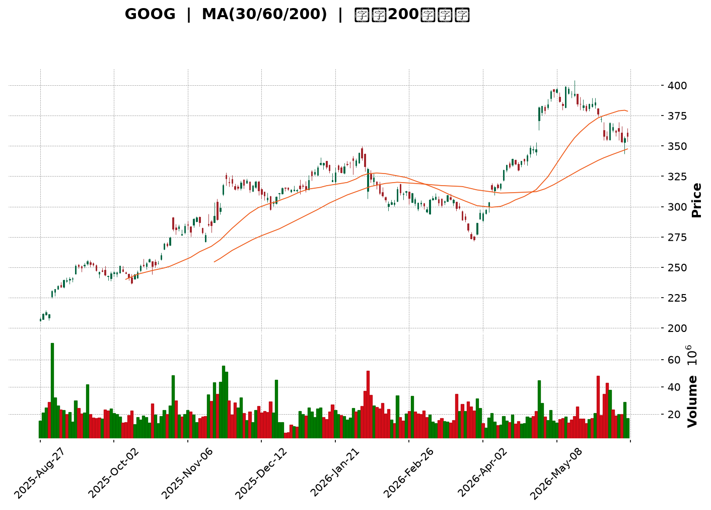
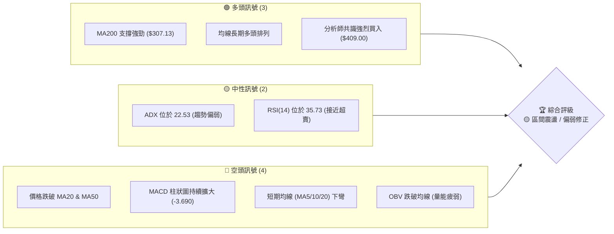
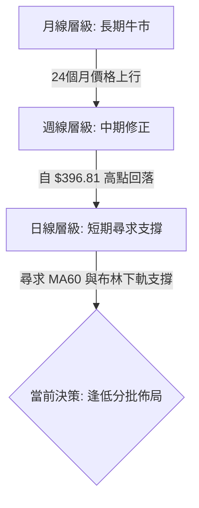
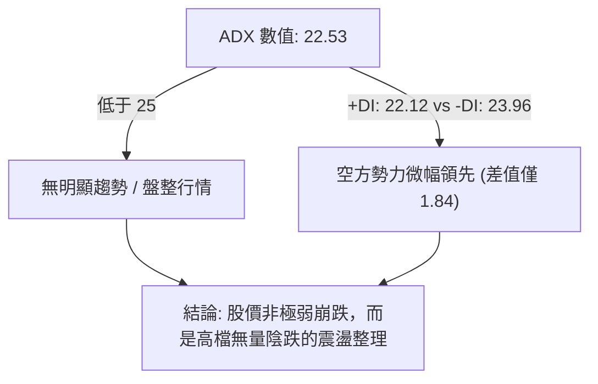
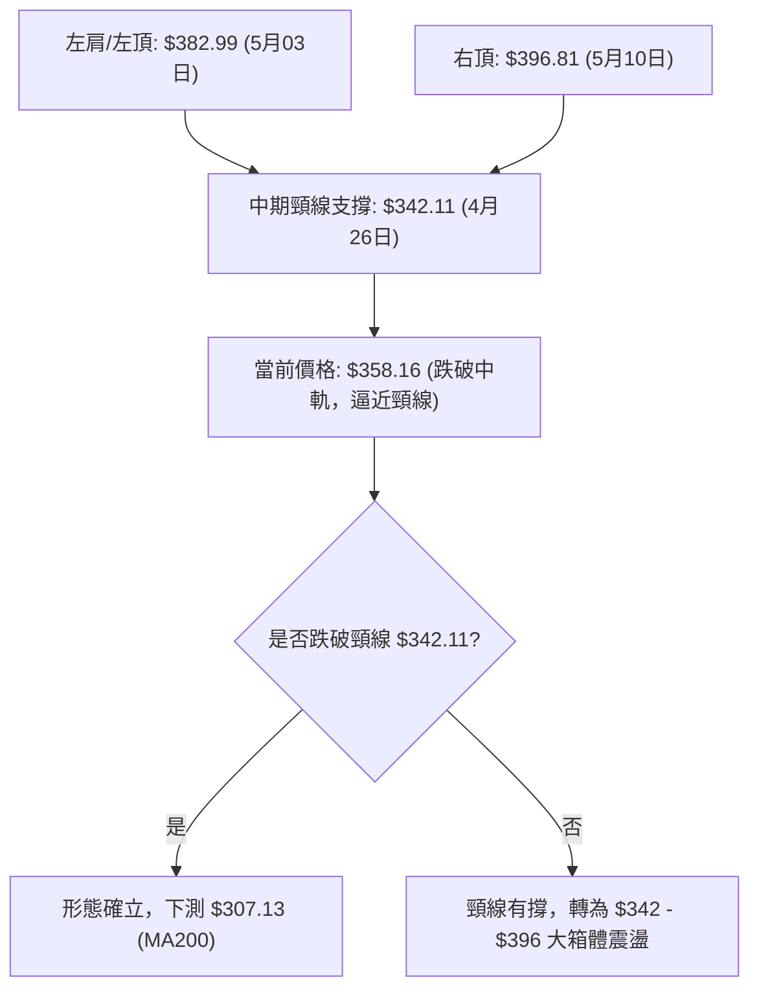

<details>
<summary>📊 靜態圖表 (點擊展開)</summary>

</details>

<html>
<head><meta charset="utf-8" /></head>
<body>
    <div style="height:500px; width:100%;">                        <script>window.PlotlyConfig = {MathJaxConfig: 'local'};</script>
        <script charset="utf-8" src="https://cdn.plot.ly/plotly-3.6.0.min.js" integrity="sha256-QaOVwtVY0T02VaHrr6pnoHLCwayMJp4O5n4YyaE3rJk=" crossorigin="anonymous"></script>                <div id="candlestick-chart" class="plotly-graph-div" style="height:100%; width:100%;"></div>            <script>                window.PLOTLYENV=window.PLOTLYENV || {};                                if (document.getElementById("candlestick-chart")) {                    Plotly.newPlot(                        "candlestick-chart",                        [{"close":{"dtype":"f8","bdata":"AAAAgL\u002fzaUAAAABAfXhqQAAAAMCAnWpAAAAAIF1sakAAAACgJM5sQAAAAMDr\u002f2xAAAAAAANQbUAAAABAdjZtQAAAAGAP721AAAAAgOzibUAAAABA4wluQAAAAOAMHW5AAAAAgI9ob0AAAACAs11vQAAAAGCPK29AAAAAoMN6b0AAAADgs9dvQAAAAIBUjG9AAAAAgBV7b0AAAADgC+tuQAAAACDOwm5AAAAAYEnWbkAAAABAOXxuQAAAAKBaYm5AAAAAwOihbkAAAABgVb5uQAAAAAD5vm5AAAAAQJNgb0AAAACgsNRuQAAAAOBan25AAAAAAI83bkAAAABA0KBtQAAAAIAqhW5AAAAAYKu2bkAAAADA9mZvQAAAAKBkbG9AAAAAoGSpb0AAAACARghwQAAAAIAlW29AAAAA4CaBb0AAAAAgeqdvQAAAAKABQHBAAAAAYG7WcEAAAACAer5wQAAAAIAbKnFAAAAAoJOVcUAAAACgTJRxQAAAAAAHuXFAAAAAwEFYcUAAAABgFsNxQAAAAGCCzHFAAAAAIHJycUAAAABgWCByQAAAAGC1MnJAAAAAIOLtcUAAAAAAL2lxQAAAAMACR3FAAAAAQKnQcUAAAADAcMZxQAAAAGCrRnJAAAAAwJoWckAAAABgBbFyQAAAAGCN3XNAAAAAQBwwdEAAAACgdPpzQAAAAGDm93NAAAAAoA6oc0AAAADAbbZzQAAAAIDi\u002f3NAAAAAQEbcc0AAAADgWxd0QAAAAGCioHNAAAAAgF3Vc0AAAAAgTAl0QAAAAGCmlHNAAAAAANZhc0AAAABAqU5zQAAAACBBNXNAAAAAgLyackAAAABgqPVyQAAAAOBQQ3NAAAAAYMduc0AAAADgSbRzQAAAAAAhtHNAAAAAgMioc0AAAAAArZ9zQAAAAGA7onNAAAAAYD+Wc0AAAABAia5zQAAAAIB+znNAAAAAYDuic0AAAADAJSB0QAAAAEBaWXRAAAAAIF6LdEAAAACAu8R0QAAAAODa\u002f3RAAAAAAPD9dEAAAACAmst0QAAAAOCKnnRAAAAAQNUbdEAAAABAOX90QAAAACCIpnRAAAAAwAWAdEAAAACAedJ0QAAAAEAB6XRAAAAAYHX9dEAAAAAgfSN1QAAAAGBpIXVAAAAAwDKHdUAAAAAgFkR1QAAAAMB6znRAAAAAgFyudEAAAACg2ip0QAAAAGCgP3RAAAAAYG3jc0AAAABgx25zQAAAAMB1T3NAAAAAIO4Zc0AAAAAAzOZyQAAAAKCx+HJAAAAAAJ\u002fyckAAAAAg06dzQAAAACCIdHNAAAAAYDpoc0AAAACg8YlzQAAAAKD8K3NAAAAAgGBwc0AAAADgXB9zQAAAAACf8nJAAAAAQN3wckAAAADgRshyQAAAAECSnnJAAAAAIDcdc0AAAAAg7StzQAAAAIDAQ3NAAAAAIHHwckAAAACAddRyQAAAAGDKA3NAAAAAIJVTc0AAAAAg2iFzQAAAAOC8GHNAAAAAwMOpckAAAABAca1yQAAAAMBqEHJAAAAAIKcWckAAAABgI4lxQAAAAICGGXFAAAAAoJwPcUAAAADA\u002f+pxQAAAAOCPa3JAAAAAoIZkckAAAAAAspdyQAAAAID0+3JAAAAAoM+oc0AAAAAg4MJzQAAAAEB7uHNAAAAAwEnwc0AAAABAGaZ0QAAAACBN5HRAAAAAAB7JdEAAAABAIjN1QAAAACAs83RAAAAAAFekdEAAAAAgbhh1QAAAAOC\u002fGHVAAAAAYNNhdUAAAABA98R1QAAAAOCntHVAAAAAIJ6xdUAAAABAXdt3QAAAAADV73dAAAAAQJa2d0AAAAAgnwB4QAAAAABwrnhAAAAA4P6weEAAAACg+sx4QAAAAACZKHhAAAAAIG35d0AAAADAzOx4QAAAAODlznhAAAAAwFWReEAAAAAA+o14QAAAACCyCnhAAAAAILIKeEAAAABg1PN3QAAAAOBtsndAAAAAgLwJeEAAAACAkwl4QAAAAEA0HnhAAAAA4EGDd0AAAADAsUV3QAAAAIDKYnZAAAAAAHU3dkAAAAAgxBB3QAAAAOCj2HZAAAAAYLiSdkAAAADgo6R2QAAAAMAeFXZAAAAAwPVIdkAAAABgj2J2QA=="},"high":{"dtype":"f8","bdata":"nd2I5iQfakCHfSGjZolqQJQxPwdC12pAlp7GCHV4akBcegKseuRsQNC1I09uA21AOG9P+6RubUAtN3dN4L1tQDizZ7XRA25A+gnM\u002fWczbkAz\u002f6pQDkNuQOIyMGlcPm5At0+uwi2Ib0AlG3L+gZdvQK6X79igbm9Ar3leHpK0b0AXizZtKgNwQJZBdQjg+W9A+bAhL7HIb0CSJIqq4o5vQB50qS+Z2m5AlPO7wi40b0A6pK+1+2RvQKx1L59YZm5ANan4ElTVbkBJsH5w0eRuQE0Zl4tO1G5AnZ01sZx2b0Ayhd1q2mFvQAlFuYfX2G5A+BmshWOibkAwsZ+WjYtuQIHEICRYkG5A7aNDOEbxbkDPUI9sf4hvQLgdNMQ3EXBAYM1RiDTMb0BZ9u47AhZwQGTfKIIs3G9AF2O9jdQKcEAb9Or9gOtvQKs0hpnxX3BA5W1q51LkcEAA\u002fQ8dlu1wQDFPAtfhNnFAHRo6Ir41ckCVdzp5mdtxQIPc0SoX1nFAgfKU4oWUcUDzGAUAOuJxQP6jcrLrA3JAJaAjahi\u002fcUCKYYvnPC5yQP+cPDFKPHJAmrox35s8ckBbF\u002f9SSa9xQOcKyZypaXFAqZ1KBxpfckDGH1WE5g1yQPY+DCd6+nJAfqiKo6Ikc0C\u002f8iGX2PVyQPL661fK8nNA93kh0m6AdEAWTdcCq0V0QIXf+zTZY3RAzN8nfRPwc0DTgtbToN9zQFZaO3+PFnRASQBdhHgndEC8N+3uJDN0QGZjBQL5DHRAM8epf7Dkc0CwY3r5Mhd0QDAwp88dGXRAueZUlaO7c0D1MI6uq4RzQI7yvyACd3NAUjSa+qlMc0BHVLhNyQ1zQEGt\u002f1djSXNA\u002fdqgBbF0c0CDiZ0PMr5zQNirli8JvnNAFHF3klnCc0B+OlqG8ahzQNEUfQmR1HNAAL4voKevc0C3lUeo4Sd0QJ5w4W5V7XNAq2x25z4SdEAHSneOn2B0QPbUtOi8oXRAIDTqPcKwdEA\u002fkPF7DuB0QE6lhGATTHVAYoy2RnEJdUDh5u4OBRt1QCAe7Q7X7HRAoXcGzZZ6dEBQ0XImp8R0QNUQ6ENc7HRAiLk3cYHZdECmgz2\u002fk\u002f50QLcfbbBgHHVArIasyAcTdUDYAa84fl11QHvYqveIPXVA8ENZ1W6LdUA\u002fAc+8Ftt1QAc3Lc7PfHVA\u002fMbSuVvDdED0aawyVqN0QCSZmSX\u002fdHRApNrsVl0TdEB49jQxBAp0QJ0DPV4SwXNA9vu1aMpHc0CN+kGv3wdzQCGHTDgsGHNADzDJ6xYac0A0yrzOi8VzQB6YHP6b8HNAjobNv2V\u002fc0AF1uXBApRzQFdJKPt2iXNA\u002fEGEZsN6c0AU2CdczjtzQCns9Xex+HJABZ+aYfsQc0DD6KjZle9yQHNIKUYCv3JA9A766gwlc0AA++\u002fHbE9zQPo4ODkcbnNAj3NUH0VHc0DPXEoWNDFzQP6usOotFnNAl2Fh7NBdc0C3XV5pAmlzQJdJ0qjtJ3NAx1+uoP0Cc0A1vK4oAPNyQDpzbqm9jnJAIbskYrlnckD9hdSle+VxQGMBJ\u002f7AbnFAO0pfcIBBcUDicCmICe5xQMz9ZGbknHJA+Tq7U417ckCazX997aNyQJMBx3Ss\u002fnJAMIliqyrzc0CRIIJD09NzQKp+0c\u002fs9HNAFDRBVc7zc0AZsiT6Dqd0QCZZvbHG7HRAtyxTRNUSdUAF2xDvfDx1QB\u002f6v9xLL3VAN7aIvnkPdUB7d88iOh11QGF3+U9JP3VAUtjuf7t3dUC6iPTiBet1QPVYU1YI23VA5dYvv\u002f8SdkB6x83MZeZ3QHTdxfSM8ndA6ZHQ0C7\u002fd0AQGOjRnUt4QOY17\u002fFDwnhAxYbqL9vReEApNYkfFuJ4QHsA6B98oXhAEW+JK1IjeEDFwKzuB\u002ft4QFtbOrzS7XhA0LhtMUW6eEAtlzGjoEN5QJWnecYFknhAEcL+tXBneECB1QmqI0d4QFQ0n1k3CnhAVPcZBYgSeEBE5pxw2Vd4QOSk8DA\u002fXHhAZ3zVI7rWd0COagfG\u002fmV3QDYhqckUGXdA2kHD8oKkdkAquORLMxp3QFVYXKalD3dAAAAAgBS2dkAAAABgEht3QAAAAMD15HZAAAAAAClgdkAAAAAgXMx2QA=="},"hovertemplate":"\u003cb\u003e%{x|%Y-%m-%d}\u003c\u002fb\u003e\u003cbr\u003e\u958b: $%{open:.2f}\u003cbr\u003e\u9ad8: $%{high:.2f}\u003cbr\u003e\u4f4e: $%{low:.2f}\u003cbr\u003e\u6536: $%{close:.2f}\u003cextra\u003e\u003c\u002fextra\u003e","low":{"dtype":"f8","bdata":"0G94dKy5aUBBltLDSOBpQBE5hvfQS2pA+fQmtdzLaUAiDUjdUw9sQLTbd3+oQ2xAPg15dPz2bEA03hqEuihtQErRVgCNHW1AvOuLXJ20bUBz3hEuwINtQMm\u002f9gYSwW1A0BO5ZQaQbkD+mM5yPydvQJgm9uYfw25A836y89wzb0CMkvSUZXJvQPYHNCw4Sm9AioEAiClTb0D9VHuGkNduQD94UzisJW5AmB5OZwrFbkDhac4WLVduQDdD7mNG421AcO3WGW3XbUD8RsJIJFRuQOFtl6fcP25AOGn8JLOmbkB2M9ZAeMpuQGWP7q2Jk25AQIwFq8HmbUC6noyGGodtQEwvafbtCG5A8Y\u002fmUJkWbkDEQ7nX1MluQBrS7aO\u002fRW9ACkyMlFEDb0APyb9HQ8NvQLdQLsMfhm5AtlcKEcE+b0ByXXLqwIhvQPfg7isr829APJ\u002fBW7+GcEAgPGq4W6pwQE4\u002fmmF6vnBArLA8Hmx+cUB0QiqOrk9xQCUW9gslfXFAKWs\u002fkyxFcUCxqSPsYVVxQAoNWA4bkXFAqKLmmjUzcUC8n0wcxK9xQC6tzM0R9XFA\u002fadi0C29cUD262J5TFdxQFe2kqEQ7nBAQtsjusi6cUC4UFBNbWdxQNHwiGC38XFAqxpnfasJckC1ihzji1xyQMgpd0y3THNAeYqWyhvTc0BIOq+tRclzQFiEN5sexXNAuzFQYtqVc0C4Fihsr5lzQLORw6ykmnNAHTu8z4+vc0AcLQJIqvVzQOtV1RMMeHNApZQCbGSDc0DyUS5v0K9zQKqEdAucV3NAO7OkR\u002fMoc0DP4yejdBVzQH9PE3nv9nJA67i3Qv2QckC+iF2NzcNyQNtC5YMg33JAFZmRtgkjc0AztxH6gmVzQF5mye+TjnNAvFreIPiUc0CRe1Ev43dzQAol6ZJ1jXNAT29tba58c0AJ04HW6WNzQFsiGrJmrXNA5DgqEOt+c0DqhXjjbqFzQKNbY70dGXRAYvy8EjBddEBrBUr4XFF0QCbRVV6e3nRAM0HfYlOrdEDEBPL+uK10QD3AXjnee3RA18vuKYoHdEAlelng9\u002fFzQLd0I3o2h3RAUjJuFax4dEAnRip7AHF0QKwxke4H1XRApXzILiW7dEC97sGysmR0QAQ+o3tLw3RAAxY75ST5dEB4J0\u002fHXiJ1QIc4wtgKj3RAIBjKu08oc0BJxaEkt\u002ftzQLgVJxCR1HNAIkxieP2jc0DryiWqmltzQAxjhSX3O3NAfyL29A34ckCG4VtFM4hyQKgCAfpf2XJASLT2EnHEckDUauYkXQBzQOjfW\u002fZdWXNARjmJcQwbc0CRHxHeTE9zQPd19PU+4HJAHGVB5x3zckBlr6h0rMpyQMgLUQ39hHJAw\u002f826oTGckCdOlpu5ZpyQEP8lc3VbXJA4NyHIg1cckCX5KmdBRJzQCWNRxt\u002fGnNADm68dovKckDAbXdjmLlyQPQdKC4O2nJAO\u002fEx16sCc0Am7ymcxxVzQMjMV2cazXJAnSSk5iSJckCOjFWwnJ1yQFwYmHnmCnJAeF0+eCfzcUBIGdhJHW5xQPxnm1AMFXFAFZ8zdPL1cEBGtz4if0lxQFXXhQC8FHJAxbTLOVr2cUBkDe8I0FlyQAJY3fP0c3JA+qloQ0WIc0BZOYK\u002filRzQIiTQ+icpXNAWS04eQWYc0CYaAQ7Tw90QMTaQbBlh3RApxpqQjW3dEBD\u002f1vNbtF0QGDzlyXc5nRABbPBceiWdEC2xD\u002fgJ8x0QFn9n0C87XRAo+D3v5XddEBi6Jwerkl1QGI62q4qgXVA7mmzpZVjdUDyRgQR8q12QKFOWXyMcHdAihgDsrGId0D\u002fl2yI8MF3QIWP2+7fLXhA9t0jKzRheEC3npWT7pZ4QPd6kJT2H3hA3Z3smd23d0CuaUaEm9V3QPDxllHeh3hAapJDxWhYeEBTqNlRo2p4QLXmTW5Q7HdAa6te0le8d0AmjIA0B7R3QMY5WSKFoHdAotj\u002fapeud0Bm6u3YUtx3QO+Gbr9U0HdAbJ5bnzJhd0CgAQdSzRd3QImzMFqVLHZAiBfgc6sidkBM6yCmYil2QJRs1IyZlnZAAAAAgD1edkAAAAAghSt2QAAAAMD1DHZAAAAAgBR6dUAAAACgcBV2QA=="},"name":"\u50f9\u683c","open":{"dtype":"f8","bdata":"0glpUui7aUA1tLoq8edpQBJk\u002f5djVWpA74zOGqMMakAgTB5EuTpsQBSLcy79r2xAahR1rOv\u002fbEAIOPoAhWptQMyWVIVrN21AeDrA9wXZbUBfqoihcvVtQInqZ8uGCm5A0TZWlSKVbkB0srCqw3pvQDUTFrP6Xm9Akso16MBrb0CXVYT875xvQFjVRs0CyW9AufdU7RSlb0C2dI4FBHVvQPEfXJmNi25Abzn27ZvpbkCpYhsjQvluQL98QVq0Um5AHNnnfqkWbkDIDPBoGqVuQKFT80wCmG5AaM3E85KpbkBZNYNHLQ5vQAXuQgT9tm5AO7JRdJSSbkBz0U4J9jVuQEUCvTnfEW5ALejP8QYpbkBV6BjXMPNuQMfdIYATf29A+FnXWXdbb0D320YPYtdvQN3FfpcF2G9A3CXcQVvQb0Bq+BDbhKZvQCvHhBi\u002fDHBA2VtDPnSNcEBGlWlRvtpwQBqSYzBawXBAL2n3sGMyckAf1hNnaqpxQIQh\u002fH7hnXFAT3v5OF5IcUALNUDnVW1xQJzBzxXR0nFAxCUD3Xa6cUCsUB\u002fqT8txQGBVYv0t+nFArMhIszc4ckCle\u002fMH56ZxQP0SvT7P9XBAur0Pl2\u002fdcUClchzhuv5xQMaFzKH08XFAF06AXU0Cc0Aad3bGoIRyQNw3\u002fQVtZnNA3FoNLpJidEDmu2WecAJ0QGShGZrBLHRArYJy4anNc0BjZOwye8RzQEprHqeWtnNAneQa05smdEAMyQH\u002f+\u002fVzQJp4udPGCXRAVBIn+w+Lc0Baz7MJT8NzQLBBizHlCnRAaZ7ipSWmc0D7JDXVeINzQO\u002fdeD+cGXNAbdbBN7VJc0Dy\u002fjDQoepyQLSJScv87XJAZdOp7xltc0D1cTvrqWtzQA3YL2\u002fMu3NAGkBBnh+4c0AWrmGkloZzQL729RcEkHNA5VdobGCPc0BQrrf9ztJzQLDC03581HNA0dYvn1XOc0DnEqxDjaJzQPdkiFldjXRAsuDqcQBxdEA8uIatLmF0QPtesqV67XRA8xo31cPodEAg6ZQ10hl1QJr7RXD353RArxMByyENdEBM8ozQ0Ap0QEToDbFC3XRAlc2zyojDdEAqrJTvWHx0QFcS3mES83RAiqpzPLsCdUCodWRXfj51QAiTP2Fg4HRAJmxQwsUBdUC8\u002fhWa9sB1QN3SjfPmdHVAglnvCamMc0Bdk4now250QIPMGeQhDXRAoxMlENwHdEAfEoMWs+hzQIeH+vETf3NAvc0iP1Q5c0Dx\u002fkBn9sNyQL4Ege+Y4HJAPlBCrwDickDJkPB8bwZzQPB7IY2T63NAVJIo\u002f8Bjc0CLDEEdZ3tzQHXF\u002fkVZhnNAJAyribH4ckD7es0lHelyQGzFGhp9oHJA98fS1qPkckDGPkWC3uxyQNwzx0j4enJAd207YVRfckC2Dld5DhtzQBzWJhnaIXNAcNbsu2kgc0DsSNVzhydzQJdPL6Wt9nJAWitgzckHc0CMaLdLhDtzQD9kcRVx8HJA5XTinTH+ckBpmLeHlsVyQOi5xFqCgHJAaZ1OkZY\u002fckDBvs4ySeBxQDO4G+i6U3FAXraCtWM0cUAd+UgW+FVxQOQ+4L7jHHJA+3sn+g4NckAn5PYqXWhyQPA3OxZav3JAMhU+ozjac0BOnnm1BpBzQBzFAJSJ4HNAiQ0tVq+zc0Bnw\u002ffZ8B10QGpr92HHpXRAPklXKV76dEByBmleqeN0QLPMJLezJXVAuA4nZiH2dECHvjgC8Op0QAv476DuNXVA1dZCFUUYdUCiAGROxXp1QKgPzK1hq3VADNEgAluUdUBlSDXTgTB3QKKj2egKnHdAmI7V5XDhd0BpWrupPtp3QCPOacywVXhAfXP6iSPNeECbjjWZhqB4QA5VpbdHZ3hAV5zDd0sMeEDiD0n3zdp3QAnJxrPZmHhAKco64qePeEAC7jvtOX54QBdvOM4DkXhAUsKxR+8MeEA\u002ffNLYe9x3QAs8\u002ftB48HdAQ3AO2UDMd0B1VGt2juh3QImOWtEQ+ndAidPdb+7Pd0BHHyNjnUV3QKZ8ap8Qr3ZAdxuMVelhdkDJz3mSnjN2QIzzFj2VsnZAAAAAgMKndkAAAAAAKc52QAAAAMDMkHZAAAAAwMwQdkAAAACgmZF2QA=="},"x":["2025-08-27T00:00:00-04:00","2025-08-28T00:00:00-04:00","2025-08-29T00:00:00-04:00","2025-09-02T00:00:00-04:00","2025-09-03T00:00:00-04:00","2025-09-04T00:00:00-04:00","2025-09-05T00:00:00-04:00","2025-09-08T00:00:00-04:00","2025-09-09T00:00:00-04:00","2025-09-10T00:00:00-04:00","2025-09-11T00:00:00-04:00","2025-09-12T00:00:00-04:00","2025-09-15T00:00:00-04:00","2025-09-16T00:00:00-04:00","2025-09-17T00:00:00-04:00","2025-09-18T00:00:00-04:00","2025-09-19T00:00:00-04:00","2025-09-22T00:00:00-04:00","2025-09-23T00:00:00-04:00","2025-09-24T00:00:00-04:00","2025-09-25T00:00:00-04:00","2025-09-26T00:00:00-04:00","2025-09-29T00:00:00-04:00","2025-09-30T00:00:00-04:00","2025-10-01T00:00:00-04:00","2025-10-02T00:00:00-04:00","2025-10-03T00:00:00-04:00","2025-10-06T00:00:00-04:00","2025-10-07T00:00:00-04:00","2025-10-08T00:00:00-04:00","2025-10-09T00:00:00-04:00","2025-10-10T00:00:00-04:00","2025-10-13T00:00:00-04:00","2025-10-14T00:00:00-04:00","2025-10-15T00:00:00-04:00","2025-10-16T00:00:00-04:00","2025-10-17T00:00:00-04:00","2025-10-20T00:00:00-04:00","2025-10-21T00:00:00-04:00","2025-10-22T00:00:00-04:00","2025-10-23T00:00:00-04:00","2025-10-24T00:00:00-04:00","2025-10-27T00:00:00-04:00","2025-10-28T00:00:00-04:00","2025-10-29T00:00:00-04:00","2025-10-30T00:00:00-04:00","2025-10-31T00:00:00-04:00","2025-11-03T00:00:00-05:00","2025-11-04T00:00:00-05:00","2025-11-05T00:00:00-05:00","2025-11-06T00:00:00-05:00","2025-11-07T00:00:00-05:00","2025-11-10T00:00:00-05:00","2025-11-11T00:00:00-05:00","2025-11-12T00:00:00-05:00","2025-11-13T00:00:00-05:00","2025-11-14T00:00:00-05:00","2025-11-17T00:00:00-05:00","2025-11-18T00:00:00-05:00","2025-11-19T00:00:00-05:00","2025-11-20T00:00:00-05:00","2025-11-21T00:00:00-05:00","2025-11-24T00:00:00-05:00","2025-11-25T00:00:00-05:00","2025-11-26T00:00:00-05:00","2025-11-28T00:00:00-05:00","2025-12-01T00:00:00-05:00","2025-12-02T00:00:00-05:00","2025-12-03T00:00:00-05:00","2025-12-04T00:00:00-05:00","2025-12-05T00:00:00-05:00","2025-12-08T00:00:00-05:00","2025-12-09T00:00:00-05:00","2025-12-10T00:00:00-05:00","2025-12-11T00:00:00-05:00","2025-12-12T00:00:00-05:00","2025-12-15T00:00:00-05:00","2025-12-16T00:00:00-05:00","2025-12-17T00:00:00-05:00","2025-12-18T00:00:00-05:00","2025-12-19T00:00:00-05:00","2025-12-22T00:00:00-05:00","2025-12-23T00:00:00-05:00","2025-12-24T00:00:00-05:00","2025-12-26T00:00:00-05:00","2025-12-29T00:00:00-05:00","2025-12-30T00:00:00-05:00","2025-12-31T00:00:00-05:00","2026-01-02T00:00:00-05:00","2026-01-05T00:00:00-05:00","2026-01-06T00:00:00-05:00","2026-01-07T00:00:00-05:00","2026-01-08T00:00:00-05:00","2026-01-09T00:00:00-05:00","2026-01-12T00:00:00-05:00","2026-01-13T00:00:00-05:00","2026-01-14T00:00:00-05:00","2026-01-15T00:00:00-05:00","2026-01-16T00:00:00-05:00","2026-01-20T00:00:00-05:00","2026-01-21T00:00:00-05:00","2026-01-22T00:00:00-05:00","2026-01-23T00:00:00-05:00","2026-01-26T00:00:00-05:00","2026-01-27T00:00:00-05:00","2026-01-28T00:00:00-05:00","2026-01-29T00:00:00-05:00","2026-01-30T00:00:00-05:00","2026-02-02T00:00:00-05:00","2026-02-03T00:00:00-05:00","2026-02-04T00:00:00-05:00","2026-02-05T00:00:00-05:00","2026-02-06T00:00:00-05:00","2026-02-09T00:00:00-05:00","2026-02-10T00:00:00-05:00","2026-02-11T00:00:00-05:00","2026-02-12T00:00:00-05:00","2026-02-13T00:00:00-05:00","2026-02-17T00:00:00-05:00","2026-02-18T00:00:00-05:00","2026-02-19T00:00:00-05:00","2026-02-20T00:00:00-05:00","2026-02-23T00:00:00-05:00","2026-02-24T00:00:00-05:00","2026-02-25T00:00:00-05:00","2026-02-26T00:00:00-05:00","2026-02-27T00:00:00-05:00","2026-03-02T00:00:00-05:00","2026-03-03T00:00:00-05:00","2026-03-04T00:00:00-05:00","2026-03-05T00:00:00-05:00","2026-03-06T00:00:00-05:00","2026-03-09T00:00:00-04:00","2026-03-10T00:00:00-04:00","2026-03-11T00:00:00-04:00","2026-03-12T00:00:00-04:00","2026-03-13T00:00:00-04:00","2026-03-16T00:00:00-04:00","2026-03-17T00:00:00-04:00","2026-03-18T00:00:00-04:00","2026-03-19T00:00:00-04:00","2026-03-20T00:00:00-04:00","2026-03-23T00:00:00-04:00","2026-03-24T00:00:00-04:00","2026-03-25T00:00:00-04:00","2026-03-26T00:00:00-04:00","2026-03-27T00:00:00-04:00","2026-03-30T00:00:00-04:00","2026-03-31T00:00:00-04:00","2026-04-01T00:00:00-04:00","2026-04-02T00:00:00-04:00","2026-04-06T00:00:00-04:00","2026-04-07T00:00:00-04:00","2026-04-08T00:00:00-04:00","2026-04-09T00:00:00-04:00","2026-04-10T00:00:00-04:00","2026-04-13T00:00:00-04:00","2026-04-14T00:00:00-04:00","2026-04-15T00:00:00-04:00","2026-04-16T00:00:00-04:00","2026-04-17T00:00:00-04:00","2026-04-20T00:00:00-04:00","2026-04-21T00:00:00-04:00","2026-04-22T00:00:00-04:00","2026-04-23T00:00:00-04:00","2026-04-24T00:00:00-04:00","2026-04-27T00:00:00-04:00","2026-04-28T00:00:00-04:00","2026-04-29T00:00:00-04:00","2026-04-30T00:00:00-04:00","2026-05-01T00:00:00-04:00","2026-05-04T00:00:00-04:00","2026-05-05T00:00:00-04:00","2026-05-06T00:00:00-04:00","2026-05-07T00:00:00-04:00","2026-05-08T00:00:00-04:00","2026-05-11T00:00:00-04:00","2026-05-12T00:00:00-04:00","2026-05-13T00:00:00-04:00","2026-05-14T00:00:00-04:00","2026-05-15T00:00:00-04:00","2026-05-18T00:00:00-04:00","2026-05-19T00:00:00-04:00","2026-05-20T00:00:00-04:00","2026-05-21T00:00:00-04:00","2026-05-22T00:00:00-04:00","2026-05-26T00:00:00-04:00","2026-05-27T00:00:00-04:00","2026-05-28T00:00:00-04:00","2026-05-29T00:00:00-04:00","2026-06-01T00:00:00-04:00","2026-06-02T00:00:00-04:00","2026-06-03T00:00:00-04:00","2026-06-04T00:00:00-04:00","2026-06-05T00:00:00-04:00","2026-06-08T00:00:00-04:00","2026-06-09T00:00:00-04:00","2026-06-10T00:00:00-04:00","2026-06-11T00:00:00-04:00","2026-06-12T00:00:00-04:00"],"type":"candlestick"},{"hovertemplate":"MA30: $%{y:.2f}\u003cextra\u003e\u003c\u002fextra\u003e","line":{"color":"#2196F3","dash":"dash","width":2},"mode":"lines","name":"MA30","x":["2025-08-27T00:00:00-04:00","2025-08-28T00:00:00-04:00","2025-08-29T00:00:00-04:00","2025-09-02T00:00:00-04:00","2025-09-03T00:00:00-04:00","2025-09-04T00:00:00-04:00","2025-09-05T00:00:00-04:00","2025-09-08T00:00:00-04:00","2025-09-09T00:00:00-04:00","2025-09-10T00:00:00-04:00","2025-09-11T00:00:00-04:00","2025-09-12T00:00:00-04:00","2025-09-15T00:00:00-04:00","2025-09-16T00:00:00-04:00","2025-09-17T00:00:00-04:00","2025-09-18T00:00:00-04:00","2025-09-19T00:00:00-04:00","2025-09-22T00:00:00-04:00","2025-09-23T00:00:00-04:00","2025-09-24T00:00:00-04:00","2025-09-25T00:00:00-04:00","2025-09-26T00:00:00-04:00","2025-09-29T00:00:00-04:00","2025-09-30T00:00:00-04:00","2025-10-01T00:00:00-04:00","2025-10-02T00:00:00-04:00","2025-10-03T00:00:00-04:00","2025-10-06T00:00:00-04:00","2025-10-07T00:00:00-04:00","2025-10-08T00:00:00-04:00","2025-10-09T00:00:00-04:00","2025-10-10T00:00:00-04:00","2025-10-13T00:00:00-04:00","2025-10-14T00:00:00-04:00","2025-10-15T00:00:00-04:00","2025-10-16T00:00:00-04:00","2025-10-17T00:00:00-04:00","2025-10-20T00:00:00-04:00","2025-10-21T00:00:00-04:00","2025-10-22T00:00:00-04:00","2025-10-23T00:00:00-04:00","2025-10-24T00:00:00-04:00","2025-10-27T00:00:00-04:00","2025-10-28T00:00:00-04:00","2025-10-29T00:00:00-04:00","2025-10-30T00:00:00-04:00","2025-10-31T00:00:00-04:00","2025-11-03T00:00:00-05:00","2025-11-04T00:00:00-05:00","2025-11-05T00:00:00-05:00","2025-11-06T00:00:00-05:00","2025-11-07T00:00:00-05:00","2025-11-10T00:00:00-05:00","2025-11-11T00:00:00-05:00","2025-11-12T00:00:00-05:00","2025-11-13T00:00:00-05:00","2025-11-14T00:00:00-05:00","2025-11-17T00:00:00-05:00","2025-11-18T00:00:00-05:00","2025-11-19T00:00:00-05:00","2025-11-20T00:00:00-05:00","2025-11-21T00:00:00-05:00","2025-11-24T00:00:00-05:00","2025-11-25T00:00:00-05:00","2025-11-26T00:00:00-05:00","2025-11-28T00:00:00-05:00","2025-12-01T00:00:00-05:00","2025-12-02T00:00:00-05:00","2025-12-03T00:00:00-05:00","2025-12-04T00:00:00-05:00","2025-12-05T00:00:00-05:00","2025-12-08T00:00:00-05:00","2025-12-09T00:00:00-05:00","2025-12-10T00:00:00-05:00","2025-12-11T00:00:00-05:00","2025-12-12T00:00:00-05:00","2025-12-15T00:00:00-05:00","2025-12-16T00:00:00-05:00","2025-12-17T00:00:00-05:00","2025-12-18T00:00:00-05:00","2025-12-19T00:00:00-05:00","2025-12-22T00:00:00-05:00","2025-12-23T00:00:00-05:00","2025-12-24T00:00:00-05:00","2025-12-26T00:00:00-05:00","2025-12-29T00:00:00-05:00","2025-12-30T00:00:00-05:00","2025-12-31T00:00:00-05:00","2026-01-02T00:00:00-05:00","2026-01-05T00:00:00-05:00","2026-01-06T00:00:00-05:00","2026-01-07T00:00:00-05:00","2026-01-08T00:00:00-05:00","2026-01-09T00:00:00-05:00","2026-01-12T00:00:00-05:00","2026-01-13T00:00:00-05:00","2026-01-14T00:00:00-05:00","2026-01-15T00:00:00-05:00","2026-01-16T00:00:00-05:00","2026-01-20T00:00:00-05:00","2026-01-21T00:00:00-05:00","2026-01-22T00:00:00-05:00","2026-01-23T00:00:00-05:00","2026-01-26T00:00:00-05:00","2026-01-27T00:00:00-05:00","2026-01-28T00:00:00-05:00","2026-01-29T00:00:00-05:00","2026-01-30T00:00:00-05:00","2026-02-02T00:00:00-05:00","2026-02-03T00:00:00-05:00","2026-02-04T00:00:00-05:00","2026-02-05T00:00:00-05:00","2026-02-06T00:00:00-05:00","2026-02-09T00:00:00-05:00","2026-02-10T00:00:00-05:00","2026-02-11T00:00:00-05:00","2026-02-12T00:00:00-05:00","2026-02-13T00:00:00-05:00","2026-02-17T00:00:00-05:00","2026-02-18T00:00:00-05:00","2026-02-19T00:00:00-05:00","2026-02-20T00:00:00-05:00","2026-02-23T00:00:00-05:00","2026-02-24T00:00:00-05:00","2026-02-25T00:00:00-05:00","2026-02-26T00:00:00-05:00","2026-02-27T00:00:00-05:00","2026-03-02T00:00:00-05:00","2026-03-03T00:00:00-05:00","2026-03-04T00:00:00-05:00","2026-03-05T00:00:00-05:00","2026-03-06T00:00:00-05:00","2026-03-09T00:00:00-04:00","2026-03-10T00:00:00-04:00","2026-03-11T00:00:00-04:00","2026-03-12T00:00:00-04:00","2026-03-13T00:00:00-04:00","2026-03-16T00:00:00-04:00","2026-03-17T00:00:00-04:00","2026-03-18T00:00:00-04:00","2026-03-19T00:00:00-04:00","2026-03-20T00:00:00-04:00","2026-03-23T00:00:00-04:00","2026-03-24T00:00:00-04:00","2026-03-25T00:00:00-04:00","2026-03-26T00:00:00-04:00","2026-03-27T00:00:00-04:00","2026-03-30T00:00:00-04:00","2026-03-31T00:00:00-04:00","2026-04-01T00:00:00-04:00","2026-04-02T00:00:00-04:00","2026-04-06T00:00:00-04:00","2026-04-07T00:00:00-04:00","2026-04-08T00:00:00-04:00","2026-04-09T00:00:00-04:00","2026-04-10T00:00:00-04:00","2026-04-13T00:00:00-04:00","2026-04-14T00:00:00-04:00","2026-04-15T00:00:00-04:00","2026-04-16T00:00:00-04:00","2026-04-17T00:00:00-04:00","2026-04-20T00:00:00-04:00","2026-04-21T00:00:00-04:00","2026-04-22T00:00:00-04:00","2026-04-23T00:00:00-04:00","2026-04-24T00:00:00-04:00","2026-04-27T00:00:00-04:00","2026-04-28T00:00:00-04:00","2026-04-29T00:00:00-04:00","2026-04-30T00:00:00-04:00","2026-05-01T00:00:00-04:00","2026-05-04T00:00:00-04:00","2026-05-05T00:00:00-04:00","2026-05-06T00:00:00-04:00","2026-05-07T00:00:00-04:00","2026-05-08T00:00:00-04:00","2026-05-11T00:00:00-04:00","2026-05-12T00:00:00-04:00","2026-05-13T00:00:00-04:00","2026-05-14T00:00:00-04:00","2026-05-15T00:00:00-04:00","2026-05-18T00:00:00-04:00","2026-05-19T00:00:00-04:00","2026-05-20T00:00:00-04:00","2026-05-21T00:00:00-04:00","2026-05-22T00:00:00-04:00","2026-05-26T00:00:00-04:00","2026-05-27T00:00:00-04:00","2026-05-28T00:00:00-04:00","2026-05-29T00:00:00-04:00","2026-06-01T00:00:00-04:00","2026-06-02T00:00:00-04:00","2026-06-03T00:00:00-04:00","2026-06-04T00:00:00-04:00","2026-06-05T00:00:00-04:00","2026-06-08T00:00:00-04:00","2026-06-09T00:00:00-04:00","2026-06-10T00:00:00-04:00","2026-06-11T00:00:00-04:00","2026-06-12T00:00:00-04:00"],"y":{"dtype":"f8","bdata":"AAAAAAAA+H8AAAAAAAD4fwAAAAAAAPh\u002fAAAAAAAA+H8AAAAAAAD4fwAAAAAAAPh\u002fAAAAAAAA+H8AAAAAAAD4fwAAAAAAAPh\u002fAAAAAAAA+H8AAAAAAAD4fwAAAAAAAPh\u002fAAAAAAAA+H8AAAAAAAD4fwAAAAAAAPh\u002fAAAAAAAA+H8AAAAAAAD4fwAAAAAAAPh\u002fAAAAAAAA+H8AAAAAAAD4fwAAAAAAAPh\u002fAAAAAAAA+H8AAAAAAAD4fwAAAAAAAPh\u002fAAAAAAAA+H8AAAAAAAD4fwAAAAAAAPh\u002fAAAAAAAA+H8AAAAAAAD4f3d3d9dkA25AAAAAoMknbkAzMzNTu0JuQImIiMgNZG5A3t3d\u002famIbkAREREh055uQDMzM9OBs25AzczMnI3HbkBERES0499uQDMzM5MG7G5AIiIiUtX5bkDe3d2dngdvQJqZmSn8G29AIiIiElQvb0Crqqrab0FvQAAAAGBkXG9AmpmZKd97b0AzMzMTK5hvQN7d3f1suW9AZmZmhs7Ub0C8u7trHPxvQBEREUGxEnBAq6qqogAkcEAiIiI6nDxwQFVVVeVCVnBAZmZmFo9scECamZmh9X1wQO\u002fu7tY1jnBAERERKVugcEC8u7sbfrRwQO\u002fu7tbKzXBAAAAASDjncEDv7u6WTghxQImIiCCbL3FAIiIi8tRYcUCJiIi4VH1xQN7d3YWnoXFAvLu7u0zCcUARERFxtOFxQHd3d\u002feUBnJA3t3ddaMpckDv7u6eBk5yQHd3d8fYanJAiYiISGmEckBmZmZWgaByQBEREZEftXJAzczMHHfEckDv7u7uNdNyQJqZmYni33JAzczMXKLqckDe3d1t2vRyQHd3d8dYAXNA3t3djUoSc0CamZmJwR9zQFVVVXWaLHNA7+7u3l07c0AAAADwP05zQM3MzGxbYnNAd3d3B3pxc0DNzMwcv4FzQO\u002fu7q7OjnNAREREtP6bc0BERESEO6hzQCIiIvJbrHNAzczMrGavc0BVVVXFJLZzQAAAADDxvnNAERERkVbKc0CrqqrKk9NzQLy7u6vd2HNAmpmZCfzac0CamZlZct5zQFVVVTUt53NAvLu7e93sc0AiIiIykvNzQO\u002fu7o7q\u002fnNAIiIiEqMMdEC8u7u7Qxx0QJqZmXmrLHRAmpmZWZ5FdEDNzMysTFl0QM3MzLx4ZnRAd3d31x9xdECamZmZE3V0QKuqqvq5eXRAiYiIaK57dEB3d3cnDXp0QFVVVdVKd3RA3t3d\u002fSVzdEDNzMyMfWx0QO\u002fu7h5dZXRAMzMzk4JfdEAiIiLSf1t0QHd3dzffU3RAMzMz0ypKdEARERGhrD90QHd3dycUMHRAMzMzo9MidEARERFRjRR0QImIiLhJBnRAVVVVhVL8c0B3d3fXsO1zQImIiNhb3HNAiYiIKIjQc0CamZlpcsJzQImIiLhntHNARERElOeic0AAAAAgNI9zQKuqqkomfXNAVVVVxVxqc0AiIiKSJ1hzQM3MzCyQSXNAIiIi4lc4c0C8u7sroStzQAAAAED9GHNA7+7uTqEJc0DNzMwscflyQN7d3d2T5nJAAAAAwCrVckAzMzMTxsxyQAAAAMARyHJARERENFXDckCJiIgIQ7pyQM3MzBw+tnJAiYiIOGW4ckCamZkJS7pyQM3MzOz5vnJA7+7ubj3DckBmZma2Q9ByQFVVVZXa4HJAmpmZeZjwckAzMzNjOQVzQCIiImIcGXNAq6qq+iUmc0De3d2tkDZzQKuqqsoyRnNAZmZmZgtbc0CrqqrKIHRzQLy7uxsXi3NAvLu7m0qfc0B3d3fHm8dzQCIiImLp8HNAd3d3dwEcdEDe3d3tcUl0QCIiIpLpgXRARERE1EG6dECJiIh4QPh0QCIiItJ8NHVAzczMPHtvdUBmZmZWRqt1QERERDTJ4XVAZmZmxnoWdkCrqqoKW0l2QO\u002fu7n6DdHZAmpmZ6eiZdkCamZnJrL12QGZmZkab33ZAERERkZYCd0CrqqoKgR93QO\u002fu7r4IO3dAVVVVNU5Sd0CJiIio\u002fWN3QLy7u6s+cHdAq6qqmq59d0BVVVVFfo53QFVVVUVsnXdAmpmZCZand0CamZm5Cq93QDMzM+NBsndAd3d3V023d0AiIiLyvap3QA=="},"type":"scatter"},{"hovertemplate":"MA60: $%{y:.2f}\u003cextra\u003e\u003c\u002fextra\u003e","line":{"color":"#9C27B0","dash":"dash","width":2},"mode":"lines","name":"MA60","x":["2025-08-27T00:00:00-04:00","2025-08-28T00:00:00-04:00","2025-08-29T00:00:00-04:00","2025-09-02T00:00:00-04:00","2025-09-03T00:00:00-04:00","2025-09-04T00:00:00-04:00","2025-09-05T00:00:00-04:00","2025-09-08T00:00:00-04:00","2025-09-09T00:00:00-04:00","2025-09-10T00:00:00-04:00","2025-09-11T00:00:00-04:00","2025-09-12T00:00:00-04:00","2025-09-15T00:00:00-04:00","2025-09-16T00:00:00-04:00","2025-09-17T00:00:00-04:00","2025-09-18T00:00:00-04:00","2025-09-19T00:00:00-04:00","2025-09-22T00:00:00-04:00","2025-09-23T00:00:00-04:00","2025-09-24T00:00:00-04:00","2025-09-25T00:00:00-04:00","2025-09-26T00:00:00-04:00","2025-09-29T00:00:00-04:00","2025-09-30T00:00:00-04:00","2025-10-01T00:00:00-04:00","2025-10-02T00:00:00-04:00","2025-10-03T00:00:00-04:00","2025-10-06T00:00:00-04:00","2025-10-07T00:00:00-04:00","2025-10-08T00:00:00-04:00","2025-10-09T00:00:00-04:00","2025-10-10T00:00:00-04:00","2025-10-13T00:00:00-04:00","2025-10-14T00:00:00-04:00","2025-10-15T00:00:00-04:00","2025-10-16T00:00:00-04:00","2025-10-17T00:00:00-04:00","2025-10-20T00:00:00-04:00","2025-10-21T00:00:00-04:00","2025-10-22T00:00:00-04:00","2025-10-23T00:00:00-04:00","2025-10-24T00:00:00-04:00","2025-10-27T00:00:00-04:00","2025-10-28T00:00:00-04:00","2025-10-29T00:00:00-04:00","2025-10-30T00:00:00-04:00","2025-10-31T00:00:00-04:00","2025-11-03T00:00:00-05:00","2025-11-04T00:00:00-05:00","2025-11-05T00:00:00-05:00","2025-11-06T00:00:00-05:00","2025-11-07T00:00:00-05:00","2025-11-10T00:00:00-05:00","2025-11-11T00:00:00-05:00","2025-11-12T00:00:00-05:00","2025-11-13T00:00:00-05:00","2025-11-14T00:00:00-05:00","2025-11-17T00:00:00-05:00","2025-11-18T00:00:00-05:00","2025-11-19T00:00:00-05:00","2025-11-20T00:00:00-05:00","2025-11-21T00:00:00-05:00","2025-11-24T00:00:00-05:00","2025-11-25T00:00:00-05:00","2025-11-26T00:00:00-05:00","2025-11-28T00:00:00-05:00","2025-12-01T00:00:00-05:00","2025-12-02T00:00:00-05:00","2025-12-03T00:00:00-05:00","2025-12-04T00:00:00-05:00","2025-12-05T00:00:00-05:00","2025-12-08T00:00:00-05:00","2025-12-09T00:00:00-05:00","2025-12-10T00:00:00-05:00","2025-12-11T00:00:00-05:00","2025-12-12T00:00:00-05:00","2025-12-15T00:00:00-05:00","2025-12-16T00:00:00-05:00","2025-12-17T00:00:00-05:00","2025-12-18T00:00:00-05:00","2025-12-19T00:00:00-05:00","2025-12-22T00:00:00-05:00","2025-12-23T00:00:00-05:00","2025-12-24T00:00:00-05:00","2025-12-26T00:00:00-05:00","2025-12-29T00:00:00-05:00","2025-12-30T00:00:00-05:00","2025-12-31T00:00:00-05:00","2026-01-02T00:00:00-05:00","2026-01-05T00:00:00-05:00","2026-01-06T00:00:00-05:00","2026-01-07T00:00:00-05:00","2026-01-08T00:00:00-05:00","2026-01-09T00:00:00-05:00","2026-01-12T00:00:00-05:00","2026-01-13T00:00:00-05:00","2026-01-14T00:00:00-05:00","2026-01-15T00:00:00-05:00","2026-01-16T00:00:00-05:00","2026-01-20T00:00:00-05:00","2026-01-21T00:00:00-05:00","2026-01-22T00:00:00-05:00","2026-01-23T00:00:00-05:00","2026-01-26T00:00:00-05:00","2026-01-27T00:00:00-05:00","2026-01-28T00:00:00-05:00","2026-01-29T00:00:00-05:00","2026-01-30T00:00:00-05:00","2026-02-02T00:00:00-05:00","2026-02-03T00:00:00-05:00","2026-02-04T00:00:00-05:00","2026-02-05T00:00:00-05:00","2026-02-06T00:00:00-05:00","2026-02-09T00:00:00-05:00","2026-02-10T00:00:00-05:00","2026-02-11T00:00:00-05:00","2026-02-12T00:00:00-05:00","2026-02-13T00:00:00-05:00","2026-02-17T00:00:00-05:00","2026-02-18T00:00:00-05:00","2026-02-19T00:00:00-05:00","2026-02-20T00:00:00-05:00","2026-02-23T00:00:00-05:00","2026-02-24T00:00:00-05:00","2026-02-25T00:00:00-05:00","2026-02-26T00:00:00-05:00","2026-02-27T00:00:00-05:00","2026-03-02T00:00:00-05:00","2026-03-03T00:00:00-05:00","2026-03-04T00:00:00-05:00","2026-03-05T00:00:00-05:00","2026-03-06T00:00:00-05:00","2026-03-09T00:00:00-04:00","2026-03-10T00:00:00-04:00","2026-03-11T00:00:00-04:00","2026-03-12T00:00:00-04:00","2026-03-13T00:00:00-04:00","2026-03-16T00:00:00-04:00","2026-03-17T00:00:00-04:00","2026-03-18T00:00:00-04:00","2026-03-19T00:00:00-04:00","2026-03-20T00:00:00-04:00","2026-03-23T00:00:00-04:00","2026-03-24T00:00:00-04:00","2026-03-25T00:00:00-04:00","2026-03-26T00:00:00-04:00","2026-03-27T00:00:00-04:00","2026-03-30T00:00:00-04:00","2026-03-31T00:00:00-04:00","2026-04-01T00:00:00-04:00","2026-04-02T00:00:00-04:00","2026-04-06T00:00:00-04:00","2026-04-07T00:00:00-04:00","2026-04-08T00:00:00-04:00","2026-04-09T00:00:00-04:00","2026-04-10T00:00:00-04:00","2026-04-13T00:00:00-04:00","2026-04-14T00:00:00-04:00","2026-04-15T00:00:00-04:00","2026-04-16T00:00:00-04:00","2026-04-17T00:00:00-04:00","2026-04-20T00:00:00-04:00","2026-04-21T00:00:00-04:00","2026-04-22T00:00:00-04:00","2026-04-23T00:00:00-04:00","2026-04-24T00:00:00-04:00","2026-04-27T00:00:00-04:00","2026-04-28T00:00:00-04:00","2026-04-29T00:00:00-04:00","2026-04-30T00:00:00-04:00","2026-05-01T00:00:00-04:00","2026-05-04T00:00:00-04:00","2026-05-05T00:00:00-04:00","2026-05-06T00:00:00-04:00","2026-05-07T00:00:00-04:00","2026-05-08T00:00:00-04:00","2026-05-11T00:00:00-04:00","2026-05-12T00:00:00-04:00","2026-05-13T00:00:00-04:00","2026-05-14T00:00:00-04:00","2026-05-15T00:00:00-04:00","2026-05-18T00:00:00-04:00","2026-05-19T00:00:00-04:00","2026-05-20T00:00:00-04:00","2026-05-21T00:00:00-04:00","2026-05-22T00:00:00-04:00","2026-05-26T00:00:00-04:00","2026-05-27T00:00:00-04:00","2026-05-28T00:00:00-04:00","2026-05-29T00:00:00-04:00","2026-06-01T00:00:00-04:00","2026-06-02T00:00:00-04:00","2026-06-03T00:00:00-04:00","2026-06-04T00:00:00-04:00","2026-06-05T00:00:00-04:00","2026-06-08T00:00:00-04:00","2026-06-09T00:00:00-04:00","2026-06-10T00:00:00-04:00","2026-06-11T00:00:00-04:00","2026-06-12T00:00:00-04:00"],"y":{"dtype":"f8","bdata":"AAAAAAAA+H8AAAAAAAD4fwAAAAAAAPh\u002fAAAAAAAA+H8AAAAAAAD4fwAAAAAAAPh\u002fAAAAAAAA+H8AAAAAAAD4fwAAAAAAAPh\u002fAAAAAAAA+H8AAAAAAAD4fwAAAAAAAPh\u002fAAAAAAAA+H8AAAAAAAD4fwAAAAAAAPh\u002fAAAAAAAA+H8AAAAAAAD4fwAAAAAAAPh\u002fAAAAAAAA+H8AAAAAAAD4fwAAAAAAAPh\u002fAAAAAAAA+H8AAAAAAAD4fwAAAAAAAPh\u002fAAAAAAAA+H8AAAAAAAD4fwAAAAAAAPh\u002fAAAAAAAA+H8AAAAAAAD4fwAAAAAAAPh\u002fAAAAAAAA+H8AAAAAAAD4fwAAAAAAAPh\u002fAAAAAAAA+H8AAAAAAAD4fwAAAAAAAPh\u002fAAAAAAAA+H8AAAAAAAD4fwAAAAAAAPh\u002fAAAAAAAA+H8AAAAAAAD4fwAAAAAAAPh\u002fAAAAAAAA+H8AAAAAAAD4fwAAAAAAAPh\u002fAAAAAAAA+H8AAAAAAAD4fwAAAAAAAPh\u002fAAAAAAAA+H8AAAAAAAD4fwAAAAAAAPh\u002fAAAAAAAA+H8AAAAAAAD4fwAAAAAAAPh\u002fAAAAAAAA+H8AAAAAAAD4fwAAAAAAAPh\u002fAAAAAAAA+H8AAAAAAAD4f6uqqkJ9z29AAAAAGB37b0BEREQg1hRwQGZmZgLRMHBAiYiI+JROcECJiIgkX2ZwQLy7uze0fXBAERERxQmTcECamZkl06hwQImIiCBMvnBAd3d3D0fTcEDv7u726uhwQCIiIm5r\u002fHBAzczMqAkOcUDe3d2hnCBxQImIiOCoMXFAzczMWDNBcUBERES8pU9xQERERIRMXnFAAAAA0IRqcUDe3d1RdHlxQERERAQFinFAREREmCWbcUDe3d3hLq5xQFVVVa1uwXFAq6qqevbTcUDNzMzIGuZxQN7d3aFI+HFAREREmOoIckBEREScHhtyQO\u002fu7sJMLnJAIiIifptBckCamZkNRVhyQFVVVYn7bXJAd3d3zx2EckDv7u6+vJlyQO\u002fu7lpMsHJAZmZmplHGckDe3d0dpNpyQJqZmVG573JAvLu7v08Cc0BERER8PBZzQGZmZv4CKXNAIiIiYqM4c0BERETECUpzQAAAABAFWnNAd3d3F41oc0BVVVXVvHdzQJqZmQFHhnNAMzMzWyCYc0BVVVWNE6dzQCIiIsLos3NAq6qqMrXBc0CamZmRaspzQAAAADgq03NAvLu7I4bbc0C8u7uLJuRzQBERESHT7HNAq6qqAlDyc0DNzMxUHvdzQO\u002fu7uYV+nNAvLu7o8D9c0AzMzOr3QF0QM3MzJQdAHRAAAAAwMj8c0AzMzOz6PpzQLy7u6uC93NAIiIiGpX2c0De3d2NEPRzQCIiIrKT73NAd3d3R6frc0CJiIiYEeZzQO\u002fu7obE4XNAIiIi0rLec0De3d1NAttzQLy7uyOp2XNAMzMzU8XXc0De3d3tu9VzQCIiIuLo1HNAd3d3j\u002f3Xc0B3d3cfuthzQM3MzHQE2HNAzczM3LvUc0CrqqpiWtBzQFVVVZ1byXNAvLu726fCc0AiIiIqv7lzQJqZmVnvrnNA7+7uXiikc0AAAADQoZxzQHd3d2+3lnNAvLu742uRc0BVVVVt4YpzQCIiIqoOhXNA3t3dBUiBc0BVVVXV+3xzQCIiIgqHd3NAERERiQhzc0C8u7uDaHJzQO\u002fu7iaSc3NAd3d3f3V2c0BVVVUddXlzQFVVVR28enNAmpmZEVd7c0C8u7uLgXxzQJqZmUFNfXNAVVVVffl+c0BVVVV1qoFzQDMzM7MehHNAiYiIsNOEc0DNzMys4Y9zQHd3d8c8nXNAzczMrCyqc0DNzMyMibpzQBEREWlzzXNAmpmZkfHhc0CrqqrS2PhzQAAAAFiIDXRAZmZm\u002flIidEDNzMw0Bjx0QCIiInrtVHRAVVVV\u002fedsdECamZkJz4F0QN7d3c1glXRAERERESepdECamZnp+7t0QJqZmZlKz3RAAAAAAOridECJiIhg4vd0QCIiIqrxDXVAd3d3V3MhdUDe3d2FmzR1QO\u002fu7oatRHVAq6qqSupRdUCamZl5h2J1QAAAAIjPcXVAAAAAuFCBdUAiIiLClZF1QHd3d3+snnVAmpmZ+UurdUDNzMzcLLl1QA=="},"type":"scatter"},{"hovertemplate":"MA200: $%{y:.2f}\u003cextra\u003e\u003c\u002fextra\u003e","line":{"color":"#FF6F00","dash":"solid","width":2},"mode":"lines","name":"MA200","x":["2025-08-27T00:00:00-04:00","2025-08-28T00:00:00-04:00","2025-08-29T00:00:00-04:00","2025-09-02T00:00:00-04:00","2025-09-03T00:00:00-04:00","2025-09-04T00:00:00-04:00","2025-09-05T00:00:00-04:00","2025-09-08T00:00:00-04:00","2025-09-09T00:00:00-04:00","2025-09-10T00:00:00-04:00","2025-09-11T00:00:00-04:00","2025-09-12T00:00:00-04:00","2025-09-15T00:00:00-04:00","2025-09-16T00:00:00-04:00","2025-09-17T00:00:00-04:00","2025-09-18T00:00:00-04:00","2025-09-19T00:00:00-04:00","2025-09-22T00:00:00-04:00","2025-09-23T00:00:00-04:00","2025-09-24T00:00:00-04:00","2025-09-25T00:00:00-04:00","2025-09-26T00:00:00-04:00","2025-09-29T00:00:00-04:00","2025-09-30T00:00:00-04:00","2025-10-01T00:00:00-04:00","2025-10-02T00:00:00-04:00","2025-10-03T00:00:00-04:00","2025-10-06T00:00:00-04:00","2025-10-07T00:00:00-04:00","2025-10-08T00:00:00-04:00","2025-10-09T00:00:00-04:00","2025-10-10T00:00:00-04:00","2025-10-13T00:00:00-04:00","2025-10-14T00:00:00-04:00","2025-10-15T00:00:00-04:00","2025-10-16T00:00:00-04:00","2025-10-17T00:00:00-04:00","2025-10-20T00:00:00-04:00","2025-10-21T00:00:00-04:00","2025-10-22T00:00:00-04:00","2025-10-23T00:00:00-04:00","2025-10-24T00:00:00-04:00","2025-10-27T00:00:00-04:00","2025-10-28T00:00:00-04:00","2025-10-29T00:00:00-04:00","2025-10-30T00:00:00-04:00","2025-10-31T00:00:00-04:00","2025-11-03T00:00:00-05:00","2025-11-04T00:00:00-05:00","2025-11-05T00:00:00-05:00","2025-11-06T00:00:00-05:00","2025-11-07T00:00:00-05:00","2025-11-10T00:00:00-05:00","2025-11-11T00:00:00-05:00","2025-11-12T00:00:00-05:00","2025-11-13T00:00:00-05:00","2025-11-14T00:00:00-05:00","2025-11-17T00:00:00-05:00","2025-11-18T00:00:00-05:00","2025-11-19T00:00:00-05:00","2025-11-20T00:00:00-05:00","2025-11-21T00:00:00-05:00","2025-11-24T00:00:00-05:00","2025-11-25T00:00:00-05:00","2025-11-26T00:00:00-05:00","2025-11-28T00:00:00-05:00","2025-12-01T00:00:00-05:00","2025-12-02T00:00:00-05:00","2025-12-03T00:00:00-05:00","2025-12-04T00:00:00-05:00","2025-12-05T00:00:00-05:00","2025-12-08T00:00:00-05:00","2025-12-09T00:00:00-05:00","2025-12-10T00:00:00-05:00","2025-12-11T00:00:00-05:00","2025-12-12T00:00:00-05:00","2025-12-15T00:00:00-05:00","2025-12-16T00:00:00-05:00","2025-12-17T00:00:00-05:00","2025-12-18T00:00:00-05:00","2025-12-19T00:00:00-05:00","2025-12-22T00:00:00-05:00","2025-12-23T00:00:00-05:00","2025-12-24T00:00:00-05:00","2025-12-26T00:00:00-05:00","2025-12-29T00:00:00-05:00","2025-12-30T00:00:00-05:00","2025-12-31T00:00:00-05:00","2026-01-02T00:00:00-05:00","2026-01-05T00:00:00-05:00","2026-01-06T00:00:00-05:00","2026-01-07T00:00:00-05:00","2026-01-08T00:00:00-05:00","2026-01-09T00:00:00-05:00","2026-01-12T00:00:00-05:00","2026-01-13T00:00:00-05:00","2026-01-14T00:00:00-05:00","2026-01-15T00:00:00-05:00","2026-01-16T00:00:00-05:00","2026-01-20T00:00:00-05:00","2026-01-21T00:00:00-05:00","2026-01-22T00:00:00-05:00","2026-01-23T00:00:00-05:00","2026-01-26T00:00:00-05:00","2026-01-27T00:00:00-05:00","2026-01-28T00:00:00-05:00","2026-01-29T00:00:00-05:00","2026-01-30T00:00:00-05:00","2026-02-02T00:00:00-05:00","2026-02-03T00:00:00-05:00","2026-02-04T00:00:00-05:00","2026-02-05T00:00:00-05:00","2026-02-06T00:00:00-05:00","2026-02-09T00:00:00-05:00","2026-02-10T00:00:00-05:00","2026-02-11T00:00:00-05:00","2026-02-12T00:00:00-05:00","2026-02-13T00:00:00-05:00","2026-02-17T00:00:00-05:00","2026-02-18T00:00:00-05:00","2026-02-19T00:00:00-05:00","2026-02-20T00:00:00-05:00","2026-02-23T00:00:00-05:00","2026-02-24T00:00:00-05:00","2026-02-25T00:00:00-05:00","2026-02-26T00:00:00-05:00","2026-02-27T00:00:00-05:00","2026-03-02T00:00:00-05:00","2026-03-03T00:00:00-05:00","2026-03-04T00:00:00-05:00","2026-03-05T00:00:00-05:00","2026-03-06T00:00:00-05:00","2026-03-09T00:00:00-04:00","2026-03-10T00:00:00-04:00","2026-03-11T00:00:00-04:00","2026-03-12T00:00:00-04:00","2026-03-13T00:00:00-04:00","2026-03-16T00:00:00-04:00","2026-03-17T00:00:00-04:00","2026-03-18T00:00:00-04:00","2026-03-19T00:00:00-04:00","2026-03-20T00:00:00-04:00","2026-03-23T00:00:00-04:00","2026-03-24T00:00:00-04:00","2026-03-25T00:00:00-04:00","2026-03-26T00:00:00-04:00","2026-03-27T00:00:00-04:00","2026-03-30T00:00:00-04:00","2026-03-31T00:00:00-04:00","2026-04-01T00:00:00-04:00","2026-04-02T00:00:00-04:00","2026-04-06T00:00:00-04:00","2026-04-07T00:00:00-04:00","2026-04-08T00:00:00-04:00","2026-04-09T00:00:00-04:00","2026-04-10T00:00:00-04:00","2026-04-13T00:00:00-04:00","2026-04-14T00:00:00-04:00","2026-04-15T00:00:00-04:00","2026-04-16T00:00:00-04:00","2026-04-17T00:00:00-04:00","2026-04-20T00:00:00-04:00","2026-04-21T00:00:00-04:00","2026-04-22T00:00:00-04:00","2026-04-23T00:00:00-04:00","2026-04-24T00:00:00-04:00","2026-04-27T00:00:00-04:00","2026-04-28T00:00:00-04:00","2026-04-29T00:00:00-04:00","2026-04-30T00:00:00-04:00","2026-05-01T00:00:00-04:00","2026-05-04T00:00:00-04:00","2026-05-05T00:00:00-04:00","2026-05-06T00:00:00-04:00","2026-05-07T00:00:00-04:00","2026-05-08T00:00:00-04:00","2026-05-11T00:00:00-04:00","2026-05-12T00:00:00-04:00","2026-05-13T00:00:00-04:00","2026-05-14T00:00:00-04:00","2026-05-15T00:00:00-04:00","2026-05-18T00:00:00-04:00","2026-05-19T00:00:00-04:00","2026-05-20T00:00:00-04:00","2026-05-21T00:00:00-04:00","2026-05-22T00:00:00-04:00","2026-05-26T00:00:00-04:00","2026-05-27T00:00:00-04:00","2026-05-28T00:00:00-04:00","2026-05-29T00:00:00-04:00","2026-06-01T00:00:00-04:00","2026-06-02T00:00:00-04:00","2026-06-03T00:00:00-04:00","2026-06-04T00:00:00-04:00","2026-06-05T00:00:00-04:00","2026-06-08T00:00:00-04:00","2026-06-09T00:00:00-04:00","2026-06-10T00:00:00-04:00","2026-06-11T00:00:00-04:00","2026-06-12T00:00:00-04:00"],"y":{"dtype":"f8","bdata":"AAAAAAAA+H8AAAAAAAD4fwAAAAAAAPh\u002fAAAAAAAA+H8AAAAAAAD4fwAAAAAAAPh\u002fAAAAAAAA+H8AAAAAAAD4fwAAAAAAAPh\u002fAAAAAAAA+H8AAAAAAAD4fwAAAAAAAPh\u002fAAAAAAAA+H8AAAAAAAD4fwAAAAAAAPh\u002fAAAAAAAA+H8AAAAAAAD4fwAAAAAAAPh\u002fAAAAAAAA+H8AAAAAAAD4fwAAAAAAAPh\u002fAAAAAAAA+H8AAAAAAAD4fwAAAAAAAPh\u002fAAAAAAAA+H8AAAAAAAD4fwAAAAAAAPh\u002fAAAAAAAA+H8AAAAAAAD4fwAAAAAAAPh\u002fAAAAAAAA+H8AAAAAAAD4fwAAAAAAAPh\u002fAAAAAAAA+H8AAAAAAAD4fwAAAAAAAPh\u002fAAAAAAAA+H8AAAAAAAD4fwAAAAAAAPh\u002fAAAAAAAA+H8AAAAAAAD4fwAAAAAAAPh\u002fAAAAAAAA+H8AAAAAAAD4fwAAAAAAAPh\u002fAAAAAAAA+H8AAAAAAAD4fwAAAAAAAPh\u002fAAAAAAAA+H8AAAAAAAD4fwAAAAAAAPh\u002fAAAAAAAA+H8AAAAAAAD4fwAAAAAAAPh\u002fAAAAAAAA+H8AAAAAAAD4fwAAAAAAAPh\u002fAAAAAAAA+H8AAAAAAAD4fwAAAAAAAPh\u002fAAAAAAAA+H8AAAAAAAD4fwAAAAAAAPh\u002fAAAAAAAA+H8AAAAAAAD4fwAAAAAAAPh\u002fAAAAAAAA+H8AAAAAAAD4fwAAAAAAAPh\u002fAAAAAAAA+H8AAAAAAAD4fwAAAAAAAPh\u002fAAAAAAAA+H8AAAAAAAD4fwAAAAAAAPh\u002fAAAAAAAA+H8AAAAAAAD4fwAAAAAAAPh\u002fAAAAAAAA+H8AAAAAAAD4fwAAAAAAAPh\u002fAAAAAAAA+H8AAAAAAAD4fwAAAAAAAPh\u002fAAAAAAAA+H8AAAAAAAD4fwAAAAAAAPh\u002fAAAAAAAA+H8AAAAAAAD4fwAAAAAAAPh\u002fAAAAAAAA+H8AAAAAAAD4fwAAAAAAAPh\u002fAAAAAAAA+H8AAAAAAAD4fwAAAAAAAPh\u002fAAAAAAAA+H8AAAAAAAD4fwAAAAAAAPh\u002fAAAAAAAA+H8AAAAAAAD4fwAAAAAAAPh\u002fAAAAAAAA+H8AAAAAAAD4fwAAAAAAAPh\u002fAAAAAAAA+H8AAAAAAAD4fwAAAAAAAPh\u002fAAAAAAAA+H8AAAAAAAD4fwAAAAAAAPh\u002fAAAAAAAA+H8AAAAAAAD4fwAAAAAAAPh\u002fAAAAAAAA+H8AAAAAAAD4fwAAAAAAAPh\u002fAAAAAAAA+H8AAAAAAAD4fwAAAAAAAPh\u002fAAAAAAAA+H8AAAAAAAD4fwAAAAAAAPh\u002fAAAAAAAA+H8AAAAAAAD4fwAAAAAAAPh\u002fAAAAAAAA+H8AAAAAAAD4fwAAAAAAAPh\u002fAAAAAAAA+H8AAAAAAAD4fwAAAAAAAPh\u002fAAAAAAAA+H8AAAAAAAD4fwAAAAAAAPh\u002fAAAAAAAA+H8AAAAAAAD4fwAAAAAAAPh\u002fAAAAAAAA+H8AAAAAAAD4fwAAAAAAAPh\u002fAAAAAAAA+H8AAAAAAAD4fwAAAAAAAPh\u002fAAAAAAAA+H8AAAAAAAD4fwAAAAAAAPh\u002fAAAAAAAA+H8AAAAAAAD4fwAAAAAAAPh\u002fAAAAAAAA+H8AAAAAAAD4fwAAAAAAAPh\u002fAAAAAAAA+H8AAAAAAAD4fwAAAAAAAPh\u002fAAAAAAAA+H8AAAAAAAD4fwAAAAAAAPh\u002fAAAAAAAA+H8AAAAAAAD4fwAAAAAAAPh\u002fAAAAAAAA+H8AAAAAAAD4fwAAAAAAAPh\u002fAAAAAAAA+H8AAAAAAAD4fwAAAAAAAPh\u002fAAAAAAAA+H8AAAAAAAD4fwAAAAAAAPh\u002fAAAAAAAA+H8AAAAAAAD4fwAAAAAAAPh\u002fAAAAAAAA+H8AAAAAAAD4fwAAAAAAAPh\u002fAAAAAAAA+H8AAAAAAAD4fwAAAAAAAPh\u002fAAAAAAAA+H8AAAAAAAD4fwAAAAAAAPh\u002fAAAAAAAA+H8AAAAAAAD4fwAAAAAAAPh\u002fAAAAAAAA+H8AAAAAAAD4fwAAAAAAAPh\u002fAAAAAAAA+H8AAAAAAAD4fwAAAAAAAPh\u002fAAAAAAAA+H8AAAAAAAD4fwAAAAAAAPh\u002fAAAAAAAA+H8AAAAAAAD4fwAAAAAAAPh\u002fAAAAAAAA+H9SuB7fHDJzQA=="},"type":"scatter"}],                        {"template":{"data":{"barpolar":[{"marker":{"line":{"color":"rgb(17,17,17)","width":0.5},"pattern":{"fillmode":"overlay","size":10,"solidity":0.2}},"type":"barpolar"}],"bar":[{"error_x":{"color":"#f2f5fa"},"error_y":{"color":"#f2f5fa"},"marker":{"line":{"color":"rgb(17,17,17)","width":0.5},"pattern":{"fillmode":"overlay","size":10,"solidity":0.2}},"type":"bar"}],"carpet":[{"aaxis":{"endlinecolor":"#A2B1C6","gridcolor":"#506784","linecolor":"#506784","minorgridcolor":"#506784","startlinecolor":"#A2B1C6"},"baxis":{"endlinecolor":"#A2B1C6","gridcolor":"#506784","linecolor":"#506784","minorgridcolor":"#506784","startlinecolor":"#A2B1C6"},"type":"carpet"}],"choropleth":[{"colorbar":{"outlinewidth":0,"ticks":""},"type":"choropleth"}],"contourcarpet":[{"colorbar":{"outlinewidth":0,"ticks":""},"type":"contourcarpet"}],"contour":[{"colorbar":{"outlinewidth":0,"ticks":""},"colorscale":[[0.0,"#0d0887"],[0.1111111111111111,"#46039f"],[0.2222222222222222,"#7201a8"],[0.3333333333333333,"#9c179e"],[0.4444444444444444,"#bd3786"],[0.5555555555555556,"#d8576b"],[0.6666666666666666,"#ed7953"],[0.7777777777777778,"#fb9f3a"],[0.8888888888888888,"#fdca26"],[1.0,"#f0f921"]],"type":"contour"}],"heatmap":[{"colorbar":{"outlinewidth":0,"ticks":""},"colorscale":[[0.0,"#0d0887"],[0.1111111111111111,"#46039f"],[0.2222222222222222,"#7201a8"],[0.3333333333333333,"#9c179e"],[0.4444444444444444,"#bd3786"],[0.5555555555555556,"#d8576b"],[0.6666666666666666,"#ed7953"],[0.7777777777777778,"#fb9f3a"],[0.8888888888888888,"#fdca26"],[1.0,"#f0f921"]],"type":"heatmap"}],"histogram2dcontour":[{"colorbar":{"outlinewidth":0,"ticks":""},"colorscale":[[0.0,"#0d0887"],[0.1111111111111111,"#46039f"],[0.2222222222222222,"#7201a8"],[0.3333333333333333,"#9c179e"],[0.4444444444444444,"#bd3786"],[0.5555555555555556,"#d8576b"],[0.6666666666666666,"#ed7953"],[0.7777777777777778,"#fb9f3a"],[0.8888888888888888,"#fdca26"],[1.0,"#f0f921"]],"type":"histogram2dcontour"}],"histogram2d":[{"colorbar":{"outlinewidth":0,"ticks":""},"colorscale":[[0.0,"#0d0887"],[0.1111111111111111,"#46039f"],[0.2222222222222222,"#7201a8"],[0.3333333333333333,"#9c179e"],[0.4444444444444444,"#bd3786"],[0.5555555555555556,"#d8576b"],[0.6666666666666666,"#ed7953"],[0.7777777777777778,"#fb9f3a"],[0.8888888888888888,"#fdca26"],[1.0,"#f0f921"]],"type":"histogram2d"}],"histogram":[{"marker":{"pattern":{"fillmode":"overlay","size":10,"solidity":0.2}},"type":"histogram"}],"mesh3d":[{"colorbar":{"outlinewidth":0,"ticks":""},"type":"mesh3d"}],"parcoords":[{"line":{"colorbar":{"outlinewidth":0,"ticks":""}},"type":"parcoords"}],"pie":[{"automargin":true,"type":"pie"}],"scatter3d":[{"line":{"colorbar":{"outlinewidth":0,"ticks":""}},"marker":{"colorbar":{"outlinewidth":0,"ticks":""}},"type":"scatter3d"}],"scattercarpet":[{"marker":{"colorbar":{"outlinewidth":0,"ticks":""}},"type":"scattercarpet"}],"scattergeo":[{"marker":{"colorbar":{"outlinewidth":0,"ticks":""}},"type":"scattergeo"}],"scattergl":[{"marker":{"line":{"color":"#283442"}},"type":"scattergl"}],"scattermapbox":[{"marker":{"colorbar":{"outlinewidth":0,"ticks":""}},"type":"scattermapbox"}],"scattermap":[{"marker":{"colorbar":{"outlinewidth":0,"ticks":""}},"type":"scattermap"}],"scatterpolargl":[{"marker":{"colorbar":{"outlinewidth":0,"ticks":""}},"type":"scatterpolargl"}],"scatterpolar":[{"marker":{"colorbar":{"outlinewidth":0,"ticks":""}},"type":"scatterpolar"}],"scatter":[{"marker":{"line":{"color":"#283442"}},"type":"scatter"}],"scatterternary":[{"marker":{"colorbar":{"outlinewidth":0,"ticks":""}},"type":"scatterternary"}],"surface":[{"colorbar":{"outlinewidth":0,"ticks":""},"colorscale":[[0.0,"#0d0887"],[0.1111111111111111,"#46039f"],[0.2222222222222222,"#7201a8"],[0.3333333333333333,"#9c179e"],[0.4444444444444444,"#bd3786"],[0.5555555555555556,"#d8576b"],[0.6666666666666666,"#ed7953"],[0.7777777777777778,"#fb9f3a"],[0.8888888888888888,"#fdca26"],[1.0,"#f0f921"]],"type":"surface"}],"table":[{"cells":{"fill":{"color":"#506784"},"line":{"color":"rgb(17,17,17)"}},"header":{"fill":{"color":"#2a3f5f"},"line":{"color":"rgb(17,17,17)"}},"type":"table"}]},"layout":{"annotationdefaults":{"arrowcolor":"#f2f5fa","arrowhead":0,"arrowwidth":1},"autotypenumbers":"strict","coloraxis":{"colorbar":{"outlinewidth":0,"ticks":""}},"colorscale":{"diverging":[[0,"#8e0152"],[0.1,"#c51b7d"],[0.2,"#de77ae"],[0.3,"#f1b6da"],[0.4,"#fde0ef"],[0.5,"#f7f7f7"],[0.6,"#e6f5d0"],[0.7,"#b8e186"],[0.8,"#7fbc41"],[0.9,"#4d9221"],[1,"#276419"]],"sequential":[[0.0,"#0d0887"],[0.1111111111111111,"#46039f"],[0.2222222222222222,"#7201a8"],[0.3333333333333333,"#9c179e"],[0.4444444444444444,"#bd3786"],[0.5555555555555556,"#d8576b"],[0.6666666666666666,"#ed7953"],[0.7777777777777778,"#fb9f3a"],[0.8888888888888888,"#fdca26"],[1.0,"#f0f921"]],"sequentialminus":[[0.0,"#0d0887"],[0.1111111111111111,"#46039f"],[0.2222222222222222,"#7201a8"],[0.3333333333333333,"#9c179e"],[0.4444444444444444,"#bd3786"],[0.5555555555555556,"#d8576b"],[0.6666666666666666,"#ed7953"],[0.7777777777777778,"#fb9f3a"],[0.8888888888888888,"#fdca26"],[1.0,"#f0f921"]]},"colorway":["#636efa","#EF553B","#00cc96","#ab63fa","#FFA15A","#19d3f3","#FF6692","#B6E880","#FF97FF","#FECB52"],"font":{"color":"#f2f5fa"},"geo":{"bgcolor":"rgb(17,17,17)","lakecolor":"rgb(17,17,17)","landcolor":"rgb(17,17,17)","showlakes":true,"showland":true,"subunitcolor":"#506784"},"hoverlabel":{"align":"left"},"hovermode":"closest","mapbox":{"style":"dark"},"paper_bgcolor":"rgb(17,17,17)","plot_bgcolor":"rgb(17,17,17)","polar":{"angularaxis":{"gridcolor":"#506784","linecolor":"#506784","ticks":""},"bgcolor":"rgb(17,17,17)","radialaxis":{"gridcolor":"#506784","linecolor":"#506784","ticks":""}},"scene":{"xaxis":{"backgroundcolor":"rgb(17,17,17)","gridcolor":"#506784","gridwidth":2,"linecolor":"#506784","showbackground":true,"ticks":"","zerolinecolor":"#C8D4E3"},"yaxis":{"backgroundcolor":"rgb(17,17,17)","gridcolor":"#506784","gridwidth":2,"linecolor":"#506784","showbackground":true,"ticks":"","zerolinecolor":"#C8D4E3"},"zaxis":{"backgroundcolor":"rgb(17,17,17)","gridcolor":"#506784","gridwidth":2,"linecolor":"#506784","showbackground":true,"ticks":"","zerolinecolor":"#C8D4E3"}},"shapedefaults":{"line":{"color":"#f2f5fa"}},"sliderdefaults":{"bgcolor":"#C8D4E3","bordercolor":"rgb(17,17,17)","borderwidth":1,"tickwidth":0},"ternary":{"aaxis":{"gridcolor":"#506784","linecolor":"#506784","ticks":""},"baxis":{"gridcolor":"#506784","linecolor":"#506784","ticks":""},"bgcolor":"rgb(17,17,17)","caxis":{"gridcolor":"#506784","linecolor":"#506784","ticks":""}},"title":{"x":0.05},"updatemenudefaults":{"bgcolor":"#506784","borderwidth":0},"xaxis":{"automargin":true,"gridcolor":"#283442","linecolor":"#506784","ticks":"","title":{"standoff":15},"zerolinecolor":"#283442","zerolinewidth":2},"yaxis":{"automargin":true,"gridcolor":"#283442","linecolor":"#506784","ticks":"","title":{"standoff":15},"zerolinecolor":"#283442","zerolinewidth":2}}},"xaxis":{"rangeslider":{"visible":false},"title":{"text":"\u65e5\u671f"}},"font":{"size":11},"title":{"text":"GOOG  |  MA(30\u002f60\u002f200)  |  \u6700\u8fd1200\u4ea4\u6613\u65e5"},"yaxis":{"title":{"text":"\u80a1\u50f9 (USD)"}},"hovermode":"x unified","height":500},                        {"responsive": true}                    )                };            </script>        </div>
</body>
</html>

# GOOG 技術分析報告

> **報告日期**：2026-06-12 ｜ **語言**：繁體中文 ｜ **數據來源**：Yahoo Finance ｜ **當前價格**：$358.16

---

## 目錄

| 章節 | 內容 |
|------|------|
| [1. 技術面概覽](#1-技術面概覽) | 訊號儀表板、核心指標、評分卡 |
| [2. 趨勢分析](#2-趨勢分析) | 多時框趨勢、長中短期走勢 |
| [3. 圖表形態分析](#3-圖表形態分析) | 形態識別、K線組合、目標價 |
| [4. 支撐與阻力](#4-支撐與阻力) | 關鍵價位、斐波那契回調 |
| [5. 技術指標深度解讀](#5-技術指標深度解讀) | MA/RSI/MACD/布林/成交量 |
| [6. 動能與波動率](#6-動能與波動率) | 動能評估、ATR、Beta |
| [7. 多時框架總結](#7-多時框架總結) | 時框架評分矩陣 |
| [8. 交易策略建議](#8-交易策略建議) | 多空策略、風險報酬比 |
| [9. 風險提示與監控](#9-風險提示與監控) | 監控指標、風險場景 |
| [10. 📋 報告總結](#10--報告總結) | 核心結論與最優策略組合 |

---

## 1. 技術面概覽

### 🎯 技術訊號儀表板

目前 Alphabet Inc. (GOOG) 的技術面呈現「**長期多頭趨勢未變，但中短期面臨強烈修正與盤整**」的格局。以下為多空訊號分布與綜合評級：



### 📊 核心指標速覽表

| 指標類別 | 指標名稱 | 當前數值 | 訊號 | 解讀 |
|----------|----------|----------|------|------|
| **價格** | 當前價格 | $358.16 | 🟡 中性 | 位於 52 週高點 ($404.23) 的 80.9%，短期處於回檔段 |
| **均線** | MA20 | $373.05 | 🔴 空頭 | 價格在 MA20 下方，且 MA20 趨勢向下，短期阻力大 |
| **均線** | MA50 | $359.29 | 🔴 空頭 | 價格微幅跌破 MA50，中期多空分水嶺面臨考驗 |
| **均線** | MA200 | $307.13 | 🟢 多頭 | 價格遠高於 MA200，長期牛市基調依然穩固 |
| **動能** | RSI(14) | 35.73 | 🟡 中性 | 接近 30 超賣區，跌勢動能減緩，靜待止跌訊號 |
| **動能** | MACD | -2.572 | 🔴 空頭 | 雙線死叉向下，柱狀圖 -3.690 顯示空頭動能主導 |
| **波動** | ATR(14) | $10.82 | 🟡 中性 | 佔股價 3.02%，波動度中等，每日震盪區間明確 |
| **趨勢** | ADX(14) | 22.53 | 🟡 中性 | 低於 25，顯示當前為無趨勢的盤整或修正行情 |
| **通道** | 布林通道 | %B: 0.22 | 🟡 中性 | 價格接近下軌 ($346.34)，暗示短期下行空間受限 |

### 🏆 技術評分卡

╔══════════════════════════════════════════════════════════════╗
║             技術評分卡 — GOOG (2026-06-12)                   ║
╠══════════════════════════════════════════════════════════════╣
║ 趨勢強度      ██████████░░░░░░░░░░  50/100  🟡 中性          ║
║ 動能指標      ██████░░░░░░░░░░░░░░  30/100  🔴 看空          ║
║ 支撐穩定度    ██████████████░░░░░░  70/100  🟢 看多          ║
║ 成交量配合    ████████░░░░░░░░░░░░  40/100  🟡 中性          ║
║ 形態完整度    ████████████░░░░░░░░  60/100  🟡 中性          ║
║ 均線排列      ████████████████░░░░  80/100  🟢 看多          ║
╠══════════════════════════════════════════════════════════════╣
║ 綜合評分      ███████████░░░░░░░░░  55/100  🟡 弱勢整理      ║
╚══════════════════════════════════════════════════════════════╝

---

## 2. 趨勢分析

### 🌐 多時框趨勢分析

技術分析必須由大到小進行多時框檢視，以確保「不逆大勢，精準細節」：



*   **長期（月線）**：**🟢 強烈多頭**。從 24 個月歷史數據來看，GOOG 從 2025 年 3 月的 $155.60 一路震盪走高至 2026 年 4 月的 $381.71，長期上升通道完整，MA240 ($288.00) 持續上行，牛市結構未受破壞。
*   **中期（週線）**：**🟡 修正整理**。近期週線在 2026 年 5 月中旬觸及 $396.81 高點後，出現連續 4 週的收黑回檔。週線 RSI 自 88.0 的極度超買區快速回落至目前的 35.7，屬於高檔健康修正。
*   **短期（日線）**：**🔴 空頭主導**。價格目前處於 MA5、MA10、MA20 之下，且短期均線群呈現空頭排列，顯示短線賣壓仍待消化。

### 📈 長期趨勢 — 12個月走勢圖（Unicode）

以下為 GOOG 過去 12 個月（2025-07 至 2026-06）的收盤走勢與關鍵高低點標注：

```
GOOG 月線走勢圖（過去12個月）
價格軸 ($)
$400 ┤                                                 ● (2026-04 $381.71)
     │                                             ●   │
$350 ┤                                         ●   │   │   ● (現在 $358.16)
     │                                         │   │   │   │
$300 ┤                             ●       ●   │   │   │
     │                         ●   │   ●   │   │   │   │
$250 ┤                 ●       │   │   │   │   │   │   │
     │                 │       │   │   │   │   │   │   │
$200 ┤         ●       │       │   │   │   │   │   │   │
     │     ●   │       │       │   │   │   │   │   │   │
$150 ┤ ●   │   │       │       │   │   │   │   │   │   │
     └─┼───┼───┼───┼───┼───┼───┼───┼───┼───┼───┼───┼───┼───
      07  08  09  10  11  12  01  02  03  04  05  06 (月份)
      25  25  25  25  25  25  26  26  26  26  26  26 (年份)
```

**走勢特徵分析表格**：

| 階段 | 時間區間 | 收盤價變動 | 走勢特徵描述 |
|------|----------|------------|--------------|
| **穩步墊高期** | 2025-07 ~ 2025-09 | $192.31 → $243.07 | 伴隨雲端業務成長，股價突破前期高點，量增價揚。 |
| **主升段噴發** | 2025-10 ~ 2025-11 | $281.27 → $319.49 | 強勁的多頭趨勢，RSI 進入超買區，均線呈現完美多頭發散。 |
| **高檔震盪箱體**| 2025-12 ~ 2026-03 | $313.39 → $286.69 | 出現一波中期回檔，最低回測 $273.60（3月29日週），隨後打底成功。 |
| **二次主升段** | 2026-04 ~ 2026-05 | $381.71 → $376.20 | 股價跳空暴漲，最高創下 $404.23 歷史新高，隨後高檔獲利了結賣壓湧現。 |
| **當前修正段** | 2026-06 | $358.16 | 價格拉回測試 MA50 與布林下軌，尋求中期支撐。 |

### 📊 中期趨勢（週線分析）

從週線級別來看，GOOG 正在進行一個標準的「**漲多回檔**」走勢。

```
週線支撐與阻力結構示意圖：
[歷史高點 $404.23] ══════════════════════════════════════ (強壓力區)
                         \
                          \  [近期修正段]
                           \
[阻力位 MA20: $373.05] ──────●══════════════════════════ (中軌阻力)
                             \
                              \
[當前現價: $358.16] ───────────● (尋求支撐中)
                               \
[支撐位 MA60: $347.57] ═════════●══════════════════════ (關鍵防守區)
```

### ⚡ 趨勢強度評估（ADX 解讀）

目前 **ADX(14) 數值為 22.53**，這是一個非常關鍵的量化訊號。



**ADX 趨勢強度對照表**：

| ADX 區間 | 趨勢強度 | GOOG 當前狀態 (22.53) | 交易策略導向 |
|----------|----------|-----------------------|--------------|
| < 20 | 極弱 / 無趨勢 | | 區間震盪，避免追漲殺跌 |
| **20 - 25** | **弱趨勢 / 盤整** | 📌 **當前定位** | **尋求關鍵支撐位進行低吸佈局** |
| 25 - 50 | 強趨勢 | | 順勢交易，均線突破 |
| > 50 | 極強趨勢 | | 泡沫或極度超賣，準備逆向 |

---

## 3. 圖表形態分析

### 🔍 形態識別系統

在日線與週線圖表上，GOOG 呈現出一個明確的「**雙重頂 (Double Top)**」修正形態。



### 🕯️ 重要K線形態分析

結合近期的週線 K 線表現，可以看出空方力量在逐步減弱，但尚未出現強勢扭轉