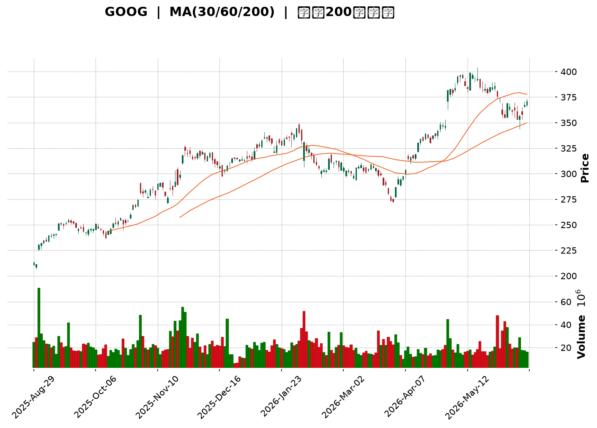
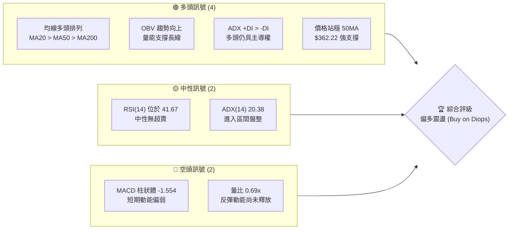
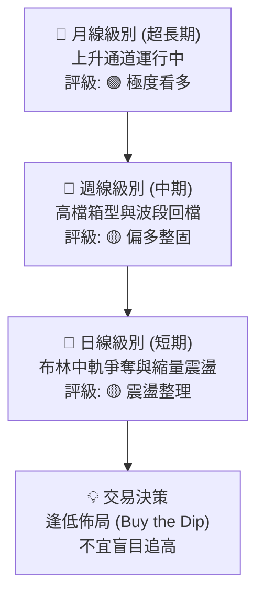
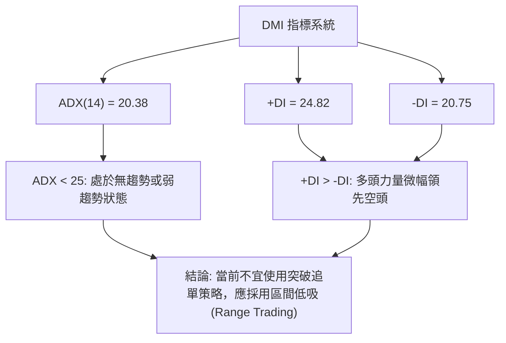
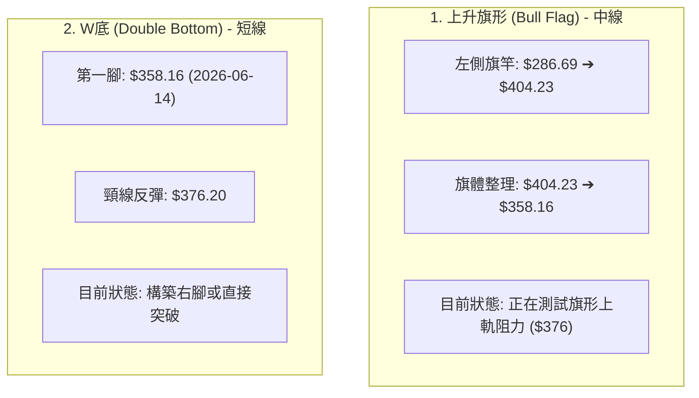
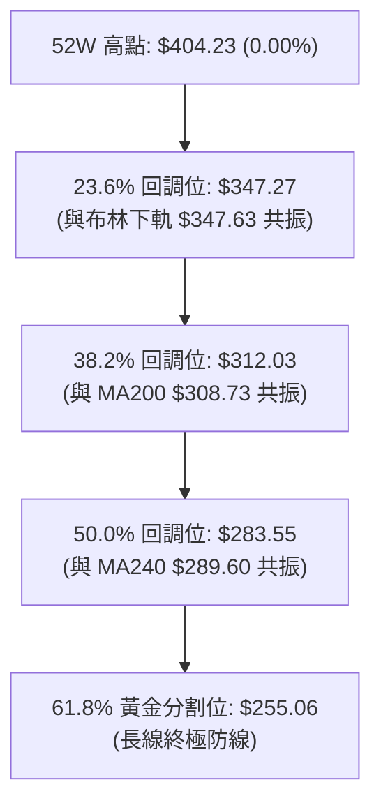
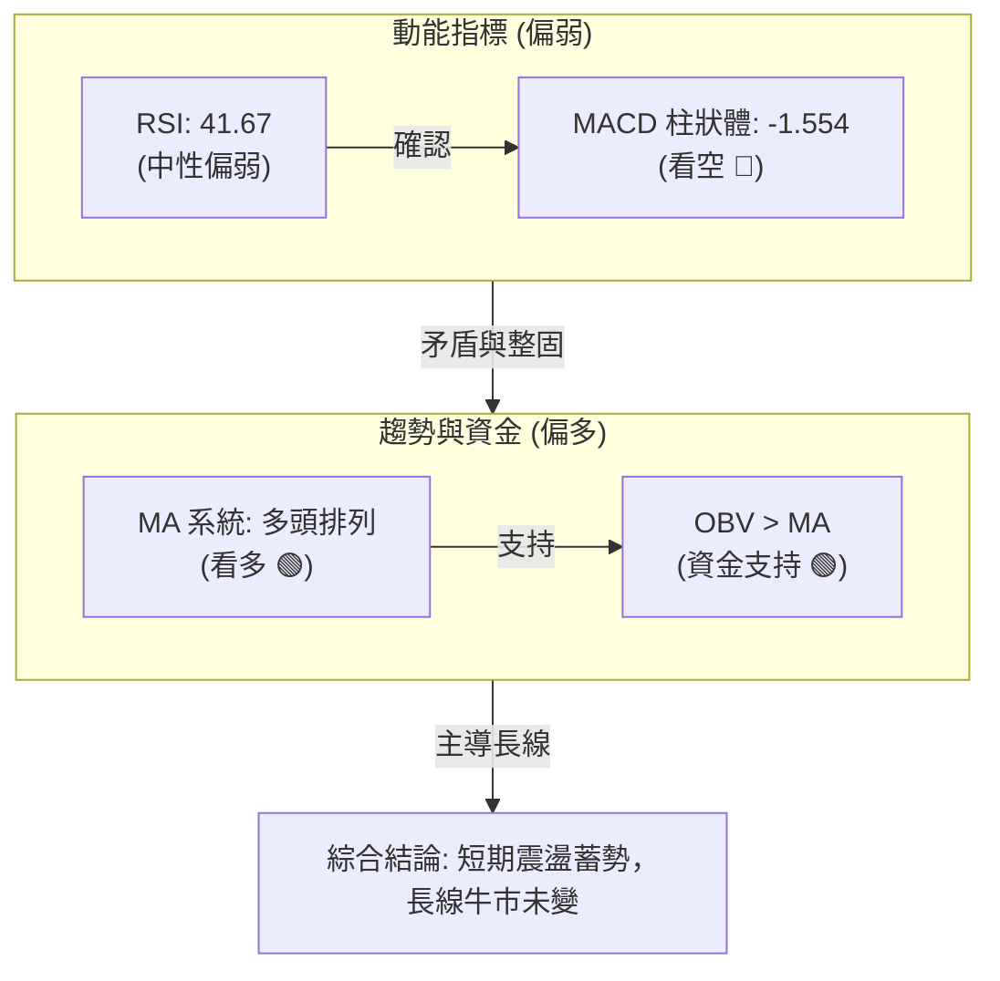
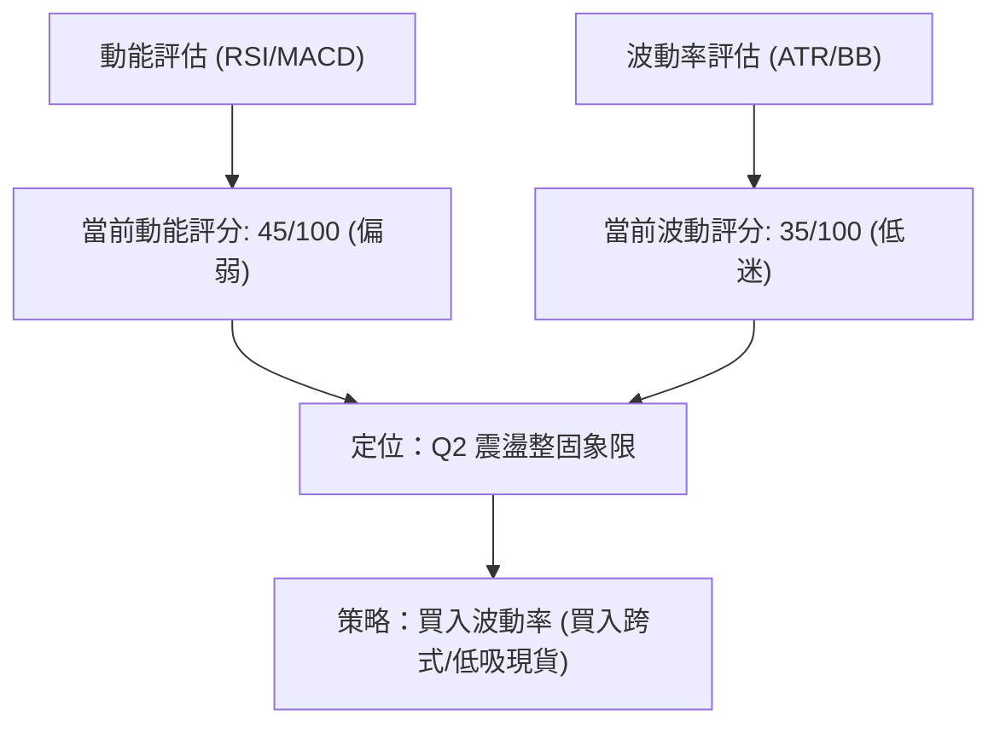
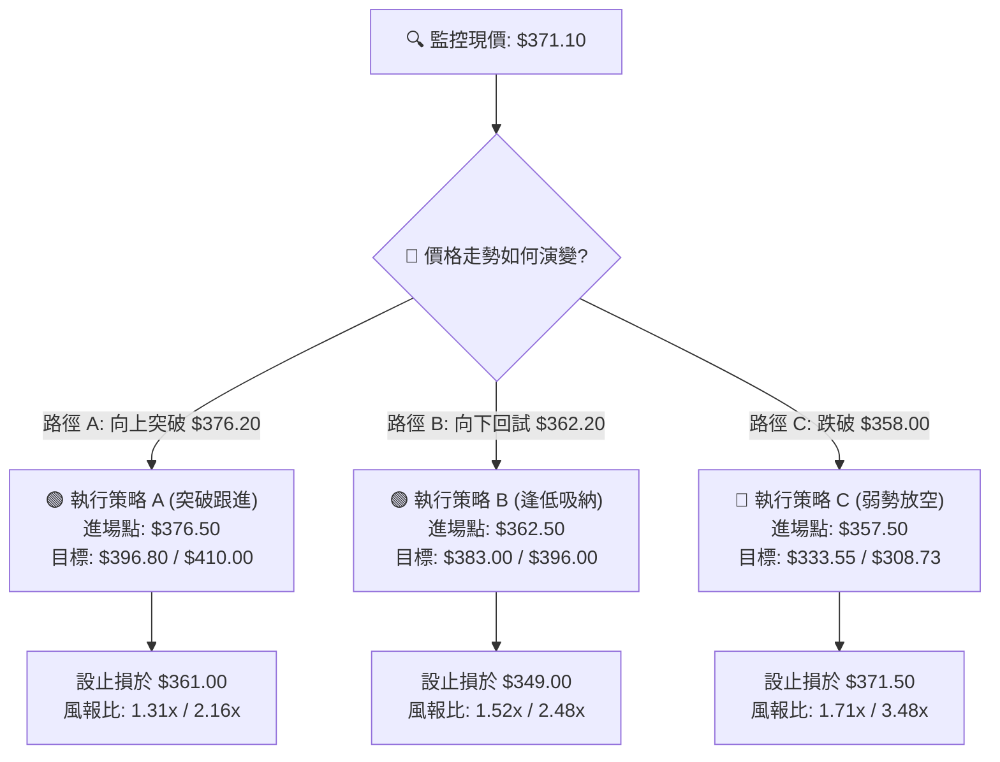
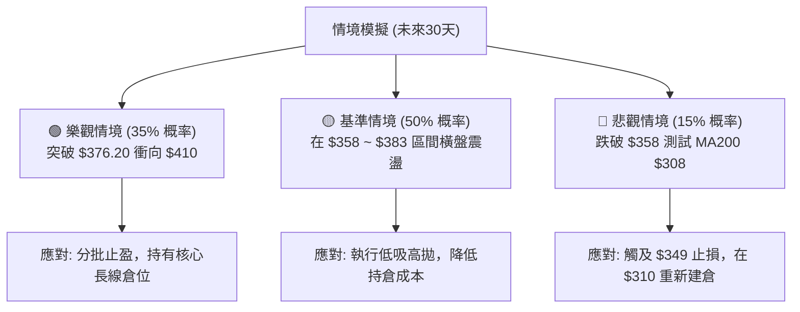

<details>
<summary>📊 靜態圖表 (點擊展開)</summary>

</details>

<html>
<head><meta charset="utf-8" /></head>
<body>
    <div style="height:500px; width:100%;">                        <script>window.PlotlyConfig = {MathJaxConfig: 'local'};</script>
        <script charset="utf-8" src="https://cdn.plot.ly/plotly-3.6.0.min.js" integrity="sha256-QaOVwtVY0T02VaHrr6pnoHLCwayMJp4O5n4YyaE3rJk=" crossorigin="anonymous"></script>                <div id="candlestick-chart" class="plotly-graph-div" style="height:100%; width:100%;"></div>            <script>                window.PLOTLYENV=window.PLOTLYENV || {};                                if (document.getElementById("candlestick-chart")) {                    Plotly.newPlot(                        "candlestick-chart",                        [{"close":{"dtype":"f8","bdata":"AAAAAIGdakAAAABAXWxqQAAAAKAkzmxAAAAAoOv\u002fbEAAAADgAlBtQAAAAEB2Nm1AAAAAYA\u002fvbUAAAABg7OJtQAAAACDjCW5AAAAAwAwdbkAAAABgj2hvQAAAAKCzXW9AAAAAYI8rb0AAAADAw3pvQAAAAOCz129AAAAAgFSMb0AAAABgFXtvQAAAAMAL625AAAAAIM7CbkAAAABgSdZuQAAAACA5fG5AAAAAoFpibkAAAADg6KFuQAAAAIBVvm5AAAAAAPm+bkAAAABgk2BvQAAAAMCw1G5AAAAAwFqfbkAAAADgjjduQAAAAGDQoG1AAAAAYCqFbkAAAABAq7ZuQAAAAKD2Zm9AAAAAoGRsb0AAAACgZKlvQAAAAIBGCHBAAAAAgCVbb0AAAADgJoFvQAAAAAB6p29AAAAAoAFAcEAAAABgbtZwQAAAAIB6vnBAAAAAgBsqcUAAAACgk5VxQAAAAKBMlHFAAAAAAAe5cUAAAADAQVhxQAAAAIAWw3FAAAAAYILMcUAAAAAgcnJxQAAAAEBYIHJAAAAAYLUyckAAAABA4u1xQAAAAAAvaXFAAAAA4AJHcUAAAABAqdBxQAAAAOBwxnFAAAAAYKtGckAAAADAmhZyQAAAAGAFsXJAAAAAYI3dc0AAAABgHDB0QAAAAKB0+nNAAAAAoOb3c0AAAACADqhzQAAAAMBttnNAAAAAgOL\u002fc0AAAABgRtxzQAAAAMBbF3RAAAAAgKKgc0AAAABgXdVzQAAAACBMCXRAAAAAYKaUc0AAAAAA1mFzQAAAAGCpTnNAAAAAIEE1c0AAAACAvJpyQAAAAECo9XJAAAAA4FBDc0AAAABgx25zQAAAAMBJtHNAAAAA4CC0c0AAAACAyKhzQAAAAACtn3NAAAAAYDuic0AAAABgP5ZzQAAAACCJrnNAAAAAgH7Oc0AAAABgO6JzQAAAAMAlIHRAAAAAYFpZdEAAAAAgXot0QAAAAIC7xHRAAAAA4Nr\u002fdEAAAAAg8P10QAAAAICay3RAAAAAwIqedEAAAABg1Rt0QAAAACA5f3RAAAAAIIimdEAAAACgBYB0QAAAAGB50nRAAAAAQAHpdEAAAABAdf10QAAAAAB9I3VAAAAAQGkhdUAAAADAMod1QAAAAAAWRHVAAAAAwHrOdEAAAACAXK50QAAAAIDaKnRAAAAAQKA\u002fdEAAAABAbeNzQAAAAGDHbnNAAAAA4HVPc0AAAAAg7hlzQAAAACDM5nJAAAAAoLH4ckAAAAAgn\u002fJyQAAAACDTp3NAAAAAIIh0c0AAAABgOmhzQAAAAIDxiXNAAAAAgPwrc0AAAACAYHBzQAAAAOBcH3NAAAAAIJ\u002fyckAAAAAg3fByQAAAAOBGyHJAAAAAQJKeckAAAAAgNx1zQAAAACDtK3NAAAAAgMBDc0AAAAAgcfByQAAAAIB11HJAAAAAYMoDc0AAAAAglVNzQAAAACDaIXNAAAAA4LwYc0AAAADAw6lyQAAAAEBxrXJAAAAAwGoQckAAAAAgpxZyQAAAAGAjiXFAAAAAgIYZcUAAAACgnA9xQAAAAMD\u002f6nFAAAAA4I9rckAAAACghmRyQAAAAACyl3JAAAAAgPT7ckAAAACgz6hzQAAAACDgwnNAAAAAQHu4c0AAAADASfBzQAAAAEAZpnRAAAAAIE3kdEAAAAAAHsl0QAAAAEAiM3VAAAAAICzzdEAAAAAAV6R0QAAAACBuGHVAAAAA4L8YdUAAAABg02F1QAAAAED3xHVAAAAA4Ke0dUAAAAAgnrF1QAAAAEBd23dAAAAAANXvd0AAAABAlrZ3QAAAACCfAHhAAAAAAHCueEAAAADg\u002frB4QAAAAKD6zHhAAAAAAJkoeEAAAAAgbfl3QAAAAMDM7HhAAAAA4OXOeEAAAADAVZF4QAAAAAD6jXhAAAAAILIKeEAAAAAgsgp4QAAAAGDU83dAAAAA4G2yd0AAAACAvAl4QAAAAICTCXhAAAAAQDQeeEAAAADgQYN3QAAAAMCxRXdAAAAAgMpidkAAAAAAdTd2QAAAACDEEHdAAAAA4KPYdkAAAABguJJ2QAAAAOCjpHZAAAAAwB4VdkAAAADA9Uh2QAAAAGCPYnZAAAAAgMLxdkAAAACgmTF3QA=="},"high":{"dtype":"f8","bdata":"zRLKR0LXakDlQ9UodXhqQFx6Aqx65GxASdYfL24DbUBD\u002fi3bpG5tQC03d03gvW1AOLNntdEDbkBn3XXdZzNuQIgYbjAOQ25AH80MSVw+bkABGY6iLYhvQMAUrR6Cl29Arpfv2KBub0DXPJk+krRvQBeLNm0qA3BAlkF1COD5b0CfzdIOschvQCuS4Inijm9AHnSpL5nabkCU87vCLjRvQAlRu5T7ZG9ArHUvn1hmbkAwYC4zVNVuQAO\u002fppDR5G5ATRmXi07UbkAGF0zRnHZvQGwJcIvaYW9AXjJ9Z9fYbkC79zplY6JuQC05nbeNi25AHQwVBFiQbkCvlAYYRvFuQLYkbUx\u002fiG9AuB00xDcRcEBgzVGINMxvQFn27jsCFnBAZN8ogizcb0AXY72N1ApwQAAvpt2A629AqzSGmfFfcEDlbWrnUuRwQAD9Dx2W7XBAMU8C1+E2cUAdGjoivjVyQJV3OnmZ23FAg9zRKhfWcUCB8pTihZRxQJIyPSA64nFA\u002fqNysusDckAloCNqGL9xQOTacsc8LnJA\u002f5w8MUo8ckDnPL7\u002fmzxyQFsX\u002f1JJr3FA6jgJvalpcUCpnUoHGl9yQGnF1aTmDXJA9j4MJ3r6ckB+qIqjoiRzQL\u002fyIZfY9XJA8vrrV8ryc0DPy6DyboB0QBZN1wKrRXRAHNtVdtljdEBGobJcE\u002fBzQNOC1tOg33NAVlo7f48WdEAjKdakeCd0QIj2wM4kM3RACgW2IvkMdECyDZFfsORzQLBjevkyF3RAMDCnzx0ZdEC55lSVo7tzQPq0586rhHNAjvK\u002fIAJ3c0BSNJr6qUxzQN2ajy3JDXNAQa3\u002fV2NJc0D92qAFsXRzQLVyje8xvnNA6ZSGDwm+c0AUcXeSWcJzQH46WobxqHNA0RR9CZHUc0AAvi+gp69zQA5LgofhJ3RAnnDhblXtc0CrbHbnPhJ0QAdKd46fYHRAdqkmCb2hdEAgNOo9wrB0QD+Q8XsO4HRATqWEYBNMdUAmFshmcQl1QOHm7g4FG3VAr5pz7tbsdEDdQZ3tlnp0QJVsBganxHRA1RDoQ1zsdEBVC6xQgdl0QIe8+Z6T\u002fnRAtx9tsGAcdUCYo4uoBxN1QAozVxh+XXVAb0GA14g9dUDwQ1nVbot1QKLI65sW23VABzctzs98dUD8xtK5W8N0QNw97RFWo3RACUFFBf90dEBPuZ82XRN0QHj2NDEECnRA3kj5fhLBc0D2+7VoykdzQDH6ec\u002ffB3NAIYdMOCwYc0Ag2AsMFxpzQDTKvM6LxXNAHpgc\u002fpvwc0COhs2\u002fZX9zQEpZ1aEClHNAy0KM2naJc0D8QYRmw3pzQBTYJ1zOO3NAby0AmLH4ckD\u002fW2RB+xBzQMPoqNmV73JAc0gpRgK\u002fckD0DvrqDCVzQAD778dsT3NA+jg4ORxuc0CPc1QfRUdzQM9cShY0MXNA\u002fq6w6i0Wc0CXYWHs0F1zQLddXmkCaXNAl0nSqO0nc0DHX66g\u002fQJzQDW8rigA83JAOnNuqb2OckAhuyRiuWdyQP2F1KV75XFAYwEn\u002fsBucUA7Sl9wgEFxQOJwKYgJ7nFAzP1kZuScckD5OrtTjXtyQJrNf33to3JAkwHHdKz+ckAwiWKrKvNzQJEggkPT03NAqn7Rz+z0c0AUNEFVzvNzQBmyJPoOp3RAJlm9scbsdEC3LFNE1RJ1QAXbEO98PHVAH\u002fq\u002f3EsvdUA3toi+eQ91QHt3zyI6HXVAYXf5T0k\u002fdUBS2O5\u002fu3d1QLqI9OIF63VA9VhTVgjbdUDl1i+\u002f\u002fxJ2QHrHzcxl5ndAdN3F9Izyd0DpkdDQLv93QBAY6NGdS3hA5jXv8UPCeEDFhuov29F4QCk1iR8W4nhAewDoH3yheEARb4krUiN4QMXArO4H+3hAW1s6vNLteEDQuG0xRbp4QC2XMaOgQ3lAlad5xgWSeEARwv61cGd4QIHVCaojR3hAVDSfWTcKeEBU9xkFiBJ4QETmnHDZV3hA5KTwMD9ceEBnfNUjutZ3QI5qB8b+ZXdANiGpyRQZd0DaQcPygqR2QCq45EszGndAVVhcpqUPd0AAAACAFLZ2QAAAAGASG3dAAAAAwPXkdkAAAAAAKWB2QAAAAEBezHZAAAAAYGYqd0AAAACgmVl3QA=="},"hovertemplate":"\u003cb\u003e%{x|%Y-%m-%d}\u003c\u002fb\u003e\u003cbr\u003e\u958b: $%{open:.2f}\u003cbr\u003e\u9ad8: $%{high:.2f}\u003cbr\u003e\u4f4e: $%{low:.2f}\u003cbr\u003e\u6536: $%{close:.2f}\u003cextra\u003e\u003c\u002fextra\u003e","low":{"dtype":"f8","bdata":"0svBNtFLakC+lGTU3MtpQCINSN1TD2xAPJlHYKhDbEBJPdpU\u002fPZsQDTeGoS6KG1AStFWAI0dbUBGgb08nbRtQLLDoA7Ag21Axn1Y5xHBbUD3sJVGBpBuQC4Ll5I\u002fJ29AmCb25h\u002fDbkAxbGoT3TNvQIyS9JRlcm9A9gc0LDhKb0AQFiloKVNvQNl+j2aQ125AP3hTOKwlbkCYHk5nCsVuQEpN9fYsV25AN0PuY0bjbUCoZwM5bddtQNK+U2gkVG5A4W2Xp9w\u002fbkCy2D5Es6ZuQN+Xy2B4ym5Arej6jYmTbkAiHluLweZtQB7acKYah21A7nHr1u0IbkBhVo0xmRZuQHJjWbjUyW5AGtLto79Fb0AKTIyUUQNvQA\u002fJv0dDw29At1Auwx+GbkC2VwoRwT5vQJNskcrAiG9A9+DuKyvzb0A8n8Fbv4ZwQCA8arhbqnBATj+aYXq+cECssDwebH5xQHRCKo6uT3FAJRb2CyV9cUApaz+TLEVxQPIEXgtiVXFACg1YDhuRcUCoouaaNTNxQJ9eE\u002f3Dr3FALq3MzRH1cUCcugvwLb1xQPbrYnlMV3FAE\u002fntwBDucEBC2yO6yLpxQA9EpWxtZ3FA0fCIYLfxcUCrGmd9qwlyQLWKHOOLXHJAyCl3TLdMc0COHwPqG9NzQEg6r61FyXNAK8OU2h7Fc0Bt1G1C2pVzQLgWKGyvmXNAs5HDrKSac0AgMHTvj69zQGLXNyiq9XNA6ymTMwx4c0C11oZMZINzQPJRLm\u002fQr3NAqoR0C5xXc0A7s6RH8yhzQLoTycJ0FXNAf08Tee\u002f2ckDruLdC\u002fZByQNStsW3Nw3JA20LlgyDfckAVmZG2CSNzQIymkdqCZXNAnmIG0JOOc0C8Wt4g+JRzQJF7US\u002fjd3NACiXpknWNc0BPb21trnxzQK8m+7bpY3NAWyIasmatc0DkOCoQ635zQOqFeONuoXNAuFf+3B0ZdEBi\u002fLwSMF10QGsFSvhcUXRAJtFVXp7edEBfUmGCU6t0QMQE8v64rXRATZCUGd57dEClgM5Jigd0QIUBNsH38XNAt3QjejaHdECLq3n1q3h0QIwSwFsAcXRArDGR7gfVdEBelS0PJbt0QDPB4pOyZHRAwMUxXEvDdEADFjvlJPl0QIHjgadeInVAhzjC2AqPdEAgGMq7TyhzQP6Q7AS3+3NAKkfQ8JDUc0DNXchY\u002faNzQOvKJaqaW3NA7RRlRfc7c0B\u002fIvb0DfhyQAS7u2QziHJAqAIB+l\u002fZckDAtqgyccRyQNRq5iRdAHNA6N9b9l1Zc0BGOYlxDBtzQOkqcb5MT3NAkeFy1j7gckAcZUHnHfNyQGWvqHSsynJAcOSXLP2EckApin7KhMZyQJ06Wm7lmnJAQ\u002fyVzdVtckDg3IciDVxyQJfkqZ0FEnNAJY1HG38ac0AObrx2i8pyQMBtd2OYuXJA9B0oLg7ackA78THXqwJzQCbvKZzHFXNAyMxXZxrNckCdJKTmJIlyQI6MVbCcnXJAXBiYeeYKckB4XT54J\u002fNxQEgZ2EkdbnFA\u002fGebUAwVcUAVnzN08vVwQEa3PiJ\u002fSXFAVdeFALwUckDFtMs5WvZxQGQN7wjQWXJAAljd8\u002fRzckD6qWhDRYhzQFk5gr+KVHNAiJND6Jylc0BZLTh5BZhzQJhoBDtPD3RAxNpBsGWHdECnGmpCNbd0QEP\u002fW81u0XRAYPOXJdzmdEAFs8Fx6JZ0QLbEP+AnzHRAWf2fQLztdECj4Pe\u002fld10QGLonB6uSXVAYjrariqBdUDuabOllWN1QPJGBBHyrXZAoU5ZfIxwd0CKGAOysYh3QP+XbIjwwXdAhY\u002fb7t8teED23SMrNGF4QLeelZPulnhA93qQlPYfeEDdneyZ3bd3QK5pRoSb1XdA8PGWUd6HeEBqkkPFaFh4QFOo2VGjanhAteZNblDsd0Brq17SV7x3QCaMgDQHtHdAxjlZIoWgd0Ci2P9ql653QGbq7dhS3HdA74Zuv1TQd0BsnlufMmF3QKABB1LNF3dAibMwWpUsdkCIF+BzqyJ2QEzrIKZiKXZAlGzUjJmWdkAAAACAPV52QAAAACCFK3ZAAAAAwPUMdkAAAACAFHp1QAAAAKBwFXZAAAAAYGbKdkAAAADAHtV2QA=="},"name":"\u50f9\u683c","open":{"dtype":"f8","bdata":"sftR12NVakDbnlo6owxqQCBMHkS5OmxAtL7LDv2vbECKg8yM6\u002f9sQAg4+gCFam1AzJZUhWs3bUA\u002f1MrXBdltQKdwnoFy9W1AsZl7q4YKbkAmny12IpVuQABZzsrDem9ANRMWs\u002fpeb0BSiCYIwWtvQJdVhPzvnG9AWNVGzQLJb0D6RirNFKVvQK+o\u002f+QDdW9A8R9cmY2LbkBvOfbtm+luQFAjmAJC+W5Av3xBWrRSbkBvYlaeqRZuQNXJ1YgapW5AoVPzTAKYbkBMKwoTk6luQBngvmctDm9AuDsq5Py2bkDcTfFTlJJuQM3n7yn2NW5ApOQ1Gt8RbkBje2PSBiluQHXijrcw825Ax90hgBN\u002fb0D4WddZd1tvQPfbRg9i129A3cV+lwXYb0DcJdxBW9BvQF7wEbuEpm9AK8eEGL8McEDZW0M+dI1wQEaVaVG+2nBAGpJjMFrBcEAvafewYzJyQB\u002fWE2dqqnFAhCH8fuGdcUBPe\u002fk4XkhxQKG3pQZWbXFAnMHPFdHScUDEJQPddrpxQGdutcpPy3FAYFVi\u002fS36cUCPdM3TNzhyQKV78wfnpnFAya0mXs\u002f1cEC6vQ+Xb91xQLPIgQG7\u002fnFAxoXMofTxcUAXToBdTQJzQBp3dsaghHJA3Df9BW1mc0AkV11OkmJ0QOa7ZZ5wAnRA7QnD2sEsdEDdSTXBqc1zQGNk7DJ7xHNASmsep5a2c0DgqZLzmyZ0QCvxNt\u002f79XNAT+Rk9MYJdEBR9J7bD4tzQFrPswlPw3NAsEGLMeUKdEBpnuKlJaZzQG2sjPV4g3NA7914P5wZc0Bt1sE3tUlzQN2aQ7Ch6nJAtIlJy\u002fztckBl06nvGW1zQJJjscupa3NATWMjT8y7c0AaQEGeH7hzQBauYaSWhnNAvvb1FwSQc0DlV2hsYI9zQOq0fN3O0nNAsMLTfnzUc0DR1i+fVc5zQOcSrEONonNAtS\u002faeV2NdECy4OpxAHF0QDy4hq0uYXRA+16ypXrtdEB61Bb1w+h0QCDplDXSGXVAZgjUT\u002ffndEC1runqIQ10QO6uQrHQCnRAROgNsULddEBLa0qqiMN0QOwIGdBYfHRAVxLeYRLzdECjoGscuwJ1QFGUOzd+PnVAOxCiQWDgdEAmbFDCxQF1QBsWWnn2wHVA3dKN8+Z0dUCCWe8JqYxzQMzRHcjDbnRABplpxCENdEAxderv2wd0QB8Sgxaz6HNAYHBJEhR\u002fc0C9zSI\u002fVDlzQJoFBof2w3JAvgSB75jgckBRPybPAOJyQMmQ8HxvBnNA8HshjZPrc0BUkij\u002fwGNzQCPdWP1me3NAYfJnJVmGc0AkDKuJsfhyQPt6zSUd6XJAtQ+QOX2gckABb+e2o+RyQMY+RYLe7HJA3DPHSPh6ckB3bTthVF9yQLYOV3kOG3NAHNYmGdohc0Bw1uy7aSBzQOxI1XOHJ3NAl08vpa32ckBaK2DNyQdzQIxot0uEO3NAP2RxFXHwckDldOKdMf5yQGmYt4eWxXJA6LnEWoKAckBpnU6Rlj9yQMG+zjJJ4HFAM7gb6LpTcUBetoK1YzRxQB35SBb4VXFA5D7gvuMcckD7eyf6Dg1yQCfk9ipdaHJA8Dc7Flq\u002fckAyFT6jONpzQE6eebUGkHNAHMUAlIngc0CJDS1Wr7NzQGfD99nwHXRAamv3YceldEA+SVcpXvp0QHIGaV6p43RAs8wkt7MldUC4DidmIfZ0QIe+OALw6nRAC\u002fjvoO41dUDV1kIVRRh1QKIAZE7FenVAqA\u002fMrWGrdUAM0SACW5R1QGVINdOBMHdAoqPZ6Aqcd0CYjtXlcOF3QGlau6k+2ndAI85pzLBVeEB9c\u002fqJI814QJuONZmGoHhADlWlt0dneEBXnMN3Swx4QOIPSffN2ndACcnGs9mYeEApyjrip494QALuO+05fnhAF284zgOReEBSwrFH7wx4QD980th73HdACzz+0Hjwd0BDcA7ZQMx3QHVUa3aO6HdAiY5a0RD6d0CJ091v7s93QEcfI2OdRXdApnxqnxCvdkB3G4xV6WF2QMnPeZKeM3ZAjPMWPZWydkAAAACAwqd2QAAAAAApznZAAAAAwMyQdkAAAADAzBB2QAAAAKCZkXZAAAAAANffdkAAAAAAAPZ2QA=="},"x":["2025-08-29T00:00:00-04:00","2025-09-02T00:00:00-04:00","2025-09-03T00:00:00-04:00","2025-09-04T00:00:00-04:00","2025-09-05T00:00:00-04:00","2025-09-08T00:00:00-04:00","2025-09-09T00:00:00-04:00","2025-09-10T00:00:00-04:00","2025-09-11T00:00:00-04:00","2025-09-12T00:00:00-04:00","2025-09-15T00:00:00-04:00","2025-09-16T00:00:00-04:00","2025-09-17T00:00:00-04:00","2025-09-18T00:00:00-04:00","2025-09-19T00:00:00-04:00","2025-09-22T00:00:00-04:00","2025-09-23T00:00:00-04:00","2025-09-24T00:00:00-04:00","2025-09-25T00:00:00-04:00","2025-09-26T00:00:00-04:00","2025-09-29T00:00:00-04:00","2025-09-30T00:00:00-04:00","2025-10-01T00:00:00-04:00","2025-10-02T00:00:00-04:00","2025-10-03T00:00:00-04:00","2025-10-06T00:00:00-04:00","2025-10-07T00:00:00-04:00","2025-10-08T00:00:00-04:00","2025-10-09T00:00:00-04:00","2025-10-10T00:00:00-04:00","2025-10-13T00:00:00-04:00","2025-10-14T00:00:00-04:00","2025-10-15T00:00:00-04:00","2025-10-16T00:00:00-04:00","2025-10-17T00:00:00-04:00","2025-10-20T00:00:00-04:00","2025-10-21T00:00:00-04:00","2025-10-22T00:00:00-04:00","2025-10-23T00:00:00-04:00","2025-10-24T00:00:00-04:00","2025-10-27T00:00:00-04:00","2025-10-28T00:00:00-04:00","2025-10-29T00:00:00-04:00","2025-10-30T00:00:00-04:00","2025-10-31T00:00:00-04:00","2025-11-03T00:00:00-05:00","2025-11-04T00:00:00-05:00","2025-11-05T00:00:00-05:00","2025-11-06T00:00:00-05:00","2025-11-07T00:00:00-05:00","2025-11-10T00:00:00-05:00","2025-11-11T00:00:00-05:00","2025-11-12T00:00:00-05:00","2025-11-13T00:00:00-05:00","2025-11-14T00:00:00-05:00","2025-11-17T00:00:00-05:00","2025-11-18T00:00:00-05:00","2025-11-19T00:00:00-05:00","2025-11-20T00:00:00-05:00","2025-11-21T00:00:00-05:00","2025-11-24T00:00:00-05:00","2025-11-25T00:00:00-05:00","2025-11-26T00:00:00-05:00","2025-11-28T00:00:00-05:00","2025-12-01T00:00:00-05:00","2025-12-02T00:00:00-05:00","2025-12-03T00:00:00-05:00","2025-12-04T00:00:00-05:00","2025-12-05T00:00:00-05:00","2025-12-08T00:00:00-05:00","2025-12-09T00:00:00-05:00","2025-12-10T00:00:00-05:00","2025-12-11T00:00:00-05:00","2025-12-12T00:00:00-05:00","2025-12-15T00:00:00-05:00","2025-12-16T00:00:00-05:00","2025-12-17T00:00:00-05:00","2025-12-18T00:00:00-05:00","2025-12-19T00:00:00-05:00","2025-12-22T00:00:00-05:00","2025-12-23T00:00:00-05:00","2025-12-24T00:00:00-05:00","2025-12-26T00:00:00-05:00","2025-12-29T00:00:00-05:00","2025-12-30T00:00:00-05:00","2025-12-31T00:00:00-05:00","2026-01-02T00:00:00-05:00","2026-01-05T00:00:00-05:00","2026-01-06T00:00:00-05:00","2026-01-07T00:00:00-05:00","2026-01-08T00:00:00-05:00","2026-01-09T00:00:00-05:00","2026-01-12T00:00:00-05:00","2026-01-13T00:00:00-05:00","2026-01-14T00:00:00-05:00","2026-01-15T00:00:00-05:00","2026-01-16T00:00:00-05:00","2026-01-20T00:00:00-05:00","2026-01-21T00:00:00-05:00","2026-01-22T00:00:00-05:00","2026-01-23T00:00:00-05:00","2026-01-26T00:00:00-05:00","2026-01-27T00:00:00-05:00","2026-01-28T00:00:00-05:00","2026-01-29T00:00:00-05:00","2026-01-30T00:00:00-05:00","2026-02-02T00:00:00-05:00","2026-02-03T00:00:00-05:00","2026-02-04T00:00:00-05:00","2026-02-05T00:00:00-05:00","2026-02-06T00:00:00-05:00","2026-02-09T00:00:00-05:00","2026-02-10T00:00:00-05:00","2026-02-11T00:00:00-05:00","2026-02-12T00:00:00-05:00","2026-02-13T00:00:00-05:00","2026-02-17T00:00:00-05:00","2026-02-18T00:00:00-05:00","2026-02-19T00:00:00-05:00","2026-02-20T00:00:00-05:00","2026-02-23T00:00:00-05:00","2026-02-24T00:00:00-05:00","2026-02-25T00:00:00-05:00","2026-02-26T00:00:00-05:00","2026-02-27T00:00:00-05:00","2026-03-02T00:00:00-05:00","2026-03-03T00:00:00-05:00","2026-03-04T00:00:00-05:00","2026-03-05T00:00:00-05:00","2026-03-06T00:00:00-05:00","2026-03-09T00:00:00-04:00","2026-03-10T00:00:00-04:00","2026-03-11T00:00:00-04:00","2026-03-12T00:00:00-04:00","2026-03-13T00:00:00-04:00","2026-03-16T00:00:00-04:00","2026-03-17T00:00:00-04:00","2026-03-18T00:00:00-04:00","2026-03-19T00:00:00-04:00","2026-03-20T00:00:00-04:00","2026-03-23T00:00:00-04:00","2026-03-24T00:00:00-04:00","2026-03-25T00:00:00-04:00","2026-03-26T00:00:00-04:00","2026-03-27T00:00:00-04:00","2026-03-30T00:00:00-04:00","2026-03-31T00:00:00-04:00","2026-04-01T00:00:00-04:00","2026-04-02T00:00:00-04:00","2026-04-06T00:00:00-04:00","2026-04-07T00:00:00-04:00","2026-04-08T00:00:00-04:00","2026-04-09T00:00:00-04:00","2026-04-10T00:00:00-04:00","2026-04-13T00:00:00-04:00","2026-04-14T00:00:00-04:00","2026-04-15T00:00:00-04:00","2026-04-16T00:00:00-04:00","2026-04-17T00:00:00-04:00","2026-04-20T00:00:00-04:00","2026-04-21T00:00:00-04:00","2026-04-22T00:00:00-04:00","2026-04-23T00:00:00-04:00","2026-04-24T00:00:00-04:00","2026-04-27T00:00:00-04:00","2026-04-28T00:00:00-04:00","2026-04-29T00:00:00-04:00","2026-04-30T00:00:00-04:00","2026-05-01T00:00:00-04:00","2026-05-04T00:00:00-04:00","2026-05-05T00:00:00-04:00","2026-05-06T00:00:00-04:00","2026-05-07T00:00:00-04:00","2026-05-08T00:00:00-04:00","2026-05-11T00:00:00-04:00","2026-05-12T00:00:00-04:00","2026-05-13T00:00:00-04:00","2026-05-14T00:00:00-04:00","2026-05-15T00:00:00-04:00","2026-05-18T00:00:00-04:00","2026-05-19T00:00:00-04:00","2026-05-20T00:00:00-04:00","2026-05-21T00:00:00-04:00","2026-05-22T00:00:00-04:00","2026-05-26T00:00:00-04:00","2026-05-27T00:00:00-04:00","2026-05-28T00:00:00-04:00","2026-05-29T00:00:00-04:00","2026-06-01T00:00:00-04:00","2026-06-02T00:00:00-04:00","2026-06-03T00:00:00-04:00","2026-06-04T00:00:00-04:00","2026-06-05T00:00:00-04:00","2026-06-08T00:00:00-04:00","2026-06-09T00:00:00-04:00","2026-06-10T00:00:00-04:00","2026-06-11T00:00:00-04:00","2026-06-12T00:00:00-04:00","2026-06-15T00:00:00-04:00","2026-06-16T00:00:00-04:00"],"type":"candlestick"},{"hovertemplate":"MA30: $%{y:.2f}\u003cextra\u003e\u003c\u002fextra\u003e","line":{"color":"#2196F3","dash":"dash","width":2},"mode":"lines","name":"MA30","x":["2025-08-29T00:00:00-04:00","2025-09-02T00:00:00-04:00","2025-09-03T00:00:00-04:00","2025-09-04T00:00:00-04:00","2025-09-05T00:00:00-04:00","2025-09-08T00:00:00-04:00","2025-09-09T00:00:00-04:00","2025-09-10T00:00:00-04:00","2025-09-11T00:00:00-04:00","2025-09-12T00:00:00-04:00","2025-09-15T00:00:00-04:00","2025-09-16T00:00:00-04:00","2025-09-17T00:00:00-04:00","2025-09-18T00:00:00-04:00","2025-09-19T00:00:00-04:00","2025-09-22T00:00:00-04:00","2025-09-23T00:00:00-04:00","2025-09-24T00:00:00-04:00","2025-09-25T00:00:00-04:00","2025-09-26T00:00:00-04:00","2025-09-29T00:00:00-04:00","2025-09-30T00:00:00-04:00","2025-10-01T00:00:00-04:00","2025-10-02T00:00:00-04:00","2025-10-03T00:00:00-04:00","2025-10-06T00:00:00-04:00","2025-10-07T00:00:00-04:00","2025-10-08T00:00:00-04:00","2025-10-09T00:00:00-04:00","2025-10-10T00:00:00-04:00","2025-10-13T00:00:00-04:00","2025-10-14T00:00:00-04:00","2025-10-15T00:00:00-04:00","2025-10-16T00:00:00-04:00","2025-10-17T00:00:00-04:00","2025-10-20T00:00:00-04:00","2025-10-21T00:00:00-04:00","2025-10-22T00:00:00-04:00","2025-10-23T00:00:00-04:00","2025-10-24T00:00:00-04:00","2025-10-27T00:00:00-04:00","2025-10-28T00:00:00-04:00","2025-10-29T00:00:00-04:00","2025-10-30T00:00:00-04:00","2025-10-31T00:00:00-04:00","2025-11-03T00:00:00-05:00","2025-11-04T00:00:00-05:00","2025-11-05T00:00:00-05:00","2025-11-06T00:00:00-05:00","2025-11-07T00:00:00-05:00","2025-11-10T00:00:00-05:00","2025-11-11T00:00:00-05:00","2025-11-12T00:00:00-05:00","2025-11-13T00:00:00-05:00","2025-11-14T00:00:00-05:00","2025-11-17T00:00:00-05:00","2025-11-18T00:00:00-05:00","2025-11-19T00:00:00-05:00","2025-11-20T00:00:00-05:00","2025-11-21T00:00:00-05:00","2025-11-24T00:00:00-05:00","2025-11-25T00:00:00-05:00","2025-11-26T00:00:00-05:00","2025-11-28T00:00:00-05:00","2025-12-01T00:00:00-05:00","2025-12-02T00:00:00-05:00","2025-12-03T00:00:00-05:00","2025-12-04T00:00:00-05:00","2025-12-05T00:00:00-05:00","2025-12-08T00:00:00-05:00","2025-12-09T00:00:00-05:00","2025-12-10T00:00:00-05:00","2025-12-11T00:00:00-05:00","2025-12-12T00:00:00-05:00","2025-12-15T00:00:00-05:00","2025-12-16T00:00:00-05:00","2025-12-17T00:00:00-05:00","2025-12-18T00:00:00-05:00","2025-12-19T00:00:00-05:00","2025-12-22T00:00:00-05:00","2025-12-23T00:00:00-05:00","2025-12-24T00:00:00-05:00","2025-12-26T00:00:00-05:00","2025-12-29T00:00:00-05:00","2025-12-30T00:00:00-05:00","2025-12-31T00:00:00-05:00","2026-01-02T00:00:00-05:00","2026-01-05T00:00:00-05:00","2026-01-06T00:00:00-05:00","2026-01-07T00:00:00-05:00","2026-01-08T00:00:00-05:00","2026-01-09T00:00:00-05:00","2026-01-12T00:00:00-05:00","2026-01-13T00:00:00-05:00","2026-01-14T00:00:00-05:00","2026-01-15T00:00:00-05:00","2026-01-16T00:00:00-05:00","2026-01-20T00:00:00-05:00","2026-01-21T00:00:00-05:00","2026-01-22T00:00:00-05:00","2026-01-23T00:00:00-05:00","2026-01-26T00:00:00-05:00","2026-01-27T00:00:00-05:00","2026-01-28T00:00:00-05:00","2026-01-29T00:00:00-05:00","2026-01-30T00:00:00-05:00","2026-02-02T00:00:00-05:00","2026-02-03T00:00:00-05:00","2026-02-04T00:00:00-05:00","2026-02-05T00:00:00-05:00","2026-02-06T00:00:00-05:00","2026-02-09T00:00:00-05:00","2026-02-10T00:00:00-05:00","2026-02-11T00:00:00-05:00","2026-02-12T00:00:00-05:00","2026-02-13T00:00:00-05:00","2026-02-17T00:00:00-05:00","2026-02-18T00:00:00-05:00","2026-02-19T00:00:00-05:00","2026-02-20T00:00:00-05:00","2026-02-23T00:00:00-05:00","2026-02-24T00:00:00-05:00","2026-02-25T00:00:00-05:00","2026-02-26T00:00:00-05:00","2026-02-27T00:00:00-05:00","2026-03-02T00:00:00-05:00","2026-03-03T00:00:00-05:00","2026-03-04T00:00:00-05:00","2026-03-05T00:00:00-05:00","2026-03-06T00:00:00-05:00","2026-03-09T00:00:00-04:00","2026-03-10T00:00:00-04:00","2026-03-11T00:00:00-04:00","2026-03-12T00:00:00-04:00","2026-03-13T00:00:00-04:00","2026-03-16T00:00:00-04:00","2026-03-17T00:00:00-04:00","2026-03-18T00:00:00-04:00","2026-03-19T00:00:00-04:00","2026-03-20T00:00:00-04:00","2026-03-23T00:00:00-04:00","2026-03-24T00:00:00-04:00","2026-03-25T00:00:00-04:00","2026-03-26T00:00:00-04:00","2026-03-27T00:00:00-04:00","2026-03-30T00:00:00-04:00","2026-03-31T00:00:00-04:00","2026-04-01T00:00:00-04:00","2026-04-02T00:00:00-04:00","2026-04-06T00:00:00-04:00","2026-04-07T00:00:00-04:00","2026-04-08T00:00:00-04:00","2026-04-09T00:00:00-04:00","2026-04-10T00:00:00-04:00","2026-04-13T00:00:00-04:00","2026-04-14T00:00:00-04:00","2026-04-15T00:00:00-04:00","2026-04-16T00:00:00-04:00","2026-04-17T00:00:00-04:00","2026-04-20T00:00:00-04:00","2026-04-21T00:00:00-04:00","2026-04-22T00:00:00-04:00","2026-04-23T00:00:00-04:00","2026-04-24T00:00:00-04:00","2026-04-27T00:00:00-04:00","2026-04-28T00:00:00-04:00","2026-04-29T00:00:00-04:00","2026-04-30T00:00:00-04:00","2026-05-01T00:00:00-04:00","2026-05-04T00:00:00-04:00","2026-05-05T00:00:00-04:00","2026-05-06T00:00:00-04:00","2026-05-07T00:00:00-04:00","2026-05-08T00:00:00-04:00","2026-05-11T00:00:00-04:00","2026-05-12T00:00:00-04:00","2026-05-13T00:00:00-04:00","2026-05-14T00:00:00-04:00","2026-05-15T00:00:00-04:00","2026-05-18T00:00:00-04:00","2026-05-19T00:00:00-04:00","2026-05-20T00:00:00-04:00","2026-05-21T00:00:00-04:00","2026-05-22T00:00:00-04:00","2026-05-26T00:00:00-04:00","2026-05-27T00:00:00-04:00","2026-05-28T00:00:00-04:00","2026-05-29T00:00:00-04:00","2026-06-01T00:00:00-04:00","2026-06-02T00:00:00-04:00","2026-06-03T00:00:00-04:00","2026-06-04T00:00:00-04:00","2026-06-05T00:00:00-04:00","2026-06-08T00:00:00-04:00","2026-06-09T00:00:00-04:00","2026-06-10T00:00:00-04:00","2026-06-11T00:00:00-04:00","2026-06-12T00:00:00-04:00","2026-06-15T00:00:00-04:00","2026-06-16T00:00:00-04:00"],"y":{"dtype":"f8","bdata":"AAAAAAAA+H8AAAAAAAD4fwAAAAAAAPh\u002fAAAAAAAA+H8AAAAAAAD4fwAAAAAAAPh\u002fAAAAAAAA+H8AAAAAAAD4fwAAAAAAAPh\u002fAAAAAAAA+H8AAAAAAAD4fwAAAAAAAPh\u002fAAAAAAAA+H8AAAAAAAD4fwAAAAAAAPh\u002fAAAAAAAA+H8AAAAAAAD4fwAAAAAAAPh\u002fAAAAAAAA+H8AAAAAAAD4fwAAAAAAAPh\u002fAAAAAAAA+H8AAAAAAAD4fwAAAAAAAPh\u002fAAAAAAAA+H8AAAAAAAD4fwAAAAAAAPh\u002fAAAAAAAA+H8AAAAAAAD4fyIiIlK7Qm5ARERExA1kbkB3d3f3qYhuQJqZmRnTnm5AzczMzIGzbkB3d3eXjcduQO\u002fu7q7j325A3t3djQbsbkDe3d1N1fluQJqZmZmeB29AZmZmJvwbb0AAAAAQVC9vQHd3d9dvQW9AzczMXGRcb0BVVVUl33tvQO\u002fu7g4rmG9AmpmZ+Wy5b0AzMzODztRvQLy7u2sc\u002fG9AERERQbEScECrqqqiACRwQJqZmTmcPHBAzczM5EJWcEBmZmYWj2xwQBEREaH1fXBAd3d31zWOcEAREREpW6BwQERERBx+tHBAAAAA2MrNcECamZlJOOdwQAAAAJhOCHFAIiIiIpsvcUBVVVX11FhxQERERLxUfXFAvLu7i6ehcUCJiIjATMJxQN7d3XW04XFARERE\u002fJQGckC8u7t7oylyQERERKQGTnJA3t3dzdhqckDe3d1NaYRyQLy7u1uBoHJAZmZmlh+1ckAiIiIid8RyQFVVVfU103JAAAAAkOLfckAzMzNjoupyQCIiInLa9HJAvLu7y1gBc0AiIiKSShJzQN7d3Y3BH3NAiYiIeJosc0ARERHhXTtzQCIiIvI\u002fTnNA3t3dbVtic0CJiIgIenFzQLy7uxu\u002fgXNA3t3drc6Oc0AzMzOz\u002fptzQDMzM4M7qHNAIiIi8lusc0C8u7urZq9zQERERMQktnNAzczMLPG+c0AAAACQVspzQJqZmcmT03NAmpmZqd3Yc0B3d3cH\u002fNpzQHd3d1dy3nNAIiIiMi3nc0CJiIh43exzQN7d3S2S83NAq6qqiur+c0DNzMwMowx0QERERLRDHHRAERERcassdEARERFRnkV0QERERKRMWXRAREREtHhmdEDv7u7OH3F0QBEREZETdXRAIiIi8rl5dEDv7u5ernt0QN7d3R0NenRAzczMzEp3dEBVVVX1JXN0QGZmZoZ9bHRAiYiIGF1ldEDe3d2Ngl90QM3MzMx\u002fW3RAERERMd9TdEDNzMzMKkp0QJqZmZmsP3RA7+7uHhQwdECamZmZ0yJ0QHd3d0eNFHRAERERsUkGdEC8u7t7UvxzQO\u002fu7s6w7XNAAAAA0Fvcc0AREREhiNBzQDMzM2NywnNAIiIisme0c0Dv7u6O56JzQLy7uxs0j3NAd3d3RyZ9c0AiIiLCXGpzQAAAAJAnWHNAq6qqKpBJc0AAAADgVzhzQKuqqiqhK3NAAAAAQP0Yc0AAAABQoQlzQN7d3S1x+XJA3t3d3ZPmckAAAADAKtVyQCIiIhLGzHJA7+7uvhHIckAiIiIyVcNyQGZmZgZDunJAq6qqGj62ckBmZmY2ZbhyQImIiAhLunJAzczM7Pm+ckDv7u5uPcNyQGZmZrZD0HJARERElNrgckCamZl5mPByQDMzM2M5BXNAIiIiYhwZc0Crqqr6JSZzQN7d3a2QNnNAq6qqyjJGc0BmZmZmC1tzQKuqqsogdHNAvLu7GxeLc0C8u7ubSp9zQHd3d8ebx3NAIiIiYunwc0B3d3d3ARx0QN7d3e1xSXRAIiIikumBdEBERETUQbp0QImIiHhA+HRAIiIi0nw0dUDNzMw8e291QGZmZlZGq3VARERENMnhdUBmZmbGehZ2QKuqqgpbSXZA7+7ufoN0dkCamZnp6Jl2QJqZmcmsvXZAZmZmRpvfdkARERGRlgJ3QKuqqgqBH3dA7+7uvgg7d0BVVVU1TlJ3QImIiKj9Y3dAvLu7qz5wd0Crqqqarn13QFVVVUV+jndAVVVVRWydd0CamZkJlqd3QJqZmbkKr3dAMzMz40Gyd0B3d3dXTbd3QCIiIvK9qndAzczM3EWid0CrqqoK1513QA=="},"type":"scatter"},{"hovertemplate":"MA60: $%{y:.2f}\u003cextra\u003e\u003c\u002fextra\u003e","line":{"color":"#9C27B0","dash":"dash","width":2},"mode":"lines","name":"MA60","x":["2025-08-29T00:00:00-04:00","2025-09-02T00:00:00-04:00","2025-09-03T00:00:00-04:00","2025-09-04T00:00:00-04:00","2025-09-05T00:00:00-04:00","2025-09-08T00:00:00-04:00","2025-09-09T00:00:00-04:00","2025-09-10T00:00:00-04:00","2025-09-11T00:00:00-04:00","2025-09-12T00:00:00-04:00","2025-09-15T00:00:00-04:00","2025-09-16T00:00:00-04:00","2025-09-17T00:00:00-04:00","2025-09-18T00:00:00-04:00","2025-09-19T00:00:00-04:00","2025-09-22T00:00:00-04:00","2025-09-23T00:00:00-04:00","2025-09-24T00:00:00-04:00","2025-09-25T00:00:00-04:00","2025-09-26T00:00:00-04:00","2025-09-29T00:00:00-04:00","2025-09-30T00:00:00-04:00","2025-10-01T00:00:00-04:00","2025-10-02T00:00:00-04:00","2025-10-03T00:00:00-04:00","2025-10-06T00:00:00-04:00","2025-10-07T00:00:00-04:00","2025-10-08T00:00:00-04:00","2025-10-09T00:00:00-04:00","2025-10-10T00:00:00-04:00","2025-10-13T00:00:00-04:00","2025-10-14T00:00:00-04:00","2025-10-15T00:00:00-04:00","2025-10-16T00:00:00-04:00","2025-10-17T00:00:00-04:00","2025-10-20T00:00:00-04:00","2025-10-21T00:00:00-04:00","2025-10-22T00:00:00-04:00","2025-10-23T00:00:00-04:00","2025-10-24T00:00:00-04:00","2025-10-27T00:00:00-04:00","2025-10-28T00:00:00-04:00","2025-10-29T00:00:00-04:00","2025-10-30T00:00:00-04:00","2025-10-31T00:00:00-04:00","2025-11-03T00:00:00-05:00","2025-11-04T00:00:00-05:00","2025-11-05T00:00:00-05:00","2025-11-06T00:00:00-05:00","2025-11-07T00:00:00-05:00","2025-11-10T00:00:00-05:00","2025-11-11T00:00:00-05:00","2025-11-12T00:00:00-05:00","2025-11-13T00:00:00-05:00","2025-11-14T00:00:00-05:00","2025-11-17T00:00:00-05:00","2025-11-18T00:00:00-05:00","2025-11-19T00:00:00-05:00","2025-11-20T00:00:00-05:00","2025-11-21T00:00:00-05:00","2025-11-24T00:00:00-05:00","2025-11-25T00:00:00-05:00","2025-11-26T00:00:00-05:00","2025-11-28T00:00:00-05:00","2025-12-01T00:00:00-05:00","2025-12-02T00:00:00-05:00","2025-12-03T00:00:00-05:00","2025-12-04T00:00:00-05:00","2025-12-05T00:00:00-05:00","2025-12-08T00:00:00-05:00","2025-12-09T00:00:00-05:00","2025-12-10T00:00:00-05:00","2025-12-11T00:00:00-05:00","2025-12-12T00:00:00-05:00","2025-12-15T00:00:00-05:00","2025-12-16T00:00:00-05:00","2025-12-17T00:00:00-05:00","2025-12-18T00:00:00-05:00","2025-12-19T00:00:00-05:00","2025-12-22T00:00:00-05:00","2025-12-23T00:00:00-05:00","2025-12-24T00:00:00-05:00","2025-12-26T00:00:00-05:00","2025-12-29T00:00:00-05:00","2025-12-30T00:00:00-05:00","2025-12-31T00:00:00-05:00","2026-01-02T00:00:00-05:00","2026-01-05T00:00:00-05:00","2026-01-06T00:00:00-05:00","2026-01-07T00:00:00-05:00","2026-01-08T00:00:00-05:00","2026-01-09T00:00:00-05:00","2026-01-12T00:00:00-05:00","2026-01-13T00:00:00-05:00","2026-01-14T00:00:00-05:00","2026-01-15T00:00:00-05:00","2026-01-16T00:00:00-05:00","2026-01-20T00:00:00-05:00","2026-01-21T00:00:00-05:00","2026-01-22T00:00:00-05:00","2026-01-23T00:00:00-05:00","2026-01-26T00:00:00-05:00","2026-01-27T00:00:00-05:00","2026-01-28T00:00:00-05:00","2026-01-29T00:00:00-05:00","2026-01-30T00:00:00-05:00","2026-02-02T00:00:00-05:00","2026-02-03T00:00:00-05:00","2026-02-04T00:00:00-05:00","2026-02-05T00:00:00-05:00","2026-02-06T00:00:00-05:00","2026-02-09T00:00:00-05:00","2026-02-10T00:00:00-05:00","2026-02-11T00:00:00-05:00","2026-02-12T00:00:00-05:00","2026-02-13T00:00:00-05:00","2026-02-17T00:00:00-05:00","2026-02-18T00:00:00-05:00","2026-02-19T00:00:00-05:00","2026-02-20T00:00:00-05:00","2026-02-23T00:00:00-05:00","2026-02-24T00:00:00-05:00","2026-02-25T00:00:00-05:00","2026-02-26T00:00:00-05:00","2026-02-27T00:00:00-05:00","2026-03-02T00:00:00-05:00","2026-03-03T00:00:00-05:00","2026-03-04T00:00:00-05:00","2026-03-05T00:00:00-05:00","2026-03-06T00:00:00-05:00","2026-03-09T00:00:00-04:00","2026-03-10T00:00:00-04:00","2026-03-11T00:00:00-04:00","2026-03-12T00:00:00-04:00","2026-03-13T00:00:00-04:00","2026-03-16T00:00:00-04:00","2026-03-17T00:00:00-04:00","2026-03-18T00:00:00-04:00","2026-03-19T00:00:00-04:00","2026-03-20T00:00:00-04:00","2026-03-23T00:00:00-04:00","2026-03-24T00:00:00-04:00","2026-03-25T00:00:00-04:00","2026-03-26T00:00:00-04:00","2026-03-27T00:00:00-04:00","2026-03-30T00:00:00-04:00","2026-03-31T00:00:00-04:00","2026-04-01T00:00:00-04:00","2026-04-02T00:00:00-04:00","2026-04-06T00:00:00-04:00","2026-04-07T00:00:00-04:00","2026-04-08T00:00:00-04:00","2026-04-09T00:00:00-04:00","2026-04-10T00:00:00-04:00","2026-04-13T00:00:00-04:00","2026-04-14T00:00:00-04:00","2026-04-15T00:00:00-04:00","2026-04-16T00:00:00-04:00","2026-04-17T00:00:00-04:00","2026-04-20T00:00:00-04:00","2026-04-21T00:00:00-04:00","2026-04-22T00:00:00-04:00","2026-04-23T00:00:00-04:00","2026-04-24T00:00:00-04:00","2026-04-27T00:00:00-04:00","2026-04-28T00:00:00-04:00","2026-04-29T00:00:00-04:00","2026-04-30T00:00:00-04:00","2026-05-01T00:00:00-04:00","2026-05-04T00:00:00-04:00","2026-05-05T00:00:00-04:00","2026-05-06T00:00:00-04:00","2026-05-07T00:00:00-04:00","2026-05-08T00:00:00-04:00","2026-05-11T00:00:00-04:00","2026-05-12T00:00:00-04:00","2026-05-13T00:00:00-04:00","2026-05-14T00:00:00-04:00","2026-05-15T00:00:00-04:00","2026-05-18T00:00:00-04:00","2026-05-19T00:00:00-04:00","2026-05-20T00:00:00-04:00","2026-05-21T00:00:00-04:00","2026-05-22T00:00:00-04:00","2026-05-26T00:00:00-04:00","2026-05-27T00:00:00-04:00","2026-05-28T00:00:00-04:00","2026-05-29T00:00:00-04:00","2026-06-01T00:00:00-04:00","2026-06-02T00:00:00-04:00","2026-06-03T00:00:00-04:00","2026-06-04T00:00:00-04:00","2026-06-05T00:00:00-04:00","2026-06-08T00:00:00-04:00","2026-06-09T00:00:00-04:00","2026-06-10T00:00:00-04:00","2026-06-11T00:00:00-04:00","2026-06-12T00:00:00-04:00","2026-06-15T00:00:00-04:00","2026-06-16T00:00:00-04:00"],"y":{"dtype":"f8","bdata":"AAAAAAAA+H8AAAAAAAD4fwAAAAAAAPh\u002fAAAAAAAA+H8AAAAAAAD4fwAAAAAAAPh\u002fAAAAAAAA+H8AAAAAAAD4fwAAAAAAAPh\u002fAAAAAAAA+H8AAAAAAAD4fwAAAAAAAPh\u002fAAAAAAAA+H8AAAAAAAD4fwAAAAAAAPh\u002fAAAAAAAA+H8AAAAAAAD4fwAAAAAAAPh\u002fAAAAAAAA+H8AAAAAAAD4fwAAAAAAAPh\u002fAAAAAAAA+H8AAAAAAAD4fwAAAAAAAPh\u002fAAAAAAAA+H8AAAAAAAD4fwAAAAAAAPh\u002fAAAAAAAA+H8AAAAAAAD4fwAAAAAAAPh\u002fAAAAAAAA+H8AAAAAAAD4fwAAAAAAAPh\u002fAAAAAAAA+H8AAAAAAAD4fwAAAAAAAPh\u002fAAAAAAAA+H8AAAAAAAD4fwAAAAAAAPh\u002fAAAAAAAA+H8AAAAAAAD4fwAAAAAAAPh\u002fAAAAAAAA+H8AAAAAAAD4fwAAAAAAAPh\u002fAAAAAAAA+H8AAAAAAAD4fwAAAAAAAPh\u002fAAAAAAAA+H8AAAAAAAD4fwAAAAAAAPh\u002fAAAAAAAA+H8AAAAAAAD4fwAAAAAAAPh\u002fAAAAAAAA+H8AAAAAAAD4fwAAAAAAAPh\u002fAAAAAAAA+H8AAAAAAAD4f4mIiCDWFHBAIiIiAtEwcECJiIj4lE5wQImIiCRfZnBAERERObR9cEAiIiLGCZNwQKuqqibTqHBAmpmZIUy+cEBVVVURR9NwQImIiPjq6HBAiYiIcGv8cEDv7u6qCQ5xQLy7u6OcIHFAZmZm4qgxcUBmZmZaM0FxQGZmZr6lT3FAZmZmhkxecUBmZmbShGpxQAAAAFR0eXFAZmZmBgWKcUBmZmaaJZtxQLy7u+MurnFAq6qqrm7BcUC8u7t79tNxQJqZmcka5nFAq6qqokj4cUDNzMyY6ghyQAAAAJweG3JA7+7uwkwuckBmZmZ+m0FyQJqZmQ1FWHJAIiIiivttckCJiIjQHYRyQERERMC8mXJAREREXEywckBERESoUcZyQLy7ux+k2nJA7+7uUrnvckCamZnBTwJzQN7d3X08FnNAAAAAAAMpc0AzMzNjozhzQM3MzMQJSnNAiYiIEAVac0B3d3cXjWhzQM3MzNS8d3NAiYiIAEeGc0AiIiJaIJhzQDMzM4sTp3NAAAAAwOizc0CJiIgwtcFzQHd3d49qynNAVVVVNSrTc0AAAAAghttzQAAAAIgm5HNAVVVVHdPsc0Dv7u7+T\u002fJzQBEREVEe93NAMzMz4xX6c0CJiIigwP1zQAAAAKjdAXRAmpmZkR0AdEBERES8yPxzQO\u002fu7q7o+nNA3t3dpYL3c0DNzMwUlfZzQImIiIgQ9HNAVVVVrZPvc0CamZlBp+tzQDMzM5MR5nNAERERgcThc0DNzMzMst5zQImIiEgC23NAZmZmHqnZc0De3d1NxddzQAAAAOi71XNARERE3OjUc0CamZmJ\u002fddzQCIiIhq62HNAd3d3bwTYc0B3d3fXu9RzQN7d3V1a0HNAERERmVvJc0B3d3fXp8JzQN7d3SW\u002fuXNAVVVVVe+uc0CrqqpaKKRzQERERMyhnHNAvLu7a7eWc0AAAADga5FzQJqZmWnhinNA3t3dpQ6Fc0CamZkBSIFzQBEREdH7fHNA3t3dBYd3c0BERESECHNzQO\u002fu7n5ocnNAq6qqIpJzc0Crqqp6dXZzQBERERl1eXNAERERGbx6c0De3d0NV3tzQImIiIiBfHNAZmZmPk19c0Crqqp6+X5zQDMzM3OqgXNAmpmZsR6Ec0Dv7u6u04RzQLy7u6vhj3NAZmZmxjydc0C8u7urLKpzQERERIyJunNAERERaXPNc0AiIiKS8eFzQDMzM9PY+HNAAAAAWIgNdEBmZmb+UiJ0QERERDQGPHRAmpmZee1UdEBERET852x0QImIiAjPgXRAzczMzGCVdEAAAAAQJ6l0QBEREen7u3RAmpmZmUrPdEAAAAAA6uJ0QImIiGDi93RAmpmZqfENdUB3d3dXcyF1QN7d3YWbNHVA7+7uhq1EdUCrqqpK6lF1QJqZmXmHYnVAAAAAiM9xdUAAAAC4UIF1QCIiIsKVkXVAd3d3f6yedUCamZn5S6t1QM3MzNwsuXVAd3d3n5fJdUARERFB7Nx1QA=="},"type":"scatter"},{"hovertemplate":"MA200: $%{y:.2f}\u003cextra\u003e\u003c\u002fextra\u003e","line":{"color":"#FF6F00","dash":"solid","width":2},"mode":"lines","name":"MA200","x":["2025-08-29T00:00:00-04:00","2025-09-02T00:00:00-04:00","2025-09-03T00:00:00-04:00","2025-09-04T00:00:00-04:00","2025-09-05T00:00:00-04:00","2025-09-08T00:00:00-04:00","2025-09-09T00:00:00-04:00","2025-09-10T00:00:00-04:00","2025-09-11T00:00:00-04:00","2025-09-12T00:00:00-04:00","2025-09-15T00:00:00-04:00","2025-09-16T00:00:00-04:00","2025-09-17T00:00:00-04:00","2025-09-18T00:00:00-04:00","2025-09-19T00:00:00-04:00","2025-09-22T00:00:00-04:00","2025-09-23T00:00:00-04:00","2025-09-24T00:00:00-04:00","2025-09-25T00:00:00-04:00","2025-09-26T00:00:00-04:00","2025-09-29T00:00:00-04:00","2025-09-30T00:00:00-04:00","2025-10-01T00:00:00-04:00","2025-10-02T00:00:00-04:00","2025-10-03T00:00:00-04:00","2025-10-06T00:00:00-04:00","2025-10-07T00:00:00-04:00","2025-10-08T00:00:00-04:00","2025-10-09T00:00:00-04:00","2025-10-10T00:00:00-04:00","2025-10-13T00:00:00-04:00","2025-10-14T00:00:00-04:00","2025-10-15T00:00:00-04:00","2025-10-16T00:00:00-04:00","2025-10-17T00:00:00-04:00","2025-10-20T00:00:00-04:00","2025-10-21T00:00:00-04:00","2025-10-22T00:00:00-04:00","2025-10-23T00:00:00-04:00","2025-10-24T00:00:00-04:00","2025-10-27T00:00:00-04:00","2025-10-28T00:00:00-04:00","2025-10-29T00:00:00-04:00","2025-10-30T00:00:00-04:00","2025-10-31T00:00:00-04:00","2025-11-03T00:00:00-05:00","2025-11-04T00:00:00-05:00","2025-11-05T00:00:00-05:00","2025-11-06T00:00:00-05:00","2025-11-07T00:00:00-05:00","2025-11-10T00:00:00-05:00","2025-11-11T00:00:00-05:00","2025-11-12T00:00:00-05:00","2025-11-13T00:00:00-05:00","2025-11-14T00:00:00-05:00","2025-11-17T00:00:00-05:00","2025-11-18T00:00:00-05:00","2025-11-19T00:00:00-05:00","2025-11-20T00:00:00-05:00","2025-11-21T00:00:00-05:00","2025-11-24T00:00:00-05:00","2025-11-25T00:00:00-05:00","2025-11-26T00:00:00-05:00","2025-11-28T00:00:00-05:00","2025-12-01T00:00:00-05:00","2025-12-02T00:00:00-05:00","2025-12-03T00:00:00-05:00","2025-12-04T00:00:00-05:00","2025-12-05T00:00:00-05:00","2025-12-08T00:00:00-05:00","2025-12-09T00:00:00-05:00","2025-12-10T00:00:00-05:00","2025-12-11T00:00:00-05:00","2025-12-12T00:00:00-05:00","2025-12-15T00:00:00-05:00","2025-12-16T00:00:00-05:00","2025-12-17T00:00:00-05:00","2025-12-18T00:00:00-05:00","2025-12-19T00:00:00-05:00","2025-12-22T00:00:00-05:00","2025-12-23T00:00:00-05:00","2025-12-24T00:00:00-05:00","2025-12-26T00:00:00-05:00","2025-12-29T00:00:00-05:00","2025-12-30T00:00:00-05:00","2025-12-31T00:00:00-05:00","2026-01-02T00:00:00-05:00","2026-01-05T00:00:00-05:00","2026-01-06T00:00:00-05:00","2026-01-07T00:00:00-05:00","2026-01-08T00:00:00-05:00","2026-01-09T00:00:00-05:00","2026-01-12T00:00:00-05:00","2026-01-13T00:00:00-05:00","2026-01-14T00:00:00-05:00","2026-01-15T00:00:00-05:00","2026-01-16T00:00:00-05:00","2026-01-20T00:00:00-05:00","2026-01-21T00:00:00-05:00","2026-01-22T00:00:00-05:00","2026-01-23T00:00:00-05:00","2026-01-26T00:00:00-05:00","2026-01-27T00:00:00-05:00","2026-01-28T00:00:00-05:00","2026-01-29T00:00:00-05:00","2026-01-30T00:00:00-05:00","2026-02-02T00:00:00-05:00","2026-02-03T00:00:00-05:00","2026-02-04T00:00:00-05:00","2026-02-05T00:00:00-05:00","2026-02-06T00:00:00-05:00","2026-02-09T00:00:00-05:00","2026-02-10T00:00:00-05:00","2026-02-11T00:00:00-05:00","2026-02-12T00:00:00-05:00","2026-02-13T00:00:00-05:00","2026-02-17T00:00:00-05:00","2026-02-18T00:00:00-05:00","2026-02-19T00:00:00-05:00","2026-02-20T00:00:00-05:00","2026-02-23T00:00:00-05:00","2026-02-24T00:00:00-05:00","2026-02-25T00:00:00-05:00","2026-02-26T00:00:00-05:00","2026-02-27T00:00:00-05:00","2026-03-02T00:00:00-05:00","2026-03-03T00:00:00-05:00","2026-03-04T00:00:00-05:00","2026-03-05T00:00:00-05:00","2026-03-06T00:00:00-05:00","2026-03-09T00:00:00-04:00","2026-03-10T00:00:00-04:00","2026-03-11T00:00:00-04:00","2026-03-12T00:00:00-04:00","2026-03-13T00:00:00-04:00","2026-03-16T00:00:00-04:00","2026-03-17T00:00:00-04:00","2026-03-18T00:00:00-04:00","2026-03-19T00:00:00-04:00","2026-03-20T00:00:00-04:00","2026-03-23T00:00:00-04:00","2026-03-24T00:00:00-04:00","2026-03-25T00:00:00-04:00","2026-03-26T00:00:00-04:00","2026-03-27T00:00:00-04:00","2026-03-30T00:00:00-04:00","2026-03-31T00:00:00-04:00","2026-04-01T00:00:00-04:00","2026-04-02T00:00:00-04:00","2026-04-06T00:00:00-04:00","2026-04-07T00:00:00-04:00","2026-04-08T00:00:00-04:00","2026-04-09T00:00:00-04:00","2026-04-10T00:00:00-04:00","2026-04-13T00:00:00-04:00","2026-04-14T00:00:00-04:00","2026-04-15T00:00:00-04:00","2026-04-16T00:00:00-04:00","2026-04-17T00:00:00-04:00","2026-04-20T00:00:00-04:00","2026-04-21T00:00:00-04:00","2026-04-22T00:00:00-04:00","2026-04-23T00:00:00-04:00","2026-04-24T00:00:00-04:00","2026-04-27T00:00:00-04:00","2026-04-28T00:00:00-04:00","2026-04-29T00:00:00-04:00","2026-04-30T00:00:00-04:00","2026-05-01T00:00:00-04:00","2026-05-04T00:00:00-04:00","2026-05-05T00:00:00-04:00","2026-05-06T00:00:00-04:00","2026-05-07T00:00:00-04:00","2026-05-08T00:00:00-04:00","2026-05-11T00:00:00-04:00","2026-05-12T00:00:00-04:00","2026-05-13T00:00:00-04:00","2026-05-14T00:00:00-04:00","2026-05-15T00:00:00-04:00","2026-05-18T00:00:00-04:00","2026-05-19T00:00:00-04:00","2026-05-20T00:00:00-04:00","2026-05-21T00:00:00-04:00","2026-05-22T00:00:00-04:00","2026-05-26T00:00:00-04:00","2026-05-27T00:00:00-04:00","2026-05-28T00:00:00-04:00","2026-05-29T00:00:00-04:00","2026-06-01T00:00:00-04:00","2026-06-02T00:00:00-04:00","2026-06-03T00:00:00-04:00","2026-06-04T00:00:00-04:00","2026-06-05T00:00:00-04:00","2026-06-08T00:00:00-04:00","2026-06-09T00:00:00-04:00","2026-06-10T00:00:00-04:00","2026-06-11T00:00:00-04:00","2026-06-12T00:00:00-04:00","2026-06-15T00:00:00-04:00","2026-06-16T00:00:00-04:00"],"y":{"dtype":"f8","bdata":"AAAAAAAA+H8AAAAAAAD4fwAAAAAAAPh\u002fAAAAAAAA+H8AAAAAAAD4fwAAAAAAAPh\u002fAAAAAAAA+H8AAAAAAAD4fwAAAAAAAPh\u002fAAAAAAAA+H8AAAAAAAD4fwAAAAAAAPh\u002fAAAAAAAA+H8AAAAAAAD4fwAAAAAAAPh\u002fAAAAAAAA+H8AAAAAAAD4fwAAAAAAAPh\u002fAAAAAAAA+H8AAAAAAAD4fwAAAAAAAPh\u002fAAAAAAAA+H8AAAAAAAD4fwAAAAAAAPh\u002fAAAAAAAA+H8AAAAAAAD4fwAAAAAAAPh\u002fAAAAAAAA+H8AAAAAAAD4fwAAAAAAAPh\u002fAAAAAAAA+H8AAAAAAAD4fwAAAAAAAPh\u002fAAAAAAAA+H8AAAAAAAD4fwAAAAAAAPh\u002fAAAAAAAA+H8AAAAAAAD4fwAAAAAAAPh\u002fAAAAAAAA+H8AAAAAAAD4fwAAAAAAAPh\u002fAAAAAAAA+H8AAAAAAAD4fwAAAAAAAPh\u002fAAAAAAAA+H8AAAAAAAD4fwAAAAAAAPh\u002fAAAAAAAA+H8AAAAAAAD4fwAAAAAAAPh\u002fAAAAAAAA+H8AAAAAAAD4fwAAAAAAAPh\u002fAAAAAAAA+H8AAAAAAAD4fwAAAAAAAPh\u002fAAAAAAAA+H8AAAAAAAD4fwAAAAAAAPh\u002fAAAAAAAA+H8AAAAAAAD4fwAAAAAAAPh\u002fAAAAAAAA+H8AAAAAAAD4fwAAAAAAAPh\u002fAAAAAAAA+H8AAAAAAAD4fwAAAAAAAPh\u002fAAAAAAAA+H8AAAAAAAD4fwAAAAAAAPh\u002fAAAAAAAA+H8AAAAAAAD4fwAAAAAAAPh\u002fAAAAAAAA+H8AAAAAAAD4fwAAAAAAAPh\u002fAAAAAAAA+H8AAAAAAAD4fwAAAAAAAPh\u002fAAAAAAAA+H8AAAAAAAD4fwAAAAAAAPh\u002fAAAAAAAA+H8AAAAAAAD4fwAAAAAAAPh\u002fAAAAAAAA+H8AAAAAAAD4fwAAAAAAAPh\u002fAAAAAAAA+H8AAAAAAAD4fwAAAAAAAPh\u002fAAAAAAAA+H8AAAAAAAD4fwAAAAAAAPh\u002fAAAAAAAA+H8AAAAAAAD4fwAAAAAAAPh\u002fAAAAAAAA+H8AAAAAAAD4fwAAAAAAAPh\u002fAAAAAAAA+H8AAAAAAAD4fwAAAAAAAPh\u002fAAAAAAAA+H8AAAAAAAD4fwAAAAAAAPh\u002fAAAAAAAA+H8AAAAAAAD4fwAAAAAAAPh\u002fAAAAAAAA+H8AAAAAAAD4fwAAAAAAAPh\u002fAAAAAAAA+H8AAAAAAAD4fwAAAAAAAPh\u002fAAAAAAAA+H8AAAAAAAD4fwAAAAAAAPh\u002fAAAAAAAA+H8AAAAAAAD4fwAAAAAAAPh\u002fAAAAAAAA+H8AAAAAAAD4fwAAAAAAAPh\u002fAAAAAAAA+H8AAAAAAAD4fwAAAAAAAPh\u002fAAAAAAAA+H8AAAAAAAD4fwAAAAAAAPh\u002fAAAAAAAA+H8AAAAAAAD4fwAAAAAAAPh\u002fAAAAAAAA+H8AAAAAAAD4fwAAAAAAAPh\u002fAAAAAAAA+H8AAAAAAAD4fwAAAAAAAPh\u002fAAAAAAAA+H8AAAAAAAD4fwAAAAAAAPh\u002fAAAAAAAA+H8AAAAAAAD4fwAAAAAAAPh\u002fAAAAAAAA+H8AAAAAAAD4fwAAAAAAAPh\u002fAAAAAAAA+H8AAAAAAAD4fwAAAAAAAPh\u002fAAAAAAAA+H8AAAAAAAD4fwAAAAAAAPh\u002fAAAAAAAA+H8AAAAAAAD4fwAAAAAAAPh\u002fAAAAAAAA+H8AAAAAAAD4fwAAAAAAAPh\u002fAAAAAAAA+H8AAAAAAAD4fwAAAAAAAPh\u002fAAAAAAAA+H8AAAAAAAD4fwAAAAAAAPh\u002fAAAAAAAA+H8AAAAAAAD4fwAAAAAAAPh\u002fAAAAAAAA+H8AAAAAAAD4fwAAAAAAAPh\u002fAAAAAAAA+H8AAAAAAAD4fwAAAAAAAPh\u002fAAAAAAAA+H8AAAAAAAD4fwAAAAAAAPh\u002fAAAAAAAA+H8AAAAAAAD4fwAAAAAAAPh\u002fAAAAAAAA+H8AAAAAAAD4fwAAAAAAAPh\u002fAAAAAAAA+H8AAAAAAAD4fwAAAAAAAPh\u002fAAAAAAAA+H8AAAAAAAD4fwAAAAAAAPh\u002fAAAAAAAA+H8AAAAAAAD4fwAAAAAAAPh\u002fAAAAAAAA+H8AAAAAAAD4fwAAAAAAAPh\u002fAAAAAAAA+H8K16N0nktzQA=="},"type":"scatter"}],                        {"template":{"data":{"barpolar":[{"marker":{"line":{"color":"rgb(17,17,17)","width":0.5},"pattern":{"fillmode":"overlay","size":10,"solidity":0.2}},"type":"barpolar"}],"bar":[{"error_x":{"color":"#f2f5fa"},"error_y":{"color":"#f2f5fa"},"marker":{"line":{"color":"rgb(17,17,17)","width":0.5},"pattern":{"fillmode":"overlay","size":10,"solidity":0.2}},"type":"bar"}],"carpet":[{"aaxis":{"endlinecolor":"#A2B1C6","gridcolor":"#506784","linecolor":"#506784","minorgridcolor":"#506784","startlinecolor":"#A2B1C6"},"baxis":{"endlinecolor":"#A2B1C6","gridcolor":"#506784","linecolor":"#506784","minorgridcolor":"#506784","startlinecolor":"#A2B1C6"},"type":"carpet"}],"choropleth":[{"colorbar":{"outlinewidth":0,"ticks":""},"type":"choropleth"}],"contourcarpet":[{"colorbar":{"outlinewidth":0,"ticks":""},"type":"contourcarpet"}],"contour":[{"colorbar":{"outlinewidth":0,"ticks":""},"colorscale":[[0.0,"#0d0887"],[0.1111111111111111,"#46039f"],[0.2222222222222222,"#7201a8"],[0.3333333333333333,"#9c179e"],[0.4444444444444444,"#bd3786"],[0.5555555555555556,"#d8576b"],[0.6666666666666666,"#ed7953"],[0.7777777777777778,"#fb9f3a"],[0.8888888888888888,"#fdca26"],[1.0,"#f0f921"]],"type":"contour"}],"heatmap":[{"colorbar":{"outlinewidth":0,"ticks":""},"colorscale":[[0.0,"#0d0887"],[0.1111111111111111,"#46039f"],[0.2222222222222222,"#7201a8"],[0.3333333333333333,"#9c179e"],[0.4444444444444444,"#bd3786"],[0.5555555555555556,"#d8576b"],[0.6666666666666666,"#ed7953"],[0.7777777777777778,"#fb9f3a"],[0.8888888888888888,"#fdca26"],[1.0,"#f0f921"]],"type":"heatmap"}],"histogram2dcontour":[{"colorbar":{"outlinewidth":0,"ticks":""},"colorscale":[[0.0,"#0d0887"],[0.1111111111111111,"#46039f"],[0.2222222222222222,"#7201a8"],[0.3333333333333333,"#9c179e"],[0.4444444444444444,"#bd3786"],[0.5555555555555556,"#d8576b"],[0.6666666666666666,"#ed7953"],[0.7777777777777778,"#fb9f3a"],[0.8888888888888888,"#fdca26"],[1.0,"#f0f921"]],"type":"histogram2dcontour"}],"histogram2d":[{"colorbar":{"outlinewidth":0,"ticks":""},"colorscale":[[0.0,"#0d0887"],[0.1111111111111111,"#46039f"],[0.2222222222222222,"#7201a8"],[0.3333333333333333,"#9c179e"],[0.4444444444444444,"#bd3786"],[0.5555555555555556,"#d8576b"],[0.6666666666666666,"#ed7953"],[0.7777777777777778,"#fb9f3a"],[0.8888888888888888,"#fdca26"],[1.0,"#f0f921"]],"type":"histogram2d"}],"histogram":[{"marker":{"pattern":{"fillmode":"overlay","size":10,"solidity":0.2}},"type":"histogram"}],"mesh3d":[{"colorbar":{"outlinewidth":0,"ticks":""},"type":"mesh3d"}],"parcoords":[{"line":{"colorbar":{"outlinewidth":0,"ticks":""}},"type":"parcoords"}],"pie":[{"automargin":true,"type":"pie"}],"scatter3d":[{"line":{"colorbar":{"outlinewidth":0,"ticks":""}},"marker":{"colorbar":{"outlinewidth":0,"ticks":""}},"type":"scatter3d"}],"scattercarpet":[{"marker":{"colorbar":{"outlinewidth":0,"ticks":""}},"type":"scattercarpet"}],"scattergeo":[{"marker":{"colorbar":{"outlinewidth":0,"ticks":""}},"type":"scattergeo"}],"scattergl":[{"marker":{"line":{"color":"#283442"}},"type":"scattergl"}],"scattermapbox":[{"marker":{"colorbar":{"outlinewidth":0,"ticks":""}},"type":"scattermapbox"}],"scattermap":[{"marker":{"colorbar":{"outlinewidth":0,"ticks":""}},"type":"scattermap"}],"scatterpolargl":[{"marker":{"colorbar":{"outlinewidth":0,"ticks":""}},"type":"scatterpolargl"}],"scatterpolar":[{"marker":{"colorbar":{"outlinewidth":0,"ticks":""}},"type":"scatterpolar"}],"scatter":[{"marker":{"line":{"color":"#283442"}},"type":"scatter"}],"scatterternary":[{"marker":{"colorbar":{"outlinewidth":0,"ticks":""}},"type":"scatterternary"}],"surface":[{"colorbar":{"outlinewidth":0,"ticks":""},"colorscale":[[0.0,"#0d0887"],[0.1111111111111111,"#46039f"],[0.2222222222222222,"#7201a8"],[0.3333333333333333,"#9c179e"],[0.4444444444444444,"#bd3786"],[0.5555555555555556,"#d8576b"],[0.6666666666666666,"#ed7953"],[0.7777777777777778,"#fb9f3a"],[0.8888888888888888,"#fdca26"],[1.0,"#f0f921"]],"type":"surface"}],"table":[{"cells":{"fill":{"color":"#506784"},"line":{"color":"rgb(17,17,17)"}},"header":{"fill":{"color":"#2a3f5f"},"line":{"color":"rgb(17,17,17)"}},"type":"table"}]},"layout":{"annotationdefaults":{"arrowcolor":"#f2f5fa","arrowhead":0,"arrowwidth":1},"autotypenumbers":"strict","coloraxis":{"colorbar":{"outlinewidth":0,"ticks":""}},"colorscale":{"diverging":[[0,"#8e0152"],[0.1,"#c51b7d"],[0.2,"#de77ae"],[0.3,"#f1b6da"],[0.4,"#fde0ef"],[0.5,"#f7f7f7"],[0.6,"#e6f5d0"],[0.7,"#b8e186"],[0.8,"#7fbc41"],[0.9,"#4d9221"],[1,"#276419"]],"sequential":[[0.0,"#0d0887"],[0.1111111111111111,"#46039f"],[0.2222222222222222,"#7201a8"],[0.3333333333333333,"#9c179e"],[0.4444444444444444,"#bd3786"],[0.5555555555555556,"#d8576b"],[0.6666666666666666,"#ed7953"],[0.7777777777777778,"#fb9f3a"],[0.8888888888888888,"#fdca26"],[1.0,"#f0f921"]],"sequentialminus":[[0.0,"#0d0887"],[0.1111111111111111,"#46039f"],[0.2222222222222222,"#7201a8"],[0.3333333333333333,"#9c179e"],[0.4444444444444444,"#bd3786"],[0.5555555555555556,"#d8576b"],[0.6666666666666666,"#ed7953"],[0.7777777777777778,"#fb9f3a"],[0.8888888888888888,"#fdca26"],[1.0,"#f0f921"]]},"colorway":["#636efa","#EF553B","#00cc96","#ab63fa","#FFA15A","#19d3f3","#FF6692","#B6E880","#FF97FF","#FECB52"],"font":{"color":"#f2f5fa"},"geo":{"bgcolor":"rgb(17,17,17)","lakecolor":"rgb(17,17,17)","landcolor":"rgb(17,17,17)","showlakes":true,"showland":true,"subunitcolor":"#506784"},"hoverlabel":{"align":"left"},"hovermode":"closest","mapbox":{"style":"dark"},"paper_bgcolor":"rgb(17,17,17)","plot_bgcolor":"rgb(17,17,17)","polar":{"angularaxis":{"gridcolor":"#506784","linecolor":"#506784","ticks":""},"bgcolor":"rgb(17,17,17)","radialaxis":{"gridcolor":"#506784","linecolor":"#506784","ticks":""}},"scene":{"xaxis":{"backgroundcolor":"rgb(17,17,17)","gridcolor":"#506784","gridwidth":2,"linecolor":"#506784","showbackground":true,"ticks":"","zerolinecolor":"#C8D4E3"},"yaxis":{"backgroundcolor":"rgb(17,17,17)","gridcolor":"#506784","gridwidth":2,"linecolor":"#506784","showbackground":true,"ticks":"","zerolinecolor":"#C8D4E3"},"zaxis":{"backgroundcolor":"rgb(17,17,17)","gridcolor":"#506784","gridwidth":2,"linecolor":"#506784","showbackground":true,"ticks":"","zerolinecolor":"#C8D4E3"}},"shapedefaults":{"line":{"color":"#f2f5fa"}},"sliderdefaults":{"bgcolor":"#C8D4E3","bordercolor":"rgb(17,17,17)","borderwidth":1,"tickwidth":0},"ternary":{"aaxis":{"gridcolor":"#506784","linecolor":"#506784","ticks":""},"baxis":{"gridcolor":"#506784","linecolor":"#506784","ticks":""},"bgcolor":"rgb(17,17,17)","caxis":{"gridcolor":"#506784","linecolor":"#506784","ticks":""}},"title":{"x":0.05},"updatemenudefaults":{"bgcolor":"#506784","borderwidth":0},"xaxis":{"automargin":true,"gridcolor":"#283442","linecolor":"#506784","ticks":"","title":{"standoff":15},"zerolinecolor":"#283442","zerolinewidth":2},"yaxis":{"automargin":true,"gridcolor":"#283442","linecolor":"#506784","ticks":"","title":{"standoff":15},"zerolinecolor":"#283442","zerolinewidth":2}}},"xaxis":{"rangeslider":{"visible":false},"title":{"text":"\u65e5\u671f"}},"font":{"size":11},"title":{"text":"GOOG  |  MA(30\u002f60\u002f200)  |  \u6700\u8fd1200\u4ea4\u6613\u65e5"},"yaxis":{"title":{"text":"\u80a1\u50f9 (USD)"}},"hovermode":"x unified","height":500},                        {"responsive": true}                    )                };            </script>        </div>
</body>
</html>

# GOOG 技術分析報告

> **報告日期**：2026-06-17 ｜ **語言**：繁體中文 ｜ **數據來源**：Yahoo Finance ｜ **當前價格**：$371.10

---

## 目錄

| 章節 | 內容 |
|------|------|
| [1. 技術面概覽](#1-技術面概覽) | 訊號儀表板、核心指標、評分卡 |
| [2. 趨勢分析](#2-趨勢分析) | 多時框趨勢、長中短期走勢 |
| [3. 圖表形態分析](#3-圖表形態分析) | 形態識別、K線組合、目標價 |
| [4. 支撐與阻力](#4-支撐與阻力) | 關鍵價位、斐波那契回調 |
| [5. 技術指標深度解讀](#5-技術指標深度解讀) | MA/RSI/MACD/布林/成交量 |
| [6. 動能與波動率](#6-動能與波動率) | 動能評估、ATR、Beta |
| [7. 多時框架總結](#7-多時框架總結) | 時框架評分矩陣 |
| [8. 交易策略建議](#8-交易策略建議) | 多空策略、風險報酬比 |
| [9. 風險提示與監控](#9-風險提示與監控) | 監控指標、風險場景 |

---

## 1. 技術面概覽

### 🎯 技術訊號儀表板

目前 Alphabet Inc. (GOOG) 的技術走勢呈現「**中期多頭架構下的短期震盪整理**」格局。雖然日線級別的 MACD 出現修正訊號，但均線系統（MA20/50/200）依然維持強勢的多頭排列，且價格在測試布林通道中軌（$370.67）後獲得支撐。



---

### 📊 核心指標速覽表

| 指標類別 | 指標名稱 | 當前數值 | 訊號 | 解讀 |
|----------|----------|----------|------|------|
| **價格** | 當前價格 | $371.10 | 🟡 中性 | 位於 52 週高低區間的 86.3% 高位，呈現高檔震盪。 |
| **均線** | MA20 | $370.67 | 🟢 多頭 | 價格微幅高於 MA20，中短期多空分水嶺守穩。 |
| **均線** | MA50 | $362.22 | 🟢 多頭 | 價格顯著高於 MA50，中期上升趨勢未破。 |
| **均線** | MA200 | $308.73 | 🟢 多頭 | 長期牛市分界線，提供極強的長線價值支撐。 |
| **動能** | RSI(14) | 41.67 | 🟡 中性 | 自超買區（88.0）健康回撤至中性偏弱區，無超賣。 |
| **動能** | MACD | -1.478 | 🔴 空頭 | MACD 處於信號線下方，柱狀圖 -1.554 顯示短期修正。 |
| **波動** | ATR(14) | $11.31 | 🟡 中性 | 波動率佔股價 3.05%，顯示每日波動在合理範圍。 |
| **趨勢** | ADX(14) | 20.38 | 🟡 中性 | 數值小於 25，顯示當前處於趨勢減弱的盤整格局。 |
| **資金** | OBV | OBV > MA | 🟢 多頭 | 資金未出現系統性流出，量能結構支持長期上漲。 |

---

### 🏆 技術評分卡

╔══════════════════════════════════════════════════════════════╗
║              GOOG 技術指標綜合評分卡 (2026-06-17)            ║
╠══════════════════════════════════════════════════════════════╣
║ 趨勢強度     ████████████░░░░░░░░  60/100 🟡 中性盤整        ║
║ 動能指標     ████████░░░░░░░░░░░░  40/100 🔴 短期修正        ║
║ 支撐穩定度   ██════════════██████  85/100 🟢 支撐極強        ║
║ 成交量配合   ████████████░░░░░░░░  60/100 🟡 縮量整理        ║
║ 形態完整度   ██════════════██████  80/100 🟢 多頭通道        ║
║ 均線排列     ██════════════██████  95/100 🟢 完美多頭        ║
╠══════════════════════════════════════════════════════════════╣
║ 綜合評分     ████████████████░░░░  70/100 🟢 偏多整固        ║
╚══════════════════════════════════════════════════════════════╝

---

## 2. 趨勢分析

### 🌐 多時框趨勢分析

技術分析必須遵循「從大到小」的原則。透過多時框架分析，我們能更清晰地辨識 GOOG 的趨勢方向：



*   **月線級別（長期）**：GOOG 自 2025 年 3 月低點（$155.60）啟動了極為強勁的主升段，一路上行至 2026 年 5 月高點（$396.81），漲幅高達 155%。目前月線級別的 5 貼合度與斜率保持向上，長線多頭格局極度穩固。
*   **週線級別（中期）**：自 2026 年 5 月中旬創下 $396.81 高點後，週線級別出現連續四週的修正，最低回測至 $358.16（2026-06-14 當週），隨後在本週（2026-06-21 當週）拉出反彈陽線，目前收於 $371.10。這顯示中期賣壓已得到有效宣洩，週線級別成功在 10 週均線附近止跌。
*   **日線級別（短期）**：價格目前在 MA20（$370.67）上下進行拉鋸。日線級別的 ADX 下降至 20.38，代表短期趨勢動能減弱，市場進入以時間換取空間的箱型整理階段。

---

### 📈 長期趨勢 — 12個月走勢圖

以下是過去 12 個月（2025-07 至 2026-06）的收盤價走勢圖，展示了 GOOG 如何從 $190 區間一路過關斬將，突破至接近 $400 的歷史高點，並於近期進行高檔整固。

```
GOOG 月線走勢圖（過去12個月）
價格軸 ($)
$400 ┤                                                 ● (2026-04/05 高點 $381.71/$376.20)
$370 ┤                                                     ● (現在 $371.10)
$340 ┤                                         ● (2026-01)
$310 ┤                             ● (2025-11)     ● (2026-02)
$280 ┤                         ● (2025-10)
$250 ┤                     ● (2025-09)
$220 ┤                 ● (2025-08)
$190 ┤             ● (2025-07)
$160 ┤         ● (2025-06)
     └──────────────────────────────────────────────────────────
       25-06  25-08  25-10  25-12  26-02  26-04  26-06 (月份)
```

#### 📅 走勢特徵分析表

| 階段 | 時間區間 | 起始價 ➔ 終點價 | 漲跌幅 | 交易量特徵 | 技術面解讀 |
|------|----------|-----------------|--------|------------|------------|
| **第一階段：蓄勢突破** | 2025-06 ~ 2025-09 | $176.88 ➔ $243.07 | +37.42% | 溫和放量 | 突破前期高點，均線黃金交叉，確立主升段起點。 |
| **第二階段：主升浪潮** | 2025-09 ~ 2025-11 | $243.07 ➔ $319.49 | +31.44% | 持續放量 | 買盤強勁，股價沿著 5 日均線加速上揚。 |
| **第三階段：高檔震盪** | 2025-11 ~ 2026-03 | $319.49 ➔ $286.69 | -10.27% | 震盪縮量 | 出現中期回撤，最低下探至 $273.60（3月29日當週），完成洗盤。 |
| **第四階段：飆速噴發** | 2026-03 ~ 2026-05 | $286.69 ➔ $376.20 | +31.22% | 爆發性放量 | 4月單月大漲，週線 RSI 一度創下 95.3 的極端超買紀錄，創歷史新高 $404.23。 |
| **第五階段：健康回檔** | 2026-05 ~ 2026-06 | $376.20 ➔ $371.10 | -1.36% | 縮量拉回 | 股價從高檔拉回，最低至 $358.16，目前在 $370 附近進行籌碼交換。 |

---

### 📊 中期趨勢（週線分析）

在週線架構上，GOOG 呈現一個非常標準的「上升旗形（Bull Flag）」或「高檔箱型整理」形態。

```
週線級別壓力與支撐示意圖
$404.23 ══════════════════════════════════════════════ (歷史高點 / 強阻力區)
         \                                    /
          \   旗面整理區 (週線級別回檔)        /  ◄ 預期突破路徑
           \    ● $396.81                     /
            \    \                           /
$371.10 ═════●════●═════════════════════════● (當前價格 / 旗形中軸)
              \  /
               ● $358.16 (近期回檔低點 / 箱底強支撐)
```

近期 20 週的收盤數據顯示，RSI 從 2026 年 4 月 19 日當週的 **95.3**（極度超買）一路修正至 2026 年 6 月 7 日當週的 **29.8**（超賣區），這是一個非常徹底的動能清洗。隨後兩週，RSI 伴隨股價回升至 **41.7**，MACD 柱狀體空頭動能開始收斂（從 -4.974 收斂至 -1.554），顯示中期賣壓已告一段落，多頭正嘗試重新掌控局勢。

---

### ⚡ 趨勢強度評估（ADX 解讀）

為了量化當前趨勢的真實強度，我們引入方向性運動指標（DMI）與平均趨向指標（ADX）：



#### 📊 ADX 趨勢強度對照

| ADX 數值區間 | 趨勢強度分類 | GOOG 當前定位 | 適用交易策略 |
|--------------|--------------|---------------|--------------|
| **0 ~ 20** | 極弱趨勢 / 盤整 | | 網格交易、區間高拋低吸 |
| **20 ~ 25** | 弱趨勢 / 轉折期 | ▓▓▓▓▓▓▓▓▓▓ 20.38 🟡 | 觀察起勢，分批逢低布局 |
| **25 ~ 50** | 強趨勢建立 | | 趨勢追蹤、突破買入 |
| **50 ~ 100** | 極強趨勢 / 超買超賣 | | 順勢加碼、注意回檔風險 |

當前 ADX 僅為 **20.38**，這明確告訴我們：**GOOG 已經退出了 4、5 月份的單邊暴漲行情，目前正處於「無趨勢的橫盤整固期」**。這對於長線投資者而言是極佳的訊號，因為這代表股價正在建立新的價值中樞，而非泡沫化上漲。

---

## 3. 圖表形態分析

### 🔍 形態識別系統

在日線與週線圖表上，GOOG 目前展現出兩個極具參考價值的經典圖表形態：



---

### 🕯️ 重要K線形態分析

觀察近期日線與週線的 K 線組合，我們能發現明顯的底部反轉訊號：

| 日期/週 | 收盤價 | K線形態 | 解讀 | 訊號強度 |
|------|--------|---------|------|------|
| **2026-05-10** | $396.81 | **流星線 (Shooting Star)** | 長上影線，伴隨 RSI 88.0 的極度超買，確認階段性頭部。 | 🔴 強烈看空 |
| **2026-06-07** | $365.54 | **放量大陰線** | 跌破 MA20，成交量放大至 1.57 億股，恐慌盤湧出。 | 🔴 看空 |
| **2026-06-14** | $358.16 | **錘頭線 (Hammer)** | 探底 $358.16 後強勢拉回，下影線極長，顯示下方買盤強勁。 | 🟢 強烈看多 |
| **2026-06-21** | $371.10 | **吞噬陽線 (Bullish Engulfing)** | 收盤價完全吞噬前一週的實體，且 RSI 回升，確認底部支撐。 | 🟢 強烈看多 |

---

### 📉 ASCII 走勢形態示意圖

以下展示 GOOG 在日線級別上，如何圍繞 **上升旗形** 與 **短線 W 底** 進行演變：

```
GOOG 短期 K 線形態與突破路徑預測
價格 ($)
$404.23 ┼               ● (歷史高點)
        │              / \
$390.00 ┼             /   \      (旗形壓力線)
        │            /     \     \
$376.20 ┼───────────/───────●─────\──────────────── (W底頸線阻力 / 旗形上軌)
        │          /         \     \   ▲ 預期突破點
$371.10 ┼─────────/───────────●─────●─/───────────── ◄ 當前價格
        │        /             \   /
$358.16 ┼───────●               ●─● (W底雙足/旗形下軌支撐)
        │      /
$340.00 ┼     ● (起漲點)
        └───────────────────────────────────────────
                4月         5月         6月 (2026年)
```

---

### 🎯 形態目標價計算

根據**上升旗形**的經典量測方法，我們可以估算 GOOG 突破後的理論目標價：

1.  **旗竿高度 (H1)**：
    $$\text{旗竿起點} = \$286.69 \quad (\text{2026-03 低點})$$
    $$\text{旗竿終點} = \$404.23 \quad (\text{2026-05 歷史高點})$$
    $$\text{旗竿高度 (H1)} = \$404.23 - \$286.69 = \$117.54$$

2.  **旗形整理低點 (S)**：
    $$\text{近期回檔最低點} = \$358.16 \quad (\text{2026-06-14 當週})$$

3.  **突破後目標價 (T1 & T2)**：
    *   **保守目標價 (1:1 縮放量測)**：
        $$\text{T1} = \text{整理低點} + (\text{H1} \times 0.618) = \$358.16 + (\$117.54 \times 0.618) \approx \$430.80$$
    *   **標準目標價 (1:1 完全量測)**：
        $$\text{T2} = \text{整理低點} + \text{H1} = \$358.16 + \$117.54 = \$475.70$$
        *(註：此目標價與華爾街分析師給出的最高目標價 \$475.00 極為吻合)*

---

## 4. 支撐與阻力

### 🗺️ 關鍵價位分布圖

GOOG 的價格結構非常清晰，下方的均線密集區與斐波那契回調位重疊，形成了「多重共振支撐區」，這為多頭提供了極佳的防禦堡壘。

```
GOOG 價位結構分布圖
═══════════════════════════════════════════════════════════════════
$404.23 ║████████████████████████████████████████║ 歷史高點 / 強阻力 R3
$396.81 ║████████████████████████████████        ║ 5月收盤高點 / 阻力 R2
$376.20 ║████████████████████████                ║ 近期反彈高點 / 關鍵阻力 R1
$371.10 ╠════════════════════════════════════════╣ ◄ 當前價格 (MA20 / 布林中軌)
$362.22 ║▓▓▓▓▓▓▓▓▓▓▓▓▓▓▓▓▓▓▓▓▓▓▓▓                ║ MA50 支撐 / 近期防線 S1
$347.63 ║▓▓▓▓▓▓▓▓▓▓▓▓▓▓▓▓▓▓▓▓                    ║ 布林下軌 / 23.6% 斐波那契 S2
$308.73 ║▓▓▓▓▓▓▓▓▓▓▓▓                            ║ MA200 牛熊分界線 / 38.2% 斐波那契 S3
═══════════════════════════════════════════════════════════════════
```

---

### 🚧 阻力位分析表

| 阻力級別 | 精確價位 | 形成原因 | 突破難度 | 交易策略意義 |
|----------|----------|----------|----------|--------------|
| **關鍵阻力 R1** | **$376.20** | 5月31日收盤價、日線 BB 上軌附近、W底頸線。 | 🟡 中等 | 突破此位代表日線級別重回上升趨勢，為加碼買進訊號。 |
| **強阻力 R2** | **$396.81** | 5月10日週線收盤價，密集成交區頂部。 | 🔴 困難 | 此處會有密集的獲利了結賣壓，首次觸及預期會受阻回落。 |
| **極強阻力 R3** | **$404.23** | 52 週歷史最高點。 | 🔴🔴 極難 | 歷史天價，需要極大的成交量（日均量 > 35M）配合方能突破。 |

---

### 🛡️ 支撐位分析表

| 支撐級別 | 精確價位 | 形成原因 | 守住機率 | 交易策略意義 |
|----------|----------|----------|----------|--------------|
| **近期支撐 S1** | **$362.22** | **MA50 支撐位**。中期多頭的生命線。 | 🟢 高 (80%) | 跌破此處代表中期趨勢轉弱，多頭需減碼防守。 |
| **強支撐 S2** | **$347.63** | **日線布林下軌**、23.6% 斐波那契回調位。 | 🟢🟢 極高 (90%) | 極佳的波段買點，機構資金在此會有強烈的護盤意願。 |
| **長線骨幹 S3** | **$308.73** | **MA200 均線**、38.2% 斐波那契回調位。 | 🟢🟢🟢 幾乎堅不可摧 | 長期投資者的無腦買進區，跌破機率極低。 |

---

### 📐 斐波那契回調位分析

我們以 52 週低點 $162.86 至 52 週高點 $404.23 作為一個完整的上升波段進行黃金分割計算：

$$\text{總波段波幅} = \$404.23 - \$162.86 = \$241.37$$



*   **23.6% 回調位 ($347.27)**：與當前日線布林通道下軌（$347.63）完美重疊。這解釋了為什麼股價在 $350 附近展現出極強的買盤支撐。
*   **38.2% 回調位 ($312.03)**：與 MA200（$308.73）高度重合。這是一個「超強共振帶」，只要股價維持在 $312 上方，GOOG 的長期牛市格局就不會發生任何改變。

---

## 5. 技術指標深度解讀

### 🎛️ 指標訊號總覽

技術指標不應孤立看待，必須進行交叉驗證。下圖展示了當前各項指標的相互確認關係：



---

### 📈 移動平均線排列分析

GOOG 目前的均線系統呈現完美的「**多頭排列**」（MA20 > MA50 > MA200），這是牛市最典型的特徵。

```
均線多頭排列示意圖
價格 $371.10  ─────────────────────────────────── (站穩中短期均線)
MA20  $370.67  ▲  ---------------------------------- (短期支撐，斜率微幅向上)
MA50  $362.22  ▲  ================================== (中期強支撐)
MA200 $308.73  ▲  ################################## (長期趨勢底線)
```

*   **MA5 / MA10 的黃金交叉**：最新數據顯示，MA5（$361.25）與 MA10（$361.98）已經止跌回升，且價格（$371.10）已顯著站上這兩條短期均線，代表短期最猛烈的下跌動能已經衰竭。
*   **MA20 的扣抵值壓制**：由於 MA20 目前在 $370.67，價格剛好卡在 MA20 附近。未來幾天，MA20 需要由平轉上揚，才能為股價提供向上的推力。

---

### 📉 RSI(14) 深度解讀

RSI(14) 目前處於 **41.67**，這是一個非常健康的數值。

*   **超買清洗**：在 2026 年 4 月至 5 月，週線 RSI 曾達到恐怖的 **95.3** 與 **88.0**。歷史經驗顯示，當 RSI 超過 85 時，股價極易出現 10%~15% 的快速回撤。本次 GOOG 從 $404.23 回落至 $358.16（回幅約 11.4%），完美地將 RSI 壓回至 40 附近，徹底清洗了高檔的浮額。
*   **背離分析**：
    *   **日線級別**：無明顯背離。
    *   **週線級別**：股價在 5 月創下新高（$396.81），但週線 RSI（88.0）低於 4 月份的 RSI 高點（95.3），呈現輕微的**指標頂背離**。這解釋了為什麼 5 月份創高後隨即迎來連續四週的修正。目前該背離已透過價格下跌得到充分修正。

---

### 📊 MACD(12/26/9) 訊號解讀

*   **日線 MACD**：數值為 **-1.478**，信號線為 **0.076**，柱狀圖為 **-1.554**。由於 MACD 位於零軸下方且柱狀體為負，**短期技術面仍歸類為看空（🔴）**。
*   **柱狀體收斂**：然而，觀察最近一週的週線 MACD 柱狀體，已從 **-4.974**（2026-06-07）快速收斂至 **-1.554**（2026-06-21）。這表明**下行路徑的斜率正在變平，空頭動能正在急遽衰退**。一旦日線 MACD 在零軸下方完成黃金交叉，將是極佳的第二買點（右側進場訊號）。

---

### 📦 布林通道分析

布林通道（Bollinger Bands）目前呈現「**收口整理**」狀態，這通常是股價即將選擇新方向的前兆。

```
布林通道現價位置示意圖
$393.71 ┼─────────────────────────────────────── BB 上軌 (壓力區)
        │
$371.10 ┼─────────────── ● (當前價格)                  BB 中軌 $370.67 (多空分水嶺)
        │
$347.63 ┼─────────────────────────────────────── BB 下軌 (強支撐區)
        └───────────────────────────────────────
```

*   **當前 %B 值**：**0.51**。%B 剛好位於 0.5 附近，代表股價正貼著中軌（MA20）進行窄幅波動。
*   **帶寬收縮**：通道帶寬目前約為 12.4% （(393.71 - 347.63)/370.67），較 5 月份顯著收窄。這意味著波動率正在被壓縮，未來 1-2 週內 GOOG 將迎來一次帶量突破（無論向上或向下）。

---

### 💹 成交量分析（量價配合度）

*   **量能萎縮**：最新日成交量為 **16,348,251**，僅為 20 日均量（23,528,603）的 **0.69 倍**。
*   **量價關係解讀**：在技術分析中，「**下跌縮量，上漲放量**」是健康的牛市特徵。GOOG 在 6 月 7 日當週大跌時成交量高達 1.57 億股，但隨後兩週反彈與整理時，成交量分別萎縮至 1.04 億股與 3361 萬股（按比例折算）。這顯示**市場賣壓已經枯竭，持股者惜售心態明顯**。
*   **OBV 指標確認**：OBV（能量潮指標）目前仍維持在移動平均線之上，並未隨著股價回檔而出現斷崖式下跌。這證實了**主力資金並未撤離，當前的下跌僅是散戶與短線投機客的洗盤行為**。

---

## 6. 動能與波動率

### ⚡ 動能評估四象限

透過動能與波動率的雙維度評估，我們可以鎖定 GOOG 當前在市場中的定位：

| 象限 | 動能強度 | 波動率水平 | 當前狀態 | 交易策略指引 |
|------|----------|------------|----------|--------------|
| **Q1: 強勢爆發** | 🚀 強勁 | 📉 低/中 | | 順勢追多，持股待漲 |
| **Q2: 震盪整固** | ⚖️ 中性 | 📉 低波動 | **✓ [GOOG 當前定位]** | **逢低佈局，網格交易，靜待突破** |
| **Q3: 高危波動** | 🚀 強勁 | 📈 高波動 | | 嚴格止損，波段操作 |
| **Q4: 弱勢陰跌** | 📉 疲弱 | 📈 高波動 | | 避開，或逢高做空 |



---

### 📊 ATR 波動率分析

*   **當前 ATR(14)**：**$11.31**。這代表 GOOG 每日的平均波動區間約為 $11.31（佔股價的 3.05%）。
*   **止損設距建議**：
    *   對於日間交易或短線交易者，合理的防守止損距離應設為 **1.5倍 ATR**，即：
        $$\text{止損距離} = 1.5 \times \$11.31 = \$16.97$$
    *   對於波段交易者，建議使用 **2倍 ATR** 作為止損安全邊際：
        $$\text{止損距離} = 2 \times \$11.31 = \$22.62$$

---

### 📐 Beta 與市場相關性

*   **Beta 係數**：**1.25**（相對於標普500指數）。
*   **解讀**：GOOG 的波動性略高於大盤。當標普 500 指數上漲 1% 時，GOOG 理論上會上漲 1.25%；反之亦然。在當前大盤同樣處於高檔震盪的背景下，GOOG 的高 Beta 屬性意味著一旦大盤止跌企穩，GOOG 將展現出更強的反彈彈性。

---

## 7. 多時框架總結

### 📋 時框架評分表

| 時框架 | 趨勢方向 | 動能 (RSI) | 均線排列 | 關鍵形態 | 綜合評分 | 核心建議 |
|--------|----------|------------|----------|----------|----------|----------|
| **日線 (短期)** | 🟡 橫盤震盪 | 🟡 41.7 (中性) | 🟢 多頭 (MA20之上) | W底構築中 | **65/100** | 觀望頸線 $376.20 突破，或在 $362 附近低吸。 |
| **週線 (中期)** | 🟢 偏多整固 | 🟡 41.7 (健康) | 🟢 多頭 (10週線支撐) | 上升旗形整理 | **80/100** | 中線買點顯現，分批建倉，目標指向 $410。 |
| **月線 (長期)** | 🟢 強烈看多 | 🟢 65.0 (強勁) | 🟢 完美多頭排列 | 長期上升通道 | **95/100** | 長線堅定持有，任何回調至 MA200 都是加碼機會。 |

---

### 🔲 綜合訊號矩陣

```
 ⚖️ GOOG 核心技術指標多空矩陣
 ─────────────────────────────────────────────────────────────
  [短期動能]   MACD 🔴   RSI 🟡   Stoch 🟡    ==>  🔴 短期偏弱
  [中期趨勢]   MA20 🟢   MA50 🟢  ADX 🟡      ==>  🟢 中期偏多
  [資金量能]   OBV 🟢    量比 🔴  20日均量 🟡  ==>  🟢 資金護盤
 ─────────────────────────────────────────────────────────────
  【綜合研判】 短期空頭動能衰竭，中期多頭趨勢不變。建議「買入回調」。
```

---

## 8. 交易策略建議

### 🗺️ 策略決策流程圖



---

### 🟢 多頭策略詳情

#### 🥇 策略 A：突破頸線順勢買入法（右側交易）
*   **適用場景**：股價強勢突破 W 底頸線與布林中軌，成交量放大至 25M 以上。

| 策略要素 | 具體參數與點位 | 執行邏輯與說明 |
|----------|----------------|----------------|
| **進場條件** | **日線收盤價 > $376.50** | 確認突破 W 底頸線與旗形上軌，打開上行空間。 |
| **進場價格** | **$376.50** | 突破確認後的第一時間進場。 |
| **第一目標價 (T1)** | **$396.80** | 前期高點阻力區，預期會有獲利了結賣壓。 |
| **第二目標價 (T2)** | **$410.00** | 旗形突破後的理論量測目標，及分析師平均目標價。 |
| **止損價格 (SL)** | **$361.00** | 設於 MA50 之下，若跌破代表突破失效，轉為深幅調整。 |
| **風險報酬比 (R:R)** | **T1 = 1.31x ｜ T2 = 2.16x** | 風險 $15.50，預期回報 $20.30 港元 / $33.50。 |
| **預估成功機率** | **65%** | 均線多頭排列支持下的突破，成功率較高。 |
| **建議配置倉位** | **15%** | 適合中等風險偏好者。 |

#### 🥈 策略 B：支撐位逢低分批佈局法（左側交易）
*   **適用場景**：股價未向上突破，而是回撤測試 MA50 與布林下軌。

| 策略要素 | 具體參數與點位 | 執行邏輯與說明 |
|----------|----------------|----------------|
| **進場條件** | **回調至 $362.00 ~ $363.00 區間** | 在 MA50 支撐區止跌，並出現小時線級別的底背離。 |
| **進場價格** | **$362.50** | 支撐位掛單或見底反彈進場。 |
| **第一目標價 (T1)** | **$383.00** | 回試前期箱體中軌壓力。 |
| **第二目標價 (T2)** | **$396.00** | 回試 52 週次高點。 |
| **止損價格 (SL)** | **$349.00** | 設於布林下軌（$347.63）下方。 |
| **風險報酬比 (R:R)** | **T1 = 1.52x ｜ T2 = 2.48x** | 風險 $13.50，預期回報 $20.50 / $33.50。 |
| **預估成功機率** | **75%** | 觸及 MA50 的反彈概率極高，屬於高勝率交易。 |
| **建議配置倉位** | **25%** | 長線投資者的首選策略。 |

---

### 🔴 空頭策略詳情

#### 🥉 策略 C：跌破中期支撐放空法（順勢做空）
*   **適用場景**：市場出現系統性風險，GOOG 帶量跌破近期整理區間底部。

| 策略要素 | 具體參數與點位 | 執行邏輯與說明 |
|----------|----------------|----------------|
| **進場條件** | **跌破近期低點 $358.16** | 宣告 W 底失敗，旗形整理演變為雙頂下破。 |
| **進場價格** | **$357.50** | 跌破確認後進場。 |
| **第一目標價 (T1)** | **$333.55** | 測試 MA120 支撐。 |
| **第二目標價 (T2)** | **$308.73** | 測試長線牛熊分界線 MA200。 |
| **止損價格 (SL)** | **$371.50** | 設於 MA20（當前現價附近）之上，若收復則止損。 |
| **風險報酬比 (R:R)** | **T1 = 1.71x ｜ T2 = 3.48x** | 風險 $14.00，預期回報 $23.95 / $48.77。 |
| **預估成功機率** | **45%** | 由於長線處於牛市，做空屬於逆勢交易，成功率較低。 |
| **建議配置倉位** | **5%** | 僅限短線對沖，不建議重倉。 |

---

### ⭐ 整體訊號強度評星

```
做多訊號強度：★★★★☆  (4/5星 - 均線多頭、旗形整理末端、資金護盤)
做空訊號強度：★☆☆☆☆  (1/5星 - 逆勢交易，下方支撐重重)
整體可信度：  ★★★★☆  (4/5星 - 指標完成超買清洗，結構健康)
```

---

## 9. Risk Warning & Monitoring

### ✅ 關鍵監控指標 Checklist

身為專業交易員，每日開盤必須監控以下指標的變化，以決定是否調整倉位：

╔══════════════════════════════════════════════════════════════╗
║                GOOG 每日交易監控清單 (Checklist)             ║
╠══════════════════════════════════════════════════════════════╣
║ [ ] 日線收盤價是否突破 $376.20? (若突破，啟動策略 A)         ║
║ [ ] 成交量是否放大至 25,000,000 以上? (確認突破真偽)         ║
║ [ ] RSI(14) 是否跌破 35? (若跌破，警惕短期恐慌盤)            ║
║ [ ] MACD 柱狀體是否在零軸下方金叉? (右側買入確認訊號)        ║
║ [ ] 價格是否跌破 MA50 ($362.22)? (若跌破，多頭必須減碼)      ║
║ [ ] 標普500指數 (SPY) 是否跌破 50MA? (監控大盤系統性風險)    ║
╚══════════════════════════════════════════════════════════════╝

---

### ⚠️ 風險場景分析

我們針對未來 1 個月的走勢進行三種情境模擬，並給出應對方案：



*   **樂觀情境（35% 概率）**：Alphabet 宣佈新的 AI 技術突破或業績超預期，股價帶量突破 $376.20，日線 MACD 發生金叉，第一目標指向 $396.81，並在 7 月底前挑戰 $410。
    *   *應對方案*：持有現貨，突破後加碼 10%，在 $395 附近分批止盈 30% 倉位。
*   **基準情境（50% 概率）**：大盤維持震盪，GOOG 無重大利多或利空。股價在布林通道上下軌（$347 ~ $393）之間進行寬幅震盪，ADX 繼續低於 20，成交量維持在 18M 左右。
    *   *應對方案*：不追高。在 $362 附近買入，在 $380 以上賣出，進行區間波段操作。
*   **悲觀情境（15% 概率）**：反壟斷調查進展不利或美股科技股板塊出現集體獲利了結，GOOG 跌破 $358.16。
    *   *應對方案*：嚴格執行止損（$349.00）。暫時離場觀望，耐心等待股價回撤至 MA200（$308.73）附近再重新進行長線佈局。

---

### 🛡️ 風險管理重要提醒

1.  **倉位管理**：單一美股個股（即使是 GOOG 這樣的科技巨頭）的持倉比例建議不超過個人總投資組合的 **15%**。
2.  **止損紀律**：技術分析的靈魂在於止損。一旦股價收盤跌破策略設定的止損點（如策略 B 的 $349.00），**必須無條件執行**，切忌因「好公司不用怕」而將短線波段交易被動轉為長線套牢。
3.  **財報與事件避險**：在 Alphabet 公布財報前夕，ATR 波動通常會放大。建議在財報公布前調低倉位，避免賭博式的方向性押注。

---

## 📋 報告總結

```
GOOG 技術分析報告總結
═══════════════════════════════════════════════════════════════════
報告日期：2026-06-17
當前價格：$371.10
分析評級：⚖️ 偏多整固 (中線看多，短期震盪)

關鍵結論：
├─ 長期趨勢：🟢 強烈看多 (均線完美多頭排列，上升通道完好)
├─ 中期趨勢：🟢 偏多整固 (上升旗形整理末端，週線 RSI 完成超買清洗)
├─ 短期趨勢：🟡 橫盤震盪 (ADX 20.38 顯示無單邊趨勢，價格爭奪 MA20)
├─ 關鍵支撐：$362.22 (MA50) ｜ $347.63 (布林下軌 / 23.6% Fib)
├─ 關鍵阻力：$376.20 (W底頸