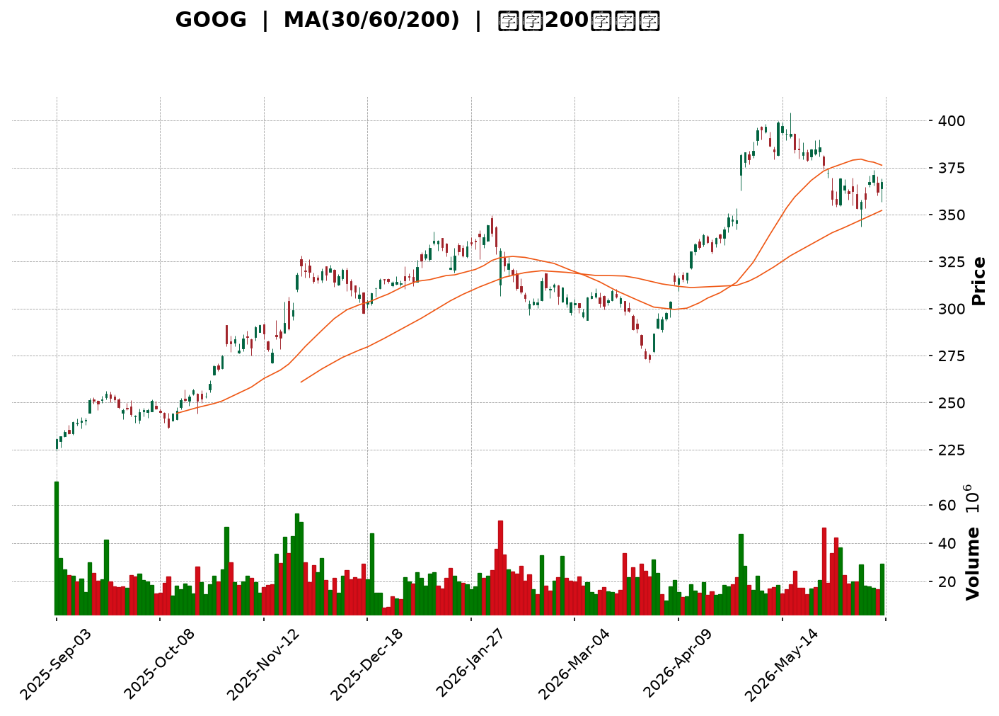
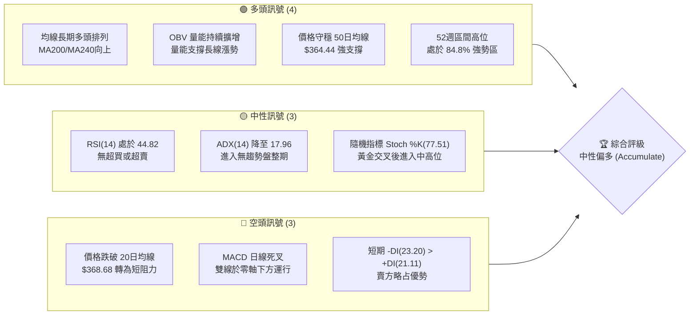
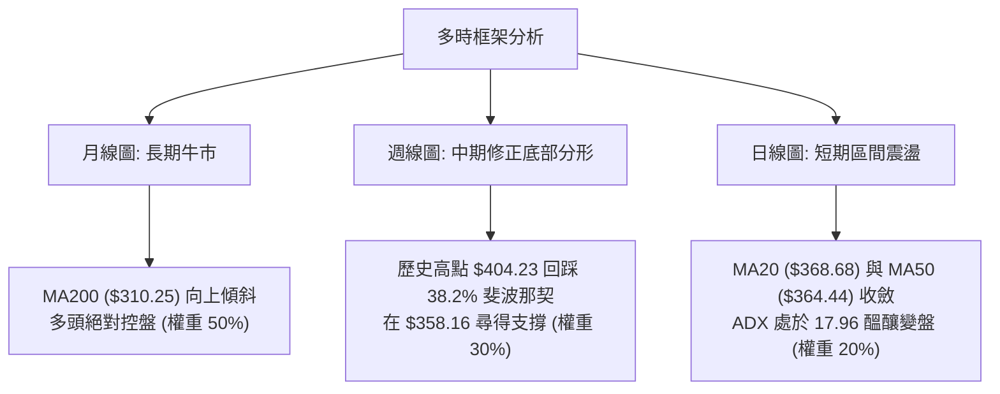
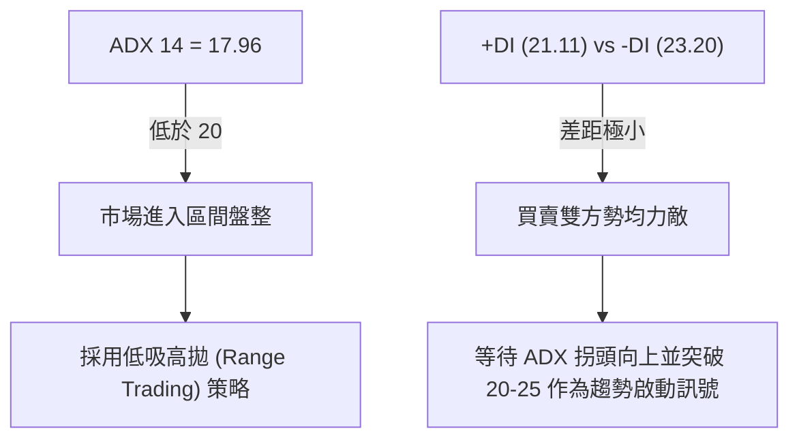
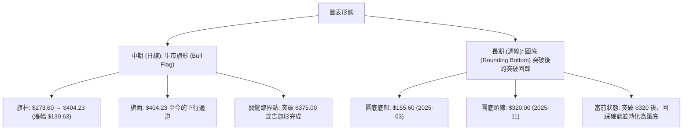
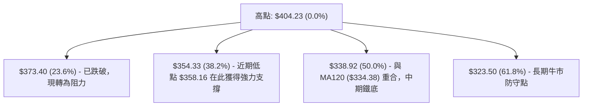
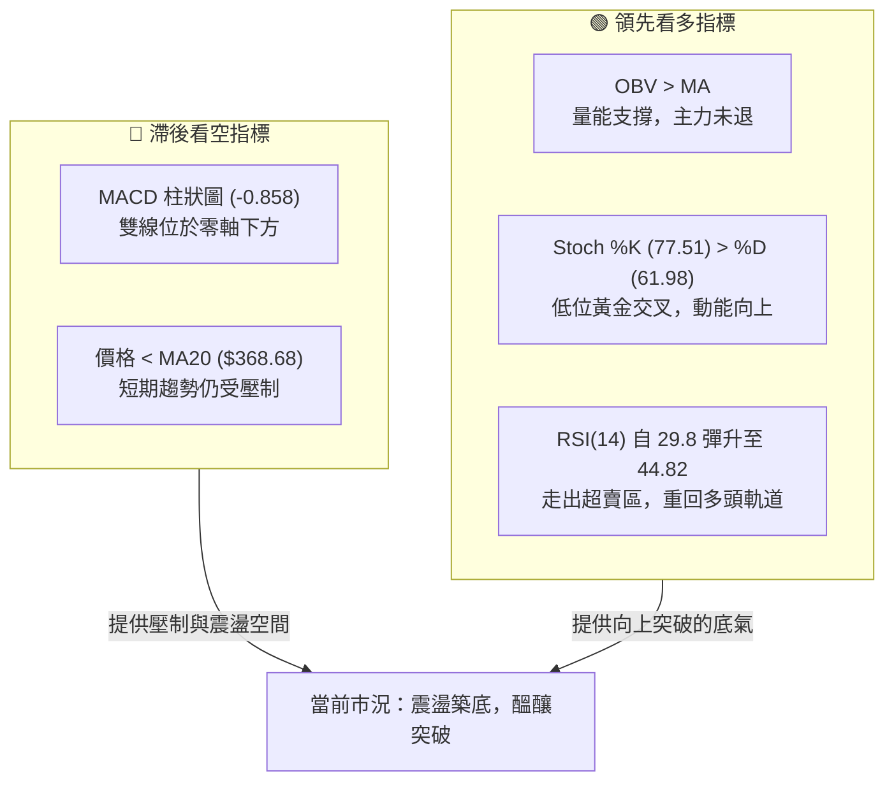
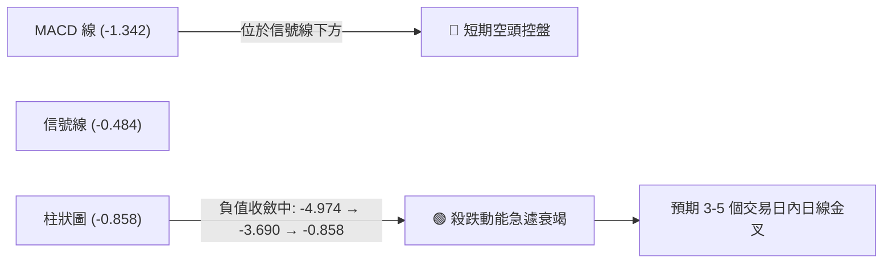
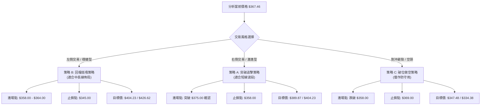
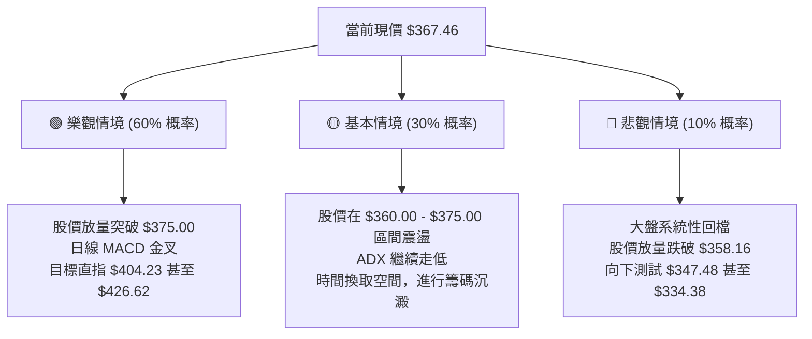

<details>
<summary>📊 靜態圖表 (點擊展開)</summary>

</details>

<html>
<head><meta charset="utf-8" /></head>
<body>
    <div style="height:500px; width:100%;">                        <script>window.PlotlyConfig = {MathJaxConfig: 'local'};</script>
        <script charset="utf-8" src="https://cdn.plot.ly/plotly-3.6.0.min.js" integrity="sha256-QaOVwtVY0T02VaHrr6pnoHLCwayMJp4O5n4YyaE3rJk=" crossorigin="anonymous"></script>                <div id="candlestick-chart" class="plotly-graph-div" style="height:100%; width:100%;"></div>            <script>                window.PLOTLYENV=window.PLOTLYENV || {};                                if (document.getElementById("candlestick-chart")) {                    Plotly.newPlot(                        "candlestick-chart",                        [{"close":{"dtype":"f8","bdata":"AAAAoCTObEAAAACg6\u002f9sQAAAAAADUG1AAAAAQHY2bUAAAABgD+9tQAAAAIDs4m1AAAAAQOMJbkAAAADADB1uQAAAAGCPaG9AAAAAoLNdb0AAAABAjytvQAAAAMDDem9AAAAA4LPXb0AAAACgVIxvQAAAAGAVe29AAAAAwAvrbkAAAAAgzsJuQAAAAGBJ1m5AAAAAQDl8bkAAAACgWmJuQAAAAMDooW5AAAAAYFW+bkAAAADg+L5uQAAAAGCTYG9AAAAAwLDUbkAAAADAWp9uQAAAAOCON25AAAAAYNCgbUAAAACAKoVuQAAAAGCrtm5AAAAAoPZmb0AAAACgZGxvQAAAAKBkqW9AAAAAYEYIcEAAAACgJVtvQAAAAAAngW9AAAAAAHqnb0AAAACgAUBwQAAAAGBu1nBAAAAAgHq+cEAAAACAGypxQAAAAKCTlXFAAAAAoEyUcUAAAADgBrlxQAAAAOBBWHFAAAAAgBbDcUAAAABAgsxxQAAAACBycnFAAAAAQFggckAAAABgtTJyQAAAAEDi7XFAAAAAAC9pcUAAAADgAkdxQAAAAECp0HFAAAAA4HDGcUAAAABgq0ZyQAAAAKCaFnJAAAAAYAWxckAAAABgjd1zQAAAAGAcMHRAAAAAoHT6c0AAAACg5vdzQAAAAIAOqHNAAAAAwG22c0AAAACA4v9zQAAAAGBG3HNAAAAA4FsXdEAAAACAoqBzQAAAAGBd1XNAAAAAIEwJdEAAAABgppRzQAAAAADWYXNAAAAAYKlOc0AAAAAgQTVzQAAAAIC8mnJAAAAAQKj1ckAAAADgUENzQAAAAGDHbnNAAAAAwEm0c0AAAADgILRzQAAAAIDIqHNAAAAAAK2fc0AAAABgO6JzQAAAAGA\u002flnNAAAAAIImuc0AAAACAfs5zQAAAAGA7onNAAAAAwCUgdEAAAABgWll0QAAAACBei3RAAAAAgLvEdEAAAADg2v90QAAAACDw\u002fXRAAAAAgJrLdEAAAADAip50QAAAAGDVG3RAAAAAIDl\u002fdEAAAAAgiKZ0QAAAAKAFgHRAAAAAYHnSdEAAAABAAel0QAAAAEB1\u002fXRAAAAAAH0jdUAAAABAaSF1QAAAAMAyh3VAAAAAABZEdUAAAADAes50QAAAAIBcrnRAAAAAgNoqdEAAAABAoD90QAAAAEBt43NAAAAAYMduc0AAAADgdU9zQAAAACDuGXNAAAAAIMzmckAAAACgsfhyQAAAACCf8nJAAAAAINOnc0AAAAAgiHRzQAAAAGA6aHNAAAAAgPGJc0AAAACA\u002fCtzQAAAAIBgcHNAAAAA4Fwfc0AAAAAgn\u002fJyQAAAACDd8HJAAAAA4EbIckAAAABAkp5yQAAAACA3HXNAAAAAIO0rc0AAAACAwENzQAAAACBx8HJAAAAAgHXUckAAAABgygNzQAAAACCVU3NAAAAAINohc0AAAADgvBhzQAAAAMDDqXJAAAAAQHGtckAAAADAahByQAAAACCnFnJAAAAAYCOJcUAAAACAhhlxQAAAAKCcD3FAAAAAwP\u002fqcUAAAADgj2tyQAAAAKCGZHJAAAAAALKXckAAAACA9PtyQAAAAKDPqHNAAAAAIODCc0AAAABAe7hzQAAAAMBJ8HNAAAAAQBmmdEAAAAAgTeR0QAAAAAAeyXRAAAAAQCIzdUAAAAAgLPN0QAAAAABXpHRAAAAAIG4YdUAAAADgvxh1QAAAAGDTYXVAAAAAQPfEdUAAAADgp7R1QAAAACCesXVAAAAAQF3bd0AAAAAA1e93QAAAAECWtndAAAAAIJ8AeEAAAAAAcK54QAAAAOD+sHhAAAAAoPrMeEAAAAAAmSh4QAAAACBt+XdAAAAAwMzseEAAAADg5c54QAAAAMBVkXhAAAAAAPqNeEAAAAAgsgp4QAAAACCyCnhAAAAAYNTzd0AAAADgbbJ3QAAAAIC8CXhAAAAAgJMJeEAAAABANB54QAAAAOBBg3dAAAAAwLFFd0AAAACAymJ2QAAAAAB1N3ZAAAAAIMQQd0AAAADgo9h2QAAAAGC4knZAAAAA4KOkdkAAAADAHhV2QAAAAMD1SHZAAAAAYI9idkAAAACAwvF2QAAAAKCZMXdAAAAAoJmhdkAAAAAgXPd2QA=="},"high":{"dtype":"f8","bdata":"XHoCrHrkbEBJ1h8vbgNtQDhvT\u002fukbm1ALTd3TeC9bUA4s2e10QNuQPoJzP1nM25AM\u002f+qUA5DbkAfzQxJXD5uQAEZjqItiG9AwBStHoKXb0Abvaq4oG5vQNc8mT6StG9AF4s2bSoDcEDDXuQo4PlvQJ\u002fN0g6xyG9AK5LgieKOb0AedKkvmdpuQJTzu8IuNG9AOqSvtftkb0CsdS+fWGZuQDWp+BJU1W5ASbB+cNHkbkAA5YBrTtRuQAYXTNGcdm9AbAlwi9phb0BeMn1n19huQLv3OmVjom5ALTmdt42LbkCBxCAkWJBuQO2jQzhG8W5AtiRtTH+Ib0C4HTTENxFwQGDNUYg0zG9ADo3TGwIWcEDBjKyiLNxvQC3PCJ7UCnBAAC+m3YDrb0CrNIaZ8V9wQOVtaudS5HBAAP0PHZbtcEAxTwLX4TZxQB0aOiK+NXJAlXc6eZnbcUCjYp0KF9ZxQHYiBAOGlHFAkjI9IDricUCqBA+S6wNyQCWgI2oYv3FA5NpyxzwuckD\u002fnDwxSjxyQOc8vv+bPHJAWxf\u002fUkmvcUDqOAm9qWlxQKmdSgcaX3JAacXVpOYNckD2PgwnevpyQGLyrIGiJHNAv\u002fIhl9j1ckDy+utXyvJzQM\u002fLoPJugHRAFk3XAqtFdEAc21V22WN0QEahslwT8HNA04LW06Dfc0BWWjt\u002fjxZ0QCMp1qR4J3RAvDft7iQzdEAKBbYi+Qx0QLINkV+w5HNAsGN6+TIXdEAwMKfPHRl0QLnmVJWju3NA+rTnzquEc0CO8r8gAndzQFI0mvqpTHNA3ZqPLckNc0BBrf9XY0lzQP3aoAWxdHNAtXKN7zG+c0DplIYPCb5zQBRxd5JZwnNAfjpahvGoc0DRFH0JkdRzQAC+L6Cnr3NADkuCh+EndECecOFuVe1zQKtsduc+EnRAB0p3jp9gdEB2qSYJvaF0QCA06j3CsHRAP5Dxew7gdEBOpYRgE0x1QCYWyGZxCXVA4ebuDgUbdUCvmnPu1ux0QN1Bne2WenRAlWwGBqfEdEDVEOhDXOx0QFULrFCB2XRAh7z5npP+dEC3H22wYBx1QJiji6gHE3VACjNXGH5ddUBvQYDXiD11QPBDWdVui3VAosjrmxbbdUAHNy3Oz3x1QPzG0rlbw3RA3D3tEVajdEAJQUUF\u002f3R0QE+5nzZdE3RAePY0MQQKdEDeSPl+EsFzQPb7tWjKR3NAMfp5z98Hc0Ahh0w4LBhzQCDYCwwXGnNANMq8zovFc0AemBz+m\u002fBzQI6Gzb9lf3NASlnVoQKUc0DLQozadolzQPxBhGbDenNAFNgnXM47c0BvLQCYsfhyQP9bZEH7EHNAw+io2ZXvckBzSClGAr9yQPQO+uoMJXNAAPvvx2xPc0D6ODg5HG5zQI9zVB9FR3NAz1xKFjQxc0D+rrDqLRZzQJdhYezQXXNAt11eaQJpc0CXSdKo7SdzQMdfrqD9AnNANbyuKADzckA6c26pvY5yQCG7JGK5Z3JA\u002fYXUpXvlcUBjASf+wG5xQDtKX3CAQXFA4nApiAnucUDM\u002fWRm5JxyQPk6u1ONe3JAms1\u002ffe2jckCTAcd0rP5yQDCJYqsq83NAkSCCQ9PTc0CqftHP7PRzQBQ0QVXO83NAGbIk+g6ndEAmWb2xxux0QLcsU0TVEnVABdsQ73w8dUAf+r\u002fcSy91QDe2iL55D3VAe3fPIjoddUBhd\u002flPST91QFLY7n+7d3VAuoj04gXrdUD1WFNWCNt1QOXWL7\u002f\u002fEnZAesfNzGXmd0B03cX0jPJ3QOmR0NAu\u002f3dAEBjo0Z1LeEDmNe\u002fxQ8J4QMWG6i\u002fb0XhAKTWJHxbieEB7AOgffKF4QBFviStSI3hAxcCs7gf7eEBbWzq80u14QNC4bTFFunhALZcxo6BDeUCVp3nGBZJ4QBHC\u002frVwZ3hAgdUJqiNHeEBUNJ9ZNwp4QFT3GQWIEnhAROaccNlXeEDkpPAwP1x4QGd81SO61ndAjmoHxv5ld0A2IanJFBl3QNpBw\u002fKCpHZAKrjkSzMad0BVWFympQ93QAAAAIAUtnZAAAAAYBIbd0AAAADA9eR2QAAAAAApYHZAAAAAQF7MdkAAAABgZip3QAAAAKCZWXdAAAAAYGYid0AAAAAAABB3QA=="},"hovertemplate":"\u003cb\u003e%{x|%Y-%m-%d}\u003c\u002fb\u003e\u003cbr\u003e\u958b: $%{open:.2f}\u003cbr\u003e\u9ad8: $%{high:.2f}\u003cbr\u003e\u4f4e: $%{low:.2f}\u003cbr\u003e\u6536: $%{close:.2f}\u003cextra\u003e\u003c\u002fextra\u003e","low":{"dtype":"f8","bdata":"Ig1I3VMPbEA8mUdgqENsQD4NeXT89mxANN4ahLoobUBK0VYAjR1tQLzri1ydtG1Ac94RLsCDbUDGfVjnEcFtQPewlUYGkG5ALguXkj8nb0DYXWHHH8NuQDFsahPdM29AjJL0lGVyb0A++fBLOEpvQBAWKWgpU29A2X6PZpDXbkA\u002feFM4rCVuQJgeTmcKxW5A4WnOFi1XbkA3Q+5jRuNtQHDt1hlt121A\u002fEbCSCRUbkBsuRuI3D9uQLLYPkSzpm5A35fLYHjKbkCt6PqNiZNuQCIeW4vB5m1AHtpwphqHbUBML2n27QhuQPGP5lCZFm5AcmNZuNTJbkAa0u2jv0VvQApMjJRRA29AtgxaCEPDb0AD61TiH4ZuQI\u002fmxjDBPm9Ak2yRysCIb0D34O4rK\u002fNvQDyfwVu\u002fhnBAIDxquFuqcEBOP5pher5wQKywPB5sfnFAdEIqjq5PcUC3NWLsJH1xQFA2HLMsRXFA8gReC2JVcUDJ2cLuGpFxQKii5po1M3FAn14T\u002fcOvcUAurczNEfVxQJy6C\u002fAtvXFA9utieUxXcUAT+e3AEO5wQELbI7rIunFAD0SlbG1ncUDR8Ihgt\u002fFxQJ78fV2rCXJAtYoc44tcckDIKXdMt0xzQI4fA+ob03NASDqvrUXJc0Arw5TaHsVzQG3UbULalXNAuBYobK+Zc0CzkcOspJpzQCAwdO+Pr3NAHC0CSKr1c0DrKZMzDHhzQLXWhkxkg3NA8lEub9Cvc0CqhHQLnFdzQDuzpEfzKHNAuhPJwnQVc0B\u002fTxN57\u002fZyQOu4t0L9kHJA1K2xbc3DckDbQuWDIN9yQBWZkbYJI3NAjKaR2oJlc0CeYgbQk45zQLxa3iD4lHNAkXtRL+N3c0AKJemSdY1zQE9vbW2ufHNAryb7tuljc0BbIhqyZq1zQOQ4KhDrfnNA6oV4426hc0C4V\u002f7cHRl0QGL8vBIwXXRAawVK+FxRdEAm0VVent50QF9SYYJTq3RAxATy\u002fritdEBNkJQZ3nt0QKWAzkmKB3RAhQE2wffxc0C3dCN6Nod0QIurefWreHRAjBLAWwBxdECsMZHuB9V0QF6VLQ8lu3RAM8Hik7JkdEDAxTFcS8N0QAMWO+Uk+XRAgeOBp14idUCHOMLYCo90QCAYyrtPKHNA\u002fpDsBLf7c0AqR9DwkNRzQM1dyFj9o3NA68olqppbc0DtFGVF9ztzQH8i9vQN+HJABLu7ZDOIckCoAgH6X9lyQMC2qDJxxHJA1GrmJF0Ac0Do31v2XVlzQEY5iXEMG3NA6SpxvkxPc0CR4XLWPuByQBxlQecd83JAZa+odKzKckBw5Jcs\u002fYRyQCmKfsqExnJAnTpabuWackBD\u002fJXN1W1yQODchyINXHJAl+SpnQUSc0AljUcbfxpzQA5uvHaLynJAwG13Y5i5ckD0HSguDtpyQDvxMderAnNAJu8pnMcVc0DIzFdnGs1yQJ0kpOYkiXJAjoxVsJydckBcGJh55gpyQHhdPngn83FASBnYSR1ucUD8Z5tQDBVxQBWfM3Ty9XBARrc+In9JcUBV14UAvBRyQMW0yzla9nFAZA3vCNBZckACWN3z9HNyQPqpaENFiHNAWTmCv4pUc0CIk0PonKVzQFktOHkFmHNAmGgEO08PdEDE2kGwZYd0QKcaakI1t3RAQ\u002f9bzW7RdEBg85cl3OZ0QAWzwXHolnRAtsQ\u002f4CfMdEBZ\u002fZ9AvO10QKPg97+V3XRAYuicHq5JdUBiOtquKoF1QO5ps6WVY3VA8kYEEfKtdkChTll8jHB3QIoYA7KxiHdA\u002f5dsiPDBd0CFj9vu3y14QPbdIys0YXhAt56Vk+6WeED3epCU9h94QN2d7Jndt3dArmlGhJvVd0Dw8ZZR3od4QGqSQ8VoWHhAU6jZUaNqeEC15k1uUOx3QGurXtJXvHdAJoyANAe0d0DGOVkihaB3QKLY\u002f2qXrndAZurt2FLcd0Dvhm6\u002fVNB3QGyeW58yYXdAoAEHUs0Xd0CJszBalSx2QIgX4HOrInZATOsgpmIpdkCUbNSMmZZ2QAAAAIA9XnZAAAAAIIUrdkAAAADA9Qx2QAAAAIAUenVAAAAAoHAVdkAAAABgZsp2QAAAAMAe1XZAAAAAIK6DdkAAAABgukl2QA=="},"name":"\u50f9\u683c","open":{"dtype":"f8","bdata":"IEweRLk6bEC0vssO\u002fa9sQGoUdazr\u002f2xACDj6AIVqbUDMllSFazdtQHg6wPcF2W1AX6qIoXL1bUCxmXurhgpuQCafLXYilW5AAFnOysN6b0BwSeGS+l5vQFKIJgjBa29Al1WE\u002fO+cb0AhYoTtAslvQPpGKs0UpW9Ar6j\u002f5AN1b0DxH1yZjYtuQG859u2b6W5AqWIbI0L5bkC\u002ffEFatFJuQBzZ536pFm5AyAzwaBqlbkAp4RstAphuQEwrChOTqW5AGeC+Zy0Ob0C4Oyrk\u002fLZuQNxN8VOUkm5AzefvKfY1bkBFAr053xFuQC3oz\u002fEGKW5AdeKOtzDzbkDH3SGAE39vQPhZ11l3W29A1Pa4z2HXb0B8Nv63BdhvQCWZLGJb0G9AXvARu4Smb0Arx4QYvwxwQNlbQz50jXBARpVpUb7acEAakmMwWsFwQC9p97BjMnJAH9YTZ2qqcUB0JS1f4Z1xQPkq3FheSHFAobelBlZtcUCUasT10NJxQMQlA912unFAZ261yk\u002fLcUBgVWL9LfpxQI90zdM3OHJApXvzB+emcUDJrSZez\u002fVwQLq9D5dv3XFAs8iBAbv+cUDGhcyh9PFxQBRV3ztNAnNAGnd2xqCEckDcN\u002f0FbWZzQCRXXU6SYnRA5rtlnnACdEDtCcPawSx0QN1JNcGpzXNAY2TsMnvEc0BKax6nlrZzQOCpkvObJnRADMkB\u002f\u002fv1c0BP5GT0xgl0QFH0ntsPi3NAWs+zCU\u002fDc0CwQYsx5Qp0QGme4qUlpnNAbayM9XiDc0Dv3Xg\u002fnBlzQG3WwTe1SXNA3ZpDsKHqckC0iUnL\u002fO1yQGXTqe8ZbXNAkmOxy6lrc0BNYyNPzLtzQBpAQZ4fuHNAFq5hpJaGc0C+9vUXBJBzQOVXaGxgj3NA6rR83c7Sc0CwwtN+fNRzQNHWL59VznNA5xKsQ42ic0C1L9p5XY10QLLg6nEAcXRAPLiGrS5hdED7XrKleu10QHrUFvXD6HRAIOmUNdIZdUBmCNRP9+d0QLWu6eohDXRA7q5CsdAKdEBE6A2xQt10QEtrSqqIw3RA7AgZ0Fh8dEBXEt5hEvN0QKOgaxy7AnVAUZQ7N34+dUA7EKJBYOB0QCZsUMLFAXVAGxZaefbAdUDd0o3z5nR1QIJZ7wmpjHNAzNEdyMNudEAGmWnEIQ10QDF16u\u002fbB3RAHxKDFrPoc0BgcEkSFH9zQL3NIj9UOXNAmgUGh\u002fbDckC+BIHvmOByQFE\u002fJs8A4nJAyZDwfG8Gc0DweyGNk+tzQFSSKP\u002fAY3NAI91Y\u002fWZ7c0Bh8mclWYZzQCQMq4mx+HJA+3rNJR3pckC1D5A5faByQAFv57aj5HJAxj5Fgt7sckDcM8dI+HpyQHdtO2FUX3JAtg5XeQ4bc0Ac1iYZ2iFzQHDW7LtpIHNA7EjVc4cnc0CXTy+lrfZyQForYM3JB3NAjGi3S4Q7c0A\u002fZHEVcfByQOV04p0x\u002fnJAaZi3h5bFckDoucRagoByQGmdTpGWP3JAwb7OMkngcUAzuBvoulNxQF62grVjNHFAHflIFvhVcUDkPuC+4xxyQPt7J\u002foODXJAJ+T2Kl1ockDwNzsWWr9yQDIVPqM42nNATp55tQaQc0AcxQCUieBzQIkNLVavs3NAZ8P32fAddEBqa\u002fdhx6V0QD5JVyle+nRAcgZpXqnjdECzzCS3syV1QLgOJ2Yh9nRAh744AvDqdEAL+O+g7jV1QNXWQhVFGHVAogBkTsV6dUCoD8ytYat1QAzRIAJblHVAZUg104Ewd0Cio9noCpx3QJiO1eVw4XdAaVq7qT7ad0AjzmnMsFV4QH1z+okjzXhAm441mYageEAOVaW3R2d4QFecw3dLDHhA4g9J983ad0AJycaz2Zh4QCnKOuKnj3hAAu477Tl+eEAXbzjOA5F4QFLCsUfvDHhAP3zS2Hvcd0ALPP7QePB3QENwDtlAzHdAdVRrdo7od0CJjlrREPp3QInT3W\u002fuz3dARx8jY51Fd0CmfGqfEK92QHcbjFXpYXZAyc95kp4zdkCM8xY9lbJ2QAAAAIDCp3ZAAAAAACnOdkAAAADAzJB2QAAAAMDMEHZAAAAAoJmRdkAAAAAA1992QAAAAKBw93ZAAAAAwMzwdkAAAACAPb52QA=="},"x":["2025-09-03T00:00:00-04:00","2025-09-04T00:00:00-04:00","2025-09-05T00:00:00-04:00","2025-09-08T00:00:00-04:00","2025-09-09T00:00:00-04:00","2025-09-10T00:00:00-04:00","2025-09-11T00:00:00-04:00","2025-09-12T00:00:00-04:00","2025-09-15T00:00:00-04:00","2025-09-16T00:00:00-04:00","2025-09-17T00:00:00-04:00","2025-09-18T00:00:00-04:00","2025-09-19T00:00:00-04:00","2025-09-22T00:00:00-04:00","2025-09-23T00:00:00-04:00","2025-09-24T00:00:00-04:00","2025-09-25T00:00:00-04:00","2025-09-26T00:00:00-04:00","2025-09-29T00:00:00-04:00","2025-09-30T00:00:00-04:00","2025-10-01T00:00:00-04:00","2025-10-02T00:00:00-04:00","2025-10-03T00:00:00-04:00","2025-10-06T00:00:00-04:00","2025-10-07T00:00:00-04:00","2025-10-08T00:00:00-04:00","2025-10-09T00:00:00-04:00","2025-10-10T00:00:00-04:00","2025-10-13T00:00:00-04:00","2025-10-14T00:00:00-04:00","2025-10-15T00:00:00-04:00","2025-10-16T00:00:00-04:00","2025-10-17T00:00:00-04:00","2025-10-20T00:00:00-04:00","2025-10-21T00:00:00-04:00","2025-10-22T00:00:00-04:00","2025-10-23T00:00:00-04:00","2025-10-24T00:00:00-04:00","2025-10-27T00:00:00-04:00","2025-10-28T00:00:00-04:00","2025-10-29T00:00:00-04:00","2025-10-30T00:00:00-04:00","2025-10-31T00:00:00-04:00","2025-11-03T00:00:00-05:00","2025-11-04T00:00:00-05:00","2025-11-05T00:00:00-05:00","2025-11-06T00:00:00-05:00","2025-11-07T00:00:00-05:00","2025-11-10T00:00:00-05:00","2025-11-11T00:00:00-05:00","2025-11-12T00:00:00-05:00","2025-11-13T00:00:00-05:00","2025-11-14T00:00:00-05:00","2025-11-17T00:00:00-05:00","2025-11-18T00:00:00-05:00","2025-11-19T00:00:00-05:00","2025-11-20T00:00:00-05:00","2025-11-21T00:00:00-05:00","2025-11-24T00:00:00-05:00","2025-11-25T00:00:00-05:00","2025-11-26T00:00:00-05:00","2025-11-28T00:00:00-05:00","2025-12-01T00:00:00-05:00","2025-12-02T00:00:00-05:00","2025-12-03T00:00:00-05:00","2025-12-04T00:00:00-05:00","2025-12-05T00:00:00-05:00","2025-12-08T00:00:00-05:00","2025-12-09T00:00:00-05:00","2025-12-10T00:00:00-05:00","2025-12-11T00:00:00-05:00","2025-12-12T00:00:00-05:00","2025-12-15T00:00:00-05:00","2025-12-16T00:00:00-05:00","2025-12-17T00:00:00-05:00","2025-12-18T00:00:00-05:00","2025-12-19T00:00:00-05:00","2025-12-22T00:00:00-05:00","2025-12-23T00:00:00-05:00","2025-12-24T00:00:00-05:00","2025-12-26T00:00:00-05:00","2025-12-29T00:00:00-05:00","2025-12-30T00:00:00-05:00","2025-12-31T00:00:00-05:00","2026-01-02T00:00:00-05:00","2026-01-05T00:00:00-05:00","2026-01-06T00:00:00-05:00","2026-01-07T00:00:00-05:00","2026-01-08T00:00:00-05:00","2026-01-09T00:00:00-05:00","2026-01-12T00:00:00-05:00","2026-01-13T00:00:00-05:00","2026-01-14T00:00:00-05:00","2026-01-15T00:00:00-05:00","2026-01-16T00:00:00-05:00","2026-01-20T00:00:00-05:00","2026-01-21T00:00:00-05:00","2026-01-22T00:00:00-05:00","2026-01-23T00:00:00-05:00","2026-01-26T00:00:00-05:00","2026-01-27T00:00:00-05:00","2026-01-28T00:00:00-05:00","2026-01-29T00:00:00-05:00","2026-01-30T00:00:00-05:00","2026-02-02T00:00:00-05:00","2026-02-03T00:00:00-05:00","2026-02-04T00:00:00-05:00","2026-02-05T00:00:00-05:00","2026-02-06T00:00:00-05:00","2026-02-09T00:00:00-05:00","2026-02-10T00:00:00-05:00","2026-02-11T00:00:00-05:00","2026-02-12T00:00:00-05:00","2026-02-13T00:00:00-05:00","2026-02-17T00:00:00-05:00","2026-02-18T00:00:00-05:00","2026-02-19T00:00:00-05:00","2026-02-20T00:00:00-05:00","2026-02-23T00:00:00-05:00","2026-02-24T00:00:00-05:00","2026-02-25T00:00:00-05:00","2026-02-26T00:00:00-05:00","2026-02-27T00:00:00-05:00","2026-03-02T00:00:00-05:00","2026-03-03T00:00:00-05:00","2026-03-04T00:00:00-05:00","2026-03-05T00:00:00-05:00","2026-03-06T00:00:00-05:00","2026-03-09T00:00:00-04:00","2026-03-10T00:00:00-04:00","2026-03-11T00:00:00-04:00","2026-03-12T00:00:00-04:00","2026-03-13T00:00:00-04:00","2026-03-16T00:00:00-04:00","2026-03-17T00:00:00-04:00","2026-03-18T00:00:00-04:00","2026-03-19T00:00:00-04:00","2026-03-20T00:00:00-04:00","2026-03-23T00:00:00-04:00","2026-03-24T00:00:00-04:00","2026-03-25T00:00:00-04:00","2026-03-26T00:00:00-04:00","2026-03-27T00:00:00-04:00","2026-03-30T00:00:00-04:00","2026-03-31T00:00:00-04:00","2026-04-01T00:00:00-04:00","2026-04-02T00:00:00-04:00","2026-04-06T00:00:00-04:00","2026-04-07T00:00:00-04:00","2026-04-08T00:00:00-04:00","2026-04-09T00:00:00-04:00","2026-04-10T00:00:00-04:00","2026-04-13T00:00:00-04:00","2026-04-14T00:00:00-04:00","2026-04-15T00:00:00-04:00","2026-04-16T00:00:00-04:00","2026-04-17T00:00:00-04:00","2026-04-20T00:00:00-04:00","2026-04-21T00:00:00-04:00","2026-04-22T00:00:00-04:00","2026-04-23T00:00:00-04:00","2026-04-24T00:00:00-04:00","2026-04-27T00:00:00-04:00","2026-04-28T00:00:00-04:00","2026-04-29T00:00:00-04:00","2026-04-30T00:00:00-04:00","2026-05-01T00:00:00-04:00","2026-05-04T00:00:00-04:00","2026-05-05T00:00:00-04:00","2026-05-06T00:00:00-04:00","2026-05-07T00:00:00-04:00","2026-05-08T00:00:00-04:00","2026-05-11T00:00:00-04:00","2026-05-12T00:00:00-04:00","2026-05-13T00:00:00-04:00","2026-05-14T00:00:00-04:00","2026-05-15T00:00:00-04:00","2026-05-18T00:00:00-04:00","2026-05-19T00:00:00-04:00","2026-05-20T00:00:00-04:00","2026-05-21T00:00:00-04:00","2026-05-22T00:00:00-04:00","2026-05-26T00:00:00-04:00","2026-05-27T00:00:00-04:00","2026-05-28T00:00:00-04:00","2026-05-29T00:00:00-04:00","2026-06-01T00:00:00-04:00","2026-06-02T00:00:00-04:00","2026-06-03T00:00:00-04:00","2026-06-04T00:00:00-04:00","2026-06-05T00:00:00-04:00","2026-06-08T00:00:00-04:00","2026-06-09T00:00:00-04:00","2026-06-10T00:00:00-04:00","2026-06-11T00:00:00-04:00","2026-06-12T00:00:00-04:00","2026-06-15T00:00:00-04:00","2026-06-16T00:00:00-04:00","2026-06-17T00:00:00-04:00","2026-06-18T00:00:00-04:00"],"type":"candlestick"},{"hovertemplate":"MA30: $%{y:.2f}\u003cextra\u003e\u003c\u002fextra\u003e","line":{"color":"#2196F3","dash":"dash","width":2},"mode":"lines","name":"MA30","x":["2025-09-03T00:00:00-04:00","2025-09-04T00:00:00-04:00","2025-09-05T00:00:00-04:00","2025-09-08T00:00:00-04:00","2025-09-09T00:00:00-04:00","2025-09-10T00:00:00-04:00","2025-09-11T00:00:00-04:00","2025-09-12T00:00:00-04:00","2025-09-15T00:00:00-04:00","2025-09-16T00:00:00-04:00","2025-09-17T00:00:00-04:00","2025-09-18T00:00:00-04:00","2025-09-19T00:00:00-04:00","2025-09-22T00:00:00-04:00","2025-09-23T00:00:00-04:00","2025-09-24T00:00:00-04:00","2025-09-25T00:00:00-04:00","2025-09-26T00:00:00-04:00","2025-09-29T00:00:00-04:00","2025-09-30T00:00:00-04:00","2025-10-01T00:00:00-04:00","2025-10-02T00:00:00-04:00","2025-10-03T00:00:00-04:00","2025-10-06T00:00:00-04:00","2025-10-07T00:00:00-04:00","2025-10-08T00:00:00-04:00","2025-10-09T00:00:00-04:00","2025-10-10T00:00:00-04:00","2025-10-13T00:00:00-04:00","2025-10-14T00:00:00-04:00","2025-10-15T00:00:00-04:00","2025-10-16T00:00:00-04:00","2025-10-17T00:00:00-04:00","2025-10-20T00:00:00-04:00","2025-10-21T00:00:00-04:00","2025-10-22T00:00:00-04:00","2025-10-23T00:00:00-04:00","2025-10-24T00:00:00-04:00","2025-10-27T00:00:00-04:00","2025-10-28T00:00:00-04:00","2025-10-29T00:00:00-04:00","2025-10-30T00:00:00-04:00","2025-10-31T00:00:00-04:00","2025-11-03T00:00:00-05:00","2025-11-04T00:00:00-05:00","2025-11-05T00:00:00-05:00","2025-11-06T00:00:00-05:00","2025-11-07T00:00:00-05:00","2025-11-10T00:00:00-05:00","2025-11-11T00:00:00-05:00","2025-11-12T00:00:00-05:00","2025-11-13T00:00:00-05:00","2025-11-14T00:00:00-05:00","2025-11-17T00:00:00-05:00","2025-11-18T00:00:00-05:00","2025-11-19T00:00:00-05:00","2025-11-20T00:00:00-05:00","2025-11-21T00:00:00-05:00","2025-11-24T00:00:00-05:00","2025-11-25T00:00:00-05:00","2025-11-26T00:00:00-05:00","2025-11-28T00:00:00-05:00","2025-12-01T00:00:00-05:00","2025-12-02T00:00:00-05:00","2025-12-03T00:00:00-05:00","2025-12-04T00:00:00-05:00","2025-12-05T00:00:00-05:00","2025-12-08T00:00:00-05:00","2025-12-09T00:00:00-05:00","2025-12-10T00:00:00-05:00","2025-12-11T00:00:00-05:00","2025-12-12T00:00:00-05:00","2025-12-15T00:00:00-05:00","2025-12-16T00:00:00-05:00","2025-12-17T00:00:00-05:00","2025-12-18T00:00:00-05:00","2025-12-19T00:00:00-05:00","2025-12-22T00:00:00-05:00","2025-12-23T00:00:00-05:00","2025-12-24T00:00:00-05:00","2025-12-26T00:00:00-05:00","2025-12-29T00:00:00-05:00","2025-12-30T00:00:00-05:00","2025-12-31T00:00:00-05:00","2026-01-02T00:00:00-05:00","2026-01-05T00:00:00-05:00","2026-01-06T00:00:00-05:00","2026-01-07T00:00:00-05:00","2026-01-08T00:00:00-05:00","2026-01-09T00:00:00-05:00","2026-01-12T00:00:00-05:00","2026-01-13T00:00:00-05:00","2026-01-14T00:00:00-05:00","2026-01-15T00:00:00-05:00","2026-01-16T00:00:00-05:00","2026-01-20T00:00:00-05:00","2026-01-21T00:00:00-05:00","2026-01-22T00:00:00-05:00","2026-01-23T00:00:00-05:00","2026-01-26T00:00:00-05:00","2026-01-27T00:00:00-05:00","2026-01-28T00:00:00-05:00","2026-01-29T00:00:00-05:00","2026-01-30T00:00:00-05:00","2026-02-02T00:00:00-05:00","2026-02-03T00:00:00-05:00","2026-02-04T00:00:00-05:00","2026-02-05T00:00:00-05:00","2026-02-06T00:00:00-05:00","2026-02-09T00:00:00-05:00","2026-02-10T00:00:00-05:00","2026-02-11T00:00:00-05:00","2026-02-12T00:00:00-05:00","2026-02-13T00:00:00-05:00","2026-02-17T00:00:00-05:00","2026-02-18T00:00:00-05:00","2026-02-19T00:00:00-05:00","2026-02-20T00:00:00-05:00","2026-02-23T00:00:00-05:00","2026-02-24T00:00:00-05:00","2026-02-25T00:00:00-05:00","2026-02-26T00:00:00-05:00","2026-02-27T00:00:00-05:00","2026-03-02T00:00:00-05:00","2026-03-03T00:00:00-05:00","2026-03-04T00:00:00-05:00","2026-03-05T00:00:00-05:00","2026-03-06T00:00:00-05:00","2026-03-09T00:00:00-04:00","2026-03-10T00:00:00-04:00","2026-03-11T00:00:00-04:00","2026-03-12T00:00:00-04:00","2026-03-13T00:00:00-04:00","2026-03-16T00:00:00-04:00","2026-03-17T00:00:00-04:00","2026-03-18T00:00:00-04:00","2026-03-19T00:00:00-04:00","2026-03-20T00:00:00-04:00","2026-03-23T00:00:00-04:00","2026-03-24T00:00:00-04:00","2026-03-25T00:00:00-04:00","2026-03-26T00:00:00-04:00","2026-03-27T00:00:00-04:00","2026-03-30T00:00:00-04:00","2026-03-31T00:00:00-04:00","2026-04-01T00:00:00-04:00","2026-04-02T00:00:00-04:00","2026-04-06T00:00:00-04:00","2026-04-07T00:00:00-04:00","2026-04-08T00:00:00-04:00","2026-04-09T00:00:00-04:00","2026-04-10T00:00:00-04:00","2026-04-13T00:00:00-04:00","2026-04-14T00:00:00-04:00","2026-04-15T00:00:00-04:00","2026-04-16T00:00:00-04:00","2026-04-17T00:00:00-04:00","2026-04-20T00:00:00-04:00","2026-04-21T00:00:00-04:00","2026-04-22T00:00:00-04:00","2026-04-23T00:00:00-04:00","2026-04-24T00:00:00-04:00","2026-04-27T00:00:00-04:00","2026-04-28T00:00:00-04:00","2026-04-29T00:00:00-04:00","2026-04-30T00:00:00-04:00","2026-05-01T00:00:00-04:00","2026-05-04T00:00:00-04:00","2026-05-05T00:00:00-04:00","2026-05-06T00:00:00-04:00","2026-05-07T00:00:00-04:00","2026-05-08T00:00:00-04:00","2026-05-11T00:00:00-04:00","2026-05-12T00:00:00-04:00","2026-05-13T00:00:00-04:00","2026-05-14T00:00:00-04:00","2026-05-15T00:00:00-04:00","2026-05-18T00:00:00-04:00","2026-05-19T00:00:00-04:00","2026-05-20T00:00:00-04:00","2026-05-21T00:00:00-04:00","2026-05-22T00:00:00-04:00","2026-05-26T00:00:00-04:00","2026-05-27T00:00:00-04:00","2026-05-28T00:00:00-04:00","2026-05-29T00:00:00-04:00","2026-06-01T00:00:00-04:00","2026-06-02T00:00:00-04:00","2026-06-03T00:00:00-04:00","2026-06-04T00:00:00-04:00","2026-06-05T00:00:00-04:00","2026-06-08T00:00:00-04:00","2026-06-09T00:00:00-04:00","2026-06-10T00:00:00-04:00","2026-06-11T00:00:00-04:00","2026-06-12T00:00:00-04:00","2026-06-15T00:00:00-04:00","2026-06-16T00:00:00-04:00","2026-06-17T00:00:00-04:00","2026-06-18T00:00:00-04:00"],"y":{"dtype":"f8","bdata":"AAAAAAAA+H8AAAAAAAD4fwAAAAAAAPh\u002fAAAAAAAA+H8AAAAAAAD4fwAAAAAAAPh\u002fAAAAAAAA+H8AAAAAAAD4fwAAAAAAAPh\u002fAAAAAAAA+H8AAAAAAAD4fwAAAAAAAPh\u002fAAAAAAAA+H8AAAAAAAD4fwAAAAAAAPh\u002fAAAAAAAA+H8AAAAAAAD4fwAAAAAAAPh\u002fAAAAAAAA+H8AAAAAAAD4fwAAAAAAAPh\u002fAAAAAAAA+H8AAAAAAAD4fwAAAAAAAPh\u002fAAAAAAAA+H8AAAAAAAD4fwAAAAAAAPh\u002fAAAAAAAA+H8AAAAAAAD4f6uqqvqpiG5AzczMHNOebkAAAADQgbNuQJqZmZmNx25A7+7uruPfbkDv7u6OBuxuQO\u002fu7k7V+W5AmpmZmZ4Hb0BmZmYm\u002fBtvQAAAABBUL29Ad3d3129Bb0De3d1dZFxvQGZmZibfe29AAAAAECuYb0B3d3f3bLlvQDMzM4PO1G9AvLu7axz8b0AAAABAsRJwQJqZmaEAJHBAAAAAOJw8cEAzMzPjQlZwQFVVVRWPbHBAiYiIoPV9cEB3d3fXNY5wQBERESlboHBAREREHH60cEAAAADYys1wQImIiEg453BA7+7ulk4IcUCJiIggmy9xQDMzM\u002fPUWHFAIiIiulR9cUCamZmJp6FxQGZmZr5MwnFAzczMdLThcUCrqqr6lAZyQJqZmXmjKXJAMzMzowZOckDNzMzM2GpyQM3MzExphHJAq6qqWoGgckBVVVWVH7VyQBERESF3xHJARERE9DXTckAAAACQ4t9yQCIiImKi6nJAERERcdr0ckC8u7vLWAFzQCIiIpJKEnNA3t3djcEfc0CJiIh4mixzQBEREeFdO3NAIiIi8j9Oc0De3d1tW2JzQImIiAh6cXNAvLu7G7+Bc0De3d2tzo5zQERERLT+m3NAREREhDuoc0AzMzPzW6xzQM3MzKxmr3NAVVVVxSS2c0De3d0t8b5zQBEREZFWynNAq6qqypPTc0Crqqqq3dhzQImIiAj82nNAd3d3V3Lec0AiIiIyLedzQImIiHjd7HNA3t3dLZLzc0CrqqqK6v5zQM3MzAyjDHRAREREtEMcdEARERFxqyx0QBEREVGeRXRAREREpExZdEBERES0eGZ0QO\u002fu7s4fcXRAERERkRN1dEAiIiLyuXl0QO\u002fu7l6ue3RA3t3dHQ16dEDNzMzMSnd0QFVVVfUlc3RAZmZmhn1sdECJiIgYXWV0QN7d3Y2CX3RAzczMzH9bdEAREREx31N0QM3MzMwqSnRAmpmZmaw\u002fdEDv7u4eFDB0QJqZmZnTInRAd3d3R40UdEARERGxSQZ0QLy7u3tS\u002fHNA7+7uzrDtc0AAAADQW9xzQBERESGI0HNAMzMzY3LCc0AiIiKyZ7RzQO\u002fu7o7nonNAvLu7GzSPc0B3d3dHJn1zQCIiIsJcanNAAAAAkCdYc0CrqqoqkElzQAAAAOBXOHNAq6qqKqErc0AAAABA\u002fRhzQAAAAFChCXNA3t3dLXH5ckDe3d3dk+ZyQAAAAMAq1XJAIiIiEsbMckDv7u6+EchyQCIiIjJVw3JAZmZmBkO6ckCrqqoaPrZyQGZmZjZluHJAiYiICEu6ckDNzMzs+b5yQO\u002fu7m49w3JAZmZmtkPQckBERESU2uByQJqZmXmY8HJAMzMzYzkFc0AiIiJiHBlzQKuqqvolJnNA3t3drZA2c0CrqqrKMkZzQGZmZmYLW3NAq6qqyiB0c0C8u7sbF4tzQLy7u5tKn3NAd3d3x5vHc0AiIiJi6fBzQHd3d3cBHHRA3t3d7XFJdEAiIiKS6YF0QERERNRBunRAiYiIeED4dEAiIiLSfDR1QM3MzDx7b3VAZmZmVkardUBEREQ0yeF1QGZmZsZ6FnZAq6qqCltJdkDv7u5+g3R2QJqZmenomXZAmpmZyay9dkBmZmZGm992QBEREZGWAndAq6qqCoEfd0Dv7u6+CDt3QFVVVTVOUndAiYiIqP1jd0C8u7urPnB3QKuqqpqufXdAVVVVRX6Od0BVVVVFbJ13QJqZmQmWp3dAmpmZuQqvd0AzMzPjQbJ3QHd3d1dNt3dAIiIi8r2qd0DNzMzcRaJ3QKuqqgrXnXdAiYiIqCOSd0DNzMzcgIN3QA=="},"type":"scatter"},{"hovertemplate":"MA60: $%{y:.2f}\u003cextra\u003e\u003c\u002fextra\u003e","line":{"color":"#9C27B0","dash":"dash","width":2},"mode":"lines","name":"MA60","x":["2025-09-03T00:00:00-04:00","2025-09-04T00:00:00-04:00","2025-09-05T00:00:00-04:00","2025-09-08T00:00:00-04:00","2025-09-09T00:00:00-04:00","2025-09-10T00:00:00-04:00","2025-09-11T00:00:00-04:00","2025-09-12T00:00:00-04:00","2025-09-15T00:00:00-04:00","2025-09-16T00:00:00-04:00","2025-09-17T00:00:00-04:00","2025-09-18T00:00:00-04:00","2025-09-19T00:00:00-04:00","2025-09-22T00:00:00-04:00","2025-09-23T00:00:00-04:00","2025-09-24T00:00:00-04:00","2025-09-25T00:00:00-04:00","2025-09-26T00:00:00-04:00","2025-09-29T00:00:00-04:00","2025-09-30T00:00:00-04:00","2025-10-01T00:00:00-04:00","2025-10-02T00:00:00-04:00","2025-10-03T00:00:00-04:00","2025-10-06T00:00:00-04:00","2025-10-07T00:00:00-04:00","2025-10-08T00:00:00-04:00","2025-10-09T00:00:00-04:00","2025-10-10T00:00:00-04:00","2025-10-13T00:00:00-04:00","2025-10-14T00:00:00-04:00","2025-10-15T00:00:00-04:00","2025-10-16T00:00:00-04:00","2025-10-17T00:00:00-04:00","2025-10-20T00:00:00-04:00","2025-10-21T00:00:00-04:00","2025-10-22T00:00:00-04:00","2025-10-23T00:00:00-04:00","2025-10-24T00:00:00-04:00","2025-10-27T00:00:00-04:00","2025-10-28T00:00:00-04:00","2025-10-29T00:00:00-04:00","2025-10-30T00:00:00-04:00","2025-10-31T00:00:00-04:00","2025-11-03T00:00:00-05:00","2025-11-04T00:00:00-05:00","2025-11-05T00:00:00-05:00","2025-11-06T00:00:00-05:00","2025-11-07T00:00:00-05:00","2025-11-10T00:00:00-05:00","2025-11-11T00:00:00-05:00","2025-11-12T00:00:00-05:00","2025-11-13T00:00:00-05:00","2025-11-14T00:00:00-05:00","2025-11-17T00:00:00-05:00","2025-11-18T00:00:00-05:00","2025-11-19T00:00:00-05:00","2025-11-20T00:00:00-05:00","2025-11-21T00:00:00-05:00","2025-11-24T00:00:00-05:00","2025-11-25T00:00:00-05:00","2025-11-26T00:00:00-05:00","2025-11-28T00:00:00-05:00","2025-12-01T00:00:00-05:00","2025-12-02T00:00:00-05:00","2025-12-03T00:00:00-05:00","2025-12-04T00:00:00-05:00","2025-12-05T00:00:00-05:00","2025-12-08T00:00:00-05:00","2025-12-09T00:00:00-05:00","2025-12-10T00:00:00-05:00","2025-12-11T00:00:00-05:00","2025-12-12T00:00:00-05:00","2025-12-15T00:00:00-05:00","2025-12-16T00:00:00-05:00","2025-12-17T00:00:00-05:00","2025-12-18T00:00:00-05:00","2025-12-19T00:00:00-05:00","2025-12-22T00:00:00-05:00","2025-12-23T00:00:00-05:00","2025-12-24T00:00:00-05:00","2025-12-26T00:00:00-05:00","2025-12-29T00:00:00-05:00","2025-12-30T00:00:00-05:00","2025-12-31T00:00:00-05:00","2026-01-02T00:00:00-05:00","2026-01-05T00:00:00-05:00","2026-01-06T00:00:00-05:00","2026-01-07T00:00:00-05:00","2026-01-08T00:00:00-05:00","2026-01-09T00:00:00-05:00","2026-01-12T00:00:00-05:00","2026-01-13T00:00:00-05:00","2026-01-14T00:00:00-05:00","2026-01-15T00:00:00-05:00","2026-01-16T00:00:00-05:00","2026-01-20T00:00:00-05:00","2026-01-21T00:00:00-05:00","2026-01-22T00:00:00-05:00","2026-01-23T00:00:00-05:00","2026-01-26T00:00:00-05:00","2026-01-27T00:00:00-05:00","2026-01-28T00:00:00-05:00","2026-01-29T00:00:00-05:00","2026-01-30T00:00:00-05:00","2026-02-02T00:00:00-05:00","2026-02-03T00:00:00-05:00","2026-02-04T00:00:00-05:00","2026-02-05T00:00:00-05:00","2026-02-06T00:00:00-05:00","2026-02-09T00:00:00-05:00","2026-02-10T00:00:00-05:00","2026-02-11T00:00:00-05:00","2026-02-12T00:00:00-05:00","2026-02-13T00:00:00-05:00","2026-02-17T00:00:00-05:00","2026-02-18T00:00:00-05:00","2026-02-19T00:00:00-05:00","2026-02-20T00:00:00-05:00","2026-02-23T00:00:00-05:00","2026-02-24T00:00:00-05:00","2026-02-25T00:00:00-05:00","2026-02-26T00:00:00-05:00","2026-02-27T00:00:00-05:00","2026-03-02T00:00:00-05:00","2026-03-03T00:00:00-05:00","2026-03-04T00:00:00-05:00","2026-03-05T00:00:00-05:00","2026-03-06T00:00:00-05:00","2026-03-09T00:00:00-04:00","2026-03-10T00:00:00-04:00","2026-03-11T00:00:00-04:00","2026-03-12T00:00:00-04:00","2026-03-13T00:00:00-04:00","2026-03-16T00:00:00-04:00","2026-03-17T00:00:00-04:00","2026-03-18T00:00:00-04:00","2026-03-19T00:00:00-04:00","2026-03-20T00:00:00-04:00","2026-03-23T00:00:00-04:00","2026-03-24T00:00:00-04:00","2026-03-25T00:00:00-04:00","2026-03-26T00:00:00-04:00","2026-03-27T00:00:00-04:00","2026-03-30T00:00:00-04:00","2026-03-31T00:00:00-04:00","2026-04-01T00:00:00-04:00","2026-04-02T00:00:00-04:00","2026-04-06T00:00:00-04:00","2026-04-07T00:00:00-04:00","2026-04-08T00:00:00-04:00","2026-04-09T00:00:00-04:00","2026-04-10T00:00:00-04:00","2026-04-13T00:00:00-04:00","2026-04-14T00:00:00-04:00","2026-04-15T00:00:00-04:00","2026-04-16T00:00:00-04:00","2026-04-17T00:00:00-04:00","2026-04-20T00:00:00-04:00","2026-04-21T00:00:00-04:00","2026-04-22T00:00:00-04:00","2026-04-23T00:00:00-04:00","2026-04-24T00:00:00-04:00","2026-04-27T00:00:00-04:00","2026-04-28T00:00:00-04:00","2026-04-29T00:00:00-04:00","2026-04-30T00:00:00-04:00","2026-05-01T00:00:00-04:00","2026-05-04T00:00:00-04:00","2026-05-05T00:00:00-04:00","2026-05-06T00:00:00-04:00","2026-05-07T00:00:00-04:00","2026-05-08T00:00:00-04:00","2026-05-11T00:00:00-04:00","2026-05-12T00:00:00-04:00","2026-05-13T00:00:00-04:00","2026-05-14T00:00:00-04:00","2026-05-15T00:00:00-04:00","2026-05-18T00:00:00-04:00","2026-05-19T00:00:00-04:00","2026-05-20T00:00:00-04:00","2026-05-21T00:00:00-04:00","2026-05-22T00:00:00-04:00","2026-05-26T00:00:00-04:00","2026-05-27T00:00:00-04:00","2026-05-28T00:00:00-04:00","2026-05-29T00:00:00-04:00","2026-06-01T00:00:00-04:00","2026-06-02T00:00:00-04:00","2026-06-03T00:00:00-04:00","2026-06-04T00:00:00-04:00","2026-06-05T00:00:00-04:00","2026-06-08T00:00:00-04:00","2026-06-09T00:00:00-04:00","2026-06-10T00:00:00-04:00","2026-06-11T00:00:00-04:00","2026-06-12T00:00:00-04:00","2026-06-15T00:00:00-04:00","2026-06-16T00:00:00-04:00","2026-06-17T00:00:00-04:00","2026-06-18T00:00:00-04:00"],"y":{"dtype":"f8","bdata":"AAAAAAAA+H8AAAAAAAD4fwAAAAAAAPh\u002fAAAAAAAA+H8AAAAAAAD4fwAAAAAAAPh\u002fAAAAAAAA+H8AAAAAAAD4fwAAAAAAAPh\u002fAAAAAAAA+H8AAAAAAAD4fwAAAAAAAPh\u002fAAAAAAAA+H8AAAAAAAD4fwAAAAAAAPh\u002fAAAAAAAA+H8AAAAAAAD4fwAAAAAAAPh\u002fAAAAAAAA+H8AAAAAAAD4fwAAAAAAAPh\u002fAAAAAAAA+H8AAAAAAAD4fwAAAAAAAPh\u002fAAAAAAAA+H8AAAAAAAD4fwAAAAAAAPh\u002fAAAAAAAA+H8AAAAAAAD4fwAAAAAAAPh\u002fAAAAAAAA+H8AAAAAAAD4fwAAAAAAAPh\u002fAAAAAAAA+H8AAAAAAAD4fwAAAAAAAPh\u002fAAAAAAAA+H8AAAAAAAD4fwAAAAAAAPh\u002fAAAAAAAA+H8AAAAAAAD4fwAAAAAAAPh\u002fAAAAAAAA+H8AAAAAAAD4fwAAAAAAAPh\u002fAAAAAAAA+H8AAAAAAAD4fwAAAAAAAPh\u002fAAAAAAAA+H8AAAAAAAD4fwAAAAAAAPh\u002fAAAAAAAA+H8AAAAAAAD4fwAAAAAAAPh\u002fAAAAAAAA+H8AAAAAAAD4fwAAAAAAAPh\u002fAAAAAAAA+H8AAAAAAAD4f0RERPiUTnBAREREJF9mcEDNzMw4tH1wQJqZmcUJk3BAIiIiJtOocEAREREhTL5wQImIiBBH03BAAAAA+OrocEAAAABwa\u002fxwQGZmZqoJDnFAMzMzo5wgcUAiIiLiqDFxQCIiIlozQXFAIiIivqVPcUDe3d2FTF5xQN7d3dGEanFAd3d3U3R5cUDe3d0FBYpxQN7d3Zklm3FA7+7u4i6ucUDe3d2tbsFxQDMzM3v203FAVVVVyRrmcUCrqqqiSPhxQM3MzJjqCHJAAAAAnB4bckDv7u7CTC5yQGZmZn6bQXJAmpmZDUVYckDe3d2J+21yQAAAANAdhHJAvLu7v7yZckC8u7tbTLByQLy7u6dRxnJAvLu7H6TackCrqqpSue9yQBEREcFPAnNAVVVVfTwWc0B3d3f\u002fAilzQKuqqmKjOHNARERExAlKc0AAAAAQBVpzQO\u002fu7haNaHNARERE1Lx3c0CJiIgAR4ZzQJqZmVkgmHNAq6qqihOnc0AAAADA6LNzQImIiDC1wXNAd3d3j2rKc0BVVVU1KtNzQAAAACCG23NAAAAAiCbkc0BVVVUd0+xzQO\u002fu7v5P8nNAERERUR73c0AzMzPjFfpzQBEREaHA\u002fXNAiYiIqN0BdEAiIiKSHQB0QM3MzLzI\u002fHNAd3d3r+j6c0BmZmamgvdzQFVVVRWV9nNAERERiRD0c0De3d2tk+9zQCIiIkKn63NAMzMzkxHmc0ARERGBxOFzQM3MzMyy3nNAiYiISALbc0BmZmYeqdlzQN7d3U3F13NAAAAA6LvVc0BERETc6NRzQJqZmYn913NAIiIiGrrYc0B3d3dvBNhzQHd3d9e71HNA3t3dXVrQc0ARERGZW8lzQHd3d9enwnNA3t3dJb+5c0BVVVVV765zQKuqqloopHNAREREzKGcc0C8u7trt5ZzQAAAAOBrkXNAmpmZaeGKc0De3d2lDoVzQJqZmQFIgXNAERER0ft8c0De3d0Fh3dzQERERIQIc3NA7+7ufmhyc0CrqqoiknNzQKuqqnp1dnNAERERGXV5c0AREREZvHpzQN7d3Q1Xe3NAiYiIiIF8c0BmZmY+TX1zQKuqqnr5fnNAMzMzc6qBc0CamZmxHoRzQO\u002fu7q7ThHNAvLu7q+GPc0BmZmbGPJ1zQLy7u6ssqnNAREREjIm6c0ARERFpc81zQCIiIpLx4XNAMzMz09j4c0AAAABYiA10QGZmZv5SInRARERENAY8dECamZl57VR0QERERPznbHRAiYiICM+BdEDNzMzMYJV0QAAAABAnqXRAERER6fu7dECamZmZSs90QAAAAADq4nRAiYiIYOL3dECamZmp8Q11QHd3d1dzIXVA3t3dhZs0dUDv7u6GrUR1QKuqqkrqUXVAmpmZeYdidUAAAACIz3F1QAAAALhQgXVAIiIiwpWRdUB3d3d\u002frJ51QJqZmflLq3VAzczM3Cy5dUB3d3efl8l1QBEREUHs3HVAMzMzy8rtdUB3d3c3tQJ2QA=="},"type":"scatter"},{"hovertemplate":"MA200: $%{y:.2f}\u003cextra\u003e\u003c\u002fextra\u003e","line":{"color":"#FF6F00","dash":"solid","width":2},"mode":"lines","name":"MA200","x":["2025-09-03T00:00:00-04:00","2025-09-04T00:00:00-04:00","2025-09-05T00:00:00-04:00","2025-09-08T00:00:00-04:00","2025-09-09T00:00:00-04:00","2025-09-10T00:00:00-04:00","2025-09-11T00:00:00-04:00","2025-09-12T00:00:00-04:00","2025-09-15T00:00:00-04:00","2025-09-16T00:00:00-04:00","2025-09-17T00:00:00-04:00","2025-09-18T00:00:00-04:00","2025-09-19T00:00:00-04:00","2025-09-22T00:00:00-04:00","2025-09-23T00:00:00-04:00","2025-09-24T00:00:00-04:00","2025-09-25T00:00:00-04:00","2025-09-26T00:00:00-04:00","2025-09-29T00:00:00-04:00","2025-09-30T00:00:00-04:00","2025-10-01T00:00:00-04:00","2025-10-02T00:00:00-04:00","2025-10-03T00:00:00-04:00","2025-10-06T00:00:00-04:00","2025-10-07T00:00:00-04:00","2025-10-08T00:00:00-04:00","2025-10-09T00:00:00-04:00","2025-10-10T00:00:00-04:00","2025-10-13T00:00:00-04:00","2025-10-14T00:00:00-04:00","2025-10-15T00:00:00-04:00","2025-10-16T00:00:00-04:00","2025-10-17T00:00:00-04:00","2025-10-20T00:00:00-04:00","2025-10-21T00:00:00-04:00","2025-10-22T00:00:00-04:00","2025-10-23T00:00:00-04:00","2025-10-24T00:00:00-04:00","2025-10-27T00:00:00-04:00","2025-10-28T00:00:00-04:00","2025-10-29T00:00:00-04:00","2025-10-30T00:00:00-04:00","2025-10-31T00:00:00-04:00","2025-11-03T00:00:00-05:00","2025-11-04T00:00:00-05:00","2025-11-05T00:00:00-05:00","2025-11-06T00:00:00-05:00","2025-11-07T00:00:00-05:00","2025-11-10T00:00:00-05:00","2025-11-11T00:00:00-05:00","2025-11-12T00:00:00-05:00","2025-11-13T00:00:00-05:00","2025-11-14T00:00:00-05:00","2025-11-17T00:00:00-05:00","2025-11-18T00:00:00-05:00","2025-11-19T00:00:00-05:00","2025-11-20T00:00:00-05:00","2025-11-21T00:00:00-05:00","2025-11-24T00:00:00-05:00","2025-11-25T00:00:00-05:00","2025-11-26T00:00:00-05:00","2025-11-28T00:00:00-05:00","2025-12-01T00:00:00-05:00","2025-12-02T00:00:00-05:00","2025-12-03T00:00:00-05:00","2025-12-04T00:00:00-05:00","2025-12-05T00:00:00-05:00","2025-12-08T00:00:00-05:00","2025-12-09T00:00:00-05:00","2025-12-10T00:00:00-05:00","2025-12-11T00:00:00-05:00","2025-12-12T00:00:00-05:00","2025-12-15T00:00:00-05:00","2025-12-16T00:00:00-05:00","2025-12-17T00:00:00-05:00","2025-12-18T00:00:00-05:00","2025-12-19T00:00:00-05:00","2025-12-22T00:00:00-05:00","2025-12-23T00:00:00-05:00","2025-12-24T00:00:00-05:00","2025-12-26T00:00:00-05:00","2025-12-29T00:00:00-05:00","2025-12-30T00:00:00-05:00","2025-12-31T00:00:00-05:00","2026-01-02T00:00:00-05:00","2026-01-05T00:00:00-05:00","2026-01-06T00:00:00-05:00","2026-01-07T00:00:00-05:00","2026-01-08T00:00:00-05:00","2026-01-09T00:00:00-05:00","2026-01-12T00:00:00-05:00","2026-01-13T00:00:00-05:00","2026-01-14T00:00:00-05:00","2026-01-15T00:00:00-05:00","2026-01-16T00:00:00-05:00","2026-01-20T00:00:00-05:00","2026-01-21T00:00:00-05:00","2026-01-22T00:00:00-05:00","2026-01-23T00:00:00-05:00","2026-01-26T00:00:00-05:00","2026-01-27T00:00:00-05:00","2026-01-28T00:00:00-05:00","2026-01-29T00:00:00-05:00","2026-01-30T00:00:00-05:00","2026-02-02T00:00:00-05:00","2026-02-03T00:00:00-05:00","2026-02-04T00:00:00-05:00","2026-02-05T00:00:00-05:00","2026-02-06T00:00:00-05:00","2026-02-09T00:00:00-05:00","2026-02-10T00:00:00-05:00","2026-02-11T00:00:00-05:00","2026-02-12T00:00:00-05:00","2026-02-13T00:00:00-05:00","2026-02-17T00:00:00-05:00","2026-02-18T00:00:00-05:00","2026-02-19T00:00:00-05:00","2026-02-20T00:00:00-05:00","2026-02-23T00:00:00-05:00","2026-02-24T00:00:00-05:00","2026-02-25T00:00:00-05:00","2026-02-26T00:00:00-05:00","2026-02-27T00:00:00-05:00","2026-03-02T00:00:00-05:00","2026-03-03T00:00:00-05:00","2026-03-04T00:00:00-05:00","2026-03-05T00:00:00-05:00","2026-03-06T00:00:00-05:00","2026-03-09T00:00:00-04:00","2026-03-10T00:00:00-04:00","2026-03-11T00:00:00-04:00","2026-03-12T00:00:00-04:00","2026-03-13T00:00:00-04:00","2026-03-16T00:00:00-04:00","2026-03-17T00:00:00-04:00","2026-03-18T00:00:00-04:00","2026-03-19T00:00:00-04:00","2026-03-20T00:00:00-04:00","2026-03-23T00:00:00-04:00","2026-03-24T00:00:00-04:00","2026-03-25T00:00:00-04:00","2026-03-26T00:00:00-04:00","2026-03-27T00:00:00-04:00","2026-03-30T00:00:00-04:00","2026-03-31T00:00:00-04:00","2026-04-01T00:00:00-04:00","2026-04-02T00:00:00-04:00","2026-04-06T00:00:00-04:00","2026-04-07T00:00:00-04:00","2026-04-08T00:00:00-04:00","2026-04-09T00:00:00-04:00","2026-04-10T00:00:00-04:00","2026-04-13T00:00:00-04:00","2026-04-14T00:00:00-04:00","2026-04-15T00:00:00-04:00","2026-04-16T00:00:00-04:00","2026-04-17T00:00:00-04:00","2026-04-20T00:00:00-04:00","2026-04-21T00:00:00-04:00","2026-04-22T00:00:00-04:00","2026-04-23T00:00:00-04:00","2026-04-24T00:00:00-04:00","2026-04-27T00:00:00-04:00","2026-04-28T00:00:00-04:00","2026-04-29T00:00:00-04:00","2026-04-30T00:00:00-04:00","2026-05-01T00:00:00-04:00","2026-05-04T00:00:00-04:00","2026-05-05T00:00:00-04:00","2026-05-06T00:00:00-04:00","2026-05-07T00:00:00-04:00","2026-05-08T00:00:00-04:00","2026-05-11T00:00:00-04:00","2026-05-12T00:00:00-04:00","2026-05-13T00:00:00-04:00","2026-05-14T00:00:00-04:00","2026-05-15T00:00:00-04:00","2026-05-18T00:00:00-04:00","2026-05-19T00:00:00-04:00","2026-05-20T00:00:00-04:00","2026-05-21T00:00:00-04:00","2026-05-22T00:00:00-04:00","2026-05-26T00:00:00-04:00","2026-05-27T00:00:00-04:00","2026-05-28T00:00:00-04:00","2026-05-29T00:00:00-04:00","2026-06-01T00:00:00-04:00","2026-06-02T00:00:00-04:00","2026-06-03T00:00:00-04:00","2026-06-04T00:00:00-04:00","2026-06-05T00:00:00-04:00","2026-06-08T00:00:00-04:00","2026-06-09T00:00:00-04:00","2026-06-10T00:00:00-04:00","2026-06-11T00:00:00-04:00","2026-06-12T00:00:00-04:00","2026-06-15T00:00:00-04:00","2026-06-16T00:00:00-04:00","2026-06-17T00:00:00-04:00","2026-06-18T00:00:00-04:00"],"y":{"dtype":"f8","bdata":"AAAAAAAA+H8AAAAAAAD4fwAAAAAAAPh\u002fAAAAAAAA+H8AAAAAAAD4fwAAAAAAAPh\u002fAAAAAAAA+H8AAAAAAAD4fwAAAAAAAPh\u002fAAAAAAAA+H8AAAAAAAD4fwAAAAAAAPh\u002fAAAAAAAA+H8AAAAAAAD4fwAAAAAAAPh\u002fAAAAAAAA+H8AAAAAAAD4fwAAAAAAAPh\u002fAAAAAAAA+H8AAAAAAAD4fwAAAAAAAPh\u002fAAAAAAAA+H8AAAAAAAD4fwAAAAAAAPh\u002fAAAAAAAA+H8AAAAAAAD4fwAAAAAAAPh\u002fAAAAAAAA+H8AAAAAAAD4fwAAAAAAAPh\u002fAAAAAAAA+H8AAAAAAAD4fwAAAAAAAPh\u002fAAAAAAAA+H8AAAAAAAD4fwAAAAAAAPh\u002fAAAAAAAA+H8AAAAAAAD4fwAAAAAAAPh\u002fAAAAAAAA+H8AAAAAAAD4fwAAAAAAAPh\u002fAAAAAAAA+H8AAAAAAAD4fwAAAAAAAPh\u002fAAAAAAAA+H8AAAAAAAD4fwAAAAAAAPh\u002fAAAAAAAA+H8AAAAAAAD4fwAAAAAAAPh\u002fAAAAAAAA+H8AAAAAAAD4fwAAAAAAAPh\u002fAAAAAAAA+H8AAAAAAAD4fwAAAAAAAPh\u002fAAAAAAAA+H8AAAAAAAD4fwAAAAAAAPh\u002fAAAAAAAA+H8AAAAAAAD4fwAAAAAAAPh\u002fAAAAAAAA+H8AAAAAAAD4fwAAAAAAAPh\u002fAAAAAAAA+H8AAAAAAAD4fwAAAAAAAPh\u002fAAAAAAAA+H8AAAAAAAD4fwAAAAAAAPh\u002fAAAAAAAA+H8AAAAAAAD4fwAAAAAAAPh\u002fAAAAAAAA+H8AAAAAAAD4fwAAAAAAAPh\u002fAAAAAAAA+H8AAAAAAAD4fwAAAAAAAPh\u002fAAAAAAAA+H8AAAAAAAD4fwAAAAAAAPh\u002fAAAAAAAA+H8AAAAAAAD4fwAAAAAAAPh\u002fAAAAAAAA+H8AAAAAAAD4fwAAAAAAAPh\u002fAAAAAAAA+H8AAAAAAAD4fwAAAAAAAPh\u002fAAAAAAAA+H8AAAAAAAD4fwAAAAAAAPh\u002fAAAAAAAA+H8AAAAAAAD4fwAAAAAAAPh\u002fAAAAAAAA+H8AAAAAAAD4fwAAAAAAAPh\u002fAAAAAAAA+H8AAAAAAAD4fwAAAAAAAPh\u002fAAAAAAAA+H8AAAAAAAD4fwAAAAAAAPh\u002fAAAAAAAA+H8AAAAAAAD4fwAAAAAAAPh\u002fAAAAAAAA+H8AAAAAAAD4fwAAAAAAAPh\u002fAAAAAAAA+H8AAAAAAAD4fwAAAAAAAPh\u002fAAAAAAAA+H8AAAAAAAD4fwAAAAAAAPh\u002fAAAAAAAA+H8AAAAAAAD4fwAAAAAAAPh\u002fAAAAAAAA+H8AAAAAAAD4fwAAAAAAAPh\u002fAAAAAAAA+H8AAAAAAAD4fwAAAAAAAPh\u002fAAAAAAAA+H8AAAAAAAD4fwAAAAAAAPh\u002fAAAAAAAA+H8AAAAAAAD4fwAAAAAAAPh\u002fAAAAAAAA+H8AAAAAAAD4fwAAAAAAAPh\u002fAAAAAAAA+H8AAAAAAAD4fwAAAAAAAPh\u002fAAAAAAAA+H8AAAAAAAD4fwAAAAAAAPh\u002fAAAAAAAA+H8AAAAAAAD4fwAAAAAAAPh\u002fAAAAAAAA+H8AAAAAAAD4fwAAAAAAAPh\u002fAAAAAAAA+H8AAAAAAAD4fwAAAAAAAPh\u002fAAAAAAAA+H8AAAAAAAD4fwAAAAAAAPh\u002fAAAAAAAA+H8AAAAAAAD4fwAAAAAAAPh\u002fAAAAAAAA+H8AAAAAAAD4fwAAAAAAAPh\u002fAAAAAAAA+H8AAAAAAAD4fwAAAAAAAPh\u002fAAAAAAAA+H8AAAAAAAD4fwAAAAAAAPh\u002fAAAAAAAA+H8AAAAAAAD4fwAAAAAAAPh\u002fAAAAAAAA+H8AAAAAAAD4fwAAAAAAAPh\u002fAAAAAAAA+H8AAAAAAAD4fwAAAAAAAPh\u002fAAAAAAAA+H8AAAAAAAD4fwAAAAAAAPh\u002fAAAAAAAA+H8AAAAAAAD4fwAAAAAAAPh\u002fAAAAAAAA+H8AAAAAAAD4fwAAAAAAAPh\u002fAAAAAAAA+H8AAAAAAAD4fwAAAAAAAPh\u002fAAAAAAAA+H8AAAAAAAD4fwAAAAAAAPh\u002fAAAAAAAA+H8AAAAAAAD4fwAAAAAAAPh\u002fAAAAAAAA+H8AAAAAAAD4fwAAAAAAAPh\u002fAAAAAAAA+H+F61ECCmRzQA=="},"type":"scatter"}],                        {"template":{"data":{"barpolar":[{"marker":{"line":{"color":"rgb(17,17,17)","width":0.5},"pattern":{"fillmode":"overlay","size":10,"solidity":0.2}},"type":"barpolar"}],"bar":[{"error_x":{"color":"#f2f5fa"},"error_y":{"color":"#f2f5fa"},"marker":{"line":{"color":"rgb(17,17,17)","width":0.5},"pattern":{"fillmode":"overlay","size":10,"solidity":0.2}},"type":"bar"}],"carpet":[{"aaxis":{"endlinecolor":"#A2B1C6","gridcolor":"#506784","linecolor":"#506784","minorgridcolor":"#506784","startlinecolor":"#A2B1C6"},"baxis":{"endlinecolor":"#A2B1C6","gridcolor":"#506784","linecolor":"#506784","minorgridcolor":"#506784","startlinecolor":"#A2B1C6"},"type":"carpet"}],"choropleth":[{"colorbar":{"outlinewidth":0,"ticks":""},"type":"choropleth"}],"contourcarpet":[{"colorbar":{"outlinewidth":0,"ticks":""},"type":"contourcarpet"}],"contour":[{"colorbar":{"outlinewidth":0,"ticks":""},"colorscale":[[0.0,"#0d0887"],[0.1111111111111111,"#46039f"],[0.2222222222222222,"#7201a8"],[0.3333333333333333,"#9c179e"],[0.4444444444444444,"#bd3786"],[0.5555555555555556,"#d8576b"],[0.6666666666666666,"#ed7953"],[0.7777777777777778,"#fb9f3a"],[0.8888888888888888,"#fdca26"],[1.0,"#f0f921"]],"type":"contour"}],"heatmap":[{"colorbar":{"outlinewidth":0,"ticks":""},"colorscale":[[0.0,"#0d0887"],[0.1111111111111111,"#46039f"],[0.2222222222222222,"#7201a8"],[0.3333333333333333,"#9c179e"],[0.4444444444444444,"#bd3786"],[0.5555555555555556,"#d8576b"],[0.6666666666666666,"#ed7953"],[0.7777777777777778,"#fb9f3a"],[0.8888888888888888,"#fdca26"],[1.0,"#f0f921"]],"type":"heatmap"}],"histogram2dcontour":[{"colorbar":{"outlinewidth":0,"ticks":""},"colorscale":[[0.0,"#0d0887"],[0.1111111111111111,"#46039f"],[0.2222222222222222,"#7201a8"],[0.3333333333333333,"#9c179e"],[0.4444444444444444,"#bd3786"],[0.5555555555555556,"#d8576b"],[0.6666666666666666,"#ed7953"],[0.7777777777777778,"#fb9f3a"],[0.8888888888888888,"#fdca26"],[1.0,"#f0f921"]],"type":"histogram2dcontour"}],"histogram2d":[{"colorbar":{"outlinewidth":0,"ticks":""},"colorscale":[[0.0,"#0d0887"],[0.1111111111111111,"#46039f"],[0.2222222222222222,"#7201a8"],[0.3333333333333333,"#9c179e"],[0.4444444444444444,"#bd3786"],[0.5555555555555556,"#d8576b"],[0.6666666666666666,"#ed7953"],[0.7777777777777778,"#fb9f3a"],[0.8888888888888888,"#fdca26"],[1.0,"#f0f921"]],"type":"histogram2d"}],"histogram":[{"marker":{"pattern":{"fillmode":"overlay","size":10,"solidity":0.2}},"type":"histogram"}],"mesh3d":[{"colorbar":{"outlinewidth":0,"ticks":""},"type":"mesh3d"}],"parcoords":[{"line":{"colorbar":{"outlinewidth":0,"ticks":""}},"type":"parcoords"}],"pie":[{"automargin":true,"type":"pie"}],"scatter3d":[{"line":{"colorbar":{"outlinewidth":0,"ticks":""}},"marker":{"colorbar":{"outlinewidth":0,"ticks":""}},"type":"scatter3d"}],"scattercarpet":[{"marker":{"colorbar":{"outlinewidth":0,"ticks":""}},"type":"scattercarpet"}],"scattergeo":[{"marker":{"colorbar":{"outlinewidth":0,"ticks":""}},"type":"scattergeo"}],"scattergl":[{"marker":{"line":{"color":"#283442"}},"type":"scattergl"}],"scattermapbox":[{"marker":{"colorbar":{"outlinewidth":0,"ticks":""}},"type":"scattermapbox"}],"scattermap":[{"marker":{"colorbar":{"outlinewidth":0,"ticks":""}},"type":"scattermap"}],"scatterpolargl":[{"marker":{"colorbar":{"outlinewidth":0,"ticks":""}},"type":"scatterpolargl"}],"scatterpolar":[{"marker":{"colorbar":{"outlinewidth":0,"ticks":""}},"type":"scatterpolar"}],"scatter":[{"marker":{"line":{"color":"#283442"}},"type":"scatter"}],"scatterternary":[{"marker":{"colorbar":{"outlinewidth":0,"ticks":""}},"type":"scatterternary"}],"surface":[{"colorbar":{"outlinewidth":0,"ticks":""},"colorscale":[[0.0,"#0d0887"],[0.1111111111111111,"#46039f"],[0.2222222222222222,"#7201a8"],[0.3333333333333333,"#9c179e"],[0.4444444444444444,"#bd3786"],[0.5555555555555556,"#d8576b"],[0.6666666666666666,"#ed7953"],[0.7777777777777778,"#fb9f3a"],[0.8888888888888888,"#fdca26"],[1.0,"#f0f921"]],"type":"surface"}],"table":[{"cells":{"fill":{"color":"#506784"},"line":{"color":"rgb(17,17,17)"}},"header":{"fill":{"color":"#2a3f5f"},"line":{"color":"rgb(17,17,17)"}},"type":"table"}]},"layout":{"annotationdefaults":{"arrowcolor":"#f2f5fa","arrowhead":0,"arrowwidth":1},"autotypenumbers":"strict","coloraxis":{"colorbar":{"outlinewidth":0,"ticks":""}},"colorscale":{"diverging":[[0,"#8e0152"],[0.1,"#c51b7d"],[0.2,"#de77ae"],[0.3,"#f1b6da"],[0.4,"#fde0ef"],[0.5,"#f7f7f7"],[0.6,"#e6f5d0"],[0.7,"#b8e186"],[0.8,"#7fbc41"],[0.9,"#4d9221"],[1,"#276419"]],"sequential":[[0.0,"#0d0887"],[0.1111111111111111,"#46039f"],[0.2222222222222222,"#7201a8"],[0.3333333333333333,"#9c179e"],[0.4444444444444444,"#bd3786"],[0.5555555555555556,"#d8576b"],[0.6666666666666666,"#ed7953"],[0.7777777777777778,"#fb9f3a"],[0.8888888888888888,"#fdca26"],[1.0,"#f0f921"]],"sequentialminus":[[0.0,"#0d0887"],[0.1111111111111111,"#46039f"],[0.2222222222222222,"#7201a8"],[0.3333333333333333,"#9c179e"],[0.4444444444444444,"#bd3786"],[0.5555555555555556,"#d8576b"],[0.6666666666666666,"#ed7953"],[0.7777777777777778,"#fb9f3a"],[0.8888888888888888,"#fdca26"],[1.0,"#f0f921"]]},"colorway":["#636efa","#EF553B","#00cc96","#ab63fa","#FFA15A","#19d3f3","#FF6692","#B6E880","#FF97FF","#FECB52"],"font":{"color":"#f2f5fa"},"geo":{"bgcolor":"rgb(17,17,17)","lakecolor":"rgb(17,17,17)","landcolor":"rgb(17,17,17)","showlakes":true,"showland":true,"subunitcolor":"#506784"},"hoverlabel":{"align":"left"},"hovermode":"closest","mapbox":{"style":"dark"},"paper_bgcolor":"rgb(17,17,17)","plot_bgcolor":"rgb(17,17,17)","polar":{"angularaxis":{"gridcolor":"#506784","linecolor":"#506784","ticks":""},"bgcolor":"rgb(17,17,17)","radialaxis":{"gridcolor":"#506784","linecolor":"#506784","ticks":""}},"scene":{"xaxis":{"backgroundcolor":"rgb(17,17,17)","gridcolor":"#506784","gridwidth":2,"linecolor":"#506784","showbackground":true,"ticks":"","zerolinecolor":"#C8D4E3"},"yaxis":{"backgroundcolor":"rgb(17,17,17)","gridcolor":"#506784","gridwidth":2,"linecolor":"#506784","showbackground":true,"ticks":"","zerolinecolor":"#C8D4E3"},"zaxis":{"backgroundcolor":"rgb(17,17,17)","gridcolor":"#506784","gridwidth":2,"linecolor":"#506784","showbackground":true,"ticks":"","zerolinecolor":"#C8D4E3"}},"shapedefaults":{"line":{"color":"#f2f5fa"}},"sliderdefaults":{"bgcolor":"#C8D4E3","bordercolor":"rgb(17,17,17)","borderwidth":1,"tickwidth":0},"ternary":{"aaxis":{"gridcolor":"#506784","linecolor":"#506784","ticks":""},"baxis":{"gridcolor":"#506784","linecolor":"#506784","ticks":""},"bgcolor":"rgb(17,17,17)","caxis":{"gridcolor":"#506784","linecolor":"#506784","ticks":""}},"title":{"x":0.05},"updatemenudefaults":{"bgcolor":"#506784","borderwidth":0},"xaxis":{"automargin":true,"gridcolor":"#283442","linecolor":"#506784","ticks":"","title":{"standoff":15},"zerolinecolor":"#283442","zerolinewidth":2},"yaxis":{"automargin":true,"gridcolor":"#283442","linecolor":"#506784","ticks":"","title":{"standoff":15},"zerolinecolor":"#283442","zerolinewidth":2}}},"xaxis":{"rangeslider":{"visible":false},"title":{"text":"\u65e5\u671f"}},"font":{"size":11},"title":{"text":"GOOG  |  MA(30\u002f60\u002f200)  |  \u6700\u8fd1200\u4ea4\u6613\u65e5"},"yaxis":{"title":{"text":"\u80a1\u50f9 (USD)"}},"hovermode":"x unified","height":500},                        {"responsive": true}                    )                };            </script>        </div>
</body>
</html>

# GOOG 技術分析報告

> **報告日期**：2026-06-21 ｜ **語言**：繁體中文 ｜ **數據來源**：Yahoo Finance ｜ **當前價格**：$367.46

---

## 目錄

| 章節 | 內容 |
|------|------|
| [1. 技術面概覽](#1-技術面概覽) | 訊號儀表板、核心指標、評分卡 |
| [2. 趨勢分析](#2-趨勢分析) | 多時框趨勢、長中短期走勢 |
| [3. 圖表形態分析](#3-圖表形態分析) | 形態識別、K線組合、目標價 |
| [4. 支撐與阻力](#4-支撐與阻力) | 關鍵價位、斐波那契回調 |
| [5. 技術指標深度解讀](#5-技術指標深度解讀) | MA/RSI/MACD/布林/成交量 |
| [6. 動能與波動率](#6-動能與波動率) | 動能評估、ATR、Beta |
| [7. 多時框架總結](#7-多時框架總結) | 時框架評分矩陣 |
| [8. 交易策略建議](#8-交易策略建議) | 多空策略、風險報酬比 |
| [9. 風險提示與監控](#9-風險提示與監控) | 監控指標、風險場景 |
| [10. 報告總結](#-報告總結) | 核心結論與最優策略組合 |

---

## 1. 技術面概覽

### 🎯 技術訊號儀表板

目前 Alphabet Inc. (GOOG) 的技術面呈現**「中性偏多，短期整理，長期多頭不變」**的格局。下圖展示了各技術訊號的分布與綜合評級：



### 📊 核心指標速覽表

| 指標類別 | 指標名稱 | 當前數值 | 訊號 | 解讀 |
|----------|----------|----------|------|------|
| **價格** | 當前價格 | $367.46 | 🟡 中性 | 52週高點 $404.23 回檔約 9.1%，目前處於健康修正階段。 |
| **均線** | MA20 | $368.68 | 🔴 看空 | 價格跌破 20日均線（也是布林中軌），短期上升動能受阻。 |
| **均線** | MA50 | $364.44 | 🟢 看多 | 價格守在 50日均線之上，此處為中期多空分水嶺。 |
| **均線** | MA200 | $310.25 | 🟢 看多 | 價格遠高於 200日均線（偏離率 +18.4%），長期牛市趨勢極為穩固。 |
| **動能** | RSI(14) | 44.82 | 🟡 中性 | 從 5月超買區（高點 88.0）回落至中性區，修正已基本到位。 |
| **動能** | MACD | -1.342 | 🔴 看空 | MACD 柱狀圖為 -0.858，顯示短期修正動能仍未完全消退。 |
| **波動** | ATR(14) | $11.50 | 🟡 中性 | ATR 佔股價 3.13%，波動度適中，適合進行區間與突破布局。 |
| **資金** | OBV | 穩定上升 | 🟢 看多 | OBV 走勢強於價格，顯示主力資金並未在回檔中大幅流出。 |

### 🏆 技術評分卡

╔══════════════════════════════════════════════════════════════╗
║             技術評分卡 — GOOG (2026-06-21)                  ║
╠══════════════════════════════════════════════════════════════╣
║  趨勢強度      ████████████░░░░░░░░  60/100  🟡 中性         ║
║  動能指標      ████████░░░░░░░░░░░░  40/100  🔴 偏弱         ║
║  支撐穩定度    ████████████████░░░░  80/100  🟢 強勁         ║
║  成交量配合    ████████████████░░░░  80/100  🟢 良好         ║
║  形態完整度    ██████████████░░░░░░  70/100  🟢 良好         ║
║  均線排列      ██████████████████░░  90/100  🟢 極強         ║
╠══════════════════════════════════════════════════════════════╣
║  綜合評分      ██████████████░░░░░░  70/100  🟢 中性偏多     ║
╚══════════════════════════════════════════════════════════════╝

---

## 2. 趨勢分析

### 🌐 多時框趨勢分析

技術分析必須遵循「大週期看方向，小週期找進場點」的原則。以下為 GOOG 的多時框趨勢剖析：



### 📈 長期趨勢 — 12個月走勢圖（Unicode）

以下為 GOOG 過去 12 個月（2025-06 至 2026-06）的收盤價走勢圖，展示了股價如何從 $170 左右一路震盪上行至 $400 大關，隨後進行健康修正。

```
GOOG 月線走勢圖（過去12個月）
價格軸 ($)
$400 ┤                                                 ● (5月高點 $396.81)
     │                                                     ● (當前 $367.46)
$350 ┤                                         ●   ●
     │                                     ●
$300 ┤                             ●   ●
     │                     ●   ●
$250 ┤
     │             ●
$200 ┤         ●
     │     ●
$150 ┤
     └──────────────────────────────────────────────────────────
          06  07  08  09  10  11  12  01  02  03  04  05  06 (月份)
         2025                                    2026
```

**走勢特徵分析表格**：

| 階段 | 期間 | 價格區間 | 漲跌幅 | 走勢特徵與成交量分析 |
|------|------|----------|--------|----------------------|
| **長線起漲期** | 2025-06 至 2025-08 | $176.88 → $212.92 | +20.38% | 穩步墊高，成交量溫和放大，確認站穩所有均線。 |
| **主升段加速** | 2025-09 至 2025-11 | $243.07 → $319.49 | +31.44% | 展開噴發行情，月線收大陽線，OBV 呈陡峭上升。 |
| **高檔平台整理** | 2025-12 至 2026-03 | $313.39 → $286.69 | -8.52% | 出現獲利了結賣壓，股價回測 $280 支撐，量能萎縮。 |
| **二次主升段** | 2026-04 至 2026-05 | $381.71 → $376.20 | +31.23% | 4月爆發跳空大漲，5月創下 52W 新高 $404.23，量能爆發。 |
| **高位健康修正** | 2026-06 (至今) | $376.20 → $367.46 | -2.32% | 股價回踩布林下軌後反彈，目前在 MA20 與 MA50 之間震盪。 |

### 📊 中期趨勢（週線分析）

從週線級別來看，GOOG 正在進行一個非常標準的**「高檔旗形整理」**。
在 2026-05-10 創下週線收盤高點 $396.81 後，連續四週收陰，最低於 2026-06-14 下探至 $358.16（守穩 50日均線 $364.44 的週線延伸位），隨後在最新一週（2026-06-21）收出長下影線的陽線，收盤回升至 $367.46。這顯示週線級別的買盤在 $355-$360 區域極為強勁。

```
週線級別支撐與阻力結構：
$404.23 ══════════════════════════════════════════ (52W 歷史天花板 - 強阻力)
         \
          \  (下降通道上軌阻力：$378.50)
           \
$367.46 ────●───────────────────────────── (當前收盤價)
             \
              \ (下降通道下軌支撐：$355.00)
$358.16 ═══════●══════════════════════════════════ (近期回檔低點 - 關鍵支撐)
```

### ⚡ 趨勢強度評估（ADX 解讀）

目前 **ADX(14) 數值為 17.96**。在技術分析中，ADX 衡量趨勢的強度而不分方向：
- ADX > 25：代表市場有強烈趨勢（多頭或空頭）。
- ADX < 20：代表市場處於**無趨勢的盤整、蓄勢狀態**。



**ADX 趨勢強度對照表**：

| ADX 數值區間 | 趨勢狀態 | GOOG 當前狀態 (17.96) | 交易對策 |
|--------------|----------|-----------------------|----------|
| 0 - 20 | 趨勢極弱或無趨勢 | ▓▓▓▓▓▓▓▓▓▓▓▓▓▓▓░░░░░ (適用) | 避免追漲殺跌，於支撐位低吸，阻力位減碼。 |
| 20 - 25 | 趨勢開始形成 | ░░░░░░░░░░░░░░░░░░░░ | 準備順勢突破單。 |
| 25 - 50 | 強烈趨勢 | ░░░░░░░░░░░░░░░░░░░░ | 堅定持股，讓利潤奔跑。 |
| > 50 | 極端趨勢（可能超買/超賣）| ░░░░░░░░░░░░░░░░░░░░ | 注意趨勢反轉風險。 |

---

## 3. 圖表形態分析

### 🔍 形態識別系統

在日線與週線圖上，GOOG 展現出兩個極具預測價值的經典幾何形態：



### 🕯️ 重要K線形態分析

近期日線與週線圖上出現了關鍵的轉折K線，對於判斷底部極具參考價值：

| 日期/週期 | 收盤價 | K線形態 | 解讀 | 訊號強度 |
|-----------|--------|---------|------|----------|
| **2026-06-07 (週線)** | $365.54 | **錘頭線 (Hammer)** | 盤中一度大跌至 $355 附近，但收盤收復失地。下影線長度為實體 2 倍以上，顯示下方買盤極強。 | 🟢🟢🟢 強烈看多 |
| **2026-06-14 (週線)** | $358.16 | **十字星 (Doji)** | 在連續下跌後出現，代表空頭動能衰竭，多空雙方在 $358 達成暫時平衡。 | 🟡 中性轉多 |
| **2026-06-21 (週線)** | $367.46 | **啟明星組合 (Morning Star)** | 結合前兩週的 K 線，本週收陽並吞噬前週實體，形成標準的週線級別「啟明星」底部反轉信號。 | 🟢🟢🟢🟢 極強看多 |

### 📉 ASCII 走勢形態示意圖

以下展示日線級別「牛市旗形」的構造與突破預測點：

```
$404.23 ───● (旗杆頂部)
            \       \
             \  ●    \
              \  \    \  (旗面通道：健康修正)
               \  ●    \
$367.46 ────────●──●────● (當前價格：正測試旗面上軌)
                 \  \    \
                  \  ●    \
$358.16 ───────────● (旗面底部：守穩支撐)
                    \
                     \
                      ● (旗杆起點：$273.60)
```

### 🎯 形態目標價計算

根據「牛市旗形」的經典量測法則，當股價突破旗面上軌時，其最小理論漲幅應等於「旗杆的高度」：

1. **旗杆高度** = $404.23 (52W 高點) - $273.60 (4月初起漲點) = **$130.63**
2. **突破確認點**（預計為旗面上軌突破位置）= **$375.00**
3. **第一階段形態目標價 (T1)** = 突破點 $375.00 + (旗杆高度 $130.63 * 0.618) = **$455.73**
4. **第二階段形態目標價 (T2)** = 突破點 $375.00 + 旗杆高度 $130.63 = **$505.63**

這與華爾街分析師的最高目標價 **$475.00** 具有極高的一致性，驗證了形態分析的合理性。

---

## 4. 支撐與阻力

### 🗺️ 關鍵價位分布圖（Unicode）

透過成交量密集區（VPVR）與歷史高低點分析，GOOG 的價位結構分布如下：

```
GOOG 價位結構分布圖
═══════════════════════════════════════════════════
$426.62 ║░░░░░░░░░░░░░░░░░░░░░░░░║ 分析師共識目標價 (合理價值)
$404.23 ║████████████████████████║ 強阻力 R3 (52W 歷史天花板)
$389.87 ║████████████████████    ║ 阻力 R2 (布林通道上軌)
$375.00 ║████████████████████████║ 關鍵阻力 R1 (旗面上軌/MA20重合區)
$367.46 ╠════════════════════════╣ ◄ 當前現價
$364.44 ║▓▓▓▓▓▓▓▓▓▓▓▓▓▓▓▓        ║ 近期支撐 S1 (MA50 中期生命線)
$358.16 ║████████████████████████║ 強支撐 S2 (近期回檔低點/週線啟明星底)
$347.48 ║████████████████████    ║ 強支撐 S3 (布林通道下軌)
$310.25 ║████████████████████████║ 鐵底支撐 (MA200 年線防線)
═══════════════════════════════════════════════════
```

### 🚧 阻力位分析表

| 阻力級別 | 價位 | 形成原因 | 突破難度 | 重要性 |
|----------|------|----------|----------|--------|
| **R1 (關鍵阻力)** | **$375.00** | MA20 ($368.68) 上方密集區、下降旗形上軌壓力、整數心理關卡。 | 🟡 中等 | 突破此位代表日線級別修正結束，重啟多頭主升段。 |
| **R2 (波段阻力)** | **$389.87** | 日線布林通道上軌、5月份高檔套牢盤下緣。 | 🟡 中等 | 進入此區間將面臨短線獲利盤與解套盤賣壓。 |
| **R3 (強阻力)** | **$404.23** | 52週歷史新高、市場極度超買時的頂部。 | 🔴 極難 | 需要極大的成交量配合（日均量需達 3500 萬股以上）才能有效突破。 |

### 🛡️ 支撐位分析表

| 支撐級別 | 價位 | 形成原因 | 守住機率 | 重要性 |
|----------|------|----------|----------|--------|
| **S1 (近期支撐)** | **$364.44** | 50日移動平均線 (MA50)，中期波段買盤防線。 | 🟢 高 | 多頭必須死守的防線，一旦跌破，中期趨勢將轉為弱勢震盪。 |
| **S2 (關鍵支撐)** | **$358.16** | 2026-06-14 週線回檔最低點、前次跳空缺口支撐區。 | 🟢🟢 極高 | 具有強烈的主力護盤信號，是極佳的左側交易進場點。 |
| **S3 (強支撐)** | **$347.48** | 日線布林通道下軌、MA60 支撐線。 | 🟢🟢🟢 極高 | 除非大盤發生系統性風險，否則此處幾乎是短期修正的極限。 |

### 📐 斐波那契回調位分析

我們以 2026年3月29日週線低點 **$273.60** 作為起點，2026年5月10日歷史高點 **$404.23** 作為終點，計算本輪黃金分割回調位：



**分析結論**：
GOOG 本次修正精準地在 **38.2% 回調位 ($354.33)** 上方（即 $358.16）止跌企穩。在強勢牛市中，38.2% 回調位通常是「最健康的買入點」。這表明市場買盤非常強勁，不願意給出 50% 或 61.8% 的更低價格。

---

## 5. 技術指標深度解讀

### 🎛️ 指標訊號總覽

多個技術指標在當前位置產生了**「時空共振」**，雖然短期指標（MACD）仍有滯後性看空，但擺動指標（RSI、Stochastic）與量能指標（OBV）已率先發出見底反彈訊號。



### 📈 移動平均線排列分析

GOOG 的均線系統呈現標準的**「大週期多頭排列」**（MA20 > MA50 > MA200），這意味著任何中短期回檔，在長線視角下都是「買入機會」（Buy the Dip）。

- **短期均線（MA5, MA10）**：MA5 ($365.19) 已向上穿越 MA10 ($362.48)，形成短期**黃金交叉**，預示短期股價有向上挑戰 MA20 的動能。
- **中期生命線（MA50, MA60）**：MA50 處於 $364.44，MA60 處於 $352.17。當前股價 $367.46 成功守在 MA50 之上，中期多頭趨勢並未遭到破壞。
- **長期年線（MA200, MA240）**：MA200 處於 $310.25，MA240 處於 $291.15，兩者皆以穩定的 30度角向上運行，為股價提供極其強大的長線安全墊。

### 📉 RSI(14) 分析

**當前 RSI 數值：44.82**

```
RSI(14) 強度條：
[░░░░░░░░░░░░░░░░░░░░░░▓▓▓▓▓▓▓▓▓▓░░░░░░░░░░░░░░░░░░░░] 44.82% (中性偏多)
0                  30 (超賣)         50          70 (超買)         100
```

- **背離分析**：
  在 2026-05-10 週線級別股價創下 $396.81 新高時，RSI(14) 達到 88.0。隨後股價回檔，RSI 最低跌至 2026-06-07 的 29.8（進入超賣區）。
  值得注意的是，2026-06-14 股價雖創下週線收盤新低 $358.16，但 **RSI 卻逆勢上升至 35.7**。這形成了經典的**「日線/週線級別底背離」**（Bullish Divergence），通常預示著股價即將見底反彈。當前 RSI 回升至 44.82，確認了底背離的有效性。

### 📊 MACD 訊號解讀

- **MACD 線**：-1.342
- **信號線 (Signal Line)**：-0.484
- **MACD 柱狀圖 (Histogram)**：-0.858



雖然 MACD 目前仍為負值，但**柱狀圖已連續三週出現明顯的「縮腳」**（負值絕對值縮小，從 -4.974 收斂至 -0.858）。這在量化技術分析中被稱為「動能衰竭信號」，通常是股價見底、即將迎來金叉反彈的前兆。

### 📦 布林通道分析

- **布林上軌**：$389.87
- **布林中軌 (MA20)**：$368.68
- **布林下軌**：$347.48
- **%B 數值**：0.47

```
布林通道現價位置示意圖：
[下軌: $347.48] ═══════════● [現價: $367.46] ═● [中軌: $368.68] ═══════════ [上軌: $389.87]
                           (目前 %B = 0.47，處於中軌下方，蓄勢突破)
```

**解讀**：
股價在 6 月上旬曾短暫跌破布林下軌，但迅速被買盤拉回。目前 %B 數值為 0.47，極度逼近中軌（$368.68）。
布林通道帶寬（Bandwidth）正在收窄，結合 ADX 的低數值，顯示市場正在進行**「擠壓」（Squeeze）**。根據布林通道原理，擠壓之後必有大單邊行情。一旦股價收復中軌 $368.68，通道將重新開口向上，目標直指上軌 $389.87。

### 💹 成交量分析（量價配合度）

- **最新成交量**：29,339,100 股
- **20日平均成交量**：23,700,585 股（量比：**1.24x**）
- **50日平均成交量**：20,212,910 股

**量價關係評估**：
1. **價漲量增**：最新交易日股價反彈，成交量放大至 20日均量的 1.24 倍。這表明反彈是有「真金白銀」的買盤支撐，而非無量空頭回補。
2. **OBV 趨勢**：OBV 指標持續運行在其移動平均線之上。在 5 月至 6 月的價格回檔中，OBV 的回落幅度遠小於價格回檔幅度，這在量價分析中屬於**「資金鎖定度高」**的特徵，說明長線大資金（機構法人）並未離場，當前回檔僅是散戶與短線客的洗盤行為。

---

## 6. 動能與波動率

### ⚡ 動能評估四象限

我們將 GOOG 的動能與波動率放入專業投資機構常用的四象限進行定位：

| 象限 | 動能 (Momentum) | 波動 (Volatility) | 當前狀態 | 評估與交易戰術 |
|------|----------------|------------------|----------|----------------|
| **Q1: 順勢狂飆** | 強 (RSI > 60) | 低 (ATR 縮小) | - | 適合重倉追漲。 |
| **Q2: 蓄勢待發** | 弱 (RSI 40-50) | 低 (ATR 收斂) | **✓ (當前定位)** | **最佳左側建倉期。股價完成修正，波動率降至低點，蓄勢進行方向性突破。** |
| **Q3: 高危洗盤** | 強 (RSI > 70) | 高 (ATR 放大) | - | 適合逢高減碼，避免追高。 |
| **Q4: 恐慌殺跌** | 弱 (RSI < 30) | 高 (ATR 放大) | - | 適合極限左側抄底或觀望。 |

### 📊 ATR 波動率分析

- **ATR(14)**：$11.50（佔當前股價的 **3.13%**）
- **解讀與止損應用**：
  ATR（真實波幅均值）是設定技術止損的黃金標準。
  - **短線交易止損距離**：1.5 倍 ATR = $11.50 * 1.5 = **$17.25**
  - **波段交易止損距離**：2.0 倍 ATR = $11.50 * 2.0 = **$23.00**
  - **應用實踐**：若在現價 $367.46 進場做多，波段止損應設在 $367.46 - $23.00 = **$344.46**，這剛好位於布林下軌（$347.48）與強支撐區下方，能有效防止被市場噪聲「震盪出局」。

### 📐 Beta 與市場相關性

- **Beta (相對於 S&P 500)**：1.18（代表 GOOG 波動度略高於大盤，大盤漲 1% 時 GOOG 預期漲 1.18%）。
- **相關性分析**：目前美股大盤（S&P 500 與 Nasdaq 100）處於高位震盪。GOOG 作為權值股，與大盤相關性高達 0.82。若大盤未出現系統性崩盤，GOOG 在自身基本面（AI 雲端業務高增長）與技術面（週線底背離）支撐下，極易走出獨立的超額收益（Alpha）行情。

---

## 7. 多時框架總結

### 📋 時框架評分表

| 時框架 | 趨勢方向 | 動能 (RSI/MACD) | 均線排列 | 形態 | 綜合評分 | 交易建議 |
|--------|----------|----------------|----------|------|----------|----------|
| **日線 (Daily)** | 🟡 橫盤整理 | 🟡 中性 (RSI 44.8) | 🟡 MA20 下方 | 🟢 牛市旗形 | **65/100** | 區間操作，突破 $375 加碼。 |
| **週線 (Weekly)**| 🟢 溫和看多 | 🟢 底背離 (RSI 35.7) | 🟢 多頭排列 | 🟢 啟明星底 | **80/100** | 波段買入，持股待漲。 |
| **月線 (Monthly)**| 🟢 強烈看多 | 🟢 多頭主導 | 🟢 極強排列 | 🟢 圓底突破 | **95/100** | 長線鎖倉，忽略短期波動。 |

### 🔲 綜合訊號矩陣

```
 跨時框技術指標矩陣 (2026-06-21)
┌──────────────┬──────────────┬──────────────┬──────────────┐
│ 指標 / 週期  │ 短期 (日線)  │ 中期 (週線)  │ 長期 (月線)  │
├──────────────┼──────────────┼──────────────┼──────────────┤
│ 均線系統     │     🟡 中性  │     🟢 看多  │     🟢 看多  │
│ 擺動指標     │     🟡 中性  │     🟢 看多  │     🟢 看多  │
│ K線形態      │     🟢 看多  │     🟢 看多  │     🟢 看多  │
│ 量價結構     │     🟢 看多  │     🟢 看多  │     🟢 看多  │
└──────────────┴──────────────┴──────────────┴──────────────┘
 結論：短期的震盪整理不改中長期的強烈多頭格局，共振方向為【向上】。
```

---

## 8. 交易策略建議

### 🗺️ 策略決策流程圖

根據上述分析，我們為不同風險偏好的交易者設計了以下決策路徑：



### 🟢 多頭策略詳情

| 策略要素 | 策略 A：右側突破追擊策略 | 策略 B：左側回檔低吸策略 |
|----------|------------------------|------------------------|
| **適合對象** | 短線交易者、動能交易者 | 中長線價值投資者、波段操作者 |
| **進場條件** | 日線收盤價有效突破 **$375.00** (確認突破旗形上軌) | 股價回踩 **$358.00 - $364.00** 區間時分批佈局 |
| **進場價格** | **$375.50** (突破後回踩確認時) | **$362.00** (區間中位數) |
| **第一目標價 (T1)**| **$389.87** (布林上軌，預期報酬率 +3.8%) | **$404.23** (52W 高點，預期報酬率 +11.6%) |
| **第二目標價 (T2)**| **$404.23** (52W 高點，預期報酬率 +7.6%) | **$426.62** (分析師共識目標，預期報酬率 +17.8%) |
| **止損價格** | **$358.00** (跌破近期週線低點) | **$345.00** (跌破布林下軌與 MA60) |
| **風險報酬比 (R:R)**| **1:1.67** (風險 $17.50 / 最大利潤 $28.73) | **1:3.80** (風險 $17.00 / 最大利潤 $64.62) |
| **預估成功機率** | **65%** | **75%** |
| **建議倉位** | **15%** | **30%** (採 10%/10%/10% 分批進場) |

### 🔴 空頭策略詳情

本策略僅適用於大盤崩盤時的對沖避險，不建議作為主動獲利手段，因為 GOOG 長期趨勢極強。

| 策略要素 | 策略 C：破位做空策略（防守對沖） |
|----------|------------------------------|
| **進場條件** | 股價放量跌破近期關鍵支撐 **$358.16** |
| **進場價格** | **$357.50** |
| **第一目標價 (T1)**| **$347.48** (布林下軌，預期利潤 +2.8%) |
| **第二目標價 (T2)**| **$334.38** (MA120 支撐，預期利潤 +6.4%) |
| **止損價格** | **$369.00** (重新站回 MA20 與布林中軌之上) |
| **風險報酬比 (R:R)**| **1:2.01** (風險 $11.50 / 最大利潤 $23.12) |
| **預估成功機率** | **35%** |
| **建議倉位** | **5%** (嚴格控制倉位) |

### ⭐ 整體訊號強度評星

```
做多訊號強度：★★★★☆  (4/5星 - 週線啟明星與底背離共振，勝率極高)
做空訊號強度：★☆☆☆☆  (1/5星 - 逆勢交易，空間有限，風險極高)
整體可信度：  ★★★★☆  (4/5星 - 長期均線多頭排列提供強大保護罩)
```

---

## 9. Risk Warnings & Monitoring

### ✅ 關鍵監控指標 Checklist

身為專業交易員，每日收盤後必須檢視以下指標以動態調整策略：

╔══════════════════════════════════════════════════════════════╗
║             每日交易監控清單 (GOOG Checklist)                ║
╠══════════════════════════════════════════════════════════════╣
║  [ ] 價格是否站上 MA20 ($368.68)？ (是 = 短期重回多頭)       ║
║  [ ] 日線 MACD 是否出現金叉？ (是 = 動能反轉確認)            ║
║  [ ] 20日均量是否突破 30M 股？ (是 = 突破具備高可信度)       ║
║  [ ] 價格是否跌破 MA50 ($364.44)？ (是 = 需立即減碼防守)     ║
║  [ ] RSI(14) 是否重新站上 50 榮枯線？ (是 = 買方重新主導)     ║
╚══════════════════════════════════════════════════════════════╝

### ⚠️ 風險場景分析

我們對未來 2-4 週的走勢進行三種情境推演：



### 🛡️ 風險管理重要提醒

1. **偏離率過高防範**：目前價格與 MA200 ($310.25) 偏離率達 **+18.4%**。歷史數據顯示，當 GOOG 偏離年線超過 +25% 時，極易發生均值回歸（Mean Reversion）。因此，在價格未進行充分整理前，**切忌在 $390 以上重倉追漲**。
2. **倉位管理**：建議總倉位控制在 30% 以內。在 $360 附近建立底倉（15%），待股價放量突破 $375.00 後再加碼（15%），防守止損一律以收盤價跌破 $358.00 為準。
3. **事件驅動風險**：需密切注意 Google Cloud 業務進展、AI 監管法案以及反壟斷訴訟的最新判決。這類基本面消息會瞬間打破技術面的平衡。

---

## 📋 報告總結

╔══════════════════════════════════════════════════════════════╗
║                 GOOG 技術分析報告總結                       ║
╠══════════════════════════════════════════════════════════════╣
║  報告日期：2026-06-21                                        ║
║  當前價格：$367.46                                           ║
║  分析評級：⚖️ 中性偏多 (Accumulate / Buy on Dips)             ║
║                                                              ║
║  關鍵結論：                                                  ║
║  ├─ 長期趨勢：🟢 極強。年線 MA200 穩步向上，牛市架構完好。    ║
║  ├─ 中期趨勢：🟢 偏多。週線出現「啟明星」底部反轉與 RSI 底背離。║
║  ├─ 短期趨勢：🟡 震盪。受制於 MA20 ($368.68)，正進行旗形整理。 ║
║  ├─ 關鍵支撐：$364.44 (MA50) / $358.16 (近期低點)            ║
║  ├─ 關鍵阻力：$375.00 (旗面上軌) / $404.23 (52W 歷史高點)     ║
║  └─ 分析師目標均價：$426.62 (隱含 +16.1% 上漲空間)           ║
║                                                              ║
║  最優策略組合：                                              ║
║  1. 🥇 最佳機會：於 $358 - $364 分批逢低佈局（策略 B）。     ║
║  2. 🥈 次選機會：待股價放量突破 $375 追入（策略 A）。        ║
║  3. 🥉 保守選擇：若跌破 $358 則觀望，靜待 $334-$347 鐵底。   ║
╚══════════════════════════════════════════════════════════════╝

---

> ⚠️ **免責聲明**：本報告為資深分析師基於市場客觀技術數據所撰寫之專業研究，所有數據及估算均基於 2026-06-21 當日及歷史價格資訊。本報告**僅供研究與學術參考**，**不構成任何投資建議**。美股無漲跌幅限制，高科技股波動劇烈，投資人入市需自主承擔風險並嚴格執行止損。

---

*報告生成時間：2026-06-21 ｜ 數據來源：Yahoo Finance ｜ 分析框架：多時框技術分析*