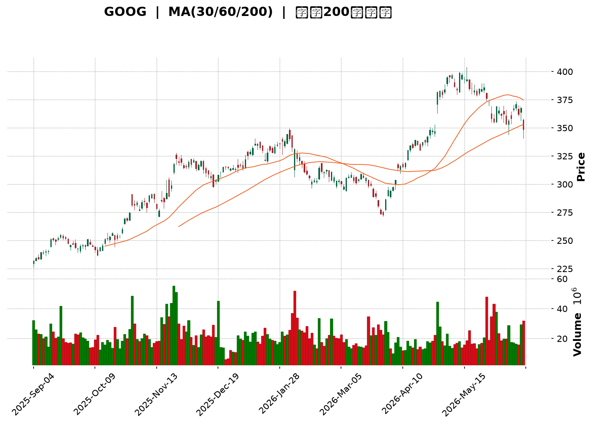
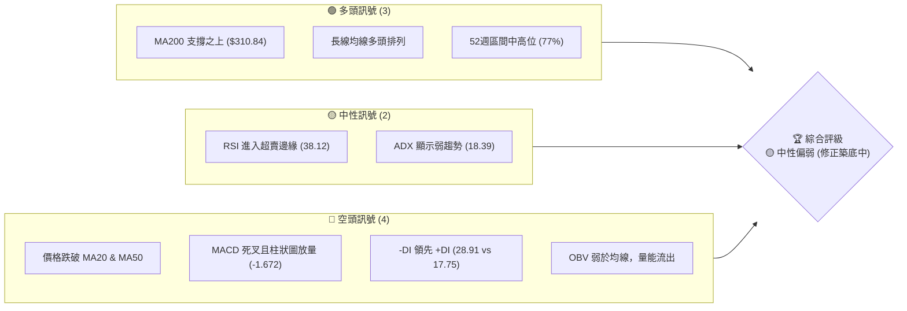
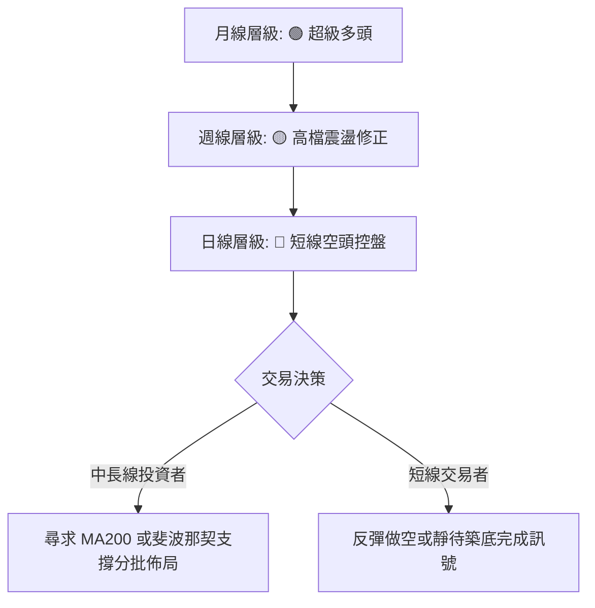
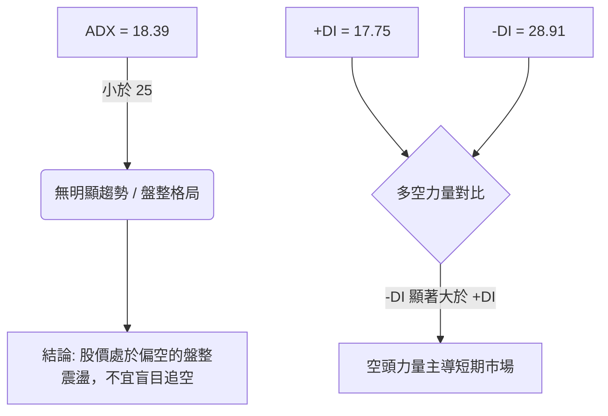
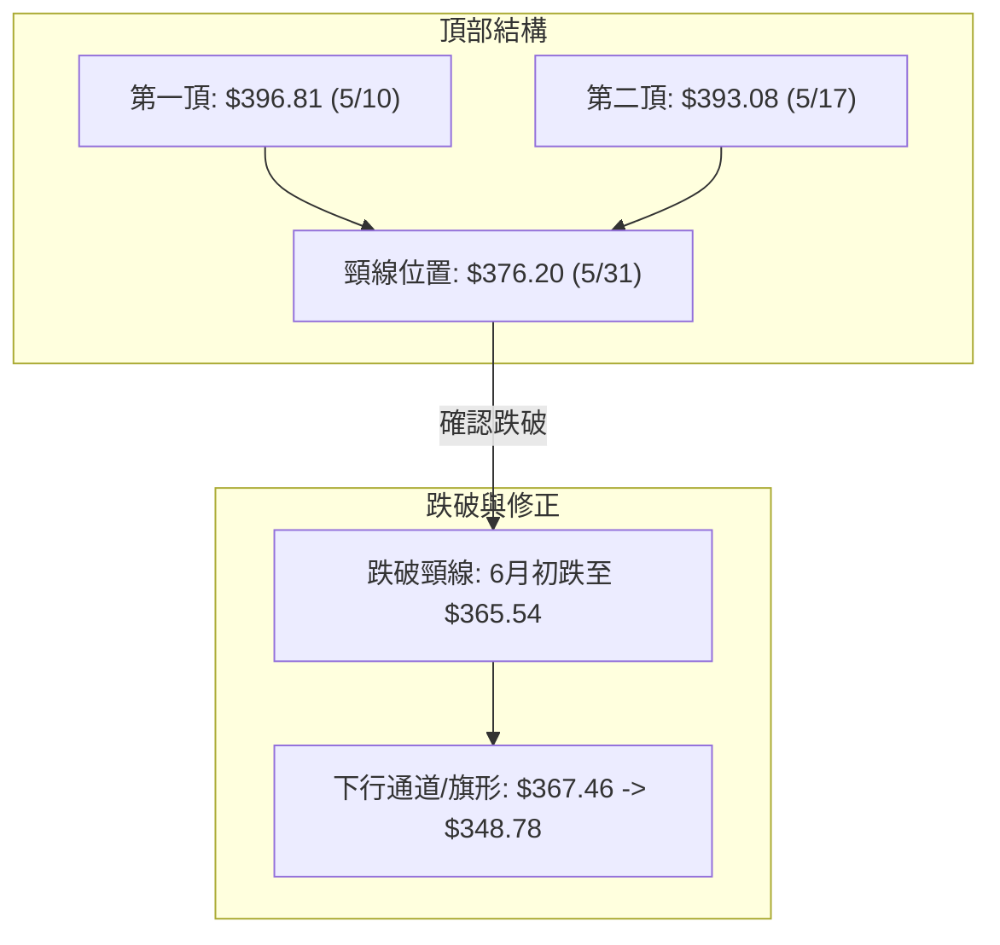
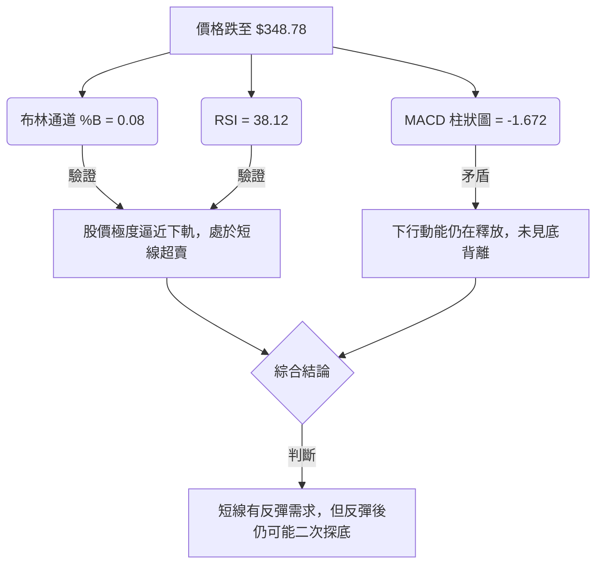
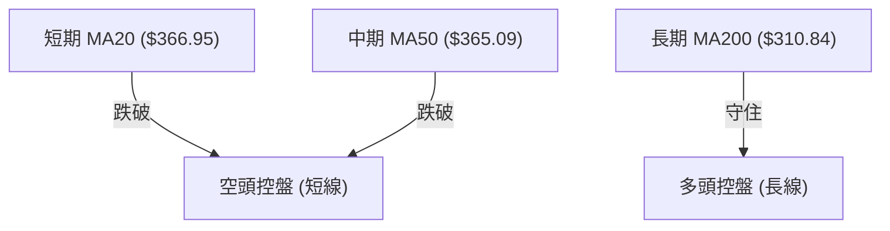
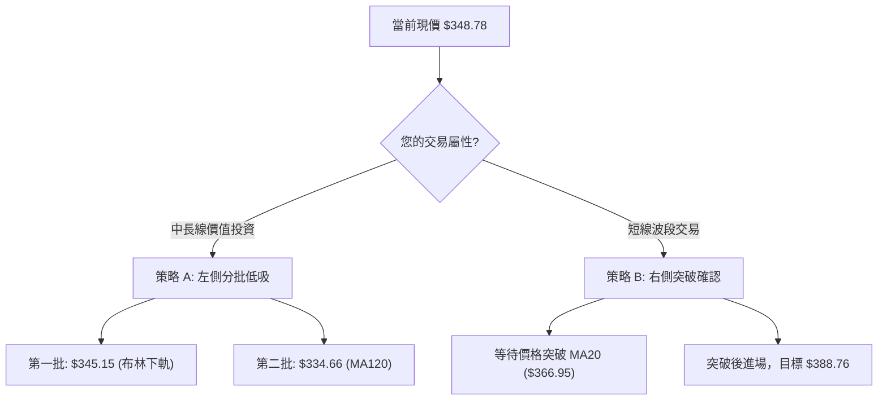
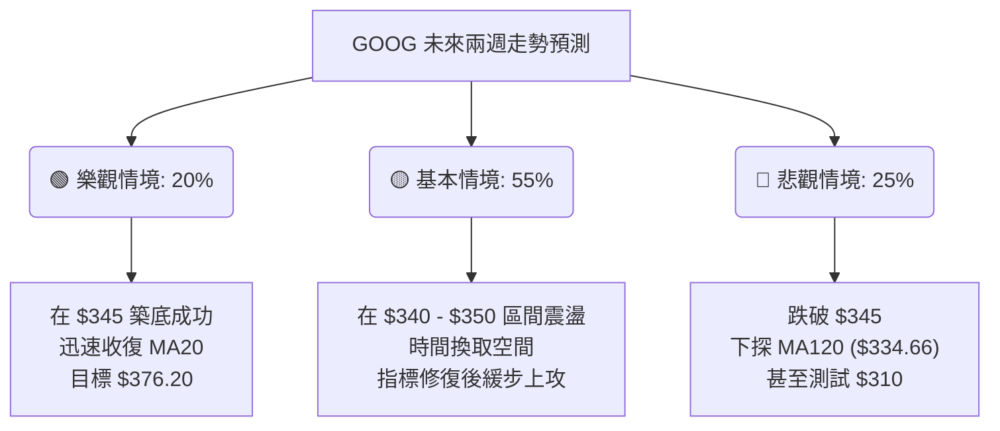

<details>
<summary>📊 靜態圖表 (點擊展開)</summary>

</details>

<html>
<head><meta charset="utf-8" /></head>
<body>
    <div style="height:500px; width:100%;">                        <script>window.PlotlyConfig = {MathJaxConfig: 'local'};</script>
        <script charset="utf-8" src="https://cdn.plot.ly/plotly-3.6.0.min.js" integrity="sha256-QaOVwtVY0T02VaHrr6pnoHLCwayMJp4O5n4YyaE3rJk=" crossorigin="anonymous"></script>                <div id="candlestick-chart" class="plotly-graph-div" style="height:100%; width:100%;"></div>            <script>                window.PLOTLYENV=window.PLOTLYENV || {};                                if (document.getElementById("candlestick-chart")) {                    Plotly.newPlot(                        "candlestick-chart",                        [{"close":{"dtype":"f8","bdata":"AAAAoOv\u002fbEAAAAAAA1BtQAAAAEB2Nm1AAAAAYA\u002fvbUAAAACA7OJtQAAAAEDjCW5AAAAA4AwdbkAAAACAj2hvQAAAAICzXW9AAAAAYI8rb0AAAACgw3pvQAAAAOCz129AAAAAgFSMb0AAAACAFXtvQAAAAOAL625AAAAAIM7CbkAAAABgSdZuQAAAAEA5fG5AAAAAoFpibkAAAADA6KFuQAAAAGBVvm5AAAAAAPm+bkAAAABAk2BvQAAAAKCw1G5AAAAA4FqfbkAAAAAAjzduQAAAAEDQoG1AAAAAgCqFbkAAAABgq7ZuQAAAAMD2Zm9AAAAAoGRsb0AAAACgZKlvQAAAAIBGCHBAAAAAgCVbb0AAAADgJoFvQAAAACB6p29AAAAAoAFAcEAAAABgbtZwQAAAAIB6vnBAAAAAgBsqcUAAAACgk5VxQAAAAKBMlHFAAAAAAAe5cUAAAADAQVhxQAAAAGAWw3FAAAAAYILMcUAAAAAgcnJxQAAAAGBYIHJAAAAAYLUyckAAAAAg4u1xQAAAAAAvaXFAAAAAwAJHcUAAAABAqdBxQAAAAMBwxnFAAAAAYKtGckAAAADAmhZyQAAAAGAFsXJAAAAAYI3dc0AAAABAHDB0QAAAAKB0+nNAAAAAYOb3c0AAAACgDqhzQAAAAMBttnNAAAAAgOL\u002fc0AAAABARtxzQAAAAOBbF3RAAAAAYKKgc0AAAACAXdVzQAAAACBMCXRAAAAAYKaUc0AAAAAA1mFzQAAAAECpTnNAAAAAIEE1c0AAAACAvJpyQAAAAGCo9XJAAAAA4FBDc0AAAABgx25zQAAAAOBJtHNAAAAAACG0c0AAAACAyKhzQAAAAACtn3NAAAAAYDuic0AAAABgP5ZzQAAAAECJrnNAAAAAgH7Oc0AAAABgO6JzQAAAAMAlIHRAAAAAQFpZdEAAAAAgXot0QAAAAIC7xHRAAAAA4Nr\u002fdEAAAAAA8P10QAAAAICay3RAAAAA4IqedEAAAABA1Rt0QAAAAEA5f3RAAAAAIIimdEAAAADABYB0QAAAAIB50nRAAAAAQAHpdEAAAABgdf10QAAAACB9I3VAAAAAYGkhdUAAAADAMod1QAAAACAWRHVAAAAAwHrOdEAAAACAXK50QAAAAKDaKnRAAAAAYKA\u002fdEAAAABgbeNzQAAAAGDHbnNAAAAAwHVPc0AAAAAg7hlzQAAAAADM5nJAAAAAoLH4ckAAAAAAn\u002fJyQAAAACDTp3NAAAAAIIh0c0AAAABgOmhzQAAAAKDxiXNAAAAAoPwrc0AAAACAYHBzQAAAAOBcH3NAAAAAAJ\u002fyckAAAABA3fByQAAAAOBGyHJAAAAAQJKeckAAAAAgNx1zQAAAACDtK3NAAAAAgMBDc0AAAAAgcfByQAAAAIB11HJAAAAAYMoDc0AAAAAglVNzQAAAACDaIXNAAAAA4LwYc0AAAADAw6lyQAAAAEBxrXJAAAAAwGoQckAAAAAgpxZyQAAAAGAjiXFAAAAAgIYZcUAAAACgnA9xQAAAAMD\u002f6nFAAAAA4I9rckAAAACghmRyQAAAAACyl3JAAAAAgPT7ckAAAACgz6hzQAAAACDgwnNAAAAAQHu4c0AAAADASfBzQAAAAEAZpnRAAAAAIE3kdEAAAAAAHsl0QAAAAEAiM3VAAAAAICzzdEAAAAAAV6R0QAAAACBuGHVAAAAA4L8YdUAAAABg02F1QAAAAED3xHVAAAAA4Ke0dUAAAAAgnrF1QAAAAEBd23dAAAAAANXvd0AAAABAlrZ3QAAAACCfAHhAAAAAAHCueEAAAADg\u002frB4QAAAAKD6zHhAAAAAAJkoeEAAAAAgbfl3QAAAAMDM7HhAAAAA4OXOeEAAAADAVZF4QAAAAAD6jXhAAAAAILIKeEAAAAAgsgp4QAAAAGDU83dAAAAA4G2yd0AAAACAvAl4QAAAAICTCXhAAAAAQDQeeEAAAADgQYN3QAAAAMCxRXdAAAAAgMpidkAAAAAAdTd2QAAAACDEEHdAAAAA4KPYdkAAAABguJJ2QAAAAOCjpHZAAAAAwB4VdkAAAADA9Uh2QAAAAGCPYnZAAAAAgMLxdkAAAACgmTF3QAAAAKCZoXZAAAAAIFz3dkAAAADgesx1QA=="},"high":{"dtype":"f8","bdata":"SdYfL24DbUA4b0\u002f7pG5tQC03d03gvW1AOLNntdEDbkD6Ccz9ZzNuQDP\u002fqlAOQ25A4jIwaVw+bkC3T67CLYhvQCUbcv6Bl29Arpfv2KBub0CveV4ekrRvQBeLNm0qA3BAlkF1COD5b0D5sCEvschvQJIkiqrijm9AHnSpL5nabkCU87vCLjRvQDqkr7X7ZG9ArHUvn1hmbkA1qfgSVNVuQEmwfnDR5G5ATRmXi07UbkCdnTWxnHZvQDKF3WraYW9ACUW5h9fYbkD4GayFY6JuQDCxn5aNi25AgcQgJFiQbkDto0M4RvFuQM9Qj2x\u002fiG9AuB00xDcRcEBgzVGINMxvQFn27jsCFnBAZN8ogizcb0AXY72N1ApwQBv06v2A629AqzSGmfFfcEDlbWrnUuRwQAD9Dx2W7XBAMU8C1+E2cUAdGjoivjVyQJV3OnmZ23FAg9zRKhfWcUCB8pTihZRxQPMYBQA64nFA\u002fqNysusDckAloCNqGL9xQIphi+c8LnJA\u002f5w8MUo8ckCaujHfmzxyQFsX\u002f1JJr3FA5wrJnKlpcUCpnUoHGl9yQMYfVYTmDXJA9j4MJ3r6ckB+qIqjoiRzQL\u002fyIZfY9XJA8vrrV8ryc0D3eSHSboB0QBZN1wKrRXRAhd\u002f7NNljdEDM3yd9E\u002fBzQNOC1tOg33NAVlo7f48WdEBJAF2EeCd0QLw37e4kM3RAZmMFAvkMdEAzx6l\u002fsORzQLBjevkyF3RAMDCnzx0ZdEC55lSVo7tzQPUwjq6rhHNAjvK\u002fIAJ3c0BSNJr6qUxzQEdUuE3JDXNAQa3\u002fV2NJc0D92qAFsXRzQIOJnQ8yvnNA2KuWLwm+c0AUcXeSWcJzQH46WobxqHNA0RR9CZHUc0AAvi+gp69zQLeVR6jhJ3RAnnDhblXtc0CrbHbnPhJ0QAdKd46fYHRA9tS06LyhdEAgNOo9wrB0QD+Q8XsO4HRATqWEYBNMdUBijLZGcQl1QOHm7g4FG3VAIB7tDtfsdEChdwbNlnp0QFDRcianxHRA1RDoQ1zsdECIuTdxgdl0QKaDPb+T\u002fnRAtx9tsGAcdUCshqzIBxN1QNgBrzh+XXVAe9iq94g9dUDwQ1nVbot1QD8Bz7wW23VABzctzs98dUD8xtK5W8N0QPRprDJWo3RAJJmZJf90dECk2uxWXRN0QHj2NDEECnRAnQM9XhLBc0D2+7VoykdzQI36Qa\u002ffB3NAIYdMOCwYc0APMMnrFhpzQDTKvM6LxXNAHpgc\u002fpvwc0COhs2\u002fZX9zQAXW5cEClHNAV0ko+3aJc0D8QYRmw3pzQBTYJ1zOO3NAKez1d7H4ckAFn5ph+xBzQMPoqNmV73JAc0gpRgK\u002fckD0DvrqDCVzQAD778dsT3NA+jg4ORxuc0CPc1QfRUdzQM9cShY0MXNA\u002fq6w6i0Wc0CXYWHs0F1zQLddXmkCaXNAl0nSqO0nc0DHX66g\u002fQJzQDW8rigA83JAOnNuqb2OckAhuyRiuWdyQP2F1KV75XFAYwEn\u002fsBucUA7Sl9wgEFxQOJwKYgJ7nFAzP1kZuScckD5OrtTjXtyQJrNf33to3JAkwHHdKz+ckAwiWKrKvNzQJEggkPT03NAqn7Rz+z0c0AUNEFVzvNzQBmyJPoOp3RAJlm9scbsdEC3LFNE1RJ1QAXbEO98PHVAH\u002fq\u002f3EsvdUA3toi+eQ91QHt3zyI6HXVAYXf5T0k\u002fdUBS2O5\u002fu3d1QLqI9OIF63VA9VhTVgjbdUDl1i+\u002f\u002fxJ2QHrHzcxl5ndAdN3F9Izyd0DpkdDQLv93QBAY6NGdS3hA5jXv8UPCeEDFhuov29F4QCk1iR8W4nhAewDoH3yheEARb4krUiN4QMXArO4H+3hAW1s6vNLteEDQuG0xRbp4QC2XMaOgQ3lAlad5xgWSeEARwv61cGd4QIHVCaojR3hAVDSfWTcKeEBU9xkFiBJ4QETmnHDZV3hA5KTwMD9ceEBnfNUjutZ3QI5qB8b+ZXdANiGpyRQZd0DaQcPygqR2QCq45EszGndAVVhcpqUPd0AAAACAFLZ2QAAAAGASG3dAAAAAwPXkdkAAAAAAKWB2QAAAAEBezHZAAAAAYGYqd0AAAACgmVl3QAAAAGBmIndAAAAAAAAQd0AAAABAM2N2QA=="},"hovertemplate":"\u003cb\u003e%{x|%Y-%m-%d}\u003c\u002fb\u003e\u003cbr\u003e\u958b: $%{open:.2f}\u003cbr\u003e\u9ad8: $%{high:.2f}\u003cbr\u003e\u4f4e: $%{low:.2f}\u003cbr\u003e\u6536: $%{close:.2f}\u003cextra\u003e\u003c\u002fextra\u003e","low":{"dtype":"f8","bdata":"PJlHYKhDbEA+DXl0\u002fPZsQDTeGoS6KG1AStFWAI0dbUC864tcnbRtQHPeES7Ag21Ayb\u002f2BhLBbUDQE7llBpBuQP6YznI\u002fJ29AmCb25h\u002fDbkDzfrLz3DNvQIyS9JRlcm9A9gc0LDhKb0CKgQCIKVNvQP1Ue4aQ125AP3hTOKwlbkCYHk5nCsVuQOFpzhYtV25AN0PuY0bjbUBw7dYZbddtQPxGwkgkVG5A4W2Xp9w\u002fbkA4afwks6ZuQHYz1kB4ym5AZY\u002furYmTbkBAjAWrweZtQLqejIYah21ATC9p9u0IbkDxj+ZQmRZuQMRDudfUyW5AGtLto79Fb0AKTIyUUQNvQA\u002fJv0dDw29At1Auwx+GbkC2VwoRwT5vQHJdcurAiG9A9+DuKyvzb0A8n8Fbv4ZwQCA8arhbqnBATj+aYXq+cECssDwebH5xQHRCKo6uT3FAJRb2CyV9cUApaz+TLEVxQLGpI+xhVXFACg1YDhuRcUCoouaaNTNxQLyfTBzEr3FALq3MzRH1cUD9p2LQLb1xQPbrYnlMV3FAV7aSoRDucEBC2yO6yLpxQLhQUE1tZ3FA0fCIYLfxcUCrGmd9qwlyQLWKHOOLXHJAyCl3TLdMc0B5ipbKG9NzQEg6r61FyXNAWIQ3mx7Fc0C7MVBi2pVzQLgWKGyvmXNAs5HDrKSac0AdO7zPj69zQBwtAkiq9XNA61XVEwx4c0CllAJsZINzQPJRLm\u002fQr3NAqoR0C5xXc0A7s6RH8yhzQM\u002fjJ6N0FXNAf08Tee\u002f2ckDruLdC\u002fZByQL6IXY3Nw3JA20LlgyDfckAVmZG2CSNzQDO3EfqCZXNAXmbJ75OOc0C8Wt4g+JRzQJF7US\u002fjd3NACiXpknWNc0BPb21trnxzQAnTgdbpY3NAWyIasmatc0DkOCoQ635zQOqFeONuoXNAo1tjvR0ZdEBi\u002fLwSMF10QGsFSvhcUXRAJtFVXp7edEAzQd9iU6t0QMQE8v64rXRAPcBeOd57dEDXy+4pigd0QCV6WeD38XNAt3QjejaHdEBSMm4VrHh0QCdGKnsAcXRArDGR7gfVdEClfMguJbt0QL3uwbKyZHRABD6je0vDdEADFjvlJPl0QHgnT8deInVAhzjC2AqPdEAgGMq7TyhzQEnFoSS3+3NAuBUnEJHUc0AiTGJ4\u002faNzQOvKJaqaW3NADGOFJfc7c0B\u002fIvb0DfhyQIbhW0UziHJAqAIB+l\u002fZckBItPYSccRyQNRq5iRdAHNA6N9b9l1Zc0BGOYlxDBtzQJEfEd5MT3NA93X09T7gckAcZUHnHfNyQGWvqHSsynJAyAtRDf2EckDD\u002fzbqhMZyQJ06Wm7lmnJAQ\u002fyVzdVtckDg3IciDVxyQJfkqZ0FEnNAJY1HG38ac0AObrx2i8pyQMBtd2OYuXJA9B0oLg7ackA78THXqwJzQCbvKZzHFXNAyMxXZxrNckCdJKTmJIlyQI6MVbCcnXJAXBiYeeYKckB4XT54J\u002fNxQEgZ2EkdbnFA\u002fGebUAwVcUAVnzN08vVwQEa3PiJ\u002fSXFAVdeFALwUckDFtMs5WvZxQGQN7wjQWXJAAljd8\u002fRzckD6qWhDRYhzQFk5gr+KVHNAiJND6Jylc0BZLTh5BZhzQJhoBDtPD3RAxNpBsGWHdECnGmpCNbd0QEP\u002fW81u0XRAYPOXJdzmdEAFs8Fx6JZ0QLbEP+AnzHRAWf2fQLztdECj4Pe\u002fld10QGLonB6uSXVAYjrariqBdUDuabOllWN1QPJGBBHyrXZAoU5ZfIxwd0CKGAOysYh3QP+XbIjwwXdAhY\u002fb7t8teED23SMrNGF4QLeelZPulnhA93qQlPYfeEDdneyZ3bd3QK5pRoSb1XdA8PGWUd6HeEBqkkPFaFh4QFOo2VGjanhAteZNblDsd0Brq17SV7x3QCaMgDQHtHdAxjlZIoWgd0Ci2P9ql653QGbq7dhS3HdA74Zuv1TQd0BsnlufMmF3QKABB1LNF3dAibMwWpUsdkCIF+BzqyJ2QEzrIKZiKXZAlGzUjJmWdkAAAACAPV52QAAAACCFK3ZAAAAAwPUMdkAAAACAFHp1QAAAAKBwFXZAAAAAYGbKdkAAAADAHtV2QAAAACCug3ZAAAAAYLpJdkAAAABACk91QA=="},"name":"\u50f9\u683c","open":{"dtype":"f8","bdata":"tL7LDv2vbEBqFHWs6\u002f9sQAg4+gCFam1AzJZUhWs3bUB4OsD3BdltQF+qiKFy9W1Aiepny4YKbkDRNlaVIpVuQHSysKrDem9ANRMWs\u002fpeb0CSyjXowGtvQJdVhPzvnG9AWNVGzQLJb0C591TtFKVvQLZ0jgUEdW9A8R9cmY2LbkBvOfbtm+luQKliGyNC+W5Av3xBWrRSbkAc2ed+qRZuQMgM8GgapW5AoVPzTAKYbkBozcTzkqluQFk1g0ctDm9ABe5CBP22bkA7slF0lJJuQHPRTgn2NW5ARQK9Od8RbkAt6M\u002fxBiluQFXoGNcw825Ax90hgBN\u002fb0D4WddZd1tvQPfbRg9i129A3cV+lwXYb0DcJdxBW9BvQGr4ENuEpm9AK8eEGL8McEDZW0M+dI1wQEaVaVG+2nBAGpJjMFrBcEAvafewYzJyQB\u002fWE2dqqnFAhCH8fuGdcUBPe\u002fk4XkhxQAs1QOdVbXFAnMHPFdHScUDEJQPddrpxQKxQH+pPy3FAYFVi\u002fS36cUCsyEizNzhyQKV78wfnpnFA\u002fRK9Ps\u002f1cEC6vQ+Xb91xQKVyHOG6\u002fnFAxoXMofTxcUAXToBdTQJzQBp3dsaghHJA3Df9BW1mc0DcWg0ukmJ0QOa7ZZ5wAnRAZKEZmsEsdECtgnLhqc1zQGNk7DJ7xHNASmsep5a2c0Cd5BrTmyZ0QAzJAf\u002f79XNAmni508YJdEBUEif7D4tzQFrPswlPw3NAsEGLMeUKdEBpnuKlJaZzQPskNdV4g3NA7914P5wZc0Bt1sE3tUlzQPL+MNCh6nJAtIlJy\u002fztckBl06nvGW1zQPVxO+upa3NADdgvb8y7c0AaQEGeH7hzQBauYaSWhnNAvvb1FwSQc0DlV2hsYI9zQFCut\u002f3O0nNAsMLTfnzUc0DR1i+fVc5zQOcSrEONonNA92SIWV2NdECy4OpxAHF0QDy4hq0uYXRA+16ypXrtdEDzGjfVw+h0QCDplDXSGXVAmvtFcPfndECvEwHLIQ10QEzyjNDQCnRAROgNsULddECVzbPKiMN0QCqslO9YfHRAVxLeYRLzdECKqnM8uwJ1QKh1ZFd+PnVACJM\u002fYWDgdEAmbFDCxQF1QLz+FZr2wHVA3dKN8+Z0dUCCWe8JqYxzQF2TiejDbnRAg8wZ5CENdECjEyUQ3Ad0QB8Sgxaz6HNAh4f68RN\u002fc0C9zSI\u002fVDlzQPH+QGf2w3JAvgSB75jgckA+UEKvAOJyQMmQ8HxvBnNA8HshjZPrc0BUkij\u002fwGNzQIsMQR1ne3NAdcX+RVmGc0AkDKuJsfhyQPt6zSUd6XJAbMUaGn2gckD3x9LWo+RyQMY+RYLe7HJA3DPHSPh6ckB3bTthVF9yQLYOV3kOG3NAHNYmGdohc0Bw1uy7aSBzQOxI1XOHJ3NAl08vpa32ckBaK2DNyQdzQIxot0uEO3NAP2RxFXHwckDldOKdMf5yQGmYt4eWxXJA6LnEWoKAckBpnU6Rlj9yQMG+zjJJ4HFAM7gb6LpTcUBetoK1YzRxQB35SBb4VXFA5D7gvuMcckD7eyf6Dg1yQCfk9ipdaHJA8Dc7Flq\u002fckAyFT6jONpzQE6eebUGkHNAHMUAlIngc0CJDS1Wr7NzQGfD99nwHXRAamv3YceldEA+SVcpXvp0QHIGaV6p43RAs8wkt7MldUC4DidmIfZ0QIe+OALw6nRAC\u002fjvoO41dUDV1kIVRRh1QKIAZE7FenVAqA\u002fMrWGrdUAM0SACW5R1QGVINdOBMHdAoqPZ6Aqcd0CYjtXlcOF3QGlau6k+2ndAI85pzLBVeEB9c\u002fqJI814QJuONZmGoHhADlWlt0dneEBXnMN3Swx4QOIPSffN2ndACcnGs9mYeEApyjrip494QALuO+05fnhAF284zgOReEBSwrFH7wx4QD980th73HdACzz+0Hjwd0BDcA7ZQMx3QHVUa3aO6HdAiY5a0RD6d0CJ091v7s93QEcfI2OdRXdApnxqnxCvdkB3G4xV6WF2QMnPeZKeM3ZAjPMWPZWydkAAAACAwqd2QAAAAAApznZAAAAAwMyQdkAAAADAzBB2QAAAAKCZkXZAAAAAANffdkAAAACgcPd2QAAAAMDM8HZAAAAAgD2+dkAAAAAAKVJ2QA=="},"x":["2025-09-04T00:00:00-04:00","2025-09-05T00:00:00-04:00","2025-09-08T00:00:00-04:00","2025-09-09T00:00:00-04:00","2025-09-10T00:00:00-04:00","2025-09-11T00:00:00-04:00","2025-09-12T00:00:00-04:00","2025-09-15T00:00:00-04:00","2025-09-16T00:00:00-04:00","2025-09-17T00:00:00-04:00","2025-09-18T00:00:00-04:00","2025-09-19T00:00:00-04:00","2025-09-22T00:00:00-04:00","2025-09-23T00:00:00-04:00","2025-09-24T00:00:00-04:00","2025-09-25T00:00:00-04:00","2025-09-26T00:00:00-04:00","2025-09-29T00:00:00-04:00","2025-09-30T00:00:00-04:00","2025-10-01T00:00:00-04:00","2025-10-02T00:00:00-04:00","2025-10-03T00:00:00-04:00","2025-10-06T00:00:00-04:00","2025-10-07T00:00:00-04:00","2025-10-08T00:00:00-04:00","2025-10-09T00:00:00-04:00","2025-10-10T00:00:00-04:00","2025-10-13T00:00:00-04:00","2025-10-14T00:00:00-04:00","2025-10-15T00:00:00-04:00","2025-10-16T00:00:00-04:00","2025-10-17T00:00:00-04:00","2025-10-20T00:00:00-04:00","2025-10-21T00:00:00-04:00","2025-10-22T00:00:00-04:00","2025-10-23T00:00:00-04:00","2025-10-24T00:00:00-04:00","2025-10-27T00:00:00-04:00","2025-10-28T00:00:00-04:00","2025-10-29T00:00:00-04:00","2025-10-30T00:00:00-04:00","2025-10-31T00:00:00-04:00","2025-11-03T00:00:00-05:00","2025-11-04T00:00:00-05:00","2025-11-05T00:00:00-05:00","2025-11-06T00:00:00-05:00","2025-11-07T00:00:00-05:00","2025-11-10T00:00:00-05:00","2025-11-11T00:00:00-05:00","2025-11-12T00:00:00-05:00","2025-11-13T00:00:00-05:00","2025-11-14T00:00:00-05:00","2025-11-17T00:00:00-05:00","2025-11-18T00:00:00-05:00","2025-11-19T00:00:00-05:00","2025-11-20T00:00:00-05:00","2025-11-21T00:00:00-05:00","2025-11-24T00:00:00-05:00","2025-11-25T00:00:00-05:00","2025-11-26T00:00:00-05:00","2025-11-28T00:00:00-05:00","2025-12-01T00:00:00-05:00","2025-12-02T00:00:00-05:00","2025-12-03T00:00:00-05:00","2025-12-04T00:00:00-05:00","2025-12-05T00:00:00-05:00","2025-12-08T00:00:00-05:00","2025-12-09T00:00:00-05:00","2025-12-10T00:00:00-05:00","2025-12-11T00:00:00-05:00","2025-12-12T00:00:00-05:00","2025-12-15T00:00:00-05:00","2025-12-16T00:00:00-05:00","2025-12-17T00:00:00-05:00","2025-12-18T00:00:00-05:00","2025-12-19T00:00:00-05:00","2025-12-22T00:00:00-05:00","2025-12-23T00:00:00-05:00","2025-12-24T00:00:00-05:00","2025-12-26T00:00:00-05:00","2025-12-29T00:00:00-05:00","2025-12-30T00:00:00-05:00","2025-12-31T00:00:00-05:00","2026-01-02T00:00:00-05:00","2026-01-05T00:00:00-05:00","2026-01-06T00:00:00-05:00","2026-01-07T00:00:00-05:00","2026-01-08T00:00:00-05:00","2026-01-09T00:00:00-05:00","2026-01-12T00:00:00-05:00","2026-01-13T00:00:00-05:00","2026-01-14T00:00:00-05:00","2026-01-15T00:00:00-05:00","2026-01-16T00:00:00-05:00","2026-01-20T00:00:00-05:00","2026-01-21T00:00:00-05:00","2026-01-22T00:00:00-05:00","2026-01-23T00:00:00-05:00","2026-01-26T00:00:00-05:00","2026-01-27T00:00:00-05:00","2026-01-28T00:00:00-05:00","2026-01-29T00:00:00-05:00","2026-01-30T00:00:00-05:00","2026-02-02T00:00:00-05:00","2026-02-03T00:00:00-05:00","2026-02-04T00:00:00-05:00","2026-02-05T00:00:00-05:00","2026-02-06T00:00:00-05:00","2026-02-09T00:00:00-05:00","2026-02-10T00:00:00-05:00","2026-02-11T00:00:00-05:00","2026-02-12T00:00:00-05:00","2026-02-13T00:00:00-05:00","2026-02-17T00:00:00-05:00","2026-02-18T00:00:00-05:00","2026-02-19T00:00:00-05:00","2026-02-20T00:00:00-05:00","2026-02-23T00:00:00-05:00","2026-02-24T00:00:00-05:00","2026-02-25T00:00:00-05:00","2026-02-26T00:00:00-05:00","2026-02-27T00:00:00-05:00","2026-03-02T00:00:00-05:00","2026-03-03T00:00:00-05:00","2026-03-04T00:00:00-05:00","2026-03-05T00:00:00-05:00","2026-03-06T00:00:00-05:00","2026-03-09T00:00:00-04:00","2026-03-10T00:00:00-04:00","2026-03-11T00:00:00-04:00","2026-03-12T00:00:00-04:00","2026-03-13T00:00:00-04:00","2026-03-16T00:00:00-04:00","2026-03-17T00:00:00-04:00","2026-03-18T00:00:00-04:00","2026-03-19T00:00:00-04:00","2026-03-20T00:00:00-04:00","2026-03-23T00:00:00-04:00","2026-03-24T00:00:00-04:00","2026-03-25T00:00:00-04:00","2026-03-26T00:00:00-04:00","2026-03-27T00:00:00-04:00","2026-03-30T00:00:00-04:00","2026-03-31T00:00:00-04:00","2026-04-01T00:00:00-04:00","2026-04-02T00:00:00-04:00","2026-04-06T00:00:00-04:00","2026-04-07T00:00:00-04:00","2026-04-08T00:00:00-04:00","2026-04-09T00:00:00-04:00","2026-04-10T00:00:00-04:00","2026-04-13T00:00:00-04:00","2026-04-14T00:00:00-04:00","2026-04-15T00:00:00-04:00","2026-04-16T00:00:00-04:00","2026-04-17T00:00:00-04:00","2026-04-20T00:00:00-04:00","2026-04-21T00:00:00-04:00","2026-04-22T00:00:00-04:00","2026-04-23T00:00:00-04:00","2026-04-24T00:00:00-04:00","2026-04-27T00:00:00-04:00","2026-04-28T00:00:00-04:00","2026-04-29T00:00:00-04:00","2026-04-30T00:00:00-04:00","2026-05-01T00:00:00-04:00","2026-05-04T00:00:00-04:00","2026-05-05T00:00:00-04:00","2026-05-06T00:00:00-04:00","2026-05-07T00:00:00-04:00","2026-05-08T00:00:00-04:00","2026-05-11T00:00:00-04:00","2026-05-12T00:00:00-04:00","2026-05-13T00:00:00-04:00","2026-05-14T00:00:00-04:00","2026-05-15T00:00:00-04:00","2026-05-18T00:00:00-04:00","2026-05-19T00:00:00-04:00","2026-05-20T00:00:00-04:00","2026-05-21T00:00:00-04:00","2026-05-22T00:00:00-04:00","2026-05-26T00:00:00-04:00","2026-05-27T00:00:00-04:00","2026-05-28T00:00:00-04:00","2026-05-29T00:00:00-04:00","2026-06-01T00:00:00-04:00","2026-06-02T00:00:00-04:00","2026-06-03T00:00:00-04:00","2026-06-04T00:00:00-04:00","2026-06-05T00:00:00-04:00","2026-06-08T00:00:00-04:00","2026-06-09T00:00:00-04:00","2026-06-10T00:00:00-04:00","2026-06-11T00:00:00-04:00","2026-06-12T00:00:00-04:00","2026-06-15T00:00:00-04:00","2026-06-16T00:00:00-04:00","2026-06-17T00:00:00-04:00","2026-06-18T00:00:00-04:00","2026-06-22T00:00:00-04:00"],"type":"candlestick"},{"hovertemplate":"MA30: $%{y:.2f}\u003cextra\u003e\u003c\u002fextra\u003e","line":{"color":"#2196F3","dash":"dash","width":2},"mode":"lines","name":"MA30","x":["2025-09-04T00:00:00-04:00","2025-09-05T00:00:00-04:00","2025-09-08T00:00:00-04:00","2025-09-09T00:00:00-04:00","2025-09-10T00:00:00-04:00","2025-09-11T00:00:00-04:00","2025-09-12T00:00:00-04:00","2025-09-15T00:00:00-04:00","2025-09-16T00:00:00-04:00","2025-09-17T00:00:00-04:00","2025-09-18T00:00:00-04:00","2025-09-19T00:00:00-04:00","2025-09-22T00:00:00-04:00","2025-09-23T00:00:00-04:00","2025-09-24T00:00:00-04:00","2025-09-25T00:00:00-04:00","2025-09-26T00:00:00-04:00","2025-09-29T00:00:00-04:00","2025-09-30T00:00:00-04:00","2025-10-01T00:00:00-04:00","2025-10-02T00:00:00-04:00","2025-10-03T00:00:00-04:00","2025-10-06T00:00:00-04:00","2025-10-07T00:00:00-04:00","2025-10-08T00:00:00-04:00","2025-10-09T00:00:00-04:00","2025-10-10T00:00:00-04:00","2025-10-13T00:00:00-04:00","2025-10-14T00:00:00-04:00","2025-10-15T00:00:00-04:00","2025-10-16T00:00:00-04:00","2025-10-17T00:00:00-04:00","2025-10-20T00:00:00-04:00","2025-10-21T00:00:00-04:00","2025-10-22T00:00:00-04:00","2025-10-23T00:00:00-04:00","2025-10-24T00:00:00-04:00","2025-10-27T00:00:00-04:00","2025-10-28T00:00:00-04:00","2025-10-29T00:00:00-04:00","2025-10-30T00:00:00-04:00","2025-10-31T00:00:00-04:00","2025-11-03T00:00:00-05:00","2025-11-04T00:00:00-05:00","2025-11-05T00:00:00-05:00","2025-11-06T00:00:00-05:00","2025-11-07T00:00:00-05:00","2025-11-10T00:00:00-05:00","2025-11-11T00:00:00-05:00","2025-11-12T00:00:00-05:00","2025-11-13T00:00:00-05:00","2025-11-14T00:00:00-05:00","2025-11-17T00:00:00-05:00","2025-11-18T00:00:00-05:00","2025-11-19T00:00:00-05:00","2025-11-20T00:00:00-05:00","2025-11-21T00:00:00-05:00","2025-11-24T00:00:00-05:00","2025-11-25T00:00:00-05:00","2025-11-26T00:00:00-05:00","2025-11-28T00:00:00-05:00","2025-12-01T00:00:00-05:00","2025-12-02T00:00:00-05:00","2025-12-03T00:00:00-05:00","2025-12-04T00:00:00-05:00","2025-12-05T00:00:00-05:00","2025-12-08T00:00:00-05:00","2025-12-09T00:00:00-05:00","2025-12-10T00:00:00-05:00","2025-12-11T00:00:00-05:00","2025-12-12T00:00:00-05:00","2025-12-15T00:00:00-05:00","2025-12-16T00:00:00-05:00","2025-12-17T00:00:00-05:00","2025-12-18T00:00:00-05:00","2025-12-19T00:00:00-05:00","2025-12-22T00:00:00-05:00","2025-12-23T00:00:00-05:00","2025-12-24T00:00:00-05:00","2025-12-26T00:00:00-05:00","2025-12-29T00:00:00-05:00","2025-12-30T00:00:00-05:00","2025-12-31T00:00:00-05:00","2026-01-02T00:00:00-05:00","2026-01-05T00:00:00-05:00","2026-01-06T00:00:00-05:00","2026-01-07T00:00:00-05:00","2026-01-08T00:00:00-05:00","2026-01-09T00:00:00-05:00","2026-01-12T00:00:00-05:00","2026-01-13T00:00:00-05:00","2026-01-14T00:00:00-05:00","2026-01-15T00:00:00-05:00","2026-01-16T00:00:00-05:00","2026-01-20T00:00:00-05:00","2026-01-21T00:00:00-05:00","2026-01-22T00:00:00-05:00","2026-01-23T00:00:00-05:00","2026-01-26T00:00:00-05:00","2026-01-27T00:00:00-05:00","2026-01-28T00:00:00-05:00","2026-01-29T00:00:00-05:00","2026-01-30T00:00:00-05:00","2026-02-02T00:00:00-05:00","2026-02-03T00:00:00-05:00","2026-02-04T00:00:00-05:00","2026-02-05T00:00:00-05:00","2026-02-06T00:00:00-05:00","2026-02-09T00:00:00-05:00","2026-02-10T00:00:00-05:00","2026-02-11T00:00:00-05:00","2026-02-12T00:00:00-05:00","2026-02-13T00:00:00-05:00","2026-02-17T00:00:00-05:00","2026-02-18T00:00:00-05:00","2026-02-19T00:00:00-05:00","2026-02-20T00:00:00-05:00","2026-02-23T00:00:00-05:00","2026-02-24T00:00:00-05:00","2026-02-25T00:00:00-05:00","2026-02-26T00:00:00-05:00","2026-02-27T00:00:00-05:00","2026-03-02T00:00:00-05:00","2026-03-03T00:00:00-05:00","2026-03-04T00:00:00-05:00","2026-03-05T00:00:00-05:00","2026-03-06T00:00:00-05:00","2026-03-09T00:00:00-04:00","2026-03-10T00:00:00-04:00","2026-03-11T00:00:00-04:00","2026-03-12T00:00:00-04:00","2026-03-13T00:00:00-04:00","2026-03-16T00:00:00-04:00","2026-03-17T00:00:00-04:00","2026-03-18T00:00:00-04:00","2026-03-19T00:00:00-04:00","2026-03-20T00:00:00-04:00","2026-03-23T00:00:00-04:00","2026-03-24T00:00:00-04:00","2026-03-25T00:00:00-04:00","2026-03-26T00:00:00-04:00","2026-03-27T00:00:00-04:00","2026-03-30T00:00:00-04:00","2026-03-31T00:00:00-04:00","2026-04-01T00:00:00-04:00","2026-04-02T00:00:00-04:00","2026-04-06T00:00:00-04:00","2026-04-07T00:00:00-04:00","2026-04-08T00:00:00-04:00","2026-04-09T00:00:00-04:00","2026-04-10T00:00:00-04:00","2026-04-13T00:00:00-04:00","2026-04-14T00:00:00-04:00","2026-04-15T00:00:00-04:00","2026-04-16T00:00:00-04:00","2026-04-17T00:00:00-04:00","2026-04-20T00:00:00-04:00","2026-04-21T00:00:00-04:00","2026-04-22T00:00:00-04:00","2026-04-23T00:00:00-04:00","2026-04-24T00:00:00-04:00","2026-04-27T00:00:00-04:00","2026-04-28T00:00:00-04:00","2026-04-29T00:00:00-04:00","2026-04-30T00:00:00-04:00","2026-05-01T00:00:00-04:00","2026-05-04T00:00:00-04:00","2026-05-05T00:00:00-04:00","2026-05-06T00:00:00-04:00","2026-05-07T00:00:00-04:00","2026-05-08T00:00:00-04:00","2026-05-11T00:00:00-04:00","2026-05-12T00:00:00-04:00","2026-05-13T00:00:00-04:00","2026-05-14T00:00:00-04:00","2026-05-15T00:00:00-04:00","2026-05-18T00:00:00-04:00","2026-05-19T00:00:00-04:00","2026-05-20T00:00:00-04:00","2026-05-21T00:00:00-04:00","2026-05-22T00:00:00-04:00","2026-05-26T00:00:00-04:00","2026-05-27T00:00:00-04:00","2026-05-28T00:00:00-04:00","2026-05-29T00:00:00-04:00","2026-06-01T00:00:00-04:00","2026-06-02T00:00:00-04:00","2026-06-03T00:00:00-04:00","2026-06-04T00:00:00-04:00","2026-06-05T00:00:00-04:00","2026-06-08T00:00:00-04:00","2026-06-09T00:00:00-04:00","2026-06-10T00:00:00-04:00","2026-06-11T00:00:00-04:00","2026-06-12T00:00:00-04:00","2026-06-15T00:00:00-04:00","2026-06-16T00:00:00-04:00","2026-06-17T00:00:00-04:00","2026-06-18T00:00:00-04:00","2026-06-22T00:00:00-04:00"],"y":{"dtype":"f8","bdata":"AAAAAAAA+H8AAAAAAAD4fwAAAAAAAPh\u002fAAAAAAAA+H8AAAAAAAD4fwAAAAAAAPh\u002fAAAAAAAA+H8AAAAAAAD4fwAAAAAAAPh\u002fAAAAAAAA+H8AAAAAAAD4fwAAAAAAAPh\u002fAAAAAAAA+H8AAAAAAAD4fwAAAAAAAPh\u002fAAAAAAAA+H8AAAAAAAD4fwAAAAAAAPh\u002fAAAAAAAA+H8AAAAAAAD4fwAAAAAAAPh\u002fAAAAAAAA+H8AAAAAAAD4fwAAAAAAAPh\u002fAAAAAAAA+H8AAAAAAAD4fwAAAAAAAPh\u002fAAAAAAAA+H8AAAAAAAD4fwAAACDTnm5AMzMz04GzbkDNzMycjcduQERERLTj325AMzMzkwbsbkAiIiJS1fluQN7d3Z2eB29AmpmZKfwbb0AiIiISVC9vQKuqqtpvQW9AAAAAYGRcb0CamZkp33tvQDMzMxMrmG9A3t3d\u002fWy5b0BmZmaGztRvQLy7u2sc\u002fG9AERERQbEScECrqqqiACRwQCIiIjqcPHBAVVVV5UJWcEBmZmYWj2xwQJqZmaH1fXBA7+7u1jWOcEAREREpW6BwQLy7uxt+tHBA7+7u1srNcEAAAABIOOdwQO\u002fu7pZOCHFAiYiIIJsvcUAiIiLy1FhxQImIiLhUfXFA3t3dhaehcUC8u7u7TMJxQBEREXG04XFAd3d395QGckDe3d11oylyQO\u002fu7p4GTnJAd3d3x9hqckCJiIhIaYRyQGZmZlaBoHJAERERkR+1ckDNzMwcd8RyQO\u002fu7u4103JAmpmZieLfckDNzMxcoupyQN7d3W3a9HJAd3d3x1gBc0De3d2NShJzQJqZmYnBH3NAVVVVdZosc0Dv7u7eXTtzQAAAAPA\u002fTnNAzczMbFtic0B3d3cHenFzQM3MzBy\u002fgXNA7+7urs6Oc0BERES0\u002fptzQERERIQ7qHNAIiIi8lusc0DNzMysZq9zQFVVVcUktnNAAAAAMPG+c0ARERGRVspzQKuqqsqT03NAvLu7q93Yc0CamZkJ\u002fNpzQJqZmVly3nNAVVVVNS3nc0C8u7t73exzQCIiIjKS83NA7+7ujur+c0AiIiISowx0QLy7u7tDHHRAmpmZeassdECamZlZnkV0QM3MzKxMWXRAzczMvHhmdEB3d3fXH3F0QJqZmZkTdXRAq6qq+rl5dECJiIhornt0QHd3dycNenRAVVVV1Up3dEDe3d39JXN0QM3MzIx9bHRA7+7uHl1ldEAzMzOTgl90QCIiItJ\u002fW3RAd3d3N99TdEAzMzPTKkp0QBEREaGsP3RAd3d3JxQwdEAzMzOj0yJ0QBEREVGNFHRAiYiIuEkGdEBVVVWFUvxzQHd3d9ew7XNAiYiI2Fvcc0CJiIgoiNBzQJqZmWlywnNAiYiIuGe0c0BERESU56JzQAAAACA0j3NAq6qqSiZ9c0BVVVXFXGpzQCIiIpInWHNAzczMLJBJc0AiIiLiVzhzQLy7uyuhK3NAAAAAQP0Yc0Dv7u5OoQlzQM3MzCxx+XJA3t3d3ZPmckAAAADAKtVyQDMzMxPGzHJAAAAAwBHIckBEREQ0VcNyQImIiAhDunJAzczMHD62ckCJiIg4ZbhyQJqZmQlLunJAzczM7Pm+ckDv7u5uPcNyQGZmZrZD0HJAVVVVldrgckCamZl5mPByQDMzM2M5BXNAIiIiYhwZc0Crqqr6JSZzQN7d3a2QNnNAq6qqyjJGc0BmZmZmC1tzQKuqqsogdHNAvLu7GxeLc0C8u7ubSp9zQHd3d8ebx3NAIiIiYunwc0B3d3d3ARx0QN7d3e1xSXRAIiIikumBdEBERETUQbp0QImIiHhA+HRAIiIi0nw0dUDNzMw8e291QGZmZlZGq3VARERENMnhdUBmZmbGehZ2QKuqqgpbSXZA7+7ufoN0dkCamZnp6Jl2QJqZmcmsvXZAZmZmRpvfdkARERGRlgJ3QKuqqgqBH3dA7+7uvgg7d0BVVVU1TlJ3QImIiKj9Y3dAvLu7qz5wd0Crqqqarn13QFVVVUV+jndAVVVVRWydd0CamZkJlqd3QJqZmbkKr3dAMzMz40Gyd0B3d3dXTbd3QCIiIvK9qndAzczM3EWid0CrqqoK1513QImIiKgjkndAzczM3ICDd0C8u7vL0Wp3QA=="},"type":"scatter"},{"hovertemplate":"MA60: $%{y:.2f}\u003cextra\u003e\u003c\u002fextra\u003e","line":{"color":"#9C27B0","dash":"dash","width":2},"mode":"lines","name":"MA60","x":["2025-09-04T00:00:00-04:00","2025-09-05T00:00:00-04:00","2025-09-08T00:00:00-04:00","2025-09-09T00:00:00-04:00","2025-09-10T00:00:00-04:00","2025-09-11T00:00:00-04:00","2025-09-12T00:00:00-04:00","2025-09-15T00:00:00-04:00","2025-09-16T00:00:00-04:00","2025-09-17T00:00:00-04:00","2025-09-18T00:00:00-04:00","2025-09-19T00:00:00-04:00","2025-09-22T00:00:00-04:00","2025-09-23T00:00:00-04:00","2025-09-24T00:00:00-04:00","2025-09-25T00:00:00-04:00","2025-09-26T00:00:00-04:00","2025-09-29T00:00:00-04:00","2025-09-30T00:00:00-04:00","2025-10-01T00:00:00-04:00","2025-10-02T00:00:00-04:00","2025-10-03T00:00:00-04:00","2025-10-06T00:00:00-04:00","2025-10-07T00:00:00-04:00","2025-10-08T00:00:00-04:00","2025-10-09T00:00:00-04:00","2025-10-10T00:00:00-04:00","2025-10-13T00:00:00-04:00","2025-10-14T00:00:00-04:00","2025-10-15T00:00:00-04:00","2025-10-16T00:00:00-04:00","2025-10-17T00:00:00-04:00","2025-10-20T00:00:00-04:00","2025-10-21T00:00:00-04:00","2025-10-22T00:00:00-04:00","2025-10-23T00:00:00-04:00","2025-10-24T00:00:00-04:00","2025-10-27T00:00:00-04:00","2025-10-28T00:00:00-04:00","2025-10-29T00:00:00-04:00","2025-10-30T00:00:00-04:00","2025-10-31T00:00:00-04:00","2025-11-03T00:00:00-05:00","2025-11-04T00:00:00-05:00","2025-11-05T00:00:00-05:00","2025-11-06T00:00:00-05:00","2025-11-07T00:00:00-05:00","2025-11-10T00:00:00-05:00","2025-11-11T00:00:00-05:00","2025-11-12T00:00:00-05:00","2025-11-13T00:00:00-05:00","2025-11-14T00:00:00-05:00","2025-11-17T00:00:00-05:00","2025-11-18T00:00:00-05:00","2025-11-19T00:00:00-05:00","2025-11-20T00:00:00-05:00","2025-11-21T00:00:00-05:00","2025-11-24T00:00:00-05:00","2025-11-25T00:00:00-05:00","2025-11-26T00:00:00-05:00","2025-11-28T00:00:00-05:00","2025-12-01T00:00:00-05:00","2025-12-02T00:00:00-05:00","2025-12-03T00:00:00-05:00","2025-12-04T00:00:00-05:00","2025-12-05T00:00:00-05:00","2025-12-08T00:00:00-05:00","2025-12-09T00:00:00-05:00","2025-12-10T00:00:00-05:00","2025-12-11T00:00:00-05:00","2025-12-12T00:00:00-05:00","2025-12-15T00:00:00-05:00","2025-12-16T00:00:00-05:00","2025-12-17T00:00:00-05:00","2025-12-18T00:00:00-05:00","2025-12-19T00:00:00-05:00","2025-12-22T00:00:00-05:00","2025-12-23T00:00:00-05:00","2025-12-24T00:00:00-05:00","2025-12-26T00:00:00-05:00","2025-12-29T00:00:00-05:00","2025-12-30T00:00:00-05:00","2025-12-31T00:00:00-05:00","2026-01-02T00:00:00-05:00","2026-01-05T00:00:00-05:00","2026-01-06T00:00:00-05:00","2026-01-07T00:00:00-05:00","2026-01-08T00:00:00-05:00","2026-01-09T00:00:00-05:00","2026-01-12T00:00:00-05:00","2026-01-13T00:00:00-05:00","2026-01-14T00:00:00-05:00","2026-01-15T00:00:00-05:00","2026-01-16T00:00:00-05:00","2026-01-20T00:00:00-05:00","2026-01-21T00:00:00-05:00","2026-01-22T00:00:00-05:00","2026-01-23T00:00:00-05:00","2026-01-26T00:00:00-05:00","2026-01-27T00:00:00-05:00","2026-01-28T00:00:00-05:00","2026-01-29T00:00:00-05:00","2026-01-30T00:00:00-05:00","2026-02-02T00:00:00-05:00","2026-02-03T00:00:00-05:00","2026-02-04T00:00:00-05:00","2026-02-05T00:00:00-05:00","2026-02-06T00:00:00-05:00","2026-02-09T00:00:00-05:00","2026-02-10T00:00:00-05:00","2026-02-11T00:00:00-05:00","2026-02-12T00:00:00-05:00","2026-02-13T00:00:00-05:00","2026-02-17T00:00:00-05:00","2026-02-18T00:00:00-05:00","2026-02-19T00:00:00-05:00","2026-02-20T00:00:00-05:00","2026-02-23T00:00:00-05:00","2026-02-24T00:00:00-05:00","2026-02-25T00:00:00-05:00","2026-02-26T00:00:00-05:00","2026-02-27T00:00:00-05:00","2026-03-02T00:00:00-05:00","2026-03-03T00:00:00-05:00","2026-03-04T00:00:00-05:00","2026-03-05T00:00:00-05:00","2026-03-06T00:00:00-05:00","2026-03-09T00:00:00-04:00","2026-03-10T00:00:00-04:00","2026-03-11T00:00:00-04:00","2026-03-12T00:00:00-04:00","2026-03-13T00:00:00-04:00","2026-03-16T00:00:00-04:00","2026-03-17T00:00:00-04:00","2026-03-18T00:00:00-04:00","2026-03-19T00:00:00-04:00","2026-03-20T00:00:00-04:00","2026-03-23T00:00:00-04:00","2026-03-24T00:00:00-04:00","2026-03-25T00:00:00-04:00","2026-03-26T00:00:00-04:00","2026-03-27T00:00:00-04:00","2026-03-30T00:00:00-04:00","2026-03-31T00:00:00-04:00","2026-04-01T00:00:00-04:00","2026-04-02T00:00:00-04:00","2026-04-06T00:00:00-04:00","2026-04-07T00:00:00-04:00","2026-04-08T00:00:00-04:00","2026-04-09T00:00:00-04:00","2026-04-10T00:00:00-04:00","2026-04-13T00:00:00-04:00","2026-04-14T00:00:00-04:00","2026-04-15T00:00:00-04:00","2026-04-16T00:00:00-04:00","2026-04-17T00:00:00-04:00","2026-04-20T00:00:00-04:00","2026-04-21T00:00:00-04:00","2026-04-22T00:00:00-04:00","2026-04-23T00:00:00-04:00","2026-04-24T00:00:00-04:00","2026-04-27T00:00:00-04:00","2026-04-28T00:00:00-04:00","2026-04-29T00:00:00-04:00","2026-04-30T00:00:00-04:00","2026-05-01T00:00:00-04:00","2026-05-04T00:00:00-04:00","2026-05-05T00:00:00-04:00","2026-05-06T00:00:00-04:00","2026-05-07T00:00:00-04:00","2026-05-08T00:00:00-04:00","2026-05-11T00:00:00-04:00","2026-05-12T00:00:00-04:00","2026-05-13T00:00:00-04:00","2026-05-14T00:00:00-04:00","2026-05-15T00:00:00-04:00","2026-05-18T00:00:00-04:00","2026-05-19T00:00:00-04:00","2026-05-20T00:00:00-04:00","2026-05-21T00:00:00-04:00","2026-05-22T00:00:00-04:00","2026-05-26T00:00:00-04:00","2026-05-27T00:00:00-04:00","2026-05-28T00:00:00-04:00","2026-05-29T00:00:00-04:00","2026-06-01T00:00:00-04:00","2026-06-02T00:00:00-04:00","2026-06-03T00:00:00-04:00","2026-06-04T00:00:00-04:00","2026-06-05T00:00:00-04:00","2026-06-08T00:00:00-04:00","2026-06-09T00:00:00-04:00","2026-06-10T00:00:00-04:00","2026-06-11T00:00:00-04:00","2026-06-12T00:00:00-04:00","2026-06-15T00:00:00-04:00","2026-06-16T00:00:00-04:00","2026-06-17T00:00:00-04:00","2026-06-18T00:00:00-04:00","2026-06-22T00:00:00-04:00"],"y":{"dtype":"f8","bdata":"AAAAAAAA+H8AAAAAAAD4fwAAAAAAAPh\u002fAAAAAAAA+H8AAAAAAAD4fwAAAAAAAPh\u002fAAAAAAAA+H8AAAAAAAD4fwAAAAAAAPh\u002fAAAAAAAA+H8AAAAAAAD4fwAAAAAAAPh\u002fAAAAAAAA+H8AAAAAAAD4fwAAAAAAAPh\u002fAAAAAAAA+H8AAAAAAAD4fwAAAAAAAPh\u002fAAAAAAAA+H8AAAAAAAD4fwAAAAAAAPh\u002fAAAAAAAA+H8AAAAAAAD4fwAAAAAAAPh\u002fAAAAAAAA+H8AAAAAAAD4fwAAAAAAAPh\u002fAAAAAAAA+H8AAAAAAAD4fwAAAAAAAPh\u002fAAAAAAAA+H8AAAAAAAD4fwAAAAAAAPh\u002fAAAAAAAA+H8AAAAAAAD4fwAAAAAAAPh\u002fAAAAAAAA+H8AAAAAAAD4fwAAAAAAAPh\u002fAAAAAAAA+H8AAAAAAAD4fwAAAAAAAPh\u002fAAAAAAAA+H8AAAAAAAD4fwAAAAAAAPh\u002fAAAAAAAA+H8AAAAAAAD4fwAAAAAAAPh\u002fAAAAAAAA+H8AAAAAAAD4fwAAAAAAAPh\u002fAAAAAAAA+H8AAAAAAAD4fwAAAAAAAPh\u002fAAAAAAAA+H8AAAAAAAD4fwAAAAAAAPh\u002fAAAAAAAA+H8AAAAAAAD4f0RERCRfZnBAvLu7N7R9cEARERHFCZNwQJqZmSXTqHBAiYiIIEy+cEB3d3cPR9NwQO\u002fu7vbq6HBAIiIibmv8cEDNzMyoCQ5xQN7d3aGcIHFAiYiI4KgxcUDNzMxYM0FxQERERLylT3FAREREhExecUAAAADQhGpxQN7d3VF0eXFAREREBAWKcUBERESYJZtxQN7d3eEurnFAVVVVrW7BcUCrqqp69tNxQM3MzMga5nFA3t3doUj4cUBERESY6ghyQERERJweG3JA7+7uwkwuckAiIiJ+m0FyQJqZmQ1FWHJAVVVVifttckB3d3fPHYRyQO\u002fu7r68mXJA7+7uWkywckBmZmamUcZyQN7d3R2k2nJAmpmZUbnvckC8u7u\u002fTwJzQERERHw8FnNAZmZm\u002fgIpc0AiIiJiozhzQERERMQJSnNAAAAAEAVac0B3d3cXjWhzQFVVVdW8d3NAmpmZAUeGc0AzMzNbIJhzQFVVVY0Tp3NAIiIiwuizc0CrqqoytcFzQJqZmZFqynNAAAAAOCrTc0C8u7sjhttzQLy7u4sm5HNAERERIdPsc0CrqqoCUPJzQM3MzFQe93NA7+7u5hX6c0C8u7ujwP1zQDMzM6vdAXRAzczMlB0AdEAAAADAyPxzQDMzM7Po+nNAvLu7q4L3c0AiIiIalfZzQN7d3Y0Q9HNAIiIispPvc0B3d3dHp+tzQImIiJgR5nNA7+7uhsThc0AiIiLSst5zQN7d3U0C23NAvLu7I6nZc0AzMzNTxddzQN7d3e271XNAIiIi4ujUc0B3d3eP\u002fddzQHd3dx+62HNAzczMdATYc0DNzMzcu9RzQKuqqmJa0HNAVVVVnVvJc0C8u7vbp8JzQCIiIiq\u002fuXNAmpmZWe+uc0Dv7u5eKKRzQAAAANChnHNAd3d3b7eWc0C8u7vja5FzQFVVVW3hinNAIiIiqg6Fc0De3d0FSIFzQFVVVdX7fHNAIiIiCod3c0ARERGJCHNzQLy7u4NocnNA7+7uJpJzc0B3d3d\u002fdXZzQFVVVR11eXNAVVVVHbx6c0CamZkRV3tzQLy7u4uBfHNAmpmZQU19c0BVVVV9+X5zQFVVVXWqgXNAMzMzsx6Ec0CJiIiw04RzQM3MzKzhj3NAd3d3xzydc0DNzMysLKpzQM3MzIyJunNAERERaXPNc0CamZmR8eFzQKuqqtLY+HNAAAAAWIgNdEBmZmb+UiJ0QM3MzDQGPHRAIiIieu1UdEBVVVX952x0QJqZmQnPgXRA3t3dzWCVdEARERERJ6l0QJqZmen7u3RAmpmZmUrPdEAAAAAA6uJ0QImIiGDi93RAIiIiqvENdUB3d3dXcyF1QN7d3YWbNHVA7+7uhq1EdUCrqqpK6lF1QJqZmXmHYnVAAAAAiM9xdUAAAAC4UIF1QCIiIsKVkXVAd3d3f6yedUCamZn5S6t1QM3MzNwsuXVAd3d3n5fJdUARERFB7Nx1QDMzM8vK7XVAd3d3N7UCdkAAAADQiRJ2QA=="},"type":"scatter"},{"hovertemplate":"MA200: $%{y:.2f}\u003cextra\u003e\u003c\u002fextra\u003e","line":{"color":"#FF6F00","dash":"solid","width":2},"mode":"lines","name":"MA200","x":["2025-09-04T00:00:00-04:00","2025-09-05T00:00:00-04:00","2025-09-08T00:00:00-04:00","2025-09-09T00:00:00-04:00","2025-09-10T00:00:00-04:00","2025-09-11T00:00:00-04:00","2025-09-12T00:00:00-04:00","2025-09-15T00:00:00-04:00","2025-09-16T00:00:00-04:00","2025-09-17T00:00:00-04:00","2025-09-18T00:00:00-04:00","2025-09-19T00:00:00-04:00","2025-09-22T00:00:00-04:00","2025-09-23T00:00:00-04:00","2025-09-24T00:00:00-04:00","2025-09-25T00:00:00-04:00","2025-09-26T00:00:00-04:00","2025-09-29T00:00:00-04:00","2025-09-30T00:00:00-04:00","2025-10-01T00:00:00-04:00","2025-10-02T00:00:00-04:00","2025-10-03T00:00:00-04:00","2025-10-06T00:00:00-04:00","2025-10-07T00:00:00-04:00","2025-10-08T00:00:00-04:00","2025-10-09T00:00:00-04:00","2025-10-10T00:00:00-04:00","2025-10-13T00:00:00-04:00","2025-10-14T00:00:00-04:00","2025-10-15T00:00:00-04:00","2025-10-16T00:00:00-04:00","2025-10-17T00:00:00-04:00","2025-10-20T00:00:00-04:00","2025-10-21T00:00:00-04:00","2025-10-22T00:00:00-04:00","2025-10-23T00:00:00-04:00","2025-10-24T00:00:00-04:00","2025-10-27T00:00:00-04:00","2025-10-28T00:00:00-04:00","2025-10-29T00:00:00-04:00","2025-10-30T00:00:00-04:00","2025-10-31T00:00:00-04:00","2025-11-03T00:00:00-05:00","2025-11-04T00:00:00-05:00","2025-11-05T00:00:00-05:00","2025-11-06T00:00:00-05:00","2025-11-07T00:00:00-05:00","2025-11-10T00:00:00-05:00","2025-11-11T00:00:00-05:00","2025-11-12T00:00:00-05:00","2025-11-13T00:00:00-05:00","2025-11-14T00:00:00-05:00","2025-11-17T00:00:00-05:00","2025-11-18T00:00:00-05:00","2025-11-19T00:00:00-05:00","2025-11-20T00:00:00-05:00","2025-11-21T00:00:00-05:00","2025-11-24T00:00:00-05:00","2025-11-25T00:00:00-05:00","2025-11-26T00:00:00-05:00","2025-11-28T00:00:00-05:00","2025-12-01T00:00:00-05:00","2025-12-02T00:00:00-05:00","2025-12-03T00:00:00-05:00","2025-12-04T00:00:00-05:00","2025-12-05T00:00:00-05:00","2025-12-08T00:00:00-05:00","2025-12-09T00:00:00-05:00","2025-12-10T00:00:00-05:00","2025-12-11T00:00:00-05:00","2025-12-12T00:00:00-05:00","2025-12-15T00:00:00-05:00","2025-12-16T00:00:00-05:00","2025-12-17T00:00:00-05:00","2025-12-18T00:00:00-05:00","2025-12-19T00:00:00-05:00","2025-12-22T00:00:00-05:00","2025-12-23T00:00:00-05:00","2025-12-24T00:00:00-05:00","2025-12-26T00:00:00-05:00","2025-12-29T00:00:00-05:00","2025-12-30T00:00:00-05:00","2025-12-31T00:00:00-05:00","2026-01-02T00:00:00-05:00","2026-01-05T00:00:00-05:00","2026-01-06T00:00:00-05:00","2026-01-07T00:00:00-05:00","2026-01-08T00:00:00-05:00","2026-01-09T00:00:00-05:00","2026-01-12T00:00:00-05:00","2026-01-13T00:00:00-05:00","2026-01-14T00:00:00-05:00","2026-01-15T00:00:00-05:00","2026-01-16T00:00:00-05:00","2026-01-20T00:00:00-05:00","2026-01-21T00:00:00-05:00","2026-01-22T00:00:00-05:00","2026-01-23T00:00:00-05:00","2026-01-26T00:00:00-05:00","2026-01-27T00:00:00-05:00","2026-01-28T00:00:00-05:00","2026-01-29T00:00:00-05:00","2026-01-30T00:00:00-05:00","2026-02-02T00:00:00-05:00","2026-02-03T00:00:00-05:00","2026-02-04T00:00:00-05:00","2026-02-05T00:00:00-05:00","2026-02-06T00:00:00-05:00","2026-02-09T00:00:00-05:00","2026-02-10T00:00:00-05:00","2026-02-11T00:00:00-05:00","2026-02-12T00:00:00-05:00","2026-02-13T00:00:00-05:00","2026-02-17T00:00:00-05:00","2026-02-18T00:00:00-05:00","2026-02-19T00:00:00-05:00","2026-02-20T00:00:00-05:00","2026-02-23T00:00:00-05:00","2026-02-24T00:00:00-05:00","2026-02-25T00:00:00-05:00","2026-02-26T00:00:00-05:00","2026-02-27T00:00:00-05:00","2026-03-02T00:00:00-05:00","2026-03-03T00:00:00-05:00","2026-03-04T00:00:00-05:00","2026-03-05T00:00:00-05:00","2026-03-06T00:00:00-05:00","2026-03-09T00:00:00-04:00","2026-03-10T00:00:00-04:00","2026-03-11T00:00:00-04:00","2026-03-12T00:00:00-04:00","2026-03-13T00:00:00-04:00","2026-03-16T00:00:00-04:00","2026-03-17T00:00:00-04:00","2026-03-18T00:00:00-04:00","2026-03-19T00:00:00-04:00","2026-03-20T00:00:00-04:00","2026-03-23T00:00:00-04:00","2026-03-24T00:00:00-04:00","2026-03-25T00:00:00-04:00","2026-03-26T00:00:00-04:00","2026-03-27T00:00:00-04:00","2026-03-30T00:00:00-04:00","2026-03-31T00:00:00-04:00","2026-04-01T00:00:00-04:00","2026-04-02T00:00:00-04:00","2026-04-06T00:00:00-04:00","2026-04-07T00:00:00-04:00","2026-04-08T00:00:00-04:00","2026-04-09T00:00:00-04:00","2026-04-10T00:00:00-04:00","2026-04-13T00:00:00-04:00","2026-04-14T00:00:00-04:00","2026-04-15T00:00:00-04:00","2026-04-16T00:00:00-04:00","2026-04-17T00:00:00-04:00","2026-04-20T00:00:00-04:00","2026-04-21T00:00:00-04:00","2026-04-22T00:00:00-04:00","2026-04-23T00:00:00-04:00","2026-04-24T00:00:00-04:00","2026-04-27T00:00:00-04:00","2026-04-28T00:00:00-04:00","2026-04-29T00:00:00-04:00","2026-04-30T00:00:00-04:00","2026-05-01T00:00:00-04:00","2026-05-04T00:00:00-04:00","2026-05-05T00:00:00-04:00","2026-05-06T00:00:00-04:00","2026-05-07T00:00:00-04:00","2026-05-08T00:00:00-04:00","2026-05-11T00:00:00-04:00","2026-05-12T00:00:00-04:00","2026-05-13T00:00:00-04:00","2026-05-14T00:00:00-04:00","2026-05-15T00:00:00-04:00","2026-05-18T00:00:00-04:00","2026-05-19T00:00:00-04:00","2026-05-20T00:00:00-04:00","2026-05-21T00:00:00-04:00","2026-05-22T00:00:00-04:00","2026-05-26T00:00:00-04:00","2026-05-27T00:00:00-04:00","2026-05-28T00:00:00-04:00","2026-05-29T00:00:00-04:00","2026-06-01T00:00:00-04:00","2026-06-02T00:00:00-04:00","2026-06-03T00:00:00-04:00","2026-06-04T00:00:00-04:00","2026-06-05T00:00:00-04:00","2026-06-08T00:00:00-04:00","2026-06-09T00:00:00-04:00","2026-06-10T00:00:00-04:00","2026-06-11T00:00:00-04:00","2026-06-12T00:00:00-04:00","2026-06-15T00:00:00-04:00","2026-06-16T00:00:00-04:00","2026-06-17T00:00:00-04:00","2026-06-18T00:00:00-04:00","2026-06-22T00:00:00-04:00"],"y":{"dtype":"f8","bdata":"AAAAAAAA+H8AAAAAAAD4fwAAAAAAAPh\u002fAAAAAAAA+H8AAAAAAAD4fwAAAAAAAPh\u002fAAAAAAAA+H8AAAAAAAD4fwAAAAAAAPh\u002fAAAAAAAA+H8AAAAAAAD4fwAAAAAAAPh\u002fAAAAAAAA+H8AAAAAAAD4fwAAAAAAAPh\u002fAAAAAAAA+H8AAAAAAAD4fwAAAAAAAPh\u002fAAAAAAAA+H8AAAAAAAD4fwAAAAAAAPh\u002fAAAAAAAA+H8AAAAAAAD4fwAAAAAAAPh\u002fAAAAAAAA+H8AAAAAAAD4fwAAAAAAAPh\u002fAAAAAAAA+H8AAAAAAAD4fwAAAAAAAPh\u002fAAAAAAAA+H8AAAAAAAD4fwAAAAAAAPh\u002fAAAAAAAA+H8AAAAAAAD4fwAAAAAAAPh\u002fAAAAAAAA+H8AAAAAAAD4fwAAAAAAAPh\u002fAAAAAAAA+H8AAAAAAAD4fwAAAAAAAPh\u002fAAAAAAAA+H8AAAAAAAD4fwAAAAAAAPh\u002fAAAAAAAA+H8AAAAAAAD4fwAAAAAAAPh\u002fAAAAAAAA+H8AAAAAAAD4fwAAAAAAAPh\u002fAAAAAAAA+H8AAAAAAAD4fwAAAAAAAPh\u002fAAAAAAAA+H8AAAAAAAD4fwAAAAAAAPh\u002fAAAAAAAA+H8AAAAAAAD4fwAAAAAAAPh\u002fAAAAAAAA+H8AAAAAAAD4fwAAAAAAAPh\u002fAAAAAAAA+H8AAAAAAAD4fwAAAAAAAPh\u002fAAAAAAAA+H8AAAAAAAD4fwAAAAAAAPh\u002fAAAAAAAA+H8AAAAAAAD4fwAAAAAAAPh\u002fAAAAAAAA+H8AAAAAAAD4fwAAAAAAAPh\u002fAAAAAAAA+H8AAAAAAAD4fwAAAAAAAPh\u002fAAAAAAAA+H8AAAAAAAD4fwAAAAAAAPh\u002fAAAAAAAA+H8AAAAAAAD4fwAAAAAAAPh\u002fAAAAAAAA+H8AAAAAAAD4fwAAAAAAAPh\u002fAAAAAAAA+H8AAAAAAAD4fwAAAAAAAPh\u002fAAAAAAAA+H8AAAAAAAD4fwAAAAAAAPh\u002fAAAAAAAA+H8AAAAAAAD4fwAAAAAAAPh\u002fAAAAAAAA+H8AAAAAAAD4fwAAAAAAAPh\u002fAAAAAAAA+H8AAAAAAAD4fwAAAAAAAPh\u002fAAAAAAAA+H8AAAAAAAD4fwAAAAAAAPh\u002fAAAAAAAA+H8AAAAAAAD4fwAAAAAAAPh\u002fAAAAAAAA+H8AAAAAAAD4fwAAAAAAAPh\u002fAAAAAAAA+H8AAAAAAAD4fwAAAAAAAPh\u002fAAAAAAAA+H8AAAAAAAD4fwAAAAAAAPh\u002fAAAAAAAA+H8AAAAAAAD4fwAAAAAAAPh\u002fAAAAAAAA+H8AAAAAAAD4fwAAAAAAAPh\u002fAAAAAAAA+H8AAAAAAAD4fwAAAAAAAPh\u002fAAAAAAAA+H8AAAAAAAD4fwAAAAAAAPh\u002fAAAAAAAA+H8AAAAAAAD4fwAAAAAAAPh\u002fAAAAAAAA+H8AAAAAAAD4fwAAAAAAAPh\u002fAAAAAAAA+H8AAAAAAAD4fwAAAAAAAPh\u002fAAAAAAAA+H8AAAAAAAD4fwAAAAAAAPh\u002fAAAAAAAA+H8AAAAAAAD4fwAAAAAAAPh\u002fAAAAAAAA+H8AAAAAAAD4fwAAAAAAAPh\u002fAAAAAAAA+H8AAAAAAAD4fwAAAAAAAPh\u002fAAAAAAAA+H8AAAAAAAD4fwAAAAAAAPh\u002fAAAAAAAA+H8AAAAAAAD4fwAAAAAAAPh\u002fAAAAAAAA+H8AAAAAAAD4fwAAAAAAAPh\u002fAAAAAAAA+H8AAAAAAAD4fwAAAAAAAPh\u002fAAAAAAAA+H8AAAAAAAD4fwAAAAAAAPh\u002fAAAAAAAA+H8AAAAAAAD4fwAAAAAAAPh\u002fAAAAAAAA+H8AAAAAAAD4fwAAAAAAAPh\u002fAAAAAAAA+H8AAAAAAAD4fwAAAAAAAPh\u002fAAAAAAAA+H8AAAAAAAD4fwAAAAAAAPh\u002fAAAAAAAA+H8AAAAAAAD4fwAAAAAAAPh\u002fAAAAAAAA+H8AAAAAAAD4fwAAAAAAAPh\u002fAAAAAAAA+H8AAAAAAAD4fwAAAAAAAPh\u002fAAAAAAAA+H8AAAAAAAD4fwAAAAAAAPh\u002fAAAAAAAA+H8AAAAAAAD4fwAAAAAAAPh\u002fAAAAAAAA+H8AAAAAAAD4fwAAAAAAAPh\u002fAAAAAAAA+H8AAAAAAAD4fwAAAAAAAPh\u002fAAAAAAAA+H97FK6TgW1zQA=="},"type":"scatter"}],                        {"template":{"data":{"barpolar":[{"marker":{"line":{"color":"rgb(17,17,17)","width":0.5},"pattern":{"fillmode":"overlay","size":10,"solidity":0.2}},"type":"barpolar"}],"bar":[{"error_x":{"color":"#f2f5fa"},"error_y":{"color":"#f2f5fa"},"marker":{"line":{"color":"rgb(17,17,17)","width":0.5},"pattern":{"fillmode":"overlay","size":10,"solidity":0.2}},"type":"bar"}],"carpet":[{"aaxis":{"endlinecolor":"#A2B1C6","gridcolor":"#506784","linecolor":"#506784","minorgridcolor":"#506784","startlinecolor":"#A2B1C6"},"baxis":{"endlinecolor":"#A2B1C6","gridcolor":"#506784","linecolor":"#506784","minorgridcolor":"#506784","startlinecolor":"#A2B1C6"},"type":"carpet"}],"choropleth":[{"colorbar":{"outlinewidth":0,"ticks":""},"type":"choropleth"}],"contourcarpet":[{"colorbar":{"outlinewidth":0,"ticks":""},"type":"contourcarpet"}],"contour":[{"colorbar":{"outlinewidth":0,"ticks":""},"colorscale":[[0.0,"#0d0887"],[0.1111111111111111,"#46039f"],[0.2222222222222222,"#7201a8"],[0.3333333333333333,"#9c179e"],[0.4444444444444444,"#bd3786"],[0.5555555555555556,"#d8576b"],[0.6666666666666666,"#ed7953"],[0.7777777777777778,"#fb9f3a"],[0.8888888888888888,"#fdca26"],[1.0,"#f0f921"]],"type":"contour"}],"heatmap":[{"colorbar":{"outlinewidth":0,"ticks":""},"colorscale":[[0.0,"#0d0887"],[0.1111111111111111,"#46039f"],[0.2222222222222222,"#7201a8"],[0.3333333333333333,"#9c179e"],[0.4444444444444444,"#bd3786"],[0.5555555555555556,"#d8576b"],[0.6666666666666666,"#ed7953"],[0.7777777777777778,"#fb9f3a"],[0.8888888888888888,"#fdca26"],[1.0,"#f0f921"]],"type":"heatmap"}],"histogram2dcontour":[{"colorbar":{"outlinewidth":0,"ticks":""},"colorscale":[[0.0,"#0d0887"],[0.1111111111111111,"#46039f"],[0.2222222222222222,"#7201a8"],[0.3333333333333333,"#9c179e"],[0.4444444444444444,"#bd3786"],[0.5555555555555556,"#d8576b"],[0.6666666666666666,"#ed7953"],[0.7777777777777778,"#fb9f3a"],[0.8888888888888888,"#fdca26"],[1.0,"#f0f921"]],"type":"histogram2dcontour"}],"histogram2d":[{"colorbar":{"outlinewidth":0,"ticks":""},"colorscale":[[0.0,"#0d0887"],[0.1111111111111111,"#46039f"],[0.2222222222222222,"#7201a8"],[0.3333333333333333,"#9c179e"],[0.4444444444444444,"#bd3786"],[0.5555555555555556,"#d8576b"],[0.6666666666666666,"#ed7953"],[0.7777777777777778,"#fb9f3a"],[0.8888888888888888,"#fdca26"],[1.0,"#f0f921"]],"type":"histogram2d"}],"histogram":[{"marker":{"pattern":{"fillmode":"overlay","size":10,"solidity":0.2}},"type":"histogram"}],"mesh3d":[{"colorbar":{"outlinewidth":0,"ticks":""},"type":"mesh3d"}],"parcoords":[{"line":{"colorbar":{"outlinewidth":0,"ticks":""}},"type":"parcoords"}],"pie":[{"automargin":true,"type":"pie"}],"scatter3d":[{"line":{"colorbar":{"outlinewidth":0,"ticks":""}},"marker":{"colorbar":{"outlinewidth":0,"ticks":""}},"type":"scatter3d"}],"scattercarpet":[{"marker":{"colorbar":{"outlinewidth":0,"ticks":""}},"type":"scattercarpet"}],"scattergeo":[{"marker":{"colorbar":{"outlinewidth":0,"ticks":""}},"type":"scattergeo"}],"scattergl":[{"marker":{"line":{"color":"#283442"}},"type":"scattergl"}],"scattermapbox":[{"marker":{"colorbar":{"outlinewidth":0,"ticks":""}},"type":"scattermapbox"}],"scattermap":[{"marker":{"colorbar":{"outlinewidth":0,"ticks":""}},"type":"scattermap"}],"scatterpolargl":[{"marker":{"colorbar":{"outlinewidth":0,"ticks":""}},"type":"scatterpolargl"}],"scatterpolar":[{"marker":{"colorbar":{"outlinewidth":0,"ticks":""}},"type":"scatterpolar"}],"scatter":[{"marker":{"line":{"color":"#283442"}},"type":"scatter"}],"scatterternary":[{"marker":{"colorbar":{"outlinewidth":0,"ticks":""}},"type":"scatterternary"}],"surface":[{"colorbar":{"outlinewidth":0,"ticks":""},"colorscale":[[0.0,"#0d0887"],[0.1111111111111111,"#46039f"],[0.2222222222222222,"#7201a8"],[0.3333333333333333,"#9c179e"],[0.4444444444444444,"#bd3786"],[0.5555555555555556,"#d8576b"],[0.6666666666666666,"#ed7953"],[0.7777777777777778,"#fb9f3a"],[0.8888888888888888,"#fdca26"],[1.0,"#f0f921"]],"type":"surface"}],"table":[{"cells":{"fill":{"color":"#506784"},"line":{"color":"rgb(17,17,17)"}},"header":{"fill":{"color":"#2a3f5f"},"line":{"color":"rgb(17,17,17)"}},"type":"table"}]},"layout":{"annotationdefaults":{"arrowcolor":"#f2f5fa","arrowhead":0,"arrowwidth":1},"autotypenumbers":"strict","coloraxis":{"colorbar":{"outlinewidth":0,"ticks":""}},"colorscale":{"diverging":[[0,"#8e0152"],[0.1,"#c51b7d"],[0.2,"#de77ae"],[0.3,"#f1b6da"],[0.4,"#fde0ef"],[0.5,"#f7f7f7"],[0.6,"#e6f5d0"],[0.7,"#b8e186"],[0.8,"#7fbc41"],[0.9,"#4d9221"],[1,"#276419"]],"sequential":[[0.0,"#0d0887"],[0.1111111111111111,"#46039f"],[0.2222222222222222,"#7201a8"],[0.3333333333333333,"#9c179e"],[0.4444444444444444,"#bd3786"],[0.5555555555555556,"#d8576b"],[0.6666666666666666,"#ed7953"],[0.7777777777777778,"#fb9f3a"],[0.8888888888888888,"#fdca26"],[1.0,"#f0f921"]],"sequentialminus":[[0.0,"#0d0887"],[0.1111111111111111,"#46039f"],[0.2222222222222222,"#7201a8"],[0.3333333333333333,"#9c179e"],[0.4444444444444444,"#bd3786"],[0.5555555555555556,"#d8576b"],[0.6666666666666666,"#ed7953"],[0.7777777777777778,"#fb9f3a"],[0.8888888888888888,"#fdca26"],[1.0,"#f0f921"]]},"colorway":["#636efa","#EF553B","#00cc96","#ab63fa","#FFA15A","#19d3f3","#FF6692","#B6E880","#FF97FF","#FECB52"],"font":{"color":"#f2f5fa"},"geo":{"bgcolor":"rgb(17,17,17)","lakecolor":"rgb(17,17,17)","landcolor":"rgb(17,17,17)","showlakes":true,"showland":true,"subunitcolor":"#506784"},"hoverlabel":{"align":"left"},"hovermode":"closest","mapbox":{"style":"dark"},"paper_bgcolor":"rgb(17,17,17)","plot_bgcolor":"rgb(17,17,17)","polar":{"angularaxis":{"gridcolor":"#506784","linecolor":"#506784","ticks":""},"bgcolor":"rgb(17,17,17)","radialaxis":{"gridcolor":"#506784","linecolor":"#506784","ticks":""}},"scene":{"xaxis":{"backgroundcolor":"rgb(17,17,17)","gridcolor":"#506784","gridwidth":2,"linecolor":"#506784","showbackground":true,"ticks":"","zerolinecolor":"#C8D4E3"},"yaxis":{"backgroundcolor":"rgb(17,17,17)","gridcolor":"#506784","gridwidth":2,"linecolor":"#506784","showbackground":true,"ticks":"","zerolinecolor":"#C8D4E3"},"zaxis":{"backgroundcolor":"rgb(17,17,17)","gridcolor":"#506784","gridwidth":2,"linecolor":"#506784","showbackground":true,"ticks":"","zerolinecolor":"#C8D4E3"}},"shapedefaults":{"line":{"color":"#f2f5fa"}},"sliderdefaults":{"bgcolor":"#C8D4E3","bordercolor":"rgb(17,17,17)","borderwidth":1,"tickwidth":0},"ternary":{"aaxis":{"gridcolor":"#506784","linecolor":"#506784","ticks":""},"baxis":{"gridcolor":"#506784","linecolor":"#506784","ticks":""},"bgcolor":"rgb(17,17,17)","caxis":{"gridcolor":"#506784","linecolor":"#506784","ticks":""}},"title":{"x":0.05},"updatemenudefaults":{"bgcolor":"#506784","borderwidth":0},"xaxis":{"automargin":true,"gridcolor":"#283442","linecolor":"#506784","ticks":"","title":{"standoff":15},"zerolinecolor":"#283442","zerolinewidth":2},"yaxis":{"automargin":true,"gridcolor":"#283442","linecolor":"#506784","ticks":"","title":{"standoff":15},"zerolinecolor":"#283442","zerolinewidth":2}}},"xaxis":{"rangeslider":{"visible":false},"title":{"text":"\u65e5\u671f"}},"font":{"size":11},"title":{"text":"GOOG  |  MA(30\u002f60\u002f200)  |  \u6700\u8fd1200\u4ea4\u6613\u65e5"},"yaxis":{"title":{"text":"\u80a1\u50f9 (USD)"}},"hovermode":"x unified","height":500},                        {"responsive": true}                    )                };            </script>        </div>
</body>
</html>

# GOOG 技術分析報告

> **報告日期**：2026-06-22 ｜ **語言**：繁體中文 ｜ **數據來源**：Yahoo Finance ｜ **當前價格**：$348.78

---

## 目錄

| 章節 | 內容 |
|------|------|
| [1. 技術面概覽](#1-技術面概覽) | 訊號儀表板、核心指標、評分卡 |
| [2. 趨勢分析](#2-趨勢分析) | 多時框趨勢、長中短期走勢 |
| [3. 圖表形態分析](#3-圖表形態分析) | 形態識別、K線組合、目標價 |
| [4. 支撐與阻力](#4-支撐與阻力) | 關鍵價位、斐波那契回調 |
| [5. 技術指標深度解讀](#5-技術指標深度解讀) | MA/RSI/MACD/布林/成交量 |
| [6. 動能與波動率](#6-動能與波動率) | 動能評估、ATR、Beta |
| [7. 多時框架總結](#7-多時框架總結) | 時框架評分矩陣 |
| [8. 交易策略建議](#8-交易策略建議) | 多空策略、風險報酬比 |
| [9. 風險提示與監控](#9-風險提示與監控) | 監控指標、風險場景 |

---

## 1. 技術面概覽

### 🎯 技術訊號儀表板

目前 Alphabet Inc. (GOOG) 的技術面呈現「**長期多頭趨勢未變，但中短期處於強烈修正與盤整**」的格局。以下為多、空、中性訊號的分布與綜合評級：



---

### 📊 核心指標速覽表

| 指標類別 | 指標名稱 | 當前數值 | 訊號 | 解讀 |
|----------|----------|----------|------|------|
| **價格** | 當前價格 | $348.78 | 🟡 中性 | 位於 52 週高低點區間的 77.0%，高檔拉回修正中 |
| **均線** | MA20 | $366.95 | 🔴 空頭 | 價格位於 MA20 下方，短期趨勢偏弱，MA20 轉為阻力 |
| **均線** | MA50 | $365.09 | 🔴 空頭 | 價格跌破中期生命線，且 MA20 與 MA50 即將形成死叉 |
| **均線** | MA200 | $310.84 | 🟢 多頭 | 價格遠高於長期牛熊分界線，長線多頭基底依然穩固 |
| **動能** | RSI(14) | 38.12 | 🟡 中性 | 進入偏弱區間，尚未進入低於 30 的極端超賣區 |
| **動能** | MACD | -2.574 | 🔴 空頭 | MACD 位於信號線下方，雙線低於零軸，動能偏空 |
| **波動** | ATR(14) | $12.92 | 🟡 中性 | 佔股價 3.70%，每日波動適中，提供合理的止損空間 |
| **量能** | OBV | 弱於均線 | 🔴 空頭 | 量能無法配合價格反彈，資金呈現短期流出跡象 |

---

### 🏆 技術評分卡

╔══════════════════════════════════════════════════════════════╗
║             技術評分卡 — GOOG (2026-06-22)                   ║
╠══════════════════════════════════════════════════════════════╣
║ 趨勢強度    ████████░░░░░░░░░░░░  40/100  🟡 中性偏弱        ║
║ 動能指標    ██████░░░░░░░░░░░░░░  30/100  🔴 空頭主導        ║
║ 支撐穩定度  ████████████░░░░░░░░  60/100  🟡 中性            ║
║ 成交量配合  ████████░░░░░░░░░░░░  40/100  🔴 量能退潮        ║
║ 形態完整度  ████████████░░░░░░░░  60/100  🟡 修正通道        ║
║ 均線排列    ████████████████░░░░  80/100  🟢 長線多頭        ║
╠══════════════════════════════════════════════════════════════╣
║ 綜合評分    ██████████░░░░░░░░░░  51/100  ⚖️ 觀望/築底階段    ║
╚══════════════════════════════════════════════════════════════╝

---

## 2. 趨勢分析

### 🌐 多時框趨勢分析

技術分析必須由大到小。透過多時框架的梳理，我們能看清 GOOG 目前所處的宏觀與微觀位置：



---

### 📈 長期趨勢 — 24個月走勢圖與歷史回溯

以下為 GOOG 過去 24 個月的價格走勢，展現了其從 2024 年中旬的 $182 附近，經歷 2025 年初的短暫修正後，一路上攻至 2026 年 4 月歷史高點 $381.71，隨後進入目前修正段的完整歷程：

```
GOOG 24個月收盤走勢圖 (2024-06 至 2026-06)
價格軸 ($)
$400 ┤                                                 ● (52W高點: $404.23)
$350 ┤                                           ●  ●  ●← 現在 ($348.78)
$300 ┤                                  ●  ●  ●  
$250 ┤                           ●  ●  
$200 ┤●        ●           ●  ●  
$150 ┤   ●  ●     ●  ●  ●  
     └─┬──┬──┬──┬──┬──┬──┬──┬──┬──┬──┬──┬──┬──┬──┬──┬──┬──┬──┬──┬──┬──┬──┬──┬──
       06 08 10 12 02 04 06 08 10 12 02 04 06 (月份)
       [ 2024 年 ]      [ 2025 年 ]      [ 2026 年 ]
```

#### 走勢特徵分析表

| 歷史階段 | 價格區間 | 趨勢特徵描述 | 技術面關鍵催化劑 |
|----------|----------|--------------|------------------|
| **2024-06 至 2024-11** | $163.85 - $182.02 | 區間震盪與打底階段 | 測試 $160-$170 區間的長期支撐底限 |
| **2024-12 至 2025-05** | $155.60 - $204.54 | 劇烈震盪，假突破後深幅回撤 | 2025年3月下探 $155.60 形成歷史大底 |
| **2025-06 至 2025-11** | $176.88 - $319.49 | 強勢主升段，成交量穩步放大 | 突破 $200 心理關卡，MA50/MA200 黃金交叉 |
| **2025-12 至 2026-03** | $273.60 - $338.09 | 高檔箱型整理，洗盤洗籌 | 2026年3月底下探 $273.60 後迅速 V 型反轉 |
| **2026-04 至 2026-06** | $348.78 - $381.71 | 衝高見頂後回落，進入中期修正 | 創下 $404.23 盤中高點後，因量能不濟跌破短中期均線 |

---

### 📊 中期趨勢（週線分析）

從週線級別來看，GOOG 自 2026 年 5 月中旬創下 $396.81 的週收盤高點後，已連續數週呈現「一頂比一頂低」的下行通道。

```
週線級別下行通道示意圖
      (5月中旬高點 $396.81)
         \
          ●
           \   ● (5月下旬反彈高點 $379.15)
            \ / \
             ●   \   ● (6月中旬反彈高點 $367.46)
                  \ / \
                   ●   \
                        ● (目前收盤價 $348.78)
                       /
                      [下方關鍵支撐區 $334 - $340]
```

中期趨勢的核心在於**下行通道的下軌支撐**。目前價格正快速逼近布林通道下軌（$345.15）以及分析師共識的最低預期價位（$340.00）。若此處能獲得有效支撐，中期將有機會在此構築雙底（Double Bottom）。

---

### ⚡ 趨勢強度評估（ADX 解讀）

我們引入趨勢方向指標（DMI）與平均趨勢指數（ADX）來量化當前的趨勢強度：



#### DMI 指標對照與解讀

*   **ADX 數值（18.39）**：當 ADX 指標低於 25 時，代表市場不論是多頭還是空頭，其單邊趨勢的動能均不強。這意味著當前的下跌並非「崩盤式失控下跌」，而是屬於**震盪下行的修正市**。
*   **+DI (17.75) 與 -DI (28.91)**：-DI 位於上方且與 +DI 的張口擴大，顯示空方在短期內佔據絕對優勢。任何反彈若無法讓 +DI 重新超越 -DI，都只能視為技術性反彈。

---

## 3. 圖表形態分析

### 🔍 形態識別系統

在日線與週線圖表上，GOOG 近期的走勢呈現出一個非常標準的**「雙重頂 (Double Top)」**結合**「下行旗形 (Bearish Flag)」**的複合修正形態。



---

### 🕯️ 重要K線形態分析

回顧最近 20 週的 K 線細節，我們可以發現幾個關鍵轉折點的 K 線形態：

| 週區間關鍵日期 | 收盤價 | 關鍵 K 線形態 | 技術面解讀 | 多空訊號 |
|----------------|--------|---------------|------------|----------|
| **2026-04-19** | $339.20 | **跳空大陽線** | 帶量突破前高，確認主升段啟動，多頭極度強勢 | 🟢 強多 |
| **2026-05-10** | $396.81 | **高檔流星線 (Shooting Star)** | 盤中衝高至 $404.23 後留長上影線，買盤力竭 | 🔴 看空 |
| **2026-05-17** | $393.08 | **吊人線 (Hanging Man)** | 連續第二週在高檔出現派發跡象，見頂訊號強烈 | 🔴 看空 |
| **2026-05-31** | $376.20 | **大陰線跌破** | 一舉跌破 20 日均線，宣告頂部形態正式確立 | 🔴 強空 |
| **2026-06-21** | $367.46 | **長下影線小陽線** | 盤中下探後獲得支撐，嘗試進行死貓跳（反彈） | 🟡 中性 |
| **2026-06-28** | $348.78 | **光頭大陰線** | 吞噬前一週漲幅，收在全週最低點附近，修正未完 | 🔴 強空 |

---

### 📉 ASCII 走勢形態示意圖

以下展示 GOOG 跌破「雙重頂」頸線並進入「下行通道」的幾何形態結構：

```
                    [第一頂: $396.81]   [第二頂: $393.08]
                           ▲                 ▲
                          / \               / \
                         /   \             /   \
                        /     \   ▲       /     \
                       /       \_/ \_____/       \
                      /         [中期反彈]        \
                     /                             \
                    /                               ▼
───────────────────/─────────────────────────────────[頸線: $376.20]───────
                                                      \
                                                       \   ▲ [反彈高點: $367.46]
                                                        \ / \
                                                         ▼   \
                                                        [跌破] \
                                                                ▼ [現價: $348.78]
                                                                  \
                                                                   ▼ [目標支撐: $334.66]
```

---

### 🎯 形態目標價計算

根據雙重頂形態的量測原理，我們可以精確推導出本輪修正的理論目標價位：

1.  **頂部最高點 (H)** = $396.81 (以週收盤價為準)
2.  **頸線支撐位 (N)** = $376.20
3.  **形態高度 (D)** = $396.81 - $376.20 = $20.61
4.  **最小理論跌幅目標價 (T)** = 頸線位 (N) - 形態高度 (D)
    $$\text{Target} = 376.20 - 20.61 = 355.59$$
    *(備註：目前股價已跌至 $348.78，已完全滿足並超越了此最小跌幅目標，顯示市場進入了超跌/恐慌性拋售階段。)*

5.  **下行通道等長量測目標價**：
    若以 5 月初高點 $396.81 跌至 5 月底 $376.20（跌幅 $20.61），再從 6 月中旬反彈高點 $367.46 起算相同跌幅：
    $$\text{Channel Target} = 367.46 - 20.61 = 346.85$$
    *(此數值極度接近目前的布林通道下軌 $345.15，暗示 $345 - $347 區間具有極強的形態幾何支撐力道。)*

---

## 4. 支撐與阻力

### 🗺️ 關鍵價位分布圖

透過成交量密集區與歷史價格轉折點，我們繪製出以下 GOOG 價位結構分布圖，這對於規劃進出場策略至關重要：

```
GOOG 價位結構分布圖
═════════════════════════════════════════════════════════════════════
$404.23 ║██████████████████████████████║ 歷史極值阻力 R3 (52W 高點)
$388.76 ║██████████████████████        ║ 布林通道上軌阻力 R2
$366.95 ║██████████████████████████████║ 關鍵均線密集阻力 R1 (MA20/MA50 匯合處)
$348.78 ╠══════════════════════════════╣ ◄ 當前現價 (位於 23.6% 斐波那契位)
$345.15 ║▓▓▓▓▓▓▓▓▓▓▓▓▓▓▓▓▓▓▓▓          ║ 盤整區短期支撐 S1 (布林下軌)
$334.66 ║▓▓▓▓▓▓▓▓▓▓▓▓▓▓▓▓▓▓▓▓▓▓▓▓▓▓    ║ 中期生命線支撐 S2 (MA120)
$310.84 ║██████████████████████████████║ 長期牛熊分界強支撐 S3 (MA200)
═════════════════════════════════════════════════════════════════════
```

---

### 🚧 阻力位分析表

| 阻力級別 | 精確價位 | 形成原因與技術指標重疊 | 突破難度 | 交易策略意義 |
|----------|----------|------------------------|----------|--------------|
| **R1 (弱阻力)** | **$366.95** | MA20 ($366.95) 與 MA50 ($365.09) 匯合處，亦為布林中軌 | 🟡 中等 | 短線多頭重回主導權的試金石，反彈波段空單的止盈點。 |
| **R2 (強阻力)** | **$388.76** | 布林通道上軌，接近 5 月中旬的次高點 | 🔴 極難 | 中期多頭的強大壓力牆，股價到達此處易引發獲利回吐。 |
| **R3 (極強阻力)** | **$404.23** | 52 週歷史盤中高點，整數關卡 | 🔴🔴 極高 | 歷史天花板，需極大成交量配合與重大利多催化方能突破。 |

---

### 🛡️ 支撐位分析表

| 支撐級別 | 精確價位 | 形成原因與技術指標重疊 | 守住機率 | 交易策略意義 |
|----------|----------|------------------------|----------|--------------|
| **S1 (弱支撐)** | **$345.15** | 布林通道下軌，極度接近目前價格 | 🟡 中等 | 短期超賣反彈的臨界點，跌破則會引發恐慌盤下探。 |
| **S2 (強支撐)** | **$334.66** | 120 日均線 (MA120)，接近分析師預期下限 $340.00 | 🟢 高 | 中線資金（如共同基金）的防守防線，極佳的左側建倉點。 |
| **S3 (極強支撐)** | **$310.84** | 200 日均線 (MA200)，長期牛熊分界線 | 🟢🟢 極高 | 長期投資者的「鐵板支撐」，此處通常伴隨強烈買盤回補。 |

---

### 📐 斐波那契回調位分析

我們以 52 週低點 **$162.86** 為起點，52 週高點 **$404.23** 為終點，繪製斐波那契回調黃金分割線：

$$\text{總波段波幅} = 404.23 - 162.86 = 241.37$$

*   **23.6% 回調位 ($347.27)**：
    $$404.23 - (241.37 \times 0.236) = 347.27$$
    *解讀：當前收盤價 $348.78 幾乎完美重合於此黃金分割點上。這解釋了為什麼股價在此處出現跌勢放緩，因為這是強勢多頭市場中，首個最具代表性的回檔支撐點。*
*   **38.2% 回調位 ($312.03)**：
    $$404.23 - (241.37 \times 0.382) = 312.03$$
    *解讀：此價位與 200 日均線（MA200 = $310.84）高度重疊。這構成了技術分析中最強烈的「指標共振（Confluence）」，代表 $310 - $312 區間為本輪修正的極限防守位置。*
*   **50.0% 回調位 ($283.54)**：
    *解讀：若跌破此處，代表多頭趨勢徹底瓦解，市場轉為空頭。目前發生機率極低。*

---

## 5. 技術指標深度解讀

### 🎛️ 指標訊號總覽

技術指標之間往往存在互相驗證或相互矛盾的現象。我們將多個指標整合分析如下：



---

### 📈 移動平均線排列分析

GOOG 目前的均線系統呈現一個有趣的「**長多短空**」拉鋸狀態：



*   **多頭排列的虛與實**：雖然均線系統在名義上仍維持 $MA20 > MA50 > MA200$ 的長線多頭排列，但由於短期均線（MA5、MA10、MA20）全部呈現下行彎頭趨勢，且價格已連續跌破 MA20 與 MA50，這代表**長線多頭的架構正在遭受中期修正的嚴峻挑戰**。
*   **均線死叉警訊**：MA20 ($366.95) 目前正以極快的速度向下逼近 MA50 ($365.09)。如果在未來數個交易日內無法出現強勢長陽線收復 $367，將會形成「**均線死亡交叉**」，這通常會引發演算法交易盤的程式化賣壓。

---

### 📉 RSI(14) 深度分析

RSI 目前數值為 **38.12**。

╔══════════════════════════════════════════════════════════════╗
║ RSI(14) 強度：████████████░░░░░░░░░░░░░░░░░░ 38.12 (中性偏弱)   ║
╚══════════════════════════════════════════════════════════════╝

*   **超買超賣狀態**：RSI 尚未跌破 30 的極端超賣線，這意味著雖然市場悲觀，但尚未達到「恐慌性盲目拋售」的頂點。這也暗示股價在觸底前，可能還有一波短暫的加速趕底。
*   **背離分析**：
    *   **日線級別**：無明顯背離。價格創低，RSI 也同步創低，顯示下跌動能真實。
    *   **週線級別**：回顧 2026 年 3 月底價格創下 $273.60 的低點時，RSI 跌至 20.3 的極度超賣區。隨後股價大漲至 $381.71，RSI 升至 95.3。目前股價回落至 $348.78，RSI 為 38.12，高於前低的 20.3。這屬於**大週期上的健康回檔，並非頂背離**。

---

### 📊 MACD(12/26/9) 訊號解讀

*   **MACD 數值**：-2.574
*   **Signal 訊號線**：-0.902
*   **Histogram 柱狀圖**：-1.672 (🔴 看空)

```
MACD 雙線與柱狀圖走勢示意
(零軸) ──────────────────────────────────────────────────────────
          \      /
           \    /  ◄ 訊號線 (Signal: -0.902)
            \  /
             \/    ◄ MACD快線 (MACD: -2.574)
             /\
            /  \
           /    \
          █
          ██
          ███      ◄ 綠色柱狀圖持續向下放大 (-1.672)
```

MACD 指標目前處於極度不友好的空頭排列中。快線（MACD）在零軸上方死叉慢線（Signal）後，目前雙雙跌破零軸。更重要的是，**柱狀圖（Histogram）呈現持續向下放大的趨勢**，這表明空頭的殺跌動能仍在持續釋放中，短線上尚未看見止跌紅柱或黃金交叉的跡象。

---

### 📦 布林通道分析

布林通道目前呈現「**通道向下開口，價格貼近下軌**」的弱勢特徵：

*   **BB 上軌**：$388.76
*   **BB 中軌 (MA20)**：$366.95
*   **BB 下軌**：$345.15
*   **%B 指標**：0.08

```
布林通道現價位置示意
$388.76 ─────────────────────────────────────────── [上軌]

$366.95 ─────────────────────────────────────────── [中軌/MA20]

$348.78 * [現價]
$345.15 ─────────────────────────────────────────── [下軌]
```

當 %B 指標低於 0.10（目前為 0.08）時，代表股價已經極度偏離中軌，短期內有極高的機率產生**均值回歸（Mean Reversion）**的技術性反彈。然而，由於布林通道整體開口朝下，若無成交量配合，反彈高度通常會受限於中軌（$366.95）。

---

### 💹 成交量分析（量價配合度）

*   **最新日成交量**：31,811,068
*   **20日平均量**：24,449,258 (量比：1.30x)
*   **OBV (能量潮指標) 趨勢**：OBV < MA

**量價背離分析**：
在最近一個交易日中，GOOG 收盤大跌，而成交量卻放量至 20 日均量的 1.30 倍。這種**「下跌放量」**的現象在技術分析中屬於典型的**量價配合偏空**，顯示有機構資金在選擇逢高減碼。同時，OBV 指標持續低於其移動平均線，代表市場淨資金流向依然為負值，量能不能支持股價立即發動 V 型反轉。

---

## 6. 動能與波動率

### ⚡ 動能評估四象限

為了更客觀地評估 GOOG 在整個美股市場中的相對動能與波動狀態，我們將其置於動能評估矩陣中：

| 象限 | 動能強度 (Momentum) | 波動率 (Volatility) | 當前 GOOG 狀態 | 核心操作策略 |
|------|--------------------|--------------------|----------------|--------------|
| **Q1: 領跑者** | 🟢 強勢 (RSI > 60) | 🟡 適中 (ATR 穩定) | - | 順勢買入 / 持股待漲 |
| **Q2: 築底者** | 🔴 弱勢 (RSI < 40) | 🟢 偏低 (ATR 收斂) | **✓ 當前定位 (RSI 38, ATR 3.7%)** | **分批低吸 / 左側交易** |
| **Q3: 投機天堂**| 🟢 強勢 (RSI > 70) | 🔴 極高 (ATR 放大) | - | 嚴格止損 / 追隨趨勢 |
| **Q4: 避開區** | 🔴 弱勢 (RSI < 30) | 🔴 極高 (ATR 放大) | - | 觀望 / 逢高做空 |

目前 GOOG 正處於 **Q2 (築底者)** 象限。雖然動能指標偏弱，但 ATR 波動率並未出現失控性放大，說明市場雖然在修正，但交易情緒依然保持理性，這有利於中長線資金在此進行有計畫的左側佈局。

---

### 📊 ATR 波動率與止損規劃

*   **ATR(14)**：$12.92
*   **ATR 佔比**：3.70%

ATR（真實波幅均值）是設定科學止損點的黃金標準。
對於多頭建倉，我們建議使用 **2 倍 ATR** 作為技術止損距離：

$$\text{止損距離} = 2 \times \text{ATR} = 2 \times 12.92 = 25.84$$

若在當前價格 $348.78 進場，技術止損位應設在：

$$348.78 - 25.84 = 322.94$$

*(此價位恰好位於強支撐 MA120 $334.66 下方，能有效避開市場的隨機噪音波動。)*

---

### 📐 Beta 與市場相關性

*   **Beta 係數**：1.15 (相對於 S&P 500)
*   **市場相關性**：高

GOOG 擁有 1.15 的 Beta 值，這意味著當大盤（S&P 500）上漲 1% 時，GOOG 理論上會上漲 1.15%；反之亦然。在目前大盤同樣面臨高檔震盪的背景下，GOOG 的下跌在很大程度上受到了系統性風險的拖累，而非公司基本面惡化。這強化了「**一旦大盤企穩，GOOG 將展現超額彈性**」的技術預期。

---

## 7. 多時框架總結

### 📋 時框架評分表

| 時框架 | 趨勢方向 | 動能指標 | 均線排列 | 形態結構 | 綜合評分 | 交易建議 |
|--------|----------|----------|----------|----------|----------|----------|
| **日線 (Daily)** | 🔴 下行 | 🔴 MACD死叉 | 🔴 跌破MA20/50 | 🔴 下行通道 | 35/100 | 短線觀望，不盲目接刀 |
| **週線 (Weekly)**| 🟡 震盪 | 🟡 RSI 38.1 | 🟢 MA200之上 | 🟡 雙頂修正 | 55/100 | 尋求關鍵支撐分批佈局 |
| **月線 (Monthly)**| 🟢 多頭 | 🟢 長期多頭 | 🟢 完美多頭 | 🟢 主升段回檔 | 80/100 | 長期投資者堅定持有 |

---

### 🔲 綜合訊號矩陣

```
            【 短期 (日線) 】        【 中期 (週線) 】        【 長期 (月線) 】
趨勢方向       🔴 空頭 (Bearish)       🟡 中性 (Neutral)       🟢 多頭 (Bullish)
均線系統       🔴 跌破 (Below)         🟢 支撐 (Support)       🟢 多頭 (Bullish)
動能指標       🔴 殺跌 (Falling)       🟡 修正 (Correcting)    🟢 強勢 (Strong)
量能配合       🔴 流出 (Outflow)       🟡 退潮 (Decreasing)    🟢 健康 (Healthy)
─────────────────────────────────────────────────────────────────────────────
一致性評估：中短期共振向下修正，但並未破壞長期多頭趨勢。此種結構最易孕育出「黃金坑」。
```

---

## 8. 交易策略建議

### 🗺️ 策略決策流程圖

根據上述分析，我們為不同風格的交易者設計了以下決策路徑：



---

### 🟢 多頭策略詳情

| 策略要素 | 策略 A：左側分批低吸策略 (適合中長線) | 策略 B：右側突破確認策略 (適合短線波段) |
|----------|--------------------------------------|---------------------------------------|
| **進場條件** | 價格觸及布林下軌或 MA120 支撐區 | 股價帶量突破並站穩 MA20 ($366.95) 上方 |
| **進場價格** | **$345.15** (第一批) / **$334.66** (第二批) | **$368.50** (確認突破後) |
| **目標價 T1** | **$366.95** (中軌阻力) | **$388.76** (布林上軌) |
| **目標價 T2** | **$388.76** (前高密集區) | **$404.23** (52週高點) |
| **止損價格** | **$322.90** (低於 MA120 與 2x ATR) | **$355.00** (跌破前低) |
| **風險報酬比** | 1 : 2.85 | 1 : 2.65 |
| **成功機率** | 65% | 58% |
| **建議倉位** | 20% - 30% (分批進場) | 10% - 15% (單筆進場) |

---

### 🔴 空頭策略詳情

考慮到 GOOG 長期多頭趨勢強勁，**不建議進行大倉位的長線做空**。以下僅提供短線對沖或極短線投機策略：

| 策略要素 | 策略 C：反彈遇阻做空策略 (短線對沖) |
|----------|-----------------------------------|
| **進場條件** | 股價反彈至 MA20 附近無量，且出現 K 線長上影線 |
| **進場價格** | **$365.00 - $366.95** |
| **目標價 T1** | **$348.78** (當前支撐) |
| **目標價 T2** | **$334.66** (MA120 支撐) |
| **止損價格** | **$376.50** (站穩頸線位) |
| **風險報酬比** | 1 : 2.20 |
| **成功機率** | 52% |
| **建議倉位** | 5% (極輕倉) |

---

### ⭐ 整體訊號強度評星

*   **做多訊號強度**：★★★☆☆ (3/5星) — *長線極佳，短線仍需等待築底。*
*   **做空訊號強度**：★★☆☆☆ (2/5星) — *順應短期趨勢，但逆向長期趨勢，風險較大。*
*   **整體可信度**：★★★★☆ (4/5星) — *指標共振度高，斐波那契與均線重合度極佳。*

---

## 9. Risk提示與監控

### ✅ 關鍵監控指標 Checklist

╔══════════════════════════════════════════════════════════════╗
║                每日盤後技術監控清單 (Checklist)              ║
╠══════════════════════════════════════════════════════════════╣
║ [ ] 價格是否跌破布林下軌 $345.15？(若跌破，短期恐慌加劇)      ║
║ [ ] MA20 與 MA50 是否正式形成死亡交叉？(若交叉，反彈阻力變大) ║
║ [ ] 日線 MACD 柱狀圖是否出現「綠柱縮短」？(若縮短，動能衰竭)   ║
║ [ ] 成交量是否萎縮至 2000 萬股以下？(若縮水，代表賣盤竭盡)    ║
║ [ ] RSI(14) 是否跌破 30？(進入超賣區，左側買點浮現)          ║
╚══════════════════════════════════════════════════════════════╝

---

### ⚠️ 風險場景分析

我們針對未來兩週內可能出現的走勢，進行樂觀、基本與悲觀三種情境模擬：



*   **基本情境 (55% 概率)**：股價在 $340 - $350 之間進行為期 1-2 週的橫盤築底。此時 ADX 指標會進一步走低，顯示空頭動能衰竭。隨後在成交量溫和放大的配合下，重回中軌 $366.95。
*   **悲觀情境 (25% 概率)**：受美股大盤大跌拖累，股價無條件跌破 $345.15，引發恐慌性多殺多。股價將快速下探至 MA120 ($334.66) 甚至 $330 附近方能企穩。
*   **樂觀情境 (20% 概率)**：公司釋出重大利多，股價跳空高開，直接以大陽線吞噬 MA20，宣告修正結束，直接挑戰 $380 阻力。

---

### 🛡️ 風險管理重要提醒

1.  **防範「均線死叉」的心理陷阱**：
    當 MA20 死叉 MA50 時，媒體與散戶往往會過度恐慌。然而在長期牛市中，這種死叉往往是**最後的洗盤（Bear Trap）**。投資人切忌在此時因恐慌而割肉在最低點。
2.  **嚴格執行資金控管**：
    由於短期空頭動能尚未完全衰竭，**強烈反對單筆資金一次性「梭哈（All-in）」**。最科學的做法是採用「**金字塔式建倉法**」，越往下買，倉位比重越大（例如：$345 買 10%，$335 買 20%，$315 買 30%）。

---

## 📋 報告總結

╔══════════════════════════════════════════════════════════════╗
║                 GOOG 技術分析報告總結                        ║
╠══════════════════════════════════════════════════════════════╣
║ 報告日期：2026-06-22                                         ║
║ 當前價格：$348.78                                            ║
║ 分析評級：⚖️ 觀望並分批築底 (Neutral to Bullish)            ║
║                                                              ║
║ 關鍵結論：                                                   ║
║ ├─ 長期趨勢：🟢 強勢多頭 (MA200 依然向上斜率陡峭)            ║
║ ├─ 中期趨勢：🟡 雙頂修正，目前處於下行通道下軌               ║
║ ├─ 短期趨勢：🔴 空頭控盤，MACD 殺跌動能釋放中                ║
║ ├─ 關鍵支撐：$345.15 (布林下軌) / $334.66 (MA120)            ║
║ ├─ 關鍵阻力：$366.95 (MA20) / $376.20 (雙頂頸線)             ║
║ └─ 分析師目標：均值 $426.62 (隱含 +22.3% 上漲空間)           ║
║                                                              ║
║ 最優策略組合：                                               ║
║ 1. 🥇 最佳機會：在 $334 - $345 區間，分批左側買入長線底倉。  ║
║ 2. 🥈 次選機會：待日線收盤站穩 $367 後，右側順勢做多。       ║
║ 3. 🥉 保守選擇：靜待日線 MACD 出現綠柱縮短後再行介入。       ║
╚══════════════════════════════════════════════════════════════╝

---

> ⚠️ **免責聲明**：本報告為資深技術分析師基於客觀市場數據進行之專業研判，所有數據及估算均基於提供的歷史價格資訊。本報告**僅供研究與學術參考**，**不構成任何買賣之投資建議**。投資有風險，入市需謹慎，請務必做好個人風險控管。

---

*報告生成時間：2026-06-22 ｜ 數據來源：Yahoo Finance ｜ 分析框架：多時框技術分析*