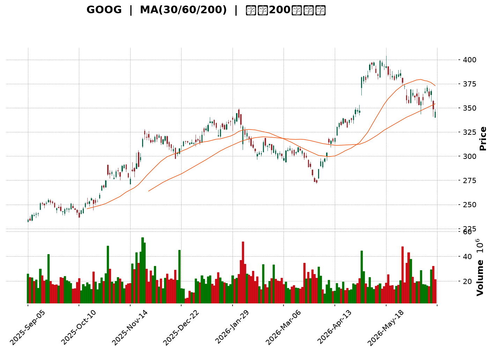
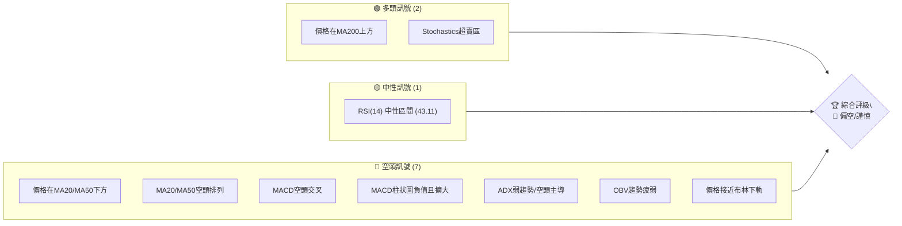
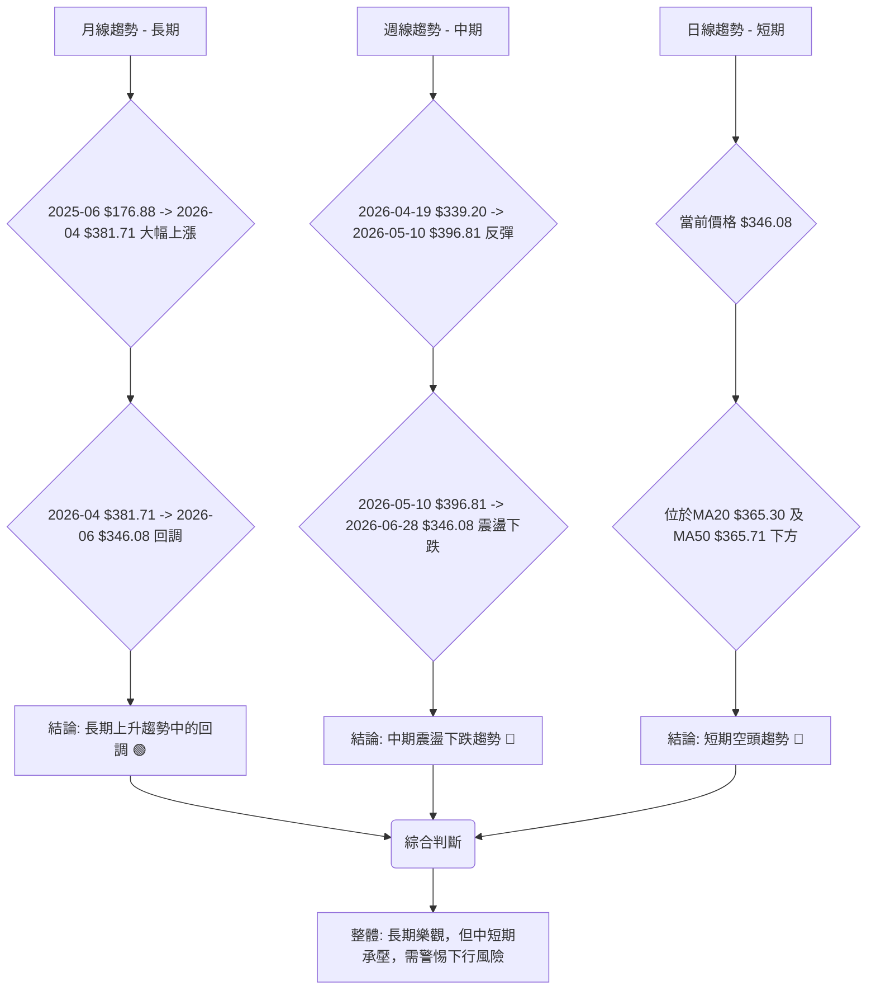

<details>
<summary>📊 靜態圖表 (點擊展開)</summary>

</details>

<html>
<head><meta charset="utf-8" /></head>
<body>
    <div style="height:500px; width:100%;">                        <script>window.PlotlyConfig = {MathJaxConfig: 'local'};</script>
        <script charset="utf-8" src="https://cdn.plot.ly/plotly-3.6.0.min.js" integrity="sha256-QaOVwtVY0T02VaHrr6pnoHLCwayMJp4O5n4YyaE3rJk=" crossorigin="anonymous"></script>                <div id="candlestick-chart" class="plotly-graph-div" style="height:100%; width:100%;"></div>            <script>                window.PLOTLYENV=window.PLOTLYENV || {};                                if (document.getElementById("candlestick-chart")) {                    Plotly.newPlot(                        "candlestick-chart",                        [{"close":{"dtype":"f8","bdata":"AAAAAANQbUAAAABAdjZtQAAAAGAP721AAAAAgOzibUAAAAAg4wluQAAAAOAMHW5AAAAAYI9ob0AAAACgs11vQAAAAGCPK29AAAAAwMN6b0AAAADgs9dvQAAAAIBUjG9AAAAAYBV7b0AAAADAC+tuQAAAACDOwm5AAAAAYEnWbkAAAAAgOXxuQAAAAMBaYm5AAAAAwOihbkAAAABgVb5uQAAAAAD5vm5AAAAAYJNgb0AAAADAsNRuQAAAAOBan25AAAAAAI83bkAAAABA0KBtQAAAAGAqhW5AAAAAQKu2bkAAAACg9mZvQAAAAKBkbG9AAAAAoGSpb0AAAACARghwQAAAAIAlW29AAAAA4CaBb0AAAAAAeqdvQAAAAKABQHBAAAAAYG7WcEAAAACAer5wQAAAAIAbKnFAAAAAoJOVcUAAAACgTJRxQAAAAAAHuXFAAAAAwEFYcUAAAABgFsNxQAAAAGCCzHFAAAAAIHJycUAAAABAWCByQAAAAGC1MnJAAAAAQOLtcUAAAAAAL2lxQAAAAMACR3FAAAAAQKnQcUAAAADgcMZxQAAAAGCrRnJAAAAAwJoWckAAAABgBbFyQAAAAGCN3XNAAAAAQBwwdEAAAACAdPpzQAAAAIDm93NAAAAAgA6oc0AAAADAbbZzQAAAAIDi\u002f3NAAAAAYEbcc0AAAADgWxd0QAAAAGCioHNAAAAAgF3Vc0AAAAAgTAl0QAAAAGCmlHNAAAAAANZhc0AAAABAqU5zQAAAACBBNXNAAAAAgLyackAAAABgqPVyQAAAAOBQQ3NAAAAAYMduc0AAAADgSbRzQAAAAAAhtHNAAAAAgMioc0AAAAAArZ9zQAAAAGA7onNAAAAAYD+Wc0AAAABAia5zQAAAAIB+znNAAAAAYDuic0AAAADAJSB0QAAAAEBaWXRAAAAAIF6LdEAAAACAu8R0QAAAAODa\u002f3RAAAAAAPD9dEAAAACAmst0QAAAAOCKnnRAAAAAQNUbdEAAAABAOX90QAAAACCIpnRAAAAAwAWAdEAAAACAedJ0QAAAAEAB6XRAAAAAYHX9dEAAAAAgfSN1QAAAAGBpIXVAAAAAwDKHdUAAAAAgFkR1QAAAAMB6znRAAAAAgFyudEAAAACg2ip0QAAAAGCgP3RAAAAAYG3jc0AAAABgx25zQAAAAMB1T3NAAAAAIO4Zc0AAAAAAzOZyQAAAAKCx+HJAAAAAAJ\u002fyckAAAAAg06dzQAAAACCIdHNAAAAAYDpoc0AAAACg8YlzQAAAAKD8K3NAAAAAgGBwc0AAAADgXB9zQAAAAACf8nJAAAAAQN3wckAAAADgRshyQAAAAECSnnJAAAAAIDcdc0AAAAAg7StzQAAAAIDAQ3NAAAAAIHHwckAAAACAddRyQAAAAGDKA3NAAAAAIJVTc0AAAAAg2iFzQAAAAOC8GHNAAAAAwMOpckAAAABAca1yQAAAAMBqEHJAAAAAIKcWckAAAABgI4lxQAAAAICGGXFAAAAAoJwPcUAAAADA\u002f+pxQAAAAOCPa3JAAAAAoIZkckAAAAAAspdyQAAAAID0+3JAAAAAoM+oc0AAAAAg4MJzQAAAAEB7uHNAAAAAwEnwc0AAAABAGaZ0QAAAACBN5HRAAAAAAB7JdEAAAABAIjN1QAAAACAs83RAAAAAAFekdEAAAAAgbhh1QAAAAOC\u002fGHVAAAAAYNNhdUAAAABA98R1QAAAAOCntHVAAAAAIJ6xdUAAAABAXdt3QAAAAADV73dAAAAAQJa2d0AAAAAgnwB4QAAAAABwrnhAAAAA4P6weEAAAACg+sx4QAAAAACZKHhAAAAAIG35d0AAAADAzOx4QAAAAODlznhAAAAAwFWReEAAAAAA+o14QAAAACCyCnhAAAAAILIKeEAAAABg1PN3QAAAAOBtsndAAAAAgLwJeEAAAACAkwl4QAAAAEA0HnhAAAAA4EGDd0AAAADAsUV3QAAAAIDKYnZAAAAAAHU3dkAAAAAgxBB3QAAAAOCj2HZAAAAAYLiSdkAAAADgo6R2QAAAAMAeFXZAAAAAwPVIdkAAAABgj2J2QAAAAIDC8XZAAAAAoJkxd0AAAACgmaF2QAAAACBc93ZAAAAA4HrMdUAAAACgR6F1QA=="},"high":{"dtype":"f8","bdata":"OG9P+6RubUAtN3dN4L1tQDizZ7XRA25A+gnM\u002fWczbkCIGG4wDkNuQOIyMGlcPm5AARmOoi2Ib0DAFK0egpdvQK6X79igbm9A1zyZPpK0b0AXizZtKgNwQJZBdQjg+W9An83SDrHIb0ArkuCJ4o5vQB50qS+Z2m5AlPO7wi40b0AJUbuU+2RvQAWqM79YZm5ANan4ElTVbkBJsH5w0eRuQE0Zl4tO1G5ABhdM0Zx2b0BsCXCL2mFvQAlFuYfX2G5A+BmshWOibkAwsZ+WjYtuQB0MFQRYkG5Ar5QGGEbxbkC2JG1Mf4hvQLgdNMQ3EXBAYM1RiDTMb0BZ9u47AhZwQGTfKIIs3G9AF2O9jdQKcEAAL6bdgOtvQKs0hpnxX3BA5W1q51LkcEAA\u002fQ8dlu1wQDFPAtfhNnFAHRo6Ir41ckCVdzp5mdtxQIPc0SoX1nFAgfKU4oWUcUDzGAUAOuJxQP6jcrLrA3JAJaAjahi\u002fcUDk2nLHPC5yQP+cPDFKPHJA5zy+\u002f5s8ckBbF\u002f9SSa9xQOcKyZypaXFAqZ1KBxpfckBpxdWk5g1yQPY+DCd6+nJAfqiKo6Ikc0C\u002f8iGX2PVyQPL661fK8nNA93kh0m6AdECr1F7iqkV0QFHdqFXZY3RARqGyXBPwc0DTgtbToN9zQFZaO3+PFnRAIynWpHgndEC8N+3uJDN0QGZjBQL5DHRAM8epf7Dkc0CwY3r5Mhd0QDAwp88dGXRAueZUlaO7c0D1MI6uq4RzQI7yvyACd3NAUjSa+qlMc0BHVLhNyQ1zQEGt\u002f1djSXNA\u002fdqgBbF0c0CDiZ0PMr5zQNirli8JvnNAFHF3klnCc0B+OlqG8ahzQNEUfQmR1HNAAL4voKevc0C3lUeo4Sd0QJ5w4W5V7XNAq2x25z4SdEAHSneOn2B0QPbUtOi8oXRAIDTqPcKwdEA\u002fkPF7DuB0QE6lhGATTHVAYoy2RnEJdUDh5u4OBRt1QCAe7Q7X7HRAoXcGzZZ6dEBQ0XImp8R0QNUQ6ENc7HRAiLk3cYHZdECmgz2\u002fk\u002f50QLcfbbBgHHVArIasyAcTdUDYAa84fl11QHvYqveIPXVA8ENZ1W6LdUA\u002fAc+8Ftt1QAc3Lc7PfHVA\u002fMbSuVvDdED0aawyVqN0QCSZmSX\u002fdHRApNrsVl0TdEB49jQxBAp0QJ0DPV4SwXNA9vu1aMpHc0CN+kGv3wdzQCGHTDgsGHNADzDJ6xYac0A0yrzOi8VzQB6YHP6b8HNAjobNv2V\u002fc0AF1uXBApRzQFdJKPt2iXNA\u002fEGEZsN6c0AU2CdczjtzQCns9Xex+HJABZ+aYfsQc0DD6KjZle9yQHNIKUYCv3JA9A766gwlc0AA++\u002fHbE9zQPo4ODkcbnNAj3NUH0VHc0DPXEoWNDFzQP6usOotFnNAl2Fh7NBdc0C3XV5pAmlzQJdJ0qjtJ3NAx1+uoP0Cc0A1vK4oAPNyQDpzbqm9jnJAIbskYrlnckD9hdSle+VxQGMBJ\u002f7AbnFAO0pfcIBBcUDicCmICe5xQMz9ZGbknHJA+Tq7U417ckCazX997aNyQJMBx3Ss\u002fnJAMIliqyrzc0CRIIJD09NzQKp+0c\u002fs9HNAFDRBVc7zc0AZsiT6Dqd0QCZZvbHG7HRAtyxTRNUSdUAF2xDvfDx1QB\u002f6v9xLL3VAN7aIvnkPdUB7d88iOh11QGF3+U9JP3VAUtjuf7t3dUC6iPTiBet1QPVYU1YI23VA5dYvv\u002f8SdkB6x83MZeZ3QHTdxfSM8ndA6ZHQ0C7\u002fd0AQGOjRnUt4QOY17\u002fFDwnhAxYbqL9vReEApNYkfFuJ4QHsA6B98oXhAEW+JK1IjeEDFwKzuB\u002ft4QFtbOrzS7XhA0LhtMUW6eEAtlzGjoEN5QJWnecYFknhAEcL+tXBneECB1QmqI0d4QFQ0n1k3CnhAVPcZBYgSeEBE5pxw2Vd4QOSk8DA\u002fXHhAZ3zVI7rWd0COagfG\u002fmV3QDYhqckUGXdA2kHD8oKkdkAquORLMxp3QFVYXKalD3dAAAAAgBS2dkAAAABgEht3QAAAAMD15HZAAAAAAClgdkAAAABAXsx2QAAAAGBmKndAAAAAoJlZd0AAAABgZiJ3QAAAAAAAEHdAAAAAQDNjdkAAAAAghct1QA=="},"hovertemplate":"\u003cb\u003e%{x|%Y-%m-%d}\u003c\u002fb\u003e\u003cbr\u003e\u958b: $%{open:.2f}\u003cbr\u003e\u9ad8: $%{high:.2f}\u003cbr\u003e\u4f4e: $%{low:.2f}\u003cbr\u003e\u6536: $%{close:.2f}\u003cextra\u003e\u003c\u002fextra\u003e","low":{"dtype":"f8","bdata":"Pg15dPz2bEA03hqEuihtQErRVgCNHW1AvOuLXJ20bUCyw6AOwINtQMm\u002f9gYSwW1A97CVRgaQbkAuC5eSPydvQJgm9uYfw25AMWxqE90zb0CMkvSUZXJvQPYHNCw4Sm9AEBYpaClTb0DZfo9mkNduQD94UzisJW5AmB5OZwrFbkBKTfX2LFduQPJsaING421AcO3WGW3XbUD8RsJIJFRuQOFtl6fcP25Astg+RLOmbkDfl8tgeMpuQGWP7q2Jk25AQIwFq8HmbUC6noyGGodtQO5x69btCG5AYVaNMZkWbkByY1m41MluQBrS7aO\u002fRW9ACkyMlFEDb0APyb9HQ8NvQLdQLsMfhm5AtlcKEcE+b0CTbJHKwIhvQPfg7isr829APJ\u002fBW7+GcEAgPGq4W6pwQE4\u002fmmF6vnBArLA8Hmx+cUB0QiqOrk9xQCUW9gslfXFAKWs\u002fkyxFcUCxqSPsYVVxQAoNWA4bkXFAqKLmmjUzcUCfXhP9w69xQC6tzM0R9XFAnLoL8C29cUD262J5TFdxQFe2kqEQ7nBAQtsjusi6cUAPRKVsbWdxQNHwiGC38XFAqxpnfasJckC1ihzji1xyQMgpd0y3THNAeYqWyhvTc0CiAf6NRclzQMIj5roexXNAbdRtQtqVc0C4Fihsr5lzQLORw6ykmnNAIDB074+vc0AcLQJIqvVzQOtV1RMMeHNApZQCbGSDc0DyUS5v0K9zQKqEdAucV3NAO7OkR\u002fMoc0DP4yejdBVzQH9PE3nv9nJA67i3Qv2QckC+iF2NzcNyQNtC5YMg33JAFZmRtgkjc0AztxH6gmVzQF5mye+TjnNAvFreIPiUc0CRe1Ev43dzQAol6ZJ1jXNAT29tba58c0AJ04HW6WNzQFsiGrJmrXNA5DgqEOt+c0DqhXjjbqFzQKNbY70dGXRAYvy8EjBddEBrBUr4XFF0QCbRVV6e3nRAM0HfYlOrdEDEBPL+uK10QD3AXjnee3RA18vuKYoHdEAlelng9\u002fFzQLd0I3o2h3RAUjJuFax4dEAnRip7AHF0QKwxke4H1XRApXzILiW7dEC97sGysmR0QAQ+o3tLw3RAAxY75ST5dEB4J0\u002fHXiJ1QIc4wtgKj3RAIBjKu08oc0BJxaEkt\u002ftzQLgVJxCR1HNAIkxieP2jc0DryiWqmltzQAxjhSX3O3NAfyL29A34ckCG4VtFM4hyQKgCAfpf2XJASLT2EnHEckDUauYkXQBzQOjfW\u002fZdWXNARjmJcQwbc0CRHxHeTE9zQPd19PU+4HJAHGVB5x3zckBlr6h0rMpyQMgLUQ39hHJAw\u002f826oTGckCdOlpu5ZpyQEP8lc3VbXJA4NyHIg1cckCX5KmdBRJzQCWNRxt\u002fGnNADm68dovKckDAbXdjmLlyQPQdKC4O2nJAO\u002fEx16sCc0Am7ymcxxVzQMjMV2cazXJAnSSk5iSJckCOjFWwnJ1yQFwYmHnmCnJAeF0+eCfzcUBIGdhJHW5xQPxnm1AMFXFAFZ8zdPL1cEBGtz4if0lxQFXXhQC8FHJAxbTLOVr2cUBkDe8I0FlyQAJY3fP0c3JA+qloQ0WIc0BZOYK\u002filRzQIiTQ+icpXNAWS04eQWYc0CYaAQ7Tw90QMTaQbBlh3RApxpqQjW3dEBD\u002f1vNbtF0QGDzlyXc5nRABbPBceiWdEC2xD\u002fgJ8x0QFn9n0C87XRAo+D3v5XddEBi6Jwerkl1QGI62q4qgXVA7mmzpZVjdUDyRgQR8q12QKFOWXyMcHdAihgDsrGId0D\u002fl2yI8MF3QIWP2+7fLXhA9t0jKzRheEC3npWT7pZ4QPd6kJT2H3hA3Z3smd23d0CuaUaEm9V3QPDxllHeh3hAapJDxWhYeEBTqNlRo2p4QLXmTW5Q7HdAa6te0le8d0AmjIA0B7R3QMY5WSKFoHdAotj\u002fapeud0Bm6u3YUtx3QO+Gbr9U0HdAbJ5bnzJhd0CgAQdSzRd3QImzMFqVLHZAiBfgc6sidkBM6yCmYil2QJRs1IyZlnZAAAAAgD1edkAAAAAghSt2QAAAAMD1DHZAAAAAgBR6dUAAAACgcBV2QAAAAGBmynZAAAAAwB7VdkAAAAAgroN2QAAAAGC6SXZAAAAAQApPdUAAAACgcDt1QA=="},"name":"\u50f9\u683c","open":{"dtype":"f8","bdata":"ahR1rOv\u002fbEAIOPoAhWptQMyWVIVrN21AeDrA9wXZbUCncJ6BcvVtQInqZ8uGCm5AJp8tdiKVbkAAWc7Kw3pvQDUTFrP6Xm9AUogmCMFrb0CXVYT875xvQFjVRs0CyW9A+kYqzRSlb0CvqP\u002fkA3VvQPEfXJmNi25Abzn27ZvpbkBQI5gCQvluQG0BMXq0Um5AHNnnfqkWbkDIDPBoGqVuQKFT80wCmG5ATCsKE5OpbkAZ4L5nLQ5vQAXuQgT9tm5AO7JRdJSSbkBz0U4J9jVuQKTkNRrfEW5AY3tj0gYpbkB14o63MPNuQMfdIYATf29A+FnXWXdbb0D320YPYtdvQN3FfpcF2G9A3CXcQVvQb0Be8BG7hKZvQCvHhBi\u002fDHBA2VtDPnSNcEBGlWlRvtpwQBqSYzBawXBAL2n3sGMyckAf1hNnaqpxQIQh\u002fH7hnXFAT3v5OF5IcUALNUDnVW1xQJzBzxXR0nFAxCUD3Xa6cUBnbrXKT8txQGBVYv0t+nFAj3TN0zc4ckCle\u002fMH56ZxQP0SvT7P9XBAur0Pl2\u002fdcUCzyIEBu\u002f5xQMaFzKH08XFAF06AXU0Cc0Aad3bGoIRyQNw3\u002fQVtZnNA3FoNLpJidED38Vh+cAJ0QKlVbrrBLHRA3Uk1wanNc0BjZOwye8RzQEprHqeWtnNA4KmS85smdEAMyQH\u002f+\u002fVzQJp4udPGCXRAVBIn+w+Lc0Baz7MJT8NzQLBBizHlCnRAaZ7ipSWmc0D7JDXVeINzQO\u002fdeD+cGXNAbdbBN7VJc0Dy\u002fjDQoepyQLSJScv87XJAZdOp7xltc0D1cTvrqWtzQA3YL2\u002fMu3NAGkBBnh+4c0AWrmGkloZzQL729RcEkHNA5VdobGCPc0BQrrf9ztJzQLDC03581HNA0dYvn1XOc0DnEqxDjaJzQPdkiFldjXRAsuDqcQBxdEA8uIatLmF0QPtesqV67XRA8xo31cPodEAg6ZQ10hl1QJr7RXD353RArxMByyENdEBM8ozQ0Ap0QEToDbFC3XRAlc2zyojDdEAqrJTvWHx0QFcS3mES83RAiqpzPLsCdUCodWRXfj51QAiTP2Fg4HRAJmxQwsUBdUC8\u002fhWa9sB1QN3SjfPmdHVAglnvCamMc0Bdk4now250QIPMGeQhDXRAoxMlENwHdEAfEoMWs+hzQIeH+vETf3NAvc0iP1Q5c0Dx\u002fkBn9sNyQL4Ege+Y4HJAPlBCrwDickDJkPB8bwZzQPB7IY2T63NAVJIo\u002f8Bjc0CLDEEdZ3tzQHXF\u002fkVZhnNAJAyribH4ckD7es0lHelyQGzFGhp9oHJA98fS1qPkckDGPkWC3uxyQNwzx0j4enJAd207YVRfckC2Dld5DhtzQBzWJhnaIXNAcNbsu2kgc0DsSNVzhydzQJdPL6Wt9nJAWitgzckHc0CMaLdLhDtzQD9kcRVx8HJA5XTinTH+ckBpmLeHlsVyQOi5xFqCgHJAaZ1OkZY\u002fckDBvs4ySeBxQDO4G+i6U3FAXraCtWM0cUAd+UgW+FVxQOQ+4L7jHHJA+3sn+g4NckAn5PYqXWhyQPA3OxZav3JAMhU+ozjac0BOnnm1BpBzQBzFAJSJ4HNAiQ0tVq+zc0Bnw\u002ffZ8B10QGpr92HHpXRAPklXKV76dEByBmleqeN0QLPMJLezJXVAuA4nZiH2dECHvjgC8Op0QAv476DuNXVA1dZCFUUYdUCiAGROxXp1QKgPzK1hq3VADNEgAluUdUBlSDXTgTB3QKKj2egKnHdAmI7V5XDhd0BpWrupPtp3QCPOacywVXhAfXP6iSPNeECbjjWZhqB4QA5VpbdHZ3hAV5zDd0sMeEDiD0n3zdp3QAnJxrPZmHhAKco64qePeEAC7jvtOX54QBdvOM4DkXhAUsKxR+8MeEA\u002ffNLYe9x3QAs8\u002ftB48HdAQ3AO2UDMd0B1VGt2juh3QImOWtEQ+ndAidPdb+7Pd0BHHyNjnUV3QKZ8ap8Qr3ZAdxuMVelhdkDJz3mSnjN2QIzzFj2VsnZAAAAAgMKndkAAAAAAKc52QAAAAMDMkHZAAAAAwMwQdkAAAACgmZF2QAAAAADX33ZAAAAAoHD3dkAAAADAzPB2QAAAAIA9vnZAAAAAAClSdkAAAAAgrkF1QA=="},"x":["2025-09-05T00:00:00-04:00","2025-09-08T00:00:00-04:00","2025-09-09T00:00:00-04:00","2025-09-10T00:00:00-04:00","2025-09-11T00:00:00-04:00","2025-09-12T00:00:00-04:00","2025-09-15T00:00:00-04:00","2025-09-16T00:00:00-04:00","2025-09-17T00:00:00-04:00","2025-09-18T00:00:00-04:00","2025-09-19T00:00:00-04:00","2025-09-22T00:00:00-04:00","2025-09-23T00:00:00-04:00","2025-09-24T00:00:00-04:00","2025-09-25T00:00:00-04:00","2025-09-26T00:00:00-04:00","2025-09-29T00:00:00-04:00","2025-09-30T00:00:00-04:00","2025-10-01T00:00:00-04:00","2025-10-02T00:00:00-04:00","2025-10-03T00:00:00-04:00","2025-10-06T00:00:00-04:00","2025-10-07T00:00:00-04:00","2025-10-08T00:00:00-04:00","2025-10-09T00:00:00-04:00","2025-10-10T00:00:00-04:00","2025-10-13T00:00:00-04:00","2025-10-14T00:00:00-04:00","2025-10-15T00:00:00-04:00","2025-10-16T00:00:00-04:00","2025-10-17T00:00:00-04:00","2025-10-20T00:00:00-04:00","2025-10-21T00:00:00-04:00","2025-10-22T00:00:00-04:00","2025-10-23T00:00:00-04:00","2025-10-24T00:00:00-04:00","2025-10-27T00:00:00-04:00","2025-10-28T00:00:00-04:00","2025-10-29T00:00:00-04:00","2025-10-30T00:00:00-04:00","2025-10-31T00:00:00-04:00","2025-11-03T00:00:00-05:00","2025-11-04T00:00:00-05:00","2025-11-05T00:00:00-05:00","2025-11-06T00:00:00-05:00","2025-11-07T00:00:00-05:00","2025-11-10T00:00:00-05:00","2025-11-11T00:00:00-05:00","2025-11-12T00:00:00-05:00","2025-11-13T00:00:00-05:00","2025-11-14T00:00:00-05:00","2025-11-17T00:00:00-05:00","2025-11-18T00:00:00-05:00","2025-11-19T00:00:00-05:00","2025-11-20T00:00:00-05:00","2025-11-21T00:00:00-05:00","2025-11-24T00:00:00-05:00","2025-11-25T00:00:00-05:00","2025-11-26T00:00:00-05:00","2025-11-28T00:00:00-05:00","2025-12-01T00:00:00-05:00","2025-12-02T00:00:00-05:00","2025-12-03T00:00:00-05:00","2025-12-04T00:00:00-05:00","2025-12-05T00:00:00-05:00","2025-12-08T00:00:00-05:00","2025-12-09T00:00:00-05:00","2025-12-10T00:00:00-05:00","2025-12-11T00:00:00-05:00","2025-12-12T00:00:00-05:00","2025-12-15T00:00:00-05:00","2025-12-16T00:00:00-05:00","2025-12-17T00:00:00-05:00","2025-12-18T00:00:00-05:00","2025-12-19T00:00:00-05:00","2025-12-22T00:00:00-05:00","2025-12-23T00:00:00-05:00","2025-12-24T00:00:00-05:00","2025-12-26T00:00:00-05:00","2025-12-29T00:00:00-05:00","2025-12-30T00:00:00-05:00","2025-12-31T00:00:00-05:00","2026-01-02T00:00:00-05:00","2026-01-05T00:00:00-05:00","2026-01-06T00:00:00-05:00","2026-01-07T00:00:00-05:00","2026-01-08T00:00:00-05:00","2026-01-09T00:00:00-05:00","2026-01-12T00:00:00-05:00","2026-01-13T00:00:00-05:00","2026-01-14T00:00:00-05:00","2026-01-15T00:00:00-05:00","2026-01-16T00:00:00-05:00","2026-01-20T00:00:00-05:00","2026-01-21T00:00:00-05:00","2026-01-22T00:00:00-05:00","2026-01-23T00:00:00-05:00","2026-01-26T00:00:00-05:00","2026-01-27T00:00:00-05:00","2026-01-28T00:00:00-05:00","2026-01-29T00:00:00-05:00","2026-01-30T00:00:00-05:00","2026-02-02T00:00:00-05:00","2026-02-03T00:00:00-05:00","2026-02-04T00:00:00-05:00","2026-02-05T00:00:00-05:00","2026-02-06T00:00:00-05:00","2026-02-09T00:00:00-05:00","2026-02-10T00:00:00-05:00","2026-02-11T00:00:00-05:00","2026-02-12T00:00:00-05:00","2026-02-13T00:00:00-05:00","2026-02-17T00:00:00-05:00","2026-02-18T00:00:00-05:00","2026-02-19T00:00:00-05:00","2026-02-20T00:00:00-05:00","2026-02-23T00:00:00-05:00","2026-02-24T00:00:00-05:00","2026-02-25T00:00:00-05:00","2026-02-26T00:00:00-05:00","2026-02-27T00:00:00-05:00","2026-03-02T00:00:00-05:00","2026-03-03T00:00:00-05:00","2026-03-04T00:00:00-05:00","2026-03-05T00:00:00-05:00","2026-03-06T00:00:00-05:00","2026-03-09T00:00:00-04:00","2026-03-10T00:00:00-04:00","2026-03-11T00:00:00-04:00","2026-03-12T00:00:00-04:00","2026-03-13T00:00:00-04:00","2026-03-16T00:00:00-04:00","2026-03-17T00:00:00-04:00","2026-03-18T00:00:00-04:00","2026-03-19T00:00:00-04:00","2026-03-20T00:00:00-04:00","2026-03-23T00:00:00-04:00","2026-03-24T00:00:00-04:00","2026-03-25T00:00:00-04:00","2026-03-26T00:00:00-04:00","2026-03-27T00:00:00-04:00","2026-03-30T00:00:00-04:00","2026-03-31T00:00:00-04:00","2026-04-01T00:00:00-04:00","2026-04-02T00:00:00-04:00","2026-04-06T00:00:00-04:00","2026-04-07T00:00:00-04:00","2026-04-08T00:00:00-04:00","2026-04-09T00:00:00-04:00","2026-04-10T00:00:00-04:00","2026-04-13T00:00:00-04:00","2026-04-14T00:00:00-04:00","2026-04-15T00:00:00-04:00","2026-04-16T00:00:00-04:00","2026-04-17T00:00:00-04:00","2026-04-20T00:00:00-04:00","2026-04-21T00:00:00-04:00","2026-04-22T00:00:00-04:00","2026-04-23T00:00:00-04:00","2026-04-24T00:00:00-04:00","2026-04-27T00:00:00-04:00","2026-04-28T00:00:00-04:00","2026-04-29T00:00:00-04:00","2026-04-30T00:00:00-04:00","2026-05-01T00:00:00-04:00","2026-05-04T00:00:00-04:00","2026-05-05T00:00:00-04:00","2026-05-06T00:00:00-04:00","2026-05-07T00:00:00-04:00","2026-05-08T00:00:00-04:00","2026-05-11T00:00:00-04:00","2026-05-12T00:00:00-04:00","2026-05-13T00:00:00-04:00","2026-05-14T00:00:00-04:00","2026-05-15T00:00:00-04:00","2026-05-18T00:00:00-04:00","2026-05-19T00:00:00-04:00","2026-05-20T00:00:00-04:00","2026-05-21T00:00:00-04:00","2026-05-22T00:00:00-04:00","2026-05-26T00:00:00-04:00","2026-05-27T00:00:00-04:00","2026-05-28T00:00:00-04:00","2026-05-29T00:00:00-04:00","2026-06-01T00:00:00-04:00","2026-06-02T00:00:00-04:00","2026-06-03T00:00:00-04:00","2026-06-04T00:00:00-04:00","2026-06-05T00:00:00-04:00","2026-06-08T00:00:00-04:00","2026-06-09T00:00:00-04:00","2026-06-10T00:00:00-04:00","2026-06-11T00:00:00-04:00","2026-06-12T00:00:00-04:00","2026-06-15T00:00:00-04:00","2026-06-16T00:00:00-04:00","2026-06-17T00:00:00-04:00","2026-06-18T00:00:00-04:00","2026-06-22T00:00:00-04:00","2026-06-23T00:00:00-04:00"],"type":"candlestick"},{"hovertemplate":"MA30: $%{y:.2f}\u003cextra\u003e\u003c\u002fextra\u003e","line":{"color":"#2196F3","dash":"dash","width":2},"mode":"lines","name":"MA30","x":["2025-09-05T00:00:00-04:00","2025-09-08T00:00:00-04:00","2025-09-09T00:00:00-04:00","2025-09-10T00:00:00-04:00","2025-09-11T00:00:00-04:00","2025-09-12T00:00:00-04:00","2025-09-15T00:00:00-04:00","2025-09-16T00:00:00-04:00","2025-09-17T00:00:00-04:00","2025-09-18T00:00:00-04:00","2025-09-19T00:00:00-04:00","2025-09-22T00:00:00-04:00","2025-09-23T00:00:00-04:00","2025-09-24T00:00:00-04:00","2025-09-25T00:00:00-04:00","2025-09-26T00:00:00-04:00","2025-09-29T00:00:00-04:00","2025-09-30T00:00:00-04:00","2025-10-01T00:00:00-04:00","2025-10-02T00:00:00-04:00","2025-10-03T00:00:00-04:00","2025-10-06T00:00:00-04:00","2025-10-07T00:00:00-04:00","2025-10-08T00:00:00-04:00","2025-10-09T00:00:00-04:00","2025-10-10T00:00:00-04:00","2025-10-13T00:00:00-04:00","2025-10-14T00:00:00-04:00","2025-10-15T00:00:00-04:00","2025-10-16T00:00:00-04:00","2025-10-17T00:00:00-04:00","2025-10-20T00:00:00-04:00","2025-10-21T00:00:00-04:00","2025-10-22T00:00:00-04:00","2025-10-23T00:00:00-04:00","2025-10-24T00:00:00-04:00","2025-10-27T00:00:00-04:00","2025-10-28T00:00:00-04:00","2025-10-29T00:00:00-04:00","2025-10-30T00:00:00-04:00","2025-10-31T00:00:00-04:00","2025-11-03T00:00:00-05:00","2025-11-04T00:00:00-05:00","2025-11-05T00:00:00-05:00","2025-11-06T00:00:00-05:00","2025-11-07T00:00:00-05:00","2025-11-10T00:00:00-05:00","2025-11-11T00:00:00-05:00","2025-11-12T00:00:00-05:00","2025-11-13T00:00:00-05:00","2025-11-14T00:00:00-05:00","2025-11-17T00:00:00-05:00","2025-11-18T00:00:00-05:00","2025-11-19T00:00:00-05:00","2025-11-20T00:00:00-05:00","2025-11-21T00:00:00-05:00","2025-11-24T00:00:00-05:00","2025-11-25T00:00:00-05:00","2025-11-26T00:00:00-05:00","2025-11-28T00:00:00-05:00","2025-12-01T00:00:00-05:00","2025-12-02T00:00:00-05:00","2025-12-03T00:00:00-05:00","2025-12-04T00:00:00-05:00","2025-12-05T00:00:00-05:00","2025-12-08T00:00:00-05:00","2025-12-09T00:00:00-05:00","2025-12-10T00:00:00-05:00","2025-12-11T00:00:00-05:00","2025-12-12T00:00:00-05:00","2025-12-15T00:00:00-05:00","2025-12-16T00:00:00-05:00","2025-12-17T00:00:00-05:00","2025-12-18T00:00:00-05:00","2025-12-19T00:00:00-05:00","2025-12-22T00:00:00-05:00","2025-12-23T00:00:00-05:00","2025-12-24T00:00:00-05:00","2025-12-26T00:00:00-05:00","2025-12-29T00:00:00-05:00","2025-12-30T00:00:00-05:00","2025-12-31T00:00:00-05:00","2026-01-02T00:00:00-05:00","2026-01-05T00:00:00-05:00","2026-01-06T00:00:00-05:00","2026-01-07T00:00:00-05:00","2026-01-08T00:00:00-05:00","2026-01-09T00:00:00-05:00","2026-01-12T00:00:00-05:00","2026-01-13T00:00:00-05:00","2026-01-14T00:00:00-05:00","2026-01-15T00:00:00-05:00","2026-01-16T00:00:00-05:00","2026-01-20T00:00:00-05:00","2026-01-21T00:00:00-05:00","2026-01-22T00:00:00-05:00","2026-01-23T00:00:00-05:00","2026-01-26T00:00:00-05:00","2026-01-27T00:00:00-05:00","2026-01-28T00:00:00-05:00","2026-01-29T00:00:00-05:00","2026-01-30T00:00:00-05:00","2026-02-02T00:00:00-05:00","2026-02-03T00:00:00-05:00","2026-02-04T00:00:00-05:00","2026-02-05T00:00:00-05:00","2026-02-06T00:00:00-05:00","2026-02-09T00:00:00-05:00","2026-02-10T00:00:00-05:00","2026-02-11T00:00:00-05:00","2026-02-12T00:00:00-05:00","2026-02-13T00:00:00-05:00","2026-02-17T00:00:00-05:00","2026-02-18T00:00:00-05:00","2026-02-19T00:00:00-05:00","2026-02-20T00:00:00-05:00","2026-02-23T00:00:00-05:00","2026-02-24T00:00:00-05:00","2026-02-25T00:00:00-05:00","2026-02-26T00:00:00-05:00","2026-02-27T00:00:00-05:00","2026-03-02T00:00:00-05:00","2026-03-03T00:00:00-05:00","2026-03-04T00:00:00-05:00","2026-03-05T00:00:00-05:00","2026-03-06T00:00:00-05:00","2026-03-09T00:00:00-04:00","2026-03-10T00:00:00-04:00","2026-03-11T00:00:00-04:00","2026-03-12T00:00:00-04:00","2026-03-13T00:00:00-04:00","2026-03-16T00:00:00-04:00","2026-03-17T00:00:00-04:00","2026-03-18T00:00:00-04:00","2026-03-19T00:00:00-04:00","2026-03-20T00:00:00-04:00","2026-03-23T00:00:00-04:00","2026-03-24T00:00:00-04:00","2026-03-25T00:00:00-04:00","2026-03-26T00:00:00-04:00","2026-03-27T00:00:00-04:00","2026-03-30T00:00:00-04:00","2026-03-31T00:00:00-04:00","2026-04-01T00:00:00-04:00","2026-04-02T00:00:00-04:00","2026-04-06T00:00:00-04:00","2026-04-07T00:00:00-04:00","2026-04-08T00:00:00-04:00","2026-04-09T00:00:00-04:00","2026-04-10T00:00:00-04:00","2026-04-13T00:00:00-04:00","2026-04-14T00:00:00-04:00","2026-04-15T00:00:00-04:00","2026-04-16T00:00:00-04:00","2026-04-17T00:00:00-04:00","2026-04-20T00:00:00-04:00","2026-04-21T00:00:00-04:00","2026-04-22T00:00:00-04:00","2026-04-23T00:00:00-04:00","2026-04-24T00:00:00-04:00","2026-04-27T00:00:00-04:00","2026-04-28T00:00:00-04:00","2026-04-29T00:00:00-04:00","2026-04-30T00:00:00-04:00","2026-05-01T00:00:00-04:00","2026-05-04T00:00:00-04:00","2026-05-05T00:00:00-04:00","2026-05-06T00:00:00-04:00","2026-05-07T00:00:00-04:00","2026-05-08T00:00:00-04:00","2026-05-11T00:00:00-04:00","2026-05-12T00:00:00-04:00","2026-05-13T00:00:00-04:00","2026-05-14T00:00:00-04:00","2026-05-15T00:00:00-04:00","2026-05-18T00:00:00-04:00","2026-05-19T00:00:00-04:00","2026-05-20T00:00:00-04:00","2026-05-21T00:00:00-04:00","2026-05-22T00:00:00-04:00","2026-05-26T00:00:00-04:00","2026-05-27T00:00:00-04:00","2026-05-28T00:00:00-04:00","2026-05-29T00:00:00-04:00","2026-06-01T00:00:00-04:00","2026-06-02T00:00:00-04:00","2026-06-03T00:00:00-04:00","2026-06-04T00:00:00-04:00","2026-06-05T00:00:00-04:00","2026-06-08T00:00:00-04:00","2026-06-09T00:00:00-04:00","2026-06-10T00:00:00-04:00","2026-06-11T00:00:00-04:00","2026-06-12T00:00:00-04:00","2026-06-15T00:00:00-04:00","2026-06-16T00:00:00-04:00","2026-06-17T00:00:00-04:00","2026-06-18T00:00:00-04:00","2026-06-22T00:00:00-04:00","2026-06-23T00:00:00-04:00"],"y":{"dtype":"f8","bdata":"AAAAAAAA+H8AAAAAAAD4fwAAAAAAAPh\u002fAAAAAAAA+H8AAAAAAAD4fwAAAAAAAPh\u002fAAAAAAAA+H8AAAAAAAD4fwAAAAAAAPh\u002fAAAAAAAA+H8AAAAAAAD4fwAAAAAAAPh\u002fAAAAAAAA+H8AAAAAAAD4fwAAAAAAAPh\u002fAAAAAAAA+H8AAAAAAAD4fwAAAAAAAPh\u002fAAAAAAAA+H8AAAAAAAD4fwAAAAAAAPh\u002fAAAAAAAA+H8AAAAAAAD4fwAAAAAAAPh\u002fAAAAAAAA+H8AAAAAAAD4fwAAAAAAAPh\u002fAAAAAAAA+H8AAAAAAAD4fwAAANCBs25AmpmZmY3HbkARERGx499uQAAAAJAG7G5A7+7uTtX5bkCrqqqangdvQGZmZib8G29AAAAAEFQvb0B3d3fXb0FvQM3MzFxkXG9AVVVVJd97b0Dv7u4OK5hvQJqZmflsuW9AMzMzg87Ub0CamZlpHPxvQAAAAECxEnBAmpmZoQAkcECJiIg4nDxwQDMzM+NCVnBAVVVVFY9scECJiIig9X1wQN7d3dU1jnBAd3d3J1ugcECrqqoafrRwQN7d3dXKzXBA7+7uRjjncEDe3d2VTghxQAAAACCbL3FAIiIi8tRYcUAAAAC4VH1xQGZmZoanoXFAMzMzu0zCcUCJiIhwtOFxQO\u002fu7vaUBnJAZmZmdqMpckAAAACgBk5yQImIiMjYanJAmpmZSWmEckB3d3dXgaByQCIiIpIftXJA3t3dHXfEckAAAADwNdNyQKuqqori33JA3t3dXaLqckDv7u5u2vRyQImIiMhYAXNA7+7ujkoSc0C8u7uLwR9zQHd3d3eaLHNAAAAA4F07c0ARERHxP05zQN7d3W1bYnNAiYiICHpxc0DNzMwcv4FzQO\u002fu7q7OjnNAREREtP6bc0BERESEO6hzQCIiIvJbrHNAzczMrGavc0BmZmbGJLZzQAAAADDxvnNAIiIiklbKc0C8u7vLk9NzQM3MzKzd2HNAmpmZCfzac0CamZlZct5zQFVVVTUt53NAvLu7e93sc0AiIiIykvNzQO\u002fu7o7q\u002fnNAIiIiEqMMdEC8u7u7Qxx0QJqZmXmrLHRAmpmZWZ5FdEDNzMysTFl0QM3MzLx4ZnRAd3d31x9xdECamZmZE3V0QKuqqvq5eXRAiYiIaK57dEB3d3cnDXp0QFVVVdVKd3RA3t3d\u002fSVzdEDNzMyMfWx0QO\u002fu7h5dZXRAMzMzk4JfdEAiIiLSf1t0QHd3dzffU3RAMzMz0ypKdEARERGhrD90QHd3dycUMHRAMzMzo9MidEARERFRjRR0QImIiLhJBnRAVVVVhVL8c0B3d3fXsO1zQImIiNhb3HNAiYiIKIjQc0CamZlpcsJzQImIiLhntHNARERElOeic0AAAAAgNI9zQKuqqkomfXNAVVVVxVxqc0AiIiKSJ1hzQM3MzCyQSXNAIiIi4lc4c0C8u7sroStzQAAAAED9GHNA7+7uTqEJc0DNzMwscflyQN7d3d2T5nJAAAAAwCrVckAzMzMTxsxyQAAAAMARyHJARERENFXDckCJiIgIQ7pyQM3MzBw+tnJAiYiIOGW4ckCamZkJS7pyQM3MzOz5vnJA7+7ubj3DckBmZma2Q9ByQFVVVZXa4HJAmpmZeZjwckAzMzNjOQVzQCIiImIcGXNAq6qq+iUmc0De3d2tkDZzQKuqqsoyRnNAZmZmZgtbc0CrqqrKIHRzQLy7uxsXi3NAvLu7m0qfc0B3d3fHm8dzQCIiImLp8HNAd3d3dwEcdEDe3d3tcUl0QCIiIpLpgXRARERE1EG6dECJiIh4QPh0QCIiItJ8NHVAzczMPHtvdUBmZmZWRqt1QERERDTJ4XVAZmZmxnoWdkCrqqoKW0l2QO\u002fu7n6DdHZAmpmZ6eiZdkCamZnJrL12QGZmZkab33ZAERERkZYCd0CrqqoKgR93QO\u002fu7r4IO3dAVVVVNU5Sd0CJiIio\u002fWN3QLy7u6s+cHdAq6qqmq59d0BVVVVFfo53QFVVVUVsnXdAmpmZCZand0CamZm5Cq93QDMzM+NBsndAd3d3V023d0AiIiLyvap3QM3MzNxFondAq6qqCtedd0CJiIioI5J3QM3MzNyAg3dAvLu7y9Fqd0C8u7tLw093QA=="},"type":"scatter"},{"hovertemplate":"MA60: $%{y:.2f}\u003cextra\u003e\u003c\u002fextra\u003e","line":{"color":"#9C27B0","dash":"dash","width":2},"mode":"lines","name":"MA60","x":["2025-09-05T00:00:00-04:00","2025-09-08T00:00:00-04:00","2025-09-09T00:00:00-04:00","2025-09-10T00:00:00-04:00","2025-09-11T00:00:00-04:00","2025-09-12T00:00:00-04:00","2025-09-15T00:00:00-04:00","2025-09-16T00:00:00-04:00","2025-09-17T00:00:00-04:00","2025-09-18T00:00:00-04:00","2025-09-19T00:00:00-04:00","2025-09-22T00:00:00-04:00","2025-09-23T00:00:00-04:00","2025-09-24T00:00:00-04:00","2025-09-25T00:00:00-04:00","2025-09-26T00:00:00-04:00","2025-09-29T00:00:00-04:00","2025-09-30T00:00:00-04:00","2025-10-01T00:00:00-04:00","2025-10-02T00:00:00-04:00","2025-10-03T00:00:00-04:00","2025-10-06T00:00:00-04:00","2025-10-07T00:00:00-04:00","2025-10-08T00:00:00-04:00","2025-10-09T00:00:00-04:00","2025-10-10T00:00:00-04:00","2025-10-13T00:00:00-04:00","2025-10-14T00:00:00-04:00","2025-10-15T00:00:00-04:00","2025-10-16T00:00:00-04:00","2025-10-17T00:00:00-04:00","2025-10-20T00:00:00-04:00","2025-10-21T00:00:00-04:00","2025-10-22T00:00:00-04:00","2025-10-23T00:00:00-04:00","2025-10-24T00:00:00-04:00","2025-10-27T00:00:00-04:00","2025-10-28T00:00:00-04:00","2025-10-29T00:00:00-04:00","2025-10-30T00:00:00-04:00","2025-10-31T00:00:00-04:00","2025-11-03T00:00:00-05:00","2025-11-04T00:00:00-05:00","2025-11-05T00:00:00-05:00","2025-11-06T00:00:00-05:00","2025-11-07T00:00:00-05:00","2025-11-10T00:00:00-05:00","2025-11-11T00:00:00-05:00","2025-11-12T00:00:00-05:00","2025-11-13T00:00:00-05:00","2025-11-14T00:00:00-05:00","2025-11-17T00:00:00-05:00","2025-11-18T00:00:00-05:00","2025-11-19T00:00:00-05:00","2025-11-20T00:00:00-05:00","2025-11-21T00:00:00-05:00","2025-11-24T00:00:00-05:00","2025-11-25T00:00:00-05:00","2025-11-26T00:00:00-05:00","2025-11-28T00:00:00-05:00","2025-12-01T00:00:00-05:00","2025-12-02T00:00:00-05:00","2025-12-03T00:00:00-05:00","2025-12-04T00:00:00-05:00","2025-12-05T00:00:00-05:00","2025-12-08T00:00:00-05:00","2025-12-09T00:00:00-05:00","2025-12-10T00:00:00-05:00","2025-12-11T00:00:00-05:00","2025-12-12T00:00:00-05:00","2025-12-15T00:00:00-05:00","2025-12-16T00:00:00-05:00","2025-12-17T00:00:00-05:00","2025-12-18T00:00:00-05:00","2025-12-19T00:00:00-05:00","2025-12-22T00:00:00-05:00","2025-12-23T00:00:00-05:00","2025-12-24T00:00:00-05:00","2025-12-26T00:00:00-05:00","2025-12-29T00:00:00-05:00","2025-12-30T00:00:00-05:00","2025-12-31T00:00:00-05:00","2026-01-02T00:00:00-05:00","2026-01-05T00:00:00-05:00","2026-01-06T00:00:00-05:00","2026-01-07T00:00:00-05:00","2026-01-08T00:00:00-05:00","2026-01-09T00:00:00-05:00","2026-01-12T00:00:00-05:00","2026-01-13T00:00:00-05:00","2026-01-14T00:00:00-05:00","2026-01-15T00:00:00-05:00","2026-01-16T00:00:00-05:00","2026-01-20T00:00:00-05:00","2026-01-21T00:00:00-05:00","2026-01-22T00:00:00-05:00","2026-01-23T00:00:00-05:00","2026-01-26T00:00:00-05:00","2026-01-27T00:00:00-05:00","2026-01-28T00:00:00-05:00","2026-01-29T00:00:00-05:00","2026-01-30T00:00:00-05:00","2026-02-02T00:00:00-05:00","2026-02-03T00:00:00-05:00","2026-02-04T00:00:00-05:00","2026-02-05T00:00:00-05:00","2026-02-06T00:00:00-05:00","2026-02-09T00:00:00-05:00","2026-02-10T00:00:00-05:00","2026-02-11T00:00:00-05:00","2026-02-12T00:00:00-05:00","2026-02-13T00:00:00-05:00","2026-02-17T00:00:00-05:00","2026-02-18T00:00:00-05:00","2026-02-19T00:00:00-05:00","2026-02-20T00:00:00-05:00","2026-02-23T00:00:00-05:00","2026-02-24T00:00:00-05:00","2026-02-25T00:00:00-05:00","2026-02-26T00:00:00-05:00","2026-02-27T00:00:00-05:00","2026-03-02T00:00:00-05:00","2026-03-03T00:00:00-05:00","2026-03-04T00:00:00-05:00","2026-03-05T00:00:00-05:00","2026-03-06T00:00:00-05:00","2026-03-09T00:00:00-04:00","2026-03-10T00:00:00-04:00","2026-03-11T00:00:00-04:00","2026-03-12T00:00:00-04:00","2026-03-13T00:00:00-04:00","2026-03-16T00:00:00-04:00","2026-03-17T00:00:00-04:00","2026-03-18T00:00:00-04:00","2026-03-19T00:00:00-04:00","2026-03-20T00:00:00-04:00","2026-03-23T00:00:00-04:00","2026-03-24T00:00:00-04:00","2026-03-25T00:00:00-04:00","2026-03-26T00:00:00-04:00","2026-03-27T00:00:00-04:00","2026-03-30T00:00:00-04:00","2026-03-31T00:00:00-04:00","2026-04-01T00:00:00-04:00","2026-04-02T00:00:00-04:00","2026-04-06T00:00:00-04:00","2026-04-07T00:00:00-04:00","2026-04-08T00:00:00-04:00","2026-04-09T00:00:00-04:00","2026-04-10T00:00:00-04:00","2026-04-13T00:00:00-04:00","2026-04-14T00:00:00-04:00","2026-04-15T00:00:00-04:00","2026-04-16T00:00:00-04:00","2026-04-17T00:00:00-04:00","2026-04-20T00:00:00-04:00","2026-04-21T00:00:00-04:00","2026-04-22T00:00:00-04:00","2026-04-23T00:00:00-04:00","2026-04-24T00:00:00-04:00","2026-04-27T00:00:00-04:00","2026-04-28T00:00:00-04:00","2026-04-29T00:00:00-04:00","2026-04-30T00:00:00-04:00","2026-05-01T00:00:00-04:00","2026-05-04T00:00:00-04:00","2026-05-05T00:00:00-04:00","2026-05-06T00:00:00-04:00","2026-05-07T00:00:00-04:00","2026-05-08T00:00:00-04:00","2026-05-11T00:00:00-04:00","2026-05-12T00:00:00-04:00","2026-05-13T00:00:00-04:00","2026-05-14T00:00:00-04:00","2026-05-15T00:00:00-04:00","2026-05-18T00:00:00-04:00","2026-05-19T00:00:00-04:00","2026-05-20T00:00:00-04:00","2026-05-21T00:00:00-04:00","2026-05-22T00:00:00-04:00","2026-05-26T00:00:00-04:00","2026-05-27T00:00:00-04:00","2026-05-28T00:00:00-04:00","2026-05-29T00:00:00-04:00","2026-06-01T00:00:00-04:00","2026-06-02T00:00:00-04:00","2026-06-03T00:00:00-04:00","2026-06-04T00:00:00-04:00","2026-06-05T00:00:00-04:00","2026-06-08T00:00:00-04:00","2026-06-09T00:00:00-04:00","2026-06-10T00:00:00-04:00","2026-06-11T00:00:00-04:00","2026-06-12T00:00:00-04:00","2026-06-15T00:00:00-04:00","2026-06-16T00:00:00-04:00","2026-06-17T00:00:00-04:00","2026-06-18T00:00:00-04:00","2026-06-22T00:00:00-04:00","2026-06-23T00:00:00-04:00"],"y":{"dtype":"f8","bdata":"AAAAAAAA+H8AAAAAAAD4fwAAAAAAAPh\u002fAAAAAAAA+H8AAAAAAAD4fwAAAAAAAPh\u002fAAAAAAAA+H8AAAAAAAD4fwAAAAAAAPh\u002fAAAAAAAA+H8AAAAAAAD4fwAAAAAAAPh\u002fAAAAAAAA+H8AAAAAAAD4fwAAAAAAAPh\u002fAAAAAAAA+H8AAAAAAAD4fwAAAAAAAPh\u002fAAAAAAAA+H8AAAAAAAD4fwAAAAAAAPh\u002fAAAAAAAA+H8AAAAAAAD4fwAAAAAAAPh\u002fAAAAAAAA+H8AAAAAAAD4fwAAAAAAAPh\u002fAAAAAAAA+H8AAAAAAAD4fwAAAAAAAPh\u002fAAAAAAAA+H8AAAAAAAD4fwAAAAAAAPh\u002fAAAAAAAA+H8AAAAAAAD4fwAAAAAAAPh\u002fAAAAAAAA+H8AAAAAAAD4fwAAAAAAAPh\u002fAAAAAAAA+H8AAAAAAAD4fwAAAAAAAPh\u002fAAAAAAAA+H8AAAAAAAD4fwAAAAAAAPh\u002fAAAAAAAA+H8AAAAAAAD4fwAAAAAAAPh\u002fAAAAAAAA+H8AAAAAAAD4fwAAAAAAAPh\u002fAAAAAAAA+H8AAAAAAAD4fwAAAAAAAPh\u002fAAAAAAAA+H8AAAAAAAD4fwAAAAAAAPh\u002fAAAAAAAA+H8AAAAAAAD4fzMzMze0fXBAAAAAxAmTcECJiIgk06hwQHd3dx9MvnBA7+7uDkfTcECrqqr26uhwQN7d3W1r\u002fHBAzczMqAkOcUCamZmhnCBxQEREROCoMXFAREREWDNBcUC8u7u7pU9xQLy7u4NMXnFAvLu7z4RqcUDe3d1RdHlxQERERAQFinFAREREmCWbcUAiIiLiLq5xQFVVVa1uwXFAq6qqevbTcUDNzMzIGuZxQN7d3aFI+HFAAAAAmOoIckC8u7ubHhtyQGZmZsJMLnJAmpmZfZtBckARERENRVhyQBEREYn7bXJAd3d3zx2EckAzMzO\u002fvJlyQDMzM1tMsHJAq6qqplHGckAiIiIepNpyQN7d3VG573JAAAAAwE8Cc0DNzMx8PBZzQO\u002fu7v4CKXNAq6qqYqM4c0DNzMzECUpzQImIiBAFWnNAAAAAGI1oc0De3d3VvHdzQCIiIgJHhnNAvLu7WyCYc0De3d2NE6dzQKuqqsLos3NAMzMzM7XBc0CrqqqSaspzQBERETkq03NAREREJIbbc0BERESMJuRzQJqZmSHT7HNAMzMzA1Dyc0DNzMxUHvdzQO\u002fu7uYV+nNAvLu7o8D9c0AzMzOr3QF0QM3MzJQdAHRAAAAAwMj8c0C8u7uz6PpzQLy7u6uC93NAq6qqGpX2c0BmZmaOEPRzQKuqqrKT73NAd3d3R6frc0CJiIiYEeZzQO\u002fu7obE4XNAIiIi0rLec0De3d1NAttzQLy7uyOp2XNAMzMzU8XXc0De3d3tu9VzQCIiIuLo1HNAd3d3j\u002f3Xc0B3d3cfuthzQM3MzHQE2HNAzczM3LvUc0CrqqpiWtBzQFVVVZ1byXNAvLu726fCc0AiIiIqv7lzQJqZmVnvrnNA7+7uXiikc0AAAADQoZxzQHd3d2+3lnNAvLu742uRc0BVVVVt4YpzQCIiIqoOhXNA3t3dBUiBc0BVVVXV+3xzQCIiIgqHd3NAERERiQhzc0C8u7uDaHJzQO\u002fu7iaSc3NAd3d3f3V2c0BVVVUddXlzQFVVVR28enNAmpmZEVd7c0C8u7uLgXxzQJqZmUFNfXNAVVVVffl+c0BVVVV1qoFzQDMzM7MehHNAiYiIsNOEc0DNzMys4Y9zQHd3d8c8nXNAzczMrCyqc0DNzMyMibpzQBEREWlzzXNAmpmZkfHhc0CrqqrS2PhzQAAAAFiIDXRAZmZm\u002flIidEDNzMw0Bjx0QCIiInrtVHRAVVVV\u002fedsdECamZkJz4F0QN7d3c1glXRAERERESepdECamZnp+7t0QJqZmZlKz3RAAAAAAOridECJiIhg4vd0QCIiIqrxDXVAd3d3V3MhdUDe3d2FmzR1QO\u002fu7oatRHVAq6qqSupRdUCamZl5h2J1QAAAAIjPcXVAAAAAuFCBdUAiIiLClZF1QHd3d3+snnVAmpmZ+UurdUDNzMzcLLl1QHd3d5+XyXVAERERQezcdUAzMzPLyu11QHd3dze1AnZAAAAA0IkSdkAiIiLiASR2QA=="},"type":"scatter"},{"hovertemplate":"MA200: $%{y:.2f}\u003cextra\u003e\u003c\u002fextra\u003e","line":{"color":"#FF6F00","dash":"solid","width":2},"mode":"lines","name":"MA200","x":["2025-09-05T00:00:00-04:00","2025-09-08T00:00:00-04:00","2025-09-09T00:00:00-04:00","2025-09-10T00:00:00-04:00","2025-09-11T00:00:00-04:00","2025-09-12T00:00:00-04:00","2025-09-15T00:00:00-04:00","2025-09-16T00:00:00-04:00","2025-09-17T00:00:00-04:00","2025-09-18T00:00:00-04:00","2025-09-19T00:00:00-04:00","2025-09-22T00:00:00-04:00","2025-09-23T00:00:00-04:00","2025-09-24T00:00:00-04:00","2025-09-25T00:00:00-04:00","2025-09-26T00:00:00-04:00","2025-09-29T00:00:00-04:00","2025-09-30T00:00:00-04:00","2025-10-01T00:00:00-04:00","2025-10-02T00:00:00-04:00","2025-10-03T00:00:00-04:00","2025-10-06T00:00:00-04:00","2025-10-07T00:00:00-04:00","2025-10-08T00:00:00-04:00","2025-10-09T00:00:00-04:00","2025-10-10T00:00:00-04:00","2025-10-13T00:00:00-04:00","2025-10-14T00:00:00-04:00","2025-10-15T00:00:00-04:00","2025-10-16T00:00:00-04:00","2025-10-17T00:00:00-04:00","2025-10-20T00:00:00-04:00","2025-10-21T00:00:00-04:00","2025-10-22T00:00:00-04:00","2025-10-23T00:00:00-04:00","2025-10-24T00:00:00-04:00","2025-10-27T00:00:00-04:00","2025-10-28T00:00:00-04:00","2025-10-29T00:00:00-04:00","2025-10-30T00:00:00-04:00","2025-10-31T00:00:00-04:00","2025-11-03T00:00:00-05:00","2025-11-04T00:00:00-05:00","2025-11-05T00:00:00-05:00","2025-11-06T00:00:00-05:00","2025-11-07T00:00:00-05:00","2025-11-10T00:00:00-05:00","2025-11-11T00:00:00-05:00","2025-11-12T00:00:00-05:00","2025-11-13T00:00:00-05:00","2025-11-14T00:00:00-05:00","2025-11-17T00:00:00-05:00","2025-11-18T00:00:00-05:00","2025-11-19T00:00:00-05:00","2025-11-20T00:00:00-05:00","2025-11-21T00:00:00-05:00","2025-11-24T00:00:00-05:00","2025-11-25T00:00:00-05:00","2025-11-26T00:00:00-05:00","2025-11-28T00:00:00-05:00","2025-12-01T00:00:00-05:00","2025-12-02T00:00:00-05:00","2025-12-03T00:00:00-05:00","2025-12-04T00:00:00-05:00","2025-12-05T00:00:00-05:00","2025-12-08T00:00:00-05:00","2025-12-09T00:00:00-05:00","2025-12-10T00:00:00-05:00","2025-12-11T00:00:00-05:00","2025-12-12T00:00:00-05:00","2025-12-15T00:00:00-05:00","2025-12-16T00:00:00-05:00","2025-12-17T00:00:00-05:00","2025-12-18T00:00:00-05:00","2025-12-19T00:00:00-05:00","2025-12-22T00:00:00-05:00","2025-12-23T00:00:00-05:00","2025-12-24T00:00:00-05:00","2025-12-26T00:00:00-05:00","2025-12-29T00:00:00-05:00","2025-12-30T00:00:00-05:00","2025-12-31T00:00:00-05:00","2026-01-02T00:00:00-05:00","2026-01-05T00:00:00-05:00","2026-01-06T00:00:00-05:00","2026-01-07T00:00:00-05:00","2026-01-08T00:00:00-05:00","2026-01-09T00:00:00-05:00","2026-01-12T00:00:00-05:00","2026-01-13T00:00:00-05:00","2026-01-14T00:00:00-05:00","2026-01-15T00:00:00-05:00","2026-01-16T00:00:00-05:00","2026-01-20T00:00:00-05:00","2026-01-21T00:00:00-05:00","2026-01-22T00:00:00-05:00","2026-01-23T00:00:00-05:00","2026-01-26T00:00:00-05:00","2026-01-27T00:00:00-05:00","2026-01-28T00:00:00-05:00","2026-01-29T00:00:00-05:00","2026-01-30T00:00:00-05:00","2026-02-02T00:00:00-05:00","2026-02-03T00:00:00-05:00","2026-02-04T00:00:00-05:00","2026-02-05T00:00:00-05:00","2026-02-06T00:00:00-05:00","2026-02-09T00:00:00-05:00","2026-02-10T00:00:00-05:00","2026-02-11T00:00:00-05:00","2026-02-12T00:00:00-05:00","2026-02-13T00:00:00-05:00","2026-02-17T00:00:00-05:00","2026-02-18T00:00:00-05:00","2026-02-19T00:00:00-05:00","2026-02-20T00:00:00-05:00","2026-02-23T00:00:00-05:00","2026-02-24T00:00:00-05:00","2026-02-25T00:00:00-05:00","2026-02-26T00:00:00-05:00","2026-02-27T00:00:00-05:00","2026-03-02T00:00:00-05:00","2026-03-03T00:00:00-05:00","2026-03-04T00:00:00-05:00","2026-03-05T00:00:00-05:00","2026-03-06T00:00:00-05:00","2026-03-09T00:00:00-04:00","2026-03-10T00:00:00-04:00","2026-03-11T00:00:00-04:00","2026-03-12T00:00:00-04:00","2026-03-13T00:00:00-04:00","2026-03-16T00:00:00-04:00","2026-03-17T00:00:00-04:00","2026-03-18T00:00:00-04:00","2026-03-19T00:00:00-04:00","2026-03-20T00:00:00-04:00","2026-03-23T00:00:00-04:00","2026-03-24T00:00:00-04:00","2026-03-25T00:00:00-04:00","2026-03-26T00:00:00-04:00","2026-03-27T00:00:00-04:00","2026-03-30T00:00:00-04:00","2026-03-31T00:00:00-04:00","2026-04-01T00:00:00-04:00","2026-04-02T00:00:00-04:00","2026-04-06T00:00:00-04:00","2026-04-07T00:00:00-04:00","2026-04-08T00:00:00-04:00","2026-04-09T00:00:00-04:00","2026-04-10T00:00:00-04:00","2026-04-13T00:00:00-04:00","2026-04-14T00:00:00-04:00","2026-04-15T00:00:00-04:00","2026-04-16T00:00:00-04:00","2026-04-17T00:00:00-04:00","2026-04-20T00:00:00-04:00","2026-04-21T00:00:00-04:00","2026-04-22T00:00:00-04:00","2026-04-23T00:00:00-04:00","2026-04-24T00:00:00-04:00","2026-04-27T00:00:00-04:00","2026-04-28T00:00:00-04:00","2026-04-29T00:00:00-04:00","2026-04-30T00:00:00-04:00","2026-05-01T00:00:00-04:00","2026-05-04T00:00:00-04:00","2026-05-05T00:00:00-04:00","2026-05-06T00:00:00-04:00","2026-05-07T00:00:00-04:00","2026-05-08T00:00:00-04:00","2026-05-11T00:00:00-04:00","2026-05-12T00:00:00-04:00","2026-05-13T00:00:00-04:00","2026-05-14T00:00:00-04:00","2026-05-15T00:00:00-04:00","2026-05-18T00:00:00-04:00","2026-05-19T00:00:00-04:00","2026-05-20T00:00:00-04:00","2026-05-21T00:00:00-04:00","2026-05-22T00:00:00-04:00","2026-05-26T00:00:00-04:00","2026-05-27T00:00:00-04:00","2026-05-28T00:00:00-04:00","2026-05-29T00:00:00-04:00","2026-06-01T00:00:00-04:00","2026-06-02T00:00:00-04:00","2026-06-03T00:00:00-04:00","2026-06-04T00:00:00-04:00","2026-06-05T00:00:00-04:00","2026-06-08T00:00:00-04:00","2026-06-09T00:00:00-04:00","2026-06-10T00:00:00-04:00","2026-06-11T00:00:00-04:00","2026-06-12T00:00:00-04:00","2026-06-15T00:00:00-04:00","2026-06-16T00:00:00-04:00","2026-06-17T00:00:00-04:00","2026-06-18T00:00:00-04:00","2026-06-22T00:00:00-04:00","2026-06-23T00:00:00-04:00"],"y":{"dtype":"f8","bdata":"AAAAAAAA+H8AAAAAAAD4fwAAAAAAAPh\u002fAAAAAAAA+H8AAAAAAAD4fwAAAAAAAPh\u002fAAAAAAAA+H8AAAAAAAD4fwAAAAAAAPh\u002fAAAAAAAA+H8AAAAAAAD4fwAAAAAAAPh\u002fAAAAAAAA+H8AAAAAAAD4fwAAAAAAAPh\u002fAAAAAAAA+H8AAAAAAAD4fwAAAAAAAPh\u002fAAAAAAAA+H8AAAAAAAD4fwAAAAAAAPh\u002fAAAAAAAA+H8AAAAAAAD4fwAAAAAAAPh\u002fAAAAAAAA+H8AAAAAAAD4fwAAAAAAAPh\u002fAAAAAAAA+H8AAAAAAAD4fwAAAAAAAPh\u002fAAAAAAAA+H8AAAAAAAD4fwAAAAAAAPh\u002fAAAAAAAA+H8AAAAAAAD4fwAAAAAAAPh\u002fAAAAAAAA+H8AAAAAAAD4fwAAAAAAAPh\u002fAAAAAAAA+H8AAAAAAAD4fwAAAAAAAPh\u002fAAAAAAAA+H8AAAAAAAD4fwAAAAAAAPh\u002fAAAAAAAA+H8AAAAAAAD4fwAAAAAAAPh\u002fAAAAAAAA+H8AAAAAAAD4fwAAAAAAAPh\u002fAAAAAAAA+H8AAAAAAAD4fwAAAAAAAPh\u002fAAAAAAAA+H8AAAAAAAD4fwAAAAAAAPh\u002fAAAAAAAA+H8AAAAAAAD4fwAAAAAAAPh\u002fAAAAAAAA+H8AAAAAAAD4fwAAAAAAAPh\u002fAAAAAAAA+H8AAAAAAAD4fwAAAAAAAPh\u002fAAAAAAAA+H8AAAAAAAD4fwAAAAAAAPh\u002fAAAAAAAA+H8AAAAAAAD4fwAAAAAAAPh\u002fAAAAAAAA+H8AAAAAAAD4fwAAAAAAAPh\u002fAAAAAAAA+H8AAAAAAAD4fwAAAAAAAPh\u002fAAAAAAAA+H8AAAAAAAD4fwAAAAAAAPh\u002fAAAAAAAA+H8AAAAAAAD4fwAAAAAAAPh\u002fAAAAAAAA+H8AAAAAAAD4fwAAAAAAAPh\u002fAAAAAAAA+H8AAAAAAAD4fwAAAAAAAPh\u002fAAAAAAAA+H8AAAAAAAD4fwAAAAAAAPh\u002fAAAAAAAA+H8AAAAAAAD4fwAAAAAAAPh\u002fAAAAAAAA+H8AAAAAAAD4fwAAAAAAAPh\u002fAAAAAAAA+H8AAAAAAAD4fwAAAAAAAPh\u002fAAAAAAAA+H8AAAAAAAD4fwAAAAAAAPh\u002fAAAAAAAA+H8AAAAAAAD4fwAAAAAAAPh\u002fAAAAAAAA+H8AAAAAAAD4fwAAAAAAAPh\u002fAAAAAAAA+H8AAAAAAAD4fwAAAAAAAPh\u002fAAAAAAAA+H8AAAAAAAD4fwAAAAAAAPh\u002fAAAAAAAA+H8AAAAAAAD4fwAAAAAAAPh\u002fAAAAAAAA+H8AAAAAAAD4fwAAAAAAAPh\u002fAAAAAAAA+H8AAAAAAAD4fwAAAAAAAPh\u002fAAAAAAAA+H8AAAAAAAD4fwAAAAAAAPh\u002fAAAAAAAA+H8AAAAAAAD4fwAAAAAAAPh\u002fAAAAAAAA+H8AAAAAAAD4fwAAAAAAAPh\u002fAAAAAAAA+H8AAAAAAAD4fwAAAAAAAPh\u002fAAAAAAAA+H8AAAAAAAD4fwAAAAAAAPh\u002fAAAAAAAA+H8AAAAAAAD4fwAAAAAAAPh\u002fAAAAAAAA+H8AAAAAAAD4fwAAAAAAAPh\u002fAAAAAAAA+H8AAAAAAAD4fwAAAAAAAPh\u002fAAAAAAAA+H8AAAAAAAD4fwAAAAAAAPh\u002fAAAAAAAA+H8AAAAAAAD4fwAAAAAAAPh\u002fAAAAAAAA+H8AAAAAAAD4fwAAAAAAAPh\u002fAAAAAAAA+H8AAAAAAAD4fwAAAAAAAPh\u002fAAAAAAAA+H8AAAAAAAD4fwAAAAAAAPh\u002fAAAAAAAA+H8AAAAAAAD4fwAAAAAAAPh\u002fAAAAAAAA+H8AAAAAAAD4fwAAAAAAAPh\u002fAAAAAAAA+H8AAAAAAAD4fwAAAAAAAPh\u002fAAAAAAAA+H8AAAAAAAD4fwAAAAAAAPh\u002fAAAAAAAA+H8AAAAAAAD4fwAAAAAAAPh\u002fAAAAAAAA+H8AAAAAAAD4fwAAAAAAAPh\u002fAAAAAAAA+H8AAAAAAAD4fwAAAAAAAPh\u002fAAAAAAAA+H8AAAAAAAD4fwAAAAAAAPh\u002fAAAAAAAA+H8AAAAAAAD4fwAAAAAAAPh\u002fAAAAAAAA+H8AAAAAAAD4fwAAAAAAAPh\u002fAAAAAAAA+H8AAAAAAAD4fwAAAAAAAPh\u002fAAAAAAAA+H+kcD38oXZzQA=="},"type":"scatter"}],                        {"template":{"data":{"barpolar":[{"marker":{"line":{"color":"rgb(17,17,17)","width":0.5},"pattern":{"fillmode":"overlay","size":10,"solidity":0.2}},"type":"barpolar"}],"bar":[{"error_x":{"color":"#f2f5fa"},"error_y":{"color":"#f2f5fa"},"marker":{"line":{"color":"rgb(17,17,17)","width":0.5},"pattern":{"fillmode":"overlay","size":10,"solidity":0.2}},"type":"bar"}],"carpet":[{"aaxis":{"endlinecolor":"#A2B1C6","gridcolor":"#506784","linecolor":"#506784","minorgridcolor":"#506784","startlinecolor":"#A2B1C6"},"baxis":{"endlinecolor":"#A2B1C6","gridcolor":"#506784","linecolor":"#506784","minorgridcolor":"#506784","startlinecolor":"#A2B1C6"},"type":"carpet"}],"choropleth":[{"colorbar":{"outlinewidth":0,"ticks":""},"type":"choropleth"}],"contourcarpet":[{"colorbar":{"outlinewidth":0,"ticks":""},"type":"contourcarpet"}],"contour":[{"colorbar":{"outlinewidth":0,"ticks":""},"colorscale":[[0.0,"#0d0887"],[0.1111111111111111,"#46039f"],[0.2222222222222222,"#7201a8"],[0.3333333333333333,"#9c179e"],[0.4444444444444444,"#bd3786"],[0.5555555555555556,"#d8576b"],[0.6666666666666666,"#ed7953"],[0.7777777777777778,"#fb9f3a"],[0.8888888888888888,"#fdca26"],[1.0,"#f0f921"]],"type":"contour"}],"heatmap":[{"colorbar":{"outlinewidth":0,"ticks":""},"colorscale":[[0.0,"#0d0887"],[0.1111111111111111,"#46039f"],[0.2222222222222222,"#7201a8"],[0.3333333333333333,"#9c179e"],[0.4444444444444444,"#bd3786"],[0.5555555555555556,"#d8576b"],[0.6666666666666666,"#ed7953"],[0.7777777777777778,"#fb9f3a"],[0.8888888888888888,"#fdca26"],[1.0,"#f0f921"]],"type":"heatmap"}],"histogram2dcontour":[{"colorbar":{"outlinewidth":0,"ticks":""},"colorscale":[[0.0,"#0d0887"],[0.1111111111111111,"#46039f"],[0.2222222222222222,"#7201a8"],[0.3333333333333333,"#9c179e"],[0.4444444444444444,"#bd3786"],[0.5555555555555556,"#d8576b"],[0.6666666666666666,"#ed7953"],[0.7777777777777778,"#fb9f3a"],[0.8888888888888888,"#fdca26"],[1.0,"#f0f921"]],"type":"histogram2dcontour"}],"histogram2d":[{"colorbar":{"outlinewidth":0,"ticks":""},"colorscale":[[0.0,"#0d0887"],[0.1111111111111111,"#46039f"],[0.2222222222222222,"#7201a8"],[0.3333333333333333,"#9c179e"],[0.4444444444444444,"#bd3786"],[0.5555555555555556,"#d8576b"],[0.6666666666666666,"#ed7953"],[0.7777777777777778,"#fb9f3a"],[0.8888888888888888,"#fdca26"],[1.0,"#f0f921"]],"type":"histogram2d"}],"histogram":[{"marker":{"pattern":{"fillmode":"overlay","size":10,"solidity":0.2}},"type":"histogram"}],"mesh3d":[{"colorbar":{"outlinewidth":0,"ticks":""},"type":"mesh3d"}],"parcoords":[{"line":{"colorbar":{"outlinewidth":0,"ticks":""}},"type":"parcoords"}],"pie":[{"automargin":true,"type":"pie"}],"scatter3d":[{"line":{"colorbar":{"outlinewidth":0,"ticks":""}},"marker":{"colorbar":{"outlinewidth":0,"ticks":""}},"type":"scatter3d"}],"scattercarpet":[{"marker":{"colorbar":{"outlinewidth":0,"ticks":""}},"type":"scattercarpet"}],"scattergeo":[{"marker":{"colorbar":{"outlinewidth":0,"ticks":""}},"type":"scattergeo"}],"scattergl":[{"marker":{"line":{"color":"#283442"}},"type":"scattergl"}],"scattermapbox":[{"marker":{"colorbar":{"outlinewidth":0,"ticks":""}},"type":"scattermapbox"}],"scattermap":[{"marker":{"colorbar":{"outlinewidth":0,"ticks":""}},"type":"scattermap"}],"scatterpolargl":[{"marker":{"colorbar":{"outlinewidth":0,"ticks":""}},"type":"scatterpolargl"}],"scatterpolar":[{"marker":{"colorbar":{"outlinewidth":0,"ticks":""}},"type":"scatterpolar"}],"scatter":[{"marker":{"line":{"color":"#283442"}},"type":"scatter"}],"scatterternary":[{"marker":{"colorbar":{"outlinewidth":0,"ticks":""}},"type":"scatterternary"}],"surface":[{"colorbar":{"outlinewidth":0,"ticks":""},"colorscale":[[0.0,"#0d0887"],[0.1111111111111111,"#46039f"],[0.2222222222222222,"#7201a8"],[0.3333333333333333,"#9c179e"],[0.4444444444444444,"#bd3786"],[0.5555555555555556,"#d8576b"],[0.6666666666666666,"#ed7953"],[0.7777777777777778,"#fb9f3a"],[0.8888888888888888,"#fdca26"],[1.0,"#f0f921"]],"type":"surface"}],"table":[{"cells":{"fill":{"color":"#506784"},"line":{"color":"rgb(17,17,17)"}},"header":{"fill":{"color":"#2a3f5f"},"line":{"color":"rgb(17,17,17)"}},"type":"table"}]},"layout":{"annotationdefaults":{"arrowcolor":"#f2f5fa","arrowhead":0,"arrowwidth":1},"autotypenumbers":"strict","coloraxis":{"colorbar":{"outlinewidth":0,"ticks":""}},"colorscale":{"diverging":[[0,"#8e0152"],[0.1,"#c51b7d"],[0.2,"#de77ae"],[0.3,"#f1b6da"],[0.4,"#fde0ef"],[0.5,"#f7f7f7"],[0.6,"#e6f5d0"],[0.7,"#b8e186"],[0.8,"#7fbc41"],[0.9,"#4d9221"],[1,"#276419"]],"sequential":[[0.0,"#0d0887"],[0.1111111111111111,"#46039f"],[0.2222222222222222,"#7201a8"],[0.3333333333333333,"#9c179e"],[0.4444444444444444,"#bd3786"],[0.5555555555555556,"#d8576b"],[0.6666666666666666,"#ed7953"],[0.7777777777777778,"#fb9f3a"],[0.8888888888888888,"#fdca26"],[1.0,"#f0f921"]],"sequentialminus":[[0.0,"#0d0887"],[0.1111111111111111,"#46039f"],[0.2222222222222222,"#7201a8"],[0.3333333333333333,"#9c179e"],[0.4444444444444444,"#bd3786"],[0.5555555555555556,"#d8576b"],[0.6666666666666666,"#ed7953"],[0.7777777777777778,"#fb9f3a"],[0.8888888888888888,"#fdca26"],[1.0,"#f0f921"]]},"colorway":["#636efa","#EF553B","#00cc96","#ab63fa","#FFA15A","#19d3f3","#FF6692","#B6E880","#FF97FF","#FECB52"],"font":{"color":"#f2f5fa"},"geo":{"bgcolor":"rgb(17,17,17)","lakecolor":"rgb(17,17,17)","landcolor":"rgb(17,17,17)","showlakes":true,"showland":true,"subunitcolor":"#506784"},"hoverlabel":{"align":"left"},"hovermode":"closest","mapbox":{"style":"dark"},"paper_bgcolor":"rgb(17,17,17)","plot_bgcolor":"rgb(17,17,17)","polar":{"angularaxis":{"gridcolor":"#506784","linecolor":"#506784","ticks":""},"bgcolor":"rgb(17,17,17)","radialaxis":{"gridcolor":"#506784","linecolor":"#506784","ticks":""}},"scene":{"xaxis":{"backgroundcolor":"rgb(17,17,17)","gridcolor":"#506784","gridwidth":2,"linecolor":"#506784","showbackground":true,"ticks":"","zerolinecolor":"#C8D4E3"},"yaxis":{"backgroundcolor":"rgb(17,17,17)","gridcolor":"#506784","gridwidth":2,"linecolor":"#506784","showbackground":true,"ticks":"","zerolinecolor":"#C8D4E3"},"zaxis":{"backgroundcolor":"rgb(17,17,17)","gridcolor":"#506784","gridwidth":2,"linecolor":"#506784","showbackground":true,"ticks":"","zerolinecolor":"#C8D4E3"}},"shapedefaults":{"line":{"color":"#f2f5fa"}},"sliderdefaults":{"bgcolor":"#C8D4E3","bordercolor":"rgb(17,17,17)","borderwidth":1,"tickwidth":0},"ternary":{"aaxis":{"gridcolor":"#506784","linecolor":"#506784","ticks":""},"baxis":{"gridcolor":"#506784","linecolor":"#506784","ticks":""},"bgcolor":"rgb(17,17,17)","caxis":{"gridcolor":"#506784","linecolor":"#506784","ticks":""}},"title":{"x":0.05},"updatemenudefaults":{"bgcolor":"#506784","borderwidth":0},"xaxis":{"automargin":true,"gridcolor":"#283442","linecolor":"#506784","ticks":"","title":{"standoff":15},"zerolinecolor":"#283442","zerolinewidth":2},"yaxis":{"automargin":true,"gridcolor":"#283442","linecolor":"#506784","ticks":"","title":{"standoff":15},"zerolinecolor":"#283442","zerolinewidth":2}}},"xaxis":{"rangeslider":{"visible":false},"title":{"text":"\u65e5\u671f"}},"font":{"size":11},"title":{"text":"GOOG  |  MA(30\u002f60\u002f200)  |  \u6700\u8fd1200\u4ea4\u6613\u65e5"},"yaxis":{"title":{"text":"\u80a1\u50f9 (USD)"}},"hovermode":"x unified","height":500},                        {"responsive": true}                    )                };            </script>        </div>
</body>
</html>

# GOOG 技術分析報告

> **報告日期**：2026-06-24 ｜ **語言**：繁體中文 ｜ **數據來源**：Yahoo Finance ｜ **當前價格**：$346.08

---

## 目錄

| 章節 | 內容 |
|------|------|
| [1. 技術面概覽](#1-技術面概覽) | 訊號儀表板、核心指標、評分卡 |
| [2. 趨勢分析](#2-趨勢分析) | 多時框趨勢、長中短期走勢 |
| [3. 圖表形態分析](#3-圖表形態分析) | 形態識別、K線組合、目標價 |
| [4. 支撐與阻力](#4-支撐與阻力) | 關鍵價位、斐波那契回調 |
| [5. 技術指標深度解讀](#5-技術指標深度解讀) | MA/RSI/MACD/布林/成交量 |
| [6. 動能與波動率](#6-動能與波動率) | 動能評估、ATR、Beta |
| [7. 多時框架總結](#7-多時框架總結) | 時框架評分矩陣 |
| [8. 交易策略建議](#8-交易策略建議) | 多空策略、風險報酬比 |
| [9. 風險提示與監控](#9-風險提示與監控) | 監控指標、風險場景 |

---

## 1. 技術面概覽

本章節提供 GOOG 當前技術狀況的快速概覽，通過視覺化儀表板、核心指標速覽及綜合評分卡，幫助投資者迅速掌握其多空訊號。

### 🎯 技術訊號儀表板

GOOG 目前的技術訊號顯示，短期內空頭力量佔據主導，多數指標呈現看跌或中性偏弱的態勢。長期均線雖然仍提供支撐，但短期價格表現疲軟。


**解讀**：目前多頭訊號數量明顯少於空頭訊號。雖然長期均線仍支持多頭趨勢，且Stochastics進入超賣區可能預示短期反彈，但短期和中期趨勢指標，如價格相對於短期均線的位置、MACD的空頭交叉和ADX的空頭主導，均指向明確的下行壓力。綜合來看，GOOG 短期技術面偏空，需要謹慎對待。

### 📊 核心指標速覽表

以下表格彙總了 GOOG 當前最重要的技術指標數據及其初步解讀。

| 指標類別 | 指標名稱 | 當前數值 | 訊號 | 解讀 |
|----------|----------|----------|------|------|
| **價格** | 當前價格 | $346.08 | 🔴 | 價格位於短期均線下方，近期呈現下跌趨勢，接近布林通道下軌。 |
| **均線** | MA20 | $365.30 | 🔴 | 價格遠低於20日均線，短期阻力強勁。 |
| **均線** | MA50 | $365.71 | 🔴 | 價格遠低於50日均線，中期走勢轉弱。 |
| **均線** | MA200 | $311.41 | 🟢 | 價格仍高於200日均線，長期趨勢保持多頭，此為關鍵支撐。 |
| **動能** | RSI(14) | 43.11 | 🟡 | 位於中性區間，但偏向下行，未進入超賣區，動能偏弱。 |
| **動能** | MACD | -2.259 (Hist) | 🔴 | MACD線在訊號線下方，柱狀圖為負且持續擴大，顯示空頭動能增強。 |
| **動能** | Stoch %K | 18.78 | 🟢 | Stochastics進入超賣區 (<20)，可能預示短期有反彈需求。 |
| **波動** | ATR(14) | $12.31 | 🟡 | 每日平均波動幅度約為3.56%，屬於中等波動水平。 |
| **趨勢** | ADX(14) | 18.87 | 🔴 | ADX值低於25，顯示趨勢強度較弱，市場處於盤整或弱勢趨勢。 |
| **趨勢** | ADX -DI | 28.06 | 🔴 | -DI高於+DI (16.77)，表明空頭力量主導當前弱勢趨勢。 |
| **量能** | OBV趨勢 | OBV < MA | 🔴 | 買盤量能疲弱，未與價格走勢同步確認，顯示下跌缺乏買盤承接。 |

### 🏆 技術評分卡

本評分卡從多個維度量化 GOOG 的技術表現，提供綜合評級。

```
╔══════════════════════════════════════════════════════════════╗
║              技術評分卡 — GOOG (2026-06-24)                   ║
╠══════════════════════════════════════════════════════════════╣
║ 趨勢強度      ███░░░░░░░░░░░░░░░░░░  30/100  🔴 (弱趨勢，空頭主導)   ║
║ 動能指標      ████░░░░░░░░░░░░░░░░  40/100  🔴 (動能偏空，Stoch超賣)║
║ 支撐穩定度    █████░░░░░░░░░░░░░░░  50/100  🟡 (接近重要支撐位)    ║
║ 成交量配合    ███░░░░░░░░░░░░░░░░░░  35/100  🔴 (量能疲弱，不配合上漲)║
║ 形態完整度    ███░░░░░░░░░░░░░░░░░░  30/100  🔴 (無明確看漲形態，潛在頂部)║
║ 均線排列      ████░░░░░░░░░░░░░░░░  40/100  🔴 (短期均線空頭排列)  ║
╠══════════════════════════════════════════════════════════════╣
║ 綜合評分      ████░░░░░░░░░░░░░░░░  37.5/100  🔴 偏空謹慎            ║
╚══════════════════════════════════════════════════════════════╝
```
**解讀**：綜合評分顯示 GOOG 的技術面目前偏空。趨勢強度弱，動能指標偏負面，成交量未能提供上漲支持，且圖表形態顯示潛在的頂部結構。儘管接近重要支撐位，但短期內仍需保持高度謹慎。

---

## 2. 趨勢分析

本章節將從不同時間框架深入分析 GOOG 的價格趨勢，從而判斷其長期、中期和短期走勢方向與強度。

### 🌐 多時框趨勢分析

透過月線、週線和日線等不同時間框架的分析，我們可以更全面地理解 GOOG 的趨勢結構。


**解讀**：
*   **長期趨勢 (月線)**：從2025年6月的$176.88大幅上漲至2026年4月的$381.71，隨後兩個月有所回調。儘管近期回落，但整體仍處於清晰的長期上升通道中。這是多頭的主要依據。
*   **中期趨勢 (週線)**：從2026年5月的高點$396.81開始，股價呈現震盪下跌的走勢，高點和低點逐漸降低。這表明中期動能已轉為空頭主導。
*   **短期趨勢 (日線)**：當前價格$346.08遠低於20日均線$365.30和50日均線$365.71，且短期均線呈現空頭排列。這清晰地指示了短期的下行壓力。

### 📈 長期趨勢 — 12個月走勢圖（Unicode）

以下ASCII圖表展示了 GOOG 過去12個月的月收盤價走勢，標注了關鍵高低點。

```
GOOG 月線走勢圖（過去12個月）
價格軸 ($)
$400 ┤                                 ●(26/04:381.71)
$380 ┤                               ●(26/05:376.20)
$360 ┤                                           ●(26/06:346.08)
$340 ┤                         ●(26/01:338.09)
$320 ┤                   ●(25/11:319.49)
$300 ┤               ●(25/12:313.39)
$280 ┤         ●(25/10:281.27)
$260 ┤
$240 ┤       ●(25/09:243.07)
$220 ┤     ●(25/08:212.92)
$200 ┤   ●(25/07:192.31)
$180 ┤ ●(25/06:176.88)
$160 ┤
     └─────────────────────────────────────────────────────
      25/06 25/07 25/08 25/09 25/10 25/11 25/12 26/01 26/02 26/03 26/04 26/05 26/06
```
**走勢特徵分析表格**：
| 階段 | 時間區間 | 價格區間 | 漲跌幅 | 走勢特徵 |
|------|----------|----------|--------|----------|
| **強勁上漲** | 2025-06 至 2026-01 | $176.88 - $338.09 | +91.14% | 股價持續強勢上漲，形成明確的長期多頭趨勢。 |
| **短期回調** | 2026-02 至 2026-03 | $338.09 - $286.69 | -15.1% | 經歷快速回調，但仍守住前期部分漲幅，為後續反彈積蓄力量。 |
| **再度衝高** | 2026-04 至 2026-05 | $286.69 - $376.20 | +31.2% | 在4月和5月再次創下新高，顯示多頭力量的延續。52W高點 $404.23。 |
| **近期回落** | 2026-06 | $376.20 - $346.08 | -8.0% | 6月出現顯著回落，跌破短期均線，引發短期空頭壓力。 |
**總結**：GOOG 在過去一年中呈現出強勁的長期上漲趨勢，儘管中間經歷了數次回調，但每次都能再次創出新高。然而，最近一個月的下跌幅度較大，表明市場正經歷一次較為深度的調整。

### 📊 中期趨勢（週線分析）

中期趨勢主要關注過去數週至數月的價格行為。從20週數據看，GOOG 在2026年4月和5月達到高峰，隨後進入下跌通道。
近期壓力與支撐示意圖：
```
GOOG 近期週線壓力與支撐
═══════════════════════════════════════════════════
$396.81 ║████████████████████████║ 前期高點 / 阻力
$380.00 ║████████████████████    ║ 心理阻力
$365.30 ║████████████████████████║ MA20 / 中期壓力
$346.08 ╠════════════════════════╣ ◄ 現價
$342.40 ║▓▓▓▓▓▓▓▓▓▓▓▓▓▓▓▓        ║ 布林下軌 / 近期支撐
$311.41 ║████████████████████████║ MA200 / 強支撐
═══════════════════════════════════════════════════
```
**解讀**：從2026年5月10日的高點 $396.81 開始，GOOG 的中期走勢轉為下跌。價格持續在MA20 ($365.30) 和MA50 ($365.71) 之下運行，這些均線已從支撐轉化為壓力。當前價格$346.08已跌破了多個前期低點，並逼近布林通道下軌 $342.40，顯示中期空頭力量強勁。若未能守住 $342.40 支撐，則可能進一步下探至MA200 $311.41。

### ⚡ 趨勢強度評估（ADX 解讀）

ADX 指標用於衡量趨勢的強度，而非方向。結合 +DI 和 -DI 則可判斷趨勢的方向。

```mermaid
graph TD
    A[ADX(14) 值: 18.87] --> B{ADX < 25?}
    B -- 是 --> C[市場處於弱趨勢或盤整狀態]
    B -- 否 --> D[市場處於強趨勢]

    C --> E[比較 +DI 和 -DI]
    E --> F{+DI (16.77) > -DI (28.06)?}
    F -- 否 --> G[-DI > +DI: 空頭力量主導]
    F -- 是 --> H[+DI > -DI: 多頭力量主導]

    G --> I[ADX結論: 弱趨勢/盤整，空頭主導 🔴]
    H --> J[ADX結論: 弱趨勢/盤整，多頭主導 🟡]
```
**ADX 強度對照表**：
| ADX 值範圍 | 趨勢強度 | 建議 |
|------------|----------|------|
| 0-25       | 弱趨勢/盤整 | 不適合趨勢追蹤策略，考慮震盪策略 |
| 25-50      | 中等趨勢 | 趨勢正在形成或持續，可考慮趨勢追蹤 |
| 50-75      | 強趨勢   | 趨勢強勁，適合趨勢追蹤 |
| 75-100     | 極強趨勢 | 趨勢非常強勁，但需注意可能超買/超賣 |

**解讀**：GOOG 的 ADX(14) 數值為 18.87，明顯低於25的閾值，這表明當前市場處於弱趨勢或盤整狀態。在此類市場中，趨勢追蹤策略的效果往往不佳，更適合採取區間交易或觀望。同時，-DI (28.06) 明顯高於 +DI (16.77)，這進一步確認了在當前弱勢市場中，空頭力量佔據主導地位。因此，儘管市場沒有形成強勁的下跌趨勢，但空頭壓力明顯，投資者應避免盲目追漲，並警惕下行風險。

---

## 3. 圖表形態分析

圖表形態分析旨在識別價格走勢中重複出現的特定模式，這些模式通常預示著趨勢的延續或反轉。

### 🔍 形態識別系統

根據 GOOG 近期的價格行為，我們識別到一個潛在的看跌形態。由於沒有提供K線圖，我們主要根據收盤價數據進行推斷。

```mermaid
graph TD
    A[價格走勢分析] --> B{近期高點: $396.81 (2026-05-10)}
    B --> C{前一個高點: $381.71 (2026-04-19)}
    C --> D{當前價格: $346.08}
    D --> E{關鍵支撐: $342.40 (布林下軌)}
    E --> F{前期低點: $286.69 (2026-03-01)}

    B --> G[潛在雙頂形態]
    C --> G
    G --> H[形態確認條件: 有效跌破頸線]
    H --> I[初步頸線判斷: $342.40 (布林下軌) / $341.75 (斐波那契50%回調)]
    I --> J[若確認跌破: 則形態目標價為 $287.99]
    J --> K[結論: 正在形成潛在的雙頂形態 🔴]
```
**解讀**：從2026年4月和5月的價格高點來看，GOOG 呈現出潛在的雙頂形態。第一個頂部約在 $381.71 (2026-04-19)，第二個頂部在 $396.81 (2026-05-10)。目前價格已從第二個頂部回落，並逼近關鍵的頸線區域，初步判斷頸線位於 $342.40 至 $341.75 之間。若此頸線被有效跌破，則雙頂形態將被確認，預示著更大幅度的下跌。

### 🕯️ 重要K線形態分析

由於提供的數據僅包含每週收盤價，無法繪製完整的K線圖（需要開盤價、最高價、最低價）。因此，我們將根據週收盤價的變化來推斷可能的K線形態及其市場含義。

| 月份 | 收盤價 | K線形態 (推斷) | 解讀 | 訊號 |
|------|--------|-----------------|------|------|
| 2026-05-10 | $396.81 | 長上影線/流星 (推斷) | 價格觸及高位後迅速回落，表明上方賣壓沉重，多頭力量衰竭。 | 🔴 |
| 2026-05-24 | $379.15 | 大陰線/烏雲罩頂 (推斷) | 較前一週大幅下跌，顯示空頭力量重新主導，吞噬了部分漲幅。 | 🔴 |
| 2026-06-07 | $365.54 | 實體陰線 (推斷) | 連續下跌，收盤價持續走低，空頭趨勢延續。 | 🔴 |
| 2026-06-28 | $346.08 | 大陰線 (推斷) | 較前一週 $367.46 大幅下跌，形成強烈的看跌吞噬形態，空頭佔據絕對優勢。 | 🔴 |
**解讀**：從5月高點至今，週線收盤價呈現連續下跌趨勢，且多週出現大幅下跌。特別是2026年6月28日的收盤價 $346.08，相較於前一週的 $367.46 跌幅顯著，若以週線K線形態推斷，這是一個強烈的看跌訊號，可能構成看跌吞噬或烏雲罩頂等反轉形態，確認了空頭力量的強勢。

### 📉 ASCII 走勢形態示意圖

以下圖表示意了 GOOG 從5月高點以來可能形成的雙頂形態。

```
GOOG 潛在雙頂形態示意圖
價格軸 ($)
$400 ┤                     (頂部2) ●
$390 ┤                            / \
$380 ┤             (頂部1) ●     /   \
$370 ┤                      \   /     \
$360 ┤                       \ /       \
$350 ┤                        X         ● ← 現價 $346.08
$340 ┤═══════════════════════════════════════════════ ◄ 頸線 $342.40
$330 ┤
$320 ┤
$310 ┤
$300 ┤
$290 ┤                                  ● ← 形態目標 $287.99
     └──────────────────────────────────────────────────────────
      時間軸
```
**解讀**：該示意圖展示了從 $381.71 和 $396.81 形成的兩個高點，以及當前價格 $346.08 正在測試潛在頸線 $342.40。如果價格有效跌破此頸線，則雙頂形態確立，預計將進一步下跌。

### 🎯 形態目標價計算

基於上述潛在的雙頂形態，我們可以計算其理論下跌目標價。
*   **左頂 (T1)**：約 $381.71 (2026-04-19)
*   **右頂 (T2)**：約 $396.81 (2026-05-10)
*   **頸線**：我們將取布林通道下軌 $342.40 和斐波那契50%回調位 $341.75 的平均值作為頸線，約為 $342.00。
*   **形態高度 (H)**：最高點 $396.81 - 頸線 $342.00 = $54.81
*   **形態目標價**：頸線 $342.00 - 形態高度 $54.81 = $287.19

**結論**：若雙頂形態確認，GOOG 的理論下跌目標價約為 **$287.19**。此價位與2026年3月的低點 $286.69 非常接近，也接近斐波那契50%回調位 $283.54 (從52W低點到52W高點計算)，具有較強的技術意義。

---

## 4. 支撐與阻力

識別關鍵的支撐位和阻力位對於制定交易策略至關重要。這些價位通常是市場情緒轉折點或交易密集區。

### 🗺️ 關鍵價位分布圖（Unicode）

以下圖表展示了 GOOG 的當前價格與其關鍵支撐阻力位的相對關係。

```
GOOG 價位結構分布圖
═══════════════════════════════════════════════════
$404.23 ║████████████████████████║ 強阻力 R4 (52週高點)
$396.81 ║████████████████████    ║ 阻力 R3 (前高點)
$388.20 ║████████████████████████║ 阻力 R2 (布林上軌)
$365.71 ║████████████████████    ║ 阻力 R1 (MA50/MA20)
$346.08 ╠════════════════════════╣ ◄ 現價
$342.40 ║▓▓▓▓▓▓▓▓▓▓▓▓▓▓▓▓        ║ 近期支撐 S1 (布林下軌 / 斐波那契50%回調)
$311.41 ║████████████████████████║ 強支撐 S2 (MA200 / 斐波那契38.2%回調)
$286.69 ║████████████████████    ║ 強支撐 S3 (2026-03低點 / 形態目標價)
$162.86 ║████████████████████████║ 極強支撐 S4 (52週低點)
═══════════════════════════════════════════════════
```
**解讀**：當前價格 $346.08 位於多個短期阻力下方，並正在測試近期關鍵支撐 S1。上方阻力密集，而下方支撐則相對較遠，這加劇了短期下跌的風險。

### 🚧 阻力位分析表

| 阻力級別 | 價位 | 形成原因 | 突破難度 | 重要性 |
|----------|------|----------|----------|--------|
| **R1**   | $365.30 - $365.71 | MA20, MA50, 布林中軌 | 高 | 🟢 價格必須突破此區域才能緩解短期空頭壓力。 |
| **R2**   | $388.20 | 布林上軌 | 中 | 🟢 若突破R1，此為下一個潛在阻力，代表波動區間上限。 |
| **R3**   | $396.81 | 2026年5月高點 | 高 | 🟡 雙頂形態的右頂，突破R3將否定短期頂部形態。 |
| **R4**   | $404.23 | 52週最高價 | 極高 | 🔴 歷史高位，突破R4意味著新的上漲趨勢確立。 |
**解讀**：GOOG 在上方面臨多重阻力，尤其以 $365.30 (MA20) 和 $365.71 (MA50) 形成的阻力帶最為關鍵。如果股價無法有效突破此區域，則短期內難以擺脫下跌趨勢。

### 🛡️ 支撐位分析表

| 支撐級別 | 價位 | 形成原因 | 守住機率 | 重要性 |
|----------|------|----------|----------|--------|
| **S1**   | $342.40 - $341.75 | 布林下軌 / 斐波那契50%回調 (近期漲幅) | 中 | 🔴 當前最直接的支撐，跌破將確認雙頂形態。 |
| **S2**   | $311.41 - $311.60 | MA200 / 斐波那契38.2%回調 (52W漲幅) | 高 | 🟢 長期上升趨勢的關鍵防線，也是強勁的心理支撐。 |
| **S3**   | $286.69 - $287.19 | 2026年3月低點 / 雙頂形態目標價 | 中 | 🟡 如果S2失守，此為下一個重要支撐，也是形態目標。 |
| **S4**   | $162.86 | 52週最低價 | 極高 | 🟢 極強支撐，代表了過去一年的最低價值區間。 |
**解讀**：目前 GOOG 正在測試 $342.40 附近的關鍵支撐，此處由布林下軌和近期斐波那契50%回調位共同構成。若此處失守，則MA200 ($311.41) 將成為下一個重要的長期支撐。該價位不僅是長期均線支撐，也與52週漲幅的斐波那契38.2%回調位重合，具有極高的技術意義。

### 📐 斐波那契回調位分析

我們將從 GOOG 過去52週的低點 $162.86 到高點 $404.23 進行斐波那契回調分析，以識別長期支撐位。同時，也分析近期從2026年3月低點 $286.69 到2026年5月高點 $396.81 的漲幅回調。

**斐波那契回調位 (基於52週低點 $162.86 至 52週高點 $404.23)**：
*   總漲幅 = $404.23 - $162.86 = $241.37
*   **38.2% 回調**：$404.23 - ($241.37 * 0.382) = **$311.60** (此處與MA200 $311.41 重合，形成極強支撐)
*   **50% 回調**：$404.23 - ($241.37 * 0.50) = **$283.54** (此處接近2026年3月低點 $286.69 及雙頂形態目標價 $287.19)
*   **61.8% 回調**：$404.23 - ($241.37 * 0.618) = **$255.48**

**斐波那契回調位 (基於2026年3月低點 $286.69 至 2026年5月高點 $396.81)**：
*   總漲幅 = $396.81 - $286.69 = $110.12
*   **38.2% 回調**：$396.81 - ($110.12 * 0.382) = **$354.74**
*   **50% 回調**：$396.81 - ($110.12 * 0.50) = **$341.75** (此處與布林下軌 $342.40 重合，形成關鍵近期支撐)
*   **61.8% 回調**：$396.81 - ($110.12 * 0.618) = **$328.76**

**視覺化與解讀**：
```
GOOG 斐波那契回調位（近期漲幅：2026/03 $286.69 -> 2026/05 $396.81）
═══════════════════════════════════════════════════════════════
$396.81 ║█████████████████████████████████████████████████████████████║ 高點
$380.00 ║                                                             ║
$360.00 ║           ▓▓▓▓▓▓▓▓▓▓▓▓▓