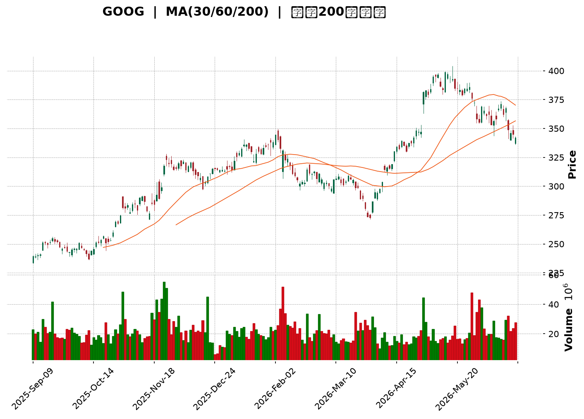
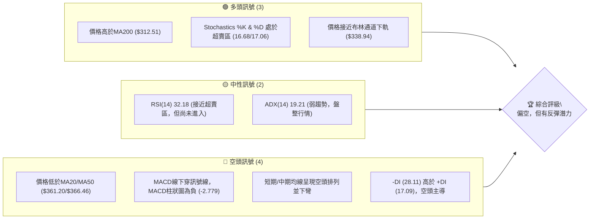
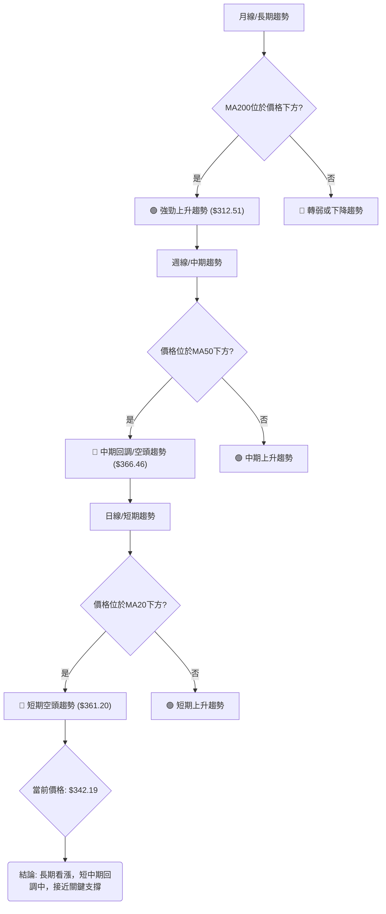
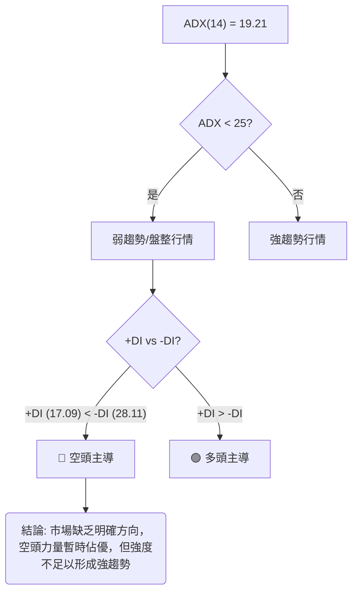
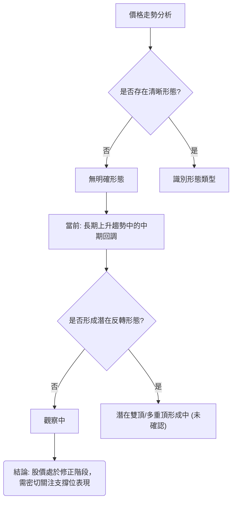
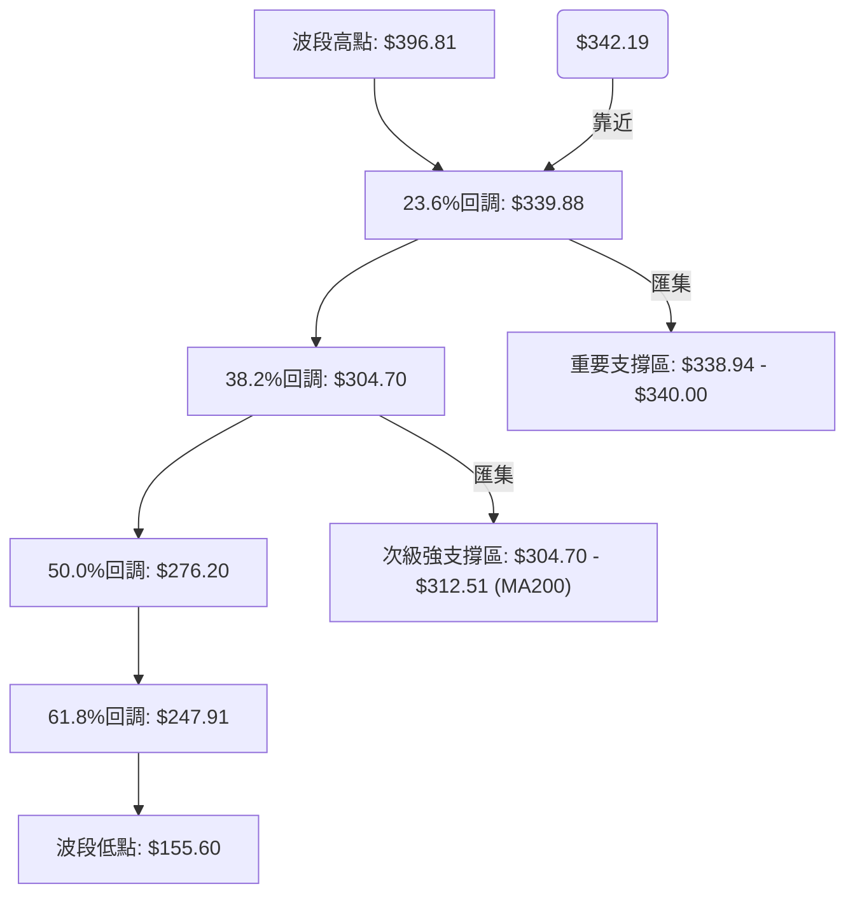
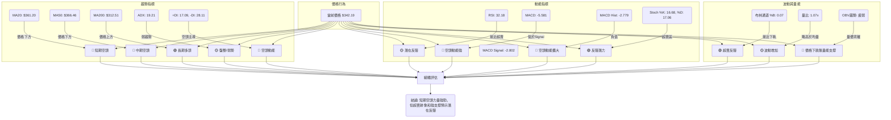
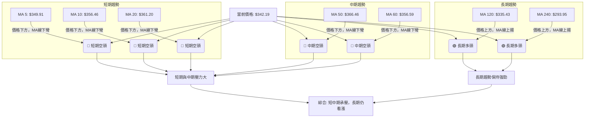
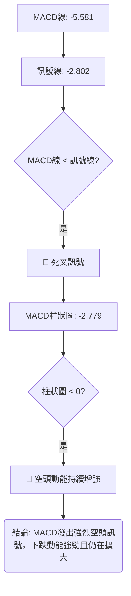
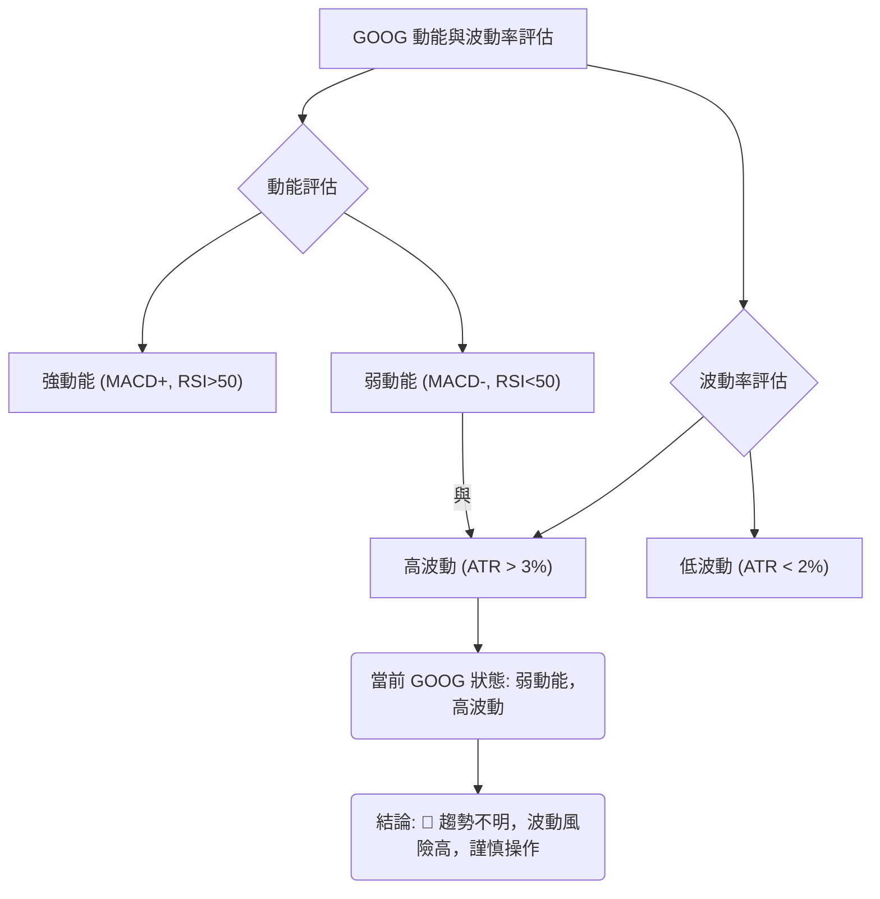

<details>
<summary>📊 靜態圖表 (點擊展開)</summary>

</details>

<html>
<head><meta charset="utf-8" /></head>
<body>
    <div style="height:500px; width:100%;">                        <script>window.PlotlyConfig = {MathJaxConfig: 'local'};</script>
        <script charset="utf-8" src="https://cdn.plot.ly/plotly-3.6.0.min.js" integrity="sha256-QaOVwtVY0T02VaHrr6pnoHLCwayMJp4O5n4YyaE3rJk=" crossorigin="anonymous"></script>                <div id="candlestick-chart" class="plotly-graph-div" style="height:100%; width:100%;"></div>            <script>                window.PLOTLYENV=window.PLOTLYENV || {};                                if (document.getElementById("candlestick-chart")) {                    Plotly.newPlot(                        "candlestick-chart",                        [{"close":{"dtype":"f8","bdata":"AAAAgA\u002fvbUAAAACA7OJtQAAAAEDjCW5AAAAA4AwdbkAAAABgj2hvQAAAAKCzXW9AAAAAYI8rb0AAAADAw3pvQAAAAOCz129AAAAAgFSMb0AAAABgFXtvQAAAAOAL625AAAAAQM7CbkAAAACASdZuQAAAAEA5fG5AAAAAwFpibkAAAADg6KFuQAAAAIBVvm5AAAAAAPm+bkAAAABgk2BvQAAAAKCw1G5AAAAAwFqfbkAAAADgjjduQAAAAEDQoG1AAAAAgCqFbkAAAABgq7ZuQAAAAKD2Zm9AAAAAgGRsb0AAAACgZKlvQAAAAIBGCHBAAAAAgCVbb0AAAADgJoFvQAAAACB6p29AAAAAgAFAcEAAAABgbtZwQAAAAGB6vnBAAAAAgBsqcUAAAACgk5VxQAAAAMBMlHFAAAAAAAe5cUAAAADgQVhxQAAAAGAWw3FAAAAAYILMcUAAAAAgcnJxQAAAAGBYIHJAAAAAYLUyckAAAAAg4u1xQAAAAAAvaXFAAAAA4AJHcUAAAABAqdBxQAAAAOBwxnFAAAAAYKtGckAAAADAmhZyQAAAAGAFsXJAAAAAYI3dc0AAAABAHDB0QAAAAKB0+nNAAAAAYOb3c0AAAACgDqhzQAAAAMBttnNAAAAAgOL\u002fc0AAAABARtxzQAAAAMBbF3RAAAAAYKKgc0AAAACAXdVzQAAAACBMCXRAAAAAYKaUc0AAAAAA1mFzQAAAAECpTnNAAAAAIEE1c0AAAACAvJpyQAAAAGCo9XJAAAAA4FBDc0AAAABgx25zQAAAAOBJtHNAAAAAACG0c0AAAACAyKhzQAAAAACtn3NAAAAAYDuic0AAAABgP5ZzQAAAAECJrnNAAAAAgH7Oc0AAAABgO6JzQAAAAMAlIHRAAAAAQFpZdEAAAAAgXot0QAAAAIC7xHRAAAAA4Nr\u002fdEAAAAAA8P10QAAAAICay3RAAAAA4IqedEAAAABA1Rt0QAAAAEA5f3RAAAAAIIimdEAAAADABYB0QAAAAIB50nRAAAAAQAHpdEAAAABgdf10QAAAACB9I3VAAAAAYGkhdUAAAADAMod1QAAAACAWRHVAAAAAwHrOdEAAAACAXK50QAAAAKDaKnRAAAAAYKA\u002fdEAAAABgbeNzQAAAAGDHbnNAAAAAwHVPc0AAAAAg7hlzQAAAAADM5nJAAAAAoLH4ckAAAAAAn\u002fJyQAAAACDTp3NAAAAAIIh0c0AAAABgOmhzQAAAAKDxiXNAAAAAoPwrc0AAAACAYHBzQAAAAOBcH3NAAAAAAJ\u002fyckAAAABA3fByQAAAAOBGyHJAAAAAQJKeckAAAAAgNx1zQAAAACDtK3NAAAAAgMBDc0AAAAAgcfByQAAAAIB11HJAAAAAYMoDc0AAAAAglVNzQAAAACDaIXNAAAAA4LwYc0AAAADAw6lyQAAAAEBxrXJAAAAAwGoQckAAAAAgpxZyQAAAAGAjiXFAAAAAgIYZcUAAAACgnA9xQAAAAMD\u002f6nFAAAAA4I9rckAAAACghmRyQAAAAACyl3JAAAAAgPT7ckAAAACgz6hzQAAAACDgwnNAAAAAQHu4c0AAAADASfBzQAAAAEAZpnRAAAAAIE3kdEAAAAAAHsl0QAAAAEAiM3VAAAAAICzzdEAAAAAAV6R0QAAAACBuGHVAAAAA4L8YdUAAAABg02F1QAAAAED3xHVAAAAA4Ke0dUAAAAAgnrF1QAAAAEBd23dAAAAAANXvd0AAAABAlrZ3QAAAACCfAHhAAAAAAHCueEAAAADg\u002frB4QAAAAKD6zHhAAAAAAJkoeEAAAAAgbfl3QAAAAMDM7HhAAAAA4OXOeEAAAADAVZF4QAAAAAD6jXhAAAAAILIKeEAAAAAgsgp4QAAAAGDU83dAAAAA4G2yd0AAAACAvAl4QAAAAICTCXhAAAAAQDQeeEAAAADgQYN3QAAAAMCxRXdAAAAAgMpidkAAAAAAdTd2QAAAACDEEHdAAAAA4KPYdkAAAABguJJ2QAAAAOCjpHZAAAAAwB4VdkAAAADA9Uh2QAAAAGCPYnZAAAAAgMLxdkAAAACgmTF3QAAAAKCZoXZAAAAAIFz3dkAAAADgesx1QAAAAKBHoXVAAAAA4KOQdUAAAABACmN1QA=="},"high":{"dtype":"f8","bdata":"YOR91dEDbkD6Ccz9ZzNuQDP\u002fqlAOQ25A4jIwaVw+bkABGY6iLYhvQMAUrR6Cl29Arpfv2KBub0DXPJk+krRvQBeLNm0qA3BAlkF1COD5b0CfzdIOschvQJIkiqrijm9AhzTCT5nabkB5Yx3jLjRvQDqkr7X7ZG9ABaozv1hmbkAwYC4zVNVuQAO\u002fppDR5G5ATRmXi07UbkAGF0zRnHZvQDKF3WraYW9AXjJ9Z9fYbkC79zplY6JuQDCxn5aNi25AgcQgJFiQbkDto0M4RvFuQLYkbUx\u002fiG9AtWzXszcRcEBgzVGINMxvQFn27jsCFnBAZN8ogizcb0AXY72N1ApwQBv06v2A629AUFBHefFfcEDlbWrnUuRwQJD1tfyV7XBAMU8C1+E2cUAdGjoivjVyQKtBvJmZ23FAg9zRKhfWcUB2IgQDhpRxQPMYBQA64nFA\u002fqNysusDckAloCNqGL9xQIphi+c8LnJA\u002f5w8MUo8ckCaujHfmzxyQFsX\u002f1JJr3FA6jgJvalpcUCpnUoHGl9yQGnF1aTmDXJA9j4MJ3r6ckB+qIqjoiRzQL\u002fyIZfY9XJA8vrrV8ryc0D3eSHSboB0QBZN1wKrRXRAhd\u002f7NNljdEDM3yd9E\u002fBzQNOC1tOg33NAVlo7f48WdEBJAF2EeCd0QIj2wM4kM3RAZmMFAvkMdEAzx6l\u002fsORzQLBjevkyF3RAMDCnzx0ZdEC55lSVo7tzQPUwjq6rhHNAjvK\u002fIAJ3c0BSNJr6qUxzQEdUuE3JDXNAQa3\u002fV2NJc0D92qAFsXRzQIOJnQ8yvnNA2KuWLwm+c0AUcXeSWcJzQH46WobxqHNA0RR9CZHUc0AAvi+gp69zQLeVR6jhJ3RAnnDhblXtc0CrbHbnPhJ0QAdKd46fYHRA9tS06LyhdEAgNOo9wrB0QD+Q8XsO4HRATqWEYBNMdUBijLZGcQl1QOHm7g4FG3VAIB7tDtfsdEChdwbNlnp0QFDRcianxHRA1RDoQ1zsdECIuTdxgdl0QKaDPb+T\u002fnRAtx9tsGAcdUCshqzIBxN1QNgBrzh+XXVAe9iq94g9dUDwQ1nVbot1QD8Bz7wW23VABzctzs98dUD8xtK5W8N0QPRprDJWo3RAJJmZJf90dECk2uxWXRN0QHj2NDEECnRAnQM9XhLBc0D2+7VoykdzQI36Qa\u002ffB3NAIYdMOCwYc0APMMnrFhpzQDTKvM6LxXNAHpgc\u002fpvwc0COhs2\u002fZX9zQAXW5cEClHNAV0ko+3aJc0D8QYRmw3pzQBTYJ1zOO3NAKez1d7H4ckAFn5ph+xBzQMPoqNmV73JAc0gpRgK\u002fckD0DvrqDCVzQAD778dsT3NA+jg4ORxuc0CPc1QfRUdzQM9cShY0MXNA\u002fq6w6i0Wc0CXYWHs0F1zQLddXmkCaXNAl0nSqO0nc0DHX66g\u002fQJzQDW8rigA83JAOnNuqb2OckAhuyRiuWdyQP2F1KV75XFAYwEn\u002fsBucUA7Sl9wgEFxQOJwKYgJ7nFAzP1kZuScckD5OrtTjXtyQJrNf33to3JAkwHHdKz+ckAwiWKrKvNzQJEggkPT03NAqn7Rz+z0c0AUNEFVzvNzQBmyJPoOp3RAJlm9scbsdEC3LFNE1RJ1QAXbEO98PHVAH\u002fq\u002f3EsvdUA3toi+eQ91QHt3zyI6HXVAYXf5T0k\u002fdUBS2O5\u002fu3d1QLqI9OIF63VA9VhTVgjbdUDl1i+\u002f\u002fxJ2QHrHzcxl5ndAdN3F9Izyd0DpkdDQLv93QBAY6NGdS3hA5jXv8UPCeEDFhuov29F4QCk1iR8W4nhAewDoH3yheEARb4krUiN4QMXArO4H+3hAW1s6vNLteEDQuG0xRbp4QC2XMaOgQ3lAlad5xgWSeEARwv61cGd4QIHVCaojR3hAVDSfWTcKeEBU9xkFiBJ4QETmnHDZV3hA5KTwMD9ceEBnfNUjutZ3QI5qB8b+ZXdANiGpyRQZd0DaQcPygqR2QCq45EszGndAVVhcpqUPd0AAAACAFLZ2QAAAAGASG3dAAAAAwPXkdkAAAAAAKWB2QAAAAEBezHZAAAAAYGYqd0AAAACgmVl3QAAAAGBmIndAAAAAAAAQd0AAAABAM2N2QAAAACCFy3VAAAAAoEcNdkAAAABACnN1QA=="},"hovertemplate":"\u003cb\u003e%{x|%Y-%m-%d}\u003c\u002fb\u003e\u003cbr\u003e\u958b: $%{open:.2f}\u003cbr\u003e\u9ad8: $%{high:.2f}\u003cbr\u003e\u4f4e: $%{low:.2f}\u003cbr\u003e\u6536: $%{close:.2f}\u003cextra\u003e\u003c\u002fextra\u003e","low":{"dtype":"f8","bdata":"09h2H40dbUC864tcnbRtQHPeES7Ag21Ayb\u002f2BhLBbUD3sJVGBpBuQC4Ll5I\u002fJ29AmCb25h\u002fDbkAxbGoT3TNvQIyS9JRlcm9A9gc0LDhKb0AQFiloKVNvQP1Ue4aQ125ADQKwV6wlbkAfOTyHCsVuQOFpzhYtV25A8mxog0bjbUCoZwM5bddtQNK+U2gkVG5A4W2Xp9w\u002fbkCy2D5Es6ZuQHYz1kB4ym5Arej6jYmTbkAiHluLweZtQLqejIYah21ATC9p9u0IbkDxj+ZQmRZuQHJjWbjUyW5AnSwVhL9Fb0AKTIyUUQNvQA\u002fJv0dDw29At1Auwx+GbkC2VwoRwT5vQHJdcurAiG9AmTsE7Srzb0A8n8Fbv4ZwQOqvkJhbqnBATj+aYXq+cECssDwebH5xQIZara2uT3FAJRb2CyV9cUBQNhyzLEVxQLGpI+xhVXFACg1YDhuRcUCoouaaNTNxQLyfTBzEr3FALq3MzRH1cUD9p2LQLb1xQPbrYnlMV3FAE\u002fntwBDucEBC2yO6yLpxQA9EpWxtZ3FA0fCIYLfxcUCrGmd9qwlyQLWKHOOLXHJAyCl3TLdMc0B5ipbKG9NzQEg6r61FyXNAWIQ3mx7Fc0C7MVBi2pVzQLgWKGyvmXNAs5HDrKSac0AdO7zPj69zQGLXNyiq9XNA61XVEwx4c0CllAJsZINzQPJRLm\u002fQr3NAqoR0C5xXc0A7s6RH8yhzQM\u002fjJ6N0FXNAf08Tee\u002f2ckDruLdC\u002fZByQL6IXY3Nw3JA20LlgyDfckAVmZG2CSNzQDO3EfqCZXNAXmbJ75OOc0C8Wt4g+JRzQJF7US\u002fjd3NACiXpknWNc0BPb21trnxzQAnTgdbpY3NAWyIasmatc0DkOCoQ635zQOqFeONuoXNAo1tjvR0ZdEBi\u002fLwSMF10QGsFSvhcUXRAJtFVXp7edEAzQd9iU6t0QMQE8v64rXRAPcBeOd57dEDXy+4pigd0QCV6WeD38XNAt3QjejaHdEBSMm4VrHh0QCdGKnsAcXRArDGR7gfVdEClfMguJbt0QL3uwbKyZHRABD6je0vDdEADFjvlJPl0QHgnT8deInVAhzjC2AqPdEAgGMq7TyhzQEnFoSS3+3NAuBUnEJHUc0AiTGJ4\u002faNzQOvKJaqaW3NADGOFJfc7c0B\u002fIvb0DfhyQIbhW0UziHJAqAIB+l\u002fZckBItPYSccRyQNRq5iRdAHNA6N9b9l1Zc0BGOYlxDBtzQJEfEd5MT3NA93X09T7gckAcZUHnHfNyQGWvqHSsynJAyAtRDf2EckDD\u002fzbqhMZyQJ06Wm7lmnJAQ\u002fyVzdVtckDg3IciDVxyQJfkqZ0FEnNAJY1HG38ac0AObrx2i8pyQMBtd2OYuXJA9B0oLg7ackA78THXqwJzQCbvKZzHFXNAyMxXZxrNckCdJKTmJIlyQI6MVbCcnXJAXBiYeeYKckB4XT54J\u002fNxQEgZ2EkdbnFA\u002fGebUAwVcUAVnzN08vVwQEa3PiJ\u002fSXFAVdeFALwUckDFtMs5WvZxQGQN7wjQWXJAAljd8\u002fRzckD6qWhDRYhzQFk5gr+KVHNAiJND6Jylc0BZLTh5BZhzQJhoBDtPD3RAxNpBsGWHdECnGmpCNbd0QEP\u002fW81u0XRAYPOXJdzmdEAFs8Fx6JZ0QLbEP+AnzHRAWf2fQLztdECj4Pe\u002fld10QGLonB6uSXVAYjrariqBdUDuabOllWN1QPJGBBHyrXZAoU5ZfIxwd0CKGAOysYh3QP+XbIjwwXdAhY\u002fb7t8teED23SMrNGF4QLeelZPulnhA93qQlPYfeEDdneyZ3bd3QK5pRoSb1XdA8PGWUd6HeEBqkkPFaFh4QFOo2VGjanhAteZNblDsd0Brq17SV7x3QCaMgDQHtHdAxjlZIoWgd0Ci2P9ql653QGbq7dhS3HdA74Zuv1TQd0BsnlufMmF3QKABB1LNF3dAibMwWpUsdkCIF+BzqyJ2QEzrIKZiKXZAlGzUjJmWdkAAAACAPV52QAAAACCFK3ZAAAAAwPUMdkAAAACAFHp1QAAAAKBwFXZAAAAAYGbKdkAAAADAHtV2QAAAACCug3ZAAAAAYLpJdkAAAABACk91QAAAAKBwO3VAAAAAAABYdUAAAABgZv50QA=="},"name":"\u50f9\u683c","open":{"dtype":"f8","bdata":"+EWQpGs3bUB4OsD3BdltQF+qiKFy9W1Aiepny4YKbkAmny12IpVuQABZzsrDem9ANRMWs\u002fpeb0BSiCYIwWtvQJdVhPzvnG9AWNVGzQLJb0D6RirNFKVvQLZ0jgUEdW9AraUiuY2LbkCJRgoOnOluQKliGyNC+W5AbQExerRSbkBvYlaeqRZuQNXJ1YgapW5AoVPzTAKYbkBMKwoTk6luQFk1g0ctDm9AuDsq5Py2bkDcTfFTlJJuQHPRTgn2NW5ARQK9Od8RbkAt6M\u002fxBiluQHXijrcw825AJdcOYBN\u002fb0D4WddZd1tvQPfbRg9i129A3cV+lwXYb0DcJdxBW9BvQGr4ENuEpm9Aa7jp+L4McEDZW0M+dI1wQLeQMzG+2nBAGpJjMFrBcEAvafewYzJyQGMYPIdqqnFAhCH8fuGdcUD5KtxYXkhxQAs1QOdVbXFAnMHPFdHScUDEJQPddrpxQKxQH+pPy3FAYFVi\u002fS36cUCsyEizNzhyQKV78wfnpnFAya0mXs\u002f1cEC6vQ+Xb91xQLPIgQG7\u002fnFAxoXMofTxcUAXToBdTQJzQBp3dsaghHJA3Df9BW1mc0DcWg0ukmJ0QOa7ZZ5wAnRAZKEZmsEsdECtgnLhqc1zQGNk7DJ7xHNASmsep5a2c0Cd5BrTmyZ0QCvxNt\u002f79XNAmni508YJdEBUEif7D4tzQFrPswlPw3NAsEGLMeUKdEBpnuKlJaZzQPskNdV4g3NA7914P5wZc0Bt1sE3tUlzQPL+MNCh6nJAtIlJy\u002fztckBl06nvGW1zQPVxO+upa3NADdgvb8y7c0AaQEGeH7hzQBauYaSWhnNAvvb1FwSQc0DlV2hsYI9zQFCut\u002f3O0nNAsMLTfnzUc0DR1i+fVc5zQOcSrEONonNA92SIWV2NdECy4OpxAHF0QDy4hq0uYXRA+16ypXrtdEDzGjfVw+h0QCDplDXSGXVAmvtFcPfndECvEwHLIQ10QEzyjNDQCnRAROgNsULddECVzbPKiMN0QCqslO9YfHRAVxLeYRLzdECKqnM8uwJ1QKh1ZFd+PnVACJM\u002fYWDgdEAmbFDCxQF1QLz+FZr2wHVA3dKN8+Z0dUCCWe8JqYxzQF2TiejDbnRAg8wZ5CENdECjEyUQ3Ad0QB8Sgxaz6HNAh4f68RN\u002fc0C9zSI\u002fVDlzQPH+QGf2w3JAvgSB75jgckA+UEKvAOJyQMmQ8HxvBnNA8HshjZPrc0BUkij\u002fwGNzQIsMQR1ne3NAdcX+RVmGc0AkDKuJsfhyQPt6zSUd6XJAbMUaGn2gckD3x9LWo+RyQMY+RYLe7HJA3DPHSPh6ckB3bTthVF9yQLYOV3kOG3NAHNYmGdohc0Bw1uy7aSBzQOxI1XOHJ3NAl08vpa32ckBaK2DNyQdzQIxot0uEO3NAP2RxFXHwckDldOKdMf5yQGmYt4eWxXJA6LnEWoKAckBpnU6Rlj9yQMG+zjJJ4HFAM7gb6LpTcUBetoK1YzRxQB35SBb4VXFA5D7gvuMcckD7eyf6Dg1yQCfk9ipdaHJA8Dc7Flq\u002fckAyFT6jONpzQE6eebUGkHNAHMUAlIngc0CJDS1Wr7NzQGfD99nwHXRAamv3YceldEA+SVcpXvp0QHIGaV6p43RAs8wkt7MldUC4DidmIfZ0QIe+OALw6nRAC\u002fjvoO41dUDV1kIVRRh1QKIAZE7FenVAqA\u002fMrWGrdUAM0SACW5R1QGVINdOBMHdAoqPZ6Aqcd0CYjtXlcOF3QGlau6k+2ndAI85pzLBVeEB9c\u002fqJI814QJuONZmGoHhADlWlt0dneEBXnMN3Swx4QOIPSffN2ndACcnGs9mYeEApyjrip494QALuO+05fnhAF284zgOReEBSwrFH7wx4QD980th73HdACzz+0Hjwd0BDcA7ZQMx3QHVUa3aO6HdAiY5a0RD6d0CJ091v7s93QEcfI2OdRXdApnxqnxCvdkB3G4xV6WF2QMnPeZKeM3ZAjPMWPZWydkAAAACAwqd2QAAAAAApznZAAAAAwMyQdkAAAADAzBB2QAAAAKCZkXZAAAAAANffdkAAAACgcPd2QAAAAMDM8HZAAAAAgD2+dkAAAAAAKVJ2QAAAACCuQXVAAAAAIIXLdUAAAABguA51QA=="},"x":["2025-09-09T00:00:00-04:00","2025-09-10T00:00:00-04:00","2025-09-11T00:00:00-04:00","2025-09-12T00:00:00-04:00","2025-09-15T00:00:00-04:00","2025-09-16T00:00:00-04:00","2025-09-17T00:00:00-04:00","2025-09-18T00:00:00-04:00","2025-09-19T00:00:00-04:00","2025-09-22T00:00:00-04:00","2025-09-23T00:00:00-04:00","2025-09-24T00:00:00-04:00","2025-09-25T00:00:00-04:00","2025-09-26T00:00:00-04:00","2025-09-29T00:00:00-04:00","2025-09-30T00:00:00-04:00","2025-10-01T00:00:00-04:00","2025-10-02T00:00:00-04:00","2025-10-03T00:00:00-04:00","2025-10-06T00:00:00-04:00","2025-10-07T00:00:00-04:00","2025-10-08T00:00:00-04:00","2025-10-09T00:00:00-04:00","2025-10-10T00:00:00-04:00","2025-10-13T00:00:00-04:00","2025-10-14T00:00:00-04:00","2025-10-15T00:00:00-04:00","2025-10-16T00:00:00-04:00","2025-10-17T00:00:00-04:00","2025-10-20T00:00:00-04:00","2025-10-21T00:00:00-04:00","2025-10-22T00:00:00-04:00","2025-10-23T00:00:00-04:00","2025-10-24T00:00:00-04:00","2025-10-27T00:00:00-04:00","2025-10-28T00:00:00-04:00","2025-10-29T00:00:00-04:00","2025-10-30T00:00:00-04:00","2025-10-31T00:00:00-04:00","2025-11-03T00:00:00-05:00","2025-11-04T00:00:00-05:00","2025-11-05T00:00:00-05:00","2025-11-06T00:00:00-05:00","2025-11-07T00:00:00-05:00","2025-11-10T00:00:00-05:00","2025-11-11T00:00:00-05:00","2025-11-12T00:00:00-05:00","2025-11-13T00:00:00-05:00","2025-11-14T00:00:00-05:00","2025-11-17T00:00:00-05:00","2025-11-18T00:00:00-05:00","2025-11-19T00:00:00-05:00","2025-11-20T00:00:00-05:00","2025-11-21T00:00:00-05:00","2025-11-24T00:00:00-05:00","2025-11-25T00:00:00-05:00","2025-11-26T00:00:00-05:00","2025-11-28T00:00:00-05:00","2025-12-01T00:00:00-05:00","2025-12-02T00:00:00-05:00","2025-12-03T00:00:00-05:00","2025-12-04T00:00:00-05:00","2025-12-05T00:00:00-05:00","2025-12-08T00:00:00-05:00","2025-12-09T00:00:00-05:00","2025-12-10T00:00:00-05:00","2025-12-11T00:00:00-05:00","2025-12-12T00:00:00-05:00","2025-12-15T00:00:00-05:00","2025-12-16T00:00:00-05:00","2025-12-17T00:00:00-05:00","2025-12-18T00:00:00-05:00","2025-12-19T00:00:00-05:00","2025-12-22T00:00:00-05:00","2025-12-23T00:00:00-05:00","2025-12-24T00:00:00-05:00","2025-12-26T00:00:00-05:00","2025-12-29T00:00:00-05:00","2025-12-30T00:00:00-05:00","2025-12-31T00:00:00-05:00","2026-01-02T00:00:00-05:00","2026-01-05T00:00:00-05:00","2026-01-06T00:00:00-05:00","2026-01-07T00:00:00-05:00","2026-01-08T00:00:00-05:00","2026-01-09T00:00:00-05:00","2026-01-12T00:00:00-05:00","2026-01-13T00:00:00-05:00","2026-01-14T00:00:00-05:00","2026-01-15T00:00:00-05:00","2026-01-16T00:00:00-05:00","2026-01-20T00:00:00-05:00","2026-01-21T00:00:00-05:00","2026-01-22T00:00:00-05:00","2026-01-23T00:00:00-05:00","2026-01-26T00:00:00-05:00","2026-01-27T00:00:00-05:00","2026-01-28T00:00:00-05:00","2026-01-29T00:00:00-05:00","2026-01-30T00:00:00-05:00","2026-02-02T00:00:00-05:00","2026-02-03T00:00:00-05:00","2026-02-04T00:00:00-05:00","2026-02-05T00:00:00-05:00","2026-02-06T00:00:00-05:00","2026-02-09T00:00:00-05:00","2026-02-10T00:00:00-05:00","2026-02-11T00:00:00-05:00","2026-02-12T00:00:00-05:00","2026-02-13T00:00:00-05:00","2026-02-17T00:00:00-05:00","2026-02-18T00:00:00-05:00","2026-02-19T00:00:00-05:00","2026-02-20T00:00:00-05:00","2026-02-23T00:00:00-05:00","2026-02-24T00:00:00-05:00","2026-02-25T00:00:00-05:00","2026-02-26T00:00:00-05:00","2026-02-27T00:00:00-05:00","2026-03-02T00:00:00-05:00","2026-03-03T00:00:00-05:00","2026-03-04T00:00:00-05:00","2026-03-05T00:00:00-05:00","2026-03-06T00:00:00-05:00","2026-03-09T00:00:00-04:00","2026-03-10T00:00:00-04:00","2026-03-11T00:00:00-04:00","2026-03-12T00:00:00-04:00","2026-03-13T00:00:00-04:00","2026-03-16T00:00:00-04:00","2026-03-17T00:00:00-04:00","2026-03-18T00:00:00-04:00","2026-03-19T00:00:00-04:00","2026-03-20T00:00:00-04:00","2026-03-23T00:00:00-04:00","2026-03-24T00:00:00-04:00","2026-03-25T00:00:00-04:00","2026-03-26T00:00:00-04:00","2026-03-27T00:00:00-04:00","2026-03-30T00:00:00-04:00","2026-03-31T00:00:00-04:00","2026-04-01T00:00:00-04:00","2026-04-02T00:00:00-04:00","2026-04-06T00:00:00-04:00","2026-04-07T00:00:00-04:00","2026-04-08T00:00:00-04:00","2026-04-09T00:00:00-04:00","2026-04-10T00:00:00-04:00","2026-04-13T00:00:00-04:00","2026-04-14T00:00:00-04:00","2026-04-15T00:00:00-04:00","2026-04-16T00:00:00-04:00","2026-04-17T00:00:00-04:00","2026-04-20T00:00:00-04:00","2026-04-21T00:00:00-04:00","2026-04-22T00:00:00-04:00","2026-04-23T00:00:00-04:00","2026-04-24T00:00:00-04:00","2026-04-27T00:00:00-04:00","2026-04-28T00:00:00-04:00","2026-04-29T00:00:00-04:00","2026-04-30T00:00:00-04:00","2026-05-01T00:00:00-04:00","2026-05-04T00:00:00-04:00","2026-05-05T00:00:00-04:00","2026-05-06T00:00:00-04:00","2026-05-07T00:00:00-04:00","2026-05-08T00:00:00-04:00","2026-05-11T00:00:00-04:00","2026-05-12T00:00:00-04:00","2026-05-13T00:00:00-04:00","2026-05-14T00:00:00-04:00","2026-05-15T00:00:00-04:00","2026-05-18T00:00:00-04:00","2026-05-19T00:00:00-04:00","2026-05-20T00:00:00-04:00","2026-05-21T00:00:00-04:00","2026-05-22T00:00:00-04:00","2026-05-26T00:00:00-04:00","2026-05-27T00:00:00-04:00","2026-05-28T00:00:00-04:00","2026-05-29T00:00:00-04:00","2026-06-01T00:00:00-04:00","2026-06-02T00:00:00-04:00","2026-06-03T00:00:00-04:00","2026-06-04T00:00:00-04:00","2026-06-05T00:00:00-04:00","2026-06-08T00:00:00-04:00","2026-06-09T00:00:00-04:00","2026-06-10T00:00:00-04:00","2026-06-11T00:00:00-04:00","2026-06-12T00:00:00-04:00","2026-06-15T00:00:00-04:00","2026-06-16T00:00:00-04:00","2026-06-17T00:00:00-04:00","2026-06-18T00:00:00-04:00","2026-06-22T00:00:00-04:00","2026-06-23T00:00:00-04:00","2026-06-24T00:00:00-04:00","2026-06-25T00:00:00-04:00"],"type":"candlestick"},{"hovertemplate":"MA30: $%{y:.2f}\u003cextra\u003e\u003c\u002fextra\u003e","line":{"color":"#2196F3","dash":"dash","width":2},"mode":"lines","name":"MA30","x":["2025-09-09T00:00:00-04:00","2025-09-10T00:00:00-04:00","2025-09-11T00:00:00-04:00","2025-09-12T00:00:00-04:00","2025-09-15T00:00:00-04:00","2025-09-16T00:00:00-04:00","2025-09-17T00:00:00-04:00","2025-09-18T00:00:00-04:00","2025-09-19T00:00:00-04:00","2025-09-22T00:00:00-04:00","2025-09-23T00:00:00-04:00","2025-09-24T00:00:00-04:00","2025-09-25T00:00:00-04:00","2025-09-26T00:00:00-04:00","2025-09-29T00:00:00-04:00","2025-09-30T00:00:00-04:00","2025-10-01T00:00:00-04:00","2025-10-02T00:00:00-04:00","2025-10-03T00:00:00-04:00","2025-10-06T00:00:00-04:00","2025-10-07T00:00:00-04:00","2025-10-08T00:00:00-04:00","2025-10-09T00:00:00-04:00","2025-10-10T00:00:00-04:00","2025-10-13T00:00:00-04:00","2025-10-14T00:00:00-04:00","2025-10-15T00:00:00-04:00","2025-10-16T00:00:00-04:00","2025-10-17T00:00:00-04:00","2025-10-20T00:00:00-04:00","2025-10-21T00:00:00-04:00","2025-10-22T00:00:00-04:00","2025-10-23T00:00:00-04:00","2025-10-24T00:00:00-04:00","2025-10-27T00:00:00-04:00","2025-10-28T00:00:00-04:00","2025-10-29T00:00:00-04:00","2025-10-30T00:00:00-04:00","2025-10-31T00:00:00-04:00","2025-11-03T00:00:00-05:00","2025-11-04T00:00:00-05:00","2025-11-05T00:00:00-05:00","2025-11-06T00:00:00-05:00","2025-11-07T00:00:00-05:00","2025-11-10T00:00:00-05:00","2025-11-11T00:00:00-05:00","2025-11-12T00:00:00-05:00","2025-11-13T00:00:00-05:00","2025-11-14T00:00:00-05:00","2025-11-17T00:00:00-05:00","2025-11-18T00:00:00-05:00","2025-11-19T00:00:00-05:00","2025-11-20T00:00:00-05:00","2025-11-21T00:00:00-05:00","2025-11-24T00:00:00-05:00","2025-11-25T00:00:00-05:00","2025-11-26T00:00:00-05:00","2025-11-28T00:00:00-05:00","2025-12-01T00:00:00-05:00","2025-12-02T00:00:00-05:00","2025-12-03T00:00:00-05:00","2025-12-04T00:00:00-05:00","2025-12-05T00:00:00-05:00","2025-12-08T00:00:00-05:00","2025-12-09T00:00:00-05:00","2025-12-10T00:00:00-05:00","2025-12-11T00:00:00-05:00","2025-12-12T00:00:00-05:00","2025-12-15T00:00:00-05:00","2025-12-16T00:00:00-05:00","2025-12-17T00:00:00-05:00","2025-12-18T00:00:00-05:00","2025-12-19T00:00:00-05:00","2025-12-22T00:00:00-05:00","2025-12-23T00:00:00-05:00","2025-12-24T00:00:00-05:00","2025-12-26T00:00:00-05:00","2025-12-29T00:00:00-05:00","2025-12-30T00:00:00-05:00","2025-12-31T00:00:00-05:00","2026-01-02T00:00:00-05:00","2026-01-05T00:00:00-05:00","2026-01-06T00:00:00-05:00","2026-01-07T00:00:00-05:00","2026-01-08T00:00:00-05:00","2026-01-09T00:00:00-05:00","2026-01-12T00:00:00-05:00","2026-01-13T00:00:00-05:00","2026-01-14T00:00:00-05:00","2026-01-15T00:00:00-05:00","2026-01-16T00:00:00-05:00","2026-01-20T00:00:00-05:00","2026-01-21T00:00:00-05:00","2026-01-22T00:00:00-05:00","2026-01-23T00:00:00-05:00","2026-01-26T00:00:00-05:00","2026-01-27T00:00:00-05:00","2026-01-28T00:00:00-05:00","2026-01-29T00:00:00-05:00","2026-01-30T00:00:00-05:00","2026-02-02T00:00:00-05:00","2026-02-03T00:00:00-05:00","2026-02-04T00:00:00-05:00","2026-02-05T00:00:00-05:00","2026-02-06T00:00:00-05:00","2026-02-09T00:00:00-05:00","2026-02-10T00:00:00-05:00","2026-02-11T00:00:00-05:00","2026-02-12T00:00:00-05:00","2026-02-13T00:00:00-05:00","2026-02-17T00:00:00-05:00","2026-02-18T00:00:00-05:00","2026-02-19T00:00:00-05:00","2026-02-20T00:00:00-05:00","2026-02-23T00:00:00-05:00","2026-02-24T00:00:00-05:00","2026-02-25T00:00:00-05:00","2026-02-26T00:00:00-05:00","2026-02-27T00:00:00-05:00","2026-03-02T00:00:00-05:00","2026-03-03T00:00:00-05:00","2026-03-04T00:00:00-05:00","2026-03-05T00:00:00-05:00","2026-03-06T00:00:00-05:00","2026-03-09T00:00:00-04:00","2026-03-10T00:00:00-04:00","2026-03-11T00:00:00-04:00","2026-03-12T00:00:00-04:00","2026-03-13T00:00:00-04:00","2026-03-16T00:00:00-04:00","2026-03-17T00:00:00-04:00","2026-03-18T00:00:00-04:00","2026-03-19T00:00:00-04:00","2026-03-20T00:00:00-04:00","2026-03-23T00:00:00-04:00","2026-03-24T00:00:00-04:00","2026-03-25T00:00:00-04:00","2026-03-26T00:00:00-04:00","2026-03-27T00:00:00-04:00","2026-03-30T00:00:00-04:00","2026-03-31T00:00:00-04:00","2026-04-01T00:00:00-04:00","2026-04-02T00:00:00-04:00","2026-04-06T00:00:00-04:00","2026-04-07T00:00:00-04:00","2026-04-08T00:00:00-04:00","2026-04-09T00:00:00-04:00","2026-04-10T00:00:00-04:00","2026-04-13T00:00:00-04:00","2026-04-14T00:00:00-04:00","2026-04-15T00:00:00-04:00","2026-04-16T00:00:00-04:00","2026-04-17T00:00:00-04:00","2026-04-20T00:00:00-04:00","2026-04-21T00:00:00-04:00","2026-04-22T00:00:00-04:00","2026-04-23T00:00:00-04:00","2026-04-24T00:00:00-04:00","2026-04-27T00:00:00-04:00","2026-04-28T00:00:00-04:00","2026-04-29T00:00:00-04:00","2026-04-30T00:00:00-04:00","2026-05-01T00:00:00-04:00","2026-05-04T00:00:00-04:00","2026-05-05T00:00:00-04:00","2026-05-06T00:00:00-04:00","2026-05-07T00:00:00-04:00","2026-05-08T00:00:00-04:00","2026-05-11T00:00:00-04:00","2026-05-12T00:00:00-04:00","2026-05-13T00:00:00-04:00","2026-05-14T00:00:00-04:00","2026-05-15T00:00:00-04:00","2026-05-18T00:00:00-04:00","2026-05-19T00:00:00-04:00","2026-05-20T00:00:00-04:00","2026-05-21T00:00:00-04:00","2026-05-22T00:00:00-04:00","2026-05-26T00:00:00-04:00","2026-05-27T00:00:00-04:00","2026-05-28T00:00:00-04:00","2026-05-29T00:00:00-04:00","2026-06-01T00:00:00-04:00","2026-06-02T00:00:00-04:00","2026-06-03T00:00:00-04:00","2026-06-04T00:00:00-04:00","2026-06-05T00:00:00-04:00","2026-06-08T00:00:00-04:00","2026-06-09T00:00:00-04:00","2026-06-10T00:00:00-04:00","2026-06-11T00:00:00-04:00","2026-06-12T00:00:00-04:00","2026-06-15T00:00:00-04:00","2026-06-16T00:00:00-04:00","2026-06-17T00:00:00-04:00","2026-06-18T00:00:00-04:00","2026-06-22T00:00:00-04:00","2026-06-23T00:00:00-04:00","2026-06-24T00:00:00-04:00","2026-06-25T00:00:00-04:00"],"y":{"dtype":"f8","bdata":"AAAAAAAA+H8AAAAAAAD4fwAAAAAAAPh\u002fAAAAAAAA+H8AAAAAAAD4fwAAAAAAAPh\u002fAAAAAAAA+H8AAAAAAAD4fwAAAAAAAPh\u002fAAAAAAAA+H8AAAAAAAD4fwAAAAAAAPh\u002fAAAAAAAA+H8AAAAAAAD4fwAAAAAAAPh\u002fAAAAAAAA+H8AAAAAAAD4fwAAAAAAAPh\u002fAAAAAAAA+H8AAAAAAAD4fwAAAAAAAPh\u002fAAAAAAAA+H8AAAAAAAD4fwAAAAAAAPh\u002fAAAAAAAA+H8AAAAAAAD4fwAAAAAAAPh\u002fAAAAAAAA+H8AAAAAAAD4f3d3d7fj325AVVVVlQbsbkBERERU1fluQAAAAKCeB29AmpmZKfwbb0AzMzMTVC9vQImIiNhvQW9A3t3dXWRcb0BmZmYm33tvQCIiIhIrmG9AzczM\u002fGy5b0CJiIiIztRvQN7d3W0c\u002fG9AmpmZQbEScECrqqqiACRwQCIiIjqcPHBAzczM5EJWcEBVVVUVj2xwQAAAAKD1fXBAZmZm1jWOcEAAAAAoW6BwQLy7uxt+tHBAd3d318rNcEARERFJOOdwQAAAAJhOCHFAmpmZIZsvcUAzMzPz1FhxQCIiIrpUfXFAAAAAiKehcUDe3d29TMJxQDMzM3O04XFAmpmZ+ZQGckAAAAB4oylyQAAAAKAGTnJAmpmZydhqckCrqqpKaYRyQJqZmVmBoHJARERElB+1ckAAAAAgd8RyQBEREfE103JAvLu7i+LfckDe3d1doupyQO\u002fu7m7a9HJAiYiIyFgBc0Dv7u6OShJzQKuqqorBH3NAZmZmdposc0AAAADgXTtzQBEREfE\u002fTnNAzczMbFtic0B3d3cHenFzQLy7uxu\u002fgXNA3t3drc6Oc0AzMzOz\u002fptzQDMzM4M7qHNAERER8Vusc0C8u7urZq9zQERERMQktnNA7+7uLvG+c0AAAACQVspzQJqZmcmT03NAq6qqqt3Yc0CJiIgI\u002fNpzQJqZmVly3nNAVVVVNS3nc0C8u7t73exzQCIiIjKS83NA7+7ujur+c0AiIiISowx0QLy7u7tDHHRAmpmZeassdECamZlZnkV0QM3MzKxMWXRAzczMvHhmdEB3d3fXH3F0QJqZmZkTdXRAq6qq+rl5dECJiIhornt0QHd3dycNenRAVVVV1Up3dEDe3d39JXN0QM3MzIx9bHRA7+7uHl1ldEAzMzOTgl90QCIiItJ\u002fW3RAd3d3N99TdEAzMzPTKkp0QBEREaGsP3RAd3d3JxQwdEAzMzOj0yJ0QBEREVGNFHRAiYiIuEkGdEBVVVWFUvxzQHd3d9ew7XNAiYiI2Fvcc0CJiIgoiNBzQJqZmWlywnNAiYiIuGe0c0BERESU56JzQAAAACA0j3NAq6qqSiZ9c0BVVVXFXGpzQCIiIpInWHNAzczMLJBJc0AiIiLiVzhzQLy7uyuhK3NAAAAAQP0Yc0Dv7u5OoQlzQM3MzCxx+XJA3t3d3ZPmckAAAADAKtVyQDMzMxPGzHJAAAAAwBHIckBEREQ0VcNyQImIiAhDunJAzczMHD62ckCJiIg4ZbhyQJqZmQlLunJAzczM7Pm+ckDv7u5uPcNyQGZmZrZD0HJAVVVVldrgckCamZl5mPByQDMzM2M5BXNAIiIiYhwZc0Crqqr6JSZzQN7d3a2QNnNAq6qqyjJGc0BmZmZmC1tzQKuqqsogdHNAvLu7GxeLc0C8u7ubSp9zQHd3d8ebx3NAIiIiYunwc0B3d3d3ARx0QN7d3e1xSXRAIiIikumBdEBERETUQbp0QImIiHhA+HRAIiIi0nw0dUDNzMw8e291QGZmZlZGq3VARERENMnhdUBmZmbGehZ2QKuqqgpbSXZA7+7ufoN0dkCamZnp6Jl2QJqZmcmsvXZAZmZmRpvfdkARERGRlgJ3QKuqqgqBH3dA7+7uvgg7d0BVVVU1TlJ3QImIiKj9Y3dAvLu7qz5wd0Crqqqarn13QFVVVUV+jndAVVVVRWydd0CamZkJlqd3QJqZmbkKr3dAMzMz40Gyd0B3d3dXTbd3QCIiIvK9qndAzczM3EWid0CrqqoK1513QImIiKgjkndAzczM3ICDd0C8u7vL0Wp3QLy7u0vDT3dAZmZmhqE5d0CamZkpjSN3QA=="},"type":"scatter"},{"hovertemplate":"MA60: $%{y:.2f}\u003cextra\u003e\u003c\u002fextra\u003e","line":{"color":"#9C27B0","dash":"dash","width":2},"mode":"lines","name":"MA60","x":["2025-09-09T00:00:00-04:00","2025-09-10T00:00:00-04:00","2025-09-11T00:00:00-04:00","2025-09-12T00:00:00-04:00","2025-09-15T00:00:00-04:00","2025-09-16T00:00:00-04:00","2025-09-17T00:00:00-04:00","2025-09-18T00:00:00-04:00","2025-09-19T00:00:00-04:00","2025-09-22T00:00:00-04:00","2025-09-23T00:00:00-04:00","2025-09-24T00:00:00-04:00","2025-09-25T00:00:00-04:00","2025-09-26T00:00:00-04:00","2025-09-29T00:00:00-04:00","2025-09-30T00:00:00-04:00","2025-10-01T00:00:00-04:00","2025-10-02T00:00:00-04:00","2025-10-03T00:00:00-04:00","2025-10-06T00:00:00-04:00","2025-10-07T00:00:00-04:00","2025-10-08T00:00:00-04:00","2025-10-09T00:00:00-04:00","2025-10-10T00:00:00-04:00","2025-10-13T00:00:00-04:00","2025-10-14T00:00:00-04:00","2025-10-15T00:00:00-04:00","2025-10-16T00:00:00-04:00","2025-10-17T00:00:00-04:00","2025-10-20T00:00:00-04:00","2025-10-21T00:00:00-04:00","2025-10-22T00:00:00-04:00","2025-10-23T00:00:00-04:00","2025-10-24T00:00:00-04:00","2025-10-27T00:00:00-04:00","2025-10-28T00:00:00-04:00","2025-10-29T00:00:00-04:00","2025-10-30T00:00:00-04:00","2025-10-31T00:00:00-04:00","2025-11-03T00:00:00-05:00","2025-11-04T00:00:00-05:00","2025-11-05T00:00:00-05:00","2025-11-06T00:00:00-05:00","2025-11-07T00:00:00-05:00","2025-11-10T00:00:00-05:00","2025-11-11T00:00:00-05:00","2025-11-12T00:00:00-05:00","2025-11-13T00:00:00-05:00","2025-11-14T00:00:00-05:00","2025-11-17T00:00:00-05:00","2025-11-18T00:00:00-05:00","2025-11-19T00:00:00-05:00","2025-11-20T00:00:00-05:00","2025-11-21T00:00:00-05:00","2025-11-24T00:00:00-05:00","2025-11-25T00:00:00-05:00","2025-11-26T00:00:00-05:00","2025-11-28T00:00:00-05:00","2025-12-01T00:00:00-05:00","2025-12-02T00:00:00-05:00","2025-12-03T00:00:00-05:00","2025-12-04T00:00:00-05:00","2025-12-05T00:00:00-05:00","2025-12-08T00:00:00-05:00","2025-12-09T00:00:00-05:00","2025-12-10T00:00:00-05:00","2025-12-11T00:00:00-05:00","2025-12-12T00:00:00-05:00","2025-12-15T00:00:00-05:00","2025-12-16T00:00:00-05:00","2025-12-17T00:00:00-05:00","2025-12-18T00:00:00-05:00","2025-12-19T00:00:00-05:00","2025-12-22T00:00:00-05:00","2025-12-23T00:00:00-05:00","2025-12-24T00:00:00-05:00","2025-12-26T00:00:00-05:00","2025-12-29T00:00:00-05:00","2025-12-30T00:00:00-05:00","2025-12-31T00:00:00-05:00","2026-01-02T00:00:00-05:00","2026-01-05T00:00:00-05:00","2026-01-06T00:00:00-05:00","2026-01-07T00:00:00-05:00","2026-01-08T00:00:00-05:00","2026-01-09T00:00:00-05:00","2026-01-12T00:00:00-05:00","2026-01-13T00:00:00-05:00","2026-01-14T00:00:00-05:00","2026-01-15T00:00:00-05:00","2026-01-16T00:00:00-05:00","2026-01-20T00:00:00-05:00","2026-01-21T00:00:00-05:00","2026-01-22T00:00:00-05:00","2026-01-23T00:00:00-05:00","2026-01-26T00:00:00-05:00","2026-01-27T00:00:00-05:00","2026-01-28T00:00:00-05:00","2026-01-29T00:00:00-05:00","2026-01-30T00:00:00-05:00","2026-02-02T00:00:00-05:00","2026-02-03T00:00:00-05:00","2026-02-04T00:00:00-05:00","2026-02-05T00:00:00-05:00","2026-02-06T00:00:00-05:00","2026-02-09T00:00:00-05:00","2026-02-10T00:00:00-05:00","2026-02-11T00:00:00-05:00","2026-02-12T00:00:00-05:00","2026-02-13T00:00:00-05:00","2026-02-17T00:00:00-05:00","2026-02-18T00:00:00-05:00","2026-02-19T00:00:00-05:00","2026-02-20T00:00:00-05:00","2026-02-23T00:00:00-05:00","2026-02-24T00:00:00-05:00","2026-02-25T00:00:00-05:00","2026-02-26T00:00:00-05:00","2026-02-27T00:00:00-05:00","2026-03-02T00:00:00-05:00","2026-03-03T00:00:00-05:00","2026-03-04T00:00:00-05:00","2026-03-05T00:00:00-05:00","2026-03-06T00:00:00-05:00","2026-03-09T00:00:00-04:00","2026-03-10T00:00:00-04:00","2026-03-11T00:00:00-04:00","2026-03-12T00:00:00-04:00","2026-03-13T00:00:00-04:00","2026-03-16T00:00:00-04:00","2026-03-17T00:00:00-04:00","2026-03-18T00:00:00-04:00","2026-03-19T00:00:00-04:00","2026-03-20T00:00:00-04:00","2026-03-23T00:00:00-04:00","2026-03-24T00:00:00-04:00","2026-03-25T00:00:00-04:00","2026-03-26T00:00:00-04:00","2026-03-27T00:00:00-04:00","2026-03-30T00:00:00-04:00","2026-03-31T00:00:00-04:00","2026-04-01T00:00:00-04:00","2026-04-02T00:00:00-04:00","2026-04-06T00:00:00-04:00","2026-04-07T00:00:00-04:00","2026-04-08T00:00:00-04:00","2026-04-09T00:00:00-04:00","2026-04-10T00:00:00-04:00","2026-04-13T00:00:00-04:00","2026-04-14T00:00:00-04:00","2026-04-15T00:00:00-04:00","2026-04-16T00:00:00-04:00","2026-04-17T00:00:00-04:00","2026-04-20T00:00:00-04:00","2026-04-21T00:00:00-04:00","2026-04-22T00:00:00-04:00","2026-04-23T00:00:00-04:00","2026-04-24T00:00:00-04:00","2026-04-27T00:00:00-04:00","2026-04-28T00:00:00-04:00","2026-04-29T00:00:00-04:00","2026-04-30T00:00:00-04:00","2026-05-01T00:00:00-04:00","2026-05-04T00:00:00-04:00","2026-05-05T00:00:00-04:00","2026-05-06T00:00:00-04:00","2026-05-07T00:00:00-04:00","2026-05-08T00:00:00-04:00","2026-05-11T00:00:00-04:00","2026-05-12T00:00:00-04:00","2026-05-13T00:00:00-04:00","2026-05-14T00:00:00-04:00","2026-05-15T00:00:00-04:00","2026-05-18T00:00:00-04:00","2026-05-19T00:00:00-04:00","2026-05-20T00:00:00-04:00","2026-05-21T00:00:00-04:00","2026-05-22T00:00:00-04:00","2026-05-26T00:00:00-04:00","2026-05-27T00:00:00-04:00","2026-05-28T00:00:00-04:00","2026-05-29T00:00:00-04:00","2026-06-01T00:00:00-04:00","2026-06-02T00:00:00-04:00","2026-06-03T00:00:00-04:00","2026-06-04T00:00:00-04:00","2026-06-05T00:00:00-04:00","2026-06-08T00:00:00-04:00","2026-06-09T00:00:00-04:00","2026-06-10T00:00:00-04:00","2026-06-11T00:00:00-04:00","2026-06-12T00:00:00-04:00","2026-06-15T00:00:00-04:00","2026-06-16T00:00:00-04:00","2026-06-17T00:00:00-04:00","2026-06-18T00:00:00-04:00","2026-06-22T00:00:00-04:00","2026-06-23T00:00:00-04:00","2026-06-24T00:00:00-04:00","2026-06-25T00:00:00-04:00"],"y":{"dtype":"f8","bdata":"AAAAAAAA+H8AAAAAAAD4fwAAAAAAAPh\u002fAAAAAAAA+H8AAAAAAAD4fwAAAAAAAPh\u002fAAAAAAAA+H8AAAAAAAD4fwAAAAAAAPh\u002fAAAAAAAA+H8AAAAAAAD4fwAAAAAAAPh\u002fAAAAAAAA+H8AAAAAAAD4fwAAAAAAAPh\u002fAAAAAAAA+H8AAAAAAAD4fwAAAAAAAPh\u002fAAAAAAAA+H8AAAAAAAD4fwAAAAAAAPh\u002fAAAAAAAA+H8AAAAAAAD4fwAAAAAAAPh\u002fAAAAAAAA+H8AAAAAAAD4fwAAAAAAAPh\u002fAAAAAAAA+H8AAAAAAAD4fwAAAAAAAPh\u002fAAAAAAAA+H8AAAAAAAD4fwAAAAAAAPh\u002fAAAAAAAA+H8AAAAAAAD4fwAAAAAAAPh\u002fAAAAAAAA+H8AAAAAAAD4fwAAAAAAAPh\u002fAAAAAAAA+H8AAAAAAAD4fwAAAAAAAPh\u002fAAAAAAAA+H8AAAAAAAD4fwAAAAAAAPh\u002fAAAAAAAA+H8AAAAAAAD4fwAAAAAAAPh\u002fAAAAAAAA+H8AAAAAAAD4fwAAAAAAAPh\u002fAAAAAAAA+H8AAAAAAAD4fwAAAAAAAPh\u002fAAAAAAAA+H8AAAAAAAD4fwAAAAAAAPh\u002fAAAAAAAA+H8AAAAAAAD4f3d3dyfTqHBAIiIiIky+cEARERERR9NwQAAAAPjq6HBAMzMzb2v8cEAiIiKqCQ5xQO\u002fu7qKcIHFAmpmZ4agxcUCamZlZM0FxQBEREb2lT3FAERERhUxecUARERHRhGpxQO\u002fu7lJ0eXFAERERBQWKcUDNzMyYJZtxQGZmZuIurnFAmpmZrW7BcUCrqqp69tNxQImIiMga5nFAmpmZoUj4cUC8u7uX6ghyQLy7u5seG3JAq6qqwkwuckAiIiJ+m0FyQJqZmQ1FWHJAVVVVifttckB3d3fPHYRyQDMzM7+8mXJAd3d3W0ywckDv7u6mUcZyQGZmZh6k2nJAIiIiUrnvckBERETATwJzQM3MzHw8FnNAd3d3\u002fwIpc0AzMzNjozhzQN7d3cUJSnNAmpmZEQVac0AREREZjWhzQGZmZta8d3NAq6qqAkeGc0C8u7tbIJhzQN7d3Y0Tp3NAq6qqwuizc0AzMzMztcFzQCIiIpJqynNAiYiIOCrTc0BEREQkhttzQERERIwm5HNAERERIdPsc0CrqqoCUPJzQERERFQe93NAZmZm5hX6c0AzMzOjwP1zQKuqqqrdAXRARERElB0AdEB3d3e\u002fyPxzQKuqqrLo+nNAMzMzq4L3c0CamZkZlfZzQFVVVY0Q9HNAmpmZsZPvc0Dv7u5Gp+tzQImIiJgR5nNA7+7uhsThc0AiIiLSst5zQN7d3U0C23NAvLu7I6nZc0AzMzNTxddzQN7d3e271XNAIiIi4ujUc0B3d3eP\u002fddzQHd3dx+62HNAzczMdATYc0DNzMzcu9RzQKuqqmJa0HNAVVVVnVvJc0C8u7vbp8JzQCIiIiq\u002fuXNAmpmZWe+uc0Dv7u5eKKRzQAAAANChnHNAd3d3b7eWc0C8u7vja5FzQFVVVW3hinNAIiIiqg6Fc0De3d0FSIFzQFVVVdX7fHNAIiIiCod3c0ARERGJCHNzQLy7u4NocnNA7+7uJpJzc0B3d3d\u002fdXZzQFVVVR11eXNAVVVVHbx6c0CamZkRV3tzQLy7u4uBfHNAmpmZQU19c0BVVVV9+X5zQFVVVXWqgXNAMzMzsx6Ec0CJiIiw04RzQM3MzKzhj3NAd3d3xzydc0DNzMysLKpzQM3MzIyJunNAERERaXPNc0CamZmR8eFzQKuqqtLY+HNAAAAAWIgNdEBmZmb+UiJ0QM3MzDQGPHRAIiIieu1UdEBVVVX952x0QJqZmQnPgXRA3t3dzWCVdEARERERJ6l0QJqZmen7u3RAmpmZmUrPdEAAAAAA6uJ0QImIiGDi93RAIiIiqvENdUB3d3dXcyF1QN7d3YWbNHVA7+7uhq1EdUCrqqpK6lF1QJqZmXmHYnVAAAAAiM9xdUAAAAC4UIF1QCIiIsKVkXVAd3d3f6yedUCamZn5S6t1QM3MzNwsuXVAd3d3n5fJdUARERFB7Nx1QDMzM8vK7XVAd3d3N7UCdkAAAADQiRJ2QCIiIuIBJHZARERELA83dkAzMzMzhEl2QA=="},"type":"scatter"},{"hovertemplate":"MA200: $%{y:.2f}\u003cextra\u003e\u003c\u002fextra\u003e","line":{"color":"#FF6F00","dash":"solid","width":2},"mode":"lines","name":"MA200","x":["2025-09-09T00:00:00-04:00","2025-09-10T00:00:00-04:00","2025-09-11T00:00:00-04:00","2025-09-12T00:00:00-04:00","2025-09-15T00:00:00-04:00","2025-09-16T00:00:00-04:00","2025-09-17T00:00:00-04:00","2025-09-18T00:00:00-04:00","2025-09-19T00:00:00-04:00","2025-09-22T00:00:00-04:00","2025-09-23T00:00:00-04:00","2025-09-24T00:00:00-04:00","2025-09-25T00:00:00-04:00","2025-09-26T00:00:00-04:00","2025-09-29T00:00:00-04:00","2025-09-30T00:00:00-04:00","2025-10-01T00:00:00-04:00","2025-10-02T00:00:00-04:00","2025-10-03T00:00:00-04:00","2025-10-06T00:00:00-04:00","2025-10-07T00:00:00-04:00","2025-10-08T00:00:00-04:00","2025-10-09T00:00:00-04:00","2025-10-10T00:00:00-04:00","2025-10-13T00:00:00-04:00","2025-10-14T00:00:00-04:00","2025-10-15T00:00:00-04:00","2025-10-16T00:00:00-04:00","2025-10-17T00:00:00-04:00","2025-10-20T00:00:00-04:00","2025-10-21T00:00:00-04:00","2025-10-22T00:00:00-04:00","2025-10-23T00:00:00-04:00","2025-10-24T00:00:00-04:00","2025-10-27T00:00:00-04:00","2025-10-28T00:00:00-04:00","2025-10-29T00:00:00-04:00","2025-10-30T00:00:00-04:00","2025-10-31T00:00:00-04:00","2025-11-03T00:00:00-05:00","2025-11-04T00:00:00-05:00","2025-11-05T00:00:00-05:00","2025-11-06T00:00:00-05:00","2025-11-07T00:00:00-05:00","2025-11-10T00:00:00-05:00","2025-11-11T00:00:00-05:00","2025-11-12T00:00:00-05:00","2025-11-13T00:00:00-05:00","2025-11-14T00:00:00-05:00","2025-11-17T00:00:00-05:00","2025-11-18T00:00:00-05:00","2025-11-19T00:00:00-05:00","2025-11-20T00:00:00-05:00","2025-11-21T00:00:00-05:00","2025-11-24T00:00:00-05:00","2025-11-25T00:00:00-05:00","2025-11-26T00:00:00-05:00","2025-11-28T00:00:00-05:00","2025-12-01T00:00:00-05:00","2025-12-02T00:00:00-05:00","2025-12-03T00:00:00-05:00","2025-12-04T00:00:00-05:00","2025-12-05T00:00:00-05:00","2025-12-08T00:00:00-05:00","2025-12-09T00:00:00-05:00","2025-12-10T00:00:00-05:00","2025-12-11T00:00:00-05:00","2025-12-12T00:00:00-05:00","2025-12-15T00:00:00-05:00","2025-12-16T00:00:00-05:00","2025-12-17T00:00:00-05:00","2025-12-18T00:00:00-05:00","2025-12-19T00:00:00-05:00","2025-12-22T00:00:00-05:00","2025-12-23T00:00:00-05:00","2025-12-24T00:00:00-05:00","2025-12-26T00:00:00-05:00","2025-12-29T00:00:00-05:00","2025-12-30T00:00:00-05:00","2025-12-31T00:00:00-05:00","2026-01-02T00:00:00-05:00","2026-01-05T00:00:00-05:00","2026-01-06T00:00:00-05:00","2026-01-07T00:00:00-05:00","2026-01-08T00:00:00-05:00","2026-01-09T00:00:00-05:00","2026-01-12T00:00:00-05:00","2026-01-13T00:00:00-05:00","2026-01-14T00:00:00-05:00","2026-01-15T00:00:00-05:00","2026-01-16T00:00:00-05:00","2026-01-20T00:00:00-05:00","2026-01-21T00:00:00-05:00","2026-01-22T00:00:00-05:00","2026-01-23T00:00:00-05:00","2026-01-26T00:00:00-05:00","2026-01-27T00:00:00-05:00","2026-01-28T00:00:00-05:00","2026-01-29T00:00:00-05:00","2026-01-30T00:00:00-05:00","2026-02-02T00:00:00-05:00","2026-02-03T00:00:00-05:00","2026-02-04T00:00:00-05:00","2026-02-05T00:00:00-05:00","2026-02-06T00:00:00-05:00","2026-02-09T00:00:00-05:00","2026-02-10T00:00:00-05:00","2026-02-11T00:00:00-05:00","2026-02-12T00:00:00-05:00","2026-02-13T00:00:00-05:00","2026-02-17T00:00:00-05:00","2026-02-18T00:00:00-05:00","2026-02-19T00:00:00-05:00","2026-02-20T00:00:00-05:00","2026-02-23T00:00:00-05:00","2026-02-24T00:00:00-05:00","2026-02-25T00:00:00-05:00","2026-02-26T00:00:00-05:00","2026-02-27T00:00:00-05:00","2026-03-02T00:00:00-05:00","2026-03-03T00:00:00-05:00","2026-03-04T00:00:00-05:00","2026-03-05T00:00:00-05:00","2026-03-06T00:00:00-05:00","2026-03-09T00:00:00-04:00","2026-03-10T00:00:00-04:00","2026-03-11T00:00:00-04:00","2026-03-12T00:00:00-04:00","2026-03-13T00:00:00-04:00","2026-03-16T00:00:00-04:00","2026-03-17T00:00:00-04:00","2026-03-18T00:00:00-04:00","2026-03-19T00:00:00-04:00","2026-03-20T00:00:00-04:00","2026-03-23T00:00:00-04:00","2026-03-24T00:00:00-04:00","2026-03-25T00:00:00-04:00","2026-03-26T00:00:00-04:00","2026-03-27T00:00:00-04:00","2026-03-30T00:00:00-04:00","2026-03-31T00:00:00-04:00","2026-04-01T00:00:00-04:00","2026-04-02T00:00:00-04:00","2026-04-06T00:00:00-04:00","2026-04-07T00:00:00-04:00","2026-04-08T00:00:00-04:00","2026-04-09T00:00:00-04:00","2026-04-10T00:00:00-04:00","2026-04-13T00:00:00-04:00","2026-04-14T00:00:00-04:00","2026-04-15T00:00:00-04:00","2026-04-16T00:00:00-04:00","2026-04-17T00:00:00-04:00","2026-04-20T00:00:00-04:00","2026-04-21T00:00:00-04:00","2026-04-22T00:00:00-04:00","2026-04-23T00:00:00-04:00","2026-04-24T00:00:00-04:00","2026-04-27T00:00:00-04:00","2026-04-28T00:00:00-04:00","2026-04-29T00:00:00-04:00","2026-04-30T00:00:00-04:00","2026-05-01T00:00:00-04:00","2026-05-04T00:00:00-04:00","2026-05-05T00:00:00-04:00","2026-05-06T00:00:00-04:00","2026-05-07T00:00:00-04:00","2026-05-08T00:00:00-04:00","2026-05-11T00:00:00-04:00","2026-05-12T00:00:00-04:00","2026-05-13T00:00:00-04:00","2026-05-14T00:00:00-04:00","2026-05-15T00:00:00-04:00","2026-05-18T00:00:00-04:00","2026-05-19T00:00:00-04:00","2026-05-20T00:00:00-04:00","2026-05-21T00:00:00-04:00","2026-05-22T00:00:00-04:00","2026-05-26T00:00:00-04:00","2026-05-27T00:00:00-04:00","2026-05-28T00:00:00-04:00","2026-05-29T00:00:00-04:00","2026-06-01T00:00:00-04:00","2026-06-02T00:00:00-04:00","2026-06-03T00:00:00-04:00","2026-06-04T00:00:00-04:00","2026-06-05T00:00:00-04:00","2026-06-08T00:00:00-04:00","2026-06-09T00:00:00-04:00","2026-06-10T00:00:00-04:00","2026-06-11T00:00:00-04:00","2026-06-12T00:00:00-04:00","2026-06-15T00:00:00-04:00","2026-06-16T00:00:00-04:00","2026-06-17T00:00:00-04:00","2026-06-18T00:00:00-04:00","2026-06-22T00:00:00-04:00","2026-06-23T00:00:00-04:00","2026-06-24T00:00:00-04:00","2026-06-25T00:00:00-04:00"],"y":{"dtype":"f8","bdata":"AAAAAAAA+H8AAAAAAAD4fwAAAAAAAPh\u002fAAAAAAAA+H8AAAAAAAD4fwAAAAAAAPh\u002fAAAAAAAA+H8AAAAAAAD4fwAAAAAAAPh\u002fAAAAAAAA+H8AAAAAAAD4fwAAAAAAAPh\u002fAAAAAAAA+H8AAAAAAAD4fwAAAAAAAPh\u002fAAAAAAAA+H8AAAAAAAD4fwAAAAAAAPh\u002fAAAAAAAA+H8AAAAAAAD4fwAAAAAAAPh\u002fAAAAAAAA+H8AAAAAAAD4fwAAAAAAAPh\u002fAAAAAAAA+H8AAAAAAAD4fwAAAAAAAPh\u002fAAAAAAAA+H8AAAAAAAD4fwAAAAAAAPh\u002fAAAAAAAA+H8AAAAAAAD4fwAAAAAAAPh\u002fAAAAAAAA+H8AAAAAAAD4fwAAAAAAAPh\u002fAAAAAAAA+H8AAAAAAAD4fwAAAAAAAPh\u002fAAAAAAAA+H8AAAAAAAD4fwAAAAAAAPh\u002fAAAAAAAA+H8AAAAAAAD4fwAAAAAAAPh\u002fAAAAAAAA+H8AAAAAAAD4fwAAAAAAAPh\u002fAAAAAAAA+H8AAAAAAAD4fwAAAAAAAPh\u002fAAAAAAAA+H8AAAAAAAD4fwAAAAAAAPh\u002fAAAAAAAA+H8AAAAAAAD4fwAAAAAAAPh\u002fAAAAAAAA+H8AAAAAAAD4fwAAAAAAAPh\u002fAAAAAAAA+H8AAAAAAAD4fwAAAAAAAPh\u002fAAAAAAAA+H8AAAAAAAD4fwAAAAAAAPh\u002fAAAAAAAA+H8AAAAAAAD4fwAAAAAAAPh\u002fAAAAAAAA+H8AAAAAAAD4fwAAAAAAAPh\u002fAAAAAAAA+H8AAAAAAAD4fwAAAAAAAPh\u002fAAAAAAAA+H8AAAAAAAD4fwAAAAAAAPh\u002fAAAAAAAA+H8AAAAAAAD4fwAAAAAAAPh\u002fAAAAAAAA+H8AAAAAAAD4fwAAAAAAAPh\u002fAAAAAAAA+H8AAAAAAAD4fwAAAAAAAPh\u002fAAAAAAAA+H8AAAAAAAD4fwAAAAAAAPh\u002fAAAAAAAA+H8AAAAAAAD4fwAAAAAAAPh\u002fAAAAAAAA+H8AAAAAAAD4fwAAAAAAAPh\u002fAAAAAAAA+H8AAAAAAAD4fwAAAAAAAPh\u002fAAAAAAAA+H8AAAAAAAD4fwAAAAAAAPh\u002fAAAAAAAA+H8AAAAAAAD4fwAAAAAAAPh\u002fAAAAAAAA+H8AAAAAAAD4fwAAAAAAAPh\u002fAAAAAAAA+H8AAAAAAAD4fwAAAAAAAPh\u002fAAAAAAAA+H8AAAAAAAD4fwAAAAAAAPh\u002fAAAAAAAA+H8AAAAAAAD4fwAAAAAAAPh\u002fAAAAAAAA+H8AAAAAAAD4fwAAAAAAAPh\u002fAAAAAAAA+H8AAAAAAAD4fwAAAAAAAPh\u002fAAAAAAAA+H8AAAAAAAD4fwAAAAAAAPh\u002fAAAAAAAA+H8AAAAAAAD4fwAAAAAAAPh\u002fAAAAAAAA+H8AAAAAAAD4fwAAAAAAAPh\u002fAAAAAAAA+H8AAAAAAAD4fwAAAAAAAPh\u002fAAAAAAAA+H8AAAAAAAD4fwAAAAAAAPh\u002fAAAAAAAA+H8AAAAAAAD4fwAAAAAAAPh\u002fAAAAAAAA+H8AAAAAAAD4fwAAAAAAAPh\u002fAAAAAAAA+H8AAAAAAAD4fwAAAAAAAPh\u002fAAAAAAAA+H8AAAAAAAD4fwAAAAAAAPh\u002fAAAAAAAA+H8AAAAAAAD4fwAAAAAAAPh\u002fAAAAAAAA+H8AAAAAAAD4fwAAAAAAAPh\u002fAAAAAAAA+H8AAAAAAAD4fwAAAAAAAPh\u002fAAAAAAAA+H8AAAAAAAD4fwAAAAAAAPh\u002fAAAAAAAA+H8AAAAAAAD4fwAAAAAAAPh\u002fAAAAAAAA+H8AAAAAAAD4fwAAAAAAAPh\u002fAAAAAAAA+H8AAAAAAAD4fwAAAAAAAPh\u002fAAAAAAAA+H8AAAAAAAD4fwAAAAAAAPh\u002fAAAAAAAA+H8AAAAAAAD4fwAAAAAAAPh\u002fAAAAAAAA+H8AAAAAAAD4fwAAAAAAAPh\u002fAAAAAAAA+H8AAAAAAAD4fwAAAAAAAPh\u002fAAAAAAAA+H8AAAAAAAD4fwAAAAAAAPh\u002fAAAAAAAA+H8AAAAAAAD4fwAAAAAAAPh\u002fAAAAAAAA+H8AAAAAAAD4fwAAAAAAAPh\u002fAAAAAAAA+H8AAAAAAAD4fwAAAAAAAPh\u002fAAAAAAAA+H8AAAAAAAD4fwAAAAAAAPh\u002fAAAAAAAA+H\u002fNzMysJ4hzQA=="},"type":"scatter"}],                        {"template":{"data":{"barpolar":[{"marker":{"line":{"color":"rgb(17,17,17)","width":0.5},"pattern":{"fillmode":"overlay","size":10,"solidity":0.2}},"type":"barpolar"}],"bar":[{"error_x":{"color":"#f2f5fa"},"error_y":{"color":"#f2f5fa"},"marker":{"line":{"color":"rgb(17,17,17)","width":0.5},"pattern":{"fillmode":"overlay","size":10,"solidity":0.2}},"type":"bar"}],"carpet":[{"aaxis":{"endlinecolor":"#A2B1C6","gridcolor":"#506784","linecolor":"#506784","minorgridcolor":"#506784","startlinecolor":"#A2B1C6"},"baxis":{"endlinecolor":"#A2B1C6","gridcolor":"#506784","linecolor":"#506784","minorgridcolor":"#506784","startlinecolor":"#A2B1C6"},"type":"carpet"}],"choropleth":[{"colorbar":{"outlinewidth":0,"ticks":""},"type":"choropleth"}],"contourcarpet":[{"colorbar":{"outlinewidth":0,"ticks":""},"type":"contourcarpet"}],"contour":[{"colorbar":{"outlinewidth":0,"ticks":""},"colorscale":[[0.0,"#0d0887"],[0.1111111111111111,"#46039f"],[0.2222222222222222,"#7201a8"],[0.3333333333333333,"#9c179e"],[0.4444444444444444,"#bd3786"],[0.5555555555555556,"#d8576b"],[0.6666666666666666,"#ed7953"],[0.7777777777777778,"#fb9f3a"],[0.8888888888888888,"#fdca26"],[1.0,"#f0f921"]],"type":"contour"}],"heatmap":[{"colorbar":{"outlinewidth":0,"ticks":""},"colorscale":[[0.0,"#0d0887"],[0.1111111111111111,"#46039f"],[0.2222222222222222,"#7201a8"],[0.3333333333333333,"#9c179e"],[0.4444444444444444,"#bd3786"],[0.5555555555555556,"#d8576b"],[0.6666666666666666,"#ed7953"],[0.7777777777777778,"#fb9f3a"],[0.8888888888888888,"#fdca26"],[1.0,"#f0f921"]],"type":"heatmap"}],"histogram2dcontour":[{"colorbar":{"outlinewidth":0,"ticks":""},"colorscale":[[0.0,"#0d0887"],[0.1111111111111111,"#46039f"],[0.2222222222222222,"#7201a8"],[0.3333333333333333,"#9c179e"],[0.4444444444444444,"#bd3786"],[0.5555555555555556,"#d8576b"],[0.6666666666666666,"#ed7953"],[0.7777777777777778,"#fb9f3a"],[0.8888888888888888,"#fdca26"],[1.0,"#f0f921"]],"type":"histogram2dcontour"}],"histogram2d":[{"colorbar":{"outlinewidth":0,"ticks":""},"colorscale":[[0.0,"#0d0887"],[0.1111111111111111,"#46039f"],[0.2222222222222222,"#7201a8"],[0.3333333333333333,"#9c179e"],[0.4444444444444444,"#bd3786"],[0.5555555555555556,"#d8576b"],[0.6666666666666666,"#ed7953"],[0.7777777777777778,"#fb9f3a"],[0.8888888888888888,"#fdca26"],[1.0,"#f0f921"]],"type":"histogram2d"}],"histogram":[{"marker":{"pattern":{"fillmode":"overlay","size":10,"solidity":0.2}},"type":"histogram"}],"mesh3d":[{"colorbar":{"outlinewidth":0,"ticks":""},"type":"mesh3d"}],"parcoords":[{"line":{"colorbar":{"outlinewidth":0,"ticks":""}},"type":"parcoords"}],"pie":[{"automargin":true,"type":"pie"}],"scatter3d":[{"line":{"colorbar":{"outlinewidth":0,"ticks":""}},"marker":{"colorbar":{"outlinewidth":0,"ticks":""}},"type":"scatter3d"}],"scattercarpet":[{"marker":{"colorbar":{"outlinewidth":0,"ticks":""}},"type":"scattercarpet"}],"scattergeo":[{"marker":{"colorbar":{"outlinewidth":0,"ticks":""}},"type":"scattergeo"}],"scattergl":[{"marker":{"line":{"color":"#283442"}},"type":"scattergl"}],"scattermapbox":[{"marker":{"colorbar":{"outlinewidth":0,"ticks":""}},"type":"scattermapbox"}],"scattermap":[{"marker":{"colorbar":{"outlinewidth":0,"ticks":""}},"type":"scattermap"}],"scatterpolargl":[{"marker":{"colorbar":{"outlinewidth":0,"ticks":""}},"type":"scatterpolargl"}],"scatterpolar":[{"marker":{"colorbar":{"outlinewidth":0,"ticks":""}},"type":"scatterpolar"}],"scatter":[{"marker":{"line":{"color":"#283442"}},"type":"scatter"}],"scatterternary":[{"marker":{"colorbar":{"outlinewidth":0,"ticks":""}},"type":"scatterternary"}],"surface":[{"colorbar":{"outlinewidth":0,"ticks":""},"colorscale":[[0.0,"#0d0887"],[0.1111111111111111,"#46039f"],[0.2222222222222222,"#7201a8"],[0.3333333333333333,"#9c179e"],[0.4444444444444444,"#bd3786"],[0.5555555555555556,"#d8576b"],[0.6666666666666666,"#ed7953"],[0.7777777777777778,"#fb9f3a"],[0.8888888888888888,"#fdca26"],[1.0,"#f0f921"]],"type":"surface"}],"table":[{"cells":{"fill":{"color":"#506784"},"line":{"color":"rgb(17,17,17)"}},"header":{"fill":{"color":"#2a3f5f"},"line":{"color":"rgb(17,17,17)"}},"type":"table"}]},"layout":{"annotationdefaults":{"arrowcolor":"#f2f5fa","arrowhead":0,"arrowwidth":1},"autotypenumbers":"strict","coloraxis":{"colorbar":{"outlinewidth":0,"ticks":""}},"colorscale":{"diverging":[[0,"#8e0152"],[0.1,"#c51b7d"],[0.2,"#de77ae"],[0.3,"#f1b6da"],[0.4,"#fde0ef"],[0.5,"#f7f7f7"],[0.6,"#e6f5d0"],[0.7,"#b8e186"],[0.8,"#7fbc41"],[0.9,"#4d9221"],[1,"#276419"]],"sequential":[[0.0,"#0d0887"],[0.1111111111111111,"#46039f"],[0.2222222222222222,"#7201a8"],[0.3333333333333333,"#9c179e"],[0.4444444444444444,"#bd3786"],[0.5555555555555556,"#d8576b"],[0.6666666666666666,"#ed7953"],[0.7777777777777778,"#fb9f3a"],[0.8888888888888888,"#fdca26"],[1.0,"#f0f921"]],"sequentialminus":[[0.0,"#0d0887"],[0.1111111111111111,"#46039f"],[0.2222222222222222,"#7201a8"],[0.3333333333333333,"#9c179e"],[0.4444444444444444,"#bd3786"],[0.5555555555555556,"#d8576b"],[0.6666666666666666,"#ed7953"],[0.7777777777777778,"#fb9f3a"],[0.8888888888888888,"#fdca26"],[1.0,"#f0f921"]]},"colorway":["#636efa","#EF553B","#00cc96","#ab63fa","#FFA15A","#19d3f3","#FF6692","#B6E880","#FF97FF","#FECB52"],"font":{"color":"#f2f5fa"},"geo":{"bgcolor":"rgb(17,17,17)","lakecolor":"rgb(17,17,17)","landcolor":"rgb(17,17,17)","showlakes":true,"showland":true,"subunitcolor":"#506784"},"hoverlabel":{"align":"left"},"hovermode":"closest","mapbox":{"style":"dark"},"paper_bgcolor":"rgb(17,17,17)","plot_bgcolor":"rgb(17,17,17)","polar":{"angularaxis":{"gridcolor":"#506784","linecolor":"#506784","ticks":""},"bgcolor":"rgb(17,17,17)","radialaxis":{"gridcolor":"#506784","linecolor":"#506784","ticks":""}},"scene":{"xaxis":{"backgroundcolor":"rgb(17,17,17)","gridcolor":"#506784","gridwidth":2,"linecolor":"#506784","showbackground":true,"ticks":"","zerolinecolor":"#C8D4E3"},"yaxis":{"backgroundcolor":"rgb(17,17,17)","gridcolor":"#506784","gridwidth":2,"linecolor":"#506784","showbackground":true,"ticks":"","zerolinecolor":"#C8D4E3"},"zaxis":{"backgroundcolor":"rgb(17,17,17)","gridcolor":"#506784","gridwidth":2,"linecolor":"#506784","showbackground":true,"ticks":"","zerolinecolor":"#C8D4E3"}},"shapedefaults":{"line":{"color":"#f2f5fa"}},"sliderdefaults":{"bgcolor":"#C8D4E3","bordercolor":"rgb(17,17,17)","borderwidth":1,"tickwidth":0},"ternary":{"aaxis":{"gridcolor":"#506784","linecolor":"#506784","ticks":""},"baxis":{"gridcolor":"#506784","linecolor":"#506784","ticks":""},"bgcolor":"rgb(17,17,17)","caxis":{"gridcolor":"#506784","linecolor":"#506784","ticks":""}},"title":{"x":0.05},"updatemenudefaults":{"bgcolor":"#506784","borderwidth":0},"xaxis":{"automargin":true,"gridcolor":"#283442","linecolor":"#506784","ticks":"","title":{"standoff":15},"zerolinecolor":"#283442","zerolinewidth":2},"yaxis":{"automargin":true,"gridcolor":"#283442","linecolor":"#506784","ticks":"","title":{"standoff":15},"zerolinecolor":"#283442","zerolinewidth":2}}},"xaxis":{"rangeslider":{"visible":false},"title":{"text":"\u65e5\u671f"}},"font":{"size":11},"title":{"text":"GOOG  |  MA(30\u002f60\u002f200)  |  \u6700\u8fd1200\u4ea4\u6613\u65e5"},"yaxis":{"title":{"text":"\u80a1\u50f9 (USD)"}},"hovermode":"x unified","height":500},                        {"responsive": true}                    )                };            </script>        </div>
</body>
</html>

# GOOG 技術分析報告

> **報告日期**：2026-06-26 ｜ **語言**：繁體中文 ｜ **數據來源**：Yahoo Finance ｜ **當前價格**：$342.19

---

## 目錄

| 章節 | 內容 |
|------|------|
| [1. 技術面概覽](#1-技術面概覽) | 訊號儀表板、核心指標、評分卡 |
| [2. 趨勢分析](#2-趨勢分析) | 多時框趨勢、長中短期走勢 |
| [3. 圖表形態分析](#3-圖表形態分析) | 形態識別、K線組合、目標價 |
| [4. 支撐與阻力](#4-支撐與阻力) | 關鍵價位、斐波那契回調 |
| [5. 技術指標深度解讀](#5-技術指標深度解讀) | MA/RSI/MACD/布林/成交量 |
| [6. 動能與波動率](#6-動能與波動率) | 動能評估、ATR、Beta |
| [7. 多時框架總結](#7-多時框架總結) | 時框架評分矩陣 |
| [8. 交易策略建議](#8-交易策略建議) | 多空策略、風險報酬比 |
| [9. 風險提示與監控](#9-風險提示與監控) | 監控指標、風險場景 |
| [📋 報告總結](#-報告總結) | 總結與建議 |

---

## 1. 技術面概覽

### 🎯 技術訊號儀表板

GOOG 目前價格位於 $342.19，經歷了從五月高點 $396.81 的顯著回調。當前技術訊號呈現複雜局面，空頭力量短期佔優，但同時出現超賣跡象及接近關鍵支撐位，預示著潛在的反彈機會。



### 📊 核心指標速覽表

| 指標類別 | 指標名稱 | 當前數值 | 訊號 | 解讀 |
|----------|----------|----------|------|------|
| **價格** | 當前價格 | $342.19 | 🟡 | 位於52週區間73.7%，近期大幅回調 |
| **均線** | MA20 | $361.20 | 🔴 | 價格遠低於MA20，短期趨勢空頭 |
| **均線** | MA50 | $366.46 | 🔴 | 價格遠低於MA50，中期趨勢空頭 |
| **均線** | MA200 | $312.51 | 🟢 | 價格仍高於MA200，長期趨勢多頭 |
| **動能** | RSI(14) | 32.18 | 🟡 | 接近超賣區(30)，但尚未確認反轉 |
| **動能** | MACD | -2.779 | 🔴 | MACD柱狀圖為負，空頭動能強勁 |
| **波動** | ATR | $12.12 | 🟡 | 每日波動約3.54%，屬於中高波動 |
| **趨勢** | ADX(14) | 19.21 | 🟡 | 趨勢強度較弱，可能進入盤整或醞釀反轉 |
| **量能** | OBV趨勢 | OBV < MA | 🔴 | 量能疲弱，未能有效支撐價格 |
| **布林** | BB %B | 0.07 | 🟢 | 價格接近布林通道下軌，超賣訊號 |

### 🏆 技術評分卡

當前 GOOG 的技術面評分顯示，雖然長期趨勢仍為多頭，但短中期壓力沉重，空頭動能強勁。然而，價格已接近多重關鍵支撐位，且動能指標顯示超賣，預示著反彈的可能性。

╔══════════════════════════════════════════════════════════════╗
║              技術評分卡 — GOOG (2026-06-26)                     ║
╠══════════════════════════════════════════════════════════════╣
║ 趨勢強度      ██████░░░░░░░░░░░░░░  30/100  🔴 (ADX弱趨勢，空頭主導)   ║
║ 動能指標      ████████░░░░░░░░░░░░  40/100  🟡 (MACD空頭，RSI/Stoch超賣)║
║ 支撐穩定度    ██████████████░░░░░░  75/100  🟢 (BB下軌/斐波那契/分析師目標)║
║ 成交量配合    ██████░░░░░░░░░░░░░░  30/100  🔴 (OBV疲弱，下跌放量)   ║
║ 形態完整度    ████████░░░░░░░░░░░░  40/100  🟡 (近期回調，無明確反轉形態) ║
║ 均線排列      ██████░░░░░░░░░░░░░░  35/100  🔴 (短中空頭，長多頭，壓力大) ║
╠══════════════════════════════════════════════════════════════╣
║ 綜合評分      ████████░░░░░░░░░░░░  45/100  🟡 (偏空，但有反彈機會)     ║
╚══════════════════════════════════════════════════════════════╝

---

## 2. 趨勢分析

### 🌐 多時框趨勢分析

GOOG 的多時框架趨勢分析顯示，該股正處於長期上升趨勢中的一個顯著中期回調。短期和中期趨勢已轉為空頭，但長期趨勢依然穩固。



### 📈 長期趨勢 — 12個月走勢圖（Unicode）

過去12個月 GOOG 股價經歷了從 $176.88 (2025年6月) 到 $396.81 (2026年5月) 的強勁上升，隨後在2026年6月出現顯著回調，收於 $342.19。整體而言，這是一個健康的長期上升趨勢中的中期修正。

```
GOOG 月線走勢圖（過去12個月）
價格軸 ($)
$400 ┤                               ●(396.81, 2026-05)
$380 ┤                            ●(381.71, 2026-04)
$360 ┤                                                    ●(342.19, 2026-06)
$340 ┤                    ●(338.09, 2026-01)
$320 ┤                ●(319.49, 2025-11) ●(313.39, 2025-12) ●(311.02, 2026-02)
$300 ┤            ●(297.91, 2026-03)
$280 ┤          ●(281.27, 2025-10)
$260 ┤
$240 ┤        ●(243.07, 2025-09)
$220 ┤      ●(212.92, 2025-08)
$200 ┤    ●(192.31, 2025-07)
$180 ┤●(176.88, 2025-06)
     └──────────────────────────────────────────────────────────
      25-06 25-07 25-08 25-09 25-10 25-11 25-12 26-01 26-02 26-03 26-04 26-05 26-06
```

**走勢特徵分析表格**

| 階段 | 時間區間 | 價格區間 | 漲跌幅 | 走勢特徵 | 訊號 |
|------|----------|----------|--------|----------|------|
| **上升期** | 2025-06 至 2026-05 | $176.88 - $396.81 | +124.35% | 強勁多頭趨勢，連續創高，動能充沛。 | 🟢 |
| **近期回調** | 2026-05 至 2026-06 | $396.81 - $342.19 | -13.78% | 從高點回落，空頭動能增強，但尚未跌破長期支撐。 | 🔴 |
| **當前狀態** | 2026-06 | $342.19 | - | 價格接近關鍵支撐，可能醞釀反彈。 | 🟡 |

### 📊 中期趨勢（週線分析）

從近20週的週線收盤價來看，GOOG 在2026年5月初達到 $382.99 的高位，隨後經歷了連續數週的下跌。特別是從 $396.81 (2026-05-10) 到 $342.19 (2026-06-28) 的回調，顯示中期趨勢已轉為下行。目前價格位於 $342.19，低於 MA50 ($366.46) 和 MA20 ($361.20)，確認了中期空頭趨勢。

**近期壓力與支撐示意圖**

```
GOOG 週線壓力與支撐示意圖
══════════════════════════════════════════════════════════════
$400.00 ║                                           R2 (歷史高點附近)
$396.81 ║███████████████████████████████████████████ R1 (近期高點)
$380.00 ║                                           
$366.46 ║------------------------------------------- MA50 (中期阻力)
$361.20 ║------------------------------------------- MA20 (短期阻力)
$342.19 ╠═══════════════════════════════════════════ ◄ 現價
$338.94 ║▓▓▓▓▓▓▓▓▓▓▓▓▓▓▓▓▓▓▓▓▓▓▓▓▓▓▓▓▓▓▓▓▓▓▓▓▓▓▓▓▓▓▓ S1 (布林下軌)
$312.51 ║------------------------------------------- MA200 (長期支撐)
$300.00 ║                                           
══════════════════════════════════════════════════════════════
```

### ⚡ 趨勢強度評估（ADX 解讀）

ADX 指標用於衡量趨勢的強度，而非方向。當前 GOOG 的 ADX(14) 為 19.21，遠低於 25 的閾值，表明目前處於弱趨勢或盤整行情。這與其近期從高位回調，但尚未形成明確下跌趨勢，而是處於尋找支撐的震盪狀態相符。



**ADX 強度對照表**

| ADX 數值 | 趨勢強度 | 市場狀態 | 訊號 |
|----------|----------|----------|------|
| 0-25     | 弱趨勢   | 盤整/無趨勢 | 🟡 |
| 25-50    | 中等趨勢 | 趨勢形成中 | 🟢/🔴 |
| 50-75    | 強趨勢   | 趨勢明確   | 🟢/🔴 |
| 75-100   | 極強趨勢 | 趨勢極度強勁 | 🟢/🔴 |

當前 ADX 為 19.21，明確指示 GOOG 處於弱趨勢階段。同時，-DI (28.11) 明顯高於 +DI (17.09)，這說明在當前弱趨勢中，空頭力量佔據主導地位。這意味著雖然下跌趨勢不強，但多頭缺乏推動股價上漲的動能。

---

## 3. 圖表形態分析

### 🔍 形態識別系統

從提供的月線和週線收盤數據中，無法識別出如頭肩頂/底、雙頂/底等經典反轉或持續形態。目前的價格走勢更像是一個在長期上升趨勢中的中期回調。如果將 2026年4月 ($381.71) 和 2026年5月 ($396.81) 視為兩個高點，隨後價格回落，這可能構成一個較為寬鬆的“雙頂”或“多重頂”的潛在形態，但尚未完全確認。



### 🕯️ 重要K線形態分析

由於提供的數據僅為週收盤價，缺乏開盤價、最高價和最低價，因此無法進行傳統的K線形態分析（如錘子線、吞噬形態、十字星等）。我們只能根據週收盤價的變化來推斷市場情緒。

| 月份 | 收盤價 | K線形態 (推斷) | 解讀 | 訊號 |
|------|--------|-----------------|------|------|
| 2026-04-19 | $339.20 | 長陽線 (RSI 95.3) | 強勁上漲，極度超買，可能過熱 | 🔴 |
| 2026-04-26 | $342.11 | 短陽線 (RSI 83.2) | 漲勢放緩，動能減弱 | 🟡 |
| 2026-05-03 | $382.99 | 長陽線 (RSI 86.5) | 再次強勁上漲，創近期新高 | 🟢 |
| 2026-05-10 | $396.81 | 長陽線 (RSI 88.0) | 上漲動能強勁，但隨後開始回調 | 🟢 |
| 2026-05-17 | $393.08 | 短陰線 (RSI 74.3) | 首次出現回調，多頭力量減弱 | 🟡 |
| 2026-05-24 | $379.15 | 長陰線 (RSI 49.8) | 跌破多條短期均線，空頭力量主導 | 🔴 |
| 2026-05-31 | $376.20 | 短陰線 (RSI 34.0) | 持續下跌，接近超賣區 | 🔴 |
| 2026-06-07 | $365.54 | 長陰線 (RSI 29.8) | 跌破 $370 關口，RSI進入超賣區 | 🔴 |
| 2026-06-14 | $358.16 | 短陰線 (RSI 35.7) | 超賣反彈失敗，繼續弱勢下跌 | 🔴 |
| 2026-06-21 | $367.46 | 短陽線 (RSI 44.8) | 小幅反彈，但未能突破阻力 | 🟡 |
| 2026-06-28 | $342.19 | 長陰線 (RSI 32.2) | 強勢下跌，跌破前一週反彈，逼近支撐 | 🔴 |

總體來看，近期週線走勢顯示，在經歷了數週的強勁下跌後，多頭曾嘗試反彈但未能成功，最終再次被空頭打壓，價格跌至接近關鍵支撐位。

### 📉 ASCII 走勢形態示意圖

目前的價格走勢可以視為一個從高點 $396.81 (2026-05-10) 開始的下跌旗形 (Bear Flag) 或下降通道的初期。

```
GOOG 近期回調走勢示意圖 (下降通道/旗形)
價格軸 ($)
$400 ┤              ● (396.81, 2026-05-10)
$380 ┤             /
$360 ┤            /
$340 ┤           /
$320 ┤          /
$300 ┤         /
$280 ┤        /
     └────────────────────────────
      高點     下降阻力線
                 \
                  \
                   \
                    ● (342.19, 現價)
                     \
                      \
                       \
                        下降支撐線
```
*註：此為示意圖，實際走勢可能更複雜。*

### 🎯 形態目標價計算

由於缺乏明確的經典形態，我們將基於當前回調的性質來推斷潛在目標。如果將當前回調視為一個下降通道或旗形，則其目標價通常是通道的寬度向下投射。
*   **形態高點**： $396.81 (2026-05-10)
*   **形態低點 (初期)**： $365.54 (2026-06-07)
*   **通道寬度** (初步估計): $396.81 - $365.54 = $31.27

如果價格跌破當前支撐 $338.94 (布林下軌)，且此下降通道延續，則潛在的下跌目標價可能為：
*   **目標價 1 (基於通道寬度)**： $338.94 - $31.27 = $307.67
    *   此價位與斐波那契38.2%回調位 $304.70 和 MA200 $312.51 接近，構成一個強大的潛在支撐區。

**重要提示**: 該形態目標價的計算是基於初步觀察，形態尚未完全確認，僅供參考。

---

## 4. 支撐與阻力

### 🗺️ 關鍵價位分布圖（Unicode）

當前 GOOG 股價 $342.19 正處於一個多重支撐區域的邊緣，上方阻力重重，下方則有長期均線和斐波那契回調位提供緩衝。

```
GOOG 價位結構分布圖 (2026-06-26)
═══════════════════════════════════════════════════
$475.00 ║████████████████████████║ 分析師高目標 (強阻力 R3)
$426.62 ║████████████████████    ║ 分析師平均目標 (阻力 R2)
$396.81 ║████████████████████████║ 近期歷史高點 (關鍵阻力 R1)
$383.46 ║████████████████████    ║ 布林通道上軌
$366.46 ║████████████████████████║ MA50 (重要阻力)
$361.20 ║████████████████████    ║ MA20 (近期阻力)
$342.19 ╠════════════════════════╣ ◄ 現價
$340.00 ║▓▓▓▓▓▓▓▓▓▓▓▓▓▓▓▓        ║ 分析師低目標 / 斐波那契23.6% (近期支撐 S1)
$338.94 ║▓▓▓▓▓▓▓▓▓▓▓▓▓▓▓▓        ║ 布林通道下軌 (近期支撐 S1)
$312.51 ║████████████████████████║ MA200 (強支撐 S2)
$304.70 ║████████████████████    ║ 斐波那契38.2% (強支撐 S2)
$276.20 ║████████████████████████║ 斐波那契50% (潛在支撐 S3)
$168.08 ║████████████████████    ║ 52週低點 (最終支撐 S4)
═══════════════════════════════════════════════════
```

### 🚧 阻力位分析表

| 阻力級別 | 價位 | 形成原因 | 突破難度 | 重要性 |
|----------|------|----------|----------|--------|
| **R1**   | $361.20 | MA20 (短期移動平均線) | 中等偏高 | 價格需突破此處才能扭轉短期跌勢。 |
| **R2**   | $366.46 | MA50 (中期移動平均線) | 高       | 突破此處才能宣告中期回調結束。 |
| **R3**   | $383.46 | 布林通道上軌 | 高       | 強勢上漲的目標，突破意味著波動率擴大。 |
| **R4**   | $396.81 | 近期歷史高點 (2026-05-10) | 極高     | 突破此處將重新確立強勁的多頭趨勢。 |
| **R5**   | $426.62 | 分析師平均目標價 | 極高     | 突破此處代表市場情緒極度樂觀。 |

### 🛡️ 支撐位分析表

| 支撐級別 | 價位 | 形成原因 | 守住機率 | 重要性 |
|----------|------|----------|----------|--------|
| **S1**   | $340.00 | 分析師低目標價 / 斐波那契23.6% | 高       | 心理關口，短期反彈的關鍵。 |
| **S2**   | $338.94 | 布林通道下軌 | 高       | 價格超賣的技術性支撐，通常會引發反彈。 |
| **S3**   | $312.51 | MA200 (長期移動平均線) | 極高     | 長期牛市的生命線，跌破則長期趨勢堪憂。 |
| **S4**   | $304.70 | 斐波那契38.2% 回調位 | 極高     | 強勁回調後的重要支撐，通常是中期買入點。 |
| **S5**   | $168.08 | 52週低點 | 極高     | 極端情況下的最終支撐，跌破則趨勢徹底逆轉。 |

### 📐 斐波那契回調位分析

我們以 2025年3月低點 $155.60 作為波段起點，2026年5月高點 $396.81 作為波段終點，計算斐波那契回調位。

*   **波段高點 (Swing High)**: $396.81
*   **波段低點 (Swing Low)**: $155.60
*   **波段總漲幅**: $396.81 - $155.60 = $241.21

| 回調比例 | 價位計算 ($396.81 - $241.21 * %) | 價位 | 觀察與解讀 |
|----------|---------------------------------|------|------------|
| **23.6%** | $396.81 - ($241.21 * 0.236)     | $339.88 | **關鍵支撐**：當前價格 $342.19 緊鄰此回調位，與布林通道下軌 $338.94 和分析師低目標 $340.00 形成強大支撐區。若此處守穩，則極可能出現反彈。 |
| **38.2%** | $396.81 - ($241.21 * 0.382)     | $304.70 | **強支撐**：若23.6%支撐被跌破，此處是下一個重要支撐位，同時接近MA200 ($312.51)，構成更強的買入區域。 |
| **50.0%** | $396.81 - ($241.21 * 0.50)      | $276.20 | **中繼支撐**：深度回調的潛在目標，通常是強勢股修正的極限。 |
| **61.8%** | $396.81 - ($241.21 * 0.618)     | $247.91 | **最後防線**：若跌破此處，則長期上升趨勢可能面臨嚴峻挑戰。 |

當前價格 $342.19 已經回調至斐波那契23.6%附近，這是一個重要的觀察點。



---

## 5. 技術指標深度解讀

### 🎛️ 指標訊號總覽

當前 GOOG 的技術指標訊號呈現出短期空頭主導，但同時存在超賣反彈機會的複雜局面。



### 📈 移動平均線排列分析

GOOG 的移動平均線排列呈現混合訊號，反映了長期牛市中的短期和中期回調。


**均線排列狀態：**
*   **短期均線 (MA5, MA10, MA20)**: 價格 $342.19 均位於這些均線下方，且所有短期均線均呈下彎趨勢，顯示短期趨勢明確為空頭。
*   **中期均線 (MA50, MA60)**: 價格 $342.19 亦位於 MA50 ($366.46) 和 MA60 ($356.59) 下方，且均線下彎，表明中期趨勢也轉為空頭。
*   **長期均線 (MA120, MA240)**: 價格 $342.19 位於 MA120 ($335.43) 和 MA240 ($293.95) 上方，且這些長期均線持續上揚。這表明儘管短期和中期面臨回調，GOOG 的長期上升趨勢依然穩固。

**結論**: 均線系統顯示 GOOG 處於一個長期牛市中的深度回調階段，短期和中期均線壓力沉重。

### 📉 RSI(14) 分析

當前 RSI(14) 為 32.18。

**RSI 數值進度條**
RSI(14) 強度: ▓▓▓▓▓▓░░░░░░░░░░░░░░ 32.18 (中性偏弱)

**超買超賣區間分析**
*   **超買區 (>70)**: RSI 在 2026-04-19 達到 95.3 的極端超買水平，2026-05-10 仍維持在 88.0。這明確指示了當時股價的過熱狀態，為隨後的回調埋下了伏筆。
*   **超賣區 (<30)**: 當前 RSI 32.18 已經非常接近超賣區的 30，2026-06-07 曾短暫跌至 29.8。這表明股價可能已經被過度拋售，存在技術性反彈的需求。

**背離判斷 (頂背離/底背離)**
*   **頂背離**: 在 2026年4月和5月股價創新高時，RSI 雖然也處於高位，但從 95.3 (2026-04-19) 降至 88.0 (2026-05-10)，價格卻從 $339.20 漲到 $396.81。這是一個潛在的**頂背離訊號**，預示著上漲動能減弱，隨後價格確實出現了大幅回調。
*   **底背離**: 目前 RSI 處於 32.18，價格持續下跌。如果未來價格繼續創新低而 RSI 向上抬升，則會形成底背離，預示著反轉。目前數據中**無明顯底背離**。

**綜合判斷**: RSI 顯示股價已從極度超買回調至接近超賣，歷史頂背離已得到驗證。當前接近超賣區，為潛在的反彈提供了技術基礎，但需其他指標確認。

### 📊 MACD(12/26/9) 訊號解讀

MACD 指標當前顯示清晰的空頭訊號。
*   **MACD 線**: -5.581
*   **訊號線 (Signal Line)**: -2.802
*   **MACD 柱狀圖 (Histogram)**: -2.779


**分析**:
1.  **死叉訊號**: MACD 線 (-5.581) 位於訊號線 (-2.802) 下方，這是一個典型的死叉訊號，表示短期趨勢已轉為空頭。
2.  **空頭動能**: MACD 柱狀圖為負值 (-2.779)，且其絕對值較前一週的 -0.858 (2026-06-21) 顯著擴大，表明空頭動能正在增強。
3.  **背離判斷**: 目前 MACD 柱狀圖和價格同步下跌，**無明顯背離現象**。

**綜合判斷**: MACD 指標明確支持短期和中期空頭趨勢，且空頭動能仍在釋放，與均線系統的判斷一致。

### 📦 布林通道分析

布林通道 (Bollinger Bands) 提供股價波動區間和相對高低位的參考。
*   **上軌**: $383.46
*   **中軌 (MA20)**: $361.20
*   **下軌**: $338.94
*   **當前價格**: $342.19
*   **%B 值**: 0.07

```
GOOG 布林通道示意圖
═══════════════════════════════════════════════════
$383.46 ║███████████████████████████████████████████║ 布林上軌 (強阻力)
        ║                                           ║
$361.20 ║-------------------------------------------║ 布林中軌 (MA20, 阻力)
        ║           ▲                               ║
$342.19 ╠═══════════現價════════════════════════════╣
        ║           ▼                               ║
$338.94 ║▓▓▓▓▓▓▓▓▓▓▓▓▓▓▓▓▓▓▓▓▓▓▓▓▓▓▓▓▓▓▓▓▓▓▓▓▓▓▓▓▓▓▓║ 布林下軌 (強支撐)
═══════════════════════════════════════════════════
```
**分析**:
1.  **價格位置**: 當前價格 $342.19 非常接近布林通道下軌 $338.94。
2.  **%B 值**: %B 值為 0.07，表示價格位於下軌附近 (0 代表下軌，1 代表上軌)。這是一個強烈的**超賣訊號**，表明股價在短期內可能被過度拋售，存在向中軌回歸或反彈的需求。
3.  **通道寬度**: ATR(14) 為 $12.12 (3.54% of price)，通道寬度適中，顯示波動率處於正常範圍內，沒有出現極度壓縮或擴張。

**綜合判斷**: 布林通道明確指出 GOOG 股價已觸及或接近超賣區域，技術上存在反彈潛力。下軌 $338.94 將提供短期強勁支撐。

### 💹 成交量分析（量價配合度）

*   **最新成交量**: 27,635,000 股
*   **20日均量**: 25,815,640 股 (量比: 1.07x)
*   **50日均量**: 21,176,726 股

**分析**:
1.  **量比**: 當前成交量略高於20日均量 (1.07x)，說明在近期下跌過程中，成交量有所放大。這通常被解讀為下跌趨勢的確認，即有較大的拋售壓力。
2.  **OBV趨勢**: 數據顯示「OBV < MA → 量能疲弱」。OBV (On-Balance Volume) 趨勢疲弱且低於其移動平均線，表明在價格下跌的同時，買盤動能不足，賣盤佔據主導，未能有效積聚上漲能量。這與價格的下跌走勢相互印證，確認了空頭力量的強度。
3.  **量價背離**:
    *   **無明顯正向背離**: 價格下跌，OBV 也下跌，沒有出現價格創新低而 OBV 抬升的底背離現象。
    *   **可能存在負向背離的延續**: 在價格從高點回落的過程中，雖然成交量有所放大，但 OBV 的整體疲弱趨勢顯示，累積的買盤力量不足以支撐價格。

**綜合判斷**: 成交量分析顯示，近期下跌伴隨著略微放大的成交量和疲弱的 OBV，這確認了下跌趨勢的有效性，並表明市場對當前價格的反彈信心不足。

---

## 6. 動能與波動率

### ⚡ 動能評估四象限

動能評估四象限分析，將 GOOG 當前狀態置於「弱動能，中高波動」的象限。

| 象限 | 動能 | 波動 | 當前狀態 | 評估 | 訊號 |
|------|------|------|----------|------|------|
| Q1   | 強   | 低   | -        | 最佳機會 (突破後穩健上漲) | 🟢 |
| Q2   | 弱   | 低   | -        | 謹慎觀望 (盤整築底) | 🟡 |
| Q3   | 強   | 高   | -        | 高風險高收益 (趨勢加速，但波動劇烈) | 🟡 |
| Q4   | 弱   | 高   | ✓        | **避免進場 (下跌或大幅震盪)** | 🔴 |

**當前 GOOG 狀態分析**:
*   **動能 (弱)**: MACD 柱狀圖為負且擴大，RSI 接近超賣但尚未反轉，顯示股價缺乏上漲動能，空頭動能佔優。Stochastics 雖然超賣，但尚未形成金叉反轉。
*   **波動 (中高)**: ATR(14) 為 $12.12，佔股價的 3.54%，對於大盤股而言，這是一個相對較高的每日波動率。這意味著即使價格處於弱勢，其日內或短期價格變化幅度仍然較大。

**結論**: GOOG 目前處於「弱動能，中高波動」的第四象限。這是一個相對不利的交易環境，多頭缺乏上漲動力，而價格波動較大則增加了交易風險。雖然價格接近超賣，但反彈的持續性存疑，需要更強的訊號確認。



### 📊 ATR 波動率分析

平均真實波幅 (ATR) 用於衡量資產的波動性。
*   **ATR(14)**: $12.12
*   **佔股價百分比**: $12.12 / $342.19 = 3.54%

**分析**:
1.  **波動程度**: 3.54% 的日波動率對於 GOOG 這樣的大市值股票來說，屬於中高水平。這意味著 GOOG 在過去14天內，平均每天的價格波動範圍約為 $12.12。
2.  **交易策略影響**: 高波動性意味著潛在的利潤空間更大，但同時也伴隨著更高的風險。對於短線交易者而言，高 ATR 提供更多日內交易機會。對於長線投資者，則需注意持倉風險，並設定更寬鬆的止損範圍。

**止損距離建議**:
基於 ATR，一個常見的止損策略是將止損點設置在當前價格的 1.5 到 3 倍 ATR 之外。
*   **保守止損 (1.5x ATR)**: $12.12 * 1.5 = $18.18
    *   若做多，止損設在 $342.1