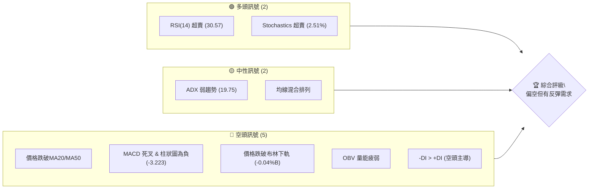
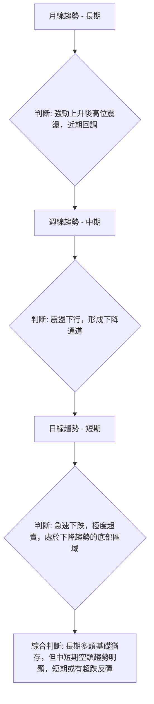
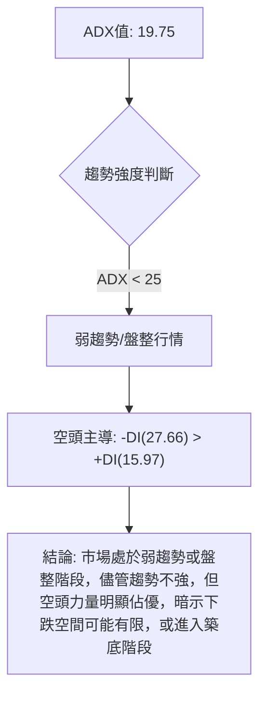
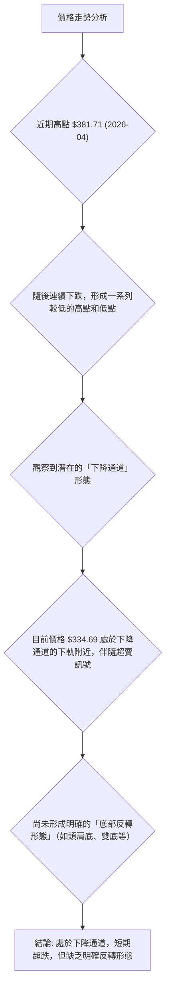
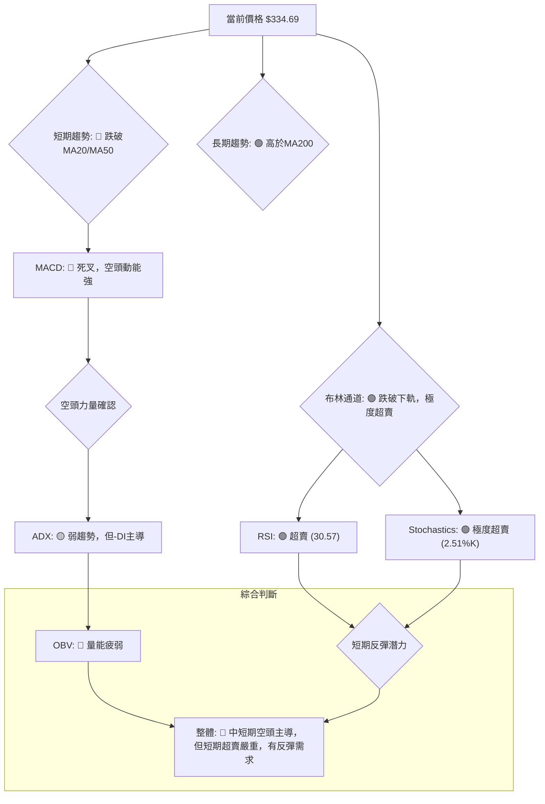
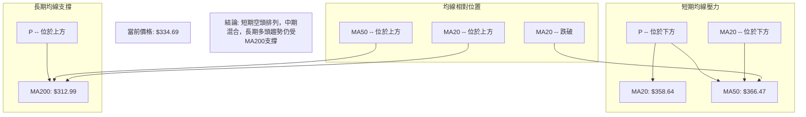
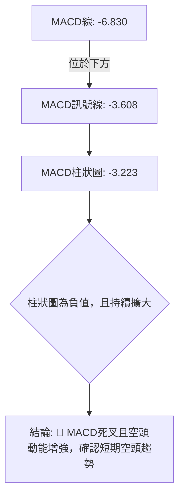
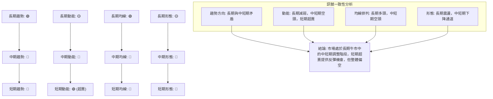
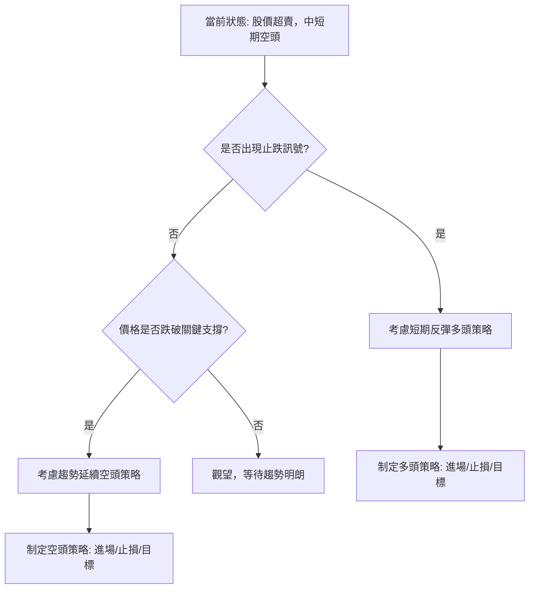
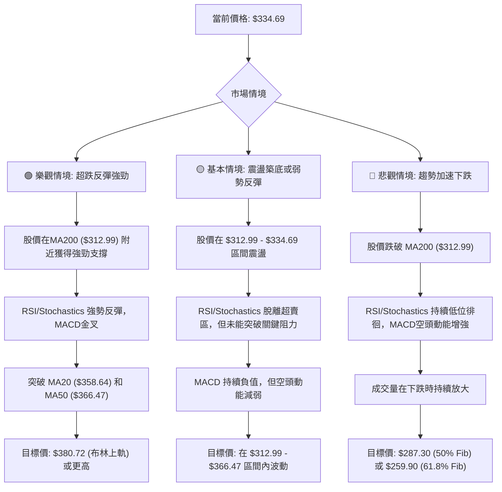

<details>
<summary>📊 靜態圖表 (點擊展開)</summary>

</details>

<html>
<head><meta charset="utf-8" /></head>
<body>
    <div style="height:500px; width:100%;">                        <script>window.PlotlyConfig = {MathJaxConfig: 'local'};</script>
        <script charset="utf-8" src="https://cdn.plot.ly/plotly-3.6.0.min.js" integrity="sha256-QaOVwtVY0T02VaHrr6pnoHLCwayMJp4O5n4YyaE3rJk=" crossorigin="anonymous"></script>                <div id="candlestick-chart" class="plotly-graph-div" style="height:100%; width:100%;"></div>            <script>                window.PLOTLYENV=window.PLOTLYENV || {};                                if (document.getElementById("candlestick-chart")) {                    Plotly.newPlot(                        "candlestick-chart",                        [{"close":{"dtype":"f8","bdata":"AAAAYOzibUAAAAAg4wluQAAAAMAMHW5AAAAAYI9ob0AAAACgs11vQAAAAGCPK29AAAAAwMN6b0AAAADgs9dvQAAAAIBUjG9AAAAAYBV7b0AAAADAC+tuQAAAACDOwm5AAAAAYEnWbkAAAAAgOXxuQAAAAKBaYm5AAAAA4OihbkAAAACAVb5uQAAAAAD5vm5AAAAAYJNgb0AAAADAsNRuQAAAAMBan25AAAAA4I43bkAAAABg0KBtQAAAAGAqhW5AAAAAQKu2bkAAAACg9mZvQAAAAKBkbG9AAAAAoGSpb0AAAACARghwQAAAAIAlW29AAAAA4CaBb0AAAAAAeqdvQAAAAKABQHBAAAAAYG7WcEAAAACAer5wQAAAAIAbKnFAAAAAoJOVcUAAAACgTJRxQAAAAAAHuXFAAAAAwEFYcUAAAACAFsNxQAAAAGCCzHFAAAAAIHJycUAAAABAWCByQAAAAGC1MnJAAAAAQOLtcUAAAAAAL2lxQAAAAOACR3FAAAAAQKnQcUAAAADgcMZxQAAAAGCrRnJAAAAAwJoWckAAAABgBbFyQAAAAGCN3XNAAAAAYBwwdEAAAACgdPpzQAAAAKDm93NAAAAAgA6oc0AAAADAbbZzQAAAAIDi\u002f3NAAAAAYEbcc0AAAADAWxd0QAAAAICioHNAAAAAYF3Vc0AAAAAgTAl0QAAAAGCmlHNAAAAAANZhc0AAAABgqU5zQAAAACBBNXNAAAAAgLyackAAAABAqPVyQAAAAOBQQ3NAAAAAYMduc0AAAADASbRzQAAAAOAgtHNAAAAAgMioc0AAAAAArZ9zQAAAAGA7onNAAAAAYD+Wc0AAAAAgia5zQAAAAIB+znNAAAAAYDuic0AAAADAJSB0QAAAAGBaWXRAAAAAIF6LdEAAAACAu8R0QAAAAODa\u002f3RAAAAAIPD9dEAAAACAmst0QAAAAMCKnnRAAAAAYNUbdEAAAAAgOX90QAAAACCIpnRAAAAAoAWAdEAAAABgedJ0QAAAAEAB6XRAAAAAQHX9dEAAAAAAfSN1QAAAAEBpIXVAAAAAwDKHdUAAAAAAFkR1QAAAAMB6znRAAAAAgFyudEAAAACA2ip0QAAAAECgP3RAAAAAQG3jc0AAAABgx25zQAAAAOB1T3NAAAAAIO4Zc0AAAAAgzOZyQAAAAKCx+HJAAAAAIJ\u002fyckAAAAAg06dzQAAAACCIdHNAAAAAYDpoc0AAAACA8YlzQAAAAID8K3NAAAAAgGBwc0AAAADgXB9zQAAAACCf8nJAAAAAIN3wckAAAADgRshyQAAAAECSnnJAAAAAIDcdc0AAAAAg7StzQAAAAIDAQ3NAAAAAIHHwckAAAACAddRyQAAAAGDKA3NAAAAAIJVTc0AAAAAg2iFzQAAAAOC8GHNAAAAAwMOpckAAAABAca1yQAAAAMBqEHJAAAAAIKcWckAAAABgI4lxQAAAAICGGXFAAAAAoJwPcUAAAADA\u002f+pxQAAAAOCPa3JAAAAAoIZkckAAAAAAspdyQAAAAID0+3JAAAAAoM+oc0AAAAAg4MJzQAAAAEB7uHNAAAAAwEnwc0AAAABAGaZ0QAAAACBN5HRAAAAAAB7JdEAAAABAIjN1QAAAACAs83RAAAAAAFekdEAAAAAgbhh1QAAAAOC\u002fGHVAAAAAYNNhdUAAAABA98R1QAAAAOCntHVAAAAAIJ6xdUAAAABAXdt3QAAAAADV73dAAAAAQJa2d0AAAAAgnwB4QAAAAABwrnhAAAAA4P6weEAAAACg+sx4QAAAAACZKHhAAAAAIG35d0AAAADAzOx4QAAAAODlznhAAAAAwFWReEAAAAAA+o14QAAAACCyCnhAAAAAILIKeEAAAABg1PN3QAAAAOBtsndAAAAAgLwJeEAAAACAkwl4QAAAAEA0HnhAAAAA4EGDd0AAAADAsUV3QAAAAIDKYnZAAAAAAHU3dkAAAAAgxBB3QAAAAOCj2HZAAAAAYLiSdkAAAADgo6R2QAAAAMAeFXZAAAAAwPVIdkAAAABgj2J2QAAAAIDC8XZAAAAAoJkxd0AAAACgmaF2QAAAACBc93ZAAAAA4HrMdUAAAACgR6F1QAAAAOCjkHVAAAAAQApjdUAAAABACut0QA=="},"high":{"dtype":"f8","bdata":"Z9113WczbkCIGG4wDkNuQB\u002fNDElcPm5AARmOoi2Ib0DAFK0egpdvQK6X79igbm9A1zyZPpK0b0AXizZtKgNwQJZBdQjg+W9An83SDrHIb0ArkuCJ4o5vQB50qS+Z2m5AlPO7wi40b0AJUbuU+2RvQKx1L59YZm5AMGAuM1TVbkADv6aQ0eRuQE0Zl4tO1G5ABhdM0Zx2b0BsCXCL2mFvQF4yfWfX2G5Au\u002fc6ZWOibkAtOZ23jYtuQB0MFQRYkG5Ar5QGGEbxbkC2JG1Mf4hvQLgdNMQ3EXBAYM1RiDTMb0BZ9u47AhZwQGTfKIIs3G9AF2O9jdQKcEAAL6bdgOtvQKs0hpnxX3BA5W1q51LkcEAA\u002fQ8dlu1wQDFPAtfhNnFAHRo6Ir41ckCVdzp5mdtxQIPc0SoX1nFAgfKU4oWUcUCSMj0gOuJxQP6jcrLrA3JAJaAjahi\u002fcUDk2nLHPC5yQP+cPDFKPHJA5zy+\u002f5s8ckBbF\u002f9SSa9xQOo4Cb2paXFAqZ1KBxpfckBpxdWk5g1yQPY+DCd6+nJAfqiKo6Ikc0C\u002f8iGX2PVyQPL661fK8nNAz8ug8m6AdEAWTdcCq0V0QBzbVXbZY3RARqGyXBPwc0DTgtbToN9zQFZaO3+PFnRAIynWpHgndECI9sDOJDN0QAoFtiL5DHRAsg2RX7Dkc0CwY3r5Mhd0QDAwp88dGXRAueZUlaO7c0D6tOfOq4RzQI7yvyACd3NAUjSa+qlMc0Ddmo8tyQ1zQEGt\u002f1djSXNA\u002fdqgBbF0c0C1co3vMb5zQOmUhg8JvnNAFHF3klnCc0B+OlqG8ahzQNEUfQmR1HNAAL4voKevc0AOS4KH4Sd0QJ5w4W5V7XNAq2x25z4SdEAHSneOn2B0QHapJgm9oXRAIDTqPcKwdEA\u002fkPF7DuB0QE6lhGATTHVAJhbIZnEJdUDh5u4OBRt1QK+ac+7W7HRA3UGd7ZZ6dECVbAYGp8R0QNUQ6ENc7HRAVQusUIHZdECHvPmek\u002f50QLcfbbBgHHVAmKOLqAcTdUAKM1cYfl11QG9BgNeIPXVA8ENZ1W6LdUCiyOubFtt1QAc3Lc7PfHVA\u002fMbSuVvDdEDcPe0RVqN0QAlBRQX\u002fdHRAT7mfNl0TdEB49jQxBAp0QN5I+X4SwXNA9vu1aMpHc0Ax+nnP3wdzQCGHTDgsGHNAINgLDBcac0A0yrzOi8VzQB6YHP6b8HNAjobNv2V\u002fc0BKWdWhApRzQMtCjNp2iXNA\u002fEGEZsN6c0AU2CdczjtzQG8tAJix+HJA\u002f1tkQfsQc0DD6KjZle9yQHNIKUYCv3JA9A766gwlc0AA++\u002fHbE9zQPo4ODkcbnNAj3NUH0VHc0DPXEoWNDFzQP6usOotFnNAl2Fh7NBdc0C3XV5pAmlzQJdJ0qjtJ3NAx1+uoP0Cc0A1vK4oAPNyQDpzbqm9jnJAIbskYrlnckD9hdSle+VxQGMBJ\u002f7AbnFAO0pfcIBBcUDicCmICe5xQMz9ZGbknHJA+Tq7U417ckCazX997aNyQJMBx3Ss\u002fnJAMIliqyrzc0CRIIJD09NzQKp+0c\u002fs9HNAFDRBVc7zc0AZsiT6Dqd0QCZZvbHG7HRAtyxTRNUSdUAF2xDvfDx1QB\u002f6v9xLL3VAN7aIvnkPdUB7d88iOh11QGF3+U9JP3VAUtjuf7t3dUC6iPTiBet1QPVYU1YI23VA5dYvv\u002f8SdkB6x83MZeZ3QHTdxfSM8ndA6ZHQ0C7\u002fd0AQGOjRnUt4QOY17\u002fFDwnhAxYbqL9vReEApNYkfFuJ4QHsA6B98oXhAEW+JK1IjeEDFwKzuB\u002ft4QFtbOrzS7XhA0LhtMUW6eEAtlzGjoEN5QJWnecYFknhAEcL+tXBneECB1QmqI0d4QFQ0n1k3CnhAVPcZBYgSeEBE5pxw2Vd4QOSk8DA\u002fXHhAZ3zVI7rWd0COagfG\u002fmV3QDYhqckUGXdA2kHD8oKkdkAquORLMxp3QFVYXKalD3dAAAAAgBS2dkAAAABgEht3QAAAAMD15HZAAAAAAClgdkAAAABAXsx2QAAAAGBmKndAAAAAoJlZd0AAAABgZiJ3QAAAAAAAEHdAAAAAQDNjdkAAAAAghct1QAAAAKBHDXZAAAAAQApzdUAAAACA64F1QA=="},"hovertemplate":"\u003cb\u003e%{x|%Y-%m-%d}\u003c\u002fb\u003e\u003cbr\u003e\u958b: $%{open:.2f}\u003cbr\u003e\u9ad8: $%{high:.2f}\u003cbr\u003e\u4f4e: $%{low:.2f}\u003cbr\u003e\u6536: $%{close:.2f}\u003cextra\u003e\u003c\u002fextra\u003e","low":{"dtype":"f8","bdata":"RoG9PJ20bUCyw6AOwINtQMZ9WOcRwW1A97CVRgaQbkAuC5eSPydvQJgm9uYfw25AMWxqE90zb0CMkvSUZXJvQPYHNCw4Sm9AEBYpaClTb0DZfo9mkNduQD94UzisJW5AmB5OZwrFbkBKTfX2LFduQDdD7mNG421AqGcDOW3XbUDSvlNoJFRuQOFtl6fcP25Astg+RLOmbkDfl8tgeMpuQK3o+o2Jk25AIh5bi8HmbUAe2nCmGodtQO5x69btCG5AYVaNMZkWbkByY1m41MluQBrS7aO\u002fRW9ACkyMlFEDb0APyb9HQ8NvQLdQLsMfhm5AtlcKEcE+b0CTbJHKwIhvQPfg7isr829APJ\u002fBW7+GcEAgPGq4W6pwQE4\u002fmmF6vnBArLA8Hmx+cUB0QiqOrk9xQCUW9gslfXFAKWs\u002fkyxFcUDyBF4LYlVxQAoNWA4bkXFAqKLmmjUzcUCfXhP9w69xQC6tzM0R9XFAnLoL8C29cUD262J5TFdxQBP57cAQ7nBAQtsjusi6cUAPRKVsbWdxQNHwiGC38XFAqxpnfasJckC1ihzji1xyQMgpd0y3THNAjh8D6hvTc0BIOq+tRclzQCvDlNoexXNAbdRtQtqVc0C4Fihsr5lzQLORw6ykmnNAIDB074+vc0Bi1zcoqvVzQOspkzMMeHNAtdaGTGSDc0DyUS5v0K9zQKqEdAucV3NAO7OkR\u002fMoc0C6E8nCdBVzQH9PE3nv9nJA67i3Qv2QckDUrbFtzcNyQNtC5YMg33JAFZmRtgkjc0CMppHagmVzQJ5iBtCTjnNAvFreIPiUc0CRe1Ev43dzQAol6ZJ1jXNAT29tba58c0CvJvu26WNzQFsiGrJmrXNA5DgqEOt+c0DqhXjjbqFzQLhX\u002ftwdGXRAYvy8EjBddEBrBUr4XFF0QCbRVV6e3nRAX1JhglOrdEDEBPL+uK10QE2QlBnee3RApYDOSYoHdECFATbB9\u002fFzQLd0I3o2h3RAi6t59at4dECMEsBbAHF0QKwxke4H1XRAXpUtDyW7dEAzweKTsmR0QMDFMVxLw3RAAxY75ST5dECB44GnXiJ1QIc4wtgKj3RAIBjKu08oc0D+kOwEt\u002ftzQCpH0PCQ1HNAzV3IWP2jc0DryiWqmltzQO0UZUX3O3NAfyL29A34ckAEu7tkM4hyQKgCAfpf2XJAwLaoMnHEckDUauYkXQBzQOjfW\u002fZdWXNARjmJcQwbc0DpKnG+TE9zQJHhctY+4HJAHGVB5x3zckBlr6h0rMpyQHDklyz9hHJAKYp+yoTGckCdOlpu5ZpyQEP8lc3VbXJA4NyHIg1cckCX5KmdBRJzQCWNRxt\u002fGnNADm68dovKckDAbXdjmLlyQPQdKC4O2nJAO\u002fEx16sCc0Am7ymcxxVzQMjMV2cazXJAnSSk5iSJckCOjFWwnJ1yQFwYmHnmCnJAeF0+eCfzcUBIGdhJHW5xQPxnm1AMFXFAFZ8zdPL1cEBGtz4if0lxQFXXhQC8FHJAxbTLOVr2cUBkDe8I0FlyQAJY3fP0c3JA+qloQ0WIc0BZOYK\u002filRzQIiTQ+icpXNAWS04eQWYc0CYaAQ7Tw90QMTaQbBlh3RApxpqQjW3dEBD\u002f1vNbtF0QGDzlyXc5nRABbPBceiWdEC2xD\u002fgJ8x0QFn9n0C87XRAo+D3v5XddEBi6Jwerkl1QGI62q4qgXVA7mmzpZVjdUDyRgQR8q12QKFOWXyMcHdAihgDsrGId0D\u002fl2yI8MF3QIWP2+7fLXhA9t0jKzRheEC3npWT7pZ4QPd6kJT2H3hA3Z3smd23d0CuaUaEm9V3QPDxllHeh3hAapJDxWhYeEBTqNlRo2p4QLXmTW5Q7HdAa6te0le8d0AmjIA0B7R3QMY5WSKFoHdAotj\u002fapeud0Bm6u3YUtx3QO+Gbr9U0HdAbJ5bnzJhd0CgAQdSzRd3QImzMFqVLHZAiBfgc6sidkBM6yCmYil2QJRs1IyZlnZAAAAAgD1edkAAAAAghSt2QAAAAMD1DHZAAAAAgBR6dUAAAACgcBV2QAAAAGBmynZAAAAAwB7VdkAAAAAgroN2QAAAAGC6SXZAAAAAQApPdUAAAACgcDt1QAAAAAAAWHVAAAAAYGb+dEAAAABACtt0QA=="},"name":"\u50f9\u683c","open":{"dtype":"f8","bdata":"P9TK1wXZbUCncJ6BcvVtQLGZe6uGCm5AJp8tdiKVbkAAWc7Kw3pvQDUTFrP6Xm9AUogmCMFrb0CXVYT875xvQFjVRs0CyW9A+kYqzRSlb0CvqP\u002fkA3VvQPEfXJmNi25Abzn27ZvpbkBQI5gCQvluQL98QVq0Um5Ab2JWnqkWbkDVydWIGqVuQKFT80wCmG5ATCsKE5OpbkAZ4L5nLQ5vQLg7KuT8tm5A3E3xU5SSbkDN5+8p9jVuQKTkNRrfEW5AY3tj0gYpbkB14o63MPNuQMfdIYATf29A+FnXWXdbb0D320YPYtdvQN3FfpcF2G9A3CXcQVvQb0Be8BG7hKZvQCvHhBi\u002fDHBA2VtDPnSNcEBGlWlRvtpwQBqSYzBawXBAL2n3sGMyckAf1hNnaqpxQIQh\u002fH7hnXFAT3v5OF5IcUCht6UGVm1xQJzBzxXR0nFAxCUD3Xa6cUBnbrXKT8txQGBVYv0t+nFAj3TN0zc4ckCle\u002fMH56ZxQMmtJl7P9XBAur0Pl2\u002fdcUCzyIEBu\u002f5xQMaFzKH08XFAF06AXU0Cc0Aad3bGoIRyQNw3\u002fQVtZnNAJFddTpJidEDmu2WecAJ0QO0Jw9rBLHRA3Uk1wanNc0BjZOwye8RzQEprHqeWtnNA4KmS85smdEAr8Tbf+\u002fVzQE\u002fkZPTGCXRAUfSe2w+Lc0Baz7MJT8NzQLBBizHlCnRAaZ7ipSWmc0BtrIz1eINzQO\u002fdeD+cGXNAbdbBN7VJc0DdmkOwoepyQLSJScv87XJAZdOp7xltc0CSY7HLqWtzQE1jI0\u002fMu3NAGkBBnh+4c0AWrmGkloZzQL729RcEkHNA5VdobGCPc0DqtHzdztJzQLDC03581HNA0dYvn1XOc0DnEqxDjaJzQLUv2nldjXRAsuDqcQBxdEA8uIatLmF0QPtesqV67XRAetQW9cPodEAg6ZQ10hl1QGYI1E\u002f353RAta7p6iENdEDurkKx0Ap0QEToDbFC3XRAS2tKqojDdEDsCBnQWHx0QFcS3mES83RAo6BrHLsCdUBRlDs3fj51QDsQokFg4HRAJmxQwsUBdUAbFlp59sB1QN3SjfPmdHVAglnvCamMc0DM0R3Iw250QAaZacQhDXRAMXXq79sHdEAfEoMWs+hzQGBwSRIUf3NAvc0iP1Q5c0CaBQaH9sNyQL4Ege+Y4HJAUT8mzwDickDJkPB8bwZzQPB7IY2T63NAVJIo\u002f8Bjc0Aj3Vj9ZntzQGHyZyVZhnNAJAyribH4ckD7es0lHelyQLUPkDl9oHJAAW\u002fntqPkckDGPkWC3uxyQNwzx0j4enJAd207YVRfckC2Dld5DhtzQBzWJhnaIXNAcNbsu2kgc0DsSNVzhydzQJdPL6Wt9nJAWitgzckHc0CMaLdLhDtzQD9kcRVx8HJA5XTinTH+ckBpmLeHlsVyQOi5xFqCgHJAaZ1OkZY\u002fckDBvs4ySeBxQDO4G+i6U3FAXraCtWM0cUAd+UgW+FVxQOQ+4L7jHHJA+3sn+g4NckAn5PYqXWhyQPA3OxZav3JAMhU+ozjac0BOnnm1BpBzQBzFAJSJ4HNAiQ0tVq+zc0Bnw\u002ffZ8B10QGpr92HHpXRAPklXKV76dEByBmleqeN0QLPMJLezJXVAuA4nZiH2dECHvjgC8Op0QAv476DuNXVA1dZCFUUYdUCiAGROxXp1QKgPzK1hq3VADNEgAluUdUBlSDXTgTB3QKKj2egKnHdAmI7V5XDhd0BpWrupPtp3QCPOacywVXhAfXP6iSPNeECbjjWZhqB4QA5VpbdHZ3hAV5zDd0sMeEDiD0n3zdp3QAnJxrPZmHhAKco64qePeEAC7jvtOX54QBdvOM4DkXhAUsKxR+8MeEA\u002ffNLYe9x3QAs8\u002ftB48HdAQ3AO2UDMd0B1VGt2juh3QImOWtEQ+ndAidPdb+7Pd0BHHyNjnUV3QKZ8ap8Qr3ZAdxuMVelhdkDJz3mSnjN2QIzzFj2VsnZAAAAAgMKndkAAAAAAKc52QAAAAMDMkHZAAAAAwMwQdkAAAACgmZF2QAAAAADX33ZAAAAAoHD3dkAAAADAzPB2QAAAAIA9vnZAAAAAAClSdkAAAAAgrkF1QAAAACCFy3VAAAAAYLgOdUAAAAAgrk91QA=="},"x":["2025-09-10T00:00:00-04:00","2025-09-11T00:00:00-04:00","2025-09-12T00:00:00-04:00","2025-09-15T00:00:00-04:00","2025-09-16T00:00:00-04:00","2025-09-17T00:00:00-04:00","2025-09-18T00:00:00-04:00","2025-09-19T00:00:00-04:00","2025-09-22T00:00:00-04:00","2025-09-23T00:00:00-04:00","2025-09-24T00:00:00-04:00","2025-09-25T00:00:00-04:00","2025-09-26T00:00:00-04:00","2025-09-29T00:00:00-04:00","2025-09-30T00:00:00-04:00","2025-10-01T00:00:00-04:00","2025-10-02T00:00:00-04:00","2025-10-03T00:00:00-04:00","2025-10-06T00:00:00-04:00","2025-10-07T00:00:00-04:00","2025-10-08T00:00:00-04:00","2025-10-09T00:00:00-04:00","2025-10-10T00:00:00-04:00","2025-10-13T00:00:00-04:00","2025-10-14T00:00:00-04:00","2025-10-15T00:00:00-04:00","2025-10-16T00:00:00-04:00","2025-10-17T00:00:00-04:00","2025-10-20T00:00:00-04:00","2025-10-21T00:00:00-04:00","2025-10-22T00:00:00-04:00","2025-10-23T00:00:00-04:00","2025-10-24T00:00:00-04:00","2025-10-27T00:00:00-04:00","2025-10-28T00:00:00-04:00","2025-10-29T00:00:00-04:00","2025-10-30T00:00:00-04:00","2025-10-31T00:00:00-04:00","2025-11-03T00:00:00-05:00","2025-11-04T00:00:00-05:00","2025-11-05T00:00:00-05:00","2025-11-06T00:00:00-05:00","2025-11-07T00:00:00-05:00","2025-11-10T00:00:00-05:00","2025-11-11T00:00:00-05:00","2025-11-12T00:00:00-05:00","2025-11-13T00:00:00-05:00","2025-11-14T00:00:00-05:00","2025-11-17T00:00:00-05:00","2025-11-18T00:00:00-05:00","2025-11-19T00:00:00-05:00","2025-11-20T00:00:00-05:00","2025-11-21T00:00:00-05:00","2025-11-24T00:00:00-05:00","2025-11-25T00:00:00-05:00","2025-11-26T00:00:00-05:00","2025-11-28T00:00:00-05:00","2025-12-01T00:00:00-05:00","2025-12-02T00:00:00-05:00","2025-12-03T00:00:00-05:00","2025-12-04T00:00:00-05:00","2025-12-05T00:00:00-05:00","2025-12-08T00:00:00-05:00","2025-12-09T00:00:00-05:00","2025-12-10T00:00:00-05:00","2025-12-11T00:00:00-05:00","2025-12-12T00:00:00-05:00","2025-12-15T00:00:00-05:00","2025-12-16T00:00:00-05:00","2025-12-17T00:00:00-05:00","2025-12-18T00:00:00-05:00","2025-12-19T00:00:00-05:00","2025-12-22T00:00:00-05:00","2025-12-23T00:00:00-05:00","2025-12-24T00:00:00-05:00","2025-12-26T00:00:00-05:00","2025-12-29T00:00:00-05:00","2025-12-30T00:00:00-05:00","2025-12-31T00:00:00-05:00","2026-01-02T00:00:00-05:00","2026-01-05T00:00:00-05:00","2026-01-06T00:00:00-05:00","2026-01-07T00:00:00-05:00","2026-01-08T00:00:00-05:00","2026-01-09T00:00:00-05:00","2026-01-12T00:00:00-05:00","2026-01-13T00:00:00-05:00","2026-01-14T00:00:00-05:00","2026-01-15T00:00:00-05:00","2026-01-16T00:00:00-05:00","2026-01-20T00:00:00-05:00","2026-01-21T00:00:00-05:00","2026-01-22T00:00:00-05:00","2026-01-23T00:00:00-05:00","2026-01-26T00:00:00-05:00","2026-01-27T00:00:00-05:00","2026-01-28T00:00:00-05:00","2026-01-29T00:00:00-05:00","2026-01-30T00:00:00-05:00","2026-02-02T00:00:00-05:00","2026-02-03T00:00:00-05:00","2026-02-04T00:00:00-05:00","2026-02-05T00:00:00-05:00","2026-02-06T00:00:00-05:00","2026-02-09T00:00:00-05:00","2026-02-10T00:00:00-05:00","2026-02-11T00:00:00-05:00","2026-02-12T00:00:00-05:00","2026-02-13T00:00:00-05:00","2026-02-17T00:00:00-05:00","2026-02-18T00:00:00-05:00","2026-02-19T00:00:00-05:00","2026-02-20T00:00:00-05:00","2026-02-23T00:00:00-05:00","2026-02-24T00:00:00-05:00","2026-02-25T00:00:00-05:00","2026-02-26T00:00:00-05:00","2026-02-27T00:00:00-05:00","2026-03-02T00:00:00-05:00","2026-03-03T00:00:00-05:00","2026-03-04T00:00:00-05:00","2026-03-05T00:00:00-05:00","2026-03-06T00:00:00-05:00","2026-03-09T00:00:00-04:00","2026-03-10T00:00:00-04:00","2026-03-11T00:00:00-04:00","2026-03-12T00:00:00-04:00","2026-03-13T00:00:00-04:00","2026-03-16T00:00:00-04:00","2026-03-17T00:00:00-04:00","2026-03-18T00:00:00-04:00","2026-03-19T00:00:00-04:00","2026-03-20T00:00:00-04:00","2026-03-23T00:00:00-04:00","2026-03-24T00:00:00-04:00","2026-03-25T00:00:00-04:00","2026-03-26T00:00:00-04:00","2026-03-27T00:00:00-04:00","2026-03-30T00:00:00-04:00","2026-03-31T00:00:00-04:00","2026-04-01T00:00:00-04:00","2026-04-02T00:00:00-04:00","2026-04-06T00:00:00-04:00","2026-04-07T00:00:00-04:00","2026-04-08T00:00:00-04:00","2026-04-09T00:00:00-04:00","2026-04-10T00:00:00-04:00","2026-04-13T00:00:00-04:00","2026-04-14T00:00:00-04:00","2026-04-15T00:00:00-04:00","2026-04-16T00:00:00-04:00","2026-04-17T00:00:00-04:00","2026-04-20T00:00:00-04:00","2026-04-21T00:00:00-04:00","2026-04-22T00:00:00-04:00","2026-04-23T00:00:00-04:00","2026-04-24T00:00:00-04:00","2026-04-27T00:00:00-04:00","2026-04-28T00:00:00-04:00","2026-04-29T00:00:00-04:00","2026-04-30T00:00:00-04:00","2026-05-01T00:00:00-04:00","2026-05-04T00:00:00-04:00","2026-05-05T00:00:00-04:00","2026-05-06T00:00:00-04:00","2026-05-07T00:00:00-04:00","2026-05-08T00:00:00-04:00","2026-05-11T00:00:00-04:00","2026-05-12T00:00:00-04:00","2026-05-13T00:00:00-04:00","2026-05-14T00:00:00-04:00","2026-05-15T00:00:00-04:00","2026-05-18T00:00:00-04:00","2026-05-19T00:00:00-04:00","2026-05-20T00:00:00-04:00","2026-05-21T00:00:00-04:00","2026-05-22T00:00:00-04:00","2026-05-26T00:00:00-04:00","2026-05-27T00:00:00-04:00","2026-05-28T00:00:00-04:00","2026-05-29T00:00:00-04:00","2026-06-01T00:00:00-04:00","2026-06-02T00:00:00-04:00","2026-06-03T00:00:00-04:00","2026-06-04T00:00:00-04:00","2026-06-05T00:00:00-04:00","2026-06-08T00:00:00-04:00","2026-06-09T00:00:00-04:00","2026-06-10T00:00:00-04:00","2026-06-11T00:00:00-04:00","2026-06-12T00:00:00-04:00","2026-06-15T00:00:00-04:00","2026-06-16T00:00:00-04:00","2026-06-17T00:00:00-04:00","2026-06-18T00:00:00-04:00","2026-06-22T00:00:00-04:00","2026-06-23T00:00:00-04:00","2026-06-24T00:00:00-04:00","2026-06-25T00:00:00-04:00","2026-06-26T00:00:00-04:00"],"type":"candlestick"},{"hovertemplate":"MA30: $%{y:.2f}\u003cextra\u003e\u003c\u002fextra\u003e","line":{"color":"#2196F3","dash":"dash","width":2},"mode":"lines","name":"MA30","x":["2025-09-10T00:00:00-04:00","2025-09-11T00:00:00-04:00","2025-09-12T00:00:00-04:00","2025-09-15T00:00:00-04:00","2025-09-16T00:00:00-04:00","2025-09-17T00:00:00-04:00","2025-09-18T00:00:00-04:00","2025-09-19T00:00:00-04:00","2025-09-22T00:00:00-04:00","2025-09-23T00:00:00-04:00","2025-09-24T00:00:00-04:00","2025-09-25T00:00:00-04:00","2025-09-26T00:00:00-04:00","2025-09-29T00:00:00-04:00","2025-09-30T00:00:00-04:00","2025-10-01T00:00:00-04:00","2025-10-02T00:00:00-04:00","2025-10-03T00:00:00-04:00","2025-10-06T00:00:00-04:00","2025-10-07T00:00:00-04:00","2025-10-08T00:00:00-04:00","2025-10-09T00:00:00-04:00","2025-10-10T00:00:00-04:00","2025-10-13T00:00:00-04:00","2025-10-14T00:00:00-04:00","2025-10-15T00:00:00-04:00","2025-10-16T00:00:00-04:00","2025-10-17T00:00:00-04:00","2025-10-20T00:00:00-04:00","2025-10-21T00:00:00-04:00","2025-10-22T00:00:00-04:00","2025-10-23T00:00:00-04:00","2025-10-24T00:00:00-04:00","2025-10-27T00:00:00-04:00","2025-10-28T00:00:00-04:00","2025-10-29T00:00:00-04:00","2025-10-30T00:00:00-04:00","2025-10-31T00:00:00-04:00","2025-11-03T00:00:00-05:00","2025-11-04T00:00:00-05:00","2025-11-05T00:00:00-05:00","2025-11-06T00:00:00-05:00","2025-11-07T00:00:00-05:00","2025-11-10T00:00:00-05:00","2025-11-11T00:00:00-05:00","2025-11-12T00:00:00-05:00","2025-11-13T00:00:00-05:00","2025-11-14T00:00:00-05:00","2025-11-17T00:00:00-05:00","2025-11-18T00:00:00-05:00","2025-11-19T00:00:00-05:00","2025-11-20T00:00:00-05:00","2025-11-21T00:00:00-05:00","2025-11-24T00:00:00-05:00","2025-11-25T00:00:00-05:00","2025-11-26T00:00:00-05:00","2025-11-28T00:00:00-05:00","2025-12-01T00:00:00-05:00","2025-12-02T00:00:00-05:00","2025-12-03T00:00:00-05:00","2025-12-04T00:00:00-05:00","2025-12-05T00:00:00-05:00","2025-12-08T00:00:00-05:00","2025-12-09T00:00:00-05:00","2025-12-10T00:00:00-05:00","2025-12-11T00:00:00-05:00","2025-12-12T00:00:00-05:00","2025-12-15T00:00:00-05:00","2025-12-16T00:00:00-05:00","2025-12-17T00:00:00-05:00","2025-12-18T00:00:00-05:00","2025-12-19T00:00:00-05:00","2025-12-22T00:00:00-05:00","2025-12-23T00:00:00-05:00","2025-12-24T00:00:00-05:00","2025-12-26T00:00:00-05:00","2025-12-29T00:00:00-05:00","2025-12-30T00:00:00-05:00","2025-12-31T00:00:00-05:00","2026-01-02T00:00:00-05:00","2026-01-05T00:00:00-05:00","2026-01-06T00:00:00-05:00","2026-01-07T00:00:00-05:00","2026-01-08T00:00:00-05:00","2026-01-09T00:00:00-05:00","2026-01-12T00:00:00-05:00","2026-01-13T00:00:00-05:00","2026-01-14T00:00:00-05:00","2026-01-15T00:00:00-05:00","2026-01-16T00:00:00-05:00","2026-01-20T00:00:00-05:00","2026-01-21T00:00:00-05:00","2026-01-22T00:00:00-05:00","2026-01-23T00:00:00-05:00","2026-01-26T00:00:00-05:00","2026-01-27T00:00:00-05:00","2026-01-28T00:00:00-05:00","2026-01-29T00:00:00-05:00","2026-01-30T00:00:00-05:00","2026-02-02T00:00:00-05:00","2026-02-03T00:00:00-05:00","2026-02-04T00:00:00-05:00","2026-02-05T00:00:00-05:00","2026-02-06T00:00:00-05:00","2026-02-09T00:00:00-05:00","2026-02-10T00:00:00-05:00","2026-02-11T00:00:00-05:00","2026-02-12T00:00:00-05:00","2026-02-13T00:00:00-05:00","2026-02-17T00:00:00-05:00","2026-02-18T00:00:00-05:00","2026-02-19T00:00:00-05:00","2026-02-20T00:00:00-05:00","2026-02-23T00:00:00-05:00","2026-02-24T00:00:00-05:00","2026-02-25T00:00:00-05:00","2026-02-26T00:00:00-05:00","2026-02-27T00:00:00-05:00","2026-03-02T00:00:00-05:00","2026-03-03T00:00:00-05:00","2026-03-04T00:00:00-05:00","2026-03-05T00:00:00-05:00","2026-03-06T00:00:00-05:00","2026-03-09T00:00:00-04:00","2026-03-10T00:00:00-04:00","2026-03-11T00:00:00-04:00","2026-03-12T00:00:00-04:00","2026-03-13T00:00:00-04:00","2026-03-16T00:00:00-04:00","2026-03-17T00:00:00-04:00","2026-03-18T00:00:00-04:00","2026-03-19T00:00:00-04:00","2026-03-20T00:00:00-04:00","2026-03-23T00:00:00-04:00","2026-03-24T00:00:00-04:00","2026-03-25T00:00:00-04:00","2026-03-26T00:00:00-04:00","2026-03-27T00:00:00-04:00","2026-03-30T00:00:00-04:00","2026-03-31T00:00:00-04:00","2026-04-01T00:00:00-04:00","2026-04-02T00:00:00-04:00","2026-04-06T00:00:00-04:00","2026-04-07T00:00:00-04:00","2026-04-08T00:00:00-04:00","2026-04-09T00:00:00-04:00","2026-04-10T00:00:00-04:00","2026-04-13T00:00:00-04:00","2026-04-14T00:00:00-04:00","2026-04-15T00:00:00-04:00","2026-04-16T00:00:00-04:00","2026-04-17T00:00:00-04:00","2026-04-20T00:00:00-04:00","2026-04-21T00:00:00-04:00","2026-04-22T00:00:00-04:00","2026-04-23T00:00:00-04:00","2026-04-24T00:00:00-04:00","2026-04-27T00:00:00-04:00","2026-04-28T00:00:00-04:00","2026-04-29T00:00:00-04:00","2026-04-30T00:00:00-04:00","2026-05-01T00:00:00-04:00","2026-05-04T00:00:00-04:00","2026-05-05T00:00:00-04:00","2026-05-06T00:00:00-04:00","2026-05-07T00:00:00-04:00","2026-05-08T00:00:00-04:00","2026-05-11T00:00:00-04:00","2026-05-12T00:00:00-04:00","2026-05-13T00:00:00-04:00","2026-05-14T00:00:00-04:00","2026-05-15T00:00:00-04:00","2026-05-18T00:00:00-04:00","2026-05-19T00:00:00-04:00","2026-05-20T00:00:00-04:00","2026-05-21T00:00:00-04:00","2026-05-22T00:00:00-04:00","2026-05-26T00:00:00-04:00","2026-05-27T00:00:00-04:00","2026-05-28T00:00:00-04:00","2026-05-29T00:00:00-04:00","2026-06-01T00:00:00-04:00","2026-06-02T00:00:00-04:00","2026-06-03T00:00:00-04:00","2026-06-04T00:00:00-04:00","2026-06-05T00:00:00-04:00","2026-06-08T00:00:00-04:00","2026-06-09T00:00:00-04:00","2026-06-10T00:00:00-04:00","2026-06-11T00:00:00-04:00","2026-06-12T00:00:00-04:00","2026-06-15T00:00:00-04:00","2026-06-16T00:00:00-04:00","2026-06-17T00:00:00-04:00","2026-06-18T00:00:00-04:00","2026-06-22T00:00:00-04:00","2026-06-23T00:00:00-04:00","2026-06-24T00:00:00-04:00","2026-06-25T00:00:00-04:00","2026-06-26T00:00:00-04:00"],"y":{"dtype":"f8","bdata":"AAAAAAAA+H8AAAAAAAD4fwAAAAAAAPh\u002fAAAAAAAA+H8AAAAAAAD4fwAAAAAAAPh\u002fAAAAAAAA+H8AAAAAAAD4fwAAAAAAAPh\u002fAAAAAAAA+H8AAAAAAAD4fwAAAAAAAPh\u002fAAAAAAAA+H8AAAAAAAD4fwAAAAAAAPh\u002fAAAAAAAA+H8AAAAAAAD4fwAAAAAAAPh\u002fAAAAAAAA+H8AAAAAAAD4fwAAAAAAAPh\u002fAAAAAAAA+H8AAAAAAAD4fwAAAAAAAPh\u002fAAAAAAAA+H8AAAAAAAD4fwAAAAAAAPh\u002fAAAAAAAA+H8AAAAAAAD4f97d3Y0G7G5A3t3dTdX5bkCamZmZngdvQGZmZib8G29AAAAAEFQvb0B3d3fXb0FvQM3MzFxkXG9AVVVVJd97b0Dv7u4OK5hvQJqZmflsuW9AMzMzg87Ub0C8u7trHPxvQBEREUGxEnBAq6qqogAkcECamZk5nDxwQM3MzORCVnBAZmZmFo9scEARERGh9X1wQHd3d9c1jnBAERERKVugcEBEREQcfrRwQAAAANjKzXBAmpmZSTjncEAAAACYTghxQCIiIiKbL3FAVVVV9dRYcUBERES8VH1xQLy7u4unoXFAiYiIwEzCcUDe3d11tOFxQERERPyUBnJAvLu7e6MpckBERESkBk5yQN7d3c3YanJA3t3dTWmEckC8u7tbgaByQGZmZpYftXJAIiIiInfEckBVVVX1NdNyQAAAAJDi33JAMzMzY6LqckAiIiJy2vRyQLy7u8tYAXNAIiIikkoSc0De3d2NwR9zQImIiHiaLHNAERER4V07c0AiIiLyP05zQN7d3W1bYnNAiYiICHpxc0C8u7sbv4FzQN7d3a3OjnNAMzMzs\u002f6bc0AzMzODO6hzQCIiIvJbrHNAvLu7q2avc0BERETEJLZzQM3MzCzxvnNAAAAAkFbKc0CamZnJk9NzQJqZmand2HNAd3d3B\u002fzac0B3d3dXct5zQCIiIjIt53NAiYiIeN3sc0De3d0tkvNzQKuqqorq\u002fnNAzczMDKMMdEBERES0Qxx0QBEREXGrLHRAERERUZ5FdEBERESkTFl0QERERLR4ZnRA7+7uzh9xdEARERGRE3V0QCIiIvK5eXRA7+7uXq57dEDe3d0dDXp0QM3MzMxKd3RAVVVV9SVzdEBmZmaGfWx0QImIiBhdZXRA3t3djYJfdEDNzMzMf1t0QBERETHfU3RAzczMzCpKdECamZmZrD90QO\u002fu7h4UMHRAmpmZmdMidEB3d3dHjRR0QBEREbFJBnRAvLu7e1L8c0Dv7u7OsO1zQAAAANBb3HNAERERIYjQc0AzMzNjcsJzQCIiIrJntHNA7+7ujueic0C8u7sbNI9zQHd3d0cmfXNAIiIiwlxqc0AAAACQJ1hzQKuqqiqQSXNAAAAA4Fc4c0CrqqoqoStzQAAAAED9GHNAAAAAUKEJc0De3d0tcflyQN7d3d2T5nJAAAAAwCrVckAiIiISxsxyQO\u002fu7r4RyHJAIiIiMlXDckBmZmYGQ7pyQKuqqho+tnJAZmZmNmW4ckCJiIgIS7pyQM3MzOz5vnJA7+7ubj3DckBmZma2Q9ByQERERJTa4HJAmpmZeZjwckAzMzNjOQVzQCIiImIcGXNAq6qq+iUmc0De3d2tkDZzQKuqqsoyRnNAZmZmZgtbc0CrqqrKIHRzQLy7uxsXi3NAvLu7m0qfc0B3d3fHm8dzQCIiImLp8HNAd3d3dwEcdEDe3d3tcUl0QCIiIpLpgXRARERE1EG6dECJiIh4QPh0QCIiItJ8NHVAzczMPHtvdUBmZmZWRqt1QERERDTJ4XVAZmZmxnoWdkCrqqoKW0l2QO\u002fu7n6DdHZAmpmZ6eiZdkCamZnJrL12QGZmZkab33ZAERERkZYCd0CrqqoKgR93QO\u002fu7r4IO3dAVVVVNU5Sd0CJiIio\u002fWN3QLy7u6s+cHdAq6qqmq59d0BVVVVFfo53QFVVVUVsnXdAmpmZCZand0CamZm5Cq93QDMzM+NBsndAd3d3V023d0AiIiLyvap3QM3MzNxFondAq6qqCtedd0CJiIioI5J3QM3MzNyAg3dAvLu7y9Fqd0C8u7tLw093QGZmZoahOXdAmpmZKY0jd0AzMzMDXAF3QA=="},"type":"scatter"},{"hovertemplate":"MA60: $%{y:.2f}\u003cextra\u003e\u003c\u002fextra\u003e","line":{"color":"#9C27B0","dash":"dash","width":2},"mode":"lines","name":"MA60","x":["2025-09-10T00:00:00-04:00","2025-09-11T00:00:00-04:00","2025-09-12T00:00:00-04:00","2025-09-15T00:00:00-04:00","2025-09-16T00:00:00-04:00","2025-09-17T00:00:00-04:00","2025-09-18T00:00:00-04:00","2025-09-19T00:00:00-04:00","2025-09-22T00:00:00-04:00","2025-09-23T00:00:00-04:00","2025-09-24T00:00:00-04:00","2025-09-25T00:00:00-04:00","2025-09-26T00:00:00-04:00","2025-09-29T00:00:00-04:00","2025-09-30T00:00:00-04:00","2025-10-01T00:00:00-04:00","2025-10-02T00:00:00-04:00","2025-10-03T00:00:00-04:00","2025-10-06T00:00:00-04:00","2025-10-07T00:00:00-04:00","2025-10-08T00:00:00-04:00","2025-10-09T00:00:00-04:00","2025-10-10T00:00:00-04:00","2025-10-13T00:00:00-04:00","2025-10-14T00:00:00-04:00","2025-10-15T00:00:00-04:00","2025-10-16T00:00:00-04:00","2025-10-17T00:00:00-04:00","2025-10-20T00:00:00-04:00","2025-10-21T00:00:00-04:00","2025-10-22T00:00:00-04:00","2025-10-23T00:00:00-04:00","2025-10-24T00:00:00-04:00","2025-10-27T00:00:00-04:00","2025-10-28T00:00:00-04:00","2025-10-29T00:00:00-04:00","2025-10-30T00:00:00-04:00","2025-10-31T00:00:00-04:00","2025-11-03T00:00:00-05:00","2025-11-04T00:00:00-05:00","2025-11-05T00:00:00-05:00","2025-11-06T00:00:00-05:00","2025-11-07T00:00:00-05:00","2025-11-10T00:00:00-05:00","2025-11-11T00:00:00-05:00","2025-11-12T00:00:00-05:00","2025-11-13T00:00:00-05:00","2025-11-14T00:00:00-05:00","2025-11-17T00:00:00-05:00","2025-11-18T00:00:00-05:00","2025-11-19T00:00:00-05:00","2025-11-20T00:00:00-05:00","2025-11-21T00:00:00-05:00","2025-11-24T00:00:00-05:00","2025-11-25T00:00:00-05:00","2025-11-26T00:00:00-05:00","2025-11-28T00:00:00-05:00","2025-12-01T00:00:00-05:00","2025-12-02T00:00:00-05:00","2025-12-03T00:00:00-05:00","2025-12-04T00:00:00-05:00","2025-12-05T00:00:00-05:00","2025-12-08T00:00:00-05:00","2025-12-09T00:00:00-05:00","2025-12-10T00:00:00-05:00","2025-12-11T00:00:00-05:00","2025-12-12T00:00:00-05:00","2025-12-15T00:00:00-05:00","2025-12-16T00:00:00-05:00","2025-12-17T00:00:00-05:00","2025-12-18T00:00:00-05:00","2025-12-19T00:00:00-05:00","2025-12-22T00:00:00-05:00","2025-12-23T00:00:00-05:00","2025-12-24T00:00:00-05:00","2025-12-26T00:00:00-05:00","2025-12-29T00:00:00-05:00","2025-12-30T00:00:00-05:00","2025-12-31T00:00:00-05:00","2026-01-02T00:00:00-05:00","2026-01-05T00:00:00-05:00","2026-01-06T00:00:00-05:00","2026-01-07T00:00:00-05:00","2026-01-08T00:00:00-05:00","2026-01-09T00:00:00-05:00","2026-01-12T00:00:00-05:00","2026-01-13T00:00:00-05:00","2026-01-14T00:00:00-05:00","2026-01-15T00:00:00-05:00","2026-01-16T00:00:00-05:00","2026-01-20T00:00:00-05:00","2026-01-21T00:00:00-05:00","2026-01-22T00:00:00-05:00","2026-01-23T00:00:00-05:00","2026-01-26T00:00:00-05:00","2026-01-27T00:00:00-05:00","2026-01-28T00:00:00-05:00","2026-01-29T00:00:00-05:00","2026-01-30T00:00:00-05:00","2026-02-02T00:00:00-05:00","2026-02-03T00:00:00-05:00","2026-02-04T00:00:00-05:00","2026-02-05T00:00:00-05:00","2026-02-06T00:00:00-05:00","2026-02-09T00:00:00-05:00","2026-02-10T00:00:00-05:00","2026-02-11T00:00:00-05:00","2026-02-12T00:00:00-05:00","2026-02-13T00:00:00-05:00","2026-02-17T00:00:00-05:00","2026-02-18T00:00:00-05:00","2026-02-19T00:00:00-05:00","2026-02-20T00:00:00-05:00","2026-02-23T00:00:00-05:00","2026-02-24T00:00:00-05:00","2026-02-25T00:00:00-05:00","2026-02-26T00:00:00-05:00","2026-02-27T00:00:00-05:00","2026-03-02T00:00:00-05:00","2026-03-03T00:00:00-05:00","2026-03-04T00:00:00-05:00","2026-03-05T00:00:00-05:00","2026-03-06T00:00:00-05:00","2026-03-09T00:00:00-04:00","2026-03-10T00:00:00-04:00","2026-03-11T00:00:00-04:00","2026-03-12T00:00:00-04:00","2026-03-13T00:00:00-04:00","2026-03-16T00:00:00-04:00","2026-03-17T00:00:00-04:00","2026-03-18T00:00:00-04:00","2026-03-19T00:00:00-04:00","2026-03-20T00:00:00-04:00","2026-03-23T00:00:00-04:00","2026-03-24T00:00:00-04:00","2026-03-25T00:00:00-04:00","2026-03-26T00:00:00-04:00","2026-03-27T00:00:00-04:00","2026-03-30T00:00:00-04:00","2026-03-31T00:00:00-04:00","2026-04-01T00:00:00-04:00","2026-04-02T00:00:00-04:00","2026-04-06T00:00:00-04:00","2026-04-07T00:00:00-04:00","2026-04-08T00:00:00-04:00","2026-04-09T00:00:00-04:00","2026-04-10T00:00:00-04:00","2026-04-13T00:00:00-04:00","2026-04-14T00:00:00-04:00","2026-04-15T00:00:00-04:00","2026-04-16T00:00:00-04:00","2026-04-17T00:00:00-04:00","2026-04-20T00:00:00-04:00","2026-04-21T00:00:00-04:00","2026-04-22T00:00:00-04:00","2026-04-23T00:00:00-04:00","2026-04-24T00:00:00-04:00","2026-04-27T00:00:00-04:00","2026-04-28T00:00:00-04:00","2026-04-29T00:00:00-04:00","2026-04-30T00:00:00-04:00","2026-05-01T00:00:00-04:00","2026-05-04T00:00:00-04:00","2026-05-05T00:00:00-04:00","2026-05-06T00:00:00-04:00","2026-05-07T00:00:00-04:00","2026-05-08T00:00:00-04:00","2026-05-11T00:00:00-04:00","2026-05-12T00:00:00-04:00","2026-05-13T00:00:00-04:00","2026-05-14T00:00:00-04:00","2026-05-15T00:00:00-04:00","2026-05-18T00:00:00-04:00","2026-05-19T00:00:00-04:00","2026-05-20T00:00:00-04:00","2026-05-21T00:00:00-04:00","2026-05-22T00:00:00-04:00","2026-05-26T00:00:00-04:00","2026-05-27T00:00:00-04:00","2026-05-28T00:00:00-04:00","2026-05-29T00:00:00-04:00","2026-06-01T00:00:00-04:00","2026-06-02T00:00:00-04:00","2026-06-03T00:00:00-04:00","2026-06-04T00:00:00-04:00","2026-06-05T00:00:00-04:00","2026-06-08T00:00:00-04:00","2026-06-09T00:00:00-04:00","2026-06-10T00:00:00-04:00","2026-06-11T00:00:00-04:00","2026-06-12T00:00:00-04:00","2026-06-15T00:00:00-04:00","2026-06-16T00:00:00-04:00","2026-06-17T00:00:00-04:00","2026-06-18T00:00:00-04:00","2026-06-22T00:00:00-04:00","2026-06-23T00:00:00-04:00","2026-06-24T00:00:00-04:00","2026-06-25T00:00:00-04:00","2026-06-26T00:00:00-04:00"],"y":{"dtype":"f8","bdata":"AAAAAAAA+H8AAAAAAAD4fwAAAAAAAPh\u002fAAAAAAAA+H8AAAAAAAD4fwAAAAAAAPh\u002fAAAAAAAA+H8AAAAAAAD4fwAAAAAAAPh\u002fAAAAAAAA+H8AAAAAAAD4fwAAAAAAAPh\u002fAAAAAAAA+H8AAAAAAAD4fwAAAAAAAPh\u002fAAAAAAAA+H8AAAAAAAD4fwAAAAAAAPh\u002fAAAAAAAA+H8AAAAAAAD4fwAAAAAAAPh\u002fAAAAAAAA+H8AAAAAAAD4fwAAAAAAAPh\u002fAAAAAAAA+H8AAAAAAAD4fwAAAAAAAPh\u002fAAAAAAAA+H8AAAAAAAD4fwAAAAAAAPh\u002fAAAAAAAA+H8AAAAAAAD4fwAAAAAAAPh\u002fAAAAAAAA+H8AAAAAAAD4fwAAAAAAAPh\u002fAAAAAAAA+H8AAAAAAAD4fwAAAAAAAPh\u002fAAAAAAAA+H8AAAAAAAD4fwAAAAAAAPh\u002fAAAAAAAA+H8AAAAAAAD4fwAAAAAAAPh\u002fAAAAAAAA+H8AAAAAAAD4fwAAAAAAAPh\u002fAAAAAAAA+H8AAAAAAAD4fwAAAAAAAPh\u002fAAAAAAAA+H8AAAAAAAD4fwAAAAAAAPh\u002fAAAAAAAA+H8AAAAAAAD4fwAAAAAAAPh\u002fAAAAAAAA+H8AAAAAAAD4f5qZmSFMvnBAVVVVEUfTcECJiIj46uhwQImIiHBr\u002fHBA7+7uqgkOcUC8u7ujnCBxQGZmZuKoMXFAZmZmWjNBcUBmZma+pU9xQGZmZoZMXnFAZmZm0oRqcUAAAABUdHlxQGZmZgYFinFAZmZmmiWbcUC8u7vjLq5xQKuqqq5uwXFAvLu7e\u002fbTcUCamZnJGuZxQKuqqqJI+HFAzczMmOoIckAAAACcHhtyQO\u002fu7sJMLnJAZmZmfptBckCamZkNRVhyQCIiIor7bXJAiYiI0B2EckBERETAvJlyQERERFxMsHJAREREqFHGckC8u7sfpNpyQO\u002fu7lK573JAmpmZwU8Cc0De3d19PBZzQAAAAAADKXNAMzMzY6M4c0DNzMzECUpzQImIiBAFWnNAd3d3F41oc0DNzMzUvHdzQImIiABHhnNAIiIiWiCYc0AzMzOLE6dzQAAAAMDos3NAiYiIMLXBc0B3d3ePaspzQFVVVTUq03NAAAAAIIbbc0AAAACIJuRzQFVVVR3T7HNA7+7u\u002fk\u002fyc0ARERFRHvdzQDMzM+MV+nNAiYiIoMD9c0AAAACo3QF0QJqZmZEdAHRAREREvMj8c0Dv7u6u6PpzQN7d3aWC93NAzczMFJX2c0CJiIiIEPRzQFVVVa2T73NAmpmZQafrc0AzMzOTEeZzQBEREYHE4XNAzczMzLLec0CJiIhIAttzQGZmZh6p2XNA3t3dTcXXc0AAAADou9VzQERERNzo1HNAmpmZif3Xc0AiIiIauthzQHd3d28E2HNAd3d317vUc0De3d1dWtBzQBEREZlbyXNAd3d316fCc0De3d0lv7lzQFVVVVXvrnNAq6qqWiikc0BERETMoZxzQLy7u2u3lnNAAAAA4GuRc0CamZlp4YpzQN7d3aUOhXNAmpmZAUiBc0ARERHR+3xzQN7d3QWHd3NAREREhAhzc0Dv7u5+aHJzQKuqqiKSc3NAq6qqenV2c0AREREZdXlzQBERERm8enNA3t3dDVd7c0CJiIiIgXxzQGZmZj5NfXNAq6qqevl+c0AzMzNzqoFzQJqZmbEehHNA7+7urtOEc0C8u7ur4Y9zQGZmZsY8nXNAvLu7qyyqc0BERESMibpzQBEREWlzzXNAIiIikvHhc0AzMzPT2PhzQAAAAFiIDXRAZmZm\u002flIidEBEREQ0Bjx0QJqZmXntVHRARERE\u002fOdsdECJiIgIz4F0QM3MzMxglXRAAAAAECepdEARERHp+7t0QJqZmZlKz3RAAAAAAOridECJiIhg4vd0QJqZmanxDXVAd3d3V3MhdUDe3d2FmzR1QO\u002fu7oatRHVAq6qqSupRdUCamZl5h2J1QAAAAIjPcXVAAAAAuFCBdUAiIiLClZF1QHd3d3+snnVAmpmZ+UurdUDNzMzcLLl1QHd3d5+XyXVAERERQezcdUAzMzPLyu11QHd3dze1AnZAAAAA0IkSdkAiIiLiASR2QERERCwPN3ZAMzMzM4RJdkDNzMwsUVZ2QA=="},"type":"scatter"},{"hovertemplate":"MA200: $%{y:.2f}\u003cextra\u003e\u003c\u002fextra\u003e","line":{"color":"#FF6F00","dash":"solid","width":2},"mode":"lines","name":"MA200","x":["2025-09-10T00:00:00-04:00","2025-09-11T00:00:00-04:00","2025-09-12T00:00:00-04:00","2025-09-15T00:00:00-04:00","2025-09-16T00:00:00-04:00","2025-09-17T00:00:00-04:00","2025-09-18T00:00:00-04:00","2025-09-19T00:00:00-04:00","2025-09-22T00:00:00-04:00","2025-09-23T00:00:00-04:00","2025-09-24T00:00:00-04:00","2025-09-25T00:00:00-04:00","2025-09-26T00:00:00-04:00","2025-09-29T00:00:00-04:00","2025-09-30T00:00:00-04:00","2025-10-01T00:00:00-04:00","2025-10-02T00:00:00-04:00","2025-10-03T00:00:00-04:00","2025-10-06T00:00:00-04:00","2025-10-07T00:00:00-04:00","2025-10-08T00:00:00-04:00","2025-10-09T00:00:00-04:00","2025-10-10T00:00:00-04:00","2025-10-13T00:00:00-04:00","2025-10-14T00:00:00-04:00","2025-10-15T00:00:00-04:00","2025-10-16T00:00:00-04:00","2025-10-17T00:00:00-04:00","2025-10-20T00:00:00-04:00","2025-10-21T00:00:00-04:00","2025-10-22T00:00:00-04:00","2025-10-23T00:00:00-04:00","2025-10-24T00:00:00-04:00","2025-10-27T00:00:00-04:00","2025-10-28T00:00:00-04:00","2025-10-29T00:00:00-04:00","2025-10-30T00:00:00-04:00","2025-10-31T00:00:00-04:00","2025-11-03T00:00:00-05:00","2025-11-04T00:00:00-05:00","2025-11-05T00:00:00-05:00","2025-11-06T00:00:00-05:00","2025-11-07T00:00:00-05:00","2025-11-10T00:00:00-05:00","2025-11-11T00:00:00-05:00","2025-11-12T00:00:00-05:00","2025-11-13T00:00:00-05:00","2025-11-14T00:00:00-05:00","2025-11-17T00:00:00-05:00","2025-11-18T00:00:00-05:00","2025-11-19T00:00:00-05:00","2025-11-20T00:00:00-05:00","2025-11-21T00:00:00-05:00","2025-11-24T00:00:00-05:00","2025-11-25T00:00:00-05:00","2025-11-26T00:00:00-05:00","2025-11-28T00:00:00-05:00","2025-12-01T00:00:00-05:00","2025-12-02T00:00:00-05:00","2025-12-03T00:00:00-05:00","2025-12-04T00:00:00-05:00","2025-12-05T00:00:00-05:00","2025-12-08T00:00:00-05:00","2025-12-09T00:00:00-05:00","2025-12-10T00:00:00-05:00","2025-12-11T00:00:00-05:00","2025-12-12T00:00:00-05:00","2025-12-15T00:00:00-05:00","2025-12-16T00:00:00-05:00","2025-12-17T00:00:00-05:00","2025-12-18T00:00:00-05:00","2025-12-19T00:00:00-05:00","2025-12-22T00:00:00-05:00","2025-12-23T00:00:00-05:00","2025-12-24T00:00:00-05:00","2025-12-26T00:00:00-05:00","2025-12-29T00:00:00-05:00","2025-12-30T00:00:00-05:00","2025-12-31T00:00:00-05:00","2026-01-02T00:00:00-05:00","2026-01-05T00:00:00-05:00","2026-01-06T00:00:00-05:00","2026-01-07T00:00:00-05:00","2026-01-08T00:00:00-05:00","2026-01-09T00:00:00-05:00","2026-01-12T00:00:00-05:00","2026-01-13T00:00:00-05:00","2026-01-14T00:00:00-05:00","2026-01-15T00:00:00-05:00","2026-01-16T00:00:00-05:00","2026-01-20T00:00:00-05:00","2026-01-21T00:00:00-05:00","2026-01-22T00:00:00-05:00","2026-01-23T00:00:00-05:00","2026-01-26T00:00:00-05:00","2026-01-27T00:00:00-05:00","2026-01-28T00:00:00-05:00","2026-01-29T00:00:00-05:00","2026-01-30T00:00:00-05:00","2026-02-02T00:00:00-05:00","2026-02-03T00:00:00-05:00","2026-02-04T00:00:00-05:00","2026-02-05T00:00:00-05:00","2026-02-06T00:00:00-05:00","2026-02-09T00:00:00-05:00","2026-02-10T00:00:00-05:00","2026-02-11T00:00:00-05:00","2026-02-12T00:00:00-05:00","2026-02-13T00:00:00-05:00","2026-02-17T00:00:00-05:00","2026-02-18T00:00:00-05:00","2026-02-19T00:00:00-05:00","2026-02-20T00:00:00-05:00","2026-02-23T00:00:00-05:00","2026-02-24T00:00:00-05:00","2026-02-25T00:00:00-05:00","2026-02-26T00:00:00-05:00","2026-02-27T00:00:00-05:00","2026-03-02T00:00:00-05:00","2026-03-03T00:00:00-05:00","2026-03-04T00:00:00-05:00","2026-03-05T00:00:00-05:00","2026-03-06T00:00:00-05:00","2026-03-09T00:00:00-04:00","2026-03-10T00:00:00-04:00","2026-03-11T00:00:00-04:00","2026-03-12T00:00:00-04:00","2026-03-13T00:00:00-04:00","2026-03-16T00:00:00-04:00","2026-03-17T00:00:00-04:00","2026-03-18T00:00:00-04:00","2026-03-19T00:00:00-04:00","2026-03-20T00:00:00-04:00","2026-03-23T00:00:00-04:00","2026-03-24T00:00:00-04:00","2026-03-25T00:00:00-04:00","2026-03-26T00:00:00-04:00","2026-03-27T00:00:00-04:00","2026-03-30T00:00:00-04:00","2026-03-31T00:00:00-04:00","2026-04-01T00:00:00-04:00","2026-04-02T00:00:00-04:00","2026-04-06T00:00:00-04:00","2026-04-07T00:00:00-04:00","2026-04-08T00:00:00-04:00","2026-04-09T00:00:00-04:00","2026-04-10T00:00:00-04:00","2026-04-13T00:00:00-04:00","2026-04-14T00:00:00-04:00","2026-04-15T00:00:00-04:00","2026-04-16T00:00:00-04:00","2026-04-17T00:00:00-04:00","2026-04-20T00:00:00-04:00","2026-04-21T00:00:00-04:00","2026-04-22T00:00:00-04:00","2026-04-23T00:00:00-04:00","2026-04-24T00:00:00-04:00","2026-04-27T00:00:00-04:00","2026-04-28T00:00:00-04:00","2026-04-29T00:00:00-04:00","2026-04-30T00:00:00-04:00","2026-05-01T00:00:00-04:00","2026-05-04T00:00:00-04:00","2026-05-05T00:00:00-04:00","2026-05-06T00:00:00-04:00","2026-05-07T00:00:00-04:00","2026-05-08T00:00:00-04:00","2026-05-11T00:00:00-04:00","2026-05-12T00:00:00-04:00","2026-05-13T00:00:00-04:00","2026-05-14T00:00:00-04:00","2026-05-15T00:00:00-04:00","2026-05-18T00:00:00-04:00","2026-05-19T00:00:00-04:00","2026-05-20T00:00:00-04:00","2026-05-21T00:00:00-04:00","2026-05-22T00:00:00-04:00","2026-05-26T00:00:00-04:00","2026-05-27T00:00:00-04:00","2026-05-28T00:00:00-04:00","2026-05-29T00:00:00-04:00","2026-06-01T00:00:00-04:00","2026-06-02T00:00:00-04:00","2026-06-03T00:00:00-04:00","2026-06-04T00:00:00-04:00","2026-06-05T00:00:00-04:00","2026-06-08T00:00:00-04:00","2026-06-09T00:00:00-04:00","2026-06-10T00:00:00-04:00","2026-06-11T00:00:00-04:00","2026-06-12T00:00:00-04:00","2026-06-15T00:00:00-04:00","2026-06-16T00:00:00-04:00","2026-06-17T00:00:00-04:00","2026-06-18T00:00:00-04:00","2026-06-22T00:00:00-04:00","2026-06-23T00:00:00-04:00","2026-06-24T00:00:00-04:00","2026-06-25T00:00:00-04:00","2026-06-26T00:00:00-04:00"],"y":{"dtype":"f8","bdata":"AAAAAAAA+H8AAAAAAAD4fwAAAAAAAPh\u002fAAAAAAAA+H8AAAAAAAD4fwAAAAAAAPh\u002fAAAAAAAA+H8AAAAAAAD4fwAAAAAAAPh\u002fAAAAAAAA+H8AAAAAAAD4fwAAAAAAAPh\u002fAAAAAAAA+H8AAAAAAAD4fwAAAAAAAPh\u002fAAAAAAAA+H8AAAAAAAD4fwAAAAAAAPh\u002fAAAAAAAA+H8AAAAAAAD4fwAAAAAAAPh\u002fAAAAAAAA+H8AAAAAAAD4fwAAAAAAAPh\u002fAAAAAAAA+H8AAAAAAAD4fwAAAAAAAPh\u002fAAAAAAAA+H8AAAAAAAD4fwAAAAAAAPh\u002fAAAAAAAA+H8AAAAAAAD4fwAAAAAAAPh\u002fAAAAAAAA+H8AAAAAAAD4fwAAAAAAAPh\u002fAAAAAAAA+H8AAAAAAAD4fwAAAAAAAPh\u002fAAAAAAAA+H8AAAAAAAD4fwAAAAAAAPh\u002fAAAAAAAA+H8AAAAAAAD4fwAAAAAAAPh\u002fAAAAAAAA+H8AAAAAAAD4fwAAAAAAAPh\u002fAAAAAAAA+H8AAAAAAAD4fwAAAAAAAPh\u002fAAAAAAAA+H8AAAAAAAD4fwAAAAAAAPh\u002fAAAAAAAA+H8AAAAAAAD4fwAAAAAAAPh\u002fAAAAAAAA+H8AAAAAAAD4fwAAAAAAAPh\u002fAAAAAAAA+H8AAAAAAAD4fwAAAAAAAPh\u002fAAAAAAAA+H8AAAAAAAD4fwAAAAAAAPh\u002fAAAAAAAA+H8AAAAAAAD4fwAAAAAAAPh\u002fAAAAAAAA+H8AAAAAAAD4fwAAAAAAAPh\u002fAAAAAAAA+H8AAAAAAAD4fwAAAAAAAPh\u002fAAAAAAAA+H8AAAAAAAD4fwAAAAAAAPh\u002fAAAAAAAA+H8AAAAAAAD4fwAAAAAAAPh\u002fAAAAAAAA+H8AAAAAAAD4fwAAAAAAAPh\u002fAAAAAAAA+H8AAAAAAAD4fwAAAAAAAPh\u002fAAAAAAAA+H8AAAAAAAD4fwAAAAAAAPh\u002fAAAAAAAA+H8AAAAAAAD4fwAAAAAAAPh\u002fAAAAAAAA+H8AAAAAAAD4fwAAAAAAAPh\u002fAAAAAAAA+H8AAAAAAAD4fwAAAAAAAPh\u002fAAAAAAAA+H8AAAAAAAD4fwAAAAAAAPh\u002fAAAAAAAA+H8AAAAAAAD4fwAAAAAAAPh\u002fAAAAAAAA+H8AAAAAAAD4fwAAAAAAAPh\u002fAAAAAAAA+H8AAAAAAAD4fwAAAAAAAPh\u002fAAAAAAAA+H8AAAAAAAD4fwAAAAAAAPh\u002fAAAAAAAA+H8AAAAAAAD4fwAAAAAAAPh\u002fAAAAAAAA+H8AAAAAAAD4fwAAAAAAAPh\u002fAAAAAAAA+H8AAAAAAAD4fwAAAAAAAPh\u002fAAAAAAAA+H8AAAAAAAD4fwAAAAAAAPh\u002fAAAAAAAA+H8AAAAAAAD4fwAAAAAAAPh\u002fAAAAAAAA+H8AAAAAAAD4fwAAAAAAAPh\u002fAAAAAAAA+H8AAAAAAAD4fwAAAAAAAPh\u002fAAAAAAAA+H8AAAAAAAD4fwAAAAAAAPh\u002fAAAAAAAA+H8AAAAAAAD4fwAAAAAAAPh\u002fAAAAAAAA+H8AAAAAAAD4fwAAAAAAAPh\u002fAAAAAAAA+H8AAAAAAAD4fwAAAAAAAPh\u002fAAAAAAAA+H8AAAAAAAD4fwAAAAAAAPh\u002fAAAAAAAA+H8AAAAAAAD4fwAAAAAAAPh\u002fAAAAAAAA+H8AAAAAAAD4fwAAAAAAAPh\u002fAAAAAAAA+H8AAAAAAAD4fwAAAAAAAPh\u002fAAAAAAAA+H8AAAAAAAD4fwAAAAAAAPh\u002fAAAAAAAA+H8AAAAAAAD4fwAAAAAAAPh\u002fAAAAAAAA+H8AAAAAAAD4fwAAAAAAAPh\u002fAAAAAAAA+H8AAAAAAAD4fwAAAAAAAPh\u002fAAAAAAAA+H8AAAAAAAD4fwAAAAAAAPh\u002fAAAAAAAA+H8AAAAAAAD4fwAAAAAAAPh\u002fAAAAAAAA+H8AAAAAAAD4fwAAAAAAAPh\u002fAAAAAAAA+H8AAAAAAAD4fwAAAAAAAPh\u002fAAAAAAAA+H8AAAAAAAD4fwAAAAAAAPh\u002fAAAAAAAA+H8AAAAAAAD4fwAAAAAAAPh\u002fAAAAAAAA+H8AAAAAAAD4fwAAAAAAAPh\u002fAAAAAAAA+H8AAAAAAAD4fwAAAAAAAPh\u002fAAAAAAAA+H8AAAAAAAD4fwAAAAAAAPh\u002fAAAAAAAA+H+uR+HCxY9zQA=="},"type":"scatter"}],                        {"template":{"data":{"barpolar":[{"marker":{"line":{"color":"rgb(17,17,17)","width":0.5},"pattern":{"fillmode":"overlay","size":10,"solidity":0.2}},"type":"barpolar"}],"bar":[{"error_x":{"color":"#f2f5fa"},"error_y":{"color":"#f2f5fa"},"marker":{"line":{"color":"rgb(17,17,17)","width":0.5},"pattern":{"fillmode":"overlay","size":10,"solidity":0.2}},"type":"bar"}],"carpet":[{"aaxis":{"endlinecolor":"#A2B1C6","gridcolor":"#506784","linecolor":"#506784","minorgridcolor":"#506784","startlinecolor":"#A2B1C6"},"baxis":{"endlinecolor":"#A2B1C6","gridcolor":"#506784","linecolor":"#506784","minorgridcolor":"#506784","startlinecolor":"#A2B1C6"},"type":"carpet"}],"choropleth":[{"colorbar":{"outlinewidth":0,"ticks":""},"type":"choropleth"}],"contourcarpet":[{"colorbar":{"outlinewidth":0,"ticks":""},"type":"contourcarpet"}],"contour":[{"colorbar":{"outlinewidth":0,"ticks":""},"colorscale":[[0.0,"#0d0887"],[0.1111111111111111,"#46039f"],[0.2222222222222222,"#7201a8"],[0.3333333333333333,"#9c179e"],[0.4444444444444444,"#bd3786"],[0.5555555555555556,"#d8576b"],[0.6666666666666666,"#ed7953"],[0.7777777777777778,"#fb9f3a"],[0.8888888888888888,"#fdca26"],[1.0,"#f0f921"]],"type":"contour"}],"heatmap":[{"colorbar":{"outlinewidth":0,"ticks":""},"colorscale":[[0.0,"#0d0887"],[0.1111111111111111,"#46039f"],[0.2222222222222222,"#7201a8"],[0.3333333333333333,"#9c179e"],[0.4444444444444444,"#bd3786"],[0.5555555555555556,"#d8576b"],[0.6666666666666666,"#ed7953"],[0.7777777777777778,"#fb9f3a"],[0.8888888888888888,"#fdca26"],[1.0,"#f0f921"]],"type":"heatmap"}],"histogram2dcontour":[{"colorbar":{"outlinewidth":0,"ticks":""},"colorscale":[[0.0,"#0d0887"],[0.1111111111111111,"#46039f"],[0.2222222222222222,"#7201a8"],[0.3333333333333333,"#9c179e"],[0.4444444444444444,"#bd3786"],[0.5555555555555556,"#d8576b"],[0.6666666666666666,"#ed7953"],[0.7777777777777778,"#fb9f3a"],[0.8888888888888888,"#fdca26"],[1.0,"#f0f921"]],"type":"histogram2dcontour"}],"histogram2d":[{"colorbar":{"outlinewidth":0,"ticks":""},"colorscale":[[0.0,"#0d0887"],[0.1111111111111111,"#46039f"],[0.2222222222222222,"#7201a8"],[0.3333333333333333,"#9c179e"],[0.4444444444444444,"#bd3786"],[0.5555555555555556,"#d8576b"],[0.6666666666666666,"#ed7953"],[0.7777777777777778,"#fb9f3a"],[0.8888888888888888,"#fdca26"],[1.0,"#f0f921"]],"type":"histogram2d"}],"histogram":[{"marker":{"pattern":{"fillmode":"overlay","size":10,"solidity":0.2}},"type":"histogram"}],"mesh3d":[{"colorbar":{"outlinewidth":0,"ticks":""},"type":"mesh3d"}],"parcoords":[{"line":{"colorbar":{"outlinewidth":0,"ticks":""}},"type":"parcoords"}],"pie":[{"automargin":true,"type":"pie"}],"scatter3d":[{"line":{"colorbar":{"outlinewidth":0,"ticks":""}},"marker":{"colorbar":{"outlinewidth":0,"ticks":""}},"type":"scatter3d"}],"scattercarpet":[{"marker":{"colorbar":{"outlinewidth":0,"ticks":""}},"type":"scattercarpet"}],"scattergeo":[{"marker":{"colorbar":{"outlinewidth":0,"ticks":""}},"type":"scattergeo"}],"scattergl":[{"marker":{"line":{"color":"#283442"}},"type":"scattergl"}],"scattermapbox":[{"marker":{"colorbar":{"outlinewidth":0,"ticks":""}},"type":"scattermapbox"}],"scattermap":[{"marker":{"colorbar":{"outlinewidth":0,"ticks":""}},"type":"scattermap"}],"scatterpolargl":[{"marker":{"colorbar":{"outlinewidth":0,"ticks":""}},"type":"scatterpolargl"}],"scatterpolar":[{"marker":{"colorbar":{"outlinewidth":0,"ticks":""}},"type":"scatterpolar"}],"scatter":[{"marker":{"line":{"color":"#283442"}},"type":"scatter"}],"scatterternary":[{"marker":{"colorbar":{"outlinewidth":0,"ticks":""}},"type":"scatterternary"}],"surface":[{"colorbar":{"outlinewidth":0,"ticks":""},"colorscale":[[0.0,"#0d0887"],[0.1111111111111111,"#46039f"],[0.2222222222222222,"#7201a8"],[0.3333333333333333,"#9c179e"],[0.4444444444444444,"#bd3786"],[0.5555555555555556,"#d8576b"],[0.6666666666666666,"#ed7953"],[0.7777777777777778,"#fb9f3a"],[0.8888888888888888,"#fdca26"],[1.0,"#f0f921"]],"type":"surface"}],"table":[{"cells":{"fill":{"color":"#506784"},"line":{"color":"rgb(17,17,17)"}},"header":{"fill":{"color":"#2a3f5f"},"line":{"color":"rgb(17,17,17)"}},"type":"table"}]},"layout":{"annotationdefaults":{"arrowcolor":"#f2f5fa","arrowhead":0,"arrowwidth":1},"autotypenumbers":"strict","coloraxis":{"colorbar":{"outlinewidth":0,"ticks":""}},"colorscale":{"diverging":[[0,"#8e0152"],[0.1,"#c51b7d"],[0.2,"#de77ae"],[0.3,"#f1b6da"],[0.4,"#fde0ef"],[0.5,"#f7f7f7"],[0.6,"#e6f5d0"],[0.7,"#b8e186"],[0.8,"#7fbc41"],[0.9,"#4d9221"],[1,"#276419"]],"sequential":[[0.0,"#0d0887"],[0.1111111111111111,"#46039f"],[0.2222222222222222,"#7201a8"],[0.3333333333333333,"#9c179e"],[0.4444444444444444,"#bd3786"],[0.5555555555555556,"#d8576b"],[0.6666666666666666,"#ed7953"],[0.7777777777777778,"#fb9f3a"],[0.8888888888888888,"#fdca26"],[1.0,"#f0f921"]],"sequentialminus":[[0.0,"#0d0887"],[0.1111111111111111,"#46039f"],[0.2222222222222222,"#7201a8"],[0.3333333333333333,"#9c179e"],[0.4444444444444444,"#bd3786"],[0.5555555555555556,"#d8576b"],[0.6666666666666666,"#ed7953"],[0.7777777777777778,"#fb9f3a"],[0.8888888888888888,"#fdca26"],[1.0,"#f0f921"]]},"colorway":["#636efa","#EF553B","#00cc96","#ab63fa","#FFA15A","#19d3f3","#FF6692","#B6E880","#FF97FF","#FECB52"],"font":{"color":"#f2f5fa"},"geo":{"bgcolor":"rgb(17,17,17)","lakecolor":"rgb(17,17,17)","landcolor":"rgb(17,17,17)","showlakes":true,"showland":true,"subunitcolor":"#506784"},"hoverlabel":{"align":"left"},"hovermode":"closest","mapbox":{"style":"dark"},"paper_bgcolor":"rgb(17,17,17)","plot_bgcolor":"rgb(17,17,17)","polar":{"angularaxis":{"gridcolor":"#506784","linecolor":"#506784","ticks":""},"bgcolor":"rgb(17,17,17)","radialaxis":{"gridcolor":"#506784","linecolor":"#506784","ticks":""}},"scene":{"xaxis":{"backgroundcolor":"rgb(17,17,17)","gridcolor":"#506784","gridwidth":2,"linecolor":"#506784","showbackground":true,"ticks":"","zerolinecolor":"#C8D4E3"},"yaxis":{"backgroundcolor":"rgb(17,17,17)","gridcolor":"#506784","gridwidth":2,"linecolor":"#506784","showbackground":true,"ticks":"","zerolinecolor":"#C8D4E3"},"zaxis":{"backgroundcolor":"rgb(17,17,17)","gridcolor":"#506784","gridwidth":2,"linecolor":"#506784","showbackground":true,"ticks":"","zerolinecolor":"#C8D4E3"}},"shapedefaults":{"line":{"color":"#f2f5fa"}},"sliderdefaults":{"bgcolor":"#C8D4E3","bordercolor":"rgb(17,17,17)","borderwidth":1,"tickwidth":0},"ternary":{"aaxis":{"gridcolor":"#506784","linecolor":"#506784","ticks":""},"baxis":{"gridcolor":"#506784","linecolor":"#506784","ticks":""},"bgcolor":"rgb(17,17,17)","caxis":{"gridcolor":"#506784","linecolor":"#506784","ticks":""}},"title":{"x":0.05},"updatemenudefaults":{"bgcolor":"#506784","borderwidth":0},"xaxis":{"automargin":true,"gridcolor":"#283442","linecolor":"#506784","ticks":"","title":{"standoff":15},"zerolinecolor":"#283442","zerolinewidth":2},"yaxis":{"automargin":true,"gridcolor":"#283442","linecolor":"#506784","ticks":"","title":{"standoff":15},"zerolinecolor":"#283442","zerolinewidth":2}}},"xaxis":{"rangeslider":{"visible":false},"title":{"text":"\u65e5\u671f"}},"font":{"size":11},"title":{"text":"GOOG  |  MA(30\u002f60\u002f200)  |  \u6700\u8fd1200\u4ea4\u6613\u65e5"},"yaxis":{"title":{"text":"\u80a1\u50f9 (USD)"}},"hovermode":"x unified","height":500},                        {"responsive": true}                    )                };            </script>        </div>
</body>
</html>

# GOOG 技術分析報告

> **報告日期**：2026-06-27 ｜ **語言**：繁體中文 ｜ **數據來源**：Yahoo Finance ｜ **當前價格**：$334.69

---

## 目錄

| 章節 | 內容 |
|------|------|
| [1. 技術面概覽](#1-技術面概覽) | 訊號儀表板、核心指標、評分卡 |
| [2. 趨勢分析](#2-趨勢分析) | 多時框趨勢、長中短期走勢 |
| [3. 圖表形態分析](#3-圖表形態分析) | 形態識別、K線組合、目標價 |
| [4. 支撐與阻力](#4-支撐與阻力) | 關鍵價位、斐波那契回調 |
| [5. 技術指標深度解讀](#5-技術指標深度解讀) | MA/RSI/MACD/布林/成交量 |
| [6. 動能與波動率](#6-動能與波動率) | 動能評估、ATR、Beta |
| [7. 多時框架總結](#7-多時框架總結) | 時框架評分矩陣 |
| [8. 交易策略建議](#8-交易策略建議) | 多空策略、風險報酬比 |
| [9. 風險提示與監控](#9-風險提示與監控) | 監控指標、風險場景 |

---

## 1. 技術面概覽

GOOG 目前股價為 $334.69，正處於一個關鍵的技術轉折點。短期及中期均線呈現空頭排列，而長期均線仍提供一定支撐。動能指標顯示超賣狀態，暗示短期可能存在反彈需求，但整體趨勢強度偏弱，空頭力量佔優。

### 🎯 技術訊號儀表板

以下儀表板綜合了多個技術指標的當前訊號，以提供快速概覽：



**儀表板解讀**：
當前市場訊號偏向空頭，有五個主要空頭訊號。價格位於短期和中期均線下方，MACD呈現死叉且柱狀圖為負值，OBV顯示量能不足以支撐價格，且布林通道的%B值為負，表示股價已跌破布林下軌，這是一個極端的超賣訊號。儘管如此，RSI和Stochastics等動能指標已進入超賣區，暗示短期內可能出現技術性反彈。ADX顯示當前趨勢強度較弱，市場處於盤整或趨勢轉換的初期，但空頭力量明顯佔優。

### 📊 核心指標速覽表

| 指標類別 | 指標名稱 | 當前數值 | 訊號 | 解讀 |
|----------|----------|----------|------|------|
| **價格** | 當前價格 | $334.69 | 🔴 | 較52週高點 $404.23 下跌約 17.1%，位於52週區間 70.3% 處。 |
| **均線** | MA20 | $358.64 | 🔴 | 價格 ($334.69) 位於 MA20 下方，顯示短期壓力。 |
| **均線** | MA50 | $366.47 | 🔴 | 價格 ($334.69) 位於 MA50 下方，顯示中期壓力。 |
| **均線** | MA200 | $312.99 | 🟢 | 價格 ($334.69) 位於 MA200 上方，長期趨勢仍獲支撐。 |
| **動能** | RSI(14) | 30.57 | 🟢 | 接近超賣區 (30)，暗示短期超跌，有反彈需求。 |
| **動能** | MACD | -6.830 | 🔴 | MACD線位於訊號線下方，且柱狀圖為負，確認空頭動能。 |
| **波動** | ATR(14) | $12.32 | 🟡 | 佔股價 3.68%，顯示中等偏高波動，需注意風險。 |
| **趨勢** | ADX(14) | 19.75 | 🟡 | 趨勢強度較弱 (<25)，市場處於盤整或趨勢不明朗階段。 |
| **布林** | BB %B | -0.04 | 🟢 | 價格已跌破布林下軌，極端超賣，有強力反彈潛力。 |
| **成交量** | 量比 | 2.85x | 🔴 | 最新成交量遠高於20日均量，但價格下跌，顯示恐慌性拋售或空頭力量加劇。 |

### 🏆 技術評分卡

```
╔══════════════════════════════════════════════════════════════╗
║             技術評分卡 — GOOG (2026-06-27)                   ║
╠══════════════════════════════════════════════════════════════╣
║ 趨勢強度      ████████░░░░░░░░░░░░  40/100  🟡 (弱趨勢，空頭主導)   ║
║ 動能指標      ██████░░░░░░░░░░░░░░  30/100  🔴 (MACD空頭，RSI/Stoch超賣)║
║ 支撐穩定度    ████████████░░░░░░░░  60/100  🟡 (MA200提供長期支撐，短期支撐薄弱)║
║ 成交量配合    ██████░░░░░░░░░░░░░░  30/100  🔴 (下跌放量，OBV疲弱)  ║
║ 形態完整度    ████████░░░░░░░░░░░░  40/100  🟡 (近期下行通道，未見明確反轉形態)║
║ 均線排列      ██████░░░░░░░░░░░░░░  30/100  🔴 (短期空頭，中期混合)  ║
╠══════════════════════════════════════════════════════════════╣
║ 綜合評分      ██████░░░░░░░░░░░░░░  38/100  🔴 (偏空，短期有反彈機會) ║
╚══════════════════════════════════════════════════════════════╝
```

**評分卡解讀**：
GOOG 的技術評分整體偏低，綜合評分為 38/100，顯示當前技術面較為疲弱。趨勢強度評分中性偏低，ADX指示趨勢不明顯但空頭佔據主導。動能指標評分較低，儘管RSI和Stochastics顯示超賣，但MACD的空頭訊號更為強烈。支撐穩定度得分中等，主要得益於MA200的長期支撐，但短期支撐顯得脆弱。成交量配合度不佳，下跌時的巨量通常預示著恐慌性拋售或趨勢的進一步確認。形態方面，目前尚未形成明確的反轉形態，僅觀察到近期價格處於下行通道。均線排列則呈現短期空頭、中期混合的態勢。綜合來看，GOOG 股價目前處於弱勢，但極端的超賣狀況為短期反彈提供了潛在機會。

---

## 2. 趨勢分析

### 🌐 多時框趨勢分析

通過對不同時間框架的趨勢進行分析，我們可以更全面地理解 GOOG 的市場結構。



**多時框趨勢解讀**：
*   **月線趨勢（長期）**：從過去12個月的走勢來看，GOOG 經歷了一波強勁的上升行情，從 2025 年 3 月的低點 $155.60 一路飆升至 2026 年 4 月的 $381.71 高點，漲幅超過 145%。然而，在達到高點後，最近幾個月開始出現回調，月線呈現高位震盪並伴隨下跌。儘管如此，股價仍遠高於一年前的水平，顯示長期上升趨勢的基礎仍然存在。
*   **週線趨勢（中期）**：從近期的週線數據來看，自 2026 年 4 月的高點 $381.71 後，股價開始明顯回落，形成了一個震盪下行的趨勢，並可能構築一個下降通道。MA20和MA50已呈現死叉，且價格持續位於這兩條均線下方，表明中期趨勢已轉為空頭。
*   **日線趨勢（短期）**：根據當前指標快照，股價正處於急速下跌的階段。RSI和Stochastics等指標顯示股價已進入超賣區，且布林通道的 %B 值為 -0.04，表示價格已跌破布林下軌，這通常是短期超跌的訊號。短期內空頭力量強勁，但由於超賣嚴重，反彈的可能性正在積聚。

### 📈 長期趨勢 — 12個月走勢圖（Unicode）

以下是 GOOG 過去12個月的月線收盤價格走勢圖，標註了關鍵高低點：

```
GOOG 月線走勢圖（過去12個月）
價格軸 ($)
$400 ┤                                  ● $381.71 (2026-04 高點)
$350 ┤                        ● $338.09      ● $376.20
$300 ┤              ● $319.49 ● $313.39  ● $311.02      ● $334.69 (現在)
$250 ┤          ● $281.27
$200 ┤    ● $192.31   ● $212.92     ● $243.07
$150 ┤● $176.88
     └──────────────────────────────────────────────────────────
      25-06 25-07 25-08 25-09 25-10 25-11 25-12 26-01 26-02 26-03 26-04 26-05 26-06
```

**走勢特徵分析表格**：

| 階段 | 期間 | 價格區間 | 走勢特徵 | 漲跌幅 | 關鍵點位 |
|------|------|----------|----------|--------|----------|
| **上升期** | 2025-06 ~ 2026-01 | $176.88 ~ $338.09 | 穩步上升，多頭強勁 | +91.14% | $176.88 (2025-06 低點) |
| **短期回調** | 2026-02 ~ 2026-03 | $311.02 ~ $286.69 | 短期獲利了結，小幅回調 | -15.17% (自26-01高點) | $286.69 (2026-03 短期低點) |
| **強勁反彈** | 2026-04 | $286.69 ~ $381.71 | 強勢反彈，創年內新高 | +33.14% | $381.71 (2026-04 高點) |
| **近期回落** | 2026-05 ~ 2026-06 | $376.20 ~ $334.69 | 高位震盪後快速下跌 | -12.44% (自26-04高點) | $334.69 (當前價格) |

**長期趨勢總結**：
GOOG 在過去一年中經歷了顯著的牛市行情，但近期從 $381.71 的高點開始回落，顯示市場正在消化前期漲幅。雖然長期趨勢依然偏多，但中期和短期內的回調壓力不容忽視。當前價格 $334.69 位於過去一年高點的下方，且短期跌幅較大，需警惕進一步下行風險，同時也關注超跌反彈的機會。

### 📊 中期趨勢（週線分析）

中期來看，GOOG 自 2026 年 4 月高點 $381.71 後，股價持續承壓，形成了一系列較低的高點和較低的低點，表明中期趨勢已轉為下降。目前的價格 $334.69 處於此下降通道的下沿附近。

```
GOOG 近期週線壓力與支撐示意圖
═══════════════════════════════════════════════════════════════
$390 ║                  (中期阻力線)
$380 ║                ● $381.71
$370 ║              /
$360 ║            /             (MA50)
$350 ║          /               (MA20)
$340 ╠─────────● $334.69 (現價)
$330 ║        /
$320 ║      /
$310 ║    /  (MA200)
$300 ║  ● $301.28
$290 ║ /
$280 ║● $286.69 (中期支撐線)
═══════════════════════════════════════════════════════════════
```

**中期趨勢解讀**：
從週線角度觀察，GOOG 在 $381.71 區域形成了一個階段性頂部，隨後股價開始回落。MA20 ($358.64) 和 MA50 ($366.47) 已形成死亡交叉，並且價格持續運行在這兩條均線下方，這明確指示了中期趨勢的弱勢。MA200 ($312.99) 則扮演了重要的長期支撐角色。當前價格 $334.69 介於 MA200 和 MA20/MA50 之間，顯示了多空拉鋸的局面，但空頭佔優。一旦 MA200 支撐失守，中期跌勢恐將加速。

### ⚡ 趨勢強度評估（ADX 解讀）

ADX 指標用於衡量趨勢的強度，而非方向。+DI 和 -DI 則指示多頭和空頭的力量。



**ADX 強度對照表**：

| ADX 數值 | 趨勢強度 | 市場狀態 |
|----------|----------|----------|
| 0-25     | 弱趨勢/盤整 | 市場缺乏明確方向，多空力量均衡或趨勢轉換中 |
| 25-50    | 中等趨勢 | 趨勢明確，動能較強 |
| 50-75    | 強趨勢   | 趨勢非常強勁，動能充沛 |
| 75-100   | 極強趨勢 | 趨勢極端強勁，可能面臨超買/超賣風險 |

**ADX 解讀**：
GOOG 的 ADX(14) 數值為 19.75，低於 25，這明確指出當前市場處於**弱趨勢或盤整行情**。這意味著股價缺乏一個強勁的單一方向趨勢。然而，儘管 ADX 顯示趨勢強度不高，但我們需要結合 +DI 和 -DI 來判斷主導力量。當前 -DI (27.66) 顯著高於 +DI (15.97)，這表明在當前的弱趨勢中，**空頭力量佔據主導地位**。這可能預示著股價在短期內仍將維持弱勢或繼續探底，但由於趨勢強度不高，大幅度的單邊下跌空間可能有限，更可能表現為震盪下行或在低位構築底部。

---

## 3. 圖表形態分析

### 🔍 形態識別系統

在技術分析中，圖表形態能提供價格走勢的預示訊號。根據 GOOG 的近期價格數據，我們識別出以下潛在形態和價格行為。



**形態識別解讀**：
從提供的近24個月數據及近20週收盤走勢來看，GOOG 在 2026 年 4 月達到 $381.71 的高點後，隨即進入了明顯的回調階段。在此階段中，價格走勢呈現出一系列逐漸降低的高點和低點，這構成了潛在的**下降通道（Descending Channel）**形態。這種形態通常預示著股價在通道內震盪下行，直到突破上軌或下軌。目前股價 $334.69 位於通道的下沿附近，並出現超賣訊號，這可能預示著短期內有機會觸及通道下軌後出現反彈。然而，目前尚未觀察到明確的底部反轉形態，如頭肩底、雙底或V型反轉，因此不應急於判斷趨勢反轉。市場需要更多時間來消化拋壓並構築底部。

### 🕯️ 重要K線形態分析

由於提供的數據僅為週收盤價，無法進行傳統的K線形態分析（需開盤價、最高價、最低價）。因此，我們將分析近20週的週價格行為模式。

| 日期 | 收盤價 | 週價格行為描述 | 解讀 | 訊號 |
|------|--------|------------------|------|------|
| 2026-02-15 | 305.62 | 較上週下跌，RSI進入超賣區 | 承壓下跌 | 🔴 |
| 2026-02-22 | 314.49 | 小幅反彈，RSI脫離超賣區 | 弱勢反彈 | 🟡 |
| 2026-03-01 | 311.02 | 再次回落 | 壓力仍在 | 🔴 |
| 2026-03-08 | 297.91 | 跌破前低，下跌趨勢延續 | 空頭佔優 | 🔴 |
| 2026-03-15 | 301.28 | 止跌企穩，小幅反彈 | 底部嘗試 | 🟡 |
| 2026-03-22 | 298.61 | 再次回落，但未破前低 | 震盪尋底 | 🟡 |
| 2026-03-29 | 273.60 | 急速下跌，帶量破位，RSI極度超賣 | 恐慌性拋售 | 🔴 |
| 2026-04-05 | 294.28 | 強勁反彈，RSI迅速回升 | 止跌反彈 | 🟢 |
| 2026-04-12 | 315.53 | 延續反彈，RSI進入強勢區 | 多頭回歸 | 🟢 |
| 2026-04-19 | 339.20 | 大幅上漲，RSI超買 | 強勢上攻 | 🟢 |
| 2026-04-26 | 342.11 | 漲勢放緩，RSI仍處超買 | 漲勢減弱 | 🟡 |
| 2026-05-03 | 382.99 | 突破前期高點，加速上漲 | 強勁拉升 | 🟢 |
| 2026-05-10 | 396.81 | 繼續上漲，RSI極度超買 | 漲勢過熱 | 🟡 |
| 2026-05-17 | 393.08 | 小幅回調，RSI從超買區下降 | 獲利回吐 | 🟡 |
| 2026-05-24 | 379.15 | 深度回調，RSI快速下降 | 拋壓顯現 | 🔴 |
| 2026-05-31 | 376.20 | 繼續下跌，RSI接近超賣 | 跌勢延續 | 🔴 |
| 2026-06-07 | 365.54 | 繼續下跌，RSI進入超賣區，成交量放大 | 恐慌性拋售 | 🔴 |
| 2026-06-14 | 358.16 | 短暫企穩，RSI脫離超賣 | 弱勢反彈 | 🟡 |
| 2026-06-21 | 367.46 | 小幅反彈，RSI回升 | 企穩嘗試 | 🟡 |
| 2026-06-28 | 334.69 | 急速下跌，RSI再次接近超賣，成交量巨幅放大 | 破位下跌/恐慌性拋售 | 🔴 |

**近期價格行為總結**：
GOOG 在 2026 年 5 月初達到高點後，隨即經歷了快速而大幅的回調。特別是 2026-06-28 這一周，股價從 $367.46 急速下跌至 $334.69，跌幅達 8.8%，且伴隨著巨量 (188,068,500 股，遠超 20 日均量 2.85 倍)。這種下跌放量通常被視為空頭力量強勁，或市場出現恐慌性拋售的訊號。RSI 再次逼近超賣區，Stochastics 也處於極度超賣，加上價格跌破布林下軌，顯示股價已處於短期超跌狀態，但尚未出現明確的止跌 K 線形態來確認底部。

### 📉 ASCII 走勢形態示意圖

以下示意圖描繪了 GOOG 自 2026 年 4 月高點以來的下跌通道形態，並標註了關鍵點位。

```
GOOG 下降通道形態示意圖 (週線)
════════════════════════════════════════════════════════════════════════════
$400 ┤                                 ● $396.81 (26-05-10 高點)
$390 ┤                               ● $393.08
$380 ┤                            ● $382.99  (通道上軌)
$370 ┤                                          ● $367.46
$360 ┤                                        ● $365.54
$350 ┤                                     ● $358.16
$340 ╠───────────────────────────● $334.69 (現價)
$330 ║                          /
$320 ║                        /
$310 ║                      /
$300 ║                    /
$290 ║                  /
$280 ║                ● $286.69 (通道下軌)
$270 ┤              /
     └──────────────────────────────────────────────────────────────────────
                  4月           5月           6月
```

**形態示意圖解讀**：
從示意圖中可以看出，GOOG 在 2026 年 5 月達到一個次高點 $396.81 後，便開始沿著一個明顯的下降通道運行。當前價格 $334.69 已經觸及或略微跌破了這個下降通道的下軌，同時也是極度超賣的區域。這種情況通常會引發技術性反彈，但如果反彈未能有效突破通道上軌或關鍵阻力位，則下降趨勢仍將延續。若股價能有效突破通道上軌，則意味著下降趨勢的結束和潛在的反轉。

### 🎯 形態目標價計算

由於目前股價處於下降通道中，且尚未形成明確的反轉形態，因此無法直接計算基於反轉形態的目標價。我們將基於下降通道的特性，提供兩種情境下的目標價預估：

1.  **下降通道延續目標價 (空頭情境)**：
    如果股價未能有效反彈並持續在下降通道內運行，或者跌破當前通道下軌，則下一個潛在目標價將是通道的延伸或下一個主要支撐位。
    *   **計算方法**：根據通道的斜率和寬度，向下推演。
    *   **目標價 T1**：若跌破 MA200 ($312.99) 和 38.2% 斐波那契回調位 ($314.47)，下一支撐可能指向 50% 斐波那契回調位 $287.30。
    *   **目標價 T2**：更深的回調可能指向 61.8% 斐波那契回調位 $259.90。

2.  **短期反彈目標價 (多頭情境)**：
    鑒於目前的超賣狀況，若股價能成功在通道下軌附近止跌並反彈，則其短期目標將是通道的上軌或關鍵均線阻力。
    *   **計算方法**：反彈至通道上軌或近期均線阻力。
    *   **目標價 T1**：MA20 ($358.64) 或 23.6% 斐波那契回調位 ($348.87)。
    *   **目標價 T2**：MA50 ($366.47) 或下降通道上軌。

**當前結論**：
由於下降通道形態仍在發展中，且缺乏明確的反轉 K 線形態，目前判斷目標價存在較大不確定性。當前應更關注價格對關鍵支撐和阻力位的反應，以及超賣指標是否能引發有效的反彈。

---

## 4. 支撐與阻力

識別關鍵的支撐與阻力位對於制定交易策略至關重要。這些價位通常是市場心理、歷史交易量、以及技術指標匯聚的區域。

### 🗺️ 關鍵價位分布圖（Unicode）

以下圖表展示了 GOOG 的當前價格與主要的支撐及阻力位分佈。

```
GOOG 價位結構分布圖
═══════════════════════════════════════════════════
$404.23 ║████████████████████████║ 52週高點 / 強阻力 R3
$380.72 ║████████████████████    ║ 布林上軌 / 阻力 R2
$366.47 ║████████████████████████║ MA50 / 關鍵阻力 R1
$358.64 ║████████████████████    ║ MA20 / 阻力 R0
$334.69 ╠════════════════════════╣ ◄ 現價 (跌破布林下軌)
$336.56 ║▓▓▓▓▓▓▓▓▓▓▓▓▓▓▓▓        ║ 布林下軌 (現價已跌破此處)
$314.47 ║████████████████████████║ 斐波那契38.2% / 強支撐 S1
$312.99 ║████████████████████    ║ MA200 / 關鍵支撐 S2
$287.30 ║████████████████████████║ 斐波那契50% / 強支撐 S3
$170.37 ║▓▓▓▓▓▓▓▓▓▓▓▓▓▓▓▓        ║ 52週低點 / 極強支撐 S4
═══════════════════════════════════════════════════
```

### 🚧 阻力位分析表

| 阻力級別 | 價位 | 形成原因 | 突破難度 | 重要性 |
|----------|------|----------|----------|--------|
| **R0** | $358.64 | MA20 / 布林中軌 | 中等 | 🟢 (短期反彈目標) |
| **R1** | $366.47 | MA50 | 中等偏高 | 🟡 (中期趨勢反轉關鍵) |
| **R2** | $380.72 | 布林上軌 / 近期高點附近 | 高 | 🔴 (強勁阻力，需大量能突破) |
| **R3** | $404.23 | 52週高點 | 極高 | 🔴 (歷史高位，心理阻力) |

**阻力位解讀**：
當前價格 $334.69 位於多個阻力位下方，顯示上方賣壓沉重。最直接的短期阻力是 MA20 ($358.64)，若能成功反彈，將面臨 MA50 ($366.47) 的挑戰，此處也是判斷中期趨勢是否能扭轉的關鍵。更上方的布林上軌 ($380.72) 和 52 週高點 ($404.23) 將是極強的長期阻力，突破需要極大的多頭動能和基本面利好。

### 🛡️ 支撐位分析表

| 支撐級別 | 價位 | 形成原因 | 守住機率 | 重要性 |
|----------|------|----------|----------|--------|
| **S0** | $336.56 | 布林下軌 (現價已跌破) | 低 | 🔴 (技術性超賣訊號，但支撐已失守) |
| **S1** | $314.47 | 斐波那契 38.2% 回調位 | 中等 | 🟡 (重要回調位) |
| **S2** | $312.99 | MA200 | 高 | 🟢 (長期牛市生命線，關鍵防線) |
| **S3** | $287.30 | 斐波那契 50% 回調位 | 高 | 🟢 (重要心理關口及回調位) |
| **S4** | $170.37 | 52週低點 | 極高 | 🟢 (極限支撐，代表長期趨勢的底線) |

**支撐位解讀**：
GOOG 的股價已跌破布林下軌 ($336.56)，這是一個極端超賣的訊號，但同時也意味著短期支撐的脆弱。下方最近且最重要的支撐區間位於 $312.99 (MA200) 和 $314.47 (斐波那契 38.2% 回調位)。MA200 通常被視為長期牛市的生命線，其失守將對長期趨勢構成嚴重威脅。如果此支撐區間被跌破，則 $287.30 (斐波那契 50% 回調位) 將成為下一個強勁支撐。52 週低點 $170.37 則是極端情況下的最終防線。

### 📐 斐波那契回調位分析

斐波那契回調位是衡量價格回撤潛在支撐或阻力水平的常用工具。我們以 GOOG 過去 52 週的總漲幅 ($170.37 至 $404.23) 為基礎進行計算。

*   **52週低點 (0%)**：$170.37
*   **52週高點 (100%)**：$404.23
*   **總漲幅**：$404.23 - $170.37 = $233.86

| 斐波那契回調位 | 價位 (自高點回調) | 意義 | 訊號 |
|----------------|-------------------|------|------|
| **23.6%**      | $348.87           | 輕微回調後的反彈阻力或支撐，現價下方 | 🟡 |
| **38.2%**      | $314.47           | 重要回調位，通常為強勁支撐區，與 MA200 接近 | 🟢 |
| **50.0%**      | $287.30           | 心理重要關口，常為主要調整的目標 | 🟢 |
| **61.8%**      | $259.90           | 黃金分割位，極強支撐，代表趨勢可能反轉 | 🟢 |
| **76.4%**      | $224.53           | 較深的回調位，接近強勢反彈的起點 | 🟢 |

**斐波那契回調位視覺化**：

```
斐波那契回調位 (基於52週高低點)
═══════════════════════════════════════════════════════════════
$404.23 ┤─────────────────────── 高點 (100%)
$380.00 ┤
$348.87 ┤─────── 23.6% 回調位
$334.69 ╠═══════════════════════ ◄ 現價
$314.47 ┤─────── 38.2% 回調位 (與 MA200 接近)
$287.30 ┤─────── 50.0% 回調位
$259.90 ┤─────── 61.8% 回調位
$224.53 ┤─────── 76.4% 回調位
$170.37 ┤─────────────────────── 低點 (0%)
═══════════════════════════════════════════════════════════════
```

**斐波那契解讀**：
當前價格 $334.69 位於 23.6% 和 38.2% 斐波那契回調位之間，且略低於 23.6% 回調位 $348.87。這表明 GOOG 已經回撤了其 52 週漲幅的約 23.6% 以上。下一個關鍵的斐波那契支撐位於 $314.47 (38.2% 回調位)，此處與 MA200 ($312.99) 非常接近，形成了強大的共振支撐區。如果此區間失守，則市場可能測試 $287.30 (50% 回調位)。斐波那契回調位為我們提供了潛在的支撐和阻力區域，這些區域在市場情緒波動時往往會引發價格反應。

---

## 5. 技術指標深度解讀

本章將深入分析各項技術指標，並探討它們之間的相互關係，以提供更全面的市場洞察。

### 🎛️ 指標訊號總覽

以下 Mermaid 圖表展示了各主要技術指標的訊號及其相互影響。



**指標訊號總覽解讀**：
當前 GOOG 的技術指標呈現出一個複雜但傾向於空頭的局面。價格已跌破短期和中期均線，MACD 顯示強勁的空頭動能，且 OBV 量能疲弱，這些都明確指向中短期空頭趨勢。然而，RSI、Stochastics 和布林通道 %B 值均處於極端超賣狀態，這為短期技術性反彈積聚了力量。ADX 顯示當前趨勢強度不強，但 -DI 佔優，暗示在弱勢中空頭仍有主導權。因此，綜合判斷為：中短期空頭趨勢明顯，但短期內因超賣嚴重而存在反彈需求，這種反彈可能被視為下降趨勢中的修正。

### 📈 移動平均線排列分析

移動平均線 (MA) 是判斷趨勢方向和強度的重要工具。觀察不同週期的 MA 之間的關係，可以揭示市場的結構。



**移動平均線排列解讀**：
GOOG 的均線系統目前呈現**混合排列**。
*   **短期趨勢 (MA5, MA10, MA20)**：MA5 ($343.36), MA10 ($354.27), MA20 ($358.64) 均在當前價格 $334.69 之上，且 MA5 < MA10 < MA20，呈現明顯的**短期空頭排列**。這表明短期內賣壓沉重，價格處於下跌趨勢中。
*   **中期趨勢 (MA50, MA60, MA120)**：MA50 ($366.47) 和 MA60 ($357.39) 位於價格上方，MA120 ($335.59) 略高於或接近現價。MA20 已跌破 MA50，形成了**死亡交叉**，這是一個重要的中期看空訊號。整體而言，中期趨勢偏空。
*   **長期趨勢 (MA200, MA240)**：MA200 ($312.99) 和 MA240 ($294.58) 均位於當前價格 $334.69 之下。價格仍運行在長期均線之上，尤其是 MA200，這為長期多頭趨勢提供了關鍵支撐。
*   **綜合來看**：雖然長期趨勢仍由 MA200 支撐，但短期和中期均線已轉為空頭排列，顯示市場正處於從長期多頭向中短期空頭調整的過渡階段。當前價格低於 MA20 和 MA50，預示著強勁的上方阻力。

### 📉 RSI(14) 分析

相對強弱指數 (RSI) 用於衡量價格變動的速度和變化，以判斷資產是否超買或超賣。

**RSI 數值進度條**：
RSI(14): 30.57 🟢 (接近超賣區)
▓▓▓▓▓▓░░░░░░░░░░░░░░░░░░░░░░░░░░░░░░░░░░░░░░░░░░░░░░░░░░░░░░░░░░░░░░░░░░░░░░░░░░░░░░░░░░░░░░░░░░░░░░░░░░░░░░░░░░░░░░░░░░░░░░░░░░░░░░░░░░░░░░░░░░░░░░░░░░░░░░░░░░░░░░░░░░░░░░░░░░░░░░░░░░░░░░░░░░░░░░░░░░░░░░░░░░░░░░░░░░░░░░░░░░░░░░░░░░░░░░░░░░░░░░░░░░░░░░░░░░░░░░░░░░░░░░░░░░░░░░░░░░░░░░░░░░░░░░░░░░░░░░░░░░░░░░░░░░░░░░░░░░░░░░░░░░░░░░░░░░░░░░░░░░░░░░░░░░░░░░░░░░░░░░░░░░░░░░░░░░░░░░░░░░░░░░░░░░░░░░░░░░░░░░░░░░░░░░░░░░░░░░░░░░░░░░░░░░░░░░░░░░░░░░░░░░░░░░░░░░░░░░░░░░░░░░░░░░░░░░░░░░░░░░░░░░░░░░░░░░░░░░░░░░░░░░░░░░░░░░░░░░░░░░░░░░░░░░░░░░░░░░░░░░░░░░░░░░░░░░░░░░░░░░░░░░░░░░░░░░░░░░░░░░░░░░░░░░░░░░░░░░░░░░░░░░░░░░░░░░░░░░░░░░░░░░░░░░░░░░░░░░░░░░░░░░░░░░░░░░░░░░░░░░░░░░░░░░░░░░░░░░░░░░░░░░░░░░░░░░░░░░░░░░░░░░░░░░░░░░░░░░░░░░░░░░░░░░░░░░░░░░░░░░░░░░░░░░░░░░░░░░░░░░░░░░░░░░░░░░░░░░░░░░░░░░░░░░░░░░░░░░░░░░░░░░░░░░░░░░░░░░░░░░░░░░░░░░░░░░░░░░░░░░░░░░░░░░░░░░░░░░░░░░░░░░░░░░░░░░░░░░░░░░░░░░░░░░░░░░░░░░░░░░░░░░░░░░░░░░░░░░░░░░░░░░░░░░░░░░░░░░░░░░░░░░░░░░░░░░░░░░░░░░░░░░░░░░░░░░░░░░░░░░░░░░░░░░░░░░░░░░░░░░░░░░░░░░░░░░░░░░░░░░░░░░░░░░░░░░░░░░░░░░░░░░░░░░░░░░░░░░░░░░░░░░░░░░░░░░░░░░░░░░░░░░░░░░░░░░░░░░░░░░░░░░░░░░░░░░░░░░░░░░░░░░░░░░░░░░░░░░░░░░░░░░░░░░░░░░░░░░░░░░░░░░░░░░░░░░░░░░░░░░░░░░░░░░░░░░░░░░░░░░░░░░░░░░░░░░░░░░░░░░░░░░░░░░░░░░░░░░░░░░░░░░░░░░░░░░░░░░░░░░░░░░░░░░░░░░░░░░░░░░░░░░░░░░░░░░░░░░░░░░░░░░░░░░░░░░░░░░░░░░░░░░░░░░░░░░░░░░░░░░░░░░░░░░░░░░░░░░░░░░░░░░░░░░░░░░░░░░░░░░░░░░░░░░░░░░░░░░░░░░░░░░░░░░░░░░░░░░░░░░░░░░░░░░░░░░░░░░░░░░░░░░░░░░░░░░░░░░░░░░░░░░░░░░░░░░░░░░░░░░░░░░░░░░░░░░░░░░░░░░░░░░░░░░░░░░░░░░░░░░░░░░░░░░░░░░░░░░░░░░░░░░░░░░░░░░░░░░░░░░░░░░░░░░░░░░░░░░░░░░░░░░░░░░░░░░░░░░░░░░░░░░░░░░░░░░░░░░░░░░░░░░░░░░░░░░░░░░░░░░░░░░░░░░░░░░░░░░░░░░░░░░░░░░░░░░░░░░░░░░░░░░░░░░░░░░

**RSI(14) 解讀**：
當前 RSI 值為 30.57，這表明 GOOG 股價已非常接近傳統的超賣區 (RSI < 30)。在過去的 20 週數據中，RSI 值曾多次跌至 20 附近 (2026-02-15 的 24.0，2026-03-29 的 20.3，2026-06-07 的 29.8)，這些時候通常伴隨著短期反彈。當前 RSI 數值再次逼近超賣，預示著短期內存在技術性反彈的需求。
*   **超買/超賣區間分析**：RSI 處於超賣區邊緣，通常被視為買入訊號，但這僅是短期觀點，需結合其他指標判斷。
*   **背離判斷**：數據中未明確指出 RSI 背離。但從近期的價格走勢來看，若價格繼續創出新低而 RSI 不再創新低，則可能形成**底背離（Bullish Divergence）**，這將是一個強烈的潛在反轉訊號。目前沒有明顯的頂背離或底背離訊號。

### 📊 MACD(12/26/9) 訊號解讀

平滑異同移動平均線 (MACD) 是趨勢跟蹤動能指標，由快線 (DIF)、慢線 (DEA) 和柱狀圖 (OSC) 組成。



**MACD 訊號解讀**：
*   **MACD 線 (-6.830) 與訊號線 (-3.608)**：MACD 線位於訊號線下方，這是一個明確的**死叉（Bearish Crossover）**訊號，表明短期動能已轉弱並壓過中期動能。
*   **MACD 柱狀圖 (-3.223)**：柱狀圖為負值，且從前一週的 -0.858 (2026-06-21) 擴大至 -3.223，這顯示空頭動能正在**增強**。
*   **背離判斷**：數據中未明確指出 MACD 背離。目前 MACD 柱狀圖的持續擴大與價格下跌相符，沒有明顯的背離訊號。
*   **綜合來看**：MACD 指標強烈確認了當前的空頭趨勢，且空頭動能仍在持續釋放。這與 RSI 的超賣訊號形成對比，RSI 提示短期超跌，而 MACD 則強調趨勢的持續性，因此即使出現反彈，也可能只是下降趨勢中的修正。

### 📦 布林通道分析

布林通道 (Bollinger Bands) 由中軌 (MA20)、上軌和下軌組成，用於衡量價格的波動區間。

**布林通道示意圖**：

```
GOOG 布林通道示意圖
═══════════════════════════════════════════════════════════════
$380.72 ║████████████████████████║ ▲ 布林上軌 (BB_UP)
$370.00 ┤
$360.00 ┤                      ● $358.64 (MA20 / 布林中軌)
$350.00 ┤
$340.00 ┤
$334.69 ╠════════════════════════╣ ◄ 現價
$330.00 ┤
$320.00 ┤
$336.56 ║▓▓▓▓▓▓▓▓▓▓▓▓▓▓▓▓        ║ ▼ 布林下軌 (BB_LOW)
═══════════════════════════════════════════════════════════════
```

**布林通道解讀**：
*   **當前位置**：GOOG 的當前收盤價 $334.69 已經**跌破布林下軌 ($336.56)**，其 BB %B 值為 -0.04。這是一個非常強烈的**超賣訊號**。在正常情況下，價格很少會長時間運行在布林通道之外，跌破下軌通常預示著價格可能在短期內向中軌回歸，即出現反彈。
*   **通道寬度**：數據中沒有直接提供布林通道的寬度信息，但可以從上軌 ($380.72) 和下軌 ($336.56) 的價差 ($44.16) 看出其波動性。
*   **與均線關係**：布林中軌即 MA20 ($358.64)，價格遠低於中軌，進一步確認短期空頭趨勢。
*   **綜合來看**：布林通道的分析與 RSI 和 Stochastics 的超賣訊號高度一致，均指向短期內存在技術性反彈的巨大潛力。然而，這種反彈的強度和持續時間仍需觀察，尤其是在整體空頭動能強勁的背景下。

### 💹 成交量分析（量價配合度）

成交量是價格走勢的燃料。量價配合分析有助於確認價格趨勢的有效性。

*   **最新成交量**：82,450,400 股
*   **20日均量**：28,901,020 股
*   **50日均量**：22,524,704 股
*   **量比**：2.85x (最新成交量 / 20日均量)

**OBV 趨勢**：OBV < MA → 量能疲弱

**成交量分析解讀**：
GOOG 的最新成交量為 82,450,400 股，是 20 日均量 (28,901,020 股) 的 2.85 倍，也是 50 日均量 (22,524,704 股) 的近 3.66 倍。這種**放量下跌**的現象通常有兩種解讀：
1.  **空頭力量強勁**：巨量拋售確認了當前的下跌趨勢，顯示市場對該股的看空情緒濃厚，並可能預示著價格將繼續下行。
2.  **恐慌性拋售/短期見底**：在極端超賣的背景下，巨量下跌也可能代表著市場的恐慌性拋售達到高潮，即**「成交量出清（Capitulation）」**，這在某些情況下可能是短期底部的訊號。

**OBV (On-Balance Volume) 分析**：
數據顯示 OBV 趨勢為「OBV < MA → 量能疲弱」。這表明儘管近期有巨量下跌，但總體而言，買盤的累積量能不足以推動股價上漲，賣盤壓力仍然佔據主導。OBV 的疲弱與價格的下跌相符，確認了下跌趨勢的有效性，並且沒有出現底背離（即價格創新低但 OBV 拒絕創新低）的訊號。

**量價配合度總結**：
當前 GOOG 的量價配合顯示，價格在下跌過程中伴隨著巨量，而 OBV 則處於疲弱狀態。這是一個偏向**空頭確認**的訊號，表明下跌趨勢具有較高的可信度。儘管巨量有時預示著短期見底，但結合其他指標（如 MACD 的空頭動能），目前更傾向於解釋為空頭力量的釋放，或至少是市場情緒極度悲觀的體現。在考慮任何反彈策略時，需要密切關注後續成交量的變化，特別是反彈時能否出現溫和放量，以確認買盤的入場。

---

## 6. 動能與波動率

### ⚡ 動能評估四象限

動能評估四象限分析，根據股票的「動能強度」和「波動率」將其歸類，以評估當前的市場狀態和潛在機會。

| 象限 | 動能 | 波動 | 當前狀態 | 評估 |
|------|------|------|----------|------|
| Q1 | 強 | 低 | - | 最佳機會 (穩定上漲) |
| Q2 | 弱 | 低 | - | 謹慎觀望 (盤整築底) |
| Q3 | 強 | 高 | - | 高風險高收益 (快速上漲/下跌) |
| Q4 | 弱 | 高 | ✓ | **當前 GOOG 狀態** (震盪探底) |

**動能評估四象限解讀**：
*   **動能評估**：
    *   RSI(14) 30.57 接近超賣，Stochastics %K 2.51 極度超賣，這些都暗示短期動能極弱，但有反彈潛力。
    *   MACD 柱狀圖為負值且擴大，確認空頭動能強勁。
    *   綜合來看，雖然有超賣導致的短期反彈動能，但整體趨勢動能偏弱且空頭佔優，因此評為「弱動能」。
*   **波動率評估**：
    *   ATR(14) 為 $12.32，佔股價 $334.69 的 3.68%，屬於中等偏高水平。近期的快速下跌也印證了波動率的增加。
    *   布林通道的寬度 (上軌 $380.72 - 下軌 $336.56 = $44.16) 也顯示出較大的波動區間。
    *   綜合來看，評為「高波動」。

**結論**：GOOG 目前處於 **Q4 (弱動能，高波動)** 象限。這表明市場缺乏明確的多頭動能，且價格波動劇烈。這種狀態通常伴隨著不確定性，可能是下跌趨勢中的震盪探底階段，或是在尋找底部過程中的劇烈波動。對於投資者而言，這是一個高風險的環境，需要謹慎操作，避免盲目追漲殺跌，更適合觀察和等待趨勢明朗。

### 📊 ATR 波動率分析

平均真實波幅 (ATR) 衡量資產價格的平均波動幅度，是設定止損和衡量風險的重要工具。

*   **ATR(14)**：$12.32
*   **佔股價比例**：3.68% ( $12.32 / $334.69 )

**ATR 分析解讀**：
GOOG 的 ATR(14) 為 $12.32，這意味著在過去 14 天內，GOOG 的平均每日波動範圍約為 $12.32。這個數值佔當前股價的 3.68%，表明 GOOG 具有中等偏高的波動性。
*   **止損距離建議**：ATR 可以作為動態止損的參考。一般建議將止損點設置在進場價格下方 1.5 倍至 3 倍 ATR 的位置。
    *   **保守止損** (1.5x ATR)：$334.69 - (1.5 * $12.32) = $334.69 - $18.48 = $316.21
    *   **激進止損** (1x ATR)：$334.69 - (1 * $12.32) = $334.69 - $12.32 = $322.37
    *   考慮到目前價格已處於超賣區，且下方有 MA200 ($312.99) 的強力支撐，將止損設置在 MA200 附近或其下方是一個合理的選擇，但需注意若 MA200 失守，跌幅可能擴大。
*   **風險管理**：高 ATR 意味著價格波動幅度大，潛在的盈利和虧損空間都較大。交易者應根據 ATR 調整倉位大小，以控制單筆交易的風險敞口，避免因價格劇烈波動而過早觸發止損。

### 📐 Beta 與市場相關性

提供的技術數據中未包含 GOOG 的 Beta 值。因此，我們無法直接分析其與大盤（如 S&P 500）的相關性。

**Beta 的重要性**：
Beta 值衡量個股相對於市場整體波動的敏感度。
*   **Beta > 1**：股票波動性高於市場，通常在牛市中漲幅更大，熊市中跌幅也更大。
*   **Beta < 1**：股票波動性低於市場，通常在牛市中漲幅較小，熊市中跌幅也較小。
*   **Beta ≈ 1**：股票波動性與市場大致相同。

**分析缺口說明**：
儘管無法提供具體數值，但作為科技巨頭 Alphabet Inc.，其業務通常被認為與整體經濟增長和科技產業趨勢高度相關。在市場情緒悲觀或大盤出現調整時，高 Beta 值的科技股往往會承受較大的下行壓力。因此，在實際交易中，應密切關注大盤走勢，並假設 GOOG 具有一定的市場相關性。

---

## 7. 多時框架總結

綜合分析不同時間框架的技術訊號，有助於我們形成一個全面的交易視角，避免單一時間框架的片面性。

### 📋 時框架評分表

| 時框架 | 趨勢方向 | 動能 | 均線排列 | 形態 | 綜合評分 (1-10) | 建議 |
|--------|----------|------|----------|------|-----------------|------|
| **長期** | 🟢 上升 | 🟡 減弱 | 🟢 多頭 | 🟡 高位回調 | 7               | 持有/逢低買入 |
| **中期** | 🔴 下降 | 🔴 走弱 | 🔴 空頭 | 🔴 下降通道 | 4               | 觀望/逢高做空 |
| **短期** | 🔴 急速下跌 | 🟢 超賣 | 🔴 空頭 | 🔴 震盪探底 | 3               | 謹慎反彈/等待確認 |

**時框架評分表解讀**：
*   **長期 (月線)**：儘管近期回調，但 GOOG 仍處於一個顯著的長期上升趨勢中，MA200 提供堅實支撐。動能雖有所減弱，但整體仍偏多。綜合評分為 7，適合長期投資者逢低買入。
*   **中期 (週線)**：中期趨勢已轉為下降，價格運行在 MA20 和 MA50 之下，並形成了下降通道。動能持續走弱，MACD 呈現空頭訊號。綜合評分為 4，建議中期投資者觀望，或考慮在反彈至阻力位時進行逢高做空。
*   **短期 (日線)**：短期內股價經歷急速下跌，動能指標 (RSI, Stochastics, BB%B) 均顯示極度超賣。均線呈空頭排列，形態顯示震盪探底。綜合評分為 3，儘管超賣可能引發反彈，但由於整體趨勢弱勢，反彈可能不具持續性，操作難度較大。

### 🔲 綜合訊號矩陣

此矩陣分析了不同時間框架下各技術維度訊號的一致性，以判斷整體市場偏好。



**綜合訊號矩陣解讀**：
GOOG 的技術訊號在不同時間框架下存在明顯的**矛盾性**。
*   **長期**：依然保持多頭趨勢，主要由 MA200 支撐，動能雖減弱但未完全逆轉。
*   **中短期**：則明確呈現空頭趨勢。價格跌破短期和中期均線，MACD 顯示空頭動能強勁，並形成了下降通道。
*   **短期超賣**：RSI、Stochastics 和布林通道 %B 值均指示極度超賣，這為短期反彈提供了強烈訊號。

**結論**：這種矛盾性表明 GOOG 股價正經歷一次**長期牛市中的中短期深度調整**。當前的極度超賣狀況可能會引發一次技術性反彈，但由於中短期趨勢仍為空頭，這種反彈可能不具備趨勢反轉的性質，而更可能是下降趨勢中的修正。交易者應警惕在反彈時追高，同時密切關注關鍵支撐位 (尤其是 MA200) 是否能守住，以及是否有明確的底部反轉形態出現。

---

## 8. 交易策略建議

基於上述詳盡的多時框架技術分析，我們提出以下交易策略建議。當前 GOOG 處於長期多頭中的中短期調整階段，同時伴隨極端超賣，因此策略上需要兼顧短期反彈機會與中期下跌風險。

### 🗺️ 策略決策流程圖



### 🟢 多頭策略詳情：短期超跌反彈策略

**策略背景**：RSI 接近超賣 (30.57)，Stochastics 極度超賣 (%K 2.51)，布林通道 %B 值為 -0.04 (跌破下軌)。這些指標均指向短期股價存在強烈的技術性反彈需求。

| 策略要素 | 反彈策略 A (激進) | 反彈策略 B (保守) |
|----------|-------------------|-------------------|
| **進場條件** | 股價在 $334.69 附近企穩，出現小陽線或止跌K線組合。 | 等待股價回踩 $330.00 - $332.00 區間，並確認止跌反彈。 |
| **進場價格** | $334.69 (現價附近) | $331.50 (回踩確認點) |
| **目標價 T1** | $348.87 (23.6% Fib 回調位) | $348.87 (23.6% Fib 回調位) |
| **目標價 T2** | $358.64 (MA20 / 布林中軌) | $358.64 (MA20 / 布林中軌) |
| **止損價格** | $328.00 (略低於近期支撐，約 1x ATR) | $320.00 (考慮 MA200 下方 $312.99 的緩衝) |
| **風險報酬比** | T1: 2.12 : 1 <br> T2: 3.58 : 1 | T1: 3.42 : 1 <br> T2: 4.89 : 1 |
| **成功機率** | 45% (短期反彈，受限於中期空頭) | 55% (等待更強止跌訊號，風險較低) |
| **建議倉位** | 輕倉 (5-8%) | 輕倉 (8-12%) |

### 🔴 空頭策略詳情：趨勢延續做空策略

**策略背景**：中短期趨勢為空頭，MACD 死叉且空頭動能增強，價格位於 MA20 和 MA50 之下。若短期反彈失敗，或關鍵支撐位失守，則空頭趨勢可能延續。

| 策略要素 | 做空策略 A (反彈受阻) | 做空策略 B (跌破支撐) |
|----------|-----------------------|-----------------------|
| **進場條件** | 股價反彈至 MA20 ($358.64) 或 MA50 ($366.47) 附近受阻，出現看跌 K 線形態。 | 股價跌破 MA200 ($312.99) 和 38.2% 斐波那契回調位 ($314.47)。 |
| **進場價格** | $358.00 (MA20 附近) | $312.00 (跌破 MA200 後確認) |
| **目標價 T1** | $334.69 (現價 / 短期低點) | $287.30 (50% Fib 回調位) |
| **目標價 T2** | $314.47 (38.2% Fib / MA200 附近) | $259.90 (61.8% Fib 回調位) |
| **止損價格** | $366.47 (略高於 MA50) | $318.00 (略高於 MA200，防止假跌破) |
| **風險報酬比** | T1: 3.09 : 1 <br> T2: 5.56 : 1 | T1: 4.12 : 1 <br> T2: 8.78 : 1 |
| **成功機率** | 60% (順應中期趨勢) | 70% (趨勢確認後，風險回報高) |
| **建議倉位** | 中等倉位 (10-15%) | 中等倉位 (10-15%) |

### ⭐ 整體訊號強度評星

```
做多訊號強度：★★☆☆☆  (2/5星)  (主要基於超賣反彈，但趨勢偏空)
做空訊號強度：★★★☆☆  (3/5星)  (中期趨勢為空，MACD確認，但短期超賣限制追空)
整體可信度：  ★★★☆☆  (3/5星)  (市場處於轉折點，需密切關注，操作難度較大)
```

**評星解讀**：
做多訊號主要來自於短期超賣指標，但缺乏強勁的多頭趨勢支撐，因此強度較弱。做空訊號則有中期趨勢和 MACD 的支持，但目前的極度超賣可能會導致短期反彈，限制了直接追空的有效性。整體市場處於多空拉鋸的關鍵時刻，可信度中等，任何交易都需要嚴格的風險管理和對市場動態的快速反應。

---

## 9. 風險提示與監控

在當前複雜的技術環境下，風險管理和持續監控對於保護投資資本至關重要。

### ✅ 關鍵監控指標 Checklist

以下是交易者應密切關注的關鍵技術指標和價格行為清單：

```
╔══════════════════════════════════════════════════════════════╗
║               GOOG 風險監控指標清單                          ║
╠══════════════════════════════════════════════════════════════╣
║ [ ] 價格是否有效站穩布林下軌並向上反彈？                     ║
║ [ ] RSI / Stochastics 是否從超賣區有效反彈並脫離？           ║
║ [ ] MACD 柱狀圖是否收斂或轉正，DIF 線是否向上交叉 DEA？      ║
║ [ ] 股價能否有效突破 MA20 ($358.64) 和 MA50 ($366.47)？      ║
║ [ ] MA200 ($312.99) 支撐位是否能有效守住？                    ║
║ [ ] 成交量在反彈時是否能溫和放大，下跌時是否縮量？           ║
║ [ ] ADX 是否顯示趨勢強度增加，+DI 是否超越 -DI？             ║
║ [ ] 是否出現明確的底部反轉形態 (如雙底、頭肩底)？            ║
║ [ ] 52週低點 ($170.37) 是否受到威脅？                        ║
╚══════════════════════════════════════════════════════════════╝
```

### ⚠️ 風險場景分析

以下圖表展示了 GOOG 在不同情境下的潛在走勢：



### 🛡️ 風險管理重要提醒

1.  **嚴格止損**：在當前高波動環境下，設定並嚴格執行止損點是保護資本的關鍵。根據 ATR 調整止損距離，避免情緒化交易。
2.  **倉位控制**：鑑於市場的不確定性和較高的波動性，應採取較輕的倉位，避免重倉單一股票，以分散風險。
3.  **分批建倉/平倉**：不要試圖一次性買入或賣出。可以考慮分批進場，在不同支撐位建立多頭頭寸，或在不同阻力位建立空頭頭寸。同樣，分批平倉有助於鎖定利潤和降低風險。
4.  **關注大盤**：GOOG 作為大型科技股，其走勢與整體大盤（如納斯達克指數）高度相關。應密切關注大盤的趨勢和情緒，避免逆勢操作。
5.  **基本面配合**：雖然本報告專注於技術分析，但在實際投資中，基本面分析同樣重要。應關注 Alphabet 的最新財報、新聞和行業動態，以綜合判斷投資價值。
6.  **耐心等待確認訊號**：在趨勢不明朗或處於轉折點時，耐心等待明確的趨號出現至關重要。避免在模糊地帶進行高風險交易。對於反彈策略，等待明確的止跌 K 線和成交量配合；對於趨勢延續策略，等待關鍵支撐位的有效跌破。

---

## 📋 報告總結

```
╔══════════════════════════════════════════════════════════════╗
║                GOOG 技術分析報告總結                         ║
╠══════════════════════════════════════════════════════════════╣
║ 報告日期：2026-06-27                                         ║
║ 當前價格：$334.69                                            ║
║ 分析評級：⚖️ 偏空但有短期反彈需求 (長期多頭中的中短期調整)   ║
║                                                              ║
║ 關鍵結論：                                                   ║
║ ├─ 長期趨勢：🟢 仍處於上升通道，MA200 提供堅實支撐。          ║
║ ├─ 中期趨勢：🔴 已轉為下降趨勢，形成下降通道，MA20/MA50 構成阻力。║
║ ├─ 短期趨勢：🔴 急速下跌，伴隨巨量，但 RSI/Stochastics/BB%B 極度超賣。║
║ ├─ 關鍵支撐：$314.47 (38.2% Fib) 與 $312.99 (MA200) 形成強共振區。║
║ ├─ 關鍵阻力：$358.64 (MA20) 和 $366.47 (MA50)。             ║
║ └─ 分析師目標：$426.62 (平均目標價，遠高於現價，顯示長期潛力)。║
║                                                              ║
║ 最優策略組合：                                               ║
║ 1. 🥇 最佳機會：等待短期超跌反彈。在 $334.69 附近企穩後輕倉進場，目標 $348.87 - $358.64，止損 $328.00。║
║ 2. 🥈 次選機會：若反彈至 MA20/MA50 受阻，考慮逢高做空。在 $358.00 附近放空，目標 $334.69 - $314.47，止損 $366.47。║
║ 3. 🥉 保守選擇：觀望，等待股價在 $312.99 (MA200) 附近築底成功，或中期趨勢出現明確反轉訊號再進場。║
╚══════════════════════════════════════════════════════════════╝
```

---

> ⚠️ **免責聲明**：本報告為 AI 自動生成之技術分析，所有數據及估算均基於提供的歷史價格資訊。本報告**僅供研究與學術參考**，**不構成任何投資建議**。投資有風險，入市需謹慎。

---

*報告生成時間：2026-06-27 ｜ 數據來源：Yahoo Finance ｜ 分析框架：多時框技術分析*