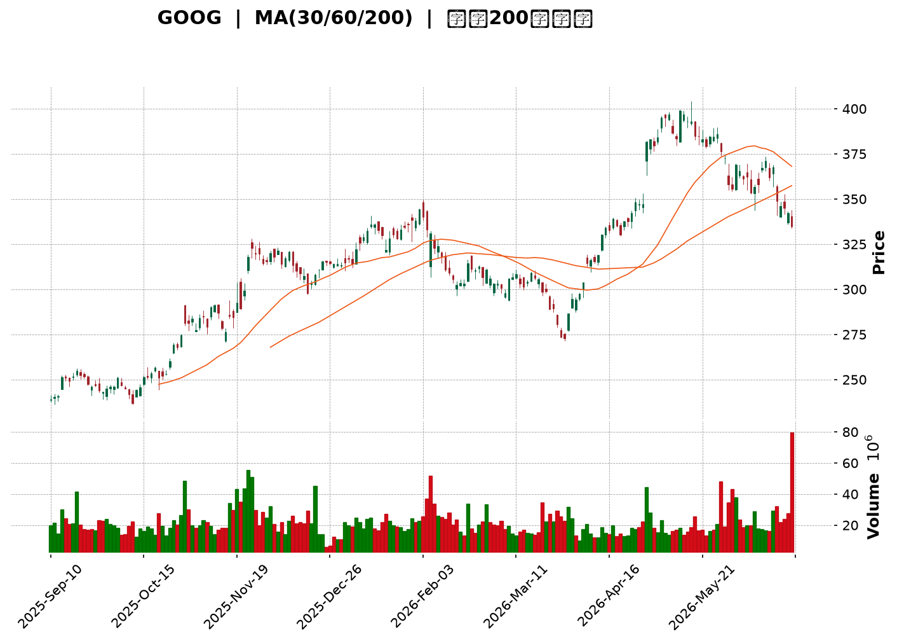
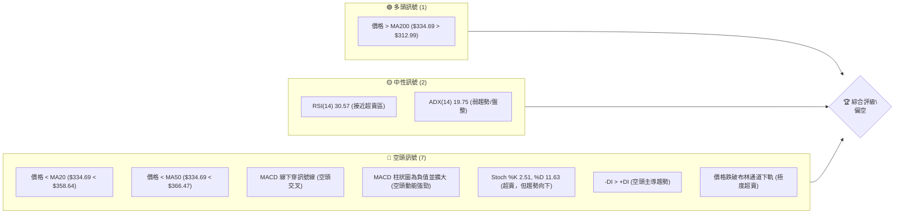

<details>
<summary>📊 靜態圖表 (點擊展開)</summary>

</details>

<html>
<head><meta charset="utf-8" /></head>
<body>
    <div style="height:500px; width:100%;">                        <script>window.PlotlyConfig = {MathJaxConfig: 'local'};</script>
        <script charset="utf-8" src="https://cdn.plot.ly/plotly-3.6.0.min.js" integrity="sha256-QaOVwtVY0T02VaHrr6pnoHLCwayMJp4O5n4YyaE3rJk=" crossorigin="anonymous"></script>                <div id="candlestick-chart" class="plotly-graph-div" style="height:100%; width:100%;"></div>            <script>                window.PLOTLYENV=window.PLOTLYENV || {};                                if (document.getElementById("candlestick-chart")) {                    Plotly.newPlot(                        "candlestick-chart",                        [{"close":{"dtype":"f8","bdata":"AAAAgOzibUAAAABA4wluQAAAAMAMHW5AAAAAYI9ob0AAAACgs11vQAAAAGCPK29AAAAAwMN6b0AAAADgs9dvQAAAAIBUjG9AAAAAYBV7b0AAAADgC+tuQAAAAEDOwm5AAAAAgEnWbkAAAABAOXxuQAAAAMBaYm5AAAAAwOihbkAAAABgVb5uQAAAAOD4vm5AAAAAYJNgb0AAAADAsNRuQAAAAMBan25AAAAAAI83bkAAAABg0KBtQAAAAIAqhW5AAAAAQKu2bkAAAACg9mZvQAAAAIBkbG9AAAAAoGSpb0AAAACARghwQAAAAIAlW29AAAAA4CaBb0AAAAAAeqdvQAAAAKABQHBAAAAAYG7WcEAAAABger5wQAAAAKAbKnFAAAAAoJOVcUAAAADATJRxQAAAAAAHuXFAAAAAwEFYcUAAAABgFsNxQAAAAGCCzHFAAAAAIHJycUAAAABgWCByQAAAAGC1MnJAAAAAIOLtcUAAAAAAL2lxQAAAAMACR3FAAAAAQKnQcUAAAADgcMZxQAAAAECrRnJAAAAAwJoWckAAAABgBbFyQAAAAGCN3XNAAAAAQBwwdEAAAACgdPpzQAAAAIDm93NAAAAAgA6oc0AAAADAbbZzQAAAAIDi\u002f3NAAAAAYEbcc0AAAADAWxd0QAAAAICioHNAAAAAYF3Vc0AAAAAgTAl0QAAAAGCmlHNAAAAAANZhc0AAAABgqU5zQAAAACBBNXNAAAAAgLyackAAAABAqPVyQAAAAOBQQ3NAAAAAYMduc0AAAADASbRzQAAAAOAgtHNAAAAAgMioc0AAAAAArZ9zQAAAAGA7onNAAAAAYD+Wc0AAAAAgia5zQAAAAIB+znNAAAAAYDuic0AAAADAJSB0QAAAAGBaWXRAAAAAIF6LdEAAAACAu8R0QAAAAODa\u002f3RAAAAAIPD9dEAAAACAmst0QAAAAMCKnnRAAAAAYNUbdEAAAAAgOX90QAAAACCIpnRAAAAAoAWAdEAAAABgedJ0QAAAAEAB6XRAAAAAQHX9dEAAAAAAfSN1QAAAAEBpIXVAAAAAwDKHdUAAAAAAFkR1QAAAAMB6znRAAAAAgFyudEAAAACA2ip0QAAAAECgP3RAAAAAQG3jc0AAAABgx25zQAAAAOB1T3NAAAAAIO4Zc0AAAAAgzOZyQAAAAKCx+HJAAAAAIJ\u002fyckAAAAAg06dzQAAAACCIdHNAAAAAYDpoc0AAAACA8YlzQAAAAID8K3NAAAAAgGBwc0AAAADgXB9zQAAAACCf8nJAAAAAIN3wckAAAADgRshyQAAAAECSnnJAAAAAIDcdc0AAAAAg7StzQAAAAIDAQ3NAAAAAIHHwckAAAACAddRyQAAAAGDKA3NAAAAAIJVTc0AAAAAg2iFzQAAAAOC8GHNAAAAAwMOpckAAAABAca1yQAAAAMBqEHJAAAAAIKcWckAAAABgI4lxQAAAAICGGXFAAAAAoJwPcUAAAADA\u002f+pxQAAAAOCPa3JAAAAAoIZkckAAAAAAspdyQAAAAID0+3JAAAAAoM+oc0AAAAAg4MJzQAAAAEB7uHNAAAAAwEnwc0AAAABAGaZ0QAAAACBN5HRAAAAAAB7JdEAAAABAIjN1QAAAACAs83RAAAAAAFekdEAAAAAgbhh1QAAAAOC\u002fGHVAAAAAYNNhdUAAAABA98R1QAAAAOCntHVAAAAAIJ6xdUAAAABAXdt3QAAAAADV73dAAAAAQJa2d0AAAAAgnwB4QAAAAABwrnhAAAAA4P6weEAAAACg+sx4QAAAAACZKHhAAAAAIG35d0AAAADAzOx4QAAAAODlznhAAAAAwFWReEAAAAAA+o14QAAAACCyCnhAAAAAILIKeEAAAABg1PN3QAAAAOBtsndAAAAAgLwJeEAAAACAkwl4QAAAAEA0HnhAAAAA4EGDd0AAAADAsUV3QAAAAIDKYnZAAAAAAHU3dkAAAAAgxBB3QAAAAOCj2HZAAAAAYLiSdkAAAADgo6R2QAAAAMAeFXZAAAAAwPVIdkAAAABgj2J2QAAAAIDC8XZAAAAAoJkxd0AAAACgmaF2QAAAACBc93ZAAAAA4HrMdUAAAACgR6F1QAAAAOCjkHVAAAAAQApjdUAAAABACut0QA=="},"high":{"dtype":"f8","bdata":"+gnM\u002fWczbkAz\u002f6pQDkNuQB\u002fNDElcPm5AARmOoi2Ib0DAFK0egpdvQK6X79igbm9A1zyZPpK0b0AXizZtKgNwQJZBdQjg+W9An83SDrHIb0CSJIqq4o5vQIc0wk+Z2m5AeWMd4y40b0A6pK+1+2RvQAWqM79YZm5ANan4ElTVbkBJsH5w0eRuQADlgGtO1G5ABhdM0Zx2b0BsCXCL2mFvQF4yfWfX2G5A+BmshWOibkAtOZ23jYtuQIHEICRYkG5Ar5QGGEbxbkC2JG1Mf4hvQLVs17M3EXBAYM1RiDTMb0BZ9u47AhZwQGTfKIIs3G9AF2O9jdQKcEAAL6bdgOtvQKs0hpnxX3BA5W1q51LkcECQ9bX8le1wQCMgGvfhNnFAHRo6Ir41ckCrQbyZmdtxQIPc0SoX1nFAgfKU4oWUcUDzGAUAOuJxQP6jcrLrA3JAJaAjahi\u002fcUCKYYvnPC5yQP+cPDFKPHJAmrox35s8ckBbF\u002f9SSa9xQOcKyZypaXFAqZ1KBxpfckBpxdWk5g1yQINq0QV6+nJAfqiKo6Ikc0C\u002f8iGX2PVyQPL661fK8nNA93kh0m6AdEAWTdcCq0V0QFHdqFXZY3RARqGyXBPwc0DTgtbToN9zQFZaO3+PFnRAIynWpHgndECI9sDOJDN0QAoFtiL5DHRAsg2RX7Dkc0CwY3r5Mhd0QDAwp88dGXRAueZUlaO7c0D6tOfOq4RzQI7yvyACd3NAUjSa+qlMc0Ddmo8tyQ1zQEGt\u002f1djSXNA\u002fdqgBbF0c0C1co3vMb5zQOmUhg8JvnNAFHF3klnCc0B+OlqG8ahzQNEUfQmR1HNAAL4voKevc0AOS4KH4Sd0QJ5w4W5V7XNAq2x25z4SdEAHSneOn2B0QHapJgm9oXRAIDTqPcKwdEA\u002fkPF7DuB0QE6lhGATTHVAJhbIZnEJdUDh5u4OBRt1QK+ac+7W7HRA3UGd7ZZ6dECVbAYGp8R0QNUQ6ENc7HRAVQusUIHZdECHvPmek\u002f50QLcfbbBgHHVAmKOLqAcTdUAKM1cYfl11QG9BgNeIPXVA8ENZ1W6LdUCiyOubFtt1QAc3Lc7PfHVA\u002fMbSuVvDdEDcPe0RVqN0QAlBRQX\u002fdHRAT7mfNl0TdEB49jQxBAp0QN5I+X4SwXNA9vu1aMpHc0Ax+nnP3wdzQCGHTDgsGHNAINgLDBcac0A0yrzOi8VzQB6YHP6b8HNAjobNv2V\u002fc0BKWdWhApRzQMtCjNp2iXNA\u002fEGEZsN6c0AU2CdczjtzQG8tAJix+HJA\u002f1tkQfsQc0DD6KjZle9yQHNIKUYCv3JA9A766gwlc0AA++\u002fHbE9zQPo4ODkcbnNAj3NUH0VHc0DPXEoWNDFzQP6usOotFnNAl2Fh7NBdc0C3XV5pAmlzQJdJ0qjtJ3NAx1+uoP0Cc0A1vK4oAPNyQDpzbqm9jnJAIbskYrlnckD9hdSle+VxQGMBJ\u002f7AbnFAO0pfcIBBcUDicCmICe5xQMz9ZGbknHJA+Tq7U417ckCazX997aNyQJMBx3Ss\u002fnJAMIliqyrzc0CRIIJD09NzQKp+0c\u002fs9HNAFDRBVc7zc0AZsiT6Dqd0QCZZvbHG7HRAtyxTRNUSdUAF2xDvfDx1QB\u002f6v9xLL3VAN7aIvnkPdUB7d88iOh11QGF3+U9JP3VAUtjuf7t3dUC6iPTiBet1QPVYU1YI23VA5dYvv\u002f8SdkB6x83MZeZ3QHTdxfSM8ndA6ZHQ0C7\u002fd0AQGOjRnUt4QOY17\u002fFDwnhAxYbqL9vReEApNYkfFuJ4QHsA6B98oXhAEW+JK1IjeEDFwKzuB\u002ft4QFtbOrzS7XhA0LhtMUW6eEAtlzGjoEN5QJWnecYFknhAEcL+tXBneECB1QmqI0d4QFQ0n1k3CnhAVPcZBYgSeEBE5pxw2Vd4QOSk8DA\u002fXHhAZ3zVI7rWd0COagfG\u002fmV3QDYhqckUGXdA2kHD8oKkdkAquORLMxp3QFVYXKalD3dAAAAAgBS2dkAAAABgEht3QAAAAMD15HZAAAAAAClgdkAAAABAXsx2QAAAAGBmKndAAAAAoJlZd0AAAABgZiJ3QAAAAAAAEHdAAAAAQDNjdkAAAAAghct1QAAAAKBHDXZAAAAAQApzdUAAAACA64F1QA=="},"hovertemplate":"\u003cb\u003e%{x|%Y-%m-%d}\u003c\u002fb\u003e\u003cbr\u003e\u958b: $%{open:.2f}\u003cbr\u003e\u9ad8: $%{high:.2f}\u003cbr\u003e\u4f4e: $%{low:.2f}\u003cbr\u003e\u6536: $%{close:.2f}\u003cextra\u003e\u003c\u002fextra\u003e","low":{"dtype":"f8","bdata":"vOuLXJ20bUBz3hEuwINtQMZ9WOcRwW1A97CVRgaQbkAuC5eSPydvQJgm9uYfw25AMWxqE90zb0CMkvSUZXJvQPYHNCw4Sm9AEBYpaClTb0D9VHuGkNduQA0CsFesJW5AHzk8hwrFbkDhac4WLVduQPJsaING421AcO3WGW3XbUD8RsJIJFRuQGy5G4jcP25Astg+RLOmbkDfl8tgeMpuQK3o+o2Jk25AQIwFq8HmbUAe2nCmGodtQEwvafbtCG5AYVaNMZkWbkByY1m41MluQJ0sFYS\u002fRW9ACkyMlFEDb0APyb9HQ8NvQLdQLsMfhm5AtlcKEcE+b0CTbJHKwIhvQPfg7isr829APJ\u002fBW7+GcEDqr5CYW6pwQJ2X0YB6vnBArLA8Hmx+cUCGWq2trk9xQCUW9gslfXFAKWs\u002fkyxFcUCxqSPsYVVxQAoNWA4bkXFAqKLmmjUzcUC8n0wcxK9xQC6tzM0R9XFA\u002fadi0C29cUD262J5TFdxQFe2kqEQ7nBAQtsjusi6cUAPRKVsbWdxQO6vHUG38XFAqxpnfasJckC1ihzji1xyQMgpd0y3THNAeYqWyhvTc0BIOq+tRclzQMIj5roexXNAbdRtQtqVc0C4Fihsr5lzQLORw6ykmnNAIDB074+vc0Bi1zcoqvVzQOspkzMMeHNAtdaGTGSDc0DyUS5v0K9zQKqEdAucV3NAO7OkR\u002fMoc0C6E8nCdBVzQH9PE3nv9nJA67i3Qv2QckDUrbFtzcNyQNtC5YMg33JAFZmRtgkjc0CMppHagmVzQJ5iBtCTjnNAvFreIPiUc0CRe1Ev43dzQAol6ZJ1jXNAT29tba58c0CvJvu26WNzQFsiGrJmrXNA5DgqEOt+c0DqhXjjbqFzQLhX\u002ftwdGXRAYvy8EjBddEBrBUr4XFF0QCbRVV6e3nRAX1JhglOrdEDEBPL+uK10QE2QlBnee3RApYDOSYoHdECFATbB9\u002fFzQLd0I3o2h3RAi6t59at4dECMEsBbAHF0QKwxke4H1XRAXpUtDyW7dEAzweKTsmR0QMDFMVxLw3RAAxY75ST5dECB44GnXiJ1QIc4wtgKj3RAIBjKu08oc0D+kOwEt\u002ftzQCpH0PCQ1HNAzV3IWP2jc0DryiWqmltzQO0UZUX3O3NAfyL29A34ckAEu7tkM4hyQKgCAfpf2XJAwLaoMnHEckDUauYkXQBzQOjfW\u002fZdWXNARjmJcQwbc0DpKnG+TE9zQJHhctY+4HJAHGVB5x3zckBlr6h0rMpyQHDklyz9hHJAKYp+yoTGckCdOlpu5ZpyQEP8lc3VbXJA4NyHIg1cckCX5KmdBRJzQCWNRxt\u002fGnNADm68dovKckDAbXdjmLlyQPQdKC4O2nJAO\u002fEx16sCc0Am7ymcxxVzQMjMV2cazXJAnSSk5iSJckCOjFWwnJ1yQFwYmHnmCnJAeF0+eCfzcUBIGdhJHW5xQPxnm1AMFXFAFZ8zdPL1cEBGtz4if0lxQFXXhQC8FHJAxbTLOVr2cUBkDe8I0FlyQAJY3fP0c3JA+qloQ0WIc0BZOYK\u002filRzQIiTQ+icpXNAWS04eQWYc0CYaAQ7Tw90QMTaQbBlh3RApxpqQjW3dEBD\u002f1vNbtF0QGDzlyXc5nRABbPBceiWdEC2xD\u002fgJ8x0QFn9n0C87XRAo+D3v5XddEBi6Jwerkl1QGI62q4qgXVA7mmzpZVjdUDyRgQR8q12QKFOWXyMcHdAihgDsrGId0D\u002fl2yI8MF3QIWP2+7fLXhA9t0jKzRheEC3npWT7pZ4QPd6kJT2H3hA3Z3smd23d0CuaUaEm9V3QPDxllHeh3hAapJDxWhYeEBTqNlRo2p4QLXmTW5Q7HdAa6te0le8d0AmjIA0B7R3QMY5WSKFoHdAotj\u002fapeud0Bm6u3YUtx3QO+Gbr9U0HdAbJ5bnzJhd0CgAQdSzRd3QImzMFqVLHZAiBfgc6sidkBM6yCmYil2QJRs1IyZlnZAAAAAgD1edkAAAAAghSt2QAAAAMD1DHZAAAAAgBR6dUAAAACgcBV2QAAAAGBmynZAAAAAwB7VdkAAAAAgroN2QAAAAGC6SXZAAAAAQApPdUAAAACgcDt1QAAAAAAAWHVAAAAAYGb+dEAAAABACtt0QA=="},"name":"\u50f9\u683c","open":{"dtype":"f8","bdata":"eDrA9wXZbUBfqoihcvVtQLGZe6uGCm5AJp8tdiKVbkAAWc7Kw3pvQDUTFrP6Xm9AUogmCMFrb0CXVYT875xvQFjVRs0CyW9A+kYqzRSlb0C2dI4FBHVvQK2lIrmNi25AiUYKDpzpbkCpYhsjQvluQG0BMXq0Um5AHNnnfqkWbkDIDPBoGqVuQCnhGy0CmG5ATCsKE5OpbkAZ4L5nLQ5vQLg7KuT8tm5AO7JRdJSSbkDN5+8p9jVuQEUCvTnfEW5AY3tj0gYpbkB14o63MPNuQCXXDmATf29A+FnXWXdbb0D320YPYtdvQN3FfpcF2G9A3CXcQVvQb0Be8BG7hKZvQCvHhBi\u002fDHBA2VtDPnSNcEC3kDMxvtpwQDFGoE9awXBAL2n3sGMyckBjGDyHaqpxQIQh\u002fH7hnXFAT3v5OF5IcUALNUDnVW1xQJzBzxXR0nFAxCUD3Xa6cUCsUB\u002fqT8txQGBVYv0t+nFArMhIszc4ckCle\u002fMH56ZxQP0SvT7P9XBAur0Pl2\u002fdcUCzyIEBu\u002f5xQKPZYIL08XFAF06AXU0Cc0Aad3bGoIRyQNw3\u002fQVtZnNA3FoNLpJidEDmu2WecAJ0QKlVbrrBLHRA3Uk1wanNc0BjZOwye8RzQEprHqeWtnNA4KmS85smdEAr8Tbf+\u002fVzQE\u002fkZPTGCXRAUfSe2w+Lc0Baz7MJT8NzQLBBizHlCnRAaZ7ipSWmc0BtrIz1eINzQO\u002fdeD+cGXNAbdbBN7VJc0DdmkOwoepyQLSJScv87XJAZdOp7xltc0CSY7HLqWtzQE1jI0\u002fMu3NAGkBBnh+4c0AWrmGkloZzQL729RcEkHNA5VdobGCPc0DqtHzdztJzQLDC03581HNA0dYvn1XOc0DnEqxDjaJzQLUv2nldjXRAsuDqcQBxdEA8uIatLmF0QPtesqV67XRAetQW9cPodEAg6ZQ10hl1QGYI1E\u002f353RAta7p6iENdEDurkKx0Ap0QEToDbFC3XRAS2tKqojDdEDsCBnQWHx0QFcS3mES83RAo6BrHLsCdUBRlDs3fj51QDsQokFg4HRAJmxQwsUBdUAbFlp59sB1QN3SjfPmdHVAglnvCamMc0DM0R3Iw250QAaZacQhDXRAMXXq79sHdEAfEoMWs+hzQGBwSRIUf3NAvc0iP1Q5c0CaBQaH9sNyQL4Ege+Y4HJAUT8mzwDickDJkPB8bwZzQPB7IY2T63NAVJIo\u002f8Bjc0Aj3Vj9ZntzQGHyZyVZhnNAJAyribH4ckD7es0lHelyQLUPkDl9oHJAAW\u002fntqPkckDGPkWC3uxyQNwzx0j4enJAd207YVRfckC2Dld5DhtzQBzWJhnaIXNAcNbsu2kgc0DsSNVzhydzQJdPL6Wt9nJAWitgzckHc0CMaLdLhDtzQD9kcRVx8HJA5XTinTH+ckBpmLeHlsVyQOi5xFqCgHJAaZ1OkZY\u002fckDBvs4ySeBxQDO4G+i6U3FAXraCtWM0cUAd+UgW+FVxQOQ+4L7jHHJA+3sn+g4NckAn5PYqXWhyQPA3OxZav3JAMhU+ozjac0BOnnm1BpBzQBzFAJSJ4HNAiQ0tVq+zc0Bnw\u002ffZ8B10QGpr92HHpXRAPklXKV76dEByBmleqeN0QLPMJLezJXVAuA4nZiH2dECHvjgC8Op0QAv476DuNXVA1dZCFUUYdUCiAGROxXp1QKgPzK1hq3VADNEgAluUdUBlSDXTgTB3QKKj2egKnHdAmI7V5XDhd0BpWrupPtp3QCPOacywVXhAfXP6iSPNeECbjjWZhqB4QA5VpbdHZ3hAV5zDd0sMeEDiD0n3zdp3QAnJxrPZmHhAKco64qePeEAC7jvtOX54QBdvOM4DkXhAUsKxR+8MeEA\u002ffNLYe9x3QAs8\u002ftB48HdAQ3AO2UDMd0B1VGt2juh3QImOWtEQ+ndAidPdb+7Pd0BHHyNjnUV3QKZ8ap8Qr3ZAdxuMVelhdkDJz3mSnjN2QIzzFj2VsnZAAAAAgMKndkAAAAAAKc52QAAAAMDMkHZAAAAAwMwQdkAAAACgmZF2QAAAAADX33ZAAAAAoHD3dkAAAADAzPB2QAAAAIA9vnZAAAAAAClSdkAAAAAgrkF1QAAAACCFy3VAAAAAYLgOdUAAAACAwkV1QA=="},"x":["2025-09-10T00:00:00-04:00","2025-09-11T00:00:00-04:00","2025-09-12T00:00:00-04:00","2025-09-15T00:00:00-04:00","2025-09-16T00:00:00-04:00","2025-09-17T00:00:00-04:00","2025-09-18T00:00:00-04:00","2025-09-19T00:00:00-04:00","2025-09-22T00:00:00-04:00","2025-09-23T00:00:00-04:00","2025-09-24T00:00:00-04:00","2025-09-25T00:00:00-04:00","2025-09-26T00:00:00-04:00","2025-09-29T00:00:00-04:00","2025-09-30T00:00:00-04:00","2025-10-01T00:00:00-04:00","2025-10-02T00:00:00-04:00","2025-10-03T00:00:00-04:00","2025-10-06T00:00:00-04:00","2025-10-07T00:00:00-04:00","2025-10-08T00:00:00-04:00","2025-10-09T00:00:00-04:00","2025-10-10T00:00:00-04:00","2025-10-13T00:00:00-04:00","2025-10-14T00:00:00-04:00","2025-10-15T00:00:00-04:00","2025-10-16T00:00:00-04:00","2025-10-17T00:00:00-04:00","2025-10-20T00:00:00-04:00","2025-10-21T00:00:00-04:00","2025-10-22T00:00:00-04:00","2025-10-23T00:00:00-04:00","2025-10-24T00:00:00-04:00","2025-10-27T00:00:00-04:00","2025-10-28T00:00:00-04:00","2025-10-29T00:00:00-04:00","2025-10-30T00:00:00-04:00","2025-10-31T00:00:00-04:00","2025-11-03T00:00:00-05:00","2025-11-04T00:00:00-05:00","2025-11-05T00:00:00-05:00","2025-11-06T00:00:00-05:00","2025-11-07T00:00:00-05:00","2025-11-10T00:00:00-05:00","2025-11-11T00:00:00-05:00","2025-11-12T00:00:00-05:00","2025-11-13T00:00:00-05:00","2025-11-14T00:00:00-05:00","2025-11-17T00:00:00-05:00","2025-11-18T00:00:00-05:00","2025-11-19T00:00:00-05:00","2025-11-20T00:00:00-05:00","2025-11-21T00:00:00-05:00","2025-11-24T00:00:00-05:00","2025-11-25T00:00:00-05:00","2025-11-26T00:00:00-05:00","2025-11-28T00:00:00-05:00","2025-12-01T00:00:00-05:00","2025-12-02T00:00:00-05:00","2025-12-03T00:00:00-05:00","2025-12-04T00:00:00-05:00","2025-12-05T00:00:00-05:00","2025-12-08T00:00:00-05:00","2025-12-09T00:00:00-05:00","2025-12-10T00:00:00-05:00","2025-12-11T00:00:00-05:00","2025-12-12T00:00:00-05:00","2025-12-15T00:00:00-05:00","2025-12-16T00:00:00-05:00","2025-12-17T00:00:00-05:00","2025-12-18T00:00:00-05:00","2025-12-19T00:00:00-05:00","2025-12-22T00:00:00-05:00","2025-12-23T00:00:00-05:00","2025-12-24T00:00:00-05:00","2025-12-26T00:00:00-05:00","2025-12-29T00:00:00-05:00","2025-12-30T00:00:00-05:00","2025-12-31T00:00:00-05:00","2026-01-02T00:00:00-05:00","2026-01-05T00:00:00-05:00","2026-01-06T00:00:00-05:00","2026-01-07T00:00:00-05:00","2026-01-08T00:00:00-05:00","2026-01-09T00:00:00-05:00","2026-01-12T00:00:00-05:00","2026-01-13T00:00:00-05:00","2026-01-14T00:00:00-05:00","2026-01-15T00:00:00-05:00","2026-01-16T00:00:00-05:00","2026-01-20T00:00:00-05:00","2026-01-21T00:00:00-05:00","2026-01-22T00:00:00-05:00","2026-01-23T00:00:00-05:00","2026-01-26T00:00:00-05:00","2026-01-27T00:00:00-05:00","2026-01-28T00:00:00-05:00","2026-01-29T00:00:00-05:00","2026-01-30T00:00:00-05:00","2026-02-02T00:00:00-05:00","2026-02-03T00:00:00-05:00","2026-02-04T00:00:00-05:00","2026-02-05T00:00:00-05:00","2026-02-06T00:00:00-05:00","2026-02-09T00:00:00-05:00","2026-02-10T00:00:00-05:00","2026-02-11T00:00:00-05:00","2026-02-12T00:00:00-05:00","2026-02-13T00:00:00-05:00","2026-02-17T00:00:00-05:00","2026-02-18T00:00:00-05:00","2026-02-19T00:00:00-05:00","2026-02-20T00:00:00-05:00","2026-02-23T00:00:00-05:00","2026-02-24T00:00:00-05:00","2026-02-25T00:00:00-05:00","2026-02-26T00:00:00-05:00","2026-02-27T00:00:00-05:00","2026-03-02T00:00:00-05:00","2026-03-03T00:00:00-05:00","2026-03-04T00:00:00-05:00","2026-03-05T00:00:00-05:00","2026-03-06T00:00:00-05:00","2026-03-09T00:00:00-04:00","2026-03-10T00:00:00-04:00","2026-03-11T00:00:00-04:00","2026-03-12T00:00:00-04:00","2026-03-13T00:00:00-04:00","2026-03-16T00:00:00-04:00","2026-03-17T00:00:00-04:00","2026-03-18T00:00:00-04:00","2026-03-19T00:00:00-04:00","2026-03-20T00:00:00-04:00","2026-03-23T00:00:00-04:00","2026-03-24T00:00:00-04:00","2026-03-25T00:00:00-04:00","2026-03-26T00:00:00-04:00","2026-03-27T00:00:00-04:00","2026-03-30T00:00:00-04:00","2026-03-31T00:00:00-04:00","2026-04-01T00:00:00-04:00","2026-04-02T00:00:00-04:00","2026-04-06T00:00:00-04:00","2026-04-07T00:00:00-04:00","2026-04-08T00:00:00-04:00","2026-04-09T00:00:00-04:00","2026-04-10T00:00:00-04:00","2026-04-13T00:00:00-04:00","2026-04-14T00:00:00-04:00","2026-04-15T00:00:00-04:00","2026-04-16T00:00:00-04:00","2026-04-17T00:00:00-04:00","2026-04-20T00:00:00-04:00","2026-04-21T00:00:00-04:00","2026-04-22T00:00:00-04:00","2026-04-23T00:00:00-04:00","2026-04-24T00:00:00-04:00","2026-04-27T00:00:00-04:00","2026-04-28T00:00:00-04:00","2026-04-29T00:00:00-04:00","2026-04-30T00:00:00-04:00","2026-05-01T00:00:00-04:00","2026-05-04T00:00:00-04:00","2026-05-05T00:00:00-04:00","2026-05-06T00:00:00-04:00","2026-05-07T00:00:00-04:00","2026-05-08T00:00:00-04:00","2026-05-11T00:00:00-04:00","2026-05-12T00:00:00-04:00","2026-05-13T00:00:00-04:00","2026-05-14T00:00:00-04:00","2026-05-15T00:00:00-04:00","2026-05-18T00:00:00-04:00","2026-05-19T00:00:00-04:00","2026-05-20T00:00:00-04:00","2026-05-21T00:00:00-04:00","2026-05-22T00:00:00-04:00","2026-05-26T00:00:00-04:00","2026-05-27T00:00:00-04:00","2026-05-28T00:00:00-04:00","2026-05-29T00:00:00-04:00","2026-06-01T00:00:00-04:00","2026-06-02T00:00:00-04:00","2026-06-03T00:00:00-04:00","2026-06-04T00:00:00-04:00","2026-06-05T00:00:00-04:00","2026-06-08T00:00:00-04:00","2026-06-09T00:00:00-04:00","2026-06-10T00:00:00-04:00","2026-06-11T00:00:00-04:00","2026-06-12T00:00:00-04:00","2026-06-15T00:00:00-04:00","2026-06-16T00:00:00-04:00","2026-06-17T00:00:00-04:00","2026-06-18T00:00:00-04:00","2026-06-22T00:00:00-04:00","2026-06-23T00:00:00-04:00","2026-06-24T00:00:00-04:00","2026-06-25T00:00:00-04:00","2026-06-26T00:00:00-04:00"],"type":"candlestick"},{"hovertemplate":"MA30: $%{y:.2f}\u003cextra\u003e\u003c\u002fextra\u003e","line":{"color":"#2196F3","dash":"dash","width":2},"mode":"lines","name":"MA30","x":["2025-09-10T00:00:00-04:00","2025-09-11T00:00:00-04:00","2025-09-12T00:00:00-04:00","2025-09-15T00:00:00-04:00","2025-09-16T00:00:00-04:00","2025-09-17T00:00:00-04:00","2025-09-18T00:00:00-04:00","2025-09-19T00:00:00-04:00","2025-09-22T00:00:00-04:00","2025-09-23T00:00:00-04:00","2025-09-24T00:00:00-04:00","2025-09-25T00:00:00-04:00","2025-09-26T00:00:00-04:00","2025-09-29T00:00:00-04:00","2025-09-30T00:00:00-04:00","2025-10-01T00:00:00-04:00","2025-10-02T00:00:00-04:00","2025-10-03T00:00:00-04:00","2025-10-06T00:00:00-04:00","2025-10-07T00:00:00-04:00","2025-10-08T00:00:00-04:00","2025-10-09T00:00:00-04:00","2025-10-10T00:00:00-04:00","2025-10-13T00:00:00-04:00","2025-10-14T00:00:00-04:00","2025-10-15T00:00:00-04:00","2025-10-16T00:00:00-04:00","2025-10-17T00:00:00-04:00","2025-10-20T00:00:00-04:00","2025-10-21T00:00:00-04:00","2025-10-22T00:00:00-04:00","2025-10-23T00:00:00-04:00","2025-10-24T00:00:00-04:00","2025-10-27T00:00:00-04:00","2025-10-28T00:00:00-04:00","2025-10-29T00:00:00-04:00","2025-10-30T00:00:00-04:00","2025-10-31T00:00:00-04:00","2025-11-03T00:00:00-05:00","2025-11-04T00:00:00-05:00","2025-11-05T00:00:00-05:00","2025-11-06T00:00:00-05:00","2025-11-07T00:00:00-05:00","2025-11-10T00:00:00-05:00","2025-11-11T00:00:00-05:00","2025-11-12T00:00:00-05:00","2025-11-13T00:00:00-05:00","2025-11-14T00:00:00-05:00","2025-11-17T00:00:00-05:00","2025-11-18T00:00:00-05:00","2025-11-19T00:00:00-05:00","2025-11-20T00:00:00-05:00","2025-11-21T00:00:00-05:00","2025-11-24T00:00:00-05:00","2025-11-25T00:00:00-05:00","2025-11-26T00:00:00-05:00","2025-11-28T00:00:00-05:00","2025-12-01T00:00:00-05:00","2025-12-02T00:00:00-05:00","2025-12-03T00:00:00-05:00","2025-12-04T00:00:00-05:00","2025-12-05T00:00:00-05:00","2025-12-08T00:00:00-05:00","2025-12-09T00:00:00-05:00","2025-12-10T00:00:00-05:00","2025-12-11T00:00:00-05:00","2025-12-12T00:00:00-05:00","2025-12-15T00:00:00-05:00","2025-12-16T00:00:00-05:00","2025-12-17T00:00:00-05:00","2025-12-18T00:00:00-05:00","2025-12-19T00:00:00-05:00","2025-12-22T00:00:00-05:00","2025-12-23T00:00:00-05:00","2025-12-24T00:00:00-05:00","2025-12-26T00:00:00-05:00","2025-12-29T00:00:00-05:00","2025-12-30T00:00:00-05:00","2025-12-31T00:00:00-05:00","2026-01-02T00:00:00-05:00","2026-01-05T00:00:00-05:00","2026-01-06T00:00:00-05:00","2026-01-07T00:00:00-05:00","2026-01-08T00:00:00-05:00","2026-01-09T00:00:00-05:00","2026-01-12T00:00:00-05:00","2026-01-13T00:00:00-05:00","2026-01-14T00:00:00-05:00","2026-01-15T00:00:00-05:00","2026-01-16T00:00:00-05:00","2026-01-20T00:00:00-05:00","2026-01-21T00:00:00-05:00","2026-01-22T00:00:00-05:00","2026-01-23T00:00:00-05:00","2026-01-26T00:00:00-05:00","2026-01-27T00:00:00-05:00","2026-01-28T00:00:00-05:00","2026-01-29T00:00:00-05:00","2026-01-30T00:00:00-05:00","2026-02-02T00:00:00-05:00","2026-02-03T00:00:00-05:00","2026-02-04T00:00:00-05:00","2026-02-05T00:00:00-05:00","2026-02-06T00:00:00-05:00","2026-02-09T00:00:00-05:00","2026-02-10T00:00:00-05:00","2026-02-11T00:00:00-05:00","2026-02-12T00:00:00-05:00","2026-02-13T00:00:00-05:00","2026-02-17T00:00:00-05:00","2026-02-18T00:00:00-05:00","2026-02-19T00:00:00-05:00","2026-02-20T00:00:00-05:00","2026-02-23T00:00:00-05:00","2026-02-24T00:00:00-05:00","2026-02-25T00:00:00-05:00","2026-02-26T00:00:00-05:00","2026-02-27T00:00:00-05:00","2026-03-02T00:00:00-05:00","2026-03-03T00:00:00-05:00","2026-03-04T00:00:00-05:00","2026-03-05T00:00:00-05:00","2026-03-06T00:00:00-05:00","2026-03-09T00:00:00-04:00","2026-03-10T00:00:00-04:00","2026-03-11T00:00:00-04:00","2026-03-12T00:00:00-04:00","2026-03-13T00:00:00-04:00","2026-03-16T00:00:00-04:00","2026-03-17T00:00:00-04:00","2026-03-18T00:00:00-04:00","2026-03-19T00:00:00-04:00","2026-03-20T00:00:00-04:00","2026-03-23T00:00:00-04:00","2026-03-24T00:00:00-04:00","2026-03-25T00:00:00-04:00","2026-03-26T00:00:00-04:00","2026-03-27T00:00:00-04:00","2026-03-30T00:00:00-04:00","2026-03-31T00:00:00-04:00","2026-04-01T00:00:00-04:00","2026-04-02T00:00:00-04:00","2026-04-06T00:00:00-04:00","2026-04-07T00:00:00-04:00","2026-04-08T00:00:00-04:00","2026-04-09T00:00:00-04:00","2026-04-10T00:00:00-04:00","2026-04-13T00:00:00-04:00","2026-04-14T00:00:00-04:00","2026-04-15T00:00:00-04:00","2026-04-16T00:00:00-04:00","2026-04-17T00:00:00-04:00","2026-04-20T00:00:00-04:00","2026-04-21T00:00:00-04:00","2026-04-22T00:00:00-04:00","2026-04-23T00:00:00-04:00","2026-04-24T00:00:00-04:00","2026-04-27T00:00:00-04:00","2026-04-28T00:00:00-04:00","2026-04-29T00:00:00-04:00","2026-04-30T00:00:00-04:00","2026-05-01T00:00:00-04:00","2026-05-04T00:00:00-04:00","2026-05-05T00:00:00-04:00","2026-05-06T00:00:00-04:00","2026-05-07T00:00:00-04:00","2026-05-08T00:00:00-04:00","2026-05-11T00:00:00-04:00","2026-05-12T00:00:00-04:00","2026-05-13T00:00:00-04:00","2026-05-14T00:00:00-04:00","2026-05-15T00:00:00-04:00","2026-05-18T00:00:00-04:00","2026-05-19T00:00:00-04:00","2026-05-20T00:00:00-04:00","2026-05-21T00:00:00-04:00","2026-05-22T00:00:00-04:00","2026-05-26T00:00:00-04:00","2026-05-27T00:00:00-04:00","2026-05-28T00:00:00-04:00","2026-05-29T00:00:00-04:00","2026-06-01T00:00:00-04:00","2026-06-02T00:00:00-04:00","2026-06-03T00:00:00-04:00","2026-06-04T00:00:00-04:00","2026-06-05T00:00:00-04:00","2026-06-08T00:00:00-04:00","2026-06-09T00:00:00-04:00","2026-06-10T00:00:00-04:00","2026-06-11T00:00:00-04:00","2026-06-12T00:00:00-04:00","2026-06-15T00:00:00-04:00","2026-06-16T00:00:00-04:00","2026-06-17T00:00:00-04:00","2026-06-18T00:00:00-04:00","2026-06-22T00:00:00-04:00","2026-06-23T00:00:00-04:00","2026-06-24T00:00:00-04:00","2026-06-25T00:00:00-04:00","2026-06-26T00:00:00-04:00"],"y":{"dtype":"f8","bdata":"AAAAAAAA+H8AAAAAAAD4fwAAAAAAAPh\u002fAAAAAAAA+H8AAAAAAAD4fwAAAAAAAPh\u002fAAAAAAAA+H8AAAAAAAD4fwAAAAAAAPh\u002fAAAAAAAA+H8AAAAAAAD4fwAAAAAAAPh\u002fAAAAAAAA+H8AAAAAAAD4fwAAAAAAAPh\u002fAAAAAAAA+H8AAAAAAAD4fwAAAAAAAPh\u002fAAAAAAAA+H8AAAAAAAD4fwAAAAAAAPh\u002fAAAAAAAA+H8AAAAAAAD4fwAAAAAAAPh\u002fAAAAAAAA+H8AAAAAAAD4fwAAAAAAAPh\u002fAAAAAAAA+H8AAAAAAAD4fzMzM5MG7G5AIiIiUtX5bkDNzMycngdvQJqZmSn8G29AMzMzE1Qvb0CJiIjYb0FvQAAAAGBkXG9AiYiIKN97b0BEREQUK5hvQO\u002fu7v5suW9AiYiIiM7Ub0De3d1tHPxvQJqZmUGxEnBAq6qqogAkcEAiIiI6nDxwQM3MzORCVnBA3t3dFY9scEARERGh9X1wQO\u002fu7tY1jnBAiYiIKFugcEC8u7sbfrRwQGZmZtbKzXBAd3d3RzjncEDe3d2VTghxQHd3dx+bL3FAmpmZ8dRYcUCJiIi4VH1xQHd3d4enoXFAREREvEzCcUCamZlxtOFxQAAAAPiUBnJAd3d3d6MpckAAAACgBk5yQJqZmcnYanJAmpmZSWmEckCJiIhYgaByQCIiIpIftXJA3t3dHXfEckAAAADwNdNyQKuqqori33JA3t3dXaLqckDe3d1t2vRyQHd3d8dYAXNA3t3djUoSc0CJiIiIwR9zQDMzM3OaLHNAzczM3F07c0De3d3tP05zQKuqqmpbYnNAVVVVBXpxc0CJiIgYv4FzQLy7u6vOjnNAERERsf6bc0ARERGBO6hzQAAAAPBbrHNAq6qqqmavc0AzMzPDJLZzQM3MzCzxvnNAAAAAkFbKc0CamZnJk9NzQJqZmand2HNAd3d3B\u002fzac0B3d3dXct5zQCIiIjIt53NAiYiIeN3sc0De3d0tkvNzQKuqqorq\u002fnNAzczMDKMMdEBERES0Qxx0QBEREXGrLHRAERERUZ5FdEBERESkTFl0QERERLR4ZnRA7+7uzh9xdEARERGRE3V0QCIiIvK5eXRA7+7uXq57dEDe3d0dDXp0QM3MzMxKd3RAVVVV9SVzdEBmZmaGfWx0QImIiBhdZXRA3t3djYJfdEDNzMzMf1t0QBERETHfU3RAzczMzCpKdECamZmZrD90QO\u002fu7h4UMHRAmpmZmdMidEB3d3dHjRR0QBEREbFJBnRAvLu7e1L8c0Dv7u7OsO1zQAAAANBb3HNAERERIYjQc0AzMzNjcsJzQCIiIrJntHNA7+7ujueic0C8u7sbNI9zQHd3d0cmfXNAIiIiwlxqc0AAAACQJ1hzQKuqqiqQSXNAAAAA4Fc4c0CrqqoqoStzQAAAAED9GHNAAAAAUKEJc0De3d0tcflyQN7d3d2T5nJAAAAAwCrVckAiIiISxsxyQO\u002fu7r4RyHJAIiIiMlXDckBmZmYGQ7pyQKuqqho+tnJAZmZmNmW4ckCJiIgIS7pyQM3MzOz5vnJA7+7ubj3DckBmZma2Q9ByQERERJTa4HJAmpmZeZjwckAzMzNjOQVzQCIiImIcGXNAq6qq+iUmc0De3d2tkDZzQKuqqsoyRnNAZmZmZgtbc0CrqqrKIHRzQLy7uxsXi3NAvLu7m0qfc0B3d3fHm8dzQCIiImLp8HNAd3d3dwEcdEDe3d3tcUl0QCIiIpLpgXRARERE1EG6dECJiIh4QPh0QCIiItJ8NHVAzczMPHtvdUBmZmZWRqt1QERERDTJ4XVAZmZmxnoWdkCrqqoKW0l2QO\u002fu7n6DdHZAmpmZ6eiZdkCamZnJrL12QGZmZkab33ZAERERkZYCd0CrqqoKgR93QO\u002fu7r4IO3dAVVVVNU5Sd0CJiIio\u002fWN3QLy7u6s+cHdAq6qqmq59d0BVVVVFfo53QFVVVUVsnXdAmpmZCZand0CamZm5Cq93QDMzM+NBsndAd3d3V023d0AiIiLyvap3QM3MzNxFondAq6qqCtedd0CJiIioI5J3QM3MzNyAg3dAvLu7y9Fqd0C8u7tLw093QGZmZoahOXdAmpmZKY0jd0AzMzMDXAF3QA=="},"type":"scatter"},{"hovertemplate":"MA60: $%{y:.2f}\u003cextra\u003e\u003c\u002fextra\u003e","line":{"color":"#9C27B0","dash":"dash","width":2},"mode":"lines","name":"MA60","x":["2025-09-10T00:00:00-04:00","2025-09-11T00:00:00-04:00","2025-09-12T00:00:00-04:00","2025-09-15T00:00:00-04:00","2025-09-16T00:00:00-04:00","2025-09-17T00:00:00-04:00","2025-09-18T00:00:00-04:00","2025-09-19T00:00:00-04:00","2025-09-22T00:00:00-04:00","2025-09-23T00:00:00-04:00","2025-09-24T00:00:00-04:00","2025-09-25T00:00:00-04:00","2025-09-26T00:00:00-04:00","2025-09-29T00:00:00-04:00","2025-09-30T00:00:00-04:00","2025-10-01T00:00:00-04:00","2025-10-02T00:00:00-04:00","2025-10-03T00:00:00-04:00","2025-10-06T00:00:00-04:00","2025-10-07T00:00:00-04:00","2025-10-08T00:00:00-04:00","2025-10-09T00:00:00-04:00","2025-10-10T00:00:00-04:00","2025-10-13T00:00:00-04:00","2025-10-14T00:00:00-04:00","2025-10-15T00:00:00-04:00","2025-10-16T00:00:00-04:00","2025-10-17T00:00:00-04:00","2025-10-20T00:00:00-04:00","2025-10-21T00:00:00-04:00","2025-10-22T00:00:00-04:00","2025-10-23T00:00:00-04:00","2025-10-24T00:00:00-04:00","2025-10-27T00:00:00-04:00","2025-10-28T00:00:00-04:00","2025-10-29T00:00:00-04:00","2025-10-30T00:00:00-04:00","2025-10-31T00:00:00-04:00","2025-11-03T00:00:00-05:00","2025-11-04T00:00:00-05:00","2025-11-05T00:00:00-05:00","2025-11-06T00:00:00-05:00","2025-11-07T00:00:00-05:00","2025-11-10T00:00:00-05:00","2025-11-11T00:00:00-05:00","2025-11-12T00:00:00-05:00","2025-11-13T00:00:00-05:00","2025-11-14T00:00:00-05:00","2025-11-17T00:00:00-05:00","2025-11-18T00:00:00-05:00","2025-11-19T00:00:00-05:00","2025-11-20T00:00:00-05:00","2025-11-21T00:00:00-05:00","2025-11-24T00:00:00-05:00","2025-11-25T00:00:00-05:00","2025-11-26T00:00:00-05:00","2025-11-28T00:00:00-05:00","2025-12-01T00:00:00-05:00","2025-12-02T00:00:00-05:00","2025-12-03T00:00:00-05:00","2025-12-04T00:00:00-05:00","2025-12-05T00:00:00-05:00","2025-12-08T00:00:00-05:00","2025-12-09T00:00:00-05:00","2025-12-10T00:00:00-05:00","2025-12-11T00:00:00-05:00","2025-12-12T00:00:00-05:00","2025-12-15T00:00:00-05:00","2025-12-16T00:00:00-05:00","2025-12-17T00:00:00-05:00","2025-12-18T00:00:00-05:00","2025-12-19T00:00:00-05:00","2025-12-22T00:00:00-05:00","2025-12-23T00:00:00-05:00","2025-12-24T00:00:00-05:00","2025-12-26T00:00:00-05:00","2025-12-29T00:00:00-05:00","2025-12-30T00:00:00-05:00","2025-12-31T00:00:00-05:00","2026-01-02T00:00:00-05:00","2026-01-05T00:00:00-05:00","2026-01-06T00:00:00-05:00","2026-01-07T00:00:00-05:00","2026-01-08T00:00:00-05:00","2026-01-09T00:00:00-05:00","2026-01-12T00:00:00-05:00","2026-01-13T00:00:00-05:00","2026-01-14T00:00:00-05:00","2026-01-15T00:00:00-05:00","2026-01-16T00:00:00-05:00","2026-01-20T00:00:00-05:00","2026-01-21T00:00:00-05:00","2026-01-22T00:00:00-05:00","2026-01-23T00:00:00-05:00","2026-01-26T00:00:00-05:00","2026-01-27T00:00:00-05:00","2026-01-28T00:00:00-05:00","2026-01-29T00:00:00-05:00","2026-01-30T00:00:00-05:00","2026-02-02T00:00:00-05:00","2026-02-03T00:00:00-05:00","2026-02-04T00:00:00-05:00","2026-02-05T00:00:00-05:00","2026-02-06T00:00:00-05:00","2026-02-09T00:00:00-05:00","2026-02-10T00:00:00-05:00","2026-02-11T00:00:00-05:00","2026-02-12T00:00:00-05:00","2026-02-13T00:00:00-05:00","2026-02-17T00:00:00-05:00","2026-02-18T00:00:00-05:00","2026-02-19T00:00:00-05:00","2026-02-20T00:00:00-05:00","2026-02-23T00:00:00-05:00","2026-02-24T00:00:00-05:00","2026-02-25T00:00:00-05:00","2026-02-26T00:00:00-05:00","2026-02-27T00:00:00-05:00","2026-03-02T00:00:00-05:00","2026-03-03T00:00:00-05:00","2026-03-04T00:00:00-05:00","2026-03-05T00:00:00-05:00","2026-03-06T00:00:00-05:00","2026-03-09T00:00:00-04:00","2026-03-10T00:00:00-04:00","2026-03-11T00:00:00-04:00","2026-03-12T00:00:00-04:00","2026-03-13T00:00:00-04:00","2026-03-16T00:00:00-04:00","2026-03-17T00:00:00-04:00","2026-03-18T00:00:00-04:00","2026-03-19T00:00:00-04:00","2026-03-20T00:00:00-04:00","2026-03-23T00:00:00-04:00","2026-03-24T00:00:00-04:00","2026-03-25T00:00:00-04:00","2026-03-26T00:00:00-04:00","2026-03-27T00:00:00-04:00","2026-03-30T00:00:00-04:00","2026-03-31T00:00:00-04:00","2026-04-01T00:00:00-04:00","2026-04-02T00:00:00-04:00","2026-04-06T00:00:00-04:00","2026-04-07T00:00:00-04:00","2026-04-08T00:00:00-04:00","2026-04-09T00:00:00-04:00","2026-04-10T00:00:00-04:00","2026-04-13T00:00:00-04:00","2026-04-14T00:00:00-04:00","2026-04-15T00:00:00-04:00","2026-04-16T00:00:00-04:00","2026-04-17T00:00:00-04:00","2026-04-20T00:00:00-04:00","2026-04-21T00:00:00-04:00","2026-04-22T00:00:00-04:00","2026-04-23T00:00:00-04:00","2026-04-24T00:00:00-04:00","2026-04-27T00:00:00-04:00","2026-04-28T00:00:00-04:00","2026-04-29T00:00:00-04:00","2026-04-30T00:00:00-04:00","2026-05-01T00:00:00-04:00","2026-05-04T00:00:00-04:00","2026-05-05T00:00:00-04:00","2026-05-06T00:00:00-04:00","2026-05-07T00:00:00-04:00","2026-05-08T00:00:00-04:00","2026-05-11T00:00:00-04:00","2026-05-12T00:00:00-04:00","2026-05-13T00:00:00-04:00","2026-05-14T00:00:00-04:00","2026-05-15T00:00:00-04:00","2026-05-18T00:00:00-04:00","2026-05-19T00:00:00-04:00","2026-05-20T00:00:00-04:00","2026-05-21T00:00:00-04:00","2026-05-22T00:00:00-04:00","2026-05-26T00:00:00-04:00","2026-05-27T00:00:00-04:00","2026-05-28T00:00:00-04:00","2026-05-29T00:00:00-04:00","2026-06-01T00:00:00-04:00","2026-06-02T00:00:00-04:00","2026-06-03T00:00:00-04:00","2026-06-04T00:00:00-04:00","2026-06-05T00:00:00-04:00","2026-06-08T00:00:00-04:00","2026-06-09T00:00:00-04:00","2026-06-10T00:00:00-04:00","2026-06-11T00:00:00-04:00","2026-06-12T00:00:00-04:00","2026-06-15T00:00:00-04:00","2026-06-16T00:00:00-04:00","2026-06-17T00:00:00-04:00","2026-06-18T00:00:00-04:00","2026-06-22T00:00:00-04:00","2026-06-23T00:00:00-04:00","2026-06-24T00:00:00-04:00","2026-06-25T00:00:00-04:00","2026-06-26T00:00:00-04:00"],"y":{"dtype":"f8","bdata":"AAAAAAAA+H8AAAAAAAD4fwAAAAAAAPh\u002fAAAAAAAA+H8AAAAAAAD4fwAAAAAAAPh\u002fAAAAAAAA+H8AAAAAAAD4fwAAAAAAAPh\u002fAAAAAAAA+H8AAAAAAAD4fwAAAAAAAPh\u002fAAAAAAAA+H8AAAAAAAD4fwAAAAAAAPh\u002fAAAAAAAA+H8AAAAAAAD4fwAAAAAAAPh\u002fAAAAAAAA+H8AAAAAAAD4fwAAAAAAAPh\u002fAAAAAAAA+H8AAAAAAAD4fwAAAAAAAPh\u002fAAAAAAAA+H8AAAAAAAD4fwAAAAAAAPh\u002fAAAAAAAA+H8AAAAAAAD4fwAAAAAAAPh\u002fAAAAAAAA+H8AAAAAAAD4fwAAAAAAAPh\u002fAAAAAAAA+H8AAAAAAAD4fwAAAAAAAPh\u002fAAAAAAAA+H8AAAAAAAD4fwAAAAAAAPh\u002fAAAAAAAA+H8AAAAAAAD4fwAAAAAAAPh\u002fAAAAAAAA+H8AAAAAAAD4fwAAAAAAAPh\u002fAAAAAAAA+H8AAAAAAAD4fwAAAAAAAPh\u002fAAAAAAAA+H8AAAAAAAD4fwAAAAAAAPh\u002fAAAAAAAA+H8AAAAAAAD4fwAAAAAAAPh\u002fAAAAAAAA+H8AAAAAAAD4fwAAAAAAAPh\u002fAAAAAAAA+H8AAAAAAAD4f83MzCBMvnBAREREEEfTcEAzMzP36uhwQDMzM29r\u002fHBAmpmZqQkOcUBmZmainCBxQBEREeGoMXFAERERWTNBcUARERG9pU9xQBEREYVMXnFAERER0YRqcUBmZmZSdHlxQImIiAQFinFAREREmCWbcUBVVVXhLq5xQAAAAKxuwXFAVVVVefbTcUB3d3fHGuZxQM3MzKBI+HFA7+7uluoIckAiIiKaHhtyQBEREcFMLnJAREREfJtBckB3d3cLRVhyQLy7u4f7bXJAIiIizh2EckDe3d29vJlyQCIiIlpMsHJAIiIiplHGckCamZkdpNpyQM3MzFC573JAd3d3v08Cc0C8u7t7PBZzQN7d3f0CKXNAERERYaM4c0AzMzPDCUpzQGZmZg4FWnNAVVVVFY1oc0AiIiLSvHdzQN7d3f1GhnNAd3d3VyCYc0ARERGJE6dzQN7d3b3os3NAZmZmLrXBc0DNzMyMaspzQKuqqjIq03NA3t3dHYbbc0De3d2FJuRzQLy7uxvT7HNAVVVV\u002fU\u002fyc0B3d3dPHvdzQCIiIuIV+nNAd3d3n8D9c0Dv7u6m3QF0QImIiJAdAHRAvLu7u8j8c0BmZmau6PpzQN7d3aWC93NAzczMFJX2c0CJiIiIEPRzQFVVVa2T73NAmpmZQafrc0AzMzOTEeZzQBEREYHE4XNAzczMzLLec0CJiIhIAttzQGZmZh6p2XNA3t3dTcXXc0AAAADou9VzQERERNzo1HNAmpmZif3Xc0AiIiIauthzQHd3d28E2HNAd3d317vUc0De3d1dWtBzQBEREZlbyXNAd3d316fCc0De3d0lv7lzQFVVVVXvrnNAq6qqWiikc0BERETMoZxzQLy7u2u3lnNAAAAA4GuRc0CamZlp4YpzQN7d3aUOhXNAmpmZAUiBc0ARERHR+3xzQN7d3QWHd3NAREREhAhzc0Dv7u5+aHJzQKuqqiKSc3NAq6qqenV2c0AREREZdXlzQBERERm8enNA3t3dDVd7c0CJiIiIgXxzQGZmZj5NfXNAq6qqevl+c0AzMzNzqoFzQJqZmbEehHNA7+7urtOEc0C8u7ur4Y9zQGZmZsY8nXNAvLu7qyyqc0BERESMibpzQBEREWlzzXNAIiIikvHhc0AzMzPT2PhzQAAAAFiIDXRAZmZm\u002flIidEBEREQ0Bjx0QJqZmXntVHRARERE\u002fOdsdECJiIgIz4F0QM3MzMxglXRAAAAAECepdEARERHp+7t0QJqZmZlKz3RAAAAAAOridECJiIhg4vd0QJqZmanxDXVAd3d3V3MhdUDe3d2FmzR1QO\u002fu7oatRHVAq6qqSupRdUCamZl5h2J1QAAAAIjPcXVAAAAAuFCBdUAiIiLClZF1QHd3d3+snnVAmpmZ+UurdUDNzMzcLLl1QHd3d5+XyXVAERERQezcdUAzMzPLyu11QHd3dze1AnZAAAAA0IkSdkAiIiLiASR2QERERCwPN3ZAMzMzM4RJdkDNzMwsUVZ2QA=="},"type":"scatter"},{"hovertemplate":"MA200: $%{y:.2f}\u003cextra\u003e\u003c\u002fextra\u003e","line":{"color":"#FF6F00","dash":"solid","width":2},"mode":"lines","name":"MA200","x":["2025-09-10T00:00:00-04:00","2025-09-11T00:00:00-04:00","2025-09-12T00:00:00-04:00","2025-09-15T00:00:00-04:00","2025-09-16T00:00:00-04:00","2025-09-17T00:00:00-04:00","2025-09-18T00:00:00-04:00","2025-09-19T00:00:00-04:00","2025-09-22T00:00:00-04:00","2025-09-23T00:00:00-04:00","2025-09-24T00:00:00-04:00","2025-09-25T00:00:00-04:00","2025-09-26T00:00:00-04:00","2025-09-29T00:00:00-04:00","2025-09-30T00:00:00-04:00","2025-10-01T00:00:00-04:00","2025-10-02T00:00:00-04:00","2025-10-03T00:00:00-04:00","2025-10-06T00:00:00-04:00","2025-10-07T00:00:00-04:00","2025-10-08T00:00:00-04:00","2025-10-09T00:00:00-04:00","2025-10-10T00:00:00-04:00","2025-10-13T00:00:00-04:00","2025-10-14T00:00:00-04:00","2025-10-15T00:00:00-04:00","2025-10-16T00:00:00-04:00","2025-10-17T00:00:00-04:00","2025-10-20T00:00:00-04:00","2025-10-21T00:00:00-04:00","2025-10-22T00:00:00-04:00","2025-10-23T00:00:00-04:00","2025-10-24T00:00:00-04:00","2025-10-27T00:00:00-04:00","2025-10-28T00:00:00-04:00","2025-10-29T00:00:00-04:00","2025-10-30T00:00:00-04:00","2025-10-31T00:00:00-04:00","2025-11-03T00:00:00-05:00","2025-11-04T00:00:00-05:00","2025-11-05T00:00:00-05:00","2025-11-06T00:00:00-05:00","2025-11-07T00:00:00-05:00","2025-11-10T00:00:00-05:00","2025-11-11T00:00:00-05:00","2025-11-12T00:00:00-05:00","2025-11-13T00:00:00-05:00","2025-11-14T00:00:00-05:00","2025-11-17T00:00:00-05:00","2025-11-18T00:00:00-05:00","2025-11-19T00:00:00-05:00","2025-11-20T00:00:00-05:00","2025-11-21T00:00:00-05:00","2025-11-24T00:00:00-05:00","2025-11-25T00:00:00-05:00","2025-11-26T00:00:00-05:00","2025-11-28T00:00:00-05:00","2025-12-01T00:00:00-05:00","2025-12-02T00:00:00-05:00","2025-12-03T00:00:00-05:00","2025-12-04T00:00:00-05:00","2025-12-05T00:00:00-05:00","2025-12-08T00:00:00-05:00","2025-12-09T00:00:00-05:00","2025-12-10T00:00:00-05:00","2025-12-11T00:00:00-05:00","2025-12-12T00:00:00-05:00","2025-12-15T00:00:00-05:00","2025-12-16T00:00:00-05:00","2025-12-17T00:00:00-05:00","2025-12-18T00:00:00-05:00","2025-12-19T00:00:00-05:00","2025-12-22T00:00:00-05:00","2025-12-23T00:00:00-05:00","2025-12-24T00:00:00-05:00","2025-12-26T00:00:00-05:00","2025-12-29T00:00:00-05:00","2025-12-30T00:00:00-05:00","2025-12-31T00:00:00-05:00","2026-01-02T00:00:00-05:00","2026-01-05T00:00:00-05:00","2026-01-06T00:00:00-05:00","2026-01-07T00:00:00-05:00","2026-01-08T00:00:00-05:00","2026-01-09T00:00:00-05:00","2026-01-12T00:00:00-05:00","2026-01-13T00:00:00-05:00","2026-01-14T00:00:00-05:00","2026-01-15T00:00:00-05:00","2026-01-16T00:00:00-05:00","2026-01-20T00:00:00-05:00","2026-01-21T00:00:00-05:00","2026-01-22T00:00:00-05:00","2026-01-23T00:00:00-05:00","2026-01-26T00:00:00-05:00","2026-01-27T00:00:00-05:00","2026-01-28T00:00:00-05:00","2026-01-29T00:00:00-05:00","2026-01-30T00:00:00-05:00","2026-02-02T00:00:00-05:00","2026-02-03T00:00:00-05:00","2026-02-04T00:00:00-05:00","2026-02-05T00:00:00-05:00","2026-02-06T00:00:00-05:00","2026-02-09T00:00:00-05:00","2026-02-10T00:00:00-05:00","2026-02-11T00:00:00-05:00","2026-02-12T00:00:00-05:00","2026-02-13T00:00:00-05:00","2026-02-17T00:00:00-05:00","2026-02-18T00:00:00-05:00","2026-02-19T00:00:00-05:00","2026-02-20T00:00:00-05:00","2026-02-23T00:00:00-05:00","2026-02-24T00:00:00-05:00","2026-02-25T00:00:00-05:00","2026-02-26T00:00:00-05:00","2026-02-27T00:00:00-05:00","2026-03-02T00:00:00-05:00","2026-03-03T00:00:00-05:00","2026-03-04T00:00:00-05:00","2026-03-05T00:00:00-05:00","2026-03-06T00:00:00-05:00","2026-03-09T00:00:00-04:00","2026-03-10T00:00:00-04:00","2026-03-11T00:00:00-04:00","2026-03-12T00:00:00-04:00","2026-03-13T00:00:00-04:00","2026-03-16T00:00:00-04:00","2026-03-17T00:00:00-04:00","2026-03-18T00:00:00-04:00","2026-03-19T00:00:00-04:00","2026-03-20T00:00:00-04:00","2026-03-23T00:00:00-04:00","2026-03-24T00:00:00-04:00","2026-03-25T00:00:00-04:00","2026-03-26T00:00:00-04:00","2026-03-27T00:00:00-04:00","2026-03-30T00:00:00-04:00","2026-03-31T00:00:00-04:00","2026-04-01T00:00:00-04:00","2026-04-02T00:00:00-04:00","2026-04-06T00:00:00-04:00","2026-04-07T00:00:00-04:00","2026-04-08T00:00:00-04:00","2026-04-09T00:00:00-04:00","2026-04-10T00:00:00-04:00","2026-04-13T00:00:00-04:00","2026-04-14T00:00:00-04:00","2026-04-15T00:00:00-04:00","2026-04-16T00:00:00-04:00","2026-04-17T00:00:00-04:00","2026-04-20T00:00:00-04:00","2026-04-21T00:00:00-04:00","2026-04-22T00:00:00-04:00","2026-04-23T00:00:00-04:00","2026-04-24T00:00:00-04:00","2026-04-27T00:00:00-04:00","2026-04-28T00:00:00-04:00","2026-04-29T00:00:00-04:00","2026-04-30T00:00:00-04:00","2026-05-01T00:00:00-04:00","2026-05-04T00:00:00-04:00","2026-05-05T00:00:00-04:00","2026-05-06T00:00:00-04:00","2026-05-07T00:00:00-04:00","2026-05-08T00:00:00-04:00","2026-05-11T00:00:00-04:00","2026-05-12T00:00:00-04:00","2026-05-13T00:00:00-04:00","2026-05-14T00:00:00-04:00","2026-05-15T00:00:00-04:00","2026-05-18T00:00:00-04:00","2026-05-19T00:00:00-04:00","2026-05-20T00:00:00-04:00","2026-05-21T00:00:00-04:00","2026-05-22T00:00:00-04:00","2026-05-26T00:00:00-04:00","2026-05-27T00:00:00-04:00","2026-05-28T00:00:00-04:00","2026-05-29T00:00:00-04:00","2026-06-01T00:00:00-04:00","2026-06-02T00:00:00-04:00","2026-06-03T00:00:00-04:00","2026-06-04T00:00:00-04:00","2026-06-05T00:00:00-04:00","2026-06-08T00:00:00-04:00","2026-06-09T00:00:00-04:00","2026-06-10T00:00:00-04:00","2026-06-11T00:00:00-04:00","2026-06-12T00:00:00-04:00","2026-06-15T00:00:00-04:00","2026-06-16T00:00:00-04:00","2026-06-17T00:00:00-04:00","2026-06-18T00:00:00-04:00","2026-06-22T00:00:00-04:00","2026-06-23T00:00:00-04:00","2026-06-24T00:00:00-04:00","2026-06-25T00:00:00-04:00","2026-06-26T00:00:00-04:00"],"y":{"dtype":"f8","bdata":"AAAAAAAA+H8AAAAAAAD4fwAAAAAAAPh\u002fAAAAAAAA+H8AAAAAAAD4fwAAAAAAAPh\u002fAAAAAAAA+H8AAAAAAAD4fwAAAAAAAPh\u002fAAAAAAAA+H8AAAAAAAD4fwAAAAAAAPh\u002fAAAAAAAA+H8AAAAAAAD4fwAAAAAAAPh\u002fAAAAAAAA+H8AAAAAAAD4fwAAAAAAAPh\u002fAAAAAAAA+H8AAAAAAAD4fwAAAAAAAPh\u002fAAAAAAAA+H8AAAAAAAD4fwAAAAAAAPh\u002fAAAAAAAA+H8AAAAAAAD4fwAAAAAAAPh\u002fAAAAAAAA+H8AAAAAAAD4fwAAAAAAAPh\u002fAAAAAAAA+H8AAAAAAAD4fwAAAAAAAPh\u002fAAAAAAAA+H8AAAAAAAD4fwAAAAAAAPh\u002fAAAAAAAA+H8AAAAAAAD4fwAAAAAAAPh\u002fAAAAAAAA+H8AAAAAAAD4fwAAAAAAAPh\u002fAAAAAAAA+H8AAAAAAAD4fwAAAAAAAPh\u002fAAAAAAAA+H8AAAAAAAD4fwAAAAAAAPh\u002fAAAAAAAA+H8AAAAAAAD4fwAAAAAAAPh\u002fAAAAAAAA+H8AAAAAAAD4fwAAAAAAAPh\u002fAAAAAAAA+H8AAAAAAAD4fwAAAAAAAPh\u002fAAAAAAAA+H8AAAAAAAD4fwAAAAAAAPh\u002fAAAAAAAA+H8AAAAAAAD4fwAAAAAAAPh\u002fAAAAAAAA+H8AAAAAAAD4fwAAAAAAAPh\u002fAAAAAAAA+H8AAAAAAAD4fwAAAAAAAPh\u002fAAAAAAAA+H8AAAAAAAD4fwAAAAAAAPh\u002fAAAAAAAA+H8AAAAAAAD4fwAAAAAAAPh\u002fAAAAAAAA+H8AAAAAAAD4fwAAAAAAAPh\u002fAAAAAAAA+H8AAAAAAAD4fwAAAAAAAPh\u002fAAAAAAAA+H8AAAAAAAD4fwAAAAAAAPh\u002fAAAAAAAA+H8AAAAAAAD4fwAAAAAAAPh\u002fAAAAAAAA+H8AAAAAAAD4fwAAAAAAAPh\u002fAAAAAAAA+H8AAAAAAAD4fwAAAAAAAPh\u002fAAAAAAAA+H8AAAAAAAD4fwAAAAAAAPh\u002fAAAAAAAA+H8AAAAAAAD4fwAAAAAAAPh\u002fAAAAAAAA+H8AAAAAAAD4fwAAAAAAAPh\u002fAAAAAAAA+H8AAAAAAAD4fwAAAAAAAPh\u002fAAAAAAAA+H8AAAAAAAD4fwAAAAAAAPh\u002fAAAAAAAA+H8AAAAAAAD4fwAAAAAAAPh\u002fAAAAAAAA+H8AAAAAAAD4fwAAAAAAAPh\u002fAAAAAAAA+H8AAAAAAAD4fwAAAAAAAPh\u002fAAAAAAAA+H8AAAAAAAD4fwAAAAAAAPh\u002fAAAAAAAA+H8AAAAAAAD4fwAAAAAAAPh\u002fAAAAAAAA+H8AAAAAAAD4fwAAAAAAAPh\u002fAAAAAAAA+H8AAAAAAAD4fwAAAAAAAPh\u002fAAAAAAAA+H8AAAAAAAD4fwAAAAAAAPh\u002fAAAAAAAA+H8AAAAAAAD4fwAAAAAAAPh\u002fAAAAAAAA+H8AAAAAAAD4fwAAAAAAAPh\u002fAAAAAAAA+H8AAAAAAAD4fwAAAAAAAPh\u002fAAAAAAAA+H8AAAAAAAD4fwAAAAAAAPh\u002fAAAAAAAA+H8AAAAAAAD4fwAAAAAAAPh\u002fAAAAAAAA+H8AAAAAAAD4fwAAAAAAAPh\u002fAAAAAAAA+H8AAAAAAAD4fwAAAAAAAPh\u002fAAAAAAAA+H8AAAAAAAD4fwAAAAAAAPh\u002fAAAAAAAA+H8AAAAAAAD4fwAAAAAAAPh\u002fAAAAAAAA+H8AAAAAAAD4fwAAAAAAAPh\u002fAAAAAAAA+H8AAAAAAAD4fwAAAAAAAPh\u002fAAAAAAAA+H8AAAAAAAD4fwAAAAAAAPh\u002fAAAAAAAA+H8AAAAAAAD4fwAAAAAAAPh\u002fAAAAAAAA+H8AAAAAAAD4fwAAAAAAAPh\u002fAAAAAAAA+H8AAAAAAAD4fwAAAAAAAPh\u002fAAAAAAAA+H8AAAAAAAD4fwAAAAAAAPh\u002fAAAAAAAA+H8AAAAAAAD4fwAAAAAAAPh\u002fAAAAAAAA+H8AAAAAAAD4fwAAAAAAAPh\u002fAAAAAAAA+H8AAAAAAAD4fwAAAAAAAPh\u002fAAAAAAAA+H8AAAAAAAD4fwAAAAAAAPh\u002fAAAAAAAA+H8AAAAAAAD4fwAAAAAAAPh\u002fAAAAAAAA+H8AAAAAAAD4fwAAAAAAAPh\u002fAAAAAAAA+H8K16PCxY9zQA=="},"type":"scatter"}],                        {"template":{"data":{"barpolar":[{"marker":{"line":{"color":"rgb(17,17,17)","width":0.5},"pattern":{"fillmode":"overlay","size":10,"solidity":0.2}},"type":"barpolar"}],"bar":[{"error_x":{"color":"#f2f5fa"},"error_y":{"color":"#f2f5fa"},"marker":{"line":{"color":"rgb(17,17,17)","width":0.5},"pattern":{"fillmode":"overlay","size":10,"solidity":0.2}},"type":"bar"}],"carpet":[{"aaxis":{"endlinecolor":"#A2B1C6","gridcolor":"#506784","linecolor":"#506784","minorgridcolor":"#506784","startlinecolor":"#A2B1C6"},"baxis":{"endlinecolor":"#A2B1C6","gridcolor":"#506784","linecolor":"#506784","minorgridcolor":"#506784","startlinecolor":"#A2B1C6"},"type":"carpet"}],"choropleth":[{"colorbar":{"outlinewidth":0,"ticks":""},"type":"choropleth"}],"contourcarpet":[{"colorbar":{"outlinewidth":0,"ticks":""},"type":"contourcarpet"}],"contour":[{"colorbar":{"outlinewidth":0,"ticks":""},"colorscale":[[0.0,"#0d0887"],[0.1111111111111111,"#46039f"],[0.2222222222222222,"#7201a8"],[0.3333333333333333,"#9c179e"],[0.4444444444444444,"#bd3786"],[0.5555555555555556,"#d8576b"],[0.6666666666666666,"#ed7953"],[0.7777777777777778,"#fb9f3a"],[0.8888888888888888,"#fdca26"],[1.0,"#f0f921"]],"type":"contour"}],"heatmap":[{"colorbar":{"outlinewidth":0,"ticks":""},"colorscale":[[0.0,"#0d0887"],[0.1111111111111111,"#46039f"],[0.2222222222222222,"#7201a8"],[0.3333333333333333,"#9c179e"],[0.4444444444444444,"#bd3786"],[0.5555555555555556,"#d8576b"],[0.6666666666666666,"#ed7953"],[0.7777777777777778,"#fb9f3a"],[0.8888888888888888,"#fdca26"],[1.0,"#f0f921"]],"type":"heatmap"}],"histogram2dcontour":[{"colorbar":{"outlinewidth":0,"ticks":""},"colorscale":[[0.0,"#0d0887"],[0.1111111111111111,"#46039f"],[0.2222222222222222,"#7201a8"],[0.3333333333333333,"#9c179e"],[0.4444444444444444,"#bd3786"],[0.5555555555555556,"#d8576b"],[0.6666666666666666,"#ed7953"],[0.7777777777777778,"#fb9f3a"],[0.8888888888888888,"#fdca26"],[1.0,"#f0f921"]],"type":"histogram2dcontour"}],"histogram2d":[{"colorbar":{"outlinewidth":0,"ticks":""},"colorscale":[[0.0,"#0d0887"],[0.1111111111111111,"#46039f"],[0.2222222222222222,"#7201a8"],[0.3333333333333333,"#9c179e"],[0.4444444444444444,"#bd3786"],[0.5555555555555556,"#d8576b"],[0.6666666666666666,"#ed7953"],[0.7777777777777778,"#fb9f3a"],[0.8888888888888888,"#fdca26"],[1.0,"#f0f921"]],"type":"histogram2d"}],"histogram":[{"marker":{"pattern":{"fillmode":"overlay","size":10,"solidity":0.2}},"type":"histogram"}],"mesh3d":[{"colorbar":{"outlinewidth":0,"ticks":""},"type":"mesh3d"}],"parcoords":[{"line":{"colorbar":{"outlinewidth":0,"ticks":""}},"type":"parcoords"}],"pie":[{"automargin":true,"type":"pie"}],"scatter3d":[{"line":{"colorbar":{"outlinewidth":0,"ticks":""}},"marker":{"colorbar":{"outlinewidth":0,"ticks":""}},"type":"scatter3d"}],"scattercarpet":[{"marker":{"colorbar":{"outlinewidth":0,"ticks":""}},"type":"scattercarpet"}],"scattergeo":[{"marker":{"colorbar":{"outlinewidth":0,"ticks":""}},"type":"scattergeo"}],"scattergl":[{"marker":{"line":{"color":"#283442"}},"type":"scattergl"}],"scattermapbox":[{"marker":{"colorbar":{"outlinewidth":0,"ticks":""}},"type":"scattermapbox"}],"scattermap":[{"marker":{"colorbar":{"outlinewidth":0,"ticks":""}},"type":"scattermap"}],"scatterpolargl":[{"marker":{"colorbar":{"outlinewidth":0,"ticks":""}},"type":"scatterpolargl"}],"scatterpolar":[{"marker":{"colorbar":{"outlinewidth":0,"ticks":""}},"type":"scatterpolar"}],"scatter":[{"marker":{"line":{"color":"#283442"}},"type":"scatter"}],"scatterternary":[{"marker":{"colorbar":{"outlinewidth":0,"ticks":""}},"type":"scatterternary"}],"surface":[{"colorbar":{"outlinewidth":0,"ticks":""},"colorscale":[[0.0,"#0d0887"],[0.1111111111111111,"#46039f"],[0.2222222222222222,"#7201a8"],[0.3333333333333333,"#9c179e"],[0.4444444444444444,"#bd3786"],[0.5555555555555556,"#d8576b"],[0.6666666666666666,"#ed7953"],[0.7777777777777778,"#fb9f3a"],[0.8888888888888888,"#fdca26"],[1.0,"#f0f921"]],"type":"surface"}],"table":[{"cells":{"fill":{"color":"#506784"},"line":{"color":"rgb(17,17,17)"}},"header":{"fill":{"color":"#2a3f5f"},"line":{"color":"rgb(17,17,17)"}},"type":"table"}]},"layout":{"annotationdefaults":{"arrowcolor":"#f2f5fa","arrowhead":0,"arrowwidth":1},"autotypenumbers":"strict","coloraxis":{"colorbar":{"outlinewidth":0,"ticks":""}},"colorscale":{"diverging":[[0,"#8e0152"],[0.1,"#c51b7d"],[0.2,"#de77ae"],[0.3,"#f1b6da"],[0.4,"#fde0ef"],[0.5,"#f7f7f7"],[0.6,"#e6f5d0"],[0.7,"#b8e186"],[0.8,"#7fbc41"],[0.9,"#4d9221"],[1,"#276419"]],"sequential":[[0.0,"#0d0887"],[0.1111111111111111,"#46039f"],[0.2222222222222222,"#7201a8"],[0.3333333333333333,"#9c179e"],[0.4444444444444444,"#bd3786"],[0.5555555555555556,"#d8576b"],[0.6666666666666666,"#ed7953"],[0.7777777777777778,"#fb9f3a"],[0.8888888888888888,"#fdca26"],[1.0,"#f0f921"]],"sequentialminus":[[0.0,"#0d0887"],[0.1111111111111111,"#46039f"],[0.2222222222222222,"#7201a8"],[0.3333333333333333,"#9c179e"],[0.4444444444444444,"#bd3786"],[0.5555555555555556,"#d8576b"],[0.6666666666666666,"#ed7953"],[0.7777777777777778,"#fb9f3a"],[0.8888888888888888,"#fdca26"],[1.0,"#f0f921"]]},"colorway":["#636efa","#EF553B","#00cc96","#ab63fa","#FFA15A","#19d3f3","#FF6692","#B6E880","#FF97FF","#FECB52"],"font":{"color":"#f2f5fa"},"geo":{"bgcolor":"rgb(17,17,17)","lakecolor":"rgb(17,17,17)","landcolor":"rgb(17,17,17)","showlakes":true,"showland":true,"subunitcolor":"#506784"},"hoverlabel":{"align":"left"},"hovermode":"closest","mapbox":{"style":"dark"},"paper_bgcolor":"rgb(17,17,17)","plot_bgcolor":"rgb(17,17,17)","polar":{"angularaxis":{"gridcolor":"#506784","linecolor":"#506784","ticks":""},"bgcolor":"rgb(17,17,17)","radialaxis":{"gridcolor":"#506784","linecolor":"#506784","ticks":""}},"scene":{"xaxis":{"backgroundcolor":"rgb(17,17,17)","gridcolor":"#506784","gridwidth":2,"linecolor":"#506784","showbackground":true,"ticks":"","zerolinecolor":"#C8D4E3"},"yaxis":{"backgroundcolor":"rgb(17,17,17)","gridcolor":"#506784","gridwidth":2,"linecolor":"#506784","showbackground":true,"ticks":"","zerolinecolor":"#C8D4E3"},"zaxis":{"backgroundcolor":"rgb(17,17,17)","gridcolor":"#506784","gridwidth":2,"linecolor":"#506784","showbackground":true,"ticks":"","zerolinecolor":"#C8D4E3"}},"shapedefaults":{"line":{"color":"#f2f5fa"}},"sliderdefaults":{"bgcolor":"#C8D4E3","bordercolor":"rgb(17,17,17)","borderwidth":1,"tickwidth":0},"ternary":{"aaxis":{"gridcolor":"#506784","linecolor":"#506784","ticks":""},"baxis":{"gridcolor":"#506784","linecolor":"#506784","ticks":""},"bgcolor":"rgb(17,17,17)","caxis":{"gridcolor":"#506784","linecolor":"#506784","ticks":""}},"title":{"x":0.05},"updatemenudefaults":{"bgcolor":"#506784","borderwidth":0},"xaxis":{"automargin":true,"gridcolor":"#283442","linecolor":"#506784","ticks":"","title":{"standoff":15},"zerolinecolor":"#283442","zerolinewidth":2},"yaxis":{"automargin":true,"gridcolor":"#283442","linecolor":"#506784","ticks":"","title":{"standoff":15},"zerolinecolor":"#283442","zerolinewidth":2}}},"xaxis":{"rangeslider":{"visible":false},"title":{"text":"\u65e5\u671f"}},"font":{"size":11},"title":{"text":"GOOG  |  MA(30\u002f60\u002f200)  |  \u6700\u8fd1200\u4ea4\u6613\u65e5"},"yaxis":{"title":{"text":"\u80a1\u50f9 (USD)"}},"hovermode":"x unified","height":500},                        {"responsive": true}                    )                };            </script>        </div>
</body>
</html>

# GOOG 技術分析報告

> **報告日期**：2026-06-27 ｜ **語言**：繁體中文 ｜ **數據來源**：Yahoo Finance ｜ **當前價格**：$334.69

---

## 目錄

| 章節 | 內容 |
|------|------|
| [1. 技術面概覽](#1-技術面概覽) | 訊號儀表板、核心指標、評分卡 |
| [2. 趨勢分析](#2-趨勢分析) | 多時框趨勢、長中短期走勢 |
| [3. 圖表形態分析](#3-圖表形態分析) | 形態識別、K線組合、目標價 |
| [4. 支撐與阻力](#4-支撐與阻力) | 關鍵價位、斐波那契回調 |
| [5. 技術指標深度解讀](#5-技術指標深度解讀) | MA/RSI/MACD/布林/成交量 |
| [6. 動能與波動率](#6-動能與波動率) | 動能評估、ATR、Beta |
| [7. 多時框架總結](#7-多時框架總結) | 時框架評分矩陣 |
| [8. 交易策略建議](#8-交易策略建議) | 多空策略、風險報酬比 |
| [9. 風險提示與監控](#9-風險提示與監控) | 監控指標、風險場景 |
| [10. 報告總結](#10-報告總結) | 總體評級與關鍵結論 |

---

## 1. 技術面概覽

本章提供 GOOG 股票當前技術面的高層次視圖，透過儀表板、核心指標速覽及綜合評分卡，快速掌握其多空態勢。

### 🎯 技術訊號儀表板

當前 GOOG 的技術訊號呈現顯著的空頭主導，短期動能疲弱且價格已跌破多條短期移動平均線。儘管長期趨勢仍由 MA200 支撐，但短期壓力巨大。



**解讀**：目前空頭訊號數量明顯多於多頭及中性訊號，尤其短期與中期移動平均線均已失守，MACD顯示強勁的空頭動能，且價格已跌破布林通道下軌，顯示短期市場情緒極度悲觀。唯一的多頭訊號是價格仍在長期 MA200 之上，這為潛在的長期支撐提供了一線希望。ADX顯示當前趨勢雖為空頭主導，但整體趨勢強度不高，可能意味著當前的下跌動能可能在短時間內趨緩，進入盤整或醞釀反彈。

### 📊 核心指標速覽表

下表彙整了 GOOG 當前主要技術指標的數值、訊號及其初步解讀。

| 指標類別 | 指標名稱 | 當前數值 | 訊號 | 解讀 |
|----------|----------|----------|------|------|
| **價格** | 當前價格 | $334.69 | 🔴 | 處於近期下跌趨勢中，接近52週低點區間上緣 |
| **均線** | MA20 | $358.64 | 🔴 | 價格遠低於短期均線，顯示短期賣壓沉重 |
| **均線** | MA50 | $366.47 | 🔴 | 價格遠低於中期均線，中期趨勢轉弱 |
| **均線** | MA200 | $312.99 | 🟢 | 價格仍高於長期均線，長期上漲趨勢未完全改變 |
| **動能** | RSI(14) | 30.57 | 🟡 | 接近超賣區(30)，可能醞釀技術性反彈 |
| **動能** | MACD | -6.830 | 🔴 | MACD線在訊號線下方，柱狀圖負值擴大，空頭動能強勁 |
| **波動** | ATR(14) | $12.32 | 🟡 | 日均波動幅度約3.68%，屬於中高波動 |
| **趨勢** | ADX(14) | 19.75 | 🟡 | 趨勢強度較弱，可能在形成盤整區間 |
| **趨勢** | -DI/+DI | -DI 27.66 / +DI 15.97 | 🔴 | 空頭力量 (-DI) 明顯強於多頭 (+DI) |
| **布林** | BB %B | -0.04 | 🔴 | 價格已跌破布林通道下軌，顯示短期極度超賣 |
| **成交量** | 量比(20日) | 2.77x | 🟢 | 當日成交量顯著放大，可能為恐慌性拋售或潛在底部 |
| **成交量** | OBV趨勢 | OBV < MA | 🔴 | 量能整體疲弱，未確認價格反彈 |

### 🏆 技術評分卡

綜合各項技術指標分析，GOOG 的短期和中期展望偏弱，但長期趨勢仍有支撐。

```
╔══════════════════════════════════════════════════════════════╗
║             技術評分卡 — GOOG (2026-06-27)                   ║
╠══════════════════════════════════════════════════════════════╣
║  趨勢強度      ████████░░░░░░░░░░░░  40/100  🟡 (ADX弱，但空頭主導)   ║
║  動能指標      ████░░░░░░░░░░░░░░░░  20/100  🔴 (MACD強烈空頭，RSI超賣)║
║  支撐穩定度    ████████████░░░░░░░░  60/100  🟡 (MA200提供長期支撐)   ║
║  成交量配合    ████████░░░░░░░░░░░░  40/100  🟡 (放量下跌，OBV疲弱)  ║
║  形態完整度    ██████░░░░░░░░░░░░░░  30/100  🔴 (短期下跌趨勢明顯)   ║
║  均線排列      ████░░░░░░░░░░░░░░░░  20/100  🔴 (短期均線空頭排列)   ║
╠══════════════════════════════════════════════════════════════╣
║  綜合評分      ██████░░░░░░░░░░░░░░  36/100  🔴 偏空                 ║
╚══════════════════════════════════════════════════════════════╝
```

**評分解讀**：
- **趨勢強度 (40/100)**：ADX 19.75 顯示整體趨勢強度較弱，但 -DI 遠高於 +DI 表明空頭力量佔優，因此給出中等偏低的評分。
- **動能指標 (20/100)**：MACD 呈現強烈空頭訊號，RSI 雖接近超賣區但尚未反轉，Stoch 指標也處於超賣區，整體動能極為疲弱，給予低分。
- **支撐穩定度 (60/100)**：價格跌破多個短期支撐，但長期 MA200 ($312.99) 仍提供關鍵支撐，且與斐波那契50%回調位 ($335.20) 接近，因此支撐潛力尚存。
- **成交量配合 (40/100)**：當日成交量顯著放大（2.77倍於20日均量），這可能代表恐慌性拋售的極致，但OBV趨勢疲弱，顯示整體買盤不足，因此量能配合度偏中性。
- **形態完整度 (30/100)**：短期內呈現明顯的下跌趨勢，尚未形成可靠的反轉形態，因此評分較低。
- **均線排列 (20/100)**：MA5 < MA10 < MA20 < MA50，短期均線呈現典型的空頭排列，價格位於短期均線下方，顯示短期趨勢極度看空。

**綜合評分 (36/100)**：GOOG 當前的技術面呈現顯著的短期和中期空頭主導，儘管長期趨勢仍由 MA200 支撐，且RSI和布林通道顯示短期超賣，但反轉訊號尚未確認。因此綜合評級為「偏空」。

---

## 2. 趨勢分析

本章將從多時框架角度深入剖析 GOOG 的趨勢，從長期宏觀視角到短期微觀波動，以全面理解其價格走向。

### 🌐 多時框趨勢分析

GOOG 在不同時間框架下呈現出複雜的趨勢結構，長期仍處於上升通道，但短期和中期已轉為下跌修正。

```mermaid
graph TD
    A[開始] --> B{趨勢判斷};
    B --> C{長期趨勢 (月/季線)};
    C --> C1{價格 $334.69 > MA200 $312.99?};
    C1 -- 是 --> C2[🟢 長期趨勢：上升];
    C1 -- 否 --> C3[🔴 長期趨勢：下降];
    B --> D{中期趨勢 (週線)};
    D --> D1{價格 $334.69 < MA50 $366.47?};
    D1 -- 是 --> D2[🔴 中期趨勢：下跌];
    D1 -- 否 --> D3[🟢 中期趨勢：上升];
    B --> E{短期趨勢 (日線)};
    E --> E1{價格 $334.69 < MA20 $358.64?};
    E1 -- 是 --> E2[🔴 短期趨勢：下跌];
    E1 -- 否 --> E3[🟢 短期趨勢：上升];
    C2 --> F{綜合判斷};
    D2 --> F;
    E2 --> F;
    F --> G[GOOG 綜合趨勢：長期上升，中短期下跌修正];
```

**詳細解讀**：
- **長期趨勢 (MA200)**：GOOG 的當前價格 $334.69 仍顯著高於其 200 日移動平均線 $312.99。這表明從長期來看，該股票仍然處於一個健康的上升趨勢中。長期投資者可能將當前下跌視為一次買入機會。
- **中期趨勢 (MA50)**：價格 $334.69 已經跌破了 50 日移動平均線 $366.47。這是一個重要的中期看空訊號，通常預示著中期上升趨勢的結束或進入調整階段。
- **短期趨勢 (MA20)**：價格 $334.69 也遠低於 20 日移動平均線 $358.64。這確認了短期內強勁的賣壓和下跌動能。
- **綜合判斷**：GOOG 目前處於一個「長期上升趨勢中的中短期下跌修正」階段。市場正在消化前期的漲幅，並尋找新的平衡點。

### 📈 長期趨勢 — 12個月走勢圖（Unicode）

以下為 GOOG 過去 12 個月的月線收盤價走勢圖，標註了關鍵高點和低點。

```
GOOG 月線走勢圖（過去12個月：2025-06 至 2026-06）

$400 ┤                                        ● (2026-05 $376.20)
$380 ┤                                     ●
$360 ┤                                   ●
$340 ┤                                       ● (2026-06 $334.69)
$320 ┤                      ●    ●
$300 ┤                 ●
$280 ┤            ●
$260 ┤          ●
$240 ┤        ●
$220 ┤      ●
$200 ┤    ●
$180 ┤  ● (2025-06 $176.88)
$160 ┤
     └────────────────────────────────────────────────────────────
      2025-06 07 08 09 10 11 12 2026-01 02 03 04 05 06
```

**走勢特徵分析表格**：
從上圖和數據觀察，GOOG 在過去一年中經歷了顯著的漲幅和近期的回調。

| 階段 | 時間區間 | 價格區間 | 漲跌幅 | 特徵 |
|------|----------|----------|--------|------|
| **強勁上漲** | 2025-06 至 2026-01 | $176.88 → $338.09 | +91.14% | 穩定且強勁的上升趨勢，多頭力量主導，突破多個阻力位。 |
| **短期修正** | 2026-02 至 2026-03 | $338.09 → $286.69 | -15.19% | 快速回調，市場對前期漲幅進行消化，但未跌破關鍵長期支撐。 |
| **再次上漲** | 2026-03 至 2026-05 | $286.69 → $376.20 | +31.22% | 強勢反彈，創新高，顯示市場信心恢復，但漲速較快。 |
| **近期大幅回調** | 2026-05 至 2026-06 | $376.20 → $334.69 | -11.04% | 快速且帶量的下跌，跌破短期支撐，顯示獲利了結和賣壓加劇。 |

**結論**：GOOG 在過去一年表現強勁，但近期的大幅回調值得警惕。當前價格 $334.69 雖然仍高於長期 MA200，但已從 52 週高點 $404.23 大幅下跌，顯示潛在的趨勢轉折或更深層次的回調。

### 📊 中期趨勢（週線分析）

從近期的20週數據來看，GOOG 的中期趨勢在經歷了4月份的強勁上漲後，於5月達到頂峰，隨後進入了快速下跌通道。

**近期壓力與支撐示意圖**：
```
GOOG 中期走勢與關鍵價位示意圖
═══════════════════════════════════════════════════════════════
$400 ┤                                     ▲ (52W高點 $404.23)
$390 ┤                                   R2 ($396.81, 5月高點)
$380 ┤                                 R1 ($380.72, BB上軌)
$370 ┤                                 │
$360 ┤                                 │
$350 ┤                                 │
$340 ┤                                 ● (現價 $334.69)
$330 ┤                                 │
$320 ┤                                 S1 ($312.99, MA200)
$310 ┤                                 │
$300 ┤                                 S2 ($297.91, 3月低點)
$290 ┤
═══════════════════════════════════════════════════════════════
```
**解讀**：
- **2026年4月至5月上旬**：股價從 $273.60 (3月底) 快速拉升至 $396.81 (5月10日)，RSI 甚至達到 95.3 (4月19日)，顯示市場極度過熱。
- **2026年5月中旬後**：股價從高點 $396.81 開始回落，RSI 迅速從超買區下降，MACD 柱狀圖也從正值轉為負值，確認了中期動能的轉弱。
- **當前狀況**：價格 $334.69 已經跌破了多條中期均線，且在 $358.64 (MA20) 和 $366.47 (MA50) 形成強勁的阻力。下方的關鍵支撐位於長期 MA200 ($312.99) 以及3月底的低點附近 ($297.91)。
- **成交量配合**：近期下跌過程中，成交量顯著放大，尤其在 2026-06-07 和 2026-06-28 兩週，成交量分別達到 1.58億 和 1.85億，遠高於平均水準。這表明在下跌過程中存在大量的拋售，可能是主力資金離場或恐慌性拋售，對中期走勢構成壓力。

### ⚡ 趨勢強度評估（ADX 解讀）

ADX (Average Directional Index) 用於衡量趨勢的強度，而非方向。+DI 和 -DI 則指示趨勢的方向。

```mermaid
graph TD
    A[ADX 指標分析] --> B{ADX(14) 值: 19.75};
    B --> B1{ADX < 25?};
    B1 -- 是 --> C[弱趨勢 / 盤整行情];
    B1 -- 否 --> D[強趨勢行情];
    C --> E{比較 +DI 與 -DI};
    E --> F{+DI (15.97) vs -DI (27.66)};
    F -- -DI > +DI --> G[🔴 空頭主導];
    F -- +DI > -DI --> H[🟢 多頭主導];
    G --> I[結論: GOOG 處於弱勢空頭主導的盤整或下行初段];
```

**ADX 強度對照表**：

| ADX 數值範圍 | 趨勢強度 | 建議 |
|--------------|----------|------|
| 0-25         | 弱趨勢/盤整 | 觀望，或尋找區間交易機會 |
| 25-50        | 強趨勢     | 順勢交易 |
| 50-75        | 非常強趨勢 | 順勢交易，注意趨勢反轉風險 |
| 75-100       | 極強趨勢   | 趨勢可能過熱，注意回調 |

**詳細解讀**：
- **ADX(14) 數值為 19.75**：這落在 0-25 的區間，表明當前 GOOG 的趨勢強度較弱，市場可能正處於盤整或趨勢形成初期。這與近期股價大幅下跌後可能進入震盪的預期相符。
- **-DI (27.66) 與 +DI (15.97) 的比較**：-DI 顯著高於 +DI，明確指示了當前市場是由空頭力量主導。儘管 ADX 總體強度不高，但方向上是明確的空頭。
- **綜合結論**：GOOG 目前正處於一個「弱勢空頭主導」的階段。這意味著雖然空頭佔優勢，但下跌的動能可能不足以形成非常強勁的單邊趨勢，價格可能會在一個較寬的區間內震盪下跌，或在尋求底部過程中出現反彈。對於交易者而言，這可能意味著單邊追空的風險較高，更適合尋找反彈至阻力位後做空的機會，或在強支撐位附近觀察反轉訊號。

---

## 3. 圖表形態分析

圖表形態是價格行為的視覺化表現，能預示價格的潛在走向。本章將識別 GOOG 可能形成的形態，並評估其潛在目標價。

### 🔍 形態識別系統

根據 GOOG 近期價格走勢，我們識別出一個潛在的「M頭形態」的早期跡象，以及一個「下降通道」的形成。

```mermaid
graph TD
    A[開始分析] --> B{識別圖表形態};
    B --> C{潛在 M 頭形態?};
    C -- 是 --> C1[高點1: ~396.81 (2026-05-10)];
    C -- 是 --> C2[頸線: ~340.00 (分析師低目標，心理支撐)];
    C -- 是 --> C3[高點2: ~376.20 (2026-05-31)];
    C --> D{下降通道形態?};
    D -- 是 --> D1[連接近期高點形成下降趨勢線];
    D -- 是 --> D2[連接近期低點形成平行支撐線];
    C1 --> E[確認 M 頭形態];
    C2 --> E;
    C3 --> E;
    D1 --> F[確認下降通道];
    D2 --> F;
    E --> G[潛在目標價計算];
    F --> G;
    G --> H[結論: 短期偏空，留意形態突破];
```

**詳細解讀**：
1.  **潛在 M 頭形態 (雙頂)**：
    *   **第一個高點**：約 $396.81 (2026-05-10)。
    *   **回落低點 (頸線)**：在 $376.20 (2026-05-31) 之前，股價曾回落至 $379.15 (2026-05-24)。考慮到目前價格已跌破 $340.00 (分析師低目標價)，一個更為保守的頸線可能在 $340.00 附近（作為心理關口）。
    *   **第二個高點**：約 $376.20 (2026-05-31)。儘管未創新高，但與第一個高點形成一個相對對稱的結構。
    *   **當前狀態**：價格 $334.69 已跌破潛在頸線 $340.00。這是一個強烈的看空訊號，如果此形態得到確認，將預示著進一步的下跌。
2.  **下降通道形態**：
    *   從 2026-05-10 的 $396.81 高點開始，股價形成了一系列更低的高點和更低的低點。
    *   連接 2026-05-10 ($396.81) 和 2026-05-31 ($376.20) 可形成一條下降趨勢線。
    *   連接 2026-05-24 ($379.15) 和 2026-06-28 ($334.69) 可形成一條平行的下降支撐線。
    *   目前價格位於該下降通道的下沿附近，這可能提供短期支撐，但趨勢仍向下。

### 🕯️ 重要K線形態分析

從近20週的數據中，我們觀察到以下幾個重要的K線形態：

| 月份       | 收盤價 | K線形態                                | 解讀                                                                                                                                                                                                                                  | 訊號 |
|------------|--------|------------------------------------------|---------------------------------------------------------------------------------------------------------------------------------------------------------------------------------------------------------------------------------------|------|
| 2026-04-19 | $339.20 | **長陽線** (RSI 95.3)                   | 在經過一段時間的盤整後，出現一根強勁的長陽線，伴隨極高的 RSI 數值，顯示市場極度看多，但同時也存在過熱風險。                                                                                                                                        | 🟢   |
| 2026-05-03 | $382.99 | **長陽線** (伴隨巨大成交量)             | 延續漲勢，再次出現長陽線，且成交量達 1.3億 股，確認了多頭的強勢，價格達到近期高點。                                                                                                                                                                 | 🟢   |
| 2026-05-24 | $379.15 | **烏雲罩頂 / 吞噬形態** (相對前週)      | 股價在前一週高點後，本週收盤價大幅下跌，且吞噬了前一週的部分漲幅。RSI 從 88.0 降至 49.8，MACD 柱狀圖轉負，顯示多頭動能迅速衰竭，空頭開始掌控局面。                                                                                                    | 🔴   |
| 2026-06-07 | $365.54 | **大陰線** (伴隨巨大成交量)             | 股價大幅下跌，形成一根大陰線，且成交量高達 1.58億 股，是近期的最高成交量之一。這通常是恐慌性拋售或主力資金出貨的訊號，確認了下跌趨勢的形成。                                                                                                              | 🔴   |
| 2026-06-28 | $334.69 | **大陰線** (伴隨巨大成交量，跌破布林下軌) | 股價再次大幅下跌，形成一根強勁的大陰線，成交量高達 1.85億 股，是數據中最高值。價格跌破布林通道下軌，RSI 接近超賣區，顯示短期內市場極度悲觀，可能存在超跌反彈的機會，但趨勢仍強烈向下。                                                               | 🔴   |

### 📉 ASCII 走勢形態示意圖

以下是 GOOG 近期價格走勢中潛在 M 頭形態和下降通道的示意圖。

```
GOOG 潛在 M 頭與下降通道形態示意圖
═══════════════════════════════════════════════════════════════
$400 ┤                                    ● (高點1 $396.81)
$390 ┤                                  ╱  ╲
$380 ┤                                 ╱    ● (高點2 $376.20)
$370 ┤                                ╱      ╲
$360 ┤                               │        │
$350 ┤                               │        │
$340 ┤ ───────────────────────────────●─────────── ● (現價 $334.69)
$330 ┤                                 │        │
$320 ┤                                 │        │
$310 ┤                                 │        │
$300 ┤                                 │        │
     └────────────────────────────────────────────────────────────
      時間軸 (M頭形態 & 下降通道)

下降通道:
  高點: $396.81 (2026-05-10)
        $376.20 (2026-05-31)
  低點: $379.15 (2026-05-24)
        $334.69 (2026-06-28)
```

**解讀**：從示意圖中可以看出，價格在觸及 $396.81 高點後回落，隨後反彈至 $376.20 形成第二個較低的高點，與第一個高點共同構成了潛在的 M 頭形態。當前價格 $334.69 已跌破 $340.00 附近的心理頸線。同時，連接這些高點和低點可以觀察到一個清晰的下降通道，表明短期內股價仍處於下跌趨勢中。

### 🎯 形態目標價計算

基於上述潛在的「M 頭形態」和「下降通道」進行目標價計算。

1.  **M 頭形態目標價計算**：
    *   **高點1**：$396.81 (2026-05-10)
    *   **高點2**：$376.20 (2026-05-31)
    *   **頸線**：我們取近期的一個重要支撐位和心理關口 $340.00 (分析師低目標價) 作為頸線。
    *   **形態高度**：取兩個高點中較高者 ($396.81) 與頸線 ($340.00) 的距離。
        形態高度 = $396.81 - $340.00 = $56.81
    *   **目標價**：頸線價格 - 形態高度
        目標價 = $340.00 - $56.81 = **$283.19**
    *   **解讀**：如果 M 頭形態確認有效（即股價持續在 $340.00 之下運行），其理論下跌目標價約為 $283.19。這個價位接近 2026-03 的低點 $286.69，也是一個重要的歷史支撐區。

2.  **下降通道目標價計算**：
    *   下降通道的目標價通常是通道的寬度，從跌破點向下計算。然而，由於目前價格已經在通道下沿，我們主要關注通道下沿的延續性。
    *   如果通道持續，價格可能會沿著下沿繼續下跌，直到遇到強支撐。
    *   **通道下沿**：根據近期低點繪製的趨勢線，其斜率決定了未來可能的支撐點。當前價格 $334.69 已經在通道下沿附近。
    *   **短期目標**：如果價格跌破當前通道下沿，下一個潛在支撐將是 MA200 ($312.99) 或 斐波那契 61.8% 回調位 ($320.66)。

**結論**：M 頭形態的目標價 $283.19 顯示了顯著的下跌空間，與長期 MA200 形成的重要支撐 $312.99 之間存在約 $29 的空間。交易者應密切關注 $340.00 頸線的有效性，以及 $312.99 和 $286.69 區間的支撐作用。

---

## 4. 支撐與阻力

支撐與阻力位是技術分析的核心，它們標誌著買賣力量平衡轉變的關鍵價格點。本章將識別 GOOG 的關鍵價位，並結合斐波那契回調進行分析。

### 🗺️ 關鍵價位分布圖（Unicode）

以下是 GOOG 股票當前價格附近的關鍵支撐與阻力位分佈圖。

```
GOOG 價位結構分布圖 (2026-06-27)
═══════════════════════════════════════════════════
$404.23 ║████████████████████████║ 52週高點 / 極強阻力 R4
$396.81 ║████████████████████    ║ 歷史高點 / 強阻力 R3
$380.72 ║████████████████████████║ 布林上軌 / 關鍵阻力 R2
$366.47 ║▓▓▓▓▓▓▓▓▓▓▓▓▓▓▓▓▓▓▓▓▓▓▓▓║ MA50 / 阻力 R1
$358.64 ║▓▓▓▓▓▓▓▓▓▓▓▓▓▓▓▓▓▓▓▓▓▓▓▓║ MA20 / 阻力 R0
$349.74 ║▓▓▓▓▓▓▓▓▓▓▓▓▓▓▓▓▓▓▓▓▓▓▓▓║ 斐波那契38.2%回調位 / 近期阻力
$340.00 ║▓▓▓▓▓▓▓▓▓▓▓▓▓▓▓▓▓▓▓▓▓▓▓▓║ 分析師低目標 / 心理阻力
$336.56 ╠════════════════════════╣ 布林下軌 / 近期支撐 S0
$334.69 ╠════════════════════════╣ ◄ 現價
$335.20 ║▓▓▓▓▓▓▓▓▓▓▓▓▓▓▓▓▓▓▓▓▓▓▓▓║ 斐波那契50%回調位 / 關鍵支撐 S1
$320.66 ║▓▓▓▓▓▓▓▓▓▓▓▓▓▓▓▓▓▓▓▓▓▓▓▓║ 斐波那契61.8%回調位 / 強支撐 S2
$312.99 ║████████████████████████║ MA200 / 強支撐 S3
$286.69 ║████████████████████████║ 歷史低點 / 極強支撐 S4
$170.37 ║████████████████████████║ 52週低點
═══════════════════════════════════════════════════
```

**解讀**：當前價格 $334.69 位於布林通道下軌 ($336.56) 之下，並接近斐波那契50%回調位 ($335.20)。上方阻力密集，下方則有長期均線和更深層次的回調位提供支撐。

### 🚧 阻力位分析表

| 阻力級別 | 價位     | 形成原因                                     | 突破難度 | 重要性 |
|----------|----------|----------------------------------------------|----------|--------|
| **R0**   | $358.64 | MA20 (20日均線) / 布林中軌                   | 中等     | 價格反彈首要測試點，若能突破短期跌勢可能緩解。 |
| **R1**   | $366.47 | MA50 (50日均線)                              | 中等     | 中期趨勢的關鍵阻力，突破意味著中期趨勢可能反轉。 |
| **R2**   | $380.72 | 布林上軌 (BB Upper)                          | 較高     | 限制股價上漲的動態壓力，突破預示強勁多頭行情。 |
| **R3**   | $396.81 | 2026-05-10 高點 / 潛在 M 頭第一高點          | 高       | 歷史高點，強烈的心理和技術阻力，突破可能預示新一輪上漲。 |
| **R4**   | $404.23 | 52週高點                                     | 極高     | 歷史最高點，突破將是極其強勁的看漲訊號。 |
| **心理阻力** | $340.00 | 分析師低目標價 / 潛在 M 頭頸線 / 心理關口 | 中等     | 跌破此價位強化看空預期，反彈至此將面臨賣壓。 |

### 🛡️ 支撐位分析表

| 支撐級別 | 價位     | 形成原因                                     | 守住機率 | 重要性 |
|----------|----------|----------------------------------------------|----------|--------|
| **S0**   | $336.56 | 布林下軌 (BB Lower)                          | 中等     | 近期市場情緒的極限，跌破顯示極度超賣，但反彈可能。 |
| **S1**   | $335.20 | 斐波那契50%回調位 (基於2026-03低點至2026-05高點) | 較高     | 重要的技術回調位，通常為強勁支撐。 |
| **S2**   | $320.66 | 斐波那契61.8%回調位                          | 較高     | 「黃金分割」位，往往是趨勢反轉或強力支撐點。 |
| **S3**   | $312.99 | MA200 (200日均線)                            | 極高     | 長期趨勢的最後防線，若跌破可能預示長期趨勢轉空。 |
| **S4**   | $286.69 | 2026-03-08 低點                              | 極高     | 歷史低點區，具有強勁的心理和技術支撐作用。 |

### 📐 斐波那契回調位分析

我們選擇 GOOG 最近一次顯著上漲波段進行斐波那契回調分析：從 2026-03-29 的低點 $273.60 到 2026-05-10 的高點 $396.81。

*   **漲幅區間**：$396.81 - $273.60 = $123.21

以下是計算出的關鍵斐波那契回調位：

*   **23.6% 回調**：$396.81 - ($123.21 * 0.236) = $396.81 - $29.08 = **$367.73**
*   **38.2% 回調**：$396.81 - ($123.21 * 0.382) = $396.81 - $47.07 = **$349.74**
*   **50.0% 回調**：$396.81 - ($123.21 * 0.500) = $396.81 - $61.61 = **$335.20**
*   **61.8% 回調**：$396.81 - ($123.21 * 0.618) = $396.81 - $76.15 = **$320.66**
*   **76.4% 回調**：$396.81 - ($123.21 * 0.764) = $396.81 - $94.13 = **$302.68**

**視覺化與解讀**：
```
GOOG 斐波那契回調示意圖
═══════════════════════════════════════════════════════════════
$396.81 ┤───────────────────────────────────────────┬─ 高點 (100%)
        │                                           │
$367.73 ┤──── 23.6% 回調位 ($367.73)                  │
        │                                           │
$349.74 ┤────────── 38.2% 回調位 ($349.74)            │
        │                                           │
$335.20 ┤─────────────── 50.0% 回調位 ($335.20)      │ ◄ 現價 ($334.69)
        │                                           │
$320.66 ┤─────────────────── 61.8% 回調位 ($320.66)  │
        │                                           │
$302.68 ┤─────────────────────── 76.4% 回調位 ($302.68)│
        │                                           │
$273.60 ┤───────────────────────────────────────────┴─ 低點 (0%)
═══════════════════════════════════════════════════════════════
```

**分析**：
-   當前價格 $334.69 已經跌破 38.2% 回調位，並非常接近 50% 回調位 ($335.20)。50% 回調位通常被視為一個重要的心理和技術支撐，若能在此企穩，則反彈有望。
-   如果 50% 回調位失守，下一個關鍵支撐將是 61.8% 回調位 ($320.66)，這是一個被廣泛認可的強勁支撐位，往往是趨勢反轉的潛在區域。
-   值得注意的是，長期 MA200 ($312.99) 位於 61.8% 和 76.4% 回調位之間，形成一個強大的支撐區間。

**結論**：斐波那契回調分析顯示 GOOG 正處於一個關鍵的支撐測試階段。50% 回調位 ($335.20) 是當前需要密切關注的第一道防線。

---

## 5. 技術指標深度解讀

本章將對 GOOG 的主要技術指標進行深入分析，闡明它們如何共同作用，為價格走勢提供多維度視角。

### 🎛️ 指標訊號總覽

以下 Mermaid 圖表展示了各技術指標之間的關係及其發出的訊號。

```mermaid
graph TD
    A[GOOG 技術指標分析] --> B{價格行為};
    B -- 當前價格 $334.69 --> C[均線系統];
    C --> C1{MA20 ($358.64)};
    C --> C2{MA50 ($366.47)};
    C --> C3{MA200 ($312.99)};
    C1 -- 價格下方 --> D[🔴 短期空頭];
    C2 -- 價格下方 --> E[🔴 中期空頭];
    C3 -- 價格上方 --> F[🟢 長期多頭];

    B --> G[動能指標];
    G --> G1{RSI(14) 30.57};
    G1 -- 接近超賣 --> H[🟡 潛在反彈];
    G --> G2{MACD (-6.830 / -3.608)};
    G2 -- 空頭交叉, 柱狀圖負值 --> I[🔴 強烈空頭動能];
    G --> G3{Stoch %K 2.51 / %D 11.63};
    G3 -- 超賣 --> J[🟡 潛在反彈];

    B --> K[趨勢強度指標];
    K --> K1{ADX(14) 19.75};
    K1 -- 弱趨勢 --> L[🟡 盤整或趨勢初段];
    K --> K2{-DI 27.66 vs +DI 15.97};
    K2 -- 空頭主導 --> M[🔴 空頭趨勢方向];

    B --> N[波動率指標];
    N --> N1{布林通道 %B -0.04};
    N1 -- 跌破下軌 --> O[🔴 極度超賣];
    N --> N2{ATR(14) $12.32};
    N2 -- 中高波動 --> P[🟡 波動性高];

    B --> Q[成交量指標];
    Q --> Q1{最新成交量 79.7M (2.77x 均量)};
    Q1 -- 放量下跌 --> R[🔴 恐慌性拋售/賣壓強勁];
    Q --> Q2{OBV趨勢: OBV < MA};
    Q2 -- 量能疲弱 --> S[🔴 缺乏買盤支持];

    D & E & I & M & O & R & S --> T[綜合結論: 短期/中期強烈看空，長期有支撐，短期超賣或醞釀反彈];
    F & H & J & L & P --> T;
```

**解讀**：從整體上看，GOOG 的多數指標都發出了強烈的空頭訊號，尤其是在短期和中期時間框架內。MACD 的空頭交叉和擴大的負值柱狀圖、價格跌破多條均線以及布林通道下軌，都指向強勁的賣壓。然而，RSI 和 Stochastics 的超賣狀態，以及 ADX 顯示的弱趨勢強度，可能預示著短期內下跌動能可能放緩，或者存在技術性反彈的可能性。長期 MA200 仍為價格提供支撐，這是一個重要的多頭堡壘。

### 📈 移動平均線排列分析

GOOG 的移動平均線排列呈現出典型的短期空頭、長期多頭的混合格局。

```mermaid
graph TD
    A[移動平均線排列] --> B{短期均線 (MA5, MA10, MA20)};
    B -- MA5 ($343.36) < MA10 ($354.27) < MA20 ($358.64) --> C[🔴 典型空頭排列: 強烈賣壓];
    C --> D{價格 ($334.69) 相對於短期均線};
    D -- 價格 < MA5, MA10, MA20 --> E[🔴 短期下跌趨勢確立];

    A --> F{中期均線 (MA50, MA60)};
    F -- 價格 ($334.69) < MA50 ($366.47) --> G[🔴 中期趨勢轉弱];
    F -- MA60 ($357.39) < MA20 ($358.64) --> H[🟡 中期趨勢混亂/空頭壓力];

    A --> I{長期均線 (MA120, MA240)};
    I -- 價格 ($334.69) > MA120 ($335.59) (幾乎持平) --> J[🟡 長期趨勢動搖/接近臨界點];
    I -- 價格 ($334.69) > MA240 ($294.58) --> K[🟢 長期趨勢仍為多頭];

    E & G & H & J & K --> L[綜合判斷: 短期、中期空頭，長期多頭但受到威脅];
```

**詳細解讀**：
-   **短期均線 (MA5, MA10, MA20)**：MA5 ($343.36) < MA10 ($354.27) < MA20 ($358.64)。這是一個典型的空頭排列，顯示短期內賣壓沉重，價格正處於快速下跌通道。當前價格 $334.69 遠低於所有這些短期均線，確認了強烈的短期下跌趨勢。
-   **中期均線 (MA50, MA60)**：價格 $334.69 跌破了 MA50 ($366.47) 和 MA60 ($357.39)。MA60 甚至低於 MA20，這是一個不健康的排列，表明中期趨勢已經轉弱，市場結構混亂。
-   **長期均線 (MA120, MA240)**：價格 $334.69 幾乎與 MA12