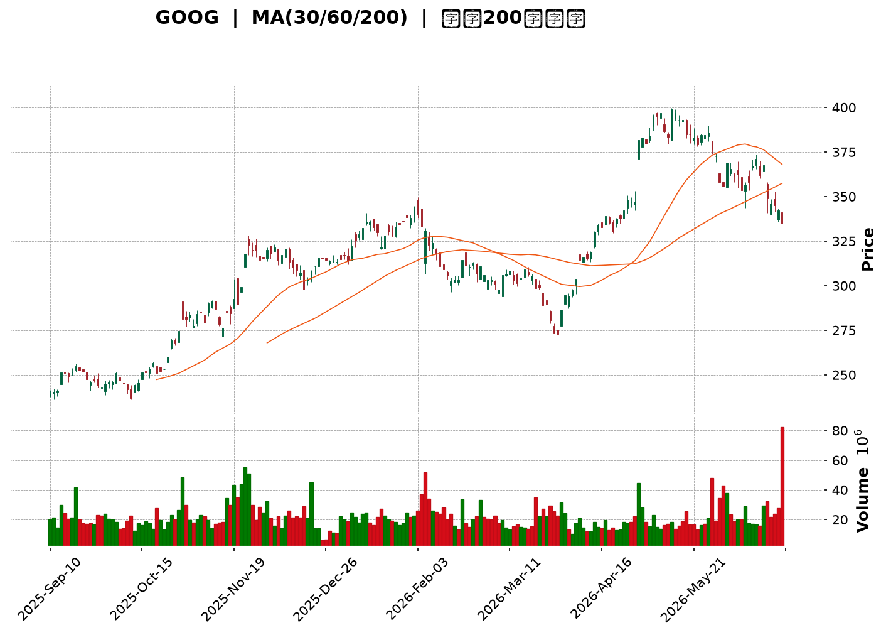
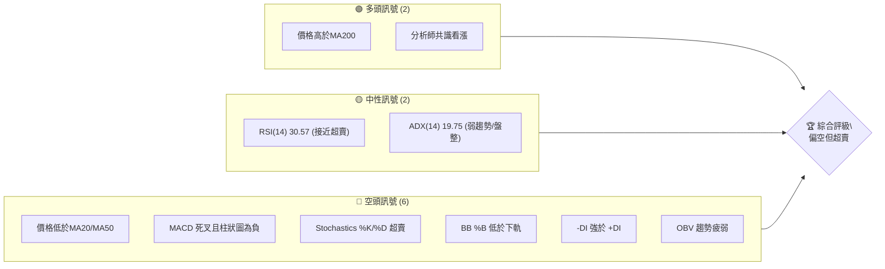
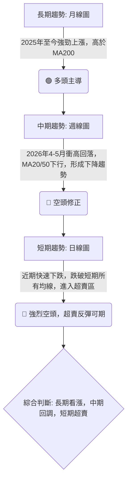
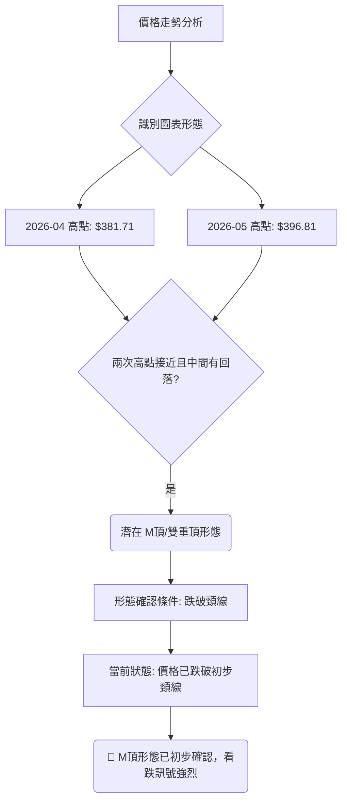
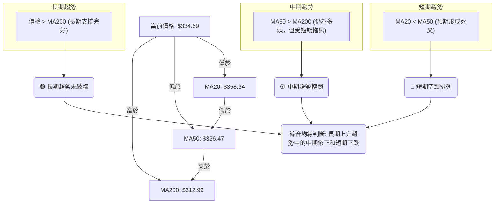
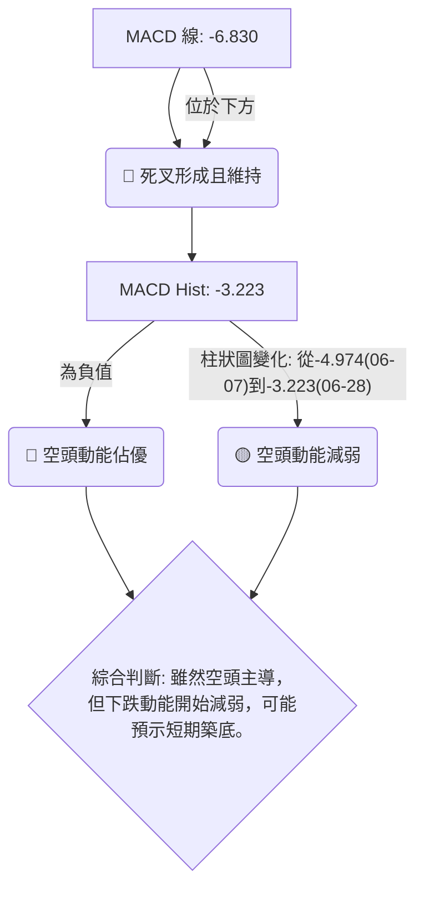
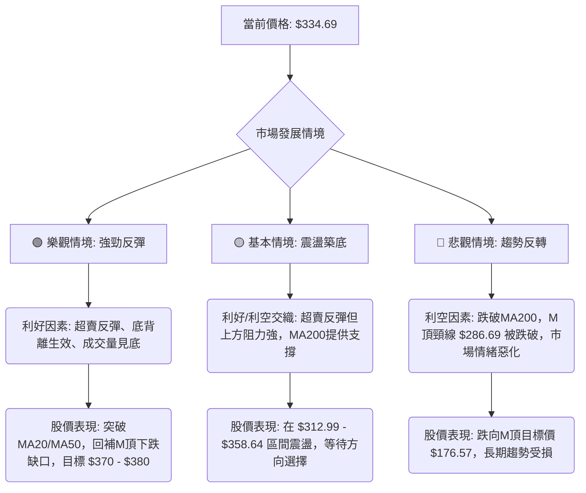

<details>
<summary>📊 靜態圖表 (點擊展開)</summary>

</details>

<html>
<head><meta charset="utf-8" /></head>
<body>
    <div style="height:500px; width:100%;">                        <script>window.PlotlyConfig = {MathJaxConfig: 'local'};</script>
        <script charset="utf-8" src="https://cdn.plot.ly/plotly-3.6.0.min.js" integrity="sha256-QaOVwtVY0T02VaHrr6pnoHLCwayMJp4O5n4YyaE3rJk=" crossorigin="anonymous"></script>                <div id="candlestick-chart" class="plotly-graph-div" style="height:100%; width:100%;"></div>            <script>                window.PLOTLYENV=window.PLOTLYENV || {};                                if (document.getElementById("candlestick-chart")) {                    Plotly.newPlot(                        "candlestick-chart",                        [{"close":{"dtype":"f8","bdata":"AAAAgOzibUAAAABA4wluQAAAAMAMHW5AAAAAYI9ob0AAAACgs11vQAAAAECPK29AAAAAwMN6b0AAAADgs9dvQAAAAKBUjG9AAAAAYBV7b0AAAADAC+tuQAAAACDOwm5AAAAAYEnWbkAAAABAOXxuQAAAAKBaYm5AAAAAwOihbkAAAABgVb5uQAAAAOD4vm5AAAAAYJNgb0AAAADAsNRuQAAAAMBan25AAAAA4I43bkAAAABg0KBtQAAAAIAqhW5AAAAAYKu2bkAAAACg9mZvQAAAAKBkbG9AAAAAoGSpb0AAAABgRghwQAAAAKAlW29AAAAAACeBb0AAAAAAeqdvQAAAAKABQHBAAAAAYG7WcEAAAACAer5wQAAAAIAbKnFAAAAAoJOVcUAAAACgTJRxQAAAAOAGuXFAAAAA4EFYcUAAAACAFsNxQAAAAECCzHFAAAAAIHJycUAAAABAWCByQAAAAGC1MnJAAAAAQOLtcUAAAAAAL2lxQAAAAOACR3FAAAAAQKnQcUAAAADgcMZxQAAAAGCrRnJAAAAAoJoWckAAAABgBbFyQAAAAGCN3XNAAAAAYBwwdEAAAACgdPpzQAAAAKDm93NAAAAAgA6oc0AAAADAbbZzQAAAAIDi\u002f3NAAAAAYEbcc0AAAADgWxd0QAAAAICioHNAAAAAYF3Vc0AAAAAgTAl0QAAAAGCmlHNAAAAAANZhc0AAAABgqU5zQAAAACBBNXNAAAAAgLyackAAAABAqPVyQAAAAOBQQ3NAAAAAYMduc0AAAADASbRzQAAAAOAgtHNAAAAAgMioc0AAAAAArZ9zQAAAAGA7onNAAAAAYD+Wc0AAAAAgia5zQAAAAIB+znNAAAAAYDuic0AAAADAJSB0QAAAAGBaWXRAAAAAIF6LdEAAAACAu8R0QAAAAODa\u002f3RAAAAAIPD9dEAAAACAmst0QAAAAMCKnnRAAAAAYNUbdEAAAAAgOX90QAAAACCIpnRAAAAAoAWAdEAAAABgedJ0QAAAAEAB6XRAAAAAQHX9dEAAAAAAfSN1QAAAAEBpIXVAAAAAwDKHdUAAAAAAFkR1QAAAAMB6znRAAAAAgFyudEAAAACA2ip0QAAAAECgP3RAAAAAQG3jc0AAAABgx25zQAAAAOB1T3NAAAAAIO4Zc0AAAAAgzOZyQAAAAKCx+HJAAAAAIJ\u002fyckAAAAAg06dzQAAAACCIdHNAAAAAYDpoc0AAAACA8YlzQAAAAID8K3NAAAAAgGBwc0AAAADgXB9zQAAAACCf8nJAAAAAIN3wckAAAADgRshyQAAAAECSnnJAAAAAIDcdc0AAAAAg7StzQAAAAIDAQ3NAAAAAIHHwckAAAACAddRyQAAAAGDKA3NAAAAAIJVTc0AAAAAg2iFzQAAAAOC8GHNAAAAAwMOpckAAAABAca1yQAAAAMBqEHJAAAAAIKcWckAAAABgI4lxQAAAAICGGXFAAAAAoJwPcUAAAADA\u002f+pxQAAAAOCPa3JAAAAAoIZkckAAAAAAspdyQAAAAID0+3JAAAAAoM+oc0AAAAAg4MJzQAAAAEB7uHNAAAAAwEnwc0AAAABAGaZ0QAAAACBN5HRAAAAAAB7JdEAAAABAIjN1QAAAACAs83RAAAAAAFekdEAAAAAgbhh1QAAAAOC\u002fGHVAAAAAYNNhdUAAAABA98R1QAAAAOCntHVAAAAAIJ6xdUAAAABAXdt3QAAAAADV73dAAAAAQJa2d0AAAAAgnwB4QAAAAABwrnhAAAAA4P6weEAAAACg+sx4QAAAAACZKHhAAAAAIG35d0AAAADAzOx4QAAAAODlznhAAAAAwFWReEAAAAAA+o14QAAAACCyCnhAAAAAILIKeEAAAABg1PN3QAAAAOBtsndAAAAAgLwJeEAAAACAkwl4QAAAAEA0HnhAAAAA4EGDd0AAAADAsUV3QAAAAIDKYnZAAAAAAHU3dkAAAAAgxBB3QAAAAOCj2HZAAAAAYLiSdkAAAADgo6R2QAAAAMAeFXZAAAAAwPVIdkAAAABgj2J2QAAAAIDC8XZAAAAAoJkxd0AAAACgmaF2QAAAACBc93ZAAAAA4HrMdUAAAACgR6F1QAAAAOCjkHVAAAAAQApjdUAAAABACut0QA=="},"high":{"dtype":"f8","bdata":"+gnM\u002fWczbkAz\u002f6pQDkNuQB\u002fNDElcPm5AARmOoi2Ib0DAFK0egpdvQBu9qrigbm9A1zyZPpK0b0AXizZtKgNwQMNe5Cjg+W9An83SDrHIb0ArkuCJ4o5vQB50qS+Z2m5AlPO7wi40b0A6pK+1+2RvQKx1L59YZm5ANan4ElTVbkBJsH5w0eRuQADlgGtO1G5ABhdM0Zx2b0BsCXCL2mFvQF4yfWfX2G5Au\u002fc6ZWOibkAtOZ23jYtuQIHEICRYkG5A7aNDOEbxbkC2JG1Mf4hvQLgdNMQ3EXBAYM1RiDTMb0AOjdMbAhZwQMGMrKIs3G9ALc8IntQKcEAAL6bdgOtvQKs0hpnxX3BA5W1q51LkcEAA\u002fQ8dlu1wQDFPAtfhNnFAHRo6Ir41ckCVdzp5mdtxQKNinQoX1nFAdiIEA4aUcUCSMj0gOuJxQKoED5LrA3JAJaAjahi\u002fcUDk2nLHPC5yQP+cPDFKPHJA5zy+\u002f5s8ckBbF\u002f9SSa9xQOo4Cb2paXFAqZ1KBxpfckBpxdWk5g1yQPY+DCd6+nJAYvKsgaIkc0C\u002f8iGX2PVyQPL661fK8nNAz8ug8m6AdEAWTdcCq0V0QBzbVXbZY3RARqGyXBPwc0DTgtbToN9zQFZaO3+PFnRAIynWpHgndEC8N+3uJDN0QAoFtiL5DHRAsg2RX7Dkc0CwY3r5Mhd0QDAwp88dGXRAueZUlaO7c0D6tOfOq4RzQI7yvyACd3NAUjSa+qlMc0Ddmo8tyQ1zQEGt\u002f1djSXNA\u002fdqgBbF0c0C1co3vMb5zQOmUhg8JvnNAFHF3klnCc0B+OlqG8ahzQNEUfQmR1HNAAL4voKevc0AOS4KH4Sd0QJ5w4W5V7XNAq2x25z4SdEAHSneOn2B0QHapJgm9oXRAIDTqPcKwdEA\u002fkPF7DuB0QE6lhGATTHVAJhbIZnEJdUDh5u4OBRt1QK+ac+7W7HRA3UGd7ZZ6dECVbAYGp8R0QNUQ6ENc7HRAVQusUIHZdECHvPmek\u002f50QLcfbbBgHHVAmKOLqAcTdUAKM1cYfl11QG9BgNeIPXVA8ENZ1W6LdUCiyOubFtt1QAc3Lc7PfHVA\u002fMbSuVvDdEDcPe0RVqN0QAlBRQX\u002fdHRAT7mfNl0TdEB49jQxBAp0QN5I+X4SwXNA9vu1aMpHc0Ax+nnP3wdzQCGHTDgsGHNAINgLDBcac0A0yrzOi8VzQB6YHP6b8HNAjobNv2V\u002fc0BKWdWhApRzQMtCjNp2iXNA\u002fEGEZsN6c0AU2CdczjtzQG8tAJix+HJA\u002f1tkQfsQc0DD6KjZle9yQHNIKUYCv3JA9A766gwlc0AA++\u002fHbE9zQPo4ODkcbnNAj3NUH0VHc0DPXEoWNDFzQP6usOotFnNAl2Fh7NBdc0C3XV5pAmlzQJdJ0qjtJ3NAx1+uoP0Cc0A1vK4oAPNyQDpzbqm9jnJAIbskYrlnckD9hdSle+VxQGMBJ\u002f7AbnFAO0pfcIBBcUDicCmICe5xQMz9ZGbknHJA+Tq7U417ckCazX997aNyQJMBx3Ss\u002fnJAMIliqyrzc0CRIIJD09NzQKp+0c\u002fs9HNAFDRBVc7zc0AZsiT6Dqd0QCZZvbHG7HRAtyxTRNUSdUAF2xDvfDx1QB\u002f6v9xLL3VAN7aIvnkPdUB7d88iOh11QGF3+U9JP3VAUtjuf7t3dUC6iPTiBet1QPVYU1YI23VA5dYvv\u002f8SdkB6x83MZeZ3QHTdxfSM8ndA6ZHQ0C7\u002fd0AQGOjRnUt4QOY17\u002fFDwnhAxYbqL9vReEApNYkfFuJ4QHsA6B98oXhAEW+JK1IjeEDFwKzuB\u002ft4QFtbOrzS7XhA0LhtMUW6eEAtlzGjoEN5QJWnecYFknhAEcL+tXBneECB1QmqI0d4QFQ0n1k3CnhAVPcZBYgSeEBE5pxw2Vd4QOSk8DA\u002fXHhAZ3zVI7rWd0COagfG\u002fmV3QDYhqckUGXdA2kHD8oKkdkAquORLMxp3QFVYXKalD3dAAAAAgBS2dkAAAABgEht3QAAAAMD15HZAAAAAAClgdkAAAABAXsx2QAAAAGBmKndAAAAAoJlZd0AAAABgZiJ3QAAAAAAAEHdAAAAAQDNjdkAAAAAghct1QAAAAKBHDXZAAAAAQApzdUAAAACA64F1QA=="},"hovertemplate":"\u003cb\u003e%{x|%Y-%m-%d}\u003c\u002fb\u003e\u003cbr\u003e\u958b: $%{open:.2f}\u003cbr\u003e\u9ad8: $%{high:.2f}\u003cbr\u003e\u4f4e: $%{low:.2f}\u003cbr\u003e\u6536: $%{close:.2f}\u003cextra\u003e\u003c\u002fextra\u003e","low":{"dtype":"f8","bdata":"vOuLXJ20bUBz3hEuwINtQMZ9WOcRwW1A97CVRgaQbkAuC5eSPydvQNhdYccfw25AMWxqE90zb0CMkvSUZXJvQD758Es4Sm9AEBYpaClTb0DZfo9mkNduQD94UzisJW5AmB5OZwrFbkDhac4WLVduQDdD7mNG421AcO3WGW3XbUD8RsJIJFRuQGy5G4jcP25Astg+RLOmbkDfl8tgeMpuQK3o+o2Jk25AIh5bi8HmbUAe2nCmGodtQEwvafbtCG5A8Y\u002fmUJkWbkByY1m41MluQBrS7aO\u002fRW9ACkyMlFEDb0C2DFoIQ8NvQAPrVOIfhm5Aj+bGMME+b0CTbJHKwIhvQPfg7isr829APJ\u002fBW7+GcEAgPGq4W6pwQE4\u002fmmF6vnBArLA8Hmx+cUB0QiqOrk9xQLc1YuwkfXFAUDYcsyxFcUDyBF4LYlVxQMnZwu4akXFAqKLmmjUzcUCfXhP9w69xQC6tzM0R9XFAnLoL8C29cUD262J5TFdxQBP57cAQ7nBAQtsjusi6cUAPRKVsbWdxQNHwiGC38XFAnvx9XasJckC1ihzji1xyQMgpd0y3THNAjh8D6hvTc0BIOq+tRclzQCvDlNoexXNAbdRtQtqVc0C4Fihsr5lzQLORw6ykmnNAIDB074+vc0AcLQJIqvVzQOspkzMMeHNAtdaGTGSDc0DyUS5v0K9zQKqEdAucV3NAO7OkR\u002fMoc0C6E8nCdBVzQH9PE3nv9nJA67i3Qv2QckDUrbFtzcNyQNtC5YMg33JAFZmRtgkjc0CMppHagmVzQJ5iBtCTjnNAvFreIPiUc0CRe1Ev43dzQAol6ZJ1jXNAT29tba58c0CvJvu26WNzQFsiGrJmrXNA5DgqEOt+c0DqhXjjbqFzQLhX\u002ftwdGXRAYvy8EjBddEBrBUr4XFF0QCbRVV6e3nRAX1JhglOrdEDEBPL+uK10QE2QlBnee3RApYDOSYoHdECFATbB9\u002fFzQLd0I3o2h3RAi6t59at4dECMEsBbAHF0QKwxke4H1XRAXpUtDyW7dEAzweKTsmR0QMDFMVxLw3RAAxY75ST5dECB44GnXiJ1QIc4wtgKj3RAIBjKu08oc0D+kOwEt\u002ftzQCpH0PCQ1HNAzV3IWP2jc0DryiWqmltzQO0UZUX3O3NAfyL29A34ckAEu7tkM4hyQKgCAfpf2XJAwLaoMnHEckDUauYkXQBzQOjfW\u002fZdWXNARjmJcQwbc0DpKnG+TE9zQJHhctY+4HJAHGVB5x3zckBlr6h0rMpyQHDklyz9hHJAKYp+yoTGckCdOlpu5ZpyQEP8lc3VbXJA4NyHIg1cckCX5KmdBRJzQCWNRxt\u002fGnNADm68dovKckDAbXdjmLlyQPQdKC4O2nJAO\u002fEx16sCc0Am7ymcxxVzQMjMV2cazXJAnSSk5iSJckCOjFWwnJ1yQFwYmHnmCnJAeF0+eCfzcUBIGdhJHW5xQPxnm1AMFXFAFZ8zdPL1cEBGtz4if0lxQFXXhQC8FHJAxbTLOVr2cUBkDe8I0FlyQAJY3fP0c3JA+qloQ0WIc0BZOYK\u002filRzQIiTQ+icpXNAWS04eQWYc0CYaAQ7Tw90QMTaQbBlh3RApxpqQjW3dEBD\u002f1vNbtF0QGDzlyXc5nRABbPBceiWdEC2xD\u002fgJ8x0QFn9n0C87XRAo+D3v5XddEBi6Jwerkl1QGI62q4qgXVA7mmzpZVjdUDyRgQR8q12QKFOWXyMcHdAihgDsrGId0D\u002fl2yI8MF3QIWP2+7fLXhA9t0jKzRheEC3npWT7pZ4QPd6kJT2H3hA3Z3smd23d0CuaUaEm9V3QPDxllHeh3hAapJDxWhYeEBTqNlRo2p4QLXmTW5Q7HdAa6te0le8d0AmjIA0B7R3QMY5WSKFoHdAotj\u002fapeud0Bm6u3YUtx3QO+Gbr9U0HdAbJ5bnzJhd0CgAQdSzRd3QImzMFqVLHZAiBfgc6sidkBM6yCmYil2QJRs1IyZlnZAAAAAgD1edkAAAAAghSt2QAAAAMD1DHZAAAAAgBR6dUAAAACgcBV2QAAAAGBmynZAAAAAwB7VdkAAAAAgroN2QAAAAGC6SXZAAAAAQApPdUAAAACgcDt1QAAAAAAAWHVAAAAAYGb+dEAAAABACtt0QA=="},"name":"\u50f9\u683c","open":{"dtype":"f8","bdata":"eDrA9wXZbUBfqoihcvVtQLGZe6uGCm5AJp8tdiKVbkAAWc7Kw3pvQHBJ4ZL6Xm9AUogmCMFrb0CXVYT875xvQCFihO0CyW9A+kYqzRSlb0CvqP\u002fkA3VvQPEfXJmNi25Abzn27ZvpbkCpYhsjQvluQL98QVq0Um5AHNnnfqkWbkDIDPBoGqVuQCnhGy0CmG5ATCsKE5OpbkAZ4L5nLQ5vQLg7KuT8tm5A3E3xU5SSbkDN5+8p9jVuQEUCvTnfEW5ALejP8QYpbkB14o63MPNuQMfdIYATf29A+FnXWXdbb0DU9rjPYddvQHw2\u002frcF2G9AJZksYlvQb0Be8BG7hKZvQCvHhBi\u002fDHBA2VtDPnSNcEBGlWlRvtpwQBqSYzBawXBAL2n3sGMyckAf1hNnaqpxQHQlLV\u002fhnXFA+SrcWF5IcUCht6UGVm1xQJRqxPXQ0nFAxCUD3Xa6cUBnbrXKT8txQGBVYv0t+nFAj3TN0zc4ckCle\u002fMH56ZxQMmtJl7P9XBAur0Pl2\u002fdcUCzyIEBu\u002f5xQMaFzKH08XFAFFXfO00Cc0Aad3bGoIRyQNw3\u002fQVtZnNAJFddTpJidEDmu2WecAJ0QO0Jw9rBLHRA3Uk1wanNc0BjZOwye8RzQEprHqeWtnNA4KmS85smdEAMyQH\u002f+\u002fVzQE\u002fkZPTGCXRAUfSe2w+Lc0Baz7MJT8NzQLBBizHlCnRAaZ7ipSWmc0BtrIz1eINzQO\u002fdeD+cGXNAbdbBN7VJc0DdmkOwoepyQLSJScv87XJAZdOp7xltc0CSY7HLqWtzQE1jI0\u002fMu3NAGkBBnh+4c0AWrmGkloZzQL729RcEkHNA5VdobGCPc0DqtHzdztJzQLDC03581HNA0dYvn1XOc0DnEqxDjaJzQLUv2nldjXRAsuDqcQBxdEA8uIatLmF0QPtesqV67XRAetQW9cPodEAg6ZQ10hl1QGYI1E\u002f353RAta7p6iENdEDurkKx0Ap0QEToDbFC3XRAS2tKqojDdEDsCBnQWHx0QFcS3mES83RAo6BrHLsCdUBRlDs3fj51QDsQokFg4HRAJmxQwsUBdUAbFlp59sB1QN3SjfPmdHVAglnvCamMc0DM0R3Iw250QAaZacQhDXRAMXXq79sHdEAfEoMWs+hzQGBwSRIUf3NAvc0iP1Q5c0CaBQaH9sNyQL4Ege+Y4HJAUT8mzwDickDJkPB8bwZzQPB7IY2T63NAVJIo\u002f8Bjc0Aj3Vj9ZntzQGHyZyVZhnNAJAyribH4ckD7es0lHelyQLUPkDl9oHJAAW\u002fntqPkckDGPkWC3uxyQNwzx0j4enJAd207YVRfckC2Dld5DhtzQBzWJhnaIXNAcNbsu2kgc0DsSNVzhydzQJdPL6Wt9nJAWitgzckHc0CMaLdLhDtzQD9kcRVx8HJA5XTinTH+ckBpmLeHlsVyQOi5xFqCgHJAaZ1OkZY\u002fckDBvs4ySeBxQDO4G+i6U3FAXraCtWM0cUAd+UgW+FVxQOQ+4L7jHHJA+3sn+g4NckAn5PYqXWhyQPA3OxZav3JAMhU+ozjac0BOnnm1BpBzQBzFAJSJ4HNAiQ0tVq+zc0Bnw\u002ffZ8B10QGpr92HHpXRAPklXKV76dEByBmleqeN0QLPMJLezJXVAuA4nZiH2dECHvjgC8Op0QAv476DuNXVA1dZCFUUYdUCiAGROxXp1QKgPzK1hq3VADNEgAluUdUBlSDXTgTB3QKKj2egKnHdAmI7V5XDhd0BpWrupPtp3QCPOacywVXhAfXP6iSPNeECbjjWZhqB4QA5VpbdHZ3hAV5zDd0sMeEDiD0n3zdp3QAnJxrPZmHhAKco64qePeEAC7jvtOX54QBdvOM4DkXhAUsKxR+8MeEA\u002ffNLYe9x3QAs8\u002ftB48HdAQ3AO2UDMd0B1VGt2juh3QImOWtEQ+ndAidPdb+7Pd0BHHyNjnUV3QKZ8ap8Qr3ZAdxuMVelhdkDJz3mSnjN2QIzzFj2VsnZAAAAAgMKndkAAAAAAKc52QAAAAMDMkHZAAAAAwMwQdkAAAACgmZF2QAAAAADX33ZAAAAAoHD3dkAAAADAzPB2QAAAAIA9vnZAAAAAAClSdkAAAAAgrkF1QAAAACCFy3VAAAAAYLgOdUAAAAAgrk91QA=="},"x":["2025-09-10T00:00:00-04:00","2025-09-11T00:00:00-04:00","2025-09-12T00:00:00-04:00","2025-09-15T00:00:00-04:00","2025-09-16T00:00:00-04:00","2025-09-17T00:00:00-04:00","2025-09-18T00:00:00-04:00","2025-09-19T00:00:00-04:00","2025-09-22T00:00:00-04:00","2025-09-23T00:00:00-04:00","2025-09-24T00:00:00-04:00","2025-09-25T00:00:00-04:00","2025-09-26T00:00:00-04:00","2025-09-29T00:00:00-04:00","2025-09-30T00:00:00-04:00","2025-10-01T00:00:00-04:00","2025-10-02T00:00:00-04:00","2025-10-03T00:00:00-04:00","2025-10-06T00:00:00-04:00","2025-10-07T00:00:00-04:00","2025-10-08T00:00:00-04:00","2025-10-09T00:00:00-04:00","2025-10-10T00:00:00-04:00","2025-10-13T00:00:00-04:00","2025-10-14T00:00:00-04:00","2025-10-15T00:00:00-04:00","2025-10-16T00:00:00-04:00","2025-10-17T00:00:00-04:00","2025-10-20T00:00:00-04:00","2025-10-21T00:00:00-04:00","2025-10-22T00:00:00-04:00","2025-10-23T00:00:00-04:00","2025-10-24T00:00:00-04:00","2025-10-27T00:00:00-04:00","2025-10-28T00:00:00-04:00","2025-10-29T00:00:00-04:00","2025-10-30T00:00:00-04:00","2025-10-31T00:00:00-04:00","2025-11-03T00:00:00-05:00","2025-11-04T00:00:00-05:00","2025-11-05T00:00:00-05:00","2025-11-06T00:00:00-05:00","2025-11-07T00:00:00-05:00","2025-11-10T00:00:00-05:00","2025-11-11T00:00:00-05:00","2025-11-12T00:00:00-05:00","2025-11-13T00:00:00-05:00","2025-11-14T00:00:00-05:00","2025-11-17T00:00:00-05:00","2025-11-18T00:00:00-05:00","2025-11-19T00:00:00-05:00","2025-11-20T00:00:00-05:00","2025-11-21T00:00:00-05:00","2025-11-24T00:00:00-05:00","2025-11-25T00:00:00-05:00","2025-11-26T00:00:00-05:00","2025-11-28T00:00:00-05:00","2025-12-01T00:00:00-05:00","2025-12-02T00:00:00-05:00","2025-12-03T00:00:00-05:00","2025-12-04T00:00:00-05:00","2025-12-05T00:00:00-05:00","2025-12-08T00:00:00-05:00","2025-12-09T00:00:00-05:00","2025-12-10T00:00:00-05:00","2025-12-11T00:00:00-05:00","2025-12-12T00:00:00-05:00","2025-12-15T00:00:00-05:00","2025-12-16T00:00:00-05:00","2025-12-17T00:00:00-05:00","2025-12-18T00:00:00-05:00","2025-12-19T00:00:00-05:00","2025-12-22T00:00:00-05:00","2025-12-23T00:00:00-05:00","2025-12-24T00:00:00-05:00","2025-12-26T00:00:00-05:00","2025-12-29T00:00:00-05:00","2025-12-30T00:00:00-05:00","2025-12-31T00:00:00-05:00","2026-01-02T00:00:00-05:00","2026-01-05T00:00:00-05:00","2026-01-06T00:00:00-05:00","2026-01-07T00:00:00-05:00","2026-01-08T00:00:00-05:00","2026-01-09T00:00:00-05:00","2026-01-12T00:00:00-05:00","2026-01-13T00:00:00-05:00","2026-01-14T00:00:00-05:00","2026-01-15T00:00:00-05:00","2026-01-16T00:00:00-05:00","2026-01-20T00:00:00-05:00","2026-01-21T00:00:00-05:00","2026-01-22T00:00:00-05:00","2026-01-23T00:00:00-05:00","2026-01-26T00:00:00-05:00","2026-01-27T00:00:00-05:00","2026-01-28T00:00:00-05:00","2026-01-29T00:00:00-05:00","2026-01-30T00:00:00-05:00","2026-02-02T00:00:00-05:00","2026-02-03T00:00:00-05:00","2026-02-04T00:00:00-05:00","2026-02-05T00:00:00-05:00","2026-02-06T00:00:00-05:00","2026-02-09T00:00:00-05:00","2026-02-10T00:00:00-05:00","2026-02-11T00:00:00-05:00","2026-02-12T00:00:00-05:00","2026-02-13T00:00:00-05:00","2026-02-17T00:00:00-05:00","2026-02-18T00:00:00-05:00","2026-02-19T00:00:00-05:00","2026-02-20T00:00:00-05:00","2026-02-23T00:00:00-05:00","2026-02-24T00:00:00-05:00","2026-02-25T00:00:00-05:00","2026-02-26T00:00:00-05:00","2026-02-27T00:00:00-05:00","2026-03-02T00:00:00-05:00","2026-03-03T00:00:00-05:00","2026-03-04T00:00:00-05:00","2026-03-05T00:00:00-05:00","2026-03-06T00:00:00-05:00","2026-03-09T00:00:00-04:00","2026-03-10T00:00:00-04:00","2026-03-11T00:00:00-04:00","2026-03-12T00:00:00-04:00","2026-03-13T00:00:00-04:00","2026-03-16T00:00:00-04:00","2026-03-17T00:00:00-04:00","2026-03-18T00:00:00-04:00","2026-03-19T00:00:00-04:00","2026-03-20T00:00:00-04:00","2026-03-23T00:00:00-04:00","2026-03-24T00:00:00-04:00","2026-03-25T00:00:00-04:00","2026-03-26T00:00:00-04:00","2026-03-27T00:00:00-04:00","2026-03-30T00:00:00-04:00","2026-03-31T00:00:00-04:00","2026-04-01T00:00:00-04:00","2026-04-02T00:00:00-04:00","2026-04-06T00:00:00-04:00","2026-04-07T00:00:00-04:00","2026-04-08T00:00:00-04:00","2026-04-09T00:00:00-04:00","2026-04-10T00:00:00-04:00","2026-04-13T00:00:00-04:00","2026-04-14T00:00:00-04:00","2026-04-15T00:00:00-04:00","2026-04-16T00:00:00-04:00","2026-04-17T00:00:00-04:00","2026-04-20T00:00:00-04:00","2026-04-21T00:00:00-04:00","2026-04-22T00:00:00-04:00","2026-04-23T00:00:00-04:00","2026-04-24T00:00:00-04:00","2026-04-27T00:00:00-04:00","2026-04-28T00:00:00-04:00","2026-04-29T00:00:00-04:00","2026-04-30T00:00:00-04:00","2026-05-01T00:00:00-04:00","2026-05-04T00:00:00-04:00","2026-05-05T00:00:00-04:00","2026-05-06T00:00:00-04:00","2026-05-07T00:00:00-04:00","2026-05-08T00:00:00-04:00","2026-05-11T00:00:00-04:00","2026-05-12T00:00:00-04:00","2026-05-13T00:00:00-04:00","2026-05-14T00:00:00-04:00","2026-05-15T00:00:00-04:00","2026-05-18T00:00:00-04:00","2026-05-19T00:00:00-04:00","2026-05-20T00:00:00-04:00","2026-05-21T00:00:00-04:00","2026-05-22T00:00:00-04:00","2026-05-26T00:00:00-04:00","2026-05-27T00:00:00-04:00","2026-05-28T00:00:00-04:00","2026-05-29T00:00:00-04:00","2026-06-01T00:00:00-04:00","2026-06-02T00:00:00-04:00","2026-06-03T00:00:00-04:00","2026-06-04T00:00:00-04:00","2026-06-05T00:00:00-04:00","2026-06-08T00:00:00-04:00","2026-06-09T00:00:00-04:00","2026-06-10T00:00:00-04:00","2026-06-11T00:00:00-04:00","2026-06-12T00:00:00-04:00","2026-06-15T00:00:00-04:00","2026-06-16T00:00:00-04:00","2026-06-17T00:00:00-04:00","2026-06-18T00:00:00-04:00","2026-06-22T00:00:00-04:00","2026-06-23T00:00:00-04:00","2026-06-24T00:00:00-04:00","2026-06-25T00:00:00-04:00","2026-06-26T00:00:00-04:00"],"type":"candlestick"},{"hovertemplate":"MA30: $%{y:.2f}\u003cextra\u003e\u003c\u002fextra\u003e","line":{"color":"#2196F3","dash":"dash","width":2},"mode":"lines","name":"MA30","x":["2025-09-10T00:00:00-04:00","2025-09-11T00:00:00-04:00","2025-09-12T00:00:00-04:00","2025-09-15T00:00:00-04:00","2025-09-16T00:00:00-04:00","2025-09-17T00:00:00-04:00","2025-09-18T00:00:00-04:00","2025-09-19T00:00:00-04:00","2025-09-22T00:00:00-04:00","2025-09-23T00:00:00-04:00","2025-09-24T00:00:00-04:00","2025-09-25T00:00:00-04:00","2025-09-26T00:00:00-04:00","2025-09-29T00:00:00-04:00","2025-09-30T00:00:00-04:00","2025-10-01T00:00:00-04:00","2025-10-02T00:00:00-04:00","2025-10-03T00:00:00-04:00","2025-10-06T00:00:00-04:00","2025-10-07T00:00:00-04:00","2025-10-08T00:00:00-04:00","2025-10-09T00:00:00-04:00","2025-10-10T00:00:00-04:00","2025-10-13T00:00:00-04:00","2025-10-14T00:00:00-04:00","2025-10-15T00:00:00-04:00","2025-10-16T00:00:00-04:00","2025-10-17T00:00:00-04:00","2025-10-20T00:00:00-04:00","2025-10-21T00:00:00-04:00","2025-10-22T00:00:00-04:00","2025-10-23T00:00:00-04:00","2025-10-24T00:00:00-04:00","2025-10-27T00:00:00-04:00","2025-10-28T00:00:00-04:00","2025-10-29T00:00:00-04:00","2025-10-30T00:00:00-04:00","2025-10-31T00:00:00-04:00","2025-11-03T00:00:00-05:00","2025-11-04T00:00:00-05:00","2025-11-05T00:00:00-05:00","2025-11-06T00:00:00-05:00","2025-11-07T00:00:00-05:00","2025-11-10T00:00:00-05:00","2025-11-11T00:00:00-05:00","2025-11-12T00:00:00-05:00","2025-11-13T00:00:00-05:00","2025-11-14T00:00:00-05:00","2025-11-17T00:00:00-05:00","2025-11-18T00:00:00-05:00","2025-11-19T00:00:00-05:00","2025-11-20T00:00:00-05:00","2025-11-21T00:00:00-05:00","2025-11-24T00:00:00-05:00","2025-11-25T00:00:00-05:00","2025-11-26T00:00:00-05:00","2025-11-28T00:00:00-05:00","2025-12-01T00:00:00-05:00","2025-12-02T00:00:00-05:00","2025-12-03T00:00:00-05:00","2025-12-04T00:00:00-05:00","2025-12-05T00:00:00-05:00","2025-12-08T00:00:00-05:00","2025-12-09T00:00:00-05:00","2025-12-10T00:00:00-05:00","2025-12-11T00:00:00-05:00","2025-12-12T00:00:00-05:00","2025-12-15T00:00:00-05:00","2025-12-16T00:00:00-05:00","2025-12-17T00:00:00-05:00","2025-12-18T00:00:00-05:00","2025-12-19T00:00:00-05:00","2025-12-22T00:00:00-05:00","2025-12-23T00:00:00-05:00","2025-12-24T00:00:00-05:00","2025-12-26T00:00:00-05:00","2025-12-29T00:00:00-05:00","2025-12-30T00:00:00-05:00","2025-12-31T00:00:00-05:00","2026-01-02T00:00:00-05:00","2026-01-05T00:00:00-05:00","2026-01-06T00:00:00-05:00","2026-01-07T00:00:00-05:00","2026-01-08T00:00:00-05:00","2026-01-09T00:00:00-05:00","2026-01-12T00:00:00-05:00","2026-01-13T00:00:00-05:00","2026-01-14T00:00:00-05:00","2026-01-15T00:00:00-05:00","2026-01-16T00:00:00-05:00","2026-01-20T00:00:00-05:00","2026-01-21T00:00:00-05:00","2026-01-22T00:00:00-05:00","2026-01-23T00:00:00-05:00","2026-01-26T00:00:00-05:00","2026-01-27T00:00:00-05:00","2026-01-28T00:00:00-05:00","2026-01-29T00:00:00-05:00","2026-01-30T00:00:00-05:00","2026-02-02T00:00:00-05:00","2026-02-03T00:00:00-05:00","2026-02-04T00:00:00-05:00","2026-02-05T00:00:00-05:00","2026-02-06T00:00:00-05:00","2026-02-09T00:00:00-05:00","2026-02-10T00:00:00-05:00","2026-02-11T00:00:00-05:00","2026-02-12T00:00:00-05:00","2026-02-13T00:00:00-05:00","2026-02-17T00:00:00-05:00","2026-02-18T00:00:00-05:00","2026-02-19T00:00:00-05:00","2026-02-20T00:00:00-05:00","2026-02-23T00:00:00-05:00","2026-02-24T00:00:00-05:00","2026-02-25T00:00:00-05:00","2026-02-26T00:00:00-05:00","2026-02-27T00:00:00-05:00","2026-03-02T00:00:00-05:00","2026-03-03T00:00:00-05:00","2026-03-04T00:00:00-05:00","2026-03-05T00:00:00-05:00","2026-03-06T00:00:00-05:00","2026-03-09T00:00:00-04:00","2026-03-10T00:00:00-04:00","2026-03-11T00:00:00-04:00","2026-03-12T00:00:00-04:00","2026-03-13T00:00:00-04:00","2026-03-16T00:00:00-04:00","2026-03-17T00:00:00-04:00","2026-03-18T00:00:00-04:00","2026-03-19T00:00:00-04:00","2026-03-20T00:00:00-04:00","2026-03-23T00:00:00-04:00","2026-03-24T00:00:00-04:00","2026-03-25T00:00:00-04:00","2026-03-26T00:00:00-04:00","2026-03-27T00:00:00-04:00","2026-03-30T00:00:00-04:00","2026-03-31T00:00:00-04:00","2026-04-01T00:00:00-04:00","2026-04-02T00:00:00-04:00","2026-04-06T00:00:00-04:00","2026-04-07T00:00:00-04:00","2026-04-08T00:00:00-04:00","2026-04-09T00:00:00-04:00","2026-04-10T00:00:00-04:00","2026-04-13T00:00:00-04:00","2026-04-14T00:00:00-04:00","2026-04-15T00:00:00-04:00","2026-04-16T00:00:00-04:00","2026-04-17T00:00:00-04:00","2026-04-20T00:00:00-04:00","2026-04-21T00:00:00-04:00","2026-04-22T00:00:00-04:00","2026-04-23T00:00:00-04:00","2026-04-24T00:00:00-04:00","2026-04-27T00:00:00-04:00","2026-04-28T00:00:00-04:00","2026-04-29T00:00:00-04:00","2026-04-30T00:00:00-04:00","2026-05-01T00:00:00-04:00","2026-05-04T00:00:00-04:00","2026-05-05T00:00:00-04:00","2026-05-06T00:00:00-04:00","2026-05-07T00:00:00-04:00","2026-05-08T00:00:00-04:00","2026-05-11T00:00:00-04:00","2026-05-12T00:00:00-04:00","2026-05-13T00:00:00-04:00","2026-05-14T00:00:00-04:00","2026-05-15T00:00:00-04:00","2026-05-18T00:00:00-04:00","2026-05-19T00:00:00-04:00","2026-05-20T00:00:00-04:00","2026-05-21T00:00:00-04:00","2026-05-22T00:00:00-04:00","2026-05-26T00:00:00-04:00","2026-05-27T00:00:00-04:00","2026-05-28T00:00:00-04:00","2026-05-29T00:00:00-04:00","2026-06-01T00:00:00-04:00","2026-06-02T00:00:00-04:00","2026-06-03T00:00:00-04:00","2026-06-04T00:00:00-04:00","2026-06-05T00:00:00-04:00","2026-06-08T00:00:00-04:00","2026-06-09T00:00:00-04:00","2026-06-10T00:00:00-04:00","2026-06-11T00:00:00-04:00","2026-06-12T00:00:00-04:00","2026-06-15T00:00:00-04:00","2026-06-16T00:00:00-04:00","2026-06-17T00:00:00-04:00","2026-06-18T00:00:00-04:00","2026-06-22T00:00:00-04:00","2026-06-23T00:00:00-04:00","2026-06-24T00:00:00-04:00","2026-06-25T00:00:00-04:00","2026-06-26T00:00:00-04:00"],"y":{"dtype":"f8","bdata":"AAAAAAAA+H8AAAAAAAD4fwAAAAAAAPh\u002fAAAAAAAA+H8AAAAAAAD4fwAAAAAAAPh\u002fAAAAAAAA+H8AAAAAAAD4fwAAAAAAAPh\u002fAAAAAAAA+H8AAAAAAAD4fwAAAAAAAPh\u002fAAAAAAAA+H8AAAAAAAD4fwAAAAAAAPh\u002fAAAAAAAA+H8AAAAAAAD4fwAAAAAAAPh\u002fAAAAAAAA+H8AAAAAAAD4fwAAAAAAAPh\u002fAAAAAAAA+H8AAAAAAAD4fwAAAAAAAPh\u002fAAAAAAAA+H8AAAAAAAD4fwAAAAAAAPh\u002fAAAAAAAA+H8AAAAAAAD4f+\u002fu7o4G7G5A7+7uTtX5bkCamZmZngdvQGZmZib8G29AAAAAEFQvb0B3d3fXb0FvQN7d3V1kXG9AZmZmJt97b0AAAAAQK5hvQHd3d\u002fdsuW9AMzMzg87Ub0C8u7trHPxvQAAAAECxEnBAmpmZoQAkcEAAAAA4nDxwQDMzM+NCVnBAVVVVFY9scECJiIig9X1wQHd3d9c1jnBAERERKVugcEBEREQcfrRwQAAAANjKzXBAiYiISDjncEDv7u6WTghxQImIiCCbL3FAMzMz89RYcUAiIiK6VH1xQJqZmYmnoXFAZmZmvkzCcUDNzMx0tOFxQKuqqvqUBnJAmpmZeaMpckAzMzOjBk5yQM3MzMzYanJAzczMTGmEckCrqqpagaByQFVVVZUftXJAERERIXfEckBERET0NdNyQAAAAJDi33JAIiIiYqLqckARERFx2vRyQLy7u8tYAXNAIiIikkoSc0De3d2NwR9zQImIiHiaLHNAERER4V07c0AiIiLyP05zQN7d3W1bYnNAiYiICHpxc0C8u7sbv4FzQN7d3a3OjnNAREREtP6bc0BERESEO6hzQDMzM\u002fNbrHNAzczMrGavc0BVVVXFJLZzQN7d3S3xvnNAERERkVbKc0CrqqrKk9NzQKuqqqrd2HNAiYiICPzac0B3d3dXct5zQCIiIjIt53NAiYiIeN3sc0De3d0tkvNzQKuqqorq\u002fnNAzczMDKMMdEBERES0Qxx0QBEREXGrLHRAERERUZ5FdEBERESkTFl0QERERLR4ZnRA7+7uzh9xdEARERGRE3V0QCIiIvK5eXRA7+7uXq57dEDe3d0dDXp0QM3MzMxKd3RAVVVV9SVzdEBmZmaGfWx0QImIiBhdZXRA3t3djYJfdEDNzMzMf1t0QBERETHfU3RAzczMzCpKdECamZmZrD90QO\u002fu7h4UMHRAmpmZmdMidEB3d3dHjRR0QBEREbFJBnRAvLu7e1L8c0Dv7u7OsO1zQAAAANBb3HNAERERIYjQc0AzMzNjcsJzQCIiIrJntHNA7+7ujueic0C8u7sbNI9zQHd3d0cmfXNAIiIiwlxqc0AAAACQJ1hzQKuqqiqQSXNAAAAA4Fc4c0CrqqoqoStzQAAAAED9GHNAAAAAUKEJc0De3d0tcflyQN7d3d2T5nJAAAAAwCrVckAiIiISxsxyQO\u002fu7r4RyHJAIiIiMlXDckBmZmYGQ7pyQKuqqho+tnJAZmZmNmW4ckCJiIgIS7pyQM3MzOz5vnJA7+7ubj3DckBmZma2Q9ByQERERJTa4HJAmpmZeZjwckAzMzNjOQVzQCIiImIcGXNAq6qq+iUmc0De3d2tkDZzQKuqqsoyRnNAZmZmZgtbc0CrqqrKIHRzQLy7uxsXi3NAvLu7m0qfc0B3d3fHm8dzQCIiImLp8HNAd3d3dwEcdEDe3d3tcUl0QCIiIpLpgXRARERE1EG6dECJiIh4QPh0QCIiItJ8NHVAzczMPHtvdUBmZmZWRqt1QERERDTJ4XVAZmZmxnoWdkCrqqoKW0l2QO\u002fu7n6DdHZAmpmZ6eiZdkCamZnJrL12QGZmZkab33ZAERERkZYCd0CrqqoKgR93QO\u002fu7r4IO3dAVVVVNU5Sd0CJiIio\u002fWN3QLy7u6s+cHdAq6qqmq59d0BVVVVFfo53QFVVVUVsnXdAmpmZCZand0CamZm5Cq93QDMzM+NBsndAd3d3V023d0AiIiLyvap3QM3MzNxFondAq6qqCtedd0CJiIioI5J3QM3MzNyAg3dAvLu7y9Fqd0C8u7tLw093QGZmZoahOXdAmpmZKY0jd0AzMzMDXAF3QA=="},"type":"scatter"},{"hovertemplate":"MA60: $%{y:.2f}\u003cextra\u003e\u003c\u002fextra\u003e","line":{"color":"#9C27B0","dash":"dash","width":2},"mode":"lines","name":"MA60","x":["2025-09-10T00:00:00-04:00","2025-09-11T00:00:00-04:00","2025-09-12T00:00:00-04:00","2025-09-15T00:00:00-04:00","2025-09-16T00:00:00-04:00","2025-09-17T00:00:00-04:00","2025-09-18T00:00:00-04:00","2025-09-19T00:00:00-04:00","2025-09-22T00:00:00-04:00","2025-09-23T00:00:00-04:00","2025-09-24T00:00:00-04:00","2025-09-25T00:00:00-04:00","2025-09-26T00:00:00-04:00","2025-09-29T00:00:00-04:00","2025-09-30T00:00:00-04:00","2025-10-01T00:00:00-04:00","2025-10-02T00:00:00-04:00","2025-10-03T00:00:00-04:00","2025-10-06T00:00:00-04:00","2025-10-07T00:00:00-04:00","2025-10-08T00:00:00-04:00","2025-10-09T00:00:00-04:00","2025-10-10T00:00:00-04:00","2025-10-13T00:00:00-04:00","2025-10-14T00:00:00-04:00","2025-10-15T00:00:00-04:00","2025-10-16T00:00:00-04:00","2025-10-17T00:00:00-04:00","2025-10-20T00:00:00-04:00","2025-10-21T00:00:00-04:00","2025-10-22T00:00:00-04:00","2025-10-23T00:00:00-04:00","2025-10-24T00:00:00-04:00","2025-10-27T00:00:00-04:00","2025-10-28T00:00:00-04:00","2025-10-29T00:00:00-04:00","2025-10-30T00:00:00-04:00","2025-10-31T00:00:00-04:00","2025-11-03T00:00:00-05:00","2025-11-04T00:00:00-05:00","2025-11-05T00:00:00-05:00","2025-11-06T00:00:00-05:00","2025-11-07T00:00:00-05:00","2025-11-10T00:00:00-05:00","2025-11-11T00:00:00-05:00","2025-11-12T00:00:00-05:00","2025-11-13T00:00:00-05:00","2025-11-14T00:00:00-05:00","2025-11-17T00:00:00-05:00","2025-11-18T00:00:00-05:00","2025-11-19T00:00:00-05:00","2025-11-20T00:00:00-05:00","2025-11-21T00:00:00-05:00","2025-11-24T00:00:00-05:00","2025-11-25T00:00:00-05:00","2025-11-26T00:00:00-05:00","2025-11-28T00:00:00-05:00","2025-12-01T00:00:00-05:00","2025-12-02T00:00:00-05:00","2025-12-03T00:00:00-05:00","2025-12-04T00:00:00-05:00","2025-12-05T00:00:00-05:00","2025-12-08T00:00:00-05:00","2025-12-09T00:00:00-05:00","2025-12-10T00:00:00-05:00","2025-12-11T00:00:00-05:00","2025-12-12T00:00:00-05:00","2025-12-15T00:00:00-05:00","2025-12-16T00:00:00-05:00","2025-12-17T00:00:00-05:00","2025-12-18T00:00:00-05:00","2025-12-19T00:00:00-05:00","2025-12-22T00:00:00-05:00","2025-12-23T00:00:00-05:00","2025-12-24T00:00:00-05:00","2025-12-26T00:00:00-05:00","2025-12-29T00:00:00-05:00","2025-12-30T00:00:00-05:00","2025-12-31T00:00:00-05:00","2026-01-02T00:00:00-05:00","2026-01-05T00:00:00-05:00","2026-01-06T00:00:00-05:00","2026-01-07T00:00:00-05:00","2026-01-08T00:00:00-05:00","2026-01-09T00:00:00-05:00","2026-01-12T00:00:00-05:00","2026-01-13T00:00:00-05:00","2026-01-14T00:00:00-05:00","2026-01-15T00:00:00-05:00","2026-01-16T00:00:00-05:00","2026-01-20T00:00:00-05:00","2026-01-21T00:00:00-05:00","2026-01-22T00:00:00-05:00","2026-01-23T00:00:00-05:00","2026-01-26T00:00:00-05:00","2026-01-27T00:00:00-05:00","2026-01-28T00:00:00-05:00","2026-01-29T00:00:00-05:00","2026-01-30T00:00:00-05:00","2026-02-02T00:00:00-05:00","2026-02-03T00:00:00-05:00","2026-02-04T00:00:00-05:00","2026-02-05T00:00:00-05:00","2026-02-06T00:00:00-05:00","2026-02-09T00:00:00-05:00","2026-02-10T00:00:00-05:00","2026-02-11T00:00:00-05:00","2026-02-12T00:00:00-05:00","2026-02-13T00:00:00-05:00","2026-02-17T00:00:00-05:00","2026-02-18T00:00:00-05:00","2026-02-19T00:00:00-05:00","2026-02-20T00:00:00-05:00","2026-02-23T00:00:00-05:00","2026-02-24T00:00:00-05:00","2026-02-25T00:00:00-05:00","2026-02-26T00:00:00-05:00","2026-02-27T00:00:00-05:00","2026-03-02T00:00:00-05:00","2026-03-03T00:00:00-05:00","2026-03-04T00:00:00-05:00","2026-03-05T00:00:00-05:00","2026-03-06T00:00:00-05:00","2026-03-09T00:00:00-04:00","2026-03-10T00:00:00-04:00","2026-03-11T00:00:00-04:00","2026-03-12T00:00:00-04:00","2026-03-13T00:00:00-04:00","2026-03-16T00:00:00-04:00","2026-03-17T00:00:00-04:00","2026-03-18T00:00:00-04:00","2026-03-19T00:00:00-04:00","2026-03-20T00:00:00-04:00","2026-03-23T00:00:00-04:00","2026-03-24T00:00:00-04:00","2026-03-25T00:00:00-04:00","2026-03-26T00:00:00-04:00","2026-03-27T00:00:00-04:00","2026-03-30T00:00:00-04:00","2026-03-31T00:00:00-04:00","2026-04-01T00:00:00-04:00","2026-04-02T00:00:00-04:00","2026-04-06T00:00:00-04:00","2026-04-07T00:00:00-04:00","2026-04-08T00:00:00-04:00","2026-04-09T00:00:00-04:00","2026-04-10T00:00:00-04:00","2026-04-13T00:00:00-04:00","2026-04-14T00:00:00-04:00","2026-04-15T00:00:00-04:00","2026-04-16T00:00:00-04:00","2026-04-17T00:00:00-04:00","2026-04-20T00:00:00-04:00","2026-04-21T00:00:00-04:00","2026-04-22T00:00:00-04:00","2026-04-23T00:00:00-04:00","2026-04-24T00:00:00-04:00","2026-04-27T00:00:00-04:00","2026-04-28T00:00:00-04:00","2026-04-29T00:00:00-04:00","2026-04-30T00:00:00-04:00","2026-05-01T00:00:00-04:00","2026-05-04T00:00:00-04:00","2026-05-05T00:00:00-04:00","2026-05-06T00:00:00-04:00","2026-05-07T00:00:00-04:00","2026-05-08T00:00:00-04:00","2026-05-11T00:00:00-04:00","2026-05-12T00:00:00-04:00","2026-05-13T00:00:00-04:00","2026-05-14T00:00:00-04:00","2026-05-15T00:00:00-04:00","2026-05-18T00:00:00-04:00","2026-05-19T00:00:00-04:00","2026-05-20T00:00:00-04:00","2026-05-21T00:00:00-04:00","2026-05-22T00:00:00-04:00","2026-05-26T00:00:00-04:00","2026-05-27T00:00:00-04:00","2026-05-28T00:00:00-04:00","2026-05-29T00:00:00-04:00","2026-06-01T00:00:00-04:00","2026-06-02T00:00:00-04:00","2026-06-03T00:00:00-04:00","2026-06-04T00:00:00-04:00","2026-06-05T00:00:00-04:00","2026-06-08T00:00:00-04:00","2026-06-09T00:00:00-04:00","2026-06-10T00:00:00-04:00","2026-06-11T00:00:00-04:00","2026-06-12T00:00:00-04:00","2026-06-15T00:00:00-04:00","2026-06-16T00:00:00-04:00","2026-06-17T00:00:00-04:00","2026-06-18T00:00:00-04:00","2026-06-22T00:00:00-04:00","2026-06-23T00:00:00-04:00","2026-06-24T00:00:00-04:00","2026-06-25T00:00:00-04:00","2026-06-26T00:00:00-04:00"],"y":{"dtype":"f8","bdata":"AAAAAAAA+H8AAAAAAAD4fwAAAAAAAPh\u002fAAAAAAAA+H8AAAAAAAD4fwAAAAAAAPh\u002fAAAAAAAA+H8AAAAAAAD4fwAAAAAAAPh\u002fAAAAAAAA+H8AAAAAAAD4fwAAAAAAAPh\u002fAAAAAAAA+H8AAAAAAAD4fwAAAAAAAPh\u002fAAAAAAAA+H8AAAAAAAD4fwAAAAAAAPh\u002fAAAAAAAA+H8AAAAAAAD4fwAAAAAAAPh\u002fAAAAAAAA+H8AAAAAAAD4fwAAAAAAAPh\u002fAAAAAAAA+H8AAAAAAAD4fwAAAAAAAPh\u002fAAAAAAAA+H8AAAAAAAD4fwAAAAAAAPh\u002fAAAAAAAA+H8AAAAAAAD4fwAAAAAAAPh\u002fAAAAAAAA+H8AAAAAAAD4fwAAAAAAAPh\u002fAAAAAAAA+H8AAAAAAAD4fwAAAAAAAPh\u002fAAAAAAAA+H8AAAAAAAD4fwAAAAAAAPh\u002fAAAAAAAA+H8AAAAAAAD4fwAAAAAAAPh\u002fAAAAAAAA+H8AAAAAAAD4fwAAAAAAAPh\u002fAAAAAAAA+H8AAAAAAAD4fwAAAAAAAPh\u002fAAAAAAAA+H8AAAAAAAD4fwAAAAAAAPh\u002fAAAAAAAA+H8AAAAAAAD4fwAAAAAAAPh\u002fAAAAAAAA+H8AAAAAAAD4fxERESFMvnBAiYiIEEfTcEAAAAD46uhwQAAAAHBr\u002fHBAZmZmqgkOcUAzMzOjnCBxQCIiIuKoMXFAIiIiWjNBcUAiIiK+pU9xQN7d3YVMXnFA3t3d0YRqcUB3d3dTdHlxQN7d3QUFinFA3t3dmSWbcUDv7u7iLq5xQN7d3a1uwXFAMzMze\u002fbTcUBVVVXJGuZxQKuqqqJI+HFAzczMmOoIckAAAACcHhtyQO\u002fu7sJMLnJAZmZmfptBckCamZkNRVhyQN7d3Yn7bXJAAAAA0B2EckC8u7u\u002fvJlyQLy7u1tMsHJAvLu7p1HGckC8u7sfpNpyQKuqqlK573JAERERwU8Cc0BVVVV9PBZzQHd3d\u002f8CKXNAq6qqYqM4c0BERETECUpzQAAAABAFWnNA7+7uFo1oc0BERETUvHdzQImIiABHhnNAmpmZWSCYc0CrqqqKE6dzQAAAAMDos3NAiYiIMLXBc0B3d3ePaspzQFVVVTUq03NAAAAAIIbbc0AAAACIJuRzQFVVVR3T7HNA7+7u\u002fk\u002fyc0ARERFRHvdzQDMzM+MV+nNAERERocD9c0CJiIio3QF0QCIiIpIdAHRAzczMvMj8c0B3d3ev6PpzQGZmZqaC93NAVVVVFZX2c0ARERGJEPRzQN7d3a2T73NAIiIiQqfrc0AzMzOTEeZzQBEREYHE4XNAzczMzLLec0CJiIhIAttzQGZmZh6p2XNA3t3dTcXXc0AAAADou9VzQERERNzo1HNAmpmZif3Xc0AiIiIauthzQHd3d28E2HNAd3d317vUc0De3d1dWtBzQBEREZlbyXNAd3d316fCc0De3d0lv7lzQFVVVVXvrnNAq6qqWiikc0BERETMoZxzQLy7u2u3lnNAAAAA4GuRc0CamZlp4YpzQN7d3aUOhXNAmpmZAUiBc0ARERHR+3xzQN7d3QWHd3NAREREhAhzc0Dv7u5+aHJzQKuqqiKSc3NAq6qqenV2c0AREREZdXlzQBERERm8enNA3t3dDVd7c0CJiIiIgXxzQGZmZj5NfXNAq6qqevl+c0AzMzNzqoFzQJqZmbEehHNA7+7urtOEc0C8u7ur4Y9zQGZmZsY8nXNAvLu7qyyqc0BERESMibpzQBEREWlzzXNAIiIikvHhc0AzMzPT2PhzQAAAAFiIDXRAZmZm\u002flIidEBEREQ0Bjx0QJqZmXntVHRARERE\u002fOdsdECJiIgIz4F0QM3MzMxglXRAAAAAECepdEARERHp+7t0QJqZmZlKz3RAAAAAAOridECJiIhg4vd0QJqZmanxDXVAd3d3V3MhdUDe3d2FmzR1QO\u002fu7oatRHVAq6qqSupRdUCamZl5h2J1QAAAAIjPcXVAAAAAuFCBdUAiIiLClZF1QHd3d3+snnVAmpmZ+UurdUDNzMzcLLl1QHd3d5+XyXVAERERQezcdUAzMzPLyu11QHd3dze1AnZAAAAA0IkSdkAiIiLiASR2QERERCwPN3ZAMzMzM4RJdkDNzMwsUVZ2QA=="},"type":"scatter"},{"hovertemplate":"MA200: $%{y:.2f}\u003cextra\u003e\u003c\u002fextra\u003e","line":{"color":"#FF6F00","dash":"solid","width":2},"mode":"lines","name":"MA200","x":["2025-09-10T00:00:00-04:00","2025-09-11T00:00:00-04:00","2025-09-12T00:00:00-04:00","2025-09-15T00:00:00-04:00","2025-09-16T00:00:00-04:00","2025-09-17T00:00:00-04:00","2025-09-18T00:00:00-04:00","2025-09-19T00:00:00-04:00","2025-09-22T00:00:00-04:00","2025-09-23T00:00:00-04:00","2025-09-24T00:00:00-04:00","2025-09-25T00:00:00-04:00","2025-09-26T00:00:00-04:00","2025-09-29T00:00:00-04:00","2025-09-30T00:00:00-04:00","2025-10-01T00:00:00-04:00","2025-10-02T00:00:00-04:00","2025-10-03T00:00:00-04:00","2025-10-06T00:00:00-04:00","2025-10-07T00:00:00-04:00","2025-10-08T00:00:00-04:00","2025-10-09T00:00:00-04:00","2025-10-10T00:00:00-04:00","2025-10-13T00:00:00-04:00","2025-10-14T00:00:00-04:00","2025-10-15T00:00:00-04:00","2025-10-16T00:00:00-04:00","2025-10-17T00:00:00-04:00","2025-10-20T00:00:00-04:00","2025-10-21T00:00:00-04:00","2025-10-22T00:00:00-04:00","2025-10-23T00:00:00-04:00","2025-10-24T00:00:00-04:00","2025-10-27T00:00:00-04:00","2025-10-28T00:00:00-04:00","2025-10-29T00:00:00-04:00","2025-10-30T00:00:00-04:00","2025-10-31T00:00:00-04:00","2025-11-03T00:00:00-05:00","2025-11-04T00:00:00-05:00","2025-11-05T00:00:00-05:00","2025-11-06T00:00:00-05:00","2025-11-07T00:00:00-05:00","2025-11-10T00:00:00-05:00","2025-11-11T00:00:00-05:00","2025-11-12T00:00:00-05:00","2025-11-13T00:00:00-05:00","2025-11-14T00:00:00-05:00","2025-11-17T00:00:00-05:00","2025-11-18T00:00:00-05:00","2025-11-19T00:00:00-05:00","2025-11-20T00:00:00-05:00","2025-11-21T00:00:00-05:00","2025-11-24T00:00:00-05:00","2025-11-25T00:00:00-05:00","2025-11-26T00:00:00-05:00","2025-11-28T00:00:00-05:00","2025-12-01T00:00:00-05:00","2025-12-02T00:00:00-05:00","2025-12-03T00:00:00-05:00","2025-12-04T00:00:00-05:00","2025-12-05T00:00:00-05:00","2025-12-08T00:00:00-05:00","2025-12-09T00:00:00-05:00","2025-12-10T00:00:00-05:00","2025-12-11T00:00:00-05:00","2025-12-12T00:00:00-05:00","2025-12-15T00:00:00-05:00","2025-12-16T00:00:00-05:00","2025-12-17T00:00:00-05:00","2025-12-18T00:00:00-05:00","2025-12-19T00:00:00-05:00","2025-12-22T00:00:00-05:00","2025-12-23T00:00:00-05:00","2025-12-24T00:00:00-05:00","2025-12-26T00:00:00-05:00","2025-12-29T00:00:00-05:00","2025-12-30T00:00:00-05:00","2025-12-31T00:00:00-05:00","2026-01-02T00:00:00-05:00","2026-01-05T00:00:00-05:00","2026-01-06T00:00:00-05:00","2026-01-07T00:00:00-05:00","2026-01-08T00:00:00-05:00","2026-01-09T00:00:00-05:00","2026-01-12T00:00:00-05:00","2026-01-13T00:00:00-05:00","2026-01-14T00:00:00-05:00","2026-01-15T00:00:00-05:00","2026-01-16T00:00:00-05:00","2026-01-20T00:00:00-05:00","2026-01-21T00:00:00-05:00","2026-01-22T00:00:00-05:00","2026-01-23T00:00:00-05:00","2026-01-26T00:00:00-05:00","2026-01-27T00:00:00-05:00","2026-01-28T00:00:00-05:00","2026-01-29T00:00:00-05:00","2026-01-30T00:00:00-05:00","2026-02-02T00:00:00-05:00","2026-02-03T00:00:00-05:00","2026-02-04T00:00:00-05:00","2026-02-05T00:00:00-05:00","2026-02-06T00:00:00-05:00","2026-02-09T00:00:00-05:00","2026-02-10T00:00:00-05:00","2026-02-11T00:00:00-05:00","2026-02-12T00:00:00-05:00","2026-02-13T00:00:00-05:00","2026-02-17T00:00:00-05:00","2026-02-18T00:00:00-05:00","2026-02-19T00:00:00-05:00","2026-02-20T00:00:00-05:00","2026-02-23T00:00:00-05:00","2026-02-24T00:00:00-05:00","2026-02-25T00:00:00-05:00","2026-02-26T00:00:00-05:00","2026-02-27T00:00:00-05:00","2026-03-02T00:00:00-05:00","2026-03-03T00:00:00-05:00","2026-03-04T00:00:00-05:00","2026-03-05T00:00:00-05:00","2026-03-06T00:00:00-05:00","2026-03-09T00:00:00-04:00","2026-03-10T00:00:00-04:00","2026-03-11T00:00:00-04:00","2026-03-12T00:00:00-04:00","2026-03-13T00:00:00-04:00","2026-03-16T00:00:00-04:00","2026-03-17T00:00:00-04:00","2026-03-18T00:00:00-04:00","2026-03-19T00:00:00-04:00","2026-03-20T00:00:00-04:00","2026-03-23T00:00:00-04:00","2026-03-24T00:00:00-04:00","2026-03-25T00:00:00-04:00","2026-03-26T00:00:00-04:00","2026-03-27T00:00:00-04:00","2026-03-30T00:00:00-04:00","2026-03-31T00:00:00-04:00","2026-04-01T00:00:00-04:00","2026-04-02T00:00:00-04:00","2026-04-06T00:00:00-04:00","2026-04-07T00:00:00-04:00","2026-04-08T00:00:00-04:00","2026-04-09T00:00:00-04:00","2026-04-10T00:00:00-04:00","2026-04-13T00:00:00-04:00","2026-04-14T00:00:00-04:00","2026-04-15T00:00:00-04:00","2026-04-16T00:00:00-04:00","2026-04-17T00:00:00-04:00","2026-04-20T00:00:00-04:00","2026-04-21T00:00:00-04:00","2026-04-22T00:00:00-04:00","2026-04-23T00:00:00-04:00","2026-04-24T00:00:00-04:00","2026-04-27T00:00:00-04:00","2026-04-28T00:00:00-04:00","2026-04-29T00:00:00-04:00","2026-04-30T00:00:00-04:00","2026-05-01T00:00:00-04:00","2026-05-04T00:00:00-04:00","2026-05-05T00:00:00-04:00","2026-05-06T00:00:00-04:00","2026-05-07T00:00:00-04:00","2026-05-08T00:00:00-04:00","2026-05-11T00:00:00-04:00","2026-05-12T00:00:00-04:00","2026-05-13T00:00:00-04:00","2026-05-14T00:00:00-04:00","2026-05-15T00:00:00-04:00","2026-05-18T00:00:00-04:00","2026-05-19T00:00:00-04:00","2026-05-20T00:00:00-04:00","2026-05-21T00:00:00-04:00","2026-05-22T00:00:00-04:00","2026-05-26T00:00:00-04:00","2026-05-27T00:00:00-04:00","2026-05-28T00:00:00-04:00","2026-05-29T00:00:00-04:00","2026-06-01T00:00:00-04:00","2026-06-02T00:00:00-04:00","2026-06-03T00:00:00-04:00","2026-06-04T00:00:00-04:00","2026-06-05T00:00:00-04:00","2026-06-08T00:00:00-04:00","2026-06-09T00:00:00-04:00","2026-06-10T00:00:00-04:00","2026-06-11T00:00:00-04:00","2026-06-12T00:00:00-04:00","2026-06-15T00:00:00-04:00","2026-06-16T00:00:00-04:00","2026-06-17T00:00:00-04:00","2026-06-18T00:00:00-04:00","2026-06-22T00:00:00-04:00","2026-06-23T00:00:00-04:00","2026-06-24T00:00:00-04:00","2026-06-25T00:00:00-04:00","2026-06-26T00:00:00-04:00"],"y":{"dtype":"f8","bdata":"AAAAAAAA+H8AAAAAAAD4fwAAAAAAAPh\u002fAAAAAAAA+H8AAAAAAAD4fwAAAAAAAPh\u002fAAAAAAAA+H8AAAAAAAD4fwAAAAAAAPh\u002fAAAAAAAA+H8AAAAAAAD4fwAAAAAAAPh\u002fAAAAAAAA+H8AAAAAAAD4fwAAAAAAAPh\u002fAAAAAAAA+H8AAAAAAAD4fwAAAAAAAPh\u002fAAAAAAAA+H8AAAAAAAD4fwAAAAAAAPh\u002fAAAAAAAA+H8AAAAAAAD4fwAAAAAAAPh\u002fAAAAAAAA+H8AAAAAAAD4fwAAAAAAAPh\u002fAAAAAAAA+H8AAAAAAAD4fwAAAAAAAPh\u002fAAAAAAAA+H8AAAAAAAD4fwAAAAAAAPh\u002fAAAAAAAA+H8AAAAAAAD4fwAAAAAAAPh\u002fAAAAAAAA+H8AAAAAAAD4fwAAAAAAAPh\u002fAAAAAAAA+H8AAAAAAAD4fwAAAAAAAPh\u002fAAAAAAAA+H8AAAAAAAD4fwAAAAAAAPh\u002fAAAAAAAA+H8AAAAAAAD4fwAAAAAAAPh\u002fAAAAAAAA+H8AAAAAAAD4fwAAAAAAAPh\u002fAAAAAAAA+H8AAAAAAAD4fwAAAAAAAPh\u002fAAAAAAAA+H8AAAAAAAD4fwAAAAAAAPh\u002fAAAAAAAA+H8AAAAAAAD4fwAAAAAAAPh\u002fAAAAAAAA+H8AAAAAAAD4fwAAAAAAAPh\u002fAAAAAAAA+H8AAAAAAAD4fwAAAAAAAPh\u002fAAAAAAAA+H8AAAAAAAD4fwAAAAAAAPh\u002fAAAAAAAA+H8AAAAAAAD4fwAAAAAAAPh\u002fAAAAAAAA+H8AAAAAAAD4fwAAAAAAAPh\u002fAAAAAAAA+H8AAAAAAAD4fwAAAAAAAPh\u002fAAAAAAAA+H8AAAAAAAD4fwAAAAAAAPh\u002fAAAAAAAA+H8AAAAAAAD4fwAAAAAAAPh\u002fAAAAAAAA+H8AAAAAAAD4fwAAAAAAAPh\u002fAAAAAAAA+H8AAAAAAAD4fwAAAAAAAPh\u002fAAAAAAAA+H8AAAAAAAD4fwAAAAAAAPh\u002fAAAAAAAA+H8AAAAAAAD4fwAAAAAAAPh\u002fAAAAAAAA+H8AAAAAAAD4fwAAAAAAAPh\u002fAAAAAAAA+H8AAAAAAAD4fwAAAAAAAPh\u002fAAAAAAAA+H8AAAAAAAD4fwAAAAAAAPh\u002fAAAAAAAA+H8AAAAAAAD4fwAAAAAAAPh\u002fAAAAAAAA+H8AAAAAAAD4fwAAAAAAAPh\u002fAAAAAAAA+H8AAAAAAAD4fwAAAAAAAPh\u002fAAAAAAAA+H8AAAAAAAD4fwAAAAAAAPh\u002fAAAAAAAA+H8AAAAAAAD4fwAAAAAAAPh\u002fAAAAAAAA+H8AAAAAAAD4fwAAAAAAAPh\u002fAAAAAAAA+H8AAAAAAAD4fwAAAAAAAPh\u002fAAAAAAAA+H8AAAAAAAD4fwAAAAAAAPh\u002fAAAAAAAA+H8AAAAAAAD4fwAAAAAAAPh\u002fAAAAAAAA+H8AAAAAAAD4fwAAAAAAAPh\u002fAAAAAAAA+H8AAAAAAAD4fwAAAAAAAPh\u002fAAAAAAAA+H8AAAAAAAD4fwAAAAAAAPh\u002fAAAAAAAA+H8AAAAAAAD4fwAAAAAAAPh\u002fAAAAAAAA+H8AAAAAAAD4fwAAAAAAAPh\u002fAAAAAAAA+H8AAAAAAAD4fwAAAAAAAPh\u002fAAAAAAAA+H8AAAAAAAD4fwAAAAAAAPh\u002fAAAAAAAA+H8AAAAAAAD4fwAAAAAAAPh\u002fAAAAAAAA+H8AAAAAAAD4fwAAAAAAAPh\u002fAAAAAAAA+H8AAAAAAAD4fwAAAAAAAPh\u002fAAAAAAAA+H8AAAAAAAD4fwAAAAAAAPh\u002fAAAAAAAA+H8AAAAAAAD4fwAAAAAAAPh\u002fAAAAAAAA+H8AAAAAAAD4fwAAAAAAAPh\u002fAAAAAAAA+H8AAAAAAAD4fwAAAAAAAPh\u002fAAAAAAAA+H8AAAAAAAD4fwAAAAAAAPh\u002fAAAAAAAA+H8AAAAAAAD4fwAAAAAAAPh\u002fAAAAAAAA+H8AAAAAAAD4fwAAAAAAAPh\u002fAAAAAAAA+H8AAAAAAAD4fwAAAAAAAPh\u002fAAAAAAAA+H8AAAAAAAD4fwAAAAAAAPh\u002fAAAAAAAA+H8AAAAAAAD4fwAAAAAAAPh\u002fAAAAAAAA+H8AAAAAAAD4fwAAAAAAAPh\u002fAAAAAAAA+H8AAAAAAAD4fwAAAAAAAPh\u002fAAAAAAAA+H+uR+HCxY9zQA=="},"type":"scatter"}],                        {"template":{"data":{"barpolar":[{"marker":{"line":{"color":"rgb(17,17,17)","width":0.5},"pattern":{"fillmode":"overlay","size":10,"solidity":0.2}},"type":"barpolar"}],"bar":[{"error_x":{"color":"#f2f5fa"},"error_y":{"color":"#f2f5fa"},"marker":{"line":{"color":"rgb(17,17,17)","width":0.5},"pattern":{"fillmode":"overlay","size":10,"solidity":0.2}},"type":"bar"}],"carpet":[{"aaxis":{"endlinecolor":"#A2B1C6","gridcolor":"#506784","linecolor":"#506784","minorgridcolor":"#506784","startlinecolor":"#A2B1C6"},"baxis":{"endlinecolor":"#A2B1C6","gridcolor":"#506784","linecolor":"#506784","minorgridcolor":"#506784","startlinecolor":"#A2B1C6"},"type":"carpet"}],"choropleth":[{"colorbar":{"outlinewidth":0,"ticks":""},"type":"choropleth"}],"contourcarpet":[{"colorbar":{"outlinewidth":0,"ticks":""},"type":"contourcarpet"}],"contour":[{"colorbar":{"outlinewidth":0,"ticks":""},"colorscale":[[0.0,"#0d0887"],[0.1111111111111111,"#46039f"],[0.2222222222222222,"#7201a8"],[0.3333333333333333,"#9c179e"],[0.4444444444444444,"#bd3786"],[0.5555555555555556,"#d8576b"],[0.6666666666666666,"#ed7953"],[0.7777777777777778,"#fb9f3a"],[0.8888888888888888,"#fdca26"],[1.0,"#f0f921"]],"type":"contour"}],"heatmap":[{"colorbar":{"outlinewidth":0,"ticks":""},"colorscale":[[0.0,"#0d0887"],[0.1111111111111111,"#46039f"],[0.2222222222222222,"#7201a8"],[0.3333333333333333,"#9c179e"],[0.4444444444444444,"#bd3786"],[0.5555555555555556,"#d8576b"],[0.6666666666666666,"#ed7953"],[0.7777777777777778,"#fb9f3a"],[0.8888888888888888,"#fdca26"],[1.0,"#f0f921"]],"type":"heatmap"}],"histogram2dcontour":[{"colorbar":{"outlinewidth":0,"ticks":""},"colorscale":[[0.0,"#0d0887"],[0.1111111111111111,"#46039f"],[0.2222222222222222,"#7201a8"],[0.3333333333333333,"#9c179e"],[0.4444444444444444,"#bd3786"],[0.5555555555555556,"#d8576b"],[0.6666666666666666,"#ed7953"],[0.7777777777777778,"#fb9f3a"],[0.8888888888888888,"#fdca26"],[1.0,"#f0f921"]],"type":"histogram2dcontour"}],"histogram2d":[{"colorbar":{"outlinewidth":0,"ticks":""},"colorscale":[[0.0,"#0d0887"],[0.1111111111111111,"#46039f"],[0.2222222222222222,"#7201a8"],[0.3333333333333333,"#9c179e"],[0.4444444444444444,"#bd3786"],[0.5555555555555556,"#d8576b"],[0.6666666666666666,"#ed7953"],[0.7777777777777778,"#fb9f3a"],[0.8888888888888888,"#fdca26"],[1.0,"#f0f921"]],"type":"histogram2d"}],"histogram":[{"marker":{"pattern":{"fillmode":"overlay","size":10,"solidity":0.2}},"type":"histogram"}],"mesh3d":[{"colorbar":{"outlinewidth":0,"ticks":""},"type":"mesh3d"}],"parcoords":[{"line":{"colorbar":{"outlinewidth":0,"ticks":""}},"type":"parcoords"}],"pie":[{"automargin":true,"type":"pie"}],"scatter3d":[{"line":{"colorbar":{"outlinewidth":0,"ticks":""}},"marker":{"colorbar":{"outlinewidth":0,"ticks":""}},"type":"scatter3d"}],"scattercarpet":[{"marker":{"colorbar":{"outlinewidth":0,"ticks":""}},"type":"scattercarpet"}],"scattergeo":[{"marker":{"colorbar":{"outlinewidth":0,"ticks":""}},"type":"scattergeo"}],"scattergl":[{"marker":{"line":{"color":"#283442"}},"type":"scattergl"}],"scattermapbox":[{"marker":{"colorbar":{"outlinewidth":0,"ticks":""}},"type":"scattermapbox"}],"scattermap":[{"marker":{"colorbar":{"outlinewidth":0,"ticks":""}},"type":"scattermap"}],"scatterpolargl":[{"marker":{"colorbar":{"outlinewidth":0,"ticks":""}},"type":"scatterpolargl"}],"scatterpolar":[{"marker":{"colorbar":{"outlinewidth":0,"ticks":""}},"type":"scatterpolar"}],"scatter":[{"marker":{"line":{"color":"#283442"}},"type":"scatter"}],"scatterternary":[{"marker":{"colorbar":{"outlinewidth":0,"ticks":""}},"type":"scatterternary"}],"surface":[{"colorbar":{"outlinewidth":0,"ticks":""},"colorscale":[[0.0,"#0d0887"],[0.1111111111111111,"#46039f"],[0.2222222222222222,"#7201a8"],[0.3333333333333333,"#9c179e"],[0.4444444444444444,"#bd3786"],[0.5555555555555556,"#d8576b"],[0.6666666666666666,"#ed7953"],[0.7777777777777778,"#fb9f3a"],[0.8888888888888888,"#fdca26"],[1.0,"#f0f921"]],"type":"surface"}],"table":[{"cells":{"fill":{"color":"#506784"},"line":{"color":"rgb(17,17,17)"}},"header":{"fill":{"color":"#2a3f5f"},"line":{"color":"rgb(17,17,17)"}},"type":"table"}]},"layout":{"annotationdefaults":{"arrowcolor":"#f2f5fa","arrowhead":0,"arrowwidth":1},"autotypenumbers":"strict","coloraxis":{"colorbar":{"outlinewidth":0,"ticks":""}},"colorscale":{"diverging":[[0,"#8e0152"],[0.1,"#c51b7d"],[0.2,"#de77ae"],[0.3,"#f1b6da"],[0.4,"#fde0ef"],[0.5,"#f7f7f7"],[0.6,"#e6f5d0"],[0.7,"#b8e186"],[0.8,"#7fbc41"],[0.9,"#4d9221"],[1,"#276419"]],"sequential":[[0.0,"#0d0887"],[0.1111111111111111,"#46039f"],[0.2222222222222222,"#7201a8"],[0.3333333333333333,"#9c179e"],[0.4444444444444444,"#bd3786"],[0.5555555555555556,"#d8576b"],[0.6666666666666666,"#ed7953"],[0.7777777777777778,"#fb9f3a"],[0.8888888888888888,"#fdca26"],[1.0,"#f0f921"]],"sequentialminus":[[0.0,"#0d0887"],[0.1111111111111111,"#46039f"],[0.2222222222222222,"#7201a8"],[0.3333333333333333,"#9c179e"],[0.4444444444444444,"#bd3786"],[0.5555555555555556,"#d8576b"],[0.6666666666666666,"#ed7953"],[0.7777777777777778,"#fb9f3a"],[0.8888888888888888,"#fdca26"],[1.0,"#f0f921"]]},"colorway":["#636efa","#EF553B","#00cc96","#ab63fa","#FFA15A","#19d3f3","#FF6692","#B6E880","#FF97FF","#FECB52"],"font":{"color":"#f2f5fa"},"geo":{"bgcolor":"rgb(17,17,17)","lakecolor":"rgb(17,17,17)","landcolor":"rgb(17,17,17)","showlakes":true,"showland":true,"subunitcolor":"#506784"},"hoverlabel":{"align":"left"},"hovermode":"closest","mapbox":{"style":"dark"},"paper_bgcolor":"rgb(17,17,17)","plot_bgcolor":"rgb(17,17,17)","polar":{"angularaxis":{"gridcolor":"#506784","linecolor":"#506784","ticks":""},"bgcolor":"rgb(17,17,17)","radialaxis":{"gridcolor":"#506784","linecolor":"#506784","ticks":""}},"scene":{"xaxis":{"backgroundcolor":"rgb(17,17,17)","gridcolor":"#506784","gridwidth":2,"linecolor":"#506784","showbackground":true,"ticks":"","zerolinecolor":"#C8D4E3"},"yaxis":{"backgroundcolor":"rgb(17,17,17)","gridcolor":"#506784","gridwidth":2,"linecolor":"#506784","showbackground":true,"ticks":"","zerolinecolor":"#C8D4E3"},"zaxis":{"backgroundcolor":"rgb(17,17,17)","gridcolor":"#506784","gridwidth":2,"linecolor":"#506784","showbackground":true,"ticks":"","zerolinecolor":"#C8D4E3"}},"shapedefaults":{"line":{"color":"#f2f5fa"}},"sliderdefaults":{"bgcolor":"#C8D4E3","bordercolor":"rgb(17,17,17)","borderwidth":1,"tickwidth":0},"ternary":{"aaxis":{"gridcolor":"#506784","linecolor":"#506784","ticks":""},"baxis":{"gridcolor":"#506784","linecolor":"#506784","ticks":""},"bgcolor":"rgb(17,17,17)","caxis":{"gridcolor":"#506784","linecolor":"#506784","ticks":""}},"title":{"x":0.05},"updatemenudefaults":{"bgcolor":"#506784","borderwidth":0},"xaxis":{"automargin":true,"gridcolor":"#283442","linecolor":"#506784","ticks":"","title":{"standoff":15},"zerolinecolor":"#283442","zerolinewidth":2},"yaxis":{"automargin":true,"gridcolor":"#283442","linecolor":"#506784","ticks":"","title":{"standoff":15},"zerolinecolor":"#283442","zerolinewidth":2}}},"xaxis":{"rangeslider":{"visible":false},"title":{"text":"\u65e5\u671f"}},"font":{"size":11},"title":{"text":"GOOG  |  MA(30\u002f60\u002f200)  |  \u6700\u8fd1200\u4ea4\u6613\u65e5"},"yaxis":{"title":{"text":"\u80a1\u50f9 (USD)"}},"hovermode":"x unified","height":500},                        {"responsive": true}                    )                };            </script>        </div>
</body>
</html>

# GOOG 技術分析報告

> **報告日期**：2026-06-28 ｜ **語言**：繁體中文 ｜ **數據來源**：Yahoo Finance ｜ **當前價格**：$334.69

---

## 目錄

| 章節 | 內容 |
|------|------|
| [1. 技術面概覽](#1-技術面概覽) | 訊號儀表板、核心指標、評分卡 |
| [2. 趨勢分析](#2-趨勢分析) | 多時框趨勢、長中短期走勢 |
| [3. 圖表形態分析](#3-圖表形態分析) | 形態識別、K線組合、目標價 |
| [4. 支撐與阻力](#4-支撐與阻力) | 關鍵價位、斐波那契回調 |
| [5. 技術指標深度解讀](#5-技術指標深度解讀) | MA/RSI/MACD/布林/成交量 |
| [6. 動能與波動率](#6-動能與波動率) | 動能評估、ATR、Beta |
| [7. 多時框架總結](#7-多時框架總結) | 時框架評分矩陣 |
| [8. 交易策略建議](#8-交易策略建議) | 多空策略、風險報酬比 |
| [9. 風險提示與監控](#9-風險提示與監控) | 監控指標、風險場景 |
| [10. 報告總結](#10-報告總結) | 綜合評級與關鍵結論 |

---

## 1. 技術面概覽

GOOG 目前正經歷從歷史高點回調的階段，短期內呈現明顯的空頭主導，但部分指標已進入超賣區，並出現潛在的底背離訊號，暗示短期內可能會有技術性反彈。長期趨勢仍維持在主要長期移動平均線之上，顯示其基本面仍受支撐。

### 🎯 技術訊號儀表板



**儀表板解讀**：目前空頭訊號佔據主導地位，特別是短期和中期移動平均線的壓力、MACD的明確死叉以及布林通道下軌的跌破，都指向短期內強烈的賣壓。然而，RSI和Stochastics進入超賣區，且ADX顯示趨勢強度不足，暗示目前的下跌可能過度，存在技術性反彈的機會。長期來看，價格仍位於MA200上方，為整體走勢提供了一定的底部支撐。

### 📊 核心指標速覽表

| 指標類別 | 指標名稱 | 當前數值 | 訊號 | 解讀 |
|----------|----------|----------|------|------|
| **價格** | 當前價格 | $334.69 | 🔴 | 較52週高點大幅回落，短期跌勢強勁 |
| **均線** | MA20 | $358.64 | 🔴 | 價格遠低於MA20，短期壓力沉重 |
| **均線** | MA50 | $366.47 | 🔴 | 價格遠低於MA50，中期趨勢轉弱 |
| **均線** | MA200 | $312.99 | 🟢 | 價格仍高於MA200，長期趨勢未破壞 |
| **動能** | RSI(14) | 30.57 | 🟡 | 接近超賣區30，有反彈需求 |
| **動能** | MACD | -6.830 | 🔴 | MACD線與訊號線均為負值且MACD線在訊號線下方，空頭力量強勁 |
| **波動** | ATR(14) | $12.32 | 🟢 | 相對價格的3.68%，顯示較高波動率，有利於短線操作 |

### 🏆 技術評分卡

```
╔══════════════════════════════════════════════════════════════╗
║              技術評分卡 — GOOG (2026-06-28)                  ║
╠══════════════════════════════════════════════════════════════╣
║ 趨勢強度      ██████░░░░░░░░░░░░░░  30/100  🔴 (ADX弱趨勢，空頭主導) ║
║ 動能指標      ████░░░░░░░░░░░░░░░░  20/100  🔴 (MACD空頭，RSI超賣邊緣)║
║ 支撐穩定度    ████████░░░░░░░░░░░░  40/100  🟡 (MA200提供支撐，但短期支撐已破) ║
║ 成交量配合    ██████░░░░░░░░░░░░░░  30/100  🔴 (巨量下跌，OBV疲弱)   ║
║ 形態完整度    ████████░░░░░░░░░░░░  40/100  🟡 (潛在M頂，但底部形態未確認) ║
║ 均線排列      ██████░░░░░░░░░░░░░░  30/100  🔴 (短期均線空頭排列，中期走弱) ║
╠══════════════════════════════════════════════════════════════╣
║ 綜合評分      ██████░░░░░░░░░░░░░░  33/100  🔴 (短期強烈看空，但超賣反彈可期) ║
╚══════════════════════════════════════════════════════════════╝
```
**評分卡解讀**：GOOG 的技術面評分顯示整體處於弱勢，短期空頭力量強勁。趨勢強度和動能指標評分較低，反映了當前下跌趨勢的破壞力。支撐穩定度因MA200的存在而略高，但短期支撐已形同虛設。成交量配合不佳，顯示賣壓沉重。綜合來看，雖然短期內有技術性反彈的可能性，但整體格局仍需謹慎，尚未出現明確的底部反轉訊號。

---

## 2. 趨勢分析

### 🌐 多時框趨勢分析

當前GOOG的股價走勢呈現出多時框架下的複雜局面，長期上漲趨勢中的中期回調，以及短期內的快速下跌。


**多時框趨勢解讀**：
*   **長期（月線）**：從2025年7月的$192.31開始，GOOG經歷了一波強勁的上漲行情，直至2026年4月的$381.71。即使在近期大幅回落後，當前價格$334.69依然遠高於MA200 ($312.99)，表明長期上漲趨勢的結構尚未被破壞。這是一個健康的牛市回調。
*   **中期（週線）**：在2026年4-5月達到高點後，GOOG股價開始回落，並跌破了MA20和MA50，呈現出中期修正的特徵。週線圖上，股價在5月份形成了一個雙頂（或M頂）形態，隨後迅速下跌。
*   **短期（日線）**：近期股價呈現急劇下跌，當前價格已跌破短期所有關鍵移動平均線，並觸及布林通道下軌。雖然下跌勢頭強勁，但多個動能指標已進入超賣區，預示著短期內可能出現技術性反彈。

### 📈 長期趨勢 — 12個月走勢圖（Unicode）

以下為GOOG在過去12個月的月線收盤價走勢圖，展示了其從2025年7月到2026年6月的價格演變。

```
GOOG 月線走勢圖（過去12個月）
價格軸 ($)
$400 ┤                                    ●(高點:396.81)
$380 ┤                                  ●
$360 ┤                                          ●
$340 ┤             ●                                   ●(現價:334.69)
$320 ┤           ●
$300 ┤         ●
$280 ┤       ●
$260 ┤
$240 ┤     ●
$220 ┤   ●
$200 ┤ ●(低點:192.31)
$180 ┤
     └───────────────────────────────────────────────────────
      2025-07 -08 -09 -10 -11 -12 2026-01 -02 -03 -04 -05 -06
```
**走勢特徵分析表格**：
| 階段           | 時間區間         | 價格範圍        | 漲跌幅    | 特徵                                       | 訊號 |
|--------------|------------------|-----------------|-----------|--------------------------------------------|------|
| **強勁上漲**   | 2025-07 ~ 2026-01 | $192.31 ~ $338.09 | +75.8%    | 穩定且強勁的上升趨勢，成交量溫和放大。       | 🟢   |
| **中期回調**   | 2026-02 ~ 2026-03 | $338.09 ~ $286.69 | -15.2%    | 快速下跌，跌破短期支撐，但未破壞長期趨勢。   | 🟡   |
| **加速上漲**   | 2026-04 ~ 2026-05 | $286.69 ~ $396.81 | +38.4%    | 急速拉升，創歷史新高，伴隨巨量。             | 🟢   |
| **急劇回落**   | 2026-06          | $396.81 ~ $334.69 | -15.7%    | 巨量下跌，短期趨勢惡化，跌破關鍵均線。       | 🔴   |

### 📊 中期趨勢（週線分析）

中期趨勢上，GOOG在2026年4-5月創下新高後，於6月經歷了大幅修正。股價跌破了週線級別的MA20和MA50，顯示中期上升動能已顯著減弱。當前價格$334.69位於MA20 ($358.64) 和MA50 ($366.47) 之下，且兩條均線均呈現下行趨勢，形成空頭排列。

```
近期壓力與支撐示意圖 (週線)
    $400.00 ║           (52W 高點)
            ║                 R3: $404.23
            ║
    $380.00 ║                  R2: $381.71 (2026-04 高點)
            ║
    $360.00 ║             R1: $366.47 (MA50)
            ║                 R1: $358.64 (MA20)
    $340.00 ╠═════════════════════════════════════► 現價: $334.69
            ║
    $320.00 ║     S1: $312.99 (MA200)
            ║
    $300.00 ║  S2: $286.69 (2026-03 低點)
            ║
    $280.00 ║
            ║
    $260.00 ║
            ║
    $240.00 ║
            ║
    $220.00 ║
            ║
    $200.00 ║
            ║ S3: $170.37 (52W 低點)
            ║
```
**週線分析**：從週線來看，GOOG在經歷了4-5月的快速衝高後，未能有效站穩高位，隨後出現大幅回落。MA20和MA50的死叉即將形成，或已經形成，這通常被視為中期趨勢轉弱的訊號。當前股價正測試MA200的長期支撐 ($312.99)，若此支撐位被有效跌破，中期跌勢恐將加速。

### ⚡ 趨勢強度評估（ADX 解讀）

ADX指標用於衡量趨勢的強度，而非方向。

```mermaid
graph TD
    A[ADX(14) 數值: 19.75] --> B{ADX < 25?}
    B -- 是 --> C(弱趨勢/盤整行情)
    B -- 否 --> D(強趨勢行情)
    C --> E[+DI: 15.97]
    C --> F[-DI: 27.66]
    E --> G{+DI vs -DI?}
    F --> G
    G -- +DI < -DI --> H(🔴 空頭主導力量強)
    G -- +DI > -DI --> I(🟢 多頭主導力量強)
    H --> J{綜合判斷: 弱勢盤整中空頭佔優}
```
**ADX強度對照表**：
| ADX 數值範圍 | 趨勢強度    | 市場狀態 |
|--------------|-------------|----------|
| 0-25         | 弱趨勢/盤整 | 市場觀望 |
| 25-50        | 中度趨勢    | 明確趨勢 |
| 50-75        | 強趨勢      | 趨勢加速 |
| 75-100       | 極強趨勢    | 趨勢過熱 |

**ADX解讀**：GOOG 的 ADX(14) 值為 19.75，低於25，明確指示當前市場處於**弱趨勢或盤整行情**。這意味著雖然近期股價下跌幅度大，但其趨勢強度尚未達到強勢下跌的定義，可能更多是快速修正後的震盪築底階段。然而，+DI (15.97) 明顯低於 -DI (27.66)，這表示在當前的弱勢行情中，**空頭力量佔據主導地位**。因此，儘管趨勢強度不強，但方向上仍偏向空頭。

---

## 3. 圖表形態分析

### 🔍 形態識別系統

根據2026年4月至5月的價格走勢，GOOG 形成了一個潛在的「M頂」或「雙重頂」形態，這是一種看跌的圖表形態。


**形態識別解讀**：
GOOG 在2026年4月和5月形成了兩個高點，分別是$381.71 (4月收盤價) 和 $396.81 (5月高點)。雖然兩個高點的精確數值不同，但它們在時間上接近，且中間伴隨著價格回落。這種形態被稱為「M頂」或「雙重頂」，通常預示著趨勢反轉，從上升趨勢轉為下降趨勢。

### 🕯️ 重要K線形態分析

由於提供的數據是週收盤價，我們將分析週線級別的K線組合特徵，以推斷形態。

| 月份 | 收盤價 | K線形態 (推斷) | 解讀 | 訊號 |
|------|--------|-----------------|------|------|
| 2026-04 | 381.71 | **長陽線**       | 伴隨巨量，顯示強勁買盤，突破前期阻力。 | 🟢 |
| 2026-05 | 376.20 | **帶上影線的陰線** | 雖然收盤價仍高，但上影線長，顯示高位賣壓沉重，動能減弱。 | 🟡 |
| 2026-06 | 334.69 | **長陰線/大陰燭** | 伴隨巨量，顯示空頭力量強勁，徹底跌破多個短期支撐。 | 🔴 |

**K線形態解讀**：
2026年4月的大陽線顯示了市場對GOOG的極度樂觀，推動股價創下新高。然而，5月出現的帶上影線的陰線，尤其是在創出新高後未能維持，這是一個重要的警示訊號，表明多頭力量在高位遭遇阻力。隨後6月出現的長陰線，伴隨著極高的成交量（188,068,500，遠高於均量），明確顯示了市場情緒的急劇轉變，賣壓巨大，且可能是恐慌性拋售或主力資金出貨。這種K線組合進一步確認了M頂形態的形成和下跌趨勢的確立。

### 📉 ASCII 走勢形態示意圖

以下為GOOG在2026年4月至6月形成的潛在M頂形態示意圖：

```
GOOG 潛在 M頂形態示意圖 (週線)
    價格 ($)
$400 ┤              ▲ (高點: $396.81)
     │             / \
$380 ┤            /   ▲ (高點: $381.71)
     │           /   / \
$360 ┤          /   /   \
     │         /   /     \
$340 ┼───────────────────▼ (現價: $334.69)
     │        /             \
$320 ┤       /               \
     │      /                 \
$300 ┤     /                   \
     │    /                     \
$280 ┤   ─────── 頸線 ($286.69 - 2026-03低點)
     └────────────────────────────────────
        2026-03   2026-04   2026-05   2026-06
```
**形態示意圖解讀**：圖中清晰展示了GOOG在2026年4月和5月形成的兩個高點，以及隨後的快速下跌。我們將2026年3月的低點$286.69作為M頂形態的潛在頸線。當前價格$334.69位於頸線上方，但已跌破M頂形態的兩個高點之間的回調低點（約在$340-$350區間），因此M頂形態已初步形成並生效。

### 🎯 形態目標價計算

基於M頂形態，我們可以估算其下跌目標價。
*   **高點 (H)**：取最高點 $396.81 (2026-05)
*   **頸線 (N)**：取M頂形態中間的回調低點，或者更保守地取2026-03的低點 $286.69。由於價格已跌破近期回調低點，我們採用2026-03的低點作為較為穩固的頸線參考。
*   **形態高度 (M)** = H - N = $396.81 - $286.69 = $110.12

**目標價計算**：
*   **目標價 = 頸線 - 形態高度**
*   目標價 = $286.69 - $110.12 = **$176.57**

**形態目標價解讀**：這個目標價$176.57是一個相對激進的計算，代表M頂形態完全實現後的理論下跌空間。它也接近52週低點$170.37。這表明如果M頂形態完全生效且頸線$286.69被有效跌破，GOOG的股價可能會回到長期上漲趨勢的起點附近。然而，在觸及此目標價之前，股價會遇到多重支撐，例如MA200 ($312.99) 和其他斐波那契回調位。

---

## 4. 支撐與阻力

### 🗺️ 關鍵價位分布圖（Unicode）

以下為GOOG當前股價附近的關鍵支撐與阻力位分布圖。

```
GOOG 價位結構分布圖
═══════════════════════════════════════════════════
$404.23 ║████████████████████████║ 強阻力 R3 (52W 高點)
$396.81 ║████████████████████    ║ 阻力 R2 (2026-05 高點)
$381.71 ║████████████████████████║ 阻力 R2 (2026-04 高點)
$366.47 ║████████████████████    ║ 關鍵阻力 R1 (MA50)
$358.64 ║████████████████████████║ 關鍵阻力 R1 (MA20)
$341.75 ║████████████████████    ║ 近期阻力 (50%斐波那契回調)
$334.69 ╠════════════════════════╣ ◄ 現價
$328.91 ║▓▓▓▓▓▓▓▓▓▓▓▓▓▓▓▓        ║ 近期支撐 S1 (61.8%斐波那契回調)
$312.99 ║████████████████████████║ 強支撐 S2 (MA200 / 76.4%斐波那契回調)
$286.69 ║████████████████████████║ 強支撐 S3 (2026-03 低點 / M頂頸線)
$170.37 ║████████████████████████║ 極強支撐 S4 (52W 低點)
═══════════════════════════════════════════════════
```
**關鍵價位解讀**：
當前價格$334.69正處於多重壓力與支撐之間。上方有多條移動平均線和斐波那契回調形成的密集阻力區；下方則有MA200和重要的斐波那契回調位提供關鍵支撐。

### 🚧 阻力位分析表

| 阻力級別 | 價位     | 形成原因                                   | 突破難度 | 重要性 |
|----------|----------|--------------------------------------------|----------|--------|
| **R1**   | $358.64  | MA20 (短期趨勢線)                          | 中       | 🟡     |
| **R1**   | $366.47  | MA50 (中期趨勢線)                          | 中高     | 🟡     |
| **R1**   | $370.82  | 23.6% 斐波那契回調位 (從 $286.69 到 $396.81) | 中高     | 🟡     |
| **R2**   | $381.71  | 2026年4月高點，也是M頂形態的第一個高點     | 高       | 🔴     |
| **R3**   | $396.81  | 2026年5月高點，也是M頂形態的第二個高點     | 極高     | 🔴     |
| **R4**   | $404.23  | 52週高點                                   | 極高     | 🔴     |

**阻力位解讀**：GOOG 上方的阻力位密集且強勁。近期最直接的阻力是MA20和MA50，若能突破此區間，則代表短期跌勢有所緩解。但真正的挑戰是突破M頂形態的兩個高點，這將需要極大的買盤動能。

### 🛡️ 支撐位分析表

| 支撐級別 | 價位     | 形成原因                                   | 守住機率 | 重要性 |
|----------|----------|--------------------------------------------|----------|--------|
| **S1**   | $328.91  | 61.8% 斐波那契回調位 (從 $286.69 到 $396.81) | 中       | 🟡     |
| **S2**   | $312.99  | MA200 (長期趨勢線) & 76.4%斐波那契回調位   | 高       | 🟢     |
| **S3**   | $286.69  | 2026年3月低點 & 潛在M頂頸線              | 高       | 🟢     |
| **S4**   | $170.37  | 52週低點                                   | 極高     | 🟢     |

**支撐位解讀**：GOOG 下方的支撐位相對堅實。當前價格已跌破50%斐波那契回調，正在測試61.8%回調位。MA200 ($312.99) 是長期趨勢的關鍵分水嶺，同時也是76.4%斐波那契回調位，此處的支撐強度極高。若MA200被有效跌破，將意味著長期趨勢的潛在逆轉，並可能測試M頂頸線$286.69。

### 📐 斐波那契回調位分析

我們以2026年3月的近期重要低點 ($286.69) 作為波段起點，2026年5月的歷史高點 ($396.81) 作為波段終點，計算斐波那契回調位。

*   **波段低點 (L)**: $286.69
*   **波段高點 (H)**: $396.81
*   **波段範圍 (H-L)**: $110.12

| 回調比例 | 斐波那契價位 | 當前價格相對位置 | 解讀                                      |
|----------|--------------|------------------|-------------------------------------------|
| 23.6%    | $370.82      | 🔴 阻力          | 短期反彈的第一個重要阻力位。              |
| 38.2%    | $354.75      | 🔴 阻力          | 若能突破，顯示反彈動能增強。              |
| 50.0%    | $341.75      | 🔴 阻力 (已跌破) | 關鍵心理關口，跌破後轉為阻力。            |
| 61.8%    | $328.91      | 🟡 支撐          | 重要的黃金分割位，預計會有較強支撐。      |
| 76.4%    | $312.67      | 🟢 支撐          | 接近MA200，多重支撐，為強勁防線。         |

**斐波那契回調解讀**：
當前GOOG的價格$334.69已跌破50%回調位$341.75，顯示下跌動能強勁。目前正處於50%和61.8%回調位之間，並向61.8%回調位$328.91靠攏。這個61.8%回調位是技術分析中非常重要的支撐位，通常被認為是修正波的終點。若此位置能有效守住，則股價有望在此築底反彈。如果跌破，則下一重要支撐將是76.4%回調位$312.67，該價位與長期MA200幾乎重合，構成極強的雙重支撐。

---

## 5. 技術指標深度解讀

### 🎛️ 指標訊號總覽

```mermaid
graph TD
    A[當前價格 $334.69] --> B(均線系統: 🔴 短期空頭排列，長期多頭)
    A --> C(RSI(14): 🟡 30.57 接近超賣，潛在底背離)
    A --> D(MACD: 🔴 死叉，柱狀圖負值，空頭強勁但動能減弱)
    A --> E(布林通道: 🔴 跌破下軌，超賣)
    A --> F(成交量: 🔴 巨量下跌，OBV疲弱)
    A --> G(ADX(14): 🟡 19.75 弱趨勢，空頭主導)

    B --> H{綜合判斷}
    C --> H
    D --> H
    E --> H
    F --> H
    G --> H
    H --> I(⚖️ 短期強烈看空，但超賣訊號與潛在背離暗示反彈機會，長期趨勢未破壞。)
```

### 📈 移動平均線排列分析

GOOG 的移動平均線系統呈現出短期空頭、長期多頭的複雜局面，反映了當前市場的修正性質。


**均線排列解讀**：
*   **短期均線 (MA5, MA10, MA20)**：當前價格 ($334.69) 遠低於MA20 ($358.64) 和MA50 ($366.47)，且短期均線已呈現明顯的空頭排列 (MA5 < MA10 < MA20)。這表明短期內賣壓極為沉重，空頭完全掌控局面。MA20和MA50也向下彎曲，預示著短期內將維持跌勢。
*   **中期/長期均線 (MA60, MA120, MA240)**：價格雖然低於MA60 ($357.39) 和MA120 ($335.59)，但仍高於MA240 ($294.58) 和MA200 ($312.99)。這表明雖然中期趨勢正在惡化，但從更長期的角度看，GOOG仍處於一個相對健康的上升通道中，MA200提供了堅實的長期支撐。
*   **綜合判斷**：均線系統顯示當前處於一個**長期牛市中的深度回調階段**。短期內空頭力量強勁，但長期支撐位尚未被有效跌破。

### 📉 RSI(14) 分析

*   **RSI 數值**：30.57
*   **RSI 強度進度條**：▓▓▓░░░░░░░░░░░░░░░░░░ 30.57 (接近超賣)

**超買超賣區間分析**：
RSI 數值為 30.57，非常接近傳統的超賣區間（RSI < 30）。這表明股價在短期內可能已經超跌，存在技術性反彈的需求。市場情緒可能過於悲觀，為逆勢交易者提供了潛在機會。

**背離判斷**：
根據近20週的數據分析，我們發現：
*   **頂背離**：在2026年4月至5月的波段高點，股價創出新高 ($396.81)，但RSI並未同步創出新高 (2026-04-19 RSI 95.3 vs 2026-05-10 RSI 88.0)。這是一個**明確的頂背離訊號**，預示了隨後的大幅下跌。
*   **底背離**：觀察2026年6月的價格走勢，2026-06-07 價格 $365.54 時 RSI 為 29.8，而當前價格 $334.69 創出更低點，但RSI為 30.57 (略高於29.8)。這是一個**潛在的日線級別底背離訊號**（價格創新低，RSI未創新低或反而走高）。這暗示短期下跌動能減弱，存在反彈的可能性。

**RSI綜合解讀**：🟢🟡
RSI 接近超賣區，且存在潛在的底背離訊號，這是一個積極的反彈訊號。雖然短期內賣壓巨大，但RSI的表現提醒我們，市場可能即將迎來超跌反彈。

### 📊 MACD(12/26/9) 訊號解讀

*   **MACD 線**：-6.830
*   **MACD Signal 線**：-3.608
*   **MACD Hist 柱狀圖**：-3.223 (🔴 看空)


**MACD解讀**：
MACD 線 (-6.830) 位於訊號線 (-3.608) 下方，形成明確的**死叉**，且兩者均為負值，這是一個強烈的空頭訊號。MACD 柱狀圖為負值 (-3.223)，確認了當前的下跌動能。
然而，觀察近期的MACD柱狀圖變化，從2026年6月7日的-4.974，到6月14日的-3.690，再到當前的-3.223，柱狀圖的負值正在縮小。這表明**空頭動能正在減弱**，雖然仍處於下跌趨勢中，但下跌的速度和力量可能正在放緩，這與RSI的底背離訊號相互印證，暗示短期內有望止跌或反彈。

### 📦 布林通道分析

*   **BB上軌**：$380.72
*   **BB中軌(MA20)**：$358.64
*   **BB下軌**：$336.56
*   **BB %B**：-0.04 (價格位於下軌之外)

```
GOOG 布林通道示意圖
═══════════════════════════════════════════════════
$380.72 ║████████████████████████║ BB上軌
$370.00 ║                        ║
$360.00 ║████████████████████████║ BB中軌 (MA20)
$350.00 ║                        ║
$340.00 ║                        ║
$334.69 ╠════════════════════════╣ ◄ 現價 (跌破下軌)
$336.56 ║████████████████████████║ BB下軌
═══════════════════════════════════════════════════
```
**布林通道解讀**：🔴
當前價格$334.69已跌破布林通道下軌 ($336.56)，BB %B 值為 -0.04，這是一個極度超賣的訊號。當股價跌破布林通道下軌時，通常意味著市場存在極度恐慌性拋售，或下跌趨勢過度延伸，預示著短期內股價有很高的機率會向中軌回歸，或至少停止下跌並在下軌附近盤整。這種情況往往會伴隨著技術性反彈。

### 💹 成交量分析（量價配合度）

*   **最新成交量**：82,450,400
*   **20日均量**：28,901,020
*   **量比**：2.85x (最新成交量是20日均量的2.85倍)
*   **OBV趨勢**：OBV < MA → 量能疲弱

**量價配合度解讀**：🔴
當前GOOG的成交量高達82,450,400股，是20日均量的2.85倍，這是一個**巨量**。在股價大幅下跌的背景下出現巨量，通常有兩種解釋：
1.  **恐慌性拋售/資金出逃**：大量的賣單湧現，導致股價急劇下跌。
2.  **短期底部買盤/換手**：部分抄底資金進場，承接了大量的賣盤，可能預示著短期底部的形成。
結合RSI超賣和MACD動能減弱的訊號，這個巨量下跌可能更傾向於**賣方動能的最後釋放 (selling climax)**，即恐慌性拋售達到高潮，為潛在的短期反彈提供了條件。

**OBV分析**：
OBV趨勢顯示「OBV < MA → 量能疲弱」，這表示在當前價格下跌的過程中，OBV也同步下降，且低於其移動平均線。這確認了當前下跌趨勢中，買盤力量不足，賣盤佔優，量能未能有效支撐價格。但如果這個巨量下跌是「selling climax」，那麼OBV在隨後如果能止跌回升，將是反轉的初步訊號。

---

## 6. 動能與波動率

### ⚡ 動能評估四象限

我們將當前GOOG的「動能」和「波動率」進行評估，以判斷其所處的市場象限。

| 象限 | 動能 (短期) | 波動率 (ATR) | 當前狀態 | 評估                                         | 訊號 |
|------|-------------|--------------|----------|----------------------------------------------|------|
| Q1   | 強          | 低           | -        | 最佳機會：趨勢明確且穩定，風險可控。         | -    |
| Q2   | 弱          | 低           | -        | 謹慎觀望：市場缺乏方向，可能處於盤整。       | -    |
| Q3   | 強          | 高           | -        | 高風險高收益：趨勢明確但波動劇烈，需要嚴格風控。 | -    |
| Q4   | 弱          | 高           | ✓        | **避免進場**：市場混亂，方向不明且風險高。 | 🔴   |

**動能評估解讀**：
*   **動能 (短期)**：MACD死叉、價格跌破多條均線，顯示短期動能為**弱勢 (空頭)**。然而，RSI超賣和MACD柱狀圖負值收窄，暗示下跌動能正在減弱，從「強空」轉向「弱空」。
*   **波動率 (ATR)**：ATR為$12.32，佔價格的3.68%，這是一個相對較高的波動率。這意味著GOOG股價的每日波動範圍較大。

綜合來看，GOOG目前處於**Q4 (弱動能，高波動)** 象限。這是一個高風險的市場環境，意味著股價缺乏明確的方向，但每日波動劇烈，容易造成交易損失。對於保守型投資者來說，應避免在此時進場。對於激進型交易者，則需極其嚴格的風險控制，並尋找超跌反彈的機會。

### 📊 ATR 波動率分析

*   **ATR(14)**：$12.32
*   **佔股價比例**：3.68% ( $12.32 / $334.69 )

**ATR解讀**：
ATR(14) 衡量了過去14天GOOG的平均真實波幅。當前ATR為$12.32，佔股價的3.68%，這是一個相對較高的波動率。
*   **高波動性**：表明GOOG近期股價波動劇烈，每日的漲跌幅度較大。這對於短線交易者來說意味著潛在的快速收益，但也伴隨著更高的風險。
*   **止損距離建議**：在高波動率環境下，設置止損位應考慮ATR。通常會將止損設置在1到2倍ATR之外，以避免被正常波動洗出場。
    *   建議止損距離 (1x ATR)：$12.32
    *   建議止損距離 (1.5x ATR)：$18.48
    *   建議止損距離 (2x ATR)：$24.64
    因此，在考慮交易GOOG時，應預留至少1.5倍ATR的止損空間，以應對其較高的日常波動。

### 📐 Beta 與市場相關性

**Beta**：數據中未提供GOOG的Beta值。

**分析**：
若無Beta值，我們無法精確量化GOOG與大盤的相關性。然而，作為市值巨大的科技巨頭，Alphabet (GOOG) 通常被視為市場的風向標之一，其股價走勢與整體科技板塊及大盤（如標普500指數或納斯達克100指數）具有高度正相關性。
在市場整體下跌時，像GOOG這樣的大盤股也難以獨善其身。反之，若市場企穩反彈，GOOG也可能成為帶領反彈的領頭羊。因此，在分析GOOG時，仍需密切關注整體宏觀經濟環境和主要股指的走勢。

---

## 7. 多時框架總結

### 📋 時框架評分表

| 時框架 | 趨勢方向 | 動能 | 均線排列 | 形態 | 綜合評分 (1-10) | 建議 |
|--------|----------|------|----------|------|-----------------|------|
| **長期** | 🟢 上升   | 🟢 強勁 | 🟢 多頭   | 🟢 未破壞 | 8               | 持有/逢低買入 |
| **中期** | 🔴 下跌   | 🔴 減弱 | 🔴 空頭   | 🔴 M頂   | 3               | 觀望/減倉   |
| **短期** | 🔴 急跌   | 🟡 超賣 | 🔴 空頭   | 🔴 M頂   | 2               | 謹慎反彈/觀望 |

**時框架評分解讀**：
*   **長期**：GOOG 的長期趨勢依然強勁，價格遠高於MA200，表明其基本面和長期增長前景仍受市場認可。儘管近期大幅回調，但尚未破壞長期上升通道。
*   **中期**：中期趨勢已轉為下跌，M頂形態的形成和均線的空頭排列都指向中期修正的持續。動能正在減弱，但仍處於空頭主導。
*   **短期**：短期內股價經歷急劇下跌，所有指標都指向強烈空頭，但RSI和Stochastics已進入超賣區，且MACD柱狀圖顯示空頭動能減弱，存在技術性反彈的可能性。

### 🔲 綜合訊號矩陣

本矩陣展示了不同時框架下各技術維度訊號的一致性，以提供更全面的交易視角。

```mermaid
graph TD
    subgraph 短期 (日線)
        SD[價格趨勢: 🔴 急跌]
        SM[動能: 🟡 超賣/動能減弱]
        SA[均線: 🔴 空頭排列]
        SF[形態: 🔴 M頂下探]
    end

    subgraph 中期 (週線)
        MD[價格趨勢: 🔴 下跌修正]
        MM[動能: 🔴 空頭主導]
        MA[均線: 🔴 空頭排列]
        MF[形態: 🔴 M頂形成]
    end

    subgraph 長期 (月線)
        LD[價格趨勢: 🟢 上升]
        LM[動能: 🟢 強勁]
        LA[均線: 🟢 多頭排列 (價格>MA200)]
        LF[形態: 🟢 上升趨勢未破壞]
    end

    SD -- 矛盾 --> SM
    SD -- 一致 --> SA
    SD -- 一致 --> SF

    MD -- 一致 --> MM
    MD -- 一致 --> MA
    MD -- 一致 --> MF

    LD -- 一致 --> LM
    LD -- 一致 --> LA
    LD -- 一致 --> LF

    短期 --> 綜合判斷{長期看漲，中期回調，短期超賣反彈可期}
    中期 --> 綜合判斷
    長期 --> 綜合判斷
```
**綜合訊號矩陣解讀**：
- **短期**：價格急跌與均線空頭排列、M頂下探保持一致，均指向短期看跌。但動能指標（RSI超賣、MACD動能減弱）與價格下跌趨勢形成矛盾，暗示短期下跌空間有限，可能出現反彈。
- **中期**：所有指標（價格趨勢、動能、均線、形態）均一致指向中期下跌修正。M頂形態在中期得到確認，預示著更深層次的回調。
- **長期**：所有指標均一致指向長期上升趨勢未被破壞。價格仍位於MA200之上，顯示其基本面支撐依然強勁。

**總體而言**：GOOG 處於一個長期上升趨勢中的中期深度修正階段。短期內雖然下跌勢頭猛烈，但已進入超賣區並出現潛在的底背離訊號，因此短期內有技術性反彈的需求。然而，中期趨勢依然偏空，任何反彈都可能面臨上方強勁阻力。

---

## 8. 交易策略建議

基於GOOG當前多空交織的技術訊號，我們提供以下交易策略建議。當前價格 $334.69。

### 🗺️ 策略決策流程圖

```mermaid
graph TD
    A[當前市場狀況: 價格急跌，RSI超賣，MACD空頭動能減弱] --> B{是否存在底背離訊號?}
    B -- 是 (RSI底背離) --> C[考慮短線超跌反彈機會]
    B -- 否 (未確認) --> D[等待止跌或反轉訊號]
    C --> E{止跌訊號是否出現? (如K線反轉、成交量放大)}
    E -- 是 --> F[執行多頭策略 (短線)]
    E -- 否 --> D
    D --> G{關鍵支撐位是否被有效跌破?}
    G -- 是 --> H[執行空頭策略 (趨勢跟隨)]
    G -- 否 --> I[繼續觀望，等待底部確認]
    F --> J(🟢 潛在多頭策略)
    H --> K(🔴 潛在空頭策略)
```

### 🟢 多頭策略詳情 (短線超跌反彈)

此策略基於RSI超賣、MACD空頭動能減弱以及潛在底背離訊號，尋求股價在關鍵支撐位附近的反彈機會。

| 策略要素 | 策略 A (積極型反彈)                               | 策略 B (保守型反彈)                               |
|----------|---------------------------------------------------|---------------------------------------------------|
| 進場條件 | 價格在 $328.91 (61.8%斐波那契) 附近出現明顯止跌K線，RSI上拐。 | 價格有效站穩 $328.91 (61.8%斐波那契) 且MACD柱狀圖轉正。 |
| 進場價格 | **$330.00 - $333.00**                             | **$330.00 - $335.00**                             |
| 目標價 T1 | **$341.75** (50%斐波那契回調位)                   | **$354.75** (38.2%斐波那契回調位)                   |
| 目標價 T2 | **$354.75** (38.2%斐波那契回調位)                   | **$366.47** (MA50/中期阻力)                        |
| 止損價格 | **$325.00** (略低於61.8%斐波那契 $328.91，防止假突破) | **$325.00** (略低於61.8%斐波那契 $328.91)           |
| 風險報酬比 | T1: (341.75-330)/(330-325) = 11.75/5 = **2.35:1**<br>T2: (354.75-330)/(330-325) = 24.75/5 = **4.95:1** | T1: (354.75-330)/(330-325) = 24.75/5 = **4.95:1**<br>T2: (366.47-330)/(330-325) = 36.47/5 = **7.29:1** |
| 成功機率 | 55% (超跌反彈有其必然性，但上方阻力強勁)           | 45% (需要更強的買盤動能)                          |
| 建議倉位 | 10% - 15% (高波動環境下，應控制倉位)                 | 5% - 10% (更保守，等待趨勢確認)                    |

### 🔴 空頭策略詳情 (趨勢跟隨/跌破重要支撐)

此策略基於M頂形態的確認，以及股價若跌破關鍵長期支撐位後的趨勢跟隨。

| 策略要素 | 策略 A (跌破MA200)                               | 策略 B (跌破M頂頸線)                             |
|----------|---------------------------------------------------|--------------------------------------------------|
| 進場條件 | 價格有效跌破 $312.99 (MA200/76.4%斐波那契)，且伴隨巨量。 | 價格有效跌破 $286.69 (M頂頸線)，且伴隨巨量。     |
| 進場價格 | **$310.00 - $312.00**                             | **$285.00 - $286.00**                            |
| 目標價 T1 | **$286.69** (M頂頸線/2026-03低點)                 | **$243.07** (2025-09低點)                        |
| 目標價 T2 | **$243.07** (2025-09低點)                         | **$176.57** (M頂形態目標價)                      |
| 止損價格 | **$318.00** (略高於MA200，防止假跌破)               | **$295.00** (略高於M頂頸線，防止假跌破)          |
| 風險報酬比 | T1: (310-286.69)/(318-310) = 23.31/8 = **2.91:1**<br>T2: (310-243.07)/(318-310) = 66.93/8 = **8.37:1** | T1: (285-243.07)/(295-285) = 41.93/10 = **4.19:1**<br>T2: (285-176.57)/(295-285) = 108.43/10 = **10.84:1** |
| 成功機率 | 60% (若MA200跌破，趨勢將加速)                       | 70% (M頂形態完全實現，趨勢明確)                 |
| 建議倉位 | 10% - 15%                                         | 10% - 15%                                        |

### ⭐ 整體訊號強度評星

```
做多訊號強度：★★☆☆☆  (2/5星) (短期超賣，有反彈需求，但逆勢操作，風險較高)
做空訊號強度：★★★☆☆  (3/5星) (中期趨勢轉弱，M頂形態確立，但短期超賣可能導致反彈)
整體可信度：  ★★★☆☆  (3/5星) (市場處於修正階段，多空力量拉鋸，需謹慎判斷)
```
**評星解讀**：
當前GOOG的交易環境複雜，做多訊號主要來自超賣和潛在背離，屬於逆勢操作，風險較高。做空訊號則來自中期趨勢的轉弱和形態的確立，相對更具趨勢性，但短期超賣可能帶來干擾。因此，整體可信度為中等，建議交易者採取小倉位、嚴格止損的策略。

---

## 9. 風險提示與監控

### ✅ 關鍵監控指標 Checklist

以下為投資者應持續關注的關鍵技術指標和價位，以應對GOOG股價的潛在變化。

```
╔══════════════════════════════════════════════════════════════╗
║              GOOG 關鍵監控指標 Checklist                     ║
╠══════════════════════════════════════════════════════════════╣
║ ├─ 價格行為：是否有效跌破 $328.91 (61.8% Fib)？              ║
║ ├─ 價格行為：是否有效跌破 $312.99 (MA200)？                  ║
║ ├─ 價格行為：是否能站穩 $341.75 (50% Fib)？                  ║
║ ├─ RSI(14)：是否從超賣區30上方有效反彈？                     ║
║ ├─ MACD：MACD線是否形成金叉並上穿訊號線？                    ║
║ ├─ MACD柱狀圖：負值是否持續收窄直至轉正？                    ║
║ ├─ 成交量：反彈時是否伴隨明顯的放量？                        ║
║ ├─ ADX：+DI是否開始上穿-DI，且ADX值是否上升？                ║
║ ├─ 均線系統：MA20和MA50是否止跌回升，並形成金叉？            ║
║ ├─ 布林通道：價格是否能回歸通道內部，並向上測試中軌？        ║
║ ├─ 市場情緒：整體科技股和納斯達克指數的表現？                ║
╚══════════════════════════════════════════════════════════════╝
```

### ⚠️ 風險場景分析

以下將GOOG未來的走勢分為樂觀、基本和悲觀三種情境進行分析。


**風險場景解讀**：
*   **🟢 樂觀情境 (Strong Rebound)**：在當前超賣狀態下，若市場情緒轉暖，且RSI底背離和MACD動能減弱的訊號得到確認，GOOG有望從 $328.91 (61.8%斐波那契) 或 $312.99 (MA200) 附近獲得強力支撐並展開技術性反彈。反彈目標可能回測MA20 ($358.64)、MA50 ($366.47) 甚至更高的斐波那契阻力位。此情境下，多頭策略有望獲得較好收益。
*   **🟡 基本情境 (Consolidation/Bottoming)**：GOOG在經歷急跌後，可能會在MA200 ($312.99) 附近獲得支撐，但由於上方阻力重重，短期內難以形成V型反轉。股價可能在 $312.99 至 $358.64 之間進行震盪築底，以消化賣壓並積蓄反彈動能。此情境下，適合高拋低吸的區間交易策略。
*   **🔴 悲觀情境 (Trend Reversal)**：如果GOOG未能守住MA200 ($312.99) 這一關鍵長期支撐，並進一步跌破M頂頸線 $286.69，則可能確認長期趨勢的逆轉。此時，股價將面臨更大的下跌空間，M頂形態的目標價 $176.57 將成為可能。此情境下，空頭策略將佔優，並應考慮減持或止損。

### 🛡️ 風險管理重要提醒

1.  **倉位管理**：在高波動和不確定性較強的市場環境下，務必控制單筆交易的倉位，避免重倉。建議將單一股票的風險敞口限制在總投資組合的較小比例。
2.  **嚴格止損**：無論採用何種策略，都必須預設並嚴格執行止損點。GOOG的ATR較高，止損空間應足夠，但也要防止過度擴大虧損。
3.  **分批建倉/減倉**：不要試圖一次性買入或賣出所有倉位。在關鍵支撐位附近分批建倉，在阻力位附近分批減倉，可以有效降低風險並優化成本。
4.  **關注宏觀環境**：GOOG作為大型科技股，對宏觀經濟、利率政策、產業政策以及市場整體情緒高度敏感。應持續關注相關新聞和數據，及時調整策略。
5.  **技術訊號確認**：在採取行動前，務必等待多個技術指標相互確認，避免單一指標的假訊號。例如，RSI超賣後，需等待K線出現止跌形態或成交量配合放大。
6.  **時間框架一致性**：確保您的交易策略與所分析的時間框架保持一致。短期交易應使用短期指標，長期投資則應側重長期趨勢。

---

## 📋 報告總結

```
╔═════════════════════════════════════════════════════════════════════════╗
║                      GOOG 技術分析報告總結                                ║
╠═════════════════════════════════════════════════════════════════════════╣
║ 報告日期：2026-06-28                                                      ║
║ 當前價格：$334.69                                                         ║
║ 分析評級：⚖️ 偏空但超賣，具備短期反彈潛力 (短期看跌，中期修正，長期看漲)    ║
║                                                                           ║
║ 關鍵結論：                                                                ║
║ ├─ 長期趨勢：🟢 價格位於MA200之上，長期上升趨勢結構完好。                 ║
║ ├─ 中期趨勢：🔴 形成M頂形態，MA20/MA50空頭排列，中期進入修正階段。         ║
║ ├─ 短期趨勢：🔴 股價急跌，跌破布林通道下軌，極度超賣。                     ║
║ ├─ 動能指標：🟡 RSI接近超賣區並有潛在底背離，MACD空頭動能減弱，暗示止跌或反彈。║
║ ├─ 關鍵支撐：$328.91 (61.8%斐波那契)、$312.99 (MA200)。                  ║
║ ├─ 關鍵阻力：$358.64 (MA20)、$366.47 (MA50)、$370.82 (23.6%斐波那契)。  ║
║ └─ 分析師目標：均值 $426.62，遠高於現價，顯示長期價值。                  ║
║                                                                           ║
║ 最優策略組合：                                                            ║
║ 1. 🥇 **最佳機會 (短線反彈)**：在 $328.91 - $312.99 區間尋找止跌訊號 (如K線反轉、RSI上拐)，以 $330.00 - $333.00 進場，止損 $325.00，目標 $341.75 - $354.75。此為逆勢操作，需嚴格風控。║
║ 2. 🥈 **次選機會 (中期觀望)**：若未能有效反彈，且價格在 $312.99 (MA200) 附近盤整，則保持觀望，等待更明確的底部形態或趨勢反轉訊號。                 ║
║ 3. 🥉 **保守選擇 (趨勢跟隨空頭)**：若 $312.99 (MA200) 被有效跌破，可考慮在 $310.00 - $312.00 附近進場做空，止損 $318.00，目標 $286.69 - $243.07。       ║
╚═════════════════════════════════════════════════════════════════════════╝
```

---

> ⚠️ **免責聲明**：本報告為 AI 自動生成之技術分析，所有數據及估算均基於提供的歷史價格資訊。本報告**僅供研究與學術參考**，**不構成任何投資建議**。投資有風險，入市需謹慎。

---

*報告生成時間：2026-06-28 ｜ 數據來源：Yahoo Finance ｜ 分析框架：多時框技術分析*