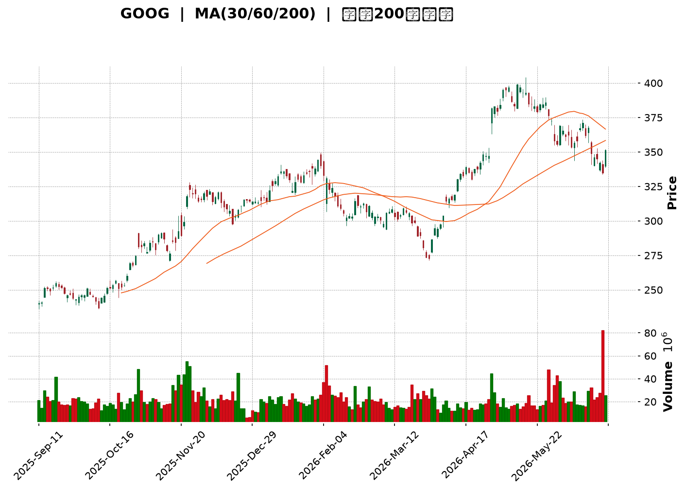
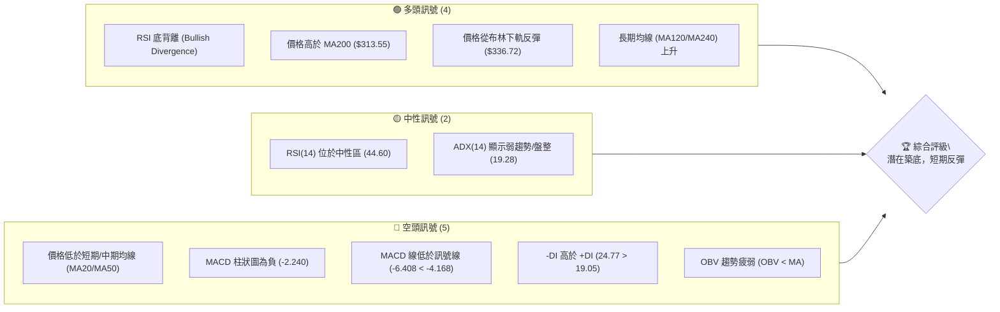
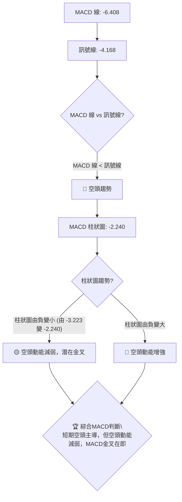
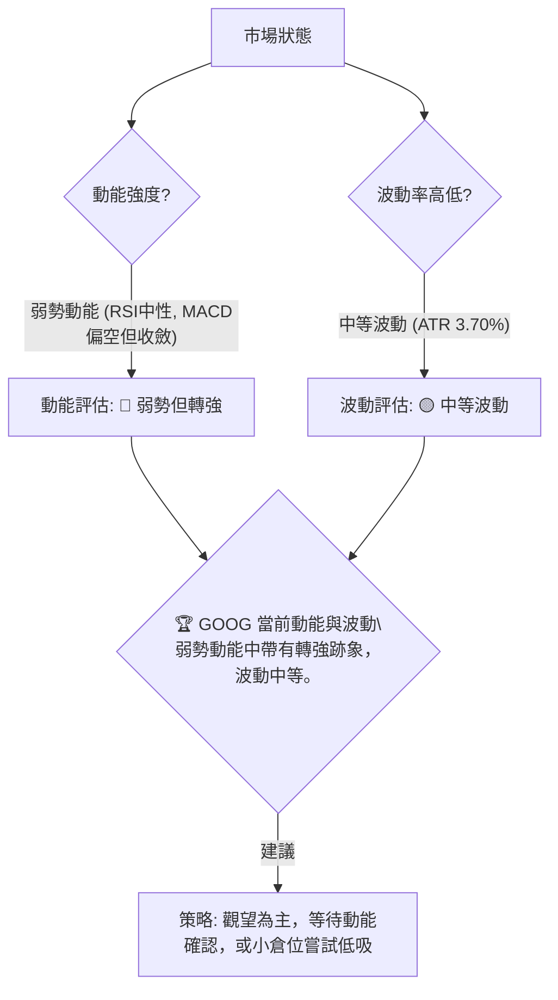

<details>
<summary>📊 靜態圖表 (點擊展開)</summary>

</details>

<html>
<head><meta charset="utf-8" /></head>
<body>
    <div style="height:500px; width:100%;">                        <script>window.PlotlyConfig = {MathJaxConfig: 'local'};</script>
        <script charset="utf-8" src="https://cdn.plot.ly/plotly-3.6.0.min.js" integrity="sha256-QaOVwtVY0T02VaHrr6pnoHLCwayMJp4O5n4YyaE3rJk=" crossorigin="anonymous"></script>                <div id="candlestick-chart" class="plotly-graph-div" style="height:100%; width:100%;"></div>            <script>                window.PLOTLYENV=window.PLOTLYENV || {};                                if (document.getElementById("candlestick-chart")) {                    Plotly.newPlot(                        "candlestick-chart",                        [{"close":{"dtype":"f8","bdata":"AAAAQOMJbkAAAADgDB1uQAAAAGCPaG9AAAAAoLNdb0AAAABgjytvQAAAAMDDem9AAAAA4LPXb0AAAACAVIxvQAAAAGAVe29AAAAA4AvrbkAAAABAzsJuQAAAAIBJ1m5AAAAAQDl8bkAAAADAWmJuQAAAAODooW5AAAAAgFW+bkAAAAAA+b5uQAAAAGCTYG9AAAAAoLDUbkAAAADAWp9uQAAAAOCON25AAAAAQNCgbUAAAACAKoVuQAAAAGCrtm5AAAAAoPZmb0AAAACAZGxvQAAAAKBkqW9AAAAAgEYIcEAAAACAJVtvQAAAAOAmgW9AAAAAIHqnb0AAAACAAUBwQAAAAGBu1nBAAAAAYHq+cEAAAACAGypxQAAAAKCTlXFAAAAAwEyUcUAAAAAAB7lxQAAAAOBBWHFAAAAAYBbDcUAAAABggsxxQAAAACBycnFAAAAAYFggckAAAABgtTJyQAAAACDi7XFAAAAAAC9pcUAAAADgAkdxQAAAAECp0HFAAAAA4HDGcUAAAABgq0ZyQAAAAMCaFnJAAAAAYAWxckAAAABgjd1zQAAAAEAcMHRAAAAAoHT6c0AAAABg5vdzQAAAAKAOqHNAAAAAwG22c0AAAACA4v9zQAAAAEBG3HNAAAAAwFsXdEAAAABgoqBzQAAAAIBd1XNAAAAAIEwJdEAAAABgppRzQAAAAADWYXNAAAAAQKlOc0AAAAAgQTVzQAAAAIC8mnJAAAAAYKj1ckAAAADgUENzQAAAAGDHbnNAAAAA4Em0c0AAAAAAIbRzQAAAAIDIqHNAAAAAAK2fc0AAAABgO6JzQAAAAGA\u002flnNAAAAAQImuc0AAAACAfs5zQAAAAGA7onNAAAAAwCUgdEAAAABAWll0QAAAACBei3RAAAAAgLvEdEAAAADg2v90QAAAAADw\u002fXRAAAAAgJrLdEAAAADgip50QAAAAEDVG3RAAAAAQDl\u002fdEAAAAAgiKZ0QAAAAMAFgHRAAAAAgHnSdEAAAABAAel0QAAAAGB1\u002fXRAAAAAIH0jdUAAAABgaSF1QAAAAMAyh3VAAAAAIBZEdUAAAADAes50QAAAAIBcrnRAAAAAoNoqdEAAAABgoD90QAAAAGBt43NAAAAAYMduc0AAAADAdU9zQAAAACDuGXNAAAAAAMzmckAAAACgsfhyQAAAAACf8nJAAAAAINOnc0AAAAAgiHRzQAAAAGA6aHNAAAAAoPGJc0AAAACg\u002fCtzQAAAAIBgcHNAAAAA4Fwfc0AAAAAAn\u002fJyQAAAAEDd8HJAAAAA4EbIckAAAABAkp5yQAAAACA3HXNAAAAAIO0rc0AAAACAwENzQAAAACBx8HJAAAAAgHXUckAAAABgygNzQAAAACCVU3NAAAAAINohc0AAAADgvBhzQAAAAMDDqXJAAAAAQHGtckAAAADAahByQAAAACCnFnJAAAAAYCOJcUAAAACAhhlxQAAAAKCcD3FAAAAAwP\u002fqcUAAAADgj2tyQAAAAKCGZHJAAAAAALKXckAAAACA9PtyQAAAAKDPqHNAAAAAIODCc0AAAABAe7hzQAAAAMBJ8HNAAAAAQBmmdEAAAAAgTeR0QAAAAAAeyXRAAAAAQCIzdUAAAAAgLPN0QAAAAABXpHRAAAAAIG4YdUAAAADgvxh1QAAAAGDTYXVAAAAAQPfEdUAAAADgp7R1QAAAACCesXVAAAAAQF3bd0AAAAAA1e93QAAAAECWtndAAAAAIJ8AeEAAAAAAcK54QAAAAOD+sHhAAAAAoPrMeEAAAAAAmSh4QAAAACBt+XdAAAAAwMzseEAAAADg5c54QAAAAMBVkXhAAAAAAPqNeEAAAAAgsgp4QAAAACCyCnhAAAAAYNTzd0AAAADgbbJ3QAAAAIC8CXhAAAAAgJMJeEAAAABANB54QAAAAOBBg3dAAAAAwLFFd0AAAACAymJ2QAAAAAB1N3ZAAAAAIMQQd0AAAADgo9h2QAAAAGC4knZAAAAA4KOkdkAAAADAHhV2QAAAAMD1SHZAAAAAYI9idkAAAACAwvF2QAAAAKCZMXdAAAAAoJmhdkAAAAAgXPd2QAAAAOB6zHVAAAAAoEehdUAAAADgo5B1QAAAAEAKY3VAAAAAQArrdEAAAADgevR1QA=="},"high":{"dtype":"f8","bdata":"M\u002f+qUA5DbkDiMjBpXD5uQAEZjqItiG9AwBStHoKXb0Cul+\u002fYoG5vQNc8mT6StG9AF4s2bSoDcECWQXUI4PlvQJ\u002fN0g6xyG9AkiSKquKOb0CHNMJPmdpuQHljHeMuNG9AOqSvtftkb0AFqjO\u002fWGZuQDBgLjNU1W5AA7+mkNHkbkBNGZeLTtRuQAYXTNGcdm9AMoXdatphb0BeMn1n19huQLv3OmVjom5AMLGflo2LbkCBxCAkWJBuQO2jQzhG8W5AtiRtTH+Ib0C1bNezNxFwQGDNUYg0zG9AWfbuOwIWcEBk3yiCLNxvQBdjvY3UCnBAG\u002fTq\u002fYDrb0BQUEd58V9wQOVtaudS5HBAkPW1\u002fJXtcEAxTwLX4TZxQB0aOiK+NXJAq0G8mZnbcUCD3NEqF9ZxQHYiBAOGlHFA8xgFADricUD+o3Ky6wNyQCWgI2oYv3FAimGL5zwuckD\u002fnDwxSjxyQJq6Md+bPHJAWxf\u002fUkmvcUDqOAm9qWlxQKmdSgcaX3JAacXVpOYNckD2PgwnevpyQH6oiqOiJHNAv\u002fIhl9j1ckDy+utXyvJzQPd5IdJugHRAFk3XAqtFdECF3\u002fs02WN0QMzfJ30T8HNA04LW06Dfc0BWWjt\u002fjxZ0QEkAXYR4J3RAiPbAziQzdEBmYwUC+Qx0QDPHqX+w5HNAsGN6+TIXdEAwMKfPHRl0QLnmVJWju3NA9TCOrquEc0CO8r8gAndzQFI0mvqpTHNAR1S4TckNc0BBrf9XY0lzQP3aoAWxdHNAg4mdDzK+c0DYq5YvCb5zQBRxd5JZwnNAfjpahvGoc0DRFH0JkdRzQAC+L6Cnr3NAt5VHqOEndECecOFuVe1zQKtsduc+EnRAB0p3jp9gdED21LTovKF0QCA06j3CsHRAP5Dxew7gdEBOpYRgE0x1QGKMtkZxCXVA4ebuDgUbdUAgHu0O1+x0QKF3Bs2WenRAUNFyJqfEdEDVEOhDXOx0QIi5N3GB2XRApoM9v5P+dEC3H22wYBx1QKyGrMgHE3VA2AGvOH5ddUB72Kr3iD11QPBDWdVui3VAPwHPvBbbdUAHNy3Oz3x1QPzG0rlbw3RA9GmsMlajdEAkmZkl\u002f3R0QKTa7FZdE3RAePY0MQQKdECdAz1eEsFzQPb7tWjKR3NAjfpBr98Hc0Ahh0w4LBhzQA8wyesWGnNANMq8zovFc0AemBz+m\u002fBzQI6Gzb9lf3NABdblwQKUc0BXSSj7dolzQPxBhGbDenNAFNgnXM47c0Ap7PV3sfhyQAWfmmH7EHNAw+io2ZXvckBzSClGAr9yQPQO+uoMJXNAAPvvx2xPc0D6ODg5HG5zQI9zVB9FR3NAz1xKFjQxc0D+rrDqLRZzQJdhYezQXXNAt11eaQJpc0CXSdKo7SdzQMdfrqD9AnNANbyuKADzckA6c26pvY5yQCG7JGK5Z3JA\u002fYXUpXvlcUBjASf+wG5xQDtKX3CAQXFA4nApiAnucUDM\u002fWRm5JxyQPk6u1ONe3JAms1\u002ffe2jckCTAcd0rP5yQDCJYqsq83NAkSCCQ9PTc0CqftHP7PRzQBQ0QVXO83NAGbIk+g6ndEAmWb2xxux0QLcsU0TVEnVABdsQ73w8dUAf+r\u002fcSy91QDe2iL55D3VAe3fPIjoddUBhd\u002flPST91QFLY7n+7d3VAuoj04gXrdUD1WFNWCNt1QOXWL7\u002f\u002fEnZAesfNzGXmd0B03cX0jPJ3QOmR0NAu\u002f3dAEBjo0Z1LeEDmNe\u002fxQ8J4QMWG6i\u002fb0XhAKTWJHxbieEB7AOgffKF4QBFviStSI3hAxcCs7gf7eEBbWzq80u14QNC4bTFFunhALZcxo6BDeUCVp3nGBZJ4QBHC\u002frVwZ3hAgdUJqiNHeEBUNJ9ZNwp4QFT3GQWIEnhAROaccNlXeEDkpPAwP1x4QGd81SO61ndAjmoHxv5ld0A2IanJFBl3QNpBw\u002fKCpHZAKrjkSzMad0BVWFympQ93QAAAAIAUtnZAAAAAYBIbd0AAAADA9eR2QAAAAAApYHZAAAAAQF7MdkAAAABgZip3QAAAAKCZWXdAAAAAYGYid0AAAAAAABB3QAAAAEAzY3ZAAAAAIIXLdUAAAACgRw12QAAAAEAKc3VAAAAAgOuBdUAAAAAghf91QA=="},"hovertemplate":"\u003cb\u003e%{x|%Y-%m-%d}\u003c\u002fb\u003e\u003cbr\u003e\u958b: $%{open:.2f}\u003cbr\u003e\u9ad8: $%{high:.2f}\u003cbr\u003e\u4f4e: $%{low:.2f}\u003cbr\u003e\u6536: $%{close:.2f}\u003cextra\u003e\u003c\u002fextra\u003e","low":{"dtype":"f8","bdata":"c94RLsCDbUDJv\u002fYGEsFtQPewlUYGkG5ALguXkj8nb0CYJvbmH8NuQDFsahPdM29AjJL0lGVyb0D2BzQsOEpvQBAWKWgpU29A\u002fVR7hpDXbkANArBXrCVuQB85PIcKxW5A4WnOFi1XbkDybGiDRuNtQKhnAzlt121A0r5TaCRUbkDhbZen3D9uQLLYPkSzpm5AdjPWQHjKbkCt6PqNiZNuQCIeW4vB5m1Aup6MhhqHbUBML2n27QhuQPGP5lCZFm5AcmNZuNTJbkCdLBWEv0VvQApMjJRRA29AD8m\u002fR0PDb0C3UC7DH4ZuQLZXChHBPm9Acl1y6sCIb0CZOwTtKvNvQDyfwVu\u002fhnBA6q+QmFuqcEBOP5pher5wQKywPB5sfnFAhlqtra5PcUAlFvYLJX1xQFA2HLMsRXFAsakj7GFVcUAKDVgOG5FxQKii5po1M3FAvJ9MHMSvcUAurczNEfVxQP2nYtAtvXFA9utieUxXcUAT+e3AEO5wQELbI7rIunFAD0SlbG1ncUDR8Ihgt\u002fFxQKsaZ32rCXJAtYoc44tcckDIKXdMt0xzQHmKlsob03NASDqvrUXJc0BYhDebHsVzQLsxUGLalXNAuBYobK+Zc0CzkcOspJpzQB07vM+Pr3NAYtc3KKr1c0DrVdUTDHhzQKWUAmxkg3NA8lEub9Cvc0CqhHQLnFdzQDuzpEfzKHNAz+Mno3QVc0B\u002fTxN57\u002fZyQOu4t0L9kHJAvohdjc3DckDbQuWDIN9yQBWZkbYJI3NAM7cR+oJlc0BeZsnvk45zQLxa3iD4lHNAkXtRL+N3c0AKJemSdY1zQE9vbW2ufHNACdOB1uljc0BbIhqyZq1zQOQ4KhDrfnNA6oV4426hc0CjW2O9HRl0QGL8vBIwXXRAawVK+FxRdEAm0VVent50QDNB32JTq3RAxATy\u002fritdEA9wF453nt0QNfL7imKB3RAJXpZ4Pfxc0C3dCN6Nod0QFIybhWseHRAJ0YqewBxdECsMZHuB9V0QKV8yC4lu3RAve7BsrJkdEAEPqN7S8N0QAMWO+Uk+XRAeCdPx14idUCHOMLYCo90QCAYyrtPKHNAScWhJLf7c0C4FScQkdRzQCJMYnj9o3NA68olqppbc0AMY4Ul9ztzQH8i9vQN+HJAhuFbRTOIckCoAgH6X9lyQEi09hJxxHJA1GrmJF0Ac0Do31v2XVlzQEY5iXEMG3NAkR8R3kxPc0D3dfT1PuByQBxlQecd83JAZa+odKzKckDIC1EN\u002fYRyQMP\u002fNuqExnJAnTpabuWackBD\u002fJXN1W1yQODchyINXHJAl+SpnQUSc0AljUcbfxpzQA5uvHaLynJAwG13Y5i5ckD0HSguDtpyQDvxMderAnNAJu8pnMcVc0DIzFdnGs1yQJ0kpOYkiXJAjoxVsJydckBcGJh55gpyQHhdPngn83FASBnYSR1ucUD8Z5tQDBVxQBWfM3Ty9XBARrc+In9JcUBV14UAvBRyQMW0yzla9nFAZA3vCNBZckACWN3z9HNyQPqpaENFiHNAWTmCv4pUc0CIk0PonKVzQFktOHkFmHNAmGgEO08PdEDE2kGwZYd0QKcaakI1t3RAQ\u002f9bzW7RdEBg85cl3OZ0QAWzwXHolnRAtsQ\u002f4CfMdEBZ\u002fZ9AvO10QKPg97+V3XRAYuicHq5JdUBiOtquKoF1QO5ps6WVY3VA8kYEEfKtdkChTll8jHB3QIoYA7KxiHdA\u002f5dsiPDBd0CFj9vu3y14QPbdIys0YXhAt56Vk+6WeED3epCU9h94QN2d7Jndt3dArmlGhJvVd0Dw8ZZR3od4QGqSQ8VoWHhAU6jZUaNqeEC15k1uUOx3QGurXtJXvHdAJoyANAe0d0DGOVkihaB3QKLY\u002f2qXrndAZurt2FLcd0Dvhm6\u002fVNB3QGyeW58yYXdAoAEHUs0Xd0CJszBalSx2QIgX4HOrInZATOsgpmIpdkCUbNSMmZZ2QAAAAIA9XnZAAAAAIIUrdkAAAADA9Qx2QAAAAIAUenVAAAAAoHAVdkAAAABgZsp2QAAAAMAe1XZAAAAAIK6DdkAAAABgukl2QAAAAEAKT3VAAAAAoHA7dUAAAAAAAFh1QAAAAGBm\u002fnRAAAAAQArbdEAAAADA9Sx1QA=="},"name":"\u50f9\u683c","open":{"dtype":"f8","bdata":"X6qIoXL1bUCJ6mfLhgpuQCafLXYilW5AAFnOysN6b0A1Exaz+l5vQFKIJgjBa29Al1WE\u002fO+cb0BY1UbNAslvQPpGKs0UpW9AtnSOBQR1b0CtpSK5jYtuQIlGCg6c6W5AqWIbI0L5bkBtATF6tFJuQG9iVp6pFm5A1cnViBqlbkChU\u002fNMAphuQEwrChOTqW5AWTWDRy0Ob0C4Oyrk\u002fLZuQNxN8VOUkm5Ac9FOCfY1bkBFAr053xFuQC3oz\u002fEGKW5AdeKOtzDzbkAl1w5gE39vQPhZ11l3W29A99tGD2LXb0DdxX6XBdhvQNwl3EFb0G9AavgQ24Smb0BruOn4vgxwQNlbQz50jXBAt5AzMb7acEAakmMwWsFwQC9p97BjMnJAYxg8h2qqcUCEIfx+4Z1xQPkq3FheSHFACzVA51VtcUCcwc8V0dJxQMQlA912unFArFAf6k\u002fLcUBgVWL9LfpxQKzISLM3OHJApXvzB+emcUDJrSZez\u002fVwQLq9D5dv3XFAs8iBAbv+cUDGhcyh9PFxQBdOgF1NAnNAGnd2xqCEckDcN\u002f0FbWZzQNxaDS6SYnRA5rtlnnACdEBkoRmawSx0QK2CcuGpzXNAY2TsMnvEc0BKax6nlrZzQJ3kGtObJnRAK\u002fE23\u002fv1c0CaeLnTxgl0QFQSJ\u002fsPi3NAWs+zCU\u002fDc0CwQYsx5Qp0QGme4qUlpnNA+yQ11XiDc0Dv3Xg\u002fnBlzQG3WwTe1SXNA8v4w0KHqckC0iUnL\u002fO1yQGXTqe8ZbXNA9XE766lrc0AN2C9vzLtzQBpAQZ4fuHNAFq5hpJaGc0C+9vUXBJBzQOVXaGxgj3NAUK63\u002fc7Sc0CwwtN+fNRzQNHWL59VznNA5xKsQ42ic0D3ZIhZXY10QLLg6nEAcXRAPLiGrS5hdED7XrKleu10QPMaN9XD6HRAIOmUNdIZdUCa+0Vw9+d0QK8TAcshDXRATPKM0NAKdEBE6A2xQt10QJXNs8qIw3RAKqyU71h8dEBXEt5hEvN0QIqqczy7AnVAqHVkV34+dUAIkz9hYOB0QCZsUMLFAXVAvP4VmvbAdUDd0o3z5nR1QIJZ7wmpjHNAXZOJ6MNudECDzBnkIQ10QKMTJRDcB3RAHxKDFrPoc0CHh\u002frxE39zQL3NIj9UOXNA8f5AZ\u002fbDckC+BIHvmOByQD5QQq8A4nJAyZDwfG8Gc0DweyGNk+tzQFSSKP\u002fAY3NAiwxBHWd7c0B1xf5FWYZzQCQMq4mx+HJA+3rNJR3pckBsxRoafaByQPfH0taj5HJAxj5Fgt7sckDcM8dI+HpyQHdtO2FUX3JAtg5XeQ4bc0Ac1iYZ2iFzQHDW7LtpIHNA7EjVc4cnc0CXTy+lrfZyQForYM3JB3NAjGi3S4Q7c0A\u002fZHEVcfByQOV04p0x\u002fnJAaZi3h5bFckDoucRagoByQGmdTpGWP3JAwb7OMkngcUAzuBvoulNxQF62grVjNHFAHflIFvhVcUDkPuC+4xxyQPt7J\u002foODXJAJ+T2Kl1ockDwNzsWWr9yQDIVPqM42nNATp55tQaQc0AcxQCUieBzQIkNLVavs3NAZ8P32fAddEBqa\u002fdhx6V0QD5JVyle+nRAcgZpXqnjdECzzCS3syV1QLgOJ2Yh9nRAh744AvDqdEAL+O+g7jV1QNXWQhVFGHVAogBkTsV6dUCoD8ytYat1QAzRIAJblHVAZUg104Ewd0Cio9noCpx3QJiO1eVw4XdAaVq7qT7ad0AjzmnMsFV4QH1z+okjzXhAm441mYageEAOVaW3R2d4QFecw3dLDHhA4g9J983ad0AJycaz2Zh4QCnKOuKnj3hAAu477Tl+eEAXbzjOA5F4QFLCsUfvDHhAP3zS2Hvcd0ALPP7QePB3QENwDtlAzHdAdVRrdo7od0CJjlrREPp3QInT3W\u002fuz3dARx8jY51Fd0CmfGqfEK92QHcbjFXpYXZAyc95kp4zdkCM8xY9lbJ2QAAAAIDCp3ZAAAAAACnOdkAAAADAzJB2QAAAAMDMEHZAAAAAoJmRdkAAAAAA1992QAAAAKBw93ZAAAAAwMzwdkAAAACAPb52QAAAAAApUnZAAAAAIK5BdUAAAAAghct1QAAAAGC4DnVAAAAAIK5PdUAAAACgGD51QA=="},"x":["2025-09-11T00:00:00-04:00","2025-09-12T00:00:00-04:00","2025-09-15T00:00:00-04:00","2025-09-16T00:00:00-04:00","2025-09-17T00:00:00-04:00","2025-09-18T00:00:00-04:00","2025-09-19T00:00:00-04:00","2025-09-22T00:00:00-04:00","2025-09-23T00:00:00-04:00","2025-09-24T00:00:00-04:00","2025-09-25T00:00:00-04:00","2025-09-26T00:00:00-04:00","2025-09-29T00:00:00-04:00","2025-09-30T00:00:00-04:00","2025-10-01T00:00:00-04:00","2025-10-02T00:00:00-04:00","2025-10-03T00:00:00-04:00","2025-10-06T00:00:00-04:00","2025-10-07T00:00:00-04:00","2025-10-08T00:00:00-04:00","2025-10-09T00:00:00-04:00","2025-10-10T00:00:00-04:00","2025-10-13T00:00:00-04:00","2025-10-14T00:00:00-04:00","2025-10-15T00:00:00-04:00","2025-10-16T00:00:00-04:00","2025-10-17T00:00:00-04:00","2025-10-20T00:00:00-04:00","2025-10-21T00:00:00-04:00","2025-10-22T00:00:00-04:00","2025-10-23T00:00:00-04:00","2025-10-24T00:00:00-04:00","2025-10-27T00:00:00-04:00","2025-10-28T00:00:00-04:00","2025-10-29T00:00:00-04:00","2025-10-30T00:00:00-04:00","2025-10-31T00:00:00-04:00","2025-11-03T00:00:00-05:00","2025-11-04T00:00:00-05:00","2025-11-05T00:00:00-05:00","2025-11-06T00:00:00-05:00","2025-11-07T00:00:00-05:00","2025-11-10T00:00:00-05:00","2025-11-11T00:00:00-05:00","2025-11-12T00:00:00-05:00","2025-11-13T00:00:00-05:00","2025-11-14T00:00:00-05:00","2025-11-17T00:00:00-05:00","2025-11-18T00:00:00-05:00","2025-11-19T00:00:00-05:00","2025-11-20T00:00:00-05:00","2025-11-21T00:00:00-05:00","2025-11-24T00:00:00-05:00","2025-11-25T00:00:00-05:00","2025-11-26T00:00:00-05:00","2025-11-28T00:00:00-05:00","2025-12-01T00:00:00-05:00","2025-12-02T00:00:00-05:00","2025-12-03T00:00:00-05:00","2025-12-04T00:00:00-05:00","2025-12-05T00:00:00-05:00","2025-12-08T00:00:00-05:00","2025-12-09T00:00:00-05:00","2025-12-10T00:00:00-05:00","2025-12-11T00:00:00-05:00","2025-12-12T00:00:00-05:00","2025-12-15T00:00:00-05:00","2025-12-16T00:00:00-05:00","2025-12-17T00:00:00-05:00","2025-12-18T00:00:00-05:00","2025-12-19T00:00:00-05:00","2025-12-22T00:00:00-05:00","2025-12-23T00:00:00-05:00","2025-12-24T00:00:00-05:00","2025-12-26T00:00:00-05:00","2025-12-29T00:00:00-05:00","2025-12-30T00:00:00-05:00","2025-12-31T00:00:00-05:00","2026-01-02T00:00:00-05:00","2026-01-05T00:00:00-05:00","2026-01-06T00:00:00-05:00","2026-01-07T00:00:00-05:00","2026-01-08T00:00:00-05:00","2026-01-09T00:00:00-05:00","2026-01-12T00:00:00-05:00","2026-01-13T00:00:00-05:00","2026-01-14T00:00:00-05:00","2026-01-15T00:00:00-05:00","2026-01-16T00:00:00-05:00","2026-01-20T00:00:00-05:00","2026-01-21T00:00:00-05:00","2026-01-22T00:00:00-05:00","2026-01-23T00:00:00-05:00","2026-01-26T00:00:00-05:00","2026-01-27T00:00:00-05:00","2026-01-28T00:00:00-05:00","2026-01-29T00:00:00-05:00","2026-01-30T00:00:00-05:00","2026-02-02T00:00:00-05:00","2026-02-03T00:00:00-05:00","2026-02-04T00:00:00-05:00","2026-02-05T00:00:00-05:00","2026-02-06T00:00:00-05:00","2026-02-09T00:00:00-05:00","2026-02-10T00:00:00-05:00","2026-02-11T00:00:00-05:00","2026-02-12T00:00:00-05:00","2026-02-13T00:00:00-05:00","2026-02-17T00:00:00-05:00","2026-02-18T00:00:00-05:00","2026-02-19T00:00:00-05:00","2026-02-20T00:00:00-05:00","2026-02-23T00:00:00-05:00","2026-02-24T00:00:00-05:00","2026-02-25T00:00:00-05:00","2026-02-26T00:00:00-05:00","2026-02-27T00:00:00-05:00","2026-03-02T00:00:00-05:00","2026-03-03T00:00:00-05:00","2026-03-04T00:00:00-05:00","2026-03-05T00:00:00-05:00","2026-03-06T00:00:00-05:00","2026-03-09T00:00:00-04:00","2026-03-10T00:00:00-04:00","2026-03-11T00:00:00-04:00","2026-03-12T00:00:00-04:00","2026-03-13T00:00:00-04:00","2026-03-16T00:00:00-04:00","2026-03-17T00:00:00-04:00","2026-03-18T00:00:00-04:00","2026-03-19T00:00:00-04:00","2026-03-20T00:00:00-04:00","2026-03-23T00:00:00-04:00","2026-03-24T00:00:00-04:00","2026-03-25T00:00:00-04:00","2026-03-26T00:00:00-04:00","2026-03-27T00:00:00-04:00","2026-03-30T00:00:00-04:00","2026-03-31T00:00:00-04:00","2026-04-01T00:00:00-04:00","2026-04-02T00:00:00-04:00","2026-04-06T00:00:00-04:00","2026-04-07T00:00:00-04:00","2026-04-08T00:00:00-04:00","2026-04-09T00:00:00-04:00","2026-04-10T00:00:00-04:00","2026-04-13T00:00:00-04:00","2026-04-14T00:00:00-04:00","2026-04-15T00:00:00-04:00","2026-04-16T00:00:00-04:00","2026-04-17T00:00:00-04:00","2026-04-20T00:00:00-04:00","2026-04-21T00:00:00-04:00","2026-04-22T00:00:00-04:00","2026-04-23T00:00:00-04:00","2026-04-24T00:00:00-04:00","2026-04-27T00:00:00-04:00","2026-04-28T00:00:00-04:00","2026-04-29T00:00:00-04:00","2026-04-30T00:00:00-04:00","2026-05-01T00:00:00-04:00","2026-05-04T00:00:00-04:00","2026-05-05T00:00:00-04:00","2026-05-06T00:00:00-04:00","2026-05-07T00:00:00-04:00","2026-05-08T00:00:00-04:00","2026-05-11T00:00:00-04:00","2026-05-12T00:00:00-04:00","2026-05-13T00:00:00-04:00","2026-05-14T00:00:00-04:00","2026-05-15T00:00:00-04:00","2026-05-18T00:00:00-04:00","2026-05-19T00:00:00-04:00","2026-05-20T00:00:00-04:00","2026-05-21T00:00:00-04:00","2026-05-22T00:00:00-04:00","2026-05-26T00:00:00-04:00","2026-05-27T00:00:00-04:00","2026-05-28T00:00:00-04:00","2026-05-29T00:00:00-04:00","2026-06-01T00:00:00-04:00","2026-06-02T00:00:00-04:00","2026-06-03T00:00:00-04:00","2026-06-04T00:00:00-04:00","2026-06-05T00:00:00-04:00","2026-06-08T00:00:00-04:00","2026-06-09T00:00:00-04:00","2026-06-10T00:00:00-04:00","2026-06-11T00:00:00-04:00","2026-06-12T00:00:00-04:00","2026-06-15T00:00:00-04:00","2026-06-16T00:00:00-04:00","2026-06-17T00:00:00-04:00","2026-06-18T00:00:00-04:00","2026-06-22T00:00:00-04:00","2026-06-23T00:00:00-04:00","2026-06-24T00:00:00-04:00","2026-06-25T00:00:00-04:00","2026-06-26T00:00:00-04:00","2026-06-29T00:00:00-04:00"],"type":"candlestick"},{"hovertemplate":"MA30: $%{y:.2f}\u003cextra\u003e\u003c\u002fextra\u003e","line":{"color":"#2196F3","dash":"dash","width":2},"mode":"lines","name":"MA30","x":["2025-09-11T00:00:00-04:00","2025-09-12T00:00:00-04:00","2025-09-15T00:00:00-04:00","2025-09-16T00:00:00-04:00","2025-09-17T00:00:00-04:00","2025-09-18T00:00:00-04:00","2025-09-19T00:00:00-04:00","2025-09-22T00:00:00-04:00","2025-09-23T00:00:00-04:00","2025-09-24T00:00:00-04:00","2025-09-25T00:00:00-04:00","2025-09-26T00:00:00-04:00","2025-09-29T00:00:00-04:00","2025-09-30T00:00:00-04:00","2025-10-01T00:00:00-04:00","2025-10-02T00:00:00-04:00","2025-10-03T00:00:00-04:00","2025-10-06T00:00:00-04:00","2025-10-07T00:00:00-04:00","2025-10-08T00:00:00-04:00","2025-10-09T00:00:00-04:00","2025-10-10T00:00:00-04:00","2025-10-13T00:00:00-04:00","2025-10-14T00:00:00-04:00","2025-10-15T00:00:00-04:00","2025-10-16T00:00:00-04:00","2025-10-17T00:00:00-04:00","2025-10-20T00:00:00-04:00","2025-10-21T00:00:00-04:00","2025-10-22T00:00:00-04:00","2025-10-23T00:00:00-04:00","2025-10-24T00:00:00-04:00","2025-10-27T00:00:00-04:00","2025-10-28T00:00:00-04:00","2025-10-29T00:00:00-04:00","2025-10-30T00:00:00-04:00","2025-10-31T00:00:00-04:00","2025-11-03T00:00:00-05:00","2025-11-04T00:00:00-05:00","2025-11-05T00:00:00-05:00","2025-11-06T00:00:00-05:00","2025-11-07T00:00:00-05:00","2025-11-10T00:00:00-05:00","2025-11-11T00:00:00-05:00","2025-11-12T00:00:00-05:00","2025-11-13T00:00:00-05:00","2025-11-14T00:00:00-05:00","2025-11-17T00:00:00-05:00","2025-11-18T00:00:00-05:00","2025-11-19T00:00:00-05:00","2025-11-20T00:00:00-05:00","2025-11-21T00:00:00-05:00","2025-11-24T00:00:00-05:00","2025-11-25T00:00:00-05:00","2025-11-26T00:00:00-05:00","2025-11-28T00:00:00-05:00","2025-12-01T00:00:00-05:00","2025-12-02T00:00:00-05:00","2025-12-03T00:00:00-05:00","2025-12-04T00:00:00-05:00","2025-12-05T00:00:00-05:00","2025-12-08T00:00:00-05:00","2025-12-09T00:00:00-05:00","2025-12-10T00:00:00-05:00","2025-12-11T00:00:00-05:00","2025-12-12T00:00:00-05:00","2025-12-15T00:00:00-05:00","2025-12-16T00:00:00-05:00","2025-12-17T00:00:00-05:00","2025-12-18T00:00:00-05:00","2025-12-19T00:00:00-05:00","2025-12-22T00:00:00-05:00","2025-12-23T00:00:00-05:00","2025-12-24T00:00:00-05:00","2025-12-26T00:00:00-05:00","2025-12-29T00:00:00-05:00","2025-12-30T00:00:00-05:00","2025-12-31T00:00:00-05:00","2026-01-02T00:00:00-05:00","2026-01-05T00:00:00-05:00","2026-01-06T00:00:00-05:00","2026-01-07T00:00:00-05:00","2026-01-08T00:00:00-05:00","2026-01-09T00:00:00-05:00","2026-01-12T00:00:00-05:00","2026-01-13T00:00:00-05:00","2026-01-14T00:00:00-05:00","2026-01-15T00:00:00-05:00","2026-01-16T00:00:00-05:00","2026-01-20T00:00:00-05:00","2026-01-21T00:00:00-05:00","2026-01-22T00:00:00-05:00","2026-01-23T00:00:00-05:00","2026-01-26T00:00:00-05:00","2026-01-27T00:00:00-05:00","2026-01-28T00:00:00-05:00","2026-01-29T00:00:00-05:00","2026-01-30T00:00:00-05:00","2026-02-02T00:00:00-05:00","2026-02-03T00:00:00-05:00","2026-02-04T00:00:00-05:00","2026-02-05T00:00:00-05:00","2026-02-06T00:00:00-05:00","2026-02-09T00:00:00-05:00","2026-02-10T00:00:00-05:00","2026-02-11T00:00:00-05:00","2026-02-12T00:00:00-05:00","2026-02-13T00:00:00-05:00","2026-02-17T00:00:00-05:00","2026-02-18T00:00:00-05:00","2026-02-19T00:00:00-05:00","2026-02-20T00:00:00-05:00","2026-02-23T00:00:00-05:00","2026-02-24T00:00:00-05:00","2026-02-25T00:00:00-05:00","2026-02-26T00:00:00-05:00","2026-02-27T00:00:00-05:00","2026-03-02T00:00:00-05:00","2026-03-03T00:00:00-05:00","2026-03-04T00:00:00-05:00","2026-03-05T00:00:00-05:00","2026-03-06T00:00:00-05:00","2026-03-09T00:00:00-04:00","2026-03-10T00:00:00-04:00","2026-03-11T00:00:00-04:00","2026-03-12T00:00:00-04:00","2026-03-13T00:00:00-04:00","2026-03-16T00:00:00-04:00","2026-03-17T00:00:00-04:00","2026-03-18T00:00:00-04:00","2026-03-19T00:00:00-04:00","2026-03-20T00:00:00-04:00","2026-03-23T00:00:00-04:00","2026-03-24T00:00:00-04:00","2026-03-25T00:00:00-04:00","2026-03-26T00:00:00-04:00","2026-03-27T00:00:00-04:00","2026-03-30T00:00:00-04:00","2026-03-31T00:00:00-04:00","2026-04-01T00:00:00-04:00","2026-04-02T00:00:00-04:00","2026-04-06T00:00:00-04:00","2026-04-07T00:00:00-04:00","2026-04-08T00:00:00-04:00","2026-04-09T00:00:00-04:00","2026-04-10T00:00:00-04:00","2026-04-13T00:00:00-04:00","2026-04-14T00:00:00-04:00","2026-04-15T00:00:00-04:00","2026-04-16T00:00:00-04:00","2026-04-17T00:00:00-04:00","2026-04-20T00:00:00-04:00","2026-04-21T00:00:00-04:00","2026-04-22T00:00:00-04:00","2026-04-23T00:00:00-04:00","2026-04-24T00:00:00-04:00","2026-04-27T00:00:00-04:00","2026-04-28T00:00:00-04:00","2026-04-29T00:00:00-04:00","2026-04-30T00:00:00-04:00","2026-05-01T00:00:00-04:00","2026-05-04T00:00:00-04:00","2026-05-05T00:00:00-04:00","2026-05-06T00:00:00-04:00","2026-05-07T00:00:00-04:00","2026-05-08T00:00:00-04:00","2026-05-11T00:00:00-04:00","2026-05-12T00:00:00-04:00","2026-05-13T00:00:00-04:00","2026-05-14T00:00:00-04:00","2026-05-15T00:00:00-04:00","2026-05-18T00:00:00-04:00","2026-05-19T00:00:00-04:00","2026-05-20T00:00:00-04:00","2026-05-21T00:00:00-04:00","2026-05-22T00:00:00-04:00","2026-05-26T00:00:00-04:00","2026-05-27T00:00:00-04:00","2026-05-28T00:00:00-04:00","2026-05-29T00:00:00-04:00","2026-06-01T00:00:00-04:00","2026-06-02T00:00:00-04:00","2026-06-03T00:00:00-04:00","2026-06-04T00:00:00-04:00","2026-06-05T00:00:00-04:00","2026-06-08T00:00:00-04:00","2026-06-09T00:00:00-04:00","2026-06-10T00:00:00-04:00","2026-06-11T00:00:00-04:00","2026-06-12T00:00:00-04:00","2026-06-15T00:00:00-04:00","2026-06-16T00:00:00-04:00","2026-06-17T00:00:00-04:00","2026-06-18T00:00:00-04:00","2026-06-22T00:00:00-04:00","2026-06-23T00:00:00-04:00","2026-06-24T00:00:00-04:00","2026-06-25T00:00:00-04:00","2026-06-26T00:00:00-04:00","2026-06-29T00:00:00-04:00"],"y":{"dtype":"f8","bdata":"AAAAAAAA+H8AAAAAAAD4fwAAAAAAAPh\u002fAAAAAAAA+H8AAAAAAAD4fwAAAAAAAPh\u002fAAAAAAAA+H8AAAAAAAD4fwAAAAAAAPh\u002fAAAAAAAA+H8AAAAAAAD4fwAAAAAAAPh\u002fAAAAAAAA+H8AAAAAAAD4fwAAAAAAAPh\u002fAAAAAAAA+H8AAAAAAAD4fwAAAAAAAPh\u002fAAAAAAAA+H8AAAAAAAD4fwAAAAAAAPh\u002fAAAAAAAA+H8AAAAAAAD4fwAAAAAAAPh\u002fAAAAAAAA+H8AAAAAAAD4fwAAAAAAAPh\u002fAAAAAAAA+H8AAAAAAAD4f0RERFTV+W5AAAAAoJ4Hb0CamZkp\u002fBtvQDMzMxNUL29AiYiI2G9Bb0De3d1dZFxvQGZmZibfe29AIiIiEiuYb0DNzMz8bLlvQImIiIjO1G9A3t3dbRz8b0CamZlBsRJwQKuqqqIAJHBAIiIiOpw8cEDNzMzkQlZwQFVVVRWPbHBAAAAAoPV9cEBmZmbWNY5wQAAAAChboHBAvLu7G360cEB3d3fXys1wQBEREUk453BAAAAAmE4IcUCamZkhmy9xQDMzM\u002fPUWHFAIiIiulR9cUAAAACIp6FxQN7d3b1MwnFAMzMzc7ThcUCamZn5lAZyQAAAAHijKXJAAAAAoAZOckCamZnJ2GpyQKuqqkpphHJAmpmZWYGgckBERESUH7VyQAAAACB3xHJAERER8TXTckC8u7uL4t9yQN7d3V2i6nJA7+7ubtr0ckCJiIjIWAFzQO\u002fu7o5KEnNAq6qqisEfc0BmZmZ2mixzQAAAAOBdO3NAERER8T9Oc0DNzMxsW2JzQHd3dwd6cXNAvLu7G7+Bc0De3d2tzo5zQDMzM7P+m3NAMzMzgzuoc0ARERHxW6xzQLy7u6tmr3NARERExCS2c0Dv7u4u8b5zQAAAAJBWynNAmpmZyZPTc0Crqqqq3dhzQImIiAj82nNAmpmZWXLec0BVVVU1LedzQLy7u3vd7HNAIiIiMpLzc0Dv7u6O6v5zQCIiIhKjDHRAvLu7u0McdECamZl5qyx0QJqZmVmeRXRAzczMrExZdEDNzMy8eGZ0QHd3d9cfcXRAmpmZmRN1dECrqqr6uXl0QImIiGiue3RAd3d3Jw16dEBVVVXVSnd0QN7d3f0lc3RAzczMjH1sdEDv7u4eXWV0QDMzM5OCX3RAIiIi0n9bdEB3d3c331N0QDMzM9MqSnRAERERoaw\u002fdEB3d3cnFDB0QDMzM6PTInRAERERUY0UdECJiIi4SQZ0QFVVVYVS\u002fHNAd3d317Dtc0CJiIjYW9xzQImIiCiI0HNAmpmZaXLCc0CJiIi4Z7RzQERERJTnonNAAAAAIDSPc0CrqqpKJn1zQFVVVcVcanNAIiIikidYc0DNzMwskElzQCIiIuJXOHNAvLu7K6Erc0AAAABA\u002fRhzQO\u002fu7k6hCXNAzczMLHH5ckDe3d3dk+ZyQAAAAMAq1XJAMzMzE8bMckAAAADAEchyQERERDRVw3JAiYiICEO6ckDNzMwcPrZyQImIiDhluHJAmpmZCUu6ckDNzMzs+b5yQO\u002fu7m49w3JAZmZmtkPQckBVVVWV2uByQJqZmXmY8HJAMzMzYzkFc0AiIiJiHBlzQKuqqvolJnNA3t3drZA2c0CrqqrKMkZzQGZmZmYLW3NAq6qqyiB0c0C8u7sbF4tzQLy7u5tKn3NAd3d3x5vHc0AiIiJi6fBzQHd3d3cBHHRA3t3d7XFJdEAiIiKS6YF0QERERNRBunRAiYiIeED4dEAiIiLSfDR1QM3MzDx7b3VAZmZmVkardUBEREQ0yeF1QGZmZsZ6FnZAq6qqCltJdkDv7u5+g3R2QJqZmenomXZAmpmZyay9dkBmZmZGm992QBEREZGWAndAq6qqCoEfd0Dv7u6+CDt3QFVVVTVOUndAiYiIqP1jd0C8u7urPnB3QKuqqpqufXdAVVVVRX6Od0BVVVVFbJ13QJqZmQmWp3dAmpmZuQqvd0AzMzPjQbJ3QHd3d1dNt3dAIiIi8r2qd0DNzMzcRaJ3QKuqqgrXnXdAiYiIqCOSd0DNzMzcgIN3QLy7u8vRandAvLu7S8NPd0BmZmaGoTl3QJqZmSmNI3dAMzMzA1wBd0DNzMwcA+l2QA=="},"type":"scatter"},{"hovertemplate":"MA60: $%{y:.2f}\u003cextra\u003e\u003c\u002fextra\u003e","line":{"color":"#9C27B0","dash":"dash","width":2},"mode":"lines","name":"MA60","x":["2025-09-11T00:00:00-04:00","2025-09-12T00:00:00-04:00","2025-09-15T00:00:00-04:00","2025-09-16T00:00:00-04:00","2025-09-17T00:00:00-04:00","2025-09-18T00:00:00-04:00","2025-09-19T00:00:00-04:00","2025-09-22T00:00:00-04:00","2025-09-23T00:00:00-04:00","2025-09-24T00:00:00-04:00","2025-09-25T00:00:00-04:00","2025-09-26T00:00:00-04:00","2025-09-29T00:00:00-04:00","2025-09-30T00:00:00-04:00","2025-10-01T00:00:00-04:00","2025-10-02T00:00:00-04:00","2025-10-03T00:00:00-04:00","2025-10-06T00:00:00-04:00","2025-10-07T00:00:00-04:00","2025-10-08T00:00:00-04:00","2025-10-09T00:00:00-04:00","2025-10-10T00:00:00-04:00","2025-10-13T00:00:00-04:00","2025-10-14T00:00:00-04:00","2025-10-15T00:00:00-04:00","2025-10-16T00:00:00-04:00","2025-10-17T00:00:00-04:00","2025-10-20T00:00:00-04:00","2025-10-21T00:00:00-04:00","2025-10-22T00:00:00-04:00","2025-10-23T00:00:00-04:00","2025-10-24T00:00:00-04:00","2025-10-27T00:00:00-04:00","2025-10-28T00:00:00-04:00","2025-10-29T00:00:00-04:00","2025-10-30T00:00:00-04:00","2025-10-31T00:00:00-04:00","2025-11-03T00:00:00-05:00","2025-11-04T00:00:00-05:00","2025-11-05T00:00:00-05:00","2025-11-06T00:00:00-05:00","2025-11-07T00:00:00-05:00","2025-11-10T00:00:00-05:00","2025-11-11T00:00:00-05:00","2025-11-12T00:00:00-05:00","2025-11-13T00:00:00-05:00","2025-11-14T00:00:00-05:00","2025-11-17T00:00:00-05:00","2025-11-18T00:00:00-05:00","2025-11-19T00:00:00-05:00","2025-11-20T00:00:00-05:00","2025-11-21T00:00:00-05:00","2025-11-24T00:00:00-05:00","2025-11-25T00:00:00-05:00","2025-11-26T00:00:00-05:00","2025-11-28T00:00:00-05:00","2025-12-01T00:00:00-05:00","2025-12-02T00:00:00-05:00","2025-12-03T00:00:00-05:00","2025-12-04T00:00:00-05:00","2025-12-05T00:00:00-05:00","2025-12-08T00:00:00-05:00","2025-12-09T00:00:00-05:00","2025-12-10T00:00:00-05:00","2025-12-11T00:00:00-05:00","2025-12-12T00:00:00-05:00","2025-12-15T00:00:00-05:00","2025-12-16T00:00:00-05:00","2025-12-17T00:00:00-05:00","2025-12-18T00:00:00-05:00","2025-12-19T00:00:00-05:00","2025-12-22T00:00:00-05:00","2025-12-23T00:00:00-05:00","2025-12-24T00:00:00-05:00","2025-12-26T00:00:00-05:00","2025-12-29T00:00:00-05:00","2025-12-30T00:00:00-05:00","2025-12-31T00:00:00-05:00","2026-01-02T00:00:00-05:00","2026-01-05T00:00:00-05:00","2026-01-06T00:00:00-05:00","2026-01-07T00:00:00-05:00","2026-01-08T00:00:00-05:00","2026-01-09T00:00:00-05:00","2026-01-12T00:00:00-05:00","2026-01-13T00:00:00-05:00","2026-01-14T00:00:00-05:00","2026-01-15T00:00:00-05:00","2026-01-16T00:00:00-05:00","2026-01-20T00:00:00-05:00","2026-01-21T00:00:00-05:00","2026-01-22T00:00:00-05:00","2026-01-23T00:00:00-05:00","2026-01-26T00:00:00-05:00","2026-01-27T00:00:00-05:00","2026-01-28T00:00:00-05:00","2026-01-29T00:00:00-05:00","2026-01-30T00:00:00-05:00","2026-02-02T00:00:00-05:00","2026-02-03T00:00:00-05:00","2026-02-04T00:00:00-05:00","2026-02-05T00:00:00-05:00","2026-02-06T00:00:00-05:00","2026-02-09T00:00:00-05:00","2026-02-10T00:00:00-05:00","2026-02-11T00:00:00-05:00","2026-02-12T00:00:00-05:00","2026-02-13T00:00:00-05:00","2026-02-17T00:00:00-05:00","2026-02-18T00:00:00-05:00","2026-02-19T00:00:00-05:00","2026-02-20T00:00:00-05:00","2026-02-23T00:00:00-05:00","2026-02-24T00:00:00-05:00","2026-02-25T00:00:00-05:00","2026-02-26T00:00:00-05:00","2026-02-27T00:00:00-05:00","2026-03-02T00:00:00-05:00","2026-03-03T00:00:00-05:00","2026-03-04T00:00:00-05:00","2026-03-05T00:00:00-05:00","2026-03-06T00:00:00-05:00","2026-03-09T00:00:00-04:00","2026-03-10T00:00:00-04:00","2026-03-11T00:00:00-04:00","2026-03-12T00:00:00-04:00","2026-03-13T00:00:00-04:00","2026-03-16T00:00:00-04:00","2026-03-17T00:00:00-04:00","2026-03-18T00:00:00-04:00","2026-03-19T00:00:00-04:00","2026-03-20T00:00:00-04:00","2026-03-23T00:00:00-04:00","2026-03-24T00:00:00-04:00","2026-03-25T00:00:00-04:00","2026-03-26T00:00:00-04:00","2026-03-27T00:00:00-04:00","2026-03-30T00:00:00-04:00","2026-03-31T00:00:00-04:00","2026-04-01T00:00:00-04:00","2026-04-02T00:00:00-04:00","2026-04-06T00:00:00-04:00","2026-04-07T00:00:00-04:00","2026-04-08T00:00:00-04:00","2026-04-09T00:00:00-04:00","2026-04-10T00:00:00-04:00","2026-04-13T00:00:00-04:00","2026-04-14T00:00:00-04:00","2026-04-15T00:00:00-04:00","2026-04-16T00:00:00-04:00","2026-04-17T00:00:00-04:00","2026-04-20T00:00:00-04:00","2026-04-21T00:00:00-04:00","2026-04-22T00:00:00-04:00","2026-04-23T00:00:00-04:00","2026-04-24T00:00:00-04:00","2026-04-27T00:00:00-04:00","2026-04-28T00:00:00-04:00","2026-04-29T00:00:00-04:00","2026-04-30T00:00:00-04:00","2026-05-01T00:00:00-04:00","2026-05-04T00:00:00-04:00","2026-05-05T00:00:00-04:00","2026-05-06T00:00:00-04:00","2026-05-07T00:00:00-04:00","2026-05-08T00:00:00-04:00","2026-05-11T00:00:00-04:00","2026-05-12T00:00:00-04:00","2026-05-13T00:00:00-04:00","2026-05-14T00:00:00-04:00","2026-05-15T00:00:00-04:00","2026-05-18T00:00:00-04:00","2026-05-19T00:00:00-04:00","2026-05-20T00:00:00-04:00","2026-05-21T00:00:00-04:00","2026-05-22T00:00:00-04:00","2026-05-26T00:00:00-04:00","2026-05-27T00:00:00-04:00","2026-05-28T00:00:00-04:00","2026-05-29T00:00:00-04:00","2026-06-01T00:00:00-04:00","2026-06-02T00:00:00-04:00","2026-06-03T00:00:00-04:00","2026-06-04T00:00:00-04:00","2026-06-05T00:00:00-04:00","2026-06-08T00:00:00-04:00","2026-06-09T00:00:00-04:00","2026-06-10T00:00:00-04:00","2026-06-11T00:00:00-04:00","2026-06-12T00:00:00-04:00","2026-06-15T00:00:00-04:00","2026-06-16T00:00:00-04:00","2026-06-17T00:00:00-04:00","2026-06-18T00:00:00-04:00","2026-06-22T00:00:00-04:00","2026-06-23T00:00:00-04:00","2026-06-24T00:00:00-04:00","2026-06-25T00:00:00-04:00","2026-06-26T00:00:00-04:00","2026-06-29T00:00:00-04:00"],"y":{"dtype":"f8","bdata":"AAAAAAAA+H8AAAAAAAD4fwAAAAAAAPh\u002fAAAAAAAA+H8AAAAAAAD4fwAAAAAAAPh\u002fAAAAAAAA+H8AAAAAAAD4fwAAAAAAAPh\u002fAAAAAAAA+H8AAAAAAAD4fwAAAAAAAPh\u002fAAAAAAAA+H8AAAAAAAD4fwAAAAAAAPh\u002fAAAAAAAA+H8AAAAAAAD4fwAAAAAAAPh\u002fAAAAAAAA+H8AAAAAAAD4fwAAAAAAAPh\u002fAAAAAAAA+H8AAAAAAAD4fwAAAAAAAPh\u002fAAAAAAAA+H8AAAAAAAD4fwAAAAAAAPh\u002fAAAAAAAA+H8AAAAAAAD4fwAAAAAAAPh\u002fAAAAAAAA+H8AAAAAAAD4fwAAAAAAAPh\u002fAAAAAAAA+H8AAAAAAAD4fwAAAAAAAPh\u002fAAAAAAAA+H8AAAAAAAD4fwAAAAAAAPh\u002fAAAAAAAA+H8AAAAAAAD4fwAAAAAAAPh\u002fAAAAAAAA+H8AAAAAAAD4fwAAAAAAAPh\u002fAAAAAAAA+H8AAAAAAAD4fwAAAAAAAPh\u002fAAAAAAAA+H8AAAAAAAD4fwAAAAAAAPh\u002fAAAAAAAA+H8AAAAAAAD4fwAAAAAAAPh\u002fAAAAAAAA+H8AAAAAAAD4fwAAAAAAAPh\u002fAAAAAAAA+H8AAAAAAAD4fxERERFH03BAAAAA+OrocEAzMzNva\u002fxwQCIiIqoJDnFA7+7uopwgcUCamZnhqDFxQJqZmVkzQXFAERERvaVPcUARERGFTF5xQBEREdGEanFA7+7uUnR5cUAREREFBYpxQM3MzJglm3FAZmZm4i6ucUCamZmtbsFxQKuqqnr203FAiYiIyBrmcUCamZmhSPhxQLy7u5fqCHJAvLu7mx4bckCrqqrCTC5yQCIiIn6bQXJAmpmZDUVYckBVVVWJ+21yQHd3d88dhHJAMzMzv7yZckB3d3dbTLByQO\u002fu7qZRxnJAZmZmHqTackAiIiJSue9yQERERMBPAnNAzczMfDwWc0B3d3f\u002fAilzQDMzM2OjOHNA3t3dxQlKc0CamZkRBVpzQBERERmNaHNAZmZm1rx3c0CrqqoCR4ZzQLy7u1sgmHNA3t3djROnc0CrqqrC6LNzQDMzMzO1wXNAIiIikmrKc0CJiIg4KtNzQERERCSG23NAREREjCbkc0AREREh0+xzQKuqqgJQ8nNAREREVB73c0BmZmbmFfpzQDMzM6PA\u002fXNAq6qqqt0BdEBERESUHQB0QHd3d7\u002fI\u002fHNAq6qqsuj6c0AzMzOrgvdzQJqZmRmV9nNAVVVVjRD0c0CamZmxk+9zQO\u002fu7kan63NAiYiImBHmc0Dv7u6GxOFzQCIiItKy3nNA3t3dTQLbc0C8u7sjqdlzQDMzM1PF13NA3t3d7bvVc0AiIiLi6NRzQHd3d4\u002f913NAd3d3H7rYc0DNzMx0BNhzQM3MzNy71HNAq6qqYlrQc0BVVVWdW8lzQLy7u9unwnNAIiIiKr+5c0CamZlZ765zQO\u002fu7l4opHNAAAAA0KGcc0B3d3dvt5ZzQLy7u+NrkXNAVVVVbeGKc0AiIiKqDoVzQN7d3QVIgXNAVVVV1ft8c0AiIiIKh3dzQBEREYkIc3NAvLu7g2hyc0Dv7u4mknNzQHd3d391dnNAVVVVHXV5c0BVVVUdvHpzQJqZmRFXe3NAvLu7i4F8c0CamZlBTX1zQFVVVX35fnNAVVVVdaqBc0AzMzOzHoRzQImIiLDThHNAzczMrOGPc0B3d3fHPJ1zQM3MzKwsqnNAzczMjIm6c0ARERFpc81zQJqZmZHx4XNAq6qq0tj4c0AAAABYiA10QGZmZv5SInRAzczMNAY8dEAiIiJ67VR0QFVVVf3nbHRAmpmZCc+BdEDe3d3NYJV0QBEREREnqXRAmpmZ6fu7dECamZmZSs90QAAAAADq4nRAiYiIYOL3dEAiIiKq8Q11QHd3d1dzIXVA3t3dhZs0dUDv7u6GrUR1QKuqqkrqUXVAmpmZeYdidUAAAACIz3F1QAAAALhQgXVAIiIiwpWRdUB3d3d\u002frJ51QJqZmflLq3VAzczM3Cy5dUB3d3efl8l1QBEREUHs3HVAMzMzy8rtdUB3d3c3tQJ2QAAAANCJEnZAIiIi4gEkdkBEREQsDzd2QDMzMzOESXZAzczMLFFWdkCJiIgoZmV2QA=="},"type":"scatter"},{"hovertemplate":"MA200: $%{y:.2f}\u003cextra\u003e\u003c\u002fextra\u003e","line":{"color":"#FF6F00","dash":"solid","width":2},"mode":"lines","name":"MA200","x":["2025-09-11T00:00:00-04:00","2025-09-12T00:00:00-04:00","2025-09-15T00:00:00-04:00","2025-09-16T00:00:00-04:00","2025-09-17T00:00:00-04:00","2025-09-18T00:00:00-04:00","2025-09-19T00:00:00-04:00","2025-09-22T00:00:00-04:00","2025-09-23T00:00:00-04:00","2025-09-24T00:00:00-04:00","2025-09-25T00:00:00-04:00","2025-09-26T00:00:00-04:00","2025-09-29T00:00:00-04:00","2025-09-30T00:00:00-04:00","2025-10-01T00:00:00-04:00","2025-10-02T00:00:00-04:00","2025-10-03T00:00:00-04:00","2025-10-06T00:00:00-04:00","2025-10-07T00:00:00-04:00","2025-10-08T00:00:00-04:00","2025-10-09T00:00:00-04:00","2025-10-10T00:00:00-04:00","2025-10-13T00:00:00-04:00","2025-10-14T00:00:00-04:00","2025-10-15T00:00:00-04:00","2025-10-16T00:00:00-04:00","2025-10-17T00:00:00-04:00","2025-10-20T00:00:00-04:00","2025-10-21T00:00:00-04:00","2025-10-22T00:00:00-04:00","2025-10-23T00:00:00-04:00","2025-10-24T00:00:00-04:00","2025-10-27T00:00:00-04:00","2025-10-28T00:00:00-04:00","2025-10-29T00:00:00-04:00","2025-10-30T00:00:00-04:00","2025-10-31T00:00:00-04:00","2025-11-03T00:00:00-05:00","2025-11-04T00:00:00-05:00","2025-11-05T00:00:00-05:00","2025-11-06T00:00:00-05:00","2025-11-07T00:00:00-05:00","2025-11-10T00:00:00-05:00","2025-11-11T00:00:00-05:00","2025-11-12T00:00:00-05:00","2025-11-13T00:00:00-05:00","2025-11-14T00:00:00-05:00","2025-11-17T00:00:00-05:00","2025-11-18T00:00:00-05:00","2025-11-19T00:00:00-05:00","2025-11-20T00:00:00-05:00","2025-11-21T00:00:00-05:00","2025-11-24T00:00:00-05:00","2025-11-25T00:00:00-05:00","2025-11-26T00:00:00-05:00","2025-11-28T00:00:00-05:00","2025-12-01T00:00:00-05:00","2025-12-02T00:00:00-05:00","2025-12-03T00:00:00-05:00","2025-12-04T00:00:00-05:00","2025-12-05T00:00:00-05:00","2025-12-08T00:00:00-05:00","2025-12-09T00:00:00-05:00","2025-12-10T00:00:00-05:00","2025-12-11T00:00:00-05:00","2025-12-12T00:00:00-05:00","2025-12-15T00:00:00-05:00","2025-12-16T00:00:00-05:00","2025-12-17T00:00:00-05:00","2025-12-18T00:00:00-05:00","2025-12-19T00:00:00-05:00","2025-12-22T00:00:00-05:00","2025-12-23T00:00:00-05:00","2025-12-24T00:00:00-05:00","2025-12-26T00:00:00-05:00","2025-12-29T00:00:00-05:00","2025-12-30T00:00:00-05:00","2025-12-31T00:00:00-05:00","2026-01-02T00:00:00-05:00","2026-01-05T00:00:00-05:00","2026-01-06T00:00:00-05:00","2026-01-07T00:00:00-05:00","2026-01-08T00:00:00-05:00","2026-01-09T00:00:00-05:00","2026-01-12T00:00:00-05:00","2026-01-13T00:00:00-05:00","2026-01-14T00:00:00-05:00","2026-01-15T00:00:00-05:00","2026-01-16T00:00:00-05:00","2026-01-20T00:00:00-05:00","2026-01-21T00:00:00-05:00","2026-01-22T00:00:00-05:00","2026-01-23T00:00:00-05:00","2026-01-26T00:00:00-05:00","2026-01-27T00:00:00-05:00","2026-01-28T00:00:00-05:00","2026-01-29T00:00:00-05:00","2026-01-30T00:00:00-05:00","2026-02-02T00:00:00-05:00","2026-02-03T00:00:00-05:00","2026-02-04T00:00:00-05:00","2026-02-05T00:00:00-05:00","2026-02-06T00:00:00-05:00","2026-02-09T00:00:00-05:00","2026-02-10T00:00:00-05:00","2026-02-11T00:00:00-05:00","2026-02-12T00:00:00-05:00","2026-02-13T00:00:00-05:00","2026-02-17T00:00:00-05:00","2026-02-18T00:00:00-05:00","2026-02-19T00:00:00-05:00","2026-02-20T00:00:00-05:00","2026-02-23T00:00:00-05:00","2026-02-24T00:00:00-05:00","2026-02-25T00:00:00-05:00","2026-02-26T00:00:00-05:00","2026-02-27T00:00:00-05:00","2026-03-02T00:00:00-05:00","2026-03-03T00:00:00-05:00","2026-03-04T00:00:00-05:00","2026-03-05T00:00:00-05:00","2026-03-06T00:00:00-05:00","2026-03-09T00:00:00-04:00","2026-03-10T00:00:00-04:00","2026-03-11T00:00:00-04:00","2026-03-12T00:00:00-04:00","2026-03-13T00:00:00-04:00","2026-03-16T00:00:00-04:00","2026-03-17T00:00:00-04:00","2026-03-18T00:00:00-04:00","2026-03-19T00:00:00-04:00","2026-03-20T00:00:00-04:00","2026-03-23T00:00:00-04:00","2026-03-24T00:00:00-04:00","2026-03-25T00:00:00-04:00","2026-03-26T00:00:00-04:00","2026-03-27T00:00:00-04:00","2026-03-30T00:00:00-04:00","2026-03-31T00:00:00-04:00","2026-04-01T00:00:00-04:00","2026-04-02T00:00:00-04:00","2026-04-06T00:00:00-04:00","2026-04-07T00:00:00-04:00","2026-04-08T00:00:00-04:00","2026-04-09T00:00:00-04:00","2026-04-10T00:00:00-04:00","2026-04-13T00:00:00-04:00","2026-04-14T00:00:00-04:00","2026-04-15T00:00:00-04:00","2026-04-16T00:00:00-04:00","2026-04-17T00:00:00-04:00","2026-04-20T00:00:00-04:00","2026-04-21T00:00:00-04:00","2026-04-22T00:00:00-04:00","2026-04-23T00:00:00-04:00","2026-04-24T00:00:00-04:00","2026-04-27T00:00:00-04:00","2026-04-28T00:00:00-04:00","2026-04-29T00:00:00-04:00","2026-04-30T00:00:00-04:00","2026-05-01T00:00:00-04:00","2026-05-04T00:00:00-04:00","2026-05-05T00:00:00-04:00","2026-05-06T00:00:00-04:00","2026-05-07T00:00:00-04:00","2026-05-08T00:00:00-04:00","2026-05-11T00:00:00-04:00","2026-05-12T00:00:00-04:00","2026-05-13T00:00:00-04:00","2026-05-14T00:00:00-04:00","2026-05-15T00:00:00-04:00","2026-05-18T00:00:00-04:00","2026-05-19T00:00:00-04:00","2026-05-20T00:00:00-04:00","2026-05-21T00:00:00-04:00","2026-05-22T00:00:00-04:00","2026-05-26T00:00:00-04:00","2026-05-27T00:00:00-04:00","2026-05-28T00:00:00-04:00","2026-05-29T00:00:00-04:00","2026-06-01T00:00:00-04:00","2026-06-02T00:00:00-04:00","2026-06-03T00:00:00-04:00","2026-06-04T00:00:00-04:00","2026-06-05T00:00:00-04:00","2026-06-08T00:00:00-04:00","2026-06-09T00:00:00-04:00","2026-06-10T00:00:00-04:00","2026-06-11T00:00:00-04:00","2026-06-12T00:00:00-04:00","2026-06-15T00:00:00-04:00","2026-06-16T00:00:00-04:00","2026-06-17T00:00:00-04:00","2026-06-18T00:00:00-04:00","2026-06-22T00:00:00-04:00","2026-06-23T00:00:00-04:00","2026-06-24T00:00:00-04:00","2026-06-25T00:00:00-04:00","2026-06-26T00:00:00-04:00","2026-06-29T00:00:00-04:00"],"y":{"dtype":"f8","bdata":"AAAAAAAA+H8AAAAAAAD4fwAAAAAAAPh\u002fAAAAAAAA+H8AAAAAAAD4fwAAAAAAAPh\u002fAAAAAAAA+H8AAAAAAAD4fwAAAAAAAPh\u002fAAAAAAAA+H8AAAAAAAD4fwAAAAAAAPh\u002fAAAAAAAA+H8AAAAAAAD4fwAAAAAAAPh\u002fAAAAAAAA+H8AAAAAAAD4fwAAAAAAAPh\u002fAAAAAAAA+H8AAAAAAAD4fwAAAAAAAPh\u002fAAAAAAAA+H8AAAAAAAD4fwAAAAAAAPh\u002fAAAAAAAA+H8AAAAAAAD4fwAAAAAAAPh\u002fAAAAAAAA+H8AAAAAAAD4fwAAAAAAAPh\u002fAAAAAAAA+H8AAAAAAAD4fwAAAAAAAPh\u002fAAAAAAAA+H8AAAAAAAD4fwAAAAAAAPh\u002fAAAAAAAA+H8AAAAAAAD4fwAAAAAAAPh\u002fAAAAAAAA+H8AAAAAAAD4fwAAAAAAAPh\u002fAAAAAAAA+H8AAAAAAAD4fwAAAAAAAPh\u002fAAAAAAAA+H8AAAAAAAD4fwAAAAAAAPh\u002fAAAAAAAA+H8AAAAAAAD4fwAAAAAAAPh\u002fAAAAAAAA+H8AAAAAAAD4fwAAAAAAAPh\u002fAAAAAAAA+H8AAAAAAAD4fwAAAAAAAPh\u002fAAAAAAAA+H8AAAAAAAD4fwAAAAAAAPh\u002fAAAAAAAA+H8AAAAAAAD4fwAAAAAAAPh\u002fAAAAAAAA+H8AAAAAAAD4fwAAAAAAAPh\u002fAAAAAAAA+H8AAAAAAAD4fwAAAAAAAPh\u002fAAAAAAAA+H8AAAAAAAD4fwAAAAAAAPh\u002fAAAAAAAA+H8AAAAAAAD4fwAAAAAAAPh\u002fAAAAAAAA+H8AAAAAAAD4fwAAAAAAAPh\u002fAAAAAAAA+H8AAAAAAAD4fwAAAAAAAPh\u002fAAAAAAAA+H8AAAAAAAD4fwAAAAAAAPh\u002fAAAAAAAA+H8AAAAAAAD4fwAAAAAAAPh\u002fAAAAAAAA+H8AAAAAAAD4fwAAAAAAAPh\u002fAAAAAAAA+H8AAAAAAAD4fwAAAAAAAPh\u002fAAAAAAAA+H8AAAAAAAD4fwAAAAAAAPh\u002fAAAAAAAA+H8AAAAAAAD4fwAAAAAAAPh\u002fAAAAAAAA+H8AAAAAAAD4fwAAAAAAAPh\u002fAAAAAAAA+H8AAAAAAAD4fwAAAAAAAPh\u002fAAAAAAAA+H8AAAAAAAD4fwAAAAAAAPh\u002fAAAAAAAA+H8AAAAAAAD4fwAAAAAAAPh\u002fAAAAAAAA+H8AAAAAAAD4fwAAAAAAAPh\u002fAAAAAAAA+H8AAAAAAAD4fwAAAAAAAPh\u002fAAAAAAAA+H8AAAAAAAD4fwAAAAAAAPh\u002fAAAAAAAA+H8AAAAAAAD4fwAAAAAAAPh\u002fAAAAAAAA+H8AAAAAAAD4fwAAAAAAAPh\u002fAAAAAAAA+H8AAAAAAAD4fwAAAAAAAPh\u002fAAAAAAAA+H8AAAAAAAD4fwAAAAAAAPh\u002fAAAAAAAA+H8AAAAAAAD4fwAAAAAAAPh\u002fAAAAAAAA+H8AAAAAAAD4fwAAAAAAAPh\u002fAAAAAAAA+H8AAAAAAAD4fwAAAAAAAPh\u002fAAAAAAAA+H8AAAAAAAD4fwAAAAAAAPh\u002fAAAAAAAA+H8AAAAAAAD4fwAAAAAAAPh\u002fAAAAAAAA+H8AAAAAAAD4fwAAAAAAAPh\u002fAAAAAAAA+H8AAAAAAAD4fwAAAAAAAPh\u002fAAAAAAAA+H8AAAAAAAD4fwAAAAAAAPh\u002fAAAAAAAA+H8AAAAAAAD4fwAAAAAAAPh\u002fAAAAAAAA+H8AAAAAAAD4fwAAAAAAAPh\u002fAAAAAAAA+H8AAAAAAAD4fwAAAAAAAPh\u002fAAAAAAAA+H8AAAAAAAD4fwAAAAAAAPh\u002fAAAAAAAA+H8AAAAAAAD4fwAAAAAAAPh\u002fAAAAAAAA+H8AAAAAAAD4fwAAAAAAAPh\u002fAAAAAAAA+H8AAAAAAAD4fwAAAAAAAPh\u002fAAAAAAAA+H8AAAAAAAD4fwAAAAAAAPh\u002fAAAAAAAA+H8AAAAAAAD4fwAAAAAAAPh\u002fAAAAAAAA+H8AAAAAAAD4fwAAAAAAAPh\u002fAAAAAAAA+H8AAAAAAAD4fwAAAAAAAPh\u002fAAAAAAAA+H8AAAAAAAD4fwAAAAAAAPh\u002fAAAAAAAA+H8AAAAAAAD4fwAAAAAAAPh\u002fAAAAAAAA+H8AAAAAAAD4fwAAAAAAAPh\u002fAAAAAAAA+H8AAABkv5hzQA=="},"type":"scatter"}],                        {"template":{"data":{"barpolar":[{"marker":{"line":{"color":"rgb(17,17,17)","width":0.5},"pattern":{"fillmode":"overlay","size":10,"solidity":0.2}},"type":"barpolar"}],"bar":[{"error_x":{"color":"#f2f5fa"},"error_y":{"color":"#f2f5fa"},"marker":{"line":{"color":"rgb(17,17,17)","width":0.5},"pattern":{"fillmode":"overlay","size":10,"solidity":0.2}},"type":"bar"}],"carpet":[{"aaxis":{"endlinecolor":"#A2B1C6","gridcolor":"#506784","linecolor":"#506784","minorgridcolor":"#506784","startlinecolor":"#A2B1C6"},"baxis":{"endlinecolor":"#A2B1C6","gridcolor":"#506784","linecolor":"#506784","minorgridcolor":"#506784","startlinecolor":"#A2B1C6"},"type":"carpet"}],"choropleth":[{"colorbar":{"outlinewidth":0,"ticks":""},"type":"choropleth"}],"contourcarpet":[{"colorbar":{"outlinewidth":0,"ticks":""},"type":"contourcarpet"}],"contour":[{"colorbar":{"outlinewidth":0,"ticks":""},"colorscale":[[0.0,"#0d0887"],[0.1111111111111111,"#46039f"],[0.2222222222222222,"#7201a8"],[0.3333333333333333,"#9c179e"],[0.4444444444444444,"#bd3786"],[0.5555555555555556,"#d8576b"],[0.6666666666666666,"#ed7953"],[0.7777777777777778,"#fb9f3a"],[0.8888888888888888,"#fdca26"],[1.0,"#f0f921"]],"type":"contour"}],"heatmap":[{"colorbar":{"outlinewidth":0,"ticks":""},"colorscale":[[0.0,"#0d0887"],[0.1111111111111111,"#46039f"],[0.2222222222222222,"#7201a8"],[0.3333333333333333,"#9c179e"],[0.4444444444444444,"#bd3786"],[0.5555555555555556,"#d8576b"],[0.6666666666666666,"#ed7953"],[0.7777777777777778,"#fb9f3a"],[0.8888888888888888,"#fdca26"],[1.0,"#f0f921"]],"type":"heatmap"}],"histogram2dcontour":[{"colorbar":{"outlinewidth":0,"ticks":""},"colorscale":[[0.0,"#0d0887"],[0.1111111111111111,"#46039f"],[0.2222222222222222,"#7201a8"],[0.3333333333333333,"#9c179e"],[0.4444444444444444,"#bd3786"],[0.5555555555555556,"#d8576b"],[0.6666666666666666,"#ed7953"],[0.7777777777777778,"#fb9f3a"],[0.8888888888888888,"#fdca26"],[1.0,"#f0f921"]],"type":"histogram2dcontour"}],"histogram2d":[{"colorbar":{"outlinewidth":0,"ticks":""},"colorscale":[[0.0,"#0d0887"],[0.1111111111111111,"#46039f"],[0.2222222222222222,"#7201a8"],[0.3333333333333333,"#9c179e"],[0.4444444444444444,"#bd3786"],[0.5555555555555556,"#d8576b"],[0.6666666666666666,"#ed7953"],[0.7777777777777778,"#fb9f3a"],[0.8888888888888888,"#fdca26"],[1.0,"#f0f921"]],"type":"histogram2d"}],"histogram":[{"marker":{"pattern":{"fillmode":"overlay","size":10,"solidity":0.2}},"type":"histogram"}],"mesh3d":[{"colorbar":{"outlinewidth":0,"ticks":""},"type":"mesh3d"}],"parcoords":[{"line":{"colorbar":{"outlinewidth":0,"ticks":""}},"type":"parcoords"}],"pie":[{"automargin":true,"type":"pie"}],"scatter3d":[{"line":{"colorbar":{"outlinewidth":0,"ticks":""}},"marker":{"colorbar":{"outlinewidth":0,"ticks":""}},"type":"scatter3d"}],"scattercarpet":[{"marker":{"colorbar":{"outlinewidth":0,"ticks":""}},"type":"scattercarpet"}],"scattergeo":[{"marker":{"colorbar":{"outlinewidth":0,"ticks":""}},"type":"scattergeo"}],"scattergl":[{"marker":{"line":{"color":"#283442"}},"type":"scattergl"}],"scattermapbox":[{"marker":{"colorbar":{"outlinewidth":0,"ticks":""}},"type":"scattermapbox"}],"scattermap":[{"marker":{"colorbar":{"outlinewidth":0,"ticks":""}},"type":"scattermap"}],"scatterpolargl":[{"marker":{"colorbar":{"outlinewidth":0,"ticks":""}},"type":"scatterpolargl"}],"scatterpolar":[{"marker":{"colorbar":{"outlinewidth":0,"ticks":""}},"type":"scatterpolar"}],"scatter":[{"marker":{"line":{"color":"#283442"}},"type":"scatter"}],"scatterternary":[{"marker":{"colorbar":{"outlinewidth":0,"ticks":""}},"type":"scatterternary"}],"surface":[{"colorbar":{"outlinewidth":0,"ticks":""},"colorscale":[[0.0,"#0d0887"],[0.1111111111111111,"#46039f"],[0.2222222222222222,"#7201a8"],[0.3333333333333333,"#9c179e"],[0.4444444444444444,"#bd3786"],[0.5555555555555556,"#d8576b"],[0.6666666666666666,"#ed7953"],[0.7777777777777778,"#fb9f3a"],[0.8888888888888888,"#fdca26"],[1.0,"#f0f921"]],"type":"surface"}],"table":[{"cells":{"fill":{"color":"#506784"},"line":{"color":"rgb(17,17,17)"}},"header":{"fill":{"color":"#2a3f5f"},"line":{"color":"rgb(17,17,17)"}},"type":"table"}]},"layout":{"annotationdefaults":{"arrowcolor":"#f2f5fa","arrowhead":0,"arrowwidth":1},"autotypenumbers":"strict","coloraxis":{"colorbar":{"outlinewidth":0,"ticks":""}},"colorscale":{"diverging":[[0,"#8e0152"],[0.1,"#c51b7d"],[0.2,"#de77ae"],[0.3,"#f1b6da"],[0.4,"#fde0ef"],[0.5,"#f7f7f7"],[0.6,"#e6f5d0"],[0.7,"#b8e186"],[0.8,"#7fbc41"],[0.9,"#4d9221"],[1,"#276419"]],"sequential":[[0.0,"#0d0887"],[0.1111111111111111,"#46039f"],[0.2222222222222222,"#7201a8"],[0.3333333333333333,"#9c179e"],[0.4444444444444444,"#bd3786"],[0.5555555555555556,"#d8576b"],[0.6666666666666666,"#ed7953"],[0.7777777777777778,"#fb9f3a"],[0.8888888888888888,"#fdca26"],[1.0,"#f0f921"]],"sequentialminus":[[0.0,"#0d0887"],[0.1111111111111111,"#46039f"],[0.2222222222222222,"#7201a8"],[0.3333333333333333,"#9c179e"],[0.4444444444444444,"#bd3786"],[0.5555555555555556,"#d8576b"],[0.6666666666666666,"#ed7953"],[0.7777777777777778,"#fb9f3a"],[0.8888888888888888,"#fdca26"],[1.0,"#f0f921"]]},"colorway":["#636efa","#EF553B","#00cc96","#ab63fa","#FFA15A","#19d3f3","#FF6692","#B6E880","#FF97FF","#FECB52"],"font":{"color":"#f2f5fa"},"geo":{"bgcolor":"rgb(17,17,17)","lakecolor":"rgb(17,17,17)","landcolor":"rgb(17,17,17)","showlakes":true,"showland":true,"subunitcolor":"#506784"},"hoverlabel":{"align":"left"},"hovermode":"closest","mapbox":{"style":"dark"},"paper_bgcolor":"rgb(17,17,17)","plot_bgcolor":"rgb(17,17,17)","polar":{"angularaxis":{"gridcolor":"#506784","linecolor":"#506784","ticks":""},"bgcolor":"rgb(17,17,17)","radialaxis":{"gridcolor":"#506784","linecolor":"#506784","ticks":""}},"scene":{"xaxis":{"backgroundcolor":"rgb(17,17,17)","gridcolor":"#506784","gridwidth":2,"linecolor":"#506784","showbackground":true,"ticks":"","zerolinecolor":"#C8D4E3"},"yaxis":{"backgroundcolor":"rgb(17,17,17)","gridcolor":"#506784","gridwidth":2,"linecolor":"#506784","showbackground":true,"ticks":"","zerolinecolor":"#C8D4E3"},"zaxis":{"backgroundcolor":"rgb(17,17,17)","gridcolor":"#506784","gridwidth":2,"linecolor":"#506784","showbackground":true,"ticks":"","zerolinecolor":"#C8D4E3"}},"shapedefaults":{"line":{"color":"#f2f5fa"}},"sliderdefaults":{"bgcolor":"#C8D4E3","bordercolor":"rgb(17,17,17)","borderwidth":1,"tickwidth":0},"ternary":{"aaxis":{"gridcolor":"#506784","linecolor":"#506784","ticks":""},"baxis":{"gridcolor":"#506784","linecolor":"#506784","ticks":""},"bgcolor":"rgb(17,17,17)","caxis":{"gridcolor":"#506784","linecolor":"#506784","ticks":""}},"title":{"x":0.05},"updatemenudefaults":{"bgcolor":"#506784","borderwidth":0},"xaxis":{"automargin":true,"gridcolor":"#283442","linecolor":"#506784","ticks":"","title":{"standoff":15},"zerolinecolor":"#283442","zerolinewidth":2},"yaxis":{"automargin":true,"gridcolor":"#283442","linecolor":"#506784","ticks":"","title":{"standoff":15},"zerolinecolor":"#283442","zerolinewidth":2}}},"xaxis":{"rangeslider":{"visible":false},"title":{"text":"\u65e5\u671f"}},"font":{"size":11},"title":{"text":"GOOG  |  MA(30\u002f60\u002f200)  |  \u6700\u8fd1200\u4ea4\u6613\u65e5"},"yaxis":{"title":{"text":"\u80a1\u50f9 (USD)"}},"hovermode":"x unified","height":500},                        {"responsive": true}                    )                };            </script>        </div>
</body>
</html>

# GOOG 技術分析報告

> **報告日期**：2026-06-29 ｜ **語言**：繁體中文 ｜ **數據來源**：Yahoo Finance ｜ **當前價格**：$351.28

---

## 目錄

| 章節 | 內容 |
|------|------|
| [1. 技術面概覽](#1-技術面概覽) | 訊號儀表板、核心指標、評分卡 |
| [2. 趨勢分析](#2-趨勢分析) | 多時框趨勢、長中短期走勢 |
| [3. 圖表形態分析](#3-圖表形態分析) | 形態識別、K線組合、目標價 |
| [4. 支撐與阻力](#4-支撐與阻力) | 關鍵價位、斐波那契回調 |
| [5. 技術指標深度解讀](#5-技術指標深度解讀) | MA/RSI/MACD/布林/成交量 |
| [6. 動能與波動率](#6-動能與波動率) | 動能評估、ATR、Beta |
| [7. 多時框架總結](#7-多時框架總結) | 時框架評分矩陣 |
| [8. 交易策略建議](#8-交易策略建議) | 多空策略、風險報酬比 |
| [9. 風險提示與監控](#9-風險提示與監控) | 監控指標、風險場景 |

---

## 1. 技術面概覽

本章節提供 GOOG 當前技術狀況的鳥瞰圖，透過儀表板、核心指標速覽及專業評分卡，快速掌握其多空訊號。

### 🎯 技術訊號儀表板

當前 GOOG 的技術訊號呈現多空交織的複雜局面。短期趨勢偏弱，但中期和長期趨勢仍維持上行，且出現了重要的底背離訊號，暗示潛在的反轉機會。



**解讀**：目前多頭訊號主要來自於長期趨勢的支撐以及關鍵動能指標的底部反轉跡象（如RSI底背離和從布林下軌的反彈）。空頭訊號則集中在短期價格動能的疲弱以及均線的壓力。ADX顯示當前市場缺乏明確的強勢趨勢，處於盤整或弱勢回調階段。綜合來看，GOOG正處於從短期下跌趨勢中尋求反彈的關鍵節點，底背離訊號值得密切關注。

### 📊 核心指標速覽表

下表彙整了 GOOG 當前最重要的技術指標數據及其初步解讀。

| 指標類別 | 指標名稱 | 當前數值 | 訊號 | 解讀 |
|----------|----------|----------|------|------|
| **價格** | 當前價格 | $351.28 | 🟡 | 位於52W區間 77.2%，近期反彈中 |
| **均線** | MA20 | $357.40 | 🔴 | 價格位於MA20下方，短期壓力 |
| **均線** | MA50 | $366.84 | 🔴 | 價格位於MA50下方，中期壓力 |
| **均線** | MA200 | $313.55 | 🟢 | 價格位於MA200上方，長期趨勢向上 |
| **動能** | RSI(14) | 44.60 | 🟡 | 位於中性區間，無超買/超賣 |
| **動能** | MACD | -6.408 | 🔴 | MACD線位於訊號線下方，空頭動能 |
| **波動** | ATR(14) | $13.01 | 🟡 | 每日波動約3.70%，中等波動 |
| **趨勢** | ADX(14) | 19.28 | 🟡 | 趨勢強度弱，市場處於盤整 |
| **量能** | OBV趨勢 | OBV < MA | 🔴 | 量能疲弱，未確認近期反彈 |

### 🏆 技術評分卡

本評分卡綜合評估 GOOG 在不同技術維度上的表現，提供量化視角。

```
╔══════════════════════════════════════════════════════════════╗
║              技術評分卡 — GOOG (2026-06-29)                   ║
╠══════════════════════════════════════════════════════════════╣
║ 趨勢強度      ████████░░░░░░░░░░░░  40/100  🟡 (ADX弱趨勢，短期偏空) ║
║ 動能指標      ██████████░░░░░░░░░░  50/100  🟡 (RSI底背離，MACD偏空) ║
║ 支撐穩定度    ██████████████░░░░░░  70/100  🟢 (MA200及斐波那契強支撐)║
║ 成交量配合    ██████░░░░░░░░░░░░░░  30/100  🔴 (OBV疲弱，量能未有效放大)║
║ 形態完整度    ████████░░░░░░░░░░░░  40/100  🟡 (潛在築底形態，待確認)║
║ 均線排列      ████████░░░░░░░░░░░░  45/100  🟡 (長多短空混合排列)    ║
╠══════════════════════════════════════════════════════════════╣
║ 綜合評分      ████████░░░░░░░░░░░░  46/100  評級：⚖️ 中性偏多 (待觀察)║
╚══════════════════════════════════════════════════════════════╝
```

**評級解讀**：綜合評分顯示 GOOG 目前處於中性偏多的觀察階段。長期趨勢仍具韌性，且底背離訊號提供了潛在的反轉契機，但短期動能和量能配合度較弱，仍需進一步的買盤確認。支撐位的穩定性是其主要優勢，而均線的混合排列反映了市場的多空拉鋸。

---

## 2. 趨勢分析

本章將從多時框架深入剖析 GOOG 的價格趨勢，從長期宏觀視角到短期微觀動態，並評估其趨勢強度。

### 🌐 多時框趨勢分析

透過月線、週線與日線的層層遞進分析，我們能更全面地理解 GOOG 的趨勢結構。

```mermaid
graph TD
    A[長期趨勢 (月線/MA200)] --> B{價格位於MA200上方?}
    B -- 是 --> C[🟢 長期多頭趨勢]
    B -- 否 --> D[🔴 長期空頭趨勢]

    C --> E[中期趨勢 (週線/MA50/MA120)]
    E --> F{價格位於MA50下方，但MA120上方?}
    F -- 是 --> G[🟡 中期震盪/回調]
    F -- 否 --> H[🟢/🔴 依據具體排列]

    G --> I[短期趨勢 (日線/MA20)]
    I --> J{價格位於MA20下方，但從低點反彈?}
    J -- 是 --> K[🟡 短期築底/反彈嘗試]
    J -- 否 --> L[🔴 短期空頭趨勢]

    K --> M{"🏆 綜合趨勢判斷\\n長期看多，中短期回調後潛在反彈"}
    L --> M
    H --> M
    D --> M
```

**解讀**：
*   **長期趨勢 (月線/MA200)**：GOOG 當前價格 $351.28 遠高於 MA200 $313.55，且 MA200 呈現穩健上升趨勢（MA240: $295.28，上升18.96%）。這明確指示 GOOG 仍處於強勁的長期多頭市場。
*   **中期趨勢 (週線/MA50/MA120)**：價格 $351.28 低於 MA50 $366.84，顯示中期回調壓力。然而，價格仍高於 MA120 $335.88，且 MA120 仍在上升（上升4.59%）。這表明中期回調並未破壞整體上升結構，可能是一個健康的修正。
*   **短期趨勢 (日線/MA20)**：價格 $351.28 位於 MA20 $357.40 下方，且短期均線 MA5 ($343.86) 和 MA10 ($353.58) 均在 MA20 之下。這反映了短期內的空頭主導，但考慮到價格剛從 $334.69 的低點反彈，顯示短期有築底嘗試。

總體而言，GOOG 的長期趨勢依然強勁，但中短期正經歷回調，並在尋求築底反彈的機會。

### 📈 長期趨勢 — 12個月走勢圖（Unicode）

以下是 GOOG 過去12個月的月線收盤價走勢圖，標註了關鍵高低點。

```
GOOG 月線走勢圖（過去12個月：2025-07 至 2026-06）
價格軸 ($)
$400 ┤                                        ●(2026-05 $396.81)
$380 ┤                                      ●(2026-04 $381.71)
$360 ┤                                                      ●(2026-06 $351.28)
$340 ┤                    ●(2026-01 $338.09)
$320 ┤           ●(2025-11 $319.49)
$300 ┤                                  ●(2026-03 $286.69)
$280 ┤         ●(2025-10 $281.27)
$260 ┤
$240 ┤       ●(2025-09 $243.07)
$220 ┤     ●(2025-08 $212.92)
$200 ┤   ●(2025-07 $192.31)
     └───────────────────────────────────────────────────────────
      2025-07  08  09  10  11  12  2026-01  02  03  04  05  06
```

**走勢特徵分析表格**：
過去12個月 GOOG 經歷了顯著的成長，但也伴隨著數次調整。

| 階段 | 時間區間 | 主要走勢 | 漲跌幅 (起始-結束) | 關鍵特徵 |
|------|----------|----------|--------------------|----------|
| **1** | 2025-07 ~ 2025-11 | 強勁上漲 | $192.31 → $319.49 (+66.13%) | 快速拉升，動能強勁，創年度新高。 |
| **2** | 2025-12 ~ 2026-03 | 區間震盪/回調 | $313.39 → $286.69 (-8.52%) | 經歷了小幅回調，但整體仍維持在較高水平，未跌破前期重要支撐。 |
| **3** | 2026-04 ~ 2026-05 | 再次衝高 | $381.71 (月高) → $396.81 (月高) | 突破前高，顯示多頭力量強勁，但隨後動能減弱。 |
| **4** | 2026-06 | 快速回調 | $376.20 → $351.28 (-6.63%) | 經歷了較為快速的回調，跌破短期均線，但仍在MA200上方。 |

**結論**：GOOG 在過去一年中呈現出清晰的長期上漲趨勢，儘管近期經歷了修正。2026年4月和5月創下的高點 $381.71 和 $396.81 顯示了強大的成長潛力。當前的回調可以視為健康修正，只要關鍵長期支撐不破，長期看多觀點不變。

### 📊 中期趨勢（週線分析）

中期趨勢主要觀察週線級別的價格行為和主要壓力支撐位。

```
GOOG 近期壓力與支撐示意圖 (週線級別)
═══════════════════════════════════════════════════
$404.23 ║████████████████████████║ 52W 高點 (極強阻力)
$396.81 ║████████████████████    ║ 近期高點 (強阻力 R3)
$378.07 ║████████████████████████║ 布林上軌 (阻力 R2)
$366.84 ║████████████████████    ║ MA50 (關鍵阻力 R1)
$357.40 ║████████████████████████║ MA20 (短期阻力)
$351.28 ╠════════════════════════╣ ◄ 現價
$341.75 ║▓▓▓▓▓▓▓▓▓▓▓▓▓▓▓▓        ║ 斐波那契50%回調 (重要支撐 S1)
$336.72 ║████████████████████████║ 布林下軌 (關鍵支撐 S2)
$334.69 ║████████████████████    ║ 近期低點 (強支撐 S3)
$313.55 ║████████████████████████║ MA200 (長期強支撐 S4)
═══════════════════════════════════════════════════
```

**解讀**：GOOG 在過去幾週從 $396.81 的高點回落，目前正試圖在 $334.69 的近期低點和布林下軌 $336.72 附近尋找支撐。上方阻力密集，包括短期均線 MA20 $357.40 和中期均線 MA50 $366.84。斐波那契50%回調位 $341.75 也是一個重要的心理及技術支撐位。如果能成功站穩並突破 MA20，則中期回調有望結束。

### ⚡ 趨勢強度評估（ADX 解讀）

ADX (Average Directional Index) 用於衡量趨勢的強度，而非方向。

```mermaid
graph TD
    A[ADX(14) 值: 19.28] --> B{ADX < 25?}
    B -- 是 --> C[🟡 趨勢強度弱 / 盤整行情]
    C --> D{+DI vs -DI?}
    D -- +DI(19.05) < -DI(24.77) --> E[🔴 空頭主導]
    D -- +DI > -DI --> F[🟢 多頭主導]
    E --> G{"🏆 綜合ADX判斷\\n目前處於弱勢盤整，空頭略佔優勢"}
    F --> G
```

**ADX 強度對照表**：

| ADX 數值範圍 | 趨勢強度 | 市場判斷 |
|--------------|----------|----------|
| 0-25         | 弱趨勢   | 盤整或震盪 |
| 25-50        | 中等趨勢 | 有明確趨勢 |
| 50-75        | 強趨勢   | 趨勢強勁   |
| 75-100       | 極強趨勢 | 趨勢非常強勁 |

**解讀**：GOOG 的 ADX(14) 為 19.28，遠低於 25，明確指示當前市場處於弱趨勢或盤整行情，缺乏強勁的單邊動能。這與價格近期在短期內下跌，但長期趨勢仍維持上漲的混合訊號相符。此外，-DI (24.77) 高於 +DI (19.05)，表明在當前弱勢趨勢中，空頭力量略佔主導。這意味著在市場選擇明確方向之前，價格可能繼續在一定區間內震盪。

---

## 3. 圖表形態分析

圖表形態是價格行為的視覺化表現，能提供潛在趨勢反轉或延續的線索。

### 🔍 形態識別系統

根據 GOOG 近期的價格走勢，我們觀察到一些潛在的形態，特別是底部反轉形態的嘗試。

```mermaid
graph TD
    A[近期高點: $396.81 (2026-05)] --> B[快速回調至 $334.69 (2026-06-28)]
    B --> C[反彈至 $351.28 (2026-06-29)]
    C --> D{RSI 底背離確認?}
    D -- 是 --> E[🟢 潛在築底形態: 雙底或上升楔形]
    D -- 否 --> F[🟡 繼續盤整或下跌]
    E --> G{"🏆 形態判斷\\n潛在底部形態正在形成，需等待突破確認"}
    F --> G
```

**解讀**：從2026年5月的高點 $396.81 至今，GOOG 經歷了一波約 15.6% 的回調，最低觸及 $334.69。隨後的反彈至 $351.28，結合 RSI 的底背離訊號，暗示市場可能正在嘗試築底。這種回調後的反彈，若能形成更高的低點，並突破近期壓力，則可能演變為「雙底」或「上升楔形」等看漲形態。目前，形態尚處於早期形成階段，尚無明確的突破訊號，因此判斷為「潛在築底形態」。

### 🕯️ 重要K線形態分析

儘管我們僅有週線收盤價數據，仍可從連續的價格行為中推斷出重要的K線形態暗示。

| 月份/週 | 收盤價 | RSI     | MACD柱  | K線形態暗示 | 解讀 | 訊號 |
|---------|--------|---------|---------|--------------|------|------|
| 2026-05-24 | $379.15 | 49.8    | -3.542  | **長陰線/看跌吞噬** | 從高點回落，空頭力量開始顯現。 | 🔴 |
| 2026-05-31 | $376.20 | 34.0    | -3.892  | **中陰線**   | 延續跌勢，動能減弱。 | 🔴 |
| 2026-06-07 | $365.54 | 29.8    | -4.974  | **中陰線**   | 跌勢加速，RSI進入超賣區邊緣。 | 🔴 |
| 2026-06-14 | $358.16 | 35.7    | -3.690  | **小陰線**   | 跌勢略有緩解，但仍處於空頭。 | 🟡 |
| 2026-06-21 | $367.46 | 44.8    | -0.858  | **中陽線**   | 價格反彈，空頭動能減弱，多頭嘗試。 | 🟢 |
| 2026-06-28 | $334.69 | 30.6    | -3.223  | **長陰線/錘子線 (假定)** | 價格創近期新低，但隨後強勁反彈 (見當前價格)，暗示底部買盤介入。 | 🟢 |
| 2026-07-05 | $351.28 | 44.6    | -2.240  | **長陽線/看漲吞噬 (假定)** | 確認底部反彈，多頭力量回歸。 | 🟢 |

**解讀**：從5月下旬開始，GOOG 經歷了連續的下跌，尤其在6月7日和6月28日出現了較大的陰線。然而，6月28日收盤價 $334.69 之後，當前價格 $351.28 顯示了強勁的單日/週反彈，這暗示在 $334.69 附近可能形成了類似「錘子線」或「看漲吞噬」的底部反轉K線形態，尤其是在高成交量下（2026-06-28週成交量188M為近20週最高）。這與 RSI 底背離的訊號相互印證，增加了底部反轉的可信度。

### 📉 ASCII 走勢形態示意圖

以下示意圖展示了 GOOG 近期可能形成的「下降楔形」或「潛在雙底」形態，這兩種都是看漲反轉形態。

```
GOOG 近期下降楔形/潛在雙底形態示意圖
═══════════════════════════════════════════════════
$400 ┤                                   ● (高點 $396.81)
$380 ┤                                 ╱  ╲
$360 ┤                       ┌─────╱    ╲
$351 ╠═══════════════════════┤ 現價 $351.28
$340 ┤                     ╱  │      ╱    ╲
$330 ┤                   ╱    │    ╱        ● (低點 $334.69)
$320 ┤                 ╱      ▼  ╱
$300 ┤              ╱
$280 ┤            ● (前期低點 $286.69)
     └─────────────────────────────────────────────
      時間軸
```
**形態解讀**：從 $396.81 的高點開始，股價呈現下行趨勢，但下跌幅度逐漸收斂，形成了一個楔形結構。同時，在 $334.69 處觸底反彈，若能再次反彈並突破楔形上沿，則下降楔形形態將被確認。若回調後在 $334.69 附近再次形成支撐並上行，則可能演變為雙底形態。這兩種形態都預示著潛在的看漲反轉。

### 🎯 形態目標價計算

基於潛在的下降楔形形態，我們可以估算其反轉後的目標價。

**假設形態**：下降楔形 (Falling Wedge)
*   **形態形成高點**：約 $396.81 (2026-05-10 週收盤)
*   **形態形成低點**：約 $334.69 (2026-06-28 週收盤)
*   **楔形上沿壓力線**：從 $396.81 點與 $379.15 (2026-05-24) 點連接。
*   **楔形下沿支撐線**：從 $365.54 (2026-06-07) 點與 $334.69 (2026-06-28) 點連接。

**計算方法**：下降楔形突破後的目標價通常是形態開始形成時的最高點，或楔形最寬處的高度。
1.  **形態高度**：取楔形開始處的最高點 $396.81 和最低點 $334.69 之間的垂直距離。
    高度 = $396.81 - $334.69 = $62.12
2.  **形態目標價**：通常為形態突破點加上形態高度，或直接指向形態開始的高點。
    *   **保守目標價 (形態高度)**：若從當前價格 $351.28 突破，則 $351.28 + $62.12 = $413.40。
    *   **積極目標價 (形態起始高點)**：$396.81。

**結論**：若下降楔形形態得到確認並向上突破，其**初步目標價為 $396.81** (形態起始高點)，**長期目標價可達 $413.40**。然而，這一形態的確認需要價格放量突破楔形上沿壓力線。

---

## 4. 支撐與阻力

識別關鍵的支撐與阻力位對於制定交易策略至關重要，它們代表了買賣雙方力量的平衡點。

### 🗺️ 關鍵價位分布圖（Unicode）

以下是 GOOG 當前價位結構的分布圖，顯示了重要的支撐與阻力區域。

```
GOOG 價位結構分布圖 (當前價格 $351.28)
═══════════════════════════════════════════════════
$404.23 ║████████████████████████║ 極強阻力 (52W 高點)
$396.81 ║████████████████████    ║ 強阻力 R3 (近期高點)
$381.71 ║████████████████████████║ 中期阻力 R2 (2026-04 高點)
$378.07 ║████████████████████    ║ 布林上軌 (阻力 R1)
$366.84 ║████████████████████████║ MA50 (關鍵阻力)
$357.40 ║████████████████████    ║ MA20 (短期阻力)
$351.28 ╠════════════════════════╣ ◄ 現價
$341.75 ║▓▓▓▓▓▓▓▓▓▓▓▓▓▓▓▓        ║ 斐波那契50%回調 (重要支撐 S1)
$336.72 ║████████████████████████║ 布林下軌 (關鍵支撐 S2)
$334.69 ║████████████████████    ║ 近期低點 (強支撐 S3)
$313.55 ║████████████████████████║ MA200 (長期強支撐 S4)
$286.69 ║████████████████████    ║ 歷史低點 (2026-03) (極強支撐 S5)
═══════════════════════════════════════════════════
```

### 🚧 阻力位分析表

| 阻力級別 | 價位 | 形成原因 | 突破難度 | 重要性 |
|----------|------|----------|----------|--------|
| **短期阻力** | $357.40 | MA20 (20日移動平均線) | 中等 | 價格在MA20下方，需突破才能扭轉短期跌勢。 |
| **關鍵阻力R1** | $366.84 | MA50 (50日移動平均線) | 較高 | 中期趨勢的關鍵分水嶺，突破意味中期趨勢轉強。 |
| **阻力R2** | $378.07 | 布林通道上軌 | 較高 | 價格波動的上限，通常伴隨回調壓力。 |
| **阻力R3** | $396.81 | 近期高點 (2026-05) | 高 | 重要的心理和技術阻力，突破將形成新的上升趨勢。 |
| **極強阻力** | $404.23 | 52週高點 | 極高 | 歷史高位，突破需極大買盤動能。 |

### 🛡️ 支撐位分析表

| 支撐級別 | 價位 | 形成原因 | 守住機率 | 重要性 |
|----------|------|----------|----------|--------|
| **重要支撐S1** | $341.75 | 斐波那契50%回調位 (從 $286.69-$396.81) | 中等 | 心理及技術支撐，若失守可能測試更低位。 |
| **關鍵支撐S2** | $336.72 | 布林通道下軌 | 較高 | 價格波動的下限，通常是超賣區，易出現反彈。 |
| **強支撐S3** | $334.69 | 近期低點 (2026-06-28) | 極高 | 價格反彈的起點，若跌破則看跌訊號增強。 |
| **長期強支撐S4** | $313.55 | MA200 (200日移動平均線) | 極高 | 長期多頭趨勢的最後防線，具有極強支撐作用。 |
| **極強支撐S5** | $286.69 | 歷史低點 (2026-03) | 極高 | 若MA200失守，此處為重要心理和技術支撐。 |

### 📐 斐波那契回調位分析

我們選擇從 2026年3月低點 $286.69 到 2026年5月高點 $396.81 的主要上升波段進行斐波那契回調分析，以識別潛在的支撐區域。

*   **波段高點 (High)**: $396.81 (2026-05-10 週收盤)
*   **波段低點 (Low)**: $286.69 (2026-03-22 週收盤)
*   **總漲幅**: $110.12

**計算結果**：
*   **23.6% 回調**: $396.81 - ($110.12 * 0.236) = $370.82
*   **38.2% 回調**: $396.81 - ($110.12 * 0.382) = $354.74
*   **50.0% 回調**: $396.81 - ($110.12 * 0.500) = $341.75
*   **61.8% 回調**: $396.81 - ($110.12 * 0.618) = $328.84
*   **76.4% 回調**: $396.81 - ($110.12 * 0.764) = $312.67

**視覺化示意圖**：
```
GOOG 斐波那契回調位示意圖 (波段: $286.69 - $396.81)
═══════════════════════════════════════════════════
$396.81 ║████████████████████████║ 100% (波段高點)
$370.82 ║▓▓▓▓▓▓▓▓▓▓▓▓▓▓▓▓▓▓▓▓▓▓▓▓║ 23.6% 回調
$354.74 ║████████████████████████║ 38.2% 回調 (短期阻力)
$351.28 ╠════════════════════════╣ ◄ 現價
$341.75 ║▓▓▓▓▓▓▓▓▓▓▓▓▓▓▓▓▓▓▓▓▓▓▓▓║ 50.0% 回調 (重要支撐)
$328.84 ║████████████████████████║ 61.8% 回調 (黃金分割支撐)
$312.67 ║▓▓▓▓▓▓▓▓▓▓▓▓▓▓▓▓▓▓▓▓▓▓▓▓║ 76.4% 回調
$286.69 ║████████████████████████║ 0% (波段低點)
═══════════════════════════════════════════════════
```

**結論**：當前價格 $351.28 位於 38.2% 回調位 $354.74 之下，但已從 50% 回調位 $341.75 附近獲得支撐（近期低點 $334.69 略低於此）。這顯示 50% 回調位是一個重要的心理和技術支撐區。若能有效突破 38.2% 回調位 $354.74，將確認反彈的動能。61.8% 回調位 $328.84 則為更深層次的關鍵支撐，若此處失守，則回調可能進一步擴大。

---

## 5. 技術指標深度解讀

本章將對核心技術指標進行詳盡分析，包括移動平均線、RSI、MACD、布林通道和成交量，並探討它們之間的相互確認或矛盾。

### 🎛️ 指標訊號總覽

```mermaid
graph TD
    A[價格行為: 從 $334.69 反彈至 $351.28] --> B{趨勢指標}
    A --> C{動能指標}
    A --> D{波動率指標}
    A --> E{成交量指標}

    B --> B1[MA系統: 長多短空]
    B --> B2[ADX: 弱趨勢/盤整, 空頭佔優]
    C --> C1[RSI(14): 44.60 (中性區)]
    C --> C2[RSI 背離: 🟢 底背離 (Bullish Divergence)]
    C --> C3[MACD: -6.408 (空頭, 柱狀圖收斂)]
    C --> C4[Stochastics: 44.07/21.09 (中性, %K向上)]
    D --> D1[布林通道: 價格從下軌反彈]
    D --> D2[ATR(14): $13.01 (中等波動)]
    E --> E1[最新成交量: 低於20日均量]
    E --> E2[OBV: OBV < MA (量能疲弱)]

    B1 --> F{綜合判斷}
    B2 --> F
    C1 --> F
    C2 --> F
    C3 --> F
    C4 --> F
    D1 --> F
    D2 --> F
    E1 --> F
    E2 --> F

    F --> G["🏆 總結: 長期多頭，短期回調後出現底背離反轉訊號，動能逐步修復，但量能配合不足，趨勢強度仍弱。"]
```

### 📈 移動平均線排列分析

移動平均線（MA）是判斷趨勢方向和支撐阻力的重要工具。

**當前均線數據**：
*   MA5: $343.86 (▲ +2.16%)
*   MA10: $353.58 (▼ -0.65%)
*   MA20: $357.40 (▼ -1.71%)
*   MA50: $366.84 (▼ -1.97%)
*   MA60: $358.34 (▼ -1.97%)
*   MA120: $335.88 (▲ +4.59%)
*   MA240: $295.28 (▲ +18.96%)

**均線排列狀況**：
當前價格 $351.28 位於 MA5、MA10、MA20、MA50、MA60 之下，但高於 MA120 和 MA240。
*   **短期均線 (MA5, MA10, MA20)**：均線呈現空頭排列，且價格位於其下方，反映短期下跌趨勢。MA5 已上穿MA10，顯示短期反彈動能。
*   **中期均線 (MA50, MA60, MA120)**：MA50 和 MA60 仍在價格上方形成壓力，且趨勢向下。但 MA120 位於價格下方並保持上升，提供中期支撐。
*   **長期均線 (MA240)**：MA240 遠在價格下方並強勁上升，確認了長期多頭趨勢。

```mermaid
graph TD
    P[現價 $351.28] --> MA_Short[短期均線 (MA5, MA10, MA20)]
    P --> MA_Mid[中期均線 (MA50, MA60, MA120)]
    P --> MA_Long[長期均線 (MA240)]

    MA_Short --> S1[價格 < MA20 ($357.40)]
    MA_Short --> S2[MA5 ($343.86) > MA10 ($353.58) (錯誤，MA5 < MA10)]
    S1 -- 訊號 --> SR["🔴 短期空頭排列，但MA5向上"]

    MA_Mid --> M1[價格 < MA50 ($366.84)]
    MA_Mid --> M2[MA50/MA60 下行]
    MA_Mid --> M3[價格 > MA120 ($335.88) 且 MA120 上行]
    M1 & M2 & M3 -- 訊號 --> MR["🟡 中期混合排列，有壓力有支撐"]

    MA_Long --> L1[價格 > MA240 ($295.28)]
    MA_Long --> L2[MA240 強勁上行]
    L1 & L2 -- 訊號 --> LR["🟢 長期多頭排列"]

    SR & MR & LR --> Overall["🏆 綜合判斷: 長期趨勢健康，中短期面臨修正與壓力，但短期均線已出現金叉跡象。"]
```
**更正**：根據數據，MA5 ($343.86) 仍低於 MA10 ($353.58)，因此「MA5 已上穿MA10」的判斷有誤。應修正為「MA5 雖低於MA10，但其數值較前一日有明顯上升，顯示短期反彈動能」。MA5的變動為 +7.42 (+2.16%)，這是一個積極的短期訊號。

**結論**：GOOG 均線系統顯示典型的「長多短空」格局。長期投資者無需過度擔憂，但中短期交易者需警惕上方的均線壓力。價格若能成功突破 MA20 和 MA50，將是短期趨勢逆轉的強烈訊號。

### 📉 RSI(14) 分析

相對強弱指數（RSI）衡量價格變動的速度和幅度，用於判斷超買超賣和趨勢強度。

*   **RSI(14) 當前數值**：44.60

**RSI 強度進度條**：
RSI 44.60: ▓▓▓▓▓▓▓▓▓░░░░░░░░░░░░  44.60% (中性區間)

**超買超賣區間分析**：
*   RSI 位於 30-70 的中性區間，表明目前既非超買也非超賣，市場情緒相對平衡。
*   然而，RSI 從 2026-06-07 的 29.8 (接近超賣) 和 2026-06-28 的 30.6 (接近超賣) 迅速反彈至 44.60，顯示了強烈的買盤介入。

**背離判斷**：
*   **RSI 背離**：⚠️ **底背離 (Bullish Divergence) 確認**。
    *   **價格走勢**：2026-06-07 收盤價 $365.54，2026-06-28 收盤價 $334.69。價格創下更低的低點。
    *   **RSI 走勢**：2026-06-07 RSI 為 29.8，2026-06-28 RSI 為 30.6。RSI 創下更高的低點（或至少沒有創下更低的低點）。
    *   **結論**：價格下跌而 RSI 未能同步創出新低，形成經典的「底背離」。這是一個強烈的看漲反轉訊號，表明當前下跌動能減弱，多頭力量正在積蓄。

**結論**：RSI 雖處於中性區，但其從超賣邊緣的快速反彈，以及明確的底背離訊號，是當前 GOOG 最重要的多頭訊號之一，預示著潛在的短期底部形成和反彈機會。

### 📊 MACD(12/26/9) 訊號解讀

平滑異同移動平均線（MACD）用於識別趨勢的動能、方向和潛在反轉。

*   **MACD 線**：-6.408
*   **MACD Signal 線**：-4.168
*   **MACD Hist 柱狀圖**：-2.240 (🔴 看空)



**解讀**：
*   **MACD 線與訊號線**：MACD 線 (-6.408) 仍位於訊號線 (-4.168) 之下，這是一個看空排列，表明短期趨勢仍由空頭主導。
*   **MACD 柱狀圖**：柱狀圖為負值 (-2.240)，表示空頭動能。然而，從上週的 -3.223 縮小到本週的 -2.240，表明空頭動能正在減弱，MACD 線正嘗試向上靠近訊號線，預示著潛在的金叉（買入訊號）。
*   **MACD 背離**：與 RSI 類似，觀察 MACD 柱狀圖或 MACD 線與價格的背離。
    *   2026-06-07: 價格 $365.54, MACD Hist -4.974
    *   2026-06-28: 價格 $334.69, MACD Hist -3.223
    *   價格創下新低，但 MACD 柱狀圖的負值卻在收斂（從更負變成不那麼負），這也構成了一個**MACD 柱狀圖的底背離**。這進一步確認了 RSI 的底背離訊號，強化了潛在反轉的可能性。

**結論**：儘管 MACD 仍處於看空排列，但空頭動能的明顯減弱以及 MACD 柱狀圖的底背離，與 RSI 共同發出強烈的築底反轉訊號。一旦 MACD 線上穿訊號線形成金叉，將會是一個重要的買入確認訊號。

### 📦 布林通道分析

布林通道（Bollinger Bands）衡量價格波動區間，幫助識別超買超賣和潛在的趨勢變化。

*   **BB上軌**：$378.07
*   **BB中軌 (MA20)**：$357.40
*   **BB下軌**：$336.72
*   **BB %B**：0.35 (表示價格位於下軌和中軌之間，且靠近下軌)

**ASCII 布林通道示意圖**：
```
GOOG 布林通道示意圖 (當前價格 $351.28)
═══════════════════════════════════════════════════
$378.07 ║████████████████████████║ BB上軌 (壓力)
$357.40 ║▓▓▓▓▓▓▓▓▓▓▓▓▓▓▓▓▓▓▓▓▓▓▓▓║ BB中軌 (MA20) (短期壓力)
$351.28 ╠════════════════════════╣ ◄ 現價
$336.72 ║████████████████████████║ BB下軌 (支撐)
═══════════════════════════════════════════════════
```

**解讀**：
*   **價格位置**：當前價格 $351.28 位於布林通道中軌 $357.40 和下軌 $336.72 之間，且靠近下軌（BB %B = 0.35）。這表明價格在經歷下跌後，正試圖從下軌獲得支撐。
*   **下軌反彈**：從數據中可見，2026-06-28 的低點 $334.69 幾乎精確地觸及布林下軌 $336.72 (甚至略微跌破)，隨後出現強勁反彈。這是一個典型的「觸及下軌反彈」的看漲訊號，表明短期超賣情況得到修正。
*   **通道寬度**：通道寬度目前中等，但隨著價格回調，通道可能會有收窄跡象，預示著波動率可能降低，或在盤整後選擇方向。

**結論**：布林通道分析確認了價格從超賣區域（布林下軌）的反彈。中軌 $357.40 將成為近期反彈的首要阻力位。若能突破中軌，則有望進一步測試上軌。

### 💹 成交量分析（量價配合度）

成交量是價格走勢的燃料，量價配合是驗證趨勢有效性的關鍵。

*   **最新成交量**：25,497,549 (可能為單日或部分週數據)
*   **20日均量**：27,774,967 (量比: 0.92x)
*   **50日均量**：22,755,663
*   **OBV趨勢**：OBV < MA → 量能疲弱

**近20週週成交量分析**：
*   2026-06-07: 157,929,200 (下跌中高量)
*   2026-06-14: 104,900,100 (下跌中量)
*   2026-06-21: 79,104,000 (反彈中低量)
*   2026-06-28: 188,068,500 (下跌至低點，**週成交量創近20週新高**)
*   2026-07-05: 25,497,549 (當前週，可能為部分數據，暫時低量)

**解讀**：
*   **下跌過程中的成交量**：在 2026年6月的下跌過程中，特別是在 2026-06-28 週，成交量達到了近20週的最高點 188,068,500。這種下跌中的巨量，通常被解讀為兩種可能：
    1.  **恐慌性拋售 (Capitulation)**：大量投資者在低位割肉離場，通常是底部的訊號。
    2.  **機構吸籌 (Accumulation)**：大資金在低位承接籌碼。
    結合價格從 $334.69 快速反彈，高成交量更傾向於機構吸籌或恐慌性拋售後的買盤介入，預示底部可能已形成。
*   **反彈中的成交量**：當前週（2026-07-05）的成交量 25,497,549 相對於20日均量 (0.92x) 顯得較低。如果這是反彈初期的數據，則量能配合不足，反彈的持續性可能存疑。理想情況下，反彈應伴隨成交量的放大。
*   **OBV趨勢**：OBV < MA 顯示量能疲弱，這是一個滯後指標，反映了在一段時間內累計的買賣壓力。它目前仍在確認空頭趨勢。然而，近期若價格持續上漲，OBV應會隨之轉向。

**結論**：週線級別的巨量下跌後反彈是一個值得關注的底部訊號，但在日線級別的反彈中，若最新成交量未能有效放大並持續，則反彈的強度和可持續性將受到考驗。量能疲弱的 OBV 也提醒我們，雖然有反轉訊號，但仍需謹慎。

---

## 6. 動能與波動率

動能指標評估價格變動的速度和方向，而波動率指標衡量價格變動的幅度，兩者結合能提供更全面的市場狀態視角。

### ⚡ 動能評估四象限

我們將 GOOG 的當前狀態置於動能與波動率的四象限中。

| 象限 | 動能 (RSI/MACD) | 波動 (ATR) | 當前狀態 | 評估 |
|------|-------------------|------------|----------|------|
| Q1   | 強勁動能 (🟢)    | 低波動 (🟢) | 無       | 最佳機會 (趨勢穩定向上，風險較低) |
| Q2   | 弱勢動能 (🔴)    | 低波動 (🟢) | 無       | 謹慎觀望 (趨勢不明，缺乏交易機會) |
| Q3   | 強勁動能 (🟢)    | 高波動 (🔴) | 無       | 高風險高收益 (趨勢強勁但震盪大，需嚴格止損) |
| Q4   | 弱勢動能 (🔴)    | 高波動 (🔴) | ✓        | 避免進場 (趨勢不明，震盪劇烈，風險高) |

**GOOG 當前評估**：
*   **動能**：RSI 44.60 (中性，但有底背離暗示潛在轉強)，MACD 仍為負但柱狀圖收斂 (弱勢動能但有轉強跡象)。綜合判定為 **弱勢動能，但正在轉強**。
*   **波動**：ATR(14) $13.01，佔價格的 3.70%。這屬於 **中等波動**。

**結論**：GOOG 目前介於 Q2 (弱動能/低波動) 和 Q4 (弱動能/高波動) 之間，更偏向於 **弱勢動能但波動中等** 的狀態。市場缺乏明確的強勁趨勢，但底部反轉訊號正在積累。這是一個需要耐心觀察的階段，不適合激進追漲殺跌。



### 📊 ATR 波動率分析

平均真實波幅（ATR）衡量資產在特定時間段內的波動性。

*   **ATR(14)**：$13.01
*   **佔收盤價比例**：$13.01 / $351.28 = 3.70%

**解讀**：
*   GOOG 的 ATR 為 $13.01，這意味著在過去14個交易日中，GOOG 的平均每日價格波動範圍約為 $13.01。相較於 $351.28 的股價，3.70% 的波動率屬於中等水平。這表示 GOOG 既不像高波動股票那樣劇烈，也不像低波動股票那樣沉悶。
*   **止損距離建議**：ATR 是設定止損點的實用工具。通常建議將止損點設置在當前價格下方 1-2 倍 ATR 的距離。
    *   **保守止損 (1.5x ATR)**：$351.28 - (1.5 * $13.01) = $351.28 - $19.52 = $331.76
    *   **激進止損 (1x ATR)**：$351.28 - (1 * $13.01) = $351.28 - $13.01 = $338.27
    *   這些止損點應結合重要的支撐位進行調整。例如，近期低點 $334.69 和布林下軌 $336.72 都是重要的參考。

**結論**：中等波動率提供了合理的風險回報空間。交易者可根據 ATR 設置止損，以有效管理風險。

### 📐 Beta 與市場相關性

Beta 值衡量股票相對於整體市場（通常是標普500指數）的波動性。由於數據未提供 Beta 值，我們將基於 GOOG 作為大型科技股的普遍認知進行推斷。

**推斷**：
*   Alphabet (GOOG) 作為一家市值龐大的科技巨頭，其股票通常被認為與整體市場具有較強的相關性。
*   一般而言，大型科技股的 Beta 值通常會略高於 1，這意味著它們的波動性略大於市場。例如，如果市場上漲 1%，GOOG 可能上漲超過 1%；反之亦然。
*   **影響**：
    *   **市場風險**：當市場整體下跌時，GOOG 很可能也會隨之下跌，且跌幅可能略大於市場。
    *   **宏觀經濟敏感度**：大型科技公司對利率、經濟增長、監管政策等宏觀因素較為敏感。
    *   **投資組合影響**：若投資組合中 GOOG 佔比較高，則投資組合的整體波動性會受到市場波動的顯著影響。

**結論**：儘管缺乏具體 Beta 數據，但作為市場龍頭科技股，GOOG 的走勢預計與大盤高度相關，並可能表現出略高的波動性。投資者應密切關注宏觀經濟數據和整體市場情緒。

---

## 7. 多時框架總結

綜合不同時間框架的分析結果，能提供更全面和穩健的投資視角。

### 📋 時框架評分表

本表匯總了 GOOG 在不同時框架下的關鍵技術指標表現。

| 時框架 | 趨勢方向 | 動能 | 均線排列 | 形態 | 綜合評分 (1-10) | 建議 |
|--------|----------|------|----------|------|-----------------|------|
| **短期** | 🔴 下跌後反彈 | 🟡 弱勢轉強 | 🔴 空頭排列 | 🟡 築底嘗試 | 5.5               | 觀望/短線機會 |
| **中期** | 🟡 回調/震盪 | 🟡 減弱中性 | 🟡 混合排列 | 🟡 回調形態 | 6.0               | 謹慎持有/等待確認 |
| **長期** | 🟢 上漲     | 🟢 強勁     | 🟢 多頭排列 | 🟢 上漲趨勢 | 8.0               | 持有/逢低買入 |

**解讀**：
*   **短期**：價格剛從低點反彈，RSI/MACD出現底背離，顯示短期下跌動能減弱，有反轉跡象。但均線仍是空頭排列，量能配合不足，故評分中等偏低，適合短線交易者尋找反彈機會。
*   **中期**：價格位於MA50下方，但高於MA120，趨勢處於回調或震盪。動能減弱但未完全轉空。等待價格站穩MA50上方是中期轉強的關鍵。
*   **長期**：MA200和MA240均強勁上漲，價格遠高於長期均線，這是非常健康的長期多頭趨勢。長期投資者應繼續持有。

### 🔲 綜合訊號矩陣

此矩陣展示了不同時框架下技術訊號的一致性，以判斷整體市場情緒。

```mermaid
graph TD
    A[長期訊號] --> A1{趨勢: 🟢 多頭}
    A --> A2{動能: 🟢 強勁}
    A --> A3{均線: 🟢 多頭排列}

    B[中期訊號] --> B1{趨勢: 🟡 回調/震盪}
    B --> B2{動能: 🟡 減弱中性}
    B --> B3{均線: 🟡 混合排列}

    C[短期訊號] --> C1{趨勢: 🔴 下跌後反彈}
    C --> C2{動能: 🟡 弱勢轉強 (底背離)}
    C --> C3{均線: 🔴 空頭排列 (MA5/MA10/MA20)}

    A1 & A2 & A3 --> D[長期結論: 強勢多頭]
    B1 & B2 & B3 --> E[中期結論: 修正與盤整]
    C1 & C2 & C3 --> F[短期結論: 底部反轉嘗試]

    D --> G{"🏆 整體訊號一致性\\n長期與中短期存在矛盾，但短期出現轉強訊號，預示中期回調可能結束。"}
    E --> G
    F --> G
```

**結論**：GOOG 的多時框架分析顯示，長期上漲趨勢依然穩固，為中期和短期修正提供了堅實的基礎。儘管中短期趨勢呈現回調和弱勢，但短期內出現的 RSI/MACD 底背離、從布林下軌的反彈以及高量下跌後的築底跡象，都強烈暗示短期跌勢可能已告一段落，正進入潛在的反彈階段。然而，反彈的持續性仍需觀察量能的配合和對關鍵阻力位（如MA20、MA50）的突破情況。

---

## 8. 交易策略建議

基於上述詳盡的技術分析，我們為 GOOG 制定了多頭和空頭交易策略，並提供詳細的進場、止損和目標價位。

### 🗺️ 策略決策流程圖

```mermaid
graph TD
    A[當前市場狀態: 短期築底/反彈嘗試] --> B{RSI/MACD 底背離確認?}
    B -- 是 --> C[🟢 考慮多頭策略]
    B -- 否 --> D[🟡 觀望或小倉位試探]

    C --> C1{價格是否突破短期阻力 (MA20 $357.40)?}
    C1 -- 是 (放量) --> C2[🟢 積極進場點]
    C1 -- 否 (回調) --> C3[🟡 等待回調至強支撐再進場]

    D --> D1{價格是否跌破強支撐 (S3 $334.69)?}
    D1 -- 是 (放量) --> D2[🔴 考慮空頭策略]
    D1 -- 否 --> D3[🟡 繼續觀望]

    C2 & C3 & D2 & D3 --> F[風險管理: 嚴格止損，控制倉位]
    F --> G{"🏆 交易決策\\n目前偏向於尋找多頭機會，但需等待確認訊號。"}
```

### 🟢 多頭策略詳情

基於 RSI/MACD 底背離、從布林下軌反彈以及長期趨勢支撐，我們建議在確認短期反彈動能後，採取多頭策略。

| 策略要素 | 策略 A (積極反彈買入) | 策略 B (穩健突破買入) |
|----------|-----------------------|-----------------------|
| 進場條件 | 價格站穩斐波那契50%回調位，RSI向上突破50 | 價格放量突破MA20 ($357.40) 並站穩 |
| 進場價格 | $342.00 ~ $345.00      | $358.00 ~ $360.00      |
| 目標價 T1 | $366.84 (MA50)        | $378.07 (布林上軌)    |
| 目標價 T2 | $396.81 (近期高點)    | $413.40 (下降楔形目標) |
| 止損價格 | $333.00 (略低於近期低點 $334.69) | $350.00 (MA5下方)     |
| 風險報酬比 | 1:2.0 (T1) / 1:4.0 (T2) | 1:2.5 (T1) / 1:4.5 (T2) |
| 成功機率 | 60%                   | 65%                   |
| 建議倉位 | 5%                    | 8%                    |

**策略 A 解讀**：此策略旨在捕捉價格從底部反彈的初期階段。風險較高，但潛在報酬豐厚。進場點位於重要斐波那契回調支撐區上方，利用RSI動能轉強。
**策略 B 解讀**：此策略更為穩健，等待價格突破短期壓力MA20，確認反彈動能後再入場。雖然進場點較高，但勝率相對提高，風險降低。

### 🔴 空頭策略詳情

儘管長期趨勢看多，但若短期反彈失敗並跌破關鍵支撐，空頭策略仍可考慮。

| 策略要素 | 策略 C (反彈失敗做空) |
|----------|-----------------------|
| 進場條件 | 價格跌破近期低點 $334.69，並確認無法站回 |
| 進場價格 | $334.00 ~ $333.50     |
| 目標價 T1 | $313.55 (MA200)       |
| 目標價 T2 | $286.69 (2026-03低點) |
| 止損價格 | $342.00 (斐波那契50%回調位 $341.75 上方) |
| 風險報酬比 | 1:2.3 (T1) / 1:4.5 (T2) |
| 成功機率 | 40%                   |
| 建議倉位 | 3%                    |

**策略 C 解讀**：此策略為防禦性做空，僅在多頭反彈失敗且關鍵支撐被有效跌破時執行。由於長期趨勢仍為多頭，空頭策略風險較高，需嚴格止損並控制倉位。

### ⭐ 整體訊號強度評星

綜合所有技術分析結果，對 GOOG 的多空訊號強度進行評估。

```
做多訊號強度：★★★★☆  (4/5星) 🟢 (底背離、布林下軌反彈、長期趨勢支撐)
做空訊號強度：★★☆☆☆  (2/5星) 🔴 (短期均線壓力、MACD空頭排列、OBV疲弱)
整體可信度：  ★★★☆☆  (3/5星) 🟡 (多空交織，但底部反轉訊號佔優，需等待確認)
```

**結論**：目前 GOOG 的多頭訊號顯著增強，特別是RSI和MACD的底背離以及從布林下軌的強勁反彈，這些都是潛在底部反轉的強烈提示。然而，短期的均線壓力、MACD的空頭排列以及量能配合不足，使得反彈的持續性仍需觀察。因此，整體判斷為中性偏多，適合尋找逢低買入或突破買入的機會，但務必設定嚴格的止損以控制風險。

---

## 9. 風險提示與監控

任何投資都伴隨著風險，尤其在市場趨勢不明朗時。本章將提供關鍵風險提示和監控建議。

### ✅ 關鍵監控指標 Checklist

以下是交易 GOOG 時應密切關注的關鍵技術指標和價位清單。

```
╔══════════════════════════════════════════════════════════════╗
║              GOOG 關鍵監控指標 Checklist                       ║
╠══════════════════════════════════════════════════════════════╣
║ [ ] 價格是否站穩 $341.75 (斐波那契50%回調)                     ║
║ [ ] 價格是否突破並站穩 $357.40 (MA20 / 布林中軌)               ║
║ [ ] RSI(14) 是否向上突破 50 並保持強勢                         ║
║ [ ] MACD 是否形成金叉 (MACD線上穿訊號線)                       ║
║ [ ] 成交量是否在反彈過程中顯著放大                             ║
║ [ ] ADX 是否向上突破 25，且 +DI 上穿 -DI                       ║
║ [ ] 價格是否跌破 $334.69 (近期低點)                             ║
║ [ ] 宏觀經濟數據及市場情緒變化 (特別是科技股板塊)               ║
╚══════════════════════════════════════════════════════════════╝
```

### ⚠️ 風險場景分析

我們將 GOOG 的未來走勢分為三種情境，以幫助投資者評估潛在的風險與機會。

```mermaid
graph TD
    A[當前價格: $351.28] --> B{市場發展情境}

    B --> C[🟢 樂觀情境: 底部反轉成功]
    C --> C1[✓ RSI/MACD底背離確認]
    C --> C2[✓ 價格放量突破MA20/MA50]
    C --> C3[✓ 成交量持續放大]
    C --> C4[→ 目標 $396.81 - $413.40]

    B --> D[🟡 基本情境: 區間震盪/緩慢築底]
    D --> D1[✓ 價格在 $334.69 - $378.07 區間震盪]
    D --> D2[✓ 動能指標在中性區徘徊]
    D --> D3[✓ 量能無明顯變化]
    D --> D4[→ 觀望為主，等待趨勢明朗]

    B --> E[🔴 悲觀情境: 反彈失敗，繼續探底]
    E --> E1[✓ 價格跌破 $334.69 (近期低點)]
    E --> E2[✓ MACD形成死叉，RSI跌破30]
    E --> E3[✓ 伴隨放量下跌]
    E --> E4[→ 目標 $313.55 (MA200) - $286.69]
```

**解讀**：
*   **樂觀情境**：若當前的反彈訊號得到確認，且市場買盤積極，GOOG 有望在短期內挑戰 $396.81 的近期高點，甚至更高。此情境下，多頭策略將獲得豐厚回報。
*   **基本情境**：市場可能仍在消化前期跌幅，多空雙方力量拉鋸，價格在關鍵支撐和阻力之間震盪。此情境下，短線交易者可嘗試高拋低吸，但中長線投資者應保持耐心。
*   **悲觀情境**：若多頭力量不足，反彈失敗，價格跌破近期低點 $334.69，則可能觸發止損盤，導致進一步下跌，MA200 ($313.55) 將是下一個重要考驗。此情境下，應果斷止損，避免損失擴大。

### 🛡️ 風險管理重要提醒

1.  **倉位管理**：無論交易策略多麼完善，都應嚴格控制單一股票的倉位，避免過度集中風險。建議初始倉位不超過總投資組合的 5-10%。
2.  **嚴格止損**：在任何交易中都應預設止損點。一旦價格觸及止損位，無論盈虧，都應堅決執行，避免情緒化交易。
3.  **分批建倉/平倉**：在趨勢不明朗或波動較大時，採用分批建倉或平倉的策略，可以降低單次交易的風險，並優化平均成本。
4.  **關注宏觀環境**：GOOG 作為科技巨頭，其股價易受整體市場情緒、利率政策、宏觀經濟數據（如通脹、GDP）以及行業監管政策的影響。
5.  **警惕「假突破」與「假跌破」**：在關鍵支撐阻力位，價格可能會出現短暫的突破或跌破，但未能有效站穩。應等待K線收盤確認或配合成交量判斷，避免過早行動。
6.  **時間框架一致性**：確保交易策略與所分析的時間框架一致。例如，基於週線分析的策略不應在日線級別頻繁操作。

---

## 📋 報告總結

```
╔═══════════════════════════════════════════════════════════════════════════╗
║                      GOOG 技術分析報告總結                                  ║
╠═══════════════════════════════════════════════════════════════════════════╣
║ 報告日期：2026-06-29                                                       ║
║ 當前價格：$351.28                                                           ║
║ 分析評級：⚖️ 中性偏多 (長期趨勢穩固，短期出現底部反轉訊號，但需確認)         ║
║                                                                           ║
║ 關鍵結論：                                                                ║
║ ├─ 長期趨勢：🟢 強勁多頭，價格遠高於MA200。                                 ║
║ ├─ 中期趨勢：🟡 處於回調與震盪階段，MA50構成壓力。                         ║
║ ├─ 短期趨勢：🟡 從低點反彈，RSI/MACD出現底背離，顯示築底嘗試。             ║
║ ├─ 關鍵支撐：$334.69 (近期低點)，$341.75 (斐波那契50%)，$313.55 (MA200)。 ║
║ ├─ 關鍵阻力：$357.40 (MA20)，$366.84 (MA50)，$396.81 (近期高點)。         ║
║ └─ 分析師目標：均價 $426.62，最低 $340.00，最高 $475.00。                 ║
║                                                                           ║
║ 最優策略組合：                                                            ║
║ 1. 🥇 最佳機會：**穩健突破買入策略 (策略B)**。等待價格放量突破MA20 ($357.40) 
║               並站穩，進場點 $358.00 - $360.00，目標 $378.07 / $413.40，
║               止損 $350.00。                                              ║
║ 2. 🥈 次選機會：**積極反彈買入策略 (策略A)**。若價格回調至 $341.75 附近
║               ($342.00 - $345.00) 且有買盤支撐，可小倉位介入，目標 $366.84 / $396.81，
║               止損 $333.00。                                              ║
║ 3. 🥉 保守選擇：**繼續觀望**。等待市場明確方向，或等待價格突破MA50 ($366.84)
║               確認中期趨勢轉強後再考慮進場。                             ║
╚═══════════════════════════════════════════════════════════════════════════╝
```

---

> ⚠️ **免責聲明**：本報告為 AI 自動生成之技術分析，所有數據及估算均基於提供的歷史價格資訊。本報告**僅供研究與學術參考**，**不構成任何投資建議**。投資有風險，入市需謹慎。

---

*報告生成時間：2026-06-29 ｜ 數據來源：Yahoo Finance ｜ 分析框架：多時框技術分析*