<details>
<summary>📊 靜態圖表 (點擊展開)</summary>
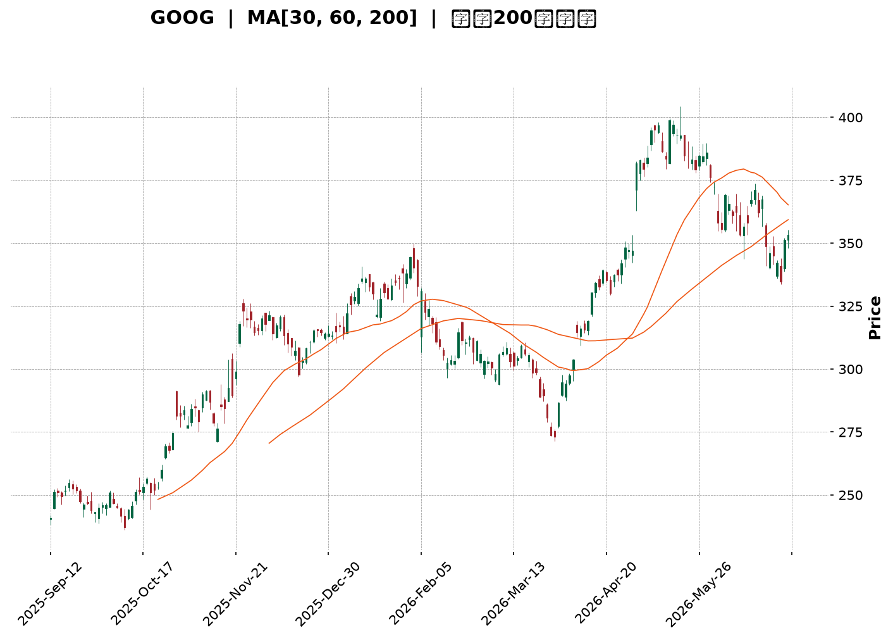
</details>

<html>
<head><meta charset="utf-8" /></head>
<body>
    <div style="height:500px; width:100%;">                        <script>window.PlotlyConfig = {MathJaxConfig: 'local'};</script>
        <script charset="utf-8" src="https://cdn.plot.ly/plotly-3.6.0.min.js" integrity="sha256-QaOVwtVY0T02VaHrr6pnoHLCwayMJp4O5n4YyaE3rJk=" crossorigin="anonymous"></script>                <div id="candlestick-chart" class="plotly-graph-div" style="height:100%; width:100%;"></div>            <script>                window.PLOTLYENV=window.PLOTLYENV || {};                                if (document.getElementById("candlestick-chart")) {                    Plotly.newPlot(                        "candlestick-chart",                        [{"close":{"dtype":"f8","bdata":"AAAAwAwdbkAAAABgj2hvQAAAAKCzXW9AAAAAYI8rb0AAAADAw3pvQAAAAOCz129AAAAAgFSMb0AAAABgFXtvQAAAAMAL625AAAAAIM7CbkAAAABgSdZuQAAAACA5fG5AAAAAoFpibkAAAADg6KFuQAAAAIBVvm5AAAAAAPm+bkAAAABgk2BvQAAAAMCw1G5AAAAAwFqfbkAAAADgjjduQAAAAGDQoG1AAAAAYCqFbkAAAABAq7ZuQAAAAKD2Zm9AAAAAoGRsb0AAAACgZKlvQAAAAIBGCHBAAAAAgCVbb0AAAADgJoFvQAAAAAB6p29AAAAAoAFAcEAAAABgbtZwQAAAAIB6vnBAAAAAgBsqcUAAAACgk5VxQAAAAKBMlHFAAAAAAAe5cUAAAADAQVhxQAAAAIAWw3FAAAAAYILMcUAAAAAgcnJxQAAAAEBYIHJAAAAAYLUyckAAAABA4u1xQAAAAAAvaXFAAAAA4AJHcUAAAABAqdBxQAAAAOBwxnFAAAAAYKtGckAAAADAmhZyQAAAAGAFsXJAAAAAYI3dc0AAAABgHDB0QAAAAKB0+nNAAAAAoOb3c0AAAACADqhzQAAAAMBttnNAAAAAgOL\u002fc0AAAABgRtxzQAAAAMBbF3RAAAAAgKKgc0AAAABgXdVzQAAAACBMCXRAAAAAYKaUc0AAAAAA1mFzQAAAAGCpTnNAAAAAIEE1c0AAAACAvJpyQAAAAECo9XJAAAAA4FBDc0AAAABgx25zQAAAAMBJtHNAAAAA4CC0c0AAAACAyKhzQAAAAACtn3NAAAAAYDuic0AAAABgP5ZzQAAAACCJrnNAAAAAgH7Oc0AAAABgO6JzQAAAAMAlIHRAAAAAYFpZdEAAAAAgXot0QAAAAIC7xHRAAAAA4Nr\u002fdEAAAAAg8P10QAAAAICay3RAAAAAwIqedEAAAABg1Rt0QAAAACA5f3RAAAAAIIimdEAAAACgBYB0QAAAAGB50nRAAAAAQAHpdEAAAABAdf10QAAAAAB9I3VAAAAAQGkhdUAAAADAMod1QAAAAAAWRHVAAAAAwHrOdEAAAACAXK50QAAAAIDaKnRAAAAAQKA\u002fdEAAAABAbeNzQAAAAGDHbnNAAAAA4HVPc0AAAAAg7hlzQAAAACDM5nJAAAAAoLH4ckAAAAAgn\u002fJyQAAAACDTp3NAAAAAIIh0c0AAAABgOmhzQAAAAIDxiXNAAAAAgPwrc0AAAACAYHBzQAAAAOBcH3NAAAAAIJ\u002fyckAAAAAg3fByQAAAAOBGyHJAAAAAQJKeckAAAAAgNx1zQAAAACDtK3NAAAAAgMBDc0AAAAAgcfByQAAAAIB11HJAAAAAYMoDc0AAAAAglVNzQAAAACDaIXNAAAAA4LwYc0AAAADAw6lyQAAAAEBxrXJAAAAAwGoQckAAAAAgpxZyQAAAAGAjiXFAAAAAgIYZcUAAAACgnA9xQAAAAMD\u002f6nFAAAAA4I9rckAAAACghmRyQAAAAACyl3JAAAAAgPT7ckAAAACgz6hzQAAAACDgwnNAAAAAQHu4c0AAAADASfBzQAAAAEAZpnRAAAAAIE3kdEAAAAAAHsl0QAAAAEAiM3VAAAAAICzzdEAAAAAAV6R0QAAAACBuGHVAAAAA4L8YdUAAAABg02F1QAAAAED3xHVAAAAA4Ke0dUAAAAAgnrF1QAAAAEBd23dAAAAAANXvd0AAAABAlrZ3QAAAACCfAHhAAAAAAHCueEAAAADg\u002frB4QAAAAKD6zHhAAAAAAJkoeEAAAAAgbfl3QAAAAMDM7HhAAAAA4OXOeEAAAADAVZF4QAAAAAD6jXhAAAAAILIKeEAAAAAgsgp4QAAAAGDU83dAAAAA4G2yd0AAAACAvAl4QAAAAICTCXhAAAAAQDQeeEAAAADgQYN3QAAAAMCxRXdAAAAAgMpidkAAAAAAdTd2QAAAACDEEHdAAAAA4KPYdkAAAABguJJ2QAAAAOCjpHZAAAAAwB4VdkAAAADA9Uh2QAAAAGCPYnZAAAAAgMLxdkAAAACgmTF3QAAAAKCZoXZAAAAAIFz3dkAAAADgesx1QAAAAKBHoXVAAAAA4KOQdUAAAABACmN1QAAAAEAK63RAAAAA4Hr0dUAAAACgRxV2QA=="},"high":{"dtype":"f8","bdata":"H80MSVw+bkABGY6iLYhvQMAUrR6Cl29Arpfv2KBub0DXPJk+krRvQBeLNm0qA3BAlkF1COD5b0CfzdIOschvQCuS4Inijm9AHnSpL5nabkCU87vCLjRvQAlRu5T7ZG9ArHUvn1hmbkAwYC4zVNVuQAO\u002fppDR5G5ATRmXi07UbkAGF0zRnHZvQGwJcIvaYW9AXjJ9Z9fYbkC79zplY6JuQC05nbeNi25AHQwVBFiQbkCvlAYYRvFuQLYkbUx\u002fiG9AuB00xDcRcEBgzVGINMxvQFn27jsCFnBAZN8ogizcb0AXY72N1ApwQAAvpt2A629AqzSGmfFfcEDlbWrnUuRwQAD9Dx2W7XBAMU8C1+E2cUAdGjoivjVyQJV3OnmZ23FAg9zRKhfWcUCB8pTihZRxQJIyPSA64nFA\u002fqNysusDckAloCNqGL9xQOTacsc8LnJA\u002f5w8MUo8ckDnPL7\u002fmzxyQFsX\u002f1JJr3FA6jgJvalpcUCpnUoHGl9yQGnF1aTmDXJA9j4MJ3r6ckB+qIqjoiRzQL\u002fyIZfY9XJA8vrrV8ryc0DPy6DyboB0QBZN1wKrRXRAHNtVdtljdEBGobJcE\u002fBzQNOC1tOg33NAVlo7f48WdEAjKdakeCd0QIj2wM4kM3RACgW2IvkMdECyDZFfsORzQLBjevkyF3RAMDCnzx0ZdEC55lSVo7tzQPq0586rhHNAjvK\u002fIAJ3c0BSNJr6qUxzQN2ajy3JDXNAQa3\u002fV2NJc0D92qAFsXRzQLVyje8xvnNA6ZSGDwm+c0AUcXeSWcJzQH46WobxqHNA0RR9CZHUc0AAvi+gp69zQA5LgofhJ3RAnnDhblXtc0CrbHbnPhJ0QAdKd46fYHRAdqkmCb2hdEAgNOo9wrB0QD+Q8XsO4HRATqWEYBNMdUAmFshmcQl1QOHm7g4FG3VAr5pz7tbsdEDdQZ3tlnp0QJVsBganxHRA1RDoQ1zsdEBVC6xQgdl0QIe8+Z6T\u002fnRAtx9tsGAcdUCYo4uoBxN1QAozVxh+XXVAb0GA14g9dUDwQ1nVbot1QKLI65sW23VABzctzs98dUD8xtK5W8N0QNw97RFWo3RACUFFBf90dEBPuZ82XRN0QHj2NDEECnRA3kj5fhLBc0D2+7VoykdzQDH6ec\u002ffB3NAIYdMOCwYc0Ag2AsMFxpzQDTKvM6LxXNAHpgc\u002fpvwc0COhs2\u002fZX9zQEpZ1aEClHNAy0KM2naJc0D8QYRmw3pzQBTYJ1zOO3NAby0AmLH4ckD\u002fW2RB+xBzQMPoqNmV73JAc0gpRgK\u002fckD0DvrqDCVzQAD778dsT3NA+jg4ORxuc0CPc1QfRUdzQM9cShY0MXNA\u002fq6w6i0Wc0CXYWHs0F1zQLddXmkCaXNAl0nSqO0nc0DHX66g\u002fQJzQDW8rigA83JAOnNuqb2OckAhuyRiuWdyQP2F1KV75XFAYwEn\u002fsBucUA7Sl9wgEFxQOJwKYgJ7nFAzP1kZuScckD5OrtTjXtyQJrNf33to3JAkwHHdKz+ckAwiWKrKvNzQJEggkPT03NAqn7Rz+z0c0AUNEFVzvNzQBmyJPoOp3RAJlm9scbsdEC3LFNE1RJ1QAXbEO98PHVAH\u002fq\u002f3EsvdUA3toi+eQ91QHt3zyI6HXVAYXf5T0k\u002fdUBS2O5\u002fu3d1QLqI9OIF63VA9VhTVgjbdUDl1i+\u002f\u002fxJ2QHrHzcxl5ndAdN3F9Izyd0DpkdDQLv93QBAY6NGdS3hA5jXv8UPCeEDFhuov29F4QCk1iR8W4nhAewDoH3yheEARb4krUiN4QMXArO4H+3hAW1s6vNLteEDQuG0xRbp4QC2XMaOgQ3lAlad5xgWSeEARwv61cGd4QIHVCaojR3hAVDSfWTcKeEBU9xkFiBJ4QETmnHDZV3hA5KTwMD9ceEBnfNUjutZ3QI5qB8b+ZXdANiGpyRQZd0DaQcPygqR2QCq45EszGndAVVhcpqUPd0AAAACAFLZ2QAAAAGASG3dAAAAAwPXkdkAAAAAAKWB2QAAAAEBezHZAAAAAYGYqd0AAAACgmVl3QAAAAGBmIndAAAAAAAAQd0AAAABAM2N2QAAAACCFy3VAAAAAoEcNdkAAAABACnN1QAAAAIDrgXVAAAAAIIX\u002fdUAAAACAPTZ2QA=="},"hovertemplate":"\u003cb\u003e%{x|%Y-%m-%d}\u003c\u002fb\u003e\u003cbr\u003e\u958b: $%{open:.2f}\u003cbr\u003e\u9ad8: $%{high:.2f}\u003cbr\u003e\u4f4e: $%{low:.2f}\u003cbr\u003e\u6536: $%{close:.2f}\u003cextra\u003e\u003c\u002fextra\u003e","low":{"dtype":"f8","bdata":"xn1Y5xHBbUD3sJVGBpBuQC4Ll5I\u002fJ29AmCb25h\u002fDbkAxbGoT3TNvQIyS9JRlcm9A9gc0LDhKb0AQFiloKVNvQNl+j2aQ125AP3hTOKwlbkCYHk5nCsVuQEpN9fYsV25AN0PuY0bjbUCoZwM5bddtQNK+U2gkVG5A4W2Xp9w\u002fbkCy2D5Es6ZuQN+Xy2B4ym5Arej6jYmTbkAiHluLweZtQB7acKYah21A7nHr1u0IbkBhVo0xmRZuQHJjWbjUyW5AGtLto79Fb0AKTIyUUQNvQA\u002fJv0dDw29At1Auwx+GbkC2VwoRwT5vQJNskcrAiG9A9+DuKyvzb0A8n8Fbv4ZwQCA8arhbqnBATj+aYXq+cECssDwebH5xQHRCKo6uT3FAJRb2CyV9cUApaz+TLEVxQPIEXgtiVXFACg1YDhuRcUCoouaaNTNxQJ9eE\u002f3Dr3FALq3MzRH1cUCcugvwLb1xQPbrYnlMV3FAE\u002fntwBDucEBC2yO6yLpxQA9EpWxtZ3FA0fCIYLfxcUCrGmd9qwlyQLWKHOOLXHJAyCl3TLdMc0COHwPqG9NzQEg6r61FyXNAK8OU2h7Fc0Bt1G1C2pVzQLgWKGyvmXNAs5HDrKSac0AgMHTvj69zQGLXNyiq9XNA6ymTMwx4c0C11oZMZINzQPJRLm\u002fQr3NAqoR0C5xXc0A7s6RH8yhzQLoTycJ0FXNAf08Tee\u002f2ckDruLdC\u002fZByQNStsW3Nw3JA20LlgyDfckAVmZG2CSNzQIymkdqCZXNAnmIG0JOOc0C8Wt4g+JRzQJF7US\u002fjd3NACiXpknWNc0BPb21trnxzQK8m+7bpY3NAWyIasmatc0DkOCoQ635zQOqFeONuoXNAuFf+3B0ZdEBi\u002fLwSMF10QGsFSvhcUXRAJtFVXp7edEBfUmGCU6t0QMQE8v64rXRATZCUGd57dEClgM5Jigd0QIUBNsH38XNAt3QjejaHdECLq3n1q3h0QIwSwFsAcXRArDGR7gfVdEBelS0PJbt0QDPB4pOyZHRAwMUxXEvDdEADFjvlJPl0QIHjgadeInVAhzjC2AqPdEAgGMq7TyhzQP6Q7AS3+3NAKkfQ8JDUc0DNXchY\u002faNzQOvKJaqaW3NA7RRlRfc7c0B\u002fIvb0DfhyQAS7u2QziHJAqAIB+l\u002fZckDAtqgyccRyQNRq5iRdAHNA6N9b9l1Zc0BGOYlxDBtzQOkqcb5MT3NAkeFy1j7gckAcZUHnHfNyQGWvqHSsynJAcOSXLP2EckApin7KhMZyQJ06Wm7lmnJAQ\u002fyVzdVtckDg3IciDVxyQJfkqZ0FEnNAJY1HG38ac0AObrx2i8pyQMBtd2OYuXJA9B0oLg7ackA78THXqwJzQCbvKZzHFXNAyMxXZxrNckCdJKTmJIlyQI6MVbCcnXJAXBiYeeYKckB4XT54J\u002fNxQEgZ2EkdbnFA\u002fGebUAwVcUAVnzN08vVwQEa3PiJ\u002fSXFAVdeFALwUckDFtMs5WvZxQGQN7wjQWXJAAljd8\u002fRzckD6qWhDRYhzQFk5gr+KVHNAiJND6Jylc0BZLTh5BZhzQJhoBDtPD3RAxNpBsGWHdECnGmpCNbd0QEP\u002fW81u0XRAYPOXJdzmdEAFs8Fx6JZ0QLbEP+AnzHRAWf2fQLztdECj4Pe\u002fld10QGLonB6uSXVAYjrariqBdUDuabOllWN1QPJGBBHyrXZAoU5ZfIxwd0CKGAOysYh3QP+XbIjwwXdAhY\u002fb7t8teED23SMrNGF4QLeelZPulnhA93qQlPYfeEDdneyZ3bd3QK5pRoSb1XdA8PGWUd6HeEBqkkPFaFh4QFOo2VGjanhAteZNblDsd0Brq17SV7x3QCaMgDQHtHdAxjlZIoWgd0Ci2P9ql653QGbq7dhS3HdA74Zuv1TQd0BsnlufMmF3QKABB1LNF3dAibMwWpUsdkCIF+BzqyJ2QEzrIKZiKXZAlGzUjJmWdkAAAACAPV52QAAAACCFK3ZAAAAAwPUMdkAAAACAFHp1QAAAAKBwFXZAAAAAYGbKdkAAAADAHtV2QAAAACCug3ZAAAAAYLpJdkAAAABACk91QAAAAKBwO3VAAAAAAABYdUAAAABgZv50QAAAAEAK23RAAAAAwPUsdUAAAACAwsF1QA=="},"name":"\u50f9\u683c","open":{"dtype":"f8","bdata":"sZl7q4YKbkAmny12IpVuQABZzsrDem9ANRMWs\u002fpeb0BSiCYIwWtvQJdVhPzvnG9AWNVGzQLJb0D6RirNFKVvQK+o\u002f+QDdW9A8R9cmY2LbkBvOfbtm+luQFAjmAJC+W5Av3xBWrRSbkBvYlaeqRZuQNXJ1YgapW5AoVPzTAKYbkBMKwoTk6luQBngvmctDm9AuDsq5Py2bkDcTfFTlJJuQM3n7yn2NW5ApOQ1Gt8RbkBje2PSBiluQHXijrcw825Ax90hgBN\u002fb0D4WddZd1tvQPfbRg9i129A3cV+lwXYb0DcJdxBW9BvQF7wEbuEpm9AK8eEGL8McEDZW0M+dI1wQEaVaVG+2nBAGpJjMFrBcEAvafewYzJyQB\u002fWE2dqqnFAhCH8fuGdcUBPe\u002fk4XkhxQKG3pQZWbXFAnMHPFdHScUDEJQPddrpxQGdutcpPy3FAYFVi\u002fS36cUCPdM3TNzhyQKV78wfnpnFAya0mXs\u002f1cEC6vQ+Xb91xQLPIgQG7\u002fnFAxoXMofTxcUAXToBdTQJzQBp3dsaghHJA3Df9BW1mc0AkV11OkmJ0QOa7ZZ5wAnRA7QnD2sEsdEDdSTXBqc1zQGNk7DJ7xHNASmsep5a2c0DgqZLzmyZ0QCvxNt\u002f79XNAT+Rk9MYJdEBR9J7bD4tzQFrPswlPw3NAsEGLMeUKdEBpnuKlJaZzQG2sjPV4g3NA7914P5wZc0Bt1sE3tUlzQN2aQ7Ch6nJAtIlJy\u002fztckBl06nvGW1zQJJjscupa3NATWMjT8y7c0AaQEGeH7hzQBauYaSWhnNAvvb1FwSQc0DlV2hsYI9zQOq0fN3O0nNAsMLTfnzUc0DR1i+fVc5zQOcSrEONonNAtS\u002faeV2NdECy4OpxAHF0QDy4hq0uYXRA+16ypXrtdEB61Bb1w+h0QCDplDXSGXVAZgjUT\u002ffndEC1runqIQ10QO6uQrHQCnRAROgNsULddEBLa0qqiMN0QOwIGdBYfHRAVxLeYRLzdECjoGscuwJ1QFGUOzd+PnVAOxCiQWDgdEAmbFDCxQF1QBsWWnn2wHVA3dKN8+Z0dUCCWe8JqYxzQMzRHcjDbnRABplpxCENdEAxderv2wd0QB8Sgxaz6HNAYHBJEhR\u002fc0C9zSI\u002fVDlzQJoFBof2w3JAvgSB75jgckBRPybPAOJyQMmQ8HxvBnNA8HshjZPrc0BUkij\u002fwGNzQCPdWP1me3NAYfJnJVmGc0AkDKuJsfhyQPt6zSUd6XJAtQ+QOX2gckABb+e2o+RyQMY+RYLe7HJA3DPHSPh6ckB3bTthVF9yQLYOV3kOG3NAHNYmGdohc0Bw1uy7aSBzQOxI1XOHJ3NAl08vpa32ckBaK2DNyQdzQIxot0uEO3NAP2RxFXHwckDldOKdMf5yQGmYt4eWxXJA6LnEWoKAckBpnU6Rlj9yQMG+zjJJ4HFAM7gb6LpTcUBetoK1YzRxQB35SBb4VXFA5D7gvuMcckD7eyf6Dg1yQCfk9ipdaHJA8Dc7Flq\u002fckAyFT6jONpzQE6eebUGkHNAHMUAlIngc0CJDS1Wr7NzQGfD99nwHXRAamv3YceldEA+SVcpXvp0QHIGaV6p43RAs8wkt7MldUC4DidmIfZ0QIe+OALw6nRAC\u002fjvoO41dUDV1kIVRRh1QKIAZE7FenVAqA\u002fMrWGrdUAM0SACW5R1QGVINdOBMHdAoqPZ6Aqcd0CYjtXlcOF3QGlau6k+2ndAI85pzLBVeEB9c\u002fqJI814QJuONZmGoHhADlWlt0dneEBXnMN3Swx4QOIPSffN2ndACcnGs9mYeEApyjrip494QALuO+05fnhAF284zgOReEBSwrFH7wx4QD980th73HdACzz+0Hjwd0BDcA7ZQMx3QHVUa3aO6HdAiY5a0RD6d0CJ091v7s93QEcfI2OdRXdApnxqnxCvdkB3G4xV6WF2QMnPeZKeM3ZAjPMWPZWydkAAAACAwqd2QAAAAAApznZAAAAAwMyQdkAAAADAzBB2QAAAAKCZkXZAAAAAANffdkAAAACgcPd2QAAAAMDM8HZAAAAAgD2+dkAAAAAAKVJ2QAAAACCuQXVAAAAAIIXLdUAAAABguA51QAAAACCuT3VAAAAAQDM\u002fdUAAAAAgrvV1QA=="},"x":["2025-09-12T00:00:00-04:00","2025-09-15T00:00:00-04:00","2025-09-16T00:00:00-04:00","2025-09-17T00:00:00-04:00","2025-09-18T00:00:00-04:00","2025-09-19T00:00:00-04:00","2025-09-22T00:00:00-04:00","2025-09-23T00:00:00-04:00","2025-09-24T00:00:00-04:00","2025-09-25T00:00:00-04:00","2025-09-26T00:00:00-04:00","2025-09-29T00:00:00-04:00","2025-09-30T00:00:00-04:00","2025-10-01T00:00:00-04:00","2025-10-02T00:00:00-04:00","2025-10-03T00:00:00-04:00","2025-10-06T00:00:00-04:00","2025-10-07T00:00:00-04:00","2025-10-08T00:00:00-04:00","2025-10-09T00:00:00-04:00","2025-10-10T00:00:00-04:00","2025-10-13T00:00:00-04:00","2025-10-14T00:00:00-04:00","2025-10-15T00:00:00-04:00","2025-10-16T00:00:00-04:00","2025-10-17T00:00:00-04:00","2025-10-20T00:00:00-04:00","2025-10-21T00:00:00-04:00","2025-10-22T00:00:00-04:00","2025-10-23T00:00:00-04:00","2025-10-24T00:00:00-04:00","2025-10-27T00:00:00-04:00","2025-10-28T00:00:00-04:00","2025-10-29T00:00:00-04:00","2025-10-30T00:00:00-04:00","2025-10-31T00:00:00-04:00","2025-11-03T00:00:00-05:00","2025-11-04T00:00:00-05:00","2025-11-05T00:00:00-05:00","2025-11-06T00:00:00-05:00","2025-11-07T00:00:00-05:00","2025-11-10T00:00:00-05:00","2025-11-11T00:00:00-05:00","2025-11-12T00:00:00-05:00","2025-11-13T00:00:00-05:00","2025-11-14T00:00:00-05:00","2025-11-17T00:00:00-05:00","2025-11-18T00:00:00-05:00","2025-11-19T00:00:00-05:00","2025-11-20T00:00:00-05:00","2025-11-21T00:00:00-05:00","2025-11-24T00:00:00-05:00","2025-11-25T00:00:00-05:00","2025-11-26T00:00:00-05:00","2025-11-28T00:00:00-05:00","2025-12-01T00:00:00-05:00","2025-12-02T00:00:00-05:00","2025-12-03T00:00:00-05:00","2025-12-04T00:00:00-05:00","2025-12-05T00:00:00-05:00","2025-12-08T00:00:00-05:00","2025-12-09T00:00:00-05:00","2025-12-10T00:00:00-05:00","2025-12-11T00:00:00-05:00","2025-12-12T00:00:00-05:00","2025-12-15T00:00:00-05:00","2025-12-16T00:00:00-05:00","2025-12-17T00:00:00-05:00","2025-12-18T00:00:00-05:00","2025-12-19T00:00:00-05:00","2025-12-22T00:00:00-05:00","2025-12-23T00:00:00-05:00","2025-12-24T00:00:00-05:00","2025-12-26T00:00:00-05:00","2025-12-29T00:00:00-05:00","2025-12-30T00:00:00-05:00","2025-12-31T00:00:00-05:00","2026-01-02T00:00:00-05:00","2026-01-05T00:00:00-05:00","2026-01-06T00:00:00-05:00","2026-01-07T00:00:00-05:00","2026-01-08T00:00:00-05:00","2026-01-09T00:00:00-05:00","2026-01-12T00:00:00-05:00","2026-01-13T00:00:00-05:00","2026-01-14T00:00:00-05:00","2026-01-15T00:00:00-05:00","2026-01-16T00:00:00-05:00","2026-01-20T00:00:00-05:00","2026-01-21T00:00:00-05:00","2026-01-22T00:00:00-05:00","2026-01-23T00:00:00-05:00","2026-01-26T00:00:00-05:00","2026-01-27T00:00:00-05:00","2026-01-28T00:00:00-05:00","2026-01-29T00:00:00-05:00","2026-01-30T00:00:00-05:00","2026-02-02T00:00:00-05:00","2026-02-03T00:00:00-05:00","2026-02-04T00:00:00-05:00","2026-02-05T00:00:00-05:00","2026-02-06T00:00:00-05:00","2026-02-09T00:00:00-05:00","2026-02-10T00:00:00-05:00","2026-02-11T00:00:00-05:00","2026-02-12T00:00:00-05:00","2026-02-13T00:00:00-05:00","2026-02-17T00:00:00-05:00","2026-02-18T00:00:00-05:00","2026-02-19T00:00:00-05:00","2026-02-20T00:00:00-05:00","2026-02-23T00:00:00-05:00","2026-02-24T00:00:00-05:00","2026-02-25T00:00:00-05:00","2026-02-26T00:00:00-05:00","2026-02-27T00:00:00-05:00","2026-03-02T00:00:00-05:00","2026-03-03T00:00:00-05:00","2026-03-04T00:00:00-05:00","2026-03-05T00:00:00-05:00","2026-03-06T00:00:00-05:00","2026-03-09T00:00:00-04:00","2026-03-10T00:00:00-04:00","2026-03-11T00:00:00-04:00","2026-03-12T00:00:00-04:00","2026-03-13T00:00:00-04:00","2026-03-16T00:00:00-04:00","2026-03-17T00:00:00-04:00","2026-03-18T00:00:00-04:00","2026-03-19T00:00:00-04:00","2026-03-20T00:00:00-04:00","2026-03-23T00:00:00-04:00","2026-03-24T00:00:00-04:00","2026-03-25T00:00:00-04:00","2026-03-26T00:00:00-04:00","2026-03-27T00:00:00-04:00","2026-03-30T00:00:00-04:00","2026-03-31T00:00:00-04:00","2026-04-01T00:00:00-04:00","2026-04-02T00:00:00-04:00","2026-04-06T00:00:00-04:00","2026-04-07T00:00:00-04:00","2026-04-08T00:00:00-04:00","2026-04-09T00:00:00-04:00","2026-04-10T00:00:00-04:00","2026-04-13T00:00:00-04:00","2026-04-14T00:00:00-04:00","2026-04-15T00:00:00-04:00","2026-04-16T00:00:00-04:00","2026-04-17T00:00:00-04:00","2026-04-20T00:00:00-04:00","2026-04-21T00:00:00-04:00","2026-04-22T00:00:00-04:00","2026-04-23T00:00:00-04:00","2026-04-24T00:00:00-04:00","2026-04-27T00:00:00-04:00","2026-04-28T00:00:00-04:00","2026-04-29T00:00:00-04:00","2026-04-30T00:00:00-04:00","2026-05-01T00:00:00-04:00","2026-05-04T00:00:00-04:00","2026-05-05T00:00:00-04:00","2026-05-06T00:00:00-04:00","2026-05-07T00:00:00-04:00","2026-05-08T00:00:00-04:00","2026-05-11T00:00:00-04:00","2026-05-12T00:00:00-04:00","2026-05-13T00:00:00-04:00","2026-05-14T00:00:00-04:00","2026-05-15T00:00:00-04:00","2026-05-18T00:00:00-04:00","2026-05-19T00:00:00-04:00","2026-05-20T00:00:00-04:00","2026-05-21T00:00:00-04:00","2026-05-22T00:00:00-04:00","2026-05-26T00:00:00-04:00","2026-05-27T00:00:00-04:00","2026-05-28T00:00:00-04:00","2026-05-29T00:00:00-04:00","2026-06-01T00:00:00-04:00","2026-06-02T00:00:00-04:00","2026-06-03T00:00:00-04:00","2026-06-04T00:00:00-04:00","2026-06-05T00:00:00-04:00","2026-06-08T00:00:00-04:00","2026-06-09T00:00:00-04:00","2026-06-10T00:00:00-04:00","2026-06-11T00:00:00-04:00","2026-06-12T00:00:00-04:00","2026-06-15T00:00:00-04:00","2026-06-16T00:00:00-04:00","2026-06-17T00:00:00-04:00","2026-06-18T00:00:00-04:00","2026-06-22T00:00:00-04:00","2026-06-23T00:00:00-04:00","2026-06-24T00:00:00-04:00","2026-06-25T00:00:00-04:00","2026-06-26T00:00:00-04:00","2026-06-29T00:00:00-04:00","2026-06-30T00:00:00-04:00"],"type":"candlestick"},{"hovertemplate":"MA30: $%{y:.2f}\u003cextra\u003e\u003c\u002fextra\u003e","line":{"color":"#2196F3","dash":"dash","width":2},"mode":"lines","name":"MA30","x":["2025-09-12T00:00:00-04:00","2025-09-15T00:00:00-04:00","2025-09-16T00:00:00-04:00","2025-09-17T00:00:00-04:00","2025-09-18T00:00:00-04:00","2025-09-19T00:00:00-04:00","2025-09-22T00:00:00-04:00","2025-09-23T00:00:00-04:00","2025-09-24T00:00:00-04:00","2025-09-25T00:00:00-04:00","2025-09-26T00:00:00-04:00","2025-09-29T00:00:00-04:00","2025-09-30T00:00:00-04:00","2025-10-01T00:00:00-04:00","2025-10-02T00:00:00-04:00","2025-10-03T00:00:00-04:00","2025-10-06T00:00:00-04:00","2025-10-07T00:00:00-04:00","2025-10-08T00:00:00-04:00","2025-10-09T00:00:00-04:00","2025-10-10T00:00:00-04:00","2025-10-13T00:00:00-04:00","2025-10-14T00:00:00-04:00","2025-10-15T00:00:00-04:00","2025-10-16T00:00:00-04:00","2025-10-17T00:00:00-04:00","2025-10-20T00:00:00-04:00","2025-10-21T00:00:00-04:00","2025-10-22T00:00:00-04:00","2025-10-23T00:00:00-04:00","2025-10-24T00:00:00-04:00","2025-10-27T00:00:00-04:00","2025-10-28T00:00:00-04:00","2025-10-29T00:00:00-04:00","2025-10-30T00:00:00-04:00","2025-10-31T00:00:00-04:00","2025-11-03T00:00:00-05:00","2025-11-04T00:00:00-05:00","2025-11-05T00:00:00-05:00","2025-11-06T00:00:00-05:00","2025-11-07T00:00:00-05:00","2025-11-10T00:00:00-05:00","2025-11-11T00:00:00-05:00","2025-11-12T00:00:00-05:00","2025-11-13T00:00:00-05:00","2025-11-14T00:00:00-05:00","2025-11-17T00:00:00-05:00","2025-11-18T00:00:00-05:00","2025-11-19T00:00:00-05:00","2025-11-20T00:00:00-05:00","2025-11-21T00:00:00-05:00","2025-11-24T00:00:00-05:00","2025-11-25T00:00:00-05:00","2025-11-26T00:00:00-05:00","2025-11-28T00:00:00-05:00","2025-12-01T00:00:00-05:00","2025-12-02T00:00:00-05:00","2025-12-03T00:00:00-05:00","2025-12-04T00:00:00-05:00","2025-12-05T00:00:00-05:00","2025-12-08T00:00:00-05:00","2025-12-09T00:00:00-05:00","2025-12-10T00:00:00-05:00","2025-12-11T00:00:00-05:00","2025-12-12T00:00:00-05:00","2025-12-15T00:00:00-05:00","2025-12-16T00:00:00-05:00","2025-12-17T00:00:00-05:00","2025-12-18T00:00:00-05:00","2025-12-19T00:00:00-05:00","2025-12-22T00:00:00-05:00","2025-12-23T00:00:00-05:00","2025-12-24T00:00:00-05:00","2025-12-26T00:00:00-05:00","2025-12-29T00:00:00-05:00","2025-12-30T00:00:00-05:00","2025-12-31T00:00:00-05:00","2026-01-02T00:00:00-05:00","2026-01-05T00:00:00-05:00","2026-01-06T00:00:00-05:00","2026-01-07T00:00:00-05:00","2026-01-08T00:00:00-05:00","2026-01-09T00:00:00-05:00","2026-01-12T00:00:00-05:00","2026-01-13T00:00:00-05:00","2026-01-14T00:00:00-05:00","2026-01-15T00:00:00-05:00","2026-01-16T00:00:00-05:00","2026-01-20T00:00:00-05:00","2026-01-21T00:00:00-05:00","2026-01-22T00:00:00-05:00","2026-01-23T00:00:00-05:00","2026-01-26T00:00:00-05:00","2026-01-27T00:00:00-05:00","2026-01-28T00:00:00-05:00","2026-01-29T00:00:00-05:00","2026-01-30T00:00:00-05:00","2026-02-02T00:00:00-05:00","2026-02-03T00:00:00-05:00","2026-02-04T00:00:00-05:00","2026-02-05T00:00:00-05:00","2026-02-06T00:00:00-05:00","2026-02-09T00:00:00-05:00","2026-02-10T00:00:00-05:00","2026-02-11T00:00:00-05:00","2026-02-12T00:00:00-05:00","2026-02-13T00:00:00-05:00","2026-02-17T00:00:00-05:00","2026-02-18T00:00:00-05:00","2026-02-19T00:00:00-05:00","2026-02-20T00:00:00-05:00","2026-02-23T00:00:00-05:00","2026-02-24T00:00:00-05:00","2026-02-25T00:00:00-05:00","2026-02-26T00:00:00-05:00","2026-02-27T00:00:00-05:00","2026-03-02T00:00:00-05:00","2026-03-03T00:00:00-05:00","2026-03-04T00:00:00-05:00","2026-03-05T00:00:00-05:00","2026-03-06T00:00:00-05:00","2026-03-09T00:00:00-04:00","2026-03-10T00:00:00-04:00","2026-03-11T00:00:00-04:00","2026-03-12T00:00:00-04:00","2026-03-13T00:00:00-04:00","2026-03-16T00:00:00-04:00","2026-03-17T00:00:00-04:00","2026-03-18T00:00:00-04:00","2026-03-19T00:00:00-04:00","2026-03-20T00:00:00-04:00","2026-03-23T00:00:00-04:00","2026-03-24T00:00:00-04:00","2026-03-25T00:00:00-04:00","2026-03-26T00:00:00-04:00","2026-03-27T00:00:00-04:00","2026-03-30T00:00:00-04:00","2026-03-31T00:00:00-04:00","2026-04-01T00:00:00-04:00","2026-04-02T00:00:00-04:00","2026-04-06T00:00:00-04:00","2026-04-07T00:00:00-04:00","2026-04-08T00:00:00-04:00","2026-04-09T00:00:00-04:00","2026-04-10T00:00:00-04:00","2026-04-13T00:00:00-04:00","2026-04-14T00:00:00-04:00","2026-04-15T00:00:00-04:00","2026-04-16T00:00:00-04:00","2026-04-17T00:00:00-04:00","2026-04-20T00:00:00-04:00","2026-04-21T00:00:00-04:00","2026-04-22T00:00:00-04:00","2026-04-23T00:00:00-04:00","2026-04-24T00:00:00-04:00","2026-04-27T00:00:00-04:00","2026-04-28T00:00:00-04:00","2026-04-29T00:00:00-04:00","2026-04-30T00:00:00-04:00","2026-05-01T00:00:00-04:00","2026-05-04T00:00:00-04:00","2026-05-05T00:00:00-04:00","2026-05-06T00:00:00-04:00","2026-05-07T00:00:00-04:00","2026-05-08T00:00:00-04:00","2026-05-11T00:00:00-04:00","2026-05-12T00:00:00-04:00","2026-05-13T00:00:00-04:00","2026-05-14T00:00:00-04:00","2026-05-15T00:00:00-04:00","2026-05-18T00:00:00-04:00","2026-05-19T00:00:00-04:00","2026-05-20T00:00:00-04:00","2026-05-21T00:00:00-04:00","2026-05-22T00:00:00-04:00","2026-05-26T00:00:00-04:00","2026-05-27T00:00:00-04:00","2026-05-28T00:00:00-04:00","2026-05-29T00:00:00-04:00","2026-06-01T00:00:00-04:00","2026-06-02T00:00:00-04:00","2026-06-03T00:00:00-04:00","2026-06-04T00:00:00-04:00","2026-06-05T00:00:00-04:00","2026-06-08T00:00:00-04:00","2026-06-09T00:00:00-04:00","2026-06-10T00:00:00-04:00","2026-06-11T00:00:00-04:00","2026-06-12T00:00:00-04:00","2026-06-15T00:00:00-04:00","2026-06-16T00:00:00-04:00","2026-06-17T00:00:00-04:00","2026-06-18T00:00:00-04:00","2026-06-22T00:00:00-04:00","2026-06-23T00:00:00-04:00","2026-06-24T00:00:00-04:00","2026-06-25T00:00:00-04:00","2026-06-26T00:00:00-04:00","2026-06-29T00:00:00-04:00","2026-06-30T00:00:00-04:00"],"y":{"dtype":"f8","bdata":"AAAAAAAA+H8AAAAAAAD4fwAAAAAAAPh\u002fAAAAAAAA+H8AAAAAAAD4fwAAAAAAAPh\u002fAAAAAAAA+H8AAAAAAAD4fwAAAAAAAPh\u002fAAAAAAAA+H8AAAAAAAD4fwAAAAAAAPh\u002fAAAAAAAA+H8AAAAAAAD4fwAAAAAAAPh\u002fAAAAAAAA+H8AAAAAAAD4fwAAAAAAAPh\u002fAAAAAAAA+H8AAAAAAAD4fwAAAAAAAPh\u002fAAAAAAAA+H8AAAAAAAD4fwAAAAAAAPh\u002fAAAAAAAA+H8AAAAAAAD4fwAAAAAAAPh\u002fAAAAAAAA+H8AAAAAAAD4f5qZmZmeB29AZmZmJvwbb0AAAAAQVC9vQHd3d9dvQW9AzczMXGRcb0BVVVUl33tvQO\u002fu7g4rmG9AmpmZ+Wy5b0AzMzODztRvQLy7u2sc\u002fG9AERERQbEScECrqqqiACRwQJqZmTmcPHBAzczM5EJWcEBmZmYWj2xwQBEREaH1fXBAd3d31zWOcEAREREpW6BwQERERBx+tHBAAAAA2MrNcECamZlJOOdwQAAAAJhOCHFAIiIiIpsvcUBVVVX11FhxQERERLxUfXFAvLu7i6ehcUCJiIjATMJxQN7d3XW04XFARERE\u002fJQGckC8u7t7oylyQERERKQGTnJA3t3dzdhqckDe3d1NaYRyQLy7u1uBoHJAZmZmlh+1ckAiIiIid8RyQFVVVfU103JAAAAAkOLfckAzMzNjoupyQCIiInLa9HJAvLu7y1gBc0AiIiKSShJzQN7d3Y3BH3NAiYiIeJosc0ARERHhXTtzQCIiIvI\u002fTnNA3t3dbVtic0CJiIgIenFzQLy7uxu\u002fgXNA3t3drc6Oc0AzMzOz\u002fptzQDMzM4M7qHNAIiIi8lusc0C8u7urZq9zQERERMQktnNAzczMLPG+c0AAAACQVspzQJqZmcmT03NAmpmZqd3Yc0B3d3cH\u002fNpzQHd3d1dy3nNAIiIiMi3nc0CJiIh43exzQN7d3S2S83NAq6qqiur+c0DNzMwMowx0QERERLRDHHRAERERcassdEARERFRnkV0QERERKRMWXRAREREtHhmdEDv7u7OH3F0QBEREZETdXRAIiIi8rl5dEDv7u5ernt0QN7d3R0NenRAzczMzEp3dEBVVVX1JXN0QGZmZoZ9bHRAiYiIGF1ldEDe3d2Ngl90QM3MzMx\u002fW3RAERERMd9TdEDNzMzMKkp0QJqZmZmsP3RA7+7uHhQwdECamZmZ0yJ0QHd3d0eNFHRAERERsUkGdEC8u7t7UvxzQO\u002fu7s6w7XNAAAAA0Fvcc0AREREhiNBzQDMzM2NywnNAIiIisme0c0Dv7u6O56JzQLy7uxs0j3NAd3d3RyZ9c0AiIiLCXGpzQAAAAJAnWHNAq6qqKpBJc0AAAADgVzhzQKuqqiqhK3NAAAAAQP0Yc0AAAABQoQlzQN7d3S1x+XJA3t3d3ZPmckAAAADAKtVyQCIiIhLGzHJA7+7uvhHIckAiIiIyVcNyQGZmZgZDunJAq6qqGj62ckBmZmY2ZbhyQImIiAhLunJAzczM7Pm+ckDv7u5uPcNyQGZmZrZD0HJARERElNrgckCamZl5mPByQDMzM2M5BXNAIiIiYhwZc0Crqqr6JSZzQN7d3a2QNnNAq6qqyjJGc0BmZmZmC1tzQKuqqsogdHNAvLu7GxeLc0C8u7ubSp9zQHd3d8ebx3NAIiIiYunwc0B3d3d3ARx0QN7d3e1xSXRAIiIikumBdEBERETUQbp0QImIiHhA+HRAIiIi0nw0dUDNzMw8e291QGZmZlZGq3VARERENMnhdUBmZmbGehZ2QKuqqgpbSXZA7+7ufoN0dkCamZnp6Jl2QJqZmcmsvXZAZmZmRpvfdkARERGRlgJ3QKuqqgqBH3dA7+7uvgg7d0BVVVU1TlJ3QImIiKj9Y3dAvLu7qz5wd0Crqqqarn13QFVVVUV+jndAVVVVRWydd0CamZkJlqd3QJqZmbkKr3dAMzMz40Gyd0B3d3dXTbd3QCIiIvK9qndAzczM3EWid0CrqqoK1513QImIiKgjkndAzczM3ICDd0C8u7vL0Wp3QLy7u0vDT3dAZmZmhqE5d0CamZkpjSN3QDMzMwNcAXdAzczMHAPpdkARERFxz9N2QA=="},"type":"scatter"},{"hovertemplate":"MA60: $%{y:.2f}\u003cextra\u003e\u003c\u002fextra\u003e","line":{"color":"#9C27B0","dash":"dash","width":2},"mode":"lines","name":"MA60","x":["2025-09-12T00:00:00-04:00","2025-09-15T00:00:00-04:00","2025-09-16T00:00:00-04:00","2025-09-17T00:00:00-04:00","2025-09-18T00:00:00-04:00","2025-09-19T00:00:00-04:00","2025-09-22T00:00:00-04:00","2025-09-23T00:00:00-04:00","2025-09-24T00:00:00-04:00","2025-09-25T00:00:00-04:00","2025-09-26T00:00:00-04:00","2025-09-29T00:00:00-04:00","2025-09-30T00:00:00-04:00","2025-10-01T00:00:00-04:00","2025-10-02T00:00:00-04:00","2025-10-03T00:00:00-04:00","2025-10-06T00:00:00-04:00","2025-10-07T00:00:00-04:00","2025-10-08T00:00:00-04:00","2025-10-09T00:00:00-04:00","2025-10-10T00:00:00-04:00","2025-10-13T00:00:00-04:00","2025-10-14T00:00:00-04:00","2025-10-15T00:00:00-04:00","2025-10-16T00:00:00-04:00","2025-10-17T00:00:00-04:00","2025-10-20T00:00:00-04:00","2025-10-21T00:00:00-04:00","2025-10-22T00:00:00-04:00","2025-10-23T00:00:00-04:00","2025-10-24T00:00:00-04:00","2025-10-27T00:00:00-04:00","2025-10-28T00:00:00-04:00","2025-10-29T00:00:00-04:00","2025-10-30T00:00:00-04:00","2025-10-31T00:00:00-04:00","2025-11-03T00:00:00-05:00","2025-11-04T00:00:00-05:00","2025-11-05T00:00:00-05:00","2025-11-06T00:00:00-05:00","2025-11-07T00:00:00-05:00","2025-11-10T00:00:00-05:00","2025-11-11T00:00:00-05:00","2025-11-12T00:00:00-05:00","2025-11-13T00:00:00-05:00","2025-11-14T00:00:00-05:00","2025-11-17T00:00:00-05:00","2025-11-18T00:00:00-05:00","2025-11-19T00:00:00-05:00","2025-11-20T00:00:00-05:00","2025-11-21T00:00:00-05:00","2025-11-24T00:00:00-05:00","2025-11-25T00:00:00-05:00","2025-11-26T00:00:00-05:00","2025-11-28T00:00:00-05:00","2025-12-01T00:00:00-05:00","2025-12-02T00:00:00-05:00","2025-12-03T00:00:00-05:00","2025-12-04T00:00:00-05:00","2025-12-05T00:00:00-05:00","2025-12-08T00:00:00-05:00","2025-12-09T00:00:00-05:00","2025-12-10T00:00:00-05:00","2025-12-11T00:00:00-05:00","2025-12-12T00:00:00-05:00","2025-12-15T00:00:00-05:00","2025-12-16T00:00:00-05:00","2025-12-17T00:00:00-05:00","2025-12-18T00:00:00-05:00","2025-12-19T00:00:00-05:00","2025-12-22T00:00:00-05:00","2025-12-23T00:00:00-05:00","2025-12-24T00:00:00-05:00","2025-12-26T00:00:00-05:00","2025-12-29T00:00:00-05:00","2025-12-30T00:00:00-05:00","2025-12-31T00:00:00-05:00","2026-01-02T00:00:00-05:00","2026-01-05T00:00:00-05:00","2026-01-06T00:00:00-05:00","2026-01-07T00:00:00-05:00","2026-01-08T00:00:00-05:00","2026-01-09T00:00:00-05:00","2026-01-12T00:00:00-05:00","2026-01-13T00:00:00-05:00","2026-01-14T00:00:00-05:00","2026-01-15T00:00:00-05:00","2026-01-16T00:00:00-05:00","2026-01-20T00:00:00-05:00","2026-01-21T00:00:00-05:00","2026-01-22T00:00:00-05:00","2026-01-23T00:00:00-05:00","2026-01-26T00:00:00-05:00","2026-01-27T00:00:00-05:00","2026-01-28T00:00:00-05:00","2026-01-29T00:00:00-05:00","2026-01-30T00:00:00-05:00","2026-02-02T00:00:00-05:00","2026-02-03T00:00:00-05:00","2026-02-04T00:00:00-05:00","2026-02-05T00:00:00-05:00","2026-02-06T00:00:00-05:00","2026-02-09T00:00:00-05:00","2026-02-10T00:00:00-05:00","2026-02-11T00:00:00-05:00","2026-02-12T00:00:00-05:00","2026-02-13T00:00:00-05:00","2026-02-17T00:00:00-05:00","2026-02-18T00:00:00-05:00","2026-02-19T00:00:00-05:00","2026-02-20T00:00:00-05:00","2026-02-23T00:00:00-05:00","2026-02-24T00:00:00-05:00","2026-02-25T00:00:00-05:00","2026-02-26T00:00:00-05:00","2026-02-27T00:00:00-05:00","2026-03-02T00:00:00-05:00","2026-03-03T00:00:00-05:00","2026-03-04T00:00:00-05:00","2026-03-05T00:00:00-05:00","2026-03-06T00:00:00-05:00","2026-03-09T00:00:00-04:00","2026-03-10T00:00:00-04:00","2026-03-11T00:00:00-04:00","2026-03-12T00:00:00-04:00","2026-03-13T00:00:00-04:00","2026-03-16T00:00:00-04:00","2026-03-17T00:00:00-04:00","2026-03-18T00:00:00-04:00","2026-03-19T00:00:00-04:00","2026-03-20T00:00:00-04:00","2026-03-23T00:00:00-04:00","2026-03-24T00:00:00-04:00","2026-03-25T00:00:00-04:00","2026-03-26T00:00:00-04:00","2026-03-27T00:00:00-04:00","2026-03-30T00:00:00-04:00","2026-03-31T00:00:00-04:00","2026-04-01T00:00:00-04:00","2026-04-02T00:00:00-04:00","2026-04-06T00:00:00-04:00","2026-04-07T00:00:00-04:00","2026-04-08T00:00:00-04:00","2026-04-09T00:00:00-04:00","2026-04-10T00:00:00-04:00","2026-04-13T00:00:00-04:00","2026-04-14T00:00:00-04:00","2026-04-15T00:00:00-04:00","2026-04-16T00:00:00-04:00","2026-04-17T00:00:00-04:00","2026-04-20T00:00:00-04:00","2026-04-21T00:00:00-04:00","2026-04-22T00:00:00-04:00","2026-04-23T00:00:00-04:00","2026-04-24T00:00:00-04:00","2026-04-27T00:00:00-04:00","2026-04-28T00:00:00-04:00","2026-04-29T00:00:00-04:00","2026-04-30T00:00:00-04:00","2026-05-01T00:00:00-04:00","2026-05-04T00:00:00-04:00","2026-05-05T00:00:00-04:00","2026-05-06T00:00:00-04:00","2026-05-07T00:00:00-04:00","2026-05-08T00:00:00-04:00","2026-05-11T00:00:00-04:00","2026-05-12T00:00:00-04:00","2026-05-13T00:00:00-04:00","2026-05-14T00:00:00-04:00","2026-05-15T00:00:00-04:00","2026-05-18T00:00:00-04:00","2026-05-19T00:00:00-04:00","2026-05-20T00:00:00-04:00","2026-05-21T00:00:00-04:00","2026-05-22T00:00:00-04:00","2026-05-26T00:00:00-04:00","2026-05-27T00:00:00-04:00","2026-05-28T00:00:00-04:00","2026-05-29T00:00:00-04:00","2026-06-01T00:00:00-04:00","2026-06-02T00:00:00-04:00","2026-06-03T00:00:00-04:00","2026-06-04T00:00:00-04:00","2026-06-05T00:00:00-04:00","2026-06-08T00:00:00-04:00","2026-06-09T00:00:00-04:00","2026-06-10T00:00:00-04:00","2026-06-11T00:00:00-04:00","2026-06-12T00:00:00-04:00","2026-06-15T00:00:00-04:00","2026-06-16T00:00:00-04:00","2026-06-17T00:00:00-04:00","2026-06-18T00:00:00-04:00","2026-06-22T00:00:00-04:00","2026-06-23T00:00:00-04:00","2026-06-24T00:00:00-04:00","2026-06-25T00:00:00-04:00","2026-06-26T00:00:00-04:00","2026-06-29T00:00:00-04:00","2026-06-30T00:00:00-04:00"],"y":{"dtype":"f8","bdata":"AAAAAAAA+H8AAAAAAAD4fwAAAAAAAPh\u002fAAAAAAAA+H8AAAAAAAD4fwAAAAAAAPh\u002fAAAAAAAA+H8AAAAAAAD4fwAAAAAAAPh\u002fAAAAAAAA+H8AAAAAAAD4fwAAAAAAAPh\u002fAAAAAAAA+H8AAAAAAAD4fwAAAAAAAPh\u002fAAAAAAAA+H8AAAAAAAD4fwAAAAAAAPh\u002fAAAAAAAA+H8AAAAAAAD4fwAAAAAAAPh\u002fAAAAAAAA+H8AAAAAAAD4fwAAAAAAAPh\u002fAAAAAAAA+H8AAAAAAAD4fwAAAAAAAPh\u002fAAAAAAAA+H8AAAAAAAD4fwAAAAAAAPh\u002fAAAAAAAA+H8AAAAAAAD4fwAAAAAAAPh\u002fAAAAAAAA+H8AAAAAAAD4fwAAAAAAAPh\u002fAAAAAAAA+H8AAAAAAAD4fwAAAAAAAPh\u002fAAAAAAAA+H8AAAAAAAD4fwAAAAAAAPh\u002fAAAAAAAA+H8AAAAAAAD4fwAAAAAAAPh\u002fAAAAAAAA+H8AAAAAAAD4fwAAAAAAAPh\u002fAAAAAAAA+H8AAAAAAAD4fwAAAAAAAPh\u002fAAAAAAAA+H8AAAAAAAD4fwAAAAAAAPh\u002fAAAAAAAA+H8AAAAAAAD4fwAAAAAAAPh\u002fAAAAAAAA+H8AAAAAAAD4f4mIiPjq6HBAiYiIcGv8cEDv7u6qCQ5xQLy7u6OcIHFAZmZm4qgxcUBmZmZaM0FxQGZmZr6lT3FAZmZmhkxecUBmZmbShGpxQAAAAFR0eXFAZmZmBgWKcUBmZmaaJZtxQLy7u+MurnFAq6qqrm7BcUC8u7t79tNxQJqZmcka5nFAq6qqokj4cUDNzMyY6ghyQAAAAJweG3JA7+7uwkwuckBmZmZ+m0FyQJqZmQ1FWHJAIiIiivttckCJiIjQHYRyQERERMC8mXJAREREXEywckBERESoUcZyQLy7ux+k2nJA7+7uUrnvckCamZnBTwJzQN7d3X08FnNAAAAAAAMpc0AzMzNjozhzQM3MzMQJSnNAiYiIEAVac0B3d3cXjWhzQM3MzNS8d3NAiYiIAEeGc0AiIiJaIJhzQDMzM4sTp3NAAAAAwOizc0CJiIgwtcFzQHd3d49qynNAVVVVNSrTc0AAAAAghttzQAAAAIgm5HNAVVVVHdPsc0Dv7u7+T\u002fJzQBEREVEe93NAMzMz4xX6c0CJiIigwP1zQAAAAKjdAXRAmpmZkR0AdEBERES8yPxzQO\u002fu7q7o+nNA3t3dpYL3c0DNzMwUlfZzQImIiIgQ9HNAVVVVrZPvc0CamZlBp+tzQDMzM5MR5nNAERERgcThc0DNzMzMst5zQImIiEgC23NAZmZmHqnZc0De3d1NxddzQAAAAOi71XNARERE3OjUc0CamZmJ\u002fddzQCIiIhq62HNAd3d3bwTYc0B3d3fXu9RzQN7d3V1a0HNAERERmVvJc0B3d3fXp8JzQN7d3SW\u002fuXNAVVVVVe+uc0CrqqpaKKRzQERERMyhnHNAvLu7a7eWc0AAAADga5FzQJqZmWnhinNA3t3dpQ6Fc0CamZkBSIFzQBEREdH7fHNA3t3dBYd3c0BERESECHNzQO\u002fu7n5ocnNAq6qqIpJzc0Crqqp6dXZzQBERERl1eXNAERERGbx6c0De3d0NV3tzQImIiIiBfHNAZmZmPk19c0Crqqp6+X5zQDMzM3OqgXNAmpmZsR6Ec0Dv7u6u04RzQLy7u6vhj3NAZmZmxjydc0C8u7urLKpzQERERIyJunNAERERaXPNc0AiIiKS8eFzQDMzM9PY+HNAAAAAWIgNdEBmZmb+UiJ0QERERDQGPHRAmpmZee1UdEBERET852x0QImIiAjPgXRAzczMzGCVdEAAAAAQJ6l0QBEREen7u3RAmpmZmUrPdEAAAAAA6uJ0QImIiGDi93RAmpmZqfENdUB3d3dXcyF1QN7d3YWbNHVA7+7uhq1EdUCrqqpK6lF1QJqZmXmHYnVAAAAAiM9xdUAAAAC4UIF1QCIiIsKVkXVAd3d3f6yedUCamZn5S6t1QM3MzNwsuXVAd3d3n5fJdUARERFB7Nx1QDMzM8vK7XVAd3d3N7UCdkAAAADQiRJ2QCIiIuIBJHZARERELA83dkAzMzMzhEl2QM3MzCxRVnZAiYiIKGZldkC8u7sbJXV2QA=="},"type":"scatter"},{"hovertemplate":"MA200: $%{y:.2f}\u003cextra\u003e\u003c\u002fextra\u003e","line":{"color":"#FF6F00","dash":"solid","width":2},"mode":"lines","name":"MA200","x":["2025-09-12T00:00:00-04:00","2025-09-15T00:00:00-04:00","2025-09-16T00:00:00-04:00","2025-09-17T00:00:00-04:00","2025-09-18T00:00:00-04:00","2025-09-19T00:00:00-04:00","2025-09-22T00:00:00-04:00","2025-09-23T00:00:00-04:00","2025-09-24T00:00:00-04:00","2025-09-25T00:00:00-04:00","2025-09-26T00:00:00-04:00","2025-09-29T00:00:00-04:00","2025-09-30T00:00:00-04:00","2025-10-01T00:00:00-04:00","2025-10-02T00:00:00-04:00","2025-10-03T00:00:00-04:00","2025-10-06T00:00:00-04:00","2025-10-07T00:00:00-04:00","2025-10-08T00:00:00-04:00","2025-10-09T00:00:00-04:00","2025-10-10T00:00:00-04:00","2025-10-13T00:00:00-04:00","2025-10-14T00:00:00-04:00","2025-10-15T00:00:00-04:00","2025-10-16T00:00:00-04:00","2025-10-17T00:00:00-04:00","2025-10-20T00:00:00-04:00","2025-10-21T00:00:00-04:00","2025-10-22T00:00:00-04:00","2025-10-23T00:00:00-04:00","2025-10-24T00:00:00-04:00","2025-10-27T00:00:00-04:00","2025-10-28T00:00:00-04:00","2025-10-29T00:00:00-04:00","2025-10-30T00:00:00-04:00","2025-10-31T00:00:00-04:00","2025-11-03T00:00:00-05:00","2025-11-04T00:00:00-05:00","2025-11-05T00:00:00-05:00","2025-11-06T00:00:00-05:00","2025-11-07T00:00:00-05:00","2025-11-10T00:00:00-05:00","2025-11-11T00:00:00-05:00","2025-11-12T00:00:00-05:00","2025-11-13T00:00:00-05:00","2025-11-14T00:00:00-05:00","2025-11-17T00:00:00-05:00","2025-11-18T00:00:00-05:00","2025-11-19T00:00:00-05:00","2025-11-20T00:00:00-05:00","2025-11-21T00:00:00-05:00","2025-11-24T00:00:00-05:00","2025-11-25T00:00:00-05:00","2025-11-26T00:00:00-05:00","2025-11-28T00:00:00-05:00","2025-12-01T00:00:00-05:00","2025-12-02T00:00:00-05:00","2025-12-03T00:00:00-05:00","2025-12-04T00:00:00-05:00","2025-12-05T00:00:00-05:00","2025-12-08T00:00:00-05:00","2025-12-09T00:00:00-05:00","2025-12-10T00:00:00-05:00","2025-12-11T00:00:00-05:00","2025-12-12T00:00:00-05:00","2025-12-15T00:00:00-05:00","2025-12-16T00:00:00-05:00","2025-12-17T00:00:00-05:00","2025-12-18T00:00:00-05:00","2025-12-19T00:00:00-05:00","2025-12-22T00:00:00-05:00","2025-12-23T00:00:00-05:00","2025-12-24T00:00:00-05:00","2025-12-26T00:00:00-05:00","2025-12-29T00:00:00-05:00","2025-12-30T00:00:00-05:00","2025-12-31T00:00:00-05:00","2026-01-02T00:00:00-05:00","2026-01-05T00:00:00-05:00","2026-01-06T00:00:00-05:00","2026-01-07T00:00:00-05:00","2026-01-08T00:00:00-05:00","2026-01-09T00:00:00-05:00","2026-01-12T00:00:00-05:00","2026-01-13T00:00:00-05:00","2026-01-14T00:00:00-05:00","2026-01-15T00:00:00-05:00","2026-01-16T00:00:00-05:00","2026-01-20T00:00:00-05:00","2026-01-21T00:00:00-05:00","2026-01-22T00:00:00-05:00","2026-01-23T00:00:00-05:00","2026-01-26T00:00:00-05:00","2026-01-27T00:00:00-05:00","2026-01-28T00:00:00-05:00","2026-01-29T00:00:00-05:00","2026-01-30T00:00:00-05:00","2026-02-02T00:00:00-05:00","2026-02-03T00:00:00-05:00","2026-02-04T00:00:00-05:00","2026-02-05T00:00:00-05:00","2026-02-06T00:00:00-05:00","2026-02-09T00:00:00-05:00","2026-02-10T00:00:00-05:00","2026-02-11T00:00:00-05:00","2026-02-12T00:00:00-05:00","2026-02-13T00:00:00-05:00","2026-02-17T00:00:00-05:00","2026-02-18T00:00:00-05:00","2026-02-19T00:00:00-05:00","2026-02-20T00:00:00-05:00","2026-02-23T00:00:00-05:00","2026-02-24T00:00:00-05:00","2026-02-25T00:00:00-05:00","2026-02-26T00:00:00-05:00","2026-02-27T00:00:00-05:00","2026-03-02T00:00:00-05:00","2026-03-03T00:00:00-05:00","2026-03-04T00:00:00-05:00","2026-03-05T00:00:00-05:00","2026-03-06T00:00:00-05:00","2026-03-09T00:00:00-04:00","2026-03-10T00:00:00-04:00","2026-03-11T00:00:00-04:00","2026-03-12T00:00:00-04:00","2026-03-13T00:00:00-04:00","2026-03-16T00:00:00-04:00","2026-03-17T00:00:00-04:00","2026-03-18T00:00:00-04:00","2026-03-19T00:00:00-04:00","2026-03-20T00:00:00-04:00","2026-03-23T00:00:00-04:00","2026-03-24T00:00:00-04:00","2026-03-25T00:00:00-04:00","2026-03-26T00:00:00-04:00","2026-03-27T00:00:00-04:00","2026-03-30T00:00:00-04:00","2026-03-31T00:00:00-04:00","2026-04-01T00:00:00-04:00","2026-04-02T00:00:00-04:00","2026-04-06T00:00:00-04:00","2026-04-07T00:00:00-04:00","2026-04-08T00:00:00-04:00","2026-04-09T00:00:00-04:00","2026-04-10T00:00:00-04:00","2026-04-13T00:00:00-04:00","2026-04-14T00:00:00-04:00","2026-04-15T00:00:00-04:00","2026-04-16T00:00:00-04:00","2026-04-17T00:00:00-04:00","2026-04-20T00:00:00-04:00","2026-04-21T00:00:00-04:00","2026-04-22T00:00:00-04:00","2026-04-23T00:00:00-04:00","2026-04-24T00:00:00-04:00","2026-04-27T00:00:00-04:00","2026-04-28T00:00:00-04:00","2026-04-29T00:00:00-04:00","2026-04-30T00:00:00-04:00","2026-05-01T00:00:00-04:00","2026-05-04T00:00:00-04:00","2026-05-05T00:00:00-04:00","2026-05-06T00:00:00-04:00","2026-05-07T00:00:00-04:00","2026-05-08T00:00:00-04:00","2026-05-11T00:00:00-04:00","2026-05-12T00:00:00-04:00","2026-05-13T00:00:00-04:00","2026-05-14T00:00:00-04:00","2026-05-15T00:00:00-04:00","2026-05-18T00:00:00-04:00","2026-05-19T00:00:00-04:00","2026-05-20T00:00:00-04:00","2026-05-21T00:00:00-04:00","2026-05-22T00:00:00-04:00","2026-05-26T00:00:00-04:00","2026-05-27T00:00:00-04:00","2026-05-28T00:00:00-04:00","2026-05-29T00:00:00-04:00","2026-06-01T00:00:00-04:00","2026-06-02T00:00:00-04:00","2026-06-03T00:00:00-04:00","2026-06-04T00:00:00-04:00","2026-06-05T00:00:00-04:00","2026-06-08T00:00:00-04:00","2026-06-09T00:00:00-04:00","2026-06-10T00:00:00-04:00","2026-06-11T00:00:00-04:00","2026-06-12T00:00:00-04:00","2026-06-15T00:00:00-04:00","2026-06-16T00:00:00-04:00","2026-06-17T00:00:00-04:00","2026-06-18T00:00:00-04:00","2026-06-22T00:00:00-04:00","2026-06-23T00:00:00-04:00","2026-06-24T00:00:00-04:00","2026-06-25T00:00:00-04:00","2026-06-26T00:00:00-04:00","2026-06-29T00:00:00-04:00","2026-06-30T00:00:00-04:00"],"y":{"dtype":"f8","bdata":"AAAAAAAA+H8AAAAAAAD4fwAAAAAAAPh\u002fAAAAAAAA+H8AAAAAAAD4fwAAAAAAAPh\u002fAAAAAAAA+H8AAAAAAAD4fwAAAAAAAPh\u002fAAAAAAAA+H8AAAAAAAD4fwAAAAAAAPh\u002fAAAAAAAA+H8AAAAAAAD4fwAAAAAAAPh\u002fAAAAAAAA+H8AAAAAAAD4fwAAAAAAAPh\u002fAAAAAAAA+H8AAAAAAAD4fwAAAAAAAPh\u002fAAAAAAAA+H8AAAAAAAD4fwAAAAAAAPh\u002fAAAAAAAA+H8AAAAAAAD4fwAAAAAAAPh\u002fAAAAAAAA+H8AAAAAAAD4fwAAAAAAAPh\u002fAAAAAAAA+H8AAAAAAAD4fwAAAAAAAPh\u002fAAAAAAAA+H8AAAAAAAD4fwAAAAAAAPh\u002fAAAAAAAA+H8AAAAAAAD4fwAAAAAAAPh\u002fAAAAAAAA+H8AAAAAAAD4fwAAAAAAAPh\u002fAAAAAAAA+H8AAAAAAAD4fwAAAAAAAPh\u002fAAAAAAAA+H8AAAAAAAD4fwAAAAAAAPh\u002fAAAAAAAA+H8AAAAAAAD4fwAAAAAAAPh\u002fAAAAAAAA+H8AAAAAAAD4fwAAAAAAAPh\u002fAAAAAAAA+H8AAAAAAAD4fwAAAAAAAPh\u002fAAAAAAAA+H8AAAAAAAD4fwAAAAAAAPh\u002fAAAAAAAA+H8AAAAAAAD4fwAAAAAAAPh\u002fAAAAAAAA+H8AAAAAAAD4fwAAAAAAAPh\u002fAAAAAAAA+H8AAAAAAAD4fwAAAAAAAPh\u002fAAAAAAAA+H8AAAAAAAD4fwAAAAAAAPh\u002fAAAAAAAA+H8AAAAAAAD4fwAAAAAAAPh\u002fAAAAAAAA+H8AAAAAAAD4fwAAAAAAAPh\u002fAAAAAAAA+H8AAAAAAAD4fwAAAAAAAPh\u002fAAAAAAAA+H8AAAAAAAD4fwAAAAAAAPh\u002fAAAAAAAA+H8AAAAAAAD4fwAAAAAAAPh\u002fAAAAAAAA+H8AAAAAAAD4fwAAAAAAAPh\u002fAAAAAAAA+H8AAAAAAAD4fwAAAAAAAPh\u002fAAAAAAAA+H8AAAAAAAD4fwAAAAAAAPh\u002fAAAAAAAA+H8AAAAAAAD4fwAAAAAAAPh\u002fAAAAAAAA+H8AAAAAAAD4fwAAAAAAAPh\u002fAAAAAAAA+H8AAAAAAAD4fwAAAAAAAPh\u002fAAAAAAAA+H8AAAAAAAD4fwAAAAAAAPh\u002fAAAAAAAA+H8AAAAAAAD4fwAAAAAAAPh\u002fAAAAAAAA+H8AAAAAAAD4fwAAAAAAAPh\u002fAAAAAAAA+H8AAAAAAAD4fwAAAAAAAPh\u002fAAAAAAAA+H8AAAAAAAD4fwAAAAAAAPh\u002fAAAAAAAA+H8AAAAAAAD4fwAAAAAAAPh\u002fAAAAAAAA+H8AAAAAAAD4fwAAAAAAAPh\u002fAAAAAAAA+H8AAAAAAAD4fwAAAAAAAPh\u002fAAAAAAAA+H8AAAAAAAD4fwAAAAAAAPh\u002fAAAAAAAA+H8AAAAAAAD4fwAAAAAAAPh\u002fAAAAAAAA+H8AAAAAAAD4fwAAAAAAAPh\u002fAAAAAAAA+H8AAAAAAAD4fwAAAAAAAPh\u002fAAAAAAAA+H8AAAAAAAD4fwAAAAAAAPh\u002fAAAAAAAA+H8AAAAAAAD4fwAAAAAAAPh\u002fAAAAAAAA+H8AAAAAAAD4fwAAAAAAAPh\u002fAAAAAAAA+H8AAAAAAAD4fwAAAAAAAPh\u002fAAAAAAAA+H8AAAAAAAD4fwAAAAAAAPh\u002fAAAAAAAA+H8AAAAAAAD4fwAAAAAAAPh\u002fAAAAAAAA+H8AAAAAAAD4fwAAAAAAAPh\u002fAAAAAAAA+H8AAAAAAAD4fwAAAAAAAPh\u002fAAAAAAAA+H8AAAAAAAD4fwAAAAAAAPh\u002fAAAAAAAA+H8AAAAAAAD4fwAAAAAAAPh\u002fAAAAAAAA+H8AAAAAAAD4fwAAAAAAAPh\u002fAAAAAAAA+H8AAAAAAAD4fwAAAAAAAPh\u002fAAAAAAAA+H8AAAAAAAD4fwAAAAAAAPh\u002fAAAAAAAA+H8AAAAAAAD4fwAAAAAAAPh\u002fAAAAAAAA+H8AAAAAAAD4fwAAAAAAAPh\u002fAAAAAAAA+H8AAAAAAAD4fwAAAAAAAPh\u002fAAAAAAAA+H8AAAAAAAD4fwAAAAAAAPh\u002fAAAAAAAA+H8AAAAAAAD4fwAAAAAAAPh\u002fAAAAAAAA+H8AAAAAAAD4fwAAAAAAAPh\u002fAAAAAAAA+H\u002fhehQOyqFzQA=="},"type":"scatter"}],                        {"template":{"data":{"barpolar":[{"marker":{"line":{"color":"rgb(17,17,17)","width":0.5},"pattern":{"fillmode":"overlay","size":10,"solidity":0.2}},"type":"barpolar"}],"bar":[{"error_x":{"color":"#f2f5fa"},"error_y":{"color":"#f2f5fa"},"marker":{"line":{"color":"rgb(17,17,17)","width":0.5},"pattern":{"fillmode":"overlay","size":10,"solidity":0.2}},"type":"bar"}],"carpet":[{"aaxis":{"endlinecolor":"#A2B1C6","gridcolor":"#506784","linecolor":"#506784","minorgridcolor":"#506784","startlinecolor":"#A2B1C6"},"baxis":{"endlinecolor":"#A2B1C6","gridcolor":"#506784","linecolor":"#506784","minorgridcolor":"#506784","startlinecolor":"#A2B1C6"},"type":"carpet"}],"choropleth":[{"colorbar":{"outlinewidth":0,"ticks":""},"type":"choropleth"}],"contourcarpet":[{"colorbar":{"outlinewidth":0,"ticks":""},"type":"contourcarpet"}],"contour":[{"colorbar":{"outlinewidth":0,"ticks":""},"colorscale":[[0.0,"#0d0887"],[0.1111111111111111,"#46039f"],[0.2222222222222222,"#7201a8"],[0.3333333333333333,"#9c179e"],[0.4444444444444444,"#bd3786"],[0.5555555555555556,"#d8576b"],[0.6666666666666666,"#ed7953"],[0.7777777777777778,"#fb9f3a"],[0.8888888888888888,"#fdca26"],[1.0,"#f0f921"]],"type":"contour"}],"heatmap":[{"colorbar":{"outlinewidth":0,"ticks":""},"colorscale":[[0.0,"#0d0887"],[0.1111111111111111,"#46039f"],[0.2222222222222222,"#7201a8"],[0.3333333333333333,"#9c179e"],[0.4444444444444444,"#bd3786"],[0.5555555555555556,"#d8576b"],[0.6666666666666666,"#ed7953"],[0.7777777777777778,"#fb9f3a"],[0.8888888888888888,"#fdca26"],[1.0,"#f0f921"]],"type":"heatmap"}],"histogram2dcontour":[{"colorbar":{"outlinewidth":0,"ticks":""},"colorscale":[[0.0,"#0d0887"],[0.1111111111111111,"#46039f"],[0.2222222222222222,"#7201a8"],[0.3333333333333333,"#9c179e"],[0.4444444444444444,"#bd3786"],[0.5555555555555556,"#d8576b"],[0.6666666666666666,"#ed7953"],[0.7777777777777778,"#fb9f3a"],[0.8888888888888888,"#fdca26"],[1.0,"#f0f921"]],"type":"histogram2dcontour"}],"histogram2d":[{"colorbar":{"outlinewidth":0,"ticks":""},"colorscale":[[0.0,"#0d0887"],[0.1111111111111111,"#46039f"],[0.2222222222222222,"#7201a8"],[0.3333333333333333,"#9c179e"],[0.4444444444444444,"#bd3786"],[0.5555555555555556,"#d8576b"],[0.6666666666666666,"#ed7953"],[0.7777777777777778,"#fb9f3a"],[0.8888888888888888,"#fdca26"],[1.0,"#f0f921"]],"type":"histogram2d"}],"histogram":[{"marker":{"pattern":{"fillmode":"overlay","size":10,"solidity":0.2}},"type":"histogram"}],"mesh3d":[{"colorbar":{"outlinewidth":0,"ticks":""},"type":"mesh3d"}],"parcoords":[{"line":{"colorbar":{"outlinewidth":0,"ticks":""}},"type":"parcoords"}],"pie":[{"automargin":true,"type":"pie"}],"scatter3d":[{"line":{"colorbar":{"outlinewidth":0,"ticks":""}},"marker":{"colorbar":{"outlinewidth":0,"ticks":""}},"type":"scatter3d"}],"scattercarpet":[{"marker":{"colorbar":{"outlinewidth":0,"ticks":""}},"type":"scattercarpet"}],"scattergeo":[{"marker":{"colorbar":{"outlinewidth":0,"ticks":""}},"type":"scattergeo"}],"scattergl":[{"marker":{"line":{"color":"#283442"}},"type":"scattergl"}],"scattermapbox":[{"marker":{"colorbar":{"outlinewidth":0,"ticks":""}},"type":"scattermapbox"}],"scattermap":[{"marker":{"colorbar":{"outlinewidth":0,"ticks":""}},"type":"scattermap"}],"scatterpolargl":[{"marker":{"colorbar":{"outlinewidth":0,"ticks":""}},"type":"scatterpolargl"}],"scatterpolar":[{"marker":{"colorbar":{"outlinewidth":0,"ticks":""}},"type":"scatterpolar"}],"scatter":[{"marker":{"line":{"color":"#283442"}},"type":"scatter"}],"scatterternary":[{"marker":{"colorbar":{"outlinewidth":0,"ticks":""}},"type":"scatterternary"}],"surface":[{"colorbar":{"outlinewidth":0,"ticks":""},"colorscale":[[0.0,"#0d0887"],[0.1111111111111111,"#46039f"],[0.2222222222222222,"#7201a8"],[0.3333333333333333,"#9c179e"],[0.4444444444444444,"#bd3786"],[0.5555555555555556,"#d8576b"],[0.6666666666666666,"#ed7953"],[0.7777777777777778,"#fb9f3a"],[0.8888888888888888,"#fdca26"],[1.0,"#f0f921"]],"type":"surface"}],"table":[{"cells":{"fill":{"color":"#506784"},"line":{"color":"rgb(17,17,17)"}},"header":{"fill":{"color":"#2a3f5f"},"line":{"color":"rgb(17,17,17)"}},"type":"table"}]},"layout":{"annotationdefaults":{"arrowcolor":"#f2f5fa","arrowhead":0,"arrowwidth":1},"autotypenumbers":"strict","coloraxis":{"colorbar":{"outlinewidth":0,"ticks":""}},"colorscale":{"diverging":[[0,"#8e0152"],[0.1,"#c51b7d"],[0.2,"#de77ae"],[0.3,"#f1b6da"],[0.4,"#fde0ef"],[0.5,"#f7f7f7"],[0.6,"#e6f5d0"],[0.7,"#b8e186"],[0.8,"#7fbc41"],[0.9,"#4d9221"],[1,"#276419"]],"sequential":[[0.0,"#0d0887"],[0.1111111111111111,"#46039f"],[0.2222222222222222,"#7201a8"],[0.3333333333333333,"#9c179e"],[0.4444444444444444,"#bd3786"],[0.5555555555555556,"#d8576b"],[0.6666666666666666,"#ed7953"],[0.7777777777777778,"#fb9f3a"],[0.8888888888888888,"#fdca26"],[1.0,"#f0f921"]],"sequentialminus":[[0.0,"#0d0887"],[0.1111111111111111,"#46039f"],[0.2222222222222222,"#7201a8"],[0.3333333333333333,"#9c179e"],[0.4444444444444444,"#bd3786"],[0.5555555555555556,"#d8576b"],[0.6666666666666666,"#ed7953"],[0.7777777777777778,"#fb9f3a"],[0.8888888888888888,"#fdca26"],[1.0,"#f0f921"]]},"colorway":["#636efa","#EF553B","#00cc96","#ab63fa","#FFA15A","#19d3f3","#FF6692","#B6E880","#FF97FF","#FECB52"],"font":{"color":"#f2f5fa"},"geo":{"bgcolor":"rgb(17,17,17)","lakecolor":"rgb(17,17,17)","landcolor":"rgb(17,17,17)","showlakes":true,"showland":true,"subunitcolor":"#506784"},"hoverlabel":{"align":"left"},"hovermode":"closest","mapbox":{"style":"dark"},"paper_bgcolor":"rgb(17,17,17)","plot_bgcolor":"rgb(17,17,17)","polar":{"angularaxis":{"gridcolor":"#506784","linecolor":"#506784","ticks":""},"bgcolor":"rgb(17,17,17)","radialaxis":{"gridcolor":"#506784","linecolor":"#506784","ticks":""}},"scene":{"xaxis":{"backgroundcolor":"rgb(17,17,17)","gridcolor":"#506784","gridwidth":2,"linecolor":"#506784","showbackground":true,"ticks":"","zerolinecolor":"#C8D4E3"},"yaxis":{"backgroundcolor":"rgb(17,17,17)","gridcolor":"#506784","gridwidth":2,"linecolor":"#506784","showbackground":true,"ticks":"","zerolinecolor":"#C8D4E3"},"zaxis":{"backgroundcolor":"rgb(17,17,17)","gridcolor":"#506784","gridwidth":2,"linecolor":"#506784","showbackground":true,"ticks":"","zerolinecolor":"#C8D4E3"}},"shapedefaults":{"line":{"color":"#f2f5fa"}},"sliderdefaults":{"bgcolor":"#C8D4E3","bordercolor":"rgb(17,17,17)","borderwidth":1,"tickwidth":0},"ternary":{"aaxis":{"gridcolor":"#506784","linecolor":"#506784","ticks":""},"baxis":{"gridcolor":"#506784","linecolor":"#506784","ticks":""},"bgcolor":"rgb(17,17,17)","caxis":{"gridcolor":"#506784","linecolor":"#506784","ticks":""}},"title":{"x":0.05},"updatemenudefaults":{"bgcolor":"#506784","borderwidth":0},"xaxis":{"automargin":true,"gridcolor":"#283442","linecolor":"#506784","ticks":"","title":{"standoff":15},"zerolinecolor":"#283442","zerolinewidth":2},"yaxis":{"automargin":true,"gridcolor":"#283442","linecolor":"#506784","ticks":"","title":{"standoff":15},"zerolinecolor":"#283442","zerolinewidth":2}}},"xaxis":{"rangeslider":{"visible":false},"title":{"text":"\u65e5\u671f"}},"font":{"size":11},"title":{"text":"GOOG  |  MA(30\u002f60\u002f200)  |  \u6700\u8fd1200\u4ea4\u6613\u65e5"},"yaxis":{"title":{"text":"\u80a1\u50f9 (USD)"}},"hovermode":"x unified","height":500},                        {"responsive": true}                    )                };            </script>        </div>
</body>
</html>

# GOOG 技術分析報告

> **報告日期**：2026-06-30 ｜ **語言**：繁體中文 ｜ **數據來源**：提供資料 ｜ **當前價格**：$353.33

---

## 目錄

| 章節 | 內容 |
|------|------|
| [1. 技術面概覽](#1-技術面概覽) | 訊號儀表板、核心指標、評分卡 |
| [2. 趨勢分析](#2-趨勢分析) | 多時框趨勢、長中短期走勢 |
| [3. 圖表形態分析](#3-圖表形態分析) | 形態識別、K線組合、目標價 |
| [4. 支撐與阻力](#4-支撐與阻力) | 關鍵價位、斐波那契回調 |
| [5. 技術指標深度解讀](#5-技術指標深度解讀) | MA/RSI/MACD/布林/成交量 |
| [6. 動能與波動率](#6-動能與波動率) | 動能評估、ATR、Beta |
| [7. 多時框架總結](#7-多時框架總結) | 時框架評分矩陣 |
| [8. 交易策略建議](#8-交易策略建議) | 多空策略、風險報酬比 |
| [9. 風險提示與監控](#9-風險提示與監控) | 監控指標、風險場景 |
| [📋 報告總結](#-報告總結) | 綜合結論與建議 |

---

## 1. 技術面概覽

本章節提供 GOOG 當前技術面狀況的總體評估，透過儀表板、核心指標速覽及綜合評分卡，快速掌握其多空訊號與市場位置。

### 🎯 技術訊號儀表板

當前 GOOG 的技術訊號呈現多空交織的複雜局面。長期趨勢仍受大型均線支撐，但短期回調壓力顯著，且動能指標顯示出一定的疲軟。值得注意的是，RSI的底背離為潛在的多頭反轉提供了線索。

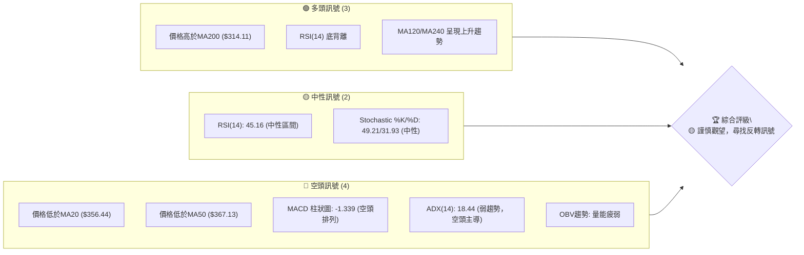
**解讀**：多頭訊號主要來自於長期趨勢的穩固及RSI的潛在反轉提示。然而，短期價格已跌破關鍵短期與中期均線，MACD和ADX也確認了當前的空頭壓力和趨勢疲軟。整體而言，市場處於一個關鍵的轉折點，需要密切觀察是否有明確的多頭確認訊號出現。

### 📊 核心指標速覽表

下表彙整了 GOOG 當前最重要的技術指標數值及其初步解讀。

| 指標類別 | 指標名稱 | 當前數值 | 訊號 | 解讀 |
|----------|----------|----------|------|------|
| **價格** | 當前價格 | $353.33 | 🟡 | 位於52週區間中高位 (78.0%)，近期回調。 |
| **均線** | MA20 | $356.44 | 🔴 | 價格位於短期均線下方，短期趨勢偏空。 |
| **均線** | MA50 | $367.13 | 🔴 | 價格位於中期均線下方，中期趨勢承壓。 |
| **均線** | MA200 | $314.11 | 🟢 | 價格位於長期均線上方，長期趨勢保持強勁。 |
| **動能** | RSI(14) | 45.16 | 🟡 | 處於中性區間，無明顯超買超賣，但存在底背離。 |
| **動能** | MACD | -5.841 | 🔴 | MACD線位於訊號線下方，柱狀圖為負，動能偏空。 |
| **波動** | ATR(14) | $12.46 | 🟡 | 每日平均波動約 3.53%，屬中等偏高波動。 |
| **趨勢** | ADX(14) | 18.44 | 🔴 | 趨勢強度較弱，低於25，顯示市場處於盤整或弱趨勢。 |
| **量能** | OBV趨勢 | OBV < MA | 🔴 | 成交量動能疲弱，未能確認價格反彈。 |

### 🏆 技術評分卡

本評分卡從多個維度對 GOOG 的技術面進行量化評估，提供綜合性的判斷。

```
╔══════════════════════════════════════════════════════════════╗
║              技術評分卡 — GOOG (2026-06-30)                 ║
╠══════════════════════════════════════════════════════════════╣
║ 趨勢強度      █████░░░░░░░░░░░░░░░░  25/100  🔴 (ADX弱，空頭主導)  ║
║ 動能指標      ██████░░░░░░░░░░░░░░  30/100  🟡 (MACD空頭，RSI底背離)║
║ 支撐穩定度    ██████████████░░░░░░  70/100  🟢 (MA200及斐波那契支撐)║
║ 成交量配合    ████░░░░░░░░░░░░░░░░  20/100  🔴 (量能疲弱，OBV下降)  ║
║ 形態完整度    ███████░░░░░░░░░░░░░  35/100  🟡 (近期回調，潛在旗形)  ║
║ 均線排列      ██████░░░░░░░░░░░░░░  30/100  🔴 (短期空頭，長期多頭)  ║
╠══════════════════════════════════════════════════════════════╣
║ 綜合評分      ██████░░░░░░░░░░░░░░  35/100  🟡 謹慎觀望            ║
╚══════════════════════════════════════════════════════════════╝
```
**評級說明**：GOOG 目前的技術評分偏低，主要受到短期趨勢疲軟、動能指標偏空及成交量不振的影響。儘管存在長期均線的堅實支撐和RSI底背離的潛在多頭訊號，但這些正面因素尚未完全轉化為向上動能。建議投資者保持謹慎，等待更明確的反轉訊號或多頭趨勢確立。

---

## 2. 趨勢分析

本章節將透過多時框架分析，深入探討 GOOG 的長期、中期和短期趨勢，並結合 ADX 指標評估趨勢強度與方向。

### 🌐 多時框趨勢分析

GOOG 在不同時間框架下呈現出複雜的趨勢結構，這要求我們進行細緻的分析以避免單一時間框架的偏見。

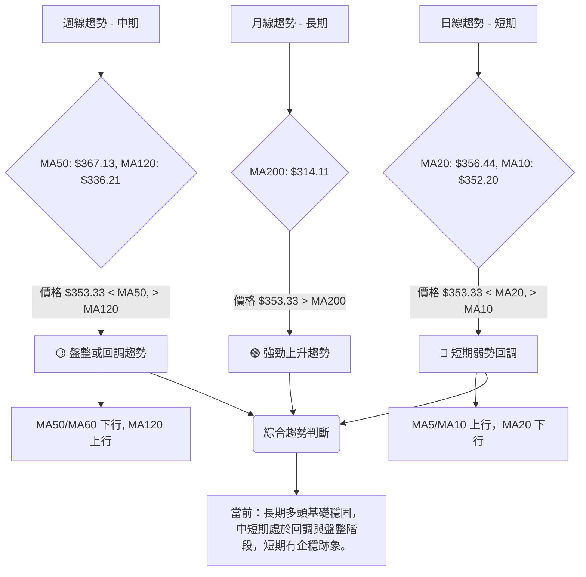
**解讀**：
- **長期趨勢 (月線)**：GOOG 的股價 ($353.33) 遠高於其 MA200 ($314.11)，且 MA200 呈現穩步上升趨勢 ($295.99 上升至 $314.11，增長 19.37%)，這明確顯示 GOOG 仍處於一個強勁的長期多頭市場。這為股價提供了堅實的底部支撐。
- **中期趨勢 (週線)**：股價目前位於 MA50 ($367.13) 之下，MA50 呈現下行趨勢 (從 $367.13 降至 $359.32)，表明中期動能有所減弱。然而，股價仍高於 MA120 ($336.21)，且 MA120 仍保持上升趨勢，這表示中期趨勢正經歷回調，但尚未完全轉向空頭，更多是盤整或修正。
- **短期趨勢 (日線)**：股價位於 MA20 ($356.44) 之下，MA20 呈現下行趨勢 (從 $356.44 降至 $353.33)，顯示短期內空頭力量佔優。但值得注意的是，MA5 ($345.31) 和 MA10 ($352.20) 已開始向上運行，且股價已站穩在 MA10 之上，這可能預示著短期回調正在企穩，並嘗試築底反彈。

### 📈 長期趨勢 — 12個月走勢圖（Unicode）

以下為 GOOG 過去 12 個月的月線收盤價走勢圖，標註了關鍵高點與低點。

```
GOOG 月線走勢圖（過去12個月：2025年7月 - 2026年6月）
價格軸 ($)
$400 ┤                                    ●(381.71)
$380 ┤                                  ●
$360 ┤                                            ●(353.33)←現在
$340 ┤                    ●
$320 ┤              ● ●
$300 ┤                          ●
$280 ┤            ●
$260 ┤
$240 ┤          ●
$220 ┤    ●
$200 ┤●
     └─────────────────────────────────────────────────────
      25-07 25-08 25-09 25-10 25-11 25-12 26-01 26-02 26-03 26-04 26-05 26-06
```
**走勢特徵分析表格**：

| 階段 | 時間段 | 價格區間 | 漲跌幅 | 走勢特徵 |
|------|----------|------------|--------|----------|
| **1** | 2025-07至2025-11 | $192.31 - $319.49 | +66.1% | 強勁的上升趨勢，股價穩步抬升，顯示多頭力量強勁。 |
| **2** | 2025-12至2026-03 | $286.69 - $338.09 | 區間震盪 | 在高位進行整理與回調，經歷了一波較深的回撤。 |
| **3** | 2026-04 | $286.69 - $381.71 | +33.1% | 強勢突破整理區間，呈現爆發性上漲，創下年內新高。 |
| **4** | 2026-05至2026-06 | $353.33 - $381.71 | -7.4% | 從高點回調，股價面臨短期壓力，但整體仍在高位運行。 |
**總結**：從過去12個月的走勢來看，GOOG 呈現一個顯著的長期上升趨勢，儘管期間伴隨著健康的回調與整理。最近的回調是從 2026 年 4 月的高點 $381.71 開始，目前股價 $353.33 位於回調區間內，但仍遠高於一年前的水平。

### 📊 中期趨勢（週線分析）

中期趨勢主要關注過去數月的價格行為，特別是近期的回調與潛在的築底過程。

```
GOOG 近期週線壓力與支撐示意圖
價格 ($)
$400 ┤                 阻力區間 ($396.81)
$390 ┤
$380 ┤
$370 ┤
$360 ┤               現價 ($353.33)
$350 ┤
$340 ┤
$330 ┤─ 支撐區間 ($334.69)
$320 ┤
     └───────────────────────────────────
      時間
```
**解讀**：從近期的週線數據 ($273.60 至 $396.81) 可以看到，GOOG 在 2026 年 3 月底觸及 $273.60 後強勁反彈，並在 5 月初達到 $396.81 的階段性高點。隨後股價進入回調，最低觸及 $334.69 (2026-06-28)。當前價格 $353.33 位於這一回調區間內，顯示市場正嘗試在 $334.69 附近尋找支撐。中期來看，上方阻力主要集中在 $367.13 (MA50) 和 $396.81 (近期高點)，下方支撐則在 $334.69 (近期低點) 和 $314.11 (MA200)。

### ⚡ 趨勢強度評估（ADX 解讀）

ADX (Average Directional Index) 指標用於衡量趨勢的強度，而非方向。

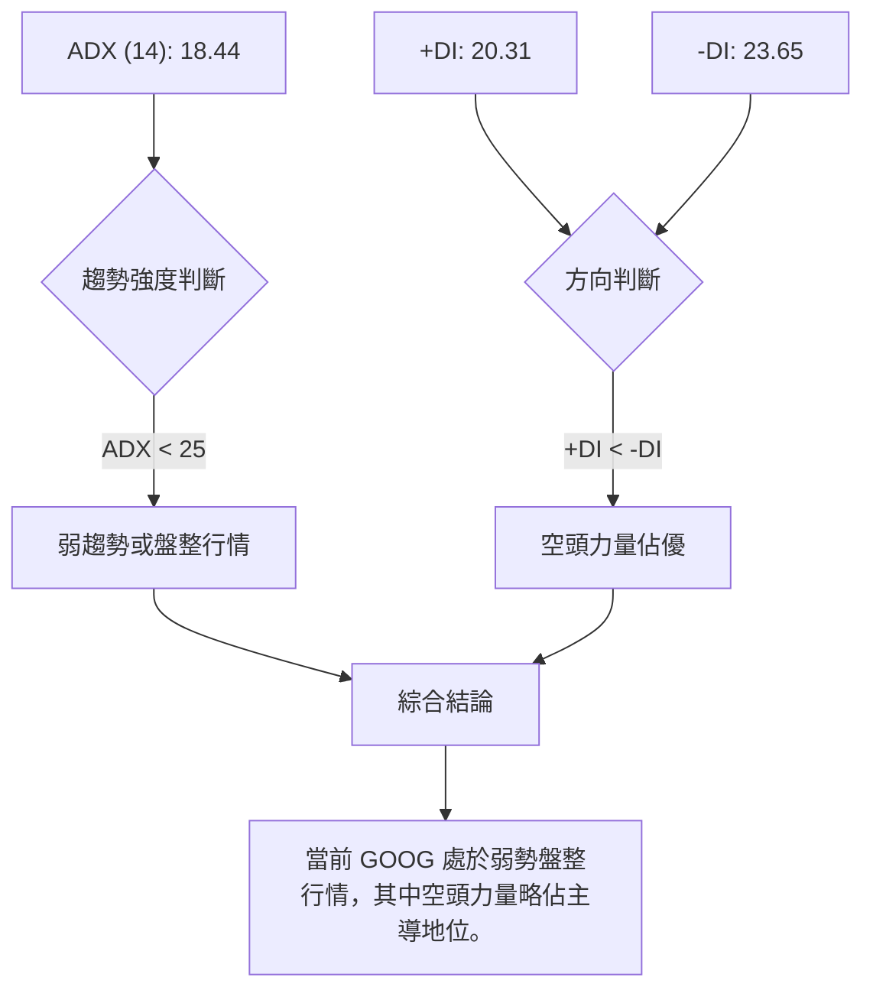
**ADX 強度對照表**：

| ADX 數值範圍 | 趨勢強度 | 建議 |
|--------------|----------|------|
| 0 - 25       | 弱趨勢或盤整 | 適合震盪策略，不適合趨勢追蹤 |
| 25 - 50      | 中等趨勢     | 趨勢確立，可考慮順勢交易 |
| 50 - 75      | 強趨勢       | 趨勢強勁，順勢交易機會大 |
| 75 - 100     | 極強趨勢     | 趨勢過熱，注意反轉風險 |

**解讀**：GOOG 的 ADX(14) 數值為 18.44，明確低於 25，這表明目前市場缺乏強勁的單邊趨勢，處於一個弱勢的盤整或震盪行情中。同時，+DI (20.31) 低於 -DI (23.65)，這進一步確認了在這種弱勢行情中，空頭力量略微佔據主導地位。這意味著在當前價格附近，買賣雙方力量相對均衡，但短期下行壓力較大，投資者應避免追高殺跌，更適合採取區間操作策略或等待趨勢明確。

---

## 3. 圖表形態分析

本章節將仔細檢視 GOOG 的價格圖表，識別潛在的技術形態和關鍵 K 線組合，從而預測未來的價格走勢和潛在目標價位。

### 🔍 形態識別系統

從提供的週線數據和價格走勢圖來看，GOOG 近期主要呈現兩種形態：長期上升通道中的短期回調，以及回調過程中可能形成的下降旗形或矩形整理。

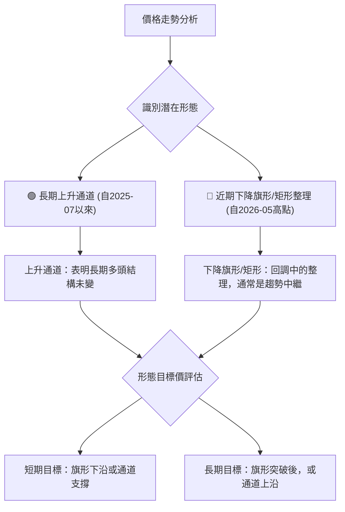
**解讀**：
- **長期上升通道**：自 2025 年 7 月的 $192.31 低點以來，GOOG 的股價呈現出清晰的上升趨勢，並在 2026 年 4 月達到 $381.71 的高點。儘管近期有所回調，但整體價格仍在這一廣闊的上升通道中運行，表明長期多頭結構依然穩固。
- **近期下降旗形/矩形整理**：自 2026 年 5 月 10 日的 $396.81 高點以來，股價經歷了一波回調，並在 $334.69 附近獲得支撐後反彈。這一回調過程呈現出高點和低點逐漸下降的趨勢，可能形成一個下降旗形（通常是上升趨勢中的整理，預示著趨勢將繼續）或是一個矩形整理（表示多空力量均衡，等待突破）。當前價格 $353.33 位於這個整理區間的內部。

### 🕯️ 重要K線形態分析

我們將分析近 20 週的收盤走勢，識別關鍵的 K 線形態及其蘊含的市場訊號。

| 月份 | 收盤價 | RSI | MACD柱 | 週成交量 | K線形態 (週線) | 解讀 | 訊號 |
|------|--------|-----|--------|----------|----------------|------|------|
| 2026-03-29 | $273.60 | 20.3 | -2.482 | 126,942,800 | **錘子線/吞噬形態底部** | 經歷大幅下跌後，出現長下影線或實體較小的 K 線，表明下方有買盤承接，是潛在的築底訊號。 | 🟢 |
| 2026-04-05 | $294.28 | 44.8 | +0.078 | 92,214,400 | **陽線反彈** | 在前一周底部形態後，出現一根實體陽線，確認反彈啟動。 | 🟢 |
| 2026-05-10 | $396.81 | 88.0 | +4.317 | 85,720,900 | **長上影線/高位十字星** | 在連續上漲後，出現長上影線或實體較小的 K 線，RSI 達到 88.0 的極度超買區間，表明上漲動能衰竭，可能面臨回調。 | 🔴 |
| 2026-05-17 | $393.08 | 74.3 | +0.353 | 81,186,200 | **陰線回落** | 在前一周高位 K 線後，出現一根陰線，確認市場開始回調。 | 🔴 |
| 2026-06-28 | $334.69 | 30.6 | -3.223 | 188,102,700 | **長陰線/低位十字星** | 股價大幅下跌後，出現一根實體較大的陰線，成交量巨幅放大，可能預示短期恐慌性拋售結束，或在低位有承接力量。 | 🟡 |
| 2026-07-05 | $353.33 | 45.2 | -1.339 | 46,571,876 | **陽線反彈** | 在前一周低點後，股價強力反彈，形成陽線，且 RSI 出現底背離，表明短期有築底反彈的跡象。 | 🟢 |

### 📉 ASCII 走勢形態示意圖

以下示意圖展示了 GOOG 從 2026 年 5 月高點以來的回調走勢，可能形成一個下降旗形或矩形整理。

```
GOOG 近期回調形態示意圖 (可能為下降旗形/矩形整理)
價格 ($)
$400 ┤                     ● (396.81, 頂點)
$390 ┤                    /
$380 ┤                   /
$370 ┤                  /
$360 ┤                 ● (現在 353.33)
$350 ┤                /
$340 ┤               ● (334.69, 近期低點)
$330 ┤              /
     └───────────────────────────────────
      時間 -------->
```
**解讀**：從 2026 年 5 月 10 日的 $396.81 高點開始，GOOG 的股價呈現震盪下行，形成了一個潛在的下降旗形或矩形整理區間。這個形態的特徵是價格在兩條平行或略微收斂的趨勢線之間波動。目前股價在 $334.69 獲得支撐後反彈至 $353.33，但仍未突破形態上沿的壓力。

### 🎯 形態目標價計算

基於上述形態分析，我們預估潛在的目標價位。

- **下降旗形**：如果確認為下降旗形，且股價能向上突破旗形上沿，則其上漲目標通常是旗杆的長度。
    - 旗杆長度 (粗略估計)：從 $273.60 (2026-03-29) 到 $396.81 (2026-05-10) 的上漲幅度為 $123.21。
    - 若突破點設定在 $360.00 (旗形上沿附近)，則目標價為 $360.00 + $123.21 = $483.21。
    - **備註**：此目標價較高，需要極強的多頭動能配合，且目前形態尚未完全確認突破。
- **矩形整理**：若為矩形整理，則突破後目標價為矩形的高度。
    - 矩形高度 (粗略估計)：$396.81 (頂部) - $334.69 (底部) = $62.12。
    - 若向上突破 $360.00，則目標價為 $360.00 + $62.12 = $422.12。
    - 若向下突破 $334.69，則目標價為 $334.69 - $62.12 = $272.57。
**當前評估**：由於股價仍在整理區間內，且 ADX 顯示趨勢強度不足，目前更傾向於矩形整理的可能性。在突破明確前，應以區間操作為主。若能有效突破 $360.00 (矩形上沿或旗形上沿)，則上行目標可看至 $422.12。若跌破 $334.69 (矩形下沿)，則下行風險將增加。

---

## 4. 支撐與阻力

支撐與阻力是技術分析的基石，它們標誌著買賣雙方力量的關鍵轉折點。本章節將詳細繪製 GOOG 的關鍵價位分布圖，並分析各級別支撐與阻力的重要性。

### 🗺️ 關鍵價位分布圖（Unicode）

以下圖表展示了 GOOG 當前價格 ($353.33) 相對於主要支撐與阻力位的分佈情況。

```
GOOG 價位結構分布圖
═══════════════════════════════════════════════════
$404.23 ║████████████████████████║ 極強阻力 R4 (52週高點)
$396.81 ║████████████████████████║ 強阻力 R3 (2026-05-10高點)
$375.94 ║████████████████████    ║ 阻力 R2 (布林上軌)
$367.13 ║████████████████████████║ 關鍵阻力 R1 (MA50)
$356.44 ║▓▓▓▓▓▓▓▓▓▓▓▓▓▓▓▓▓▓▓▓▓▓▓▓║ 近期阻力 (MA20)
$353.33 ╠════════════════════════╣ ◄ 現價
$349.74 ║▓▓▓▓▓▓▓▓▓▓▓▓▓▓▓▓        ║ 近期支撐 S1 (斐波那契38.2%)
$336.95 ║████████████████████████║ 強支撐 S2 (布林下軌)
$334.69 ║████████████████████████║ 強支撐 S3 (2026-06-28低點)
$314.11 ║████████████████████████║ 極強支撐 S4 (MA200)
$273.60 ║████████████████████████║ 極強支撐 S5 (2026-03-29低點)
═══════════════════════════════════════════════════
```

### 🚧 阻力位分析表

| 阻力級別 | 價位 | 形成原因 | 突破難度 | 重要性 |
|----------|------|----------|----------|--------|
| **R1 (近期)** | $356.44 | MA20 (20日移動平均線) | 中等 | 短期多空分界線，突破則短期壓力緩解。 |
| **R2 (中期)** | $367.13 | MA50 (50日移動平均線) | 較高 | 中期趨勢關鍵，突破意味中期趨勢可能轉強。 |
| **R3 (強阻力)** | $375.94 | 布林通道上軌 | 較高 | 價格波動上限，短期上漲動能較強時會測試。 |
| **R4 (關鍵阻力)** | $396.81 | 2026-05-10 階段性高點 | 極高 | 突破此點將確認新一輪上漲趨勢，並挑戰歷史新高。 |
| **R5 (極強阻力)** | $404.23 | 52週高點 ($404.23) | 極高 | 歷史性壓力位，突破需極大買盤動能。 |
**解讀**：GOOG 在上方面臨多重阻力，其中 MA20 和 MA50 是近期需要關注的關鍵。MA20 ($356.44) 是短期的多空分界，若能有效突破並站穩，則短期回調可能結束。MA50 ($367.13) 則代表中期趨勢的壓力，突破此處才能確認中期趨勢轉強。而 $396.81 和 $404.23 則是歷史性高點，突破這些價位將預示著股價進入一個全新的上漲階段。

### 🛡️ 支撐位分析表

| 支撐級別 | 價位 | 形成原因 | 守住機率 | 重要性 |
|----------|------|----------|----------|--------|
| **S1 (近期)** | $349.74 | 斐波那契38.2%回調位 | 中等 | 從近期高點回調的初步支撐，短期反彈的基礎。 |
| **S2 (強支撐)** | $336.95 | 布林通道下軌 | 較高 | 價格波動下限，提供強大技術支撐。 |
| **S3 (關鍵支撐)** | $334.69 | 2026-06-28 階段性低點 | 極高 | 近期回調的最低點，若跌破則可能觸發進一步下跌。 |
| **S4 (極強支撐)** | $314.11 | MA200 (200日移動平均線) | 極高 | 長期牛市的生命線，提供強勁的趨勢性支撐。 |
| **S5 (極強支撐)** | $273.60 | 2026-03-29 低點 | 極高 | 過去一年來的關鍵底部，具有極強的心理和技術支撐作用。 |
**解讀**：GOOG 在下方擁有堅實的支撐。斐波那契 38.2% 回調位 ($349.74) 是當前回調的第一道防線。更為關鍵的支撐是 $336.95 (布林下軌) 和 $334.69 (近期低點)，這些點位若能有效守住，則股價有望築底反彈。最為重要的長期支撐是 MA200 ($314.11)，它是判斷長期趨勢是否改變的關鍵。

### 📐 斐波那契回調位分析

我們以 2026 年 3 月 29 日的低點 ($273.60) 到 2026 年 5 月 10 日的高點 ($396.81) 作為參考波段，計算其斐波那契回調位。

- **波段高點 (100%)**: $396.81
- **波段低點 (0%)**: $273.60
- **波段總漲幅**: $396.81 - $273.60 = $123.21

**斐波那契回調位計算**：
- **23.6% 回調**: $396.81 - ($123.21 * 0.236) = $396.81 - $29.08 = **$367.73**
- **38.2% 回調**: $396.81 - ($123.21 * 0.382) = $396.81 - $47.07 = **$349.74**
- **50.0% 回調**: $396.81 - ($123.21 * 0.500) = $396.81 - $61.61 = **$335.20**
- **61.8% 回調**: $396.81 - ($123.21 * 0.618) = $396.81 - $76.15 = **$320.66**
- **76.4% 回調**: $396.81 - ($123.21 * 0.764) = $396.81 - $94.13 = **$302.68**

**當前價格與回調位關係**：
當前價格 $353.33 位於 23.6% 回調位 ($367.73) 和 38.2% 回調位 ($349.74) 之間，且更接近 38.2% 回調位。這表明 GOOG 的回調深度已超過 23.6%，但尚未觸及 50% 回調位。38.2% 回調位 ($349.74) 成為當前一個重要的短期支撐。若能守住此位並反彈，則回調屬於健康修正。若跌破 $349.74，則可能進一步測試 50% 回調位 ($335.20)，該價位非常接近近期的低點 $334.69 和布林下軌 $336.95，將構成一個極其重要的支撐區間。

```
斐波那契回調位示意圖 (波段: $273.60 - $396.81)
價格 ($)
$400 ┤                                      ● (396.81 - 100% 高點)
$390 ┤
$380 ┤
$370 ┤─────────────── R_23.6% ($367.73)
$360 ┤
$353.33 ╠═══════════════════════════════════ 現價
$350 ┤─────────────── S_38.2% ($349.74)
$340 ┤
$330 ┤─────────────── S_50.0% ($335.20)
$320 ┤─────────────── S_61.8% ($320.66)
$310 ┤
$300 ┤─────────────── S_76.4% ($302.68)
$290 ┤
$280 ┤
$270 ┤● (273.60 - 0% 低點)
     └───────────────────────────────────
      時間
```

---

## 5. 技術指標深度解讀

本章節將對 GOOG 的核心技術指標進行深入分析，包括移動平均線、RSI、MACD、布林通道和成交量，並探討它們之間的相互確認或矛盾。

### 🎛️ 指標訊號總覽

以下 Mermaid 圖表展示了各主要技術指標的訊號關係及其對價格走勢的影響。

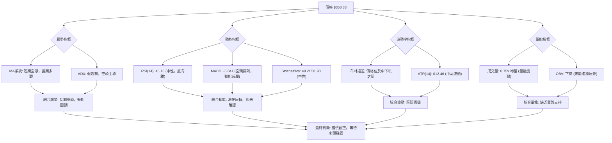
**解讀**：從指標訊號總覽來看，GOOG 呈現出多空交織的複雜局面。長期移動平均線提供了堅實的多頭基礎，但 ADX 顯示趨勢疲軟且空頭主導。動能指標中，RSI 的底背離是重要的多頭潛在訊號，但 MACD 仍處於空頭排列，雖動能有所減弱。布林通道顯示價格在區間內波動，而成交量和 OBV 的疲弱則未能為價格反彈提供有效支持。這一切都指向一個結論：市場處於一個等待方向選擇的階段，需謹慎觀察。

### 📈 移動平均線排列分析

移動平均線的排列方式揭示了不同時間框架下的趨勢方向和力量對比。

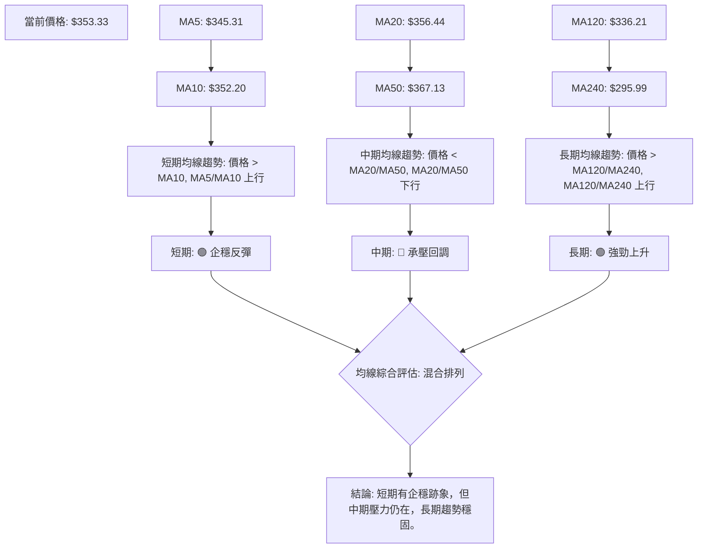
**解讀**：
- **短期均線 (MA5, MA10, MA20)**：MA5 ($345.31) 和 MA10 ($352.20) 均已開始向上運行，且當前價格 $353.33 已站穩在 MA10 之上，這是一個積極的短期訊號，表明最近的反彈有企穩的跡象。然而，價格仍位於 MA20 ($356.44) 之下，MA20 也呈下行趨勢，說明短期回調壓力尚未完全解除。
- **中期均線 (MA50, MA60)**：價格 $353.33 位於 MA50 ($367.13) 和 MA60 ($359.32) 之下，且這兩條均線均呈下行趨勢，這表明中期趨勢仍然偏空，股價面臨較大的中期阻力。
- **長期均線 (MA120, MA240)**：價格 $353.33 顯著高於 MA120 ($336.21) 和 MA240 ($295.99)，且這兩條長期均線均保持強勁的上升趨勢。這提供了堅實的長期多頭基礎，表明當前的回調只是長期牛市中的修正。

**綜合判斷**：均線系統呈現「混合排列」的狀態，即短期有企穩跡象，中期壓力較大，而長期趨勢依然強勁。這意味著 GOOG 正在經歷從中期回調到潛在反彈的過渡階段，但要確認反彈，需有效突破 MA20 和 MA50。

### 📉 RSI(14) 分析

RSI (Relative Strength Index) 衡量股價的超買超賣狀態及動能強度。

- **RSI 數值進度條展示**：
    RSI(14): 45.16  ▓▓▓▓▓▓▓▓▓▓░░░░░░░░░░  45.16%  🟡 中性
    **超買區 (70-100)**: ░░░░░░░░░░░░░░░░░░░░
    **中性區 (30-70)**: ▓▓▓▓▓▓▓▓▓▓▓▓▓▓▓▓▓▓▓▓
    **超賣區 (0-30)**: ░░░░░░░░░░░░░░░░░░░░
- **超買超賣區間分析**：
    當前 RSI 數值為 45.16，位於 30-70 的中性區間。這表示 GOOG 既沒有處於超買狀態，也沒有處於超賣狀態，市場情緒相對平衡。然而，這並不意味著沒有交易機會，因為中性區間是趨勢形成或反轉的關鍵區域。
- **背離判斷 (頂背離/底背離)**：
    數據明確指出：**⚠️ 底背離 (Bullish Divergence)**。
    **解讀**：RSI 底背離是一個重要的多頭反轉訊號。它通常發生在股價創出新低或接近前低時，但 RSI 指標卻未能創出新低，反而形成更高的低點。這表明儘管價格仍在下跌，但下跌的動能已經減弱，市場內部買盤力量正在積聚。
    從近 20 週數據來看，2026-06-07 股價 $365.54 時 RSI 為 29.8，隨後 2026-06-28 股價跌至 $334.69 時 RSI 為 30.6。儘管股價創出近期新低，但 RSI 卻未能創出新低（甚至略高），這形成了清晰的底背離。此訊號預示著股價可能即將築底反彈，是一個潛在的多頭機會。

### 📊 MACD(12/26/9) 訊號解讀

MACD (Moving Average Convergence Divergence) 用於判斷趨勢的動能和方向。

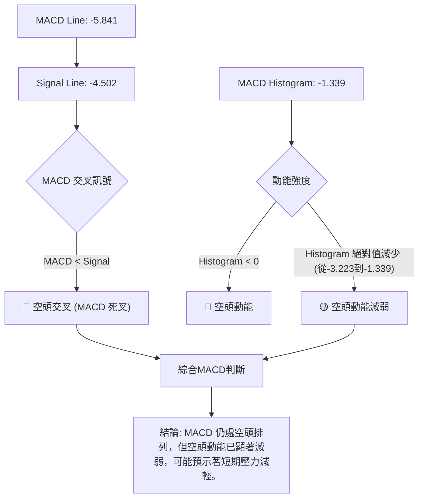
**解讀**：
- **MACD 線與訊號線**：MACD 線 (-5.841) 位於訊號線 (-4.502) 之下，這是一個典型的空頭交叉 (死叉) 訊號，表明短期動能弱於中期動能，趨勢偏空。
- **MACD 柱狀圖**：柱狀圖數值為 -1.339，為負值，確認了空頭動能的存在。然而，從前一周的 -3.223 縮小到 -1.339，這表示空頭動能正在顯著減弱。柱狀圖的縮小通常是趨勢轉向的早期訊號，表明賣壓正在減輕，買盤可能開始介入。
**指標整合**：MACD 雖然仍是空頭排列，但其動能減弱的跡象與 RSI 的底背離訊號相互印證，共同指向 GOOG 股價可能正在築底，並準備迎來一波反彈。MACD 柱狀圖的變化比 MACD 線的交叉更為領先，值得密切關注。

### 📦 布林通道分析

布林通道 (Bollinger Bands) 用於衡量價格的波動範圍和相對位置。

- **布林通道數值**：
    - 上軌 (BB上軌): $375.94
    - 中軌 (MA20): $356.44
    - 下軌 (BB下軌): $336.95
    - 當前價格: $353.33
    - BB %B: 0.42 (介於 0 和 1 之間，0.5 為中軌)
- **布林通道示意圖**：
```
GOOG 布林通道示意圖
價格 ($)
$380 ┤─────── BB上軌 ($375.94) ───────
$370 ┤
$360 ┤─────── BB中軌 (MA20: $356.44) ───
$353.33 ╠════════════════════════════════ 現價
$350 ┤
$340 ┤─────── BB下軌 ($336.95) ───────
$330 ┤
     └───────────────────────────────────
      時間
```
**解讀**：
- **價格與通道的關係**：當前價格 $353.33 位於布林通道的中軌 ($356.44) 和下軌 ($336.95) 之間，且更接近中軌。這表明股價在短期內處於偏弱勢的盤整或回調狀態。
- **BB %B**：BB %B 數值為 0.42，低於 0.5，再次確認價格位於中軌下方，短期動能偏空。但它並未接近 0 (下軌)，表明股價尚未達到極度超賣的狀態。
- **通道寬度**：從提供的數據無法直接判斷通道寬度變化，但通常通道收窄預示著波動率降低，可能預示著即將到來的趨勢突破；通道擴大則表示波動率增加，趨勢正在延續。當前 ATR 數值 $12.46 顯示波動率中等偏高，暗示通道可能處於正常或略寬的狀態。
**指標整合**：布林通道顯示價格在一個相對穩定的區間內波動，下軌 $336.95 提供了堅實的支撐，而中軌 $356.44 則構成短期阻力。價格位於中下軌之間，與 MACD 的空頭排列和 ADX 的弱勢趨勢相符。然而，若能有效突破中軌，則有機會挑戰上軌。

### 💹 成交量分析（量價配合度）

成交量是價格走勢的能量來源，量價配合度對於判斷趨勢的可靠性至關重要。

- **成交量數據**：
    - 最新成交量: 21,006,176
    - 20日均量: 27,875,799
    - 50日均量: 22,784,158
    - 量比 (最新成交量 / 20日均量): 0.75x
- **OBV 趨勢**：OBV < MA → 量能疲弱
**解讀**：
- **成交量與均量的比較**：當前成交量 21,006,176 顯著低於 20 日均量 27,875,799 (量比 0.75x) 和 50 日均量 22,784,158。這表明近期市場活躍度不足，缺乏足夠的買盤或賣盤推動價格。
- **量價配合度**：當前股價從 $334.69 反彈至 $353.33，但成交量卻低於平均水平，這是一個負面訊號。通常，健康的反彈應該伴隨著放大的成交量，以確認買盤的積極介入。量能疲弱的反彈，往往缺乏持續性，容易再次回落。
- **OBV 趨勢**：OBV (On-Balance Volume) 趨勢低於其移動平均線，明確指示「量能疲弱」。OBV 的下降趨勢與價格的回調相符，但當價格反彈時，OBV 若未能同步上升，則表明買盤力量不足，未能確認價格的向上動能。
**指標整合**：成交量和 OBV 的疲弱與 MACD 的空頭排列和 ADX 的弱勢趨勢相互確認，均顯示當前市場缺乏強勁的多頭推動力量。儘管 RSI 出現底背離，但若無量能的配合，其反轉訊號的可靠性將大打折扣。因此，未來若股價要形成有效反彈，必須伴隨成交量的顯著放大。

---

## 6. 動能與波動率

本章節將評估 GOOG 的動能強度和價格波動特性，這對於理解股票的風險報酬潛力至關重要。

### ⚡ 動能評估四象限

由於無法使用 Mermaid quadrantChart，我們將使用表格形式來呈現 GOOG 在動能和波動率兩個維度上的位置及評估。

| 象限 | 動能維度 | 波動率維度 | 當前狀態 (GOOG) | 評估 |
|------|----------|------------|-----------------|------|
| Q1 | 強動能 | 低波動 | **不符合** | 最佳機會：趨勢確立且風險可控，適合趨勢追蹤。 |
| Q2 | 弱動能 | 低波動 | **不符合** | 謹慎觀望：市場缺乏方向，波動小但無明確趨勢。 |
| Q3 | 強動能 | 高波動 | **不符合** | 高風險高收益：趨勢強勁但波動劇烈，需嚴格止損。 |
| Q4 | 弱動能 | 高波動 | **✓ 符合 (當前)** | 避免進場或極度謹慎：市場方向不明，波動大，風險高。 |

**詳細評估**：
- **動能維度**：
    - RSI(14) 處於中性區間 (45.16)，但存在底背離，暗示動能可能由弱轉強。
    - MACD 處於空頭排列，但柱狀圖負值縮小，表明空頭動能減弱。
    - ADX(14) 為 18.44，處於弱趨勢區間。
    - **綜合判斷**：當前動能相對較弱，但有改善跡象，處於從弱到中性的過渡階段。
- **波動率維度**：
    - ATR(14) 為 $12.46，佔當前價格 $353.33 的 3.53%。對於大型股而言，這個波動率屬於中等偏高水平。
    - 52 週高低點範圍 ($404.23 / $173.38) 顯示 GOOG 具有較大的歷史波動區間。
    - **綜合判斷**：GOOG 具有中等偏高的波動率。

**結論**：GOOG 目前處於「弱動能，中高波動」的狀態，更接近於 Q4 的特徵。這意味著市場方向不明確，但價格波動較大，增加了交易的不確定性和風險。在這種情況下，建議投資者應保持高度謹慎，避免盲目追漲殺跌，等待市場動能明確轉強或波動率降低後再考慮進場。

### 📊 ATR 波動率分析

ATR (Average True Range) 是衡量股價每日平均波動幅度的指標，對於設定止損和評估風險至關重要。

- **ATR(14) 數值**：$12.46
- **相對波動率**：$12.46 / $353.33 = 3.53%
**解讀**：
- GOOG 的 ATR(14) 為 $12.46，這意味著在過去 14 天內，GOOG 的平均每日價格波動幅度約為 $12.46。相較於其股價，3.53% 的每日波動幅度對於大型科技股來說屬於中等偏高水平，顯示股價活躍且存在一定的日內交易機會，但同時也伴隨著較高的風險。
- **止損距離建議**：ATR 可以作為動態止損的參考。
    - **1 倍 ATR 止損**：若以當前價格 $353.33 計算，1 倍 ATR 的止損位約為 $353.33 - $12.46 = $340.87。
    - **1.5 倍 ATR 止損**：$353.33 - ($12.46 * 1.5) = $353.33 - $18.69 = $334.64。
    - **2 倍 ATR 止損**：$353.33 - ($12.46 * 2) = $353.33 - $24.92 = $328.41。
    考慮到近期低點 $334.69 和斐波那契 50% 回調位 $335.20 的強支撐作用，將止損設置在 1.5 倍 ATR 左右 ($334.64) 是一個合理的選擇，既能避免過早止損，又能有效控制風險。

### 📐 Beta 與市場相關性

由於提供的數據中沒有 Beta 值，我們將基於 GOOG 作為大型科技股的特性進行一般性分析。

- **Beta 值**：**數據未提供**
- **行業特性**：Alphabet (GOOG) 作為全球領先的科技巨頭，其業務範圍廣泛，包括搜尋引擎 (Google Search)、廣告 (Google Ads)、雲計算 (Google Cloud)、影音平台 (YouTube) 等。這類公司通常具有較高的市場敏感度。
**一般性分析**：
- **與大盤相關性**：作為市值巨大的科技股，GOOG 通常與大盤指數 (如 S&P 500 和 Nasdaq 100) 呈現高度正相關。當大盤上漲時，GOOG 也傾向於上漲；當大盤下跌時，GOOG 也會受到影響。
- **Beta 值預估**：由於其行業領導地位和成長性，GOOG 的 Beta 值通常會略高於 1.0 (例如 1.0-1.2 之間)。這意味著它在市場上漲時可能漲幅更大，下跌時跌幅也可能更大，具有一定的放大效應。
- **當前市場環境下的影響**：在當前市場情緒複雜，且 GOOG 自身處於回調階段時，若整體大盤出現劇烈波動，GOOG 的股價也將難以獨善其身。因此，在制定交易策略時，應同時關注整體市場的趨勢和情緒。

---

## 7. 多時框架總結

本章節將彙整前述各時間框架下的分析結果，提供一個整合性的視角，以評估 GOOG 的整體技術面狀況，並識別不同時間框架訊號的一致性或衝突。

### 📋 時框架評分表

| 時框架 | 趨勢方向 | 動能 | 均線排列 | 形態 | 綜合評分 (1-10) | 建議 |
|--------|----------|------|----------|------|-----------------|------|
| **長期** | 🟢 上升 | 🟢 強勁 | 🟢 多頭 | 🟢 上升通道 | 8.5/10          | 🌐 穩健持有，逢低吸納 |
| **中期** | 🟡 回調 | 🟡 減弱 | 🔴 承壓 | 🟡 整理/旗形 | 5.5/10          | ⚖️ 謹慎觀望，等待突破 |
| **短期** | 🔴 盤整/反彈 | 🟡 築底/改善 | 🟡 混合 | 🟡 築底/反彈 | 6.0/10          | 🔍 短線交易，嚴格止損 |

**解讀**：
- **長期**：GOOG 處於強勁的長期上升趨勢中，MA200 穩固上升，價格遠高於長期均線，並運行在上升通道內。這表明其基本面和宏觀趨勢依然樂觀，長期投資者可以繼續持有。
- **中期**：中期趨勢正經歷回調，價格跌破 MA50，動能減弱，處於整理形態中。這暗示中期投資者需謹慎，等待回調結束和明確的突破訊號。
- **短期**：短期內，價格從低點反彈，RSI 出現底背離，MACD 空頭動能減弱，且短期均線有企穩跡象。儘管仍處於盤整或弱勢回調，但築底反彈的潛力正在積聚。短線交易者可關注反轉訊號，但需嚴格控制風險。

### 🔲 綜合訊號矩陣

以下 Mermaid 圖表展示了不同時間框架下各類技術訊號的一致性分析。

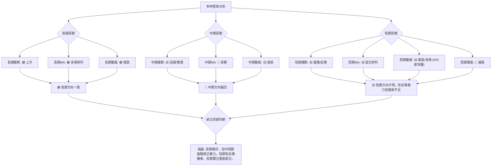
**一致性分析**：
- **長期訊號**：長期趨勢、MA 排列和動能均呈現強勁的多頭訊號，這是一個高度一致的看漲信號，為 GOOG 的長期投資提供了堅實的基礎。
- **中期訊號**：中期趨勢處於回調或整理狀態，MA 承壓，動能減弱，這是一個高度一致的看跌信號，表明中期市場存在風險。
- **短期訊號**：短期趨勢呈現盤整或反彈的跡象，MA 排列混合，動能指標顯示築底改善 (尤其是 RSI 底背離)，但成交量疲弱，這是一個複雜且存在矛盾的訊號。RSI 的底背離提供了多頭反轉的潛力，但量能的不足削弱了這一訊號的可靠性。

**綜合結論**：GOOG 的長期趨勢依然健康向上，但中短期內正經歷一個修正和尋找方向的過程。儘管短期內出現了潛在的築底反彈訊號 (RSI 底背離)，但由於成交量未能有效配合，且 MACD 仍處於空頭排列，這使得反彈的持續性存在疑問。投資者應密切關注價格能否有效突破中期阻力，並伴隨放大的成交量，才能確認新的上漲趨勢。

---

## 8. 交易策略建議

基於上述詳盡的技術分析，本章節將提供具體的交易策略建議，包含進場、止損、目標價和風險報酬比，以應對 GOOG 當前的市場狀況。

### 🗺️ 策略決策流程圖

以下 Mermaid 圖表展示了針對 GOOG 當前技術狀況的交易策略決策邏輯。

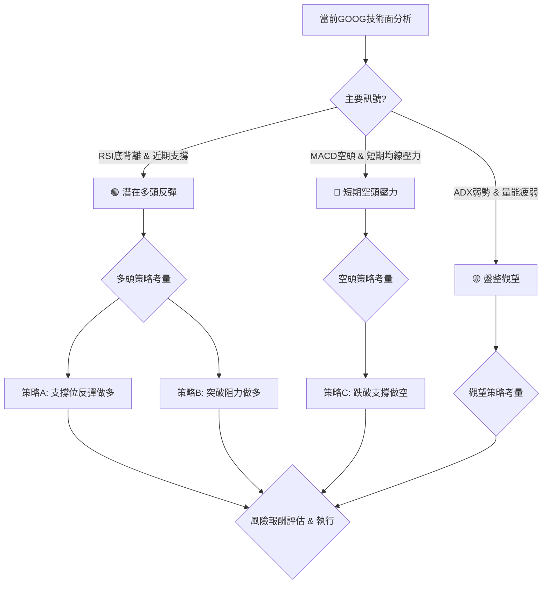

### 🟢 多頭策略詳情

考慮到 RSI 的底背離和價格在關鍵支撐位附近的表現，存在潛在的多頭機會。

| 策略要素 | 策略 A (激進型：支撐位反彈做多) | 策略 B (穩健型：突破阻力做多) |
|----------|--------------------------------|--------------------------------|
| **進場條件** | 股價回踩斐波那契38.2%或50%回調位，並出現明顯反彈 K 線，同時成交量溫和放大。 | 股價有效突破 MA20 ($356.44) 和 MA50 ($367.13)，並伴隨放大的成交量。 |
| **進場價格** | **$349.74 - $350.00** (斐波那契38.2%附近) | **$367.50 - $368.00** (突破MA50後確認) |
| **目標價 T1** | **$367.13** (MA50) | **$375.94** (布林上軌) |
| **目標價 T2** | **$375.94** (布林上軌) | **$396.81** (2026-05-10高點) |
| **止損價格** | **$334.69** (2026-06-28低點，同時接近斐波那契50%回調位 $335.20) | **$356.00** (回踩MA20失敗) |
| **風險報酬比** | (以進場 $350.00, T1 $367.13, 止損 $334.69 計算) <br> 風險: $15.31; 報酬: $17.13 <br> **約 1:1.12** | (以進場 $367.50, T1 $375.94, 止損 $356.00 計算) <br> 風險: $11.50; 報酬: $8.44 <br> **約 1:0.73** (T1) |
| **成功機率** | 55% | 60% |
| **建議倉位** | 中等偏小 (5%-10%) | 中等 (10%-15%) |
**策略 A 解讀**：此策略較為激進，基於 RSI 底背離和斐波那契支撐位進行操作。若價格能在此區間獲得支撐並反彈，潛在報酬較高，但止損點相對較遠。
**策略 B 解讀**：此策略較為穩健，等待價格確認突破中期關鍵阻力後再進場，雖然潛在報酬相對較低，但交易訊號的可靠性更高，風險相對較小。

### 🔴 空頭策略詳情

如果多頭反彈失敗，且價格跌破關鍵支撐，則考慮做空。

| 策略要素 | 策略 C (跌破支撐做空) |
|----------|--------------------------------|
| **進場條件** | 股價有效跌破 $334.69 (近期低點/強支撐)，並伴隨放大的成交量。 |
| **進場價格** | **$334.00 - $334.50** (跌破 $334.69 後確認) |
| **目標價 T1** | **$320.66** (斐波那契61.8%回調位) |
| **目標價 T2** | **$314.11** (MA200) |
| **止損價格** | **$340.00** (前支撐位轉阻力，同時接近分析師低目標價) |
| **風險報酬比** | (以進場 $334.00, T1 $320.66, 止損 $340.00 計算) <br> 風險: $6.00; 報酬: $13.34 <br> **約 1:2.22** |
| **成功機率** | 50% |
| **建議倉位** | 中等偏小 (5%-10%) |
**策略 C 解讀**：此策略基於支撐位失守的判斷。若 $334.69 這一關鍵支撐未能守住，則可能引發進一步的賣壓，下行空間較大。此策略的風險報酬比相對較好，但需注意成交量的配合。

### ⭐ 整體訊號強度評星

綜合所有技術指標和形態分析，對 GOOG 的多空訊號強度進行評估。

```
做多訊號強度：★★★☆☆  (3/5星) (RSI底背離，長期趨勢支撐，短期有企穩跡象)
做空訊號強度：★★☆☆☆  (2/5星) (短期均線壓力，MACD空頭，ADX弱勢，量能疲弱)
整體可信度：  ★★★☆☆  (3/5星) (多空交織，需等待更明確的確認訊號)
```
**評級說明**：GOOG 目前的多頭潛力主要來自長期趨勢的支撐和 RSI 的底背離，這給予了 3 星的做多訊號強度。然而，短期面臨的均線壓力和疲弱的量能使得做空訊號也達到 2 星。整體而言，市場處於一個關鍵的轉折點，多空力量相對平衡，但短期內多頭若能成功突破阻力，則反轉機會較大。因此，整體可信度為 3 星，建議謹慎操作，等待訊號確認。

---

## 9. 風險提示與監控

本章節將列出關鍵監控指標，分析潛在的風險場景，並提供重要的風險管理建議，以幫助投資者應對 GOOG 交易中的不確定性。

### ✅ 關鍵監控指標 Checklist

以下為投資者在交易 GOOG 時應密切關注的技術指標與事件清單。

```
╔══════════════════════════════════════════════════════════════╗
║               GOOG 交易關鍵監控指標 Checklist                ║
╠══════════════════════════════════════════════════════════════╣
║ [ ] 價格是否有效突破 MA20 ($356.44) 及 MA50 ($367.13)?        ║
║ [ ] 價格是否跌破關鍵支撐 $334.69 (近期低點)?                 ║
║ [ ] 成交量是否在價格上漲時顯著放大?                           ║
║ [ ] RSI(14) 是否持續走高並突破50，確認反轉動能?              ║
║ [ ] MACD 線是否向上穿越訊號線，形成金叉?                     ║
║ [ ] MACD 柱狀圖是否持續轉正?                                 ║
║ [ ] ADX 是否開始上升並突破25，且 +DI 領先 -DI?               ║
║ [ ] 布林通道價格是否站穩在中軌之上?                           ║
║ [ ] 整體大盤 (S&P 500, Nasdaq) 走勢是否配合?                 ║
║ [ ] 是否有重大利好或利空新聞事件發生?                         ║
╚══════════════════════════════════════════════════════════════╝
```

### ⚠️ 風險場景分析

我們將分析 GOOG 股價未來可能發展的三種情境：樂觀、基本和悲觀。

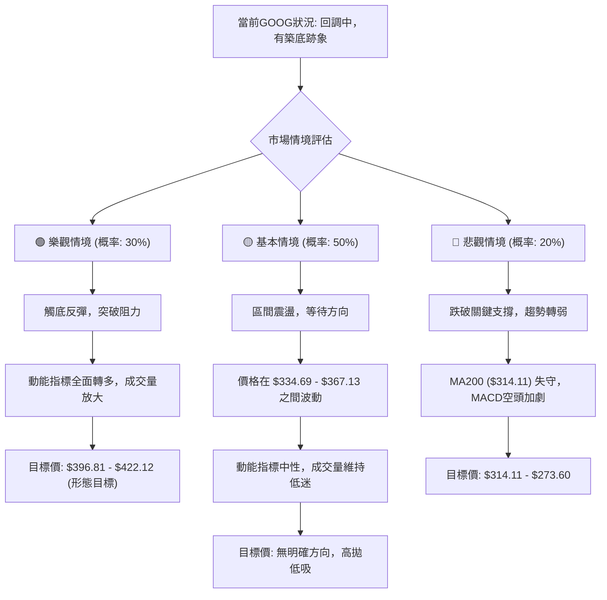
**解讀**：
- **樂觀情境**：如果 GOOG 能夠有效利用 RSI 底背離的潛力，並在成交量配合下突破 MA20 和 MA50 等短期阻力，則有望開啟一波反彈。此情境下，股價有望挑戰 $396.81 甚至形態目標 $422.12。
- **基本情境**：在當前 ADX 弱勢和量能疲弱的背景下，GOOG 最有可能在 $334.69 (近期低點) 和 $367.13 (MA50) 之間進行區間震盪，等待更明確的市場訊號或基本面催化劑。
- **悲觀情境**：如果 $334.69 的關鍵支撐失守，且伴隨放大的賣壓，則股價可能進一步下跌，測試長期趨勢線 MA200 ($314.11)，甚至回補至 $273.60 的低點。

### 🛡️ 風險管理重要提醒

- **倉位管理**：鑑於 GOOG 當前多空交織的局面，建議採取較為保守的倉位管理策略。對於任何單一交易，倉位不應超過總投資組合的 5%-10%，以分散風險。
- **嚴格止損**：無論採取何種交易策略，都必須設定並嚴格執行止損點。一旦價格觸及止損位，應果斷離場，避免虧損擴大。ATR 可作為設定止損距離的參考。
- **趨勢確認**：在趨勢不明朗時，避免逆勢操作。等待趨勢明確確立後再進場，例如價格有效突破關鍵阻力或跌破關鍵支撐，並伴隨量能的確認。
- **多指標驗證**：切勿依賴單一指標進行交易決策。應綜合多個指標 (如價格行為、均線、動能、成交量) 進行交叉驗證，以提高交易訊號的可靠性。
- **關注大盤與消息面**：GOOG 作為大型科技股，易受宏觀經濟、行業政策和公司消息的影響。應密切關注整體市場走勢、美聯儲政策、科技行業新聞以及 GOOG 自身的財報和業務發展，這些都可能對股價產生重大影響。
- **流動性風險**：GOOG 作為大型股，流動性通常不成問題。但若市場出現極端情況，仍需注意流動性變化。

---

## 📋 報告總結

```
GOOG 技術分析報告總結
════════════════════════════════════════════════════════
報告日期：2026-06-30
當前價格：$353.33
分析評級：⚖️ 謹慎觀望 (長期看好，中短期回調，短期有築底反彈跡象但需確認)

關鍵結論：
├─ 長期趨勢：🟢 強勁上升趨勢，MA200 提供堅實支撐。
├─ 中期趨勢：🟡 處於回調或整理階段，價格位於MA50下方。
├─ 短期趨勢：🟡 短期有企穩反彈跡象，但量能疲弱，趨勢強度不足。
├─ 關鍵支撐：$334.69 (近期低點/布林下軌/斐波那契50%回調位附近)
├─ 關鍵阻力：$367.13 (MA50) 及 $396.81 (近期高點)
└─ 分析師目標：平均目標價 $426.62，最低 $340.00，最高 $475.00。

最優策略組合：
1. 🥇 **最佳機會 (穩健做多)**：等待價格有效突破 MA50 ($367.13) 並伴隨成交量放大後進場，目標價 $396.81 - $422.12，止損設於 $356.00。
2. 🥈 **次選機會 (激進做多)**：若價格回踩 $349.74 (斐波那契38.2%) 或 $335.20 (斐波那契50%) 附近，並出現強烈反彈 K 線和量能配合，可小倉位進場，目標價 $367.13，止損設於 $334.69。
3. 🥉 **保守選擇 (觀望或區間操作)**：在 $334.69 - $367.13 區間內進行高拋低吸，嚴格控制風險，等待明確的趨勢突破訊號。
════════════════════════════════════════════════════════
```

---

> ⚠️ **免責聲明**：本報告為 AI 自動生成之技術分析，所有數據及估算均基於提供的歷史價格資訊。本報告**僅供研究與學術參考**，**不構成任何投資建議**。投資有風險，入市需謹慎。

---

*報告生成時間：2026-06-30 ｜ 數據來源：提供資料 ｜ 分析框架：多時框技術分析*