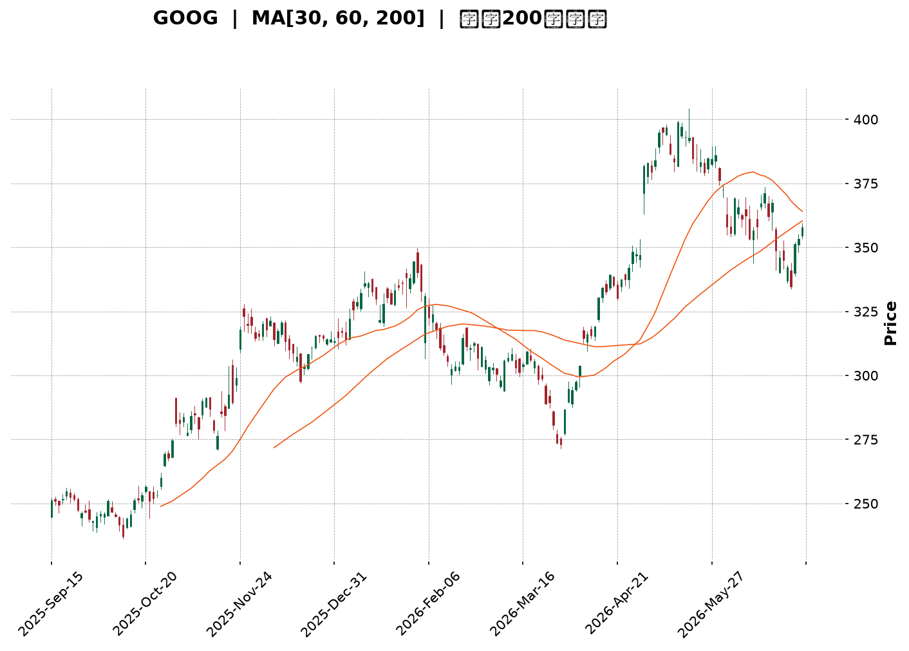
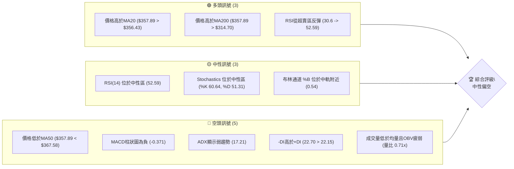
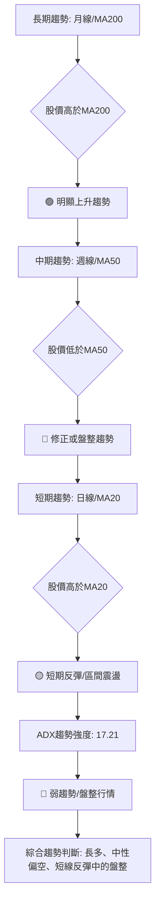
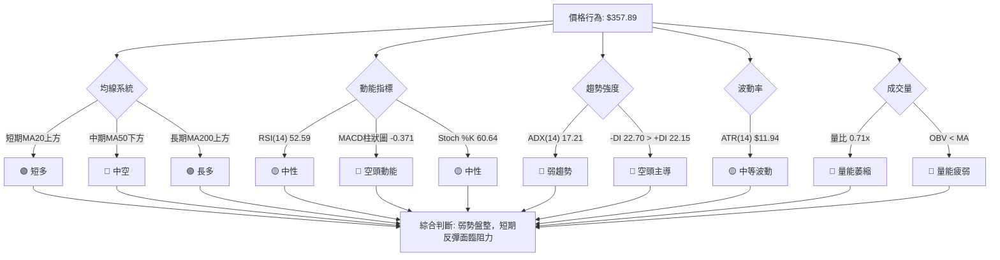
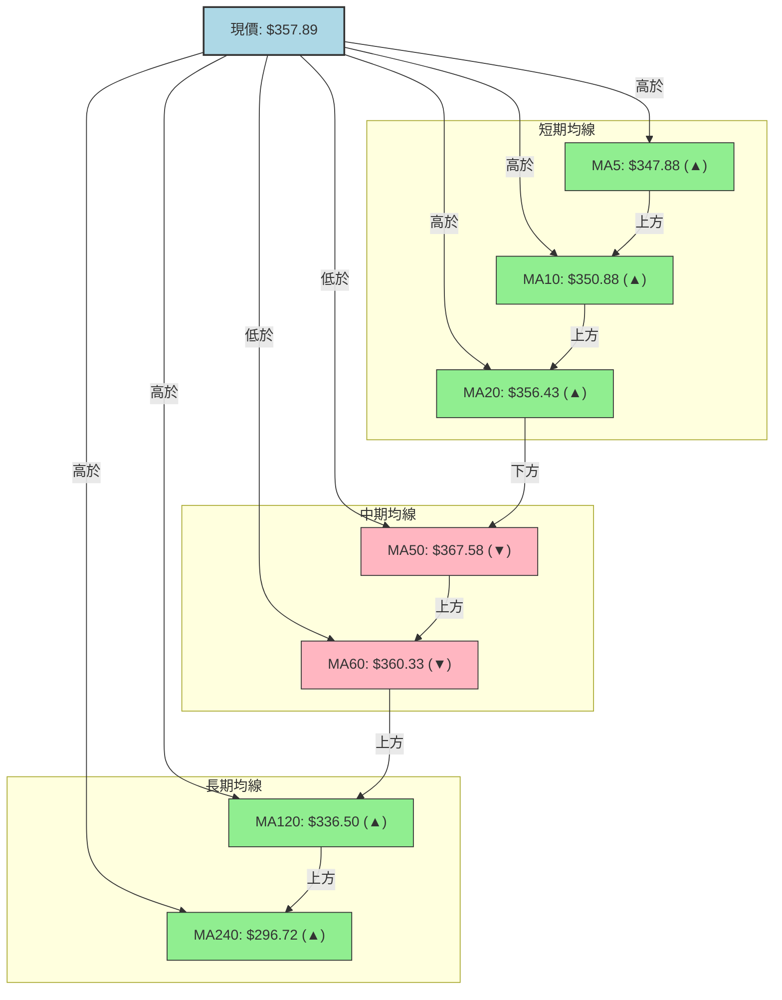
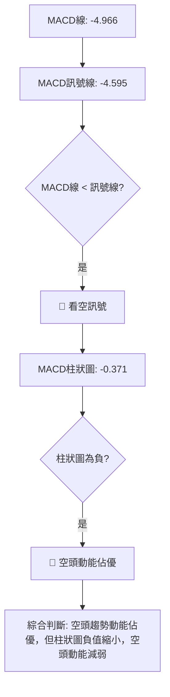

<details>
<summary>📊 靜態圖表 (點擊展開)</summary>

</details>

<html>
<head><meta charset="utf-8" /></head>
<body>
    <div style="height:500px; width:100%;">                        <script>window.PlotlyConfig = {MathJaxConfig: 'local'};</script>
        <script charset="utf-8" src="https://cdn.plot.ly/plotly-3.6.0.min.js" integrity="sha256-QaOVwtVY0T02VaHrr6pnoHLCwayMJp4O5n4YyaE3rJk=" crossorigin="anonymous"></script>                <div id="candlestick-chart" class="plotly-graph-div" style="height:100%; width:100%;"></div>            <script>                window.PLOTLYENV=window.PLOTLYENV || {};                                if (document.getElementById("candlestick-chart")) {                    Plotly.newPlot(                        "candlestick-chart",                        [{"close":{"dtype":"f8","bdata":"AAAAYI9ob0AAAACgs11vQAAAAGCPK29AAAAAwMN6b0AAAADgs9dvQAAAAIBUjG9AAAAAYBV7b0AAAADAC+tuQAAAACDOwm5AAAAAYEnWbkAAAAAgOXxuQAAAAKBaYm5AAAAA4OihbkAAAACAVb5uQAAAAAD5vm5AAAAAYJNgb0AAAADAsNRuQAAAAMBan25AAAAA4I43bkAAAABg0KBtQAAAAGAqhW5AAAAAQKu2bkAAAACg9mZvQAAAAKBkbG9AAAAAoGSpb0AAAACARghwQAAAAIAlW29AAAAA4CaBb0AAAAAAeqdvQAAAAKABQHBAAAAAYG7WcEAAAACAer5wQAAAAIAbKnFAAAAAoJOVcUAAAACgTJRxQAAAAAAHuXFAAAAAwEFYcUAAAACAFsNxQAAAAGCCzHFAAAAAIHJycUAAAABAWCByQAAAAGC1MnJAAAAAQOLtcUAAAAAAL2lxQAAAAOACR3FAAAAAQKnQcUAAAADgcMZxQAAAAGCrRnJAAAAAwJoWckAAAABgBbFyQAAAAGCN3XNAAAAAYBwwdEAAAACgdPpzQAAAAKDm93NAAAAAgA6oc0AAAADAbbZzQAAAAIDi\u002f3NAAAAAYEbcc0AAAADAWxd0QAAAAICioHNAAAAAYF3Vc0AAAAAgTAl0QAAAAGCmlHNAAAAAANZhc0AAAABgqU5zQAAAACBBNXNAAAAAgLyackAAAABAqPVyQAAAAOBQQ3NAAAAAYMduc0AAAADASbRzQAAAAOAgtHNAAAAAgMioc0AAAAAArZ9zQAAAAGA7onNAAAAAYD+Wc0AAAAAgia5zQAAAAIB+znNAAAAAYDuic0AAAADAJSB0QAAAAGBaWXRAAAAAIF6LdEAAAACAu8R0QAAAAODa\u002f3RAAAAAIPD9dEAAAACAmst0QAAAAMCKnnRAAAAAYNUbdEAAAAAgOX90QAAAACCIpnRAAAAAoAWAdEAAAABgedJ0QAAAAEAB6XRAAAAAQHX9dEAAAAAAfSN1QAAAAEBpIXVAAAAAwDKHdUAAAAAAFkR1QAAAAMB6znRAAAAAgFyudEAAAACA2ip0QAAAAECgP3RAAAAAQG3jc0AAAABgx25zQAAAAOB1T3NAAAAAIO4Zc0AAAAAgzOZyQAAAAKCx+HJAAAAAIJ\u002fyckAAAAAg06dzQAAAACCIdHNAAAAAYDpoc0AAAACA8YlzQAAAAID8K3NAAAAAgGBwc0AAAADgXB9zQAAAACCf8nJAAAAAIN3wckAAAADgRshyQAAAAECSnnJAAAAAIDcdc0AAAAAg7StzQAAAAIDAQ3NAAAAAIHHwckAAAACAddRyQAAAAGDKA3NAAAAAIJVTc0AAAAAg2iFzQAAAAOC8GHNAAAAAwMOpckAAAABAca1yQAAAAMBqEHJAAAAAIKcWckAAAABgI4lxQAAAAICGGXFAAAAAoJwPcUAAAADA\u002f+pxQAAAAOCPa3JAAAAAoIZkckAAAAAAspdyQAAAAID0+3JAAAAAoM+oc0AAAAAg4MJzQAAAAEB7uHNAAAAAwEnwc0AAAABAGaZ0QAAAACBN5HRAAAAAAB7JdEAAAABAIjN1QAAAACAs83RAAAAAAFekdEAAAAAgbhh1QAAAAOC\u002fGHVAAAAAYNNhdUAAAABA98R1QAAAAOCntHVAAAAAIJ6xdUAAAABAXdt3QAAAAADV73dAAAAAQJa2d0AAAAAgnwB4QAAAAABwrnhAAAAA4P6weEAAAACg+sx4QAAAAACZKHhAAAAAIG35d0AAAADAzOx4QAAAAODlznhAAAAAwFWReEAAAAAA+o14QAAAACCyCnhAAAAAILIKeEAAAABg1PN3QAAAAOBtsndAAAAAgLwJeEAAAACAkwl4QAAAAEA0HnhAAAAA4EGDd0AAAADAsUV3QAAAAIDKYnZAAAAAAHU3dkAAAAAgxBB3QAAAAOCj2HZAAAAAYLiSdkAAAADgo6R2QAAAAMAeFXZAAAAAwPVIdkAAAABgj2J2QAAAAIDC8XZAAAAAoJkxd0AAAACgmaF2QAAAACBc93ZAAAAA4HrMdUAAAACgR6F1QAAAAOCjkHVAAAAAQApjdUAAAABACut0QAAAAOB69HVAAAAAoEcVdkAAAACAPV52QA=="},"high":{"dtype":"f8","bdata":"ARmOoi2Ib0DAFK0egpdvQK6X79igbm9A1zyZPpK0b0AXizZtKgNwQJZBdQjg+W9An83SDrHIb0ArkuCJ4o5vQB50qS+Z2m5AlPO7wi40b0AJUbuU+2RvQKx1L59YZm5AMGAuM1TVbkADv6aQ0eRuQE0Zl4tO1G5ABhdM0Zx2b0BsCXCL2mFvQF4yfWfX2G5Au\u002fc6ZWOibkAtOZ23jYtuQB0MFQRYkG5Ar5QGGEbxbkC2JG1Mf4hvQLgdNMQ3EXBAYM1RiDTMb0BZ9u47AhZwQGTfKIIs3G9AF2O9jdQKcEAAL6bdgOtvQKs0hpnxX3BA5W1q51LkcEAA\u002fQ8dlu1wQDFPAtfhNnFAHRo6Ir41ckCVdzp5mdtxQIPc0SoX1nFAgfKU4oWUcUCSMj0gOuJxQP6jcrLrA3JAJaAjahi\u002fcUDk2nLHPC5yQP+cPDFKPHJA5zy+\u002f5s8ckBbF\u002f9SSa9xQOo4Cb2paXFAqZ1KBxpfckBpxdWk5g1yQPY+DCd6+nJAfqiKo6Ikc0C\u002f8iGX2PVyQPL661fK8nNAz8ug8m6AdEAWTdcCq0V0QBzbVXbZY3RARqGyXBPwc0DTgtbToN9zQFZaO3+PFnRAIynWpHgndECI9sDOJDN0QAoFtiL5DHRAsg2RX7Dkc0CwY3r5Mhd0QDAwp88dGXRAueZUlaO7c0D6tOfOq4RzQI7yvyACd3NAUjSa+qlMc0Ddmo8tyQ1zQEGt\u002f1djSXNA\u002fdqgBbF0c0C1co3vMb5zQOmUhg8JvnNAFHF3klnCc0B+OlqG8ahzQNEUfQmR1HNAAL4voKevc0AOS4KH4Sd0QJ5w4W5V7XNAq2x25z4SdEAHSneOn2B0QHapJgm9oXRAIDTqPcKwdEA\u002fkPF7DuB0QE6lhGATTHVAJhbIZnEJdUDh5u4OBRt1QK+ac+7W7HRA3UGd7ZZ6dECVbAYGp8R0QNUQ6ENc7HRAVQusUIHZdECHvPmek\u002f50QLcfbbBgHHVAmKOLqAcTdUAKM1cYfl11QG9BgNeIPXVA8ENZ1W6LdUCiyOubFtt1QAc3Lc7PfHVA\u002fMbSuVvDdEDcPe0RVqN0QAlBRQX\u002fdHRAT7mfNl0TdEB49jQxBAp0QN5I+X4SwXNA9vu1aMpHc0Ax+nnP3wdzQCGHTDgsGHNAINgLDBcac0A0yrzOi8VzQB6YHP6b8HNAjobNv2V\u002fc0BKWdWhApRzQMtCjNp2iXNA\u002fEGEZsN6c0AU2CdczjtzQG8tAJix+HJA\u002f1tkQfsQc0DD6KjZle9yQHNIKUYCv3JA9A766gwlc0AA++\u002fHbE9zQPo4ODkcbnNAj3NUH0VHc0DPXEoWNDFzQP6usOotFnNAl2Fh7NBdc0C3XV5pAmlzQJdJ0qjtJ3NAx1+uoP0Cc0A1vK4oAPNyQDpzbqm9jnJAIbskYrlnckD9hdSle+VxQGMBJ\u002f7AbnFAO0pfcIBBcUDicCmICe5xQMz9ZGbknHJA+Tq7U417ckCazX997aNyQJMBx3Ss\u002fnJAMIliqyrzc0CRIIJD09NzQKp+0c\u002fs9HNAFDRBVc7zc0AZsiT6Dqd0QCZZvbHG7HRAtyxTRNUSdUAF2xDvfDx1QB\u002f6v9xLL3VAN7aIvnkPdUB7d88iOh11QGF3+U9JP3VAUtjuf7t3dUC6iPTiBet1QPVYU1YI23VA5dYvv\u002f8SdkB6x83MZeZ3QHTdxfSM8ndA6ZHQ0C7\u002fd0AQGOjRnUt4QOY17\u002fFDwnhAxYbqL9vReEApNYkfFuJ4QHsA6B98oXhAEW+JK1IjeEDFwKzuB\u002ft4QFtbOrzS7XhA0LhtMUW6eEAtlzGjoEN5QJWnecYFknhAEcL+tXBneECB1QmqI0d4QFQ0n1k3CnhAVPcZBYgSeEBE5pxw2Vd4QOSk8DA\u002fXHhAZ3zVI7rWd0COagfG\u002fmV3QDYhqckUGXdA2kHD8oKkdkAquORLMxp3QFVYXKalD3dAAAAAgBS2dkAAAABgEht3QAAAAMD15HZAAAAAAClgdkAAAABAXsx2QAAAAGBmKndAAAAAoJlZd0AAAABgZiJ3QAAAAAAAEHdAAAAAQDNjdkAAAAAghct1QAAAAKBHDXZAAAAAQApzdUAAAACA64F1QAAAACCF\u002f3VAAAAAgD02dkAAAABgo3h2QA=="},"hovertemplate":"\u003cb\u003e%{x|%Y-%m-%d}\u003c\u002fb\u003e\u003cbr\u003e\u958b: $%{open:.2f}\u003cbr\u003e\u9ad8: $%{high:.2f}\u003cbr\u003e\u4f4e: $%{low:.2f}\u003cbr\u003e\u6536: $%{close:.2f}\u003cextra\u003e\u003c\u002fextra\u003e","low":{"dtype":"f8","bdata":"97CVRgaQbkAuC5eSPydvQJgm9uYfw25AMWxqE90zb0CMkvSUZXJvQPYHNCw4Sm9AEBYpaClTb0DZfo9mkNduQD94UzisJW5AmB5OZwrFbkBKTfX2LFduQDdD7mNG421AqGcDOW3XbUDSvlNoJFRuQOFtl6fcP25Astg+RLOmbkDfl8tgeMpuQK3o+o2Jk25AIh5bi8HmbUAe2nCmGodtQO5x69btCG5AYVaNMZkWbkByY1m41MluQBrS7aO\u002fRW9ACkyMlFEDb0APyb9HQ8NvQLdQLsMfhm5AtlcKEcE+b0CTbJHKwIhvQPfg7isr829APJ\u002fBW7+GcEAgPGq4W6pwQE4\u002fmmF6vnBArLA8Hmx+cUB0QiqOrk9xQCUW9gslfXFAKWs\u002fkyxFcUDyBF4LYlVxQAoNWA4bkXFAqKLmmjUzcUCfXhP9w69xQC6tzM0R9XFAnLoL8C29cUD262J5TFdxQBP57cAQ7nBAQtsjusi6cUAPRKVsbWdxQNHwiGC38XFAqxpnfasJckC1ihzji1xyQMgpd0y3THNAjh8D6hvTc0BIOq+tRclzQCvDlNoexXNAbdRtQtqVc0C4Fihsr5lzQLORw6ykmnNAIDB074+vc0Bi1zcoqvVzQOspkzMMeHNAtdaGTGSDc0DyUS5v0K9zQKqEdAucV3NAO7OkR\u002fMoc0C6E8nCdBVzQH9PE3nv9nJA67i3Qv2QckDUrbFtzcNyQNtC5YMg33JAFZmRtgkjc0CMppHagmVzQJ5iBtCTjnNAvFreIPiUc0CRe1Ev43dzQAol6ZJ1jXNAT29tba58c0CvJvu26WNzQFsiGrJmrXNA5DgqEOt+c0DqhXjjbqFzQLhX\u002ftwdGXRAYvy8EjBddEBrBUr4XFF0QCbRVV6e3nRAX1JhglOrdEDEBPL+uK10QE2QlBnee3RApYDOSYoHdECFATbB9\u002fFzQLd0I3o2h3RAi6t59at4dECMEsBbAHF0QKwxke4H1XRAXpUtDyW7dEAzweKTsmR0QMDFMVxLw3RAAxY75ST5dECB44GnXiJ1QIc4wtgKj3RAIBjKu08oc0D+kOwEt\u002ftzQCpH0PCQ1HNAzV3IWP2jc0DryiWqmltzQO0UZUX3O3NAfyL29A34ckAEu7tkM4hyQKgCAfpf2XJAwLaoMnHEckDUauYkXQBzQOjfW\u002fZdWXNARjmJcQwbc0DpKnG+TE9zQJHhctY+4HJAHGVB5x3zckBlr6h0rMpyQHDklyz9hHJAKYp+yoTGckCdOlpu5ZpyQEP8lc3VbXJA4NyHIg1cckCX5KmdBRJzQCWNRxt\u002fGnNADm68dovKckDAbXdjmLlyQPQdKC4O2nJAO\u002fEx16sCc0Am7ymcxxVzQMjMV2cazXJAnSSk5iSJckCOjFWwnJ1yQFwYmHnmCnJAeF0+eCfzcUBIGdhJHW5xQPxnm1AMFXFAFZ8zdPL1cEBGtz4if0lxQFXXhQC8FHJAxbTLOVr2cUBkDe8I0FlyQAJY3fP0c3JA+qloQ0WIc0BZOYK\u002filRzQIiTQ+icpXNAWS04eQWYc0CYaAQ7Tw90QMTaQbBlh3RApxpqQjW3dEBD\u002f1vNbtF0QGDzlyXc5nRABbPBceiWdEC2xD\u002fgJ8x0QFn9n0C87XRAo+D3v5XddEBi6Jwerkl1QGI62q4qgXVA7mmzpZVjdUDyRgQR8q12QKFOWXyMcHdAihgDsrGId0D\u002fl2yI8MF3QIWP2+7fLXhA9t0jKzRheEC3npWT7pZ4QPd6kJT2H3hA3Z3smd23d0CuaUaEm9V3QPDxllHeh3hAapJDxWhYeEBTqNlRo2p4QLXmTW5Q7HdAa6te0le8d0AmjIA0B7R3QMY5WSKFoHdAotj\u002fapeud0Bm6u3YUtx3QO+Gbr9U0HdAbJ5bnzJhd0CgAQdSzRd3QImzMFqVLHZAiBfgc6sidkBM6yCmYil2QJRs1IyZlnZAAAAAgD1edkAAAAAghSt2QAAAAMD1DHZAAAAAgBR6dUAAAACgcBV2QAAAAGBmynZAAAAAwB7VdkAAAAAgroN2QAAAAGC6SXZAAAAAQApPdUAAAACgcDt1QAAAAAAAWHVAAAAAYGb+dEAAAABACtt0QAAAAMD1LHVAAAAAgMLBdUAAAAAgrhN2QA=="},"name":"\u50f9\u683c","open":{"dtype":"f8","bdata":"Jp8tdiKVbkAAWc7Kw3pvQDUTFrP6Xm9AUogmCMFrb0CXVYT875xvQFjVRs0CyW9A+kYqzRSlb0CvqP\u002fkA3VvQPEfXJmNi25Abzn27ZvpbkBQI5gCQvluQL98QVq0Um5Ab2JWnqkWbkDVydWIGqVuQKFT80wCmG5ATCsKE5OpbkAZ4L5nLQ5vQLg7KuT8tm5A3E3xU5SSbkDN5+8p9jVuQKTkNRrfEW5AY3tj0gYpbkB14o63MPNuQMfdIYATf29A+FnXWXdbb0D320YPYtdvQN3FfpcF2G9A3CXcQVvQb0Be8BG7hKZvQCvHhBi\u002fDHBA2VtDPnSNcEBGlWlRvtpwQBqSYzBawXBAL2n3sGMyckAf1hNnaqpxQIQh\u002fH7hnXFAT3v5OF5IcUCht6UGVm1xQJzBzxXR0nFAxCUD3Xa6cUBnbrXKT8txQGBVYv0t+nFAj3TN0zc4ckCle\u002fMH56ZxQMmtJl7P9XBAur0Pl2\u002fdcUCzyIEBu\u002f5xQMaFzKH08XFAF06AXU0Cc0Aad3bGoIRyQNw3\u002fQVtZnNAJFddTpJidEDmu2WecAJ0QO0Jw9rBLHRA3Uk1wanNc0BjZOwye8RzQEprHqeWtnNA4KmS85smdEAr8Tbf+\u002fVzQE\u002fkZPTGCXRAUfSe2w+Lc0Baz7MJT8NzQLBBizHlCnRAaZ7ipSWmc0BtrIz1eINzQO\u002fdeD+cGXNAbdbBN7VJc0DdmkOwoepyQLSJScv87XJAZdOp7xltc0CSY7HLqWtzQE1jI0\u002fMu3NAGkBBnh+4c0AWrmGkloZzQL729RcEkHNA5VdobGCPc0DqtHzdztJzQLDC03581HNA0dYvn1XOc0DnEqxDjaJzQLUv2nldjXRAsuDqcQBxdEA8uIatLmF0QPtesqV67XRAetQW9cPodEAg6ZQ10hl1QGYI1E\u002f353RAta7p6iENdEDurkKx0Ap0QEToDbFC3XRAS2tKqojDdEDsCBnQWHx0QFcS3mES83RAo6BrHLsCdUBRlDs3fj51QDsQokFg4HRAJmxQwsUBdUAbFlp59sB1QN3SjfPmdHVAglnvCamMc0DM0R3Iw250QAaZacQhDXRAMXXq79sHdEAfEoMWs+hzQGBwSRIUf3NAvc0iP1Q5c0CaBQaH9sNyQL4Ege+Y4HJAUT8mzwDickDJkPB8bwZzQPB7IY2T63NAVJIo\u002f8Bjc0Aj3Vj9ZntzQGHyZyVZhnNAJAyribH4ckD7es0lHelyQLUPkDl9oHJAAW\u002fntqPkckDGPkWC3uxyQNwzx0j4enJAd207YVRfckC2Dld5DhtzQBzWJhnaIXNAcNbsu2kgc0DsSNVzhydzQJdPL6Wt9nJAWitgzckHc0CMaLdLhDtzQD9kcRVx8HJA5XTinTH+ckBpmLeHlsVyQOi5xFqCgHJAaZ1OkZY\u002fckDBvs4ySeBxQDO4G+i6U3FAXraCtWM0cUAd+UgW+FVxQOQ+4L7jHHJA+3sn+g4NckAn5PYqXWhyQPA3OxZav3JAMhU+ozjac0BOnnm1BpBzQBzFAJSJ4HNAiQ0tVq+zc0Bnw\u002ffZ8B10QGpr92HHpXRAPklXKV76dEByBmleqeN0QLPMJLezJXVAuA4nZiH2dECHvjgC8Op0QAv476DuNXVA1dZCFUUYdUCiAGROxXp1QKgPzK1hq3VADNEgAluUdUBlSDXTgTB3QKKj2egKnHdAmI7V5XDhd0BpWrupPtp3QCPOacywVXhAfXP6iSPNeECbjjWZhqB4QA5VpbdHZ3hAV5zDd0sMeEDiD0n3zdp3QAnJxrPZmHhAKco64qePeEAC7jvtOX54QBdvOM4DkXhAUsKxR+8MeEA\u002ffNLYe9x3QAs8\u002ftB48HdAQ3AO2UDMd0B1VGt2juh3QImOWtEQ+ndAidPdb+7Pd0BHHyNjnUV3QKZ8ap8Qr3ZAdxuMVelhdkDJz3mSnjN2QIzzFj2VsnZAAAAAgMKndkAAAAAAKc52QAAAAMDMkHZAAAAAwMwQdkAAAACgmZF2QAAAAADX33ZAAAAAoHD3dkAAAADAzPB2QAAAAIA9vnZAAAAAAClSdkAAAAAgrkF1QAAAACCFy3VAAAAAYLgOdUAAAAAgrk91QAAAAEAzP3VAAAAAIFzvdUAAAAAA1yl2QA=="},"x":["2025-09-15T00:00:00-04:00","2025-09-16T00:00:00-04:00","2025-09-17T00:00:00-04:00","2025-09-18T00:00:00-04:00","2025-09-19T00:00:00-04:00","2025-09-22T00:00:00-04:00","2025-09-23T00:00:00-04:00","2025-09-24T00:00:00-04:00","2025-09-25T00:00:00-04:00","2025-09-26T00:00:00-04:00","2025-09-29T00:00:00-04:00","2025-09-30T00:00:00-04:00","2025-10-01T00:00:00-04:00","2025-10-02T00:00:00-04:00","2025-10-03T00:00:00-04:00","2025-10-06T00:00:00-04:00","2025-10-07T00:00:00-04:00","2025-10-08T00:00:00-04:00","2025-10-09T00:00:00-04:00","2025-10-10T00:00:00-04:00","2025-10-13T00:00:00-04:00","2025-10-14T00:00:00-04:00","2025-10-15T00:00:00-04:00","2025-10-16T00:00:00-04:00","2025-10-17T00:00:00-04:00","2025-10-20T00:00:00-04:00","2025-10-21T00:00:00-04:00","2025-10-22T00:00:00-04:00","2025-10-23T00:00:00-04:00","2025-10-24T00:00:00-04:00","2025-10-27T00:00:00-04:00","2025-10-28T00:00:00-04:00","2025-10-29T00:00:00-04:00","2025-10-30T00:00:00-04:00","2025-10-31T00:00:00-04:00","2025-11-03T00:00:00-05:00","2025-11-04T00:00:00-05:00","2025-11-05T00:00:00-05:00","2025-11-06T00:00:00-05:00","2025-11-07T00:00:00-05:00","2025-11-10T00:00:00-05:00","2025-11-11T00:00:00-05:00","2025-11-12T00:00:00-05:00","2025-11-13T00:00:00-05:00","2025-11-14T00:00:00-05:00","2025-11-17T00:00:00-05:00","2025-11-18T00:00:00-05:00","2025-11-19T00:00:00-05:00","2025-11-20T00:00:00-05:00","2025-11-21T00:00:00-05:00","2025-11-24T00:00:00-05:00","2025-11-25T00:00:00-05:00","2025-11-26T00:00:00-05:00","2025-11-28T00:00:00-05:00","2025-12-01T00:00:00-05:00","2025-12-02T00:00:00-05:00","2025-12-03T00:00:00-05:00","2025-12-04T00:00:00-05:00","2025-12-05T00:00:00-05:00","2025-12-08T00:00:00-05:00","2025-12-09T00:00:00-05:00","2025-12-10T00:00:00-05:00","2025-12-11T00:00:00-05:00","2025-12-12T00:00:00-05:00","2025-12-15T00:00:00-05:00","2025-12-16T00:00:00-05:00","2025-12-17T00:00:00-05:00","2025-12-18T00:00:00-05:00","2025-12-19T00:00:00-05:00","2025-12-22T00:00:00-05:00","2025-12-23T00:00:00-05:00","2025-12-24T00:00:00-05:00","2025-12-26T00:00:00-05:00","2025-12-29T00:00:00-05:00","2025-12-30T00:00:00-05:00","2025-12-31T00:00:00-05:00","2026-01-02T00:00:00-05:00","2026-01-05T00:00:00-05:00","2026-01-06T00:00:00-05:00","2026-01-07T00:00:00-05:00","2026-01-08T00:00:00-05:00","2026-01-09T00:00:00-05:00","2026-01-12T00:00:00-05:00","2026-01-13T00:00:00-05:00","2026-01-14T00:00:00-05:00","2026-01-15T00:00:00-05:00","2026-01-16T00:00:00-05:00","2026-01-20T00:00:00-05:00","2026-01-21T00:00:00-05:00","2026-01-22T00:00:00-05:00","2026-01-23T00:00:00-05:00","2026-01-26T00:00:00-05:00","2026-01-27T00:00:00-05:00","2026-01-28T00:00:00-05:00","2026-01-29T00:00:00-05:00","2026-01-30T00:00:00-05:00","2026-02-02T00:00:00-05:00","2026-02-03T00:00:00-05:00","2026-02-04T00:00:00-05:00","2026-02-05T00:00:00-05:00","2026-02-06T00:00:00-05:00","2026-02-09T00:00:00-05:00","2026-02-10T00:00:00-05:00","2026-02-11T00:00:00-05:00","2026-02-12T00:00:00-05:00","2026-02-13T00:00:00-05:00","2026-02-17T00:00:00-05:00","2026-02-18T00:00:00-05:00","2026-02-19T00:00:00-05:00","2026-02-20T00:00:00-05:00","2026-02-23T00:00:00-05:00","2026-02-24T00:00:00-05:00","2026-02-25T00:00:00-05:00","2026-02-26T00:00:00-05:00","2026-02-27T00:00:00-05:00","2026-03-02T00:00:00-05:00","2026-03-03T00:00:00-05:00","2026-03-04T00:00:00-05:00","2026-03-05T00:00:00-05:00","2026-03-06T00:00:00-05:00","2026-03-09T00:00:00-04:00","2026-03-10T00:00:00-04:00","2026-03-11T00:00:00-04:00","2026-03-12T00:00:00-04:00","2026-03-13T00:00:00-04:00","2026-03-16T00:00:00-04:00","2026-03-17T00:00:00-04:00","2026-03-18T00:00:00-04:00","2026-03-19T00:00:00-04:00","2026-03-20T00:00:00-04:00","2026-03-23T00:00:00-04:00","2026-03-24T00:00:00-04:00","2026-03-25T00:00:00-04:00","2026-03-26T00:00:00-04:00","2026-03-27T00:00:00-04:00","2026-03-30T00:00:00-04:00","2026-03-31T00:00:00-04:00","2026-04-01T00:00:00-04:00","2026-04-02T00:00:00-04:00","2026-04-06T00:00:00-04:00","2026-04-07T00:00:00-04:00","2026-04-08T00:00:00-04:00","2026-04-09T00:00:00-04:00","2026-04-10T00:00:00-04:00","2026-04-13T00:00:00-04:00","2026-04-14T00:00:00-04:00","2026-04-15T00:00:00-04:00","2026-04-16T00:00:00-04:00","2026-04-17T00:00:00-04:00","2026-04-20T00:00:00-04:00","2026-04-21T00:00:00-04:00","2026-04-22T00:00:00-04:00","2026-04-23T00:00:00-04:00","2026-04-24T00:00:00-04:00","2026-04-27T00:00:00-04:00","2026-04-28T00:00:00-04:00","2026-04-29T00:00:00-04:00","2026-04-30T00:00:00-04:00","2026-05-01T00:00:00-04:00","2026-05-04T00:00:00-04:00","2026-05-05T00:00:00-04:00","2026-05-06T00:00:00-04:00","2026-05-07T00:00:00-04:00","2026-05-08T00:00:00-04:00","2026-05-11T00:00:00-04:00","2026-05-12T00:00:00-04:00","2026-05-13T00:00:00-04:00","2026-05-14T00:00:00-04:00","2026-05-15T00:00:00-04:00","2026-05-18T00:00:00-04:00","2026-05-19T00:00:00-04:00","2026-05-20T00:00:00-04:00","2026-05-21T00:00:00-04:00","2026-05-22T00:00:00-04:00","2026-05-26T00:00:00-04:00","2026-05-27T00:00:00-04:00","2026-05-28T00:00:00-04:00","2026-05-29T00:00:00-04:00","2026-06-01T00:00:00-04:00","2026-06-02T00:00:00-04:00","2026-06-03T00:00:00-04:00","2026-06-04T00:00:00-04:00","2026-06-05T00:00:00-04:00","2026-06-08T00:00:00-04:00","2026-06-09T00:00:00-04:00","2026-06-10T00:00:00-04:00","2026-06-11T00:00:00-04:00","2026-06-12T00:00:00-04:00","2026-06-15T00:00:00-04:00","2026-06-16T00:00:00-04:00","2026-06-17T00:00:00-04:00","2026-06-18T00:00:00-04:00","2026-06-22T00:00:00-04:00","2026-06-23T00:00:00-04:00","2026-06-24T00:00:00-04:00","2026-06-25T00:00:00-04:00","2026-06-26T00:00:00-04:00","2026-06-29T00:00:00-04:00","2026-06-30T00:00:00-04:00","2026-07-01T00:00:00-04:00"],"type":"candlestick"},{"hovertemplate":"MA30: $%{y:.2f}\u003cextra\u003e\u003c\u002fextra\u003e","line":{"color":"#2196F3","dash":"dash","width":2},"mode":"lines","name":"MA30","x":["2025-09-15T00:00:00-04:00","2025-09-16T00:00:00-04:00","2025-09-17T00:00:00-04:00","2025-09-18T00:00:00-04:00","2025-09-19T00:00:00-04:00","2025-09-22T00:00:00-04:00","2025-09-23T00:00:00-04:00","2025-09-24T00:00:00-04:00","2025-09-25T00:00:00-04:00","2025-09-26T00:00:00-04:00","2025-09-29T00:00:00-04:00","2025-09-30T00:00:00-04:00","2025-10-01T00:00:00-04:00","2025-10-02T00:00:00-04:00","2025-10-03T00:00:00-04:00","2025-10-06T00:00:00-04:00","2025-10-07T00:00:00-04:00","2025-10-08T00:00:00-04:00","2025-10-09T00:00:00-04:00","2025-10-10T00:00:00-04:00","2025-10-13T00:00:00-04:00","2025-10-14T00:00:00-04:00","2025-10-15T00:00:00-04:00","2025-10-16T00:00:00-04:00","2025-10-17T00:00:00-04:00","2025-10-20T00:00:00-04:00","2025-10-21T00:00:00-04:00","2025-10-22T00:00:00-04:00","2025-10-23T00:00:00-04:00","2025-10-24T00:00:00-04:00","2025-10-27T00:00:00-04:00","2025-10-28T00:00:00-04:00","2025-10-29T00:00:00-04:00","2025-10-30T00:00:00-04:00","2025-10-31T00:00:00-04:00","2025-11-03T00:00:00-05:00","2025-11-04T00:00:00-05:00","2025-11-05T00:00:00-05:00","2025-11-06T00:00:00-05:00","2025-11-07T00:00:00-05:00","2025-11-10T00:00:00-05:00","2025-11-11T00:00:00-05:00","2025-11-12T00:00:00-05:00","2025-11-13T00:00:00-05:00","2025-11-14T00:00:00-05:00","2025-11-17T00:00:00-05:00","2025-11-18T00:00:00-05:00","2025-11-19T00:00:00-05:00","2025-11-20T00:00:00-05:00","2025-11-21T00:00:00-05:00","2025-11-24T00:00:00-05:00","2025-11-25T00:00:00-05:00","2025-11-26T00:00:00-05:00","2025-11-28T00:00:00-05:00","2025-12-01T00:00:00-05:00","2025-12-02T00:00:00-05:00","2025-12-03T00:00:00-05:00","2025-12-04T00:00:00-05:00","2025-12-05T00:00:00-05:00","2025-12-08T00:00:00-05:00","2025-12-09T00:00:00-05:00","2025-12-10T00:00:00-05:00","2025-12-11T00:00:00-05:00","2025-12-12T00:00:00-05:00","2025-12-15T00:00:00-05:00","2025-12-16T00:00:00-05:00","2025-12-17T00:00:00-05:00","2025-12-18T00:00:00-05:00","2025-12-19T00:00:00-05:00","2025-12-22T00:00:00-05:00","2025-12-23T00:00:00-05:00","2025-12-24T00:00:00-05:00","2025-12-26T00:00:00-05:00","2025-12-29T00:00:00-05:00","2025-12-30T00:00:00-05:00","2025-12-31T00:00:00-05:00","2026-01-02T00:00:00-05:00","2026-01-05T00:00:00-05:00","2026-01-06T00:00:00-05:00","2026-01-07T00:00:00-05:00","2026-01-08T00:00:00-05:00","2026-01-09T00:00:00-05:00","2026-01-12T00:00:00-05:00","2026-01-13T00:00:00-05:00","2026-01-14T00:00:00-05:00","2026-01-15T00:00:00-05:00","2026-01-16T00:00:00-05:00","2026-01-20T00:00:00-05:00","2026-01-21T00:00:00-05:00","2026-01-22T00:00:00-05:00","2026-01-23T00:00:00-05:00","2026-01-26T00:00:00-05:00","2026-01-27T00:00:00-05:00","2026-01-28T00:00:00-05:00","2026-01-29T00:00:00-05:00","2026-01-30T00:00:00-05:00","2026-02-02T00:00:00-05:00","2026-02-03T00:00:00-05:00","2026-02-04T00:00:00-05:00","2026-02-05T00:00:00-05:00","2026-02-06T00:00:00-05:00","2026-02-09T00:00:00-05:00","2026-02-10T00:00:00-05:00","2026-02-11T00:00:00-05:00","2026-02-12T00:00:00-05:00","2026-02-13T00:00:00-05:00","2026-02-17T00:00:00-05:00","2026-02-18T00:00:00-05:00","2026-02-19T00:00:00-05:00","2026-02-20T00:00:00-05:00","2026-02-23T00:00:00-05:00","2026-02-24T00:00:00-05:00","2026-02-25T00:00:00-05:00","2026-02-26T00:00:00-05:00","2026-02-27T00:00:00-05:00","2026-03-02T00:00:00-05:00","2026-03-03T00:00:00-05:00","2026-03-04T00:00:00-05:00","2026-03-05T00:00:00-05:00","2026-03-06T00:00:00-05:00","2026-03-09T00:00:00-04:00","2026-03-10T00:00:00-04:00","2026-03-11T00:00:00-04:00","2026-03-12T00:00:00-04:00","2026-03-13T00:00:00-04:00","2026-03-16T00:00:00-04:00","2026-03-17T00:00:00-04:00","2026-03-18T00:00:00-04:00","2026-03-19T00:00:00-04:00","2026-03-20T00:00:00-04:00","2026-03-23T00:00:00-04:00","2026-03-24T00:00:00-04:00","2026-03-25T00:00:00-04:00","2026-03-26T00:00:00-04:00","2026-03-27T00:00:00-04:00","2026-03-30T00:00:00-04:00","2026-03-31T00:00:00-04:00","2026-04-01T00:00:00-04:00","2026-04-02T00:00:00-04:00","2026-04-06T00:00:00-04:00","2026-04-07T00:00:00-04:00","2026-04-08T00:00:00-04:00","2026-04-09T00:00:00-04:00","2026-04-10T00:00:00-04:00","2026-04-13T00:00:00-04:00","2026-04-14T00:00:00-04:00","2026-04-15T00:00:00-04:00","2026-04-16T00:00:00-04:00","2026-04-17T00:00:00-04:00","2026-04-20T00:00:00-04:00","2026-04-21T00:00:00-04:00","2026-04-22T00:00:00-04:00","2026-04-23T00:00:00-04:00","2026-04-24T00:00:00-04:00","2026-04-27T00:00:00-04:00","2026-04-28T00:00:00-04:00","2026-04-29T00:00:00-04:00","2026-04-30T00:00:00-04:00","2026-05-01T00:00:00-04:00","2026-05-04T00:00:00-04:00","2026-05-05T00:00:00-04:00","2026-05-06T00:00:00-04:00","2026-05-07T00:00:00-04:00","2026-05-08T00:00:00-04:00","2026-05-11T00:00:00-04:00","2026-05-12T00:00:00-04:00","2026-05-13T00:00:00-04:00","2026-05-14T00:00:00-04:00","2026-05-15T00:00:00-04:00","2026-05-18T00:00:00-04:00","2026-05-19T00:00:00-04:00","2026-05-20T00:00:00-04:00","2026-05-21T00:00:00-04:00","2026-05-22T00:00:00-04:00","2026-05-26T00:00:00-04:00","2026-05-27T00:00:00-04:00","2026-05-28T00:00:00-04:00","2026-05-29T00:00:00-04:00","2026-06-01T00:00:00-04:00","2026-06-02T00:00:00-04:00","2026-06-03T00:00:00-04:00","2026-06-04T00:00:00-04:00","2026-06-05T00:00:00-04:00","2026-06-08T00:00:00-04:00","2026-06-09T00:00:00-04:00","2026-06-10T00:00:00-04:00","2026-06-11T00:00:00-04:00","2026-06-12T00:00:00-04:00","2026-06-15T00:00:00-04:00","2026-06-16T00:00:00-04:00","2026-06-17T00:00:00-04:00","2026-06-18T00:00:00-04:00","2026-06-22T00:00:00-04:00","2026-06-23T00:00:00-04:00","2026-06-24T00:00:00-04:00","2026-06-25T00:00:00-04:00","2026-06-26T00:00:00-04:00","2026-06-29T00:00:00-04:00","2026-06-30T00:00:00-04:00","2026-07-01T00:00:00-04:00"],"y":{"dtype":"f8","bdata":"AAAAAAAA+H8AAAAAAAD4fwAAAAAAAPh\u002fAAAAAAAA+H8AAAAAAAD4fwAAAAAAAPh\u002fAAAAAAAA+H8AAAAAAAD4fwAAAAAAAPh\u002fAAAAAAAA+H8AAAAAAAD4fwAAAAAAAPh\u002fAAAAAAAA+H8AAAAAAAD4fwAAAAAAAPh\u002fAAAAAAAA+H8AAAAAAAD4fwAAAAAAAPh\u002fAAAAAAAA+H8AAAAAAAD4fwAAAAAAAPh\u002fAAAAAAAA+H8AAAAAAAD4fwAAAAAAAPh\u002fAAAAAAAA+H8AAAAAAAD4fwAAAAAAAPh\u002fAAAAAAAA+H8AAAAAAAD4f2ZmZib8G29AAAAAEFQvb0B3d3fXb0FvQM3MzFxkXG9AVVVVJd97b0Dv7u4OK5hvQJqZmflsuW9AMzMzg87Ub0C8u7trHPxvQBEREUGxEnBAq6qqogAkcECamZk5nDxwQM3MzORCVnBAZmZmFo9scEARERGh9X1wQHd3d9c1jnBAERERKVugcEBEREQcfrRwQAAAANjKzXBAmpmZSTjncEAAAACYTghxQCIiIiKbL3FAVVVV9dRYcUBERES8VH1xQLy7u4unoXFAiYiIwEzCcUDe3d11tOFxQERERPyUBnJAvLu7e6MpckBERESkBk5yQN7d3c3YanJA3t3dTWmEckC8u7tbgaByQGZmZpYftXJAIiIiInfEckBVVVX1NdNyQAAAAJDi33JAMzMzY6LqckAiIiJy2vRyQLy7u8tYAXNAIiIikkoSc0De3d2NwR9zQImIiHiaLHNAERER4V07c0AiIiLyP05zQN7d3W1bYnNAiYiICHpxc0C8u7sbv4FzQN7d3a3OjnNAMzMzs\u002f6bc0AzMzODO6hzQCIiIvJbrHNAvLu7q2avc0BERETEJLZzQM3MzCzxvnNAAAAAkFbKc0CamZnJk9NzQJqZmand2HNAd3d3B\u002fzac0B3d3dXct5zQCIiIjIt53NAiYiIeN3sc0De3d0tkvNzQKuqqorq\u002fnNAzczMDKMMdEBERES0Qxx0QBEREXGrLHRAERERUZ5FdEBERESkTFl0QERERLR4ZnRA7+7uzh9xdEARERGRE3V0QCIiIvK5eXRA7+7uXq57dEDe3d0dDXp0QM3MzMxKd3RAVVVV9SVzdEBmZmaGfWx0QImIiBhdZXRA3t3djYJfdEDNzMzMf1t0QBERETHfU3RAzczMzCpKdECamZmZrD90QO\u002fu7h4UMHRAmpmZmdMidEB3d3dHjRR0QBEREbFJBnRAvLu7e1L8c0Dv7u7OsO1zQAAAANBb3HNAERERIYjQc0AzMzNjcsJzQCIiIrJntHNA7+7ujueic0C8u7sbNI9zQHd3d0cmfXNAIiIiwlxqc0AAAACQJ1hzQKuqqiqQSXNAAAAA4Fc4c0CrqqoqoStzQAAAAED9GHNAAAAAUKEJc0De3d0tcflyQN7d3d2T5nJAAAAAwCrVckAiIiISxsxyQO\u002fu7r4RyHJAIiIiMlXDckBmZmYGQ7pyQKuqqho+tnJAZmZmNmW4ckCJiIgIS7pyQM3MzOz5vnJA7+7ubj3DckBmZma2Q9ByQERERJTa4HJAmpmZeZjwckAzMzNjOQVzQCIiImIcGXNAq6qq+iUmc0De3d2tkDZzQKuqqsoyRnNAZmZmZgtbc0CrqqrKIHRzQLy7uxsXi3NAvLu7m0qfc0B3d3fHm8dzQCIiImLp8HNAd3d3dwEcdEDe3d3tcUl0QCIiIpLpgXRARERE1EG6dECJiIh4QPh0QCIiItJ8NHVAzczMPHtvdUBmZmZWRqt1QERERDTJ4XVAZmZmxnoWdkCrqqoKW0l2QO\u002fu7n6DdHZAmpmZ6eiZdkCamZnJrL12QGZmZkab33ZAERERkZYCd0CrqqoKgR93QO\u002fu7r4IO3dAVVVVNU5Sd0CJiIio\u002fWN3QLy7u6s+cHdAq6qqmq59d0BVVVVFfo53QFVVVUVsnXdAmpmZCZand0CamZm5Cq93QDMzM+NBsndAd3d3V023d0AiIiLyvap3QM3MzNxFondAq6qqCtedd0CJiIioI5J3QM3MzNyAg3dAvLu7y9Fqd0C8u7tLw093QGZmZoahOXdAmpmZKY0jd0AzMzMDXAF3QM3MzBwD6XZAERERcc\u002fTdkBmZmYGJ8F2QA=="},"type":"scatter"},{"hovertemplate":"MA60: $%{y:.2f}\u003cextra\u003e\u003c\u002fextra\u003e","line":{"color":"#9C27B0","dash":"dash","width":2},"mode":"lines","name":"MA60","x":["2025-09-15T00:00:00-04:00","2025-09-16T00:00:00-04:00","2025-09-17T00:00:00-04:00","2025-09-18T00:00:00-04:00","2025-09-19T00:00:00-04:00","2025-09-22T00:00:00-04:00","2025-09-23T00:00:00-04:00","2025-09-24T00:00:00-04:00","2025-09-25T00:00:00-04:00","2025-09-26T00:00:00-04:00","2025-09-29T00:00:00-04:00","2025-09-30T00:00:00-04:00","2025-10-01T00:00:00-04:00","2025-10-02T00:00:00-04:00","2025-10-03T00:00:00-04:00","2025-10-06T00:00:00-04:00","2025-10-07T00:00:00-04:00","2025-10-08T00:00:00-04:00","2025-10-09T00:00:00-04:00","2025-10-10T00:00:00-04:00","2025-10-13T00:00:00-04:00","2025-10-14T00:00:00-04:00","2025-10-15T00:00:00-04:00","2025-10-16T00:00:00-04:00","2025-10-17T00:00:00-04:00","2025-10-20T00:00:00-04:00","2025-10-21T00:00:00-04:00","2025-10-22T00:00:00-04:00","2025-10-23T00:00:00-04:00","2025-10-24T00:00:00-04:00","2025-10-27T00:00:00-04:00","2025-10-28T00:00:00-04:00","2025-10-29T00:00:00-04:00","2025-10-30T00:00:00-04:00","2025-10-31T00:00:00-04:00","2025-11-03T00:00:00-05:00","2025-11-04T00:00:00-05:00","2025-11-05T00:00:00-05:00","2025-11-06T00:00:00-05:00","2025-11-07T00:00:00-05:00","2025-11-10T00:00:00-05:00","2025-11-11T00:00:00-05:00","2025-11-12T00:00:00-05:00","2025-11-13T00:00:00-05:00","2025-11-14T00:00:00-05:00","2025-11-17T00:00:00-05:00","2025-11-18T00:00:00-05:00","2025-11-19T00:00:00-05:00","2025-11-20T00:00:00-05:00","2025-11-21T00:00:00-05:00","2025-11-24T00:00:00-05:00","2025-11-25T00:00:00-05:00","2025-11-26T00:00:00-05:00","2025-11-28T00:00:00-05:00","2025-12-01T00:00:00-05:00","2025-12-02T00:00:00-05:00","2025-12-03T00:00:00-05:00","2025-12-04T00:00:00-05:00","2025-12-05T00:00:00-05:00","2025-12-08T00:00:00-05:00","2025-12-09T00:00:00-05:00","2025-12-10T00:00:00-05:00","2025-12-11T00:00:00-05:00","2025-12-12T00:00:00-05:00","2025-12-15T00:00:00-05:00","2025-12-16T00:00:00-05:00","2025-12-17T00:00:00-05:00","2025-12-18T00:00:00-05:00","2025-12-19T00:00:00-05:00","2025-12-22T00:00:00-05:00","2025-12-23T00:00:00-05:00","2025-12-24T00:00:00-05:00","2025-12-26T00:00:00-05:00","2025-12-29T00:00:00-05:00","2025-12-30T00:00:00-05:00","2025-12-31T00:00:00-05:00","2026-01-02T00:00:00-05:00","2026-01-05T00:00:00-05:00","2026-01-06T00:00:00-05:00","2026-01-07T00:00:00-05:00","2026-01-08T00:00:00-05:00","2026-01-09T00:00:00-05:00","2026-01-12T00:00:00-05:00","2026-01-13T00:00:00-05:00","2026-01-14T00:00:00-05:00","2026-01-15T00:00:00-05:00","2026-01-16T00:00:00-05:00","2026-01-20T00:00:00-05:00","2026-01-21T00:00:00-05:00","2026-01-22T00:00:00-05:00","2026-01-23T00:00:00-05:00","2026-01-26T00:00:00-05:00","2026-01-27T00:00:00-05:00","2026-01-28T00:00:00-05:00","2026-01-29T00:00:00-05:00","2026-01-30T00:00:00-05:00","2026-02-02T00:00:00-05:00","2026-02-03T00:00:00-05:00","2026-02-04T00:00:00-05:00","2026-02-05T00:00:00-05:00","2026-02-06T00:00:00-05:00","2026-02-09T00:00:00-05:00","2026-02-10T00:00:00-05:00","2026-02-11T00:00:00-05:00","2026-02-12T00:00:00-05:00","2026-02-13T00:00:00-05:00","2026-02-17T00:00:00-05:00","2026-02-18T00:00:00-05:00","2026-02-19T00:00:00-05:00","2026-02-20T00:00:00-05:00","2026-02-23T00:00:00-05:00","2026-02-24T00:00:00-05:00","2026-02-25T00:00:00-05:00","2026-02-26T00:00:00-05:00","2026-02-27T00:00:00-05:00","2026-03-02T00:00:00-05:00","2026-03-03T00:00:00-05:00","2026-03-04T00:00:00-05:00","2026-03-05T00:00:00-05:00","2026-03-06T00:00:00-05:00","2026-03-09T00:00:00-04:00","2026-03-10T00:00:00-04:00","2026-03-11T00:00:00-04:00","2026-03-12T00:00:00-04:00","2026-03-13T00:00:00-04:00","2026-03-16T00:00:00-04:00","2026-03-17T00:00:00-04:00","2026-03-18T00:00:00-04:00","2026-03-19T00:00:00-04:00","2026-03-20T00:00:00-04:00","2026-03-23T00:00:00-04:00","2026-03-24T00:00:00-04:00","2026-03-25T00:00:00-04:00","2026-03-26T00:00:00-04:00","2026-03-27T00:00:00-04:00","2026-03-30T00:00:00-04:00","2026-03-31T00:00:00-04:00","2026-04-01T00:00:00-04:00","2026-04-02T00:00:00-04:00","2026-04-06T00:00:00-04:00","2026-04-07T00:00:00-04:00","2026-04-08T00:00:00-04:00","2026-04-09T00:00:00-04:00","2026-04-10T00:00:00-04:00","2026-04-13T00:00:00-04:00","2026-04-14T00:00:00-04:00","2026-04-15T00:00:00-04:00","2026-04-16T00:00:00-04:00","2026-04-17T00:00:00-04:00","2026-04-20T00:00:00-04:00","2026-04-21T00:00:00-04:00","2026-04-22T00:00:00-04:00","2026-04-23T00:00:00-04:00","2026-04-24T00:00:00-04:00","2026-04-27T00:00:00-04:00","2026-04-28T00:00:00-04:00","2026-04-29T00:00:00-04:00","2026-04-30T00:00:00-04:00","2026-05-01T00:00:00-04:00","2026-05-04T00:00:00-04:00","2026-05-05T00:00:00-04:00","2026-05-06T00:00:00-04:00","2026-05-07T00:00:00-04:00","2026-05-08T00:00:00-04:00","2026-05-11T00:00:00-04:00","2026-05-12T00:00:00-04:00","2026-05-13T00:00:00-04:00","2026-05-14T00:00:00-04:00","2026-05-15T00:00:00-04:00","2026-05-18T00:00:00-04:00","2026-05-19T00:00:00-04:00","2026-05-20T00:00:00-04:00","2026-05-21T00:00:00-04:00","2026-05-22T00:00:00-04:00","2026-05-26T00:00:00-04:00","2026-05-27T00:00:00-04:00","2026-05-28T00:00:00-04:00","2026-05-29T00:00:00-04:00","2026-06-01T00:00:00-04:00","2026-06-02T00:00:00-04:00","2026-06-03T00:00:00-04:00","2026-06-04T00:00:00-04:00","2026-06-05T00:00:00-04:00","2026-06-08T00:00:00-04:00","2026-06-09T00:00:00-04:00","2026-06-10T00:00:00-04:00","2026-06-11T00:00:00-04:00","2026-06-12T00:00:00-04:00","2026-06-15T00:00:00-04:00","2026-06-16T00:00:00-04:00","2026-06-17T00:00:00-04:00","2026-06-18T00:00:00-04:00","2026-06-22T00:00:00-04:00","2026-06-23T00:00:00-04:00","2026-06-24T00:00:00-04:00","2026-06-25T00:00:00-04:00","2026-06-26T00:00:00-04:00","2026-06-29T00:00:00-04:00","2026-06-30T00:00:00-04:00","2026-07-01T00:00:00-04:00"],"y":{"dtype":"f8","bdata":"AAAAAAAA+H8AAAAAAAD4fwAAAAAAAPh\u002fAAAAAAAA+H8AAAAAAAD4fwAAAAAAAPh\u002fAAAAAAAA+H8AAAAAAAD4fwAAAAAAAPh\u002fAAAAAAAA+H8AAAAAAAD4fwAAAAAAAPh\u002fAAAAAAAA+H8AAAAAAAD4fwAAAAAAAPh\u002fAAAAAAAA+H8AAAAAAAD4fwAAAAAAAPh\u002fAAAAAAAA+H8AAAAAAAD4fwAAAAAAAPh\u002fAAAAAAAA+H8AAAAAAAD4fwAAAAAAAPh\u002fAAAAAAAA+H8AAAAAAAD4fwAAAAAAAPh\u002fAAAAAAAA+H8AAAAAAAD4fwAAAAAAAPh\u002fAAAAAAAA+H8AAAAAAAD4fwAAAAAAAPh\u002fAAAAAAAA+H8AAAAAAAD4fwAAAAAAAPh\u002fAAAAAAAA+H8AAAAAAAD4fwAAAAAAAPh\u002fAAAAAAAA+H8AAAAAAAD4fwAAAAAAAPh\u002fAAAAAAAA+H8AAAAAAAD4fwAAAAAAAPh\u002fAAAAAAAA+H8AAAAAAAD4fwAAAAAAAPh\u002fAAAAAAAA+H8AAAAAAAD4fwAAAAAAAPh\u002fAAAAAAAA+H8AAAAAAAD4fwAAAAAAAPh\u002fAAAAAAAA+H8AAAAAAAD4fwAAAAAAAPh\u002fAAAAAAAA+H8AAAAAAAD4f4mIiHBr\u002fHBA7+7uqgkOcUC8u7ujnCBxQGZmZuKoMXFAZmZmWjNBcUBmZma+pU9xQGZmZoZMXnFAZmZm0oRqcUAAAABUdHlxQGZmZgYFinFAZmZmmiWbcUC8u7vjLq5xQKuqqq5uwXFAvLu7e\u002fbTcUCamZnJGuZxQKuqqqJI+HFAzczMmOoIckAAAACcHhtyQO\u002fu7sJMLnJAZmZmfptBckCamZkNRVhyQCIiIor7bXJAiYiI0B2EckBERETAvJlyQERERFxMsHJAREREqFHGckC8u7sfpNpyQO\u002fu7lK573JAmpmZwU8Cc0De3d19PBZzQAAAAAADKXNAMzMzY6M4c0DNzMzECUpzQImIiBAFWnNAd3d3F41oc0DNzMzUvHdzQImIiABHhnNAIiIiWiCYc0AzMzOLE6dzQAAAAMDos3NAiYiIMLXBc0B3d3ePaspzQFVVVTUq03NAAAAAIIbbc0AAAACIJuRzQFVVVR3T7HNA7+7u\u002fk\u002fyc0ARERFRHvdzQDMzM+MV+nNAiYiIoMD9c0AAAACo3QF0QJqZmZEdAHRAREREvMj8c0Dv7u6u6PpzQN7d3aWC93NAzczMFJX2c0CJiIiIEPRzQFVVVa2T73NAmpmZQafrc0AzMzOTEeZzQBEREYHE4XNAzczMzLLec0CJiIhIAttzQGZmZh6p2XNA3t3dTcXXc0AAAADou9VzQERERNzo1HNAmpmZif3Xc0AiIiIauthzQHd3d28E2HNAd3d317vUc0De3d1dWtBzQBEREZlbyXNAd3d316fCc0De3d0lv7lzQFVVVVXvrnNAq6qqWiikc0BERETMoZxzQLy7u2u3lnNAAAAA4GuRc0CamZlp4YpzQN7d3aUOhXNAmpmZAUiBc0ARERHR+3xzQN7d3QWHd3NAREREhAhzc0Dv7u5+aHJzQKuqqiKSc3NAq6qqenV2c0AREREZdXlzQBERERm8enNA3t3dDVd7c0CJiIiIgXxzQGZmZj5NfXNAq6qqevl+c0AzMzNzqoFzQJqZmbEehHNA7+7urtOEc0C8u7ur4Y9zQGZmZsY8nXNAvLu7qyyqc0BERESMibpzQBEREWlzzXNAIiIikvHhc0AzMzPT2PhzQAAAAFiIDXRAZmZm\u002flIidEBEREQ0Bjx0QJqZmXntVHRARERE\u002fOdsdECJiIgIz4F0QM3MzMxglXRAAAAAECepdEARERHp+7t0QJqZmZlKz3RAAAAAAOridECJiIhg4vd0QJqZmanxDXVAd3d3V3MhdUDe3d2FmzR1QO\u002fu7oatRHVAq6qqSupRdUCamZl5h2J1QAAAAIjPcXVAAAAAuFCBdUAiIiLClZF1QHd3d3+snnVAmpmZ+UurdUDNzMzcLLl1QHd3d5+XyXVAERERQezcdUAzMzPLyu11QHd3dze1AnZAAAAA0IkSdkAiIiLiASR2QERERCwPN3ZAMzMzM4RJdkDNzMwsUVZ2QImIiChmZXZAvLu7GyV1dkCJiIgIQYV2QA=="},"type":"scatter"},{"hovertemplate":"MA200: $%{y:.2f}\u003cextra\u003e\u003c\u002fextra\u003e","line":{"color":"#FF6F00","dash":"solid","width":2},"mode":"lines","name":"MA200","x":["2025-09-15T00:00:00-04:00","2025-09-16T00:00:00-04:00","2025-09-17T00:00:00-04:00","2025-09-18T00:00:00-04:00","2025-09-19T00:00:00-04:00","2025-09-22T00:00:00-04:00","2025-09-23T00:00:00-04:00","2025-09-24T00:00:00-04:00","2025-09-25T00:00:00-04:00","2025-09-26T00:00:00-04:00","2025-09-29T00:00:00-04:00","2025-09-30T00:00:00-04:00","2025-10-01T00:00:00-04:00","2025-10-02T00:00:00-04:00","2025-10-03T00:00:00-04:00","2025-10-06T00:00:00-04:00","2025-10-07T00:00:00-04:00","2025-10-08T00:00:00-04:00","2025-10-09T00:00:00-04:00","2025-10-10T00:00:00-04:00","2025-10-13T00:00:00-04:00","2025-10-14T00:00:00-04:00","2025-10-15T00:00:00-04:00","2025-10-16T00:00:00-04:00","2025-10-17T00:00:00-04:00","2025-10-20T00:00:00-04:00","2025-10-21T00:00:00-04:00","2025-10-22T00:00:00-04:00","2025-10-23T00:00:00-04:00","2025-10-24T00:00:00-04:00","2025-10-27T00:00:00-04:00","2025-10-28T00:00:00-04:00","2025-10-29T00:00:00-04:00","2025-10-30T00:00:00-04:00","2025-10-31T00:00:00-04:00","2025-11-03T00:00:00-05:00","2025-11-04T00:00:00-05:00","2025-11-05T00:00:00-05:00","2025-11-06T00:00:00-05:00","2025-11-07T00:00:00-05:00","2025-11-10T00:00:00-05:00","2025-11-11T00:00:00-05:00","2025-11-12T00:00:00-05:00","2025-11-13T00:00:00-05:00","2025-11-14T00:00:00-05:00","2025-11-17T00:00:00-05:00","2025-11-18T00:00:00-05:00","2025-11-19T00:00:00-05:00","2025-11-20T00:00:00-05:00","2025-11-21T00:00:00-05:00","2025-11-24T00:00:00-05:00","2025-11-25T00:00:00-05:00","2025-11-26T00:00:00-05:00","2025-11-28T00:00:00-05:00","2025-12-01T00:00:00-05:00","2025-12-02T00:00:00-05:00","2025-12-03T00:00:00-05:00","2025-12-04T00:00:00-05:00","2025-12-05T00:00:00-05:00","2025-12-08T00:00:00-05:00","2025-12-09T00:00:00-05:00","2025-12-10T00:00:00-05:00","2025-12-11T00:00:00-05:00","2025-12-12T00:00:00-05:00","2025-12-15T00:00:00-05:00","2025-12-16T00:00:00-05:00","2025-12-17T00:00:00-05:00","2025-12-18T00:00:00-05:00","2025-12-19T00:00:00-05:00","2025-12-22T00:00:00-05:00","2025-12-23T00:00:00-05:00","2025-12-24T00:00:00-05:00","2025-12-26T00:00:00-05:00","2025-12-29T00:00:00-05:00","2025-12-30T00:00:00-05:00","2025-12-31T00:00:00-05:00","2026-01-02T00:00:00-05:00","2026-01-05T00:00:00-05:00","2026-01-06T00:00:00-05:00","2026-01-07T00:00:00-05:00","2026-01-08T00:00:00-05:00","2026-01-09T00:00:00-05:00","2026-01-12T00:00:00-05:00","2026-01-13T00:00:00-05:00","2026-01-14T00:00:00-05:00","2026-01-15T00:00:00-05:00","2026-01-16T00:00:00-05:00","2026-01-20T00:00:00-05:00","2026-01-21T00:00:00-05:00","2026-01-22T00:00:00-05:00","2026-01-23T00:00:00-05:00","2026-01-26T00:00:00-05:00","2026-01-27T00:00:00-05:00","2026-01-28T00:00:00-05:00","2026-01-29T00:00:00-05:00","2026-01-30T00:00:00-05:00","2026-02-02T00:00:00-05:00","2026-02-03T00:00:00-05:00","2026-02-04T00:00:00-05:00","2026-02-05T00:00:00-05:00","2026-02-06T00:00:00-05:00","2026-02-09T00:00:00-05:00","2026-02-10T00:00:00-05:00","2026-02-11T00:00:00-05:00","2026-02-12T00:00:00-05:00","2026-02-13T00:00:00-05:00","2026-02-17T00:00:00-05:00","2026-02-18T00:00:00-05:00","2026-02-19T00:00:00-05:00","2026-02-20T00:00:00-05:00","2026-02-23T00:00:00-05:00","2026-02-24T00:00:00-05:00","2026-02-25T00:00:00-05:00","2026-02-26T00:00:00-05:00","2026-02-27T00:00:00-05:00","2026-03-02T00:00:00-05:00","2026-03-03T00:00:00-05:00","2026-03-04T00:00:00-05:00","2026-03-05T00:00:00-05:00","2026-03-06T00:00:00-05:00","2026-03-09T00:00:00-04:00","2026-03-10T00:00:00-04:00","2026-03-11T00:00:00-04:00","2026-03-12T00:00:00-04:00","2026-03-13T00:00:00-04:00","2026-03-16T00:00:00-04:00","2026-03-17T00:00:00-04:00","2026-03-18T00:00:00-04:00","2026-03-19T00:00:00-04:00","2026-03-20T00:00:00-04:00","2026-03-23T00:00:00-04:00","2026-03-24T00:00:00-04:00","2026-03-25T00:00:00-04:00","2026-03-26T00:00:00-04:00","2026-03-27T00:00:00-04:00","2026-03-30T00:00:00-04:00","2026-03-31T00:00:00-04:00","2026-04-01T00:00:00-04:00","2026-04-02T00:00:00-04:00","2026-04-06T00:00:00-04:00","2026-04-07T00:00:00-04:00","2026-04-08T00:00:00-04:00","2026-04-09T00:00:00-04:00","2026-04-10T00:00:00-04:00","2026-04-13T00:00:00-04:00","2026-04-14T00:00:00-04:00","2026-04-15T00:00:00-04:00","2026-04-16T00:00:00-04:00","2026-04-17T00:00:00-04:00","2026-04-20T00:00:00-04:00","2026-04-21T00:00:00-04:00","2026-04-22T00:00:00-04:00","2026-04-23T00:00:00-04:00","2026-04-24T00:00:00-04:00","2026-04-27T00:00:00-04:00","2026-04-28T00:00:00-04:00","2026-04-29T00:00:00-04:00","2026-04-30T00:00:00-04:00","2026-05-01T00:00:00-04:00","2026-05-04T00:00:00-04:00","2026-05-05T00:00:00-04:00","2026-05-06T00:00:00-04:00","2026-05-07T00:00:00-04:00","2026-05-08T00:00:00-04:00","2026-05-11T00:00:00-04:00","2026-05-12T00:00:00-04:00","2026-05-13T00:00:00-04:00","2026-05-14T00:00:00-04:00","2026-05-15T00:00:00-04:00","2026-05-18T00:00:00-04:00","2026-05-19T00:00:00-04:00","2026-05-20T00:00:00-04:00","2026-05-21T00:00:00-04:00","2026-05-22T00:00:00-04:00","2026-05-26T00:00:00-04:00","2026-05-27T00:00:00-04:00","2026-05-28T00:00:00-04:00","2026-05-29T00:00:00-04:00","2026-06-01T00:00:00-04:00","2026-06-02T00:00:00-04:00","2026-06-03T00:00:00-04:00","2026-06-04T00:00:00-04:00","2026-06-05T00:00:00-04:00","2026-06-08T00:00:00-04:00","2026-06-09T00:00:00-04:00","2026-06-10T00:00:00-04:00","2026-06-11T00:00:00-04:00","2026-06-12T00:00:00-04:00","2026-06-15T00:00:00-04:00","2026-06-16T00:00:00-04:00","2026-06-17T00:00:00-04:00","2026-06-18T00:00:00-04:00","2026-06-22T00:00:00-04:00","2026-06-23T00:00:00-04:00","2026-06-24T00:00:00-04:00","2026-06-25T00:00:00-04:00","2026-06-26T00:00:00-04:00","2026-06-29T00:00:00-04:00","2026-06-30T00:00:00-04:00","2026-07-01T00:00:00-04:00"],"y":{"dtype":"f8","bdata":"AAAAAAAA+H8AAAAAAAD4fwAAAAAAAPh\u002fAAAAAAAA+H8AAAAAAAD4fwAAAAAAAPh\u002fAAAAAAAA+H8AAAAAAAD4fwAAAAAAAPh\u002fAAAAAAAA+H8AAAAAAAD4fwAAAAAAAPh\u002fAAAAAAAA+H8AAAAAAAD4fwAAAAAAAPh\u002fAAAAAAAA+H8AAAAAAAD4fwAAAAAAAPh\u002fAAAAAAAA+H8AAAAAAAD4fwAAAAAAAPh\u002fAAAAAAAA+H8AAAAAAAD4fwAAAAAAAPh\u002fAAAAAAAA+H8AAAAAAAD4fwAAAAAAAPh\u002fAAAAAAAA+H8AAAAAAAD4fwAAAAAAAPh\u002fAAAAAAAA+H8AAAAAAAD4fwAAAAAAAPh\u002fAAAAAAAA+H8AAAAAAAD4fwAAAAAAAPh\u002fAAAAAAAA+H8AAAAAAAD4fwAAAAAAAPh\u002fAAAAAAAA+H8AAAAAAAD4fwAAAAAAAPh\u002fAAAAAAAA+H8AAAAAAAD4fwAAAAAAAPh\u002fAAAAAAAA+H8AAAAAAAD4fwAAAAAAAPh\u002fAAAAAAAA+H8AAAAAAAD4fwAAAAAAAPh\u002fAAAAAAAA+H8AAAAAAAD4fwAAAAAAAPh\u002fAAAAAAAA+H8AAAAAAAD4fwAAAAAAAPh\u002fAAAAAAAA+H8AAAAAAAD4fwAAAAAAAPh\u002fAAAAAAAA+H8AAAAAAAD4fwAAAAAAAPh\u002fAAAAAAAA+H8AAAAAAAD4fwAAAAAAAPh\u002fAAAAAAAA+H8AAAAAAAD4fwAAAAAAAPh\u002fAAAAAAAA+H8AAAAAAAD4fwAAAAAAAPh\u002fAAAAAAAA+H8AAAAAAAD4fwAAAAAAAPh\u002fAAAAAAAA+H8AAAAAAAD4fwAAAAAAAPh\u002fAAAAAAAA+H8AAAAAAAD4fwAAAAAAAPh\u002fAAAAAAAA+H8AAAAAAAD4fwAAAAAAAPh\u002fAAAAAAAA+H8AAAAAAAD4fwAAAAAAAPh\u002fAAAAAAAA+H8AAAAAAAD4fwAAAAAAAPh\u002fAAAAAAAA+H8AAAAAAAD4fwAAAAAAAPh\u002fAAAAAAAA+H8AAAAAAAD4fwAAAAAAAPh\u002fAAAAAAAA+H8AAAAAAAD4fwAAAAAAAPh\u002fAAAAAAAA+H8AAAAAAAD4fwAAAAAAAPh\u002fAAAAAAAA+H8AAAAAAAD4fwAAAAAAAPh\u002fAAAAAAAA+H8AAAAAAAD4fwAAAAAAAPh\u002fAAAAAAAA+H8AAAAAAAD4fwAAAAAAAPh\u002fAAAAAAAA+H8AAAAAAAD4fwAAAAAAAPh\u002fAAAAAAAA+H8AAAAAAAD4fwAAAAAAAPh\u002fAAAAAAAA+H8AAAAAAAD4fwAAAAAAAPh\u002fAAAAAAAA+H8AAAAAAAD4fwAAAAAAAPh\u002fAAAAAAAA+H8AAAAAAAD4fwAAAAAAAPh\u002fAAAAAAAA+H8AAAAAAAD4fwAAAAAAAPh\u002fAAAAAAAA+H8AAAAAAAD4fwAAAAAAAPh\u002fAAAAAAAA+H8AAAAAAAD4fwAAAAAAAPh\u002fAAAAAAAA+H8AAAAAAAD4fwAAAAAAAPh\u002fAAAAAAAA+H8AAAAAAAD4fwAAAAAAAPh\u002fAAAAAAAA+H8AAAAAAAD4fwAAAAAAAPh\u002fAAAAAAAA+H8AAAAAAAD4fwAAAAAAAPh\u002fAAAAAAAA+H8AAAAAAAD4fwAAAAAAAPh\u002fAAAAAAAA+H8AAAAAAAD4fwAAAAAAAPh\u002fAAAAAAAA+H8AAAAAAAD4fwAAAAAAAPh\u002fAAAAAAAA+H8AAAAAAAD4fwAAAAAAAPh\u002fAAAAAAAA+H8AAAAAAAD4fwAAAAAAAPh\u002fAAAAAAAA+H8AAAAAAAD4fwAAAAAAAPh\u002fAAAAAAAA+H8AAAAAAAD4fwAAAAAAAPh\u002fAAAAAAAA+H8AAAAAAAD4fwAAAAAAAPh\u002fAAAAAAAA+H8AAAAAAAD4fwAAAAAAAPh\u002fAAAAAAAA+H8AAAAAAAD4fwAAAAAAAPh\u002fAAAAAAAA+H8AAAAAAAD4fwAAAAAAAPh\u002fAAAAAAAA+H8AAAAAAAD4fwAAAAAAAPh\u002fAAAAAAAA+H8AAAAAAAD4fwAAAAAAAPh\u002fAAAAAAAA+H8AAAAAAAD4fwAAAAAAAPh\u002fAAAAAAAA+H8AAAAAAAD4fwAAAAAAAPh\u002fAAAAAAAA+H8AAAAAAAD4fwAAAAAAAPh\u002fAAAAAAAA+H8AAAAAAAD4fwAAAAAAAPh\u002fAAAAAAAA+H9cj8LZJatzQA=="},"type":"scatter"}],                        {"template":{"data":{"barpolar":[{"marker":{"line":{"color":"rgb(17,17,17)","width":0.5},"pattern":{"fillmode":"overlay","size":10,"solidity":0.2}},"type":"barpolar"}],"bar":[{"error_x":{"color":"#f2f5fa"},"error_y":{"color":"#f2f5fa"},"marker":{"line":{"color":"rgb(17,17,17)","width":0.5},"pattern":{"fillmode":"overlay","size":10,"solidity":0.2}},"type":"bar"}],"carpet":[{"aaxis":{"endlinecolor":"#A2B1C6","gridcolor":"#506784","linecolor":"#506784","minorgridcolor":"#506784","startlinecolor":"#A2B1C6"},"baxis":{"endlinecolor":"#A2B1C6","gridcolor":"#506784","linecolor":"#506784","minorgridcolor":"#506784","startlinecolor":"#A2B1C6"},"type":"carpet"}],"choropleth":[{"colorbar":{"outlinewidth":0,"ticks":""},"type":"choropleth"}],"contourcarpet":[{"colorbar":{"outlinewidth":0,"ticks":""},"type":"contourcarpet"}],"contour":[{"colorbar":{"outlinewidth":0,"ticks":""},"colorscale":[[0.0,"#0d0887"],[0.1111111111111111,"#46039f"],[0.2222222222222222,"#7201a8"],[0.3333333333333333,"#9c179e"],[0.4444444444444444,"#bd3786"],[0.5555555555555556,"#d8576b"],[0.6666666666666666,"#ed7953"],[0.7777777777777778,"#fb9f3a"],[0.8888888888888888,"#fdca26"],[1.0,"#f0f921"]],"type":"contour"}],"heatmap":[{"colorbar":{"outlinewidth":0,"ticks":""},"colorscale":[[0.0,"#0d0887"],[0.1111111111111111,"#46039f"],[0.2222222222222222,"#7201a8"],[0.3333333333333333,"#9c179e"],[0.4444444444444444,"#bd3786"],[0.5555555555555556,"#d8576b"],[0.6666666666666666,"#ed7953"],[0.7777777777777778,"#fb9f3a"],[0.8888888888888888,"#fdca26"],[1.0,"#f0f921"]],"type":"heatmap"}],"histogram2dcontour":[{"colorbar":{"outlinewidth":0,"ticks":""},"colorscale":[[0.0,"#0d0887"],[0.1111111111111111,"#46039f"],[0.2222222222222222,"#7201a8"],[0.3333333333333333,"#9c179e"],[0.4444444444444444,"#bd3786"],[0.5555555555555556,"#d8576b"],[0.6666666666666666,"#ed7953"],[0.7777777777777778,"#fb9f3a"],[0.8888888888888888,"#fdca26"],[1.0,"#f0f921"]],"type":"histogram2dcontour"}],"histogram2d":[{"colorbar":{"outlinewidth":0,"ticks":""},"colorscale":[[0.0,"#0d0887"],[0.1111111111111111,"#46039f"],[0.2222222222222222,"#7201a8"],[0.3333333333333333,"#9c179e"],[0.4444444444444444,"#bd3786"],[0.5555555555555556,"#d8576b"],[0.6666666666666666,"#ed7953"],[0.7777777777777778,"#fb9f3a"],[0.8888888888888888,"#fdca26"],[1.0,"#f0f921"]],"type":"histogram2d"}],"histogram":[{"marker":{"pattern":{"fillmode":"overlay","size":10,"solidity":0.2}},"type":"histogram"}],"mesh3d":[{"colorbar":{"outlinewidth":0,"ticks":""},"type":"mesh3d"}],"parcoords":[{"line":{"colorbar":{"outlinewidth":0,"ticks":""}},"type":"parcoords"}],"pie":[{"automargin":true,"type":"pie"}],"scatter3d":[{"line":{"colorbar":{"outlinewidth":0,"ticks":""}},"marker":{"colorbar":{"outlinewidth":0,"ticks":""}},"type":"scatter3d"}],"scattercarpet":[{"marker":{"colorbar":{"outlinewidth":0,"ticks":""}},"type":"scattercarpet"}],"scattergeo":[{"marker":{"colorbar":{"outlinewidth":0,"ticks":""}},"type":"scattergeo"}],"scattergl":[{"marker":{"line":{"color":"#283442"}},"type":"scattergl"}],"scattermapbox":[{"marker":{"colorbar":{"outlinewidth":0,"ticks":""}},"type":"scattermapbox"}],"scattermap":[{"marker":{"colorbar":{"outlinewidth":0,"ticks":""}},"type":"scattermap"}],"scatterpolargl":[{"marker":{"colorbar":{"outlinewidth":0,"ticks":""}},"type":"scatterpolargl"}],"scatterpolar":[{"marker":{"colorbar":{"outlinewidth":0,"ticks":""}},"type":"scatterpolar"}],"scatter":[{"marker":{"line":{"color":"#283442"}},"type":"scatter"}],"scatterternary":[{"marker":{"colorbar":{"outlinewidth":0,"ticks":""}},"type":"scatterternary"}],"surface":[{"colorbar":{"outlinewidth":0,"ticks":""},"colorscale":[[0.0,"#0d0887"],[0.1111111111111111,"#46039f"],[0.2222222222222222,"#7201a8"],[0.3333333333333333,"#9c179e"],[0.4444444444444444,"#bd3786"],[0.5555555555555556,"#d8576b"],[0.6666666666666666,"#ed7953"],[0.7777777777777778,"#fb9f3a"],[0.8888888888888888,"#fdca26"],[1.0,"#f0f921"]],"type":"surface"}],"table":[{"cells":{"fill":{"color":"#506784"},"line":{"color":"rgb(17,17,17)"}},"header":{"fill":{"color":"#2a3f5f"},"line":{"color":"rgb(17,17,17)"}},"type":"table"}]},"layout":{"annotationdefaults":{"arrowcolor":"#f2f5fa","arrowhead":0,"arrowwidth":1},"autotypenumbers":"strict","coloraxis":{"colorbar":{"outlinewidth":0,"ticks":""}},"colorscale":{"diverging":[[0,"#8e0152"],[0.1,"#c51b7d"],[0.2,"#de77ae"],[0.3,"#f1b6da"],[0.4,"#fde0ef"],[0.5,"#f7f7f7"],[0.6,"#e6f5d0"],[0.7,"#b8e186"],[0.8,"#7fbc41"],[0.9,"#4d9221"],[1,"#276419"]],"sequential":[[0.0,"#0d0887"],[0.1111111111111111,"#46039f"],[0.2222222222222222,"#7201a8"],[0.3333333333333333,"#9c179e"],[0.4444444444444444,"#bd3786"],[0.5555555555555556,"#d8576b"],[0.6666666666666666,"#ed7953"],[0.7777777777777778,"#fb9f3a"],[0.8888888888888888,"#fdca26"],[1.0,"#f0f921"]],"sequentialminus":[[0.0,"#0d0887"],[0.1111111111111111,"#46039f"],[0.2222222222222222,"#7201a8"],[0.3333333333333333,"#9c179e"],[0.4444444444444444,"#bd3786"],[0.5555555555555556,"#d8576b"],[0.6666666666666666,"#ed7953"],[0.7777777777777778,"#fb9f3a"],[0.8888888888888888,"#fdca26"],[1.0,"#f0f921"]]},"colorway":["#636efa","#EF553B","#00cc96","#ab63fa","#FFA15A","#19d3f3","#FF6692","#B6E880","#FF97FF","#FECB52"],"font":{"color":"#f2f5fa"},"geo":{"bgcolor":"rgb(17,17,17)","lakecolor":"rgb(17,17,17)","landcolor":"rgb(17,17,17)","showlakes":true,"showland":true,"subunitcolor":"#506784"},"hoverlabel":{"align":"left"},"hovermode":"closest","mapbox":{"style":"dark"},"paper_bgcolor":"rgb(17,17,17)","plot_bgcolor":"rgb(17,17,17)","polar":{"angularaxis":{"gridcolor":"#506784","linecolor":"#506784","ticks":""},"bgcolor":"rgb(17,17,17)","radialaxis":{"gridcolor":"#506784","linecolor":"#506784","ticks":""}},"scene":{"xaxis":{"backgroundcolor":"rgb(17,17,17)","gridcolor":"#506784","gridwidth":2,"linecolor":"#506784","showbackground":true,"ticks":"","zerolinecolor":"#C8D4E3"},"yaxis":{"backgroundcolor":"rgb(17,17,17)","gridcolor":"#506784","gridwidth":2,"linecolor":"#506784","showbackground":true,"ticks":"","zerolinecolor":"#C8D4E3"},"zaxis":{"backgroundcolor":"rgb(17,17,17)","gridcolor":"#506784","gridwidth":2,"linecolor":"#506784","showbackground":true,"ticks":"","zerolinecolor":"#C8D4E3"}},"shapedefaults":{"line":{"color":"#f2f5fa"}},"sliderdefaults":{"bgcolor":"#C8D4E3","bordercolor":"rgb(17,17,17)","borderwidth":1,"tickwidth":0},"ternary":{"aaxis":{"gridcolor":"#506784","linecolor":"#506784","ticks":""},"baxis":{"gridcolor":"#506784","linecolor":"#506784","ticks":""},"bgcolor":"rgb(17,17,17)","caxis":{"gridcolor":"#506784","linecolor":"#506784","ticks":""}},"title":{"x":0.05},"updatemenudefaults":{"bgcolor":"#506784","borderwidth":0},"xaxis":{"automargin":true,"gridcolor":"#283442","linecolor":"#506784","ticks":"","title":{"standoff":15},"zerolinecolor":"#283442","zerolinewidth":2},"yaxis":{"automargin":true,"gridcolor":"#283442","linecolor":"#506784","ticks":"","title":{"standoff":15},"zerolinecolor":"#283442","zerolinewidth":2}}},"xaxis":{"rangeslider":{"visible":false},"title":{"text":"\u65e5\u671f"}},"font":{"size":11},"title":{"text":"GOOG  |  MA(30\u002f60\u002f200)  |  \u6700\u8fd1200\u4ea4\u6613\u65e5"},"yaxis":{"title":{"text":"\u80a1\u50f9 (USD)"}},"hovermode":"x unified","height":500},                        {"responsive": true}                    )                };            </script>        </div>
</body>
</html>

# GOOG 技術分析報告

> **報告日期**：2026-07-01 ｜ **語言**：繁體中文 ｜ **數據來源**：Yahoo Finance ｜ **當前價格**：$357.89

---

## 目錄

| 章節 | 內容 |
|------|------|
| [1. 技術面概覽](#1-技術面概覽) | 訊號儀表板、核心指標、評分卡 |
| [2. 趨勢分析](#2-趨勢分析) | 多時框趨勢、長中短期走勢 |
| [3. 圖表形態分析](#3-圖表形態分析) | 形態識別、K線組合、目標價 |
| [4. 支撐與阻力](#4-支撐與阻力) | 關鍵價位、斐波那契回調 |
| [5. 技術指標深度解讀](#5-技術指標深度解讀) | MA/RSI/MACD/布林/成交量 |
| [6. 動能與波動率](#6-動能與波動率) | 動能評估、ATR、Beta |
| [7. 多時框架總結](#7-多時框架總結) | 時框架評分矩陣 |
| [8. 交易策略建議](#8-交易策略建議) | 多空策略、風險報酬比 |
| [9. 風險提示與監控](#9-風險提示與監控) | 監控指標、風險場景 |

---

## 1. 技術面概覽

### 🎯 技術訊號儀表板

GOOG 目前技術面呈現多空交織的複雜局面。短期內在關鍵支撐位附近出現反彈，但中期趨勢指標偏弱，且量能不足以支持強勁上漲。整體而言，市場處於弱勢盤整中，多頭力量需進一步確認。



### 📊 核心指標速覽表

| 指標類別 | 指標名稱 | 當前數值 | 訊號 | 解讀 |
|----------|----------|----------|------|------|
| **價格** | 當前價格 | $357.89 | 🟡 | 位於短期均線上方，中期均線下方 |
| **均線** | MA20 | $356.43 | 🟢 | 價格位於MA20上方，短期偏多 |
| **均線** | MA50 | $367.58 | 🔴 | 價格位於MA50下方，中期偏空 |
| **均線** | MA200 | $314.70 | 🟢 | 價格位於MA200上方，長期偏多 |
| **動能** | RSI(14) | 52.59 | 🟡 | 位於中性區，從超賣區反彈 |
| **動能** | MACD | -4.966 | 🔴 | MACD線在訊號線下方，柱狀圖為負，偏空 |
| **波動** | ATR | $11.94 | 🟡 | 日均波動約3.34%，屬於中等波動 |
| **趨勢** | ADX(14) | 17.21 | 🔴 | 趨勢強度弱，市場處於盤整狀態 |
| **量能** | 量比(20D) | 0.71x | 🔴 | 成交量萎縮，未能有效支持反彈 |
| **量能** | OBV趨勢 | 疲弱 | 🔴 | OBV低於其均線，量能疲弱，未確認價格上漲 |

### 🏆 技術評分卡

```
技術評分卡 — GOOG (2026-07-01)
════════════════════════════════════════════════════
趨勢強度      ███░░░░░░░░░░░░░░░░░  15/100  🔴 (ADX弱趨勢，空頭主導)
動能指標      ████░░░░░░░░░░░░░░░░  40/100  🟡 (RSI中性，MACD空頭，Stoch中性)
支撐穩定度    ███████░░░░░░░░░░░░░  65/100  🟢 (接近多重支撐，如MA20, BB中軌, 斐波那契38.2%)
成交量配合    ██░░░░░░░░░░░░░░░░░░  20/100  🔴 (成交量萎縮，OBV疲弱)
形態完整度    ████░░░░░░░░░░░░░░░░  40/100  🟡 (處於修正後的盤整，無明確形態)
均線排列      █████░░░░░░░░░░░░░░░  50/100  🟡 (短多、中空、長多，混合排列)
════════════════════════════════════════════════════
綜合評分      ████░░░░░░░░░░░░░░░░  38/100  評級：中性偏空
════════════════════════════════════════════════════
```
**評分說明**：
*   **趨勢強度 (15/100 🔴)**：ADX值17.21遠低於25，表明目前市場缺乏明確方向，處於盤整狀態。且-DI略高於+DI，顯示空頭力量輕微佔優。
*   **動能指標 (40/100 🟡)**：RSI在52.59，處於中性區間，雖從超賣區反彈但動能未達強勢。MACD柱狀圖為負，MACD線在訊號線下方，顯示空頭動能。Stochastics在中性區。綜合來看，動能偏弱。
*   **支撐穩定度 (65/100 🟢)**：當前價格$357.89略高於MA20 ($356.43)和布林中軌 ($356.43)，並且接近斐波那契38.2%回調位 ($349.74)，顯示在這些價位存在一定支撐。
*   **成交量配合 (20/100 🔴)**：最新成交量遠低於20日和50日均量，量比僅0.71x。OBV趨勢顯示量能疲弱，未能有效支持當前價格的反彈，暗示反彈可能缺乏持續性。
*   **形態完整度 (40/100 🟡)**：目前股價在經歷5月高點後的修正，處於一個區間震盪的盤整階段，尚未形成清晰的趨勢反轉或延續形態。
*   **均線排列 (50/100 🟡)**：MA5、MA10、MA20向上且價格位於其上方，顯示短期多頭。但價格位於MA50、MA60下方且MA50、MA60向下，顯示中期空頭。MA120、MA240向上且價格位於其上方，顯示長期多頭。整體呈現短多、中空、長多的複雜混合排列。

---

## 2. 趨勢分析

### 🌐 多時框趨勢分析

GOOG 的股價走勢在不同時間框架下呈現出不同的趨勢特徵，這表明市場情緒和力量的複雜性。長期來看，多頭結構依然穩固；中期則經歷了一次顯著的回調，目前處於修正後的盤整階段；短期則出現反彈跡象，但動能不足。



### 📈 長期趨勢 — 12個月走勢圖（Unicode）

過去12個月（2025年7月至2026年7月），GOOG 經歷了顯著的漲幅，從2025年7月的$192.31一路攀升至2026年4月的$381.71，隨後進入修正。整體而言，長期上升趨勢維持不變，儘管近期有所回落。

```
GOOG 月線走勢圖（過去12個月）
價格軸 ($)
$400 ┤                               ●(26/04 $381.71)
$350 ┤                                               ●(26/07 $357.89)
$300 ┤                       ●           ●
$250 ┤             ●     ●
$200 ┤         ●
$150 ┤●(25/07 $192.31)
     └──────────────────────────────────────────────────────────────────
      25/07 25/08 25/09 25/10 25/11 25/12 26/01 26/02 26/03 26/04 26/05 26/06 26/07
```

**走勢特徵分析表格**：

| 時間區間 | 主要走勢 | 漲跌幅 (%) | 特徵說明 |
|----------|----------|------------|------------|
| 2025/07-2026/01 | 強勁上漲 | +75.8% | 從$192.31漲至$338.09，漲勢凌厲，多頭主導。 |
| 2026/02-2026/03 | 短期回調 | -15.1% | 從$338.09跌至$286.69，市場進行技術性修正。 |
| 2026/04-2026/05 | 恢復上漲 | +33.1% | 從$286.69漲至$381.71，創下階段新高，顯示強勁反彈。 |
| 2026/06-2026/07 | 區間震盪 | -6.4% | 從$381.71回落至$353.33，再反彈至$357.89，進入盤整修正。 |

### 📊 中期趨勢（週線分析）

從近20週的週線數據來看，GOOG 在2026年4月至5月達到高點後，經歷了一段回調，並在6月底觸及$334.69的近期低點。目前股價正在從低點反彈，但尚未突破關鍵阻力，顯示中期趨勢仍處於修正或盤整階段。

```
GOOG 近期週線壓力與支撐示意圖
價格軸 ($)
$400 ┤               ▲(26/05 $396.81)
$390 ┤              / \
$380 ┤             /   \
$370 ┤            /     ▼(MA50 $367.58)
$360 ┤           /       ●(現價 $357.89)
$350 ┤          /         ▲(MA20 $356.43)
$340 ┤         /           ▼(26/06 $334.69)
$330 ┤        /
$320 ┤───────
     └───────────────────────────────────
      近期走勢  (高點 $396.81, 低點 $334.69)
```
**分析**：股價在5月初達到$396.81的高點後，受到獲利回吐壓力和整體市場情緒影響，出現了明顯回調。儘管在6月底觸及$334.69後出現反彈，但上方MA50 ($367.58) 和斐波那契23.6%回調位 ($367.74) 構成較強阻力。若能有效突破並站穩$368.00上方，則中期趨勢可能轉為上升。反之，若反彈無力並跌破$349.00，則可能再次探底。

### ⚡ 趨勢強度評估（ADX 解讀）

ADX (Average Directional Index) 用於衡量趨勢的強度，而非方向。當前GOOG的ADX值為17.21，遠低於25的閾值，這明確指示市場處於一個弱趨勢或盤整狀態。

```mermaid
graph TD
    A[ADX(14) 值: 17.21] --> B{ADX < 25?}
    B -- 是 --> C[市場處於弱趨勢或盤整]
    C --> D{比較 +DI 與 -DI}
    D -- -DI(22.70) > +DI(22.15) --> E[空頭力量略佔主導]
    E --> F[綜合判斷: 缺乏明確方向，空頭動能較強]
```

**ADX 強度對照表**：

| ADX 值 | 趨勢強度 | 市場解讀 |
|--------|----------|----------|
| 0-25   | 弱趨勢   | 盤整、無趨勢 |
| 25-50  | 中等趨勢 | 趨勢確立中 |
| 50-75  | 強趨勢   | 趨勢明確 |
| 75-100 | 極強趨勢 | 趨勢非常強勁 |

**結論**：GOOG 的ADX值17.21表明目前股價處於橫向震盪的盤整區間，缺乏明確的趨勢方向。同時，-DI (22.70) 略高於+DI (22.15)，儘管差距不大，但仍暗示在當前的弱勢盤整中，空頭力量略微佔據優勢。這意味著在沒有強勁催化劑出現之前，股價可能繼續在一個相對狹窄的區間內波動。

---

## 3. 圖表形態分析

### 🔍 形態識別系統

從提供的月線和週線數據來看，GOOG 在經歷了2026年4-5月的快速上漲後，於5月10日達到$396.81的高點，隨後開始回落。在6月28日觸及$334.69的低點後，目前正處於反彈之中。這種走勢可以被解讀為一個**修正後的盤整區間**，尚未形成經典的趨勢反轉或延續形態。

```mermaid
graph TD
    A[近期價格走勢 ($396.81 -> $334.69 -> $357.89)] --> B{是否存在V形反轉?}
    B -- 否 --> C{是否存在M形頂/W形底?}
    C -- 否 --> D{是否存在三角形/旗形?}
    D -- 可能 --> E[潛在的矩形盤整或下跌旗形]
    E --> F[當前判斷: 修正後的盤整區間]
```
**分析**：目前股價在 $334.69 至 $367.46 之間形成了一個潛在的矩形盤整區間。若從5月高點來看，這也可能是一個下跌旗形 (bearish flag) 的前半段，暗示下跌趨勢可能延續，但需觀察價格是否有效跌破盤整區間下沿。

### 🕯️ 重要K線形態分析

從近20週的週線數據中，我們可以觀察到一些關鍵的K線形態，它們提供了對市場情緒和潛在轉折點的洞察。

| 月份 | 收盤價 | K線形態 (週線) | 解讀 | 訊號 |
|------|--------|-----------------|------|------|
| 2026-03-29 | $273.60 | 長下影線K線 | 在大幅下跌後出現，暗示下方有買盤支撐，可能預示短期反彈。 | 🟢 |
| 2026-04-19 | $339.20 | 大陽線 | 強勁的實體陽線，確認了之前的反彈動能，買方力量強勁。 | 🟢 |
| 2026-05-10 | $396.81 | 實體陽線 | 創下新高，但隨後一周開始回落，暗示上漲動能可能耗盡。 | 🟡 |
| 2026-05-24 | $379.15 | 大陰線 | 跌破前幾週的低點，確認了修正的開始，賣壓沉重。 | 🔴 |
| 2026-06-28 | $334.69 | 長陰線 | 大幅下跌，市場情緒恐慌，但通常在底部區域會出現。 | 🔴 |
| 2026-07-05 | $357.89 | 大陽線 | 在大幅下跌後出現，伴隨反彈，暗示短期買盤介入，但量能不足。 | 🟢 |

### 📉 ASCII 走勢形態示意圖

以下示意圖展示了 GOOG 從5月高點回落後，在 $334.69 至 $367.46 之間形成的潛在矩形盤整區間。

```
GOOG 近期矩形盤整形態示意圖
════════════════════════════════════════════════════════════════════════
$400 ┤                                    ▲ (5/10 高點)
$390 ┤                                   /
$380 ┤                                  /
$370 ┤  R: $367.46 ═════════════════════╗ <-- 盤整區間上沿 (潛在阻力)
$360 ┤               ┌───────────────────┐
$350 ┤               │                   ● (現價 $357.89)
$340 ┤               └───────────────────┘
$330 ┤  S: $334.69 ═════════════════════╝ <-- 盤整區間下沿 (潛在支撐)
$320 ┤          ▼ (6/28 低點)
     └──────────────────────────────────────────────────────────────────
      時間軸
```
**形態分析**：股價在$367.46 (2026-06-21) 附近形成短期阻力，並在$334.69 (2026-06-28) 附近找到支撐。目前股價位於該盤整區間的中上部。這種形態通常預示著市場在等待新的催化劑，一旦突破上沿或跌破下沿，可能會引發新的趨勢。

### 🎯 形態目標價計算

基於上述識別的矩形盤整區間，我們可以計算潛在的突破目標價。
*   **盤整區間上沿 (阻力)**：$367.46 (2026-06-21收盤價)
*   **盤整區間下沿 (支撐)**：$334.69 (2026-06-28收盤價)
*   **形態高度**：$367.46 - $334.69 = $32.77

1.  **向上突破目標價**：
    *   計算方法：盤整區間上沿 + 形態高度
    *   目標價：$367.46 + $32.77 = **$400.23**
    *   **解讀**：若股價能帶量有效突破 $367.46 阻力，則有望挑戰$400.23。此目標價接近52週高點$404.23，具有一定的合理性。

2.  **向下突破目標價**：
    *   計算方法：盤整區間下沿 - 形態高度
    *   目標價：$334.69 - $32.77 = **$301.92**
    *   **解讀**：若股價跌破 $334.69 支撐，則可能進一步下探$301.92。此目標價接近斐波那契61.8%回調位 ($320.66) 和MA200 ($314.70)，需警惕下跌風險。

---

## 4. 支撐與阻力

### 🗺️ 關鍵價位分布圖（Unicode）

當前價格 $357.89 位於多重支撐與阻力之間，形成了一個關鍵的交易區間。以下圖表展示了 GOOG 的主要支撐與阻力價位。

```
GOOG 價位結構分布圖
═══════════════════════════════════════════════════
$404.23 ║████████████████████████║ 強阻力 R3 (52週高點)
$396.81 ║████████████████████    ║ 阻力 R2 (近期高點)
$375.92 ║████████████████████████║ 關鍵阻力 R1 (布林上軌 / MA50 / 斐波那契23.6%)
$357.89 ╠════════════════════════╣ ◄ 現價
$356.43 ║▓▓▓▓▓▓▓▓▓▓▓▓▓▓▓▓        ║ 近期支撐 S1 (MA20 / 布林中軌 / 斐波那契38.2%)
$336.94 ║████████████████████████║ 強支撐 S2 (布林下軌 / 近期低點 / 斐波那契50%)
$314.70 ║████████████████████████║ 關鍵支撐 S3 (MA200 / 斐波那契61.8%)
═══════════════════════════════════════════════════
```

### 🚧 阻力位分析表

| 阻力級別 | 價位 | 形成原因 | 突破難度 | 重要性 |
|----------|------|----------|----------|--------|
| **R1** | $367.58 - $375.92 | **MA50 ($367.58)**、**斐波那契23.6%回調位 ($367.74)**、**布林上軌 ($375.92)**。這些多重阻力匯聚，構成當前最直接且重要的壓力區。 | 中等偏高 | 極重要 |
| **R2** | $396.81 | 2026年5月10日創下的近期高點，心理關卡。 | 高 | 重要 |
| **R3** | $404.23 | 52週最高點，歷史壓力區。 | 極高 | 非常重要 |

### 🛡️ 支撐位分析表

| 支撐級別 | 價位 | 形成原因 | 守住機率 | 重要性 |
|----------|------|----------|----------|--------|
| **S1** | $349.74 - $356.43 | **MA20 ($356.43)**、**布林中軌 ($356.43)**、**斐波那契38.2%回調位 ($349.74)**。這些是短期和心理上的重要支撐。 | 中等 | 重要 |
| **S2** | $334.69 - $336.94 | **2026年6月28日低點 ($334.69)**、**布林下軌 ($336.94)**、**斐波那契50%回調位 ($335.20)**。這是近期多頭的最後防線。 | 中等偏高 | 極重要 |
| **S3** | $314.70 - $320.66 | **MA200 ($314.70)**、**斐波那契61.8%回調位 ($320.66)**。長期趨勢的關鍵防線，一旦跌破，長期趨勢將受威脅。 | 高 | 非常重要 |

### 📐 斐波那契回調位分析

我們選擇近期一個較為完整的漲勢區間來計算斐波那契回調位：從2026年3月29日的低點 $273.60 至 2026年5月10日的高點 $396.81。這個區間代表了近期多頭的重要推進。

*   **近期低點 (0%)**：$273.60 (2026-03-29)
*   **近期高點 (100%)**：$396.81 (2026-05-10)
*   **總漲幅**：$396.81 - $273.60 = $123.21

```mermaid
graph TD
    A[高點: $396.81 (100%)] --> B[23.6% 回調: $367.74]
    B --> C[38.2% 回調: $349.74]
    C --> D[50.0% 回調: $335.20]
    D --> E[61.8% 回調: $320.66]
    E --> F[76.4% 回調: $302.68]
    F --> G[低點: $273.60 (0%)]

    subgraph Current Price
        CP["現價: $357.89"]
    end
    C --- CP --- B
```

**斐波那契回調位詳情**：

| 回調比例 | 價位 | 當前價格相對位置 | 意義 |
|----------|------|------------------|------|
| 23.6%    | $367.74 | 略低於此價位 | 短期修正的淺層支撐，突破則可能繼續上漲。 |
| 38.2%    | $349.74 | 略高於此價位 | 較為重要的短期支撐，若失守可能加速下跌。 |
| 50.0%    | $335.20 | 顯著高於此價位 | 重要的中期支撐，通常是健康回調的極限。 |
| 61.8%    | $320.66 | 顯著高於此價位 | 黃金分割點，極為重要的長期支撐，若失守則趨勢可能反轉。 |
| 76.4%    | $302.68 | 顯著高於此價位 | 較深的回調，接近此處可能代表多頭力量嚴重衰竭。 |

**分析**：當前價格 $357.89 位於斐波那契23.6% ($367.74) 和38.2% ($349.74) 回調位之間。這表明股價在經歷較大幅度回調後，正在38.2%回調位附近尋求支撐並嘗試反彈。38.2%回調位 ($349.74) 與MA20和布林中軌相當接近，形成一個關鍵的支撐區。若能守穩此區並向上突破23.6%回調位，則有望恢復上漲動能。反之，若跌破38.2%回調位，則可能進一步下探50%回調位。

---

## 5. 技術指標深度解讀

### 🎛️ 指標訊號總覽

GOOG 的技術指標呈現出複雜的訊號，多空力量拉鋸。短期均線偏多，但中期均線偏空；動能指標RSI中性但MACD偏空；趨勢強度不足，且量能疲弱。這表明市場處於一個不確定的盤整階段。



### 📈 移動平均線排列分析

GOOG 的移動平均線呈現出混合排列，反映了不同時間框架下的趨勢差異。價格目前位於短期和長期均線上方，但位於中期均線下方，這是一個典型的盤整格局，市場在尋找方向。



**均線排列分析**：
*   **短期均線 (MA5, MA10, MA20)**：均線向上，且當前價格 ($357.89) 位於這些均線上方。這表明短期內多頭力量佔優，股價呈現反彈走勢。
*   **中期均線 (MA50, MA60)**：MA50 ($367.58) 和 MA60 ($360.33) 均線向下，且價格位於這些均線下方。這是一個明確的中期空頭訊號，顯示中期趨勢依然疲軟。
*   **長期均線 (MA120, MA240)**：MA120 ($336.50) 和 MA240 ($296.72) 均線向上，且價格位於這些均線上方。這確認了 GOOG 的長期上升趨勢依然穩固。
*   **綜合結論**：當前均線排列呈現「短多、中空、長多」的複雜格局。這種混合排列通常預示著市場處於修正或盤整階段，短期反彈面臨中期壓力，但長期看漲趨勢未變。MA50 和 MA60 將是價格向上突破的關鍵阻力。

### 📉 RSI(14) 分析

RSI(14) 當前數值為 52.59，位於中性區間 (30-70)。

**RSI 強度進度條**：
RSI(14): ▓▓▓▓▓▓▓▓▓▓░░░░░░░░░░ 52.59 (中性)

**超買超賣區間分析**：
*   **超買區 (RSI > 70)**：從20週數據看，GOOG 在2026年4月19日達到95.3的極端超買，隨後在5月3日和10日也維持在80以上。這種極端超買通常預示著短期內有回調風險，而隨後的價格走勢也印證了這一點。
*   **超賣區 (RSI < 30)**：2026年3月29日RSI為20.3，進入超賣區，隨後價格開始反彈。2026年6月7日RSI為29.8，接近超賣區，隨後價格在6月28日見底反彈。這顯示超賣區提供了買入機會。
*   **當前狀態 (RSI 52.59)**：RSI從6月28日的30.6反彈至52.59，顯示短期動能有所恢復，但尚未進入強勢區，仍需觀察能否突破60-70區間。

**背離判斷**：
*   **頂背離**：在2026年5月3日，價格為$382.99，RSI為86.5。隨後在2026年5月10日，價格達到$396.81的更高點，但RSI卻出現了88.0的相對低點（儘管仍高，但相對於價格的更高點，RSI未能創新高）。更明顯的頂背離發生在5月10日 ($396.81, RSI 88.0) 與5月17日 ($393.08, RSI 74.3) 之間，價格僅略微回落但RSI大幅下降，顯示上漲動能已顯著減弱。此後價格便進入了修正。**結論：存在明顯的空頭頂背離，成功預示了後續的價格回調。**
*   **底背離**：從提供的20週數據中，未觀察到明確的底背離訊號。價格在6月28日觸及 $334.69 的低點，RSI為30.6。此後價格反彈，RSI也隨之上升，沒有形成價格創新低而RSI不創新低的底背離情況。

### 📊 MACD(12/26/9) 訊號解讀

MACD (移動平均線收斂發散指標) 用於衡量趨勢的動能和方向。

*   **MACD 線**：-4.966
*   **MACD Signal 線**：-4.595
*   **MACD Histogram 柱狀圖**：-0.371 (🔴 看空)


**分析**：
1.  **MACD 線與訊號線交叉**：MACD線 (-4.966) 位於訊號線 (-4.595) 下方，這是一個典型的空頭交叉訊號，表明短期動能弱於中期動能，趨勢偏空。
2.  **MACD 柱狀圖**：柱狀圖數值為 -0.371，為負值，確認了空頭動能的存在。然而，從20週數據來看，MACD柱狀圖在6月7日達到最低點 -4.974，隨後負值逐漸縮小，表明空頭動能正在減弱，可能預示著下跌趨勢的緩和或潛在的反轉。
3.  **歷史觀察**：MACD在4月19日達到+5.204的峰值，與RSI的超買同步，隨後MACD柱狀圖一路下降，並在5月底出現死叉，成功預示了價格的修正。當前柱狀圖負值縮小，配合價格反彈，顯示買盤正在嘗試介入。

**背離判斷**：
*   **頂背離**：如RSI分析，MACD柱狀圖在5月3日 (+4.807) 達到高點後，儘管價格在5月10日創下新高，MACD柱狀圖卻未創新高 (+4.317)，隨後柱狀圖持續下降。這也構成了**空頭頂背離**，預示了後續的下跌。
*   **底背離**：從提供的數據中，未觀察到明確的MACD底背離訊號。

### 📦 布林通道分析

布林通道 (Bollinger Bands) 用於衡量價格的波動區間和相對位置。

*   **BB上軌**：$375.92
*   **BB中軌 (MA20)**：$356.43
*   **BB下軌**：$336.94
*   **當前價格**：$357.89
*   **BB %B**：0.54 (0=下軌, 0.5=中軌, 1=上軌)

```
GOOG 布林通道示意圖
═══════════════════════════════════════════════════════════════
$380 ┤                            上軌 ($375.92)
$370 ┤                           /
$360 ┤──────中軌 ($356.43)──────────● (現價 $357.89)
$350 ┤                       /
$340 ┤                    下軌 ($336.94)
$330 ┤
     └───────────────────────────────────────────────────────────
      時間軸
```
**分析**：
1.  **價格位置**：當前價格 $357.89 略高於布林通道中軌 ($356.43)，BB %B 值為 0.54，顯示價格在中軌上方，但距離中軌非常近。這通常是短期反彈的跡象，但尚未形成強勁上漲趨勢。
2.  **通道寬度**：布林通道的寬度為 $375.92 - $336.94 = $38.98。這個寬度與ATR ($11.94) 相比，約為3.26倍，處於正常範圍，沒有明顯的收窄或擴張，表明市場波動率在中等水平，沒有即將出現大幅波動的明確訊號。
3.  **中軌作為支撐/阻力**：中軌 (MA20) 通常被視為重要的動態支撐或阻力。目前價格在中軌上方，中軌為短期支撐。若價格能維持在中軌上方，則短期反彈有望延續。但上方緊鄰布林上軌 ($375.92) 和MA50 ($367.58) 等阻力，突破需量能配合。
4.  **下軌的支撐作用**：布林下軌 $336.94 與近期低點 $334.69 和斐波那契50%回調位 $335.20 幾乎重合，形成了非常強勁的支撐區。這解釋了價格在6月底在此處獲得支撐並反彈的原因。

### 💹 成交量分析（量價配合度）

成交量是價格走勢的能量來源，量價配合是判斷趨勢可靠性的關鍵。

*   **最新成交量**：19,345,458
*   **20日均量**：27,124,253 (量比: 0.71x)
*   **50日均量**：22,918,565
*   **OBV 趨勢**：OBV < MA → 量能疲弱

**分析**：
1.  **成交量萎縮**：當前成交量19.3M遠低於20日和50日均量，量比僅0.71x。這表明在當前的反彈過程中，市場參與度不高，買盤力量不足。通常，健康的價格上漲應伴隨成交量的放大。
2.  **OBV 疲弱**：OBV (On Balance Volume) 趨勢顯示 OBV 線位於其均線下方，這是一個明確的空頭訊號。OBV 旨在確認價格趨勢：如果價格上漲但OBV下降，則可能預示價格上漲缺乏真實的買盤支撐，為假突破或短期反彈。目前 OBV 疲弱，與價格的短期反彈形成**量價背離**，這使得當前的反彈可信度降低。
3.  **歷史量價觀察**：
    *   在2026年3月29日價格跌至$273.60時，週成交量達到126.9M，在恐慌性拋售後見底。
    *   在2026年5月3日價格大幅上漲至$382.99時，週成交量達到130.7M，顯示買盤積極。
    *   但在2026年6月7日和6月28日價格下跌時，成交量也相對放大 (157.9M和188.1M)，這表明下跌伴隨著較大的賣壓，確認了下跌趨勢的有效性。
    *   當前從$334.69反彈至$357.89，但成交量顯著萎縮，這是一個**看跌訊號**，暗示當前反彈可能只是技術性修正，缺乏持續上漲的基礎。

**總結**：成交量指標對 GOOG 的短期反彈發出了警示訊號。量價背離和OBV疲弱表明當前反彈缺乏強勁的買盤支持，若無後續量能補足，反彈可能難以持續，甚至面臨再次回調的風險。

---

## 6. 動能與波動率

### ⚡ 動能評估四象限

動能評估四象限分析旨在綜合判斷股票在「動能強度」與「波動率」兩個維度上的位置，從而提供交易決策的參考。

**當前 GOOG 的評估**：
*   **動能強度**：RSI 52.59 (中性，從低位反彈)，MACD柱狀圖負值縮小但仍為負 (空頭動能減弱)。綜合判斷為**弱動能 (Weak Momentum)**。
*   **波動率**：ATR(14) 為 $11.94，佔當前價格 $357.89 的 3.34%。這屬於**中等波動 (Moderate Volatility)**。

| 象限 | 動能 | 波動 | 當前狀態 | 評估 |
|------|------|------|----------|------|
| Q1   | 強   | 低   | -        | 最佳機會：趨勢強勁且風險可控，適宜順勢交易。 |
| Q2   | 弱   | 低   | -        | 謹慎觀望：缺乏明確方向和動能，波動小，適合觀望或等待突破。 |
| Q3   | 強   | 高   | -        | 高風險高收益：趨勢強勁但波動劇烈，需要嚴格的風險管理。 |
| Q4   | 弱   | 高   | ✓        | **避免進場**：缺乏趨勢且波動大，交易風險高，容易被震盪出局。 |

**結論**：根據 GOOG 當前的動能和波動率，它更接近於 Q4 (弱動能，高波動) 的邊緣，但由於ATR 3.34% 屬於中等，因此更傾向於 **弱動能且中等波動** 的狀態。這意味著 GOOG 缺乏明確的趨勢方向，且伴隨著一定的價格波動。在這種情況下，市場容易出現假突破或快速反轉，交易難度較高。建議投資者保持謹慎，等待更明確的趨勢訊號出現。

### 📊 ATR 波動率分析

ATR (Average True Range) 衡量股票在一段時間內的平均真實波動範圍，是評估波動率和設置止損點的重要工具。

*   **ATR(14)**：$11.94
*   **當前收盤價**：$357.89
*   **ATR佔價格比例**：($11.94 / $357.89) * 100% = 3.34%

**分析**：
1.  **波動率水平**：GOOG 的ATR為$11.94，佔價格的3.34%。對於大型科技股而言，這個波動率屬於中等水平。這表示在正常交易日中，GOOG 的價格波動幅度大約在$11.94左右。
2.  **止損距離建議**：ATR 可以作為設置止損點的參考。一般建議將止損點設置在當前價格的1.5倍至2倍ATR之外，以避免被日常波動震出。
    *   **1.5倍 ATR 止損距離**：1.5 * $11.94 = $17.91
    *   **2.0倍 ATR 止損距離**：2.0 * $11.94 = $23.88
    *   **多頭策略止損建議**：若從 $357.89 進場，止損點可考慮設置在 $357.89 - $17.91 = $339.98 或 $357.89 - $23.88 = $334.01 附近。這與我們S2支撐位 ($334.69 - $336.94) 相吻合，提供了一個合理的止損區間。
    *   **空頭策略止損建議**：若從 $357.89 進場，止損點可考慮設置在 $357.89 + $17.91 = $375.80 或 $357.89 + $23.88 = $381.77 附近。這與R1阻力位 ($367.58 - $375.92) 相吻合。

**結論**：GOOG 的中等波動率提供了相對清晰的止損參考。交易者應根據其風險承受能力，利用ATR來合理設置止損點，以保護資本。

### 📐 Beta 與市場相關性

報告中未提供 GOOG 的 Beta 值。

**專業推演**：
Alphabet (GOOGL) 作為一家市值巨大的科技巨頭，其股票通常被認為與整體市場（如標普500指數）具有較高的相關性。
*   **Beta 值推測**：根據歷史經驗，大型科技股的 Beta 值通常會略高於1 (例如 1.05 - 1.30)，這意味著它們的波動幅度會略大於市場。如果市場上漲1%，GOOG 可能會上漲超過1%；反之，如果市場下跌1%，GOOG 可能會下跌超過1%。
*   **市場相關性影響**：
    *   **順週期性**：由於 GOOG 的業務（廣告、雲服務等）與經濟週期高度相關，其股價表現往往會隨著整體經濟和市場情緒的變化而波動。
    *   **系統性風險**：高 Beta 意味著 GOOG 對系統性風險（如利率變動、宏觀經濟數據、地緣政治事件）更為敏感。
    *   **多元化考量**：對於投資組合而言，持有高 Beta 股票可能會增加整體組合的波動性。在市場看漲時，高 Beta 股票可以帶來超額收益；但在市場看跌時，也會帶來更大的損失。

**結論**：儘管缺乏具體 Beta 數據，但基於其行業和公司規模，可以推斷 GOOG 的 Beta 值可能略高於1。這意味著投資者在評估 GOOG 時，除了公司特有的風險外，也應密切關注整體市場的走勢和宏觀經濟環境的變化。在當前市場趨勢不明朗的情況下，高 Beta 可能會放大盤整或下跌的風險。

---

## 7. 多時框架總結

多時框架分析顯示 GOOG 處於一個複雜的市場環境中，長期趨勢保持強勁，但中期經歷修正，短期則在低位反彈後進入盤整。這種情況需要交易者和投資者保持高度警惕和靈活性。

### 📋 時框架評分表

| 時框架 | 趨勢方向 | 動能 | 均線排列 | 形態 | 綜合評分 (1-10) | 建議 |
|--------|----------|------|----------|------|-----------------|------|
| **長期 (月線)** | 🟢 上升 | 🟢 強勁 | 🟢 多頭 | 🟡 修正後強勁 | 8.0 🟢 | 長期持有者可續抱，關注回調機會。 |
| **中期 (週線)** | 🔴 修正/盤整 | 🟡 減弱 | 🔴 空頭 | 🟡 矩形盤整 | 4.0 🔴 | 觀望，等待突破盤整區間。 |
| **短期 (日線)** | 🟡 反彈/盤整 | 🟡 中性 | 🟡 混合 | 🟡 矩形盤整 | 5.5 🟡 | 短線交易者可嘗試區間操作，嚴設止損。 |

**分析**：
*   **長期**：GOOG 的長期趨勢依然強勁，價格遠高於MA200，顯示出堅實的基本面支撐。儘管近期有所回調，但尚未破壞其長期上升通道。
*   **中期**：中期趨勢已從上升轉為修正和盤整。價格位於MA50下方，且MACD呈現空頭訊號。市場在消化前期漲幅，並在尋找新的平衡點。目前的矩形盤整形態是中期市場不確定性的體現。
*   **短期**：短期內股價從低點反彈，並站回MA20上方，RSI也從超賣區回升。但量能不足，MACD仍偏空，且ADX顯示趨勢強度弱，表明短期反彈的持續性存疑，很可能只是盤整區間內的波動。

### 🔲 綜合訊號矩陣

以下矩陣展示了 GOOG 在不同時間框架和關鍵技術維度上訊號的一致性。

```mermaid
graph TD
    subgraph Timeframe ["時間框架"]
        L[長期: 🟢]
        M[中期: 🔴]
        S[短期: 🟡]
    end

    subgraph Indicators ["技術指標"]
        Trend[趨勢強度: 🔴 (ADX 17.21)]
        Momentum[動能: 🟡 (RSI 52.59, MACD 🔴)]
        MA_Align[均線排列: 🟡 (短多中空長多)]
        Volume[成交量: 🔴 (量縮, OBV疲弱)]
        SR[支撐/阻力: 🟡 (價格位於關鍵區間內)]
    end

    L --> |支持| Trend
    M --> |影響| Trend
    S --> |表現| Trend

    L --> |與| Momentum
    M --> |與| Momentum
    S --> |與| Momentum

    L --> |決定| MA_Align
    M --> |影響| MA_Align
    S --> |反映| MA_Align

    L --> |確認| Volume
    M --> |確認| Volume
    S --> |確認| Volume

    L --> |定義| SR
    M --> |定義| SR
    S --> |互動| SR

    Verdict["最終綜合判斷: 中性偏空，等待明確方向"]
    Trend --> Verdict
    Momentum --> Verdict
    MA_Align --> Verdict
    Volume --> Verdict
    SR --> Verdict
```

**一致性分析**：
*   **趨勢與動能**：長期趨勢與短期反彈的動能形成對比，但中期趨勢和動能都偏弱，且ADX確認了整體趨勢的疲軟。MACD的空頭訊號與ADX的弱趨勢相互確認，表明當前市場缺乏上漲的內在驅動力。
*   **均線與成交量**：均線的混合排列與成交量的萎縮以及OBV的疲弱相互印證，表明股價在短期均線上方掙扎，但缺乏足夠的買盤支持來突破中期阻力。
*   **支撐與阻力**：價格目前位於多重支撐與阻力之間，形成了盤整區間。斐波那契回調位與均線、布林通道等指標共同構建了關鍵的價格區間。
*   **總結**：整體訊號呈現出不確定性和多空拉鋸。長期投資者可基於長期趨勢繼續持有，但短期和中期交易者應謹慎，等待盤整區間的明確突破或跌破訊號。在量能未能有效放大之前，任何反彈都應被視為技術性修正。

---

## 8. 交易策略建議

基於 GOOG 當前多空交織、弱勢盤整的技術面，我們提供以下兩種交易策略，分別針對可能的向上突破和向下突破情境。所有策略均需嚴格控制風險。

### 🗺️ 策略決策流程圖

```mermaid
graph TD
    A[當前市場狀態: 弱勢盤整] --> B{價格是否突破關鍵阻力 ($368.00)?}
    B -- 是 (帶量) --> C[🟢 考慮多頭策略]
    B -- 否 (量縮或失敗) --> D{價格是否跌破關鍵支撐 ($349.00)?}
    D -- 是 (帶量) --> E[🔴 考慮空頭策略]
    D -- 否 (盤整持續) --> F[🟡 繼續觀望/區間操作]

    C --> G[多頭策略詳情]
    E --> H[空頭策略詳情]
    F --> I[等待明確訊號]
```

### 🟢 多頭策略詳情 (突破追漲)

此策略基於 GOOG 成功突破盤整區間上沿和中期阻力的假設，預期股價將恢復上漲動能。

| 策略要素 | 詳情 |
|----------|------|
| **進場條件** | 股價帶量突破 MA50 ($367.58) 和斐波那契23.6%回調位 ($367.74)，並站穩 $368.00 上方。突破時成交量需顯著放大 (至少達到20日均量的1.2倍以上)。 |
| **進場價格** | **$368.50** |
| **目標價 T1** | **$396.81** (近期高點 R2) |
| **目標價 T2** | **$404.23** (52週高點 R3) |
| **止損價格** | **$355.00** (跌破 MA20 ($356.43) 和布林中軌 ($356.43) 且收盤確認) |
| **風險報酬比** | 從進場點 $368.50 到 T1 ($396.81) 的收益為 $28.31。從進場點到止損點 ($355.00) 的風險為 $13.50。風險報酬比約為 **1:2.1**。若達到 T2 ($404.23)，收益為 $35.73，風險報酬比約為 **1:2.6**。 |
| **成功機率** | 預計 40% (需強勁量能支持突破) |
| **建議倉位** | 5% - 10% (視個人風險偏好而定) |

### 🔴 空頭策略詳情 (跌破追跌)

此策略基於 GOOG 跌破盤整區間下沿和關鍵支撐的假設，預期股價將延續修正或進入新的下跌趨勢。

| 策略要素 | 詳情 |
|----------|------|
| **進場條件** | 股價帶量跌破斐波那契38.2%回調位 ($349.74) 和近期低點 $334.69 的防線，並跌破 **$349.00** 且收盤確認。跌破時成交量需顯著放大 (至少達到20日均量的1.2倍以上)。 |
| **進場價格** | **$348.50** |
| **目標價 T1** | **$335.20** (斐波那契50%回調位 S2) |
| **目標價 T2** | **$320.66** (斐波那契61.8%回調位 S3) |
| **止損價格** | **$358.00** (重新站穩 MA20 ($356.43) 和布林中軌 ($356.43) 上方) |
| **風險報酬比** | 從進場點 $348.50 到 T1 ($335.20) 的收益為 $13.30。從進場點到止損點 ($358.00) 的風險為 $9.50。風險報酬比約為 **1:1.4**。若達到 T2 ($320.66)，收益為 $27.84，風險報酬比約為 **1:2.9**。 |
| **成功機率** | 預計 50% (中期趨勢偏空，量能配合下跌可能性較大) |
| **建議倉位** | 5% - 10% (視個人風險偏好而定) |

### ⭐ 整體訊號強度評星

```
做多訊號強度：★★☆☆☆  (2/5星) (短期反彈，但中期阻力大，量能不足)
做空訊號強度：★★★☆☆  (3/5星) (中期偏空，量能疲弱，下跌有量能配合)
整體可信度：  ★★★☆☆  (3/5星) (市場處於盤整，多空拉鋸，等待突破)
```
**評星說明**：當前市場環境對多頭而言阻力重重，尤其缺乏量能支持。而空頭則有中期趨勢和量能疲弱作為支撐，一旦跌破關鍵支撐，下跌空間可能較大。整體而言，市場處於等待方向的階段，交易者應謹慎。

---

## 9. 風險提示與監控

GOOG 目前處於多空交織的盤整格局，雖然長期趨勢向好，但中期修正和短期不確定性帶來了顯著的交易風險。投資者應密切關注關鍵指標，並制定嚴格的風險管理策略。

### ✅ 關鍵監控指標 Checklist

以下是交易者應持續監控的關鍵技術指標清單，以應對 GOOG 股價的潛在變化。

```
╔══════════════════════════════════════════════════════════════╗
║ GOOG 關鍵監控指標 Checklist                                  ║
╠══════════════════════════════════════════════════════════════╣
║ [ ] 價格是否有效突破 $368.00 (MA50 / 斐波那契23.6%)          ║
║ [ ] 價格是否有效跌破 $349.00 (MA20 / 布林中軌 / 斐波那契38.2%)║
║ [ ] 成交量是否伴隨價格突破或跌破而顯著放大                   ║
║ [ ] RSI(14) 是否突破 60 或跌破 40                            ║
║ [ ] MACD 線是否形成金叉 (向上穿越訊號線) 或死叉 (向下穿越訊號線)║
║ [ ] MACD 柱狀圖是否轉正或負值再次擴大                        ║
║ [ ] ADX(14) 是否上升並突破 25，且 +DI 或 -DI 顯著佔優        ║
║ [ ] 布林通道是否明顯收窄 (預示波動即將放大) 或擴張           ║
║ [ ] OBV 趨勢是否轉強 (向上突破其均線) 或進一步疲弱           ║
╚══════════════════════════════════════════════════════════════╝
```

### ⚠️ 風險場景分析

```mermaid
graph TD
    A[當前價格: $357.89] --> B{市場情緒與宏觀經濟}

    subgraph Optimistic ["🟢 樂觀情境"]
        O1[AI利好消息/財報超預期] --> O2[股價突破R1 ($368.00)並帶量上攻]
        O2 --> O3[目標價: $396.81 - $404.23]
        O3 --> O4[趨勢確認: 長中短期均線多頭排列]
    end

    subgraph Base_Case ["🟡 基本情境"]
        BC1[市場維持盤整，缺乏明確催化劑] --> BC2[股價在 $334.69 - $368.00 區間震盪]
        BC2 --> BC3[目標價: 區間上下沿]
        BC3 --> BC4[趨勢確認: ADX維持低位，均線混合排列]
    end

    subgraph Pessimistic ["🔴 悲觀情境"]
        P1[宏觀經濟惡化/競爭加劇/負面消息] --> P2[股價跌破S2 ($334.69)並帶量下挫]
        P2 --> P3[目標價: $320.66 - $301.92]
        P3 --> P4[趨勢確認: 中期均線空頭排列，MACD轉弱]
    end

    B --> O1
    B --> BC1
    B --> P1
```
**分析**：
*   **樂觀情境**：若有強勁的利好消息，如AI業務的重大突破或優於預期的財報，可能促使股價帶量突破目前的盤整區間，並挑戰近期高點甚至52週高點。在此情境下，多頭策略有望獲得成功。
*   **基本情境**：在缺乏新催化劑的情況下，GOOG 可能會繼續在當前的 $334.69 - $368.00 區間內震盪。ADX的低位和成交量的萎縮支持這一情境。此時，高拋低吸的區間操作策略可能更為有效，但風險較高。
*   **悲觀情境**：若宏觀經濟環境惡化，或公司面臨負面事件，股價可能跌破關鍵支撐 $334.69，並加速下跌。特別是若跌破MA200 ($314.70)，長期趨勢也將受到威脅。在此情境下，空頭策略將佔優。

### 🛡️ 風險管理重要提醒

1.  **倉位管理**：由於當前市場的不確定性，建議採用較小的倉位進行交易，避免重倉，以降低單一股票波動對整體投資組合的影響。
2.  **嚴格止損**：無論採用何種策略，都必須嚴格設置並執行止損點。止損點的設置應基於技術分析（如ATR、關鍵支撐阻力位），並在交易前明確。
3.  **量能確認**：任何突破或跌破訊號，都必須伴隨顯著的成交量放大才能被確認為有效。若無量能配合，則可能是假突破或假跌破，應謹慎對待。
4.  **多時框架驗證**：在做出交易決策前，應再次檢視不同時間框架下的技術指標是否相互確認，避免單一指標的誤導。
5.  **基本面關注**：儘管本報告為技術分析，但仍需提醒投資者，GOOG 的基本面變化（如財報、業務發展、競爭格局）最終會反映在股價上。應結合基本面分析來輔助交易決策。
6.  **市場情緒**：密切關注整體市場情緒 (如恐慌指數 VIX) 和科技板塊的走勢，這些因素會對 GOOG 的股價產生顯著影響。

---

## 📋 報告總結

```
GOOG 技術分析報告總結
════════════════════════════════════════════════════════
報告日期：2026-07-01
當前價格：$357.89
分析評級：⚖️ 中性偏空 (市場處於弱勢盤整，短期反彈量能不足，中期面臨壓力)

關鍵結論：
├─ 長期趨勢：🟢 上升趨勢穩固，價格位於MA200上方。
├─ 中期趨勢：🔴 修正後的盤整格局，價格位於MA50下方。
├─ 短期趨勢：🟡 短線從低點反彈，但量能不足，可能為技術性修正。
├─ 關鍵支撐：$349.74 (斐波那契38.2%), $334.69 (近期低點/斐波那契50%)
├─ 關鍵阻力：$367.74 (斐波那契23.6%), $375.92 (布林上軌/MA50), $396.81 (近期高點)
└─ 分析師目標：$426.62 (平均目標，與技術面短期阻力有較大距離)

最優策略組合：
1. 🥇 **最佳機會**：等待股價帶量突破 $368.00 關鍵阻力，確認多頭趨勢恢復，可考慮多頭策略。
2. 🥈 **次選機會**：若股價帶量跌破 $349.00 關鍵支撐，確認空頭趨勢延續，可考慮空頭策略。
3. 🥉 **保守選擇**：在 $334.69 - $368.00 區間內觀望，或僅進行小倉位區間操作，嚴格止損。
════════════════════════════════════════════════════════
```

---

> ⚠️ **免責聲明**：本報告為 AI 自動生成之技術分析，所有數據及估算均基於提供的歷史價格資訊。本報告**僅供研究與學術參考**，**不構成任何投資建議**。投資有風險，入市需謹慎。

---

*報告生成時間：2026-07-01 ｜ 數據來源：Yahoo Finance ｜ 分析框架：多時框技術分析*