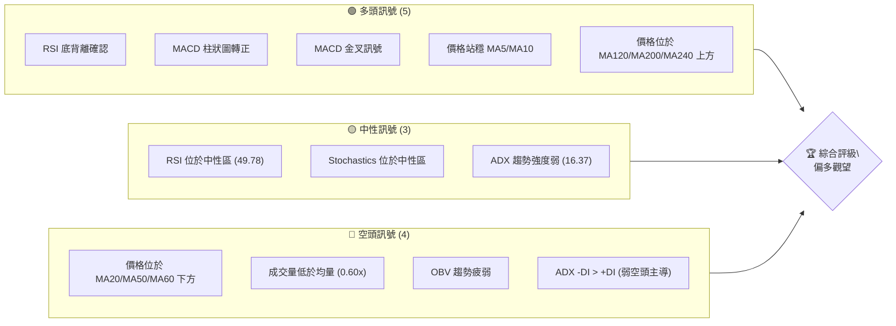
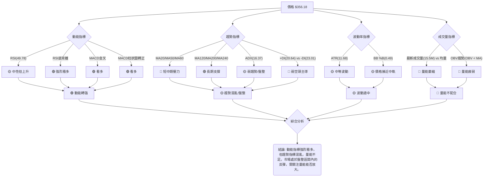
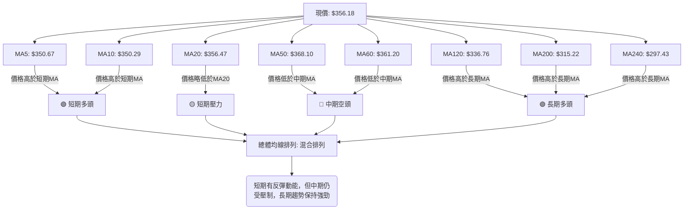
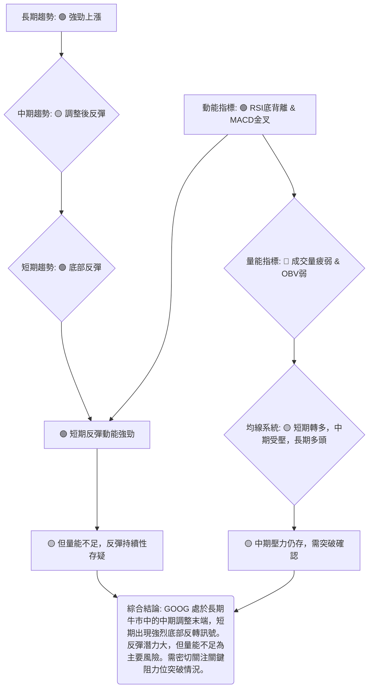
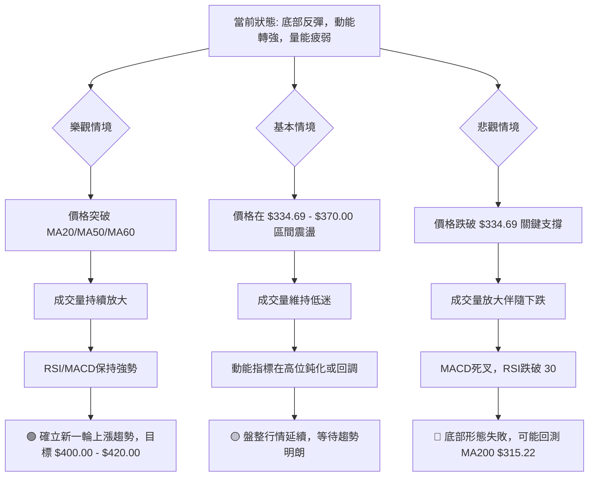

<details>
<summary>📊 靜態圖表 (點擊展開)</summary>

</details>

<html>
<head><meta charset="utf-8" /></head>
<body>
    <div style="height:500px; width:100%;">                        <script>window.PlotlyConfig = {MathJaxConfig: 'local'};</script>
        <script charset="utf-8" src="https://cdn.plot.ly/plotly-3.6.0.min.js" integrity="sha256-QaOVwtVY0T02VaHrr6pnoHLCwayMJp4O5n4YyaE3rJk=" crossorigin="anonymous"></script>                <div id="candlestick-chart" class="plotly-graph-div" style="height:100%; width:100%;"></div>            <script>                window.PLOTLYENV=window.PLOTLYENV || {};                                if (document.getElementById("candlestick-chart")) {                    Plotly.newPlot(                        "candlestick-chart",                        [{"close":{"dtype":"f8","bdata":"AAAAoLNdb0AAAABgjytvQAAAAMDDem9AAAAA4LPXb0AAAACAVIxvQAAAAGAVe29AAAAAwAvrbkAAAAAgzsJuQAAAAGBJ1m5AAAAAIDl8bkAAAADAWmJuQAAAAMDooW5AAAAAYFW+bkAAAAAA+b5uQAAAAGCTYG9AAAAAwLDUbkAAAADgWp9uQAAAAACPN25AAAAAQNCgbUAAAABgKoVuQAAAAECrtm5AAAAAoPZmb0AAAACgZGxvQAAAAKBkqW9AAAAAgEYIcEAAAACAJVtvQAAAAOAmgW9AAAAAAHqnb0AAAACgAUBwQAAAAGBu1nBAAAAAgHq+cEAAAACAGypxQAAAAKCTlXFAAAAAoEyUcUAAAAAAB7lxQAAAAMBBWHFAAAAAYBbDcUAAAABggsxxQAAAACBycnFAAAAAQFggckAAAABgtTJyQAAAAEDi7XFAAAAAAC9pcUAAAADAAkdxQAAAAECp0HFAAAAA4HDGcUAAAABgq0ZyQAAAAMCaFnJAAAAAYAWxckAAAABgjd1zQAAAAEAcMHRAAAAAgHT6c0AAAACA5vdzQAAAAIAOqHNAAAAAwG22c0AAAACA4v9zQAAAAGBG3HNAAAAA4FsXdEAAAABgoqBzQAAAAIBd1XNAAAAAIEwJdEAAAABgppRzQAAAAADWYXNAAAAAQKlOc0AAAAAgQTVzQAAAAIC8mnJAAAAAYKj1ckAAAADgUENzQAAAAGDHbnNAAAAA4Em0c0AAAAAAIbRzQAAAAIDIqHNAAAAAAK2fc0AAAABgO6JzQAAAAGA\u002flnNAAAAAQImuc0AAAACAfs5zQAAAAGA7onNAAAAAwCUgdEAAAABAWll0QAAAACBei3RAAAAAgLvEdEAAAADg2v90QAAAAADw\u002fXRAAAAAgJrLdEAAAADgip50QAAAAEDVG3RAAAAAQDl\u002fdEAAAAAgiKZ0QAAAAMAFgHRAAAAAgHnSdEAAAABAAel0QAAAAGB1\u002fXRAAAAAIH0jdUAAAABgaSF1QAAAAMAyh3VAAAAAIBZEdUAAAADAes50QAAAAIBcrnRAAAAAoNoqdEAAAABgoD90QAAAAGBt43NAAAAAYMduc0AAAADAdU9zQAAAACDuGXNAAAAAAMzmckAAAACgsfhyQAAAAACf8nJAAAAAINOnc0AAAAAgiHRzQAAAAGA6aHNAAAAAoPGJc0AAAACg\u002fCtzQAAAAIBgcHNAAAAA4Fwfc0AAAAAAn\u002fJyQAAAAEDd8HJAAAAA4EbIckAAAABAkp5yQAAAACA3HXNAAAAAIO0rc0AAAACAwENzQAAAACBx8HJAAAAAgHXUckAAAABgygNzQAAAACCVU3NAAAAAINohc0AAAADgvBhzQAAAAMDDqXJAAAAAQHGtckAAAADAahByQAAAACCnFnJAAAAAYCOJcUAAAACAhhlxQAAAAKCcD3FAAAAAwP\u002fqcUAAAADgj2tyQAAAAKCGZHJAAAAAALKXckAAAACA9PtyQAAAAKDPqHNAAAAAIODCc0AAAABAe7hzQAAAAMBJ8HNAAAAAQBmmdEAAAAAgTeR0QAAAAAAeyXRAAAAAQCIzdUAAAAAgLPN0QAAAAABXpHRAAAAAIG4YdUAAAADgvxh1QAAAAGDTYXVAAAAAQPfEdUAAAADgp7R1QAAAACCesXVAAAAAQF3bd0AAAAAA1e93QAAAAECWtndAAAAAIJ8AeEAAAAAAcK54QAAAAOD+sHhAAAAAoPrMeEAAAAAAmSh4QAAAACBt+XdAAAAAwMzseEAAAADg5c54QAAAAMBVkXhAAAAAAPqNeEAAAAAgsgp4QAAAACCyCnhAAAAAYNTzd0AAAADgbbJ3QAAAAIC8CXhAAAAAgJMJeEAAAABANB54QAAAAOBBg3dAAAAAwLFFd0AAAACAymJ2QAAAAAB1N3ZAAAAAIMQQd0AAAADgo9h2QAAAAGC4knZAAAAA4KOkdkAAAADAHhV2QAAAAMD1SHZAAAAAYI9idkAAAACAwvF2QAAAAKCZMXdAAAAAoJmhdkAAAAAgXPd2QAAAAOB6zHVAAAAAoEehdUAAAADgo5B1QAAAAEAKY3VAAAAAQArrdEAAAADgevR1QAAAAKBHFXZAAAAAgD1edkAAAABA4UJ2QA=="},"high":{"dtype":"f8","bdata":"wBStHoKXb0Cul+\u002fYoG5vQNc8mT6StG9AF4s2bSoDcECWQXUI4PlvQJ\u002fN0g6xyG9AK5LgieKOb0AedKkvmdpuQJTzu8IuNG9ACVG7lPtkb0AFqjO\u002fWGZuQDWp+BJU1W5ASbB+cNHkbkBNGZeLTtRuQAYXTNGcdm9AbAlwi9phb0AJRbmH19huQPgZrIVjom5AMLGflo2LbkAdDBUEWJBuQK+UBhhG8W5AtiRtTH+Ib0C4HTTENxFwQGDNUYg0zG9AWfbuOwIWcEBk3yiCLNxvQBdjvY3UCnBAAC+m3YDrb0CrNIaZ8V9wQOVtaudS5HBAAP0PHZbtcEAxTwLX4TZxQB0aOiK+NXJAlXc6eZnbcUCD3NEqF9ZxQIHylOKFlHFA8xgFADricUD+o3Ky6wNyQCWgI2oYv3FA5NpyxzwuckD\u002fnDwxSjxyQOc8vv+bPHJAWxf\u002fUkmvcUDnCsmcqWlxQKmdSgcaX3JAacXVpOYNckD2PgwnevpyQH6oiqOiJHNAv\u002fIhl9j1ckDy+utXyvJzQPd5IdJugHRAq9Re4qpFdEBR3ahV2WN0QEahslwT8HNA04LW06Dfc0BWWjt\u002fjxZ0QCMp1qR4J3RAvDft7iQzdEBmYwUC+Qx0QDPHqX+w5HNAsGN6+TIXdEAwMKfPHRl0QLnmVJWju3NA9TCOrquEc0CO8r8gAndzQFI0mvqpTHNAR1S4TckNc0BBrf9XY0lzQP3aoAWxdHNAg4mdDzK+c0DYq5YvCb5zQBRxd5JZwnNAfjpahvGoc0DRFH0JkdRzQAC+L6Cnr3NAt5VHqOEndECecOFuVe1zQKtsduc+EnRAB0p3jp9gdED21LTovKF0QCA06j3CsHRAP5Dxew7gdEBOpYRgE0x1QGKMtkZxCXVA4ebuDgUbdUAgHu0O1+x0QKF3Bs2WenRAUNFyJqfEdEDVEOhDXOx0QIi5N3GB2XRApoM9v5P+dEC3H22wYBx1QKyGrMgHE3VA2AGvOH5ddUB72Kr3iD11QPBDWdVui3VAPwHPvBbbdUAHNy3Oz3x1QPzG0rlbw3RA9GmsMlajdEAkmZkl\u002f3R0QKTa7FZdE3RAePY0MQQKdECdAz1eEsFzQPb7tWjKR3NAjfpBr98Hc0Ahh0w4LBhzQA8wyesWGnNANMq8zovFc0AemBz+m\u002fBzQI6Gzb9lf3NABdblwQKUc0BXSSj7dolzQPxBhGbDenNAFNgnXM47c0Ap7PV3sfhyQAWfmmH7EHNAw+io2ZXvckBzSClGAr9yQPQO+uoMJXNAAPvvx2xPc0D6ODg5HG5zQI9zVB9FR3NAz1xKFjQxc0D+rrDqLRZzQJdhYezQXXNAt11eaQJpc0CXSdKo7SdzQMdfrqD9AnNANbyuKADzckA6c26pvY5yQCG7JGK5Z3JA\u002fYXUpXvlcUBjASf+wG5xQDtKX3CAQXFA4nApiAnucUDM\u002fWRm5JxyQPk6u1ONe3JAms1\u002ffe2jckCTAcd0rP5yQDCJYqsq83NAkSCCQ9PTc0CqftHP7PRzQBQ0QVXO83NAGbIk+g6ndEAmWb2xxux0QLcsU0TVEnVABdsQ73w8dUAf+r\u002fcSy91QDe2iL55D3VAe3fPIjoddUBhd\u002flPST91QFLY7n+7d3VAuoj04gXrdUD1WFNWCNt1QOXWL7\u002f\u002fEnZAesfNzGXmd0B03cX0jPJ3QOmR0NAu\u002f3dAEBjo0Z1LeEDmNe\u002fxQ8J4QMWG6i\u002fb0XhAKTWJHxbieEB7AOgffKF4QBFviStSI3hAxcCs7gf7eEBbWzq80u14QNC4bTFFunhALZcxo6BDeUCVp3nGBZJ4QBHC\u002frVwZ3hAgdUJqiNHeEBUNJ9ZNwp4QFT3GQWIEnhAROaccNlXeEDkpPAwP1x4QGd81SO61ndAjmoHxv5ld0A2IanJFBl3QNpBw\u002fKCpHZAKrjkSzMad0BVWFympQ93QAAAAIAUtnZAAAAAYBIbd0AAAADA9eR2QAAAAAApYHZAAAAAQF7MdkAAAABgZip3QAAAAKCZWXdAAAAAYGYid0AAAAAAABB3QAAAAEAzY3ZAAAAAIIXLdUAAAACgRw12QAAAAEAKc3VAAAAAgOuBdUAAAAAghf91QAAAAIA9NnZAAAAAwPV4dkAAAAAA1492QA=="},"hovertemplate":"\u003cb\u003e%{x|%Y-%m-%d}\u003c\u002fb\u003e\u003cbr\u003e\u958b: $%{open:.2f}\u003cbr\u003e\u9ad8: $%{high:.2f}\u003cbr\u003e\u4f4e: $%{low:.2f}\u003cbr\u003e\u6536: $%{close:.2f}\u003cextra\u003e\u003c\u002fextra\u003e","low":{"dtype":"f8","bdata":"LguXkj8nb0CYJvbmH8NuQDFsahPdM29AjJL0lGVyb0D2BzQsOEpvQBAWKWgpU29A2X6PZpDXbkA\u002feFM4rCVuQJgeTmcKxW5ASk319ixXbkDybGiDRuNtQHDt1hlt121A\u002fEbCSCRUbkDhbZen3D9uQLLYPkSzpm5A35fLYHjKbkBlj+6tiZNuQECMBavB5m1Aup6MhhqHbUDucevW7QhuQGFWjTGZFm5AcmNZuNTJbkAa0u2jv0VvQApMjJRRA29AD8m\u002fR0PDb0C3UC7DH4ZuQLZXChHBPm9Ak2yRysCIb0D34O4rK\u002fNvQDyfwVu\u002fhnBAIDxquFuqcEBOP5pher5wQKywPB5sfnFAdEIqjq5PcUAlFvYLJX1xQClrP5MsRXFAsakj7GFVcUAKDVgOG5FxQKii5po1M3FAn14T\u002fcOvcUAurczNEfVxQJy6C\u002fAtvXFA9utieUxXcUBXtpKhEO5wQELbI7rIunFAD0SlbG1ncUDR8Ihgt\u002fFxQKsaZ32rCXJAtYoc44tcckDIKXdMt0xzQHmKlsob03NAogH+jUXJc0DCI+a6HsVzQG3UbULalXNAuBYobK+Zc0CzkcOspJpzQCAwdO+Pr3NAHC0CSKr1c0DrVdUTDHhzQKWUAmxkg3NA8lEub9Cvc0CqhHQLnFdzQDuzpEfzKHNAz+Mno3QVc0B\u002fTxN57\u002fZyQOu4t0L9kHJAvohdjc3DckDbQuWDIN9yQBWZkbYJI3NAM7cR+oJlc0BeZsnvk45zQLxa3iD4lHNAkXtRL+N3c0AKJemSdY1zQE9vbW2ufHNACdOB1uljc0BbIhqyZq1zQOQ4KhDrfnNA6oV4426hc0CjW2O9HRl0QGL8vBIwXXRAawVK+FxRdEAm0VVent50QDNB32JTq3RAxATy\u002fritdEA9wF453nt0QNfL7imKB3RAJXpZ4Pfxc0C3dCN6Nod0QFIybhWseHRAJ0YqewBxdECsMZHuB9V0QKV8yC4lu3RAve7BsrJkdEAEPqN7S8N0QAMWO+Uk+XRAeCdPx14idUCHOMLYCo90QCAYyrtPKHNAScWhJLf7c0C4FScQkdRzQCJMYnj9o3NA68olqppbc0AMY4Ul9ztzQH8i9vQN+HJAhuFbRTOIckCoAgH6X9lyQEi09hJxxHJA1GrmJF0Ac0Do31v2XVlzQEY5iXEMG3NAkR8R3kxPc0D3dfT1PuByQBxlQecd83JAZa+odKzKckDIC1EN\u002fYRyQMP\u002fNuqExnJAnTpabuWackBD\u002fJXN1W1yQODchyINXHJAl+SpnQUSc0AljUcbfxpzQA5uvHaLynJAwG13Y5i5ckD0HSguDtpyQDvxMderAnNAJu8pnMcVc0DIzFdnGs1yQJ0kpOYkiXJAjoxVsJydckBcGJh55gpyQHhdPngn83FASBnYSR1ucUD8Z5tQDBVxQBWfM3Ty9XBARrc+In9JcUBV14UAvBRyQMW0yzla9nFAZA3vCNBZckACWN3z9HNyQPqpaENFiHNAWTmCv4pUc0CIk0PonKVzQFktOHkFmHNAmGgEO08PdEDE2kGwZYd0QKcaakI1t3RAQ\u002f9bzW7RdEBg85cl3OZ0QAWzwXHolnRAtsQ\u002f4CfMdEBZ\u002fZ9AvO10QKPg97+V3XRAYuicHq5JdUBiOtquKoF1QO5ps6WVY3VA8kYEEfKtdkChTll8jHB3QIoYA7KxiHdA\u002f5dsiPDBd0CFj9vu3y14QPbdIys0YXhAt56Vk+6WeED3epCU9h94QN2d7Jndt3dArmlGhJvVd0Dw8ZZR3od4QGqSQ8VoWHhAU6jZUaNqeEC15k1uUOx3QGurXtJXvHdAJoyANAe0d0DGOVkihaB3QKLY\u002f2qXrndAZurt2FLcd0Dvhm6\u002fVNB3QGyeW58yYXdAoAEHUs0Xd0CJszBalSx2QIgX4HOrInZATOsgpmIpdkCUbNSMmZZ2QAAAAIA9XnZAAAAAIIUrdkAAAADA9Qx2QAAAAIAUenVAAAAAoHAVdkAAAABgZsp2QAAAAMAe1XZAAAAAIK6DdkAAAABgukl2QAAAAEAKT3VAAAAAoHA7dUAAAAAAAFh1QAAAAGBm\u002fnRAAAAAQArbdEAAAADA9Sx1QAAAAIDCwXVAAAAAIK4TdkAAAADAHuV1QA=="},"name":"\u50f9\u683c","open":{"dtype":"f8","bdata":"AFnOysN6b0A1Exaz+l5vQFKIJgjBa29Al1WE\u002fO+cb0BY1UbNAslvQPpGKs0UpW9Ar6j\u002f5AN1b0DxH1yZjYtuQG859u2b6W5AUCOYAkL5bkBtATF6tFJuQBzZ536pFm5AyAzwaBqlbkChU\u002fNMAphuQEwrChOTqW5AGeC+Zy0Ob0AF7kIE\u002fbZuQDuyUXSUkm5Ac9FOCfY1bkCk5DUa3xFuQGN7Y9IGKW5AdeKOtzDzbkDH3SGAE39vQPhZ11l3W29A99tGD2LXb0DdxX6XBdhvQNwl3EFb0G9AXvARu4Smb0Arx4QYvwxwQNlbQz50jXBARpVpUb7acEAakmMwWsFwQC9p97BjMnJAH9YTZ2qqcUCEIfx+4Z1xQE97+TheSHFACzVA51VtcUCcwc8V0dJxQMQlA912unFAZ261yk\u002fLcUBgVWL9LfpxQI90zdM3OHJApXvzB+emcUD9Er0+z\u002fVwQLq9D5dv3XFAs8iBAbv+cUDGhcyh9PFxQBdOgF1NAnNAGnd2xqCEckDcN\u002f0FbWZzQNxaDS6SYnRA9\u002fFYfnACdECpVW66wSx0QN1JNcGpzXNAY2TsMnvEc0BKax6nlrZzQOCpkvObJnRADMkB\u002f\u002fv1c0CaeLnTxgl0QFQSJ\u002fsPi3NAWs+zCU\u002fDc0CwQYsx5Qp0QGme4qUlpnNA+yQ11XiDc0Dv3Xg\u002fnBlzQG3WwTe1SXNA8v4w0KHqckC0iUnL\u002fO1yQGXTqe8ZbXNA9XE766lrc0AN2C9vzLtzQBpAQZ4fuHNAFq5hpJaGc0C+9vUXBJBzQOVXaGxgj3NAUK63\u002fc7Sc0CwwtN+fNRzQNHWL59VznNA5xKsQ42ic0D3ZIhZXY10QLLg6nEAcXRAPLiGrS5hdED7XrKleu10QPMaN9XD6HRAIOmUNdIZdUCa+0Vw9+d0QK8TAcshDXRATPKM0NAKdEBE6A2xQt10QJXNs8qIw3RAKqyU71h8dEBXEt5hEvN0QIqqczy7AnVAqHVkV34+dUAIkz9hYOB0QCZsUMLFAXVAvP4VmvbAdUDd0o3z5nR1QIJZ7wmpjHNAXZOJ6MNudECDzBnkIQ10QKMTJRDcB3RAHxKDFrPoc0CHh\u002frxE39zQL3NIj9UOXNA8f5AZ\u002fbDckC+BIHvmOByQD5QQq8A4nJAyZDwfG8Gc0DweyGNk+tzQFSSKP\u002fAY3NAiwxBHWd7c0B1xf5FWYZzQCQMq4mx+HJA+3rNJR3pckBsxRoafaByQPfH0taj5HJAxj5Fgt7sckDcM8dI+HpyQHdtO2FUX3JAtg5XeQ4bc0Ac1iYZ2iFzQHDW7LtpIHNA7EjVc4cnc0CXTy+lrfZyQForYM3JB3NAjGi3S4Q7c0A\u002fZHEVcfByQOV04p0x\u002fnJAaZi3h5bFckDoucRagoByQGmdTpGWP3JAwb7OMkngcUAzuBvoulNxQF62grVjNHFAHflIFvhVcUDkPuC+4xxyQPt7J\u002foODXJAJ+T2Kl1ockDwNzsWWr9yQDIVPqM42nNATp55tQaQc0AcxQCUieBzQIkNLVavs3NAZ8P32fAddEBqa\u002fdhx6V0QD5JVyle+nRAcgZpXqnjdECzzCS3syV1QLgOJ2Yh9nRAh744AvDqdEAL+O+g7jV1QNXWQhVFGHVAogBkTsV6dUCoD8ytYat1QAzRIAJblHVAZUg104Ewd0Cio9noCpx3QJiO1eVw4XdAaVq7qT7ad0AjzmnMsFV4QH1z+okjzXhAm441mYageEAOVaW3R2d4QFecw3dLDHhA4g9J983ad0AJycaz2Zh4QCnKOuKnj3hAAu477Tl+eEAXbzjOA5F4QFLCsUfvDHhAP3zS2Hvcd0ALPP7QePB3QENwDtlAzHdAdVRrdo7od0CJjlrREPp3QInT3W\u002fuz3dARx8jY51Fd0CmfGqfEK92QHcbjFXpYXZAyc95kp4zdkCM8xY9lbJ2QAAAAIDCp3ZAAAAAACnOdkAAAADAzJB2QAAAAMDMEHZAAAAAoJmRdkAAAAAA1992QAAAAKBw93ZAAAAAwMzwdkAAAACAPb52QAAAAAApUnZAAAAAIK5BdUAAAAAghct1QAAAAGC4DnVAAAAAIK5PdUAAAABAMz91QAAAACBc73VAAAAAANcpdkAAAABgZkJ2QA=="},"x":["2025-09-16T00:00:00-04:00","2025-09-17T00:00:00-04:00","2025-09-18T00:00:00-04:00","2025-09-19T00:00:00-04:00","2025-09-22T00:00:00-04:00","2025-09-23T00:00:00-04:00","2025-09-24T00:00:00-04:00","2025-09-25T00:00:00-04:00","2025-09-26T00:00:00-04:00","2025-09-29T00:00:00-04:00","2025-09-30T00:00:00-04:00","2025-10-01T00:00:00-04:00","2025-10-02T00:00:00-04:00","2025-10-03T00:00:00-04:00","2025-10-06T00:00:00-04:00","2025-10-07T00:00:00-04:00","2025-10-08T00:00:00-04:00","2025-10-09T00:00:00-04:00","2025-10-10T00:00:00-04:00","2025-10-13T00:00:00-04:00","2025-10-14T00:00:00-04:00","2025-10-15T00:00:00-04:00","2025-10-16T00:00:00-04:00","2025-10-17T00:00:00-04:00","2025-10-20T00:00:00-04:00","2025-10-21T00:00:00-04:00","2025-10-22T00:00:00-04:00","2025-10-23T00:00:00-04:00","2025-10-24T00:00:00-04:00","2025-10-27T00:00:00-04:00","2025-10-28T00:00:00-04:00","2025-10-29T00:00:00-04:00","2025-10-30T00:00:00-04:00","2025-10-31T00:00:00-04:00","2025-11-03T00:00:00-05:00","2025-11-04T00:00:00-05:00","2025-11-05T00:00:00-05:00","2025-11-06T00:00:00-05:00","2025-11-07T00:00:00-05:00","2025-11-10T00:00:00-05:00","2025-11-11T00:00:00-05:00","2025-11-12T00:00:00-05:00","2025-11-13T00:00:00-05:00","2025-11-14T00:00:00-05:00","2025-11-17T00:00:00-05:00","2025-11-18T00:00:00-05:00","2025-11-19T00:00:00-05:00","2025-11-20T00:00:00-05:00","2025-11-21T00:00:00-05:00","2025-11-24T00:00:00-05:00","2025-11-25T00:00:00-05:00","2025-11-26T00:00:00-05:00","2025-11-28T00:00:00-05:00","2025-12-01T00:00:00-05:00","2025-12-02T00:00:00-05:00","2025-12-03T00:00:00-05:00","2025-12-04T00:00:00-05:00","2025-12-05T00:00:00-05:00","2025-12-08T00:00:00-05:00","2025-12-09T00:00:00-05:00","2025-12-10T00:00:00-05:00","2025-12-11T00:00:00-05:00","2025-12-12T00:00:00-05:00","2025-12-15T00:00:00-05:00","2025-12-16T00:00:00-05:00","2025-12-17T00:00:00-05:00","2025-12-18T00:00:00-05:00","2025-12-19T00:00:00-05:00","2025-12-22T00:00:00-05:00","2025-12-23T00:00:00-05:00","2025-12-24T00:00:00-05:00","2025-12-26T00:00:00-05:00","2025-12-29T00:00:00-05:00","2025-12-30T00:00:00-05:00","2025-12-31T00:00:00-05:00","2026-01-02T00:00:00-05:00","2026-01-05T00:00:00-05:00","2026-01-06T00:00:00-05:00","2026-01-07T00:00:00-05:00","2026-01-08T00:00:00-05:00","2026-01-09T00:00:00-05:00","2026-01-12T00:00:00-05:00","2026-01-13T00:00:00-05:00","2026-01-14T00:00:00-05:00","2026-01-15T00:00:00-05:00","2026-01-16T00:00:00-05:00","2026-01-20T00:00:00-05:00","2026-01-21T00:00:00-05:00","2026-01-22T00:00:00-05:00","2026-01-23T00:00:00-05:00","2026-01-26T00:00:00-05:00","2026-01-27T00:00:00-05:00","2026-01-28T00:00:00-05:00","2026-01-29T00:00:00-05:00","2026-01-30T00:00:00-05:00","2026-02-02T00:00:00-05:00","2026-02-03T00:00:00-05:00","2026-02-04T00:00:00-05:00","2026-02-05T00:00:00-05:00","2026-02-06T00:00:00-05:00","2026-02-09T00:00:00-05:00","2026-02-10T00:00:00-05:00","2026-02-11T00:00:00-05:00","2026-02-12T00:00:00-05:00","2026-02-13T00:00:00-05:00","2026-02-17T00:00:00-05:00","2026-02-18T00:00:00-05:00","2026-02-19T00:00:00-05:00","2026-02-20T00:00:00-05:00","2026-02-23T00:00:00-05:00","2026-02-24T00:00:00-05:00","2026-02-25T00:00:00-05:00","2026-02-26T00:00:00-05:00","2026-02-27T00:00:00-05:00","2026-03-02T00:00:00-05:00","2026-03-03T00:00:00-05:00","2026-03-04T00:00:00-05:00","2026-03-05T00:00:00-05:00","2026-03-06T00:00:00-05:00","2026-03-09T00:00:00-04:00","2026-03-10T00:00:00-04:00","2026-03-11T00:00:00-04:00","2026-03-12T00:00:00-04:00","2026-03-13T00:00:00-04:00","2026-03-16T00:00:00-04:00","2026-03-17T00:00:00-04:00","2026-03-18T00:00:00-04:00","2026-03-19T00:00:00-04:00","2026-03-20T00:00:00-04:00","2026-03-23T00:00:00-04:00","2026-03-24T00:00:00-04:00","2026-03-25T00:00:00-04:00","2026-03-26T00:00:00-04:00","2026-03-27T00:00:00-04:00","2026-03-30T00:00:00-04:00","2026-03-31T00:00:00-04:00","2026-04-01T00:00:00-04:00","2026-04-02T00:00:00-04:00","2026-04-06T00:00:00-04:00","2026-04-07T00:00:00-04:00","2026-04-08T00:00:00-04:00","2026-04-09T00:00:00-04:00","2026-04-10T00:00:00-04:00","2026-04-13T00:00:00-04:00","2026-04-14T00:00:00-04:00","2026-04-15T00:00:00-04:00","2026-04-16T00:00:00-04:00","2026-04-17T00:00:00-04:00","2026-04-20T00:00:00-04:00","2026-04-21T00:00:00-04:00","2026-04-22T00:00:00-04:00","2026-04-23T00:00:00-04:00","2026-04-24T00:00:00-04:00","2026-04-27T00:00:00-04:00","2026-04-28T00:00:00-04:00","2026-04-29T00:00:00-04:00","2026-04-30T00:00:00-04:00","2026-05-01T00:00:00-04:00","2026-05-04T00:00:00-04:00","2026-05-05T00:00:00-04:00","2026-05-06T00:00:00-04:00","2026-05-07T00:00:00-04:00","2026-05-08T00:00:00-04:00","2026-05-11T00:00:00-04:00","2026-05-12T00:00:00-04:00","2026-05-13T00:00:00-04:00","2026-05-14T00:00:00-04:00","2026-05-15T00:00:00-04:00","2026-05-18T00:00:00-04:00","2026-05-19T00:00:00-04:00","2026-05-20T00:00:00-04:00","2026-05-21T00:00:00-04:00","2026-05-22T00:00:00-04:00","2026-05-26T00:00:00-04:00","2026-05-27T00:00:00-04:00","2026-05-28T00:00:00-04:00","2026-05-29T00:00:00-04:00","2026-06-01T00:00:00-04:00","2026-06-02T00:00:00-04:00","2026-06-03T00:00:00-04:00","2026-06-04T00:00:00-04:00","2026-06-05T00:00:00-04:00","2026-06-08T00:00:00-04:00","2026-06-09T00:00:00-04:00","2026-06-10T00:00:00-04:00","2026-06-11T00:00:00-04:00","2026-06-12T00:00:00-04:00","2026-06-15T00:00:00-04:00","2026-06-16T00:00:00-04:00","2026-06-17T00:00:00-04:00","2026-06-18T00:00:00-04:00","2026-06-22T00:00:00-04:00","2026-06-23T00:00:00-04:00","2026-06-24T00:00:00-04:00","2026-06-25T00:00:00-04:00","2026-06-26T00:00:00-04:00","2026-06-29T00:00:00-04:00","2026-06-30T00:00:00-04:00","2026-07-01T00:00:00-04:00","2026-07-02T00:00:00-04:00"],"type":"candlestick"},{"hovertemplate":"MA30: $%{y:.2f}\u003cextra\u003e\u003c\u002fextra\u003e","line":{"color":"#2196F3","dash":"dash","width":2},"mode":"lines","name":"MA30","x":["2025-09-16T00:00:00-04:00","2025-09-17T00:00:00-04:00","2025-09-18T00:00:00-04:00","2025-09-19T00:00:00-04:00","2025-09-22T00:00:00-04:00","2025-09-23T00:00:00-04:00","2025-09-24T00:00:00-04:00","2025-09-25T00:00:00-04:00","2025-09-26T00:00:00-04:00","2025-09-29T00:00:00-04:00","2025-09-30T00:00:00-04:00","2025-10-01T00:00:00-04:00","2025-10-02T00:00:00-04:00","2025-10-03T00:00:00-04:00","2025-10-06T00:00:00-04:00","2025-10-07T00:00:00-04:00","2025-10-08T00:00:00-04:00","2025-10-09T00:00:00-04:00","2025-10-10T00:00:00-04:00","2025-10-13T00:00:00-04:00","2025-10-14T00:00:00-04:00","2025-10-15T00:00:00-04:00","2025-10-16T00:00:00-04:00","2025-10-17T00:00:00-04:00","2025-10-20T00:00:00-04:00","2025-10-21T00:00:00-04:00","2025-10-22T00:00:00-04:00","2025-10-23T00:00:00-04:00","2025-10-24T00:00:00-04:00","2025-10-27T00:00:00-04:00","2025-10-28T00:00:00-04:00","2025-10-29T00:00:00-04:00","2025-10-30T00:00:00-04:00","2025-10-31T00:00:00-04:00","2025-11-03T00:00:00-05:00","2025-11-04T00:00:00-05:00","2025-11-05T00:00:00-05:00","2025-11-06T00:00:00-05:00","2025-11-07T00:00:00-05:00","2025-11-10T00:00:00-05:00","2025-11-11T00:00:00-05:00","2025-11-12T00:00:00-05:00","2025-11-13T00:00:00-05:00","2025-11-14T00:00:00-05:00","2025-11-17T00:00:00-05:00","2025-11-18T00:00:00-05:00","2025-11-19T00:00:00-05:00","2025-11-20T00:00:00-05:00","2025-11-21T00:00:00-05:00","2025-11-24T00:00:00-05:00","2025-11-25T00:00:00-05:00","2025-11-26T00:00:00-05:00","2025-11-28T00:00:00-05:00","2025-12-01T00:00:00-05:00","2025-12-02T00:00:00-05:00","2025-12-03T00:00:00-05:00","2025-12-04T00:00:00-05:00","2025-12-05T00:00:00-05:00","2025-12-08T00:00:00-05:00","2025-12-09T00:00:00-05:00","2025-12-10T00:00:00-05:00","2025-12-11T00:00:00-05:00","2025-12-12T00:00:00-05:00","2025-12-15T00:00:00-05:00","2025-12-16T00:00:00-05:00","2025-12-17T00:00:00-05:00","2025-12-18T00:00:00-05:00","2025-12-19T00:00:00-05:00","2025-12-22T00:00:00-05:00","2025-12-23T00:00:00-05:00","2025-12-24T00:00:00-05:00","2025-12-26T00:00:00-05:00","2025-12-29T00:00:00-05:00","2025-12-30T00:00:00-05:00","2025-12-31T00:00:00-05:00","2026-01-02T00:00:00-05:00","2026-01-05T00:00:00-05:00","2026-01-06T00:00:00-05:00","2026-01-07T00:00:00-05:00","2026-01-08T00:00:00-05:00","2026-01-09T00:00:00-05:00","2026-01-12T00:00:00-05:00","2026-01-13T00:00:00-05:00","2026-01-14T00:00:00-05:00","2026-01-15T00:00:00-05:00","2026-01-16T00:00:00-05:00","2026-01-20T00:00:00-05:00","2026-01-21T00:00:00-05:00","2026-01-22T00:00:00-05:00","2026-01-23T00:00:00-05:00","2026-01-26T00:00:00-05:00","2026-01-27T00:00:00-05:00","2026-01-28T00:00:00-05:00","2026-01-29T00:00:00-05:00","2026-01-30T00:00:00-05:00","2026-02-02T00:00:00-05:00","2026-02-03T00:00:00-05:00","2026-02-04T00:00:00-05:00","2026-02-05T00:00:00-05:00","2026-02-06T00:00:00-05:00","2026-02-09T00:00:00-05:00","2026-02-10T00:00:00-05:00","2026-02-11T00:00:00-05:00","2026-02-12T00:00:00-05:00","2026-02-13T00:00:00-05:00","2026-02-17T00:00:00-05:00","2026-02-18T00:00:00-05:00","2026-02-19T00:00:00-05:00","2026-02-20T00:00:00-05:00","2026-02-23T00:00:00-05:00","2026-02-24T00:00:00-05:00","2026-02-25T00:00:00-05:00","2026-02-26T00:00:00-05:00","2026-02-27T00:00:00-05:00","2026-03-02T00:00:00-05:00","2026-03-03T00:00:00-05:00","2026-03-04T00:00:00-05:00","2026-03-05T00:00:00-05:00","2026-03-06T00:00:00-05:00","2026-03-09T00:00:00-04:00","2026-03-10T00:00:00-04:00","2026-03-11T00:00:00-04:00","2026-03-12T00:00:00-04:00","2026-03-13T00:00:00-04:00","2026-03-16T00:00:00-04:00","2026-03-17T00:00:00-04:00","2026-03-18T00:00:00-04:00","2026-03-19T00:00:00-04:00","2026-03-20T00:00:00-04:00","2026-03-23T00:00:00-04:00","2026-03-24T00:00:00-04:00","2026-03-25T00:00:00-04:00","2026-03-26T00:00:00-04:00","2026-03-27T00:00:00-04:00","2026-03-30T00:00:00-04:00","2026-03-31T00:00:00-04:00","2026-04-01T00:00:00-04:00","2026-04-02T00:00:00-04:00","2026-04-06T00:00:00-04:00","2026-04-07T00:00:00-04:00","2026-04-08T00:00:00-04:00","2026-04-09T00:00:00-04:00","2026-04-10T00:00:00-04:00","2026-04-13T00:00:00-04:00","2026-04-14T00:00:00-04:00","2026-04-15T00:00:00-04:00","2026-04-16T00:00:00-04:00","2026-04-17T00:00:00-04:00","2026-04-20T00:00:00-04:00","2026-04-21T00:00:00-04:00","2026-04-22T00:00:00-04:00","2026-04-23T00:00:00-04:00","2026-04-24T00:00:00-04:00","2026-04-27T00:00:00-04:00","2026-04-28T00:00:00-04:00","2026-04-29T00:00:00-04:00","2026-04-30T00:00:00-04:00","2026-05-01T00:00:00-04:00","2026-05-04T00:00:00-04:00","2026-05-05T00:00:00-04:00","2026-05-06T00:00:00-04:00","2026-05-07T00:00:00-04:00","2026-05-08T00:00:00-04:00","2026-05-11T00:00:00-04:00","2026-05-12T00:00:00-04:00","2026-05-13T00:00:00-04:00","2026-05-14T00:00:00-04:00","2026-05-15T00:00:00-04:00","2026-05-18T00:00:00-04:00","2026-05-19T00:00:00-04:00","2026-05-20T00:00:00-04:00","2026-05-21T00:00:00-04:00","2026-05-22T00:00:00-04:00","2026-05-26T00:00:00-04:00","2026-05-27T00:00:00-04:00","2026-05-28T00:00:00-04:00","2026-05-29T00:00:00-04:00","2026-06-01T00:00:00-04:00","2026-06-02T00:00:00-04:00","2026-06-03T00:00:00-04:00","2026-06-04T00:00:00-04:00","2026-06-05T00:00:00-04:00","2026-06-08T00:00:00-04:00","2026-06-09T00:00:00-04:00","2026-06-10T00:00:00-04:00","2026-06-11T00:00:00-04:00","2026-06-12T00:00:00-04:00","2026-06-15T00:00:00-04:00","2026-06-16T00:00:00-04:00","2026-06-17T00:00:00-04:00","2026-06-18T00:00:00-04:00","2026-06-22T00:00:00-04:00","2026-06-23T00:00:00-04:00","2026-06-24T00:00:00-04:00","2026-06-25T00:00:00-04:00","2026-06-26T00:00:00-04:00","2026-06-29T00:00:00-04:00","2026-06-30T00:00:00-04:00","2026-07-01T00:00:00-04:00","2026-07-02T00:00:00-04:00"],"y":{"dtype":"f8","bdata":"AAAAAAAA+H8AAAAAAAD4fwAAAAAAAPh\u002fAAAAAAAA+H8AAAAAAAD4fwAAAAAAAPh\u002fAAAAAAAA+H8AAAAAAAD4fwAAAAAAAPh\u002fAAAAAAAA+H8AAAAAAAD4fwAAAAAAAPh\u002fAAAAAAAA+H8AAAAAAAD4fwAAAAAAAPh\u002fAAAAAAAA+H8AAAAAAAD4fwAAAAAAAPh\u002fAAAAAAAA+H8AAAAAAAD4fwAAAAAAAPh\u002fAAAAAAAA+H8AAAAAAAD4fwAAAAAAAPh\u002fAAAAAAAA+H8AAAAAAAD4fwAAAAAAAPh\u002fAAAAAAAA+H8AAAAAAAD4fwAAABBUL29Ad3d3129Bb0DNzMxcZFxvQFVVVSXfe29A7+7uDiuYb0CamZn5bLlvQDMzM4PO1G9AmpmZaRz8b0AAAABAsRJwQJqZmaEAJHBAiYiIOJw8cEAzMzPjQlZwQFVVVRWPbHBAiYiIoPV9cEDe3d3VNY5wQHd3dydboHBAq6qqGn60cEDe3d3Vys1wQO\u002fu7kY453BA3t3dlU4IcUAAAAAgmy9xQCIiIvLUWHFAAAAAuFR9cUBmZmaGp6FxQDMzM7tMwnFAiYiIcLThcUDv7u72lAZyQGZmZnajKXJAAAAAoAZOckCJiIjI2GpyQJqZmUlphHJAd3d3V4GgckAiIiKSH7VyQN7d3R13xHJAAAAA8DXTckCrqqqK4t9yQN7d3V2i6nJA7+7ubtr0ckCJiIjIWAFzQO\u002fu7o5KEnNAvLu7i8Efc0B3d3d3mixzQAAAAOBdO3NAERER8T9Oc0De3d1tW2JzQImIiAh6cXNAzczMHL+Bc0Dv7u6uzo5zQERERLT+m3NAREREhDuoc0AiIiLyW6xzQM3MzKxmr3NAZmZmxiS2c0AAAAAw8b5zQCIiIpJWynNAvLu7y5PTc0DNzMys3dhzQJqZmQn82nNAmpmZWXLec0BVVVU1LedzQLy7u3vd7HNAIiIiMpLzc0Dv7u6O6v5zQCIiIhKjDHRAvLu7u0McdECamZl5qyx0QJqZmVmeRXRAzczMrExZdEDNzMy8eGZ0QHd3d9cfcXRAmpmZmRN1dECrqqr6uXl0QImIiGiue3RAd3d3Jw16dEBVVVXVSnd0QN7d3f0lc3RAzczMjH1sdEDv7u4eXWV0QDMzM5OCX3RAIiIi0n9bdEB3d3c331N0QDMzM9MqSnRAERERoaw\u002fdEB3d3cnFDB0QDMzM6PTInRAERERUY0UdECJiIi4SQZ0QFVVVYVS\u002fHNAd3d317Dtc0CJiIjYW9xzQImIiCiI0HNAmpmZaXLCc0CJiIi4Z7RzQERERJTnonNAAAAAIDSPc0CrqqpKJn1zQFVVVcVcanNAIiIikidYc0DNzMwskElzQCIiIuJXOHNAvLu7K6Erc0AAAABA\u002fRhzQO\u002fu7k6hCXNAzczMLHH5ckDe3d3dk+ZyQAAAAMAq1XJAMzMzE8bMckAAAADAEchyQERERDRVw3JAiYiICEO6ckDNzMwcPrZyQImIiDhluHJAmpmZCUu6ckDNzMzs+b5yQO\u002fu7m49w3JAZmZmtkPQckBVVVWV2uByQJqZmXmY8HJAMzMzYzkFc0AiIiJiHBlzQKuqqvolJnNA3t3drZA2c0CrqqrKMkZzQGZmZmYLW3NAq6qqyiB0c0C8u7sbF4tzQLy7u5tKn3NAd3d3x5vHc0AiIiJi6fBzQHd3d3cBHHRA3t3d7XFJdEAiIiKS6YF0QERERNRBunRAiYiIeED4dEAiIiLSfDR1QM3MzDx7b3VAZmZmVkardUBEREQ0yeF1QGZmZsZ6FnZAq6qqCltJdkDv7u5+g3R2QJqZmenomXZAmpmZyay9dkBmZmZGm992QBEREZGWAndAq6qqCoEfd0Dv7u6+CDt3QFVVVTVOUndAiYiIqP1jd0C8u7urPnB3QKuqqpqufXdAVVVVRX6Od0BVVVVFbJ13QJqZmQmWp3dAmpmZuQqvd0AzMzPjQbJ3QHd3d1dNt3dAIiIi8r2qd0DNzMzcRaJ3QKuqqgrXnXdAiYiIqCOSd0DNzMzcgIN3QLy7u8vRandAvLu7S8NPd0BmZmaGoTl3QJqZmSmNI3dAMzMzA1wBd0DNzMwcA+l2QBEREXHP03ZAZmZmBifBdkBVVVVl9bF2QA=="},"type":"scatter"},{"hovertemplate":"MA60: $%{y:.2f}\u003cextra\u003e\u003c\u002fextra\u003e","line":{"color":"#9C27B0","dash":"dash","width":2},"mode":"lines","name":"MA60","x":["2025-09-16T00:00:00-04:00","2025-09-17T00:00:00-04:00","2025-09-18T00:00:00-04:00","2025-09-19T00:00:00-04:00","2025-09-22T00:00:00-04:00","2025-09-23T00:00:00-04:00","2025-09-24T00:00:00-04:00","2025-09-25T00:00:00-04:00","2025-09-26T00:00:00-04:00","2025-09-29T00:00:00-04:00","2025-09-30T00:00:00-04:00","2025-10-01T00:00:00-04:00","2025-10-02T00:00:00-04:00","2025-10-03T00:00:00-04:00","2025-10-06T00:00:00-04:00","2025-10-07T00:00:00-04:00","2025-10-08T00:00:00-04:00","2025-10-09T00:00:00-04:00","2025-10-10T00:00:00-04:00","2025-10-13T00:00:00-04:00","2025-10-14T00:00:00-04:00","2025-10-15T00:00:00-04:00","2025-10-16T00:00:00-04:00","2025-10-17T00:00:00-04:00","2025-10-20T00:00:00-04:00","2025-10-21T00:00:00-04:00","2025-10-22T00:00:00-04:00","2025-10-23T00:00:00-04:00","2025-10-24T00:00:00-04:00","2025-10-27T00:00:00-04:00","2025-10-28T00:00:00-04:00","2025-10-29T00:00:00-04:00","2025-10-30T00:00:00-04:00","2025-10-31T00:00:00-04:00","2025-11-03T00:00:00-05:00","2025-11-04T00:00:00-05:00","2025-11-05T00:00:00-05:00","2025-11-06T00:00:00-05:00","2025-11-07T00:00:00-05:00","2025-11-10T00:00:00-05:00","2025-11-11T00:00:00-05:00","2025-11-12T00:00:00-05:00","2025-11-13T00:00:00-05:00","2025-11-14T00:00:00-05:00","2025-11-17T00:00:00-05:00","2025-11-18T00:00:00-05:00","2025-11-19T00:00:00-05:00","2025-11-20T00:00:00-05:00","2025-11-21T00:00:00-05:00","2025-11-24T00:00:00-05:00","2025-11-25T00:00:00-05:00","2025-11-26T00:00:00-05:00","2025-11-28T00:00:00-05:00","2025-12-01T00:00:00-05:00","2025-12-02T00:00:00-05:00","2025-12-03T00:00:00-05:00","2025-12-04T00:00:00-05:00","2025-12-05T00:00:00-05:00","2025-12-08T00:00:00-05:00","2025-12-09T00:00:00-05:00","2025-12-10T00:00:00-05:00","2025-12-11T00:00:00-05:00","2025-12-12T00:00:00-05:00","2025-12-15T00:00:00-05:00","2025-12-16T00:00:00-05:00","2025-12-17T00:00:00-05:00","2025-12-18T00:00:00-05:00","2025-12-19T00:00:00-05:00","2025-12-22T00:00:00-05:00","2025-12-23T00:00:00-05:00","2025-12-24T00:00:00-05:00","2025-12-26T00:00:00-05:00","2025-12-29T00:00:00-05:00","2025-12-30T00:00:00-05:00","2025-12-31T00:00:00-05:00","2026-01-02T00:00:00-05:00","2026-01-05T00:00:00-05:00","2026-01-06T00:00:00-05:00","2026-01-07T00:00:00-05:00","2026-01-08T00:00:00-05:00","2026-01-09T00:00:00-05:00","2026-01-12T00:00:00-05:00","2026-01-13T00:00:00-05:00","2026-01-14T00:00:00-05:00","2026-01-15T00:00:00-05:00","2026-01-16T00:00:00-05:00","2026-01-20T00:00:00-05:00","2026-01-21T00:00:00-05:00","2026-01-22T00:00:00-05:00","2026-01-23T00:00:00-05:00","2026-01-26T00:00:00-05:00","2026-01-27T00:00:00-05:00","2026-01-28T00:00:00-05:00","2026-01-29T00:00:00-05:00","2026-01-30T00:00:00-05:00","2026-02-02T00:00:00-05:00","2026-02-03T00:00:00-05:00","2026-02-04T00:00:00-05:00","2026-02-05T00:00:00-05:00","2026-02-06T00:00:00-05:00","2026-02-09T00:00:00-05:00","2026-02-10T00:00:00-05:00","2026-02-11T00:00:00-05:00","2026-02-12T00:00:00-05:00","2026-02-13T00:00:00-05:00","2026-02-17T00:00:00-05:00","2026-02-18T00:00:00-05:00","2026-02-19T00:00:00-05:00","2026-02-20T00:00:00-05:00","2026-02-23T00:00:00-05:00","2026-02-24T00:00:00-05:00","2026-02-25T00:00:00-05:00","2026-02-26T00:00:00-05:00","2026-02-27T00:00:00-05:00","2026-03-02T00:00:00-05:00","2026-03-03T00:00:00-05:00","2026-03-04T00:00:00-05:00","2026-03-05T00:00:00-05:00","2026-03-06T00:00:00-05:00","2026-03-09T00:00:00-04:00","2026-03-10T00:00:00-04:00","2026-03-11T00:00:00-04:00","2026-03-12T00:00:00-04:00","2026-03-13T00:00:00-04:00","2026-03-16T00:00:00-04:00","2026-03-17T00:00:00-04:00","2026-03-18T00:00:00-04:00","2026-03-19T00:00:00-04:00","2026-03-20T00:00:00-04:00","2026-03-23T00:00:00-04:00","2026-03-24T00:00:00-04:00","2026-03-25T00:00:00-04:00","2026-03-26T00:00:00-04:00","2026-03-27T00:00:00-04:00","2026-03-30T00:00:00-04:00","2026-03-31T00:00:00-04:00","2026-04-01T00:00:00-04:00","2026-04-02T00:00:00-04:00","2026-04-06T00:00:00-04:00","2026-04-07T00:00:00-04:00","2026-04-08T00:00:00-04:00","2026-04-09T00:00:00-04:00","2026-04-10T00:00:00-04:00","2026-04-13T00:00:00-04:00","2026-04-14T00:00:00-04:00","2026-04-15T00:00:00-04:00","2026-04-16T00:00:00-04:00","2026-04-17T00:00:00-04:00","2026-04-20T00:00:00-04:00","2026-04-21T00:00:00-04:00","2026-04-22T00:00:00-04:00","2026-04-23T00:00:00-04:00","2026-04-24T00:00:00-04:00","2026-04-27T00:00:00-04:00","2026-04-28T00:00:00-04:00","2026-04-29T00:00:00-04:00","2026-04-30T00:00:00-04:00","2026-05-01T00:00:00-04:00","2026-05-04T00:00:00-04:00","2026-05-05T00:00:00-04:00","2026-05-06T00:00:00-04:00","2026-05-07T00:00:00-04:00","2026-05-08T00:00:00-04:00","2026-05-11T00:00:00-04:00","2026-05-12T00:00:00-04:00","2026-05-13T00:00:00-04:00","2026-05-14T00:00:00-04:00","2026-05-15T00:00:00-04:00","2026-05-18T00:00:00-04:00","2026-05-19T00:00:00-04:00","2026-05-20T00:00:00-04:00","2026-05-21T00:00:00-04:00","2026-05-22T00:00:00-04:00","2026-05-26T00:00:00-04:00","2026-05-27T00:00:00-04:00","2026-05-28T00:00:00-04:00","2026-05-29T00:00:00-04:00","2026-06-01T00:00:00-04:00","2026-06-02T00:00:00-04:00","2026-06-03T00:00:00-04:00","2026-06-04T00:00:00-04:00","2026-06-05T00:00:00-04:00","2026-06-08T00:00:00-04:00","2026-06-09T00:00:00-04:00","2026-06-10T00:00:00-04:00","2026-06-11T00:00:00-04:00","2026-06-12T00:00:00-04:00","2026-06-15T00:00:00-04:00","2026-06-16T00:00:00-04:00","2026-06-17T00:00:00-04:00","2026-06-18T00:00:00-04:00","2026-06-22T00:00:00-04:00","2026-06-23T00:00:00-04:00","2026-06-24T00:00:00-04:00","2026-06-25T00:00:00-04:00","2026-06-26T00:00:00-04:00","2026-06-29T00:00:00-04:00","2026-06-30T00:00:00-04:00","2026-07-01T00:00:00-04:00","2026-07-02T00:00:00-04:00"],"y":{"dtype":"f8","bdata":"AAAAAAAA+H8AAAAAAAD4fwAAAAAAAPh\u002fAAAAAAAA+H8AAAAAAAD4fwAAAAAAAPh\u002fAAAAAAAA+H8AAAAAAAD4fwAAAAAAAPh\u002fAAAAAAAA+H8AAAAAAAD4fwAAAAAAAPh\u002fAAAAAAAA+H8AAAAAAAD4fwAAAAAAAPh\u002fAAAAAAAA+H8AAAAAAAD4fwAAAAAAAPh\u002fAAAAAAAA+H8AAAAAAAD4fwAAAAAAAPh\u002fAAAAAAAA+H8AAAAAAAD4fwAAAAAAAPh\u002fAAAAAAAA+H8AAAAAAAD4fwAAAAAAAPh\u002fAAAAAAAA+H8AAAAAAAD4fwAAAAAAAPh\u002fAAAAAAAA+H8AAAAAAAD4fwAAAAAAAPh\u002fAAAAAAAA+H8AAAAAAAD4fwAAAAAAAPh\u002fAAAAAAAA+H8AAAAAAAD4fwAAAAAAAPh\u002fAAAAAAAA+H8AAAAAAAD4fwAAAAAAAPh\u002fAAAAAAAA+H8AAAAAAAD4fwAAAAAAAPh\u002fAAAAAAAA+H8AAAAAAAD4fwAAAAAAAPh\u002fAAAAAAAA+H8AAAAAAAD4fwAAAAAAAPh\u002fAAAAAAAA+H8AAAAAAAD4fwAAAAAAAPh\u002fAAAAAAAA+H8AAAAAAAD4fwAAAAAAAPh\u002fAAAAAAAA+H8AAAAAAAD4f83MzKgJDnFAmpmZoZwgcUBERETgqDFxQERERFgzQXFAvLu7u6VPcUC8u7uDTF5xQLy7u8+EanFA3t3dUXR5cUBEREQEBYpxQERERJglm3FAIiIi4i6ucUBVVVWtbsFxQKuqqnr203FAzczMyBrmcUDe3d2hSPhxQAAAAJjqCHJAvLu7mx4bckBmZmbCTC5yQJqZmX2bQXJAERERDUVYckARERGJ+21yQHd3d88dhHJAMzMzv7yZckAzMzNbTLByQKuqqqZRxnJAIiIiHqTackDe3d1Rue9yQAAAAMBPAnNAzczMfDwWc0Dv7u7+AilzQKuqqmKjOHNAzczMxAlKc0CJiIgQBVpzQAAAABiNaHNA3t3d1bx3c0AiIiICR4ZzQLy7u1sgmHNA3t3djROnc0CrqqrC6LNzQDMzMzO1wXNAq6qqkmrKc0ARERE5KtNzQERERCSG23NAREREjCbkc0CamZkh0+xzQDMzMwNQ8nNAzczMVB73c0Dv7u7mFfpzQLy7u6PA\u002fXNAMzMzq90BdEDNzMyUHQB0QAAAAMDI\u002fHNAvLu7s+j6c0C8u7urgvdzQKuqqhqV9nNAZmZmjhD0c0Crqqqyk+9zQHd3d0en63NAiYiImBHmc0Dv7u6GxOFzQCIiItKy3nNA3t3dTQLbc0C8u7sjqdlzQDMzM1PF13NA3t3d7bvVc0AiIiLi6NRzQHd3d4\u002f913NAd3d3H7rYc0DNzMx0BNhzQM3MzNy71HNAq6qqYlrQc0BVVVWdW8lzQLy7u9unwnNAIiIiKr+5c0CamZlZ765zQO\u002fu7l4opHNAAAAA0KGcc0B3d3dvt5ZzQLy7u+NrkXNAVVVVbeGKc0AiIiKqDoVzQN7d3QVIgXNAVVVV1ft8c0AiIiIKh3dzQBEREYkIc3NAvLu7g2hyc0Dv7u4mknNzQHd3d391dnNAVVVVHXV5c0BVVVUdvHpzQJqZmRFXe3NAvLu7i4F8c0CamZlBTX1zQFVVVX35fnNAVVVVdaqBc0AzMzOzHoRzQImIiLDThHNAzczMrOGPc0B3d3fHPJ1zQM3MzKwsqnNAzczMjIm6c0ARERFpc81zQJqZmZHx4XNAq6qq0tj4c0AAAABYiA10QGZmZv5SInRAzczMNAY8dEAiIiJ67VR0QFVVVf3nbHRAmpmZCc+BdEDe3d3NYJV0QBEREREnqXRAmpmZ6fu7dECamZmZSs90QAAAAADq4nRAiYiIYOL3dEAiIiKq8Q11QHd3d1dzIXVA3t3dhZs0dUDv7u6GrUR1QKuqqkrqUXVAmpmZeYdidUAAAACIz3F1QAAAALhQgXVAIiIiwpWRdUB3d3d\u002frJ51QJqZmflLq3VAzczM3Cy5dUB3d3efl8l1QBEREUHs3HVAMzMzy8rtdUB3d3c3tQJ2QAAAANCJEnZAIiIi4gEkdkBEREQsDzd2QDMzMzOESXZAzczMLFFWdkCJiIgoZmV2QLy7uxsldXZAiYiICEGFdkAiIiJyPJN2QA=="},"type":"scatter"},{"hovertemplate":"MA200: $%{y:.2f}\u003cextra\u003e\u003c\u002fextra\u003e","line":{"color":"#FF6F00","dash":"solid","width":2},"mode":"lines","name":"MA200","x":["2025-09-16T00:00:00-04:00","2025-09-17T00:00:00-04:00","2025-09-18T00:00:00-04:00","2025-09-19T00:00:00-04:00","2025-09-22T00:00:00-04:00","2025-09-23T00:00:00-04:00","2025-09-24T00:00:00-04:00","2025-09-25T00:00:00-04:00","2025-09-26T00:00:00-04:00","2025-09-29T00:00:00-04:00","2025-09-30T00:00:00-04:00","2025-10-01T00:00:00-04:00","2025-10-02T00:00:00-04:00","2025-10-03T00:00:00-04:00","2025-10-06T00:00:00-04:00","2025-10-07T00:00:00-04:00","2025-10-08T00:00:00-04:00","2025-10-09T00:00:00-04:00","2025-10-10T00:00:00-04:00","2025-10-13T00:00:00-04:00","2025-10-14T00:00:00-04:00","2025-10-15T00:00:00-04:00","2025-10-16T00:00:00-04:00","2025-10-17T00:00:00-04:00","2025-10-20T00:00:00-04:00","2025-10-21T00:00:00-04:00","2025-10-22T00:00:00-04:00","2025-10-23T00:00:00-04:00","2025-10-24T00:00:00-04:00","2025-10-27T00:00:00-04:00","2025-10-28T00:00:00-04:00","2025-10-29T00:00:00-04:00","2025-10-30T00:00:00-04:00","2025-10-31T00:00:00-04:00","2025-11-03T00:00:00-05:00","2025-11-04T00:00:00-05:00","2025-11-05T00:00:00-05:00","2025-11-06T00:00:00-05:00","2025-11-07T00:00:00-05:00","2025-11-10T00:00:00-05:00","2025-11-11T00:00:00-05:00","2025-11-12T00:00:00-05:00","2025-11-13T00:00:00-05:00","2025-11-14T00:00:00-05:00","2025-11-17T00:00:00-05:00","2025-11-18T00:00:00-05:00","2025-11-19T00:00:00-05:00","2025-11-20T00:00:00-05:00","2025-11-21T00:00:00-05:00","2025-11-24T00:00:00-05:00","2025-11-25T00:00:00-05:00","2025-11-26T00:00:00-05:00","2025-11-28T00:00:00-05:00","2025-12-01T00:00:00-05:00","2025-12-02T00:00:00-05:00","2025-12-03T00:00:00-05:00","2025-12-04T00:00:00-05:00","2025-12-05T00:00:00-05:00","2025-12-08T00:00:00-05:00","2025-12-09T00:00:00-05:00","2025-12-10T00:00:00-05:00","2025-12-11T00:00:00-05:00","2025-12-12T00:00:00-05:00","2025-12-15T00:00:00-05:00","2025-12-16T00:00:00-05:00","2025-12-17T00:00:00-05:00","2025-12-18T00:00:00-05:00","2025-12-19T00:00:00-05:00","2025-12-22T00:00:00-05:00","2025-12-23T00:00:00-05:00","2025-12-24T00:00:00-05:00","2025-12-26T00:00:00-05:00","2025-12-29T00:00:00-05:00","2025-12-30T00:00:00-05:00","2025-12-31T00:00:00-05:00","2026-01-02T00:00:00-05:00","2026-01-05T00:00:00-05:00","2026-01-06T00:00:00-05:00","2026-01-07T00:00:00-05:00","2026-01-08T00:00:00-05:00","2026-01-09T00:00:00-05:00","2026-01-12T00:00:00-05:00","2026-01-13T00:00:00-05:00","2026-01-14T00:00:00-05:00","2026-01-15T00:00:00-05:00","2026-01-16T00:00:00-05:00","2026-01-20T00:00:00-05:00","2026-01-21T00:00:00-05:00","2026-01-22T00:00:00-05:00","2026-01-23T00:00:00-05:00","2026-01-26T00:00:00-05:00","2026-01-27T00:00:00-05:00","2026-01-28T00:00:00-05:00","2026-01-29T00:00:00-05:00","2026-01-30T00:00:00-05:00","2026-02-02T00:00:00-05:00","2026-02-03T00:00:00-05:00","2026-02-04T00:00:00-05:00","2026-02-05T00:00:00-05:00","2026-02-06T00:00:00-05:00","2026-02-09T00:00:00-05:00","2026-02-10T00:00:00-05:00","2026-02-11T00:00:00-05:00","2026-02-12T00:00:00-05:00","2026-02-13T00:00:00-05:00","2026-02-17T00:00:00-05:00","2026-02-18T00:00:00-05:00","2026-02-19T00:00:00-05:00","2026-02-20T00:00:00-05:00","2026-02-23T00:00:00-05:00","2026-02-24T00:00:00-05:00","2026-02-25T00:00:00-05:00","2026-02-26T00:00:00-05:00","2026-02-27T00:00:00-05:00","2026-03-02T00:00:00-05:00","2026-03-03T00:00:00-05:00","2026-03-04T00:00:00-05:00","2026-03-05T00:00:00-05:00","2026-03-06T00:00:00-05:00","2026-03-09T00:00:00-04:00","2026-03-10T00:00:00-04:00","2026-03-11T00:00:00-04:00","2026-03-12T00:00:00-04:00","2026-03-13T00:00:00-04:00","2026-03-16T00:00:00-04:00","2026-03-17T00:00:00-04:00","2026-03-18T00:00:00-04:00","2026-03-19T00:00:00-04:00","2026-03-20T00:00:00-04:00","2026-03-23T00:00:00-04:00","2026-03-24T00:00:00-04:00","2026-03-25T00:00:00-04:00","2026-03-26T00:00:00-04:00","2026-03-27T00:00:00-04:00","2026-03-30T00:00:00-04:00","2026-03-31T00:00:00-04:00","2026-04-01T00:00:00-04:00","2026-04-02T00:00:00-04:00","2026-04-06T00:00:00-04:00","2026-04-07T00:00:00-04:00","2026-04-08T00:00:00-04:00","2026-04-09T00:00:00-04:00","2026-04-10T00:00:00-04:00","2026-04-13T00:00:00-04:00","2026-04-14T00:00:00-04:00","2026-04-15T00:00:00-04:00","2026-04-16T00:00:00-04:00","2026-04-17T00:00:00-04:00","2026-04-20T00:00:00-04:00","2026-04-21T00:00:00-04:00","2026-04-22T00:00:00-04:00","2026-04-23T00:00:00-04:00","2026-04-24T00:00:00-04:00","2026-04-27T00:00:00-04:00","2026-04-28T00:00:00-04:00","2026-04-29T00:00:00-04:00","2026-04-30T00:00:00-04:00","2026-05-01T00:00:00-04:00","2026-05-04T00:00:00-04:00","2026-05-05T00:00:00-04:00","2026-05-06T00:00:00-04:00","2026-05-07T00:00:00-04:00","2026-05-08T00:00:00-04:00","2026-05-11T00:00:00-04:00","2026-05-12T00:00:00-04:00","2026-05-13T00:00:00-04:00","2026-05-14T00:00:00-04:00","2026-05-15T00:00:00-04:00","2026-05-18T00:00:00-04:00","2026-05-19T00:00:00-04:00","2026-05-20T00:00:00-04:00","2026-05-21T00:00:00-04:00","2026-05-22T00:00:00-04:00","2026-05-26T00:00:00-04:00","2026-05-27T00:00:00-04:00","2026-05-28T00:00:00-04:00","2026-05-29T00:00:00-04:00","2026-06-01T00:00:00-04:00","2026-06-02T00:00:00-04:00","2026-06-03T00:00:00-04:00","2026-06-04T00:00:00-04:00","2026-06-05T00:00:00-04:00","2026-06-08T00:00:00-04:00","2026-06-09T00:00:00-04:00","2026-06-10T00:00:00-04:00","2026-06-11T00:00:00-04:00","2026-06-12T00:00:00-04:00","2026-06-15T00:00:00-04:00","2026-06-16T00:00:00-04:00","2026-06-17T00:00:00-04:00","2026-06-18T00:00:00-04:00","2026-06-22T00:00:00-04:00","2026-06-23T00:00:00-04:00","2026-06-24T00:00:00-04:00","2026-06-25T00:00:00-04:00","2026-06-26T00:00:00-04:00","2026-06-29T00:00:00-04:00","2026-06-30T00:00:00-04:00","2026-07-01T00:00:00-04:00","2026-07-02T00:00:00-04:00"],"y":{"dtype":"f8","bdata":"AAAAAAAA+H8AAAAAAAD4fwAAAAAAAPh\u002fAAAAAAAA+H8AAAAAAAD4fwAAAAAAAPh\u002fAAAAAAAA+H8AAAAAAAD4fwAAAAAAAPh\u002fAAAAAAAA+H8AAAAAAAD4fwAAAAAAAPh\u002fAAAAAAAA+H8AAAAAAAD4fwAAAAAAAPh\u002fAAAAAAAA+H8AAAAAAAD4fwAAAAAAAPh\u002fAAAAAAAA+H8AAAAAAAD4fwAAAAAAAPh\u002fAAAAAAAA+H8AAAAAAAD4fwAAAAAAAPh\u002fAAAAAAAA+H8AAAAAAAD4fwAAAAAAAPh\u002fAAAAAAAA+H8AAAAAAAD4fwAAAAAAAPh\u002fAAAAAAAA+H8AAAAAAAD4fwAAAAAAAPh\u002fAAAAAAAA+H8AAAAAAAD4fwAAAAAAAPh\u002fAAAAAAAA+H8AAAAAAAD4fwAAAAAAAPh\u002fAAAAAAAA+H8AAAAAAAD4fwAAAAAAAPh\u002fAAAAAAAA+H8AAAAAAAD4fwAAAAAAAPh\u002fAAAAAAAA+H8AAAAAAAD4fwAAAAAAAPh\u002fAAAAAAAA+H8AAAAAAAD4fwAAAAAAAPh\u002fAAAAAAAA+H8AAAAAAAD4fwAAAAAAAPh\u002fAAAAAAAA+H8AAAAAAAD4fwAAAAAAAPh\u002fAAAAAAAA+H8AAAAAAAD4fwAAAAAAAPh\u002fAAAAAAAA+H8AAAAAAAD4fwAAAAAAAPh\u002fAAAAAAAA+H8AAAAAAAD4fwAAAAAAAPh\u002fAAAAAAAA+H8AAAAAAAD4fwAAAAAAAPh\u002fAAAAAAAA+H8AAAAAAAD4fwAAAAAAAPh\u002fAAAAAAAA+H8AAAAAAAD4fwAAAAAAAPh\u002fAAAAAAAA+H8AAAAAAAD4fwAAAAAAAPh\u002fAAAAAAAA+H8AAAAAAAD4fwAAAAAAAPh\u002fAAAAAAAA+H8AAAAAAAD4fwAAAAAAAPh\u002fAAAAAAAA+H8AAAAAAAD4fwAAAAAAAPh\u002fAAAAAAAA+H8AAAAAAAD4fwAAAAAAAPh\u002fAAAAAAAA+H8AAAAAAAD4fwAAAAAAAPh\u002fAAAAAAAA+H8AAAAAAAD4fwAAAAAAAPh\u002fAAAAAAAA+H8AAAAAAAD4fwAAAAAAAPh\u002fAAAAAAAA+H8AAAAAAAD4fwAAAAAAAPh\u002fAAAAAAAA+H8AAAAAAAD4fwAAAAAAAPh\u002fAAAAAAAA+H8AAAAAAAD4fwAAAAAAAPh\u002fAAAAAAAA+H8AAAAAAAD4fwAAAAAAAPh\u002fAAAAAAAA+H8AAAAAAAD4fwAAAAAAAPh\u002fAAAAAAAA+H8AAAAAAAD4fwAAAAAAAPh\u002fAAAAAAAA+H8AAAAAAAD4fwAAAAAAAPh\u002fAAAAAAAA+H8AAAAAAAD4fwAAAAAAAPh\u002fAAAAAAAA+H8AAAAAAAD4fwAAAAAAAPh\u002fAAAAAAAA+H8AAAAAAAD4fwAAAAAAAPh\u002fAAAAAAAA+H8AAAAAAAD4fwAAAAAAAPh\u002fAAAAAAAA+H8AAAAAAAD4fwAAAAAAAPh\u002fAAAAAAAA+H8AAAAAAAD4fwAAAAAAAPh\u002fAAAAAAAA+H8AAAAAAAD4fwAAAAAAAPh\u002fAAAAAAAA+H8AAAAAAAD4fwAAAAAAAPh\u002fAAAAAAAA+H8AAAAAAAD4fwAAAAAAAPh\u002fAAAAAAAA+H8AAAAAAAD4fwAAAAAAAPh\u002fAAAAAAAA+H8AAAAAAAD4fwAAAAAAAPh\u002fAAAAAAAA+H8AAAAAAAD4fwAAAAAAAPh\u002fAAAAAAAA+H8AAAAAAAD4fwAAAAAAAPh\u002fAAAAAAAA+H8AAAAAAAD4fwAAAAAAAPh\u002fAAAAAAAA+H8AAAAAAAD4fwAAAAAAAPh\u002fAAAAAAAA+H8AAAAAAAD4fwAAAAAAAPh\u002fAAAAAAAA+H8AAAAAAAD4fwAAAAAAAPh\u002fAAAAAAAA+H8AAAAAAAD4fwAAAAAAAPh\u002fAAAAAAAA+H8AAAAAAAD4fwAAAAAAAPh\u002fAAAAAAAA+H8AAAAAAAD4fwAAAAAAAPh\u002fAAAAAAAA+H8AAAAAAAD4fwAAAAAAAPh\u002fAAAAAAAA+H8AAAAAAAD4fwAAAAAAAPh\u002fAAAAAAAA+H8AAAAAAAD4fwAAAAAAAPh\u002fAAAAAAAA+H8AAAAAAAD4fwAAAAAAAPh\u002fAAAAAAAA+H8AAAAAAAD4fwAAAAAAAPh\u002fAAAAAAAA+H8AAAAAAAD4fwAAAAAAAPh\u002fAAAAAAAA+H+F61F2irNzQA=="},"type":"scatter"}],                        {"template":{"data":{"barpolar":[{"marker":{"line":{"color":"rgb(17,17,17)","width":0.5},"pattern":{"fillmode":"overlay","size":10,"solidity":0.2}},"type":"barpolar"}],"bar":[{"error_x":{"color":"#f2f5fa"},"error_y":{"color":"#f2f5fa"},"marker":{"line":{"color":"rgb(17,17,17)","width":0.5},"pattern":{"fillmode":"overlay","size":10,"solidity":0.2}},"type":"bar"}],"carpet":[{"aaxis":{"endlinecolor":"#A2B1C6","gridcolor":"#506784","linecolor":"#506784","minorgridcolor":"#506784","startlinecolor":"#A2B1C6"},"baxis":{"endlinecolor":"#A2B1C6","gridcolor":"#506784","linecolor":"#506784","minorgridcolor":"#506784","startlinecolor":"#A2B1C6"},"type":"carpet"}],"choropleth":[{"colorbar":{"outlinewidth":0,"ticks":""},"type":"choropleth"}],"contourcarpet":[{"colorbar":{"outlinewidth":0,"ticks":""},"type":"contourcarpet"}],"contour":[{"colorbar":{"outlinewidth":0,"ticks":""},"colorscale":[[0.0,"#0d0887"],[0.1111111111111111,"#46039f"],[0.2222222222222222,"#7201a8"],[0.3333333333333333,"#9c179e"],[0.4444444444444444,"#bd3786"],[0.5555555555555556,"#d8576b"],[0.6666666666666666,"#ed7953"],[0.7777777777777778,"#fb9f3a"],[0.8888888888888888,"#fdca26"],[1.0,"#f0f921"]],"type":"contour"}],"heatmap":[{"colorbar":{"outlinewidth":0,"ticks":""},"colorscale":[[0.0,"#0d0887"],[0.1111111111111111,"#46039f"],[0.2222222222222222,"#7201a8"],[0.3333333333333333,"#9c179e"],[0.4444444444444444,"#bd3786"],[0.5555555555555556,"#d8576b"],[0.6666666666666666,"#ed7953"],[0.7777777777777778,"#fb9f3a"],[0.8888888888888888,"#fdca26"],[1.0,"#f0f921"]],"type":"heatmap"}],"histogram2dcontour":[{"colorbar":{"outlinewidth":0,"ticks":""},"colorscale":[[0.0,"#0d0887"],[0.1111111111111111,"#46039f"],[0.2222222222222222,"#7201a8"],[0.3333333333333333,"#9c179e"],[0.4444444444444444,"#bd3786"],[0.5555555555555556,"#d8576b"],[0.6666666666666666,"#ed7953"],[0.7777777777777778,"#fb9f3a"],[0.8888888888888888,"#fdca26"],[1.0,"#f0f921"]],"type":"histogram2dcontour"}],"histogram2d":[{"colorbar":{"outlinewidth":0,"ticks":""},"colorscale":[[0.0,"#0d0887"],[0.1111111111111111,"#46039f"],[0.2222222222222222,"#7201a8"],[0.3333333333333333,"#9c179e"],[0.4444444444444444,"#bd3786"],[0.5555555555555556,"#d8576b"],[0.6666666666666666,"#ed7953"],[0.7777777777777778,"#fb9f3a"],[0.8888888888888888,"#fdca26"],[1.0,"#f0f921"]],"type":"histogram2d"}],"histogram":[{"marker":{"pattern":{"fillmode":"overlay","size":10,"solidity":0.2}},"type":"histogram"}],"mesh3d":[{"colorbar":{"outlinewidth":0,"ticks":""},"type":"mesh3d"}],"parcoords":[{"line":{"colorbar":{"outlinewidth":0,"ticks":""}},"type":"parcoords"}],"pie":[{"automargin":true,"type":"pie"}],"scatter3d":[{"line":{"colorbar":{"outlinewidth":0,"ticks":""}},"marker":{"colorbar":{"outlinewidth":0,"ticks":""}},"type":"scatter3d"}],"scattercarpet":[{"marker":{"colorbar":{"outlinewidth":0,"ticks":""}},"type":"scattercarpet"}],"scattergeo":[{"marker":{"colorbar":{"outlinewidth":0,"ticks":""}},"type":"scattergeo"}],"scattergl":[{"marker":{"line":{"color":"#283442"}},"type":"scattergl"}],"scattermapbox":[{"marker":{"colorbar":{"outlinewidth":0,"ticks":""}},"type":"scattermapbox"}],"scattermap":[{"marker":{"colorbar":{"outlinewidth":0,"ticks":""}},"type":"scattermap"}],"scatterpolargl":[{"marker":{"colorbar":{"outlinewidth":0,"ticks":""}},"type":"scatterpolargl"}],"scatterpolar":[{"marker":{"colorbar":{"outlinewidth":0,"ticks":""}},"type":"scatterpolar"}],"scatter":[{"marker":{"line":{"color":"#283442"}},"type":"scatter"}],"scatterternary":[{"marker":{"colorbar":{"outlinewidth":0,"ticks":""}},"type":"scatterternary"}],"surface":[{"colorbar":{"outlinewidth":0,"ticks":""},"colorscale":[[0.0,"#0d0887"],[0.1111111111111111,"#46039f"],[0.2222222222222222,"#7201a8"],[0.3333333333333333,"#9c179e"],[0.4444444444444444,"#bd3786"],[0.5555555555555556,"#d8576b"],[0.6666666666666666,"#ed7953"],[0.7777777777777778,"#fb9f3a"],[0.8888888888888888,"#fdca26"],[1.0,"#f0f921"]],"type":"surface"}],"table":[{"cells":{"fill":{"color":"#506784"},"line":{"color":"rgb(17,17,17)"}},"header":{"fill":{"color":"#2a3f5f"},"line":{"color":"rgb(17,17,17)"}},"type":"table"}]},"layout":{"annotationdefaults":{"arrowcolor":"#f2f5fa","arrowhead":0,"arrowwidth":1},"autotypenumbers":"strict","coloraxis":{"colorbar":{"outlinewidth":0,"ticks":""}},"colorscale":{"diverging":[[0,"#8e0152"],[0.1,"#c51b7d"],[0.2,"#de77ae"],[0.3,"#f1b6da"],[0.4,"#fde0ef"],[0.5,"#f7f7f7"],[0.6,"#e6f5d0"],[0.7,"#b8e186"],[0.8,"#7fbc41"],[0.9,"#4d9221"],[1,"#276419"]],"sequential":[[0.0,"#0d0887"],[0.1111111111111111,"#46039f"],[0.2222222222222222,"#7201a8"],[0.3333333333333333,"#9c179e"],[0.4444444444444444,"#bd3786"],[0.5555555555555556,"#d8576b"],[0.6666666666666666,"#ed7953"],[0.7777777777777778,"#fb9f3a"],[0.8888888888888888,"#fdca26"],[1.0,"#f0f921"]],"sequentialminus":[[0.0,"#0d0887"],[0.1111111111111111,"#46039f"],[0.2222222222222222,"#7201a8"],[0.3333333333333333,"#9c179e"],[0.4444444444444444,"#bd3786"],[0.5555555555555556,"#d8576b"],[0.6666666666666666,"#ed7953"],[0.7777777777777778,"#fb9f3a"],[0.8888888888888888,"#fdca26"],[1.0,"#f0f921"]]},"colorway":["#636efa","#EF553B","#00cc96","#ab63fa","#FFA15A","#19d3f3","#FF6692","#B6E880","#FF97FF","#FECB52"],"font":{"color":"#f2f5fa"},"geo":{"bgcolor":"rgb(17,17,17)","lakecolor":"rgb(17,17,17)","landcolor":"rgb(17,17,17)","showlakes":true,"showland":true,"subunitcolor":"#506784"},"hoverlabel":{"align":"left"},"hovermode":"closest","mapbox":{"style":"dark"},"paper_bgcolor":"rgb(17,17,17)","plot_bgcolor":"rgb(17,17,17)","polar":{"angularaxis":{"gridcolor":"#506784","linecolor":"#506784","ticks":""},"bgcolor":"rgb(17,17,17)","radialaxis":{"gridcolor":"#506784","linecolor":"#506784","ticks":""}},"scene":{"xaxis":{"backgroundcolor":"rgb(17,17,17)","gridcolor":"#506784","gridwidth":2,"linecolor":"#506784","showbackground":true,"ticks":"","zerolinecolor":"#C8D4E3"},"yaxis":{"backgroundcolor":"rgb(17,17,17)","gridcolor":"#506784","gridwidth":2,"linecolor":"#506784","showbackground":true,"ticks":"","zerolinecolor":"#C8D4E3"},"zaxis":{"backgroundcolor":"rgb(17,17,17)","gridcolor":"#506784","gridwidth":2,"linecolor":"#506784","showbackground":true,"ticks":"","zerolinecolor":"#C8D4E3"}},"shapedefaults":{"line":{"color":"#f2f5fa"}},"sliderdefaults":{"bgcolor":"#C8D4E3","bordercolor":"rgb(17,17,17)","borderwidth":1,"tickwidth":0},"ternary":{"aaxis":{"gridcolor":"#506784","linecolor":"#506784","ticks":""},"baxis":{"gridcolor":"#506784","linecolor":"#506784","ticks":""},"bgcolor":"rgb(17,17,17)","caxis":{"gridcolor":"#506784","linecolor":"#506784","ticks":""}},"title":{"x":0.05},"updatemenudefaults":{"bgcolor":"#506784","borderwidth":0},"xaxis":{"automargin":true,"gridcolor":"#283442","linecolor":"#506784","ticks":"","title":{"standoff":15},"zerolinecolor":"#283442","zerolinewidth":2},"yaxis":{"automargin":true,"gridcolor":"#283442","linecolor":"#506784","ticks":"","title":{"standoff":15},"zerolinecolor":"#283442","zerolinewidth":2}}},"xaxis":{"rangeslider":{"visible":false},"title":{"text":"\u65e5\u671f"}},"font":{"size":11},"title":{"text":"GOOG  |  MA(30\u002f60\u002f200)  |  \u6700\u8fd1200\u4ea4\u6613\u65e5"},"yaxis":{"title":{"text":"\u80a1\u50f9 (USD)"}},"hovermode":"x unified","height":500},                        {"responsive": true}                    )                };            </script>        </div>
</body>
</html>

# GOOG 技術分析報告

> **報告日期**：2026-07-03 ｜ **語言**：繁體中文 ｜ **數據來源**：提供資料 ｜ **當前價格**：$356.18

---

## 目錄

| 章節 | 內容 |
|------|------|
| [1. 技術面概覽](#1-技術面概覽) | 訊號儀表板、核心指標、評分卡 |
| [2. 趨勢分析](#2-趨勢分析) | 多時框趨勢、長中短期走勢 |
| [3. 圖表形態分析](#3-圖表形態分析) | 形態識別、K線組合、目標價 |
| [4. 支撐與阻力](#4-支撐與阻力) | 關鍵價位、斐波那契回調 |
| [5. 技術指標深度解讀](#5-技術指標深度解讀) | MA/RSI/MACD/布林/成交量 |
| [6. 動能與波動率](#6-動能與波動率) | 動能評估、ATR、Beta |
| [7. 多時框架總結](#7-多時框架總結) | 時框架評分矩陣 |
| [8. 交易策略建議](#8-交易策略建議) | 多空策略、風險報酬比 |
| [9. 風險提示與監控](#9-風險提示與監控) | 監控指標、風險場景 |

---

## 1. 技術面概覽

### 🎯 技術訊號儀表板

本節透過 Mermaid 圖表呈現 GOOG 當前技術訊號的多空分佈，提供快速概覽。


**儀表板解讀**：目前 GOOG 股票呈現多空交織的複雜局面。儘管短期價格位於部分關鍵移動平均線下方，且成交量表現疲弱，但強烈的 RSI 底背離和 MACD 柱狀圖轉正及金叉訊號，暗示股價在經歷一波下跌後，正醞釀潛在的反轉動能。長期趨勢仍維持上行，但中期趨勢偏弱，短期則有築底反彈跡象。ADX 顯示當前市場處於盤整或弱趨勢狀態。

### 📊 核心指標速覽表

| 指標類別 | 指標名稱 | 當前數值 | 訊號 | 解讀 |
|----------|----------|----------|------|------|
| **價格** | 當前價格 | $356.18 | 🟡 | 位於52W區間79.2%，接近近期高點，但受阻於短期均線 |
| **均線** | MA20 | $356.47 | 🔴 | 價格略低於MA20，短期壓力 |
| **均線** | MA50 | $368.10 | 🔴 | 價格遠低於MA50，中期壓力顯著 |
| **均線** | MA200 | $315.22 | 🟢 | 價格遠高於MA200，長期趨勢強勁 |
| **動能** | RSI(14) | 49.78 | 🟡 | 位於中性區間，但有底背離訊號，暗示動能轉強 |
| **動能** | MACD | +0.188 | 🟢 | MACD線突破訊號線，柱狀圖轉正，看多訊號 |
| **波動** | ATR(14) | $11.68 | 🟡 | 佔股價3.28%，波動性中等，提供止損參考 |
| **趨勢** | ADX(14) | 16.37 | 🟡 | 趨勢強度弱，市場處於盤整或弱勢行情 |
| **量能** | OBV趨勢 | OBV < MA | 🔴 | 成交量疲弱，未確認近期價格反彈 |

### 🏆 技術評分卡

以下 ASCII 方框圖呈現 GOOG 各項技術指標的綜合評分。

```
╔══════════════════════════════════════════════════════════════╗
║              技術評分卡 — GOOG (2026-07-03)                  ║
╠══════════════════════════════════════════════════════════════╣
║ 趨勢強度      ███░░░░░░░░░░░░░░░░░░  15/100  🔴 (ADX弱趨勢)    ║
║ 動能指標      ███████████░░░░░░░░░  55/100  🟢 (RSI底背離+MACD金叉)║
║ 支撐穩定度    ██████████████░░░░░░  70/100  🟢 (MA120/MA200提供強支撐)║
║ 成交量配合    ██░░░░░░░░░░░░░░░░░░  10/100  🔴 (量能疲弱，OBV未確認)║
║ 形態完整度    ███████░░░░░░░░░░░░░  35/100  🟡 (潛在底部形態待確認)║
║ 均線排列      ██████░░░░░░░░░░░░░░  30/100  🟡 (短期空頭，長期多頭)║
╠══════════════════════════════════════════════════════════════╣
║ 綜合評分      ████████░░░░░░░░░░░░  43/100  ⚖️ 偏多觀望          ║
╚══════════════════════════════════════════════════════════════╝
```
**評分卡解讀**：GOOG 的整體技術評分處於中等偏低水平，主要受制於趨勢強度不足和成交量配合度差。然而，動能指標上的強烈反轉訊號（RSI底背離、MACD金叉）為其注入了看漲潛力。長期移動平均線提供的堅實支撐也增加了股價下行的防禦性。目前處於一個關鍵的轉折點，需密切關注價格能否突破短期阻力並伴隨成交量放大。

---

## 2. 趨勢分析

### 🌐 多時框趨勢分析

透過 Mermaid 流程圖，我們將 GOOG 的多時框架趨勢進行層層遞進的分析。

```mermaid
graph TD
    A[長期趨勢 (月線/MA240)] --> B{價格 $356.18 vs MA240 $297.43}
    B -- 價格遠高於MA240 --> C[🟢 強勁上升趨勢]

    C --> D[中期趨勢 (週線/MA60/MA120)]
    D --> E{價格 $356.18 vs MA60 $361.20}
    E -- 價格略低於MA60 --> F[🟡 中期回調或盤整]
    F --> G{價格 $356.18 vs MA120 $336.76}
    G -- 價格高於MA120 --> H[🟢 回調後仍守住關鍵中期支撐]

    H --> I[短期趨勢 (日線/MA20/MA50)]
    I --> J{價格 $356.18 vs MA20 $356.47}
    J -- 價格略低於MA20 --> K[🔴 短期弱勢]
    K --> L{價格 $356.18 vs MA50 $368.10}
    L -- 價格遠低於MA50 --> M[🔴 短期下跌趨勢]

    M --> N[綜合判斷]
    N -- 長期主升浪 --> O[🟢]
    N -- 中期調整結束跡象 --> P[🟡]
    N -- 短期反彈受阻 --> Q[🔴]
    N --> R(目前處於長期上升通道中的中期調整末端，短期有反彈需求但動能待確認)
```
**多時框解讀**：
- **長期趨勢 (月線/MA240)**：GOOG 的股價 $356.18 遠高於 MA240 $297.43，顯示其長期上升趨勢依然強勁，處於健康的牛市通道中。這為股價提供了堅實的底部支撐。
- **中期趨勢 (週線/MA60/MA120)**：股價 $356.18 位於 MA60 $361.20 之下，表明中期動能有所減弱，正經歷一次調整。然而，股價仍高於 MA120 $336.76，顯示中期調整尚未破壞其核心上升結構，可能處於調整的末端或盤整階段。
- **短期趨勢 (日線/MA20/MA50)**：股價 $356.18 略低於 MA20 $356.47，並明顯低於 MA50 $368.10，這反映了近期股價從高點回落的短線弱勢。目前正嘗試挑戰短期均線壓力，但尚未完全站穩。
**綜合判斷**：GOOG 股票目前處於長期上升趨勢中的中期調整末端。短期雖有反彈動能（由動能指標確認），但仍面臨短期均線的壓力。整體而言，長期看漲，中期觀望，短期則需關注能否成功突破壓力位。

### 📈 長期趨勢 — 12個月走勢圖（Unicode）

以下 ASCII 圖表展示了 GOOG 過去 12 個月的月線收盤價走勢，並標注了關鍵高低點。

```
GOOG 月線走勢圖（過去12個月：2025-07 至 2026-07）
價格軸 ($)
$400 ┤                                        ●(2026-04: $381.71)
$380 ┤                                      ●
$360 ┤                                    ●
$340 ┤                                 ●
$320 ┤                             ●
$300 ┤                           ●
$280 ┤                         ●
$260 ┤                       ●
$240 ┤                     ●
$220 ┤                   ●
$200 ┤                 ●
$180 ┤●(2025-07: $192.31)
     └────────────────────────────────────────────────────────────
      25-07 25-08 25-09 25-10 25-11 25-12 26-01 26-02 26-03 26-04 26-05 26-06 26-07(現價)
      $192  $212  $243  $281  $319  $313  $338  $311  $286  $381  $376  $353  $356
```
**走勢特徵分析表格**：

| 階段 | 時間區間 | 主要特徵 | 漲跌幅 (約) | 訊號 |
|------|----------|----------|-------------|------|
| **強勁上升** | 2025-07 ~ 2025-11 | 股價從 $192.31 穩步且快速上漲，幾乎無回調，形成強勁多頭趨勢。 | +66.1% | 🟢 |
| **高位盤整** | 2025-12 ~ 2026-01 | 股價在 $313.39 至 $338.09 區間震盪，形成高位整理平台，為後續上漲蓄積動能。 | +7.9% | 🟡 |
| **短期回調** | 2026-02 ~ 2026-03 | 股價從 $338.09 回調至 $286.69，跌破部分短期均線，但未破壞長期上升結構。 | -15.1% | 🔴 |
| **V型反轉與新高** | 2026-04 | 股價強勢反彈，迅速突破前高點，創下 $381.71 的新高，顯示市場買盤強勁。 | +33.1% | 🟢 |
| **近期調整與反彈** | 2026-05 ~ 2026-07 | 股價從高點 $381.71 再次回調至 $334.69 (週線低點)，隨後在 $356.18 附近企穩反彈。 | -6.7% (從高點) | 🟡 |
**長期趨勢總結**：GOOG 在過去 12 個月呈現出明顯的長期上升趨勢，期間雖有中期調整和短期回調，但每次都能在關鍵支撐位獲得支撐並重新上漲。最近的從高點回調並企穩反彈，顯示其牛市結構依然完好，目前可能正處於新一輪上漲前的築底或盤整階段。

### 📊 中期趨勢（週線分析）

中期趨勢分析主要聚焦於週線級別的價格行為，尤其關注近期從高點回落後的支撐與阻力結構。

```
GOOG 中期價格走勢與關鍵價位示意圖 (週線)
╔══════════════════════════════════════════════════════════════╗
║                                                              ║
║ $404.23 (52W高點) ─────────────── R3 (強阻力)                ║
║                                                              ║
║ $396.81 (2026-05-10高點) ───── R2 (關鍵阻力)                ║
║                                                              ║
║ $381.71 (2026-04高點) ────── R1 (近期阻力)                  ║
║                                                              ║
║ $368.10 (MA50) ───────────────── 壓力區                      ║
║ $361.20 (MA60) ───────────────── 壓力區                      ║
║ $356.47 (MA20) ───────────────── 壓力區                      ║
║ $356.18 (現價) ───────────────── ● (當前位置)                 ║
║                                                              ║
║ $336.98 (BB下軌) ──────────────── S1 (近期支撐)                ║
║ $336.76 (MA120) ──────────────── S1 (近期支撐)                ║
║ $334.69 (2026-06-28低點) ────── S1 (近期低點/強支撐)         ║
║                                                              ║
║ $315.22 (MA200) ──────────────── S2 (中期強支撐)              ║
║                                                              ║
╚══════════════════════════════════════════════════════════════╝
```
**中期走勢解讀**：
從週線圖來看，GOOG 在 2026 年 5 月初達到 $396.81 的高點後開始了一波中期調整。這一調整將股價帶至 2026 年 6 月 28 日的低點 $334.69。隨後，股價從此低點展開反彈，最新收盤價為 $356.18。
- **阻力位**：當前股價面臨來自多條中期移動平均線的壓力，包括 MA20 ($356.47)，MA60 ($361.20) 和 MA50 ($368.10)。這些價位在技術上構成了股價上行的主要障礙。若能有效突破 $368.10，則有望挑戰更上方的 $381.71 (2026-04 高點) 乃至 $396.81 (2026-05 高點)。
- **支撐位**：下方 $334.69 的低點與 MA120 $336.76 形成了一個強大的支撐區間，同時布林通道下軌 $336.98 也在此附近，共同為股價提供堅實的底部。MA200 $315.22 則作為更深層次的中期強支撐。
**結論**：中期趨勢目前處於從回調中反彈的階段。股價已在關鍵支撐位獲得支持，並展現出初步的反彈動能。然而，能否持續上漲並突破上方阻力，將是決定中期趨勢能否轉強的關鍵。

### ⚡ 趨勢強度評估（ADX 解讀）

ADX (Average Directional Index) 指標用於衡量趨勢的強度，而非方向。結合 +DI 和 -DI 則可判斷趨勢方向。

```mermaid
graph TD
    A[ADX(14) 數值: 16.37] --> B{判斷趨勢強度}
    B -- ADX < 20 --> C[🟢 弱趨勢/盤整]
    B -- 20 <= ADX < 25 --> D[🟡 趨勢初現/盤整]
    B -- 25 <= ADX < 50 --> E[🔴 強趨勢]
    B -- ADX >= 50 --> F[🔴 極強趨勢]

    C --> G[ADX 綜合判斷]
    G --> H{+DI: 20.64, -DI: 23.01}
    H -- -DI > +DI --> I[🔴 空頭略佔優勢]
    I --> J(結論: 市場處於弱趨勢或盤整狀態，空頭力量雖稍強但缺乏足夠動能推動明顯趨勢)
```
**ADX 強度對照表**：

| ADX 數值範圍 | 趨勢強度 | 市場解讀 |
|--------------|----------|----------|
| 0 - 20       | 弱       | 盤整、無明顯趨勢或趨勢極弱 |
| 20 - 25      | 中等偏弱 | 趨勢可能正在形成或結束 |
| 25 - 50      | 強       | 明顯的趨勢行情 |
| 50 以上      | 極強     | 非常強勁的趨勢行情 |

**ADX 解讀**：
GOOG 的 ADX(14) 數值為 16.37，遠低於 25 的閾值，這明確指出當前市場處於**弱趨勢或盤整行情**。這意味著股價在短期內可能缺乏明確的方向，傾向於在一定區間內震盪。
進一步觀察方向指標：
- +DI (多方動能) 為 20.64
- -DI (空方動能) 為 23.01
由於 -DI 略大於 +DI，這表明在當前的弱勢趨勢中，**空頭力量略微佔據主導地位**。然而，由於 ADX 數值本身很低，這種空頭主導並不足以推動股價形成強勁的下跌趨勢。
**結論**：GOOG 目前正處於一個缺乏明確方向的盤整階段，多空雙方力量均不足以壓倒對方。這種情況下，股價可能會在關鍵支撐與阻力之間來回震盪，直到有新的催化劑出現，或者 ADX 數值顯著上升，指示一個新趨勢的形成。對於交易者而言，這意味著需要謹慎對待單邊趨勢策略，而應更多考慮區間交易策略，或等待突破盤整區間的確認訊號。

---

## 3. 圖表形態分析

### 🔍 形態識別系統

根據 GOOG 近期價格走勢和提供的技術數據，我們識別出潛在的圖表形態。由於數據限制，我們主要關注價格行為所暗示的形態，尤其是結合了 RSI 底背離的訊號。

```mermaid
graph TD
    A[價格行為分析] --> B{近期價格走勢: 從高點回落後反彈}
    B --> C[低點形成: 2026-06-28 $334.69]
    C --> D[RSI(14) 底背離]
    D -- 訊號確認 --> E[潛在底部形態形成]
    E --> F{形態類型}
    F -- 可能性1 --> G[W型底 (Double Bottom)]
    F -- 可能性2 --> H[頭肩底 (Inverse Head & Shoulders) - 左肩/頭部已現]
    G --> I[頸線突破確認買入訊號]
    H --> I
    I --> J(結論: 股價正處於潛在底部形態的構建階段，需等待頸線突破確認)
```
**形態識別解讀**：
- **潛在 W 型底 (Double Bottom)**：股價在 2026 年 6 月 28 日觸及 $334.69 的低點，隨後反彈。如果股價在未來回落至此低點附近並再次反彈，形成第二個底部，且在此過程中伴隨 RSI 底背離的確認，則可能形成一個 W 型底。RSI 底背離的出現已經為此形態提供了強烈的預警訊號。
- **潛在頭肩底 (Inverse Head & Shoulders)**：近期從高點回落至 $334.69 的過程可能形成左肩或頭部。如果股價繼續反彈，然後輕微回調形成右肩，最終突破頸線，則頭肩底形態將被確認。
**當前狀態**：目前股價正處於從 $334.69 低點反彈的階段，這一反彈與 RSI 底背離相吻合，強烈暗示底部正在形成。然而，這些形態都尚未完全確認，需要等待股價突破關鍵的頸線阻力才能最終確認。

### 🕯️ 重要K線形態分析

根據近期的週線收盤數據，我們可以觀察到一些重要的K線行為，尤其是在關鍵轉折點。

| 日期 | 收盤價 | RSI | MACD柱 | 週成交量 | K線形態 (週線級別推斷) | 解讀 | 訊號 |
|------|--------|-----|--------|----------|------------------------|------|------|
| 2026-06-07 | $365.54 | 29.8 | -4.974 | 157,929,200 | 長陰線 / 跌破支撐 | 跌勢加速，進入超賣區 | 🔴 |
| 2026-06-14 | $358.16 | 35.7 | -3.690 | 104,900,100 | 小陰線 / 縮量下跌 | 跌勢放緩，嘗試止跌 | 🟡 |
| 2026-06-21 | $367.46 | 44.8 | -0.858 | 79,104,000 | 長陽線 / 反彈 | 買盤出現，但量能不足 | 🟢 |
| 2026-06-28 | $334.69 | 30.6 | -3.223 | 188,102,700 | 長陰線 / 再次破低 | 恐慌性拋售，觸及新低 | 🔴 |
| 2026-07-05 | $356.18 | 49.8 | +0.188 | 81,944,100 | 長陽線 / 底部反轉 | 強勢反彈，MACD金叉，RSI底背離確認 | 🟢 |

**K線形態分析**：
- **2026-06-28 的長陰線**：這根長陰線將股價推至 $334.69 的近期低點，伴隨巨量 (188.1M)，顯示了市場恐慌和強大的拋售壓力。然而，RSI 僅為 30.6，雖然接近超賣，但相比 2026-06-07 的 29.8，RSI 並未創新低，為底背離埋下伏筆。
- **2026-07-05 的長陽線 (當前週)**：在經歷了前一周的暴跌後，本週股價強勢反彈，形成一根長陽線，收復了前一周大部分跌幅。RSI 從 30.6 上升至 49.8，MACD 柱狀圖從負轉正。這根陽線與前一周的陰線共同形成了潛在的**看漲吞噬 (Bullish Engulfing)** 或 **刺穿形態 (Piercing Pattern)**，這兩種形態都是強烈的底部反轉訊號，尤其是在底部區域出現。結合 RSI 底背離，其可靠性大大增強。

### 📉 ASCII 走勢形態示意圖

以下 ASCII 圖表展示了 GOOG 近期從高點回落至低點，隨後反彈的走勢，暗示了一個潛在的底部反轉形態。

```
GOOG 近期走勢與潛在底部形態示意圖
═══════════════════════════════════════════════════════════════
$400 ┤                                    ●(高點, 2026-05)
$380 ┤                                  ╱
$360 ┤               ●───────────────●←現價 ($356.18)
$340 ┤             ╱                  ╱
$320 ┤           ╱                  ╱
$300 ┤         ╱                  ╱
$280 ┤       ╱                  ╱
$260 ┤     ╱                  ╱
$240 ┤   ╱                  ╱
$220 ┤ ╱                  ╱
$200 ┼───────────────────●───────────────────────────
$180 ┤                   (低點, 2026-06-28: $334.69)
     └────────────────────────────────────────────────────────────
      時間軸
```
**形態示意圖解讀**：圖中清晰顯示了股價從高點回落，在 $334.69 處形成一個尖銳的底部，隨後快速反彈。這種 V 型反轉的初期階段，如果能伴隨成交量放大並突破上方阻力，將是強烈的看漲訊號。RSI 底背離的確認，也支持了這個低點的有效性。

### 🎯 形態目標價計算

基於潛在的 W 型底或 V 型反轉形態，以及歷史阻力位，我們可以估算其目標價。我們以近期低點 $334.69 和其反彈前的高點 $367.46 (2026-06-21) 作為參考點來計算形態目標價。

1.  **頸線識別**：在 V 型反轉或 W 型底中，頸線通常是兩個底部之間的高點。在此處，我們將 $367.46 視為一個重要的中期阻力或潛在頸線。
2.  **形態高度**：從低點 $334.69 到頸線 $367.46 的垂直距離為 $367.46 - $334.69 = $32.77。
3.  **形態目標價**：一旦股價有效突破頸線 $367.46，則形態目標價通常是頸線價格加上形態高度。
    - **形態目標價 = 頸線價格 + 形態高度**
    - **形態目標價 = $367.46 + $32.77 = $400.23**

**目標價解讀**：
- 這個形態目標價 $400.23 與 GOOG 的 52 週高點 $404.23 非常接近，也與分析師的平均目標價 $426.62 保持一致，提供了強烈的看漲潛力。
- **操作建議**：交易者應密切關注股價能否有效突破 $367.46 這一關鍵頸線位。突破時若伴隨成交量放大，將大大增加形態的可靠性。在此之前，股價可能會在 $334.69 至 $367.46 之間進行盤整。

---

## 4. 支撐與阻力

### 🗺️ 關鍵價位分布圖（Unicode）

以下 ASCII 圖表展示了 GOOG 當前的關鍵支撐與阻力價位分佈，以及現價所處的位置。

```
GOOG 價位結構分布圖 (當前價格 $356.18)
═══════════════════════════════════════════════════
$404.23 ║████████████████████████║ 強阻力 R4 (52週高點)
$396.81 ║████████████████████    ║ 阻力 R3 (2026-05-10 高點)
$381.71 ║████████████████████████║ 關鍵阻力 R2 (2026-04 高點)
$375.95 ║████████████████████    ║ 阻力 R1 (布林上軌)
$368.10 ║████████████████████████║ 阻力 R1 (MA50)
$361.20 ║████████████████████    ║ 阻力 R1 (MA60)
$356.47 ║████████████████████████║ 阻力 R1 (MA20 / 布林中軌)
$356.18 ╠════════════════════════╣ ◄ 現價
$336.98 ║▓▓▓▓▓▓▓▓▓▓▓▓▓▓▓▓        ║ 近期支撐 S1 (布林下軌)
$336.76 ║████████████████████████║ 近期支撐 S1 (MA120)
$334.69 ║████████████████████    ║ 強支撐 S1 (2026-06-28 低點)
$315.22 ║████████████████████████║ 強支撐 S2 (MA200)
$297.43 ║████████████████████    ║ 強支撐 S3 (MA240)
═══════════════════════════════════════════════════
```
**價位結構解讀**：
當前 GOOG 股價 $356.18 位於多重阻力之下，同時也受到多重支撐的保護。
- **阻力面**：現價上方最近的阻力是 MA20 ($356.47) 和布林中軌 ($356.47)，這是一個非常近期的短線壓力。隨後是 MA60 ($361.20) 和 MA50 ($368.10)，這些是中期反彈的關鍵考驗。更上方的阻力則包括布林上軌 ($375.95)、2026-04 高點 ($381.71) 以及 2026-05 高點 ($396.81)，最終是 52 週高點 ($404.23)。
- **支撐面**：現價下方最近的支撐是近期低點 $334.69，同時 MA120 ($336.76) 和布林下軌 ($336.98) 也在此附近，形成一個非常強大的短期至中期支撐區。更下方，MA200 ($315.22) 和 MA240 ($297.43) 提供了長期的堅實支撐。

### 🚧 阻力位分析表

| 阻力級別 | 價位 | 形成原因 | 突破難度 | 重要性 |
|----------|------|----------|----------|--------|
| **R1 (短期)** | $356.47 | MA20 & 布林中軌 | 中等偏高 | 🟢 突破可開啟反彈空間 |
| **R2 (中期)** | $361.20 | MA60 | 中等 | 🟡 突破確認中期反彈動能 |
| **R3 (中期)** | $368.10 | MA50 | 高 | 🟡 突破可望測試前高 |
| **R4 (關鍵)** | $375.95 | 布林上軌 | 高 | 🟢 突破可能加速上漲 |
| **R5 (強勁)** | $381.71 | 2026-04 高點 | 高 | 🔴 突破確立新一輪上漲 |
| **R6 (歷史)** | $396.81 | 2026-05-10 高點 | 極高 | 🔴 突破意味強勢回歸 |
| **R7 (年度)** | $404.23 | 52週高點 | 極高 | 🔴 突破將創歷史新高 |

### 🛡️ 支撐位分析表

| 支撐級別 | 價位 | 形成原因 | 守住機率 | 重要性 |
|----------|------|----------|----------|--------|
| **S1 (短期)** | $336.98 | 布林下軌 | 高 | 🟢 提供近期反彈底部 |
| **S2 (關鍵)** | $336.76 | MA120 | 極高 | 🟢 中期上升趨勢關鍵防線 |
| **S3 (強勁)** | $334.69 | 2026-06-28 低點 | 極高 | 🟢 底部形態形成的關鍵點 |
| **S4 (中期)** | $315.22 | MA200 | 極高 | 🟢 長期牛市核心支撐 |
| **S5 (長期)** | $297.43 | MA240 | 極高 | 🟢 超長期趨勢最後防線 |

### 📐 斐波那契回調位分析

我們以 GOOG 最近一次顯著的下跌波段來計算斐波那契回調位，即從 2026 年 5 月 10 日的高點 $396.81 (或者更激進地使用 52 週高點 $404.23) 至 2026 年 6 月 28 日的低點 $334.69。為了更貼合近期走勢，我們將使用 $396.81 作為高點。

**下跌波段**：高點 = $396.81，低點 = $334.69
**總跌幅**：$396.81 - $334.69 = $62.12

**斐波那契回調位計算**：
- **23.6% 回調**：$334.69 + ($62.12 * 0.236) = $334.69 + $14.66 = **$349.35**
- **38.2% 回調**：$334.69 + ($62.12 * 0.382) = $334.69 + $23.73 = **$358.42**
- **50% 回調**：$334.69 + ($62.12 * 0.500) = $334.69 + $31.06 = **$365.75**
- **61.8% 回調**：$334.69 + ($62.12 * 0.618) = $334.69 + $38.38 = **$373.07**
- **76.4% 回調**：$334.69 + ($62.12 * 0.764) = $334.69 + $47.46 = **$382.15**

**斐波那契回調位視覺化**：

```
GOOG 斐波那契回調位示意圖 (從 $396.81 跌至 $334.69)
═══════════════════════════════════════════════════
$396.81 ║████████████████████████║ 始點 (0%)
        ║                        ║
$382.15 ║████████████████████    ║ 76.4% 回調位
$373.07 ║████████████████████████║ 61.8% 回調位
$365.75 ║████████████████████    ║ 50% 回調位
$358.42 ║████████████████████████║ 38.2% 回調位
$356.18 ╠════════════════════════╣ ◄ 現價
$349.35 ║▓▓▓▓▓▓▓▓▓▓▓▓▓▓▓▓        ║ 23.6% 回調位
        ║                        ║
$334.69 ║████████████████████████║ 終點 (100%)
═══════════════════════════════════════════════════
```
**斐波那契回調解讀**：
- **當前位置**：GOOG 的現價 $356.18 位於 23.6% 回調位 $349.35 和 38.2% 回調位 $358.42 之間，且更接近 38.2% 回調位，顯示股價已從底部反彈了一定幅度。
- **重要阻力**：38.2% 回調位 $358.42、50% 回調位 $365.75 和 61.8% 回調位 $373.07 將是股價上行的關鍵阻力區。這些價位與前述的 MA60 ($361.20)、MA50 ($368.10) 和布林上軌 ($375.95) 存在重疊，形成強大的阻力叢集。
- **潛在目標**：若股價能有效突破 61.8% 回調位，則有望進一步挑戰 76.4% 回調位 $382.15，甚至更高。

---

## 5. 技術指標深度解讀

### 🎛️ 指標訊號總覽

以下 Mermaid 圖表展示了 GOOG 各主要技術指標之間的訊號關係和相互確認。



### 📈 移動平均線排列分析

移動平均線 (MA) 的排列方式是判斷趨勢方向和強度的重要工具。


**移動平均線排列解讀**：
- **短期均線 (MA5, MA10, MA20)**：現價 $356.18 高於 MA5 ($350.67) 和 MA10 ($350.29)，顯示短期內買盤力量正在恢復。但價格略低於 MA20 ($356.47)，表明 MA20 構成即時阻力。
- **中期均線 (MA50, MA60)**：現價 $356.18 明顯低於 MA50 ($368.10) 和 MA60 ($361.20)，這表明中期趨勢仍處於調整或偏弱狀態，這些均線構成股價反彈的主要壓力區。
- **長期均線 (MA120, MA200, MA240)**：現價 $356.18 遠高於 MA120 ($336.76)、MA200 ($315.22) 和 MA240 ($297.43)。這堅定地確立了 GOOG 的長期上升趨勢，這些長期均線為股價提供了強大的底部支撐。
**綜合結論**：GOOG 的均線系統呈現**混合排列**。短期均線開始向上彎曲並被價格突破，顯示短期動能轉強；但中期均線仍位於價格上方，構成壓制；而長期均線則提供堅實支撐。這種排列通常出現在長期牛市中的中期調整結束，短期反彈嘗試突破中期壓力的階段。

### 📉 RSI(14) 分析

RSI (Relative Strength Index) 是衡量動能的指標，用於判斷市場的超買或超賣狀態。

**RSI 數值進度條**：
```
RSI(14) 強度：▓▓▓▓▓▓▓▓▓▓▓▓▓▓▓▓▓▓▓▓▓▓▓▓▓▓░░░░░░░░░░░░░░░░░░░░░░░░  49.78 / 100
```
**RSI 分析**：
- **數值判斷**：當前 RSI(14) 為 49.78，位於中性區間 (30-70)。這表示股價既非超買也非超賣，市場動能相對平衡。然而，重要的是其**趨勢**。從數據中可見，RSI 在 2026-06-28 達到 30.6 (接近超賣)，隨後迅速反彈至 49.78，顯示買盤力量正在入場。
- **超買超賣區間分析**：
    - **超買區 (>70)**：RSI 曾在 2026-04-19 達到 95.3，2026-05-10 達到 88.0，這預示了隨後的價格回調。
    - **超賣區 (<30)**：RSI 在 2026-06-07 達到 29.8，隨後在 2026-06-28 再次接近 30.6。從超賣區的反彈是潛在買入訊號。
- **背離判斷 (底背離)**：
    - **訊號確認**：數據明確指出「RSI 背離: ⚠️ 底背離 (Bullish Divergence)」。
    - **分析**：觀察週線數據，2026-06-07 股價 $365.54 時 RSI 為 29.8。隨後，股價在 2026-06-28 跌至 $334.69 (創下更低價格)，但 RSI 卻僅為 30.6 (形成更高的低點)。這種**價格創新低但 RSI 未創新低 (或創新高)** 的現象就是典型的**底背離**。
    - **結論**：RSI 底背離是一個**強烈的看漲反轉訊號**。它表明儘管股價創下新低，但下跌動能已經減弱，賣盤力量正在耗盡，預示著股價即將反轉上漲。這一訊號為 GOOG 的短期反彈提供了堅實的技術依據。

### 📊 MACD(12/26/9) 訊號解讀

MACD (Moving Average Convergence Divergence) 是一個趨勢追蹤動量指標，由 MACD 線、訊號線和柱狀圖組成。

```mermaid
graph TD
    A[MACD線: -4.360] --> B[訊號線: -4.548]
    A -- MACD線 > 訊號線 --> C[🟢 MACD 金叉 (Bullish Crossover)]
    C --> D[MACD 柱狀圖: +0.188]
    D -- 柱狀圖由負轉正 --> E[🟢 動能由空轉多 (Momentum Shift)]
    E --> F(結論: MACD 指標發出明確的看漲訊號，確認短期動能轉強，與RSI底背離相互印證)
```
**MACD 訊號解讀**：
- **MACD 線與訊號線交叉**：當前 MACD 線 (-4.360) 位於訊號線 (-4.548) 之上，形成了**金叉 (Bullish Crossover)**。這是一個重要的買入訊號，表明短期動能已超越中期動能，預示股價可能即將上漲。
- **MACD 柱狀圖**：MACD 柱狀圖數值為 +0.188，由負值轉為正值。柱狀圖從負轉正，表示 MACD 線與訊號線之間的距離正在擴大，且 MACD 線加速向上，進一步確認了上漲動能的增強。
- **背離分析**：雖然數據中未明確指出 MACD 背離，但 MACD 金叉和柱狀圖轉正本身就是強烈的反轉訊號，與 RSI 的底背離形成了**相互確認**。這兩個動能指標的同步轉強，大大增加了股價反彈的可靠性。
**結論**：MACD 指標發出明確的看漲訊號，支持了股價從底部反彈的判斷。這與 RSI 的底背離形成共振，是目前 GOOG 技術面中最為強勁的多頭訊號。

### 📦 布林通道分析

布林通道 (Bollinger Bands) 由中軌 (通常為 MA20)、上軌和下軌組成，用於衡量股價的波動性和判斷超買超賣區域。

**ASCII 布林通道示意圖**：

```
GOOG 布林通道示意圖 (現價 $356.18)
═══════════════════════════════════════════════════
$375.95 ║████████████████████████║ 布林上軌 (BB Upper)
        ║                        ║
$356.47 ║────────────────────────║ 布林中軌 (MA20)
$356.18 ╠════════════════════════╣ ◄ 現價
        ║                        ║
$336.98 ║▓▓▓▓▓▓▓▓▓▓▓▓▓▓▓▓        ║ 布林下軌 (BB Lower)
═══════════════════════════════════════════════════
```
**布林通道分析**：
- **通道位置**：GOOG 的現價 $356.18 位於布林中軌 $356.47 略下方。這表明股價在近期從下軌反彈後，正嘗試突破中軌壓力。
- **%B 指標**：%B 數值為 0.49，非常接近 0.5 (中軌)，進一步確認股價目前在中軌附近運行。
- **波動性**：布林通道的寬度 (上軌 $375.95 - 下軌 $336.98 = $38.97) 相對較寬，ATR(14) 為 $11.68 (3.28%) 也顯示中等波動性。這意味著股價有足夠的空間進行波動，而非極端壓縮。
- **訊號判斷**：
    - 股價從布林下軌 $336.98 附近反彈，這本身就是一個看漲訊號，表明股價在超賣後獲得支撐。
    - 若股價能有效突破並站穩布林中軌 $356.47 之上，則有望進一步向布林上軌 $375.95 測試。
    - 倘若股價再次跌破中軌並向布林下軌靠近，則可能再次回測支撐。
**結論**：布林通道顯示 GOOG 股價處於從下軌反彈至中軌的過程中。中軌 $356.47 構成短期關鍵阻力。突破中軌將打開上行空間，反之則可能再次回測底部。

### 💹 成交量分析（量價配合度）

成交量是價格走勢的燃料，量價關係對於判斷趨勢的可靠性至關重要。

**成交量數據概覽**：
- 最新成交量：15,553,200
- 20日均量：25,760,430
- 50日均量：22,941,180
- 量比 (最新/20日均量)：0.60x
- OBV趨勢：OBV < MA → 量能疲弱

**成交量分析**：
- **量能萎縮**：最新成交量 15,553,200 顯著低於 20 日均量 25,760,430 (量比 0.60x)，也低於 50 日均量 22,941,180。這表明近期的反彈缺乏足夠的市場參與度。
- **OBV 趨勢疲弱**：OBV (On Balance Volume) 趨勢顯示 OBV 線位於其移動平均線下方，這是一個看跌訊號，表明儘管價格有所反彈，但買盤累積動能不足，或賣壓仍未完全釋放。
- **量價配合度評估**：
    - 價格在 2026-06-28 創下低點 $334.69 時，伴隨高達 188,102,700 的週成交量，這可能是恐慌性拋售或主力吸籌的跡象。
    - 隨後，股價反彈至 $356.18，但本週成交量 (81,944,100) 相較於前一周的巨量明顯萎縮，且低於多個均量。
- **矛盾訊號**：**成交量分析與動能指標 (RSI 底背離、MACD 金叉) 之間存在明顯矛盾。**動能指標強烈暗示反轉，但成交量卻未能有效配合，這是一個重要的警示訊號。
**結論**：GOOG 近期的價格反彈缺乏成交量的有效支持，且 OBV 趨勢疲弱。這可能意味著當前的反彈僅是技術性修正，而非由強勁買盤推動的趨勢反轉。若要確認底部並持續上漲，股價必須伴隨顯著放大的成交量突破關鍵阻力位。在成交量未能有效放大之前，即使動能訊號強勁，也應保持謹慎。

---

## 6. 動能與波動率

### ⚡ 動能評估四象限

本節將 GOOG 的動能與波動率進行綜合評估，以判斷其當前市場狀態。

| 象限 | 動能 | 波動 | 當前狀態 | 評估 |
|------|------|------|----------|------|
| Q1 | 強 | 低 | - | 最佳機會 (趨勢強勁，風險可控) |
| Q2 | 強 | 高 | - | 高風險高收益 (趨勢強勁，但波動劇烈) |
| Q3 | 弱 | 低 | - | 謹慎觀望 (缺乏動能，但風險較低) |
| Q4 | 弱 | 高 | - | 避免進場 (缺乏動能，風險高) |
| **GOOG 當前** | **強** | **中** | **✓** | **反轉初期，值得關注** |

**動能評估流程圖**：
```mermaid
graph TD
    A[動能評估] --> B{RSI底背離 & MACD金叉}
    B -- 是 --> C[🟢 動能轉強]
    B -- 否 --> D[🔴 動能疲弱]

    E[波動率評估] --> F{ATR(14) $11.68 (3.28%)}
    F -- 3%-5% --> G[🟡 中等波動]
    F -- <3% --> H[🟢 低波動]
    F -- >5% --> I[🔴 高波動]

    C & G --> J(綜合評估: GOOG目前處於"強動能、中等波動"狀態。動能指標強烈暗示反轉，波動性適中，提供潛在交易機會。)
```
**動能與波動率解讀**：
- **動能**：RSI 底背離和 MACD 金叉均發出強烈的看漲訊號，表明股價在經歷下跌後，內部買盤動能正在積聚，呈現出從弱轉強的趨勢。因此，GOOG 的當前動能被評估為**強勁 (Strong)**。
- **波動率**：ATR(14) 為 $11.68，佔當前股價 $356.18 的 3.28%。這表明 GOOG 的每日波動幅度處於**中等水平 (Moderate)**。布林通道的寬度也印證了這一點。中等波動性意味著股價既不會過於平靜而缺乏交易機會，也不會過於劇烈而難以控制風險。
**綜合結論**：GOOG 股票目前處於**強動能、中等波動**的狀態。這是一個值得關注的階段，因為強勁的動能暗示股價可能即將啟動一波上漲，而中等波動性則提供了相對可控的風險。然而，成交量疲弱的矛盾訊號仍需警惕。

### 📊 ATR 波動率分析

ATR (Average True Range) 衡量資產價格的平均真實波動幅度，常用於設置止損點和評估市場波動性。

- **ATR(14) 數值**：$11.68
- **佔股價百分比**：3.28% ( $11.68 / $356.18 )

**ATR 分析**：
- **波動性評估**：GOOG 的 ATR 佔股價約 3.28%，這是一個**中等水平的波動性**。對於大型科技股而言，這既不算極端活躍，也不算極度沉悶，提供了適度的交易機會。
- **止損距離建議**：ATR 可以作為設置止損點的參考。一般建議將止損設置在 1 倍至 2 倍 ATR 的距離。
    - **1 倍 ATR 止損**：約 $11.68。若以 $357.00 進場做多，止損點約為 $357.00 - $11.68 = $345.32。
    - **1.5 倍 ATR 止損**：約 $11.68 * 1.5 = $17.52。若以 $357.00 進場做多，止損點約為 $357.00 - $17.52 = $339.48。
    - **2 倍 ATR 止損**：約 $11.68 * 2 = $23.36。若以 $357.00 進場做多，止損點約為 $357.00 - $23.36 = $333.64。
**結論**：ATR 顯示 GOOG 具備中等波動性，為交易者設置合理的止損範圍提供了依據。結合關鍵支撐位，建議將止損設置在 1.5 倍至 2 倍 ATR 範圍內，以涵蓋短期市場噪音，同時避免過早被止損。例如，將止損設置在 $334.00 附近，略低於近期低點 $334.69 和 MA120 $336.76，約為 2 倍 ATR 的距離，可以提供更穩固的保護。

### 📐 Beta 與市場相關性

報告中未提供 GOOG 的 Beta 數據。

**一般性分析**：
- **Alphabet Inc. (GOOG)** 作為一家市值巨大的科技巨頭，通常被認為是市場的風向標之一。在沒有具體 Beta 數據的情況下，我們可以根據其行業地位和市場影響力進行推斷。
- **市場敏感性**：大型科技股通常具有中等至偏高的 Beta 值 (例如 1.0 - 1.5 之間)，這意味著它們的價格波動與大盤 (如標普500指數) 具有較強的相關性。當大盤上漲時，這類股票通常會跟隨上漲，甚至表現更佳；反之亦然。
- **行業影響**：作為互聯網內容與信息行業的領導者，GOOG 的表現也與科技行業的整體趨勢高度相關。宏觀經濟環境、利率政策、科技創新週期等因素都會對其股價產生顯著影響。
**結論**：雖然缺乏具體 Beta 數據，但基於 GOOG 的公司規模、行業地位和市場慣例，可以合理推斷其股價與大盤及科技板塊具有較強的正相關性。交易者在制定策略時，除了關注 GOOG 自身的技術面，也應密切留意整體市場的走勢和科技板塊的表現。

---

## 7. 多時框架總結

### 📋 時框架評分表

本表綜合評估 GOOG 在不同時間框架下的技術狀況，並給出相應的建議。

| 時框架 | 趨勢方向 | 動能 | 均線排列 | 形態 | 綜合評分 | 建議 |
|--------|----------|------|----------|------|----------|------|
| **長期 (月線)** | 🟢 上升 | 🟢 強勁 | 🟢 多頭 | 🟢 趨勢延續 | 8/10 🟢 | 持有/逢低買入 |
| **中期 (週線)** | 🟡 調整/反彈 | 🟢 轉強 | 🟡 混亂 | 🟡 潛在底部 | 6/10 🟡 | 觀望/等待確認 |
| **短期 (日線)** | 🟡 反彈/盤整 | 🟢 強勁 | 🟡 壓力 | 🟢 底部反轉 | 7/10 🟢 | 謹慎做多 |
| **動能** | N/A | 🟢 強勁 | N/A | N/A | 9/10 🟢 | 強烈看多 |
| **成交量** | N/A | 🔴 疲弱 | N/A | N/A | 2/10 🔴 | 警惕 |

**時框架評分解讀**：
- **長期**：GOOG 的長期趨勢依然強勁，價格遠高於長期均線，顯示其牛市結構未變。這是最堅實的基礎。
- **中期**：中期處於調整後的反彈階段，動能開始轉強，但均線排列仍顯混亂，上方壓力較大。潛在的底部形態正在形成。
- **短期**：短期內，RSI 底背離和 MACD 金叉提供了強勁的看漲動能，股價正嘗試突破短期均線壓力，築底反轉跡象明顯。
- **動能與成交量**：動能指標表現極為出色，是當前最亮眼的訊號。然而，成交量的疲弱是主要的隱憂，可能限制反彈的高度或增加反轉的不確定性。

### 🔲 綜合訊號矩陣

本矩陣分析 GOOG 各維度訊號的一致性與矛盾點，以形成最終的技術判斷。


**綜合訊號矩陣解讀**：
- **一致性訊號**：
    - **長期看漲**：所有長期指標和趨勢線均指向強勁上升。
    - **短期動能反轉**：RSI 底背離和 MACD 金叉是高度一致的強烈看漲訊號，預示著短期內股價有較大概率向上反彈。
    - **底部形態潛力**：K線形態和價格行為也暗示了潛在的底部築成。
- **矛盾訊號**：
    - **量能不足**：最主要的矛盾點在於成交量。儘管價格反彈，動能指標轉強，但成交量卻遠低於均值，OBV 疲弱。這表明市場對此次反彈的信心可能不足，或主力資金尚未大規模入場。缺乏量能的配合，反彈可能面臨持續性挑戰。
    - **中期壓力**：股價仍受制於 MA20、MA50、MA60 等中期均線，這些均線構成反彈的主要阻力。
- **結論**：GOOG 目前處於一個關鍵的轉折點。強勁的動能反轉訊號提供了做多的機會，但疲弱的成交量和上方密集的均線壓力要求交易者保持謹慎。最佳策略是等待價格突破關鍵阻力位，並伴隨成交量的放大，以確認反彈的有效性和持續性。

---

## 8. 交易策略建議

### 🗺️ 策略決策流程圖

以下 Mermaid 流程圖展示了 GOOG 的交易策略選擇邏輯。

```mermaid
graph TD
    A[GOOG 技術分析總結] --> B{核心訊號: RSI底背離 & MACD金叉}
    B -- 是 --> C[🟢 短期看漲動能強勁]
    C --> D{主要風險: 量能疲弱 & 中期均線壓力}
    D --> E[考慮多頭策略]
    E --> F{價格行為}
    F -- 突破關鍵阻力 ($356.47, $361.20) --> G[策略A: 激進做多]
    F -- 回調至強支撐 ($337.00) --> H[策略B: 保守做多]
    C -- 否 --> I[🔴 短期看跌或盤整]
    I --> J{價格行為}
    J -- 跌破關鍵支撐 ($334.69) --> K[策略C: 短線做空 (逆勢)]
    J -- 盤整無方向 --> L[觀望]
```

### 🟢 多頭策略詳情

基於強勁的動能反轉訊號 (RSI 底背離、MACD 金叉) 和長期趨勢支撐，我們主要推薦多頭策略。

| 策略要素 | 策略 A：激進做多 (突破追漲) | 策略 B：保守做多 (回調買入) |
|----------|---------------------------------|---------------------------------|
| **進場條件** | 價格有效突破 MA20 和布林中軌，並站穩其上。 | 價格回調至關鍵支撐區間 ($334.69 - $337.00) 並出現止跌訊號 (如錘子線、吞噬形態)。 |
| **進場價格** | **$357.00** (確認突破 $356.47) | **$337.00** (靠近 MA120 $336.76) |
| **止損價格** | **$334.00** (略低於近期低點 $334.69 及布林下軌 $336.98) | **$330.00** (略低於近期低點 $334.69) |
| **目標價 T1** | **$370.00** (接近斐波那契50%回調位 $365.75 及 MA50 $368.10) | **$360.00** (接近斐波那契38.2%回調位 $358.42 及 MA60 $361.20) |
| **目標價 T2** | **$400.00** (接近形態目標價 $400.23 及 52週高點 $404.23) | **$375.00** (接近布林上軌 $375.95 及斐波那契61.8%回調位 $373.07) |
| **風險報酬比 (至 T1)** | ($357.00 - $334.00) : ($370.00 - $357.00) = **$23.00 : $13.00 ≈ 1 : 0.57** | ($337.00 - $330.00) : ($360.00 - $337.00) = **$7.00 : $23.00 ≈ 1 : 3.28** |
| **風險報酬比 (至 T2)** | ($357.00 - $334.00) : ($400.00 - $357.00) = **$23.00 : $43.00 ≈ 1 : 1.87** | ($337.00 - $330.00) : ($375.00 - $337.00) = **$7.00 : $38.00 ≈ 1 : 5.43** |
| **成功機率** | 60% (基於強烈底背離和 MACD 金叉，但量能不足為風險) | 70% (回調買入風險較低，且有強支撐保護) |
| **建議倉位** | 中等 | 中等偏高 |

### 🔴 空頭策略詳情

考慮到 GOOG 的長期上升趨勢和當前的底部反轉訊號，做空策略屬於逆勢操作，風險較高，僅在股價跌破關鍵支撐時作為防禦性或短線機會。

| 策略要素 | 策略 C：短線空頭 (跌破關鍵支撐) |
|----------|---------------------------------|
| **進場條件** | 價格跌破近期強支撐 $334.69，並確認 MA120 $336.76 失守。 |
| **進場價格** | **$334.00** (確認跌破 $334.69) |
| **止損價格** | **$340.00** (略高於被跌破的支撐位，防止假跌破) |
| **目標價 T1** | **$325.00** (下方次級支撐) |
| **目標價 T2** | **$315.00** (接近 MA200 $315.22) |
| **風險報酬比 (至 T1)** | ($340.00 - $334.00) : ($334.00 - $325.00) = **$6.00 : $9.00 ≈ 1 : 1.5** |
| **成功機率** | 40% (逆勢操作，且下方有強支撐) |
| **建議倉位** | 低 |

### ⭐ 整體訊號強度評星

```
做多訊號強度：★★★★☆  (4/5星)
做空訊號強度：★☆☆☆☆  (1/5星)
整體可信度：  ★★★☆☆  (3/5星)
```
**評星解讀**：
- **做多訊號強度**：高達四顆星，主要基於強烈的 RSI 底背離和 MACD 金叉這兩個動能反轉訊號，以及長期趨勢的穩固支撐。這是目前技術面最突出的亮點。
- **做空訊號強度**：僅一顆星，因為做空是逆勢操作，且股價已在關鍵支撐位附近獲得反彈，風險極高。
- **整體可信度**：三顆星，雖然多頭訊號強勁，但由於成交量疲弱、ADX 顯示弱趨勢以及中期均線壓力，使得反彈的持續性和力度存在不確定性，故保持中等可信度。交易者應在積極尋找做多機會的同時，保持風險意識。

---

## 9. 風險提示與監控

### ✅ 關鍵監控指標 Checklist

為了有效管理 GOOG 的交易風險，以下是一份關鍵監控指標清單：

```
╔══════════════════════════════════════════════════════════════╗
║               GOOG 關鍵監控指標 Checklist                    ║
╠══════════════════════════════════════════════════════════════╣
║ [ ] 價格是否站穩 MA20 ($356.47) 及布林中軌？                 ║
║ [ ] 成交量是否伴隨價格上漲而顯著放大 (高於20日均量 25.7M)？ ║
║ [ ] RSI(14) 能否持續向上突破 50，並進一步向 70 靠近？        ║
║ [ ] MACD 柱狀圖能否持續為正值並放大？                        ║
║ [ ] 價格能否有效突破斐波那契 38.2% ($358.42) 及 50% ($365.75) 回調位？ ║
║ [ ] ADX(14) 是否開始上升並突破 25，且 +DI 領先 -DI？         ║
║ [ ] 關鍵支撐位 ($334.69 - $337.00) 是否被有效守住？          ║
║ [ ] 是否出現新的看跌 K 線形態 (如墓碑線、烏雲蓋頂)？        ║
║ [ ] 大盤走勢 (S&P 500, Nasdaq 100) 是否保持健康？            ║
║ [ ] 公司是否有重大利空消息或基本面變化？                     ║
╚══════════════════════════════════════════════════════════════╝
```

### ⚠️ 風險場景分析

以下 Mermaid 流程圖展示了 GOOG 未來可能的三種情境分析。


**風險情境解讀**：
- **樂觀情境**：如果 GOOG 能夠有效突破當前阻力位 (MA20 $356.47, MA60 $361.20, MA50 $368.10)，並伴隨成交量的顯著放大，則其底部反轉形態將被確認。RSI 和 MACD 的強勢將推動股價進入新一輪上漲，目標價可能達到 $400.00 甚至更高。
- **基本情境**：在缺乏足夠成交量支持的情況下，股價可能難以有效突破上方阻力，轉而在 $334.69 (近期低點) 和 $370.00 (斐波那契50%回調位/MA50) 之間進行區間震盪。動能指標可能在高位鈍化或出現小幅回調，等待新的催化劑。
- **悲觀情境**：如果股價未能守住 $334.69 的關鍵支撐位，並伴隨放量下跌，則表明底部形態失敗。MACD 可能會再次形成死叉，RSI 跌破 30，股價可能加速下跌，回測更深層次的支撐，如 MA200 $315.22。

### 🛡️ 風險管理重要提醒

1.  **倉位管理**：鑑於當前多空交織的局面，建議採取分批建倉策略，並嚴格控制單一股票的倉位，不超過總投資組合的 5-10%。
2.  **止損原則**：務必設置並嚴格執行止損點。一旦價格觸及止損位，應立即出場，避免情緒化交易。對於多頭策略 A，止損設置在 $334.00；對於策略 B，止損設置在 $330.00。
3.  **量價確認**：在任何突破訊號出現時，都必須觀察成交量的配合。若無量突破，則突破的可靠性較低，可能為假突破。
4.  **多時框驗證**：在做出交易決策前，應同時觀察日線、週線和月線圖，確保不同時間框架的訊號保持一致性，或至少不矛盾。
5.  **宏觀監控**：密切關注整體市場環境、科技板塊表現以及 Alphabet Inc. 的基本面消息。突發的宏觀經濟變化或公司新聞可能迅速改變技術面。
6.  **資金管理**：合理分配交易資金，確保在市場波動時仍有足夠的彈性進行操作，避免孤注一擲。

---

## 📋 報告總結

```
╔══════════════════════════════════════════════════════════════╗
║                 GOOG 技術分析報告總結                        ║
╠══════════════════════════════════════════════════════════════╣
║ 報告日期：2026-07-03                                         ║
║ 當前價格：$356.18                                            ║
║ 分析評級：⚖️ 偏多觀望 (長期趨勢向上，短期動能強勁，但量能不足)   ║
║                                                              ║
║ 關鍵結論：                                                   ║
║ ├─ 長期趨勢：🟢 強勁上升，MA200 ($315.22) 提供堅實支撐。       ║
║ ├─ 中期趨勢：🟡 處於調整後的反彈階段，MA50 ($368.10) 構成壓力。 ║
║ ├─ 短期趨勢：🟢 底部反彈跡象明顯，RSI底背離和MACD金叉強烈看多。║
║ ├─ 關鍵支撐：$334.69 (近期低點) - $337.00 (MA120)。           ║
║ ├─ 關鍵阻力：$356.47 (MA20) - $368.10 (MA50)。                ║
║ └─ 分析師目標：$426.62 (平均目標價，提供上行空間參考)。       ║
║                                                              ║
║ 最優策略組合：                                               ║
║ 1. 🥇 **最佳機會 (策略 B: 保守做多)**：等待價格回調至 $337.00 附近，止損設於 $330.00，目標價 $360.00 / $375.00。此策略風險報酬比極佳 (1:3.28 / 1:5.43)，成功機率高。 ║
║ 2. 🥈 **次選機會 (策略 A: 激進做多)**：等待價格突破 $357.00 (MA20/布林中軌)，止損設於 $334.00，目標價 $370.00 / $400.00。此策略利用反轉動能，但需量能配合。 ║
║ 3. 🥉 **保守選擇**：在價格未能有效突破 $368.10 (MA50) 之前保持觀望，或僅進行小倉位試探性操作，等待市場趨勢更加明朗化。                                              ║
╚══════════════════════════════════════════════════════════════╝
```

---

> ⚠️ **免責聲明**：本報告為 AI 自動生成之技術分析，所有數據及估算均基於提供的歷史價格資訊。本報告**僅供研究與學術參考**，**不構成任何投資建議**。投資有風險，入市需謹慎。

---

*報告生成時間：2026-07-03 ｜ 數據來源：提供資料 ｜ 分析框架：多時框技術分析*