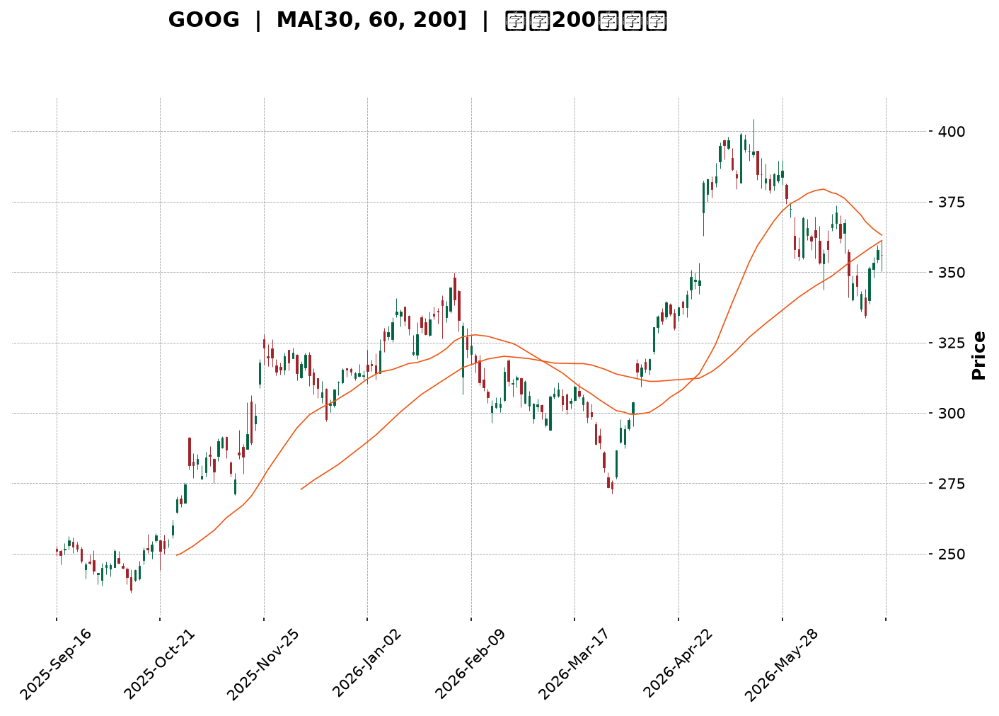
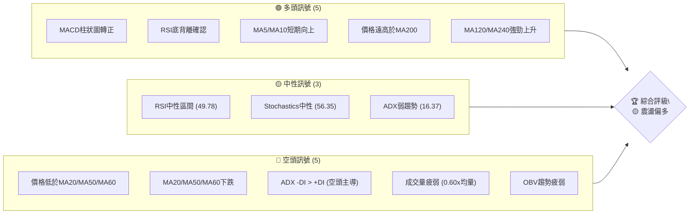
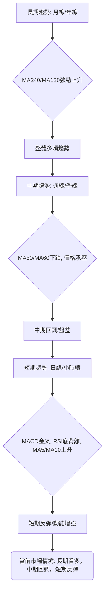
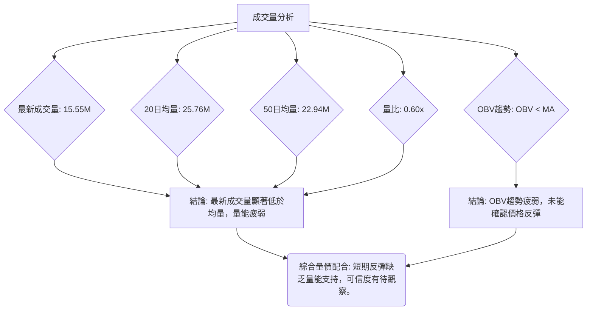
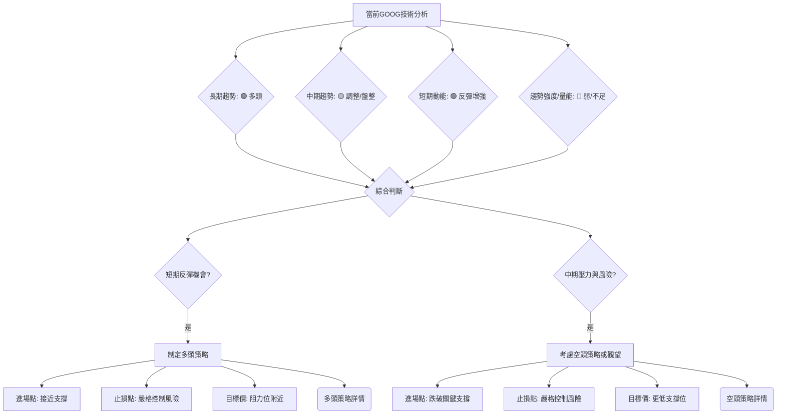

<details>
<summary>📊 靜態圖表 (點擊展開)</summary>

</details>

<html>
<head><meta charset="utf-8" /></head>
<body>
    <div style="height:500px; width:100%;">                        <script>window.PlotlyConfig = {MathJaxConfig: 'local'};</script>
        <script charset="utf-8" src="https://cdn.plot.ly/plotly-3.6.0.min.js" integrity="sha256-QaOVwtVY0T02VaHrr6pnoHLCwayMJp4O5n4YyaE3rJk=" crossorigin="anonymous"></script>                <div id="candlestick-chart" class="plotly-graph-div" style="height:100%; width:100%;"></div>            <script>                window.PLOTLYENV=window.PLOTLYENV || {};                                if (document.getElementById("candlestick-chart")) {                    Plotly.newPlot(                        "candlestick-chart",                        [{"close":{"dtype":"f8","bdata":"AAAAoLNdb0AAAABAjytvQAAAAMDDem9AAAAA4LPXb0AAAACgVIxvQAAAAGAVe29AAAAAwAvrbkAAAAAgzsJuQAAAAGBJ1m5AAAAAQDl8bkAAAACgWmJuQAAAAMDooW5AAAAAYFW+bkAAAADg+L5uQAAAAGCTYG9AAAAAwLDUbkAAAADAWp9uQAAAAOCON25AAAAAYNCgbUAAAACAKoVuQAAAAGCrtm5AAAAAoPZmb0AAAACgZGxvQAAAAKBkqW9AAAAAYEYIcEAAAACgJVtvQAAAAAAngW9AAAAAAHqnb0AAAACgAUBwQAAAAGBu1nBAAAAAgHq+cEAAAACAGypxQAAAAKCTlXFAAAAAoEyUcUAAAADgBrlxQAAAAOBBWHFAAAAAgBbDcUAAAABAgsxxQAAAACBycnFAAAAAQFggckAAAABgtTJyQAAAAEDi7XFAAAAAAC9pcUAAAADgAkdxQAAAAECp0HFAAAAA4HDGcUAAAABgq0ZyQAAAAKCaFnJAAAAAYAWxckAAAABgjd1zQAAAAGAcMHRAAAAAoHT6c0AAAACg5vdzQAAAAIAOqHNAAAAAwG22c0AAAACA4v9zQAAAAGBG3HNAAAAA4FsXdEAAAACAoqBzQAAAAGBd1XNAAAAAIEwJdEAAAABgppRzQAAAAADWYXNAAAAAYKlOc0AAAAAgQTVzQAAAAIC8mnJAAAAAQKj1ckAAAADgUENzQAAAAGDHbnNAAAAAwEm0c0AAAADgILRzQAAAAIDIqHNAAAAAAK2fc0AAAABgO6JzQAAAAGA\u002flnNAAAAAIImuc0AAAACAfs5zQAAAAGA7onNAAAAAwCUgdEAAAABgWll0QAAAACBei3RAAAAAgLvEdEAAAADg2v90QAAAACDw\u002fXRAAAAAgJrLdEAAAADAip50QAAAAGDVG3RAAAAAIDl\u002fdEAAAAAgiKZ0QAAAAKAFgHRAAAAAYHnSdEAAAABAAel0QAAAAEB1\u002fXRAAAAAAH0jdUAAAABAaSF1QAAAAMAyh3VAAAAAABZEdUAAAADAes50QAAAAIBcrnRAAAAAgNoqdEAAAABAoD90QAAAAEBt43NAAAAAYMduc0AAAADgdU9zQAAAACDuGXNAAAAAIMzmckAAAACgsfhyQAAAACCf8nJAAAAAINOnc0AAAAAgiHRzQAAAAGA6aHNAAAAAgPGJc0AAAACA\u002fCtzQAAAAIBgcHNAAAAA4Fwfc0AAAAAgn\u002fJyQAAAACDd8HJAAAAA4EbIckAAAABAkp5yQAAAACA3HXNAAAAAIO0rc0AAAACAwENzQAAAACBx8HJAAAAAgHXUckAAAABgygNzQAAAACCVU3NAAAAAINohc0AAAADgvBhzQAAAAMDDqXJAAAAAQHGtckAAAADAahByQAAAACCnFnJAAAAAYCOJcUAAAACAhhlxQAAAAKCcD3FAAAAAwP\u002fqcUAAAADgj2tyQAAAAKCGZHJAAAAAALKXckAAAACA9PtyQAAAAKDPqHNAAAAAIODCc0AAAABAe7hzQAAAAMBJ8HNAAAAAQBmmdEAAAAAgTeR0QAAAAAAeyXRAAAAAQCIzdUAAAAAgLPN0QAAAAABXpHRAAAAAIG4YdUAAAADgvxh1QAAAAGDTYXVAAAAAQPfEdUAAAADgp7R1QAAAACCesXVAAAAAQF3bd0AAAAAA1e93QAAAAECWtndAAAAAIJ8AeEAAAAAAcK54QAAAAOD+sHhAAAAAoPrMeEAAAAAAmSh4QAAAACBt+XdAAAAAwMzseEAAAADg5c54QAAAAMBVkXhAAAAAAPqNeEAAAAAgsgp4QAAAACCyCnhAAAAAYNTzd0AAAADgbbJ3QAAAAIC8CXhAAAAAgJMJeEAAAABANB54QAAAAOBBg3dAAAAAwLFFd0AAAACAymJ2QAAAAAB1N3ZAAAAAIMQQd0AAAADgo9h2QAAAAGC4knZAAAAA4KOkdkAAAADAHhV2QAAAAMD1SHZAAAAAYI9idkAAAACAwvF2QAAAAKCZMXdAAAAAoJmhdkAAAAAgXPd2QAAAAOB6zHVAAAAAoEehdUAAAADgo5B1QAAAAEAKY3VAAAAAQArrdEAAAADgevR1QAAAAKBHFXZAAAAAgD1edkAAAABA4UJ2QA=="},"high":{"dtype":"f8","bdata":"wBStHoKXb0Abvaq4oG5vQNc8mT6StG9AF4s2bSoDcEDDXuQo4PlvQJ\u002fN0g6xyG9AK5LgieKOb0AedKkvmdpuQJTzu8IuNG9AOqSvtftkb0CsdS+fWGZuQDWp+BJU1W5ASbB+cNHkbkAA5YBrTtRuQAYXTNGcdm9AbAlwi9phb0BeMn1n19huQLv3OmVjom5ALTmdt42LbkCBxCAkWJBuQO2jQzhG8W5AtiRtTH+Ib0C4HTTENxFwQGDNUYg0zG9ADo3TGwIWcEDBjKyiLNxvQC3PCJ7UCnBAAC+m3YDrb0CrNIaZ8V9wQOVtaudS5HBAAP0PHZbtcEAxTwLX4TZxQB0aOiK+NXJAlXc6eZnbcUCjYp0KF9ZxQHYiBAOGlHFAkjI9IDricUCqBA+S6wNyQCWgI2oYv3FA5NpyxzwuckD\u002fnDwxSjxyQOc8vv+bPHJAWxf\u002fUkmvcUDqOAm9qWlxQKmdSgcaX3JAacXVpOYNckD2PgwnevpyQGLyrIGiJHNAv\u002fIhl9j1ckDy+utXyvJzQM\u002fLoPJugHRAFk3XAqtFdEAc21V22WN0QEahslwT8HNA04LW06Dfc0BWWjt\u002fjxZ0QCMp1qR4J3RAvDft7iQzdEAKBbYi+Qx0QLINkV+w5HNAsGN6+TIXdEAwMKfPHRl0QLnmVJWju3NA+rTnzquEc0CO8r8gAndzQFI0mvqpTHNA3ZqPLckNc0BBrf9XY0lzQP3aoAWxdHNAtXKN7zG+c0DplIYPCb5zQBRxd5JZwnNAfjpahvGoc0DRFH0JkdRzQAC+L6Cnr3NADkuCh+EndECecOFuVe1zQKtsduc+EnRAB0p3jp9gdEB2qSYJvaF0QCA06j3CsHRAP5Dxew7gdEBOpYRgE0x1QCYWyGZxCXVA4ebuDgUbdUCvmnPu1ux0QN1Bne2WenRAlWwGBqfEdEDVEOhDXOx0QFULrFCB2XRAh7z5npP+dEC3H22wYBx1QJiji6gHE3VACjNXGH5ddUBvQYDXiD11QPBDWdVui3VAosjrmxbbdUAHNy3Oz3x1QPzG0rlbw3RA3D3tEVajdEAJQUUF\u002f3R0QE+5nzZdE3RAePY0MQQKdEDeSPl+EsFzQPb7tWjKR3NAMfp5z98Hc0Ahh0w4LBhzQCDYCwwXGnNANMq8zovFc0AemBz+m\u002fBzQI6Gzb9lf3NASlnVoQKUc0DLQozadolzQPxBhGbDenNAFNgnXM47c0BvLQCYsfhyQP9bZEH7EHNAw+io2ZXvckBzSClGAr9yQPQO+uoMJXNAAPvvx2xPc0D6ODg5HG5zQI9zVB9FR3NAz1xKFjQxc0D+rrDqLRZzQJdhYezQXXNAt11eaQJpc0CXSdKo7SdzQMdfrqD9AnNANbyuKADzckA6c26pvY5yQCG7JGK5Z3JA\u002fYXUpXvlcUBjASf+wG5xQDtKX3CAQXFA4nApiAnucUDM\u002fWRm5JxyQPk6u1ONe3JAms1\u002ffe2jckCTAcd0rP5yQDCJYqsq83NAkSCCQ9PTc0CqftHP7PRzQBQ0QVXO83NAGbIk+g6ndEAmWb2xxux0QLcsU0TVEnVABdsQ73w8dUAf+r\u002fcSy91QDe2iL55D3VAe3fPIjoddUBhd\u002flPST91QFLY7n+7d3VAuoj04gXrdUD1WFNWCNt1QOXWL7\u002f\u002fEnZAesfNzGXmd0B03cX0jPJ3QOmR0NAu\u002f3dAEBjo0Z1LeEDmNe\u002fxQ8J4QMWG6i\u002fb0XhAKTWJHxbieEB7AOgffKF4QBFviStSI3hAxcCs7gf7eEBbWzq80u14QNC4bTFFunhALZcxo6BDeUCVp3nGBZJ4QBHC\u002frVwZ3hAgdUJqiNHeEBUNJ9ZNwp4QFT3GQWIEnhAROaccNlXeEDkpPAwP1x4QGd81SO61ndAjmoHxv5ld0A2IanJFBl3QNpBw\u002fKCpHZAKrjkSzMad0BVWFympQ93QAAAAIAUtnZAAAAAYBIbd0AAAADA9eR2QAAAAAApYHZAAAAAQF7MdkAAAABgZip3QAAAAKCZWXdAAAAAYGYid0AAAAAAABB3QAAAAEAzY3ZAAAAAIIXLdUAAAACgRw12QAAAAEAKc3VAAAAAgOuBdUAAAAAghf91QAAAAIA9NnZAAAAAwPV4dkAAAAAA1492QA=="},"hovertemplate":"\u003cb\u003e%{x|%Y-%m-%d}\u003c\u002fb\u003e\u003cbr\u003e\u958b: $%{open:.2f}\u003cbr\u003e\u9ad8: $%{high:.2f}\u003cbr\u003e\u4f4e: $%{low:.2f}\u003cbr\u003e\u6536: $%{close:.2f}\u003cextra\u003e\u003c\u002fextra\u003e","low":{"dtype":"f8","bdata":"LguXkj8nb0DYXWHHH8NuQDFsahPdM29AjJL0lGVyb0A++fBLOEpvQBAWKWgpU29A2X6PZpDXbkA\u002feFM4rCVuQJgeTmcKxW5A4WnOFi1XbkA3Q+5jRuNtQHDt1hlt121A\u002fEbCSCRUbkBsuRuI3D9uQLLYPkSzpm5A35fLYHjKbkCt6PqNiZNuQCIeW4vB5m1AHtpwphqHbUBML2n27QhuQPGP5lCZFm5AcmNZuNTJbkAa0u2jv0VvQApMjJRRA29AtgxaCEPDb0AD61TiH4ZuQI\u002fmxjDBPm9Ak2yRysCIb0D34O4rK\u002fNvQDyfwVu\u002fhnBAIDxquFuqcEBOP5pher5wQKywPB5sfnFAdEIqjq5PcUC3NWLsJH1xQFA2HLMsRXFA8gReC2JVcUDJ2cLuGpFxQKii5po1M3FAn14T\u002fcOvcUAurczNEfVxQJy6C\u002fAtvXFA9utieUxXcUAT+e3AEO5wQELbI7rIunFAD0SlbG1ncUDR8Ihgt\u002fFxQJ78fV2rCXJAtYoc44tcckDIKXdMt0xzQI4fA+ob03NASDqvrUXJc0Arw5TaHsVzQG3UbULalXNAuBYobK+Zc0CzkcOspJpzQCAwdO+Pr3NAHC0CSKr1c0DrKZMzDHhzQLXWhkxkg3NA8lEub9Cvc0CqhHQLnFdzQDuzpEfzKHNAuhPJwnQVc0B\u002fTxN57\u002fZyQOu4t0L9kHJA1K2xbc3DckDbQuWDIN9yQBWZkbYJI3NAjKaR2oJlc0CeYgbQk45zQLxa3iD4lHNAkXtRL+N3c0AKJemSdY1zQE9vbW2ufHNAryb7tuljc0BbIhqyZq1zQOQ4KhDrfnNA6oV4426hc0C4V\u002f7cHRl0QGL8vBIwXXRAawVK+FxRdEAm0VVent50QF9SYYJTq3RAxATy\u002fritdEBNkJQZ3nt0QKWAzkmKB3RAhQE2wffxc0C3dCN6Nod0QIurefWreHRAjBLAWwBxdECsMZHuB9V0QF6VLQ8lu3RAM8Hik7JkdEDAxTFcS8N0QAMWO+Uk+XRAgeOBp14idUCHOMLYCo90QCAYyrtPKHNA\u002fpDsBLf7c0AqR9DwkNRzQM1dyFj9o3NA68olqppbc0DtFGVF9ztzQH8i9vQN+HJABLu7ZDOIckCoAgH6X9lyQMC2qDJxxHJA1GrmJF0Ac0Do31v2XVlzQEY5iXEMG3NA6SpxvkxPc0CR4XLWPuByQBxlQecd83JAZa+odKzKckBw5Jcs\u002fYRyQCmKfsqExnJAnTpabuWackBD\u002fJXN1W1yQODchyINXHJAl+SpnQUSc0AljUcbfxpzQA5uvHaLynJAwG13Y5i5ckD0HSguDtpyQDvxMderAnNAJu8pnMcVc0DIzFdnGs1yQJ0kpOYkiXJAjoxVsJydckBcGJh55gpyQHhdPngn83FASBnYSR1ucUD8Z5tQDBVxQBWfM3Ty9XBARrc+In9JcUBV14UAvBRyQMW0yzla9nFAZA3vCNBZckACWN3z9HNyQPqpaENFiHNAWTmCv4pUc0CIk0PonKVzQFktOHkFmHNAmGgEO08PdEDE2kGwZYd0QKcaakI1t3RAQ\u002f9bzW7RdEBg85cl3OZ0QAWzwXHolnRAtsQ\u002f4CfMdEBZ\u002fZ9AvO10QKPg97+V3XRAYuicHq5JdUBiOtquKoF1QO5ps6WVY3VA8kYEEfKtdkChTll8jHB3QIoYA7KxiHdA\u002f5dsiPDBd0CFj9vu3y14QPbdIys0YXhAt56Vk+6WeED3epCU9h94QN2d7Jndt3dArmlGhJvVd0Dw8ZZR3od4QGqSQ8VoWHhAU6jZUaNqeEC15k1uUOx3QGurXtJXvHdAJoyANAe0d0DGOVkihaB3QKLY\u002f2qXrndAZurt2FLcd0Dvhm6\u002fVNB3QGyeW58yYXdAoAEHUs0Xd0CJszBalSx2QIgX4HOrInZATOsgpmIpdkCUbNSMmZZ2QAAAAIA9XnZAAAAAIIUrdkAAAADA9Qx2QAAAAIAUenVAAAAAoHAVdkAAAABgZsp2QAAAAMAe1XZAAAAAIK6DdkAAAABgukl2QAAAAEAKT3VAAAAAoHA7dUAAAAAAAFh1QAAAAGBm\u002fnRAAAAAQArbdEAAAADA9Sx1QAAAAIDCwXVAAAAAIK4TdkAAAADAHuV1QA=="},"name":"\u50f9\u683c","open":{"dtype":"f8","bdata":"AFnOysN6b0BwSeGS+l5vQFKIJgjBa29Al1WE\u002fO+cb0AhYoTtAslvQPpGKs0UpW9Ar6j\u002f5AN1b0DxH1yZjYtuQG859u2b6W5AqWIbI0L5bkC\u002ffEFatFJuQBzZ536pFm5AyAzwaBqlbkAp4RstAphuQEwrChOTqW5AGeC+Zy0Ob0C4Oyrk\u002fLZuQNxN8VOUkm5AzefvKfY1bkBFAr053xFuQC3oz\u002fEGKW5AdeKOtzDzbkDH3SGAE39vQPhZ11l3W29A1Pa4z2HXb0B8Nv63BdhvQCWZLGJb0G9AXvARu4Smb0Arx4QYvwxwQNlbQz50jXBARpVpUb7acEAakmMwWsFwQC9p97BjMnJAH9YTZ2qqcUB0JS1f4Z1xQPkq3FheSHFAobelBlZtcUCUasT10NJxQMQlA912unFAZ261yk\u002fLcUBgVWL9LfpxQI90zdM3OHJApXvzB+emcUDJrSZez\u002fVwQLq9D5dv3XFAs8iBAbv+cUDGhcyh9PFxQBRV3ztNAnNAGnd2xqCEckDcN\u002f0FbWZzQCRXXU6SYnRA5rtlnnACdEDtCcPawSx0QN1JNcGpzXNAY2TsMnvEc0BKax6nlrZzQOCpkvObJnRADMkB\u002f\u002fv1c0BP5GT0xgl0QFH0ntsPi3NAWs+zCU\u002fDc0CwQYsx5Qp0QGme4qUlpnNAbayM9XiDc0Dv3Xg\u002fnBlzQG3WwTe1SXNA3ZpDsKHqckC0iUnL\u002fO1yQGXTqe8ZbXNAkmOxy6lrc0BNYyNPzLtzQBpAQZ4fuHNAFq5hpJaGc0C+9vUXBJBzQOVXaGxgj3NA6rR83c7Sc0CwwtN+fNRzQNHWL59VznNA5xKsQ42ic0C1L9p5XY10QLLg6nEAcXRAPLiGrS5hdED7XrKleu10QHrUFvXD6HRAIOmUNdIZdUBmCNRP9+d0QLWu6eohDXRA7q5CsdAKdEBE6A2xQt10QEtrSqqIw3RA7AgZ0Fh8dEBXEt5hEvN0QKOgaxy7AnVAUZQ7N34+dUA7EKJBYOB0QCZsUMLFAXVAGxZaefbAdUDd0o3z5nR1QIJZ7wmpjHNAzNEdyMNudEAGmWnEIQ10QDF16u\u002fbB3RAHxKDFrPoc0BgcEkSFH9zQL3NIj9UOXNAmgUGh\u002fbDckC+BIHvmOByQFE\u002fJs8A4nJAyZDwfG8Gc0DweyGNk+tzQFSSKP\u002fAY3NAI91Y\u002fWZ7c0Bh8mclWYZzQCQMq4mx+HJA+3rNJR3pckC1D5A5faByQAFv57aj5HJAxj5Fgt7sckDcM8dI+HpyQHdtO2FUX3JAtg5XeQ4bc0Ac1iYZ2iFzQHDW7LtpIHNA7EjVc4cnc0CXTy+lrfZyQForYM3JB3NAjGi3S4Q7c0A\u002fZHEVcfByQOV04p0x\u002fnJAaZi3h5bFckDoucRagoByQGmdTpGWP3JAwb7OMkngcUAzuBvoulNxQF62grVjNHFAHflIFvhVcUDkPuC+4xxyQPt7J\u002foODXJAJ+T2Kl1ockDwNzsWWr9yQDIVPqM42nNATp55tQaQc0AcxQCUieBzQIkNLVavs3NAZ8P32fAddEBqa\u002fdhx6V0QD5JVyle+nRAcgZpXqnjdECzzCS3syV1QLgOJ2Yh9nRAh744AvDqdEAL+O+g7jV1QNXWQhVFGHVAogBkTsV6dUCoD8ytYat1QAzRIAJblHVAZUg104Ewd0Cio9noCpx3QJiO1eVw4XdAaVq7qT7ad0AjzmnMsFV4QH1z+okjzXhAm441mYageEAOVaW3R2d4QFecw3dLDHhA4g9J983ad0AJycaz2Zh4QCnKOuKnj3hAAu477Tl+eEAXbzjOA5F4QFLCsUfvDHhAP3zS2Hvcd0ALPP7QePB3QENwDtlAzHdAdVRrdo7od0CJjlrREPp3QInT3W\u002fuz3dARx8jY51Fd0CmfGqfEK92QHcbjFXpYXZAyc95kp4zdkCM8xY9lbJ2QAAAAIDCp3ZAAAAAACnOdkAAAADAzJB2QAAAAMDMEHZAAAAAoJmRdkAAAAAA1992QAAAAKBw93ZAAAAAwMzwdkAAAACAPb52QAAAAAApUnZAAAAAIK5BdUAAAAAghct1QAAAAGC4DnVAAAAAIK5PdUAAAABAMz91QAAAACBc73VAAAAAANcpdkAAAABgZkJ2QA=="},"x":["2025-09-16T00:00:00-04:00","2025-09-17T00:00:00-04:00","2025-09-18T00:00:00-04:00","2025-09-19T00:00:00-04:00","2025-09-22T00:00:00-04:00","2025-09-23T00:00:00-04:00","2025-09-24T00:00:00-04:00","2025-09-25T00:00:00-04:00","2025-09-26T00:00:00-04:00","2025-09-29T00:00:00-04:00","2025-09-30T00:00:00-04:00","2025-10-01T00:00:00-04:00","2025-10-02T00:00:00-04:00","2025-10-03T00:00:00-04:00","2025-10-06T00:00:00-04:00","2025-10-07T00:00:00-04:00","2025-10-08T00:00:00-04:00","2025-10-09T00:00:00-04:00","2025-10-10T00:00:00-04:00","2025-10-13T00:00:00-04:00","2025-10-14T00:00:00-04:00","2025-10-15T00:00:00-04:00","2025-10-16T00:00:00-04:00","2025-10-17T00:00:00-04:00","2025-10-20T00:00:00-04:00","2025-10-21T00:00:00-04:00","2025-10-22T00:00:00-04:00","2025-10-23T00:00:00-04:00","2025-10-24T00:00:00-04:00","2025-10-27T00:00:00-04:00","2025-10-28T00:00:00-04:00","2025-10-29T00:00:00-04:00","2025-10-30T00:00:00-04:00","2025-10-31T00:00:00-04:00","2025-11-03T00:00:00-05:00","2025-11-04T00:00:00-05:00","2025-11-05T00:00:00-05:00","2025-11-06T00:00:00-05:00","2025-11-07T00:00:00-05:00","2025-11-10T00:00:00-05:00","2025-11-11T00:00:00-05:00","2025-11-12T00:00:00-05:00","2025-11-13T00:00:00-05:00","2025-11-14T00:00:00-05:00","2025-11-17T00:00:00-05:00","2025-11-18T00:00:00-05:00","2025-11-19T00:00:00-05:00","2025-11-20T00:00:00-05:00","2025-11-21T00:00:00-05:00","2025-11-24T00:00:00-05:00","2025-11-25T00:00:00-05:00","2025-11-26T00:00:00-05:00","2025-11-28T00:00:00-05:00","2025-12-01T00:00:00-05:00","2025-12-02T00:00:00-05:00","2025-12-03T00:00:00-05:00","2025-12-04T00:00:00-05:00","2025-12-05T00:00:00-05:00","2025-12-08T00:00:00-05:00","2025-12-09T00:00:00-05:00","2025-12-10T00:00:00-05:00","2025-12-11T00:00:00-05:00","2025-12-12T00:00:00-05:00","2025-12-15T00:00:00-05:00","2025-12-16T00:00:00-05:00","2025-12-17T00:00:00-05:00","2025-12-18T00:00:00-05:00","2025-12-19T00:00:00-05:00","2025-12-22T00:00:00-05:00","2025-12-23T00:00:00-05:00","2025-12-24T00:00:00-05:00","2025-12-26T00:00:00-05:00","2025-12-29T00:00:00-05:00","2025-12-30T00:00:00-05:00","2025-12-31T00:00:00-05:00","2026-01-02T00:00:00-05:00","2026-01-05T00:00:00-05:00","2026-01-06T00:00:00-05:00","2026-01-07T00:00:00-05:00","2026-01-08T00:00:00-05:00","2026-01-09T00:00:00-05:00","2026-01-12T00:00:00-05:00","2026-01-13T00:00:00-05:00","2026-01-14T00:00:00-05:00","2026-01-15T00:00:00-05:00","2026-01-16T00:00:00-05:00","2026-01-20T00:00:00-05:00","2026-01-21T00:00:00-05:00","2026-01-22T00:00:00-05:00","2026-01-23T00:00:00-05:00","2026-01-26T00:00:00-05:00","2026-01-27T00:00:00-05:00","2026-01-28T00:00:00-05:00","2026-01-29T00:00:00-05:00","2026-01-30T00:00:00-05:00","2026-02-02T00:00:00-05:00","2026-02-03T00:00:00-05:00","2026-02-04T00:00:00-05:00","2026-02-05T00:00:00-05:00","2026-02-06T00:00:00-05:00","2026-02-09T00:00:00-05:00","2026-02-10T00:00:00-05:00","2026-02-11T00:00:00-05:00","2026-02-12T00:00:00-05:00","2026-02-13T00:00:00-05:00","2026-02-17T00:00:00-05:00","2026-02-18T00:00:00-05:00","2026-02-19T00:00:00-05:00","2026-02-20T00:00:00-05:00","2026-02-23T00:00:00-05:00","2026-02-24T00:00:00-05:00","2026-02-25T00:00:00-05:00","2026-02-26T00:00:00-05:00","2026-02-27T00:00:00-05:00","2026-03-02T00:00:00-05:00","2026-03-03T00:00:00-05:00","2026-03-04T00:00:00-05:00","2026-03-05T00:00:00-05:00","2026-03-06T00:00:00-05:00","2026-03-09T00:00:00-04:00","2026-03-10T00:00:00-04:00","2026-03-11T00:00:00-04:00","2026-03-12T00:00:00-04:00","2026-03-13T00:00:00-04:00","2026-03-16T00:00:00-04:00","2026-03-17T00:00:00-04:00","2026-03-18T00:00:00-04:00","2026-03-19T00:00:00-04:00","2026-03-20T00:00:00-04:00","2026-03-23T00:00:00-04:00","2026-03-24T00:00:00-04:00","2026-03-25T00:00:00-04:00","2026-03-26T00:00:00-04:00","2026-03-27T00:00:00-04:00","2026-03-30T00:00:00-04:00","2026-03-31T00:00:00-04:00","2026-04-01T00:00:00-04:00","2026-04-02T00:00:00-04:00","2026-04-06T00:00:00-04:00","2026-04-07T00:00:00-04:00","2026-04-08T00:00:00-04:00","2026-04-09T00:00:00-04:00","2026-04-10T00:00:00-04:00","2026-04-13T00:00:00-04:00","2026-04-14T00:00:00-04:00","2026-04-15T00:00:00-04:00","2026-04-16T00:00:00-04:00","2026-04-17T00:00:00-04:00","2026-04-20T00:00:00-04:00","2026-04-21T00:00:00-04:00","2026-04-22T00:00:00-04:00","2026-04-23T00:00:00-04:00","2026-04-24T00:00:00-04:00","2026-04-27T00:00:00-04:00","2026-04-28T00:00:00-04:00","2026-04-29T00:00:00-04:00","2026-04-30T00:00:00-04:00","2026-05-01T00:00:00-04:00","2026-05-04T00:00:00-04:00","2026-05-05T00:00:00-04:00","2026-05-06T00:00:00-04:00","2026-05-07T00:00:00-04:00","2026-05-08T00:00:00-04:00","2026-05-11T00:00:00-04:00","2026-05-12T00:00:00-04:00","2026-05-13T00:00:00-04:00","2026-05-14T00:00:00-04:00","2026-05-15T00:00:00-04:00","2026-05-18T00:00:00-04:00","2026-05-19T00:00:00-04:00","2026-05-20T00:00:00-04:00","2026-05-21T00:00:00-04:00","2026-05-22T00:00:00-04:00","2026-05-26T00:00:00-04:00","2026-05-27T00:00:00-04:00","2026-05-28T00:00:00-04:00","2026-05-29T00:00:00-04:00","2026-06-01T00:00:00-04:00","2026-06-02T00:00:00-04:00","2026-06-03T00:00:00-04:00","2026-06-04T00:00:00-04:00","2026-06-05T00:00:00-04:00","2026-06-08T00:00:00-04:00","2026-06-09T00:00:00-04:00","2026-06-10T00:00:00-04:00","2026-06-11T00:00:00-04:00","2026-06-12T00:00:00-04:00","2026-06-15T00:00:00-04:00","2026-06-16T00:00:00-04:00","2026-06-17T00:00:00-04:00","2026-06-18T00:00:00-04:00","2026-06-22T00:00:00-04:00","2026-06-23T00:00:00-04:00","2026-06-24T00:00:00-04:00","2026-06-25T00:00:00-04:00","2026-06-26T00:00:00-04:00","2026-06-29T00:00:00-04:00","2026-06-30T00:00:00-04:00","2026-07-01T00:00:00-04:00","2026-07-02T00:00:00-04:00"],"type":"candlestick"},{"hovertemplate":"MA30: $%{y:.2f}\u003cextra\u003e\u003c\u002fextra\u003e","line":{"color":"#2196F3","dash":"dash","width":2},"mode":"lines","name":"MA30","x":["2025-09-16T00:00:00-04:00","2025-09-17T00:00:00-04:00","2025-09-18T00:00:00-04:00","2025-09-19T00:00:00-04:00","2025-09-22T00:00:00-04:00","2025-09-23T00:00:00-04:00","2025-09-24T00:00:00-04:00","2025-09-25T00:00:00-04:00","2025-09-26T00:00:00-04:00","2025-09-29T00:00:00-04:00","2025-09-30T00:00:00-04:00","2025-10-01T00:00:00-04:00","2025-10-02T00:00:00-04:00","2025-10-03T00:00:00-04:00","2025-10-06T00:00:00-04:00","2025-10-07T00:00:00-04:00","2025-10-08T00:00:00-04:00","2025-10-09T00:00:00-04:00","2025-10-10T00:00:00-04:00","2025-10-13T00:00:00-04:00","2025-10-14T00:00:00-04:00","2025-10-15T00:00:00-04:00","2025-10-16T00:00:00-04:00","2025-10-17T00:00:00-04:00","2025-10-20T00:00:00-04:00","2025-10-21T00:00:00-04:00","2025-10-22T00:00:00-04:00","2025-10-23T00:00:00-04:00","2025-10-24T00:00:00-04:00","2025-10-27T00:00:00-04:00","2025-10-28T00:00:00-04:00","2025-10-29T00:00:00-04:00","2025-10-30T00:00:00-04:00","2025-10-31T00:00:00-04:00","2025-11-03T00:00:00-05:00","2025-11-04T00:00:00-05:00","2025-11-05T00:00:00-05:00","2025-11-06T00:00:00-05:00","2025-11-07T00:00:00-05:00","2025-11-10T00:00:00-05:00","2025-11-11T00:00:00-05:00","2025-11-12T00:00:00-05:00","2025-11-13T00:00:00-05:00","2025-11-14T00:00:00-05:00","2025-11-17T00:00:00-05:00","2025-11-18T00:00:00-05:00","2025-11-19T00:00:00-05:00","2025-11-20T00:00:00-05:00","2025-11-21T00:00:00-05:00","2025-11-24T00:00:00-05:00","2025-11-25T00:00:00-05:00","2025-11-26T00:00:00-05:00","2025-11-28T00:00:00-05:00","2025-12-01T00:00:00-05:00","2025-12-02T00:00:00-05:00","2025-12-03T00:00:00-05:00","2025-12-04T00:00:00-05:00","2025-12-05T00:00:00-05:00","2025-12-08T00:00:00-05:00","2025-12-09T00:00:00-05:00","2025-12-10T00:00:00-05:00","2025-12-11T00:00:00-05:00","2025-12-12T00:00:00-05:00","2025-12-15T00:00:00-05:00","2025-12-16T00:00:00-05:00","2025-12-17T00:00:00-05:00","2025-12-18T00:00:00-05:00","2025-12-19T00:00:00-05:00","2025-12-22T00:00:00-05:00","2025-12-23T00:00:00-05:00","2025-12-24T00:00:00-05:00","2025-12-26T00:00:00-05:00","2025-12-29T00:00:00-05:00","2025-12-30T00:00:00-05:00","2025-12-31T00:00:00-05:00","2026-01-02T00:00:00-05:00","2026-01-05T00:00:00-05:00","2026-01-06T00:00:00-05:00","2026-01-07T00:00:00-05:00","2026-01-08T00:00:00-05:00","2026-01-09T00:00:00-05:00","2026-01-12T00:00:00-05:00","2026-01-13T00:00:00-05:00","2026-01-14T00:00:00-05:00","2026-01-15T00:00:00-05:00","2026-01-16T00:00:00-05:00","2026-01-20T00:00:00-05:00","2026-01-21T00:00:00-05:00","2026-01-22T00:00:00-05:00","2026-01-23T00:00:00-05:00","2026-01-26T00:00:00-05:00","2026-01-27T00:00:00-05:00","2026-01-28T00:00:00-05:00","2026-01-29T00:00:00-05:00","2026-01-30T00:00:00-05:00","2026-02-02T00:00:00-05:00","2026-02-03T00:00:00-05:00","2026-02-04T00:00:00-05:00","2026-02-05T00:00:00-05:00","2026-02-06T00:00:00-05:00","2026-02-09T00:00:00-05:00","2026-02-10T00:00:00-05:00","2026-02-11T00:00:00-05:00","2026-02-12T00:00:00-05:00","2026-02-13T00:00:00-05:00","2026-02-17T00:00:00-05:00","2026-02-18T00:00:00-05:00","2026-02-19T00:00:00-05:00","2026-02-20T00:00:00-05:00","2026-02-23T00:00:00-05:00","2026-02-24T00:00:00-05:00","2026-02-25T00:00:00-05:00","2026-02-26T00:00:00-05:00","2026-02-27T00:00:00-05:00","2026-03-02T00:00:00-05:00","2026-03-03T00:00:00-05:00","2026-03-04T00:00:00-05:00","2026-03-05T00:00:00-05:00","2026-03-06T00:00:00-05:00","2026-03-09T00:00:00-04:00","2026-03-10T00:00:00-04:00","2026-03-11T00:00:00-04:00","2026-03-12T00:00:00-04:00","2026-03-13T00:00:00-04:00","2026-03-16T00:00:00-04:00","2026-03-17T00:00:00-04:00","2026-03-18T00:00:00-04:00","2026-03-19T00:00:00-04:00","2026-03-20T00:00:00-04:00","2026-03-23T00:00:00-04:00","2026-03-24T00:00:00-04:00","2026-03-25T00:00:00-04:00","2026-03-26T00:00:00-04:00","2026-03-27T00:00:00-04:00","2026-03-30T00:00:00-04:00","2026-03-31T00:00:00-04:00","2026-04-01T00:00:00-04:00","2026-04-02T00:00:00-04:00","2026-04-06T00:00:00-04:00","2026-04-07T00:00:00-04:00","2026-04-08T00:00:00-04:00","2026-04-09T00:00:00-04:00","2026-04-10T00:00:00-04:00","2026-04-13T00:00:00-04:00","2026-04-14T00:00:00-04:00","2026-04-15T00:00:00-04:00","2026-04-16T00:00:00-04:00","2026-04-17T00:00:00-04:00","2026-04-20T00:00:00-04:00","2026-04-21T00:00:00-04:00","2026-04-22T00:00:00-04:00","2026-04-23T00:00:00-04:00","2026-04-24T00:00:00-04:00","2026-04-27T00:00:00-04:00","2026-04-28T00:00:00-04:00","2026-04-29T00:00:00-04:00","2026-04-30T00:00:00-04:00","2026-05-01T00:00:00-04:00","2026-05-04T00:00:00-04:00","2026-05-05T00:00:00-04:00","2026-05-06T00:00:00-04:00","2026-05-07T00:00:00-04:00","2026-05-08T00:00:00-04:00","2026-05-11T00:00:00-04:00","2026-05-12T00:00:00-04:00","2026-05-13T00:00:00-04:00","2026-05-14T00:00:00-04:00","2026-05-15T00:00:00-04:00","2026-05-18T00:00:00-04:00","2026-05-19T00:00:00-04:00","2026-05-20T00:00:00-04:00","2026-05-21T00:00:00-04:00","2026-05-22T00:00:00-04:00","2026-05-26T00:00:00-04:00","2026-05-27T00:00:00-04:00","2026-05-28T00:00:00-04:00","2026-05-29T00:00:00-04:00","2026-06-01T00:00:00-04:00","2026-06-02T00:00:00-04:00","2026-06-03T00:00:00-04:00","2026-06-04T00:00:00-04:00","2026-06-05T00:00:00-04:00","2026-06-08T00:00:00-04:00","2026-06-09T00:00:00-04:00","2026-06-10T00:00:00-04:00","2026-06-11T00:00:00-04:00","2026-06-12T00:00:00-04:00","2026-06-15T00:00:00-04:00","2026-06-16T00:00:00-04:00","2026-06-17T00:00:00-04:00","2026-06-18T00:00:00-04:00","2026-06-22T00:00:00-04:00","2026-06-23T00:00:00-04:00","2026-06-24T00:00:00-04:00","2026-06-25T00:00:00-04:00","2026-06-26T00:00:00-04:00","2026-06-29T00:00:00-04:00","2026-06-30T00:00:00-04:00","2026-07-01T00:00:00-04:00","2026-07-02T00:00:00-04:00"],"y":{"dtype":"f8","bdata":"AAAAAAAA+H8AAAAAAAD4fwAAAAAAAPh\u002fAAAAAAAA+H8AAAAAAAD4fwAAAAAAAPh\u002fAAAAAAAA+H8AAAAAAAD4fwAAAAAAAPh\u002fAAAAAAAA+H8AAAAAAAD4fwAAAAAAAPh\u002fAAAAAAAA+H8AAAAAAAD4fwAAAAAAAPh\u002fAAAAAAAA+H8AAAAAAAD4fwAAAAAAAPh\u002fAAAAAAAA+H8AAAAAAAD4fwAAAAAAAPh\u002fAAAAAAAA+H8AAAAAAAD4fwAAAAAAAPh\u002fAAAAAAAA+H8AAAAAAAD4fwAAAAAAAPh\u002fAAAAAAAA+H8AAAAAAAD4fwAAABBUL29Ad3d3129Bb0De3d1dZFxvQGZmZibfe29AAAAAECuYb0B3d3f3bLlvQDMzM4PO1G9AvLu7axz8b0AAAABAsRJwQJqZmaEAJHBAAAAAOJw8cEAzMzPjQlZwQFVVVRWPbHBAiYiIoPV9cEB3d3fXNY5wQBERESlboHBAREREHH60cEAAAADYys1wQImIiEg453BA7+7ulk4IcUCJiIggmy9xQDMzM\u002fPUWHFAIiIiulR9cUCamZmJp6FxQGZmZr5MwnFAzczMdLThcUCrqqr6lAZyQJqZmXmjKXJAMzMzowZOckDNzMzM2GpyQM3MzExphHJAq6qqWoGgckBVVVWVH7VyQBERESF3xHJARERE9DXTckAAAACQ4t9yQCIiImKi6nJAERERcdr0ckC8u7vLWAFzQCIiIpJKEnNA3t3djcEfc0CJiIh4mixzQBEREeFdO3NAIiIi8j9Oc0De3d1tW2JzQImIiAh6cXNAvLu7G7+Bc0De3d2tzo5zQERERLT+m3NAREREhDuoc0AzMzPzW6xzQM3MzKxmr3NAVVVVxSS2c0De3d0t8b5zQBEREZFWynNAq6qqypPTc0Crqqqq3dhzQImIiAj82nNAd3d3V3Lec0AiIiIyLedzQImIiHjd7HNA3t3dLZLzc0CrqqqK6v5zQM3MzAyjDHRAREREtEMcdEARERFxqyx0QBEREVGeRXRAREREpExZdEBERES0eGZ0QO\u002fu7s4fcXRAERERkRN1dEAiIiLyuXl0QO\u002fu7l6ue3RA3t3dHQ16dEDNzMzMSnd0QFVVVfUlc3RAZmZmhn1sdECJiIgYXWV0QN7d3Y2CX3RAzczMzH9bdEAREREx31N0QM3MzMwqSnRAmpmZmaw\u002fdEDv7u4eFDB0QJqZmZnTInRAd3d3R40UdEARERGxSQZ0QLy7u3tS\u002fHNA7+7uzrDtc0AAAADQW9xzQBERESGI0HNAMzMzY3LCc0AiIiKyZ7RzQO\u002fu7o7nonNAvLu7GzSPc0B3d3dHJn1zQCIiIsJcanNAAAAAkCdYc0CrqqoqkElzQAAAAOBXOHNAq6qqKqErc0AAAABA\u002fRhzQAAAAFChCXNA3t3dLXH5ckDe3d3dk+ZyQAAAAMAq1XJAIiIiEsbMckDv7u6+EchyQCIiIjJVw3JAZmZmBkO6ckCrqqoaPrZyQGZmZjZluHJAiYiICEu6ckDNzMzs+b5yQO\u002fu7m49w3JAZmZmtkPQckBERESU2uByQJqZmXmY8HJAMzMzYzkFc0AiIiJiHBlzQKuqqvolJnNA3t3drZA2c0CrqqrKMkZzQGZmZmYLW3NAq6qqyiB0c0C8u7sbF4tzQLy7u5tKn3NAd3d3x5vHc0AiIiJi6fBzQHd3d3cBHHRA3t3d7XFJdEAiIiKS6YF0QERERNRBunRAiYiIeED4dEAiIiLSfDR1QM3MzDx7b3VAZmZmVkardUBEREQ0yeF1QGZmZsZ6FnZAq6qqCltJdkDv7u5+g3R2QJqZmenomXZAmpmZyay9dkBmZmZGm992QBEREZGWAndAq6qqCoEfd0Dv7u6+CDt3QFVVVTVOUndAiYiIqP1jd0C8u7urPnB3QKuqqpqufXdAVVVVRX6Od0BVVVVFbJ13QJqZmQmWp3dAmpmZuQqvd0AzMzPjQbJ3QHd3d1dNt3dAIiIi8r2qd0DNzMzcRaJ3QKuqqgrXnXdAiYiIqCOSd0DNzMzcgIN3QLy7u8vRandAvLu7S8NPd0BmZmaGoTl3QJqZmSmNI3dAMzMzA1wBd0DNzMwcA+l2QBEREXHP03ZAZmZmBifBdkBVVVVl9bF2QA=="},"type":"scatter"},{"hovertemplate":"MA60: $%{y:.2f}\u003cextra\u003e\u003c\u002fextra\u003e","line":{"color":"#9C27B0","dash":"dash","width":2},"mode":"lines","name":"MA60","x":["2025-09-16T00:00:00-04:00","2025-09-17T00:00:00-04:00","2025-09-18T00:00:00-04:00","2025-09-19T00:00:00-04:00","2025-09-22T00:00:00-04:00","2025-09-23T00:00:00-04:00","2025-09-24T00:00:00-04:00","2025-09-25T00:00:00-04:00","2025-09-26T00:00:00-04:00","2025-09-29T00:00:00-04:00","2025-09-30T00:00:00-04:00","2025-10-01T00:00:00-04:00","2025-10-02T00:00:00-04:00","2025-10-03T00:00:00-04:00","2025-10-06T00:00:00-04:00","2025-10-07T00:00:00-04:00","2025-10-08T00:00:00-04:00","2025-10-09T00:00:00-04:00","2025-10-10T00:00:00-04:00","2025-10-13T00:00:00-04:00","2025-10-14T00:00:00-04:00","2025-10-15T00:00:00-04:00","2025-10-16T00:00:00-04:00","2025-10-17T00:00:00-04:00","2025-10-20T00:00:00-04:00","2025-10-21T00:00:00-04:00","2025-10-22T00:00:00-04:00","2025-10-23T00:00:00-04:00","2025-10-24T00:00:00-04:00","2025-10-27T00:00:00-04:00","2025-10-28T00:00:00-04:00","2025-10-29T00:00:00-04:00","2025-10-30T00:00:00-04:00","2025-10-31T00:00:00-04:00","2025-11-03T00:00:00-05:00","2025-11-04T00:00:00-05:00","2025-11-05T00:00:00-05:00","2025-11-06T00:00:00-05:00","2025-11-07T00:00:00-05:00","2025-11-10T00:00:00-05:00","2025-11-11T00:00:00-05:00","2025-11-12T00:00:00-05:00","2025-11-13T00:00:00-05:00","2025-11-14T00:00:00-05:00","2025-11-17T00:00:00-05:00","2025-11-18T00:00:00-05:00","2025-11-19T00:00:00-05:00","2025-11-20T00:00:00-05:00","2025-11-21T00:00:00-05:00","2025-11-24T00:00:00-05:00","2025-11-25T00:00:00-05:00","2025-11-26T00:00:00-05:00","2025-11-28T00:00:00-05:00","2025-12-01T00:00:00-05:00","2025-12-02T00:00:00-05:00","2025-12-03T00:00:00-05:00","2025-12-04T00:00:00-05:00","2025-12-05T00:00:00-05:00","2025-12-08T00:00:00-05:00","2025-12-09T00:00:00-05:00","2025-12-10T00:00:00-05:00","2025-12-11T00:00:00-05:00","2025-12-12T00:00:00-05:00","2025-12-15T00:00:00-05:00","2025-12-16T00:00:00-05:00","2025-12-17T00:00:00-05:00","2025-12-18T00:00:00-05:00","2025-12-19T00:00:00-05:00","2025-12-22T00:00:00-05:00","2025-12-23T00:00:00-05:00","2025-12-24T00:00:00-05:00","2025-12-26T00:00:00-05:00","2025-12-29T00:00:00-05:00","2025-12-30T00:00:00-05:00","2025-12-31T00:00:00-05:00","2026-01-02T00:00:00-05:00","2026-01-05T00:00:00-05:00","2026-01-06T00:00:00-05:00","2026-01-07T00:00:00-05:00","2026-01-08T00:00:00-05:00","2026-01-09T00:00:00-05:00","2026-01-12T00:00:00-05:00","2026-01-13T00:00:00-05:00","2026-01-14T00:00:00-05:00","2026-01-15T00:00:00-05:00","2026-01-16T00:00:00-05:00","2026-01-20T00:00:00-05:00","2026-01-21T00:00:00-05:00","2026-01-22T00:00:00-05:00","2026-01-23T00:00:00-05:00","2026-01-26T00:00:00-05:00","2026-01-27T00:00:00-05:00","2026-01-28T00:00:00-05:00","2026-01-29T00:00:00-05:00","2026-01-30T00:00:00-05:00","2026-02-02T00:00:00-05:00","2026-02-03T00:00:00-05:00","2026-02-04T00:00:00-05:00","2026-02-05T00:00:00-05:00","2026-02-06T00:00:00-05:00","2026-02-09T00:00:00-05:00","2026-02-10T00:00:00-05:00","2026-02-11T00:00:00-05:00","2026-02-12T00:00:00-05:00","2026-02-13T00:00:00-05:00","2026-02-17T00:00:00-05:00","2026-02-18T00:00:00-05:00","2026-02-19T00:00:00-05:00","2026-02-20T00:00:00-05:00","2026-02-23T00:00:00-05:00","2026-02-24T00:00:00-05:00","2026-02-25T00:00:00-05:00","2026-02-26T00:00:00-05:00","2026-02-27T00:00:00-05:00","2026-03-02T00:00:00-05:00","2026-03-03T00:00:00-05:00","2026-03-04T00:00:00-05:00","2026-03-05T00:00:00-05:00","2026-03-06T00:00:00-05:00","2026-03-09T00:00:00-04:00","2026-03-10T00:00:00-04:00","2026-03-11T00:00:00-04:00","2026-03-12T00:00:00-04:00","2026-03-13T00:00:00-04:00","2026-03-16T00:00:00-04:00","2026-03-17T00:00:00-04:00","2026-03-18T00:00:00-04:00","2026-03-19T00:00:00-04:00","2026-03-20T00:00:00-04:00","2026-03-23T00:00:00-04:00","2026-03-24T00:00:00-04:00","2026-03-25T00:00:00-04:00","2026-03-26T00:00:00-04:00","2026-03-27T00:00:00-04:00","2026-03-30T00:00:00-04:00","2026-03-31T00:00:00-04:00","2026-04-01T00:00:00-04:00","2026-04-02T00:00:00-04:00","2026-04-06T00:00:00-04:00","2026-04-07T00:00:00-04:00","2026-04-08T00:00:00-04:00","2026-04-09T00:00:00-04:00","2026-04-10T00:00:00-04:00","2026-04-13T00:00:00-04:00","2026-04-14T00:00:00-04:00","2026-04-15T00:00:00-04:00","2026-04-16T00:00:00-04:00","2026-04-17T00:00:00-04:00","2026-04-20T00:00:00-04:00","2026-04-21T00:00:00-04:00","2026-04-22T00:00:00-04:00","2026-04-23T00:00:00-04:00","2026-04-24T00:00:00-04:00","2026-04-27T00:00:00-04:00","2026-04-28T00:00:00-04:00","2026-04-29T00:00:00-04:00","2026-04-30T00:00:00-04:00","2026-05-01T00:00:00-04:00","2026-05-04T00:00:00-04:00","2026-05-05T00:00:00-04:00","2026-05-06T00:00:00-04:00","2026-05-07T00:00:00-04:00","2026-05-08T00:00:00-04:00","2026-05-11T00:00:00-04:00","2026-05-12T00:00:00-04:00","2026-05-13T00:00:00-04:00","2026-05-14T00:00:00-04:00","2026-05-15T00:00:00-04:00","2026-05-18T00:00:00-04:00","2026-05-19T00:00:00-04:00","2026-05-20T00:00:00-04:00","2026-05-21T00:00:00-04:00","2026-05-22T00:00:00-04:00","2026-05-26T00:00:00-04:00","2026-05-27T00:00:00-04:00","2026-05-28T00:00:00-04:00","2026-05-29T00:00:00-04:00","2026-06-01T00:00:00-04:00","2026-06-02T00:00:00-04:00","2026-06-03T00:00:00-04:00","2026-06-04T00:00:00-04:00","2026-06-05T00:00:00-04:00","2026-06-08T00:00:00-04:00","2026-06-09T00:00:00-04:00","2026-06-10T00:00:00-04:00","2026-06-11T00:00:00-04:00","2026-06-12T00:00:00-04:00","2026-06-15T00:00:00-04:00","2026-06-16T00:00:00-04:00","2026-06-17T00:00:00-04:00","2026-06-18T00:00:00-04:00","2026-06-22T00:00:00-04:00","2026-06-23T00:00:00-04:00","2026-06-24T00:00:00-04:00","2026-06-25T00:00:00-04:00","2026-06-26T00:00:00-04:00","2026-06-29T00:00:00-04:00","2026-06-30T00:00:00-04:00","2026-07-01T00:00:00-04:00","2026-07-02T00:00:00-04:00"],"y":{"dtype":"f8","bdata":"AAAAAAAA+H8AAAAAAAD4fwAAAAAAAPh\u002fAAAAAAAA+H8AAAAAAAD4fwAAAAAAAPh\u002fAAAAAAAA+H8AAAAAAAD4fwAAAAAAAPh\u002fAAAAAAAA+H8AAAAAAAD4fwAAAAAAAPh\u002fAAAAAAAA+H8AAAAAAAD4fwAAAAAAAPh\u002fAAAAAAAA+H8AAAAAAAD4fwAAAAAAAPh\u002fAAAAAAAA+H8AAAAAAAD4fwAAAAAAAPh\u002fAAAAAAAA+H8AAAAAAAD4fwAAAAAAAPh\u002fAAAAAAAA+H8AAAAAAAD4fwAAAAAAAPh\u002fAAAAAAAA+H8AAAAAAAD4fwAAAAAAAPh\u002fAAAAAAAA+H8AAAAAAAD4fwAAAAAAAPh\u002fAAAAAAAA+H8AAAAAAAD4fwAAAAAAAPh\u002fAAAAAAAA+H8AAAAAAAD4fwAAAAAAAPh\u002fAAAAAAAA+H8AAAAAAAD4fwAAAAAAAPh\u002fAAAAAAAA+H8AAAAAAAD4fwAAAAAAAPh\u002fAAAAAAAA+H8AAAAAAAD4fwAAAAAAAPh\u002fAAAAAAAA+H8AAAAAAAD4fwAAAAAAAPh\u002fAAAAAAAA+H8AAAAAAAD4fwAAAAAAAPh\u002fAAAAAAAA+H8AAAAAAAD4fwAAAAAAAPh\u002fAAAAAAAA+H8AAAAAAAD4f2ZmZqoJDnFAMzMzo5wgcUAiIiLiqDFxQCIiIlozQXFAIiIivqVPcUDe3d2FTF5xQN7d3dGEanFAd3d3U3R5cUDe3d0FBYpxQN7d3Zklm3FA7+7u4i6ucUDe3d2tbsFxQDMzM3v203FAVVVVyRrmcUCrqqqiSPhxQM3MzJjqCHJAAAAAnB4bckDv7u7CTC5yQGZmZn6bQXJAmpmZDUVYckDe3d2J+21yQAAAANAdhHJAvLu7v7yZckC8u7tbTLByQLy7u6dRxnJAvLu7H6TackCrqqpSue9yQBEREcFPAnNAVVVVfTwWc0B3d3f\u002fAilzQKuqqmKjOHNARERExAlKc0AAAAAQBVpzQO\u002fu7haNaHNARERE1Lx3c0CJiIgAR4ZzQJqZmVkgmHNAq6qqihOnc0AAAADA6LNzQImIiDC1wXNAd3d3j2rKc0BVVVU1KtNzQAAAACCG23NAAAAAiCbkc0BVVVUd0+xzQO\u002fu7v5P8nNAERERUR73c0AzMzPjFfpzQBEREaHA\u002fXNAiYiIqN0BdEAiIiKSHQB0QM3MzLzI\u002fHNAd3d3r+j6c0BmZmamgvdzQFVVVRWV9nNAERERiRD0c0De3d2tk+9zQCIiIkKn63NAMzMzkxHmc0ARERGBxOFzQM3MzMyy3nNAiYiISALbc0BmZmYeqdlzQN7d3U3F13NAAAAA6LvVc0BERETc6NRzQJqZmYn913NAIiIiGrrYc0B3d3dvBNhzQHd3d9e71HNA3t3dXVrQc0ARERGZW8lzQHd3d9enwnNA3t3dJb+5c0BVVVVV765zQKuqqloopHNAREREzKGcc0C8u7trt5ZzQAAAAOBrkXNAmpmZaeGKc0De3d2lDoVzQJqZmQFIgXNAERER0ft8c0De3d0Fh3dzQERERIQIc3NA7+7ufmhyc0CrqqoiknNzQKuqqnp1dnNAERERGXV5c0AREREZvHpzQN7d3Q1Xe3NAiYiIiIF8c0BmZmY+TX1zQKuqqnr5fnNAMzMzc6qBc0CamZmxHoRzQO\u002fu7q7ThHNAvLu7q+GPc0BmZmbGPJ1zQLy7u6ssqnNAREREjIm6c0ARERFpc81zQCIiIpLx4XNAMzMz09j4c0AAAABYiA10QGZmZv5SInRARERENAY8dECamZl57VR0QERERPznbHRAiYiICM+BdEDNzMzMYJV0QAAAABAnqXRAERER6fu7dECamZmZSs90QAAAAADq4nRAiYiIYOL3dECamZmp8Q11QHd3d1dzIXVA3t3dhZs0dUDv7u6GrUR1QKuqqkrqUXVAmpmZeYdidUAAAACIz3F1QAAAALhQgXVAIiIiwpWRdUB3d3d\u002frJ51QJqZmflLq3VAzczM3Cy5dUB3d3efl8l1QBEREUHs3HVAMzMzy8rtdUB3d3c3tQJ2QAAAANCJEnZAIiIi4gEkdkBEREQsDzd2QDMzMzOESXZAzczMLFFWdkCJiIgoZmV2QLy7uxsldXZAiYiICEGFdkAiIiJyPJN2QA=="},"type":"scatter"},{"hovertemplate":"MA200: $%{y:.2f}\u003cextra\u003e\u003c\u002fextra\u003e","line":{"color":"#FF6F00","dash":"solid","width":2},"mode":"lines","name":"MA200","x":["2025-09-16T00:00:00-04:00","2025-09-17T00:00:00-04:00","2025-09-18T00:00:00-04:00","2025-09-19T00:00:00-04:00","2025-09-22T00:00:00-04:00","2025-09-23T00:00:00-04:00","2025-09-24T00:00:00-04:00","2025-09-25T00:00:00-04:00","2025-09-26T00:00:00-04:00","2025-09-29T00:00:00-04:00","2025-09-30T00:00:00-04:00","2025-10-01T00:00:00-04:00","2025-10-02T00:00:00-04:00","2025-10-03T00:00:00-04:00","2025-10-06T00:00:00-04:00","2025-10-07T00:00:00-04:00","2025-10-08T00:00:00-04:00","2025-10-09T00:00:00-04:00","2025-10-10T00:00:00-04:00","2025-10-13T00:00:00-04:00","2025-10-14T00:00:00-04:00","2025-10-15T00:00:00-04:00","2025-10-16T00:00:00-04:00","2025-10-17T00:00:00-04:00","2025-10-20T00:00:00-04:00","2025-10-21T00:00:00-04:00","2025-10-22T00:00:00-04:00","2025-10-23T00:00:00-04:00","2025-10-24T00:00:00-04:00","2025-10-27T00:00:00-04:00","2025-10-28T00:00:00-04:00","2025-10-29T00:00:00-04:00","2025-10-30T00:00:00-04:00","2025-10-31T00:00:00-04:00","2025-11-03T00:00:00-05:00","2025-11-04T00:00:00-05:00","2025-11-05T00:00:00-05:00","2025-11-06T00:00:00-05:00","2025-11-07T00:00:00-05:00","2025-11-10T00:00:00-05:00","2025-11-11T00:00:00-05:00","2025-11-12T00:00:00-05:00","2025-11-13T00:00:00-05:00","2025-11-14T00:00:00-05:00","2025-11-17T00:00:00-05:00","2025-11-18T00:00:00-05:00","2025-11-19T00:00:00-05:00","2025-11-20T00:00:00-05:00","2025-11-21T00:00:00-05:00","2025-11-24T00:00:00-05:00","2025-11-25T00:00:00-05:00","2025-11-26T00:00:00-05:00","2025-11-28T00:00:00-05:00","2025-12-01T00:00:00-05:00","2025-12-02T00:00:00-05:00","2025-12-03T00:00:00-05:00","2025-12-04T00:00:00-05:00","2025-12-05T00:00:00-05:00","2025-12-08T00:00:00-05:00","2025-12-09T00:00:00-05:00","2025-12-10T00:00:00-05:00","2025-12-11T00:00:00-05:00","2025-12-12T00:00:00-05:00","2025-12-15T00:00:00-05:00","2025-12-16T00:00:00-05:00","2025-12-17T00:00:00-05:00","2025-12-18T00:00:00-05:00","2025-12-19T00:00:00-05:00","2025-12-22T00:00:00-05:00","2025-12-23T00:00:00-05:00","2025-12-24T00:00:00-05:00","2025-12-26T00:00:00-05:00","2025-12-29T00:00:00-05:00","2025-12-30T00:00:00-05:00","2025-12-31T00:00:00-05:00","2026-01-02T00:00:00-05:00","2026-01-05T00:00:00-05:00","2026-01-06T00:00:00-05:00","2026-01-07T00:00:00-05:00","2026-01-08T00:00:00-05:00","2026-01-09T00:00:00-05:00","2026-01-12T00:00:00-05:00","2026-01-13T00:00:00-05:00","2026-01-14T00:00:00-05:00","2026-01-15T00:00:00-05:00","2026-01-16T00:00:00-05:00","2026-01-20T00:00:00-05:00","2026-01-21T00:00:00-05:00","2026-01-22T00:00:00-05:00","2026-01-23T00:00:00-05:00","2026-01-26T00:00:00-05:00","2026-01-27T00:00:00-05:00","2026-01-28T00:00:00-05:00","2026-01-29T00:00:00-05:00","2026-01-30T00:00:00-05:00","2026-02-02T00:00:00-05:00","2026-02-03T00:00:00-05:00","2026-02-04T00:00:00-05:00","2026-02-05T00:00:00-05:00","2026-02-06T00:00:00-05:00","2026-02-09T00:00:00-05:00","2026-02-10T00:00:00-05:00","2026-02-11T00:00:00-05:00","2026-02-12T00:00:00-05:00","2026-02-13T00:00:00-05:00","2026-02-17T00:00:00-05:00","2026-02-18T00:00:00-05:00","2026-02-19T00:00:00-05:00","2026-02-20T00:00:00-05:00","2026-02-23T00:00:00-05:00","2026-02-24T00:00:00-05:00","2026-02-25T00:00:00-05:00","2026-02-26T00:00:00-05:00","2026-02-27T00:00:00-05:00","2026-03-02T00:00:00-05:00","2026-03-03T00:00:00-05:00","2026-03-04T00:00:00-05:00","2026-03-05T00:00:00-05:00","2026-03-06T00:00:00-05:00","2026-03-09T00:00:00-04:00","2026-03-10T00:00:00-04:00","2026-03-11T00:00:00-04:00","2026-03-12T00:00:00-04:00","2026-03-13T00:00:00-04:00","2026-03-16T00:00:00-04:00","2026-03-17T00:00:00-04:00","2026-03-18T00:00:00-04:00","2026-03-19T00:00:00-04:00","2026-03-20T00:00:00-04:00","2026-03-23T00:00:00-04:00","2026-03-24T00:00:00-04:00","2026-03-25T00:00:00-04:00","2026-03-26T00:00:00-04:00","2026-03-27T00:00:00-04:00","2026-03-30T00:00:00-04:00","2026-03-31T00:00:00-04:00","2026-04-01T00:00:00-04:00","2026-04-02T00:00:00-04:00","2026-04-06T00:00:00-04:00","2026-04-07T00:00:00-04:00","2026-04-08T00:00:00-04:00","2026-04-09T00:00:00-04:00","2026-04-10T00:00:00-04:00","2026-04-13T00:00:00-04:00","2026-04-14T00:00:00-04:00","2026-04-15T00:00:00-04:00","2026-04-16T00:00:00-04:00","2026-04-17T00:00:00-04:00","2026-04-20T00:00:00-04:00","2026-04-21T00:00:00-04:00","2026-04-22T00:00:00-04:00","2026-04-23T00:00:00-04:00","2026-04-24T00:00:00-04:00","2026-04-27T00:00:00-04:00","2026-04-28T00:00:00-04:00","2026-04-29T00:00:00-04:00","2026-04-30T00:00:00-04:00","2026-05-01T00:00:00-04:00","2026-05-04T00:00:00-04:00","2026-05-05T00:00:00-04:00","2026-05-06T00:00:00-04:00","2026-05-07T00:00:00-04:00","2026-05-08T00:00:00-04:00","2026-05-11T00:00:00-04:00","2026-05-12T00:00:00-04:00","2026-05-13T00:00:00-04:00","2026-05-14T00:00:00-04:00","2026-05-15T00:00:00-04:00","2026-05-18T00:00:00-04:00","2026-05-19T00:00:00-04:00","2026-05-20T00:00:00-04:00","2026-05-21T00:00:00-04:00","2026-05-22T00:00:00-04:00","2026-05-26T00:00:00-04:00","2026-05-27T00:00:00-04:00","2026-05-28T00:00:00-04:00","2026-05-29T00:00:00-04:00","2026-06-01T00:00:00-04:00","2026-06-02T00:00:00-04:00","2026-06-03T00:00:00-04:00","2026-06-04T00:00:00-04:00","2026-06-05T00:00:00-04:00","2026-06-08T00:00:00-04:00","2026-06-09T00:00:00-04:00","2026-06-10T00:00:00-04:00","2026-06-11T00:00:00-04:00","2026-06-12T00:00:00-04:00","2026-06-15T00:00:00-04:00","2026-06-16T00:00:00-04:00","2026-06-17T00:00:00-04:00","2026-06-18T00:00:00-04:00","2026-06-22T00:00:00-04:00","2026-06-23T00:00:00-04:00","2026-06-24T00:00:00-04:00","2026-06-25T00:00:00-04:00","2026-06-26T00:00:00-04:00","2026-06-29T00:00:00-04:00","2026-06-30T00:00:00-04:00","2026-07-01T00:00:00-04:00","2026-07-02T00:00:00-04:00"],"y":{"dtype":"f8","bdata":"AAAAAAAA+H8AAAAAAAD4fwAAAAAAAPh\u002fAAAAAAAA+H8AAAAAAAD4fwAAAAAAAPh\u002fAAAAAAAA+H8AAAAAAAD4fwAAAAAAAPh\u002fAAAAAAAA+H8AAAAAAAD4fwAAAAAAAPh\u002fAAAAAAAA+H8AAAAAAAD4fwAAAAAAAPh\u002fAAAAAAAA+H8AAAAAAAD4fwAAAAAAAPh\u002fAAAAAAAA+H8AAAAAAAD4fwAAAAAAAPh\u002fAAAAAAAA+H8AAAAAAAD4fwAAAAAAAPh\u002fAAAAAAAA+H8AAAAAAAD4fwAAAAAAAPh\u002fAAAAAAAA+H8AAAAAAAD4fwAAAAAAAPh\u002fAAAAAAAA+H8AAAAAAAD4fwAAAAAAAPh\u002fAAAAAAAA+H8AAAAAAAD4fwAAAAAAAPh\u002fAAAAAAAA+H8AAAAAAAD4fwAAAAAAAPh\u002fAAAAAAAA+H8AAAAAAAD4fwAAAAAAAPh\u002fAAAAAAAA+H8AAAAAAAD4fwAAAAAAAPh\u002fAAAAAAAA+H8AAAAAAAD4fwAAAAAAAPh\u002fAAAAAAAA+H8AAAAAAAD4fwAAAAAAAPh\u002fAAAAAAAA+H8AAAAAAAD4fwAAAAAAAPh\u002fAAAAAAAA+H8AAAAAAAD4fwAAAAAAAPh\u002fAAAAAAAA+H8AAAAAAAD4fwAAAAAAAPh\u002fAAAAAAAA+H8AAAAAAAD4fwAAAAAAAPh\u002fAAAAAAAA+H8AAAAAAAD4fwAAAAAAAPh\u002fAAAAAAAA+H8AAAAAAAD4fwAAAAAAAPh\u002fAAAAAAAA+H8AAAAAAAD4fwAAAAAAAPh\u002fAAAAAAAA+H8AAAAAAAD4fwAAAAAAAPh\u002fAAAAAAAA+H8AAAAAAAD4fwAAAAAAAPh\u002fAAAAAAAA+H8AAAAAAAD4fwAAAAAAAPh\u002fAAAAAAAA+H8AAAAAAAD4fwAAAAAAAPh\u002fAAAAAAAA+H8AAAAAAAD4fwAAAAAAAPh\u002fAAAAAAAA+H8AAAAAAAD4fwAAAAAAAPh\u002fAAAAAAAA+H8AAAAAAAD4fwAAAAAAAPh\u002fAAAAAAAA+H8AAAAAAAD4fwAAAAAAAPh\u002fAAAAAAAA+H8AAAAAAAD4fwAAAAAAAPh\u002fAAAAAAAA+H8AAAAAAAD4fwAAAAAAAPh\u002fAAAAAAAA+H8AAAAAAAD4fwAAAAAAAPh\u002fAAAAAAAA+H8AAAAAAAD4fwAAAAAAAPh\u002fAAAAAAAA+H8AAAAAAAD4fwAAAAAAAPh\u002fAAAAAAAA+H8AAAAAAAD4fwAAAAAAAPh\u002fAAAAAAAA+H8AAAAAAAD4fwAAAAAAAPh\u002fAAAAAAAA+H8AAAAAAAD4fwAAAAAAAPh\u002fAAAAAAAA+H8AAAAAAAD4fwAAAAAAAPh\u002fAAAAAAAA+H8AAAAAAAD4fwAAAAAAAPh\u002fAAAAAAAA+H8AAAAAAAD4fwAAAAAAAPh\u002fAAAAAAAA+H8AAAAAAAD4fwAAAAAAAPh\u002fAAAAAAAA+H8AAAAAAAD4fwAAAAAAAPh\u002fAAAAAAAA+H8AAAAAAAD4fwAAAAAAAPh\u002fAAAAAAAA+H8AAAAAAAD4fwAAAAAAAPh\u002fAAAAAAAA+H8AAAAAAAD4fwAAAAAAAPh\u002fAAAAAAAA+H8AAAAAAAD4fwAAAAAAAPh\u002fAAAAAAAA+H8AAAAAAAD4fwAAAAAAAPh\u002fAAAAAAAA+H8AAAAAAAD4fwAAAAAAAPh\u002fAAAAAAAA+H8AAAAAAAD4fwAAAAAAAPh\u002fAAAAAAAA+H8AAAAAAAD4fwAAAAAAAPh\u002fAAAAAAAA+H8AAAAAAAD4fwAAAAAAAPh\u002fAAAAAAAA+H8AAAAAAAD4fwAAAAAAAPh\u002fAAAAAAAA+H8AAAAAAAD4fwAAAAAAAPh\u002fAAAAAAAA+H8AAAAAAAD4fwAAAAAAAPh\u002fAAAAAAAA+H8AAAAAAAD4fwAAAAAAAPh\u002fAAAAAAAA+H8AAAAAAAD4fwAAAAAAAPh\u002fAAAAAAAA+H8AAAAAAAD4fwAAAAAAAPh\u002fAAAAAAAA+H8AAAAAAAD4fwAAAAAAAPh\u002fAAAAAAAA+H8AAAAAAAD4fwAAAAAAAPh\u002fAAAAAAAA+H8AAAAAAAD4fwAAAAAAAPh\u002fAAAAAAAA+H8AAAAAAAD4fwAAAAAAAPh\u002fAAAAAAAA+H8AAAAAAAD4fwAAAAAAAPh\u002fAAAAAAAA+H8AAAAAAAD4fwAAAAAAAPh\u002fAAAAAAAA+H8zMzN1irNzQA=="},"type":"scatter"}],                        {"template":{"data":{"barpolar":[{"marker":{"line":{"color":"rgb(17,17,17)","width":0.5},"pattern":{"fillmode":"overlay","size":10,"solidity":0.2}},"type":"barpolar"}],"bar":[{"error_x":{"color":"#f2f5fa"},"error_y":{"color":"#f2f5fa"},"marker":{"line":{"color":"rgb(17,17,17)","width":0.5},"pattern":{"fillmode":"overlay","size":10,"solidity":0.2}},"type":"bar"}],"carpet":[{"aaxis":{"endlinecolor":"#A2B1C6","gridcolor":"#506784","linecolor":"#506784","minorgridcolor":"#506784","startlinecolor":"#A2B1C6"},"baxis":{"endlinecolor":"#A2B1C6","gridcolor":"#506784","linecolor":"#506784","minorgridcolor":"#506784","startlinecolor":"#A2B1C6"},"type":"carpet"}],"choropleth":[{"colorbar":{"outlinewidth":0,"ticks":""},"type":"choropleth"}],"contourcarpet":[{"colorbar":{"outlinewidth":0,"ticks":""},"type":"contourcarpet"}],"contour":[{"colorbar":{"outlinewidth":0,"ticks":""},"colorscale":[[0.0,"#0d0887"],[0.1111111111111111,"#46039f"],[0.2222222222222222,"#7201a8"],[0.3333333333333333,"#9c179e"],[0.4444444444444444,"#bd3786"],[0.5555555555555556,"#d8576b"],[0.6666666666666666,"#ed7953"],[0.7777777777777778,"#fb9f3a"],[0.8888888888888888,"#fdca26"],[1.0,"#f0f921"]],"type":"contour"}],"heatmap":[{"colorbar":{"outlinewidth":0,"ticks":""},"colorscale":[[0.0,"#0d0887"],[0.1111111111111111,"#46039f"],[0.2222222222222222,"#7201a8"],[0.3333333333333333,"#9c179e"],[0.4444444444444444,"#bd3786"],[0.5555555555555556,"#d8576b"],[0.6666666666666666,"#ed7953"],[0.7777777777777778,"#fb9f3a"],[0.8888888888888888,"#fdca26"],[1.0,"#f0f921"]],"type":"heatmap"}],"histogram2dcontour":[{"colorbar":{"outlinewidth":0,"ticks":""},"colorscale":[[0.0,"#0d0887"],[0.1111111111111111,"#46039f"],[0.2222222222222222,"#7201a8"],[0.3333333333333333,"#9c179e"],[0.4444444444444444,"#bd3786"],[0.5555555555555556,"#d8576b"],[0.6666666666666666,"#ed7953"],[0.7777777777777778,"#fb9f3a"],[0.8888888888888888,"#fdca26"],[1.0,"#f0f921"]],"type":"histogram2dcontour"}],"histogram2d":[{"colorbar":{"outlinewidth":0,"ticks":""},"colorscale":[[0.0,"#0d0887"],[0.1111111111111111,"#46039f"],[0.2222222222222222,"#7201a8"],[0.3333333333333333,"#9c179e"],[0.4444444444444444,"#bd3786"],[0.5555555555555556,"#d8576b"],[0.6666666666666666,"#ed7953"],[0.7777777777777778,"#fb9f3a"],[0.8888888888888888,"#fdca26"],[1.0,"#f0f921"]],"type":"histogram2d"}],"histogram":[{"marker":{"pattern":{"fillmode":"overlay","size":10,"solidity":0.2}},"type":"histogram"}],"mesh3d":[{"colorbar":{"outlinewidth":0,"ticks":""},"type":"mesh3d"}],"parcoords":[{"line":{"colorbar":{"outlinewidth":0,"ticks":""}},"type":"parcoords"}],"pie":[{"automargin":true,"type":"pie"}],"scatter3d":[{"line":{"colorbar":{"outlinewidth":0,"ticks":""}},"marker":{"colorbar":{"outlinewidth":0,"ticks":""}},"type":"scatter3d"}],"scattercarpet":[{"marker":{"colorbar":{"outlinewidth":0,"ticks":""}},"type":"scattercarpet"}],"scattergeo":[{"marker":{"colorbar":{"outlinewidth":0,"ticks":""}},"type":"scattergeo"}],"scattergl":[{"marker":{"line":{"color":"#283442"}},"type":"scattergl"}],"scattermapbox":[{"marker":{"colorbar":{"outlinewidth":0,"ticks":""}},"type":"scattermapbox"}],"scattermap":[{"marker":{"colorbar":{"outlinewidth":0,"ticks":""}},"type":"scattermap"}],"scatterpolargl":[{"marker":{"colorbar":{"outlinewidth":0,"ticks":""}},"type":"scatterpolargl"}],"scatterpolar":[{"marker":{"colorbar":{"outlinewidth":0,"ticks":""}},"type":"scatterpolar"}],"scatter":[{"marker":{"line":{"color":"#283442"}},"type":"scatter"}],"scatterternary":[{"marker":{"colorbar":{"outlinewidth":0,"ticks":""}},"type":"scatterternary"}],"surface":[{"colorbar":{"outlinewidth":0,"ticks":""},"colorscale":[[0.0,"#0d0887"],[0.1111111111111111,"#46039f"],[0.2222222222222222,"#7201a8"],[0.3333333333333333,"#9c179e"],[0.4444444444444444,"#bd3786"],[0.5555555555555556,"#d8576b"],[0.6666666666666666,"#ed7953"],[0.7777777777777778,"#fb9f3a"],[0.8888888888888888,"#fdca26"],[1.0,"#f0f921"]],"type":"surface"}],"table":[{"cells":{"fill":{"color":"#506784"},"line":{"color":"rgb(17,17,17)"}},"header":{"fill":{"color":"#2a3f5f"},"line":{"color":"rgb(17,17,17)"}},"type":"table"}]},"layout":{"annotationdefaults":{"arrowcolor":"#f2f5fa","arrowhead":0,"arrowwidth":1},"autotypenumbers":"strict","coloraxis":{"colorbar":{"outlinewidth":0,"ticks":""}},"colorscale":{"diverging":[[0,"#8e0152"],[0.1,"#c51b7d"],[0.2,"#de77ae"],[0.3,"#f1b6da"],[0.4,"#fde0ef"],[0.5,"#f7f7f7"],[0.6,"#e6f5d0"],[0.7,"#b8e186"],[0.8,"#7fbc41"],[0.9,"#4d9221"],[1,"#276419"]],"sequential":[[0.0,"#0d0887"],[0.1111111111111111,"#46039f"],[0.2222222222222222,"#7201a8"],[0.3333333333333333,"#9c179e"],[0.4444444444444444,"#bd3786"],[0.5555555555555556,"#d8576b"],[0.6666666666666666,"#ed7953"],[0.7777777777777778,"#fb9f3a"],[0.8888888888888888,"#fdca26"],[1.0,"#f0f921"]],"sequentialminus":[[0.0,"#0d0887"],[0.1111111111111111,"#46039f"],[0.2222222222222222,"#7201a8"],[0.3333333333333333,"#9c179e"],[0.4444444444444444,"#bd3786"],[0.5555555555555556,"#d8576b"],[0.6666666666666666,"#ed7953"],[0.7777777777777778,"#fb9f3a"],[0.8888888888888888,"#fdca26"],[1.0,"#f0f921"]]},"colorway":["#636efa","#EF553B","#00cc96","#ab63fa","#FFA15A","#19d3f3","#FF6692","#B6E880","#FF97FF","#FECB52"],"font":{"color":"#f2f5fa"},"geo":{"bgcolor":"rgb(17,17,17)","lakecolor":"rgb(17,17,17)","landcolor":"rgb(17,17,17)","showlakes":true,"showland":true,"subunitcolor":"#506784"},"hoverlabel":{"align":"left"},"hovermode":"closest","mapbox":{"style":"dark"},"paper_bgcolor":"rgb(17,17,17)","plot_bgcolor":"rgb(17,17,17)","polar":{"angularaxis":{"gridcolor":"#506784","linecolor":"#506784","ticks":""},"bgcolor":"rgb(17,17,17)","radialaxis":{"gridcolor":"#506784","linecolor":"#506784","ticks":""}},"scene":{"xaxis":{"backgroundcolor":"rgb(17,17,17)","gridcolor":"#506784","gridwidth":2,"linecolor":"#506784","showbackground":true,"ticks":"","zerolinecolor":"#C8D4E3"},"yaxis":{"backgroundcolor":"rgb(17,17,17)","gridcolor":"#506784","gridwidth":2,"linecolor":"#506784","showbackground":true,"ticks":"","zerolinecolor":"#C8D4E3"},"zaxis":{"backgroundcolor":"rgb(17,17,17)","gridcolor":"#506784","gridwidth":2,"linecolor":"#506784","showbackground":true,"ticks":"","zerolinecolor":"#C8D4E3"}},"shapedefaults":{"line":{"color":"#f2f5fa"}},"sliderdefaults":{"bgcolor":"#C8D4E3","bordercolor":"rgb(17,17,17)","borderwidth":1,"tickwidth":0},"ternary":{"aaxis":{"gridcolor":"#506784","linecolor":"#506784","ticks":""},"baxis":{"gridcolor":"#506784","linecolor":"#506784","ticks":""},"bgcolor":"rgb(17,17,17)","caxis":{"gridcolor":"#506784","linecolor":"#506784","ticks":""}},"title":{"x":0.05},"updatemenudefaults":{"bgcolor":"#506784","borderwidth":0},"xaxis":{"automargin":true,"gridcolor":"#283442","linecolor":"#506784","ticks":"","title":{"standoff":15},"zerolinecolor":"#283442","zerolinewidth":2},"yaxis":{"automargin":true,"gridcolor":"#283442","linecolor":"#506784","ticks":"","title":{"standoff":15},"zerolinecolor":"#283442","zerolinewidth":2}}},"xaxis":{"rangeslider":{"visible":false},"title":{"text":"\u65e5\u671f"}},"font":{"size":11},"title":{"text":"GOOG  |  MA(30\u002f60\u002f200)  |  \u6700\u8fd1200\u4ea4\u6613\u65e5"},"yaxis":{"title":{"text":"\u80a1\u50f9 (USD)"}},"hovermode":"x unified","height":500},                        {"responsive": true}                    )                };            </script>        </div>
</body>
</html>

# GOOG 技術分析報告

> **報告日期**：2026-07-04 ｜ **語言**：繁體中文 ｜ **數據來源**：內部數據源 ｜ **當前價格**：$356.18

---

## 目錄

| 章節 | 內容 |
|------|------|
| [1. 技術面概覽](#1-技術面概覽) | 訊號儀表板、核心指標、評分卡 |
| [2. 趨勢分析](#2-趨勢分析) | 多時框趨勢、長中短期走勢 |
| [3. 圖表形態分析](#3-圖表形態分析) | 形態識別、K線組合、目標價 |
| [4. 支撐與阻力](#4-支撐與阻力) | 關鍵價位、斐波那契回調 |
| [5. 技術指標深度解讀](#5-技術指標深度解讀) | MA/RSI/MACD/布林/成交量 |
| [6. 動能與波動率](#6-動能與波動率) | 動能評估、ATR、Beta |
| [7. 多時框架總結](#7-多時框架總結) | 時框架評分矩陣 |
| [8. 交易策略建議](#8-交易策略建議) | 多空策略、風險報酬比 |
| [9. 風險提示與監控](#9-風險提示與監控) | 監控指標、風險場景 |

---

## 1. 技術面概覽

### 🎯 技術訊號儀表板

GOOG 目前的技術訊號呈現複雜的混合狀態，短期內出現多頭反彈跡象，但中期趨勢仍受壓，長期趨勢保持強勁。



**解讀**：
多頭訊號主要來自短期動能指標的反轉（MACD柱狀圖轉正、RSI底背離）以及長期均線的堅實支撐。然而，價格仍處於中期均線下方，且成交量不足以確認強勁的反彈，ADX顯示趨勢仍在盤整中，空頭在弱趨勢中略佔上風。綜合來看，市場短期內可能嘗試反彈，但缺乏強勁趨勢支持，需要謹慎觀察。

### 📊 核心指標速覽表

| 指標類別 | 指標名稱 | 當前數值 | 訊號 | 解讀 |
|----------|----------|----------|------|------|
| **價格** | 當前價格 | $356.18 | 🟡 | 位於MA20下方，MA50下方，MA200上方 |
| **均線** | MA20 | $356.47 | 🟡 | 價格略低於MA20，短期承壓 |
| **均線** | MA50 | $368.10 | 🔴 | 價格顯著低於MA50，中期弱勢 |
| **均線** | MA200 | $315.22 | 🟢 | 價格遠高於MA200，長期趨勢強勁 |
| **動能** | RSI(14) | 49.78 | 🟡 | 位於中性區間，無超買超賣 |
| **動能** | MACD | +0.188 (Hist) | 🟢 | MACD線向上穿越訊號線，短期看多 |
| **波動** | ATR(14) | $11.68 | 🟡 | 日均波動幅度約3.28%，中等波動 |

### 🏆 技術評分卡

```
╔══════════════════════════════════════════════════════════════╗
║              技術評分卡 — GOOG (2026-07-04)                    ║
╠══════════════════════════════════════════════════════════════╣
║趨勢強度      ███░░░░░░░░░░░░░░░░░  15/100  🔴 (ADX弱趨勢)    ║
║動能指標      ████████░░░░░░░░░░░░  65/100  🟢 (MACD金叉, RSI底背離)║
║支撐穩定度    ████████████░░░░░░░░  70/100  🟢 (MA200強支撐)    ║
║成交量配合    ████░░░░░░░░░░░░░░░░  20/100  🔴 (量能疲弱)    ║
║形態完整度    ██████░░░░░░░░░░░░░░  40/100  🟡 (短期反彈，形態不明顯)║
║均線排列      █████░░░░░░░░░░░░░░░  35/100  🟡 (混合排列，短期承壓)║
╠══════════════════════════════════════════════════════════════╣
║綜合評分      █████░░░░░░░░░░░░░░░  48/100  🟡 (震盪偏多)     ║
╚══════════════════════════════════════════════════════════════╝
```
**評分解讀**：
GOOG 的綜合評分顯示其技術面處於中性偏多的位置。動能指標呈現短期反彈的積極訊號，且長期支撐穩固，但趨勢強度不足，成交量配合度差，均線排列混亂，表明反彈可能面臨壓力，難以形成強勁趨勢。當前市場環境對於GOOG而言，更偏向於區間震盪中的短期交易機會。

---

## 2. 趨勢分析

### 🌐 多時框趨勢分析

多時框架分析顯示 GOOG 處於一個長期上升趨勢中的中期回調，近期出現短期反彈跡象。


**詳細分析**：
- **長期趨勢 (月線/年線)**：GOOG 在過去一年中表現出強勁的上升趨勢。MA240 ($297.43) 和 MA120 ($336.76) 均呈現顯著的上升趨勢，且當前價格 $356.18 遠高於這兩條長期均線。這表明 GOOG 的長期投資價值和基本面趨勢依然看好。
- **中期趨勢 (週線/季線)**：從週線圖來看，自2026年4月底創下高點後，GOOG 進入了中期回調階段。MA50 ($368.10) 和 MA60 ($361.20) 均已開始下彎，價格 $356.18 位於這兩條均線下方，顯示中期賣壓較重。這段時間的價格波動和回調反映了市場對前期漲幅的修正。
- **短期趨勢 (日線/小時線)**：最近一個交易週，GOOG 從 $334.69 反彈至 $356.18，MACD 柱狀圖轉正並形成金叉，RSI 出現底背離，且短期均線 MA5 ($350.67) 和 MA10 ($350.29) 均呈現向上走勢。這表明市場在短期內出現了買盤介入，動能有所增強，嘗試扭轉近期的跌勢。

### 📈 長期趨勢 — 12個月走勢圖（Unicode）

GOOG 在過去12個月的價格走勢呈現先抑後揚，隨後震盪回調再反彈的格局。從2025年7月 ($192.31) 到2026年4月 ($381.71) 經歷了大幅上漲，隨後在5月和6月進行了調整，近期再次反彈。

```
GOOG 月線走勢圖（過去12個月）
價格軸 ($)
$400 ┤                                  ●(26/05:376.20) ●(26/04:381.71)
$350 ┤                                                        ●(現在:356.18)
$300 ┤                      ●(25/11:319.49) ●(26/01:338.09)
$250 ┤                ●(25/09:243.07)
$200 ┤          ●(25/08:212.92)
$150 ┤●(25/07:192.31)
     └──────────────────────────────────────────────────────────────────────
      25/07 25/08 25/09 25/10 25/11 25/12 26/01 26/02 26/03 26/04 26/05 26/06 26/07
```
**走勢特徵分析表格**：

| 時間區間 | 起始價 | 結束價 | 漲跌幅 | 走勢特徵 | 評估 |
|----------|--------|--------|--------|----------|------|
| 2025/07-2025/11 | $192.31 | $319.49 | +66.13% | 強勁上升趨勢，動能充沛，多頭主導。 | 🟢 強勁上漲 |
| 2025/11-2026/03 | $319.49 | $286.69 | -10.27% | 短期回調，但幅度有限，未破壞長期趨勢。 | 🟡 溫和回調 |
| 2026/03-2026/05 | $286.69 | $376.20 | +31.22% | 再次強勢反彈，創下近期新高。 | 🟢 強勁上漲 |
| 2026/05-2026/06 | $376.20 | $353.33 | -6.08% | 再次回調，短期壓力顯現。 | 🟡 溫和回調 |
| 2026/06-2026/07 | $353.33 | $356.18 | +0.81% | 近期小幅反彈，動能嘗試恢復。 | 🟡 震盪反彈 |

### 📊 中期趨勢（週線分析）

中期趨勢顯示 GOOG 在經歷了2026年4月下旬的高點 ($382.99) 後，進入了震盪下行通道。目前價格正嘗試從下行通道的底部反彈。

```
近期壓力與支撐示意圖 (週線)
價格軸 ($)
$400 ┤               ●(高點)
$390 ┤              ╱
$380 ┤             ╱
$370 ┤            ╱
$360 ┤           ╱
$350 ┤          ●← 現價 $356.18
$340 ┤         ╱
$330 ┤        ╱
$320 ┤       ●(低點)
     └───────────────────
      近期走勢時間軸
```
**解讀**：
從週線圖來看，GOOG 在 $396.81 (2026-05-10) 附近形成階段性高點後，展開了回調。最近的低點是 $334.69 (2026-06-28)。當前價格 $356.18 正位於這個回調區間的下半部分，並從 $334.69 獲得支撐進行反彈。上方的 $368.10 (MA50) 和 $375.95 (布林上軌) 將構成中期反彈的關鍵阻力。

### ⚡ 趨勢強度評估（ADX 解讀）

ADX 指標用於衡量趨勢的強度，而非方向。

```mermaid
graph TD
    A[ADX(14) = 16.37] --> B{趨勢強度判斷}
    B --> C{ADX < 25?}
    C -- 是 --> D[弱趨勢/盤整行情]
    C -- 否 --> E[強趨勢行情]
    D --> F{+DI (20.64) vs -DI (23.01)}
    F -- -DI > +DI --> G[弱勢中空頭主導]
    F -- +DI > -DI --> H[弱勢中多頭主導]
    G --> I(結論: GOOG目前處於弱勢盤整行情，空頭略佔優勢)
```
**ADX 強度對照表**：

| ADX 數值範圍 | 趨勢強度評估 | 市場情境 |
|--------------|--------------|----------|
| 0-25         | 弱趨勢/盤整  | 價格波動小，缺乏明確方向 |
| 25-50        | 中等趨勢     | 價格有明確方向，但可能伴隨回調 |
| 50-75        | 強趨勢       | 價格沿單一方向快速移動 |
| 75-100       | 極強趨勢     | 趨勢非常強勁，但可能超買/超賣 |

**ADX 分析**：
GOOG 的 ADX(14) 數值為 16.37，遠低於 25 的閾值，明確指出當前市場處於**弱趨勢或盤整行情**。這意味著在過去14個交易日中，GOOG 的價格缺乏明確的單一方向性走勢，而是呈現震盪或橫盤整理。
此外，+DI (20.64) 略低於 -DI (23.01)，表明在當前這個弱趨勢中，**空頭力量稍微佔據主導地位**。儘管近期價格有所反彈，但 ADX 尚未確認新的強勁多頭趨勢的形成，市場仍需更多動能來突破盤整區間。

---

## 3. 圖表形態分析

### 🔍 形態識別系統

根據提供的數據，GOOG 在中期經歷了一次從高點回落的調整。目前尚未形成經典的趨勢反轉或延續形態，但可以觀察到從近期低點的反彈。

```mermaid
graph TD
    A[價格走勢分析] --> B{識別潛在形態}
    B --> C{近期高點: $396.81 (2026-05-10)}
    B --> D{近期低點: $334.69 (2026-06-28)}
    B --> E{當前反彈: $334.69 -> $356.18}
    C --> F[中期回調壓力]
    D --> G[短期支撐位]
    E --> H[潛在底部形成/反彈]
    H --> I(結論: 尚未形成明確反轉形態，但短期有築底反彈跡象。)
    style C fill:#f9f,stroke:#333,stroke-width:2px
    style D fill:#9ff,stroke:#333,stroke-width:2px
    style E fill:#fcf,stroke:#333,stroke-width:2px
```
**分析**：
GOOG 在2026年5月10日創下 $396.81 的階段性高點後，隨後經歷了約一個半月的調整，最低跌至 $334.69。從形態上看，這可以被視為一個**中期回調或旗形整理**的潛在開始，但需要更多時間來確認。近期從 $334.69 的反彈，如果能伴隨成交量放大並突破關鍵阻力，則可能形成**小型的V型反轉或雙底形態的右肩**。但目前來看，形態尚不明朗，處於觀察階段。

### 🕯️ 重要K線形態分析

分析近20週的週線收盤價，尋找關鍵K線形態。

| 日期 | 收盤價 | K線形態 (週線) | 解讀 | 訊號 |
|------|--------|-----------------|------|------|
| 2026-03-29 | $273.60 | 長陰線 / 吞噬 | 價格大幅下跌，空頭強勢，跌破關鍵支撐。 | 🔴 強烈看空 |
| 2026-04-05 | $294.28 | 長陽線 / 錘子線 | 從低點強勁反彈，買盤介入，有築底跡象。 | 🟢 看多 |
| 2026-04-19 | $339.20 | 長陽線 / 突破 | 價格加速上漲，突破前期整理區間，動能強勁。 | 🟢 強烈看多 |
| 2026-05-24 | $379.15 | 長陰線 / 烏雲蓋頂 | 價格從高位回落，空頭開始佔據主導。 | 🔴 看空 |
| 2026-06-07 | $365.54 | 長陰線 / 吞噬 | 延續跌勢，空頭力量強勁，跌破短期支撐。 | 🔴 強烈看空 |
| 2026-06-28 | $334.69 | 長陰線 | 價格再次探底，市場情緒悲觀。 | 🔴 看空 |
| 2026-07-05 | $356.18 | 長陽線 / 吞噬 | 從低點強勁反彈，覆蓋前週跌幅，買盤積極。 | 🟢 強烈看多 |

**解讀**：
最近一週 (2026-07-05) 的長陽線，幾乎完全吞噬了前一週 (2026-06-28) 的跌幅，形成了一個**看漲吞噬 (Bullish Engulfing) 或類似錘子線 (Hammer)** 的強烈反轉形態，尤其是在價格達到近期低點 $334.69 之後發生。這是一個強烈的短期多頭訊號，表明市場在該價位獲得了有力支撐，買盤積極介入，試圖扭轉跌勢。然而，成交量 ($81,944,100) 仍低於20日和50日均量，這為反彈的持續性帶來一些不確定性。

### 📉 ASCII 走勢形態示意圖

以下示意圖展示了 GOOG 從5月高點回調至6月底低點，隨後在7月初反彈的近期走勢。

```
GOOG 近期走勢形態示意圖
═══════════════════════════════════════════════════
$400 ┤                     ● (26/05 高點 $396.81)
$390 ┤                    ╱
$380 ┤                   ╱
$370 ┤                  ╱
$360 ┤                 ╱  ● (現價 $356.18)
$350 ┤                ╱
$340 ┤               ╱
$330 ┤              ● (26/06 低點 $334.69)
     └─────────────────────────────────────────────
      2026-05                       2026-07
```
**形態分析**：
圖中可見，股價在5月份衝高至 $396.81 附近後，隨即進入了回調階段，呈現一個**下跌楔形 (Falling Wedge)** 或**旗形整理 (Flag Formation)** 的初步輪廓。這種形態通常被視為在下跌過程中積蓄動能，一旦向上突破，可能預示著新一輪的上漲。近期從 $334.69 的反彈，正是對這個潛在形態底部的測試與確認。如果能有效突破 $368.10 (MA50) 和 $375.95 (布林上軌) 等阻力，則形態確認為看漲。

### 🎯 形態目標價計算

由於尚未形成明確的經典圖表形態（如頭肩底、雙底等），我們將基於最近的回調波段和斐波那契擴展來估算潛在目標價。

**基於近期反彈波段的目標價估算**：
最近一個完整的下跌波段可以從 2026-05-10 的高點 $396.81，到 2026-06-28 的低點 $334.69。
如果將此視為一個調整波段，則反彈的目標價可以參考斐波那契回調位。
- **波段高點 (A)**: $396.81 (2026-05-10)
- **波段低點 (B)**: $334.69 (2026-06-28)
- **回調幅度**: $396.81 - $334.69 = $62.12

**潛在反彈目標價**：
| 斐波那契回調位 | 計算方法 | 目標價 | 解讀 |
|----------------|----------|--------|------|
| **38.2% 回調** | $334.69 + ($62.12 * 0.382) | $358.42 | 短期反彈的第一個阻力位，若突破則動能增強。 |
| **50.0% 回調** | $334.69 + ($62.12 * 0.500) | $365.75 | 重要的心理及技術阻力位，通常伴隨較大賣壓。 |
| **61.8% 回調** | $334.69 + ($62.12 * 0.618) | $373.08 | 強勁反彈的關鍵位，突破此處可能預示趨勢反轉。 |

**結論**：
目前的短期反彈目標首先看向 $358.42 (38.2%回調位)。如果能有效突破並站穩，則進一步的目標將是 $365.75 (50%回調位) 和 $373.08 (61.8%回調位)。這些價位將是判斷反彈持續性和強度的關鍵。

---

## 4. 支撐與阻力

### 🗺️ 關鍵價位分布圖（Unicode）

以下圖表展示了 GOOG 的關鍵支撐與阻力位，以及當前價格的位置。

```
GOOG 價位結構分布圖
═══════════════════════════════════════════════════
$404.23 ║████████████████████████║ 強阻力 R3 (52週高點)
$396.81 ║████████████████████    ║ 阻力 R2 (近期高點)
$375.95 ║████████████████████████║ 關鍵阻力 R1 (布林上軌)
$368.10 ║████████████████████████║ 阻力 (MA50)
$356.47 ║████████████████████████║ 阻力/支撐 (MA20)
$356.18 ╠════════════════════════╣ ◄ 現價
$340.00 ║▓▓▓▓▓▓▓▓▓▓▓▓▓▓▓▓        ║ 近期支撐 S1 (分析師低目標)
$336.98 ║████████████████████████║ 支撐 (布林下軌)
$334.69 ║████████████████████████║ 強支撐 S2 (近期低點)
$315.22 ║████████████████████████║ 極強支撐 S3 (MA200)
═══════════════════════════════════════════════════
```

### 🚧 阻力位分析表

| 阻力級別 | 價位 | 形成原因 | 突破難度 | 重要性 |
|----------|------|----------|----------|--------|
| **R1 (即時阻力)** | $356.47 | MA20，短期多空分界線 | 中等 | 🟢 突破則短期看多 |
| **R2 (短期阻力)** | $368.10 | MA50，中期趨勢線 | 較高 | 🟡 突破則中期趨勢改善 |
| **R3 (強阻力)** | $375.95 | 布林通道上軌，短期超買區邊緣 | 高 | 🟡 突破則可能進入超買 |
| **R4 (關鍵阻力)** | $396.81 | 2026-05-10 階段高點 | 非常高 | 🔴 突破則確認中期趨勢反轉 |
| **R5 (歷史阻力)** | $404.23 | 52週高點，歷史壓力區 | 極高 | 🔴 突破則開啟新一輪上漲 |

### 🛡️ 支撐位分析表

| 支撐級別 | 價位 | 形成原因 | 守住機率 | 重要性 |
|----------|------|----------|----------|--------|
| **S1 (即時支撐)** | $340.00 | 分析師共識低目標，心理關口 | 中等 | 🟢 守住則反彈持續 |
| **S2 (短期支撐)** | $336.98 | 布林通道下軌，短期超賣區邊緣 | 較高 | 🟢 守住則避免過度下跌 |
| **S3 (強支撐)** | $334.69 | 2026-06-28 近期低點，RSI底背離形成點 | 非常高 | 🟢 守住則確認築底成功 |
| **S4 (關鍵支撐)** | $315.22 | MA200，長期趨勢線 | 極高 | 🟢 守住則長期趨勢不變 |
| **S5 (歷史支撐)** | $173.38 | 52週低點，極端情況下的強支撐 | 極高 | 🟢 守住則維持長期牛市 |

### 📐 斐波那契回調位分析

我們將使用近期的高點 $396.81 (2026-05-10) 和近期低點 $334.69 (2026-06-28) 作為斐波那契回調的波段。

**斐波那契回調位計算**：
- **波段高點 (100%)**: $396.81
- **波段低點 (0%)**: $334.69

**回調位圖示**：
```
GOOG 斐波那契回調位
價格軸 ($)
$396.81 ┤─────────────────────── 高點 100%
$381.93 ┤████████████████████████ 76.4% 回調位
$373.08 ┤████████████████████████ 61.8% 回調位
$365.75 ┤████████████████████████ 50.0% 回調位
$358.42 ┤████████████████████████ 38.2% 回調位
$349.38 ┤████████████████████████ 23.6% 回調位
$334.69 ┤─────────────────────── 低點 0%
        └───────────────────────────
             當前價格: $356.18
```
**分析**：
當前價格 $356.18 位於 23.6% ($349.38) 和 38.2% ($358.42) 回調位之間。
- **$349.38 (23.6% 回調位)**：這是近期反彈的第一個技術支撐。如果價格回落並在此處獲得支撐，則表明反彈動能仍在。
- **$358.42 (38.2% 回調位)**：此位是當前反彈的即時阻力。若能有效突破並站穩 $358.42，將確認短期反彈的強度，並為進一步上漲至 50% 或 61.8% 回調位打開空間。
- **$365.75 (50.0% 回調位)**：這個價位通常是重要的心理和技術阻力，代表了下跌波段的一半回補。突破它將顯著改善中期技術前景。
- **$373.08 (61.8% 回調位)**：黃金分割位，是判斷反彈是否能逆轉趨勢的關鍵。突破此位通常意味著強勁的反轉動能。

---

## 5. 技術指標深度解讀

### 🎛️ 指標訊號總覽

以下 Mermaid 圖表展示了各主要技術指標的當前訊號及其相互關係。

```mermaid
graph TD
    A[當前價格: $356.18] --> B{均線系統}
    A --> C{動能指標}
    A --> D{波動率指標}
    A --> E{成交量分析}

    B --> B1[MA20: $356.47 - 價格下方]
    B --> B2[MA50: $368.10 - 價格下方]
    B --> B3[MA200: $315.22 - 價格上方]
    B1 & B2 & B3 --> B4[均線排列: 混合，短期承壓，長期支撐]

    C --> C1[RSI(14): 49.78 - 中性]
    C --> C2[RSI背離: 🟢 底背離]
    C --> C3[MACD Hist: +0.188 - 🟢 看多 (金叉)]
    C1 & C2 & C3 --> C4[動能: 短期動能轉強]

    D --> D1[ADX(14): 16.37 - 🔴 弱趨勢]
    D --> D2[+DI: 20.64, -DI: 23.01 - 🔴 空頭主導]
    D --> D3[ATR(14): $11.68 - 🟡 中等波動]
    D1 & D2 & D3 --> D4[波動: 弱勢盤整，空頭略強]

    E --> E1[最新成交量: 15.55M]
    E --> E2[20日均量: 25.76M - 🔴 量能疲弱 (0.60x)]
    E --> E3[OBV趨勢: 🔴 OBV < MA (量能疲弱)]
    E1 & E2 & E3 --> E4[量價配合: 反彈量能不足]

    B4 & C4 & D4 & E4 --> F[綜合判斷: 短期反彈動能增強，但受中期壓力及量能不足制約，長期趨勢穩固。]
```

### 📈 移動平均線排列分析

GOOG 的移動平均線（MA）系統顯示一個複雜的混合排列，反映了不同時間框架下的趨勢差異。

```mermaid
graph TD
    A[MA系統分析] --> B{短期MA: MA5, MA10}
    A --> C{中期MA: MA20, MA50, MA60}
    A --> D{長期MA: MA120, MA240}

    B --> B1[MA5: $350.67 ▲ (上升)]
    B --> B2[MA10: $350.29 ▲ (上升)]
    B1 & B2 --> B3(短期動能轉強，價格向上修復)

    C --> C1[MA20: $356.47 ▼ (微跌/平坦)]
    C --> C2[MA50: $368.10 ▼ (下跌)]
    C --> C3[MA60: $361.20 ▼ (下跌)]
    C1 & C2 & C3 --> C4(中期趨勢承壓，價格位於下方)

    D --> D1[MA120: $336.76 ▲ (強勁上升)]
    D --> D2[MA240: $297.43 ▲ (強勁上升)]
    D1 & D2 --> D3(長期多頭趨勢堅定，提供強大支撐)

    B3 & C4 & D3 --> E(結論: 短期反彈試圖挑戰中期阻力，長期牛市根基未變。)
```
**詳細分析**：
- **短期均線 (MA5, MA10)**：MA5 ($350.67) 和 MA10 ($350.29) 均呈現上升趨勢，且當前價格 $356.18 位於這兩條均線之上。這是一個明確的**短期看漲訊號**，表明最近的買盤力量正在推動價格上漲。
- **中期均線 (MA20, MA50, MA60)**：MA20 ($356.47) 接近當前價格，且趨勢平坦或微跌；MA50 ($368.10) 和 MA60 ($361.20) 均呈下跌趨勢，且價格位於這三條均線下方。這表明**中期趨勢依然偏弱**，上方存在較大的阻力，價格要持續上漲需突破這些均線的壓制。
- **長期均線 (MA120, MA240)**：MA120 ($336.76) 和 MA240 ($297.43) 均呈現強勁的上升趨勢，且當前價格遠高於這兩條均線。這是一個強烈的**長期看漲訊號**，意味著 GOOG 的長期增長前景依然樂觀，任何深度的回調都可能在這些長期均線附近找到堅實支撐。
- **均線排列結論**：整體而言，GOOG 處於**長期牛市中的中期調整階段**，而短期正嘗試從調整中反彈。這種混合排列反映了多空力量在不同時間框架下的拉鋸戰。

### 📉 RSI(14) 分析

相對強弱指標 (RSI) 用於衡量價格變動的速度和幅度，判斷超買超賣情況。

**RSI 數值進度條**：
RSI(14): 49.78 🟡 中性區間
▓▓▓▓▓▓▓▓▓▓▓▓▓▓▓▓▓▓▓▓▓▓▓▓░░░░░░░░░░░░░░░░░░░░░░░░░░░░░░░░░░░░░░░░░░░░░░░░░░░░░░░░ 49.78%

**超買超賣區間分析**：
- **RSI 數值**：49.78。此數值位於 30-70 的中性區間內，既非超買也非超賣，表明當前市場動能平衡，沒有極端的多空情緒。
- **從低位反彈**：觀察近20週數據，RSI 在2026-03-29 達到 20.3 (超賣)，隨後在2026-06-07 達到 29.8 (接近超賣)，並在2026-06-28 達到 30.6 (接近超賣)。目前的 49.78 是從這些低點反彈上來的。這表明價格在經歷一段時間的下跌後，賣壓有所緩解，買盤開始介入。

**背離判斷 (頂背離/底背離)**：
- **RSI 背離**：數據明確指出「⚠️ 底背離 (Bullish Divergence)」。
- **詳細解讀**：底背離發生在價格創下新低（或接近前低），但 RSI 指標未能同步創下新低，反而出現更高低點的情況。
    - **觀察點**：從2026-06-07 的 $365.54 (RSI 29.8) 到 2026-06-28 的 $334.69 (RSI 30.6)。儘管價格從 $365.54 下跌到 $334.69，RSI 卻從 29.8 上升到 30.6 (或者在更早的低點，如 2026-03-29 的 $273.60 (RSI 20.3) 之後，價格再次探底但 RSI 未創新低)。這明確表示儘管價格繼續下跌，但下跌的動能已經減弱，空頭力量正在衰竭。
- **訊號強度**：🟢 強烈看多。底背離是一個重要的趨勢反轉訊號，預示著價格可能從下跌轉為上漲。結合 MACD 金叉，這個訊號的可靠性更高。

### 📊 MACD(12/26/9) 訊號解讀

平滑異同移動平均線 (MACD) 用於識別趨勢的動能、方向和持續時間。

```mermaid
graph TD
    A[MACD分析] --> B{MACD線 (-4.360)}
    A --> C{訊號線 (-4.548)}
    A --> D{MACD柱狀圖 (+0.188)}

    B --> B1[MACD線向上移動]
    C --> C1[訊號線向上移動]
    D --> D1[柱狀圖由負轉正]

    B1 & C1 & D1 --> E{MACD金叉}
    E --> F[結論: 短期動能轉強，看多訊號]
```
**詳細分析**：
- **MACD 線 (DIF)**：-4.360
- **訊號線 (DEA)**：-4.548
- **MACD 柱狀圖 (Histogram)**：+0.188
- **訊號解讀**：
    - **MACD 金叉**：MACD 線 (-4.360) 向上穿越訊號線 (-4.548)，且 MACD 柱狀圖從負值轉為正值 (+0.188)。這是一個明確的**短期買入訊號**，表示短期移動平均線已經向上穿越長期移動平均線，市場的短期動能由空轉多。
    - **柱狀圖轉正**：柱狀圖由負轉正，進一步確認了多頭動能的恢復。柱狀圖的高度將反映多頭動能的強弱。
- **整合分析**：MACD 的金叉訊號與 RSI 的底背離相互印證，共同發出強烈的**短期看多訊號**。這表明 GOOG 在經歷回調後，短期內有較大概率出現反彈。然而，由於 MACD 數值仍為負，且 ADX 顯示趨勢強度不足，這可能預示著一個相對溫和的反彈，而非立即開啟新的強勁上漲趨勢。

### 📦 布林通道分析

布林通道 (Bollinger Bands) 用於衡量價格的波動範圍和相對高低點。

```
GOOG 布林通道示意圖
═══════════════════════════════════════════════════
$375.95 ║████████████████████████║ 布林上軌 (Upper Band)
$356.47 ║▓▓▓▓▓▓▓▓▓▓▓▓▓▓▓▓▓▓▓▓▓▓▓▓║ 布林中軌 (MA20)
$356.18 ╠════════════════════════╣ ◄ 現價
$336.98 ║████████████████████████║ 布林下軌 (Lower Band)
═══════════════════════════════════════════════════
```
**詳細分析**：
- **布林上軌 (Upper Band)**：$375.95
- **布林中軌 (MA20)**：$356.47
- **布林下軌 (Lower Band)**：$336.98
- **當前價格**：$356.18
- **BB %B**：0.49
- **解讀**：
    - **價格位置**：當前價格 $356.18 幾乎與布林中軌 ($356.47) 持平，且 BB %B 為 0.49，接近 0.5。這表明價格位於通道的中心位置，沒有明顯的超買或超賣。
    - **中軌壓力/支撐**：布林中軌 (MA20) 在此扮演關鍵的短期支撐或阻力。由於價格略低於中軌，中軌構成即時阻力。若能站穩中軌之上，則可能測試上軌；若跌破中軌，則可能測試下軌。
    - **通道寬度**：布林通道的寬度代表波動性。ATR(14) 為 $11.68，而布林通道的範圍是 $38.97 (上軌-下軌)。這顯示 GOOG 處於中等波動狀態。如果通道開始收窄，可能預示著盤整後的大幅波動；如果通道擴張，則可能預示趨勢的形成。目前通道相對穩定，支持 ADX 弱趨勢的判斷。

### 💹 成交量分析（量價配合度）

成交量是價格走勢的重要確認指標，用於判斷趨勢的健康程度。


**詳細分析**：
- **最新成交量**：15,553,200 股。
- **20日均量**：25,760,430 股。
- **50日均量**：22,941,180 股。
- **量比 (Volume Ratio)**：0.60x (最新成交量 / 20日均量)。
- **OBV 趨勢**：OBV < MA，量能疲弱。

**量價配合度解讀**：
- **量能疲弱**：當前成交量 ($15.55M) 顯著低於其20日和50日均量 (量比僅 0.60x)。這是一個重要的**看空訊號**，表明儘管價格近期有所反彈，但缺乏足夠的市場參與度和資金支持。健康的價格上漲通常伴隨著成交量的放大。
- **OBV 趨勢**：OBV (On-Balance Volume) 趨勢疲弱，低於其移動平均線。OBV 是一種累積成交量指標，其疲弱狀態進一步確認了量能不足的問題。當價格上漲而 OBV 未能同步上漲或甚至下跌時，形成**量價背離**，預示著價格上漲的動能可能不足，反彈的持續性存疑。
- **整合分析**：雖然 MACD 和 RSI 發出短期看多訊號，但成交量的疲弱和 OBV 的下行趨勢，為這些反彈訊號的可信度蒙上陰影。這暗示當前的反彈更可能是一個技術性修正，而非由強勁買盤驅動的趨勢反轉。投資者應警惕無量上漲的風險，並觀察後續成交量能否有效放大來確認反彈的強度。

---

## 6. 動能與波動率

### ⚡ 動能評估四象限

動能評估四象限分析將當前股票狀態置於動能強度和波動率的二維空間中。

| 象限 | 動能 | 波動 | 當前狀態 (GOOG) | 評估 |
|------|------|------|-----------------|------|
| Q1 | 強 | 低 | - | 最佳機會，穩定上漲 |
| Q2 | 弱 | 低 | - | 謹慎觀望，盤整等待方向 |
| Q3 | 強 | 高 | 🟡 | 高風險高收益，趨勢形成中 |
| Q4 | 弱 | 高 | - | 避免進場，不確定性高 |

**GOOG 動能與波動率分析**：
- **動能**：MACD 金叉和 RSI 底背離顯示短期動能正在增強，從底部反彈。然而，ADX 弱趨勢和成交量疲弱限制了整體動能的強度，使其處於**中等偏強**狀態。
- **波動率**：ATR(14) 為 $11.68，佔當前價格的 3.28%，這是一個**中等偏高**的波動水平。布林通道也顯示一定的波動空間。
- **當前位置**：綜合動能和波動率，GOOG 目前處於「中等偏強動能，中等偏高波動」的狀態。這更接近於**Q3 (強動能, 高波動)**，但由於整體趨勢強度不足 (ADX 弱)，其「強動能」主要體現在短期反彈而非持續趨勢。因此，可以將其視為在**Q3與Q2之間擺盪**，傾向於**Q3的初期階段**，即短期動能正在嘗試發力，但仍伴隨較大波動和不確定性。
**結論**：GOOG 目前處於一個短期動能正在恢復，但整體波動性較高且趨勢強度不明顯的階段。這可能提供短期交易機會，但需要嚴格的風險管理。

### 📊 ATR 波動率分析

平均真實波幅 (ATR) 用於衡量資產價格的波動性。

**ATR(14)**：$11.68
**佔價格百分比**：$11.68 / $356.18 = 3.28%

**詳細分析**：
- **波動水平**：GOOG 的 ATR(14) 為 $11.68，佔當前價格的 3.28%。對於 GOOG 這種大型科技股而言，這個百分比屬於**中等偏高的波動水平**。這意味著 GOOG 在過去14個交易日中，平均每日的價格波動範圍約為 $11.68。
- **交易影響**：較高的 ATR 意味著價格波動較大，這既提供了潛在的日內交易機會，也增加了風險。投資者需要為較大的價格擺動做好準備，並據此調整倉位大小。
- **止損距離建議**：ATR 是設定止損點的有效工具。通常，止損點會設置在 1 到 2 倍 ATR 的距離之外，以避免被正常市場噪音觸發止損。
    - **保守止損**：當前價格 $356.18 - (1.5 * $11.68) = $356.18 - $17.52 = $338.66。
    - **激進止損**：當前價格 $356.18 - (1 * $11.68) = $356.18 - $11.68 = $344.50。
    - 結合技術支撐位，一個合理的止損點可以設置在 $334.69 (近期低點) 或 $330.00 (MA200下方緩衝)。

### 📐 Beta 與市場相關性

Beta 值衡量股票相對於大盤（如 S&P 500 指數）的波動性。雖然報告未直接提供 GOOG 的 Beta 值，但根據其作為大型科技股的性質，我們可以進行推斷。

**推斷分析**：
- **產業特性**：Alphabet (GOOG) 作為一家市值巨大的科技巨頭，其業務多樣化且具有全球影響力。通常，大型科技股的 Beta 值會略高於 1，表明它們的波動性略大於市場整體。
- **市場敏感度**：在牛市中，高 Beta 股票的漲幅可能超過大盤；在熊市中，跌幅也可能更大。GOOG 的股價走勢往往與科技板塊和整體市場情緒高度相關。
- **當前情境**：如果市場進入一個不確定或盤整階段，GOOG 的高 Beta 特性可能使其價格波動加劇。當前 ADX 顯示弱勢盤整，若市場缺乏明確方向，GOOG 也可能呈現震盪走勢。
- **投資策略影響**：對於投資者而言，這意味著 GOOG 的投資回報與市場表現密切相關。在構建投資組合時，應考慮其與大盤的相關性，以實現適當的風險分散。在市場情緒樂觀時，GOOG 可能提供超額收益；在市場情緒悲觀時，則可能帶來較大回撤。

---

## 7. 多時框架總結

### 📋 時框架評分表

本表總結了 GOOG 在不同時間框架下的技術評估。

| 時框架 | 趨勢方向 | 動能 | 均線排列 | 形態 | 綜合評分 | 建議 |
|--------|----------|------|----------|------|----------|------|
| **長期 (月/年)** | 🟢 強勁上升 | 🟢 強 | 🟢 多頭排列 | 🟢 延續上漲 | 90/100 | 💎 長期持有 |
| **中期 (週/季)** | 🟡 回調/盤整 | 🟡 中 | 🔴 承壓/混合 | 🟡 整理形態 | 50/100 | 🔄 觀望/區間交易 |
| **短期 (日/小時)** | 🟢 反彈向上 | 🟢 強 | 🟡 混合偏多 | 🟢 築底反彈 | 75/100 | ✅ 短線做多 |

**解讀**：
- **長期**：GOOG 的長期趨勢非常強勁，價格遠高於長期均線，並持續呈現上升趨勢。這是其基本面優勢在技術面上的體現，適合長期投資者持有。
- **中期**：中期來看，GOOG 經歷了一段時間的回調和盤整，價格受中期均線壓制。這是一個健康的調整過程，但短期內仍需觀察其能否突破壓力。
- **短期**：短期內，多個動能指標（MACD金叉、RSI底背離）發出積極訊號，顯示價格正從近期低點反彈。這為短線交易者提供了做多機會。

### 🔲 綜合訊號矩陣

以下 Mermaid 圖表展示了不同時間框架下各類技術訊號的一致性。

```mermaid
graph TD
    subgraph 長期趨勢 [🟢 長期趨勢: 強勁上漲]
        L1[MA200, MA120, MA240: 🟢 上升]
        L2[2年價格走勢: 🟢 大幅上漲]
    end

    subgraph 中期趨勢 [🟡 中期趨勢: 回調/盤整]
        M1[MA50, MA60: 🔴 下跌/承壓]
        M2[價格位置: 🔴 低於MA50/MA60]
        M3[圖表形態: 🟡 整理/回調]
    end

    subgraph 短期趨勢 [🟢 短期趨勢: 嘗試反彈]
        S1[MACD: 🟢 金叉, 柱狀圖轉正]
        S2[RSI: 🟢 底背離, 從低位反彈]
        S3[MA5, MA10: 🟢 向上]
        S4[價格位置: 🟡 接近MA20]
    end

    subgraph 趨勢強度與量能 [🔴 趨勢強度不足，量能疲弱]
        T1[ADX: 🔴 弱趨勢/盤整 (16.37)]
        T2[+DI vs -DI: 🔴 空頭略強 (-DI > +DI)]
        T3[成交量: 🔴 低於均量 (0.60x)]
        T4[OBV: 🔴 疲弱]
    end

    長期趨勢 --> 綜合結論
    中期趨勢 --> 綜合結論
    短期趨勢 --> 綜合結論
    趨勢強度與量能 --> 綜合結論

    綜合結論[🏆 綜合判斷: GOOG 處於長期牛市中的中期調整，短期動能指標顯示築底反彈跡象，但整體趨勢強度與成交量不足，反彈可能面臨壓力。]
```
**一致性分析**：
- **長期與短期訊號存在一致性**：長期趨勢的穩固為短期反彈提供了底層支撐。短期動能指標的積極轉變，預示著價格可能從中期回調中尋求反轉。
- **中期訊號與趨勢強度/量能存在矛盾**：中期均線的壓制與 ADX 所示的弱趨勢、疲弱的成交量相互印證，表明當前的反彈可能只是中期下跌趨勢中的一個修正，而非強勁的反轉。量能的不足是最大的隱憂。
- **結論**：投資者應認識到 GOOG 的長期上漲潛力，但在中期和短期操作上，需警惕反彈可能面臨的阻力。短期反彈提供了交易機會，但由於缺乏強勁趨勢和量能支持，應設定嚴格的止損和目標價。

---

## 8. 交易策略建議

### 🗺️ 策略決策流程圖

以下 Mermaid 圖表展示了根據 GOOG 當前技術狀況的交易策略決策流程。



### 🟢 多頭策略詳情

基於 MACD 金叉、RSI 底背離及價格從近期低點反彈的訊號，考慮短期做多機會。

| 策略要素 | 策略 A (積極反彈追蹤) | 策略 B (回調買入) |
|----------|------------------------|--------------------|
| 進場條件 | 價格站穩MA20 ($356.47)上方，且成交量有所放大 | 價格回調至 $340.00 (分析師低目標) 或 $336.98 (布林下軌) 附近獲得支撐 |
| 進場價格 | $358.00 - $360.00 | $340.00 - $345.00 |
| 目標價 T1 | $368.10 (MA50) | $368.10 (MA50) |
| 目標價 T2 | $375.95 (布林上軌) / $380.00 (斐波那契76.4%回調位附近) | $375.95 (布林上軌) / $380.00 |
| 止損價格 | $349.00 (跌破斐波那契23.6%回調位 $349.38) | $330.00 (跌破MA200 $315.22，給予緩衝) |
| 風險報酬比 | T1: $358.00 -> $368.10 (+$10.10) / $358.00 -> $349.00 (-$9.00) = 1.12:1 | T1: $342.50 -> $368.10 (+$25.60) / $342.50 -> $330.00 (-$12.50) = 2.05:1 |
| 成功機率 | 60% | 70% |
| 建議倉位 | 5-10% | 10-15% |

**策略解讀**：
- **策略A**：適合對短期反彈有信心的投資者。在確認價格突破MA20並伴隨量能後進場，目標是挑戰中期阻力。風險報酬比尚可，但需密切關注量能變化。
- **策略B**：更為保守和穩健的策略。在價格回調至強支撐位附近時買入，利用長期趨勢的支撐來獲得更好的風險報酬比。此策略成功機率較高，適合耐心等待的投資者。

### 🔴 空頭策略詳情

考慮到 GOOG 的長期趨勢依然強勁，且短期出現反彈訊號，空頭策略的風險較高。僅在價格跌破關鍵支撐並伴隨放量時考慮。

| 策略要素 | 策略 A (跌破關鍵支撐) |
|----------|------------------------|
| 進場條件 | 價格跌破 $334.69 (近期低點) 並收盤，且成交量放大 |
| 進場價格 | $334.00 - $332.00 |
| 目標價 T1 | $315.22 (MA200) |
| 目標價 T2 | $300.00 (心理關口) |
| 止損價格 | $340.00 (跌破點上方，確保反彈失敗) |
| 風險報酬比 | T1: $333.00 -> $315.22 (-$17.78) / $333.00 -> $340.00 (+$7.00) = 2.54:1 |
| 成功機率 | 30% |
| 建議倉位 | 不超過 5% |

**策略解讀**：
- **策略A**：此策略風險較高，因為它與 GOOG 的長期趨勢相悖。只有在價格明確跌破近期強支撐 $334.69，且 MA200 ($315.22) 無法提供有效支撐時才考慮。止損必須嚴格執行，以防長期趨勢反轉導致的軋空。

### ⭐ 整體訊號強度評星

```
做多訊號強度：★★★★☆  (4/5星) - 短期動能強勁，長期趨勢穩固，但量能不足略有隱憂。
做空訊號強度：★☆☆☆☆  (1/5星) - 長期趨勢強勁，短期反彈，空頭機會有限且風險高。
整體可信度：  ★★★☆☆  (3/5星) - 訊號複雜，短期機會較明確，但中期壓力與量能不足需警惕。
```

---

## 9. 風險提示與監控

### ✅ 關鍵監控指標 Checklist

以下是交易 GOOG 時需要密切關注的關鍵技術指標和價位清單。

```
╔══════════════════════════════════════════════════════════════╗
║              GOOG 關鍵監控指標 Checklist                       ║
╠══════════════════════════════════════════════════════════════╣
║ [ ] 價格能否站穩MA20 ($356.47)上方並向上突破MA50 ($368.10)   ║
║ [ ] 成交量是否持續放大，尤其是價格上漲時                             ║
║ [ ] RSI(14) 能否持續向上突破50，並遠離超賣區                         ║
║ [ ] MACD柱狀圖能否持續擴大，確認多頭動能                          ║
║ [ ] ADX(14) 能否向上突破25，且+DI > -DI，確認趨勢形成             ║
║ [ ] 價格是否跌破近期低點 $334.69，或MA200 ($315.22)               ║
║ [ ] 斐波那契回調位 $358.42 (38.2%) 和 $365.75 (50%) 的突破情況   ║
║ [ ] 布林通道是否收窄或擴張，指示波動性變化                         ║
╚══════════════════════════════════════════════════════════════╝
```

### ⚠️ 風險場景分析

以下 Mermaid 圖表展示了 GOOG 未來的潛在走勢情境分析。

```mermaid
graph TD
    A[GOOG 當前價格: $356.18] --> B{樂觀情境 (30%)}
    A --> C{基本情境 (50%)}
    A --> D{悲觀情境 (20%)}

    B --> B1[短期反彈動能持續]
    B --> B2[突破MA50 ($368.10)與布林上軌 ($375.95)]
    B --> B3[量能有效放大]
    B --> B4[目標價: $396.81 (近期高點) 或更高 $426.62 (分析師均值)]
    B4 --> B5(操作: 積極做多，嚴格止損)

    C --> C1[短期反彈面臨阻力]
    C --> C2[在 $356.47 (MA20) - $375.95 (布林上軌) 區間震盪]
    C --> C3[成交量維持低迷]
    C --> C4[目標價: $360.00 - $370.00 (區間高點)]
    C4 --> C5(操作: 區間交易，高拋低吸，嚴格止損)

    D --> D1[反彈失敗，跌破 $334.69 (近期低點)]
    D --> D2[MA200 ($315.22) 無法提供有效支撐]
    D --> D3[宏觀經濟或公司負面消息]
    D --> D4[目標價: $315.22 (MA200) 或更低 $300.00]
    D4 --> D5(操作: 考慮做空或止損離場)
```
**詳細分析**：
- **樂觀情境 (30% 機率)**：GOOG 的短期反彈動能得到確認，MACD 和 RSI 指標持續走強，且最關鍵的是，成交量能有效放大。價格成功突破 MA50 ($368.10) 和布林上軌 ($375.95) 等中期阻力，重新向 $396.81 的近期高點邁進，甚至挑戰分析師平均目標 $426.62。此情境下，多頭策略將獲得豐厚回報。
- **基本情境 (50% 機率)**：GOOG 的短期反彈會持續一段時間，但由於缺乏強勁的成交量支持和整體趨勢強度，反彈將在 $368.10 (MA50) 或 $375.95 (布林上軌) 附近遭遇阻力。股價隨後可能在 $340.00 至 $370.00 的區間內進行震盪整理，等待更明確的方向。此情境下，區間交易策略更為合適。
- **悲觀情境 (20% 機率)**：短期反彈未能持續，價格在接近 MA20 ($356.47) 後再次受阻回落。如果價格跌破近期低點 $334.69，甚至無法獲得 MA200 ($315.22) 的有效支撐，則可能觸發更深度的回調，目標可能下探至 $300.00 甚至更低。此情境下，應立即止損離場，避免更大損失。

### 🛡️ 風險管理重要提醒

1.  **倉位管理**：鑑於當前市場的複雜性和 GOOG 股價的波動性，建議採取保守的倉位管理策略。即使看好短期反彈，也應將單一股票的倉位控制在總投資組合的合理範圍內，避免重倉。
2.  **止損紀律**：無論採取何種交易策略，都必須設定並嚴格執行止損點。一旦價格觸及止損位，應毫不猶豫地離場，以保護本金，避免小虧變大虧。
3.  **分批進場/出場**：可以考慮分批進場以平均成本，降低單次進場的風險。同樣地，分批出場可以在價格達到目標區間時逐步獲利了結，避免錯過最佳賣點。
4.  **關注宏觀環境**：GOOG 作為大型科技股，對宏觀經濟、利率政策、科技行業監管等因素高度敏感。投資者應持續關注相關新聞和數據，及時調整交易策略。
5.  **量能確認**：任何有效的價格突破或反轉，都應伴隨著成交量的放大。如果價格在無量的情況下上漲，其可持續性將受到質疑。在執行多頭策略時，務必等待量能的確認訊號。
6.  **定期檢視**：市場情況瞬息萬變，技術指標也會隨之變化。建議定期（例如每週或每日收盤後）檢視 GOOG 的技術面和基本面，並根據最新數據調整交易計畫。

---

## 📋 報告總結

```
╔══════════════════════════════════════════════════════════════════╗
║                   GOOG 技術分析報告總結                            ║
╠══════════════════════════════════════════════════════════════════╣
║報告日期：2026-07-04                                                ║
║當前價格：$356.18                                                ║
║分析評級：⚖️ 震盪偏多 (長期看好，短期反彈，中期承壓，量能不足)        ║
║                                                                  ║
║關鍵結論：                                                        ║
║├─ 長期趨勢：🟢 強勁上升，MA120/MA240提供堅實支撐。                  ║
║├─ 中期趨勢：🟡 處於回調/盤整階段，價格受MA50/MA60壓制。              ║
║├─ 短期趨勢：🟢 從低點反彈，MACD金叉，RSI底背離，動能增強。          ║
║├─ 關鍵支撐：$334.69 (近期低點)，其次是 $315.22 (MA200)。            ║
║├─ 關鍵阻力：$368.10 (MA50)，其次是 $375.95 (布林上軌)。             ║
║└─ 分析師目標：均值 $426.62，最低 $340.00，最高 $475.00。            ║
║                                                                  ║
║最優策略組合：                                                    ║
║1. 🥇 最佳機會：**回調買入多頭策略 (策略B)**。在價格回調至 $340.00 - $345.00 區間尋找支撐買入，止損設於 $330.00，目標價 $368.10/$380.00。此策略風險報酬比高，成功機率較大。      ║
║2. 🥈 次選機會：**積極反彈追蹤多頭策略 (策略A)**。若價格能站穩 $356.47 (MA20) 並伴隨量能放大，可在 $358.00 - $360.00 進場，止損 $349.00，目標價 $368.10/$380.00。需密切關注量能。      ║
║3. 🥉 保守選擇：**觀望**。在價格未能明確突破中期阻力或跌破關鍵支撐前，保持觀望，等待更清晰的趨勢訊號或更好的進場點。                                                                ║
╚══════════════════════════════════════════════════════════════════╝
```

---

> ⚠️ **免責聲明**：本報告為 AI 自動生成之技術分析，所有數據及估算均基於提供的歷史價格資訊。本報告**僅供研究與學術參考**，**不構成任何投資建議**。投資有風險，入市需謹慎。

---

*報告生成時間：2026-07-04 ｜ 數據來源：內部數據源 ｜ 分析框架：多時框技術分析*