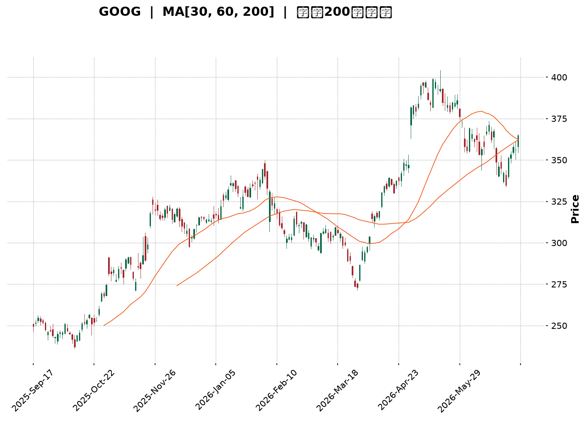
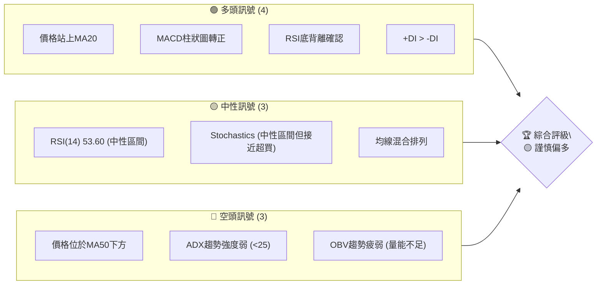
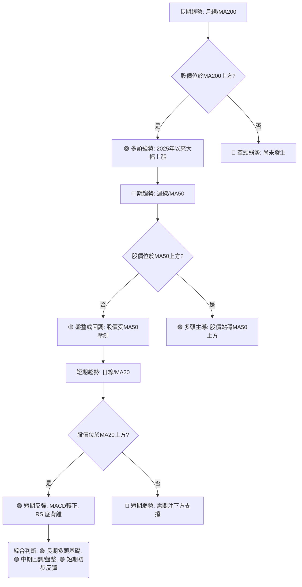
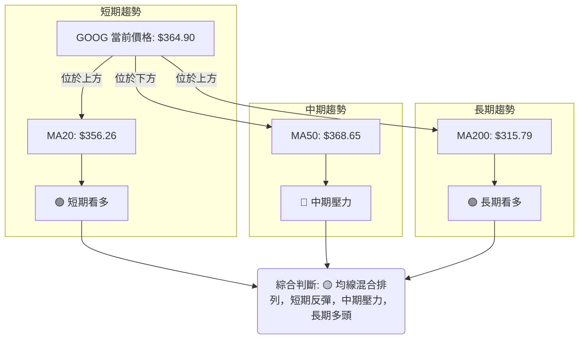
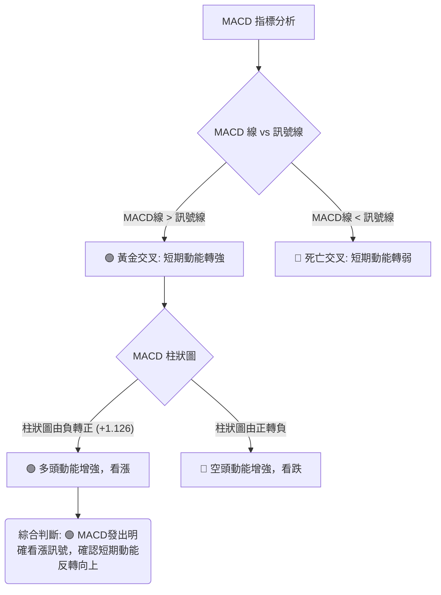
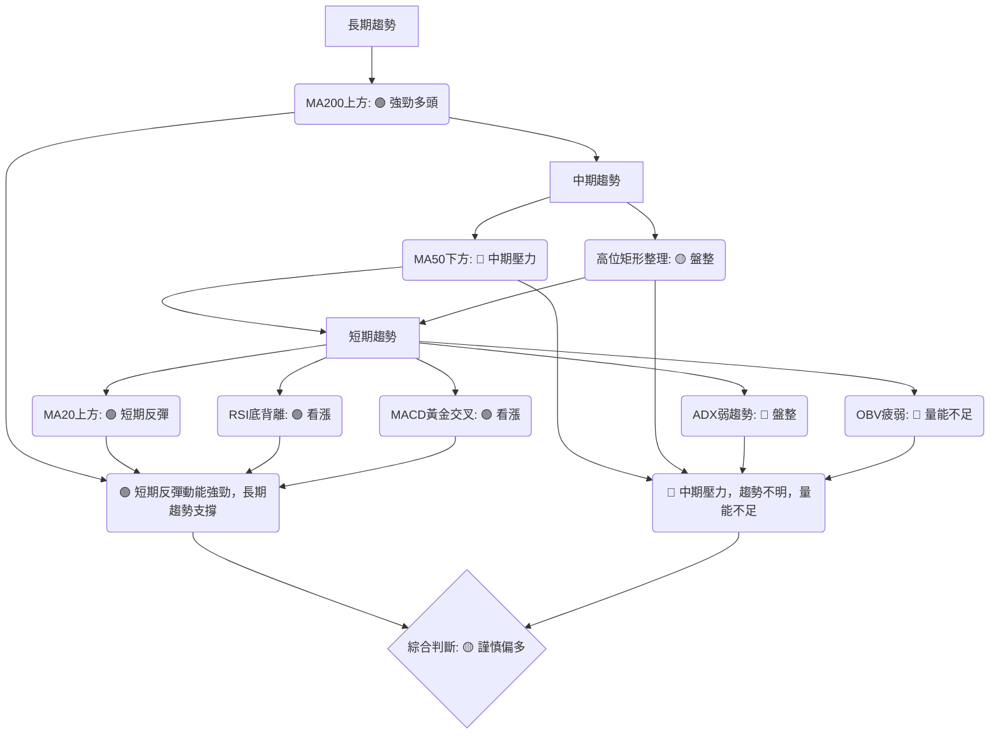

<details>
<summary>📊 靜態圖表 (點擊展開)</summary>

</details>

<html>
<head><meta charset="utf-8" /></head>
<body>
    <div style="height:500px; width:100%;">                        <script>window.PlotlyConfig = {MathJaxConfig: 'local'};</script>
        <script charset="utf-8" src="https://cdn.plot.ly/plotly-3.6.0.min.js" integrity="sha256-QaOVwtVY0T02VaHrr6pnoHLCwayMJp4O5n4YyaE3rJk=" crossorigin="anonymous"></script>                <div id="candlestick-chart" class="plotly-graph-div" style="height:100%; width:100%;"></div>            <script>                window.PLOTLYENV=window.PLOTLYENV || {};                                if (document.getElementById("candlestick-chart")) {                    Plotly.newPlot(                        "candlestick-chart",                        [{"close":{"dtype":"f8","bdata":"AAAAYI8rb0AAAACgw3pvQAAAAOCz129AAAAAgFSMb0AAAACAFXtvQAAAAOAL625AAAAAIM7CbkAAAABgSdZuQAAAAEA5fG5AAAAAoFpibkAAAADA6KFuQAAAAGBVvm5AAAAAAPm+bkAAAABAk2BvQAAAAKCw1G5AAAAA4FqfbkAAAAAAjzduQAAAAEDQoG1AAAAAgCqFbkAAAABgq7ZuQAAAAMD2Zm9AAAAAoGRsb0AAAACgZKlvQAAAAIBGCHBAAAAAgCVbb0AAAADgJoFvQAAAACB6p29AAAAAoAFAcEAAAABgbtZwQAAAAIB6vnBAAAAAgBsqcUAAAACgk5VxQAAAAKBMlHFAAAAAAAe5cUAAAADAQVhxQAAAAGAWw3FAAAAAYILMcUAAAAAgcnJxQAAAAGBYIHJAAAAAYLUyckAAAAAg4u1xQAAAAAAvaXFAAAAAwAJHcUAAAABAqdBxQAAAAMBwxnFAAAAAYKtGckAAAADAmhZyQAAAAGAFsXJAAAAAYI3dc0AAAABAHDB0QAAAAKB0+nNAAAAAYOb3c0AAAACgDqhzQAAAAMBttnNAAAAAgOL\u002fc0AAAABARtxzQAAAAOBbF3RAAAAAYKKgc0AAAACAXdVzQAAAACBMCXRAAAAAYKaUc0AAAAAA1mFzQAAAAECpTnNAAAAAIEE1c0AAAACAvJpyQAAAAGCo9XJAAAAA4FBDc0AAAABgx25zQAAAAOBJtHNAAAAAACG0c0AAAACAyKhzQAAAAACtn3NAAAAAYDuic0AAAABgP5ZzQAAAAECJrnNAAAAAgH7Oc0AAAABgO6JzQAAAAMAlIHRAAAAAQFpZdEAAAAAgXot0QAAAAIC7xHRAAAAA4Nr\u002fdEAAAAAA8P10QAAAAICay3RAAAAA4IqedEAAAABA1Rt0QAAAAEA5f3RAAAAAIIimdEAAAADABYB0QAAAAIB50nRAAAAAQAHpdEAAAABgdf10QAAAACB9I3VAAAAAYGkhdUAAAADAMod1QAAAACAWRHVAAAAAwHrOdEAAAACAXK50QAAAAKDaKnRAAAAAYKA\u002fdEAAAABgbeNzQAAAAGDHbnNAAAAAwHVPc0AAAAAg7hlzQAAAAADM5nJAAAAAoLH4ckAAAAAAn\u002fJyQAAAACDTp3NAAAAAIIh0c0AAAABgOmhzQAAAAKDxiXNAAAAAoPwrc0AAAACAYHBzQAAAAOBcH3NAAAAAAJ\u002fyckAAAABA3fByQAAAAOBGyHJAAAAAQJKeckAAAAAgNx1zQAAAACDtK3NAAAAAgMBDc0AAAAAgcfByQAAAAIB11HJAAAAAYMoDc0AAAAAglVNzQAAAACDaIXNAAAAA4LwYc0AAAADAw6lyQAAAAEBxrXJAAAAAwGoQckAAAAAgpxZyQAAAAGAjiXFAAAAAgIYZcUAAAACgnA9xQAAAAMD\u002f6nFAAAAA4I9rckAAAACghmRyQAAAAACyl3JAAAAAgPT7ckAAAACgz6hzQAAAACDgwnNAAAAAQHu4c0AAAADASfBzQAAAAEAZpnRAAAAAIE3kdEAAAAAAHsl0QAAAAEAiM3VAAAAAICzzdEAAAAAAV6R0QAAAACBuGHVAAAAA4L8YdUAAAABg02F1QAAAAED3xHVAAAAA4Ke0dUAAAAAgnrF1QAAAAEBd23dAAAAAANXvd0AAAABAlrZ3QAAAACCfAHhAAAAAAHCueEAAAADg\u002frB4QAAAAKD6zHhAAAAAAJkoeEAAAAAgbfl3QAAAAMDM7HhAAAAA4OXOeEAAAADAVZF4QAAAAAD6jXhAAAAAILIKeEAAAAAgsgp4QAAAAGDU83dAAAAA4G2yd0AAAACAvAl4QAAAAICTCXhAAAAAQDQeeEAAAADgQYN3QAAAAMCxRXdAAAAAgMpidkAAAAAAdTd2QAAAACDEEHdAAAAA4KPYdkAAAABguJJ2QAAAAOCjpHZAAAAAwB4VdkAAAADA9Uh2QAAAAGCPYnZAAAAAgMLxdkAAAACgmTF3QAAAAKCZoXZAAAAAIFz3dkAAAADgesx1QAAAAKBHoXVAAAAA4KOQdUAAAABACmN1QAAAAEAK63RAAAAA4Hr0dUAAAACgRxV2QAAAAIA9XnZAAAAAQOFCdkAAAABgZs52QA=="},"high":{"dtype":"f8","bdata":"rpfv2KBub0CveV4ekrRvQBeLNm0qA3BAlkF1COD5b0D5sCEvschvQJIkiqrijm9AHnSpL5nabkCU87vCLjRvQDqkr7X7ZG9ArHUvn1hmbkA1qfgSVNVuQEmwfnDR5G5ATRmXi07UbkCdnTWxnHZvQDKF3WraYW9ACUW5h9fYbkD4GayFY6JuQDCxn5aNi25AgcQgJFiQbkDto0M4RvFuQM9Qj2x\u002fiG9AuB00xDcRcEBgzVGINMxvQFn27jsCFnBAZN8ogizcb0AXY72N1ApwQBv06v2A629AqzSGmfFfcEDlbWrnUuRwQAD9Dx2W7XBAMU8C1+E2cUAdGjoivjVyQJV3OnmZ23FAg9zRKhfWcUCB8pTihZRxQPMYBQA64nFA\u002fqNysusDckAloCNqGL9xQIphi+c8LnJA\u002f5w8MUo8ckCaujHfmzxyQFsX\u002f1JJr3FA5wrJnKlpcUCpnUoHGl9yQMYfVYTmDXJA9j4MJ3r6ckB+qIqjoiRzQL\u002fyIZfY9XJA8vrrV8ryc0D3eSHSboB0QBZN1wKrRXRAhd\u002f7NNljdEDM3yd9E\u002fBzQNOC1tOg33NAVlo7f48WdEBJAF2EeCd0QLw37e4kM3RAZmMFAvkMdEAzx6l\u002fsORzQLBjevkyF3RAMDCnzx0ZdEC55lSVo7tzQPUwjq6rhHNAjvK\u002fIAJ3c0BSNJr6qUxzQEdUuE3JDXNAQa3\u002fV2NJc0D92qAFsXRzQIOJnQ8yvnNA2KuWLwm+c0AUcXeSWcJzQH46WobxqHNA0RR9CZHUc0AAvi+gp69zQLeVR6jhJ3RAnnDhblXtc0CrbHbnPhJ0QAdKd46fYHRA9tS06LyhdEAgNOo9wrB0QD+Q8XsO4HRATqWEYBNMdUBijLZGcQl1QOHm7g4FG3VAIB7tDtfsdEChdwbNlnp0QFDRcianxHRA1RDoQ1zsdECIuTdxgdl0QKaDPb+T\u002fnRAtx9tsGAcdUCshqzIBxN1QNgBrzh+XXVAe9iq94g9dUDwQ1nVbot1QD8Bz7wW23VABzctzs98dUD8xtK5W8N0QPRprDJWo3RAJJmZJf90dECk2uxWXRN0QHj2NDEECnRAnQM9XhLBc0D2+7VoykdzQI36Qa\u002ffB3NAIYdMOCwYc0APMMnrFhpzQDTKvM6LxXNAHpgc\u002fpvwc0COhs2\u002fZX9zQAXW5cEClHNAV0ko+3aJc0D8QYRmw3pzQBTYJ1zOO3NAKez1d7H4ckAFn5ph+xBzQMPoqNmV73JAc0gpRgK\u002fckD0DvrqDCVzQAD778dsT3NA+jg4ORxuc0CPc1QfRUdzQM9cShY0MXNA\u002fq6w6i0Wc0CXYWHs0F1zQLddXmkCaXNAl0nSqO0nc0DHX66g\u002fQJzQDW8rigA83JAOnNuqb2OckAhuyRiuWdyQP2F1KV75XFAYwEn\u002fsBucUA7Sl9wgEFxQOJwKYgJ7nFAzP1kZuScckD5OrtTjXtyQJrNf33to3JAkwHHdKz+ckAwiWKrKvNzQJEggkPT03NAqn7Rz+z0c0AUNEFVzvNzQBmyJPoOp3RAJlm9scbsdEC3LFNE1RJ1QAXbEO98PHVAH\u002fq\u002f3EsvdUA3toi+eQ91QHt3zyI6HXVAYXf5T0k\u002fdUBS2O5\u002fu3d1QLqI9OIF63VA9VhTVgjbdUDl1i+\u002f\u002fxJ2QHrHzcxl5ndAdN3F9Izyd0DpkdDQLv93QBAY6NGdS3hA5jXv8UPCeEDFhuov29F4QCk1iR8W4nhAewDoH3yheEARb4krUiN4QMXArO4H+3hAW1s6vNLteEDQuG0xRbp4QC2XMaOgQ3lAlad5xgWSeEARwv61cGd4QIHVCaojR3hAVDSfWTcKeEBU9xkFiBJ4QETmnHDZV3hA5KTwMD9ceEBnfNUjutZ3QI5qB8b+ZXdANiGpyRQZd0DaQcPygqR2QCq45EszGndAVVhcpqUPd0AAAACAFLZ2QAAAAGASG3dAAAAAwPXkdkAAAAAAKWB2QAAAAEBezHZAAAAAYGYqd0AAAACgmVl3QAAAAGBmIndAAAAAAAAQd0AAAABAM2N2QAAAACCFy3VAAAAAoEcNdkAAAABACnN1QAAAAIDrgXVAAAAAIIX\u002fdUAAAACAPTZ2QAAAAMD1eHZAAAAAANePdkAAAABA4dp2QA=="},"hovertemplate":"\u003cb\u003e%{x|%Y-%m-%d}\u003c\u002fb\u003e\u003cbr\u003e\u958b: $%{open:.2f}\u003cbr\u003e\u9ad8: $%{high:.2f}\u003cbr\u003e\u4f4e: $%{low:.2f}\u003cbr\u003e\u6536: $%{close:.2f}\u003cextra\u003e\u003c\u002fextra\u003e","low":{"dtype":"f8","bdata":"mCb25h\u002fDbkDzfrLz3DNvQIyS9JRlcm9A9gc0LDhKb0CKgQCIKVNvQP1Ue4aQ125AP3hTOKwlbkCYHk5nCsVuQOFpzhYtV25AN0PuY0bjbUBw7dYZbddtQPxGwkgkVG5A4W2Xp9w\u002fbkA4afwks6ZuQHYz1kB4ym5AZY\u002furYmTbkBAjAWrweZtQLqejIYah21ATC9p9u0IbkDxj+ZQmRZuQMRDudfUyW5AGtLto79Fb0AKTIyUUQNvQA\u002fJv0dDw29At1Auwx+GbkC2VwoRwT5vQHJdcurAiG9A9+DuKyvzb0A8n8Fbv4ZwQCA8arhbqnBATj+aYXq+cECssDwebH5xQHRCKo6uT3FAJRb2CyV9cUApaz+TLEVxQLGpI+xhVXFACg1YDhuRcUCoouaaNTNxQLyfTBzEr3FALq3MzRH1cUD9p2LQLb1xQPbrYnlMV3FAV7aSoRDucEBC2yO6yLpxQLhQUE1tZ3FA0fCIYLfxcUCrGmd9qwlyQLWKHOOLXHJAyCl3TLdMc0B5ipbKG9NzQEg6r61FyXNAWIQ3mx7Fc0C7MVBi2pVzQLgWKGyvmXNAs5HDrKSac0AdO7zPj69zQBwtAkiq9XNA61XVEwx4c0CllAJsZINzQPJRLm\u002fQr3NAqoR0C5xXc0A7s6RH8yhzQM\u002fjJ6N0FXNAf08Tee\u002f2ckDruLdC\u002fZByQL6IXY3Nw3JA20LlgyDfckAVmZG2CSNzQDO3EfqCZXNAXmbJ75OOc0C8Wt4g+JRzQJF7US\u002fjd3NACiXpknWNc0BPb21trnxzQAnTgdbpY3NAWyIasmatc0DkOCoQ635zQOqFeONuoXNAo1tjvR0ZdEBi\u002fLwSMF10QGsFSvhcUXRAJtFVXp7edEAzQd9iU6t0QMQE8v64rXRAPcBeOd57dEDXy+4pigd0QCV6WeD38XNAt3QjejaHdEBSMm4VrHh0QCdGKnsAcXRArDGR7gfVdEClfMguJbt0QL3uwbKyZHRABD6je0vDdEADFjvlJPl0QHgnT8deInVAhzjC2AqPdEAgGMq7TyhzQEnFoSS3+3NAuBUnEJHUc0AiTGJ4\u002faNzQOvKJaqaW3NADGOFJfc7c0B\u002fIvb0DfhyQIbhW0UziHJAqAIB+l\u002fZckBItPYSccRyQNRq5iRdAHNA6N9b9l1Zc0BGOYlxDBtzQJEfEd5MT3NA93X09T7gckAcZUHnHfNyQGWvqHSsynJAyAtRDf2EckDD\u002fzbqhMZyQJ06Wm7lmnJAQ\u002fyVzdVtckDg3IciDVxyQJfkqZ0FEnNAJY1HG38ac0AObrx2i8pyQMBtd2OYuXJA9B0oLg7ackA78THXqwJzQCbvKZzHFXNAyMxXZxrNckCdJKTmJIlyQI6MVbCcnXJAXBiYeeYKckB4XT54J\u002fNxQEgZ2EkdbnFA\u002fGebUAwVcUAVnzN08vVwQEa3PiJ\u002fSXFAVdeFALwUckDFtMs5WvZxQGQN7wjQWXJAAljd8\u002fRzckD6qWhDRYhzQFk5gr+KVHNAiJND6Jylc0BZLTh5BZhzQJhoBDtPD3RAxNpBsGWHdECnGmpCNbd0QEP\u002fW81u0XRAYPOXJdzmdEAFs8Fx6JZ0QLbEP+AnzHRAWf2fQLztdECj4Pe\u002fld10QGLonB6uSXVAYjrariqBdUDuabOllWN1QPJGBBHyrXZAoU5ZfIxwd0CKGAOysYh3QP+XbIjwwXdAhY\u002fb7t8teED23SMrNGF4QLeelZPulnhA93qQlPYfeEDdneyZ3bd3QK5pRoSb1XdA8PGWUd6HeEBqkkPFaFh4QFOo2VGjanhAteZNblDsd0Brq17SV7x3QCaMgDQHtHdAxjlZIoWgd0Ci2P9ql653QGbq7dhS3HdA74Zuv1TQd0BsnlufMmF3QKABB1LNF3dAibMwWpUsdkCIF+BzqyJ2QEzrIKZiKXZAlGzUjJmWdkAAAACAPV52QAAAACCFK3ZAAAAAwPUMdkAAAACAFHp1QAAAAKBwFXZAAAAAYGbKdkAAAADAHtV2QAAAACCug3ZAAAAAYLpJdkAAAABACk91QAAAAKBwO3VAAAAAAABYdUAAAABgZv50QAAAAEAK23RAAAAAwPUsdUAAAACAwsF1QAAAACCuE3ZAAAAAwB7ldUAAAAAgMSN2QA=="},"name":"\u50f9\u683c","open":{"dtype":"f8","bdata":"NRMWs\u002fpeb0CSyjXowGtvQJdVhPzvnG9AWNVGzQLJb0C591TtFKVvQLZ0jgUEdW9A8R9cmY2LbkBvOfbtm+luQKliGyNC+W5Av3xBWrRSbkAc2ed+qRZuQMgM8GgapW5AoVPzTAKYbkBozcTzkqluQFk1g0ctDm9ABe5CBP22bkA7slF0lJJuQHPRTgn2NW5ARQK9Od8RbkAt6M\u002fxBiluQFXoGNcw825Ax90hgBN\u002fb0D4WddZd1tvQPfbRg9i129A3cV+lwXYb0DcJdxBW9BvQGr4ENuEpm9AK8eEGL8McEDZW0M+dI1wQEaVaVG+2nBAGpJjMFrBcEAvafewYzJyQB\u002fWE2dqqnFAhCH8fuGdcUBPe\u002fk4XkhxQAs1QOdVbXFAnMHPFdHScUDEJQPddrpxQKxQH+pPy3FAYFVi\u002fS36cUCsyEizNzhyQKV78wfnpnFA\u002fRK9Ps\u002f1cEC6vQ+Xb91xQKVyHOG6\u002fnFAxoXMofTxcUAXToBdTQJzQBp3dsaghHJA3Df9BW1mc0DcWg0ukmJ0QOa7ZZ5wAnRAZKEZmsEsdECtgnLhqc1zQGNk7DJ7xHNASmsep5a2c0Cd5BrTmyZ0QAzJAf\u002f79XNAmni508YJdEBUEif7D4tzQFrPswlPw3NAsEGLMeUKdEBpnuKlJaZzQPskNdV4g3NA7914P5wZc0Bt1sE3tUlzQPL+MNCh6nJAtIlJy\u002fztckBl06nvGW1zQPVxO+upa3NADdgvb8y7c0AaQEGeH7hzQBauYaSWhnNAvvb1FwSQc0DlV2hsYI9zQFCut\u002f3O0nNAsMLTfnzUc0DR1i+fVc5zQOcSrEONonNA92SIWV2NdECy4OpxAHF0QDy4hq0uYXRA+16ypXrtdEDzGjfVw+h0QCDplDXSGXVAmvtFcPfndECvEwHLIQ10QEzyjNDQCnRAROgNsULddECVzbPKiMN0QCqslO9YfHRAVxLeYRLzdECKqnM8uwJ1QKh1ZFd+PnVACJM\u002fYWDgdEAmbFDCxQF1QLz+FZr2wHVA3dKN8+Z0dUCCWe8JqYxzQF2TiejDbnRAg8wZ5CENdECjEyUQ3Ad0QB8Sgxaz6HNAh4f68RN\u002fc0C9zSI\u002fVDlzQPH+QGf2w3JAvgSB75jgckA+UEKvAOJyQMmQ8HxvBnNA8HshjZPrc0BUkij\u002fwGNzQIsMQR1ne3NAdcX+RVmGc0AkDKuJsfhyQPt6zSUd6XJAbMUaGn2gckD3x9LWo+RyQMY+RYLe7HJA3DPHSPh6ckB3bTthVF9yQLYOV3kOG3NAHNYmGdohc0Bw1uy7aSBzQOxI1XOHJ3NAl08vpa32ckBaK2DNyQdzQIxot0uEO3NAP2RxFXHwckDldOKdMf5yQGmYt4eWxXJA6LnEWoKAckBpnU6Rlj9yQMG+zjJJ4HFAM7gb6LpTcUBetoK1YzRxQB35SBb4VXFA5D7gvuMcckD7eyf6Dg1yQCfk9ipdaHJA8Dc7Flq\u002fckAyFT6jONpzQE6eebUGkHNAHMUAlIngc0CJDS1Wr7NzQGfD99nwHXRAamv3YceldEA+SVcpXvp0QHIGaV6p43RAs8wkt7MldUC4DidmIfZ0QIe+OALw6nRAC\u002fjvoO41dUDV1kIVRRh1QKIAZE7FenVAqA\u002fMrWGrdUAM0SACW5R1QGVINdOBMHdAoqPZ6Aqcd0CYjtXlcOF3QGlau6k+2ndAI85pzLBVeEB9c\u002fqJI814QJuONZmGoHhADlWlt0dneEBXnMN3Swx4QOIPSffN2ndACcnGs9mYeEApyjrip494QALuO+05fnhAF284zgOReEBSwrFH7wx4QD980th73HdACzz+0Hjwd0BDcA7ZQMx3QHVUa3aO6HdAiY5a0RD6d0CJ091v7s93QEcfI2OdRXdApnxqnxCvdkB3G4xV6WF2QMnPeZKeM3ZAjPMWPZWydkAAAACAwqd2QAAAAAApznZAAAAAwMyQdkAAAADAzBB2QAAAAKCZkXZAAAAAANffdkAAAACgcPd2QAAAAMDM8HZAAAAAgD2+dkAAAAAAKVJ2QAAAACCuQXVAAAAAIIXLdUAAAABguA51QAAAACCuT3VAAAAAQDM\u002fdUAAAAAgXO91QAAAAADXKXZAAAAAYGZCdkAAAADAHmN2QA=="},"x":["2025-09-17T00:00:00-04:00","2025-09-18T00:00:00-04:00","2025-09-19T00:00:00-04:00","2025-09-22T00:00:00-04:00","2025-09-23T00:00:00-04:00","2025-09-24T00:00:00-04:00","2025-09-25T00:00:00-04:00","2025-09-26T00:00:00-04:00","2025-09-29T00:00:00-04:00","2025-09-30T00:00:00-04:00","2025-10-01T00:00:00-04:00","2025-10-02T00:00:00-04:00","2025-10-03T00:00:00-04:00","2025-10-06T00:00:00-04:00","2025-10-07T00:00:00-04:00","2025-10-08T00:00:00-04:00","2025-10-09T00:00:00-04:00","2025-10-10T00:00:00-04:00","2025-10-13T00:00:00-04:00","2025-10-14T00:00:00-04:00","2025-10-15T00:00:00-04:00","2025-10-16T00:00:00-04:00","2025-10-17T00:00:00-04:00","2025-10-20T00:00:00-04:00","2025-10-21T00:00:00-04:00","2025-10-22T00:00:00-04:00","2025-10-23T00:00:00-04:00","2025-10-24T00:00:00-04:00","2025-10-27T00:00:00-04:00","2025-10-28T00:00:00-04:00","2025-10-29T00:00:00-04:00","2025-10-30T00:00:00-04:00","2025-10-31T00:00:00-04:00","2025-11-03T00:00:00-05:00","2025-11-04T00:00:00-05:00","2025-11-05T00:00:00-05:00","2025-11-06T00:00:00-05:00","2025-11-07T00:00:00-05:00","2025-11-10T00:00:00-05:00","2025-11-11T00:00:00-05:00","2025-11-12T00:00:00-05:00","2025-11-13T00:00:00-05:00","2025-11-14T00:00:00-05:00","2025-11-17T00:00:00-05:00","2025-11-18T00:00:00-05:00","2025-11-19T00:00:00-05:00","2025-11-20T00:00:00-05:00","2025-11-21T00:00:00-05:00","2025-11-24T00:00:00-05:00","2025-11-25T00:00:00-05:00","2025-11-26T00:00:00-05:00","2025-11-28T00:00:00-05:00","2025-12-01T00:00:00-05:00","2025-12-02T00:00:00-05:00","2025-12-03T00:00:00-05:00","2025-12-04T00:00:00-05:00","2025-12-05T00:00:00-05:00","2025-12-08T00:00:00-05:00","2025-12-09T00:00:00-05:00","2025-12-10T00:00:00-05:00","2025-12-11T00:00:00-05:00","2025-12-12T00:00:00-05:00","2025-12-15T00:00:00-05:00","2025-12-16T00:00:00-05:00","2025-12-17T00:00:00-05:00","2025-12-18T00:00:00-05:00","2025-12-19T00:00:00-05:00","2025-12-22T00:00:00-05:00","2025-12-23T00:00:00-05:00","2025-12-24T00:00:00-05:00","2025-12-26T00:00:00-05:00","2025-12-29T00:00:00-05:00","2025-12-30T00:00:00-05:00","2025-12-31T00:00:00-05:00","2026-01-02T00:00:00-05:00","2026-01-05T00:00:00-05:00","2026-01-06T00:00:00-05:00","2026-01-07T00:00:00-05:00","2026-01-08T00:00:00-05:00","2026-01-09T00:00:00-05:00","2026-01-12T00:00:00-05:00","2026-01-13T00:00:00-05:00","2026-01-14T00:00:00-05:00","2026-01-15T00:00:00-05:00","2026-01-16T00:00:00-05:00","2026-01-20T00:00:00-05:00","2026-01-21T00:00:00-05:00","2026-01-22T00:00:00-05:00","2026-01-23T00:00:00-05:00","2026-01-26T00:00:00-05:00","2026-01-27T00:00:00-05:00","2026-01-28T00:00:00-05:00","2026-01-29T00:00:00-05:00","2026-01-30T00:00:00-05:00","2026-02-02T00:00:00-05:00","2026-02-03T00:00:00-05:00","2026-02-04T00:00:00-05:00","2026-02-05T00:00:00-05:00","2026-02-06T00:00:00-05:00","2026-02-09T00:00:00-05:00","2026-02-10T00:00:00-05:00","2026-02-11T00:00:00-05:00","2026-02-12T00:00:00-05:00","2026-02-13T00:00:00-05:00","2026-02-17T00:00:00-05:00","2026-02-18T00:00:00-05:00","2026-02-19T00:00:00-05:00","2026-02-20T00:00:00-05:00","2026-02-23T00:00:00-05:00","2026-02-24T00:00:00-05:00","2026-02-25T00:00:00-05:00","2026-02-26T00:00:00-05:00","2026-02-27T00:00:00-05:00","2026-03-02T00:00:00-05:00","2026-03-03T00:00:00-05:00","2026-03-04T00:00:00-05:00","2026-03-05T00:00:00-05:00","2026-03-06T00:00:00-05:00","2026-03-09T00:00:00-04:00","2026-03-10T00:00:00-04:00","2026-03-11T00:00:00-04:00","2026-03-12T00:00:00-04:00","2026-03-13T00:00:00-04:00","2026-03-16T00:00:00-04:00","2026-03-17T00:00:00-04:00","2026-03-18T00:00:00-04:00","2026-03-19T00:00:00-04:00","2026-03-20T00:00:00-04:00","2026-03-23T00:00:00-04:00","2026-03-24T00:00:00-04:00","2026-03-25T00:00:00-04:00","2026-03-26T00:00:00-04:00","2026-03-27T00:00:00-04:00","2026-03-30T00:00:00-04:00","2026-03-31T00:00:00-04:00","2026-04-01T00:00:00-04:00","2026-04-02T00:00:00-04:00","2026-04-06T00:00:00-04:00","2026-04-07T00:00:00-04:00","2026-04-08T00:00:00-04:00","2026-04-09T00:00:00-04:00","2026-04-10T00:00:00-04:00","2026-04-13T00:00:00-04:00","2026-04-14T00:00:00-04:00","2026-04-15T00:00:00-04:00","2026-04-16T00:00:00-04:00","2026-04-17T00:00:00-04:00","2026-04-20T00:00:00-04:00","2026-04-21T00:00:00-04:00","2026-04-22T00:00:00-04:00","2026-04-23T00:00:00-04:00","2026-04-24T00:00:00-04:00","2026-04-27T00:00:00-04:00","2026-04-28T00:00:00-04:00","2026-04-29T00:00:00-04:00","2026-04-30T00:00:00-04:00","2026-05-01T00:00:00-04:00","2026-05-04T00:00:00-04:00","2026-05-05T00:00:00-04:00","2026-05-06T00:00:00-04:00","2026-05-07T00:00:00-04:00","2026-05-08T00:00:00-04:00","2026-05-11T00:00:00-04:00","2026-05-12T00:00:00-04:00","2026-05-13T00:00:00-04:00","2026-05-14T00:00:00-04:00","2026-05-15T00:00:00-04:00","2026-05-18T00:00:00-04:00","2026-05-19T00:00:00-04:00","2026-05-20T00:00:00-04:00","2026-05-21T00:00:00-04:00","2026-05-22T00:00:00-04:00","2026-05-26T00:00:00-04:00","2026-05-27T00:00:00-04:00","2026-05-28T00:00:00-04:00","2026-05-29T00:00:00-04:00","2026-06-01T00:00:00-04:00","2026-06-02T00:00:00-04:00","2026-06-03T00:00:00-04:00","2026-06-04T00:00:00-04:00","2026-06-05T00:00:00-04:00","2026-06-08T00:00:00-04:00","2026-06-09T00:00:00-04:00","2026-06-10T00:00:00-04:00","2026-06-11T00:00:00-04:00","2026-06-12T00:00:00-04:00","2026-06-15T00:00:00-04:00","2026-06-16T00:00:00-04:00","2026-06-17T00:00:00-04:00","2026-06-18T00:00:00-04:00","2026-06-22T00:00:00-04:00","2026-06-23T00:00:00-04:00","2026-06-24T00:00:00-04:00","2026-06-25T00:00:00-04:00","2026-06-26T00:00:00-04:00","2026-06-29T00:00:00-04:00","2026-06-30T00:00:00-04:00","2026-07-01T00:00:00-04:00","2026-07-02T00:00:00-04:00","2026-07-06T00:00:00-04:00"],"type":"candlestick"},{"hovertemplate":"MA30: $%{y:.2f}\u003cextra\u003e\u003c\u002fextra\u003e","line":{"color":"#2196F3","dash":"dash","width":2},"mode":"lines","name":"MA30","x":["2025-09-17T00:00:00-04:00","2025-09-18T00:00:00-04:00","2025-09-19T00:00:00-04:00","2025-09-22T00:00:00-04:00","2025-09-23T00:00:00-04:00","2025-09-24T00:00:00-04:00","2025-09-25T00:00:00-04:00","2025-09-26T00:00:00-04:00","2025-09-29T00:00:00-04:00","2025-09-30T00:00:00-04:00","2025-10-01T00:00:00-04:00","2025-10-02T00:00:00-04:00","2025-10-03T00:00:00-04:00","2025-10-06T00:00:00-04:00","2025-10-07T00:00:00-04:00","2025-10-08T00:00:00-04:00","2025-10-09T00:00:00-04:00","2025-10-10T00:00:00-04:00","2025-10-13T00:00:00-04:00","2025-10-14T00:00:00-04:00","2025-10-15T00:00:00-04:00","2025-10-16T00:00:00-04:00","2025-10-17T00:00:00-04:00","2025-10-20T00:00:00-04:00","2025-10-21T00:00:00-04:00","2025-10-22T00:00:00-04:00","2025-10-23T00:00:00-04:00","2025-10-24T00:00:00-04:00","2025-10-27T00:00:00-04:00","2025-10-28T00:00:00-04:00","2025-10-29T00:00:00-04:00","2025-10-30T00:00:00-04:00","2025-10-31T00:00:00-04:00","2025-11-03T00:00:00-05:00","2025-11-04T00:00:00-05:00","2025-11-05T00:00:00-05:00","2025-11-06T00:00:00-05:00","2025-11-07T00:00:00-05:00","2025-11-10T00:00:00-05:00","2025-11-11T00:00:00-05:00","2025-11-12T00:00:00-05:00","2025-11-13T00:00:00-05:00","2025-11-14T00:00:00-05:00","2025-11-17T00:00:00-05:00","2025-11-18T00:00:00-05:00","2025-11-19T00:00:00-05:00","2025-11-20T00:00:00-05:00","2025-11-21T00:00:00-05:00","2025-11-24T00:00:00-05:00","2025-11-25T00:00:00-05:00","2025-11-26T00:00:00-05:00","2025-11-28T00:00:00-05:00","2025-12-01T00:00:00-05:00","2025-12-02T00:00:00-05:00","2025-12-03T00:00:00-05:00","2025-12-04T00:00:00-05:00","2025-12-05T00:00:00-05:00","2025-12-08T00:00:00-05:00","2025-12-09T00:00:00-05:00","2025-12-10T00:00:00-05:00","2025-12-11T00:00:00-05:00","2025-12-12T00:00:00-05:00","2025-12-15T00:00:00-05:00","2025-12-16T00:00:00-05:00","2025-12-17T00:00:00-05:00","2025-12-18T00:00:00-05:00","2025-12-19T00:00:00-05:00","2025-12-22T00:00:00-05:00","2025-12-23T00:00:00-05:00","2025-12-24T00:00:00-05:00","2025-12-26T00:00:00-05:00","2025-12-29T00:00:00-05:00","2025-12-30T00:00:00-05:00","2025-12-31T00:00:00-05:00","2026-01-02T00:00:00-05:00","2026-01-05T00:00:00-05:00","2026-01-06T00:00:00-05:00","2026-01-07T00:00:00-05:00","2026-01-08T00:00:00-05:00","2026-01-09T00:00:00-05:00","2026-01-12T00:00:00-05:00","2026-01-13T00:00:00-05:00","2026-01-14T00:00:00-05:00","2026-01-15T00:00:00-05:00","2026-01-16T00:00:00-05:00","2026-01-20T00:00:00-05:00","2026-01-21T00:00:00-05:00","2026-01-22T00:00:00-05:00","2026-01-23T00:00:00-05:00","2026-01-26T00:00:00-05:00","2026-01-27T00:00:00-05:00","2026-01-28T00:00:00-05:00","2026-01-29T00:00:00-05:00","2026-01-30T00:00:00-05:00","2026-02-02T00:00:00-05:00","2026-02-03T00:00:00-05:00","2026-02-04T00:00:00-05:00","2026-02-05T00:00:00-05:00","2026-02-06T00:00:00-05:00","2026-02-09T00:00:00-05:00","2026-02-10T00:00:00-05:00","2026-02-11T00:00:00-05:00","2026-02-12T00:00:00-05:00","2026-02-13T00:00:00-05:00","2026-02-17T00:00:00-05:00","2026-02-18T00:00:00-05:00","2026-02-19T00:00:00-05:00","2026-02-20T00:00:00-05:00","2026-02-23T00:00:00-05:00","2026-02-24T00:00:00-05:00","2026-02-25T00:00:00-05:00","2026-02-26T00:00:00-05:00","2026-02-27T00:00:00-05:00","2026-03-02T00:00:00-05:00","2026-03-03T00:00:00-05:00","2026-03-04T00:00:00-05:00","2026-03-05T00:00:00-05:00","2026-03-06T00:00:00-05:00","2026-03-09T00:00:00-04:00","2026-03-10T00:00:00-04:00","2026-03-11T00:00:00-04:00","2026-03-12T00:00:00-04:00","2026-03-13T00:00:00-04:00","2026-03-16T00:00:00-04:00","2026-03-17T00:00:00-04:00","2026-03-18T00:00:00-04:00","2026-03-19T00:00:00-04:00","2026-03-20T00:00:00-04:00","2026-03-23T00:00:00-04:00","2026-03-24T00:00:00-04:00","2026-03-25T00:00:00-04:00","2026-03-26T00:00:00-04:00","2026-03-27T00:00:00-04:00","2026-03-30T00:00:00-04:00","2026-03-31T00:00:00-04:00","2026-04-01T00:00:00-04:00","2026-04-02T00:00:00-04:00","2026-04-06T00:00:00-04:00","2026-04-07T00:00:00-04:00","2026-04-08T00:00:00-04:00","2026-04-09T00:00:00-04:00","2026-04-10T00:00:00-04:00","2026-04-13T00:00:00-04:00","2026-04-14T00:00:00-04:00","2026-04-15T00:00:00-04:00","2026-04-16T00:00:00-04:00","2026-04-17T00:00:00-04:00","2026-04-20T00:00:00-04:00","2026-04-21T00:00:00-04:00","2026-04-22T00:00:00-04:00","2026-04-23T00:00:00-04:00","2026-04-24T00:00:00-04:00","2026-04-27T00:00:00-04:00","2026-04-28T00:00:00-04:00","2026-04-29T00:00:00-04:00","2026-04-30T00:00:00-04:00","2026-05-01T00:00:00-04:00","2026-05-04T00:00:00-04:00","2026-05-05T00:00:00-04:00","2026-05-06T00:00:00-04:00","2026-05-07T00:00:00-04:00","2026-05-08T00:00:00-04:00","2026-05-11T00:00:00-04:00","2026-05-12T00:00:00-04:00","2026-05-13T00:00:00-04:00","2026-05-14T00:00:00-04:00","2026-05-15T00:00:00-04:00","2026-05-18T00:00:00-04:00","2026-05-19T00:00:00-04:00","2026-05-20T00:00:00-04:00","2026-05-21T00:00:00-04:00","2026-05-22T00:00:00-04:00","2026-05-26T00:00:00-04:00","2026-05-27T00:00:00-04:00","2026-05-28T00:00:00-04:00","2026-05-29T00:00:00-04:00","2026-06-01T00:00:00-04:00","2026-06-02T00:00:00-04:00","2026-06-03T00:00:00-04:00","2026-06-04T00:00:00-04:00","2026-06-05T00:00:00-04:00","2026-06-08T00:00:00-04:00","2026-06-09T00:00:00-04:00","2026-06-10T00:00:00-04:00","2026-06-11T00:00:00-04:00","2026-06-12T00:00:00-04:00","2026-06-15T00:00:00-04:00","2026-06-16T00:00:00-04:00","2026-06-17T00:00:00-04:00","2026-06-18T00:00:00-04:00","2026-06-22T00:00:00-04:00","2026-06-23T00:00:00-04:00","2026-06-24T00:00:00-04:00","2026-06-25T00:00:00-04:00","2026-06-26T00:00:00-04:00","2026-06-29T00:00:00-04:00","2026-06-30T00:00:00-04:00","2026-07-01T00:00:00-04:00","2026-07-02T00:00:00-04:00","2026-07-06T00:00:00-04:00"],"y":{"dtype":"f8","bdata":"AAAAAAAA+H8AAAAAAAD4fwAAAAAAAPh\u002fAAAAAAAA+H8AAAAAAAD4fwAAAAAAAPh\u002fAAAAAAAA+H8AAAAAAAD4fwAAAAAAAPh\u002fAAAAAAAA+H8AAAAAAAD4fwAAAAAAAPh\u002fAAAAAAAA+H8AAAAAAAD4fwAAAAAAAPh\u002fAAAAAAAA+H8AAAAAAAD4fwAAAAAAAPh\u002fAAAAAAAA+H8AAAAAAAD4fwAAAAAAAPh\u002fAAAAAAAA+H8AAAAAAAD4fwAAAAAAAPh\u002fAAAAAAAA+H8AAAAAAAD4fwAAAAAAAPh\u002fAAAAAAAA+H8AAAAAAAD4f6uqqtpvQW9AAAAAYGRcb0CamZkp33tvQDMzMxMrmG9A3t3d\u002fWy5b0BmZmaGztRvQLy7u2sc\u002fG9AERERQbEScECrqqqiACRwQCIiIjqcPHBAVVVV5UJWcEBmZmYWj2xwQJqZmaH1fXBA7+7u1jWOcEAREREpW6BwQLy7uxt+tHBA7+7u1srNcEAAAABIOOdwQO\u002fu7pZOCHFAiYiIIJsvcUAiIiLy1FhxQImIiLhUfXFA3t3dhaehcUC8u7u7TMJxQBEREXG04XFAd3d395QGckDe3d11oylyQO\u002fu7p4GTnJAd3d3x9hqckCJiIhIaYRyQGZmZlaBoHJAERERkR+1ckDNzMwcd8RyQO\u002fu7u4103JAmpmZieLfckDNzMxcoupyQN7d3W3a9HJAd3d3x1gBc0De3d2NShJzQJqZmYnBH3NAVVVVdZosc0Dv7u7eXTtzQAAAAPA\u002fTnNAzczMbFtic0B3d3cHenFzQM3MzBy\u002fgXNA7+7urs6Oc0BERES0\u002fptzQERERIQ7qHNAIiIi8lusc0DNzMysZq9zQFVVVcUktnNAAAAAMPG+c0ARERGRVspzQKuqqsqT03NAvLu7q93Yc0CamZkJ\u002fNpzQJqZmVly3nNAVVVVNS3nc0C8u7t73exzQCIiIjKS83NA7+7ujur+c0AiIiISowx0QLy7u7tDHHRAmpmZeassdECamZlZnkV0QM3MzKxMWXRAzczMvHhmdEB3d3fXH3F0QJqZmZkTdXRAq6qq+rl5dECJiIhornt0QHd3dycNenRAVVVV1Up3dEDe3d39JXN0QM3MzIx9bHRA7+7uHl1ldEAzMzOTgl90QCIiItJ\u002fW3RAd3d3N99TdEAzMzPTKkp0QBEREaGsP3RAd3d3JxQwdEAzMzOj0yJ0QBEREVGNFHRAiYiIuEkGdEBVVVWFUvxzQHd3d9ew7XNAiYiI2Fvcc0CJiIgoiNBzQJqZmWlywnNAiYiIuGe0c0BERESU56JzQAAAACA0j3NAq6qqSiZ9c0BVVVXFXGpzQCIiIpInWHNAzczMLJBJc0AiIiLiVzhzQLy7uyuhK3NAAAAAQP0Yc0Dv7u5OoQlzQM3MzCxx+XJA3t3d3ZPmckAAAADAKtVyQDMzMxPGzHJAAAAAwBHIckBEREQ0VcNyQImIiAhDunJAzczMHD62ckCJiIg4ZbhyQJqZmQlLunJAzczM7Pm+ckDv7u5uPcNyQGZmZrZD0HJAVVVVldrgckCamZl5mPByQDMzM2M5BXNAIiIiYhwZc0Crqqr6JSZzQN7d3a2QNnNAq6qqyjJGc0BmZmZmC1tzQKuqqsogdHNAvLu7GxeLc0C8u7ubSp9zQHd3d8ebx3NAIiIiYunwc0B3d3d3ARx0QN7d3e1xSXRAIiIikumBdEBERETUQbp0QImIiHhA+HRAIiIi0nw0dUDNzMw8e291QGZmZlZGq3VARERENMnhdUBmZmbGehZ2QKuqqgpbSXZA7+7ufoN0dkCamZnp6Jl2QJqZmcmsvXZAZmZmRpvfdkARERGRlgJ3QKuqqgqBH3dA7+7uvgg7d0BVVVU1TlJ3QImIiKj9Y3dAvLu7qz5wd0Crqqqarn13QFVVVUV+jndAVVVVRWydd0CamZkJlqd3QJqZmbkKr3dAMzMz40Gyd0B3d3dXTbd3QCIiIvK9qndAzczM3EWid0CrqqoK1513QImIiKgjkndAzczM3ICDd0C8u7vL0Wp3QLy7u0vDT3dAZmZmhqE5d0CamZkpjSN3QDMzMwNcAXdAzczMHAPpdkARERFxz9N2QGZmZgYnwXZAVVVVZfWxdkBmZmZWaqd2QA=="},"type":"scatter"},{"hovertemplate":"MA60: $%{y:.2f}\u003cextra\u003e\u003c\u002fextra\u003e","line":{"color":"#9C27B0","dash":"dash","width":2},"mode":"lines","name":"MA60","x":["2025-09-17T00:00:00-04:00","2025-09-18T00:00:00-04:00","2025-09-19T00:00:00-04:00","2025-09-22T00:00:00-04:00","2025-09-23T00:00:00-04:00","2025-09-24T00:00:00-04:00","2025-09-25T00:00:00-04:00","2025-09-26T00:00:00-04:00","2025-09-29T00:00:00-04:00","2025-09-30T00:00:00-04:00","2025-10-01T00:00:00-04:00","2025-10-02T00:00:00-04:00","2025-10-03T00:00:00-04:00","2025-10-06T00:00:00-04:00","2025-10-07T00:00:00-04:00","2025-10-08T00:00:00-04:00","2025-10-09T00:00:00-04:00","2025-10-10T00:00:00-04:00","2025-10-13T00:00:00-04:00","2025-10-14T00:00:00-04:00","2025-10-15T00:00:00-04:00","2025-10-16T00:00:00-04:00","2025-10-17T00:00:00-04:00","2025-10-20T00:00:00-04:00","2025-10-21T00:00:00-04:00","2025-10-22T00:00:00-04:00","2025-10-23T00:00:00-04:00","2025-10-24T00:00:00-04:00","2025-10-27T00:00:00-04:00","2025-10-28T00:00:00-04:00","2025-10-29T00:00:00-04:00","2025-10-30T00:00:00-04:00","2025-10-31T00:00:00-04:00","2025-11-03T00:00:00-05:00","2025-11-04T00:00:00-05:00","2025-11-05T00:00:00-05:00","2025-11-06T00:00:00-05:00","2025-11-07T00:00:00-05:00","2025-11-10T00:00:00-05:00","2025-11-11T00:00:00-05:00","2025-11-12T00:00:00-05:00","2025-11-13T00:00:00-05:00","2025-11-14T00:00:00-05:00","2025-11-17T00:00:00-05:00","2025-11-18T00:00:00-05:00","2025-11-19T00:00:00-05:00","2025-11-20T00:00:00-05:00","2025-11-21T00:00:00-05:00","2025-11-24T00:00:00-05:00","2025-11-25T00:00:00-05:00","2025-11-26T00:00:00-05:00","2025-11-28T00:00:00-05:00","2025-12-01T00:00:00-05:00","2025-12-02T00:00:00-05:00","2025-12-03T00:00:00-05:00","2025-12-04T00:00:00-05:00","2025-12-05T00:00:00-05:00","2025-12-08T00:00:00-05:00","2025-12-09T00:00:00-05:00","2025-12-10T00:00:00-05:00","2025-12-11T00:00:00-05:00","2025-12-12T00:00:00-05:00","2025-12-15T00:00:00-05:00","2025-12-16T00:00:00-05:00","2025-12-17T00:00:00-05:00","2025-12-18T00:00:00-05:00","2025-12-19T00:00:00-05:00","2025-12-22T00:00:00-05:00","2025-12-23T00:00:00-05:00","2025-12-24T00:00:00-05:00","2025-12-26T00:00:00-05:00","2025-12-29T00:00:00-05:00","2025-12-30T00:00:00-05:00","2025-12-31T00:00:00-05:00","2026-01-02T00:00:00-05:00","2026-01-05T00:00:00-05:00","2026-01-06T00:00:00-05:00","2026-01-07T00:00:00-05:00","2026-01-08T00:00:00-05:00","2026-01-09T00:00:00-05:00","2026-01-12T00:00:00-05:00","2026-01-13T00:00:00-05:00","2026-01-14T00:00:00-05:00","2026-01-15T00:00:00-05:00","2026-01-16T00:00:00-05:00","2026-01-20T00:00:00-05:00","2026-01-21T00:00:00-05:00","2026-01-22T00:00:00-05:00","2026-01-23T00:00:00-05:00","2026-01-26T00:00:00-05:00","2026-01-27T00:00:00-05:00","2026-01-28T00:00:00-05:00","2026-01-29T00:00:00-05:00","2026-01-30T00:00:00-05:00","2026-02-02T00:00:00-05:00","2026-02-03T00:00:00-05:00","2026-02-04T00:00:00-05:00","2026-02-05T00:00:00-05:00","2026-02-06T00:00:00-05:00","2026-02-09T00:00:00-05:00","2026-02-10T00:00:00-05:00","2026-02-11T00:00:00-05:00","2026-02-12T00:00:00-05:00","2026-02-13T00:00:00-05:00","2026-02-17T00:00:00-05:00","2026-02-18T00:00:00-05:00","2026-02-19T00:00:00-05:00","2026-02-20T00:00:00-05:00","2026-02-23T00:00:00-05:00","2026-02-24T00:00:00-05:00","2026-02-25T00:00:00-05:00","2026-02-26T00:00:00-05:00","2026-02-27T00:00:00-05:00","2026-03-02T00:00:00-05:00","2026-03-03T00:00:00-05:00","2026-03-04T00:00:00-05:00","2026-03-05T00:00:00-05:00","2026-03-06T00:00:00-05:00","2026-03-09T00:00:00-04:00","2026-03-10T00:00:00-04:00","2026-03-11T00:00:00-04:00","2026-03-12T00:00:00-04:00","2026-03-13T00:00:00-04:00","2026-03-16T00:00:00-04:00","2026-03-17T00:00:00-04:00","2026-03-18T00:00:00-04:00","2026-03-19T00:00:00-04:00","2026-03-20T00:00:00-04:00","2026-03-23T00:00:00-04:00","2026-03-24T00:00:00-04:00","2026-03-25T00:00:00-04:00","2026-03-26T00:00:00-04:00","2026-03-27T00:00:00-04:00","2026-03-30T00:00:00-04:00","2026-03-31T00:00:00-04:00","2026-04-01T00:00:00-04:00","2026-04-02T00:00:00-04:00","2026-04-06T00:00:00-04:00","2026-04-07T00:00:00-04:00","2026-04-08T00:00:00-04:00","2026-04-09T00:00:00-04:00","2026-04-10T00:00:00-04:00","2026-04-13T00:00:00-04:00","2026-04-14T00:00:00-04:00","2026-04-15T00:00:00-04:00","2026-04-16T00:00:00-04:00","2026-04-17T00:00:00-04:00","2026-04-20T00:00:00-04:00","2026-04-21T00:00:00-04:00","2026-04-22T00:00:00-04:00","2026-04-23T00:00:00-04:00","2026-04-24T00:00:00-04:00","2026-04-27T00:00:00-04:00","2026-04-28T00:00:00-04:00","2026-04-29T00:00:00-04:00","2026-04-30T00:00:00-04:00","2026-05-01T00:00:00-04:00","2026-05-04T00:00:00-04:00","2026-05-05T00:00:00-04:00","2026-05-06T00:00:00-04:00","2026-05-07T00:00:00-04:00","2026-05-08T00:00:00-04:00","2026-05-11T00:00:00-04:00","2026-05-12T00:00:00-04:00","2026-05-13T00:00:00-04:00","2026-05-14T00:00:00-04:00","2026-05-15T00:00:00-04:00","2026-05-18T00:00:00-04:00","2026-05-19T00:00:00-04:00","2026-05-20T00:00:00-04:00","2026-05-21T00:00:00-04:00","2026-05-22T00:00:00-04:00","2026-05-26T00:00:00-04:00","2026-05-27T00:00:00-04:00","2026-05-28T00:00:00-04:00","2026-05-29T00:00:00-04:00","2026-06-01T00:00:00-04:00","2026-06-02T00:00:00-04:00","2026-06-03T00:00:00-04:00","2026-06-04T00:00:00-04:00","2026-06-05T00:00:00-04:00","2026-06-08T00:00:00-04:00","2026-06-09T00:00:00-04:00","2026-06-10T00:00:00-04:00","2026-06-11T00:00:00-04:00","2026-06-12T00:00:00-04:00","2026-06-15T00:00:00-04:00","2026-06-16T00:00:00-04:00","2026-06-17T00:00:00-04:00","2026-06-18T00:00:00-04:00","2026-06-22T00:00:00-04:00","2026-06-23T00:00:00-04:00","2026-06-24T00:00:00-04:00","2026-06-25T00:00:00-04:00","2026-06-26T00:00:00-04:00","2026-06-29T00:00:00-04:00","2026-06-30T00:00:00-04:00","2026-07-01T00:00:00-04:00","2026-07-02T00:00:00-04:00","2026-07-06T00:00:00-04:00"],"y":{"dtype":"f8","bdata":"AAAAAAAA+H8AAAAAAAD4fwAAAAAAAPh\u002fAAAAAAAA+H8AAAAAAAD4fwAAAAAAAPh\u002fAAAAAAAA+H8AAAAAAAD4fwAAAAAAAPh\u002fAAAAAAAA+H8AAAAAAAD4fwAAAAAAAPh\u002fAAAAAAAA+H8AAAAAAAD4fwAAAAAAAPh\u002fAAAAAAAA+H8AAAAAAAD4fwAAAAAAAPh\u002fAAAAAAAA+H8AAAAAAAD4fwAAAAAAAPh\u002fAAAAAAAA+H8AAAAAAAD4fwAAAAAAAPh\u002fAAAAAAAA+H8AAAAAAAD4fwAAAAAAAPh\u002fAAAAAAAA+H8AAAAAAAD4fwAAAAAAAPh\u002fAAAAAAAA+H8AAAAAAAD4fwAAAAAAAPh\u002fAAAAAAAA+H8AAAAAAAD4fwAAAAAAAPh\u002fAAAAAAAA+H8AAAAAAAD4fwAAAAAAAPh\u002fAAAAAAAA+H8AAAAAAAD4fwAAAAAAAPh\u002fAAAAAAAA+H8AAAAAAAD4fwAAAAAAAPh\u002fAAAAAAAA+H8AAAAAAAD4fwAAAAAAAPh\u002fAAAAAAAA+H8AAAAAAAD4fwAAAAAAAPh\u002fAAAAAAAA+H8AAAAAAAD4fwAAAAAAAPh\u002fAAAAAAAA+H8AAAAAAAD4fwAAAAAAAPh\u002fAAAAAAAA+H8AAAAAAAD4f97d3aGcIHFAiYiI4KgxcUDNzMxYM0FxQERERLylT3FAREREhExecUAAAADQhGpxQN7d3VF0eXFAREREBAWKcUBERESYJZtxQN7d3eEurnFAVVVVrW7BcUCrqqp69tNxQM3MzMga5nFA3t3doUj4cUBERESY6ghyQERERJweG3JA7+7uwkwuckAiIiJ+m0FyQJqZmQ1FWHJAVVVVifttckB3d3fPHYRyQO\u002fu7r68mXJA7+7uWkywckBmZmamUcZyQN7d3R2k2nJAmpmZUbnvckC8u7u\u002fTwJzQERERHw8FnNAZmZm\u002fgIpc0AiIiJiozhzQERERMQJSnNAAAAAEAVac0B3d3cXjWhzQFVVVdW8d3NAmpmZAUeGc0AzMzNbIJhzQFVVVY0Tp3NAIiIiwuizc0CrqqoytcFzQJqZmZFqynNAAAAAOCrTc0C8u7sjhttzQLy7u4sm5HNAERERIdPsc0CrqqoCUPJzQM3MzFQe93NA7+7u5hX6c0C8u7ujwP1zQDMzM6vdAXRAzczMlB0AdEAAAADAyPxzQDMzM7Po+nNAvLu7q4L3c0AiIiIalfZzQN7d3Y0Q9HNAIiIispPvc0B3d3dHp+tzQImIiJgR5nNA7+7uhsThc0AiIiLSst5zQN7d3U0C23NAvLu7I6nZc0AzMzNTxddzQN7d3e271XNAIiIi4ujUc0B3d3eP\u002fddzQHd3dx+62HNAzczMdATYc0DNzMzcu9RzQKuqqmJa0HNAVVVVnVvJc0C8u7vbp8JzQCIiIiq\u002fuXNAmpmZWe+uc0Dv7u5eKKRzQAAAANChnHNAd3d3b7eWc0C8u7vja5FzQFVVVW3hinNAIiIiqg6Fc0De3d0FSIFzQFVVVdX7fHNAIiIiCod3c0ARERGJCHNzQLy7u4NocnNA7+7uJpJzc0B3d3d\u002fdXZzQFVVVR11eXNAVVVVHbx6c0CamZkRV3tzQLy7u4uBfHNAmpmZQU19c0BVVVV9+X5zQFVVVXWqgXNAMzMzsx6Ec0CJiIiw04RzQM3MzKzhj3NAd3d3xzydc0DNzMysLKpzQM3MzIyJunNAERERaXPNc0CamZmR8eFzQKuqqtLY+HNAAAAAWIgNdEBmZmb+UiJ0QM3MzDQGPHRAIiIieu1UdEBVVVX952x0QJqZmQnPgXRA3t3dzWCVdEARERERJ6l0QJqZmen7u3RAmpmZmUrPdEAAAAAA6uJ0QImIiGDi93RAIiIiqvENdUB3d3dXcyF1QN7d3YWbNHVA7+7uhq1EdUCrqqpK6lF1QJqZmXmHYnVAAAAAiM9xdUAAAAC4UIF1QCIiIsKVkXVAd3d3f6yedUCamZn5S6t1QM3MzNwsuXVAd3d3n5fJdUARERFB7Nx1QDMzM8vK7XVAd3d3N7UCdkAAAADQiRJ2QCIiIuIBJHZARERELA83dkAzMzMzhEl2QM3MzCxRVnZAiYiIKGZldkC8u7sbJXV2QImIiAhBhXZAIiIicjyTdkAAAACgqaB2QA=="},"type":"scatter"},{"hovertemplate":"MA200: $%{y:.2f}\u003cextra\u003e\u003c\u002fextra\u003e","line":{"color":"#FF6F00","dash":"solid","width":2},"mode":"lines","name":"MA200","x":["2025-09-17T00:00:00-04:00","2025-09-18T00:00:00-04:00","2025-09-19T00:00:00-04:00","2025-09-22T00:00:00-04:00","2025-09-23T00:00:00-04:00","2025-09-24T00:00:00-04:00","2025-09-25T00:00:00-04:00","2025-09-26T00:00:00-04:00","2025-09-29T00:00:00-04:00","2025-09-30T00:00:00-04:00","2025-10-01T00:00:00-04:00","2025-10-02T00:00:00-04:00","2025-10-03T00:00:00-04:00","2025-10-06T00:00:00-04:00","2025-10-07T00:00:00-04:00","2025-10-08T00:00:00-04:00","2025-10-09T00:00:00-04:00","2025-10-10T00:00:00-04:00","2025-10-13T00:00:00-04:00","2025-10-14T00:00:00-04:00","2025-10-15T00:00:00-04:00","2025-10-16T00:00:00-04:00","2025-10-17T00:00:00-04:00","2025-10-20T00:00:00-04:00","2025-10-21T00:00:00-04:00","2025-10-22T00:00:00-04:00","2025-10-23T00:00:00-04:00","2025-10-24T00:00:00-04:00","2025-10-27T00:00:00-04:00","2025-10-28T00:00:00-04:00","2025-10-29T00:00:00-04:00","2025-10-30T00:00:00-04:00","2025-10-31T00:00:00-04:00","2025-11-03T00:00:00-05:00","2025-11-04T00:00:00-05:00","2025-11-05T00:00:00-05:00","2025-11-06T00:00:00-05:00","2025-11-07T00:00:00-05:00","2025-11-10T00:00:00-05:00","2025-11-11T00:00:00-05:00","2025-11-12T00:00:00-05:00","2025-11-13T00:00:00-05:00","2025-11-14T00:00:00-05:00","2025-11-17T00:00:00-05:00","2025-11-18T00:00:00-05:00","2025-11-19T00:00:00-05:00","2025-11-20T00:00:00-05:00","2025-11-21T00:00:00-05:00","2025-11-24T00:00:00-05:00","2025-11-25T00:00:00-05:00","2025-11-26T00:00:00-05:00","2025-11-28T00:00:00-05:00","2025-12-01T00:00:00-05:00","2025-12-02T00:00:00-05:00","2025-12-03T00:00:00-05:00","2025-12-04T00:00:00-05:00","2025-12-05T00:00:00-05:00","2025-12-08T00:00:00-05:00","2025-12-09T00:00:00-05:00","2025-12-10T00:00:00-05:00","2025-12-11T00:00:00-05:00","2025-12-12T00:00:00-05:00","2025-12-15T00:00:00-05:00","2025-12-16T00:00:00-05:00","2025-12-17T00:00:00-05:00","2025-12-18T00:00:00-05:00","2025-12-19T00:00:00-05:00","2025-12-22T00:00:00-05:00","2025-12-23T00:00:00-05:00","2025-12-24T00:00:00-05:00","2025-12-26T00:00:00-05:00","2025-12-29T00:00:00-05:00","2025-12-30T00:00:00-05:00","2025-12-31T00:00:00-05:00","2026-01-02T00:00:00-05:00","2026-01-05T00:00:00-05:00","2026-01-06T00:00:00-05:00","2026-01-07T00:00:00-05:00","2026-01-08T00:00:00-05:00","2026-01-09T00:00:00-05:00","2026-01-12T00:00:00-05:00","2026-01-13T00:00:00-05:00","2026-01-14T00:00:00-05:00","2026-01-15T00:00:00-05:00","2026-01-16T00:00:00-05:00","2026-01-20T00:00:00-05:00","2026-01-21T00:00:00-05:00","2026-01-22T00:00:00-05:00","2026-01-23T00:00:00-05:00","2026-01-26T00:00:00-05:00","2026-01-27T00:00:00-05:00","2026-01-28T00:00:00-05:00","2026-01-29T00:00:00-05:00","2026-01-30T00:00:00-05:00","2026-02-02T00:00:00-05:00","2026-02-03T00:00:00-05:00","2026-02-04T00:00:00-05:00","2026-02-05T00:00:00-05:00","2026-02-06T00:00:00-05:00","2026-02-09T00:00:00-05:00","2026-02-10T00:00:00-05:00","2026-02-11T00:00:00-05:00","2026-02-12T00:00:00-05:00","2026-02-13T00:00:00-05:00","2026-02-17T00:00:00-05:00","2026-02-18T00:00:00-05:00","2026-02-19T00:00:00-05:00","2026-02-20T00:00:00-05:00","2026-02-23T00:00:00-05:00","2026-02-24T00:00:00-05:00","2026-02-25T00:00:00-05:00","2026-02-26T00:00:00-05:00","2026-02-27T00:00:00-05:00","2026-03-02T00:00:00-05:00","2026-03-03T00:00:00-05:00","2026-03-04T00:00:00-05:00","2026-03-05T00:00:00-05:00","2026-03-06T00:00:00-05:00","2026-03-09T00:00:00-04:00","2026-03-10T00:00:00-04:00","2026-03-11T00:00:00-04:00","2026-03-12T00:00:00-04:00","2026-03-13T00:00:00-04:00","2026-03-16T00:00:00-04:00","2026-03-17T00:00:00-04:00","2026-03-18T00:00:00-04:00","2026-03-19T00:00:00-04:00","2026-03-20T00:00:00-04:00","2026-03-23T00:00:00-04:00","2026-03-24T00:00:00-04:00","2026-03-25T00:00:00-04:00","2026-03-26T00:00:00-04:00","2026-03-27T00:00:00-04:00","2026-03-30T00:00:00-04:00","2026-03-31T00:00:00-04:00","2026-04-01T00:00:00-04:00","2026-04-02T00:00:00-04:00","2026-04-06T00:00:00-04:00","2026-04-07T00:00:00-04:00","2026-04-08T00:00:00-04:00","2026-04-09T00:00:00-04:00","2026-04-10T00:00:00-04:00","2026-04-13T00:00:00-04:00","2026-04-14T00:00:00-04:00","2026-04-15T00:00:00-04:00","2026-04-16T00:00:00-04:00","2026-04-17T00:00:00-04:00","2026-04-20T00:00:00-04:00","2026-04-21T00:00:00-04:00","2026-04-22T00:00:00-04:00","2026-04-23T00:00:00-04:00","2026-04-24T00:00:00-04:00","2026-04-27T00:00:00-04:00","2026-04-28T00:00:00-04:00","2026-04-29T00:00:00-04:00","2026-04-30T00:00:00-04:00","2026-05-01T00:00:00-04:00","2026-05-04T00:00:00-04:00","2026-05-05T00:00:00-04:00","2026-05-06T00:00:00-04:00","2026-05-07T00:00:00-04:00","2026-05-08T00:00:00-04:00","2026-05-11T00:00:00-04:00","2026-05-12T00:00:00-04:00","2026-05-13T00:00:00-04:00","2026-05-14T00:00:00-04:00","2026-05-15T00:00:00-04:00","2026-05-18T00:00:00-04:00","2026-05-19T00:00:00-04:00","2026-05-20T00:00:00-04:00","2026-05-21T00:00:00-04:00","2026-05-22T00:00:00-04:00","2026-05-26T00:00:00-04:00","2026-05-27T00:00:00-04:00","2026-05-28T00:00:00-04:00","2026-05-29T00:00:00-04:00","2026-06-01T00:00:00-04:00","2026-06-02T00:00:00-04:00","2026-06-03T00:00:00-04:00","2026-06-04T00:00:00-04:00","2026-06-05T00:00:00-04:00","2026-06-08T00:00:00-04:00","2026-06-09T00:00:00-04:00","2026-06-10T00:00:00-04:00","2026-06-11T00:00:00-04:00","2026-06-12T00:00:00-04:00","2026-06-15T00:00:00-04:00","2026-06-16T00:00:00-04:00","2026-06-17T00:00:00-04:00","2026-06-18T00:00:00-04:00","2026-06-22T00:00:00-04:00","2026-06-23T00:00:00-04:00","2026-06-24T00:00:00-04:00","2026-06-25T00:00:00-04:00","2026-06-26T00:00:00-04:00","2026-06-29T00:00:00-04:00","2026-06-30T00:00:00-04:00","2026-07-01T00:00:00-04:00","2026-07-02T00:00:00-04:00","2026-07-06T00:00:00-04:00"],"y":{"dtype":"f8","bdata":"AAAAAAAA+H8AAAAAAAD4fwAAAAAAAPh\u002fAAAAAAAA+H8AAAAAAAD4fwAAAAAAAPh\u002fAAAAAAAA+H8AAAAAAAD4fwAAAAAAAPh\u002fAAAAAAAA+H8AAAAAAAD4fwAAAAAAAPh\u002fAAAAAAAA+H8AAAAAAAD4fwAAAAAAAPh\u002fAAAAAAAA+H8AAAAAAAD4fwAAAAAAAPh\u002fAAAAAAAA+H8AAAAAAAD4fwAAAAAAAPh\u002fAAAAAAAA+H8AAAAAAAD4fwAAAAAAAPh\u002fAAAAAAAA+H8AAAAAAAD4fwAAAAAAAPh\u002fAAAAAAAA+H8AAAAAAAD4fwAAAAAAAPh\u002fAAAAAAAA+H8AAAAAAAD4fwAAAAAAAPh\u002fAAAAAAAA+H8AAAAAAAD4fwAAAAAAAPh\u002fAAAAAAAA+H8AAAAAAAD4fwAAAAAAAPh\u002fAAAAAAAA+H8AAAAAAAD4fwAAAAAAAPh\u002fAAAAAAAA+H8AAAAAAAD4fwAAAAAAAPh\u002fAAAAAAAA+H8AAAAAAAD4fwAAAAAAAPh\u002fAAAAAAAA+H8AAAAAAAD4fwAAAAAAAPh\u002fAAAAAAAA+H8AAAAAAAD4fwAAAAAAAPh\u002fAAAAAAAA+H8AAAAAAAD4fwAAAAAAAPh\u002fAAAAAAAA+H8AAAAAAAD4fwAAAAAAAPh\u002fAAAAAAAA+H8AAAAAAAD4fwAAAAAAAPh\u002fAAAAAAAA+H8AAAAAAAD4fwAAAAAAAPh\u002fAAAAAAAA+H8AAAAAAAD4fwAAAAAAAPh\u002fAAAAAAAA+H8AAAAAAAD4fwAAAAAAAPh\u002fAAAAAAAA+H8AAAAAAAD4fwAAAAAAAPh\u002fAAAAAAAA+H8AAAAAAAD4fwAAAAAAAPh\u002fAAAAAAAA+H8AAAAAAAD4fwAAAAAAAPh\u002fAAAAAAAA+H8AAAAAAAD4fwAAAAAAAPh\u002fAAAAAAAA+H8AAAAAAAD4fwAAAAAAAPh\u002fAAAAAAAA+H8AAAAAAAD4fwAAAAAAAPh\u002fAAAAAAAA+H8AAAAAAAD4fwAAAAAAAPh\u002fAAAAAAAA+H8AAAAAAAD4fwAAAAAAAPh\u002fAAAAAAAA+H8AAAAAAAD4fwAAAAAAAPh\u002fAAAAAAAA+H8AAAAAAAD4fwAAAAAAAPh\u002fAAAAAAAA+H8AAAAAAAD4fwAAAAAAAPh\u002fAAAAAAAA+H8AAAAAAAD4fwAAAAAAAPh\u002fAAAAAAAA+H8AAAAAAAD4fwAAAAAAAPh\u002fAAAAAAAA+H8AAAAAAAD4fwAAAAAAAPh\u002fAAAAAAAA+H8AAAAAAAD4fwAAAAAAAPh\u002fAAAAAAAA+H8AAAAAAAD4fwAAAAAAAPh\u002fAAAAAAAA+H8AAAAAAAD4fwAAAAAAAPh\u002fAAAAAAAA+H8AAAAAAAD4fwAAAAAAAPh\u002fAAAAAAAA+H8AAAAAAAD4fwAAAAAAAPh\u002fAAAAAAAA+H8AAAAAAAD4fwAAAAAAAPh\u002fAAAAAAAA+H8AAAAAAAD4fwAAAAAAAPh\u002fAAAAAAAA+H8AAAAAAAD4fwAAAAAAAPh\u002fAAAAAAAA+H8AAAAAAAD4fwAAAAAAAPh\u002fAAAAAAAA+H8AAAAAAAD4fwAAAAAAAPh\u002fAAAAAAAA+H8AAAAAAAD4fwAAAAAAAPh\u002fAAAAAAAA+H8AAAAAAAD4fwAAAAAAAPh\u002fAAAAAAAA+H8AAAAAAAD4fwAAAAAAAPh\u002fAAAAAAAA+H8AAAAAAAD4fwAAAAAAAPh\u002fAAAAAAAA+H8AAAAAAAD4fwAAAAAAAPh\u002fAAAAAAAA+H8AAAAAAAD4fwAAAAAAAPh\u002fAAAAAAAA+H8AAAAAAAD4fwAAAAAAAPh\u002fAAAAAAAA+H8AAAAAAAD4fwAAAAAAAPh\u002fAAAAAAAA+H8AAAAAAAD4fwAAAAAAAPh\u002fAAAAAAAA+H8AAAAAAAD4fwAAAAAAAPh\u002fAAAAAAAA+H8AAAAAAAD4fwAAAAAAAPh\u002fAAAAAAAA+H8AAAAAAAD4fwAAAAAAAPh\u002fAAAAAAAA+H8AAAAAAAD4fwAAAAAAAPh\u002fAAAAAAAA+H8AAAAAAAD4fwAAAAAAAPh\u002fAAAAAAAA+H8AAAAAAAD4fwAAAAAAAPh\u002fAAAAAAAA+H8AAAAAAAD4fwAAAAAAAPh\u002fAAAAAAAA+H8AAAAAAAD4fwAAAAAAAPh\u002fAAAAAAAA+H8AAAAAAAD4fwAAAAAAAPh\u002fAAAAAAAA+H+PwvWaqLxzQA=="},"type":"scatter"}],                        {"template":{"data":{"barpolar":[{"marker":{"line":{"color":"rgb(17,17,17)","width":0.5},"pattern":{"fillmode":"overlay","size":10,"solidity":0.2}},"type":"barpolar"}],"bar":[{"error_x":{"color":"#f2f5fa"},"error_y":{"color":"#f2f5fa"},"marker":{"line":{"color":"rgb(17,17,17)","width":0.5},"pattern":{"fillmode":"overlay","size":10,"solidity":0.2}},"type":"bar"}],"carpet":[{"aaxis":{"endlinecolor":"#A2B1C6","gridcolor":"#506784","linecolor":"#506784","minorgridcolor":"#506784","startlinecolor":"#A2B1C6"},"baxis":{"endlinecolor":"#A2B1C6","gridcolor":"#506784","linecolor":"#506784","minorgridcolor":"#506784","startlinecolor":"#A2B1C6"},"type":"carpet"}],"choropleth":[{"colorbar":{"outlinewidth":0,"ticks":""},"type":"choropleth"}],"contourcarpet":[{"colorbar":{"outlinewidth":0,"ticks":""},"type":"contourcarpet"}],"contour":[{"colorbar":{"outlinewidth":0,"ticks":""},"colorscale":[[0.0,"#0d0887"],[0.1111111111111111,"#46039f"],[0.2222222222222222,"#7201a8"],[0.3333333333333333,"#9c179e"],[0.4444444444444444,"#bd3786"],[0.5555555555555556,"#d8576b"],[0.6666666666666666,"#ed7953"],[0.7777777777777778,"#fb9f3a"],[0.8888888888888888,"#fdca26"],[1.0,"#f0f921"]],"type":"contour"}],"heatmap":[{"colorbar":{"outlinewidth":0,"ticks":""},"colorscale":[[0.0,"#0d0887"],[0.1111111111111111,"#46039f"],[0.2222222222222222,"#7201a8"],[0.3333333333333333,"#9c179e"],[0.4444444444444444,"#bd3786"],[0.5555555555555556,"#d8576b"],[0.6666666666666666,"#ed7953"],[0.7777777777777778,"#fb9f3a"],[0.8888888888888888,"#fdca26"],[1.0,"#f0f921"]],"type":"heatmap"}],"histogram2dcontour":[{"colorbar":{"outlinewidth":0,"ticks":""},"colorscale":[[0.0,"#0d0887"],[0.1111111111111111,"#46039f"],[0.2222222222222222,"#7201a8"],[0.3333333333333333,"#9c179e"],[0.4444444444444444,"#bd3786"],[0.5555555555555556,"#d8576b"],[0.6666666666666666,"#ed7953"],[0.7777777777777778,"#fb9f3a"],[0.8888888888888888,"#fdca26"],[1.0,"#f0f921"]],"type":"histogram2dcontour"}],"histogram2d":[{"colorbar":{"outlinewidth":0,"ticks":""},"colorscale":[[0.0,"#0d0887"],[0.1111111111111111,"#46039f"],[0.2222222222222222,"#7201a8"],[0.3333333333333333,"#9c179e"],[0.4444444444444444,"#bd3786"],[0.5555555555555556,"#d8576b"],[0.6666666666666666,"#ed7953"],[0.7777777777777778,"#fb9f3a"],[0.8888888888888888,"#fdca26"],[1.0,"#f0f921"]],"type":"histogram2d"}],"histogram":[{"marker":{"pattern":{"fillmode":"overlay","size":10,"solidity":0.2}},"type":"histogram"}],"mesh3d":[{"colorbar":{"outlinewidth":0,"ticks":""},"type":"mesh3d"}],"parcoords":[{"line":{"colorbar":{"outlinewidth":0,"ticks":""}},"type":"parcoords"}],"pie":[{"automargin":true,"type":"pie"}],"scatter3d":[{"line":{"colorbar":{"outlinewidth":0,"ticks":""}},"marker":{"colorbar":{"outlinewidth":0,"ticks":""}},"type":"scatter3d"}],"scattercarpet":[{"marker":{"colorbar":{"outlinewidth":0,"ticks":""}},"type":"scattercarpet"}],"scattergeo":[{"marker":{"colorbar":{"outlinewidth":0,"ticks":""}},"type":"scattergeo"}],"scattergl":[{"marker":{"line":{"color":"#283442"}},"type":"scattergl"}],"scattermapbox":[{"marker":{"colorbar":{"outlinewidth":0,"ticks":""}},"type":"scattermapbox"}],"scattermap":[{"marker":{"colorbar":{"outlinewidth":0,"ticks":""}},"type":"scattermap"}],"scatterpolargl":[{"marker":{"colorbar":{"outlinewidth":0,"ticks":""}},"type":"scatterpolargl"}],"scatterpolar":[{"marker":{"colorbar":{"outlinewidth":0,"ticks":""}},"type":"scatterpolar"}],"scatter":[{"marker":{"line":{"color":"#283442"}},"type":"scatter"}],"scatterternary":[{"marker":{"colorbar":{"outlinewidth":0,"ticks":""}},"type":"scatterternary"}],"surface":[{"colorbar":{"outlinewidth":0,"ticks":""},"colorscale":[[0.0,"#0d0887"],[0.1111111111111111,"#46039f"],[0.2222222222222222,"#7201a8"],[0.3333333333333333,"#9c179e"],[0.4444444444444444,"#bd3786"],[0.5555555555555556,"#d8576b"],[0.6666666666666666,"#ed7953"],[0.7777777777777778,"#fb9f3a"],[0.8888888888888888,"#fdca26"],[1.0,"#f0f921"]],"type":"surface"}],"table":[{"cells":{"fill":{"color":"#506784"},"line":{"color":"rgb(17,17,17)"}},"header":{"fill":{"color":"#2a3f5f"},"line":{"color":"rgb(17,17,17)"}},"type":"table"}]},"layout":{"annotationdefaults":{"arrowcolor":"#f2f5fa","arrowhead":0,"arrowwidth":1},"autotypenumbers":"strict","coloraxis":{"colorbar":{"outlinewidth":0,"ticks":""}},"colorscale":{"diverging":[[0,"#8e0152"],[0.1,"#c51b7d"],[0.2,"#de77ae"],[0.3,"#f1b6da"],[0.4,"#fde0ef"],[0.5,"#f7f7f7"],[0.6,"#e6f5d0"],[0.7,"#b8e186"],[0.8,"#7fbc41"],[0.9,"#4d9221"],[1,"#276419"]],"sequential":[[0.0,"#0d0887"],[0.1111111111111111,"#46039f"],[0.2222222222222222,"#7201a8"],[0.3333333333333333,"#9c179e"],[0.4444444444444444,"#bd3786"],[0.5555555555555556,"#d8576b"],[0.6666666666666666,"#ed7953"],[0.7777777777777778,"#fb9f3a"],[0.8888888888888888,"#fdca26"],[1.0,"#f0f921"]],"sequentialminus":[[0.0,"#0d0887"],[0.1111111111111111,"#46039f"],[0.2222222222222222,"#7201a8"],[0.3333333333333333,"#9c179e"],[0.4444444444444444,"#bd3786"],[0.5555555555555556,"#d8576b"],[0.6666666666666666,"#ed7953"],[0.7777777777777778,"#fb9f3a"],[0.8888888888888888,"#fdca26"],[1.0,"#f0f921"]]},"colorway":["#636efa","#EF553B","#00cc96","#ab63fa","#FFA15A","#19d3f3","#FF6692","#B6E880","#FF97FF","#FECB52"],"font":{"color":"#f2f5fa"},"geo":{"bgcolor":"rgb(17,17,17)","lakecolor":"rgb(17,17,17)","landcolor":"rgb(17,17,17)","showlakes":true,"showland":true,"subunitcolor":"#506784"},"hoverlabel":{"align":"left"},"hovermode":"closest","mapbox":{"style":"dark"},"paper_bgcolor":"rgb(17,17,17)","plot_bgcolor":"rgb(17,17,17)","polar":{"angularaxis":{"gridcolor":"#506784","linecolor":"#506784","ticks":""},"bgcolor":"rgb(17,17,17)","radialaxis":{"gridcolor":"#506784","linecolor":"#506784","ticks":""}},"scene":{"xaxis":{"backgroundcolor":"rgb(17,17,17)","gridcolor":"#506784","gridwidth":2,"linecolor":"#506784","showbackground":true,"ticks":"","zerolinecolor":"#C8D4E3"},"yaxis":{"backgroundcolor":"rgb(17,17,17)","gridcolor":"#506784","gridwidth":2,"linecolor":"#506784","showbackground":true,"ticks":"","zerolinecolor":"#C8D4E3"},"zaxis":{"backgroundcolor":"rgb(17,17,17)","gridcolor":"#506784","gridwidth":2,"linecolor":"#506784","showbackground":true,"ticks":"","zerolinecolor":"#C8D4E3"}},"shapedefaults":{"line":{"color":"#f2f5fa"}},"sliderdefaults":{"bgcolor":"#C8D4E3","bordercolor":"rgb(17,17,17)","borderwidth":1,"tickwidth":0},"ternary":{"aaxis":{"gridcolor":"#506784","linecolor":"#506784","ticks":""},"baxis":{"gridcolor":"#506784","linecolor":"#506784","ticks":""},"bgcolor":"rgb(17,17,17)","caxis":{"gridcolor":"#506784","linecolor":"#506784","ticks":""}},"title":{"x":0.05},"updatemenudefaults":{"bgcolor":"#506784","borderwidth":0},"xaxis":{"automargin":true,"gridcolor":"#283442","linecolor":"#506784","ticks":"","title":{"standoff":15},"zerolinecolor":"#283442","zerolinewidth":2},"yaxis":{"automargin":true,"gridcolor":"#283442","linecolor":"#506784","ticks":"","title":{"standoff":15},"zerolinecolor":"#283442","zerolinewidth":2}}},"xaxis":{"rangeslider":{"visible":false},"title":{"text":"\u65e5\u671f"}},"font":{"size":11},"title":{"text":"GOOG  |  MA(30\u002f60\u002f200)  |  \u6700\u8fd1200\u4ea4\u6613\u65e5"},"yaxis":{"title":{"text":"\u80a1\u50f9 (USD)"}},"hovermode":"x unified","height":500},                        {"responsive": true}                    )                };            </script>        </div>
</body>
</html>

# GOOG 技術分析報告

> **報告日期**：2026-07-06 ｜ **語言**：繁體中文 ｜ **數據來源**：Yahoo Finance ｜ **當前價格**：$364.90

---

## 目錄

| 章節 | 內容 |
|------|------|
| [1. 技術面概覽](#1-技術面概覽) | 訊號儀表板、核心指標、評分卡 |
| [2. 趨勢分析](#2-趨勢分析) | 多時框趨勢、長中短期走勢 |
| [3. 圖表形態分析](#3-圖表形態分析) | 形態識別、K線組合、目標價 |
| [4. 支撐與阻力](#4-支撐與阻力) | 關鍵價位、斐波那契回調 |
| [5. 技術指標深度解讀](#5-技術指標深度解讀) | MA/RSI/MACD/布林/成交量 |
| [6. 動能與波動率](#6-動能與波動率) | 動能評估、ATR、Beta |
| [7. 多時框架總結](#7-多時框架總結) | 時框架評分矩陣 |
| [8. 交易策略建議](#8-交易策略建議) | 多空策略、風險報酬比 |
| [9. 風險提示與監控](#9-風險提示與監控) | 監控指標、風險場景 |
| [10. 報告總結](#10-報告總結) | 總結與建議 |

---

## 1. 技術面概覽

### 🎯 技術訊號儀表板

GOOG 目前技術訊號呈現多空交織，但短期內多頭動能有所恢復。價格已回到MA20上方，MACD柱狀圖轉正，顯示買方力量開始佔優。然而，中期均線MA50仍壓制股價，且整體趨勢強度偏弱，暗示市場處於盤整或初步反彈階段。



### 📊 核心指標速覽表

| 指標類別 | 指標名稱 | 當前數值 | 訊號 | 解讀 |
|----------|----------|----------|------|------|
| **價格** | 當前價格 | $364.90 | 🟡 | 位於52W區間83.0%，高位回調後反彈 |
| **均線** | MA20 | $356.26 | 🟢 | 價格位於MA20上方，短期偏多 |
| **均線** | MA50 | $368.65 | 🔴 | 價格位於MA50下方，中期壓力顯現 |
| **均線** | MA200 | $315.79 | 🟢 | 價格位於MA200上方，長期趨勢維持多頭 |
| **動能** | RSI(14) | 53.60 | 🟡 | 位於中性區間，尚未進入超買/超賣 |
| **動能** | MACD | +1.126 (柱狀圖) | 🟢 | MACD柱狀圖轉正，顯示動能由空轉多 |
| **趨勢** | ADX(14) | 15.33 | 🔴 | 趨勢強度弱，市場處於盤整階段 |
| **波動** | ATR(14) | $11.68 | 🟡 | 每日波動約3.20%，中等波動 |
| **成交量** | 量比 | 0.88x | 🔴 | 最新成交量低於20日均量，量能疲弱 |

### 🏆 技術評分卡

綜合來看，GOOG 在經歷一段回調後，短期多頭動能有所恢復，特別是RSI底背離和MACD柱狀圖轉正提供了積極訊號。然而，中期趨勢仍受MA50壓制，且成交量和ADX趨勢強度不足，表明反彈基礎尚不穩固。

```
技術評分卡 — GOOG (2026-07-06)
════════════════════════════════════════════════════
趨勢強度      ███████░░░░░░░░░░░░░  35/100  🔴 (ADX弱趨勢)
動能指標      ███████████░░░░░░░░░  65/100  🟢 (RSI底背離, MACD轉正)
支撐穩定度    ██████████████░░░░░░  70/100  🟡 (MA20/MA200提供支撐)
成交量配合    ████░░░░░░░░░░░░░░░░  20/100  🔴 (OBV疲弱, 量能不足)
形態完整度    ██████░░░░░░░░░░░░░░  30/100  🟡 (目前無明顯形態)
均線排列      ████████░░░░░░░░░░░░  40/100  🟡 (混合排列，短期偏多，中期偏空)
════════════════════════════════════════════════════
綜合評分      ████████░░░░░░░░░░░░  48/100  🟡 謹慎偏多
════════════════════════════════════════════════════
```

---

## 2. 趨勢分析

### 🌐 多時框趨勢分析

GOOG 的多時框架分析顯示，長期趨勢依然強勁，但中期和短期則經歷了回調與初步反彈。這種多空交織的局面需要投資者仔細甄別不同時間框架下的訊號。



### 📈 長期趨勢 — 12個月走勢圖（Unicode）

GOOG 在過去12個月經歷了顯著的成長，從2025年7月的$192.31一路飆升至2026年4月的高點$381.71，漲幅高達98.48%。隨後經歷了一波回調，在2026年6月跌至$353.33，目前已從低點反彈至$364.90。整體而言，長期上升趨勢未變，但近期波動加劇。

```
GOOG 月線走勢圖（過去12個月：2025-07 至 2026-07）
價格軸 ($)
$400 ┤                                    ●($381.71, 2026-04 高點)
$350 ┤                                ● ● ←現在($364.90)
$300 ┤                     ●       ●
$250 ┤                ●
$200 ┤          ●
$150 ┤●────────────────────────────────────────
     └────────────────────────────────────────────
      25/07 25/09 25/11 26/01 26/03 26/05 26/07
      (月收盤價點位示意圖，非精確線性連接)
```

**走勢特徵分析表格**：

| 期間 | 起始價 | 結束價 | 漲跌幅 | 主要特徵 |
|------|--------|--------|--------|----------|
| 2025-07 至 2026-01 | $192.31 | $338.09 | +75.80% | 強勁上升趨勢，多頭主導，量能穩健放大 |
| 2026-02 至 2026-03 | $311.02 | $286.69 | -7.82% | 初步回調，市場獲利了結壓力顯現 |
| 2026-04 至 2026-05 | $381.71 | $376.20 | -1.44% | 強勁反彈後高位震盪，短期衝高回落 |
| 2026-06 至 2026-07 | $353.33 | $364.90 | +3.28% | 再次回調後初步反彈，尋求支撐 |

### 📊 中期趨勢（週線分析）

從近20週的週線數據來看，GOOG 在2026年3月底觸及低點$273.60後，經歷了一波強勁反彈，在5月初達到$396.81的高點。此後，股價進入震盪回調階段，近期在$334.69附近獲得支撐後反彈。目前股價位於MA50（$368.65）下方，顯示中期上漲動能有所減弱，面臨一定的壓力。

```
GOOG 近期壓力與支撐示意圖 (週線)
價格軸 ($)
$400 ┤      ┌───高點($396.81)───┐
$390 ┤      │                   │
$380 ┤      │                   │
$370 ┤      ├─── R1 ($368.65, MA50) ─────────┐
$360 ┤───────●───────────────現價($364.90)───┘
$350 ┤      │ S1 ($356.26, MA20)
$340 ┤      │
$330 ┤      └───支撐區 ($334.69)
$320 ┤
     └─────────────────────────────────────
      時間軸 (示意)
```
**分析**：
- **近期壓力**：MA50 ($368.65) 構成即時阻力，若能有效突破並站穩，則有機會挑戰前期高點 $396.81。
- **近期支撐**：MA20 ($356.26) 提供初步支撐，而 $334.69 是上週低點，構成較強的心理和技術支撐區。

### ⚡ 趨勢強度評估（ADX 解讀）

ADX 指標用於衡量趨勢的強度，而非方向。當前 GOOG 的 ADX(14) 為 15.33，遠低於25的閾值，這明確指出市場處於**弱趨勢或盤整行情**。在此區間內，價格走勢缺乏明確的方向性，可能呈現寬幅震盪或區間交易。

```mermaid
graph TD
    A[ADX(14) = 15.33] --> B{ADX > 25?}
    B -- 否 --> C[🔴 弱趨勢/盤整行情]
    B -- 是 --> D[🟢 強趨勢行情]

    C --> E{+DI > -DI?}
    E -- 是 (+DI=22.13, -DI=21.31) --> F[🟢 多頭略佔優勢]
    E -- 否 --> G[🔴 空頭略佔優勢]

    F --> H(綜合判斷: 市場處於盤整，但多頭力量輕微佔優，需等待趨勢明確)
```

**ADX 強度對照表**：

| ADX 數值範圍 | 趨勢強度 | 進度條 | 評估 |
|--------------|----------|--------|------|
| 0-25         | 弱趨勢/盤整 | ███████░░░░░░░░░░░░  35% | 🔴 價格缺乏方向，可能震盪 |
| 25-50        | 中等趨勢 | ██████████████░░░░░  70% | 🟡 趨勢開始形成，可追蹤 |
| 50-75        | 強趨勢 | █████████████████░░  85% | 🟢 趨勢明確，可順勢操作 |
| 75-100       | 極強趨勢 | ████████████████████ 100% | 🟢 極強趨勢，注意反轉風險 |

當前 ADX 處於弱趨勢區間，表明短期內不宜過度追漲殺跌，更適合區間操作或等待趨勢突破。雖然 +DI 略高於 -DI，顯示多頭略佔上風，但這種優勢在弱趨勢中並不具備很強的指導意義。

---

## 3. 圖表形態分析

### 🔍 形態識別系統

根據提供的數據，GOOG 在近期走勢中並未形成經典的、明確的頭肩頂/底、雙頂/底或大型三角形等反轉或持續形態。目前更傾向於在高位區間進行盤整和調整。從2026年3月底的低點$273.60到5月初的高點$396.81，隨後進入回調，目前正在尋求新的平衡點。

```mermaid
graph TD
    A[股價走勢分析] --> B{是否存在經典反轉形態?}
    B -- 否 --> C{是否存在經典持續形態?}
    C -- 否 --> D[市場處於盤整/調整階段]
    D --> E{關注近期高點與低點}
    D --> F{留意潛在的小型形態}
    E --> G[近期高點: $396.81 (2026-05-10)]
    E --> H[近期低點: $273.60 (2026-03-29)]
    F --> I[目前觀察到：回調後初步反彈]
    I --> J[可能形成：小型矩形整理 或 旗形/三角整理 (待確認)]
    J --> K(結論: 無明確大型形態，但需密切關注短期整理形態的演變)
```

### 🕯️ 重要K線形態分析

分析近20週的週線收盤價，可以觀察到一些K線組合的變化，反映了市場情緒的轉變。

| 月份 | 收盤價 | K線形態 (根據週線收盤價推斷) | 解讀 | 訊號 |
|------|--------|------------------------------|------|------|
| 2026-03-29 | $273.60 | 長陰線 / 跌破關鍵支撐 | 🔴 恐慌性拋售，市場情緒極度悲觀 | 🛑 極度看空 |
| 2026-04-05 | $294.28 | 短陽線 / 止跌反彈 | 🟢 跌勢放緩，出現初步買盤介入 | 🟢 止跌 |
| 2026-04-12 | $315.53 | 中陽線 | 🟢 反彈確認，多頭力量增強 | 🟢 看多 |
| 2026-04-19 | $339.20 | 長陽線 / 突破阻力 | 🟢 強勁上漲，確立反彈趨勢 | 🚀 強勢看多 |
| 2026-05-03 | $382.99 | 長陽線 / 高位加速 | 🟢 反彈動能強勁，接近高點 | 🟢 看多 |
| 2026-05-10 | $396.81 | 長陽線 / 歷史新高附近 | 🟢 衝擊新高，市場情緒亢奮 | 🟢 看多，但注意超買 |
| 2026-05-17 | $393.08 | 短陰線 / 高位震盪 | 🟡 漲勢放緩，多頭動能減弱 | 🟡 謹慎 |
| 2026-05-24 | $379.15 | 中陰線 / 回調開始 | 🔴 獲利了結，股價開始回落 | 🔴 看空 |
| 2026-06-07 | $365.54 | 長陰線 / 跌破MA20 | 🔴 繼續回調，空頭佔優 | 🔴 看空 |
| 2026-06-28 | $334.69 | 長陰線 / 測試重要支撐 | 🔴 探底，接近關鍵支撐位 | 🔴 警惕 |
| 2026-07-05 | $356.18 | 中陽線 / 止跌反彈 | 🟢 成功止跌，多頭再次介入 | 🟢 止跌反彈 |
| 2026-07-12 | $364.90 | 短陽線 / 延續反彈 | 🟢 反彈持續，但量能不足 | 🟡 謹慎偏多 |

**總結**：GOOG 在3月底經歷恐慌性拋售後，4-5月強勁反彈。近期則在高位回調，在6月底探底$334.69後，7月初出現止跌反彈的K線組合，顯示短期買盤介入。

### 📉 ASCII 走勢形態示意圖

目前 GOOG 的走勢更像是一個在經歷快速上漲後的**高位矩形整理**，或者說是一個**旗形整理**的早期階段。價格在一個相對較窄的區間內震盪，等待新的方向選擇。

```
GOOG 高位整理形態示意圖
價格軸 ($)
$400 ┤        ┌───阻力區 ($396.81)───┐
$390 ┤        │                      │
$380 ┤        │                      │
$370 ┤        │                      │
$360 ┤───────●───────現價($364.90)───────
$350 ┤        │                      │
$340 ┤        │                      │
$330 ┤        └───支撐區 ($334.69)───┘
$320 ┤
     └─────────────────────────────────────
      時間軸 (示意)
```
**形態分析**：
- **高點**：約 $396.81
- **低點**：約 $334.69 (近期回調低點)
- **當前**：$364.90 位於該整理區間的中間偏下位置，並處於反彈中。
- **特徵**：此形態顯示多空雙方力量相對平衡，市場在消化前期漲幅。若能向上突破 $396.81 阻力，則可能繼續上漲；若跌破 $334.69 支撐，則可能開啟更深的回調。

### 🎯 形態目標價計算

由於目前沒有一個明確的、大型的圖表形態（如頭肩頂/底、雙重頂/底）可以進行標準的形態目標價計算，我們主要基於近期整理區間和潛在的旗形整理進行推估。

**基於矩形整理/旗形整理假設**：
1.  **整理區間**：假設近期整理區間為 $334.69 (支撐) 至 $396.81 (阻力)。區間高度 = $396.81 - $334.69 = $62.12。
2.  **突破目標價 (上行)**：
    *   若向上突破 $396.81，則形態目標價 = 突破點 + 區間高度 = $396.81 + $62.12 = **$458.93**。
    *   此目標價遠高於當前價格，且接近分析師最高目標價，具有一定的參考意義。
3.  **跌破目標價 (下行)**：
    *   若向下突破 $334.69，則形態目標價 = 跌破點 - 區間高度 = $334.69 - $62.12 = **$272.57**。
    *   此目標價接近2026年3月底的低點 $273.60，顯示若跌破此區間，可能回到前期整理底部。

**結論**：目前股價正在整理區間內反彈，尚未形成突破。上述目標價為假定突破後的情境預估，需密切關注價格對 $396.81 和 $334.69 兩個關鍵價位的反應。

---

## 4. 支撐與阻力

### 🗺️ 關鍵價位分布圖（Unicode）

GOOG 的價格結構顯示，上方阻力重重，尤其是在$375.26、$396.81、$404.23等歷史高點區間。下方則有多重支撐，MA20、布林中軌、MA200以及斐波那契回調位共同構建了穩固的防線。

```
GOOG 價位結構分布圖 (當前價格 $364.90)
═══════════════════════════════════════════════════
$404.23 ║████████████████████████║ 歷史阻力 R4 (52W高點)
$396.81 ║████████████████████    ║ 強阻力 R3 (近期高點)
$381.71 ║████████████████████████║ 阻力 R2 (2026-04月收盤)
$375.26 ║████████████████████    ║ 關鍵阻力 R1 (布林上軌)
$368.65 ║████████████████████████║ 中期阻力 R0 (MA50)
$364.90 ╠════════════════════════╣ ◄ 現價
$356.26 ║▓▓▓▓▓▓▓▓▓▓▓▓▓▓▓▓        ║ 近期支撐 S0 (MA20, 布林中軌)
$350.04 ║████████████████████████║ 關鍵支撐 S1 (38.2%斐波那契回調)
$337.25 ║████████████████████    ║ 強支撐 S2 (布林下軌)
$335.20 ║████████████████████████║ 強支撐 S3 (50%斐波那契回調)
$315.79 ║████████████████████    ║ 長期支撐 S4 (MA200)
$273.60 ║████████████████████████║ 極強支撐 S5 (近期低點)
$173.38 ║████████████████████    ║ 歷史支撐 S6 (52W低點)
═══════════════════════════════════════════════════
```

### 🚧 阻力位分析表

| 阻力級別 | 價位 | 形成原因 | 突破難度 | 重要性 |
|----------|------|----------|----------|--------|
| **R0 (即時)** | $368.65 | MA50。股價欲上攻需先突破此中期壓力。 | 中等 | 🟢 |
| **R1 (關鍵)** | $375.26 | 布林通道上軌。短期上漲的上限，突破可能引發加速上漲。 | 中等 | 🟢 |
| **R2 (較強)** | $381.71 | 2026年4月收盤價，以及近期反彈高點。 | 較高 | 🟡 |
| **R3 (強阻力)** | $396.81 | 2026年5月10日近期高點，心理關口。 | 高 | 🟡 |
| **R4 (歷史阻力)** | $404.23 | 52週最高價。突破意味著股價進入全新高點區間。 | 極高 | 🔴 |

### 🛡️ 支撐位分析表

| 支撐級別 | 價位 | 形成原因 | 守住機率 | 重要性 |
|----------|------|----------|----------|--------|
| **S0 (即時)** | $356.26 | MA20 / 布林通道中軌。短期上漲趨勢的生命線。 | 中等 | 🟢 |
| **S1 (關鍵)** | $350.04 | 斐波那契38.2%回調位。若從高點回調，此處是重要止跌觀察點。 | 較高 | 🟢 |
| **S2 (較強)** | $337.25 | 布林通道下軌。極端下跌的技術性支撐。 | 較高 | 🟡 |
| **S3 (強支撐)** | $335.20 | 斐波那契50%回調位。強勁反彈後深層回調的關鍵支撐。 | 高 | 🟡 |
| **S4 (長期支撐)** | $315.79 | MA200。長期上升趨勢的基石，重要性極高。 | 極高 | 🟢 |
| **S5 (極強支撐)** | $273.60 | 2026年3月29日近期最低點。歷史性低位，具備強大支撐力。 | 極高 | 🔴 |

### 📐 斐波那契回調位分析

我們以 GOOG 從2026年3月29日低點 $273.60 上漲至2026年5月10日高點 $396.81 的波段為基礎，計算其斐波那契回調位。當前價格 $364.90 位於23.6%和38.2%回調位之間，顯示此波回調相對較淺，多頭力量仍佔優。

- **高點 (High)**：$396.81 (2026-05-10)
- **低點 (Low)**：$273.60 (2026-03-29)
- **波段漲幅**：$396.81 - $273.60 = $123.21

```
GOOG 斐波那契回調位 (基於 $273.60-$396.81 波段)
═══════════════════════════════════════════════════
$396.81 ║████████████████████████║ 0% 回調 (高點)
$367.57 ║████████████████████    ║ 23.6% 回調
$364.90 ╠════════════════════════╣ ◄ 現價
$350.04 ║▓▓▓▓▓▓▓▓▓▓▓▓▓▓▓▓        ║ 38.2% 回調 (關鍵支撐)
$335.20 ║████████████████████████║ 50.0% 回調 (重要心理支撐)
$320.24 ║████████████████████    ║ 61.8% 回調 (黃金分割位)
$273.60 ║████████████████████████║ 100% 回調 (低點)
═══════════════════════════════════════════════════
```

**分析**：
- **23.6% 回調 ($367.57)**：目前價格略低於此位，表示回調幅度較淺，多頭仍有力量。
- **38.2% 回調 ($350.04)**：這是第一個重要的斐波那契支撐位，若價格回落至此處並能守穩，則反彈趨勢有望延續。近期股價在 $334.69 止跌反彈，顯示其在 38.2% 回調位下方獲得了支撐。
- **50% 回調 ($335.20)**：心理關口，也是較強的技術支撐。
- **61.8% 回調 ($320.24)**：黃金分割位，若跌破此處，則整個上漲波段的有效性將受到質疑。

當前 GOOG 價格 $364.90 位於 23.6% 和 38.2% 之間，顯示其回調後正在反彈，若能突破 $367.57 (23.6%) 則有望挑戰更高阻力。

---

## 5. 技術指標深度解讀

### 🎛️ 指標訊號總覽

GOOG 的技術指標呈現複雜的訊號，短期動能指標顯示看漲，但趨勢強度和成交量指標則偏弱。這表明市場處於一個初步反彈階段，但缺乏強勁的趨勢支撐。

```mermaid
graph TD
    A[當前價格 $364.90] --> B(均線系統)
    B --> B1[MA20: $356.26 🟢 (價格上方)]
    B --> B2[MA50: $368.65 🔴 (價格下方)]
    B --> B3[MA200: $315.79 🟢 (價格上方)]

    C[動能指標] --> C1[RSI(14): 53.60 🟡 (中性)]
    C --> C2[MACD Hist: +1.126 🟢 (看多)]
    C --> C3[Stochastics %K: 78.20 🟡 (中性偏高)]

    D[趨勢強度/波動率] --> D1[ADX(14): 15.33 🔴 (弱趨勢)]
    D --> D2[ATR(14): $11.68 🟡 (中等波動)]

    E[成交量] --> E1[量比: 0.88x 🔴 (量能不足)]
    E --> E2[OBV趨勢: OBV < MA 🔴 (量能疲弱)]

    F[布林通道] --> F1[BB %B: 0.73 🟡 (接近上軌)]

    B1 & B3 & C2 --> G[🟢 短期/長期看多動能]
    B2 & D1 & E1 & E2 --> H[🔴 中期壓力/趨勢弱/量能不足]
    C1 & C3 & F1 --> I[🟡 中性/謹慎訊號]

    G --> J(綜合判斷: 短期反彈動能強勁，但缺乏中期趨勢和量能配合)
    H --> J
    I --> J
```

### 📈 移動平均線排列分析

GOOG 的移動平均線排列呈現**混合狀態**。短期MA20 ($356.26) 位於價格下方，提供即時支撐；長期MA200 ($315.79) 也位於價格下方，確認了長期上升趨勢。然而，中期MA50 ($368.65) 卻位於價格上方，形成中期阻力。這種「價格在MA20上方，MA50下方，MA200上方」的排列，通常發生在股價從回調中反彈，但尚未完全扭轉中期弱勢的階段，屬於**初步反彈階段**。


**均線排列分析**：
- **MA5** ($356.72) 和 **MA10** ($350.04) 均呈現上升趨勢，且位於現價下方，提供短期強勁支撐。
- **MA20** ($356.26) 位於現價下方，且呈現上升趨勢，短期多頭動能強勁。
- **MA50** ($368.65) 位於現價上方，且趨勢平緩甚至略有向下，形成中期阻力。
- **MA200** ($315.79) 遠在現價下方，並呈現強勁上升趨勢，確認長期牛市格局。

**結論**：短期均線向上交叉並支撐股價，但中期均線仍構成壓力。這是一個潛在的底部反彈訊號，但尚未完全擺脫中期調整的陰影。

### 📉 RSI(14) 分析

RSI(14) 指標目前數值為 53.60，位於中性區間 (30-70)，既非超買也非超賣。這表明市場情緒相對平衡，沒有極度的貪婪或恐慌。

**RSI 強度進度條**：
RSI(14): ███████████████░░░░░  53.60 (中性)

**超買超賣區間分析**：
- **超買區 (RSI > 70)**：若 RSI 進入此區間，可能預示股價短期內漲勢過猛，存在回調風險。
- **超賣區 (RSI < 30)**：若 RSI 進入此區間，可能預示股價短期內跌勢過猛，存在反彈機會。
當前 RSI 位於中性，顯示股價有上漲空間，但沒有立即的超買風險。

**背離判斷 (RSI 底背離)**：
根據數據：「RSI 背離: ⚠️ 底背離 (Bullish Divergence)」。
**底背離確認**：當股價創出新低，但 RSI 指標未能創出新低，反而出現上升趨勢時，形成底背離。這是一個強烈的看漲訊號，預示股價可能即將反轉向上。
**解讀**：GOOG 在近期回調中，可能在 $334.69 附近創出階段性低點，而 RSI 雖然也下降，但並未同步創出更低點，或在隨後反彈中，RSI 的低點高於前一個價格低點對應的RSI低點。這種底背離的出現，有力地支持了當前股價的止跌反彈，增加了反彈的可靠性。這是一個重要的多頭訊號 🟢。

### 📊 MACD(12/26/9) 訊號解讀

MACD 指標當前數值為 -3.141，MACD Signal 為 -4.267，MACD Hist (柱狀圖) 為 +1.126。
- **MACD 線 (-3.141) 位於訊號線 (-4.267) 上方**：這是一個**黃金交叉**訊號 🟢，表示短期動能正在超越長期動能，預示股價可能上漲。
- **MACD 柱狀圖 (+1.126) 由負轉正**：這是 MACD 指標最直觀的看漲訊號。柱狀圖從負值區域轉為正值，表明空頭力量正在減弱，多頭力量開始增強，且動能正在加速。


**綜合判斷**：MACD 的黃金交叉和柱狀圖轉正，與RSI底背離相互確認，共同發出了強烈的短期看漲訊號，表明 GOOG 的短期反彈動能正在形成。

### 📦 布林通道分析

布林通道 (Bollinger Bands) 用於衡量價格的波動區間。
- **上軌 (Upper Band)**：$375.26
- **中軌 (MA20)**：$356.26
- **下軌 (Lower Band)**：$337.25
- **當前收盤價**：$364.90
- **BB %B**：0.73 (表示價格位於中軌和上軌之間，且更靠近上軌)

```
GOOG 布林通道示意圖
價格軸 ($)
$380 ┤                ┌─── 上軌 ($375.26)
$370 ┤             ● ← 現價 ($364.90)
$360 ┤            ┌─── 中軌 ($356.26, MA20)
$350 ┤
$340 ┤           └─── 下軌 ($337.25)
$330 ┤
     └───────────────────────────────────
      時間軸 (示意)
```
**分析**：
1.  **價格位置**：當前價格 $364.90 位於布林通道中軌 $356.26 和上軌 $375.26 之間，且 %B 值為 0.73，表明股價正向通道上軌運行，顯示短期買盤力量較強。
2.  **通道寬度**：從數據中無法直接判斷通道寬度變化，但通常在趨勢不明顯時通道會收窄，在趨勢形成時會擴張。若通道開始擴張且股價沿上軌上行，則預示趨勢可能形成。
3.  **訊號**：價格在中軌上方運行，且向著上軌移動，這是一個**偏多訊號** 🟢。若能有效突破上軌，則可能進入加速上漲階段。中軌 $356.26 同時作為 MA20，是重要的短期支撐。

### 💹 成交量分析（量價配合度）

成交量是價格走勢的能量來源，量價配合度對於趨勢的確認至關重要。
- **最新成交量**：22,087,959
- **20日均量**：24,976,503
- **量比 (Volume Ratio)**：0.88x (最新成交量 / 20日均量)
- **50日均量**：23,123,449
- **OBV趨勢**：OBV < MA → 量能疲弱

**分析**：
1.  **量比不足**：當前成交量 22,087,959 低於20日均量 24,976,503，量比為 0.88x。這表明最近的反彈缺乏足夠的成交量支持，**量能相對疲弱** 🔴。健康的上升趨勢通常需要價漲量增的配合。
2.  **OBV 趨勢疲弱**：OBV (On Balance Volume) 是一種衡量累積買賣壓力的指標。OBV 趨勢低於其移動平均線，明確指示**量能疲弱** 🔴，買盤力量不足以推動股價持續上漲。這與當前價格的反彈形成**量價背離**，即價格在漲，但成交量未能有效放大，這是一個需要警惕的訊號。
3.  **歷史成交量**：從近20週數據看，在2026-03-29 (低點) 和 2026-06-28 (近期低點) 附近出現了較大的成交量 (126M, 188M)，這可能代表恐慌性拋售或底部承接。而近期反彈的成交量 (22M) 則相對較低。

**結論**：儘管短期價格指標發出看漲訊號，但成交量和 OBV 的疲弱是一個重要的**空頭確認** 🔴。這種量價背離使得當前的反彈顯得不夠穩固，持續性有待觀察。若要確認強勁的反彈或趨勢反轉，必須看到成交量顯著放大，並配合 OBV 向上突破其均線。

---

## 6. 動能與波動率

### ⚡ 動能評估四象限

由於 ADX 顯示趨勢強度弱，且 MACD 和 RSI 顯示動能正在從底部恢復，而 ATR 顯示波動率適中，我們可以將 GOOG 定位在「弱動能，中等波動」的象限，但正在向「強動能」轉變的過程中。

| 象限 | 動能 (MACD/RSI) | 波動 (ATR) | 當前狀態 | 評估 |
|------|-----------------|------------|----------|------|
| Q1 | 強 (🟢)         | 低 (🟢)    |          | 最佳機會：穩健上漲，風險較低 |
| Q2 | 弱 (🔴)         | 低 (🟢)    |          | 謹慎觀望：盤整或築底，等待動能積聚 |
| Q3 | 強 (🟢)         | 高 (🔴)    |          | 高風險高收益：快速上漲或下跌，波動劇烈 |
| Q4 | 弱 (🔴)         | 高 (🔴)    | ✓        | 避免進場：趨勢不明，波動大，風險高 |

```mermaid
graph TD
    A[股票動能評估] --> B{MACD/RSI 是否強勁?}
    B -- 是 (MACD Hist+, RSI底背離) --> C[🟢 動能增強]
    B -- 否 (ADX弱) --> D[🔴 動能偏弱 (整體趨勢)]

    C --> E{ATR 波動率}
    D --> E

    E -- ATR(14) $11.68 (3.20%) --> F[🟡 中等波動]

    C & F --> G(當前狀態: 動能從弱轉強，波動中等)
    G --> H[判斷: 正在從 Q4 (弱動能, 高波動) 轉向 Q3 (強動能, 高波動) 或 Q1 (強動能, 低波動)，目前處於轉折點]
    H --> I(策略建議: 謹慎參與反彈，關注動能持續性及波動變化)
```
**分析**：儘管 ADX 顯示整體趨勢強度弱，但 MACD 柱狀圖轉正和 RSI 底背離都強烈指出短期動能正在從弱轉強。ATR 顯示中等波動，並未達到極端高波動。因此，GOOG 目前處於一個從弱動能向強動能轉變的過渡期。這意味著在趨勢不明確的背景下，短期可能會有較好的反彈機會，但仍需警惕趨勢反轉或再次陷入盤整的風險。

### 📊 ATR 波動率分析

ATR (Average True Range) 是衡量股價每日波動幅度的指標。
- **ATR(14) 數值**：$11.68
- **佔收盤價百分比**：3.20% ($11.68 / $364.90)

**分析**：
1.  **波動程度**：GOOG 的每日平均波動幅度為 $11.68，佔當前股價的 3.20%。這個百分比屬於中等偏高水平，顯示 GOOG 是一隻具備一定波動性的股票，適合短線交易者，但對於長線投資者可能需要更寬鬆的止損空間。
2.  **止損距離建議**：ATR 常被用於設置止損點。一般建議將止損點設置在當前價格下方 1.5 到 3 倍 ATR 的位置，以避免被正常波動洗出。
    *   **保守止損 (1.5x ATR)**：$364.90 - (1.5 * $11.68) = $364.90 - $17.52 = **$347.38**
    *   **激進止損 (2.0x ATR)**：$364.90 - (2.0 * $11.68) = $364.90 - $23.36 = **$341.54**
    *   **寬鬆止損 (3.0x ATR)**：$364.90 - (3.0 * $11.68) = $364.90 - $35.04 = **$329.86**
考慮到近期支撐位，如 MA20 ($356.26) 和斐波那契38.2%回調位 ($350.04)，以及近期低點 $334.69，結合ATR的止損建議，可以更精確地設置止損。例如，將止損設置在 $350.04 斐波那契支撐下方，或 $334.69 形態支撐下方，可以提供更穩固的保護。

### 📐 Beta 與市場相關性

由於未提供 GOOG 的 Beta 值，我們將基於其作為大型科技股的性質進行推斷。
- **產業特性**：Alphabet (GOOG) 作為全球領先的科技巨頭，其業務涵蓋廣告、雲服務、人工智能等多個高成長領域。這類公司通常與整體經濟和科技板塊的表現高度相關。
- **推斷 Beta**：大型科技股的 Beta 值通常在 1.0 到 1.5 之間，顯示其波動性略高於或與大盤同步。這意味著 GOOG 的股價走勢很可能與 S&P 500 指數或 Nasdaq 100 指數保持高度一致。
- **市場相關性分析**：
    *   **高正相關**：當大盤上漲時，GOOG 通常也會上漲；當大盤下跌時，GOOG 也會隨之下跌。
    *   **影響**：在市場整體趨勢向好時，GOOG 容易受益；但在市場情緒悲觀或整體回調時，GOOG 也難以獨善其身。
- **投資啟示**：投資 GOOG 需要密切關注宏觀經濟形勢、科技板塊的表現以及美聯儲的貨幣政策。在市場整體風險偏好下降時，即使公司基本面良好，股價也可能承壓。

---

## 7. 多時框架總結

### 📋 時框架評分表

本表綜合了 GOOG 在不同時間框架下的技術訊號，提供一個全面的評估。

| 時框架 | 趨勢方向 | 動能 | 均線排列 | 形態 | 綜合評分 (1-10) | 建議 |
|--------|----------|------|----------|------|-----------------|------|
| **長期** | 🟢 上升 | 🟢 強勁 | 🟢 多頭 | 🟡 震盪後上行 | 8 | 持續關注，維持多頭 |
| **中期** | 🟡 盤整 | 🟡 減弱 | 🔴 壓力 | 🟡 矩形整理 | 6 | 謹慎觀察，等待突破 |
| **短期** | 🟢 反彈 | 🟢 增強 | 🟢 多頭 | 🟢 止跌反彈 | 7 | 尋找低吸機會，注意量能 |

**分析**：
- **長期**：GOOG 的月線圖和MA200顯示，長期上升趨勢依然穩固，為股價提供了堅實的基礎。
- **中期**：週線圖和MA50顯示股價處於回調後的盤整階段，MA50形成中期壓力，形態上為高位矩形整理。
- **短期**：日線圖上，MA20支撐股價，MACD黃金交叉和RSI底背離發出強烈反彈訊號，但量能不足是隱憂。

### 🔲 綜合訊號矩陣

此矩陣將不同時間框架下的關鍵技術訊號進行整合，分析其一致性或衝突性。


**分析**：
- **一致性**：長期多頭趨勢與短期反彈訊號（RSI底背離、MACD黃金交叉、價格站上MA20）形成正向共振，表明股價在經歷回調後有再次上攻的潛力。
- **衝突性**：中期趨勢的壓力（MA50）、整體趨勢強度不足（ADX弱勢）以及成交量疲弱（OBV），與短期反彈訊號形成矛盾。這提示投資者，當前的反彈可能只是技術性反彈，而非趨勢性反轉，除非能看到成交量放大和ADX趨勢強度提升。

**總結**：GOOG 目前處於一個關鍵的轉折點。長期看好，短期有反彈機會，但中期壓力與量能不足是制約其持續上漲的因素。操作上應採取謹慎偏多的策略，並密切監控量能和趨勢強度指標。

---

## 8. 交易策略建議

### 🗺️ 策略決策流程圖

基於當前 GOOG 的多空交織訊號，我們建議採取謹慎偏多的策略，並為兩種情境制定應對方案。

```mermaid
graph TD
    A[開始: GOOG 技術訊號分析] --> B{RSI底背離 & MACD黃金交叉?}
    B -- 是 --> C[🟢 短期反彈動能強勁]
    B -- 否 --> D[🔴 短期弱勢，觀望]

    C --> E{價格是否站穩MA20 ($356.26)?}
    E -- 是 --> F[🟢 買入機會 (策略A)]
    E -- 否 --> G[🟡 等待回調至支撐位 (策略B)]

    F --> H{目標價 T1 ($375.26), T2 ($396.81)}
    G --> I{等待價格回落至 $350.04 或 $335.20}

    D --> J[🔴 觀望，等待明確訊號]

    H --> K[止損: 跌破 MA20 或關鍵支撐]
    I --> L[止損: 跌破 $334.69 或 $315.79]

    K & L --> M(風險報酬評估與倉位管理)
```

### 🟢 多頭策略詳情

考慮到 GOOG 的長期多頭趨勢、RSI 底背離及 MACD 黃金交叉所帶來的短期反彈動能，我們建議採取偏多的交易策略。

| 策略要素 | 策略 A：積極反彈追蹤 | 策略 B：穩健回調買入 |
|----------|----------------------|----------------------|
| **進場條件** | 價格站穩 MA20 ($356.26) 並突破 $367.57 (23.6%斐波那契) | 價格回調至 $350.04 (38.2%斐波那契) 或 $335.20 (50%斐波那契) 附近並出現止跌訊號 (如K線陽線反包) |
| **進場價格** | $368.00 - $370.00 | $350.00 - $352.00 (或 $335.00 - $337.00) |
| **目標價 T1** | $375.26 (布林上軌/R1) | $375.26 (布林上軌/R1) |
| **目標價 T2** | $396.81 (近期高點/R3) | $396.81 (近期高點/R3) |
| **止損價格** | $355.00 (跌破MA20 $356.26) | $333.00 (跌破 $335.20 / $334.69 關鍵支撐) |
| **風險報酬比** | 1 : 1.5 (至 T1) / 1 : 4.0 (至 T2) | 1 : 2.5 (至 T1) / 1 : 5.5 (至 T2) |
| **成功機率** | 60% (需量能配合) | 70% (基於強支撐反彈) |
| **建議倉位** | 15% - 20% | 20% - 25% |

### 🔴 空頭策略詳情

鑑於 GOOG 的長期趨勢仍為多頭，且短期已出現反彈訊號，目前不建議主動建立空頭倉位。空頭策略應作為防禦性或在多頭策略失敗時的應對方案。

| 策略要素 | 策略 C：跌破關鍵支撐 |
|----------|----------------------|
| **進場條件** | 價格跌破 $334.69 (近期低點) 並確認 MA200 ($315.79) 亦被有效跌破 |
| **進場價格** | $334.00 - $332.00 (或 $315.00 - $313.00) |
| **目標價 T1** | $273.60 (2026-03低點/S5) |
| **目標價 T2** | $240.00 (歷史支撐區) |
| **止損價格** | $340.00 (或 $320.00) |
| **風險報酬比** | 1 : 3.0 (至 T1) |
| **成功機率** | 30% (與長期趨勢背離，難度較高) |
| **建議倉位** | 5% - 10% (謹慎) |

### ⭐ 整體訊號強度評星

基於多時框架分析和各項指標的綜合判斷：
做多訊號強度：★★★★☆  (4/5星) 🟢 (短期動能強勁，長期趨勢支撐，但量能不足扣一星)
做空訊號強度：★☆☆☆☆  (1/5星) 🔴 (長期趨勢向上，目前無明顯空頭形態)
整體可信度：  ★★★☆☆  (3/5星) 🟡 (短期反彈可期，但中期趨勢和量能配合仍需觀察)

**總結**：GOOG 目前短期反彈動能強勁，但中期壓力與量能不足是隱憂。穩健的投資者可等待回調至更強支撐位再考慮介入；激進者可在確認突破後追蹤，但務必嚴格設置止損。

---

## 9. 風險提示與監控

### ✅ 關鍵監控指標 Checklist

為了有效管理 GOOG 的交易風險，投資者應密切關注以下關鍵指標和事件。

```
GOOG 關鍵監控指標 Checklist
════════════════════════════════════════════════════
├─ 價格行為：
│  ├─ 價格是否能站穩 $367.57 (23.6%斐波那契回調位)？
│  ├─ 價格是否能有效突破 $375.26 (布林上軌/R1)？
│  └─ 價格是否跌破 $356.26 (MA20/布林中軌)？
├─ 趨勢強度：
│  ├─ ADX(14) 是否上升並突破 25？
│  └─ +DI 是否持續領先 -DI？
├─ 動能指標：
│  ├─ RSI(14) 是否能維持在中性區間或進入超買區？
│  └─ MACD 柱狀圖是否持續為正且放大？
├─ 成交量：
│  ├─ 價格上漲時成交量是否能顯著放大？
│  └─ OBV 是否能向上突破其均線？
├─ 外部因素：
│  ├─ 宏觀經濟數據 (CPI, 利率決議)
│  ├─ 科技板塊整體表現 (QQQ, XLK)
│  └─ 公司基本面新聞 (財報, AI發展, 監管消息)
════════════════════════════════════════════════════
```

### ⚠️ 風險場景分析

針對 GOOG 當前的技術面情況，我們設想三種可能的風險場景：樂觀、基本和悲觀。

```mermaid
graph TD
    A[當前狀態: 短期反彈，中期壓力，量能不足] --> B{市場發展}

    B -- 樂觀情境 (高機率: 40%) --> C[🟢 突破上行: 量能放大，突破 $375.26]
    C --> C1[結果: 挑戰 $396.81，甚至 $404.23]
    C1 --> C2[策略: 積極持有，分批止盈]

    B -- 基本情境 (中機率: 40%) --> D[🟡 區間震盪: 在 $334.69 - $396.81 區間內盤整]
    D --> D1[結果: 股價缺乏明確方向，波動加劇]
    D1 --> D2[策略: 高拋低吸，嚴格控制倉位]

    B -- 悲觀情境 (低機率: 20%) --> E[🔴 跌破下行: 量能萎縮，跌破 $334.69]
    E --> E1[結果: 測試 $315.79 (MA200) 甚至更低]
    E1 --> E2[策略: 嚴格止損，離場觀望]
```

**分析**：
- **樂觀情境**：若短期反彈動能持續，並在成交量配合下突破關鍵阻力，則股價有望挑戰前期高點，甚至創出新高。此情境下，多頭訊號將得到確認。
- **基本情境**：鑑於 ADX 顯示弱趨勢且量能不足，最可能的情況是股價在當前區間內繼續盤整，消化前期漲幅和套牢籌碼，等待新的催化劑。
- **悲觀情境**：若當前反彈失敗，且股價跌破關鍵支撐位，特別是 $334.69 和 $315.79 (MA200)，則可能引發更深度的回調，甚至改變長期趨勢。

### 🛡️ 風險管理重要提醒

1.  **嚴格止損**：無論採取何種策略，務必在交易前設定明確的止損點並嚴格執行。ATR 可作為止損距離的參考依據。
2.  **倉位管理**：避免單一股票過度集中，尤其在趨勢不明朗的時期。建議根據風險承受能力，將 GOOG 的倉位控制在總投資組合的合理範圍內（例如不超過 20%）。
3.  **多因素確認**：不要僅憑單一指標或訊號進行交易決策。應結合多時框架、量價關係、宏觀經濟和公司基本面等因素進行綜合判斷。
4.  **動態調整**：市場環境變化迅速，交易策略應隨時根據最新數據和訊號進行動態調整。定期回顧並修正止損位和目標價。
5.  **心理建設**：保持冷靜客觀的投資心態，避免情緒化交易。在波動劇烈的市場中，耐心和紀律是成功的關鍵。
6.  **關注量能**：當前 GOOG 的量能不足是主要隱憂。任何有效的上漲都必須伴隨放大的成交量。若價格上漲而量能持續萎縮，則需警惕假突破或誘多。

---

## 📋 報告總結

```
GOOG 技術分析報告總結
════════════════════════════════════════════════════════
報告日期：2026-07-06
當前價格：$364.90
分析評級：⚖️ 🟡 謹慎偏多 (短期反彈動能強勁，但中期壓力與量能不足)

關鍵結論：
├─ 長期趨勢：🟢 強勁多頭，MA200穩步上升。
├─ 中期趨勢：🟡 盤整回調，受MA50 ($368.65) 壓制。
├─ 短期趨勢：🟢 初步反彈，價格站上MA20 ($356.26)，RSI底背離，MACD黃金交叉。
├─ 關鍵支撐：$356.26 (MA20/布林中軌)，$350.04 (38.2%斐波那契)，$335.20 (50%斐波那契)。
├─ 關鍵阻力：$368.65 (MA50)，$375.26 (布林上軌)，$396.81 (近期高點)。
└─ 分析師目標 (均值)：$426.62 (遠高於現價，顯示長期潛力)。

最優策略組合：
1. 🥇 **最佳機會 (策略B)**：等待價格回調至 $350.04 - $352.00 區間並出現止跌訊號時，穩健買入。止損 $333.00，目標 $375.26 / $396.81。風險報酬比優異。
2. 🥈 **次選機會 (策略A)**：若價格能放量突破 $367.57 (23.6%斐波那契) 並站穩，可考慮積極追蹤。止損 $355.00，目標 $375.26 / $396.81。需密切關注成交量。
3. 🥉 **保守選擇**：若對短期反彈持續性存疑，可觀望，等待 ADX 趨勢強度提升 (ADX>25) 且成交量顯著放大後再考慮進場。
════════════════════════════════════════════════════════
```

---

> ⚠️ **免責聲明**：本報告為 AI 自動生成之技術分析，所有數據及估算均基於提供的歷史價格資訊。本報告**僅供研究與學術參考**，**不構成任何投資建議**。投資有風險，入市需謹慎。

---

*報告生成時間：2026-07-06 ｜ 數據來源：Yahoo Finance ｜ 分析框架：多時框技術分析*