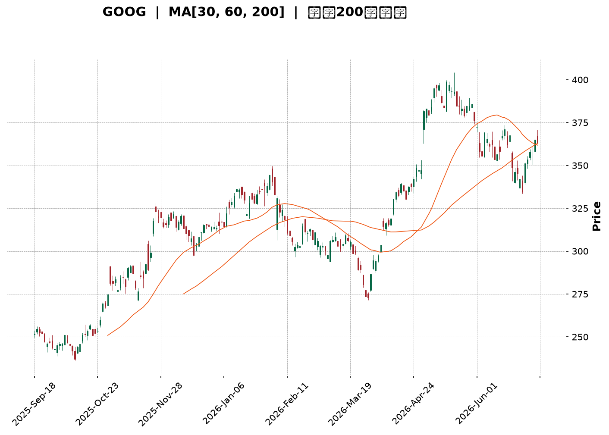
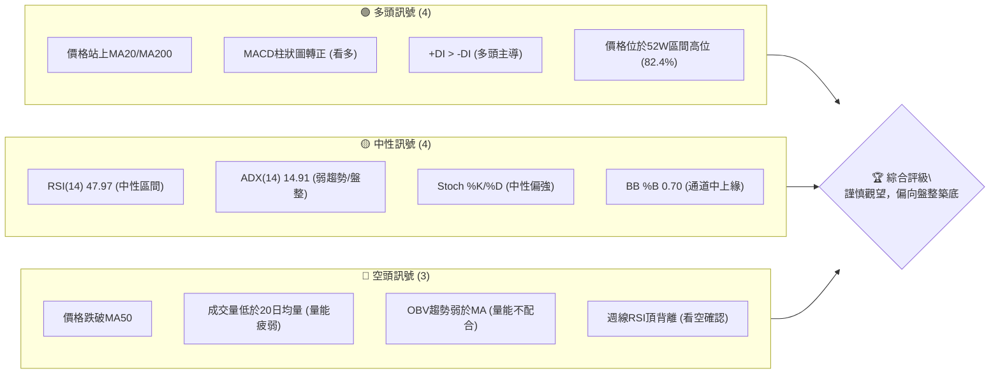
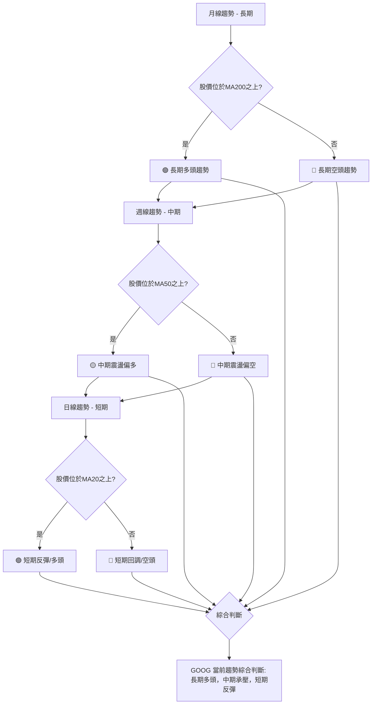
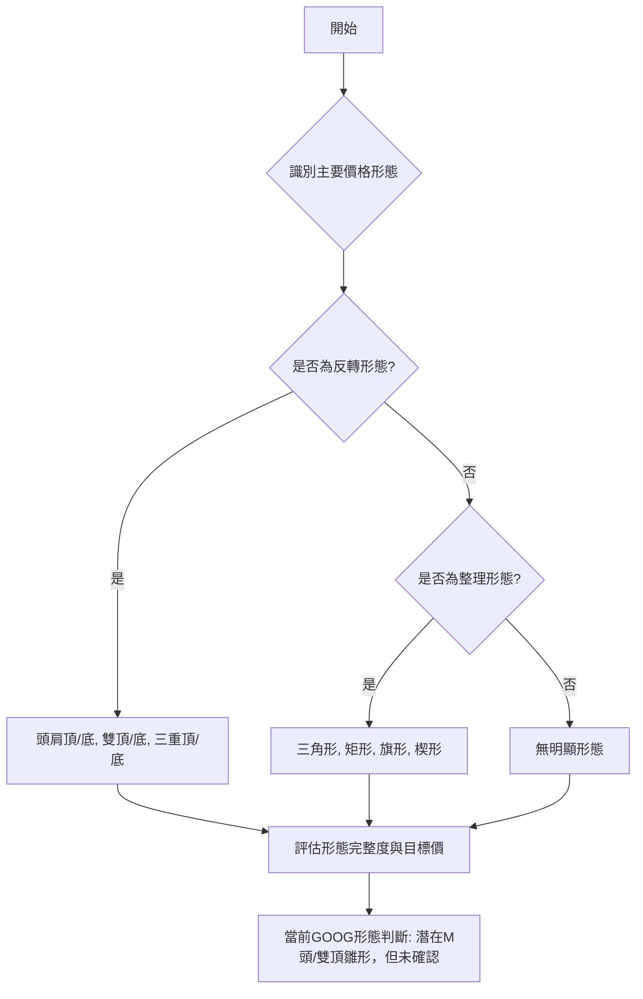

<details>
<summary>📊 靜態圖表 (點擊展開)</summary>

</details>

<html>
<head><meta charset="utf-8" /></head>
<body>
    <div style="height:500px; width:100%;">                        <script>window.PlotlyConfig = {MathJaxConfig: 'local'};</script>
        <script charset="utf-8" src="https://cdn.plot.ly/plotly-3.6.0.min.js" integrity="sha256-QaOVwtVY0T02VaHrr6pnoHLCwayMJp4O5n4YyaE3rJk=" crossorigin="anonymous"></script>                <div id="candlestick-chart" class="plotly-graph-div" style="height:100%; width:100%;"></div>            <script>                window.PLOTLYENV=window.PLOTLYENV || {};                                if (document.getElementById("candlestick-chart")) {                    Plotly.newPlot(                        "candlestick-chart",                        [{"close":{"dtype":"f8","bdata":"AAAAoMN6b0AAAADgs9dvQAAAAIBUjG9AAAAAgBV7b0AAAADgC+tuQAAAACDOwm5AAAAAYEnWbkAAAABAOXxuQAAAAKBaYm5AAAAAwOihbkAAAABgVb5uQAAAAAD5vm5AAAAAQJNgb0AAAACgsNRuQAAAAOBan25AAAAAAI83bkAAAABA0KBtQAAAAIAqhW5AAAAAYKu2bkAAAADA9mZvQAAAAKBkbG9AAAAAoGSpb0AAAACARghwQAAAAIAlW29AAAAA4CaBb0AAAAAgeqdvQAAAAKABQHBAAAAAYG7WcEAAAACAer5wQAAAAIAbKnFAAAAAoJOVcUAAAACgTJRxQAAAAAAHuXFAAAAAwEFYcUAAAABgFsNxQAAAAGCCzHFAAAAAIHJycUAAAABgWCByQAAAAGC1MnJAAAAAIOLtcUAAAAAAL2lxQAAAAMACR3FAAAAAQKnQcUAAAADAcMZxQAAAAGCrRnJAAAAAwJoWckAAAABgBbFyQAAAAGCN3XNAAAAAQBwwdEAAAACgdPpzQAAAAGDm93NAAAAAoA6oc0AAAADAbbZzQAAAAIDi\u002f3NAAAAAQEbcc0AAAADgWxd0QAAAAGCioHNAAAAAgF3Vc0AAAAAgTAl0QAAAAGCmlHNAAAAAANZhc0AAAABAqU5zQAAAACBBNXNAAAAAgLyackAAAABgqPVyQAAAAOBQQ3NAAAAAYMduc0AAAADgSbRzQAAAAAAhtHNAAAAAgMioc0AAAAAArZ9zQAAAAGA7onNAAAAAYD+Wc0AAAABAia5zQAAAAIB+znNAAAAAYDuic0AAAADAJSB0QAAAAEBaWXRAAAAAIF6LdEAAAACAu8R0QAAAAODa\u002f3RAAAAAAPD9dEAAAACAmst0QAAAAOCKnnRAAAAAQNUbdEAAAABAOX90QAAAACCIpnRAAAAAwAWAdEAAAACAedJ0QAAAAEAB6XRAAAAAYHX9dEAAAAAgfSN1QAAAAGBpIXVAAAAAwDKHdUAAAAAgFkR1QAAAAMB6znRAAAAAgFyudEAAAACg2ip0QAAAAGCgP3RAAAAAYG3jc0AAAABgx25zQAAAAMB1T3NAAAAAIO4Zc0AAAAAAzOZyQAAAAKCx+HJAAAAAAJ\u002fyckAAAAAg06dzQAAAACCIdHNAAAAAYDpoc0AAAACg8YlzQAAAAKD8K3NAAAAAgGBwc0AAAADgXB9zQAAAAACf8nJAAAAAQN3wckAAAADgRshyQAAAAECSnnJAAAAAIDcdc0AAAAAg7StzQAAAAIDAQ3NAAAAAIHHwckAAAACAddRyQAAAAGDKA3NAAAAAIJVTc0AAAAAg2iFzQAAAAOC8GHNAAAAAwMOpckAAAABAca1yQAAAAMBqEHJAAAAAIKcWckAAAABgI4lxQAAAAICGGXFAAAAAoJwPcUAAAADA\u002f+pxQAAAAOCPa3JAAAAAoIZkckAAAAAAspdyQAAAAID0+3JAAAAAoM+oc0AAAAAg4MJzQAAAAEB7uHNAAAAAwEnwc0AAAABAGaZ0QAAAACBN5HRAAAAAAB7JdEAAAABAIjN1QAAAACAs83RAAAAAAFekdEAAAAAgbhh1QAAAAOC\u002fGHVAAAAAYNNhdUAAAABA98R1QAAAAOCntHVAAAAAIJ6xdUAAAABAXdt3QAAAAADV73dAAAAAQJa2d0AAAAAgnwB4QAAAAABwrnhAAAAA4P6weEAAAACg+sx4QAAAAACZKHhAAAAAIG35d0AAAADAzOx4QAAAAODlznhAAAAAwFWReEAAAAAA+o14QAAAACCyCnhAAAAAILIKeEAAAABg1PN3QAAAAOBtsndAAAAAgLwJeEAAAACAkwl4QAAAAEA0HnhAAAAA4EGDd0AAAADAsUV3QAAAAIDKYnZAAAAAAHU3dkAAAAAgxBB3QAAAAOCj2HZAAAAAYLiSdkAAAADgo6R2QAAAAMAeFXZAAAAAwPVIdkAAAABgj2J2QAAAAIDC8XZAAAAAoJkxd0AAAACgmaF2QAAAACBc93ZAAAAA4HrMdUAAAACgR6F1QAAAAOCjkHVAAAAAQApjdUAAAABACut0QAAAAOB69HVAAAAAoEcVdkAAAACAPV52QAAAAEDhQnZAAAAAYGbOdkAAAACA67l2QA=="},"high":{"dtype":"f8","bdata":"r3leHpK0b0AXizZtKgNwQJZBdQjg+W9A+bAhL7HIb0CSJIqq4o5vQB50qS+Z2m5AlPO7wi40b0A6pK+1+2RvQKx1L59YZm5ANan4ElTVbkBJsH5w0eRuQE0Zl4tO1G5AnZ01sZx2b0Ayhd1q2mFvQAlFuYfX2G5A+BmshWOibkAwsZ+WjYtuQIHEICRYkG5A7aNDOEbxbkDPUI9sf4hvQLgdNMQ3EXBAYM1RiDTMb0BZ9u47AhZwQGTfKIIs3G9AF2O9jdQKcEAb9Or9gOtvQKs0hpnxX3BA5W1q51LkcEAA\u002fQ8dlu1wQDFPAtfhNnFAHRo6Ir41ckCVdzp5mdtxQIPc0SoX1nFAgfKU4oWUcUDzGAUAOuJxQP6jcrLrA3JAJaAjahi\u002fcUCKYYvnPC5yQP+cPDFKPHJAmrox35s8ckBbF\u002f9SSa9xQOcKyZypaXFAqZ1KBxpfckDGH1WE5g1yQPY+DCd6+nJAfqiKo6Ikc0C\u002f8iGX2PVyQPL661fK8nNA93kh0m6AdEAWTdcCq0V0QIXf+zTZY3RAzN8nfRPwc0DTgtbToN9zQFZaO3+PFnRASQBdhHgndEC8N+3uJDN0QGZjBQL5DHRAM8epf7Dkc0CwY3r5Mhd0QDAwp88dGXRAueZUlaO7c0D1MI6uq4RzQI7yvyACd3NAUjSa+qlMc0BHVLhNyQ1zQEGt\u002f1djSXNA\u002fdqgBbF0c0CDiZ0PMr5zQNirli8JvnNAFHF3klnCc0B+OlqG8ahzQNEUfQmR1HNAAL4voKevc0C3lUeo4Sd0QJ5w4W5V7XNAq2x25z4SdEAHSneOn2B0QPbUtOi8oXRAIDTqPcKwdEA\u002fkPF7DuB0QE6lhGATTHVAYoy2RnEJdUDh5u4OBRt1QCAe7Q7X7HRAoXcGzZZ6dEBQ0XImp8R0QNUQ6ENc7HRAiLk3cYHZdECmgz2\u002fk\u002f50QLcfbbBgHHVArIasyAcTdUDYAa84fl11QHvYqveIPXVA8ENZ1W6LdUA\u002fAc+8Ftt1QAc3Lc7PfHVA\u002fMbSuVvDdED0aawyVqN0QCSZmSX\u002fdHRApNrsVl0TdEB49jQxBAp0QJ0DPV4SwXNA9vu1aMpHc0CN+kGv3wdzQCGHTDgsGHNADzDJ6xYac0A0yrzOi8VzQB6YHP6b8HNAjobNv2V\u002fc0AF1uXBApRzQFdJKPt2iXNA\u002fEGEZsN6c0AU2CdczjtzQCns9Xex+HJABZ+aYfsQc0DD6KjZle9yQHNIKUYCv3JA9A766gwlc0AA++\u002fHbE9zQPo4ODkcbnNAj3NUH0VHc0DPXEoWNDFzQP6usOotFnNAl2Fh7NBdc0C3XV5pAmlzQJdJ0qjtJ3NAx1+uoP0Cc0A1vK4oAPNyQDpzbqm9jnJAIbskYrlnckD9hdSle+VxQGMBJ\u002f7AbnFAO0pfcIBBcUDicCmICe5xQMz9ZGbknHJA+Tq7U417ckCazX997aNyQJMBx3Ss\u002fnJAMIliqyrzc0CRIIJD09NzQKp+0c\u002fs9HNAFDRBVc7zc0AZsiT6Dqd0QCZZvbHG7HRAtyxTRNUSdUAF2xDvfDx1QB\u002f6v9xLL3VAN7aIvnkPdUB7d88iOh11QGF3+U9JP3VAUtjuf7t3dUC6iPTiBet1QPVYU1YI23VA5dYvv\u002f8SdkB6x83MZeZ3QHTdxfSM8ndA6ZHQ0C7\u002fd0AQGOjRnUt4QOY17\u002fFDwnhAxYbqL9vReEApNYkfFuJ4QHsA6B98oXhAEW+JK1IjeEDFwKzuB\u002ft4QFtbOrzS7XhA0LhtMUW6eEAtlzGjoEN5QJWnecYFknhAEcL+tXBneECB1QmqI0d4QFQ0n1k3CnhAVPcZBYgSeEBE5pxw2Vd4QOSk8DA\u002fXHhAZ3zVI7rWd0COagfG\u002fmV3QDYhqckUGXdA2kHD8oKkdkAquORLMxp3QFVYXKalD3dAAAAAgBS2dkAAAABgEht3QAAAAMD15HZAAAAAAClgdkAAAABAXsx2QAAAAGBmKndAAAAAoJlZd0AAAABgZiJ3QAAAAAAAEHdAAAAAQDNjdkAAAAAghct1QAAAAKBHDXZAAAAAQApzdUAAAACA64F1QAAAACCF\u002f3VAAAAAgD02dkAAAADA9Xh2QAAAAADXj3ZAAAAAQOHadkAAAACAPS53QA=="},"hovertemplate":"\u003cb\u003e%{x|%Y-%m-%d}\u003c\u002fb\u003e\u003cbr\u003e\u958b: $%{open:.2f}\u003cbr\u003e\u9ad8: $%{high:.2f}\u003cbr\u003e\u4f4e: $%{low:.2f}\u003cbr\u003e\u6536: $%{close:.2f}\u003cextra\u003e\u003c\u002fextra\u003e","low":{"dtype":"f8","bdata":"836y89wzb0CMkvSUZXJvQPYHNCw4Sm9AioEAiClTb0D9VHuGkNduQD94UzisJW5AmB5OZwrFbkDhac4WLVduQDdD7mNG421AcO3WGW3XbUD8RsJIJFRuQOFtl6fcP25AOGn8JLOmbkB2M9ZAeMpuQGWP7q2Jk25AQIwFq8HmbUC6noyGGodtQEwvafbtCG5A8Y\u002fmUJkWbkDEQ7nX1MluQBrS7aO\u002fRW9ACkyMlFEDb0APyb9HQ8NvQLdQLsMfhm5AtlcKEcE+b0ByXXLqwIhvQPfg7isr829APJ\u002fBW7+GcEAgPGq4W6pwQE4\u002fmmF6vnBArLA8Hmx+cUB0QiqOrk9xQCUW9gslfXFAKWs\u002fkyxFcUCxqSPsYVVxQAoNWA4bkXFAqKLmmjUzcUC8n0wcxK9xQC6tzM0R9XFA\u002fadi0C29cUD262J5TFdxQFe2kqEQ7nBAQtsjusi6cUC4UFBNbWdxQNHwiGC38XFAqxpnfasJckC1ihzji1xyQMgpd0y3THNAeYqWyhvTc0BIOq+tRclzQFiEN5sexXNAuzFQYtqVc0C4Fihsr5lzQLORw6ykmnNAHTu8z4+vc0AcLQJIqvVzQOtV1RMMeHNApZQCbGSDc0DyUS5v0K9zQKqEdAucV3NAO7OkR\u002fMoc0DP4yejdBVzQH9PE3nv9nJA67i3Qv2QckC+iF2NzcNyQNtC5YMg33JAFZmRtgkjc0AztxH6gmVzQF5mye+TjnNAvFreIPiUc0CRe1Ev43dzQAol6ZJ1jXNAT29tba58c0AJ04HW6WNzQFsiGrJmrXNA5DgqEOt+c0DqhXjjbqFzQKNbY70dGXRAYvy8EjBddEBrBUr4XFF0QCbRVV6e3nRAM0HfYlOrdEDEBPL+uK10QD3AXjnee3RA18vuKYoHdEAlelng9\u002fFzQLd0I3o2h3RAUjJuFax4dEAnRip7AHF0QKwxke4H1XRApXzILiW7dEC97sGysmR0QAQ+o3tLw3RAAxY75ST5dEB4J0\u002fHXiJ1QIc4wtgKj3RAIBjKu08oc0BJxaEkt\u002ftzQLgVJxCR1HNAIkxieP2jc0DryiWqmltzQAxjhSX3O3NAfyL29A34ckCG4VtFM4hyQKgCAfpf2XJASLT2EnHEckDUauYkXQBzQOjfW\u002fZdWXNARjmJcQwbc0CRHxHeTE9zQPd19PU+4HJAHGVB5x3zckBlr6h0rMpyQMgLUQ39hHJAw\u002f826oTGckCdOlpu5ZpyQEP8lc3VbXJA4NyHIg1cckCX5KmdBRJzQCWNRxt\u002fGnNADm68dovKckDAbXdjmLlyQPQdKC4O2nJAO\u002fEx16sCc0Am7ymcxxVzQMjMV2cazXJAnSSk5iSJckCOjFWwnJ1yQFwYmHnmCnJAeF0+eCfzcUBIGdhJHW5xQPxnm1AMFXFAFZ8zdPL1cEBGtz4if0lxQFXXhQC8FHJAxbTLOVr2cUBkDe8I0FlyQAJY3fP0c3JA+qloQ0WIc0BZOYK\u002filRzQIiTQ+icpXNAWS04eQWYc0CYaAQ7Tw90QMTaQbBlh3RApxpqQjW3dEBD\u002f1vNbtF0QGDzlyXc5nRABbPBceiWdEC2xD\u002fgJ8x0QFn9n0C87XRAo+D3v5XddEBi6Jwerkl1QGI62q4qgXVA7mmzpZVjdUDyRgQR8q12QKFOWXyMcHdAihgDsrGId0D\u002fl2yI8MF3QIWP2+7fLXhA9t0jKzRheEC3npWT7pZ4QPd6kJT2H3hA3Z3smd23d0CuaUaEm9V3QPDxllHeh3hAapJDxWhYeEBTqNlRo2p4QLXmTW5Q7HdAa6te0le8d0AmjIA0B7R3QMY5WSKFoHdAotj\u002fapeud0Bm6u3YUtx3QO+Gbr9U0HdAbJ5bnzJhd0CgAQdSzRd3QImzMFqVLHZAiBfgc6sidkBM6yCmYil2QJRs1IyZlnZAAAAAgD1edkAAAAAghSt2QAAAAMD1DHZAAAAAgBR6dUAAAACgcBV2QAAAAGBmynZAAAAAwB7VdkAAAAAgroN2QAAAAGC6SXZAAAAAQApPdUAAAACgcDt1QAAAAAAAWHVAAAAAYGb+dEAAAABACtt0QAAAAMD1LHVAAAAAgMLBdUAAAAAgrhN2QAAAAMAe5XVAAAAAQAojdkAAAABA4aZ2QA=="},"name":"\u50f9\u683c","open":{"dtype":"f8","bdata":"kso16MBrb0CXVYT875xvQFjVRs0CyW9AufdU7RSlb0C2dI4FBHVvQPEfXJmNi25Abzn27ZvpbkCpYhsjQvluQL98QVq0Um5AHNnnfqkWbkDIDPBoGqVuQKFT80wCmG5AaM3E85KpbkBZNYNHLQ5vQAXuQgT9tm5AO7JRdJSSbkBz0U4J9jVuQEUCvTnfEW5ALejP8QYpbkBV6BjXMPNuQMfdIYATf29A+FnXWXdbb0D320YPYtdvQN3FfpcF2G9A3CXcQVvQb0Bq+BDbhKZvQCvHhBi\u002fDHBA2VtDPnSNcEBGlWlRvtpwQBqSYzBawXBAL2n3sGMyckAf1hNnaqpxQIQh\u002fH7hnXFAT3v5OF5IcUALNUDnVW1xQJzBzxXR0nFAxCUD3Xa6cUCsUB\u002fqT8txQGBVYv0t+nFArMhIszc4ckCle\u002fMH56ZxQP0SvT7P9XBAur0Pl2\u002fdcUClchzhuv5xQMaFzKH08XFAF06AXU0Cc0Aad3bGoIRyQNw3\u002fQVtZnNA3FoNLpJidEDmu2WecAJ0QGShGZrBLHRArYJy4anNc0BjZOwye8RzQEprHqeWtnNAneQa05smdEAMyQH\u002f+\u002fVzQJp4udPGCXRAVBIn+w+Lc0Baz7MJT8NzQLBBizHlCnRAaZ7ipSWmc0D7JDXVeINzQO\u002fdeD+cGXNAbdbBN7VJc0Dy\u002fjDQoepyQLSJScv87XJAZdOp7xltc0D1cTvrqWtzQA3YL2\u002fMu3NAGkBBnh+4c0AWrmGkloZzQL729RcEkHNA5VdobGCPc0BQrrf9ztJzQLDC03581HNA0dYvn1XOc0DnEqxDjaJzQPdkiFldjXRAsuDqcQBxdEA8uIatLmF0QPtesqV67XRA8xo31cPodEAg6ZQ10hl1QJr7RXD353RArxMByyENdEBM8ozQ0Ap0QEToDbFC3XRAlc2zyojDdEAqrJTvWHx0QFcS3mES83RAiqpzPLsCdUCodWRXfj51QAiTP2Fg4HRAJmxQwsUBdUC8\u002fhWa9sB1QN3SjfPmdHVAglnvCamMc0Bdk4now250QIPMGeQhDXRAoxMlENwHdEAfEoMWs+hzQIeH+vETf3NAvc0iP1Q5c0Dx\u002fkBn9sNyQL4Ege+Y4HJAPlBCrwDickDJkPB8bwZzQPB7IY2T63NAVJIo\u002f8Bjc0CLDEEdZ3tzQHXF\u002fkVZhnNAJAyribH4ckD7es0lHelyQGzFGhp9oHJA98fS1qPkckDGPkWC3uxyQNwzx0j4enJAd207YVRfckC2Dld5DhtzQBzWJhnaIXNAcNbsu2kgc0DsSNVzhydzQJdPL6Wt9nJAWitgzckHc0CMaLdLhDtzQD9kcRVx8HJA5XTinTH+ckBpmLeHlsVyQOi5xFqCgHJAaZ1OkZY\u002fckDBvs4ySeBxQDO4G+i6U3FAXraCtWM0cUAd+UgW+FVxQOQ+4L7jHHJA+3sn+g4NckAn5PYqXWhyQPA3OxZav3JAMhU+ozjac0BOnnm1BpBzQBzFAJSJ4HNAiQ0tVq+zc0Bnw\u002ffZ8B10QGpr92HHpXRAPklXKV76dEByBmleqeN0QLPMJLezJXVAuA4nZiH2dECHvjgC8Op0QAv476DuNXVA1dZCFUUYdUCiAGROxXp1QKgPzK1hq3VADNEgAluUdUBlSDXTgTB3QKKj2egKnHdAmI7V5XDhd0BpWrupPtp3QCPOacywVXhAfXP6iSPNeECbjjWZhqB4QA5VpbdHZ3hAV5zDd0sMeEDiD0n3zdp3QAnJxrPZmHhAKco64qePeEAC7jvtOX54QBdvOM4DkXhAUsKxR+8MeEA\u002ffNLYe9x3QAs8\u002ftB48HdAQ3AO2UDMd0B1VGt2juh3QImOWtEQ+ndAidPdb+7Pd0BHHyNjnUV3QKZ8ap8Qr3ZAdxuMVelhdkDJz3mSnjN2QIzzFj2VsnZAAAAAgMKndkAAAAAAKc52QAAAAMDMkHZAAAAAwMwQdkAAAACgmZF2QAAAAADX33ZAAAAAoHD3dkAAAADAzPB2QAAAAIA9vnZAAAAAAClSdkAAAAAgrkF1QAAAACCFy3VAAAAAYLgOdUAAAAAgrk91QAAAAEAzP3VAAAAAIFzvdUAAAAAA1yl2QAAAAGBmQnZAAAAAwB5jdkAAAACA6\u002fV2QA=="},"x":["2025-09-18T00:00:00-04:00","2025-09-19T00:00:00-04:00","2025-09-22T00:00:00-04:00","2025-09-23T00:00:00-04:00","2025-09-24T00:00:00-04:00","2025-09-25T00:00:00-04:00","2025-09-26T00:00:00-04:00","2025-09-29T00:00:00-04:00","2025-09-30T00:00:00-04:00","2025-10-01T00:00:00-04:00","2025-10-02T00:00:00-04:00","2025-10-03T00:00:00-04:00","2025-10-06T00:00:00-04:00","2025-10-07T00:00:00-04:00","2025-10-08T00:00:00-04:00","2025-10-09T00:00:00-04:00","2025-10-10T00:00:00-04:00","2025-10-13T00:00:00-04:00","2025-10-14T00:00:00-04:00","2025-10-15T00:00:00-04:00","2025-10-16T00:00:00-04:00","2025-10-17T00:00:00-04:00","2025-10-20T00:00:00-04:00","2025-10-21T00:00:00-04:00","2025-10-22T00:00:00-04:00","2025-10-23T00:00:00-04:00","2025-10-24T00:00:00-04:00","2025-10-27T00:00:00-04:00","2025-10-28T00:00:00-04:00","2025-10-29T00:00:00-04:00","2025-10-30T00:00:00-04:00","2025-10-31T00:00:00-04:00","2025-11-03T00:00:00-05:00","2025-11-04T00:00:00-05:00","2025-11-05T00:00:00-05:00","2025-11-06T00:00:00-05:00","2025-11-07T00:00:00-05:00","2025-11-10T00:00:00-05:00","2025-11-11T00:00:00-05:00","2025-11-12T00:00:00-05:00","2025-11-13T00:00:00-05:00","2025-11-14T00:00:00-05:00","2025-11-17T00:00:00-05:00","2025-11-18T00:00:00-05:00","2025-11-19T00:00:00-05:00","2025-11-20T00:00:00-05:00","2025-11-21T00:00:00-05:00","2025-11-24T00:00:00-05:00","2025-11-25T00:00:00-05:00","2025-11-26T00:00:00-05:00","2025-11-28T00:00:00-05:00","2025-12-01T00:00:00-05:00","2025-12-02T00:00:00-05:00","2025-12-03T00:00:00-05:00","2025-12-04T00:00:00-05:00","2025-12-05T00:00:00-05:00","2025-12-08T00:00:00-05:00","2025-12-09T00:00:00-05:00","2025-12-10T00:00:00-05:00","2025-12-11T00:00:00-05:00","2025-12-12T00:00:00-05:00","2025-12-15T00:00:00-05:00","2025-12-16T00:00:00-05:00","2025-12-17T00:00:00-05:00","2025-12-18T00:00:00-05:00","2025-12-19T00:00:00-05:00","2025-12-22T00:00:00-05:00","2025-12-23T00:00:00-05:00","2025-12-24T00:00:00-05:00","2025-12-26T00:00:00-05:00","2025-12-29T00:00:00-05:00","2025-12-30T00:00:00-05:00","2025-12-31T00:00:00-05:00","2026-01-02T00:00:00-05:00","2026-01-05T00:00:00-05:00","2026-01-06T00:00:00-05:00","2026-01-07T00:00:00-05:00","2026-01-08T00:00:00-05:00","2026-01-09T00:00:00-05:00","2026-01-12T00:00:00-05:00","2026-01-13T00:00:00-05:00","2026-01-14T00:00:00-05:00","2026-01-15T00:00:00-05:00","2026-01-16T00:00:00-05:00","2026-01-20T00:00:00-05:00","2026-01-21T00:00:00-05:00","2026-01-22T00:00:00-05:00","2026-01-23T00:00:00-05:00","2026-01-26T00:00:00-05:00","2026-01-27T00:00:00-05:00","2026-01-28T00:00:00-05:00","2026-01-29T00:00:00-05:00","2026-01-30T00:00:00-05:00","2026-02-02T00:00:00-05:00","2026-02-03T00:00:00-05:00","2026-02-04T00:00:00-05:00","2026-02-05T00:00:00-05:00","2026-02-06T00:00:00-05:00","2026-02-09T00:00:00-05:00","2026-02-10T00:00:00-05:00","2026-02-11T00:00:00-05:00","2026-02-12T00:00:00-05:00","2026-02-13T00:00:00-05:00","2026-02-17T00:00:00-05:00","2026-02-18T00:00:00-05:00","2026-02-19T00:00:00-05:00","2026-02-20T00:00:00-05:00","2026-02-23T00:00:00-05:00","2026-02-24T00:00:00-05:00","2026-02-25T00:00:00-05:00","2026-02-26T00:00:00-05:00","2026-02-27T00:00:00-05:00","2026-03-02T00:00:00-05:00","2026-03-03T00:00:00-05:00","2026-03-04T00:00:00-05:00","2026-03-05T00:00:00-05:00","2026-03-06T00:00:00-05:00","2026-03-09T00:00:00-04:00","2026-03-10T00:00:00-04:00","2026-03-11T00:00:00-04:00","2026-03-12T00:00:00-04:00","2026-03-13T00:00:00-04:00","2026-03-16T00:00:00-04:00","2026-03-17T00:00:00-04:00","2026-03-18T00:00:00-04:00","2026-03-19T00:00:00-04:00","2026-03-20T00:00:00-04:00","2026-03-23T00:00:00-04:00","2026-03-24T00:00:00-04:00","2026-03-25T00:00:00-04:00","2026-03-26T00:00:00-04:00","2026-03-27T00:00:00-04:00","2026-03-30T00:00:00-04:00","2026-03-31T00:00:00-04:00","2026-04-01T00:00:00-04:00","2026-04-02T00:00:00-04:00","2026-04-06T00:00:00-04:00","2026-04-07T00:00:00-04:00","2026-04-08T00:00:00-04:00","2026-04-09T00:00:00-04:00","2026-04-10T00:00:00-04:00","2026-04-13T00:00:00-04:00","2026-04-14T00:00:00-04:00","2026-04-15T00:00:00-04:00","2026-04-16T00:00:00-04:00","2026-04-17T00:00:00-04:00","2026-04-20T00:00:00-04:00","2026-04-21T00:00:00-04:00","2026-04-22T00:00:00-04:00","2026-04-23T00:00:00-04:00","2026-04-24T00:00:00-04:00","2026-04-27T00:00:00-04:00","2026-04-28T00:00:00-04:00","2026-04-29T00:00:00-04:00","2026-04-30T00:00:00-04:00","2026-05-01T00:00:00-04:00","2026-05-04T00:00:00-04:00","2026-05-05T00:00:00-04:00","2026-05-06T00:00:00-04:00","2026-05-07T00:00:00-04:00","2026-05-08T00:00:00-04:00","2026-05-11T00:00:00-04:00","2026-05-12T00:00:00-04:00","2026-05-13T00:00:00-04:00","2026-05-14T00:00:00-04:00","2026-05-15T00:00:00-04:00","2026-05-18T00:00:00-04:00","2026-05-19T00:00:00-04:00","2026-05-20T00:00:00-04:00","2026-05-21T00:00:00-04:00","2026-05-22T00:00:00-04:00","2026-05-26T00:00:00-04:00","2026-05-27T00:00:00-04:00","2026-05-28T00:00:00-04:00","2026-05-29T00:00:00-04:00","2026-06-01T00:00:00-04:00","2026-06-02T00:00:00-04:00","2026-06-03T00:00:00-04:00","2026-06-04T00:00:00-04:00","2026-06-05T00:00:00-04:00","2026-06-08T00:00:00-04:00","2026-06-09T00:00:00-04:00","2026-06-10T00:00:00-04:00","2026-06-11T00:00:00-04:00","2026-06-12T00:00:00-04:00","2026-06-15T00:00:00-04:00","2026-06-16T00:00:00-04:00","2026-06-17T00:00:00-04:00","2026-06-18T00:00:00-04:00","2026-06-22T00:00:00-04:00","2026-06-23T00:00:00-04:00","2026-06-24T00:00:00-04:00","2026-06-25T00:00:00-04:00","2026-06-26T00:00:00-04:00","2026-06-29T00:00:00-04:00","2026-06-30T00:00:00-04:00","2026-07-01T00:00:00-04:00","2026-07-02T00:00:00-04:00","2026-07-06T00:00:00-04:00","2026-07-07T00:00:00-04:00"],"type":"candlestick"},{"hovertemplate":"MA30: $%{y:.2f}\u003cextra\u003e\u003c\u002fextra\u003e","line":{"color":"#2196F3","dash":"dash","width":2},"mode":"lines","name":"MA30","x":["2025-09-18T00:00:00-04:00","2025-09-19T00:00:00-04:00","2025-09-22T00:00:00-04:00","2025-09-23T00:00:00-04:00","2025-09-24T00:00:00-04:00","2025-09-25T00:00:00-04:00","2025-09-26T00:00:00-04:00","2025-09-29T00:00:00-04:00","2025-09-30T00:00:00-04:00","2025-10-01T00:00:00-04:00","2025-10-02T00:00:00-04:00","2025-10-03T00:00:00-04:00","2025-10-06T00:00:00-04:00","2025-10-07T00:00:00-04:00","2025-10-08T00:00:00-04:00","2025-10-09T00:00:00-04:00","2025-10-10T00:00:00-04:00","2025-10-13T00:00:00-04:00","2025-10-14T00:00:00-04:00","2025-10-15T00:00:00-04:00","2025-10-16T00:00:00-04:00","2025-10-17T00:00:00-04:00","2025-10-20T00:00:00-04:00","2025-10-21T00:00:00-04:00","2025-10-22T00:00:00-04:00","2025-10-23T00:00:00-04:00","2025-10-24T00:00:00-04:00","2025-10-27T00:00:00-04:00","2025-10-28T00:00:00-04:00","2025-10-29T00:00:00-04:00","2025-10-30T00:00:00-04:00","2025-10-31T00:00:00-04:00","2025-11-03T00:00:00-05:00","2025-11-04T00:00:00-05:00","2025-11-05T00:00:00-05:00","2025-11-06T00:00:00-05:00","2025-11-07T00:00:00-05:00","2025-11-10T00:00:00-05:00","2025-11-11T00:00:00-05:00","2025-11-12T00:00:00-05:00","2025-11-13T00:00:00-05:00","2025-11-14T00:00:00-05:00","2025-11-17T00:00:00-05:00","2025-11-18T00:00:00-05:00","2025-11-19T00:00:00-05:00","2025-11-20T00:00:00-05:00","2025-11-21T00:00:00-05:00","2025-11-24T00:00:00-05:00","2025-11-25T00:00:00-05:00","2025-11-26T00:00:00-05:00","2025-11-28T00:00:00-05:00","2025-12-01T00:00:00-05:00","2025-12-02T00:00:00-05:00","2025-12-03T00:00:00-05:00","2025-12-04T00:00:00-05:00","2025-12-05T00:00:00-05:00","2025-12-08T00:00:00-05:00","2025-12-09T00:00:00-05:00","2025-12-10T00:00:00-05:00","2025-12-11T00:00:00-05:00","2025-12-12T00:00:00-05:00","2025-12-15T00:00:00-05:00","2025-12-16T00:00:00-05:00","2025-12-17T00:00:00-05:00","2025-12-18T00:00:00-05:00","2025-12-19T00:00:00-05:00","2025-12-22T00:00:00-05:00","2025-12-23T00:00:00-05:00","2025-12-24T00:00:00-05:00","2025-12-26T00:00:00-05:00","2025-12-29T00:00:00-05:00","2025-12-30T00:00:00-05:00","2025-12-31T00:00:00-05:00","2026-01-02T00:00:00-05:00","2026-01-05T00:00:00-05:00","2026-01-06T00:00:00-05:00","2026-01-07T00:00:00-05:00","2026-01-08T00:00:00-05:00","2026-01-09T00:00:00-05:00","2026-01-12T00:00:00-05:00","2026-01-13T00:00:00-05:00","2026-01-14T00:00:00-05:00","2026-01-15T00:00:00-05:00","2026-01-16T00:00:00-05:00","2026-01-20T00:00:00-05:00","2026-01-21T00:00:00-05:00","2026-01-22T00:00:00-05:00","2026-01-23T00:00:00-05:00","2026-01-26T00:00:00-05:00","2026-01-27T00:00:00-05:00","2026-01-28T00:00:00-05:00","2026-01-29T00:00:00-05:00","2026-01-30T00:00:00-05:00","2026-02-02T00:00:00-05:00","2026-02-03T00:00:00-05:00","2026-02-04T00:00:00-05:00","2026-02-05T00:00:00-05:00","2026-02-06T00:00:00-05:00","2026-02-09T00:00:00-05:00","2026-02-10T00:00:00-05:00","2026-02-11T00:00:00-05:00","2026-02-12T00:00:00-05:00","2026-02-13T00:00:00-05:00","2026-02-17T00:00:00-05:00","2026-02-18T00:00:00-05:00","2026-02-19T00:00:00-05:00","2026-02-20T00:00:00-05:00","2026-02-23T00:00:00-05:00","2026-02-24T00:00:00-05:00","2026-02-25T00:00:00-05:00","2026-02-26T00:00:00-05:00","2026-02-27T00:00:00-05:00","2026-03-02T00:00:00-05:00","2026-03-03T00:00:00-05:00","2026-03-04T00:00:00-05:00","2026-03-05T00:00:00-05:00","2026-03-06T00:00:00-05:00","2026-03-09T00:00:00-04:00","2026-03-10T00:00:00-04:00","2026-03-11T00:00:00-04:00","2026-03-12T00:00:00-04:00","2026-03-13T00:00:00-04:00","2026-03-16T00:00:00-04:00","2026-03-17T00:00:00-04:00","2026-03-18T00:00:00-04:00","2026-03-19T00:00:00-04:00","2026-03-20T00:00:00-04:00","2026-03-23T00:00:00-04:00","2026-03-24T00:00:00-04:00","2026-03-25T00:00:00-04:00","2026-03-26T00:00:00-04:00","2026-03-27T00:00:00-04:00","2026-03-30T00:00:00-04:00","2026-03-31T00:00:00-04:00","2026-04-01T00:00:00-04:00","2026-04-02T00:00:00-04:00","2026-04-06T00:00:00-04:00","2026-04-07T00:00:00-04:00","2026-04-08T00:00:00-04:00","2026-04-09T00:00:00-04:00","2026-04-10T00:00:00-04:00","2026-04-13T00:00:00-04:00","2026-04-14T00:00:00-04:00","2026-04-15T00:00:00-04:00","2026-04-16T00:00:00-04:00","2026-04-17T00:00:00-04:00","2026-04-20T00:00:00-04:00","2026-04-21T00:00:00-04:00","2026-04-22T00:00:00-04:00","2026-04-23T00:00:00-04:00","2026-04-24T00:00:00-04:00","2026-04-27T00:00:00-04:00","2026-04-28T00:00:00-04:00","2026-04-29T00:00:00-04:00","2026-04-30T00:00:00-04:00","2026-05-01T00:00:00-04:00","2026-05-04T00:00:00-04:00","2026-05-05T00:00:00-04:00","2026-05-06T00:00:00-04:00","2026-05-07T00:00:00-04:00","2026-05-08T00:00:00-04:00","2026-05-11T00:00:00-04:00","2026-05-12T00:00:00-04:00","2026-05-13T00:00:00-04:00","2026-05-14T00:00:00-04:00","2026-05-15T00:00:00-04:00","2026-05-18T00:00:00-04:00","2026-05-19T00:00:00-04:00","2026-05-20T00:00:00-04:00","2026-05-21T00:00:00-04:00","2026-05-22T00:00:00-04:00","2026-05-26T00:00:00-04:00","2026-05-27T00:00:00-04:00","2026-05-28T00:00:00-04:00","2026-05-29T00:00:00-04:00","2026-06-01T00:00:00-04:00","2026-06-02T00:00:00-04:00","2026-06-03T00:00:00-04:00","2026-06-04T00:00:00-04:00","2026-06-05T00:00:00-04:00","2026-06-08T00:00:00-04:00","2026-06-09T00:00:00-04:00","2026-06-10T00:00:00-04:00","2026-06-11T00:00:00-04:00","2026-06-12T00:00:00-04:00","2026-06-15T00:00:00-04:00","2026-06-16T00:00:00-04:00","2026-06-17T00:00:00-04:00","2026-06-18T00:00:00-04:00","2026-06-22T00:00:00-04:00","2026-06-23T00:00:00-04:00","2026-06-24T00:00:00-04:00","2026-06-25T00:00:00-04:00","2026-06-26T00:00:00-04:00","2026-06-29T00:00:00-04:00","2026-06-30T00:00:00-04:00","2026-07-01T00:00:00-04:00","2026-07-02T00:00:00-04:00","2026-07-06T00:00:00-04:00","2026-07-07T00:00:00-04:00"],"y":{"dtype":"f8","bdata":"AAAAAAAA+H8AAAAAAAD4fwAAAAAAAPh\u002fAAAAAAAA+H8AAAAAAAD4fwAAAAAAAPh\u002fAAAAAAAA+H8AAAAAAAD4fwAAAAAAAPh\u002fAAAAAAAA+H8AAAAAAAD4fwAAAAAAAPh\u002fAAAAAAAA+H8AAAAAAAD4fwAAAAAAAPh\u002fAAAAAAAA+H8AAAAAAAD4fwAAAAAAAPh\u002fAAAAAAAA+H8AAAAAAAD4fwAAAAAAAPh\u002fAAAAAAAA+H8AAAAAAAD4fwAAAAAAAPh\u002fAAAAAAAA+H8AAAAAAAD4fwAAAAAAAPh\u002fAAAAAAAA+H8AAAAAAAD4fwAAAGBkXG9AmpmZKd97b0AzMzMTK5hvQN7d3f1suW9AZmZmhs7Ub0C8u7trHPxvQBEREUGxEnBAq6qqogAkcEAiIiI6nDxwQFVVVeVCVnBAZmZmFo9scECamZmh9X1wQO\u002fu7tY1jnBAERERKVugcEC8u7sbfrRwQO\u002fu7tbKzXBAAAAASDjncEDv7u6WTghxQImIiCCbL3FAIiIi8tRYcUCJiIi4VH1xQN7d3YWnoXFAvLu7u0zCcUARERFxtOFxQHd3d\u002feUBnJA3t3ddaMpckDv7u6eBk5yQHd3d8fYanJAiYiISGmEckBmZmZWgaByQBEREZEftXJAzczMHHfEckDv7u7uNdNyQJqZmYni33JAzczMXKLqckDe3d1t2vRyQHd3d8dYAXNA3t3djUoSc0CamZmJwR9zQFVVVXWaLHNA7+7u3l07c0AAAADwP05zQM3MzGxbYnNAd3d3B3pxc0DNzMwcv4FzQO\u002fu7q7OjnNAREREtP6bc0BERESEO6hzQCIiIvJbrHNAzczMrGavc0BVVVXFJLZzQAAAADDxvnNAERERkVbKc0CrqqrKk9NzQLy7u6vd2HNAmpmZCfzac0CamZlZct5zQFVVVTUt53NAvLu7e93sc0AiIiIykvNzQO\u002fu7o7q\u002fnNAIiIiEqMMdEC8u7u7Qxx0QJqZmXmrLHRAmpmZWZ5FdEDNzMysTFl0QM3MzLx4ZnRAd3d31x9xdECamZmZE3V0QKuqqvq5eXRAiYiIaK57dEB3d3cnDXp0QFVVVdVKd3RA3t3d\u002fSVzdEDNzMyMfWx0QO\u002fu7h5dZXRAMzMzk4JfdEAiIiLSf1t0QHd3dzffU3RAMzMz0ypKdEARERGhrD90QHd3dycUMHRAMzMzo9MidEARERFRjRR0QImIiLhJBnRAVVVVhVL8c0B3d3fXsO1zQImIiNhb3HNAiYiIKIjQc0CamZlpcsJzQImIiLhntHNARERElOeic0AAAAAgNI9zQKuqqkomfXNAVVVVxVxqc0AiIiKSJ1hzQM3MzCyQSXNAIiIi4lc4c0C8u7sroStzQAAAAED9GHNA7+7uTqEJc0DNzMwscflyQN7d3d2T5nJAAAAAwCrVckAzMzMTxsxyQAAAAMARyHJARERENFXDckCJiIgIQ7pyQM3MzBw+tnJAiYiIOGW4ckCamZkJS7pyQM3MzOz5vnJA7+7ubj3DckBmZma2Q9ByQFVVVZXa4HJAmpmZeZjwckAzMzNjOQVzQCIiImIcGXNAq6qq+iUmc0De3d2tkDZzQKuqqsoyRnNAZmZmZgtbc0CrqqrKIHRzQLy7uxsXi3NAvLu7m0qfc0B3d3fHm8dzQCIiImLp8HNAd3d3dwEcdEDe3d3tcUl0QCIiIpLpgXRARERE1EG6dECJiIh4QPh0QCIiItJ8NHVAzczMPHtvdUBmZmZWRqt1QERERDTJ4XVAZmZmxnoWdkCrqqoKW0l2QO\u002fu7n6DdHZAmpmZ6eiZdkCamZnJrL12QGZmZkab33ZAERERkZYCd0CrqqoKgR93QO\u002fu7r4IO3dAVVVVNU5Sd0CJiIio\u002fWN3QLy7u6s+cHdAq6qqmq59d0BVVVVFfo53QFVVVUVsnXdAmpmZCZand0CamZm5Cq93QDMzM+NBsndAd3d3V023d0AiIiLyvap3QM3MzNxFondAq6qqCtedd0CJiIioI5J3QM3MzNyAg3dAvLu7y9Fqd0C8u7tLw093QGZmZoahOXdAmpmZKY0jd0AzMzMDXAF3QM3MzBwD6XZAERERcc\u002fTdkBmZmYGJ8F2QFVVVWX1sXZAZmZmVmqndkBERESk85x2QA=="},"type":"scatter"},{"hovertemplate":"MA60: $%{y:.2f}\u003cextra\u003e\u003c\u002fextra\u003e","line":{"color":"#9C27B0","dash":"dash","width":2},"mode":"lines","name":"MA60","x":["2025-09-18T00:00:00-04:00","2025-09-19T00:00:00-04:00","2025-09-22T00:00:00-04:00","2025-09-23T00:00:00-04:00","2025-09-24T00:00:00-04:00","2025-09-25T00:00:00-04:00","2025-09-26T00:00:00-04:00","2025-09-29T00:00:00-04:00","2025-09-30T00:00:00-04:00","2025-10-01T00:00:00-04:00","2025-10-02T00:00:00-04:00","2025-10-03T00:00:00-04:00","2025-10-06T00:00:00-04:00","2025-10-07T00:00:00-04:00","2025-10-08T00:00:00-04:00","2025-10-09T00:00:00-04:00","2025-10-10T00:00:00-04:00","2025-10-13T00:00:00-04:00","2025-10-14T00:00:00-04:00","2025-10-15T00:00:00-04:00","2025-10-16T00:00:00-04:00","2025-10-17T00:00:00-04:00","2025-10-20T00:00:00-04:00","2025-10-21T00:00:00-04:00","2025-10-22T00:00:00-04:00","2025-10-23T00:00:00-04:00","2025-10-24T00:00:00-04:00","2025-10-27T00:00:00-04:00","2025-10-28T00:00:00-04:00","2025-10-29T00:00:00-04:00","2025-10-30T00:00:00-04:00","2025-10-31T00:00:00-04:00","2025-11-03T00:00:00-05:00","2025-11-04T00:00:00-05:00","2025-11-05T00:00:00-05:00","2025-11-06T00:00:00-05:00","2025-11-07T00:00:00-05:00","2025-11-10T00:00:00-05:00","2025-11-11T00:00:00-05:00","2025-11-12T00:00:00-05:00","2025-11-13T00:00:00-05:00","2025-11-14T00:00:00-05:00","2025-11-17T00:00:00-05:00","2025-11-18T00:00:00-05:00","2025-11-19T00:00:00-05:00","2025-11-20T00:00:00-05:00","2025-11-21T00:00:00-05:00","2025-11-24T00:00:00-05:00","2025-11-25T00:00:00-05:00","2025-11-26T00:00:00-05:00","2025-11-28T00:00:00-05:00","2025-12-01T00:00:00-05:00","2025-12-02T00:00:00-05:00","2025-12-03T00:00:00-05:00","2025-12-04T00:00:00-05:00","2025-12-05T00:00:00-05:00","2025-12-08T00:00:00-05:00","2025-12-09T00:00:00-05:00","2025-12-10T00:00:00-05:00","2025-12-11T00:00:00-05:00","2025-12-12T00:00:00-05:00","2025-12-15T00:00:00-05:00","2025-12-16T00:00:00-05:00","2025-12-17T00:00:00-05:00","2025-12-18T00:00:00-05:00","2025-12-19T00:00:00-05:00","2025-12-22T00:00:00-05:00","2025-12-23T00:00:00-05:00","2025-12-24T00:00:00-05:00","2025-12-26T00:00:00-05:00","2025-12-29T00:00:00-05:00","2025-12-30T00:00:00-05:00","2025-12-31T00:00:00-05:00","2026-01-02T00:00:00-05:00","2026-01-05T00:00:00-05:00","2026-01-06T00:00:00-05:00","2026-01-07T00:00:00-05:00","2026-01-08T00:00:00-05:00","2026-01-09T00:00:00-05:00","2026-01-12T00:00:00-05:00","2026-01-13T00:00:00-05:00","2026-01-14T00:00:00-05:00","2026-01-15T00:00:00-05:00","2026-01-16T00:00:00-05:00","2026-01-20T00:00:00-05:00","2026-01-21T00:00:00-05:00","2026-01-22T00:00:00-05:00","2026-01-23T00:00:00-05:00","2026-01-26T00:00:00-05:00","2026-01-27T00:00:00-05:00","2026-01-28T00:00:00-05:00","2026-01-29T00:00:00-05:00","2026-01-30T00:00:00-05:00","2026-02-02T00:00:00-05:00","2026-02-03T00:00:00-05:00","2026-02-04T00:00:00-05:00","2026-02-05T00:00:00-05:00","2026-02-06T00:00:00-05:00","2026-02-09T00:00:00-05:00","2026-02-10T00:00:00-05:00","2026-02-11T00:00:00-05:00","2026-02-12T00:00:00-05:00","2026-02-13T00:00:00-05:00","2026-02-17T00:00:00-05:00","2026-02-18T00:00:00-05:00","2026-02-19T00:00:00-05:00","2026-02-20T00:00:00-05:00","2026-02-23T00:00:00-05:00","2026-02-24T00:00:00-05:00","2026-02-25T00:00:00-05:00","2026-02-26T00:00:00-05:00","2026-02-27T00:00:00-05:00","2026-03-02T00:00:00-05:00","2026-03-03T00:00:00-05:00","2026-03-04T00:00:00-05:00","2026-03-05T00:00:00-05:00","2026-03-06T00:00:00-05:00","2026-03-09T00:00:00-04:00","2026-03-10T00:00:00-04:00","2026-03-11T00:00:00-04:00","2026-03-12T00:00:00-04:00","2026-03-13T00:00:00-04:00","2026-03-16T00:00:00-04:00","2026-03-17T00:00:00-04:00","2026-03-18T00:00:00-04:00","2026-03-19T00:00:00-04:00","2026-03-20T00:00:00-04:00","2026-03-23T00:00:00-04:00","2026-03-24T00:00:00-04:00","2026-03-25T00:00:00-04:00","2026-03-26T00:00:00-04:00","2026-03-27T00:00:00-04:00","2026-03-30T00:00:00-04:00","2026-03-31T00:00:00-04:00","2026-04-01T00:00:00-04:00","2026-04-02T00:00:00-04:00","2026-04-06T00:00:00-04:00","2026-04-07T00:00:00-04:00","2026-04-08T00:00:00-04:00","2026-04-09T00:00:00-04:00","2026-04-10T00:00:00-04:00","2026-04-13T00:00:00-04:00","2026-04-14T00:00:00-04:00","2026-04-15T00:00:00-04:00","2026-04-16T00:00:00-04:00","2026-04-17T00:00:00-04:00","2026-04-20T00:00:00-04:00","2026-04-21T00:00:00-04:00","2026-04-22T00:00:00-04:00","2026-04-23T00:00:00-04:00","2026-04-24T00:00:00-04:00","2026-04-27T00:00:00-04:00","2026-04-28T00:00:00-04:00","2026-04-29T00:00:00-04:00","2026-04-30T00:00:00-04:00","2026-05-01T00:00:00-04:00","2026-05-04T00:00:00-04:00","2026-05-05T00:00:00-04:00","2026-05-06T00:00:00-04:00","2026-05-07T00:00:00-04:00","2026-05-08T00:00:00-04:00","2026-05-11T00:00:00-04:00","2026-05-12T00:00:00-04:00","2026-05-13T00:00:00-04:00","2026-05-14T00:00:00-04:00","2026-05-15T00:00:00-04:00","2026-05-18T00:00:00-04:00","2026-05-19T00:00:00-04:00","2026-05-20T00:00:00-04:00","2026-05-21T00:00:00-04:00","2026-05-22T00:00:00-04:00","2026-05-26T00:00:00-04:00","2026-05-27T00:00:00-04:00","2026-05-28T00:00:00-04:00","2026-05-29T00:00:00-04:00","2026-06-01T00:00:00-04:00","2026-06-02T00:00:00-04:00","2026-06-03T00:00:00-04:00","2026-06-04T00:00:00-04:00","2026-06-05T00:00:00-04:00","2026-06-08T00:00:00-04:00","2026-06-09T00:00:00-04:00","2026-06-10T00:00:00-04:00","2026-06-11T00:00:00-04:00","2026-06-12T00:00:00-04:00","2026-06-15T00:00:00-04:00","2026-06-16T00:00:00-04:00","2026-06-17T00:00:00-04:00","2026-06-18T00:00:00-04:00","2026-06-22T00:00:00-04:00","2026-06-23T00:00:00-04:00","2026-06-24T00:00:00-04:00","2026-06-25T00:00:00-04:00","2026-06-26T00:00:00-04:00","2026-06-29T00:00:00-04:00","2026-06-30T00:00:00-04:00","2026-07-01T00:00:00-04:00","2026-07-02T00:00:00-04:00","2026-07-06T00:00:00-04:00","2026-07-07T00:00:00-04:00"],"y":{"dtype":"f8","bdata":"AAAAAAAA+H8AAAAAAAD4fwAAAAAAAPh\u002fAAAAAAAA+H8AAAAAAAD4fwAAAAAAAPh\u002fAAAAAAAA+H8AAAAAAAD4fwAAAAAAAPh\u002fAAAAAAAA+H8AAAAAAAD4fwAAAAAAAPh\u002fAAAAAAAA+H8AAAAAAAD4fwAAAAAAAPh\u002fAAAAAAAA+H8AAAAAAAD4fwAAAAAAAPh\u002fAAAAAAAA+H8AAAAAAAD4fwAAAAAAAPh\u002fAAAAAAAA+H8AAAAAAAD4fwAAAAAAAPh\u002fAAAAAAAA+H8AAAAAAAD4fwAAAAAAAPh\u002fAAAAAAAA+H8AAAAAAAD4fwAAAAAAAPh\u002fAAAAAAAA+H8AAAAAAAD4fwAAAAAAAPh\u002fAAAAAAAA+H8AAAAAAAD4fwAAAAAAAPh\u002fAAAAAAAA+H8AAAAAAAD4fwAAAAAAAPh\u002fAAAAAAAA+H8AAAAAAAD4fwAAAAAAAPh\u002fAAAAAAAA+H8AAAAAAAD4fwAAAAAAAPh\u002fAAAAAAAA+H8AAAAAAAD4fwAAAAAAAPh\u002fAAAAAAAA+H8AAAAAAAD4fwAAAAAAAPh\u002fAAAAAAAA+H8AAAAAAAD4fwAAAAAAAPh\u002fAAAAAAAA+H8AAAAAAAD4fwAAAAAAAPh\u002fAAAAAAAA+H8AAAAAAAD4f4mIiOCoMXFAzczMWDNBcUBERES8pU9xQERERIRMXnFAAAAA0IRqcUDe3d1RdHlxQERERAQFinFAREREmCWbcUDe3d3hLq5xQFVVVa1uwXFAq6qqevbTcUDNzMzIGuZxQN7d3aFI+HFAREREmOoIckBEREScHhtyQO\u002fu7sJMLnJAIiIifptBckCamZkNRVhyQFVVVYn7bXJAd3d3zx2EckDv7u6+vJlyQO\u002fu7lpMsHJAZmZmplHGckDe3d0dpNpyQJqZmVG573JAvLu7v08Cc0BERER8PBZzQGZmZv4CKXNAIiIiYqM4c0BERETECUpzQAAAABAFWnNAd3d3F41oc0BVVVXVvHdzQJqZmQFHhnNAMzMzWyCYc0BVVVWNE6dzQCIiIsLos3NAq6qqMrXBc0CamZmRaspzQAAAADgq03NAvLu7I4bbc0C8u7uLJuRzQBERESHT7HNAq6qqAlDyc0DNzMxUHvdzQO\u002fu7uYV+nNAvLu7o8D9c0AzMzOr3QF0QM3MzJQdAHRAAAAAwMj8c0AzMzOz6PpzQLy7u6uC93NAIiIiGpX2c0De3d2NEPRzQCIiIrKT73NAd3d3R6frc0CJiIiYEeZzQO\u002fu7obE4XNAIiIi0rLec0De3d1NAttzQLy7uyOp2XNAMzMzU8XXc0De3d3tu9VzQCIiIuLo1HNAd3d3j\u002f3Xc0B3d3cfuthzQM3MzHQE2HNAzczM3LvUc0CrqqpiWtBzQFVVVZ1byXNAvLu726fCc0AiIiIqv7lzQJqZmVnvrnNA7+7uXiikc0AAAADQoZxzQHd3d2+3lnNAvLu742uRc0BVVVVt4YpzQCIiIqoOhXNA3t3dBUiBc0BVVVXV+3xzQCIiIgqHd3NAERERiQhzc0C8u7uDaHJzQO\u002fu7iaSc3NAd3d3f3V2c0BVVVUddXlzQFVVVR28enNAmpmZEVd7c0C8u7uLgXxzQJqZmUFNfXNAVVVVffl+c0BVVVV1qoFzQDMzM7MehHNAiYiIsNOEc0DNzMys4Y9zQHd3d8c8nXNAzczMrCyqc0DNzMyMibpzQBEREWlzzXNAmpmZkfHhc0CrqqrS2PhzQAAAAFiIDXRAZmZm\u002flIidEDNzMw0Bjx0QCIiInrtVHRAVVVV\u002fedsdECamZkJz4F0QN7d3c1glXRAERERESepdECamZnp+7t0QJqZmZlKz3RAAAAAAOridECJiIhg4vd0QCIiIqrxDXVAd3d3V3MhdUDe3d2FmzR1QO\u002fu7oatRHVAq6qqSupRdUCamZl5h2J1QAAAAIjPcXVAAAAAuFCBdUAiIiLClZF1QHd3d3+snnVAmpmZ+UurdUDNzMzcLLl1QHd3d5+XyXVAERERQezcdUAzMzPLyu11QHd3dze1AnZAAAAA0IkSdkAiIiLiASR2QERERCwPN3ZAMzMzM4RJdkDNzMwsUVZ2QImIiChmZXZAvLu7GyV1dkCJiIgIQYV2QCIiInI8k3ZAAAAAoKmgdkDv7u42UK12QA=="},"type":"scatter"},{"hovertemplate":"MA200: $%{y:.2f}\u003cextra\u003e\u003c\u002fextra\u003e","line":{"color":"#FF6F00","dash":"solid","width":2},"mode":"lines","name":"MA200","x":["2025-09-18T00:00:00-04:00","2025-09-19T00:00:00-04:00","2025-09-22T00:00:00-04:00","2025-09-23T00:00:00-04:00","2025-09-24T00:00:00-04:00","2025-09-25T00:00:00-04:00","2025-09-26T00:00:00-04:00","2025-09-29T00:00:00-04:00","2025-09-30T00:00:00-04:00","2025-10-01T00:00:00-04:00","2025-10-02T00:00:00-04:00","2025-10-03T00:00:00-04:00","2025-10-06T00:00:00-04:00","2025-10-07T00:00:00-04:00","2025-10-08T00:00:00-04:00","2025-10-09T00:00:00-04:00","2025-10-10T00:00:00-04:00","2025-10-13T00:00:00-04:00","2025-10-14T00:00:00-04:00","2025-10-15T00:00:00-04:00","2025-10-16T00:00:00-04:00","2025-10-17T00:00:00-04:00","2025-10-20T00:00:00-04:00","2025-10-21T00:00:00-04:00","2025-10-22T00:00:00-04:00","2025-10-23T00:00:00-04:00","2025-10-24T00:00:00-04:00","2025-10-27T00:00:00-04:00","2025-10-28T00:00:00-04:00","2025-10-29T00:00:00-04:00","2025-10-30T00:00:00-04:00","2025-10-31T00:00:00-04:00","2025-11-03T00:00:00-05:00","2025-11-04T00:00:00-05:00","2025-11-05T00:00:00-05:00","2025-11-06T00:00:00-05:00","2025-11-07T00:00:00-05:00","2025-11-10T00:00:00-05:00","2025-11-11T00:00:00-05:00","2025-11-12T00:00:00-05:00","2025-11-13T00:00:00-05:00","2025-11-14T00:00:00-05:00","2025-11-17T00:00:00-05:00","2025-11-18T00:00:00-05:00","2025-11-19T00:00:00-05:00","2025-11-20T00:00:00-05:00","2025-11-21T00:00:00-05:00","2025-11-24T00:00:00-05:00","2025-11-25T00:00:00-05:00","2025-11-26T00:00:00-05:00","2025-11-28T00:00:00-05:00","2025-12-01T00:00:00-05:00","2025-12-02T00:00:00-05:00","2025-12-03T00:00:00-05:00","2025-12-04T00:00:00-05:00","2025-12-05T00:00:00-05:00","2025-12-08T00:00:00-05:00","2025-12-09T00:00:00-05:00","2025-12-10T00:00:00-05:00","2025-12-11T00:00:00-05:00","2025-12-12T00:00:00-05:00","2025-12-15T00:00:00-05:00","2025-12-16T00:00:00-05:00","2025-12-17T00:00:00-05:00","2025-12-18T00:00:00-05:00","2025-12-19T00:00:00-05:00","2025-12-22T00:00:00-05:00","2025-12-23T00:00:00-05:00","2025-12-24T00:00:00-05:00","2025-12-26T00:00:00-05:00","2025-12-29T00:00:00-05:00","2025-12-30T00:00:00-05:00","2025-12-31T00:00:00-05:00","2026-01-02T00:00:00-05:00","2026-01-05T00:00:00-05:00","2026-01-06T00:00:00-05:00","2026-01-07T00:00:00-05:00","2026-01-08T00:00:00-05:00","2026-01-09T00:00:00-05:00","2026-01-12T00:00:00-05:00","2026-01-13T00:00:00-05:00","2026-01-14T00:00:00-05:00","2026-01-15T00:00:00-05:00","2026-01-16T00:00:00-05:00","2026-01-20T00:00:00-05:00","2026-01-21T00:00:00-05:00","2026-01-22T00:00:00-05:00","2026-01-23T00:00:00-05:00","2026-01-26T00:00:00-05:00","2026-01-27T00:00:00-05:00","2026-01-28T00:00:00-05:00","2026-01-29T00:00:00-05:00","2026-01-30T00:00:00-05:00","2026-02-02T00:00:00-05:00","2026-02-03T00:00:00-05:00","2026-02-04T00:00:00-05:00","2026-02-05T00:00:00-05:00","2026-02-06T00:00:00-05:00","2026-02-09T00:00:00-05:00","2026-02-10T00:00:00-05:00","2026-02-11T00:00:00-05:00","2026-02-12T00:00:00-05:00","2026-02-13T00:00:00-05:00","2026-02-17T00:00:00-05:00","2026-02-18T00:00:00-05:00","2026-02-19T00:00:00-05:00","2026-02-20T00:00:00-05:00","2026-02-23T00:00:00-05:00","2026-02-24T00:00:00-05:00","2026-02-25T00:00:00-05:00","2026-02-26T00:00:00-05:00","2026-02-27T00:00:00-05:00","2026-03-02T00:00:00-05:00","2026-03-03T00:00:00-05:00","2026-03-04T00:00:00-05:00","2026-03-05T00:00:00-05:00","2026-03-06T00:00:00-05:00","2026-03-09T00:00:00-04:00","2026-03-10T00:00:00-04:00","2026-03-11T00:00:00-04:00","2026-03-12T00:00:00-04:00","2026-03-13T00:00:00-04:00","2026-03-16T00:00:00-04:00","2026-03-17T00:00:00-04:00","2026-03-18T00:00:00-04:00","2026-03-19T00:00:00-04:00","2026-03-20T00:00:00-04:00","2026-03-23T00:00:00-04:00","2026-03-24T00:00:00-04:00","2026-03-25T00:00:00-04:00","2026-03-26T00:00:00-04:00","2026-03-27T00:00:00-04:00","2026-03-30T00:00:00-04:00","2026-03-31T00:00:00-04:00","2026-04-01T00:00:00-04:00","2026-04-02T00:00:00-04:00","2026-04-06T00:00:00-04:00","2026-04-07T00:00:00-04:00","2026-04-08T00:00:00-04:00","2026-04-09T00:00:00-04:00","2026-04-10T00:00:00-04:00","2026-04-13T00:00:00-04:00","2026-04-14T00:00:00-04:00","2026-04-15T00:00:00-04:00","2026-04-16T00:00:00-04:00","2026-04-17T00:00:00-04:00","2026-04-20T00:00:00-04:00","2026-04-21T00:00:00-04:00","2026-04-22T00:00:00-04:00","2026-04-23T00:00:00-04:00","2026-04-24T00:00:00-04:00","2026-04-27T00:00:00-04:00","2026-04-28T00:00:00-04:00","2026-04-29T00:00:00-04:00","2026-04-30T00:00:00-04:00","2026-05-01T00:00:00-04:00","2026-05-04T00:00:00-04:00","2026-05-05T00:00:00-04:00","2026-05-06T00:00:00-04:00","2026-05-07T00:00:00-04:00","2026-05-08T00:00:00-04:00","2026-05-11T00:00:00-04:00","2026-05-12T00:00:00-04:00","2026-05-13T00:00:00-04:00","2026-05-14T00:00:00-04:00","2026-05-15T00:00:00-04:00","2026-05-18T00:00:00-04:00","2026-05-19T00:00:00-04:00","2026-05-20T00:00:00-04:00","2026-05-21T00:00:00-04:00","2026-05-22T00:00:00-04:00","2026-05-26T00:00:00-04:00","2026-05-27T00:00:00-04:00","2026-05-28T00:00:00-04:00","2026-05-29T00:00:00-04:00","2026-06-01T00:00:00-04:00","2026-06-02T00:00:00-04:00","2026-06-03T00:00:00-04:00","2026-06-04T00:00:00-04:00","2026-06-05T00:00:00-04:00","2026-06-08T00:00:00-04:00","2026-06-09T00:00:00-04:00","2026-06-10T00:00:00-04:00","2026-06-11T00:00:00-04:00","2026-06-12T00:00:00-04:00","2026-06-15T00:00:00-04:00","2026-06-16T00:00:00-04:00","2026-06-17T00:00:00-04:00","2026-06-18T00:00:00-04:00","2026-06-22T00:00:00-04:00","2026-06-23T00:00:00-04:00","2026-06-24T00:00:00-04:00","2026-06-25T00:00:00-04:00","2026-06-26T00:00:00-04:00","2026-06-29T00:00:00-04:00","2026-06-30T00:00:00-04:00","2026-07-01T00:00:00-04:00","2026-07-02T00:00:00-04:00","2026-07-06T00:00:00-04:00","2026-07-07T00:00:00-04:00"],"y":{"dtype":"f8","bdata":"AAAAAAAA+H8AAAAAAAD4fwAAAAAAAPh\u002fAAAAAAAA+H8AAAAAAAD4fwAAAAAAAPh\u002fAAAAAAAA+H8AAAAAAAD4fwAAAAAAAPh\u002fAAAAAAAA+H8AAAAAAAD4fwAAAAAAAPh\u002fAAAAAAAA+H8AAAAAAAD4fwAAAAAAAPh\u002fAAAAAAAA+H8AAAAAAAD4fwAAAAAAAPh\u002fAAAAAAAA+H8AAAAAAAD4fwAAAAAAAPh\u002fAAAAAAAA+H8AAAAAAAD4fwAAAAAAAPh\u002fAAAAAAAA+H8AAAAAAAD4fwAAAAAAAPh\u002fAAAAAAAA+H8AAAAAAAD4fwAAAAAAAPh\u002fAAAAAAAA+H8AAAAAAAD4fwAAAAAAAPh\u002fAAAAAAAA+H8AAAAAAAD4fwAAAAAAAPh\u002fAAAAAAAA+H8AAAAAAAD4fwAAAAAAAPh\u002fAAAAAAAA+H8AAAAAAAD4fwAAAAAAAPh\u002fAAAAAAAA+H8AAAAAAAD4fwAAAAAAAPh\u002fAAAAAAAA+H8AAAAAAAD4fwAAAAAAAPh\u002fAAAAAAAA+H8AAAAAAAD4fwAAAAAAAPh\u002fAAAAAAAA+H8AAAAAAAD4fwAAAAAAAPh\u002fAAAAAAAA+H8AAAAAAAD4fwAAAAAAAPh\u002fAAAAAAAA+H8AAAAAAAD4fwAAAAAAAPh\u002fAAAAAAAA+H8AAAAAAAD4fwAAAAAAAPh\u002fAAAAAAAA+H8AAAAAAAD4fwAAAAAAAPh\u002fAAAAAAAA+H8AAAAAAAD4fwAAAAAAAPh\u002fAAAAAAAA+H8AAAAAAAD4fwAAAAAAAPh\u002fAAAAAAAA+H8AAAAAAAD4fwAAAAAAAPh\u002fAAAAAAAA+H8AAAAAAAD4fwAAAAAAAPh\u002fAAAAAAAA+H8AAAAAAAD4fwAAAAAAAPh\u002fAAAAAAAA+H8AAAAAAAD4fwAAAAAAAPh\u002fAAAAAAAA+H8AAAAAAAD4fwAAAAAAAPh\u002fAAAAAAAA+H8AAAAAAAD4fwAAAAAAAPh\u002fAAAAAAAA+H8AAAAAAAD4fwAAAAAAAPh\u002fAAAAAAAA+H8AAAAAAAD4fwAAAAAAAPh\u002fAAAAAAAA+H8AAAAAAAD4fwAAAAAAAPh\u002fAAAAAAAA+H8AAAAAAAD4fwAAAAAAAPh\u002fAAAAAAAA+H8AAAAAAAD4fwAAAAAAAPh\u002fAAAAAAAA+H8AAAAAAAD4fwAAAAAAAPh\u002fAAAAAAAA+H8AAAAAAAD4fwAAAAAAAPh\u002fAAAAAAAA+H8AAAAAAAD4fwAAAAAAAPh\u002fAAAAAAAA+H8AAAAAAAD4fwAAAAAAAPh\u002fAAAAAAAA+H8AAAAAAAD4fwAAAAAAAPh\u002fAAAAAAAA+H8AAAAAAAD4fwAAAAAAAPh\u002fAAAAAAAA+H8AAAAAAAD4fwAAAAAAAPh\u002fAAAAAAAA+H8AAAAAAAD4fwAAAAAAAPh\u002fAAAAAAAA+H8AAAAAAAD4fwAAAAAAAPh\u002fAAAAAAAA+H8AAAAAAAD4fwAAAAAAAPh\u002fAAAAAAAA+H8AAAAAAAD4fwAAAAAAAPh\u002fAAAAAAAA+H8AAAAAAAD4fwAAAAAAAPh\u002fAAAAAAAA+H8AAAAAAAD4fwAAAAAAAPh\u002fAAAAAAAA+H8AAAAAAAD4fwAAAAAAAPh\u002fAAAAAAAA+H8AAAAAAAD4fwAAAAAAAPh\u002fAAAAAAAA+H8AAAAAAAD4fwAAAAAAAPh\u002fAAAAAAAA+H8AAAAAAAD4fwAAAAAAAPh\u002fAAAAAAAA+H8AAAAAAAD4fwAAAAAAAPh\u002fAAAAAAAA+H8AAAAAAAD4fwAAAAAAAPh\u002fAAAAAAAA+H8AAAAAAAD4fwAAAAAAAPh\u002fAAAAAAAA+H8AAAAAAAD4fwAAAAAAAPh\u002fAAAAAAAA+H8AAAAAAAD4fwAAAAAAAPh\u002fAAAAAAAA+H8AAAAAAAD4fwAAAAAAAPh\u002fAAAAAAAA+H8AAAAAAAD4fwAAAAAAAPh\u002fAAAAAAAA+H8AAAAAAAD4fwAAAAAAAPh\u002fAAAAAAAA+H8AAAAAAAD4fwAAAAAAAPh\u002fAAAAAAAA+H8AAAAAAAD4fwAAAAAAAPh\u002fAAAAAAAA+H8AAAAAAAD4fwAAAAAAAPh\u002fAAAAAAAA+H8AAAAAAAD4fwAAAAAAAPh\u002fAAAAAAAA+H8AAAAAAAD4fwAAAAAAAPh\u002fAAAAAAAA+H8AAAAAAAD4fwAAAAAAAPh\u002fAAAAAAAA+H89CtefzMVzQA=="},"type":"scatter"}],                        {"template":{"data":{"barpolar":[{"marker":{"line":{"color":"rgb(17,17,17)","width":0.5},"pattern":{"fillmode":"overlay","size":10,"solidity":0.2}},"type":"barpolar"}],"bar":[{"error_x":{"color":"#f2f5fa"},"error_y":{"color":"#f2f5fa"},"marker":{"line":{"color":"rgb(17,17,17)","width":0.5},"pattern":{"fillmode":"overlay","size":10,"solidity":0.2}},"type":"bar"}],"carpet":[{"aaxis":{"endlinecolor":"#A2B1C6","gridcolor":"#506784","linecolor":"#506784","minorgridcolor":"#506784","startlinecolor":"#A2B1C6"},"baxis":{"endlinecolor":"#A2B1C6","gridcolor":"#506784","linecolor":"#506784","minorgridcolor":"#506784","startlinecolor":"#A2B1C6"},"type":"carpet"}],"choropleth":[{"colorbar":{"outlinewidth":0,"ticks":""},"type":"choropleth"}],"contourcarpet":[{"colorbar":{"outlinewidth":0,"ticks":""},"type":"contourcarpet"}],"contour":[{"colorbar":{"outlinewidth":0,"ticks":""},"colorscale":[[0.0,"#0d0887"],[0.1111111111111111,"#46039f"],[0.2222222222222222,"#7201a8"],[0.3333333333333333,"#9c179e"],[0.4444444444444444,"#bd3786"],[0.5555555555555556,"#d8576b"],[0.6666666666666666,"#ed7953"],[0.7777777777777778,"#fb9f3a"],[0.8888888888888888,"#fdca26"],[1.0,"#f0f921"]],"type":"contour"}],"heatmap":[{"colorbar":{"outlinewidth":0,"ticks":""},"colorscale":[[0.0,"#0d0887"],[0.1111111111111111,"#46039f"],[0.2222222222222222,"#7201a8"],[0.3333333333333333,"#9c179e"],[0.4444444444444444,"#bd3786"],[0.5555555555555556,"#d8576b"],[0.6666666666666666,"#ed7953"],[0.7777777777777778,"#fb9f3a"],[0.8888888888888888,"#fdca26"],[1.0,"#f0f921"]],"type":"heatmap"}],"histogram2dcontour":[{"colorbar":{"outlinewidth":0,"ticks":""},"colorscale":[[0.0,"#0d0887"],[0.1111111111111111,"#46039f"],[0.2222222222222222,"#7201a8"],[0.3333333333333333,"#9c179e"],[0.4444444444444444,"#bd3786"],[0.5555555555555556,"#d8576b"],[0.6666666666666666,"#ed7953"],[0.7777777777777778,"#fb9f3a"],[0.8888888888888888,"#fdca26"],[1.0,"#f0f921"]],"type":"histogram2dcontour"}],"histogram2d":[{"colorbar":{"outlinewidth":0,"ticks":""},"colorscale":[[0.0,"#0d0887"],[0.1111111111111111,"#46039f"],[0.2222222222222222,"#7201a8"],[0.3333333333333333,"#9c179e"],[0.4444444444444444,"#bd3786"],[0.5555555555555556,"#d8576b"],[0.6666666666666666,"#ed7953"],[0.7777777777777778,"#fb9f3a"],[0.8888888888888888,"#fdca26"],[1.0,"#f0f921"]],"type":"histogram2d"}],"histogram":[{"marker":{"pattern":{"fillmode":"overlay","size":10,"solidity":0.2}},"type":"histogram"}],"mesh3d":[{"colorbar":{"outlinewidth":0,"ticks":""},"type":"mesh3d"}],"parcoords":[{"line":{"colorbar":{"outlinewidth":0,"ticks":""}},"type":"parcoords"}],"pie":[{"automargin":true,"type":"pie"}],"scatter3d":[{"line":{"colorbar":{"outlinewidth":0,"ticks":""}},"marker":{"colorbar":{"outlinewidth":0,"ticks":""}},"type":"scatter3d"}],"scattercarpet":[{"marker":{"colorbar":{"outlinewidth":0,"ticks":""}},"type":"scattercarpet"}],"scattergeo":[{"marker":{"colorbar":{"outlinewidth":0,"ticks":""}},"type":"scattergeo"}],"scattergl":[{"marker":{"line":{"color":"#283442"}},"type":"scattergl"}],"scattermapbox":[{"marker":{"colorbar":{"outlinewidth":0,"ticks":""}},"type":"scattermapbox"}],"scattermap":[{"marker":{"colorbar":{"outlinewidth":0,"ticks":""}},"type":"scattermap"}],"scatterpolargl":[{"marker":{"colorbar":{"outlinewidth":0,"ticks":""}},"type":"scatterpolargl"}],"scatterpolar":[{"marker":{"colorbar":{"outlinewidth":0,"ticks":""}},"type":"scatterpolar"}],"scatter":[{"marker":{"line":{"color":"#283442"}},"type":"scatter"}],"scatterternary":[{"marker":{"colorbar":{"outlinewidth":0,"ticks":""}},"type":"scatterternary"}],"surface":[{"colorbar":{"outlinewidth":0,"ticks":""},"colorscale":[[0.0,"#0d0887"],[0.1111111111111111,"#46039f"],[0.2222222222222222,"#7201a8"],[0.3333333333333333,"#9c179e"],[0.4444444444444444,"#bd3786"],[0.5555555555555556,"#d8576b"],[0.6666666666666666,"#ed7953"],[0.7777777777777778,"#fb9f3a"],[0.8888888888888888,"#fdca26"],[1.0,"#f0f921"]],"type":"surface"}],"table":[{"cells":{"fill":{"color":"#506784"},"line":{"color":"rgb(17,17,17)"}},"header":{"fill":{"color":"#2a3f5f"},"line":{"color":"rgb(17,17,17)"}},"type":"table"}]},"layout":{"annotationdefaults":{"arrowcolor":"#f2f5fa","arrowhead":0,"arrowwidth":1},"autotypenumbers":"strict","coloraxis":{"colorbar":{"outlinewidth":0,"ticks":""}},"colorscale":{"diverging":[[0,"#8e0152"],[0.1,"#c51b7d"],[0.2,"#de77ae"],[0.3,"#f1b6da"],[0.4,"#fde0ef"],[0.5,"#f7f7f7"],[0.6,"#e6f5d0"],[0.7,"#b8e186"],[0.8,"#7fbc41"],[0.9,"#4d9221"],[1,"#276419"]],"sequential":[[0.0,"#0d0887"],[0.1111111111111111,"#46039f"],[0.2222222222222222,"#7201a8"],[0.3333333333333333,"#9c179e"],[0.4444444444444444,"#bd3786"],[0.5555555555555556,"#d8576b"],[0.6666666666666666,"#ed7953"],[0.7777777777777778,"#fb9f3a"],[0.8888888888888888,"#fdca26"],[1.0,"#f0f921"]],"sequentialminus":[[0.0,"#0d0887"],[0.1111111111111111,"#46039f"],[0.2222222222222222,"#7201a8"],[0.3333333333333333,"#9c179e"],[0.4444444444444444,"#bd3786"],[0.5555555555555556,"#d8576b"],[0.6666666666666666,"#ed7953"],[0.7777777777777778,"#fb9f3a"],[0.8888888888888888,"#fdca26"],[1.0,"#f0f921"]]},"colorway":["#636efa","#EF553B","#00cc96","#ab63fa","#FFA15A","#19d3f3","#FF6692","#B6E880","#FF97FF","#FECB52"],"font":{"color":"#f2f5fa"},"geo":{"bgcolor":"rgb(17,17,17)","lakecolor":"rgb(17,17,17)","landcolor":"rgb(17,17,17)","showlakes":true,"showland":true,"subunitcolor":"#506784"},"hoverlabel":{"align":"left"},"hovermode":"closest","mapbox":{"style":"dark"},"paper_bgcolor":"rgb(17,17,17)","plot_bgcolor":"rgb(17,17,17)","polar":{"angularaxis":{"gridcolor":"#506784","linecolor":"#506784","ticks":""},"bgcolor":"rgb(17,17,17)","radialaxis":{"gridcolor":"#506784","linecolor":"#506784","ticks":""}},"scene":{"xaxis":{"backgroundcolor":"rgb(17,17,17)","gridcolor":"#506784","gridwidth":2,"linecolor":"#506784","showbackground":true,"ticks":"","zerolinecolor":"#C8D4E3"},"yaxis":{"backgroundcolor":"rgb(17,17,17)","gridcolor":"#506784","gridwidth":2,"linecolor":"#506784","showbackground":true,"ticks":"","zerolinecolor":"#C8D4E3"},"zaxis":{"backgroundcolor":"rgb(17,17,17)","gridcolor":"#506784","gridwidth":2,"linecolor":"#506784","showbackground":true,"ticks":"","zerolinecolor":"#C8D4E3"}},"shapedefaults":{"line":{"color":"#f2f5fa"}},"sliderdefaults":{"bgcolor":"#C8D4E3","bordercolor":"rgb(17,17,17)","borderwidth":1,"tickwidth":0},"ternary":{"aaxis":{"gridcolor":"#506784","linecolor":"#506784","ticks":""},"baxis":{"gridcolor":"#506784","linecolor":"#506784","ticks":""},"bgcolor":"rgb(17,17,17)","caxis":{"gridcolor":"#506784","linecolor":"#506784","ticks":""}},"title":{"x":0.05},"updatemenudefaults":{"bgcolor":"#506784","borderwidth":0},"xaxis":{"automargin":true,"gridcolor":"#283442","linecolor":"#506784","ticks":"","title":{"standoff":15},"zerolinecolor":"#283442","zerolinewidth":2},"yaxis":{"automargin":true,"gridcolor":"#283442","linecolor":"#506784","ticks":"","title":{"standoff":15},"zerolinecolor":"#283442","zerolinewidth":2}}},"xaxis":{"rangeslider":{"visible":false},"title":{"text":"\u65e5\u671f"}},"font":{"size":11},"title":{"text":"GOOG  |  MA(30\u002f60\u002f200)  |  \u6700\u8fd1200\u4ea4\u6613\u65e5"},"yaxis":{"title":{"text":"\u80a1\u50f9 (USD)"}},"hovermode":"x unified","height":500},                        {"responsive": true}                    )                };            </script>        </div>
</body>
</html>

# GOOG 技術分析報告

> **報告日期**：2026-07-07 ｜ **語言**：繁體中文 ｜ **數據來源**：Yahoo Finance ｜ **當前價格**：$363.62

---

## 目錄

| 章節 | 內容 |
|------|------|
| [1. 技術面概覽](#1-技術面概覽) | 訊號儀表板、核心指標、評分卡 |
| [2. 趨勢分析](#2-趨勢分析) | 多時框趨勢、長中短期走勢 |
| [3. 圖表形態分析](#3-圖表形態分析) | 形態識別、K線組合、目標價 |
| [4. 支撐與阻力](#4-支撐與阻力) | 關鍵價位、斐波那契回調 |
| [5. 技術指標深度解讀](#5-技術指標深度解讀) | MA/RSI/MACD/布林/成交量 |
| [6. 動能與波動率](#6-動能與波動率) | 動能評估、ATR、Beta |
| [7. 多時框架總結](#7-多時框架總結) | 時框架評分矩陣 |
| [8. 交易策略建議](#8-交易策略建議) | 多空策略、風險報酬比 |
| [9. 風險提示與監控](#9-風險提示與監控) | 監控指標、風險場景 |

---

## 1. 技術面概覽

### 🎯 技術訊號儀表板

本儀表板整合 GOOG 當前多個技術指標訊號，提供一目了然的多空傾向判斷。



### 📊 核心指標速覽表

本表列出 GOOG 當前關鍵技術指標的數值與初步解讀。

| 指標類別 | 指標名稱 | 當前數值 | 訊號 | 解讀 |
|----------|----------|----------|------|------|
| **價格** | 當前價格 | $363.62 | 🟡 | 價格位於中短期均線之間，顯示多空拉鋸 |
| **均線** | MA20 | $356.16 | 🟢 | 價格位於20日均線上方，短期偏多 |
| **均線** | MA50 | $369.17 | 🔴 | 價格位於50日均線下方，中期承壓 |
| **均線** | MA200 | $316.36 | 🟢 | 價格位於200日均線上方，長期趨勢向上 |
| **動能** | RSI(14) | 47.97 | 🟡 | RSI處於中性區間，無明顯超買超賣 |
| **動能** | MACD | -2.251 / -3.864 | 🟢 | MACD柱狀圖轉正 (+1.612)，顯示短期動能轉強 |
| **趨勢** | ADX(14) | 14.91 | 🟡 | 趨勢強度極弱，市場處於盤整或無趨勢狀態 |
| **波動** | ATR(14) | $11.40 | 🟡 | 日均波動約3.13%，屬於中等波動水平 |
| **量能** | 量比 (20日) | 0.64x | 🔴 | 成交量顯著低於平均水平，量能不濟 |

### 🏆 技術評分卡

本評分卡從多個維度量化 GOOG 的技術面狀況，提供綜合評估。

```
╔══════════════════════════════════════════════════════════════╗
║             技術評分卡 — GOOG (2026-07-07)                   ║
╠══════════════════════════════════════════════════════════════╣
║ 趨勢強度      ██████░░░░░░░░░░░░░░  30/100  🟡 (ADX極弱，盤整)   ║
║ 動能指標      ████████░░░░░░░░░░░░  40/100  🟡 (RSI中性，MACD轉強)║
║ 支撐穩定度    ████████████░░░░░░░░  60/100  🟢 (MA20/200提供支撐)║
║ 成交量配合    ██░░░░░░░░░░░░░░░░░░  10/100  🔴 (量能疲弱，OBV不佳)║
║ 形態完整度    ██████░░░░░░░░░░░░░░  30/100  🟡 (無明確主要形態)  ║
║ 均線排列      ██████░░░░░░░░░░░░░░  30/100  🟡 (短期多頭，中期承壓)║
╠══════════════════════════════════════════════════════════════╣
║ 綜合評分      ████░░░░░░░░░░░░░░░░  33/100  ⚖️ 觀望/盤整偏弱      ║
╚══════════════════════════════════════════════════════════════╝
```

---

## 2. 趨勢分析

### 🌐 多時框趨勢分析

本節從長期、中期、短期三個時間框架對 GOOG 的價格趨勢進行深入分析，以識別潛在的趨勢轉折點和一致性。



**詳細解讀：**
- **長期趨勢 (月線/MA200)**：GOOG 當前價格 $363.62 遠高於 MA200 $316.36，顯示長期趨勢依然強勁，處於上升通道中。這得益於過去一年多頭市場的推動。長期投資者仍可視為多頭格局。
- **中期趨勢 (週線/MA50)**：價格 $363.62 位於 MA50 $369.17 之下，表明中期趨勢面臨壓力，可能處於回調或盤整階段。近期從高點 $396.81 回落至 $334.69，確認了中期回調的壓力。
- **短期趨勢 (日線/MA20)**：價格 $363.62 位於 MA20 $356.16 之上，說明短期內存在反彈動能。然而，這種反彈是在中期壓力下進行的，其持續性需要觀察。

綜合而言，GOOG 處於一個長期上升趨勢中的中期回調與短期反彈交織的複雜局面。

### 📈 長期趨勢 — 12個月走勢圖（Unicode）

以下是 GOOG 過去12個月的月線收盤價走勢圖，清晰展示了其長期上升趨勢中的波動。

```
GOOG 月線走勢圖 (2025-07 至 2026-07)
價格軸 ($)
$400 ┤                                    ●(396.81)
$390 ┤                                   ●(393.08)
$380 ┤                            ●(381.71)
$370 ┤                                  ●(376.20)
$360 ┤                                          ●(363.62)
$350 ┤                                  ●(353.33)
$340 ┤                    ●(338.09)
$330 ┤
$320 ┤              ●(319.49)
$310 ┤            ●(313.39) ●(311.02)
$300 ┤            ●(301.28)
$290 ┤                            ●(286.69)
$280 ┤          ●(281.27)
$270 ┤
$260 ┤
$250 ┤        ●(243.07)
$240 ┤
$230 ┤
$220 ┤      ●(212.92)
$210 ┤
$200 ┤
$190 ┤●(192.31)
     └───────────────────────────────────────────────────────
      25/07 25/08 25/09 25/10 25/11 25/12 26/01 26/02 26/03 26/04 26/05 26/06 26/07
```

**走勢特徵分析表格**：

| 時間區間 | 主要走勢 | 漲跌幅 (月線) | 關鍵點位 | 特徵描述 | 訊號 |
|----------|----------|----------------|----------|------------|------|
| 2025-07 至 2025-11 | 強勁上漲 | +66.13% | $192.31 → $319.49 | 呈現單邊強勁多頭趨勢，幾乎無回調，動能極強。 | 🟢 |
| 2025-12 至 2026-03 | 震盪調整 | -9.64% | $319.49 → $286.69 | 達到高點後進入高位震盪與小幅回調，顯示多頭動能減弱。 | 🟡 |
| 2026-03 至 2026-05 | 快速拉升 | +38.00% | $286.69 → $396.81 | 在短時間內經歷一波極為強勢的拉升，創歷史新高。 | 🟢 |
| 2026-05 至 2026-06 | 顯著回調 | -10.59% | $396.81 → $353.33 | 從歷史高點快速回落，確認中期壓力，多頭情緒受挫。 | 🔴 |
| 2026-06 至 2026-07 | 溫和反彈 | +2.91% | $353.33 → $363.62 | 經歷回調後小幅反彈，但量能不足，趨勢不明朗。 | 🟡 |

### 📊 中期趨勢（週線分析）

中期趨勢主要由週線圖和 MA50 揭示。GOOG 在 2026 年 5 月觸及歷史高點 $396.81 後，經歷了一波快速且顯著的回調，跌破了 MA50，這標誌著中期上漲趨勢的暫時結束，轉為震盪或回調格局。當前價格 $363.62 仍位於 MA50 ($369.17) 之下，顯示中期賣壓仍存。

**近期壓力與支撐示意圖：**

```
GOOG 中期壓力與支撐 (週線)
═══════════════════════════════════════════════════
$404.23 ║████████████████████████║ 52W 高點 / 強阻力
$396.81 ║████████████████████    ║ 歷史高點 / 強阻力
$369.17 ║▓▓▓▓▓▓▓▓▓▓▓▓▓▓▓▓▓▓▓▓▓▓▓▓║ 中期阻力 (MA50)
$363.62 ╠════════════════════════╣ ◄ 現價
$356.16 ║████████████████████████║ 短期支撐 (MA20)
$341.75 ║▓▓▓▓▓▓▓▓▓▓▓▓▓▓▓▓        ║ 斐波那契50%回調支撐
$334.69 ║████████████████████████║ 近期低點 / 關鍵支撐
═══════════════════════════════════════════════════
```
從週線圖來看，GOOG 的中期走勢在 $396.81 形成一個潛在的頂部，隨後回落至 $334.69 附近找到支撐。目前股價正在此區間內震盪反彈。上方 MA50 成為一個重要的中期阻力，若能有效突破並站穩其上，則中期趨勢可能重新轉強。

### ⚡ 趨勢強度評估（ADX 解讀）

ADX 指標用於衡量趨勢的強度，而非方向。ADX 值越高，趨勢越強；ADX 值越低，趨勢越弱或處於盤整。

```mermaid
graph TD
    A[ADX(14) 值: 14.91] --> B{ADX < 20?}
    B -->|是| C[🔴 趨勢極弱，市場處於盤整]
    B -->|否| D{ADX 20-25?}
    D -->|是| E[🟡 趨勢形成中，方向不明]
    D -->|否| F{ADX > 25?}
    F -->|是| G[🟢 趨勢強勁]
    G --> H{+DI vs -DI}
    H -->| +DI > -DI | I[🟢 多頭趨勢主導]
    H -->| -DI > +DI | J[🔴 空頭趨勢主導]
    C --> K{+DI vs -DI}
    K -->| +DI > -DI | L[🟢 多頭略佔優勢]
    K -->| -DI > +DI | M[🔴 空頭略佔優勢]
    L --> N[綜合判斷: 盤整中多頭稍佔優勢]
    M --> N
    I --> N
    J --> N
    E --> N
```

**ADX 強度對照表：**

| ADX 值範圍 | 趨勢強度 | 市場狀態 | 投資建議 |
|------------|----------|----------|----------|
| 0 - 20     | 極弱     | 盤整/無趨勢 | 觀望或短線交易 |
| 20 - 25    | 弱       | 趨勢形成中 | 謹慎跟隨趨勢 |
| 25 - 50    | 強       | 明顯趨勢 | 順勢操作 |
| 50 - 75    | 極強     | 趨勢加速 | 趨勢末端警惕 |
| 75 - 100   | 超強     | 過熱/潛在反轉 | 極度警惕 |

**GOOG ADX 解讀：**
- **ADX(14) 數值為 14.91**，遠低於 20，這明確指示 GOOG 當前處於一個**極弱的趨勢行情**或**盤整行情**。市場缺乏明確的方向性動能。
- **+DI (24.31) 大於 -DI (20.13)**，表明在當前弱勢趨勢中，多頭力量略佔優勢。然而，由於 ADX 整體較低，這種優勢並不構成強勁的多頭趨勢，更多是顯示在盤整區間內，買方力量微弱地壓制了賣方。
- **結論**：GOOG 股票目前不具備明顯的趨勢交易機會，更可能在一個區間內震盪。交易者應避免追高殺跌，尋找區間交易機會或等待趨勢明確後再入場。

---

## 3. 圖表形態分析

### 🔍 形態識別系統

本節將識別 GOOG 價格走勢中可能形成的圖表形態，這些形態為未來價格走勢提供潛在指引。



**當前 GOOG 形態判斷：**
從 2026 年 5 月高點 $396.81 到 2026 年 6 月低點 $334.69，再到目前的反彈 $363.62，可以觀察到一個潛在的**M頭（雙頂）形態的雛形**。
- **第一個頂部**：2026-05-10 的 $396.81。
- **頸線**：近期支撐位 $334.69。
- **第二個頂部**：目前價格從 $334.69 反彈，若未能突破 $396.81 附近阻力並再次回落，則可能形成第二個頂部。

**重要提示：** 該形態尚未確認。雙頂形態的確認需要價格跌破頸線 $334.69，並伴隨較大成交量。目前只是潛在的預警信號。

### 🕯️ 重要K線形態分析

分析近期的週線K線組合，以判斷市場情緒和短期趨勢。

| 月份 | 收盤價 | K線形態 (週線) | 解讀 | 訊號 |
|------|--------|-----------------|------|------|
| 2026-04-19 | $339.20 | 長上影線陽燭 | 股價衝高回落，顯示上方賣壓沉重，多頭動能減弱。 | 🟡 |
| 2026-04-26 | $342.11 | 短陽燭 | 漲勢趨緩，多頭力量減弱，市場觀望情緒濃。 | 🟡 |
| 2026-05-03 | $382.99 | 長陽燭 | 強勁上漲，多頭力量主導，創近期新高。 | 🟢 |
| 2026-05-17 | $393.08 | 螺旋槳/紡錘線 | 實體短，影線長，多空力量均衡，顯示趨勢可能轉變。 | 🟡 |
| 2026-05-24 | $379.15 | 大陰燭 | 股價快速下跌，空頭力量強勢，吞噬前幾週漲幅。 | 🔴 |
| 2026-06-07 | $365.54 | 錘頭線 | 股價下跌後收復部分失地，下影線長，顯示下方有買盤支撐。 | 🟢 |
| 2026-06-28 | $334.69 | 較長下影線陰燭 | 股價一度大跌，但收盤拉回，顯示在低位有一定承接盤。 | 🟡 |
| 2026-07-12 | $363.62 | 中陽燭 (當前週) | 股價溫和上漲，確認短期反彈動能，但量能不足。 | 🟢 |

**綜合分析**：從 5 月份開始，出現了多個反轉或趨勢減弱的 K 線形態（長上影線陽燭、螺旋槳、大陰燭），這些形態在歷史高位附近出現，確認了市場的拋售壓力。近期出現的錘頭線和帶下影線的陰燭，則顯示在 $330-$340 區間存在一定的買盤支撐，促成了當前的反彈。

### 📉 ASCII 走勢形態示意圖

以下示意圖展示了 GOOG 潛在的 M 頭形態及其關鍵點位。

```
GOOG 潛在 M 頭形態示意圖 (週線)
價格軸 ($)
$400 ┤              ●(頂部1: $396.81)
$390 ┤              ▲
$380 ┤             / \
$370 ┤            /   \
$360 ┤           /     ●(當前反彈)
$350 ┤          /       \
$340 ┤         /         ●(頂部2: 待形成)
$330 ┤        ●───────────●(頸線: $334.69)
$320 ┤       /
$310 ┤      /
$300 ┤     /
$290 ┤    ●(回調低點)
     └───────────────────────────────────
      時間軸 (2026-04 至 2026-07)
```
**形態說明**：
- **頂部 1**：$396.81 (2026-05-10)
- **回調低點 (頸線支撐)**：$334.69 (2026-06-28)
- **當前反彈**：$363.62 (2026-07-07)
- **頂部 2 (待形成)**：若價格反彈至 $370-$380 區間後未能突破 $396.81，並再次回落，則 M 頭形態將更為清晰。
- **形態確認**：唯有當價格有效跌破頸線 $334.69 時，M 頭形態才正式確認。

### 🎯 形態目標價計算

若潛在的 M 頭形態最終確認（即跌破頸線 $334.69），則可計算其理論下跌目標價。

- **形態高度 (H)**：最高點 $396.81 - 頸線 $334.69 = $62.12
- **理論下跌目標價**：頸線 $334.69 - 形態高度 $62.12 = $272.57

**重要提示**：此目標價為在 M 頭形態確認後的理論值。在形態確認前，此目標價不具備參考意義。目前價格仍在頸線上方，市場處於盤整或反彈階段。

---

## 4. 支撐與阻力

### 🗺️ 關鍵價位分布圖（Unicode）

本圖展示 GOOG 當前價格附近的關鍵支撐與阻力位，幫助理解價格結構。

```
GOOG 價位結構分布圖 (2026-07-07)
═══════════════════════════════════════════════════
$404.23 ║████████████████████████║ 強阻力 R4 (52W 高點)
$396.81 ║████████████████████    ║ 阻力 R3 (歷史高點)
$374.99 ║████████████████████████║ 關鍵阻力 R2 (布林上軌)
$369.17 ║▓▓▓▓▓▓▓▓▓▓▓▓▓▓▓▓▓▓▓▓▓▓▓▓║ 阻力 R1 (MA50, 斐波那契23.6%)
$363.62 ╠════════════════════════╣ ◄ 現價
$356.16 ║▓▓▓▓▓▓▓▓▓▓▓▓▓▓▓▓        ║ 近期支撐 S1 (MA20)
$354.74 ║████████████████████████║ 關鍵支撐 S2 (斐波那契38.2%)
$337.34 ║▓▓▓▓▓▓▓▓▓▓▓▓▓▓▓▓▓▓▓▓▓▓▓▓║ 強支撐 S3 (布林下軌)
$334.69 ║████████████████████████║ 強支撐 S4 (近期低點/形態頸線)
$316.36 ║▓▓▓▓▓▓▓▓▓▓▓▓▓▓▓▓▓▓▓▓▓▓▓▓║ 極強支撐 S5 (MA200)
═══════════════════════════════════════════════════
```

### 🚧 阻力位分析表

阻力位是價格上漲時可能遇到賣壓的價位。

| 阻力級別 | 價位 | 形成原因 | 突破難度 | 重要性 |
|----------|------|----------|----------|--------|
| R1 (近)  | $369.17 | MA50均線壓制，斐波那契23.6%回調位 ($370.82) 附近 | 中等 | 價格能否轉強的初步考驗 |
| R2 (中)  | $374.99 | 布林通道上軌，短期超買區間邊緣 | 中等 | 若突破則短期多頭強勁 |
| R3 (強)  | $396.81 | 2026年5月歷史高點，大量套牢盤 | 高 | 突破意味著新一輪上漲趨勢 |
| R4 (極強) | $404.23 | 52週最高點，歷史極值 | 極高 | 突破則開啟歷史新高空間 |

**分析**：GOOG 目前面臨的首要阻力是 MA50 ($369.17) 和斐波那契 23.6% 回調位 ($370.82)。若能有效突破 $370 關口，則有望挑戰布林上軌 ($374.99)。而 $396.81 的歷史高點，是目前最為強勁的阻力區域，突破需要極大的量能和利好消息推動。

### 🛡️ 支撐位分析表

支撐位是價格下跌時可能遇到買盤承接的價位。

| 支撐級別 | 價位 | 形成原因 | 守住機率 | 重要性 |
|----------|------|----------|----------|--------|
| S1 (近)  | $356.16 | MA20均線支撐 | 中等 | 短期多頭能否維持的關鍵 |
| S2 (中)  | $354.74 | 斐波那契38.2%回調位 | 中等 | 若跌破則回調加深 |
| S3 (強)  | $337.34 | 布林通道下軌，極限回調支撐 | 高 | 若跌破則短期趨勢極弱 |
| S4 (極強) | $334.69 | 近期低點，M頭形態頸線 | 極高 | 跌破則 M 頭形態確認，空頭趨勢確立 |
| S5 (核心) | $316.36 | MA200均線支撐，長期多頭生命線 | 極高 | 長期趨勢能否維持的最終防線 |

**分析**：GOOG 當前價格 $363.62 距離 MA20 ($356.16) 和斐波那契 38.2% 回調位 ($354.74) 較近，這些構成短期的重要支撐。下方 $334.69 的近期低點和潛在 M 頭形態的頸線，是目前最為關鍵的支撐位。若此位被有效跌破，則可能引發更大幅度的下跌。長期來看，MA200 ($316.36) 提供了堅實的基礎支撐，是判斷長期趨勢是否改變的重要指標。

### 📐 斐波那契回調位分析

斐波那契回調位基於市場從 2026-03-01 低點 $286.69 至 2026-05-10 高點 $396.81 的主要上漲波段進行計算。

- **起點低點**：$286.69 (2026-03-01)
- **終點高點**：$396.81 (2026-05-10)
- **波段總漲幅**：$396.81 - $286.69 = $110.12

| 回調比例 | 斐波那契價位 | 當前價格相對位置 | 解讀 |
|----------|--------------|------------------|------|
| 23.6%    | $370.82      | 價格下方，構成阻力 | 淺層回調位，若反彈受阻於此，顯示反彈動能不足。 |
| 38.2%    | $354.74      | 價格下方，構成支撐 | 關鍵支撐位，若能守住，則仍有機會繼續上漲。 |
| 50.0%    | $341.75      | 價格下方，構成支撐 | 中度回調位，近期低點 $334.69 接近此位，顯示買盤承接。 |
| 61.8%    | $328.84      | 價格下方，構成強支撐 | 黃金分割位，若跌至此位，通常是強勁買入機會。 |
| 76.4%    | $312.70      | 價格下方，構成極強支撐 | 深度回調位，接近MA200，長期趨勢的最後防線。 |

**視覺化斐波那契回調位：**

```
GOOG 斐波那契回調位 (基於 $286.69 - $396.81 上漲波段)
══════════════════════════════════════════════════════════
$396.81 ║██████████████████████████████████████████████████║ 100% (波段高點)
$370.82 ║██████████████████████████████████████████████████║ 23.6% 回調線
$363.62 ╠══════════════════════════════════════════════════╣ ◄ 現價
$354.74 ║▓▓▓▓▓▓▓▓▓▓▓▓▓▓▓▓▓▓▓▓▓▓▓▓▓▓▓▓▓▓▓▓▓▓▓▓▓▓▓▓▓▓▓▓▓▓▓▓║ 38.2% 回調線
$341.75 ║██████████████████████████████████████████████████║ 50.0% 回調線
$328.84 ║▓▓▓▓▓▓▓▓▓▓▓▓▓▓▓▓▓▓▓▓▓▓▓▓▓▓▓▓▓▓▓▓▓▓▓▓▓▓▓▓▓▓▓▓▓▓▓▓║ 61.8% 回調線 (黃金分割)
$312.70 ║██████████████████████████████████████████████████║ 76.4% 回調線
$286.69 ║▓▓▓▓▓▓▓▓▓▓▓▓▓▓▓▓▓▓▓▓▓▓▓▓▓▓▓▓▓▓▓▓▓▓▓▓▓▓▓▓▓▓▓▓▓▓▓▓║ 0% (波段低點)
══════════════════════════════════════════════════════════
```
**結論**：當前價格 $363.62 位於 23.6% 和 38.2% 回調位之間。近期從 $334.69 的反彈，顯示 50% 回調位附近提供了較強的支撐。若價格能有效突破 $370.82 (23.6% 回調位)，將有望進一步上攻。反之，若跌破 $354.74 (38.2% 回調位)，則可能再次測試 $341.75 (50% 回調位) 甚至更低。

---

## 5. 技術指標深度解讀

### 🎛️ 指標訊號總覽

本 Mermaid 圖展示了各主要技術指標的訊號方向及其相互關係，以提供綜合視角。

```mermaid
graph TD
    A[價格 $363.62] --> B(均線系統)
    B --> B1[MA20: 🟢 價格上方]
    B --> B2[MA50: 🔴 價格下方]
    B --> B3[MA200: 🟢 價格上方]

    A --> C(動能指標)
    C --> C1[RSI(14): 🟡 47.97 中性]
    C --> C2[MACD Hist: 🟢 +1.612 看多]
    C --> C3[Stoch %K/%D: 🟡 74.99/69.85 中性偏強]

    A --> D(趨勢強度與波動)
    D --> D1[ADX(14): 🟡 14.91 弱趨勢]
    D --> D2[+DI/-DI: 🟢 24.31/20.13 多頭佔優]
    D --> D3[ATR(14): 🟡 $11.40 中等波動]

    A --> E(成交量分析)
    E --> E1[量比: 🔴 0.64x 縮量]
    E --> E2[OBV趨勢: 🔴 OBV<MA 量能疲弱]

    B1 & B3 & C2 & D2 --> F[🟢 短期/長期多頭動能]
    B2 & E1 & E2 --> G[🔴 中期壓力與量能不足]
    C1 & C3 & D1 & D3 --> H[🟡 市場處於盤整與觀望]

    F & G & H --> I(綜合評估: 盤整偏弱，短期反彈需量能配合)
```

### 📈 移動平均線排列分析

移動平均線的排列方式是判斷趨勢強弱和方向的關鍵。

```mermaid
graph TD
    A[GOOG 均線排列 (2026-07-07)]
    subgraph 短期 MA
        MA5["MA5: $359.18"]
        MA10["MA10: $351.52"]
        MA20["MA20: $356.16"]
    end
    subgraph 中期 MA
        MA50["MA50: $369.17"]
        MA60["MA60: $362.83"]
    end
    subgraph 長期 MA
        MA120["MA120: $337.32"]
        MA200["MA200: $316.36"]
        MA240["MA240: $298.87"]
    end

    A --> B[當前價格: $363.62]

    B --> C{價格與均線關係}
    C --> D[🟢 價格 > MA5, MA10, MA20, MA60, MA120, MA200, MA240]
    C --> E[🔴 價格 < MA50]

    D --> F[短期均線多頭排列: MA5 > MA20 > MA10 (注意MA10與MA20的交叉)]
    E --> G[中期均線空頭排列預警: 價格跌破MA50]

    F & G --> H[綜合判斷: 長期多頭，短期反彈，中期承壓]
```

**詳細解讀：**
- **短期均線 (MA5, MA10, MA20)**：價格 $363.62 位於 MA5 ($359.18)、MA10 ($351.52) 和 MA20 ($356.16) 之上，且 MA5 > MA20 > MA10，顯示短期均線呈現多頭排列，支持短期反彈趨勢。
- **中期均線 (MA50, MA60)**：價格 $363.62 位於 MA50 ($369.17) 之下，但位於 MA60 ($362.83) 之上。這是一個混合訊號，MA50 作為中期阻力，MA60 作為中期支撐。
- **長期均線 (MA120, MA200, MA240)**：價格 $363.62 顯著高於所有長期均線 (MA120 $337.32, MA200 $316.36, MA240 $298.87)。這強烈確認了 GOOG 的長期上升趨勢依然穩固。
- **均線排列總結**：整體呈現「長期多頭，中期承壓，短期反彈」的格局。短期均線向上交叉，但中期均線仍構成阻力。這表明當前反彈可能面臨 $369.17 (MA50) 附近的挑戰。

### 📉 RSI(14) 分析

RSI (相對強弱指數) 衡量股價變動的速度和幅度，判斷超買超賣情況。

- **RSI(14) 值**：47.97
- **RSI 進度條**：▓▓▓▓▓▓▓▓▓▓▓▓▓▓▓▓▓▓▓▓▓▓▓▓░░░░░░░░░░░░░░░░░░░░░░░░░░░░░░░░░░░░░░░░░░░░░░░░░░░░░░░░░░░░░░░░░░░░░░░░░░░░ 47.97%

**超買超賣區間分析**：
- **超買區 (RSI > 70)**：股價上漲過快，可能面臨回調。
- **超賣區 (RSI < 30)**：股價下跌過快，可能出現反彈。
- **中性區 (30 < RSI < 70)**：趨勢不明顯，或處於盤整。

**當前解讀**：GOOG 的 RSI(14) 為 47.97，位於中性區間 (30-70)。這表示股價既非超買也非超賣，市場動能處於平衡狀態，缺乏明確的短期方向。這與 ADX 顯示的弱趨勢/盤整行情相符。

**背離判斷 (頂背離/底背離)**：
- **週線頂背離確認**：
    - **價格走勢**：2026-04-19 價格 $339.20，隨後在 2026-05-10 創出更高價格 $396.81。
    - **RSI 走勢**：2026-04-19 RSI 達到 95.3 (極度超買)，但在 2026-05-10 價格創出新高時，RSI 卻為 88.0 (雖然仍超買，但低於前高)。
    - **結論**：這是一個明確的**週線頂背離訊號** 🔴。價格創出新高，但RSI未能同步創出新高，顯示上漲動能衰竭。此背離訊號在隨後的價格下跌中得到了印證，從 $396.81 跌至 $334.69。當前價格 $363.62 處於反彈中，但需警惕此背離的長期影響。
- **日線背離**：目前日線 RSI 處於中性區間，從近期低點 $334.69 (RSI 30.6) 反彈至 $363.62 (RSI 47.97)，價格與 RSI 均同步上漲，無明顯日線背離現象。

### 📊 MACD(12/26/9) 訊號解讀

MACD (移動平均收斂發散指標) 顯示兩條移動平均線的關係，以及它們與價格之間的關係。

```mermaid
graph TD
    A[MACD 指標分析] --> B{MACD線 (-2.251) vs Signal線 (-3.864)}
    B -->|MACD線 > Signal線| C[🟢 MACD金叉，短期動能看多]
    B -->|MACD線 < Signal線| D[🔴 MACD死叉，短期動能看空]

    C --> E{MACD柱狀圖: +1.612}
    E -->|柱狀圖轉正| F[🟢 動能由空轉多，反彈延續]
    E -->|柱狀圖縮小/轉負| G[🔴 動能減弱或轉空]

    F --> H[綜合判斷: 短期看多動能正在形成，但需觀察持續性]
    G --> I[綜合判斷: 短期動能減弱，警惕回調]
```

**當前解讀**：
- **MACD 線 (-2.251)** 高於 **MACD Signal 線 (-3.864)**，形成**金叉** 🟢。這是一個短期的買入訊號，表示短期動能正在轉強。
- **MACD 柱狀圖 (+1.612)** 為正值並呈現放大趨勢，顯示多頭動能正在積聚。
- **綜合判斷**：MACD 指標發出明確的短期看多訊號，與價格從 $334.69 反彈的走勢一致。這表明短期內買方力量佔據主導。然而，考慮到 ADX 的弱勢，這種動能可能不足以推動股價突破重要的中期阻力。

### 📦 布林通道分析

布林通道由三條線組成：中軌 (MA20)、上軌和下軌，用以衡量價格波動範圍。

**ASCII 布林通道示意圖：**

```
GOOG 布林通道示意圖 (2026-07-07)
══════════════════════════════════════════════════════════
$374.99 ║██████████████████████████████████████████████████║ 布林上軌 (BB Upper)
$363.62 ╠══════════════════════════════════════════════════╣ ◄ 現價
$356.16 ║▓▓▓▓▓▓▓▓▓▓▓▓▓▓▓▓▓▓▓▓▓▓▓▓▓▓▓▓▓▓▓▓▓▓▓▓▓▓▓▓▓▓▓▓▓▓▓▓║ 布林中軌 (MA20)
$337.34 ║██████████████████████████████████████████████████║ 布林下軌 (BB Lower)
══════════════════════════════════════════════════════════
```

**布林通道參數及解讀**：
- **上軌**：$374.99
- **中軌 (MA20)**：$356.16
- **下軌**：$337.34
- **當前價格**：$363.62
- **BB %B**：0.70 (價格位於中軌和上軌之間，更靠近上軌)

**分析**：
- 價格 $363.62 位於布林通道中軌 $356.16 之上，顯示短期趨勢偏多。
- BB %B 值為 0.70，表示價格處於通道中上緣，距離上軌 $374.99 尚有一定空間。
- 通道開口目前未見明顯收縮或擴張，表明波動率處於相對穩定狀態。
- **交易訊號**：若價格持續向上並觸及上軌 $374.99，可能面臨短期阻力或回調壓力。若價格跌破中軌 $356.16，則短期反彈動能將減弱。

### 💹 成交量分析（量價配合度）

成交量是價格走勢的能量來源，量價配合度是判斷趨勢可靠性的關鍵。

- **最新成交量**：15,813,176
- **20日均量**：24,624,824
- **量比**：0.64x (最新成交量 / 20日均量)
- **OBV 趨勢**：OBV < MA → 量能疲弱 🔴

**分析**：
- **量比 0.64x**：當前成交量顯著低於 20 日均量，表明市場參與度不高，買賣雙方交投清淡。在價格反彈的過程中出現縮量，這是一個**負面訊號** 🔴，顯示當前的反彈缺乏實質性的量能支持，其可持續性存疑。
- **OBV 趨勢**：OBV (On Balance Volume) 趨勢低於其移動平均線，這表明儘管近期價格有所反彈，但累積的買盤力量相對疲弱，或賣盤力量仍佔據優勢。OBV未能確認價格的反彈，構成**量價背離** 🔴。
- **量價配合度結論**：當前 GOOG 的價格反彈伴隨著明顯的縮量和疲弱的 OBV 趨勢。這是一個警示訊號，預示著當前反彈的可靠性較低，可能只是技術性反彈而非趨勢反轉。多頭若要持續上攻，必須伴隨成交量的有效放大。

---

## 6. 動能與波動率

### ⚡ 動能評估四象限

本節將 GOOG 的動能狀態和波動率結合分析，以評估其當前市場機會和風險。

| 象限 | 動能強度 (RSI/MACD) | 波動率 (ATR) | 當前 GOOG 狀態 | 評估 | 訊號 |
|------|---------------------|--------------|----------------|------|------|
| Q1   | 強勁 (RSI>70, MACD金叉擴大) | 低 (ATR穩定) | - | 最佳機會，穩定上漲 | 🟢 |
| Q2   | 弱 (RSI中性, MACD柱狀圖縮小) | 低 (ATR穩定) | GOOG 當前狀態 | 謹慎觀望，盤整築底或等待方向 | 🟡 |
| Q3   | 強勁 (RSI>70, MACD金叉擴大) | 高 (ATR擴大) | - | 高風險高收益，趨勢加速或反轉 | 🟡 |
| Q4   | 弱 (RSI<30, MACD死叉) | 高 (ATR擴大) | - | 避免進場，趨勢不穩或加速下跌 | 🔴 |

**GOOG 當前動能與波動率分析**：
- **動能強度**：RSI(14) 處於 47.97 的中性區間，但 MACD 柱狀圖轉正並放大 (+1.612)，顯示短期動能正在從弱勢轉為中性偏強。整體而言，動能尚未達到強勁的水平。
- **波動率**：ATR(14) 為 $11.40，佔當前價格 $363.62 的 3.13%。這屬於中等波動水平，市場並未出現極端的價格波動。
- **綜合結論**：GOOG 目前處於 **Q2 象限**：動能偏弱到中性，波動率中等。這表明市場處於一個相對平靜的盤整階段，缺乏強勁的趨勢動能。在這種情況下，交易者應保持謹慎觀望，等待動能或趨勢明確後再採取行動。

### 📊 ATR 波動率分析

ATR (Average True Range) 衡量資產價格波動的平均真實範圍，可用於設置止損和判斷市場活躍度。

- **ATR(14) 數值**：$11.40
- **佔當前價格比例**：3.13%

**ATR 解讀**：
- GOOG 的 ATR 為 $11.40，意味著在過去 14 天中，其每日平均波動範圍約為 $11.40。
- 3.13% 的波動幅度對於大型科技股而言屬於中等水平。這表明 GOOG 既不是極度活躍的投機標的，也不是死氣沉沉的低波動股票。
- **應用於止損建議**：ATR 是設定止損點的有效工具。一般建議將止損設置在 1.5 倍至 3 倍 ATR 距離。
    - 1.5 x ATR = 1.5 x $11.40 = $17.10
    - 2.0 x ATR = 2.0 x $11.40 = $22.80
    - 3.0 x ATR = 3.0 x $11.40 = $34.20
    - 若從 $363.62 考慮做多，止損點可考慮設置在 $363.62 - $17.10 = $346.52 (1.5倍ATR) 或 $363.62 - $22.80 = $340.82 (2倍ATR)。
    - 若從 $363.62 考慮做空，止損點可考慮設置在 $363.62 + $17.10 = $380.72 (1.5倍ATR) 或 $363.62 + $22.80 = $386.42 (2倍ATR)。

### 📐 Beta 與市場相關性

Beta 值衡量單一證券相對於整個市場波動的敏感度。由於數據中未提供 Beta 值，我們將基於 GOOG 作為大型科技股的普遍市場認知進行推斷。

**推斷分析**：
- GOOG (Alphabet Inc.) 作為市值巨大的科技巨頭，通常被認為具有相對較高的 Beta 值，一般在 1.0 到 1.5 之間。
- **高 Beta (Beta > 1.0)**：意味著 GOOG 的價格波動幅度通常大於市場整體波動。在牛市中，它可能漲得更多；在熊市中，它可能跌得更多。
- **市場相關性**：作為市場領頭羊，GOOG 與整體科技板塊和標普500指數通常保持高度正相關。其股價走勢往往能反映市場對科技行業的整體情緒。
- **投資影響**：對於投資者而言，持有 GOOG 意味著其投資組合的波動性會因 GOOG 而增加。在市場趨勢不明朗或預期市場波動加劇時，高 Beta 股票的風險也會相應提高。因此，在當前 ADX 顯示趨勢疲弱的環境下，其高 Beta 特性可能意味著在盤整區間內，GOOG 的震盪幅度也會相對較大，增加了交易難度。

---

## 7. 多時框架總結

### 📋 時框架評分表

本表綜合評估 GOOG 在不同時間框架下的技術面狀態。

| 時框架 | 趨勢方向 | 動能 | 均線排列 | 形態 | 綜合評分 (1-10) | 建議 |
|--------|----------|------|----------|------|-----------------|------|
| **短期** | 🟢 反彈 | 🟢 轉強 | 🟢 多頭 | 🟡 無明確 | 6/10            | 謹慎看多 |
| **中期** | 🔴 承壓 | 🟡 中性 | 🔴 混合 | 🔴 潛在M頭 | 4/10            | 區間操作/觀望 |
| **長期** | 🟢 多頭 | 🟢 強勁 | 🟢 多頭 | 🟢 上升 | 8/10            | 持有/逢低買入 |

**解讀**：
- **短期**：價格已站上 MA20，MACD 形成金叉，顯示短期有反彈動能。但量能不足，且 ADX 趨勢強度弱，反彈的持續性存疑。
- **中期**：價格跌破 MA50，且週線出現頂背離，暗示中期趨勢可能轉為盤整或回調。潛在 M 頭形態也構成中期風險。
- **長期**：價格遠高於 MA200，長期均線保持多頭排列，基本面驅動的長期上升趨勢依然穩固。

### 🔲 綜合訊號矩陣

本矩陣分析短期、中期、長期訊號的一致性，以得出最終的交易傾向。

```mermaid
graph TD
    subgraph 短期訊號 (日線)
        S1[價格 > MA20: 🟢]
        S2[MACD金叉: 🟢]
        S3[RSI中性: 🟡]
        S4[量能疲弱: 🔴]
    end

    subgraph 中期訊號 (週線)
        M1[價格 < MA50: 🔴]
        M2[週線RSI頂背離: 🔴]
        M3[潛在M頭形態: 🔴]
        M4[ADX弱趨勢: 🟡]
    end

    subgraph 長期訊號 (月線)
        L1[價格 > MA200: 🟢]
        L2[長期均線多頭排列: 🟢]
        L3[52W區間高位: 🟢]
    end

    S1 & S2 --> ShortTermBullish["短期偏多 (反彈)"]
    S3 & S4 --> ShortTermCaution["短期謹慎 (量能不足)"]

    M1 & M2 & M3 --> MidTermBearish["中期承壓 (回調風險)"]
    M4 --> MidTermNeutral["中期盤整 (趨勢不明)"]

    L1 & L2 & L3 --> LongTermBullish["長期多頭 (趨勢穩固)"]

    ShortTermBullish & ShortTermCaution --> ST_Outcome[短期: 震盪反彈，量能存疑]
    MidTermBearish & MidTermNeutral --> MT_Outcome[中期: 盤整築底或進一步回調]
    LongTermBullish --> LT_Outcome[長期: 保持上升趨勢]

    ST_Outcome & MT_Outcome & LT_Outcome --> FinalVerdict[⚖️ 綜合判斷: 長期看好，但中期面臨回調風險，短期反彈量能不足，建議觀望或輕倉區間操作]
```

**綜合分析結論**：
GOOG 呈現出一個長期趨勢良好，但中期面臨顯著回調壓力，且短期反彈缺乏量能支持的複雜局面。週線上的 RSI 頂背離是一個重要的空頭訊號，已經引發了從高點的回調。雖然目前短期指標顯示反彈，但 ADX 弱勢和成交量不足表明這種反彈的可持續性不強。投資者應警惕中期回調風險，避免追高。

---

## 8. 交易策略建議

基於 GOOG 的多時框架分析，當前市場呈現長期看好、中期承壓、短期反彈的複雜格局。ADX 指示弱趨勢，量能疲弱，因此應以謹慎的區間交易或等待趨勢明確為主。

### 🗺️ 策略決策流程圖

```mermaid
graph TD
    A[開始] --> B{當前價格 $363.62}
    B --> C{短期動能 (MACD金叉)?}
    C -->|是| D{量能 (0.64x) 配合?}
    D -->|否| E[🚨 量價背離，反彈動能存疑]
    D -->|是 (未發生)| F[短期多頭策略]

    B --> G{中期壓力 (MA50, 週線頂背離)?}
    G -->|是| H{潛在M頭形態?}
    H -->|是| I[🔴 中期回調風險高]
    H -->|否| J[中期盤整]

    E & I --> K[🛑 觀望或尋找空頭機會]
    J --> L[🟡 區間操作]
    F --> M[🟢 謹慎做多，嚴格止損]

    K --> N{最終策略選擇}
    L --> N
    M --> N

    N --> P[當前建議: 觀望為主，短線嘗試多頭需嚴格風控，或等待跌破頸線後的空頭機會]
```

### 🟢 多頭策略詳情

考慮到短期 MACD 金叉和價格位於 MA20 之上，但量能不足，此策略為**謹慎的短線反彈追蹤**。

| 策略要素 | 策略 A (短線突破) | 策略 B (回踩確認) |
|----------|-------------------|-------------------|
| 進場條件 | 價格有效突破 MA50 | 價格回踩 MA20 獲得支撐 |
| 進場價格 | $370.00 (確認站穩 MA50 $369.17) | $356.50 (確認 MA20 $356.16 支撐) |
| 目標價 T1 | $374.99 (布林上軌) | $369.00 (挑戰 MA50) |
| 目標價 T2 | $396.00 (接近歷史高點) | $374.99 (挑戰布林上軌) |
| 止損價格 | $354.00 (跌破斐波那契38.2%及MA20) | $340.00 (跌破斐波那契50%及近期低點) |
| 風險報酬比 | 1:1.60 (T2) | 1:1.00 (T2) |
| 成功機率 | 40% (突破MA50需要量能配合) | 55% (回踩MA20成功率較高) |
| 建議倉位 | 輕倉 (不超過5%) | 輕倉 (不超過5%) |

**策略 A 分析**：突破 MA50 ($369.17) 是中期走強的訊號。若能有效突破，則上行空間打開。但目前量能不足，突破的可靠性較低，因此需嚴格止損。
   - 風險計算：$370.00 (進場) - $354.00 (止損) = $16.00
   - 報酬計算 (T1)：$374.99 - $370.00 = $4.99。 R/R = 0.31:1 (不理想)
   - 報酬計算 (T2)：$396.00 - $370.00 = $26.00。 R/R = 1.62:1 (可接受)
**策略 B 分析**：回踩 MA20 ($356.16) 是尋找短期支撐入場的機會。若能在此位獲得支撐並反彈，則風險較小。
   - 風險計算：$356.50 (進場) - $340.00 (止損) = $16.50
   - 報酬計算 (T1)：$369.00 - $356.50 = $12.50。 R/R = 0.76:1 (不理想)
   - 報酬計算 (T2)：$374.99 - $356.50 = $18.49。 R/R = 1.12:1 (勉強可接受)

### 🔴 空頭策略詳情

考慮到週線頂背離和潛在 M 頭形態，以及疲弱的量能，空頭策略應關注跌破關鍵支撐的機會。

| 策略要素 | 策略 C (跌破頸線) | 策略 D (反彈遇阻) |
|----------|-------------------|-------------------|
| 進場條件 | 價格有效跌破頸線 $334.69 | 價格反彈至 MA50 附近受阻回落 |
| 進場價格 | $334.00 (確認跌破 $334.69) | $368.50 (MA50 $369.17 附近) |
| 目標價 T1 | $316.36 (MA200) | $356.16 (MA20) |
| 目標價 T2 | $272.57 (M頭形態目標價) | $341.75 (斐波那契50%回調) |
| 止損價格 | $340.00 (重回頸線上方) | $375.00 (突破布林上軌) |
| 風險報酬比 | 1:3.60 (T2) | 1:1.00 (T2) |
| 成功機率 | 60% (一旦跌破，下跌空間大) | 50% (反彈受阻是常見現象) |
| 建議倉位 | 中倉 (不超過10%) | 輕倉 (不超過5%) |

**策略 C 分析**：跌破 $334.69 的頸線將確認 M 頭形態，開啟較大的下跌空間。這是當前最值得關注的空頭機會。
   - 風險計算：$340.00 (止損) - $334.00 (進場) = $6.00
   - 報酬計算 (T1)：$334.00 - $316.36 = $17.64。 R/R = 2.94:1 (良好)
   - 報酬計算 (T2)：$334.00 - $272.57 = $61.43。 R/R = 10.24:1 (極佳)
**策略 D 分析**：若價格反彈至 MA50 ($369.17) 附近未能突破，並出現回落 K 線，可嘗試做空。
   - 風險計算：$375.00 (止損) - $368.50 (進場) = $6.50
   - 報酬計算 (T1)：$368.50 - $356.16 = $12.34。 R/R = 1.90:1 (良好)
   - 報酬計算 (T2)：$368.50 - $341.75 = $26.75。 R/R = 4.12:1 (極佳)

### ⭐ 整體訊號強度評星

```
做多訊號強度：★★☆☆☆  (2/5星) - 短期反彈，但量能不足，中期承壓。
做空訊號強度：★★★☆☆  (3/5星) - 中期有頂背離和潛在M頭，下跌空間較大。
整體可信度：  ★★★☆☆  (3/5星) - 市場處於盤整，趨勢不明，交易需謹慎。
```

---

## 9. 風險提示與監控

### ✅ 關鍵監控指標 Checklist

為了有效管理交易風險，以下是投資者應持續監控的關鍵技術指標清單。

```
╔══════════════════════════════════════════════════════════════╗
║             GOOG 關鍵監控指標 Checklist                      ║
╠══════════════════════════════════════════════════════════════╣
║ ├─ 價格行為：                                                 ║
║ ║  ├── 是否有效突破 $369.17 (MA50)?                        ║
║ ║  ├── 是否有效跌破 $334.69 (近期低點/形態頸線)?             ║
║ ║  └── 是否在 $356.16 (MA20) 獲得有效支撐?                   ║
║ ├─ 量能變化：                                                 ║
║ ║  ├── 成交量是否持續低於20日均量?                           ║
║ ║  └── OBV趨勢是否能配合價格上漲?                            ║
║ ├─ 動能指標：                                                 ║
║ ║  ├── RSI是否進入超買區 (>70) 或超賣區 (<30)?               ║
║ ║  └── MACD柱狀圖是否持續放大 (多頭) 或縮小轉負 (空頭)?      ║
║ ├─ 趨勢強度：                                                 ║
║ ║  └── ADX是否突破25，指示趨勢形成?                          ║
║ ├─ 布林通道：                                                 ║
║ ║  ├── 價格是否觸及上軌 $374.99 或下軌 $337.34?              ║
║ ║  └── 通道開口是否擴大 (波動率增加)?                        ║
║ ├─ 形態確認：                                                 ║
║ ║  └── 潛在M頭形態是否跌破頸線 $334.69 確認?                 ║
╚══════════════════════════════════════════════════════════════╝
```

### ⚠️ 風險場景分析

本節分析 GOOG 未來的潛在走勢，並提供不同情境下的應對策略。

```mermaid
graph TD
    A[當前狀態: 弱趨勢盤整，短期反彈，中期承壓] --> B{市場動態}

    B --> C[🟢 樂觀情境: 強勢突破]
    C --> C1[價格放量突破 $370.82 (斐波那契23.6%) 和 $374.99 (布林上軌)]
    C1 --> C2[MA50金叉MA200，均線形成多頭排列]
    C2 --> C3[ADX突破25，趨勢強度顯著增強，OBV配合上漲]
    C3 --> C_Outcome[🟢 策略: 順勢做多，追逐歷史新高 $396.81 - $404.23]

    B --> D[🟡 基本情境: 區間震盪]
    D --> D1[價格在 $334.69 - $374.99 區間內震盪]
    D1 --> D2[ADX持續低於20，量能維持低位]
    D2 --> D_Outcome[🟡 策略: 高拋低吸，嚴格控制倉位與止損]

    B --> E[🔴 悲觀情境: 形態確認下跌]
    E --> E1[價格放量跌破 $334.69 (近期低點/M頭頸線)]
    E1 --> E2[RSI跌入超賣區，MACD死叉擴大]
    E2 --> E3[MA200被跌破，長期趨勢轉弱]
    E3 --> E_Outcome[🔴 策略: 止損離場，或考慮做空，目標 $316.36 (MA200) / $272.57]
```

### 🛡️ 風險管理重要提醒

1.  **倉位管理**：鑑於當前市場的不確定性和 ADX 顯示的弱趨勢，建議採取輕倉策略，避免重倉單一股票。即使看好長期潛力，也應分批建倉。
2.  **嚴格止損**：無論採取何種交易策略，都必須預先設定明確的止損點。一旦價格觸及止損位，應果斷執行，避免虧損擴大。特別是對於空頭策略，止損是必不可少的。
3.  **耐心等待**：當前 GOOG 缺乏明確的趨勢方向，市場處於多空拉鋸的盤整階段。在這種情況下，耐心等待趨勢明確或關鍵價位被有效突破/跌破，是更為穩妥的策略。
4.  **量能確認**：任何價格突破或反彈，若缺乏成交量的有效配合，其可靠性都將大打折扣。務必觀察量能是否支持價格走勢。
5.  **多時框架結合**：始終將短期交易決策置於中期和長期趨勢的背景下考量。長期多頭趨勢為逢低買入提供了基礎，但中期回調風險提示了短期追高的危險。
6.  **基本面關注**：儘管本報告為技術分析，但仍需關注公司的基本面消息，如財報、新產品發布、行業政策等，這些因素可能導致技術形態被打破。

---

## 📋 報告總結

```
╔══════════════════════════════════════════════════════════════════╗
║                   GOOG 技術分析報告總結                          ║
╠══════════════════════════════════════════════════════════════════╣
║ 報告日期：2026-07-07                                             ║
║ 當前價格：$363.62                                                ║
║ 分析評級：⚖️ 觀望/盤整偏弱 (長期看好，中期承壓，短期反彈量能不足) ║
║                                                                  ║
║ 關鍵結論：                                                       ║
║ ├─ 長期趨勢：🟢 強勁多頭。價格遠高於MA200，長期上升趨勢穩固。    ║
║ ├─ 中期趨勢：🔴 承壓回調。價格跌破MA50，週線存在明確頂背離，潛在M頭形態。 ║
║ ├─ 短期趨勢：🟡 溫和反彈。價格位於MA20上方，MACD金叉，但ADX極弱，量能疲弱。║
║ ├─ 關鍵支撐：$356.16 (MA20), $334.69 (近期低點/形態頸線), $316.36 (MA200)║
║ ├─ 關鍵阻力：$369.17 (MA50), $374.99 (布林上軌), $396.81 (歷史高點)║
║ └─ 分析師目標：$428.54 (平均目標，僅作參考，不納入技術分析)    ║
║                                                                  ║
║ 最優策略組合：                                                   ║
║ 1. 🥇 最佳機會：等待價格放量跌破 $334.69 (M頭頸線)，確立空頭趨勢。目標價可看至 $272.57。此策略風險報酬比極佳。 ║
║ 2. 🥈 次選機會：若價格反彈至 $369.17 (MA50) - $374.99 (布林上軌) 區間受阻，且出現空頭K線，可考慮輕倉做空。目標價 $341.75。 ║
║ 3. 🥉 保守選擇：嚴格觀望，等待 ADX 趨勢強度突破 25，且成交量能有效配合價格突破 $375.00 阻力，或跌破 $334.69 支撐，再順勢操作。 ║
╚══════════════════════════════════════════════════════════════════╝
```

---

> ⚠️ **免責聲明**：本報告為 AI 自動生成之技術分析，所有數據及估算均基於提供的歷史價格資訊。本報告**僅供研究與學術參考**，**不構成任何投資建議**。投資有風險，入市需謹慎。

---

*報告生成時間：2026-07-07 ｜ 數據來源：Yahoo Finance ｜ 分析框架：多時框技術分析*