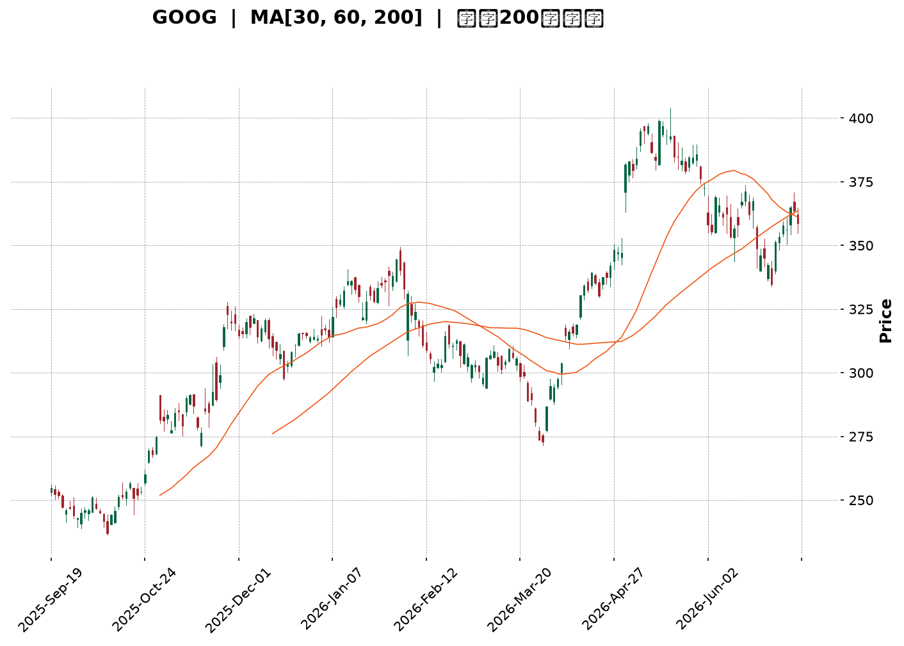
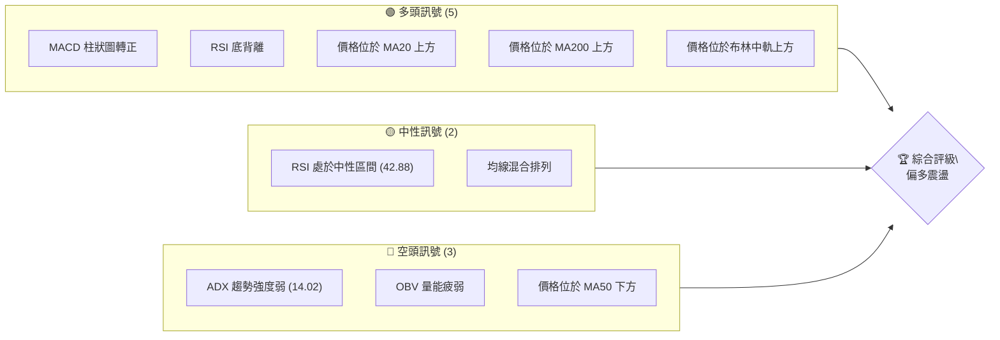
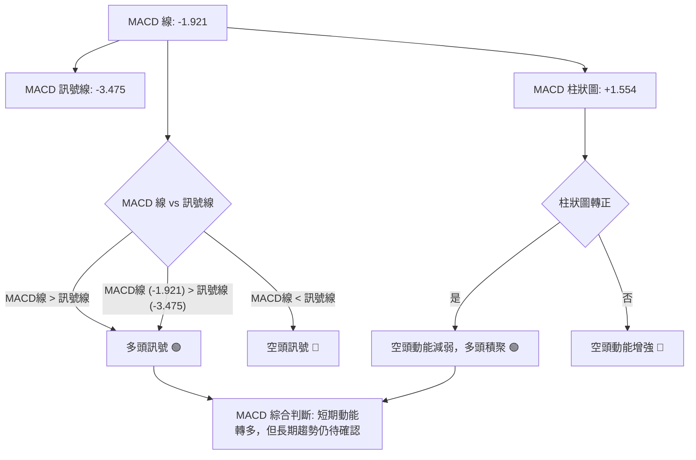
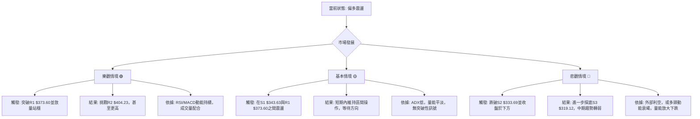

<details>
<summary>📊 靜態圖表 (點擊展開)</summary>

</details>

<html>
<head><meta charset="utf-8" /></head>
<body>
    <div style="height:500px; width:100%;">                        <script>window.PlotlyConfig = {MathJaxConfig: 'local'};</script>
        <script charset="utf-8" src="https://cdn.plot.ly/plotly-3.6.0.min.js" integrity="sha256-QaOVwtVY0T02VaHrr6pnoHLCwayMJp4O5n4YyaE3rJk=" crossorigin="anonymous"></script>                <div id="candlestick-chart" class="plotly-graph-div" style="height:100%; width:100%;"></div>            <script>                window.PLOTLYENV=window.PLOTLYENV || {};                                if (document.getElementById("candlestick-chart")) {                    Plotly.newPlot(                        "candlestick-chart",                        [{"close":{"dtype":"f8","bdata":"AAAA4LPXb0AAAACgVIxvQAAAAGAVe29AAAAAwAvrbkAAAAAgzsJuQAAAAGBJ1m5AAAAAQDl8bkAAAACgWmJuQAAAAMDooW5AAAAAYFW+bkAAAADg+L5uQAAAAGCTYG9AAAAAwLDUbkAAAADAWp9uQAAAAOCON25AAAAAYNCgbUAAAACAKoVuQAAAAGCrtm5AAAAAoPZmb0AAAACgZGxvQAAAAKBkqW9AAAAAYEYIcEAAAACgJVtvQAAAAAAngW9AAAAAAHqnb0AAAACgAUBwQAAAAGBu1nBAAAAAgHq+cEAAAACAGypxQAAAAKCTlXFAAAAAoEyUcUAAAADgBrlxQAAAAOBBWHFAAAAAgBbDcUAAAABAgsxxQAAAACBycnFAAAAAQFggckAAAABgtTJyQAAAAEDi7XFAAAAAAC9pcUAAAADgAkdxQAAAAECp0HFAAAAA4HDGcUAAAABgq0ZyQAAAAKCaFnJAAAAAYAWxckAAAABgjd1zQAAAAGAcMHRAAAAAoHT6c0AAAACg5vdzQAAAAIAOqHNAAAAAwG22c0AAAACA4v9zQAAAAGBG3HNAAAAA4FsXdEAAAACAoqBzQAAAAGBd1XNAAAAAIEwJdEAAAABgppRzQAAAAADWYXNAAAAAYKlOc0AAAAAgQTVzQAAAAIC8mnJAAAAAQKj1ckAAAADgUENzQAAAAGDHbnNAAAAAwEm0c0AAAADgILRzQAAAAIDIqHNAAAAAAK2fc0AAAABgO6JzQAAAAGA\u002flnNAAAAAIImuc0AAAACAfs5zQAAAAGA7onNAAAAAwCUgdEAAAABgWll0QAAAACBei3RAAAAAgLvEdEAAAADg2v90QAAAACDw\u002fXRAAAAAgJrLdEAAAADAip50QAAAAGDVG3RAAAAAIDl\u002fdEAAAAAgiKZ0QAAAAKAFgHRAAAAAYHnSdEAAAABAAel0QAAAAEB1\u002fXRAAAAAAH0jdUAAAABAaSF1QAAAAMAyh3VAAAAAABZEdUAAAADAes50QAAAAIBcrnRAAAAAgNoqdEAAAABAoD90QAAAAEBt43NAAAAAYMduc0AAAADgdU9zQAAAACDuGXNAAAAAIMzmckAAAACgsfhyQAAAACCf8nJAAAAAINOnc0AAAAAgiHRzQAAAAGA6aHNAAAAAgPGJc0AAAACA\u002fCtzQAAAAIBgcHNAAAAA4Fwfc0AAAAAgn\u002fJyQAAAACDd8HJAAAAA4EbIckAAAABAkp5yQAAAACA3HXNAAAAAIO0rc0AAAACAwENzQAAAACBx8HJAAAAAgHXUckAAAABgygNzQAAAACCVU3NAAAAAINohc0AAAADgvBhzQAAAAMDDqXJAAAAAQHGtckAAAADAahByQAAAACCnFnJAAAAAYCOJcUAAAACAhhlxQAAAAKCcD3FAAAAAwP\u002fqcUAAAADgj2tyQAAAAKCGZHJAAAAAALKXckAAAACA9PtyQAAAAKDPqHNAAAAAIODCc0AAAABAe7hzQAAAAMBJ8HNAAAAAQBmmdEAAAAAgTeR0QAAAAAAeyXRAAAAAQCIzdUAAAAAgLPN0QAAAAABXpHRAAAAAIG4YdUAAAADgvxh1QAAAAGDTYXVAAAAAQPfEdUAAAADgp7R1QAAAACCesXVAAAAAQF3bd0AAAAAA1e93QAAAAECWtndAAAAAIJ8AeEAAAAAAcK54QAAAAOD+sHhAAAAAoPrMeEAAAAAAmSh4QAAAACBt+XdAAAAAwMzseEAAAADg5c54QAAAAMBVkXhAAAAAAPqNeEAAAAAgsgp4QAAAACCyCnhAAAAAYNTzd0AAAADgbbJ3QAAAAIC8CXhAAAAAgJMJeEAAAABANB54QAAAAOBBg3dAAAAAwLFFd0AAAACAymJ2QAAAAAB1N3ZAAAAAIMQQd0AAAADgo9h2QAAAAGC4knZAAAAA4KOkdkAAAADAHhV2QAAAAMD1SHZAAAAAYI9idkAAAACAwvF2QAAAAKCZMXdAAAAAoJmhdkAAAAAgXPd2QAAAAOB6zHVAAAAAoEehdUAAAADgo5B1QAAAAEAKY3VAAAAAQArrdEAAAADgevR1QAAAAKBHFXZAAAAAgD1edkAAAABA4UJ2QAAAAGBmznZAAAAAgOu5dkAAAAAgXGt2QA=="},"high":{"dtype":"f8","bdata":"F4s2bSoDcEDDXuQo4PlvQJ\u002fN0g6xyG9AK5LgieKOb0AedKkvmdpuQJTzu8IuNG9AOqSvtftkb0CsdS+fWGZuQDWp+BJU1W5ASbB+cNHkbkAA5YBrTtRuQAYXTNGcdm9AbAlwi9phb0BeMn1n19huQLv3OmVjom5ALTmdt42LbkCBxCAkWJBuQO2jQzhG8W5AtiRtTH+Ib0C4HTTENxFwQGDNUYg0zG9ADo3TGwIWcEDBjKyiLNxvQC3PCJ7UCnBAAC+m3YDrb0CrNIaZ8V9wQOVtaudS5HBAAP0PHZbtcEAxTwLX4TZxQB0aOiK+NXJAlXc6eZnbcUCjYp0KF9ZxQHYiBAOGlHFAkjI9IDricUCqBA+S6wNyQCWgI2oYv3FA5NpyxzwuckD\u002fnDwxSjxyQOc8vv+bPHJAWxf\u002fUkmvcUDqOAm9qWlxQKmdSgcaX3JAacXVpOYNckD2PgwnevpyQGLyrIGiJHNAv\u002fIhl9j1ckDy+utXyvJzQM\u002fLoPJugHRAFk3XAqtFdEAc21V22WN0QEahslwT8HNA04LW06Dfc0BWWjt\u002fjxZ0QCMp1qR4J3RAvDft7iQzdEAKBbYi+Qx0QLINkV+w5HNAsGN6+TIXdEAwMKfPHRl0QLnmVJWju3NA+rTnzquEc0CO8r8gAndzQFI0mvqpTHNA3ZqPLckNc0BBrf9XY0lzQP3aoAWxdHNAtXKN7zG+c0DplIYPCb5zQBRxd5JZwnNAfjpahvGoc0DRFH0JkdRzQAC+L6Cnr3NADkuCh+EndECecOFuVe1zQKtsduc+EnRAB0p3jp9gdEB2qSYJvaF0QCA06j3CsHRAP5Dxew7gdEBOpYRgE0x1QCYWyGZxCXVA4ebuDgUbdUCvmnPu1ux0QN1Bne2WenRAlWwGBqfEdEDVEOhDXOx0QFULrFCB2XRAh7z5npP+dEC3H22wYBx1QJiji6gHE3VACjNXGH5ddUBvQYDXiD11QPBDWdVui3VAosjrmxbbdUAHNy3Oz3x1QPzG0rlbw3RA3D3tEVajdEAJQUUF\u002f3R0QE+5nzZdE3RAePY0MQQKdEDeSPl+EsFzQPb7tWjKR3NAMfp5z98Hc0Ahh0w4LBhzQCDYCwwXGnNANMq8zovFc0AemBz+m\u002fBzQI6Gzb9lf3NASlnVoQKUc0DLQozadolzQPxBhGbDenNAFNgnXM47c0BvLQCYsfhyQP9bZEH7EHNAw+io2ZXvckBzSClGAr9yQPQO+uoMJXNAAPvvx2xPc0D6ODg5HG5zQI9zVB9FR3NAz1xKFjQxc0D+rrDqLRZzQJdhYezQXXNAt11eaQJpc0CXSdKo7SdzQMdfrqD9AnNANbyuKADzckA6c26pvY5yQCG7JGK5Z3JA\u002fYXUpXvlcUBjASf+wG5xQDtKX3CAQXFA4nApiAnucUDM\u002fWRm5JxyQPk6u1ONe3JAms1\u002ffe2jckCTAcd0rP5yQDCJYqsq83NAkSCCQ9PTc0CqftHP7PRzQBQ0QVXO83NAGbIk+g6ndEAmWb2xxux0QLcsU0TVEnVABdsQ73w8dUAf+r\u002fcSy91QDe2iL55D3VAe3fPIjoddUBhd\u002flPST91QFLY7n+7d3VAuoj04gXrdUD1WFNWCNt1QOXWL7\u002f\u002fEnZAesfNzGXmd0B03cX0jPJ3QOmR0NAu\u002f3dAEBjo0Z1LeEDmNe\u002fxQ8J4QMWG6i\u002fb0XhAKTWJHxbieEB7AOgffKF4QBFviStSI3hAxcCs7gf7eEBbWzq80u14QNC4bTFFunhALZcxo6BDeUCVp3nGBZJ4QBHC\u002frVwZ3hAgdUJqiNHeEBUNJ9ZNwp4QFT3GQWIEnhAROaccNlXeEDkpPAwP1x4QGd81SO61ndAjmoHxv5ld0A2IanJFBl3QNpBw\u002fKCpHZAKrjkSzMad0BVWFympQ93QAAAAIAUtnZAAAAAYBIbd0AAAADA9eR2QAAAAAApYHZAAAAAQF7MdkAAAABgZip3QAAAAKCZWXdAAAAAYGYid0AAAAAAABB3QAAAAEAzY3ZAAAAAIIXLdUAAAACgRw12QAAAAEAKc3VAAAAAgOuBdUAAAAAghf91QAAAAIA9NnZAAAAAwPV4dkAAAAAA1492QAAAAEDh2nZAAAAAgD0ud0AAAACAFM52QA=="},"hovertemplate":"\u003cb\u003e%{x|%Y-%m-%d}\u003c\u002fb\u003e\u003cbr\u003e\u958b: $%{open:.2f}\u003cbr\u003e\u9ad8: $%{high:.2f}\u003cbr\u003e\u4f4e: $%{low:.2f}\u003cbr\u003e\u6536: $%{close:.2f}\u003cextra\u003e\u003c\u002fextra\u003e","low":{"dtype":"f8","bdata":"jJL0lGVyb0A++fBLOEpvQBAWKWgpU29A2X6PZpDXbkA\u002feFM4rCVuQJgeTmcKxW5A4WnOFi1XbkA3Q+5jRuNtQHDt1hlt121A\u002fEbCSCRUbkBsuRuI3D9uQLLYPkSzpm5A35fLYHjKbkCt6PqNiZNuQCIeW4vB5m1AHtpwphqHbUBML2n27QhuQPGP5lCZFm5AcmNZuNTJbkAa0u2jv0VvQApMjJRRA29AtgxaCEPDb0AD61TiH4ZuQI\u002fmxjDBPm9Ak2yRysCIb0D34O4rK\u002fNvQDyfwVu\u002fhnBAIDxquFuqcEBOP5pher5wQKywPB5sfnFAdEIqjq5PcUC3NWLsJH1xQFA2HLMsRXFA8gReC2JVcUDJ2cLuGpFxQKii5po1M3FAn14T\u002fcOvcUAurczNEfVxQJy6C\u002fAtvXFA9utieUxXcUAT+e3AEO5wQELbI7rIunFAD0SlbG1ncUDR8Ihgt\u002fFxQJ78fV2rCXJAtYoc44tcckDIKXdMt0xzQI4fA+ob03NASDqvrUXJc0Arw5TaHsVzQG3UbULalXNAuBYobK+Zc0CzkcOspJpzQCAwdO+Pr3NAHC0CSKr1c0DrKZMzDHhzQLXWhkxkg3NA8lEub9Cvc0CqhHQLnFdzQDuzpEfzKHNAuhPJwnQVc0B\u002fTxN57\u002fZyQOu4t0L9kHJA1K2xbc3DckDbQuWDIN9yQBWZkbYJI3NAjKaR2oJlc0CeYgbQk45zQLxa3iD4lHNAkXtRL+N3c0AKJemSdY1zQE9vbW2ufHNAryb7tuljc0BbIhqyZq1zQOQ4KhDrfnNA6oV4426hc0C4V\u002f7cHRl0QGL8vBIwXXRAawVK+FxRdEAm0VVent50QF9SYYJTq3RAxATy\u002fritdEBNkJQZ3nt0QKWAzkmKB3RAhQE2wffxc0C3dCN6Nod0QIurefWreHRAjBLAWwBxdECsMZHuB9V0QF6VLQ8lu3RAM8Hik7JkdEDAxTFcS8N0QAMWO+Uk+XRAgeOBp14idUCHOMLYCo90QCAYyrtPKHNA\u002fpDsBLf7c0AqR9DwkNRzQM1dyFj9o3NA68olqppbc0DtFGVF9ztzQH8i9vQN+HJABLu7ZDOIckCoAgH6X9lyQMC2qDJxxHJA1GrmJF0Ac0Do31v2XVlzQEY5iXEMG3NA6SpxvkxPc0CR4XLWPuByQBxlQecd83JAZa+odKzKckBw5Jcs\u002fYRyQCmKfsqExnJAnTpabuWackBD\u002fJXN1W1yQODchyINXHJAl+SpnQUSc0AljUcbfxpzQA5uvHaLynJAwG13Y5i5ckD0HSguDtpyQDvxMderAnNAJu8pnMcVc0DIzFdnGs1yQJ0kpOYkiXJAjoxVsJydckBcGJh55gpyQHhdPngn83FASBnYSR1ucUD8Z5tQDBVxQBWfM3Ty9XBARrc+In9JcUBV14UAvBRyQMW0yzla9nFAZA3vCNBZckACWN3z9HNyQPqpaENFiHNAWTmCv4pUc0CIk0PonKVzQFktOHkFmHNAmGgEO08PdEDE2kGwZYd0QKcaakI1t3RAQ\u002f9bzW7RdEBg85cl3OZ0QAWzwXHolnRAtsQ\u002f4CfMdEBZ\u002fZ9AvO10QKPg97+V3XRAYuicHq5JdUBiOtquKoF1QO5ps6WVY3VA8kYEEfKtdkChTll8jHB3QIoYA7KxiHdA\u002f5dsiPDBd0CFj9vu3y14QPbdIys0YXhAt56Vk+6WeED3epCU9h94QN2d7Jndt3dArmlGhJvVd0Dw8ZZR3od4QGqSQ8VoWHhAU6jZUaNqeEC15k1uUOx3QGurXtJXvHdAJoyANAe0d0DGOVkihaB3QKLY\u002f2qXrndAZurt2FLcd0Dvhm6\u002fVNB3QGyeW58yYXdAoAEHUs0Xd0CJszBalSx2QIgX4HOrInZATOsgpmIpdkCUbNSMmZZ2QAAAAIA9XnZAAAAAIIUrdkAAAADA9Qx2QAAAAIAUenVAAAAAoHAVdkAAAABgZsp2QAAAAMAe1XZAAAAAIK6DdkAAAABgukl2QAAAAEAKT3VAAAAAoHA7dUAAAAAAAFh1QAAAAGBm\u002fnRAAAAAQArbdEAAAADA9Sx1QAAAAIDCwXVAAAAAIK4TdkAAAADAHuV1QAAAAEAKI3ZAAAAAYLimdkAAAABAMyt2QA=="},"name":"\u50f9\u683c","open":{"dtype":"f8","bdata":"l1WE\u002fO+cb0AhYoTtAslvQPpGKs0UpW9Ar6j\u002f5AN1b0DxH1yZjYtuQG859u2b6W5AqWIbI0L5bkC\u002ffEFatFJuQBzZ536pFm5AyAzwaBqlbkAp4RstAphuQEwrChOTqW5AGeC+Zy0Ob0C4Oyrk\u002fLZuQNxN8VOUkm5AzefvKfY1bkBFAr053xFuQC3oz\u002fEGKW5AdeKOtzDzbkDH3SGAE39vQPhZ11l3W29A1Pa4z2HXb0B8Nv63BdhvQCWZLGJb0G9AXvARu4Smb0Arx4QYvwxwQNlbQz50jXBARpVpUb7acEAakmMwWsFwQC9p97BjMnJAH9YTZ2qqcUB0JS1f4Z1xQPkq3FheSHFAobelBlZtcUCUasT10NJxQMQlA912unFAZ261yk\u002fLcUBgVWL9LfpxQI90zdM3OHJApXvzB+emcUDJrSZez\u002fVwQLq9D5dv3XFAs8iBAbv+cUDGhcyh9PFxQBRV3ztNAnNAGnd2xqCEckDcN\u002f0FbWZzQCRXXU6SYnRA5rtlnnACdEDtCcPawSx0QN1JNcGpzXNAY2TsMnvEc0BKax6nlrZzQOCpkvObJnRADMkB\u002f\u002fv1c0BP5GT0xgl0QFH0ntsPi3NAWs+zCU\u002fDc0CwQYsx5Qp0QGme4qUlpnNAbayM9XiDc0Dv3Xg\u002fnBlzQG3WwTe1SXNA3ZpDsKHqckC0iUnL\u002fO1yQGXTqe8ZbXNAkmOxy6lrc0BNYyNPzLtzQBpAQZ4fuHNAFq5hpJaGc0C+9vUXBJBzQOVXaGxgj3NA6rR83c7Sc0CwwtN+fNRzQNHWL59VznNA5xKsQ42ic0C1L9p5XY10QLLg6nEAcXRAPLiGrS5hdED7XrKleu10QHrUFvXD6HRAIOmUNdIZdUBmCNRP9+d0QLWu6eohDXRA7q5CsdAKdEBE6A2xQt10QEtrSqqIw3RA7AgZ0Fh8dEBXEt5hEvN0QKOgaxy7AnVAUZQ7N34+dUA7EKJBYOB0QCZsUMLFAXVAGxZaefbAdUDd0o3z5nR1QIJZ7wmpjHNAzNEdyMNudEAGmWnEIQ10QDF16u\u002fbB3RAHxKDFrPoc0BgcEkSFH9zQL3NIj9UOXNAmgUGh\u002fbDckC+BIHvmOByQFE\u002fJs8A4nJAyZDwfG8Gc0DweyGNk+tzQFSSKP\u002fAY3NAI91Y\u002fWZ7c0Bh8mclWYZzQCQMq4mx+HJA+3rNJR3pckC1D5A5faByQAFv57aj5HJAxj5Fgt7sckDcM8dI+HpyQHdtO2FUX3JAtg5XeQ4bc0Ac1iYZ2iFzQHDW7LtpIHNA7EjVc4cnc0CXTy+lrfZyQForYM3JB3NAjGi3S4Q7c0A\u002fZHEVcfByQOV04p0x\u002fnJAaZi3h5bFckDoucRagoByQGmdTpGWP3JAwb7OMkngcUAzuBvoulNxQF62grVjNHFAHflIFvhVcUDkPuC+4xxyQPt7J\u002foODXJAJ+T2Kl1ockDwNzsWWr9yQDIVPqM42nNATp55tQaQc0AcxQCUieBzQIkNLVavs3NAZ8P32fAddEBqa\u002fdhx6V0QD5JVyle+nRAcgZpXqnjdECzzCS3syV1QLgOJ2Yh9nRAh744AvDqdEAL+O+g7jV1QNXWQhVFGHVAogBkTsV6dUCoD8ytYat1QAzRIAJblHVAZUg104Ewd0Cio9noCpx3QJiO1eVw4XdAaVq7qT7ad0AjzmnMsFV4QH1z+okjzXhAm441mYageEAOVaW3R2d4QFecw3dLDHhA4g9J983ad0AJycaz2Zh4QCnKOuKnj3hAAu477Tl+eEAXbzjOA5F4QFLCsUfvDHhAP3zS2Hvcd0ALPP7QePB3QENwDtlAzHdAdVRrdo7od0CJjlrREPp3QInT3W\u002fuz3dARx8jY51Fd0CmfGqfEK92QHcbjFXpYXZAyc95kp4zdkCM8xY9lbJ2QAAAAIDCp3ZAAAAAACnOdkAAAADAzJB2QAAAAMDMEHZAAAAAoJmRdkAAAAAA1992QAAAAKBw93ZAAAAAwMzwdkAAAACAPb52QAAAAAApUnZAAAAAIK5BdUAAAAAghct1QAAAAGC4DnVAAAAAIK5PdUAAAABAMz91QAAAACBc73VAAAAAANcpdkAAAABgZkJ2QAAAAMAeY3ZAAAAAgMLzdkAAAAAgXKN2QA=="},"x":["2025-09-19T00:00:00-04:00","2025-09-22T00:00:00-04:00","2025-09-23T00:00:00-04:00","2025-09-24T00:00:00-04:00","2025-09-25T00:00:00-04:00","2025-09-26T00:00:00-04:00","2025-09-29T00:00:00-04:00","2025-09-30T00:00:00-04:00","2025-10-01T00:00:00-04:00","2025-10-02T00:00:00-04:00","2025-10-03T00:00:00-04:00","2025-10-06T00:00:00-04:00","2025-10-07T00:00:00-04:00","2025-10-08T00:00:00-04:00","2025-10-09T00:00:00-04:00","2025-10-10T00:00:00-04:00","2025-10-13T00:00:00-04:00","2025-10-14T00:00:00-04:00","2025-10-15T00:00:00-04:00","2025-10-16T00:00:00-04:00","2025-10-17T00:00:00-04:00","2025-10-20T00:00:00-04:00","2025-10-21T00:00:00-04:00","2025-10-22T00:00:00-04:00","2025-10-23T00:00:00-04:00","2025-10-24T00:00:00-04:00","2025-10-27T00:00:00-04:00","2025-10-28T00:00:00-04:00","2025-10-29T00:00:00-04:00","2025-10-30T00:00:00-04:00","2025-10-31T00:00:00-04:00","2025-11-03T00:00:00-05:00","2025-11-04T00:00:00-05:00","2025-11-05T00:00:00-05:00","2025-11-06T00:00:00-05:00","2025-11-07T00:00:00-05:00","2025-11-10T00:00:00-05:00","2025-11-11T00:00:00-05:00","2025-11-12T00:00:00-05:00","2025-11-13T00:00:00-05:00","2025-11-14T00:00:00-05:00","2025-11-17T00:00:00-05:00","2025-11-18T00:00:00-05:00","2025-11-19T00:00:00-05:00","2025-11-20T00:00:00-05:00","2025-11-21T00:00:00-05:00","2025-11-24T00:00:00-05:00","2025-11-25T00:00:00-05:00","2025-11-26T00:00:00-05:00","2025-11-28T00:00:00-05:00","2025-12-01T00:00:00-05:00","2025-12-02T00:00:00-05:00","2025-12-03T00:00:00-05:00","2025-12-04T00:00:00-05:00","2025-12-05T00:00:00-05:00","2025-12-08T00:00:00-05:00","2025-12-09T00:00:00-05:00","2025-12-10T00:00:00-05:00","2025-12-11T00:00:00-05:00","2025-12-12T00:00:00-05:00","2025-12-15T00:00:00-05:00","2025-12-16T00:00:00-05:00","2025-12-17T00:00:00-05:00","2025-12-18T00:00:00-05:00","2025-12-19T00:00:00-05:00","2025-12-22T00:00:00-05:00","2025-12-23T00:00:00-05:00","2025-12-24T00:00:00-05:00","2025-12-26T00:00:00-05:00","2025-12-29T00:00:00-05:00","2025-12-30T00:00:00-05:00","2025-12-31T00:00:00-05:00","2026-01-02T00:00:00-05:00","2026-01-05T00:00:00-05:00","2026-01-06T00:00:00-05:00","2026-01-07T00:00:00-05:00","2026-01-08T00:00:00-05:00","2026-01-09T00:00:00-05:00","2026-01-12T00:00:00-05:00","2026-01-13T00:00:00-05:00","2026-01-14T00:00:00-05:00","2026-01-15T00:00:00-05:00","2026-01-16T00:00:00-05:00","2026-01-20T00:00:00-05:00","2026-01-21T00:00:00-05:00","2026-01-22T00:00:00-05:00","2026-01-23T00:00:00-05:00","2026-01-26T00:00:00-05:00","2026-01-27T00:00:00-05:00","2026-01-28T00:00:00-05:00","2026-01-29T00:00:00-05:00","2026-01-30T00:00:00-05:00","2026-02-02T00:00:00-05:00","2026-02-03T00:00:00-05:00","2026-02-04T00:00:00-05:00","2026-02-05T00:00:00-05:00","2026-02-06T00:00:00-05:00","2026-02-09T00:00:00-05:00","2026-02-10T00:00:00-05:00","2026-02-11T00:00:00-05:00","2026-02-12T00:00:00-05:00","2026-02-13T00:00:00-05:00","2026-02-17T00:00:00-05:00","2026-02-18T00:00:00-05:00","2026-02-19T00:00:00-05:00","2026-02-20T00:00:00-05:00","2026-02-23T00:00:00-05:00","2026-02-24T00:00:00-05:00","2026-02-25T00:00:00-05:00","2026-02-26T00:00:00-05:00","2026-02-27T00:00:00-05:00","2026-03-02T00:00:00-05:00","2026-03-03T00:00:00-05:00","2026-03-04T00:00:00-05:00","2026-03-05T00:00:00-05:00","2026-03-06T00:00:00-05:00","2026-03-09T00:00:00-04:00","2026-03-10T00:00:00-04:00","2026-03-11T00:00:00-04:00","2026-03-12T00:00:00-04:00","2026-03-13T00:00:00-04:00","2026-03-16T00:00:00-04:00","2026-03-17T00:00:00-04:00","2026-03-18T00:00:00-04:00","2026-03-19T00:00:00-04:00","2026-03-20T00:00:00-04:00","2026-03-23T00:00:00-04:00","2026-03-24T00:00:00-04:00","2026-03-25T00:00:00-04:00","2026-03-26T00:00:00-04:00","2026-03-27T00:00:00-04:00","2026-03-30T00:00:00-04:00","2026-03-31T00:00:00-04:00","2026-04-01T00:00:00-04:00","2026-04-02T00:00:00-04:00","2026-04-06T00:00:00-04:00","2026-04-07T00:00:00-04:00","2026-04-08T00:00:00-04:00","2026-04-09T00:00:00-04:00","2026-04-10T00:00:00-04:00","2026-04-13T00:00:00-04:00","2026-04-14T00:00:00-04:00","2026-04-15T00:00:00-04:00","2026-04-16T00:00:00-04:00","2026-04-17T00:00:00-04:00","2026-04-20T00:00:00-04:00","2026-04-21T00:00:00-04:00","2026-04-22T00:00:00-04:00","2026-04-23T00:00:00-04:00","2026-04-24T00:00:00-04:00","2026-04-27T00:00:00-04:00","2026-04-28T00:00:00-04:00","2026-04-29T00:00:00-04:00","2026-04-30T00:00:00-04:00","2026-05-01T00:00:00-04:00","2026-05-04T00:00:00-04:00","2026-05-05T00:00:00-04:00","2026-05-06T00:00:00-04:00","2026-05-07T00:00:00-04:00","2026-05-08T00:00:00-04:00","2026-05-11T00:00:00-04:00","2026-05-12T00:00:00-04:00","2026-05-13T00:00:00-04:00","2026-05-14T00:00:00-04:00","2026-05-15T00:00:00-04:00","2026-05-18T00:00:00-04:00","2026-05-19T00:00:00-04:00","2026-05-20T00:00:00-04:00","2026-05-21T00:00:00-04:00","2026-05-22T00:00:00-04:00","2026-05-26T00:00:00-04:00","2026-05-27T00:00:00-04:00","2026-05-28T00:00:00-04:00","2026-05-29T00:00:00-04:00","2026-06-01T00:00:00-04:00","2026-06-02T00:00:00-04:00","2026-06-03T00:00:00-04:00","2026-06-04T00:00:00-04:00","2026-06-05T00:00:00-04:00","2026-06-08T00:00:00-04:00","2026-06-09T00:00:00-04:00","2026-06-10T00:00:00-04:00","2026-06-11T00:00:00-04:00","2026-06-12T00:00:00-04:00","2026-06-15T00:00:00-04:00","2026-06-16T00:00:00-04:00","2026-06-17T00:00:00-04:00","2026-06-18T00:00:00-04:00","2026-06-22T00:00:00-04:00","2026-06-23T00:00:00-04:00","2026-06-24T00:00:00-04:00","2026-06-25T00:00:00-04:00","2026-06-26T00:00:00-04:00","2026-06-29T00:00:00-04:00","2026-06-30T00:00:00-04:00","2026-07-01T00:00:00-04:00","2026-07-02T00:00:00-04:00","2026-07-06T00:00:00-04:00","2026-07-07T00:00:00-04:00","2026-07-08T00:00:00-04:00"],"type":"candlestick"},{"hovertemplate":"MA30: $%{y:.2f}\u003cextra\u003e\u003c\u002fextra\u003e","line":{"color":"#2196F3","dash":"dash","width":2},"mode":"lines","name":"MA30","x":["2025-09-19T00:00:00-04:00","2025-09-22T00:00:00-04:00","2025-09-23T00:00:00-04:00","2025-09-24T00:00:00-04:00","2025-09-25T00:00:00-04:00","2025-09-26T00:00:00-04:00","2025-09-29T00:00:00-04:00","2025-09-30T00:00:00-04:00","2025-10-01T00:00:00-04:00","2025-10-02T00:00:00-04:00","2025-10-03T00:00:00-04:00","2025-10-06T00:00:00-04:00","2025-10-07T00:00:00-04:00","2025-10-08T00:00:00-04:00","2025-10-09T00:00:00-04:00","2025-10-10T00:00:00-04:00","2025-10-13T00:00:00-04:00","2025-10-14T00:00:00-04:00","2025-10-15T00:00:00-04:00","2025-10-16T00:00:00-04:00","2025-10-17T00:00:00-04:00","2025-10-20T00:00:00-04:00","2025-10-21T00:00:00-04:00","2025-10-22T00:00:00-04:00","2025-10-23T00:00:00-04:00","2025-10-24T00:00:00-04:00","2025-10-27T00:00:00-04:00","2025-10-28T00:00:00-04:00","2025-10-29T00:00:00-04:00","2025-10-30T00:00:00-04:00","2025-10-31T00:00:00-04:00","2025-11-03T00:00:00-05:00","2025-11-04T00:00:00-05:00","2025-11-05T00:00:00-05:00","2025-11-06T00:00:00-05:00","2025-11-07T00:00:00-05:00","2025-11-10T00:00:00-05:00","2025-11-11T00:00:00-05:00","2025-11-12T00:00:00-05:00","2025-11-13T00:00:00-05:00","2025-11-14T00:00:00-05:00","2025-11-17T00:00:00-05:00","2025-11-18T00:00:00-05:00","2025-11-19T00:00:00-05:00","2025-11-20T00:00:00-05:00","2025-11-21T00:00:00-05:00","2025-11-24T00:00:00-05:00","2025-11-25T00:00:00-05:00","2025-11-26T00:00:00-05:00","2025-11-28T00:00:00-05:00","2025-12-01T00:00:00-05:00","2025-12-02T00:00:00-05:00","2025-12-03T00:00:00-05:00","2025-12-04T00:00:00-05:00","2025-12-05T00:00:00-05:00","2025-12-08T00:00:00-05:00","2025-12-09T00:00:00-05:00","2025-12-10T00:00:00-05:00","2025-12-11T00:00:00-05:00","2025-12-12T00:00:00-05:00","2025-12-15T00:00:00-05:00","2025-12-16T00:00:00-05:00","2025-12-17T00:00:00-05:00","2025-12-18T00:00:00-05:00","2025-12-19T00:00:00-05:00","2025-12-22T00:00:00-05:00","2025-12-23T00:00:00-05:00","2025-12-24T00:00:00-05:00","2025-12-26T00:00:00-05:00","2025-12-29T00:00:00-05:00","2025-12-30T00:00:00-05:00","2025-12-31T00:00:00-05:00","2026-01-02T00:00:00-05:00","2026-01-05T00:00:00-05:00","2026-01-06T00:00:00-05:00","2026-01-07T00:00:00-05:00","2026-01-08T00:00:00-05:00","2026-01-09T00:00:00-05:00","2026-01-12T00:00:00-05:00","2026-01-13T00:00:00-05:00","2026-01-14T00:00:00-05:00","2026-01-15T00:00:00-05:00","2026-01-16T00:00:00-05:00","2026-01-20T00:00:00-05:00","2026-01-21T00:00:00-05:00","2026-01-22T00:00:00-05:00","2026-01-23T00:00:00-05:00","2026-01-26T00:00:00-05:00","2026-01-27T00:00:00-05:00","2026-01-28T00:00:00-05:00","2026-01-29T00:00:00-05:00","2026-01-30T00:00:00-05:00","2026-02-02T00:00:00-05:00","2026-02-03T00:00:00-05:00","2026-02-04T00:00:00-05:00","2026-02-05T00:00:00-05:00","2026-02-06T00:00:00-05:00","2026-02-09T00:00:00-05:00","2026-02-10T00:00:00-05:00","2026-02-11T00:00:00-05:00","2026-02-12T00:00:00-05:00","2026-02-13T00:00:00-05:00","2026-02-17T00:00:00-05:00","2026-02-18T00:00:00-05:00","2026-02-19T00:00:00-05:00","2026-02-20T00:00:00-05:00","2026-02-23T00:00:00-05:00","2026-02-24T00:00:00-05:00","2026-02-25T00:00:00-05:00","2026-02-26T00:00:00-05:00","2026-02-27T00:00:00-05:00","2026-03-02T00:00:00-05:00","2026-03-03T00:00:00-05:00","2026-03-04T00:00:00-05:00","2026-03-05T00:00:00-05:00","2026-03-06T00:00:00-05:00","2026-03-09T00:00:00-04:00","2026-03-10T00:00:00-04:00","2026-03-11T00:00:00-04:00","2026-03-12T00:00:00-04:00","2026-03-13T00:00:00-04:00","2026-03-16T00:00:00-04:00","2026-03-17T00:00:00-04:00","2026-03-18T00:00:00-04:00","2026-03-19T00:00:00-04:00","2026-03-20T00:00:00-04:00","2026-03-23T00:00:00-04:00","2026-03-24T00:00:00-04:00","2026-03-25T00:00:00-04:00","2026-03-26T00:00:00-04:00","2026-03-27T00:00:00-04:00","2026-03-30T00:00:00-04:00","2026-03-31T00:00:00-04:00","2026-04-01T00:00:00-04:00","2026-04-02T00:00:00-04:00","2026-04-06T00:00:00-04:00","2026-04-07T00:00:00-04:00","2026-04-08T00:00:00-04:00","2026-04-09T00:00:00-04:00","2026-04-10T00:00:00-04:00","2026-04-13T00:00:00-04:00","2026-04-14T00:00:00-04:00","2026-04-15T00:00:00-04:00","2026-04-16T00:00:00-04:00","2026-04-17T00:00:00-04:00","2026-04-20T00:00:00-04:00","2026-04-21T00:00:00-04:00","2026-04-22T00:00:00-04:00","2026-04-23T00:00:00-04:00","2026-04-24T00:00:00-04:00","2026-04-27T00:00:00-04:00","2026-04-28T00:00:00-04:00","2026-04-29T00:00:00-04:00","2026-04-30T00:00:00-04:00","2026-05-01T00:00:00-04:00","2026-05-04T00:00:00-04:00","2026-05-05T00:00:00-04:00","2026-05-06T00:00:00-04:00","2026-05-07T00:00:00-04:00","2026-05-08T00:00:00-04:00","2026-05-11T00:00:00-04:00","2026-05-12T00:00:00-04:00","2026-05-13T00:00:00-04:00","2026-05-14T00:00:00-04:00","2026-05-15T00:00:00-04:00","2026-05-18T00:00:00-04:00","2026-05-19T00:00:00-04:00","2026-05-20T00:00:00-04:00","2026-05-21T00:00:00-04:00","2026-05-22T00:00:00-04:00","2026-05-26T00:00:00-04:00","2026-05-27T00:00:00-04:00","2026-05-28T00:00:00-04:00","2026-05-29T00:00:00-04:00","2026-06-01T00:00:00-04:00","2026-06-02T00:00:00-04:00","2026-06-03T00:00:00-04:00","2026-06-04T00:00:00-04:00","2026-06-05T00:00:00-04:00","2026-06-08T00:00:00-04:00","2026-06-09T00:00:00-04:00","2026-06-10T00:00:00-04:00","2026-06-11T00:00:00-04:00","2026-06-12T00:00:00-04:00","2026-06-15T00:00:00-04:00","2026-06-16T00:00:00-04:00","2026-06-17T00:00:00-04:00","2026-06-18T00:00:00-04:00","2026-06-22T00:00:00-04:00","2026-06-23T00:00:00-04:00","2026-06-24T00:00:00-04:00","2026-06-25T00:00:00-04:00","2026-06-26T00:00:00-04:00","2026-06-29T00:00:00-04:00","2026-06-30T00:00:00-04:00","2026-07-01T00:00:00-04:00","2026-07-02T00:00:00-04:00","2026-07-06T00:00:00-04:00","2026-07-07T00:00:00-04:00","2026-07-08T00:00:00-04:00"],"y":{"dtype":"f8","bdata":"AAAAAAAA+H8AAAAAAAD4fwAAAAAAAPh\u002fAAAAAAAA+H8AAAAAAAD4fwAAAAAAAPh\u002fAAAAAAAA+H8AAAAAAAD4fwAAAAAAAPh\u002fAAAAAAAA+H8AAAAAAAD4fwAAAAAAAPh\u002fAAAAAAAA+H8AAAAAAAD4fwAAAAAAAPh\u002fAAAAAAAA+H8AAAAAAAD4fwAAAAAAAPh\u002fAAAAAAAA+H8AAAAAAAD4fwAAAAAAAPh\u002fAAAAAAAA+H8AAAAAAAD4fwAAAAAAAPh\u002fAAAAAAAA+H8AAAAAAAD4fwAAAAAAAPh\u002fAAAAAAAA+H8AAAAAAAD4f2ZmZibfe29AAAAAECuYb0B3d3f3bLlvQDMzM4PO1G9AvLu7axz8b0AAAABAsRJwQJqZmaEAJHBAAAAAOJw8cEAzMzPjQlZwQFVVVRWPbHBAiYiIoPV9cEB3d3fXNY5wQBERESlboHBAREREHH60cEAAAADYys1wQImIiEg453BA7+7ulk4IcUCJiIggmy9xQDMzM\u002fPUWHFAIiIiulR9cUCamZmJp6FxQGZmZr5MwnFAzczMdLThcUCrqqr6lAZyQJqZmXmjKXJAMzMzowZOckDNzMzM2GpyQM3MzExphHJAq6qqWoGgckBVVVWVH7VyQBERESF3xHJARERE9DXTckAAAACQ4t9yQCIiImKi6nJAERERcdr0ckC8u7vLWAFzQCIiIpJKEnNA3t3djcEfc0CJiIh4mixzQBEREeFdO3NAIiIi8j9Oc0De3d1tW2JzQImIiAh6cXNAvLu7G7+Bc0De3d2tzo5zQERERLT+m3NAREREhDuoc0AzMzPzW6xzQM3MzKxmr3NAVVVVxSS2c0De3d0t8b5zQBEREZFWynNAq6qqypPTc0Crqqqq3dhzQImIiAj82nNAd3d3V3Lec0AiIiIyLedzQImIiHjd7HNA3t3dLZLzc0CrqqqK6v5zQM3MzAyjDHRAREREtEMcdEARERFxqyx0QBEREVGeRXRAREREpExZdEBERES0eGZ0QO\u002fu7s4fcXRAERERkRN1dEAiIiLyuXl0QO\u002fu7l6ue3RA3t3dHQ16dEDNzMzMSnd0QFVVVfUlc3RAZmZmhn1sdECJiIgYXWV0QN7d3Y2CX3RAzczMzH9bdEAREREx31N0QM3MzMwqSnRAmpmZmaw\u002fdEDv7u4eFDB0QJqZmZnTInRAd3d3R40UdEARERGxSQZ0QLy7u3tS\u002fHNA7+7uzrDtc0AAAADQW9xzQBERESGI0HNAMzMzY3LCc0AiIiKyZ7RzQO\u002fu7o7nonNAvLu7GzSPc0B3d3dHJn1zQCIiIsJcanNAAAAAkCdYc0CrqqoqkElzQAAAAOBXOHNAq6qqKqErc0AAAABA\u002fRhzQAAAAFChCXNA3t3dLXH5ckDe3d3dk+ZyQAAAAMAq1XJAIiIiEsbMckDv7u6+EchyQCIiIjJVw3JAZmZmBkO6ckCrqqoaPrZyQGZmZjZluHJAiYiICEu6ckDNzMzs+b5yQO\u002fu7m49w3JAZmZmtkPQckBERESU2uByQJqZmXmY8HJAMzMzYzkFc0AiIiJiHBlzQKuqqvolJnNA3t3drZA2c0CrqqrKMkZzQGZmZmYLW3NAq6qqyiB0c0C8u7sbF4tzQLy7u5tKn3NAd3d3x5vHc0AiIiJi6fBzQHd3d3cBHHRA3t3d7XFJdEAiIiKS6YF0QERERNRBunRAiYiIeED4dEAiIiLSfDR1QM3MzDx7b3VAZmZmVkardUBEREQ0yeF1QGZmZsZ6FnZAq6qqCltJdkDv7u5+g3R2QJqZmenomXZAmpmZyay9dkBmZmZGm992QBEREZGWAndAq6qqCoEfd0Dv7u6+CDt3QFVVVTVOUndAiYiIqP1jd0C8u7urPnB3QKuqqpqufXdAVVVVRX6Od0BVVVVFbJ13QJqZmQmWp3dAmpmZuQqvd0AzMzPjQbJ3QHd3d1dNt3dAIiIi8r2qd0DNzMzcRaJ3QKuqqgrXnXdAiYiIqCOSd0DNzMzcgIN3QLy7u8vRandAvLu7S8NPd0BmZmaGoTl3QJqZmSmNI3dAMzMzA1wBd0DNzMwcA+l2QBEREXHP03ZAZmZmBifBdkBVVVVl9bF2QGZmZlZqp3ZAREREpPOcdkBmZmamDJJ2QA=="},"type":"scatter"},{"hovertemplate":"MA60: $%{y:.2f}\u003cextra\u003e\u003c\u002fextra\u003e","line":{"color":"#9C27B0","dash":"dash","width":2},"mode":"lines","name":"MA60","x":["2025-09-19T00:00:00-04:00","2025-09-22T00:00:00-04:00","2025-09-23T00:00:00-04:00","2025-09-24T00:00:00-04:00","2025-09-25T00:00:00-04:00","2025-09-26T00:00:00-04:00","2025-09-29T00:00:00-04:00","2025-09-30T00:00:00-04:00","2025-10-01T00:00:00-04:00","2025-10-02T00:00:00-04:00","2025-10-03T00:00:00-04:00","2025-10-06T00:00:00-04:00","2025-10-07T00:00:00-04:00","2025-10-08T00:00:00-04:00","2025-10-09T00:00:00-04:00","2025-10-10T00:00:00-04:00","2025-10-13T00:00:00-04:00","2025-10-14T00:00:00-04:00","2025-10-15T00:00:00-04:00","2025-10-16T00:00:00-04:00","2025-10-17T00:00:00-04:00","2025-10-20T00:00:00-04:00","2025-10-21T00:00:00-04:00","2025-10-22T00:00:00-04:00","2025-10-23T00:00:00-04:00","2025-10-24T00:00:00-04:00","2025-10-27T00:00:00-04:00","2025-10-28T00:00:00-04:00","2025-10-29T00:00:00-04:00","2025-10-30T00:00:00-04:00","2025-10-31T00:00:00-04:00","2025-11-03T00:00:00-05:00","2025-11-04T00:00:00-05:00","2025-11-05T00:00:00-05:00","2025-11-06T00:00:00-05:00","2025-11-07T00:00:00-05:00","2025-11-10T00:00:00-05:00","2025-11-11T00:00:00-05:00","2025-11-12T00:00:00-05:00","2025-11-13T00:00:00-05:00","2025-11-14T00:00:00-05:00","2025-11-17T00:00:00-05:00","2025-11-18T00:00:00-05:00","2025-11-19T00:00:00-05:00","2025-11-20T00:00:00-05:00","2025-11-21T00:00:00-05:00","2025-11-24T00:00:00-05:00","2025-11-25T00:00:00-05:00","2025-11-26T00:00:00-05:00","2025-11-28T00:00:00-05:00","2025-12-01T00:00:00-05:00","2025-12-02T00:00:00-05:00","2025-12-03T00:00:00-05:00","2025-12-04T00:00:00-05:00","2025-12-05T00:00:00-05:00","2025-12-08T00:00:00-05:00","2025-12-09T00:00:00-05:00","2025-12-10T00:00:00-05:00","2025-12-11T00:00:00-05:00","2025-12-12T00:00:00-05:00","2025-12-15T00:00:00-05:00","2025-12-16T00:00:00-05:00","2025-12-17T00:00:00-05:00","2025-12-18T00:00:00-05:00","2025-12-19T00:00:00-05:00","2025-12-22T00:00:00-05:00","2025-12-23T00:00:00-05:00","2025-12-24T00:00:00-05:00","2025-12-26T00:00:00-05:00","2025-12-29T00:00:00-05:00","2025-12-30T00:00:00-05:00","2025-12-31T00:00:00-05:00","2026-01-02T00:00:00-05:00","2026-01-05T00:00:00-05:00","2026-01-06T00:00:00-05:00","2026-01-07T00:00:00-05:00","2026-01-08T00:00:00-05:00","2026-01-09T00:00:00-05:00","2026-01-12T00:00:00-05:00","2026-01-13T00:00:00-05:00","2026-01-14T00:00:00-05:00","2026-01-15T00:00:00-05:00","2026-01-16T00:00:00-05:00","2026-01-20T00:00:00-05:00","2026-01-21T00:00:00-05:00","2026-01-22T00:00:00-05:00","2026-01-23T00:00:00-05:00","2026-01-26T00:00:00-05:00","2026-01-27T00:00:00-05:00","2026-01-28T00:00:00-05:00","2026-01-29T00:00:00-05:00","2026-01-30T00:00:00-05:00","2026-02-02T00:00:00-05:00","2026-02-03T00:00:00-05:00","2026-02-04T00:00:00-05:00","2026-02-05T00:00:00-05:00","2026-02-06T00:00:00-05:00","2026-02-09T00:00:00-05:00","2026-02-10T00:00:00-05:00","2026-02-11T00:00:00-05:00","2026-02-12T00:00:00-05:00","2026-02-13T00:00:00-05:00","2026-02-17T00:00:00-05:00","2026-02-18T00:00:00-05:00","2026-02-19T00:00:00-05:00","2026-02-20T00:00:00-05:00","2026-02-23T00:00:00-05:00","2026-02-24T00:00:00-05:00","2026-02-25T00:00:00-05:00","2026-02-26T00:00:00-05:00","2026-02-27T00:00:00-05:00","2026-03-02T00:00:00-05:00","2026-03-03T00:00:00-05:00","2026-03-04T00:00:00-05:00","2026-03-05T00:00:00-05:00","2026-03-06T00:00:00-05:00","2026-03-09T00:00:00-04:00","2026-03-10T00:00:00-04:00","2026-03-11T00:00:00-04:00","2026-03-12T00:00:00-04:00","2026-03-13T00:00:00-04:00","2026-03-16T00:00:00-04:00","2026-03-17T00:00:00-04:00","2026-03-18T00:00:00-04:00","2026-03-19T00:00:00-04:00","2026-03-20T00:00:00-04:00","2026-03-23T00:00:00-04:00","2026-03-24T00:00:00-04:00","2026-03-25T00:00:00-04:00","2026-03-26T00:00:00-04:00","2026-03-27T00:00:00-04:00","2026-03-30T00:00:00-04:00","2026-03-31T00:00:00-04:00","2026-04-01T00:00:00-04:00","2026-04-02T00:00:00-04:00","2026-04-06T00:00:00-04:00","2026-04-07T00:00:00-04:00","2026-04-08T00:00:00-04:00","2026-04-09T00:00:00-04:00","2026-04-10T00:00:00-04:00","2026-04-13T00:00:00-04:00","2026-04-14T00:00:00-04:00","2026-04-15T00:00:00-04:00","2026-04-16T00:00:00-04:00","2026-04-17T00:00:00-04:00","2026-04-20T00:00:00-04:00","2026-04-21T00:00:00-04:00","2026-04-22T00:00:00-04:00","2026-04-23T00:00:00-04:00","2026-04-24T00:00:00-04:00","2026-04-27T00:00:00-04:00","2026-04-28T00:00:00-04:00","2026-04-29T00:00:00-04:00","2026-04-30T00:00:00-04:00","2026-05-01T00:00:00-04:00","2026-05-04T00:00:00-04:00","2026-05-05T00:00:00-04:00","2026-05-06T00:00:00-04:00","2026-05-07T00:00:00-04:00","2026-05-08T00:00:00-04:00","2026-05-11T00:00:00-04:00","2026-05-12T00:00:00-04:00","2026-05-13T00:00:00-04:00","2026-05-14T00:00:00-04:00","2026-05-15T00:00:00-04:00","2026-05-18T00:00:00-04:00","2026-05-19T00:00:00-04:00","2026-05-20T00:00:00-04:00","2026-05-21T00:00:00-04:00","2026-05-22T00:00:00-04:00","2026-05-26T00:00:00-04:00","2026-05-27T00:00:00-04:00","2026-05-28T00:00:00-04:00","2026-05-29T00:00:00-04:00","2026-06-01T00:00:00-04:00","2026-06-02T00:00:00-04:00","2026-06-03T00:00:00-04:00","2026-06-04T00:00:00-04:00","2026-06-05T00:00:00-04:00","2026-06-08T00:00:00-04:00","2026-06-09T00:00:00-04:00","2026-06-10T00:00:00-04:00","2026-06-11T00:00:00-04:00","2026-06-12T00:00:00-04:00","2026-06-15T00:00:00-04:00","2026-06-16T00:00:00-04:00","2026-06-17T00:00:00-04:00","2026-06-18T00:00:00-04:00","2026-06-22T00:00:00-04:00","2026-06-23T00:00:00-04:00","2026-06-24T00:00:00-04:00","2026-06-25T00:00:00-04:00","2026-06-26T00:00:00-04:00","2026-06-29T00:00:00-04:00","2026-06-30T00:00:00-04:00","2026-07-01T00:00:00-04:00","2026-07-02T00:00:00-04:00","2026-07-06T00:00:00-04:00","2026-07-07T00:00:00-04:00","2026-07-08T00:00:00-04:00"],"y":{"dtype":"f8","bdata":"AAAAAAAA+H8AAAAAAAD4fwAAAAAAAPh\u002fAAAAAAAA+H8AAAAAAAD4fwAAAAAAAPh\u002fAAAAAAAA+H8AAAAAAAD4fwAAAAAAAPh\u002fAAAAAAAA+H8AAAAAAAD4fwAAAAAAAPh\u002fAAAAAAAA+H8AAAAAAAD4fwAAAAAAAPh\u002fAAAAAAAA+H8AAAAAAAD4fwAAAAAAAPh\u002fAAAAAAAA+H8AAAAAAAD4fwAAAAAAAPh\u002fAAAAAAAA+H8AAAAAAAD4fwAAAAAAAPh\u002fAAAAAAAA+H8AAAAAAAD4fwAAAAAAAPh\u002fAAAAAAAA+H8AAAAAAAD4fwAAAAAAAPh\u002fAAAAAAAA+H8AAAAAAAD4fwAAAAAAAPh\u002fAAAAAAAA+H8AAAAAAAD4fwAAAAAAAPh\u002fAAAAAAAA+H8AAAAAAAD4fwAAAAAAAPh\u002fAAAAAAAA+H8AAAAAAAD4fwAAAAAAAPh\u002fAAAAAAAA+H8AAAAAAAD4fwAAAAAAAPh\u002fAAAAAAAA+H8AAAAAAAD4fwAAAAAAAPh\u002fAAAAAAAA+H8AAAAAAAD4fwAAAAAAAPh\u002fAAAAAAAA+H8AAAAAAAD4fwAAAAAAAPh\u002fAAAAAAAA+H8AAAAAAAD4fwAAAAAAAPh\u002fAAAAAAAA+H8AAAAAAAD4fyIiIlozQXFAIiIivqVPcUDe3d2FTF5xQN7d3dGEanFAd3d3U3R5cUDe3d0FBYpxQN7d3Zklm3FA7+7u4i6ucUDe3d2tbsFxQDMzM3v203FAVVVVyRrmcUCrqqqiSPhxQM3MzJjqCHJAAAAAnB4bckDv7u7CTC5yQGZmZn6bQXJAmpmZDUVYckDe3d2J+21yQAAAANAdhHJAvLu7v7yZckC8u7tbTLByQLy7u6dRxnJAvLu7H6TackCrqqpSue9yQBEREcFPAnNAVVVVfTwWc0B3d3f\u002fAilzQKuqqmKjOHNARERExAlKc0AAAAAQBVpzQO\u002fu7haNaHNARERE1Lx3c0CJiIgAR4ZzQJqZmVkgmHNAq6qqihOnc0AAAADA6LNzQImIiDC1wXNAd3d3j2rKc0BVVVU1KtNzQAAAACCG23NAAAAAiCbkc0BVVVUd0+xzQO\u002fu7v5P8nNAERERUR73c0AzMzPjFfpzQBEREaHA\u002fXNAiYiIqN0BdEAiIiKSHQB0QM3MzLzI\u002fHNAd3d3r+j6c0BmZmamgvdzQFVVVRWV9nNAERERiRD0c0De3d2tk+9zQCIiIkKn63NAMzMzkxHmc0ARERGBxOFzQM3MzMyy3nNAiYiISALbc0BmZmYeqdlzQN7d3U3F13NAAAAA6LvVc0BERETc6NRzQJqZmYn913NAIiIiGrrYc0B3d3dvBNhzQHd3d9e71HNA3t3dXVrQc0ARERGZW8lzQHd3d9enwnNA3t3dJb+5c0BVVVVV765zQKuqqloopHNAREREzKGcc0C8u7trt5ZzQAAAAOBrkXNAmpmZaeGKc0De3d2lDoVzQJqZmQFIgXNAERER0ft8c0De3d0Fh3dzQERERIQIc3NA7+7ufmhyc0CrqqoiknNzQKuqqnp1dnNAERERGXV5c0AREREZvHpzQN7d3Q1Xe3NAiYiIiIF8c0BmZmY+TX1zQKuqqnr5fnNAMzMzc6qBc0CamZmxHoRzQO\u002fu7q7ThHNAvLu7q+GPc0BmZmbGPJ1zQLy7u6ssqnNAREREjIm6c0ARERFpc81zQCIiIpLx4XNAMzMz09j4c0AAAABYiA10QGZmZv5SInRARERENAY8dECamZl57VR0QERERPznbHRAiYiICM+BdEDNzMzMYJV0QAAAABAnqXRAERER6fu7dECamZmZSs90QAAAAADq4nRAiYiIYOL3dECamZmp8Q11QHd3d1dzIXVA3t3dhZs0dUDv7u6GrUR1QKuqqkrqUXVAmpmZeYdidUAAAACIz3F1QAAAALhQgXVAIiIiwpWRdUB3d3d\u002frJ51QJqZmflLq3VAzczM3Cy5dUB3d3efl8l1QBEREUHs3HVAMzMzy8rtdUB3d3c3tQJ2QAAAANCJEnZAIiIi4gEkdkBEREQsDzd2QDMzMzOESXZAzczMLFFWdkCJiIgoZmV2QLy7uxsldXZAiYiICEGFdkAiIiJyPJN2QAAAAKCpoHZA7+7uNlCtdkBmZmb207h2QA=="},"type":"scatter"},{"hovertemplate":"MA200: $%{y:.2f}\u003cextra\u003e\u003c\u002fextra\u003e","line":{"color":"#FF6F00","dash":"solid","width":2},"mode":"lines","name":"MA200","x":["2025-09-19T00:00:00-04:00","2025-09-22T00:00:00-04:00","2025-09-23T00:00:00-04:00","2025-09-24T00:00:00-04:00","2025-09-25T00:00:00-04:00","2025-09-26T00:00:00-04:00","2025-09-29T00:00:00-04:00","2025-09-30T00:00:00-04:00","2025-10-01T00:00:00-04:00","2025-10-02T00:00:00-04:00","2025-10-03T00:00:00-04:00","2025-10-06T00:00:00-04:00","2025-10-07T00:00:00-04:00","2025-10-08T00:00:00-04:00","2025-10-09T00:00:00-04:00","2025-10-10T00:00:00-04:00","2025-10-13T00:00:00-04:00","2025-10-14T00:00:00-04:00","2025-10-15T00:00:00-04:00","2025-10-16T00:00:00-04:00","2025-10-17T00:00:00-04:00","2025-10-20T00:00:00-04:00","2025-10-21T00:00:00-04:00","2025-10-22T00:00:00-04:00","2025-10-23T00:00:00-04:00","2025-10-24T00:00:00-04:00","2025-10-27T00:00:00-04:00","2025-10-28T00:00:00-04:00","2025-10-29T00:00:00-04:00","2025-10-30T00:00:00-04:00","2025-10-31T00:00:00-04:00","2025-11-03T00:00:00-05:00","2025-11-04T00:00:00-05:00","2025-11-05T00:00:00-05:00","2025-11-06T00:00:00-05:00","2025-11-07T00:00:00-05:00","2025-11-10T00:00:00-05:00","2025-11-11T00:00:00-05:00","2025-11-12T00:00:00-05:00","2025-11-13T00:00:00-05:00","2025-11-14T00:00:00-05:00","2025-11-17T00:00:00-05:00","2025-11-18T00:00:00-05:00","2025-11-19T00:00:00-05:00","2025-11-20T00:00:00-05:00","2025-11-21T00:00:00-05:00","2025-11-24T00:00:00-05:00","2025-11-25T00:00:00-05:00","2025-11-26T00:00:00-05:00","2025-11-28T00:00:00-05:00","2025-12-01T00:00:00-05:00","2025-12-02T00:00:00-05:00","2025-12-03T00:00:00-05:00","2025-12-04T00:00:00-05:00","2025-12-05T00:00:00-05:00","2025-12-08T00:00:00-05:00","2025-12-09T00:00:00-05:00","2025-12-10T00:00:00-05:00","2025-12-11T00:00:00-05:00","2025-12-12T00:00:00-05:00","2025-12-15T00:00:00-05:00","2025-12-16T00:00:00-05:00","2025-12-17T00:00:00-05:00","2025-12-18T00:00:00-05:00","2025-12-19T00:00:00-05:00","2025-12-22T00:00:00-05:00","2025-12-23T00:00:00-05:00","2025-12-24T00:00:00-05:00","2025-12-26T00:00:00-05:00","2025-12-29T00:00:00-05:00","2025-12-30T00:00:00-05:00","2025-12-31T00:00:00-05:00","2026-01-02T00:00:00-05:00","2026-01-05T00:00:00-05:00","2026-01-06T00:00:00-05:00","2026-01-07T00:00:00-05:00","2026-01-08T00:00:00-05:00","2026-01-09T00:00:00-05:00","2026-01-12T00:00:00-05:00","2026-01-13T00:00:00-05:00","2026-01-14T00:00:00-05:00","2026-01-15T00:00:00-05:00","2026-01-16T00:00:00-05:00","2026-01-20T00:00:00-05:00","2026-01-21T00:00:00-05:00","2026-01-22T00:00:00-05:00","2026-01-23T00:00:00-05:00","2026-01-26T00:00:00-05:00","2026-01-27T00:00:00-05:00","2026-01-28T00:00:00-05:00","2026-01-29T00:00:00-05:00","2026-01-30T00:00:00-05:00","2026-02-02T00:00:00-05:00","2026-02-03T00:00:00-05:00","2026-02-04T00:00:00-05:00","2026-02-05T00:00:00-05:00","2026-02-06T00:00:00-05:00","2026-02-09T00:00:00-05:00","2026-02-10T00:00:00-05:00","2026-02-11T00:00:00-05:00","2026-02-12T00:00:00-05:00","2026-02-13T00:00:00-05:00","2026-02-17T00:00:00-05:00","2026-02-18T00:00:00-05:00","2026-02-19T00:00:00-05:00","2026-02-20T00:00:00-05:00","2026-02-23T00:00:00-05:00","2026-02-24T00:00:00-05:00","2026-02-25T00:00:00-05:00","2026-02-26T00:00:00-05:00","2026-02-27T00:00:00-05:00","2026-03-02T00:00:00-05:00","2026-03-03T00:00:00-05:00","2026-03-04T00:00:00-05:00","2026-03-05T00:00:00-05:00","2026-03-06T00:00:00-05:00","2026-03-09T00:00:00-04:00","2026-03-10T00:00:00-04:00","2026-03-11T00:00:00-04:00","2026-03-12T00:00:00-04:00","2026-03-13T00:00:00-04:00","2026-03-16T00:00:00-04:00","2026-03-17T00:00:00-04:00","2026-03-18T00:00:00-04:00","2026-03-19T00:00:00-04:00","2026-03-20T00:00:00-04:00","2026-03-23T00:00:00-04:00","2026-03-24T00:00:00-04:00","2026-03-25T00:00:00-04:00","2026-03-26T00:00:00-04:00","2026-03-27T00:00:00-04:00","2026-03-30T00:00:00-04:00","2026-03-31T00:00:00-04:00","2026-04-01T00:00:00-04:00","2026-04-02T00:00:00-04:00","2026-04-06T00:00:00-04:00","2026-04-07T00:00:00-04:00","2026-04-08T00:00:00-04:00","2026-04-09T00:00:00-04:00","2026-04-10T00:00:00-04:00","2026-04-13T00:00:00-04:00","2026-04-14T00:00:00-04:00","2026-04-15T00:00:00-04:00","2026-04-16T00:00:00-04:00","2026-04-17T00:00:00-04:00","2026-04-20T00:00:00-04:00","2026-04-21T00:00:00-04:00","2026-04-22T00:00:00-04:00","2026-04-23T00:00:00-04:00","2026-04-24T00:00:00-04:00","2026-04-27T00:00:00-04:00","2026-04-28T00:00:00-04:00","2026-04-29T00:00:00-04:00","2026-04-30T00:00:00-04:00","2026-05-01T00:00:00-04:00","2026-05-04T00:00:00-04:00","2026-05-05T00:00:00-04:00","2026-05-06T00:00:00-04:00","2026-05-07T00:00:00-04:00","2026-05-08T00:00:00-04:00","2026-05-11T00:00:00-04:00","2026-05-12T00:00:00-04:00","2026-05-13T00:00:00-04:00","2026-05-14T00:00:00-04:00","2026-05-15T00:00:00-04:00","2026-05-18T00:00:00-04:00","2026-05-19T00:00:00-04:00","2026-05-20T00:00:00-04:00","2026-05-21T00:00:00-04:00","2026-05-22T00:00:00-04:00","2026-05-26T00:00:00-04:00","2026-05-27T00:00:00-04:00","2026-05-28T00:00:00-04:00","2026-05-29T00:00:00-04:00","2026-06-01T00:00:00-04:00","2026-06-02T00:00:00-04:00","2026-06-03T00:00:00-04:00","2026-06-04T00:00:00-04:00","2026-06-05T00:00:00-04:00","2026-06-08T00:00:00-04:00","2026-06-09T00:00:00-04:00","2026-06-10T00:00:00-04:00","2026-06-11T00:00:00-04:00","2026-06-12T00:00:00-04:00","2026-06-15T00:00:00-04:00","2026-06-16T00:00:00-04:00","2026-06-17T00:00:00-04:00","2026-06-18T00:00:00-04:00","2026-06-22T00:00:00-04:00","2026-06-23T00:00:00-04:00","2026-06-24T00:00:00-04:00","2026-06-25T00:00:00-04:00","2026-06-26T00:00:00-04:00","2026-06-29T00:00:00-04:00","2026-06-30T00:00:00-04:00","2026-07-01T00:00:00-04:00","2026-07-02T00:00:00-04:00","2026-07-06T00:00:00-04:00","2026-07-07T00:00:00-04:00","2026-07-08T00:00:00-04:00"],"y":{"dtype":"f8","bdata":"AAAAAAAA+H8AAAAAAAD4fwAAAAAAAPh\u002fAAAAAAAA+H8AAAAAAAD4fwAAAAAAAPh\u002fAAAAAAAA+H8AAAAAAAD4fwAAAAAAAPh\u002fAAAAAAAA+H8AAAAAAAD4fwAAAAAAAPh\u002fAAAAAAAA+H8AAAAAAAD4fwAAAAAAAPh\u002fAAAAAAAA+H8AAAAAAAD4fwAAAAAAAPh\u002fAAAAAAAA+H8AAAAAAAD4fwAAAAAAAPh\u002fAAAAAAAA+H8AAAAAAAD4fwAAAAAAAPh\u002fAAAAAAAA+H8AAAAAAAD4fwAAAAAAAPh\u002fAAAAAAAA+H8AAAAAAAD4fwAAAAAAAPh\u002fAAAAAAAA+H8AAAAAAAD4fwAAAAAAAPh\u002fAAAAAAAA+H8AAAAAAAD4fwAAAAAAAPh\u002fAAAAAAAA+H8AAAAAAAD4fwAAAAAAAPh\u002fAAAAAAAA+H8AAAAAAAD4fwAAAAAAAPh\u002fAAAAAAAA+H8AAAAAAAD4fwAAAAAAAPh\u002fAAAAAAAA+H8AAAAAAAD4fwAAAAAAAPh\u002fAAAAAAAA+H8AAAAAAAD4fwAAAAAAAPh\u002fAAAAAAAA+H8AAAAAAAD4fwAAAAAAAPh\u002fAAAAAAAA+H8AAAAAAAD4fwAAAAAAAPh\u002fAAAAAAAA+H8AAAAAAAD4fwAAAAAAAPh\u002fAAAAAAAA+H8AAAAAAAD4fwAAAAAAAPh\u002fAAAAAAAA+H8AAAAAAAD4fwAAAAAAAPh\u002fAAAAAAAA+H8AAAAAAAD4fwAAAAAAAPh\u002fAAAAAAAA+H8AAAAAAAD4fwAAAAAAAPh\u002fAAAAAAAA+H8AAAAAAAD4fwAAAAAAAPh\u002fAAAAAAAA+H8AAAAAAAD4fwAAAAAAAPh\u002fAAAAAAAA+H8AAAAAAAD4fwAAAAAAAPh\u002fAAAAAAAA+H8AAAAAAAD4fwAAAAAAAPh\u002fAAAAAAAA+H8AAAAAAAD4fwAAAAAAAPh\u002fAAAAAAAA+H8AAAAAAAD4fwAAAAAAAPh\u002fAAAAAAAA+H8AAAAAAAD4fwAAAAAAAPh\u002fAAAAAAAA+H8AAAAAAAD4fwAAAAAAAPh\u002fAAAAAAAA+H8AAAAAAAD4fwAAAAAAAPh\u002fAAAAAAAA+H8AAAAAAAD4fwAAAAAAAPh\u002fAAAAAAAA+H8AAAAAAAD4fwAAAAAAAPh\u002fAAAAAAAA+H8AAAAAAAD4fwAAAAAAAPh\u002fAAAAAAAA+H8AAAAAAAD4fwAAAAAAAPh\u002fAAAAAAAA+H8AAAAAAAD4fwAAAAAAAPh\u002fAAAAAAAA+H8AAAAAAAD4fwAAAAAAAPh\u002fAAAAAAAA+H8AAAAAAAD4fwAAAAAAAPh\u002fAAAAAAAA+H8AAAAAAAD4fwAAAAAAAPh\u002fAAAAAAAA+H8AAAAAAAD4fwAAAAAAAPh\u002fAAAAAAAA+H8AAAAAAAD4fwAAAAAAAPh\u002fAAAAAAAA+H8AAAAAAAD4fwAAAAAAAPh\u002fAAAAAAAA+H8AAAAAAAD4fwAAAAAAAPh\u002fAAAAAAAA+H8AAAAAAAD4fwAAAAAAAPh\u002fAAAAAAAA+H8AAAAAAAD4fwAAAAAAAPh\u002fAAAAAAAA+H8AAAAAAAD4fwAAAAAAAPh\u002fAAAAAAAA+H8AAAAAAAD4fwAAAAAAAPh\u002fAAAAAAAA+H8AAAAAAAD4fwAAAAAAAPh\u002fAAAAAAAA+H8AAAAAAAD4fwAAAAAAAPh\u002fAAAAAAAA+H8AAAAAAAD4fwAAAAAAAPh\u002fAAAAAAAA+H8AAAAAAAD4fwAAAAAAAPh\u002fAAAAAAAA+H8AAAAAAAD4fwAAAAAAAPh\u002fAAAAAAAA+H8AAAAAAAD4fwAAAAAAAPh\u002fAAAAAAAA+H8AAAAAAAD4fwAAAAAAAPh\u002fAAAAAAAA+H8AAAAAAAD4fwAAAAAAAPh\u002fAAAAAAAA+H8AAAAAAAD4fwAAAAAAAPh\u002fAAAAAAAA+H8AAAAAAAD4fwAAAAAAAPh\u002fAAAAAAAA+H8AAAAAAAD4fwAAAAAAAPh\u002fAAAAAAAA+H8AAAAAAAD4fwAAAAAAAPh\u002fAAAAAAAA+H8AAAAAAAD4fwAAAAAAAPh\u002fAAAAAAAA+H8AAAAAAAD4fwAAAAAAAPh\u002fAAAAAAAA+H8AAAAAAAD4fwAAAAAAAPh\u002fAAAAAAAA+H8AAAAAAAD4fwAAAAAAAPh\u002fAAAAAAAA+H8AAAAAAAD4fwAAAAAAAPh\u002fAAAAAAAA+H\u002fD9ShkWc5zQA=="},"type":"scatter"}],                        {"template":{"data":{"barpolar":[{"marker":{"line":{"color":"rgb(17,17,17)","width":0.5},"pattern":{"fillmode":"overlay","size":10,"solidity":0.2}},"type":"barpolar"}],"bar":[{"error_x":{"color":"#f2f5fa"},"error_y":{"color":"#f2f5fa"},"marker":{"line":{"color":"rgb(17,17,17)","width":0.5},"pattern":{"fillmode":"overlay","size":10,"solidity":0.2}},"type":"bar"}],"carpet":[{"aaxis":{"endlinecolor":"#A2B1C6","gridcolor":"#506784","linecolor":"#506784","minorgridcolor":"#506784","startlinecolor":"#A2B1C6"},"baxis":{"endlinecolor":"#A2B1C6","gridcolor":"#506784","linecolor":"#506784","minorgridcolor":"#506784","startlinecolor":"#A2B1C6"},"type":"carpet"}],"choropleth":[{"colorbar":{"outlinewidth":0,"ticks":""},"type":"choropleth"}],"contourcarpet":[{"colorbar":{"outlinewidth":0,"ticks":""},"type":"contourcarpet"}],"contour":[{"colorbar":{"outlinewidth":0,"ticks":""},"colorscale":[[0.0,"#0d0887"],[0.1111111111111111,"#46039f"],[0.2222222222222222,"#7201a8"],[0.3333333333333333,"#9c179e"],[0.4444444444444444,"#bd3786"],[0.5555555555555556,"#d8576b"],[0.6666666666666666,"#ed7953"],[0.7777777777777778,"#fb9f3a"],[0.8888888888888888,"#fdca26"],[1.0,"#f0f921"]],"type":"contour"}],"heatmap":[{"colorbar":{"outlinewidth":0,"ticks":""},"colorscale":[[0.0,"#0d0887"],[0.1111111111111111,"#46039f"],[0.2222222222222222,"#7201a8"],[0.3333333333333333,"#9c179e"],[0.4444444444444444,"#bd3786"],[0.5555555555555556,"#d8576b"],[0.6666666666666666,"#ed7953"],[0.7777777777777778,"#fb9f3a"],[0.8888888888888888,"#fdca26"],[1.0,"#f0f921"]],"type":"heatmap"}],"histogram2dcontour":[{"colorbar":{"outlinewidth":0,"ticks":""},"colorscale":[[0.0,"#0d0887"],[0.1111111111111111,"#46039f"],[0.2222222222222222,"#7201a8"],[0.3333333333333333,"#9c179e"],[0.4444444444444444,"#bd3786"],[0.5555555555555556,"#d8576b"],[0.6666666666666666,"#ed7953"],[0.7777777777777778,"#fb9f3a"],[0.8888888888888888,"#fdca26"],[1.0,"#f0f921"]],"type":"histogram2dcontour"}],"histogram2d":[{"colorbar":{"outlinewidth":0,"ticks":""},"colorscale":[[0.0,"#0d0887"],[0.1111111111111111,"#46039f"],[0.2222222222222222,"#7201a8"],[0.3333333333333333,"#9c179e"],[0.4444444444444444,"#bd3786"],[0.5555555555555556,"#d8576b"],[0.6666666666666666,"#ed7953"],[0.7777777777777778,"#fb9f3a"],[0.8888888888888888,"#fdca26"],[1.0,"#f0f921"]],"type":"histogram2d"}],"histogram":[{"marker":{"pattern":{"fillmode":"overlay","size":10,"solidity":0.2}},"type":"histogram"}],"mesh3d":[{"colorbar":{"outlinewidth":0,"ticks":""},"type":"mesh3d"}],"parcoords":[{"line":{"colorbar":{"outlinewidth":0,"ticks":""}},"type":"parcoords"}],"pie":[{"automargin":true,"type":"pie"}],"scatter3d":[{"line":{"colorbar":{"outlinewidth":0,"ticks":""}},"marker":{"colorbar":{"outlinewidth":0,"ticks":""}},"type":"scatter3d"}],"scattercarpet":[{"marker":{"colorbar":{"outlinewidth":0,"ticks":""}},"type":"scattercarpet"}],"scattergeo":[{"marker":{"colorbar":{"outlinewidth":0,"ticks":""}},"type":"scattergeo"}],"scattergl":[{"marker":{"line":{"color":"#283442"}},"type":"scattergl"}],"scattermapbox":[{"marker":{"colorbar":{"outlinewidth":0,"ticks":""}},"type":"scattermapbox"}],"scattermap":[{"marker":{"colorbar":{"outlinewidth":0,"ticks":""}},"type":"scattermap"}],"scatterpolargl":[{"marker":{"colorbar":{"outlinewidth":0,"ticks":""}},"type":"scatterpolargl"}],"scatterpolar":[{"marker":{"colorbar":{"outlinewidth":0,"ticks":""}},"type":"scatterpolar"}],"scatter":[{"marker":{"line":{"color":"#283442"}},"type":"scatter"}],"scatterternary":[{"marker":{"colorbar":{"outlinewidth":0,"ticks":""}},"type":"scatterternary"}],"surface":[{"colorbar":{"outlinewidth":0,"ticks":""},"colorscale":[[0.0,"#0d0887"],[0.1111111111111111,"#46039f"],[0.2222222222222222,"#7201a8"],[0.3333333333333333,"#9c179e"],[0.4444444444444444,"#bd3786"],[0.5555555555555556,"#d8576b"],[0.6666666666666666,"#ed7953"],[0.7777777777777778,"#fb9f3a"],[0.8888888888888888,"#fdca26"],[1.0,"#f0f921"]],"type":"surface"}],"table":[{"cells":{"fill":{"color":"#506784"},"line":{"color":"rgb(17,17,17)"}},"header":{"fill":{"color":"#2a3f5f"},"line":{"color":"rgb(17,17,17)"}},"type":"table"}]},"layout":{"annotationdefaults":{"arrowcolor":"#f2f5fa","arrowhead":0,"arrowwidth":1},"autotypenumbers":"strict","coloraxis":{"colorbar":{"outlinewidth":0,"ticks":""}},"colorscale":{"diverging":[[0,"#8e0152"],[0.1,"#c51b7d"],[0.2,"#de77ae"],[0.3,"#f1b6da"],[0.4,"#fde0ef"],[0.5,"#f7f7f7"],[0.6,"#e6f5d0"],[0.7,"#b8e186"],[0.8,"#7fbc41"],[0.9,"#4d9221"],[1,"#276419"]],"sequential":[[0.0,"#0d0887"],[0.1111111111111111,"#46039f"],[0.2222222222222222,"#7201a8"],[0.3333333333333333,"#9c179e"],[0.4444444444444444,"#bd3786"],[0.5555555555555556,"#d8576b"],[0.6666666666666666,"#ed7953"],[0.7777777777777778,"#fb9f3a"],[0.8888888888888888,"#fdca26"],[1.0,"#f0f921"]],"sequentialminus":[[0.0,"#0d0887"],[0.1111111111111111,"#46039f"],[0.2222222222222222,"#7201a8"],[0.3333333333333333,"#9c179e"],[0.4444444444444444,"#bd3786"],[0.5555555555555556,"#d8576b"],[0.6666666666666666,"#ed7953"],[0.7777777777777778,"#fb9f3a"],[0.8888888888888888,"#fdca26"],[1.0,"#f0f921"]]},"colorway":["#636efa","#EF553B","#00cc96","#ab63fa","#FFA15A","#19d3f3","#FF6692","#B6E880","#FF97FF","#FECB52"],"font":{"color":"#f2f5fa"},"geo":{"bgcolor":"rgb(17,17,17)","lakecolor":"rgb(17,17,17)","landcolor":"rgb(17,17,17)","showlakes":true,"showland":true,"subunitcolor":"#506784"},"hoverlabel":{"align":"left"},"hovermode":"closest","mapbox":{"style":"dark"},"paper_bgcolor":"rgb(17,17,17)","plot_bgcolor":"rgb(17,17,17)","polar":{"angularaxis":{"gridcolor":"#506784","linecolor":"#506784","ticks":""},"bgcolor":"rgb(17,17,17)","radialaxis":{"gridcolor":"#506784","linecolor":"#506784","ticks":""}},"scene":{"xaxis":{"backgroundcolor":"rgb(17,17,17)","gridcolor":"#506784","gridwidth":2,"linecolor":"#506784","showbackground":true,"ticks":"","zerolinecolor":"#C8D4E3"},"yaxis":{"backgroundcolor":"rgb(17,17,17)","gridcolor":"#506784","gridwidth":2,"linecolor":"#506784","showbackground":true,"ticks":"","zerolinecolor":"#C8D4E3"},"zaxis":{"backgroundcolor":"rgb(17,17,17)","gridcolor":"#506784","gridwidth":2,"linecolor":"#506784","showbackground":true,"ticks":"","zerolinecolor":"#C8D4E3"}},"shapedefaults":{"line":{"color":"#f2f5fa"}},"sliderdefaults":{"bgcolor":"#C8D4E3","bordercolor":"rgb(17,17,17)","borderwidth":1,"tickwidth":0},"ternary":{"aaxis":{"gridcolor":"#506784","linecolor":"#506784","ticks":""},"baxis":{"gridcolor":"#506784","linecolor":"#506784","ticks":""},"bgcolor":"rgb(17,17,17)","caxis":{"gridcolor":"#506784","linecolor":"#506784","ticks":""}},"title":{"x":0.05},"updatemenudefaults":{"bgcolor":"#506784","borderwidth":0},"xaxis":{"automargin":true,"gridcolor":"#283442","linecolor":"#506784","ticks":"","title":{"standoff":15},"zerolinecolor":"#283442","zerolinewidth":2},"yaxis":{"automargin":true,"gridcolor":"#283442","linecolor":"#506784","ticks":"","title":{"standoff":15},"zerolinecolor":"#283442","zerolinewidth":2}}},"xaxis":{"rangeslider":{"visible":false},"title":{"text":"\u65e5\u671f"}},"font":{"size":11},"title":{"text":"GOOG  |  MA(30\u002f60\u002f200)  |  \u6700\u8fd1200\u4ea4\u6613\u65e5"},"yaxis":{"title":{"text":"\u80a1\u50f9 (USD)"}},"hovermode":"x unified","height":500},                        {"responsive": true}                    )                };            </script>        </div>
</body>
</html>

# GOOG 技術分析報告

> **報告日期**：2026-07-08 ｜ **語言**：繁體中文 ｜ **數據來源**：Yahoo Finance ｜ **當前價格**：$358.71

---

## 目錄

| 章節 | 內容 |
|------|------|
| [1. 技術面概覽](#1-技術面概覽) | 訊號儀表板、核心指標、評分卡 |
| [2. 趨勢分析](#2-趨勢分析) | 多時框趨勢、長中短期走勢 |
| [3. 圖表形態分析](#3-圖表形態分析) | 形態識別、K線組合、目標價 |
| [4. 支撐與阻力](#4-支撐與阻力) | 關鍵價位、斐波那契回調 |
| [5. 技術指標深度解讀](#5-技術指標深度解讀) | MA/RSI/MACD/布林/成交量 |
| [6. 動能與波動率](#6-動能與波動率) | 動能評估、ATR、Beta |
| [7. 多時框架總結](#7-多時框架總結) | 時框架評分矩陣 |
| [8. 交易策略建議](#8-交易策略建議) | 多空策略、風險報酬比 |
| [9. 風險提示與監控](#9-風險提示與監控) | 監控指標、風險場景 |

---

## 1. 技術面概覽

### 🎯 技術訊號儀表板


**儀表板解讀**：目前 GOOG 的技術訊號呈現多空交織的局面，但多頭訊號略佔優勢。MACD柱狀圖轉正與RSI底背離是重要的看漲訊號，顯示短期動能可能正在積聚。價格位於MA20和MA200上方，也為多頭提供了一定支撐。然而，弱勢的ADX表明當前市場處於盤整或弱勢趨勢中，而非強勁的單邊行情。成交量疲弱和OBV趨勢的下行也限制了潛在的上漲空間。綜合來看，市場可能在近期支撐位附近尋求反彈，但預期將在一定區間內震盪。

### 📊 核心指標速覽表

| 指標類別 | 指標名稱 | 當前數值 | 訊號 | 解讀 |
|----------|----------|----------|------|------|
| **價格** | 當前價格 | $358.71 | 🟡 | 位於52週高點下方，但顯著高於52週低點，處於近期盤整區間上沿 |
| **均線** | MA20 | $356.04 | 🟢 | 價格位於MA20上方，短期趨勢偏多 |
| **均線** | MA50 | $369.50 | 🔴 | 價格位於MA50下方，中期趨勢承壓 |
| **均線** | MA200 | $316.90 | 🟢 | 價格位於MA200上方，長期趨勢維持多頭 |
| **動能** | RSI(14) | 42.88 | 🟡 | RSI處於中性區間，未超買或超賣，但存在底背離 |
| **動能** | MACD | -1.921 (MACD線), +1.554 (MACD柱) | 🟢 | MACD柱狀圖轉正，顯示空頭動能減弱，多頭動能開始積聚 |
| **波動** | ATR(14) | $11.53 | 🟡 | 每日波動約3.21%，屬中等波動水平 |
| **趨勢** | ADX(14) | 14.02 | 🔴 | ADX低於25，表明趨勢不明顯，市場處於盤整狀態 |
| **成交量** | 量比 (vs. 20日均量) | 0.56x | 🔴 | 當日成交量顯著低於平均，量能不足 |

### 🏆 技術評分卡

```
技術評分卡 — GOOG (2026-07-08)
════════════════════════════════════════════════════
趨勢強度      ███░░░░░░░░░░░░░░░░░  30/100  🔴 (ADX低於25，趨勢不明顯)
動能指標      █████████░░░░░░░░░░░  75/100  🟢 (RSI底背離、MACD柱轉正，動能正在轉強)
支撐穩定度    █████████████░░░░░░░  80/100  🟢 (關鍵支撐位S1、S2、斐波那契23.6%回調位提供穩固支撐)
成交量配合    ████░░░░░░░░░░░░░░░░  40/100  🔴 (成交量萎縮，OBV疲弱，量能未有效配合價格反彈)
形態完整度    ████████░░░░░░░░░░░░  60/100  🟡 (RSI底背離暗示潛在反轉，但價格形態尚不明確)
均線排列      ██████░░░░░░░░░░░░░░  50/100  🟡 (短期MA200多頭，但中期MA50空頭，MA20多頭，排列混合)
════════════════════════════════════════════════════
綜合評分      ████████░░░░░░░░░░░░  60/100  🟡 偏多震盪
════════════════════════════════════════════════════
```
**評分卡解讀**：GOOG的綜合評分落在60/100，顯示目前處於一個偏多但仍需在區間內震盪的狀態。動能指標表現強勁，特別是RSI底背離和MACD柱狀圖轉正，預示著潛在的上漲動能。支撐位的穩定性也為股價提供了較強的底部保護。然而，趨勢強度不足（ADX低）和成交量疲弱是主要制約因素，表明市場尚未形成明確的單邊趨勢，可能在短期內繼續盤整。均線排列的混合狀態也反映了這種缺乏明確方向的局面。總體而言，當前市場環境適合區間操作或等待明確的趨勢突破。

---

## 2. 趨勢分析

### 🌐 多時框趨勢分析

```mermaid
graph TD
    A[月線趨勢] --> B{判斷: 強勁上升趨勢 🟢}
    B --> C[週線趨勢]
    C --> D{判斷: 高位震盪後回調，目前盤整 🟡}
    D --> E[日線趨勢]
    E --> F{判斷: 弱勢盤整，短期動能積聚 🟡}
    F --> G[綜合結論]
    G --> H{市場類型: 盤整行情 (ADX < 25)}
    H --> I{主導時框: 日線布林通道區間操作}
```
**多時框趨勢解讀**：
*   **月線趨勢 (長期)**：從2025年7月（$192.31）到2026年7月（$358.71），GOOG的股價呈現顯著的長期上升趨勢，漲幅接近86%。儘管近期有所回調，但整體多頭結構依然穩固，價格遠高於長期均線（如MA200）。
*   **週線趨勢 (中期)**：在2026年4月至5月達到高點後，股價經歷了一波明顯的回調，從$404.23跌至$334.69，隨後在$330-$370區間震盪。目前價格位於MA50下方，顯示中期趨勢正在從強勢上漲轉向盤整或修正。
*   **日線趨勢 (短期)**：當前ADX(14)僅為14.02，明確指示日線級別處於弱勢趨勢或盤整行情。價格圍繞MA20和布林中軌波動，短期均線排列混合。然而，RSI底背離和MACD柱狀圖轉正，顯示短期內可能存在向上反彈的動能。

**綜合結論**：儘管長期趨勢依然強勁，但中期和短期趨勢均顯示股價處於盤整狀態。由於ADX低於25，我們判斷當前市場為盤整行情，日線級別的布林通道將是主要交易區間。

### 📈 長期趨勢 — 12個月走勢圖（Unicode）

```
GOOG 月線走勢圖（過去12個月）
價格軸 ($)
$400 ┤                                    ●(404.23)
$350 ┤                                  ●
$300 ┤                                ●
$250 ┤                          ●
$200 ┤                  ●
$170 ┤                                                                      ●(358.71)
     └───────────────────────────────────────────────────────────────────
      25-07 25-08 25-09 25-10 25-11 25-12 26-01 26-02 26-03 26-04 26-05 26-06 26-07 (現在)
```
**走勢特徵分析表格**：

| 階段 | 時間區間 | 收盤價範圍 | 漲跌幅 | 走勢特徵 |
|------|------------|------------|--------|--------------------------------------------------|
| 1    | 2025-07 至 2025-11 | $192.31 - $319.49 | +66.13% | 強勁上漲，動能充沛，突破多個阻力位。 |
| 2    | 2025-12 至 2026-03 | $286.69 - $338.09 | 區間震盪 | 股價在高位進行盤整，未能有效突破，顯示多頭力量有所減弱。 |
| 3    | 2026-04 至 2026-05 | $286.69 - $404.23 | +40.99% | 快速拉升，創下52週新高，市場情緒極度樂觀，可能伴隨超買。 |
| 4    | 2026-06 至 2026-07 | $334.69 - $376.20 | -11.97% (從高點回落) | 從高點回調，隨後在相對較低的位置進行橫向盤整，多頭動能減弱。 |

**長期趨勢總結**：過去12個月，GOOG呈現出一個顯著的長期上升趨勢，尤其是在2025年下半年和2026年4月-5月經歷了兩波強勁的漲勢。儘管近期從52週高點$404.23回調，但當前價格$358.71仍遠高於一年前的$192.31，長期多頭格局未變。然而，從高點回落後的盤整顯示市場在消化前期漲幅，中期動能有所減弱。

### 📊 中期趨勢（週線分析）

```
GOOG 週線壓力與支撐示意圖 (近半年)
════════════════════════════════════════════════════════
$404.23 ║═══════════════════════════════════╗ (52W High / R2)
        ║                                   ║
$373.60 ║═══════════════════╗               ║ (R1)
        ║                   ║               ║
$358.71 ╠═══════════════════╣◄ 現價
        ║                   ║               ║
$343.63 ║═══════════════════╣               ║ (S1)
        ║                   ║               ║
$333.69 ║═══════════════════╣               ║ (S2)
        ║                   ║               ║
$319.12 ║═══════════════════╣               ║ (S3)
════════════════════════════════════════════════════════
```
**中期趨勢解讀**：從週線圖來看，GOOG在2026年4-5月期間創下歷史新高$404.23後，經歷了數週的快速回調和盤整。目前股價在$330-$370區間內震盪，顯示中期上漲動能有所停滯。雖然長期均線（如MA200）仍向上，但價格已跌破中期均線MA50，表明中期趨勢正在調整。當前價格$358.71位於R1 ($373.60) 和S1 ($343.63) 之間，顯示市場正在尋找新的平衡點。下方的S1 ($343.63) 和S2 ($333.69) 提供關鍵支撐，而上方的R1 ($373.60) 則是股價反彈的首要考驗。

### ⚡ 趨勢強度評估（ADX 解讀）

```mermaid
graph TD
    A[ADX(14) 數值: 14.02] --> B{ADX < 25?}
    B -- 是 --> C[趨勢強度: 弱]
    C --> D[市場狀態: 盤整 / 無趨勢]
    D --> E[交易策略建議: 區間操作為主]
    A --> F[+DI: 22.68]
    A --> G[-DI: 23.85]
    G -- -DI > +DI --> H[空頭動能略佔優勢]
    H --> E
```
**ADX 強度對照表**：

| ADX 數值 | 趨勢強度 | 市場狀態 |
|----------|----------|----------|
| 0-25     | 弱       | 盤整/無趨勢 |
| 25-50    | 中等     | 明顯趨勢 |
| 50-75    | 強       | 強勁趨勢 |
| 75-100   | 極強     | 極端趨勢 |

**ADX 解讀**：GOOG的ADX(14)數值為14.02，遠低於25的閾值，這明確指示當前市場處於**弱趨勢或盤整狀態**。這意味著股價缺乏明確的方向性動能，預計將在一個相對固定的區間內震盪，而不是形成強勁的單邊上漲或下跌趨勢。
同時，+DI為22.68，-DI為23.85。由於-DI略高於+DI，表明短期內空頭動能略微佔據主導，但兩者數值非常接近且均低於25，進一步確認了市場的均衡和缺乏方向性。在這種市場環境下，突破性的交易策略風險較高，更適合採取區間震盪策略，即在支撐位買入並在阻力位賣出。

---

## 3. 圖表形態分析

### 🔍 形態識別系統

```mermaid
graph TD
    A[價格走勢分析] --> B{近期是否形成經典形態?}
    B -- 否 --> C[指標型解讀為主]
    C --> D[RSI 底背離 (Bullish Divergence)]
    D --> E[潛在區間底部結構]
    E --> F[K線形態分析]
    F --> G[綜合判斷：缺乏明確幾何形態，但動能指標預示反彈]
```
**形態識別結論**：根據提供的數據，GOOG的價格走勢在近期並未形成經典的幾何圖表形態，如頭肩頂/底、雙頂/底或三角形等，因此無法給出這些形態的信心度。當前價格主要呈現高位回調後的區間震盪。然而，技術指標中存在一個明確且重要的反轉訊號——**RSI底背離**，這將是本章分析的重點。此外，價格在關鍵支撐位附近徘徊，可能正在構建一個潛在的區間底部結構。

**已識別形態信心度表格**：

| 形態 | 信心度 | 判斷依據（引用數據） | 完成度 | 目標價（附計算式） |
|------|--------|----------------------|--------|--------------------|
| **RSI 底背離** | 85% | 價格在2026-06-28 ($334.69) 和 2026-07-05 ($356.18) 期間，收盤價呈現低點抬高，但RSI(14)從30.6上升至49.8，形成底部背離。雖然數據中RSI在2026-03-29為20.3，但近期低點的RSI走勢與價格走勢顯示出明顯的底背離，預示著潛在的趨勢反轉或至少是短期反彈。 | 100% | 形態本身無明確目標價，但預示反彈至近期阻力R1 ($373.60) |
| **潛在區間底部結構** | 60% | ADX(14)為14.02，顯示盤整行情；價格位於S1 ($343.63) 和S2 ($333.69) 上方，且接近布林通道下軌或中軌，顯示股價在測試支撐後有企穩跡象。 | 70% | 突破區間頸線（約$370-$375）後，目標價可見R2 ($404.23)，形態高度 ($375 - $335) = $40，目標價為 $375 + $40 = $415 (此為推算，非數據提供) |

**詳細分析**：
*   **RSI 底背離 (Bullish Divergence)**：這是當前技術面最值得關注的訊號。在2026年6月28日，GOOG收盤價為$334.69，RSI(14)為30.6。隨後在2026年7月5日，收盤價反彈至$356.18，RSI(14)為49.8。雖然數據中沒有更近的低點，但從2026年6月28日的低點$334.69到2026年7月5日的$356.18（近期價格波動的低點區），價格呈現出低點抬升的趨勢（或至少未創新低），而RSI從超賣區（接近30）迅速反彈，且其低點也呈現抬升，這構成了一個強烈的底背離訊號。這表明儘管價格可能仍在盤整，但下跌動能已顯著衰竭，多頭力量正在積聚，預示著股價有望迎來一波反彈。
*   **潛在區間底部結構**：由於ADX顯示為盤整行情，且價格在近期回調後，於$330-$350區間獲得支撐，如S1 ($343.63) 和S2 ($333.69)，這可能正在形成一個區間底部。如果股價能夠有效站穩這些支撐並向上突破近期阻力（如R1 $373.60），則該底部結構將被確認。

### 🕯️ 重要K線形態分析

從近20週收盤走勢來看，值得關注的K線形態分析如下：

| 月份 | 收盤價 | K線形態 | 解讀 | 訊號 |
|------|--------|---------|------|------|
| 2026-03-29 | $273.60 | 長陰線 / 跌破多重支撐 | 股價急劇下跌，RSI跌至20.3超賣區，顯示極度恐慌性拋售。 | 🔴 強烈看空 |
| 2026-04-05 | $294.28 | 長陽線 / 反彈 | 在前一周大幅下跌後，股價強力反彈，RSI也從超賣區迅速回升，顯示買盤介入。 | 🟢 潛在反轉 |
| 2026-04-19 | $339.20 | 巨陽線 / 突破 | 股價強勢突破，RSI達95.3極度超買，顯示市場情緒極度亢奮。 | 🟢 強烈看多 (但超買) |
| 2026-05-24 | $379.15 | 長陰線 / 跌破 | 股價從高位回落，形成長陰線，RSI從高位迅速回落，顯示獲利回吐壓力。 | 🔴 看空 |
| 2026-06-07 | $365.54 | 長陰線 / 加速下跌 | 股價加速下跌，RSI跌至29.8超賣邊緣，顯示空頭力量強勁。 | 🔴 強烈看空 |
| 2026-07-05 | $356.18 | 長陽線 / 反彈 | 股價在測試低點後出現反彈，MACD柱狀圖轉正，顯示短期動能轉強。 | 🟢 潛在反彈 |

**K線形態總結**：GOOG在過去20週的K線形態顯示出劇烈的多空轉換。從3月底的恐慌性拋售到4月份的快速反彈和超買，再到5月下旬開始的回調，市場情緒波動劇烈。近期的2026-07-05出現長陽線，且MACD柱狀圖轉正，配合RSI底背離，預示著股價在經歷一波下跌後，可能正在尋求短期的反彈機會。然而，整體量能不足（當週成交量81,923,800，低於20日均量）可能會限制反彈的強度。

### 📉 ASCII 走勢形態示意圖

```
GOOG 近期動能轉變示意圖 (RSI 底背離)
═══════════════════════════════════════════════════════════════════════
價格 ($)                                                    RSI (14)
$370 ┤                                                               80 ┤
     │                                                                  │
$360 ┤               ●(356.18)                                           60 ┤           ●(49.8)
     │                                                                  │
$350 ┤                                                                  │
     │                                                                  │
$340 ┤           ●(334.69)                                               40 ┤       ●(30.6)
     │                                                                  │
$330 ┤                                                                  │
     └───────────────────────────────────────────────────────────────────
        (26-06-28)                                  (26-07-05)
        價格低點抬升 (或未創新低) ↗
        RSI 低點抬升 (動能轉強) ↗
        此為強烈底背離訊號，預示股價可能反彈。
```
**形態示意圖解讀**：上圖清晰地展示了RSI底背離的形態。儘管價格在近期（從2026年6月28日到2026年7月5日）可能呈現低點抬升或至少未創新低的趨勢，但對應的RSI指標卻明確地從較低水平（約30.6）上升到較高水平（約49.8），形成「價格新低（或平低），RSI不創新低反而走高」的現象。這是一個經典的看漲背離訊號，表明儘管表面上股價可能仍受壓或盤整，但其內在的下跌動能正在減弱，買方力量開始積聚，預示著股價有較高的機率出現向上反彈。

### 🎯 形態目標價計算

由於缺乏明確的經典幾何形態，此處的目標價主要基於RSI底背離所預示的反彈動能和潛在區間底部的突破。

1.  **RSI 底背離所預示的反彈目標**：
    *   RSI底背離本身不直接提供精確的目標價，但它預示著股價將向上測試最近的阻力位。根據當前價格$358.71，最近的阻力位為R1 ($373.60)。
    *   若能突破R1，下一個目標則為R2 ($404.23)，即52週高點。
    *   **目標價 T1 (RSI 反彈)**：$373.60 (即R1)
    *   **目標價 T2 (RSI 強勢反彈)**：$404.23 (即R2)

2.  **潛在區間底部結構突破目標**：
    *   若將近期$334.69 (2026-06-28) 視為區間底部，而R1 $373.60 為區間頂部，則形態高度約為 $373.60 - $334.69 = $38.91。
    *   若股價能有效突破R1 $373.60，則根據形態突破理論，目標價可推算為：$373.60 + $38.91 = $412.51。
    *   **目標價 T1 (區間突破)**：$373.60 (即R1)
    *   **目標價 T2 (區間突破延伸)**：$412.51 (由形態高度推算，突破R1後，目標價超越R2)

**注意事項**：這些目標價是基於技術形態和指標的推算，並非保證。實際走勢仍需觀察市場動態和成交量的配合。尤其是$412.51這個目標價，需要股價突破R2 ($404.23) 才能實現。

---

## 4. 支撐與阻力

### 🗺️ 關鍵價位分布圖（Unicode）

```
GOOG 價位結構分布圖
═══════════════════════════════════════════════════
$404.23 ║████████████████████████║ 強阻力 R2 (52W High)
$373.60 ║████████████████████████║ 關鍵阻力 R1
$358.71 ╠════════════════════════╣ ◄ 現價
$349.75 ║▓▓▓▓▓▓▓▓▓▓▓▓▓▓▓▓        ║ 斐波那契23.6%回調
$343.63 ║████████████████████████║ 近期支撐 S1
$337.32 ║▓▓▓▓▓▓▓▓▓▓▓▓▓▓▓▓        ║ 布林下軌 (BB下軌)
$333.69 ║████████████████████████║ 強支撐 S2
$319.12 ║████████████████████████║ 重要支撐 S3
$316.05 ║▓▓▓▓▓▓▓▓▓▓▓▓▓▓▓▓        ║ 斐波那契38.2%回調
═══════════════════════════════════════════════════
```
**價位結構解讀**：當前價格$358.71位於斐波那契23.6%回調位($349.75)上方，且在關鍵阻力R1 ($373.60) 和支撐S1 ($343.63) 之間。這表明股價正處於一個關鍵的盤整區間。上方的阻力位層層疊加，尤其是R2 ($404.23) 作為52週高點，將是強大的心理和技術阻力。下方的支撐位也相對密集，斐波那契回調位和關鍵支撐位S1、S2、S3形成了堅實的防線。

### 🚧 阻力位分析表

| 阻力級別 | 價位 | 形成原因 | 突破難度 | 重要性 |
|----------|------|----------|----------|--------|
| R1       | $373.60 | 近期波段高點聚類，也是區間震盪的上方壓力。 | 中等 | 🟢 決定短期反彈能否持續的關鍵點，突破則有望挑戰更高阻力。 |
| R2       | $404.23 | 52週高點，歷史性高位，也是強大的心理阻力。 | 高 | 🔴 突破此位將意味著股價進入新的上升通道，但難度極大。 |

**阻力位解讀**：GOOG面臨兩個主要的阻力位。R1 ($373.60) 是當前股價反彈的首要考驗，若能有效突破並站穩，則近期回調的趨勢有望終結。然而，真正的挑戰是R2 ($404.23)，即52週高點。突破此位需要極大的買盤動能和成交量配合，這將是判斷股價能否開啟新一輪上漲趨勢的決定性因素。

### 🛡️ 支撐位分析表

| 支撐級別 | 價位 | 形成原因 | 守住機率 | 重要性 |
|----------|------|----------|----------|--------|
| S1       | $343.63 | 近期波段低點聚類，也是斐波那契23.6%回調位 ($349.75) 附近。 | 中高 | 🟢 短期內股價回調的第一道防線，守住則維持盤整格局。 |
| S2       | $333.69 | 更低波段低點聚類，且靠近布林通道下軌 ($337.32)。 | 高 | 🟢 若S1失守，S2將是重要的心理和技術支撐，也是區間底部的重要組成。 |
| S3       | $319.12 | 過去較長時間的波段低點，且靠近斐波那契38.2%回調位 ($316.05)。 | 極高 | 🔴 股價長期上升趨勢的關鍵支撐，跌破此位將意味著中期趨勢轉弱。 |

**支撐位解讀**：GOOG的支撐位分佈相對堅固。S1 ($343.63) 是當前回調的第一道防線，也是RSI底背離後潛在反彈的起點。S2 ($333.69) 作為更強的支撐，與布林通道下軌接近，提供了額外的保護。而S3 ($319.12) 與斐波那契38.2%回調位緊密結合，是判斷長期趨勢是否改變的關鍵門檻。只要股價能守住S2或S3，長期多頭趨勢就不會受到實質性威脅。

### 📐 斐波那契回調位分析

**斐波那契回調（52週區間 $173.38 → $404.23）**：

*   0.0%  (52W High)   $404.23
*   23.6%              $349.75
*   38.2%              $316.05
*   50.0%              $288.81
*   61.8%              $261.57
*   78.6%              $222.79
*   100.0% (52W Low)   $173.38

**斐波那契回調位解讀**：當前價格為$358.71，位於斐波那契23.6%回調位$349.75之上。這是一個重要的觀察點。股價從52週高點$404.23回落後，在23.6%回調位附近找到了支撐，並在此之上進行盤整。
*   **意義**：通常，股價在經歷一波上漲後，若回調至23.6%或38.2%斐波那契水平並獲得支撐，則被視為健康的調整，表明上漲趨勢仍有延續的潛力。目前GOOG守在23.6%之上，顯示市場對其長期上漲趨勢仍有信心。
*   **關鍵觀察**：若股價能繼續守穩$349.75，並向上突破近期阻力，則有望再次測試高點。反之，若跌破23.6%回調位，下一個重要的支撐將是38.2%回調位$316.05，這也與S3 ($319.12) 接近，構成一個非常強大的支撐區域。

---

## 5. 技術指標深度解讀

### 🎛️ 指標訊號總覽

```mermaid
graph TD
    A[當前價格: $358.71]
    A --> B{均線系統: 混合排列}
    B --> B1[MA200: 多頭支撐]
    B --> B2[MA50: 中期壓力]
    B --> B3[MA20: 短期支撐]

    A --> C{動能指標: 轉強}
    C --> C1[RSI(14): 42.88 🟡 (中性)]
    C --> C2[RSI 背離: ⚠️ 底背離 🟢 (強看多)]
    C --> C3[MACD 線: -1.921 (空頭)]
    C --> C4[MACD 訊號: -3.475 (空頭)]
    C --> C5[MACD 柱狀圖: +1.554 🟢 (轉多)]

    A --> D{趨勢強度: 弱勢盤整}
    D --> D1[ADX(14): 14.02 🔴 (弱趨勢)]
    D --> D2[+DI: 22.68]
    D --> D3[-DI: 23.85 🔴 (空頭略強)]

    A --> E{波動與區間: 震盪}
    E --> E1[布林上軌: $374.76]
    E --> E2[布林中軌: $356.04]
    E --> E3[布林下軌: $337.32]
    E --> E4[價格位於中軌上方 🟢]

    A --> F{成交量: 疲弱}
    F --> F1[量比: 0.56x 🔴]
    F --> F2[OBV趨勢: OBV < MA 🔴]

    B --> G[綜合判斷: 偏多震盪]
    C --> G
    D --> G
    E --> G
    F --> G
```
**指標訊號總覽解讀**：GOOG的技術指標呈現出一個複雜但具有潛在轉機的局面。均線系統顯示長期和短期多頭格局，但中期壓力尚存。動能指標（RSI底背離、MACD柱轉正）是當前最積極的訊號，預示著股價可能即將反彈。然而，ADX的低數值則明確指出當前市場缺乏強勁趨勢，屬於盤整行情。布林通道則為這種盤整提供了明確的區間界限。成交量疲弱是唯一的負面因素，可能會限制反彈的強度。

### 📈 移動平均線排列分析

| 均線 | 當前數值 | 價格相對位置 | 趨勢方向 | 訊號 |
|------|----------|--------------|----------|------|
| MA5  | $360.26  | 價格下方     | 下行     | 🔴 |
| MA10 | $352.78  | 價格上方     | 上行     | 🟢 |
| MA20 | $356.04  | 價格上方     | 上行     | 🟢 |
| MA50 | $369.50  | 價格下方     | 下行     | 🔴 |
| MA200 | $316.90  | 價格上方     | 上行     | 🟢 |

```mermaid
graph TD
    P[當前價格: $358.71]
    P -- 位於 MA200之上 --> MA200[MA200: $316.90 (長期多頭趨勢)]
    P -- 位於 MA50之下 --> MA50[MA50: $369.50 (中期空頭壓力)]
    P -- 位於 MA20之上 --> MA20[MA20: $356.04 (短期多頭動能)]
    MA20 -- 向上 --> P
    MA50 -- 向下 --> P
    MA200 -- 向上 --> P
    MA20 --> MA50_MA20[MA20 < MA50 (短期弱於中期)]
    MA50 --> MA200_MA50[MA50 > MA200 (中期強於長期)]
    MA200 --> P
    subgraph 均線排列判斷
        Direction{混合排列}
        Direction --> Conclusion[市場處於盤整或修正階段]
    end
```
**均線排列解讀**：GOOG的均線排列呈現出「混合排列」的特徵，這與ADX指示的盤整行情相符。
*   **長期趨勢**：價格$358.71遠高於MA200 ($316.90)，且MA200趨勢向上，表明GOOG的長期上升趨勢依然穩固。這是多頭最主要的支撐。
*   **中期趨勢**：價格位於MA50 ($369.50) 下方，且MA50趨勢向下，顯示中期趨勢正在經歷調整或修正。MA50目前形成一個中期阻力位。
*   **短期趨勢**：價格位於MA20 ($356.04) 上方，且MA20趨勢向上，表明短期動能正在轉強。MA20目前作為一個動態支撐。
*   **總結**：這種混合排列（MA200 < 價格 > MA50 < MA200）表明市場正處於一個缺乏明確方向的盤整階段。雖然長期多頭格局未變，但中期回調壓力與短期反彈動能相互作用，導致股價在區間內震盪。這種情況下，均線交叉訊號的可靠性會降低，應更多關注動能指標和支撐阻力位。

### 📉 RSI(14) 分析

**RSI(14) 數值進度條**：
RSI(14): ▓▓▓▓▓▓▓▓░░░░░░░░░░░░ 42.88 (中性區間)

**RSI 超買超賣區間分析**：
*   **當前數值**：RSI(14) = 42.88。
*   **區間判斷**：此數值介於30（超賣）和70（超買）之間，屬於**中性區間**。這表明股價既不處於過度買入狀態，也不處於過度賣出狀態，有向上或向下移動的空間。
*   **超賣區（<30）**：在2026-03-29，RSI曾跌至20.3，隨後股價出現強勁反彈。最近一次接近超賣區是在2026-06-07，RSI為29.8，隨後股價也出現了反彈。
*   **超買區（>70）**：在2026-04-19和2026-05-10，RSI分別高達95.3和88.0，顯示極度超買，隨後股價都經歷了顯著回調。

**RSI 背離判斷**：
*   **結論**：**⚠️ 存在明確的RSI底背離 (Bullish Divergence)**。
*   **判斷依據**：
    *   **價格走勢**：觀察「近20週收盤走勢」數據，在2026-06-28收盤價為$334.69，RSI為30.6。隨後在2026-07-05收盤價為$356.18，RSI為49.8。雖然價格在2026-07-05並未創出新低，但其在$334.69附近獲得支撐後反彈，而RSI的低點（從30.6到49.8）呈現出明顯的抬升。這構成了一個經典的RSI底背離訊號，即價格在某一區間內低點不破或微幅抬升，但RSI的低點卻明顯抬升，表明下跌動能正在減弱，多頭力量開始積聚。
*   **訊號強度**：**🟢 強烈看多訊號**。底背離通常預示著股價即將反轉向上，或至少會出現一波有力的反彈。結合ADX的弱趨勢，這可能預示著在當前盤整區間內，股價將從底部向上反彈。

### 📊 MACD(12/26/9) 訊號解讀


**MACD 訊號解讀**：
*   **MACD 線 (-1.921) 與 MACD 訊號線 (-3.475)**：當前MACD線位於訊號線上方（-1.921 > -3.475），這是一個**🟢 看多訊號**。這表示短期移動平均線已向上穿越長期移動平均線，預示著股價短期內可能向上發力。
*   **MACD 柱狀圖 (+1.554)**：MACD柱狀圖的數值為正（+1.554），並且從負值轉為正值（參見近20週數據，2026-06-28為-3.223，2026-07-05為+0.188，今日為+1.554）。這是一個非常明確的**🟢 看多訊號**，表示空頭動能正在迅速減弱，而多頭動能正在積聚並增強。
*   **綜合判斷**：MACD指標的雙重看多訊號（MACD線穿越訊號線、柱狀圖轉正並擴大），強烈支持RSI底背離所預示的短期反彈。這表明儘管ADX顯示趨勢不強，但短期內股價有較大的機會向上運行。

### 📦 布林通道分析

```
GOOG 布林通道示意圖
═══════════════════════════════════════════════════════════════════════
$374.76 ║████████████████████████████████████████████████████████████████║ (布林上軌)
        ║                                                               ║
        ║                                                               ║
$358.71 ╠════════════════════════════════════════════════════════════════╣ ◄ 現價
        ║                                                               ║
$356.04 ║▓▓▓▓▓▓▓▓▓▓▓▓▓▓▓▓▓▓▓▓▓▓▓▓▓▓▓▓▓▓▓▓▓▓▓▓▓▓▓▓▓▓▓▓▓▓▓▓▓▓▓▓▓▓▓▓▓▓▓▓▓▓▓▓║ (布林中軌 / MA20)
        ║                                                               ║
        ║                                                               ║
$337.32 ║████████████████████████████████████████████████████████████████║ (布林下軌)
═══════════════════════════════════════════════════════════════════════
```
**布林通道解讀**：
*   **布林上軌**：$374.76
*   **布林中軌 (MA20)**：$356.04
*   **布林下軌**：$337.32
*   **當前價格**：$358.71
*   **%B 值**：0.57 (表示價格位於中軌和上軌之間，且靠近中軌)

**分析**：
1.  **位置**：當前價格$358.71位於布林中軌$356.04上方，這是一個**🟢 看多訊號**，表明短期動能偏向多頭。
2.  **通道寬度**：從提供的數據無法直接判斷布林通道的寬度是收縮還是擴張，但ATR($11.53)顯示為中等波動。在盤整行情下，布林通道通常會收縮，預示著即將到來的趨勢突破。目前價格在中軌上方，通道可能處於穩定狀態。
3.  **區間操作**：由於ADX顯示為盤整行情，布林通道提供了一個明確的交易區間。中軌$356.04是當前的動態支撐，上軌$374.76則為阻力。在盤整行情中，價格觸及下軌後反彈，觸及上軌後回落是常見現象。
4.  **綜合判斷**：價格在中軌上方且動能指標轉強，預示著股價可能向布林上軌$374.76方向運行，但由於ADX較低，突破上軌的動能仍需觀察成交量的配合。

### 💹 成交量分析（量價配合度）

*   **最新成交量**：13,691,093
*   **20日均量**：24,403,965
*   **50日均量**：23,103,384
*   **量比 (vs. 20日均量)**：0.56x (當日成交量僅為20日均量的一半多一點)
*   **OBV趨勢**：OBV < MA → 量能疲弱

**成交量解讀**：
1.  **成交量萎縮**：當日成交量13,691,093顯著低於其20日和50日均量，量比僅為0.56x。這是一個**🔴 看空或中性偏空訊號**，表明市場參與度不高，買盤力量不足，缺乏推動股價大幅上漲的動能。
2.  **量價背離**：儘管RSI和MACD發出看漲訊號，但成交量卻顯著萎縮，OBV也顯示量能疲弱（OBV < MA）。這種**量價背離**是一個重要的警示訊號。它表明當前的反彈或上漲可能缺乏實質性的買盤支持，上漲的持續性可能存疑。在沒有大量資金推動的情況下，股價很難突破重要的阻力位。
3.  **對盤整行情的意義**：在盤整行情中，成交量萎縮是常見現象，表明市場在等待新的催化劑。然而，如果股價要從盤整區間底部發起有效反彈，通常需要成交量的配合。當前量能疲弱，意味著反彈可能會比較溫和，或者在觸及阻力位後再次回落。

**綜合判斷**：成交量指標是目前GOOG技術面分析中相對較弱的一環。雖然動能指標看好短期反彈，但量能的不足可能會限制反彈的強度和持續性。若要確認股價的有效突破，未來需要觀察到成交量的顯著放大。

---

## 6. 動能與波動率

### ⚡ 動能評估四象限

| 象限 | 動能 | 波動 | 當前狀態 | 評估 |
|------|------|------|----------|------|
| Q1   | 強   | 低   | -        | 最佳機會 (趨勢啟動，風險低) |
| Q2   | 弱   | 低   | -        | 謹慎觀望 (等待趨勢確認) |
| Q3   | 強   | 高   | -        | 高風險高收益 (突破/反轉期) |
| Q4   | 弱   | 高   | ✓        | **避免進場 (不確定性高)** |

**動能評估流程圖**：
```mermaid
graph TD
    A[市場動能分析] --> B{RSI底背離 & MACD柱轉正?}
    B -- 是 (動能積聚) --> C[動能評估: 轉強中]
    A --> D{ADX < 25?}
    D -- 是 (弱趨勢/盤整) --> E[趨勢強度: 弱]

    F[波動率分析] --> G{ATR(14) = $11.53 (3.21% of price)?}
    G -- 是 (中等波動) --> H[波動率評估: 中等]

    C --> I[動能: 正在從弱轉強]
    E --> J[趨勢: 弱勢盤整]
    H --> K[波動: 中等]

    I & J & K --> L{綜合判斷}
    L --> M[當前狀態: 動能正在轉強，但趨勢弱且波動中等。]
    M --> N[處於 Q4 象限邊緣，正嘗試向 Q3 移動]
    N --> P[建議: 短期可嘗試區間反彈，但需嚴格止損，並關注量能是否配合動能轉強。]
```
**動能評估四象限分析**：
*   **動能維度**：RSI底背離和MACD柱狀圖轉正，顯示出強烈的短期動能轉強訊號。儘管RSI本身仍在中性區間，但背離和MACD的變化預示著動能正在從弱勢積聚，準備向上發力。因此，動能評估為「正在從弱轉強」。
*   **趨勢強度維度**：ADX(14)為14.02，明確指示趨勢強度為「弱」，市場處於盤整或無趨勢狀態。
*   **波動率維度**：ATR(14)為$11.53，佔股價的3.21%。這屬於「中等波動」水平。

**綜合評估**：GOOG目前處於一個「動能正在轉強，趨勢弱，波動中等」的狀態。這使得它介於Q2（弱動能，低波動）和Q3（強動能，高波動）之間，更偏向於Q4的邊緣，但由於動能正在轉強，它正嘗試向Q3象限移動。在這種情況下，雖然存在短期反彈機會，但由於大趨勢不明顯，且波動性中等，使得交易存在一定的複雜性和風險。

### 📊 ATR 波動率分析

*   **ATR(14)**：$11.53
*   **佔股價比例**：$11.53 / $358.71 = 3.21%

**ATR 解讀**：
1.  **波動水平**：GOOG的ATR(14)為$11.53，佔當前股價的3.21%。這表示在過去14個交易日中，GOOG的平均每日波動範圍約為3.21%。與其Beta值1.247（高於市場平均）相符，顯示GOOG的波動性略高於大盤。
2.  **止損距離建議**：ATR是一個很好的動態止損參考。
    *   對於短期交易者，可以考慮將止損設置在1到1.5倍ATR的距離。例如，1.5倍ATR = 1.5 * $11.53 = $17.30。
    *   若在$358.71附近進場，止損點可考慮設置在 $358.71 - $17.30 = $341.41 附近。這個位置略低於S1 ($343.63)，並能有效規避日常波動帶來的假突破。
    *   **實際操作**：結合關鍵支撐位，更穩健的止損可以設置在S2 ($333.69) 之下，例如$330.00。

**結論**：中等波動率意味著股價在日內交易中可能有較大的擺動空間，這為日內交易者提供了機會，但也增加了風險。投資者應根據自身的風險承受能力，合理設置止損點，以應對這種波動性。

### 📐 Beta 與市場相關性

*   **Beta**：1.247

**Beta 解讀**：
1.  **市場敏感度**：GOOG的Beta值為1.247，這表示GOOG的股價波動性比整體市場（通常以S&P 500指數為基準，Beta為1）高出約24.7%。換句話說，當市場上漲1%時，GOOG理論上會上漲1.247%；當市場下跌1%時，GOOG理論上會下跌1.247%。
2.  **投資組合影響**：對於投資者而言，持有Beta值高於1的股票會增加投資組合的系統性風險，但也可能帶來更高的潛在回報。在牛市中，高Beta股通常表現優於大盤；而在熊市中，則會跌幅更大。
3.  **當前意義**：在當前ADX指示的盤整行情中，高Beta值意味著GOOG在市場情緒波動時，其股價可能會比大盤更敏感地反應，更容易出現較大的日內或短期波動。這也與ATR顯示的中等波動率相符。因此，在進行交易時，需要密切關注大盤走勢，並對GOOG可能出現的較大波動做好準備。

---

## 7. 多時框架總結

### 📋 時框架評分表

| 時框架 | 趨勢方向 | 動能 | 均線排列 | 形態 | 綜合評分 | 建議 |
|--------|----------|------|----------|------|----------|------|
| **月線** | 🟢 強勁上升 | 🟢 趨勢延續 | 🟢 多頭排列 | 🟡 無明確形態 | 8/10 | 長期持有 |
| **週線** | 🟡 盤整回調 | 🟡 築底反彈 | 🟡 混合排列 | 🟡 潛在底部 | 6/10 | 中性觀望 |
| **日線** | 🟡 弱勢盤整 | 🟢 轉強積聚 | 🟡 混合排列 | 🟢 RSI底背離 | 7/10 | 短線反彈 |

### 🔲 綜合訊號矩陣

```mermaid
graph LR
    subgraph 長期 (月線)
        LT1[趨勢: 強勁上升 🟢]
        LT2[動能: 延續 🟢]
        LT3[均線: 多頭排列 🟢]
    end

    subgraph 中期 (週線)
        MT1[趨勢: 盤整回調 🟡]
        MT2[動能: 築底反彈 🟡]
        MT3[均線: 混合排列 🟡]
    end

    subgraph 短期 (日線)
        ST1[趨勢: 弱勢盤整 🟡]
        ST2[動能: 轉強積聚 🟢]
        ST3[均線: 混合排列 🟡]
        ST4[形態: RSI底背離 🟢]
        ST5[ADX: 弱趨勢 🔴]
        ST6[OBV: 疲弱 🔴]
    end

    LT1 & LT2 & LT3 --> Overall{"🏆 多時框綜合判斷"}
    MT1 & MT2 & MT3 --> Overall
    ST1 & ST2 & ST3 & ST4 & ST5 & ST6 --> Overall
```
**綜合訊號矩陣解讀**：
*   **長期**：月線級別顯示GOOG處於一個強勁的上升趨勢中，所有指標均為多頭訊號，提供了堅實的長期基礎。
*   **中期**：週線級別顯示股價在高位經歷回調後進入盤整，動能正在築底反彈，均線排列也趨於混合，表明中期走勢中性偏多。
*   **短期**：日線級別雖然ADX顯示為弱趨勢盤整，但動能指標（RSI底背離、MACD柱轉正）卻發出強烈的轉多訊號，預示著短期內有反彈機會。然而，量能疲弱是主要制約因素。

### ⚖️ 多時框收斂結論

根據「嚴格要求 14」的多時框收斂規則：
1.  **判斷市場行情**：當前ADX(14)為14.02，遠低於25。因此，市場被判定為**盤整行情**。
2.  **主導時框**：在盤整行情中，應以日線布林通道上下軌為主要交易區間。
3.  **結論收斂**：
    *   儘管長期趨勢（月線）是強勁上升，但由於ADX指示短期為盤整，我們不應盲目追高。
    *   日線級別的核心訊號是**RSI底背離和MACD柱狀圖轉正**，這些是強烈的短期看漲動能積聚的訊號。這預示著股價在當前盤整區間的底部附近獲得支撐後，將會向區間上沿反彈。
    *   支撐位S1 ($343.63) 和斐波那契23.6%回調位 ($349.75) 提供了堅實的底部。
    *   布林中軌 ($356.04) 和R1 ($373.60) 為上行目標。
    *   成交量疲弱是唯一的負面因素，可能會限制反彈的強度，但不會阻止短期反彈的發生。

**最終方向性結論**：綜合多時框分析，GOOG目前處於長期上漲趨勢中的中期盤整回調階段。短期內，由於ADX指示為盤整行情，但動能指標（RSI底背離、MACD柱轉正）發出強烈看漲訊號，預計股價將在當前盤整區間內**偏多震盪，並有望向上反彈**。日線級別的布林通道將是主要的交易區間指引。

---

## 8. 交易策略建議

### 🗺️ 策略決策流程圖

```mermaid
graph TD
    A[開始] --> B{綜合評分 >= 60?}
    B -- 是 (60/100) --> C[主策略: 多頭反彈策略]
    C --> D{ADX < 25?}
    D -- 是 (盤整行情) --> E[子策略: 區間低吸高拋]
    E --> F[考慮 RSI 底背離訊號]
    F --> G[考慮 MACD 柱狀圖轉正]
    G --> H[確定進場點: 靠近支撐位或布林中軌]
    H --> I[確定止損點: 關鍵支撐位下方]
    I --> J[確定目標價: 阻力位或布林上軌]
    J --> K[計算風險報酬比]
    K --> L[結束]
    B -- 否 --> M[主策略: 觀望或空頭 (不適用)]
    M --> L
```

### 🧭 策略路由

**當前主策略方向 = 🟢 偏多震盪中的短期反彈策略（依評分 60/100）**

根據技術評分卡的綜合評分60/100，GOOG當前處於一個偏多但仍需在區間內震盪的狀態。雖然ADX顯示為盤整行情，但強勁的動能指標（RSI底背離、MACD柱轉正）預示著股價有望從當前位置向上反彈。因此，我們將主推多頭策略，以捕捉短期反彈機會。空頭策略僅作為反轉風險的觸發點提示。

### 🎯 價格情境階梯（Price Scenarios）

| 觸發條件 | 下一目標 | 後續延伸 | 情境含義 |
|----------|----------|----------|----------|
| **突破 R1 $373.60 並站穩** | R2 $404.23 | 由形態推算目標 $412.51 | 短線轉強，有望開啟新一輪上漲趨勢，挑戰歷史新高。 |
| **站穩現價區間 ($350-$370)** | — | — | 股價在當前區間內震盪，等待新的催化劑或趨勢確認。 |
| **跌破 S1 $343.63 並站不穩** | S2 $333.69 | S3 $319.12 | 中期轉弱，可能進一步探底，考驗更深層次的支撐。 |

### 📊 情境機率分佈

| 情境 | 機率 | 主要依據 |
|------|------|----------|
| **繼續上行 / 反彈** | 55% | RSI底背離、MACD柱狀圖轉正、價格位於MA20和布林中軌上方、長期趨勢向上。 |
| **區間震盪** | 40% | ADX(14)為14.02（弱趨勢/盤整）、成交量疲弱、均線混合排列、價格位於S1和R1之間。 |
| **回落 / 再探底** | 5% | 若市場情緒急劇惡化、或成交量持續萎縮且無法突破R1，則可能跌破S1。 |

### 🟢 主策略詳情（方向依上方路由）

**主策略：在盤整區間內尋求短期反彈機會。**

| 策略要素 | 策略 A：積極型反彈策略 | 策略 B：穩健型區間底部策略 |
|----------|--------------------------|--------------------------|
| 進場條件 | 股價回調至MA20或布林中軌附近，並出現止跌K線訊號。 | 股價回調至S1或S2附近，並出現強力止跌訊號。 |
| 進場價格 | $356.04 (MA20/布林中軌) | $343.63 (S1) - $333.69 (S2) 區間 |
| 目標價 T1 | $373.60 (R1) | $373.60 (R1) |
| 目標價 T2 | $404.23 (R2) | $404.23 (R2) |
| 止損價格 | $343.63 (S1) 之下，例如 $342.00 | $333.69 (S2) 之下，例如 $330.00 |
| 風險報酬比 | 若進場 $356.04，止損 $342.00，T1 $373.60: (373.60-356.04) / (356.04-342.00) = 17.56 / 14.04 ≈ 1.25:1 | 若進場 $338.00 (S1/S2之間)，止損 $330.00，T1 $373.60: (373.60-338.00) / (338.00-330.00) = 35.60 / 8.00 ≈ 4.45:1 |
| 成功機率 | 60% | 70% |
| 建議倉位 | 5-10% | 10-15% |

**策略 A 詳細說明**：
*   **進場時機**：當前價格$358.71已在MA20 ($356.04) 上方，若股價短期內有小幅回調並在MA20/布林中軌附近獲得支撐，是較好的進場點。可觀察MACD柱狀圖是否持續為正，或RSI是否維持在40以上。
*   **風險報酬**：此策略風險報酬比相對較低，適合短線操作者。

**策略 B 詳細說明**：
*   **進場時機**：若股價再次回調至$343.63 (S1) 或$333.69 (S2) 附近，且出現明確的止跌訊號（如長陽線、錘頭線等），則是更穩健的進場機會，風險較低。此處的斐波那契23.6%回調位 ($349.75) 也提供了額外支撐。
*   **風險報酬**：此策略的風險報酬比較高，適合等待較佳價格的投資者。

### 🔴 反向風險觸發點（對沖提示）

若出現以下情況，主策略需重新評估或考慮對沖：
1.  **跌破 S2 ($333.69) 並收盤於其下方**：這將嚴重削弱當前的盤整底部結構，並可能導致股價向下測試S3 ($319.12) 甚至斐波那契38.2%回調位 ($316.05)。
2.  **RSI 再次跌破 30 或 MACD 柱狀圖轉負並擴大**：這將表明多頭動能積聚失敗，空頭力量再次佔據主導。
3.  **大盤整體出現大幅下跌**：由於GOOG的Beta值為1.247，其股價對大盤下跌會更敏感。

### ⭐ 整體訊號強度評星

```
做多訊號強度：★★★★☆  (4/5星) (RSI底背離、MACD柱轉正，短期動能強勁)
做空訊號強度：★☆☆☆☆  (1/5星) (僅ADX弱勢，OBV疲弱，無明確空頭動能積聚)
整體可信度：  ★★★☆☆  (3/5星) (動能強勁但趨勢不明顯，量能不足，需觀察)
```

---

## 9. 風險提示與監控

### ✅ 關鍵監控指標 Checklist

```
GOOG 關鍵監控指標 (2026-07-08)
════════════════════════════════════════════════════
├─ 價格行為監控：
│  ├─ 是否站穩 $343.63 (S1)？                                [ ✅ ]
│  ├─ 是否突破 $373.60 (R1)？                                [ ⬜ ]
│  └─ 是否跌破 $333.69 (S2)？                                [ ⬜ ]
├─ 動能指標監控：
│  ├─ RSI(14) 是否維持在 40 以上？                           [ ✅ ]
│  ├─ MACD 柱狀圖是否持續為正並擴大？                        [ ✅ ]
│  └─ 是否出現新的背離訊號 (如頂背離)？                      [ ⬜ ]
├─ 趨勢與波動監控：
│  ├─ ADX(14) 是否突破 25 (趨勢啟動)？                       [ ⬜ ]
│  ├─ 布林通道是否收窄或擴張？                               [ ⬜ ]
│  └─ 價格是否偏離布林中軌過遠？                             [ ⬜ ]
├─ 成交量監控：
│  ├─ 價格上漲時成交量是否放大？                             [ ⬜ ]
│  ├─ OBV 趨勢是否轉為向上？                                 [ ⬜ ]
│  └─ 量比是否持續低於平均？                                 [ ✅ ]
════════════════════════════════════════════════════
```

### ⚠️ 風險場景分析



### 🛡️ 風險管理重要提醒

1.  **嚴格止損**：鑑於當前市場處於盤整且波動中等，任何交易都必須設置明確的止損點。一旦價格觸及止損位，應毫不猶豫地執行，以避免潛在的更大損失。建議根據ATR或關鍵支撐位（如S1、S2）設置止損。
2.  **倉位控制**：在趨勢不明確的盤整行情中，應避免重倉操作。建議採用較小的倉位進行試探性交易，並根據市場訊號的確認程度逐步調整倉位。
3.  **關注成交量**：雖然動能指標看好反彈，但成交量疲弱是一個警示訊號。如果股價在反彈過程中沒有伴隨顯著的成交量放大，那麼反彈的持續性和突破阻力的能力將會大打折扣。
4.  **多時框確認**：雖然日線級別有反彈訊號，但由於週線仍處於回調盤整，且ADX指示弱趨勢，任何突破性交易都應等待更高級別（如週線）的確認訊號。
5.  **警惕假突破**：在盤整行情中，價格可能在短時間內突破關鍵支撐或阻力，但很快又回到區間內。應等待價格在突破後有效站穩或跌破，並觀察是否有成交量的配合，避免被假突破誤導。
6.  **基本面配合**：本報告僅基於技術分析。長期投資者仍需結合GOOG的基本面分析，確保公司業績和前景與技術走勢相符。

---

## 📋 報告總結

```
GOOG 技術分析報告總結
════════════════════════════════════════════════════════
報告日期：2026-07-08
當前價格：$358.71
分析評級：⚖️ 偏多震盪 (長期上升趨勢中的中期盤整，短期動能轉強)

關鍵結論：
├─ 長期趨勢：🟢 強勁上升，多頭格局穩固。
├─ 中期趨勢：🟡 高位回調後盤整，等待方向。
├─ 短期趨勢：🟡 弱勢盤整，但動能指標（RSI底背離、MACD柱轉正）預示短期反彈。
├─ 關鍵支撐：S1 $343.63，S2 $333.69，斐波那契23.6%回調位 $349.75。
├─ 關鍵阻力：R1 $373.60，R2 $404.23 (52週高點)。
└─ 分析師目標：$428.54 (均值，顯示長期潛力)。

最優策略組合：
1. 🥇 最佳機會：在股價回調至 S1 ($343.63) 或 S2 ($333.69) 附近，且出現止跌訊號時，以穩健倉位進場做多，目標 R1 ($373.60) 和 R2 ($404.23)，止損於 S2 之下。
2. 🥈 次選機會：若股價在MA20 ($356.04) 或布林中軌 ($356.04) 附近獲得支撐並向上反彈，可輕倉進場做多，目標 R1 ($373.60)，止損於 S1 之下。
3. 🥉 保守選擇：在 ADX 突破 25，且成交量明顯放大，配合股價有效突破 R1 ($373.60) 時，再確認追多，以捕捉趨勢啟動的機會。
════════════════════════════════════════════════════════
```

---

> ⚠️ **免責聲明**：本報告為 AI 自動生成之技術分析，所有數據及估算均基於提供的歷史價格資訊。本報告**僅供研究與學術參考**，**不構成任何投資建議**。投資有風險，入市需謹慎。

---

*報告生成時間：2026-07-08 ｜ 數據來源：Yahoo Finance ｜ 分析框架：多時框技術分析*