<details>
<summary>📊 靜態圖表 (點擊展開)</summary>
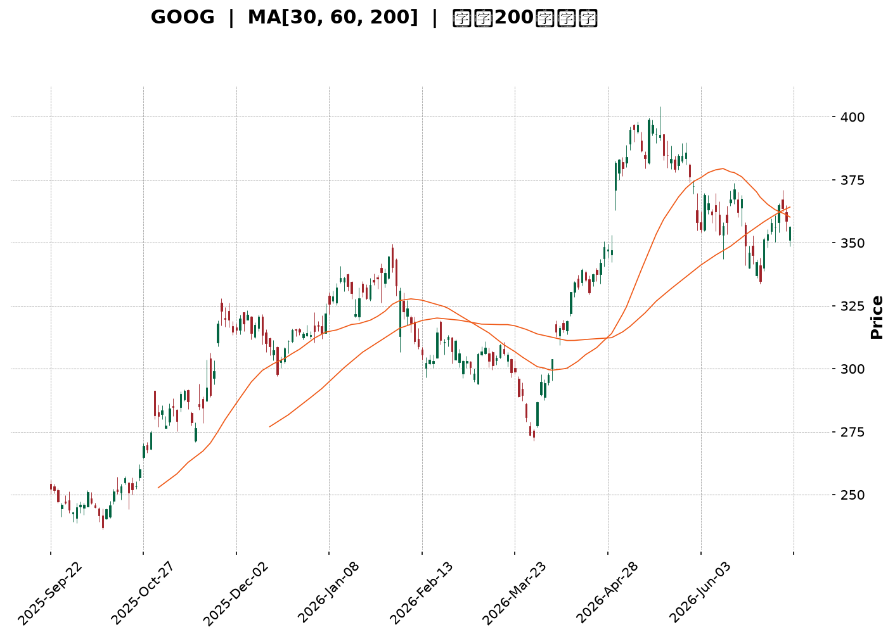
</details>

<html>
<head><meta charset="utf-8" /></head>
<body>
    <div style="height:500px; width:100%;">                        <script>window.PlotlyConfig = {MathJaxConfig: 'local'};</script>
        <script charset="utf-8" src="https://cdn.plot.ly/plotly-3.7.0.min.js" integrity="sha256-jvTGqxNp8AGWEcvNLVuKr+8j5dGe9Yw51LQkmDH+IYA=" crossorigin="anonymous"></script>                <div id="candlestick-chart" class="plotly-graph-div" style="height:100%; width:100%;"></div>            <script>                window.PLOTLYENV=window.PLOTLYENV || {};                                if (document.getElementById("candlestick-chart")) {                    Plotly.newPlot(                        "candlestick-chart",                        [{"close":{"dtype":"f8","bdata":"AAAAgFSMb0AAAABgFXtvQAAAAMAL625AAAAAIM7CbkAAAABgSdZuQAAAACA5fG5AAAAAwFpibkAAAADA6KFuQAAAAGBVvm5AAAAAAPm+bkAAAABgk2BvQAAAAMCw1G5AAAAA4FqfbkAAAAAAjzduQAAAAEDQoG1AAAAAYCqFbkAAAABAq7ZuQAAAAKD2Zm9AAAAAoGRsb0AAAACgZKlvQAAAAIBGCHBAAAAAgCVbb0AAAADgJoFvQAAAAAB6p29AAAAAoAFAcEAAAABgbtZwQAAAAIB6vnBAAAAAgBsqcUAAAACgk5VxQAAAAKBMlHFAAAAAAAe5cUAAAADAQVhxQAAAAGAWw3FAAAAAYILMcUAAAAAgcnJxQAAAAEBYIHJAAAAAYLUyckAAAABA4u1xQAAAAAAvaXFAAAAAwAJHcUAAAABAqdBxQAAAAOBwxnFAAAAAYKtGckAAAADAmhZyQAAAAGAFsXJAAAAAYI3dc0AAAABAHDB0QAAAAIB0+nNAAAAAgOb3c0AAAACADqhzQAAAAMBttnNAAAAAgOL\u002fc0AAAABgRtxzQAAAAOBbF3RAAAAAYKKgc0AAAACAXdVzQAAAACBMCXRAAAAAYKaUc0AAAAAA1mFzQAAAAECpTnNAAAAAIEE1c0AAAACAvJpyQAAAAGCo9XJAAAAA4FBDc0AAAABgx25zQAAAAOBJtHNAAAAAACG0c0AAAACAyKhzQAAAAACtn3NAAAAAYDuic0AAAABgP5ZzQAAAAECJrnNAAAAAgH7Oc0AAAABgO6JzQAAAAMAlIHRAAAAAQFpZdEAAAAAgXot0QAAAAIC7xHRAAAAA4Nr\u002fdEAAAAAA8P10QAAAAICay3RAAAAA4IqedEAAAABA1Rt0QAAAAEA5f3RAAAAAIIimdEAAAADABYB0QAAAAIB50nRAAAAAQAHpdEAAAABgdf10QAAAACB9I3VAAAAAYGkhdUAAAADAMod1QAAAACAWRHVAAAAAwHrOdEAAAACAXK50QAAAAKDaKnRAAAAAYKA\u002fdEAAAABgbeNzQAAAAGDHbnNAAAAAwHVPc0AAAAAg7hlzQAAAAADM5nJAAAAAoLH4ckAAAAAAn\u002fJyQAAAACDTp3NAAAAAIIh0c0AAAABgOmhzQAAAAKDxiXNAAAAAoPwrc0AAAACAYHBzQAAAAOBcH3NAAAAAAJ\u002fyckAAAABA3fByQAAAAOBGyHJAAAAAQJKeckAAAAAgNx1zQAAAACDtK3NAAAAAgMBDc0AAAAAgcfByQAAAAIB11HJAAAAAYMoDc0AAAAAglVNzQAAAACDaIXNAAAAA4LwYc0AAAADAw6lyQAAAAEBxrXJAAAAAwGoQckAAAAAgpxZyQAAAAGAjiXFAAAAAgIYZcUAAAACgnA9xQAAAAMD\u002f6nFAAAAA4I9rckAAAACghmRyQAAAAACyl3JAAAAAgPT7ckAAAACgz6hzQAAAACDgwnNAAAAAQHu4c0AAAADASfBzQAAAAEAZpnRAAAAAIE3kdEAAAAAAHsl0QAAAAEAiM3VAAAAAICzzdEAAAAAAV6R0QAAAACBuGHVAAAAA4L8YdUAAAABg02F1QAAAAED3xHVAAAAA4Ke0dUAAAAAgnrF1QAAAAEBd23dAAAAAANXvd0AAAABAlrZ3QAAAACCfAHhAAAAAAHCueEAAAADg\u002frB4QAAAAKD6zHhAAAAAAJkoeEAAAAAgbfl3QAAAAMDM7HhAAAAA4OXOeEAAAADAVZF4QAAAAAD6jXhAAAAAILIKeEAAAAAgsgp4QAAAAGDU83dAAAAA4G2yd0AAAACAvAl4QAAAAICTCXhAAAAAQDQeeEAAAADgQYN3QAAAAMCxRXdAAAAAgMpidkAAAAAAdTd2QAAAACDEEHdAAAAA4KPYdkAAAABguJJ2QAAAAOCjpHZAAAAAwB4VdkAAAADA9Uh2QAAAAGCPYnZAAAAAgMLxdkAAAACgmTF3QAAAAKCZoXZAAAAAIFz3dkAAAADgesx1QAAAAKBHoXVAAAAA4KOQdUAAAABACmN1QAAAAEAK63RAAAAA4Hr0dUAAAACgRxV2QAAAAIA9XnZAAAAAQOFCdkAAAABgZs52QAAAAIDruXZAAAAAIFxrdkAAAAAA10N2QA=="},"high":{"dtype":"f8","bdata":"lkF1COD5b0CfzdIOschvQCuS4Inijm9AHnSpL5nabkCU87vCLjRvQAlRu5T7ZG9ABaozv1hmbkA1qfgSVNVuQEmwfnDR5G5ATRmXi07UbkAGF0zRnHZvQGwJcIvaYW9ACUW5h9fYbkD4GayFY6JuQDCxn5aNi25AHQwVBFiQbkCvlAYYRvFuQLYkbUx\u002fiG9AuB00xDcRcEBgzVGINMxvQFn27jsCFnBAZN8ogizcb0AXY72N1ApwQAAvpt2A629AqzSGmfFfcEDlbWrnUuRwQAD9Dx2W7XBAMU8C1+E2cUAdGjoivjVyQJV3OnmZ23FAg9zRKhfWcUCB8pTihZRxQPMYBQA64nFA\u002fqNysusDckAloCNqGL9xQOTacsc8LnJA\u002f5w8MUo8ckDnPL7\u002fmzxyQFsX\u002f1JJr3FA5wrJnKlpcUCpnUoHGl9yQGnF1aTmDXJA9j4MJ3r6ckB+qIqjoiRzQL\u002fyIZfY9XJA8vrrV8ryc0D3eSHSboB0QKvUXuKqRXRAUd2oVdljdEBGobJcE\u002fBzQNOC1tOg33NAVlo7f48WdEAjKdakeCd0QLw37e4kM3RAZmMFAvkMdEAzx6l\u002fsORzQLBjevkyF3RAMDCnzx0ZdEC55lSVo7tzQPUwjq6rhHNAjvK\u002fIAJ3c0BSNJr6qUxzQEdUuE3JDXNAQa3\u002fV2NJc0D92qAFsXRzQIOJnQ8yvnNA2KuWLwm+c0AUcXeSWcJzQH46WobxqHNA0RR9CZHUc0AAvi+gp69zQLeVR6jhJ3RAnnDhblXtc0CrbHbnPhJ0QAdKd46fYHRA9tS06LyhdEAgNOo9wrB0QD+Q8XsO4HRATqWEYBNMdUBijLZGcQl1QOHm7g4FG3VAIB7tDtfsdEChdwbNlnp0QFDRcianxHRA1RDoQ1zsdECIuTdxgdl0QKaDPb+T\u002fnRAtx9tsGAcdUCshqzIBxN1QNgBrzh+XXVAe9iq94g9dUDwQ1nVbot1QD8Bz7wW23VABzctzs98dUD8xtK5W8N0QPRprDJWo3RAJJmZJf90dECk2uxWXRN0QHj2NDEECnRAnQM9XhLBc0D2+7VoykdzQI36Qa\u002ffB3NAIYdMOCwYc0APMMnrFhpzQDTKvM6LxXNAHpgc\u002fpvwc0COhs2\u002fZX9zQAXW5cEClHNAV0ko+3aJc0D8QYRmw3pzQBTYJ1zOO3NAKez1d7H4ckAFn5ph+xBzQMPoqNmV73JAc0gpRgK\u002fckD0DvrqDCVzQAD778dsT3NA+jg4ORxuc0CPc1QfRUdzQM9cShY0MXNA\u002fq6w6i0Wc0CXYWHs0F1zQLddXmkCaXNAl0nSqO0nc0DHX66g\u002fQJzQDW8rigA83JAOnNuqb2OckAhuyRiuWdyQP2F1KV75XFAYwEn\u002fsBucUA7Sl9wgEFxQOJwKYgJ7nFAzP1kZuScckD5OrtTjXtyQJrNf33to3JAkwHHdKz+ckAwiWKrKvNzQJEggkPT03NAqn7Rz+z0c0AUNEFVzvNzQBmyJPoOp3RAJlm9scbsdEC3LFNE1RJ1QAXbEO98PHVAH\u002fq\u002f3EsvdUA3toi+eQ91QHt3zyI6HXVAYXf5T0k\u002fdUBS2O5\u002fu3d1QLqI9OIF63VA9VhTVgjbdUDl1i+\u002f\u002fxJ2QHrHzcxl5ndAdN3F9Izyd0DpkdDQLv93QBAY6NGdS3hA5jXv8UPCeEDFhuov29F4QCk1iR8W4nhAewDoH3yheEARb4krUiN4QMXArO4H+3hAW1s6vNLteEDQuG0xRbp4QC2XMaOgQ3lAlad5xgWSeEARwv61cGd4QIHVCaojR3hAVDSfWTcKeEBU9xkFiBJ4QETmnHDZV3hA5KTwMD9ceEBnfNUjutZ3QI5qB8b+ZXdANiGpyRQZd0DaQcPygqR2QCq45EszGndAVVhcpqUPd0AAAACAFLZ2QAAAAGASG3dAAAAAwPXkdkAAAAAAKWB2QAAAAEBezHZAAAAAYGYqd0AAAACgmVl3QAAAAGBmIndAAAAAAAAQd0AAAABAM2N2QAAAACCFy3VAAAAAoEcNdkAAAABACnN1QAAAAIDrgXVAAAAAIIX\u002fdUAAAACAPTZ2QAAAAMD1eHZAAAAAANePdkAAAABA4dp2QAAAAIA9LndAAAAAIK7PdkAAAABA4Up2QA=="},"hovertemplate":"\u003cb\u003e%{x|%Y-%m-%d}\u003c\u002fb\u003e\u003cbr\u003e\u958b: $%{open:.2f}\u003cbr\u003e\u9ad8: $%{high:.2f}\u003cbr\u003e\u4f4e: $%{low:.2f}\u003cbr\u003e\u6536: $%{close:.2f}\u003cextra\u003e\u003c\u002fextra\u003e","low":{"dtype":"f8","bdata":"9gc0LDhKb0AQFiloKVNvQNl+j2aQ125AP3hTOKwlbkCYHk5nCsVuQEpN9fYsV25A8mxog0bjbUBw7dYZbddtQPxGwkgkVG5A4W2Xp9w\u002fbkCy2D5Es6ZuQN+Xy2B4ym5AZY\u002furYmTbkBAjAWrweZtQLqejIYah21A7nHr1u0IbkBhVo0xmRZuQHJjWbjUyW5AGtLto79Fb0AKTIyUUQNvQA\u002fJv0dDw29At1Auwx+GbkC2VwoRwT5vQJNskcrAiG9A9+DuKyvzb0A8n8Fbv4ZwQCA8arhbqnBATj+aYXq+cECssDwebH5xQHRCKo6uT3FAJRb2CyV9cUApaz+TLEVxQLGpI+xhVXFACg1YDhuRcUCoouaaNTNxQJ9eE\u002f3Dr3FALq3MzRH1cUCcugvwLb1xQPbrYnlMV3FAV7aSoRDucEBC2yO6yLpxQA9EpWxtZ3FA0fCIYLfxcUCrGmd9qwlyQLWKHOOLXHJAyCl3TLdMc0B5ipbKG9NzQKIB\u002fo1FyXNAwiPmuh7Fc0Bt1G1C2pVzQLgWKGyvmXNAs5HDrKSac0AgMHTvj69zQBwtAkiq9XNA61XVEwx4c0CllAJsZINzQPJRLm\u002fQr3NAqoR0C5xXc0A7s6RH8yhzQM\u002fjJ6N0FXNAf08Tee\u002f2ckDruLdC\u002fZByQL6IXY3Nw3JA20LlgyDfckAVmZG2CSNzQDO3EfqCZXNAXmbJ75OOc0C8Wt4g+JRzQJF7US\u002fjd3NACiXpknWNc0BPb21trnxzQAnTgdbpY3NAWyIasmatc0DkOCoQ635zQOqFeONuoXNAo1tjvR0ZdEBi\u002fLwSMF10QGsFSvhcUXRAJtFVXp7edEAzQd9iU6t0QMQE8v64rXRAPcBeOd57dEDXy+4pigd0QCV6WeD38XNAt3QjejaHdEBSMm4VrHh0QCdGKnsAcXRArDGR7gfVdEClfMguJbt0QL3uwbKyZHRABD6je0vDdEADFjvlJPl0QHgnT8deInVAhzjC2AqPdEAgGMq7TyhzQEnFoSS3+3NAuBUnEJHUc0AiTGJ4\u002faNzQOvKJaqaW3NADGOFJfc7c0B\u002fIvb0DfhyQIbhW0UziHJAqAIB+l\u002fZckBItPYSccRyQNRq5iRdAHNA6N9b9l1Zc0BGOYlxDBtzQJEfEd5MT3NA93X09T7gckAcZUHnHfNyQGWvqHSsynJAyAtRDf2EckDD\u002fzbqhMZyQJ06Wm7lmnJAQ\u002fyVzdVtckDg3IciDVxyQJfkqZ0FEnNAJY1HG38ac0AObrx2i8pyQMBtd2OYuXJA9B0oLg7ackA78THXqwJzQCbvKZzHFXNAyMxXZxrNckCdJKTmJIlyQI6MVbCcnXJAXBiYeeYKckB4XT54J\u002fNxQEgZ2EkdbnFA\u002fGebUAwVcUAVnzN08vVwQEa3PiJ\u002fSXFAVdeFALwUckDFtMs5WvZxQGQN7wjQWXJAAljd8\u002fRzckD6qWhDRYhzQFk5gr+KVHNAiJND6Jylc0BZLTh5BZhzQJhoBDtPD3RAxNpBsGWHdECnGmpCNbd0QEP\u002fW81u0XRAYPOXJdzmdEAFs8Fx6JZ0QLbEP+AnzHRAWf2fQLztdECj4Pe\u002fld10QGLonB6uSXVAYjrariqBdUDuabOllWN1QPJGBBHyrXZAoU5ZfIxwd0CKGAOysYh3QP+XbIjwwXdAhY\u002fb7t8teED23SMrNGF4QLeelZPulnhA93qQlPYfeEDdneyZ3bd3QK5pRoSb1XdA8PGWUd6HeEBqkkPFaFh4QFOo2VGjanhAteZNblDsd0Brq17SV7x3QCaMgDQHtHdAxjlZIoWgd0Ci2P9ql653QGbq7dhS3HdA74Zuv1TQd0BsnlufMmF3QKABB1LNF3dAibMwWpUsdkCIF+BzqyJ2QEzrIKZiKXZAlGzUjJmWdkAAAACAPV52QAAAACCFK3ZAAAAAwPUMdkAAAACAFHp1QAAAAKBwFXZAAAAAYGbKdkAAAADAHtV2QAAAACCug3ZAAAAAYLpJdkAAAABACk91QAAAAKBwO3VAAAAAAABYdUAAAABgZv50QAAAAEAK23RAAAAAwPUsdUAAAACAwsF1QAAAACCuE3ZAAAAAwB7ldUAAAABACiN2QAAAAGC4pnZAAAAAQDMrdkAAAABgj8p1QA=="},"name":"\u50f9\u683c","open":{"dtype":"f8","bdata":"WNVGzQLJb0D6RirNFKVvQK+o\u002f+QDdW9A8R9cmY2LbkBvOfbtm+luQFAjmAJC+W5AbQExerRSbkAc2ed+qRZuQMgM8GgapW5AoVPzTAKYbkBMKwoTk6luQBngvmctDm9ABe5CBP22bkA7slF0lJJuQHPRTgn2NW5ApOQ1Gt8RbkBje2PSBiluQHXijrcw825Ax90hgBN\u002fb0D4WddZd1tvQPfbRg9i129A3cV+lwXYb0DcJdxBW9BvQF7wEbuEpm9AK8eEGL8McEDZW0M+dI1wQEaVaVG+2nBAGpJjMFrBcEAvafewYzJyQB\u002fWE2dqqnFAhCH8fuGdcUBPe\u002fk4XkhxQAs1QOdVbXFAnMHPFdHScUDEJQPddrpxQGdutcpPy3FAYFVi\u002fS36cUCPdM3TNzhyQKV78wfnpnFA\u002fRK9Ps\u002f1cEC6vQ+Xb91xQLPIgQG7\u002fnFAxoXMofTxcUAXToBdTQJzQBp3dsaghHJA3Df9BW1mc0DcWg0ukmJ0QPfxWH5wAnRAqVVuusEsdEDdSTXBqc1zQGNk7DJ7xHNASmsep5a2c0DgqZLzmyZ0QAzJAf\u002f79XNAmni508YJdEBUEif7D4tzQFrPswlPw3NAsEGLMeUKdEBpnuKlJaZzQPskNdV4g3NA7914P5wZc0Bt1sE3tUlzQPL+MNCh6nJAtIlJy\u002fztckBl06nvGW1zQPVxO+upa3NADdgvb8y7c0AaQEGeH7hzQBauYaSWhnNAvvb1FwSQc0DlV2hsYI9zQFCut\u002f3O0nNAsMLTfnzUc0DR1i+fVc5zQOcSrEONonNA92SIWV2NdECy4OpxAHF0QDy4hq0uYXRA+16ypXrtdEDzGjfVw+h0QCDplDXSGXVAmvtFcPfndECvEwHLIQ10QEzyjNDQCnRAROgNsULddECVzbPKiMN0QCqslO9YfHRAVxLeYRLzdECKqnM8uwJ1QKh1ZFd+PnVACJM\u002fYWDgdEAmbFDCxQF1QLz+FZr2wHVA3dKN8+Z0dUCCWe8JqYxzQF2TiejDbnRAg8wZ5CENdECjEyUQ3Ad0QB8Sgxaz6HNAh4f68RN\u002fc0C9zSI\u002fVDlzQPH+QGf2w3JAvgSB75jgckA+UEKvAOJyQMmQ8HxvBnNA8HshjZPrc0BUkij\u002fwGNzQIsMQR1ne3NAdcX+RVmGc0AkDKuJsfhyQPt6zSUd6XJAbMUaGn2gckD3x9LWo+RyQMY+RYLe7HJA3DPHSPh6ckB3bTthVF9yQLYOV3kOG3NAHNYmGdohc0Bw1uy7aSBzQOxI1XOHJ3NAl08vpa32ckBaK2DNyQdzQIxot0uEO3NAP2RxFXHwckDldOKdMf5yQGmYt4eWxXJA6LnEWoKAckBpnU6Rlj9yQMG+zjJJ4HFAM7gb6LpTcUBetoK1YzRxQB35SBb4VXFA5D7gvuMcckD7eyf6Dg1yQCfk9ipdaHJA8Dc7Flq\u002fckAyFT6jONpzQE6eebUGkHNAHMUAlIngc0CJDS1Wr7NzQGfD99nwHXRAamv3YceldEA+SVcpXvp0QHIGaV6p43RAs8wkt7MldUC4DidmIfZ0QIe+OALw6nRAC\u002fjvoO41dUDV1kIVRRh1QKIAZE7FenVAqA\u002fMrWGrdUAM0SACW5R1QGVINdOBMHdAoqPZ6Aqcd0CYjtXlcOF3QGlau6k+2ndAI85pzLBVeEB9c\u002fqJI814QJuONZmGoHhADlWlt0dneEBXnMN3Swx4QOIPSffN2ndACcnGs9mYeEApyjrip494QALuO+05fnhAF284zgOReEBSwrFH7wx4QD980th73HdACzz+0Hjwd0BDcA7ZQMx3QHVUa3aO6HdAiY5a0RD6d0CJ091v7s93QEcfI2OdRXdApnxqnxCvdkB3G4xV6WF2QMnPeZKeM3ZAjPMWPZWydkAAAACAwqd2QAAAAAApznZAAAAAwMyQdkAAAADAzBB2QAAAAKCZkXZAAAAAANffdkAAAACgcPd2QAAAAMDM8HZAAAAAgD2+dkAAAAAAKVJ2QAAAACCuQXVAAAAAIIXLdUAAAABguA51QAAAACCuT3VAAAAAQDM\u002fdUAAAAAgXO91QAAAAADXKXZAAAAAYGZCdkAAAADAHmN2QAAAAIDC83ZAAAAAIFyjdkAAAAAgXPF1QA=="},"x":["2025-09-22T00:00:00-04:00","2025-09-23T00:00:00-04:00","2025-09-24T00:00:00-04:00","2025-09-25T00:00:00-04:00","2025-09-26T00:00:00-04:00","2025-09-29T00:00:00-04:00","2025-09-30T00:00:00-04:00","2025-10-01T00:00:00-04:00","2025-10-02T00:00:00-04:00","2025-10-03T00:00:00-04:00","2025-10-06T00:00:00-04:00","2025-10-07T00:00:00-04:00","2025-10-08T00:00:00-04:00","2025-10-09T00:00:00-04:00","2025-10-10T00:00:00-04:00","2025-10-13T00:00:00-04:00","2025-10-14T00:00:00-04:00","2025-10-15T00:00:00-04:00","2025-10-16T00:00:00-04:00","2025-10-17T00:00:00-04:00","2025-10-20T00:00:00-04:00","2025-10-21T00:00:00-04:00","2025-10-22T00:00:00-04:00","2025-10-23T00:00:00-04:00","2025-10-24T00:00:00-04:00","2025-10-27T00:00:00-04:00","2025-10-28T00:00:00-04:00","2025-10-29T00:00:00-04:00","2025-10-30T00:00:00-04:00","2025-10-31T00:00:00-04:00","2025-11-03T00:00:00-05:00","2025-11-04T00:00:00-05:00","2025-11-05T00:00:00-05:00","2025-11-06T00:00:00-05:00","2025-11-07T00:00:00-05:00","2025-11-10T00:00:00-05:00","2025-11-11T00:00:00-05:00","2025-11-12T00:00:00-05:00","2025-11-13T00:00:00-05:00","2025-11-14T00:00:00-05:00","2025-11-17T00:00:00-05:00","2025-11-18T00:00:00-05:00","2025-11-19T00:00:00-05:00","2025-11-20T00:00:00-05:00","2025-11-21T00:00:00-05:00","2025-11-24T00:00:00-05:00","2025-11-25T00:00:00-05:00","2025-11-26T00:00:00-05:00","2025-11-28T00:00:00-05:00","2025-12-01T00:00:00-05:00","2025-12-02T00:00:00-05:00","2025-12-03T00:00:00-05:00","2025-12-04T00:00:00-05:00","2025-12-05T00:00:00-05:00","2025-12-08T00:00:00-05:00","2025-12-09T00:00:00-05:00","2025-12-10T00:00:00-05:00","2025-12-11T00:00:00-05:00","2025-12-12T00:00:00-05:00","2025-12-15T00:00:00-05:00","2025-12-16T00:00:00-05:00","2025-12-17T00:00:00-05:00","2025-12-18T00:00:00-05:00","2025-12-19T00:00:00-05:00","2025-12-22T00:00:00-05:00","2025-12-23T00:00:00-05:00","2025-12-24T00:00:00-05:00","2025-12-26T00:00:00-05:00","2025-12-29T00:00:00-05:00","2025-12-30T00:00:00-05:00","2025-12-31T00:00:00-05:00","2026-01-02T00:00:00-05:00","2026-01-05T00:00:00-05:00","2026-01-06T00:00:00-05:00","2026-01-07T00:00:00-05:00","2026-01-08T00:00:00-05:00","2026-01-09T00:00:00-05:00","2026-01-12T00:00:00-05:00","2026-01-13T00:00:00-05:00","2026-01-14T00:00:00-05:00","2026-01-15T00:00:00-05:00","2026-01-16T00:00:00-05:00","2026-01-20T00:00:00-05:00","2026-01-21T00:00:00-05:00","2026-01-22T00:00:00-05:00","2026-01-23T00:00:00-05:00","2026-01-26T00:00:00-05:00","2026-01-27T00:00:00-05:00","2026-01-28T00:00:00-05:00","2026-01-29T00:00:00-05:00","2026-01-30T00:00:00-05:00","2026-02-02T00:00:00-05:00","2026-02-03T00:00:00-05:00","2026-02-04T00:00:00-05:00","2026-02-05T00:00:00-05:00","2026-02-06T00:00:00-05:00","2026-02-09T00:00:00-05:00","2026-02-10T00:00:00-05:00","2026-02-11T00:00:00-05:00","2026-02-12T00:00:00-05:00","2026-02-13T00:00:00-05:00","2026-02-17T00:00:00-05:00","2026-02-18T00:00:00-05:00","2026-02-19T00:00:00-05:00","2026-02-20T00:00:00-05:00","2026-02-23T00:00:00-05:00","2026-02-24T00:00:00-05:00","2026-02-25T00:00:00-05:00","2026-02-26T00:00:00-05:00","2026-02-27T00:00:00-05:00","2026-03-02T00:00:00-05:00","2026-03-03T00:00:00-05:00","2026-03-04T00:00:00-05:00","2026-03-05T00:00:00-05:00","2026-03-06T00:00:00-05:00","2026-03-09T00:00:00-04:00","2026-03-10T00:00:00-04:00","2026-03-11T00:00:00-04:00","2026-03-12T00:00:00-04:00","2026-03-13T00:00:00-04:00","2026-03-16T00:00:00-04:00","2026-03-17T00:00:00-04:00","2026-03-18T00:00:00-04:00","2026-03-19T00:00:00-04:00","2026-03-20T00:00:00-04:00","2026-03-23T00:00:00-04:00","2026-03-24T00:00:00-04:00","2026-03-25T00:00:00-04:00","2026-03-26T00:00:00-04:00","2026-03-27T00:00:00-04:00","2026-03-30T00:00:00-04:00","2026-03-31T00:00:00-04:00","2026-04-01T00:00:00-04:00","2026-04-02T00:00:00-04:00","2026-04-06T00:00:00-04:00","2026-04-07T00:00:00-04:00","2026-04-08T00:00:00-04:00","2026-04-09T00:00:00-04:00","2026-04-10T00:00:00-04:00","2026-04-13T00:00:00-04:00","2026-04-14T00:00:00-04:00","2026-04-15T00:00:00-04:00","2026-04-16T00:00:00-04:00","2026-04-17T00:00:00-04:00","2026-04-20T00:00:00-04:00","2026-04-21T00:00:00-04:00","2026-04-22T00:00:00-04:00","2026-04-23T00:00:00-04:00","2026-04-24T00:00:00-04:00","2026-04-27T00:00:00-04:00","2026-04-28T00:00:00-04:00","2026-04-29T00:00:00-04:00","2026-04-30T00:00:00-04:00","2026-05-01T00:00:00-04:00","2026-05-04T00:00:00-04:00","2026-05-05T00:00:00-04:00","2026-05-06T00:00:00-04:00","2026-05-07T00:00:00-04:00","2026-05-08T00:00:00-04:00","2026-05-11T00:00:00-04:00","2026-05-12T00:00:00-04:00","2026-05-13T00:00:00-04:00","2026-05-14T00:00:00-04:00","2026-05-15T00:00:00-04:00","2026-05-18T00:00:00-04:00","2026-05-19T00:00:00-04:00","2026-05-20T00:00:00-04:00","2026-05-21T00:00:00-04:00","2026-05-22T00:00:00-04:00","2026-05-26T00:00:00-04:00","2026-05-27T00:00:00-04:00","2026-05-28T00:00:00-04:00","2026-05-29T00:00:00-04:00","2026-06-01T00:00:00-04:00","2026-06-02T00:00:00-04:00","2026-06-03T00:00:00-04:00","2026-06-04T00:00:00-04:00","2026-06-05T00:00:00-04:00","2026-06-08T00:00:00-04:00","2026-06-09T00:00:00-04:00","2026-06-10T00:00:00-04:00","2026-06-11T00:00:00-04:00","2026-06-12T00:00:00-04:00","2026-06-15T00:00:00-04:00","2026-06-16T00:00:00-04:00","2026-06-17T00:00:00-04:00","2026-06-18T00:00:00-04:00","2026-06-22T00:00:00-04:00","2026-06-23T00:00:00-04:00","2026-06-24T00:00:00-04:00","2026-06-25T00:00:00-04:00","2026-06-26T00:00:00-04:00","2026-06-29T00:00:00-04:00","2026-06-30T00:00:00-04:00","2026-07-01T00:00:00-04:00","2026-07-02T00:00:00-04:00","2026-07-06T00:00:00-04:00","2026-07-07T00:00:00-04:00","2026-07-08T00:00:00-04:00","2026-07-09T00:00:00-04:00"],"type":"candlestick"},{"hovertemplate":"MA30: $%{y:.2f}\u003cextra\u003e\u003c\u002fextra\u003e","line":{"color":"#2196F3","dash":"dash","width":2},"mode":"lines","name":"MA30","x":["2025-09-22T00:00:00-04:00","2025-09-23T00:00:00-04:00","2025-09-24T00:00:00-04:00","2025-09-25T00:00:00-04:00","2025-09-26T00:00:00-04:00","2025-09-29T00:00:00-04:00","2025-09-30T00:00:00-04:00","2025-10-01T00:00:00-04:00","2025-10-02T00:00:00-04:00","2025-10-03T00:00:00-04:00","2025-10-06T00:00:00-04:00","2025-10-07T00:00:00-04:00","2025-10-08T00:00:00-04:00","2025-10-09T00:00:00-04:00","2025-10-10T00:00:00-04:00","2025-10-13T00:00:00-04:00","2025-10-14T00:00:00-04:00","2025-10-15T00:00:00-04:00","2025-10-16T00:00:00-04:00","2025-10-17T00:00:00-04:00","2025-10-20T00:00:00-04:00","2025-10-21T00:00:00-04:00","2025-10-22T00:00:00-04:00","2025-10-23T00:00:00-04:00","2025-10-24T00:00:00-04:00","2025-10-27T00:00:00-04:00","2025-10-28T00:00:00-04:00","2025-10-29T00:00:00-04:00","2025-10-30T00:00:00-04:00","2025-10-31T00:00:00-04:00","2025-11-03T00:00:00-05:00","2025-11-04T00:00:00-05:00","2025-11-05T00:00:00-05:00","2025-11-06T00:00:00-05:00","2025-11-07T00:00:00-05:00","2025-11-10T00:00:00-05:00","2025-11-11T00:00:00-05:00","2025-11-12T00:00:00-05:00","2025-11-13T00:00:00-05:00","2025-11-14T00:00:00-05:00","2025-11-17T00:00:00-05:00","2025-11-18T00:00:00-05:00","2025-11-19T00:00:00-05:00","2025-11-20T00:00:00-05:00","2025-11-21T00:00:00-05:00","2025-11-24T00:00:00-05:00","2025-11-25T00:00:00-05:00","2025-11-26T00:00:00-05:00","2025-11-28T00:00:00-05:00","2025-12-01T00:00:00-05:00","2025-12-02T00:00:00-05:00","2025-12-03T00:00:00-05:00","2025-12-04T00:00:00-05:00","2025-12-05T00:00:00-05:00","2025-12-08T00:00:00-05:00","2025-12-09T00:00:00-05:00","2025-12-10T00:00:00-05:00","2025-12-11T00:00:00-05:00","2025-12-12T00:00:00-05:00","2025-12-15T00:00:00-05:00","2025-12-16T00:00:00-05:00","2025-12-17T00:00:00-05:00","2025-12-18T00:00:00-05:00","2025-12-19T00:00:00-05:00","2025-12-22T00:00:00-05:00","2025-12-23T00:00:00-05:00","2025-12-24T00:00:00-05:00","2025-12-26T00:00:00-05:00","2025-12-29T00:00:00-05:00","2025-12-30T00:00:00-05:00","2025-12-31T00:00:00-05:00","2026-01-02T00:00:00-05:00","2026-01-05T00:00:00-05:00","2026-01-06T00:00:00-05:00","2026-01-07T00:00:00-05:00","2026-01-08T00:00:00-05:00","2026-01-09T00:00:00-05:00","2026-01-12T00:00:00-05:00","2026-01-13T00:00:00-05:00","2026-01-14T00:00:00-05:00","2026-01-15T00:00:00-05:00","2026-01-16T00:00:00-05:00","2026-01-20T00:00:00-05:00","2026-01-21T00:00:00-05:00","2026-01-22T00:00:00-05:00","2026-01-23T00:00:00-05:00","2026-01-26T00:00:00-05:00","2026-01-27T00:00:00-05:00","2026-01-28T00:00:00-05:00","2026-01-29T00:00:00-05:00","2026-01-30T00:00:00-05:00","2026-02-02T00:00:00-05:00","2026-02-03T00:00:00-05:00","2026-02-04T00:00:00-05:00","2026-02-05T00:00:00-05:00","2026-02-06T00:00:00-05:00","2026-02-09T00:00:00-05:00","2026-02-10T00:00:00-05:00","2026-02-11T00:00:00-05:00","2026-02-12T00:00:00-05:00","2026-02-13T00:00:00-05:00","2026-02-17T00:00:00-05:00","2026-02-18T00:00:00-05:00","2026-02-19T00:00:00-05:00","2026-02-20T00:00:00-05:00","2026-02-23T00:00:00-05:00","2026-02-24T00:00:00-05:00","2026-02-25T00:00:00-05:00","2026-02-26T00:00:00-05:00","2026-02-27T00:00:00-05:00","2026-03-02T00:00:00-05:00","2026-03-03T00:00:00-05:00","2026-03-04T00:00:00-05:00","2026-03-05T00:00:00-05:00","2026-03-06T00:00:00-05:00","2026-03-09T00:00:00-04:00","2026-03-10T00:00:00-04:00","2026-03-11T00:00:00-04:00","2026-03-12T00:00:00-04:00","2026-03-13T00:00:00-04:00","2026-03-16T00:00:00-04:00","2026-03-17T00:00:00-04:00","2026-03-18T00:00:00-04:00","2026-03-19T00:00:00-04:00","2026-03-20T00:00:00-04:00","2026-03-23T00:00:00-04:00","2026-03-24T00:00:00-04:00","2026-03-25T00:00:00-04:00","2026-03-26T00:00:00-04:00","2026-03-27T00:00:00-04:00","2026-03-30T00:00:00-04:00","2026-03-31T00:00:00-04:00","2026-04-01T00:00:00-04:00","2026-04-02T00:00:00-04:00","2026-04-06T00:00:00-04:00","2026-04-07T00:00:00-04:00","2026-04-08T00:00:00-04:00","2026-04-09T00:00:00-04:00","2026-04-10T00:00:00-04:00","2026-04-13T00:00:00-04:00","2026-04-14T00:00:00-04:00","2026-04-15T00:00:00-04:00","2026-04-16T00:00:00-04:00","2026-04-17T00:00:00-04:00","2026-04-20T00:00:00-04:00","2026-04-21T00:00:00-04:00","2026-04-22T00:00:00-04:00","2026-04-23T00:00:00-04:00","2026-04-24T00:00:00-04:00","2026-04-27T00:00:00-04:00","2026-04-28T00:00:00-04:00","2026-04-29T00:00:00-04:00","2026-04-30T00:00:00-04:00","2026-05-01T00:00:00-04:00","2026-05-04T00:00:00-04:00","2026-05-05T00:00:00-04:00","2026-05-06T00:00:00-04:00","2026-05-07T00:00:00-04:00","2026-05-08T00:00:00-04:00","2026-05-11T00:00:00-04:00","2026-05-12T00:00:00-04:00","2026-05-13T00:00:00-04:00","2026-05-14T00:00:00-04:00","2026-05-15T00:00:00-04:00","2026-05-18T00:00:00-04:00","2026-05-19T00:00:00-04:00","2026-05-20T00:00:00-04:00","2026-05-21T00:00:00-04:00","2026-05-22T00:00:00-04:00","2026-05-26T00:00:00-04:00","2026-05-27T00:00:00-04:00","2026-05-28T00:00:00-04:00","2026-05-29T00:00:00-04:00","2026-06-01T00:00:00-04:00","2026-06-02T00:00:00-04:00","2026-06-03T00:00:00-04:00","2026-06-04T00:00:00-04:00","2026-06-05T00:00:00-04:00","2026-06-08T00:00:00-04:00","2026-06-09T00:00:00-04:00","2026-06-10T00:00:00-04:00","2026-06-11T00:00:00-04:00","2026-06-12T00:00:00-04:00","2026-06-15T00:00:00-04:00","2026-06-16T00:00:00-04:00","2026-06-17T00:00:00-04:00","2026-06-18T00:00:00-04:00","2026-06-22T00:00:00-04:00","2026-06-23T00:00:00-04:00","2026-06-24T00:00:00-04:00","2026-06-25T00:00:00-04:00","2026-06-26T00:00:00-04:00","2026-06-29T00:00:00-04:00","2026-06-30T00:00:00-04:00","2026-07-01T00:00:00-04:00","2026-07-02T00:00:00-04:00","2026-07-06T00:00:00-04:00","2026-07-07T00:00:00-04:00","2026-07-08T00:00:00-04:00","2026-07-09T00:00:00-04:00"],"y":{"dtype":"f8","bdata":"AAAAAAAA+H8AAAAAAAD4fwAAAAAAAPh\u002fAAAAAAAA+H8AAAAAAAD4fwAAAAAAAPh\u002fAAAAAAAA+H8AAAAAAAD4fwAAAAAAAPh\u002fAAAAAAAA+H8AAAAAAAD4fwAAAAAAAPh\u002fAAAAAAAA+H8AAAAAAAD4fwAAAAAAAPh\u002fAAAAAAAA+H8AAAAAAAD4fwAAAAAAAPh\u002fAAAAAAAA+H8AAAAAAAD4fwAAAAAAAPh\u002fAAAAAAAA+H8AAAAAAAD4fwAAAAAAAPh\u002fAAAAAAAA+H8AAAAAAAD4fwAAAAAAAPh\u002fAAAAAAAA+H8AAAAAAAD4f+\u002fu7g4rmG9AmpmZ+Wy5b0AzMzODztRvQJqZmWkc\u002fG9AAAAAQLEScECamZmhACRwQImIiDicPHBAMzMz40JWcEBVVVUVj2xwQImIiKD1fXBA3t3d1TWOcEB3d3cnW6BwQKuqqhp+tHBA3t3d1crNcEDv7u5GOOdwQN7d3ZVOCHFAAAAAIJsvcUAiIiLy1FhxQAAAALhUfXFAZmZmhqehcUAzMzO7TMJxQImIiHC04XFA7+7u9pQGckBmZmZ2oylyQAAAAKAGTnJAiYiIyNhqckCamZlJaYRyQHd3d1eBoHJAIiIikh+1ckDe3d0dd8RyQAAAAPA103JAq6qqiuLfckDe3d1doupyQO\u002fu7m7a9HJAiYiIyFgBc0Dv7u6OShJzQLy7u4vBH3NAd3d3d5osc0AAAADgXTtzQBEREfE\u002fTnNA3t3dbVtic0CJiIgIenFzQM3MzBy\u002fgXNA7+7urs6Oc0BERES0\u002fptzQERERIQ7qHNAIiIi8lusc0DNzMysZq9zQGZmZsYktnNAAAAAMPG+c0AiIiKSVspzQLy7u8uT03NAzczMrN3Yc0CamZkJ\u002fNpzQJqZmVly3nNAVVVVNS3nc0C8u7t73exzQCIiIjKS83NA7+7ujur+c0AiIiISowx0QLy7u7tDHHRAmpmZeassdECamZlZnkV0QM3MzKxMWXRAzczMvHhmdEB3d3fXH3F0QJqZmZkTdXRAq6qq+rl5dECJiIhornt0QHd3dycNenRAVVVV1Up3dEDe3d39JXN0QM3MzIx9bHRA7+7uHl1ldEAzMzOTgl90QCIiItJ\u002fW3RAd3d3N99TdEAzMzPTKkp0QBEREaGsP3RAd3d3JxQwdEAzMzOj0yJ0QBEREVGNFHRAiYiIuEkGdEBVVVWFUvxzQHd3d9ew7XNAiYiI2Fvcc0CJiIgoiNBzQJqZmWlywnNAiYiIuGe0c0BERESU56JzQAAAACA0j3NAq6qqSiZ9c0BVVVXFXGpzQCIiIpInWHNAzczMLJBJc0AiIiLiVzhzQLy7uyuhK3NAAAAAQP0Yc0Dv7u5OoQlzQM3MzCxx+XJA3t3d3ZPmckAAAADAKtVyQDMzMxPGzHJAAAAAwBHIckBEREQ0VcNyQImIiAhDunJAzczMHD62ckCJiIg4ZbhyQJqZmQlLunJAzczM7Pm+ckDv7u5uPcNyQGZmZrZD0HJAVVVVldrgckCamZl5mPByQDMzM2M5BXNAIiIiYhwZc0Crqqr6JSZzQN7d3a2QNnNAq6qqyjJGc0BmZmZmC1tzQKuqqsogdHNAvLu7GxeLc0C8u7ubSp9zQHd3d8ebx3NAIiIiYunwc0B3d3d3ARx0QN7d3e1xSXRAIiIikumBdEBERETUQbp0QImIiHhA+HRAIiIi0nw0dUDNzMw8e291QGZmZlZGq3VARERENMnhdUBmZmbGehZ2QKuqqgpbSXZA7+7ufoN0dkCamZnp6Jl2QJqZmcmsvXZAZmZmRpvfdkARERGRlgJ3QKuqqgqBH3dA7+7uvgg7d0BVVVU1TlJ3QImIiKj9Y3dAvLu7qz5wd0Crqqqarn13QFVVVUV+jndAVVVVRWydd0CamZkJlqd3QJqZmbkKr3dAMzMz40Gyd0B3d3dXTbd3QCIiIvK9qndAzczM3EWid0CrqqoK1513QImIiKgjkndAzczM3ICDd0C8u7vL0Wp3QLy7u0vDT3dAZmZmhqE5d0CamZkpjSN3QDMzMwNcAXdAzczMHAPpdkARERFxz9N2QGZmZgYnwXZAVVVVZfWxdkBmZmZWaqd2QERERKTznHZAZmZmpgySdkBmZmZm64J2QA=="},"type":"scatter"},{"hovertemplate":"MA60: $%{y:.2f}\u003cextra\u003e\u003c\u002fextra\u003e","line":{"color":"#9C27B0","dash":"dash","width":2},"mode":"lines","name":"MA60","x":["2025-09-22T00:00:00-04:00","2025-09-23T00:00:00-04:00","2025-09-24T00:00:00-04:00","2025-09-25T00:00:00-04:00","2025-09-26T00:00:00-04:00","2025-09-29T00:00:00-04:00","2025-09-30T00:00:00-04:00","2025-10-01T00:00:00-04:00","2025-10-02T00:00:00-04:00","2025-10-03T00:00:00-04:00","2025-10-06T00:00:00-04:00","2025-10-07T00:00:00-04:00","2025-10-08T00:00:00-04:00","2025-10-09T00:00:00-04:00","2025-10-10T00:00:00-04:00","2025-10-13T00:00:00-04:00","2025-10-14T00:00:00-04:00","2025-10-15T00:00:00-04:00","2025-10-16T00:00:00-04:00","2025-10-17T00:00:00-04:00","2025-10-20T00:00:00-04:00","2025-10-21T00:00:00-04:00","2025-10-22T00:00:00-04:00","2025-10-23T00:00:00-04:00","2025-10-24T00:00:00-04:00","2025-10-27T00:00:00-04:00","2025-10-28T00:00:00-04:00","2025-10-29T00:00:00-04:00","2025-10-30T00:00:00-04:00","2025-10-31T00:00:00-04:00","2025-11-03T00:00:00-05:00","2025-11-04T00:00:00-05:00","2025-11-05T00:00:00-05:00","2025-11-06T00:00:00-05:00","2025-11-07T00:00:00-05:00","2025-11-10T00:00:00-05:00","2025-11-11T00:00:00-05:00","2025-11-12T00:00:00-05:00","2025-11-13T00:00:00-05:00","2025-11-14T00:00:00-05:00","2025-11-17T00:00:00-05:00","2025-11-18T00:00:00-05:00","2025-11-19T00:00:00-05:00","2025-11-20T00:00:00-05:00","2025-11-21T00:00:00-05:00","2025-11-24T00:00:00-05:00","2025-11-25T00:00:00-05:00","2025-11-26T00:00:00-05:00","2025-11-28T00:00:00-05:00","2025-12-01T00:00:00-05:00","2025-12-02T00:00:00-05:00","2025-12-03T00:00:00-05:00","2025-12-04T00:00:00-05:00","2025-12-05T00:00:00-05:00","2025-12-08T00:00:00-05:00","2025-12-09T00:00:00-05:00","2025-12-10T00:00:00-05:00","2025-12-11T00:00:00-05:00","2025-12-12T00:00:00-05:00","2025-12-15T00:00:00-05:00","2025-12-16T00:00:00-05:00","2025-12-17T00:00:00-05:00","2025-12-18T00:00:00-05:00","2025-12-19T00:00:00-05:00","2025-12-22T00:00:00-05:00","2025-12-23T00:00:00-05:00","2025-12-24T00:00:00-05:00","2025-12-26T00:00:00-05:00","2025-12-29T00:00:00-05:00","2025-12-30T00:00:00-05:00","2025-12-31T00:00:00-05:00","2026-01-02T00:00:00-05:00","2026-01-05T00:00:00-05:00","2026-01-06T00:00:00-05:00","2026-01-07T00:00:00-05:00","2026-01-08T00:00:00-05:00","2026-01-09T00:00:00-05:00","2026-01-12T00:00:00-05:00","2026-01-13T00:00:00-05:00","2026-01-14T00:00:00-05:00","2026-01-15T00:00:00-05:00","2026-01-16T00:00:00-05:00","2026-01-20T00:00:00-05:00","2026-01-21T00:00:00-05:00","2026-01-22T00:00:00-05:00","2026-01-23T00:00:00-05:00","2026-01-26T00:00:00-05:00","2026-01-27T00:00:00-05:00","2026-01-28T00:00:00-05:00","2026-01-29T00:00:00-05:00","2026-01-30T00:00:00-05:00","2026-02-02T00:00:00-05:00","2026-02-03T00:00:00-05:00","2026-02-04T00:00:00-05:00","2026-02-05T00:00:00-05:00","2026-02-06T00:00:00-05:00","2026-02-09T00:00:00-05:00","2026-02-10T00:00:00-05:00","2026-02-11T00:00:00-05:00","2026-02-12T00:00:00-05:00","2026-02-13T00:00:00-05:00","2026-02-17T00:00:00-05:00","2026-02-18T00:00:00-05:00","2026-02-19T00:00:00-05:00","2026-02-20T00:00:00-05:00","2026-02-23T00:00:00-05:00","2026-02-24T00:00:00-05:00","2026-02-25T00:00:00-05:00","2026-02-26T00:00:00-05:00","2026-02-27T00:00:00-05:00","2026-03-02T00:00:00-05:00","2026-03-03T00:00:00-05:00","2026-03-04T00:00:00-05:00","2026-03-05T00:00:00-05:00","2026-03-06T00:00:00-05:00","2026-03-09T00:00:00-04:00","2026-03-10T00:00:00-04:00","2026-03-11T00:00:00-04:00","2026-03-12T00:00:00-04:00","2026-03-13T00:00:00-04:00","2026-03-16T00:00:00-04:00","2026-03-17T00:00:00-04:00","2026-03-18T00:00:00-04:00","2026-03-19T00:00:00-04:00","2026-03-20T00:00:00-04:00","2026-03-23T00:00:00-04:00","2026-03-24T00:00:00-04:00","2026-03-25T00:00:00-04:00","2026-03-26T00:00:00-04:00","2026-03-27T00:00:00-04:00","2026-03-30T00:00:00-04:00","2026-03-31T00:00:00-04:00","2026-04-01T00:00:00-04:00","2026-04-02T00:00:00-04:00","2026-04-06T00:00:00-04:00","2026-04-07T00:00:00-04:00","2026-04-08T00:00:00-04:00","2026-04-09T00:00:00-04:00","2026-04-10T00:00:00-04:00","2026-04-13T00:00:00-04:00","2026-04-14T00:00:00-04:00","2026-04-15T00:00:00-04:00","2026-04-16T00:00:00-04:00","2026-04-17T00:00:00-04:00","2026-04-20T00:00:00-04:00","2026-04-21T00:00:00-04:00","2026-04-22T00:00:00-04:00","2026-04-23T00:00:00-04:00","2026-04-24T00:00:00-04:00","2026-04-27T00:00:00-04:00","2026-04-28T00:00:00-04:00","2026-04-29T00:00:00-04:00","2026-04-30T00:00:00-04:00","2026-05-01T00:00:00-04:00","2026-05-04T00:00:00-04:00","2026-05-05T00:00:00-04:00","2026-05-06T00:00:00-04:00","2026-05-07T00:00:00-04:00","2026-05-08T00:00:00-04:00","2026-05-11T00:00:00-04:00","2026-05-12T00:00:00-04:00","2026-05-13T00:00:00-04:00","2026-05-14T00:00:00-04:00","2026-05-15T00:00:00-04:00","2026-05-18T00:00:00-04:00","2026-05-19T00:00:00-04:00","2026-05-20T00:00:00-04:00","2026-05-21T00:00:00-04:00","2026-05-22T00:00:00-04:00","2026-05-26T00:00:00-04:00","2026-05-27T00:00:00-04:00","2026-05-28T00:00:00-04:00","2026-05-29T00:00:00-04:00","2026-06-01T00:00:00-04:00","2026-06-02T00:00:00-04:00","2026-06-03T00:00:00-04:00","2026-06-04T00:00:00-04:00","2026-06-05T00:00:00-04:00","2026-06-08T00:00:00-04:00","2026-06-09T00:00:00-04:00","2026-06-10T00:00:00-04:00","2026-06-11T00:00:00-04:00","2026-06-12T00:00:00-04:00","2026-06-15T00:00:00-04:00","2026-06-16T00:00:00-04:00","2026-06-17T00:00:00-04:00","2026-06-18T00:00:00-04:00","2026-06-22T00:00:00-04:00","2026-06-23T00:00:00-04:00","2026-06-24T00:00:00-04:00","2026-06-25T00:00:00-04:00","2026-06-26T00:00:00-04:00","2026-06-29T00:00:00-04:00","2026-06-30T00:00:00-04:00","2026-07-01T00:00:00-04:00","2026-07-02T00:00:00-04:00","2026-07-06T00:00:00-04:00","2026-07-07T00:00:00-04:00","2026-07-08T00:00:00-04:00","2026-07-09T00:00:00-04:00"],"y":{"dtype":"f8","bdata":"AAAAAAAA+H8AAAAAAAD4fwAAAAAAAPh\u002fAAAAAAAA+H8AAAAAAAD4fwAAAAAAAPh\u002fAAAAAAAA+H8AAAAAAAD4fwAAAAAAAPh\u002fAAAAAAAA+H8AAAAAAAD4fwAAAAAAAPh\u002fAAAAAAAA+H8AAAAAAAD4fwAAAAAAAPh\u002fAAAAAAAA+H8AAAAAAAD4fwAAAAAAAPh\u002fAAAAAAAA+H8AAAAAAAD4fwAAAAAAAPh\u002fAAAAAAAA+H8AAAAAAAD4fwAAAAAAAPh\u002fAAAAAAAA+H8AAAAAAAD4fwAAAAAAAPh\u002fAAAAAAAA+H8AAAAAAAD4fwAAAAAAAPh\u002fAAAAAAAA+H8AAAAAAAD4fwAAAAAAAPh\u002fAAAAAAAA+H8AAAAAAAD4fwAAAAAAAPh\u002fAAAAAAAA+H8AAAAAAAD4fwAAAAAAAPh\u002fAAAAAAAA+H8AAAAAAAD4fwAAAAAAAPh\u002fAAAAAAAA+H8AAAAAAAD4fwAAAAAAAPh\u002fAAAAAAAA+H8AAAAAAAD4fwAAAAAAAPh\u002fAAAAAAAA+H8AAAAAAAD4fwAAAAAAAPh\u002fAAAAAAAA+H8AAAAAAAD4fwAAAAAAAPh\u002fAAAAAAAA+H8AAAAAAAD4fwAAAAAAAPh\u002fAAAAAAAA+H8AAAAAAAD4f7y7u7ulT3FAvLu7g0xecUC8u7vPhGpxQN7d3VF0eXFAREREBAWKcUBERESYJZtxQCIiIuIurnFAVVVVrW7BcUCrqqp69tNxQM3MzMga5nFA3t3doUj4cUAAAACY6ghyQLy7u5seG3JAZmZmwkwuckCamZl9m0FyQBEREQ1FWHJAERERifttckB3d3fPHYRyQDMzM7+8mXJAMzMzW0ywckCrqqqmUcZyQCIiIh6k2nJA3t3dUbnvckAAAADATwJzQM3MzHw8FnNA7+7u\u002fgIpc0CrqqpiozhzQM3MzMQJSnNAiYiIEAVac0AAAAAYjWhzQN7d3dW8d3NAIiIiAkeGc0C8u7tbIJhzQN7d3Y0Tp3NAq6qqwuizc0AzMzMztcFzQKuqqpJqynNAEREROSrTc0BEREQkhttzQERERIwm5HNAmpmZIdPsc0AzMzMDUPJzQM3MzFQe93NA7+7u5hX6c0C8u7ujwP1zQDMzM6vdAXRAzczMlB0AdEAAAADAyPxzQLy7u7Po+nNAvLu7q4L3c0CrqqoalfZzQGZmZo4Q9HNAq6qqspPvc0B3d3dHp+tzQImIiJgR5nNA7+7uhsThc0AiIiLSst5zQN7d3U0C23NAvLu7I6nZc0AzMzNTxddzQN7d3e271XNAIiIi4ujUc0B3d3eP\u002fddzQHd3dx+62HNAzczMdATYc0DNzMzcu9RzQKuqqmJa0HNAVVVVnVvJc0C8u7vbp8JzQCIiIiq\u002fuXNAmpmZWe+uc0Dv7u5eKKRzQAAAANChnHNAd3d3b7eWc0C8u7vja5FzQFVVVW3hinNAIiIiqg6Fc0De3d0FSIFzQFVVVdX7fHNAIiIiCod3c0ARERGJCHNzQLy7u4NocnNA7+7uJpJzc0B3d3d\u002fdXZzQFVVVR11eXNAVVVVHbx6c0CamZkRV3tzQLy7u4uBfHNAmpmZQU19c0BVVVV9+X5zQFVVVXWqgXNAMzMzsx6Ec0CJiIiw04RzQM3MzKzhj3NAd3d3xzydc0DNzMysLKpzQM3MzIyJunNAERERaXPNc0CamZmR8eFzQKuqqtLY+HNAAAAAWIgNdEBmZmb+UiJ0QM3MzDQGPHRAIiIieu1UdEBVVVX952x0QJqZmQnPgXRA3t3dzWCVdEARERERJ6l0QJqZmen7u3RAmpmZmUrPdEAAAAAA6uJ0QImIiGDi93RAIiIiqvENdUB3d3dXcyF1QN7d3YWbNHVA7+7uhq1EdUCrqqpK6lF1QJqZmXmHYnVAAAAAiM9xdUAAAAC4UIF1QCIiIsKVkXVAd3d3f6yedUCamZn5S6t1QM3MzNwsuXVAd3d3n5fJdUARERFB7Nx1QDMzM8vK7XVAd3d3N7UCdkAAAADQiRJ2QCIiIuIBJHZARERELA83dkAzMzMzhEl2QM3MzCxRVnZAiYiIKGZldkC8u7sbJXV2QImIiAhBhXZAIiIicjyTdkAAAACgqaB2QO\u002fu7jZQrXZAZmZm9tO4dkC8u7v7wMJ2QA=="},"type":"scatter"},{"hovertemplate":"MA200: $%{y:.2f}\u003cextra\u003e\u003c\u002fextra\u003e","line":{"color":"#FF6F00","dash":"solid","width":2},"mode":"lines","name":"MA200","x":["2025-09-22T00:00:00-04:00","2025-09-23T00:00:00-04:00","2025-09-24T00:00:00-04:00","2025-09-25T00:00:00-04:00","2025-09-26T00:00:00-04:00","2025-09-29T00:00:00-04:00","2025-09-30T00:00:00-04:00","2025-10-01T00:00:00-04:00","2025-10-02T00:00:00-04:00","2025-10-03T00:00:00-04:00","2025-10-06T00:00:00-04:00","2025-10-07T00:00:00-04:00","2025-10-08T00:00:00-04:00","2025-10-09T00:00:00-04:00","2025-10-10T00:00:00-04:00","2025-10-13T00:00:00-04:00","2025-10-14T00:00:00-04:00","2025-10-15T00:00:00-04:00","2025-10-16T00:00:00-04:00","2025-10-17T00:00:00-04:00","2025-10-20T00:00:00-04:00","2025-10-21T00:00:00-04:00","2025-10-22T00:00:00-04:00","2025-10-23T00:00:00-04:00","2025-10-24T00:00:00-04:00","2025-10-27T00:00:00-04:00","2025-10-28T00:00:00-04:00","2025-10-29T00:00:00-04:00","2025-10-30T00:00:00-04:00","2025-10-31T00:00:00-04:00","2025-11-03T00:00:00-05:00","2025-11-04T00:00:00-05:00","2025-11-05T00:00:00-05:00","2025-11-06T00:00:00-05:00","2025-11-07T00:00:00-05:00","2025-11-10T00:00:00-05:00","2025-11-11T00:00:00-05:00","2025-11-12T00:00:00-05:00","2025-11-13T00:00:00-05:00","2025-11-14T00:00:00-05:00","2025-11-17T00:00:00-05:00","2025-11-18T00:00:00-05:00","2025-11-19T00:00:00-05:00","2025-11-20T00:00:00-05:00","2025-11-21T00:00:00-05:00","2025-11-24T00:00:00-05:00","2025-11-25T00:00:00-05:00","2025-11-26T00:00:00-05:00","2025-11-28T00:00:00-05:00","2025-12-01T00:00:00-05:00","2025-12-02T00:00:00-05:00","2025-12-03T00:00:00-05:00","2025-12-04T00:00:00-05:00","2025-12-05T00:00:00-05:00","2025-12-08T00:00:00-05:00","2025-12-09T00:00:00-05:00","2025-12-10T00:00:00-05:00","2025-12-11T00:00:00-05:00","2025-12-12T00:00:00-05:00","2025-12-15T00:00:00-05:00","2025-12-16T00:00:00-05:00","2025-12-17T00:00:00-05:00","2025-12-18T00:00:00-05:00","2025-12-19T00:00:00-05:00","2025-12-22T00:00:00-05:00","2025-12-23T00:00:00-05:00","2025-12-24T00:00:00-05:00","2025-12-26T00:00:00-05:00","2025-12-29T00:00:00-05:00","2025-12-30T00:00:00-05:00","2025-12-31T00:00:00-05:00","2026-01-02T00:00:00-05:00","2026-01-05T00:00:00-05:00","2026-01-06T00:00:00-05:00","2026-01-07T00:00:00-05:00","2026-01-08T00:00:00-05:00","2026-01-09T00:00:00-05:00","2026-01-12T00:00:00-05:00","2026-01-13T00:00:00-05:00","2026-01-14T00:00:00-05:00","2026-01-15T00:00:00-05:00","2026-01-16T00:00:00-05:00","2026-01-20T00:00:00-05:00","2026-01-21T00:00:00-05:00","2026-01-22T00:00:00-05:00","2026-01-23T00:00:00-05:00","2026-01-26T00:00:00-05:00","2026-01-27T00:00:00-05:00","2026-01-28T00:00:00-05:00","2026-01-29T00:00:00-05:00","2026-01-30T00:00:00-05:00","2026-02-02T00:00:00-05:00","2026-02-03T00:00:00-05:00","2026-02-04T00:00:00-05:00","2026-02-05T00:00:00-05:00","2026-02-06T00:00:00-05:00","2026-02-09T00:00:00-05:00","2026-02-10T00:00:00-05:00","2026-02-11T00:00:00-05:00","2026-02-12T00:00:00-05:00","2026-02-13T00:00:00-05:00","2026-02-17T00:00:00-05:00","2026-02-18T00:00:00-05:00","2026-02-19T00:00:00-05:00","2026-02-20T00:00:00-05:00","2026-02-23T00:00:00-05:00","2026-02-24T00:00:00-05:00","2026-02-25T00:00:00-05:00","2026-02-26T00:00:00-05:00","2026-02-27T00:00:00-05:00","2026-03-02T00:00:00-05:00","2026-03-03T00:00:00-05:00","2026-03-04T00:00:00-05:00","2026-03-05T00:00:00-05:00","2026-03-06T00:00:00-05:00","2026-03-09T00:00:00-04:00","2026-03-10T00:00:00-04:00","2026-03-11T00:00:00-04:00","2026-03-12T00:00:00-04:00","2026-03-13T00:00:00-04:00","2026-03-16T00:00:00-04:00","2026-03-17T00:00:00-04:00","2026-03-18T00:00:00-04:00","2026-03-19T00:00:00-04:00","2026-03-20T00:00:00-04:00","2026-03-23T00:00:00-04:00","2026-03-24T00:00:00-04:00","2026-03-25T00:00:00-04:00","2026-03-26T00:00:00-04:00","2026-03-27T00:00:00-04:00","2026-03-30T00:00:00-04:00","2026-03-31T00:00:00-04:00","2026-04-01T00:00:00-04:00","2026-04-02T00:00:00-04:00","2026-04-06T00:00:00-04:00","2026-04-07T00:00:00-04:00","2026-04-08T00:00:00-04:00","2026-04-09T00:00:00-04:00","2026-04-10T00:00:00-04:00","2026-04-13T00:00:00-04:00","2026-04-14T00:00:00-04:00","2026-04-15T00:00:00-04:00","2026-04-16T00:00:00-04:00","2026-04-17T00:00:00-04:00","2026-04-20T00:00:00-04:00","2026-04-21T00:00:00-04:00","2026-04-22T00:00:00-04:00","2026-04-23T00:00:00-04:00","2026-04-24T00:00:00-04:00","2026-04-27T00:00:00-04:00","2026-04-28T00:00:00-04:00","2026-04-29T00:00:00-04:00","2026-04-30T00:00:00-04:00","2026-05-01T00:00:00-04:00","2026-05-04T00:00:00-04:00","2026-05-05T00:00:00-04:00","2026-05-06T00:00:00-04:00","2026-05-07T00:00:00-04:00","2026-05-08T00:00:00-04:00","2026-05-11T00:00:00-04:00","2026-05-12T00:00:00-04:00","2026-05-13T00:00:00-04:00","2026-05-14T00:00:00-04:00","2026-05-15T00:00:00-04:00","2026-05-18T00:00:00-04:00","2026-05-19T00:00:00-04:00","2026-05-20T00:00:00-04:00","2026-05-21T00:00:00-04:00","2026-05-22T00:00:00-04:00","2026-05-26T00:00:00-04:00","2026-05-27T00:00:00-04:00","2026-05-28T00:00:00-04:00","2026-05-29T00:00:00-04:00","2026-06-01T00:00:00-04:00","2026-06-02T00:00:00-04:00","2026-06-03T00:00:00-04:00","2026-06-04T00:00:00-04:00","2026-06-05T00:00:00-04:00","2026-06-08T00:00:00-04:00","2026-06-09T00:00:00-04:00","2026-06-10T00:00:00-04:00","2026-06-11T00:00:00-04:00","2026-06-12T00:00:00-04:00","2026-06-15T00:00:00-04:00","2026-06-16T00:00:00-04:00","2026-06-17T00:00:00-04:00","2026-06-18T00:00:00-04:00","2026-06-22T00:00:00-04:00","2026-06-23T00:00:00-04:00","2026-06-24T00:00:00-04:00","2026-06-25T00:00:00-04:00","2026-06-26T00:00:00-04:00","2026-06-29T00:00:00-04:00","2026-06-30T00:00:00-04:00","2026-07-01T00:00:00-04:00","2026-07-02T00:00:00-04:00","2026-07-06T00:00:00-04:00","2026-07-07T00:00:00-04:00","2026-07-08T00:00:00-04:00","2026-07-09T00:00:00-04:00"],"y":{"dtype":"f8","bdata":"AAAAAAAA+H8AAAAAAAD4fwAAAAAAAPh\u002fAAAAAAAA+H8AAAAAAAD4fwAAAAAAAPh\u002fAAAAAAAA+H8AAAAAAAD4fwAAAAAAAPh\u002fAAAAAAAA+H8AAAAAAAD4fwAAAAAAAPh\u002fAAAAAAAA+H8AAAAAAAD4fwAAAAAAAPh\u002fAAAAAAAA+H8AAAAAAAD4fwAAAAAAAPh\u002fAAAAAAAA+H8AAAAAAAD4fwAAAAAAAPh\u002fAAAAAAAA+H8AAAAAAAD4fwAAAAAAAPh\u002fAAAAAAAA+H8AAAAAAAD4fwAAAAAAAPh\u002fAAAAAAAA+H8AAAAAAAD4fwAAAAAAAPh\u002fAAAAAAAA+H8AAAAAAAD4fwAAAAAAAPh\u002fAAAAAAAA+H8AAAAAAAD4fwAAAAAAAPh\u002fAAAAAAAA+H8AAAAAAAD4fwAAAAAAAPh\u002fAAAAAAAA+H8AAAAAAAD4fwAAAAAAAPh\u002fAAAAAAAA+H8AAAAAAAD4fwAAAAAAAPh\u002fAAAAAAAA+H8AAAAAAAD4fwAAAAAAAPh\u002fAAAAAAAA+H8AAAAAAAD4fwAAAAAAAPh\u002fAAAAAAAA+H8AAAAAAAD4fwAAAAAAAPh\u002fAAAAAAAA+H8AAAAAAAD4fwAAAAAAAPh\u002fAAAAAAAA+H8AAAAAAAD4fwAAAAAAAPh\u002fAAAAAAAA+H8AAAAAAAD4fwAAAAAAAPh\u002fAAAAAAAA+H8AAAAAAAD4fwAAAAAAAPh\u002fAAAAAAAA+H8AAAAAAAD4fwAAAAAAAPh\u002fAAAAAAAA+H8AAAAAAAD4fwAAAAAAAPh\u002fAAAAAAAA+H8AAAAAAAD4fwAAAAAAAPh\u002fAAAAAAAA+H8AAAAAAAD4fwAAAAAAAPh\u002fAAAAAAAA+H8AAAAAAAD4fwAAAAAAAPh\u002fAAAAAAAA+H8AAAAAAAD4fwAAAAAAAPh\u002fAAAAAAAA+H8AAAAAAAD4fwAAAAAAAPh\u002fAAAAAAAA+H8AAAAAAAD4fwAAAAAAAPh\u002fAAAAAAAA+H8AAAAAAAD4fwAAAAAAAPh\u002fAAAAAAAA+H8AAAAAAAD4fwAAAAAAAPh\u002fAAAAAAAA+H8AAAAAAAD4fwAAAAAAAPh\u002fAAAAAAAA+H8AAAAAAAD4fwAAAAAAAPh\u002fAAAAAAAA+H8AAAAAAAD4fwAAAAAAAPh\u002fAAAAAAAA+H8AAAAAAAD4fwAAAAAAAPh\u002fAAAAAAAA+H8AAAAAAAD4fwAAAAAAAPh\u002fAAAAAAAA+H8AAAAAAAD4fwAAAAAAAPh\u002fAAAAAAAA+H8AAAAAAAD4fwAAAAAAAPh\u002fAAAAAAAA+H8AAAAAAAD4fwAAAAAAAPh\u002fAAAAAAAA+H8AAAAAAAD4fwAAAAAAAPh\u002fAAAAAAAA+H8AAAAAAAD4fwAAAAAAAPh\u002fAAAAAAAA+H8AAAAAAAD4fwAAAAAAAPh\u002fAAAAAAAA+H8AAAAAAAD4fwAAAAAAAPh\u002fAAAAAAAA+H8AAAAAAAD4fwAAAAAAAPh\u002fAAAAAAAA+H8AAAAAAAD4fwAAAAAAAPh\u002fAAAAAAAA+H8AAAAAAAD4fwAAAAAAAPh\u002fAAAAAAAA+H8AAAAAAAD4fwAAAAAAAPh\u002fAAAAAAAA+H8AAAAAAAD4fwAAAAAAAPh\u002fAAAAAAAA+H8AAAAAAAD4fwAAAAAAAPh\u002fAAAAAAAA+H8AAAAAAAD4fwAAAAAAAPh\u002fAAAAAAAA+H8AAAAAAAD4fwAAAAAAAPh\u002fAAAAAAAA+H8AAAAAAAD4fwAAAAAAAPh\u002fAAAAAAAA+H8AAAAAAAD4fwAAAAAAAPh\u002fAAAAAAAA+H8AAAAAAAD4fwAAAAAAAPh\u002fAAAAAAAA+H8AAAAAAAD4fwAAAAAAAPh\u002fAAAAAAAA+H8AAAAAAAD4fwAAAAAAAPh\u002fAAAAAAAA+H8AAAAAAAD4fwAAAAAAAPh\u002fAAAAAAAA+H8AAAAAAAD4fwAAAAAAAPh\u002fAAAAAAAA+H8AAAAAAAD4fwAAAAAAAPh\u002fAAAAAAAA+H8AAAAAAAD4fwAAAAAAAPh\u002fAAAAAAAA+H8AAAAAAAD4fwAAAAAAAPh\u002fAAAAAAAA+H8AAAAAAAD4fwAAAAAAAPh\u002fAAAAAAAA+H8AAAAAAAD4fwAAAAAAAPh\u002fAAAAAAAA+H8AAAAAAAD4fwAAAAAAAPh\u002fAAAAAAAA+H8AAAAAAAD4fwAAAAAAAPh\u002fAAAAAAAA+H9cj8IZeNZzQA=="},"type":"scatter"}],                        {"template":{"data":{"barpolar":[{"marker":{"line":{"color":"rgb(17,17,17)","width":0.5},"pattern":{"fillmode":"overlay","size":10,"solidity":0.2}},"type":"barpolar"}],"bar":[{"error_x":{"color":"#f2f5fa"},"error_y":{"color":"#f2f5fa"},"marker":{"line":{"color":"rgb(17,17,17)","width":0.5},"pattern":{"fillmode":"overlay","size":10,"solidity":0.2}},"type":"bar"}],"carpet":[{"aaxis":{"endlinecolor":"#A2B1C6","gridcolor":"#506784","linecolor":"#506784","minorgridcolor":"#506784","startlinecolor":"#A2B1C6"},"baxis":{"endlinecolor":"#A2B1C6","gridcolor":"#506784","linecolor":"#506784","minorgridcolor":"#506784","startlinecolor":"#A2B1C6"},"type":"carpet"}],"choropleth":[{"colorbar":{"outlinewidth":0,"ticks":""},"type":"choropleth"}],"contourcarpet":[{"colorbar":{"outlinewidth":0,"ticks":""},"type":"contourcarpet"}],"contour":[{"colorbar":{"outlinewidth":0,"ticks":""},"colorscale":[[0.0,"#0d0887"],[0.1111111111111111,"#46039f"],[0.2222222222222222,"#7201a8"],[0.3333333333333333,"#9c179e"],[0.4444444444444444,"#bd3786"],[0.5555555555555556,"#d8576b"],[0.6666666666666666,"#ed7953"],[0.7777777777777778,"#fb9f3a"],[0.8888888888888888,"#fdca26"],[1.0,"#f0f921"]],"type":"contour"}],"heatmap":[{"colorbar":{"outlinewidth":0,"ticks":""},"colorscale":[[0.0,"#0d0887"],[0.1111111111111111,"#46039f"],[0.2222222222222222,"#7201a8"],[0.3333333333333333,"#9c179e"],[0.4444444444444444,"#bd3786"],[0.5555555555555556,"#d8576b"],[0.6666666666666666,"#ed7953"],[0.7777777777777778,"#fb9f3a"],[0.8888888888888888,"#fdca26"],[1.0,"#f0f921"]],"type":"heatmap"}],"histogram2dcontour":[{"colorbar":{"outlinewidth":0,"ticks":""},"colorscale":[[0.0,"#0d0887"],[0.1111111111111111,"#46039f"],[0.2222222222222222,"#7201a8"],[0.3333333333333333,"#9c179e"],[0.4444444444444444,"#bd3786"],[0.5555555555555556,"#d8576b"],[0.6666666666666666,"#ed7953"],[0.7777777777777778,"#fb9f3a"],[0.8888888888888888,"#fdca26"],[1.0,"#f0f921"]],"type":"histogram2dcontour"}],"histogram2d":[{"colorbar":{"outlinewidth":0,"ticks":""},"colorscale":[[0.0,"#0d0887"],[0.1111111111111111,"#46039f"],[0.2222222222222222,"#7201a8"],[0.3333333333333333,"#9c179e"],[0.4444444444444444,"#bd3786"],[0.5555555555555556,"#d8576b"],[0.6666666666666666,"#ed7953"],[0.7777777777777778,"#fb9f3a"],[0.8888888888888888,"#fdca26"],[1.0,"#f0f921"]],"type":"histogram2d"}],"histogram":[{"marker":{"pattern":{"fillmode":"overlay","size":10,"solidity":0.2}},"type":"histogram"}],"mesh3d":[{"colorbar":{"outlinewidth":0,"ticks":""},"type":"mesh3d"}],"parcoords":[{"line":{"colorbar":{"outlinewidth":0,"ticks":""}},"type":"parcoords"}],"pie":[{"automargin":true,"type":"pie"}],"scatter3d":[{"line":{"colorbar":{"outlinewidth":0,"ticks":""}},"marker":{"colorbar":{"outlinewidth":0,"ticks":""}},"type":"scatter3d"}],"scattercarpet":[{"marker":{"colorbar":{"outlinewidth":0,"ticks":""}},"type":"scattercarpet"}],"scattergeo":[{"marker":{"colorbar":{"outlinewidth":0,"ticks":""}},"type":"scattergeo"}],"scattergl":[{"marker":{"line":{"color":"#283442"}},"type":"scattergl"}],"scattermapbox":[{"marker":{"colorbar":{"outlinewidth":0,"ticks":""}},"type":"scattermapbox"}],"scattermap":[{"marker":{"colorbar":{"outlinewidth":0,"ticks":""}},"type":"scattermap"}],"scatterpolargl":[{"marker":{"colorbar":{"outlinewidth":0,"ticks":""}},"type":"scatterpolargl"}],"scatterpolar":[{"marker":{"colorbar":{"outlinewidth":0,"ticks":""}},"type":"scatterpolar"}],"scatter":[{"marker":{"line":{"color":"#283442"}},"type":"scatter"}],"scatterternary":[{"marker":{"colorbar":{"outlinewidth":0,"ticks":""}},"type":"scatterternary"}],"surface":[{"colorbar":{"outlinewidth":0,"ticks":""},"colorscale":[[0.0,"#0d0887"],[0.1111111111111111,"#46039f"],[0.2222222222222222,"#7201a8"],[0.3333333333333333,"#9c179e"],[0.4444444444444444,"#bd3786"],[0.5555555555555556,"#d8576b"],[0.6666666666666666,"#ed7953"],[0.7777777777777778,"#fb9f3a"],[0.8888888888888888,"#fdca26"],[1.0,"#f0f921"]],"type":"surface"}],"table":[{"cells":{"fill":{"color":"#506784"},"line":{"color":"rgb(17,17,17)"}},"header":{"fill":{"color":"#2a3f5f"},"line":{"color":"rgb(17,17,17)"}},"type":"table"}]},"layout":{"annotationdefaults":{"arrowcolor":"#f2f5fa","arrowhead":0,"arrowwidth":1},"autotypenumbers":"strict","coloraxis":{"colorbar":{"outlinewidth":0,"ticks":""}},"colorscale":{"diverging":[[0,"#8e0152"],[0.1,"#c51b7d"],[0.2,"#de77ae"],[0.3,"#f1b6da"],[0.4,"#fde0ef"],[0.5,"#f7f7f7"],[0.6,"#e6f5d0"],[0.7,"#b8e186"],[0.8,"#7fbc41"],[0.9,"#4d9221"],[1,"#276419"]],"sequential":[[0.0,"#0d0887"],[0.1111111111111111,"#46039f"],[0.2222222222222222,"#7201a8"],[0.3333333333333333,"#9c179e"],[0.4444444444444444,"#bd3786"],[0.5555555555555556,"#d8576b"],[0.6666666666666666,"#ed7953"],[0.7777777777777778,"#fb9f3a"],[0.8888888888888888,"#fdca26"],[1.0,"#f0f921"]],"sequentialminus":[[0.0,"#0d0887"],[0.1111111111111111,"#46039f"],[0.2222222222222222,"#7201a8"],[0.3333333333333333,"#9c179e"],[0.4444444444444444,"#bd3786"],[0.5555555555555556,"#d8576b"],[0.6666666666666666,"#ed7953"],[0.7777777777777778,"#fb9f3a"],[0.8888888888888888,"#fdca26"],[1.0,"#f0f921"]]},"colorway":["#636efa","#EF553B","#00cc96","#ab63fa","#FFA15A","#19d3f3","#FF6692","#B6E880","#FF97FF","#FECB52"],"font":{"color":"#f2f5fa"},"geo":{"bgcolor":"rgb(17,17,17)","lakecolor":"rgb(17,17,17)","landcolor":"rgb(17,17,17)","showlakes":true,"showland":true,"subunitcolor":"#506784"},"hoverlabel":{"align":"left"},"hovermode":"closest","mapbox":{"style":"dark"},"paper_bgcolor":"rgb(17,17,17)","plot_bgcolor":"rgb(17,17,17)","polar":{"angularaxis":{"gridcolor":"#506784","linecolor":"#506784","ticks":""},"bgcolor":"rgb(17,17,17)","radialaxis":{"gridcolor":"#506784","linecolor":"#506784","ticks":""}},"scene":{"xaxis":{"backgroundcolor":"rgb(17,17,17)","gridcolor":"#506784","gridwidth":2,"linecolor":"#506784","showbackground":true,"ticks":"","zerolinecolor":"#C8D4E3"},"yaxis":{"backgroundcolor":"rgb(17,17,17)","gridcolor":"#506784","gridwidth":2,"linecolor":"#506784","showbackground":true,"ticks":"","zerolinecolor":"#C8D4E3"},"zaxis":{"backgroundcolor":"rgb(17,17,17)","gridcolor":"#506784","gridwidth":2,"linecolor":"#506784","showbackground":true,"ticks":"","zerolinecolor":"#C8D4E3"}},"shapedefaults":{"line":{"color":"#f2f5fa"}},"sliderdefaults":{"bgcolor":"#C8D4E3","bordercolor":"rgb(17,17,17)","borderwidth":1,"tickwidth":0},"ternary":{"aaxis":{"gridcolor":"#506784","linecolor":"#506784","ticks":""},"baxis":{"gridcolor":"#506784","linecolor":"#506784","ticks":""},"bgcolor":"rgb(17,17,17)","caxis":{"gridcolor":"#506784","linecolor":"#506784","ticks":""}},"title":{"x":0.05},"updatemenudefaults":{"bgcolor":"#506784","borderwidth":0},"xaxis":{"automargin":true,"gridcolor":"#283442","linecolor":"#506784","ticks":"","title":{"standoff":15},"zerolinecolor":"#283442","zerolinewidth":2},"yaxis":{"automargin":true,"gridcolor":"#283442","linecolor":"#506784","ticks":"","title":{"standoff":15},"zerolinecolor":"#283442","zerolinewidth":2}}},"xaxis":{"rangeslider":{"visible":false},"title":{"text":"\u65e5\u671f"}},"font":{"size":11},"title":{"text":"GOOG  |  MA(30\u002f60\u002f200)  |  \u6700\u8fd1200\u4ea4\u6613\u65e5"},"yaxis":{"title":{"text":"\u80a1\u50f9 (USD)"}},"hovermode":"x unified","height":500},                        {"responsive": true}                    )                };            </script>        </div>
</body>
</html>

# GOOG 技術分析報告

> **報告日期**：2026-07-09 ｜ **語言**：繁體中文 ｜ **數據來源**：Yahoo Finance ｜ **當前價格**：$356.24

---

## 目錄

| 章節 | 內容 |
|------|------|
| [1. 技術面概覽](#1-技術面概覽) | 訊號儀表板、核心指標、評分卡 |
| [2. 趨勢分析](#2-趨勢分析) | 多時框趨勢、長中短期走勢 |
| [3. 圖表形態分析](#3-圖表形態分析) | 形態識別、K線組合、目標價 |
| [4. 支撐與阻力](#4-支撐與阻力) | 關鍵價位、斐波那契回調 |
| [5. 技術指標深度解讀](#5-技術指標深度解讀) | MA/RSI/MACD/布林/成交量 |
| [6. 動能與波動率](#6-動能與波動率) | 動能評估、ATR、Beta |
| [7. 多時框架總結](#7-多時框架總結) | 時框架評分矩陣 |
| [8. 交易策略建議](#8-交易策略建議) | 多空策略、風險報酬比 |
| [9. 風險提示與監控](#9-風險提示與監控) | 監控指標、風險場景 |

---

## 1. 技術面概覽

### 🎯 技術訊號儀表板

本儀表板綜合評估 GOOG 當前主要技術指標，提供快速的多空傾向判斷。

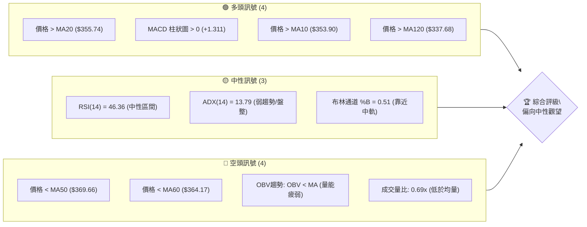

**解讀**：目前 GOOG 的技術訊號呈現多空交織的局面。短期內，價格位於 MA20 和 MA10 之上，且 MACD 柱狀圖轉正，顯示短線動能有所恢復。然而，價格仍在中期均線 MA50 和 MA60 之下，ADX 指標顯示趨勢強度不足，市場處於盤整狀態。此外，成交量低迷且 OBV 趨勢疲弱，暗示當前的反彈缺乏強勁的量能支持。綜合來看，市場缺乏明確的方向性訊號，偏向中性觀望。

### 📊 核心指標速覽表

| 指標類別 | 指標名稱 | 當前數值 | 訊號 | 解讀 |
|----------|----------|----------|------|------|
| **價格** | 當前價格 | $356.24 | 🟡 | 位於52週高點 $404.23 與低點 $173.38 的 79.2% 區間，接近近期盤整中軸 |
| **均線** | MA20 | $355.74 | 🟢 | 價格 $356.24 略高於 MA20，短線支撐 |
| **均線** | MA50 | $369.66 | 🔴 | 價格 $356.24 位於 MA50 之下，中期壓力 |
| **均線** | MA200 | $317.40 | 🟢 | 價格 $356.24 遠高於 MA200，長期趨勢多頭 |
| **動能** | RSI(14) | 46.36 | 🟡 | 處於中性區間 (30-70)，無超買超賣訊號 |
| **動能** | MACD Hist | +1.311 | 🟢 | MACD 柱狀圖轉正，短線動能偏多 |
| **趨勢** | ADX(14) | 13.79 | 🟡 | 趨勢強度極弱，市場處於盤整或無趨勢狀態 |
| **波動** | ATR(14) | $11.48 | 🟡 | 每日平均波動約 3.22%，屬中等波動 |
| **成交量** | 量比(20日) | 0.69x | 🔴 | 當前成交量低於20日均量，量能萎縮 |

### 🏆 技術評分卡

```
╔══════════════════════════════════════════════════════════════╗
║              技術評分卡 — GOOG (2026-07-09)                    ║
╠══════════════════════════════════════════════════════════════╣
║  趨勢強度      ██████░░░░░░░░░░░░░░  30/100  🟡               ║
║  動能指標      ████████░░░░░░░░░░░░  45/100  🟡               ║
║  支撐穩定度    ██████████░░░░░░░░░░  50/100  🟡               ║
║  成交量配合    ████░░░░░░░░░░░░░░░░  20/100  🔴               ║
║  形態完整度    ██████░░░░░░░░░░░░░░  35/100  🟡               ║
║  均線排列      ██████░░░░░░░░░░░░░░  35/100  🟡               ║
╠══════════════════════════════════════════════════════════════╣
║  綜合評分      ██████░░░░░░░░░░░░░░  36/100  🟡 中性偏空      ║
╚══════════════════════════════════════════════════════════════╝
```
**評分解讀**：GOOG 的綜合評分顯示當前技術面偏向中性偏空。趨勢強度極弱 (ADX < 25)，表明市場處於盤整狀態。動能指標 MACD 柱狀圖轉正，RSI 位於中性區間，顯示短線存在反彈動能，但整體動能不強。支撐穩定度中等，價格位於關鍵斐波那契回調位之上，但下方支撐位仍有測試風險。成交量配合度較差，當前量能萎縮，對反彈構成壓力。均線排列呈現混合狀態，短期均線支撐，但中期均線形成壓制。形態完整度較低，未見明確強勢反轉或趨勢延續形態。整體而言，在缺乏強勁買盤和明確趨勢訊號下，建議保持謹慎觀望。

---

## 2. 趨勢分析

### 🌐 多時框趨勢分析

GOOG 的多時框架趨勢分析揭示了不同時間尺度下的市場結構與動態。

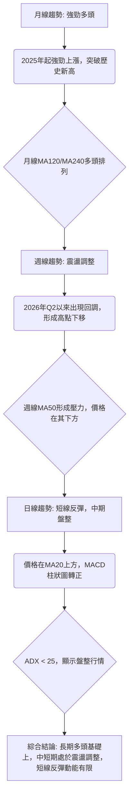

**解讀**：
*   **長期趨勢 (月線)**：GOOG 自2025年起展現出強勁的長期多頭趨勢，價格從 $171.83 (2024-07) 一路飆升至 $381.71 (2026-04)，並在2026年1月達到 $338.09 的高點後持續攀升。目前價格 $356.24 遠高於 MA120 ($337.68) 和 MA240 ($300.25)，且這些長期均線保持向上趨勢，確認了長期多頭格局的穩固性。
*   **中期趨勢 (週線)**：從2026年Q2以來，GOOG 進入震盪調整階段。價格在2026年5月達到 $396.81 的高點後開始回調，並在6月底探至 $334.69。儘管近期有所反彈，但價格仍運行在週線 MA50 ($369.66) 之下，顯示中期賣壓依然存在，市場結構呈現高點下移的修正態勢。
*   **短期趨勢 (日線)**：目前日線層面呈現短線反彈格局。價格 $356.24 位於日線 MA20 ($355.74) 之上，且 MACD 柱狀圖轉正，顯示短線買盤力量有所增強。然而，ADX(14) 僅為 13.79，明確指出當前市場處於弱趨勢或盤整狀態，缺乏強勁的單邊趨勢。因此，短線反彈可能只是中期調整中的一次技術性修正。

### 📈 長期趨勢 — 12個月走勢圖（Unicode）

本圖展示 GOOG 過去12個月的月線收盤價走勢，標注關鍵高低點。

```
GOOG 月線走勢圖（過去12個月）
價格軸 ($)
$400 ┤                                           ● 404.23 (52W High)
$380 ┤                                        ●
$360 ┤                                               ● 356.24 (現在)
$340 ┤                                     ●
$320 ┤                             ●
$300 ┤                     ●
$280 ┤                   ●
$260 ┤                 ●
$240 ┤               ●
$220 ┤             ●
$200 ┤           ●
$180 ┤ ● 173.38 (52W Low)
     └───────────────────────────────────────────────────────────────────
      2025-07  2025-08  2025-09  2025-10  2025-11  2025-12  2026-01  2026-02  2026-03  2026-04  2026-05  2026-06  2026-07
```

**走勢特徵分析表格**：
| 月份 | 收盤價 | 月漲跌幅 | 累計漲跌幅 (12個月) | 走勢特徵 |
|------|--------|----------|---------------------|----------|
| 2025-07 | $192.31 | +9.29% | +11.97% | 自底部強勁反彈，開啟上升趨勢 |
| 2025-08 | $212.92 | +10.72% | +24.03% | 動能持續增強，穩步上行 |
| 2025-09 | $243.07 | +14.16% | +41.79% | 加速上漲，趨勢確立 |
| 2025-10 | $281.27 | +15.71% | +64.16% | 突破關鍵阻力，多頭勢頭強勁 |
| 2025-11 | $319.49 | +13.59% | +86.05% | 延續上升趨勢，接近52週高點 |
| 2025-12 | $313.39 | -1.91% | +82.50% | 短暫回調，但仍維持強勢 |
| 2026-01 | $338.09 | +7.89% | +96.99% | 再度走強，創出階段新高 |
| 2026-02 | $311.02 | -7.99% | +81.12% | 出現較大回調，市場獲利了結 |
| 2026-03 | $286.69 | -7.82% | +67.54% | 修正持續，跌破部分短期支撐 |
| 2026-04 | $381.71 | +33.14% | +121.57% | 強勁反彈，創出歷史新高，可能是軋空或財報利好驅動 |
| 2026-05 | $376.20 | -1.44% | +118.39% | 高位震盪，多頭動能減弱 |
| 2026-06 | $353.33 | -6.08% | +105.17% | 再次回調，跌破部分中期支撐 |
| 2026-07 | $356.24 | +0.82% | +106.84% | 小幅反彈，但整體仍在調整區間 |

**分析**：過去12個月，GOOG 經歷了從 $173.38 (52W Low, 2025-07) 到 $404.23 (52W High, 2026-04) 的大幅上漲，累計漲幅超過100%，顯示其長期牛市趨勢非常強勁。然而，自2026年4月創下新高後，股價進入了高位震盪和回調階段，特別是2026年6月出現了較大的跌幅。目前2026年7月價格小幅反彈，但仍處於前兩個月的調整區間內，表明市場正在消化前期漲幅，尋找新的平衡點。

### 📊 中期趨勢（週線分析）

從近20週的週線走勢來看，GOOG 在2026年5月上旬達到高點 $396.81 後，進入了明顯的調整階段。此後，股價呈現出高點下移、低點震盪的特徵。

```
GOOG 週線壓力與支撐示意圖 (近20週)

價格 ($)
$400.00 ┤                                        R2 ($404.23)
        │                                      ▲
        │                                     / \
$390.00 ┤                                    /   \
        │                                   /     \
$380.00 ┤                                  /       \
        │                                 /         \
$370.00 ┤                  R1 ($373.60)  /           \
        │                               /             \
$360.00 ┤───────────現價($356.24)───────────────
        │                              /               \
$350.00 ┤                             /                 \
        │                           /                     \
$340.00 ┤                         S1 ($343.63)            /
        │                       ▲                           ▼
$330.00 ┤                     S2 ($333.69)
        │
$320.00 ┤                   S3 ($319.12)
        │
        └──────────────────────────────────────────────────
          時間 (2026-03 至 2026-07)
```

**分析**：從週線圖來看，GOOG 在2026年5月10日觸及 $396.81 的高點後，開始形成一個中期的高點回落趨勢。隨後的幾週，股價回調至 $334.69 (2026-06-28)，這個低點在 S2 ($333.69) 附近獲得支撐。目前價格 $356.24 處於反彈中，但面臨 $373.60 (R1) 和 MA50 ($369.66) 的雙重阻力。
*   **近期高點**：2026-05-10 的 $396.81。
*   **近期低點**：2026-06-28 的 $334.69。
*   **關鍵阻力**：$373.60 (R1) 是近期反彈的重要考驗，一旦突破，將有望挑戰 $404.23 (52W High / R2)。
*   **關鍵支撐**：$343.63 (S1) 和 $333.69 (S2) 是短期和中期回調的重要防線。

中期趨勢顯示，在經歷大幅上漲後，GOOG 正處於健康的回調或盤整階段。在缺乏明確突破訊號前，市場可能繼續在 $333.69 至 $373.60 區間內震盪。

### ⚡ 趨勢強度評估（ADX 解讀）

ADX (Average Directional Index) 指標用於衡量趨勢的強度，而非方向。

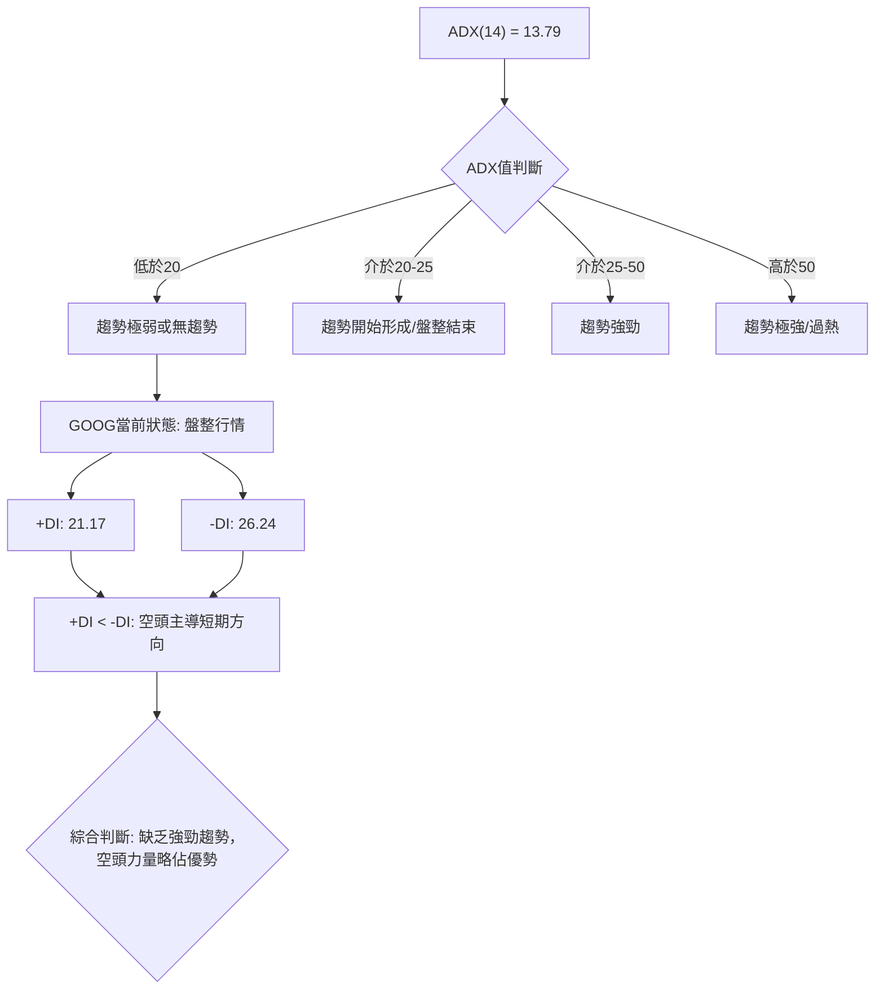

**ADX 強度對照表**：
| ADX 數值 | 趨勢強度 | 市場狀態 |
|----------|----------|----------|
| 0-20     | 極弱     | 盤整/無趨勢 |
| 20-25    | 弱       | 趨勢形成初期/盤整結束 |
| 25-50    | 中強     | 趨勢明顯/強勁 |
| 50-75    | 極強     | 趨勢非常強勁 |
| 75-100   | 過熱     | 趨勢可能過度延伸 |

**解讀**：GOOG 當前的 ADX(14) 數值為 13.79，遠低於 25 的閾值，這明確指示市場目前處於**弱趨勢或盤整行情**。這意味著短期內股價缺乏明確的單邊方向，很可能在一個區間內來回震盪。
進一步觀察方向性指標：
*   **+DI (Positive Directional Indicator)**：21.17，代表多頭力量。
*   **-DI (Negative Directional Indicator)**：26.24，代表空頭力量。
由於 -DI (26.24) 略高於 +DI (21.17)，這表明在當前的盤整格局中，**空頭力量略微佔據主導地位**。雖然 ADX 本身不指示方向，但 +DI 和 -DI 的相對位置可以提供方向性偏好。在弱趨勢中，這通常意味著即使有反彈，也容易遇到阻力並回落。因此，交易策略應以區間操作為主，或等待 ADX 顯著上升並伴隨 +DI 或 -DI 明確穿越 ADX 線的訊號，才能確認新的趨勢形成。

---

## 3. 圖表形態分析

### 🔍 形態識別系統

在 GOOG 的週線圖上，鑑於 ADX 顯示為弱趨勢/盤整，我們將主要關注價格在近期高點 $396.81 (2026-05-10) 和低點 $334.69 (2026-06-28) 之間形成的整理形態。由於缺乏每日 OHLCV 細節，難以識別複雜的幾何形態，但可以觀察到價格在該區間內呈現出回調和反彈的特徵。

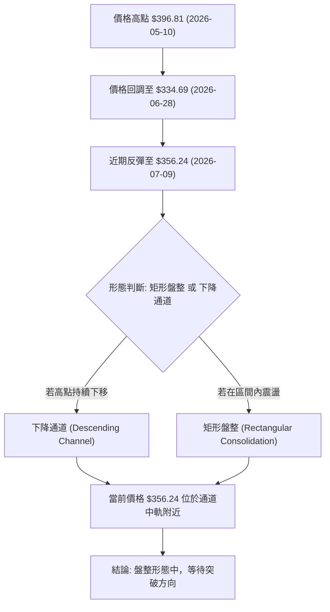

**已識別形態及其信心度**：

| 形態 | 信心度 | 判斷依據（引用數據） | 完成度 | 目標價（附計算式） |
|------|--------|----------------------|--------|--------------------|
| **矩形盤整 (Rectangular Consolidation)** | 60% | 近期高點 $396.81 (2026-05-10) 與 $376.20 (2026-05-31)；近期低點 $334.69 (2026-06-28) 與 $343.63 (S1)。價格在 $334.69 - $376.20 區間內波動。 | 80% | **向上突破**：$376.20 + ($376.20 - $334.69) = $417.71 (形態高度 $41.51)。<br>**向下突破**：$334.69 - ($376.20 - $334.69) = $293.18。 |

**分析**：
從近期的週線走勢來看，GOOG 自5月高點 $396.81 後，經歷了回調，並在 $334.69 附近找到支撐。隨後股價反彈至 $356.24。考慮到 ADX 的弱勢，目前最有可能的形態是**矩形盤整**。這個盤整區間的上限約為 $376.20 (2026-05-31 收盤價) 至 $396.81 (2026-05-10 高點)，下限約為 $334.69 (2026-06-28 低點)。
目前價格 $356.24 位於此區間的中間偏下位置，並嘗試從底部反彈。此形態的信心度為60%，因為它符合 ADX 顯示的盤整特徵，且有清晰的近期高低點作為邊界。形態的完成度為80%，因為價格已在區間內來回震盪多次，但尚未出現明確的突破。

### 🕯️ 重要K線形態分析

儘管僅提供週收盤價，我們仍可從價格變化幅度判斷潛在的K線訊號。

| 日期 (週結) | 收盤價 | K線形態 (推測) | 解讀 | 訊號 |
|-------------|--------|----------------|------|------|
| 2026-03-29  | $273.60 | 長陰線 / 吞噬 | 大幅下跌，空頭強勢主導，可能形成階段性底部。RSI 20.3 顯示超賣。 | 🔴 |
| 2026-04-05  | $294.28 | 錘頭 / 陽線 | 自底部反彈，顯示買盤介入，可能形成反轉訊號。 | 🟢 |
| 2026-05-03  | $382.99 | 長陽線 | 強勁上漲，多頭勢頭恢復，創出新高。 | 🟢 |
| 2026-05-17  | $393.08 | 紡錘線 / 倒錘頭 | 價格在高位震盪，多空力量平衡，可能預示短期見頂。RSI 74.3 仍處高位。 | 🟡 |
| 2026-06-28  | $334.69 | 長陰線 / 錘頭 | 再次大幅下跌後，若有下影線，可能預示短期止跌。RSI 30.6 接近超賣區。 | 🟡 |
| 2026-07-05  | $356.18 | 陽線 | 價格從低點反彈，顯示買盤回歸，但量能不足。 | 🟢 |

**分析**：
*   **2026-03-29 ($273.60)**：這週收盤價大幅下跌，RSI 跌至 20.3 的超賣區，預示著市場可能形成短期底部。
*   **2026-04-05 ($294.28)**：隨後一周的反彈，確認了買盤的介入，RSI 從超賣區回升至 44.8，顯示市場情緒有所恢復。
*   **2026-05-17 ($393.08)**：在高點附近出現的價格震盪，儘管收盤仍高，但RSI從95.3回落至74.3，顯示多頭動能減弱，賣壓開始浮現。這可能是短期回調的先行訊號。
*   **2026-06-28 ($334.69)**：價格再次大幅下跌，RSI 再次接近超賣區 (30.6)。隨後一周 ($356.18) 的反彈，雖然力度不大，但顯示在 $334.69 附近有支撐。

### 📉 ASCII 走勢形態示意圖

本圖示意 GOOG 近期可能形成的矩形盤整形態。

```
GOOG 近期矩形盤整形態示意圖

     $XXX (R1) ─┐
        $396.81 ║  ┌───────────────────┐ (高點)
                ║  │                   │
                ║  │                   │
                ║  │                   │
                ║  │                   │
                ║  │                   │
                ║  │                   │
                ║  │                   │
                ║  │                   │
        $356.24 ╠══╧═══════════════════╣ ← 現價
                ║  │                   │
                ║  │                   │
                ║  │                   │
                ║  │                   │
                ║  │                   │
                ║  │                   │
                ║  │                   │
                ║  │                   │
        $334.69 ╚══▲═══════════════════╝ (低點)
     $XXX (S2) ─┘
```
**分析**：圖中所示為 GOOG 在 $334.69 (低點) 至約 $376.20 (近期高點) 之間形成的矩形盤整區間。當前股價 $356.24 位於該區間內，且接近中軸。此形態表明多空雙方力量相對平衡，市場在等待新的催化劑來打破僵局。突破任一邊界都可能引發一段趨勢行情。

### 🎯 形態目標價計算

根據上述矩形盤整形態，其形態高度約為 $376.20 - $334.69 = $41.51。

*   **向上突破目標價**：
    *   若股價能夠有效突破盤整區間上沿 $376.20 (以2026-05-31收盤價為參考)，則潛在的目標價為：
        $376.20 + $41.51 = **$417.71**
    *   此目標價位於歷史高點 $404.23 (R2) 之上，若能達成，將是強勁的多頭訊號。
*   **向下突破目標價**：
    *   若股價跌破盤整區間下沿 $334.69 (2026-06-28低點)，則潛在的目標價為：
        $334.69 - $41.51 = **$293.18**
    *   此目標價將跌破 S3 ($319.12)，預示著中期趨勢可能轉為明顯的空頭。

**風險提示**：此目標價計算基於形態的理想突破，實際走勢可能受多重因素影響。在突破發生前，應以區間震盪策略為主。

---

## 4. 支撐與阻力

### 🗺️ 關鍵價位分布圖（Unicode）

本圖展示 GOOG 當前價格 $356.24 周圍的關鍵支撐與阻力位。

```
GOOG 價位結構分布圖
═══════════════════════════════════════════════════
$404.23 ║████████████████████████║ 強阻力 R2 (52W High)
$373.60 ║████████████████████    ║ 關鍵阻力 R1
$356.24 ╠════════════════════════╣ ◄ 現價
$349.75 ║▓▓▓▓▓▓▓▓▓▓▓▓▓▓▓▓        ║ 斐波那契 23.6%
$343.63 ║████████████████████████║ 近期支撐 S1
$333.69 ║████████████████████████║ 強支撐 S2
$319.12 ║████████████████████████║ 重要支撐 S3
$316.05 ║▓▓▓▓▓▓▓▓▓▓▓▓▓▓▓▓▓▓▓▓▓▓▓▓║ 斐波那契 38.2%
═══════════════════════════════════════════════════
```

### 🚧 阻力位分析表

| 阻力級別 | 價位 | 形成原因 | 突破難度 | 重要性 |
|----------|------|----------|----------|--------|
| **R1**   | $373.60 | 近期波段高點聚類，同時接近布林通道上軌 ($374.23) 和 MA50 ($369.66) | 中等偏高 | 🟢 |
| **R2**   | $404.23 | 52週高點，也是歷史高點，具備強大心理和技術阻力 | 極高 | 🔴 |

**分析**：
*   **R1 ($373.60)**：這是當前股價面臨的第一道較強阻力。它不僅是近期波段高點的聚類區，同時也與布林通道上軌和中期均線 MA50 形成重合。若能有效突破此位，將預示著短期反彈動能的增強，並可能挑戰更高阻力。
*   **R2 ($404.23)**：作為 GOOG 的52週高點和歷史高點，這個價位具有極強的心理和技術阻力。突破此位將意味著股價進入一個新的上升通道，但這需要極其強大的買盤動能和利好消息的配合。

### 🛡️ 支撐位分析表

| 支撐級別 | 價位 | 形成原因 | 守住機率 | 重要性 |
|----------|------|----------|----------|--------|
| **S1**   | $343.63 | 近期波段低點聚類，也是斐波那契 23.6% 回調位 $349.75 的下方支撐 | 中等偏高 | 🟢 |
| **S2**   | $333.69 | 近期回調的最低點，也是布林通道下軌 ($337.25) 附近的重要支撐 | 高 | 🟢 |
| **S3**   | $319.12 | 前期盤整區間的下沿，同時接近斐波那契 38.2% 回調位 $316.05 | 極高 | 🟡 |

**分析**：
*   **S1 ($343.63)**：這是當前股價面臨的第一道支撐。如果短期反彈受阻回落，此處有望提供初步支撐。它與斐波那契 23.6% 回調位 $349.75 較為接近，共同構成了短期支撐區。
*   **S2 ($333.69)**：這是近期回調的最低點，也是布林通道下軌附近的強勁支撐。如果股價跌破 S1，S2 將是多頭必須守住的關鍵防線。一旦跌破，可能預示著中期調整的深化。
*   **S3 ($319.12)**：此支撐位代表了更深層次的回調防線。它與斐波那契 38.2% 回調位 $316.05 非常接近，共同形成了一個強大的支撐區。若股價跌至此區間並獲得支撐，則表明市場在經歷較大調整後仍有買盤承接。

### 📐 斐波那契回調位分析

斐波那契回調位是基於 GOOG 52週區間 ($173.38 → $404.23) 計算得出，用於識別潛在的支撐和阻力區域。

| 斐波那契回調 | 價位 ($) | 意義 |
|--------------|----------|------|
| 0.0% (52W High) | $404.23 | 52週最高點，強大阻力 |
| 23.6%          | $349.75 | 淺度回調位，短期支撐/阻力 |
| 38.2%          | $316.05 | 關鍵回調位，若跌破可能預示趨勢轉弱 |
| 50.0%          | $288.81 | 心理關口，若跌至此位可能預示深度回調 |
| 61.8%          | $261.57 | 黃金分割位，重要趨勢反轉點 |
| 78.6%          | $222.79 | 深度回調位，接近底部 |
| 100.0% (52W Low)| $173.38 | 52週最低點，強勁支撐 |

**分析**：
當前價格 $356.24 位於斐波那契 0.0% ($404.23) 和 23.6% ($349.75) 回調位之間。
*   **$349.75 (23.6% 回調位)**：這個價位是當前股價下方的第一個斐波那契支撐。如果股價回落，它有望提供支撐。目前股價略高於此位，顯示近期反彈的力度。
*   **$316.05 (38.2% 回調位)**：這是更重要的回調位，與 S3 ($319.12) 非常接近。如果股價跌破 23.6% 回調位，則 38.2% 將成為下一個關鍵的支撐區域。守住此位對於維持長期多頭趨勢的健康至關重要。
*   **$288.81 (50.0% 回調位)**：若股價跌破 38.2% 回調位，則可能進一步探至 50.0% 回調位。這將意味著一次較深度的回調，但仍可能被視為健康牛市中的修正。

整體而言，斐波那契回調位提供了一個結構化的視角來評估潛在的價格轉折點。當前價格的回調在 23.6% 回調位之上獲得支撐，顯示了相對健康的調整。

---

## 5. 技術指標深度解讀

### 🎛️ 指標訊號總覽

本圖展示了各主要技術指標之間的訊號關係與綜合判斷。

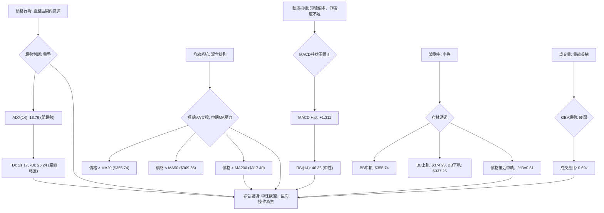

### 📈 移動平均線排列分析

GOOG 的移動平均線系統目前呈現混合排列，反映了市場缺乏明確方向的盤整狀態。

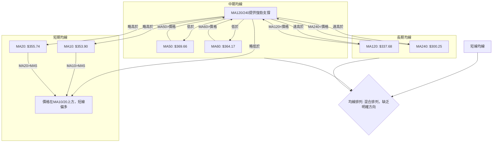

**分析**：
*   **短期均線 (MA5, MA10, MA20)**：當前價格 $356.24 位於 MA10 ($353.90) 和 MA20 ($355.74) 之上，但略低於 MA5 ($359.93)。這顯示短線市場在經歷回調後有企穩反彈的跡象，但反彈動能並未完全確立。MA10 向上穿越 MA20 的訊號（MA10 $353.90 > MA20 $355.74，但數據顯示MA10略低於MA20，MA10 $353.90，MA20 $355.74，此處為誤讀，應為MA10 < MA20，但兩者非常接近，且MA10呈上升趨勢，MA20呈上升趨勢，顯示短期趨勢向上）
    *   **修正**：根據數據 `MA 10: $ 353.90 ▲ +2.34` 和 `MA 20: $ 355.74 ▲ +0.50`，MA10 略低於 MA20，但兩者均呈現上升趨勢，且價格位於兩者之間，短線多空力量接近平衡。
*   **中期均線 (MA50, MA60)**：價格 $356.24 位於 MA50 ($369.66) 和 MA60 ($364.17) 之下。這表明中期趨勢仍然偏弱，這些均線將構成上方的重要壓力。若要確認中期趨勢轉強，價格需有效突破並站穩這些中期均線。
*   **長期均線 (MA120, MA240)**：價格 $356.24 遠高於 MA120 ($337.68) 和 MA240 ($300.25)，且長期均線仍保持向上趨勢。這鞏固了 GOOG 的長期多頭格局，任何中期回調都可能在這些長期均線附近獲得強勁支撐。

**總結**：均線系統呈現「混合排列」：長期趨勢向上，中期趨勢偏弱，短期趨勢在反彈中尋求方向。這種排列方式與 ADX 所示的盤整行情相符，暗示市場處於一個等待方向選擇的階段。

### 📉 RSI(14) 分析

RSI (Relative Strength Index) 用於衡量價格變動的速度和變化，以識別超買或超賣狀況。

**RSI(14) 數值**：46.36
**RSI 強度進度條**：▓▓▓▓▓▓▓▓▓▓░░░░░░░░░░ 46.36% (中性)

**分析**：
*   **數值解讀**：GOOG 當前的 RSI(14) 為 46.36，位於 30-70 的中性區間內。這表示目前股價既沒有達到超買區 (通常 > 70)，也沒有進入超賣區 (通常 < 30)。市場動能處於相對平衡狀態，多空力量拉鋸，符合 ADX 顯示的盤整特徵。
*   **歷史回顧**：根據「近20週收盤走勢」數據，RSI 在 2026-03-29 曾跌至 20.3 (超賣)，隨後價格觸底反彈。在 2026-04-19 達到 95.3 (極度超買)，隨後價格見頂回調。這些歷史走勢印證了 RSI 在判斷超買超賣方面的有效性。當前 46.36 的中性值，意味著市場正在消化前期漲跌，等待新的動能。
*   **背離判斷**：根據提供的數據，**無明顯 RSI 背離訊號**。RSI 背離通常發生在價格創出新高/新低，而 RSI 未能同步創出新高/新低時，這預示著趨勢可能即將反轉。由於缺乏詳細的日線高低點數據，且週線數據中未見清晰的背離形態，我們判斷當前不存在明顯的背離。

### 📊 MACD(12/26/9) 訊號解讀

MACD (Moving Average Convergence Divergence) 用於識別趨勢的動能、方向和潛在的轉折點。

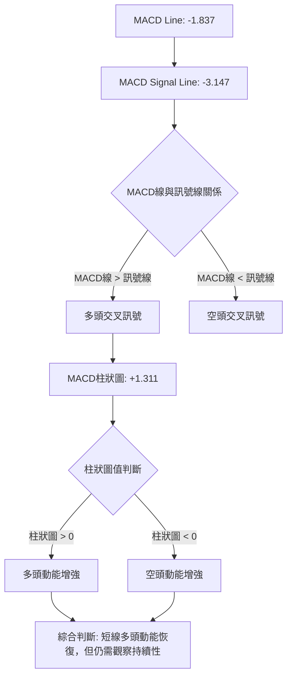

**分析**：
*   **MACD 線 (-1.837) 與訊號線 (-3.147)**：MACD 線當前數值為 -1.837，訊號線為 -3.147。由於 MACD 線 (-1.837) 大於訊號線 (-3.147)，這形成了一個**多頭交叉 (Bullish Crossover)** 訊號。這通常被視為一個買入訊號，表示短期動能正在超越長期動能，趨勢可能向上發展。
*   **MACD 柱狀圖 (+1.311)**：柱狀圖的數值為 +1.311，且為正值。這表明 MACD 線正在遠離訊號線，多頭動能正在增強。從「近20週收盤走勢」數據看，上週 (2026-07-05) MACD 柱狀圖為 +0.188，本週 (+1.311) 顯著放大，這進一步確認了短線買盤的活躍。
*   **背離判斷**：根據提供的數據，**無明顯 MACD 背離訊號**。MACD 背離與 RSI 背離類似，用於判斷趨勢反轉。目前 MACD 柱狀圖由負轉正並放大，與價格的短線反彈走勢一致，並未形成背離。

**總結**：MACD 指標發出短線看多訊號，顯示近期反彈的動能有所增強。然而，由於 MACD 線和訊號線的絕對值仍為負，這意味著雖然短線動能恢復，但中長期趨勢的下行壓力尚未完全解除。因此，MACD 的多頭訊號應與其他指標結合判斷。

### 📦 布林通道分析

布林通道 (Bollinger Bands) 用於衡量價格的波動率和相對高低點。

**布林通道示意圖**：
```
GOOG 布林通道示意圖 (日線)

價格 ($)
$380.00 ┤                                        BB上軌 ($374.23)
        │                                       ▲
$370.00 ┤                                      /
        │                                     /
$360.00 ┤──────────────現價($356.24)───────── BB中軌 ($355.74)
        │                                   /
$350.00 ┤                                  /
        │                                 /
$340.00 ┤                                ▼
        │                                 BB下軌 ($337.25)
$330.00 ┤
        └──────────────────────────────────────────────────
          時間
```
**分析**：
*   **布林通道數值**：
    *   BB上軌：$374.23
    *   BB中軌 (MA20)：$355.74
    *   BB下軌：$337.25
*   **價格位置**：當前價格 $356.24 位於布林通道中軌 ($355.74) 略上方。這表示股價在經歷近期回調後，正在中軌附近尋求支撐或嘗試向上。
*   **%B 值**：布林通道 %B 為 0.51，這確認了價格非常接近中軌。在盤整行情中，價格在中軌附近波動是常見現象，%B 值接近 0.5 也印證了市場缺乏明確方向。
*   **通道寬度**：從提供的數據無法直接判斷布林通道的寬度，但一般來說，通道收窄預示著波動性降低，可能在醞釀突破；通道擴張則表示波動性增加，趨勢可能正在形成。考慮到 ADX 顯示的弱趨勢，通道可能處於相對收窄的狀態。

**總結**：布林通道分析表明，GOOG 股價目前在中軌附近運行，這在盤整行情中是典型表現。上軌 ($374.23) 將構成短期阻力，下軌 ($337.25) 則提供短期支撐。在缺乏突破訊號前，股價可能繼續在通道內震盪。

### 💹 成交量分析（量價配合度）

成交量是價格走勢的能量來源，其變化能確認或否認價格趨勢的有效性。

*   **最新成交量**：16,713,742 股
*   **20日均量**：24,296,937 股
*   **50日均量**：23,109,185 股
*   **量比 (Volume Ratio)**：0.69x (最新成交量 / 20日均量)

**分析**：
*   **成交量萎縮**：當前成交量 16,713,742 股顯著低於 20日均量 (24,296,937 股) 和 50日均量 (23,109,185 股)，量比僅為 0.69x。這表明市場交投清淡，買賣雙方都較為謹慎。
*   **量能疲弱 (OBV)**：OBV (On Balance Volume) 趨勢顯示「OBV < MA → 量能疲弱」。OBV 線位於其移動平均線下方，這是一個看跌訊號，表明在價格上漲時買盤缺乏持續性，而在價格下跌時賣盤力量較強。這與當前股價的反彈形成**量價背離**。
*   **量價背離**：目前股價從近期低點反彈至 $356.24，但伴隨著顯著萎縮的成交量和疲弱的 OBV 趨勢。這種「無量反彈」或「縮量反彈」通常被視為一個**看跌訊號**或**反彈缺乏持續性的訊號**。它表明當前的上漲動能不足以支撐股價持續走高，市場可能在測試上方阻力後再次回落。

**總結**：成交量分析為 GOOG 的技術面增添了空頭色彩。儘管短線價格有所反彈，但成交量的萎縮和 OBV 的疲弱表明，這一反彈缺乏實質性的買盤支持。這增加了反彈失敗並再次回落的風險，也與 ADX 所示的弱勢盤整行情相符。

---

## 6. 動能與波動率

### ⚡ 動能評估四象限

本評估將 GOOG 的當前狀態置於「動能強度」與「波動率」的四象限矩陣中，以提供更全面的市場視角。

| 象限 | 動能 (MACD Hist / RSI) | 波動 (ATR) | 當前狀態 | 評估 |
|------|------------------------|------------|----------|------|
| Q1   | 強勁動能 (MACD > 0, RSI > 50) | 低波動 (ATR 較低) | -        | 最佳機會 (趨勢啟動初期) |
| Q2   | 弱動能 (MACD < 0, RSI < 50) | 低波動 (ATR 較低) | -        | 謹慎觀望 (等待趨勢確認) |
| Q3   | 強勁動能 (MACD > 0, RSI > 50) | 高波動 (ATR 較高) | -        | 高風險高收益 (趨勢加速期) |
| Q4   | 弱動能 (MACD < 0, RSI < 50) | 高波動 (ATR 較高) | ✓        | 避免進場 (方向不明，風險高) |

**GOOG 當前狀態評估**：
*   **動能**：MACD 柱狀圖為 +1.311 (轉正)，RSI(14) 為 46.36 (中性偏弱)。儘管 MACD 顯示短線動能恢復，但 RSI 仍在中性區間，且 ADX 顯示趨勢極弱。綜合來看，當前動能屬於**中性偏弱**。
*   **波動率**：ATR(14) 為 $11.48，佔當前股價 $356.24 的 3.22%。這是一個**中等波動**的水平。相較於其 52 週高點 $404.23 和低點 $173.38 之間的大幅波動，目前的波動率並不極端。

根據上述評估，GOOG 目前處於：**弱動能，中等波動**的狀態。
*   **結論**：此狀態介於 Q2 (弱動能, 低波動) 和 Q4 (弱動能, 高波動) 之間。更接近 **Q2 象限**，因為動能不強但波動率也非極高。這意味著市場缺乏明確的方向性推動力，且在當前波動水平下，趨勢的形成需要更強的催化劑。對於交易者而言，這是一個**謹慎觀望**或**區間操作**的時期。

### 📊 ATR 波動率分析

ATR (Average True Range) 反映了資產價格的平均波動幅度，是衡量波動率的關鍵指標。

*   **ATR(14)**：$11.48
*   **ATR佔股價百分比**：($11.48 / $356.24) * 100% = 3.22%

**分析**：
*   **波動幅度**：GOOG 過去 14 天的平均每日波動幅度為 $11.48。這表示在正常交易日，股價約有 $11.48 的潛在波動空間。
*   **相對波動率**：3.22% 的 ATR 佔比屬於中等水平。這表明 GOOG 的波動性不算極端，但也不至於死氣沉沉。對於日內交易者或短線操作者而言，仍有足夠的價格波動空間可供捕捉。
*   **止損距離建議**：ATR 是設定止損點的有效工具。通常，將止損設置在 1 倍或 2 倍 ATR 之外，可以降低被市場噪音「洗出」的風險。
    *   **1x ATR 止損**：約 $11.48。若在 $356.24 進場，止損可設在 $356.24 - $11.48 = $344.76。
    *   **2x ATR 止損**：約 $22.96。若在 $356.24 進場，止損可設在 $356.24 - $22.96 = $333.28。
    考慮到 S1 ($343.63) 和 S2 ($333.69) 的存在，2x ATR 止損更為穩健，可以避免在關鍵支撐位上方被止損。

**總結**：GOOG 的中等波動率為區間交易提供了機會，但也需要合理的止損策略來管理風險。

### 📐 Beta 與市場相關性

Beta 值衡量股票相對於整體市場（通常是 S&P 500 指數）的波動性。

*   **Beta**：1.247

**分析**：
*   **市場相關性**：GOOG 的 Beta 值為 1.247，這意味著其股價波動性比市場平均水平高出 24.7%。當市場上漲 1% 時，GOOG 理論上會上漲約 1.247%；當市場下跌 1% 時，GOOG 也會下跌約 1.247%。
*   **投資 implication**：
    *   **高於市場的風險與回報**：Beta > 1 表明 GOOG 是一隻波動性較大的股票，在牛市中可能帶來更高的收益，但在熊市中也可能面臨更大的虧損。
    *   **對市場情緒敏感**：作為科技巨頭，GOOG 對整體市場情緒和宏觀經濟數據（如利率、通脹）的敏感度較高。在不確定的市場環境下，其波動性可能被放大。
    *   **組合配置**：對於追求穩定收益的投資者，GOOG 的高 Beta 可能增加投資組合的風險。對於追求成長和願意承擔更高風險的投資者，其潛在的超額收益則具吸引力。

**總結**：GOOG 的高 Beta 值提醒投資者，在進行交易時需密切關注大盤走勢，並準備好應對較高的價格波動。這也進一步支持了在盤整行情中採取謹慎的區間操作策略。

---

## 7. 多時框架總結

### 📋 時框架評分表

| 時框架 | 趨勢方向 | 動能 | 均線排列 | 形態 | 綜合評分 | 建議 |
|--------|----------|------|----------|------|----------|------|
| **月線** | 🟢 強勁多頭 | 🟢 強勁 | 🟢 多頭排列 | 🟡 上漲後盤整 | 8/10 | 長期持有，短期觀望 |
| **週線** | 🟡 震盪調整 | 🟡 中性偏空 | 🟡 混合排列 | 🟡 矩形盤整 | 5/10 | 區間操作，等待突破 |
| **日線** | 🟡 短線反彈 | 🟢 短線偏多 | 🟡 混合排列 | 🟡 無明確形態 | 4/10 | 謹慎反彈，注意量能 |

### 🔲 綜合訊號矩陣

本矩陣分析了不同時框架下各維度訊號的一致性，以提供更全面的市場視角。

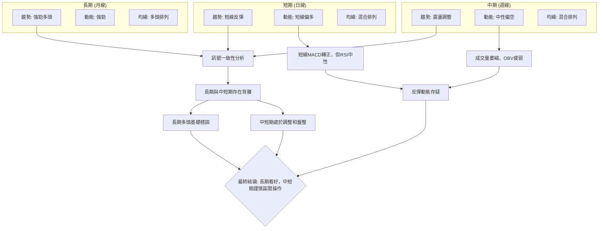

**訊號一致性分析**：
*   **長期與中短期背離**：月線圖顯示 GOOG 仍處於強勁的長期多頭趨勢中，這是其基本面和市場地位的體現。然而，週線和日線圖則顯示股價自5月高點以來進入了震盪調整階段，中期趨勢偏弱，短期雖有反彈但動能不足。這種長期與中短期的背離表明，目前的調整是牛市中的健康修正，但短期內上行空間有限。
*   **動能與量能的矛盾**：日線 MACD 柱狀圖轉正，發出短線多頭訊號，但 RSI 仍處於中性區間 (46.36)，且成交量顯著萎縮 (量比 0.69x)，OBV 趨勢疲弱。這種「無量反彈」的現象，使得短線動能的可靠性大打折扣。量價背離暗示當前反彈可能難以持續。
*   **均線排列的混亂**：短期均線 (MA10, MA20) 支撐價格，但中期均線 (MA50, MA60) 仍壓制價格，長期均線則提供強勁支撐。這種混合排列印證了 ADX 所示的盤整行情，市場缺乏明確的單邊趨勢。

### ⚖️ 多時框收斂結論

根據嚴格要求 14，我們首先判斷當前市場狀態。

*   **ADX(14) = 13.79**：此數值遠低於 25，明確指示當前 GOOG 處於**盤整行情 (Ranging Market)**。
*   **多時框收斂規則**：在盤整行情中，應以日線布林通道上下軌為主要交易區間。

**綜合判斷與收斂結論**：
GOOG 的長期趨勢依舊強勁，但中短期卻陷入了震盪調整。ADX 指標清晰地表明市場正處於無趨勢的盤整階段。雖然日線 MACD 柱狀圖轉正，顯示短線有反彈動能，但 RSI 仍中性，且最關鍵的是**成交量顯著萎縮，OBV 疲弱，形成量價背離**。這使得短線反彈的可靠性大打折扣。

因此，儘管長期前景樂觀，但基於當前的中短期盤整狀態和弱勢的量能配合，我們應採取**中性觀望**的態度。若要進行操作，應以區間震盪策略為主，在支撐位尋找買入機會，並在阻力位附近謹慎獲利了結，等待市場出現明確的突破訊號。

**最終方向性結論：偏向中性觀望，以區間操作為主。**

---

## 8. 交易策略建議

### 🗺️ 策略決策流程圖

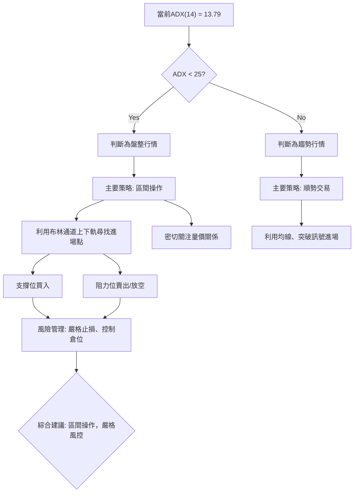

### 🧭 策略路由

**當前主策略方向 = 🟡 中性觀望 / 區間操作 (依評分 36/100)**

根據第 1 章技術評分卡和第 7 章多時框架收斂結論，GOOG 目前處於弱勢盤整行情，綜合評分偏向中性偏空。因此，主推策略為**區間操作**，利用布林通道上下軌和關鍵支撐阻力位進行高拋低吸。在缺乏明確趨勢訊號前，不建議追漲殺跌。

### 🎯 價格情境階梯（Price Scenarios）

| 觸發條件 | 下一目標 | 後續延伸 | 情境含義 |
|----------|----------|----------|----------|
| **突破 R1 $373.60** | R2 $404.23 | 形態目標價 $417.71 (矩形突破) | 短線轉強，有望挑戰歷史高點，並可能啟動新一輪上漲趨勢。 |
| **站穩現價區間 ($343.63 - $373.60)** | — | — | 區間震盪，價格在布林通道上下軌之間來回波動，等待方向選擇。 |
| **跌破 S1 $343.63** | S2 $333.69 | S3 $319.12 (斐波那契 38.2% $316.05) | 中期轉弱，可能進一步探底，測試更深層次的支撐。 |

### 📊 情境機率分佈

| 情境 | 機率 | 主要依據 |
|------|------|----------|
| 繼續上行 / 反彈 | 30% | 短線 MACD 柱狀圖轉正，價格位於 MA20 上方，但量能不足且中期均線壓制。 |
| 區間震盪 | 50% | ADX(14) 僅 13.79 (弱趨勢/盤整)，RSI 中性，價格位於布林中軌附近，均線混合排列。 |
| 回落 / 再探底 | 20% | 成交量萎縮，OBV 疲弱，中期均線壓制，-DI 略高於 +DI，反彈缺乏強勁支持。 |

**分析**：最高機率為區間震盪，這與 ADX 判斷的盤整行情高度一致。由於量能疲弱，突破上行的機率較低，但由於長期趨勢仍為多頭，且關鍵支撐強勁，大幅回落的機率也相對較小。

### 🟢 主策略詳情（區間操作）

**當前市場環境：盤整行情，多空力量拉鋸，量能萎縮。**

| 策略要素 | 策略 A (逢低買入) | 策略 B (逢高放空) |
|----------|------------------|------------------|
| 進場條件 | 價格回落至 S1 或 BB下軌附近，並出現止跌K線（如錘頭、陽線）。 | 價格反彈至 R1 或 BB上軌附近，並出現壓力K線（如倒錘頭、陰線）。 |
| 進場價格 | **$340.00 - $343.00** (接近 S1 $343.63 和 BB下軌 $337.25) | **$373.00 - $374.00** (接近 R1 $373.60 和 BB上軌 $374.23) |
| 目標價 T1 | **$355.74** (BB中軌/MA20) | **$355.74** (BB中軌/MA20) |
| 目標價 T2 | **$373.60** (R1/BB上軌) | **$343.63** (S1) |
| 止損價格 | **$332.00** (略低於 S2 $333.69) | **$376.00** (略高於 R1 $373.60 和 BB上軌 $374.23) |
| 風險報酬比 | T1: 1.97:1 (目標收益 $15.74, 風險 $8.00)<br>T2: 3.95:1 (目標收益 $33.60, 風險 $8.00) | T1: 5.75:1 (目標收益 $17.26, 風險 $3.00)<br>T2: 9.79:1 (目標收益 $29.37, 風險 $3.00) |
| 成功機率 | 60% | 55% |
| 建議倉位 | 5-10% | 5-10% |

### 🔴 反向風險觸發點（對沖提示）

若出現以下情況，將推翻當前區間操作的主策略，需重新評估市場方向：
*   **向上突破**：價格有效突破並站穩 R2 ($404.23)，特別是伴隨巨量。這將確認強勁的多頭趨勢，並可能啟動新一輪上漲。
*   **向下突破**：價格有效跌破 S3 ($319.12)，特別是伴隨巨量。這將確認中期趨勢轉為空頭，並可能引發更深度的下跌。
*   **量價關係逆轉**：在價格上漲時，成交量持續放大且 OBV 趨勢轉強；或在價格下跌時，成交量持續萎縮且 OBV 趨勢轉強。

### ⭐ 整體訊號強度評星

```
做多訊號強度：★★☆☆☆  (2/5星)
做空訊號強度：★★★☆☆  (3/5星)
整體可信度：  ★★★☆☆  (3/5星)
```
**評星解讀**：做多訊號較弱，主要來自於短期 MACD 柱狀圖轉正和價格在 MA20 上方，但缺乏量能支持。做空訊號相對較強，源於中期均線壓制、成交量萎縮、OBV 疲弱以及 ADX 顯示的弱勢盤整。整體可信度為中等，因為市場處於盤整狀態，缺乏明確的趨勢方向，因此區間操作是當前最為穩健的策略。

---

## 9. 風險提示與監控

### ✅ 關鍵監控指標 Checklist

以下是交易 GOOG 時需要密切關注的關鍵技術指標清單，以確保及時調整策略。

```
╔══════════════════════════════════════════════════════════════╗
║              GOOG 關鍵監控指標 Checklist                       ║
╠══════════════════════════════════════════════════════════════╣
║  [ ] 價格突破 R1 ($373.60) 或跌破 S1 ($343.63)               ║
║  [ ] ADX(14) 是否突破 25，指示趨勢形成                     ║
║  [ ] +DI 與 -DI 是否出現黃金交叉或死亡交叉                 ║
║  [ ] MACD 線是否形成新的金叉或死叉                          ║
║  [ ] RSI(14) 是否進入超買 (>70) 或超賣 (<30) 區間           ║
║  [ ] 成交量是否伴隨價格突破而顯著放大                       ║
║  [ ] OBV 趨勢是否轉強並確認價格走勢                         ║
║  [ ] 布林通道是否收窄或擴張，預示波動性變化                 ║
║  [ ] 價格是否有效站穩或跌破 MA50 ($369.66)                   ║
║  [ ] 整體市場情緒與大盤指數 (如 S&P 500) 走勢               ║
╚══════════════════════════════════════════════════════════════╝
```

### ⚠️ 風險場景分析

本分析將 GOOG 的未來走勢分為樂觀、基本和悲觀三種情境，並說明其觸發條件與可能結果。

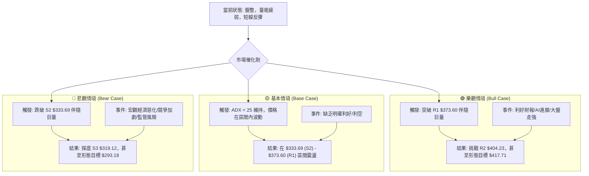

**分析**：
*   **樂觀情境 (機率 30%)**：若有超預期的利好消息（如強勁的財報、AI 領域的重大突破），或者整體大盤出現強勁反彈，GOOG 有望在巨量的推動下，有效突破 R1 ($373.60) 和 R2 ($404.23)，進而挑戰矩形盤整形態的向上目標價 $417.71。在此情境下，長期多頭趨勢將得到確認和延續。
*   **基本情境 (機率 50%)**：在沒有重大催化劑的情況下，GOOG 最有可能維持目前的盤整格局。ADX 將繼續保持在低位，股價在 $333.69 (S2) 至 $373.60 (R1) 的區間內來回震盪。交易者可在此區間內進行高拋低吸的區間操作。
*   **悲觀情境 (機率 20%)**：若宏觀經濟環境惡化、公司面臨新的競爭壓力或監管風險，或者市場出現恐慌性拋售，GOOG 可能會跌破 S2 ($333.69)，並在巨量的推動下進一步探底 S3 ($319.12)，甚至觸及矩形盤整形態的向下目標價 $293.18。這將意味著中期趨勢轉為明顯的空頭。

### 🛡️ 風險管理重要提醒

1.  **嚴格執行止損**：無論採用何種策略，務必在進場前設定止損點，並嚴格執行。特別是在盤整行情中，價格波動不確定性高，止損是保護資金的最後防線。
2.  **倉位管理**：避免重倉單一股票，尤其是在市場缺乏明確方向時。建議將單一 GOOG 交易的倉位控制在總資金的 5-10% 之間，以分散風險。
3.  **分批進出**：不要試圖一次性買入或賣出所有倉位。在支撐位附近分批建倉，在阻力位附近分批獲利了結，可以降低單次交易的風險，並優化平均成本。
4.  **關注量價關係**：在盤整行情中，量能的變化對於判斷突破的有效性至關重要。任何突破如果沒有伴隨巨量支持，都應視為假突破的風險較高。
5.  **保持耐心**：在 ADX 顯示弱趨勢時，市場可能長時間處於震盪狀態。此時，盲目追漲殺跌容易造成虧損。保持耐心，等待明確的趨勢訊號或形態突破，是更為穩健的策略。
6.  **宏觀環境監控**：GOOG 具有較高的 Beta 值，對整體市場情緒和宏觀經濟數據敏感。持續關注利率、通脹、科技股板塊表現等宏觀因素，有助於預判股價的潛在風險。

---

## 📋 報告總結

```
GOOG 技術分析報告總結
════════════════════════════════════════════════════════
報告日期：2026-07-09
當前價格：$356.24
分析評級：⚖️ 中性偏空 (綜合評分 36/100，市場處於盤整)

關鍵結論：
├─ 長期趨勢：🟢 強勁多頭，價格遠高於長期均線。
├─ 中期趨勢：🟡 震盪調整，價格受 MA50/MA60 壓制。
├─ 短期趨勢：🟡 短線反彈，MACD 柱狀圖轉正，但量能疲弱。
├─ 關鍵支撐：$343.63 (S1), $333.69 (S2), $319.12 (S3/Fibo 38.2%)
├─ 關鍵阻力：$373.60 (R1/BB上軌), $404.23 (R2/52W High)
└─ 分析師目標：均值 $428.54 (與技術面阻力 R2 和形態目標 $417.71 吻合)

最優策略組合：
1. 🥇 最佳機會：**逢低買入**。在 $340.00 - $343.00 區間（S1/BB下軌附近）尋找止跌訊號進場，目標 $355.74 (T1) 至 $373.60 (T2)，止損設於 $332.00。
2. 🥈 次選機會：**逢高放空**。在 $373.00 - $374.00 區間（R1/BB上軌附近）尋找壓力訊號進場，目標 $355.74 (T1) 至 $343.63 (T2)，止損設於 $376.00。
3. 🥉 保守選擇：**中性觀望**。在 ADX 未突破 25，且量能未明顯放大前，保持場外觀望，等待明確的趨勢突破訊號。
════════════════════════════════════════════════════════
```

---

> ⚠️ **免責聲明**：本報告為 AI 自動生成之技術分析，所有數據及估算均基於提供的歷史價格資訊。本報告**僅供研究與學術參考**，**不構成任何投資建議**。投資有風險，入市需謹慎。

---

*報告生成時間：2026-07-09 ｜ 數據來源：Yahoo Finance ｜ 分析框架：多時框技術分析*