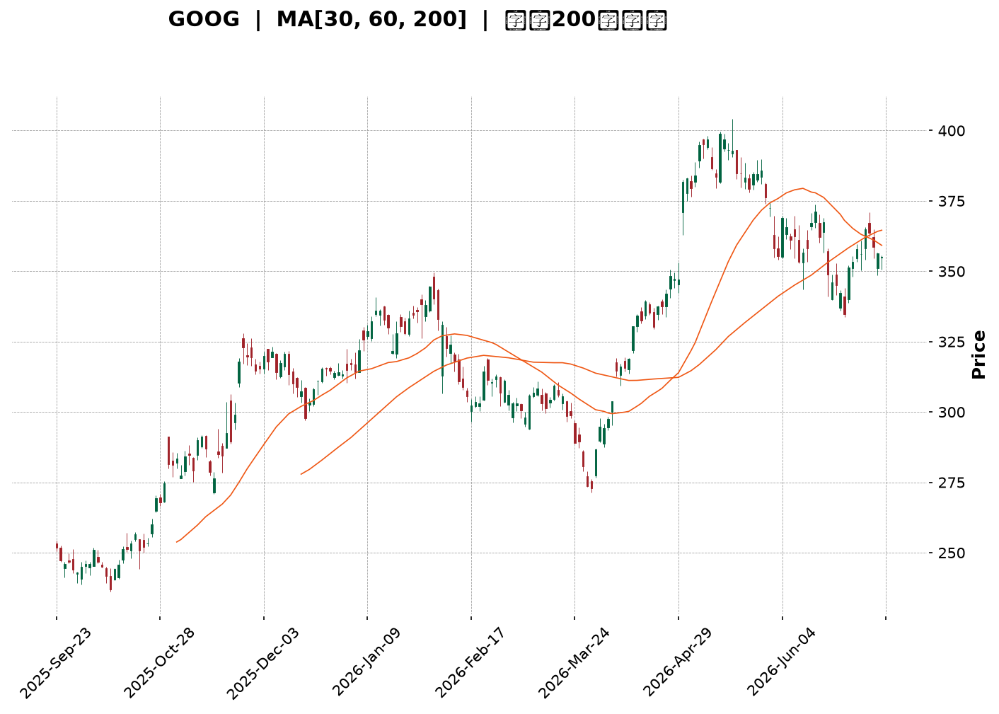
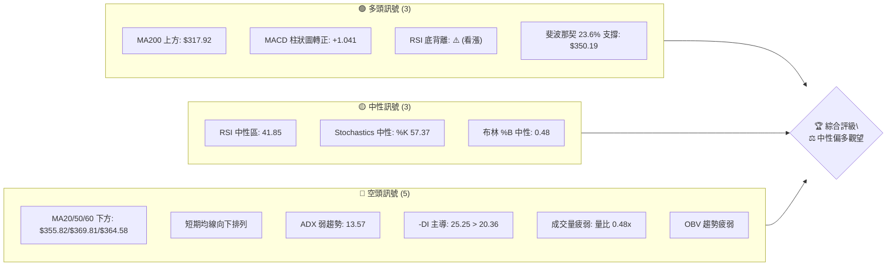
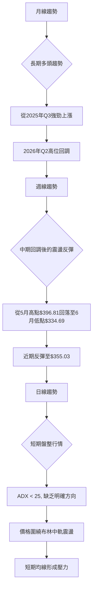
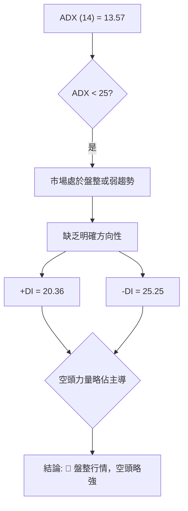
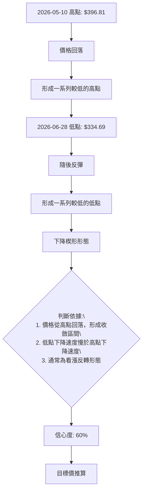
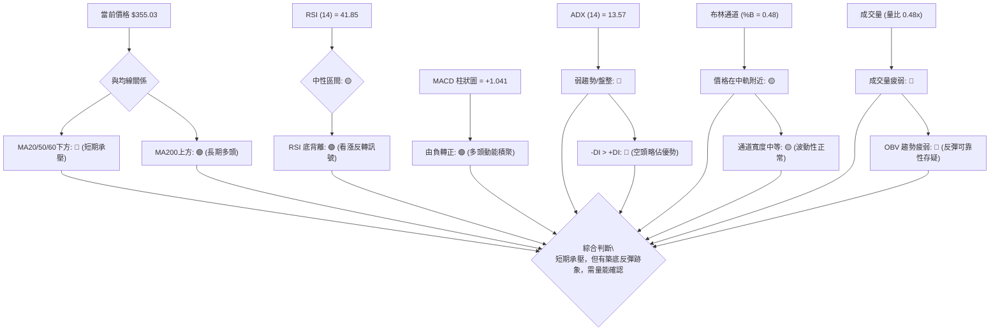
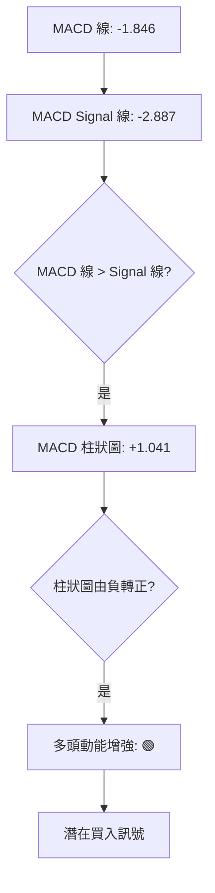
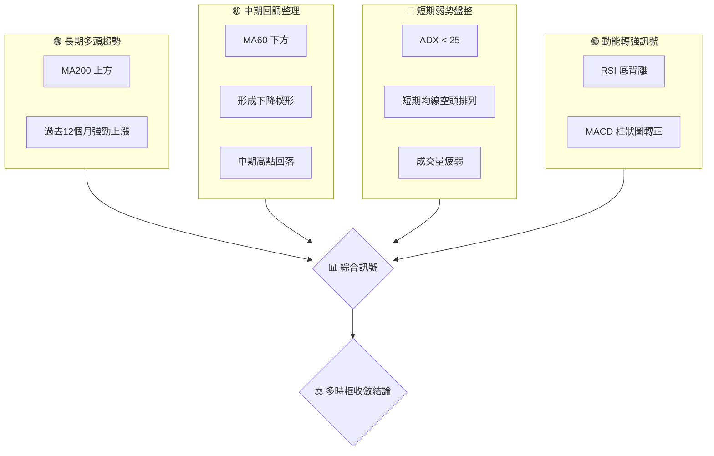
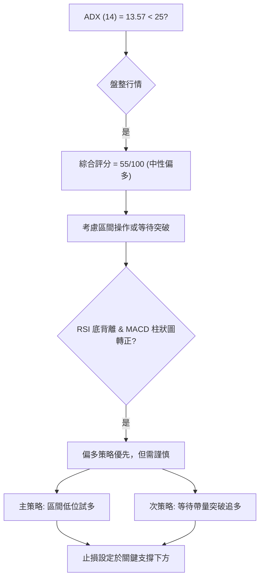
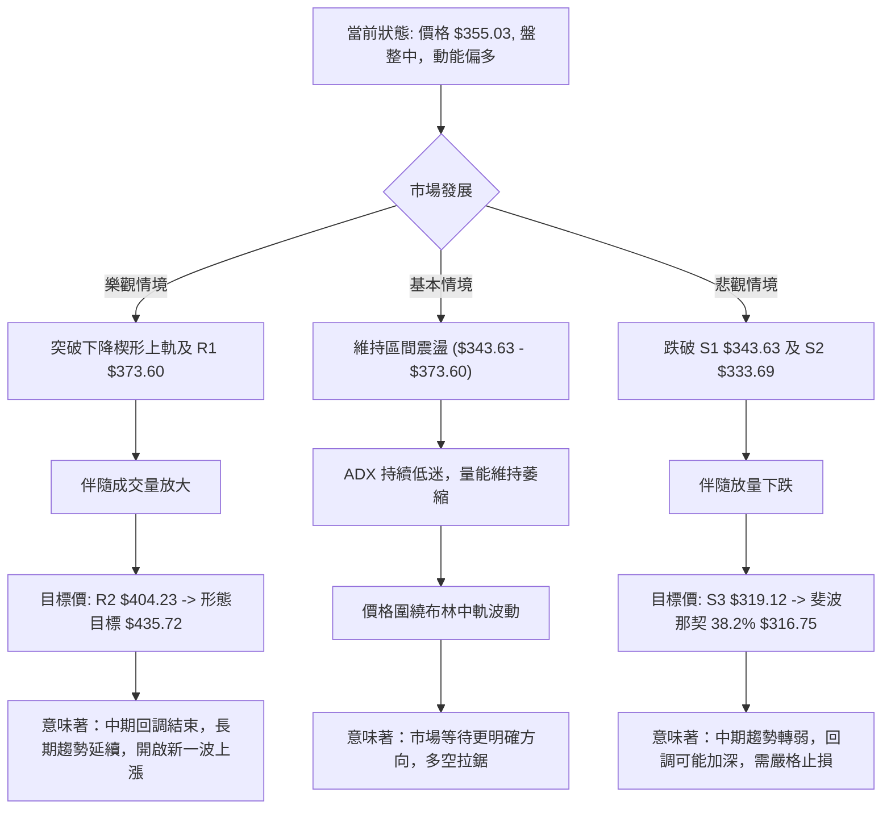

<details>
<summary>📊 靜態圖表 (點擊展開)</summary>

</details>

<html>
<head><meta charset="utf-8" /></head>
<body>
    <div style="height:500px; width:100%;">                        <script>window.PlotlyConfig = {MathJaxConfig: 'local'};</script>
        <script charset="utf-8" src="https://cdn.plot.ly/plotly-3.7.0.min.js" integrity="sha256-jvTGqxNp8AGWEcvNLVuKr+8j5dGe9Yw51LQkmDH+IYA=" crossorigin="anonymous"></script>                <div id="candlestick-chart" class="plotly-graph-div" style="height:100%; width:100%;"></div>            <script>                window.PLOTLYENV=window.PLOTLYENV || {};                                if (document.getElementById("candlestick-chart")) {                    Plotly.newPlot(                        "candlestick-chart",                        [{"close":{"dtype":"f8","bdata":"AAAAYBV7b0AAAADgC+tuQAAAAEDOwm5AAAAAgEnWbkAAAABAOXxuQAAAAMBaYm5AAAAA4OihbkAAAACAVb5uQAAAAAD5vm5AAAAAYJNgb0AAAACgsNRuQAAAAMBan25AAAAA4I43bkAAAABA0KBtQAAAAIAqhW5AAAAAYKu2bkAAAACg9mZvQAAAAIBkbG9AAAAAoGSpb0AAAACARghwQAAAAIAlW29AAAAA4CaBb0AAAAAgeqdvQAAAAIABQHBAAAAAYG7WcEAAAABger5wQAAAAIAbKnFAAAAAoJOVcUAAAADATJRxQAAAAAAHuXFAAAAA4EFYcUAAAABgFsNxQAAAAGCCzHFAAAAAIHJycUAAAABgWCByQAAAAGC1MnJAAAAAIOLtcUAAAAAAL2lxQAAAAOACR3FAAAAAQKnQcUAAAADgcMZxQAAAAGCrRnJAAAAAwJoWckAAAABgBbFyQAAAAGCN3XNAAAAAQBwwdEAAAACgdPpzQAAAAGDm93NAAAAAoA6oc0AAAADAbbZzQAAAAIDi\u002f3NAAAAAQEbcc0AAAADAWxd0QAAAAGCioHNAAAAAgF3Vc0AAAAAgTAl0QAAAAGCmlHNAAAAAANZhc0AAAABAqU5zQAAAACBBNXNAAAAAgLyackAAAABgqPVyQAAAAOBQQ3NAAAAAYMduc0AAAADgSbRzQAAAAAAhtHNAAAAAgMioc0AAAAAArZ9zQAAAAGA7onNAAAAAYD+Wc0AAAABAia5zQAAAAIB+znNAAAAAYDuic0AAAADAJSB0QAAAAEBaWXRAAAAAIF6LdEAAAACAu8R0QAAAAODa\u002f3RAAAAAAPD9dEAAAACAmst0QAAAAOCKnnRAAAAAQNUbdEAAAABAOX90QAAAACCIpnRAAAAAwAWAdEAAAACAedJ0QAAAAEAB6XRAAAAAYHX9dEAAAAAgfSN1QAAAAGBpIXVAAAAAwDKHdUAAAAAgFkR1QAAAAMB6znRAAAAAgFyudEAAAACg2ip0QAAAAGCgP3RAAAAAYG3jc0AAAABgx25zQAAAAMB1T3NAAAAAIO4Zc0AAAAAAzOZyQAAAAKCx+HJAAAAAAJ\u002fyckAAAAAg06dzQAAAACCIdHNAAAAAYDpoc0AAAACg8YlzQAAAAKD8K3NAAAAAgGBwc0AAAADgXB9zQAAAAACf8nJAAAAAQN3wckAAAADgRshyQAAAAECSnnJAAAAAIDcdc0AAAAAg7StzQAAAAIDAQ3NAAAAAIHHwckAAAACAddRyQAAAAGDKA3NAAAAAIJVTc0AAAAAg2iFzQAAAAOC8GHNAAAAAwMOpckAAAABAca1yQAAAAMBqEHJAAAAAIKcWckAAAABgI4lxQAAAAICGGXFAAAAAoJwPcUAAAADA\u002f+pxQAAAAOCPa3JAAAAAoIZkckAAAAAAspdyQAAAAID0+3JAAAAAoM+oc0AAAAAg4MJzQAAAAEB7uHNAAAAAwEnwc0AAAABAGaZ0QAAAACBN5HRAAAAAAB7JdEAAAABAIjN1QAAAACAs83RAAAAAAFekdEAAAAAgbhh1QAAAAOC\u002fGHVAAAAAYNNhdUAAAABA98R1QAAAAOCntHVAAAAAIJ6xdUAAAABAXdt3QAAAAADV73dAAAAAQJa2d0AAAAAgnwB4QAAAAABwrnhAAAAA4P6weEAAAACg+sx4QAAAAACZKHhAAAAAIG35d0AAAADAzOx4QAAAAODlznhAAAAAwFWReEAAAAAA+o14QAAAACCyCnhAAAAAILIKeEAAAABg1PN3QAAAAOBtsndAAAAAgLwJeEAAAACAkwl4QAAAAEA0HnhAAAAA4EGDd0AAAADAsUV3QAAAAIDKYnZAAAAAAHU3dkAAAAAgxBB3QAAAAOCj2HZAAAAAYLiSdkAAAADgo6R2QAAAAMAeFXZAAAAAwPVIdkAAAABgj2J2QAAAAIDC8XZAAAAAoJkxd0AAAACgmaF2QAAAACBc93ZAAAAA4HrMdUAAAACgR6F1QAAAAOCjkHVAAAAAQApjdUAAAABACut0QAAAAOB69HVAAAAAoEcVdkAAAACAPV52QAAAAEDhQnZAAAAAYGbOdkAAAACA67l2QAAAACBca3ZAAAAAANdDdkAAAADgejB2QA=="},"high":{"dtype":"f8","bdata":"n83SDrHIb0CSJIqq4o5vQIc0wk+Z2m5AeWMd4y40b0A6pK+1+2RvQAWqM79YZm5AMGAuM1TVbkADv6aQ0eRuQE0Zl4tO1G5ABhdM0Zx2b0Ayhd1q2mFvQF4yfWfX2G5Au\u002fc6ZWOibkAwsZ+WjYtuQIHEICRYkG5A7aNDOEbxbkC2JG1Mf4hvQLVs17M3EXBAYM1RiDTMb0BZ9u47AhZwQGTfKIIs3G9AF2O9jdQKcEAb9Or9gOtvQFBQR3nxX3BA5W1q51LkcECQ9bX8le1wQDFPAtfhNnFAHRo6Ir41ckCrQbyZmdtxQIPc0SoX1nFAdiIEA4aUcUDzGAUAOuJxQP6jcrLrA3JAJaAjahi\u002fcUCKYYvnPC5yQP+cPDFKPHJAmrox35s8ckBbF\u002f9SSa9xQOo4Cb2paXFAqZ1KBxpfckBpxdWk5g1yQPY+DCd6+nJAfqiKo6Ikc0C\u002f8iGX2PVyQPL661fK8nNA93kh0m6AdEAWTdcCq0V0QIXf+zTZY3RAzN8nfRPwc0DTgtbToN9zQFZaO3+PFnRASQBdhHgndECI9sDOJDN0QGZjBQL5DHRAM8epf7Dkc0CwY3r5Mhd0QDAwp88dGXRAueZUlaO7c0D1MI6uq4RzQI7yvyACd3NAUjSa+qlMc0BHVLhNyQ1zQEGt\u002f1djSXNA\u002fdqgBbF0c0CDiZ0PMr5zQNirli8JvnNAFHF3klnCc0B+OlqG8ahzQNEUfQmR1HNAAL4voKevc0C3lUeo4Sd0QJ5w4W5V7XNAq2x25z4SdEAHSneOn2B0QPbUtOi8oXRAIDTqPcKwdEA\u002fkPF7DuB0QE6lhGATTHVAYoy2RnEJdUDh5u4OBRt1QCAe7Q7X7HRAoXcGzZZ6dEBQ0XImp8R0QNUQ6ENc7HRAiLk3cYHZdECmgz2\u002fk\u002f50QLcfbbBgHHVArIasyAcTdUDYAa84fl11QHvYqveIPXVA8ENZ1W6LdUA\u002fAc+8Ftt1QAc3Lc7PfHVA\u002fMbSuVvDdED0aawyVqN0QCSZmSX\u002fdHRApNrsVl0TdEB49jQxBAp0QJ0DPV4SwXNA9vu1aMpHc0CN+kGv3wdzQCGHTDgsGHNADzDJ6xYac0A0yrzOi8VzQB6YHP6b8HNAjobNv2V\u002fc0AF1uXBApRzQFdJKPt2iXNA\u002fEGEZsN6c0AU2CdczjtzQCns9Xex+HJABZ+aYfsQc0DD6KjZle9yQHNIKUYCv3JA9A766gwlc0AA++\u002fHbE9zQPo4ODkcbnNAj3NUH0VHc0DPXEoWNDFzQP6usOotFnNAl2Fh7NBdc0C3XV5pAmlzQJdJ0qjtJ3NAx1+uoP0Cc0A1vK4oAPNyQDpzbqm9jnJAIbskYrlnckD9hdSle+VxQGMBJ\u002f7AbnFAO0pfcIBBcUDicCmICe5xQMz9ZGbknHJA+Tq7U417ckCazX997aNyQJMBx3Ss\u002fnJAMIliqyrzc0CRIIJD09NzQKp+0c\u002fs9HNAFDRBVc7zc0AZsiT6Dqd0QCZZvbHG7HRAtyxTRNUSdUAF2xDvfDx1QB\u002f6v9xLL3VAN7aIvnkPdUB7d88iOh11QGF3+U9JP3VAUtjuf7t3dUC6iPTiBet1QPVYU1YI23VA5dYvv\u002f8SdkB6x83MZeZ3QHTdxfSM8ndA6ZHQ0C7\u002fd0AQGOjRnUt4QOY17\u002fFDwnhAxYbqL9vReEApNYkfFuJ4QHsA6B98oXhAEW+JK1IjeEDFwKzuB\u002ft4QFtbOrzS7XhA0LhtMUW6eEAtlzGjoEN5QJWnecYFknhAEcL+tXBneECB1QmqI0d4QFQ0n1k3CnhAVPcZBYgSeEBE5pxw2Vd4QOSk8DA\u002fXHhAZ3zVI7rWd0COagfG\u002fmV3QDYhqckUGXdA2kHD8oKkdkAquORLMxp3QFVYXKalD3dAAAAAgBS2dkAAAABgEht3QAAAAMD15HZAAAAAAClgdkAAAABAXsx2QAAAAGBmKndAAAAAoJlZd0AAAABgZiJ3QAAAAAAAEHdAAAAAQDNjdkAAAAAghct1QAAAAKBHDXZAAAAAQApzdUAAAACA64F1QAAAACCF\u002f3VAAAAAgD02dkAAAADA9Xh2QAAAAADXj3ZAAAAAQOHadkAAAACAPS53QAAAACCuz3ZAAAAAIK5LdkAAAABgZjp2QA=="},"hovertemplate":"\u003cb\u003e%{x|%Y-%m-%d}\u003c\u002fb\u003e\u003cbr\u003e\u958b: $%{open:.2f}\u003cbr\u003e\u9ad8: $%{high:.2f}\u003cbr\u003e\u4f4e: $%{low:.2f}\u003cbr\u003e\u6536: $%{close:.2f}\u003cextra\u003e\u003c\u002fextra\u003e","low":{"dtype":"f8","bdata":"EBYpaClTb0D9VHuGkNduQA0CsFesJW5AHzk8hwrFbkDhac4WLVduQPJsaING421AqGcDOW3XbUDSvlNoJFRuQOFtl6fcP25Astg+RLOmbkB2M9ZAeMpuQK3o+o2Jk25AIh5bi8HmbUC6noyGGodtQEwvafbtCG5A8Y\u002fmUJkWbkByY1m41MluQJ0sFYS\u002fRW9ACkyMlFEDb0APyb9HQ8NvQLdQLsMfhm5AtlcKEcE+b0ByXXLqwIhvQJk7BO0q829APJ\u002fBW7+GcEDqr5CYW6pwQE4\u002fmmF6vnBArLA8Hmx+cUCGWq2trk9xQCUW9gslfXFAUDYcsyxFcUCxqSPsYVVxQAoNWA4bkXFAqKLmmjUzcUC8n0wcxK9xQC6tzM0R9XFA\u002fadi0C29cUD262J5TFdxQBP57cAQ7nBAQtsjusi6cUAPRKVsbWdxQNHwiGC38XFAqxpnfasJckC1ihzji1xyQMgpd0y3THNAeYqWyhvTc0BIOq+tRclzQFiEN5sexXNAuzFQYtqVc0C4Fihsr5lzQLORw6ykmnNAHTu8z4+vc0Bi1zcoqvVzQOtV1RMMeHNApZQCbGSDc0DyUS5v0K9zQKqEdAucV3NAO7OkR\u002fMoc0DP4yejdBVzQH9PE3nv9nJA67i3Qv2QckC+iF2NzcNyQNtC5YMg33JAFZmRtgkjc0AztxH6gmVzQF5mye+TjnNAvFreIPiUc0CRe1Ev43dzQAol6ZJ1jXNAT29tba58c0AJ04HW6WNzQFsiGrJmrXNA5DgqEOt+c0DqhXjjbqFzQKNbY70dGXRAYvy8EjBddEBrBUr4XFF0QCbRVV6e3nRAM0HfYlOrdEDEBPL+uK10QD3AXjnee3RA18vuKYoHdEAlelng9\u002fFzQLd0I3o2h3RAUjJuFax4dEAnRip7AHF0QKwxke4H1XRApXzILiW7dEC97sGysmR0QAQ+o3tLw3RAAxY75ST5dEB4J0\u002fHXiJ1QIc4wtgKj3RAIBjKu08oc0BJxaEkt\u002ftzQLgVJxCR1HNAIkxieP2jc0DryiWqmltzQAxjhSX3O3NAfyL29A34ckCG4VtFM4hyQKgCAfpf2XJASLT2EnHEckDUauYkXQBzQOjfW\u002fZdWXNARjmJcQwbc0CRHxHeTE9zQPd19PU+4HJAHGVB5x3zckBlr6h0rMpyQMgLUQ39hHJAw\u002f826oTGckCdOlpu5ZpyQEP8lc3VbXJA4NyHIg1cckCX5KmdBRJzQCWNRxt\u002fGnNADm68dovKckDAbXdjmLlyQPQdKC4O2nJAO\u002fEx16sCc0Am7ymcxxVzQMjMV2cazXJAnSSk5iSJckCOjFWwnJ1yQFwYmHnmCnJAeF0+eCfzcUBIGdhJHW5xQPxnm1AMFXFAFZ8zdPL1cEBGtz4if0lxQFXXhQC8FHJAxbTLOVr2cUBkDe8I0FlyQAJY3fP0c3JA+qloQ0WIc0BZOYK\u002filRzQIiTQ+icpXNAWS04eQWYc0CYaAQ7Tw90QMTaQbBlh3RApxpqQjW3dEBD\u002f1vNbtF0QGDzlyXc5nRABbPBceiWdEC2xD\u002fgJ8x0QFn9n0C87XRAo+D3v5XddEBi6Jwerkl1QGI62q4qgXVA7mmzpZVjdUDyRgQR8q12QKFOWXyMcHdAihgDsrGId0D\u002fl2yI8MF3QIWP2+7fLXhA9t0jKzRheEC3npWT7pZ4QPd6kJT2H3hA3Z3smd23d0CuaUaEm9V3QPDxllHeh3hAapJDxWhYeEBTqNlRo2p4QLXmTW5Q7HdAa6te0le8d0AmjIA0B7R3QMY5WSKFoHdAotj\u002fapeud0Bm6u3YUtx3QO+Gbr9U0HdAbJ5bnzJhd0CgAQdSzRd3QImzMFqVLHZAiBfgc6sidkBM6yCmYil2QJRs1IyZlnZAAAAAgD1edkAAAAAghSt2QAAAAMD1DHZAAAAAgBR6dUAAAACgcBV2QAAAAGBmynZAAAAAwB7VdkAAAAAgroN2QAAAAGC6SXZAAAAAQApPdUAAAACgcDt1QAAAAAAAWHVAAAAAYGb+dEAAAABACtt0QAAAAMD1LHVAAAAAgMLBdUAAAAAgrhN2QAAAAMAe5XVAAAAAQAojdkAAAABguKZ2QAAAAEAzK3ZAAAAAYI\u002fKdUAAAABAM+t1QA=="},"name":"\u50f9\u683c","open":{"dtype":"f8","bdata":"+kYqzRSlb0C2dI4FBHVvQK2lIrmNi25AiUYKDpzpbkCpYhsjQvluQG0BMXq0Um5Ab2JWnqkWbkDVydWIGqVuQKFT80wCmG5ATCsKE5OpbkBZNYNHLQ5vQLg7KuT8tm5A3E3xU5SSbkBz0U4J9jVuQEUCvTnfEW5ALejP8QYpbkB14o63MPNuQCXXDmATf29A+FnXWXdbb0D320YPYtdvQN3FfpcF2G9A3CXcQVvQb0Bq+BDbhKZvQGu46fi+DHBA2VtDPnSNcEC3kDMxvtpwQBqSYzBawXBAL2n3sGMyckBjGDyHaqpxQIQh\u002fH7hnXFA+SrcWF5IcUALNUDnVW1xQJzBzxXR0nFAxCUD3Xa6cUCsUB\u002fqT8txQGBVYv0t+nFArMhIszc4ckCle\u002fMH56ZxQMmtJl7P9XBAur0Pl2\u002fdcUCzyIEBu\u002f5xQMaFzKH08XFAF06AXU0Cc0Aad3bGoIRyQNw3\u002fQVtZnNA3FoNLpJidEDmu2WecAJ0QGShGZrBLHRArYJy4anNc0BjZOwye8RzQEprHqeWtnNAneQa05smdEAr8Tbf+\u002fVzQJp4udPGCXRAVBIn+w+Lc0Baz7MJT8NzQLBBizHlCnRAaZ7ipSWmc0D7JDXVeINzQO\u002fdeD+cGXNAbdbBN7VJc0Dy\u002fjDQoepyQLSJScv87XJAZdOp7xltc0D1cTvrqWtzQA3YL2\u002fMu3NAGkBBnh+4c0AWrmGkloZzQL729RcEkHNA5VdobGCPc0BQrrf9ztJzQLDC03581HNA0dYvn1XOc0DnEqxDjaJzQPdkiFldjXRAsuDqcQBxdEA8uIatLmF0QPtesqV67XRA8xo31cPodEAg6ZQ10hl1QJr7RXD353RArxMByyENdEBM8ozQ0Ap0QEToDbFC3XRAlc2zyojDdEAqrJTvWHx0QFcS3mES83RAiqpzPLsCdUCodWRXfj51QAiTP2Fg4HRAJmxQwsUBdUC8\u002fhWa9sB1QN3SjfPmdHVAglnvCamMc0Bdk4now250QIPMGeQhDXRAoxMlENwHdEAfEoMWs+hzQIeH+vETf3NAvc0iP1Q5c0Dx\u002fkBn9sNyQL4Ege+Y4HJAPlBCrwDickDJkPB8bwZzQPB7IY2T63NAVJIo\u002f8Bjc0CLDEEdZ3tzQHXF\u002fkVZhnNAJAyribH4ckD7es0lHelyQGzFGhp9oHJA98fS1qPkckDGPkWC3uxyQNwzx0j4enJAd207YVRfckC2Dld5DhtzQBzWJhnaIXNAcNbsu2kgc0DsSNVzhydzQJdPL6Wt9nJAWitgzckHc0CMaLdLhDtzQD9kcRVx8HJA5XTinTH+ckBpmLeHlsVyQOi5xFqCgHJAaZ1OkZY\u002fckDBvs4ySeBxQDO4G+i6U3FAXraCtWM0cUAd+UgW+FVxQOQ+4L7jHHJA+3sn+g4NckAn5PYqXWhyQPA3OxZav3JAMhU+ozjac0BOnnm1BpBzQBzFAJSJ4HNAiQ0tVq+zc0Bnw\u002ffZ8B10QGpr92HHpXRAPklXKV76dEByBmleqeN0QLPMJLezJXVAuA4nZiH2dECHvjgC8Op0QAv476DuNXVA1dZCFUUYdUCiAGROxXp1QKgPzK1hq3VADNEgAluUdUBlSDXTgTB3QKKj2egKnHdAmI7V5XDhd0BpWrupPtp3QCPOacywVXhAfXP6iSPNeECbjjWZhqB4QA5VpbdHZ3hAV5zDd0sMeEDiD0n3zdp3QAnJxrPZmHhAKco64qePeEAC7jvtOX54QBdvOM4DkXhAUsKxR+8MeEA\u002ffNLYe9x3QAs8\u002ftB48HdAQ3AO2UDMd0B1VGt2juh3QImOWtEQ+ndAidPdb+7Pd0BHHyNjnUV3QKZ8ap8Qr3ZAdxuMVelhdkDJz3mSnjN2QIzzFj2VsnZAAAAAgMKndkAAAAAAKc52QAAAAMDMkHZAAAAAwMwQdkAAAACgmZF2QAAAAADX33ZAAAAAoHD3dkAAAADAzPB2QAAAAIA9vnZAAAAAAClSdkAAAAAgrkF1QAAAACCFy3VAAAAAYLgOdUAAAAAgrk91QAAAAEAzP3VAAAAAIFzvdUAAAAAA1yl2QAAAAGBmQnZAAAAAwB5jdkAAAACAwvN2QAAAACBco3ZAAAAAIFzxdUAAAACgQy92QA=="},"x":["2025-09-23T00:00:00-04:00","2025-09-24T00:00:00-04:00","2025-09-25T00:00:00-04:00","2025-09-26T00:00:00-04:00","2025-09-29T00:00:00-04:00","2025-09-30T00:00:00-04:00","2025-10-01T00:00:00-04:00","2025-10-02T00:00:00-04:00","2025-10-03T00:00:00-04:00","2025-10-06T00:00:00-04:00","2025-10-07T00:00:00-04:00","2025-10-08T00:00:00-04:00","2025-10-09T00:00:00-04:00","2025-10-10T00:00:00-04:00","2025-10-13T00:00:00-04:00","2025-10-14T00:00:00-04:00","2025-10-15T00:00:00-04:00","2025-10-16T00:00:00-04:00","2025-10-17T00:00:00-04:00","2025-10-20T00:00:00-04:00","2025-10-21T00:00:00-04:00","2025-10-22T00:00:00-04:00","2025-10-23T00:00:00-04:00","2025-10-24T00:00:00-04:00","2025-10-27T00:00:00-04:00","2025-10-28T00:00:00-04:00","2025-10-29T00:00:00-04:00","2025-10-30T00:00:00-04:00","2025-10-31T00:00:00-04:00","2025-11-03T00:00:00-05:00","2025-11-04T00:00:00-05:00","2025-11-05T00:00:00-05:00","2025-11-06T00:00:00-05:00","2025-11-07T00:00:00-05:00","2025-11-10T00:00:00-05:00","2025-11-11T00:00:00-05:00","2025-11-12T00:00:00-05:00","2025-11-13T00:00:00-05:00","2025-11-14T00:00:00-05:00","2025-11-17T00:00:00-05:00","2025-11-18T00:00:00-05:00","2025-11-19T00:00:00-05:00","2025-11-20T00:00:00-05:00","2025-11-21T00:00:00-05:00","2025-11-24T00:00:00-05:00","2025-11-25T00:00:00-05:00","2025-11-26T00:00:00-05:00","2025-11-28T00:00:00-05:00","2025-12-01T00:00:00-05:00","2025-12-02T00:00:00-05:00","2025-12-03T00:00:00-05:00","2025-12-04T00:00:00-05:00","2025-12-05T00:00:00-05:00","2025-12-08T00:00:00-05:00","2025-12-09T00:00:00-05:00","2025-12-10T00:00:00-05:00","2025-12-11T00:00:00-05:00","2025-12-12T00:00:00-05:00","2025-12-15T00:00:00-05:00","2025-12-16T00:00:00-05:00","2025-12-17T00:00:00-05:00","2025-12-18T00:00:00-05:00","2025-12-19T00:00:00-05:00","2025-12-22T00:00:00-05:00","2025-12-23T00:00:00-05:00","2025-12-24T00:00:00-05:00","2025-12-26T00:00:00-05:00","2025-12-29T00:00:00-05:00","2025-12-30T00:00:00-05:00","2025-12-31T00:00:00-05:00","2026-01-02T00:00:00-05:00","2026-01-05T00:00:00-05:00","2026-01-06T00:00:00-05:00","2026-01-07T00:00:00-05:00","2026-01-08T00:00:00-05:00","2026-01-09T00:00:00-05:00","2026-01-12T00:00:00-05:00","2026-01-13T00:00:00-05:00","2026-01-14T00:00:00-05:00","2026-01-15T00:00:00-05:00","2026-01-16T00:00:00-05:00","2026-01-20T00:00:00-05:00","2026-01-21T00:00:00-05:00","2026-01-22T00:00:00-05:00","2026-01-23T00:00:00-05:00","2026-01-26T00:00:00-05:00","2026-01-27T00:00:00-05:00","2026-01-28T00:00:00-05:00","2026-01-29T00:00:00-05:00","2026-01-30T00:00:00-05:00","2026-02-02T00:00:00-05:00","2026-02-03T00:00:00-05:00","2026-02-04T00:00:00-05:00","2026-02-05T00:00:00-05:00","2026-02-06T00:00:00-05:00","2026-02-09T00:00:00-05:00","2026-02-10T00:00:00-05:00","2026-02-11T00:00:00-05:00","2026-02-12T00:00:00-05:00","2026-02-13T00:00:00-05:00","2026-02-17T00:00:00-05:00","2026-02-18T00:00:00-05:00","2026-02-19T00:00:00-05:00","2026-02-20T00:00:00-05:00","2026-02-23T00:00:00-05:00","2026-02-24T00:00:00-05:00","2026-02-25T00:00:00-05:00","2026-02-26T00:00:00-05:00","2026-02-27T00:00:00-05:00","2026-03-02T00:00:00-05:00","2026-03-03T00:00:00-05:00","2026-03-04T00:00:00-05:00","2026-03-05T00:00:00-05:00","2026-03-06T00:00:00-05:00","2026-03-09T00:00:00-04:00","2026-03-10T00:00:00-04:00","2026-03-11T00:00:00-04:00","2026-03-12T00:00:00-04:00","2026-03-13T00:00:00-04:00","2026-03-16T00:00:00-04:00","2026-03-17T00:00:00-04:00","2026-03-18T00:00:00-04:00","2026-03-19T00:00:00-04:00","2026-03-20T00:00:00-04:00","2026-03-23T00:00:00-04:00","2026-03-24T00:00:00-04:00","2026-03-25T00:00:00-04:00","2026-03-26T00:00:00-04:00","2026-03-27T00:00:00-04:00","2026-03-30T00:00:00-04:00","2026-03-31T00:00:00-04:00","2026-04-01T00:00:00-04:00","2026-04-02T00:00:00-04:00","2026-04-06T00:00:00-04:00","2026-04-07T00:00:00-04:00","2026-04-08T00:00:00-04:00","2026-04-09T00:00:00-04:00","2026-04-10T00:00:00-04:00","2026-04-13T00:00:00-04:00","2026-04-14T00:00:00-04:00","2026-04-15T00:00:00-04:00","2026-04-16T00:00:00-04:00","2026-04-17T00:00:00-04:00","2026-04-20T00:00:00-04:00","2026-04-21T00:00:00-04:00","2026-04-22T00:00:00-04:00","2026-04-23T00:00:00-04:00","2026-04-24T00:00:00-04:00","2026-04-27T00:00:00-04:00","2026-04-28T00:00:00-04:00","2026-04-29T00:00:00-04:00","2026-04-30T00:00:00-04:00","2026-05-01T00:00:00-04:00","2026-05-04T00:00:00-04:00","2026-05-05T00:00:00-04:00","2026-05-06T00:00:00-04:00","2026-05-07T00:00:00-04:00","2026-05-08T00:00:00-04:00","2026-05-11T00:00:00-04:00","2026-05-12T00:00:00-04:00","2026-05-13T00:00:00-04:00","2026-05-14T00:00:00-04:00","2026-05-15T00:00:00-04:00","2026-05-18T00:00:00-04:00","2026-05-19T00:00:00-04:00","2026-05-20T00:00:00-04:00","2026-05-21T00:00:00-04:00","2026-05-22T00:00:00-04:00","2026-05-26T00:00:00-04:00","2026-05-27T00:00:00-04:00","2026-05-28T00:00:00-04:00","2026-05-29T00:00:00-04:00","2026-06-01T00:00:00-04:00","2026-06-02T00:00:00-04:00","2026-06-03T00:00:00-04:00","2026-06-04T00:00:00-04:00","2026-06-05T00:00:00-04:00","2026-06-08T00:00:00-04:00","2026-06-09T00:00:00-04:00","2026-06-10T00:00:00-04:00","2026-06-11T00:00:00-04:00","2026-06-12T00:00:00-04:00","2026-06-15T00:00:00-04:00","2026-06-16T00:00:00-04:00","2026-06-17T00:00:00-04:00","2026-06-18T00:00:00-04:00","2026-06-22T00:00:00-04:00","2026-06-23T00:00:00-04:00","2026-06-24T00:00:00-04:00","2026-06-25T00:00:00-04:00","2026-06-26T00:00:00-04:00","2026-06-29T00:00:00-04:00","2026-06-30T00:00:00-04:00","2026-07-01T00:00:00-04:00","2026-07-02T00:00:00-04:00","2026-07-06T00:00:00-04:00","2026-07-07T00:00:00-04:00","2026-07-08T00:00:00-04:00","2026-07-09T00:00:00-04:00","2026-07-10T00:00:00-04:00"],"type":"candlestick"},{"hovertemplate":"MA30: $%{y:.2f}\u003cextra\u003e\u003c\u002fextra\u003e","line":{"color":"#2196F3","dash":"dash","width":2},"mode":"lines","name":"MA30","x":["2025-09-23T00:00:00-04:00","2025-09-24T00:00:00-04:00","2025-09-25T00:00:00-04:00","2025-09-26T00:00:00-04:00","2025-09-29T00:00:00-04:00","2025-09-30T00:00:00-04:00","2025-10-01T00:00:00-04:00","2025-10-02T00:00:00-04:00","2025-10-03T00:00:00-04:00","2025-10-06T00:00:00-04:00","2025-10-07T00:00:00-04:00","2025-10-08T00:00:00-04:00","2025-10-09T00:00:00-04:00","2025-10-10T00:00:00-04:00","2025-10-13T00:00:00-04:00","2025-10-14T00:00:00-04:00","2025-10-15T00:00:00-04:00","2025-10-16T00:00:00-04:00","2025-10-17T00:00:00-04:00","2025-10-20T00:00:00-04:00","2025-10-21T00:00:00-04:00","2025-10-22T00:00:00-04:00","2025-10-23T00:00:00-04:00","2025-10-24T00:00:00-04:00","2025-10-27T00:00:00-04:00","2025-10-28T00:00:00-04:00","2025-10-29T00:00:00-04:00","2025-10-30T00:00:00-04:00","2025-10-31T00:00:00-04:00","2025-11-03T00:00:00-05:00","2025-11-04T00:00:00-05:00","2025-11-05T00:00:00-05:00","2025-11-06T00:00:00-05:00","2025-11-07T00:00:00-05:00","2025-11-10T00:00:00-05:00","2025-11-11T00:00:00-05:00","2025-11-12T00:00:00-05:00","2025-11-13T00:00:00-05:00","2025-11-14T00:00:00-05:00","2025-11-17T00:00:00-05:00","2025-11-18T00:00:00-05:00","2025-11-19T00:00:00-05:00","2025-11-20T00:00:00-05:00","2025-11-21T00:00:00-05:00","2025-11-24T00:00:00-05:00","2025-11-25T00:00:00-05:00","2025-11-26T00:00:00-05:00","2025-11-28T00:00:00-05:00","2025-12-01T00:00:00-05:00","2025-12-02T00:00:00-05:00","2025-12-03T00:00:00-05:00","2025-12-04T00:00:00-05:00","2025-12-05T00:00:00-05:00","2025-12-08T00:00:00-05:00","2025-12-09T00:00:00-05:00","2025-12-10T00:00:00-05:00","2025-12-11T00:00:00-05:00","2025-12-12T00:00:00-05:00","2025-12-15T00:00:00-05:00","2025-12-16T00:00:00-05:00","2025-12-17T00:00:00-05:00","2025-12-18T00:00:00-05:00","2025-12-19T00:00:00-05:00","2025-12-22T00:00:00-05:00","2025-12-23T00:00:00-05:00","2025-12-24T00:00:00-05:00","2025-12-26T00:00:00-05:00","2025-12-29T00:00:00-05:00","2025-12-30T00:00:00-05:00","2025-12-31T00:00:00-05:00","2026-01-02T00:00:00-05:00","2026-01-05T00:00:00-05:00","2026-01-06T00:00:00-05:00","2026-01-07T00:00:00-05:00","2026-01-08T00:00:00-05:00","2026-01-09T00:00:00-05:00","2026-01-12T00:00:00-05:00","2026-01-13T00:00:00-05:00","2026-01-14T00:00:00-05:00","2026-01-15T00:00:00-05:00","2026-01-16T00:00:00-05:00","2026-01-20T00:00:00-05:00","2026-01-21T00:00:00-05:00","2026-01-22T00:00:00-05:00","2026-01-23T00:00:00-05:00","2026-01-26T00:00:00-05:00","2026-01-27T00:00:00-05:00","2026-01-28T00:00:00-05:00","2026-01-29T00:00:00-05:00","2026-01-30T00:00:00-05:00","2026-02-02T00:00:00-05:00","2026-02-03T00:00:00-05:00","2026-02-04T00:00:00-05:00","2026-02-05T00:00:00-05:00","2026-02-06T00:00:00-05:00","2026-02-09T00:00:00-05:00","2026-02-10T00:00:00-05:00","2026-02-11T00:00:00-05:00","2026-02-12T00:00:00-05:00","2026-02-13T00:00:00-05:00","2026-02-17T00:00:00-05:00","2026-02-18T00:00:00-05:00","2026-02-19T00:00:00-05:00","2026-02-20T00:00:00-05:00","2026-02-23T00:00:00-05:00","2026-02-24T00:00:00-05:00","2026-02-25T00:00:00-05:00","2026-02-26T00:00:00-05:00","2026-02-27T00:00:00-05:00","2026-03-02T00:00:00-05:00","2026-03-03T00:00:00-05:00","2026-03-04T00:00:00-05:00","2026-03-05T00:00:00-05:00","2026-03-06T00:00:00-05:00","2026-03-09T00:00:00-04:00","2026-03-10T00:00:00-04:00","2026-03-11T00:00:00-04:00","2026-03-12T00:00:00-04:00","2026-03-13T00:00:00-04:00","2026-03-16T00:00:00-04:00","2026-03-17T00:00:00-04:00","2026-03-18T00:00:00-04:00","2026-03-19T00:00:00-04:00","2026-03-20T00:00:00-04:00","2026-03-23T00:00:00-04:00","2026-03-24T00:00:00-04:00","2026-03-25T00:00:00-04:00","2026-03-26T00:00:00-04:00","2026-03-27T00:00:00-04:00","2026-03-30T00:00:00-04:00","2026-03-31T00:00:00-04:00","2026-04-01T00:00:00-04:00","2026-04-02T00:00:00-04:00","2026-04-06T00:00:00-04:00","2026-04-07T00:00:00-04:00","2026-04-08T00:00:00-04:00","2026-04-09T00:00:00-04:00","2026-04-10T00:00:00-04:00","2026-04-13T00:00:00-04:00","2026-04-14T00:00:00-04:00","2026-04-15T00:00:00-04:00","2026-04-16T00:00:00-04:00","2026-04-17T00:00:00-04:00","2026-04-20T00:00:00-04:00","2026-04-21T00:00:00-04:00","2026-04-22T00:00:00-04:00","2026-04-23T00:00:00-04:00","2026-04-24T00:00:00-04:00","2026-04-27T00:00:00-04:00","2026-04-28T00:00:00-04:00","2026-04-29T00:00:00-04:00","2026-04-30T00:00:00-04:00","2026-05-01T00:00:00-04:00","2026-05-04T00:00:00-04:00","2026-05-05T00:00:00-04:00","2026-05-06T00:00:00-04:00","2026-05-07T00:00:00-04:00","2026-05-08T00:00:00-04:00","2026-05-11T00:00:00-04:00","2026-05-12T00:00:00-04:00","2026-05-13T00:00:00-04:00","2026-05-14T00:00:00-04:00","2026-05-15T00:00:00-04:00","2026-05-18T00:00:00-04:00","2026-05-19T00:00:00-04:00","2026-05-20T00:00:00-04:00","2026-05-21T00:00:00-04:00","2026-05-22T00:00:00-04:00","2026-05-26T00:00:00-04:00","2026-05-27T00:00:00-04:00","2026-05-28T00:00:00-04:00","2026-05-29T00:00:00-04:00","2026-06-01T00:00:00-04:00","2026-06-02T00:00:00-04:00","2026-06-03T00:00:00-04:00","2026-06-04T00:00:00-04:00","2026-06-05T00:00:00-04:00","2026-06-08T00:00:00-04:00","2026-06-09T00:00:00-04:00","2026-06-10T00:00:00-04:00","2026-06-11T00:00:00-04:00","2026-06-12T00:00:00-04:00","2026-06-15T00:00:00-04:00","2026-06-16T00:00:00-04:00","2026-06-17T00:00:00-04:00","2026-06-18T00:00:00-04:00","2026-06-22T00:00:00-04:00","2026-06-23T00:00:00-04:00","2026-06-24T00:00:00-04:00","2026-06-25T00:00:00-04:00","2026-06-26T00:00:00-04:00","2026-06-29T00:00:00-04:00","2026-06-30T00:00:00-04:00","2026-07-01T00:00:00-04:00","2026-07-02T00:00:00-04:00","2026-07-06T00:00:00-04:00","2026-07-07T00:00:00-04:00","2026-07-08T00:00:00-04:00","2026-07-09T00:00:00-04:00","2026-07-10T00:00:00-04:00"],"y":{"dtype":"f8","bdata":"AAAAAAAA+H8AAAAAAAD4fwAAAAAAAPh\u002fAAAAAAAA+H8AAAAAAAD4fwAAAAAAAPh\u002fAAAAAAAA+H8AAAAAAAD4fwAAAAAAAPh\u002fAAAAAAAA+H8AAAAAAAD4fwAAAAAAAPh\u002fAAAAAAAA+H8AAAAAAAD4fwAAAAAAAPh\u002fAAAAAAAA+H8AAAAAAAD4fwAAAAAAAPh\u002fAAAAAAAA+H8AAAAAAAD4fwAAAAAAAPh\u002fAAAAAAAA+H8AAAAAAAD4fwAAAAAAAPh\u002fAAAAAAAA+H8AAAAAAAD4fwAAAAAAAPh\u002fAAAAAAAA+H8AAAAAAAD4f83MzPxsuW9AiYiIiM7Ub0De3d1tHPxvQJqZmUGxEnBAq6qqogAkcEAiIiI6nDxwQM3MzORCVnBAVVVVFY9scEAAAACg9X1wQGZmZtY1jnBAAAAAKFugcEC8u7sbfrRwQHd3d9fKzXBAERERSTjncEAAAACYTghxQJqZmSGbL3FAMzMz89RYcUAiIiK6VH1xQAAAAIinoXFA3t3dvUzCcUAzMzNztOFxQJqZmfmUBnJAAAAAeKMpckAAAACgBk5yQJqZmcnYanJAq6qqSmmEckCamZlZgaByQERERJQftXJAAAAAIHfEckARERHxNdNyQLy7u4vi33JA3t3dXaLqckDv7u5u2vRyQImIiMhYAXNA7+7ujkoSc0CrqqqKwR9zQGZmZnaaLHNAAAAA4F07c0ARERHxP05zQM3MzGxbYnNAd3d3B3pxc0C8u7sbv4FzQN7d3a3OjnNAMzMzs\u002f6bc0AzMzODO6hzQBEREfFbrHNAvLu7q2avc0BERETEJLZzQO\u002fu7i7xvnNAAAAAkFbKc0CamZnJk9NzQKuqqqrd2HNAiYiICPzac0CamZlZct5zQFVVVTUt53NAvLu7e93sc0AiIiIykvNzQO\u002fu7o7q\u002fnNAIiIiEqMMdEC8u7u7Qxx0QJqZmXmrLHRAmpmZWZ5FdEDNzMysTFl0QM3MzLx4ZnRAd3d31x9xdECamZmZE3V0QKuqqvq5eXRAiYiIaK57dEB3d3cnDXp0QFVVVdVKd3RA3t3d\u002fSVzdEDNzMyMfWx0QO\u002fu7h5dZXRAMzMzk4JfdEAiIiLSf1t0QHd3dzffU3RAMzMz0ypKdEARERGhrD90QHd3dycUMHRAMzMzo9MidEARERFRjRR0QImIiLhJBnRAVVVVhVL8c0B3d3fXsO1zQImIiNhb3HNAiYiIKIjQc0CamZlpcsJzQImIiLhntHNARERElOeic0AAAAAgNI9zQKuqqkomfXNAVVVVxVxqc0AiIiKSJ1hzQM3MzCyQSXNAIiIi4lc4c0C8u7sroStzQAAAAED9GHNA7+7uTqEJc0DNzMwscflyQN7d3d2T5nJAAAAAwCrVckAzMzMTxsxyQAAAAMARyHJARERENFXDckCJiIgIQ7pyQM3MzBw+tnJAiYiIOGW4ckCamZkJS7pyQM3MzOz5vnJA7+7ubj3DckBmZma2Q9ByQFVVVZXa4HJAmpmZeZjwckAzMzNjOQVzQCIiImIcGXNAq6qq+iUmc0De3d2tkDZzQKuqqsoyRnNAZmZmZgtbc0CrqqrKIHRzQLy7uxsXi3NAvLu7m0qfc0B3d3fHm8dzQCIiImLp8HNAd3d3dwEcdEDe3d3tcUl0QCIiIpLpgXRARERE1EG6dECJiIh4QPh0QCIiItJ8NHVAzczMPHtvdUBmZmZWRqt1QERERDTJ4XVAZmZmxnoWdkCrqqoKW0l2QO\u002fu7n6DdHZAmpmZ6eiZdkCamZnJrL12QGZmZkab33ZAERERkZYCd0CrqqoKgR93QO\u002fu7r4IO3dAVVVVNU5Sd0CJiIio\u002fWN3QLy7u6s+cHdAq6qqmq59d0BVVVVFfo53QFVVVUVsnXdAmpmZCZand0CamZm5Cq93QDMzM+NBsndAd3d3V023d0AiIiLyvap3QM3MzNxFondAq6qqCtedd0CJiIioI5J3QM3MzNyAg3dAvLu7y9Fqd0C8u7tLw093QGZmZoahOXdAmpmZKY0jd0AzMzMDXAF3QM3MzBwD6XZAERERcc\u002fTdkBmZmYGJ8F2QFVVVWX1sXZAZmZmVmqndkBERESk85x2QGZmZqYMknZAZmZmZuuCdkAAAABQJnN2QA=="},"type":"scatter"},{"hovertemplate":"MA60: $%{y:.2f}\u003cextra\u003e\u003c\u002fextra\u003e","line":{"color":"#9C27B0","dash":"dash","width":2},"mode":"lines","name":"MA60","x":["2025-09-23T00:00:00-04:00","2025-09-24T00:00:00-04:00","2025-09-25T00:00:00-04:00","2025-09-26T00:00:00-04:00","2025-09-29T00:00:00-04:00","2025-09-30T00:00:00-04:00","2025-10-01T00:00:00-04:00","2025-10-02T00:00:00-04:00","2025-10-03T00:00:00-04:00","2025-10-06T00:00:00-04:00","2025-10-07T00:00:00-04:00","2025-10-08T00:00:00-04:00","2025-10-09T00:00:00-04:00","2025-10-10T00:00:00-04:00","2025-10-13T00:00:00-04:00","2025-10-14T00:00:00-04:00","2025-10-15T00:00:00-04:00","2025-10-16T00:00:00-04:00","2025-10-17T00:00:00-04:00","2025-10-20T00:00:00-04:00","2025-10-21T00:00:00-04:00","2025-10-22T00:00:00-04:00","2025-10-23T00:00:00-04:00","2025-10-24T00:00:00-04:00","2025-10-27T00:00:00-04:00","2025-10-28T00:00:00-04:00","2025-10-29T00:00:00-04:00","2025-10-30T00:00:00-04:00","2025-10-31T00:00:00-04:00","2025-11-03T00:00:00-05:00","2025-11-04T00:00:00-05:00","2025-11-05T00:00:00-05:00","2025-11-06T00:00:00-05:00","2025-11-07T00:00:00-05:00","2025-11-10T00:00:00-05:00","2025-11-11T00:00:00-05:00","2025-11-12T00:00:00-05:00","2025-11-13T00:00:00-05:00","2025-11-14T00:00:00-05:00","2025-11-17T00:00:00-05:00","2025-11-18T00:00:00-05:00","2025-11-19T00:00:00-05:00","2025-11-20T00:00:00-05:00","2025-11-21T00:00:00-05:00","2025-11-24T00:00:00-05:00","2025-11-25T00:00:00-05:00","2025-11-26T00:00:00-05:00","2025-11-28T00:00:00-05:00","2025-12-01T00:00:00-05:00","2025-12-02T00:00:00-05:00","2025-12-03T00:00:00-05:00","2025-12-04T00:00:00-05:00","2025-12-05T00:00:00-05:00","2025-12-08T00:00:00-05:00","2025-12-09T00:00:00-05:00","2025-12-10T00:00:00-05:00","2025-12-11T00:00:00-05:00","2025-12-12T00:00:00-05:00","2025-12-15T00:00:00-05:00","2025-12-16T00:00:00-05:00","2025-12-17T00:00:00-05:00","2025-12-18T00:00:00-05:00","2025-12-19T00:00:00-05:00","2025-12-22T00:00:00-05:00","2025-12-23T00:00:00-05:00","2025-12-24T00:00:00-05:00","2025-12-26T00:00:00-05:00","2025-12-29T00:00:00-05:00","2025-12-30T00:00:00-05:00","2025-12-31T00:00:00-05:00","2026-01-02T00:00:00-05:00","2026-01-05T00:00:00-05:00","2026-01-06T00:00:00-05:00","2026-01-07T00:00:00-05:00","2026-01-08T00:00:00-05:00","2026-01-09T00:00:00-05:00","2026-01-12T00:00:00-05:00","2026-01-13T00:00:00-05:00","2026-01-14T00:00:00-05:00","2026-01-15T00:00:00-05:00","2026-01-16T00:00:00-05:00","2026-01-20T00:00:00-05:00","2026-01-21T00:00:00-05:00","2026-01-22T00:00:00-05:00","2026-01-23T00:00:00-05:00","2026-01-26T00:00:00-05:00","2026-01-27T00:00:00-05:00","2026-01-28T00:00:00-05:00","2026-01-29T00:00:00-05:00","2026-01-30T00:00:00-05:00","2026-02-02T00:00:00-05:00","2026-02-03T00:00:00-05:00","2026-02-04T00:00:00-05:00","2026-02-05T00:00:00-05:00","2026-02-06T00:00:00-05:00","2026-02-09T00:00:00-05:00","2026-02-10T00:00:00-05:00","2026-02-11T00:00:00-05:00","2026-02-12T00:00:00-05:00","2026-02-13T00:00:00-05:00","2026-02-17T00:00:00-05:00","2026-02-18T00:00:00-05:00","2026-02-19T00:00:00-05:00","2026-02-20T00:00:00-05:00","2026-02-23T00:00:00-05:00","2026-02-24T00:00:00-05:00","2026-02-25T00:00:00-05:00","2026-02-26T00:00:00-05:00","2026-02-27T00:00:00-05:00","2026-03-02T00:00:00-05:00","2026-03-03T00:00:00-05:00","2026-03-04T00:00:00-05:00","2026-03-05T00:00:00-05:00","2026-03-06T00:00:00-05:00","2026-03-09T00:00:00-04:00","2026-03-10T00:00:00-04:00","2026-03-11T00:00:00-04:00","2026-03-12T00:00:00-04:00","2026-03-13T00:00:00-04:00","2026-03-16T00:00:00-04:00","2026-03-17T00:00:00-04:00","2026-03-18T00:00:00-04:00","2026-03-19T00:00:00-04:00","2026-03-20T00:00:00-04:00","2026-03-23T00:00:00-04:00","2026-03-24T00:00:00-04:00","2026-03-25T00:00:00-04:00","2026-03-26T00:00:00-04:00","2026-03-27T00:00:00-04:00","2026-03-30T00:00:00-04:00","2026-03-31T00:00:00-04:00","2026-04-01T00:00:00-04:00","2026-04-02T00:00:00-04:00","2026-04-06T00:00:00-04:00","2026-04-07T00:00:00-04:00","2026-04-08T00:00:00-04:00","2026-04-09T00:00:00-04:00","2026-04-10T00:00:00-04:00","2026-04-13T00:00:00-04:00","2026-04-14T00:00:00-04:00","2026-04-15T00:00:00-04:00","2026-04-16T00:00:00-04:00","2026-04-17T00:00:00-04:00","2026-04-20T00:00:00-04:00","2026-04-21T00:00:00-04:00","2026-04-22T00:00:00-04:00","2026-04-23T00:00:00-04:00","2026-04-24T00:00:00-04:00","2026-04-27T00:00:00-04:00","2026-04-28T00:00:00-04:00","2026-04-29T00:00:00-04:00","2026-04-30T00:00:00-04:00","2026-05-01T00:00:00-04:00","2026-05-04T00:00:00-04:00","2026-05-05T00:00:00-04:00","2026-05-06T00:00:00-04:00","2026-05-07T00:00:00-04:00","2026-05-08T00:00:00-04:00","2026-05-11T00:00:00-04:00","2026-05-12T00:00:00-04:00","2026-05-13T00:00:00-04:00","2026-05-14T00:00:00-04:00","2026-05-15T00:00:00-04:00","2026-05-18T00:00:00-04:00","2026-05-19T00:00:00-04:00","2026-05-20T00:00:00-04:00","2026-05-21T00:00:00-04:00","2026-05-22T00:00:00-04:00","2026-05-26T00:00:00-04:00","2026-05-27T00:00:00-04:00","2026-05-28T00:00:00-04:00","2026-05-29T00:00:00-04:00","2026-06-01T00:00:00-04:00","2026-06-02T00:00:00-04:00","2026-06-03T00:00:00-04:00","2026-06-04T00:00:00-04:00","2026-06-05T00:00:00-04:00","2026-06-08T00:00:00-04:00","2026-06-09T00:00:00-04:00","2026-06-10T00:00:00-04:00","2026-06-11T00:00:00-04:00","2026-06-12T00:00:00-04:00","2026-06-15T00:00:00-04:00","2026-06-16T00:00:00-04:00","2026-06-17T00:00:00-04:00","2026-06-18T00:00:00-04:00","2026-06-22T00:00:00-04:00","2026-06-23T00:00:00-04:00","2026-06-24T00:00:00-04:00","2026-06-25T00:00:00-04:00","2026-06-26T00:00:00-04:00","2026-06-29T00:00:00-04:00","2026-06-30T00:00:00-04:00","2026-07-01T00:00:00-04:00","2026-07-02T00:00:00-04:00","2026-07-06T00:00:00-04:00","2026-07-07T00:00:00-04:00","2026-07-08T00:00:00-04:00","2026-07-09T00:00:00-04:00","2026-07-10T00:00:00-04:00"],"y":{"dtype":"f8","bdata":"AAAAAAAA+H8AAAAAAAD4fwAAAAAAAPh\u002fAAAAAAAA+H8AAAAAAAD4fwAAAAAAAPh\u002fAAAAAAAA+H8AAAAAAAD4fwAAAAAAAPh\u002fAAAAAAAA+H8AAAAAAAD4fwAAAAAAAPh\u002fAAAAAAAA+H8AAAAAAAD4fwAAAAAAAPh\u002fAAAAAAAA+H8AAAAAAAD4fwAAAAAAAPh\u002fAAAAAAAA+H8AAAAAAAD4fwAAAAAAAPh\u002fAAAAAAAA+H8AAAAAAAD4fwAAAAAAAPh\u002fAAAAAAAA+H8AAAAAAAD4fwAAAAAAAPh\u002fAAAAAAAA+H8AAAAAAAD4fwAAAAAAAPh\u002fAAAAAAAA+H8AAAAAAAD4fwAAAAAAAPh\u002fAAAAAAAA+H8AAAAAAAD4fwAAAAAAAPh\u002fAAAAAAAA+H8AAAAAAAD4fwAAAAAAAPh\u002fAAAAAAAA+H8AAAAAAAD4fwAAAAAAAPh\u002fAAAAAAAA+H8AAAAAAAD4fwAAAAAAAPh\u002fAAAAAAAA+H8AAAAAAAD4fwAAAAAAAPh\u002fAAAAAAAA+H8AAAAAAAD4fwAAAAAAAPh\u002fAAAAAAAA+H8AAAAAAAD4fwAAAAAAAPh\u002fAAAAAAAA+H8AAAAAAAD4fwAAAAAAAPh\u002fAAAAAAAA+H8AAAAAAAD4fxEREYVMXnFAERER0YRqcUDv7u5SdHlxQBEREQUFinFAzczMmCWbcUBmZmbiLq5xQJqZma1uwXFAq6qqevbTcUCJiIjIGuZxQJqZmaFI+HFAvLu7l+oIckC8u7ubHhtyQKuqqsJMLnJAIiIifptBckCamZkNRVhyQFVVVYn7bXJAd3d3zx2EckAzMzO\u002fvJlyQHd3d1tMsHJA7+7uplHGckBmZmYepNpyQCIiIlK573JAREREwE8Cc0DNzMx8PBZzQHd3d\u002f8CKXNAMzMzY6M4c0De3d3FCUpzQJqZmREFWnNAERERGY1oc0BmZmbWvHdzQKuqqgJHhnNAvLu7WyCYc0De3d2NE6dzQKuqqsLos3NAMzMzM7XBc0AiIiKSaspzQImIiDgq03NAREREJIbbc0BERESMJuRzQBERESHT7HNAq6qqAlDyc0BERERUHvdzQGZmZuYV+nNAMzMzo8D9c0Crqqqq3QF0QERERJQdAHRAd3d3v8j8c0Crqqqy6PpzQDMzM6uC93NAmpmZGZX2c0BVVVWNEPRzQJqZmbGT73NA7+7uRqfrc0CJiIiYEeZzQO\u002fu7obE4XNAIiIi0rLec0De3d1NAttzQLy7uyOp2XNAMzMzU8XXc0De3d3tu9VzQCIiIuLo1HNAd3d3j\u002f3Xc0B3d3cfuthzQM3MzHQE2HNAzczM3LvUc0CrqqpiWtBzQFVVVZ1byXNAvLu726fCc0AiIiIqv7lzQJqZmVnvrnNA7+7uXiikc0AAAADQoZxzQHd3d2+3lnNAvLu742uRc0BVVVVt4YpzQCIiIqoOhXNA3t3dBUiBc0BVVVXV+3xzQCIiIgqHd3NAERERiQhzc0C8u7uDaHJzQO\u002fu7iaSc3NAd3d3f3V2c0BVVVUddXlzQFVVVR28enNAmpmZEVd7c0C8u7uLgXxzQJqZmUFNfXNAVVVVffl+c0BVVVV1qoFzQDMzM7MehHNAiYiIsNOEc0DNzMys4Y9zQHd3d8c8nXNAzczMrCyqc0DNzMyMibpzQBEREWlzzXNAmpmZkfHhc0CrqqrS2PhzQAAAAFiIDXRAZmZm\u002flIidEDNzMw0Bjx0QCIiInrtVHRAVVVV\u002fedsdECamZkJz4F0QN7d3c1glXRAERERESepdECamZnp+7t0QJqZmZlKz3RAAAAAAOridECJiIhg4vd0QCIiIqrxDXVAd3d3V3MhdUDe3d2FmzR1QO\u002fu7oatRHVAq6qqSupRdUCamZl5h2J1QAAAAIjPcXVAAAAAuFCBdUAiIiLClZF1QHd3d3+snnVAmpmZ+UurdUDNzMzcLLl1QHd3d5+XyXVAERERQezcdUAzMzPLyu11QHd3dze1AnZAAAAA0IkSdkAiIiLiASR2QERERCwPN3ZAMzMzM4RJdkDNzMwsUVZ2QImIiChmZXZAvLu7GyV1dkCJiIgIQYV2QCIiInI8k3ZAAAAAoKmgdkDv7u42UK12QGZmZvbTuHZAvLu7+8DCdkBVVVWtU8l2QA=="},"type":"scatter"},{"hovertemplate":"MA200: $%{y:.2f}\u003cextra\u003e\u003c\u002fextra\u003e","line":{"color":"#FF6F00","dash":"solid","width":2},"mode":"lines","name":"MA200","x":["2025-09-23T00:00:00-04:00","2025-09-24T00:00:00-04:00","2025-09-25T00:00:00-04:00","2025-09-26T00:00:00-04:00","2025-09-29T00:00:00-04:00","2025-09-30T00:00:00-04:00","2025-10-01T00:00:00-04:00","2025-10-02T00:00:00-04:00","2025-10-03T00:00:00-04:00","2025-10-06T00:00:00-04:00","2025-10-07T00:00:00-04:00","2025-10-08T00:00:00-04:00","2025-10-09T00:00:00-04:00","2025-10-10T00:00:00-04:00","2025-10-13T00:00:00-04:00","2025-10-14T00:00:00-04:00","2025-10-15T00:00:00-04:00","2025-10-16T00:00:00-04:00","2025-10-17T00:00:00-04:00","2025-10-20T00:00:00-04:00","2025-10-21T00:00:00-04:00","2025-10-22T00:00:00-04:00","2025-10-23T00:00:00-04:00","2025-10-24T00:00:00-04:00","2025-10-27T00:00:00-04:00","2025-10-28T00:00:00-04:00","2025-10-29T00:00:00-04:00","2025-10-30T00:00:00-04:00","2025-10-31T00:00:00-04:00","2025-11-03T00:00:00-05:00","2025-11-04T00:00:00-05:00","2025-11-05T00:00:00-05:00","2025-11-06T00:00:00-05:00","2025-11-07T00:00:00-05:00","2025-11-10T00:00:00-05:00","2025-11-11T00:00:00-05:00","2025-11-12T00:00:00-05:00","2025-11-13T00:00:00-05:00","2025-11-14T00:00:00-05:00","2025-11-17T00:00:00-05:00","2025-11-18T00:00:00-05:00","2025-11-19T00:00:00-05:00","2025-11-20T00:00:00-05:00","2025-11-21T00:00:00-05:00","2025-11-24T00:00:00-05:00","2025-11-25T00:00:00-05:00","2025-11-26T00:00:00-05:00","2025-11-28T00:00:00-05:00","2025-12-01T00:00:00-05:00","2025-12-02T00:00:00-05:00","2025-12-03T00:00:00-05:00","2025-12-04T00:00:00-05:00","2025-12-05T00:00:00-05:00","2025-12-08T00:00:00-05:00","2025-12-09T00:00:00-05:00","2025-12-10T00:00:00-05:00","2025-12-11T00:00:00-05:00","2025-12-12T00:00:00-05:00","2025-12-15T00:00:00-05:00","2025-12-16T00:00:00-05:00","2025-12-17T00:00:00-05:00","2025-12-18T00:00:00-05:00","2025-12-19T00:00:00-05:00","2025-12-22T00:00:00-05:00","2025-12-23T00:00:00-05:00","2025-12-24T00:00:00-05:00","2025-12-26T00:00:00-05:00","2025-12-29T00:00:00-05:00","2025-12-30T00:00:00-05:00","2025-12-31T00:00:00-05:00","2026-01-02T00:00:00-05:00","2026-01-05T00:00:00-05:00","2026-01-06T00:00:00-05:00","2026-01-07T00:00:00-05:00","2026-01-08T00:00:00-05:00","2026-01-09T00:00:00-05:00","2026-01-12T00:00:00-05:00","2026-01-13T00:00:00-05:00","2026-01-14T00:00:00-05:00","2026-01-15T00:00:00-05:00","2026-01-16T00:00:00-05:00","2026-01-20T00:00:00-05:00","2026-01-21T00:00:00-05:00","2026-01-22T00:00:00-05:00","2026-01-23T00:00:00-05:00","2026-01-26T00:00:00-05:00","2026-01-27T00:00:00-05:00","2026-01-28T00:00:00-05:00","2026-01-29T00:00:00-05:00","2026-01-30T00:00:00-05:00","2026-02-02T00:00:00-05:00","2026-02-03T00:00:00-05:00","2026-02-04T00:00:00-05:00","2026-02-05T00:00:00-05:00","2026-02-06T00:00:00-05:00","2026-02-09T00:00:00-05:00","2026-02-10T00:00:00-05:00","2026-02-11T00:00:00-05:00","2026-02-12T00:00:00-05:00","2026-02-13T00:00:00-05:00","2026-02-17T00:00:00-05:00","2026-02-18T00:00:00-05:00","2026-02-19T00:00:00-05:00","2026-02-20T00:00:00-05:00","2026-02-23T00:00:00-05:00","2026-02-24T00:00:00-05:00","2026-02-25T00:00:00-05:00","2026-02-26T00:00:00-05:00","2026-02-27T00:00:00-05:00","2026-03-02T00:00:00-05:00","2026-03-03T00:00:00-05:00","2026-03-04T00:00:00-05:00","2026-03-05T00:00:00-05:00","2026-03-06T00:00:00-05:00","2026-03-09T00:00:00-04:00","2026-03-10T00:00:00-04:00","2026-03-11T00:00:00-04:00","2026-03-12T00:00:00-04:00","2026-03-13T00:00:00-04:00","2026-03-16T00:00:00-04:00","2026-03-17T00:00:00-04:00","2026-03-18T00:00:00-04:00","2026-03-19T00:00:00-04:00","2026-03-20T00:00:00-04:00","2026-03-23T00:00:00-04:00","2026-03-24T00:00:00-04:00","2026-03-25T00:00:00-04:00","2026-03-26T00:00:00-04:00","2026-03-27T00:00:00-04:00","2026-03-30T00:00:00-04:00","2026-03-31T00:00:00-04:00","2026-04-01T00:00:00-04:00","2026-04-02T00:00:00-04:00","2026-04-06T00:00:00-04:00","2026-04-07T00:00:00-04:00","2026-04-08T00:00:00-04:00","2026-04-09T00:00:00-04:00","2026-04-10T00:00:00-04:00","2026-04-13T00:00:00-04:00","2026-04-14T00:00:00-04:00","2026-04-15T00:00:00-04:00","2026-04-16T00:00:00-04:00","2026-04-17T00:00:00-04:00","2026-04-20T00:00:00-04:00","2026-04-21T00:00:00-04:00","2026-04-22T00:00:00-04:00","2026-04-23T00:00:00-04:00","2026-04-24T00:00:00-04:00","2026-04-27T00:00:00-04:00","2026-04-28T00:00:00-04:00","2026-04-29T00:00:00-04:00","2026-04-30T00:00:00-04:00","2026-05-01T00:00:00-04:00","2026-05-04T00:00:00-04:00","2026-05-05T00:00:00-04:00","2026-05-06T00:00:00-04:00","2026-05-07T00:00:00-04:00","2026-05-08T00:00:00-04:00","2026-05-11T00:00:00-04:00","2026-05-12T00:00:00-04:00","2026-05-13T00:00:00-04:00","2026-05-14T00:00:00-04:00","2026-05-15T00:00:00-04:00","2026-05-18T00:00:00-04:00","2026-05-19T00:00:00-04:00","2026-05-20T00:00:00-04:00","2026-05-21T00:00:00-04:00","2026-05-22T00:00:00-04:00","2026-05-26T00:00:00-04:00","2026-05-27T00:00:00-04:00","2026-05-28T00:00:00-04:00","2026-05-29T00:00:00-04:00","2026-06-01T00:00:00-04:00","2026-06-02T00:00:00-04:00","2026-06-03T00:00:00-04:00","2026-06-04T00:00:00-04:00","2026-06-05T00:00:00-04:00","2026-06-08T00:00:00-04:00","2026-06-09T00:00:00-04:00","2026-06-10T00:00:00-04:00","2026-06-11T00:00:00-04:00","2026-06-12T00:00:00-04:00","2026-06-15T00:00:00-04:00","2026-06-16T00:00:00-04:00","2026-06-17T00:00:00-04:00","2026-06-18T00:00:00-04:00","2026-06-22T00:00:00-04:00","2026-06-23T00:00:00-04:00","2026-06-24T00:00:00-04:00","2026-06-25T00:00:00-04:00","2026-06-26T00:00:00-04:00","2026-06-29T00:00:00-04:00","2026-06-30T00:00:00-04:00","2026-07-01T00:00:00-04:00","2026-07-02T00:00:00-04:00","2026-07-06T00:00:00-04:00","2026-07-07T00:00:00-04:00","2026-07-08T00:00:00-04:00","2026-07-09T00:00:00-04:00","2026-07-10T00:00:00-04:00"],"y":{"dtype":"f8","bdata":"AAAAAAAA+H8AAAAAAAD4fwAAAAAAAPh\u002fAAAAAAAA+H8AAAAAAAD4fwAAAAAAAPh\u002fAAAAAAAA+H8AAAAAAAD4fwAAAAAAAPh\u002fAAAAAAAA+H8AAAAAAAD4fwAAAAAAAPh\u002fAAAAAAAA+H8AAAAAAAD4fwAAAAAAAPh\u002fAAAAAAAA+H8AAAAAAAD4fwAAAAAAAPh\u002fAAAAAAAA+H8AAAAAAAD4fwAAAAAAAPh\u002fAAAAAAAA+H8AAAAAAAD4fwAAAAAAAPh\u002fAAAAAAAA+H8AAAAAAAD4fwAAAAAAAPh\u002fAAAAAAAA+H8AAAAAAAD4fwAAAAAAAPh\u002fAAAAAAAA+H8AAAAAAAD4fwAAAAAAAPh\u002fAAAAAAAA+H8AAAAAAAD4fwAAAAAAAPh\u002fAAAAAAAA+H8AAAAAAAD4fwAAAAAAAPh\u002fAAAAAAAA+H8AAAAAAAD4fwAAAAAAAPh\u002fAAAAAAAA+H8AAAAAAAD4fwAAAAAAAPh\u002fAAAAAAAA+H8AAAAAAAD4fwAAAAAAAPh\u002fAAAAAAAA+H8AAAAAAAD4fwAAAAAAAPh\u002fAAAAAAAA+H8AAAAAAAD4fwAAAAAAAPh\u002fAAAAAAAA+H8AAAAAAAD4fwAAAAAAAPh\u002fAAAAAAAA+H8AAAAAAAD4fwAAAAAAAPh\u002fAAAAAAAA+H8AAAAAAAD4fwAAAAAAAPh\u002fAAAAAAAA+H8AAAAAAAD4fwAAAAAAAPh\u002fAAAAAAAA+H8AAAAAAAD4fwAAAAAAAPh\u002fAAAAAAAA+H8AAAAAAAD4fwAAAAAAAPh\u002fAAAAAAAA+H8AAAAAAAD4fwAAAAAAAPh\u002fAAAAAAAA+H8AAAAAAAD4fwAAAAAAAPh\u002fAAAAAAAA+H8AAAAAAAD4fwAAAAAAAPh\u002fAAAAAAAA+H8AAAAAAAD4fwAAAAAAAPh\u002fAAAAAAAA+H8AAAAAAAD4fwAAAAAAAPh\u002fAAAAAAAA+H8AAAAAAAD4fwAAAAAAAPh\u002fAAAAAAAA+H8AAAAAAAD4fwAAAAAAAPh\u002fAAAAAAAA+H8AAAAAAAD4fwAAAAAAAPh\u002fAAAAAAAA+H8AAAAAAAD4fwAAAAAAAPh\u002fAAAAAAAA+H8AAAAAAAD4fwAAAAAAAPh\u002fAAAAAAAA+H8AAAAAAAD4fwAAAAAAAPh\u002fAAAAAAAA+H8AAAAAAAD4fwAAAAAAAPh\u002fAAAAAAAA+H8AAAAAAAD4fwAAAAAAAPh\u002fAAAAAAAA+H8AAAAAAAD4fwAAAAAAAPh\u002fAAAAAAAA+H8AAAAAAAD4fwAAAAAAAPh\u002fAAAAAAAA+H8AAAAAAAD4fwAAAAAAAPh\u002fAAAAAAAA+H8AAAAAAAD4fwAAAAAAAPh\u002fAAAAAAAA+H8AAAAAAAD4fwAAAAAAAPh\u002fAAAAAAAA+H8AAAAAAAD4fwAAAAAAAPh\u002fAAAAAAAA+H8AAAAAAAD4fwAAAAAAAPh\u002fAAAAAAAA+H8AAAAAAAD4fwAAAAAAAPh\u002fAAAAAAAA+H8AAAAAAAD4fwAAAAAAAPh\u002fAAAAAAAA+H8AAAAAAAD4fwAAAAAAAPh\u002fAAAAAAAA+H8AAAAAAAD4fwAAAAAAAPh\u002fAAAAAAAA+H8AAAAAAAD4fwAAAAAAAPh\u002fAAAAAAAA+H8AAAAAAAD4fwAAAAAAAPh\u002fAAAAAAAA+H8AAAAAAAD4fwAAAAAAAPh\u002fAAAAAAAA+H8AAAAAAAD4fwAAAAAAAPh\u002fAAAAAAAA+H8AAAAAAAD4fwAAAAAAAPh\u002fAAAAAAAA+H8AAAAAAAD4fwAAAAAAAPh\u002fAAAAAAAA+H8AAAAAAAD4fwAAAAAAAPh\u002fAAAAAAAA+H8AAAAAAAD4fwAAAAAAAPh\u002fAAAAAAAA+H8AAAAAAAD4fwAAAAAAAPh\u002fAAAAAAAA+H8AAAAAAAD4fwAAAAAAAPh\u002fAAAAAAAA+H8AAAAAAAD4fwAAAAAAAPh\u002fAAAAAAAA+H8AAAAAAAD4fwAAAAAAAPh\u002fAAAAAAAA+H8AAAAAAAD4fwAAAAAAAPh\u002fAAAAAAAA+H8AAAAAAAD4fwAAAAAAAPh\u002fAAAAAAAA+H8AAAAAAAD4fwAAAAAAAPh\u002fAAAAAAAA+H8AAAAAAAD4fwAAAAAAAPh\u002fAAAAAAAA+H8AAAAAAAD4fwAAAAAAAPh\u002fAAAAAAAA+H8AAAAAAAD4fwAAAAAAAPh\u002fAAAAAAAA+H8fhetDrt5zQA=="},"type":"scatter"}],                        {"template":{"data":{"barpolar":[{"marker":{"line":{"color":"rgb(17,17,17)","width":0.5},"pattern":{"fillmode":"overlay","size":10,"solidity":0.2}},"type":"barpolar"}],"bar":[{"error_x":{"color":"#f2f5fa"},"error_y":{"color":"#f2f5fa"},"marker":{"line":{"color":"rgb(17,17,17)","width":0.5},"pattern":{"fillmode":"overlay","size":10,"solidity":0.2}},"type":"bar"}],"carpet":[{"aaxis":{"endlinecolor":"#A2B1C6","gridcolor":"#506784","linecolor":"#506784","minorgridcolor":"#506784","startlinecolor":"#A2B1C6"},"baxis":{"endlinecolor":"#A2B1C6","gridcolor":"#506784","linecolor":"#506784","minorgridcolor":"#506784","startlinecolor":"#A2B1C6"},"type":"carpet"}],"choropleth":[{"colorbar":{"outlinewidth":0,"ticks":""},"type":"choropleth"}],"contourcarpet":[{"colorbar":{"outlinewidth":0,"ticks":""},"type":"contourcarpet"}],"contour":[{"colorbar":{"outlinewidth":0,"ticks":""},"colorscale":[[0.0,"#0d0887"],[0.1111111111111111,"#46039f"],[0.2222222222222222,"#7201a8"],[0.3333333333333333,"#9c179e"],[0.4444444444444444,"#bd3786"],[0.5555555555555556,"#d8576b"],[0.6666666666666666,"#ed7953"],[0.7777777777777778,"#fb9f3a"],[0.8888888888888888,"#fdca26"],[1.0,"#f0f921"]],"type":"contour"}],"heatmap":[{"colorbar":{"outlinewidth":0,"ticks":""},"colorscale":[[0.0,"#0d0887"],[0.1111111111111111,"#46039f"],[0.2222222222222222,"#7201a8"],[0.3333333333333333,"#9c179e"],[0.4444444444444444,"#bd3786"],[0.5555555555555556,"#d8576b"],[0.6666666666666666,"#ed7953"],[0.7777777777777778,"#fb9f3a"],[0.8888888888888888,"#fdca26"],[1.0,"#f0f921"]],"type":"heatmap"}],"histogram2dcontour":[{"colorbar":{"outlinewidth":0,"ticks":""},"colorscale":[[0.0,"#0d0887"],[0.1111111111111111,"#46039f"],[0.2222222222222222,"#7201a8"],[0.3333333333333333,"#9c179e"],[0.4444444444444444,"#bd3786"],[0.5555555555555556,"#d8576b"],[0.6666666666666666,"#ed7953"],[0.7777777777777778,"#fb9f3a"],[0.8888888888888888,"#fdca26"],[1.0,"#f0f921"]],"type":"histogram2dcontour"}],"histogram2d":[{"colorbar":{"outlinewidth":0,"ticks":""},"colorscale":[[0.0,"#0d0887"],[0.1111111111111111,"#46039f"],[0.2222222222222222,"#7201a8"],[0.3333333333333333,"#9c179e"],[0.4444444444444444,"#bd3786"],[0.5555555555555556,"#d8576b"],[0.6666666666666666,"#ed7953"],[0.7777777777777778,"#fb9f3a"],[0.8888888888888888,"#fdca26"],[1.0,"#f0f921"]],"type":"histogram2d"}],"histogram":[{"marker":{"pattern":{"fillmode":"overlay","size":10,"solidity":0.2}},"type":"histogram"}],"mesh3d":[{"colorbar":{"outlinewidth":0,"ticks":""},"type":"mesh3d"}],"parcoords":[{"line":{"colorbar":{"outlinewidth":0,"ticks":""}},"type":"parcoords"}],"pie":[{"automargin":true,"type":"pie"}],"scatter3d":[{"line":{"colorbar":{"outlinewidth":0,"ticks":""}},"marker":{"colorbar":{"outlinewidth":0,"ticks":""}},"type":"scatter3d"}],"scattercarpet":[{"marker":{"colorbar":{"outlinewidth":0,"ticks":""}},"type":"scattercarpet"}],"scattergeo":[{"marker":{"colorbar":{"outlinewidth":0,"ticks":""}},"type":"scattergeo"}],"scattergl":[{"marker":{"line":{"color":"#283442"}},"type":"scattergl"}],"scattermapbox":[{"marker":{"colorbar":{"outlinewidth":0,"ticks":""}},"type":"scattermapbox"}],"scattermap":[{"marker":{"colorbar":{"outlinewidth":0,"ticks":""}},"type":"scattermap"}],"scatterpolargl":[{"marker":{"colorbar":{"outlinewidth":0,"ticks":""}},"type":"scatterpolargl"}],"scatterpolar":[{"marker":{"colorbar":{"outlinewidth":0,"ticks":""}},"type":"scatterpolar"}],"scatter":[{"marker":{"line":{"color":"#283442"}},"type":"scatter"}],"scatterternary":[{"marker":{"colorbar":{"outlinewidth":0,"ticks":""}},"type":"scatterternary"}],"surface":[{"colorbar":{"outlinewidth":0,"ticks":""},"colorscale":[[0.0,"#0d0887"],[0.1111111111111111,"#46039f"],[0.2222222222222222,"#7201a8"],[0.3333333333333333,"#9c179e"],[0.4444444444444444,"#bd3786"],[0.5555555555555556,"#d8576b"],[0.6666666666666666,"#ed7953"],[0.7777777777777778,"#fb9f3a"],[0.8888888888888888,"#fdca26"],[1.0,"#f0f921"]],"type":"surface"}],"table":[{"cells":{"fill":{"color":"#506784"},"line":{"color":"rgb(17,17,17)"}},"header":{"fill":{"color":"#2a3f5f"},"line":{"color":"rgb(17,17,17)"}},"type":"table"}]},"layout":{"annotationdefaults":{"arrowcolor":"#f2f5fa","arrowhead":0,"arrowwidth":1},"autotypenumbers":"strict","coloraxis":{"colorbar":{"outlinewidth":0,"ticks":""}},"colorscale":{"diverging":[[0,"#8e0152"],[0.1,"#c51b7d"],[0.2,"#de77ae"],[0.3,"#f1b6da"],[0.4,"#fde0ef"],[0.5,"#f7f7f7"],[0.6,"#e6f5d0"],[0.7,"#b8e186"],[0.8,"#7fbc41"],[0.9,"#4d9221"],[1,"#276419"]],"sequential":[[0.0,"#0d0887"],[0.1111111111111111,"#46039f"],[0.2222222222222222,"#7201a8"],[0.3333333333333333,"#9c179e"],[0.4444444444444444,"#bd3786"],[0.5555555555555556,"#d8576b"],[0.6666666666666666,"#ed7953"],[0.7777777777777778,"#fb9f3a"],[0.8888888888888888,"#fdca26"],[1.0,"#f0f921"]],"sequentialminus":[[0.0,"#0d0887"],[0.1111111111111111,"#46039f"],[0.2222222222222222,"#7201a8"],[0.3333333333333333,"#9c179e"],[0.4444444444444444,"#bd3786"],[0.5555555555555556,"#d8576b"],[0.6666666666666666,"#ed7953"],[0.7777777777777778,"#fb9f3a"],[0.8888888888888888,"#fdca26"],[1.0,"#f0f921"]]},"colorway":["#636efa","#EF553B","#00cc96","#ab63fa","#FFA15A","#19d3f3","#FF6692","#B6E880","#FF97FF","#FECB52"],"font":{"color":"#f2f5fa"},"geo":{"bgcolor":"rgb(17,17,17)","lakecolor":"rgb(17,17,17)","landcolor":"rgb(17,17,17)","showlakes":true,"showland":true,"subunitcolor":"#506784"},"hoverlabel":{"align":"left"},"hovermode":"closest","mapbox":{"style":"dark"},"paper_bgcolor":"rgb(17,17,17)","plot_bgcolor":"rgb(17,17,17)","polar":{"angularaxis":{"gridcolor":"#506784","linecolor":"#506784","ticks":""},"bgcolor":"rgb(17,17,17)","radialaxis":{"gridcolor":"#506784","linecolor":"#506784","ticks":""}},"scene":{"xaxis":{"backgroundcolor":"rgb(17,17,17)","gridcolor":"#506784","gridwidth":2,"linecolor":"#506784","showbackground":true,"ticks":"","zerolinecolor":"#C8D4E3"},"yaxis":{"backgroundcolor":"rgb(17,17,17)","gridcolor":"#506784","gridwidth":2,"linecolor":"#506784","showbackground":true,"ticks":"","zerolinecolor":"#C8D4E3"},"zaxis":{"backgroundcolor":"rgb(17,17,17)","gridcolor":"#506784","gridwidth":2,"linecolor":"#506784","showbackground":true,"ticks":"","zerolinecolor":"#C8D4E3"}},"shapedefaults":{"line":{"color":"#f2f5fa"}},"sliderdefaults":{"bgcolor":"#C8D4E3","bordercolor":"rgb(17,17,17)","borderwidth":1,"tickwidth":0},"ternary":{"aaxis":{"gridcolor":"#506784","linecolor":"#506784","ticks":""},"baxis":{"gridcolor":"#506784","linecolor":"#506784","ticks":""},"bgcolor":"rgb(17,17,17)","caxis":{"gridcolor":"#506784","linecolor":"#506784","ticks":""}},"title":{"x":0.05},"updatemenudefaults":{"bgcolor":"#506784","borderwidth":0},"xaxis":{"automargin":true,"gridcolor":"#283442","linecolor":"#506784","ticks":"","title":{"standoff":15},"zerolinecolor":"#283442","zerolinewidth":2},"yaxis":{"automargin":true,"gridcolor":"#283442","linecolor":"#506784","ticks":"","title":{"standoff":15},"zerolinecolor":"#283442","zerolinewidth":2}}},"xaxis":{"rangeslider":{"visible":false},"title":{"text":"\u65e5\u671f"}},"font":{"size":11},"title":{"text":"GOOG  |  MA(30\u002f60\u002f200)  |  \u6700\u8fd1200\u4ea4\u6613\u65e5"},"yaxis":{"title":{"text":"\u80a1\u50f9 (USD)"}},"hovermode":"x unified","height":500},                        {"responsive": true}                    )                };            </script>        </div>
</body>
</html>

# GOOG 技術分析報告

> **報告日期**：2026-07-10 ｜ **語言**：繁體中文 ｜ **數據來源**：Yahoo Finance ｜ **當前價格**：$355.03

---

## 目錄

| 章節 | 內容 |
|------|------|
| [1. 技術面概覽](#1-技術面概覽) | 訊號儀表板、核心指標、評分卡 |
| [2. 趨勢分析](#2-趨勢分析) | 多時框趨勢、長中短期走勢 |
| [3. 圖表形態分析](#3-圖表形態分析) | 形態識別、K線組合、目標價 |
| [4. 支撐與阻力](#4-支撐與阻力) | 關鍵價位、斐波那契回調 |
| [5. 技術指標深度解讀](#5-技術指標深度解讀) | MA/RSI/MACD/布林/成交量 |
| [6. 動能與波動率](#6-動能與波動率) | 動能評估、ATR、Beta |
| [7. 多時框架總結](#7-多時框架總結) | 時框架評分矩陣 |
| [8. 交易策略建議](#8-交易策略建議) | 多空策略、風險報酬比 |
| [9. 風險提示與監控](#9-風險提示與監控) | 監控指標、風險場景 |

---

## 1. 技術面概覽

本章提供 GOOG 技術面的快速總覽，透過整合多個指標訊號，呈現當前市場結構與潛在交易機會。

### 🎯 技術訊號儀表板

當前 GOOG 的技術訊號呈現多空交織的局面，但有初步的築底反彈跡象。長期趨勢仍為多頭，但中期經歷回調，短期則處於盤整區間。值得注意的是，RSI底部背離與MACD柱狀圖轉正提供了潛在的看漲動能。



### 📊 核心指標速覽表

| 指標類別 | 指標名稱 | 當前數值 | 訊號 | 解讀 |
|----------|----------|----------|------|------|
| **價格** | 當前價格 | $355.03 | 🟡 | 位於短期均線下方，長期均線上方 |
| **均線** | MA20 | $355.82 | 🔴 | 價格位於 MA20 下方，短期壓力 |
| **均線** | MA50 | $369.81 | 🔴 | 價格位於 MA50 下方，中期壓力 |
| **均線** | MA200 | $317.92 | 🟢 | 價格位於 MA200 上方，長期多頭趨勢 |
| **動能** | RSI(14) | 41.85 | 🟡 | 處於中性區間，未超買超賣 |
| **動能** | MACD Hist | +1.041 | 🟢 | 柱狀圖轉正，多頭動能開始積聚 |
| **波動** | ATR(14) | $10.99 | 🟡 | 每日波動性中等 (約 3.10%) |
| **趨勢** | ADX(14) | 13.57 | 🔴 | 趨勢強度弱，處於盤整行情 |
| **成交量** | 20日均量比 | 0.48x | 🔴 | 成交量顯著低於平均，量能疲弱 |

### 🏆 技術評分卡

綜合考量各項技術指標，GOOG 目前的技術面評分顯示為中性偏多，儘管短期壓力較大且趨勢不明顯，但潛在的反彈動能不容忽視。

```
╔══════════════════════════════════════════════════════════════╗
║              技術評分卡 — GOOG (2026-07-10)                   ║
╠══════════════════════════════════════════════════════════════╣
║ 趨勢強度      ███░░░░░░░░░░░░░░░░░░  15/100  🔴             ║
║ 動能指標      ███████████░░░░░░░░░░  60/100  🟢             ║
║ 支撐穩定度    ██████████████░░░░░░  75/100  🟢             ║
║ 成交量配合    ██░░░░░░░░░░░░░░░░░░░░  10/100  🔴             ║
║ 形態完整度    ████████░░░░░░░░░░░░░░  40/100  🟡             ║
║ 均線排列      ████░░░░░░░░░░░░░░░░░░  20/100  🔴             
╠══════════════════════════════════════════════════════════════╣
║ 綜合評分      ██████████░░░░░░░░░░░░  55/100  ⚖️ 中性偏多觀望 ║
╚══════════════════════════════════════════════════════════════╝
```
**評分理由：**
- **趨勢強度 (15/100 🔴)**：ADX 數值 13.57 遠低於 25，明確指出當前為弱趨勢或盤整行情。且 -DI (25.25) 高於 +DI (20.36)，顯示空頭力量略佔主導。
- **動能指標 (60/100 🟢)**：RSI 處於中性區間 41.85，但最重要的是偵測到**底背離訊號**，此為看漲反轉的潛在跡象。MACD 柱狀圖由負轉正至 +1.041，顯示空頭動能減弱，多頭動能正在積聚。
- **支撐穩定度 (75/100 🟢)**：價格位於斐波那契 23.6% 回調位 $350.19 之上，且下方有 S1 $343.63、S2 $333.69、S3 $319.12 等多重關鍵支撐，提供較強的底部支撐。
- **成交量配合 (10/100 🔴)**：最新成交量僅為 20 日均量的一半 (0.48x)，OBV 趨勢也顯示量能疲弱，價格反彈缺乏量能配合，這削弱了反彈的可靠性。
- **形態完整度 (40/100 🟡)**：目前未形成清晰的強勢反轉或延續形態，但從高點回落後可能形成下降楔形，這是一個潛在的築底形態。
- **均線排列 (20/100 🔴)**：短期均線 (MA5, MA10, MA20, MA60) 均位於當前價格上方且呈向下排列，形成短期壓力，顯示短期趨勢偏弱。儘管 MA120 和 MA240 仍在價格下方並向上，但短期壓力不容忽視。

## 2. 趨勢分析

本章將從多個時間框架深入分析 GOOG 的價格趨勢，從長期宏觀視角到短期微觀動態，以明確其所處的市場階段。

### 🌐 多時框趨勢分析

GOOG 的趨勢分析揭示了長期多頭、中期回調與短期盤整的複雜局面。投資者需在長期趨勢中尋找中期回調的買入機會，並在短期盤整中等待突破訊號。



### 📈 長期趨勢 — 12個月走勢圖（Unicode）

GOOG 在過去 12 個月經歷了顯著的成長，從 2025 年 7 月的相對低點 $192.31 一路攀升，在 2026 年 4 月達到 $381.71 的高點。隨後進入調整階段，但整體仍維持在較高的水平。

```
GOOG 月線走勢圖（過去12個月）
價格軸 ($)
$400 ┤                                     ● (2026-04: $381.71)
$380 ┤                                   ●
$360 ┤                                    ●
$340 ┤                     ●           ●
$320 ┤           ●       ●
$300 ┤           ●     ●
$280 ┤                 ● (2026-03: $286.69)
$260 ┤
$240 ┤         ●
$220 ┤       ●
$200 ┤     ●
$180 ┤●───────────────────────────────────●←現在 (2026-07: $355.03)
     └──────────────────────────────────────────────────────────
      25/07 25/08 25/09 25/10 25/11 25/12 26/01 26/02 26/03 26/04 26/05 26/06 26/07
```

**走勢特徵分析表格**：

| 階段 | 期間 | 價格區間 | 漲跌幅 | 特徵分析 |
|------|------|----------|--------|----------|
| **強勁上漲** | 2025-07 ~ 2026-04 | $192.31 ~ $381.71 | +98.48% | 經歷近九個月的快速上漲，漲幅近一倍，顯示強勁的多頭動能。期間僅有小幅回調，多頭趨勢明確。 |
| **高位回調** | 2026-04 ~ 2026-06 | $381.71 ~ $353.33 | -7.43% | 觸及年度高點後進入調整，價格從 $381.71 回落至 $353.33。此為健康的回調，但需留意是否會跌破關鍵支撐。 |
| **近期盤整** | 2026-06 ~ 2026-07 | $353.33 ~ $355.03 | +0.48% | 回調後在 $350 附近尋求支撐，並呈現小幅震盪，等待方向選擇。當前價格 $355.03 位於回調區間內。 |

### 📊 中期趨勢（週線分析）

中期來看，GOOG 自 2026 年 5 月高點 $396.81 後開始回落，並在 6 月下旬觸及低點 $334.69，隨後展開反彈。目前價格 $355.03 處於反彈後的整理階段。

```
GOOG 週線壓力與支撐示意圖 (近三個月)
價格軸 ($)
$400 ┤                          ● (高點 $396.81)
$380 ┤                        ╱
$370 ┤                      R1 ($373.60)
$360 ┤                    ╱─●─╱← 現價 $355.03
$350 ┤                  ╱ S1 ($343.63)
$340 ┤                ● (低點 $334.69)
$330 ┤              S2 ($333.69)
     └───────────────────────────
      May       June       July
```
**分析：**
- 從 5 月初的 $382.99 快速拉升至 5 月 10 日的 $396.81，形成中期高點。
- 隨後經歷了一波較為明顯的回調，至 6 月 28 日收盤 $334.69，跌幅約 15.6%。
- 近兩週價格從 $334.69 反彈至 $355.03，顯示在關鍵支撐位附近有買盤介入。
- 週線 MACD 柱狀圖在 6 月 7 日達到最低點 -4.974，隨後開始收斂並在近期轉正，印證了中期動能的轉變。

### ⚡ 趨勢強度評估（ADX 解讀）

ADX (Average Directional Index) 用於衡量趨勢的強度，而非方向。當 ADX 低於 25 時，通常表示市場處於盤整或弱趨勢狀態。



**ADX 強度對照表：**

| ADX 數值範圍 | 趨勢強度 | 市場狀態 | 建議交易策略 |
|--------------|----------|----------|--------------|
| 0 - 25       | 弱趨勢/盤整 | 市場缺乏方向，多空拉鋸 | 區間操作，等待突破 |
| 25 - 50      | 中等趨勢 | 趨勢正在形成或持續 | 順勢交易，關注回調 |
| 50 - 75      | 強趨勢 | 趨勢強勁，動能十足 | 順勢交易，嚴格止損 |
| 75 - 100     | 極強趨勢 | 趨勢極其強勁，可能過熱 | 順勢交易，警惕反轉 |

**GOOG ADX 解讀：**
- **ADX(14) 數值為 13.57**：根據對照表，這明確指示 GOOG 當前處於**弱趨勢或盤整行情**。市場缺乏明確的方向，多空雙方力量均衡或互相拉鋸。
- **+DI (20.36) 與 -DI (25.25)**：-DI 略高於 +DI，這表明在當前的盤整格局中，**空頭力量略微佔據主導地位**。儘管差異不大，但仍需留意空頭壓力。
- **結論**：投資者應避免在此階段嘗試追逐趨勢，而應更側重於區間交易策略，或等待 ADX 數值上升突破 25，以確認新的趨勢形成。目前的市場環境對趨勢追隨者而言風險較高。

## 3. 圖表形態分析

本章旨在識別 GOOG 股價走勢中可能存在的圖表形態，並評估其潛在的價格目標。由於 ADX 顯示為盤整行情，形態分析將側重於潛在的整理或反轉形態。

### 🔍 形態識別系統

根據近期的價格走勢，GOOG 自 2026 年 5 月高點 $396.81 之後，經歷了一波下跌，並在 6 月 28 日觸及低點 $334.69。隨後股價有所反彈，但整體仍處於整理階段。從價格的連續高點與低點觀察，我們識別出一個潛在的**下降楔形 (Falling Wedge)** 形態。



**形態信心度表格**：

| 形態 | 信心度 | 判斷依據（引用數據） | 完成度 | 目標價（附計算式） |
|------|--------|----------------------|--------|--------------------|
| 下降楔形 | 60% | 價格自 2026-05-10 高點 $396.81 之後，形成一系列較低的高點和較低的低點。高點連線 (例如 $396.81 至 $356.18) 較低點連線 (例如 $334.69 之後的 $355.03) 更陡峭，顯示賣壓逐漸減輕，收斂區間預示潛在反轉。 | 70% | 形態高度 (高點 $396.81 - 低點 $334.69) = $62.12。若突破上軌阻力 $373.60，則目標價為 $373.60 + $62.12 = **$435.72**。 |

**說明：**
下降楔形是一個典型的看漲反轉形態。它由兩條向下傾斜且逐漸收斂的趨勢線組成，上方趨勢線連接一系列的較低高點，下方趨勢線連接一系列的較低低點。其特點是低點的下降速度慢於高點，顯示賣壓逐漸減弱，買盤開始介入。當價格向上突破上方的趨勢線時，通常預示著趨勢的反轉。目前的 GOOG 股價正在楔形內部運行，等待突破。

### 🕯️ 重要K線形態分析

近期 GOOG 的 K 線形態提供了一些關於市場情緒變化的線索：

| 日期 | 收盤價 | K線形態 | 解讀 | 訊號 |
|------|--------|---------|------|------|
| 2026-06-28 | $334.69 | **錘子線 (Hammer)** | 價格大幅下跌後，出現帶有長下影線的 K 線，顯示在低位有強力買盤支撐，是潛在的底部反轉訊號。 | 🟢 |
| 2026-07-05 | $356.18 | **看漲吞噬 (Bullish Engulfing)** | 在錘子線之後，出現一根實體完全吞噬前一根 K 線實體的陽線，確認了買盤的強勢，是較強的反轉訊號。 | 🟢 |
| 2026-07-12 | $355.03 | **小實體或十字星** | 反彈後出現的小實體或十字星，顯示多空雙方力量暫時均衡，市場在當前價位出現猶豫，可能進入短暫整理。 | 🟡 |

### 📉 ASCII 走勢形態示意圖

以下為 GOOG 潛在下降楔形形態的示意圖，標示了其關鍵高點和低點，以及可能的突破方向。

```
GOOG 下降楔形形態示意圖 (2026-05 至 2026-07)

價格軸 ($)
$400 ┤              ● (2026-05-10 高點 $396.81)
$390 ┤             /
$380 ┤            /
$370 ┤           /
$360 ┤          /     ● (現價 $355.03)
$350 ┤         /     /
$340 ┤        /     /
$330 ┤       ●─────● (2026-06-28 低點 $334.69)
     └───────────────────────────────────
      May         June         July

示意說明：
- 上方虛線：連接較低的高點，形成下降趨勢線。
- 下方虛線：連接較低的低點，形成下降趨勢線。
- 兩條線逐漸收斂，形成楔形。
- 預期突破方向：向上突破，伴隨量能放大。
```

### 🎯 形態目標價計算

基於識別出的下降楔形形態，其目標價的計算方法如下：

1.  **形態高度測量**：
    -   取形態形成前的高點 (或楔形內最高點) 與最低點的垂直距離。
    -   最高點：$396.81 (2026-05-10)
    -   最低點：$334.69 (2026-06-28)
    -   形態高度 = $396.81 - $334.69 = **$62.12**

2.  **突破點確認**：
    -   下降楔形的目標價通常是將形態高度加到**突破楔形上軌時的價格**。
    -   目前上軌阻力近似於 R1 $373.60。
    -   若價格能夠帶量突破並站穩此阻力位，則可視為突破確認。

3.  **目標價計算**：
    -   目標價 = 突破點價格 + 形態高度
    -   假設突破點為 R1 $373.60
    -   目標價 = $373.60 + $62.12 = **$435.72**

此目標價 $435.72 位於 R2 $404.23 之上，並接近分析師的平均目標價 $428.54，顯示出較大的潛在上漲空間。然而，此目標價的實現需要價格有效突破下降楔形上軌阻力，並伴隨成交量的放大確認。

## 4. 支撐與阻力

支撐與阻力位是技術分析的核心，它們標誌著潛在的買賣壓區域。本章將詳細分析 GOOG 的關鍵價位，為交易決策提供重要參考。

### 🗺️ 關鍵價位分布圖（Unicode）

當前 GOOG 的價格 $355.03 位於斐波那契 23.6% 回調位上方，並且在近期支撐 S1 和關鍵阻力 R1 之間震盪。下方有多重支撐提供保護，上方則有明確的阻力需要突破。

```
GOOG 價位結構分布圖
═══════════════════════════════════════════════════
$404.23 ║████████████████████████║ 強阻力 R2 (52W 高點)
$373.60 ║████████████████████████║ 關鍵阻力 R1 (近期波段高點)
$355.82 ║▓▓▓▓▓▓▓▓▓▓▓▓▓▓▓▓▓▓▓▓▓▓▓▓║ MA20 (中軌)
$355.03 ╠════════════════════════╣ ◄ 現價
$350.19 ║▓▓▓▓▓▓▓▓▓▓▓▓▓▓▓▓▓▓▓▓▓▓▓▓║ 斐波那契 23.6% 回調
$343.63 ║████████████████████████║ 近期支撐 S1 (波段低點聚類)
$337.36 ║▓▓▓▓▓▓▓▓▓▓▓▓▓▓▓▓▓▓▓▓▓▓▓▓║ 布林下軌
$333.69 ║████████████████████████║ 強支撐 S2 (波段低點聚類)
$319.12 ║████████████████████████║ 強支撐 S3 (波段低點聚類)
$317.92 ║▓▓▓▓▓▓▓▓▓▓▓▓▓▓▓▓▓▓▓▓▓▓▓▓║ MA200
═══════════════════════════════════════════════════
```

### 🚧 阻力位分析表

阻力位代表了賣壓可能增加的價格水平。突破這些阻力通常需要強勁的買盤和成交量配合。

| 阻力級別 | 價位 | 形成原因 | 突破難度 | 重要性 |
|----------|------|----------|----------|--------|
| **R1** | $373.60 | 近期波段高點聚類，且接近布林通道上軌 $374.28。同時也是下降楔形上軌的潛在突破點。 | 中等 | 🟢🟢🟢 |
| **R2** | $404.23 | 52 週高點，歷史性阻力位。突破此價位意味著股價進入新的上漲通道。 | 高 | 🟢🟢🟢🟢 |

### 🛡️ 支撐位分析表

支撐位代表了買盤可能增加的價格水平。守住這些支撐對於維持股價穩定至關重要。

| 支撐級別 | 價位 | 形成原因 | 守住機率 | 重要性 |
|----------|------|----------|----------|--------|
| **S1** | $343.63 | 近期波段低點聚類，也是當前價格下方最直接的支撐。 | 中等 | 🔴🔴🔴 |
| **S2** | $333.69 | 近期波段低點聚類，距離 S1 不遠，可形成雙重支撐。 | 較高 | 🔴🔴🔴🔴 |
| **S3** | $319.12 | 近期波段低點聚類，且接近斐波那契 38.2% 回調位 $316.75。若跌破此處，則中期趨勢可能轉弱。 | 高 | 🔴🔴🔴🔴🔴 |
| **斐波那契 23.6%** | $350.19 | 52 週區間回調位，當前價格 $355.03 位於其上方，是重要的心理支撐。 | 高 | 🔴🔴🔴🔴 |

### 📐 斐波那契回調位分析

斐波那契回調位是基於黃金分割比例的關鍵支撐與阻力點，常用於判斷股價回調的潛在底部。

**斐波那契回調（52週區間 $175.24 → $404.23）**：

| 回調比例 | 價位 | 意義 |
|----------|------|------|
| 0.0% (52W High) | $404.23 | 52 週高點，趨勢頂部。 |
| 23.6% | $350.19 | 初步回調支撐。若守住，表示回調較淺，趨勢仍強。 |
| 38.2% | $316.75 | 較深的回調支撐。若跌破 23.6% 則可能測試此處。 |
| 50.0% | $289.73 | 重要的心理支撐，通常是回調的一半。 |
| 61.8% | $262.71 | 黃金分割點，強勁支撐。若跌破此處，趨勢可能反轉。 |
| 78.6% | $224.24 | 深度回調支撐。 |
| 100.0% (52W Low) | $175.24 | 52 週低點，趨勢底部。 |

**當前價格 $355.03 的位置分析**：
當前價格 $355.03 位於斐波那契 23.6% 回調位 $350.19 之上。這是一個積極的訊號，表明儘管 GOOG 經歷了一波從高點的回調，但其回調幅度相對較淺，買盤在第一個重要的斐波那契支撐位附近顯現。只要能守穩 $350.19，則中期趨勢仍有望保持強勁，並有機會再次向上測試前高。若跌破 $350.19，則下一個重要的支撐將是 38.2% 回調位 $316.75，此處也與 S3 $319.12 形成重合，將是更強的防線。

## 5. 技術指標深度解讀

本章將對 GOOG 的核心技術指標進行詳盡分析，包括移動平均線、RSI、MACD、布林通道和成交量，並探討它們之間的相互印證或矛盾之處。

### 🎛️ 指標訊號總覽

GOOG 的技術指標呈現出一個複雜但潛在看漲的格局。儘管短期均線壓力重重且 ADX 顯示趨勢疲弱，但 RSI 的底背離和 MACD 柱狀圖轉正提供了重要的反轉訊號。



### 📈 移動平均線排列分析

移動平均線 (MA) 是判斷趨勢方向和強度的重要工具。GOOG 的均線系統呈現短期空頭排列與長期多頭排列的混合態勢。

| 均線類型 | 數值 | 走勢 | 與現價關係 ($355.03) | 趨勢判斷 |
|----------|------|------|----------------------|----------|
| MA  5 | $359.70 | ▼ | 現價低於 MA5 | 短期空頭 |
| MA 10 | $355.19 | ▼ | 現價低於 MA10 | 短期空頭 |
| MA 20 | $355.82 | ▼ | 現價低於 MA20 | 短期空頭 |
| MA 60 | $364.58 | ▼ | 現價低於 MA60 | 中期空頭 |
| MA120 | $337.87 | ▲ | 現價高於 MA120 | 中期多頭 |
| MA240 | $300.93 | ▲ | 現價高於 MA240 | 長期多頭 |

**分析：**
-   **短期均線 (MA5, MA10, MA20)**：均位於當前價格 $355.03 上方，且呈現向下或平坦的走勢。這形成即時的短期壓力，表明股價在經歷回調後，短期內仍處於弱勢或整理格局。
-   **中期均線 (MA60)**：MA60 位於現價上方 $364.58，也形成中期壓力。
-   **長期均線 (MA120, MA240)**：MA120 ($337.87) 和 MA240 ($300.93) 均位於現價下方，且呈現向上走勢。這確認了 GOOG 的**長期上升趨勢**依然健康，目前的價格回調是長期牛市中的一次正常調整。
-   **均線排列結論**：整體為**混合排列**。短期均線的空頭排列顯示短期賣壓較重，但長期均線的多頭排列則為股價提供了堅實的底部支撐。這意味著在長期上漲趨勢中，股價正經歷一個中期回調後的短期盤整階段。若要重新啟動上漲，股價需首先突破並站穩 MA20 和 MA60 等短期和中期壓力。

### 📉 RSI(14) 分析

相對強弱指數 (RSI) 用於衡量價格變動的速度和變化，以判斷超買或超賣狀態。

-   **RSI(14) 數值**：41.85
    -   **進度條**：▓▓▓▓▓▓▓▓░░░░░░░░░░░░ 41.85%
    -   **區間分析**：RSI 位於 30-70 的中性區間內，既未進入超買區 (RSI > 70)，也未進入超賣區 (RSI < 30)。這表示當前市場情緒相對平穩，沒有極端的買賣行為。
-   **RSI 背離判斷**：
    -   **明確的底背離 (Bullish Divergence) ⚠️**：
        -   觀察近 20 週數據：價格在 2026-06-07 達到 $365.54，RSI 為 29.8。隨後價格在 2026-06-28 跌至 $334.69，創下更低的低點。然而，此時的 RSI 卻為 30.6，形成一個相對較高的低點。
        -   **解讀**：價格創新低，但 RSI 未創新低反而有所回升，這是一個經典的**看漲底背離訊號**。它表明儘管價格仍在下跌，但下跌的動能已經顯著減弱，賣壓正在枯竭，潛在的買盤力量正在積聚。這是一個強烈的反轉訊號，預示著股價可能即將觸底反彈。

### 📊 MACD(12/26/9) 訊號解讀

移動平均線聚合離散指標 (MACD) 用於識別趨勢的動能和方向變化。



**分析：**
-   **MACD 線 (-1.846) 與 Signal 線 (-2.887)**：MACD 線目前位於 Signal 線上方，形成**黃金交叉**。這是一個看漲訊號，表明短期動能正在超越長期動能。
-   **MACD 柱狀圖 (+1.041)**：柱狀圖從負值 (最低點為 2026-06-07 的 -4.974) 轉為正值 +1.041。
    -   **解讀**：MACD 柱狀圖由負轉正，表示 MACD 線與 Signal 線之間的距離正在擴大，且 MACD 線加速向上脫離 Signal 線。這進一步確認了多頭動能的積聚，與 RSI 的底背離訊號相互印證，共同指向潛在的價格反彈或趨勢反轉。

### 📦 布林通道分析

布林通道 (Bollinger Bands) 用於衡量價格的波動範圍，並判斷價格是否相對偏高或偏低。

```
GOOG 布林通道示意圖 (日線)

價格軸 ($)
$380 ┤                          BB上軌 ($374.28)
$370 ┤                      ／
$360 ┤                     ● (MA20中軌 $355.82)
$350 ┤                 ● (現價 $355.03)
$340 ┤                ／ BB下軌 ($337.36)
$330 ┤
     └───────────────────────────
      時間軸
```

**分析：**
-   **布林上軌**：$374.28
-   **布林中軌 (MA20)**：$355.82
-   **布林下軌**：$337.36
-   **當前價格 $355.03 的位置**：價格略低於布林中軌 $355.82，但非常接近。BB %B 數值為 0.48，也印證了價格位於中軌附近，顯示市場處於中性偏弱的狀態，但並未觸及極端區域。
-   **通道寬度**：布林通道的寬度適中，表明市場波動性處於正常水平，尚未出現極端擴張或收縮的情況。
-   **結論**：價格在中軌下方，表明短期趨勢略偏空，但由於價格非常接近中軌，若能有效站穩中軌之上，則有望向上測試上軌阻力 $374.28。若中軌未能守住，則下軌 $337.36 將提供關鍵支撐。在 ADX 顯示為盤整行情的情況下，布林通道的上下軌將作為重要的交易區間參考。

### 💹 成交量分析（量價配合度）

成交量是價格走勢的燃料，量價關係對於判斷趨勢的健康性至關重要。

-   **最新成交量**：11,580,519
-   **20 日均量**：23,907,216
-   **50 日均量**：22,980,822
-   **量比 (最新成交量 / 20 日均量)**：0.48x

**分析：**
-   **成交量顯著萎縮**：最新成交量僅為 20 日均量和 50 日均量的一半左右 (量比 0.48x)。這是一個**量能疲弱的訊號 🔴**。
-   **量價配合度**：儘管 RSI 和 MACD 顯示出潛在的築底反彈動能，但價格的反彈卻伴隨著成交量的顯著萎縮。
    -   **解讀**：在價格上漲或反彈時，理想情況下應伴隨成交量的放大，以確認買盤的積極介入和趨勢的可靠性。當前 GOOG 的反彈缺乏量能配合，這使得此次反彈的可靠性大打折扣，可能只是技術性反彈，而非趨勢的實質性反轉。若要確認新的上升趨勢，必須看到成交量的顯著放大。
-   **OBV 趨勢**：數據顯示 OBV < MA，進一步證實了**量能疲弱**的判斷。OBV (On-Balance Volume) 趨勢疲弱，表示買盤力量不足以推動股價有效上漲，這與價格反彈的動能指標 (RSI/MACD) 形成**矛盾**。這提示我們，即使有反彈跡象，也應保持謹慎，等待量能的確認。

## 6. 動能與波動率

本章將評估 GOOG 的動能強度和波動性，以更全面地理解其市場行為特徵，並為風險管理提供依據。

### ⚡ 動能評估四象限

動能評估四象限分析考慮了當前股票的動能強度和波動率，以判斷其所處的市場機會或風險。

| 象限 | 動能 | 波動 | 當前狀態 | 評估 |
|------|------|------|----------|------|
| Q1 | 強 | 低 | - | 最佳機會 (強動能推升，風險相對可控) |
| Q2 | 弱 | 低 | - | 謹慎觀望 (缺乏動能，但風險較小) |
| Q3 | 強 | 高 | - | 高風險高收益 (動能強勁，但波動大，風險高) |
| Q4 | 弱 | 高 | - | 避免進場 (缺乏動能，且波動大，不確定性高) |
| **GOOG** | **中等偏強** | **中等** | **✓** | **潛在反彈機會，但需注意波動** |

**分析：**
-   **動能評估**：RSI 雖然處於中性區間 (41.85)，但偵測到底背離訊號，且 MACD 柱狀圖已由負轉正 (+1.041)，顯示空頭動能已顯著減弱，多頭動能正在積聚。因此，GOOG 的動能可評估為**中等偏強**，有反彈潛力。
-   **波動率評估**：ATR(14) 為 $10.99，佔當前價格 $355.03 的約 3.10%。布林通道的寬度也處於正常水平，未見極端擴張或收縮。這表明 GOOG 的波動性屬於**中等**水平。
-   **綜合判斷**：GOOG 目前處於「中等偏強動能，中等波動」的象限。這意味著市場可能存在潛在的反彈機會，但由於波動性中等，仍需謹慎管理風險。這種狀態通常適合在確立底部形態後，進行波段操作，而不是追高。

### 📊 ATR 波動率分析

平均真實波幅 (ATR) 衡量資產價格在特定時間內的波動性。

-   **ATR(14) 數值**：$10.99
    -   **佔價格百分比**：3.10% (相對於當前價格 $355.03)
-   **分析**：
    -   GOOG 的 ATR 數值 $10.99 顯示其每日平均波動幅度約為 11 美元。這是一個中等水平的波動性，與其大型股的性質相符。
    -   與價格百分比 3.10% 相比，這表明 GOOG 每天的價格波動足以提供交易機會，但也不至於過於劇烈而難以控制風險。
-   **止損距離建議**：ATR 可以作為設置止損點的參考。
    -   對於短期交易者，可以將止損設置在進場點下方 1.5 倍或 2 倍 ATR 的位置。
    -   若進場點為 $355.03，則 1.5 倍 ATR = 1.5 * $10.99 = $16.485。止損點約為 $355.03 - $16.485 = $338.545。
    -   2 倍 ATR = 2 * $10.99 = $21.98。止損點約為 $355.03 - $21.98 = $333.05。
    -   這些值可以作為參考，並結合關鍵支撐位 ($343.63, $333.69) 來設定更精確的止損。例如，將止損設置在略低於 S2 ($333.69) 的位置，例如 $332.00，可以有效利用 ATR 提供的波動區間，同時避免過早被洗出場。

### 📐 Beta 與市場相關性

Beta 值衡量股票相對於整體市場的波動性，即其與大盤指數的相關性。

-   **Beta 值**：1.247
-   **分析**：
    -   GOOG 的 Beta 值為 1.247，高於 1。這表示 GOOG 的股價波動性略大於整體市場。
    -   **解讀**：當大盤上漲 1% 時，GOOG 的股價平均可能上漲約 1.247%；反之，當大盤下跌 1% 時，GOOG 的股價平均可能下跌約 1.247%。
    -   這意味著 GOOG 是一隻相對較為激進的股票。在市場處於牛市時，它有潛力提供更高的回報；但在熊市或市場調整時，其跌幅也可能更大。
    -   **投資建議**：投資者在配置 GOOG 時，應考慮其較高的 Beta 值，並結合對大盤走勢的判斷。在市場情緒積極時，高 Beta 股票通常表現良好；而在市場情緒謹慎或悲觀時，則需警惕其可能帶來的較大風險。

## 7. 多時框架總結

本章將整合各時間框架的分析結果，提供一個全面的市場視角，並根據多時框收斂規則給出最終的趨勢判斷。

### 📋 時框架評分表

| 時框架 | 趨勢方向 | 動能 | 均線排列 | 形態 | 綜合評分 | 建議 |
|--------|----------|------|----------|------|----------|------|
| **長期** | 🟢 強勁多頭 | 🟢 穩定增長 | 🟢 多頭排列 | 🟡 健康回調 | 8/10 | 逢低買入 |
| **中期** | 🟡 回調整理 | 🟢 築底反彈 | 🟡 混合排列 | 🟡 下降楔形 | 6/10 | 區間操作 |
| **短期** | 🔴 弱勢盤整 | 🟢 反彈動能 | 🔴 空頭承壓 | 🟢 潛在反轉 | 5/10 | 謹慎試多 |

### 🔲 綜合訊號矩陣

GOOG 的綜合訊號顯示，長期趨勢依然強勁，但中期經歷了回調，短期則在盤整區間內尋求方向。關鍵在於短期動能指標已發出積極訊號，但仍需量能和價格突破來確認。



### ⚖️ 多時框收斂結論

根據嚴格要求中的多時框收斂規則：

1.  **趨勢強度判斷**：ADX(14) 數值為 13.57，遠低於 25。因此，判斷 GOOG 當前為**盤整行情**。

2.  **主導時框架與策略**：由於是盤整行情 (ADX < 25)，應以**日線布林通道上下軌**作為主要交易區間。這意味著在區間內尋找高拋低吸的機會，並密切關注區間突破。

3.  **多時框訊號整合**：
    -   **長期**：GOOG 仍處於明確的長期上升趨勢中 (價格位於 MA200 上方，過去 12 個月漲幅可觀)。
    -   **中期**：從 5 月高點 $396.81 回落後，目前處於調整和築底階段，形成潛在的下降楔形。
    -   **短期**：儘管短期均線呈現空頭排列且成交量疲弱，但 RSI 偵測到明確的**底背離訊號**，MACD 柱狀圖也由負轉正。這些動能指標顯示，在當前的盤整區間內，空頭動能已顯著衰竭，多頭力量正在積聚，有較強的短期反彈潛力。

4.  **最終方向性結論**：
    綜合以上分析，GOOG 當前處於長期上升趨勢中的中期回調整理階段，短期呈現弱勢盤整。然而，動能指標的積極訊號 (RSI 底背離、MACD 柱狀圖轉正) 表明，在盤整區間內存在**偏多**的潛在反彈機會。儘管成交量疲弱是個隱憂，但底背離的看漲性質不容忽視。

    因此，GOOG 的多時框收斂結論為：⚖️ **中性偏多觀望**。在盤整區間內，傾向於在關鍵支撐位附近尋找輕倉試多的機會，並等待價格向上突破盤整區間或下降楔形上軌的確認。

## 8. 交易策略建議

本章將基於前述的多時框架分析和收斂結論，為 GOOG 提供具體的交易策略建議，包含進場、止損、目標價及風險報酬比。

### 🗺️ 策略決策流程圖



### 🧭 策略路由（依評分卡分流，不得兩頭下注）

**當前主策略方向 = ⚖️ 區間震盪中的偏多嘗試 (綜合評分 55/100)**

由於綜合評分介於 40-60 之間，且 ADX 顯示為盤整行情，主策略應以區間操作為主。然而，考慮到 RSI 底背離和 MACD 柱狀圖轉正等積極動能訊號，我們將傾向於在區間下沿或關鍵支撐位附近**輕倉試多**，並密切關注突破機會。

### 🎯 價格情境階梯（Price Scenarios）

以下情境分析基於當前價格 $355.03 和已識別的關鍵價位。

| 觸發條件 | 下一目標 | 後續延伸 | 情境含義 |
|----------|----------|----------|----------|
| **突破 R1 $373.60** | R2 $404.23 | 形態目標價 $435.72 | 短線轉強，確認下降楔形突破，有望挑戰 52 週高點。 |
| **站穩現價區間 ($343.63 - $373.60)** | — | — | 區間震盪，在主要支撐與阻力之間來回波動，等待方向選擇。 |
| **跌破 S1 $343.63** | S2 $333.69 | S3 $319.12 | 中期轉弱，若跌破 S2 或 S3，則可能進一步探底，甚至挑戰斐波那契 38.2% 回調位。 |

### 📊 情境機率分佈

| 情境 | 機率 | 主要依據 |
|------|------|----------|
| 繼續上行 / 反彈 | 40% | RSI 底背離、MACD 柱狀圖轉正、斐波那契 23.6% 支撐穩固、長期均線多頭排列。 |
| 區間震盪 | 45% | ADX 弱趨勢 (<25)、成交量疲弱、短期均線壓力、價格在中軌附近。 |
| 回落 / 再探底 | 15% | 若量能持續不足、短期均線壓力無法突破、跌破關鍵支撐 S1/S2。 |

### 🟢 主策略詳情（方向依上方路由）

基於中性偏多觀望的結論，我們提供兩種偏多策略，分別適用於不同的市場演變：

| 策略要素 | 策略 A：區間低位試多 (波段) | 策略 B：等待突破追多 (趨勢) |
|----------|------------------------------|------------------------------|
| **進場條件** | 價格回落至斐波那契 23.6% 回調位 $350.19 或 S1 $343.63 附近獲得支撐，且日線 K 線出現止跌訊號 (如錘子線、啟明星)。 | 價格帶量突破關鍵阻力 R1 $373.60，並站穩 1-2 個交易日，成交量顯著放大。 |
| **進場價格** | $345.00 - $350.00 (靠近 S1) | $375.00 - $378.00 (突破 R1 後確認) |
| **目標價 T1** | $373.60 (R1) | $404.23 (R2 / 52W 高點) |
| **目標價 T2** | $390.00 (接近 R2) | $435.72 (下降楔形形態目標價) |
| **止損價格** | $332.00 (略低於 S2 $333.69) | $368.00 (R1 下方，防止假突破) |
| **風險報酬比** | (以進場 $347.50 為例)<br>T1: 1.68:1<br>T2: 2.74:1 | (以進場 $376.50 為例)<br>T1: 3.26:1<br>T2: 6.97:1 |
| **成功機率** | 55% | 45% (需嚴格確認量能) |
| **建議倉位** | 5-10% (輕倉，分批建倉) | 5-10% (輕倉，確認後適度加碼) |

### 🔴 反向風險觸發點（對沖提示）

以下情況可能推翻當前的主策略，提示風險增加，應考慮減倉或對沖：

-   **跌破 S2 $333.69**：若股價有效跌破 $333.69，則空頭力量可能進一步增強，短期反彈預期將失效，股價可能向下測試更深層次的支撐 S3 $319.12 及斐波那契 38.2% 回調位 $316.75。此時應考慮止損或建立空頭對沖倉位。
-   **反彈無量**：若價格持續反彈但成交量未能有效放大，則反彈的可靠性存疑，可能為誘多行為。
-   **MACD 再次死叉或 RSI 跌破 30**：若 MACD 線再次向下穿越 Signal 線，或 RSI 跌破 30 進入超賣區，且未形成背離，則表明賣壓重新佔據主導。

### ⭐ 整體訊號強度評星

```
做多訊號強度：★★★☆☆  (3/5星)
做空訊號強度：★★☆☆☆  (2/5星)
整體可信度：  ★★★☆☆  (3/5星)
```
**評星理由：**
-   **做多訊號強度**：RSI 底背離、MACD 柱狀圖轉正、斐波那契 23.6% 支撐穩固、長期趨勢多頭，這些都是較強的看漲訊號。但成交量疲弱和短期均線壓力限制了其強度。
-   **做空訊號強度**：ADX 弱勢盤整、-DI 略佔優、短期均線空頭排列、成交量疲弱，這些是偏空訊號。但缺乏明確的頂部形態或強烈賣壓訊號。
-   **整體可信度**：多空訊號交織，但主要反轉指標發出看漲訊號。然而，趨勢強度不足和成交量疲弱降低了整體判斷的確定性。策略需謹慎，並嚴格執行止損。

## 9. 風險提示與監控

本章將列出關鍵監控指標和潛在風險場景，以幫助投資者有效管理 GOOG 的交易風險。

### ✅ 關鍵監控指標 Checklist

以下為投資者在交易 GOOG 時應持續關注的關鍵技術指標清單：

```
╔══════════════════════════════════════════════════════════════╗
║              GOOG 風險監控清單 (2026-07-10)                   ║
╠══════════════════════════════════════════════════════════════╣
║ [ ] 價格是否站穩斐波那契 23.6% ($350.19)                       ║
║ [ ] 價格是否有效突破 R1 ($373.60) 並伴隨量能放大              ║
║ [ ] 價格是否跌破 S1 ($343.63) 或 S2 ($333.69)                 ║
║ [ ] RSI 是否保持在中性區間，或是否出現新的背離訊號            ║
║ [ ] MACD 線是否維持在 Signal 線上方，且柱狀圖是否持續為正     ║
║ [ ] 成交量是否放大以確認價格反彈或突破                        ║
║ [ ] ADX 是否上升突破 25，確認新趨勢形成                      ║
║ [ ] 短期均線 (MA20/MA60) 是否向上交叉並轉為多頭排列           ║
║ [ ] 布林通道價格是否在中軌上方運行，或測試上下軌              ║
╚══════════════════════════════════════════════════════════════╝
```

### ⚠️ 風險場景分析

針對 GOOG 的當前技術面，我們預設三種可能的未來情境：



### 🛡️ 風險管理重要提醒

1.  **倉位管理**：由於目前是盤整行情且成交量不足，建議採用**輕倉操作**。即使看好潛在反彈，也應分批建倉，避免一次性重倉投入。
2.  **嚴格止損**：無論採用何種策略，都必須設定並嚴格執行止損點。特別是對於區間操作，一旦價格跌破關鍵支撐 (如 S2 $333.69)，應立即止損以控制損失。
3.  **量能確認**：任何價格的反彈或突破，若無成交量的顯著放大配合，其可靠性均應打上問號。無量上漲可能只是技術性反彈或誘多。
4.  **多時框同步**：儘管日線有反彈跡象，但週線和月線的趨勢確認更為重要。在日線訊號出現後，應等待週線級別的確認訊號，以提高交易的勝率。
5.  **市場情緒**：密切關注整體市場情緒和大盤指數 (如 NASDAQ, SPY) 的走勢。GOOG 具有較高的 Beta 值 (1.247)，易受大盤影響。
6.  **基本面新聞**：雖然本報告專注技術分析，但突發的重大基本面新聞 (如財報、併購、監管政策) 可能迅速改變技術走勢，需保持關注。
7.  **波動性考量**：ATR 值提供每日波動參考，可用於動態調整止損和目標價，以適應市場波動。

---

## 📋 報告總結

```
GOOG 技術分析報告總結
════════════════════════════════════════════════════════
報告日期：2026-07-10
當前價格：$355.03
分析評級：⚖️ 中性偏多觀望 (綜合評分 55/100，ADX < 25 處於盤整)

關鍵結論：
├─ 長期趨勢：🟢 強勁多頭，價格位於 MA200 上方，過去12個月漲幅顯著。
├─ 中期趨勢：🟡 回調整理，從5月高點回落後，目前處於築底階段，形成潛在下降楔形。
├─ 短期趨勢：🔴 弱勢盤整，ADX 低迷，短期均線空頭排列，但動能指標顯示反彈跡象。
├─ 關鍵支撐：S1 $343.63, S2 $333.69, S3 $319.12，斐波那契 23.6% $350.19。
├─ 關鍵阻力：R1 $373.60, R2 $404.23。
└─ 分析師目標：均價 $428.54，與形態目標價 $435.72 接近。

最優策略組合：
1. 🥇 **最佳機會**：**區間低位輕倉試多**。待價格回落至斐波那契 23.6% 回調位 $350.19 或 S1 $343.63 附近，並出現止跌 K 線訊號時進場。目標價為 R1 $373.60，止損設於 S2 $333.69 之下 ($332.00)。
2. 🥈 **次選機會**：**等待帶量突破追多**。若價格帶量突破 R1 $373.60，並站穩 1-2 個交易日，確認下降楔形突破，可考慮進場。目標價為 R2 $404.23 及形態目標價 $435.72，止損設於 R1 之下 ($368.00)。
3. 🥉 **保守選擇**：**觀望等待**。若 ADX 持續低迷且成交量無明顯變化，可等待更明確的趨勢訊號出現，或在布林通道上下軌之間進行小範圍區間操作。
════════════════════════════════════════════════════════
```

---

> ⚠️ **免責聲明**：本報告為 AI 自動生成之技術分析，所有數據及估算均基於提供的歷史價格資訊。本報告**僅供研究與學術參考**，**不構成任何投資建議**。投資有風險，入市需謹慎。

---

*報告生成時間：2026-07-10 ｜ 數據來源：Yahoo Finance ｜ 分析框架：多時框技術分析*