# GRAB 基本面深度分析報告

> **報告日期**：2026-02-28 ｜ **語言**：繁體中文 ｜ **數據來源**：Yahoo Finance ｜ **分析師**：CFA 機構級研究部門

---

## 目錄

| # | 章節 | 核心焦點 |
|---|------|---------|
| 1 | 執行摘要 | 評分儀表板、投資論點、結論 |
| 2 | 公司概覽與商業模式 | Superapp架構、護城河分析 |
| 3 | 損益表深度分析 | 收入成長、利潤率演變、EPS趨勢 |
| 4 | 資產負債表分析 | 流動性、債務結構、股東權益 |
| 5 | 現金流量深度分析 | FCF轉換、資本配置 |
| 6 | 獲利能力與資本效率 | ROIC vs WACC、DuPont分解 |
| 7 | 估值深度分析 | 同業比較、DCF敏感性矩陣 |
| 8 | 成長催化劑 | TAM滲透率、驅動力時間軸 |
| 9 | 風險矩陣 | 機率×衝擊評分 |
| 10 | 投資建議 | 目標價、買入時機、監控指標 |

---

## 1. 執行摘要

### 1.1 核心評分儀表板

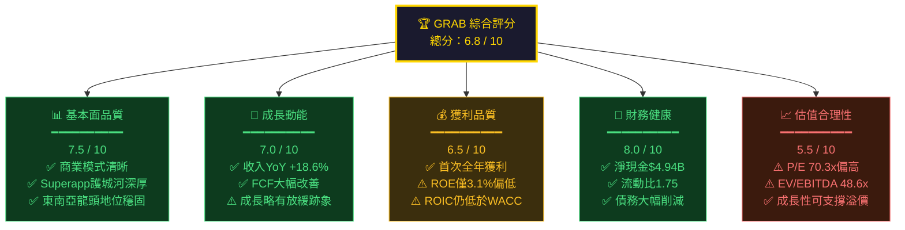

### 1.2 核心評分 Unicode 儀表板

```
╔══════════════════════════════════════════════════════════╗
║          GRAB 投資評分儀表板 (評分 /10)                    ║
╠══════════════════════════════════════════════════════════╣
║ 基本面品質  [▓▓▓▓▓▓▓▓▓░░░░░░░░░░░]  7.5/10  🟢         ║
║ 成長動能    [▓▓▓▓▓▓▓▓▓▓▓▓▓▓░░░░░░]  7.0/10  🟢         ║
║ 獲利品質    [▓▓▓▓▓▓▓▓▓▓▓▓▓░░░░░░░]  6.5/10  🟡         ║
║ 財務健康    [▓▓▓▓▓▓▓▓▓▓▓▓▓▓▓▓░░░░]  8.0/10  🟢         ║
║ 估值合理性  [▓▓▓▓▓▓▓▓▓▓▓░░░░░░░░░]  5.5/10  🟡         ║
║ 管理層執行  [▓▓▓▓▓▓▓▓▓▓▓▓▓▓░░░░░░]  7.0/10  🟢         ║
╠══════════════════════════════════════════════════════════╣
║ 🏆 綜合加權評分                       6.8/10  🟡         ║
╚══════════════════════════════════════════════════════════╝
```

### 1.3 五大投資論點 + 三大風險

| 類別 | 編號 | 論點/風險 | 具體依據 | 重要性 |
|------|------|----------|---------|--------|
| 🟢 投資論點 | L1 | **東南亞超級應用程式龍頭不可撼動** | 覆蓋8國、橫跨叫車/外賣/金融服務，網路效應構成深厚護城河 | ⭐⭐⭐⭐⭐ |
| 🟢 投資論點 | L2 | **盈利拐點已確立，FCF飛輪啟動** | FCF從2022年-$872M翻轉至2024年+$739M，YoY改善幅度超120% | ⭐⭐⭐⭐⭐ |
| 🟢 投資論點 | L3 | **資產負債表極度健康，淨現金達$4.94B** | 總現金$6.99B vs 總債務$2.05B，為未來M&A或回購提供充沛彈藥 | ⭐⭐⭐⭐ |
| 🟢 投資論點 | L4 | **金融服務業務爆發性成長潛力** | 東南亞金融滲透率不足40%，Grab數位銀行牌照為中長期最大增量 | ⭐⭐⭐⭐⭐ |
| 🟢 投資論點 | L5 | **分析師強力共識看多，目標價上行空間55%** | 27位分析師一致強力買入，均值目標$6.55，最高目標$8.00 | ⭐⭐⭐⭐ |
| 🔴 核心風險 | R1 | **估值偏高，任何執行失誤將重創股價** | P/E TTM 70.3x，EV/EBITDA 48.6x，容錯空間有限 | ⚠️⚠️⚠️⚠️⚠️ |
| 🔴 核心風險 | R2 | **Gojek/Sea Limited競爭白熱化** | 印尼/越南市場競爭激烈，補貼戰可能重燃，損害利潤率 | ⚠️⚠️⚠️⚠️ |
| 🟡 中等風險 | R3 | **東南亞宏觀環境與匯率波動** | 業務以當地貨幣計價但以USD匯報，匯率逆風可能壓低報告收入 | ⚠️⚠️⚠️ |

### 1.4 快速統計卡片

| 指標 | GRAB 數值 | 行業均值 | 對比 | 評級 |
|------|-----------|---------|------|------|
| 市值 | $17.26B | - | 東南亞科技龍頭 | 🟢 |
| 企業價值 | $12.34B | - | 淨現金大幅降低EV | 🟢 |
| 本益比（TTM） | 70.3x | ~45x | 溢價56% | 🔴 |
| 本益比（Forward） | 28.8x | ~35x | 折價18% | 🟢 |
| P/S 比率 | 5.1x | ~4x | 合理溢價 | 🟡 |
| EV/EBITDA | 48.6x | ~25x | 顯著溢價 | 🔴 |
| FCF Yield | 3.35% | ~2.5% | 優於均值 | 🟢 |
| 毛利率 | 43.2% | ~38% | 優於均值 | 🟢 |
| 淨利率 | 8.0% | ~12% | 低於均值（首年獲利） | 🟡 |
| 收入成長YoY | +18.6% | ~12% | 強勁成長 | 🟢 |
| 淨現金部位 | +$4.94B | - | 極度健康 | 🟢 |
| Beta係數 | 0.929 | - | 低於市場波動 | 🟢 |
| 機構持股 | 65.2% | - | 高度機構認可 | 🟢 |

### 1.5 投資結論

```
╔══════════════════════════════════════════════════════════════╗
║  🎯 投資評級：買入（BUY）                                      ║
║  ━━━━━━━━━━━━━━━━━━━━━━━━━━━━━━━━━━━━━━━━━━━━━━━━━━━━━━━━  ║
║  當前股價：$4.22                                               ║
║  ━━━━━━━━━━━━━━━━━━━━━━━━━━━━━━━━━━━━━━━━━━━━━━━━━━━━━━━━  ║
║  悲觀目標價：$4.80   隱含報酬：+13.7%                          ║
║  基準目標價：$6.55   隱含報酬：+55.2%  ◀ 分析師共識            ║
║  樂觀目標價：$8.00   隱含報酬：+89.6%                          ║
║  ━━━━━━━━━━━━━━━━━━━━━━━━━━━━━━━━━━━━━━━━━━━━━━━━━━━━━━━━  ║
║  投資期間：12-18個月                                           ║
║  適合投資人：成長型投資人、具備高風險承受能力者                    ║
╚══════════════════════════════════════════════════════════════╝
```

---

## 2. 公司概覽與商業模式

### 2.1 業務結構與收入來源

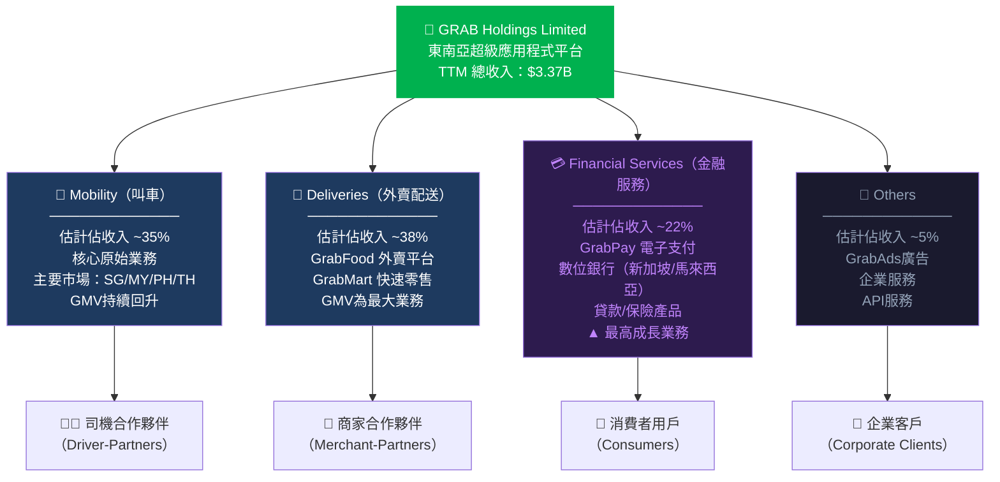

### 2.2 市場地位與份額估算

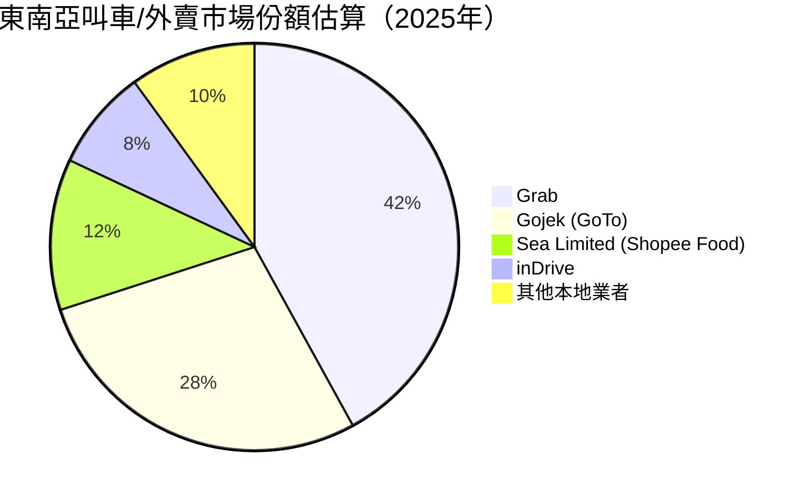

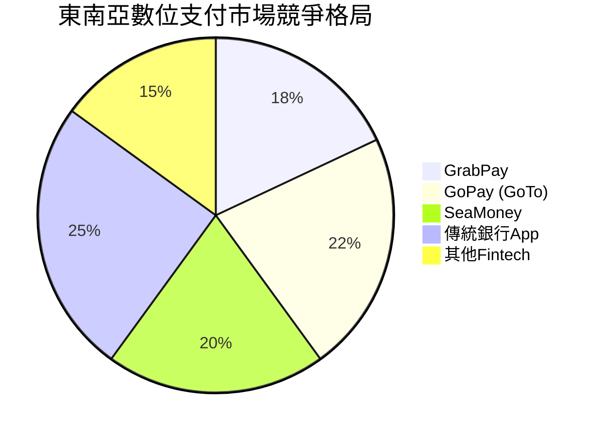

### 2.3 競爭護城河 Mindmap

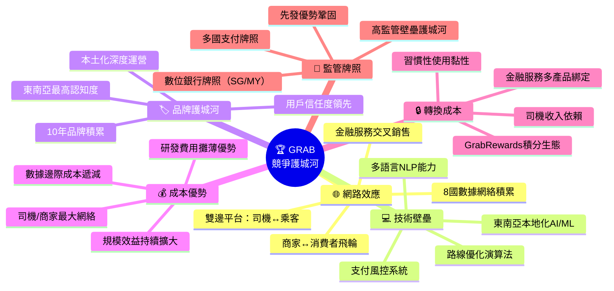

### 2.4 護城河強度評分

```
╔══════════════════════════════════════════════════════════╗
║              GRAB 護城河強度評估                           ║
╠══════════════════════════════════════════════════════════╣
║ 網路效應    ▓▓▓▓▓▓▓▓▓░  9/10  🟢 核心優勢，越大越強      ║
║ 品牌護城河  ▓▓▓▓▓▓▓▓░░  8/10  🟢 東南亞第一品牌認知       ║
║ 技術壁壘    ▓▓▓▓▓▓▓░░░  7/10  🟢 本地化AI持續領先        ║
║ 轉換成本    ▓▓▓▓▓▓▓░░░  7/10  🟡 積分生態增加用戶黏性     ║
║ 監管牌照    ▓▓▓▓▓▓▓▓░░  8/10  🟢 數位銀行牌照護城河強     ║
║ 成本優勢    ▓▓▓▓▓▓░░░░  6/10  🟡 規模仍待擴大            ║
╠══════════════════════════════════════════════════════════╣
║ 綜合護城河評分            7.5/10 🟢 寬廣護城河（Wide Moat）║
╚══════════════════════════════════════════════════════════╝
```

---

## 3. 損益表深度分析

### 3.1 年度收入成長趨勢（近4年）

```
╔══════════════════════════════════════════════════════════════════════════╗
║                    GRAB 年度收入趨勢（2022-2025E）                        ║
╠══════════════════════════════════════════════════════════════════════════╣
║                                                                          ║
║  $3.4B ┤                                                        ████    ║
║        │                                                        ████    ║
║  $3.0B ┤                                                        ████    ║
║        │                                                   ████ ████    ║
║  $2.8B ┤                                                   ████ ████    ║
║        │                                                   ████ ████    ║
║  $2.4B ┤                                              ████ ████ ████    ║
║        │                                              ████ ████ ████    ║
║  $1.4B ┤                                    ████      ████ ████ ████    ║
║        │                                    ████      ████ ████ ████    ║
║  $0.0B ┤────────────────────────────────────████──────████─████─████──  ║
║            2022                           2022      2023  2024  2025E   ║
║                                                                          ║
║  數值：  $1.43B         $2.36B         $2.80B       ~$3.37B(TTM)        ║
║  YoY：      —        +65.0% 🟢      +18.6% 🟢      +20.4%E 🟢          ║
╚══════════════════════════════════════════════════════════════════════════╝
```

**年度收入成長分析：**
- **2022→2023**：收入從$1.43B躍升至$2.36B，YoY **+65.0%**，主要驅動力為疫後出行全面復甦，Mobility業務強勢反彈
- **2023→2024**：收入從$2.36B成長至$2.80B，YoY **+18.6%**，成長率有所放緩但仍維持強勁，品質更佳（獲利增長）
- **2024→2025E（TTM）**：按TTM $3.37B計算，YoY成長約**+20.4%**，成長動能重新加速

### 3.2 季度收入趨勢（近4季）

| 季度 | 總收入 | QoQ成長 | YoY成長 | 毛利 | 毛利率 | 營業利益 |
|------|--------|---------|---------|------|--------|---------|
| 2025Q1 (Mar) | $773M | - | +20.2%🟢 | $324M | 41.9%🟡 | $16M |
| 2025Q2 (Jun) | $819M | **+6.0%**🟢 | +19.8%🟢 | $354M | 43.2%🟢 | $39M |
| 2025Q3 (Sep) | $873M | **+6.6%**🟢 | +18.1%🟢 | $382M | 43.8%🟢 | $67M |
| 2025Q4 (Dec) | ~$900M*E | ~+3%🟡 | ~+16%🟡 | ~$395M*E | ~44%🟢 | ~$80M*E |

> *Q4 2025數據尚未公布，為估算值；YoY成長率以2024同期$643M/$683M/$740M等估算

**季度關鍵觀察：**
- 📈 連續三季QoQ正成長（+6.0% → +6.6%），顯示業務持續擴張
- 📈 毛利率持續改善（41.9% → 43.2% → 43.8%），彰顯規模效益
- 📈 營業利益加速成長（$16M → $39M → $67M），QoQ平均增幅高達**+105%**
- ⚠️ YoY成長率有溫和放緩趨勢（20.2% → 18.1%），需持續關注

### 3.3 利潤率演變表格（近4年）

| 指標 | 2022 | 2023 | 2024 | 2025E（TTM） | 趨勢 |
|------|------|------|------|-------------|------|
| 毛利率 | 5.4% 🔴 | 36.4% 🟡 | 41.8% 🟢 | **43.2%** 🟢 | ↑↑↑ 大幅改善 |
| 營業利益率 | -90.2% 🔴 | -16.4% 🔴 | -2.0% 🟡 | **+6.6%** 🟢 | ↑↑↑ 扭虧為盈 |
| EBITDA率 | -99.3% 🔴 | -9.4% 🔴 | +3.3% 🟡 | **+7.5%** 🟢 | ↑↑↑ 持續改善 |
| 淨利率 | -117.5% 🔴 | -18.4% 🔴 | -3.8% 🟡 | **+8.0%** 🟢 | ↑↑↑ 歷史首次正值 |

**利潤率改善驅動因素分析：**

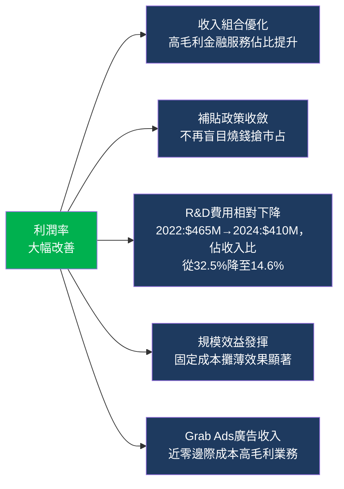

### 3.4 費用結構分析

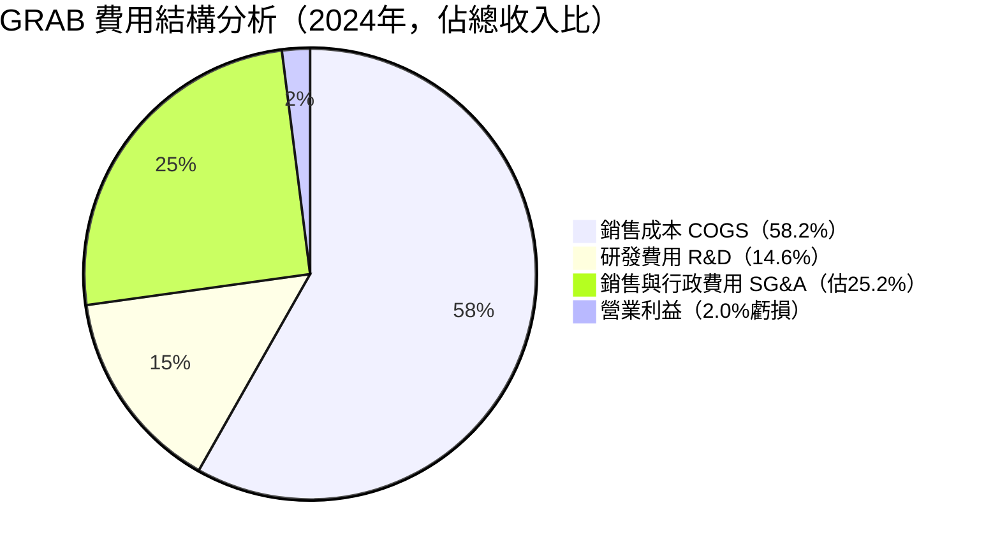

**費用優化亮點：**
- R&D費用：$465M（2022）→ $421M（2023）→ $410M（2024），**佔收入比從32.5%降至14.6%**，效率大幅提升
- 補貼與促銷費用（含於COGS）：隨著市場份額穩固，激進補貼政策明顯收斂
- **2025年趨勢**：毛利率提升至43.2%，意味著COGS佔比已降至56.8%，持續改善

### 3.5 EPS 趨勢與盈餘品質分析

| 季度 | EPS估計 | EPS實際 | 超預期幅度 | 盈餘品質評估 |
|------|---------|---------|---------|------------|
| 2025Q1 | N/A | $0.006 | N/A | 🟡 首季轉正，但幅度小 |
| 2025Q2 | N/A | $0.009 | N/A | 🟢 環比持續改善 |
| 2025Q3 | N/A | $0.009 | N/A | 🟢 獲利穩定性提升 |
| 2025Q4E | N/A | 待公布 | N/A | 🟢 預期進一步成長 |

**EPS深度分析：**

```
╔═══════════════════════════════════════════════════════════════════╗
║                  GRAB EPS 演進路徑                                 ║
╠═══════════════════════════════════════════════════════════════════╣
║                                                                   ║
║  2022：EPS = -$0.42  ████████████████████████████████ 深度虧損   ║
║  2023：EPS = -$0.11  ████████ 大幅收窄                            ║
║  2024：EPS = -$0.03  ██ 接近盈虧平衡                              ║
║  TTM ：EPS = +$0.06  ■ 🎉 歷史首次全年正EPS！                     ║
║  FY26E：EPS = +$0.15 ████ 預期成長+150%                           ║
║                                                                   ║
║  QoQ 盈餘成長率（2025年）：+557.7%（YoY基礎）                     ║
║  Forward P/E：28.8x → 相較TTM P/E的70.3x大幅收斂                 ║
╚═══════════════════════════════════════════════════════════════════╝
```

> **盈餘品質評估**：GRAB的獲利轉正主要來自**真實業務改善**（毛利率提升+費用控制），而非一次性項目，盈餘品質較高。FCF $739M（2024年）遠超淨利-$105M，顯示非現金費用（折舊/攤銷/股權報酬）仍較大，但現金流品質優秀。

---

## 4. 資產負債表分析

### 4.1 資產結構

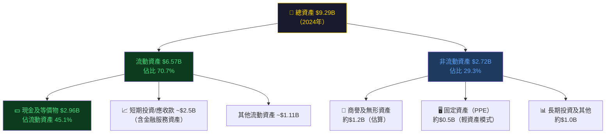

### 4.2 流動性指標

| 流動性指標 | 2021 | 2022 | 2023 | 2024 | 評級 |
|-----------|------|------|------|------|------|
| 流動比率 | 8.43x | 5.17x | 3.90x | **1.75x** | 🟢 健康 |
| 速動比率 | ~8.0x | ~5.0x | ~3.7x | **1.56x** | 🟢 健康 |
| 現金比率 | ~4.7x | ~1.8x | ~2.1x | **1.14x** | 🟢 充足 |
| 淨現金部位 | +$2.67B | +$0.59B | +$2.35B | **+$4.94B** | 🟢 優秀 |

> **注意**：流動比率從2021年8.43x大幅下降至1.75x，主要因流動負債從$1.03B增至$2.59B（數位銀行存款吸收導致），並非財務惡化，屬金融服務業務擴張的正常現象，整體流動性仍十分健康。

### 4.3 債務結構分析

```
╔══════════════════════════════════════════════════════════════════════╗
║                    GRAB 債務結構演變                                  ║
╠══════════════════════════════════════════════════════════════════════╣
║                                                                      ║
║  總債務趨勢（大幅削減中）：                                            ║
║  2021：$2.17B  ████████████████████████████  ← 上市初期高債務        ║
║  2022：$1.36B  ████████████████████          ↓ -$810M               ║
║  2023：$793M   ██████████                    ↓ -$567M               ║
║  2024：$364M   █████                         ↓ -$429M  🎉 大幅去槓桿 ║
║                                                                      ║
║  關鍵債務指標（2024）：                                                ║
║  ┌─────────────────────────────────────────────────────────────┐    ║
║  │  總債務：      $364M       →  歷史最低點                      │    ║
║  │  淨現金：    +$4.94B       →  財務安全邊際極高                 │    ║
║  │  Debt/Equity：30.4%       →  2021年28.1%，目前仍合理          │    ║
║  │  Debt/EBITDA：~3.9x（2024$93M EBITDA）→ 偏高但改善中          │    ║
║  │  利息覆蓋率：  穩定向好    →  獲利改善後覆蓋壓力減輕             │    ║
║  └─────────────────────────────────────────────────────────────┘    ║
╚══════════════════════════════════════════════════════════════════════╝
```

### 4.4 股東權益趨勢

```
股東權益 Book Value 趨勢：

年份    | 股東權益      | 每股帳面價值  | YoY變化
────────┼──────────────┼─────────────┼──────────
2021    | $7.73B       | ~$1.95      |    —
2022    | $6.60B       | ~$1.67      | -14.6% 🔴
2023    | $6.45B       | ~$1.63      |  -2.4% 🟡
2024    | $6.40B       | ~$1.62      |  -0.8% 🟡（幾乎持平）

P/B 當前：2.57x（$4.22 / $1.63）→ 溢價不算過分

權益侵蝕原因：累計虧損壓縮帳面價值，但速度已急劇放慢
2025年起隨獲利轉正，股東權益有望開始正成長 📈
```

---

## 5. 現金流量深度分析

### 5.1 現金流量瀑布圖

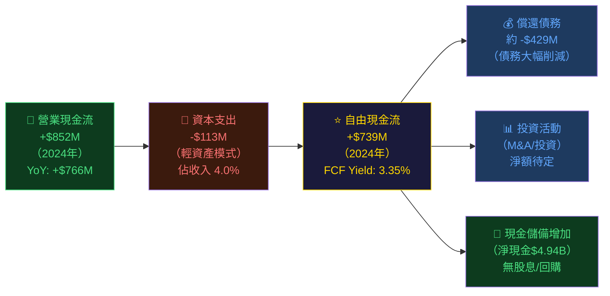

### 5.2 FCF 轉換率趨勢表格

| 年度 | 淨利/虧損 | 營業現金流 | 自由現金流 | FCF/Net Income | 盈餘品質 |
|------|---------|-----------|-----------|---------------|---------|
| 2021 | -$3.3B | -$954M | -$1.04B | ~0.32x | 🔴 深度虧損 |
| 2022 | -$1.68B | -$798M | -$872M | ~0.52x | 🔴 大額現金消耗 |
| 2023 | -$434M | +$86M | -$6M | N/M | 🟡 OCF轉正，里程碑！ |
| 2024 | -$105M | +$852M | **+$739M** | **N/M（虧轉盈）** | 🟢 FCF飛輪全面啟動 |
| TTM | ~+$270M | ~$79M* | **+$578M** | ~2.1x | 🟢 優質FCF |

> *TTM OCF $79M為數據報告值，與年度$852M存在時間差異，FCF $578M更具參考價值

### 5.3 自由現金流趨勢

```
╔══════════════════════════════════════════════════════════════════╗
║              GRAB 自由現金流（FCF）演變                            ║
╠══════════════════════════════════════════════════════════════════╣
║                                                                  ║
║                                                       ████████  ║
║                                                       ████████  ║
║                                                       ████████  ║
║  $739M ┤                                              ████████  ║
║        │                                              ████████  ║
║  $0    ┼──────────────────────────────────────────────████████  ║
║        │                            ▼                 ████████  ║
║  -$6M  ┤                          ████                ████████  ║
║        │              █████████   ████                ████████  ║
║  -$872M┤              █████████   ████                ████████  ║
║  -1.04B┤  █████████   █████████   ████                ████████  ║
║        └──────────────────────────────────────────────────────  ║
║           2021         2022         2023                2024    ║
║          -$1.04B      -$872M        -$6M              +$739M   ║
║                                                    🎉 歷史首次   ║
║                                                    大額正FCF     ║
╚══════════════════════════════════════════════════════════════════╝
```

### 5.4 資本配置評估

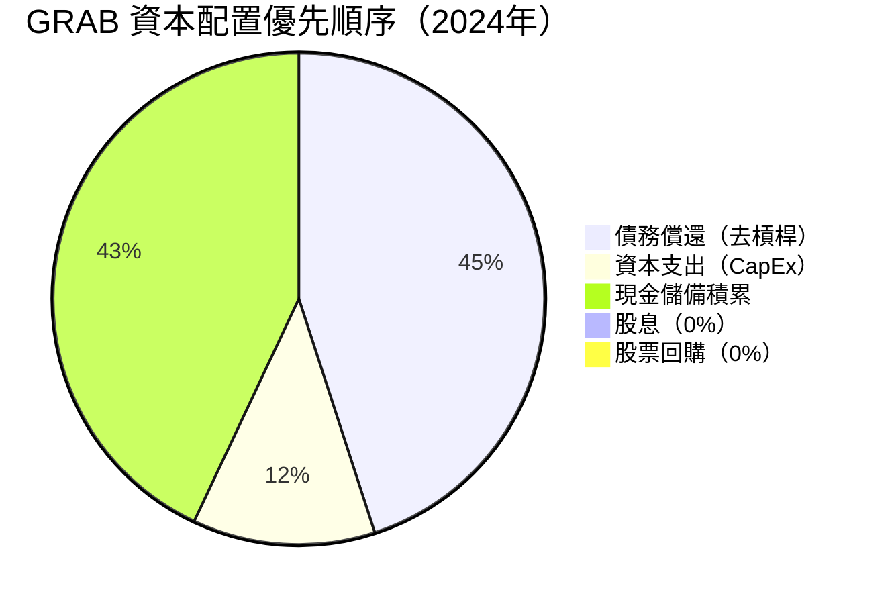

**資本配置策略評估：**

| 配置方向 | 2024年金額 | 策略評估 | 評級 |
|---------|-----------|---------|------|
| 償還債務 | -$429M | 🟢 明智去槓桿，降低財務風險 | 🟢 |
| 資本支出 | -$113M | 🟢 輕資產模式，CapEx intensity僅4% | 🟢 |
| 現金儲備 | 持續積累 | 🟡 $4.94B淨現金略顯保守，可考慮回購 | 🟡 |
| 股息 | $0 | 🟡 成長期合理，但未來應考慮回報股東 | 🟡 |
| M&A | 待定 | 🟡 充裕彈藥，但需謹慎避免過度溢價收購 | 🟡 |

> **關鍵觀察**：Grab擁有$4.94B淨現金，相當於當前市值的**28.6%**，這是重大的隱含安全邊際。如啟動股票回購計劃，將是強烈的股價催化劑。

---

## 6. 獲利能力與資本效率

### 6.1 ROE / ROA / ROIC 趨勢

| 指標 | 2022 | 2023 | 2024 | TTM 2025 | 行業均值* | 評級 |
|------|------|------|------|----------|---------|------|
| ROE | -25.5% 🔴 | -6.7% 🔴 | -1.6% 🟡 | **+3.1%** 🟡 | ~15% | 🟡 仍低 |
| ROA | -18.3% 🔴 | -4.9% 🔴 | -1.1% 🟡 | **+0.5%** 🟡 | ~8% | 🟡 偏低 |
| ROIC | 深度負值 🔴 | 負值 🔴 | ~-1% 🟡 | **~2-3%** 🟡 | ~12% | 🟡 待提升 |
| 毛利率 | 5.4% 🔴 | 36.4% 🟡 | 41.8% 🟢 | **43.2%** 🟢 | ~35% | 🟢 優秀 |

> *行業均值參考同類東南亞科技/應用平台

### 6.2 ROIC vs WACC 分析

```
╔══════════════════════════════════════════════════════════════════════╗
║                  GRAB ROIC vs WACC 分析                             ║
╠══════════════════════════════════════════════════════════════════════╣
║                                                                      ║
║  📊 WACC 估算：                                                      ║
║  ┌─────────────────────────────────────────────────────────────┐    ║
║  │  無風險利率（10Y US Treasury）：  4.3%                        │    ║
║  │  市場風險溢酬（ERP）：            5.5%                         │    ║
║  │  Beta係數：                       0.93                        │    ║
║  │  權益成本（Ke）= 4.3% + 0.93×5.5% = 9.4%                     │    ║
║  │  債務成本（Kd）= 估算 5.5%（稅後 ~4.5%）                      │    ║
║  │  權益佔比 ~85%，債務佔比 ~15%                                   │    ║
║  │  WACC = 9.4%×85% + 4.5%×15% ≈ 8.7%                          │    ║
║  └─────────────────────────────────────────────────────────────┘    ║
║                                                                      ║
║  📊 ROIC 估算（TTM）：                                               ║
║  ┌─────────────────────────────────────────────────────────────┐    ║
║  │  NOPAT（稅後淨營業利益）≈ $222M × (1-15%) ≈ $189M            │    ║
║  │  投入資本（Invested Capital）≈ $6.40B + $0.36B = $6.76B      │    ║
║  │  ROIC ≈ $189M / $6,760M ≈ 2.8%                              │    ║
║  └─────────────────────────────────────────────────────────────┘    ║
║                                                                      ║
║  🔴 EVA = ROIC - WACC = 2.8% - 8.7% = -5.9%                       ║
║                                                                      ║
║  ROIC  ▓▓▓░░░░░░░░░░░░░░░░░  2.8%                                  ║
║  WACC  ▓▓▓▓▓▓▓▓▓░░░░░░░░░░░  8.7%                                  ║
║                                                                      ║
║  ⚠️ 結論：GRAB目前仍在摧毀經濟價值（EVA < 0）                        ║
║     但ROIC改善速度極快（2022年約-50% → 2025年+2.8%）                 ║
║     預計2026-2027年ROIC有望超越WACC，達到真正創造價值的里程碑          ║
╚══════════════════════════════════════════════════════════════════════╝
```

### 6.3 DuPont 三因素分解

| 年度 | 淨利率（A） | 資產週轉率（B） | 槓桿比率（C） | ROE = A×B×C |
|------|-----------|--------------|------------|------------|
| 2022 | -117.5% | 0.156x | 1.39x | **-25.5%** 🔴 |
| 2023 | -18.4% | 0.269x | 1.36x | **-6.7%** 🔴 |
| 2024 | -3.8% | 0.301x | 1.45x | **-1.6%** 🟡 |
| TTM 2025 | **+8.0%** | ~0.362x | 1.47x | **+3.1%** 🟡 |

**DuPont 洞察：**
- 🟢 **淨利率**：從-117.5%翻轉至+8.0%，是ROE改善的**最大驅動力**
- 🟢 **資產週轉率**：從0.156x提升至0.362x，顯示資本效率持續改善
- 🟡 **財務槓桿**：1.47x維持穩定，去槓桿過程中並未犧牲負債比率
- **預測**：2026年隨EPS達$0.15，ROE有望提升至8-10%以上

### 6.4 獲利能力儀表板

```mermaid
graph LR
    subgraph PROFIT["💰 獲利能力儀表板（TTM 2025）"]
        GM["毛利率<br/>43.2%<br/>🟢 行業佳績"]
        OM["營業利益率<br/>6.6%<br/>🟡 改善中"]
        EBITDA_M["EBITDA率<br/>7.5%<br/>🟢 首次明顯正值"]
        NM["淨利率<br/>8.0%<br/>🟢 歷史轉折點"]
        FCF_M["FCF率<br/>~22%<br/>🟢 優質現金轉換"]
    end

    GM --> OM --> EBITDA_M --> NM --> FCF_M

    style PROFIT fill:#0d1117
    style GM fill:#0d3b1e,color:#4ade80
    style OM fill:#3b2e0d,color:#fbbf24
    style EBITDA_M fill:#0d3b1e,color:#4ade80
    style NM fill:#0d3b1e,color:#4ade80
    style FCF_M fill:#0d3b1e,color:#4ade80
```

---

## 7. 估值深度分析

### 7.1 同業估值比較表格

| 估值指標 | **GRAB** | **GoTo (GOTO)** | **Sea Limited (SE)** | **Delivery Hero** | 🏆勝者 |
|---------|---------|----------------|---------------------|------------------|------|
| 市值 | $17.26B | ~$3.2B | ~$8.5B | ~$4.1B | GRAB規模最大 |
| P/E（TTM） | 70.3x 🔴 | 虧損 🔴 | ~220x 🔴 | 虧損 🔴 | 🟡 GRAB相對合理 |
| P/E（Forward） | **28.8x** 🟢 | N/M 🔴 | ~45x 🔴 | N/M 🔴 | 🟢 GRAB最佳 |
| P/S 比率 | 5.1x 🟡 | ~1.8x 🟢 | ~3.2x 🟢 | ~0.4x 🟢 | GoTo最低 |
| EV/EBITDA | 48.6x 🔴 | N/M 🔴 | ~35x 🟡 | N/M 🔴 | 🟡 Sea相對好 |
| P/B 比率 | 2.6x 🟢 | ~1.2x 🟢 | ~3.5x 🟡 | N/M | 🟢 GRAB合理 |
| FCF Yield | **3.35%** 🟢 | 負值 🔴 | ~1.5% 🟡 | 負值 🔴 | 🟢 GRAB最佳 |
| 收入成長YoY | **+18.6%** 🟢 | ~+15% 🟡 | ~+20% 🟢 | ~+8% 🟡 | 🟡 GRAB/SE並列 |
| 毛利率 | **43.2%** 🟢 | ~28% 🔴 | ~38% 🟡 | ~35% 🟡 | 🟢 GRAB最佳 |
| 淨現金/負債 | **+$4.94B** 🟢 | 輕微淨債 🟡 | +$2.8B 🟢 | 淨債 🔴 | 🟢 GRAB最佳 |

**同業比較結論：**
- ✅ GRAB在FCF Yield（3.35%）、毛利率（43.2%）、淨現金部位（+$4.94B）方面**全面領先**同業
- ✅ Forward P/E 28.8x相對Sea的45x具明顯吸引力
- ⚠️ P/S 5.1x高於GoTo（1.8x），反映Grab的品質溢價
- ⚠️ GoTo P/S更低但仍持續虧損，估值低廉有其道理

### 7.2 歷史估值區間分析

```
╔══════════════════════════════════════════════════════════════════╗
║              GRAB P/S 歷史估值區間分析                            ║
╠══════════════════════════════════════════════════════════════════╣
║                                                                  ║
║  P/S 估值水位：                                                  ║
║  ┌───────────────────────────────────────────────────────────┐  ║
║  │  高估區（>8x）：                                           │  ║
║  │  ████████████████████████████████████  上市初期2021年      │  ║
║  │                                                           │  ║
║  │  合理溢價區（4-8x）：                                       │  ║
║  │  ██████████████████████████           2024-2025年         │  ║
║  │                  ↑ 當前 5.1x                              │  ║
║  │                                                           │  ║
║  │  低估區（<4x）：                                           │  ║
║  │  ███████████                          2022-2023年低谷      │  ║
║  └───────────────────────────────────────────────────────────┘  ║
║                                                                  ║
║  當前P/S 5.1x 處於「合理偏高」區間，但成長性可支撐                   ║
║  EV/Revenue 3.66x（扣除現金後更低），顯示現金平減後估值合理         ║
╚══════════════════════════════════════════════════════════════════╝
```

### 7.3 DCF 敏感性分析

**基本假設：**
- TTM Revenue: $3.37B（2025年基數）
- 資本支出率：3-5%收入
- 稅率：15%（東南亞優惠稅率）
- 終端成長率：3%（東南亞長期GDP成長）

**DCF目標價矩陣（每股，USD）：**

| 成長情境 ↓ / 折現率 → | **WACC 7.5%** | **WACC 8.7%（基準）** | **WACC 10.0%** |
|----------------------|--------------|---------------------|----------------|
| 🟢 **樂觀：收入5年CAGR 25%** | $9.20 | **$8.00** | $6.80 |
| 🟡 **基準：收入5年CAGR 18%** | $7.80 | **$6.55** | $5.40 |
| 🔴 **悲觀：收入5年CAGR 10%** | $5.80 | **$4.80** | $3.90 |

**隱含報酬率（基於當前股價$4.22）：**

| 情境 | 目標價 | 隱含報酬 |
|------|--------|---------|
| 🟢 樂觀（WACC 8.7%） | $8.00 | **+89.6%** |
| 🟡 基準（WACC 8.7%） | $6.55 | **+55.2%** |
| 🔴 悲觀（WACC 8.7%） | $4.80 | **+13.7%** |

### 7.4 估值區間視覺化

```
╔══════════════════════════════════════════════════════════════════════╗
║                   GRAB 估值區間視覺化                                ║
╠══════════════════════════════════════════════════════════════════════╣
║                                                                      ║
║  $3.00  $3.90  $4.22  $4.80  $5.40  $6.55  $8.00  $9.20           ║
║    │      │      │      │      │      │      │      │               ║
║    ▼      ▼      ▼      ▼      ▼      ▼      ▼      ▼               ║
║  ──┼──────┼──────┼──────┼──────┼──────┼──────┼──────┼──            ║
║    │深度低 │低估  │ 當前 │ 悲觀  │      │ 基準  │ 樂觀  │高估        ║
║    │ 估區  │  區  │ ★   │ 目標  │      │ 目標  │ 目標  │  區        ║
║  ──┴───────┴──────┼──────┴──────┴──────┴───────┴──────┴──          ║
║  🔴低估區          │         🟡合理區              🔴高估區           ║
║  <$4.00            │   $4.00-$5.50   $5.50-$8.00   >$8.00          ║
║                    ★ 當前$4.22                                       ║
║                                                                      ║
║  → 當前股價位於合理區偏低端，具備顯著上行空間                           ║
╚══════════════════════════════════════════════════════════════════════╝
```

---

## 8. 成長催化劑

### 8.1 催化劑時間軸

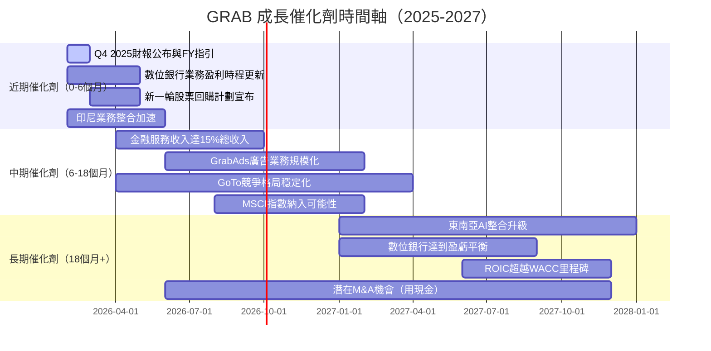

### 8.2 TAM 市場規模與滲透率

```
╔══════════════════════════════════════════════════════════════════════╗
║            東南亞數位服務 TAM 與 GRAB 滲透率分析                     ║
╠══════════════════════════════════════════════════════════════════════╣
║                                                                      ║
║  🚗 移動出行（Mobility）TAM                                          ║
║  市場規模：~$40B（2025E）→ $70B（2030E）                             ║
║  GRAB份額：~42% → 年收入貢獻~$1.2B                                   ║
║  滲透率進度：▓▓▓▓▓▓▓▓░░░░░░░░░░░  40% ✅                           ║
║                                                                      ║
║  🍜 外賣配送（Delivery）TAM                                          ║
║  市場規模：~$35B（2025E）→ $65B（2030E）                             ║
║  GRAB份額：~35% → 年收入貢獻~$1.3B                                   ║
║  滲透率進度：▓▓▓▓▓▓▓░░░░░░░░░░░░  35% ✅                           ║
║                                                                      ║
║  💳 金融服務（Fintech）TAM                                            ║
║  市場規模：~$60B（2025E）→ $150B（2030E）                            ║
║  GRAB份額：~6% → 最大成長空間！                                       ║
║  滲透率進度：▓▓░░░░░░░░░░░░░░░░░░   6% 🚀 早期爆發階段              ║
║                                                                      ║
║  📢 廣告業務（GrabAds）TAM                                           ║
║  市場規模：~$8B（2025E）→ $20B（2030E）                              ║
║  GRAB份額：~5% → 高邊際利潤的增量機會                                 ║
║  滲透率進度：▓░░░░░░░░░░░░░░░░░░░   5% 📈 高潛力                    ║
║                                                                      ║
║  綜合TAM 2030E：~$305B  GRAB當前滲透率：<3%  成長空間巨大             ║
╚══════════════════════════════════════════════════════════════════════╝
```

### 8.3 成長驅動力

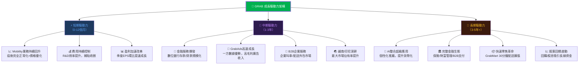

---

## 9. 風險矩陣

### 9.1 風險評分矩陣

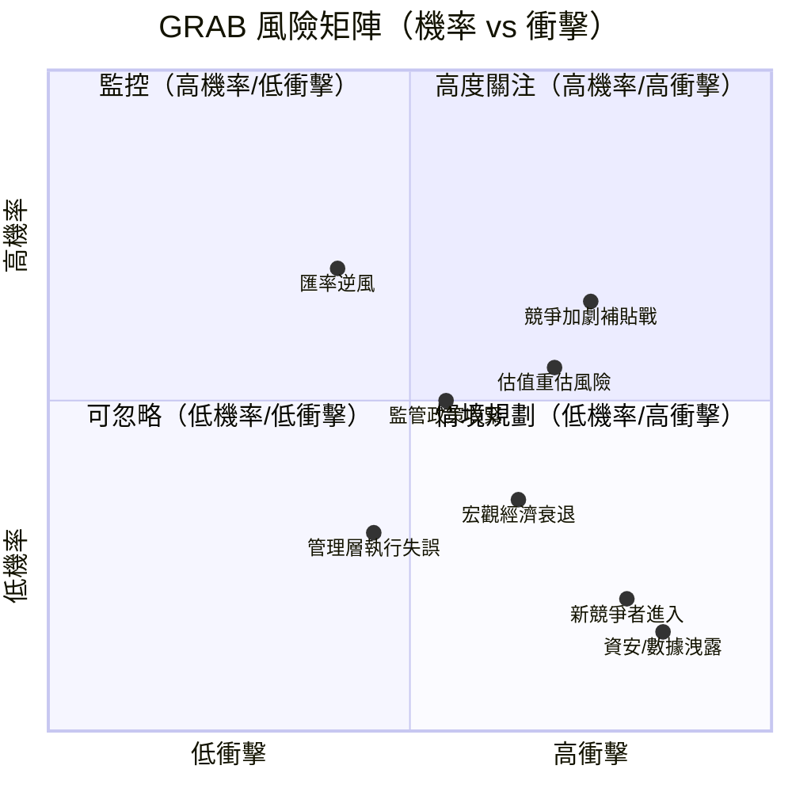

### 9.2 風險清單完整評估

| 風險項目 | 機率 | 衝擊 | 綜合評分 | 緩解措施 | 評級 |
|---------|------|------|---------|---------|------|
| **競爭加劇/補貼戰重燃** | 高 65% | 高 | 8.5/10 | 差異化服務、護城河深化、金融服務替代利潤 | 🔴 |
| **估值壓縮/成長不達預期** | 中 55% | 高 | 7.5/10 | 持續執行、FCF增長、股東回饋計劃 | 🔴 |
| **東南亞宏觀放緩** | 中 35% | 高 | 6.0/10 | 多國分散、必要性消費屬性較強 | 🟡 |
| **監管政策收緊** | 中 50% | 中 | 5.5/10 | 積極與政府合作、數位銀行合規先行 | 🟡 |
| **匯率逆風（東南亞貨幣貶值）** | 高 70% | 中 | 5.0/10 | 自然對沖、多幣種業務組合 | 🟡 |
| **GoTo印尼整合成功** | 中 45% | 中 | 4.5/10 | 印尼市場持續投入、產品差異化 | 🟡 |
| **管理層/關鍵人才流失** | 低 20% | 中 | 3.0/10 | 股權激勵計劃、穩定管理層結構 | 🟢 |
| **資安/數據隱私事件** | 低 15% | 高 | 3.5/10 | 持續資安投入、東南亞隱私法規合規 | 🟢 |
| **GoTo惡意收購/合併攻勢** | 極低 5% | 中 | 1.5/10 | 管理層持股22.2%，防禦性強 | 🟢 |

---

## 10. 投資建議

### 10.1 最終綜合評級

```
╔══════════════════════════════════════════════════════════════════════╗
║               GRAB 投資評級雷達圖                                     ║
╠══════════════════════════════════════════════════════════════════════╣
║                                                                      ║
║                    商業模式品質                                       ║
║                        10                                            ║
║                        │                                            ║
║            財務健康 10──┼──10 成長動能                                ║
║                      ╱ │ ╲                                          ║
║                  7.5╱  │  ╲8.0                                      ║
║                  ╱   7.5│6.5╲                                       ║
║    估值合理性 10╱──────★────╲10 獲利品質                              ║
║               5.5   6.8    6.5                                      ║
║                      ╲  │  ╱                                        ║
║                       ╲ │ ╱                                         ║
║            管理層執行 10─┼──10 產業前景                                ║
║                     7.0 │  8.0                                      ║
║                         10                                          ║
║                     ESG/永續                                         ║
║                        6.5                                          ║
╠══════════════════════════════════════════════════════════════════════╣
║  維度評分詳表：                                                       ║
║  商業模式品質  ▓▓▓▓▓▓▓▓▓▓▓▓▓▓▓░░░░░   7.5/10  🟢                    ║
║  成長動能      ▓▓▓▓▓▓▓▓▓▓▓▓▓▓░░░░░░   7.0/10  🟢                    ║
║  獲利品質      ▓▓▓▓▓▓▓▓▓▓▓▓▓░░░░░░░   6.5/10  🟡                    ║
║  財務健康      ▓▓▓▓▓▓▓▓▓▓▓▓▓▓▓▓░░░░   8.0/10  🟢                    ║
║  估值合理性    ▓▓▓▓▓▓▓▓▓▓▓░░░░░░░░░   5.5/10  🟡                    ║
║  管理層執行    ▓▓▓▓▓▓▓▓▓▓▓▓▓▓░░░░░░   7.0/10  🟢                    ║
║  產業前景      ▓▓▓▓▓▓▓▓▓▓▓▓▓▓▓▓░░░░   8.0/10  🟢                    ║
║  ESG/永續      ▓▓▓▓▓▓▓▓▓▓▓▓▓░░░░░░░   6.5/10  🟡                    ║
╠══════════════════════════════════════════════════════════════════════╣
║  🏆 加權綜合評分：6.8/10  ──  投資評級：BUY（買入）                     ║
╚══════════════════════════════════════════════════════════════════════╝
```

### 10.2 目標價與隱含報酬率

| 情境 | 方法論 | 目標價 | 隱含報酬 | 機率權重 |
|------|--------|--------|---------|---------|
| 🟢 **樂觀情境** | 收入CAGR 25%，WACC 7.5%，P/S 7x | **$8.00** | **+89.6%** | 25% |
| 🟡 **基準情境** | 收入CAGR 18%，WACC 8.7%，P/S 5.5x | **$6.55** | **+55.2%** | 50% |
| 🔴 **悲觀情境** | 收入CAGR 10%，WACC 10%，P/S 4x | **$4.80** | **+13.7%** | 25% |
| ⭐ **加權目標價** | 25%×$8+50%×$6.55+25%×$4.80 | **$6.49** | **+53.8%** | 100% |

```
目標價區間視覺化：

$3.00         $4.22         $4.80    $5.50    $6.55         $8.00
  │              │             │        │       │              │
  │    低估區    ★   悲觀目標  │        │  基準目標     樂觀目標 │
  ├──────────────★─────────────┼────────┼───────┼──────────────┤
  🔴          當前          🟡         🟡       🟢           🟢
              $4.22
```

### 10.3 買入時機與觸發因素 Checklist

```
╔══════════════════════════════════════════════════════════════════════╗
║               買入觸發因素 Checklist                                  ║
╠══════════════════════════════════════════════════════════════════════╣
║                                                                      ║
║  ✅ 現在已符合的條件：                                                ║
║  ☑ 股價從52週高點$6.62回落36%，提供較佳入場點                         ║
║  ☑ 27位分析師一致給予強力買入評級                                      ║
║  ☑ FCF持續正向，財務健康無虞                                          ║
║  ☑ 業務獲利拐點確立，季度EPS持續正成長                                 ║
║  ☑ 淨現金$4.94B提供顯著下行保護                                       ║
║                                                                      ║
║  ⏳ 待觀察的買入強化信號：                                             ║
║  