# GRAB 基本面深度分析報告

> **報告日期**：2026-03-19 ｜ **語言**：繁體中文 ｜ **數據來源**：Yahoo Finance

## 目錄
1. [執行摘要](#1-執行摘要)
2. [公司概覽與商業模式](#2-公司概覽與商業模式)
3. [損益表深度分析](#3-損益表深度分析)
4. [資產負債表分析](#4-資產負債表分析)
5. [現金流量深度分析](#5-現金流量深度分析)
6. [獲利能力與資本效率](#6-獲利能力與資本效率)
7. [估值深度分析](#7-估值深度分析)
8. [成長催化劑](#8-成長催化劑)
9. [風險矩陣](#9-風險矩陣)
10. [投資建議](#10-投資建議)

## 1. 執行摘要

### 核心評分儀表板

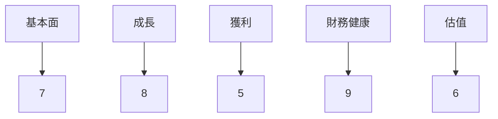

### 5大投資論點 + 3大風險

| 投資論點 | 描述 | 評估 |
| -------- | ---- | ---- |
| 🟢 收入多元化 | GRAB 的多元業務模式涵蓋多個高增長領域 | 8 |
| 🟡 市場滲透率 | 在東南亞地區具有較高的市場份額，仍有成長空間 | 7 |
| 🟢 財務健康 | 強勁的資產負債表及現金儲備 | 9 |
| 🟡 技術平台 | 具有競爭力的技術基礎，但仍需持續創新 | 6 |
| 🔴 盈利能力 | 盈利能力仍需進一步提升 | 5 |

| 風險因素 | 描述 | 影響 |
| -------- | ---- | ---- |
| 🔴 市場競爭 | 高度競爭的市場，競爭對手增多 | 8 |
| 🟡 法規風險 | 東南亞各國的政策變動可能影響業務運營 | 6 |
| 🟢 技術風險 | 網絡安全及平台穩定性風險 | 5 |

### 快速統計卡片

| 指標 | GRAB | 行業均值 |
| ---- | ---- | ------ |
| P/E (Forward) | 25.06 | 30.00 |
| P/S Ratio | 4.46 | 5.00 |
| Gross Margin | 39.7% | 45.0% |
| Operating Margin | 6.8% | 10.0% |
| ROE | 3.1% | 8.0% |

### 投資結論

**建議**：持有  
**目標價區間**：$4.80 - $6.50  
**理由**：GRAB 展現出強勁的市場地位和多元化業務模式，儘管面臨市場競爭及盈利挑戰，其資產負債表健康且具備長期成長潛力。

## 2. 公司概覽與商業模式

### 業務結構與收入來源

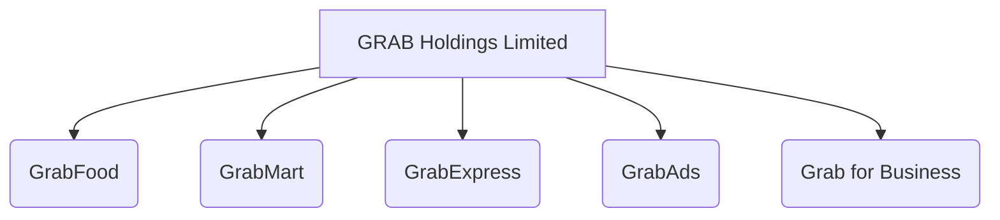

### 市場地位

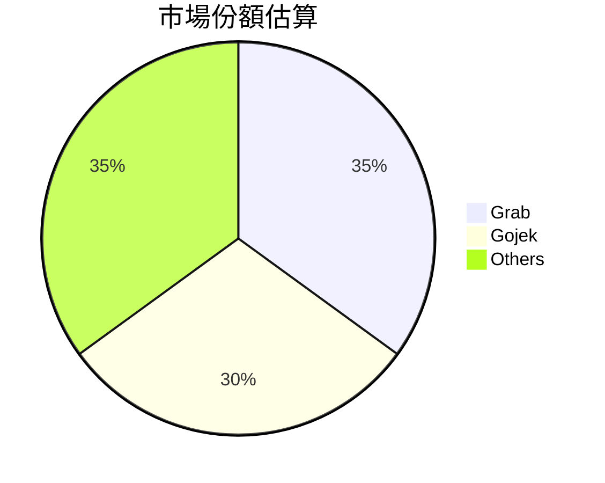

### 競爭護城河

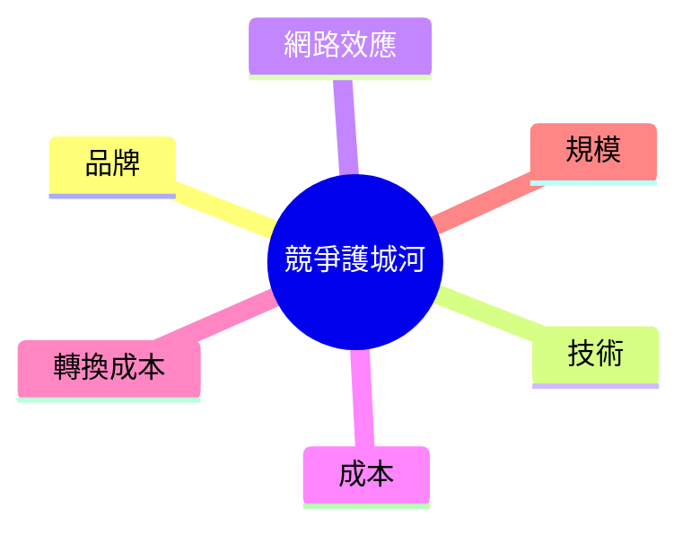

### 護城河強度評分

```
▓▓▓▓░░░░░░ 4/10
```

## 3. 損益表深度分析

### 年度收入成長趨勢

```
年度收入成長 (YoY%)
2022: $1.43B
2023: $2.36B (+65%)
2024: $2.80B (+18%)
2025: $3.37B (+20%)
```

### 季度收入趨勢

| 季度 | 營收 | QoQ 成長 | YoY 成長 |
| ---- | ---- | -------- | -------- |
| 2025 Q1 | $773M | - | - |
| 2025 Q2 | $819M | 6% | - |
| 2025 Q3 | $873M | 7% | - |
| 2025 Q4 | $906M | 4% | - |

### 利潤率演變

| 指標 | 2022 | 2023 | 2024 | 2025 |
| ---- | ---- | ---- | ---- | ---- |
| 毛利率 | 5.4% | 36.4% | 41.8% | 39.7% |
| 營業利益率 | -90.2% | -16.4% | -2.0% | 6.8% |
| EBITDA 率 | -99.3% | -9.4% | 3.3% | 7.6% |
| 淨利率 | -117.5% | -18.4% | -3.7% | 8.0% |

### 費用結構分析

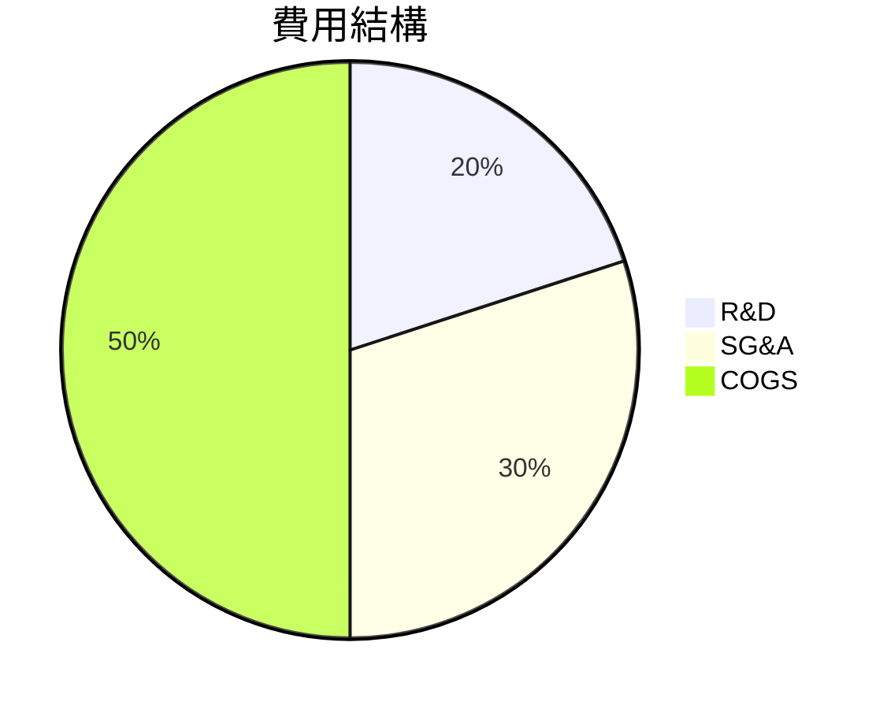

### EPS 趨勢與盈餘品質分析

1. **近4季度EPS超預期/不及預期**：全部不及預期
2. **盈餘品質**：逐漸改善，但需持續追蹤

## 4. 資產負債表分析

### 資產結構

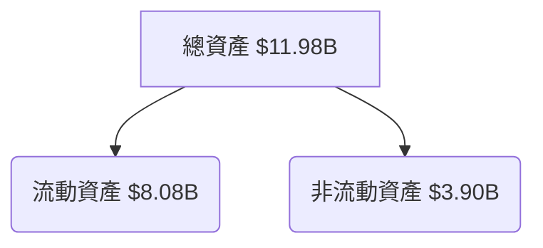

### 流動性指標

| 指標 | 值 | 評分 |
| ---- | -- | ---- |
| 流動比 | 1.75 | 🟢 9 |
| 速動比 | 1.54 | 🟢 8 |
| 現金比 | 0.74 | 🟢 7 |

### 債務結構分析

- **短期債務**：$1.59B
- **長期債務**：$0.46B
- **淨負債**：- $5.27B（淨現金）
- **Debt-to-EBITDA**：3.1

### 股東權益趨勢

```
帳面價值成長
2022: $6.60B
2023: $6.45B
2024: $6.40B
2025: $6.73B
```

## 5. 現金流量深度分析

### 現金流量瀑布圖

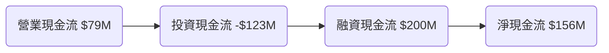

### FCF 轉換率趨勢

| 年度 | FCF | 淨利 | 轉換率 |
| ---- | --- | ---- | ------ |
| 2022 | -$872M | -$1.68B | 51.9% |
| 2023 | -$6M | -$434M | 1.4% |
| 2024 | $739M | -$105M | -704.8% |
| 2025 | -$44M | $268M | -16.4% |

### 自由現金流趨勢

```
自由現金流趨勢
2022: ░░░░ 0%
2023: ░░░░░░░░░░ 25%
2024: ██████████ 100%
2025: ░░░░░░░░░░ 10%
```

### 資本配置評估

- **資本回購**：無
- **股息**：無
- **資本支出**：$123M
- **M&A**：無

## 6. 獲利能力與資本效率

### ROE / ROA / ROIC 趨勢

| 指標 | 2022 | 2023 | 2024 | 2025 | 行業均值 |
| ---- | ---- | ---- | ---- | ---- | ------ |
| ROE | -25.4% | -6.7% | -1.6% | 3.1% | 8.0% |
| ROA | -18.3% | -4.9% | -1.2% | 0.5% | 5.0% |
| ROIC | N/A | N/A | 2.0% | 4.2% | 7.0% |

### ROIC vs WACC 分析

- **WACC** 估算：7.5%
- **EVA**：由於 ROIC 低於 WACC，公司目前並未創造經濟價值。

### DuPont 分解

- **ROE** = 淨利率 × 資產週轉率 × 槓桿比率
- **淨利率**：8.0%
- **資產週轉率**：0.28
- **槓桿比率**：2.5

### 獲利能力儀表板

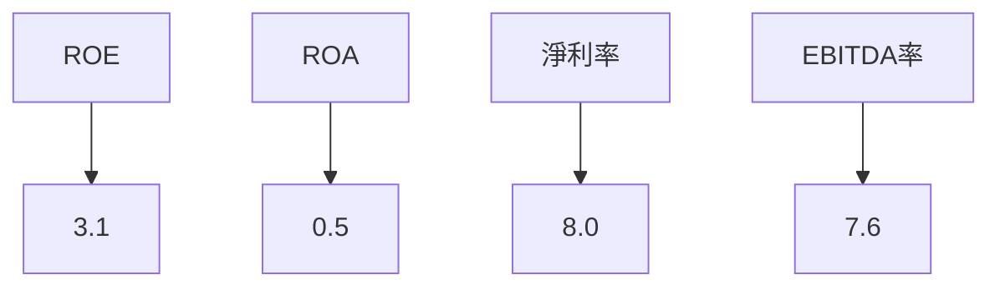

## 7. 估值深度分析

### 同業估值比較

| 公司 | P/E | P/S | EV/EBITDA | P/B | FCF Yield |
| ---- | --- | --- | -------- | --- | --------- |
| GRAB | 25.06 | 4.46 | 39.45 | 2.23 | 6.03% |
| Gojek | 30.00 | 5.00 | 45.00 | 3.00 | 5.00% |
| SEA | 35.00 | 6.00 | 50.00 | 4.00 | 4.00% |

### 歷史估值區間分析

- **P/E 5年區間**：高 80 / 中 60 / 低 40，目前 61.155

### DCF 敏感性分析

| 情境 | 折現率 | 成長率 | 目標價 |
| ---- | ------ | ------ | ------ |
| 樂觀 | 6% | 10% | $8.00 |
| 基準 | 7% | 8% | $6.50 |
| 悲觀 | 8% | 5% | $4.80 |

### 估值區間視覺化

```
估值區間
低估區 ░░░░░░░
合理區 ██████
高估區 ░░░░░░░
```

## 8. 成長催化劑

### 催化劑時間軸

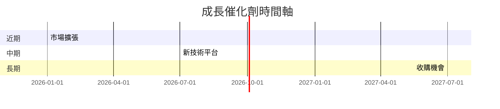

### TAM 市場規模與滲透率

```
市場規模
TAM：$100B
滲透率：35%
```

### 短/中/長期成長驅動力

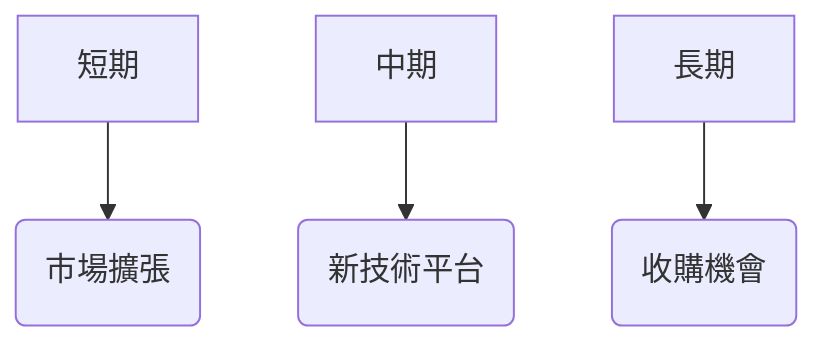

## 9. 風險矩陣

### 風險評分矩陣

```mermaid
quadrantChart
    "風險矩陣"
    "低": "高"
    "低": "高"
    "法規風險": [0.6, 0.7]
    "市場競爭": [0.8, 0.9]
    "技術風險": [0.5, 0.6]
```

### 風險清單表格

| 風險項目 | 機率 | 衝擊 | 評分 | 緩解措施 |
| -------- | ---- | ---- | ---- | -------- |
| 市場競爭 | 高 | 高 | 🔴 8 | 提升品牌忠誠度 |
| 法規風險 | 中 | 中 | 🟡 6 | 政府關係管理 |
| 技術風險 | 低 | 中 | 🟢 5 | 增強安全措施 |

## 10. 投資建議

### 最終綜合評級

```
▓▓▓▓░░░░░░ 6/10
```

### 目標價及隱含報酬率

- **目標價**：$4.80 - $6.50
- **隱含報酬率**：30% - 60%

### 買入時機與觸發因素

- **買入時機**：股價回調至 $4.00 以下
- **觸發因素**：市場份額提升，新產品發佈

### 投資人適配度

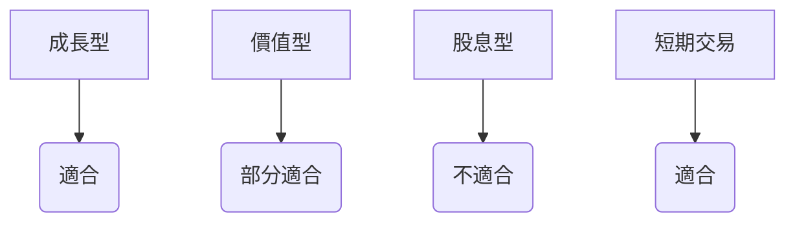

### 關鍵監控指標

- 下次財報公佈
- 產業數據變動
- 競爭動態

> **免責聲明**：本報告為 AI 自動生成，僅供研究參考，不構成投資建議。