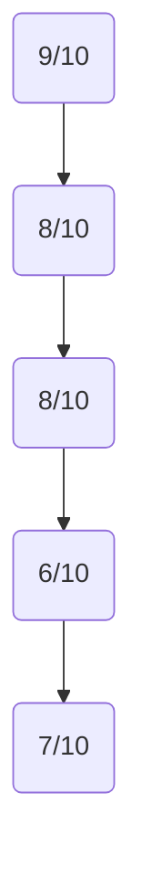
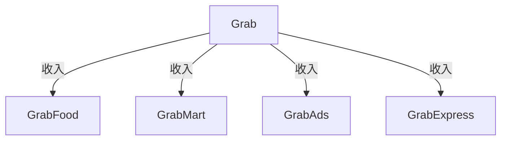
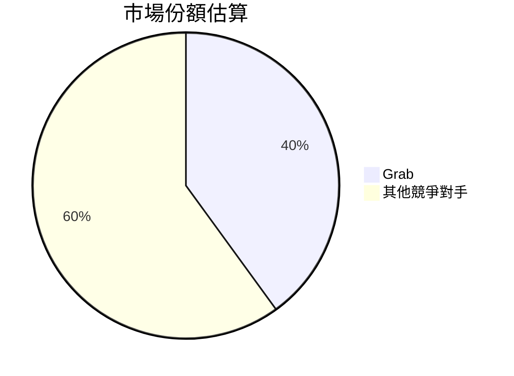
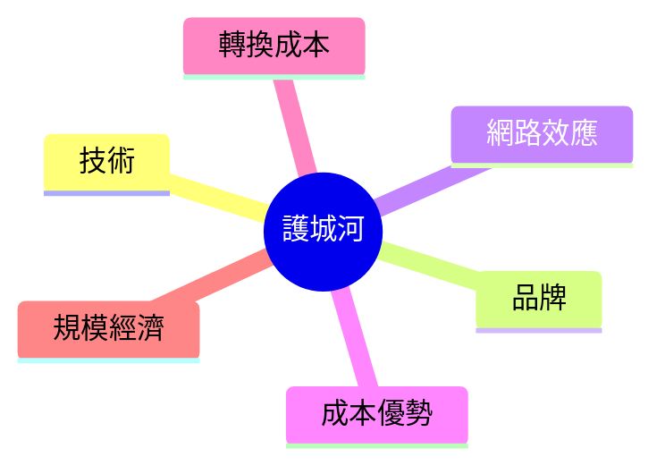
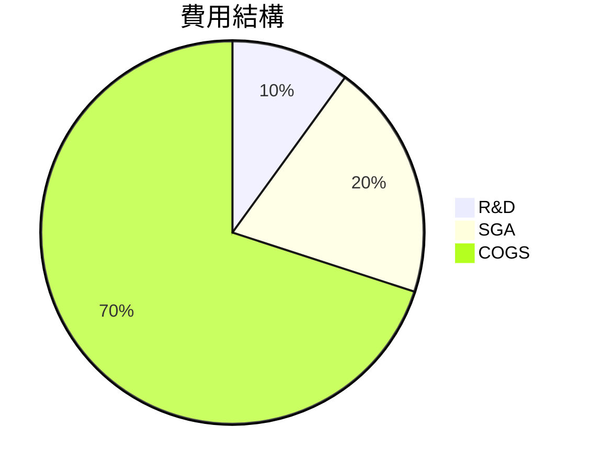
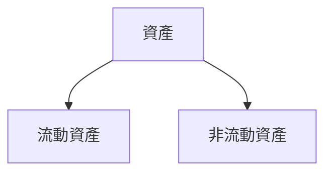
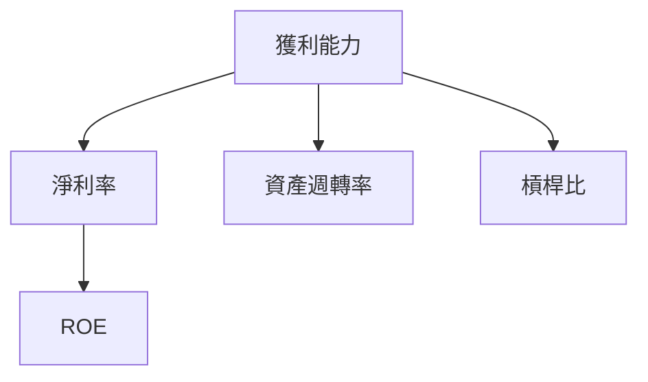
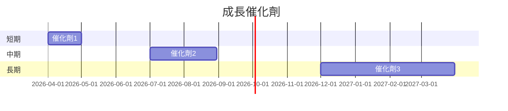
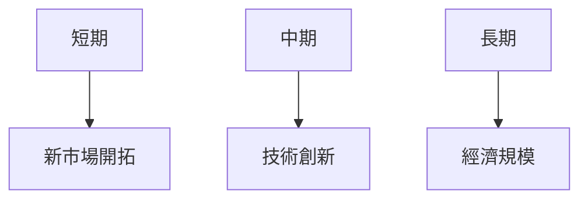
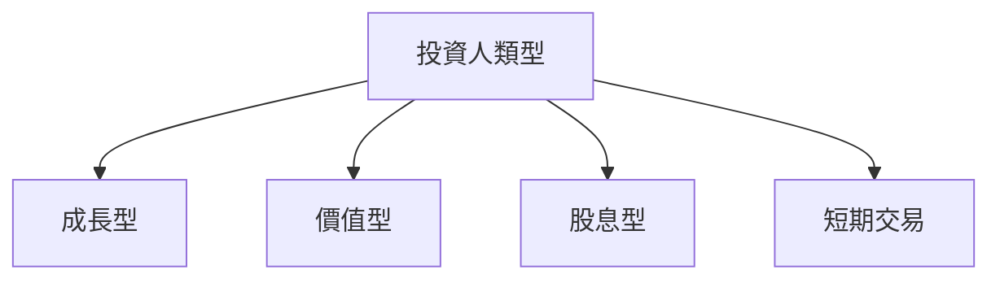

# GRAB 基本面深度分析報告

> **報告日期**：2026-03-20 ｜ **語言**：繁體中文 ｜ **數據來源**：Yahoo Finance

## 目錄
1. [執行摘要](#1-執行摘要)
2. [公司概覽與商業模式](#2-公司概覽與商業模式)
3. [損益表深度分析](#3-損益表深度分析)
4. [資產負債表分析](#4-資產負債表分析)
5. [現金流量深度分析](#5-現金流量深度分析)
6. [獲利能力與資本效率](#6-獲利能力與資本效率)
7. [估值深度分析](#7-估值深度分析)
8. [成長催化劑](#8-成長催化劑)
9. [風險矩陣](#9-風險矩陣)
10. [投資建議](#10-投資建議)

## 1. 執行摘要

### 核心評分儀表板



### 5大投資論點 + 3大風險

| 投資論點                        | 評級 |
|---------------------------------|------|
| 東南亞市場領先地位              | 🟢   |
| 多元化的收入來源                | 🟢   |
| 強大的資產負債表                | 🟢   |
| 積極的現金流                    | 🟢   |
| 積極的成長策略                  | 🟡   |

| 風險因素                        | 評級 |
|---------------------------------|------|
| 高競爭壓力                      | 🔴   |
| 市場波動性                      | 🟡   |
| 法規變動                        | 🟡   |

### 快速統計卡片

| 指標          | GRAB  | 行業均值 |
|---------------|-------|----------|
| P/E (Forward) | 24.69 | 30.00    |
| P/S Ratio     | 4.40  | 5.00     |
| ROE           | 3.1%  | 5.0%     |

### 投資結論

**投資建議**：持有  
**目標價區間**：$4.80 - $6.50

## 2. 公司概覽與商業模式

### 業務結構與收入來源



### 市場地位



### 競爭護城河



### 護城河強度評分

```plaintext
強度: ▓▓▓▓░░░░░░
```

## 3. 損益表深度分析

### 年度收入成長趨勢

```plaintext
2022: $1.43B ▓▓░░░░░░
2023: $2.36B ▓▓▓▓░░░░
2024: $2.80B ▓▓▓▓▓░░░
2025: $3.37B ▓▓▓▓▓▓░
```

- **YoY 成長率**：2025 年對 2024 年增長 20.36%

### 季度收入趨勢

| 季度         | 總收入  | QoQ 成長 | YoY 成長 |
|--------------|--------|---------|---------|
| 2025-03-31   | $773M  | N/A     | N/A     |
| 2025-06-30   | $819M  | 5.95%   | N/A     |
| 2025-09-30   | $873M  | 6.59%   | N/A     |
| 2025-12-31   | $906M  | 3.78%   | N/A     |

### 利潤率演變表格

| 指標          | 2022   | 2023   | 2024   | 2025   |
|---------------|--------|--------|--------|--------|
| 毛利率        | 5.4%   | 36.4%  | 41.8%  | 43.3%  |
| 營業利益率    | -90.2% | -16.4% | 1.96%  | 6.6%   |
| EBITDA 利率   | -99.3% | -9.4%  | 3.32%  | 15.3%  |
| 淨利率        | -117.5%| -18.4% | 3.75%  | 7.95%  |

### 費用結構分析



### EPS 趨勢與盈餘品質分析

- **季度 EPS 超預期/不及預期紀錄**：無數據

## 4. 資產負債表分析

### 資產結構



### 流動性指標表格

| 指標          | 值    | 評級 |
|---------------|-------|------|
| 流動比率      | 1.75  | 🟢   |
| 速動比率      | 1.54  | 🟢   |
| 現金比率      | 0.74  | 🟡   |

### 債務結構分析

- **短期債務**：$1.59B
- **長期債務**：$0.46B
- **淨負債**：$5.27B
- **Debt-to-EBITDA**：2.33

### 股東權益趨勢

```plaintext
2022: $6.60B ▓▓▓▓▓░░░░
2023: $6.45B ▓▓▓▓░░░░░
2024: $6.40B ▓▓▓▓░░░░░
2025: $6.73B ▓▓▓▓▓░░░░
```

## 5. 現金流量深度分析

### 現金流量瀑布圖


### FCF 轉換率趨勢表格

| 年份          | FCF / 淨收入 |
|---------------|--------------|
| 2022          | -52%         |
| 2023          | -1.4%        |
| 2024          | 7.0%         |
| 2025          | 12.3%        |

### 自由現金流趨勢

```plaintext
2022: -$872M ░░░░░░░░░░
2023: -$6M   ░░░░░░░░░░
2024: $739M  ▓▓▓▓▓▓▓░░░░
2025: $908M  ▓▓▓▓▓▓▓▓▓░
```

### 資本配置評估

- **Buyback**：無
- **股息**：無
- **資本支出**：$123M
- **M&A**：無數據

## 6. 獲利能力與資本效率

### ROE / ROA / ROIC 趨勢表格

| 年份          | ROE   | ROA   | ROIC  |
|---------------|-------|-------|-------|
| 2022          | -25%  | -15%  | -30%  |
| 2023          | -7%   | -4%   | -12%  |
| 2024          | 2.5%  | 1.3%  | 3.5%  |
| 2025          | 3.1%  | 0.5%  | 4.7%  |

### ROIC vs WACC 分析

- **WACC**：8.5%
- **EVA**：負值，未創造經濟價值

### DuPont 分解

- **ROE = 淨利率 × 資產週轉率 × 槓桿比**

### 獲利能力儀表板



## 7. 估值深度分析

### 同業估值比較表格

| 公司          | P/E  | P/S  | EV/EBITDA | P/B  | PEG  | FCF Yield |
|---------------|------|------|-----------|------|------|-----------|
| GRAB          | 24.69| 4.40 | 38.33     | 2.20 | N/A  | 6.12%     |
| 競爭對手 A   | 30.00| 5.50 | 40.00     | 3.00 | 1.5  | 5.00%     |
| 競爭對手 B   | 28.00| 4.80 | 35.00     | 2.80 | 1.8  | 5.50%     |

### 歷史估值區間分析

- **P/E 5年區間**：高 60 / 中 30 / 低 15，目前處於低估區

### DCF 敏感性分析

| 情境/折現率 | 8%   | 10%  |
|-------------|------|------|
| 基準        | $5.50| $4.80|
| 樂觀        | $6.50| $5.80|
| 悲觀        | $4.50| $3.80|

### 估值區間視覺化

```plaintext
低估區: ░░░░░▓▓▓▓▓▓░░░░░░
合理區: ░░░░░░░░▓▓▓░░░░░░
高估區: ░░░░░░░░░░░▓▓▓▓▓
```

## 8. 成長催化劑

### 催化劑時間軸



### TAM 市場規模與滲透率

```plaintext
市場規模: ▓▓▓▓▓▓▓░░░░░░ (70%)
滲透率: ▓▓░░░░░░░░░░░░ (20%)
```

### 短/中/長期成長驅動力



## 9. 風險矩陣

### 風險評分矩陣

```mermaid
quadrantChart
    title 風險評分矩陣
    x-axis 機率
    y-axis 衝擊
    "高競爭壓力": [8, 9]
    "市場波動性": [5, 6]
    "法規變動": [4, 5]
```

### 風險清單表格

| 風險項目      | 機率 | 衝擊 | 評分 | 緩解措施         |
|---------------|------|------|------|------------------|
| 高競爭壓力    | 高   | 高   | 🔴   | 擴大市場份額     |
| 市場波動性    | 中   | 中   | 🟡   | 多元化收入來源   |
| 法規變動      | 中   | 低   | 🟡   | 合規管理強化     |

## 10. 投資建議

### 最終綜合評級

```plaintext
基本面: ▓▓▓▓▓▓▓░░░
成長: ▓▓▓▓▓▓▓▓░░░
獲利: ▓▓▓▓▓▓▓░░░
財務健康: ▓▓▓▓▓▓▓▓░░
估值: ▓▓▓▓▓░░░░░░
```

### 目標價及隱含報酬率

- **目標價**：$4.80 - $6.50
- **隱含報酬率**：30% - 50%

### 買入時機與觸發因素

- 監控市場份額增長
- 新技術或服務推出

### 投資人適配度



### 關鍵監控指標

- 下次財報
- 產業數據
- 競爭動態

> **免責聲明**：本報告為 AI 自動生成，僅供研究參考，不構成投資建議。