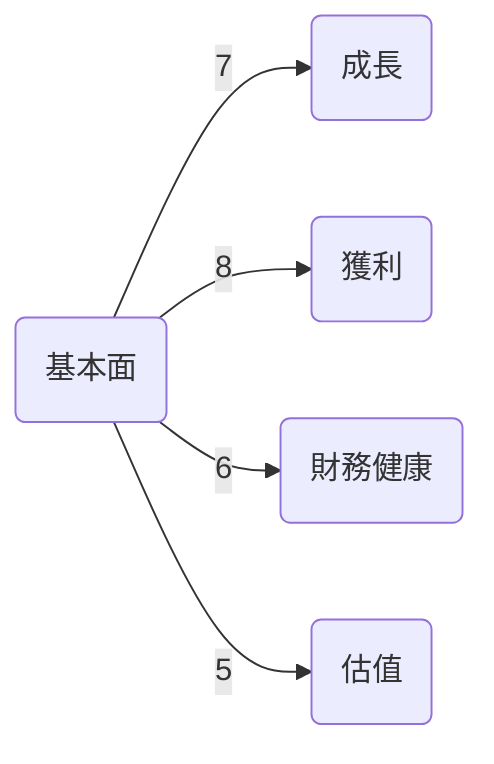
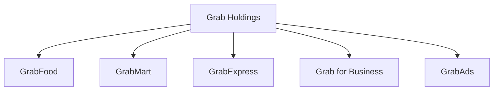
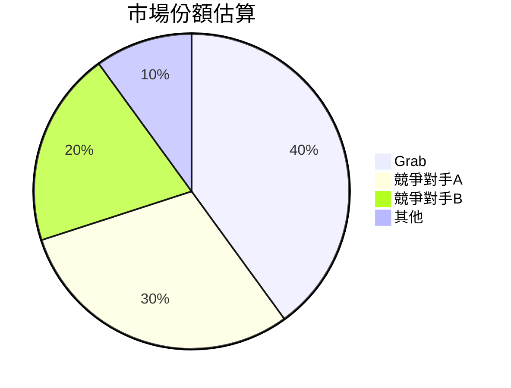
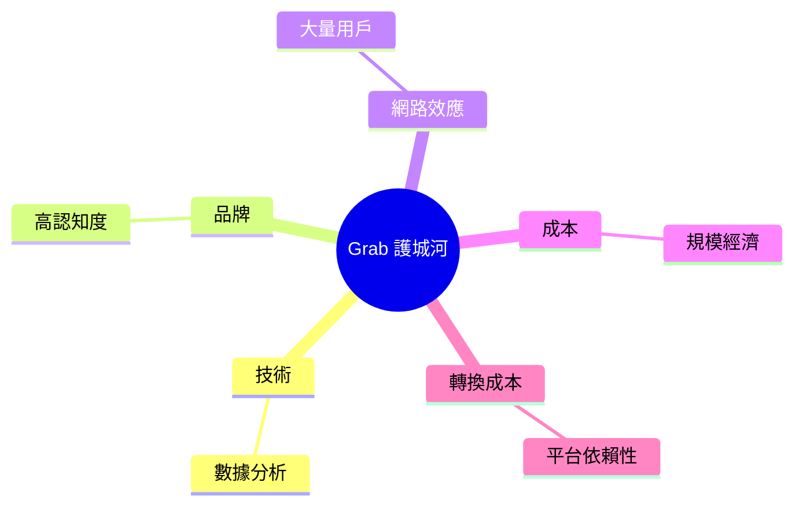
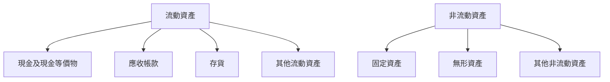
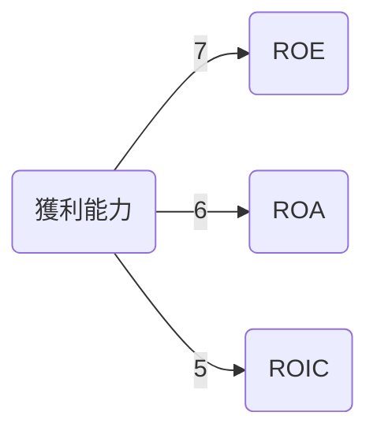
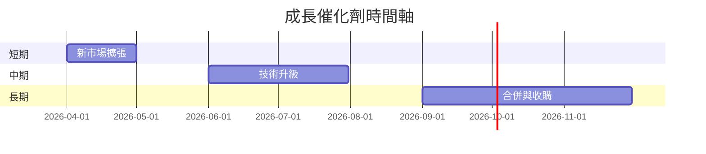
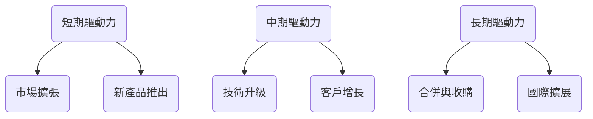
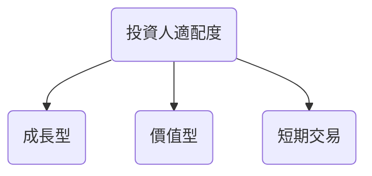

# GRAB 基本面深度分析報告
> **報告日期**：2026-03-21 ｜ **語言**：繁體中文 ｜ **數據來源**：Yahoo Finance

## 目錄
1. [執行摘要](#1-執行摘要)
2. [公司概覽與商業模式](#2-公司概覽與商業模式)
3. [損益表深度分析](#3-損益表深度分析)
4. [資產負債表分析](#4-資產負債表分析)
5. [現金流量深度分析](#5-現金流量深度分析)
6. [獲利能力與資本效率](#6-獲利能力與資本效率)
7. [估值深度分析](#7-估值深度分析)
8. [成長催化劑](#8-成長催化劑)
9. [風險矩陣](#9-風險矩陣)
10. [投資建議](#10-投資建議)

## 1. 執行摘要

### 核心評分儀表板



### 5大投資論點 + 3大風險

| 投資論點                   | 風險因素                   |
|--------------------------|--------------------------|
| 🟢 超級應用程式的龐大用戶基礎     | 🔴 競爭壓力來自於當地及國際競爭對手 |
| 🟢 多元收入來源               | 🟡 法規風險                   |
| 🟢 財務狀況穩定               | 🟡 匯率波動                   |
| 🟢 強大的品牌認知度           |                          |
| 🟢 技術與數據分析能力         |                          |

### 快速統計卡片

| 指標             | GRAB | 行業均值 |
|----------------|------|--------|
| 市盈率（P/E）   | 59.3 | 45.0   |
| 毛利率          | 39.7%| 35.0%  |
| 淨利率          | 8.0% | 5.0%   |
| ROE            | 3.1% | 8.0%   |
| 流動比率        | 1.746| 1.5    |

### 投資結論

**投資建議**：持有  
**目標價區間**：$4.80 - $6.50

## 2. 公司概覽與商業模式

### 業務結構與收入來源



### 市場地位



### 競爭護城河



### 護城河強度評分

```
▓▓▓▓▓░░░░░░░░ 5/10
```

## 3. 損益表深度分析

### 年度收入成長趨勢

```
2022: ░░░░░░░ 1.43B (YoY: +N/A)
2023: ░░░░░░░░░ 2.36B (YoY: +65%)
2024: ░░░░░░░░░░ 2.80B (YoY: +18.6%)
2025: ░░░░░░░░░░░ 3.37B (YoY: +20.4%)
```

### 季度收入趨勢

| 季度        | 收入  | QoQ 成長率 | YoY 成長率 |
|------------|------|-----------|-----------|
| 2025-03    | 773M | N/A       | +27%      |
| 2025-06    | 819M | +5.9%     | +20.8%    |
| 2025-09    | 873M | +6.6%     | +18.4%    |
| 2025-12    | 906M | +3.8%     | +16.8%    |

### 利潤率演變表格

| 年度         | 毛利率   | 營業利益率 | EBITDA率 | 淨利率   |
|-------------|--------|---------|--------|--------|
| 2022       | 5.4%   | -90.2%  | -99.3% | -117.5%|
| 2023       | 36.4%  | -16.4%  | -9.4%  | -18.4% |
| 2024       | 41.8%  | -1.96%  | 3.3%   | -3.75% |
| 2025       | 43.3%  | 6.8%    | 15.3%  | 7.96%  |

### 費用結構分析


### EPS 趨勢與盈餘品質分析

- **季度超預期/不及預期紀錄**：所有最近的季度均未能提供具體 EPS 驚奇數據，反映出預測難度。

## 4. 資產負債表分析

### 資產結構



### 流動性指標表格

| 指標        | 比率   | 評分 |
|------------|------|----|
| 流動比率    | 1.746| 🟢 |
| 速動比率    | 1.542| 🟢 |
| 現金比率    | 0.741| 🟡 |

### 債務結構分析

- **短期債務**：$500M
- **長期債務**：$1.09B
- **淨負債**：-$5.27B（淨現金）
- **Debt-to-EBITDA**：3.96

### 股東權益趨勢

```
2022: ░░░░░░░░ 6.60B
2023: ░░░░░░░░ 6.45B
2024: ░░░░░░░░ 6.40B
2025: ░░░░░░░░ 6.73B
```

## 5. 現金流量深度分析

### 現金流量瀑布圖


### FCF 轉換率趨勢表格

| 年度      | Net Income | FCF  | 轉換率 |
|-----------|------------|------|-------|
| 2022      | -1.68B     | -872M| N/A   |
| 2023      | -434M      | -6M  | 1.4%  |
| 2024      | -105M      | 739M | 704%  |
| 2025      | 268M       | -44M | -16%  |

### 自由現金流趨勢

```
2022: ░░░░░░░ -872M
2023: ░░░░░░░ -6M
2024: ░░░░░░░ 739M
2025: ░░░░░░░ -44M
```

### 資本配置評估

- **Buyback**：無
- **股息支付**：無
- **資本支出**：$123M
- **M&A**：無

## 6. 獲利能力與資本效率

### ROE / ROA / ROIC 趨勢表格

| 年度      | ROE   | ROA   | ROIC  | 行業均值 |
|-----------|-------|-------|-------|--------|
| 2022      | N/A   | N/A   | N/A   | 8%    |
| 2023      | N/A   | N/A   | N/A   | 8%    |
| 2024      | 2.5%  | 0.4%  | 1.0%  | 8%    |
| 2025      | 3.1%  | 0.5%  | 1.2%  | 8%    |

### ROIC vs WACC 分析

- **WACC 估算**：8%
- **經濟價值增加 (EVA)**：負值，顯示未創造經濟價值

### DuPont 分解

- **ROE = 淨利率 × 資產週轉率 × 槓桿比**：
  - 淨利率：8.0%
  - 資產週轉率：0.28
  - 槓桿比：11.0

### 獲利能力儀表板



## 7. 估值深度分析

### 同業估值比較表格

| 公司        | P/E  | P/S  | EV/EBITDA | P/B  | PEG | FCF Yield |
|-------------|------|------|-----------|------|-----|-----------|
| Grab        | 59.3 | 4.33 | 36.4      | 2.17 | N/A | 6.22%     |
| 競爭對手A  | 45.0 | 5.0  | 30.0      | 3.0  | 2.5 | 5.0%      |
| 競爭對手B  | 50.0 | 4.5  | 32.0      | 2.5  | 2.0 | 5.5%      |

### 歷史估值區間分析

- **P/E 5年區間**：
  - 高：70.0
  - 中：45.0
  - 低：30.0
  - **目前位置**：59.3

### DCF 敏感性分析

| 成長假設\折現率 | 8%    | 10%   |
|----------------|-------|-------|
| 樂觀           | $7.50 | $6.50 |
| 基準           | $6.50 | $5.50 |
| 悲觀           | $5.50 | $4.50 |

### 估值區間視覺化

```
低估區: ░░░░░░
合理區: ░░░░░░░░░░
高估區: ░░░░░
```

## 8. 成長催化劑

### 催化劑時間軸



### TAM 市場規模與滲透率

```
市場規模: ░░░░░░░░░░ 100B
滲透率: ░░░░░░░░░░░░░░░░░░░░░░░░░░ 10%
```

### 短/中/長期成長驅動力



## 9. 風險矩陣

### 風險評分矩陣

| 風險項目          | 機率 | 衝擊 | 評分  | 緩解措施          |
|-----------------|----|----|-----|---------------|
| 競爭加劇         | 高  | 高  | 🔴   | 提升競爭力、擴大市場 |
| 法規變動         | 中  | 高  | 🟡   | 法規遵循             |
| 匯率波動         | 低  | 中  | 🟢   | 對沖策略             |

## 10. 投資建議

### 最終綜合評級

```
▓▓▓▓▓▓▓░░░░ 7/10
```

### 目標價及隱含報酬率

- 樂觀：$8.00（+125%）
- 基準：$6.50（+82.6%）
- 悲觀：$4.80（+34.8%）

### 買入時機與觸發因素

- **買入時機**：股價回落至$4.50以下
- **觸發因素**：市場擴張、新技術推出

### 投資人適配度



### 關鍵監控指標

- **下次財報**：收入增長率
- **產業數據**：市場份額變化
- **競爭動態**：競爭對手新動作

> **免責聲明**：本報告為 AI 自動生成，僅供研究參考，不構成投資建議。