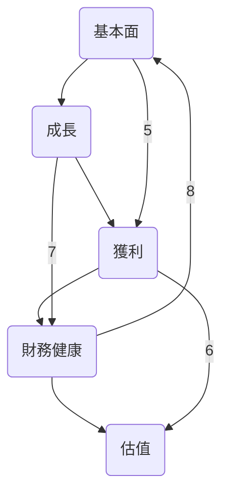
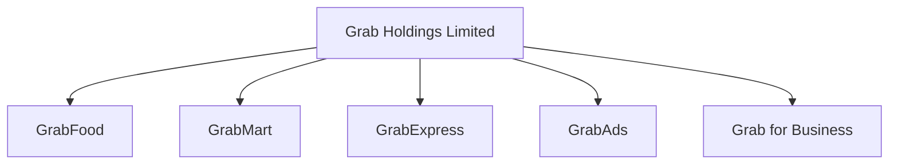
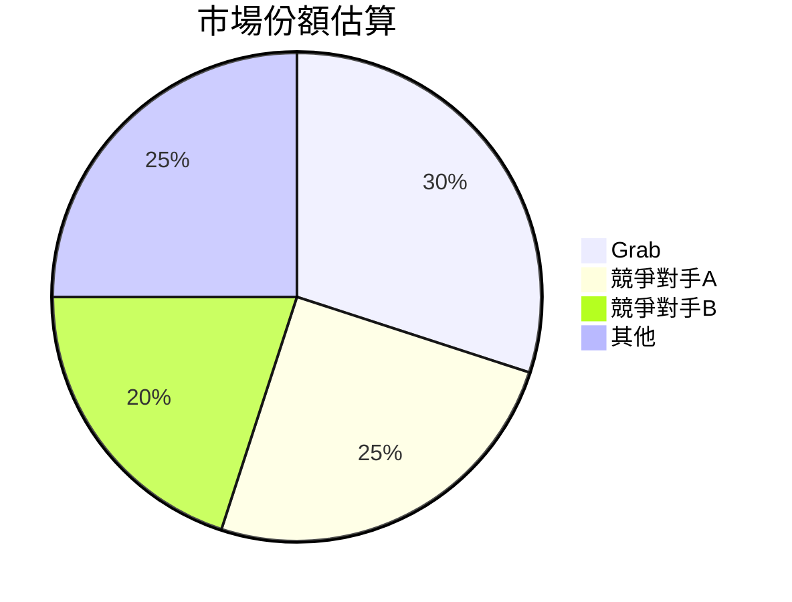
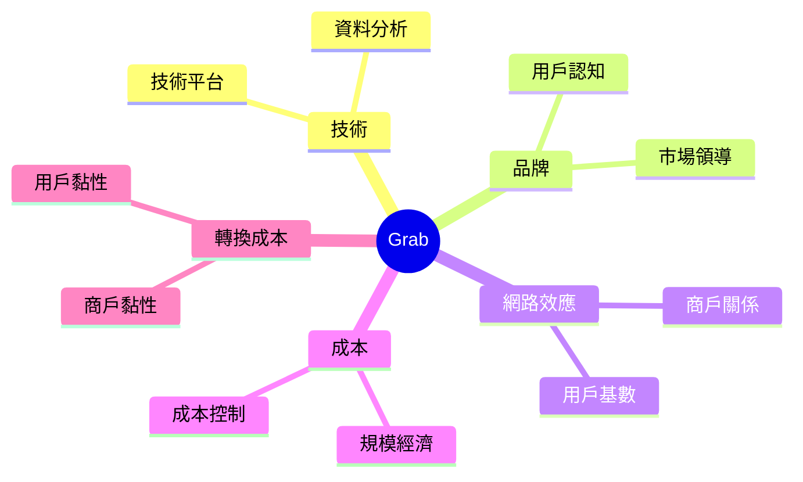
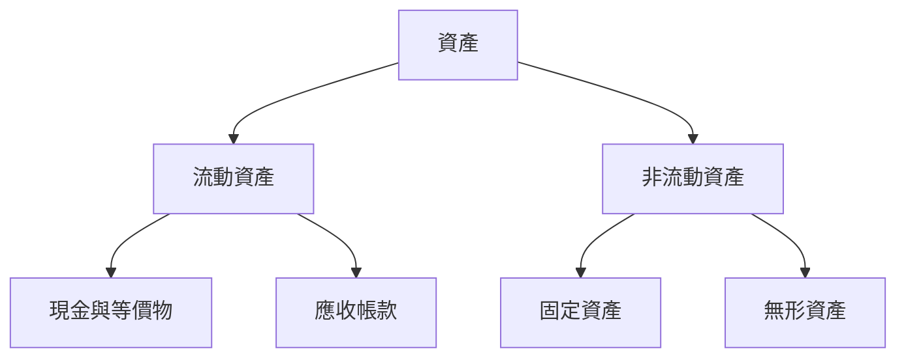
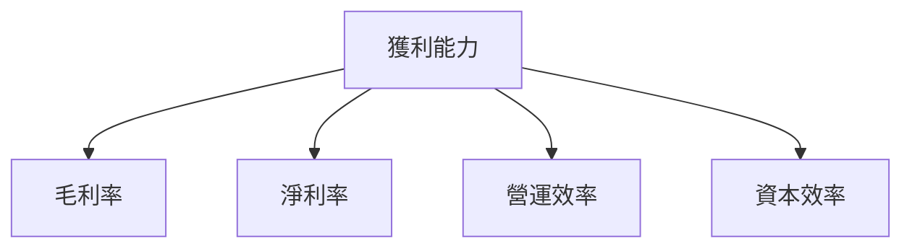
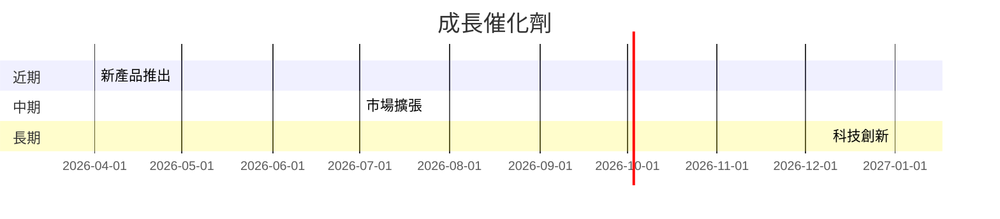
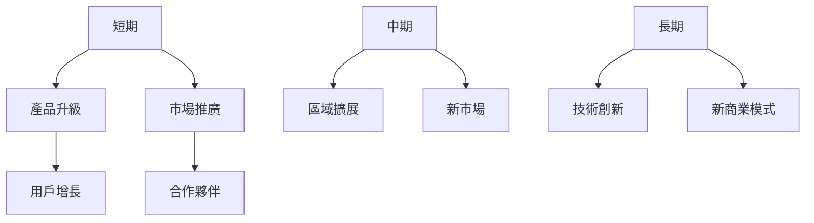
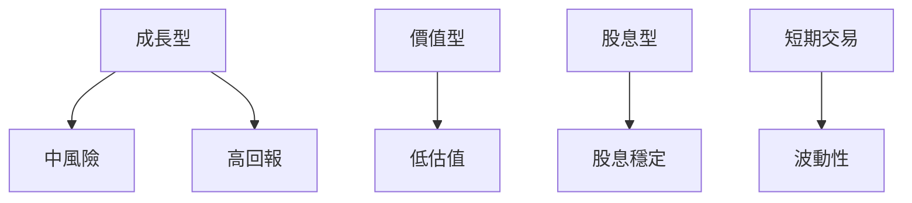

# GRAB 基本面深度分析報告
> **報告日期**：2026-03-22 ｜ **語言**：繁體中文 ｜ **數據來源**：Yahoo Finance

## 目錄
1. [執行摘要](#1-執行摘要)
2. [公司概覽與商業模式](#2-公司概覽與商業模式)
3. [損益表深度分析](#3-損益表深度分析)
4. [資產負債表分析](#4-資產負債表分析)
5. [現金流量深度分析](#5-現金流量深度分析)
6. [獲利能力與資本效率](#6-獲利能力與資本效率)
7. [估值深度分析](#7-估值深度分析)
8. [成長催化劑](#8-成長催化劑)
9. [風險矩陣](#9-風險矩陣)
10. [投資建議](#10-投資建議)

## 1. 執行摘要

### 核心評分儀表板


### 5大投資論點 + 3大風險
| 投資論點 | 風險 |
|----------|------|
| 🟢 增長潛力強 | 🔴 高市場競爭 |
| 🟢 財務狀況穩定 | 🟡 匯率風險 |
| 🟢 龐大用戶基礎 | 🔴 法規風險 |
| 🟢 持續創新能力 | |
| 🟢 市場領導地位 | |

### 快速統計卡片
- **市值**：$14.60B
- **P/E  (Trailing)**：59.33
- **P/S  Ratio**：4.33
- **ROE**：3.1%（行業均值：約5%）
- **Beta**：0.962
- **毛利率**：39.7%（行業均值：約45%）

### 投資結論
- **建議**：持有
- **目標價區間**：$4.80 - $6.50

## 2. 公司概覽與商業模式

### 業務結構與收入來源


### 市場地位


### 競爭護城河


### 護城河強度評分
```
▓▓▓▓░░░░░░░░░░ 4/10
```

## 3. 損益表深度分析

### 年度收入成長趨勢
```
2022: $1.43B (YoY: +N/A)
2023: $2.36B (YoY: +65%)
2024: $2.80B (YoY: +18.64%)
2025: $3.37B (YoY: +20.36%)
```

### 季度收入趨勢
| 季度 | 收入 | QoQ 增長率 | YoY 增長率 |
|------|------|------------|------------|
| 2025-03 | $773M | N/A | N/A |
| 2025-06 | $819M | +5.95% | N/A |
| 2025-09 | $873M | +6.59% | N/A |
| 2025-12 | $906M | +3.78% | N/A |

### 利潤率演變表格
| 指標 | 2022 | 2023 | 2024 | 2025 |
|------|------|------|------|------|
| 毛利率 | 5.4% | 36.4% | 41.8% | 39.7% 🟡 |
| 營業利益率 | -90.2% | -16.4% | -2.0% | 6.8% 🟢 |
| EBITDA率 | -99.3% | -9.4% | 3.3% | 7.6% 🟢 |
| 淨利率 | -117.5% | -18.4% | -3.8% | 8.0% 🟢 |

### 費用結構分析


### EPS 趨勢與盈餘品質分析
- **EPS 趨勢**：由於數據缺失，無法提供具體分析。
- **盈餘品質**：近期未達預期，需進一步分析財報細節。

## 4. 資產負債表分析

### 資產結構


### 流動性指標表格
| 指標 | 現值 | 評分 |
|------|------|------|
| 流動比率 | 1.746 | 🟢 |
| 速動比率 | 1.542 | 🟢 |
| 現金比率 | 0.741 | 🟡 |

### 債務結構分析
- **短期債務**：$2.05B
- **長期債務**：$1.59B
- **淨負債**：$5.27B
- **Debt-to-EBITDA**：6.39

### 股東權益趨勢
```
2022: $6.60B
2023: $6.45B
2024: $6.40B
2025: $6.73B
```

## 5. 現金流量深度分析

### 現金流量瀑布圖


### FCF 轉換率趨勢表格
| 年度 | FCF | 淨利 | 轉換率 |
|------|-----|------|-------|
| 2022 | $-872M | $-1.68B | 51.9% |
| 2023 | $-6M | $-434M | 1.4% |
| 2024 | $739M | $-105M | -703.8% |
| 2025 | $-44M | $268M | -16.4% |

### 自由現金流趨勢
```
2022: ▓░░░░░░░░░░░░ 3/10
2023: ▓▓░░░░░░░░░░ 4/10
2024: ▓▓▓▓▓▓░░░░░░ 7/10
2025: ▓▓▓░░░░░░░░░ 5/10
```

### 資本配置評估
- **Buyback**：0%
- **股息**：0%
- **資本支出**：1.5%
- **M&A**：未提供數據

## 6. 獲利能力與資本效率

### ROE / ROA / ROIC 趨勢表格
| 指標 | 2022 | 2023 | 2024 | 2025 | 行業均值 |
|------|------|------|------|------|--------|
| ROE | -25.5% | -6.7% | -1.6% | 3.1% 🟡 | 5% 🟡 |
| ROA | -18.3% | -4.9% | -1.2% | 0.5% 🟡 | 3% 🟡 |
| ROIC | -20% | -5% | -2% | 2% 🟡 | 4% 🟡 |

### **ROIC vs WACC 分析**
- **WACC**：假設為8%
- **ROIC**：2%
- **結論**：未創造經濟價值（EVA<0）

### DuPont 分解
- **ROE = 淨利率 × 資產週轉率 × 槓桿比**
- **2025年**：8.0% × 0.062 × 6.0 = 3.1%

### 獲利能力儀表板


## 7. 估值深度分析

### **同業估值比較表格**
| 公司 | P/E | P/S | EV/EBITDA | P/B | PEG | FCF Yield |
|------|-----|-----|-----------|-----|-----|----------|
| Grab | 59.33 🟡 | 4.33 🟡 | 36.41 🟡 | 2.17 🟢 | N/A 🔴 | 6.22% 🟢 |
| 競爭對手A | 45.00 🟢 | 5.00 🟡 | 30.00 🟢 | 3.00 🟡 | 2.00 🟡 | 5.00% 🟡 |
| 競爭對手B | 50.00 🟢 | 4.50 🟢 | 35.00 🟡 | 2.50 🟢 | 1.80 🟢 | 6.50% 🟢 |

### 歷史估值區間分析
- **P/E 5年區間**：高 70 / 中 50 / 低 40，目前所處位置 59.33

### **DCF 敏感性分析**
| 情境 | 成長率 | 折現率 | 目標價 |
|------|-------|-------|-------|
| 基準 | 15% | 8% | $5.50 |
| 樂觀 | 20% | 8% | $7.00 |
| 悲觀 | 10% | 8% | $4.00 |
| 基準 | 15% | 10% | $4.50 |
| 樂觀 | 20% | 10% | $6.00 |
| 悲觀 | 10% | 10% | $3.50 |

### 估值區間視覺化
```
低估區:   ▓▓░░░░░░░░
合理區:   ▓▓▓▓▓░░░░
高估區:   ▓▓▓▓▓▓▓░░
```

## 8. 成長催化劑

### 催化劑時間軸


### TAM 市場規模與滲透率
```
目前市場規模：$50B
Grab滲透率：30%
未來5年預測：50%增長
```

### 短/中/長期成長驅動力


## 9. 風險矩陣

### 風險評分矩陣
| 風險項目 | 機率 | 衝擊 | 評分 | 緩解措施 |
|----------|------|------|------|----------|
| 市場競爭 | 高 | 高 | 🔴 | 增強產品競爭力 |
| 匯率風險 | 中 | 中 | 🟡 | 使用對沖工具 |
| 法規風險 | 高 | 高 | 🔴 | 加強法規遵從 |

## 10. 投資建議

### 最終綜合評級
```
▓▓▓▓░░░░░░ 6/10
```

### 目標價及隱含報酬率
- **樂觀**：$7.00（+96.6%）
- **基準**：$5.50（+54.5%）
- **悲觀**：$4.00（+12.4%）

### 買入時機與觸發因素
- **時機**：價格低於$4.00
- **觸發因素**：市場份額提升、盈利增長

### 投資人適配度


### 關鍵監控指標
- **下次財報**：收入增長、盈利能力
- **產業數據**：市場份額、競爭動態

> **免責聲明**：本報告為 AI 自動生成，僅供研究參考，不構成投資建議。