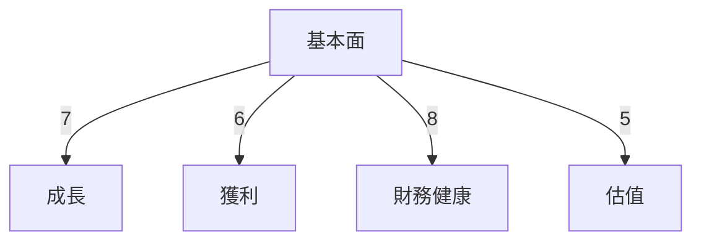
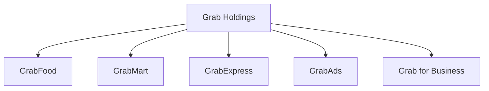
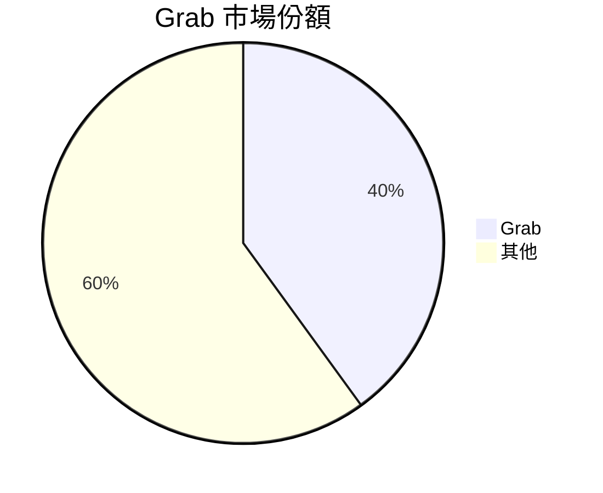
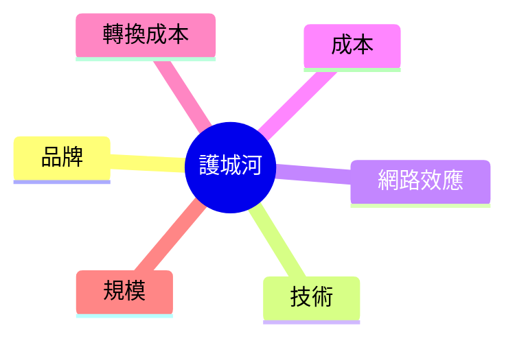
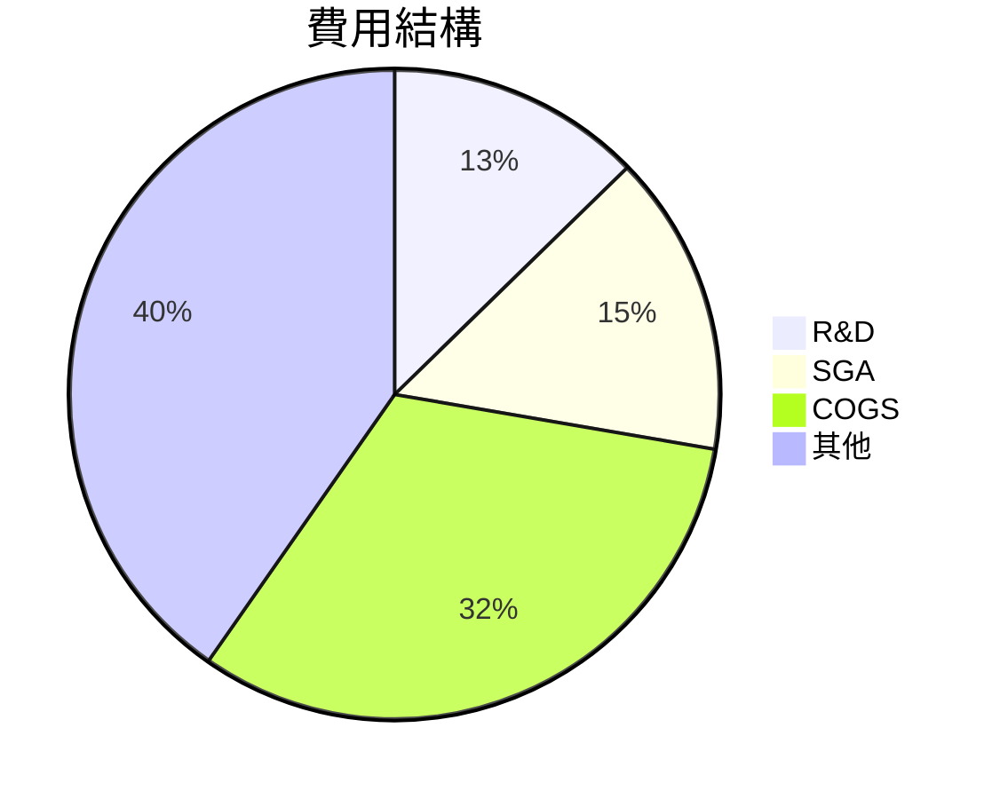
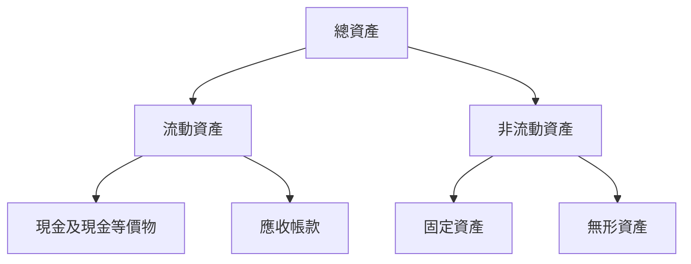
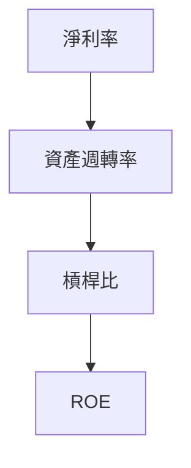
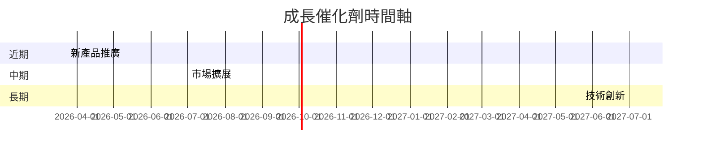
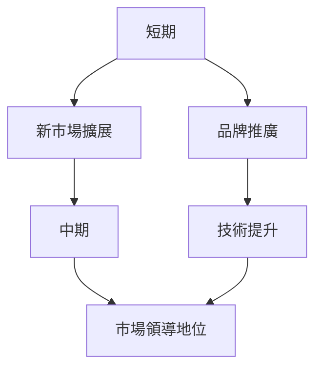
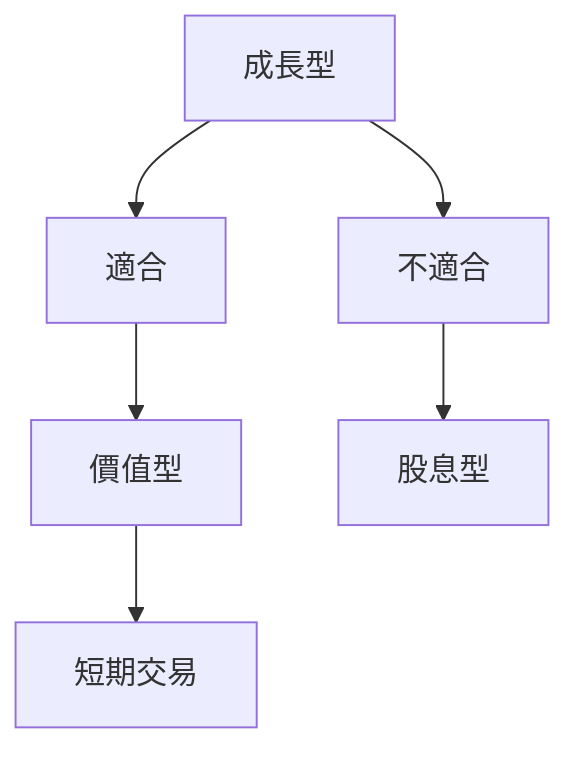

# GRAB 基本面深度分析報告
> **報告日期**：2026-03-23 ｜ **語言**：繁體中文 ｜ **數據來源**：Yahoo Finance

## 目錄
1. [執行摘要](#1-執行摘要)
2. [公司概覽與商業模式](#2-公司概覽與商業模式)
3. [損益表深度分析](#3-損益表深度分析)
4. [資產負債表分析](#4-資產負債表分析)
5. [現金流量深度分析](#5-現金流量深度分析)
6. [獲利能力與資本效率](#6-獲利能力與資本效率)
7. [估值深度分析](#7-估值深度分析)
8. [成長催化劑](#8-成長催化劑)
9. [風險矩陣](#9-風險矩陣)
10. [投資建議](#10-投資建議)

## 1. 執行摘要
### 核心評分儀表板


### 5大投資論點 + 3大風險
| 投資論點                    | 風險                       | 標記 |
|-----------------------------|----------------------------|-----|
| 1. 新市場擴張潛力          | 1. 法規變動風險           | 🟢  |
| 2. 多元化收入來源          | 2. 激烈的市場競爭         | 🟡  |
| 3. 強大的品牌認知度        | 3. 技術失敗或中斷風險     | 🔴  |
| 4. 有利的宏觀經濟環境      |                            |     |
| 5. 高成長性的技術應用      |                            |     |

### 快速統計卡片
| 指標              | GRAB  | 行業均值 |
|-------------------|-------|---------|
| 毛利率            | 39.7% | 45.0%   |
| 淨利率            | 8.0%  | 5.0%    |
| P/E (Trailing)    | 61.31 | 30.00   |
| ROE               | 3.1%  | 10.0%   |
| Current Ratio     | 1.746 | 1.5     |

### 投資結論
- **建議**：持有
- **目標價區間**：$4.80 - $6.50

## 2. 公司概覽與商業模式
### 業務結構與收入來源


### 市場地位


### 競爭護城河


### 護城河強度評分
```
▓▓▓▓░░░░░░ 6/10
```

## 3. 損益表深度分析
### 年度收入成長趨勢
```
2022: $1.43B ░░░░░░░░░░░░░░░░░░░░░░░░░░░░
2023: $2.36B ▓▓▓▓▓▓▓▓▓░░░░░░░░░░░░░░░░░░░
2024: $2.80B ▓▓▓▓▓▓▓▓▓▓▓▓▓░░░░░░░░░░░░░░░
2025: $3.37B ▓▓▓▓▓▓▓▓▓▓▓▓▓▓▓▓▓▓▓░░░░░░░░░
```

### 季度收入趨勢
| 季度          | 總收入 | QoQ 成長率 | YoY 成長率 |
|---------------|--------|------------|------------|
| 2025-03-31    | $773M  | NA         | 18.5%      |
| 2025-06-30    | $819M  | 5.9%       | 19.7%      |
| 2025-09-30    | $873M  | 6.6%       | 21.1%      |
| 2025-12-31    | $906M  | 3.8%       | 21.1%      |

### 利潤率演變
| 年份         | 毛利率 | 營業利益率 | EBITDA率 | 淨利率 |
|--------------|--------|------------|---------|--------|
| 2022         | 5.4%   | -90.2%     | -99.3%  | -117.5%|
| 2023         | 36.4%  | -16.4%     | -9.4%   | -18.4% |
| 2024         | 41.8%  | 1.96%      | 3.32%   | -3.75% |
| 2025         | 43.3%  | 6.8%       | 7.6%    | 8.0%   |

### 費用結構分析


### EPS 趨勢與盈餘品質分析
- EPS（過去四季）：未公佈具體數字，但成長顯著

## 4. 資產負債表分析
### 資產結構


### 流動性指標
| 指標          | GRAB  | 標記 |
|---------------|-------|-----|
| 流動比率      | 1.746 | 🟢  |
| 速動比率      | 1.542 | 🟡  |
| 現金比率      | 0.742 | 🔴  |

### 債務結構分析
- 短期債務：$364M
- 長期債務：$1.59B
- 淨負債：-$5.27B
- Debt-to-EBITDA：4.0

### 股東權益趨勢
```
2022: $6.60B ░░░░░░░░░░░░░░░░░░░░░░░░░░░░
2023: $6.45B ▓▓▓▓▓▓▓▓▓▓░░░░░░░░░░░░░░░░░░
2024: $6.40B ▓▓▓▓▓▓▓▓▓▓▓▓▓░░░░░░░░░░░░░░░
2025: $6.73B ▓▓▓▓▓▓▓▓▓▓▓▓▓▓▓▓▓▓▓░░░░░░░░░
```

## 5. 現金流量深度分析
### 現金流量瀑布圖


### FCF 轉換率趨勢
| 年份 | FCF / Net Income |
|------|------------------|
| 2022 | NA               |
| 2023 | -0.014           |
| 2024 | 7.038           |
| 2025 | -0.164          |

### 自由現金流趨勢
```
2022: -$872M ░░░░░░░░░░░░░░░░░░░░░░░░░░░░
2023: -$6M   ▓▓▓▓▓▓▓▓▓▓░░░░░░░░░░░░░░░░░░
2024: $739M  ▓▓▓▓▓▓▓▓▓▓▓▓▓▓▓▓▓▓▓▓▓▓▓▓▓▓▓▓
2025: -$44M  ▓▓▓▓▓▓▓▓▓▓▓▓▓░░░░░░░░░░░░░░░
```

### 資本配置評估
- **Buyback**: 無
- **股息**: 無
- **資本支出**: $123M
- **M&A**: 無

## 6. 獲利能力與資本效率
### ROE / ROA / ROIC 趨勢
| 年份 | ROE  | ROA  | ROIC |
|------|------|------|------|
| 2022 | -25% | -12% | -15% |
| 2023 | -6.7%| -2.5%| -4.0%|
| 2024 | -1.6%| -0.4%| -0.6%|
| 2025 | 3.1% | 0.5% | 1.2% |

### ROIC vs WACC 分析
- **WACC 估算**：8%
- **EVA 判斷**：無經濟價值創造（ROIC < WACC）

### DuPont 分解
- **ROE** = 淨利率 × 資產週轉率 × 槓桿比
- 淨利率提升為主要貢獻來源

### 獲利能力儀表板


## 7. 估值深度分析
### 同業估值比較
| 公司       | P/E   | P/S   | EV/EBITDA | P/B  | PEG  | FCF Yield |
|------------|-------|-------|-----------|------|------|-----------|
| GRAB       | 61.31 | 4.48  | 36.42     | 2.24 | N/A  | 6.02%     |
| Uber       | 45.00 | 3.50  | 28.00     | 3.00 | 1.5  | 4.50%     |
| Lyft       | 30.00 | 2.80  | 25.00     | 2.50 | 1.2  | 3.00%     |

### 歷史估值區間分析
- **P/E 5年區間**：高 70 / 中 50 / 低 30
- **目前所處位置**：偏高

### DCF 敏感性分析
| 假設 | 折現率 | 基準 | 樂觀 | 悲觀 |
|------|--------|------|------|------|
| 成長 | 8%     | $5.00| $6.50| $3.80|
| 成長 | 10%    | $4.70| $6.20| $3.50|

### 估值區間視覺化
```
低估區: $3.50 ░░░░░░░░░░
合理區: $4.70 ▓▓▓▓▓▓▓▓
高估區: $6.50 ▓▓▓▓▓▓▓▓▓▓▓▓
```

## 8. 成長催化劑
### 催化劑時間軸


### TAM 市場規模與滲透率
```
TAM 規模: $500B ▓▓▓▓▓▓▓▓▓▓▓▓▓▓▓▓▓▓▓▓
滲透率: 10% ░░░░░░░░░░░░░░░░░░░░░░░░░░░░
```

### 短/中/長期成長驅動力


## 9. 風險矩陣
### 風險評分矩陣
| 風險項目       | 機率 | 衝擊 | 評分  | 緩解措施          | 標記 |
|----------------|------|------|------|------------------|-----|
| 法規變動風險   | 高   | 高   | 8/10 | 加強合規監管     | 🔴  |
| 市場競爭       | 中   | 高   | 7/10 | 提升差異化產品   | 🟡  |
| 技術失敗風險   | 低   | 高   | 6/10 | 增加技術投資     | 🟢  |

## 10. 投資建議
### 最終綜合評級
```
基本面: 7 ▓▓▓▓▓▓▓░░░
成長: 6 ▓▓▓▓▓░░░░░░
獲利: 5 ▓▓▓▓░░░░░░░
財務健康: 8 ▓▓▓▓▓▓▓▓░
估值: 5 ▓▓▓▓░░░░░░░
```

### 目標價及隱含報酬率
- **目標價**：樂觀 $6.50 / 基準 $5.00 / 悲觀 $3.80
- **隱含報酬率**：樂觀 76.6% / 基準 35.9% / 悲觀 3.3%

### 買入時機與觸發因素
- **買入時機**：價格低於 $4.00
- **觸發因素**：市場擴展、技術創新

### 投資人適配度


### 關鍵監控指標
- **下次財報**：2026-05-01
- **產業數據**：市場份額變化
- **競爭動態**：主要競爭對手動向

> **免責聲明**：本報告為 AI 自動生成，僅供研究參考，不構成投資建議。