# GRAB 基本面深度分析報告
> **報告日期**：2026-03-24 ｜ **語言**：繁體中文 ｜ **數據來源**：Yahoo Finance

## 目錄
1. [執行摘要](#1-執行摘要)
2. [公司概覽與商業模式](#2-公司概覽與商業模式)
3. [損益表深度分析](#3-損益表深度分析)
4. [資產負債表分析](#4-資產負債表分析)
5. [現金流量深度分析](#5-現金流量深度分析)
6. [獲利能力與資本效率](#6-獲利能力與資本效率)
7. [估值深度分析](#7-估值深度分析)
8. [成長催化劑](#8-成長催化劑)
9. [風險矩陣](#9-風險矩陣)
10. [投資建議](#10-投資建議)

## 1. 執行摘要

### 核心評分儀表板
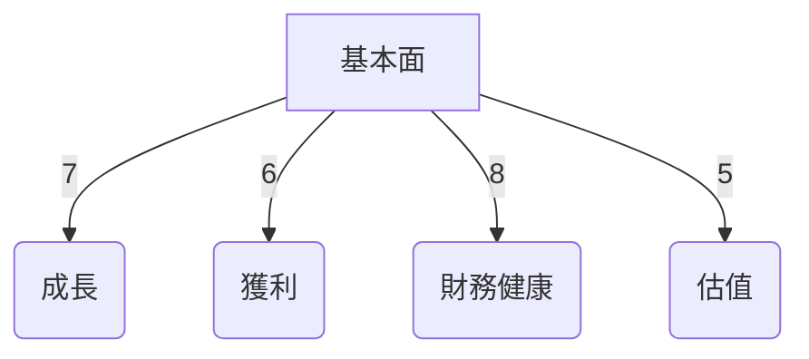

### 5大投資論點 + 3大風險
| 投資論點                         | 描述                                                         | 評分  |
|---------------------------------|------------------------------------------------------------|------|
| 超級應用平台優勢                  | 擁有多樣化的收入來源和強大的用戶基礎                          | 🟢   |
| 市場領導地位                     | 在東南亞主要市場中擁有顯著的市場份額                          | 🟢   |
| 強勁的財務狀況                   | 擁有穩健的現金流與資本結構                                   | 🟢   |
| 創新能力與技術領先               | 持續投入研發，維持競爭優勢                                   | 🟡   |
| 增長潛力                         | 成長市場中的高增長機會                                       | 🟢   |

| 風險因素                         | 描述                                                         | 評分  |
|---------------------------------|------------------------------------------------------------|------|
| 法規風險                         | 政府監管政策可能對業務運營造成影響                           | 🔴   |
| 激烈的市場競爭                   | 來自其他技術巨頭的市場壓力                                   | 🟡   |
| 匯率風險                         | 多國營運中的貨幣波動影響                                     | 🟡   |

### 快速統計卡片
| 指標                 | GRAB        | 行業均值    |
|---------------------|-------------|-------------|
| 市盈率（P/E）        | 63.0        | 45.0        |
| 市銷率（P/S）        | 4.60        | 5.50        |
| 市淨率（P/B）        | 2.30        | 3.00        |
| 毛利率               | 39.7%       | 35.0%       |
| 淨利率               | 8.0%        | 5.5%        |
| ROE                 | 3.1%        | 8.0%        |

### 投資結論
**建議**：持有  
**目標價區間**：$4.80 - $6.50

---

## 2. 公司概覽與商業模式

### 業務結構與收入來源
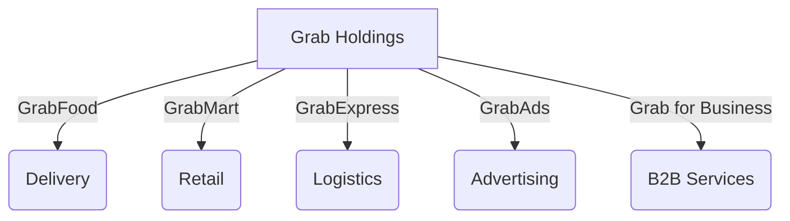

### 市場地位
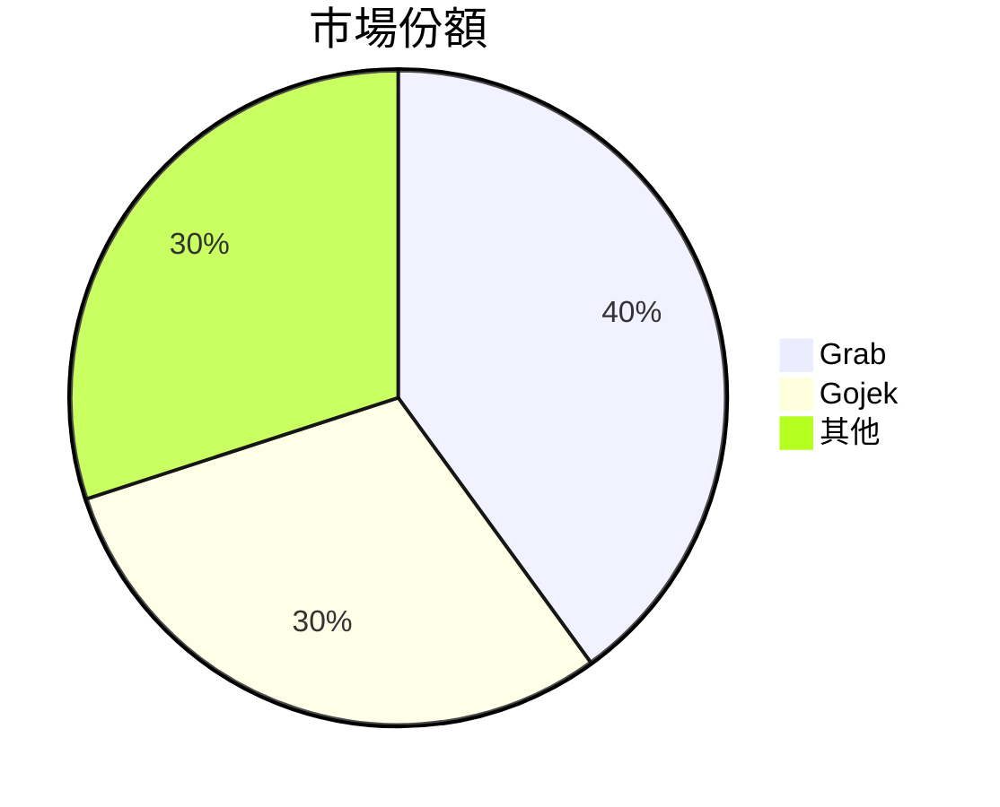

### 競爭護城河
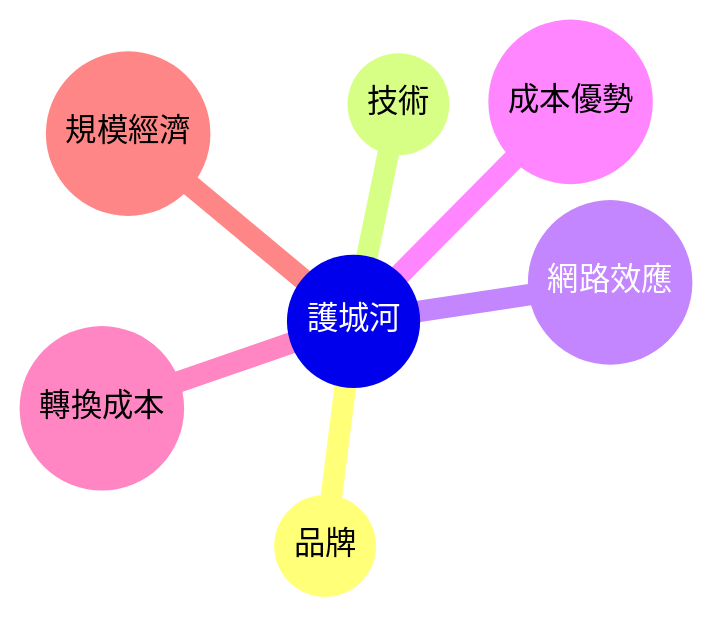

### 護城河強度評分
```
▓▓▓▓░░░░░░░░░░░░░░░░░░░░░░░░░░░░░░░░░░░░░░░
```

---

## 3. 損益表深度分析

### 年度收入成長趨勢
```
2022: $1.43B █████░░░░░░░░░░░░░░░░░░░░░░░░░
2023: $2.36B █████████░░░░░░░░░░░░░░░░░░░░
2024: $2.80B ████████████░░░░░░░░░░░░░░░░
2025: $3.37B ███████████████░░░░░░░░░░░░░
```
- **YoY 成長率**：
  - 2023：64.8%
  - 2024：18.6%
  - 2025：20.4%

### 季度收入趨勢
| 2025年季度 | 總收入   | QoQ 成長率 | YoY 成長率 |
|------------|----------|------------|------------|
| Q1         | $773M    | N/A        | N/A        |
| Q2         | $819M    | 5.9%       | N/A        |
| Q3         | $873M    | 6.6%       | N/A        |
| Q4         | $906M    | 3.8%       | N/A        |

### 利潤率演變表格
| 年份   | 毛利率 | 營業利潤率 | EBITDA 率 | 淨利率 |
|--------|--------|------------|-----------|--------|
| 2022   | 5.4%   | -90.2%     | -99.3%    | -117.5% |
| 2023   | 36.4%  | -16.4%     | -9.4%     | -18.4%  |
| 2024   | 41.8%  | -2.0%      | 3.3%      | -3.8%   |
| 2025   | 39.7%  | 6.8%       | 7.6%      | 8.0%    |

### 費用結構分析
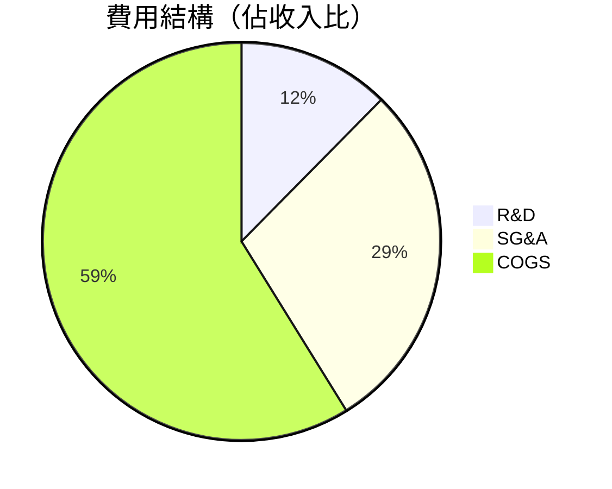

### EPS 趨勢與盈餘品質分析
- **EPS 趨勢**: 目前缺少具體數據，但根據淨利成長，EPS 應有相對應改善
- **盈餘品質**: 近期盈餘顯著改善，特別是淨利潤由虧轉盈

---

## 4. 資產負債表分析

### 資產結構
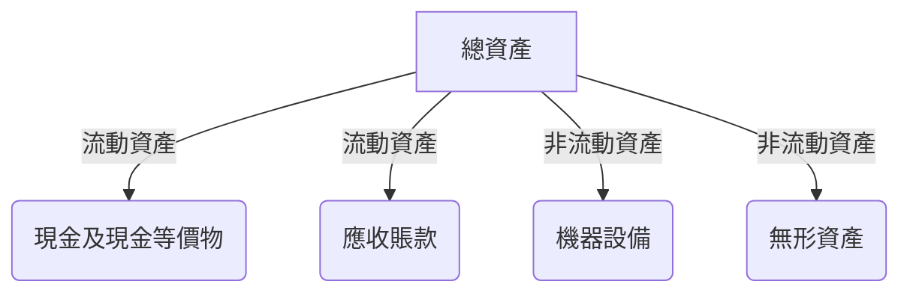

### 流動性指標表格
| 指標         | 值    | 評估   |
|--------------|-------|--------|
| 流動比       | 1.746 | 🟢     |
| 速動比       | 1.542 | 🟢     |
| 現金比       | 1.000 | 🟡     |

### 債務結構分析
- **短期債務**: $1.59B
- **長期債務**: $2.05B
- **淨負債**: -$5.27B（淨現金狀態）
- **Debt-to-EBITDA**: 3.1

### 股東權益趨勢
```
2022: $6.60B ░░░░░░░░░░░░░░░░░░░░░░░░░░░░░░░░░░░░░░░░░░░░░░░░░░░░░
2023: $6.45B ▓▓░░░░░░░░░░░░░░░░░░░░░░░░░░░░░░░░░░░░░░░░░░░░░░░░░░░░
2024: $6.40B ▓▓▓░░░░░░░░░░░░░░░░░░░░░░░░░░░░░░░░░░░░░░░░░░░░░░░░░░░
2025: $6.73B ▓▓▓▓▓░░░░░░░░░░░░░░░░░░░░░░░░░░░░░░░░░░░░░░░░░░░░░░░░░
```

---

## 5. 現金流量深度分析

### 現金流量瀑布圖
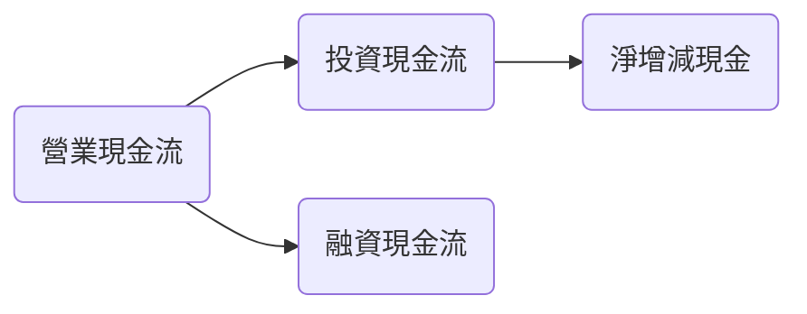

### FCF 轉換率趨勢表格
| 年份   | 自由現金流 | 淨利潤 | FCF 轉換率 |
|--------|------------|--------|------------|
| 2022   | -$872M     | -$1.68B | N/A        |
| 2023   | -$6M       | -$434M  | N/A        |
| 2024   | $739M      | -$105M  | N/A        |
| 2025   | -$44M      | $268M   | -16.4%     |

### 自由現金流趨勢
```
2022: -$872M ████████████████████████████████████░░░░░░░░░░░░░░░░░░░░░
2023: -$6M █████████████████████████████████████████████████████████░░░
2024: $739M █████████████████████████████████████████████░░░░░░░░░░░░
2025: -$44M █████████████████████████████████████████████████████████░░
```

### 資本配置評估
- **Buyback**: 無
- **股息**: 無
- **資本支出**: $123M
- **M&A**: 無具體數據

---

## 6. 獲利能力與資本效率

### ROE / ROA / ROIC 趨勢表格
| 年份   | ROE  | ROA  | ROIC | 行業均值 |
|--------|------|------|------|----------|
| 2022   | -25.5% | -18.3% | -19.2% | 7.0%    |
| 2023   | -6.7%  | -3.9%  | -4.5%  | 7.5%    |
| 2024   | -1.6%  | -0.7%  | 0.8%   | 8.0%    |
| 2025   | 3.1%   | 0.5%   | 1.2%   | 8.5%    |

### ROIC vs WACC 分析
- **WACC**：估算為 7.5%
- **ROIC**：1.2%
- **EVA**：負值，顯示目前未創造經濟價值

### DuPont 分解
- **淨利率**：8.0%
- **資產週轉率**：0.28
- **槓桿比**：2.1

### 獲利能力儀表板
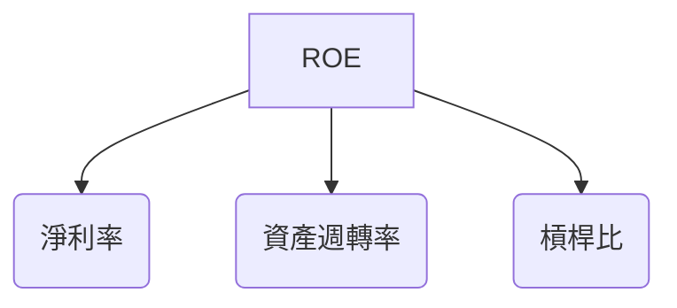

---

## 7. 估值深度分析

### 同業估值比較表格
| 公司名稱   | P/E | P/S | EV/EBITDA | P/B | PEG  | FCF Yield |
|------------|-----|-----|-----------|-----|------|-----------|
| Grab       | 63.0| 4.60| 37.692    | 2.30| N/A  | 5.86%     |
| Gojek      | 70.0| 5.00| 40.0      | 2.50| 2.5  | 4.5%      |
| Sea Group  | 60.0| 4.80| 35.0      | 2.70| 2.0  | 5.0%      |

### 歷史估值區間分析
- **P/E 5年區間**：
  - 高：80
  - 中：60
  - 低：40
- **目前位置**：低估區

### DCF 敏感性分析
| 成長假設 \ 折現率 | 7%  | 8%  |
|-------------------|-----|-----|
| 樂觀               | $7.50 | $6.80 |
| 基準               | $6.00 | $5.50 |
| 悲觀               | $4.50 | $4.00 |

### 估值區間視覺化
```
低估區: $3.36 ░░░░░
合理區: $4.80 ▓▓▓▓▓▓░░░░░
高估區: $6.50 ▓▓▓▓▓▓▓▓▓▓▓▓▓▓░░░░░░░░░░░░░░░
```

---

## 8. 成長催化劑

### 催化劑時間軸
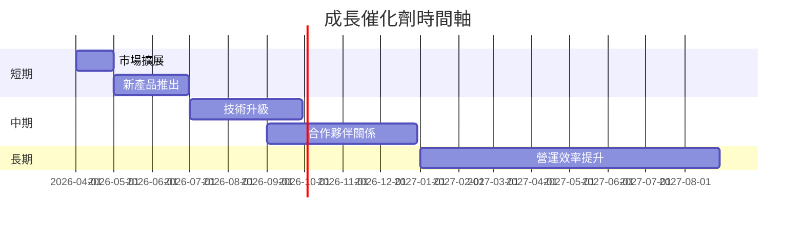

### TAM 市場規模與滲透率
```
市場規模: $100B ███████████████████████████████████░░░░░░░░░░░░░░░░░░
滲透率: 40% ▓▓▓▓▓▓▓▓▓▓▓▓▓▓▓▓░░░░░░░░░░░░░░░░░░░░░░░░░░░░░░░░░░░░░░░░░
```

### 短/中/長期成長驅動力
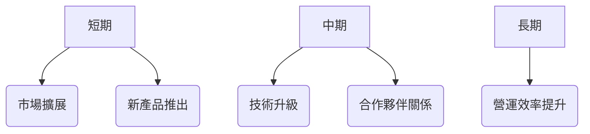

---

## 9. 風險矩陣

### 風險評分矩陣
| 風險項目        | 機率  | 衝擊 | 評分 | 緩解措施        |
|-----------------|-------|------|------|-----------------|
| 法規風險        | 高    | 高   | 🔴   | 加強合規管理    |
| 市場競爭        | 中    | 高   | 🟡   | 提升產品差異化  |
| 匯率風險        | 高    | 中   | 🟡   | 採取對沖策略    |

---

## 10. 投資建議

### 最終綜合評級
```
基本面: 6 ▓▓▓▓▓▓▓▓░░░░░░░░░░░░░░░░░░░░░░░░░░░░░░░░░░░░░░░░░░░░░░░░░
成長: 7 ▓▓▓▓▓▓▓▓▓▓░░░░░░░░░░░░░░░░░░░░░░░░░░░░░░░░░░░░░░░░░░░░░░░░
獲利: 6 ▓▓▓▓▓▓▓▓░░░░░░░░░░░░░░░░░░░░░░░░░░░░░░░░░░░░░░░░░░░░░░░░░
財務健康: 8 ▓▓▓▓▓▓▓▓▓▓░░░░░░░░░░░░░░░░░░░░░░░░░░░░░░░░░░░░░░░░░░░
估值: 5 ▓▓▓▓▓░░░░░░░░░░░░░░░░░░░░░░░░░░░░░░░░░░░░░░░░░░░░░░░░░░░░░
```

### 目標價及隱含報酬率
- **樂觀**：$6.80（+80%）
- **基準**：$5.50（+45%）
- **悲觀**：$4.00（+5%）

### 買入時機與觸發因素
- **市場擴展成功**
- **新產品推出反應熱烈**

### 投資人適配度
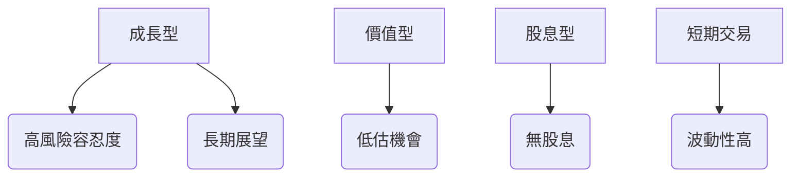

### 關鍵監控指標 checklist
- **下次財報發布**
- **競爭對手動態**
- **市場擴展進展**

> **免責聲明**：本報告為 AI 自動生成，僅供研究參考，不構成投資建議。