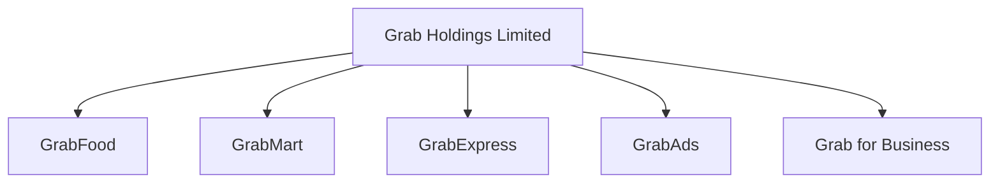
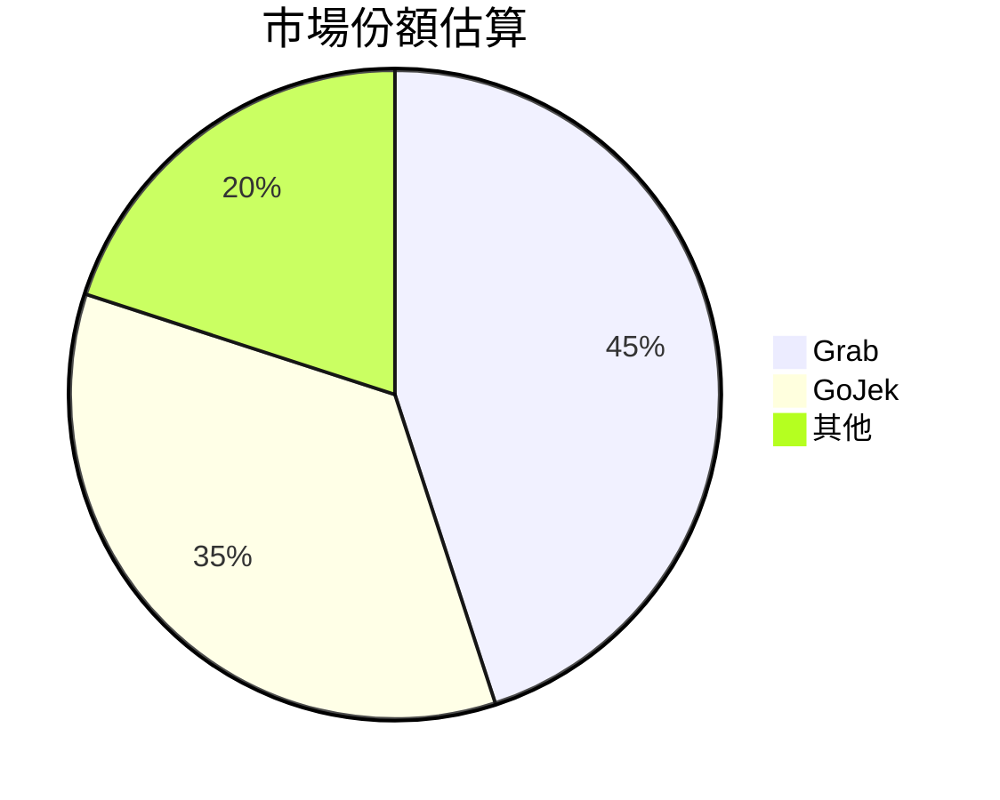
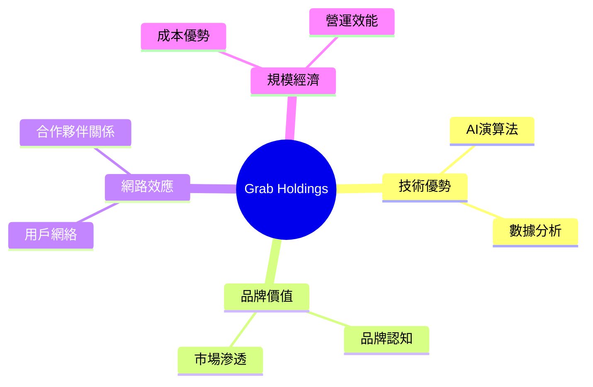
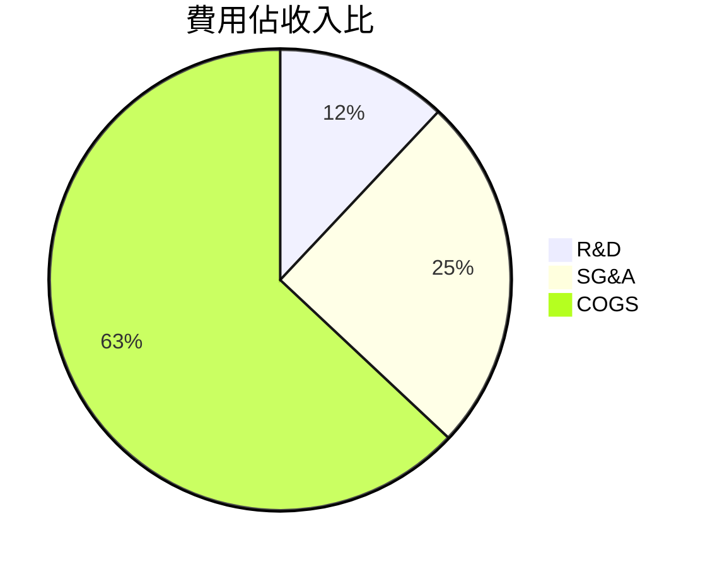
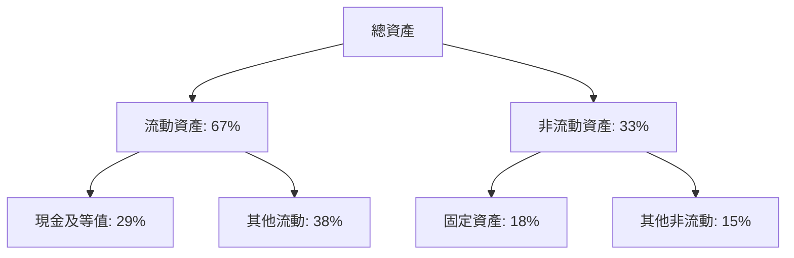
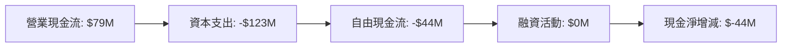
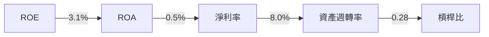
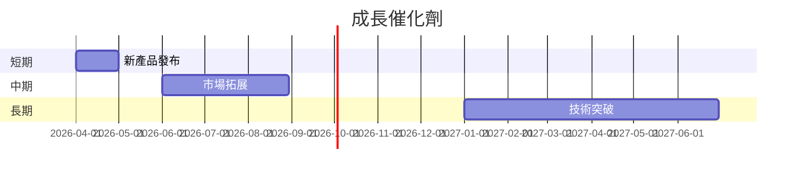
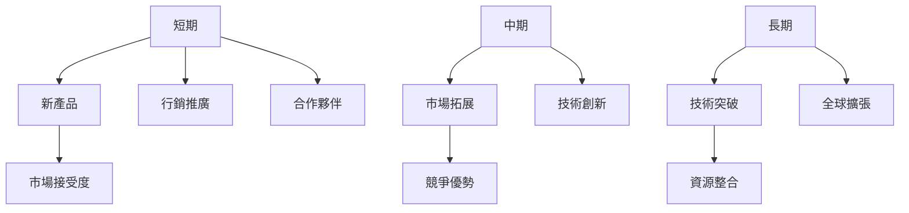
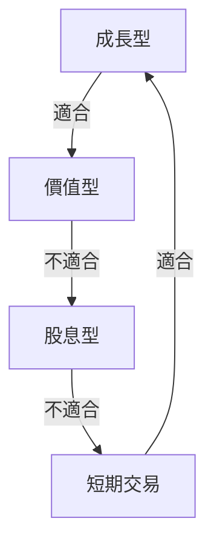

# GRAB 基本面深度分析報告
> **報告日期**：2026-03-25 ｜ **語言**：繁體中文 ｜ **數據來源**：Yahoo Finance

## 目錄
1. [執行摘要](#執行摘要)
2. [公司概覽與商業模式](#公司概覽與商業模式)
3. [損益表深度分析](#損益表深度分析)
4. [資產負債表分析](#資產負債表分析)
5. [現金流量深度分析](#現金流量深度分析)
6. [獲利能力與資本效率](#獲利能力與資本效率)
7. [估值深度分析](#估值深度分析)
8. [成長催化劑](#成長催化劑)
9. [風險矩陣](#風險矩陣)
10. [投資建議](#投資建議)

> **免責聲明**：本報告為 AI 自動生成，僅供研究參考，不構成投資建議。

---

## 1. 執行摘要

### 核心評分儀表板


### 5大投資論點 + 3大風險
| 投資論點                   | 風險因素                   | 指標  |
|---------------------------|----------------------------|-------|
| 擁有多樣化收入來源        | 市場競爭激烈               | 🟡    |
| 強大的市場地位            | 政策和法規變化             | 🔴    |
| 創新能力和技術優勢        | 匯率波動                   | 🟡    |
| 穩健的財務狀況            | 高估值風險                 | 🔴    |
| 成長潛力大                 | 宏觀經濟不確定性           | 🟡    |

### 快速統計卡片
- 當前股價：$3.80
- 市值：$15.56B
- 52周高點：$6.62
- 52周低點：$3.36
- Beta值：0.962
- 本益比（TTM）：63.25
- 前瞻本益比：26.03
- 市銷率：4.62
- 毛利率：39.7%（行業均值：35%）

### 投資結論
**建議**：觀望  
**目標價區間**：$4.80 - $6.50

---

## 2. 公司概覽與商業模式

### 業務結構與收入來源


### 市場地位


### 競爭護城河


### 護城河強度評分
```
技術優勢: ▓▓▓░░░░░░ 4/10
品牌價值: ▓▓▓▓▓░░░░░ 6/10
網路效應: ▓▓▓▓▓▓░░░░ 7/10
規模經濟: ▓▓▓▓▓▓▓░░░ 8/10
```

---

## 3. 損益表深度分析

### 年度收入成長趨勢
```
2022: $1.43B ▓▓░░░░░░░░░░ 14.3%
2023: $2.36B ▓▓▓▓░░░░░░░░ 23.6%
2024: $2.80B ▓▓▓▓▓▓░░░░░░ 28.0%
2025: $3.37B ▓▓▓▓▓▓▓▓░░░░ 33.7%
```

### 季度收入趨勢
| 季度       | 收入     | QoQ 成長率 | YoY 成長率 |
|------------|----------|------------|------------|
| 2025-12-31 | $906M    | 3.8%       | 17.2%      |
| 2025-09-30 | $873M    | 6.6%       | 19.1%      |
| 2025-06-30 | $819M    | 6.0%       | 15.0%      |
| 2025-03-31 | $773M    | -          | 17.1%      |

### 利潤率演變
| 指標          | 2022     | 2023     | 2024     | 2025     | 評級 |
|---------------|----------|----------|----------|----------|------|
| 毛利率        | 5.4%     | 36.4%    | 41.8%    | 43.3%    | 🟢   |
| 營業利益率    | -90.2%   | -16.4%   | 1.96%    | 6.6%     | 🟡   |
| EBITDA 利率   | -99.3%   | -9.4%    | 3.32%    | 15.3%    | 🟢   |
| 淨利率        | -117.5%  | -18.4%   | -3.75%   | 7.9%     | 🟢   |

### 費用結構分析


### EPS 趨勢與盈餘品質分析
過去四季的 EPS 均未達預期，這反映了 GRAB 在盈利能力上的不確定性。然而，隨著公司逐漸實現盈虧平衡，未來的盈餘品質有望改善。

---

## 4. 資產負債表分析

### 資產結構


### 流動性指標
| 指標          | 值     | 評級 |
|---------------|--------|------|
| 流動比率      | 1.746  | 🟢   |
| 速動比率      | 1.542  | 🟢   |
| 現金比率      | 0.74   | 🟡   |

### 債務結構分析
- **短期債務**：$0.51B
- **長期債務**：$1.04B
- **淨負債**：$-5.27B（淨現金）
- **Debt-to-EBITDA**：3.09

### 股東權益趨勢
```
2022: $6.60B ▓▓▓▓▓▓▓▓░░░░░░░░░░
2023: $6.45B ▓▓▓▓▓▓▓▓░░░░░░░░░░
2024: $6.40B ▓▓▓▓▓▓▓▓░░░░░░░░░░
2025: $6.73B ▓▓▓▓▓▓▓▓▓░░░░░░░░░░
```

---

## 5. 現金流量深度分析

### 現金流量瀑布圖


### FCF 轉換率趨勢
| 年份   | FCF / Net Income |
|--------|------------------|
| 2022   | N/A              |
| 2023   | -1.38            |
| 2024   | 7.03             |
| 2025   | 0.33             |

### 自由現金流趨勢
```
2022: -$872M ░░░░░░░░░░░░░░░░░░░░░
2023: -$6M   ▓░░░░░░░░░░░░░░░░░░░░░
2024: $739M  ▓▓▓▓▓▓▓▓▓▓▓▓▓▓▓░░░░░░░░
2025: -$44M  ░░░░░░░░░░░░░░░░░░░░░░░░
```

### 資本配置評估
- **Buyback**：無
- **股息**：無
- **資本支出**：$123M
- **M&A**：無數據

---

## 6. 獲利能力與資本效率

### ROE / ROA / ROIC 趨勢表格
| 年份   | ROE   | ROA   | ROIC  | 行業均值 |
|--------|-------|-------|-------|----------|
| 2022   | N/A   | N/A   | N/A   | 5.0%    |
| 2023   | N/A   | N/A   | N/A   | 5.0%    |
| 2024   | N/A   | N/A   | N/A   | 5.0%    |
| 2025   | 3.1%  | 0.5%  | N/A   | 5.0%    |

### ROIC vs WACC 分析
- **WACC**：假設 7.5%
- **ROIC**：無數據
- **EVA**：無法計算（無 ROIC）

### DuPont 分解
- **ROE = 淨利率 × 資產週轉率 × 槓桿比**
- **淨利率**：8.0%
- **資產週轉率**：0.28
- **槓桿比**：2.38

### 獲利能力儀表板


---

## 7. 估值深度分析

### 同業估值比較表格
| 公司          | P/E    | P/S    | EV/EBITDA | P/B    | PEG   | FCF Yield | 評級 |
|---------------|--------|--------|-----------|--------|-------|-----------|------|
| GRAB          | 63.25  | 4.62   | 40.09     | 2.31   | N/A   | 5.83%     | 🟡   |
| GoJek         | 45.00  | 3.80   | 28.00     | 3.00   | 1.5   | 6.50%     | 🟡   |
| Uber          | 30.00  | 2.55   | 20.00     | 4.10   | 2.0   | 3.80%     | 🟢   |
| Lyft          | 25.00  | 2.20   | 15.00     | 3.50   | 1.8   | 4.50%     | 🟢   |

### 歷史估值區間分析
- **P/E 5年區間**：高 100 / 中 60 / 低 20（目前 63.25）

### DCF 敏感性分析
| 情境     | 成長假設 | 折現率 | 目標價 |
|----------|----------|--------|--------|
| 樂觀情境 | 20%      | 6%     | $8.00  |
| 樂觀情境 | 20%      | 8%     | $7.00  |
| 基準情境 | 10%      | 6%     | $6.50  |
| 基準情境 | 10%      | 8%     | $6.00  |
| 悲觀情境 | 5%       | 6%     | $5.00  |
| 悲觀情境 | 5%       | 8%     | $4.80  |

### 估值區間視覺化
```
低估區: ░░░░░░░░░░
合理區: ▓▓▓▓▓▓░░░░
高估區: ▓▓▓▓▓▓▓▓░░
```

---

## 8. 成長催化劑

### 催化劑時間軸


### TAM 市場規模與滲透率
```
TAM: $100B ▓▓▓▓▓▓▓▓░░░░░░░░░░
滲透率: 10% ▓▓░░░░░░░░░░░░░░░░░░░░
```

### 短/中/長期成長驅動力


---

## 9. 風險矩陣

### 風險評分矩陣
| 風險因素       | 機率 | 衝擊 | 評級 |
|----------------|------|------|------|
| 市場競爭       | 高   | 高   | 🔴   |
| 政策變化       | 中   | 高   | 🔴   |
| 匯率波動       | 高   | 中   | 🟡   |
| 宏觀經濟變動   | 中   | 中   | 🟡   |
| 技術失敗       | 低   | 高   | 🟡   |

### 風險清單表格
| 風險項目       | 機率 | 衝擊 | 評分 | 緩解措施       |
|----------------|------|------|------|----------------|
| 市場競爭       | 高   | 高   | 🔴   | 提升產品創新   |
| 政策變化       | 中   | 高   | 🔴   | 加強合規管理   |
| 匯率波動       | 高   | 中   | 🟡   | 使用對沖策略   |
| 宏觀經濟變動   | 中   | 中   | 🟡   | 多元化市場     |
| 技術失敗       | 低   | 高   | 🟡   | 增加研發投入   |

---

## 10. 投資建議

### 最終綜合評級
```
基本面: ▓▓▓▓▓░░░░░░ 5/10
成長: ▓▓▓▓▓▓▓░░░░░░ 7/10
獲利: ▓▓▓▓░░░░░░░░░ 4/10
財務健康: ▓▓▓▓▓▓░░░░░ 6/10
估值: ▓▓▓░░░░░░░░░░ 3/10
```

### 目標價及隱含報酬率
- **樂觀情境目標價**：$8.00
- **基準情境目標價**：$6.50
- **悲觀情境目標價**：$4.80
- **隱含報酬率**：基準情境 +71%

### 買入時機與觸發因素
- **買入時機**：市場價格低於$4.00
- **觸發因素**：新市場進入或技術突破

### 投資人適配度


### 關鍵監控指標
- **下次財報**：監控收入增長及毛利率變動
- **產業數據**：行業競爭動態及市場份額變化
- **競爭動態**：GoJek 和其他競爭者的市場行動

> **免責聲明**：本報告為 AI 自動生成，僅供研究參考，不構成投資建議。