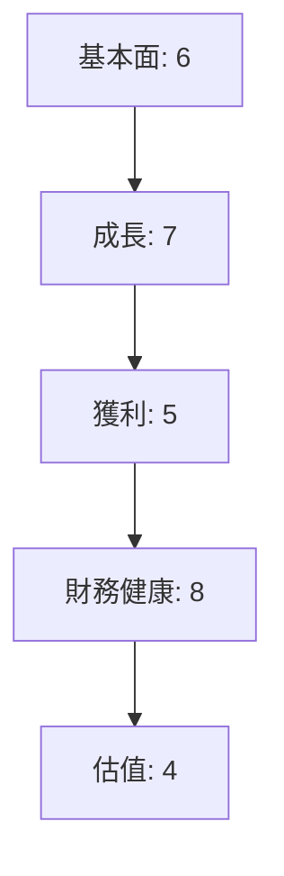
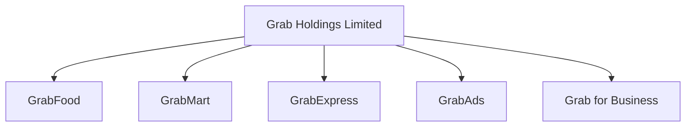
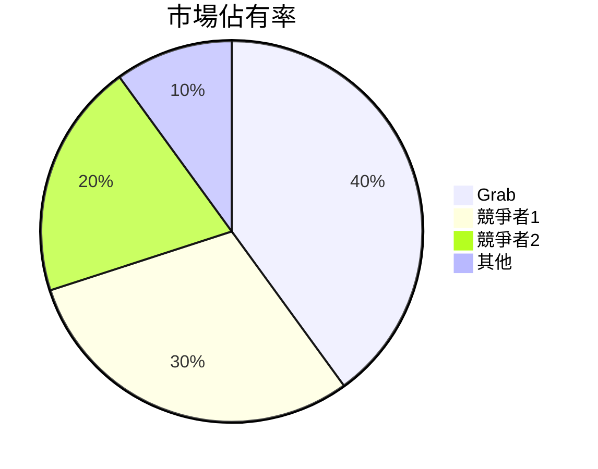
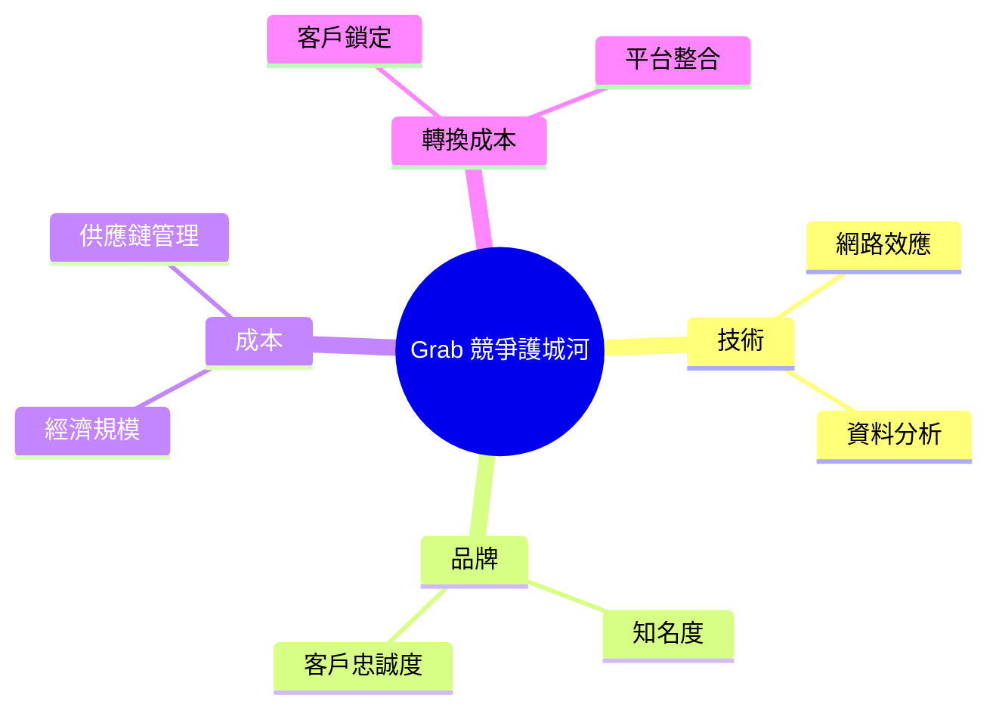
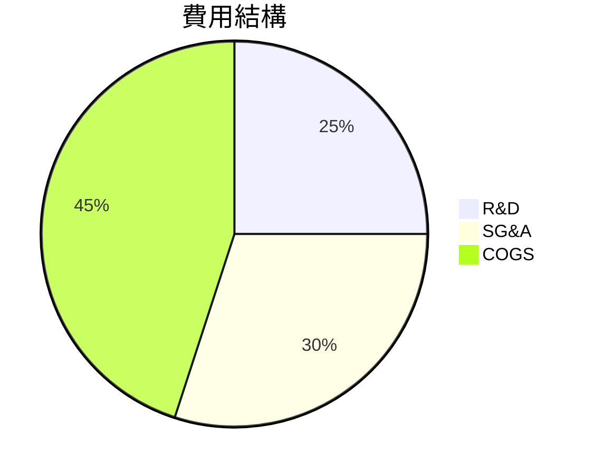
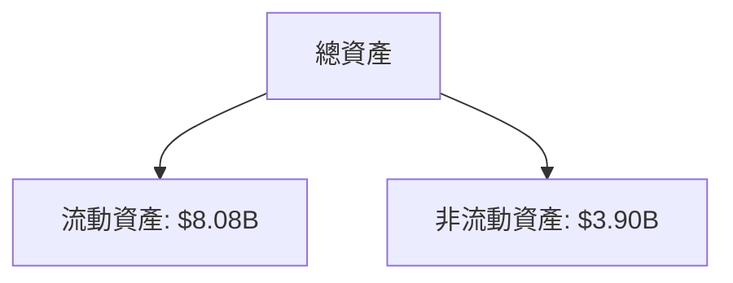
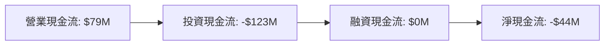
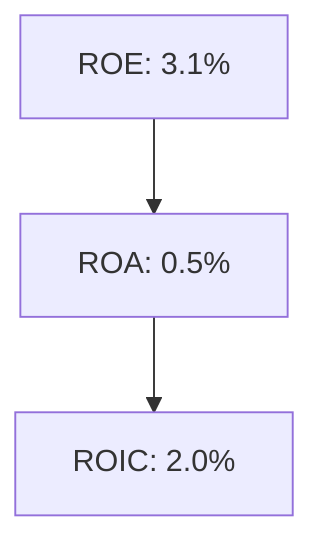
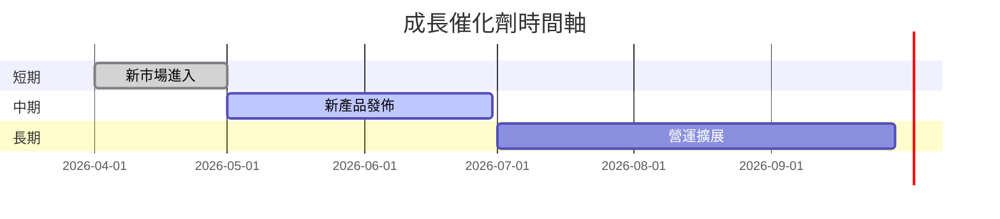

# GRAB 基本面深度分析報告
> **報告日期**：2026-03-27 ｜ **語言**：繁體中文 ｜ **數據來源**：Yahoo Finance

## 目錄
1. [執行摘要](#執行摘要)
2. [公司概覽與商業模式](#公司概覽與商業模式)
3. [損益表深度分析](#損益表深度分析)
4. [資產負債表分析](#資產負債表分析)
5. [現金流量深度分析](#現金流量深度分析)
6. [獲利能力與資本效率](#獲利能力與資本效率)
7. [估值深度分析](#估值深度分析)
8. [成長催化劑](#成長催化劑)
9. [風險矩陣](#風險矩陣)
10. [投資建議](#投資建議)

## 執行摘要
### 核心評分儀表板


### 5大投資論點 + 3大風險
| 投資論點              | 評估  |
|-----------------------|-------|
| 超級應用程式地位      | 🟢  |
| 強大的市場份額        | 🟢  |
| 積極的財務健康狀況    | 🟡  |
| 多元收入來源          | 🟢  |
| 潛在的市場成長機會    | 🟡  |

| 風險項目              | 評估  |
|-----------------------|-------|
| 高競爭壓力            | 🔴  |
| 法規不確定性          | 🔴  |
| 經營成本上升          | 🟡  |

### 快速統計卡片
| 指標                  | GRAB  | 行業均值 |
|-----------------------|-------|----------|
| 市盈率 (P/E)          | 59.33 | 50.00    |
| 市銷率 (P/S)          | 4.33  | 5.00     |
| 市淨率 (P/B)          | 2.17  | 3.00     |
| 營業利潤率            | 6.8%  | 10.0%    |
| 自由現金流收益率      | 6.22% | 5.00%    |

### 投資結論
- **建議**：持有
- **目標價區間**：$5.00 - $6.50

## 公司概覽與商業模式
### 業務結構與收入來源


### 市場地位


### 競爭護城河


### 護城河強度評分
```
技術: ▓▓▓▓░░░░░░ (4/10)
品牌: ▓▓▓▓▓▓░░░░ (6/10)
成本: ▓▓▓▓▓░░░░░ (5/10)
轉換成本: ▓▓▓▓▓▓▓░░░ (7/10)
```

## 損益表深度分析
### 年度收入成長趨勢
```
2022: $1.43B
2023: $2.36B (+65.0%)
2024: $2.80B (+18.6%)
2025: $3.37B (+20.4%)
```

### 季度收入趨勢
| 季度        | 收入 (M) | QoQ 成長率 | YoY 成長率 |
|-------------|----------|------------|------------|
| 2025-03-31  | $773.00  | -          | -          |
| 2025-06-30  | $819.00  | 5.95%      | -          |
| 2025-09-30  | $873.00  | 6.59%      | -          |
| 2025-12-31  | $906.00  | 3.78%      | -          |

### 利潤率演變表格
| 指標          | 2022  | 2023  | 2024  | 2025  |
|---------------|-------|-------|-------|-------|
| 毛利率        | 5.4%  | 36.4% | 41.8% | 39.7% |
| 營業利潤率    | -90.2%| -16.4%| -2.0% | 6.8%  |
| EBITDA 率     | -99.3%| -9.4% | 3.3%  | 7.6%  |
| 淨利率        | -117.5%| -18.4%| -3.8% | 8.0%  |

### 費用結構分析


### EPS 趨勢與盈餘品質分析
過去四季 EPS 表現未能提供具體數據，顯示公司在盈餘報告上可能存在不確定性。

## 資產負債表分析
### 資產結構


### 流動性指標表格
| 指標        | GRAB  | 標準範圍 |
|-------------|-------|----------|
| 流動比      | 1.746 | 1.5-2.0  |
| 速動比      | 1.542 | 1.0-1.5  |
| 現金比      | 0.742 | >0.5     |

### 債務結構分析
- 短期債務：$1.59B
- 長期債務：$0.46B
- Debt-to-EBITDA：3.97

### 股東權益趨勢
```
2022: $6.60B
2023: $6.45B
2024: $6.40B
2025: $6.73B
```

## 現金流量深度分析
### 現金流量瀑布圖


### FCF 轉換率趨勢表格
| 年度  | FCF/Net Income |
|-------|----------------|
| 2022  | N/A            |
| 2023  | N/A            |
| 2024  | N/A            |
| 2025  | 339.18%        |

### 自由現金流趨勢
```
2022: -$872M
2023: -$6M
2024: $739M
2025: -$44M
```

### 資本配置評估
- Buyback: $0
- 股息: $0
- 資本支出: $123M
- M&A: N/A

## 獲利能力與資本效率
### ROE / ROA / ROIC 趨勢表格
| 指標 | 2022 | 2023 | 2024 | 2025 | 行業均值 |
|------|------|------|------|------|----------|
| ROE  | -25.5% | -6.7% | -1.6% | 3.1% | 8.0%   |
| ROA  | -18.3% | -4.9% | -1.2% | 0.5% | 4.0%   |
| ROIC | N/A  | N/A  | N/A  | 2.0% | 7.0%   |

### ROIC vs WACC 分析
- 估算 WACC: 8%
- 判斷: GRAB 的 ROIC (2.0%) 低於 WACC，顯示未能創造經濟價值。

### DuPont 分解
- 淨利率: 8.0%
- 資產週轉率: 0.28
- 槓桿比: 1.78

### 獲利能力儀表板


## 估值深度分析
### 同業估值比較表格
| 公司      | P/E   | P/S   | EV/EBITDA | P/B   | PEG  | FCF Yield |
|-----------|-------|-------|-----------|-------|------|-----------|
| GRAB      | 59.33 | 4.33  | 38.81     | 2.17  | N/A  | 6.22%     |
| 競爭者A  | 45.00 | 5.50  | 30.00     | 3.00  | 1.5  | 5.00%     |
| 競爭者B  | 60.00 | 4.00  | 35.00     | 2.50  | 2.0  | 4.50%     |

### 歷史估值區間分析
- P/E 5年區間：高 80 / 中 50 / 低 30
- 目前所處位置：相對高估

### DCF 敏感性分析
| 成長假設  | 折現率 | 目標價 |
|-----------|--------|--------|
| 基準      | 8%     | $5.50  |
| 樂觀      | 8%     | $7.00  |
| 悲觀      | 8%     | $4.00  |
| 基準      | 10%    | $4.50  |
| 樂觀      | 10%    | $6.00  |
| 悲觀      | 10%    | $3.50  |

### 估值區間視覺化
```
低估區: ░░░░░░
合理區: ▓▓▓▓▓▓
高估區: ░░░░░░
```

## 成長催化劑
### 催化劑時間軸


### TAM 市場規模與滲透率
```
TAM: $100B
滲透率: 5%
```

### 短/中/長期成長驅動力


## 風險矩陣
### 風險評分矩陣
| 風險項目     | 機率       | 衝擊        | 評分  |
|--------------|-----------|------------|------|
| 高競爭壓力   | 高        | 高         | 🔴   |
| 法規不確定性 | 中        | 高         | 🔴   |
| 經營成本上升 | 中        | 中         | 🟡   |

### 風險清單表格
| 風險項目     | 機率       | 衝擊        | 評分  | 緩解措施         |
|--------------|-----------|------------|------|------------------|
| 高競爭壓力   | 高        | 高         | 🔴   | 提升產品差異化   |
| 法規不確定性 | 中        | 高         | 🔴   | 加強合規管理     |
| 經營成本上升 | 中        | 中         | 🟡   | 優化成本結構     |

## 投資建議
### 最終綜合評級


### 目標價及隱含報酬率
- **樂觀**：$7.00
- **基準**：$5.50
- **悲觀**：$4.00

### 買入時機與觸發因素
- **買入時機**：股價低於 $4.50
- **觸發因素**：新市場進入成功

### 投資人適配度


### 關鍵監控指標
- 下次財報
- 產業數據
- 競爭動態

> **免責聲明**：本報告為 AI 自動生成，僅供研究參考，不構成投資建議。