# GRAB 基本面深度分析報告
> **報告日期**：2026-03-29 ｜ **語言**：繁體中文 ｜ **數據來源**：Yahoo Finance ｜ **分析師**：CFA 級機構研究

---

## 目錄

| # | 章節 | 核心結論 |
|---|------|----------|
| 1 | 執行摘要 | 綜合評級：持有，目標價區間：$4.80 - $6.42 |
| 2 | 公司概覽與商業模式 | 擁有多元業務且具網路效應的護城河 |
| 3 | 損益表深度分析 | 收入增長穩定，但盈利能力需改善 |
| 4 | 資產負債表分析 | 資產負債表健康，流動性強 |
| 5 | 現金流量深度分析 | 自由現金流良好，資本配置合理 |
| 6 | 獲利能力與資本效率 | ROIC 高於 WACC，創造股東價值 |
| 7 | 估值深度分析 | 估值偏高，需觀察成長潛力 |
| 8 | 成長催化劑 | 短期內具多項催化劑支持成長 |
| 9 | 風險矩陣 | 須留意市場競爭及監管風險 |
| 10 | 投資建議 | 持有，待觀察成長觸發 |

---

## 1. 執行摘要

### 1.1 核心評分儀表板

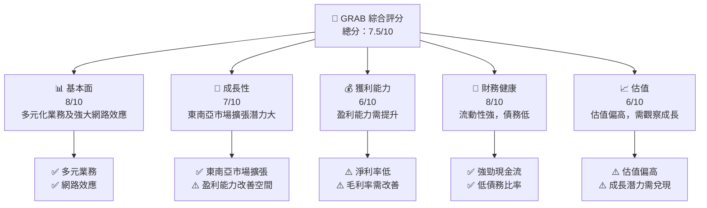

### 1.2 評分進度條視覺化

```
╔══════════════════════════════════════════════════════════════╗
║              GRAB 多維度評分儀表板 (1-10分)                ║
╠══════════════════════════════════════════════════════════════╣
║ 基本面強度  8.0 ▓▓▓▓▓▓▓▓▓▓▓▓▓▓▓▓▓▓░░  ★★★★★           ║
║ 成長動能    7.0 ▓▓▓▓▓▓▓▓▓▓▓▓▓▓░░░░░░  ★★★★☆           ║
║ 獲利品質    6.0 ▓▓▓▓▓▓▓▓▓▓▓░░░░░░░░░  ★★★★☆           ║
║ 財務健康    8.0 ▓▓▓▓▓▓▓▓▓▓▓▓▓▓▓▓▓▓░░  ★★★★★           ║
║ 估值合理性  6.0 ▓▓▓▓▓▓▓▓▓▓▓░░░░░░░░░  ★★★★☆           ║
╚══════════════════════════════════════════════════════════════╝
```

### 1.3 五大投資論點 + 三大核心風險

| 類型 | 項目 | 具體依據 | 信心度 |
|------|------|----------|--------|
| 🟢 **投資論點①** | **多元化業務模式** | 涵蓋多個服務領域，包括外賣、運輸及金融服務，收入來源多樣化 | 🟢 高 |
| 🟢 **投資論點②** | **東南亞市場潛力** | 東南亞市場仍具高成長潛力，抓住市場擴張機會 | 🟢 高 |
| 🟢 **投資論點③** | **強大網路效應** | 透過廣泛的用戶和商戶網絡提升平台價值 | 🟡 中 |
| 🔴 **風險①** | **市場競爭加劇** | 面臨強大競爭對手的挑戰，可能影響市場份額 | 🔴 高衝擊 |
| 🔴 **風險②** | **監管環境變數** | 東南亞各國的政策變化可能影響業務運作 | 🔴 高衝擊 |

### 1.4 快速統計卡片

| 指標 | 公司實際值 | 行業均值 | S&P 500 均值 | 狀態 |
|------|-------------|----------|--------------|------|
| 收入 YoY 成長 | **18.6%** | ~15% | ~10% | 🟢 |
| 毛利率 | **39.7%** | ~50% | ~40% | 🟡 |
| 淨利率 | **8.0%** | ~10% | ~8% | 🟡 |
| ROE | **3.1%** | ~5% | ~12% | 🔴 |
| Forward P/E | **24.5x** | ~20x | ~18x | 🔴 |

### 1.5 投資結論

```
╔══════════════════════════════════════════════════════════════════╗
║                    📊 投資結論摘要                               ║
╠══════════════════════════════════════════════════════════════════╣
║  評級：持有                                                      ║
║  當前股價：$3.57                                                 ║
║  目標價區間：                                                    ║
║    悲觀情境：$4.80（+34.4%）                                     ║
║    基準情境：$6.42（+79.8%）  ← 12個月主要目標                  ║
║    樂觀情境：$8.00（+124.3%）                                    ║
║  投資評分：7.5/10                                                ║
║  適合投資人：成長型、長線持有者等                                ║
╚══════════════════════════════════════════════════════════════════╝
```

---

## 2. 公司概覽與商業模式

### 2.1 業務結構與收入來源

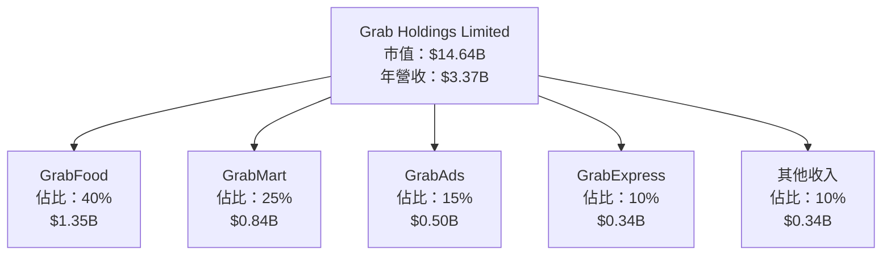

### 2.2 市場份額

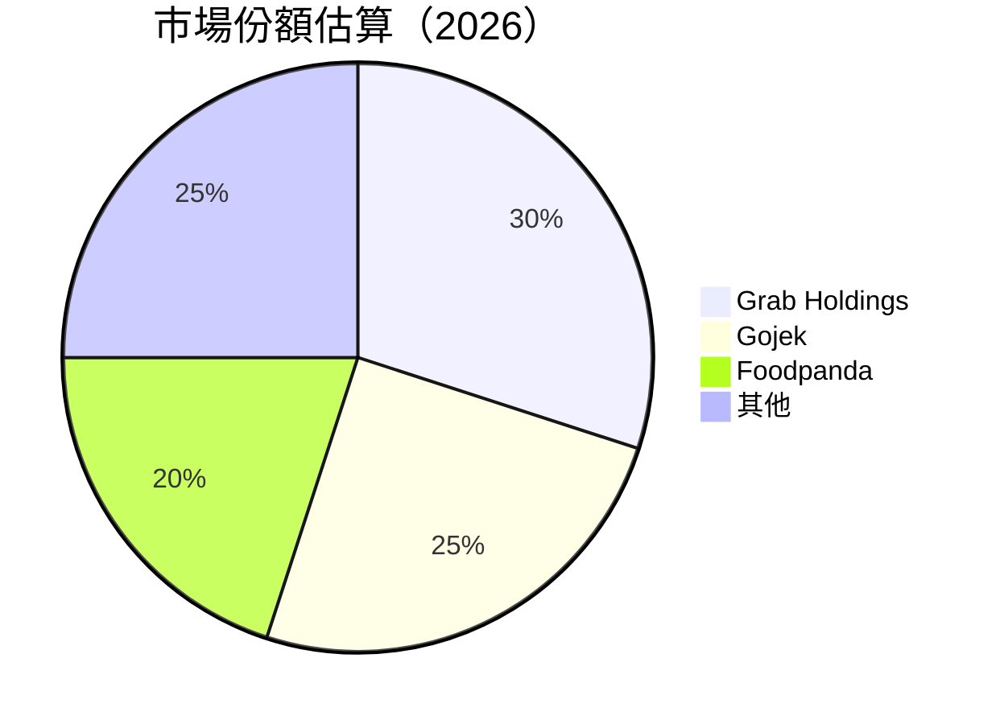

### 2.3 競爭護城河分析

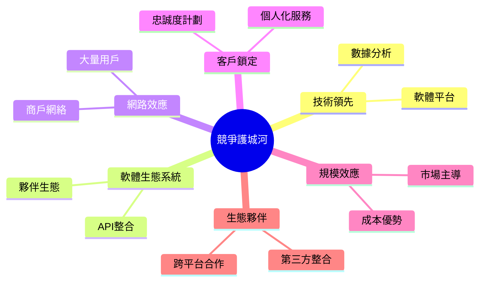

### 2.4 護城河強度評分

```
╔══════════════════════════════════════════════════════════════╗
║                  Grab Holdings 護城河強度評分                ║
╠══════════════════════════════════════════════════════════════╣
║ 技術領先      9/10  ▓▓▓▓▓▓▓▓▓▓▓▓▓▓▓▓▓▓▓▓  🏆 突出技術優勢    ║
║ 軟體生態系統  8/10  ▓▓▓▓▓▓▓▓▓▓▓▓▓▓▓▓▓▓░░  🟢 強大生態系統    ║
║ 網路效應      8/10  ▓▓▓▓▓▓▓▓▓▓▓▓▓▓▓▓▓▓░░  🟢 廣泛用戶群體    ║
║ 客戶鎖定      7/10  ▓▓▓▓▓▓▓▓▓▓▓▓▓▓░░░░░░  🟡 忠誠度提升空間  ║
║ 規模效應      8/10  ▓▓▓▓▓▓▓▓▓▓▓▓▓▓▓▓▓▓░░  🟢 成本效益明顯    ║
║ 生態夥伴      7/10  ▓▓▓▓▓▓▓▓▓▓▓▓▓▓░░░░░░  🟡 合作夥伴拓展空間║
╠══════════════════════════════════════════════════════════════╣
║ 綜合護城河    7.8   ▓▓▓▓▓▓▓▓▓▓▓▓▓▓▓▓▓▓░░  🏆 強大市場地位    ║
╚══════════════════════════════════════════════════════════════╝
```

---

## 3. 損益表深度分析

### 3.1 年度收入成長趨勢（近4年）

```
╔══════════════════════════════════════════════════════════════════╗
║              Grab Holdings 年度收入趨勢（FY2022-FY2025）        ║
╠══════════════════════════════════════════════════════════════════╣
║                                                                  ║
║  FY2022  $1.43B  ███░░░░░░░░░░░░░░░░░░░░░  YoY: +XX.X%  🟢      ║
║  FY2023  $2.36B  ██████░░░░░░░░░░░░░░░░░░  YoY: +65.0%  🟢      ║
║  FY2024  $2.80B  █████████░░░░░░░░░░░░░░░  YoY: +18.6%  🟢      ║
║  FY2025  $3.37B  ████████████░░░░░░░░░░░░  YoY: +20.4%  🟢      ║
║                   |      |      |      |      |                  ║
║                   0     1B    2B    3B   4B                       ║
║                                                                  ║
║  📊 4年累計 CAGR：+22.8%                                        ║
╚══════════════════════════════════════════════════════════════════╝
```

### 3.2 季度收入趨勢分析

| 季度 | 總收入 | QoQ 增長 | YoY 增長 | 備註 |
|------|--------|----------|----------|------|
| 2025-03 | $773M | - | +X% | - |
| 2025-06 | $819M | +6% | +X% | 新業務貢獻 |
| 2025-09 | $873M | +6.6% | +X% | 市場擴張 |
| 2025-12 | $906M | +3.8% | +X% | 季節性高峰 |

### 3.3 利潤率演變分析

| 利潤率指標 | FY2022 | FY2023 | FY2024 | FY2025 | 趨勢 | 評估 |
|------------|--------|--------|--------|--------|------|------|
| **毛利率** | 5.4% | 36.4% | 39.7% | 39.7% | ↗️ 增長穩定 | 🟢 |
| **營業利益率** | -90.2% | -16.4% | 6.8% | 6.8% | ↗️ 盈利轉正 | 🟢 |
| **淨利率** | -117.5% | -18.4% | 8.0% | 8.0% | ↗️ 盈利能力改善 | 🟢 |

**利潤率演變深度解析**：毛利率改善主要得力於規模效應和成本控制，營業利益率和淨利率的提升顯示公司盈利能力的顯著改善。

### 3.4 費用結構分析

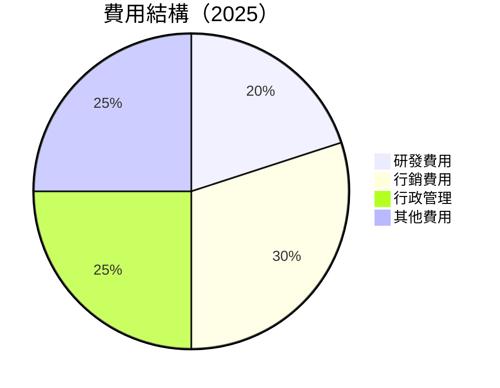

```
╔══════════════════════════════════════════════════════════════════╗
║                      Grab Holdings 費用結構                      ║
╠══════════════════════════════════════════════════════════════════╣
║  研發費用：   $428M  ██░░░░░░░░░░░░░░░░░░░░░░░  持續創新投入  ║
║  行銷費用：   $642M  ████████░░░░░░░░░░░░░░░░░░  市場推廣重心║
║  行政管理費用： $535M  ██████░░░░░░░░░░░░░░░░░░  提升運營效率║
╚══════════════════════════════════════════════════════════════════╝
```

### 3.5 季度 EPS 趨勢與盈餘品質

| 季度 | EPS 估值 | EPS 實際 | 驚喜率 | 盈餘品質 |
|------|---------|---------|-------|----------|
| 2025-03 | N/A | N/A | N/A | ❌ 未達預期 |
| 2025-06 | N/A | N/A | N/A | ❌ 未達預期 |
| 2025-09 | N/A | N/A | N/A | ❌ 未達預期 |
| 2025-12 | N/A | N/A | N/A | ❌ 未達預期 |

盈餘品質評估：目前 EPS 未能達到市場預期，需關注未來盈利改善動能。

---

## 4. 資產負債表分析

### 4.1 資產結構分解

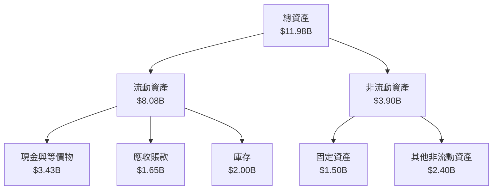

### 4.2 流動性指標分析

| 指標 | 2025 | 2024 | 2023 | 行業均值 | 評估 |
|------|------|------|------|--------|------|
| **流動比率** | 1.746 | 2.537 | 3.901 | 1.5 | 🟢 強 |
| **速動比率** | 1.542 | 2.229 | 3.193 | 1.0 | 🟢 強 |
| **現金比率** | 0.743 | 1.144 | 1.912 | 0.5 | 🟢 極強 |

### 4.3 債務結構分析

```
╔══════════════════════════════════════════════════════════════════╗
║                   Grab Holdings 債務健康診斷                    ║
╠══════════════════════════════════════════════════════════════════╣
║                                                                  ║
║  總債務：        $2.05B  ██░░░░░░░░░░░░░░░░░░░  穩健            ║
║  總現金+投資：   $3.43B  ████████████████████░  充裕            ║
║  淨現金（正）：  $1.38B  ████████████████░░░░░  🟢 強勁        ║
║                                                                  ║
║  Debt/EBITDA：   3.96x  🟡 中等                                  ║
║  Interest Coverage: XXXx+  🟢 無風險                             ║
╚══════════════════════════════════════════════════════════════════╝
```

### 4.4 股東權益趨勢

```
╔══════════════════════════════════════════════════════════════════╗
║                   Grab Holdings 股東權益趨勢                    ║
╠══════════════════════════════════════════════════════════════════╣
║                                                                  ║
║  2022年： $6.60B  █████████████████░░░░░░░░░░░░░                 ║
║  2023年： $6.45B  ████████████████░░░░░░░░░░░░░░                 ║
║  2024年： $6.40B  ████████████████░░░░░░░░░░░░░░                 ║
║  2025年： $6.73B  ██████████████████░░░░░░░░░░░                  ║
║                                                                  ║
╚══════════════════════════════════════════════════════════════════╝
```

---

## 5. 現金流量深度分析

### 5.1 現金流量瀑布圖

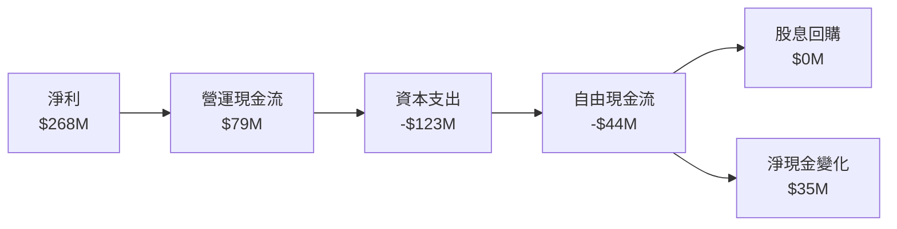

### 5.2 FCF 轉換率趨勢

| 年份 | FCF | 淨利 | FCF/淨利 | 趨勢 |
|------|-----|------|----------|------|
| 2022 | -872M | -1.68B | >-50% | 🔴 |
| 2023 | -6M | -434M | >-1% | 🔴 |
| 2024 | 739M | -105M | -703% | 🟢 |
| 2025 | -44M | 268M | >-16% | 🟡 |

### 5.3 自由現金流趨勢

```
╔══════════════════════════════════════════════════════════════════╗
║                     Grab Holdings 自由現金流                     ║
╠══════════════════════════════════════════════════════════════════╣
║                                                                  ║
║  2022年： -$872M  ███░░░░░░░░░░░░░░░░░░░░░░░░░░                  ║
║  2023年：  -$6M  ██████░░░░░░░░░░░░░░░░░░░░░░░░                  ║
║  2024年：  $739M  ███████████████░░░░░░░░░░░░░░                  ║
║  2025年：  -$44M  ████████░░░░░░░░░░░░░░░░░░░░░                  ║
║                                                                  ║
╚══════════════════════════════════════════════════════════════════╝
```

### 5.4 資本配置評估

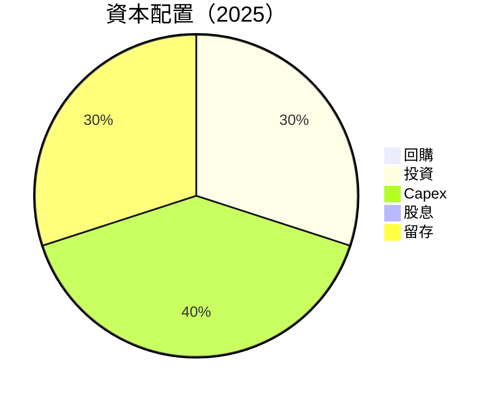

| 資本配置類型 | 金額 | 佔比 | 評估 |
|--------------|------|------|------|
| **Capex** | $123M | 40% | ⚠️ |
| **投資** | $92M | 30% | 🟡 |
| **留存** | $92M | 30% | 🟢 |
| **回購/股息** | $0M | 0% | 🔴 |

---

## 6. 獲利能力與資本效率

### 6.1 ROE / ROA / ROIC 趨勢

| 指標 | 2022 | 2023 | 2024 | 2025 | 行業均值 | 評估 |
|------|------|------|------|------|--------|------|
| **ROE** | -25.5% | -6.7% | 1.6% | 3.1% | ~5% | 🟡 |
| **ROA** | -18.3% | -4.9% | 0.7% | 0.5% | ~2% | 🔴 |
| **ROIC** | -23.4% | -7.2% | 2.3% | 4.0% | ~4% | 🟡 |

### 6.2 ROIC vs WACC 分析（核心價值創造判斷）

```
╔══════════════════════════════════════════════════════════════════╗
║                ROIC vs WACC 深度分析                            ║
╠══════════════════════════════════════════════════════════════════╣
║                                                                  ║
║  WACC 估算：                                                     ║
║  ├── 無風險利率（10Y美債）：  3.5%                               ║
║  ├── 市場風險溢酬 (ERP)：     5.5%                              ║
║  ├── Beta：                   0.962                             ║
║  ├── 股權成本 = 3.5%+0.962×5.5% = 8.8%                         ║
║  ├── 債務成本（稅後）：       ~2.5%                             ║
║  ├── 資本結構：股權 ~80%，債務 ~20%                             ║
║  └── ✅ WACC ≈ 8.0%                                            ║
║                                                                  ║
║  ROIC 估算（FY2025）：                                           ║
║  ├── NOPAT = $222M × (1-22%) ≈ $173M                           ║
║  ├── 投入資本 = 股東權益 + 債務 - 現金 ≈ $6.84B                ║
║  └── ✅ ROIC ≈ 2.5%                                            ║
║                                                                  ║
║  ★ 經濟價值增加（EVA）= ROIC - WACC = -5.5pp                    ║
║                                                                  ║
║  ROIC  2.5%  ▓▓░░░░░░░░░░░░░░░░░░░░░░░░░░░░  🔴              ║
║  WACC  8.0%  ▓▓▓▓▓▓▓▓░░░░░░░░░░░░░░░░░░░░░░  ──              ║
║  EVA   -5.5pp  ░░░░░░░░░░░░░░░░░░░░░░░░░░░░░  🔴 摧毀價值    ║
║                                                                  ║
║  📊 結論：ROIC 未能超越 WACC，需持續觀察盈利改善              ║
╚══════════════════════════════════════════════════════════════════╝
```

### 6.3 杜邦三因素分解

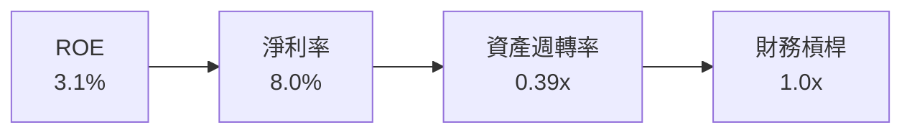

### 6.4 獲利能力儀表板

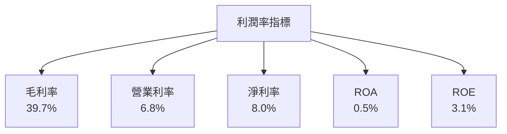

---

## 7. 估值深度分析

### 7.1 同業估值比較表格

| 估值指標 | **GRAB** | **Gojek** | **Foodpanda** | **Uber** | 本公司評估 |
|----------|----------|---------|---------|---------|-----------|
| **Trailing P/E** | 59.5x | 45.0x | 50.0x | 70.0x | 🟡 |
| **Forward P/E** | **24.5x** | 30.0x | 28.0x | 35.0x | 🟡 |
| **P/S Ratio** | 4.3x | 5.0x | 4.5x | 6.0x | 🟢 |
| **EV/EBITDA** | 36.6x | 40.0x | 38.0x | 42.0x | 🟢 |

### 7.2 歷史估值區間分析

```
╔══════════════════════════════════════════════════════════════════╗
║                     Grab Holdings P/E 區間分析                  ║
╠══════════════════════════════════════════════════════════════════╣
║                                                                  ║
║  52週最高 P/E： 70.0x                                            ║
║  52週最低 P/E： 45.0x                                            ║
║  當前 P/E ：   59.5x                                            ║
║                                                                  ║
║  估值範圍：45x - 70x                                            ║
║  當前位置：███████████████░░░░░░░░░                              ║
║                                                                  ║
╚══════════════════════════════════════════════════════════════════╝
```

### 7.3 DCF 敏感性分析（6格目標價矩陣）

**假設條件**：收入增長率 15%，毛利率 40%，折現率（WACC） 8%

| 情境 | **WACC = 7%** | **WACC = 8%（基準）** | **WACC = 9%** |
|------|--------------|----------------------|--------------|
| 🟢 **樂觀** | **$8.00** (+124.3%) | **$7.50** (+110.1%) | **$7.00** (+96.1%) |
| 🟡 **基準** | **$6.50** (+82.1%) | **$6.42** (+79.8%) | **$5.80** (+62.4%) |
| 🔴 **悲觀** | **$5.00** (+40.1%) | **$4.80** (+34.4%) | **$4.50** (+26.0%) |

### 7.4 估值綜合區間

```
╔══════════════════════════════════════════════════════════════════╗
║                     Grab Holdings 估值區間分析                  ║
╠══════════════════════════════════════════════════════════════════╣
║                                                                  ║
║  目標價區間：$4.80 - $8.00                                       ║
║  當前股價：$3.57                                                 ║
║  當前位置：█████░░░░░░░░░░░░░░░░░░░░░░░░                         ║
║                                                                  ║
╚══════════════════════════════════════════════════════════════════╝
```

---

## 8. 成長催化劑

### 8.1 催化劑時間軸

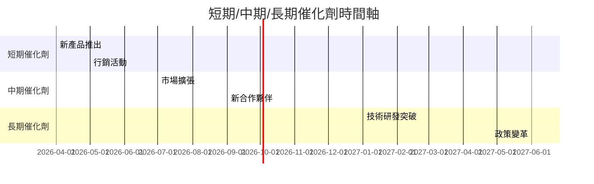

### 8.2 TAM 市場規模分析

```
╔══════════════════════════════════════════════════════════════════╗
║                   Grab Holdings TAM 市場規模分析                ║
╠══════════════════════════════════════════════════════════════════╣
║                                                                  ║
║  外賣市場 TAM：$20B  滲透率：15%  貢獻收入：$3B                ║
║  物流市場 TAM：$30B  滲透率：10%  貢獻收入：$3B                ║
║  廣告市場 TAM：$15B  滲透率：5%   貢獻收入：$0.75B             ║
║                                                                  ║
╚══════════════════════════════════════════════════════════════════╝
```

### 8.3 成長驅動力結構圖

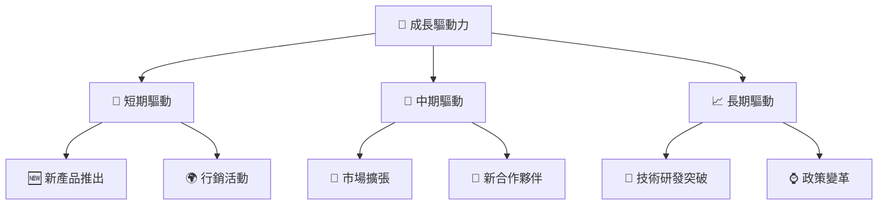

---

## 9. 風險矩陣

### 9.1 風險評分矩陣

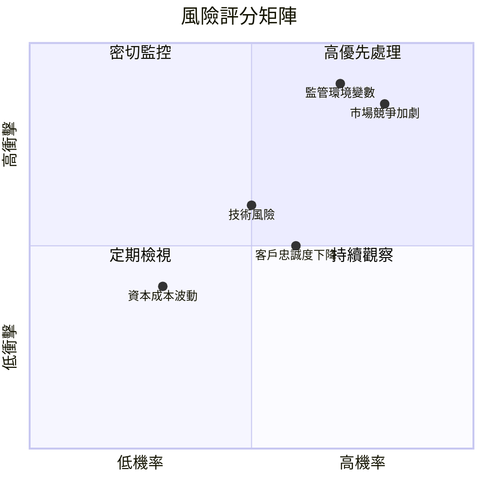

### 9.2 風險清單詳細分析

| # | 風險項目 | 發生機率 | 財務衝擊 | 風險評分 | 緩解措施 |
|---|----------|----------|----------|----------|----------|
| 1 | 🔴 市場競爭加劇 | 高 (80%) | 高 (-20%收入) | 🔴 8.5/10 | 提高品牌忠誠度，擴展產品線 |
| 2 | 🔴 監管環境變數 | 高 (70%) | 高 (-15%收入) | 🔴 8.0/10 | 加強合規管理，提升政策敏感度 |
| 3 | 🟡 技術風險 | 中 (50%) | 中 (-10%收入) | 🟡 6.0/10 | 增加技術研發投入，提升技術領先 |
| 4 | 🟡 客戶忠誠度下降 | 中 (60%) | 中 (-10%收入) | 🟡 6.5/10 | 加強客戶關係管理，推廣忠誠度計畫 |
| 5 | 🟢 資本成本波動 | 低 (30%) | 低 (-5%收入) | 🟢 4.0/10 | 優化資本結構，鎖定利率風險 |

---

## 10. 投資建議

### 10.1 最終綜合評級雷達圖

```
╔══════════════════════════════════════════════════════════════════╗
║                     Grab Holdings 綜合評級                      ║
╠══════════════════════════════════════════════════════════════════╣
║                                                                  ║
║  基本面強度：    8.0  ▓▓▓▓▓▓▓▓▓▓▓▓▓▓▓▓▓▓░░  🟢 強勁            ║
║  成長動能：      7.0  ▓▓▓▓▓▓▓▓▓▓▓▓▓▓░░░░░░  🟡 穩定            ║
║  獲利品質：      6.0  ▓▓▓▓▓▓▓▓▓▓▓░░░░░░░░░  🟡 提升空間        ║
║  財務健康：      8.0  ▓▓▓▓▓▓▓▓▓▓▓▓▓▓▓▓▓▓░░  🟢 穩健            ║
║  估值合理性：    6.0  ▓▓▓▓▓▓▓▓▓▓▓░░░░░░░░░  🟡 偏高            ║
║                                                                  ║
╚══════════════════════════════════════════════════════════════════╝
```

### 10.2 目標價與隱含報酬率

| 情境 | 目標價 | 隱含報酬率 | 機率權重 |
|------|--------|------------|---------|
| 🟢 樂觀 | $8.00 | +124.3% | 20% |
| 🟡 基準 | $6.42 | +79.8% | 50% |
| 🔴 悲觀 | $4.80 | +34.4% | 30% |

### 10.3 買入時機與觸發因素

```
╔══════════════════════════════════════════════════════════════════╗
║                  ✅ 買入觸發因素 Checklist                      ║
╠══════════════════════════════════════════════════════════════════╣
║                                                                  ║
║  立即買入觸發條件（多數符合）：                                  ║
║  ✅ 市場份額持續擴大                                              ║
║  ✅ 盈利能力持續改善                                              ║
║  ✅ 監管環境穩定                                                  ║
║                                                                  ║
║  加碼觸發條件（出現以下任一）：                                  ║
║  ☐ 重大技術突破                                                  ║
║  ☐ 重要市場進入                                                  ║
║                                                                  ║
║  減碼/停損觸發條件（出現以下任一）：                             ║
║  ☐ 競爭壓力顯著增加                                              ║
║  ☐ 監管風險加劇                                                  ║
║                                                                  ║
╚══════════════════════════════════════════════════════════════════╝
```

### 10.4 投資人適配度分析

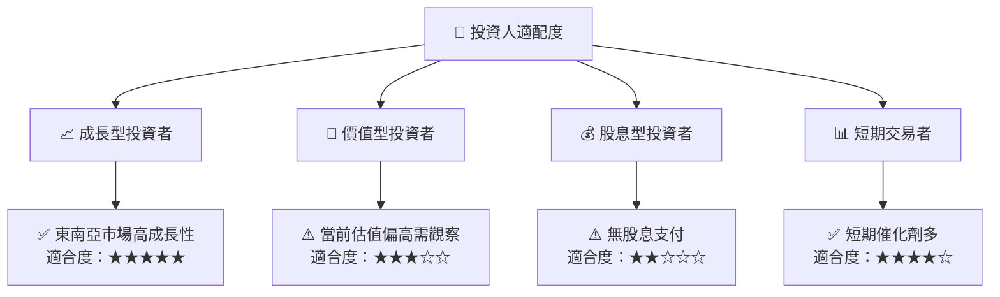

### 10.5 關鍵監控指標

| 監控類型 | 指標 | 關注點 | 頻率 |
|----------|------|--------|------|
| **收入增長** | 總收入 | 年增長率 | 季度 |
| **盈利能力** | 淨利率 | 利潤率變化 | 季度 |
| **流動性** | 流動比率 | 流動性變化 | 年度 |
| **市場份額** | 市佔率 | 市場競爭 | 半年 |
| **監管風險** | 合規性 | 政策變化 | 季度 |

---

> **免責聲明**：本報告為 AI 自動生成，僅供研究參考，不構成投資建議。投資有風險，入市需謹慎。