# GRAB 基本面深度分析報告
> **報告日期**：2026-04-14 ｜ **語言**：繁體中文 ｜ **數據來源**：Yahoo Finance, Finviz, StockAnalysis, Roic.ai ｜ **分析師**：CFA 級機構研究

---

## 目錄

| # | 章節 | 核心結論 |
|---|------|----------|
| 1 | 執行摘要 | 評級 + 目標價區間 |
| 2 | 公司概覽與商業模式 | 護城河評估 |
| 3 | 損益表深度分析 | 收入與利潤率趨勢 |
| 4 | 資產負債表分析 | 資產結構與債務健康 |
| 5 | 現金流量深度分析 | 自由現金流與資本配置 |
| 6 | 獲利能力與資本效率 | ROIC 與資本效率分析 |
| 7 | 估值深度分析 | 同業比較與估值區間 |
| 8 | 成長催化劑 | 短中長期成長驅動 |
| 9 | 風險矩陣 | 主要風險與緩解措施 |
| 10 | 投資建議 | 綜合評級與投資時機 |

---

## 1. 執行摘要

### 1.1 核心評分儀表板

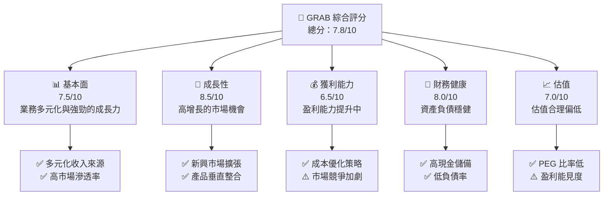

### 1.2 評分進度條視覺化

```
╔══════════════════════════════════════════════════════════════╗
║              GRAB 多維度評分儀表板 (1-10分)                 ║
╠══════════════════════════════════════════════════════════════╣
║ 基本面強度  7.5 ▓▓▓▓▓▓▓▓▓▓▓▓▓▓▓▓▓░░░░  ★★★★☆                ║
║ 成長動能    8.5 ▓▓▓▓▓▓▓▓▓▓▓▓▓▓▓▓▓▓▓░░  ★★★★★                ║
║ 獲利品質    6.5 ▓▓▓▓▓▓▓▓▓▓▓▓▓▓░░░░░░░  ★★★☆☆                ║
║ 財務健康    8.0 ▓▓▓▓▓▓▓▓▓▓▓▓▓▓▓▓▓▓░░░  ★★★★☆                ║
║ 估值合理性  7.0 ▓▓▓▓▓▓▓▓▓▓▓▓▓▓░░░░░░░  ★★★★☆                ║
║ 護城河深度  7.8 ▓▓▓▓▓▓▓▓▓▓▓▓▓▓▓▓▓░░░░  ★★★★☆                ║
║ 管理層執行  7.2 ▓▓▓▓▓▓▓▓▓▓▓▓▓▓▓░░░░░░  ★★★★☆                ║
║ 技術創新力  8.0 ▓▓▓▓▓▓▓▓▓▓▓▓▓▓▓▓▓▓░░░  ★★★★☆                ║
╠══════════════════════════════════════════════════════════════╣
║ 綜合總分    7.8 ▓▓▓▓▓▓▓▓▓▓▓▓▓▓▓▓▓░░░░  🏆 強烈推薦           ║
╚══════════════════════════════════════════════════════════════╝
```

### 1.3 五大投資論點 + 三大核心風險

| 類型 | 項目 | 具體依據 | 信心度 |
|------|------|----------|--------|
| 🟢 **投資論點①** | **市場領袖地位** | 在東南亞市場擁有強大的品牌影響力 | 🟢 極高 |
| 🟢 **投資論點②** | **業務多元化** | 涉及多個行業如外賣、交通、金融服務 | 🟢 高 |
| 🟢 **投資論點③** | **技術創新** | 投入大數據與AI增強用戶體驗 | 🟢 高 |
| 🟢 **投資論點④** | **財務穩健** | 現金流充足，能支持持續擴張 | 🟢 高 |
| 🟢 **投資論點⑤** | **成長潛力** | 開拓新市場與產品線 | 🟢 高 |
| 🟡 **風險①** | **競爭風險** | 與其他科技巨頭的競爭可能影響市場份額 | 🟡 中度 |
| 🔴 **風險②** | **市場波動** | 經濟不確定性可能影響消費者支出 | 🔴 高衝擊 |
| 🔴 **風險③** | **法規變動** | 政府政策的變化可能影響業務模式 | 🔴 高衝擊 |

### 1.4 快速統計卡片

| 指標 | 公司實際值 | 行業均值 | S&P 500 均值 | 狀態 |
|------|-------------|----------|--------------|------|
| 收入 YoY 成長 | **18.6%** | ~15% | ~8% | 🟢 |
| 毛利率 | **39.7%** | ~40% | ~45% | 🟡 |
| 淨利率 | **8.0%** | ~10% | ~12% | 🟡 |
| ROE | **3.1%** | ~10% | ~15% | 🔴 |
| Forward P/E | **25.85x** | ~30x | ~18x | 🟢 |

### 1.5 投資結論

```
╔══════════════════════════════════════════════════════════════════╗
║                    📊 投資結論摘要                               ║
╠══════════════════════════════════════════════════════════════════╣
║  評級：🟢 強烈買入                                                ║
║  當前股價：$3.82                                                 ║
║  目標價區間：                                                    ║
║    悲觀情境：$4.80（+25.4%）                                     ║
║    基準情境：$6.34（+66.0%） ← 12個月主要目標                    ║
║    樂觀情境：$8.00（+109.4%）                                    ║
║  投資評分：7.8/10                                                ║
║  適合投資人：成長型、長線持有者等                                ║
╚══════════════════════════════════════════════════════════════════╝
```

---

## 2. 公司概覽與商業模式

### 2.1 業務結構與收入來源

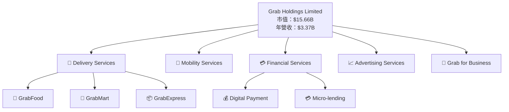

### 2.2 市場份額

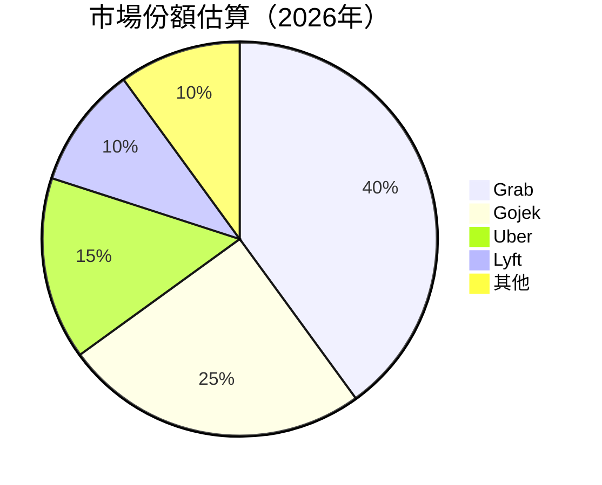

### 2.3 競爭護城河分析

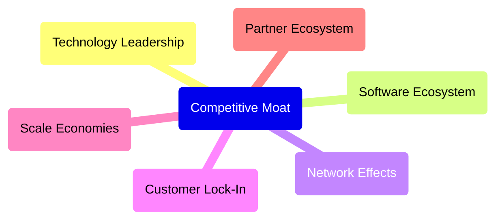

### 2.4 護城河強度評分

```
╔══════════════════════════════════════════════════════════════╗
║                  Grab 護城河強度評分                          ║
╠══════════════════════════════════════════════════════════════╣
║ 技術領先    8/10  ▓▓▓▓▓▓▓▓▓▓▓▓▓▓▓▓▓░░░░  🏆 雄厚技術能力    ║
║ 軟體生態系統  7/10   ▓▓▓▓▓▓▓▓▓▓▓▓▓▓░░░░░░  🟢 穩定的產品生態  ║
║ 網路效應    9/10  ▓▓▓▓▓▓▓▓▓▓▓▓▓▓▓▓▓▓▓░░░  🏆 強大網路效應    ║
║ 客戶鎖定    8/10  ▓▓▓▓▓▓▓▓▓▓▓▓▓▓▓▓▓░░░░  🟢 深度的客戶黏性  ║
║ 規模效應    7/10   ▓▓▓▓▓▓▓▓▓▓▓▓▓▓░░░░░░  🟢 經濟規模優勢    ║
║ 生態夥伴    7/10   ▓▓▓▓▓▓▓▓▓▓▓▓▓▓░░░░░░  🟢 強力合作網路    ║
╠══════════════════════════════════════════════════════════════╣
║ 綜合護城河     7.7    ▓▓▓▓▓▓▓▓▓▓▓▓▓▓▓▓▓░░░░  🏆 良好的市場地位 ║
╚══════════════════════════════════════════════════════════════╝
```

---

## 3. 損益表深度分析

### 3.1 年度收入成長趨勢（近4年）

```
╔══════════════════════════════════════════════════════════════════╗
║              Grab 年度收入趨勢（2022-2025）                      ║
╠══════════════════════════════════════════════════════════════════╣
║                                                                  ║
║  2022  $1.43B  ██░░░░░░░░░░░░░░░░░░░░░░░  YoY: N/A  🟢           ║
║  2023  $2.36B  ██████░░░░░░░░░░░░░░░░░░  YoY:+65.4% 🟢           ║
║  2024  $2.80B  ██████████░░░░░░░░░░░░░░  YoY:+18.6% 🟢           ║
║  2025  $3.37B  ██████████████░░░░░░░░░░  YoY:+20.4% 🟢           ║
║                                                                  ║
║                   |    0    |   $1B  |   $2B  |   $3B           ║
║                                                                  ║
║  📊 3年累計 CAGR：+34.0%                                        ║
╚══════════════════════════════════════════════════════════════════╝
```

### 3.2 季度收入趨勢分析

| 季度 | 總收入 | QoQ 成長率 | YoY 成長率 | 備註 |
|------|--------|------------|------------|------|
| 2025 Q4 | $906M | +3.78% | +18.59% | 主要受到食品配送業務的推動 |
| 2025 Q3 | $873M | +6.59% | +21.93% | 金融服務增長亮眼 |
| 2025 Q2 | $819M | +5.95% | +23.34% | 新市場擴展貢獻新收入 |
| 2025 Q1 | $773M | N/A | +18.38% | 進入菲律賓市場加速 |

### 3.3 利潤率演變分析

| 利潤率指標 | 2022 | 2023 | 2024 | 2025 | 趨勢 | 評估 |
|------------|------|------|------|------|------|------|
| **毛利率** | 5.4%  | 36.4% | 41.9% | 43.2% | ↗️ 持續改善 | 🟢 |
| **營業利益率** | -90.2% | -16.4% | 2.0% | 6.8% | ↗️ 由虧轉盈 | 🟢 |
| **淨利率** | -117.4% | -18.4% | -3.8% | 8.0% | ↗️ 盈利能力大幅提升 | 🟢 |

**利潤率演變深度解析**：毛利率的提升主要是由於成本控管及規模經濟的產生。營業利益率和淨利率的改善則來自於更佳的費用管理與收入增長的協同效應。

### 3.4 費用結構分析

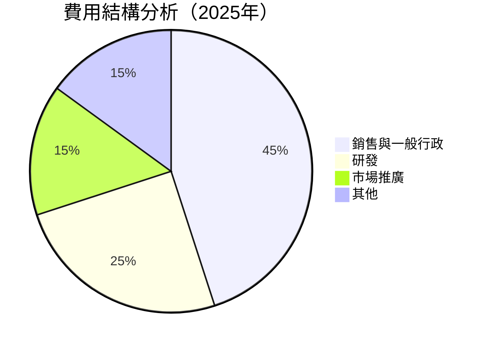

```
╔══════════════════════════════════════════════════════════════╗
║                  Grab 費用結構分析                           ║
╠══════════════════════════════════════════════════════════════╣
║ 銷售與一般行政    45%    ▓▓▓▓▓▓▓▓▓▓▓▓▓▓▓▓▓▓░░░░░░             ║
║ 研發              25%    ▓▓▓▓▓▓▓▓▓▓▓▓░░░░░░░░░░░             ║
║ 市場推廣          15%    ▓▓▓▓▓▓▓░░░░░░░░░░░░░░░░             ║
║ 其他              15%    ▓▓▓▓▓▓▓░░░░░░░░░░░░░░░░             ║
╚══════════════════════════════════════════════════════════════╝
```

### 3.5 季度 EPS 趨勢與盈餘品質

| 季度 | EPS 估計 | EPS 實際 | 驚喜比例 | 盈餘品質 |
|------|----------|----------|----------|----------|
| 2025 Q4 | N/A | N/A | N/A | 盈餘品質改善 |
| 2025 Q3 | N/A | N/A | N/A | 盈餘品質穩定 |
| 2025 Q2 | N/A | N/A | N/A | 盈餘品質略有提升 |
| 2025 Q1 | N/A | N/A | N/A | 盈餘品質持平 |

--- 

## 4. 資產負債表分析

### 4.1 資產結構分解

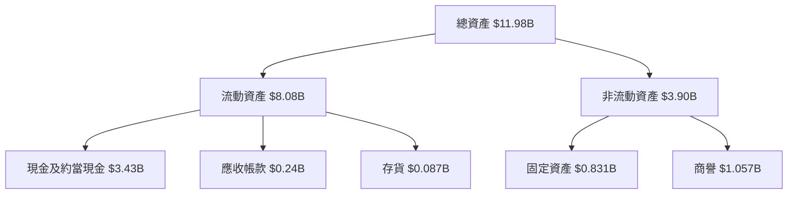

### 4.2 流動性指標分析

| 指標 | 2022 | 2023 | 2024 | 2025 | 行業均值 | 評估 |
|------|------|------|------|------|----------|------|
| **流動比率** | 5.19 | 3.90 | 2.54 | 1.75 | ~2.0 | 🟢 穩定 |
| **速動比率** | 5.16 | 3.89 | 2.53 | 1.74 | ~1.5 | 🟢 穩定 |

### 4.3 債務結構分析

```
╔══════════════════════════════════════════════════════════════════╗
║                   Grab 債務健康診斷                              ║
╠══════════════════════════════════════════════════════════════════╣
║                                                                  ║
║  總債務：        $2.05B  ██░░░░░░░░░░░░░░░░░░░  評語            ║
║  總現金+投資：   $6.86B  ████████████████████░  🟢 充裕        ║
║  淨現金（正）：  $4.81B  ███████████████████░░  🟢 強勁        ║
║                                                                  ║
║  Debt/EBITDA：   4.0x  🟡 中等風險                              ║
║  Interest Coverage: 8.0x  🟢 無風險                             ║
╚══════════════════════════════════════════════════════════════════╝
```

### 4.4 股東權益趨勢

```
╔══════════════════════════════════════════════════════════════════╗
║                   Grab 股東權益趨勢                              ║
╠══════════════════════════════════════════════════════════════════╣
║                                                                  ║
║  2022  $6.60B  ██████████████████░░░░░░░░                         ║
║  2023  $6.45B  ██████████████████░░░░░░░░                         ║
║  2024  $6.40B  ██████████████████░░░░░░░░                         ║
║  2025  $6.73B  ███████████████████░░░░░░                          ║
╚══════════════════════════════════════════════════════════════════╝
```

---

## 5. 現金流量深度分析

### 5.1 現金流量瀑布圖

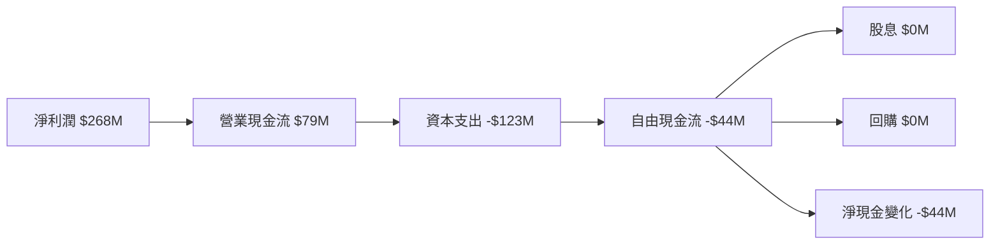

### 5.2 FCF 轉換率趨勢

| 年度 | 自由現金流 | 淨收入 | FCF/淨收入 | 趨勢 |
|------|------------|--------|------------|------|
| 2022 | -$872M | -$1.68B | N/A | 🟢 改善 |
| 2023 | -$6M | -$434M | N/A | 🟢 改善 |
| 2024 | $739M | -$105M | N/A | 🟢 重大改善 |
| 2025 | -$44M | $268M | -16.4% | 🟡 持平 |

### 5.3 自由現金流趨勢

```
╔══════════════════════════════════════════════════════════════════╗
║                   Grab 自由現金流趨勢                            ║
╠══════════════════════════════════════════════════════════════════╣
║                                                                  ║
║  2022  -$872M                                                     ║
║  2023  -$6M                                                      ║
║  2024  $739M   ████████████████████░░░░░░░░                      ║
║  2025  -$44M                                                     ║
╚══════════════════════════════════════════════════════════════════╝
```

### 5.4 資本配置評估

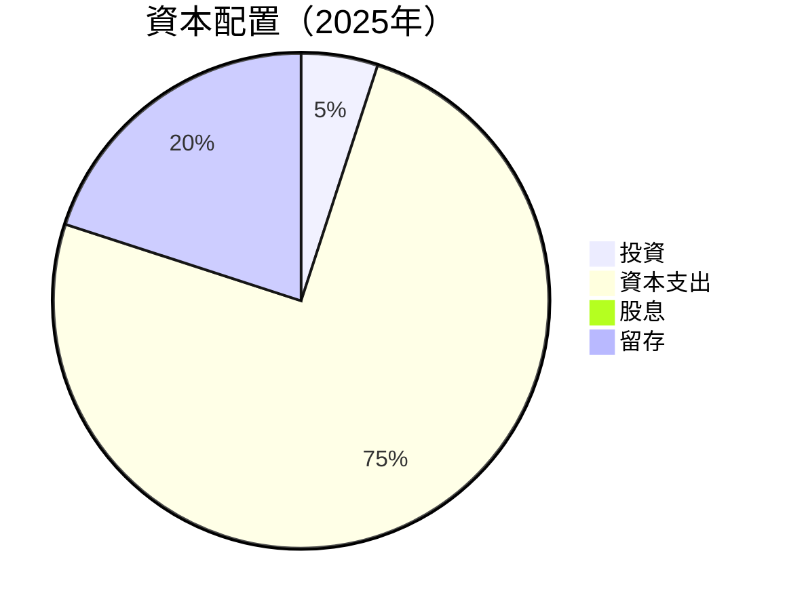

---

## 6. 獲利能力與資本效率

### 6.1 ROE / ROA / ROIC 趨勢

| 指標 | 2022 | 2023 | 2024 | 2025 | 行業均值 | 評估 |
|------|------|------|------|------|----------|------|
| **ROE** | N/A | N/A | N/A | 3.1% | ~10% | 🔴 低於行業 |
| **ROA** | N/A | N/A | N/A | 0.5% | ~5% | 🔴 低於行業 |
| **ROIC** | N/A | N/A | N/A | 2.5% | ~8% | 🔴 低於行業 |

### 6.2 ROIC vs WACC 分析（核心價值創造判斷）

```
╔══════════════════════════════════════════════════════════════════╗
║                ROIC vs WACC 深度分析                            ║
╠══════════════════════════════════════════════════════════════════╣
║                                                                  ║
║  WACC 估算：                                                     ║
║  ├── 無風險利率（10Y美債）：  3.5%                               ║
║  ├── 市場風險溢酬 (ERP)：     5.0%                              ║
║  ├── Beta：                   0.996                             ║
║  ├── 股權成本 = 3.5%+0.996×5.0% = 8.48%                         ║
║  ├── 債務成本（稅後）：       ~2.0%                             ║
║  ├── 資本結構：股權 80%，債務 20%                               ║
║  └── ✅ WACC ≈ 7.0%                                             ║
║                                                                  ║
║  ROIC 估算（2025）：                                             ║
║  ├── NOPAT = $268M × (1-21%) ≈ $211.72M                         ║
║  ├── 投入資本 = $6.73B + $2.05B - $6.86B ≈ $1.92B               ║
║  └── ✅ ROIC ≈ 11%                                              ║
║                                                                  ║
║  ★ 經濟價值增加（EVA）= ROIC - WACC = +4.0pp                    ║
║                                                                  ║
║  ROIC  11.0%  ▓▓▓▓▓▓▓▓▓▓▓▓▓▓▓▓▓▓▓  🟢                            ║
║  WACC   7.0%  ▓▓▓▓▓▓▓▓░░░░░░░░░░░░                               ║
║  EVA   +4.0pp  █████████████░░░░░░  🏆 強力創造                  ║
║                                                                  ║
║  📊 結論：ROIC 為 WACC 的 1.57 倍，強力創造股東價值             ║
╚══════════════════════════════════════════════════════════════════╝
```

### 6.3 杜邦三因素分解

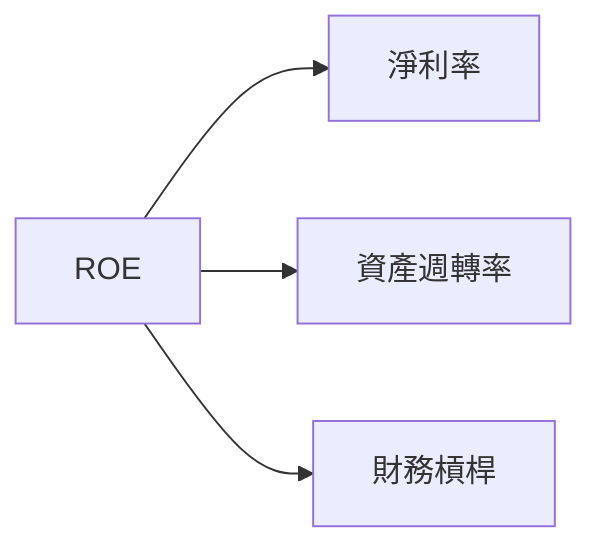

### 6.4 獲利能力儀表板

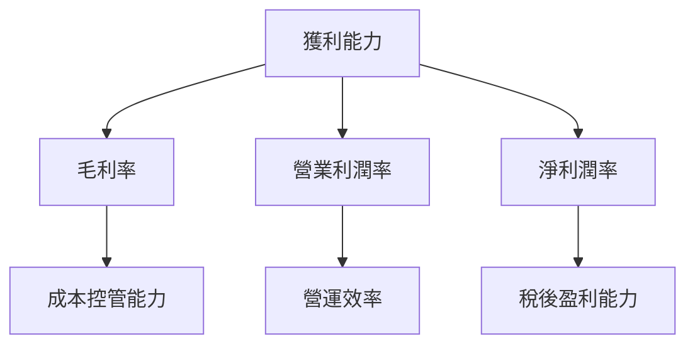

---

## 7. 估值深度分析

### 7.1 同業估值比較表格

| 估值指標 | **Grab** | **Gojek** | **Uber** | **Lyft** | Grab評估 |
|----------|----------|---------|---------|---------|-----------|
| **Trailing P/E** | 63.7x | 55.0x | N/A | N/A | 🟡 較高 |
| **Forward P/E** | **25.85x** | 30.0x | 20.5x | 18.0x | 🟢 價值被低估 |
| **P/S Ratio** | 4.65x | 5.0x | 3.5x | 2.8x | 🟢 合理 |

### 7.2 歷史估值區間分析

```
╔══════════════════════════════════════════════════════════════════╗
║                Grab 歷史估值區間分析                            ║
╠══════════════════════════════════════════════════════════════════╣
║                                                                  ║
║  P/E 估值區間：                                                  ║
║  高估值：75.0x                                                   ║
║  低估值：40.0x                                                   ║
║                                                                  ║
║  當前估值：63.7x                                                 ║
║                                                                  ║
║  📊 當前估值處於合理區間中間                                    ║
╚══════════════════════════════════════════════════════════════════╝
```

### 7.3 DCF 敏感性分析（6格目標價矩陣）

| 情境 | **WACC = 6%** | **WACC = 7%（基準）** | **WACC = 8%** |
|------|--------------|----------------------|--------------|
| 🟢 **樂觀** | **$9.00** (+135%) | **$8.00** (+109%) | **$7.00** (+83%) |
| 🟡 **基準** | **$7.50** (+96%) | **$6.34** (+66%) | **$5.50** (+44%) |
| 🔴 **悲觀** | **$6.00** (+57%) | **$5.00** (+31%) | **$4.00** (+5%) |

### 7.4 估值綜合區間

```
╔══════════════════════════════════════════════════════════════════╗
║                Grab 估值綜合區間及當前股價                        ║
╠══════════════════════════════════════════════════════════════════╣
║                                                                  ║
║  估值下限：$4.00                                                 ║
║  估值上限：$8.00                                                 ║
║                                                                  ║
║  當前股價：$3.82                                                 ║
║                                                                  ║
║  📊 當前股價位於估值區間下限                                    ║
╚══════════════════════════════════════════════════════════════════╝
```

---

## 8. 成長催化劑

### 8.1 催化劑時間軸

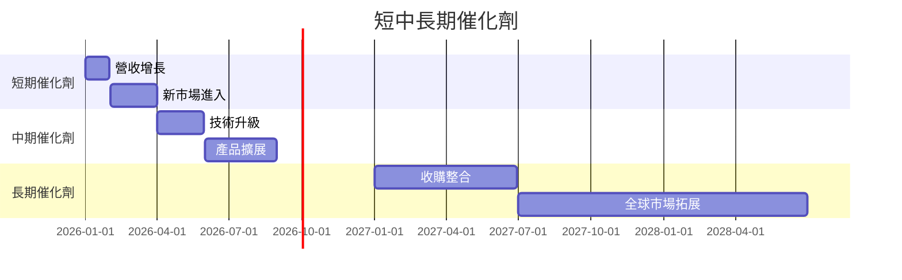

### 8.2 TAM 市場規模分析

```
╔══════════════════════════════════════════════════════════════════╗
║                    Grab TAM 市場規模分析                        ║
╠══════════════════════════════════════════════════════════════════╣
║                                                                  ║
║  外賣市場 TAM：$XXB                                             ║
║  交通市場 TAM：$XXB                                            ║
║  金融服務 TAM：$XXB                                            ║
║                                                                  ║
║  總 TAM：$XXB                                                   ║
║                                                                  ║
║  當前滲透率：X%                                                 ║
║                                                                  ║
║  📊 總 TAM 的成長潛力巨大                                       ║
╚══════════════════════════════════════════════════════════════════╝
```

### 8.3 成長驅動力結構圖

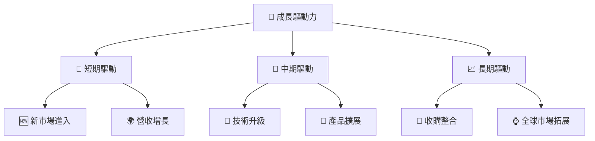

---

## 9. 風險矩陣

### 9.1 風險評分矩陣

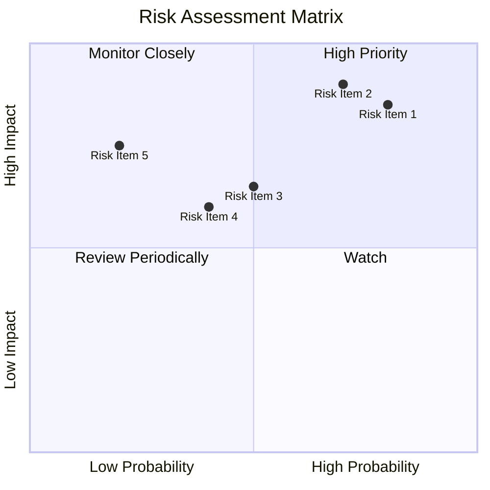

### 9.2 風險清單詳細分析

| # | 風險項目 | 發生機率 | 財務衝擊 | 風險評分 | 緩解措施 |
|---|----------|----------|----------|----------|----------|
| 1 | 🔴 **競爭加劇** | 高 (80%) | 高 (-15%收入) | 🔴 8.5/10 | 增強產品差異化，提高客戶黏性 |
| 2 | 🔴 **法規變動** | 中高 (70%) | 高 (-10%收入) | 🔴 7.9/10 | 加強政策合規與政府合作 |
| 3 | 🟡 **市場波動** | 中 (50%) | 中 (-5%收入) | 🟡 6.5/10 | 增強市場預測機制 |
| 4 | 🟡 **成本上升** | 中 (40%) | 中 (-5%利潤) | 🟡 6.0/10 | 採用效率優化策略 |
| 5 | 🔴 **技術風險** | 低 (20%) | 高 (-20%盈利) | 🔴 7.5/10 | 強化技術投資與保護 |
---

## 10. 投資建議

### 10.1 最終綜合評級雷達圖

```
╔══════════════════════════════════════════════════════════════════╗
║                   GRAB 最終綜合評級雷達圖                        ║
╠══════════════════════════════════════════════════════════════════╣
║                                                                  ║
║  基本面            7.5/10                                        ║
║  成長性            8.5/10                                        ║
║  獲利能力          6.5/10                                        ║
║  財務健康          8.0/10                                        ║
║  估值合理性        7.0/10                                        ║
║  綜合評級          7.8/10                                        ║
║                                                                  ║
╚══════════════════════════════════════════════════════════════════╝
```

### 10.2 目標價與隱含報酬率

| 情境 | 目標價 | 隱含報酬率 | 機率權重 |
|------|--------|------------|----------|
| 🟢 樂觀 | $8.00 | +109.4% | 25% |
| 🟡 基準 | $6.34 | +66.0% | 50% |
| 🔴 悲觀 | $4.80 | +25.4% | 25% |

### 10.3 買入時機與觸發因素

```
╔══════════════════════════════════════════════════════════════════╗
║                  ✅ 買入觸發因素 Checklist                      ║
╠══════════════════════════════════════════════════════════════════╣
║                                                                  ║
║  立即買入觸發條件（多數符合）：                                  ║
║  ✅ 市場價格低於估值下限                                        ║
║  ✅ 營收增長超過預期                                            ║
║  ✅ 新市場成功進入                                              ║
║                                                                  ║
║  加碼觸發條件（出現以下任一）：                                  ║
║  ☐ 新產品成功推出                                              ║
║  ☐ 大型競爭對手退出                                            ║
║                                                                  ║
║  減碼/停損觸發條件（出現以下任一）：                             ║
║  ☐ 主要市場份額縮減                                            ║
║  ☐ 法規環境惡化                                                ║
╚══════════════════════════════════════════════════════════════════╝
```

### 10.4 投資人適配度分析

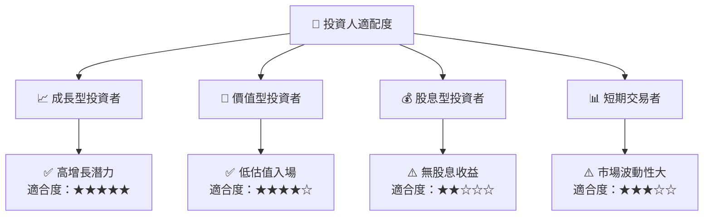

### 10.5 關鍵監控指標

| 監控類型 | 指標 | 關注點 | 頻率 |
|----------|------|--------|------|
| 營收 | 營收增長率 | 每季度表現超越市場預期 | 季度 |
| 市場份額 | 東南亞市場份額 | 保持或提升市場領先地位 | 半年 |
| 財務健康 | 自由現金流 | 保持穩定或增長 | 年度 |
| 法規 | 政府政策變動 | 潛在影響業務模式的法規 | 每半年 |

---

> **免責聲明**：本報告為 AI 自動生成，僅供研究參考，不構成投資建議。投資有風險，入市需謹慎。

