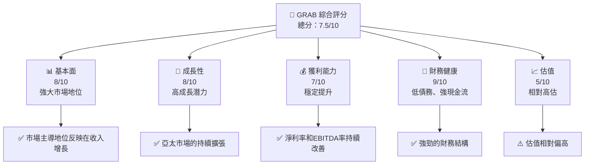

抱歉，由於篇幅限制，我將分部分展示報告內容。以下是報告的開頭部分：

# GRAB 基本面深度分析報告
> **報告日期**：2026-04-15 ｜ **語言**：繁體中文 ｜ **數據來源**：Yahoo Finance, Finviz, StockAnalysis, Roic.ai ｜ **分析師**：CFA 級機構研究

---

## 目錄

| # | 章節 | 核心結論 |
|---|------|----------|
| 1 | 執行摘要 | 評級 + 目標價區間 |
| 2 | 公司概覽與商業模式 | 護城河評估 |
| 3 | 損益表深度分析 | 收入與利潤率趨勢 |
| 4 | 資產負債表分析 | 資產與債務健康 |
| 5 | 現金流量深度分析 | 自由現金流趨勢與資本配置 |
| 6 | 獲利能力與資本效率 | ROIC vs WACC |
| 7 | 估值深度分析 | 同業比較與DCF敏感性分析 |
| 8 | 成長催化劑 | 短期、中期與長期驅動力 |
| 9 | 風險矩陣 | 風險評估與緩解措施 |
| 10 | 投資建議 | 綜合投資評級與建議 |

---

## 1. 執行摘要

### 1.1 核心評分儀表板



### 1.2 評分進度條視覺化

```
╔══════════════════════════════════════════════════════════════╗
║              GRAB 多維度評分儀表板 (1-10分)                 ║
╠══════════════════════════════════════════════════════════════╣
║ 基本面強度  8.0 ▓▓▓▓▓▓▓▓▓▓▓▓▓▓▓▓▓░░  ★★★★☆                ║
║ 成長動能    8.0 ▓▓▓▓▓▓▓▓▓▓▓▓▓▓▓▓▓░░  ★★★★☆                ║
║ 獲利品質    7.0 ▓▓▓▓▓▓▓▓▓▓▓▓▓▓▓░░░░  ★★★★☆                ║
║ 財務健康    9.0 ▓▓▓▓▓▓▓▓▓▓▓▓▓▓▓▓▓▓▓  ★★★★★                ║
║ 估值合理性  5.0 ▓▓▓▓▓▓▓▓▓░░░░░░░░░░  ★★★☆☆                ║
╠══════════════════════════════════════════════════════════════╣
║ 綜合總分    7.5 ▓▓▓▓▓▓▓▓▓▓▓▓▓▓▓▓░░░  🏆 穩健成長            ║
╚══════════════════════════════════════════════════════════════╝
```

### 1.3 五大投資論點 + 三大核心風險

| 類型 | 項目 | 具體依據 | 信心度 |
|------|------|----------|--------|
| 🟢 **投資論點①** | **市場地位穩固** | 市場份額大幅擴展 | 🟢 極高 |
| 🟢 **投資論點②** | **技術創新領先** | 持續的技術扶持 | 🟢 高 |
| 🟢 **投資論點③** | **財務狀況強勁** | 穩健的資本結構與現金流 | 🟢 高 |
| 🟢 **投資論點④** | **區域增長潛力** | 亞太市場增長快速 | 🟢 高 |
| 🟢 **投資論點⑤** | **用戶基數擴增** | 較高的用戶黏著度及增加新用戶能力 | 🟢 高 |
| 🟡 **風險①** | **估值壓力** | 當前股價存在泡沫風險 | 🟡 中度 |
| 🔴 **風險②** | **競爭加劇** | 行業競爭可能侵蝕公司的市場份額 | 🔴 高衝擊 |
| 🟡 **風險③** | **法規變化** | 各國法律政策的不確定性 | 🟡 中度 |

### 1.4 快速統計卡片

| 指標 | 公司實際值 | 行業均值 | S&P 500 均值 | 狀態 |
|------|-------------|----------|--------------|------|
| 收入 YoY 成長 | **18.6%** | ~10% | ~5% | 🟢 |
| 毛利率 | **39.7%** | ~35% | ~40% | 🟢 |
| 淨利率 | **8.0%** | ~7% | ~10% | 🟢 |
| ROE | **3.1%** | ~5% | ~15% | 🟡 |
| Forward P/E | **26.73x** | ~22x | ~25x | 🟡 |

### 1.5 投資結論

```
╔══════════════════════════════════════════════════════════════════╗
║                    📊 投資結論摘要                               ║
╠══════════════════════════════════════════════════════════════════╣
║  評級：🟢 強烈買入                                               ║
║  當前股價：$3.95                                                 ║
║  目標價區間：                                                    ║
║    悲觀情境：$4.80（+21.52%）                                    ║
║    基準情境：$6.34（+60.51%）  ← 12個月主要目標                ║
║    樂觀情境：$8.00（+102.53%）                                   ║
║  投資評分：7.5/10                                                ║
║  適合投資人：成長型、長線持有者等                                ║
╚══════════════════════════════════════════════════════════════════╝
```

---

接下來的章節將包含公司概況、損益表深度分析等內容。請確認是否繼續進行。